# ÁLLAMI   SZÁMVEVŐSZÉK 

## JELENTÉS

a helyi önkormányzatokat megillető támogatások és hozzájárulások igénylése és elszámolása kincstári felülvizsgálati rendszerének, valamint a helyi önkormányzatokat a 2010. évben megillető normatív hozzájárulások elszámolásának ellenőrzéséről

---

# Állami Számvevőszék 

Iktatószám: V-3013-92/2010-2011.
Témaszám: 988
Vizsgálat-azonosító szám: V0519

## Az ellenőrzést felügyelte:

Dr. Becker Pál
főigazgató
Az ellenőrzés végrehajtásáért felelős:
Horváth Sándor
főigazgató-helyettes
Dr. Sepsey Tamás
számvevő igazgató
Az ellenőrzést vezette:
Borbély Zsuzsanna
osztályvezető főtanácsos
Korsósné Vigh Andrea
tanácsadó
A számvevői jelentések feldolgozásában és a jelentés összeállításában
közreműködtek:
Borbély Zsuzsanna
osztályvezető főtanácsos
Dr. Horváth Klára
számvevő tanácsos
Kéri Péter
számvevő tanácsos
Korsósné Vigh Andrea
tanácsadó
Preller Zsuzsanna
főtanácsadó
Az ellenőrzést végezték:

| Buús Zoltánné Hütter | Dér Lívia | Ébner Vilmosné |
| :-- | :-- | :-- |
| Erzsébet | számvevő tanácsos | főtanácsadó |
| számvevő tanácsos |  |  |
| Eigner György | Dr. Fátrainé Zsebedics | Dr. Horváth Klára |
| számvevő tanácsos | Katalin   tanácsadó | számvevő tanácsos |

---

| Kalmár István | Kányáné Murvai | Kéri Péter |
| :-- | :-- | :-- |
| számvevő tanácsos | Tünde | számvevő tanácsos |
|  | számvevő tanácsos |  |
| Koczor László | Komlósiné Bogár Éva | Korsósné Vigh Andrea |
| számvevő tanácsos | számvevő tanácsos | tanácsadó |
| Lakatos József | Dr. Marosi Gyöngyi | Moder Beatrix |
| számvevő | tanácsadó | számvevő |
| Molnár Istvánné | Nagy László Csaba | Nyikon Zsigmondné |
| számvevő tanácsos | számvevő tanácsos | főtanácsadó |
| Pálfiné Pusztai | Preller Zsuzsanna | Reichert Margit |
| Magdolna | főtanácsadó | számvevő |
| számvevő tanácsos |  |  |
| Ritecz Tibor | Szabó Leonóra | Szarvas Szilárd |
| számvevő | számvevő | számvevő tanácsos |
| Szihalminé Kovács | Szilágyi Nándorné | Tótfalusi Zoltán |
| Zsuzsanna | számvevő | számvevő tanácsos |
| számvevő tanácsos |  |  |
| Újvári Józsefné |  |  |
| számvevő tanácsos |  |  |

# A témához kapcsolódó eddig készített számvevőszéki jelentések: 

címe
sorszáma
Jelentés a helyi önkormányzatok és a helyi kisebbségi önkormányzatok központi költségvetési kapcsolatokból származó forrásai igénybevétele és elszámolása felülvizsgálati tevékenységének ellenőrzéséről
Jelentés a kincstári rendszer működésének ellenőrzéséről 0918

---

# TARTALOMJEGYZÉK 

BEVEZETÉS ..... 7
I. ÖSSZEGZŐ MEGÁLLAPÍTÁSOK, KÖVETKEZTETÉSEK, JAVASLATOK ..... 10
II. RÉSZLETES MEGÁLLAPÍTÁSOK ..... 17

1. A helyi önkormányzatokat megillető állami támogatások és hozzájárulások igénylésének és elszámolásának kincstári helyszíni felülvizsgálati rendszere ..... 17
1.1. A helyszíni felülvizsgálati rendszer kialakítása, szabályozása ..... 17
1.1.1. A helyszíni felülvizsgálati feladat és annak kincstári meghatározása ..... 17
1.1.2. A feladatellátáshoz szükséges létszám meghatározása ..... 20
1.1.2.1. A létszámfejlesztés felmérése ..... 20
1.1.2.2. A létszám megosztása a területi szervek között ..... 21
1.1.3. A helyszíni felülvizsgálatra kiválasztás és a helyszíni felülvizsgálati rendszer szabályozottsága ..... 23
1.1.3.1. A helyszíni felülvizsgálatra történő kiválasztás, kockázati tényezők meghatározása ..... 23
1.1.3.2. A helyszíni felülvizsgálati rendszer szabályozottsága ..... 25
1.1.4. A helyszíni felülvizsgálat belső kontrolljai ..... 27
1.2. A kötelező helyszíni felülvizsgálati feladatok tervezése és végrehajtása ..... 29
1.2.1. A helyszíni felülvizsgálati feladat tervezése ..... 29
1.2.1.1. A munkaterv készítési kötelezettség teljesítése ..... 29
1.2.1.2. A helyszíni felülvizsgálati feladatok megyénkénti adatai ..... 31
1.2.2. A helyszíni felülvizsgálati feladat végrehajtása ..... 33
1.2.2.1. A helyszíni felülvizsgálati feladat alakulása ..... 33
1.2.2.2. A helyszíni felülvizsgálati feladat végrehajtásának értékelése ..... 35
1.3. A jogorvoslati eljárásokból levont következtetések ..... 36
1.4. A felülvizsgálati feladatokról szóló beszámolás ..... 38
2. Egyes helyi önkormányzatokat a 2010. évben megillető normatív hozzájárulások elszámolása ..... 39
2.1. Az ellenőrzött önkormányzati elszámolások értékelése ..... 39
2.2. A kincstári helyszíni felülvizsgálat hatása az ellenőrzésbe vont önkormányzatok elszámolására ..... 40
3. Az ÁSZ javaslatainak hasznosulása ..... 40

---

# MELLÉKLETEK 

1. számú Az ellenőrzött szervezeti egységek
2. számú Az ellenőrzött önkormányzatok
3. számú A Kincstár elnökének észrevétele
4. számú Az ÁSZ elnökének a Kincstár elnöke által tett észrevételekre írt válaszlevele

## FÜGGELÉKEK

Megállapítások a helyi önkormányzatokat a 2010. évben megillető normatív hozzájárulások elszámolásának ellenőrzéséről

---

# RÖVIDÍTÉSEK JEGYZÉKE 

## Törvények

Áht.
új Áht.

Ket.

Közokt. tv.
Ptk.
2007. évi Kvtv.
2008. évi Kvtv.
2009. évi Kvtv.
2010. évi Kvtv.

## Rendeletek, határozatok

Ámr. 1
Ámr. 2
16/2002. (IV. 12.) PM rendelet

2146/2007. (VII. 27.)
Korm. határozat
6/2010. (I. 28.) PM-ÖM együttes rendelet

## Rövidítések

ÁSZ
államháztartási iroda
Budapesti és Pest Megyei Igazgatóság
ellenőrzési iroda
az államháztartásról szóló 1992. évi XXXVIII. törvény (hatályos 2011. december 31-ig)
az államháztartásról szóló 2011. évi CXCV. törvény (hatályos 2012. január 1-jétől)
a közigazgatási hatósági eljárás és szolgáltatás általános szabályairól szóló 2004. évi CXL. törvény
a közoktatásról szóló 1993. évi LXXIX. törvény
1959. évi IV. törvény a Polgári Törvénykönyvről
a Magyar Köztársaság 2007. évi költségvetéséről szóló 2006. évi CXXVII. törvény
a Magyar Köztársaság 2008. évi költségvetéséről szóló 2007. évi CLXIX. törvény
a Magyar Köztársaság 2009. évi költségvetéséről szóló 2008. évi CII. törvény
a Magyar Köztársaság 2010. évi költségvetéséről szóló 2009. évi CXXX. törvény
az államháztartás működési rendjéről szóló 217/1998. (XII. 30.) Korm. rendelet
az államháztartás működési rendjéről szóló 292/2009. (XII. 19.) Korm. rendelet
a helyi önkormányzatok és a helyi kisebbségi önkormányzatok központi költségvetési kapcsolatokból származó forrásai igénybevétele és elszámolása szabályszerűségének felülvizsgálatáról szóló 16/2002. (IV. 12.) PM rendelet
a feketegazdaság elleni küzdelemmel kapcsolatos feladatokról, a végrehajtásban érintett intézmények erőforrásigényéről szóló 2146/2007. (VII. 27.) Korm. határozat
a helyi önkormányzatokat és a többcélú kistérségi társulásokat 2010. évben egyes központi költségvetési kapcsolatokból megillető forrásokról szóló 6/2010. (I. 28.) PMÖM együttes rendelet

Állami Számvevőszék
a Magyar Államkincstár Regionális (2011-től Megyei) Igazgatóságainak Államháztartási Irodája
2011. január 1-jétől, azt megelőzően (2007. április 1-jétől 2010. december 31-ig) Közép-magyarországi Regionális Igazgatóság
a Magyar Államkincstár Ellenőrzési Főosztálya, azon belül Módszertani Osztályához tartozó regionális szervezeti egység

---

felülvizsgálati és ellenőrzési osztály
FEUVE
FPartner program

Kincstár
Kincstár központ
ÖNEGM

ÖNHIKI
Tájékoztató
területi szervek
az államháztartási irodák felülvizsgálati tevékenységet ellátó megyei szervezeti egységei
folyamatba épített, előzetes, utólagos és vezetői ellenőrzés
a Kincstár által, az elszámolások felülvizsgálatának egységes lefolytatása érdekében kifejlesztett informatikai program
Magyar Államkincstár
Magyar Államkincstár központi szervezete
a központi költségvetésből származó önkormányzati előirányzatokat kezelő és folyamatvezérlő informatikai rendszer
önhibáján kívül hátrányos helyzetű önkormányzat
a Kincstár elnöke által az önkormányzatok központi költségvetési kapcsolatokból származó forrásai igénybevétele és elszámolása szabályszerűségének tárgy évi felülvizsgálati tapasztalatairól készített tájékoztató
a Magyar Államkincstár területi szervei (2007. április 1-jétől 2010. december 31-ig regionális igazgatóságok, 2011. január 1-jétől megyei igazgatóságok).

---

# ÉRTELMEZŐ SZÓTÁR 

dokumentális felülvizsgálat
felülvizsgálat
kiemelt önkormányzati kör

Az Áht-ban előírtak alapján az államháztartási irodáknak az önkormányzatok állami hozzájárulások és támogatások egyes jogcímei igénylésével, pályázataival, valamint az év végi elszámolása szabályszerűségével kapcsolatos, a Kincstár saját nyilvántartása alapján történő ellenőrzése.
Az Áht-ban előírtak alapján az államháztartási irodáknak az önkormányzatok állami hozzájárulások és támogatások egyes jogcímei igénylésével, pályázataival, valamint az év végi elszámolása szabályszerűségével kapcsolatos ellenőrzése.
Azon önkormányzatok, ahol a személyi jövedelemadó, a normatív hozzájárulások és támogatások teljesítésének összege a felülvizsgálandó évet megelőző mindkét évben meghaladta a 400 millió Ft-ot.

---

.

---

# JELENTÉS 

## a helyi önkormányzatokat megillető állami támogatások és hozzájárulások igénylése és elszámolása kincstári helyszíni felülvizsgálati rendszerének, valamint a helyi önkormányzatokat a 2010. évben megillető normatív hozzájárulások elszámolásának ellenőrzéséről

## BEVEZETÉS

A Kincstár önálló jogi személyiséggel rendelkező országos hatáskörű, önállóan gazdálkodó, központi költségvetési szerv. A Kincstár szervezete a Kincstár központból és a területi szerveiből épül fel. Az ellenőrzött időszakot követően a Kincstár területi szerveinek szervezeti felépítése változott. A 2007. április 1-jétől létrejött hét regionális igazgatóságot 2011. január 1-jétől ismét megyei igazgatóságok váltották fel, kivéve a Budapesti és Pest Megyei Igazgatóságot, amely változatlan szervezetben működött tovább. A területi szervek végzik a központi költségvetés és az önkormányzatok pénzügyi kapcsolatából adódó feladatokat, felülvizsgálják a helyi önkormányzatokat és a többcélú kistérségi társulásokat megillető, a központi költségvetésből származó források igénybevételének és elszámolásának szabályszerűségét. A területi szervek szervezeti egységei közül az államháztartási irodán belül létrehozott felülvizsgálati és ellenőrzési osztály végzi a felülvizsgálati teendőket.

A helyi önkormányzatok és a többcélú kistérségi társulások (továbbiakban: önkormányzatok) számára a 2007. évi Kvtv. 1349,0 milliárd Ft, a 2008. évi Kvtv. 1348,6 milliárd Ft, a 2009. évi Kvtv. 1290,0 milliárd Ft, a 2010. évi Kvtv. 1164,4 milliárd Ft támogatást és átengedett személyi jövedelemadót tartalmazott, amely igénylésének és elszámolásának felülvizsgálata a Kincstár feladata volt.

Az ellenőrzés célja annak értékelése volt, hogy

- a Kincstár eredményesen látta-e el az állami támogatások és hozzájárulások igénylésének és elszámolásának helyszíni felülvizsgálatát;
- az ellenőrzött önkormányzatok a jogszabályoknak megfelelően igényelték és számolták-e el a 2010. évi normatív hozzájárulásokat.

A számvevőszéki ellenőrzés kiterjedt a helyszíni felülvizsgálati tevékenység szabályozottságára, személyi feltételeire, módszerére, valamint a 2008., 2009., 2010. években elvégzett helyszíni felülvizsgálatok értékelésére. Az ellenőrzés a

---

felülvizsgálati tevékenység minősítéséhez teljesítmény-ellenőrzési módszert ${ }^{1}$ alkalmazott, az eredményesség megítélésével kapcsolatos feladatoknál a teljesítmény-ellenőrzés eszközeire és technikáira alapozva vonta le következtetéseit, tett megállapításokat. Pénzügyi szabályszerűségi ellenőrzés ${ }^{2}$ keretében vizsgáltuk a helyi önkormányzatoknál a 2010. évi normatív hozzájárulások elszámolását.

A Kincstár esetében a részletes ellenőrzési szempontokat előtanulmánnyal alapoztuk meg, erre tekintettel határoztuk meg az ellenőrzés tapasztalatai összegzésének kritériumait.

A helyszíni felülvizsgálati rendszer eredményes, ha a Kincstár az Áht-ban meghatározott eljárás alkalmazásával, az ott meghatározott követelmények teljesítésével az állami támogatásokat és hozzájárulásokat egységes szempontrendszer szerint vizsgálta és feltárta azok jogtalan igénybevételét és elszámolását, illetve elmaradt jogos elszámolását, ennek érdekében:

- stratégiában, ellenőrzési irányelvekben, utasításokban meghatározták az ellenőrzési célkitűzéseket;
- megalkották a felülvizsgálatok végrehajtásához szükséges szabályokat;
- kialakították a célok teljesítésének mérésére, értékelésére alkalmas mutatókat;
- biztosították a személyi feltételeket;
- kiépítették és működtették a belső kontrollokat,
és ezek együttes hatására javult az önkormányzati elszámolási fegyelem. A kritériumok mindegyike lényeges.

A Kincstár felülvizsgálati munkájának értékelése érdekében helyszíni ellenőrzést végeztünk a Kincstár központjánál és tizenegy megyei államháztartási irodánál. A helyszíni ellenőrzéssel nem érintett államháztartási irodáktól - az egész országra vonatkozó összehasonlíthatóság érdekében - a vizsgált körben alkalmazott tanúsítványokon a felülvizsgálatra vonatkozó adatokat kértünk be.

Az Országgyűlés a 2010. évi Kvtv-ben a helyi önkormányzatok, valamint a helyi kisebbségi önkormányzatok és a többcélú kistérségi társulások számára normatív állami hozzájárulást és normatív részesedésű átengedett személyi jövedelemadót (normatív hozzájárulások) állapított meg, amelynek jogcímeit és fajlagos összegeit a 2010. évi Kvtv. 3. számú mellékletében részletezte. A 2010. évi Kvtv. 1. számú mellékletének IX. Helyi önkormányzatok támogatásai és átengedett személyi jövedelemadója fejezetében a normatív hozzájárulás elő-

[^0]
[^0]:    ${ }^{1}$ ÁSZ Ellenőrzési Kézikönyv Negyedik könyv 3.2, Módszertani útmutató a teljesítményellenőrzéshez, összhangban az ISSAI 100/40, 400/4, 21-27, 29. előírásaival.
    ${ }^{2}$ ÁSZ Ellenőrzési Kézikönyv Negyedik könyv 3.1, összhangban az ISSAI 100/39, 400/920. előírásaival, továbbá az Úrmutató a helyi önkormányzatokat 2010. évben megillető normatív hozzájárulások elszámolásának ellenőrzéséhez alapján.

---

irányzata 585 milliárd Ft volt. A helyi önkormányzatokat és a többcélú kistérségi társulásokat a 2010. évben egyes központi költségvetési kapcsolatokból megillető források önkormányzatonkénti jogcímeit és összegeit a 6/2010. (I. 28.) PM-ÖM együttes rendeletben tették közzé.

A 2010. évi normatív hozzájárulások elszámolását 47 önkormányzatnál ellenőriztük. A pénzügyi szabályszerűségi ellenőrzés a kiválasztott önkormányzatoknál minden jogcímre és minden intézményre kiterjedt, értékeltük az önkormányzatok normatív hozzájárulás elszámolásának megbízhatóságát. Az elszámolást a lényegesség figyelembevételével megbízhatónak ítéltük, ha a
 hibaarány nem érte el a 2%-os lényegességi küszöböt, illetve, ha egy jogcím esetében a hiba aránya az 5% alatt maradt. A lényegességi küszöbnél, illetve egy jogcím esetében 5%-nál nagyobb hibaaránnyal készített elszámolás nem megbízható minősítést kapott. A számvevői jelentésekben javaslatot tettünk a nettó módon számított jogtalanul igénybe vett hozzájárulás³ támogatás visszafizetésére, illetve tájékoztattuk az ellenőrzöttet arról, hogy a feltárt eltérések miatt, azok az Áht. 64/D. § szerinti realizálására a számvevői jelentést a Kincstár részére megküldjük.

A Kincstár ellenőrzött szervezeti egységeit az 1. számú, az ellenőrzött önkormányzatokat a 2. számú melléklet tartalmazza.

A központi költségvetési forrásból származó támogatások, hozzájárulások felülvizsgálati tevékenysége, valamint a helyi önkormányzatok részére a központi költségvetésből biztosított normatív hozzájárulások elszámolása ellenőrzésének végrehajtására az Állami Számvevőszékről szóló 1989. évi XXXVIII. törvény 2. § (5) és (8) bekezdéseiben foglaltak adtak jogszabályi alapot⁴.
A számvevőszéki jelentés tervezetét egyeztetésre megküldtük a Kincstár elnökének. A Kincstár elnökének a számvevőszéki jelentéstervezetre írt észrevételét a 3. számú melléklet, az ÁSZ elnökének az észrevételre írt válaszlevelét a 4. számú melléklet tartalmazza.

[^0]
[^0]:    ³ Nettó módon számított hozzájárulás = az önkormányzat által jogtalanul igénybevett és a részére még járó hozzájárulás különbözete.
    ⁴ 2011. július 1-jétől az Állami Számvevőszékről szóló 2011. évi LXVI. törvény 5. § (3) és (6) bekezdései.

---

# I. ÖSSZEGZŐ MEGÁLLAPÍTÁSOK, KÖVETKEZTETÉSEK, JAVASLATOK 

Az önkormányzatok központi költségvetésből származó támogatásai, hozzájárulásai igénylésének és elszámolásának felülvizsgálata során a Kincstár területi szervei 2008 előtt - az Áht. szabályozásának megfelelően - csak kivételes esetben tartottak helyszíni ellenőrzést. A közpénzek hatékonyabb ellenőrzése érdekében fontossá vált a kifizetéseket megelőző felülvizsgálat és az elszámolások utólagos helyszíni ellenőrzése. Az Áht. 2008. január 1-jétől hatályos módosításával a Kincstár - önkormányzatok elszámolásával kapcsolatos - kötelező helyszíni felülvizsgálati feladatai bővültek, mivel az év végi elszámolások felülvizsgálata során bevezetésre került a négyévenkénti, a kiemelt önkormányzati körnél az évenkénti kötelező helyszíni felülvizsgálat. A 2009. évtől a kiemelt önkormányzati körben már nem kellett a jogcímek 50%-át felülvizsgálni, hanem kockázatelemzés alapján történt a kiválasztás. A 2011. évtől az Áht. módosítása alapján megszűnt a 2008. évtől eltelt teljes időszakra vonatkozó és a kiemelt önkormányzati kör évenkénti, kockázatelemzés alapján történő helyszíni felülvizsgálati kötelezettsége, valamennyi önkormányzatnál csak egy költségvetési év elszámolásait kell négy évenként a helyszínen felülvizsgálni.

A Kincstár stratégiai ellenőrzési terveiben fogalmazta meg a hosszú távú célkitűzéseit, éves munkaterveiben határozta meg az adott év kiemelt feladatait, amelyek a jogszabályváltozásból adódó többletfeladatokat is tartalmazták.

A Kormány a 2007. évben 335 fő létszámfejlesztést biztosított a Kincstár részére a megnövekedett helyszíni ellenőrzési feladatok ellátására. Sem a Kincstár központban, sem a területi szerveknél nem álltak rendelkezésre olyan elemzések, amelyek az önkormányzatok teljes körére, a hozzájuk tartozó intézményekre, a vizsgálandó állami támogatások jogcímeire tekintettel meghatározták és alátámasztották volna az Áht-ban többletfeladatként előírt helyszíni ellenőrzés munkaidő és humánerőforrás szükségletét. A Kincstárban nem vizsgálták, hogy a helyszíni ellenőrzés megváltozott feladatait a létszámfejlesztés hatására az államháztartási irodák miként teljesítették, és a 2008-2010. években maradéktalanul elvégezték-e az Áht-ban rögzített feladatokat, változott-e a dolgozók leterheltsége, szükséges- és elégséges-e a meglevő létszám a feladat teljesítéséhez, a kiemelt önkormányzati kör évenkénti, a többi önkormányzat négyévenkénti ellenőrzéséhez. A létszámfejlesztések végrehajtását követően a Pénzügyminisztérium nem kért, a Kincstár nem készített értékelést, elemzést azok megvalósításáról, teljesítéséről, az elvárt hatások, eredmények teljesüléséről. A Kincstár nem készített értékelést arról sem, hogy a létszámfejlesztés hatására hogyan alakult a helyszíni felülvizsgálati tevékenység hatékonysága, eredményessége.

A helyszíni ellenőrzésre fordított ellenőri napokra vonatkozó nyilvántartás vezetéséről a Kincstár központja nem rendelkezett, az adatokat a helyszíni felülvizsgálatot végző felülvizsgálati és ellenőrzési osztályok megbízható nyilvántartás hiányában kigyűjtéssel, becsléssel állapították meg. A helyszíni felülvizsgá-

---

latot végző dolgozók a feladatot tartalmazó munkaköri leírással rendelkeztek, az igazgatóságokon töltött idő és a felsőfokú iskolai végzettség magas aránya megteremtette a feltételeit a megfelelő minőségű szakmai munkavégzésnek.

A 2008. január 1-jétől előírt, kötelező helyszíni felülvizsgálati feladat teljesítése érdekében szükségessé vált az ellenőrzések négy évre való tervezése és az egy-egy évben vizsgálandó önkormányzatok és a vizsgálandó jogcímek kiválasztása. A Kincstár - az országosan egységes gyakorlat biztosítása indokoltsága ellenére - nem alakította ki a helyszíni felülvizsgálat kiválasztási eljárásrendjét, folyamatát, dokumentálását. Nem határozta meg 2009-2010. között a vizsgálandó jogcímek kockázatelemzésének szabályait, a kockázati tényezőket és nem értékelte az államháztartási irodák által kialakított kiválasztás rendszerét. A központi szabályozás hiányában a területi szervek munkamódszere, gyakorlata eltérő volt. A vizsgált 11 államháztartási iroda közül 10-nél hiányzott a helyszíni felülvizsgálatra kiválasztás eljárásrendjének, folyamatának és dokumentálásának szabályozása. Hat államháztartási iroda az Áht-ban előírtak ellenére a 2009-2010. években nem határozott meg kockázati tényezőket és nem végzett kockázatelemzést sem.

A felülvizsgálati tevékenység „egységes megvalósítása céljából" a Kincstár belső utasításokban szabályozta a támogatások igénylésének és elszámolásának felülvizsgálati eljárásrendjét és körlevelekben, segédletként az egyes jogcímek elszámolásának felülvizsgálati szempontjait, módszertanát. Az állami támogatások és hozzájárulások igénylése felülvizsgálati szempontjait a 2008-2009. években - a központosított támogatások kivételével - nem dolgozták ki. 2010. első félévétől az igénylések, évközi módosítások felülvizsgálati rendszere folyamatosan bővülve és egyre részletesebb szempontrendszerrel kifejlesztésre került az ÖNEGM programban (a központi költségvetésből származó önkormányzati előirányzatokat kezelő és folyamatvezérlő informatikai rendszer). Annak általános és kötelező alkalmazása, továbbá a felülvizsgálati lapokon történő rögzítése révén az igénylések felülvizsgálata is dokumentálásra került. A felülvizsgálatok eljárásrendjét a 2010. évben, az elszámolások szempontrendszereit minden évben csak év végén bocsátották a területi szervek rendelkezésére. A szempontrendszerek késői kibocsátása miatt a területi szervek a feladat elvégzése érdekében külön-külön készítettek szabályozást a helyszíni felülvizsgálathoz, ezért nem volt biztosított a jogszabályváltozások egységes értelmezése, az ellenőrzések egységes szempontok szerinti végrehajtása. A rendszeres állásfoglalások, körlevelek formájában történő központi iránymutatások ugyan segítették a munkavégzést, de nem pótolták a teljes felülvizsgálati feladat átfogó, egységes szabályozását.

Az önkormányzatokat megillető állami támogatások és hozzájárulások helyszíni felülvizsgálatát az államháztartási irodák felülvizsgálati és ellenőrzési osztályai látták el. A helyszíni felülvizsgálattal kapcsolatos belső kontrollokat a folyamatba épített előzetes, utólagos és vezetői ellenőrzést, a monitoring rendszert és a belső ellenőrzést - kialakították és működtették. A folyamatba épített előzetes, utólagos és vezetői ellenőrzési rendszer és a monitoring rendszer - a folyamatos kontroll révén - hozzájárult a helyszíni felülvizsgálati tevékenység ellátásához, a feladatok Áht-ban előírtaknak megfelelő és határidőben történő teljesítéséhez. A belső ellenőrzési tevékenység szabályozása - belső ellenőrzési stratégia, éves belső ellenőrzési tervek készítése - és működtetése központi

---

szinten történt. A Kincstár központ tájékoztatása szerint a helyszíni felülvizsgálati tevékenységet nem minősítették magas kockázatú területnek, ezért önálló ellenőrzési témaként nem jelent meg a belső ellenőrzési stratégiában és az éves belső ellenőrzési tervekben sem.

A területi szervek az Áht. szerinti helyszíni felülvizsgálatokat a 2008-2011. évekre készített felülvizsgálati munkatervben határozták meg, amelyek az előírtaknak megfelelően tartalmazták a helyszíni felülvizsgálat tervezett időpontját negyedéves ütemezés szerint, valamint a vizsgálatba vont főbb támogatási jogcímeket. Az éves felülvizsgálati munkaterveket - a Budapesti és Pest Megyei Igazgatóság kivételével - módosították. A tervek módosítása azonban nem volt nyomon követhető, mert az adatbázisból mindig csak az aktuális állapot szerinti munkatervet lehetett lekérni. Az államháztartási irodák a kiemelt önkormányzati kör évenkénti és a többi önkormányzat négyévenkénti - időarányos - kötelező helyszíni ellenőrzéseit a felülvizsgált önkormányzatok száma, köre tekintetében, az éves munkaterveknek megfelelően - a Budapesti és Pest Megyei Igazgatóság kivételével - teljesítették. A Budapesti és Pest Megyei igazgatóságon a 2008-2010-es években a humánerőforrás nem biztosította az Áht-ban előírt feladatellátást, részben a létszám hiánya, részben a magas fluktuáció miatt. Ehhez az igazgatósághoz az évenkénti felülvizsgálatra kötelezett önkormányzatok intézményeinek 31,5%-a tartozott. A Budapesti és Pest Megyei Igazgatóság a tervezett helyszíni vizsgálatok elmaradását kapacitáshiánnyal - amit az államháztartási iroda vezetője a regionális igazgató részére készített tájékoztatóban jelzett - indokolta, de többletlétszámot nem kapott. Az évenkénti kötelező ellenőrzések közül 2008-2010 között egyik évben sem tartott helyszíni felülvizsgálatot - többek között - a Pest megyei Önkormányzatnál, Budapest Főváros Önkormányzatánál, valamint hat fővárosi kerületnél.

Az államháztartási irodák a kiemelt önkormányzati kör esetében az Áht-ban előírt feladatoknak - a feladatellátás módja tekintetében - maradéktalanul nem tettek eleget. Az ellenőrzött jogcímek száma a 2008. évben nem érte el az 50%-ot, a 2009. és 2010. években a jogcímek kiválasztása a vizsgált államháztartási irodák közül hatnál az Áht. előírása ellenére nem kockázatelemzés alapján történt.

A Kincstár a helyszíni ellenőrzések eredményességének mérési rendszerét nem alakította ki, az eredményesség kritériumait nem határozta meg. A helyszíni felülvizsgálatok értékelését informatikai rendszer (az országos adatbázisként működő FPartner program) csak a források elszámolása tekintetében támogatta. Az FPartner programban nem rögzítették valamennyi ellenőrzési típus adatait, nem tartalmazta a cél- és témavizsgálatok információit, az igénylések helyszíni felülvizsgálatának értékelését.

Az államháztartási irodák a 2008-2010. években a vizsgálatba vont évek számának emelkedése miatt csak úgy tudták - a Budapesti és Pest Megyei Igazgatóság kivételével - az Áht-ban előírt számú önkormányzat helyszíni felülvizsgálatát elvégezni, hogy kevesebb intézményt és kevesebb jogcímet ellenőriztek. Az államháztartási irodák által helyszíni felülvizsgálat keretében ellenőrzött önkormányzatoknál 2008-2010 között a megállapított eltérések abszolút értéke és a hibás jogcímek aránya fokozatosan csökkent. Emelkedett viszont azon ön-

---

kormányzatok száma és aránya, amelyeknél az éves elszámolások helyszíni felülvizsgálata során eltérést tártak fel. Az államháztartási irodák a helyszíni felülvizsgálati tevékenységet a 16/2002. (IV. 12.) PM rendelet, és a belső szabályozás szerinti eljárási szabályok alapján, az előírt határidők betartásával látták el.

A Kincstár szabályozta az elsőfokú és a jogorvoslati eljárások eljárásrendjét, biztosította az önkormányzatok jogorvoslati lehetőségét. A Kincstár helyszíni felülvizsgálattal kapcsolatos hatósági tevékenységét az Áht., a Ket. és a belső szabályozásnak megfelelően látta el, a jogorvoslati eljárások során hozott döntések a helyszíni felülvizsgálatok megállapításait igazolták, az első- és másodfokú határozatok - az ÁSZ által az államháztartási irodákban tételesen vizsgált dokumentumok esetében - összességében megalapozottak voltak.

A Kincstár elnöke az előírt tájékoztatási kötelezettségének eleget tett, a 2008-2010. évek felülvizsgálati tapasztalatairól készült összegzést Tájékoztató megnevezéssel készítette el. Az elszámolások helyszíni felülvizsgálati tevékenységét segítő-dokumentáló FPartner programban a vizsgálat teljes időigénye nem volt lekérdezhető. Az államháztartási irodák adatszolgáltatása a kötelezően elrendelt nyilvántartás hiányában kigyűjtésen, becslésen alapult, így a Tájékoztatóban feltüntetett adatok nem pontosak. Az igénylésekhez és elszámolásokhoz kapcsolódó, helyszínen ellenőrzött jogcímekről sem szöveges, sem számszaki tájékoztatás nem készült.

Azon önkormányzatok közül, ahol az államháztartási irodák a 2007-2009. évek központi költségvetésből származó támogatásai és hozzájárulásai elszámolása tekintetében helyszíni felülvizsgálatot tartottak, 45-nél a 2010. évi normatív hozzájárulások valamennyi jogcíme elszámolására vonatkozóan helyszíni
 ellenőrzést végeztünk. Az államháztartási irodák által végzett felülvizsgálatoknak az ÁSZ ellenőrzéssel való összehasonlíthatósága, az önkormányzatok és jogcímek halmozódásának kiszűrése érdekében, a több évben kincstári ellenőrzéssel érintett önkormányzatoknál a legutolsó ellenőrzött év adatait vettük figyelembe. Az államháztartási irodák 1337 jogcím elszámolását vizsgálták meg, amelyből 613-nál (46%) találtak eltérést és mindössze egy önkormányzat elszámolását ítélték hibátlannak. Jelen ellenőrzésünknél 1578 jogcím elszámolásának vizsgálata során 325-nél (21%) találtunk eltérést, és hat önkormányzat elszámolását ítéltük hibátlannak. Az ÁSZ ellenőrzésébe vont önkormányzatok tekintetében csökkent a hibás elszámolások aránya. Az ellenőrzés szükségességét alátámasztja azonban, hogy hibátlan elszámolást mindössze az önkormányzatok 13%-a adott be.

A jelentés bevezetőjében ismertetett, a Kincstár helyszíni felülvizsgálati rendszere eredményessége értékelésére az ÁSZ által az ellenőrzési programban meghatározott kilenc kritérium közül három teljesült, három részben megvalósult, három pedig nem teljesült.

Megvalósult, hogy a stratégiai ellenőrzési tervekben, az éves munkatervekben, az eljárásrendekben, a segédletekben meghatározták az ellenőrzési célkitűzéseket, kiépítették és működtették a belső kontrollokat, továbbá az állami támogatások és hozzájárulások elszámolásával kapcsolatban feltártak jogtalan igénybevételt és elszámolást, illetve jogos elmaradt elszámolást.

---

Részben teljesültek a felülvizsgálatok végrehajtásához szükséges szabályok megalkotására, az egységes szempontrendszer alapján történő ellenőrzésre, valamint a személyi feltételek biztosítására vonatkozó kritériumok. A szabályozások részbeni hiánya, egyes szabályozások év végi kibocsátása nem szolgálta az országosan egységes gyakorlat kialakítását, ami többletmunkát, párhuzamos munkavégzést okozott az államháztartási irodáknak. A rendelkezésre álló humán erőforrás az ellenőrzésbe vont 11 államháztartási iroda közül egynél, a Budapesti és Pest Megyei Igazgatóságnál nem biztosította az Áht-ban előírt mértékű feladatellátást.

Nem teljesítették az Áht-ban - az ellenőrizendő önkormányzatok és jogcímek számára, valamint a jogcímek kiválasztásának módjára - meghatározott követelményeket. A célok teljesítésének mérésére alkalmas mutatókat nem alakították ki, emiatt az államháztartási irodák munkavégzése - a célok teljesítése tekintetében - nem összehasonlítható. A Kincstár által a 2008-2010. években helyszíni felülvizsgálatba vont önkormányzatoknál a megállapított eltérések abszolút értéke és a hibás jogcímek aránya - részben az ellenőrzött jogcímek száma csökkenéséből adódóan - fokozatosan mérséklődött. Emelkedett viszont azon önkormányzatok száma és aránya, amelyeknél az éves elszámolások helyszíni felülvizsgálata során a Kincstár eltérést tárt fel.

A Kincstár felülvizsgálati tevékenységének 2007. évi ellenőrzése során az ÁSZ a pénzügyminiszter és a Kincstár elnöke számára tett javaslatokat. A pénzügyminiszternek tett öt javaslatból három megvalósult, egy részben hasznosult, és egy nem teljesült. A Kincstár elnöke részére tett hat javaslatból három megvalósult, egy részben hasznosult, kettő nem teljesült.

A pénzügyminiszter által megtett intézkedések hatására megvalósult a normatív hozzájárulási jogcímek tartalma és a KIR statisztika adatai közötti egyeztetési lehetőség, a források igénylése a 3. elektronikus szolgáltatási szinten, továbbá az Áht. módosítása a hatáskör hiányának megszüntetése érdekében a jövedelemkülönbség mérséklését szolgáló támogatások és beszámítások vizsgálatánál. A Kincstár elnöke által megtett intézkedések eredményeként teljesült a segédletek közzététele, a felülvizsgálatot szolgáló közigazgatási információk, statisztikai adatok egységes adatbázisa, és a Tájékoztató kitöltési útmutató tartalmának bővítése.

A pénzügyminiszter részére, az Áht. kiegészítésére és a szükséges létszám biztosítására tett javaslat részben hasznosult, mert a költségvetési támogatások elszámolásának kötelező helyszíni ellenőrzésével 2008. január 1-jétől kiegészült az Áht., létszámfejlesztésekre is sor került, azonban a többletfeladat létszámigényét számításokkal nem támasztották alá. A Kincstár elnökének az államháztartási irodák feladatellátásának összehasonlíthatósága érdekében, az elvégzett felülvizsgálatok nyilvántartásának egységes szabályozására tett javaslat is csak részben hasznosult. Az FPartner program alkalmazásának kötelező előírásával az államháztartási irodák feladatellátása összehasonlíthatóságához szükséges adatok többsége az adatbázisból lekérdezhető, azonban a felülvizsgálatokra fordított munkaidő és létszám adatokat a program nem tartalmazza.

---

Nem teljesült a pénzügyminiszter részére, a PM. rendelet módosítására tett javaslat, mert a helyszíni felülvizsgálat szempontrendszere Kincstár elnöke által történő meghatározása nem lett határidőhöz kötve. A Kincstár elnökének a Tájékoztatóhoz nyújtott adatok, információk megalapozottsága érdekében az államháztartási irodák által készített összefoglaló jelentésben szolgáltatott adatok alátámasztására, pontosságára vonatkozó javaslat nem valósult meg, mert a helyszíni felülvizsgálatokra fordított munkanapok számát és a létszámot kigyűjtéssel, becsléssel határozták meg. Nem hasznosult a Közép-magyarországi Regionális Igazgatóság önkormányzati felülvizsgálati tevékenysége teljesítésének figyelemmel kísérésére, és a feladatellátás személyi feltételei biztosítására a Kincstár elnökének tett javaslat. A feladat ellátására biztosított többletlétszám, és a figyelemmel kísérésre bevezetett monitoring rendszer ellenére sem történt meg az Áht-ban meghatározott mértékű felülvizsgálati feladat ellátása.

A kincstári vizsgálat keretében ellenőriztük egyes helyi önkormányzatokat a 2010. évben megillető normatív hozzájárulásának elszámolását. Az ellenőrzött 47 önkormányzat közül hét elszámolása volt hibátlan - a feltárt eltérések egyenlegeként - 16-nál befizetési kötelezettséget és 24-nél pótlólagos támogatást állapítottunk meg.

Az elszámolások 62%-át (29 önkormányzat) ítéltük megbízhatónak, 38% nem volt megalapozott és megbízható, mivel az elszámolásának hibaaránya - a lényegesség elvének figyelembevételével - összességében meghaladta a 2%-os hibahatárt (három önkormányzatnál), illetve a jogcímenként számított eltérés egy jogcím esetében 5%-ot meghaladó mértékű volt ${ }^{5}$ (15 önkormányzatnál).

Az elszámolási hibákat a jogszabályi előírások figyelmen kívül hagyása, figyelmetlenség, az elszámolások bonyolultsága okozta.

A 2010. és a 2011. évi Kvtv., valamint a normatív hozzájárulással támogatott feladatok ellátására vonatkozó jogszabályok összhangja, a normatív hozzájárulás szabályszerű elszámolásának feltételei egy kivétellel biztosítottak voltak. Az óvodai nevelés feladatnál az ellátás, illetve a normatív hozzájárulás igénybevétele alsó korhatárára vonatkozóan a 2010. évi Kvtv. és a Közokt. tv. között feltárt, a 2010/2011. nevelési évre fennálló összhang-hiányt a jogalkotó a 2011. évi Kvtv. óvodai nevelés jogcímére vonatkozó szabályozásában a 2011/2012. nevelési évre megszüntette. Az ellenőrzés részletes megállapításait a jelentés függelékében mutatjuk be.

Az Állami Számvevőszékről szóló 2011. évi LXVI. törvény 33. § (1) bekezdésében foglaltak értelmében a jelentésben foglalt megállapításokhoz kapcsolódó intézkedési tervet köteles az ellenőrzött szervezet vezetője összeállítani, és azt a jelentés kézhezvételétől számított 30 napon belül az ÁSZ részére megküldeni. Amennyiben az intézkedési tervet határidőben nem küldi meg a szervezet, vagy az továbbra sem elfogadható, az ÁSZ elnöke a hivatkozott törvény 33. § (3) bekezdés a)-b) pontjaiban foglaltakat érvényesítheti.

[^0]
[^0]:    ${ }^{5}$ Az egy jogcímen való 5% feletti eltérést kis önkormányzatok esetében az igényjogosulti létszámban feltárt egy fő mutatószám helytelen elszámolása is okozhatja.

---

Az ellenőrzés intézkedést igénylő megállapításai és javaslatai:

# a Kincstár elnökének 

1. Az elszámolások szempontrendszereit minden évben csak év végén bocsátották a területi szervek rendelkezésére, amely nem tette lehetővé az országosan egységes felülvizsgálati tevékenységet.

Javaslat
Gondoskodjon a helyszíni felülvizsgálatok szempontjainak a helyszíni felülvizsgálatok megkezdését megelőző időben történő kiadásáról, hogy azok alapján a felülvizsgálati munka egységes szempontok alapján elvégezhető legyen.
2. A Budapesti és Pest Megyei Igazgatóság az Áht-ban meghatározott mértékű helyszíni felülvizsgálati feladatokat a 2008-2010. években az önkormányzatok közel kétharmadánál nem folytatta le.

Javaslat
a) Biztosítsa, hogy a Budapesti és Pest Megyei Igazgatóság a helyi önkormányzatok központi költségvetésből származó, a helyi önkormányzatok támogatásait meghatározó fejezetben szereplő támogatásai és hozzájárulásai év végi elszámolása szabályszerűsége felülvizsgálatát elvégezze az új Áht. 60. § (2) bekezdésében előírt mértéknek megfelelően.
b) Vizsgáltassa ki, kit terhel a személyi felelősség, hogy a Budapesti és Pest Megyei Igazgatóság nem tett eleget a helyi önkormányzatok központi költségvetésből származó, a helyi önkormányzatok támogatásait meghatározó fejezetben szereplő támogatásai és hozzájárulásai év végi elszámolása szabályszerűsége felülvizsgálati kötelezettségének az Áht. 64/F. § (3) bekezdésében meghatározott mértékben. Indokolt esetben kezdeményezzen felelősségre vonást.
3. A Kincstár - az országosan egységes gyakorlat biztosítása indokoltsága ellenére nem alakította ki a helyszíni felülvizsgálat kiválasztási eljárásrendjét, folyamatát, dokumentálását, a felülvizsgálandó jogcímek kockázatelemzésének szabályait.

Javaslat

Vizsgáltassa ki, kit terhel személyes felelősség a helyszíni felülvizsgálat kiválasztási eljárásrendje, folyamata, dokumentálása, a felülvizsgálandó jogcímek kockázatelemzése központi szabályozásának elmaradása miatt.

---

# II. RÉSZLETES MEGÁLLAPÍTÁSOK 

## 1. A HELYI ÖNKORMÁNYZATOKAT MEGILLETŐ ÁLLAMI TÁMOGATÁSOK ÉS HOZZÁJÁRULÁSOK IGÉNYLÉSÉNEK ÉS ELSZÁMOLÁSÁNAK KINCSTÁRI HELYSZÍNI FELÜLVIZSGÁLATI RENDSZERE

### 1.1. A helyszíni felülvizsgálati rendszer kialakítása, szabályozása

### 1.1.1. A helyszíni felülvizsgálati feladat és annak kincstári meghatározása

Az Áht. 2002. január 1-jétől a 64/A. és 64/D. §-aiban felülvizsgálati feladatot fogalmazott meg a Kincstár ${ }^{6}$ számára. A feladat egyrészt a feladatmutatók szerint járó normatív hozzájárulások és támogatások igénylésének és lemondásának a meglévő nyilvántartásokkal való kötelező egyeztetését jelentette, eltérés esetén az adatszolgáltatás helyesbítésére való felhívással, másrészt lehetőséget adott a feladatmutatók alakulásának helyszíni felülvizsgálatára is.

Amennyiben az önkormányzatok a Kincstár felhívásának csak részben, vagy nem tettek eleget és az adatszolgáltatás és a nyilvántartások közti eltérés jogcímenként elérte az egymillió Ft-ot (2003. január 1-jétől a 2% feletti, de legalább egymillió Ft eltérés esetén), akkor kötelezővé vált a helyszíni felülvizsgálat az Áht. 64/A. § (2) bekezdés alapján.

Az Áht. 64/D. § (1) bekezdése kötelező feladatként írta elő a helyi önkormányzatok központi költségvetésből származó támogatásai, hozzájárulásai év végi elszámolása szabályszerűségének tárgyévet követő év végéig történő felülvizsgálatát is.

A jogszabály 2008. január 1-jétől kiegészült a 64/F. §-sal, amelyben a helyszíni felülvizsgálatra vonatkozó feladatok kibővültek.

Az Áht. 64/F. § (1) bekezdésében továbbra is fenntartották a korábban a 64/A. § (2) bekezdésében rögzített szabályt, hogy helyszíni felülvizsgálatot tart a Kincstár, ha az önkormányzat adatszolgáltatása szerinti együttes összeg és a Kincstár álláspontja szerinti együttes összeg közötti eltérés meghaladja a 2%-ot, de legalább az egymillió Ft-ot.

[^0]
[^0]:    ${ }^{6}$ A Kincstár jogelőd szervezete - az Áht. 2001. évi módosításakor - az Államháztartási Hivatal és a Magyar Államkincstár Rt. voltak. Az Államháztartási Hivatal a felülvizsgálati feladatait a Területi Államháztartási Hivatalok útján látta el. A 2003. évi XXXVII. törvény 3. § (4) bekezdése értelmében a Kincstár 2003. június 30-tól a Területi Államháztartási Hivatalok jogutódja. (2007. VII. 1-jétől hatályon kívül helyezte a 2007. évi LXXXII. tv. 2. § 596. pontja.)

---

Új előírásként szerepelt - az Áht. 64/F. § (2) bekezdésében -, hogy helyszíni felülvizsgálat cél-, illetve témavizsgálatként rendelhető el az állami támogatások és hozzájárulások jogcímeire, az önkormányzatok meghatározott körére vonatkozóan is. Ezt az előírást pontosította az Ámr. ${ }_{1}$ 52/D. § (1) bekezdése, illetve az Ámr. ${ }_{2}$ 66. § (1) bekezdése, melyek szerint helyszíni vizsgálatot cél-, illetve témavizsgálatként országos hatáskörrel a Kincstár elnöke, az Igazgatóság illetékességi területéhez tartozó hatáskörrel az Igazgatóság igazgatója rendelhet el, egy vagy több évre vonatkozóan is az állami támogatások és hozzájárulások egyes jogcímeire.

A helyszíni felülvizsgálat rendszerében a legnagyobb változást az Áht. 64/F. § (3) bekezdése tartalmazta. Bevezetésre került a négyévenkénti, a kiemelt önkormányzati körben pedig az évenkénti felülvizsgálat.

Az Áht. 64/F. § (3) bekezdés előírása szerint „biztosítani kell, hogy legalább 4 évenként, ezen időszak egészére valamennyi önkormányzatnál kerüljön sor helyszíni ellenőrzésre. Azon önkormányzatoknál, ahol a személyi jövedelemadó, normatív hozzájárulások és támogatások teljesülésének összege a felülvizsgálandó évet megelőző mindkét évben meghaladta a 400 millió forintot, évente kell az állami támogatások és hozzájárulások jogcímei legalább 50%-ának jogosultsági feltételei
 teljesítményének szabályszerűségét helyszínen felülvizsgálni."

E szabályozás évenkénti felülvizsgálatra vonatkozó része 2009. január 1-jétől módosult ${ }^{7}$, a jogcímek legalább 50\%-a ellenőrzése kötelezettség, kockázatelemzéssel kiválasztott jogcímekre változott. Az egységes értelmezés érdekében pontosabb útmutatást a jogcímkiválasztásra sem az Áht., sem egyéb jogszabály nem tartalmazott.

A jogszabály-módosítás indoklásaként az elszámolások helyszíni felülvizsgálatának ésszerűbb megszervezése szerepelt. A jogszabály módosítás az ellenőrzött jogcímek számának csökkentését tette lehetővé. A kiemelt önkormányzati körben a 2008. évben az önkormányzatok 72\%-ánál, a 2009. évben - a kockázatelemzés következtében - már csak a 36\%-ánál vizsgáltak húsz jogcímnél többet.

A kötelező helyszíni felülvizsgálat feladatát a 2011. január 1-jétől jelentősen szűkítették ${ }^{8}$. Az Áht. 64/F. § (3) bekezdésének előírása szerint „a helyi önkormányzatok központi költségvetésből származó, a helyi önkormányzatok támogatásait meghatározó fejezetben szereplő támogatásai és hozzájárulásai év végi elszámolása szabályszerűsége felülvizsgálatának a szervezése során biztosítani kell, hogy legalább négyévenként valamennyi önkormányzatnál sor kerüljön a tárgyévet megelőző év - kincstár által meghatározott támogatási jogcímeinek - helyszíni vizsgálatára. Ez a felülvizsgálat a Ptk. szerinti általános elévülési időn belül, a korábban helyszínen nem vizsgált időszakra és támogatási jogcímekre kiterjeszthető". Azt, hogy a támogatási jogcímek kiválasztása milyen szempontok alapján történjen, jogszabály továbbra sem írta elő.

[^0]
[^0]:    ${ }^{7}$ Módosította: a Magyar Köztársaság 2009. évi költségvetését megalapozó egyes törvények módosításáról alkotott 2008. évi LXXXII. törvény 2. § (20) bekezdés.
    ${ }^{8}$ Módosította: a Magyar Köztársaság 2011. évi költségvetését megalapozó egyes törvények módosításáról alkotott 2010. évi CLIII. törvény 10. § (40) bekezdés.

---

Az Áht. módosítása alapján megszűnt a 2008. évtől eltelt teljes időszakra vonatkozó és a kiemelt önkormányzati kör évenkénti, kockázatelemzés alapján történő helyszíni felülvizsgálati kötelezettsége. Helyette az önkormányzatoknál csak egy költségvetési év elszámolásait kell a helyszínen felülvizsgálni, amellyel tovább csökkent az ellenőrzött elszámolások száma.

Az egy évre jutó, kötelező helyszíni felülvizsgálatok számának változását megyénként a következő diagram szemlélteti:
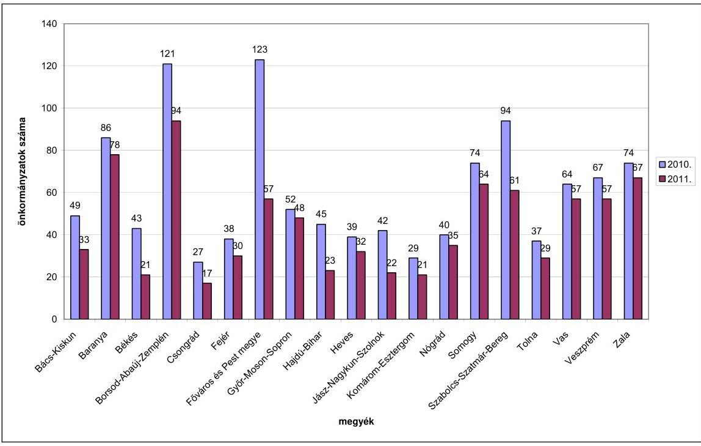

A helyszíni felülvizsgálatok számának legjelentősebb csökkenése azoknál a megyéknél tapasztalható, amelyeknél magas volt a kiemelt körbe tartozó önkormányzatok száma. A Főváros és Pest, Békés, Hajdú-Bihar és Jász-Nagykun-Szolnok megyékben a jogszabályváltozás hatására az önkormányzatok évenkénti kötelező felülvizsgálata közel a felére csökkent.

A Kincstár a 2005-2009. évekre vonatkozó stratégiai ellenőrzési tervében ${ }^{9}$ fogalmazta meg a hosszú távú célkitűzéseit, amelyek között szerepelt a helyi önkormányzatok kincstári kapcsolatainak továbbfejlesztése, a kapcsolódó feladatok integrálása, valamint egy új, egységes önkormányzati informatikai pénzügyi nyilvántartó rendszer kifejlesztése. A 2010-2014 közötti időszakra készült stratégiai ellenőrzési terv ${ }^{10}$ a Kincstár hosszú távú célkitűzéseiből - „a jogszabályi kötelezettségek teljesítése, a folyamatos feladatellátás, a pontos, határidőre történő végrehajtás" - vezette le a belső ellenőrzési stratégiai célokat, amelyek

[^0]
[^0]:    ${ }^{9}$ A Magyar Államkincstár 2005-2009-es tervezési időszakra vonatkozó belső ellenőrzési munkatervét az elnök 2004. december 15-én hagyta jóvá. (A munkaterv 1. számú melléklete tartalmazta a célkitűzéseket.)
    ${ }^{10}$ A Magyar Államkincstár 2010-2014 közötti időszakra vonatkozó stratégiai ellenőrzési tervét az elnök 2009. november 12-én hagyta jóvá.

---

között szerepelt - többek között - a Kincstár tevékenységében megjelenő új feladatok vizsgálata, a területi szervek tevékenységének ellenőrzése és a belső ellenőrzést támogató információs rendszerek fejlesztése.

A Kincstár az éves munkaterveiben határozta meg az adott év kiemelt feladatait.

A 2008. évi munkatervben a 2008. január 1-jétől kibővült feladatok végrehajtása érdekében a következők szerepeltek: a 2007. évi önkormányzati beszámolók felülvizsgálata eljárásrendjének, a felülvizsgálat szempontjainak kidolgozása, a helyszíni ellenőrzések során alkalmazandó nyomtatványminták, módszertani anyagok elkészítése az ellenőrzési munkacsoport közreműködésével; a helyszíni ellenőrzésben résztvevők szakmai képzése; országosan elrendelt helyszíni témavizsgálat előkészítése; az önkormányzati beszámolók felülvizsgálatát támogató FPartner program fejlesztésének szakmai irányítása, szakmai követelmények meghatározása.

A 2009. évi munkatervben a helyszíni felülvizsgálathoz kapcsolódóan, az előző évhez viszonyítva már kevesebb feladatot tűztek ki. Új célként határozták meg a többcélú kistérségi társulások felülvizsgálatának speciális szempontjai, módszerei és egyéb módszertani anyagok kidolgozását, és a jogszabályi változásoknak megfelelően a felülvizsgálati folyamat aktualizálását a 2008. évi önkormányzati elszámolások felülvizsgálatához. Előírták a helyi önkormányzatokat érintő felülvizsgálati eljárások, az igazgatói utasítások aktualizálását, különös tekintettel a felülvizsgálati eljárás állami számvevőszéki megállapításokhoz kapcsolódó változásaira. Célként határozták meg az FPartner program továbbfejlesztését a többcélú kistérségi társulások felülvizsgálatának támogatásához.

A 2010. évi munkatervben az FPartner program folyamatos fejlesztése szerepelt a kiemelt célok között.

# 1.1.2. A feladatellátáshoz szükséges létszám meghatározása 

### 1.1.2.1. A létszámfejlesztés felmérése

A Kormány a 2007. évben 335 fő (9,75\%-os) létszámfejlesztést biztosított a Kincstár számára a 2146/2007. (VII. 27.) Korm. határozatban azzal, hogy a létszámbővítést az év végéig ütemezett létszámfelvétellel kell végrehajtani. A Kincstár központi szervénél nem állt rendelkezésre dokumentum, hogy milyen számítások, elemzések alapozták meg a létszámfejlesztés szükségességét, nagyságrendjét és területi elosztását.

Az államháztartási irodáknál a jelen ÁSZ ellenőrzés során fellelt dokumentumok ${ }^{11}$ alapján a 2007. áprilisban a pénzügyminiszternek megküldött, az ellenőrzési tevékenység korszerűsítésére, továbbfejlesztésére vonatkozó koncepció szerinti létszámigény 387 fő volt. Ezen belül az önkormányzatok helyszíni fe-

[^0]
[^0]:    ${ }^{11}$ A régiós igazgatók 2007. április 12-én kapták meg a Kincstár elnöke által a Pénzügyminisztérium számára 2007. április 10-én megküldött levelet és egy Vezetői összefoglalót „a Magyar Államkincstár ellenőrzési tevékenységének továbbfejlesztése címü koncepció 2007. évben megvalósítandó elgondolásairól" címmel, amely az ellenőrzési tevékenység továbbfejlesztéséhez szükséges létszámigényt terjesztette elő.

---

lülvizsgálatának fokozása céljából 147 fő, az Áht. 18/B. § (10) bekezdése szerinti egyedi azonosítók, személyes adatok kezelése és az Áht. 64/A. § (2), (3) bekezdésében előírt feladatmutatók vizsgálata, hiánypótlás és határozat-hozatali feladatok elvégzésére 120 fő, a nem állami intézményfenntartókkal kapcsolatos helyszíni ellenőrzés feltételrendszerének biztosítására 68 fő (ezek együttes létszáma 335 fő), az ellenőrzési feladatok módszertanának kidolgozására, az ellenőrzések koordinálására 25 fő, informatikai fejlesztésre, az elektronikus adatátvitel megoldására nyolc fő, és további kincstári feladatok - likviditás, finanszírozás javítása, lakásépítési támogatások ellenőrzése - megoldása érdekében 19 fő létszámigényt terveztek.

Sem a Kincstár központjánál, sem az államháztartási irodáknál nem álltak rendelkezésre olyan elemzések, amelyek az önkormányzatok teljes körére, a hozzájuk tartozó intézményekre, a vizsgálandó állami támogatások jogcímeire tekintettel vizsgálták és alátámasztották volna az Áht. 64/F. § (3) bekezdésében többletfeladatként előírt helyszíni ellenőrzés munkaidő és humánerőforrás szükségletét. A helyszíni felülvizsgálati tevékenység ellátásának biztosításához szükséges munkaidőről a Kincstár központi szerve nem kért információt az államháztartási irodáktól. Ilyen elemzés nem készült sem a 2007. évi létszámfejlesztés előkészítéséhez, sem a 2008., a 2009. és 2011. január 1-jétől hatályos Áht. 64/F. § (3) bekezdésében előírt változó mértékű feladat elvégzéséhez.

# 1.1.2.2. A létszám megosztása a területi szervek között 

A 2007. év szeptemberétől, négy hónapra ütemezetten összesen 301 fővel, majd 2008. év szeptemberében további 22 fővel, összesen 323 fővel nőtt a területi szervek létszáma a létszámfejlesztésre biztosított 335 fővel szemben. ${ }^{12}$

Az államháztartási irodák létszáma a létszámbővítés hatására a 2007. augusztus 455 főről (az összlétszám 14,9\%-a) 761 főre növekedett 2008. szeptemberig (az összlétszám 22,6\%-a), amely 306 fő (67\%-os) létszámfejlesztést jelentett. Az egyes területi szervek megnövekedett létszámán belül az államháztartási iro-

[^0]
[^0]:    ${ }^{12}$ A Kincstár Humánpolitikai Főosztályának vezetője Hpf-To-1422/2007. számú, 2007. augusztus 30-án kelt, Hpf-To-1423/2007. számú, 2007. szeptember 12-én kelt, és a Hpf2510/2008. számú, 2008. szeptember 25-én kelt levelei szerint. A kormány által jóváhagyott 335 fő létszámfejlesztésből 12 fő létszámnövelés engedélyezésének dokumentuma nem volt fellelhető. A 323 státuszból - az államháztartási irodákon engedélyezett 306 fő növekményen túl - 12 fő a családtámogatási, három fő a koordinációs, egy fő az állampénztári, és további egy fő az illetmény számfejtési irodákon került engedélyezésre. A 2007. és 2008. szeptember között, belső létszám átcsoportosításokat is végrehajtottak, 40 főt az ellenőrzési irodákról a családtámogatási, és öt főt a koordinációs irodákról az illetmény számfejtési irodákra. Az államháztartási irodákon ellátott önkormányzati felülvizsgálati tevékenységen túl a Kincstár hatósági (és ehhez kapcsolódó ellenőrzési) tevékenysége kiterjed a családtámogatási és egyéb szociális ellátásokra, az energia-, lakástámogatásokra, a diákhitel kamattámogatásokra, a humánszolgáltatást nyújtó intézmények nem állami és nem önkormányzati fenntartóit megillető támogatásokra. Az államháztartási irodákon kívül a hatósági tevékenységhez kapcsolódó ellenőrzési feladatokat a családtámogatási és állampénztári irodák is ellátnak, a koordinációs iroda pedig - többek között - ezek monitorozását végzi.

---

dák létszámának aránya 17,0\% és 27,6\% között változott, a korábbi 8,6\% és 20,1\%-hoz képest. Mindkét időpontban a legalacsonyabb arány a Közép-magyarországi Regionális Igazgatóságnál, a legmagasabb a Nyugat-dunántúli Regionális Igazgatóságnál volt.

Az államháztartási irodák felülvizsgálati és ellenőrzési osztályai végezték az önkormányzatok központi költségvetési kapcsolataiból származó támogatásai igényléseinek és elszámolásainak szabályszerűségi felülvizsgálatát. Ezek az osztályok látták el a humánszolgáltatásokat nyújtó nem állami, nem önkormányzati intézmények fenntartóit megillető állami támogatások, hozzájárulások ellenőrzésével kapcsolatos feladatokat is.

A Kincstár központjában nem vizsgálták, hogy a helyszíni ellenőrzés megváltozott feladatait a létszámfejlesztés hatására hogyan teljesítették, a területi szervek a 2008-2010. években elvégezték-e maradéktalanul az Áht-ban rögzített feladatokat, változott-e a dolgozók leterheltsége az évek között, szükséges-e és elégséges-e a meglevő létszám az Áht. 64/F. § (3) bekezdésében előírt feladat teljesítéséhez, a kiemelt önkormányzati kör évenkénti, a többi önkormányzat négyévenkénti ellenőrzéséhez.

A területi szervek által készített beszámolók nem tértek ki a helyszíni felülvizsgálatot végzők létszámára, nem értékelték a létszámfejlesztés hatását az elvégzett felülvizsgálatok mennyiségére, minőségére. A helyszíni felülvizsgálatok munkaerő és munkaidő felhasználásáról nem készítettek teljes körű kimutatást. A Kincstár központi szerve a lezajlott létszámfejlesztés hatásáról, a humánerőforrás mennyiségi, minőségi összetevőiről nem kért információt a helyszíni felülvizsgálatokkal kapcsolatban. Az adatszolgáltatásoknak nem kellett kiterjedniük a feladatellátás hatékonyságának, eredményességének mérésére.

Az önkormányzatok helyszíni felülvizsgálatát végzők létszámáról az államháztartási irodák tanúsítványban nyilatkoztak. A létszámok meghatározása a helyszíni felülvizsgálatokra ténylegesen felhasznált ellenőri napok alapján, számítással történt. A számított létszám a 2008. évben 180 fő, a 2009. évben 169 fő és a 2010. évben 179 fő volt.

A helyszíni vizsgálatokra fordított ellenőri napokat a felülvizsgálatokat segítő FPartner program nem tartalmazta, abban csak a vizsgálatvezetőnek az adott helyszíni felülvizsgálatnál felmerült munkaideje jelent meg. Az adatokat a helyszíni felülvizsgálatot végző felülvizsgálati és ellenőrzési osztályok megbízható nyilvántartás hiányában kigyűjtéssel, becsléssel állapították meg. A helyszíni ellenőrzésre fordított ellenőri napok nyilvántartásának vezetéséről a központi szerv nem rendelkezett - az államháztartási irodák az általuk szerkesztett Excel tábla segítségével gondoskodtak az adatok gyűjtéséről -, annak ellenére, hogy a felülvizsgálati feladatok elvégzésére vonatkozó egységes nyilvántartás vezetését az ÁSZ 2007-ben végzett vizsgálata is javasolta.

A helyszínen vizsgált 11 megyei államháztartási iroda 2010. december 31-ei adatait összehasonlítva az önkormányzatok helyszíni felülvizsgálatát végzők számított létszámának és a helyszíni vizsgálatra felvettek létszámának aránya kilenc megyei államháztartási iroda esetében 40%-83% közötti volt.

---

A Budapesti
 és Pest Megyei Igazgatóság ${ }^{13}$ esetében ez az arány 15%-ot tett ki. Az ellenőrzési referensek az éves tevékenységük során az I. félévben kizárólag a nem állami fenntartók elszámolásainak helyszíni ellenőrzését végezték. Az önkormányzatok helyszíni vizsgálatát - kapacitáshiány miatt - a III. negyedévtől kezdték meg. Az államháztartási iroda vezetője egy alkalommal - 2009. október 29-én - a regionális igazgató részére készített tájékoztatóban jelezte, hogy az irodán az ellenőrzési referensek száma a régióban jelentkező feladatokhoz mérten számításaik szerint nem biztosított. Az engedélyezett létszámhoz további 52 fő létszámigényt mutattak ki. Az irodavezető jelzésére intézkedés nem történt. Az igazgatóságon a 2008-2010-es években a humánerőforrás nem biztosította az Áht-ban előírt feladatellátást, részben a létszám hiánya, részben a magas fluktuáció miatt.

A Somogy Megyei Igazgatóság ${ }^{14}$ adatai szerint az arány 128% volt. A megyében végrehajtott létszámfejlesztéssel létrejött kapacitás nem volt elegendő az önkormányzatok helyszíni felülvizsgálatának teljesítésére, ezért a dokumentális felülvizsgálatot végző felülvizsgálati referensek bevonása is szükséges volt a feladat ellátásához. Zala megyében szintén igénybe kellett venni a felülvizsgálati referensek munkáját is.

A helyszíni felülvizsgálatot végző dolgozók munkaköri leírással rendelkeztek, amely tartalmazta az önkormányzatok támogatásai és hozzájárulásai jogszerű igénylésének és elszámolásának helyszíni ellenőrzését. A felülvizsgálatot végzők 83,4%-a több mint két év óta dolgozott az igazgatóságokon és 98,1%-a felsőfokú iskolai végzettséggel - 89,7% szakirányú felsőfokú végzettséggel rendelkezett, amely megteremtette a feltételeit a megfelelő minőségű szakmai munkavégzésnek.

A felülvizsgálati tevékenységet a Dél-dunántúli régióban úgynevezett területi elv alapján végezték, az önkormányzatok felülvizsgálatával, helyszíni ellenőrzésével kapcsolatos feladatokkal egy-egy ügyintézőt bíztak meg. A feladattal megbízott munkatársak részt vettek az igazgatóságon és a helyszínen lefolytatott felülvizsgálatokban is, amely lehetővé tette, hogy a munkatársak egy-egy önkormányzatra vonatkozóan valamennyi lényeges információval rendelkezzenek. A munkaköri leírásokat melléklettel egészítették ki, amely tartalmazta az egyes ügyintézőhöz rendelt felülvizsgálandó önkormányzatok körét.

# 1.1.3. A helyszíni felülvizsgálatra kiválasztás és a helyszíni felülvizsgálati rendszer szabályozottsága 

### 1.1.3.1. A helyszíni felülvizsgálatra történő kiválasztás, kockázati tényezők meghatározása

Az Áht. 2008. január 1-jétől hatályos 64/F. § (3) bekezdésében előírt helyszíni felülvizsgálati feladat teljesítése érdekében szükségessé vált az ellenőrzések négy évre való tervezése és az egy-egy évben vizsgálandó önkormányzatok és a jogcímek kiválasztása. A helyszíni felülvizsgálat Áht-ban foglalt követelmény-

[^0]
[^0]:    ${ }^{13}$ A Budapesti és Pest Megyei Igazgatóság megnevezése 2010. december 31-éig Közép-magyarországi Regionális Igazgatóság volt.
    ${ }^{14}$ A Somogy Megyei Igazgatóság 2010. december 31-éig a Dél-dunántúli Regionális Igazgatósághoz tartozott.

---

ek szerinti végrehajtását, eredményességét alapvetően meghatározta a felülvizsgálatra kiválasztás eljárásrendje, az alkalmazott kockázati tényezők köre és azok értékei, továbbá a felülvizsgálatok lefolytatásának szakszerűsége.

A Kincstár - az országosan egységes gyakorlat biztosítása indokoltsága ellenére - a helyszíni felülvizsgálatra kiválasztás eljárásrendjét, folyamatát, dokumentálását központilag nem alakította ki. Nem határozta meg 2009-2010. között a felülvizsgálandó jogcímek kockázatelemzésének szabályait, a kockázati tényezőket, és nem értékelte a területi szervek által kialakított kiválasztás rendszerét.

A Kincstár a 2008. január 29-én kelt KFI-151/2008. számú hálózatirányítási igazgatói ügyiratban, a felülvizsgálati munkaterv összeállításával kapcsolatban fogalmazott meg általános szempontokat. Ebben, a Pénzügyminisztériummal történt egyeztetést követően rögzítették, hogy a legalább négyévenkénti helyszíni vizsgálatnak nem kell kiterjednie az elszámolásban szereplő összes jogcím helyszíni vizsgálatára, előírták, hogy főbb támogatási jogcímként mit kell megjelölni és a regionális igazgatóságok a későbbiekben jelölik ki a főbb jogcímeken belül vizsgálandó hozzájárulásokat, támogatásokat. A kiemelt önkormányzati körnél a támogatások jogcímei legalább 50%-a számítása szempontjából követendő eljárásként csak azt határozták meg, hogy mi tekinthető egy jogcímnek. Ezt a szabályt a 2007. évi források elszámolása szabályszerűségének felülvizsgálati eljárásrendjébe is beépítették. A jogcímek kiválasztásához szempontokat nem határoztak meg sem a kiemelt, sem a többi önkormányzati körre. A területi szervek által a Kincstár számára megküldött helyszíni felülvizsgálati munkatervben az önkormányzatokat kellett felsorolni évenkénti ütemezésben.

Az elszámolások szabályszerűségének felülvizsgálatára vonatkozó eljárásrendekben a felülvizsgálat általános, valamint a helyszíni felülvizsgálat eljárási szabályai közt előírták, hogy a legalább négyévenkénti („tervezett") helyszíni vizsgálatnak nem kell kiterjednie az elszámolásban szereplő összes jogcímre. A helyszíni vizsgálattal érintett jogcímeket az igazgatóságok határozzák meg úgy, hogy az egymással összefüggő jogcímek egyidejű vizsgálata - eltérés feltárása esetén - elvégezhető legyen. A kockázatelemzésről csak annyit rögzítettek, hogy a kiemelt önkormányzati körben a jogcímeket kockázatelemzéssel kell kiválasztani.

A felülvizsgálati munkaterveket megalapozó számítások, elemzések készítését, a jogcímek kiválasztására alkalmazott módszerek dokumentálását, azok megőrzését, illetve a Kincstár központnak történő beküldését nem írták elő a regionális igazgatóságok számára.

A Kincstár központi szabályozásának hiányában az államháztartási irodák munkamódszere eltérő volt. A vizsgált 11 államháztartási iroda közül 10-nél hiányzott a helyszíni felülvizsgálatra kiválasztás eljárásrendjének - a határidő, hatáskörök, felelősök megjelölése -, folyamatának és dokumentálásának szabályozása ${ }^{15}$. Hat államháztartási iroda nem végzett kockázatelemzést a 2009-2010. években, az Áht. 64/F. § (3) bekezdésében előírtak ellenére. A kockázati tényezők meghatározása helyett a dokumentális felül-

[^0]
[^0]:    ${ }^{15}$ A 2011. január 1-jétől hatályos Áht. 64/F. § (3) bekezdése már a Kincstár hatáskörébe utalta a vizsgálandó jogcímek meghatározását, és megszüntette a kiemelt önkormányzati kör kockázatelemzés alapján történő évenkénti helyszíni felülvizsgálatát.

---

vizsgálat tapasztalatait használták fel az ellenőrzött önkormányzatok, intézmények és a vizsgálandó jogcímek kiválasztásához.

Borsod-Abaúj-Zemplén megyében a helyszíni felülvizsgálatra kerülő jogcímek kiválasztását - kincstári szabályozás hiányában - 2008. februárjától igazgatósági szinten határozták meg. A 2008. február 28-án kelt dokumentumban az államháztartási iroda irodavezető-helyettese „belső használatra kiadott eljárásrend"-ben szabályozta a helyszíni ellenőrzések folyamatát. Ebben az ellenőrizendő jogcímek kiválasztásának szempontjait is rögzítette mind a kiemelt önkormányzati kör mind a többi önkormányzatra vonatkozóan, a felelősök és a dokumentálás egyidejű megjelölésével. Az Áht. 64/F. § (3) bekezdése 2009. január 1-jei módosításának megfelelően a kiemelt önkormányzati kör esetében a jogcímek kiválasztására kockázatelemzést készítettek, ezzel párhuzamosan a jogcímek kiválasztásának 2008-ban elkészített szempontrendszerét leszűkítették a négyévenkénti ellenőrzéssel érintett önkormányzatok körére. A jogcímek kiválasztásának szempontrendszerét, illetve a kockázatelemzést évente, az előző évek felülvizsgálatainak tapasztalata alapján aktualizálták.

A Dél-dunántúli Regionális Igazgatóság igazgatója a 2008. évben a kiemelt teljesítménycélok között írta elő a helyszíni ellenőrzésekhez kockázati tényezők meghatározását, az államháztartási iroda vezetője az egységes régiós gyakorlat érdekében meghatározta a jogcímek kiválasztásának szabályait, és a 2009. évben valamennyi önkormányzati körre kockázatelemzést is készített, ebben 11 kockázati tényezőt rögzítettek, amelyhez „kockázati lehetőségeket és kockázati értékeket" rendeltek.

A Közép-dunántúli Regionális Igazgatósághoz tartozó Veszprém megyében a 2009. évben a kiemelt önkormányzati kör ellenőrzése esetében meghatározták a jogcímek kiválasztásához szükséges kockázati tényezőket, kockázatelemzési űrlapokat dolgoztak ki. A kockázati tényezők meghatározásához nyomon követték az önkormányzatoknál, intézményeknél történt változásokat, továbbá figyelembe vették a korábbi évek felülvizsgálati tevékenysége során szerzett tapasztalatokat.

# 1.1.3.2. A helyszíni felülvizsgálati rendszer szabályozottsága 

A felülvizsgálati tevékenység egységes megvalósítása céljából a Kincstár belső utasításokban külön-külön szabályozta a támogatások igénylésének és az elszámolásának felülvizsgálati eljárásrendjét. Az eljárásrendekben a felülvizsgálatok általános szabályait, az eljárási kérdéseket, a dokumentálásra és a határozathozatalra vonatkozó szabályokat rögzítették, az alkalmazandó nyomtatványmintákat a függelékek tartalmazták. Az azonos eljárási szabályok és szempontok szerinti munkavégzés célkitűzését az eljárásrendek bevezetőjében határozták meg.

Az egyes jogcímek szerinti támogatások igénylésének felülvizsgálati szempontjait a 2008-2009. években - a központosított támogatások kivételével - nem dolgozták ki. 2010. első félévétől az igénylések, évközi módosítások felülvizsgálati rendszere folyamatosan bővülve és egyre részletesebb szempontrendszerrel kifejlesztésre került az ÖNEGM programban, annak általános és kötelező alkalmazása, továbbá a felülvizsgálati lapokon történő rögzítése révén az igénylések felülvizsgálata is dokumentálásra került. Az elszámolások felülvizsgálati szempontjait körlevelekben, segédletként mindhárom évben

---

kidolgozták és a 16/2002. (IV. 12.) PM rendelet 19. §-a előírásának megfelelően a 2007-2009. évekre vonatkozóan a Kincstár honlapján közzétették.

A felülvizsgálatok eljárásrendjét ${ }^{16}$ a 2010. évben, az elszámolások felülvizsgálata szempontjait minden évben csak év végén - hónapokkal a helyszíni felülvizsgálatok megkezdését követően - bocsátották az igazgatóságok rendelkezésére, annak ellenére, hogy a vizsgált években változott az igényelhető támogatások, hozzájárulások jogcímeinek köre, száma és az igénylés feltételrendszere. A változás tényét az egyes évek felülvizsgálati tapasztalatairól a Kincstár által kiadott tájékoztatókban is megfogalmazták: „a korábbi évekhez képest jelentős változások voltak a jogcímek és az igénybevételi feltételek tekintetében."

A Kincstár az Áht. 64/F. §-ban meghatározott feladatok elvégzéséhez szükséges egységes szabályozást - a 2008-2009. években az igénylések felülvizsgálata szempontrendszerének kivételével - kialakította, amely azonban egyes szabályzatok késői kibocsátása miatt nem segítette az igazgatóságok helyszíni felülvizsgálati tevékenységét. A központi szabályozás részbeni hiánya, illetve késése nem valósította meg az azonos eljárási szabályok és szempontok szerinti munkavégzés eljárásrendekben megfogalmazott célkitűzését. A helyi szabályozás elkészítése többletmunkát és szükségtelen párhuzamos munkavégzést jelentett a területi szerveknek, nem volt biztosított a jogszabályváltozások egységes értelmezése, az ellenőrzések egységes szempontok szerinti végrehajtása. Annak érdekében, hogy a felülvizsgálati munkatervekben ütemezett felülvizsgálatokat időben végre tudják hajtani, biztosítani tudják a felülvizsgálati tevékenység jogszabályoknak való megfelelését, valamint az egységes régiós gyakorlatot, a területi szervek külön-külön készítették el az eljárásrendek aktualizált nyomtatványmintáit és a felülvizsgálat szempontjait.

A Dél-dunántúli Regionális Igazgatóság Baranya megyében a 2008. évben Piskó és Zaláta Község Önkormányzatának helyszíni felülvizsgálatát 2008. április 28-án, a 2009. évben Siklós Város Önkormányzatának felülvizsgálatát 2009. május 12-én, a 2010. évben Kökény Község Önkormányzatának helyszíni felülvizsgálatát 2010. május 18-án kezdte meg, amikor a központi szabályozás még nem készült el. Munkamegosztás keretében a szociális, a globális, a közoktatási jogcímeket és a többcélú kistérségi társulásokat érintő jogcímekre vonatkozó szempontrendszert egy-egy megye dolgozói készítették el, esetenként munkaidőn túl.

Az Észak-magyarországi Regionális Igazgatósághoz tartozó Borsod-Abaúj-Zemplén megyében és a Közép-dunántúli Regionális Igazgatósághoz tartozó Veszprém megyében a központi szabályozás hiányát a 2008. évben kiadott, és a 2009-2010. években aktualizált segédlettel pótolták.

A rendszeres állásfoglalások, körlevelek formájában történő központi iránymutatások ugyan segítették a munkavégzést, de nem pótolták a teljes felülvizsgálati feladat átfogó, egységes szabályozását.

[^0]
[^0]:    ${ }^{16}$ A 2011. évben az eljárásrendet határidőben, 2011. május 30-án adta ki a Kincstár központ.

---

# 1.1.4. A helyszíni felülvizsgálat belső kontrolljai 

Az önkormányzatokat megillető állami támogatások és hozzájárulások helyszíni felülvizsgálatát az államháztartási irodák felülvizsgálati és ellenőrzési osztályai látták el. Az osztályok feladatait, ezen belül a felülvizsgálati tevékenységet a területi szervek ügyrendjében rögzítették, amelynek 2. számú függeléke tartalmazta a táblázatos formában, valamint folyamatábrákkal elkészített ellenőrzési nyomvonalat az Ámr. ${ }_{1}$ 145/B. § (1) bekezdésében ${ }^{17}$ foglaltaknak megfelelően. Az ellenőrzési nyomvonalban szabályozták a helyszíni felülvizsgálattal kapcsolatos folyamatba épített előzetes, utólagos és vezetői ellenőrzés rendszerét.

A folyamatba épített előzetes, utólagos és vezetői ellenőrzést végző személyeket az ellenőrzési nyomvonalban az egyes munkakörök megjelölésével és az ellenőrzési tevékenység leírásával kijelölték. A felülvizsgálati feladatokat és az ellenőrzés, helyettesítés rendjét a dolgozók munkaköri leírása
 tartalmazta.

A folyamatba épített előzetes, utólagos és vezetői ellenőrzés működését a 2008–2010. évekre vonatkozóan a 11 államháztartási iroda által helyszínen felülvizsgált önkormányzatok közül évente hat-hat, összesen 198, véletlenszerű mintavétellel kiválasztott önkormányzat iratanyagának áttekintése során vizsgáltuk és megállapítottuk, hogy az ellenőrzési kötelezettségnek eleget tettek. A dokumentumokon az ellenőrzési nyomvonalban előírtak alapján, az egyes ellenőrzési pontoknak megfelelően az ügyintézők és a vezetők kézjegye szerepelt, amellyel az ellenőrzés elvégzését igazolták.

A folyamatba épített előzetes, utólagos és vezetői ellenőrzést a felülvizsgálati tevékenységet támogató FPartner program is biztosította. A Kincstár az államháztartási irodák számára, az eljárásrendek alapján a felülvizsgálati tevékenységhez és ennek részeként a helyszíni ellenőrzési feladathoz kapcsolódóan ellenőrzési pontokat épített be az FPartner programba. Az egyes ellenőrzési pontokon a vezetői ellenőrzés nem teljesítése a folyamat tovább lépését akadályozta, mivel az arra jogosult vezető jóváhagyása volt szükséges az egyes munkafolyamatok lezárásához és a következő indításához. A helyszíni felülvizsgálati jegyzőkönyv, a felhívó levél, az önrevízió, a záradék – illetve amennyiben készült, a jegyzőkönyv és a határozat – adatainak véglegesítése vezetői jóváhagyás után történt. A munkafolyamatok jóváhagyását a programban vezetői jogosultsággal rendelkezők elvégezték.

A Kincstár a belső kontrollrendszer részeként a 2009. évi munkatervében a monitoring rendszer bevezetését és működtetését rögzítette. A Kincstár elnöke a 2009. évben elrendelte a területi szerveknél a monitoring rendszer bevezetését az Ámr. ${ }_{1} 145/$G. §-ban ${ }^{18}$ foglaltaknak megfelelően. A feladat elvégzése érdekében adatlapok készültek, és kidolgozták az indikátorokat, az egységes

[^0]
[^0]:    ${ }^{17}$ Az ellenőrzési nyomvonal készítésének kötelezettségét 2010. január 1-jétől az Ámr. ${ }_{2}$ 156. § (2) bekezdése írja elő.
    ${ }^{18}$ A szabályozást 2010. január 1-jétől az Ámr. ${ }_{2}$ 160. § tartalmazza.

---

mérés szempontrendszerét. Valamennyi indikátor esetében rögzítették a mérés végrehajtásának módszerét.

A feladatot a területi szervek ellenőrzési irodái végezték, amely kiterjedt a folyamatba épített előzetes, utólagos és vezetői ellenőrzési rendszer működésére is. Ennek szabályait az igazgatóságok ügyrendje 3.4. pontjai tartalmazták.
„Az ellenőrzési iroda folyamatosan figyelemmel kíséri, elemzi az ellenőrzési tevékenység működését, javaslatot tesz ellenőrzési módszerek, standardok kialakítására, az Európai Uniós gyakorlat átvételére, alkalmazására. Összehangolja a folyamatba épített ellenőrzési tevékenységeket, a kockázatelemzés alapján gondoskodik új kontroll-pontok kialakításáról, a meglévők hatékonyságának fokozásáról; figyelemmel kíséri a szakmai szervezeti egységeknél a szakmai tevékenységekre kiterjedő ellenőrzési nyomvonalat, indokolt esetben kezdeményezi annak módosítását.”

A 2009. márciustól 2010. novemberig működtetett monitoring rendszer az önkormányzatokat érintő helyszíni ellenőrzés befejezése és a jegyzőkönyv átadása közötti időszakot, a határidő betartását, valamint a vezető által ellenőrzött jegyzőkönyvek – beleértve a felülvizsgálati és záró jegyzőkönyvek számát – kísérte figyelemmel. A monitoring rendszer folyamatosan működött, amelynek célja az ott végzett munka javítása és a vezetői információk előállítása volt. A belső kontroll működtetése a Kincstár által megadott állandó és változó tartalmú szempontok alapján, informatikai támogatottsággal történt. A monitoring feladatokat ellátó dolgozó adatszolgáltatást kért a helyszíni ellenőrzésekről, majd az adatszolgáltatás keretében közölt adatok valódiságát a helyszínen ellenőrizte.

A folyamatba épített előzetes, utólagos és vezetői ellenőrzési rendszer és a monitoring rendszer – a folyamatos kontroll révén – hozzájárult a helyszíni felülvizsgálati tevékenység ellátásához, a feladatok Áht. 64/D. §-ban előírtaknak megfelelő és határidőben történő teljesítéséhez.

A belső ellenőrzési tevékenység szabályozása – belső ellenőrzési stratégia, éves belső ellenőrzési tervek készítése – és működtetése központi szinten történt.

A Kincstár elnöke 2007. április 1-jei hatállyal hozta létre a közvetlen irányítása alá tartozó Ellenőrzési Főosztályt, azon belül a Módszertani Osztályt, valamint a regionális igazgatóságok szervezeti egységeként az ellenőrzési irodákat. A Módszertani Osztály feladata az ellenőrzési irodák szakmai tevékenységének az irányítása, módszertani tevékenységük koordinálása.

A Kincstár 2008–2009. évi belső ellenőrzési tevékenységét a 2005–2009. évekre szóló stratégiai ellenőrzési terv ${ }^{19}$, a 2010. évit a 2010–2014. évekre szóló stratégiai terv ${ }^{20}$ alapozta meg. Az Ellenőrzési Főosztály a 2008–2010. évek belső ellenőrzési terveit kockázatelemzés alapján állította össze a belső ellenőrzési ké-

[^0]
[^0]:    ${ }^{19}$ Az elnök 2004. december 15-én hagyta jóvá a Magyar Államkincstár belső ellenőrzési munkatervét a 2005–2009-es tervezési időszakra vonatkozóan.
    ${ }^{20}$ Az elnök 2009. november 12-én hagyta jóvá a Magyar Államkincstár stratégiai ellenőrzési tervét a 2010–2014. közötti időszakra.

---

zikönyvben előírtaknak megfelelően ${ }^{21}$. A kockázatelemzések szerint a területi szervek államháztartási irodáinak az állami támogatások igénylésének helyszíni ellenőrzésével és a támogatások elszámolásával kapcsolatos felülvizsgálati tevékenysége összességében nem minősült magas kockázatúnak. A kockázatelemzés során, a felülvizsgált folyamatokon belül nem választották külön, hanem egy folyamatnak tekintették az önkormányzatok és a nem állami humán fenntartók központi költségvetésből származó forrásai igénybevételének helyszíni ellenőrzését. Az önkormányzatok központi költségvetésből származó forrásaival kapcsolatos felülvizsgálati feladatokat sem választották szét a helyszíni felülvizsgálatra és a dokumentális felülvizsgálatra. Az önkormányzatok helyszíni ellenőrzésének a kockázatát elkülönítetten nem minősítették.

A Kincstár a 2008. évben célként határozta meg a belső kontrollrendszerében működtethető kockázatkezelés elméleti alapjainak a kidolgozását, amely feladatot a Kincstár Ellenőrzési főosztálya a regionális igazgatóságok ellenőrzési irodái vezetőivel – a Szabályozási Főosztály és az Államháztartási Számviteli Főosztály munkatársainak közreműködésével – dolgozott ki. Ennek a munkának a részeként véglegesítették ${ }^{22}$ irodánként/osztályonként a folyamatokat.

A Kincstár hatályos belső ellenőrzési kézikönyve értelmében a belső ellenőrzést az Ellenőrzési Főosztályon belül működő Belső Ellenőrzési Osztály vezetője közvetlen alárendeltségébe tartozó belső ellenőrök, a belső ellenőrzési vezetői feladatokat az Ellenőrzési Főosztály vezetője látta el. Az Ellenőrzési Főosztály közvetlenül a Kincstár Elnökének alárendelten végezte tevékenységét.

A helyszíni felülvizsgálati tevékenység nem tartozott a magas kockázatú területek közé ${ }^{23}$, ezért önálló ellenőrzési témaként nem jelent meg a belső ellenőrzési stratégiában és az éves belső ellenőrzési tervekben sem.

# 1.2. A kötelező helyszíni felülvizsgálati feladatok tervezése és végrehajtása 

### 1.2.1. A helyszíni felülvizsgálati feladat tervezése

### 1.2.1.1. A munkaterv készítési kötelezettség teljesítése

A Kincstár a 2008. január 1-jétől megváltozott Áht. és Ámr. ${ }_{1}$ alapján az államháztartási irodák számára helyszíni felülvizsgálati munkaterv készítési

[^0]
[^0]:    ${ }^{21}$ A 2007. július 1-jétől hatályos 12/2007. számú Elnöki utasítás, valamint az ezt hatályon kívül helyező és 2008. augusztus 5-étől hatályos 28/2008. számú Elnöki utasítás. (Az utóbbit a 2010. augusztus 31-én 34/2010. számú Elnöki utasítással kiadott Belső Ellenőrzési Kézikönyv hatályon kívül helyezte.)
    ${ }^{22}$ a 2008. augusztus 14-ei irodavezetői értekezleten
    ${ }^{23}$ A kincstári szintű, 479 munkafolyamatot értékelő kockázatelemzés során a helyszíni felülvizsgálati tevékenység nem került a 10 legkockázatosabb terület közé.

---

kötelezettséget írt elő az Ámr. ${ }_{1}$ 52/D. § (2) bekezdésében ${ }^{24}$ előírtak teljesítése érdekében.

A helyszíni felülvizsgálatok elvégzése és ütemezése érdekében a Kincstár Hálózatirányítási igazgatója 2008. január 29-én KFI-151/2008. ügyiratszámon a regionális igazgatóságok számára négy évre szóló felülvizsgálati munkaterv készítését írta elő. A munkatervet a 2008–2011. évekre vonatkozóan 2008. február 1-jéig kellett elkészíteni. Az ügyiratban rögzítették, hogy a négy évet felölelő munkatervnek az igazgatóságok illetékességi területéhez tartozó valamennyi önkormányzatot és többcélú kistérségi társulást tartalmaznia kell. Meghatározták a munkaterv szerkezetét, felépítését, a 2008–2011. évek között a vizsgálatba bevont évek számát, a helyszíni felülvizsgálat tervezése során az önkormányzatok csoportosításának szempontjait.

Az államháztartási irodák a felülvizsgálati munkaterv készítési kötelezettségnek eleget tettek, amelyek az előírtaknak megfelelően tartalmazták az illetékességi területhez tartozó valamennyi önkormányzat elszámolásai helyszíni felülvizsgálatának a következő négy évre tervezett időpontját negyedéves ütemezés szerint, valamint a vizsgálatba vont főbb támogatási jogcímeket.

A felülvizsgálati munkatervek készítése a 2008. évben a Kincstár központjától kapott minta alapján, ezt követően az FPartner program segítségével történt, ahol az Áht. 64/F. § (3) bekezdésében meghatározott feltételek teljesüléséről – a négyévenkénti és a kiemelt önkormányzati kör évenkénti vizsgálata tervezéséről – gondoskodtak. Az éves tervekben az Áht. 64/F. § (1) bekezdése szerinti, az önkormányzat és a kincstár álláspontja közti eltérés miatt helyszíni ellenőrzést – a tapasztalati számok alapján – csak Jász-Nagykun-Szolnok megyében terveztek. Cél és témavizsgálatot az államháztartási irodák többsége szintén nem tervezett, ilyen vizsgálat csak négy megye terveiben – Győr-Moson-Sopron, Jász-Nagykun-Szolnok, Tolna és Vas megyék – szerepelt.

A Kincstár által kiadott, a források elszámolásának felülvizsgálatára vonatkozó eljárásrendek értelmében az igazgatóság döntése szerint a munkaterv módosítható az Ámr. ${ }_{2}$ 66. § (2) bekezdésében előírtaknak megfelelően, illetve a helyszíni vizsgálat kiterjeszthető további jogcímekre.

Az éves felülvizsgálati munkaterveket – a Budapesti és Pest Megyei Igazgatóság kivételével – módosították. A tervek módosítása azonban nem volt nyomon követhető. A módosítást az arra jogosultsággal rendelkező vezető az FPartner programban végezte el, a program a módosítás során az eredeti munkatervet felülírta, az adatbázisból mindig csak az aktuális állapot szerinti munkatervet lehetett lekérni. A módosításokra az ellenőrzési referensek, vagy az osztályvezetők által jelzett indokok alapján került sor, ennek dokumentálása a vizsgált 11 igazgatóság közül kilenc igazgatóságon nem állt rendelkezésre. A módosítás indokoltságát megalapozó feljegyzés csak a Baranya és a Nógrád megyei államháztartási irodákon készült. A módosítások az osztályvezető jóváhagyásával történtek, amelyre a munkaköri leírása alapján – jogszabály előírása szerint szervezi az önkormányzatok állami támogatása elszámolásának szabályszerűségi felülvizsgálatát – jogosult volt.

[^0]
[^0]:    ${ }^{24}$ 2010. január 1-jétől Ámr. ${ }_{2}$ 66. § (2) bekezdése.

---

A módosítások indoka az elszámolások dokumentális felülvizsgálata alapján megállapított eltérések, közoktatási intézmények átszervezése miatti kockázat, önkormányzat kérése és ÁSZ által tervezett és a Kincstár felé jelzett vizsgálat volt.

# 1.2.1.2. A helyszíni felülvizsgálati feladatok megyénkénti adatai 

A 2010. december 31-ei állapot szerint, a helyszíni felülvizsgálati feladat megszervezéséhez az Áht. 64/F. § (3) bekezdésének megfelelően a következő összetételben kellett az önkormányzatokat, többcélú kistérségi társulásokat (együtt önkormányzatok) és az általuk fenntartott intézményeket figyelembe venni.

Az önkormányzatok, többcélú kistérségi társulások és az általuk fenntartott intézmények

| Megnevezés | Önkormányzatok   száma | Felülvizsgálatra kötelezettek száma |  |  |  |
| :-- | :--: | :--: | :--: | :--: | :--: |
|  |  | évente | négyévente |  |  |
|  |  | önkormányzatok | intézmények | önkormányzatok | intézmények |
|  | 20 | 20 | 746 | 0 | 0 |
| megyei jogú városi | 23 | 23 | 1025 | 0 | 0 |
| városi és kerületi | 327 | 266 | 2865 | 61 | 277 |
| nagyközségi | 119 | 43 | 224 | 76 | 227 |
| községi | 2705 | 33 | 110 | 2672 | 3106 |
| többcélú kistérségi társulás | 173 | 17 | 91 | 156 | 290 |
| összesen: | 3367 | 402 | 5061 | 2965 |

 3900 |

A 3367 önkormányzat 12%-a volt kötelezett évenkénti felülvizsgálatra, ez azt jelentette, hogy a felülvizsgálatra kiválasztott jogcímeket 402 önkormányzathoz tartozó 5061 költségvetési intézménynél kellett ellenőrizni.

A vizsgálandó önkormányzatok számát tekintve az első három helyen Borsod-Abaúj-Zemplén (374 önkormányzat), Baranya (311 önkormányzat) és Zala (267 önkormányzat) megye állt. A legkevesebb az önkormányzatok száma Csongrád megyében (68 önkormányzat).

Az évenkénti felülvizsgálatra kötelezett önkormányzatok száma a legmagasabb Főváros és Pest megyében (88), Szabolcs-Szatmár-Bereg megyében (45), de az évenkénti feladat mértékét tekintve pontosabb képet mutat az önkormányzati kör és a hozzájuk tartozó intézmények számának megyénkénti megoszlása, mivel a felülvizsgálat mennyisége a fenntartott intézmények számától, nagyságától függött.

---

Az évenkénti felülvizsgálatra kötelezett önkormányzatokhoz tartozó intézmények száma
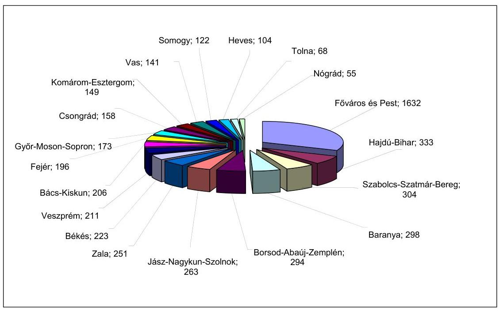

A Fővárosban és Pest megyében az önkormányzatokhoz tartozó intézmények száma közel ötszöröse (1632) a második helyen álló Hajdú-Bihar megyében található intézmények számának (333).

Az évenkénti felülvizsgálati kötelezettséget, amelyben mind a kiemelt, mind a négyévenkénti felülvizsgálati kötelezettségű önkormányzatok szerepelnek, a következő diagram ábrázolja.

Az egy évben vizsgálandó önkormányzatok száma megyénként
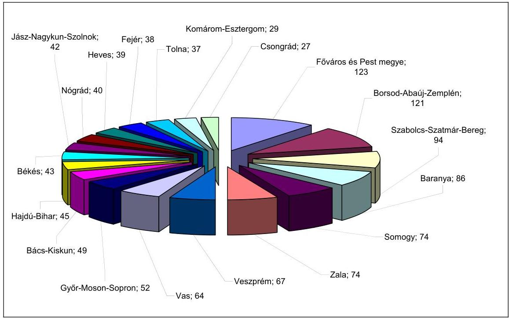

---

Az államháztartási irodák felülvizsgálati kötelezettsége a megyében található önkormányzatok számától, nagyságától, a fenntartott intézmények számától függ. Ezen túl jelentősége van az önkormányzatok és az intézmények által ellátott feladatok összetételének is, mivel a vizsgálandó jogcímek száma a feladatokkal arányosan nő, az államháztartási irodák leterheltsége ennek megfelelően változik.

# 1.2.2. A helyszíni felülvizsgálati feladat végrehajtása 

### 1.2.2.1. A helyszíni felülvizsgálati feladat alakulása

Az igazgatóságok a kiemelt önkormányzati kör évenkénti és a többi önkormányzat négyévenkénti - időarányos - kötelező helyszíni ellenőrzéseit az önkormányzatok száma tekintetében az éves munkaterveknek megfelelően - a Budapesti és Pest Megyei Igazgatóság kivételével - teljesítették.

A Budapesti és Pest Megyei Igazgatóság a tervezett helyszíni vizsgálatokat a 2008-2010. években nem folytatta le, amelynek oka kapacitáshiány volt. Az igazgatóságon a feladathoz szükséges létszámigényt kimutatták, azonban az éves tervek összeállítását megelőzően nem készítettek munkaidőmérleget. Az évenkénti vizsgálatra kötelezett 88 kiemelt önkormányzatból a 2008. évben négy, a 2009. évben 30, a 2010. évben 24 önkormányzatnál végeztek helyszíni ellenőrzést. A nem kiemelt körben a 2008. évre 37 ellenőrzést terveztek, amelyből 14 valósult meg, a 2009. évben 38 tervezett felülvizsgálattal szemben 19 teljesült, a 2010. évre ütemezett 37 vizsgálatból ötöt folytattak le. A teljesítés aránya a kiemelt önkormányzatok tekintetében a 2008. évben 5%, a 2009. évben 38%, a 2010. évben 31%, a nem kiemelt körben a 2008. évben 38%, a 2009. évben 50%, a 2010. évben 13% volt. Az igazgatóság a kiemelt önkormányzati körben nem tartott ellenőrzés - többek között - a Pest Megyei Önkormányzatnál, illetve Budapest Főváros Önkormányzatánál, valamint hat fővárosi kerületnél.

A Kincstár hálózatirányítási igazgatójának KFI-151/2008. számú ügyirata alapján a négyévenkénti vizsgálatok esetében a helyszíni ellenőrzések nem terjedtek ki az elszámolásban szereplő összes jogcímre. A kiemelt önkormányzati körnél a kockázatelemzéssel meghatározott jogcímek, ahol ilyen nem készült, ott a dokumentális felülvizsgálat tapasztalatai alapján kiválasztott jogcímek vizsgálatára került sor.

A végrehajtott helyszíni ellenőrzések adataiból megállapítható, hogy az államháztartási irodák a kiemelt önkormányzati kör esetében az Áht. 64/F. § (3) bekezdésében előírt feladatoknak - az ellenőrzött jogcímek száma, illetve a kiválasztás módja tekintetében - maradéktalanul nem tettek eleget, mert az ellenőrzött jogcímek száma a 2008. évben nem érte el az 50%-ot minden kiemelt körbe tartozó önkormányzatnál, a 2009. és 2010. években a jogcímek kiválasztása a vizsgált 11 államháztartási iroda 54,4%-ánál nem kockázatelemzés alapján történt.

---

Az FPartner programban rendelkezésre álló országos adatok szerint az Áht. 64/F. § (3) bekezdésében előírt évenként ellenőrzött kiemelt önkormányzati kör és a négyévenként ellenőrzött többi önkormányzat helyszíni ellenőrzéseinek száma a következő volt:

| Ellenőrzött jogcímek   db/ önkormányzatok száma db | Kiemelt önkormányzati kör |  | Nem kiemelt önkormányzatok |  |
| :--: | :--: | :--: | :--: | :--: |
|  | 2008. év-   ben | 2009. év-   ben | 2008. év-   ben | 2009. év-   ben |
| 1-2 jogcím | 10 | 41 | 282 | 209 |
| 3-5 jogcím | 3 | 29 | 116 | 178 |
| 6-10 jogcím | 4 | 61 | 102 | 148 |
| 11-20 jogcím | 5 | 69 | 81 | 138 |
| 21-50 jogcím | 130 | 107 | 96 | 140 |
| 51-75 jogcím | 89 | 6 | 5 | 55 |
| 75 felett jogcím | 28 | 0 | 0 | 10 |
| Összesen: | 269 | 313 | 682 | 878 |

A Kincstár a helyszíni ellenőrzések eredményességének mérési rendszerét nem alakította ki, az eredményesség kritériumait nem határozta meg. A helyszíni felülvizsgálatok értékelését informatikai rendszer csak a források elszámolása tekintetében támogatta, az igénylések helyszíni felülvizsgálatának értékelését azonban nem. A források elszámolásának felülvizsgálatát az országos adatbázisként működő FPartner informatikai program segítségével végezték, amelynek kötelező használatát a források elszámolása szabályszerűségének felülvizsgálatáról szóló, évenként kiadott eljárásrendek írták elő. A program biztosította a felülvizsgálati eljárás önkormányzatonkénti dokumentálását, adatokat tartalmazott a helyszíni vizsgálatok számáról, a vizsgált önkormányzatok típusáról, a jogcímekről, a felhívásokról, a felhívások alapján az önrevíziós adatlapon az önkormányzatok által teljesített módosítások számáról, a helyszíni ellenőrzések során megállapított eltérések összegéről, a hozott elsőfokú határozatok számáról, amelyek a központ által is lekérhetők voltak. Az FPartner program, mivel abban kizárólag az év végi elszámolások adatait rögzítették, nem tartalmazta az igénylésre vonatkozó, továbbá a cél- és témavizsgálatok információit. Mutatók, kritériumok kidolgozásának hiányában az eredményesség mérése, az államháztartási irodák munkájának összehasonlítása, a rendelkezésre álló létszám indokoltságának alátámasztása, kihasználtsága mérése nem megoldott.

Az államháztartási irodák a 2009-2010. években a vizsgálatba vont évek számának emelkedése miatt csak úgy tudták az ütemezett helyszíni felülvizsgálatokat elvégezni, hogy kevesebb intézményt és kevesebb jogcímet ellenőriztek. A helyszíni felülvizsgálattal érintett önkormányzatok száma a 2008. évben 949, a 2009. évben 1182, a 2010. évben 1017 volt. Ezzel szemben - mivel a 2009. évben már kettő, illetve a 2010. évben már három év elszámolását kellett felülvizsgálni - a 2008. évi 2473-ról a 2009. évre 2107, a 2010. évre 1674-re csökkent a felülvizsgált intézmények száma, és a 2008. évi 17 602-ről a 2009. évre 16 967, a 2010. évre 15 498-ra a vizsgált jogcímek száma ${ }^{25}$.

A 2008-2010. években 734-ről 816-ra nőtt azon önkormányzatok száma, ahol az államháztartási irodák a helyszíni ellenőrzés során eltérést állapítottak meg, miközben az eltéréssel érintett/ellenőrzött jogcímek aránya 51,5%-ról 35,3%-ra, az eltérések abszolút értéke 3,8 milliárd Ft-ról 1,9 milliárd Ft-ra csökkent.

# 1.2.2.2. A helyszíni felülvizsgálati feladat végrehajtásának értékelése 

A helyszíni felülvizsgálati feladatok végrehajtását a mintavétellel kiválasztott 198 önkormányzat helyszíni ellenőrzéséről az államháztartási irodák által készített dokumentumok alapján értékeltük.

A helyszíni vizsgálatokat megelőzően a 16/2002. (IV.12.) PM rendelet 10. §-ának és az eljárásrendeknek megfelelően az államháztartási irodák felülvizsgálati programot készítettek, megbízólevelet állítottak ki, az ellenőrzést végzők az összeférhetetlenségről nyilatkoztak.

A 16/2002. (IV.12.) PM rendelet 11. § előírásának megfelelően a helyszíni ellenőrzésről, a felülvizsgálat céljáról, feladatairól, és az abban várhatóan érintett intézményi körről - három nappal korábban - értesítették az önkormányzatok polgármestereit. A határidő betartásáról az iratokhoz csatolt postai tértivevények tanúskodtak.

A helyszíni vizsgálat megállapításait - két államháztartási iroda (Baranya, Vas) által, két önkormányzatnál lefolytatott ellenőrzés kivételével - helyszíni vizsgálati jegyzőkönyvben rögzítették, amelyek az Ámr. ${ }_{1}$ 52/A. § (7) bekezdésében ${ }^{26}$ és az eljárásrendekben előírtakat tartalmazták. A helyszíni jegyzőkönyvek tartalmát - egy államháztartási irodát (Somogy) és négy önkormányzatot érintően - hiányosnak minősítette az ÁSZ ellenőrzés, mert nem rögzítették pontosan az eltérések okait, a megállapítások indoklását hiányosan tartalmazták, valamint két államháztartási irodánál (Somogy, Tolna) két önkormányzat esetében a helyszíni vizsgálat megállapításai nem teljes körűen feleltek meg a Közokt. tv. 3. számú melléklet II. rész 7. pontja és az 52. § (13) bekezdése előírásainak.

A helyszíni vizsgálati jegyzőkönyveket - néhány kivétellel - a helyszíni vizsgálat befejezését követően 15 napon belül tértivevényesen megküldték az önkormányzatoknak.

Három államháztartási irodánál (Budapesti és Pest, Borsod-Abaúj-Zemplén, és Szabolcs-Szatmár-Bereg megyei) fordult elő, hogy a helyszíni vizsgálatról készült jegyzőkönyv átadása során összességében öt önkormányzat esetében nem tartották be az eljárásrendben meghatározott határidőt.

[^0]
[^0]:    ${ }^{25}$ Valamennyi önkormányzat valamennyi megvizsgált jogcímének halmozott adata.
    ${ }^{26}$ A rendelkezést 2010. január 1-jétől az Ámr. ${ }_{2}$ 63. § (7) bekezdése tartalmazza.

---

Egy államháztartási irodánál (Nógrád) a helyszíni ellenőrzésről készült jegyzőkönyveket nem a kiadmányozásra jogosult írta alá. A helyszíni vizsgálatról készült jegyzőkönyvek megküldését követően az államháztartási irodák a felhívásokat tárgyév december 31-éig kibocsátották, a felhívásokban az Áht. 64/D. § (2) bekezdésében előírt öt munkanapos határidőt az elszámolások módosítására biztosították, amelyekben az éves elszámolások módosítására szólították fel az önkormányzatokat. Egy államháztartási iroda (Baranya) három önkormányzat tekintetében a 2008. évben ${ }^{27}$ a felhívásokat nem az eljárásrendben előírt módon adta ki, mert a felhívást a helyszíni ellenőrzésről készült jegyzőkönyvek tartalmazták.

Az Áht. 64/D. § (6) bekezdése szerinti jegyzőkönyveket az önkormányzat és az igazgatóságok álláspontja közötti eltérés esetén elkészítették. A jegyzőkönyveket megadott határidőben - az eljárás megindítását követő 32 napon belül - az önkormányzatokhoz eljuttatták. A jegyzőkönyvekben az észrevételezési időt Áht. 64/D. § (7) bekezdése szerint biztosították.

Az eljárás lezárásakor az Áht. 64/D. § (8) bekezdésében előírt 10 munkanapon ${ }^{28}$ belül az Ámr. ${ }_{1}$ 52/C. § (5) bekezdésében és az Ámr. ${ }_{2}$ 65. § (5) bekezdésében előírt tartalmú határozatot hoztak, amelyben a fellebbezési lehetőséget a Ket. 99. § (1) bekezdésének megfelelően biztosították. A határozatokban bemutatott eltéréseket a hatályos jogszabályi előírások alapján megfelelő indoklással alátámasztva állapították meg.

Az államháztartási irodák a helyszíni felülvizsgálati tevékenységet a megállapított kisebb hiányosságok ellenére az Áht. 64/D. § és a 16/2002. (IV. 12.) PM rendelet 10-13. §-ainak, valamint a mindenkor hatályos eljárásrendnek megfelelően hajtották végre.

# 1.3. A jogorvoslati eljárásokból levont következtetések 

Az állami támogatások és hozzájárulások igénylésének és elszámolásának felülvizsgálata a hatósági eljárások speciális esete, amelyet az Áht. szabályoz, háttérszabályként a Ket. előírásait is alkalmazni kell. A Kincstár az elsőfokú és a jogorvoslati eljárások eljárásrendjét ${ }^{29}$ szabályozta, amelyben meghatározta az első- és másodfokon eljáró szerveket, az ügyintézési határidőket, az eljárási cselekményeket, valamint az alkalmazandó iratmintákat. Az első- és másodfokú hatósági jogkörök elkülönítésével a Kincstár biztosította az önkormányzatok jogorvoslati lehetőségét. Az elsőfokú eljárás során a területi szervek államháztartási irodái, a másodfokú eljárás során a Kincstár Önkormányzati Főosztálya járt el. A másodfokú határozatok felülvizsgálatát az illetékes megyei bíróságnál
 kérhették az önkormányzatok.

[^0]
[^0]:    ${ }^{27}$ Az államháztartási iroda a felhívásokat a 2009. évtől már az eljárásrendnek megfelelően adta ki.
    ${ }^{28}$ 2011. január 1-jétől a határidő 15 napra módosult (módosította az egyes törvényeknek a naptári napban való határidő-számítással összefüggésben történő módosításáról szóló 2010. évi CLII. törvény 10. § (76) bekezdése).
    ${ }^{29}$ A szabályozást a 4/2008. számú Hálózatirányítási Igazgatói utasítás tartalmazta.

---

A hatósági eljárás az igénylések felülvizsgálata során csak kivételes esetben, az elszámolások felülvizsgálata esetében pedig akkor indult, ha a vizsgált önkormányzat az államháztartási iroda felhívására nem módosította elszámolását, illetve az államháztartási irodák nem fogadták el az önkormányzati adatok indoklását és így különbség maradt fenn az önkormányzat és az Igazgatóságok által megállapított adatok között.

A Kincstár/területi szervek által hozott határozatok

| Megnevezés | 2008. év | 2009. év | 2010. év |
| :-- | --: | --: | --: |
| I. fokú határozat (db) | 66 | 39 | 20 |
| II. fokú határozat (db) | 7 | 13 | 5 |
| II. fokú határozatok aránya (\%) | 10,6 | 33,3 | 25,0 |
| II. fokú határozatokból helybenhagyó döntés (db) | 7 | 11 | 5 |
| Helybenhagyó döntés aránya (\%) | 100,0 | 84,6 | 100,0 |
| Bírósági felülvizsgálat (db) | 5 | 6 | 1 |
| Bírósági felülvizsgálat aránya (\%) | 71,4 | 46,2 | 20,0 |
| Helybenhagyó bírósági ítélet (db) | 3 | 5 | 1 |
| Helybenhagyó bírósági ítélet aránya (\%) | 60,0 | 83,3 | 100,0 |

Az ellenőrzött 11 államháztartási iroda a helyszíni felülvizsgálattal kapcsolatos hatósági tevékenységét az Áht. 64/A. § (3) bekezdése, az Áht. 64/D. § (5)-(8) bekezdései, a Ket. 99. §, 105. § és 109. §-nak, valamint az eljárásrendeknek megfelelően, az előírt határidők betartásával látta el, az első és másodfokú határozatai a jogorvoslati eljárások során hozott döntések alapján - a fenti táblázat szerint - összességében megalapozottak voltak. A 2008-2010. évek között a Főváros Pest megyei adatok figyelembevétele nélkül - folyamatosan csökkent ${ }^{30}$ azon helyszíni felülvizsgálatok száma, ahol különbség maradt fenn az önkormányzat és a regionális igazgatóságok által megállapított adatok között, ennek következtében 66-ról 20-ra csökkent a hozott elsőfokú határozatok száma. A 2008. évben az érintett önkormányzatok 10,6%-a, a 2009. évben 33,3%-a, és a 2010. évben 25,0%-a élt a fellebbezés benyújtásának lehetőségével, a többi önkormányzat a határozatokban foglaltakkal egyetértett és nyilatkozatban a fellebbezési jogáról lemondott. A 2008. és a 2010. évben hozott elsőfokú határozatokat helybenhagyta a másodfokú határozat, a 2009. évben hozott 13 határozatból kettőt elutasítottak. A másodfokú határozatokkal szemben kezdeményezett perek száma 2008. évben öt, a 2009. évben hat, a 2010. évben egy volt, amelyekből a bírósági ítéletek hármat, ötöt és egyet hagytak jóvá.

Az ÁSZ által ellenőrzött 11 igazgatóság közül Vas megyében a vizsgált időszakban egy esetben sem kezdeményeztek jogorvoslati eljárást az önkormányzatok, Zala megyében a 2009-2010. években, Szabolcs-Szatmár-Bereg és Nógrád megyékben a 2010. évben nem indult jogorvoslati eljárás.

[^0]
[^0]:    ${ }^{30}$ A Budapesti és Pest megyei Igazgatóság a helyszíni vizsgálat befejezéséig a 2010. évben hozott első és másodfokú határozatok és a közigazgatási perek számáról nem szolgáltatott adatot. Az I. fokú határozatok száma a 2008. évben egy, a 2009. évben hat volt, másodfokú határozat kiadására nem került sor. A 2010. évet érintően a vizsgálat lezárásakor 11 véleménykülönbség volt ügyintézési folyamatban.

---

# 1.4. A felülvizsgálati feladatokról szóló beszámolás 

A 16/2002. (IV. 12.) PM rendelet 5. § (1) bekezdése értelmében a területi szervek minden év április 30-áig - a Kincstár elnöke által szabályozott módon - összefoglaló jelentésben tájékoztatják a Kincstár elnökét az előző évben végzett vizsgálatokról, felülvizsgálatokról. Az 5. § (2) bekezdése szerint a Kincstár elnöke a területi szervek által benyújtott összefoglaló jelentések alapján a felülvizsgálatok tapasztalatairól szöveges és számszaki összegzést készít, amelyet minden év május 31-éig kell megküldeni a pénzügyminiszter, az önkormányzatokért felelős miniszter és az ÁSZ részére.

Az előírt tájékoztatási kötelezettségének a Kincstár elnöke eleget tett, a 2008-2010. évek felülvizsgálati tapasztalatairól készült összegzést Tájékoztató megnevezéssel készítette el.

A Tájékoztató összeállítása céljából a 16/2002. (IV. 12.) PM rendelet 5. § (1) bekezdésében előírt elnöki szabályozás helyett a Hálózatirányítási Igazgató ${ }^{31}$, illetve az Önkormányzati Főosztály vezetője ${ }^{32}$ intézkedett és kérte a regionális igazgatóságoktól az - évek óta kialakított - számszaki adatok egy részét táblázatos formában, illetve a szöveges értékelést. A táblázat kitöltéséhez a 2007. évben útmutató készült, amely nem változott a 2008. és a 2009. évben sem. Az igénylésekre vonatkozó számszaki adatok igazgatóságok általi kigyűjtése a 2008. és 2009. években manuálisan történt, azt informatikai háttér nem támogatta. A 2010. évben az igénylésekre vonatkozó információk egy része az országos adatbázisú ÖNEGM informatikai rendszerből már a központ által is lekérdezhető volt. Az elszámolások számszaki adata a 2008. évtől az FPartner program országos adatbázisából rendelkezésre állt. A 2008. évi felülvizsgálat tapasztalatairól szóló szöveges értékelésben az egyes támogatástípusokra vonatkozó fontosabb megállapítások rögzítését kérték, de a szöveges értékelés összeállításához szempontrendszert nem dolgoztak ki, és nem kellett a helyszíni felülvizsgálat tapasztalatai értékelésére kitérni. A 2009. évi felülvizsgálatra vonatkozó adatszolgáltatás keretében a szöveges beszámolóban a helyszíni ellenőrzés tapasztalatairól is kértek tájékoztatást.

Az igénylések és elszámolások felülvizsgálatának 2008. évi tapasztalatairól készült Tájékoztató adatai között a helyszíni ellenőrzések számát és az ellenőrzési napok számát tüntették fel. Az elszámolásokra vonatkozó adatok azonban nem tartalmazták elkülönítetten az Áht. 64/F. §-ában a 2008. január 1-jétől kötelezően elvégzendő helyszíni felülvizsgálatok adatait.

A 2008. évről készült Tájékoztató szerint 11840 napot - az igénylésekre 1114 napot, az elszámolásokra 10726 napot - fordítottak helyszíni ellenőrzésre. Ezzel szemben a valamennyi megyei igazgatóságtól tanúsítványokon bekért, országosan összesített adatok szerint 29177 nap volt a helyszíni felülvizsgálatra fordított ellenőri napok száma. A 2009. és a 2010. évekről készült Tájékoztató-

[^0]
[^0]:    ${ }^{31}$ A Hálózatirányítási Igazgató 2009. február 13-án kelt HIG/232/2009. számú körlevelében.
    ${ }^{32}$ Az Önkormányzati Főosztály vezető 2010. május 7-én kelt ÖF-1190/2010. számú körlevélben.

---

ban már csak az igénylések helyszíni ellenőrzésére fordított napokat tüntették fel, az elszámolások helyszíni ellenőrzésére vonatkozóan csak a vizsgálatok száma szerepelt.

Az elszámolások helyszíni felülvizsgálati tevékenységét segítő-dokumentáló FPartner programban a vizsgálat teljes időigénye nem volt lekérdezhető, az igazgatóságok adatszolgáltatása a kötelezően elrendelt nyilvántartás hiányában kigyűjtésen, becslésen alapult, így a Tájékoztatóban feltüntetett adatok nem pontosak.

# 2. EGYES HELYI ÖNKORMÁNYZATOKAT A 2010. ÉVBEN MEGILLETŐ NORMATÍV HOZZÁJÁRULÁSOK ELSZÁMOLÁSA 

### 2.1. Az ellenőrzött önkormányzati elszámolások értékelése

Az államháztartási irodák - a 2008-2010. években lefolytatott, a 2007-2009. évek elszámolásának ellenőrzésére irányuló - helyszíni felülvizsgálati feladatának végrehajtását 11 megyében 18-18, összesen 198 önkormányzatot érintően értékeltük. Ezek közül választottunk ki 45 önkormányzatot, ahol helyszíni ellenőrzést végeztünk a 2010. évi normatív hozzájárulások valamennyi jogcíme elszámolására vonatkozóan.

A 45 önkormányzat 125 jogcímen ${ }^{33}$ összességében 5901 millió Ft támogatást vett igénybe. A jogcímek szerinti elszámolásnál 63 millió Ft támogatás igénybevételét jogtalannak ítéltük és 54 millió Ft pótlólagos támogatást állapítottunk meg.

A 45 önkormányzat közül hat elszámolása volt hibátlan, 16-nál - az eltérések egyenlegeként - befizetési kötelezettséget, 22-nél pótlólagos támogatást állapítottunk meg, egy önkormányzatnál a feltárt befizetési kötelezettség és pótlólagos támogatás kiegyenlítette egymást.

Az elszámolások 62%-át ítéltük megbízhatónak, 38% nem volt megalapozott és megbízható, mivel az elszámolások hibaaránya - a lényegesség elvének figyelembevételével - összességében meghaladta a 2%-os hibahatárt (három önkormányzatnál), illetve a jogcímenként számított eltérés egy jogcím esetében 5%-ot meghaladó mértékű volt ${ }^{34}$ (14 önkormányzatnál).

[^0]
[^0]:    ${ }^{33}$ Az önkormányzatok által igénybe vehető, jogcímenként kimutatható támogatások száma.
    ${ }^{34}$ Az egy jogcímen való 5% feletti eltérést kis önkormányzatok esetében egy mutatószám téves elszámolása is okozhatja.

---

# 2.2. A kincstári helyszíni felülvizsgálat hatása az ellenőrzésbe vont önkormányzatok elszámolására 

Az ellenőrzött 45 önkormányzatnál a Kincstár a 2007-2009. években elszámolása tekintetében végzett helyszíni felülvizsgálatot ${ }^{35}$. Összességében 1337 jogcím ${ }^{36}$ elszámolását vizsgálták meg, amelyből 613-nál (46%) találtak eltérést és mindössze egy önkormányzat elszámolását ítélték hibátlannak. Jelen ellenőrzésünk során 1578 jogcím ${ }^{37}$ elszámolásának vizsgálata során 325-nél (21%) találtunk eltérést, és hat önkormányzat elszámolását ítéltük hibátlannak.

Az ÁSZ ellenőrzésébe vont önkormányzatok tekintetében csökkent a hibás elszámolások aránya. Az ellenőrzés szükségességét alátámasztja azonban, hogy hibátlan elszámolást mindössze az önkormányzatok 13%-a adott be.

## 3. Az ÁSZ JAVASLATAINAK HASZNOSULÁSA

Az ÁSZ 2007. évben 10 államháztartási irodánál ellenőrizte ${ }^{38}$ a Kincstár felülvizsgálati tevékenységét és a számvevőszéki jelentésben pénzügyminiszter számára öt, a Kincstár elnöke számára hat javaslatot fogalmazott meg.

A pénzügyminiszternek tett javaslatokból három megvalósult, egy részben hasznosult, egy nem teljesült.

Megvalósították a normatív állami hozzájárulások jogcímeinek tartalma és a KÍR statisztika adatai közötti egyeztetési lehetőség biztosítását, megteremtették az önkormányzatok költségvetési kapcsolatokból származó forrásai igénylésének 3. elektronikus szolgáltatási szinten való lehetőségét, továbbá az Áht. 64. § (8) bekezdésének 2011. január 1-jétől történt módosítása megszüntette a hatáskör hiányát a helyi önkormányzatok jövedelemkülönbségének mérséklését szolgáló támogatások és beszámítások vizsgálatánál.

Részben hasznosult az Áht. kiegészítésére és a szükséges létszám biztosítására vonatkozó javaslat, mert a költségvetési támogatások elszámolásának kötelező helyszíni ellenőrzésével 2008. január 1-jétől kiegészült az Áht., létszámfejlesztésekre is sor került, azonban a többletfeladat létszámigényét megalapozó

[^0]
[^0]:    ${ }^{35}$ Az államháztartási irodák által három évet érintően, és az Ász által egy évet érintően végzett felülvizsgálatok összehasonlíthatósága, az ebből adódó halmozódások kiszűrése érdekében a több évben kincstári ellenőrzéssel érintett önkormányzatoknál a legutolsó ellenőrzött év adatait vettük figyelembe.
    ${ }^{36}$ A kiválasztott önkormányzatoknál a Kincstár által megvizsgált jogcímek számának összesített adata (önkormányzatonként eltérő számú, az ellenőrzéssel érintett jogcímek teljes körű figyelembevételével számított halmozott adat).
    ${ }^{37}$ A kiválasztott önkormányzatoknál az (önkormányzatonként eltérő számú) elszámolt, és az ÁSZ által teljes körűen ellenőrzött jogcímek összesített (halmozott) adata.
    ${ }^{38}$ A 0738 számú, a helyi önkormányzatok és a helyi kisebbségi önkormányzatok központi költségvetési kapcsolatokból származó forrásai igénybevétele és elszámolása felülvizsgálati tevékenységének ellenőrzéséről szóló ÁSZ jelentés rögzítette a megállapításokat.

---

számítások hiányában nem állapítható meg, hogy a helyszíni ellenőrzéshez szükséges humán erőforrást biztosították-e.

Nem teljesült az előzetes felülvizsgálat azonos ellenőrzési szempontok szerinti végrehajtása érdekében tett, a 16/2002. (IV. 22.) PM rendelet módosítását kezdeményező javaslat, mert a felülvizsgálati szempontok Kincstár elnöke általi meghatározására a jogszabályban határidő kijelölésére
 nem került sor.

A Kincstár elnökének tett javaslatok közül három megvalósult, egy részben hasznosult, kettő nem teljesült. A javaslatok alapján a 2007-2010. években közzétették az elszámolások felülvizsgálatának segédletét, az FPartner program fejlesztésével kialakították a felülvizsgálatot szolgáló közigazgatási információk, statisztikai adatok egységes adatbázisát, és a Tájékoztatóhoz nyújtott adatok, információk egységes értelmezése érdekében gondoskodtak a kitöltési útmutató tartalmának bővítéséről az utólagos felülvizsgálatok tekintetében.

Részben hasznosult a felülvizsgálati feladatok elvégzése nyilvántartásának egységes szabályozására - az államháztartási irodák feladatellátásának összehasonlíthatósága érdekében - tett javaslat, mivel az FPartner program alkalmazásának kötelező előírásával az igazgatóságok feladatellátása összehasonlíthatóságához szükséges adatokat az adatbázis a felülvizsgálatokra fordított munkaidő és létszám kivételével tartalmazta.

Nem valósult meg az a javaslat, hogy a Tájékoztatóhoz nyújtott adatok, információk megalapozottsága érdekében az előző naptári évben végzett felülvizsgálatról a Kincstár elnökének készített összefoglaló jelentésben szolgáltatott adatok alátámasztottak, pontosak legyenek. Nem teljesült továbbá a Közép-magyarországi Regionális Igazgatóság utólagos felülvizsgálati kötelezettsége teljesítésének figyelemmel kísérésére, és a személyi feltételek biztosítására tett javaslat, mert a figyelemmel kísérésre bevezetett monitoring rendszer és a feladat ellátásra biztosított többletlétszám ellenére sem történt meg az igazgatóságot érintően az Áht. 64/F. § (3) bekezdésben meghatározott mértékű felülvizsgálati feladat ellátása.

Budapest, 2012. április " 25 "

Melléklet: 4 db
Függelék: $\quad 1 \mathrm{db}$
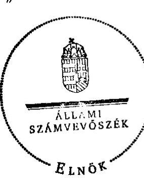

Domokos László

---

# Az ellenőrzött szervezeti egységek 

| A 2011. évtől érvényes   szervezeti rend szerint | A 2011. évet megelőzően   (2007.04.01-2010.12.31)   érvényes szervezeti rend szerint |
| :-- | :-- |
| Magyar Államkincstár Budapesti és Pest Megyei Igazgatóság | Magyar Államkincstár Közép-magyarországi Regionális Igazgatósága |
| Magyar Államkincstár Baranya Megyei Igazgatóság | Magyar Államkincstár Dél-dunántúli Regionális Igazgatósága Baranya megyei szervezeti egysége (régió központ) |
| Magyar Államkincstár Borsod-Abaúj-Zemplén Megyei Igazgatóság | Magyar Államkincstár Észak-magyarországi Regionális Igazgatósága BAZ megyei szervezeti egysége |
| Magyar Államkincstár Győr-Moson-Sopron Megyei Igazgatóság | Magyar Államkincstár Nyugat-dunántúli Regionális Igazgatósága Győr-Moson-Sopron megyei szervezeti egysége (régió központ) |
| Magyar Államkincstár Nógrád Megyei Igazgatóság | Magyar Államkincstár Észak-magyarországi Regionális Igazgatósága Nógrád megyei szervezeti egysége (régió központ) |
| Magyar Államkincstár Somogy Megyei Igazgatóság | Magyar Államkincstár Dél-dunántúli Regionális Igazgatósága Somogy megyei szervezeti egysége |
| Magyar Államkincstár Szabolcs-Szatmár-Bereg Megyei Igazgatóság | Magyar Államkincstár Észak-alföldi Regionális Igazgatósága Szabolcs-Szatmár-Bereg megyei szervezeti egysége |
| Magyar Államkincstár Tolna Megyei Igazgatóság | Magyar Államkincstár Dél-dunántúli Regionális Igazgatósága Tolna megyei szervezeti egysége |
| Magyar Államkincstár Vas Megyei Igazgatóság | Magyar Államkincstár Nyugat-dunántúli Regionális Igazgatósága Vas megyei szervezeti egysége |
| Magyar Államkincstár Veszprém Megyei Igazgatóság | Magyar Államkincstár Közép-dunántúli Regionális Igazgatósága Veszprém megyei szervezeti egysége (régió központ) |
| Magyar Államkincstár Zala Megyei Igazgatóság | Magyar Államkincstár Nyugat-dunántúli Regionális Igazgatósága Zala megyei szervezeti egysége |
| Magyar Államkincstár központja | Magyar Államkincstár központja |

---

# Az ellenőrzött önkormányzatok 

| Megye | Önkormányzat |
| :--: | :--: |
| Pest | Taksony |
|  | Perbál |
|  | Pilisvörösvár |
|  | Leányfalu |
| Baranya | Kozármisleny |
|  | Vokány |
|  | Siklós |
|  | Teklafalu |
|  | Szilágy |
|  | Erdősmecske |
|  | Hosszúhetény |
| Borsod-Abaúj-Zemplén | Bodroghalom |
|  | Hernádvécse |
| Győr-Moson-Sopron | Pér |
|  | Gönyú |
|  | Sokorópátka |
|  | Tényő |
|  | Nyúl |
| Heves | Poroszló |
|  | Tiszanána |
| Nógrád | Tereske |
|  | Vizslás |
| Somogy | Igal |
|  | Marcali |
|  | Homokszentgyörgy |

---

| Szabolcs-Szatmár-Bereg | Hetes |
| :--: | :--: |
|  | Hodász |
|  | Nyírkáta |
|  | Tiszakanyár |
| Tolna | Értény |
|  | Bonyhádvarasd |
|  | Diósberény |
| Vas | Bő |
|  | Csákánydoroszló |
|  | Kemenesmagasi |
|  | Pankasz |
|  | Egyházasrádóc |
| Veszprém | Balatonfüzfő |
|  | Káptalanfa |
|  | Lovászpatona |
|  | Gógánfa |
|  | Kemenesszentpéter |
| Zala | Alsópáhok |
|  | Letenye |
|  | Tófej |
|  | Kehidakustány |
|  | Türje |

---

# MAGYAR   ÁLLAMKINCSTÁR 

Domokos László úr részére elnök

Állami Számvevőszék Budapest

Tisztelt Elnök Úr!
Iktatószám: ELN- 168/2/2012.
Hiv. szám: V-3013-71/2010-2011.
Ggyintéző: Molnár Éva
Telefon: 327-3403
Targy: Számvevőszéki jelentés véleményezése

A helyi önkormányzatokat megillető támogatások és hozzájárulások igénylése és elszámolása kincstári felülvizsgálati rendszerének, valamint a helyi önkormányzatokat a 2010. évben megillető normatív hozzájárulások elszámolásának ellenőrzéséről készült számvevőszéki jelentéstervezethez az alábbi észrevételeket teszem:

## I. Általános észrevételek

1. Nem tartom megalapozottnak a jelentéstervezet 11. oldalán, az I. Összegző megállapítások, következtetések, javaslatok című fejezetben taglalt azon megállapítást, amely szerint a Kincstár helyszíni felülvizsgálati tevékenysége nem volt eredményes.

A jelentéstervezet több helyen is utal arra, hogy a Kincstár helyszíni felülvizsgálati tevékenysége a jogszabályi előírásoknak megfelelően és határidőben valósult meg:

- számvevőszéki jelentéstervezet szerint a jogorvoslati eljárások során hozott döntések a helyszíni felülvizsgálatok megállapításait igazolták (10. oldal),
- a felülvizsgálatot végzők szakképesítése és gyakorlata megteremtette a feltételeit a megfelelő minőségű szakmai munkavégzésnek (21. oldal),
- megfelelően működik a folyamatba épített előzetes, utólagos és vezetői ellenőrzés, a felülvizsgálati tevékenységet az F-Partner program támogatja,
- a Kincstár kialakította a monitoring rendszert (25. oldal),
- a helyszíni felülvizsgálati tevékenységet az államháztartási irodák - kisebb hiányosságok mellett - a vonatkozó jogszabályok és a mindenkor hatályos eljárásrendnek megfelelően hajtották végre (34. oldal).

A belső szabályozás esetleges hiányossága, illetve késői kihocsátása, a Kincstár, illetve az Igazgatóságok esetében nem jelentette azt, hogy ne hajtották volna végre határidőre és jó színvonalon a feladatot. A munkavégzést a szabályozás kiadása előtt nagymértékben segítették a rendszeres állásfoglalások, körlevelek formájában történő központi iránymutatások.
Abból, hogy nem kerültek kialakításra a célok teljesítésének mérésére, értékelésére alkalmas mutatók, még nem vonható le az a következtetés, hogy eredménytelen volt a helyszíni felülvizsgálati feladat ellátása.

---

A Kincstár felülvizsgálati tevékenységének eredménytelenségére vonatkozó megállapítással kapcsolatban több megyei igazgatóság jelezte, hogy a 2011. áprilisában rendelkezésükre bocsájtott Számvevői jelentés szerint az igénylések és elszámolások helyszíni felülvizsgálatát eredményesen látták el.

# Például: 

Borsod-Abaúj-Zemplén megyében:
,,az Igazgatóság eredményesen látta el az állami támogatások és hozzájárulások elszámolásának helyszíni felülvizsgálatát, mivel biztosította a feladatellátás személyi feltételeit. Illetékességi területén az Áht-ban kötelezően előírt körben és módon elvégezte az önkormányzatok és többcélú kistérségi társulások helyszíni felülvizsgálatát, mely biztosította a jogtalanul igénybe vett hozzájárulások, támogatások, illetve a fenntartókat megillető pótlólagos támogatások feltárását"

Győr-Moson-Sopron megyében:
„Az Igazgatóság munkája pozitív hatással volt az önkormányzatok normatív hozzájárulásokkal történő elszámolásának megbízhatóságára."
„Az Igazgatóság az állami támogatások és hozzájárulások igénylésének és elszámolásának helyszíni felülvizsgálatát eredményesen látta el."
2. A jelentéstervezet 11. oldalán rögzített megállapítás szerint nem javult az elszámolási fegyelem, mivel emelkedett az eltéréssel érintett beszámolót benyújtó önkormányzatok száma és aránya.

Ennek ellentmond a tervezet azon megállapítása, hogy „a vizsgált önkormányzatoknál a 2008. és a 2010. évek között a megállapított eltérések abszolút értéke és a hibás jogcímek aránya fokozatosan csökkent", továbbá 2.2 rész második bekezdésében szerepel, hogy „az ÁSZ ellenőrzésébe vont önkormányzatok tekintetében csökkent a hibás elszámolások aránya.

Az eltéréssel érintett beszámolók számának és arányának növekedése azonban a kincstári ellenőrzéssel megjelenő erős kontroll pozitív hatásaként is értelmezhető:

- egyrészt a jogtalanul igénybevett támogatásokat saját elszámolásukkal egyre nagyobb arányban korrigálják az önkormányzatok,
- másrészt a tervezet 13. oldalán az elszámolások megalapozottságára vonatkozó mutatókat követően megállapításra került, hogy az elszámolási hibákat többek között az elszámolások bonyolultsága okozta.

Az eltéréssel érintett beszámolót benyújtó önkormányzatok száma és aránya növekedésének további okai:

- Az állami hozzájárulások és támogatások egyre bonyolultabb igénybevételi feltételrendszere és a szakmai szabályok folyamatos változása, összetettsége, mely erőteljesebben hat az elszámolások megbízhatóságára, mint az utólagos ellenőrzés áttételes hatása.
- A tapasztalatok szerint a kamatteher és a személyi felelősségre vonás elkerülésének szándéka is inkább óvatosságra, „alul igénylésre" ösztönzi az önkormányzatokat.

---

- Az önkormányzatok személyi állományának összetételéből, esetleg felkészületlenségéből, vagy leterheltségéből is adódhat, amely miatt nem marasztalható el a Kincstár.

# II. Részletes észrevételek az anyag első és második fejezetéhez 

## 1. A 2007. évben engedélyezett létszámfejlesztés hatásaként jelentkező hatékonyság, eredményesség értékelése

A 8. oldalon, valamint ehhez kapcsolódóan a 20. oldalon a tervezet hiányolja az értékelést a létszámfejlesztés hatásaként megjelenő hatékonyság, eredményesség alakulásáról, a rendelkezésre álló létszám szükségességéről és elégségességéről.

Véleményem szerint bázisadat hiányában az elvárt hatékonyságra és eredményességre vonatkozó összehasonlítás nem értelmezhető, a 2008. évtől Áht. szabályozással előírt új feladat ellátásának értékelése más módszerrel - számszaki kimutatásokkal és szöveges értékelésekkel - pedig évről évre megtörtént.

## 2. A helyszíni ellenőrzésre kijelölt intézmények és jogcímek kiválasztása

A jelentéstervezet 9. oldalának második bekezdése szerint „A Kincstár - az országosan egységes gyakorlat biztosítása indokoltsága ellenére - nem alakította ki a helyszíni felülvizsgálat kiválasztási eljárásrendjét, folyamatát, dokumentálását, a vizsgálandó jogcímek kockázatelemzésének szabályait. Nem határozott meg továbbá kockázati tényezőket és nem értékelte az államháztartási irodák által kialakított kiválasztás rendszerét."

A kockázatelemzés kritériumát az Áht. kizárólag 2009. január 1. és 2010. december 31. közötti időszakban írta elő, sem a 2011-ben hatályos, sem a 2012. január 1-től hatályos Áht. szerinti szabályozás nem tartalmazza a Kincstár számára a kockázatelemzési kötelezettséget, mivel négyévente valamennyi önkormányzat helyszíni felülvizsgálatára sor kerül.
Továbbá a felülvizsgálati tevékenység gyakorlata szerint az Igazgatóságok a rendelkezésre álló iratok alapján felülvizsgálják az önkormányzatok igényléseit és elszámolásait, amely felülvizsgálatok során tárják fel azon kockázati tényezőket, amelyek alapján a helyszíni ellenőrzést lefolytatják.

A kockázatelemzés témaköréhez kapcsolódóan a jelentéstervezet 26. oldalának utolsó bekezdésében foglaltakra jelzem, hogy nem tartom célszerűnek szétválasztani az önkormányzatok központi költségvetésből származó forrásaival kapcsolatos felülvizsgálati feladatokat helyszíni felülvizsgálatra és dokumentumokon alapuló felülvizsgálatra, tekintettel arra, hogy egy eljárásban, ugyanazon jogszabályhely előírásai alapján, egységes, a teljes eljárást magában foglaló eljárásrend alkalmazásával valósul meg a felülvizsgálati tevékenység. Az egyes önkormányzatok felülvizsgálata egy dokumentummal (határozattal vagy záradékkal) zárul.

---

# 3. Az igénylések felülvizsgálati szempontjaira vonatkozó központi szabályozás 

A 9. oldalon megfogalmazottak szerint „Az állami támogatások és hozzájárulások igénylése felülvizsgálati szempontjait - a központosított támogatások kivételével - nem dolgozták ki."
A kategorikus és kiterjesztő megállapítást pontatlan, ugyanis 2010. első félévétől az igénylések, évközi módosítások felülvizsgálati rendszere folyamatosan bővülve és egyre részletesebb szempontrendszerrel kifejlesztésre került az ÖNEGM programban, annak általános és kötelező alkalmazása, továbbá a felülvizsgálati lapokon történő rögzítés révén az igénylések felülvizsgálata is dokumentálásra került.

## 4. A célok teljesítésének mérésére, értékelésére alkalmas mutatók

A 11. oldalon került rögzítésre, hogy „A célok teljesítésének mérésére, értékelésére alkalmas mutatókat nem alakították ki, emiatt az államháztartási irodák munkavégzése nem összehasonlítható."

Ennek ellentmondó megfogalmazás a 12. oldalon: „az FPartner program alkalmazásának kötelező előírásával az államháztartási irodák feladatellátása összehasonlíthatóságához szükséges adatok többsége az adatbázisból lekérdezhető...". Az ellentmondás az első megállapítás
 módosításával oldható fel az alábbiak szerint: „...értékelésére alkalmas mutatókat részben kialakították, így az államháztartási irodák munkavégzése többségében összehasonlítható.”

A témához kapcsolódóan megjegyzendő, hogy önmagában a helyszíni ellenőrzés eredménye nem mérhető, mivel a komplett felülvizsgálati tevékenység határozza meg a hatásokat. Az eredményesség mérési rendszerének kialakítását tovább akadályozza az önkormányzatok feladatellátásának nagyfokú különbözősége, másrészt a támogatási jogcímek sem összehasonlíthatóak a feltételrendszer jelentős eltérései miatt.

## 5. A helyszíni ellenőrzéssel érintett területek

A jelentéstervezet I. és II. fejezete (8. oldal és kapcsolódóan a 17. oldal) taglalja az államháztartási irodák feladatcsökkenését is, mely az Áht. szabályozásából következik. A „csak egy költségvetési év elszámolásait kell négy évenként a helyszínen felülvizsgálni” kijelentés véleményünk szerint nem pontos, ugyanis szükség esetén a helyszíni ellenőrzés a Ptk.-ban meghatározott általános elévülési időn belül - akár 5 évre visszamenőleg is kiterjeszthető.

Az igazgatóságok helyszíni ellenőrzés feladatellátásához kapcsolódó leterheltségét önmagában az önkormányzati kör vizsgálata alapján megítélni nem lehet, mert az a nem állami humán és önkormányzati kör ellenőrzési kötelezettségének együttes feladatai alapján jellemezhető - bár az előbbit az Állami Számvevőszék ellenőrzése nem érintette.

---

# 6. A munkatervek módosítása 

A jelentéstervezet II. 1.2.1.1. pontjában rögzített megállapításokra vonatkozóan megjegyzem, hogy az éves felülvizsgálati munkatervek módosításának indokoltságát megalapozó egyéb dokumentum (pl.: feljegyzés) elkészítését szükségtelennek tartjuk. Az érintett önkormányzat felülvizsgálati anyagából - legalább az arra való hivatkozással - ki kell, hogy derüljön a módosítás szükségességét alátámasztó körülmény, a munkatervben megjegyzésként elegendő erre kitérni.

## III. Megyei szintű észrevételek a jelentés tervezethez

1. A Borsod-Abaúj-Zemplén Megyei Igazgatóságot érintően, a számvevőszéki jelentéstervezet 33. oldalán rögzített hiányossághoz kapcsolódóan észrevételem, hogy 2008. évben az államháztartásról szóló törvény értelmében 5 nap állt rendelkezésre a jegyzőkönyvek elkészítésére és kiküldésére, amely határidő kevésnek bizonyult, és erre tekintettel a törvényben 2009. évben 15 napra, 2010. évben 10 munkanapra változott a jegyzőkönyv kiküldésének a határideje.
2. A II. Részletes megállapítások fejezetében a 33. oldalon szereplő megfogalmazást, mely szerint:
„(Baranya) három önkormányzat tekintetében a felhívásokat nem az eljárásrendben előírt módon adta ki, mert a felhívást a helyszíni ellenőrzésről készült jegyzőkönyvek tartalmazták”
pontatlan, mivel az új szabályozás alapján 2008. évben a még kiforratlan gyakorlat és szabályozás miatt az Igazgatóság Áht. 64.§ szerinti jegyzőkönyvekben állapította meg a vizsgálati eredményeket, mely a vonatkozó Áht. és Ket. szerinti szabályozásnak maradéktalanul megfelelt.
3. A jelentéstervezet II. 1.3. pontjához (35. oldal) kapcsolódóan megjegyzem, hogy Zala megyében 2008. évben 60 önkormányzat elszámolásának helyszíni ellenőrzését végezték el, amelyből 45 ellenőrzés zárult határozattal. Ebben az évben valamennyi helyszínen történő ellenőrzés esetében a rendelkezésre álló dokumentumok alapján végzett felülvizsgálat - a felhívás és az önrevíziós adatlap kiküldése - után került sor a helyszíni ellenőrzésre, és így eltérés megállapítása esetén minden esetben határozattal zárult a felülvizsgálat.

A 2009. évtől az Igazgatóság megváltoztatta a felülvizsgálati tevékenység lefolytatásának eljárását. Ennek megfelelően a helyszíni ellenőrzés megállapításai beépültek a felhívásba, majd önrevíziós vagy beszámolót elfogadó záradék kiadásával zárult az eljárás. 2009. évben, mivel az álláspontok között eltérés nem maradt fenn, így a Zala Megyei Igazgatóságon nem hoztak határozatot.

A fentiek alapján megállapítható, hogy a megyében az elsőfokú határozatok számának nagyarányú csökkenése (60-ról 20-ra) elsősorban a felülvizsgálati eljárási cselekmények sorrendjének megváltoztatására vezethető vissza.

---

# IV. Összegzés 

A Kincstár helyszíni felülvizsgálati tevékenysége, amely a 2011. évet követően az első négy éves ciklusán van túl, több pozitív megállapítást is kapott, amelyek az Állami Számvevőszék javaslatainak hasznosításával együtt még eredményesebb feladatellátást tesznek lehetővé.

Mivel a jelentéstervezetben foglalt megállapítások

- a meghatározott kritériumrendszer egyes elemeire vonatkoznak, illetve
- nem a vizsgált Igazgatóságok teljes körére állapítanak meg hiányosságot, javasoljuk, hogy a jelentéstervezetben a Kincstár felülvizsgálati tevékenysége megyénként eltérő mértékben eredményes minősítést kapjon.

Kérem észrevételeim szíves elfogadását.
Budapest, 2012. február 17.
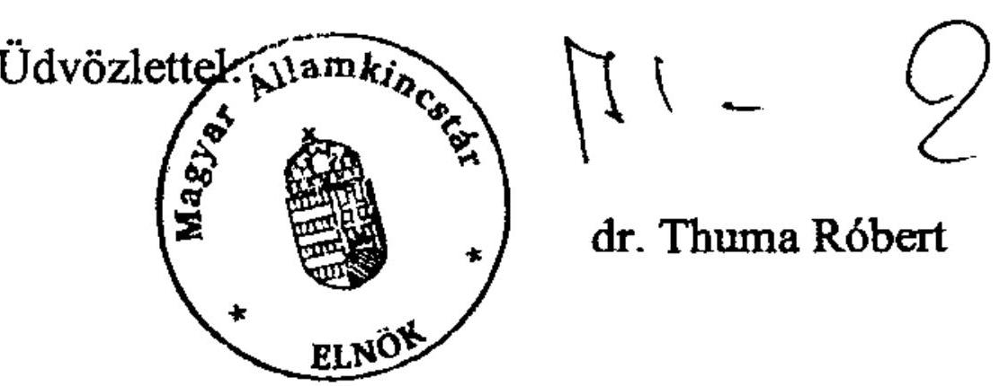

---

# Dr. Thuma Róbert úr 

elnök

Magyar Államkincstár
Budapest

## Tisztelt Elnök Úr!

Köszönettel vettem a helyi önkormányzatokat megillető támogatások és hozzájárulások igénylése és elszámolása kincstári felülvizsgálati rendszerének, valamint a helyi önkormányzatokat a 2010. évben megillető normatív hozzájárulások elszámolásának ellenőrzéséről készült jelentéstervezetünkkel kapcsolatos észrevételét.

A jelentéstervezet megküldésével egyidejűleg tájékoztattam Önt arról, hogy az Állami Számvevőszékről szóló 2011. évi LXVI. tv. 29. § (2) bekezdése szerint az Állami Számvevőszék az ellenőrzött szerv vezetője észrevételeinek megtételére 15 napot biztosít. Bár észrevétele ezen határidőn túl érkezett, levele alapján a jelentést áttekintettük, és az indokoltnak ítélt korrekciókat a kiadmányozást és közzétételt megelőzően a jelentésen átvezettük.

Az Állami Számvevőszék észrevételekre vonatkozó álláspontjáról a felügyeleti vezető által készített részletes tájékoztatást csatoltan megküldöm.

Budapest, 2012. április 16.
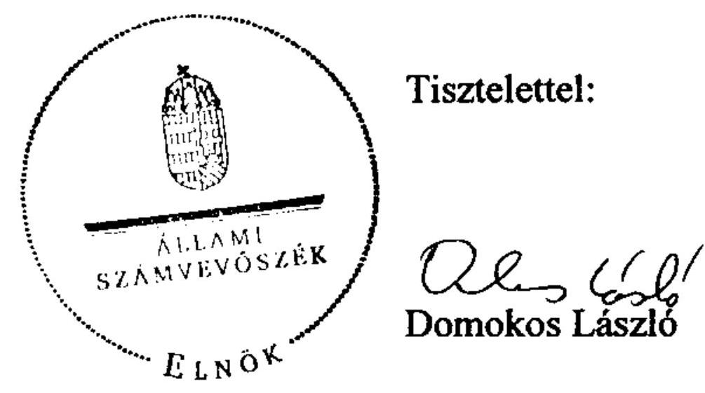

Melléklet: Tájékoztatás az elfogadott és az el nem fogadott észrevételekről

---

# Tájékoztatás   az elfogadott és az el nem fogadott észrevételekről 

I) Észrevételei közül az alábbiakat fogadtuk el, amelyekkel a jelentésünket módosítottuk:

1) A I. Általános észrevételek 1.) pontjában, a jelentéstervezet „Összegzö megállapítások, következtetések, javaslatok” című fejezetében, az eredményesség értékelését észrevétele alapján módosítottuk. A Kincstár felülvizsgálati tevékenysége átfogó értékelése helyett a kritériumrendszer egyes elemeit megvalósult/részben/nem teljesült kategóriákba soroltuk. A jelentést a következő bekezdéssel egészítettük ki: „A jelentés bevezetójében ismertetett, a Kincstár helyszíni felülvizsgálati rendszere eredményessége értékelésére az ÁSZ által az ellenőrzési programban meghatározott kilenc kritérium közül három teljesült, három részben megvalósult, három pedig nem teljesült.”

A felülvizsgálatok szabályozásának (eljárásrendek, szempontrendszer) részbeni hiányával, késői kibocsátásával kapcsolatos megállapításunkat észrevétele alapján (11. oldal 3. és a 26. oldal utolsó bekezdés) az alábbi mondattal egészítettük ki: „A rendszeres állásfoglalások, körlevelek formájában történő központi iránymutatások ugyan segítették a munkavégzést, de nem pótolták a teljes felülvizsgálati feladat átfogó, egységes szabályozását.”
2) Az I. Általános észrevételek 2.) pontjában megfogalmazott észrevételének - figyelembe véve, hogy az elszámolási fegyelem változására a Kincstártól független tényezők is hatnak - részben helyt adtunk. A „nem javult az elszámolási fegyelem, mert” mondatrészt a jelentés összegző megállapítások, következtetések, javaslatok részéből töröltük, ugyanakkor a megállapított eltérések nagysága, a hibás jogcímek, elszámolások száma, illetve aránya változását bemutató tendenciákat a nem teljesült kritériumok között szerepeltetjük. A megállapítást pontosítottuk, hogy az, az éves elszámolások helyszíni felülvizsgálata során a Kincstár által 2008-2010. években feltárt eltérésekre vonatkozik: „A Kincstár által a 2008-2010. években helyszíni felülvizsgálatba vont önkormányzatoknál a megállapított eltérések abszolút értéke és a hibás jogcímek aránya - részben az ellenőrzött jogcímek száma csökkenéséből adódóan - fokozatosan mérséklődött. Emelkedett viszont azon önkormányzatok száma és aránya, amelyeknél az éves elszámolások helyszíni felülvizsgálata során a Kincstár eltérést tárt fel.” E megállapítás számszaki megalapozása a jelentés 34. oldal utolsó és 35. oldal 2. bekezdéseiben található, melyek forrása a Kincstár valamennyi területi szervétől bekért tanúsítványok adatainak (ellenőrzési program 4-6. számú tanúsítvány a 2008-2010. évi felülvizsgálati tevékenységéről) országos összesítése.
3) A II. Részletes észrevételek 2.) pontjában a helyszíni ellenőrzésre kijelölt intézmények és jogcímek kiválasztása címen kifogásolt, általánosan megfogalmazott megállapítást az Áht. kockázatelemzésre vonatkozó előírása hatályának megfelelően, a 2009-2010. évekre

---

pontosítottuk. A Kincstár „nem határozta meg 2009-2010. között a vizsgálandó jogcímek kockázatelemzésének szabályait, a kockázati tényezőket, és nem értékelte az államháztartási irodák által kialakított kiválasztás rendszerét.” „Hat államháztartási iroda az Áht-ban előírtak ellenére a 2009-2010. években nem határozott meg kockázati tényezőket és nem végzett kockázatelemzést sem.”

Tekintettel arra, hogy sem a 2011. évben hatályos, sem a 2012. január 1-jétől hatályos új Áht. nem ír elő a jogcímek kiválasztására kockázatelemzési kötelezettséget, nem fogalmaztunk meg erre irányuló javaslatot jelentésünkben.
4) A II. Részletes észrevételek 3.) pontjában az igénylések felülvizsgálati szempontjaira vonatkozó központi szabályozás címmel írt észrevételét elfogadjuk, és az ÖNEGM program bevezetése után, a levelében bemutatott előrelépéssel a jelentést kiegészítettük. „Az állami támogatások és hozzájárulások igénylése felülvizsgálati szempontjait a 2008-2009. években - a központosított támogatások kivételével - nem dolgozták ki. 2010. első félévétől az igénylések, évközi módosítások felülvizsgálati rendszere folyamatosan bővülve és egyre részletesebb szempontrendszerrel kifejlesztésre került az ÖNEGM programban (a központi költségvetésből származó önkormányzati előirányzatokat kezelő és folyamatvezérlő informatikai rendszer). Annak általános és kötelező alkalmazása, továbbá a felülvizsgálati lapokon történő rögzítése révén az igénylések felülvizsgálata is dokumentálásra került.” (jelentés 11. oldal 3. bekezdés és 25. oldal utolsó bekezdés)
5) A II. Részletes észrevételek 4.) pontjában a célok teljesítésének mérésére, értékelésére alkalmas mutatók címmel megfogalmazott észrevétele alapján a kifogásolt megállapítást a következők szerint pontosítottuk: „A célok teljesítésének mérésére alkalmas mutatókat nem alakították ki, emiatt az államháztartási irodák tevékenysége - a célok teljesítése tekintetében - nem összehasonlítható.” (jelentés 14. oldal 3. bekezdés)

Véleményem szerint az eredményesség mérési rendszerének kialakításánál az eredményességi kritériumokat a feladatellátás céljából szükséges levezetni/meghatározni. A Kincstár részére az Áht. 60. § (2) bekezdésében előírt felülvizsgálati kötelezettség célja, hogy javuljon az önkormányzatok normatív hozzájárulásokkal és támogatásokkal való elszámolási fegyelme. Ezt az is alátámasztja, hogy a feketegazdaság elleni küzdelemmel kapcsolatos feladatokról, a végrehajtásban érintett intézmények erőforrásigényéről szóló 2146/2007. (VII. 27.) számú Korm. határozatban kapott a Kincstár e - 2008. évtől új feladat megvalósítására 335 fő létszámfejlesztést.

Azt a tényt, hogy a feladatellátás eredményességét az önkormányzati rendszer és a kapcsolódó támogatási rendszer bonyolultsága befolyásolja, nem az eredményesség mérési rendszerében, hanem a feladat - e kockázatokra figyelemmel történő - megszervezése keretében (pl. kockázatalapú kiválasztás, országosan egységes eljárásrend, a kockázatokat figyelembe vevő humánerőforrás allokáció alkalmazásával) indokolt kezelni. Egyetértek Önnel abban, hogy a komplett felülvizsgálati tevékenység határozza meg a hatásokat. E komplex rendszerben az igénylések és évközi módosítások felülvizsgálata a folyamatba épített (az elszámolási hibákat megelőző) kontroll, a helyszíni ellenőrzés pedig az utólagos (az elszámolási hibákat feltáró) kontroll. A hatékony megelőző kontroll (pl. a bonyolult

---

támogatási rendszerben való eligazodást segítő, a változásokra a figyelmet felhívó információknak az önkormányzatokkal történő megosztásával) jelentősen hozzájárul az önkormányzatok elszámolási fegyelme javulásához, mely azonban végső soron a feltáró jellegű, utólagos kontrollon keresztül, a helyszíni felülvizsgálatok eredményével mérhető.
6) A III. Megyei szintű észrevételek 2.) pontjában Baranya megyét érintően a jelentés 1.2.2.2. pontjában, kifogásunk az volt - ahogy azt Ön is levelében idézte -, hogy „a felhívásokat nem az eljárásrendben előírt módon” adta ki az érintett igazgatóság. Ugyanakkor, mivel az érintett igazgatóságnak átadott jelentésből kiderül, hogy ez a hiányosság csak a 2008. évben fordult elő, a 2009. évtől a felhívások kibocsátása már az eljárásrendnek megfelelő volt, ezzel a számvevőszéki jelentést pontosítottuk. (jelentés 36. oldal 1. bekezdés)
II) Tájékoztatom továbbá arról, hogy a következőkben felsorolt észrevételeit - az alábbiakban kifejtett indoklás alapján - nem fogadjuk el.

1) A II. Részletes észrevételek 1.) pontjában a 2007. évben engedélyezett létszámfejlesztés hatásaként jelentkező hatékonyság, eredményesség értékelése címmel kifogásolt összegző megállapítás (jelentés 10. oldal 3. bekezdés vége): „A létszámfejlesztések végrehajtását követően a Pénzügyminisztérium
 nem kért, a Kincstár nem készített értékelést, elemzést azok megvalósításáról, teljesítéséről, az elvárt hatások, eredmények teljesüléséről. A Kincstár nem készített értékelést arról sem, hogy a létszámfejlesztés hatására hogyan alakult a helyszíni felülvizsgálati tevékenység hatékonysága, eredményessége." A megállapítás részletes megalapozása a jelentés 21. oldal 2., és a 22. oldal 3. bekezdésében található.

A jogszabályban előírt (változó) mértékű helyszíni ellenőrzési feladat munkaidő és humánerőforrás szükséglete felmérésére irányuló számítások, elemzések hiányában egyrészt nem állapítható meg, hogy kincstári szinten biztosított volt-e a szükséges/elégséges létszám. Másrészt nem biztosítható a feladatot ellátó államháztartási irodák dolgozóinak egységes leterheltsége.

A „2008. évtől Áht. szabályozással előírt új feladat" méréséhez bázisként kiindulást jelenthettek volna az ellenőrizendő önkormányzatok/intézmények/jogcímek számából kialakított mutatók, melyek megalapozhatták volna a kapott létszámfejlesztés „becsült" feladattal arányos területi szétosztását, majd a teljesítmények mérése alapján annak korrigálását, így kincstári szinten a feladat Áht-ban előírt mértékű ellátását.

Az a tény, hogy a Budapesti és Pest Megyei Igazgatóság a kiemelt körben átlag 75%, a nem kiemelt körben átlag 66%-ban nem végezte el - az ehhez szükséges humán erőforrás hiánya miatt - az Áht-ban előírt mértékű helyszíni felülvizsgálatot is mutatja, hogy szükséges és indokolt lett volna a rendelkezésre álló létszám szükségessége/elégségessége mérése.

A Budapesti és Pest Megyei Igazgatóság az évenkénti kötelező ellenőrzések közül 2008-2010 között egyik évben sem tartott helyszíni felülvizsgálatot - többek között - a Pest Megyei Önkormányzatnál, Budapest Főváros Önkormányzatánál, valamint hat

fővárosi kerületnél. Így a 2007-2009. évi normatív hozzájárulások tekintetében a Pest Megyei Önkormányzat esetében a 2007. évet érintően 9,9 milliárd Ft, a 2008. évben 9,7 milliárd Ft, a 2009. évben 9,4 milliárd Ft, (a három évben együttesen 29 milliárd Ft közpénz), a Fővárosi Önkormányzat esetében a 2007. évet érintően 34,6 milliárd Ft, a 2008. évben 33,7 milliárd Ft, a 2009. évben 32,6 milliárd Ft (a három évben együttesen 100,9 milliárd Ft) közpénz ellenőrzése nem történt meg.
2) A II. Részletes észrevételek 5.) pontjában a helyszíni ellenőrzéssel érintett területek címmel kifogásolt összegző megállapítás: „A 2011. évtől ....valamennyi önkormányzatnál csak egy költségvetési év elszámolásait kell négy évenként a helyszínen felülvizsgálni."

A jelentés I. fejezete jellegéből (Összegző megállapítások, következtetések, javaslatok) adódóan, a 10. oldal 1. bekezdésben a 2011. évi szabályozásváltozással összefüggésben csak az idézett, általánosan érvényes szabályt emeli ki. A jelentés II. fejezete (Részletes megállapítások 18. oldal utolsó bekezdése) azonban teljes terjedelemben idézi a fenti „általános" és a Ptk. szerinti általános elévülési időre kiterjesztő, ezért „különös" szabályozást.

Szükség esetén a Ptk-ban meghatározott általános elévülési időre (5 év) kiterjeszthető felülvizsgálati időtartam (mint lehetőség) nem befolyásolja azt a tendenciát, hogy a Kincstár részére az Áht. által előírt felülvizsgálati kötelezettség a 2008-2010. évek között csökkent.
3) A II. Részletes észrevételek 6.) pontjában a munkatervek módosítása címmel kifogásolt megállapítás: „A módosításokra az ellenőrzési referensek, vagy az osztályvezetők által jelzett indokok alapján került sor, ennek dokumentálása a vizsgált 11 igazgatóság közül kilenc igazgatóságon nem állt rendelkezésre. A módosítások indokoltságát megalapozó feljegyzés csak a Baranya és a Nógrád megyei államháztartási irodán készült."

A jelentés 1.2.1.1. pontjából idézett megállapítás nem az éves felülvizsgálati munkatervek módosításának indokoltságát megalapozó egyéb dokumentum hiányának megállapítására irányul. E pontban - a jelentés 30. oldal utolsó bekezdésében - az ezzel összefüggésben tapasztalt megyénként eltérő gyakorlatra hívtuk fel a figyelmet. E kérdéskörrel összefüggésben a hivatkozott bekezdésben megfogalmazott és kiemelt lényegi megállapításunk az volt, hogy a tervek módosítása nem volt nyomon követhető, mert az FPartner program a módosítás során az eredeti munkatervet felülírta, így az adatbázisból mindig csak az aktuális állapot szerinti munkatervet lehetett lekérni.
4) A III. Megyei szintű észrevételek 1.) pontjában a Borsod-Abaúj-Zemplén Megyei Igazgatóságot érintően kifogásolt megállapítás: „a helyszíni vizsgálatról készült jegyzőkönyv átadása során .....nem tartották be az eljárásrendben meghatározott határidőt."

Észrevétele nem kérdőjelezi meg az idézett megállapítást (jelentés 1.2.2.2. pont 35. oldal utolsó részbekezdés), hanem a megállapított hiba okára ad magyarázatot.

5) A III. Megyei szintű észrevételek 3.) pontjában a jelentés 37. oldalán lévő táblázat adataiból levont következtetés - mely szerint „folyamatosan csökkent azon helyszíni felülvizsgálatok száma, ahol különbség maradt fenn az önkormányzat és a regionális igazgatóságok által megállapított adatok között, ennek következtében 66-ról 20-ra csökkent a hozott elsőfokú határozatok száma" - indoklását pontosítja. E szerint az elsőfokú határozatok számának nagyarányú csökkenése elsősorban arra vezethető vissza, hogy a 2009. évtől a Zala Megyei Igazgatóság megváltoztatta a felülvizsgálati tevékenység lefolytatásának eljárásrendjét (a felülvizsgálati cselekmények sorrendjét).

Pontosító észrevétele nem módosítja a táblázat adataiból levont lényegi megállapítást, mely szerint a jogorvoslati eljárások során hozott döntések a helyszíni felülvizsgálatok megállapításait igazolták, az első és másodfokú határozatok összességében megalapozottak voltak. Ugyanakkor az Ön által kifejtett indoklás is rámutat az országosan egységes szabályozás hiányából fakadó anomáliára, és az országos adatokat torzító hatására.
6) A levele IV. Összegzés részében a Kincstár felülvizsgálati tevékenysége megyénként eltérő értékelésére vonatkozó kérését nem tudjuk teljesíteni, mert a kritériumok egy része stratégiai irányítási jellegű, amely az államháztartási irodák szintjén nem értelmezhető.

Budapest, 2012. április 11.
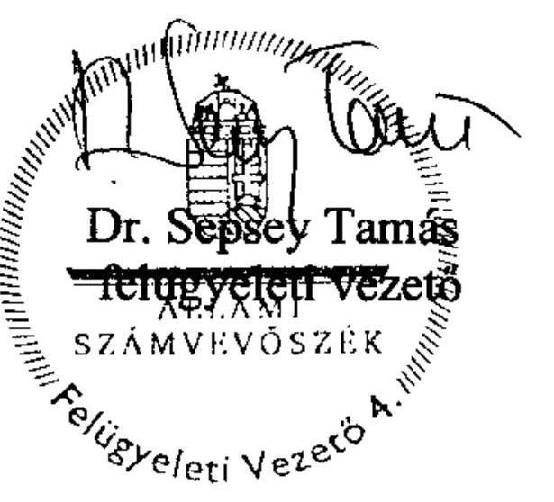

# FÜGGELÉK

# TARTALOMJEGYZÉK 

1. Lakosságszámhoz és egyéb feltételekhez kötött hozzájárulások ..... 10
1.1. Körjegyzőség működésével kapcsolatos feladatok (3. jogcím) ..... 11
1.2. Lakossági települési folyékony hulladék ártalmatlanítása (6. jogcím) ..... 11
1.3. Üdülőhelyi feladatok (8. jogcím) ..... 11
2. Szociális és gyermekvédelmi jogcímek ..... 11
2.1. Szociális és gyermekjóléti alapszolgáltatások feladatai (11.
jogcímcsoport) ..... 12
2.1.1. Szociális és gyermekjóléti alapszolgáltatások általános feladatai (11. a) jogcím) ..... 12
2.1.2. Otthonközeli ellátás (11. c) jogcímcsoport) ..... 12
2.1.3. Falugondnoki, vagy tanyagondnoki szolgáltatás (11. e) jogcím) ..... 15
2.1.4. Fogyatékos és demens személyek nappali intézményi ellátása (11. g) jogcím) ..... 15
2.2. Szociális és gyermekvédelmi bentlakásos és átmeneti elhelyezés (12. jogcímcsoport) ..... 15
2.2.1. Átlagos szintű ápolást, gondozást nyújtó ellátás tartós bentlakásos és átmeneti elhelyezést nyújtó szociális intézményekben (12. bc) jogcím) ..... 15
2.3. Gyermekek napközbeni ellátása (14. jogcímcsoport) ..... 16
3. Közoktatási hozzájárulások ..... 16
3.1. Közoktatási alap hozzájárulások (15. jogcímcsoport) ..... 17
3.1.1. Óvodai nevelés (15. a) jogcím) ..... 17
3.1.2. Alapfokú iskolai oktatás (15. b) jogcím) ..... 19
3.1.3. Középfokú iskolai oktatás (15. c) jogcím) ..... 20
3.1.4. Szakmai elméleti képzés (15. d) jogcím) ..... 20
3.1.5. Alapfokú művészeti oktatás (15. e) jogcím) ..... 20
3.1.6. Kollégiumi, externátusi nevelés, ellátás (15. f) jogcím) ..... 21
3.1.7. Napközis, tanulószobai foglalkozás, egész napos iskolaotthonos oktatás (15. g) jogcím) ..... 21
3.2. Közoktatási kiegészítő hozzájárulások (16. jogcímcsoport) ..... 23
3.2.1. Iskolai gyakorlati oktatás, szakképzés (szakmai gyakorlati képzés - 16.1. jogcím) ..... 23
3.2.2. Sajátos nevelési igényű gyermekek, tanulók nevelése, oktatása (16.2. jogcím) ..... 23
3.2.2.1. Gyógypedagógiai (konduktív pedagógiai) nevelés, oktatás az óvodában és az iskolában (16.2.1.) ..... 23
3.2.2.2. Korai fejlesztés (16.2.2.) és Fejlesztő felkészítés (16.2.3.) ..... 24

3.2.3. Nem magyar nyelven folyó nevelés és oktatás, valamint a roma kisebbségi oktatás (16.3. jogcím) ..... 24
3.2.4. Nemzetiségi nyelvű, két tanítási nyelvű oktatás, nyelvi előkészítő oktatás (16.4. jogcím) ..... 25
3.2.5. Egyes pedagógiai programok, módszerek támogatása (16.5. jogcím) ..... 25
3.2.6. Hozzájárulás egyes közoktatási intézményeket fenntartó önkormányzatok feladatellátásához (16.6. jogcím) ..... 25
3.2.6.1. Középiskolába, szakiskolába bejáró tanulók ellátása (16.6.1.) ..... 25
3.2.6.2. Intézményi társulás óvodájába, általános iskolájába járó gyermekek, tanulók támogatása (16.6.2.) ..... 25
3.3. Szociális juttatások, egyéb szolgáltatások (17. jogcímcsoport) ..... 26
3.3.1. Kedvezményes óvodai, iskolai, kollégiumi étkeztetés (17.1. jogcím) ..... 26
3.3.2. Tanulók tankönyvellátásának támogatása (17.2. jogcím) ..... 27
3.3.3. Kollégiumi, diákotthoni lakhatási feltételek megteremtése (17.3. jogcím) ..... 28

# MELLÉKLETEK 

1. számú A vizsgált helyi önkormányzatok 2010. évi normatív hozzájárulások el- melléklet számolásának eltérései
2. számú A normatív hozzájárulások önkormányzati elszámolásában jogcímenként melléklet megállapított eltérések
3. számú A normatív hozzájárulások elszámolásában feltárt eltérések önkormány- melléklet zatonként összesítve
4. számú A normatív hozzájárulások 2010. évi elszámolásában önkormányzaton- melléklet ként és jogcímcsoportonként megállapított eltérések

# RÖVIDÍTÉSEK JEGYZÉKE 

## Törvények

| Áht. | az államháztartásról szóló 1992. évi XXXVIII. törvény |
| :--: | :--: |
| ÁSZ törvény | az Állami Számvevőszékről szóló 1989. évi XXXVIII. törvény, 2011. július 1-jétől az Állami Számvevőszékről szóló 2011. évi LXVI. törvény |
| Gyvt. | a gyermekek védelméről és a gyámügyi igazgatásról szóló 1997. évi XXXI. törvény |
| 2009. évi Kvtv. | a Magyar Köztársaság 2009. évi költségvetéséről szóló 2008. évi CII. törvény |
| 2010. évi Kvtv. | a Magyar Köztársaság 2010. évi költségvetéséről szóló 2009. évi CXXX. törvény |
| 2011. évi Kvtv. | a Magyar Köztársaság 2011. évi költségvetéséről szóló 2010. évi CLXIX. törvény |
| Közokt. tv. | a közoktatásról szóló 1993. évi LXXIX. törvény |
| Ötv. | a helyi önkormányzatokról szóló 1990. évi LXV. törvény |
| Szoc. tv. | a szociális igazgatásról és szociális ellátásokról szóló 1993. évi III. törvény |
| Tpr. | a tankönyvpiac rendjéről szóló 2001. évi XXXVII. törvény |

## Rendeletek

6/2010. (I. 28.) PM-ÖM a helyi önkormányzatokat és kistérségi társulásokat 2010. együttes rendelet évben egyes központi költségvetési kapcsolatokból megillető forrásokról szóló 6/2010. (I. 28.) PM-ÖM együttes rendelet
14/1994. (VI. 24.) MKM a képzési kötelezettségről és a pedagógiai szakszolgálatokrendelet ról szóló 14/1994. (VI. 24.) MKM rendelet (2011. VIII. 1)rőlő hatálytalan)

## Rövidítések

| ÁSZ | Állami Számvevőszék |
| :-- | :-- |
| igazgatóság | A Magyar Államkincstár megyei igazgatósága |
| Kincstár | Magyar Államkincstár |

# Megállapítások   a helyi önkormányzatokat a 2010. évben megillető normatív hozzájárulások elszámolásának ellenőrzéséről 

A 2010. évi normatív hozzájárulások elszámolása ellenőrzésébe bevont 47 önkormányzat összesen 6356,5 millió Ft normatív hozzájárulással számolt el. Az ellenőrzés megállapítása alapján a vizsgált önkormányzatok 63,4 millió Ft hozzájárulást jogtalanul vették igénybe és számoltak el, 54,7 millió Ft pedig pótlólagosan jár részükre. A feltárt eltérések egyenlege 8,7 millió Ft jogtalan igénybevétel, az ellenőrzött önkormányzatok által elszámolt hozzájárulás 0,14%-a.

A helyi önkormányzatok az Áht. előírása szerint a normatív hozzájárulásokat a Kincstár útján igényelték a központi költségvetésből. A hozzájárulások felmérése, valamint évközi módosítása szabályszerűen történt. Az ellenőrzés 47 - ezen belül hét kisebb városi és 40 községi - önkormányzatot érintett. Az igénybevett támogatás összege hét önkormányzat esetében haladta meg a 400 millió Ft-ot. Az ellenőrzött normatív hozzájárulás 72%-át a közoktatási feladataik ellátásához igényelték az önkormányzatok, míg az elszámolt hozzájárulások 20%-ára lakosságszám alapján voltak jogosultak.

Az összes ellenőrzött normatív hozzájárulás feladatonként
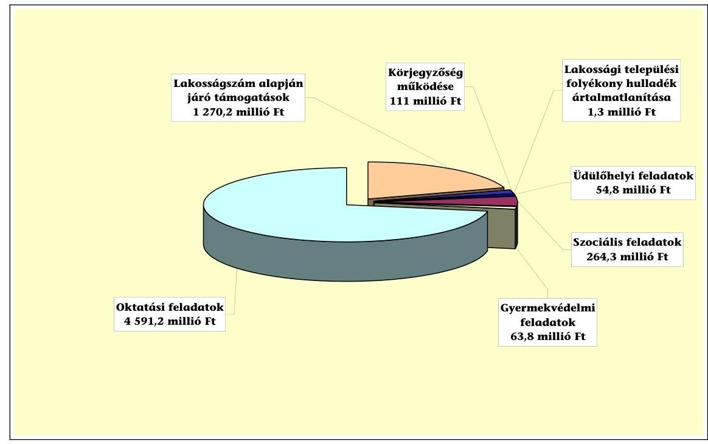

A 47 önkormányzat közül hét elszámolása volt hibátlan - a feltárt eltérések egyenlegeként - 16-nál befizetési kötelezettséget és 24-nél pótlólagos támogatást állapítottunk meg.

Az elszámolások 62%-át (29 önkormányzat) ítéltük megbízhatónak, 38% nem volt megalapozott és megbízható, mivel az elszámolásának hibaaránya - a lényegesség elvének figyelembevételével - összességében meghaladta a 2%-os hibahatárt (három önkormányzatnál), illetve a jogcímenként számított eltérés egy jogcím esetében 5%-ot meghaladó mértékű
 volt ${ }^{1}$ (15 önkormányzatnál).

Az elszámolási hibákat a jogszabályi előírások figyelmen kívül hagyása, figyelmetlenség, az elszámolások bonyolultsága okozta.

A 2010. és a 2011. évi Kvtv., valamint a normatív hozzájárulással támogatott feladatok ellátására vonatkozó jogszabályok összhangja, a normatív hozzájárulás szabályszerű elszámolásának feltételei egy kivétellel biztosítottak voltak. Az óvodai nevelés feladatnál az ellátás, illetve a normatív hozzájárulás igénybevétele alsó korhatárára vonatkozóan a 2010. évi Kvtv. és a Közokt. tv. között feltárt, a 2010/2011. nevelési évre fennálló összhang-hiányt a jogalkotó a 2011. évi Kvtv. óvodai nevelés jogcímére vonatkozó szabályozásában a 2011/2012. nevelési évre megszüntette.

A feltárt összes eltérés feladatonkénti megoszlása
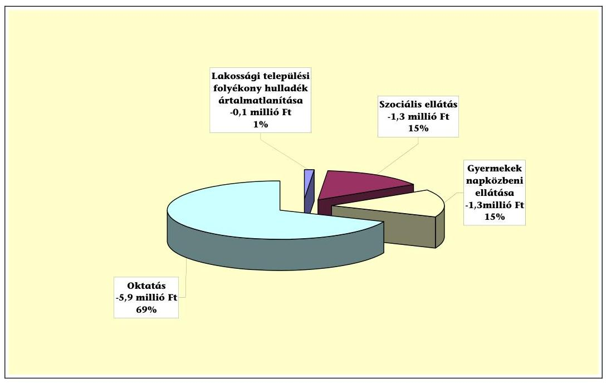

Az ellenőrzött önkormányzatok a lakosságszám alapján járó, valamint a körjegyzőség működtetéséhez és az üdülőhelyi feladatokhoz igénybe vett normatív hozzájárulásokkal szabályszerűen számoltak el.

A lakossági települési folyékony hulladék ártalmatlanítása jogcímen egy önkormányzat elszámolásában állapítottunk meg a jogcímen ellenőrzött hozzájárulás 9%-ának, az összes jogtalan igénybevétel 1%-ának megfelelő 0,1 millió

[^0]
[^0]:    ${ }^{1}$ Az egy jogcímen való 5% feletti eltérést kis önkormányzatok esetében az igényjogosulti létszámban feltárt egy fő mutatószám helytelen elszámolása is okozhatja.

---

Ft összegű jogtalan igénybevételt, amit a Kvtv. jogcímre vonatkozó igénybevételi feltételeinek be nem tartása okozott.

A szociális és gyermekvédelmi ellátások körében az ellenőrzött önkormányzatok az alábbi jogcímeken vettek igénybe és számoltak el normatív hozzájárulást:

# Az ellenőrzött önkormányzatok által elszámolt szociális és gyermekvédelmi hozzájárulások megoszlása 

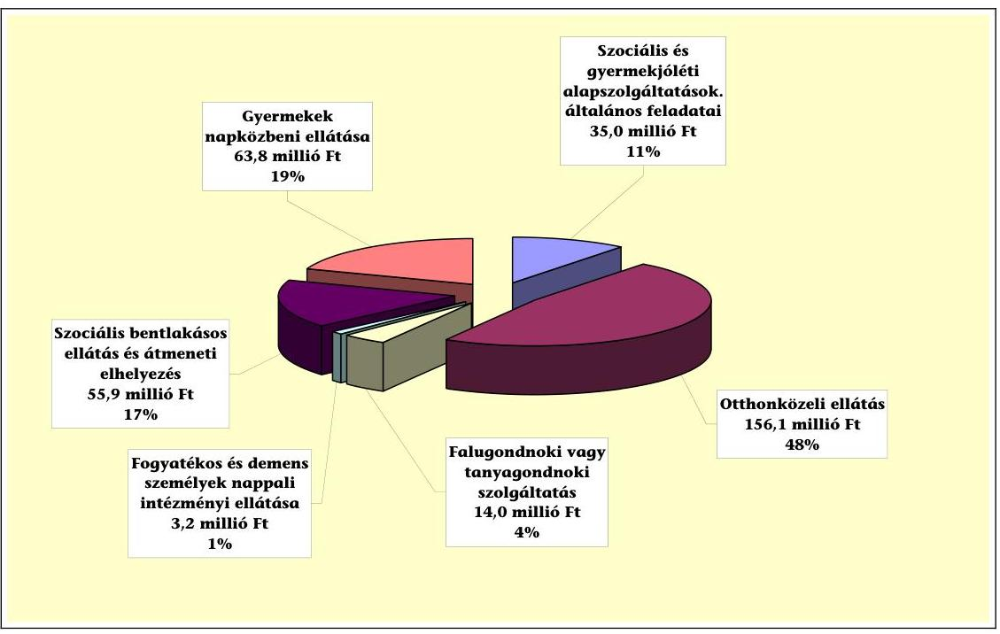

A szociális és gyermekvédelmi ellátások jogcímeinek ellenőrzése során hibátlan volt az önkormányzatok elszámolása a Falugondnoki vagy tanyagondnoki szolgáltatás, a Fogyatékos és demens betegek nappali ellátása, valamint a Szociális és bentlakásos ellátás és átmeneti elhelyezés jogcímeken. A Szociális és gyermekjóléti alapszolgáltatások általános feladatai, az Otthonközeli ellátás és a Gyermekek napközbeni ellátása jogcímcsoportokban állapított meg eltérést az ÁSZ ellenőrzés, a három jogcímcsoportban az átlagos hibaarány 1,02%-os volt. Az átlagosnál alacsonyabb hibaszázalékkal (0,69%) számolták el ezen belül a hozzájárulások 81%-át jelentő szociális ellátásokat, míg a gyermekvédelmi ellátások közé tartozó, a hozzájárulások 19%-át kitevő gyermekek napközbeni ellátása jogcímcsoportban az átlagot meghaladó, 2,1%-os volt a feltárt eltérések aránya. A gyermekek napközbeni ellátása jogcímcsoportban volt a legnagyobb összegű a megállapított eltérés (1,34 millió Ft jogtalan igénybevétel), de ez mindössze egy önkormányzat hibás elszámolásából adódott.

A legtöbb hibás elszámolás a szociális ellátások közül az Otthonközeli ellátások jogcímcsoportban fordult elő, ahol a hozzájárulást igénylő 34 önkormányzat 32%-ánál állapítottunk meg összességében 1,3 millió Ft jogtalan igénybevételt. Itt a hibák 45,5%-át az igénybevételi feltételek 2010. évi változása okozta, mivel az egyes szociális alapszolgáltatásokhoz és párosított szolgáltatás csoportokhoz igényelhető eltérő fajlagos összegű normatív hozzájárulások miatt az éves ellátotti létszám megállapítása egy összetett és bonyolult nyilvántartási

---

rendszeren alapult, amit az önkormányzatok nem megfelelően alkalmaztak, illetve figyelmen kívül hagyták az igénybevételi feltételek változását.

A két szociális, valamint a gyermekek napközbeni ellátása jogcímcsoportban feltárt eltérések, az ellenőrzés által megállapított összes jogtalan igénybevétel 15-15%-át jelentették.

Az önkormányzatok közoktatási célú feladatai finanszírozását szolgáló normatív hozzájárulások igénybevételi feltételrendszere - a megelőző évhez viszonyítva - nem módosult jelentősen a 2010. évben. A 2007. évben bevezetett, és az eltelt időszakban a közoktatási intézményrendszer évfolyamain felmenő rendszerben kiteljesített feltételrendszer alapján három - alap, kiegészítő, és a közoktatási tevékenységhez kapcsolódó szociális hozzájárulások - jogcímcsoporton volt normatív hozzájárulás igénybe vehető.

Az ellenőrzött önkormányzati körben elszámolt közoktatási hozzájárulások nagyságrendjét és megoszlását szemlélteti jogcím-csoportonkénti bontásban az alábbi diagram:

# Az ellenőrzött önkormányzatok által elszámolt közoktatási hozzájárulások megoszlása 

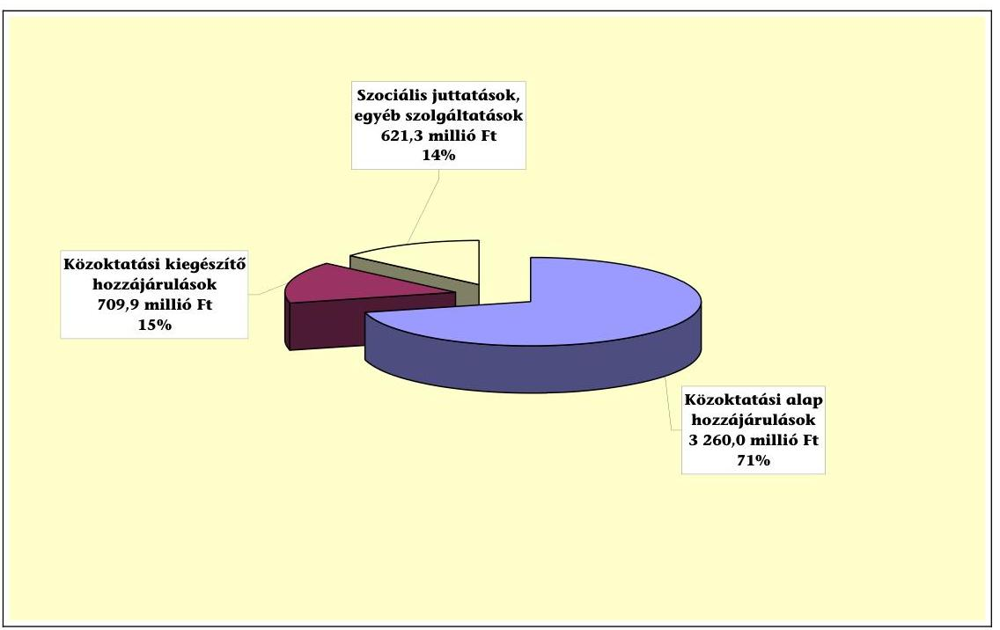

---

# Az ÁSZ ellenőrzés által a közoktatási jogcímcsoportonként feltárt eltérések (még járó hozzájárulás és jogtalan igénybevétel) 

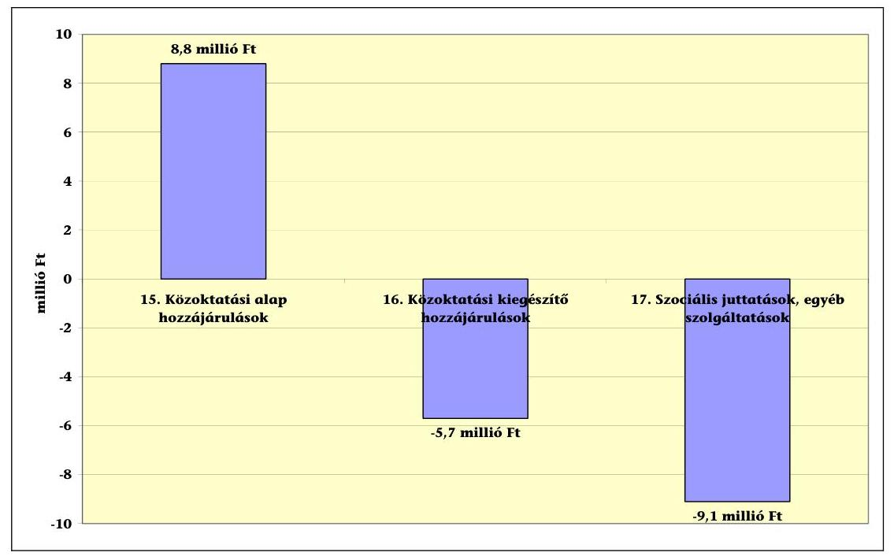

A közoktatási hozzájárulások három jogcímcsoportján belül egynél az önkormányzati szintű, valamint a jogcímenként megállapított és összesített eltérések egyenlege pótlólagos hozzájárulást, kettőnél pedig jogtalan igénybevételt eredményezett. A három közoktatási jogcím-csoport eltéréseinek összege, az ellenőrzés által megállapított összes jogtalan igénybevétel 69%-a.

Az ellenőrzött önkormányzatok a 15. Közoktatási alap hozzájárulások jogcímcsoporton a közoktatási hozzájárulások 71%-át kitevő normatív hozzájárulást vettek igénybe, a jogcímcsoport elszámolásának hibaaránya 0,27% volt. A jogcímcsoporthoz tartozó hét jogcímen összesen 8,8 millió Ft még járó hozzájárulást tártunk fel. A jogcímenként feltárt hiba - a megállapított eltérés összege (5,9 millió Ft pótlólagos jogosultság) és egy adott jogcímen hibát elkövető önkormányzatok száma (23 db) tekintetében is - a 15. a) óvodai nevelés jogcímen volt a legmagasabb, elsődlegesen a tanévnyitó statisztikai létszámon felül az igényjogosulti létszámba beszámító, az óvodai nevelést október-december hónapokban megkezdő gyermekek létszámának hibás meghatározása miatt. A jogcímcsoport átlagos hibaarányát meghaladó mértékű, 2,07% eltérést (2,2 millió Ft még járó hozzájárulást) állapítottunk meg a 15. g) napközis, tanulószobai foglalkozás, egész napos iskolaotthonos ellátás jogcímen. Ennek elsődleges oka, hogy a feladatot ellátó önkormányzatok 43%-a (16 önkormányzat) nem a 2009. és a 2010. évi Kvtv-ben a tanulók számbavételére előírt módon határozta meg az igényjogosultak számát, továbbá a létszám adatok napközis naplókból történő kigyűjtése során számítási, összesítési hibákat vétett.

Az ellenőrzött közoktatási hozzájárulások 15%-át kitevő 16. Közoktatási kiegészítő hozzájárulások elszámolásánál - az érintett hat jogcímen, együttesen - 5,7 millió Ft jogtalan igénybevételt állapítottunk meg, az átlagos hibaarány 0,8% volt. A jogcímcsoport átlagára jellemző mértéket meghaladó -5,7%

---

eltérést (12,2 millió Ft jogtalan igénybevételt) tártunk fel a 16.6.2 Intézményi társulás óvodájába, általános iskolájába járó gyermekek, tanulók támogatása, és 3,8% eltérést (6,4 millió Ft még járó hozzájárulást) a 16.2.1 Gyógypedagógiai nevelés alcímeken. Az intézményi társulás keretében ellátott közoktatási feladatokra elszámolt hozzájárulásnál a társulásban nem részes településekről ellátott gyermekek, tanulók jogtalan figyelembevétele volt a leggyakoribb hibaok, az alcímen feltárt eltérés ugyanakkor döntően egy önkormányzathoz volt köthető a társulásban érintett intézmények költségvetése közös meghatározásának - mint igénybevételi feltétel - hiánya miatt. A gyógypedagógiai ellátás jogcímen egyrészt az alap hozzájárulásnál megállapított, másrészt a sajátos nevelési igényt alátámasztó szakértői vélemények alapján feltárt igényjogosulti többletlétszám pótlólagos hozzájárulásra való jogosultságot eredményezett.

Az ellenőrzött közoktatási hozzájárulások 14%-át kitevő 17. Szociális juttatások, egyéb szolgáltatások jogcímcsoport három jogcímén, együttesen elszámolt hozzájárulás összegében -1,5% eltérést (9,1 millió Ft jogtalan igénybevételt) tártunk fel. A legnagyobb összegű eltérést (7,5 millió Ft jogtalan igénybevételt) a 17.1 Kedvezményes óvodai, iskolai, kollégiumi jogcím elszámolásában állapítottunk meg. A legfőbb eltérést előidéző ok volt az igényjogosulti létszámnak a 2010. évi Kvtv-ben szabályozottól eltérő módon történő meghatározása, valamint az, hogy az elszámolást 24 kódszámra megbontva kellett elkészíteni, amely alábontásnak megfelelő analitikus nyilvántartással az intézmények nem rendelkeztek, az elszámolás kigyűjtéssel volt elkészíthető, melynek során adatmásolási, összesítési hibát vétettek.

A közoktatási hozzájárulások tekintetében összességében azoknak a jogcímeknek az elszámolási hiba-aránya volt a legmagasabb, amelyeknél az igényjogosulti létszám megállapítása bonyolult, a statisztikai létszámtól jelentősen eltérő volt, illetve ahol az analitikus nyilvántartásokból kigyűjtéssel volt meghatározható. Magas volt a hiba-arány továbbá azokon a jogcímeken, ahol az igénybevételi feltételek a 2009. és a 2010. évi Kvtv. 3. számú mellékletén belül (jogcím, jogcímcsoport, Kiegészítő szabályok) és a Közokt. tv-ben több helyen előírt szabályok együttes figyelembevételével voltak meghatározhatók. Szintén általános hiba-oknak tekinthető, a kódszámok nem megfelelő alkalmazása, mivel a három jogcímcsoporthoz, ezeken belül összesen 16 jogcímhez tartozó közoktatási hozzájárulásokat a beszámolóban 289 kódszámra megbontva kellett az elszámolásban szerepeltetni.

# 1. LAKOSSÁGSZÁMHOZ ÉS EGYÉB FELTÉTELEKHEZ KÖTÖTT HOZZÁJÁ-

RULÁSOK

A lakosságszám alapján járó települési önkormányzatok üzemeltetési, igazgatási sport- és kulturális feladatai, körzeti igazgatási feladatok, lakott külterülettel kapcsolatos feladatok, társadalmi-gazdasági és infrastrukturális szempontból elmaradott, illetve súlyos foglalkoztatási gondokkal küzdő települési önkormányzatok feladatai, valamint a pénzbeli szociális juttatások normatív hozzájárulásait a vizsgált valamennyi önkormányzatnál ellenőriztük. Ezen hozzájárulások igénylése és elszámolása szabályszerűen történt, a hozzájárulást az önkormányzatok részére a Kincstár a nettó finanszírozás keretében kiutalta.

---

# 1.1. Körjegyzőség működésével kapcsolatos feladatok (3. jogcím) 

Az ellenőrzött önkormányzatok 45%-a, 21 önkormányzat vett igénybe jogszerűen ezen a jogcímen alap-hozzájárulást, ezek közül a körjegyzőséghez csatlakozó községek száma és a lakosságszám alapján 19 önkormányzat ösztönző hozzájárulásra is jogosult volt. Valamennyien megfeleltek a 2010. évi Kvtv. 3. számú melléklete 3. pontja szerinti igénybevételi feltételeknek, az ellenőrzés eltérést nem állapított meg.

### 1.2. Lakossági települési folyékony hulladék ártalmatlanítása (6. jogcím)

A vizsgált önkormányzatoknak csupán 1%-a igényelt ezen a jogcímen hozzájárulást, egy önkormányzat (Igal) elszámolása volt hibás, mivel a 2010. évi Kvtv. 3. számú melléklete 6. pontja előírásával ellentétesen nem az összegyűjtött és a hatóságilag kijelölt lerakóhelyen igazoltan elhelyezett lakossági folyékony hulladék tényleges mennyisége alapján számolt el, hanem a tervezett adatokat szerepeltette az elszámolásában is. Emiatt a megállapított jogtalan igénybevétel összege 114,5 ezer Ft volt.

### 1.3. Üdülőhelyi feladatok (8. jogcím)

Ilyen feladatot 14 önkormányzat látott el a vizsgált körben, ezek mindegyike szabályszerűen az üdülővendégek tartózkodási ideje alapján ténylegesen beszedett idegenforgalmi adó összegének alapulvételével igényelte és számolta el a normatív hozzájárulást.

## 2. SZOCIÁLIS ÉS GYERMEKVÉDELMI JOGCÍMEK

Az ellenőrzött önkormányzatok szociális és gyermekvédelmi feladataik ellátásához 328 082,0 ezer Ft normatív hozzájárulást vettek igénybe. Az ellenőrzött önkormányzati kör összetételéből adódóan ezt 64%-ban a szociális alapszolgáltatási feladataik ellátásához, 17%-ban a szociális bentlakásos ellátásra és az átmeneti elhelyezésre, 19%-ban a gyermekek napközbeni ellátására igényelték.

---

# A három jogcím-csoportban megállapított eltéréseket 

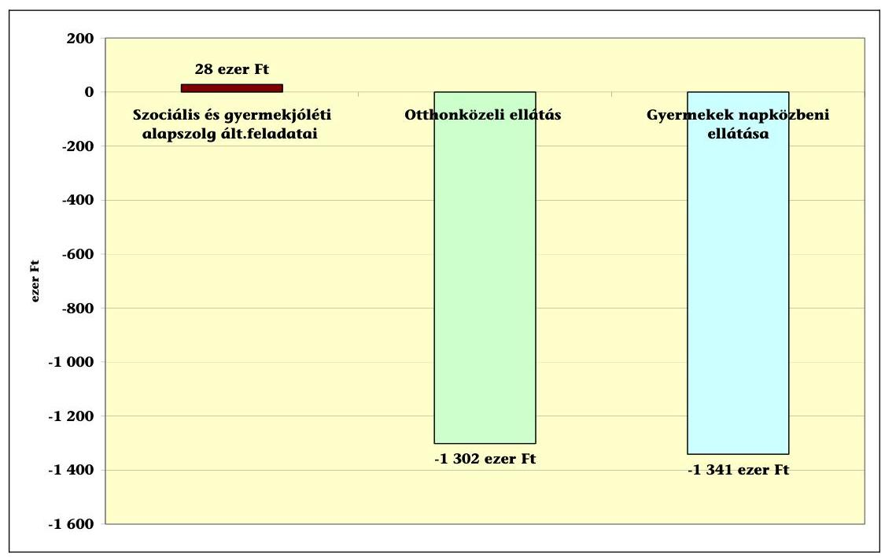

### 2.1. Szociális és gyermekjóléti alapszolgáltatások feladatai (11. jogcímcsoport)

### 2.1.1. Szociális és gyermekjóléti alapszolgáltatások általános feladatai (11. a) jogcím)

A Szoc. tv. 64. §-ában és a Gyvt. 40. §-ában meghatározott szociális és gyermekjóléti alapellátási feladataik körébe tartozó családsegítéshez és gyermekjóléti szolgálat működtetéséhez hozzájárulást az ellenőrzött önkormányzati körből nyolc önkormányzat vett igénybe. Működési engedély alapján három önkormányzat mind a családsegítő, mind a gyermekjóléti szolgáltatást, egy önkormányzat csak családsegítő, két önkormányzat csak gyermekjóléti szolgáltatást tartott fenn. Két 2000 fő lakosságszám alatti kistelepülés, amelyik működési engedély nélkül biztosította a szolgáltatásokat, a 2010. évi Kvtv. 3. számú melléklete 11. aa) pontja szerinti hozzájárulást vehette és vette igénybe. Igal önkormányzat elszámolása bizonyult hibásnak, ahol a Kvtv. 3. számú melléklete kiegészítő szabályok 1. pontjával ellentétesen az elszámolás során nem a 2009. január 1-jei népességszámot vették figyelembe, hanem a 2010. évi adatokkal számoltak el, ezért 28,4 ezer Ft pótlólagosan járó hozzájárulásra jogosultak.

### 2.1.2. Otthonközeli ellátás (11. c) jogcímcsoport)

Az otthonközeli ellátás fogalmát a 2010. évi Kvtv. vezette be, a korábban külön jogcímként megjelenő szociális alapszolgáltatások összevonásával. A jogcímcsoporton belül a szociális étkeztetéshez, a házi segítségnyújtáshoz és az időskorúak nappali ellátásához igényelhettek az önkormányzatok öt különböző fajlagos összegű normatív hozzájárulást, attól függően, hogy a három alapellátást az ellátottak különböző párosításokban együttesen, vagy külön-külön vet-

---
 hibás, a jogcímcsoportban összességében 1302 ezer Ft jogtalan igénybevételt állapított meg az ellenőrzés. A hibás elszámolások 45,5 %-át (Türje, Hernádvécse, Nyírkáta, Igal, Gönyű önkormányzatoknál) az okozta, hogy az önkormányzatok egyrészt nem vették figyelembe az igénybevételi szabályok 2010. évi változását. A normatív hozzájárulást nem a 2010. évi Kvtv. 3. számú melléklete 11. c) pontja szerint, az egyes szociális szolgáltatásokhoz és szolgáltatáscsoportokhoz rendelt fajlagos összegeknek megfelelően vették igénybe, ezért az egyes jogcímek között átcsoportosításokra volt szükség. Másrészt a szabályozás változása miatt az éves ellátotti létszám megállapításához egy összetett és bonyolult nyilvántartási rendszer kapcsolódott, amit az önkormányzatok nem megfelelően vezettek, és ami nagyban megnövelte a számszaki hibák lehetőségét.

Türje önkormányzat a szociális étkeztetés és a házi segítségnyújtás, illetve a szociális étkeztetés és az időskorúak nappali ellátásának együttes biztosításakor nem a 2010. évi Kvtv. 3 számú melléklete 11.ca) és cb) pontjában meghatározott fajlagos összegű normatív hozzájárulást vette igénybe, hanem a 11.cc), cd) és ce) pont szerinti, csak szociális étkeztetésre, csak házi segítségnyújtásra és csak nappali ellátásra vonatkozó fajlagos összeget számolta el.

Nyírkáta önkormányzat az időskorúak nappali ellátására vonatkozó fajlagos összeget vette figyelembe a szociális étkezést és nappali ellátást együttesen igénylő ellátottak esetében, a szociális étkeztetést és házi segítségnyújtást együttesen igénybe vevőket pedig csak szociális étkezőként számolta el.

Hernádvécse önkormányzatnál a szociális étkeztetés és házi segítségnyújtás, illetve a szociális étkeztetés és időskorúak nappali ellátása együttes igénybevételére vonatkozó mutatószám megállapítása során azokat ellátási napokat is figyelembe vették, amelyeken az ellátottak szociális étkeztetésben nem részesültek, ezért jogtalanul vették igénybe a 2010. évi Kvtv. 3. számú melléklete 11.ca) és cb) pontja szerinti fajlagos összegű hozzájárulást. Ezen ellátási napok alapulvételével a 11.cd) és ce) pont szerinti, csak házi segítségnyújtásra, illetve csak nappali ellátásra vonatkozó hozzájárulásra voltak jogosultak, amit viszont nem vették igénybe.

Ez okozta, hogy míg a jogcímcsoportban megállapított nettó eltérés összege az ellenőrzött hozzájárulásnak mindössze 0,83 %-a, addig a jogcímcsoporton belül, az egyes jogcímeken megállapított pozitív és negatív eltérések aránya ennél lényegesen magasabb volt, 5,3-20,6 % között változott.

---

# Az otthonközeli ellátás jogcímcsoporton belül az egyes jogcímeken megállapított pótlólagosan járó és jogtalan hozzájárulások 

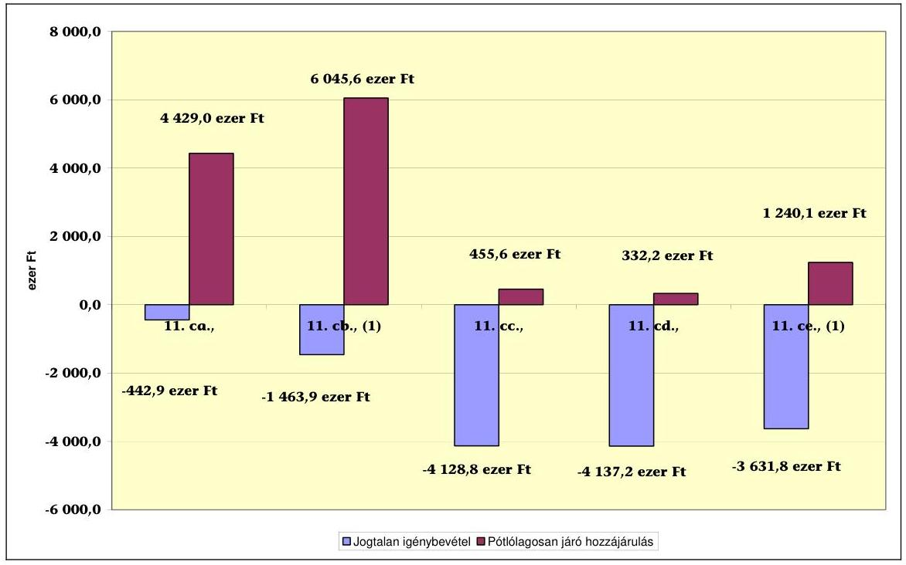

- 11. ca) szociális étkeztetés és házi segítségnyújtás
- 11. cb) szociális étkeztetés és időskorúak nappali ellátása
- 11. cc) szociális étkeztetés
- 11. cd) házi segítségnyújtás
- 11. ce) időskorúak nappali ellátása

Egy önkormányzat esetében olyan halmozott hiányosságokat állapított meg az ellenőrzés, ami miatt a szociális étkeztetésre igénybe vett hozzájárulás teljes összegét - 775 ezer Ft-ot - jogtalannak ítélte.

Vizslás önkormányzat a szociális étkeztetésre vonatkozó szabályozását a Szoc. tv. 62. § (1) és (2) bekezdését megsértve készítette el, mert az igénybevételi feltételként a jövedelmi helyzet vizsgálatát is előírta, a hajléktalanság miatti jogosultságot nem rögzítette, az ellátás módját nem a tényleges állapotnak megfelelően határozta meg. A működési engedély kérelemhez csatolt szakmai program nem volt összhangban a helyi rendelettel. Az ellátás igénybevétele a helyi rendelettel ellentétesen nem írásbeli kérelemre történt, az ellátás igénybevételéről szóló döntést az önkormányzat Szervezeti és Működési Szabályzata előírása ellenére írásban nem rögzítették. A rászorultsági feltételeket az ellátásról szóló döntést megelőzően nem vizsgálták, az ellátottakkal a megállapodást nem az ellátás igénybevételének megkezdésekor kötötték meg a Szoc. tv. 94/B. §-a előírásait megsértve. Az ellátottak mutatószámát nem a 2010. évi Kvtv. jogcímre vonatkozó előírásai szerint állapították meg.

A hibás elszámolások 36,4%-át az éves ellátotti létszámok összesítése, illetve a költségvetési beszámoló 31-es űrlapjának kitöltése során elkövetett számszaki, adatrögzítési hibák okozták.

---

További eltéréseket állapított meg az ellenőrzés egy-egy önkormányzat esetében a következő okok miatt:

- a Szoc. tv. 92/K. § (6) bekezdésével ellentétesen a házi segítségnyújtás esetében az ellátottak száma éves átlagban meghaladta a működési engedélyben meghatározott ellátotti létszámot (Türje),
- a szociális étkeztetésre vonatkozó működési engedélyben meghatározott ellátási területen kívüli ellátottakat is figyelembe vették az elszámolás során (Pankasz),
- a szociális étkeztetésre vonatkozó igénybevételi napló hiányos vezetése miatt kevesebb ellátotti létszám után vették igénybe a hozzájárulást (Balatonfűzfő),
- az időskorúak nappali ellátásánál a mutatószám megállapítás során nem a 2010. évi Kvtv. 3. számú melléklete 11. c) pontjában meghatározott osztószámot vették figyelembe (Igal)

# 2.1.3. Falugondnoki, vagy tanyagondnoki szolgáltatás (11. e) jogcím) 

Az ellenőrzött települési önkormányzatok közül hét önkormányzat biztosított ilyen szolgáltatást, a feladatellátáshoz 13 975,8 ezer Ft normatív hozzájárulást vették igénybe a 2010. évi Kvtv-ben meghatározott feltételek szerint, a szolgáltatásokat a szakmai szabályoknak megfelelően működtették, az ellenőrzés ezen a jogcímen eltérést nem állapított meg.

### 2.1.4. Fogyatékos és demens személyek nappali intézményi ellátása (11. g) jogcím)

Ezen a jogcímen mindössze egy önkormányzat számolt el a vizsgált körben normatív hozzájárulást fogyatékos személyek nappali intézményének fenntartásához, ami jogszerűen történt.

### 2.2. Szociális és gyermekvédelmi bentlakásos és átmeneti elhelyezés (12. jogcímcsoport)

2.2.1. Átlagos szintű ápolást, gondozást nyújtó ellátás tartós bentlakásos és átmeneti elhelyezést nyújtó szociális intézményekben (12. bc) jogcím)

A jogcímcsoportban négy önkormányzat igényelt normatív hozzájárulást, ezek közül két önkormányzat időskorúak ápoló-gondozó otthont tartott fenn, míg két önkormányzat átmeneti elhelyezést nyújtó ellátást biztosított. Az elszámolt 55 937,2 ezer Ft normatív hozzájárulás igénylése és elszámolása szabályszerűen történt.

---

# 2.3. Gyermekek napközbeni ellátása (14. jogcímcsoport) 

A feladatot az ellenőrzött önkormányzatok bölcsődei ellátás és családi napközi ellátás keretében végezték, ehhez kapcsolódóan biztosították az arra jogosult, elhelyezett gyermekek ingyenes intézményi étkeztetését is. A bölcsődei ellátás és az ingyenes intézményi étkeztetés jogcímen négy önkormányzat, a családi napközi ellátás jogcímen három önkormányzat igényelt összesen 63 806,3 ezer Ft hozzájárulást. Egy önkormányzat (Vizslás) a családi napközi ellátás normatív hozzájárulásának elszámolását a 2010. évi Kvtv. 3. számú melléklet 14. b) pontja előírásával ellentétesen nem a naponta ténylegesen ellátásban részesült gyermekek összesített éves gondozási napjai, hanem a működési engedélyben engedélyezett maximális férőhelyszám alapulvételével készítette el, ezért az ellenőrzés 1341 ezer Ft jogtalanul igénybevett hozzájárulást állapított meg.

## 3. KÖZOKTATÁSI HOZZÁJÁRULÁSOK

Az önkormányzatok közoktatási célú feladatai finanszírozását szolgáló normatív hozzájárulások igénybevételi feltételrendszere nem módosult jelentősen a 2010. évben a megelőző évhez viszonyítva. A 2007. évben bevezetett, s az eltelt időszakban a közoktatási intézményrendszer évfolyamain felmenő rendszerben kiteljesített feltételrendszer alapján három fő jogcímcsoporton volt normatív hozzájárulás igénybe vehető.

A közoktatási intézményeknél:

- az alap-feladatai finanszírozását szolgáló alap hozzájárulások (15. jogcím) esetében - fő szabályként - a 2009/2010. és a 2010/2011. tanévi nyitó gyermek/tanuló létszám alapján, a Közokt. tv-ben meghatározott oktatásszervezési paraméterek (csoport/osztály átlaglétszám, foglalkoztatási időkeret, pedagógus kapacitás, a heti kötelező pedagógus óraszámok figyelembe vétele) alkalmazásával számított teljesítménymutatóhoz kapcsolódott a hozzájárulás;
- a fenntartói döntéstől függő feladatai (pl. a gyógypedagógia ellátás, kisebbségi oktatás, stb.) finanszírozását szolgáló kiegészítő hozzájárulások (16. jogcím), továbbá az intézményekben ellátottak szociális helyzete és jogszabályi előírás alapján biztosított (pl. étkezési, tankönyv) kedvezmények finanszírozását szolgáló szociális hozzájárulások (17. jogcím) esetében - fő szabályként - az érintett két tanévhez kapcsolódó statisztikai nyitó létszám alapján időarányosan nyolc, illetve négy hónapra számított mutatószám alapján járt a hozzájárulás.

Az ellenőrzésre kiválasztott 47 települési önkormányzat közül 45 számolt el a 2010. évi beszámolójában közoktatási célú normatív hozzájárulást, melyek közül négy település (Hosszúhetény, Bodroghalom, Egyházasrádóc és Kehidakustány) elszámolása az igényjogosulti létszám és az elszámolt hozzájárulás tekintetében is minden jogcímen a jogszabályi előírásoknak megfelelő volt.

A közoktatási hozzájárulások három jogcímcsoportján belül egynél (15. jogcím) az önkormányzati szintű, valamint a jogcímenként megállapított és össze-

---

sített eltérések egyenlege pótlólagos hozzájárulást, kettőnél (16, 17. jogcímek) pedig jogtalan igénybevételt eredményezett. A három közoktatási jogcímcsoport eltéréseinek összege, az ellenőrzés által megállapított összes jogtalan igénybevétel 69%-a.

# 3.1. Közoktatási alap hozzájárulások (15. jogcímcsoport) 

### 3.1.1. Óvodai nevelés (15. a) jogcím)

Az ellenőrzésbe bevont önkormányzatok közül 43 számolt el erre a feladatra normatív hozzájárulást, mely közül 23 önkormányzat elszámolása (53%) hibás volt. Az ÁSZ ellenőrzés a jogcímen 8320,7 ezer Ft pótlólagos járandóságot és 2337,5 ezer Ft jogtalan igénybevételt állapított meg. Az összes eltérés 5983,2 ezer Ft pótlólagos járandóság, mely a jogcímen elszámolt összeg 0,64%-a.

A megállapított eltérések okai:

- a 2009. és a 2010. évi Kvtv. 3. számú mellékletének a 15. a) jogcímre vonatkozó előírását megsértve határozta meg az igényjogosulti létszámot 15 önkormányzat. Ebből 14 önkormányzat (Csákánydoroszló, Diósberény, Gógánfa, Kozármisleny, Leányfalu, Letenye, Marcali, Nyúl, Perbál, Siklós, Sokorópátka, Tényő, Türje, Vizslás) az óvodai nevelést október-december hónapokban megkezdő gyermekek számbavételére vonatkozó szabályt figyelmen kívül hagyta. Ezeket a gyermekeket az elszámolásban nem szerepeltette (ez pótlólagos hozzájárulásra jogosultságot eredményezett); illetve e szabályt rosszul alkalmazta, mert hibásan a 3. életévét december 31-éig be nem töltő, továbbá az óvodai nevelést nem első alkalommal, illetve december hónapot követően megkezdő gyermekeket az elszámolásban jogtalanul vette figyelembe. Egy esetben (Poroszlón) az egységes óvodában ellátott bölcsődés korú gyermekek két főként való számbavételére vonatkozó előírást nem tartották be;

Nyúl község elszámolásában egy fő, az óvodai nevelést 2010. december 31-éig megkezdő, de a 3. életévét addig be nem töltő gyermek jogtalan figyelembe vétele a Közokt. tv. 24. § (1) bekezdése és a 2010. évi Kvtv. 3. számú melléklet 15.a) jogcímre vonatkozó előírásai közötti - alábbi - összhang hiányára volt vissza vezethető:

A Közokt. tv. 24. § (1) bekezdésében az óvodai nevelés megkezdésének alsó korhatáraként a gyermek 3. életévét rögzítő előírása 2010. szeptember 1-jétől kiegészült azzal, hogy „az óvoda felveheti azt a körzetében lakó gyermeket is, aki a harmadik életévét a felvételtől számított fél éven belül betölti, feltéve, hogy minden, a településen lakóhellyel, ennek hiányában tartózkodási hellyel rendelkező három, és annál idősebb gyermek óvodai felvételi kérelme teljesíthető".

A 2010. évi Kvtv. 3. számú melléklet óvodai nevelés (15.a) jogcímű normatív hozzájárulás igénybevételi feltételrendszere - mely az életkori alsó határ szempontjából - a 3. életévet legkésőbb 2010. december 31-én betöltő és az óvodai nevelést megkezdő gyermekek igényjogosulti létszámba történő figyelembe vételét engedélyezte - nem módosult a Közokt. tv. - fenti - változásával együtt. Ez a normatív hozzájárulásra jogosultság szempontjából az alábbi összhang-hiányt eredményezte:

---

- A fenntartó jogosult volt normatív hozzájárulásra azon gyermekek után, akik szeptember hónapban kezdték meg az óvodai nevelést, a tanévnyitó (október 1-jei) statisztikai létszámban szerepeltek és a felvételtől számított fél éven belül (legkésőbb 2011. február hónapban) a 3. életévüket betöltötték.
- A 2010. október 1-je és december 31. között óvodai nevelésüket megkezdő, 3. életévüket a felvételtől számított fél éven belül betöltő gyermekek közül azonban csak azok után volt a fenntartó önkormányzat normatív hozzájárulásra jogosult, akik december 31-ig betöltötték a 3. életévüket.

A 2011. évi Kvtv. 3. számú melléklet óvodai nevelés jogcímre vonatkozó előírása a fenti összhang-hiányt megszüntette azzal, hogy a fenntartó a 2011/2010. nevelési évben
 valamennyi, az óvodai nevelést 2011. december 31-ig megkezdő, a 3. életévét a felvételtől számított fél éven belül betöltő gyermek után normatív hozzájárulás igénybevételére jogosult.

- hét önkormányzatnál (Gönyű, Hodász, Kemenesszentpéter, Kozármisleny, Nyírkáta, Pilisvörösvár, Tényő) az elszámolást megalapozó tanévnyitó statisztika, és a tanügyi dokumentumok összhangja nem volt biztosított, ami az elszámolásban eltérést okozott. A statisztikában (és így az elszámolásban is) az óvodába beiratkozott, de az óvodai nevelést ténylegesen meg nem kezdő, továbbá október 1. előtt távozott, jogviszonnyal nem rendelkező gyermekeket jogtalanul vettek figyelembe, illetve október 1. után távozott, így október 1-jén jogviszonnyal rendelkező gyermekeket hibásan figyelmen kívül hagytak;
- két önkormányzatnál (Bonyhádvarasd, Gönyű) az igényjogosulti létszám megállapítása a jogszabályi előírásoknak megfelelően történt, azonban a hozzájárulás összegében eltérést okozott, hogy nem a 2009. és a 2010. évi Kvtv. 3. számú melléklet 15. jogcímen előírt teljesítmény-mutató alapján határozták meg a hozzájárulást (a teljesítmény-mutató és az ez alapján jogszerűen igénybe vehető hozzájárulás kiszámítását megkönnyítő, a Kincstár által kiadott segédtáblát - melynek alkalmazása nem volt kötelező - nem használták);
- az évközi szervezeti változás kihatását Értényen rosszul számszerűsítették (a jogcímen fő szabályként tanévváltáshoz igazodó 8+4 havi igényjogosulti létszámot feladat átadás miatt 6+6 havi létszámra kellett átszámítani, mely során számítási hibát vétett az önkormányzat);
- Balatonfűzfőn figyelmen kívül hagyták a 2009. és a 2010. évi Kvtv. 3. számú melléklet 15. jogcímre vonatkozó azon előírást, mely szerint „a gyermek, tanuló létszámok meghatározásánál nem alkalmazhatók a Közokt. tv. 3. számú melléklete II. Az osztályok, csoportok szervezése cím alatti 3. pontjában foglalt, a csoportok szervezéséhez előírt létszám-számítás", és helytelenül - az idézett jogszabályhely szerinti, a csoportok szervezésére előírt számítási módot alkalmazva - egy gyógypedagógiai ellátásban részesülő gyermeket két főként vettek figyelembe;
- két esetben - Gönyű és Igal önkormányzatoknál - a feladatot ellátó intézmények helyes alap-dokumentumai és adatszolgáltatása ellenére, az elszámolást elkészítő polgármesteri hivatal az igényjogosulti létszám meghatározása során számszaki, összesítési, adatrögzítési hibát vétett.

---

# 3.1.2. Alapfokú iskolai oktatás (15. b) jogcím) 

Az ellenőrzött körben 38 önkormányzat biztosított alapfokú iskolai oktatást és számolt el a jogcímen normatív hozzájárulást. Az elszámolást 23 önkormányzat a jogszabályi előírásoknak megfelelően készítette el, 15 önkormányzatnál eltérést - 9032,3 ezer Ft pótlólagos járandóságot és 7175,2 ezer Ft jogtalan igénybevételt - állapítottunk meg. A jogcímen feltárt összes eltérés 1857,2 ezer Ft pótlólagos járandóság, a jogcímen elszámolt összeg 0,11%-a. Az eltérést előidéző okok a következők voltak:

- öt önkormányzat (Hetes, Homokszentgyörgy, Igal, Nyírkáta, Türje) nem vette figyelembe a 2009. és a 2010. évi Kvtv. 3. számú melléklet 15. jogcímre vonatkozó azon előírását, mely szerint „ha a nevelést, oktatást összevont osztályban, vegyes életkorú óvodai csoportban szervezik meg, akkor a teljesítménymutató számításánál a gyermeket, tanulót a legmagasabb számú iskolai évfolyamhoz, illetve a legmagasabb életkornak megfelelő óvodai csoporthoz kell besorolni";
- öt önkormányzat (Hetes, Kemenesmagasi, Leányfalu, Marcali, Siklós) a Közokt. tv. 1. számú melléklet Második rész: A költségvetési hozzájárulás megállapításának elvei 1. b) pontban megfogalmazott tiltás ellenére saját döntésük alapján magántanulókat is figyelembe vett az elszámolásban;
- öt önkormányzat (Gönyű, Hodász, Kemenesszentpéter, Nyúl, Siklós) elszámolása pontatlan statisztikai adatokra épült. A statisztikát és az elszámolást megalapozó tanügyi dokumentumok ellenőrzése során megállapítottuk, hogy a 2009/2010. és a 2010/2011. tanévi nyitó (október 1-jei) statisztikákban, és így az elszámolásban október 1-jén tanulói jogviszonnyal rendelkező (október 1. előtt érkezett, vagy utána távozott) tanulókat hibásan figyelmen kívül hagytak, illetve október 1-jén tanulói jogviszonnyal nem rendelkező (október 1. előtt távozott, vagy utána érkezett) tanulókat jogtalanul figyelembe vettek;
- három önkormányzatnál (Gönyű, Igal, Vokány) a jogszabályi előírásoknak megfelelően megállapított igényjogosulti létszám ellenére a hozzájárulás összegében volt eltérés, mert - az elszámoláshoz a Kincstár által kiadott közoktatási segédtábla használatát mellőzve - nem a 2009. és a 2010. évi Kvtv. 3. számú melléklet 15. jogcímen előírt teljesítmény-mutató alapján határozták meg a hozzájárulást;
- Leányfalun a 2009. és a 2010. évi Kvtv. 3. számú melléklet Kiegészítő szabályok 10. c) pontban foglalt előírás ellenére - mely szerint „kizárólag olyan, önkormányzat által fenntartott intézményben ellátott, oktatott létszám után vehetők igénybe a hozzájárulások, amely intézmény alapító okiratában az igényjogosultságot megalapozó tevékenység szerepel" - fejlesztő iskolai oktatásban résztvevőkként mutattak ki tanulókat, holott e tevékenység az intézmény alapító okiratában nem szerepelt és ezt az ellátást az intézmény nem biztosította. Az önkormányzat a szakértői és rehabilitációs bizottság szakvéleménye alapján sajátos nevelési igényű gyermekeket szerepeltették tévesen e jogcím-soron;

A fejlesztő iskolai oktatásban résztvevőket a 15. b) jogcím előírása és a teljesítmény-mutató számításához alkalmazott paraméter tábla besorolása szerint e tanulók - a tényleges évfolyamuktól függetlenül - egységesen az általános iskola 4. osztályos tanulói között kellett kimutatni.

- Hetes önkormányzatnál adatrögzítési hiba okozott eltérést.

# 3.1.3. Középfokú iskolai oktatás (15. c) jogcím) 

A vizsgált önkormányzatok közül három biztosított középfokú iskolai oktatást és számolt el a jogcímen normatív hozzájárulást, mely közül két önkormányzat elszámolása hibás volt. Az ÁSZ ellenőrzés a jogcímen 4856,7 ezer Ft jogtalan igénybevételt és 4073,3 ezer Ft még járó hozzájárulást, összesen 783,3 ezer Ft jogtalan igénybevételt állapított meg, amely a jogcímen elszámolt összeg 0,26%-a.

A megállapított eltérések okai:

- Marcali a Közokt. tv. 1. számú melléklet Második rész: A költségvetési hozzájárulás megállapításának elvei 1. b) pontban megfogalmazott tiltás ellenére saját döntésük alapján magántanulókat is figyelembe vett az elszámolásban;
- Siklóson az elszámolást megalapozó statisztika és a tanügyi dokumentumok között az osztályok hibás besorolása okozott eltérést.

### 3.1.4. Szakmai elméleti képzés (15. d) jogcím)

A vizsgált önkormányzati körben a jogcímen két önkormányzat (Marcali, Siklós) számolt el hozzájárulást, melyek közül az egyikben tártunk fel eltérést, 78,3 ezer Ft jogtalan igénybevételt, mely a jogcímen kimutatott összeg 0,10%-a. A hiba oka, hogy a 2009. és a 2010. évi Kvtv. 3. számú mellékletében a jogcímre vonatkozó előírásban foglalt tiltás ellenére, Marcalin második szakképzésben résztvevő - a Közokt. tv. 114. § (2) bekezdése alá nem tartozó - tanulókat az igényjogosulti létszámban jogtalanul figyelembe vettek.

### 3.1.5. Alapfokú múvészeti oktatás (15. e) jogcím)

Alapfokú művészeti oktatást hat önkormányzat biztosított, melyek közül egy önkormányzat (Marcali) elszámolásában tártunk fel a hozzájárulás összegében eltérést, 391,7 ezer Ft jogtalan igénybevételt, mely a jogcímen elszámolt hozzájárulás 0,62%-a. További két önkormányzat (Balatonfűzfő és Marcali) elszámolása volt hibás az igényjogosulti létszám tekintetében, a feltárt létszám eltérés azonban a hozzájárulás összegét nem módosította. Az eltéréseket előidéző okok az alábbiak voltak:

- Marcalin és Balatonfűzfőn figyelmen kívül hagyták a Közokt. tv. 1. számú melléklet Második rész: A költségvetési hozzájárulás megállapításának elvei 1. c) pontban az alapfokú művészetoktatás igényjogosulti létszáma meghatározását érintően a tanulók felső életkori korlátjára (22. év) vonatkozó előírást, és 22. évesnél idősebb tanulót jogtalanul szerepeltettek az elszámolásban;

- a Közokt. tv. 1. számú melléklet Második rész: A költségvetési hozzájárulás megállapításának elvei 1. c) pontjában foglalt előírás - „azoknak a tanulóknak a számát, akiknek a részére az iskola a tanítási év átlagában heti négy tanóra foglalkozásnál kevesebbet biztosít, kettővel el kell osztani" - ellenére a heti négynél kevesebb tanórai foglalkozásban részesülő tanulók számát kettővel osztva Pilisvörösváron nem szerepeltették az elszámolásban;
- nem tartották be Marcalin a Közokt. tv. 1. számú melléklet Második rész: A költségvetési hozzájárulás megállapításának elvei 4. pontjában meghatározott minimális térítési díj (az ingyenes ellátásra jogosultak kivételével) előírására és beszedésére vonatkozó szabályt, mert az önkormányzat térítési díj rendelete - a Közokt. tv. előírásával ellentétesen - lehetővé tette tanulmányi eredmény függvényében a térítési díj eltérő (a törvényi minimumot el nem érő) mértékű megállapítását. Az önkormányzat jogtalanul szerepeltette elszámolásában azokat a tanulókat, akik részére a Közokt. tv-ben meghatározott minimális összegű térítési díjat nem írta elő, és nem szedte be;
- a 2009. és a 2010. évi Kvtv. 3. számú melléklet 15. e) jogcímre vonatkozó előírás szerint „az alapfokú művészetoktatási intézménybe beírt és a foglalkozásokon részt vevő tanuló csak egy jogcímen vehető figyelembe, abban az esetben is, ha több tanszakon, illetve több művészeti ágban, vagy több alapfokú művészetoktatási intézményben részesül művészeti képzésben". E szabályt Pilisvörösváron hibásan alkalmazták, mivel a két tanszakos tanulókat tévesen mindkét érintett tanszaknál levonták az igényjogosulti létszámból, ami pótlólagos hozzájárulásra jogosultságot eredményezett;
- hibás volt Marcalin a tanulók művészeti ágakhoz történő besorolása, mert a zeneművészeti ágon csoportos főtanszakos zeneoktatásban részesülőket - a jogcímre vonatkozó előírással és a teljesítmény-mutató kiszámításához alkalmazott paraméter tábla besorolásával ellentétesen - az egyéni foglalkozás keretében történő oktatásban résztvevők között mutatták ki, ami (az eltérő, az egyéni zeneoktatás esetén magasabb összegű hozzájárulás miatt) jogtalan igénybevételt jelentett;
- az igényjogosulti létszám meghatározásánál Pilisvörösváron a zeneművészeti, Marcalin a képző- és iparművészeti, táncművészeti, szín- és bábművészet ágakon nem vettek figyelembe minden október 1-jén tanulói jogviszonnyal rendelkező tanulót.

# 3.1.6. Kollégiumi, externátusi nevelés, ellátás (15. f) jogcím) 

Kollégiumi ellátást az ellenőrzött körben két önkormányzat, Igal és Marcali biztosított, és jogszerűen számolt el összesen 46 921,6 ezer Ft hozzájárulást. A jogcímen az ÁSZ ellenőrzés eltérést nem tárt fel.

### 3.1.7. Napközis, tanulószobai foglalkozás, egész napos iskolaotthonos oktatás (15. g) jogcím)

Az ellenőrzött önkormányzatok közül 37 számolt el erre a feladatra normatív hozzájárulást, mely közül 16 önkormányzat elszámolása (43%) hibás volt. Az ÁSZ ellenőrzés a jogcímen 3983,9 ezer Ft pótlólagos járandóságot és 1756,5 ezer

Ft jogtalan igénybevételt állapított meg. Az összes eltérés 2227,4 ezer Ft pótlólagos hozzájárulás, mely a jogcímen elszámolt összeg 2,1%-a.

A napközis, tanulószobai foglalkozásnál hibát előidéző okok a következők voltak:

- Gönyű, Hetes, Igal, Türje és Vokány önkormányzatok nem a 2009. és a 2010. évi Kvtv. 3. számú melléklet 15. jogcímen előírt teljesítménymutató alapján határozták meg a hozzájárulást, amely a hozzájárulás összegében +/- eltérést eredményezett;
- hat önkormányzat (Gönyű, Hodász, Kozármisleny, Leányfalu, Türje és Vokány) a napközis napok összesítése során számítási hibát vétett;
- négy önkormányzat (Hetes, Homokszentgyörgy, Igal, Marcali) nem a 2009. és a 2010. évi Kvtv. 3. számú melléklet Kiegészítő szabályok 10. i) pontjában meghatározott módon - a foglalkozási naplók szerint naponként összesített tényleges létszámot az I-VIII. hónapokra 123, IX-XII. hónapokra 62 nappal elosztva - határozták meg az igényjogosultak számát, hanem Homokszentgyörgy és Marcali a beíratott tanulók számát szerepeltette az elszámolásban, illetve Hetes és Igal az előírt 123 és 62 napoktól eltérő osztószámot alkalmazott;
- negyedik évfolyamos napköziseket hibásan az 5-8. évfolyamon mutattak ki az elszámolásban Hodászon; illetve Pankasz és Pér önkormányzatok nem alkalmazták a 15. jogcímen az összevont évfolyamokra vonatkozó előírást, mely szerint, ha az oktatást összevont osztályban szervezik meg, a tanulót
 a legmagasabb számú iskolai évfolyamhoz kell besorolni;
- Letenye önkormányzat nem alkalmazta a 2009. és a 2010. évi Kvtv. 3. számú melléklet Kiegészítő szabályok 10. i) pontjában foglalt előírást, mely szerint, „ha a tanévek átlagában a Közokt. tv. 53. §-ának (4) bekezdésében foglalt időkeret legalább 75\%-át nem éri el a tényleges foglalkoztatási órák száma, a hozzájárulásra való igényjogosultság számításánál a foglalkozáson résztvevők átlaglétszámát kettővel el kell osztani", holott a foglalkozási időkeret nem érte el a fenti 75%-os minimális szintet. Leányfalu pedig tévesen annak ellenére alkalmazta azt, hogy a foglalkoztatási órák száma a jogszabályi 75%-os minimum szintet meghaladó volt.

Az iskolaotthonos ellátásnál a következő hibák okoztak eltérést:

- adatmásolási, összesítési hibából származó eltérést tártunk fel Kozármisleny, Leányfalu és Taksony önkormányzatoknál;
- az általános iskolai tanulói létszámban (15. b) jogcím) feltárt hiba - pontatlan statisztika, saját döntés alapján magántanuló figyelembe vétele - okozott eltérést Leányfalu, Marcali és Siklós önkormányzatoknál.

---

# 3.2. Közoktatási kiegészítő hozzájárulások (16. jogcímcsoport) 

### 3.2.1. Iskolai gyakorlati oktatás, szakképzés (szakmai gyakorlati képzés - 16.1. jogcím)

Iskolai gyakorlati oktatásban a szakiskola és a szakközépiskola 9-10. évfolyamán résztvevő (16.1.1. alcímen), továbbá a szakképzési évfolyamokon szakmai gyakorlati képzésben résztvevő tanulói után (a 16.1.2. alcímen) Marcali vett igénybe és számolt el normatív hozzájárulást. Az önkormányzat elszámolása a 16.1.1. alcímen hibátlan volt, a szakképzési évfolyamokon (16.1.2. alcímen) 712,1 ezer Ft jogtalan igénybevételt és 633,7 ezer Ft pótlólagos járandóságot, összesen 78,4 ezer Ft jogtalan igénybevételt tártunk fel, mely a jogcímen igénybevett összeg 0,17%-a. Az eltérések okai az alábbiak voltak:

- pótlólagos hozzájárulást jelentett, hogy négy tanulót kihagytak az elszámolásból;
- az igényjogosult létszámot nem, azonban a hozzájárulás összegét módosította, hogy a tanulókat nem minden esetben a 2009. és a 2010. évi Kvtv. 3. számú mellékletében a jogcímre meghatározott - a képzés helye, a képzési idő hossza és az évfolyamonkénti differenciálásnak megfelelő - módon sorolták be az eltérő fajlagos összegű kódszámokhoz, ami összességében jogtalan igénybevételt jelentett.

### 3.2.2. Sajátos nevelési igényű gyermekek, tanulók nevelése, oktatása (16.2. jogcím)

### 3.2.2.1. Gyógypedagógiai (konduktív pedagógiai) nevelés, oktatás az óvodában és az iskolában (16.2.1.)

Az ellenőrzött önkormányzati körben 41 biztosított gyógypedagógiai ellátást és vett igénybe a feladatra normatív hozzájárulást. Az elszámolást 26 önkormányzat a jogszabályi előírásoknak megfelelően készítette el, 15 önkormányzatnál (36,6%) eltérést - 8019,2 ezer Ft pótlólagos járandóságot és 1612,8 ezer Ft jogtalan igénybevételt - állapítottunk meg. A jogcímen feltárt összes eltérés 6406,4 ezer Ft pótlólagos hozzájárulásra jogosultság, a jogcímen elszámolt összeg 3,78%-a. Az eltérést előidéző okok az alábbiak voltak:

- a sajátos nevelési igényt alátámasztó - szakértői és rehabilitációs bizottság által kiadott - szakértői vélemények a statisztikában és az elszámolásban szereplőnél több (Igal, Nyúl, Pilisvörösvár, Sokorópátka, Tiszakanyár, Tiszanána), illetve kevesebb (Nyírkáta, Türje) tanuló figyelembe vételét támasztották alá;
- Csákánydoroszló a - 14/1994. (VI. 24.) MKM rendelet 17. § (3) bekezdése alapján - visszahelyezett, Igal és Tiszanána a - 14/1994. (VI. 24.) MKM rendelet 13. § (5)-(7) bekezdése alapján - folyamatos figyelemmel kísérésben részesített, továbbá Igal a kollégiumi ellátás keretében gyógypedagógiai ellátásban részesülő tanulók után - az igénybevételi feltételek fennállása ellenére - nem vett igénybe hozzájárulást;

---

- Leányfalu önkormányzata az érintett intézmény alapító okiratával, és a szakértői véleményekben foglaltakkal ellentétesen a 16.2.1. gyógypedagógiai ellátás jogcím helyett a 15. b) alapfokú iskolai oktatás keretében fejlesztő iskolai oktatás jogcímen (a 4. évfolyamon) mutatta ki a sajátos nevelési igényű tanulókat;
- két önkormányzat (Csákánydoroszló, Vizslás) nem tartotta be a 2009. és a 2010. évi Kvtv. 3. számú melléklet 10. c) pontjában foglalt előírást, mely szerint „a sajátos nevelési igényű tanulók után akkor vehető igénybe a hozzájárulás, ha az intézmény alapító okirata meghatározza a - Közokt. tv. 121. §-ának 29. pontja szerinti - fogyatékosság típusát is", mert olyan fogyatékosság típusra is hozzájárulást számoltak el, amely típus az érintett intézmény alapító okiratában nem szerepelt;
- Poroszlón jogtalan igénybevételt jelentett, hogy olyan tanulót is szerepeltettek az elszámolásban, aki esetében az alapító okirattal és a szakértői véleménnyel kapcsolatos feltételek ugyan fennálltak, azonban az intézmény a szakértői véleményben meghatározott speciális gyógypedagógust, így az ellátást ténylegesen biztosítani nem tudta;
- a helyes intézményi statisztikai adatoktól eltérő igényjogosult létszámot szerepeltettek az elszámolásban Gönyűn, illetve adatrögzítési hiba okozott eltérést Kozármislenyen.

# 3.2.2.2. Korai fejlesztés (16.2.2.) és Fejlesztő felkészítés (16.2.3.) 

Korai fejlesztést és fejlesztő felkészítést az ellenőrzött önkormányzatok közül egyedül Marcali biztosított, és jogszerűen számolt el 3360,0 ezer Ft, illetve 1220,0 ezer Ft hozzájárulást. A két alcímen az ÁSZ ellenőrzés eltérést nem tárt fel

### 3.2.3. Nem magyar nyelven folyó nevelés és oktatás, valamint a roma kisebbségi oktatás (16.3. jogcím)

A vizsgált önkormányzati körben a jogcímen 22 önkormányzat vett igénybe normatív hozzájárulást, amelyből tíz önkormányzat elszámolása volt hibás. Az ÁSZ ellenőrzés a jogcímen 746,7 ezer Ft még járó hozzájárulást és 66,7 ezer Ft jogtalan igénybevételt, összesen 680,0 ezer Ft még járó hozzájárulást állapított meg, amely a jogcímen elszámolt összeg 0,36%-a.

A megállapított eltérések okai:

- az óvodai nevelés és általános iskolai oktatás (alap hozzájárulások) igényjogosult létszámában feltárt hibák e kapcsolódó kiegészítő hozzájárulás igényjogosult létszámára is kihatottak és eltérést okoztak nyolc önkormányzatnál (Diósberény, Értény, Kozármisleny, Pilisvörösvár, Poroszló, Taksony, Siklós, Vizslás);
- Hodászon kerekítési, Kozármislenyen intézményi adatszolgáltatási hiba, Perbálon egy nem magyar állampolgár tanuló indokolatlan figyelmen kívül hagyása miatt tártunk fel eltérést.

---

# 3.2.4. Nemzetiségi nyelvű, két tanítási nyelvű oktatás, nyelvi előkészítő oktatás (16.4. jogcím) 

Nemzetiségi nyelvű oktatást biztosító önkormányzat a vizsgált körben nem volt, két tanítási nyelvű oktatást Taksony, nyelvi előkészítő oktatást Marcali és Siklós biztosított. A jogcímen hozzájárulást igénybevevő három önkormányzat jogszerűen számolt el összesen 17 493,3 ezer Ft hozzájárulást, az ÁSZ ellenőrzés eltérést nem tárt fel.

### 3.2.5. Egyes pedagógiai programok, módszerek támogatása (16.5. jogcím)

Az egyes pedagógiai programok - párhuzamos művészeti oktatás, hátrányos helyzetű tanulók Arany János tehetséggondozó/kollégiumi programja - támogatása (16.5.1.) alcímen az ellenőrzött önkormányzatok nem vettek igénybe normatív hozzájárulást.

Az egyes pedagógiai módszerek támogatása (16.5.2.) alcímen a minősített alapfokú művészeti oktatást biztosító önkormányzatok vehettek igénybe kiegészítő hozzájárulást a 15. e) alapfokú művészeti oktatás alap hozzájárulással megegyező igényjogosult létszám után. Tekintve, hogy a 15. e) jogcímen elszámolással érintett hat önkormányzat mindegyike minősített művészeti oktatást biztosított, a három hibás elszámolást benyújtó önkormányzatnál az eltérés okok a 15. e) jogcímen ismertetettekkel megegyezők. Az ÁSZ ellenőrzés az alcímen 529,1 ezer Ft jogtalan igénybevételt és 256,1 ezer Ft pótlólagos járandóságot, összesen 273,0 ezer Ft jogtalan igénybevételt tárt fel, amely az elszámolt hozzájárulás 0,52%-a.

### 3.2.6. Hozzájárulás egyes közoktatási intézményeket fenntartó önkormányzatok feladatellátásához (16.6. jogcím)

### 3.2.6.1. Középiskolába, szakiskolába bejáró tanulók ellátása (16.6.1.)

Az ellenőrzött körben középiskolát fenntartó három önkormányzat (Igal, Marcali, Siklós) számolt el az alcímen normatív hozzájárulást. Az ÁSZ ellenőrzés mindhárom elszámolást érintően eltérést tárt fel, 244,8 ezer Ft jogtalan igénybevételt és 10,2 ezer Ft még járó hozzájárulást, összesen 234,6 ezer Ft jogtalan igénybevételt, mely az elszámolt összeg 1,75%-a. Igalon a tanügyi nyilvántartásokban rögzített lakcímek alapján az elszámolásban szereplőnél több, Marcalin és Siklóson az alap hozzájárulásnál feltárt negatív eltérések (saját döntésük alapján magántanulók és október 1-jén jogviszonnyal nem rendelkező tanulók jogtalan figyelembe vétele) miatt kevesebb volt az ÁSZ által megállapított igényjogosult létszám.

### 3.2.6.2. Intézményi társulás óvodájába, általános iskolájába járó gyerme-

kek, tanulók támogatása (16.6.2.)

A vizsgálatba bevont önkormányzatok 68%-a (32 önkormányzat) tartott fenn társulás keretében - mint gesztor - óvodát és/vagy általános iskolát és számolt el az alcímen normatív hozzájárulást, amelyből 21 önkormányzatot érintően

---

tártunk fel eltérést. Az ÁSZ ellenőrzés az alcímen 14 931,4 ezer Ft jogtalan igénybevételt és 2734,6 ezer Ft pótlólagos járandóságot, összesen 12 196,8 ezer Ft jogtalan igénybevételt állapított meg, mely az alcímen elszámolt összeg 5,71%-a. A feltárt eltérések okai:

- a 2009. és a 2010. évi Kvtv. 3. számú melléklet 16.6.2. alcímre vonatkozó előírás - „a hozzájárulást igényelheti az intézmény székhelye szerinti önkormányzat az intézményi társulásban részt vevő községek óvodai nevelésben, általános iskolai 1-8. évfolyamos oktatásban részt vevő gyermekek, tanulók létszáma után" ellenére a társulásban nem részes településekről az intézménybe bejáró gyermekeket, tanulókat is az igényjogosult létszámban jogtalanul figyelembe vett 11 önkormányzat (Alsópáhok, Balatonfűzfő, Diósberény, Gógánfa, Hernádvécse, Igal, Káptalanfa, Kemenesmagasi, Lovászpatona, Tiszanána, Türje);
- a 2009. és a 2010. évi Kvtv. 3. számú melléklete a 16.6.2. alcíme az igénylés további feltételeként rögzíti az érintett nevelési-oktatási intézmény költségvetésének (a társulásban részes települések általi) közös meghatározását, amely feltételt Csákánydoroszló és társult önkormányzatai nem teljesítettek, ezért az igénybevételt jogtalannak minősítettük;
- a 2008. évet megelőzően alakult társulások esetén az általános iskolai 5-7. évfolyamokra - a 2009. és a 2010. évi Kvtv. 3. számú melléklete 16.6.2. b) pontban - előírt feltétel volt a három évfolyamon, együttesen, az osztály átlaglétszámnak a Közokt. tv. 3. számú melléklet I. Létszámhatárok cím alatti osztály átlaglétszám 60%-ának elérése, melynek Pankasz önkormányzat érintett intézménye nem felelt meg, ezért az 5-7. évfolyamos tanulók után jogtalan igénybevételt állapítottunk meg;
- az alap hozzájárulások (óvodai nevelés, általános iskolai oktatás) igényjogosult létszámában feltárt hibák négy önkormányzatnál (Gógánfa, Értény, Kemenesmagasi, Vizslás) e kapcsolódó kiegészítő hozzájárulásnál is +/- eltérést okoztak;
- Igal és Kozármisleny esetében egy-egy társulásban részes település gyermek/tanulói létszáma kimaradt az elszámolásból, Siklós nem a társulás alapítási évének megfelelő kódszámon mutatta ki az igényjogosult létszámot, Tófej és Vokány községeknél egyéb adatrögzítési, összesítési hiba okozott eltérést.

# 3.3. Szociális juttatások, egyéb szolgáltatások (17. jogcímcsoport) 

### 3.3.1. Kedvezményes óvodai, iskolai, kollégiumi étkeztetés (17.1. jogcím)

Az ellenőrzött körben közoktatási intézményt fenntartó valamennyi önkormányzat (45 db) biztosított közoktatási intézményeiben kedvezményes étkeztetést. A feladatra igénybevett hozzájárulás tekintetében 24 önkormányzatnál tártunk fel eltérést, 11 585,0 ezer Ft jogtalan igénybevételt és 4050,0 ezer Ft még járó hozzájárulást, összesen 7535,0 ezer Ft jogtalan igénybevételt, mely a jog-

---

címen elszámolt összeg 1,59%-a. Az ÁSZ által feltárt eltérések okai az alábbi hibák voltak:

- a jogcímhez kapcsolódó elszámolást a közoktatási intézmény típusa, a kedvezményre jogosultság jogcíme és évfolyamok szerint eltérő, összesen 24 kódszámra megbontva kellett elkészíteni, melyhez az önkormányzatok illetve intézményeik nem azonos alábontású élelmezési nyilvántartást vezettek. Azokból az elszámoláshoz szükséges adatok kigyűjtéssel voltak meghatározhatók, melynek során 13 önkormányzat adatmásolási, számítási, összesítési hibát vétett (Balatonfűzfő, Csákánydoroszló, Diósberény, Erdősmecske, Kozármisleny, Lovászpatona, Perbál, Poroszló, Siklós, Tiszakanyár, Tiszanána, Türje, Vokány), továbbá az összesített létszám egyezősége mellett két önkormányzatnál (Gönyű, Taksony) hibás volt a kódszámokhoz történő besorolás;
- a 2010. évi Kvtv. 3. számú melléklet 17.1. jogcímen előírt igénybevételi feltételeknek hat önkormányzat elszámolása nem felelt
 meg. Nem csak a Gyvt. 148. § (5) bekezdése alapján 50%-os normatív étkezési térítési díjkedvezményre vagy ingyenes étkezésre jogosult, hanem a teljes összegű térítési díjat fizető (Értény, Hetes), továbbá az önkormányzat rendelete alapján kedvezményes étkezésben részesülő (Hodász, Marcali, Nyírkáta) gyermekek/tanulók élelmezési napjait is jogtalanul figyelembe vették az elszámolásban. Figyelmen kívül hagyták azt az előírást, hogy amennyiben egy gyermek/tanuló több jogcímen is kedvezményre jogosult, csak egy jogcímen, illetve ha több intézményben - pl. iskola és kollégium - étkezésben részesül, csak egy intézményben jogosult a hozzájárulás igénybevételére, és egy gyermeket/tanulót több jogcímen (Erdősmecske) illetve több intézményben (az iskolában és a kollégiumban) is figyelembe vettek (Marcali);
- nem a jogcímre előírt, a 2010. évi Kvtv. 3. számú melléklet Kiegészítő szabályok 10. k) pontjában meghatározott módon állapította meg a hozzájárulás alapját képező igényjogosulti létszámot hat önkormányzat. Nem a tényleges, hanem az igénylésben szereplő becsült élelmezési napokat szerepeltette elszámolásában Igal. Az erre vonatkozó tiltás ellenére a nyári szünidőben szervezett napközis ellátáshoz kapcsolódóan biztosított szervezett étkeztetésben résztvevők létszámát is az elszámolásban jogtalanul figyelembe vette Csákánydoroszló és Nyúl önkormányzata. A 2010. évi helyett tévesen a 2009. évi élelmezési napok alapján számolt el Káptalanfa. A szabályozásban foglalt előírással - „az igényjogosultság szempontjából egy fő létszámnak az a gyermek, tanuló számít, akinek naponta legalább a déli, többfogásos, meleg, főétkezés az intézmény által szervezett keretek között biztosított" - ellentétesen a napi háromszori étkezésben részesülőt tekintették az elszámolás szempontjából egy főnek, és a napi egyszeri főétkezésben részesülőket töredék létszámként vették figyelembe Homokszentgyörgyön. Nem az étkezésben résztvevők naptári évre, naponként összesített éves létszámát óvodai étkezésnél 220, iskolai étkezésnél 185 nappal elosztva, hanem havi átlaglétszámok alapján határozta meg az igényjogosulti létszámot Taksony.

# 3.3.2. Tanulók tankönyvellátásának támogatása (17.2. jogcím) 

A jogcímhez kapcsolódó hozzájárulás igénybevételére az általános és/vagy középfokú iskolát fenntartó önkormányzatok - a vizsgált körben 38 db - voltak

---

jogosultak. Az elszámolást 24 önkormányzat a jogszabályi előírásoknak megfelelően készítette el, 14 önkormányzatnál (36,8%) eltérést - 221,0 ezer Ft még járó hozzájárulást és 209,0 ezer Ft jogtalan igénybevételt - állapítottunk meg. A jogcímen feltárt összes eltérés 12,0 ezer Ft, az elszámolt összeg 0,01%-a.

A tanulók ingyenes tankönyvellátása (17.2. a) alcímen feltárt eltérések okai az alábbiak voltak:

- a közoktatási intézményeknél az ingyenes tankönyvellátásra jogosultságot alátámasztó - a Tpr. 8. § (4) bekezdésében meghatározott - dokumentumok az elszámolásban szereplőtől eltérő számú (több, illetve kevesebb) igényjogosulti létszámot támasztottak alá Igal, Pankasz, Tiszanána, Poroszló, Türje, Perbál önkormányzatoknál;
- Alsópáhokon - a 2010. évi Kvtv. 3. számú melléklete jogcímre vonatkozó előírásával ellentétesen - nem biztosítottak ingyenes tankönyvet olyan külföldi állampolgár tanulók részére, akik alap hozzájárulásra és a Tpr. 8. § (4) bekezdés alapján ingyenes tankönyvre jogosultak voltak.

Az általános hozzájárulás a tanulók tankönyvellátása (17.2. b) alcímen a következő hibákat tártuk fel:

- nem a 2010. évi Kvtv. 3. számú melléklet 17.2. b) alcímre meghatározott módon, a 2010/2011. tanévi nyitó tényleges közoktatási statisztikai létszám alapján számolt el e hozzájárulással három önkormányzat (Igal, Gönyű, Tófej), mert az intézményi statisztikában szereplőtől eltérő létszámot szerepeltetett az elszámolásában;
- a jogcímre vonatkozó előírást megsértve nem csak a nappali rendszerű oktatásban résztvevő, hanem az e létszámba - a Közokt. tv. 1. számú melléklet Második rész: A költségvetési hozzájárulás megállapításának elvei 1. b) pontja alapján - be nem számítható saját döntésük alapján magántanulókat is figyelembe vette Tófej önkormányzat az elszámolásban;
- a nappali rendszerű iskolai oktatás létszámában az alap hozzájárulásnál feltárt hiba okozott e kapcsolódó hozzájárulásnál eltérés négy önkormányzat (Gönyű, Hetes, Leányfalu, Siklós) esetében.

# 3.3.3. Kollégiumi, diákotthoni lakhatási feltételek megteremtése (17.3. jogcím) 

A hozzájárulás igénybevételére a vizsgált körben kettő, kollégiumot fenntartó önkormányzat (Igal, Marcali) volt jogosult, melyek közül Marcali elszámolásában tártunk fel eltérést, 1540,0 ezer Ft jogtalan igénybevételt, mely a jogcímen összesen elszámolt összeg 2,43%-a. Az ÁSZ által feltárt eltérés oka, hogy az önkormányzat figyelmen kívül hagyta a gyermekvédelmi ellátásban részesülőkre a 2009. és a 2010. évi Kvtv. 3. számú melléklet Kiegészítő szabályok 9. pontjában a 17.3. pont szerinti hozzájárulás igénybevétele tilalmára vonatkozó előírást, és ezzel ellentétesen a gyermekvédelmi ellátásban részesülő kollégistákat a 17.3. jogcím igényjogosulti létszámban jogtalanul szerepeltette.

---

# A vizsgált helyi önkormányzatok 2010. évi normatív hozzájárulások elszámolásának eltérései

|   |  | Adatok: Ft-ban |   |
| --- | --- | --- | --- |
|  Megnevezés | Önkormányzatok által jogtalanul elszámolt normatív állami hozzájárulás | Önkormányzatokat pótlólagosan megillető állami hozzájárulás | Különbözet  |
|  Jogcímenkénti és önkormányzatonként feltárt +.- irányú eltérések | -63 443 499 | 54 769 372 | -8 674 127  |
|  Önkormányzati szintű eltérések | -23 175 551 | 14 501 424 | -8 674 127  |

---

# A normatív hozzájárulások önkormányzati elszámolásában jogcímenként megállapított eltérések 

| Normatív hozzájárulás jogcíme | Önkormányzatok által elszámolt | ASZ felülvizsgálat szerint elszámolható | Eltérés |
| :--: | :--: | :--: | :--: |
| Települési önkormányzatok üzemeltetési, igazgatási, sport- és kulturális feladatai | 251387939 | 251387939 | 0 |
| Körzeti igazgatás | 119244484 | 119244484 | 0 |
| Körjegyzőség működése | 110965560 | 110965560 | 0 |
| Megyei, fővárosi önkormányzatok igazgatási, sport- és kulturális feladatai | 0 | 0 | 0 |
| Lakott külterülettel kapcsolatos feladatok | 6352384 | 6352384 | 0 |
| Lakossági települési folyékony hulladék ártalmatlanítása | 1265100 | 1150600 | -114500 |
| A társadalmi-gazdasági és infrastrukturális szempontból elmaradott, illetve súlyos foglalkoztatási gondokkal küzdő települési önkormányzatok feladatai | 58456134 | 58456134 | 0 |
| Üdülőhelyi feladatok | 54811364 | 54811364 | 0 |
| Területi gyermekvédelmi szakszolgálat működtetése | 0 | 0 | 0 |
| Pénzbeli szociális juttatások | 834732041 | 834732041 | 0 |
| Szociális és gyermekjóléti alapszolgáltatás feladatai | 208338468 | 207064782 | -1273686 |
| Szociális és gyermekvédelmi bentlakásos és átmeneti elhelyezés | 55937200 | 55937200 | 0 |
| Hajléktalanok átmeneti intézményei | 0 | 0 | 0 |
| Gyermekek napközbeni ellátása | 63806300 | 62465300 | -1341000 |
| Közoktatási alap-hozzájárulás | 3259957197 | 3268771657 | 8814460 |
| Közoktatási kiegészítő hozzájárulások | 709900631 | 704204230 | -5696401 |
| Szociális juttatások, egyéb szolgáltatások | 621314000 | 612251000 | -9063000 |
| 3-as melléklet szerinti összesen: | 6356468802 | 6347794675 | -8674127 |
| 31-es úrlapon elszámolt hozzájárulás összesen: | 6356468802 | 6347794675 | -8674127 |

---

# A normatív hozzájárulások elszámolásában feltárt eltérések önkormányzatonként összesítve

|  Önkormányzat |  | Az önkormányzat által jogtalanul elszámolt | Az önkormányzatot pótlólagosan megillető | Az önkormányzat által visszafizetendő | Az önkormányzat részére kiutalandó  |
| --- | --- | --- | --- | --- | --- |
|  megnevezése | megye kód | normatív hozzájárulás |  | normatív hozzájárulás |   |
|  Erdősmecske | 02 | 260000 | 0 | 260000 | 0  |
|  Hosszúhetény | 02 | 0 | 0 | 0 | 0  |
|  Kozármisleny | 02 | 0 | 2087701 | 0 | 2087701  |
|  Siklós | 02 | 5863598 | 6076200 | 0 | 212602  |
|  Szilágy | 02 | 0 | 0 | 0 | 0  |
|  Teklafalu | 02 | 0 | 0 | 0 | 0  |
|  Vokány | 02 | 222887 | 165176 | 57711 | 0  |
|  Bodroghalom | 05 | 0 | 0 | 0 | 0  |
|  Hernád | 05 | 2121012 | 1217975 | 903037 | 0  |
|  Gönyű | 08 | 1675422 | 877010 | 798412 | 0  |
|  Nyúl | 08 | 521667 | 455334 | 66333 | 0  |
|  Pér | 08 | 156666 | 156667 | 0 | 1  |
|  Sokorópátka | 08 | 149333 | 362066 | 0 | 212733  |
|  Tényő | 08 | 156667 | 156667 | 0 | 0  |
|  Poroszló | 10 | 381734 | 420000 | 0 | 38266  |
|  Tiszanána | 10 | 24200 | 543695 | 0 | 519495  |
|  Tereske | 12 | 197400 | 179201 | 18199 | 0  |
|  Vizslás | 12 | 2235542 | 390067 | 1845475 | 0  |
|  Leányfalu | 13 | 314334 | 1768400 | 0 | 1454066  |
|  Perbál | 13 | 461667 | 1344998 | 0 | 883331  |
|  Pilisvörösvár | 13 | 0 | 2143235 | 0 | 2143235  |
|  Taksony | 13 | 1911667 | 518333 | 1393334 | 0  |
|  Hetes | 14 | 2511000 | 2535515 | 0 | 24515  |
|  Homokszentgyörgy | 14 | 1018335 | 2303335 | 0 | 1285000  |
|  Igal | 14 | 6331695 | 7810339 | 0 | 1478644  |
|  Marcali | 14 | 6060032 | 4009667 | 2050365 | 0  |
|  Hodász | 15 | 741137 | 819646 | 0 | 78509  |
|  Nyírkáta | 15 | 4134243 | 4742823 | 0 | 608580  |
|  Tiszakanyár | 15 | 78334 | 1917266 | 0 | 1838932  |
|  Bonyhádvarasd | 17 | 0 | 17408 | 0 | 17408  |
|  Diósberény | 17 | 12100 | 272533 | 0 | 260433  |
|  Értény | 17 | 634267 | 0 | 634267 | 0  |
|  Bő | 18 | 156666 | 235001 | 0 | 78335  |
|  Csákánydoroszló | 18 | 12179333 | 346267 | 11833066 | 0  |
|  Egyházasrádóc | 18 | 0 | 0 | 0 | 0  |
|  Kemenesmagasi | 18 | 323367 | 0 | 323367 | 0  |
|  Pankasz | 18 | 1536146 | 10000 | 1526146 | 0  |
|  Balatonfüzfő | 19 | 198699 | 582537 | 0 | 383838  |
|  Gógánfa | 19 | 181500 | 391667 | 0 | 210167  |
|  Káptalanfa | 19 | 136800 | 455000 | 0 | 318200  |

  Kemenesszentpéter | 19 | 90433 | 0 | 90433 | 0  |
|  Lovászpatona | 19 | 205700 | 390000 | 0 | 184300  |
|  Alsópáhok | 20 | 88400 | 80000 | 8400 | 0  |
|  Kehidakustány | 20 | 0 | 0 | 0 | 0  |
|  Letenye | 20 | 78334 | 156667 | 0 | 78333  |
|  Tófej | 20 | 25200 | 130000 | 0 | 104800  |
|  Túrje | 20 | 10067982 | 8700976 | 1367006 | 0  |
|  Összesen: | - | 63443499 | 54769372 | 23175551 | 14501424  |

---

A normatív hozzájárulások 2010. évi elszámolásában önkormányzatonként és jogcímcsoportonként megállapított eltérések

|  Önkormányzat | Települési önkormányzatok üzemeltetési, igazgatási, sport- és kulturális feladatai | Körzeti igazgatás | Körjegyzőség működése | Megyei, fővárosi önkormányzatok igazgatási, sport- és kulturális feladatai | Lakott külterülettel kapcsolatos feladatok | Lakossági települési folyékony hulladék ártalmatlanítása | A társadalmigazdasági és infrastrukturális szempontból elmaradott, illetve súlyos foglalkoztatási gondokkal küzdő települési önkormányzatok feladatai | Üdülőhelyi feladatok | Területi gyermekvédelmi szakszolgálat működtetése  |
| --- | --- | --- | --- | --- | --- | --- | --- | --- | --- |
|   | 1 | 2 | 3 | 4 | 5 | 6 | 7 | 8 | 9  |
|  Erdősmecske | 0 | 0 | 0 | 0 | 0 | 0 | 0 | 0 | 0  |
|  Hosszúhetény | 0 | 0 | 0 | 0 | 0 | 0 | 0 | 0 | 0  |
|  Kozármisleny | 0 | 0 | 0 | 0 | 0 | 0 | 0 | 0 | 0  |
|  Siklós | 0 | 0 | 0 | 0 | 0 | 0 | 0 | 0 | 0  |
|  Szilágy | 0 | 0 | 0 | 0 | 0 | 0 | 0 | 0 | 0  |
|  Teklafalu | 0 | 0 | 0 | 0 | 0 | 0 | 0 | 0 | 0  |
|  Vokány | 0 | 0 | 0 | 0 | 0 | 0 | 0 | 0 | 0  |
|  Bodroghalom | 0 | 0 | 0 | 0 | 0 | 0 | 0 | 0 | 0  |
|  Hernádse | 0 | 0 | 0 | 0 | 0 | 0 | 0 | 0 | 0  |
|  Gönyű | 0 | 0 | 0 | 0 | 0 | 0 | 0 | 0 | 0  |
|  Nyúl | 0 | 0 | 0 | 0 | 0 | 0 | 0 | 0 | 0  |
|  Pér | 0 | 0 | 0 | 0 | 0 | 0 | 0 | 0 | 0  |
|  Sokorópátka | 0 | 0 | 0 | 0 | 0 | 0 | 0 | 0 | 0  |
|  Tényő | 0 | 0 | 0 | 0 | 0 | 0 | 0 | 0 | 0  |
|  Poroszló | 0 | 0 | 0 | 0 | 0 | 0 | 0 | 0 | 0  |
|  Tiszanána | 0 | 0 | 0 | 0 | 0 | 0 | 0 | 0 | 0  |
|  Tereske | 0 | 0 | 0 | 0 | 0 | 0 | 0 | 0 | 0  |
|  Vizslás | 0 | 0 | 0 | 0 | 0 | 0 | 0 | 0 | 0  |
|  Leányfalu | 0 | 0 | 0 | 0 | 0 | 0 | 0 | 0 | 0  |
|  Perbál | 0 | 0 | 0 | 0 | 0 | 0 | 0 | 0 | 0  |
|  Pilisvörösvár | 0 | 0 | 0 | 0 | 0 | 0 | 0 | 0 | 0  |
|  Taksony | 0 | 0 | 0 | 0 | 0 | 0 | 0 | 0 | 0  |
|  Hetes | 0 | 0 | 0 | 0 | 0 | 0 | 0 | 0 | 0  |
|  Homokszentgyörgy | 0 | 0 | 0 | 0 | 0 | 0 | 0 | 0 | 0  |
|  Igal | 0 | 0 | 0 | 0 | 0 | -114500 | 0 | 0 | 0  |

---

A normatív hozzájárulások 2010. évi elszámolásában önkormányzatonként és jogcímcsoportonként megállapított eltérések

|  Önkormányzat | Települési önkormányzatok üzemeltetési, igazgatási, sport- és kulturális feladatai | Körzeti igazgatás | Körjegyzőség működése | Megyei, fővárosi önkormányzatok igazgatási, sport- és kulturális feladatai | Lakott külterülettel kapcsolatos feladatok | Lakossági települési folyékony hulladék ártalmatlanítása | A társadalmigazdasági és infrastrukturális szempontból elmaradott, illetve súlyos foglalkoztatási gondokkal küzdő települési önkormányzatok feladatai | Üdülőhelyi feladatok | Területi gyermekvédelmi szakszolgálat működtetése  |
| --- | --- | --- | --- | --- | --- | --- | --- | --- | --- |
|   | 1 | 2 | 3 | 4 | 5 | 6 | 7 | 8 | 9  |
|  Marcali | 0 | 0 | 0 | 0 | 0 | 0 | 0 | 0 | 0  |
|  Hodász | 0 | 0 | 0 | 0 | 0 | 0 | 0 | 0 | 0  |
|  Nyírkáta | 0 | 0 | 0 | 0 | 0 | 0 | 0 | 0 | 0  |
|  Tiszakanyár | 0 | 0 | 0 | 0 | 0 | 0 | 0 | 0 | 0  |
|  Bonyhádvarasd | 0 | 0 | 0 | 0 | 0 | 0 | 0 | 0 | 0  |
|  Diósberény | 0 | 0 | 0 | 0 | 0 | 0 | 0 | 0 | 0  |
|  Értény | 0 | 0 | 0 | 0 | 0 | 0 | 0 | 0 | 0  |
|  Bő | 0 | 0 | 0 | 0 | 0 | 0 | 0 | 0 | 0  |
|  Csákánydoroszló | 0 | 0 | 0 | 0 | 0 | 0 | 0 | 0 | 0  |
|  Egyházasrádóc | 0 | 0 | 0 | 0 | 0 | 0 | 0 | 0 | 0  |
|  Kemenesmagasi | 0 | 0 | 0 | 0 | 0 | 0 | 0 | 0 | 0  |
|  Pankasz | 0 | 0 | 0 | 0 | 0 | 0 | 0 | 0 | 0  |
|  Balatonfüzfő | 0 | 0 | 0 | 0 | 0 | 0 | 0 | 0 | 0  |
|  Gógánfa | 0 | 0 | 0 | 0 | 0 | 0 | 0 | 0 | 0  |
|  Káptalanfa | 0 | 0 | 0 | 0 | 0 | 0 | 0 | 0 | 0  |
|  Kemenesszentpéter | 0 | 0 | 0 | 0 | 0 | 0 | 0 | 0 | 0  |
|  Lovászpatona | 0 | 0 | 0 | 0 | 0 | 0 | 0 | 0 | 0  |
|  Alsópáhok | 0 | 0 | 0 | 0 | 0 | 0 | 0 | 0 | 0  |
|  Kehidakustány | 0 | 0 | 0 | 0 | 0 | 0 | 0 | 0 | 0  |
|  Letenye | 0 | 0 | 0 | 0 | 0 | 0 | 0 | 0 | 0  |
|  Tófej | 0 | 0 | 0 | 0 | 0 | 0 | 0 | 0 | 0  |
|  Túrje | 0 | 0 | 0 | 0 | 0 | 0 | 0 | 0 | 0  |
|  Összesen: | 0 | 0 | 0 | 0 | 0 | -114500 | 0 | 0 | 0  |

---

A normatív hozzájárulások 2010. évi elszámolásában önkormányzatonként és jogcímcsoportonként megállapított eltérések

|  Önkormányzat | Pénzbeli szociális juttatások | Szociális és gyermekjóléti alapszolgáltatás feladatai | Szociális és gyermekvédelmi bentlakásos és átmeneti elhelyezés | Hajléktalanok átmeneti intézményei | Gyermekek napközbeni ellátása | Közoktatási alaphozzájárulás | Közoktatási kiegészítő hozzájárulások | Szociális juttatások, egyéb szolgáltatások | Összesen  |
| --- | --- | --- | --- | --- | --- | --- | --- | --- | --- |
|   | 10 | 11 | 12 | 13 | 14 | 15 | 16 | 17 | 18  |
|  Erdősmecske | 0 | 0 | 0 | 0 | 0 | 0 | 0 | -260000 | -260000  |
|  Hosszúhetény | 0 | 0 | 0 | 0 | 0 | 0 | 0 | 0 | 0  |
|  Kozármisleny | 0 | 0 | 0 | 0 | 0 | 861668 | 1161033 | 65000 | 2087701  |
|  Siklós | 0 | 0 | 0 | 0 | 0 | 391668 | -200066 | 21000 | 212602  |
|  Szilágy | 0 | 0 | 0 | 0 | 0 | 0 | 0 | 0 | 0  |

  |
|  Teklafalu | 0 | 0 | 0 | 0 | 0 | 0 | 0 | 0 | 0  |
|  Vokány | 0 | 0 | 0 | 0 | 0 | $-45311$ | 72600 | $-85000$ | $-57711$  |
|  Bodroghalom | 0 | 0 | 0 | 0 | 0 | 0 | 0 | 0 | 0  |
|  Hernádvécse | 0 | $-830437$ | 0 | 0 | 0 | 0 | $-72600$ | 0 | $-903037$  |
|  Gönyű | 0 | 177159 | 0 | 0 | 0 | $-1202304$ | 59733 | 167000 | $-798412$  |
|  Nyúl | 0 | 0 | 0 | 0 | 0 | 0 | 298667 | $-365000$ | $-66333$  |
|  Pér | 0 | 0 | 0 | 0 | 0 | 1 | 0 | 0 | 1  |
|  Sokorópátka | 0 | 0 | 0 | 0 | 0 | 78333 | 134400 | 0 | 212733  |
|  Tényő | 0 | 0 | 0 | 0 | 0 | 0 | 0 | 0 | 0  |
|  Poroszló | 0 | 0 | 0 | 0 | 0 | 313334 | $-265068$ | $-10000$ | 38266  |
|  Tiszanána | 0 | 55362 | 0 | 0 | 0 | 0 | 349133 | 115000 | 519495  |
|  Tereske | 0 | $-63000$ | 0 | 0 | 0 | 0 | 44801 | 0 | $-18199$  |
|  Vizslás | 0 | $-775075$ | 0 | 0 | $-1341000$ | 235000 | 35600 | 0 | $-1845475$  |
|  Leányfalu | 0 | 0 | 0 | 0 | 0 | 1096666 | 358400 | $-1000$ | 1454066  |
|  Perbál | 0 | 0 | 0 | 0 | 0 | 861665 | 26666 | $-5000$ | 883331  |
|  Pilisvörösvár | 0 | 0 | 0 | 0 | 0 | 1645001 | 498234 | 0 | 2143235  |
|  Taksony | 0 | 0 | 0 | 0 | 0 | 235000 | 26666 | $-1655000$ | $-1393334$  |
|  Hetes | 0 | 0 | 0 | 0 | 0 | 1595514 | 1 | $-1571000$ | 24515  |
|  Homokszentgyörgy | 0 | 0 | 0 | 0 | 0 | 705001 | $-1$ | 580000 | 1285000  |
|  Igal | 0 | 316324 | 0 | 0 | 0 | 24253 | 6254567 | $-5002000$ | 1478644  |

---

A normatív hozzájárulások 2010. évi elszámolásában önkormányzatonként és jogcímcsoportonként megállapított eltérések

|  Önkormányzat | Pénzbeli szociális juttatások | Szociális és gyermekjóléti alapszolgáltatás feladatai | Szociális és gyermekvédelmi bentlakásos és átmeneti elhelyezés | Hajléktalanok átmeneti intézményei | Gyermekek napközbeni ellátása | Közoktatási alaphozzájárulás | Közoktatási kiegészítő hozzájárulások | Szociális juttatások, egyéb szolgáltatások | Összesen  |
| --- | --- | --- | --- | --- | --- | --- | --- | --- | --- |
|   | 10 | 11 | 12 | 13 | 14 | 15 | 16 | 17 | 18  |
|  Marcali | 0 | 0 | 0 | 0 | 0 | 1018335 | $-484700$ | $-2584000$ | $-2050365$  |
|  Hodász | 0 | 76843 | 0 | 0 | 0 | 313333 | 13333 | $-325000$ | 78509  |
|  Nyírkáta | 0 | 1605513 | 0 | 0 | 0 | 156667 | $-313600$ | $-840000$ | 608580  |
|  Tiszakanyár | 0 | 0 | 0 | 0 | 0 | 234999 | 238933 | 1365000 | 1838932  |
|  Bonyhádvarasd | 0 | 0 | 0 | 0 | 0 | 17408 | 0 | 0 | 17408  |
|  Diósberény | 0 | 0 | 0 | 0 | 0 | 156666 | 38767 | 65000 | 260433  |
|  Értény | 0 | 0 | 0 | 0 | 0 | $-470000$ | $-99267$ | $-65000$ | $-634267$  |
|  Bő | 0 | 0 | 0 | 0 | 0 | 78335 | 0 | 0 | 78335  |
|  Csákánydoroszló | 0 | 0 | 0 | 0 | 0 | 156667 | $-12089733$ | 100000 | $-11833066$  |
|  Egyházasrádóc | 0 | 0 | 0 | 0 | 0 | 0 | 0 | 0 | 0  |
|  Kemenesmagasi | 0 | 0 | 0 | 0 | 0 | $-156667$ | $-84700$ | $-82000$ | $-323367$  |
|  Pankasz | 0 | $-719713$ | 0 | 0 | 0 | $-78333$ | $-738100$ | 10000 | $-1526146$  |
|  Balatonfüzfő | 0 | 387537 | 0 | 0 | 0 | $-156666$ | $-42033$ | 195000 | 383838  |
|  Gógánfa | 0 | 0 | 0 | 0 | 0 | 391667 | $-181500$ | 0 | 210167  |
|  Káptalanfa | 0 | 0 | 0 | 0 | 0 | 0 | $-96800$ | 415000 | 318200  |
|  Kemenesszentpéter | 0 | 0 | 0 | 0 | 0 | $-78333$ | $-12100$ | 0 | $-90433$  |
|  Lovászpatona | 0 | 0 | 0 | 0 | 0 | 0 | $-205700$ | 390000 | 184300  |
|  Alsópáhok | 0 | 0 | 0 | 0 | 0 | 0 | $-48400$ | 40000 | $-8400$  |
|  Kehidakustány | 0 | 0 | 0 | 0 | 0 | 0 | 0 | 0 | 0  |
|  Letenye | 0 | 0 | 0 | 0 | 0 | 78333 | 0 | 0 | 78333  |
|  Tófej | 0 | 0 | 0 | 0 | 0 | 0 | $-24200$ | 129000 | 104800  |
|  Türije | 0 | $-1504199$ | 0 | 0 | 0 | 356560 | $-349367$ | 130000 | $-1367006$  |
|  Összesen: | 0 | $-1273686$ | 0 | 0 | $-1341000$ | 8814460 | $-5696401$ | $-9063000$ | $-8674127$  |

