# ÁLLAMI   SZÁMVEVŐSZÉK 

## JELENTÉS

Abádszalók Város Önkormányzata pénzügyi helyzetének ellenőrzéséről (43/4)

---

# Állami Számvevőszék 

Iktatószám: V-3098-024/2012.
Témaszám: 1015
Vizsgálat-azonosító szám: V0560128

## Az ellenőrzést felügyelte:

Dr. Varga Sándor
számvevő igazgatóhelyettes
Az ellenőrzést vezette:
Renkó Zsuzsanna
számvevő tanácsos
Ellenőrzési csoportvezető:
Lingné Rajz Borbála
számvevő tanácsos
Az ellenőrzést végezték:
Laki Dóra
számvevő tanácsos

Ráczné Orosz Diána
számvevő

---

# TARTALOMJEGYZÉK 

BEVEZETÉS ..... 7
I. ÖSSZEGZŐ MEGÁLLAPÍTÁSOK, KÖVETKEZTETÉSEK, JAVASLATOK ..... 11
II. RÉSZLETES MEGÁLLAPÍTÁSOK ..... 24

1. Az Önkormányzat kötelező és önként vállalt feladatai, a feladatellátás szervezeti keretei és annak változásai ..... 24
2. Az Önkormányzat pénzügyi egyensúlyi helyzetét befolyásoló tényezők ..... 29
2.1. A működési és a felhalmozási egyensúly változása ..... 31
2.2. Az Önkormányzat bevételeinek változása ..... 36
2.3. Az Önkormányzat múködési és felhalmozási célú kiadásainak változása ..... 37
3. Az Önkormányzat kötelezettségei ..... 41
3.1. Az Önkormányzat pénzintézeti kötelezettségeinek változása ..... 41
3.2. A szállítói kötelezettségek alakulása ..... 46
3.3. Egyéb kötelezettségek változása ..... 47
4. A pénzügyi egyensúly megteremtése érdekében hozott intézkedések eredménye ..... 50
5. Az ÁSZ által a korábbi években a pénzügyi egyensúly javítására tett szabályszerűségi és célszerűségi javaslatok hasznosulása ..... 53

---

# MELLÉKLETEK 

1. számú Múködési és felhalmozási célú hiány/többlet a 2007-2010 közötti időszakban az Önkormányzat zárszámadási rendeleteiben (1 oldal)
2. számú Az Önkormányzat bevételei és kiadásai, valamint adósságszolgálata 2007-2010 között (1 oldal)
3/a. számú Az Önkormányzat 2007-2010. években megvalósított, 2010. december 31ig befejezett fejlesztései és azok forrásösszetétele (1 oldal)
3/b. számú Az Önkormányzat 2010. december 31-én folyamatban lévő fejlesztési feladataira 2010. december 31-ig teljesített kifizetések és azok forrásösszetétele (1 oldal)
3/c. számú Az Önkormányzat 2010. december 31-én folyamatban lévő fejlesztési feladataira 2010. december 31-én fennálló kötelezettségek és azok forrásöszszetétele (1 oldal)
3/d. számú Az Önkormányzat beadott, elbírálás alatti pályázati forrásból megvalósítani tervezett fejlesztéseihez kapcsolódó kötelezettségvállalásai és azok forrásösszetétele (1 oldal)
3. számú Az önkormányzati feladatok ellátásában résztvevő gazdasági társaságok (1 oldal)

---

# RÖVIDÍTÉSEK JEGYZÉKE 

## Törvények

Áht $_{1}$
Áht $_{2}$
Nvtv.
Ötv.
Ptk.
Stabilitási törvény

## Rendeletek

Ámr.
SzMSz

## Szórövidítések

AF Kft.
AF Zrt.
áfa
ÁSZ
EU
Hulladékgazdálkodási Kft.
jegyző
Képviselő-testület
KÖTIVIZIG
KTVÖ Kht.
ÖNHIKI támogatás
Önkormányzat
polgármester
Polgármesteri hivatal
szja
Városgazdálkodási Kft.
Víz- és csatornamú Kft.
az államháztartásról szóló 1992. évi XXXVIII. törvény az államháztartásról szóló 2011. évi CXCV. törvény a nemzeti vagyonról szóló 2011. évi CXCVI. törvény a helyi önkormányzatokról szóló 1990. évi LXV. törvény
a Polgári Törvénykönyvről szóló 1959.évi IV. törvény Magyarország gazdasági stabilitásáról szóló 2011. évi CXCIV. törvény
az államháztartás múködési rendjéről szóló 217/1998. (XII. 30.) Korm. rendelet
az Önkormányzat Szervezeti Múködési Szabályzatáról szóló Abádszalók Város Képviselő-testületének 13/2011. (IV. 22.) Ör. számú rendelete

AF Ingatlankezelő és Üzemeltető Kft.
AF Fejlesztési Zrt.
általános forgalmi adó
Állami Számvevőszék
Európai Unió
Remondis Tisza Hulladékgazdálkodási Kft.
Abádszalók Város Önkormányzatának jegyzője
Abádszalók Város Képviselő-testülete
Közép Tisza-vidéki Vízügyi Igazgatóság
Kunmadaras és Térsége Vállalkozói Övezet Fejlesztő, Beruházó és Szolgáltató Kht.
Önhibájukon kívül hátrányos helyzetben levő települési önkormányzatok támogatása
Abádszalók Város Önkormányzata
Abádszalók Város Önkormányzatának polgármestere
Abádszalók Város Önkormányzatának Polgármesteri hivatala
személyi jövedelemadó
Abádszalók Várost Üzemeltető Kft.
Tisza-Víz Víztermelő Kft.

---

.

---

# ÉRTELMEZŐ SZÓTÁR 

| BUBOR | Budapesti Bankközi Forint Hitelkamatláb. Irányadó, refe-   rencia jellegú kamatláb. Mértékét az MNB naponta álla-   pitja meg a banki kamatok figyelembevételével. Közzété-   tele naponta történik. |
| :--: | :--: |
| CLF módszer | Az önkormányzatok költségvetése elemzésének eszköze. A   módszer következetesen elkülöníti a folyó és a felhalmo-   zási költségvetés bevételeit és kiadásait, azok költségvetési   egyenlegeit. Bizonyos mértékig a vállalati gazdálkodás   logikai elemeit érvényesíti az önkormányzatok pénzügyi,   jövedelmi helyzetének vizsgálata során. Az értékelés a   pénzügyi kapacitás fogalmát helyezi a középpontba. |
| használhatósági fok | Az eszközgazdálkodás vizsgálatának elemzése során   használt mutató. Számításakor a tárgyi eszköz könyv sze-   rinti (nettó) értékét viszonyítják a tárgyi eszköz bruttó (be-   szerzési/létesítési) értékéhez. A \%-ban kifejezett mutató   csökkenése az eszköz állagának romlására, avulására   utal, ami maga után vonja az üzemeltetési és fenntartási   költségek növekedését is. |
| kamatkockázat | A változó kamatozású forint-, vagy a devizahitelek futam-   ideje alatt a kamat emelkedése miatt fennálló kamatkoc-   kázat, melynek növekedése miatt nő a hitel törlesztő rész-   lete. |
| kötelező közszolgáltatás | A helyi önkormányzati feladatkörbe tartozó, a köztiszta-   sággal és a településtisztasággal, valamint az élet- és va-   gyonbiztonsággal összefüggő egyes - közszolgáltatás út-   ján megvalósuló - közfeladatok ellátása, amelynek köte-   lező igénybevételét külön jogszabály (törvény, helyi ön-   kormányzati rendelet) határozza meg. |
| közfeladat | Állami, helyi, illetve kisebbségi önkormányzati feladat,   amelynek ellátásáról az államnak, illetve az önkormán-   zatoknak kell gondoskodni. A hatályos szabályozás sze-   rint közfeladatot törvény és önkormányzati rendelet álla-   píthat meg. Az önkormányzatok által ellátandó feladatok   keretszerú meghatározását az Ötv. tartalmazza. |
| LIBOR | Angol kifejezés, a London Interbank Offered Rate rövidíté-   se. Jelentése: Londoni bankközi, referencia jellegú kínálati   (hitel) kamatláb. |
| önkormányzat többségi   tulajdonában lévő gaz-   dasági társaságok | Az önkormányzat a gazdasági társaságban a szavazatok   több mint ötven százalékával vagy a Ptk. 685/B. § (2)-(3)   bekezdéseiben rögzített meghatározó befolyással rendelkezik. A befolyással rendelkező akkor rendelkezik egy jogi   személyben meghatározó befolyással, ha annak tagja,   illetve részvényese és jogosult e jogi személy vezető tiszts-   égviselői vagy felügyelőbizottsága tagjai többségének   megválasztására, illetve visszahívására, vagy a jogi sze-   mély más tagjaival, illetve részvényeseivel kötött megáll-   lapodás alapján egyedül rendelkezik a szavazatok több |

---

mint ötven százalékával (Ptk. 685/B. § (2) bekezdés). A meghatározó befolyás akkor is fennáll, ha a befolyással rendelkező számára e jogosultságok közvetett módon (köztes vállalkozásain keresztül, a Ptk. 685/B. § (3), (4) bekezdés szerint) biztosítottak.
A helyi önkormányzat és az önkormányzat irányítása alá tartozó költségvetési szerv többségi tulajdonában, illetve többségi befolyása alatt álló gazdálkodó szervezet esetében hitelfelvétel, kölcsönfelvétel, garancia- vagy kezességvállalás, tartozásátvállalás, tartozás-elengedés, értékpapír kibocsátás, vásárlás, pénzügyi lízing, tartós bérleti szerződés, ingyenes vagyonjuttatás (így különösen: ajándékozás, ingyenes engedményezés), vagy követelésvásárlás, követelésengedményezés végrehajtására vonatkozóan az Áht ${ }_{1} 100 /$ M. § (4) bekezdése alapján az önkormányzat rendelkezik döntési jogosultsággal.
pénzügyi kockázat
szállítói kitettség
törlesztési kockázat

SNA

A működési kockázat egyik eleme. Megmutatkozhat a költségvetés nagyságrendjének, szerkezetének nem megalapozott módosításaiban, a bevételi és a kiadási előirányzatoktól lényegesen eltérő teljesítésekben, a nem megfelelő belső kontrollrendszer múködésében, a tudatos károkozásokban, a biztosítások elmaradásában, a hibás fejlesztési döntésekben, a nem a terveknek megfelelő forrásfelhasználásokban. Jelentkezhet továbbá a bevételek és kiadások ütemkülönbsége miatt felvett folyószámla- és likvid hitelek költségvetési év végén fennálló egyenlege miatt, amely az önkormányzat költségvetésébe - akár tartósan - beépülő forráshiányt jelzi.
Az önkormányzat pénzügyi helyzete olyan külső körülmények hatására is módosulhat, amelyekre az önkormányzatnak nincs hatása, emiatt szállítói kitettsége keletkezik. Pl. a lejárt szállítói tartozások rendezése függhet attól, hogy a szállító milyen intézkedéseket foganatosít az önkormányzattal szemben.
Annak a kockázata, hogy a megfelelő időben és mértékben a hitelt felvevőnél rendelkezésre állnak-e a pénzintézetek és egyéb szervek felé fennálló kötelezettségek visszafizetéséhez, a hitelek és kölcsönök törlesztéséhez szükséges pénzügyi források.
A törlesztési kockázatot növeli a kamat- és árfolyam növekedése, mivel ezekben az esetekben az adósságszolgálat nőhet. Törlesztési kockázatot okozhat a visszafizetésre tervezett forrás elérésének, teljesítésének bizonytalansága (pl. a visszafizetéshez tervezett tartalékolás elmaradt, a tervezettnél alacsonyabb a saját bevétel, a helyi adóból származó bevétel az adóalanyok, adóalapok csökkenése miatt nem teljesül).
System of National Account azaz a Nemzeti Számlák Rendszere, amely a gazdasági szektorok által létrehozott valamennyi terméket és szolgáltatást figyelembe veszi.

---

# JELENTÉS 

## Abádszalók Város Önkormányzata pénzügyi helyzetének ellenőrzéséről

## BEVEZETÉS

Az Állami Számvevőszék 2011. évtől érvényes stratégiája új irányt szabott a helyi önkormányzatok gazdálkodásának ellenőrzésében is. Az ÁSZ - küldetése és jövőképe szerint - szilárd szakmai alapokra támaszkodva értékteremtő ellenőrzéseivel és helyzetelemzéseivel az államháztartás egészében, így a helyi önkormányzati alrendszerben is elő kívánja segíteni a közpénzek és a közvagyon szabályos, gazdaságos, hatékony és eredményes felhasználását. E folyamat részeként - az államháztartási hiány alakulásának összetevőire is figyelemmel végezzük az önkormányzati alrendszer pénzügyi helyzetelemzését.

Az államháztartás helyi szintjén a 304 városnak ${ }^{1}$ az általuk ellátott közszolgáltatások volumenére is tekintettel a közfeladatok ellátásában kiemelt szerepe van. E települések 2011. január 1-jei népessége 3169 ezer fő volt.

Feladataik és hatásköreik az Ötv. mellett különböző ágazati törvények által meghatározottak, miközben a feladatellátás szervezeti kereteit - ezen belül a gazdasági társaságok közszolgáltatások ellátásában betöltött szerepét - saját maguk határozzák meg. A gazdasági társaságok által ellátott feladatok esetén a gazdálkodás, továbbá az önkormányzatok pénzügyi egyensúlyi helyzetére ható közvetlen kockázatok egy része kikerült az önkormányzati alrendszerből. A többségi önkormányzati tulajdonban lévő társaságok gazdálkodásának körülményei befolyásolhatják a városok pénzügyi egyensúlyi helyzetének megítélésében rejlő kockázatokat.

Az áttekintett időszakban az önkormányzati forrásszabályozás elvei lényegesen nem változtak. Az önkormányzatok gazdasági mozgásterét a központi költségvetéstől való függőség mellett jelentősen befolyásolja a helyi adókivetési jog gyakorlása. A városok gazdálkodási szabadságának lényeges eleme, hogy anyagi lehetőségeik függvényében dönthettek arról, hogy feladataik közül azokat, amelyek megoldására az Ötv. szerint a települési önkormányzat nem kötelezhető, a megyei önkormányzat fenntartásába adhatták. E döntések differenciáltan érintették a városok pénzügyi helyzetét.

[^0]
[^0]:    ${ }^{1}$ A megyei jogú városok nélkül figyelembe vett városok száma 304 városi önkormányzatot jelent.

---

A városi önkormányzatok 2007-2010 között teljesített bevételeinek alakulását és összetételét a következő ábra szemlélteti:

Az önkormányzati alrendszer pénzügyi helyzetértékelése során új elemzési módszereket alkalmazott az ellenőrzés. A költségvetési beszámoló adatok elemzése helyett az önkormányzat pénzügyi helyzetét a CLF módszerrel értékeltük, amelynek lényegét és számításának módszerét a jelentés 2. pontjában, és a jelentés 2 . számú mellékletében ismertetjük részletesen.

Az új módszereken alapuló helyzetértékelés fontosságát az adja, hogy a helyi önkormányzatok bruttó adósságállománya ${ }^{2}$ a 2010. évi költségvetési beszámolók alapján 1248 milliárd Ft-ot tett ki. Ezen belül a 304 város adóssága 383 milliárd Ft volt, amely az önkormányzati alrendszer teljes adósságállományának $30,7 \%$-át jelentette ${ }^{3}$.

A mérlegben kimutatott bruttó adósságállomány mellett az önkormányzatok számára az eszközállomány műszaki állapotának megőrzése is előbb-utóbb pénzügyi kötelezettséget jelent. Az elhasználódott eszközök pótlására forrást biztosító amortizációs (felújítási) alap képzésének ${ }^{4}$ elmaradása maga után vonhatja a feladatellátást kiszolgáló tárgyi eszközök állagának erőteljes romlását.

[^0]
[^0]:    ${ }^{2}$ Az önkormányzati mérlegbeszámolókból számított bruttó adósságállomány 2010. év végi összege magában foglalja a fejlesztési és a működési célú kötvénykibocsátások, a beruházási és fejlesztési hitelek, a működési célú hosszú lejáratú hitelek, a rövid lejáratú hitelek, váltótartozások miatti kötelezettségek teljes (2011-ben, illetve az azt követő években esedékes) állományát. Az önkormányzatok 2007. év végi mérleg szerinti adósságállománya 692 milliárd Ft volt.
    ${ }^{3}$ A fővárosi és a kerületi önkormányzatok adósságának figyelmen kívül hagyásával számított 977 milliárd Ft összegű bruttó adósságállományból a városok 39,2\%-kal részesedtek.
    ${ }^{4}$ Erre a jelenlegi szabályozási környezetben nem kötelezi előírás az önkormányzatokat.

---

Emellett a 2007-2013-as időszakra meghirdetett, vissza nem térítendő EU-s fejlesztési forrásokhoz való hozzájutás lehetősége felerősítette az önkormányzati alrendszer fejlesztési igényeit, amelyek a felhalmozási költségvetési hiány folyamatos emelkedésén túl - az előírt jövőbeni fenntartási kötelezettség miatt tovább terhelhetik az önkormányzatok költségvetését ${ }^{5}$.

Az ÁSZ a 2011. évi ellenőrzési tervében 43. számú, az Önkormányzatok gazdálkodási rendszerének ellenőrzése részeként áttekinti, és elemzi az önkormányzatok pénzügyi helyzetét. A gazdálkodás szabályszerűségét az ÁSZ az előző évek során ebben az önkormányzati körben is ellenőrizte. Jelen vizsgálatunk a tett javaslataink pénzügyi helyzetet érintő pontjainak hasznosítására utóellenőrzés jelleggel tér ki.

Az ellenőrzés megállapításait az Önkormányzat által kitöltött - teljességi nyilatkozattal megerősített - 27 tanúsítványon szolgáltatott adatokra alapoztuk. Ellenőrzési bizonyítékként használtuk fel továbbá:

- a képviselő-testületi és bizottsági előterjesztéseket, a döntés-előkészítés során készített dokumentumokat;
- a kötelezettségvállalások dokumentumait;
- a pénzügyi-számviteli nyilvántartásokat;
- az éves költségvetési beszámolókat;
- a költségvetési és zárszámadási rendeleteket.

Az ellenőrzés a 2007. január 1. - 2011. június 30. közötti időszakot öleli fel. A pénzintézeti kötelezettségek állományának vizsgálatakor az ellenőrzött időszak 2006. december 31. - 2011. június 30. közötti időszakra terjedt ki.

Az ellenőrzés során vizsgáltunk minden olyan körülményt és adatot, amely a program végrehajtásához kapcsolódott és a pénzügyi helyzet alakulására hatást gyakorló releváns tények és folyamatok feltárásához szükségessé vált.

# Az ellenőrzés célja annak értékelése volt, hogy: 

- a vizsgált időszakban a kötelező- és önként vállalt feladatok ellátását biztosító szervezeti keretekben, a feladatellátás módjában bekövetkezett változások milyen hatást gyakoroltak az Önkormányzat pénzügyi helyzetének alakulására;

[^0]
[^0]:    ${ }^{5}$ Az Állami Számvevőszék 2011 júniusában közzétett 1108. számú, a helyi önkormányzatok fejlesztési célú támogatási rendszerének ellenőrzéséről szóló jelentésében feltárta a fejlesztési folyamatok problémáit. A helyi önkormányzatok elsősorban azokat a fejlesztéseket valósították meg, amelyekhez támogatást lehetett igényelni. A fejlesztési célok közül a magasabb támogatási intenzitású pályázatokat részesítették előnyben. A fejlesztéssel megvalósuló létesítmények jövőbeli üzemeltetésének várható ráfordításait az önkormányzatok $71,9 \%$-a nem mérte fel.

---

- az Önkormányzat pénzügyi - ezen belül múködési és felhalmozási - egyensúlya mely tényezők hatására miként változott, és az Önkormányzat milyen intézkedéseket tett a pénzügyi egyensúly javítása érdekében;
- a költségvetési kiadások finanszírozása érdekében vállalt pénzintézeti kötelezettségek hogyan alakultak, továbbá milyen kötelezettségek fennállása befolyásolja az Önkormányzat jövőbeli pénzügyi helyzetét;
- hasznosultak-e a gazdálkodási rendszer korábbi ellenőrzése során a pénzügyi egyensúly javítására az ÁSZ által tett szabályszerűségi és célszerűségi javaslatok.

Az ellenőrzés típusa: szabályszerűségi vizsgálat.
A vizsgálat jogszabályi alapját az Állami Számvevőszékről szóló 2011. évi LXVI. törvény 1. § (3), 5. § (2)-(6) bekezdései, továbbá az Áht ${ }_{1}$ 120/A. § (1) valamint az Áht ${ }_{2} 61 . \S$ (2) bekezdése előírásai képezték.

Abádszalók város lakosainak száma 2010. január 1-jén 4034 fő volt. A 2010. évi önkormányzati választást követően az Önkormányzat hattagú Képviselőtestületének munkáját kettő állandó bizottság segítette. A helyi önkormányzat mellett kettő - cigány és ruszin - kisebbségi önkormányzat múködött. A polgármester a 2010. évi önkormányzati képviselő és polgármester választás óta tölti be tisztségét, a jegyző személye 1999 óta változatlan.

Az Önkormányzat a 2010. évi költségvetési beszámolója szerint 1393,5 millió Ft költségvetési bevételt ért el és 1674,7 millió Ft költségvetési kiadást teljesített. A könyvviteli mérleg szerint 2010. december 31-én 4365,7 millió Ft értékű vagyonnal rendelkezett. A 2011. évi költségvetési rendeletben a finanszírozási múveletek nélkül 1140,9 millió Ft költségvetési bevételt és 1122,5 millió Ft költségvetési kiadást irányoztak elő.

---

# I. ÖSSZEGZŐ MEGÁLLAPÍTÁSOK, KÖVETKEZTETÉSEK, JAVASLATOK 

Az Önkormányzat - adatszolgáltatása szerint - a 2010. évi múködési költségvetési kiadásaiból (1046,6 millió Ft-ból) 953,7 millió Ft-ot ( $91,1 \%$-ot) a kötelező feladatok, 92,9 millió Ft-ot ( $8,9 \%$-ot) az önként vállalt feladatok ellátására fordított. Az önként vállalt feladatok az általános iskolai oktatáshoz (alapfokú művészetoktatás), a közbiztonság és a tűzvédelem javításához, a turizmus és az idegenforgalom fejlesztéséhez, valamint az állami és nemzeti ünnepek méltó megrendezéséhez kapcsolódtak. Kötelező feladatait az Önkormányzat az Ötv. és az ágazati törvények által meghatározottnak tekintette, az önként vállalt feladatok terjedelmét az éves költségvetési rendeletekben az adott évi költségvetés forrásainak ismeretében határozták meg, az önkormányzati feladatokról az SzMSz-ben nem rendelkeztek.

Az Önkormányzat feladatellátásának szervezeti struktúráját 2010. december 31-i és 2011. június 30-i állapot szerint is az alábbi ábra mutatja be:
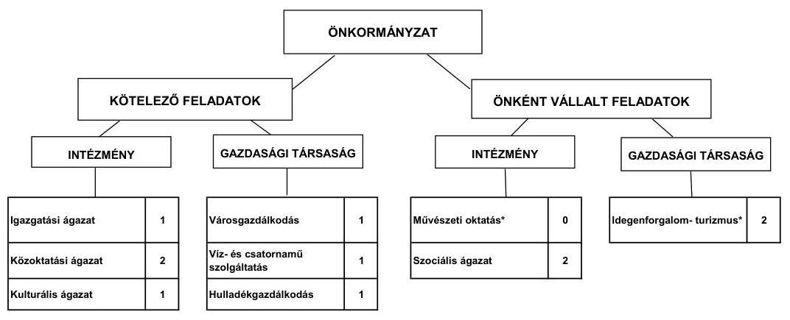

Az Önkormányzat feladatait 2011. június 30-án (a Polgármesteri hivatallal együtt) hat költségvetési szervvel és öt gazdasági társasággal látta el. Az intézményszervezeti átalakítások és intézményi összevonások, valamint a mikro-térségi intézményi társulások létrejöttének következtében a feladatellátás telephelyeinek száma a 2007. évi nyolcról 2011. év I. félév végére 12 -re nőtt.

Az Önkormányzat feladataiba öt gazdasági társaságot vont be, melyből egy gazdasági társaságában kizárólagos tulajdonnal rendelkezik, további négy gazdasági társaságban pedig 50\% alatti a részesedése. A kizárólagos tulajdonában álló Városgazdálkodási Kft. a kötelező feladatok közül a közterület fenntartásban (parkgondozás, útkarbantartás), az önkormányzati tulajdonú ingatlanok üzemeltetésében, karbantartásában, a kulturális tevékenységekben, az önként vállalt feladatok közül pedig az idegenforgalmi tevékenységek fejlesztésében kapott szerepet az Önkormányzat feladatellátásában. A Víz- és csa-

---

tornamú Kft. a víz- és csatornaszolgáltatásban múködik közre, a Hulladékgazdálkodási Kft. lakossági hulladékkezelési és szállítási feladatot lát el a településen. További két gazdasági társaságnak - az AF Zrt.-nek és az AF Kft.nek, melyekben 30-30\%-os tulajdoni részesedéssel rendelkezik az Önkormányzat - az önként vállalt feladatok között, az idegenforgalmi tevékenység fejlesztésében szántak szerepet. Az Önkormányzat két gazdasági társaságnak nyújtott összesen 7,1 millió Ft összegben tagi kölcsönt, melyek jelenleg is fennállnak.

Az egyes közszolgáltatások feladatellátásában résztvevő intézmények működési kiadásai finanszírozási forrásainak összetételét ágazatonként a következő ábra szemlélteti:
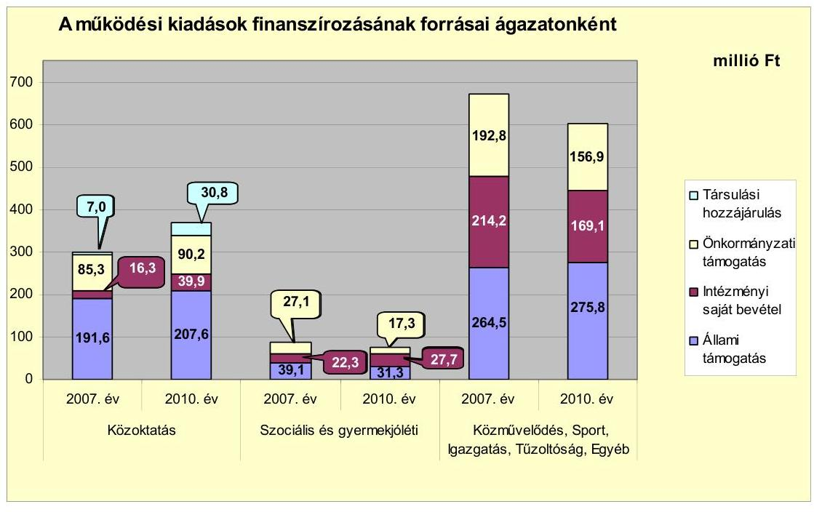

A közoktatás múködési kiadásai a 2007. évi 300,2 millió Ft-ról a 2010. évre 368,5 millió Ft-ra, (22,8\%-kal), 68,3 millió Ft-tal nőttek, a 2007-ben létrehozott óvodai mikro-térségi társulás miatt megnövekedett ellátotti/tanuló létszámnövekedéssel összefüggésben. A 2010. év közoktatási kiadásai 8,8 millió Ft-tal, 2,4\%-kal voltak magasabbak a 359,7 millió Ft-os megelőző hároméves átlagnál. A szociális ágazat kiadásai a 2007. évi 88,5 millió Ftról 76,3 millió Ft-ra, 13,8\%-kal csökkentek a 2010. évre. A csökkenés oka egyrészt a gyermekjóléti feladatok 2008. évi társulásba kiszervezése (mely két fő létszámcsökkentéssel járt), másrészt a Bölcsőde és az Idősek Bentlakásos Otthona létszámának 2010. évi öt fős csökkentése volt. A szociális ágazat kiadásai a 2010. évben 76,3 millió Ft-os értékükkel 12,1 millió Ft-tal, 13,7\%-kal alacsonyabbak voltak, mint a 2007-2009. évek 88,4 millió Ft-os átlaga. A közmúvelődésre, igazgatásra és a Polgármesteri hivatal egyéb feladataira a 2007. évi 671,5 millió Ft-os összegnél 10,4\%-kal (69,7 millió Ft-tal) kevesebbet, 601,8 millió Ft-ot költött az Önkormányzat. Az önként vállalt feladatok ellátására fordított kiadások részaránya a 2007. évi $\mathbf{2 9 , 0 \%}$-os részarányról a 2010. évre $\mathbf{8 , 3 \% - r a}, 20,7$ százalékponttal mérséklődött annak eredményeképpen, hogy az idegenforgalommal, turizmussal kapcsolatos fel-

---

adatokat a 2009. évtől folyamatosan a kizárólagos tulajdonukban álló Városgazdálkodási Kft.-be szervezték ki. A kiszervezések hatására a közművelődésre, igazgatásra és a Polgármesteri hivatal egyéb feladataira a 2010. évi kiadások a megelőző három év átlagához viszonyítva 46,9 millió Ft-tal, 7,0\%-kal voltak alacsonyabbak.

A kötelező- és az önként vállalt feladatok ellátását biztosító szervezeti keretekben, a feladatellátás módjában bekövetkezett változások költségvetésre gyakorolt együttes hatásaként 210,5 millió Ft megtakarítás számszerűsíthető, mely javította az Önkormányzat pénzügyi egyensúlyi helyzetét, de nem biztosított elegendő forrást a pénzügyi egyensúly megteremtéséhez. Összességében azonban az Önkormányzatnak nem sikerült úgy megszerveznie a kötelező és az önként vállalt feladatait, hogy a kapott költségvetési támogatások az önkormányzati, illetve az intézményfenntartó társulások által nyújtott támogatások, valamint a realizált intézményi saját bevételek fedezetet nyújtottak volna azok kiadásaira, ezért folyó költségvetése minden évben deficites volt.

Az Önkormányzat folyó költségvetésének egyenlege (működési jövedelem) a 2007-2010. évek között minden évben múködési forráshiányt mutatott. A folyamatos múködés biztosításához az Önkormányzat minden évben hitelt vett fel, mely növelte a pénzügyi kockázatot.
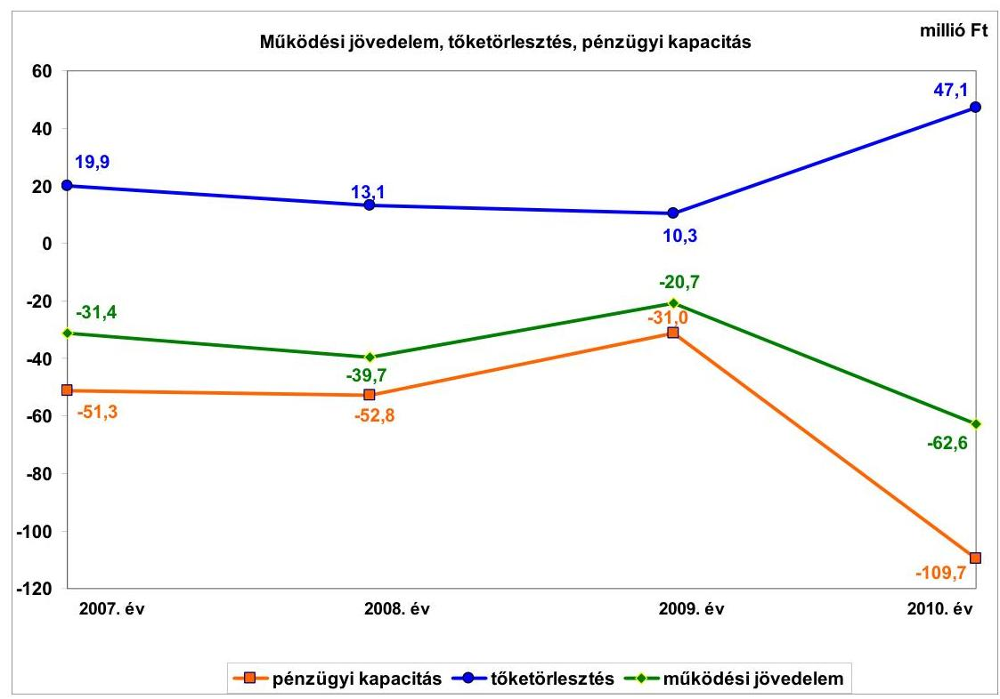

A vizsgált időszakban a múködési jövedelem legnagyobb változása a 2010. évben következett be, mivel 41,9 millió Ft-tal, 202,4\%-kal csökkent. A csökkenést az államháztartáson belülről kapott támogatások 21,8 millió Ft-os 18,7\%-os csökkenése és a múködési kiadások 30,1 millió Ft-os 2,7\%-os növekedése - mint két legnagyobb mértékben változó összetevő - okozta. A múködési jövedelem minden évben negatív volt, amelynek oka az utófinanszírozott beruházások egyre nagyobb összegű átmeneti finanszírozási igénye. Az Önkor-

---

mányzat a vizsgált évek mindegyikében pályázott ÖNHIKI-s támogatásra, mely pályázatokon a 2007. évben 54,0 millió Ft, a 2008. évben 47,5 millió Ft, a 2009. évben 5,0 millió Ft, a 2010. évben 15,0 millió Ft, a 2007-2010. években összesen 121,5 millió Ft vissza nem fizetendő támogatást kaptak. A 2011. év III. negyedévében 30,9 millió Ft vissza nem térítendő támogatást kapott az Önkormányzat. A kapott ÖNHIKI támogatások csökkentették az Önkormányzat negatív működési és nettó működési jövedelmét.

A nettó múködési jövedelem a tőketörlesztés összegeivel tér el a működési jövedelem értékeitől. A mutató minden évben a negatív tartományban volt. Az Önkormányzat nettó múködési jövedelme a 2008. évben, a 2007. évhez viszonyítva -51,3 millió Ft-ról -52,8 millió Ft-ra kismértékben (2,9\%) csökkent. A 2009. évben a nettó működési jövedelem -31,0 millió Ft-ra növekedett (41,3\%-os növekedés) a 2008. évi szintről. A 2010. évben - a 47,0 millió Ft-os hiteltörlesztés hatására - jelentősen romlott, mivel -31,0 millió Ft-ról -109,7 millió Ft-ban alakult, mely 78,7 millió Ft-os (253,9\%) negatív irányú elmozdulást jelentett. A négy év alatt az összes forráshiány -244,8 millió Ft volt. A pénzügyi kapacitás (a nettó múködési jövedelem) a folyó költségvetési pozíció mellett az adott költségvetési év adósságtörlesztésének hatását is tükrözi. A tőketörlesztés (hiteltörlesztés) növekedése miatt 36,8 millió Ft-tal, a múködési jövedelem csökkenése miatt 41,9 millió Ft-tal csökkent a nettó múködési jövedelem a 2009. évről a 2010. évre. A pénzügyi egyensúlyi helyzet alakulását jelentősen befolyásolta az Önkormányzat fejlesztési tevékenysége, különös tekintettel arra, hogy a felhalmozási tevékenységét is minden évben hitel felvételével valósította meg.

Az Önkormányzat folyó bevételei a 2008. évben nőttek, majd ezt követően csökkentek. A 2010. évben 1076,9 millió Ft-os összegükkel 65,6 millió Ft-tal, 5,7\%-kal maradtak a hároméves átlag értéke (1142,5 millió Ft) alatt. Összetételét tekintve a folyó bevételek legnagyobb hányadát (32,0-62,8\%) a költségvetési támogatások jelentették a 2008. évtől. A 2007. évben legnagyobb aránnyal az szja részesedett, de a 2008. évtől életbe lépett központi forrásszabályozás változásai miatt az szja egy részét a költségvetési támogatásokba építették be. A 2007. évi 35,3\%-os részesedésről ezt követően 13-16\% közötti részesedéseket ért el az szja. Az egyéb saját bevételek a harmadik legnagyobb bevételi forrást jelentették, részesedésük 13,5-25,0\% közötti volt. Az Önkormányzat a 2007-2010. években három helyi adónemet, az iparúzési adót, a lakossági kommunális adót és az idegenfogalmi adót alkalmazott. Az iparúzési adó és a hozzá kapcsolódó pótlékok az Önkormányzat folyó bevételeiből 4,2-5,4\%-os részarányt képviseltek. A 2010. évben, 57,7 millió Ft-os összegükkel 10,9 millió Ft-tal, 23,3\%-kal haladták meg a 2007. évi 46,8 millió Ft-os adóbevétel összegét, mely növekményt a 2010. évtől bekövetkező iparúzési adó 1,6\%ról 2,0\%-ra történő felemelése okozta.

A folyó kiadások változóan alakultak, 2010. évi összege 33,6 millió Ft-tal, 2,9\%-kal volt alacsonyabb, mint a hároméves átlag (1173,1 millió Ft). A 20072010. években a múködési kiadások tették ki a folyó kiadások 82,3-83,0\%-át, a transzferkiadások (csökkenő trendú) részaránya 11,9-16,0\% közötti volt, legjelentősebb tételét a magánszemélyeknek történő pénzeszközátadások (segélyek) képezték, melyek éves összege 132,5-173,5 millió Ft-os nagyságrendet képviselt. (E kiadások trendje is csökkenő volt.) A kamatkiadások részaránya 1,5\%-ról

---

3,0\%-ra emelkedett, mivel 2007. évi 15,6 millió Ft-os összegük a 2010. évre 43,4 millió Ft-ra emelkedett, mely 27,8 millió Ft-os, 178,2\%-os növekedésnek felelt meg.

A felhalmozási költségvetés a 2007. év kivételével deficites volt. A 2008. évben -64,5 millió Ft, a 2009. évben -22,0 millió Ft, míg a 2010. évben -218,6 millió Ft volt a felhalmozási költségvetés egyenlege, melyet a nettó múködési jövedelem - mivel az is negatív volt - nem tudott ellensúlyozni. Az Önkormányzat felhalmozási költségvetése a 2007-2010. években összességében 287,5 millió Ft hiányt mutatott.

A felhalmozási hiány az Önkormányzat pályázati tevékenységét követő beruházási döntéseire vezethető vissza, mivel a támogatást nyert beruházások önerő szükséglete meghaladta az Önkormányzat finanszírozási lehetőségeit. A felhalmozási forráshiány a 2008. évtől kezdődően folyamatosan fennállt, mely pénzügyi kockázatot jelent az Önkormányzat számára.

A 2007-2010. évek között a felhalmozási kiadások - a 2009-2010. években EU-s támogatásokkal megvalósuló beruházások miatt - közel megtizszereződtek ( $971,3 \%$-os volt a növekedés a 2007. évhez viszonyítva), így az összes kiadáson belül részarányuk megnövekedett, s ez idézte elő a folyó kiadások részarányának csökkenését. A teljesített kiadásokból folyamatosan csökkenő (a 2007. évben 95,4\%, 2008-ban 92,5\%, 2009-ben 77,6\%, 2010-ben $68,0 \%$, míg 2011. év I. félévében 69,0\%) volt a folyó kiadások részaránya, annak ellenére, hogy nominálértékben - a 2010. évi adatot a 2007. év adatához viszonyítva - mindössze 0,4 millió Ft-os eltérés volt.

A pénzügyi egyensúlyi helyzet alakulását jelentősen befolyásolta az Önkormányzat ellenőrzési időszakban végzett fejlesztési tevékenysége. A 2010. december 31-ig befejezett fejlesztések 66,4\%-át EU-s forrásból fedezték. A 2007-2010. években 904,2 millió Ft értékű fejlesztés és felújítás forrása a saját erő és a hazai- és EU-s támogatások mellett 76,4 millió Ft támogatást megelőlegező hitelfelvétel $(8,4 \%)$ volt.

A 2010. december 31-én folyamatban lévő fejlesztési feladatok végrehajtására 2007-2010 között 55,3 millió Ft kiadást teljesítettek, amelyre saját erőből 17,2 millió Ft-ot ( $31,1 \%$ ) fordítottak. Az EU-s támogatásból megvalósult fejlesztések finanszírozása miatti likviditási gondok enyhítésére az Önkormányzat likvid hiteleket vett fel.

Az Önkormányzat 2010. december 31-én folyamatban lévő fejlesztési feladataira 2010. évet követő kötelezettségvállalásainak összege 68,9 millió Ft volt, amelyből 64,0 millió Ft-ot EU-s támogatásból, 0,2 millió Ftot hazai támogatásból és 4,7 millió Ft-ot saját forrásból terveznek biztosítani.

---

A 2010. december 31-én fennállt felhalmozási kötelezettségvállalásokat és azok forrásösszetételét a következő ábra mutatja be:
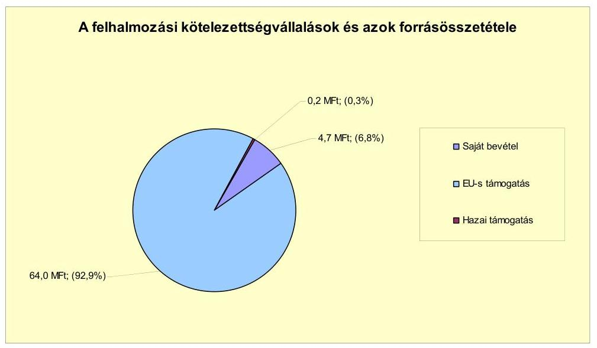

Az Önkormányzat által beadott, elbírálás alatt álló pályázat tervezett teljes bekerülési költsége 52,6 millió Ft volt, amelyből 1,7 millió Ft-ot 2010. december 31-ig pénzügyileg teljesített. Az Önkormányzat által a 2011-2012. évekre vállalt kötelezettségek összege 119,8 millió Ft volt, amelyből 112,4 millió Ftot EU-s támogatásból, 0,2 millió Ft-ot hazai támogatásból és 7,2 millió Ft-ot saját forrásból terveznek biztosítani. Az utófinanszírozott EU-s támogatások megelőlegezése pénzügyi kockázatot jelenthet az Önkormányzat számára.

Az Önkormányzat mérleg szerinti pénzintézeti kötelezettsége a 2006. év végéről a 2011. év I. félév végére 177,0 millió Ft-ról 576,7 millió Ft-ra nőtt, amelyből az árfolyamváltozás miatti különbözet 0,9 millió Ft volt. A fennálló pénzintézeti kötelezettségek 11 hosszú lejáratú hitelből, valamint öt rövid lejáratú hitel igénybevételéből keletkeztek. Az Önkormányzat az elfogadott 2011. évi költségvetési rendelete alapján hitel felvételét tervezte 525,6 millió Ft öszszegben, mely a költségvetési főösszeg 31,4\%-át jelentette. A hitelfelvétel a helyszíni vizsgálat befejezésének időpontjáig nem történt meg. Az Önkormányzat kötelezettségvállalásaira képviselő-testületi döntés alapján került sor, azonban az előterjesztésekben nem mutatták be a kamat- és - a devizaalapú kötelezettségeket érintő - árfolyamkockázatot.

Az Önkormányzat a hiteleket mind lehívta, és a hitelcélnak megfelelően a Képviselő-testület által jóváhagyott, a költségvetésbe betervezett beruházásokhoz és múködéshez használta fel. A 2007-2010. évben CHF-ben fennálló pénzintézeti kötelezettségeiből 21,3 ezer CHF ( 3,0 millió Ft) tőkét törlesztett, és 7,6 ezer CHF ( 1,1 millió Ft) kamatot fizetett. A vizsgált években nyolc hosszú lejáratú hitelt fizetett vissza az Önkormányzat, melyek egy kivételével forint alapúak voltak. A 2007-2011. év I. féléve között realizált kamatbevétel összege 5,0 millió Ft.

Az Önkormányzat költségvetésének pénzügyi egyensúlyát a vizsgált időszakban folyószámlahitel, munkabér-megelőlegezési hitel és három

---

240,0 millió Ft keretösszegű rövid lejáratú, likvid hitel igénybevételével tudta biztosítani. A rövid lejáratú, forint alapú likvid hiteleket az EU-s forrásokból megvalósuló, utófinanszírozású pályázatok finanszírozására vették fel. Egy 100 millió Ft összegű hitelkeretből 40,0 millió Ft 2010. november 2-án, a fennmaradó 60,0 millió Ft 2011. október 7-én került visszafizetésre. A további két hitel lejárati napját az Önkormányzat meghosszabbította. Az Önkormányzat átmenetileg a fejlesztések megvalósításához a likvid hiteleken túl folyószámlahitelt is igénybe vett.

A folyószámlahitel igénybevétele a 2007-2011. év I. féléve között az alábbiak szerint alakult:

| Megnevezés | 2007. év | 2008. év | 2009. év | 2010. év | 2011. I. félév |
| :--: | :--: | :--: | :--: | :--: | :--: |
| Folyószámlahitel |  |  |  |  |  |
| Keretösszeg január 1-án (millió Ft-ban) | 110,0 | 160,0 | 250,0 | 300,0 | 300,0 |
| Átlagos napi állomány (millió Ft-ban) | 111,3 | 156,0 | 243,9 | 296,1 | 297,1 |
| Folyószáma hitellel zárt napok száma (nap) | 905,0 | 356,0 | 305,0 | 365,0 | 181,0 |
| Egyenleg (állomány) | 110,00 | 238,0 | 290,9 | 296,7 | 298,9 |
| Munkabár-megelőlegezési hitel |  |  |  |  |  |
| Keretösszeg január 1-án (millió Ft-ban) | 30,0 | 35,0 | 40,0 | 40,0 | 40,0 |
| Átlagos napi állomány (millió Ft-ban) | 27,1 | 29,6 | 31,1 | 36,0 | 39,6 |
| Munkabár-megelőlegezési hitellel zárt napok száma (nap) | 365,0 | 366,0 | 365,0 | 365,0 | 181,0 |
| Egyenleg (állomány) | 19,3 | 22,1 | 21,8 | 40,0 | 40,0 |

A pénzügyi egyensúly biztosítása az Önkormányzatnak 125,4 millió Ft kamatkiadást, és 4,8 millió Ft egyéb költség fizetésének kötelezettségét okozta.

Az Önkormányzat 2010. év végi 58,1 millió Ft-os szállítói tartozásállományából a lejárt határidejű tartozások 55,9 millió Ft-ot ( $96,2 \%$-ot) képviseltek, melyből 13,9 millió Ft ( $24,9 \%$ ) volt 90 napon túli időtartamban lejárt. A 2011. év I. félév végi szállítói tartozása 91,5 millió Ft, melyből a lejárt tartozások összege 88,8 millió Ft ( $97,0 \%$ ), ebből a 90 napon túli időtartamban lejárt 38,1 millió Ft ( $42,9 \%$ ) volt. A 2007-2009. években a szállítói tartozásállomány 12,0 millió Ft és 22,7 millió Ft között alakult, a 2010. és a 2011. években ugrásszerúen növekedett az Önkormányzatnál. A 2010. évben 58,1 millió Ft-os összegével megháromszorozódott a 2009. év végi szállítói tartozásállomány ( 18,5 millió Ft), majd a 2011. év I. félévében a 2010. év végi állomány több mint másfélszeresére ( $57,3 \%$-kal), 91,5 millió Ft-ra növekedett tovább. A 2010. évben már átütemezési megállapodásra is sor került. A 90 napot meghaladó, szállítók felé fennálló kötelezettségek miatt - a helyi önkormányzatok adósságrendezési eljárásáról szóló 1996. évi XXV. törvényben foglaltak ellenére - a polgármester nem kezdeményezte a Képviselő-testületnél az adósságrendezési eljárás megindítását.

Az Önkormányzat gazdasági társaságai részére 48,1 millió Ft összegben készfizető kezességet vállalt, melyből 2011. június 30-án a 2010. év végi 30,0 millió Ft-os hitelfelvétel miatti és 9,8 millió Ft-os szállítói kötelezettség miatti kezességvállalások álltak fenn. A kezességvállalásokból a vizsgált időszakban az Önkormányzatnak fizetési kötelezettsége nem származott.

---

Az Önkormányzat kötelezettségeinek 2010. december 31-i, valamint 2011. június 30-i tartozásállományát és annak várható nagyságát a kötelezettségek lejáratáig a következő táblázat szemlélteti:

| Megnevezés | Állomány 2010. december 31-án |  |  | Állomány 2011. június 30-án |  |  | Várható kötelezettség 2011-2013. években |  | Várható kötelezettség 2014. évtől |  |
| :--: | :--: | :--: | :--: | :--: | :--: | :--: | :--: | :--: | :--: | :--: |
|  | HUF-ben (millió Ft-ben) | Dévszében (Önkorage. ezer CHFt-ben) | Dévúza nem | HUF-ben (millió Ft-ben) | Dévszében (Önkorage. ezer CHFt-ben) | Dévúza nem | HUF-ben (millió Ft-ben) | Dévszében (Önkorage. ezer CHFt-ben) | HUF-ben (millió Ft-ben) | Dévszében (Önkorage. ezer CHFt-ben) |
| Pénzintézeti kötelezettségek |  |  |  |  |  |  |  |  |  |  |
| Összoci lejáratú fejlesztési hitelek | 2,2 | 0,0 | HUF | 1,1 | 0,0 | HUF | 2,4 | 0,0 | 0,0 | 0,0 |
| Összoci lejáratú működési hitel | 50,0 | 0,0 | HUF | 25,5 | 0,0 | HUF | 48,0 | 0,0 | 21,1 | 0,0 |
| Folyószámenrész | 248,7 | 0,0 | HUF | 298,0 | 0,0 | HUF | 298,0 | 0,0 | 0,0 | 0,0 |
| Örintézési megelőlegesítési hitel | 50,0 | 0,0 | HUF | 20,0 | 0,0 | HUF | 20,0 | 0,0 | 0,0 | 0,0 |
| Egyéb lévút hitel | 255,0 | 0,0 | HUF | 190,0 | 0,0 | HUF | 190,0 | 0,0 | 0,0 | 0,0 |
| Éreménnői kötelezettséget összesen HUF-ben | 391,9 | 0,0 | HUF | 373,3 | 0,0 | HUF | 377,3 | 0,0 | 21,1 | 0,0 |
| Kötelezettség |  |  |  |  |  |  |  |  |  |  |
| Évetésszég | 39,9 | 0,0 | HUF | 39,9 | 0,0 | HUF | 0,0 | 0,0 | 0,0 | 0,0 |
| Évetésszég | 0,0 | 0,0 | HUF | 0,0 | 0,0 | HUF | 0,0 | 0,0 | 0,0 | 0,0 |
| Bízosolótest összesen | 46,1 | 7,7 | HUF | 39,9 | 0,0 | HUF | 0,0 | 0,0 | 0,0 | 0,0 |
| Látog kötelezettségek HUF-ben | 0,0 | 0,0 | HUF | 0,0 | 0,0 | HUF | 0,0 | 0,0 | 0,0 | 0,0 |
| Látog kötelezettségek CHF-ben | 0,0 | 0,0 | HUF | 0,0 | 1,0 | HUF | 0,0 | 0,0 | 0,0 | 0,0 |
| Szállító tartozás | 28,1 | 0,0 | HUF | 26,1 | 0,0 | HUF | 0,0 | 0,0 | 0,0 | 0,0 |
| Egyéb kiadás elmaradási | 0 | 0 | HUF | 7,7 | 0,0 | HUF | 7,7 | 0,0 | 0,0 | 0,0 |
| Kötelezettségek összesen HUF-ben | 248,0 | 0,0 | HUF | 114,4 | 0,0 | HUF | 275,5 | 0,0 | 27,1 | 0,0 |
| Kötelezettségek összesen CHF-ben | 0,0 | 7,7 | CHF | 0,0 | 1,0 | CHF | 0,0 | 1,0 | 0,0 | 0,0 |

Az Önkormányzatnak pénzintézetekkel szemben fennálló kötelezettsége a 2011. év I. félév végén 575,5 millió Ft volt. Ezek várható kötelezettsége (tőke, kamat és egyéb költség) a legutóbbi kamatfizetés feltételei alapján a 2011-2013. években 577,3 millió Ft. Az Önkormányzatnak a 2011. évben a kezességvállalás, lízing kötelezettség, szállítói tartozások és egyéb kiadás elmaradások rendezése címén 139,0 millió Ft, és 1,9 ezer CHF fizetési kötelezettsége keletkezett. A 2011-2013. évek kötelezettségeinek teljesítésére figyelembe vehető 69,0 millió Ft mérlegben kimutatott, vevők által elismert követelésállomány. A pénzintézeti és egyéb kötelezettségek teljesítése a 2011-2013. években a rendelkezésre álló fedezet ismeretében nem biztosított, mely pénzügyi kockázatot jelent az Önkormányzat számára. A 2014. évtől várható - a vizsgált időszak végén ismert - pénzintézeti kötelezettségei: 21,1 millió Ft. Az Önkormányzat tájékoztatása szerint figyelembe vehető további források „a mindenkori költségvetési rendeletekben megtervezett önkormányzati helyi adóbevételek, a képződő müködési jövedelem, valamint a beruházások finanszírozása miatt meglévő támogatást megelőlegező hitelek esetén a hazai és EU-s támogatások". A további évekre szóló - a vizsgált időszak végén ismert - pénzintézeti kötelezettségek teljesítését nem látjuk biztosítottnak, mivel a helyszíni vizsgálat befejezéséig a Képviselőtestület további egyensúlyt javító intézkedésről döntést nem hozott és arra vonatkozó számítások sem készültek.

A Tiszafüred és Vidéke Takarékszövetkezet az általa 2010. augusztus 3-án az Önkormányzat rendelkezésére bocsátott 50,0 millió Ft-os forgóeszköz hitel fedezeteként elfogadott két olyan ingatlant, melyek az Önkormányzat vagyonkataszterében forgalomképtelen vagyonelemként voltak nyilvántartva. Ezzel az Ötv-ben ${ }^{6}$, valamint az Nvtv. 6. §-ában foglaltakat megsértve, két forgalomkép-

[^0]
[^0]:    ${ }^{6}$ 2012. január 1-jétől hatályon kívül helyezte a Magyarország helyi önkormányzatairól szóló 2011. évi CLXXXIX. törvény 144. § (1) bekezdése a 156. § (1) bekezdés a) pontjában foglalt kijelölés alapján. Az Nvtv. 6. § (1) és (5) bekezdésében a forgalomképtelen önkormányzati törzsvagyon terhelési tilalmát rögzítették.

---

telen ingatlanra is bejegyzésre került a jelzálogjog, elidegenítési és terhelési tilalom a hitel lejártáig, 2015. augusztus 25 -ig.

Az önkormányzati kizárólagos tulajdonú gazdasági társaságok kötelezettségeinek 2011. június 30-i állományát és várható nagyságát a kötelezettség lejáratáig a következő táblázat mutatja be:

| Megnevezés | Állomány 2010.   december   31-án | Állomány   2011. június 30   án | Várható   kötelezettség 2011   2013. években | Várható kötele   zettség   2014. évtől |
| :--: | :--: | :--: | :--: | :--: |
|  | HUF-ban   (millió Ft-ban) | HUF-ban   (millió Ft-ban) | HUF-ban   (millió Ft-ban) | HUF-ban (millió   Ft-ban) |
| Pénzintézeti kötelezettségek összesen: | 25,0 | 30,0 | 30,0 | 0,0 |
| Ezállító tartozás | 30,3 | 26,1 | 26,0 | 0,0 |
| Kötelezettségek összesen: | 55,3 | 56,1 | 56,0 | 0,0 |

Az önkormányzati kötelezettségek növekedése mellett az Önkormányzat kizárólagos tulajdonú gazdasági társaságának (a Városgazdálkodási Kft.) kötelezettségei is befolyásolják az Önkormányzat pénzügyi egyensúlyát. A társaságnak a 2011. június 30-i állapotnak megfelelően 30,0 millió Ft pénzintézeti kötelezettséget és 26,1 millió Ft szállítói tartozást kell rendeznie. Az Önkormányzat számára fizetési kockázatot jelent a gazdasági társaság pénzintézeti kötelezettségére vállalt készfizető kezesség. A Városgazdálkodási Kft. megalakulása óta veszteséges gazdálkodást folytatott. A 2008. évben 2,0 millió Ft, a 2009. évben 11,5 millió Ft, a 2010. évben 19,8 millió Ft, a 2011. év I. félévkor 10,4 millió Ft vesztesége volt a Kft.-nek. Az Önkormányzatnak tőkepótlási kötelezettség merülhet fel a következő években a gazdasági társaság veszteséges gazdálkodása miatt.

Az Önkormányzat 2007-2010 között eszközállománya után 343,0 millió Ft öszszegű értékcsökkenést számolt el. Az elszámolt értékcsökkenés 4,8\%-ának megfelelő összeget ( 16,3 millió Ft-ot) felújításra, míg az elszámolt értékcsökkenés 2,3-szeresét ( 778,2 millió Ft-ot) beruházásra fordították. A felújításokra, az eszközök pótlására - az Önkormányzat kimutatásai szerint - a pénzügyi lehetőségek függvényében került sor. Az elhasználódott eszközök pótlására az Önkormányzat tartalékot nem képzett, külön alapot ${ }^{7}$ nem hozott létre. Az éves zárszámadási rendeleteiben az Önkormányzat nem mutatta be az eszközök után tárgyévben elszámolt értékcsökkenés összegét, az eszközpótlásra fordított tényleges kiadásokat, valamint az eszközök elhasználódási fokának alakulását.

Az Önkormányzat az ellenőrzött időszakban kiadási megtakarítást eredményező és bevételt növelő intézkedéseket tett, azonban ezen intézkedések nem biztosítottak elegendő forrást a pénzügyi egyensúly helyreállításához. Az Önkormányzat számításai szerint a 2007-2011. év I. féléve között tett intézkedések 150,9 millió Ft bevételi többletet, továbbá 209,4 millió Ft kiadási megtakarítást eredményeztek. A kiadási megtakarítások 73,2\%-a az elrendelt álláshely-csökkentésekhez kapcsolódtak. Az álláshely-csökkentő intézkedések

[^0]
[^0]:    ${ }^{7}$ Jogszabályi előírás nem kötelezi az Önkormányzatot tartalék képzésére és külön alap létrehozására.

---

2007-2011. év I. féléve között önkormányzati szinten összesen 59 álláshely megszüntetését jelentették. Az óvodai feladatellátásban bekövetkezett intézményfenntartói társulás létrejötte miatt a 2007. évben 34 álláshely- és egyben létszámnövekedés történt. Ennek következtében az időszak álláshelyeinek száma 25 fővel csökkent. A bevételnövelő intézkedések helyi adók mértékének emeléséhez (iparűzési adó 1,6\%-ról 2\%-ra, a kommunális adó adótételenként 1000 Ft/év, majd 2010. január 1-jétől az üdülőknél differenciáltan, a lakóingatlannál a duplájára emelkedett), eszközök értékesítéséhez és lejárt tartozások (beleértve az adót is) behajtásához kapcsolódtak. Az Önkormányzat a lejárt tartozások (beleértve az adókat is) behajtása érdekében meghozott intézkedések végrehajtásával növelni tudta a bevételeit. A lejárt tartozások fokozott behajtására képviselő-testületi döntés következtében került sor.

Az utóellenőrzés a pénzügyi egyensúly javítására a korábbi ellenőrzés alapján tett három szabályszerűségi és egy célszerűségi javaslat hasznosítására terjedt ki. Minden javaslatot az intézkedési terv szerinti határidőben megvalósítottak.

Az Önkormányzat pénzügyi egyensúlyi helyzetét összegezve a következők emelhetők ki:

# Az Önkormányzat pénzügyi egyensúlya rövid távon veszélyeztetett. 

A folyó bevételek nem biztosították a folyó kiadások fedezetét, annak ellenére, hogy az Önkormányzat minden évben részesült ÖNHIKI támogatásban. Az adósságszolgálat finanszírozása, a pénzügyi egyensúly biztosítása munkabérmegelőlegezési hitel és folyószámlahitel, valamint likvid hitelek igénybevételével történt. A költségvetésbe beépült forráshiányt jelzi a jelentős összegű, állandósult folyószámlahitel és munkabér-megelőlegezési hitel, valamint a lejárt szállítói állomány nagysága.

A felhalmozási költségvetés a 2007. év kivételével forráshiányt mutatott. Az európai uniós támogatások utófinanszírozása miatt a források megelőlegezéséhez rövid lejáratú fejlesztési célú hitelek igénybevételére került sor. A folyamatban lévő fejlesztések tervezett befejezése hitel igénybevétele nélkül biztosítottnak látszik.

A pénzintézeti és egyéb kötelezettségek teljesítése sem rövid, sem középtávon nem biztosított. A további évekre szóló - a vizsgált időszak végén ismert - pénzintézeti kötelezettségek teljesítésének fedezetére a helyi adóbevételeket és a képződő működési jövedelmet jelölték meg, azonban a források biztosítása érdekében intézkedést nem tettek, számítások nem készültek.

A kizárólagos tulajdonú gazdasági társaság veszteséges gazdálkodása az Önkormányzat korlátlan és teljes felelőssége miatt - bizonyos feltételek fennállása esetén - az Önkormányzat számára pénzügyi helytállási kötelezettséget jelenthet.

Az Állami Számvevőszékről szóló 2011. évi LXVI. törvény 33. § (1) bekezdésében foglaltak értelmében a jelentésben foglalt megállapításokhoz kapcsolódó intézkedési tervet köteles az ellenőrzött szervezet vezetője összeállítani és azt a jelentés kézhezvételétől számított harminc napon belül az ÁSZ részére megkül-

---

deni. Amennyiben az intézkedési tervet határidőben nem küldi meg a szervezet, vagy az továbbra sem elfogadható, az ÁSZ elnöke a hivatkozott törvény 33. § (3) bekezdés a)-b) pontjaiban foglaltakat érvényesítheti.

# A 2011. június 30-i pénzügyi egyensúlyi helyzet alapján az ellenőrzés intézkedést igénylő megállapításai és javaslatai a következők: 

## a polgármesternek

1. Az Önkormányzat pénzügyi egyensúlya rövid távon veszélyeztetett. Az Önkormányzat nettó múködési jövedelme a vizsgált időszakban negatív volt. Az Önkormányzat finanszírozásában a folyószámlahitel és munkabér-megelőlegezési hitel állandósult. Az Önkormányzatnál nem biztosított a vállalt pénzintézeti és egyéb kötelezettségek fedezete.

A szállítói kötelezettségek állománya, ezen belül a 90 napon túl lejárt szállítói tartozások összege jelentősen emelkedett.

Az Önkormányzat által tett intézményszervezeti átalakítások, kiadáscsökkentő és bevételnövelő intézkedések nem biztosítanak elegendő forrást a pénzügyi egyensúly helyreállításhoz.

Az Önkormányzat kizárólagos tulajdonú gazdasági társaságának pénzintézeti és egyéb kötelezettségállománya a vizsgált időszakban folyamatosan emelkedett, illetve a vizsgált időszakban folyamatosan veszteségesen múködött. A 2011-2013. és a további évek várható kötelezettségeinek összege 30,0 millió Ft, amelyre a vállalt készfizető kezesség az Önkormányzat számára fizetési kockázatot jelent.

A Képviselő-testületnek előterjesztett éves zárszámadási rendeletekben nem mutatatták be az Önkormányzat eszközei után tárgyévben elszámolt értékcsökkenés összegét, az eszközpótlásra fordított tényleges kiadásokat, az eszközök elhasználódási fokának alakulását.

A Képviselő-testület döntését megalapozó előterjesztésekben nem mutatták be az adósságot keletkeztető kötelezettségeknél a kamatkockázatokat és a devizában fennálló kötelezettségek esetén az árfolyamkockázatokat.

Javaslat:
Az Önkormányzat pénzügyi egyensúlyának gyors helyreállítása és hosszú távú fenntarthatósága érdekében kezdeményezze - felelősök és határidők megjelölésével - az alábbi intézkedések megtételét:
a) Tárja fel a bevételszerző és kiadáscsökkentő lehetőségeket. Intézkedjen a bevételek növelésére, a kintlévőségek behajtására, a kiadások csökkentésére.
b) Terjesszen a Képviselő-testület elé reorganizációs programot a kedvezőtlen pénzügyi folyamatok megállítására, a pénzügyi egyensúlyi helyzet gyors stabilizálására.

---

c) Képezzen egyensúlyi (elkülönített) tartalékot az adósságszolgálat teljesítése érdekében.
d) Vizsgálja meg az állandósult folyószámla- és likvid hitel hosszú távú kötelezettséggé történő átalakításának jogi lehetőségét, és a Stabilitási törvény 10. §-ában előírt feltételek fennállása esetén kezdeményezze a Kormánynál ennek engedélyezését.
e) Mutassa be havonta legalább három évre kitekintően a kötelezettségeinek finanszírozási forrásait.
f) Kezelje az Önkormányzat lejárt szállítói állományát, a szállítói kitettség és a jogszabályi következmények elkerülése érdekében.
g) Tekintse át az önként vállalt feladatok finanszírozhatóságát a kötelező feladatellátás elsődlegességének biztosítása érdekében, mutassa be a Képviselő-testületnek a megoldás lehetőségeit, és szükség esetén a gazdasági program módosításának igényét.
h) Vizsgálja felül teljes körűen a tervezett beruházásokat és azok fenntartásának jövőbeni pénzügyi kihatásait. Szükség esetén tegyen javaslatot a Képviselőtestületnek a tervezett beruházásokkal kapcsolatos döntések módosítására, amelyben figyelembe veszik az Önkormányzat pénzügyi lehetőségeit, és a kötelező feladatellátás elsődlegességét.
i) Terjesszen intézkedési tervet a Képviselő-testület elé a kizárólagos tulajdonú gazdasági társasága pénzügyi egyensúlyi helyzetének stabilizálása érdekében.
j) Mutassa be a Képviselő-testületnek évente a zárszámadási rendelet előterjesztésében az értékcsökkenés összegét, és ezzel összevetve az elhasználódott eszközök pótlására fordított tényleges kiadásokat, az eszközök elhasználódási fokának alakulását.
k) Az adósságot keletkeztető kötelezettségvállalásról szóló döntéskor mutassa be a Képviselő-testületnek a jövőben várható - árfolyam-, kamat- és törlesztési - kockázatot.
2. Az Önkormányzat 2010 augusztusában 50,0 millió Ft forgóeszköz hitelt vett fel, a hitel biztosítékaként a futamidő lejártáig jelzáloggal terhelték meg az 1537. helyrajzi számú és a 1540/5. helyrajzi számú beépítetlen területeket. A két beépítetlen terület - az Önkormányzat kimutatása szerint - a forgalomképtelen ingatlanok közé tartozik, ezért jelzálogjoggal történő terhelése az Ötv. 88. § (1) bekezdésében foglaltaknak a megsértését jelenti.

Javaslat:
Gondoskodjon arról, hogy az Önkormányzat kötelezettségeinek fedezeteként az Nvtv. 3. § (1) bekezdés 3. pont és az 5. § (2) bekezdés a) és b) pontokban foglaltak szerinti nemzeti vagyon körébe tartozó, forgalomképtelen törzsvagyont ne terheljen meg.

---

A polgármester a helyszíni ellenőrzés lezárása után tájékoztatta az Állami Számvevőszéket az Önkormányzat megtett intézkedéseiről, amelyet az Állami Számvevőszék nem ellenőrzött, arra vonatkozóan véleményt vagy megállapítást nem fogalmaz meg. Az ellenőrzés lezárását követően elvégzett intézkedéseket az Állami Számvevőszék utóellenőrzés keretében vizsgálhatja.

A polgármester tájékoztatása szerint a következő intézkedéseket tette az Önkormányzat:

- a Képviselő-testület 2011. december 15. napjával saját hatáskörben döntött az adósságrendezési eljárás megindításáról. Az eljárás lefolytatása a helyi önkormányzatok adósságrendezési eljárásáról szóló 1996. évi XXV. törvény előírásainak megfelelően történik.
- további intézkedésként a Képviselő-testület 2012. február 29. napjával elrendelte a kizárólagos tulajdonú gazdasági társaságának felszámolását, mivel a társaság pénzügyi helyzetének stabilitása nem volt biztosítható. A Képvise-lő-testületi döntés értelmében a gazdasági társaság által végzett kötelező feladatok ellátása önkormányzati hatáskörbe kerültek vissza, az idegenforgalmi vállalkozási feladatok elvégzése pedig egy új, egyszemélyes nonprofit gazdasági társaság feladatkörébe került.

---

# II. RÉSZLETES MEGÁLLAPÍTÁSOK 

## 1. Az ÖNKORMÁNYZAT KÖTELEZŐ ÉS ÖNKÉNT VÁLlALT FELADATAI, A FELADATELLÁTÁS SZERVEZETI KERETEI ÉS ANNAK VÁLTOZÁSAI

Kötelező feladatait az Önkormányzat az Ötv. és az ágazati törvények által meghatározottnak tekintette, az önként vállalt feladatok terjedelmét az éves költségvetési rendeletekben az adott évi költségvetés forrásainak ismeretében határozták meg, az önkormányzati feladatokról az SzMSz-ben nem rendelkeztek.

Az Önkormányzat - adatszolgáltatása szerint - a 2010. évi 1046,6 millió Ft múködési célú költségvetési kiadásból 953,7 millió Ft-ot ( $91,1 \%$-ot) a kötelező feladatok ellátására fordított. Önként vállalt feladatokra 92,9 millió Ft-ot ( $8,9 \%$-ot) költöttek az Önkormányzatnál. Az önként vállalt feladatok az általános iskolai oktatáshoz (alapfokú művészetoktatás), a közbiztonság és a tüzvédelem javításához, a turizmus és az idegenforgalom fejlesztéséhez, valamint az állami és nemzeti ünnepek méltó megrendezéséhez kapcsolódtak. A 2010. évben múködésre felhasznált pénzeszközök 46,9 millió Ft-tal, 4,3\%-kal csökkentek az előző hároméves átlaghoz (1093,5 millió Ft) viszonyítva. A 2008. évben 142,2 millió Ft-tal ( $13,4 \%$-kal) növekedtek a múködési kiadások, a 2007. évi 1060,1 millió Ft-hoz viszonyítva. A 2009. évben jelentős, $15,3 \%$-os, 184,3 millió Ft-os múködési kiadás csökkenés (1202,3 millió Ft-ról 1018,0 millió Ft-ra) következett be. A 2010. évben a múködési kiadásoknál (1046,6 millió Ft) az előző évhez viszonyítva 2,8\%-os, 28,6 millió Ft-os növekedés következett be.

A kötelező és az önként vállalt feladatok kiadásainak alakulásában a 2009. évtől jelentős változás volt megfigyelhető. A kötelező feladatok kiadásainak aránya a 2008. évi 78,1\%-ról 90,5\%-ra (12,4 százalékponttal) növekedett, míg ezzel párhuzamosan az önként vállalt feladatok aránya 21,9\%-ról 9,5\%-ra (12,4 százalékponttal) csökkent. A kiadási szerkezet változásának az volt az oka, hogy az idegenforgalmi, turisztikai tevékenységeket - ami korábban a Polgármesteri hivatal önként vállalt feladatai közé tartozott - 2009 januárjától fokozatosan ,,kiszervezték" a 2008. év végén létrehozott Városgazdálkodási Kft.-be. Az átszervezés eredményeként a 2008. évi 263,1 millió Ft-os önként vállalt feladatokra fordított összeg 2009-ben 97,0 millió Ft-ra, 2010-ben 92,9 millió Ft-ra csökkent. A csökkenés aránya 2008-ról 2009-re 63,1\%, míg 2009-ről 2010-re további 4,2\% volt.

A 2009. év júliusától a Múvelődési Ház tevékenységét - melyben a kötelező feladatok mellett önként vállalt feladatokat is elláttak - is a Városgazdálkodási Kft.-be szervezték ki, mely szintén az önként vállalt feladatok részarányának csökkenése irányába hatott, mivel a korábbi években a közművelődési intézmények feladatainak 66,3-89,4\% volt önként vállalt feladat.

---

A 2010. évi múködési kiadások feladatonkénti megoszlását és azok finanszírozási arányait a következő táblázat mutatja be:

| Ellátott feladat | Müködési   kiadás   összesen   (millió Ft) | Kötelezö   feladatok   kiadásainak   részaránya   $\%$ | Müködési   bevétel   összesen   (millió Ft) | Állami   támogatás   részaránya   $\%$ | Intézményi   saját bevétel   részaránya   $\%$ | Önkormányzati   támogatás   részaránya   $\%$ | Társulástól   átvett   támogatás   részaránya   $\%$ |
| :--: | :--: | :--: | :--: | :--: | :--: | :--: | :--: |
| Óvodák | 183,2 | 100 | 183,2 | 55,5 | 15,9 | 11,8 | 16,8 |
| Általános iskolák | 185,3 | 97,6 | 185,3 | 57,2 | 5,8 | 37 | 0 |
| Szociális intézmények | 76,3 | 49,2 | 76,3 | 41 | 36,3 | 22,7 | 0 |
| Közművelődési   intézmények | 27,8 | 25,9 | 27,8 | 2,1 | 4,5 | 93,4 | 0 |
| Polgármesteri hivatal   igazgatási kiadásai | 159,6 | 100 | 159,6 | 0 | 18 | 82 | 0 |
| Polgármesteri hivatalban   ellátott egyéb feladatok   müködési kiadásai | 414,4 | 93,0 | 414,4 | 66,4 | 33,6 | 0 | 0 |
| Müködési kiađások összesen | 1046,6 | 91,1 | 1046,6 | 49,2 | 22,6 | 25,3 | 2,9 |

A közoktatás 2010. évi 368,5 millió Ft-os múködési kiadásai 8,8 millió Fttal, 2,4\%-kal voltak magasabbak az előző három év átlagánál ( 359,7 millió Ft), melyek közül a 2008. év kiadásai voltak a legnagyobbak ( 411,4 millió Ft). A 2007. évhez képest 68,4 millió Ft, 22,8\% volt a kiadások növekedése. A kiadások vizsgált időszakon belüli növekedése az ellátotti, illetőleg tanulói létszámnövekedésre volt visszavezethető. A létszámok megnövekedését egyrészt a 2007 augusztusában létrehozott mikro-térségi óvodai társulás okozta, amely Abádszalók város gesztorságával jött létre.

Az óvodai nevelés feladataira 2007. augusztus 23-től Nagyiván, Tiszaderzs, Tiszaigar, Tiszaörs és Tiszaszőlős községekkel közoktatási intézményi társulási szerződést kötöttek.

Az átszervezés eredményeként az oktatási telephelyek száma is nőtt, ami a közüzemi díjak emelkedése révén a dologi kiadások növekedésére hatott. Az Általános Iskolában a tanulói létszámnövekedés oka az, hogy Abádszalók Város Általános Iskoláját a 2009. évtől a környező településekről jelentős számú bejáró tanuló veszi igénybe ${ }^{8}$. Az ágazat kiadásainak részaránya az összes múködési kiadásokon belül, a 2010. év kivételével növekedett. A 2007. évi 28,3\%-os részarányt a 2008. évben 34,2\%, a 2009. évben 36,1\%, majd a 2010. évben $35,2 \%$ követte. A kiadások finanszírozására rendelkezésre álló bevételek összetételének változását az alábbi megoszlási viszonyszámok jelzik: az állami támogatás a 2007. évi 63,8\%-os részarányról a 2010. évre 56,4\%-ra csökkent. Az intézményi saját bevételek 5,5\%-ról 10,8\%-ra, az önkormányzati támogatások $28,4 \%$-ról $24,5 \%$-ra, a társult önkormányzatok támogatása pedig $2,3 \%$-ról $8,3 \%$-ra változott.

A szociális és gyermekjóléti ágazat 2010. évi 76,3 millió Ft-os múködési kiadásai 12,1 millió Ft-tal, 13,6\%-kal voltak alacsonyabbak az előző három év átlagánál ( 88,4 millió Ft), melyek közül a 2008. év kiadásai voltak

[^0]
[^0]:    ${ }^{8}$ Amíg a 2007-2008. években 29-29 fő, addig a 2009. évben 98 fő, a 2010. és 2011. évben 95-95 fő bejáró tanuló volt, az Általános Iskola oktatási statisztikája szerint.

---

a legnagyobbak (91,3 millió Ft). A 2007. évhez képest 12,2 millió Ft, 13,8\% volt a kiadások csökkenése. A 2007. év elején a gyermekjóléti feladatok a Tiszafüredi Többcélú Kistérségi Társulás részére kerültek átadásra. Az ágazat kiadásainak mintegy $50 \%$-a a település 20 fős bölcsődéjében és 16 fős bentlakásos idősek otthonában merült fel. Mindkét tevékenységet önként vállalt feladatként végzi az Önkormányzat. A kiadások csökkenésében a dologi kiadásokkal történő takarékoskodás mellett jelentős részarányt képviselt a dolgozói létszám hét fős csökkenése, melyből öt fő a 2010. évi létszámleépítés eredménye volt. Az ágazat kiadásainak részaránya az összes múködési kiadásokon belül a vizsgált években $7,1-8,5 \%$ közötti volt.

A közmúvelődési ágazat múködési kiadásai a vizsgált években csökkenő nagyságrendet és részarányt képviseltek. Az ágazat 2007. évi 68,0 millió Ft-os kiadása a 2010. évre 59,3\%-kal, 27,7 millió Ft-ra csökkent. Az ágazat kiadásainak csökkenése a Művelődési Központ kulturális tevékenységének 2010 januárjától a Városgazdálkodási Kft. kereteibe történő kiszervezésével függött össze. Az Önkormányzat saját intézményével így már csupán a könyvtári tevékenységet látta el az ágazaton belül. A kulturális tevékenység kiszervezése 3 fős létszámcsökkentésre adott lehetőséget, továbbá a Művelődési Központ közüzemi díjai is megtakarításként jelentkeztek. Az ágazat kiadásainak részaránya az összes múködési kiadásokon belül a 2007. évi 6,4\%-os részarányról a 2010. év végére $2,6 \%$-os részarányra csökkent és megváltozott a kiadások finanszírozására rendelkezésre álló bevételek összetétele is. A megmaradó könyvtári tevékenységet 93,4\%-ban önkormányzati forrásból, 4,5\%-ban intézményi saját bevételből és $2,1 \%$-ban állami támogatásból finanszírozták a 2010. évben.

A Polgármesteri hivatalban ellátott igazgatási feladatok 2010. évi 159,7 millió Ft-os múködési kiadásai 0,5 millió Ft-tal, 0,4\%-kal voltak magasabbak az előző három év átlagánál, melyek közül a 2008. év kiadásai voltak a legnagyobbak ( 167,9 millió Ft). A 2007. évhez képest 1,7\%-os 2,6 millió Ft volt a kiadások csökkenése. Az Önkormányzat kimutatása szerint az igazgatási kiadások finanszírozásában nem játszott szerepet az állami támogatás. A Polgármesteri hivatalban kimutatott egyéb feladatok 2010. évi 414,4 millió Ft-os múködési kiadásai 20,5 millió Ft-tal, 4,7\%-kal voltak alacsonyabbak az előző három év átlagánál (434,9 millió Ft), melyek közül a 2008. év kiadásai voltak a legnagyobbak (468,3 millió Ft). A 2007. évhez képest $6,1 \%, 26,6$ millió Ft volt a kiadások csökkenése. A vizsgált időszakban szűkült az önként vállalt feladatok részaránya. Az arányok megváltozásának oka az önként vállalt feladatok (idegenforgalom- és turizmusfejlesztés, vál-lalkozói-szakipari és szállítmányozási feladatok) gazdasági társaságba történő kiszervezése volt, mely miatt a múködési kiadásokon belül a kötelező feladatok aránya megnőtt. A Polgármesteri hivatalban ellátott kötelező feladatok a 2010. évben 385,3 millió Ft-ot képviseltek, amely az összes múködési kiadás 36,8\%-a volt. A megelőző három év átlagához ( 325,4 millió Ft) viszonyítva 18,4\%-kal, 59,9 millió Ft-tal növekedtek a Polgármesteri hivatalban kötelező feladatokra fordított kiadások. Az önként vállalt feladatok 2010. évi 29,1 millió Ft-os múködési kiadásai 80,5 millió Ft-tal, 73,4\%-kal voltak alacsonyabbak az előző három év átlagánál (109,6 millió Ft), melyek közül a 2008. év kiadásai voltak a legnagyobbak (159,2 millió Ft). A 2010. évben a 2007. évhez képest $78,3 \%, 104,9$ millió Ft volt a kiadások csökkenése. A Polgármesteri hivatalban jelentkező önként vállalt feladatok kiadásai jellem-

---

zően az idegenforgalommal összefüggő kiadásokat, a civil szervezetek ${ }^{9}$ részére történő pénzeszközátadásokat jelentettek, melyek évről évre csökkenő mértékűek voltak. Az Általános Iskolában az alapfokú művészetoktatás jelentette az önként vállalt feladatokat, míg a közművelődési ágazatban műsoros estek, koncertek és különféle rendezvények szervezése folyt az önként vállalt feladatok körében.

Az Önkormányzat kötelező és önként vállalt feladatait 2010. december 31-én hat költségvetési szervvel (Polgármesteri hivatallal együtt) és öt gazdasági társasággal látta el. A költségvetési szervek mindegyike önállóan múködő ${ }^{10}$ költségvetési szerv, alapító okirataik szerint összesen 12 telephelyen múködtek ${ }^{11}$. Az Önkormányzat szervezeti struktúrája 2011. június 30-án azonos volt a 2010. év végi struktúrával. Egy oktatási intézmény (az Óvoda) intézményfenntartó társulási formában múködött. Az Önkormányzat számára meghatározott kötelező feladatok ellátását részben a kizárólagos tulajdonában álló gazdasági társaságával, részben kisebbségi tulajdoni hányadú gazdasági társaságai esetében, közszolgáltatási szerződés keretében biztosította az Önkormányzat. Kötelező feladatot látott el az Önkormányzat megbízásából a településen a Víz- és csatornamú Kft., mely a lakosság ivóvízzel történő ellátásáról, illetve a szennyvíz elvezetéséről gondoskodott, továbbá a Hulladékgazdálkodási Kft., mely a lakossági hulladékszállítást biztosította. Két további gazdasági társaságnak, az AF Zrt.-nek és az AF Kft.-nek - önként vállalt feladatként - Abádszalók Város idegenforgalmi, turisztikai fejlesztésében, a város turista-paradicsommá alakításában szántak jelentős szerepet ${ }^{12}$.

Az igazgatási feladatokat a Polgármesteri hivatal látta el. Közoktatási feladatokat két intézmény nyolc telephelyen végzett, ebből az óvoda hét telephellyel, az általános iskola egy telephellyel múködött. Az egészségügyben intézmény nem működött, mivel az iskolaorvosi- és a védőnői ellátást szakfeladaton múködtette az Önkormányzat. Két szociális intézmény két telephelylyel ${ }^{13}$, egy kulturális intézmény egy telephellyel múködött az önkormányzati feladatellátásban. Az önkormányzati intézmények száma a 2007. évről a 2010. évre nyolcról hatra csökkent, mivel a Művelődési Ház tevékenysége gazdasági társaságba kiszervezésre, a gyermekvédelmi tevékenység pedig a Ti-

[^0]
[^0]:    ${ }^{9}$ Spotegyesületek, kulturális rendezvények, Önkéntes Tűzoltó Egyesület, stb.
    ${ }^{10}$ Valamennyi költségvetési intézmény könyvelését a Polgármesteri hivatalban végzik. A 2010. év végén és a 2011. év félévekor telephelyei a következőkből adódtak össze: Polgármesteri hivatal egy telephely, óvoda hét telephely, általános iskola egy telephely, szociális és gyermekvédelmi intézmény két telephely, kulturális intézmény egy telephely.
    ${ }^{11}$ 2007. január 1-jén nyolc részben önállóan gazdálkodó intézménye volt, melyek nyolc telephelyen múködtek.
    ${ }^{12}$ A két gazdasági társaság tulajdonosi köre és tulajdoni részarányai is azonosak voltak. Az Önkormányzat 30-30\%-os tulajdonosi részarányt képviselt mindkét gazdasági társaságban, míg 70-70\%-os részarányt a Rocky Hungary Kft., illetőleg a MXD Projekt Kft., mely kft-knek ugyanazon - egymással szoros rokoni kapcsolatban álló magánszemély - volt a tulajdonosa.
    ${ }^{13}$ az Idősek Bentlakásos Otthona és a Bölcsőde

---

szafüredi Többcélú Kistérségi Társulás részére átadásra került. Az intézmények telephelyeinek száma nyolcról 12-re növekedett, amely az óvodai társulás létrehozása miatt következett be. Az államháztartáson kívüli szervezetek (egyházak, egyéb civil szervezetek) részére a vizsgálattal áttekintett időszakban feladatátadás nem történt.

Az Önkormányzat kizárólagos tulajdonában álló gazdasági társasága, a Városgazdálkodási Kft. a kötelező feladatok közül a közterület fenntartásban (parkgondozás, útkarbantartás), az önkormányzati tulajdonú ingatlanok üzemeltetésében, karbantartásában, a kulturális tevékenységekben, az önként vállalt feladatok közül pedig az idegenforgalmi tevékenységek fejlesztésében kapott szerepet. A gazdasági társaság a múködéséhez - az ellenőrzött időszakban - az Önkormányzattól átadott pénzeszközben nem részesült. A társaság pénzügyi helyzete a 2010. évi saját tőke/jegyzett tőke aránya ( $-0,7$ ) alapján instabil volt, mely állapotot a Kft. 2011. év I. félévében történt feltőkésítése - az Önkormányzat apportként a gazdasági társaságba bevitt egy, a Kft. által használt ingatlant - megszüntetett. Az ingatlan apportálását követően a saját tőke/ jegyzett tőke aránymutatója -0,2-es értéken alakult. Az instabil pénzügyi helyzet azonban ettől függetlenül továbbra is fennáll, mivel a Kft. megalakulásától kezdődően minden évben veszteséggel ${ }^{14}$ zárta a gazdasági éveket.

A Víz- és csatornamú Kft.-ben az Önkormányzat saját tulajdoni részarányának összege 109,3 millió Ft, mely 21,1\%-os tulajdoni részarányt jelent számára. A vizsgált évek során a társaságot az Önkormányzat pénzeszközátadásban nem részesítette. A Hulladékgazdálkodási Kft.-ben az Önkormányzat saját tulajdoni részarányának összege 70,0 millió Ft, mely 2,3\%-os tulajdoni részarányt jelent számára. A vizsgált évek során a társaságot az Önkormányzat pénzeszközátadásban nem részesítette. Önként vállalt feladatokat látott el az Önkormányzat kizárólagos tulajdonában álló Városgazdálkodási Kft. különböző szakipari tevékenységek végzésével.

Az Önkormányzat a 2007. évben az óvodai feladatok ellátására Abádszalók székhellyel intézményfenntartó társulást hozott létre. Az intézkedés hatásaként a vizsgált időszakban az Önkormányzat kiadása 441,6 millió Ft-tal, a bevétele 496,4 millió Ft-tal növekedett. A bevételek 73,9\%-a állami támogatás, 22,6\%-a önkormányzati támogatás és $3,5 \%$-a saját bevétel volt. A feladatátvétel következtében összességében 54,8 millió Ft többletbevétele keletkezett az Önkormányzatnak a vizsgált időszakban.

További intézkedés eredményeként az Önkormányzat Családsegítő- és Gyermekjóléti Szolgálata által ellátott feladatokat 2008. január 1-jétől a Tiszafüred Kistérségi Többcélú Szociális Szolgáltató Központ látta el. Ennek hatásaként a vizsgált időszakban az Önkormányzat kiadásai 12,9 millió Ft-tal, a bevételei 7,5 millió Ft-tal csökkentek. Összességében a feladat átadásának eredményeként 5,4 millió Ft kiadás-megtakarítás keletkezett a vizsgált időszakban.

[^0]
[^0]:    ${ }^{14}$ A 2008. évben 2 millió Ft, a 2009. évben 11,5 millió Ft, a 2010. évben 19,8 millió Ft veszteséget realizáltak és a 2011. év I. félévi eredménye -10,4 millió Ft volt.

---

Az Önkormányzat kizárólagos tulajdonában lévő gazdasági társasága 2009. évtől átvette a Polgármesteri hivatalban ellátott városüzemeltetési és vállalkozási feladatokat, majd 2010. július 1-jétől a megszüntetett múvelődési ház feladatait. Az átadások együttes hatásaként a kiadások 487,4 millió Ft-tal, míg a bevételek 377,1 millió Ft-tal csökkentek.

A 2007-2011. június 30. közötti időszakban a feladatátvétel és egyéb intézkedések hatására az Önkormányzat kiadásai (beleértve az elrendelt létszámcsökkentések hatását is) összességében 58,7 millió Ft-tal csökkentek. A feladatokhoz kapcsolódó többletbevételek és bevételkiesések eredményeként ezen időszakban 151,8 millió Ft-tal emelkedett a bevételek nagysága.

A kötelező- és önként vállalt feladatok ellátását biztosító szervezeti keretekben, a feladatellátás módjában bekövetkezett változások költségvetésre gyakorolt együttes hatásaként 210,5 millió Ft megtakarítás számszerúsíthető, mely javította az Önkormányzat pénzügyi egyensúlyi helyzetét, de nem biztosított elegendő forrást a pénzügyi egyensúly megteremtéséhez.

# 2. Az ÖNKORMÁNYZAT PÉNZÜGYI EGYENSÚLYI HELYZETÉT BEFOLYÁSOLÓ TÉNYEZŐK 

A hagyományos költségvetési szerkezet helyett az Önkormányzat pénzügyi helyzetét a CLF módszerrel mutatjuk be, amelyben jobban elkülönülnek a vagyonnal kapcsolatos bevételek és kiadások az önkormányzati feladatokkal kapcsolatos közvetlen múködtetési bevételektől és kiadásoktól. A módszer következetesen elkülöníti a folyó és a felhalmozási költségvetés bevételeit és kiadásait, azok költségvetési egyenlegeit. A saját folyó bevételek, valamint a saját felhalmozási bevételek nem tartalmazzák az előző évi pénzmaradványok felhasználásából származó pénzforgalom nélküli bevételeket ${ }^{15}$.

A folyó költségvetés egyenlege, a múködési jövedelem megmutatja, hogy az Önkormányzat éves folyó bevétele fedezetet biztosít-e a kötelező és önként vállalt feladatellátáshoz kapcsolódó éves folyó kiadására. A múködési jövedelem negatív értéke pénzügyileg fenntarthatatlan helyzetet jelez. A mutató pozitív értéke megtakarítást mutat, amely forrásul szolgálhat az Önkormányzat fennálló kötelezettségei megfizetéséhez, valamint fejlesztéseihez.

A felhalmozási költségvetés pozitív értéke felhalmozási többletet mutat, amely a jövőbeni fejlesztések forrását biztosíthatja. Amennyiben a folyó költségvetési hiány finanszírozása a felhalmozási többletből történik, ez szűkebb értelemben vagyonfelélésnek tekinthető. Amennyiben a felhalmozási költségvetés megtakarítása fejlesztési célú hitelek, kötvények adósságszolgálatát finanszírozza, az változatlan vagyontömeg mellett, a korábban megelőlegezett tőkebevételek valós realizációjának tekinthető. A felhalmozási deficit által generált finanszírozási igény önmagában nem jár pénzügyi kockázattal, a pénz-

[^0]
[^0]:    ${ }^{15}$ A költségvetési években kialakuló hiány finanszírozása az előző évi pénzmaradvány és a korábbi években képzett tartalékok felhasználásával is történhet.

---

ügyileg fenntartható beruházásokhoz kapcsolódó kötelezettségvállalás (adósságszolgálat) átlátható és szabályozott költségvetési gazdálkodással teljesíthető.

A módszer a pénzügyi kapacitás fogalmát helyezi a középpontba. Az adós hitelfelvételi képessége, hosszú távú fizetőképessége vagy bonitása a pénzügyi kapacitással, ezen belül is a nettó működési jövedelemmel jellemezhető. A nettó múködési jövedelem negatív értéke az egyes költségvetési években jelentkező adósságszolgálat túlzott mértékére utal ${ }^{16}$. A nettó múködési jövedelem negatív értékének felhalmozási többletből, vagy további hitelből történő finanszírozása pénzügyileg nem fenntartható gazdálkodást vetít előre. A pozitív értéket mutató nettó múködési jövedelem fejlesztési kiadások fedezetét biztosíthatja, illetve a folyamatosan, évenként képződő pozitív nettó múködési jövedelemből meghatározható a jövőben vállalható, teljesíthető éves adósságszolgálat, ily módon az a hitelösszeg, amely - a többi tényezőt, feltételt adottnak tekintve visszafizetési kockázat nélkül felvehető.

A CLF módszer alapján a pénzügyi kapacitás mértéke az Önkormányzat összevont, nettósított, a központi információs rendszerbe a Magyar Államkincstáron keresztül leadott éves költségvetési beszámolójának 80-as űrlapjában szerepeltetett adatok alapján került meghatározásra.

A számítási leírás némileg eltér az ÁSZ módszertanában korábban alkalmazott gyakorlattól. A jelen besorolás általános közgazdasági meggondolásokon alapul, amely megjelenik az SNA statisztikai módszertanában is. Folyó tételek alatt értjük azokat a kiadásokat és bevételeket, amelyek a gazdálkodó szervezet helyzetét automatikusan nem változtatják. Bevételi oldalon ilyenek az adók, a tényezőjövedelmek, a transzferek ${ }^{17}$, kiadási oldalon a transzferek és a szolgáltatás igénybevételével kapcsolatos múködési kiadások. A folyó költségvetésben a bevételekben nem térül meg, a kiadásokban nem jelenik meg az amortizáció, a vagyoni helyzetet az egyenleg befolyásolja.

A folyó költségvetés egyenlege (múködési jövedelem) tartalmazza a kamatbevételeket és a kamatkiadásokat is, mind a múködési, mind a fejlesztési kamatot, valamint a visszatérülő és befizetendő áfa teljes összegét, mert ezek közgazdaságilag tényezőjövedelmek. Nem tartalmazzák viszont a követeléselengedés miatt könyvelt bevételi és kiadási pénzforgalmi tételeket, mert valójában technikai elszámolási múveletnek minősülnek, a bevétel soha nem realizálódott, és költségvetési kiadás sem történt.

A felhalmozási költségvetésben a bevételek között a vagyon megőrzésére és bővítésére fordítható források jelennek meg. A felhalmozási vagy tőketételek módosítják a vagyon nagyságát. A privatizációs bevétel csökkenti a vagyont, a fizikai beruházás, pénzügyi befektetés növeli.

[^0]
[^0]:    ${ }^{16}$ kivéve, ha annak finanszírozására a korábbi években képzett tartalékok fedezetet nyújtanak
    ${ }^{17}$ Transzferkiadásoknak nevezzük azokat a folyó és felhalmozási tételeket, amelyeket nem az adott önkormányzat használ fel szolgáltatásnyújtásra.

---

A nettó múködési jövedelmet a tőketörlesztés levonásával a folyó költségvetés egyenlegéből származtatjuk.

# 2.1. A múködési és a felhalmozási egyensúly változása 

CLF módszer szerinti önkormányzati adatok

| Megnevezés | 2007. év | 2008. év | 2009. év | 2010. év |
| :--: | :--: | :--: | :--: | :--: |
| Folyó bevételek | 1 107,7 | 1231,0 | 1088,7 | 1076,9 |
| Folyó kiadások | 1 139,1 | 1270,7 | 1 109,4 | 1 139,5 |
| Múködési jövedelem | $-31,4$ | $-39,7$ | $-20,7$ | $-62,6$ |
| Nettó múködési jövedelem   =múködési jövedelem - tőketörlesztés | $-51,3$ | $-52,8$ | $-31,0$ | $-109,7$ |
| Felhalmozási bevételek | 72,7 | 38,3 | 297,6 | 316,6 |
| Felhalmozási kiadások | 55,1 | 102,8 | 319,6 | 535,2 |
| Felhalmozási költségvetés egyenlege | 17,6 | $-64,5$ | $-22,0$ | $-218,6$ |
| Finanszírozási múveletek nélküli (GFS) pozíció   = múködési jövedelem + felhalmozási költségvetés egyenlege | $-13,8$ | $-104,2$ | $-42,7$ | $-281,2$ |
| Finanszírozási múveletek egyenlege | 32,0 | 90,2 | 69,4 | 230,0 |
| Tárgyévi pénzügyi pozíció | 18,2 | $-14,1$ | 26,7 | $-51,2$ |
| Egyéb tájékoztató adatok |  |  |  |  |
| Összes kötelezettség* | 242,0 | 309,6 | 586,2 | 858,5 |
| -ebből rövid lejáratú | 224,4 | 299,2 | 582,7 | 819,3 |
| Folyószámlahitel napi átlagos állománya ** | 111,3 | 156,4 | 243,9 | 296,1 |
| Likvid hitel napi átlagos állománya** | 0,0 | 0,0 | 21,7 | 163,2 |
| Munkabér hitel napi átlagos állománya** | 27,1 | 29,6 | 31,1 | 36,0 |
| Finanszírozásba vonható eszközök: | 51,2 | 37,1 | 63,9 | 12,7 |
| Tartós hitelviszonyt megtestesítő értékpapírok év végi állománya | 0,0 | 0,0 | 0,0 | 0,0 |
| Hosszú lejáratú bankbetétek év végi állománya | 0,0 | 0,0 | 0,0 | 0,0 |
| Értékpapírok év végi állománya | 0,0 | 0,0 | 0,0 | 0,0 |
| Pénzeszközök (idegen pénzeszközök nélkül) év végi állománya | 51,2 | 37,1 | 63,9 | 12,7 |

* Az összes kötelezettséget a passzív pénzügyi elszámolások nélkül vettük figyelembe, mert a passzívák a pénzmaradvány elszámolás tételei közé tartoznak.
** A folyószámla-, a likvid- és a munkabér hitel átlagos állományát 365 nappal számítottuk.

A bevételi és kiadási jogcímek részletes adatait a jelentés 2. számú melléklete mutatja be.

Az Önkormányzat folyó költségvetésének egyenlege (működési jövedelem) 2007-2010 között minden évben múködési forráshiányt mutatott, melynek trendje változó irányú, összességében növekvő volt.

---

A 2007-2010. években az Önkormányzat folyó költségvetési egyenlegét a következő ábra szemlélteti:
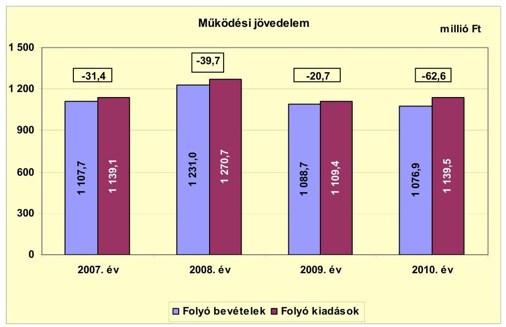

A folyó bevételek 2010. évi 1076,9 millió Ft-os összege 5,7\%-kal, 65,6 millió Fttal volt magasabb a megelőző három év átlagánál (1142,5 millió Ft). A folyó kiadások 2,9\%-kal, 33,6 millió Ft-tal voltak alacsonyabbak a 1139,5 millió Ftos összegükkel a 2010. évben, a megelőző három év átlagánál (1173,1 millió Ft). Ezek eredőjeként a múködési jövedelem 2010. évi összege 62,6 millió Ftos múködési hiány volt, mely 32,0 millió Ft-tal volt több a megelőző hároméves átlagnál (-30,6 millió Ft), annak 204,6\%-át érte el. A múködési jövedelem minden évben negatív volt, amelynek oka az utófinanszírozott beruházások egyre nagyobb összegű átmeneti finanszírozási igénye volt. Az Önkormányzat a 2007-2010. években képződött 154,4 millió Ft negatív múködési jövedelmet rövid lejáratú hitelekkel (folyószámla-, likviditási- és munkabér-megelőlegezési hitellel) finanszírozta.

Az Önkormányzat a vizsgált évek mindegyikében pályázott, fizetési nehézségei csökkentése céljából ÖNHIKI-s támogatásra, mely pályázatokon minden évben sikerült is támogatást szereznie. A 2007. évben 54,0 millió Ft, a 2008. évben 47,5 millió Ft, a 2009. évben 5,0 millió Ft, a 2010. évben 15,0 millió Ft, a 2007-2010. években összesen 121,5 millió Ft vissza nem fizetendő támogatást kaptak. A 2011. év I-II. negyedévében közüzemi számlák kifizetéséhez, oktatási intézmény múködtetéséhez 30,9 millió Ft vissza nem térítendő támogatást kapott az Önkormányzat. Az ÖNHIKI-s támogatást figyelmen kívül hagyva, az alábbi korrigált múködési jövedelmeket realizálta az Önkormányzat: a 2007. évben -85,4 millió Ft-ot, mely 169,1\%-kal több, mint a tényleges múködési jövedelem. A 2008. évi -87,2 millió Ft-os korrigált múködési jövedelem 47,5 millió Ft-tal, 119,6\%-kal, a 2009. évi 25,7 millió Ft-os korrigált múködési jövedelem 5,0 millió Ft, 24,2\% korrekciót tartalmaz, míg a 2010. évben 15,0 millió Ft-tal, 24,0\%-kal, -77,6 millió Ft összegben realizált az Önkormányzat múködési jövedelmet az ÖNHIKI támogatás nélkül.

---

Az évenkénti tőketörlesztéssel ${ }^{18}$ csökkentett múködési jövedelem, a nettó múködési jövedelem (pénzügyi kapacitás) a vizsgált időszakban negatív értéket mutatott. A nettó múködési jövedelem 2009-re a múködési jövedelem növekedésének és a tőketörlesztési kötelezettség csökkenésének hatására növekedett. A múködési jövedelem csökkenése és a tőketörlesztési kötelezettség növekedése 2009-ről 2010-re rontotta a pénzügyi kapacitást.

A nettó múködési jövedelem adatait szemlélteti a következő grafikon:
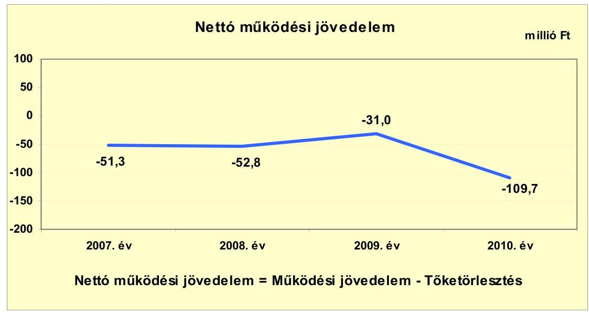

A 2009. év kivételével csökkenő tendencia figyelhető meg a nettó jövedelem alakulásában, mert bár a bevételek 123,3 millió Ft-tal növekedtek, a kiadások 131,6 millió Ft-os növekedése meghaladta a bevételek növekedését. A 2009. évben a nettó múködési jövedelem a 21,8 millió Ft-os növekedés ellenére még mindig a negatív tartományban volt a -31,0 millió Ft-os összegével. A folyó kiadások 2008-ról 2009-re összességében 161,3 millió Ft-tal csökkentek, ami a bevételek növekedését 19,0 millió Ft-tal meghaladta, ezért alakulhatott ki a 19,0 millió Ft-os múködési jövedelem javulás. A folyó bevételek összességében 11,8 millió Ft-tal csökkentek 2010-ben a 2009. évhez viszonyítva. A folyó kiadások 30,1 millió Ft-tal, 2,7\%-kal növekedtek a 2009. évi összegükhöz viszonyítva.

A felhalmozási költségvetés a 2007. év kivételével folyamatosan deficites volt. A 2008. évben -64,5 millió Ft, a 2009. évben - 22,0 millió Ft, míg a 2010. évben - 218,6 millió Ft volt a beruházási költségvetés egyenlege, melyet a nettó múködési jövedelem sem tudott ellensúlyozni, mivel az is negatív volt.

[^0]
[^0]:    ${ }^{18}$ Az Önkormányzat tőketörlesztési kötelezettsége a 2007. évben 19,9 millió Ft, a 2008. évben 13,1 millió Ft, 2009. évben 10,3 millió Ft, a 2010. évben 47,1 millió Ft volt.

---

A felhalmozási költségvetés bevételeit, kiadásait és egyenlegét az alábbi ábra szemlélteti:
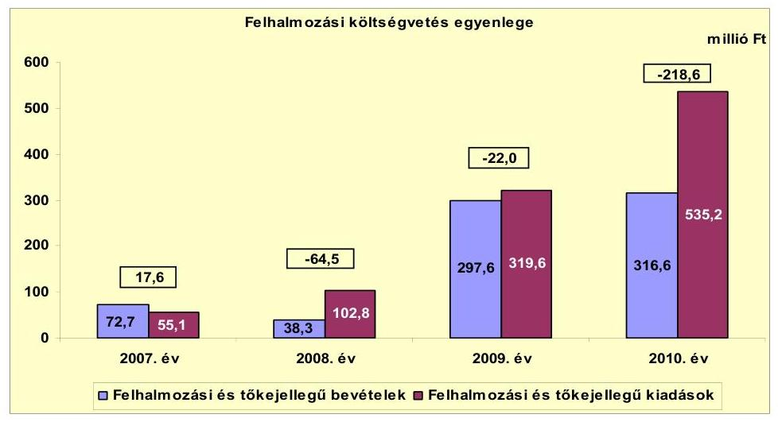

A 2008-tól 2010-ig keletkezett felhalmozási hiányok az Önkormányzat beruházási döntéseire vezethetőek vissza, mivel jelentős számú és bekerülési összegű EU-s forrásból támogatott beruházásra pályáztak és nyertek is támogatást. A támogatást nyert beruházások önerő szükséglete azonban meghaladta az Önkormányzat finanszírozási lehetőségeit és a 2008. évtől kezdődően folyamatosan felhalmozási hiányt okozott. A támogatások utófinanszírozása miatt az Önkormányzatnak kellett megelőlegeznie a beruházások forrásait, amely likviditási gondot okozott.

Az Önkormányzat teljes finanszírozási hiánya ${ }^{19}$ a CLF módszer szerint a 2007. évben 33,7 millió Ft, a 2009. évben 117,3 millió Ft, a 2009. évben 53,0 millió Ft, és a 2010. évben 328,3 millió Ft volt, így a 2007-2010. években összesen 532,3 millió Ft finanszírozási hiány keletkezett.

Az Önkormányzat finanszírozási műveletei egyenlegeit a 2007-2010. években a következő ábra szemlélteti:
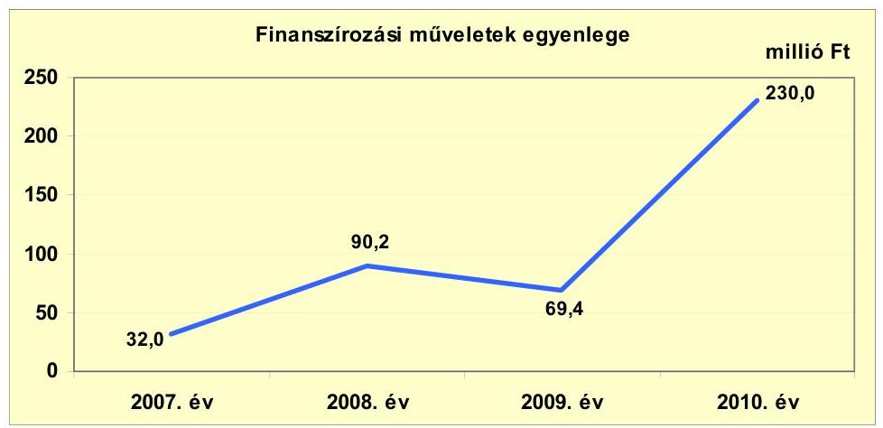

[^0]
[^0]:    ${ }^{19}$ a nettó működési jövedelem és a felhalmozási költségvetés eredője

---

Az Önkormányzatnál a 2007. évi 32,0 millió Ft-os finanszírozási múveletek egyenlege az 52,3 millió Ft-os hitelfelvételből és a 19,9 millió Ft-os hiteltörlesztésből (korrigálva 0,4 millió Ft egyéb finanszírozási kiadással) adódott. A 2008. évben 93,1 millió Ft hitelfelvétel, 13,1 millió Ft hiteltörlesztés és 10,2 millió Ft egyéb finanszírozási bevétel okozta a 90,2 millió Ft összegű finanszírozási műveletek egyenlegét. A 2009. évben 84,3 millió Ft hitelt vett fel és 10,3 millió Ft hitelt törlesztett az Önkormányzat, melyet 4,6 millió Ft egyéb finanszírozási kiadás csökkentett, így a finanszírozási múveletek egyenlege 69,4 millió Ft összegben alakult. A 2010. évben 277,0 millió Ft hitel felvételére került sor, ebből 200,0 millió Ft EU-s támogatást megelőlegező hitel, mely a támogatás folyósításakor visszafizetésre kerül.

A 200,0 millió Ft-os hitel összegből 100,0 millió Ft 2011. október 7-ig visszafizetésre került.

A 2010. évben 47,1 millió Ft hitel törlesztésére is sor került, amit az egyéb finanszírozási kiadások 0,1 millió Ft-tal növeltek, így 230,0 millió Ft-ban alakult az Önkormányzat finanszírozási műveleteinek egyenlege. A finanszírozási célú műveleteket a vizsgált időszakban a jelentés 2 . számú mellékletének 4.1-4.8. pontjai részletezik.

Az Önkormányzat zárszámadási rendeleteiben fejlesztési hiányt a hagyományos költségvetési szerkezet alapján mutatta be, amelyről a jelentés 1. számú melléklete nyújt tájékoztatást. Zárszámadási rendeleteiben az Önkormányzat a 2007. évben 13,8 millió Ft, a 2008. évben 104,2 millió Ft, a 2009. évben 42,7 millió Ft és a 2010. évben 281,2 millió Ft kiadási többletet jelzett.

Az Önkormányzat kamatbevételeit és kamatkiadásait a következő ábra mutatja be:
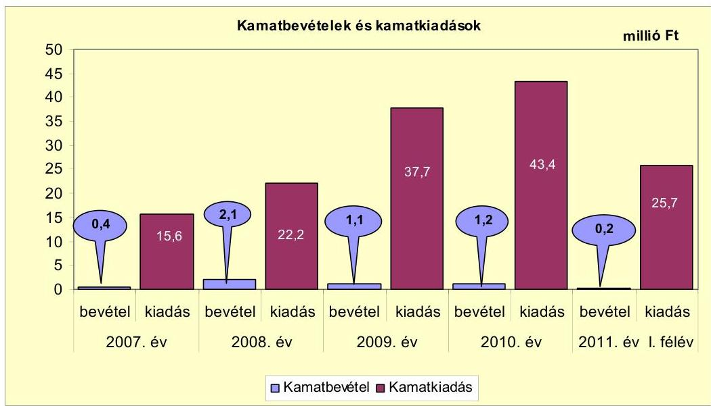

A vizsgált időszakban az Önkormányzat kamatkiadásai 15,6-43,4 millió Ft közötti nagyságrendet képviseltek, ami 178,2\%-os, 27,8 millió Ft-os növekedést jelentett a 2007. évről a 2010. évre, a fizetett kamatok folyamatos növekedése mellett. A fizetett kamatok állományának közel megháromszo-

---

rozódása a hitelek állományának folyamatos növekedése miatt következett be, mely úgy a múködési, mint a felhalmozási hitelek vonatkozásában is fennállt. Az Önkormányzat kamatbevételei az átmenetileg szabad pénzeszközeinek a költségvetési számlán lévő, látra szóló kamataiból keletkeztek, nagyságrendjük nem számottevő, 0,4-2,1 millió Ft között alakult.

Az Önkormányzat pénzügyi egyensúlya rövid és középtávon nem biztosított. A pénzügyi egyensúly helyreállítása érdekében az Önkormányzatnak intézkedéseket kell tennie.

# 2.2. Az Önkormányzat bevételeinek változása 

Az Önkormányzat folyó bevételeit a következő grafikon szemlélteti:
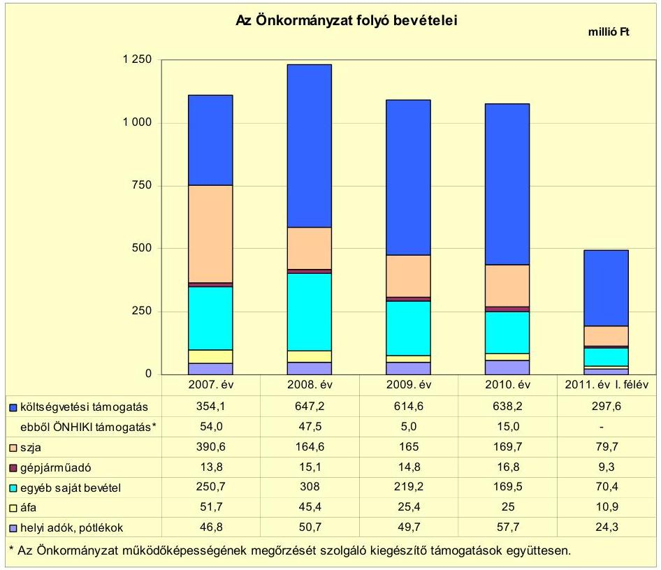

Az Önkormányzat folyó bevételei a vizsgált időszak második évében 11,1\%kal, 123,3 millió Ft-tal, 1107,7 millió Ft-ról 1231,0 millió Ft-ra nőttek. Ezt követően azonban folyamatosan csökkentek a folyó bevételek így a 2010. évben 1076,9 millió Ft folyó bevételt realizáltak, mely az előző három év átlagánál 65,6 millió Ft-tal, 5,7\%-kal volt alacsonyabb. Összetételében a költségvetési támogatások és az szja együttes összege volt a meghatározó a 65,9-75,0\%-os részarányával. Az egyéb saját bevételek részaránya a 2007. évi 22,6\%-ról a 2010. évben 15,7\%-ra csökkent, mely összefüggött a feladatok átcsoportosításával, az önként vállalt idegenforgalmiturisztikai tevékenység vállalkozásba történt kiszervezésével. A helyi adók és azok pótlékai a 2010. évben, 57,7 millió Ft-os összegükkel 10,9 millió Ft-tal haladták meg a 2007. évi 46,8 millió Ft-os adóbevétel összegét. A 23,3\%-os helyi adóbevétel növekedést a helyi iparúzési adó

---

2010. évtől, a korábbi 1,6\%-ról 2,0\%-ra történő felemelése okozta. A helyi adó folyó bevételek összetételében a 2007-2009. években átlagos 4,3\%-os részaránya jelzi az Önkormányzat alacsony jövedelemtermelő képességét. A 2010. évi 5,4\%-os részarányt a helyi iparűzési adó mértékének emelése eredményezte.

Az Önkormányzat gazdasági társaságainak múködéséből osztalékban nem részesült.

Az Önkormányzat felhalmozási bevételeinek alakulását a következő táblázat adatai tartalmazzák:

| Megnevezés | 2007. év | 2008. év | 2009. év | 2010. év | 2011. év I.   félév |
| :-- | --: | --: | --: | --: | :--: |
| Tárgyi eszköz értékesítés | 59,1 | 24,2 | 0,2 | 1,9 | 0,2 |
| Egyéb saját tőkebevétel | 0,2 | 0,6 | 0,9 | 1,2 | 0,6 |
| Államháztartáson belülről   kapott támogatás | 5,5 | 5,5 | 291,5 | 312,2 | 4,4 |
| EU-tól és külföldről kapott   támogatások | 0,0 | 0,0 | 0,0 | 0,0 | 0,0 |
| Államháztartáson kívülről   kapott támogatás | 7,9 | 8,0 | 5,0 | 1,3 | 0,8 |
| Összes felhalmozási bevétel | 72,7 | 38,3 | 297,6 | 316,6 | 6,0 |

Az Önkormányzat felhalmozási bevételei az államháztartáson belülről kapott támogatásoknak köszönhetően a 72,7 millió Ft-os 2007. év szintről 335,5\%-kal, 316,6 millió Ft-ra növekedtek a 2010. évben. A 2009. és 2010. években kapott támogatások EU-s támogatással megvalósuló beruházásokhoz kapcsolódtak. Tárgyi eszköz értékesítéssel a 2007. évben sikerült jelentősebb - 59,1 millió Ft - bevételre szert tennie az Önkormányzatnak, a 2008. évben már csupán ennek 41,0\%-át volt képes realizálni, és a 2009. évtől a 2011. év I. félévéig a 2,3 millió Ft-os összeg nem számottevő.

# 2.3. Az Önkormányzat müködési és felhalmozási célú kiadásainak változása 

Az Önkormányzat folyó kiadásait 2007-2011. június 30-a között a következő táblázat adatai tartalmazzák:

|  |  |  |  |  |  | millió Ft |
| :-- | --: | --: | --: | --: | --: | --: |
| Megnevezés | 2007. év | 2008. év | 2009. év | 2010. év | 2011. év   I. félév |  |
| Folyó kiadások | 1139,1 | 1270,7 | 1109,4 | 1139,5 | 113,8 |  |
| Müködési kiadások   (kamatkiadás nélkül) | 941,7 | 1053,8 | 913,4 | 943,7 | 619,8 |  |
| Államháztartáson belülre   átadott pénzeszközök | 0,0 | 7,9 | 9,9 | 6,5 | 0,0 |  |
| Transzferkiadások | 181,8 | 180,5 | 147,4 | 136,0 | 93,9 |  |
| -ebből: vállalkozásoknak | 0,0 | 0,0 | 1,5 | 0,0 | 15,0 |  |
| -EU-nak, illetve külföldre | 0,0 | 0,0 | 0,0 | 0,0 | 0,0 |  |
| -magárezemélyeknek | 173,5 | 171,2 | 135,2 | 132,5 | 74,6 |  |
| -nonprofit szervezeteknek | 8,3 | 9,3 | 10,7 | 3,5 | 4,3 |  |
| Kamatkiadások | 15,6 | 22,2 | 37,7 | 43,4 | 0,1 |  |
| Előző évi pénzmaradvány   átadás | 0,0 | 6,3 | 1,0 | 9,9 | 0,0 |  |

---

A folyó kiadások a vizsgált években változóan alakultak, 2010. évi összegük 33,6 millió Ft-tal, 2,9\%-kal volt alacsonyabb, mint a hároméves átlag (1173,1 millió Ft). Összetételét tekintve a múködési kiadások tették ki a folyó kiadások 82,3-83,0\%-át, minden évben. A transzferkiadások részaránya 11,9-16,0\% közötti tartományban mozgott a vizsgált években, és alakulásának trendje csökkenő volt. Legjelentősebb tételét a magánszemélyeknek kifizetett segélyek képezték, éves összegük 132,5-173,5 millió Ft között alakult és e kiadások trendje is csökkenő volt. A kamatkiadások a 2007. év 15,6 millió Ft-os összegéről a 2010. évre 43,4 millió Ft-ra emelkedtek, mely 27,8 millió Ft-os, $178,2 \%$-os növekedésnek felelt meg. A folyó kiadásokon belül a kamatok részaránya 1,5\%-ról 3,0\%-ra emelkedett, a hosszú és rövid lejáratú hitelállományok folyamatos növekedése következtében.

Az Önkormányzat folyó kiadásai közül a főbb kiadásnemek teljesítési adatait az alábbi tábla szemlélteti:

| Megnevezés | 2007. év | 2008. év | 2009. év | 2010. év | 2011. év   I. félév |
| :-- | --: | --: | --: | --: | --: |
| Személyi juttatások | 432,1 | 507,9 | 485,8 | 542,0 | 319,0 |
| Munkaadót terhelő járulékok | 140,3 | 158,4 | 131,9 | 126,9 | 81,2 |
| Dologi kiadások | 339,9 | 366,7 | 282,9 | 264,7 | 184,3 |
| Egyéb folyó kiadások | 13,4 | 10,3 | 10,1 | 8,7 | 10,6 |

A múködési kiadásokon belül a személyi juttatások és azok járulékai voltak a meghatározók, 50,2-58,7\%-os részarányukkal. A személyi kiadások összege a vizsgált években folyamatosan növekedett, 2007. évi 572,4 millió Ft-os összegük a 2010. évre 668,9 millió Ft-ra, 16,9\%-kal nőtt. A 2010. év személyi juttatások és járulékai adata 50,1 millió Ft-tal, 8,1\%-kal magasabb a hároméves átlagnál ( 618,8 millió Ft), míg a dologi kiadások 65,1 millió Ft-tal, 19,7\%-kal, az egyéb folyó kiadások 2,6 millió Ft-tal, 22,8\%kal voltak alacsonyabbak a három év átlagánál ${ }^{20}$. A személyi juttatások növekedése a mikro-térségi társulások létrehozásával függött össze. A 2009. évi személyi juttatások és járulékainál bekövetkezett 48,6 millió Ft-os ( $7,3 \%$-os) csökkenés a Polgármesteri hivatalban bekövetkezett 24 fős állományi létszámcsökkentés következménye volt, mely az önként vállalt feladatok gazdasági társaságba történő kiszervezése miatt következett be. A dologi kiadások a 2008. évi növekedés után csökkenő tendenciát mutattak. A dologi kiadásokra a vizsgált időszakban 264,7-339,9 millió Ft közötti összegeket fordítottak.

Az egyéb folyó kiadások összegei és részarányai nem voltak meghatározóak, mivel a vizsgált időszakban összegük 8,7-13,4 millió Ft között, részarányuk pedig - az összes folyó kiadáshoz - 0,9-1,2\% között alakult.

[^0]
[^0]:    ${ }^{20}$ A dologi kiadások hároméves átlaga 329,8 millió Ft, az egyéb folyó kiadások hároméves átlaga pedig 11,3 millió Ft volt.

---

A múködési és a felhalmozási kiadásokat az alábbi ábra szemlélteti:
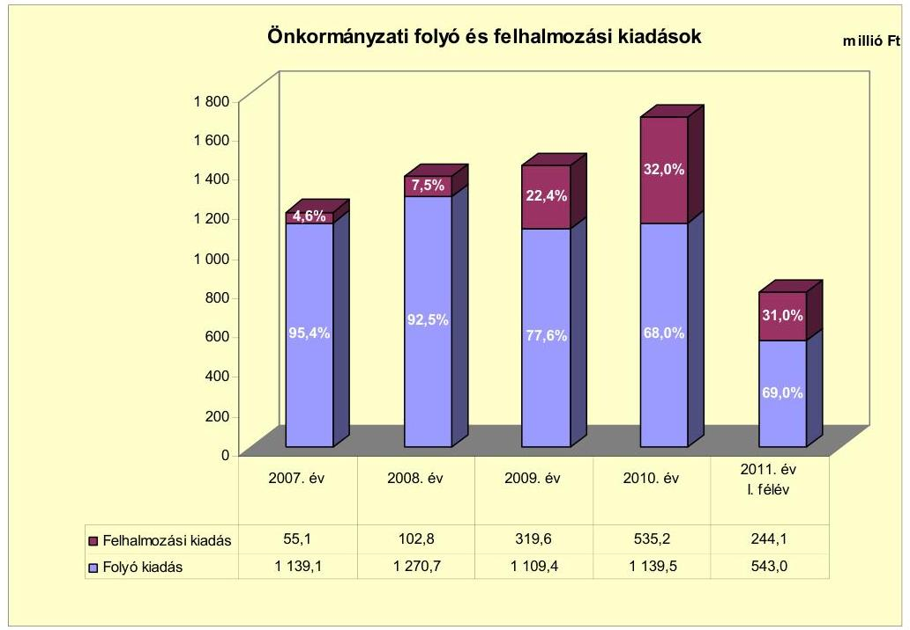

Az Önkormányzat folyó és felhalmozási kiadásai folyamatosan növekedtek, egyrészt a múködési bővülése (mikro-térségi feladatok), másrészt az igen erőteljes felhalmozási tevékenység miatt. A 2007. évi 1194,2 millió Ft-ról a 2010. évben 1674,7 millió Ft-ot értek el a költségvetési kiadások, mely a 2007. évi összeghez viszonyítva $40,2 \%$-os, 480,5 millió Ft-os növekedésnek felelt meg. A 2010. évet megelőző három év átlagához (1332,3 millió Ft) képest 342,4 millió Ft, $25,7 \%$ volt a növekedés a 2010. évben. A kiadások megoszlása a felhalmozási kiadások irányába tolódott el. A folyó kiadások részaránya a felhalmozási kiadások dinamikus növekedése folytán folyamatosan csökkent. A folyó és felhalmozási kiadásoknál tapasztalható jelentős arányeltolódás az Önkormányzat beruházási döntéseinek a következménye volt.

A 2007-2010. évek között megvalósított, 2010. december 31-ig befejezett felújítások és fejlesztések (3/a. számú melléklet) 904,2 millió Ft teljesített kiadásaiból a saját erő $13,4 \%$-ot ( 120,9 millió Ft), az EU-s támogatás $66,4 \%$-ot ( 600,4 millió Ft), a hazai támogatás $11,8 \%$-ot ( 106,5 millió Ft), a felvett hitel ${ }^{21}$ $8,4 \%$-ot ( 76,4 millió Ft) tett ki. A 10 millió Ft feletti fejlesztések ( 12 db ) - a három kiemelt kivételével - településközpont megújítására, útépítésekre, szabadvízi strand infrastrukturális fejlesztésére, városháza külső felújítására, viharjelző állomás építésére vonatkoztak. A 10 millió Ft alatti fejlesztések ( 63 db ) között került kimutatásra az egyes intézmények akadálymentesítése, konyhatechnológiai fejlesztések, strand beléptető-rendszerének kialakítása, számítástechnikai eszközök beszerzése, játszóterek fejlesztése, belterületi utak építése.

[^0]
[^0]:    ${ }^{21}$ Az EU-s támogatásból megvalósult fejlesztések utófinanszírozása miatt az Önkormányzat támogatást megelőlegező hitelt vett fel.

---

Az Önkormányzat 2007-2010. évek között folyamatban lévő fejlesztéseinek száma öt volt. A 111,9 millió Ft tervezett bekerülési költségú fejlesztésekre 2010. év végéig összesen 55,3 millió Ft-ot fordítottak, melyből a szennyvízelvezetési és tisztítási pályázattal ${ }^{22}$ megvalósítandó fejlesztés $94,0 \%$-ot ( 52,0 millió Ft) képvisel. A általános iskola informatikai infrastruktúrájának fejlesztésére az Önkormányzat 2010. év végéig nem teljesített kifizetést (3/b. számú melléklet). A folyamatban lévő fejlesztéseknek a 2010. év után esedékes 68,9 millió Ft-os kötelezettség forrása $92,9 \%$ ( 64,0 millió Ft) EU-s támogatás, $0,3 \%$ ( 0,2 millió Ft) hazai támogatás és $6,8 \%$ ( 4,7 millió Ft) saját bevétel (3/c. számú melléklet).

A vizsgált időszakban a három legnagyobb bekerülési költségú fejlesztés a következő volt:

- az általános iskola rekonstrukciója a 2010. évben befejeződött. Az infrastrukturális fejlesztés bekerülési költsége 297,2 millió Ft volt, melynek 88,9\%-a ( 264,1 millió Ft) EU-s támogatásból, 8,8\%-a ( 26,2 millió Ft) hitelből, 2,3\%-a ( 6,9 millió Ft) hazai támogatásból finanszírozódott;
- az óvodák komplex infrastrukturális fejlesztése 2009-2010. években valósult meg. A fejlesztés bekerülési költsége 181,8 millió Ft volt. A beruházás forrásösszetétele: 92,0\% (167,2 millió Ft) EU-s támogatás, 5,6\% (10,2 millió Ft) hitel, $2,4 \%$ ( 4,4 millió Ft) hazai támogatás;
- az orvosi rendelő felújításának és bővítésének bekerülési költsége 100,9 millió Ft volt, mely beruházás a 2010. évben átadásra került. A bekerülési költség 71,1\%-a ( 71,7 millió Ft) EU-s támogatásból, 28,9\%-a ( 29,2 millió Ft) hitelből realizálódott.

Az Önkormányzat által beadott, és elbírálás alatt álló szociális főzőkonyha fejlesztése ${ }^{23}$ elnevezésű pályázat tervezett bekerülési költsége 52,6 millió Ft (3/d. számú melléklet). Az Önkormányzat 2010. év utánra vállalt kötelezettségének ( 50,9 millió Ft) 95,1\%-át ( 48,4 millió Ft-ot) EU-s támogatásból, 4,9\%-át ( 2,5 millió Ft-ot) saját bevételből terveznek biztosítani.

A 2007-2010. évek között befejezett és folyamatban lévő fejlesztések 2010. december 31-ig felmerült kiadása 961,2 millió Ft-ot tett ki, míg a 2010. év után tervezett fejlesztési kiadások összege 119,8 millió Ft (3/c-3/d. számú mellékletek).

A felmerült, tényleges kiadások forrása 636,1 millió Ft (66,2\%) EU-s támogatás, 139,8 millió Ft (14,5\%) saját bevétel, 108,9 millió Ft (11,3\%) hazai támogatás, valamint 76,4 millió Ft ( $8,0 \%$ ) hitel volt.

A 2010. évet követő évekre tervezett 119,8 millió Ft fejlesztési kiadásból várhatóan 112,4 millió Ft-ot ( $93,8 \%$ ) EU-s támogatásból, 0,2 millió Ft-ot ( $0,2 \%$ ) hazai

[^0]
[^0]:    ${ }^{22}$ Együttmúködési megállapodás alapján közös beruházás Kunhegyes Város Önkormányzatával.
    ${ }^{23}$ A pályázat pozitív elbírálást kapott, így a kivitelezési munkák 2011. október 3-án elkezdődtek.

---

támogatásból, míg 7,2 millió Ft-ot (6,0\%) saját bevételből tervez finanszírozni az Önkormányzat.

Az Önkormányzat fejlesztési tevékenysége a pályázati lehetőségek által nagyban befolyásolt, mivel a jelentkező nettó múködési forráshiány és a saját felhalmozási bevételek alacsony szintje miatt beruházásokat csak külső források (uniós és hazai támogatások) elnyerése esetén tud megvalósítani. Az utófinanszírozott EU-s támogatások megelőlegezése azonban likviditási gondot jelenthet az Önkormányzat számára.

Az Önkormányzat a 2008. évben két gazdasági társaság részére összesen 7,1 millió Ft-t adott át. Az AF Zrt.-nek és a KTVÖ Kht.-nek is likviditási problémáik enyhítésére nyújtották a támogatást. Az Önkormányzat kizárólagos tulajdonában álló - és kötelező feladatellátásában is résztvevő - Városgazdálkodási Kft.-t pénzeszközátadásban nem részesítette. A gazdasági társaság és az Önkormányzat között kizárólag számlázás alapján történtek pénzmozgások, mivel a Kft. az általa ellátott feladatok ellenértékét leszámlázta az Önkormányzatnak. A társaságok bevételeit a 4. számú melléklet mutatja be.

# 3. Az ÖNKORMÁNYZAT KÖTELEZETTSÉGEI 

### 3.1. Az Önkormányzat pénzintézeti kötelezettségeinek változása

Az Önkormányzat pénzintézeti kötelezettségeinek állománya 2006. december 31-től 2011. június 30-ig 3,3-szeresére nőtt, 177,0 millió Ft-ról 576,7 millió Ft-ra. A hosszú lejáratú kötelezettségek 2009. évről 2010. évre jelentősen 35,8 millió Ft-tal (11,2-szeresére) megemelkedtek egy múködési célú forgóeszközhitel felvétele miatt. A rövid lejáratú pénzintézeti kötelezettségek állománya a vizsgált időszakban növekvő tendenciát mutatott a hitelkeretek folyamatos emelése, valamint egyéb likvid hitelek felvétele miatt.

---

Az Önkormányzat pénzintézetekkel szemben fennálló kötelezettségállományát 2006. december 31. - 2011. június 30. között az alábbi diagram szemlélteti ${ }^{24}$ :
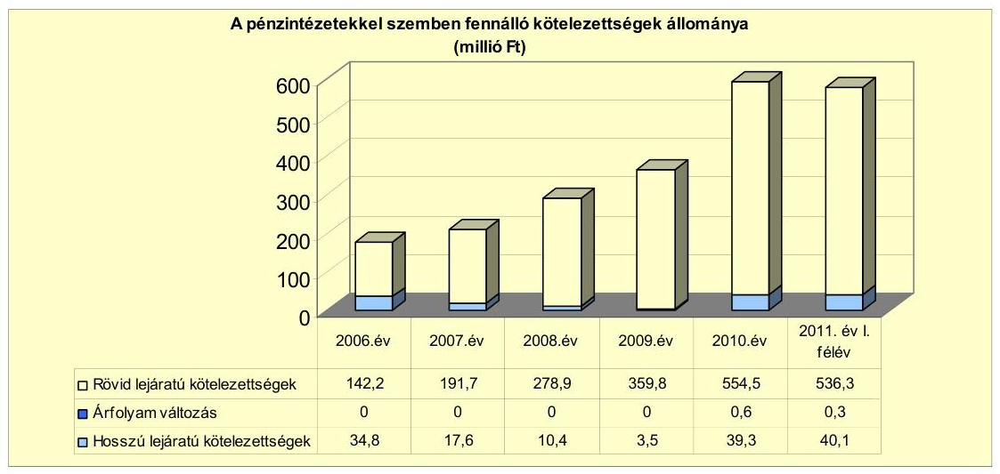

A fennálló pénzintézeti kötelezettségek az önkormányzati fejlesztésekhez forrást biztosító hosszú lejáratú és múködési célú hosszú lejáratú hitel felvételéből, valamint rövid lejáratú likvid hitelek, folyószámlahitel és a munkabérmegelőlegezési hitel igénybevételéből keletkeztek. Az Önkormányzat a 2007. évet megelőzően kilenc, míg a vizsgált években kettő hosszú lejáratú hitelt vett fel. Rövid lejáratú pénzintézeti kötelezettsége a vizsgált időszak előtt is meglévő folyószámlahitelből, és munkabér-megelőlegezési hitelből állt, valamint három felhalmozási célú likvid hitelből keletkezett.

Az Önkormányzat a 2007-2009. években a számvitelről szóló 2000. évi C. törvény 60. § (4)-(6) bekezdéseiben foglaltak, valamint az államháztartás szervezetei beszámolási és könyvvezetési kötelezettségének sajátosságairól szóló 249/2000. (XII. 24.) Korm. rendelet 33. § (1) bekezdésében foglaltak ellenére év végén az árfolyamkülönbözeteket nem könyvelte, azokat nem tartotta nyilván. A 2010. évtől azonban a devizában fennálló kötelezettségekre az árfolyamkülönbözet elszámolásra került.

A Képviselő-testület a forráshiány kezelése érdekében munkabérmegelőlegezési, valamint folyószámlahitelt vett igénybe, melyeknek keretöszszegeit a vizsgált időszakban a számlavezető pénzintézet az Önkormányzat kérésére több alkalommal emelte. Emellett a 2007. és a 2008. években ÖNHIKI támogatás keretében, valamint a múködésképtelen helyi önkormányzatok támogatásaként minden évben részesült vissza nem térítendő támogatásban. A 2011. évi költségvetési rendelet a hiány miatt folyószámla-, illetve munkabérmegelőlegezési hitel igénybevételéről, valamint további hitel felvételét tervezte 525,6 millió Ft összegben. A hitelfelvétel a helyszíni vizsgálat befejezésének időpontjáig még nem történt meg.

[^0]
[^0]:    ${ }^{24}$ A diagramban a hosszú lejáratú kötelezettségek mérlegértékét nem csökkentettük az árfolyamváltozás összegével.

---

A pénzintézeti kötelezettségvállalásokra minden esetben képviselő-testületi döntés alapján került sor. A kötelezettségvállalásból származó források felhasználási céljait meghatározták. A képviselő-testületi előterjesztések tartalmazták a teljes futamidő várható kamat és tőkefizetési kötelezettségeit, a pénzintézeti kötelezettségvállalások visszafizetési forrásait megjelölték.

Az Önkormányzat az adósságszolgálati korlátot az évente elkészített költségvetési koncepcióban bemutatta és az adósságot keletkeztető kötelezettségvállalásának felső határát a 2007-2011. években betartotta.

Az árfolyam- és a kamatkockázatokat a hitelfelvételek során, illetve az évente elkészített költségvetési koncepcióban nem mutatták be. Az Önkormányzat számlavezető bankja közbeszerzési eljárás lefolytatása után 2010 áprilisától megváltozott. A megkötött szerződések alapján a hitelekhez kapcsolódó kötelezettségvállalásokat az Önkormányzat - vizsgált időszakra vonatkozó költségvetési és zárszámadási rendeletei minden esetben tartalmazták.

Az Önkormányzat hosszú lejáratú kötelezettségvállalása a vizsgált időszakban egy kivételével fejlesztési célhoz kapcsolódott. A kötelezettségvállalásokból kettő hitelkonstrukció deviza alapú, a többi forint alapú. Az Önkormányzat 2011. év első félévéig nyolc hosszú lejáratú hitelt fizetett vissza, melyből egy hitel deviza alapú volt.

A következő táblázat az Önkormányzat 2011. június 30-án HUF-ban fennálló hosszú lejáratú pénzintézeti kötelezettségvállalásait részletezi:

| Megnevezés | Szerződéskötés   időpontja | Összeg   millió HUF-ban | Kamat (referencia   kamat+ kamatfelár) | Felhasználás célja: |
| :-- | :--: | :--: | :--: | :--: |
| Tiszafüred és Vidéke   Takarékszövetkezet | 2006.10 .25 | 1,1 | 3 havi BUBOR+1\% | útépítés |
| Tiszafüred és Vidéke   Takarékszövetkezet | 2010.08 .03 | 45,5 | $13 \%$ | müködési forgóeszköz hitel |

Az Önkormányzat 2011. június 30-án CHF-ben fennálló hosszú lejáratú hitelekhez kapcsolódó pénzintézeti kötelezettségvállalásai az alábbiak voltak:

| Megnevezés | Szerződéskötés   időpontja | Összeg   ezer CHF-ben | Lehívási árfolyam | Kamat (referencia   kamat+ kamatfelár) | Felhasználás célja: |
| :-- | :--: | :--: | :--: | :--: | :--: |
| LOMBARD Lizing Zrt. | 2008.07 .24 | 1,9 | 141,37 | 3 havi CHF LIBOR | OPEL Zafira gk. vásárlás |

A felhalmozási célú és múködési célú hiteleket a hitelcélnak megfelelően a Képviselő-testület által jóváhagyott, a költségvetésbe betervezett beruházásokhoz, valamint a múködési hiány enyhítésére használták fel.

A HUF-ban fennálló pénzintézeti kötelezettségeiből 2007. évtől 2010. év december 31-ig 33,1 millió Ft tőkét és 7,9 millió Ft kamatot törlesztett. A múködési célú forgóeszközhitel esetében 2011. évtől kezdődött a tőketörlesztés. A CHF-ben fennálló pénzintézeti kötelezettségeiből 2007-2010. években 21,3 ezer CHF ( 3,0 millió Ft) tőkét törlesztett, és 7,6 ezer CHF ( 1,1 millió Ft) kamatot fizetett.

---

Az Önkormányzat az átmeneti likviditási problémák miatt a vizsgált időszakban folyószámlahitel és munkabér-megelőlegezési hitel igénybevételével tudta biztosítani a pénzügyi egyensúlyt. A folyószámlahitel és a munkabér-megelőlegezési hitel alakulását 2007-2011. év I. félév időszakában a következő táblázat mutatja be:

|  |  |  |  |  |  |
| :-- | --: | --: | --: | --: | --: |
| Megnevezés | 2007. év | 2008. év | 2009. év | 2010. év | 2011. év   I. félév |
| I. Folyószámlahitel |  |  |  |  |  |
| a folyószámlahitel keretösszege január 1-jén | 110,0 | 160,0 | 250,0 | 300,0 | 300,0 |
| teljesített kamat és egyéb költség | 9,9 | 16,6 | 30,5 | 27,8 | 13,5 |
| II. Munkabér-megelőlegezési hitel |  |  |  |  |  |
| Igénybevett hitel összesen | 30,0 | 35,0 | 40,0 | 40,0 | 40,0 |
| teljesített kamat és egyéb költség | 2,4 | 2,9 | 4,2 | 3,2 | 1,8 |

A folyószámlahitel és a munkabér-megelőlegezési hitelek kondícióit és egyéb költségeit az alábbi táblázat szemlélteti ${ }^{25}$ :

| Megnevezés | Kamat (referencia+ kamatfelár) | Egyéb költség |
| :-- | :--: | :--: |
| Folyószámlahitel |  |  |
| 2007.01.01-2008.10.30 | 3 havi BUBOR $+1,0 \%$ | $0,00 \%$ |
| 2008.11.01-2008.12.19 | 3 havi BUBOR $+1,5 \%$ | $0,00 \%$ |
| 2008.12.20-2009.12.18 | 1 havi BUBOR $+2,0 \%$ | $0,00 \%$ |
| 2009.12.20-2010.04.07 | 1 havi BUBOR $+8,0 \%$ | $1 \%$ rend tart jutalék |
| 2010. 04.08-2011.06.30 | 1 havi BUBOR $+2,0 \%$ | $0,5 \%$ kezelési költség |
| Munkabér-megelőlegezési hitel |  |  |
| 2007.01.01-2008.03.27 | 3 havi BUBOR $+1,0 \%$ | 0 |
| 2008.03.28-2010.03.27 | 1 havi BUBOR $+3,0 \%$ | 0 |
| 2010.04.06-2011.06.30 | 1 havi BUBOR $+2,0 \%$ | $0,5 \%$ kezelési költség |

A folyószámlahitel és munkabér-megelőlegezési hitel kamatfelára és egyéb költségei a vizsgált években az igénybevett hitelkeret összegének emelésével folyamatosan változott. Az Önkormányzat a vizsgált években a romló likviditási helyzet miatt négy alkalommal emelte meg a fennálló folyószámla hitelkeretét 110,0 millió Ft-ról több mint duplájára 300,0 millió Ft-ra. A mun-kabér-megelőlegezési hitelkeret 30,0 millió Ft-ról 40,0 millió Ft-ra növekedett.

A folyószámlahitel a vizsgált években folyamatosan fennállt. Az áttekintett időszakban a likviditási problémák finanszírozása az Önkormányzatnak 2007től 2011. év I. félévéig összesen 94,3 millió Ft kamatkiadást, és 4,0 millió Ft egyéb költséget okozott. Az Önkormányzat a folyószámlahitel szerződéseit évente újította. Az Önkormányzatnak a folyószámlahitel-szerződés szerinti kötelezettsége 2010. december 31-én 299,7 millió Ft volt.

A folyószámlahitel fordulónapi állománya az alábbiak szerint alakult: 2007. október 29-én 108,9 millió Ft, 2008. október 28-án 159,3 millió Ft, 2008. december

[^0]
[^0]:    ${ }^{25}$ A referencia kamat az alábbiak szerint alakult:

    | MNB BUBOR fixing (átlagkamat) \%-ban |  |  |  |  |
    | :-- | :-- | :-- | :-- | :-- |
    | 2007. év | 2008. év | 2009. év | 2010. év | 2011. év   I. félév |
    1 havi BUBOR | 7,83 | 8,76 | 8,66 | 5,47 | 6,00 |
    3 havi BUBOR | 7,75 | 8,87 | 8,64 | 5,50 | 6,07 |

---

19-én 209,6 millió Ft, 2009. december 17-én 248,4 millió Ft, 2010. április 7-én 300,0 millió Ft.

A romló likviditási helyzet miatt az Önkormányzat 2007-2010. években, és 2011. év I. félévében a munkabérek kifizetéséhez munkabérmegelőlegezési hitelt vett igénybe. A munkabér-megelőlegezési hitel a vizsgált években folyamatosan fennállt. Kamat címén az Önkormányzat a vizsgált időszakban összesen 14,0 millió Ft-ot, egyéb költség címén 0,5 millió Ftot fizetett ki. A munkabér-megelőlegezési hitel állománya 2010. év december 31-én 40,0 millió Ft volt.

A munkabér-megelőlegezési hitel fordulónapi állománya az alábbiak szerint alakult: 2007. március 27-én 27,2 millió Ft, 2008. március 27-én 31,2 millió Ft, 2009. március 27-én 30,7 millió Ft, 2010. március 27-én 36,4 millió Ft.

Az Önkormányzat a vizsgált években a költségvetési rendeltekben meghatározott jelentős mértékű fejlesztések finanszírozásának elősegítésére éven belüli, rövid lejáratú fejlesztési célú hitelek igénybevételére kényszerült. A hiteleket az Önkormányzat az EU-s források kifizetésének késedelme miatt a lejárati ideig nem tudta visszafizetni, így a hitelek folyamatosan meghosszabbításra kerültek. Az igénybe vett összeg 2009. években 40 millió Ft, 2010. évben 200 millió Ft, 2011. év I. félévében 190 millió Ft volt. A hitelek esetében a vizsgált években kifizetett kamat összesen 17,1 millió Ft volt, az egyéb költségek összege 0,3 millió Ft. Az egyéb likvid hitelek 2010. december 31-én fennálló kötelezettsége 200,0 millió Ft. Az Önkormányzat átmenetileg a fejlesztések megvalósításához a likvid hiteleken túl folyószámlahitelt is igénybe vett.

Az Önkormányzatnál 2011. június 30-án fennálló hosszú lejáratú hitelek esetében a referencia kamatok értékében bekövetkezett változást az alábbi táblázat mutat be:

| Megnevezés | Kibocsátási, lehívási   kamat (referencia + kamatfelár) $\%$ |  | Változás \% |
| :-- | :--: | :--: | :--: |
| 3 havi CHF LIBOR (2008.06.30-i szerződés) |  |  |  |
| gépkocsi lizing | 0,8561 | 0,5695 | $66,5 \%$ |
| 3 havi BUBOR (2006.10.25-i szerződés) | 8,99 | 6,5 | $72,3 \%$ |

Az Önkormányzat kötelezettségeinek állományát 2010. december 31-én és 2011. június 30-án, valamint várható nagyságát a kötelezettségek lejártáig a következő táblázat részletezi:

---

| Megnevezés | Állomány 2010. december 31 -én |  |  | Állomány 2011. június 30 -én |  |  | Várható kötelezettsége 2011-2013. években |  | Várható kötelezettsége 2014. évtől |  |
| :--: | :--: | :--: | :--: | :--: | :--: | :--: | :--: | :--: | :--: | :--: |
|  | HUF-ben (indió: Ft-ben) | Dánokban (dánokgal. szert CHFben) | Deviza nem | HUF-ben (indió: Ft-ben) | Dánokban (dánokgal. szert CHFben) | Deviza nem | HUF-ben (indió: Ft-ben) | Dánokban (dánokgal. szert CHFben) | HUF-ben (indió Ft-ben) | Dánokban (dánokgal. szert CHFben) |
| Pénzintézeti kötelezettségek |  |  |  |  |  |  |  |  |  |  |
| Abasoji hajkaitó fejlesztési hitelek | 2,2 | 0,0 | HUF | 1,1 | 0,0 | HUF | 2,2 | 0,0 | 0,0 | 0,0 |
| Abasoji hajkaitó működési hite | 20,0 | 0,0 | HUF | 20,0 | 0,0 | HUF | 20,0 | 0,0 | 11,1 | 0,0 |
| Folyószárhatítás | 293,7 | 0,0 | HUF | 293,9 | 0,0 | HUF | 295,9 | 0,0 | 0,0 | 0,0 |
| Minősítési megelőlegesési hite | 20,0 | 0,0 | HUF | 20,0 | 0,0 | HUF | 20,0 | 0,0 | 0,0 | 0,0 |
| Életelt fényi hite | 297,7 | 0,0 | HUF | 190,0 | 0,0 | HUF | 190,0 | 0,0 | 0,0 | 0,0 |
| Pénzintézeti kötelezettségek összesen HUF-ben: | 391,9 | 0,0 | HUF | 373,3 | 0,0 | HUF | 377,3 | 0,0 | 21,1 | 0,0 |
| Önküldésok |  |  |  |  |  |  |  |  |  |  |
| Penevszig |  |  |  |  |  |  |  |  |  |  |
| AVOSZ KR. Sági kerek készítsétté keszesség | 20,0 | 0,0 | HUF | 20,0 | 0,0 | HUF | 0,0 | 0,0 | 0,0 | 0,0 |
| MOTIVÁSIS - AF KR. bérleti díjra készítsétti keszesség | 9,9 | 0,0 | HUF | 9,9 | 0,0 | HUF | 0,0 | 0,0 | 0,0 | 0,0 |
| Nemesze |  |  |  |  |  |  |  |  |  |  |
| Szababiróz Strand kolfeszültség elektronica hátizsé készítés |  |  |  |  |  |  |  |  |  |  |
| Szak generzije | 8,3 | 0,0 | HUF | 3,0 | 0,0 | HUF | 0,0 | 0,0 | 0,0 | 0,0 |
| Bízéselekek összesen: | 48,1 | 0,0 | HUF | 39,8 | 0,0 | HUF | 9,2 | 0,0 | 0,0 | 0,0 |
| Lényi kötelezettségek |  |  |  |  |  |  |  |  |  |  |
| LIB (Levél 23-, Hausdamm) ( szár-és nyesedékszzár) | 0,3 | 0,0 | HUF | 0,0 | 0,0 | HUF | 0,0 | 0,0 | 0,0 | 0,0 |
| LOMBARO Finansz.Bl. Szeiged ( DFSL Zafire ) | 0,0 | 7,3 | HUF | 0,0 | 1,9 | CHF | 0,0 | 1,9 | 0,0 | 0,0 |
| Lióing kötelezettségek összesen HUF-ben: | 9,2 | 0,0 | HUF | 9,2 | 0,0 | HUF | 0,0 | 0,0 | 0,0 | 0,0 |
| Lióing kötelezettségek összesen CHF-ben: | 9,6 | 7,3 | CHF | 9,6 | 1,9 | CHF | 0,0 | 1,9 | 0,0 | 0,0 |
| Szabító tartozás | 56,1 | 0,0 | HUF | 51,5 | 0,0 | HUF | 51,5 | 0,0 | 0,0 | 0,0 |
| Egyéb kiadás elmaradási | 0,0 | 0,0 | HUF | 1,3 | 0,0 | HUF | 1,3 | 0,0 | 0,0 | 0,0 |
| Kötelezettségek összesen HUF-ben: | 696,4 | 0,0 | HUF | 713,3 | 0,0 | HUF | 678,0 | 0,0 | 21,1 | 0,0 |
| Kötelezettségek összesen CHF-ben: | 9,0 | 7,3 | CHF | 9,0 | 1,9 | CHF | 0,0 | 1,9 | 0,0 | 0,0 |

Az Önkormányzatnak pénzintézetekkel szemben fennálló kötelezettsége a 2011. év I. félév végén 575,5 millió Ft volt. Ezek várható kötelezettsége (tőke, kamat és egyéb költség) a legutóbbi kamatfizetés feltételei alapján a 2011-2013. években 577,3 millió Ft. Az Önkormányzatnak a 2011. évben a kezességvállalás, lízing kötelezettség, szállítói tartozások és egyéb kiadás elmaradások rendezése címén 139,0 millió Ft, és 1,9 ezer CHF fizetési kötelezettsége keletkezett. A 2011-2013. évek kötelezettségeinek teljesítésére figyelembe vehető 69,0 millió Ft mérlegben kimutatott, vevők által elismert követelésállomány. A pénzintézeti és egyéb kötelezettségek teljesítése a 2011-2013. években a rendelkezésre álló fedezet ismeretében nem biztosított, mely pénzügyi kockázatot jelent az Önkormányzat számára. A 2014. évtől várható - a vizsgált időszak végén ismert - pénzintézeti kötelezettségei: 21,1 millió Ft. Az Önkormányzat tájékoztatása szerint figyelembe vehető további források „a mindenkori költségvetési rendeletekben megtervezett önkormányzati helyi adóbevételek, a képződő müködési jövedelem, valamint a beruházások finanszírozása miatt meglévő támogatást megelőlegező hitelek esetén a hazai és EU-s támogatások". A további évekre szóló - a vizsgált időszak végén ismert - pénzintézeti kötelezettségek teljesítését nem látjuk biztosítottnak, mivel a helyszíni vizsgálat befejezéséig a Képviselőtestület további egyensúlyt javító intézkedésről döntést nem hozott és arra vonatkozó számítások sem készültek.

# 3.2. A szállítói kötelezettségek alakulása 

Az Önkormányzat szállítói tartozása a vizsgált években, de különösen a 2010. és 2011. év első félévében, szinte robbanásszerűen emelkedett. A 2006. év végi 2,4 millió Ft-os tartozás a 2010. év végén 58,1 millió Ft-ra (55,7 millió Ft-tal), 24 -szeresére, a 2011. év I. félévének végéig 91,5 millió Ft-ra (a 2006. december 31-i 38 -szorosára) növekedett. A lejárt határidejű tartozás 2010. év végén 55,9 millió Ft-ot tett ki (az összes szállítói tartozás 96,2\%-a), melyből 30 nap alatti idővel lejárt 14,2 millió Ft, 25,4\%, 31 és 60 nap közötti 24,5 millió Ft (a lejárt tartozások 43,8\%-a), 61 és 90 nap közötti 3,3 millió Ft (a lejárt tartozások 5,9\%-a) és 90 napon túl kiegyenlítetlen tartozások összege

---

13,9 millió Ft volt, mely a lejárt határidejú tartozások 24,9\%-át jelentette. A 2011. év I. félévekor fennálló összes szállítói tartozásból 88,8 millió Ft ( $97,0 \%$ ) volt lejárt határidejú, melyből 12,3 millió Ft ( $13,8 \%$ ) 30 nap alatti időtartamban, 22,6 millió Ft (25,5\%) 31-60 napos időtartamban, 15,8 millió Ft (17,8\%) 61-90 napos időtartamban, 29,3 millió Ft (33,0\%) 91-365 napos időtartamban és 8,8 millió Ft ( $9,9 \%$ ) éven túl volt lejárt határidejú. A lejárt határidejú szállítói tartozások EU-s támogatásokkal megvalósuló fejlesztések szállítói követeléseit nem tartalmazták, mivel azokra finanszírozására külön hitelt - 200 millió Ft összegben - vett fel az Önkormányzat.

Jellemzően a közüzemi szolgáltatók (EON, TIGÁZ), valamint az étkeztetést, illetőleg élelmezési nyersanyagot beszállítók tartoztak a legnagyobb hitelezők közé.

Az Önkormányzat gazdasági társaságainak szállítói kötelezettségei is negatív trendet tükröznek. A 100\%-os tulajdonában álló Városüzemeltetési Kft. 2009. évi 2,4 millió Ft-os lejárt szállítói tartozásállománya a 2010. év végére 12,9 -szeresére ( 30,3 millió Ft-ra), a 2011. év első félévének végére 11,1szeresére ( 26,1 millió Ft-ra) emelkedett. A 2010. évi 30,3 millió Ft-os szállítói állományból 12,9 millió Ft ( $42,5 \%$ ) átütemezett, 17,4 millió Ft ( $57,5 \%$ ) lejárt szállítói állomány volt. A lejárt szállítói állományból 1,1 millió Ft (3,6\%) 30 nap alatti időtartamban, 0,7 millió Ft ( $2,3 \%$ ) 31 és 60 nap közötti időtartamban, 1,8 millió Ft (5,9\%) 61 és 90 nap közötti időtartamban és 13,8 millió Ft (45,7\%) 91 és 365 nap közötti időtartamban volt késedelmes. A 2011. évi 26,1 millió Ftos szállítói állományból 6,7 millió Ft (25,6\%) átütemezett, 19,4 millió Ft ( $74,4 \%$ ) lejárt szállítói állomány volt. A lejárt szállítói állományból 0,3 millió Ft (1,5\%) 30 nap alatti időtartamban, 3,6 millió Ft (13,8\%) 31 és 60 nap közötti időtartamban, 2,7 millió Ft (10,2\%) 61 és 90 nap közötti időtartamban és 12,8 millió Ft ( $49,0 \%$ ) 91 és 365 nap közötti időtartamban volt késedelmes. A gazdasági társaság tartozásaiért az Önkormányzat helytállni tartozik, így a bemutatott lejárt határidejú szállítói tartozások növelik az Önkormányzat pénzügyi kockázatait.

# 3.3. Egyéb kötelezettségek változása 

Az Önkormányzatnak a vizsgált időszakban három lizingszerződése állt fenn. Egy személyautó és két munkagép használatát biztosították lizingszerződéssel, mely szerződések futamideje 2011 júliusában járt le. Az Opel Zafira személygépjármúvet 2008. júliusában, bruttó 6,6 millió Ft összegért lízingelte az Önkormányzat, melynek havi fix lízingdíja 136,5 ezer Ft volt. Egy darab hózúzó munkagépre 2006 augusztusában kötöttek szerződést, bruttó 1,4 millió Ft összegben, melynek visszafizetése negyedéves, előre meghatározott fizetési ütemezés alapján ez év júliusában fejeződött be. Ugyancsak 2008 augusztusában kötöttek lizingszerződést egy db nyesedékzúzó gépre, bruttó 1,6 millió Ft-os összegben, és konstrukciójában a hózúzó gépével azonos feltételek szerint. Mindkét munkagép lízing a CIB Credit Zrt.-vel, mint lízingbe adóval valósult meg.

A vizsgált időszakban egy bankgarancia vállalása 2005 decemberétől állt fenn az Önkormányzatnak, amely 8,3 millió Ft-os kötelezettsége 2011. év I. félévében, a garancia időtartamának lejártával megszűnt. Kezességvállalással két ügyletben érintett az Önkormányzat, melyek összege

---

39,8 millió Ft. A kizárólagos tulajdonában álló Városgazdálkodási Kft.-je hitelfelvételének biztosítékául 30 millió Ft-os kezességet, míg az AF Kft. részére mely gazdasági társaságban 30\%-os tulajdoni részesedéssel rendelkezik 9,8 millió Ft-os kezességet vállalt, a KÓTIVIZIG-gel szemben, Tisza-partszakasz bérleti díja megfizetésének biztosítására. A KÓTIVIZIG-gel 2011 októberében kezdődött meg a kezességvállalás érvényesítése, mivel az AF Kft. a tartozását nem fizette meg. Tekintettel arra, hogy a Kft. jelenleg felszámolás alatt áll, a kezességvállalásból eredő helytállási összeg megtérülése nem várható. Az Önkormányzat két gazdasági társaságnak nyújtott összesen 7,1 millió Ft összegben tagi kölcsönt, melyek a vizsgálat idején is fennállnak. Az Önkormányzat PPP konstrukcióban nem vett részt.

Az Ötv. 88. § (1) bekezdésében ${ }^{26}$ foglaltakat megsértve, két forgalomképtelen ingatlanra is bejegyzésre került a jelzálogjog, mivel az Önkormányzat kimutatása szerint az 1537. helyrajzi számú és a 1540/5. helyrajzi számú beépítetlen területek 2010. augusztus 3-tól 2015. augusztus 25-ig elidegenítési és terhelési tilalommal terheltek, annak ellenére, hogy e két ingatlan az Önkormányzat vagyonkatasztere szerint a forgalomképtelen törzsvagyon körébe tartozik. A jelzett ingatlanokra összesen 86,3 millió Ft jelzálog került bejegyzésre a Tiszafüred és Vidéke Takarékszövetkezet részére, mely pénzintézet az általa 2010. augusztus 3-án az Önkormányzat rendelkezésére bocsátott 50,0 millió Ft-os forgóeszköz hitel fedezeteként fogadta el a jelölt ingatlanokat.

Az Önkormányzat kizárólagos tulajdoni részesedéssel rendelkező gazdasági társaságának kötelezettségállományát és annak várható nagyságát az alábbi táblázat mutatja be:

| Megnevezés | Állomány 2010.   december   31-én | Állomány   2011. június 30   án | Várható   kötelezettség 2011   2013. években | Várható kötele   zettség   2014. évtől |
| :--: | :--: | :--: | :--: | :--: |
|  | HUF-ban   (millió Ft-ban) | HUF-ban   (millió Ft-ban) | HUF-ban   (millió Ft-ban) | HUF-ban (millió   Ft-ban) |
| Folyószámlahibel | 25,0 | 30,0 | 30,0 | 0,0 |
| Pénzintézeti kötelezettségek összesen: | 25,0 | 30,0 | 30,0 | 0,0 |
| Szállitói tartozás | 30,3 | 26,1 | 26,0 | 0,0 |
| Kötelezettségek összesen: | 55,3 | 56,1 | 56,0 | 0,0 |

A kizárólagos önkormányzati tulajdonú gazdasági társaság 2010. december 31-én fennálló pénzintézeti kötelezettségállománya 20,0\%-kal, 5 millió Ft-tal nőtt a folyószámla-hitelkeret megemelésének következtében. A 2011-2013. évek és a további évek várható kötelezettségeinek összege 30,0 millió Ft, amely a vállalt készfizető kezesség miatt az Önkormányzat számára fizetési kockázatot jelent. A gazdasági társaság szállítói kötelezettségének állománya 2010. december 31-én 30,3 millió Ft-ról 2011. június 30-ra 26,1 millió Ft-ra (13,9\%-kal) mérséklődött. Az Önkormányzat gazdasági társaságának peres eljárásból adó-

[^0]
[^0]:    ${ }^{26}$ 2012. január 1-jétől hatályon kívül helyezte a Magyarország helyi önkormányzatairól szóló 2011. évi CLXXXIX. törvény 144. § (1) bekezdése a 156. § (1) bekezdés a) pontjában foglalt kijelölés alapján. Az Nvtv. 6. § (1) és (5) bekezdésében a forgalomképtelen önkormányzati törzsvagyon terhelési tilalmát rögzítették.

---

dó és egyéb kötelezettsége nem volt. A Városgazdálkodási Kft. megalakulása óta veszteséges gazdálkodást folytatott. A 2008. évben 2,0 millió Ft, a 2009. évben 11,5 millió Ft, a 2010. évben 19,8 millió Ft, a 2011. év I. félévkor 10,4 millió Ft vesztesége volt a Kft.-nek. Az Önkormányzat részére tőkepótlási kötelezettség merülhet fel a következő években a gazdasági társaság veszteséges gazdálkodása miatt.

Az Önkormányzat a gazdasági társaságokról szóló 2006. évi IV. törvény 54. § (2) bekezdése alapján korlátlan felelősséggel tartozik azon gazdasági társaságának felszámolása esetében, amelyben az Önkormányzat az 52. § (2) bekezdése szerint a szavazatok legalább 75\%-ával rendelkezik, így minősített befolyásszerzőnek minősül, továbbá a csődeljárásról és a felszámolási eljárásról szóló 1991. évi XLIX. törvény 63. § (2) bekezdése alapján felel a kizárólagos önkormányzati tulajdonú gazdasági társaságának minden olyan kötelezettségéért, amelynek kielégítését a felszámolási eljárás során az adós társaság vagyona nem fedez, ha a hitelezőinek a felszámolási eljárás során benyújtott keresete alapján a bíróság az adós társaság felé érvényesített tartósan hátrányos üzletpolitikájára figyelemmel - megállapítja az önkormányzat korlátlan és teljes felelősségét.

Az Önkormányzat pénzügyi helyzetét befolyásolhatja az eszközök állapota, használhatósági foka és az eszközök pótlására fordítandó pénzeszközök nagysága. Az Önkormányzat az intézményeinél évente felmérte a felújítási igényt, és az éves költségvetési előterjesztésekben bemutatta, hogy az elhasználódott eszközök pótlása milyen kötelezettséget jelent a számára. Az éves zárszámadási rendeleteiben az Önkormányzat nem mutatta be az eszközök után tárgyévben elszámolt értékcsökkenés összegét, az eszközpótlásra fordított tényleges kiadásokat, valamint az eszközök elhasználódási fokának alakulását. A felújításokra, az eszközök pótlására elsősorban az intézmények működőképességének biztosítása, illetve a szakhatósági előírások figyelembevételével került sor. Az Önkormányzat 2007-2010 között a tárgyi eszközök után összesen 343,0 millió Ft értékcsökkenést számolt el. Az elszámolt értékcsökkenés 4,8\%-ának megfelelő összeget (16,3 millió Ft-ot) felújításra, míg 2,3-szeresét ( 778,2 millió Ft-ot) beruházásra fordították. A felújításokra, az eszközök pótlására - az Önkormányzat kimutatásai szerint - a pénzügyi lehetőségek függvényében került sor. Az elhasználódott eszközök pótlására az Önkormányzat tartalékot nem képzett, külön alapot nem hozott létre ${ }^{27}$. Az Önkormányzat összes eszközének (immateriális javak, ingatlanok, gépek, járművek, átadott eszközök) használhatósági foka 2007-2010 között a bruttó érték 696,2 millió Ft emelkedése ellenére 2,9 százalékponttal ( $87,1 \%$-ról $84,2 \%$-ra) csökkent az amortizáció növekedése miatt, melynek következtében az eszközök avultsága növekedett. Az Önkormányzat eszközállományának bruttó értéke $17,3 \%$-kal, nettó értéke $13,4 \%$-kal növekedett 2007-ről 2010-re.

[^0]
[^0]:    ${ }^{27}$ Jogszabályi előírás nem kötelezi az Önkormányzatot tartalék képzésére és külön alap létrehozására.

---

# 4. A PÉNZÜGYI EGYENSÚLY MEGTEREMTÉSE ÉrDEKÉBEN HOZOTT INTÉZKEDÉSEK EREDMÉNYE 

A jelentésben szereplő CLF modellben bemutatott múködési és felhalmozási (2007. év kivételével) hiány amellett alakult ki, hogy a vizsgált időszakban az Önkormányzat folyamatosan bevételnövelő és kiadáscsökkentő intézkedéseket tett, hogy alkalmazkodjon a finanszírozási rendszer változása miatti forráscsökkenéshez. Ezen intézkedésekkel kívánta elérni a feladatellátás szakmai színvonalának szinten tartása mellett a pénzügyi egyensúlyi helyzet javulását, azonban ezen intézkedések nem biztosítottak elegendő forrást a pénzügyi egyensúly helyreállításához.

Az Önkormányzat adatszolgáltatása alapján a 2007-2011. év I. féléve között végrehajtott kiadáscsökkentő intézkedések hatását beavatkozási területenként az alábbi grafikon szemlélteti:
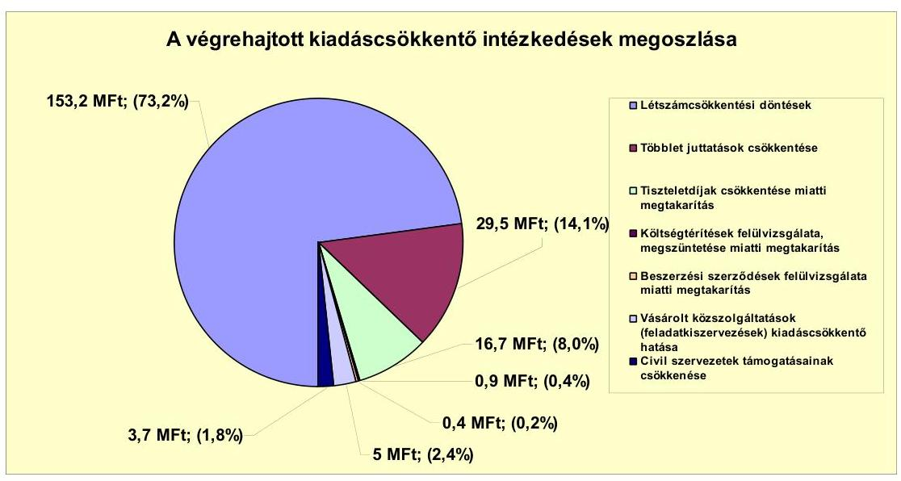

A legjelentősebb összegű kiadási megtakarítást a létszámcsökkentési döntések hatása eredményezte. Az álláshely-csökkentések a feladatátadásokhoz, az intézményi átszervezésekhez és takarékossági intézkedések végrehajtásához kapcsolódtak, mely a megtakarítások 73,2\%-át (153,2 millió Ft) tette ki.

A további kiadáscsökkentő intézkedések - többletjuttatások, tiszteletdíjak csökkentése, költségtérítéseket megszüntetése, beszerzési szerződések felülvizsgálata miatti megtakarítás, civil szervezetek támogatásainak csökkentése - végrehajtásának hatásaként 56,2 millió Ft megtakarítást számszerúsített az Önkormányzat.

Az Önkormányzat számításai szerint a megtett intézkedésekkel összesen 209,4 millió Ft kiadási megtakarítást ért el 2007-2011. év I. féléve között, melynek 23,8\%-a ( 49,8 millió Ft) kapcsolódik önként vállalt feladatellátáshoz.

---

A 2007-2010. év közötti létszámváltozásokat az alábbi táblázat szemlélteti:

| Megnevezés (adatok fő-ben) |  | Közoktatás | Szociális és gyermekvédelom | Egészségiúgy | Polgármesteri hivatal | Egyéb | Összesen |
| :--: | :--: | :--: | :--: | :--: | :--: | :--: | :--: |
| 2007. január 1-án jóváhagyott álláshelyek száma |  | 73 | 34 | 9 | 64 | 8 | 199 |
| Megszüntetett álláshelyek száma |  | 12 | 7 | 0 | 32 | 0 | 20 |
| 2008. üres álláshelyek száma |  | 0 | 0 | 0 | 0 | 0 | 0 |
| Számok álláshelyek száma |  | 9 | 2 | 0 | 9 | 0 | 21 |
| intézmény-üzemeltetéssel kapcsolatos   185áshelyek száma |  | 6 | 4 |  | 25 | 1 | 36 |
| Átáshely növekedése |  | 34 | 0 | 0 | 0 | 0 | 34 |
| 2010. december 31-én záró álláshelyek száma |  | 56 | 27 | 8 | 30 | 2 | 163 |
| 2007. január 1-án foglalkoztatott létszám |  | 72 | 34 | 9 | 64 | 8 | 199 |
| Létszámcsökkentés |  | 12 | 7 | 0 | 32 | 0 | 20 |
| Létszámnövekedés |  | 34 | 0 | 0 | 0 | 0 | 34 |
| 2010. december 31-én foglalkoztatott létszám |  | 56 | 27 | 8 | 30 | 2 | 163 |

A létszámcsökkentő intézkedések következtében a 2007-2010. évek között a Polgármesteri hivatalban és az intézményeinél összesen 59 álláshelyet szüntettek meg. A megszüntetett álláshelyek 39,0\%-a szakmai álláshely, 61,0\%-a intézményüzemeltetéssel kapcsolatos álláshely volt.

A közoktatás területén a vizsgált időszakban az álláshelyek megszüntetése folyamatosan történt az abádszalóki tagóvodában a csökkenő ellátotti létszám miatti csoportösszevonások, valamint a nyugdíjba vonuló közalkalmazotti álláshelyek megszüntetésének következtében. Az óvodai feladatellátásban bekövetkezett intézményfenntartói társulás létrejötte miatt a 2007. évben 34 állás-hely- és egyben létszámnövekedés történt.

A szociális- és gyermekvédelmi feladatellátásnál összesen kilenc fővel csökkent az álláshelyek száma a gyermekjóléti feladatellátás kistérségnek történő átadása miatt, valamint a szociális területen (házi segítségnyújtás, bentlakásos ellátás) végrehajtott takarékossági intézkedések következtében.

A Polgármesteri hivatalban ellátott feladatok közül a 2009. évtől a városüzemeltetési és vállalkozási feladatok átadásra kerültek az Önkormányzat kizárólagos tulajdonában lévő gazdasági társasága részére, melynek következtében 24 fővel csökkent az álláshelyek száma. A vizsgált időszakban további tíz álláshely került megszüntetésre takarékossági intézkedés végrehajtásának eredményeként.

Az egyéb ágazatok tekintetében a közművelődési feladatok önkormányzati tulajdonban lévő gazdasági társaság részére történő átadása miatt hat fővel csökkent az időszak álláshelyeinek száma.

Összességében a 2007-2010. években az álláshelyek száma és a foglalkoztatotti létszám 25 fővel csökkent.

Az intézkedések hatására a 2007. január 1-jei 188 fő foglalkoztatotti létszám 2010. december 31-re 13,3\%-kal (25 fővel) csökkent. Az Önkormányzatnál 2010. december 31-én betöltetlen, üres álláshely nem volt.

A helyi szervezési intézkedések végrehajtásához az Önkormányzat 2007-2010. év között mindösszesen 11,7 millió Ft összegű központi támogatást igényelt, illetve kapott. A támogatás felhasználásával önkormányzati szinten a tartósan leépített álláshelyek száma hét fő volt.

---

A kiadáscsökkentős intézkedések mellett az Önkormányzat a 2007-2011. év I. féléve között az alábbiakban számszerúsített bevételnövelő intézkedéseket tette:
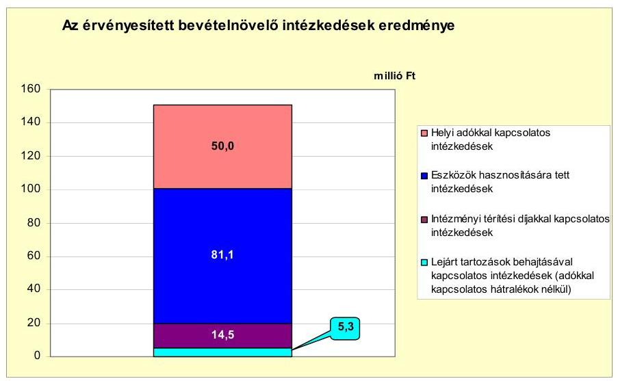

A kimutatásai alapján az Önkormányzat intézkedéseinek eredményeként a 2007-2011. év I. féléve között összesen 150,9 millió Ft bevételi többletet számszerúsített. Az intézkedések 33,1\%-a helyi adók mértékének emeléséhez, 53,7\%-a az eszközök hasznosításához, 9,6\%-a intézményi térítési díjak emeléséhez, 3,6\%-a a lejárt tartozások behajtásához kapcsolódtak.

A helyi adók területén végrehajtott intézkedések bevételnövelő hatása 50,0 millió Ft-ot tett ki. Az Önkormányzat 2007. évtől több intézkedést hozott az adóbevételek növelése érdekében. A helyi iparűzési adó mértékét 2007. január 1-jétől 1,5\%-ról 1,6\%-ra, majd 2010. január 1-jétől 2\%-ra emelte. A magánszemélyek kommunális adója adónemnél 2007. január 1-jétől mind az üdülő, mind pedig a lakóingatlanok esetében adótételenként 1000 Ft/év adómérték emelést hajtott végre. További intézkedés hatására az üdülőknél az adó mértékét 2010. január 1-jétől differenciáltan, a lakóingatlannál pedig a duplájára emelték. Az Önkormányzat 2010. évtől képviselő-testületi döntés végrehajtásának következtében az adóhátralékok behajtását eredményesebben végzi, melynek eredményeként 15,3 millió Ft többletbevétele realizálódott a vizsgált időszakban.

Az Önkormányzatnak eszközök értékesítéséből a vizsgált időszakban 81,1 millió Ft többletbevétele realizálódott, mely önkormányzati tulajdonban lévő lakások, ingatlanok és gépjármúvek eladásából származott.

Az Önkormányzat költségvetési támogatásokból és az átengedett szja-ból származó bevétele a 2007-2010. év között 63,2 millió Ft-tal (8,5\%-kal) növekedett. Ezen belül az szja-adóbevétel 220,9 millió Ft-tal csökkent, amit a költségvetési támogatás 284,1 millió Ft-os növekedése kompenzálni tudott. Az Önkormányzat részéről a 2007-2010. év között 290,8 millió Ft összegú kiadási megtakarítás és bevételi többlet került kimutatásra.

---

# 5. Az ÁSZ Által a korábBi ÉVEKBEN a PÉNZÜGYI EGYENSÚLY JAVÍTÁSÁRA TETT SZABÁLYSZERŰSÉGI ÉS CÉLSZERŰSÉGI JAVASLATOK HASZNOSULÁSA 

Az ÁSZ az Önkormányzat gazdálkodási rendszerét 2009. évben ellenőrizte átfogó jelleggel. A jelentést a Képviselö-testület megismerte. A javaslatok megvalósítására intézkedési tervet készítettek, amely teljes körűen tartalmazta a javaslatokat, meghatározta a feladatok elvégzéséért felelősöket és a feladatok elvégzésének határidejét.

A pénzügyi egyensúly javítására három szabályszerűségi és egy célszerűségi javaslat vonatkozott, mely javaslatok 100\%-ban hasznosultak.

A szabályszerűségi javaslat értelmében az Önkormányzat gondoskodott a költségvetés tervezési és zárszámadási folyamat részeként az Âmr. 66. § (4) bekezdésében foglaltaknak megfelelően az önállóan gazdálkodó költségvetési szervek pénzmaradványának felülvizsgálatáról, a finanszírozási célú pénzügyi műveletekkel kapcsolatos bevételeket, illetve kiadásokat nem tartalmazza a költségvetési rendelettervezet, valamint a költségvetési rendelettervezetek tartalmazzák az EU-s forrást igénylő projektek esetében az Áht ${ }_{1} 69$. § (1) bekezdésében és Ámr. 29. § (1) bekezdésének d) és k) pontjaiban foglaltakat. A célszerűségi javaslat eredményeként a Képviselő-testület a számvevői jelentést megtárgyalta és intézkedési terv készült a feltárt hiányosságok megszüntetésének érdekében.

Budapest, 2012. április " 16 "

Melléklet: $\quad 7 \mathrm{db}$
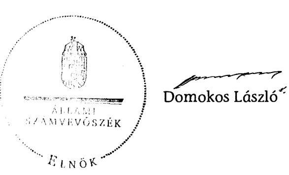

---

ABÁDSZALÓK Város Önkormányzata

1. számú melléklet
a V-3098-024/2012. számú Jelentéshez

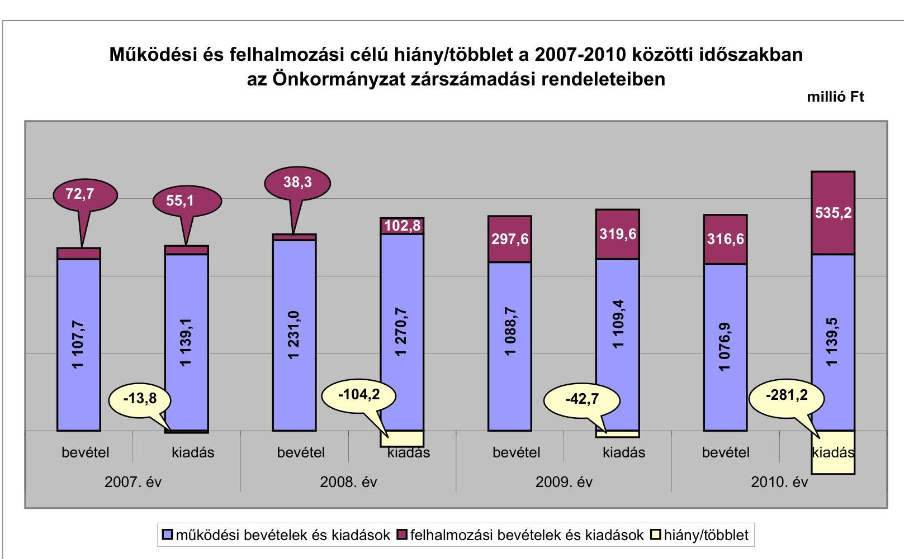

---

Az Önkormányzat bevételei és kiadásai, valamint adósságszolgálata 2007-2010 között

|  1. FOLYÓ KÖLTSÉGVETÉS* | 2007. | 2008. | 2009. | 2010.  |
| --- | --- | --- | --- | --- |
|  1.1.1. Saját müködési bevételek | 278,0 | 269,7 | 173,8 | 156,3  |
|  1.1.2. Költségvetési támogatás | 554,1 | 647,2 | 614,6 | 638,2  |
|  1.1.3. Atengedett bevételek | 404,4 | 179,6 | 179,8 | 186,3  |
|  1.1.4. Állambáztartáson belülről kapott támogatások | 71,2 | 133,9 | 116,5 | 94,7  |
|  1.1.5. EU-sól és külföldről kapott bevételek | 0,0 | 0,0 | 0,0 | 0,0  |
|  1.1.6. Állambáztartáson kívülről kapott bevételek | 0,0 | 0,6 | 0,5 | 0,0  |
|  1.1.7. Előző évi pénzmaradvány átvétel | 0,0 | 0,0 | 3,5 | 1,0  |
|  1.1. Folyó bevételek $=1.1 .1 .+1.1 .2 .+1.1 .3 .+1.1 .4 .+1.1 .5 .+1.1 .6 .+1.1 .7$. | 1107,7 | 1231,0 | 1088,7 | 1076,9  |
|  1.2.1. Müködési kiadások kamatkiadások nélkül | 941,7 | 1053,8 | 913,4 | 943,7  |
|  1.2.2. Állambáztartáson belülre átadott pénzeszközök | 0,0 | 7,9 | 9,9 | 6,3  |
|  1.2.3.1. vállalkozásoknak | 0,0 | 0,0 | 1,5 | 0,0  |
|  1.2.3.2. EU-nak, illetve külföldre | 0,0 | 0,0 | 0,0 | 0,0  |
|  1.2.3.3. magánszemélyeknek | 173,5 | 171,2 | 135,2 | 132,3  |
|  1.2.3.4. nonprofit szervezeteknek | 8,3 | 9,3 | 10,7 | 3,5  |
|  1.2.3. Transzferkiadások ( $=1.2 .3 .1+1.2 .3 .2+1.2 .3 .3+1.2 .3 .4$ ) | 181,8 | 180,5 | 147,4 | 136,0  |
|  1.2.4 Kamatkiadások | 15,8 | 22,2 | 37,7 | 43,4  |
|  1.2.5. Előző évi pénzmaradvány átadás | 0,0 | 6,3 | 1,0 | 9,9  |
|  1.2. Folyó kiadások $=1.2 .1 .+1.2 .2 .+1.2 .3 .+1.2 .4 .+1.2 .5$. | 1139,1 | 1270,7 | 1109,4 | 1139,5  |
|  1.3. Folyó költségvetés egyenlege MÜKÖDÉSI JÓVEDELEM (1.1. - 1.2.) | $-31,4$ | $-39,7$ | $-20,7$ | $-62,6$  |
|  2. FELHALMOZÁSI KÖLTSÉGVETÉS** | 0,0 | 0,0 | 0,0 | 0,0  |
|  2.1.1. Saját tőkebevételek | 59,3 | 24,8 | 1,1 | 3,1  |
|  2.1.2. Állambáztartáson belülről kapott támogatások | 5,5 | 5,5 | 291,5 | 312,2  |
|  2.1.3. EU-sól és külföldről kapott támogatások | 0,0 | 0,0 | 0,0 | 0,0  |
|  2.1.4. Állambáztartáson kívülről kapott támogatások | 7,9 | 8,0 | 5,0 | 1,5  |
|  2.1. Felhalmozási bevételek ( $=2.1 .1 .+2.1 .2+2.1 .3+2.1 .4$.) | 72,7 | 38,3 | 297,6 | 316,6  |
|  2.2.1. Saját beruházási kiadás áfával | 45,3 | 59,0 | 310,0 | 531,0  |
|  2.2.2. Saját felújítási kiadás áfával | 0,0 | 24,0 | 2,4 | 0,0  |
|  2.2.3. Állambáztartáson belülre átadott pénzeszköz | 0,0 | 3,8 | 1,0 | 1,3  |
|  2.2.4. EU-nak és külföldnek adott pénzeszközök | 0,0 | 0,0 | 0,0 | 0,0  |
|  2.2.5. Állambáztartáson kívülre adott pénzeszközök | 9,2 | 15,5 | 6,2 | 1,3  |
|  2.2.6. Befektetési célú részesedések vásárlása | 0,0 | 0,5 | 0,0 | 0,6  |
|  2.2. Felhalmozási kiadások ( $=2.2 .1 .+2.2 .2 .+2.2 .3 .+2.2 .4 .+2.2 .5 .+2.2 .6$.) | 55,1 | 102,8 | 319,6 | 535,2  |
|  2.3. Felhalmozási költségvetés egyenlege (2.1. - 2.2.) | 17,6 | $-64,5$ | $-22,0$ | $-218,6$  |
|  3. Finanszírozási műveletek nélküli (GFS) pozíció(1.3.+2.3.) | $-13,8$ | $-104,2$ | $-42,7$ | $-281,2$  |
|  4. Finanszírozási műveletek |  |  |  |   |
|  4.1. Hitellelvétel | 52,3 | 93,1 | 84,3 | 277,0  |
|  4.2. Hiteltörlesztés | 19,9 | 13,1 | 10,3 | 47,1  |
|  4.3. Forgatási és befektetési célú értékpapírok kibocsátása | 0,0 | 0,0 | 0,0 | 0,0  |
|  4.4. Forgatási és befektetési célú értékpapírok beváltása | 0,0 | 0,0 | 0,0 | 0,0  |
|  4.5. Forgatási és befektetési célú értékpapírok értékesítése | 0,0 | 0,0 | 0,0 | 0,0  |
|  4.6. Forgatási és befektetési célú értékpapírok vásárlása | 0,0 | 0,0 | 0,0 | 0,0  |
|  4.7. Egyéb finanszírozási bevételek (függő, átfutó, kiegyenlítő) | 8,5 | 0,1 | $-4,6$ | $-24,4$  |
|  4.8. Egyéb finanszírozási kiadások (függő, átfutó, kiegyenlítő) | 8,9 | $-10,1$ | 0,0 | $-24,7$  |
|  4.9.Finanszírozási műveletek egyenlege (4.1. - 4.2.+4.3.-4.4+4.5.-4.6.+4.7.-4.8.) | 32,0 | 90,2 | 69,4 | 230,0  |
|  5. Tárgyévi pénzügyi pozíció (1.3.+ 2.3.+4.9.) | 18,2 | $-14,0$ | 26,7 | $-51,2$  |
|  6. Nettó müködési jövedelem =müködési jövedelem (1.3.) - tőketörlesztés (4.2+4.4) | $-51,3$ | $-52,8$ | $-31,0$ | $-109,7$  |
|  TÁJÉKOZTATÓ ABATOK |  |  |  |   |
|  Összes kötelezettség | 242,0 | 309,6 | 586,2 | 858,5  |
|  ebből rövid lejáratú | 224,4 | 299,2 | 582,7 | 819,3  |
|  Összes szállítói kötelezettség | 22,7 | 12,0 | 18,5 | 58,1  |
|  ebből lejárt (tanúsítványból) | 15,1 | 10,4 | 16,8 | 56,2  |
|  Pénz és tőkeplaci kötelezettség (adósság) | 209,3 | 289,3 | 363,3 | 593,8  |
|  ebből rövid lejáratú | 191,7 | 278,9 | 359,8 | 554,5  |
|  PPP szerződéses állomány jelenértéken (tanúsítványból) | 0,0 | 0,0 | 0,0 | 0,0  |
|  ebből lejárt szolgáltatási díj miatti kötelezettség | 0,0 | 0,0 | 0,0 | 0,0  |
|  Folyószámlabítel napi átlagos állománya (tanúsítványból) | 111,3 | 156,4 | 243,9 | 296,1  |
|  Likvidítitel napi átlagos állománya (tanúsítványból) | 0,0 | 0,0 | 21,7 | 163,2  |
|  Munkabirhítel napi átlagos állománya (tanúsítványból) | 27,1 | 29,6 | 31,1 | 36,0  |
|  Kezesség és garanciavállalások (tanúsítványból) | 8,3 | 8,3 | 8,3 | 48,1  |
|  Jogerős bírósági tőletekből adódó kötelezettségek (tanúsítványból) | 0,0 | 0,0 | 0,0 | 0,0  |
|  Finanszírozásba bevonható eszközök: | 51,2 | 37,1 | 63,9 | 12,7  |
|  Tartós hitelviszonyt megtestesítő értékpapírok év végi állománya | 0,0 | 0,0 | 0,0 | 0,0  |
|  Hosszú lejáratú bankbetétek év végi állománya | 0,0 | 0,0 | 0,0 | 0,0  |
|  Értékpapírok év végi állománya | 0,0 | 0,0 | 0,0 | 0,0  |
|  Pénzeszközök (idegen pénzeszközök nélküli) év végi állománya | 51,2 | 37,1 | 63,9 | 12,7  |

[^0] [^0]: * Bevételekben nem térül, a kiadásokban nem jelenik meg az amortizáció, a vagyoni helyzetet az egyenleg befolyásolja

---

## **Az Önkormányzat 2007-2010. években megvalósított, 2010. december 31-ig befejezett fejlesztései és azok forrásösszetétele**

|  Fejlesztési feladat (beruházás, felújítás) |  | Beruházás, felújítás |  |  |  |  |  |  |  |  |  |  |  |  |  |  |  |  |  |  |  |  |  |  |  |  |  |  |  |  |  |  |  |  |  |  |  |  |  |  |  |  |  |  |  |   |
| --- | --- | --- | --- | --- | --- | --- | --- | --- | --- | --- | --- | --- | --- | --- | --- | --- | --- | --- | --- | --- | --- | --- | --- | --- | --- | --- | --- | --- | --- | --- | --- | --- | --- | --- | --- | --- | --- | --- | --- | --- | --- | --- | --- | --- | --- | --- | --- | --- |
|   |  |  |  |  |  |  |  |  |  |  |  |  |  |  |  |  |  |  |  |  |  |  |  |  |  |  |  |  |  |  |  |  |  |  |  |  |  |  |  |  |  |  |  |  |  |  |   |
|   | Fejlesztési feladat (beruházás, felújítás) |  | Beruházás, felújítás |  |  |  |  |  |  |  |  |  |  |  |  |  |  |  |  |  |  |  |  |  |  |  |  |  |  |  |  |  |  |  |  |  |  |  |  |  |  |  |  |  |  |  |   |
|   |  |  |  |  |  |  |  |  |  |  |  |  |  |  |  |  |  |  |  |  |  |  |  |  |  |  |  |  |  |  |  |  |  |  |  |  |  |  |  |  |  |  |  |  |  |  |   |
|   |  |  |  |  |  |  |  |  |  |  |  |  |  |  |  |  |  |  |  |  |  |  |  |  |  |  |  |  |  |  |  |  |  |  |  |  |  |  |  |  |  |  |  |  |  |  |   |
|   |  |  |  |  |  |  |  |  |  |  |  |  |  |  |  |  |  |  |  |  |  |  |  |  |  |  |  |  |  |  |  |  |  |  |  |  |  |  |  |  |  |  |  |  |  |  |   |
|   |  |  |  |  |  |  |  |  |  |  |  |  |  |  |  |  |  |  |  |  |  |  |  |  |  |  |  |  |  |  |  |  |  |  |  |  |  |  |  |  |  |  |  |  |  |  |   |
|   |  |  |  |  |  |  |  |  |  |  |  |  |  |  |  |  |  |  |  |  |  |  |  |  |  |  |  |  |  |  |  |  |  |  |  |  |  |  |  |  |  |  |  |  |  |  |   |
|   |  |  |  |  |  |  |  |  |  |  |  |  |  |  |  |  |  |  |  |  |  |  |  |  |  |  |  |  |  |  |  |  |  |  |  |  |  |  |  |  |  |  |  |  |  |  |   |
|   |  |  |  |  |  |  |  |  |  |  |  |  |  |  |  |  |  |  |  |  |  |  |  |  |  |  |  |  |  |  |  |  |  |  |  |  |  |  |  |  |  |  |  |  |  |  |   |
|   |  |  |  |  |  |  |  |  |  |  |  |  |  |  |  |  |  |  |  |  |  |  |  |  |  |  |  |  |  |  |  |  |  |  |  |  |  |  |  |  |  |  |  |  |  |  |   |
|   |  |  |  |  |  |  |  |  |  |  |  |  |  |  |  |  |  |  |  |  |  |  |  |  |  |  |  |  |  |  |  |  |  |  |  |  |  |  |  |  |  |  |  |  |  |  |   |
|   |  |  |  |  |  |  |  |  |  |  |  |  |  |  |  |  |  |  |  |  |  |  |  |  |  |  |  |  |  |  |  |  |  |  |  |  |  |  |  |  |  |  |  |  |  |  |   |
|   |  |  |  |  |  |  |  |  |  |  |  |  |  |  |  |  |  |  |  |  |  |  |  |  |  |  |  |  |  |  |  |  |  |  |  |  |  |  |  |  |  |  |  |  |  |  |   |
|   |  |  |  |  |  |  |  |  |  |  |  |  |  |  |  |  |  |  |  |  |  |  |  |  |  |  |  |  |  |  |  |  |  |  |  |  |  |  |  |  |  |  |  |  |  |  |   |
|   |  |  |  |  |  |  |  |  |  |  |  |  |  |  |  |  |  |  |  |  |  |  |  |  |  |  |  |  |  |  |  |  |  |  |  |  |  |  |  |  |  |  |  |  |  |  |   |
|   |  |  |  |  |  |  |  |  |  |  |  |  |  |  |  |  |  |  |  |  |  |  |  |  |  |  |  |  |  |  |  |  |  |  |  |  |  |  |  |  |  |  |  |  |  |  |   |
|   |  |  |  |  |  |  |  |  |  |  |  |  |  |  |  |  |  |  |  |  |  |  |  |  |  |  |  |  |  |  |  |  |  |  |  |  |  |  |  |  |  |  |  |  |  |  |   |
|   |  |  |  |  |  |  |  |  |  |  |  |  |  |  |  |  |  |  |  |  |  |  |  |  |  |  |  |  |  |  |  |  |  |  |  |  |  |  |  |  |  |  |  |  |  |  |   |
|   |  |  |  |  |  |  |  |  |  |  |  |  |  |  |  |  |  |  |  |  |  |  |  |  |  |  |  |  |  |  |  |  |  |  |  |  |  |  |  |  |  |  |  |  |  |  |   |
|   |  |  |  |  |  |  |  |  |  |  |  |  |  |  |  |  |  |  |  |  |  |  |  |  |  |  |  |  |  |  |  |  |  |  |  |  |  |  |  |  |  |  |  |  |  |  |   |
|   |  |  |  |  |  |  |  |  |  |  |  |  |  |  |  |  |  |  |  |  |  |  |  |  |  |  |  |  |  |  |  |  |  |  |  |  |  |  |  |  |  |  |  |  |  |  |   |
|   |  |  |  |  |  |  |  |  |  |  |  |  |  |  |  |  |  |  |  |  |  |  |  |  |  |  |  |  |  |  |  |  |  |  |  |  |  |  |  |  |  |  |  |  |  |  |   |
|   |  |  |  |  |  |  |  |  |  |  |  |  |  |  |  |  |  |  |  |  |  |  |  |  |  |  |  |  |  |  |  |  |  |  |  |  |  |  |  |  |  |  |  |  |  |  |   |
|   |  |  |  |  |  |  |  |  |  |  |  |  |  |  |  |  |  |  |  |  |  |  |  |  |  |  |  |  |  |  |  |  |  |  |  |  |  |  |  |  |  |  |  |  |  |  |   |
|   |  |  |  |  |  |  |  |  |  |  |  |  |  |  |  |  |  |  |  |  |  |  |  |  |  |  |  |  |  |  |  |  |  |  |  |  |  |  |  |  |  |  |  |  |  |  |   |
|   |  |  |  |  |  |  |  |  |  |  |  |  |  |  |  |  |  |  |  |  |  |  |  |  |  |  |  |  |  |  |  |  |  |  |  |  |  |  |  |  |  |  |  |  |  |  |   |
|   |  |  |  |  |  |  |  |  |  |  |  |  |  |  |  |  |  |  |  |  |  |  |  |  |  |  |  |  |  |  |  |  |  |  |  |  |  |  |  |  |  |  |  |  |  |  |   |
|   |  |  |  |  |  |  |  |  |  |  |  |  |  |  |  |  |  |  |  |  |  |  |  |  |  |  |  |  |  |  |  |  |  |  |  |  |  |  |  |  |  |  |  |  |  |  |   |
|   |  |  |  |  |  |  |  |  |  |  |  |  |  |  |  |  |  |  |  |  |  |  |  |  |  |  |  |  |  |  |  |  |  |  |  |  |  |  |  |  |  |  |  |  |  |  |   |
|   |  |  |  |  |  |  |  |  |  |  |  |  |  |  |  |  |  |  |  |  |  |  |  |  |  |  |  |  |  |  |  |  |  |  |  |  |  |  |  |  |  |  |  |  |  |  |   |
|   |  |  |  |  |  |  |  |  |  |  |  |  |  |  |  |  |  |  |  |  |  |  |  |  |  |  |  |  |  |  |  |  |  |  |  |  |  |  |  |  |  |  |  |  |  |  |   |
|   |  |  |  |  |  |  |  |  |  |  |  |  |  |  |  |  |  |  |  |  |  |  |  |  |  |  |  |  |  |  |  |  |  |  |  |  |  |  |  |  |  |  |  |  |  |  |   |
|   |  |  |  |  |  |  |  |  |  |  |  |  |  |  |  |  |  |  |  |  |  |  |  |  |  |  |  |  |  |  |  |  |  |  |  |  |  |  |  |  |  |  |  |  |  |  |   |
|   |

---

### **Az Önkormányzat 2010. december 31-én folyamatban lévő fejlesztési feladataira 2010. december 31-ig teljesített kifizetések és azok forrásösszetétele**

|  2010. december 31-ig pénzügyileg teljesített beruházás forrásösszetétele |  |  |  |  |  |  |  |  |  |  |  |  |  |  |  |  |  |  |  |  |  |  |  |  |  |  |  |  |  |  |  |  |   |
| --- | --- | --- | --- | --- | --- | --- | --- | --- | --- | --- | --- | --- | --- | --- | --- | --- | --- | --- | --- | --- | --- | --- | --- | --- | --- | --- | --- | --- | --- | --- | --- | --- | --- |
|   | Fejlesztési feladat (beruházás, felújítás) |  | Beruházás, felújítás |  |  |  |  |  |  |  |  |  |  |  |  |  |  |  |  |  |  |  |  |  |  |  |  |  |  |  |  |  |   |
|  Sorszám | Megnevezése | Kösvésült
testületi
hetlenes
száma | kezdete | tervezett
befejezése | Terv
(2012+13+20+
24+28) | Tény
(2012+14+21+
25+28) | Eltérés
(+; -)
(2013+14+21+
26+28) | 2008. dec.
31-ig
teljesített
kiadás | 2007-
2010. év
közlött
teljesített
kiadás | 2008. dec.
31-ig
teljesített
kiadás | 2007-
2010. év
közlött
teljesített
kiadás | 2008. dec.
31-ig
teljesített
kiadás | 2007-2010. év
közlött
teljesített
kiadás | 2008. dec.
31-ig
teljesített
kiadás | Saját bevétel |  |  |  | Hitel |  |  |  |  |  |  |  |  |  |  |  |  |  |  |  |  |   |
|   |  | Megnevezése |  |  |  |  |  |  |  |  |  |  |  |  |  |  |  |  |  |  |  |  |  |  |  |  |  |  |  |  |  |  |   |
|   |  | Megnevezése |  | kezdete |  | Terv
(2012+13+20+
24+28) | Tény
(2012+14+21+
25+28) | Eltérés
(+; -)
(2013+14+21+
26+28) |  |  |  | Terv | Tény | Eltérés
(+; -) | Terv | Tény | Eltérés
(+; -) | Terv | Tény | Eltérés
(+; -) | Terv | Tény | Eltérés
(+; -) | Terv | Tény | Eltérés
(+; -) | Terv | Tény | Eltérés
(+; -) | Terv | Tény | Eltérés
(+; -) | Terv | Tény  |
|  1 | 2 | 3 | 4 | 5 | 6 | 7 | 8 | 9 | 10 | 11 | 12 | 13 | 14 | 15 | 16 | 17 | 18 | 19 | 20 | 21 | 22 | 23 | 24 | 25 | 26 | 27 | 28 | 29 | 30 | 31 |  |   |
|  1. | Fejlesztések |  |  |  |  |  |  |  |  |  |  |  |  |  |  |  |  |  |  |  |  |  |  |  |  |  |  |  |  |  |  |  |   |
|   | 2. | Abádszalók-Kunhegyes közös
szennye/szkezelési és tisztítási
projekt előkészítés | 124/2007.
(XI.08.) | 2007 | 2011 | 46,0 | 52,0 | 6,0 | 0,0 | 52,0 | 0,0 | 6,9 | 16,6 | 9,7 | A | 0,0 | 0,0 | 0,0 | - | 0,0 | 0,0 | 0,0 | - | 39,1 | 33,0 | -6,1 | A | 0,0 | 2,4 | 2,4 | A |   |
|  3. |  | Városháza
akadálymentesítése | 66/2009.
(V.28.) | 2009 | 2011 | 30,3 | 2,1 | -28,2 | 0,0 | 2,1 | 0,0 | 0,4 | 0,4 | 0,0 | A | 0,0 | 0,0 | 0,0 | - | 0,0 | 0,0 | 0,0 | - | 1,7 | 1,7 | 0,0 | B | 0,0 | 0,0 | 0,0 | - |   |
|  4. |  | Tiszsegeli óvoda
akadálymentesítése | 165/2009.
(XI.26.) | 2009 | 2011 | 14,8 | 1,0 | -13,8 | 0,0 | 1,0 | 0,0 | 0,0 | 0,0 | 0,0 | A | 0,0 | 0,0 | 0,0 | - | 0,0 | 0,0 | 0,0 | - | 1,0 | 1,0 | 0,0 | A | 0,0 | 0,0 | 0,0 | - |   |
|  5. |  | Általános iskola IKT
eszközfejlesztése | 92/2006.
(VIII.21.) | 2008 | 2011 | 18,8 | 0,0 | -18,8 | 0,0 | 0,0 | 0,0 | 0,0 | 0,0 | 0,0 | - | 0,0 | 0,0 | 0,0 | - | 0,0 | 0,0 | 0,0 | - | 0,0 | 0,0 | 0,0 | - | 0,0 | 0,0 | 0,0 | - |   |
|  6. |  | 10 millió Ft alatti fejlesztések | 1db |  |  | 2,0 | 0,2 | -1,8 | 0,0 | 0,2 | 0,0 | 0,2 | 0,2 | 0,0 | A | 0,0 | 0,0 | 0,0 | - | 0,0 | 0,0 | 0,0 | - | 0,0 | 0,0 | 0,0 | - | 0,0 | 0,0 | 0,0 | - |   |
|  7. |  | Fejlesztések összesen: |  |  |  | 111,9 | 55,3 | -56,6 | 0,0 | 55,3 | 0,6 | 7,5 | 17,2 | 9,7 |  | 0,0 | 0,0 | 0,0 |  | 0,0 | 0,0 | 0,0 |  | 41,8 | 35,7 | -6,1 |  | 0,0 | 2,4 | 2,4 |  |   |
|  8. |  | Mindösszesen |  |  |  | 111,9 | 55,3 | -56,6 | 0,0 | 55,3 | 0,6 | 7,5 | 17,2 | 9,7 |  | 0,0 | 0,0 | 0,0 |  | 0,0 | 0,0 | 0,0 |  | 41,8 | 35,7 | -6,1 |  | 0,0 | 2,4 | 2,4 |  |   |

*A= ha a forrás már rendelkezésre áll.

B= ha a forrás közeleszerzési eljárása folyamatban van.

C= ha a forrás közbeszerzési eljárása még nem indult el, a forrás nem áll rendelkezésre.

---

## **Az Önkormányzat 2010. december 31-én folyamatban lévő fejlesztési feladataira 2010. december 31-én fennálló kötelezettségek és azok forrásösszetétele**

|   |  |  |  |  |  |  |  |  |  |  |  |  |  |  |  |  |  |  |  |  |  |  |  |  |  |  |  |  |  |  |  |  |  |  |  |  |  |  |  |  |  |  |  |  |  |  |  |  |  |  |  |  |  |  |  |  |  |  |  |  |  |  |  |  |  |  |  |  |  |  |  |  |  |  |  |  |  |  |  |  |  |  |  |  |  |  |  |  |  |  |  |  |  |  |  |  |  |  |  | 

---

### **Az Önkormányzat beadott, elbírálás alatti pályázati forrásból megvalósítani tervezett fejlesztéseihez kapcsolódó kötelezettségvállalásai és azok forrásösszetétele**

|  Sorszám | Fejlesztési feladat (beruházás, felújítás) |  | Beruházás, felújítás |  |  |  |  |  |  |  |  |  |  |  |  |  |  |  |  |  |  |  |  |  |  |  |  |  |  |  |  |  |  |  |  |  |  |  |  |  |  |  |  |  |  |  |  |  |  |  |  |  |  |  |  |  |  |  |  |  |  |  |  |  |  |  |  |  |  |  |  |  |  |  |  |  |  |  |  |  |  |  |  |  |  |  |  |  |  |  |  |  |  |  |  |  |  |  |  |  |  |  | 

---

## Az önkormányzati feladatok ellátásában résztvevő gazdasági társaságok

|  Gazdasági társaság
megnevezése |  |  |  |  |  |  |  |  |  |  |  |  |  |  |  |  |  |  |  |  |  |  |  |   |
| --- | --- | --- | --- | --- | --- | --- | --- | --- | --- | --- | --- | --- | --- | --- | --- | --- | --- | --- | --- | --- | --- | --- | --- | --- |
|   |  |  |  |  |  |  |  |  |  |  |  |  |  |  |  |  |  |  |  |  |  |  |  |   |
|   |  |  |  |  |  |  |  |  |  |  |  |  |  |  |  |  |  |  |  |  |  |  |  |   |
|   |  | önkormányzat
gazdasági
társaságának | saját tőke,
jegyzett tőke
aránya | kötelező
feladathoz | önként vállalt
feladathoz | hosszú lejáratú
hitelből,
kötvényből | lízingből | lejárt szállító
állományból | működési célra átadott pénzeszköz |  |  |  |  |  |  |  |  |  |  |  |  |  |  |   |
|   |  | tulajdoni hányada |  |  |  |  |  |  |  |  |  |  |  |  |  |  |  |  |  |  |  |  |  |   |
|   |  |  |  |  |  |  |  |  |  |  |  |  |  |  |  |  |  |  |  |  |  |  |  |   |
|   |  |  |  |  |  |  |  |  |  |  |  |  |  |  |  |  |  |  |  |  |  |  |  |   |
|  I. 100%-os tulajdoni hányado gazdasági társaságok: |  |  |  |  |  |  |  |  |  |  |  |  |  |  |  |  |  |  |  |  |  |  |  |   |
|  Abádszalók Várost Üzemeltető
Kft. | 100,0 | 0,0 | -65,6 | 10,5 | 0,0 | 25,0 | 0,0 | 30,3 | 0,0 | 0,0 | 0,0 | 0,0 | 0,0 | 0,0 | 0,0 | 0,0 | 0,0 | 0,0 | 0,0 | 0,0 | 0,0 | 0,0 | 0,0  |
|  100%-os tulajdoni hányadú
gazdasági társaságok
összesen | 100,0 | 0,0 | -65,6 | 10,5 | 0,0 | 25,0 | 0,0 | 30,3 | 0,0 | 0,0 | 0,0 | 0,0 | 0,0 | 0,0 | 0,0 | 0,0 | 0,0 | 0,0 | 0,0 | 0,0 | 0,0 | 0,0 | 0,0  |
|  II. 75-99%-os tulajdoni hányadú gazdasági társaságok: |  |  |  |  |  |  |  |  |  |  |  |  |  |  |  |  |  |  |  |  |  |  |  |   |
|  75-99%-os tulajdoni
hányadú gazdasági
társaságok összesen | 0,0 | 0,0 | 0,0 | 0,0 | 0,0 | 0,0 | 0,0 | 0,0 | 0,0 | 0,0 | 0,0 | 0,0 | 0,0 | 0,0 | 0,0 | 0,0 | 0,0 | 0,0 | 0,0 | 0,0 | 0,0 | 0,0 | 0,0  |
|  75% felelő tulajdoni
hányadú gazdasági
társaságok összesen | x | x | x | 10,5 | 0,0 | 25,0 | 0,0 | 30,3 | 0,0 | 0,0 | 0,0 | 0,0 | 0,0 | 0,0 | 0,0 | 0,0 | 0,0 | 0,0 | 0,0 | 0,0 | 0,0 | 0,0 | 0,0  |
|  III. 51-74%-os tulajdoni hányadú gazdasági társaságok: |  |  |  |  |  |  |  |  |  |  |  |  |  |  |  |  |  |  |  |  |  |  |  |   |
|  51-74%-os tulajdoni
hányadú gazdasági
társaságok összesen | x | x | x | 0 | 0 | 0 | 0 | 0 | 0 | 0 | 0 | 0 | 0 | 0 | 0 | 0 | 0 | 0 | 0 | 0 | 0 | 0 | 0  |
|  IV. egyéb, közfeladatot ellátó gazdasági társaságok: |  |  |  |  |  |  |  |  |  |  |  |  |  |  |  |  |  |  |  |  |  |  |  |   |
|  Víz- és csatornamű Kft. | 21,1 | 0,0 | 1,1 | 2737,6 | 0,0 | 0,0 | 0,0 | 0,0 | 0,0 | 0,0 | 0,0 | 0,0 | 0,0 | 0,0 | 0,0 | 0,0 | 0,0 | 0,0 | 0,0 | 0,0 | 0,0 | 0,0 | 0,0  |
|  Remondis Tisza
Hulladékkezelő Kft. | 2,3 | 0,0 | 13,4 | 0,0 | 0,0 | 0,0 | 1,0 | 0,0 | 0,0 | 0,0 | 0,0 | 0,0 | 0,0 | 0,0 | 0,0 | 0,0 | 0,0 | 0,0 | 0,0 | 0,0 | 0,0 | 0,0 | 0,0  |
|  AF Zrt. | 30,0 | 0,0 | 1,2 | 0,0 | 0,0 | 0,0 | 0,0 | 0,0 | 0,0 | 0,0 | 0,0 | 0,0 | 0,0 | 0,0 | 0,0 | 0,0 | 0,0 | 0,0 | 0,0 | 0,0 | 0,0 | 0,0 | 0,0  |
|  AF Kft. | 30,0 | 0,0 | -12,1 | 0,0 | 0,0 | 0,0 | 0,0 | 0,0 | 0,0 | 0,0 | 0,0 | 0,0 | 0,0 | 0,0 | 0,0 | 0,0 | 0,0 | 0,0 | 0,0 | 0,0 | 0,0 | 0,0 | 0,0  |
|  egyéb, közfeladatot ellátó
gazdasági társaságok
összesen | 53,4 | 0,0 | 15,7 | 2 737,6 | 0,0 | 0,0 | 1,0 | 0,0 | 0,0 | 0,0 | 0,0 | 0,0 | 0,0 | 0,0 | 0,0 | 0,0 | 0,0 | 0,0 | 0,0 | 0,0 | 0,0 | 0,0 | 0,0  |
|  Összesen | x | x | x | 2 748,1 | 0,0 | 25,0 | 1,0 | 30,3 | 0,0 | 0,0 | 0,0 | 0,0 | 0,0 | 0,0 | 0,0 | 0,0 | 0,0 | 0,0 | 0,0 | 0,0 | 0,0 | 0,0 | 0,0  |