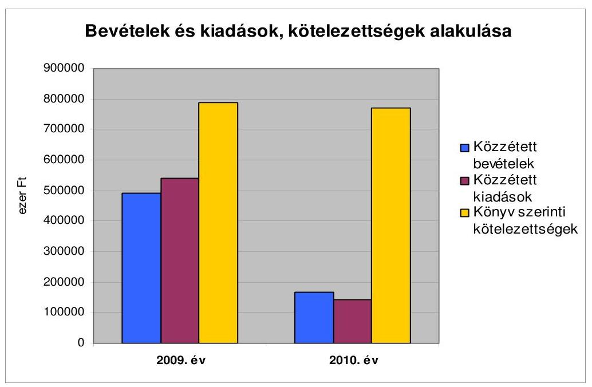
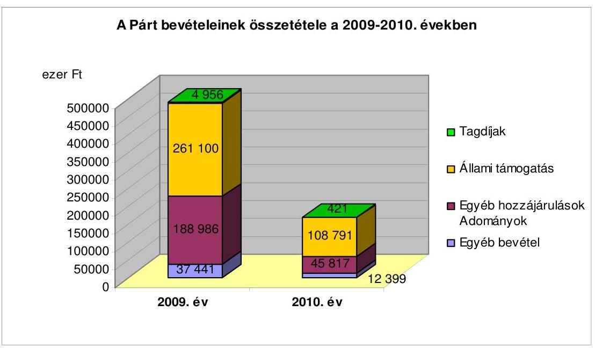
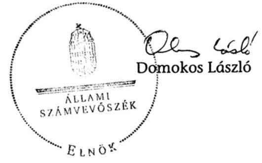

# ÁLLAMI   SZÁMVEVŐSZÉK 

## JELENTÉS

a Szabad Demokraták Szövetsége - a Magyar Liberális Párt 2009-2010. évi gazdálkodása törvényességének ellenőrzéséről

---

# Állami Számvevőszék 

Iktatószám: V-0007-055/2012.
Témaszám: 1046
Vizsgálat-azonosító szám: V0579

## Az ellenőrzést felügyelte:

## Horváth Balázs

felügyeleti vezető

## Az ellenőrzés végrehajtásáért felelős:

Dr. Veress Tiborné
ellenőrzésvezető

## A számvevőszéki jelentés összeállításában közreműködtek:

Baracsi Szilvia Krupánszki Dóra számvevő tanácsos számvevő

## Az ellenőrzést végezték:

| Baracsi Szilvia | Dr. Fátrainé Zsebedics | Krupánszki Dóra |
| :-- | :-- | :-- |
| számvevő tanácsos | Katalin | számvevő |

A témához kapcsolódó eddig készített számvevőszéki jelentések:

| címe | sorszáma |
| :-- | :--: |
| A Szabad Demokraták Szövetsége 1991. évi gazdálkodása törvényességének ellenőrzése | 161 |
| A Szabad Demokraták Szövetsége 1992-1993-1994. évi gazdálkodása törvényességének ellenőrzése | 279 |
| A Szabad Demokraták Szövetsége 1995-1996. évi gazdálkodása törvényességének ellenőrzése | 407 |
| A Szabad Demokraták Szövetsége 1997-1998. évi gazdálkodása törvényességének ellenőrzése | 9936 |
| A Szabad Demokraták Szövetsége 1999-2000. évi gazdálkodása törvényességének ellenőrzése | 0131 |
| A Szabad Demokraták Szövetsége 2001-2002. évi gazdálkodása törvényességének ellenőrzése | 0352 |
| A Szabad Demokraták Szövetsége - a Magyar Liberális Párt 2003-2004. évi gazdálkodása törvényességének ellenőrzése | 0558 |
| A Szabad Demokraták Szövetsége - a Magyar Liberális Párt 2005-2006. évi gazdálkodása törvényességének ellenőrzése | 0748 |
| A Szabad Demokraták Szövetsége - a Magyar Liberális Párt 2007-2008. évi gazdálkodása törvényességének ellenőrzése | 0951 |

---

# TARTALOMJEGYZÉK 

BEVEZETÉS ..... 5
I. ÖSSZEGZŐ MEGÁLLAPÍTÁSOK, KÖVETKEZTETÉSEK, JAVASLATOK ..... 7
II. RÉSZLETES MEGÁLLAPÍTÁSOK ..... 14

1. A Párt gazdálkodásáról szóló 2009-2010. évi beszámolók ..... 14
1.1. A teljes ellenőrzési időszakra érvényes megállapítások ..... 14
1.2. Bevételek ..... 15
1.3. Kiadások ..... 17
2. A Pártnak a beszámoló összeállítására és az azt alátámasztó könyvvezetésre vonatkozó belső szabályozása és gyakorlata ..... 19
2.1. A számviteli rendszer szabályozása ..... 19
2.2. A könyvvezetés összhangja a jogszabályokban és a belső szabályzatokban előírt követelményekkel ..... 20
2.3. A bizonylati elv és fegyelem, a bizonylati rend érvényesülésének ellenőrzése ..... 22
3. A Párt bevételszerző, gazdálkodó tevékenysége ..... 23
3.1. A Párt gazdálkodásának szabályozottsága ..... 23
3.2. A Párt vagyonának elemei ..... 23
4. A gazdálkodással összefüggő egyéb jogszabályokban foglalt előírások betartásának ellenőrzése ..... 26
4.1. A foglalkoztatás szabályszerűsége ..... 26
4.2. Személyi jellegű kifizetésekre vonatkozó jogszabályok betartása ..... 26
4.3. Az adózási, társadalombiztosítási és egyéb jogszabályok rendelkezéseinek betartása ..... 27
5. A belső kontroll rendszer ellenőrzése ..... 29
5.1. A belső ellenőrzés rendszerének szabályozottsága, működése ..... 29
5.2. Az informatikai rendszer szabályozottsága és belső kontrolljainak működtetése ..... 30
6. Az előző ellenőrzés megállapításaira tett intézkedések ..... 31
MELLÉKLETEK
7. számú A Szabad Demokraták Szövetsége - a Magyar Liberális Párt - 2009. évi pénzügyi beszámolója (2 oldal)
8. számú A Szabad Demokraták Szövetsége - a Magyar Liberális Párt 2010. évi pénzügyi beszámolója (1 oldal)

---

.

---

# RÖVIDÍTÉSEK JEGYZÉKE 

Jogszabályok rövidítése

| Áfa tv. | Az általános forgalmi adóról szóló 2007. évi CXXVII. törvény |
| :--: | :--: |
| Art. | Az adózás rendjéről szóló 2003. évi XCII. törvény |
| Munka Törvénykönyve párttörvény | A Munka Törvénykönyvéről szóló 1992. évi XXII. törvény   A pártok működéséről és gazdálkodásáról szóló 1989. évi XXXIII. törvény |
| Számv. tv. | A számvitelről szóló 2000. évi C. törvény |
| Szja tv. | A személyi jövedelemadóról szóló 1995. évi CXVII. törvény |
| Tbj. | A társadalombiztosítás ellátásaira és a magánnyugdíjra jogosultakról, valamint e szolgáltatások fedezetéről szóló 1997. évi LXXX. törvény |

Szórövidítések

| Áfa | Általános forgalmi adó |
| :-- | :-- |
| ÁSZ | Állami Számvevőszék |
| Kft. | ELLA' 36 Kft. |
| könyvelőiroda ${ }_{1}$ | A pénzügyi, számviteli feladatokat 2008. július 15-től |
|  | megbízási szerződéssel ellátó szervezet. |
| könyvelőiroda ${ }_{2}$ | A pénzügyi, számviteli feladatokat 2010. május 1-jétől |
|  | vállalkozási szerződéssel ellátó szervezet. |
| MFB | Magyar Fejlesztési Bank Zrt. |
| NAV | Nemzeti Adó- és Vámhivatal |
| OT | Országos Tanács |
| Párt | Szabad Demokraták Szövetsége - a Magyar Liberális Párt |
| pártelnök | 2010. május 29-ig a Párt képviseletére jogosult elnök |
| SZB | Számvizsgáló Bizottság |
| szja | Személyi jövedelemadó |
| ügyvezető elnök | A Párt képviseletére 2011. április 15-től jogosult ügyvezető elnök |

---

.

---

# JELENTÉS 

## a Szabad Demokraták Szövetsége - a Magyar Liberális Párt 2009-2010. évi gazdálkodása törvényességének ellenőrzéséről

## BEVEZETÉS

Az Állami Számvevőszékről szóló 2011. évi LXVI. törvény 5. § (11) bekezdés a) pontja, valamint a pártok működéséről és gazdálkodásáról szóló 1989. évi XXXIII. törvény (párttörvény) 10. § (1) bekezdése alapján a pártok gazdálkodása törvényességének ellenőrzésére az Állami Számvevőszék (ÁSZ) jogosult. Az ÁSZ a rendszeres költségvetési támogatásban részesülő pártok gazdálkodását a párttörvény 10. § (3) bekezdésében előírtak szerint kétévenként ellenőrzi. A Szabad Demokraták Szövetsége - a Magyar Liberális Párt (Párt) 2010. júniusáig volt jogosult rendszeres költségvetési támogatásra. A Párt a 2009. évben 261,1 millió Ft, a 2010. évben 108,8 millió Ft költségvetési támogatásban részesült.

Az ellenőrzés célja annak megállapítása volt, hogy:

- a Párt által készített és a Magyar Közlönyben közzétett éves beszámolók a törvényi előírásoknak megfelelnek-e, a könyvvezetéssel és a valósággal megegyező adatokat tartalmaznak-e;
- a könyvvezetés és a gazdálkodás során betartották-e a számvitelről szóló többször módosított 2000. évi C. törvény (Számv. tv.) és az egyéb jogszabályok rendelkezéseit, a belső előírásokat;
- a Párt a működéséhez szabályszerűen igénybe vehető forrásokat használt-e fel, a párttörvényben engedélyezett gazdálkodó tevékenységet folytatott-e.

Az ellenőrzött időszak: 2009. január 1. - 2010. december 31.
Az ellenőrzés típusa: pénzügyi-szabályszerűségi ellenőrzés
Az ellenőrzés körülményeit illetően rögzíteni szükséges ${ }^{1}$, hogy:

- a párttörvény 1. számú melléklete szerinti beszámoló-mintához magyarázatot, útmutatót nem készítettek a jogalkotók, így ennek kitöltése pártonként - kialakított számviteli politikájuknak megfelelően - eltérő lehet;

[^0]
[^0]:    ${ }^{1}$ A közigazgatási és igazságügyi miniszter 2012. májusában tájékoztatta az ÁSZ-t, hogy a Kormány fontosnak tartja a számvitelről szóló törvénnyel összehangolt pártfinanszírozási és gazdálkodási szabályok megalkotását.

---

- a beszámoló-minta a Számv. tv. rendelkezéseivel nem harmonizál, nem felel meg sem a mérleg, sem az eredmény-kimutatás követelményeinek.

Az ÁSZ a párttörvény módosításáig a hatályos rendelkezéseknek megfelelő - egységes módszertani alapokra helyezett - gyakorlattal folytatja a pártok gazdálkodása törvényességének ellenőrzését. Az ÁSZ az ellenőrzést a pénzügyi-szabályszerűségi ellenőrzés módszertani szabályai szerint, a pártellenőrzésre kiadott „A pártok gazdálkodása törvényességének pénzügyi szabályszerűségi ellenőrzéséhez" című segédletbe foglalt egységes követelmény szerint végezte. Az ellenőrzési feladatok szempontrendszerét kockázatelemzés alapozta meg, amelynek eredményeként az ellenőrzés magas kockázatúnak minősült. A bekért adatok előzetes elemzése és a Párt 2009-2010. évi főkönyvi könyvelési adatai alapján tételes ellenőrzésre, valamint statisztikai mintavételi eljárásra került sor. Tételesen történt a bevételek közül az 1000 ezer Ft feletti tételek, valamint a beszámolóban kötelezően nevesítendő, értékhatárt elérő egyéb hozzájárulások, adományok ellenőrzése. Az ellenőrzött években a bizonylati rend és fegyelem ellenőrzése Win-idea programmal - értékalapú rétegzett, véletlenszerű mintavétellel - kiválasztott bizonylatok alapján teljesült.

Az előkészítés során a rendelkezésre bocsátott dokumentumok alapján az átfogó lényegességi küszöb mértéke a beszámolók bevételi főösszegének 2,0%-ában került meghatározásra. Specifikus lényegességi küszöböt képezett az egyéb hozzájárulások, adományok körében a párttörvény 1. számú mellékletének előírása szerinti nevesítési értékhatár (belföldi 500 ezer Ft, külföldi 100 ezer Ft feletti).

A helyszíni ellenőrzés körülményeiről rögzíteni szükséges:

- A Párt elnökének személyében az ellenőrzött években kétszer is változás volt, 2009. július 12-ével és 2010. május 29-ével. A Párt 2010. júniusától 2011. áprilisáig az Országos Úgyvivői Testület irányításával, elnök nélkül működött. Majd 2011. április 15-től ügyvezető elnök képviseli a Pártot.
- A számviteli szolgáltatói feladatokat a könyvelőiroda ${ }_{1}$ látta el 2008. július 15-től, majd 2010. május 1-jétől a könyvelőiroda ${ }_{2}$.
- Az alapszabály 2010. június 26-i módosítása szerint a Párt székhelye megváltozott Budapest, IX. kerület Ráday u. 50. számra. Az ügyvezető elnök nyilatkozata szerint az iratok tárolását részben az új székhelyen, részben a Párt Budapest VII. kerület Dob u. 103. szám alatti irodájában oldották meg. A 2010. évi, könyvelésre átadott dokumentumok a könyvelőiroda ${ }_{2}$-nél találhatóak. Az ellenőrzés során a kért dokumentumok, iratok, bizonylatok átadása késedelmesen, hiányosan történt, azok eltérő helyeken való tárolása miatt.

A helyszíni ellenőrzés 2012. május 21 - június 1-je között, a Párt által kijelölt Budapest, VI. kerület Andrássy út 45. szám alatti irodában történt.

---

# I. ÖSSZEGZŐ MEGÁLLAPÍTÁSOK, KÖVETKEZTETÉSEK, JAVASLATOK 

A Párt a gazdálkodási beszámolóit a Hivatalos Értesítőben és honlapján a 2009. évről a párttörvényben előírt határidőn belül, a 2010. évről egy héttel később tette közzé. A 2009. évi beszámoló megbízható és valós képet adott a Párt gazdálkodásáról. A 2010. évi beszámoló összeállításával összefüggésben feltárt és számszerűsített elszámolási hibák előjeltől független összege a bevételi oldalon 8150 ezer Ft, a kiadási oldalon 67137 ezer Ft volt. Az elszámolási hibák a bevételi főösszegre vetítve 4,9%, illetve 40,1% mértéket értek el, amelyek meghaladták az ÁSZ által alkalmazott 2%-os átfogó lényegességi küszöböt. A lényeges hibákat a Számv. tv-ben rögzített teljesség és valódiság elvének megsértése okozta, amelynek következtében a 2010. évi beszámoló nem mutatott megbízható, valós képet. Ennek kiküszöböléséhez a párttörvény nem rendelkezik a kötelező könyvvizsgálatról. A 2010. évi beszámolóban a számviteli politika előírása ellenére a kapott kölcsön helyett a vonatkozó főkönyvi számla egyenlegét vették figyelembe az egyéb bevételek soron, amely 6449 ezer Ft összegben nyitó állományt tartalmazott. Az egyéb bevételek között mutattak ki - bizonylattal alá nem támasztott - elengedett kölcsöntartozás formájában magán személyektől kapott 1276 ezer Ft összegű vagyoni hozzájárulás értékét, a belföldi magánszemélyektől kapott adományok helyett. Elmulasztották a könyvviteli szolgáltatás címen nyújtott nem pénzbeni vagyoni hozzájárulás párttörvény szerinti értékelését, annak a belföldi jogi személyektől kapott adományok közötti szerepeltetését 425 ezer Ft-ban. Nem szerepeltettek 128 ezer Ft értékű tárgyi eszköz beszerzést. Helyi szervezetnek adtak 15 ezer Ft összegű támogatást, amely szervezetek közötti pénzmozgásnak minősült. Nyilvántartásban nem szereplő alapítványnak adtak 4360 ezer Ft támogatást. Nem mutatták ki 58274 ezer Ft értékben az MFB által nyújtott kölcsön után fizetendő kamattartozást.

A Párt számviteli szabályozása keretében az éves beszámoló összeállítását, valamint az azt alátámasztó könyvvezetést számviteli politikájában szabályozta. A 2009. október 16-án hatályba helyezett új szabályzatban nem határozták meg, hogy a Párt a Számv. tv. alapján mit tekint lényegesnek és nem lényegesnek, továbbá a beszámoló elkészítésekor és a könyvvezetés során érvényesítendő számviteli alapelvek követelményeit nem határozták meg teljes
 körűen. Az értékelési szabályzatban - 2009. január 1-jei hatállyal - előírták a párttörvény alapján a Párt részére nyújtott nem pénzbeli vagyoni hozzájárulás kimutatását a beszámolóban, azonban az értékelés módjáról nem rendelkeztek. Az eszközök és források leltárkészítési és leltározási-, számlarend és pénzkezelési szabályzatok 2008. szeptember 1-jétől voltak hatályban, amelyeket nem hozták összhangba a számviteli politikával annak ellenére, hogy a Párt gazdálkodási körülményeiben jelentős változások (pl. megszűnő szervezetek) álltak be. A számlarend nem tartalmazott minden, a könyvelésben alkalmazott számlát, nem rendelkezett a főkönyvi számlákhoz kapcsolódó analitikus nyilvántartások meghatározásáról. A szabályozási hiányosságok hozzájárultak a könyvvezetési és a beszámolási hibákhoz, amely részben összefüggött a párttörvény és a Számv. tv. közötti összhang hiányával.

---

A Pártnál a kettős könyvvezetést és a beszámoló összeállítást az ellenőrzött időszakban külső könyvelési szolgáltatók megbízási, illetve vállalkozási szerződéssel végezték. A számviteli szolgáltatók rendelkeztek a Számv. tv-ben meghatározott képesítéssel és szerepeltek a könyvviteli szolgáltatást végzők nyilvántartásában. A könyvvezetésben a teljesség, a következetesség és a valódiság számviteli alapelveket sértő hibákat tárt fel az ellenőrzés. A számlakijelölés gyakorlata - eseti hibák kivételével - összhangban volt a Számv. tv-ben, számlarendben előírtakkal. Az eszközök értékcsökkenésének elszámolása a 2009. évben megfelelt a Számv. tv-ben és a számviteli politikában foglaltaknak. A 2010. évi értékcsökkenés elszámolását analitikus nyilvántartások hiánya miatt részben lehetett ellenőrizni. A Számv. tv-ben szabályozott leltározás szabályszerű végrehajtása a 2009. évben nem történt meg, mivel kiértékelését elmulasztották, továbbá a területi és kerületi szervek 90%-a leltározást nem folytatott le. A 2010. évben a Párt leltározást nem végzett. A számlarendben meghatározott zárlati feladatok szabályszerű végrehajtását nem biztosították. A leltározással és zárással kapcsolatban feltárt hibák nem befolyásolták a beszámolók megbízhatóságának minősítését.

Az analitikus nyilvántartásokat részben vezették a Számv. tv-nek és a belső előírásoknak megfelelően. A szellemi termékek és a saját tulajdonú ingatlanok analitikus nyilvántartásáról a 2010. évben nem gondoskodtak. A személyszállító gépjárművek a 2010. évben értékesítésre, illetve a lízingbe adó társaság által visszavételre kerültek, a főkönyvi nyilvántartásban ugyanakkor szerepeltek. Az elszámolásra kiadott előlegeket a 2010. évben nem vezették teljes körűen, az a 2264 ezer Ft kampányelőleget nem tartalmazta, elszámolása nem történt meg. A vevők és egyéb követelések, szállítók és egyéb rövid lejáratú kötelezettségek kimutatását a beszámolókhoz elkészítették. Az analitikus nyilvántartások és a főkönyvi könyvelés között az értékadatok számszerű egyeztetése a Számv. tvben rögzített szabállyal ellentétben teljes körűen bizonyíthatóan nem történt meg, mivel a szellemi termékek és tárgyi eszközök, továbbá a 2010. évben az elszámolásra kiadott előlegek egyeztetését nem végezték el. Az analitikus nyilvántartások hiányosságai vagyonvédelmi kockázatot jelentenek.

A pénzkezelési feladatok szabályszerű ellátását a Párt központi pénztárában a Számv. tv. és a pénzkezelési szabályzatban foglaltakkal összhangban biztosították, az összeférhetetlenség előírásait és a házipénztárban tartható készpénz értékhatárát az ellenőrzött években betartották. A készpénzforgalom szabályszerű nyilvántartásához több időközben megszűnt helyi szervezetnél nem vezették a pénzkezelési szabályzatban előírt pénztárjelentést, a pénztárosok felelősségvállalási nyilatkozatával nem rendelkeztek. A készpénzben és a bankszámlán tartott pénzeszközök közötti forgalmat szabályszerűen bonyolították, a főkönyvi nyilvántartás adataiból a pénzmozgások követhetőek voltak. A banki kifizetések engedélyezése során a bankszámla feletti rendelkezésre jogosultak írtak alá, az elektronikus kifizetések dokumentáltsága biztosította a bankszámla feletti rendelkezési jog gyakorlójának azonosítását.

A bizonylati elv és fegyelem szabályait - a számlarend részeként - a bizonylati rend tartalmazta. A gazdasági események számviteli nyilvántartásokban történő rögzítése során - kivéve az 1276 ezer Ft tagi kölcsön rendezését - betartották a Számv. tv-ben szabályozott bizonylati elvet. A könyvvezetés során betartották a Számv. tv., valamint a belső előírások határidőit. A Számv. tv-

---

ben rögzített alaki-tartalmi előírásokat 2009-ben a vizsgált bizonylatok 1,1%-ánál, 2010-ben 2,5%-ánál nem tartották be. A Párt belső szabályzataiban előírtak ellenére a szigorú számadású bizonylatok nyilvántartását teljes körűen nem vezették, mivel a rendelkezésre álló, használatba nem vett nyomtatványtömbök típusa, sorszáma, mennyisége nem volt megállapítható.

A Párt gazdálkodó, bevételszerző tevékenysége során a könyvviteli nyilvántartásai szerint - egy kivétellel - betartotta a párttörvényben előírt forrásszerzési és gazdálkodási tilalmakat. A Párt - szabályozási hiányosság miatt - az Új Kezdet Liberális Alapítvány 2009. évi 56500 ezer Ft adománya elfogadásakor nem gondoskodott hitelt érdemlően azon törvényi előírás betartásának igazolásáról, hogy az alapítvány nem részesült közvetlen költségvetési támogatásban vagy költségvetési szervi támogatásban. Bizonyítottság hiányában az ellenőrzés a párttörvénybe ütközőnek minősíti az adomány elfogadását, amelynek összegét, az 56500 ezer Ft-ot köteles a párt a központi költségvetésnek befizetnie. Ugyanakkor nem érvényesíthető a törvény szankcionáló rendelkezése, hogy a Párt költségvetési támogatását azonos összeggel csökkenteni kell, mivel 2010 júniusától a rendszeres állami támogatása megszűnt. A Párt külföldi államtól, költségvetési szervtől, állami vállalattól, állami részvétellel működő gazdasági társaságtól nem fogadott el vagyoni hozzájárulást, valamint névtelen adományt. A párttörvényben nem engedélyezett gazdálkodó tevékenységet nem folytatott, gazdasági társaságban részesedést nem szerzett, vállalatot nem alapított. A Párt egy, a párttörvényben engedélyezett egyszemélyes korlátolt felelősségű társaság tulajdonosa volt. A főkönyvi kartonokból megállapítható, hogy a Párt és a Kft. között pénzügyi kapcsolat nem volt az ellenőrzött években.

A Párt a 2009. évben 261,1 millió Ft, a 2010. évben 108,8 millió Ft költségvetési támogatásban részesült. A Párt kötelezettség állománya az ellenőrzött időszak zárlati adatai szerint 787058 ezer Ft és 771244 ezer Ft volt, amelynek közzétett bevételi és kiadási adatokhoz való viszonyát az alábbi grafikon szemlélteti:

---

A Párt 20 ingatlan vásárlásához vett fel 414991 ezer Ft hitelt az MFB-től. A bank a kölcsönszerződést 2010-ben felmondta, mivel a Párt 2009. július óta tőke- és kamatfizetési kötelezettségének nem tett eleget. A 2010. év végén fennálló tartozás összege 467006 ezer Ft volt, amely háromötödét tette ki az összes kötelezettségnek. Tekintettel arra, hogy a Párt a 2010. évi országgyűlési választásokon mandátumot nem szerzett, a költségvetési támogatása a 2009. évről a 2010. évre kevesebb, mint felére, továbbá az adományok összege egynegyedére csökkent, a 2011. évről szóló, megjelentetett beszámolóban az összes bevétel 3240 ezer Ft volt. A felhalmozott tartozás rendezését az ellenőrzés bizonytalannak ítéli, egyben az állami vagyon veszélyeztetettségére utal, hogy sem a párttörvényben sem az állami vagyontörvényben nincsenek szabályozott garanciák a fizetésképtelenség esetére.

A Párt a foglalkoztatottakat az Art. előírásainak megfelelően bejelentette. A munkabérek számfejtése, kifizetése megfelelt a hatályos Tbj. valamint Szja tv. előírásainak. A belső szabályzatok részben voltak összhangban a jogszabályi előírásokkal. A hivatali telefont használóknak - az elnöki utasítás szerint - a telefonköltség 100%-át kifizették. A magáncélú használatra a telefonköltségek elkülönítését nem követelték meg, a 20% vélelmezett magáncélú használatot nem vették figyelembe, így az adó- és járulékfizetési kötelezettségének a Párt nem tett eleget. A Párt az Art. mellékletében előírt havi és éves bevallását határidőben, az előleg és adófizetési kötelezettségeit pénzügyi helyzete miatt rendszeresen késedelmesen teljesítette. A bevallás, befizetés adatai a főkönyvi nyilvántartással megegyeztek. A Párt által elszámolt reprezentáció és üzleti ajándék együttes értéke nem haladta meg az Szja tv-ben meghatározott adómentes értékhatárt. A Párt 2009. évben a rehabilitációs hozzájárulást annak ellenére nem vallotta be, nem fizette meg, hogy a foglalkoztatottak száma a törvényben meghatározott 20 főt meghaladta.

A belső ellenőrzés rendjét az alapszabály, a számviteli politika, a pénzkezelési és bizonylati szabályzat összehangoltan szabályozta. A Párt választott belső ellenőrző szervezete a Számvizsgáló Bizottság (SZB), amelynek tevékenységét egyetlen dokumentum támasztotta alá, a 2009. évi beszámoló elfogadásáról készült jegyzőkönyv. A vezetői ellenőrzés a munkáltatói jogkör gyakorlásán, a kötelezettségvállaláson és az utalványozáson keresztül érvényesült. A munkaköri leírásokban rögzítettek pénzügyi, ellenőrzési feladatokat és jogosultságokat. A szabályzatok, valamint a könyvelési, adatfeldolgozási feladatokra kötött szerződések tartalmazták a folyamatba épített ellenőrzés során végrehajtandó feladatokat, amelyeket az ellenőrzés által feltárt hiányosságokkal hajtották végre. A belső kontrollok elégtelenül működtek, ennek következtében nem tárták fel a lényeges beszámolási és könyvvezetési hibákat, a szabályozási mulasztásokat és a jogszerűtlenül elfogadott adományt. A gazdálkodással összefüggő informatikai rendszer működtetését nem szabályozták. A számviteli szolgáltató a gazdálkodási adatok biztonságáról rendszeres mentéssel gondoskodott, a mentéseket tartalmazó adathordozók védelmét az illetéktelen hozzáféréstől biztosította. A 0951 számú ÁSZ jelentés felhívására összeállított intézkedési tervben foglalt feladatokat részben hajtották végre. A pénzkészletek főkönyvi és analitikus egyeztetésének hiánya továbbra is fennállt, a helyi és területi szervezetek a pénztárjelentéseket nem teljes körűen vezették, az elszámolási előleg nyilvántartásának vezetésével kapcsolatos korábbi hiányosság megszűnt, de az ellenőrzés újabbakat tárt fel. A számlarend módosításáról nem gondoskodtak.

---

Az Állami Számvevőszékről szóló 2011. évi LXVI. törvény 33. § (1) bekezdésében foglaltak értelmében a jelentésben foglalt megállapításokhoz kapcsolódó intézkedési tervet köteles az ellenőrzött szervezet vezetője összeállítani és azt a jelentés kézhezvételétől számított harminc napon belül az ÁSZ részére megküldeni. Amennyiben az intézkedési tervet határidőben nem küldi meg a szervezet, vagy az továbbra sem elfogadható, az ÁSZ elnöke a hivatkozott törvény 33. § (3) bekezdés a)- b) pontjaiban foglaltakat érvényesítheti.

A helyszíni ellenőrzés intézkedést igénylő megállapításai és felhívásai:

# a Párt elnökének 

1. A 2010. évi beszámoló hibáinak előjeltől független összege a bevételi oldalon 8150 ezer Ft, a kiadási oldalon 67137 ezer Ft volt, amelyek a bevételi főösszegre vetítve 4,9%, illetve 40,1% mértéket értek el. A lényeges hibákat a Számv. tv-ben rögzített teljesség és valódiság elvének megsértése okozta, amelynek következtében a 2010. évi beszámoló nem mutatott megbízható, valós képet.

Felhívás:
Készítse el és tegye közzé megbízható és valós adatokkal a Párt 2010. évi módosított beszámolóját a Számv. tv. 15. § (2)-(3) bekezdéseiben foglalt teljesség, valódiság elveinek érvényesítésével.
2. A számviteli szabályzatok nem felelnek meg teljes körűen a Számv. tv. előírásainak.
a) A számviteli politikában a Párt nem határozta meg, hogy a Számv. tv. alapján mit tekint lényegesnek és nem lényegesnek, továbbá a beszámoló elkészítésekor és a könyvvezetés során érvényesítendő számviteli alapelveket teljes körűen.

Felhívás:
Módosítsa a számviteli politikát figyelemmel a Számv. tv. 14. § (4) bekezdésében, valamint a 15-16. §-ában előírtak betartására.
b) Az eszközök és források értékelési szabályzatban nem rendelkeztek a nem pénzbeli vagyoni hozzájárulás értékelésének módjáról.

Felhívás:
Egészítse ki az eszközök és források értékelési szabályzatát - a párttörvény 4. § (5) bekezdésével összhangban - a nem pénzbeli vagyoni hozzájárulás értékelési módjának előírásaival.
c) Az eszközök és források leltárkészítési és leltározási-, számlarend és pénzkezelési szabályzatok 2008. szeptember 1-jétől voltak hatályban, amelyeket nem hoztak összhangba a számviteli politikával annak ellenére, hogy a Párt gazdálkodási körülményeiben jelentős változások álltak be.

Felhívás:
Teremtsen összhangot a számviteli politika és az eszközök és források leltárkészítési és leltározási-, a számlarend és a pénzkezelési szabályzatok között.

---

d) A Számv. tv. előírása ellenére a számlarend nem tartalmazta a főkönyvi számlák értéknövekedésének és csökkenésének
 jogcímeit, nem rendelkezett a főkönyvi számlákhoz kapcsolódó analitikus nyilvántartások tartalmáról, formájáról.

Felhívás:
Egészítse ki a számlarendet a Számv. tv. 161. § (2) bekezdés b)-c) pontjai előírásainak megfelelően.
3. A könyvvezetésben megsértették a teljesség, a valódiság és a következetesség számviteli alapelveit.

Felhívás:
Szerezzen érvényt a Számv. tv. 15. § (2)-(3) és (5) bekezdésben foglalt elveknek.
4. A Párt 2009-ben elmulasztotta a leltárok kiértékelését, a területi és kerületi szervek 90%-ánál leltározást nem folytatott le, továbbá 2010. évben leltározást nem végzett.

Felhívás:
Intézkedjen a Számv. tv. 69. §-ban foglaltak betartása érdekében a szabályszerű és teljes körű leltározás végrehajtására.
5. A számlarendben meghatározott zárlati feladatok szabályszerű végrehajtását nem biztosították.

Felhívás:
Hajtsa végre a Számv. tv. 164. § (1) bekezdésben előírt zárlati feladatokat.
6. Az analitikus nyilvántartások és a főkönyvi könyvelés között az értékadatok számszerű egyeztetése a Számv. tv-ben rögzített szabállyal ellentétben teljes körűen bizonyíthatóan nem történt meg, mivel a szellemi termékek és tárgyi eszközök, továbbá a 2010. évben az elszámolásra kiadott előlegek egyeztetését nem végezték el.

Felhívás:
Intézkedjen a Számv. tv. 165. § (4) bekezdésében előírt egyeztetési és ellenőrzési feladatok végrehajtására.
7. A szigorú számadású bizonylatok nyilvántartása a Számv. tv. és a Párt pénzkezelési szabályzatában előírtak ellenére nem tartalmazott több, a gyakorlatban alkalmazott nyomtatványt, a rendelkezésre álló, használatba nem vett nyomtatványtömbök típusa, sorszáma, mennyisége nem volt megállapítható.

Felhívás:
Rendelkezzen a Számv. tv. 168. §-ban foglaltak szerint a szigorú számadási kötelezettség betartására.

---

8. A Párt az Új Kezdet Liberális Alapítvány 2009. évi 56 500 ezer Ft adománya elfogadásakor nem gondoskodott hitelt érdemlően azon törvényi előírás betartásának igazolásáról, hogy az alapítvány nem részesült közvetlen költségvetési támogatásban vagy költségvetési szervi támogatásban. Bizonyítottság hiányában az ellenőrzés a párttörvénybe ütközőnek minősíti az adomány elfogadását.

Felhívás:
Intézkedjen a párttörvény 4. § (2) bekezdés előírásának megsértésével szerzett 56 500 ezer Ft adomány központi költségvetésbe történő befizetésére a párttörvény 4. § (4) bekezdés szabályozásának megfelelően.
9. A hivatali telefont használóknak a telefonköltség 100%-át kifizették, a magáncélú használatra a telefonköltségek elkülönítését nem követelték meg, a 20% vélelmezett magáncélú használatot nem vették figyelembe. Így a telefonköltségek 20%-a utáni adó és járulékfizetési kötelezettségének a Párt nem tett eleget. A Párt a 2009. évben a rehabilitációs hozzájárulást annak ellenére nem vallotta be és nem fizette meg, hogy a foglalkoztatottak száma a törvényben meghatározott 20 főt meghaladta.

Felhívás:
Intézkedjen önellenőrzéssel a magáncélú telefonhasználat után fizetendő adó- és járulék megállapításáról és utólagos megfizetéséről az Szja. tv. 69. § (1) bekezdésére figyelemmel, valamint teljesítse 2009. évre a foglalkoztatás elősegítéséről és a munkanélküliek ellátásáról szóló - az ellenőrzött időszakban hatályos - 1991. évi IV. törvény 41/A. § szerinti rehabilitációs hozzájárulás bevallási és befizetési kötelezettségét.
10. A belső kontrollok elégtelenül működtek, ennek következtében nem tárták fel a lényeges beszámolási és könyvvezetési hibákat, a szabályozási mulasztásokat és a jogszerűtlenül elfogadott adományt.

Felhívás:
Intézkedjen a számvizsgáló bizottság, a vezetői és a munkafolyamatba épített ellenőrzés eredményes működtetéséről.

---

# II. RÉSZLETES MEGÁLLAPÍTÁSOK 

## 1. A PÁRT GAZDÁLKODÁSÁRÓL SZÓLÓ 2009-2010. ÉVI BESZÁMOLÓK

### 1.1. A teljes ellenőrzési időszakra érvényes megállapítások

A Párt a 2009. évi gazdálkodásáról szóló beszámolót 2010. április 30-án a Hivatalos Értesítő 31. számában, a párttörvény 9. § (1) bekezdésének előírása szerint, a 2010. évi beszámolót 2011. május 6-án az előírt határidőn túl tette közzé a Hivatalos Értesítő 30. számában. Mindkét év beszámolóját a párttörvény 1. számú mellékletében előírt formában és tartalommal állították össze (1-2. számú melléklet). A Párt a 2009. és 2010. évi beszámolóját honlapján is nyilvánosságra hozta.

A beszámolók összeállításának rendjét a Párt a hatályos számviteli politikájában szabályozta. A Párt az előírtaknak megfelelően december 31-i fordulónappal készítette el beszámolóit, amelyeket a főkönyvi számlák adatai és az azokhoz kapcsolódó analitikus nyilvántartások alapján állítottak össze.

A hatályos alapszabály 96. pontja rendelkezése értelmében az Országos Tanács (OT) elfogadja a Párt költségvetését és értékeli annak teljesítését. Az ügyvezető elnök nyilatkozata szerint a 2009-2010. évi beszámolók OT általi értékelésére vonatkozó dokumentum nem áll rendelkezésre. Az alapszabályban rögzítettektol eltérően az Országos Ügyvivői Testület a 2/2011. határozatban (2011. április 29.) felhatalmazta az ügyvezető elnököt a 2010. évi beszámoló közzétételére.

A 2009. évi beszámoló megbízható és valós képet adott a Párt gazdálkodásáról. A nyilvánosságra hozott 2010. évi beszámoló nem mutatott megbízható és valós képet a Párt gazdálkodásáról, mivel összeállítása során a Számv. tv. 15. § (2) bekezdésében foglalt teljesség és a (3) bekezdésben rögzített valódiság számviteli alapelveket sértették meg.

A Számv. tv. 15. § (2) bekezdés szerinti teljesség számviteli alapelvet sértette, hogy a Párt figyelmen kívül hagyott a 2009. évben 3175 ezer Ft, a 2010. évben 128 ezer Ft értékű tárgyi eszköz beszerzést. A Számv. tv-ben és a számlarendben foglaltaktól eltérően a 2010. évben nem vették nyilvántartásba az 58 274 ezer Ft összegű, az MFB által nyújtott kölcsön után fizetendő (esedékes) kamattartozást. Továbbá a 2010. évi beszámoló összeállítása során elmulasztották a könyvelőiroda₂ által könyvviteli szolgáltatás címen nyújtott - az ÁSZ által megállapított - 425 ezer Ft értékű nem pénzbeli vagyoni hozzájárulásnak a párttörvény szerinti értékelését és könyveiben rögzítését.

A Számv. tv. 15. § (3) bekezdés szerinti valódiság számviteli alapelvet sértette, hogy a Párt a hatályos számviteli politika szabályozása ellenére a beszámolókban kimutatta a tárgyévben kapott kölcsönök között a 2009. évben 2447 ezer Ft, a 2010. évben 6449 ezer Ft összegű nyitó tételként szereplő, előző

---

évben felvett kölcsön összegét is. A 2010. évben bizonylattal alá nem támasztott egyéb bevételt mutattak ki 1276 ezer Ft értékben, továbbá egy nem beazonosítható alapítványnak adott a Párt 4360 ezer Ft-ot, így a vegyes bizonylat hitelessége, valamint a valótlan adatot tartalmazó számviteli bizonylat miatt a beszámoló információinak megbízhatóságát, valósságát nem biztosították.

A 2009. és a 2010. évi beszámolók összeállításával összefüggésben feltárt és számszerúsített elszámolási hibák előjeltől független összege a bevételi oldalon 2447 ezer Ft, illetve 8150 ezer Ft, ami a bevételi főösszeg százalékában a 2009. évben 0,5%, a 2010. évben 4,9% volt. A kiadási oldalon feltárt hibák előjeltől független összege a 2009. évben 3175 ezer Ft, a 2010. évben 67 137 ezer Ft, ami a bevételi főösszeg százalékában 0,6%, illetve 40,1% volt. A megjelentetett beszámolóhoz képest kimutatott, a beszámoló bevételi főösszegére vetített hiba mértéke 2010-ben a kiadási és bevételi oldalon egyaránt meghaladta az ÁSZ-nál általánosan elfogadott 2%-os átfogó lényegességi küszöböt.

# 1.2. Bevételek 

A beszámoló bevételeit a 9. Bevételek elnevezésű számlaosztályhoz tartozó, a párttörvény 1. számú melléklete szerinti minta soraihoz igazodó főkönyvi számlák adataiból, valamint a belső szabályozás szerinti - a 4. számlaosztályban nyilvántartott - kapott kölcsönökből állították össze.

A 2009-2010. években közzétett beszámolók bevételeinek ellenőrzése során megállapított eltéréseket - beszámoló soronként - a következő összeállítás részletezi:

Adatok: ezer Ft-ban

| BEVÉTELEK | Párt által közzétett beszámoló |  | Ellenőrzés által megállapított eltérések a közzétett beszámolóhoz képest |  |  |  |
| :--: | :--: | :--: | :--: | :--: | :--: | :--: |
|  | 2009. évi | 2010. évi | 2009. évi |  | 2010. évi |  |
|  |  |  | Kimaradt | Hibásan   szerepel | Kimaradt | Hibásan   szerepel |
| 1. Tagdíjak | 4956 | 421 | 0 | 0 | 0 | 0 |
| 2. Állami támogatás | 261100 | 108791 | 0 | 0 | 0 | 0 |
| 4. Egyéb hozzájárulások, adományok összesen | 188986 | 45817 | 0 | 0 | 425 | 0 |
| 6. Egyéb bevétel | 37441 | 12399 | 0 | 2447 | 0 | 7725 |
| Összes bevétel | 492483 | 167428 | 0 | 2447 | 425 | 7725 |
| - hiány |  |  | - | - | - | - |
| - többlet |  |  | - | 2447 | - | 7300 |

A Párt a tagdíj befizetés feltételeit a Párt alapszabályának 140-142. pontjaiban rögzítette. Az ellenőrzött időszakban is hatályban volt az OT 2003. évi határozata a tagdíj mértékére, amely az alsó értéket rögzítette, felső határt nem állapított meg. A tagdíjak címen közzétett adat a 2009-2010. években megegyezett a főkönyvi könyvelésben szereplő összeggel.

---

A tagdíj főkönyvi számlához tagdíj analitika nem kapcsolódott. A tagdíjbevételek pénztári, illetve banki bizonylataiból a befizető személye minden esetben megállapítható volt. A tagdíjak között más bevételek nem szerepeltek.

Az állami költségvetésből származó támogatás címén a közzétett adatok mindkét évben megegyeztek a főkönyvi könyvelésben kimutatott, és a bankszámlakivonaton szereplő, a Magyar Államkincstár által ténylegesen átutalt összegekkel. A párttörvény 5. § (2) bekezdése alapján kapott 2009-2010. évi támogatás egyezett a Magyar Köztársaság 2009. évi költségvetésének végrehajtásáról szóló 2010. évi XCVIII. törvényben és a Magyar Köztársaság 2010. évi költségvetésének végrehajtásáról szóló 2011. évi CXXXIII. törvényben meghatározott összeggel.

Az egyéb hozzájárulások, adományok beszámolósor adatát a Párt, a párttörvény 9. § (2) bekezdésében előírtak és az 1. számú mellékletében meghatározott minta előírása szerint tovább részletezte. A Pártnak ilyen címen mindkét évben belföldi jogi személyektől és magánszemélyektől, a 2009. évben külföldi jogi személyektől és jogi személyiségnek nem minősülő gazdasági társaságtól is származott bevétele. A Párt főkönyvi nyilvántartását a párttörvényben meghatározott jogcímek és értékhatár szerinti bontásban alakította ki. A banki átutalás és a készpénzes befizetés esetén az adományozó személyének egyértelmű azonosítása biztosított volt.

Az egyéb hozzájárulások, adományok belföldi jogi személyektől beszámolósor adata egyezett a vonatkozó főkönyvi számlák összesített egyenlegével, azonban a 2010. évi beszámolósoron közzétett adat nem a valós helyzetet mutatta. A 2010. évben a könyvelőiroda₂ a 2010. április 28-án kötött vállalkozási szerződés szerint 2010. május 1-jétől 2010. július 31-éig 100 ezer Ft+Áfa/hó értékben végzett könyvviteli szolgáltatást. A vállalkozóval 2010. augusztus 1-je és 2012. december 31-e közötti időszakra szóló könyvviteli szolgáltatás elvégzésére kötött szerződésben a munkavégzés ellenértékeként 0 Ft-ot állapítottak meg. A 2010. augusztus-december időszakban a könyvelőiroda₂ 2010. augusztus 3-án, szeptember 1-jén, október 27-én 25-25-25 ezer Ft értékű számlát bocsátott ki. Az ellenőrzés a 2010. április 28-án kötött szerződés alapján az elvégzett szolgáltatás ellenértékét - 75 ezer Ft számlázott összeg kivételével - összesen 425 ezer Ft-ban állapította meg, ami belföldi jogi személytől származó nem pénzben nyújtott vagyoni hozzájárulásnak (adomány) minősül. A Párt nem tett eleget a párttörvény 4. § (5) bekezdésében foglalt értékelési kötelezettségének. Továbbá sérült a Számv. tv. 15. § (3) bekezdésében rögzített valódiság elve.

A párttörvény 4.
 § (5) bekezdése szerint:"Ha a párt részére a vagyoni hozzájárulást nem pénzben nyújtották, köteles annak értékeléséről (értékének meghatározásáról) gondoskodni."

A közzétett beszámolókban a párttörvény 1. számú melléklet tartalmi előírásai szerinti csoportosításban 500 ezer Ft felett az adományozó nevesítve, a támogatás összegével együtt szerepelt.

A beszámolók tartalmazták a párttörvény 4. § (5) bekezdésében előírtakkal összhangban az önkormányzatoktól ingyenesen, vagy a piaci érték és a jelképes bérleti díj különbözeteként ingatlanhasználat formájában kapott nem pénzbeli vagyoni hozzájárulás értékét.

---

A Párt 2009. évben 34292 ezer Ft, a 2010. évben 34640 ezer Ft értékben kapott ingatlanhasználat formájában nem pénzbeli vagyoni hozzájárulást 21 önkormányzattól. A beszámolókban feltüntették a párttörvény 9. § (2) bekezdés előírása szerint az értékhatár feletti támogatást nyújtó önkormányzatokat és a támogatási összeget.

Az egyéb hozzájárulások, adományok külföldi jogi személyektől címen teljesült bevételeknél a 2009. évben a párttörvény előírásának megfelelően név szerint feltüntették a 100 ezer Ft feletti összeget adományozó kettő külföldi jogi személy nevét és az adományozott összeget. A közölt adat megegyezett a könyvviteli nyilvántartásban ilyen címen kimutatott, alapbizonylattal alátámasztott összeggel.

A 2009. évi beszámolóban az egyéb hozzájárulások, adományok jogi személyiségnek nem minősülő gazdasági társaság soron a Párt által közzétett adat a vonatkozó főkönyvi nyilvántartásban szereplő összeggel megegyezett.

Az egyéb hozzájárulások, adományok belföldi magánszemélyektől címen a beszámolóban a 2009. évben a párttörvény előírásának megfelelően név szerint feltüntették az 500 ezer Ft feletti összeget adományozó személyek nevét és az adományozott összeget. A 2009. évben hat belföldi magánszemély adományozott 500 ezer Ft-ot meghaladó összeget a Pártnak 6571 ezer Ft összegben. Ezen beszámolósoron közölt összeg a vonatkozó főkönyvi számlák egyenlegével megegyezett. A Párt a 2010. évben 500 ezer Ft feletti adományt magánszemélytől nem kapott.

Az egyéb bevételek beszámolósoron a hatályos számviteli politika előírása szerint a 9. számlaosztályban az egyéb és pénzügyi műveletek bevételeit és a tárgyévben kapott kölcsönöket kell közzétenni. Mindkét évben a számviteli politika szabályozása ellenére a beszámolóban a vonatkozó főkönyvi számla követel egyenlegét szerepeltették, ami tartalmazta a nyitó egyenleget a 2009. évben 2447 ezer Ft, a 2010. évben 6449 ezer Ft értékben. A 2010. évben az egyéb bevételek főkönyvi számlán kimutattak 1276 ezer Ft összeget, tagi kölcsön rendezése címen. A könyvelési tételt vegyes bizonylattal támasztották alá, amelyhez aláírás nélküli kimutatást csatoltak az 1997. december 11-étől keletkezett, magánszemélyek által nyújtott kölcsön összegéről, azonban a kötelezettségek elengedését, az elvégzett egyeztetést dokumentum nem támasztotta alá. Ezzel sérült a Számv. tv. 15. § (3) bekezdésében rögzített valódiság elve, mivel a Párt nem a számviteli politikájában rögzített szabályozást alkalmazta a beszámoló összeállítása során, továbbá olyan bevételt mutattak ki, amit bizonylattal nem támasztottak alá.

# 1.3. Kiadások 

A közzétett beszámolókban a kiadások összegét a belső szabályozással összhangban az 1., 4., 5., és 8. számlaosztály vonatkozó számláinak adataiból állították össze.

---

A 2009. és a 2010. évekre közzétett beszámolók kiadásainak ellenőrzése során megállapított eltéréseket - beszámoló soronként - a következő összeállítás részletezi:

| KIADÁSOK | Adatok: ezer Ft-ban |  |  |  |  |  |
| :--: | :--: | :--: | :--: | :--: | :--: | :--: |
|  | Párt által közzétett beszámoló |  | Ellenőrzés által megállapított eltérések a közzétett beszámolóhoz képest |  |  |  |
|  | 2009. évi | 2010. évi | 2009. évi |  | 2010. évi |  |
|  |  |  | Kimaradt | Hibásan szerepelt | Kimaradt | Hibásan szerepelt |
| 2. Támogatás egyéb szervezeteknek | 0 | 0 | 0 | 0 | 4360 | 0 |
| 4. Működési kiadások | 295685 | 86188 | 0 | 0 | 0 | 0 |
| 5. Eszközbeszerzés | 9958 | 3744 | 3175 | 0 | 128 | 0 |
| 6. Politikai tevékenység kiadásai | 193024 | 8734 | 0 | 0 | 0 | 0 |
| 7. Egyéb kiadások | 42976 | 44976 |  | 0 | 58274 | 4375 |
| Összes kiadás | 541643 | 143642 | 3175 | 0 | 62762 | 4375 |
| - hiány |  |  | 3175 | - | 58387 | - |
| - többlet |  |  | - | - | - | - |

A támogatás egyéb szervezeteknek beszámolósoron az ellenőrzött évek közzétett beszámolóiban nem szerepeltettek adatot. A 2010. évben az egyéb kiadások között mutattak ki a Párt által adott 4360 ezer Ft támogatást. A támogatási szerződésben lévő adatok alapján a támogatott alapítvány sem a bírósági, sem a NAV nyilvántartásában nem található. Ezzel sérült a Számv. tv. 15. § (3) bekezdésében rögzített valódiság elve. A Párt ügyvezető elnöke ismeretlen tettes ellen feljelentést tett 2012. június 15-én.

A működési kiadások beszámolósoron mindkét évben a számviteli politikában meghatározottakkal összhangban a Párt az anyagköltségek, az igénybevett szolgáltatások költsége, a bérköltség és annak járulékai, valamint a személyi jellegű kifizetések együttes értékét szerepeltette, így az ellenőrzött években érvényesült a működési kiadások jogcímeinek azonossága. A beszámolósor adata mindkét évben megegyezett a beszámolót alátámasztó részletes kimutatásban összesített, a számviteli politikájában is meghatározott főkönyvi számlák összegeinek összesített, ezer forintra kerekített adataival.

Az eszközbeszerzés beszámolósor tartalmát a Párt a számviteli politikában a tárgyévben beszerzett eszközök értékéből a ténylegesen kifizetett összeg nagyságában határozta meg. A 2009. évben 3175 ezer Ft, a 2010. évben 128 ezer Ft értékű tárgyévben kifizetett tárgyi eszköz beszerzést nem mutattak ki a beszámolóban, így sérült a Számv. tv. 15. § (2) bekezdésében szabályozott teljesség számviteli alapelve.

A politikai tevékenység kiadásai beszámolósoron a Párt a számviteli politikában meghatározottaknak megfelelően a hirdetés, propaganda költség, rendezvények költségei, valamint a politikai tevékenységgel kapcsolatos anyag,

---

bérleti díj, szolgáltatási és kiküldetési költség, továbbá a 2010. évben országgyűlési választási költség főkönyvi számláinak összesített adatát mutatta ki.

Az egyéb kiadások beszámolósoron mindkét évben a számviteli politikával összhangban a 8. számlaosztály egyéb ráfordítások és pénzügyi műveletek egyéb ráfordításait, a rendkívüli ráfordítások egyenlegeit, valamint a tagi kölcsön főkönyvi számla tartozik forgalmának összesített adatait szerepeltették. A beszámolósoron tévesen 4360 ezer Ft értékben Párt által adott támogatást mutattak ki, továbbá 15 ezer Ft összegű a Párt helyi szervezetének adott támogatást is, elszámolási kötelezettség nélkül országos küldöttgyűlésen való részvétel céljából. A 15 ezer Ft a Párt számlarendjében foglaltak szerint támogatás szervezetek közötti pénzmozgásnak minősül, így a beszámoló ezen soron nem kellett kimutatni. A Számv. tv. 85. § (2) bekezdés a) pontjában, illetve a Párt számlarendjében foglaltaktól eltérően nem vették nyilvántartásba és a beszámolósoron nem mutatták ki a 2010. évben az 58274 ezer Ft, az MFB által nyújtott kölcsön után fizetendő (esedékes) kamattartozást. A Párt megsértette a Számv. tv. 15. § (2) bekezdésében foglalt teljesség elvét.

# 2. A Pártnak a beszámoló összeállítására és az azt alátámasztó könyvvezetésre vonatkozó belső szabályozása és gyakorlata 

### 2.1. A számviteli rendszer szabályozása

A Párt az éves beszámolói összeállítását, valamint az azt alátámasztó könyvvezetést a Számv. tv. 14. § (3) bekezdésében előírt számviteli politikában szabályozta. A Párt 2009. október 16-án új számviteli politikát léptetett hatályba, figyelemmel a jogszabályi és a gazdálkodási környezetében történt változásokra. Mellékleteiként jelölték meg a számlarendet, a számlatükröt, eszközök és források leltárkészítési és leltározási-, a selejtezési, az értékelési, a pénzkezelési, valamint a bizonylati szabályzatot, amelyek dátumozása nem illeszkedett a számviteli politikáéhoz, azt megelőzte.

A Számv. tv. előírásai szerint a számviteli politikában rögzítették a könyvvezetés módját, a zárlatok időpontját, feladatait, a jelentős, nem jelentős összegeket, a megbízható és valós képet lényegesen befolyásoló hiba nagyságát, az ismételt közzététel előírását, az éves beszámoló készítésének rendjét, időpontját, az amortizációs politika elemeit, az egyéb bevételek, a működési kiadások, az eszközbeszerzések, a politikai tevékenység és az egyéb kiadások fogalomkörét, ismérveit.

Nem határozták meg, hogy a Párt a Számv. tv. 14. § (4) bekezdése alapján mit tekint lényegesnek és nem lényegesnek. A számviteli politika a beszámoló elkészítésekor és a könyvvezetés során érvényesítendő, a Számv. tv. 15-16. §-aiban foglalt számviteli alapelvek közül a lényegesség, a folytonosság és az időbeli elhatárolás elveit határozta meg.

Az eszközök bekerülési értékének tartalmát a jogszabályi hely megjelölésével (Számv. tv. 47-50. §) határozták meg, tételesen az eszközök és források értékelési szabályzata tartalmazta.

---

A Számv. tv. 14. § (5) bekezdés b) pontja szerinti értékelési szabályzatot a Párt igazgatója 2009. január 1-jétől léptette hatályba. Előírták a párttörvény 4. § (5) bekezdése alapján a Párt részére nyújtott nem pénzbeli vagyoni hozzájárulás, a piaci és a kedvezményes bérleti díj közötti különbség kimutatását a beszámolóban, azonban az értékelés módjáról nem rendelkeztek. A szabályzat tartalmazta az egyes eszköz- és forráscsoportok választott értékelési eljárásait. A Számv. tv. 14. § (5) bekezdésének a) és d) pontjaiban, valamint (8) bekezdésben meghatározott eszközök és források leltárkészítési és leltározási-, számlarend és pénzkezelési szabályzatok 2008. szeptember 1-jétől voltak hatályban. A szabályzatokat nem hozták összhangba a számviteli politikával, nem aktualizálták annak ellenére, hogy a Párt gazdálkodási körülményeiben jelentős változások álltak be. Az eszközök és források leltárkészítési és leltározási-, valamint a pénzkezelési szabályzat nem tartalmazták a helyi szervezetek megszűnésére vonatkozó eljárásrendet (pl. dokumentumok, eszközök-források átadás-átvétele).

A Párt által adott tanúsítvány alapján 2009. december 31-én kettő, a 2010. évben 13 helyi szervezet szűnt meg.

A számlarendből hiányzott több, a könyvelés során alkalmazott számlaszám, illetve számla alábontás, valamint előfordult pontatlan számla megnevezés. A Számv. tv. 161. § (4) bekezdés szerint a számlarend összeállításáért, annak folyamatos karbantartásáért, a naprakész könyvvezetés helyességéért a gazdálkodó képviseletére jogosult személy a felelős. A számlarend nem tartalmazta a számlák értéke növekedésének, csökkenésének jogcímeit a Számv. tv. 161. § (2) bekezdésének b) pontja alapján. A szabályzatban a Számv. tv. 161. § (2) bekezdés c) pontja előírása ellenére nem rendelkeztek a főkönyvi számlákhoz kapcsolódó analitikus nyilvántartások tartalmának, formájának meghatározásáról. A Számv. tv. 161. § (2) bekezdés d) pontjának megfelelően a számlarendben foglaltakat alátámasztó bizonylati rendet 2008. szeptember 1-jén kialakították, amely tartalmazta a bizonylatok kezeléséről, kiállításáról, ellenőrzéséről, áramoltatásáról, feldolgozásáról szóló rendelkezéseket.

# 2.2. A könyvvezetés összhangja a jogszabályokban és a belső szabályzatokban előírt követelményekkel 

A számviteli politika előírásával összhangban a Számv. tv. 159. §-ban rögzített kettős könyvvitelt vezették. A Pártnál a könyvvezetést és a beszámoló összeállítását az ellenőrzött időszakban a könyvelőiroda 1,2 végezte, amelyek rendelkeztek a Számv. tv. 151. § (1) bekezdésé
 szerint meghatározott képesítéssel és szerepeltek a könyvviteli szolgáltatást végzők nyilvántartásában.

A könyvvezetésben az alábbi hibákat állapítottuk meg:

- Sérült a Számv. tv. 15. § (2) bekezdésében rögzített teljesség alapelve, mivel nem mutatták ki az MFB felé fennálló 58274 ezer Ft kamattartozást a Párt könyveiben, továbbá két területi szervezet 86 ezer Ft és 70 ezer Ft negatív pénztáregyenleggel zárt a befizetett tagdíjak késedelmes könyvelése miatt.
- Sérült a Számv. tv. 15. § (3) bekezdésében rögzített valódiság elve, azzal hogy a 2010. évben értékesített, illetve a lízingbe adó társaság által vissza-vett, személyszállító gépjárművek 9793 ezer Ft értékben a Párt nyilvántartásában szerepeltek.

- Sérült a Számv. tv 15. § (5) bekezdésében előírt következetesség elve, mert a 2009-2010. években a működési kiadásoknál a könyvelőiroda ${ }_{1}$ által végzett könyvviteli szolgáltatás ellenértékét az egyéb szolgáltatás költségei főkönyvi számlára könyvelték a számlarendben rögzített könyvviteli szolgáltatás főkönyvi számla helyett, valamint a szellemi termékek között mutatták ki a Számv. tv. 25. § (6) bekezdésben meghatározott vagyoni értékű jog helyett a Párt saját felhasználására vásárolt szoftvert a 2009. évben 114 ezer Ft, illetve a 2010. évben 120 ezer Ft értékben.

A számla kijelölés gyakorlata a fent leírtak kivételével összhangban volt a Számv. tv-ben, illetve a számlarendben rögzített előírásokkal.

Az ellenőrzött főkönyvi számlákon - a következetesség elvét megsértett esetek, valamint az alábbiak kivételével - csak az ott elszámolható tételek szerepeltek.

- Az 1.3. pontban részletezett, a számlarendben nem szereplő egyéb ráfordítások főkönyvi számlára könyveltek 15 ezer Ft összeget, a szervezetek közötti pénzmozgás helyett.
- A Vészhelyzet Alapítványnak adott támogatást a számlarendben nem szereplő főkönyvi számlára könyvelték.

Az eszközök bekerülési értékét a számviteli politika szabályai szerint határozták meg. Az értékcsökkenés elszámolását a 2009. október 16-án hatályba léptetett számviteli politikában rögzítették. Az értékcsökkenés elszámolását év végén a zárlati munkák keretében írták elő. Az eszközök értékcsökkenésének elszámolása a 2009. évben megfelelt a Számv. tv. 52-53. §-aiban és a számviteli politikában foglaltaknak. A 2010. évi értékcsökkenés elszámolását analitikus nyilvántartások hiánya miatt részben lehetett ellenőrizni.

Az analitikus nyilvántartások a Számv. tv. 161. § (2) bekezdés c) pontjának és a belső előírásoknak maradéktalanul nem feleltek meg. A szellemi termékek analitikus nyilvántartása a 2010. évben nem állt rendelkezésre. Az elszámolásra kiadott előlegek nyilvántartását a 2010. évben nem vezették teljes körűen, a 2010. évi kiadott kampányelőlegeket a nyilvántartás 2264 ezer Ft értékben nem tartalmazta. A vevők és egyéb követelések, szállítók és egyéb rövid lejáratú kötelezettségek kimutatását a beszámolókhoz elkészítették.

Az analitikus nyilvántartások és a főkönyvi könyvelés között az értékadatok számszerű egyeztetése a Számv. tv. 161. § (3) bekezdésben rögzített szabállyal ellentétben részben történt meg.

A könyvelőiroda ${ }_{1}$ szerződésében előírták a könyvelési analitikák havonkénti egyeztetési kötelezettségét a főkönyvi számlákkal. A könyvelőiroda ${ }_{2}$-vel kötött szerződés az analitika egyeztetésére vonatkozó feladatot nem tartalmazott. Az éves beszámolók készítéséhez egyeztették a főkönyvi nyilvántartásokat a bér- és járulék, az egyéb követelés, a szállítók és az egyéb kötelezettségek analitikus nyilvántartásával. A szellemi termékek és a tárgyi eszközök, továbbá az elszámolásra kiadott előlegek egyeztetése a 2010. évben dokumentáltan nem történt meg.

A Számv. tv. 69. § (1)-(2) bekezdésben szabályozott leltározási kötelezettségnek a 2009. évben nem az eszközök és források leltárkészítési és leltározási szabályzatban előírt módon tettek eleget, mivel a leltárt a területi és kerületi szervek egy része, 9,8\%-a küldte meg a központnak. A leltározás eredményét nem vetették össze a nyilvántartásokkal, kiértékelésük nem történt meg. A 2010. évben a Párt leltározást dokumentáltan nem végzett.

A zárlati munkálatok szabályos elvégzését az analitikus nyilvántartások körében és a leltározással összefüggésben megállapított hiányosságok miatt nem biztosították.

A pénzkezelés szabályszerűségét a Párt központi pénztárában a Számv. tv. 14. § (8) bekezdés és a pénzkezelési szabályzat előírásaival összhangban a pénztárosi feladatot ellátó személy vonatkozásában biztosították. Összeférhetetlenség nem állt fenn. A Párt ügyvezető elnökének nyilatkozata szerint a időközben megszűnt - helyi szervezetnél a pénzkezeléssel megbízott személyek felelősségvállalási nyilatkozattal nem rendelkeztek, a Párt pénzkezelési szabályzatában előírt bevételi pénztárbizonylat helyett átvételi elismervényt használtak, továbbá elmaradt a szabályzatban előírt pénztárjelentés nyomtatvány alkalmazása.

Az utalványozás rendje részben felelt meg a belső szabályzatok előírásainak, a már megszűnt területi és kerületi szerveknél a pénztári kifizetéseknél több esetben elmaradt. A központi iroda házipénztárában tartható készpénz értékhatárát napi átlagban 2500 ezer Ft-ban állapították meg a Számv. tv. 14. § (9) bekezdés előírásának megfelelően. A 2009-2010. években a belső szabályozásban foglaltakat betartották. A készpénzben és a bankszámlán tartott pénzeszközök közötti forgalomban a szabályszerűséget biztosították, a főkönyvi nyilvántartás adataiból a pénzmozgások követhetőek voltak. Az előlegek elszámolásánál a nyilvántartásban megjelölt határidőket nem tartották be. A 2010. év február, március és szeptember hónapban országgyűlési/önkormányzati képviselő választásra adott előlegekről az elszámolás nem történt meg. A banki kifizetések engedélyezése során a bankszámla feletti rendelkezésre jogosultak írtak alá, az elektronikus kifizetések dokumentáltsága lehetővé teszi a bankszámla feletti rendelkezési jog gyakorlójának azonosítását.

# 2.3. A bizonylati elv és fegyelem, a bizonylati rend érvényesülésének ellenőrzése 

A gazdasági események számviteli nyilvántartásokban történő rögzítése során - kivéve az 1276 ezer Ft tagi kölcsön rendezését - a Számv. tv. 165. § (1)-(2) bekezdéseiben szabályozott bizonylati elvet betartották.

A könyvvezetés során betartották a Számv. tv. 165. § (3) bekezdés a) és b) pontok, valamint a belső előírások határidőit. A könyvviteli elszámolást közvetlenül alátámasztó számviteli bizonylatok Számv. tv. 167. § (1) bekezdésében rögzített alaki-tartalmi előírásokat, a 2009. évben a vizsgált bizonylatok 1,1\%-ánál, a 2010. évben 2,5\%-ánál nem tartották be.

A szigorú számadású bizonylatokra vonatkozó előírásokat a számviteli politika, a pénzkezelési szabályzat és a bizonylati rend is tartalmazott. Tételes felsoro-lásukat a számviteli politika rögzítette. A szigorú számadású bizonylatokról vezetett nyilvántartás a Párt belső szabályozása ellenére nem tartalmazott több, a gyakorlatban alkalmazott nyomtatványt (pl.: nyugta, számla). Azt nem folyamatosan vezették, a 2009. és a 2010. évekre külön füzeteket nyitottak, amelyekben csak a nyomtatványok kivételezését rögzítették, a készletüket nem. A rendelkezésre álló, használatba nem vett nyomtatványtömbök típusa, sorszáma, mennyisége nem állapítható meg, ami ellentétes a Párt pénzkezelési szabályzatának előírásával.

A bizonylatok megőrzéséről a Számv. tv. 169. § (2) és (4) bekezdéseiben, a bizonylati rendben és az iratkezelési szabályzatban előírtaknak megfelelően gondoskodtak.

# 3. A PÁRT BEVÉTELSZERZŐ, GAZDÁLKODÓ TEVÉKENYSÉGE 

### 3.1. A Párt gazdálkodásának szabályozottsága

A Párt gazdálkodására vonatkozó szabályokat az alapszabály 138-142. pontjaiban rögzítették. Az alapszabályban általános megfogalmazásban írtak a gazdálkodásról, hivatkozva a párttörvényre, a számviteli, adó- és társadalombiztosítási törvényekre. Nem rögzítették a Párt bevételeinek és gazdálkodó tevékenységének jogcímeit. A szabályozás nem tartalmazta a párttörvény 4. és 6. §-aiban előírt korlátozásokat, tilalmakat.

Az alapszabály 56. pontja rögzíti, hogy a helyi szervezet tagjaitól beszedi a tagdíjat, saját bevételeivel önállóan gazdálkodik. A számviteli politika előírja, hogy a szervezeteknek a gazdasági események bizonylatainak adatait a pénzmozgással egyidejűleg történő nyilvántartásba kell venni. A belső szabályozás szerint a budapesti kerületi szervezetek, a területi irodák, csoportok analitikát vezettek, az általuk leadott bizonylatok feldolgozása a Párt központjában történt.

### 3.2. A Párt vagyonának elemei

A Párt befolyt és a beszámolókban kimutatott bevételei a vizsgált időszakban a párttörvény 4. § (1) és az 5. § (2) bekezdésében engedélyezett forrásból, így a tagdíjból, az állami költségvetési támogatásból, az egyéb hozzájárulásokból, adományokból, a Párt saját tulajdonú ingatlanának dí ellenében történő hasznosításából, a tárgyi eszközök értékesítéséből, a költségtérítésekből, a kamatbevételekből, a propaganda tárgyak értékesítéséből, a rendezvények szervezéséből, a kölcsönök igénybevételéből és a különféle egyéb bevételekből állt.

A Pártnak a 2009. évben 492483 ezer Ft, a 2010. évben 167428 ezer Ft bevétele volt, amelyből az állami támogatás 53,0%-ot, illetve 65,0%-ot tett ki. A bevételek alakulását és összetételét a következő ábra szemlélteti:

A Párt gazdálkodásából származó bevételei - az 1.2. pontban megállapított hibák kivételével - megegyeztek a főkönyvi számlák egyenlegeivel. A gazdálkodó tevékenységre vonatkozó, annak jogszerűségét igazoló szerződéseket, megrendeléseket hiányosan csatolták az ellenőrzés mintavételével kiválasztott számlákhoz.

A Párt szabályozási hiányosságra visszavezethetően nem gondoskodott hitelt érdemlően annak igazolásáról, hogy az Új Kezdet Liberális Alapítvány a párttörvény 4. § (2) bekezdés értelmében közvetlen költségvetési támogatásban vagy költségvetési szervi támogatásban nem részesült.

Párttörvény 4. § (2): A párt részére - a 4. § (1) bekezdésében foglalt kivételektől eltekintve - költségvetési szerv, továbbá állami vállalat, állami részvétellel működő gazdasági társaság, közvetlen költségvetési támogatásban vagy költségvetési szervi támogatásban részesülő alapítvány vagyoni hozzájárulást nem adhat, a párt költségvetési szervtől, továbbá állami vállalattól, állami részvétellel működő gazdasági társaságtól, közvetlen költségvetési támogatásban vagy költségvetési szervi támogatásban részesülő alapítványtól vagyoni hozzájárulást nem fogadhat el.

Bizonyítottság hiányában az ellenőrzés a párttörvény 4. § (2) bekezdésében ütközőnek minősítette az alapítványi adomány elfogadását, amelynek összegét, az 56500 ezer Ft-ot köteles a Párt a központi költségvetésnek befizetni. Ugyanakkor nem érvényesíthető a 4. § (4) bekezdésének azon előírása, hogy „A párt költségvetési támogatását ezen kívül az elfogadott vagyoni hozzájárulás értékét kitevő összeggel csökkenteni kell.", mivel 2010. júniusától abban nem részesül.

Ezen kívül a Párt az ellenőrzött időszakban könyvviteli nyilvántartásai szerint külföldi államtól, költségvetési szervtől, állami vállalattól, állami részvétellel működő gazdasági társaságtól vagyoni hozzájárulást, valamint névtelen adományt nem fogadott el, betartva a párttörvény 4. § (2)-(3) bekezdéseiben foglaltakat. Továbbá az ellenőrzött időszakban a párttörvény 6. §-ában nem engedélyezett gazdálkodó tevékenységet nem folytatott, gazdasági társaságban részesedést nem szerzett, egyszemélyes kft-t, vállalatot nem alapított, a párttörvény által tiltott értékpapírt nem vásárolt. A Párt a 2009. évben 27, a 2010. évben 29 helyi önkormányzattól ingatlanokat bérelt. A Párt a párttörvény 4. § (5) bekezdésének előírásával összhangban az ingyenes és a kedvezményes díjtételű ingatlanok (21 db) esetében megállapította a nem pénzbeli vagyoni hozzájárulás értékét, illetve a tényleges piaci ár és a kedvezményes ár közötti különbözetet.

A Pártot az állami vagyonról szóló 2007. évi CVI. törvény 68. § (4) bekezdés alapján állami tulajdonú ingatlanokra vagy ingatlanrészekre vételi jog illette meg. Ennek keretében 20 ingatlant vásároltak. Az ellenőrzött időszakban a Párt tanúsítványi adatszolgáltatása szerint hat olyan szervezet szűnt meg, amelyek az MFB által nyújtott kölcsönből vásárolt ingatlanokban működtek. Ezen kívül négy ingatlan párt célokra való használata nem igazolt, mivel Barcs, Dunaújváros, Medgyesegyháza és Szarvas településeken a hivatkozott tanúsítvány és a főkönyvi nyilvántartás szerint területi szervezet nem működött. A hivatkozott törvény 68. § (1) bekezdés által biztosított lehetőség keretében a MFB által biztosított 1000000 ezer Ft hitelkeret 41%-át, 414991 ezer Ft összeget vettek igénybe. Az MFB 2010. december 28-án a kölcsönszerződést felmondta, mivel a Párt 2009. július 15. óta
 tőke- és kamatfizetési kötelezettségének nem tett eleget. A NAV 2012. áprilisában az MFB állami garancia beváltásához kapcsolódó ellenőrzés keretében vizsgálta a folyósított kölcsön hitelkérelemben szereplő célra történő felhasználását. A főkönyvi nyilvántartásokon kívül hét budapesti ingatlant is megtekintettek, amelyek közül hármat rendezett állapotúnak és négyet felújításra szorulónak ítéltek meg. A helyszínen felvett jegyzőkönyvek tanúsága szerint a Párt képviselője írásban nyilatkozott arról, hogy a hét ingatlan közül ötre érkezett szóbeli, illetve írásbeli vételi ajánlat, amiről az MFB-t értesítették.

A Pártnak a december 31-i hosszú és rövid lejáratú kötelezettsége 787 058 ezer Ft és 771 244 ezer Ft volt, amelynek jogcímeit az alábbi táblázat tartalmazza:

| Megnevezés | Adatok: ezer Ft-ban |  |
| :-- | :--: | :--: |
|  | 2009. év | 2010. év |
| Könyvviteli nyilvántartás szerint |  |  |
| Lízing (gépkocsi) | 3491 | 1961 |
| Ingatlanvásárlásra |  |  |
| (MFB által nyújtott pénzkölcsön, önkormányzat | 474 769 | $472 556^{*}$ |
| által adott részletfizetés) |  |  |
| Rövid lejáratú kölcsönök | 202 787 | 197 694 |
| Szállítók | 106 011 | 99 033 |
| Összesen | $\mathbf{787 058}$ | $\mathbf{771 244}$ |

*Nem tartalmazza a Párt könyveiben nyilvántartásba nem vett MFB felé fennálló 58 274 ezer Ft összegű kamattartozást.

A Párt 2011. évi hosszú és rövid lejáratú tartozása 768 885 ezer Ft volt. A kamattartozás összege nyilvántartás hiánya miatt nem ismert. Az ügyvezető elnök tájékoztatása szerint 12 gazdálkodó szervezet áll peres eljárásban a Párttal. A Párttal szembeni követelés összege 5872 ezer Ft. Tekintettel arra, hogy a Párt

---

a 2010. évi országgyűlési választásokon mandátumot nem szerzett, a költségvetési támogatása 2009-ről 2010-re kevesebb, mint felére, ezen túl pedig az adományok összege egynegyedére csökkent. A 2011. évről megjelentetett beszámolóban a Párt bevétele mindössze 3240 ezer Ft volt. Az ellenőrzés megítélése szerint tartós forrás hiányában a Párt tartozásainak rendezése nem biztosított.

A Párt egy - 1999-ben alapított - a párttörvény 6. § (3) bekezdésében engedélyezett egyszemélyes korlátolt felelősségű társaság tulajdonosa volt. A főkönyvi kartonokból megállapítható, hogy a Párt és a Kft. között pénzügyi kapcsolat nem volt az ellenőrzött években. A Pártnak a 2008. év óta összesen 6097 ezer Ft szállítói tartozása van a Kft. felé. A Pártnak a tulajdonában álló társaság nyereségéből, továbbá nem engedélyezett gazdálkodó tevékenységből származó bevétele nem volt.

# 4. A GAZDÁLKODÁSSAL ÖSSZEFÜGGŐ EGYÉB JOGSZABÁLYOKBAN FOGLALT ELŐÍRÁSOK BETARTÁSÁNAK ELLENŐRZÉSE 

### 4.1. A foglalkoztatás szabályszerűsége

A munkaerő foglalkoztatása az ellenőrzött időszakban hatályos Munka Törvénykönyve 76. § (1)-(6) bekezdéseiben szabályozott tartalmú munkaszerződések szerint történt. A munkaszerződéseket a munkáltatói jogkörrel rendelkező és gyakorló elnök írta alá. A feladatokat szabályosan munkaköri leírásokban rögzítették. A Párt a foglalkoztatottakat az Art. előírásainak megfelelően bejelentette.

### 4.2. Személyi jellegű kifizetésekre vonatkozó jogszabályok betartása

A munkavállalókat megillető juttatásokra, költségtérítésekre kiadott belső szabályozások az üzleti utazás rendjére, a Párt tulajdonában levő telefonok magáncélú használatára, a külföldi kiküldetési költségek elszámolására és a hivatali gépjárművek használatára terjedtek ki, a munkába járással kapcsolatos költségtérítéseket nem szabályozták.

A szabályzatok részben voltak összhangban a jogszabályi előírásokkal. Az Szja tv. 69. § (1) bekezdés mb) pontja szerint természetbeni juttatásnak minősül a telefonszolgáltatás magáncélú használata miatt keletkező adóköteles bevétel.

Az Szja tv. 69. § (12) bekezdés szerint: az (1) bekezdés m) pontjában említett adóköteles bevétel a kifizetőt a juttatás, szolgáltatás miatt terhelő kiadásból a magáncélú használat értékének a magánszemély által meg nem térített része. A magáncélú telefonhasználat értékének tételes elkülönítése helyett választható, hogy a kifizetőt terhelő kiadás 20%-a a magáncélú használat értéke.

Ha magáncélú telefonhasználat elkülönítése nem lehetséges, a kifizetőt terhelő kiadás 20%-át, ha a kifizető a szolgáltatás nyújtója, a magáncélú használat szokásos piaci értékét vagy az összes használat szokásos piaci értékének 20%-át kell magáncélú használat értékének tekinteni.

---

A Párt 2/2006. számú elnöki utasítása megtiltotta a telefonok magáncélú használatát, a szabályozás során nem érvényesítették az Szja tv-ben foglaltakat. A hivatali telefont használóknak a telefonköltség 100%-át kifizették. A telefonköltségek magáncélú használatának elkülönítéséről nem rendelkeztek, a 20% vélelmezett magáncélú használatot nem vették figyelembe. Így a telefonköltségek 20%-a utáni adó- és járulékfizetési kötelezettségének a Párt nem tett eleget.

A Párt a 2009. évben három fő, a 2010. évben egy dolgozó részére a 78/1993. (V. 12.), 2010. május 1-jétől a 39/2010. (II. 26.) Korm. rendelet szerinti munkába járással összefüggő utazási költségtérítést fizetett. A kifizetés pártigazgatói engedélyezéssel, szabályozás nélkül, a kormányrendelet szerinti mértékben történt.

A Párt a belföldi kiküldetés rendjét a 2006. január 1-jétől hatályos szabályzatában rögzítette. Az ellenőrzött időszakban hivatalos utazási célra hivatali és magántulajdonú gépkocsikat vettek igénybe. Az utazás elrendelésekor az Szja tv. 3. § 83. pontjában előírt tartalmú kiküldetési rendelvényt alkalmazták, a költségtérítésnél az Szja tv. 7. § (1) bekezdés r) pontjában foglaltak szerint jártak el. A munkavállalóknak a belföldi hivatalos kiküldetés során az élelmezési költségtérítésről szóló 278/2005. (XII. 20.) számú Korm. rendelet szerinti napidíjat nem fizettek. A külföldi kiküldetések eljárási rendjét, elszámolható költségeit az 1995. január 1-jétől hatályos szabályzat rögzítette. A Pártnál a 2009. évben kizárólag repülőjegyek és szállásköltségek kerültek elszámolásra a külföldi kiküldetések keretében. Az elszámolások a külföldi kiküldetésekhez kapcsolódó elismert költségekről szóló 168/1995. (XII. 27.) számú Korm. rendelet ${ }^{2}$ előírásaival összhangban levő belső szabályozás szerint történtek.

# 4.3. Az adózási, társadalombiztosítási és egyéb jogszabályok rendelkezéseinek betartása 

A Párt az Art. 1. számú mellékletében előírt havi és éves bevallási kötelezettségének - a cégautó utáni adóbevallás kivételével - határidőben eleget tett. A bevallások adatai a főkönyvi nyilvántartás adataival megegyeztek. Az előleg és adófizetési kötelezettségeket az Art. 2. számú mellékletében előírt határidőhöz képest - néhány kivételtől eltekintve - késedelemmel teljesítették. A befizetések a főkönyvi nyilvántartás adataival megegyeztek.

A Párt a tulajdonában álló gépkocsik utáni cégautóadót az ellenőrzött időszakban megfizette. Egészségügyi hozzájárulás fizetési kötelezettség nem volt, mivel a 2/2008. (X. 27.) számú pártigazgatói utasításban foglaltak szerint a gépkocsik használatát kizárólag hivatalos használathoz engedélyezték.

A Pártnál egy irodahelyiség magánszemélytől történő bérlése után - az Szja tv. 74. $\S^{3}$ (6) bekezdése alapján - forrásadó fizetési kötelezettség állt fenn. A Párt az

[^0]
[^0]:    ${ }^{2}$ Hatályon kívül helyezte a 285/2011.(XII.27.) Korm. rendelet. Hatálytalan 2012. január 1-jétől.
    ${ }^{3}$ Hatályon kívül helyezte a 2010. évi CXXIII. törvény 32. § 35.pontja. Hatálytalan 2011. január 1-jétől.

---

Szja tv. 74. § (1) bekezdésében meghatározott mértékű adót a (6) bekezdésben foglaltak szerint megállapította, levonta és megfizette.

Az elszámolt reprezentáció költségeinek elkülönített nyilvántartásáról külön főkönyvi számlán - üzleti vendéglátás és rendezvényköltség - gondoskodtak. A Párt a reprezentációs kifizetések kimutatásával igazolta és a főkönyvi könyvelés is alkalmas volt annak megállapítására, hogy az elszámolt reprezentáció együttes értéke nem haladta meg az Szja tv. 69. § ${ }^{4}$ (7) bekezdés b) pontjában meghatározott adómentes értékhatárt. Így a Pártnál személyi jövedelemadó és járulékfizetési kötelezettség az elszámolt reprezentációs költségek után nem keletkezett. A 10 ezer Ft egyedi értéket meg nem haladó üzleti ajándékok elkülönített nyilvántartásáról a 2009. évben önálló főkönyvi számlán gondoskodtak. Az üzleti ajándékok elszámolt együttes mértéke nem haladta meg az Szja tv. 69. § (7) bekezdés b) pontjában megállapított adómentes mértéket. A 2010. évben üzleti ajándék elszámolására nem került sor.

A Párt az ellenőrzött időszakban az Áfa nyilvántartásokat vezette, az értékesítések utáni Áfa-t megállapította, a beszerzéseket terhelő Áfa levonása után annak értékét a 2009. és a 2010. években átutalta. Az év végi folyószámla egyenlegek az Áfa vonatkozásában adótartozást nem mutattak ki.

A Párt a járulékok bevallását az Art. 31. § (2) bekezdésében és 1. számú mellékletében meghatározott határidőre, befizetését azonban késedelemmel teljesítette. A bevallott és befizetett járulék adatai a főkönyvi nyilvántartás adataival megegyeztek. A Tbj-ben foglaltaknak megfelelően a Párt határidőben bejelentette a foglalkoztatási jogviszonyban történő változásokat. Az Art. 46. § (1) bekezdésében és a Tbj. 47. § (3) bekezdésében foglalt igazolásokat a Párt határidőben kiadta. Társadalombiztosítási ellenőrzésre a 2009-2010. években nem került sor.

A Párt a foglalkoztatás elősegítéséről és a munkanélküliek ellátásáról szóló 1991. évi IV. törvény 41/A. § szerinti rehabilitációs hozzájárulás fizetésére a 2009. évben - mivel a foglalkoztatottak létszáma elérte a 20 főt - kötelezett volt, azonban a 42/A. §-ban előírt bevallási és befizetési kötelezettségének nem tett eleget.

A foglalkoztatás elősegítéséről és a munkanélküliek ellátásáról szóló 1991. évi IV. törvény 41/A. $\S^{5}$ alapján, a munkaadó a megváltozott munkaképességű személyek foglalkozási rehabilitációjának elősegítése érdekében rehabilitációs hozzájárulás fizetésére köteles, ha az általa foglalkoztatottak létszáma a 20 főt meghaladja, és a foglalkoztatott megváltozott munkaképességű személyek létszáma nem éri el a létszám 5%-át.

A Párt a 2010. évben 50 ezer Ft szakképzési hozzájárulást vallott be és 52 ezer Ft befizetést teljesített. A szakképzési hozzájárulásról és a képzés fejlesztésének támogatásáról szóló 2003. évi LXXXVI. tv. ${ }^{6}$ 2. § szerint a Párt nem tartozott a hozzájárulásra kötelezettek közé.

Az adóhatóság által kiadott folyószámla kivonat 2009. december 31-én 3378 ezer Ft, 2010. december 31-én 167 ezer Ft adózói tartozást mutatott (2 ezer Ft túlfizetés volt). A 2009. évi adó- és járuléktartozásokat a 2010. évben rendezték.

# 5. A BELSŐ KONTROLL RENDSZER ELLENŐRZÉSE 

### 5.1. A belső ellenőrzés rendszerének szabályozottsága, működése

A Párt ellenőrzési rendszerét szabályzataiban meghatározta. A gazdálkodás és működés, a pénzügyi és számviteli tevékenység belső ellenőrzési rendszeréről az alapszabály, a számviteli politika, a pénzkezelési és bizonylati szabályzat összehangoltan rendelkezett.

Az alapszabály rögzítette a Párt döntéshozó, irányító és ellenőrző szerveinek feladat- és hatáskörét. A Párt választott belső ellenőrző szervezete az SZB, amely az előírás szerint folyamatosan ellenőrzi a gazdálkodást. Ennek keretében figyelemmel kíséri a jogszabályok és a Párt gazdálkodására vonatkozó egyéb szabályok érvényesülését, a pénzügyi és számviteli szabályok megtartását, a forrásfelhasználás célszerűségét. A számviteli politika szerint ellenőrzi a pénzügyi beszámolót és célvizsgálatokat végez. Az SZB működéséről az ellenőrzött időszakban egy 2010. május 12-i ülésről szóló jegyzőkönyvi emlékeztető állt rendelkezésre, amely szerint a 2009. évi pénzügyi beszámolót megvizsgálta és elfogadta. Egyéb dokumentumot (pl.: ügyrend, éves munkaterv, jelentések, jegyzőkönyvek, határozatok, stb.) nem bocsátottak az ellenőrzés rendelkezésére. A pártigazgató és a pártelnök 2010. június 23-án tájékoztatóban számolt be a küldöttgyűlésnek a Párt gazdasági helyzetéről,

[^0]
[^0]:    ${ }^{4}$ Hatályon kívül helyezte a 2010. évi CXXIII. törvény 26. §-a. Hatálytalan 2011. január 1-jétől.
    ${ }^{5}$ Hatályon kívül helyezte a 2011. évi CXCI. tv. 54. § k) bekezdése. Hatálytalan 2012. január 1-jétől.
    ${ }^{6}$ Hatályon kívül helyezte a 2011. évi CLXXXVII. tv. 12. § (1) bekezdése. Hatálytalan 2012. január 1-jétől.

 a 2009. évi beszámoló SZB általi megtárgyalásáról, elfogadásáról. 2010. augusztus 14-től új SZB-ot választottak, azonban dokumentumok hiányában nem volt igazolható a működése.

A vezetői ellenőrzés a munkáltatói jogkör gyakorlásán, a kötelezettségvállaláson és az utalványozáson keresztül érvényesült. Az utalványozás rendjét pártelnöki utasításban szabályozták ${ }^{7}$, a pénzkezelési szabályzatban előírtak szerint. Pártigazgatói utasításban ${ }^{8}$ rendelkeztek a központi apparátus tevékenysége egyes ügyeinek szabályozásáról, melynek keretében meghatározták, hogy a Párt nevében kötelezettségvállalásra, megrendelésre, számla befogadására a pártigazgató jogosult. Az utalványozási jogot a területi irodáknál a megyei, kerületi elnök, illetve az általa megbízott személy gyakorolta.

[^0]
[^0]:    ${ }^{6}$ Hatályon kívül helyezte a 2011. évi CLV. tv. 34. § (1) bekezdés a) pontja. Hatálytalan 2012. január 1-jétől.
    ${ }^{7} 1 / 2008$. (VI. 8.) PE számú utasítás
    ${ }^{8} 1 / 2008$. (IX. 15.) PI számú utasítás

---

A szabályzatok tartalmazták a munkafolyamatba épített ellenőrzés során végrehajtandó feladatokat (pl.: a pénzkezelési szabályzat előírta a rendszeres pénztári ellenőrzést, a számviteli politika a beszámoló elkészítésének folyamatos ellenőrzését, a bizonylati szabályzat a bizonylati- és okmányfegyelem ellenőrzését, stb.). Pénztárellenőrzésre több esetben sor került, amelyekről ellenőrzési jegyzőkönyveket vettek fel, eltérést egy esetben sem tártak fel. A rendszeres pénztári ellenőrzés folyamatában az alapbizonylatokat a számfejtő, a pénztárbizonylatokat a számfejtő és az utalványozó vizsgálta felül alaki, tartalmi, számszaki és kelléki szempontból. A bizonylatok alaki, tartalmi ellenőrzését a kifizetés előtt a pénztáros is köteles volt elvégezni. A területi irodák, csoportok, budapesti szervezetek pénzkezelésére a pénzkezelési szabályzat bizonyos eltérésekkel vonatkozott, a pénzeszközök szabályszerű kezeléséért a területi szervező, illetve a kerületi elnök által megbízott személy felelt. A könyvelőiroda ${ }_{1}$-gyel kötött megbízási szerződés értelmében a könyvelőiroda ${ }_{1}$-nek számszaki és adózási-formai ellenőrzést kellett végeznie az átadott bizonylatokkal kapcsolatban, tartalmi ellenőrzési joggal nem rendelkezett. A könyvelőiroda ${ }_{1}$-t képviselő személy a könyvelés bizonylatait ellenőrizte, a könyvelésre bocsátást bélyegzővel engedélyezte a bizonylatokon. A könyvelőiroda ${ }_{2}$-vel kötött szerződés nem tért ki a bizonylatok rendjére, azok ellenőrzési feladataira. Ennek ellenére a könyvelési bizonylatokon képviselője aláírásával jelezte az ellenőrzés tényét. Az adatfeldolgozási feladatok ellátására két egyéni vállalkozóval kötött megbízási szerződést a Párt - 2008. május 1-jei hatállyal, határozatlan időre - amelyek tartalmazták, hogy a megbízott feladata az alapbizonylatok formai - a jogszabályoknak megfelelően elszámolhatósági - és számszaki, valamint a rögzített bizonylatok ellenőrzése. A megbízási szerződéseket a pártelnök 2010. február 28-i hatállyal felmondta. Az adatfeldolgozási feladattal megbízottak folyamatba épített ellenőrzést végeztek.

A belső kontrollok elégtelenül működtek, ennek következtében nem tárták fel a lényeges beszámolási és könyvvezetési hibákat, a szabályozási mulasztásokat és a jogszerűtlenül elfogadott adományt.

# 5.2. Az informatikai rendszer szabályozottsága és belső kontrolljainak működtetése 

A könyvelő iroda ${ }_{2}$ - nyilatkozata szerint - az informatikai rendszerének használatához informatikai biztonsági szabályzattal nem rendelkezett. Nem készült eljárásrend a Párt könyvelésére használt program hozzáférési jogosultságainak megállapítására, kiosztására, módosítására, visszavonására. Nem rendelkeztek a pénzügyi, számviteli szoftverek mentési eljárásának szabályozására vonatkozó dokumentumokkal, az informatikai eszközökön kezelt dokumentumtípusok és adatbázisok nyilvántartásával, valamint a hozzáférési jogosultságok személyenkénti nyilvántartásával. Az alkalmazott szoftverek - bérprogramot kivéve - jogszabályi megfeleltetését, módosítását, verzió változását nem dokumentálták. Az alkalmazott pénzügyi, számviteli szoftverekből ellenőrzési listák, naplók (számlasoros listák, főkönyvi kivonat, főkönyvi számlák kivonatai, banknapló, pénztárnapló, vegyes napló) lekérhetőek. A lekérdezések tartalma, időpontja megállapítható.

---

Az elmentett pénzügyi, számviteli adatállományokból az adatok előállítása a Számv. tv 169. §-a szerinti megőrzési időn belül - a könyvelőiroda ${ }_{2}$ nyilatkozata szerint - biztosított. A pénzügyi, számviteli adatállományok mentése, a mentéseket tartalmazó adathordozók védelme a környezeti ártalmaktól, az illetéktelen hozzáféréstől folyamatosan biztosított. A könyvelőiroda ${ }_{2}$ rendelkezett vírusellenőrző programmal.

A Párt a számítástechnikai rendszerének felügyeletére, karbantartására és fejlesztésének szervezésére, a számítógéprendszer működtetésének supervisori (felügyeleti) feladataira a 2008. évben megkötött szerződését 2010. április 30-i hatállyal felmondta.

# 6. AZ ELŐZŐ ELLENŐRZÉS MEGÁLLAPÍTÁSÁRA TETT INTÉZKEDÉSEK 

A Párt a 2010. évben az előző ÁSZ jelentésben tett felhívásokra az intézkedési tervét elkészítette, amelyben a feladatok elvégzésére a 2010. év I. negyedév végét határozta meg, azonban az intézkedések végrehajtásának felelősét nem jelölte ki.

Teljesítették az intézkedési tervben foglaltak közül az elszámolási előlegekre vonatkozó analitikus nyilvántartás pontosítását, a felvétel jogcímének megjelölése mellett a ténylegesen elszámolt összegek feltüntetésével. Az előlegek elszámolásának gyakorlatában azonban jelen ellenőrzés újabb hiányosságokat tárt fel (részletesen: a 2.2. pontban).

Részlegesen teljesült a pénztárjelentések teljes körű vezetésére és egyeztetésére szóló felhívásra vonatkozó intézkedési terv, amely a helyi és területi szervezetek dokumentált átvizsgálását, továbbá a pénztárjelentések egységes vezetését fogalmazta meg (részletesen: a 2.3. pontban). A 2009. évben vegyes bizonylattal dokumentáltan - az előző ÁSZ ellenőrzés által feltárt hiányosság alapján - rendezésre kerültek a 2006. évi függő elszámolások. A könyvelési tranzakciót alátámasztó jegyzőkönyvvel a Párt ügyvezető elnökének nyilatkozata szerint nem rendelkeznek. A helyi és területi szervezetek a pénztárjelentéseket teljes körűen nem vezették.

Nem teljesült az intézkedési tervben kitűzött azon feladat, hogy az új banki és pénztári főkönyvi számlák nyitásával összhangban módosítják a számlarendet, változatlanul a 2008. szeptember 1-jétől hatályos volt érvényben (részletesen: a 2.1. pontban) az ellenőrzött időszakban.

Budapest, 2012. 08. hó 31. nap

Melléklet: $\quad 2 \mathrm{db}$

---

# A Szabad Demokraták Szövetsége - a Magyar Liberális Párt - 2009. évi pénzügyi beszámolója 

Ezer forintban
Bevételek:

1. Tagdíj ..... 4956
2. Állami költségvetésből származó támogatás ..... 261100
2.1. Állami támogatás alapösszege ..... 261100
2.2. Egyéb címen kapott állami támogatás
3. Képviselőcsoportnak nyújtott állami támogatás
4. Egyéb hozzájárulások, adományok összesen
4.1. Jogi személyektől ..... 98325
4.1.1. Belföldiektől (az 500000 forint feletti hozzájárulás nevesítve) ..... 90802
Békéscsaba Önkormányzata ..... 1690
Debrecen Önkormányzata ..... 1008
Eger Önkormányzata ..... 923
Magyarkanizsa Önkormányzata ..... 621
Szeged Önkormányzata ..... 1189
Budapest II. Kerületi Önkormányzat ..... 2494
Budapest IV. Kerületi Önkormányzat ..... 660
Budapest V. Kerületi Önkormányzat ..... 2345
Budapest VI. Kerületi Önkormányzat ..... 1914
Budapest IX. Kerületi Önkormányzat ..... 797
Budapest X. Kerületi Önkormányzat ..... 4127
Budapest XII. Kerületi Önkormányzat ..... 2086
Budapest XIII. Kerületi Önkormányzat ..... 4248
Budapest XV. Kerületi Önkormányzat ..... 2253
Budapest XIX. Kerületi Önkormányzat ..... 4116
Budapest IV. Kerületi Önkormányzat ..... 2648
Új Kapdat Liberális Alapítvány ..... 56500
Határérték alatti belföldiektől ..... 1271
4.1.2. Külföldiektől (a 100000 forint feletti hozzájárulás nevesítve) ..... 7523
Friedrichvitzumann ..... 4183
Parti ELDR ..... 2283
Határérték alatti külföldiektől ..... 57
4.2. Jogi személynek nem minősülő gazdasági társaságoktól
Bükött Bt. ..... 40
4.3. Magánszemélyektől ..... 90621
4.3.1. Belföldiektől (az 500000 forint feletti hozzájárulás nevesítve) ..... 90621
Bohoczky József ..... 520
Horn Gábor ..... 2000
Kovács Kálmán ..... 1000
Szentiványi István ..... 1560
Varga Győző ..... 551

---

|  Vásárhelyi István | 1000  |
| --- | --- |
|  Belföldiektől értékhatár alatt | 84050  |
|  4.3.2 Külföldiektől (4100000 forint felett) hozzájárulás nevezővel |   |
|  5. Párt által alapított vállalatok és ML-k nyereségétől származó bevétel |   |
|  6. Egyéb bevétel | 37441  |
|  Összes bevétel a gazdasági évben: | 492483  |

# Kiadások:

1. Támogatás a párt országgyűlési csoportja számára
2. Támogatás egyéb szervezetnek
3. Vállalkozások alapítására fordított összegek
4. Működési kiadások 295685
5. Eszközbeszerzés 9958
6. Politikai tevékenység kiadásai 193624
7. Egyéb kiadások 42976

Összes kiadás a gazdasági évben: 541943

Budapest, 2010. április 28.

---

# A Szabad Demokraták Szövetsége - a Magyar Liberális Párt 2010. évi pénzügyi beszámolója 

## Bevételek

1. Tagdíj
2. Állami költségvetésből származó támogatás
2.1. Állami támogatás alapösszege
2.2. Egyéb címen kapott állami támogatás
3. Képviselőcsoportnak nyújtott állami támogatás
4. Egyéb hozzájárulások, adományok összesen
4.1. Jogi személyektől
4.1.1. Belföldiektől (az 500000 Ft feletti hozzájárulás nevesítve)
Békéscsabai önkormányzat
Debreceni önkormányzat
Egri önkormányzat
Nagykátái önkormányzat
Szegedi önkormányzat
Budapest II. Kerületi Önkormányzat
Budapest IV. Kerületi Önkormányzat
Budapest V. Kerületi Önkormányzat
Budapest VI. Kerületi Önkormányzat
Budapest IX. Kerületi Önkormányzat
Budapest X. Kerületi Önkormányzat
Budapest XII. Kerületi Önkormányzat
Budapest XIII. Kerületi Önkormányzat
Budapest XV. Kerületi Önkormányzat
Budapest XIX. Kerületi Önkormányzat
Budapest IV. Kerületi Önkormányzat
Budapest XXI. Kerületi Önkormányzat

