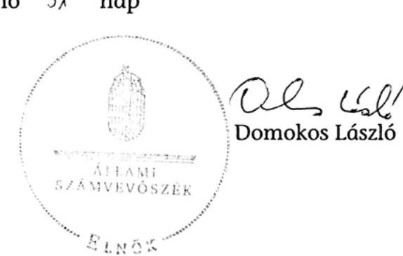
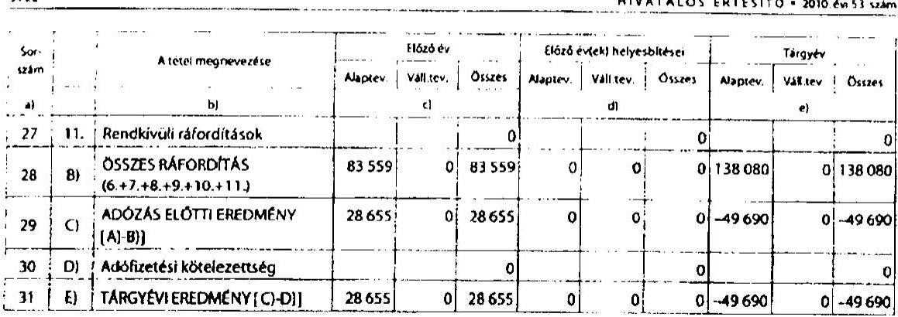
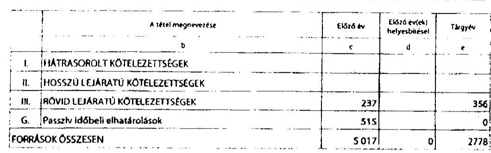
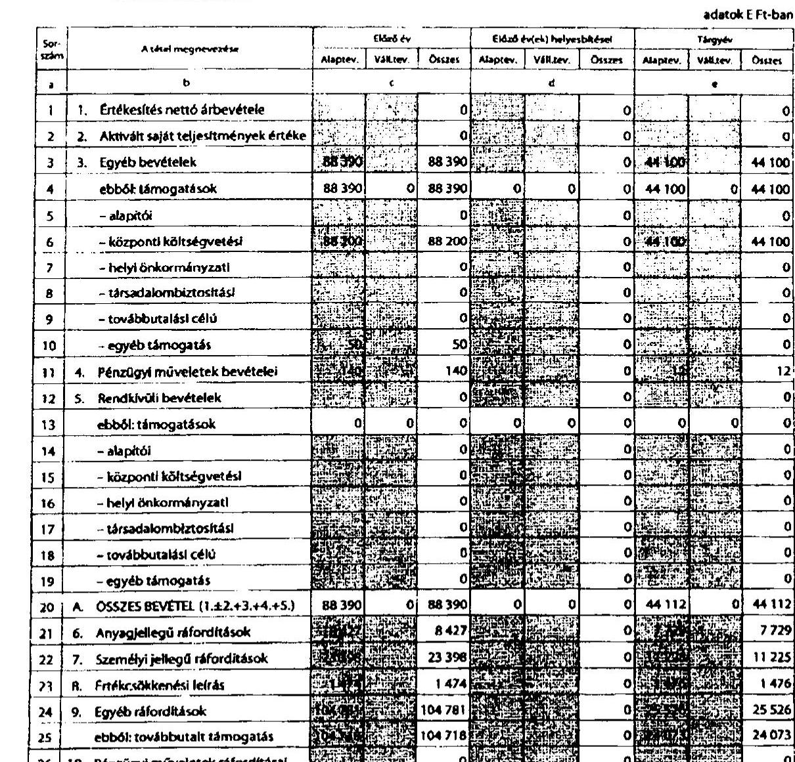

# ÁLLAMI   SZÁMVEVŐSZÉK 

## JELENTÉS

a Szabó Miklós Tudományos, Ismeretterjesztő, Kutatási és Oktatási Szabadelvú Alapítvány 2009-2010. évi gazdálkodása törvényességének ellenőrzéséről

---

# Állami Számvevőszék 

Iktatószám: V-0008-051/2012.
Témaszám: 1047
Vizsgálat-azonosító szám: V-0580

## Az ellenőrzést felügyelte:

## Horváth Balázs

felügyeleti vezető

## Az ellenőrzés végrehajtásáért felelős:

## dr. Veress Tiborné

ellenőrzésvezető

## A jelentés összeállításában közremúködtek:

## Dr. Fónagy Diána

számvevő tanácsos

## Robák Ferencné

számvevő tanácsos

## Az ellenőrzést végezték:

## Dr. Fónagy Diána Robák Ferencné   számvevő tanácsos

A témához kapcsolódó eddig készített számvevőszéki jelentések:
címe
sorszáma
Jelentés a Szabó Miklós Alapítvány 2003-2004. évi gazdálkodása 0559
törvényességének ellenőrzéséről
Jelentés a Szabó Miklós Alapítvány 2005-2006. évi gazdálkodása 0749
törvényességének ellenőrzéséről
Jelentés a Szabó Miklós Alapítvány 2007-2008. évi gazdálkodása 0955
törvényességének ellenőrzéséről

---

# TARTALOMJEGYZÉK 

BEVEZETÉS ..... 5
I. ÖSSZEGZŐ MEGÁLLAPÍTÁSOK, KÖVETKEZTETÉSEK, JAVASLATOK ..... 7
II. RÉSZLETES MEGÁLLAPÍTÁSOK ..... 12

1. Az alapítvány gazdálkodásának törvényessége ..... 12
1.1. A kuratórium működése ..... 12
1.2. Az alapítvány bevételei ..... 13
1.3. Az alapítvány ráfordításai ..... 14
2. A számviteli beszámolók ..... 17
2.1. A számviteli beszámolók ..... 17
2.2. A mérleg ..... 18
2.3. Az eredménykimutatás ..... 19
3. A könyvvezetés szabályozottsága ..... 19
4. A könyvvezetés gyakorlata ..... 20
5. Az alapítvány ellenőrzési rendszere ..... 22
6. A korábbi ellenőrzés megállapításaira tett intézkedések ..... 22

## MELLÉKLETEK

1. számú A Szabó Miklós Tudományos, Ismeretterjesztő, Kutatási és Oktatási Szabadelvű Alapítvány közzétett 2009. évi beszámolója (7 oldal)
2. számú A Szabó Miklós Tudományos, Ismeretterjesztő, Kutatási és Oktatási Szabadelvű Alapítvány közzétett 2010. évi beszámolója (8 oldal)

---

.

---

# RÖVIDÍTÉSEK JEGYZÉKE 

alapítvány
ÁSZ
éves beszámoló
kormányrendelet
könyvelőiroda
pártalapítványi törvény
párttörvény
Ptk.
számviteli rendelet

SZDSZ
Szt.
támogatási szabályzat

Szabó Miklós Tudományos, Ismeretterjesztő, Kutatási és Oktatási Szabadelvű Alapítvány
Állami Számvevőszék
Egyszerűsített éves beszámoló
Az alapítványok gazdálkodási rendjéről szóló 115/1992. (VII. 23.) Kormányrendelet (hatályon kívül helyezte a 350/2011. (XII. 30.) Korm. rendelet, hatálytalan 2012. január 1. óta)
2011. február 28-ig a könyvelési és ügyviteli feladatokkal megbízott gazdasági társaság, amelynek munkatársát a kuratórium elnöke az ÁSZ helyszíni ellenőrzéshez kapcsolattartónak kijelölte
A pártok múködését segítő tudományos, ismeretterjesztő, kutatási, oktatási tevékenységet végző alapítványokról szóló 2003. évi XLVII. törvény
A pártok múködéséről és gazdálkodásáról szóló 1989. évi XXXIII. törvény
A Polgári Törvénykönyvről szóló 1959. évi IV. törvény
A számviteli törvény szerinti egyes egyéb szervezetek beszámoló készítési és könyvvezetési kötelezettségeinek sajátosságairól szóló 224/2000. (XII. 19.) Korm. rendelet
Szabad Demokraták Szövetsége - a Magyar Liberális Párt
A számvitelről szóló 2000. évi C. törvény
A 2008. április 1-jétől hatályos támogatási szabályzat

---

.

---

# JELENTÉS 

## a Szabó Miklós Tudományos, Ismeretterjesztő, Kutatási és Oktatási Szabadelvű Alapítvány 2009-2010. évi gazdálkodása törvényességének ellenőrzéséről

## BEVEZETÉS

A pártok múködését segítő tudományos, ismeretterjesztő, kutatási, oktatási tevékenységet végző alapítványokról szóló 2003. évi XLVII. törvény (pártalapítványi törvény) alapján, a pártok politikai kultúra fejlesztése érdekében tudományos, ismeretterjesztő, kutatási és oktatási tevékenységük elősegítésére alapítványt hozhattak létre. Az alapítvány költségvetési támogatásra jogosultságáról, a támogatás formáiról és mértékéről a pártok múködéséről és gazdálkodásáról szóló 1989. évi XXXIII. törvény (párttörvény) rendelkezik. A Szabad Demokraták Szövetsége - a Magyar Liberális Párt (SZDSZ) a törvényben biztosított lehetőséggel élve 2003. évben hozta létre a Szabó Miklós Tudományos, Ismeretterjesztő, Kutatási és Oktatási Szabadelvű Alapítványt (alapítvány).

Az alapítvány alapító okirat szerinti céljai: a modern, európai liberális politikai kultúra magyarországi népszerűsítése; a modern, európai liberális politikai kultúra hazai társadalmi viszonyoknak megfelelő átültetése, újrafogalmazása; liberális politikai kultúrát fejlesztő programok készítése; a pluralista, demokratikus és toleráns politikai kultúra terjesztése.

Az alapítvány a törvényi előírásoknak megfelelően a 2009. évben 88,2, a 2010. évben 44,1 millió Ft költségvetési támogatásban részesült. Az alapító nem szerezte meg a 2010. évi országgyűlési választások első fordulóján a szavazáson részt vevő választók szavazatának 1\%-át, így az alapítvány a párttörvényben foglaltak alapján 2010. június 30 -ig volt jogosult költségvetési támogatásra.

A pártalapítványi törvény 4. § (2) bekezdése alapján az alapítvány gazdálkodása törvényességének ellenőrzésére az Állami Számvevőszék (ÁSZ) jogosult. A pártalapítványi törvény 4. § (4) bekezdése alapján az ÁSZ kétévenként ellenőrzi azoknak az alapítványoknak a gazdálkodását, amelyek e törvény szerint költségvetési támogatásban részesültek. Az ÁSZ legutóbb a 2009. évben az alapítvány 2007-2008. évi gazdálkodásának törvényességét ${ }^{1}$ ellenőrizte.

[^0]
[^0]:    ${ }^{1} 0955$ számú, a Szabó Miklós Tudományos, Ismeretterjesztő, Kutatási és Oktatási Szabadelvű Alapítvány 2007-2008. évi gazdálkodása törvényességének ellenőrzéséről szóló jelentés.

---

Az ellenőrzés hiányosságokat állapított meg az éves költségvetési tervek elfogadása, a támogatási szerződések tartalma, a nyújtott támogatások szerződés szerinti elszámoltatása és ellenőrzése, a magánszemélyeknek nyújtott támogatások nyilvántartása, a számviteli politika és az értékelési szabályzat összhangja tekintetében.

Jelen ellenőrzés célja volt az alapítvány 2009-2010. évi gazdálkodása törvényességének értékelése, amelynek keretében ellenőriztük:

- az alapítvány gazdálkodásának és éves jelentéseinek törvényességét;
- az éves számviteli beszámolók jogszabályi előírásoknak való megfelelését;
- az alapítvány könyvvezetésében a számvitelről szóló 2000. évi C. törvény (számviteli törvény), a pártalapítványok könyvvezetésére vonatkozó jogszabályok, valamint belső előírások betartását;
- a kuratórium megtette-e a szükséges intézkedéseket az ÁSZ előző ellenőrzése során feltárt hiányosságok megszüntetése, valamint az intézkedési tervben megjelölt feladatok végrehajtása érdekében.

Az ellenőrzést a pénzügyi-szabályszerúségi ellenőrzés módszertani szabályai szerint, a pártalapítványok ellenőrzéséhez kiadott segédletbe foglalt egységes követelmények alapján végeztük. Tételesen ellenőriztük a költségvetési támogatást, a kapott adományokat, az egymillió Ft és e feletti tételeket, azon továbbadott támogatásokat, melyek éves szinten kedvezményezettenként összesítve elérték az egymillió Ft-ot. Mintavétel alapján ellenőriztük az alapítvány ráfordításait, az egymillió Ft alatti támogatásokat. Az ellenőrzési tapasztalatok kiértékelésénél a pártalapítványok ellenőrzési segédletében megjelölt 2\%-os lényegességi küszöböt alkalmaztuk.

---

# I. ÖSSZEGZŐ MEGÁLLAPÍTÁSOK, KÖVETKEZTETÉSEK, JAVASLATOK 

Az alapító párt az alapítvány alapító okiratát az ellenőrzött időszak elején módosította az alapítvány képviselői, valamint a kuratórium összetétele vonatkozásában. A kuratórium 2010. június 17-i ülésén az elnök és két tag lemondott. Az SZDSZ a 2011. április 1-jei alapítói határozatában megállapította, hogy a másik két kuratóriumi tag is benyújtotta lemondását. A pártalapítványi törvényben foglaltak alapján, az alapítvány kuratóriumának folyamatos múködése érdekében az új négytagú kuratórium tagjait kijelölték. A nyilvántartásba vételre irányuló kérelmet a Fővárosi Bíróság 2011. december 20-án elutasította, mivel az alapító a hiánypótlási felhívásnak az arra nyitva álló határidőre - meghosszabbítása ellenére - nem tett eleget. A kuratórium 2010. június 18-tól nem ülésezett, hatáskörébe tartozó gazdálkodási döntéseket nem hozott. Az operatív tevékenységet ellátó munkaszervezet 2011 áprilisáig megszűnt, mivel az ügyvezető felmondott. A kuratórium múködése, üléseinek rendje a 2009. és a 2010. években megfelelt a Ptk. vonatkozó előírásainak, az alapító okiratban foglaltaknak. A kuratórium az alapító okiratban meghatározott feladata ellenére nem határozta meg az alapítvány gazdálkodási elveit. Az alapítvány 2009. évi tevékenységéről szóló jelentésben foglaltakat elfogadta, azonban a 2010. évi tevékenységéről szóló jelentés elfogadásáról a pártalapítványi törvény és alapító okirat előírásainak megsértésével nem döntött. Az alapító okirat szerint a kuratórium minden évben február 28-ig köteles az alapítónak írásban beszámolni az alapítvány előző évi múködéséről, amelynek teljesítése mindkét évben elmaradt.

Az ellenőrzött időszakban az alapítvány az éves beszámolóiban összesen 132502 ezer Ft bevételt mutatott ki, amelynek $99,8 \%$-a a központi költségvetésből származott. A kuratórium a pártalapítványi törvény előírásának megfelelően jóváhagyta a 2009. évben a csatlakozóktól kapott összesen 50 ezer Ft támogatást, ebből 25 ezer Ft nem a támogató pénzforgalmi számlájáról érkezett. Az alapítványnak a szabálytalanul elfogadott támogatást a törvényi előírásnak megfelelően a költségvetés javára be kell fizetnie. Ugyanakkor nem érvényesíthető a törvény azon rendelkezése, hogy az alapítvány költségvetési támogatását azonos összeggel csökkenteni kell, mivel 2010 júliusától nem jogosult arra.

Az alapítvány a párttörvényben és az alapító okiratban meghatározott célokra az ellenőrzött időszakban összesen 184036 ezer Ft ráfordítást számolt el, amely 51534 ezer Ft-tal haladta meg bevételét. A ráfordítások forrását a 2008. évben vásárolt értékpapírból és eredménytartalékból, valamint a rendelkezésre álló pénzeszközökből biztosították. Az alapítvány cél szerinti feladatainak megvalósítására 157879 ezer Ft-ot (85,8\%), múködésre 26157 ezer Ft-ot (14,2\%) fordított. A kuratórium a támogatásokról minden esetben - a támogatási kérelmek alapján - az alapító okirat előírásainak betartásával döntött. Az ügyvezető a támogatások odaítéléséről szóló döntések előkészítésekor a támogatási szabályzatban előírtak ellenére nem készített előterjesztést.

---

Az ellenőrzött támogatási szerződések (52 darab) 9,6\%-a nem felelt meg a kuratórium által hozott határozatoknak. Az alapítvány a támogatásokat a szerződésben meghatározott összegekben, de nem az abban rögzített határidőben, hanem azon túl folyósította az ellenőrzött szerződések 7,7\%-ánál. Hét támogatott 2160 ezer Ft összegű támogatásról nem készített elszámolást, amelynek hiányában nem igazolt a szerződésben rögzített célszerinti felhasználás. Két támogatottat eredménytelenül szólítottak fel hiánypótlásra, illetve a támogatás visszafizetésére. A támogatási szabályzatban foglaltak ellenére öt esetben sem az ügyvezető, sem a könyvelőiroda nem tett intézkedéseket. Az elszámolások az ellenőrzött támogatások 24,1\%-ánál nem feleltek meg a támogatási szabályzat, illetve a szerződések előírásainak. A szerződéses céltól való eltéréshez a támogatási szerződést nem módosították.

Az alapítvány a jogszabályi előírásoknak és a belső szabályzatoknak megfelelően határidőben elkészítette az egyszerűsített éves beszámolókat. A számviteli alapelvek érvényesítésével elkészített beszámolók megbízható, valós adatokat tartalmaztak az alapítvány gazdálkodásáról. A mérleg és eredménykimutatás sorait alátámasztották a kapcsolódó analitikus és főkönyvi nyilvántartások összegei. Az éves mérlegekben kimutatott eszközök és források értékadatait a leltározási szabályzat szerinti leltárakkal, az eredmény-kimutatásban kimutatott bevételeket és ráfordításokat könyvelési alapbizonylatokkal támasztották alá. Az éves beszámoló és a kötelezően elkészített éves jelentés tartalma megfelelt a jogszabályi előírásoknak. Az alapítvány az éves beszámolót is tartalmazó éves jelentéseit a pártalapítványi törvénynek megfelelően a Magyar Közlöny Hivatalos Értesítőjében nyilvánosságra hozta, de a honlapján való megjelentetés nem volt ellenőrizhető, mivel azt már megszüntették.

Az alapítvány rendelkezett az Szt-ben előírt számviteli politikával és ahhoz kapcsolódó szabályzatokkal. Az ellenőrzött időszakban módosították a leltá-rozási- és selejtezési, valamint a pénzkezelési szabályzatot. A számviteli politikát annak ellenére nem aktualizálták, hogy abban rögzítették a kétévenkénti felülvizsgálatot. A számviteli politika és az értékelési szabályzat egymástól eltérően rendelkezett a terven felüli értékcsökkenés elszámolásáról. A pénzkezelési szabályzat nem követte az alapító okirat módosítását a bankszámla feletti rendelkezés aláírásra jogosultjainak változásában. A számlarend nem az alapítványi sajátosságoknak megfelelően tartalmazta a használatra kijelölt főkönyvi számlákat.

A könyvvezetést a kettős könyvvitel rendszerében, mindkét évben azonos számítógépes programmal végezték, a gazdasági eseményeket idősorrendben, könyvelési alapbizonylatokkal alátámasztva rögzítették. A könyvvezetést alátámasztó bizonylatoknál részben érvényesítették a jogszabály által előírt alaki és tartalmi követelményeket. Egyes bizonylatokon a kifizetések engedélyezése, a könyvelés igazolása, a könyvviteli nyilvántartásokban történt rögzítés időpontja hiányzott. A számlakijelölés gyakorlata összhangban volt a vonatkozó jogszabályi előírásokkal, kivéve a 2009. évi ösztöndíj kifizetések kontírozását. A belső szabályzatokban előírt egyedi nyilvántartásokat vezették, a főkönyvi adatokkal való egyeztetését elvégezték. A házipénztár működtetése az előírtaknak megfelelően történt. A szigorú számadású nyomtatványokat a pénzkezelési szabályzat szerint nyilvántartották.

---

Az ellenőrzési feladatokat az alapító okiratban, a támogatási szabályzatban és a bizonylati szabályzatban határozták meg. A támogatások felhasználásának az ellenőrzése az alapító okiratban foglaltak alapján a kuratórium kizárólagos döntési jogkörébe tartozott, azonban erre vonatkozóan döntést nem hozott. A támogatási szabályzat szerint a pénzügyi és szakmai beszámolót az ügyvezetőnek kellett elfogadnia és ezzel egyidejúleg ellenőriznie a szükséges dokumentumok teljes körűségét Az ügyvezető elmulasztotta az elszámolások elfogadására vonatkozó feladatának ellátását. A könyvelőirodával kötött szerződésben a bizonylatok ellenőrzése és az elszámolások felülvizsgálata szerepelt ellenőrzési feladatként, amelyet az ellenőrzött 126321 ezer Ft támogatás 76\%-a vonatkozásában teljesített.

Az ÁSZ előző ellenőrzésekor tett javaslataira intézkedési tervet nem készítettek, a kuratórium elnöke a számvevőszéki jelentéstervezetre adott észrevételeivel egyidejűleg jelezte, hogy azok megvalósítására intézkednek. A költségvetési terv elfogadására és az ösztöndíjak könyvelésére vonatkozó javaslatokat végrehajtották. Részben valósították meg a felhasználás tartalmi és pénzügyi ellenőrzésének dokumentálására tett javaslatot. Nem történt intézkedés a terven felüli értékcsökkenés elszámolására vonatkozó szabályok összehangolására a számviteli politikában és az értékelési szabályzatban. A támogatási szabályzatban és a megkötött szerződésekben továbbra sem írták elő a nyújtott támogatás és annak felhasználása könyvviteli elkülönítésének kötelezettségét.

Az Állami Számvevőszékről szóló 2011. évi LXVI. törvény 33. § (1) bekezdésében foglaltak értelmében a jelentésben foglalt megállapításokhoz kapcsolódó intézkedési tervet köteles az ellenőrzött szervezet vezetője összeállítani és azt a jelentés kézhezvételétől számított harminc napon belül az ÁSZ részére megküldeni. Amennyiben az intézkedési tervet határidőben nem küldi meg a szervezet, vagy az továbbra sem elfogadható, az ÁSZ elnöke a hivatkozott törvény 33. § (3) bekezdés a)- b) pontjaiban foglaltakat érvényesítheti.

Az ellenőrzés intézkedést igénylő megállapításai és javaslatai:

# az Alapítvány kuratóriumának 

1. A pártalapítványi törvényben foglaltak alapján, az alapítvány kuratóriumának folyamatos működése érdekében az új négytagú kuratórium tagjait az alapító kijelölte. A nyilvántartásba vételre irányuló kérelmet a Fővárosi Bíróság 2011. december 20-án elutasította, mivel az alapító a hiánypótlási felhívásnak az arra nyitva álló határidőre - meghosszabbítása ellenére - nem tett eleget.

Javaslat
Kezdeményezze az alapító felé - a Ptk. 74/B. § (5) bekezdésben foglaltak alapján az alapító okirat módosításának nyilvántartásba vételét.
2. Az alapítvány 2010. évi tevékenységéről szóló jelentés elfogadásáról a pártalapítványi törvényben és az alapító okiratban foglaltak ellenére a kuratórium nem döntött, a honlapján való megjelentetés nem volt ellenőrizhető, mivel azt már megszüntették.

---

Javaslat
Tegyen eleget az éves beszámoló elfogadására és megjelentetésére vonatkozó előírásoknak a pártalapítványi törvény 3/A. § (2) és (5) bekezdésében, az alapító okirat X. f) pontjában foglaltak szerint.
3. A kuratórium az alapító okiratban meghatározott feladata ellenére nem határozta meg az alapítvány gazdálkodási elveit, az alapító felé beszámolási kötelezettségét nem teljesítette.

Javaslat
Döntsön az alapító okirat X. g) pontjában foglalt gazdálkodási elvekről, valamint tegyen eleget a VI. 7. pontban előírt beszámolási és adatszolgáltatási kötelezettségének.
4. A kuratórium a pártalapítványi törvény előírása ellenére jóváhagyott 25 ezer Ft öszszegű nem a támogató pénzforgalmi számlájáról érkezett csatlakozói támogatást.

Javaslat
Intézkedjen a pártalapítványi törvény 3. § (5) bekezdésében foglaltak értelmében a 3. § (3) bekezdés rendelkezésének megsértésével elfogadott 25 ezer Ft támogatás központi költségvetés javára történő befizetéséről 15 napon belül.
5. A számviteli politika és az értékelési szabályzat egymástól eltérően rendelkezett a terven felüli értékcsökkenés elszámolásáról. A pénzkezelési szabályzat nem követte az alapító okirat módosítását a bankszámla feletti rendelkezés aláírásra jogosultjainak változásában. A számlarend nem az alapítványi sajátosságoknak megfelelően tartalmazta a használatra kijelölt főkönyvi számlákat.

Javaslat
Teremtse meg az összhangot az alapító okirat és a pénzkezelési szabályzat, a számviteli politika és az értékelési szabályzat között, gondoskodjon az alapítványi sajátosságoknak megfelelően a számlarend módosításáról, figyelemmel az Szt. 161. §-ában foglaltakra.
6. Hét támogatott 2160 ezer Ft összegű támogatásról nem készített elszámolást, amelynek hiányában nem igazolt a szerződésben rögzített célszerinti felhasználás.

Javaslat
Intézkedjen, hogy a támogatottak a támogatási szabályzat 5. pontjának érvényesítésével készítsék el a támogatások felhasználásáról szóló elszámolást.
7. A kuratórium egyetlen támogatás esetében sem hozott a támogatások felhasználásának ellenőrzésére vonatkozó döntést.

Javaslat
Tegyen eleget az alapító okirat X. j.) pontjában előírt ellenőrzési kötelezettségének.

---

8. Az elszámolások az ellenőrzött támogatások 24,1\%-ánál nem feleltek meg a támogatási szabályzat, illetve a szerződések előírásainak. A szerződéses céltól való eltéréshez a támogatási szerződést nem módosították.

Javaslat
Vizsgálja felül a szerződéstől eltérő felhasználásokat annak érdekében, hogy a célszerinti felhasználás követelménye, vagy a támogatás visszafizetése teljesüljön.

---

# II. RÉSZLETES MEGÁLLAPÍTÁSOK 

## 1. AZ ALAPÍTVÁNY GAZDÁLKODÁSÁNAK TÖRVÉNYESSÉGE

### 1.1. A kuratórium múködése

Az SZDSZ az alapítvány alapító okiratát az ellenőrzött időszakban egy alkalommal, 2009. január 14-én módosította - a Ptk. 74/B. § (5), a 74/C. § (1), és (3) bekezdésének rendelkezéseivel összhangban - az alapítvány képviselői, valamint a kuratórium összetétele vonatkozásában. Az alapító okirat módosításának bírósági nyilvántartásba vételéről szóló végzés 2009. január 30-án emelkedett jogerőre.

A kuratórium 2010. június 17-i ülésén készült jegyzőkönyv szerint a kuratórium elnöke és további két jelenlévő tagja lemondott. Az alapítvány ügyvezetője 2010. szeptember 6-án levélben fordult az SZDSZ elnökéhez - többek között az új kuratórium megválasztása és a székhelyváltozás miatti alapítói döntések meghozatala érdekében. Az SZDSZ 1/2011. (IV. 1.) számú alapítói határozatában az alapító képviselője megállapította, hogy a további két kuratóriumi tag is benyújtotta lemondását. Az SZDSZ a pártalapítványi törvény 3. § (7) bekezdésben foglaltak alapján az új négytagú kuratórium tagjait 2011. április 1-jén jelölte ki. Az alapító okirat módosításának nyilvántartásba vételét székhelyváltoztatás, az alapítói képviselet- és a kuratóriumváltozás vonatkozásában kérték. A Fővárosi Bíróság a kérelmezőt hiánypótlásra hívta fel. A hiánypótlásra nyitva álló határidő - meghosszabbítása ellenére - eredménytelenül telt el, mert a kuratóriumi tagok lemondó nyilatkozatait nem tudták hiánytalanul becsatolni. Ezért a Fővárosi Bíróság az alapító okirat módosításnak nyilvántartásba vételére irányuló kérelmet 2011. december 20-án elutasította. Az alapító mulasztásából fakadóan az alapítvány szabályszerű működésének feltételei fokozatosan megszűntek. A kuratórium a 2009. évi beszámolót, valamint az éves jelentést elfogadta, azonban az alapítvány 2010. évi tevékenységéről szóló jelentés és az éves beszámoló elfogadásáról a pártalapítványi törvény 3/A. § (2) bekezdésében és az alapító okirat X. f) pontjában foglalt előírás ellenére amely szerint ennek elfogadása a kuratórium kizárólagos hatáskörébe tartozik - nem döntött. Az alapítvány beszámolóját és tevékenységéről szóló jelentést a Hivatalos Értesítőben történt közzététel szerint „az alapítvány vezetője" fogadta el.

A kuratórium üléseinek rendje a 2009. és a 2010. években megfelelt az alapító okirat XI. pontja előírásainak. A kuratórium a 2009. évben összesen hat alkalommal ülésezett, 81 határozatot hozott. Az alapítvány tevékenységéről szóló jelentés szerint a 2010. évben a kuratórium az alapító okirat XI. a.) pontjában minimálisan előírt évi két ülést tartotta meg, ezeken összesen 20 határozatot hozott. A határozatokat mindkét évben - egy 2009. évi határozat kivételével, melyet a jelenlévők többsége szavazott meg - a jelenlévő kuratóriumi tagok egyhangúlag fogadták el.

---

A helyszíni ellenőrzés során a 2010. június 17 -én tartott kuratóriumi ülés jelenléti ívét átadták, azonban jegyzőkönyv aláírt példánya nem állt rendelkezésre. A hiányzó jegyzőkönyv kivételével a kuratóriumi ülésekről készített jegyzőkönyvek, valamint a határozatok tára megfeleltek az alapító okirat előírásainak. A kuratórium 2010. június 17 -ét követően nem ülésezett. A képviseleti jog és a bankszámla feletti rendelkezés múködése megfelelt az alapító okirat rendelkezéseinek. Az alapító okirat 2009. januári módosítását azonban a pénzkezelési szabályzat 6 . pontján nem vezették át, így az a kuratórium új elnöke helyett annak korábbi elnöke nevét tartalmazta az ügyvezetővel együttesen a bankszámla felett rendelkezésre jogosultként.

Az alapító okirat XII. 1. pontja szerint az alapítvány képviseletét az egyik kuratóriumi tag (önállóan), valamint az ügyvezető, mint alkalmazott (önállóan) látták el. Az elektronikus ügyfélterminál használatára az alapítvány képviseletére jogosultak a számlavezető pénzintézettel 2009. február 5-én új szerződést kötöttek. Az ellenőrzés kérésére a szerződéshez tartozó banki aláírási kartont nem tudták bemutatni, azonban a banki terminál múködtetése során az alapító okirat XII. 4. pontjának megfelelő együttes rendelkezésre volt szükség.

A kuratórium az alapító okirat X. g) pontjában meghatározott feladata ellenére egyik vizsgált évben sem fogadott el az alapítvány gazdálkodási elveit tartalmazó határozatot, azonban az éves költségvetések elfogadásáról - a korábbi ÁSZ javaslatot végrehajtva - mindkét évben döntött. A költségvetési tervek tartalmazták a bevételeket, az alapítvány feladatainak minden fő területére vonatkozóan a várható ráfordításokat, valamint a múködtetés során felmerülő költségeket. Az ellenőrzött időszakban az alapítvány két főt foglalkoztatott, akiknek munkaviszonya 2010. július 20-án, illetve 2011. április 5-én (rendkívüli felmondással) megszűnt. A kis létszámú munkaszervezet indokolta, hogy az alapítvány nem készített szervezeti és múködési szabályzatot. Az alapító okirat meghatározta a kuratórium múködését. A munkavállalók munkaszerződése kijelölte a munkáltatói jogok gyakorlóját, munkaköri leírásuk meghatározta feladataikat. Az ellenőrzött időszakban a kuratórium gazdálkodást érintő döntései a pártalapítványi törvényben és az alapító okiratban megjelölt cél szerinti tevékenységek ellátását szolgálták.

# 1.2. Az alapítvány bevételei 

Az ellenőrzött időszakban az alapítvány az éves beszámolóiban összesen 132502 ezer Ft bevételt mutatott ki. Az alapítvány bevétele mindkét évben alapvetően a költségvetési támogatásból származott, a 2009. évben az összes bevétel $99,8 \%$-át, a 2010 . évben közel $100,0 \%$-át tette ki.

|  | Adatok: ezer Ft-ban |  |  |
| :-- | :--: | :--: | :--: |
| Megnevezés | $\mathbf{2 0 0 9}$. | $\mathbf{2 0 1 0}$. | Összesen |
| Költségvetési támogatás | 88200 | 44100 | 132300 |
| Csatlakozói adományok | 50 | 0 | 50 |
| Pénzügyi múveletek bevétele | 140 | 12 | 152 |
| Összes bevétel | $\mathbf{8 8} \mathbf{3 9 0}$ | $\mathbf{4 4 1 1 2}$ | $\mathbf{1 3 2 5 0 2}$ |

---

Az alapítvány a párttörvény 9/A. § (3) bekezdésében foglaltak alapján 2010. június 30 -ig volt jogosult költségvetési támogatásra. Az alapítványnak kiutalt támogatás összege és annak folyósítása megfelelt a párttörvény 9/A. § (2), (4) és (5) bekezdésében foglalt rendelkezéseknek.

A kuratórium a pártalapítványi törvény 3. § (2) bekezdése és az alapító okirat IV.1. pontjában foglalt előírásnak megfelelően jóváhagyta a 2009. évben a csatlakozóktól kapott összesen 50 ezer Ft támogatást. Azonban a 3. § (3) bekezdésben foglaltakat megsértve egy 2009. március 25-i 25 ezer Ft-os támogatás nem a támogató pénzforgalmi számlájáról, hanem bankpénztári befizetés útján érkezett. A pártalapítványi törvény 3. § (5) bekezdésében előírtak értelmében a törvénysértő módon „elfogadott támogatást - az ÁSZ felhívására - 15 napon belül a központi költségvetésnek be kell fizetni". Mivel az alapítvány 2010. év júliusától költségvetési támogatásra nem jogosult, nem érvényesíthető a pártalapítványi törvényben szereplő szankciók közül, hogy „az alapítvány költségvetési támogatását az elfogadott támogatás értékét kitevő összeggel az Állami Számvevőszék felhívását követő negyedévben csökkenteni kell." A támogatók személye mindkét esetben a hozzájárulások beérkezésekor a bankszámla kivonatok alapján egyértelműen azonosítható volt. A csatlakozók nem jelölték meg adományaik konkrét célját, így azok az alapítvány alapító okiratában meghatározott feladatokra voltak felhasználhatók, ezzel igazodtak a párttörvény 9/A. § (1) bekezdésében és az alapító okiratban meghatározott célokhoz. A pártalapítványi törvény 3. § (4) bekezdésének megfelelően nem kellett a csatlakozóktól kapott támogatásokat közzétenni, mert összegük nem haladta meg az 500 ezer Ft-ot.

# 1.3. Az alapítvány ráfordításai 

Az alapítvány a párttörvényben és az alapító okiratban meghatározott célokra az ellenőrzött időszakban összesen 184036 ezer Ft költséget és ráfordítást számolt el. Az alapítvány bevételét 51534 ezer Ft-tal meghaladó ráfordítását a 2008. évben vásárolt értékpapír beváltásából és eredménytartalékából, valamint a rendelkezésére álló pénzeszközeiből fedezte. A kuratórium az alapítvány által végzendő cél szerinti tevékenységekről a költségvetés keretében, annak elfogadásával, továbbá egyedi határozatokkal döntött.

Az ellenőrzött időszakban az alapítvány cél szerinti feladatainak megvalósítására 157879 ezer Ft-ot $(85,8 \%)$, múködésre 26157 ezer Ft-ot $(14,2 \%)$ fordított.

|  | Adatok: ezer Ft-ban |  |  |
| :-- | --: | --: | --: |
| Megnevezés | $\mathbf{2 0 0 9 .}$ | $\mathbf{2 0 1 0 .}$ | Összesen |
| Cél szerinti tevékenység közvetlen költségei | 120486 | 29074 | 149560 |
| Cél szerinti tevékenység közvetett költségei | 4496 | 3823 | 8319 |
| Múködési költség | 13098 | 13059 | 26157 |
| Összes ráfordítás | $\mathbf{1 3 8 0 8 0}$ | $\mathbf{4 5 9 5 6}$ | $\mathbf{1 8 4 0 3 6}$ |

A bevételek csökkenése miatt az alapítvány a 2010. évben közvetlenül támogatásra a 2009. évi támogatásnak alig az egynegyedét fordította.

---

Az ellenőrzött években a működési költségek azonos szinten alakultak (13 098 ezer, illetve 13059 ezer Ft). Működési költségként az ügyvezető bérköltségét és ennek járulékait és az igénybevett könyvviteli és ügyvédi szolgáltatások kiszámlázott értékét számolták el. Az alapítvány céljait kizárólag továbbadott támogatások révén valósította meg. A honlap múködtetéséért felelős munkatárs bére és ennek járulékai a cél szerinti tevékenység közvetett költségei között szerepelt.

Az alapító okirat VI. 3. pontja szerint az alapítvány céljai megvalósítása érdekében saját kezdeményezésére, kérelemre (egyedi elbírálásban), valamint pályázati kiírások alapján (az azokon eredményesen szereplők részére) nyújtott támogatásokat. A saját kezdeményezésre nyújtott támogatások aránya a 2009. évi $46 \%$-ról a 2010. évben az összes támogatás $60 \%$-ra nőtt. A pályázat alapján kifizetett támogatások aránya a 2009. évi $8 \%$-ról a 2010. évre $4 \%$-ra csökkent.

A kuratórium a támogatások nyújtásának feltételeit a támogatási szabályzatban határozta meg, amelyet a 2009. és a 2010. években annak ellenére nem módosított, hogy a korábbi ÁSZ ellenőrzés javasolta, hogy a támogatási szerződésekben írják elő a nyújtott támogatás és annak felhasználása könyvviteli elkülönítésének kötelezettségét.

A kuratórium a szervezetek és a magánszemélyek részére nyújtott támogatásokról minden esetben az alapító okirat előírásainak betartásával döntött, azonban az ügyvezető a támogatások odaítéléséről szóló döntések előkészítésekor - a pályázatok összesítésén kívül - a támogatási szabályzat 2. pontjában előírtak ellenére nem készített bírálati javaslatot és értékelést is tartalmazó előterjesztést. Az ügyvezető a döntések megalapozásához - az előterjesztések helyett - a támogatási kérelmeket adta át a kuratórium tagjainak. A támogatási kérelmek elbírálásáról szóló kuratóriumi határozatok - sorszám és dátum alapján - egyértelműen beazonosíthatóak voltak. A kuratórium döntéséről a támogatottakat a támogatási szerződéstervezet megküldésével értesítették. A támogatottakkal kötött szerződést minden esetben a képviseletre jogosult írta alá.

Az alapítvány betartotta a támogatási szabályzatnak a támogatásnyújtás feltételeire, a szerződéskötésre vonatkozó rendelkezéseit. A támogatási szerződésekben megjelölte a támogatott nevét, a támogatási célt, a támogatás összegét, az elszámolás határidejét, módját, valamint a szerződésszegés esetén alkalmazandó szankciókat.

Az ÁSZ a 2009. évi 23, a 2010. évi 29 támogatás kifizetéséhez kapcsolódóan ellenőrizte a szerződéseket és elszámolásokat. Az ellenőrzött támogatási szerződések 9,6\%-át nem a kuratóriumi határozatok tartalmával egyezően kötötték meg.

A 2/2009. (III. 4.) számú kuratóriumi határozat szerint a Liberális Klubok a megítélt támogatást egy összegben kapják meg. A Kecskeméti Liberális Klubbal az alapítvány úgy kötötte meg a 180 ezer Ft támogatásról szóló szerződést, hogy az a kifizetés ütemezéséről nem rendelkezett. 2009. március 18-án 93 ezer Ft kifizetést az alapítványnál annak ellenére előlegként könyveltek, hogy erre vonatkozó rendelkezést sem a támogatási szabályzat, sem a liberális klubok elszámolási

---

rendjéről szóló szabályzat nem tartalmazott. A támogatott a támogatás összegével utóbb elszámolt, illetve a fel nem használt támogatást visszafizette.

Az 5/2010. (VI. 17.), a 32/2009. (XI. 25.) számú határozatokban magánszemélyek kutatásainak támogatásáról döntött a kuratórium. Ezzel szemben - ezen határozatok alapján - a 2010. évben négy gazdasági társasággal kötött megbízási szerződést az alapítvány az eredetileg a magánszemélyek számára meghatározott feladatok elvégzésére. ${ }^{2}$

A 2009. és a 2010. évi támogatásként kifizetett 149061 ezer Ft 85,0\%-át, 126321 ezer Ft összeget ellenőriztük.

A könyvelőiroda munkatársa 2010. december 31-ig - a Republikon Intézet Kftnek nyújtott támogatás kivételével - megbízási szerződése szerint ellenőrizte a támogatási szerződés szerinti felhasználások szabályosságát az elszámoláshoz beküldött pénzügyi és szakmai beszámolók, a támogatott szervezet által hitelesített és záradékolt bizonylatok, valamint a kifizetéseket igazoló bankszámlakivonatok és pénztárbizonylatok alapján.

A támogatottak a felhasználásról az ellenőrzött támogatások 10,6\%-ával, 13376 ezer Ft-tal késedelmesen számoltak el. Ebből négy (liberális hét rendezvénysorozat, 760 ezer Ft) esetben azonban az elszámolás késedelmét a támogatás nem szerződés szerinti időben történt kifizetése okozta.

A Liberális hét Somogy, Zala, Tolna és Borsod-Abaúj-Zemplén megyei rendezvényeinek támogatásáról szóló szerződésekben foglaltakkal szemben az alapítvány a 2008. december 31-i határidőn túl, 2009. február 17-én, illetve március 2-án utalta ki a támogatást.

A szerződésekben meghatározott cél szerinti felhasználásról hét támogatásra (2160 ezer Ft, amely az ellenőrzött támogatások 126321 ezer Ft összegének $1,7 \%$-a) vonatkozóan az ellenőrzés nem tudott meggyőződni, mivel a könyvelőiroda az elszámolást alátámasztó dokumentummal nem rendelkezett. Az alapítvány képviseletére nem jogosult könyvelőiroda az elszámolással nem rendelkező támogatottak közül kettőt szólított föl az elszámolásra, illetve a támogatás visszafizetésére. A támogatási szabályzat 5.7. pontjában foglaltak ellenére öt esetben sem az ügyvezető, sem a könyvelőiroda nem szólította fel a támogatottat a hiánypótlásra.

Az ellenőrzött elszámolások 30472 ezer Ft összegben nem feleltek meg a szerződési, illetve a belső szabályzati előírásoknak.

A Jelenkutatások Alapítvány elszámolása összesen 5158 ezer Ft-ról nem felelt meg a szerződések előírásának, mert a támogatott szervezet a 2009. július 5-én, a 2009. október 13-án és a 2010. március 9-én kelt támogatási szerződések 7. pontjában foglaltak ellenére ${ }^{3}$ ösztöndíjak kifizetését számolta el az alapítvány felé.

[^0]
[^0]:    ${ }^{2}$ A határozattól eltérő tartalmú szerződéskötésre a kapcsolattartó tájékoztatása szerint az ügyvezető az adójogszabályok megváltozására tekintettel adott lehetőséget.
    ${ }^{3}$ Amely szerint a támogatott magánszemélyek részére juttatást nem adhat, személyi jellegű kifizetést nem teljesíthet.

---

Az alapítvány a Republikon Intézet Kft-vel a 2009. február 5-én kötött támogatási szerződés 5. pontjában foglaltak szerint meghatározott témákban elemzések és tanulmányok készítését és kutatások elvégzését támogatta. Ennek ellenére a támogatott szervezet összesen 13532 ezer Ft-ot - a 2009. évben folyósított támogatásnak a 30\%-át - múködési költségeire ${ }^{4}$ számolt el. A Republikon Intézet Kft-vel a 2010. évben kötött szerződések már tartalmazták, hogy a támogatás 50\%-át a kutatási tevékenységgel kapcsolatos múködési, járulékos, kiegészítő költségekre fordíthatja.

A támogatási szabályzat 5.3. pontjában előírtak ellenére két támogatás (Budai Liberális Klub, Somogyi Liberális Klub) esetében - 11776 ezer Ft - nem csatoltak szakmai beszámolót az elszámolásokhoz. A Mosonmagyaróvári Liberális Klub a támogatási szerződés 2. pontjában foglaltak ellenére, mely szerint a rendezvények vendéglátási kiadása az összes költség 10\%-a lehet támogatás, 13\%-ot (6 ezer Ft) számolt el.

A kuratórium az éves költségvetések elfogadásával a múködési költségek keretösszegét meghatározta.

A 2009. évben 11290 ezer Ft-ot, a 2010. évben 11868 ezer Ft-ot terveztek a múködési költségekre, amely munkabért és járulékait, a könyvelési és ügyvédi, nyomdai és postai, banki és irodaszer költségeket, valamint szoftverbérleti díjat tartalmazott.

Az alapítványnál közbeszerzési eljárást nem folytattak le, mivel közbeszerzési értékhatárt elérő beszerzés nem volt.

# 2. A SZÁMVITELI BESZÁmolÓK 

### 2.1. A számviteli beszámolók

Az alapítvány egyszerűsített éves beszámolóit (éves beszámoló) a kettős könyvvitel rendszerében, a számviteli politikában meghatározott formában, a számviteli törvény szerinti egyes egyéb szervezetek beszámolókészítési és könyvvezetési kötelezettségeinek sajátosságairól szóló 224/2000. (XII. 19.) Korm. rendelet (számviteli rendelet) 6. § előírásait betartva készítette el. Az alapítvány a 2009. évi éves beszámolóját a kuratórium az 1/2010. (VI. 10.) számú határozatával egyhangú döntéssel elfogadta. A 2010. évi beszámoló elfogadására nem került sor (részletesen: 1.1. pontban).

Mindkét évben érvényesültek a beszámoló összeállítására vonatkozó Szt-ben foglalt alapelvek. Az éves beszámolók adatai az év végi főkönyvi kivonatok adataival egyeztethetőek voltak, a beszámoló sorok adatai megegyeztek a kapcsolódó főkönyvi számlák, az analitikus nyilvántartások adataival.

Az alapítvány elkészítette a pártalapítványi törvény 3/A. § (1) bekezdése szerinti éves jelentéseit a 3/A. § (3) bekezdésében előírt tartalommal. A jelentéseket a 3/A. § (5) bekezdésének megfelelően a Magyar Közlöny Hivatalos Értesítőjében nyilvánosságra hozta.

[^0]
[^0]:    ${ }^{4}$ Irodabérleti díj, rezsiköltség, élelmiszer, takarítás és takarítószer

---

Az éves beszámolókat az év végi főkönyvi kivonatok, a kapcsolódó főkönyvi számlák és az analitikus nyilvántartások adataival megegyezően jelentették meg.

Az alapítvány az éves beszámolókat a Hivatalos Értesítő 2010. július 1-jei 53. és a 2011. április 11-i 27. számában tette közzé.

Az ellenőrzés nem tudta megállapítani a pártalapítványi törvény 3/A. § (5) bekezdése előírásának teljesítését, mivel a helyszíni ellenőrzés idején az alapítvány honlapja már nem múködött.

# 2.2. A mérleg 

Az ellenőrzött években a mérlegsorok adatai megegyeztek a kapcsolódó analitikus és főkönyvi nyilvántartások összesített adataival. Az éves mérlegekben kimutatott eszközök és források értékadatait az Szt. 69. § előírásával összhangban, a leltározási szabályzat szerinti leltárakkal alátámasztották. A leltározást mindkét évben a leltározási szabályzatnak megfelelően, egyeztetéssel elvégezték.

Az alapítvány az immateriális javak és tárgyi eszközök állományát, valamint a tervszerinti értékcsökkenést a számviteli politika szerinti részletezettségben mutatta ki. Az ellenőrzött időszakban az immateriális javak és tárgyi eszközök egyedi nyilvántartása összhangban volt a belső szabályzatok - a számviteli politika, a számlarend és a leltározási szabályzat - előírásaival. Az ellenőrzött időszakban eszközbeszerzés nem történt. A 2010. évben elszámolt terven felüli értékcsökkenés nem felelt meg a számviteli politika előírásának.

A számviteli politika szerint az alapítvány terven felüli értékcsökkenést nem alkalmaz. A 2010. évi mérlegben az alapítvány 1093 ezer Ft terven felüli értékcsökkenést számolt el. A rendkívüli gazdasági eseménnyel kapcsolatban a kuratórium nem határozott. A könyvelőiroda alkalmazottja úgy nyilatkozott, hogy az ügyvezető döntésének megfelelően, az eszközök értékét az alapítvány könyveiből terven felüli értékcsökkenésként kivezették.

Az értékelési szabályzat szerint a mérlegben behajthatatlan követelést nem lehet kimutatni, ennek ellenére egy szervezet - elszámolási kötelezettségének elmulasztása miatt - függő tételként nyilvántartott 360 ezer Ft-os támogatását 2010. december 31-én behajthatatlan követelésként az alapítvány könyveiből kivezették.

A függő tétel már az előző ÁSZ ellenőrzés időszakában, a 2008. évben is szerepelt az alapítvány főkönyvi kivonatában. A rendkívüli gazdasági eseménnyel kapcsolatban a kuratórium nem határozott. A könyvelőiroda alkalmazottja úgy nyilatkozott, hogy az ügyvezető döntésének megfelelően, a függő tételt az alapítvány könyveiből behajthatatlan követelésként kivezették.

A pénzeszközök mérlegben kimutatott értéke megegyezett az év végi pénztárjelentés záró pénzkészletének és a december 31-i bankkivonat egyenlegének öszszegével. A teljesség elve érvényesítésével szerepelt a mérlegben valamennyi vagyontárgy, követelés és kötelezettség, az eszközök és források értékelése során

---

betartották az óvatosság és a valódiság elvét, a vizsgált éveket érintő értékcsökkenést elszámolták.

A mérlegben az induló tőkét az alapító okirat által meghatározott induló vagyon értékének megfelelően mutatták ki.

# 2.3. Az eredménykimutatás 

Az ellenőrzött években az eredménykimutatás sorok adatai a főkönyvi kivonatok, illetve a vonatkozó főkönyvi és részletező számlák összesített adataival megegyeztek. A bevételek és ráfordítások elszámolása bizonylatok alapján történt.

A számviteli rendelet 17. § (4) bekezdésének megfelelően a bevételeken belül az állami költségvetésből származó támogatás és a pénzügyi műveletek bevételei, 2009-ben emellett a magánszemélyektől kapott támogatás a főkönyvi kivonat adataival és a bankkivonatok értékeivel megegyeztek. A főkönyvi könyvelés bevételei bizonylattal, analitikus nyilvántartással alátámasztottak voltak. Az eredmény-kimutatásban szerepeltetett ráfordításokat könyvelési alapbizonylatokkal (szerződések, szállítói számlák, bér feladások) támasztották alá. Az eredmény-kimutatás az adott sorokon elszámolható bevételek, illetve ráfordítások fogalomkörébe tartozó tételeket tartalmazott. Az alapítvány - az előző ÁSZ ellenőrzés javaslatának megfelelően - az Szt. 79. § (3) bekezdése szerint mutatta ki a magánszemélyeknek juttatott ösztöndíjakat a személyi jellegű ráfordítások között.

Az alapító okirat alapján a kuratóriumi tagok tiszteletdíjban nem részesültek, az alapítványnak a kezelő szervhez (kuratórium) kapcsolódó költsége nem volt. A banki átutalásokat a kijelölt kuratóriumi tag és az ügyvezető elektronikus aláírásával a könyvelői irodánál múködtetett terminálról kezdeményezték.

## 3. A KÖNYVVEZETÉS SZABÁLYOZOTTSÁGA

Az alapítvány könyvvezetése és az éves beszámolók elkészítésének belső szabályozási rendszere az Szt. által kötelezően előírtakon alapult. Az Szt. 14. § (3)-(5) bekezdések előírásával összhangban az alapítvány rendelkezett számviteli politikával, leltárkészítési és leltározási-, pénzkezelési szabályzattal, továbbá az Szt. 161. §-ban foglalt számlarenddel. A szabályzatokat az Szt. 14. § (12) és a 161. § (4) bekezdésével, valamint belső szabályzataival összhangban a képviseletre jogosult ügyvezető írta alá.

A 2008. január 1-jétől hatályos számviteli politika megfelelt az Szt. vonatkozó rendelkezéseinek és az alapítványok gazdálkodási rendjéről szóló 115/1992. (VII. 23.) Korm. rendelet ${ }^{5}$ (kormányrendelet) előírásainak.

[^0]
[^0]:    ${ }^{5}$ A kormányrendeletet hatályon kívül helyezte a 350/2011. (XII. 30.) Korm. rendelet, hatálytalan 2012. január 1 óta.

---

A szabályzatban foglaltak szerint a számviteli politikát kétévenként felül kell vizsgálni, amelyért az Szt. 14. § (12) bekezdésében foglaltak szerint az alapítvány képviseletére jogosult a felelős.

Az alapítvány 2009. november 1-jei hatállyal módosította a leltározási és selejtezési szabályzatát a kuratórium 2/2009. (X. 6.) számú határozata alapján. Az előző ÁSZ ellenőrzés javaslatának megfelelően meghatározta a leltárfelvételi módokat, de a hatásköröket továbbra sem rögzítették.

A 2009. január 1-jével módosított pénzkezelési szabályzatban az elektronikus átutalások rendjéről szóló előírások megfeleltek az Szt. 14. § (8) bekezdés rendelkezéseinek. A napi készpénz záró állomány maximális mértékét az Szt. 14. § (9) bekezdésével összhangban határozták meg. A pénzkezelési szabályzat 2.2. pontja értelmében az utalványozási jogkört a kuratóriumi elnök, az ügyvezető, illetve az ellenőrzésük mellett az általuk megbízott személy gyakorolhatta.

A szabályzat azonban nem követte az alapító okirat változását a banki utalások aláírására jogosultak meghatározásában (részletesen: 1.1. pontban). A szabályzat rendelkezett a szigorú számadás alá vont bizonylatok köréről, nyilvántartási szabályairól. A bankszámla forgalom bonyolításának előírásaiban meghatározták, hogy az alapítvány a bankszámláról történő utalásait banki ügyfélterminálon keresztül bonyolítja.

A 2006. január 1-jétől hatályos számlarend és a számlatükör részben tartalmazta az alkalmazásra kijelölt számlák számjelét és megnevezését, a számlák tartalmát, a számlákat érintő gazdasági eseményeket, azok más számlákkal való kapcsolatát. A számlarend és a számlatükör nem az alapítványi sajátosságoknak megfelelően tartalmazta a főkönyvi számlákat. A feltüntetett számlák közül hiányoztak a ténylegesen - elsősorban a célszerinti tevékenység gazdasági eseményeinek rögzítésénél - alkalmazott számlák, míg másokat, melyek az alapítványi gazdálkodásra nem jellemzőek szerepeltettek benne. A számlarend folyamatos karbantartásáért az Szt. 161. § (4) bekezdése alapján az alapítvány képviseletére jogosult a felelős.

A hatályos számlarend a magánszemélyek és a szervezetek részére nyújtott támogatások számviteli elszámolási rendjére vonatkozóan sem egyértelmú előírásokat, sem az érintett számlákkal való kapcsolatot nem tartalmazta. Ugyanakkor - az alapítvány gazdálkodásába nem illő módon - részletesen szabályozta a tulajdoni részesedést jelentő befektetéseket.

A számlarend és a 2008. január 1-jétől hatályos értékelési szabályzat változatlanul - a számviteli politikával ellentétesen - tartalmazta a terven felüli értékcsökkenés szabályait. Az ÁSZ korábbi javaslata ellenére az alapítvány nem teremtette meg a terven felüli értékcsökkenésre vonatkozóan a szabályzatok összhangját.

# 4. A KÖNYVVEZETÉS GYAKORLATA 

Az ellenőrzött időszakban az alapítvány könyvvezetési kötelezettségét a kettős könyvvitel rendszerében, a számviteli bizonylatok számítógépes feldolgozása alapján teljesítette. A feladatot az alapítástól kezdve azonos külső számviteli szolgáltató látta el.

---

Az éves beszámolók összeállítását, valamint a bérszámfejtést a könyvelőiroda végezte. A könyvelőirodánál rendelkeztek az Szt. 151. § (1) bekezdésében előírt képesítéssel, az alkalmazottak a könyvviteli szolgáltatást végzőkről vezetett nyilvántartásban szerepeltek.

A könyvelési rendszerből az ellenőrzéshez szükséges adatok lekérdezhetők voltak, az alkalmazott számítógépes könyvelőprogram az ellenőrzött időszakban nem változott. A gazdasági eseményeket idősorrendben rögzítették, a könyvelt tételek alapbizonylatai megtalálhatóak voltak. A könyvvezetésben - a kormányrendelet 3. § (1) és (2) bekezdéseiben előírtaknak megfelelően - az alapítványi célú tevékenység közvetlen és közvetett (működési jellegű) költségeit a főkönyvi könyvelés keretében elkülönítették.

Az alapítvány az Szt. 167. § (1) bekezdésében a bizonylatok alaki és tartalmi kellékeire vonatkozó előírásokat nem teljes körűen tartotta be:

- a 2009. évben a bizonylatok 8,2\%-án a pénztári kifizetések esetén az utalványozó aláírása, 21,4\%-án a könyvviteli nyilvántartásokban történt rögzítés időpontja, 27,5\%-án a könyvviteli nyilvántartásokban történt rögzítés igazolása hiányzott;
- a 2010. évben a bizonylatok 8,2\%-án a könyvviteli nyilvántartásokban történt rögzítés időpontja, 2,0\%-án a könyvviteli nyilvántartásokban történt rögzítés igazolása hiányzott;
- a 2009. év novemberéig a magánszemélyeknek kifizetett ösztöndíjak tételeinél a bizonylatokon szereplő számlakijelölés helytelen volt, de utána - az előző ÁSZ ellenőrzés javaslata alapján - megfelelt az Szt. 79. § (3) bekezdése szerinti előírásnak. A teljes ellenőrzött időszakban az ösztöndíjak könyvelése a törvény szerint történt.

Az éves beszámolók elkészítését megelőzően a számviteli politikában megjelölt könyvviteli zárlati feladatokat elvégezték. A szabályzatban rögzített év végi zárlati feladatok tartalmazták az Szt. 164. § (1) bekezdésében előírt, a számlák technikai lezárására vonatkozó rendelkezéseket, a mérleg- és eredményszámlákat év végén lezárták. Az immateriális javak és tárgyi eszközök éves terv szerinti értékcsökkenését elszámolták, az év végi aktív és passzív időbeli elhatárolásokat megállapították és elszámolták. A könyvviteli számlákból főkönyvi kivonatot készítettek, és elvégezték az eszköz, forrás és eredmény számlák technikai zárását. Az Szt. és a leltározási szabályzat előírásainak megfelelően a készpénzállományt mennyiségi felvétellel, a főkönyvi számláknak az analitikus nyilvántartásokkal történt egyeztetése útján, az egyéb eszköz és forrás tételeket egyeztetéssel leltározták. A leltározás eredményét összevetették a vezetett nyilvántartásokkal. A leltározások során leltárkülönbözet nem volt, selejtezésre nem került sor. Az alapítvány házipénztárának működtetése a pénzkezelési szabályzatban előírtaknak megfelelően történt. Az Szt. 14. § (9) bekezdésével és a pénzkezelési szabályzattal összhangban meghatározott 500 ezer Ft-os napi pénztári zárókészlet összegét egy esetben sem lépték túl, a pénztárjelentéseket elkészítették. A pénztárjelentéseken a pénztárellenőr aláírása nem szerepelt. A pénztár által használt szigorú számadású nyomtatványok nyilvántartása, azok vezetése megfelelt az Szt. 168. § (3) bekezdésében előírt feltételeknek.

---

# 5. Az alapítVÁNY ELLENŐRZÉSI RENDSZERE 

Az alapító a kuratórium ellenőrzésére jogosult szervet nem jelölt ki, erre vonatkozó jogszabályi kötelezettsége nem volt.

A munkaszervezet kis létszáma ( 2 fő foglalkoztatott), továbbá a könyvviteli és adminisztrációs feladatok megbízás alapján, külső szervezet útján való ellátása függetlenített belső ellenőrzés létrehozását nem indokolta.

Az alapító okirat VI. 7. pontja szerint a kuratórium minden évben február 28-ig köteles az alapítónak írásban beszámolni az alapítvány előző évi múködéséről. A kuratórium egyik évben sem tett eleget az alapító okiratban előírt beszámolási kötelezettségének.

A támogatási szabályzat szerint a pénzügyi és szakmai beszámolót az ügyvezetőnek kellett elfogadnia - az általa, vagy az általa megbízott személy, vagy szervezet számszaki és tartalmi ellenőrzését követően - és ezzel egyidejúleg ellenőriznie a szükséges dokumentumok hiánytalanságát. A támogatások célszerinti felhasználásának az ellenőrzése az alapító okirat X. j) pontjában foglaltak alapján a kuratórium kizárólagos döntési jogkörébe tartozott.

Az ügyvezető nem látta el az elszámolások elfogadásra vonatkozó feladatát. A kuratórium egyetlen támogatás esetében sem hozott a támogatások felhasználásának ellenőrzésére vonatkozó döntést, azonban hét - a könyvelőiroda által ellenőrzött elszámolás elfogadásáról döntött.

A bizonylatok ellenőrzésének feladatait a bizonylati szabályzatban határozták meg.

Előírták az aláírók jogosultságának, a bizonylatok alaki, tartalmi és számszaki helyességének, valamint könyveléshez szükséges bizonylatok teljes körűségének és a munkafolyamatba épített ellenőrzés megtörténtének dokumentálását.

Az alkalmazottak (ügyvezető, honlap múködtetéséért felelős munkatárs) munkaköri leírása nem tartalmazott ellenőrzési feladatokat. A könyvelőirodával kötött szerződésben „a megbizó által szolgáltatott alapbizonylatok" ellenőrzése és a beérkezett elszámolások felülvizsgálata szerepelt ellenőrzési feladatként. A szerződésben a megbízott anyagi felelősségét (kártérítési kötelezettségét) a mulasztása következtében az alapítványt terhelő bírság fizetés erejéig kötötték ki. A könyvelőiroda az ÁSZ által ellenőrzött 126321 ezer Ft támogatás $76 \%$-a vonatkozásában teljesítette a tartalmi és számszaki ellenőrzést.

A folyamatba épített vezetői ellenőrzést az ügyvezető a munkáltatói jogkör és egy kuratóriumi taggal közösen a képviseleti-, a kötelezettségvállalási- és a bankszámla feletti rendelkezési jogok gyakorlása során látta el.

## 6. A KORÁBBI ELLENŐRZÉS MEGÁLLAPÍTÁSAIRA TETT INTÉZKEDÉSEK

Az alapítvány az ÁSZ előző ellenőrzésekor tett öt javaslatára intézkedési tervet nem készített. A kuratórium elnöke a számvevőszéki jelentéstervezetre adott észrevételeivel egyidejúleg jelezte, hogy a javaslatok megvalósítására intézkednek.

---

Végrehajtották a költségvetési terv elfogadására és az ösztöndíjak könyvelésére vonatkozó javaslatokat.

A kuratórium az 1/2009. (III. 4.) és a 11/2010. (III. 9.) számú határozataival elfogadta az alapítvány a 2009. és a 2010. évi költségvetési terveit.

Az ösztöndíjak a számvitelről szóló 2000. évi C. törvény 79. § (3) bekezdésének előírásának megfelelően a személyi jellegű egyéb ráfordítások között kerültek nyilvántartásra.

Részben valósították meg a szerződés szerinti következetes elszámoltatásról és a felhasználás tartalmi és pénzügyi ellenőrzésének dokumentálásáról szóló javaslatot, mert egyrészt az ellenőrzött szerződések 13,5\%-ára vonatkozó elszámolást a kapcsolattartó nem tudott átadni, másrészt a Republikon Intézet Kft. elszámolását nem ellenőrizték.

Nem történt intézkedés a terven felüli értékcsökkenés elszámolására vonatkozó szabályok összehangolására a számviteli politikában és az értékelési szabályzatban. Továbbá nem hajtották végre azt a javaslatot, amely szerint a szabályzatokban elő kell írni, hogy a támogatási szerződések tartalmazzák a támogatottak könyvvezetésében a támogatás és annak felhasználása elkülönítésének kötelezettségét.

Budapest, 2012. O 3 hó 3,1 nap

Melléklet: $\quad 2 \mathrm{db}$

---

# IX. Hirdetmények 

## Mérlegbeszámolók

## A Szabó Miklós Tudományos, Ismeretterjesztő, Kutatási és Oktatási Szabadeivũ Alapitvány 2009. évi pénzügyi beszámolója

Jelentés a Szabó Miklós Tudományos, Ismeretterjesztő, Kutatási és Oktatási Szabadeivũ Alapitvány 2009. évi tevékenységéról a 2003. évi XLVII. törvényben elöirtak szerint

A pártok müködését segitő tudományos, ismeretterjesztő, kutatási, oktatási tevékenységet végző alapitványokról szóló 2003. évi XLVI. tơrvény 3/A. §-a elöirásának megfelelően a Szabó Miklós Tudományos, Ismeretterjesztő, Kutatási és Oktatási Szabadeivũ Alapitvány (a továbbiakban: Alapitvány) elkészítette és közzéteszi a 2009. évi tevékenységéról szóló jelentést, mely tartalmazza az Alapitvány egyszerúsített éves beszámolóját is. A jelentést az Alapitvány kuratóriuma 1/2010.06.17, számú határozatával egyhangúlag elfogadta.
A jelentés a 2003. évi XI.VII. törvény 3/A. § (3) bekezdésében meghatározott szerkezetet követi.
a) pont

A számvitoli törvény elökásai alapján készített egyszerüsitett éves beszámolót, amely mérlegbơl, eredménykimutatásból, valamint kiegészitő mellékletböl áll, az 1. és a 2. melléklet tartalmazza.
b) pont

A 2009. évi költségvetési támogatás felhasználására vonatkozó kimutatás
Cél szerinti tevékenység közvetlen költsége!
Ebbol:
Liberális klubok támogatása
Liberális hét rendezvénysorozat
Magánszemélyek kutatási tevékenységéhez nyújtottlámogatás
Külsó szervezetek támogatása
ebbol: Republikon intézet támogatása
Kutatások
Képzések, konferenclák, rendezvények
Kiadványok
Egyéb szervezetek támogatása
Cél szerinti tevékenység közvetett költsége!
Müködési költségek
Mindösszesen
c) pont

Kimutatás a Szabó Miklós Szabadeivũ Alapitvány vagyoni helyzetéröl
2008. év
2009. év

Induló tőke
Tökeválozás
Mérleg szerinti eredmény
Összesen
594
24706
28655
53955
594
53361
-49690
4265

Az Alapitvány saját tőkéje a beszámolási lơőszakban az elózó évhez képest csökkent.

---

d) pont

A 2009. évi cél szerinti juttatások kimutatása

Cél szerinti juttatás
(E forint)
Liberális klubok támogatása ..... 5904
Magánszemélyek kutatási tevékenységébiz nyújtott támogatás ..... 15765
Külső szervezetek támogatása - Republikan Intézet ..... 40000
Kutatások támogatása ..... 4000
Rendezvények támogatása ..... 49146
Kiadványok kiadásának támogatása ..... 1080
Egyéb szervezetek támogatása ..... 300
e) pont

A 2009. évi kapott támogatások kimutatása

A Szabó Miklós Tudományos, Ismeretterjesztő, Kutatási és Oktatási Szabadelvű Alapítvány 2009. évi költségvetési támogatása 88200 ezer Ft volt.
Az Alapítvány a központi költségvetésből származó normatív támogatáson túl más, a költségvetés alrendszereitől (elkülönített állami pénzalaptól, helyi önkormányzattól, települési önkormányzatok társulásától és mindezek szervezeteltől) származó támogatást nem kapott.
f) pont

Az Alapítvány vezető tisztségviselöinek nyújtott juttatások összege a 2009. évben

Az Alapítvány vezető tisztségviselöinek (ügyvezetőjének) nyújtott juttatás 2009. évben:
Munkabér és járulékai: 3149 ezer Ft.

Az Alapítvány kuratóriumának elnöke és tagjai semmilyen juttatásban és költségtérítésben sem részesültek.
g) pont

Az Alapítvány 2009. évi tevékenységéről szóló rövid tartalmi beszámoló

A Szabó Miklós Szabadelvü Alapítvány szellemi háttérintézményként föként a liberális eszmék, programok, politikák gondolati megalapozásában kap kitüntetett szerepet.
Az Alapítvány kutatásokat végez a magyar liberalizmus jelenlegi és múltbeli - szellemi, ideológiai, anyagi, infrastrukturális stb. - helyzetének felderítésére. Az Alapítvány fontosnak tartja, hogy segítsen megfogalmazni egy többé-kevésbé koherens, más nézetrendszerekzöl jól megkülönböztethető liberális politikai alternatívát. Feladatai között szerepel a politikai kultúra fejlesztése, politikai ismeretterjesztés, politikai napirend kutatások elemzése elvégzése. Az Alapítvány támogatja azt a véleményt, hogy a demokratikus pártok elérhető emlékanyaga a nemzeti kulturális örökség részét képezi, és kötelességének érzi, hogy támogassa a megőrzését. Ezeknól a területekről kiemeljük a Republikan Intézet és a Jelenkutatások Alapítvány támogatását.
Az Alapítvány célul tűzte ki liberális hálózat kiépítését az ország területén. Ennek megfelelően támogatja a már létező és az újonnan alakuló liberális klubokat, segitve ezzel a liberalizmus terjedését, egyben közösségépítő funkciót is betöltve. Az Alapítvány 2009-ben 48 Liberális Klub részére biztosított támogatást programjaik lebonyolításához. Az Alapítvány 2009-ben 15 szervezetnek ítélt meg támogatást könyv és folyóiratok kiadására, megjelentetésére, ismeretterjesztő és kulturális rendezvényekre. E támogatások közül kiemeljük a Beszélő folyóiratot, az Antirasszista Világnapot, az évek óta rendszeresen megrendezest nagykanizsal Liberális Bált. 2009-ben új kezdeményezésként értelmiségi találkozók, konferenciák megrendezését is támogatta az Alapítvány.

---

Az Alapítvány kiemelt céljának tekinti fiatalok bevonását az Alapítvány munkájába és a magyar liberalizmus erōsitésébe, s támogatja a liberális fiatalok különbözō kezdeményezéseit. 2009-ben 17 magánszemély részesült alapítványi támogatásban kutatási programjuk megvalósitására, többségük fiatal szakember.
Az Alapítvány a rendelkezésére álló összegeket fôként pályázatokra adott támogatás és ösztöndijak formájában költi el. Az Alapítvány kuratóriuma 2009-ben 6 alkalommal ülésezett, ülései minden alkalommal határozatképesek voltak, ülésein összesen 81 döntést hozott.
Az Alapítvány kuratóriumának elnöke 2009. januárjától dr. Fodor Gábor. A Kuratórium tagjai Csillag István, Juhász Pál, dr. Sándor Klára és Török Gusztáv Andor. Az Alapítvány ügyvezető igazgatója Koncz Imre.

Budapest, 2010. május 30.

Koncziinve s. k.,
Ugyvezzéd igazgató

# A Szabó Miklós Szabadelvü Alapítvány egyszerüsített éves beszámolója 2009. 

Az Alapítvány tevékenységéröl a 2003. évi XLVII. törvény 3/A. §-a szerint készült jelentés 1. sz. melléklete.
Szabó Miklós Szabadelvü Alapítvány - Mérleg
2009. év

|  | A tétel megnevezése | Előző év | Előző év(ek) helyeslétése | Tárgyév |
| :--: | :--: | :--: | :--: | :--: |
|  | ki | 0 | 45 | 45 |
| A) | Befektetett eszközök | 4917 | 0 | 3444 |
| 1. | Immateriális javak | 2534 |  | 1705 |
| II. | Tárgyi eszközök | 2383 |  | 1739 |
| III. | Befektetett pénzügyi eszközök |  |  |  |
| B) | Forgóeszközök | 49245 | 0 | 1573 |
| 1. | Készletek |  |  |  |
| 8. | Követelések | 446 |  | 446 |
| III. | Értékpapíruk | 40005 |  | 0 |
| IV. | Pénzeszközök | 8794 |  | 1125 |
| C) | Aktív lóbbeli elhatárolások | 660 |  | 2 |
| Eszközök összesen |  | 54822 | 0 | 5017 |
| D) | Saját tőke | 53955 | 0 | 4365 |
| 1. | Induló tőke | 594 |  | 594 |
| 8. | Tőkeváltozás | 24706 |  | 53361 |
| 81. | Lekötött tartalék |  |  |  |
| IV. | Értékelési tartalék |  |  |  |
| V. | Tárgyévt eredmény alaptevékenységböl | 28655 |  | $-49690$ |
| VI. | Tárgyévt eredmény vállalkozási tevékenységböl |  |  |  |
| E) | Céltartalékok |  |  |  |

---

|  | A sétel megnevezése |  |  |  |  |  |  |  |  |  |  |  |  |  |  |  |  |  |  |  |  |  |  |  |  |  |  |  |  |  |  |  |  |  |  |  |  |  |  |  |  |  |   |
| --- | --- | --- | --- | --- | --- | --- | --- | --- | --- | --- | --- | --- | --- | --- | --- | --- | --- | --- | --- | --- | --- | --- | --- | --- | --- | --- | --- | --- | --- | --- | --- | --- | --- | --- | --- | --- | --- | --- | --- | --- | --- | --- | --- | --- | --- |
|  F) | Kötelezettségek |  |  |  |  |  |  |  |  |  |  |  |  |  |  |  |  |  |  |  |  |  |  |  |  |  |  |  |  |  |  |  |  |  |  |  |  |  |  |  |  |  |  |   |
|  I. | Hátrasorolt kötelezettségek |  |  |  |  |  |  |  |  |  |  |  |  |  |  |  |  |  |  |  |  |  |  |  |  |  |  |  |  |  |  |  |  |  |  |  |  |  |  |  |  |  |  |   |
|  II. | Hosszú lejáratú kötelezettségek |  |  |  |  |  |  |  |  |  |  |  |  |  |  |  |  |  |  |  |  |  |  |  |  |  |  |  |  |  |  |  |  |  |  |  |  |  |  |  |  |  |  |   |
|  III. | Rövid lejáratú kötelezettségek |  |  |  |  |  |  |  |  |  |  |  |  |  |  |  |  |  |  |  |  |  |  |  |  |  |  |  |  |  |  |  |  |  |  |  |  |  |  |  |  |  |  |   |
|  G) | Passzív időbeli elhatárolások |  |  |  |  |  |  |  |  |  |  |  |  |  |  |  |  |  |  |  |  |  |  |  |  |  |  |  |  |  |  |  |  |  |  |  |  |  |  |  |  |  |  |  |   |
|  Források összesen |  |  |  |  |  |  |  |  |  |  |  |  |  |  |  |  |  |  |  |  |  |  |  |  |  |  |  |  |  |  |  |  |  |  |  |  |  |  |  |  |  |  |  |  |   |

# Eredménykimutatás

|  So-
szám |  | A sétel megnevezése |  |  |  |  |  |  |  |  |  |  |  |  |  |  |  |  |  |  |  |  |  |  |  |  |  |  |  |  |  |  |  |  |  |  |  |  |  |  |  |  |  |  |   |
| --- | --- | --- | --- | --- | --- | --- | --- | --- | --- | --- | --- | --- | --- | --- | --- | --- | --- | --- | --- | --- | --- | --- | --- | --- | --- | --- | --- | --- | --- | --- | --- | --- | --- | --- | --- | --- | --- | --- | --- | --- | --- | --- | --- |
|   |  |  |  |  |  |  |  |  |  |  |  |  |  |  |  |  |  |  |  |  |  |  |  |  |  |  |  |  |  |  |  |  |  |  |  |  |  |  |  |  |  |  |  |   |
|  el |  |  |  |  |  |  |  |  |  |  |  |  |  |  |  |  |  |  |  |  |  |  |  |  |  |  |  |  |  |  |  |  |  |  |  |  |  |  |  |  |  |  |  |  |   |
|  1 | 1. | Értékesítés nettó árbevétele |  |  |  |  |  |  |  |  |  |  |  |  |  |  |  |  |  |  |  |  |  |  |  |  |  |  |  |  |  |  |  |  |  |  |  |  |  |  |  |  |  |  |   |
|  2 | 2. | Aktívált saját teljesítmények értéke |  |  |  |  |  |  |  |  |  |  |  |  |  |  |  |  |  |  |  |  |  |  |  |  |  |  |  |  |  |  |  |  |  |  |  |  |  |  |  |  |  |  |   |
|  3 | 3. | Egyéb bevételek |  |  |  |  |  |  |  |  |  |  |  |  |  |  |  |  |  |  |  |  |  |  |  |  |  |  |  |  |  |  |  |  |  |  |  |  |  |  |  |  |  |  |   |
|  4 |  | ebből: támogatások |  |  |  |  |  |  |  |  |  |  |  |  |  |  |  |  |  |  |  |  |  |  |  |  |  |  |  |  |  |  |  |  |  |  |  |  |  |  |  |  |  |  |   |
|  5 |  | - alapítói |  |  |  |  |  |  |  |  |  |  |  |  |  |  |  |  |  |  |  |  |  |  |  |  |  |  |  |  |  |  |  |  |  |  |  |  |  |  |  |  |  |  |   |
|  6 |  | - központi költségvetési |  |  |  |  |  |  |  |  |  |  |  |  |  |  |  |  |  |  |  |  |  |  |  |  |  |  |  |  |  |  |  |  |  |  |  |  |  |  |  |  |  |  |   |
|  7 |  | - helyi önkormányzati |  |  |  |  |  |  |  |  |  |  |  |  |  |  |  |  |  |  |  |  |  |  |  |  |  |  |  |  |  |  |  |  |  |  |  |  |  |  |  |  |  |  |   |
|  8 |  | - társadalombiztosítási |  |  |  |  |  |  |  |  |  |  |  |  |  |  |  |  |  |  |  |  |  |  |  |  |  |  |  |  |  |  |  |  |  |  |  |  |  |  |  |  |  |  |   |
|  9 |  | - továbbutalási ceki |  |  |  |  |  |  |  |  |  |  |  |  |  |  |  |  |  |  |  |  |  |  |  |  |  |  |  |  |  |  |  |  |  |  |  |  |  |  |  |  |  |  |   |
|  10 |  | - egyéb támogatás |  |  |  |  |  |  |  |  |  |  |  |  |  |  |  |  |  |  |  |  |  |  |  |  |  |  |  |  |  |  |  |  |  |  |  |  |  |  |  |  |  |  |   |
|  11 | 4. | Pénzügyi műveletek bevételei |  |  |  |  |  |  |  |  |  |  |  |  |  |  |  |  |  |  |  |  |  |  |  |  |  |  |  |  |  |  |  |  |  |  |  |  |  |  |  |  |  |  |   |
|  12 | 5. | Rendkívüli bevételek |  |  |  |  |  |  |  |  |  |  |  |  |  |  |  |  |  |  |  |  |  |  |  |  |  |  |  |  |  |  |  |  |  |  |  |  |  |  |  |  |  |  |   |
|  13 |  | ebből: támogatások |  |  |  |  |  |  |  |  |  |  |  |  |  |  |  |  |  |  |  |  |  |  |  |  |  |  |  |  |  |  |  |  |  |  |  |  |  |  |  |  |  |  |   |
|  14 |  | - alapítói |  |  |  |  |  |  |  |  |  |  |  |  |  |  |  |  |  |  |  |  |  |  |  |  |  |  |  |  |  |  |  |  |  |  |  |  |  |  |  |  |  |  |   |
|  15 |  | - központi költségvetési |  |  |  |  |  |  |  |  |  |  |  |  |  |  |  |  |  |  |  |  |  |  |  |  |  |  |  |  |  |  |  |  |  |  |  |  |  |  |  |  |  |  |   |
|  16 |  | - helyi önkormányzati |  |  |  |  |  |  |  |  |  |  |  |  |  |  |  |  |  |  |  |  |  |  |  |  |  |  |  |  |  |  |  |  |  |  |  |  |  |  |  |  |  |  |   |
|  17 |  | - társadalombiztosítási |  |  |  |  |  |  |  |  |  |  |  |  |  |  |  |  |  |  |  |  |  |  |  |  |  |  |  |  |  |  |  |  |  |  |  |  |  |  |  |  |  |  |   |
|  18 |  | - továbbutalási ceki |  |  |  |  |  |  |  |  |  |  |  |  |  |  |  |  |  |  |  |  |  |  |  |  |  |  |  |  |  |  |  |  |  |  |  |  |  |  |  |  |  |  |   |
|  19 |  | - egyéb támogatás |  |  |  |  |  |  |  |  |  |  |  |  |  |  |  |  |  |  |  |  |  |  |  |  |  |  |  |  |  |  |  |  |  |  |  |  |  |  |  |  |  |  |   |
|  20 | A. | ÖSSZES BEVÉTEL
(1.±2.+3.+4.+5.) |  |  |  |  |  |  |  |  |  |  |  |  |  |  |  |  |  |  |  |  |  |  |  |  |  |  |  |  |  |  |  |  |  |  |  |  |  |  |  |  |  |  |   |
|  21 | 6. | Anyagjellegű ráfordítások |  |  |  |  |  |  |  |  |  |  |  |  |  |  |  |  |  |  |  |  |  |  |  |  |  |  |  |  |  |  |  |  |  |  |  |  |  |  |  |  |  |  |   |
|  22 | 7. | Személyi jellegű ráfordítások |  |  |  |  |  |  |  |  |  |  |  |  |  |  |  |  |  |  |  |  |  |  |  |  |  |  |  |  |  |  |  |  |  |  |  |  |  |  |  |  |  |  |   |
|  23 | 8. | Értékcsökkenési leírás |  |  |  |  |  |  |  |  |  |  |  |  |  |  |  |  |  |  |  |  |  |  |  |  |  |  |  |  |  |  |  |  |  |  |  |  |  |  |  |  |  |  |   |
|  24 | 9. | Egyéb ráfordítások |  |  |  |  |  |  |  |  |  |  |  |  |  |  |  |  |  |  |  |  |  |  |  |  |  |  |  |  |  |  |  |  |  |  |  |  |  |  |  |  |  |  |   |
|  25 |  | ebből: továbbutalt támogatás |  |  |  |  |  |  |  |  |  |  |  |  |  |  |  |  |  |  |  |  |  |  |  |  |  |  |  |  |  |  |  |  |  |  |  |  |  |  |  |  |  |   |
|  26 | 10. | Pénzügyi műveletek
ráfordításai |  |  |  |  |  |  |  |  |  |  |  |  |  |  |  |  |  |  |  |  |  |  |  |  |  |  |  |  |  |  |  |  |  |  |  |  |  |  |  |  |  |   |

---

Kiegészitö melléklet
a Szabó Miklós Tudományos Ismeretterjesztö, Kutatási és Oktatási Szabadelvü Alapítvány
2009. évl egyszerúsitett éves beszámolójához

Az Alapítvány tevékenységéröl a 2003. évl XI.VII. törvény 3/A. § szerint készült jelentés 2. sz. melléklete.
Általános összefoglalás
A kiegészitő melléklet a Szabó Miklós Szabadelvü Alapítvány 2009. január 1-jétől december 31-ig terjedő időszak tevékenységéről készült.
Jogszabályi háttérként a beszámoló, ezen belül a kiegészitő melléklet összeállításában a többször módosított 2000. évl C. törvény a számvitelről, valamint az érvényben levő adótörvények szolgáltak.

Az alapítvány 2004. január 30-án kezdte meg a tevékenységét.
Az alapítványt a Fővárosi Bíróság Pk. 61.077/2003 számon 9043. sorszám alatt vette nyilvántartásba.
A cég székhelye: 1143, Budapest Gizella út 30.
Adószáma: 18181483-1-42
T8-törzsszáma: 1477339012
Az Alapítvány induló vagyona: 594 ezer Ft.
Az Alapítvány alapítója: a Szabad Demokraták Szövetsége.
Az alapítvány célja: a modern, európai liberális politikai kultúra magyarországi népszerüsitése.
A mérlegkészités időpontja: 2010. május 30.

# A beszámolási kötelezettség és a könyvvezetés 

Az évközi adatfeldolgozást számítógéppel, a NIARA Kft. Sigma Contó programja segítségével végezte a Csúz és Társa Kft. a Szabó Miklós Szabadelvü Alapítvány megbizása alapján.
A 2009-es év gazdálkodásáról az Alapítvány egyszerúsitett éves beszámolót állított össze a számviteli törvényben rögzített elveknek megfelelően.
Bejegyzett könyvető: Csúz Barnabásné, 1202 Budapest, Bem u. 21. Nyilv. sz.: 136201
Az egyszerüsitett éves beszámoló mérlegből, eredménykimutatásból, kiegészitő mellékletből áll.
Az Alapítvány kettős könyvvitelt vezet, az eredménykimutatást összköltség eljárással állítja össze, beszerzéselt költségként számolja el.

## Az eszközök és források értékelése

Az értékelési elvek, eljárások az érvényes számviteli politikában rögzített szempontoknak megfelelőek. Az Alapítvány a valós értékelés elvét nem alkalmazza.
Az Alapítvány befektetett eszközei tárgyi eszközök (bútor) és vagyoni értékú jogok.
Befektetett pénzügyi eszközökkel, kamatozó értékpapáokkal az Alapítvány a beszámolási időszakban nem rendelkezett.

---

Készletek: az Alapitványnak a beszámolási időszakban nem volt készlete.
Követelések, kötelezettségek: bekerülési értéken kerültek a mérlegbe.
Az Alapítványnak nem volt határidőn tük, valamint kétes kinnlévősége.
A pénzeszközök: könyv szerinti (bekerülési) értéken szerepelnek a mérlegben.
A beszámolóban levő pénzeszközök közül a bankszámlák az év utolsó bankikivonatain szereplő összegekkel, a pénztár a tényleges pénzkészlettel egyezü értékkel került a mérlegbe.
Forgatási célú értékpapírral (diszkont kincstárjeggyel) az Alapítvány év végén nem rendelkezett.

A mérleghez és az eredménykimutatáshoz kapcsolódó elemzés

# A mérleg 

A mérlegfőösszeg az eszköz és forrás oldalon: 5017 ezer Ft.

## Eszközök

A befektetett eszközök
Az Alapítvány befektetett eszközeinek értéke a tárgyidőszak végén 3444 ezer Ft.
Az immateriális javak nettó értéke a mérlegfordulónapon 1705 ezer Ft.
A tárgyi eszközök nettó értéke a mérlegfordulónapon: 1739 ezer Ft.
A befektetett pénzügyi eszközök adatai
Befektetési célú értékpapírral, adott kölcsönnel, hosszú lejáratú bankbetéttel az Alapítvány a mérlegfordulónapon nem rendelkezett.
A forgóeszközök
A forgóeszközök állománya 1573 ezer Ft, melyböl 446 ezer Ft a követelések egyenlege. A követelések téves utalás miatti követelés összege, illetve magánnyugdíj-pénztári túlfizetés.
Készletek
Az Alapítványnak sem vásárolt, sem saját termelésú készlete nincs.
Értékpapírok
Az Alapítvány a mérlegfordulónapon 0 ezer Ft értékủ diszkont kincstárjeggyel rendelkezett.
Pénzeszközök
A pénzeszközök záró egyenlege:
Pénztár 267 ezer Ft.
Elszámolási betetszámla 858 ezer Ft.
Összeserc 1125 ezer Ft.

Aktív idöbeli elhatárolások
Mérlegértéke 2 ezer Ft a fordulónapon.

## Források

Saját tőke
Az Alapítvány induló vagyona 594 ezer Ft.
Tökeváltozás értéke évzáráskor: 53361 ezer Ft.
Lekötött tartalék: értéke évzáráskor 0 ezer Ft.
Mérleg szerinti eredmény
A tárgyévben az Alapítvány mérleg szerinti eredménye: -49690 ezer Ft.
Céltartalékok
2009-ben az Alapítvány céltartalékot nem képzett, nem minöskette kétesnek a kinnlévőségeit.
Kötelezettségek
Hosszú lejáratú kötelezettségek
Az alapítványnak hosszú lejáratú kötelezettsége nincs.
Rövid lejáratú kötelezettségek
Év végi záró állománya 237 ezer Ft, melynek összetétele: befizetési kötelezettség SZJA 112 ezer Ft, T8 99 ezer Ft, munkaaddi és munkevállalói járulék, EHO 26 ezer Ft.
Passzív idöbeli elhatárolások összege az év végén 515 ezer Ft.

---

# Az eredménykimutatás 

Az Alapítvány a Számviteli Törvény szerint egyéb szervezetnek minösül, ezért az eredménykimutatását az alapítványokra vonatkozó szabályok szerint készítette el. Az Alapítvány tárgyévben gazdálkodó tevékenységet nem folytatott, csak az alapítványi müködéséhez, az alapítványi célok megvalósításához szükséges kiadásai voltak. Kötségeit költségnemenként, összköltség eljárással számolja el.

## A bevételek bemutatása

Az Alapítvány állami költségvetésböl gazdálkodott. Az állami támogatásból származó bevétele 88200 ezer Ft, magánszemélyektől kapott támogatás 50 ezer Ft, a pénzügyi múveletek bevételei 140 ezer Ft, egyéb bevétei (támogatás-visszafizetés) 0 ezer Ft.
Az Alapítvány összes bevétele 88390 ezer Ft volt.
Az Alapítvány kiadásai az Alapítvány cél szerinti müködése és az Alapítvány müködési költségei szerint kerültek csoportosításra.
Az anyagjellegú ráfordítások összege 8427 ezer Ft.
Az anyagköltség 4 ezer Ft.
Az igénybe vett szolgáltatások összege 8174 ezer Ft.
Az egyéb szolgáltatások költsége 249 ezer Ft.
Az egyéb ráfordítások összege 104781 ezer Ft
Az egyéb ráfordítások részletezése
Liberális klubok támogatása 6054 ezer Ft.
Liberális hét támogatása 4291 ezer Ft.
Egyedi kérelemre adott támogatás 94376 ezer Ft.
Müködéssel kapcsolatos egyéb ráfordítás 60 ezer Ft.
A terv szerinti értékcsökkenési leírás 1474 ezer Ft. Az Alapítvány az értékcsökkenést lineáris módszertel számolja el. Az elszámolás évente egyszer, év végén történik.

## A létszám- és bérgazdálkodás főbb adatai

Az Alapítvány tárgyévben 2 alkalmazottat foglalkoztatott munkaviszonyban.
A bérköltség 5568 ezer Ft, a bérjárulékok 1743 ezer Ft. Az egyéb személyi jellegú kifizetések 322 ezer Ft, kutatási ösztöndíj 15765 ezer Ft.
A személyi jellegú ráfordítások tárgyévi összege 23398 ezer Ft.
Az alapítvány tárgyévi összes ráfordítása 138080 ezer Ft.
Az adózás előtti eredmény - 49690 ezer Ft.
Az Alapítványnak társasági aciófizetési kötelezettsége nincs, mivel gazdálkodási tevékenysége tárgyévben nem volt.

## Speciális kiegészítések

A beszámolási időszakban az Alapítványt az APEH, T8 nem ellenőrizte. Az Alapítvány bevallási és befizetési kötelezettségeinek maradéktalanul eleget tett.
2009 évtöl az Alapítvány elkészítette a vonatkozó törvényt elöírás szerinti jelentését.

Az Alapítvány kuantóriuma az alapítvány egyszerúsített éves beszámolóját és a tevékenységéről készített jelentést elfogadta.

---

# Jelentés a Szabó Miklós Tudományos, Ismeretterjesztő, Kutatási és Oktatási Szabadelvú Alapítvány 2010. évi tevékenységéről a 2003. évi XLVII. törvényben elölrtak szerint 

#### Abstract

A pártok müködését segitő tudományos, ismeretterjesztő, kutatási, oktatási tevékenységet végző alapitványokról szóló 2003. évi XLVII. törvény 3/A. § elölrásának megfelelően a Szabó Miklós Tudományos, Ismeretterjesztő, Kutatási és Oktatási Szabadelvú Alapítvány (a továbbiakban: Alapítvány) elkészítette és közzéteszi a 2010. évi tevékenységéről szóló jelentést, mely tartalmazza az Alapítvány egyszerúsített éves beszámolóját is. A jelentés a 2003. évi XLVII. törvény 3/A. § (3) bekezdésében meghatározott szerkezetet követl.

## a) pont

A számviteli tơrvény elơrrásai alapján készített egyszerúsített éves beszámolót, amely mérlegbơl, eredménykimutatásból, valamint kiegészitő mellékletből áll, az 1. és a 2. melléklet tartalmazza.
b) pont

A 2010. évi költségvetési támogatás felhasználására vonatkozó kimutatás

|  | (E forint) |
| :-- | --: |
| Cél szerinti tevékenység közvetlen költségei | 29074 |
| ebből: |  |
| Liberális klubok támogatása | 1254 |
| Magánszemélyek kutatási tevékenységéhez nyújtott támogatás | 5001 |
| Kölso szervezetek támogatása | 22819 |
| ebből: Repuhilikon Intézet támogatása | 16000 |
| Kutatások | 2380 |
| Képzések, konferenciák, rendezvények | 4140 |
| Kiadványok | 150 |
| Egyéb szervezetek támogatása | 149 |
| Cél szerinti tevékenység közvetett költségei | 3823 |
| Müködési költségek | 13059 |
| Mindösszesen | 45956 |

c) pont

Kimutatás a Szabó Miklós Szabadelvú Alapítvány vagyoni helyzetéról
adatok ezer Ft-ban

|  | 2009. év | 2010. év |
| :-- | --: | --: |
| Induló tőke | 594 | 594 |
| Tökeváltozás | 53361 | 3672 |
| Mérleg szerinti eredmény | -49690 | -1844 |
| Összesen | 4265 | 2422 |

Az Alapítvány saját tőkéje a beszámolási időszakban az előző évhez képest csökkent.

---

d) pont

A 2010. évi cél szerinti juttatások kimutatása

|  Cél szerinti juttatás | Összeg  |
| --- | --- |
|   | (E forint)  |
|  Liberális klubok támogatása | 1254  |
|  Magánszemélyek kutatási tevékenységéhez nyújtott támogatás | 5001  |
|  Kübő szervezetek támogatása - Republikon Intézet | 16000  |
|  Kutatások támogatása | 2380  |
|  Rendezvények támogatása | 4140  |
|  Kladványok kiadásának támogatása | 150  |
|  Egyéb szervezetek támogatása | 149  |

# e) pont

A 2010. évi kapott támogatások kimutatása

A Szabó Miklós Tudományos, ismeretterjesztő, Kutatási és Oktatási Szabadelvü Alapítvány 2010. évi költségvetési támogatása 44100 ezer Ft volt. Az Alapítvány a központi költségvetésböl származó normatív sámogatáson túl más, a költségvetés airendszereitől (elkülönített állami pénzalaptól, helyi önkormányzattól, települési önkormányzatok társulásától és mindezek szervezeteitől) származó támogatást nem kapott.

## f) pont

Az Alapítvány vezető tisztségviselöinek nyújtott juttatások összege a 2010. évben

Az Alapítvány vezető tisztségviselöinek (ügyvezetőjének) nyújtott juttatás 2010. évben: Munkabér és járulékai: 3048 ezer Ft.

Az Alapítvány kuratónumának elnöke és tagjai semmilyen juttatásban és költségtérítésben sem részesültek.

## g) pont

Az Alapítvány 2010. évi tevékenységéről szóló rövid tartalmi beszámoló

A Szabó Miklós Szabadelvü Alapítvány - alapító olórata szerint - szellemi háttérintézményként fơként a liberális eszmék, programok, politikák gondolati megalapozásában kap kitüntetett szerepet. Az Alapítvány kutatásokat végez a magyar liberalizmus jelenlegi és múltbeli - szellemi, ideológiai, anyagi, infrastrukturális stb. - helyzetének felderítésére. Az Alapítvány támogatja azt a véleményt, hogy a demokratikus pártok elérhető emlékanyaga a nemzeti kulturális örökség részét képezi, és kötelességének érzi, hogy támogassa a megőrzését. Erről a területről kiemeljük a Republikon Intézet és a Jelenkutatások Alapítvány támogatását. Az Alapítvány 2010-ben 22 magánszemély kutatási programjának megvalósítását támogatta. Az Alapítvány céljával összhangban (liberális hálózat kiépítését az ország területén) továbbra is támogatta a liberális klubokat. Az Alapítvány 2010-ben 14 Liberális Klub részére biztosított támogatást programjaik lebonyolításához. Az Alapítvány 2010-ben 5 szervezetnek ítéli meg támogatást kladványok megjelentetésére, ismeretterjesztő és kulturális rendezvényekre. E támogatások közül kiemeljük a Szerep alapítványt és az évek óta rendszeresen megrendezett nagykanizsai Liberális llait. 2010-ben 17 magánszemély részesült alapítványt támogatásban kutatási programjuk megvalósítására, többségük fiatal szakember.

---

Az Alapitvány a rendelkezésére álló összegeket fơként pályázatokra adott támogatás és ösztöndíjak formájában költi el. Az Alapitvány kuratóriuma 2010-ben 2 alkalommal ülésezett, ülései minden alkalommal határozatképesek voltak, ülésein összesen 20 döntést hozott.
Az Alapítvány Kuratóriumának elnöke 2009. jymárjától dr. Fodor Gábor. A Kuratórium tagjai Csillag István, Juhász Pál, dr. Sándor Klára és Török Gusztáv Andor. Az Alapitvány ügyvezető Igazgatója Koncz Imre.

Budapest, 2011. április 1.

Koncz Imre s. k.,
Ugyvezető Igazapta

A Szabó Miklós Szabadelvú Alapítvány egyszerüsített éves beszámolója
1143 Budapest, Gizella út 36.
Statisztikai számjel: 18181483949956901
2010.

Az Alapitvány tevékenységéről a 2003. évl XLVI. törvény 3/A. §-a szerint készült jelentés 1. sz. melléklete

MÉRLEG
adatok E Ft-ban

|  | A total magnevezése | Eklati év | Eklati év(ek) helyeslékétel | Tárgyév |
| :--: | :--: | :--: | :--: | :--: |
|  | b | c | d | e |
| A. | Befektetett eszközök | 3444 | 0 | 875 |
| I. | IMMATERIALIS JAVAK | 1795 | 0 | 875 |
| II. | TÁRGYI ESZKÖZÖK |  |  |  |
| III. | REFERTETETT PÉNZÜGYI ESZKÖZÖK |  |  |  |
| II. | Forgóeszközök | 1573 | 0 | 1901 |
| I. | KÉSZLETEK |  |  |  |
| II. | KÖVETELÉSEK |  |  |  |
| III. | ÉRTÉKPAPÍROK |  |  |  |
| IV. | PÉNZESZKÖZÖK |  |  |  |
| C. | Aktív időbeli elhatámlások |  |  |  |
| ESZKÖZÖK ÖSSZESEN |  | 5017 | 0 | 2778 |
| D. | Saját tőke | 4265 | 0 | 2422 |
| I. | INDULÓ TÖKE |  |  |  |
| II. | TÖKEVÁLTOZÁS |  |  |  |
| III. | LEKÖTÖTT TARTALÉK |  |  |  |
| IV. | ÉRTÉKELÉSI TARTALÉK |  |  |  |
| V. | TÁRGYÉVI EREDMÉNY ALAPTEVÉKENYSÉGBŐL |  |  |  |
| VI. | TÁRGYÉVI EREDMÉNY VÁLLALKOZÁSI TEVÉKENYSÉGBŐL |  |  |  |
| E. | Céltartalékok |  |  |  |
| F. | Kötelezettségek | 236 | 0 | 356 |

---

# EREDMÉNYKIMUTATÁS 

---

| Sor   szám | A tétel megnevezése |  |  |  |  |  |  |  |  |  |  |
| :--: | :--: | :--: | :--: | :--: | :--: | :--: | :--: | :--: | :--: | :--: | :--: |
|  |  |  |  |  |  |  |  |  |  |  |  |
| a | b |  |  |  |  |  |  |  |  |  |  |
| 27 | 11. Rendkívüli ráfordítások |  |  |  | 0 |  |  | 0 |  |  | 0 |
| 28 | B. ÖSSZES RÁFORDÍTÁS $(6 .+7 .+8 .+9 .+10 .+11$.$) .$ |  | 138080 |  | 0 | 138080 | 0 | 0 | 0 | 45956 | 0 | 45956 |
| 29 | C. ADOZÁS ELÓTÍT EREDMÉNY (A.-B.) |  | $-49690$ |  | 0 | $-49690$ | 0 | 0 | 0 | $-1844$ | 0 | $-1844$ |
| 30 | D. Adófizetési kötelezettség |  |  |  | 0 |  |  | 0 |  |  |  | 0 |
| 31 | E. TÁRGYÉVI EREDMÉNY (C.-D.) |  | $-49690$ |  | 0 | $-49690$ | 0 | 0 | 0 | $-1844$ | 0 | $-1844$ |

# Kiegészítő melléklet   a Szabó Miklós Tudományos, Ismeretterjesztö, Kutatási és Oktatási Szabadelvü Alapítvány 2010. évi egyszerüsített éves beszámolójához 

Az Alapítvány tevékenységéről a 2003. évi XLVII. törvény 3/A. § szerint készült jelentés 2. sz. melléklete

## ÁLTALÁNOS ÖSSZEFOGLALÁS

A kiegészítő melléklet a Szabó Miklós Szabadelvü Alapítvány 2010. január 1-jétől december 31-ig terjedő időszaka tevékenységéről készült.
Jogszabályi háttérként a beszámoló, ezen belül a kiegészítő melléklet összeállításában a 2000. évi C. számú, többször módosított törvény a számvitelről, valamint az érvényben levő adótörvények szolgáltak.
Az Alapítvány 2004. január 30-án kezdte meg a tevékenységét.
Az Alapítványi a Fövárosi Bíróság Ft. 61. 077/2003 számon 9043. sorszám alatt vette nyilvántartásba.
A cég székhelye: 1143 Budapest, Gizella út 36.
Adószáma: 18181483-1-42
Tö törzsszáma: 1477339012
Az Alapítvány Induló vagyona: 594 ezer Ft
Az Alapítvány alapítója: a Szabad Demokraták Szövetsége.
Az Alapítvány célja: a modern, európai liberális politikai kultúra magyarországi népszerüsítése.
A mérlegkészítés időpontja: 2011. április 1.

## A beszámolási kötelezettség és a könyvvezetés

Az évközi adatfeldolgozást számítógéppel, a NIARA Kft. Sigma Contó programja segitségével végezte a Csúz és Társa Kft. a Szabó Miklós Szabadelvü Alapítvány megbízása alapján.
A 2010-es év gazdálkodásáról az Alapítvány egyszerüsített éves beszámolót állított össze a számviteli törvényben rögzített elveknek megfelelően.
Bejegyzett könyvelő: Csúz Barnabásné, 1202 Budapest, Bern u. 21. Nyilv.sz.: 136201
Az egyszerüsített éves beszámoló mérlegből, eredménykimutatásból, kiegészítő mellékletből áll.
Az Alapítvány kettős könyvviteli vezet, az eredménykimutatást összklöltség eljárással állítja össze, beszerzéselt költségként számolja el.

---

# Az eszközök és források értékelése 

Az értékelési elvek, eljárások az érvényes számviteli politikában rögzített szempontoknak megfelelőek. Az Alapitvány a valós értékelés elvét nem alkalmazza.
Az Alapitvány befektetett eszközei tárgyi eszközök (bútor) és vagyoni értékủ jogok.
Befektetett pénzügyi eszközökkel, kamatozó értékpapírokkal az Alapitvány a beszámolási időszakban nem rendelkezett.
Készletek: az Alapitványnak a beszámolási időszakban nem volt készlete.
Követelések, kötelezettségek: bekerülési értéken kerültek a mérlegbe.
Az Alapitványnak nem volt határidőn túli, valamint kétes kinnlévősége.
A pénzeszközök: könyv szerinti (bekerülési) értéken szerepelnek a mérlegben.
A beszámolóban levő pénzeszközök közül a bankszámlák az év utolsó banki kivonataln szereplő összegekkel, a pénztár a tényleges pénzkészlettel egyező értékkel került a mérlegbe.
Forgatási célú értékpapírral (diszkont kincstárjeggyel) az Alapitvány év végén nem rendelkezett.

## A MÉRLEGHEZ ÉS AZ EREDMÉNYKIMUTATÁSHOZ KAPCSOLÓDÓ ELEMZÉS

## A MÉRLEG

A mérlegfőösszeg az eszköz és forrás oldalon: 2778 ezer Ft.

## ESZKÖZÖK

A befektetett eszközök
Az Alapitványnak befektetett eszközelnek értéke a tárgyidőszak végén: 875 ezer Ft.
Az immateriális javak nettó értéke a mérlegfordulónapon: 875 ezer Ft.
A tárgyi eszközök nettó értéke a mérlegfordulónapon: 0 ezer Ft.
A befektetett pénzügyi eszközök adatal
Befektetési célú értékpapírral, adott kölcsönnel, hosszú lejáratú bankbetéttel az Alapitvány a mérlegfordulónapon nem rendelkezett.

## A forgóeszközök

A forgóeszközök állománya 1910 ezer Ft, melyhöl 191 ezer Ft a követelések egyenlege. A követelések összege APEH, illetve magánnyugdíj-pénztári túlfizetés.

## Készletek

Az Alapitványnak sem vásárolt, sem saját termelésú készlete nincs.

## Értékpapírok

Az alapítvány a mérlegfordulónapon értékpapírral nem rendelkezett.

## Pénzeszközök

A pénzeszközök záróegyenlege:
Pénztár 44 ezer Ft.
Elszámolási betétszámla 1666 ezer Ft.
Összesen: $\quad 1710$ ezer Ft.

Aktiv idöbeli elhatárolások
Mérlegértéke 2 ezer Ft a fordulónapon.

---

# FORRÁSOK 

Saját tőke
Az alapítvány induló vagyona 594 ezer Ft.
Tökeváltazás értéke évzáráskor: 3672 ezer Ft.
Lekotott tartalék értéke évzáráskor: 0 ezer Ft.

Mérleg szerinti eredmény
A tárgyévben az Alapítvány mérleg szerinti eredménye: - 1844 ezer Ft.

Céltartalékok
2010-ben az Alapítvány céltartalékot nem képzett, nem minösítette kétesnek a kinnlévöségeit.

Kötelezettségek
Hosszú lejáratú kötelezettségek
Az Alapítványnak hosszú lejáratú kötelezettsége nincs.
Rövid lejáratú kötelezettségek
Év végi záró állománya 356 ezer Ft, melynek összetétele: beffzetési kötelezettség SZJA 44 ezer Ft, TR 162 ezer Ft, egyéb 25 ezer Ft.
Szállítól tartozás: 125 ezer Ft.
Passzív időbeli elhatárolások összege az év végén: 0 ezer Ft.

## AZ EREDMÉNYKIMUTATÁS

Az Alapítvány a számviteli törvény szerint egyéb szervezetnek minösül, ezért az eredménykimutatását az alapítványokra vonatkozó szabályok szerint készítette el. Az Alapítvány tárgyévben gazdálkodó tevékenységet nem folytatott, csak az alapítványi müködéséhez, az alapítványi célok megvalósításához szükséges kiadási voltak. Költségeit költségnemenként, öszköltség eljárással számolja el.

## A bevételek bemutatása

Az Alapítvány állami költségvetésböl gazdálkodott. Az állami támogatásból származó bevétele 44100 ezer Ft, a pénzügyi műveletek bevételei 12 ezer Ft, egyéb bevétei (támogatás-visszaffzetés) 0 ezer Ft.
Az Alapítvány összes bevétele a tárgyidőszakban 44112 ezer Ft volt.
Az Alapítvány kiadásai az alapítvány cél szerinti müködése és az Alapítvány müködési költségei szerint kerültek csoportosításra.

Az anyagjellegủ ráfordítások összege
7729 ezer Ft
Az anyagköltség
20 ezer Ft.
Az igénybe vett szolgáltatások összege
7618 ezer Ft.
Az egyéb szolgáltatások költsége
91 ezer Ft.
Az egyéb ráfordítások összege
25526 ezer Ft
Az egyéb ráfordítások részletezése
Liberális klubok támogatása
1254 ezer Ft.
Egyedi kérelemre adott támogatás
22819 ezer Ft.
Müködéssel kapcsolatos egyéb ráfordítás
1453 ezer Ft.

A terv szerinti értékcsökkenési leírás 1476 ezer Ft. Az Alapítvány az értékcsökkenést lineáris módszemel számolja el. Az elszámolás évente egyszer, év végén történik.
Az Alapítvány tárgyi eszközei (bútorok) könyv szerinti értéken 1093 ezer Ft értékben kivezetésre kerültek.

---

# A létszám- és bérgazdálkodás fóbb adatai 

Az Alapítvány tárgyévben 2 alkalmazottat foglalkoztatott munkaviszonyban.
A bérköltség 4776 ezer Ft, megbizási díj 3470 ezer Ft, a bérjárulékok 2096 ezer Ft. Az egyéb személyi jellegủ kifizetések 883 ezer Ft.
A személyi jellegü ráfordítások tárgyévi összege 11225 ezer Ft.
Az Alapítvány tárgyévi összes ráfordítása 45956 ezer Ft.
Az adózás elötti eredmény - 1844 ezer Ft.
Az Alapítványnak társasági adófizetési kötelezettsége nincs, mivel gazdálkodási tevékenysége tárgyévben nem volt.

## SPECIÁLIS KIEGÉSZÍTÉSEK

A beszámolási időszakban az Alapítványt az APEH, TB nem ellenőrizte. Az Alapítvány bevalási és befizetési kötelezettségeinek maradéktalanul eleget tett.
2010. évröl az Alapítvány elkészítette a vonatkozó törvényl elölás szerinti jelentését.

Az Alapítvány vezetője az Alapítvány egyszerűsített éves beszámolóját és a tevékenységéről készített jelentést elfogadta.