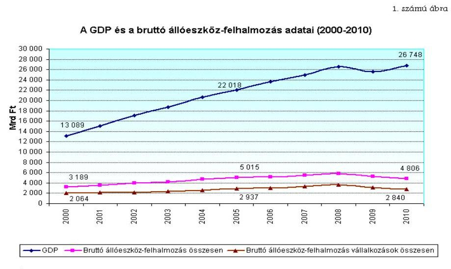
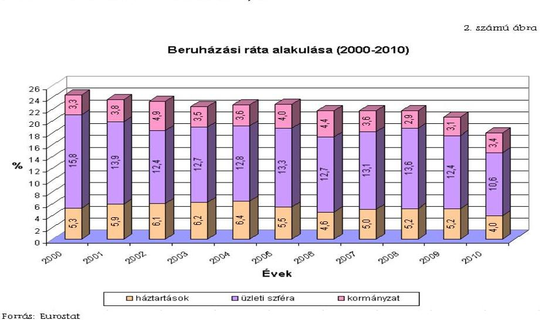
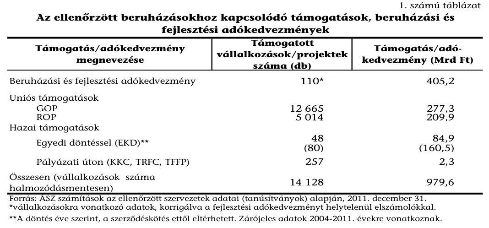
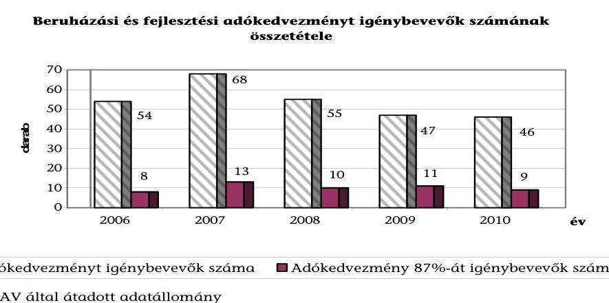
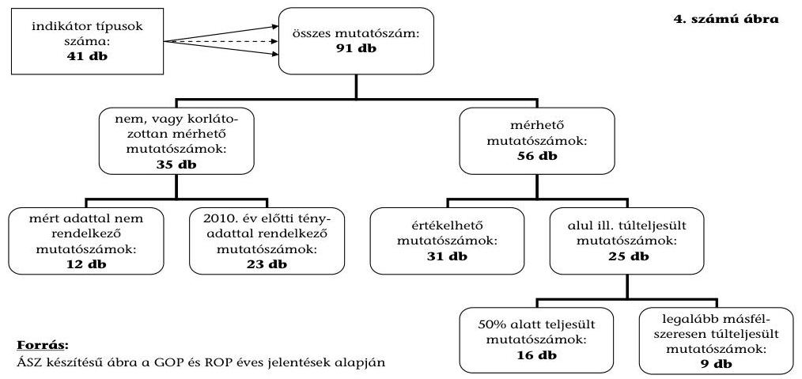
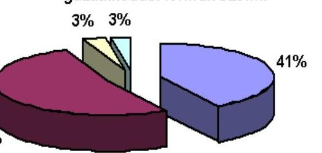
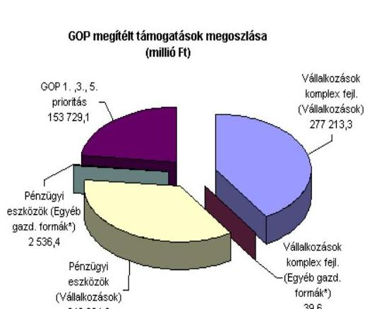

# ÁLLAMI   SZÁMVEVŐSZÉK 

## JELENTÉS

a beruházásokhoz kapcsolódó adókedvezmények és támogatások ellenőrzéséről

---

# Állami Számvevőszék 

Iktatószám: V-2016-180/2012.
Témaszám: 1039
Vizsgálat-azonosító szám: V0572

## Az ellenőrzést felügyelték:

## Makkai Mária

felügyeleti vezető

## Holman Magdolna

felügyeleti vezető
Az ellenőrzést vezette és az ellenőrzés végrehajtásáért felelős:
Salamon Ildikó
ellenőrzésvezető
Az összefoglaló jelentést készítette:
Salamon Ildikó
ellenőrzésvezető
A jelentés összeállításában közremúködtek:
Kapronczai Gabriella Szarvas Szilárd
számvevő tanácsos
Dr. Marosi Gyöngyi Uram Ferenc
számvevő tanácsos
számvevő tanácsos

## Az ellenőrzést végezték:

Farkas Emese Rozália Hajdu Károlyné
számvevő
Karsai Lászlóné
számvevő tanácsos
Dr. Marosi Gyöngyi
számvevő tanácsos
Turai Erzsébet
számvevő tanácsos
Vörös Mária
számvevő főtanácsos számvevő tanácsos
Kökény László
számvevő tanácsos
Szarvas Szilárd
számvevő tanácsos
Uram Ferenc
számvevő tanácsos

## Kapronczai Gabriella

számvevő tanácsos
Körmendi Tibor
számvevő
Temesváry Miklós
számvevő tanácsos
Vacsora Erika
számvevő tanácsos

A témához kapcsolódó eddig készített számvevőszéki jelentések:
címe
sorszáma
Jelentés a gazdaságfejlesztés állami eszközrendszere múködésének 0802 ellenőrzéséről (2008. március)

---

# TARTALOMJEGYZÉK 

BEVEZETÉS ..... 13
I. ÖSSZEGZŐ MEGÁLLAPÍTÁSOK, KÖVETKEZTETÉSEK, JAVASLATOK ..... 18
II. RÉSZLETES MEGÁLLAPÍTÁSOK ..... 29

1. A gazdaságpolitikai célok meghatározottsága a beruházásokhoz kapcsolódó adókedvezmények és támogatások területén ..... 29
2. A beruházásokhoz kapcsolódó adókedvezmények ..... 33
2.1. A jogi, szabályozási környezet ..... 33
2.2. Az adókedvezmények szervezeti rendszere ..... 35
2.3. Az adókedvezmények szerepe a gazdaságpolitikai célok megvalósításában ..... 37
2.4. Az adókedvezmények ellenőrzési rendszere ..... 40
3. A beruházásokhoz kapcsolódó támogatások ..... 42
3.1. A beruházási támogatások szabályozó rendszere ..... 42
3.2. A beruházási támogatások szervezeti rendszere ..... 47
3.3. A vállalkozásoknak nyújtott beruházási támogatások szerepe a gazdaságpolitikai célok megvalósításában ..... 52
3.3.1. A vissza nem térítendő uniós támogatások ..... 52
3.3.2. JEREMIE-típusú pénzügyi eszközök ..... 57
3.3.3. Vissza nem térítendő hazai támogatások ..... 58
3.3.3.1. Egyedi kormánydöntéssel megítélt támogatások ..... 58
3.3.3.2. Pályázati úton megítélt hazai támogatások ..... 60
3.4. A beruházásokhoz kapcsolódó támogatások felhasználásának eredményessége és hatékonysága ..... 62
3.1. A monitoring, értékelési, beszámolási és ellenőrzési rendszerek kialakítása és múködtetése ..... 65
3.1.1. A monitoring, értékelési és beszámolási rendszerek ..... 65
3.1.2. Az ellenőrzési rendszerek ..... 71
MELLÉKLETEK
4. számú Kimutatás az ellenőrzött beruházási célú támogatások közreműködő szervezeteiről
5. számú Kimutatás az NFÜ által kezelt ÚMFT operatív programokról, és a vállalkozásoknak adott beruházási célt szolgáló támogatásokról (2007-2011.)
6. számú Kimutatás az ellenőrzött, gazdaságfejlesztési célokat szolgáló pályázati kiírásokról

---

4/a-d. számú Kimutatás a gazdaságfejlesztési célokat szolgáló, vállalkozásoknak nyújtott beruházási támogatásokról (akciótervek összesen, 2007-2008 akcióterv, 2009-2010 akcióterv, 2011-2013 akcióterv)
5/a-d. számú Kimutatás a gazdaságfejlesztési célokat szolgáló, vállalkozásoknak nyújtott beruházási támogatások mutatószámairól (akciótervek összesen, 2007-2008 akcióterv, 2009-2010 akcióterv, 2011-2013 akcióterv)
6/a-c. számú Kimutatás a vállalkozásoknak adott beruházási célt szolgáló támogatásokról a vállalkozások minősítése szerint (akciótervek összesen, 2007-2010 akcióterv, 2011-2013 akcióterv)
7/a. számú Kimutatás a pénzügyi közvetítők KKV-kkal kötött szerződéseiről és a folyó-
sított hitelekről
7/b. számú Kimutatás a pénzügyi közvetítők KKV-kkal kötött szerződéseiről és a JEREMIE forrásokról
8. számú Kimutatás a tisztán hazai forrásból a vállalkozások beruházásait is támogató előirányzatokról, és az éves költségvetések szerinti fejezeti rendben elfoglalt helyéről
9. számú Kimutatás a tisztán hazai forrásokból pályázati úton vállalkozások beruházásaihoz megítélt támogatásokról
10. számú Kimutatás az indikátorok funkció szerinti típusairól és adatforrásairól
11. számú Kimutatás a rendelkezésre álló fejlesztési források vállalkozásokat érintő felhasználásáról 2007-2011. között
12/a. számú Kimutatás a GOP 2. és 4. prioritásának akciótervekben 2010-re meghatározott célértékeiről és azok 2010. év végéig történő teljesítéséről
12/b. számú Kimutatás a regionális operatív programok 1. és 2. - a KMOP esetében a 3. - prioritásainak 2007-2008 akciótervekben meghatározott célértékeiről és azok 2010. évig történő teljesítéséről
13/a. számú Kimutatás az ellenőrzött operatív programokhoz és prioritásokhoz rendelt indikátorokról
13/b. számú Kimutatás a GOP indikátorok értékeiről
13/c. számú Kimutatás a ROP-ok indikátorainak értékeiről
14. számú Ábrák és táblázatok jegyzéke
15. számú Kimutatás a jelentéstervezethez érkezett, el nem fogadott észrevételekről és azok indoklásáról

# FÜGGELÉKEK 

1. számú Beruházásokhoz kapcsolódó adókedvezmények szabályozása
2. számú A beruházási támogatások szabályozása az EU jogrendjében

---

# RÖVIDÍTÉSEK JEGYZÉKE 

## Európai Uniós jogforrások

EUMSZ
Az Európai Unió működéséről szóló szerződés egységes szerkezetbe foglalt változata, 2010/C 83/01
(Európai Unió Hivatalos Lapja, 2010. március 30.)
Az Európai Parlament és a Európai Regionális Fejlesztési Alapról és az a Tanács 2006. július 5-i 1783/1999/EK rendelet hatályon kívül helyezéséről 1080/2006/EK rendelete
A Tanács 2006. július az Európai Regionális Fejlesztési Alapra, az Európai Szoci11-i 1083/2006/EK rendelete
A Bizottság 2006. október 24-i 1628/2006/EK rendelete ${ }^{1}$
A Bizottság 2006. december 8-i
1828/2006/EK rendelete

A Bizottság 2008. augusztus 6-i
800/2008/EK rendelete
A Bizottság (2006/C 54/08) információja

## Törvények

$\AA_{1}$
$\AA_{2}$
Art.
KKV tv.
Számv. tv.
Tao tv.

## Rendeletek

$\AA_{\mathrm{mr}_{1}}$
az Európai Regionális Fejlesztési 1992. évi XXXVIII. törvény² az államháztartásról szóló 2011. évi CXCV. törvény az adózás rendjéről szóló 2003. évi XCII. törvény
a kis- és középvállalkozásokról, fejlődésük támogatásáról szóló 2004. évi XXXIV. törvény
a számvitelről szóló 2000. évi C. törvény
a társasági adóról és az osztalékadóról szóló 1996. évi LXXXI. törvény
az államháztartás működési rendjéről szóló 217/1998. (XII. 30.) Korm. rendelet ${ }^{3}$

[^0]
[^0]:    1 Hatályon kívül helyezte: a Bizottság 800/2008/EK rendelete 43. cikk (HL L 214., 2008. 8. 9., 3. o.). Hatálytalan: 2008. VIII. 29-től.
    ${ }^{2}$ Hatályon kívül helyezte: 2011. évi CXCV. törvény 114. § (2). Hatálytalan: 2012. I. 1-től.
    ${ }^{3}$ Hatályon kívül helyezte: 292/2009. (XII. 19.) Korm. rendelet 249. § (2) a). Hatálytalan: 2010. I. 1-től.

---

| Ámr $_{2}$ | az államháztartás múködési rendjéről szóló 292/2009. (XII. 19.) Korm. rendelet ${ }^{4}$ |
| :--: | :--: |
| Ávr. | az államháztartásról szóló törvény végrehajtásáról szóló 368/2011. (XII. 31.) Korm. rendelet |
| 193/2003. (XI. 26.)   Korm. rendelet ${ }^{5}$ | a költségvetési szervek belső ellenőrzéséről |
| 85/2004. (IV. 19.) Korm.   rendelet ${ }^{6}$ | az Európai Közösséget létrehozó Szerződés 87. cikkének (1) bekezdése szerinti állami támogatásokkal kapcsolatos eljárásról és a regionális támogatási térképről |
| 90/2004. (IV. 25.) Korm.   rendelet ${ }^{7}$ | a terület- és régiófejlesztési célelóirányzat felhasználásának részletes szabályairól |
| 102/2006. (IV. 28.)   Korm. rendelet | az Európai Unió által nyújtott egyes pénzügyi támogatások felhasználásával megvalósuló, és egyes nemzetközi megállapodások alapján finanszírozott programok monitoring rendszerének kialakításáról és múködéséről |
| 130/2006. (VI. 15.)   Korm. rendelet | a Nemzeti Fejlesztési Ügynökségről |
| 206/2006. (X. 16.) Korm.   rendelet | a fejlesztési adókedvezményről |
| 255/2006. (XII. 8.)   Korm. rendelet ${ }^{8}$ | a 2007-2013 programozási időszakban az Európai Regionális Fejlesztési Alapból, az Európai Szociális Alapból és a Kohéziós Alapból származó támogatások felhasználásának alapvető szabályairól és felelős intézményeiről |
| 281/2006. (XII. 23.)   Korm. rendelet ${ }^{9}$ | a 2007-2013. programozási időszakban az Európai Regionális Fejlesztési Alapból, az Európai Szociális Alapból és a Kohéziós Alapból származó támogatások fogadásához kapcsolódó pénzügyi lebonyolítási és ellenőrzési rendszerek kialakításáról |
| 312/2006. (XII. 23.)   Korm. rendelet ${ }^{10}$ | a Kormányzati Ellenőrzési Hivatalról |
| 148/2008. (V. 26.) Korm.   rendelet | a 2008. évi terület- és régiófejlesztési célelóirányzat felhasználásának részletes szabályairól |

[^0]
[^0]:    ${ }^{4}$ Hatályon kívül helyezte: 368/2011. (XII. 31.) Korm. rendelet 177. § b). Hatálytalan 2012. I. 1-től.
    ${ }^{5}$ Hatályon kívül helyezte: 370/2011. (XII. 31.) Korm. rendelet 62. §. Hatálytalan: 2012. I. 1-től.
    ${ }^{6}$ Hatályon kívül helyezte: 37/2011. (III. 22.) Korm. rendelet 41. § (1). Hatálytalan: 2011. III. 23-tól.
    ${ }^{7}$ Hatályon kívül helyezte: 148/2008. (V. 26.) Korm. rendelet 39. § (2). Hatálytalan 2008. V. 29-től. A folyamatban lévő támogatási ügyekben még alkalmazni kell.
    ${ }^{8}$ Hatályon kívül helyezte: 4/2011. (I. 28.) Korm. rendelet 126. § (2) 1. Hatálytalan: 2011. II. 9-től.
    ${ }^{9}$ Hatályon kívül helyezte: 4/2011. (I. 28.) Korm. rendelet 126. § (2) 2. Hatálytalan: 2011. II. 9-től.
    ${ }^{10}$ Hatályon kívül helyezte: 355/2011. (XII. 30.) Korm. rendelet 39. §. Hatálytalan: 2012. I. 1-től.

---

122/2010. (IV. 20.) Korm. rendelet 210/2010. (VI. 30.) Korm. rendelet 212/2010. (VII. 1.) Korm. rendelet 4/2011. (I. 28.) Korm. rendelet

37/2011. (III. 22.) Korm. rendelet

370/2011. (XII. 31.) Korm. rendelet 19/2004. (II. 27.) GKM rendelet
8/2007. (I. 24.) GKM rendelet
6/2008. (III. 7.) GKM rendelet

1/2001. (I. 5.) GM rendelet
16/2006. (XII. 28.) MeHVM-PM együttes rendelet ${ }^{11}$

8/2007. (III. 19.) MeHVM rendelet

19/2007. (VII. 30.) MeHVM rendelet

2/2008. (V. 29.) NFGMPM együttes rendelet ${ }^{12}$
a 2010. évi terület- és régiófejlesztési céle1őirányzat felhasználásáról
az Európai Támogatásokat Auditáló Főigazgatóságról
az egyes miniszterek, valamint a Miniszterelnökséget vezető államtitkár feladat- és hatásköréről
a 2007-2013 programozási időszakban az Európai Regionális Fejlesztési Alapból, az Európai Szociális Alapból és a Kohéziós Alapból származó támogatások felhasználásának rendjéről
az európai uniós versenyjogi értelemben vett állami támogatásokkal kapcsolatos eljárásról és a regionális támogatási térképről
a költségvetési szervek belső kontrollrendszeréről és belső ellenőrzéséről
a Gazdasági és Közlekedési Minisztérium egyes támogatási programjainak részletes szabályairól
a Kormány egyedi döntésével megítélhető támogatások nyújtásának szabályairól
a Gazdasági és Közlekedési Minisztérium egyes fejezeti kezelésű előirányzataiból finanszírozott, állami támogatásnak minősülő felhasználások általános szabályairól
a Gazdasági Minisztérium vállalkozási céle1őirányzatainak szabályozásáról
a 2007-2013 időszakban az Európai Regionális Fejlesztési Alapból, az Európai Szociális Alapból és a Kohéziós Alapból származó támogatások felhasználásának általános eljárási szabályairól
a Gazdasági Versenyképesség Operatív Program 4. prioritására, a Gazdaságfejlesztési Operatív Programra és a Közép-Magyarországi Operatív Program 1. prioritására vonatkozó részletes szabályokról
az Új Magyarország Fejlesztési Tervben szereplő Regionális Fejlesztés Operatív Programokra meghatározott előirányzatok felhasználásának állami támogatási szempontú szabályairól
a 2007-2013 programozási időszakban az Európai Regionális Fejlesztési Alapból finanszírozott pénzügyi eszközök keretében nyújtható KKV támogatások felhasználására, valamint a forráskezelő szervezetre vonatkozó különös szabályokról

[^0]
[^0]:    ${ }^{11}$ Hatályon kívül helyezte: 4/2011. (I. 28.) Korm. rendelet 126. § (2) 3. Hatálytalan: 2011. II. 9-től.

    12 Hatályon kívül helyezte: 86/2011. (V. 31.) Korm. rendelet 14. § i). Hatálytalan: 2011. VII. 1-től.

---

19/2008. (X. 8.) NFGM rendelet ${ }^{13}$

7/2010. (I. 19.) NFGM rendelet ${ }^{14}$

35/2011. (VII. 7.) NFM rendelet

## Határozatok

OFK
OTK
67/2007. (VI. 28.) OGY határozat

1103/2006. (X. 30.)
Korm. határozat
1163/2010. (VIII. 4.)
Korm. határozat
1208/2010. (X. 6.) Korm. határozat ${ }^{15}$

1298/2010. (XII. 21.)
Korm. határozat

1314/2010. (XII. 27.)
Korm. határozat

1423/2011. (XII. 6.)
Korm. határozat

## Utasítások

16/2011. (III. 8.) NFM utasítás ${ }^{16}$
a Nemzeti Fejlesztési és Gazdasági Minisztérium egyes fejezeti kezelésű előirányzatai kezeléséről és támogatásainak lebonyolításáról
a Nemzeti Fejlesztési és Gazdasági Minisztérium egyes fejezeti kezelésű előirányzatai kezeléséről és támogatásainak lebonyolításáról
a területfejlesztéssel és fejlesztéspolitikával összefüggő feladatokat szolgáló előirányzat felhasználásának részletes szabályairól
az Országos Fejlesztéspolitikai Koncepcióról szóló 96/2005. (XII. 25.) OGY határozat
az Országos Területfejlesztési Koncepcióról szóló 97/2005. (XII. 25.) OGY határozat
a területfejlesztési támogatásokról és a decentralizáció elveiről, a kedvezményezett térségek besorolásának feltételrendszeréről
az Új Magyarország Fejlesztési Terv elfogadásáról
az Új Széchenyi Terv előkészítéséről és az ezzel összefüggő feladatokról
a Magyar Köztársaság minisztériumainak felsorolásáról szóló 2010. évi XLII. törvény 4. §-nak (2) bekezdéséből eredő feladatok és az egyes miniszterek, valamint a Miniszterelnökséget vezető államtitkár feladat- és hatásköréről szóló 212/2010. (VII. 1.) Korm. rendeletben meghatározott feladatok összehangolásáról
az ÚMFT GOP és ROP forrásokból megvalósuló kis- és középvállalkozások fejlesztését célzó akcióterv módosításokról, valamint a TÁMOP és TIOP 2007-2008. évi és 20092010. évi akcióterveinek módosításáról
az Elektronikus közigazgatás operatív program és az Államreform operatív program 2009-2010. évi akciótervének módosításáról (kiemelt projektek nevesítéséről, pályázati konstrukciók törléséről)
a Nemzeti Stratégiai Referencia Keret fejlesztési forrásai kifizetésének gyorsításához szükséges feladatokról
az egységes múködési kézikönyv kiadásáról

[^0]
[^0]:    ${ }^{13}$ Hatályon kívül helyezte: 7/2010. (I. 19.) NFGM rendelet 96. §. Hatálytalan: 2010. II. 3-tól.
    ${ }^{14}$ Hatályon kívül helyezte: 33/2011. (VIII. 31.) NGM rendelet 72. § (1). Hatálytalan: 2011. XII. 31-től.
    ${ }^{15}$ Visszavonta: 1380/2011. (XI. 8.) Korm. határozat 3., 1. melléklet 26.
    ${ }^{16}$ Hatályon kívül helyezte: 24/2011. (V. 6.) NFM utasítás 582. §. Hatálytalan 2011. V. 7től

---

24/2011. (V. 6.) NFM utasítás

## Szórövidítések

áfa
APEH
ÁSZ
BC
BHÉ
COCOF
DAOP
DDOP
ÉAOP
EK
EKD
EMIR
ÉMOP
ERFA
EU
EU Bizottság
EUROSTAT
EUTAF
FEUVE
GFC
GDP
GDP PPS
GKM
GM
GOP
HITA
IH
ITD Hungary Zrt.

ITF
JEREMIE

K+F
KDOP
KEHI
az egységes múködési kézikönyv kiadásáról
általános forgalmi adó
Adó- és Pénzügyi Ellenőrzési Hivatal
Állami Számvevőszék
Beruházás-ösztönzési célelőirányzat
Bruttó Hozzáadott Érték
Alapok Koordinációs Bizottsága (Commitee of the Coordination of Funds)
Dél-Alföldi Operatív Program
Dél-Dunántúli Operatív Program
Észak-Alföldi Operatív Program
Európai Közösség
Egyedi kormánydöntéssel megítélhető támogatás
Egységes Monitoring Információs Rendszer
Észak-Magyarországi Operatív Program
Európai regionális Fejlesztési Alap
Európai Unió
Európai Bizottság
az Európai Unió Statisztikai Hivatala
Európai Támogatásokat Auditáló Főigazgatóság
Folyamatba épített Előzetes, Utólagos Vezetői Ellenőrzés
Gazdaságfejlesztést szolgáló célelőirányzat
Bruttó hazai termék (Gross Domestic Product)
Vásárlóerő-paritáson számított GDP (Gross Domestic Product in Purchasing Power Standards)
Gazdasági és Közlekedési Minisztérium
Gazdasági Minisztérium
Gazdaságfejlesztési Operatív Program
Nemzeti Külgazdasági Hivatal
irányító hatóság
ITD Hungary Nonprofit Közhasznú Zártkörűen Múködő Részvénytársaság, 2008. január 1. előtt ITDH Magyar Befektetési és Kereskedelemfejlesztési Közhasznú Társaság
az NFÜ Informatikai és Tájékoztatási Főosztálya
Joint European Resources for Micro to Medium Enterprises (Közös európai források a kis- és középvállalkozásoknak), az Európai Bizottság, az Európai Beruházási Bank (EIB) és az Európai Beruházási Alap (EIF) közös kezdeményezése a kkv-k finanszírozási forrásokhoz való hozzáférésének támogatására.
Kutatás és fejlesztés
Közép-Dunántúli Operatív Program
Kormányzati Ellenőrzési Hivatal

---

| KIM | Közigazgatási és Igazságügyi Minisztérium |
| :--: | :--: |
| Kincstár | Magyar Államkincstár |
| KKC | Kis- és középvállalkozói célelőirányzat |
| KKV | kis-és középvállalatok |
| KMOP | Közép-Magyarországi Operatív Program |
| Kormány | Magyar Kormány |
| KSH | Központi Statisztikai Hivatal |
| MAG Zrt. | Magyar Gazdaságfejlesztési Központ Zártkörűen Müködő Részvénytársaság |
| MNB | Magyar Nemzeti Bank |
| MV Zrt. | MV-Magyar Vállalkozásfinanszírozási Zártkörűen Müködő Részvénytársaság |
| NAV | Nemzeti Adó- és Vámhivatal |
| NBC | Nemzeti beruházás-ösztönzési célelőirányzat |
| NFGM | Nemzeti Fejlesztési és Gazdaságfejlesztési Minisztérium |
| NFM | Nemzeti Fejlesztési Minisztérium |
| NFÜ | Nemzeti Fejlesztési Ügynökség |
| NFÜ BEF | az NFÜ Belső Ellenőrzési Főosztálya |
| NFÜ KMF | az NFÜ Központi Monitoring Főosztálya |
| NGM | Nemzetgazdasági Minisztérium |
| NYDOP | Nyugat-Dunántúli Operatív Program |
| OGY | Országgyúlés |
| OP | operatív program |
| ÖTM | Önkormányzati és Területfejlesztési Minisztérium |
| Parlament | Európai Parlament |
| regionális támogatási térkép | 85/2004. (IV. 19.) Korm. rendelet, 2011. március 24-től a 37/2011. (III. 22.) Korm. rendelet |
| ROP | regionális operatív program |
| SSC | szolgáltató központ (Shared Service Center) |
| SzMSz | Szervezeti és Müködési Szabályzat |
| TÁMOP | társadalmi megújulás operatív program |
| Tanács | Európai Unió Tanácsa |
| TFFP | Területfejlesztéssel és fejlesztéspolitikával összefüggő feladatokat szolgáló előirányzat |
| TRFC | Terület- és régiófejlesztési célelőirányzat |
| ÚMFT | Új Magyarország Fejlesztési Terv |
| ÚMFT (NRSK) | Új Magyarország Fejlesztési Terv, Magyarország Nemzeti Stratégiai Referenciakerete (2007-2013), az EU Bizottság döntésének dátuma: 2007. május 7. |
| ÚMVP | Új Magyarország Vidékfejlesztési Program |
| ÚSZT | Új Széchenyi Terv |

---

# ÉRTELMEZŐ SZÓTÁR 

Adópolitikáért felelős minisztérium
Akcióterv

Beruházás

Beruházási ráta (beruházási arány)

Beruházáshoz kapcsolódó adókedvezmény

Bruttó állóeszközfelhalmozás
2010. május 28-ig a Pénzügyminisztérium, azt követően a Nemzetgazdasági Minisztérium
Az operatív program vagy egyes prioritástengelyek végrehajtására vonatkozó, két vagy több évre szóló részletes programozási és végrehajtási dokumentum, amely tartalmazza az operatív program, illetve a prioritástengely megvalósításának bemutatását, ütemezését és indikatív forrásfelosztását a teljes programozási időszakra, továbbá a támogatási konstrukciók bemutatását legalább 2 évre. (Forrás: 4/2011. Korm. rendelet (I. 28.) 2. § (1) bekezdés 1. pont)

A tárgyi eszköz beszerzése, létesítése, saját vállalkozásban történő előállítása, a beszerzett tárgyi eszköz üzembe helyezése, rendeltetésszerú használatbavétele érdekében az üzembe helyezésig, a rendeltetésszerú használatbavételig végzett tevékenység (szállítás, vámkezelés, közvetítés, alapozás, üzembe helyezés, továbbá mindaz a tevékenység, amely a tárgyi eszköz beszerzéséhez hozzákapcsolható, ideértve a tervezést, az előkészítést, a lebonyolítást, a hitel igénybevételt, a biztosítást is); beruházás a meglévő tárgyi eszköz bővítését, rendeltetésének megváltoztatását, átalakítását, élettartamának, teljesítőképességének közvetlen növelését eredményező tevékenység is, az előbbiekben felsorolt, e tevékenységhez hozzákapcsolható egyéb tevékenységekkel. (Forrás: Számv. tv. 3. § (4) bekezdés 7. pont) A bruttó állóeszköz-felhalmozás aránya a GDP százalékában. Megmutatja, a GDP hány százalékát fordítja a ma-gán- és a közszféra beruházási célra (szemben azzal, amit például elfogyasztanak).
A Tao tv. 21. § és 22/B. § szerinti adókedvezmény együtt. Ezen belül beruházási adókedvezmény a 21. §, fejlesztési adókedvezmény a 22/B. § szerinti adókedvezmény.
Tartalmazza az elszámolási időszakban vásárolt új tárgyi eszközöket, a használt tárgyi eszközök értéknövekedését, illetve az állóeszközök saját termelésben való előállítását, az immateriális javak és a külföldről származó tárgyieszköz-apport, valamint a pénzügyi lízing konstrukcióban beszerzett tárgyi eszközök értékét. (Forrás: KSH, http://www.ksh.hu/apps/meta.objektum? p_lang=HU\&p_menu_id=220\&p_ot_id=200\&p_obj_id=116 0\&p_session_id=23597608)

---

Egységes Monitoring Információs Rendszer (EMIR)

Gazdaságpolitika

Gazdaságfejlesztés

Igénybe vehető adókedvezmény

Indikátor

Kis- és középvállalkozás

A strukturális alapokból, a Kohéziós Alapból, a PHAREból, az Átmeneti Támogatásból, a Schengen Alapból, az Európai Gazdasági Térség és Norvég Finanszírozási Mechanizmusból, valamint az ezekhez társuló hazai forrásokból megvalósuló programokkal és projektekkel kapcsolatos menedzsment (végrehajtási és kifizetési), monitoring, illetve ellenőrzési, szabálytalanságkezelési és számviteli feladatokat támogató információtechnológiai rendszer. (Forrás: 102/2006. (IV. 28.) Korm. rendelet 2. § (1) bekezdés a) pont)

A gazdasági célok kijelölése és a célok eléréséhez szükséges eszközök, módszerek és intézkedések összessége. A gazdaságpolitika az állam nézeteit, elhatározásait, rendszeres döntéseit, cselekedeteit jelenti, amelyeket az állam társadalmi-politikai céljainak megvalósítása érdekében a gazdaság befolyásolására alkalmaz.
Olyan tudatos beavatkozások együttese, amelyek a gazdasági folyamatok irányát, a gazdasági változások mértékét hivatottak befolyásolni. Leginkább a központi kormányzat feladatkörébe tartozik, területi szintjeit tekintve azonban megkülönböztetjük az országokat átfogó, a regionális és a helyi (települési) gazdaságfejlesztést.
A társasági adóbevallásban az adókedvezmények táblázatban beruházási/fejlesztési adókedvezményként feltüntetett összeg. A ténylegesen igénybevett adókedvezmény ettől eltérhet, mivel azt befolyásolják az egyéb igénybe vehető adókedvezmények és a társasági adó összege is.
A megvalósulást, teljesülést mérő fizikailag vagy pénzügyileg számszerúsített mutató. (Forrás: 4/2011. (I. 28.) Korm. rendelet 2. § (1) bekezdés 10. pont)
KKV-nak minősül az a vállalkozás, amelynek összes foglalkoztatotti létszáma 250 főnél kevesebb, és éves nettó árbevétele legfeljebb 50 M eurónak megfelelő forintösszeg, vagy mérlegfőösszege legfeljebb 43 M eurónak megfelelő forintösszeg.
A KKV kategórián belül kisvállalkozásnak minősül az a vállalkozás, amelynek összes foglalkoztatotti létszáma 50 főnél kevesebb, és éves nettó árbevétele vagy mérlegfőösszege legfeljebb 10 M eurónak megfelelő forintösszeg.
A KKV kategórián belül mikrovállalkozásnak minősül az a vállalkozás, amelynek foglalkoztatotti létszáma 10 főnél kevesebb, és éves nettó árbevétele vagy mérlegfőösszege legfeljebb 2 M eurónak megfelelő forintösszeg.
Nem minősül KKV-nak az a vállalkozás, amelyben az állam vagy az önkormányzat közvetlen vagy közvetett tulajdoni részesedése - tőke vagy szavazati joga alapján -külön-külön vagy együttesen meghaladja a $25 \%$-ot.
(Forrás: 2004. évi XXXIV. törvény, 3. § (1)-(4) bekezdés)

---

Konvergencia régiók

Közreműködő szervezet

Közvetítő

Monitoring

Monitoring bizottság

Monitoring rendszer

Nemzetgazdasági beruházás

Operatív program

A 2006/595/EK bizottsági határozat értelmében a „konvergencia" célkitűzés alapján 2007-2013 között támogatásra jogosult régiók: a Nyugat-dunántúli, a Középdunántúli, a Dél-dunántúli, az Észak-magyarországi, az Észak-alföldi és a Dél-alföldi Régió.
Az 1083/2006/EK tanácsi rendelet 2. cikk 6. pontja szerint bármely közjogi vagy magánjogi intézmény, amely egy irányító vagy az igazoló hatóság illetékessége alatt jár el, vagy ilyen hatóság nevében hajt végre feladatokat a múveleteket végrehajtó kedvezményezettek tekintetében. (Forrás: 4/2011. (I. 28.) Korm. rendelet 2. § (1) bekezdés 17. pont)

Olyan szervezet vagy személy, amely a közvetítői szerződések alapján a kedvezményezettek javára, a velük megkötött hitel-, kölcsön-, kezességi vagy tőkebefektetésre irányuló szerződések feltételeibe beépített, visszatérítendő támogatást közvetít. (Forrás: 4/2011. (I. 28.) Korm. rendelet 2. § (1) bekezdés 18. pont)
A források felhasználásának (pénzügyi monitoring), az eredményeknek és a teljesítményeknek (szakmai monitoring) mindenre kiterjedő - többek között szabályossági, hatékonysági és célszerűségi - vizsgálata rendszeres jelleggel projekt, illetve program szinten. (Forrás: 102/2006. (IV. 28.) Korm. rendelet 2. § (1) bekezdés g) pontja)
Monitoring tevékenységet végző, elsősorban a program megvalósításában részt vevő partnerek képviselőiből álló, önálló jogalanyisággal nem rendelkező testület. (Forrás: 102/2006. (IV. 28.) Korm. rendelet 2. § (1) bekezdés h) pontja)
A monitoring tevékenység folytatása céljából létrehozott intézmények, szervezetek, testületek és eszközök, eljárásrendek, valamint ezek múködtetése érdekében foganatosított intézkedések összessége. (Forrás: 102/2006. (IV. 28.) Korm. rendelet 2. § (1) bekezdés j) pontja)
Új tárgyi eszközök beszerzése, saját vállalkozásban való létesítése és pótlása, a meglévő tárgyi eszközök bővítése, rendeltetésének megváltoztatásával összefüggő átalakítás, a tárgyi eszközök rekonstrukciója, valamint ezek értékét növelő felújítása és mindezek saját vállalkozásban történő megvalósítása. (Forrás: KSH, http://www.ksh.hu/docs /hun/info/02osap/2011/kitoltesi/d11k001.doc).
A tagállam által benyújtott és a Bizottság által elfogadott dokumentum, amely összefüggő prioritások alkalmazásával fejlesztési stratégiát határoz meg, amelynek megvalósításához valamely alapból, illetve a „konvergencia" célkitűzés esetében a Kohéziós Alapból és az ERFA-ból támogatást vesznek igénybe. (Forrás: A Tanács 1083/2006/EK rendelete 2. cikk 1. pontja)

---

Pénzügyi eszköz

Prioritási tengely

Program

Projekt

Regionális támogatási térkép

Támogatási konstrukció

Vállalkozás

Versenyképesség

Hitel, tőke vagy garancia eszköz. (4/2011. (I. 28.) Korm. rendelet 2. § (1) bekezdés 20. pont). A JEREMIE-típusú pénzügyi eszközök a GOP 4. Prioritásából és a KMOP 1.3. Intézkedéséből finanszírozott programokat jelentik.
Valamely operatív program stratégiájának egyik prioritása, amely olyan műveleteket foglal magában, amelyek kapcsolódnak egymáshoz, és konkrét, mérhető célokkal rendelkeznek. (Forrás: A Tanács 1083/2006/EK rendelete 2. cikk 2. pontja)

Meghatározott célrendszer érdekében végrehajtandó feladatok és azok végrehajtására kidolgozott keretfeltételek egysége. (Forrás: 102/2006. (IV. 28.) Korm. rendelet 2. § (1) bekezdés s) pontja)
Egy önálló fejlesztés, vagy több hasonló célú, egyenként 10 M Ft-nál vagy az akciótervben meghatározott ettől eltérő összegnél nem nagyobb összköltségű fejlesztés öszszessége (közvetett támogatás), vagy pénzügyi eszköz. (Forrás: 255/2006. (XII. 8.) Korm. rendelet 2. § (1) bekezdés o) pont)

Egy tagállamnak a különböző mentességek szerint regionális beruházásra jogosult régiói, valamint az induló beruházásokhoz nyújtott támogatás intenzitásának az egyes régiókra jóváhagyott felső határai együttesen. A regionális támogatási térkép meghatározza a vállalkozásalapításhoz nyújtott támogatásra jogosult régiókat is (Forrás: a Bizottság 2006/C 54/08 információja 96. pont).
Azonos céllal, támogatható tevékenységekkel, támogatási formával és indikátorokkal jellemezhető egy vagy több pályázat és/vagy kiemelt projekt. (Forrás: 255/2006. (XII. 8.) Korm. rendelet 2. § (1) bekezdés q) pont)
Minden olyan önálló piaci kapcsolatokkal rendelkező gazdálkodó szervezet, amely tevékenységét profitorientáltan végzi és jövedelemtermelést folytat. A vállalkozások számára kiírt pályázatok kiemelten kezelik a mikro-, kisés középvállalkozásokat, így támogatási szempontból lényeges az, hogy mely vállalkozás minősül KKV-nak. Magyarországon a 2004. évi XXXIV. törvény szabályozza a kis- és középvállalkozások körét, az uniós szabályozást a 2003/361/EK bizottsági ajánlás tartalmazza.
A globális versenyben elért vállalati vagy országos pozíció, sikeresség, a versenyben való tartós helytállás képessége. Mikroszinten az a gazdasági egység tekinthető versenyképesnek, amelyik versenytársaihoz képest tartósan kedvezőbb feltételek mellett tudja kínálni termékeit, szolgáltatásait.

---

# JELENTÉS   a beruházásokhoz kapcsolódó adókedvezmények és támogatások ellenőrzéséről 

## BEVEZETÉS

A beruházás a gazdasági növekedés egyik legfontosabb tényezője. A beruházási kereslet gazdaság-élénkítő hatásán túl, a megvalósított beruházások szerkezete alapvető jelentőségű a jövő termelő tevékenységének megalapozásában, bővítésében, javítja a lakosság életkörülményeit, az infrastrukturális ellátottságot, továbbá fontos szerepet tölt be a munkahelyteremtésben és azok megtartásában, a területi különbségek csökkentésében.

A gazdaságot érő külső hatások, így a gazdasági válság, valamint a gazdaságirányítás és a belső reálfolyamatok - ideértve különösen a beruházások pozitív hatásait - a GDP alakulásában egyidejűleg jelentkeznek. A hosszú idősoros kimutatások szerint a GDP növekedési ütemének lendülete már a gazdasági válság időszaka előtt megtört, a válság pedig 2009-ben szintén visszaesést okozott ${ }^{17}$. Magyarországon 2010-ben az uniós átlag $65 \%$-a ( $15,8 \mathrm{E}$ euró) volt az egy főre jutó vásárlóerő-paritáson (PPS) számított GDP, ezzel hazánk a tagországok között az alsó harmadban foglalt helyet, és ez az arány mindössze 2 százalékponttal haladja meg a csatlakozás előtti év adatát ${ }^{18}$.

Magyarország a világ versenyképességi rangsorában ${ }^{19}$ a 47. helyet foglalja el, ez 2007-hez képest 12, 2000-hez képest 20 hellyel rosszabb pozíció. Ugyanakkor Magyarország 2009-2010-ben mintegy 3-4 szeresét biztosította GDP arányosan támogatás formájában, mint az EU 27 átlaga ${ }^{20}$.

A hosszú távú gazdasági növekedés szempontjából kiemelt fontosságú nemzetgazdasági beruházások volumene a 2000-2005. évek között hullámzó volt. Az éves átlagban az 5,9\%-os növekedés 2006-ban megtört, 2007-2008-ban kisebb

[^0]
[^0]:    ${ }^{17}$ http://epp.eurostat.ec.europa.eu/tgm/download.do?tab=table\&plugin=1\&language=e n\&pcode=tsieb020
    ${ }^{18}$ Forrás: http://epp.eurostat.ec.europa.eu/tgm/table.do?tab=table\&init=1\&plugin=1\& language=en\&pcode=tsieb010
    ${ }^{19}$ IMD World Competitiveness Yearbook, 2007-2011. Lausanne (http://www.imd.org/ research/publications/wcy/upload/scoreboard.pdf)
    20 http://epp.eurostat.ec.europa.eu/tgm/table.do?tab=table\&init=1\&plugin=0\&langu age=en\&pcode=tsier100

---

arányú emelkedés (2,6-3,6\%), 2009-2010-ben pedig csökkenés (-5,7 és -7,0\% közötti) volt tapasztalható ${ }^{21}$.

A beruházások alakulásában - és így a gazdasági növekedésben, a válságból való kilábalásban, a munkahelyteremtésben és azok megőrzésében - az üzleti szféra döntései meghatározóak. A 2000-2010. közötti időszakban a vállalkozások beruházásai tették ki a bruttó állóeszköz-felhalmozás 53-65\%-át. A gazdaságfejlesztésben betöltött szerepük miatt ellenőrzésünk középpontjában a vállalkozások beruházásai, és az azt ösztönző gazdaságpolitikai eszközök (adókedvezmények, támogatások) álltak. A GDP és a bruttó állóeszköz-felhalmozás, ezen belül a vállalkozások adatainak alakulását az alábbi ábra szemlélteti:

A társasági adó ${ }^{22}$ már 1996. év óta adókedvezményekkel ösztönözte a beruházások megvalósítását. Az adókedvezmények igénybevételének a törvényben meghatározott feltételek mellett további kritériuma volt, hogy a vállalkozásnak nyeresége képződjön. A társasági adóbevallásokban feltüntetett igénybe vehető beruházási és fejlesztési adókedvezmények összege 2006-2010. évekre vonatkozóan 405,2 Mrd Ft volt, amely 110 vállalkozáshoz kapcsolódott ${ }^{23}$.

Az ÚMFT (ÚSZT) keretében a vállalkozási szféra számára a Gazdaságfejlesztési Operatív Program (GOP) és a Regionális Operatív Programok (ROP-ok) ${ }^{24}$ gazdaságfejlesztési területén rendelkezésre álló forrásai voltak pályázhatók, amelyek együtt 1078,8 Mrd Ft támogatási kerettel rendelkeztek ${ }^{25}$. Az ellenőrzött

[^0]
[^0]:    ${ }^{21}$ Forrás: http://portal.ksh.hu/pls/ksh/docs/hun/xstadat/xstadat_hosszu/h_qb001.html
    ${ }^{22}$ a társasági adóról és osztalékadóról szóló 1996. évi LXXXI. törvény alapján
    ${ }^{23}$ NAV adatok korrigálva a helytelenül fejlesztési adókedvezményt elszámolókkal
    ${ }^{24}$ A Közép-Magyarországi Operatív Program (KMOP), és a Bizottság 2006/595/EK határozata szerinti „konvergencia" célkitüzés alapján 2007-2013 között támogatásra jogosult régiók: a Dél-Alföldi, a Dél-Dunántúli, az Észak-Alföldi, az Észak-Magyarországi, a Közép-Dunántúli és a Nyugat-Dunántúli Régió.
    ${ }^{25}$ A ROP-ok érintett kereteit nem különítették el gazdálkodási formák szerint, a költségvetési és a nonprofit szektor fejlesztéseit is támogatták.

---

gazdaságfejlesztési célú keretekből 2011. december 31-ig több mint 17 ezer projekt összesen 487,2 Mrd Ft támogatásban részesült, amelyből - a megkötött szerződések szerint - 438,9 Mrd Ft kapcsolódott közvetlenül a beruházásokhoz.

A JEREMIE-típusú pénzügyi eszközök a kohéziós politika keretében nyújtott visszatérítendő támogatásokat - hitel, tőke és garancia eszközöket - foglalják magukban. A GOP 4. Prioritásában és a KMOP 1.3. Intézkedésében a hitel- és garanciaprogramok keretében a pénzügyi közvetítők több mint ötezer beruházási célokat szolgáló szerződést kötöttek, 48,3 Mrd Ft összegben.

Az ellenőrzött időszakban tisztán hazai forrásokból is támogatták a vállalkozások beruházási célú fejlesztéseit. A céle1̋̋irányzatok 2007-2011. között összesen 123 Mrd Ft beruházási célú támogatási keretet tartalmaztak, ennek 96,6\%-a egyedi nagyberuházások támogatását szolgálta.

Az ellenőrzés célja annak értékelése volt, hogy a vállalkozásoknak nyújtott, beruházásokhoz kapcsolódó adókedvezmények és támogatások igénybevételével megvalósultak-e az elérni kívánt gazdaságpolitikai célok, továbbá kialakították-e és működtették-e a beruházásokhoz kapcsolódó adókedvezmények és támogatások alakulását nyomon követő ellenőrzési, monitoring, értékelési és beszámolási rendszereket.

Ennek során értékeltük:

- a beruházásokhoz kapcsolódó adókedvezményekkel és támogatásokkal elérni kívánt gazdaságpolitikai célok meghatározását, valamint a célok megvalósítására kialakított szabályozási és szervezeti rendszer tevékenységének eredményességét;
- a beruházásokhoz kapcsolódó adókedvezmények és támogatások igénybevételét, a gazdaságpolitikai célok megvalósításában betöltött szerepét;
- a beruházásokhoz kapcsolódó adókedvezmények és támogatások alakulását nyomon követő monitoring, értékelési, beszámolási és ellenőrzési rendszerek kialakítását és múködtetését.

Az ellenőrzés kiterjedt a Tao tv-ben meghatározott, a beruházások megvalósításához kapcsolódó adókedvezményekre, az ÚMFT-n belül a GOP-nak a vállalkozások (kiemelten a kkv-k) komplex fejlesztését célzó, és a pénzügyi eszközök prioritásaira, a ROP-oknak a gazdaságfejlesztést, vállalkozás-ösztönzést szolgáló prioritásaira, továbbá a vállalkozások beruházásait is támogató fejlesztési előirányzatok közül a BC-re, az NBC-re, a TRFC-re, a KKC-re és a TFFP-re.

Az ellenőrzés nem terjedt ki a költségvetési, a non-profit szféra és az egyéb nem vállalkozási - szervezetek támogatásaira, valamint a vállalkozásoknak nyújtott nem beruházási célú támogatásokra. Nem ellenőriztük az Új Magyarország Vidékfejlesztési Program (ÚMVP) keretében nyújtott támogatásokat.

Az ellenőrzés végrehajtása során beruházási támogatásnak tekintettük a beruházások megvalósításához a társasági adóból érvényesíthető adókedvezményeket, a pályázati úton megítélt vissza nem térítendő és visszatérítendő - kedvezményes hitelek formájában nyújtott - támogatásokat, a garancia- és a ke-

---

zességvállalásokat, továbbá az egyedi kormánydöntések alapján megítélt támogatásokat.

Az ellenőrzés típusa: teljesítmény-ellenőrzés volt. Az ellenőrzést előtanulmánynyal alapoztuk meg.

A helyszíni ellenőrzés a 2007-2011. közötti időszakra terjedt ki.
A helyszíni ellenőrzés a Nemzeti Fejlesztési Minisztériumra (NFM), a Nemzetgazdasági Minisztériumra (NGM), a Közigazgatási és Igazságügyi Minisztériumra (KIM), a Nemzeti Fejlesztési Ügynökségre (NFÜ), a Nemzeti Adó- és Vámhivatalra (NAV), a Magyar Gazdaságfejlesztési Központ Zrt-re (MAG Zrt.), a Nemzeti Külgazdasági Hivatalra (HITA) és az MV-Magyar Vállalkozásfinanszírozási Zrt-re (MV Zrt.) terjedt ki. A helyszíni ellenőrzéssel egyidejúleg adatokat és információt kértünk a Magyar Államkincstártól (Kincstár) és a Központi Statisztikai Hivataltól (KSH), a regionális fejlesztési ügynökségektől. Kérdőívvel kerestük meg a beruházási és fejlesztési adókedvezményt érvényesített, valamint a - mintavételi eljárással kiválasztott - beruházási támogatásban részesült, összesen 547 vállalkozást. A kérdőívekre a vállalkozások 92,9\%-a válaszolt, amelyeket felhasználtunk a megállapítások alátámasztásához.

A kérdőívvel megkeresett szervezetek kiválasztására véletlenszerű, rétegzett, kockázati szempontokat is figyelembe vevő, érték alapú, statisztikai mintavételi eljárást alkalmaztunk. Rétegképzési szempontként kezeltük a kapott támogatás típusát, a regionális elhelyezkedést és a beruházások kockázati tényezőit ${ }^{26}$. A mintavételi módszerek kombinációját az ellenőrzött terület horizontális kiterjedése, sokszínűsége indokolta. A kiválasztás módszerének és kritériumainak a meghatározása az ellenőrzött területek és a mintavételi adatbázisok elemzése alapján történt.

Az ellenőrzést az ÁSZ teljesítmény-ellenőrzési módszertanának alkalmazásával, valamint az INTOSAI teljesítmény-ellenőrzési standardok (ISSAI 3000, ISSAI 3100), és az INTOSAI GOV 9100 irányelvének figyelembevételével végeztük.

Az Állami Számvevőszékről szóló 2011. évi LXVI. törvény 29. §-a szerint a jelentéstervezetet megküldtük egyeztetésre a közigazgatási és igazságügyi miniszternek, a nemzetgazdasági miniszternek, a nemzeti fejlesztési miniszternek, a Nemzeti Adó- és Vámhivatal elnökének, a Nemzeti Fejlesztési Ügynökség elnökének, a Nemzeti Külgazdasági Hivatal elnökének, a MAG - Magyar Gazdaságfejlesztési Központ Zrt. vezérigazgatójának, valamint az MV - Magyar Vállalkozásfinanszírozási Zrt. vezérigazgatójának. Az el nem fogadott észrevételeket és azok indoklását a jelentés 15 . számú melléklete tartalmazza.

[^0]
[^0]:    ${ }^{26}$ Kockázatosnak tekintettük a nem ellenőrzött és a késve megvalósuló beruházásokat.

---

Az ellenőrzés végrehajtásának jogszabályi alapját az Állami Számvevőszékről szóló 2011. évi LXVI. törvény 5. § (3), (5), (8) bekezdéseiben, és a 25. § (3) bekezdésében foglaltak képezték.

---

# I. ÖSSZEGZŐ MEGÁLLAPÍTÁSOK, KÖVETKEZTETÉSEK, JAVASLATOK 

A nemzeti fejlesztéspolitikai irányokat és célokat a 2005-2020 közötti időszakra meghatározó Országos Fejlesztéspolitikai Koncepció (OFK) ${ }^{27}$ középtávú stratégiai céljai között szerepelt a gazdaság versenyképességének tartós növelése, a foglalkoztatás bővítése, valamint a kiegyensúlyozott területi fejlődés. A célok eléréséhez középtávon a beruházások jelentős növekedésével, és 2013-ra a beruházási ráta 28\%-ra történő emelkedésével számoltak. Nem határozták meg azonban, hogy a kitűzött fejlesztéspolitikai célokat milyen támogatási formákkal (beruházási, múködési, visszatérítendő, vissza nem térítendő támogatások, adókedvezmények) és egyéb szabályozó eszközökkel tervezik megvalósítani. A célok eléréséhez elsősorban az Európai Uniós támogatásokat vették számba, a hazai forrásokat nem nevesítették.

Az elmúlt időszak makrogazdasági folyamatai nem az OFK-ban tervezettek szerint alakultak, a beruházások növekedése nem érte el a kitűzött mértéket. A 2005. évről a 2010. évre a beruházási ráta $22,78 \%$-ról $17,97 \%$-ra, ezen belül a vállalkozói szféra beruházási rátája 13,34\%-ról 10,62\%-ra csökkent ${ }^{28}$. A romló beruházási mutatók alapján fennáll a kockázata, hogy 2013-ra a beruházások növekedési célkitűzései nem teljesülnek. A beruházási ráta 2000-2010 közötti alakulását a következő ábra mutatja.

Az OFK-ban előírtak ${ }^{29}$ ellenére, az Országgyűlést nem tájékoztatták a Koncepcióban foglaltak teljesüléséről, időarányos megvalósulásáról a 2008. október 31-i határidőre, és azt követően sem. Az OFK-ban foglaltak ellenére nem alakítottak ki - a tisztán hazai és az uniós támogatásokra egyaránt kiterjedő - egy-

[^0]
[^0]:    ${ }^{27}$ a 96/2005. (XII. 25.) OGY határozat az Országos Fejlesztéspolitikai Koncepcióról
    ${ }^{28}$ A 2000-2010 közötti időszakban a vállalkozások beruházásai évente, átlagosan az összes beruházás 53-65\%-át tették ki.
    ${ }^{29}$ a 96/2005. (XII. 25.) OGY határozat 9. pont d) bekezdés

---

séges fejlesztési finanszírozási rendszert, és nem történt meg a makrogazdasági tervezés jogszabályi megalapozása. Nincs egységes jogi szabályozás a fejlesztési támogatásokkal megvalósuló célkitűzések tervdokumentumokban történő rögzítésének formai és tartalmi követelményeire. Nem alakítottak ki módszertani eljárásokat annak mérésére és értékelésére, hogy a fejlesztési források - ellenőrzésünk szempontjából a beruházási támogatások, adókedvezmények - felhasználása mennyiben járult hozzá a kitűzött célok (pl. a beruházási ráta növekedésének) megvalósításához, és az elért eredmények arányban állnak-e a ráfordításokkal. Az OFK fejlesztéspolitikai elve szerint a fejlesztéseknek nemcsak a költségeit, hanem az eredményeit is mérni kell.

A fejlesztési források szempontjából 2007-től meghatározó ÚMFT (Nemzeti Stratégiai Referenciakeret) stratégiai célkitűzése a foglalkoztatás bővítése és a tartós gazdasági növekedés feltételeinek a megteremtése. Konkrét célként tűzték ki, hogy hatására hosszú távon is fennmaradó módon 120000 fővel növekedjen a versenyszkérában a foglalkoztatottak száma és $10 \%$-kal magasabb legyen a vállalkozások által megtermelt jövedelem. Utóbbi esetében nem határozták meg a mérés alapjául szolgáló induló értéket. Az ÚMFT hat tematikus prioritása egyikeként meghatározott gazdaságfejlesztésre vonatkozóan nem rögzítettek számszerú célokat, így a terv és a tényállapotok nem hasonlíthatók össze.

Az ÚMFT gazdaságfejlesztési célkitűzéseinek megvalósítását közvetlenül a GOP, valamint a ROP-ok gazdaságfejlesztési, vállalkozások beruházásait ösztönző prioritásaiból támogatták. A vállalkozások beruházási célú fejlesztéseihez az ellenőrzött időszakban tisztán hazai forrásokból is biztosítottak támogatásokat. A vállalkozásoknak nyújtott, beruházásokhoz kapcsolódó támogatások összességében hozzájárultak a gazdaságpolitikai célok (foglalkoztatás bővítése, kiegyensúlyozott területi fejlődés) megvalósításához. Az ellenőrzött beruházási célú támogatási konstrukciókból összesen 14 ezer vállalkozás kapott vissza nem térítendő támogatást, ez a Magyarországon regisztrált társas vállalkozásoknak ${ }^{30}$ a $2,3 \%-a$. A beruházásokat megvalósító vállalkozások a Tao. tv-ben meghatározott feltételek szerint beruházási, illetve fejlesztési adókedvezményt is igénybe vehettek. Az ellenőrzött beruházásokhoz kapcsolódó vissza nem térítendő támogatásokat és adókedvezményeket a következő táblázat mutatja.

[^0]
[^0]:    ${ }^{30}$ Forrás: http://www.ksh.hu/docs/hun/xstadat/xstadat_evkozi/e_qvd017.html

---

A Tao tv. a beruházásokhoz kapcsolódó adókedvezményekkel támogatta a gazdaságfejlesztési célok megvalósítását, és lehetővé tette, hogy a beruházásokat végző vállalkozások az általánostól kedvezőbb mértékű társasági adót fizessenek. Az adójogszabályok általános rendelkezései mellett, az ellenőrzött időszakban az NGM kimutatása szerint még három, beruházási adókedvezmény igénybevételét engedélyező egyedi kormányhatározat ${ }^{31}$ is hatályban volt.

A NAV által a 2006-2010. adóévekben nyilvántartott 340-390 ezer társasági adóalanyból az ellenőrzött években összesen $110^{32}$ vett igénybe beruházási, illetve fejlesztési adókedvezményt, a nagy értékű beruházásaik alapján. A társasági adóbevallás adatai alapján a beruházáshoz kapcsolódó adókedvezmények 87\%-át (352,6 Mrd Ft) az ellenőrzött időszakban összesen 21 vállalkozás (19,1\%) számolta el. Az egyedi kormányhatározatokkal rendelkező két vállalkozás - a kormányhatározatok és a hatályos Tao tv. 21. §-a alapján - ugyanezen időszakban 130,2 Mrd Ft összegben számolt el beruházási adókedvezményt, a legalább 10 Mrd Ft értékű termék előállítást szolgáló beruházás után. Ez az összeg az ezen időszak alatt a vállalkozások által kimutatott, igénybe vehető összes beruházásokhoz kapcsolódó adókedvezmény 32,1\%-át tette ki.

Az egyes adóalanyok által igénybevett adókedvezmények adatait az ellenőrzött időszakban nem hozták nyilvánosságra. Az adókedvezmények a társasági adóról és az osztalékadóról szóló 1996. évi LXXXI. törvény 22/B. § (7), (16) bekezdései, 29/E. §-a, valamint a fejlesztési adókedvezményről szóló 206/2006. (X.16.) Korm. rendelet 15. §-a szerint támogatásnak minősülnek. Az Art. 53. § (4) bekezdése ugyanakkor nem egyértelmúen szabályozta, hogy mely adatok nem minősülnek adótitoknak az (1) bekezdésben meghatározott adatkörön belül.

Az ellenőrzés során 64 olyan adóalanyt tártunk fel, amelyek - bejelentés, illetve engedély hiányában ${ }^{33}$ - nem voltak jogosultak fejlesztési adókedvezmény igénybevételére. Ez a fejlesztési adókedvezményt elszámoló 129 adózó közel felét tette ki. Jelzésünk alapján a NAV 21 adóalanynál végzett célellenőrzés során megállapította, hogy hibás adóbevallási soron számoltak el adókedvezményt. A NAV a bevallások feldolgozása során nem végzett összehasonlító ellenőrzést az engedély és bejelentés hiányában fejlesztési adókedvezményt elszámoló adóalanyok kiszűrésére.

Az adókedvezmény igénybevételének további feltételeként előírt foglalkoztatottság növelésének teljesítésére a Tao tv. ${ }^{34}$ 2011. december 31-ig lehetővé tette a külföldi telephelyen foglalkoztatott munkavállalók elszámolását is, amellyel az országon kívüli munkahelyteremtést is támogatta. Ezt a lehetőséget a Tao tv. 2012. január 1-jével - a helyszíni ellenőrzés időszakában - hatályba lépett módosítása megszüntette, mivel előírta, hogy az átlagos állományi létszámot a

[^0]
[^0]:    ${ }^{31}$ az akkor hatályos társasági adóról szóló 1991. évi LXXXVI. törvény (hatályon kívül helyezte az 1997. január 1-től hatályos Tao tv.) felhatalmazása alapján 19941995. években hozott minősített kormányhatározatok
    ${ }^{32}$ Forrás: NAV által átadott adatállomány, korrigálva a helytelenül fejlesztési adókedvezményt elszámolókkal
    ${ }^{33}$ nem szerepeltek a bejelentésekről és engedélyekről vezetett NGM nyilvántartásban
    ${ }^{34}$ Tao tv. 22/B. § (9) bekezdés

---

külföldi telephelyen foglalkoztatottak létszámának a figyelmen kívül hagyásával kell megállapítani ${ }^{35}$.

A jogszabály nem írta elő a költségvetésért és adópolitikáért felelős miniszter számára, hogy vizsgálja a beruházásokhoz kapcsolódóan igénybevett adókedvezmények (mint támogatások) hosszú távú hatását. Az adópolitikáért felelős miniszter ${ }^{36}$ nem határozott meg monitoring tevékenység alapjául szolgáló adatgyűjtési kötelezettséget, nem intézkedett az igénybe vett adókedvezményekhez kapcsolódó beruházások nyomon követésére alkalmas rendszer kialakítására. Nem volt meghatározott a beruházásokhoz kapcsolódó adókedvezményekre vonatkozóan az adópolitikáért felelős minisztérium ${ }^{37}$ és az adóhatóság közötti adatszolgáltatás, információátadás rendje. A minisztérium nem írt elő adatszolgáltatást az egyes beruházások után ténylegesen igénybevett adókedvezményekre és az ellenőrzés során feltárt hiányosságokra vonatkozóan.

Az adópolitikáért felelős minisztériumban vezettek nyilvántartást a fejlesztési adókedvezmény engedélyekről és a benyújtott bejelentésekről, amelyet évente megküldtek az adóhatóság részére. Nem kísérték azonban figyelemmel a fejlesztési adókedvezmény igénybevételére vonatkozó kérelmekben és bejelentésekben foglaltak megvalósítását, és nem rendelkezett információval arról, hogy a beruházásokhoz kapcsolódóan milyen összegű adókedvezményt vettek igénybe. Nem volt összesített adat arra vonatkozóan sem, hogy az elszámolt beruházási és fejlesztési adókedvezmények mekkora összegű beruházásokhoz kapcsolódtak. Nyilvántartás hiányában nem rendelkezett információval a kieső társasági adóbevételek meghatározásához.

Az adókedvezmények ellenőrzését a Nemzeti Adó- és Vámhivatal (NAV) a törvényi előírások alapján a bevallások utólagos ellenőrzése keretében végezte. Az előző évek ellenőrzési tapasztalatait figyelembe véve a 2011. és 2012. évi ellenőrzési irányelvekben a NAV hangsúlyosan kezelte a beruházásokhoz kapcsolódó adókedvezmények ellenőrzését. A 2011. és 2012. évi irányelvek az ellenőrzések gyakoriságát tekintve nem voltak összhangban a 206/2006. (X. 16.) Korm. rendeletben foglaltakkal. A kormányrendelet előírta, hogy a fejlesztési adókedvezmény feltételeinek teljesítését annak első igénybevételét követő harmadik adóév végéig legalább egyszer ellenőrizni kell, az irányelvek azonban megengedték a negyedik évben történő első ellenőrzést is. Az ellenőrzések az adókedvezmények jogszabályi előírásoknak megfelelő igénybevételére irányultak, nem terjedtek ki arra, hogy a beruházások a bejelentésben, illetve az engedélyben foglaltaknak megfelelően valósultak-e meg ${ }^{38}$.

Az adókedvezmények nyújtásáról szóló egyedi kormányhatározatokra vonatkozóan nem volt szabályozott a beruházási adókedvezmény igénybevételéhez meghatározott feltételek megvalósulásának ellenőrzési, és az ellenőrzés doku-

[^0]
[^0]:    ${ }^{35}$ az egyes adótörvények és azzal összefüggő egyéb törvények módosításáról szóló 2011. évi CLVI. törvény 43. § (13) bekezdés
    ${ }^{36}$ 2010. június 30 -ig a pénzügyminiszter, azt követően a nemzetgazdasági miniszter
    ${ }^{37}$ 2010. május 28 -ig a PM, azt követően az NGM
    ${ }^{38}$ Az ellenőrzés ilyen jellegű kiterjesztését a helyszíni ellenőrzés időszakában, 2012 februárjában elfogadott 2012. évi ellenőrzési irányelv már tartalmazza.

---

mentálási rendje. Az ellenőrzött időszakban a jogszabályokban meghatározott általános feltételek teljesítésén túl, az egyedi kormányhatározatokban foglaltakat egy esetben ellenőrizték.

A jogi, szabályozási környezet nem segítette eredményesen a vállalkozásokat beruházásaik megvalósításában ${ }^{39}$. A jogszabályok és a közjogi szervezetszabályozó eszközök mennyisége és folyamatos változásai korlátozták a kiszámíthatóságot és az átláthatóságot. Az uniós vissza nem térítendő támogatásokra vonatkozóan a 4/2011. (I. 28.) Korm. rendelet nem írta elő kötelezően az elszámolható költségek költségkategóriánként történő megbontását a pályázati adatlapon. Ennek következtében kötelező tartalomként nem szerepel, hogy a projekt összes költségéből mennyi a beruházás összege, illetve ebből mennyi eszközt valósítanak meg. A kialakított nyilvántartási struktúrában a beruházások csak a támogatási döntést követően különíthetők el teljes bizonyossággal. A JEREMIE-típusú pénzügyi eszközökre vonatkozóan nem rögzítették a visszatérítendő támogatások speciális eljárásrendi szabályait.

A vállalkozások beruházásait is támogató tisztán hazai célelőirányzatok szabályozásainál a támogatási kategóriák, valamint az elszámolható költségek meghatározásának hiányosságai miatt nem voltak egyértelmúen elhatárolhatók a beruházási és a múködési támogatások. A Beruházás-ösztönzési célelőirányzatból a Kormány egyedi döntésével megítélhető támogatásokra vonatkozóan a kormányzati struktúra-változást 2010-ben nem követte a jogi szabályozás aktualizálása, a két fejezet (NFM, NGM) hatáskörébe tartozó feladatok szabályozása. A 8/2007. (I. 24.) GKM rendelet szerint a BC-ből múködési támogatásnak nem minősülő beruházási támogatás nyújtható, induló beruházáshoz. Ugyanakkor a miniszteri rendelet a teremtett munkahelyekre vonatkozóan kifizetett, személyi jellegű ráfordítások elszámolását is lehetővé tette a regionális szolgáltató központok létesítése esetében, amelyek a számviteli elszámolások szerint nem a beruházási költségek közé tartoznak.

A beruházási támogatások felhasználásának intézményrendszerét kiépítették, amely az ellenőrzött időszakban bekövetkezett változások mellett is biztosította a feladatok ellátását. A vissza nem térítendő támogatásoknál közremúködő szervezeteket, a JEREMIE pénzügyi eszközöknél pedig forráskezelő szervezetet vettek igénybe, kijelölésük jogszabályokban megtörtént. A közreműködő szervezetek feladatellátása - az egyedi kormánydöntéssel megítélt támogatások kivételével - hozzájárult az „egyablakos" ügyintézés megvalósításához.

Az uniós támogatások felhasználási intézményrendszerének központi szerveként 2006. július 1-jétől hozták létre az NFÜ-t. Az irányító hatósági feladatok ellátására az NFÜ szervezeti egységeiként múködő főosztályokat jelölték ki. Külön irányító hatóság jött létre a GOP, és egy irányító hatóság a hét regionális operatív programhoz kapcsolódó feladatokra. Jogi szabályozás szintjén nem

[^0]
[^0]:    ${ }^{39}$ Az ellenőrzés során eredményesnek tekintettük a jogi, szabályozási környezetet, ha a támogatások/pályázatok illeszkedtek a vállalkozások fejlesztési igényeihez; a beruházási célokkal, szabályozással, intézményrendszerrel összefüggésben az érintettek tájékoztatása átlátható, a döntési bírálati rendszer megismerhető; a támogatási/pályázati rendszer kialakítása és múködtetése egyszerű, nyilvános, „ügyfélbarát" volt.

---

egyértelmű az irányító hatósági feladatok és hatáskörök lehatárolása, és ezzel a feladatok szervezeten belüli elkülönítése elvének ${ }^{40}$ érvényesülése. A jogszabályok, valamint az egyéb szervezetszabályozó eszközök változóan az NFÜ-t, illetve annak szervezeti egységeit nevezték irányító hatóságnak. Ennek következtében a pályázati rendszer egyik fontos elemének, a pályázati felhívások jóváhagyásának a felelőse is változott. A pályázati kiírások jóváhagyásáról, a döntésekről dokumentumok nem álltak rendelkezésre ${ }^{41}$.

Az EU Bizottság által jóváhagyott operatív programok és a végrehajtásukra tagállami kompetenciában elkészített akciótervek tartalmazták az egyes prioritások tartalmát, céljait, indikátorait, a források indikatív ütemezését, és a meghirdetésre kerülő támogatási konstrukciókat. Az akcióterveket rendszeresen módosították, a módosításokról azonban az NFÜ-ben nyilvántartást nem vezettek, a különböző időszakokban hatályos akciótervek iktatott példányai nem álltak rendelkezésre. Az NFÜ a hatályos akcióterveket közzétette honlapján.

Az NFÜ honlapján közzétett pályázati kiírások a pályázatokhoz szükséges információkat, adatokat tartalmazták. A pályázók 4/5-ének ennek ellenére hiánypótlást kellett teljesítenie a pályázatához kapcsolódóan. A beruházások megvalósítása elhúzódott. A 2011. december 31-ig leszerződött projektek 41,5\%-a fejeződött be, ezek $63,8 \%$-a a szerződésben tervezett határidőn túl. A projektek átlagos átfutási ideje 502 nap volt, amelynek a $15,7 \%$-át tette ki a beérkezéstől a támogatói döntés meghozataláig eltelt idő (79 nap). A projektek átlagos átfutási ideje eljárásrendenként négyszeres különbséget mutatott.

A biztosítékokra vonatkozó szabályokat, valamint a jogszabálysértő, vagy szerződés ellenes módon felhasznált támogatások behajtásának eljárásrendjét meghatározták. Az ellenőrzött időszakban a biztosítékok nyújtásának kötelezettsége egyszerűsödött, a biztosítékkal fedezendő támogatások alsó értékhatárai növekedtek. Ennek következtében a vállalkozások könnyebben juthattak a támogatásokhoz, de a nem szerződésszerű magatartás esetén a már kihelyezett állami források visszafizettetésére is kevesebb garancia volt.

A JEREMIE-típusú pénzügyi eszközöknél a pénzügyi közvetítőkkel kötött szerződések nem tartalmaztak kifejezett és egységes kötelezettséget a nem a hitelcélnak megfelelően felhasznált támogatások feltárására. Arra az esetre írtak elő jelentéstételi kötelezettséget, ha a pénzügyi közvetítők bármilyen formában tudomást szereztek a nem hitelcélnak megfelelő felhasználásról. A szabályozások nem fedték le a beruházások műszaki/fizikai megvalósításának a nyomon követését.

[^0]
[^0]:    ${ }^{40}$ A Tanács 1083/2006/EK rendelete 59. cikke meghatározta a tagállam számára az operatív programhoz kapcsolódóan az irányító hatóság kijelölésének a kötelezettségét, lehetővé téve, hogy ugyanazon hatóság több operatív program számára is kijelölhető legyen, illetve azt, hogy az egyes hatóságokat egyazon szervezeten belül alakítsák ki. A rendelkezés meghatározta azonban az 58. cikk b) pontjában előírt, a feladatok ezen szervezeten belüli elkülönítése alapelv figyelembe vételét.
    ${ }^{41}$ A NFÜ a tanúsítványokban a pályázati kiírások jóváhagyásáról szóló döntések meghozatalának számát nem szerepeltette, a jóváhagyás időpontjaként a „honlapon való meghirdetés" dátumát jelölte meg.

---

A tisztán hazai forrásokból a vállalkozásokat is támogató célelőirányzatok éves törvényi előirányzata a 2007-ről 2011-re a harmadára (32,9\%) csökkent. A 2007-2011-ben rendelkezésre álló 123 Mrd Ft beruházási célú támogatási keret 96,6\%-a (118,8 Mrd Ft) egyedi kormánydöntések finanszírozására szolgált.

A Kormány 2004-től ítélt meg egyedi döntésekkel támogatásokat. A döntések alapján megkötött támogatási szerződések közül az ellenőrzött időszakban 80 volt érvényben összesen 160,5 Mrd Ft támogatási összeggel. Ezzel 1905,8 Mrd Ft beruházás megvalósításához járultak hozzá, a beruházók 34848 munkahely létrehozását vállalták. Az ellenőrzött időszakban megítélt támogatások összege 84,9 Mrd Ft volt.

Az uniós támogatások monitoringját programszinten az NFÜ és a monitoring bizottságok, az egyes projektek vonatkozásában a közremúködő szervezetek látták el. A rendelkezésre álló adatok elsősorban a megvalósítási szakasz nyomon követését tették lehetővé, a fenntartási időszakra vonatkozó érdemi monitoring a projektek zárásához igazodóan, 2011-től kezdődött meg. Az éves jelentések bemutatták a mért indikátoroknak - az előrehaladástól függő, még korlátozottan rendelkezésre álló - teljesült adatait. Arról azonban nem készítettek számításokat, hogy a kedvezményezettek támogatási szerződésekben nevesített vállalásai összességében megfeleltek-e az operatív programok célkitúzéseinek.

Az NFÜ kialakította az ÚMFT támogatási rendszere eredményeinek, a célkitűzések teljesülésének a figyelemmel kísérésére szolgáló indikátorok rendszerét. A kialakított indikátorrendszerben a teljesítési adatok nem álltak teljes körűen rendelkezésre, így - a fejlesztések ellenére - korlátozottan tették lehetővé az elért eredmények célkitűzésekhez viszonyított mérését. Nem teremtették meg a különböző területeken meghatározott nagy számú indikátor összhangját (szintek szerint, operatív programok, célkitűzések között). Az ellenőrzött operatív programok és prioritási tengelyek kimeneti program monitoringjához tartozó 91 indikátor-előfordulás $38,5 \%$-ánál ( 35 előfordulás) nem volt mérhető a kitűzött célérték időarányos teljesítése, mivel a támogatási rendszerben ezek az adatok nem álltak rendelkezésre, a megjelölt külső adatforrásokban ${ }^{42}$ pedig közel másfél éves késéssel jelentek meg az információk. Kevés volt a fenntartási szakaszig eljutott, tényadatokkal rendelkező projekt. A külső adatforrások nem csak az ÚMFT támogatásainak a hatását mérik.

A JEREMIE pénzügyi eszközöknél a monitoring a pénzügyi folyamatokra terjedt ki, nem biztosította a hitelcélnak megfelelő felhasználás, valamint a beruházások fizikai, műszaki megvalósításának a nyomon követését. A célkitűzések teljesülésének méréséhez nem írtak elő feladatokat a programok lebonyolításában részt vevő szervezetek részére.

A felmerült problémák megoldása érdekében a kialakítását követően folyamatosan felülvizsgálták és fejlesztették az indikátor-rendszert, amely a helyszíni ellenőrzés lezárásakor is még folyamatban volt.

[^0]
[^0]:    ${ }^{42}$ EUROSTAT, KSH, MNB, NAV, Nemzeti Foglalkoztatási Szolgálat, Pénzügyi Szervezetek Állami Felügyelete

---

A hazai támogatásokkal megvalósuló beruházások nyomon követésére egységes monitoring rendszert nem alakítottak ki. Az egyes támogatási programokhoz kapcsolódóan felülvizsgálták a kedvezményezettek pénzügyi és szakmai beszámolóit, monitoring jelentéseit.

A jogszabályok és közjogi szervezetszabályozó eszközök kijelölték a támogatások felhasználását ellenőrző szervezeteket, és valamennyi - hazai és uniós támogatási formára meghatározták a folyamatba épített ellenőrzési feladatokat, hatásköröket, felelősségeket és elszámolási kötelezettségeket tartalmazó ellenőrzési nyomvonalakat. Az NFÜ az uniós támogatásokra kidolgozta a folyamat részletes eljárásrendjét, amelynek részét képezte a szabálytalanság kezelési eljárásrend, valamint a kifizetésének jogosultságát megalapozó hitelesítés. Az NFÜ nem tartotta be a szabálytalansági döntések nyilvánosságra hozatalára vonatkozó előírásokat, mivel nem tette közzé az előírt 10 napon belül a szabálytalansági ügyekre vonatkozó jogerős döntéseket.

Az Állami Számvevőszékről szóló 2011. évi LXVI. törvény 33. § (1) bekezdésében foglaltak értelmében a jelentésben foglalt megállapításokhoz kapcsolódó intézkedési tervet köteles az ellenőrzött szervezet vezetője összeállítani és azt a jelentés kézhezvételétől számított harminc napon belül az ÁSZ részére megküldeni. Amennyiben az intézkedési tervet határidőben nem küldi meg a szervezet, vagy az továbbra sem elfogadható, az ÁSZ elnöke a hivatkozott törvény 33. § (3) bekezdés a)-b) pontjaiban foglaltakat érvényesítheti.

Az ellenőrzés intézkedést igénylő megállapításai és javaslatai:

# a nemzeti fejlesztési miniszternek, a nemzetgazdasági miniszter bevonásával: 

1. A Beruházás-ösztönzési célelőirányzatból a Kormány egyedi döntésével megítélhető támogatásokra vonatkozóan a kormányzati struktúra-változást 2010-ben nem követte a jogi szabályozás aktualizálása. A 8/2007. (I. 24.) GKM rendelet szerint a Beruhá-zás-ösztönzési célelőirányzatból működési támogatásnak nem minősülő beruházási támogatás nyújtható, induló beruházáshoz. Ennek ellenére a miniszteri rendelet - a regionális szolgáltató központok létesítésére irányuló támogatott beruházások esetében - lehetővé tette a teremtett új munkahelyek vonatkozásában kifizetett, személyi jellegű ráfordítások elszámolását is. Ezek a számviteli elszámolások szerint nem a beruházási költségek közé tartoznak.

Javaslat:
Kezdeményezze a Kormány egyedi döntésével megítélhető támogatásokra vonatkozó jogi szabályozás aktualizálását. A felülvizsgálat során gondoskodjon arról, hogy az elszámolható költségekre vonatkozó szabályozás összhangban legyen a Beruházásösztönzési célelőirányzatból adható támogatásokra vonatkozó, valamint a számviteli szabályozásokkal.
2. Az Országos Fejlesztéspolitikai Koncepcióról szóló 96/2005. (XII. 25.) OGY határozatban előírtak ellenére, az Országgyűlést nem tájékoztatták a Koncepcióban foglaltak teljesüléséről, időarányos megvalósulásáról.

---

Javaslat:
Készítse elő az Országos Fejlesztéspolitikai Koncepcióról szóló 96/2005. (XII. 25.) OGY határozat 9. pont d) bekezdésében foglalt, az Országos Fejlesztéspolitikai Koncepcióban foglaltak teljesülésére, időarányos megvalósulására vonatkozó tájékoztatót és kezdeményezze annak Országgyűlés elé terjesztését.

# a nemzetgazdasági miniszternek: 

1. Jogszabály nem írta elő a beruházásokhoz kapcsolódó adókedvezmények gazdaságpolitikai célok megvalósítására gyakorolt hatásának a nyomon követését. Az adópolitikáért felelős miniszter nem határozott meg monitoring tevékenység alapjául szolgáló adatgyűjtési kötelezettséget. Nem határozta meg a beruházásokhoz kapcsolódó adókedvezményekre vonatkozóan a közte és az adóhatóság közötti adatszolgáltatás, információátadás rendjét. Ennek következtében nem rendelkeztek információval a kieső társasági adóbevételek tervezéséhez.

Javaslat:
Alakítsa ki a beruházásokhoz igénybe vett adókedvezmények monitoring rendszerét. Határozza meg a minisztérium és az adóhatóság közötti adatszolgáltatás, információátadás rendjét. Biztosítsa az adatok rendelkezésre állását és hasznosítsa azokat az adókedvezmények hatásának méréséhez.
2. Az egyes adóalanyok által igénybevett beruházási és fejlesztési adókedvezmények adatait az ellenőrzött időszakban nem hozták nyilvánosságra. Az adókedvezmények a társasági adóról és az osztalékadóról szóló 1996. évi LXXXI. törvény 22/B. § (7), (16) bekezdései, 29/E. §-a, valamint a fejlesztési adókedvezményről szóló 206/2006. (X.16.) Korm. rendelet 15. §-a szerint támogatásnak minősülnek. Az Art. 53. § (4) bekezdése ugyanakkor nem egyértelműen szabályozta, hogy mely adatok nem minősülnek adótitoknak az (1) bekezdésben meghatározott adatkörön belül.

Javaslat:
Kezdeményezze, hogy az igénybevett adókedvezmények adatai - az állami támogatásokhoz hasonlóan - jogszerűen nyilvánosságra kerülhessenek.
3. Az ellenőrzött időszakban az NGM kimutatása szerint még három, beruházási adókedvezmény igénybevételét engedélyező egyedi kormányhatározat volt hatályban. Nem volt szabályozott az egyedi kormányhatározatokban meghatározott feltételek megvalósulásának ellenőrzési, és az ellenőrzés dokumentálási rendje. Az ellenőrzött időszakban a jogszabályokban meghatározott általános feltételek teljesítésén túl, az egyedi kormányhatározatokban foglaltakat a NAV egy esetben ellenőrizte.

Javaslat:
a) Intézkedjen, hogy a beruházási adókedvezmény igénybevételét engedélyező egyedi kormányhatározatok teljes körűen rendelkezésre álljanak a társasági adó-

---

bevallásokkal való egyeztetéshez, és a kormányhatározatokban foglalt feltételek megvalósulásának ellenőrzéséhez;
b) rendelje el az egyedi kormányhatározatokkal beruházási adókedvezményekben részesült adózóknál az igénybevétel jogszerűségének megállapítására irányuló adóellenőrzéseket.

# a NAV elnökének 

1. Az ellenőrzés során 64 olyan adóalanyt tártunk fel, amelyek nem voltak jogosultak fejlesztési adókedvezmény igénybevételére. Ebből jelzésünk alapján a NAV 21 adóalanynál végzett célellenőrzést. A NAV a bevallások feldolgozása során nem végzett összehasonlító ellenőrzést az engedély és bejelentés hiányában fejlesztési adókedvezményt elszámoló adóalanyok kiszűrésére.

A NAV 2011-2012. évi irányelvei az ellenőrzések gyakoriságát tekintve nem voltak összhangban a fejlesztési adókedvezményről szóló 206/2006. (X. 16.) Korm. rendelettel. A kormányrendelet szerint a fejlesztési adókedvezmény feltételeinek teljesítését az első igénybevételt követő harmadik adóév végéig legalább egyszer ellenőrizni kell, az irányelvek azonban megengedték a negyedik évben történő első ellenőrzést is.

Az ellenőrzések az adókedvezmények jogszabályi előírásoknak megfelelő igénybevételére irányultak, nem terjedtek ki arra, hogy a beruházások a bejelentésben, illetve az engedélyben foglaltaknak megfelelően valósultak-e meg.

Javaslat:
Intézkedjen annak érdekében, hogy
a) ellenőrizzék teljes körűen a 2006-2010. évi adóbevallásokban bejelentés és engedély hiányában fejlesztési adókedvezményt elszámolt, az ÁSZ ellenőrzés során feltárt adóalanyokat;
b) a bevallások feldolgozása során kiszűrjék azokat a fejlesztési adókedvezményt elszámoló vállalkozásokat, akik nem tettek eleget a bejelentési, illetve az engedélyeztetési kötelezettségüknek;
c) az ellenőrzési irányelvek összhangban legyenek a fejlesztési adókedvezményről szóló 206/2006. (X. 16.) Korm. rendelet 13. §-ának előírásaival;
d) az ellenőrzések kiterjedjenek az adókedvezmények igénybevételét megelőzően tett bejelentésekben, engedélyekben foglaltak és a megvalósítás összhangjára.

## az NFÜ elnökének

1. Az ellenőrzött időszakban az akcióterveket rendszeresen módosították, a módosításokról azonban az NFÜ-ben nyilvántartást nem vezettek, a különböző időszakokban hatályos akciótervek iktatott példányai nem álltak rendelkezésre. Az NFÜ nem tartotta be a szabálytalansági döntések nyilvánosságra hozatalára vonatkozó előírásokat,

---

nem tette közzé az előírt 10 napon belül a szabálytalansági ügyekre vonatkozó jogerős döntéseket.

Javaslat:
Rendelje el
a) a különböző időszakokban hatályos akciótervek nyilvántartását, iktatását;
b) a szabálytalansági döntések nyilvánosságra hozatalára vonatkozó előírások betartását a 2007-2013 programozási időszakban az Európai Regionális Fejlesztési Alapból, az Európai Szociális Alapból és a Kohéziós Alapból származó támogatások felhasználásának rendjéről szóló 4/2011. (I. 28.) Korm. rendelet 91. § (3) bekezdésének megfelelően.

---

# II. RÉSZLETES MEGÁLLAPÍTÁSOK 

## 1. A GAZDASÁGPOLITIKAI CÉLOK MEGHATÁROZOTTSÁGA A BERUHÁZÁSOKHOZ KAPCSOLÓDÓ ADÓKEDVEZMÉNYEK ÉS TÁMOGATÁSOK TERÜLETÉN

A fejlesztéspolitikai irányokat és célokat a 2005-2020 közötti időszakra meghatározó Országos Fejlesztéspolitikai Koncepció (OFK) ${ }^{43}$ középtávú stratégiai céljai között szerepelt a gazdaság versenyképességének tartós növelése, a foglalkoztatás bővítése, valamint a kiegyensúlyozott területi fejlődés. Ennek eléréséhez középtávon a beruházások jelentős növekedésével, és ezzel együtt a foglalkoztatás évi $1 \%$ körüli bővülésével számolt. Az akkori előrejelzések szerint, a GDP mintegy 4,5\%-os növekedési ütemét figyelembe véve ${ }^{44}$, a beruházások - elsősorban az EU forrásokra alapozott - bővülésének eredményeként 2013-ra a beruházási ráta $28 \%$-ra történő emelkedésével számoltak ${ }^{45}$. A beruházásokon belül az üzleti szféra (vállalkozások) 53-65\% közötti súlyt képviselnek, ezért szerepük meghatározó a beruházási ráta alakulásában.

A fejlesztéspolitikai célkitűzések eléréséhez nem határozták meg - még koncepció szintjén sem - a Kormány által központilag ellátandó feladatokat, ezen belül az átalakítás, a fejlesztés irányát, ütemezését, a feladatok prioritásait, valamint az ezek végrehajtásához szükséges eszközöket és forrásokat.

A 2011. december 31-ig hatályos Alkotmány előírta a mindenkori Kormány számára a társadalmi-gazdasági tervek kidolgozásának kötelezettségét, annak elfogadását pedig az Országgyúlés jogkörébe rendelte ${ }^{46}$. A 2012. január 1-től érvényben lévő Alaptörvény ${ }^{47}$ sem az Országgyúlés, sem a Kormány számára nem ír elő gazdaságfejlesztéssel összefüggésben tervezési feladatot.

Az OFK 2007. évig teljesítendő feladatként írta elő ${ }^{48}$ - az uniós és nemzeti fejlesztéspolitika intézményesített összhangjának megteremtésével - az egységes fejlesztési finanszírozási rendszer létrehozását, továbbá a tervezés jogszabályi megalapozását, de ennek az ellenőrzött időszakban nem tettek eleget. Nem készült a hazai finanszírozású és az EU által támogatott fejlesztésekre egyaránt kiterjedő, átfogó fejlesztéspolitikai terv. Az OTK-ban és az OFK-ban foglalt célok megvalósítását elsősorban Európai

[^0]
[^0]:    ${ }^{43}$ a 96/2005. (XII. 25.) OGY határozat az Országos Fejlesztéspolitikai Koncepcióról
    ${ }^{44}$ Az OFK szerint az ország GDP-ben mért fejlettsége 2020-ra megközelíti az uniós átlagot, több régió pedig el is éri azt.
    ${ }^{45}$ 96/2005. (XII. 25.) OGY határozat mellékletének 2.4.1. pontjában, a kiindulópontot azonban nem határozták meg.
    ${ }^{46}$ 1949. évi XX. törvény 35. § (1) bekezdés e) pont, 19. § (3) bekezdés c) pont
    ${ }^{47}$ Magyarország Alaptörvénye (2011. április 25.)
    ${ }^{48}$ 96/2005. (XII. 25.) OGY határozat mellékletének 3.1.1. pontja

---

Uniós (ÚMFT, ÚMVP) forrásokból tervezték, a hazai fejlesztési forrásokat nem nevesítették, azokhoz prioritásokat nem határoztak meg.

Az OFK-ban előírtak ${ }^{49}$ ellenére, az Országgyúlést nem tájékoztatták a Koncepcióban foglaltak teljesüléséről, időarányos megvalósulásáról sem a 2008. október 31-i határidőre, sem azt követően. A nemzeti fejlesztési és gazdasági miniszter 2009 áprilisában elkészítette az OFK teljesüléséről szóló tájékoztatót, ezt azonban a Kormány és az Országgyűlés nem tárgyalta.

Nincs egységes jogi szabályozás a fejlesztési támogatásokkal megvalósuló célkitűzések tervdokumentumokban történő rögzítésének formai és tartalmi követelményeire. Nem alakítottak ki módszertani eljárásokat annak mérésére és értékelésére, hogy a források - ellenőrzésünk szempontjából a beruházási támogatások, adókedvezmények - felhasználása mennyiben járult hozzá a kitűzött célok megvalósításához, és az elért eredmények arányban állnak-e a ráfordításokkal.

A 2004-ben készített Kormányzati Stratégia-alkotási Követelményrendszer ${ }^{50}$ felsorolta a stratégiai tervek formai és tartalmi követelményeit, a végrehajtással kapcsolatos feladatokat. Alkalmazásáról mindössze egy NFGM utasítás ${ }^{51}$ rendelkezett, a miniszter feladat- és hatáskörébe tartozó szakpolitikai területre vonatkozóan. Az ÁSZ korábban már javasolta ${ }^{52}$ a módszertani útmutató általános alkalmazását a stratégiai tervezés, a célok, az eszközök és források, a végrehajtó intézmények feladatainak összehangolt és átlátható megtervezése érdekében.

# A különböző ágazati és horizontális stratégiák közötti összhang 

csak korlátozott mértékben érvényesült, azok eltérő célhierarchiával és módszertannal készültek. Nem alakítottak ki valamennyi stratégiára érvényes, a végrehajtásuk nyomon követését biztosító indikátor-rendszert sem, így nem biztosított a stratégiai döntések adatokkal való megalapozása, valamint a viszszacsatolás a döntések hatásairól.

Az ÚMFT félidei értékelése ${ }^{53}$ is arra hívta fel a figyelmet, hogy a különböző mélységű, kidolgozottságú stratégiai háttér nem biztosította megfelelően az operatív programok tervezését, több ágazati stratégia 2010-re csak formális szerepet töltött be, illetve nem élveztek széleskörű szakmai konszenzust. Az ÚMFT célrendszere ${ }^{54}$

[^0]
[^0]:    ${ }^{49}$ a 96/2005. (XII. 25.) OGY határozat 9. pont d) bekezdése alapján, a feladatra a Kormányt kérte fel az Országgyűlés
    ${ }^{50} \mathrm{https}: / / h i r k o z p o n t . m a g y a r o r s z a g . h u / h a t t e r a n y a g o k / u t m u t a t o 1 . p d f$
    ${ }^{51}$ a Nemzeti Fejlesztési és Gazdasági Minisztérium stratégiai-alkotási, monitoring, értékelési és projektvezetési feladatairól szóló 2/2009. (II. 20.) NFGM utasítás
    ${ }^{52}$ Jelentés a gazdaságfejlesztés állami eszközrendszere múködésének ellenőrzéséről (0802)
    ${ }^{53}$ www.nfu.hu/download/34356/Félidei_szintézis_riport_110531.pdf
    ${ }^{54}$ Az ÚMFT két fő célja a foglalkoztatás bővítése és a tartós növekedés feltételeinek megteremtése.

---

struktúrájában és részben tartalmában is eltér az OFK 9 pontban rögzített céljától ${ }^{55}$, így azok nem feleltethetők meg közvetlenül egymásnak.

A Kormány 2006. július 1-jétől „az ország átfogó fejlesztési tervének" elkészítését a Nemzeti Fejlesztési Ügynökség (NFÜ) feladataként határozta meg ${ }^{56}$. Az előírás alapján ez a tervezési feladat kiterjedt a tisztán hazai és az uniós támogatással megvalósuló programokra is. Az NFÜ az uniós támogatással megvalósuló programok tervezését, felhasználását, nyomon követését és értékelését uniós módszertan szerint végezte. A tisztán hazai finanszírozású támogatások az éves költségvetés tervezésének részét képezték. Az NFÜ átfogó fejlesztési tervezéssel kapcsolatos feladatainak ellátását és egyben annak számon kérhetőségét nehezítette, hogy a jogszabályok a gazdaságfejlesztéssel kapcsolatos tervezési munkák tekintetében feladatköri átfedéseket is tartalmaztak.

A fejlesztéspolitikáért felelős mindenkori miniszter ${ }^{57}$ mellett a Fejlesztéspolitikai Tárcaközi Bizottságnak is feladata volt az átfogó fejlesztési terv elkészítése. 2010. július 1-jétől a nemzetgazdasági miniszter feladata a Kormány gazdaságpolitikai céljaira, a gazdaságpolitikai programok végrehajtására és az ezek megvalósításához szükséges eszközökre vonatkozó javaslatok elkészítése ${ }^{58}$. A Kormány a nemzeti fejlesztési miniszter irányítása alá tartozó NFÜ számára önálló feladatot határozott meg a fejlesztési terv elkészítésével összefüggésben.

Az NFÜ uniós támogatásokon túlmutató feladatait erősítette az a 2011-től hatályos jogszabályi változás ${ }^{59}$, amely szerint az NFÜ látja el a 212/2010. (VII. 1.) Korm. rendelet 85. § b) pontjában meghatározott feladathoz kapcsolódó rendszerek fejlesztési, múködtetési és adminisztrációs tevékenységeit. Az utóbbi feladatok szerint a nemzeti fejlesztési miniszter szakpolitikai fel-adat- és hatáskörében folyamatosan figyelemmel kíséri a fejlesztési folyamatokat az országos fejlesztéspolitikai adatbázis és információs rendszer múködtetésével, összehangolja a hazai és uniós támogatási források felhasználását, nyomon követi a fejlesztéspolitikai programok végrehajtására javasolt intézkedések hatásait, és a Kormányt tájékoztatja. Az egységes fejlesztéspolitikai információs rendszer kialakítása a helyszíni ellenőrzés időszakában még folyamatban volt.

A fejlesztéspolitika egységes informatikai támogatása céljából 2,3 Mrd Ft-ot irányoztak elő (FAIR projekt) az 1314/2010. (XII. 27.) Korm. határozatban. A kijelölt

[^0]
[^0]:    ${ }^{55}$ Célok az OFK 2.4. pontja szerint: versenyképesség tartós növelése, foglalkoztatás bővülése, a versenyképes tudás és műveltség növelése, a népesség egészségügyi állapotának javulása, a társadalmi összetartozás erősödése, a fizikai elérhetőség javulása, az információs társadalom kiteljesedése, a természeti erőforrások és környezeti értékek fennmaradása és fenntartható hasznosulása, kiegyensúlyozott területi fejlődés.
    ${ }^{56}$ 130/2006. (VI. 15.) Korm. rendelet 2. § b) pontja, 2011. január 1-jétől a 2. § a) pontja
    ${ }^{57}$ A fejlesztéspolitika felelőse 2006-tól fejlesztéspolitikai kormánybiztos, 2007. július 1jétől az önkormányzati és területfejlesztési miniszter, 2008. május 15-től a kormányváltásig a nemzeti fejlesztési és gazdasági miniszter volt.
    ${ }^{58}$ 212/2010. (VII. 1.) Korm. rendelet 75. § (1) bekezdés a) pont
    ${ }^{59}$ 130/2006. (VI. 15.) Korm. rendelet 2. § n) pontja

---

projektgazda a KIFÜ ${ }^{60}$, amely a 2012. február 9-i döntés alapján támogatásban részesült ${ }^{61}$. A projekt megvalósításának határideje 2013. június 30. A pályázati felhívás szerint „Az uniós támogatások tervezési és végrehajtási eszközrendszere jelenleg nincs összehangolva a hazai fejlesztéspolitikai támogatások rendszerével... jelenleg nem létezik olyan egységes információs rendszer, amelyben a teljes magyar fejlesztéspolitikai támogatási rendszerre nézve elvégezhető a hatékony tervezés."

Az ÚMFT stratégiai célkitűzése a foglalkoztatás bővítése és a tartós növekedés elősegítése. Utóbbi specifikus célja, hogy - többek között a beruházások ösztönzésével - javuljon a versenyképesség, szélesedjen a gazdasági bázis és fejlődjön az üzleti környezet. A célokat hat tematikus prioritásban ${ }^{62}$ határozták meg, megvalósításukat az ÚMFT egésze szolgálja. Az ÚMFT-ben konkrét elérendő célként tűzték ki, hogy hatására hosszú távon is fennmaradó módon 120000 fővel növekedjen a versenyszférában a foglalkoztatottak száma és $10 \%$-kal magasabb legyen a vállalkozások által megtermelt jövedelem. Utóbbi esetében nem határozták meg a mérés alapjául szolgáló induló értéket.

Az átfogó célokhoz specifikus célokat és hozzájuk indikátorokat jelöltek ki. A foglalkoztatás bővítése specifikus céljaként - többek között - a munkaerőkereslet növelését, indikátoraként a létrejövő és a megszűnő munkahelyek számának különbségében bekövetkező pozitív változást jelölték meg. A tartós növekedéshez specifikus célként - többek között - a versenyképesség erősítése, a gazdaság bázisának kiszélesítése, indikátorként az egy foglalkoztatottra jutó hozzáadott érték növekedése, a kis- és középvállalkozások hozzáadott értékének növekedése tartozott. Ezen indikátorok konkrét célértékeit nem jelölték ki, a mérés eszközeit nem határozták meg.

# Az ÚMFT hat tematikus prioritása egyikeként határozták meg a gazdaságfejlesztést, erre vonatkozóan azonban nem rögzítettek 

számszerúsített célokat, így azt sem, hogy a vállalkozásoknak nyújtott beruházási támogatásokkal milyen eredményeket kívántak elérni. Mutatók hiányában a terv és a tényállapotok nem vethetők össze, a beruházási támogatások hasznosulása és eredményessége makrogazdasági szinten nem értékelhető.

Az OFK fejlesztéspolitikai alapelvként határozta meg ${ }^{63}$, hogy a fejlesztéseknek nemcsak a költségeit, az eredményeit is mérni kell: „A tervezés folyamatában meg kell határozni az értékeléshez használható indikátorokat, és ezek segítségével, elöre elfogadott módszertan alapján el kell végezni a tervek és programok elözetes és utólagos értékelését.... Ki kell alakítani a fejlesztéspolitika eredményességének és hatékonyságának mérésére alkalmas monitoring- és ellenőrző rendszert, a végrehajtás ellenőrzését."

[^0]
[^0]:    ${ }^{60}$ Kormányzati Informatikai Fejlesztési Ügynökség, az 1314/2010. (XII. 27.) Korm. határozatban nevesített PMISZK (Pénzügyminisztérium Informatikai Szolgáltató Központ) általános jogutódja.
    ${ }^{61}$ Forrás: http://www.nfu.hu/content/58
    ${ }^{62}$ Prioritások: Gazdaságfejlesztés; Közlekedésfejlesztés; Társadalmi megújulás; Környezeti és energetikai fejlesztés; Területfejlesztés; Államreform. A prioritás kifejezést az uniós támogatások felhasználásához kötődő további dokumentumok az operatív programokon belül támogatandó fő területekre, célirányokra vonatkoztatva használják.
    ${ }^{63}$ OFK I. rész: A jövőépítés alapjai, 2.5. pont

---

# 2. A BERUHÁZÁSOKHOZ KAPCSOLÓDÓ ADÓKEDVEZMÉNYEK 

### 2.1. A jogi, szabályozási környezet

A Tao tv. a beruházásokhoz kapcsolódó adókedvezményekkel támogatta a gazdaságfejlesztési célok megvalósítását, megteremtette annak feltételeit, hogy a beruházásokat végző vállalkozások az általánostól kedvezőbb mértékű társasági adót fizessenek. Az adókedvezmény a fizetendő társasági adóból vonható le, ami arra ösztönzi a vállalkozásokat, hogy a beruházásaikat hosszú távon ( 10 év) nyereségesen müködtessék.

Az ellenőrzött időszakban a vállalkozások a beruházásokhoz kapcsolódóan a Tao tv. 21. §-a alapján beruházási, a 22/B. §-a szerint pedig fejlesztési adókedvezményt vehettek igénybe. A beruházási adókedvezményt a 2003 előtt megkezdett beruházásokra 2011-ig lehetett elszámolni. A fejlesztési adókedvezményre vonatkozó szabályok 2003. január 1-jén léptek hatályba ${ }^{64}$, a csatlakozáskor már a közösségi támogatáspolitika elvárásainak megfelelő EU konform szabályozás ${ }^{65}$ múködött. A fejlesztési adókedvezmény lehetővé tette az egyes fejlesztési programokhoz különböző formában és forrásokból nyújtott állami támogatások egységes számbavételét. Igénybevételének szabályait a fejlesztési adókedvezményről szóló 275/2003. (XII. 24.) Korm. rendelet, ezt követően a 206/2006. (X. 16.) Korm. rendelet tartalmazta.

Az adó jogszabályok általános rendelkezései mellett, az ellenőrzött időszakban az NGM kimutatása szerint még három, beruházási adókedvezmény igénybevételét engedélyező egyedi kormányhatározat ${ }^{66}$ is hatályban volt, amelyből kettő ${ }^{67}$ 1995. évi szigorúan titkos minősítéssel ${ }^{68}$ rendelkezett.

Az egyedi kormányhatározatokban a vállalkozások részletes üzleti terve alapján meghatározták a beruházás tárgyát, várható összegét, a beruházás megvalósításával elérendő célokat (pl. foglalkoztatás, vagyonnövekedés, eredménynövekedés), az adókedvezmény mértékét és az elszámolhatóság kezdő és végső évét.

Az egyedi kormányhatározatokkal rendelkező vállalkozások közül az egyik 2003ban $^{69}$, egy másik 2002-ben és 2004-ben ${ }^{70}$ - az egyedi kormányhatározatokban

[^0]
[^0]:    ${ }^{64}$ 2002. évi XLII. törvény az adókról, járulékokról és egyéb költségvetési befizetésekről szóló törvények módosításáról
    ${ }^{65}$ EUMSZ 107. cikk, valamint Bizottság 2004. XII. 23-i N 504/2004 számú levele a fejlesztési adókedvezmény törvényi módosításának elfogadásáról
    ${ }^{66}$ az akkor hatályos társasági adóról szóló 1991. évi LXXXVI. törvény (hatályon kívül helyezte az 1997. január 1-től hatályos Tao tv.) felhatalmazása alapján 1994-1995. években hozott kormányhatározatok
    ${ }^{67}$ Forrás: NGM TÚK Irodájában található kormányhatározatok.
    ${ }^{68}$ Az NGM által 2012. május 23-án az ÁSZ részére megküldött teljességi nyilatkozat szerint a kormányhatározatok „minősítése 2009. 12. 16-án törlésre került" (MEH irat iktatószáma: VIII-TF/13/107/2009.).
    ${ }^{69}$ PM iktatószám: 39/1/2003.
    ${ }^{70}$ PM iktatószám: 24768/38/2002. és 2908/8/2004.

---

biztosított beruházási adókedvezményen túlmenően - a Tao tv. alapján további beruházási adókedvezmény elszámolására kapott PM engedélyt. A PM-hez benyújtott engedélykérelmekben a vállalkozásoknak adatokat kellett szolgáltatniuk a beruházás tárgyáról, értékéről, a megvalósítás várható ütemezéséről, a beruházás hatására elérendő eredményekről, az adókedvezmény maximális összegéről és elszámolásának ütemezéséről.

A jogbiztonságot és az átláthatóságot nem segítette, hogy az ellenőrzött időszakban a beruházási és fejlesztési adókedvezményekkel kapcsolatosan 10 alkalommal változott a szabályozás. Ezt az is mutatja, hogy a fejlesztési adókedvezményt elszámoló adózók közel fele társasági adóbevallásában helytelenül szerepeltette a fejlesztési adókedvezményt ${ }^{71}$. A NAV által átadott adatállomány 174 adókedvezményt elszámoló adóalany adatait tartalmazta, amelyből 129 számolt el fejlesztési adókedvezményt az ellenőrzött időszakban. Ezek közül az ellenőrzés során 64 olyan adóalanyt tártunk fel, amelyek nem voltak jogosultak fejlesztési adókedvezmény igénybevételére, mivel nem tettek eleget az adópolitikáért felelős miniszter felé bejelentési kötelezettségüknek, illetve nem nyújtottak be kérelmet, így nem rendelkeztek engedéllyel az adókedvezmény igénybevételéhez ${ }^{72}$. Jelzésünk alapján a NAV 21 adóalanynál végzett célellenőrzést és ennek során megállapította, hogy hibás adóbevallási soron számoltak el adókedvezményt. A helytelen adóbevallás tényét támasztotta alá az ÁSZ kérdőíves felmérése is, mert a 151 válaszadóból 49 jelzett hibás adóbevallási soron történt elszámolást. A NAV a bevallások feldolgozása során nem végzett összehasonlító ellenőrzést az engedély és bejelentés hiányában is fejlesztési adókedvezményt elszámoló adóalanyok kiszűrésére.

A fejlesztési adókedvezmény igénybevételének további feltételeként meghatározott foglalkoztatottság növelésének mérésére a Tao tv. 22/B. § (9) bekezdésében előírt - 2005 július 1-jén életbe léptetett - átlagos állományi létszám meghatározás 2011. december 31-ig lehetővé tette a külföldi telephelyen foglalkoztatott munkavállalók elszámolását is, ezzel az országon kívüli munkahelyteremtést is támogatta. Ezt a lehetőséget a Tao tv. 2012. január 1-jével - a helyszíni ellenőrzés időszakában - hatályba lépő módosítása megszüntette, mivel előírta, hogy az átlagos állományi létszámot a külföldi telephelyen foglalkoztatottak létszámának a figyelmen kívül hagyásával kell megállapítani ${ }^{73}$.

Az ellenőrzött időszakban egy vállalkozás olyan módon tett eleget 500 fős létszámnövelési kötelezettségének, hogy elsősorban a külföldi telephelyen alkalmazottak létszámát növelte ${ }^{74}$. Ezzel a hazai költségvetés az elengedett társasági adó erejéig külföldi munkahelyek teremtésének finanszírozásához is hozzájárult.

[^0]
[^0]:    ${ }^{71}$ Forrás: NAV által átadott adatállomány
    ${ }^{72}$ nem szerepeltek a fejlesztési adókedvezmény bejelentésekről és engedélyekről az NGM által vezetett nyilvántartásban
    ${ }^{73}$ az egyes adótörvények és azzal összefüggő egyéb törvények módosításáról szóló 2011. évi CLVI. törvény 43. § (13) bekezdés
    ${ }^{74}$ Forrás: a NAV Kiemelt Ügyek és Adózók Adó Főigazgatóságánál a vállalkozásnál folytatott ellenőrzések dokumentumai, jegyzőkönyvei.

---

#### Abstract

Jogszabály nem írta elő a költségvetésért és adópolitikáért felelős miniszter számára, hogy vizsgálja az igénybevett társasági adókedvezményeknek (mint támogatásnak) a gazdaságpolitikai célok megvalósítására gyakorolt hosszú távú hatását. A jogi szabályozás nem terjedt ki arra, hogy az NGM, illetve a NAV a beruházási/fejlesztési adókedvezmények engedélyezése során meghatározott feltételek teljesítését milyen szinten ellenőrizze, elemezze, értékelje. Az adópolitikáért felelős miniszter ${ }^{75}$ nem határozott meg monitoring tevékenység alapjául szolgáló adatgyűjtési kötelezettséget, nem intézkedett az igénybe vett adókedvezményekhez kapcsolódó beruházások nyomon követésére alkalmas rendszer kialakítására. Az adópolitikáért felelős minisztérium ${ }^{76}$ nem kísérte figyelemmel a fejlesztési adókedvezmény igénybevételére vonatkozó kérelmekben és bejelentésekben foglaltak megvalósítását, a beruházásokhoz kapcsolódóan adókedvezményt érvényesített vállalkozások múködését az igénybevételt követő időszakban. Nem alakította ki az adókedvezmények célszerű felhasználásának, a költségvetési bevételekre gyakorolt hatásának a mérésére alkalmas számítási, elemzési módszereket.

Az adópolitikáért felelős minisztérium az adókedvezmények igénybevételével kapcsolatosan a beruházásokról szolgáltatott adatokat 2011-ig döntéshozatali célra nem hasznosította ${ }^{77}$. A 2011. évi adatokból összesítéseket készített a hazai és külföldi tulajdonú vállalkozások adókedvezmény arányának kimutatására.

Az adópolitikáért felelős minisztérium nem határozta meg a beruházásokhoz kapcsolódó adókedvezményekre vonatkozóan a közte és az adóhatóság közötti adatszolgáltatás, információátadás rendjét. Nem írt elő adatszolgáltatást az adóhatóság számára arról, hogy az egyes beruházások után a vállalkozások milyen összegű adókedvezményt vettek igénybe, illetve az ellenőrzések ezen a területen milyen jellemző hiányosságokat tártak fel.

# 2.2. Az adókedvezmények szervezeti rendszere 

Az ellenőrzött időszakban az adópolitika, ezen belül az adókedvezményekkel kapcsolatos irányító feladatok ellátása 2010. június 30 -ig a pénzügyminiszter, majd a nemzetgazdasági miniszter hatáskörébe tartozott ${ }^{78}$. A minisztériumi struktúra szerint ugyanazon miniszter felelős az államháztartásért, az adópolitikáért, a gazdaságpolitika makrogazdasági szabályozásáért, ezáltal a beruházásokhoz kapcsolódó adókedvezmények céljának meghatározása, tervezése és folyamatos szabályozása, ellenőrzése egy tárca hatáskörébe tartozik.

Az NGM nem alakított ki önálló szervezeti egységet a beruházási adókedvezményekkel kapcsolatos feladatok ellátására, mivel az napi operatív feladatokat nem igényel. A Jövedelem és Forgalmi Adók Főosztályán belül a Társasági Adó Osztály feladatkörébe tartozott az adókedvezményekkel kapcsolatos feladatok

[^0]
[^0]:    ${ }^{75}$ 2010. június 30-ig a pénzügyminiszter, azt követően a nemzetgazdasági miniszter
    ${ }^{76}$ 2010. május 28 -ig a PM, azt követően az NGM
    ${ }^{77}$ Az ellenőrzés részére ilyen tartalmú dokumentumot nem adott át.
    ${ }^{78}$ 169/2006. (VII. 28.) Korm. rendelet a pénzügyminiszter feladat- és hatásköréről; ezt követően a 212/2010. (VII. 1.) Korm. rendelet 73. §-a

---

ellátása, így a kérelmek, bejelentések feldolgozása, nyilvántartása és adatszolgáltatás az adóhatóság részére. Az ügyrendek és a munkaköri leírások nem határozták meg részletesen az ellátandó feladatokat, azok ütemezését, a kapcsolattartás rendjét a társtárcákkal, továbbá nem szabályozta az adatáramlás, adatkapcsolat formáját az adóhatósággal. A feladatok és hatáskörök elkülönítésének hiánya megnehezítette azok számon kérését.

A gyakorlatban az adópolitikáért felelős minisztérium vezetett nyilvántartást a fejlesztési adókedvezmény engedélyekről, valamint a benyújtott bejelentésekről, és évente megküldte az adóhatóság részére. A feladatok részletes meghatározásának hiányában azonban azt nem kísérte figyelemmel, és nem rendelkezett információval arról, hogy a tervezett beruházások megva-lósultak-e, azokhoz kapcsolódóan milyen összegű adókedvezményt vettek igénybe, valamint hogy a beruházások a tervezett időtartamig a vállalkozások tulajdonában múködtek-e. Nyilvántartás hiányában nem rendelkezett információval a kieső társasági adóbevételek meghatározásához. Az ÁSZ a költségvetés végrehajtásának ellenőrzései során ${ }^{79}$ megállapította, hogy a társasági adóbevétel egyre nagyobb összegben eltért az előirányzattól.

A költségvetés tervezésekor 2006-ban 12,6 Mrd Ft-tal, 2007-ben 6,8 Mrd Ft-tal tervezték alul a várható előirányzatot, míg 2008-ban 43,1 Mrd Ft-tal, 2009-ben 154,9 Mrd Ft-tal és 2010-ben 285,9 Mrd Ft-tal tervezték felül az előirányzatot.

Az NGM 2011-től figyelemmel kísérte a beruházásokhoz kapcsolódó adókedvezmények - ezen belül az újonnan igénybe vett fejlesztési adókedvezmények összegét, valamint hazai és a többségi külföldi tulajdonú cégek közötti megoszlását. Az ezzel kapcsolatos kimutatások elkészítését a miniszter a Befektetési Főosztályhoz delegálta annak érdekében, hogy átfogó információkkal rendelkezzen a döntések előkészítéséhez. Ez a kimutatás azonban nem tartalmazott adatokat arra vonatkozóan, hogy a korábban engedélyezett és bejelentett beruházások mennyiben realizálódtak.

Az államháztartás javára teljesítendő adók és járulékok beszedése, az adóvisszaigénylések, adó-visszatérítések pénzügyi rendezése, valamint mindezek nyilvántartása, ellenőrzése, a kintlévőségek behajtása 2010. december 31-ig az Adó- és Pénzügyi Ellenőrzési Hivatal (APEH), majd 2011. január 1-től az APEH és a Vám- és Pénzügyőrség összevonásával megalakult NAV feladata volt ${ }^{80}$. A két intézmény egy szervezetté való összevonását követően a társasági adó ellenőrzéseket továbbra is az adóigazgatóságok végezték. A kialakított ellenőrzési struktúra alkalmas volt arra, hogy a belső iránymutatások, utasítások alapján

[^0]
[^0]:    ${ }^{79}$ Jelentés a Magyar Köztársaság 2006. évi költségvetése végrehajtásának ellenőrzéséről (0724), Jelentés a Magyar Köztársaság 2007. évi költségvetése végrehajtásának ellenőrzéséről (0824), Jelentés a Magyar Köztársaság 2008. évi költségvetése végrehajtásának ellenőrzéséről (0928), Jelentés a Magyar Köztársaság 2009. évi költségvetése végrehajtásának ellenőrzéséről (1016), Jelentés a Magyar Köztársaság 2010. évi költségvetése végrehajtásának ellenőrzéséről (1117)
    ${ }^{80}$ az Adó- és Pénzügyi Ellenőrzési Hivatalról szóló 2002. évi LXV. törvény, a 273/2006. (XII. 23.) Korm. rendelet, a Nemzeti Adó- és Vámhivatalról szóló 2010. évi CXXII. törvény

---

végrehajtott ellenőrzésekkel feltárja az adókedvezményekkel kapcsolatos szabálytalanságokat. Az ellenőrzési rendszer valamennyi adónemet, ezen belül a társasági adó tételeket komplexen, együtt kezelte, ezzel a feltárt hiányosságokat összefüggésükben tudta ellenőrizni és azok hatását számszerúsíteni.

# 2.3. Az adókedvezmények szerepe a gazdaságpolitikai célok megvalósításában 

Az ellenőrzött időszakban az adópolitikáért felelős minisztérium nem vizsgálta, hogy a beruházásokhoz kapcsolódóan elszámolt adókedvezmények eredményesen és hatékonyan járultak-e hozzá a gazdaságfejlesztési célkitúzések teljesítéséhez, és ilyen elemzések elkészítésével kapcsolatos elvárásokat sem fogalmazott meg. Nem értékelte, hogy a beruházások mennyiben befolyásolták az adókedvezményt elszámoló vállalkozások versenyképességét, nettó árbevételét, valamint múködésének eredményességét, továbbá, hogy mennyiben járultak hozzá a foglalkoztatottság növeléséhez vagy szinten tartásához. Az elemzések elkészítéséhez a társasági adóbevallásokban a szükséges adatok (statisztikai állományi létszám, mérlegadatok és eredménykimutatás, exportárbevétel alakulása, beruházási adatok) szerepeltek, de ezeket nem kérte a NAV-tól ${ }^{81}$. Nem volt összesített adat arra vonatkozóan sem, hogy az elszámolt beruházási és fejlesztési adókedvezmények mekkora összegú beruházásokhoz kapcsolódtak. Az adatokat - az átlagos állományi létszám megállapítása kivételével - nem hasznosította a jogszabályváltozások előkészítéséhez, megalapozásához, felülvizsgálatához, valamint hatásainak elemzéséhez.

A Tao tv-ben meghatározott, beruházásokhoz kapcsolódó adókedvezmény igénybevételi feltételek megfeleltek az OFK-ban megfogalmazott gazdaságfejlesztési célkitűzéseknek (a gazdaság versenyképességének növelése, a foglalkoztatás bővítése, a kiegyensúlyozott területi fejlődés). Az igénybevételéhez előírt feltételek ugyanakkor a nagyobb értékű beruházások megvalósítását támogatták (1. számú függelék). A NAV által a 2006-2010. adóévekben nyilvántartott 340-390 ezer társasági adóalanyból az ellenőrzött években összesen $110^{82}$ vett igénybe beruházási, illetve fejlesztési adókedvezményt, ezek közül 11 vállalkozás valamennyi évben, 21 pedig 4 éven keresztül. A társasági adóbevallás adatai alapján az ellenőrzött időszakban a beruházáshoz kapcsolódó adókedvezmények 87\%-át (352,6 Mrd Ft) az ellenőrzött időszakban összesen 21 vállalkozás (19,1\%) számolta el.

2006-ban a beruházásokhoz kapcsolódó adókedvezmények 79,9\%-át (85,1 Mrd Ft) 8, 2007-ben 80,2\%-át (78,9 Mrd Ft) 13, 2008-ban 80,1\%-át (49,3 Mrd Ft) 10, 2009-ben 79,9\%-át (48,7 Mrd Ft) 11, 2010-ben pedig 81,4\%-át (63,3 Mrd Ft) 9 vállalkozás számolta el. Egy vállalkozás csak 2006-ban számolt el adókedvezményt 33 Mrd Ft , egy másik pedig 2007-ben 3,3 Mrd Ft összegben. A

[^0]
[^0]:    ${ }^{81}$ Az NGM az ellenőrzés számára nem adott át olyan dokumentumot, amely az adatok bekérését alátámasztotta volna.
    ${ }^{82}$ Forrás: NAV által átadott adatállomány, korrigálva a helytelenül fejlesztési adókedvezményt elszámolókkal

---

többi 19 vállalkozás több évben is élt az adókedvezmény elszámolásának lehetőségével.

Az egyedi kormányhatározatokkal rendelkező két vállalkozás - a kormányhatározatok és a hatályos Tao tv. 21. §-a alapján - 130,2 Mrd Ft összegben számolt el beruházási adókedvezményt, a legalább 10 Mrd Ft értékű termék előállítást szolgáló beruházás után. Ez az összeg az ezen időszak alatt a vállalkozások által kimutatott, igénybe vehető összes beruházási adókedvezmény 38,2\%át, a beruházásokhoz kapcsolódó összes adókedvezmény 32,1\%-át tette ki.

A társasági adóbevallásban az adókedvezmények részletezése a Tao tv. megfelelő szakaszaira hivatkozással történik. Ennek következtében, amennyiben a vállalkozás több jogcímen vett igénybe adókedvezményt, akkor csak az adóellenőrzés során állapítható meg, hogy az elszámolt beruházási adókedvezmény milyen összegben oszlott meg a különböző beruházások között.

Az egyes években a beruházásokhoz kapcsolódóan igénybe vehető adókedvezmény összege csökkent, 2010-ben növekedett, amelynek évenkénti alakulását a következő táblázat mutatja.
2. számú táblázat

Igénybe vehető beruházási és fejlesztési adókedvezmények korrigált összegének alakulása*

|  | alakulása* |  |  |  |  |
| :--: | :--: | :--: | :--: | :--: | :--: |
| Év | 3 Mrd Ft | 10 Mrd Ft | Fejlesztési adókedvezmény | Összesen | érték: M Ft-ban |
|  | feletti értékú termék elóállítását szolgáló beruházás adókedvezménye |  |  |  | Alakulása előző évhez viszonyítva |
| 2006 | 15463 | 84962 | 6015 | 106440 | 100,0\% |
| 2007 | 18886 | 62071 | 17477 | 98434 | 92,5\% |
| 2008 | 6047 | 46582 | 8966 | 61595 | 62,6\% |
| 2009 | 15250 | 33270 | 12493 | 61013 | 99,1\% |
| 2010 | 16616 | 42027 | 19112 | 77755 | 127,4\% |
| Összesen: | 72262 | 268912 | 64063 | 405237 |  |

A vállalkozások által elszámolt adókedvezmény összegének, valamint a vállalkozások számának alakulásában több tényező is szerepet játszott. Az igénybe vehető adókedvezmény összege az árbevétel alapján képződő nyereségtől függ. A beruházások megvalósítására vonatkozó döntéseket befolyásoló tényező a megvalósításhoz szükséges források biztosításának lehetősége, a gazdasági környezet alakulása, az infrastruktúra helyzete, a támogatások igénybevételi lehetősége, a szakképzett munkaerő rendelkezésre állása, stb.

Az egyes adóalanyok által igénybevett adókedvezmények adatait az ellenőrzött időszakban nem hozták nyilvánosságra. Az adókedvezmények a társasági adóról és az osztalékadóról szóló 1996. évi LXXXI. törvény 22/B. § (7), (16) bekezdései, 29/E. §-a, valamint a fejlesztési adókedvezményről szóló 206/2006. (X.16.) Korm. rendelet 15. §-a szerint támogatásnak minősülnek. Az Art. 53. § (4) bekezdése ugyanakkor nem egyértelmúen szabályozta, hogy mely adatok nem minősülnek adótitoknak az (1) bekezdésben meghatározott adatkörön belül.

A beruházási és fejlesztési adókedvezményt, ezen belül az adókedvezmény 87\%-át igénybevevők számának alakulását a következő ábra mutatja.

---

Forrás: NAV által átadott adatállomány
Az ellenőrzött időszakban a beruházásokhoz kapcsolódóan adókedvezményt igénybevett vállalkozások költségvetési befizetései növekedtek. Nem mutatható ki azonban, hogy a megvalósított beruházások milyen közvetlen hatással voltak a költségvetési befizetésekre.

A beruházási és fejlesztési adókedvezményt elszámoló vállalkozások költségvetési befizetései 2006-ban 903,2 Mrd Ft-ot, 2007-ben 1048,8 Mrd Ft-ot, 2008-ban 1154,5 Mrd Ft-ot, 2009-ben 1153,8 Mrd Ft-ot, 2010-ben 1218,2 Mrd Ft-ot tettek ki, miközben az igénybe vehető adókedvezmények összege 2006 és 2009 között 106,4 Mrd Ft-ról 61,0 Mrd Ft-ra csökkent, 2010-ben 77,8 Mrd Ft-ra emelkedett.

A beruházásokhoz kapcsolódóan összesen 405,2 Mrd Ft adókedvezményt elszámolt 110 vállalkozás ugyanezen időszakban 5478,4 Mrd Ft-ot fizetett be különböző jogcímeken ${ }^{83}$ a költségvetésbe. Ebből a foglalkoztatottakhoz kapcsolódó befizetések 1461,4 Mrd Ft-ot (szja és járulékok), a vállalkozásokkal kapcsolatos befizetések ${ }^{84} 4017,0$ Mrd Ft-ot tettek ki, amelyből a társasági adó 154,0 Mrd Ft volt. A költségvetési befizetések 64,8\%-a egy vállalkozáshoz kapcsolódott, amely csak egy évben vett igénybe adókedvezményt ${ }^{85}$. Ennek adatával korrigálva, a 109 vállalkozás összesen 372,3 Mrd Ft adókedvezményt számolt el, és 1930,0 Mrd Ft-ot fizetett be a költségvetésbe.

Az összes költségvetési befizetést tekintve 15 vállalkozás visszaigénylő pozícióban volt (356,7 Mrd Ft-tal), amelynek 97,3\%-át (346,9 Mrd Ft-ot) 4 vállalkozás - áfa miatti - visszaigénylése jelentette . A vállalkozásokhoz kapcsolódó befizetéseket tekintve 38 vállalkozás volt visszaigénylő pozícióban (620,3 Mrd Ft-tal), amelynek a $86,5 \%$-át ( 536,8 Mrd Ft-ot) 4 vállalkozás által visszaigényelt összeg tette ki.

Az ÁSZ kérdőíves megkeresésére válaszoló vállalkozások szerint a megvalósított beruházások 65,1\%-a pozitív hatással volt a költségvetési befizetésekre, 62,0\%-a a foglalkoztatottak számára. A beruházások $41 \%$-a közvetett módon járult hozzá a költségvetési bevételek növeléséhez azzal, hogy bővült a beszállítói kör. Minden

[^0]
[^0]:    ${ }^{83}$ áfa, személyi jövedelemadó, társasági adó, járulékok, jövedéki adó, regisztrációs adó, környezetvédelmi termékdíj, és egyéb költségvetési kötelezettségek
    ${ }^{84}$ az összes költségvetési befizetés a személyi jövedelemadó és a járulékok nélkül
    ${ }^{85}$ Egy vállalkozáshoz kapcsolódott 3548,3 Mrd Ft befizetés ( $93,1 \%$-a áfa és jövedéki adó), amely 2006-ban vett igénybe beruházási adókedvezményt ( 33 Mrd Ft ).

---

harmadik beruházás (34,3\%) hozzájárult a közvetlen környezetében az infrastruktúra, ezzel az ott élők életkörülményeinek javításához. Minden negyedik beruházás hatására nőtt a foglalkoztatottak jövedelme, ezzel azok vásárlóereje.

A beruházási adókedvezmény elszámolhatóságával kapcsolatos egyedi kormányhatározattal rendelkező két vállalkozás költségvetési kapcsolatai egymástól eltérő tendenciákat jeleztek. Az ellenőrzött időszakban az egyik vállalkozás az áfa visszaigénylése és a beruházási adókedvezmény elszámolása mellett nettó költségvetési befizető volt, összesen 98,8 Mrd Ft erejéig. A másik vállalkozás áfa visszatérítése olyan nagy összegű volt, hogy az meghaladta a különböző címeken keletkezett befizetési kötelezettségét, ezért 32,2 Mrd Ft visszaigénylése keletkezett.

A beruházásokhoz kapcsolódó adókedvezményeket elszámolt vállalkozásoknál az értékesítés nettó árbevétele 2006-ról 2008-ra 16,1\%-kal növekedett. A gazdasági válság hatására 2009-ben ugyan 22,2\%-kal csökkent, de 2010-ben újra $16 \%$-os emelkedés volt.

A beruházásokhoz kapcsolódó adókedvezményt elszámolt vállalkozások nettó árbevétele - a NAV adatai szerint - 2006-ban 8269,7 Mrd Ft, 2007-ben 9180,0 Mrd Ft, 2008-ban 9602,6 Mrd Ft, 2009-ben 7471,1 Mrd Ft, 2010-ben 8669,9 Mrd Ft volt.

Az ÁSZ kérdőíves megkeresésére válaszolók véleménye szerint a beruházások megvalósítása 72,3\%-ban volt pozitív hatással a versenyképességre.

Sem a NAV, sem az NGM nem rendelkezett adatokkal arra, hogy a társasági adókedvezmények mennyiben járultak hozzá a térségek közötti fejlettségi különbségek csökkentéséhez ${ }^{86}$. A társasági adóbevallások - jogszabályi előírás hiányában - nem tartalmaztak információt arra vonatkozóan, hogy az adókedvezmény elszámolása melyik térségben megvalósított beruházáshoz köthető, miközben a beruházási adókedvezmény nyújtásának egyik feltétele az elmaradott térségek felzárkóztatása volt.

Az ÁSZ által kérdőívvel megkeresett vállalkozások adatszolgáltatása szerint a legtöbb beruházás ( 50 db , az összes beruházás $30,1 \%$-a) a Közép-Magyarországi Régióban történt, míg a 6 konvergencia régióban 116 beruházást hajtottak végre. Az aktiválási érték tekintetében a beruházások 35,4\%-át (250,9 Mrd Ft) a KözépMagyarországi Régióban valósították meg. A 6 konvergencia régióban összesen 738,4 Mrd Ft értékben ( $74,6 \%$ ) fejeztek be beruházásokat. Az adatok értékelésénél figyelembe kell venni, hogy a válaszadók 8 beruházás esetében nemcsak a Kö-zép-Magyarországi Régióban, hanem az ország különböző településein is megvalósítottak beruházást, de az adatokat a központi telephely szerint szerepeltették.

# 2.4. Az adókedvezmények ellenőrzési rendszere 

A NAV a beruházási és a fejlesztési adókedvezmények ellenőrzését az Art-ben meghatározott módon, az egyes adókötelezettségek teljesítésére irányulóan, a

[^0]
[^0]:    ${ }^{86}$ Az EUMSZ 107. cikk 3. pontja szerint: A belső piaccal összeegyeztethetőnek tekinthető az olyan térségek gazdasági fejlődésének előmozdítására nyújtott támogatás, ahol rendkívül alacsony az életszínvonal vagy jelentős az alulfoglalkoztatottság.

---

bevallások utólagos ellenőrzése keretében végezte. Az ellenőrzésért felelős szervezeti egységek a jogszabályi előírások, valamint a belső utasítások, útmutatások, ellenőrzési segédletek alapján látták el tevékenységüket. Az ellenőrzött időszakban az Art. 90. § (2) bekezdése előírta a 3000 legnagyobb adóteljesítménnyel rendelkező kiemelt adóalany rendszeres, legalább három évenkénti ellenőrzését. Ez megteremtette annak a feltételét, hogy a nagyberuházások után igénybevett adókedvezményeket a NAV rendszeresen ellenőrizze és az esetleges szabálytalanságokat feltárja. A törvényi előíráson felül a NAV a 2009. évi ellenőrzési irányelvében kiemelt szempontként fogalmazta meg a beruházásokhoz kapcsolódóan a társasági adótörvény alapján elszámolt adóalap csökkentő tételek ellenőrzését, amit 2010-ben kiegészített az adókedvezmények ellenőrzésével. Az előző évek ellenőrzési tapasztalatait figyelembe véve a 2011. és 2012. évi ellenőrzési irányelvekben a NAV hangsúlyosan kezelte a beruházásokhoz kapcsolódó adókedvezmények ellenőrzését. A 2011. és 2012. évi irányelvek az ellenőrzések gyakoriságát tekintve nem voltak összhangban a 206/2006. (X. 16.) Korm. rendelet 13. §-ában foglaltakkal. A kormányrendelet előírta, hogy a fejlesztési adókedvezmény feltételeinek teljesítését annak első igénybevételét követő harmadik adóév végéig legalább egyszer ellenőrizni kell, az irányelvek azonban megengedték a negyedik évben történő első ellenőrzést is.

A NAV a társasági adókedvezmények feldolgozását és ellenőrzését az adónemhez kapcsolódó feladatok keretében látta el. Az adóalanyok ellenőrzési kiválasztása - a kötelező ellenőrzéseken felül - kockázati szempontok alapján történt, amelynek egyik eleme volt, hogy az adóalany igénybe vett-e beruházáshoz kapcsolódó adókedvezményt. A kockázatkezelési rendszer hiányossága, hogy nem rendelkezett információkkal arra vonatkozóan, hogy a kiválasztás mennyiben járult hozzá adóelkerülés, vagy jogosulatlan adókedvezmény igénybevételének feltárásához. Nyilvántartás hiányában a NAV nem szolgáltatott adatokat a beruházásokhoz kapcsolódó adókedvezmények ellenőrzéseinek eredményéről, nem állapítható meg, hogy az ellenőrzés milyen összegú adókedvezményt és arra vonatkozóan tett megállapításokat érintett ${ }^{87}$.

Az adóhatóság minden évben meghatározta, hogy az ellenőrzési szakterület milyen formában és melyik tevékenységről számoljon be. Az egyes adóigazgatóságok ehhez az ellenőrzési jegyzőkönyvek alapján készítettek beszámolót a beruházási és a fejlesztési adókedvezmények ellenőrzésének tapasztalatairól.

A beszámolók szerint a NAV a beruházási adókedvezményre vonatkozóan 2010ben 50, 2011-ben 65 adóellenőrzést fejezett be. A megállapítással zárult ellenőrzések aránya 2010-ben $82 \%$, 2011-ben $92 \%$, a nettó adókülönbözet 2010-ben 143 millió Ft, 2011-ben 296 millió Ft volt. Az ellenőrzések során feltárt átlagos nettó adókülönbözet összege 2010-ben 2,9 millió Ft, majd 2011-ben 4,5 millió Ft volt. Az ellenőrzések által feltárt hiányosságok alapján a területet alacsony kockázatúnak minősítették.

[^0]
[^0]:    ${ }^{87}$ A NAV tájékoztatása szerint már 2010 óta fejlesztés alatt áll egy új ellenőrzési nyilvántartó rendszer.

---

A fejlesztési adókedvezményre vonatkozóan 2010-ben 33, 2011-ben 19 ellenőrzést folytattak le, a megállapított nettó adókülönbözet a 2010. évi 413 millió Ft-ról 2011-ben 610 millió Ft-ra emelkedett. Az egy ellenőrzések által feltárt nettó adókülönbözet összege 2010-ben átlagosan 14,2 millió Ft, 2011-ben 51 millió Ft volt, emiatt a fejlesztési adókedvezményt kiemelt kockázatú területnek minősítették.

A NAV ellenőrzései az adókedvezmények szabályszerű igénybevételére irányulva azt vizsgálták, hogy a vállalkozás eleget tett-e a törvényben meghatározott feltételeknek. Az ellenőrzések elsősorban a beruházások bekerülési értéke és a felmerült költségek elszámolására irányultak, nem terjedtek ki annak vizsgálatára, hogy a beruházások a bejelentésben, illetve az engedélyben foglaltaknak megfelelően valósultak-e meg ${ }^{88}$. Az elszámolt költségek ellenőrzéséből nem állapítható meg, hogy a beruházás a bejelentésben, illetve a kérelemben feltüntetett feltételek maradéktalan teljesítésével valósult-e meg, ami ugyanakkor előfeltétele az adókedvezmény igénybevételének. Amennyiben az adókedvezmény igénybevétel ellenőrzése során az adóhatóság jogosulatlan felhasználást állapít meg, az Art. előírásai értelmében az adókedvezményt a vállalkozásoknak vissza kell fizetniük.

Az adókedvezmények nyújtásáról szóló egyedi kormányhatározatok esetében nem volt szabályozott a beruházási adókedvezmény igénybevételéhez meghatározott feltételek megvalósulásának ellenőrzési, és az ellenőrzés dokumentálási rendje. Az ellenőrzött időszakban az érintett vállalkozásoknál az adókedvezmény igénybevételének ellenőrzésekor az adóhatóság a jogszabályokban meghatározott feltételek teljesítését vizsgálta, az egyedi kormányhatározatokba egy esetben - az ÁSZ helyszíni ellenőrzésének ideje alatt - történt betekintés ${ }^{89}$.

Egy cégcsoport magyarországi leányvállalata nem tudta dokumentumokkal alátámasztani az adókedvezmény igénybevételének jogosultságát. A minősített kormányhatározatra hivatkozás miatt a NAV elnöke a KAIG ellenőrzési igazgatóhelyettese részére engedélyezte a betekintést. Az adókedvezmény jogszerúségének elbírálása az ÁSZ helyszíni ellenőrzése lezárásakor még folyamatban volt.

# 3. A BERUHÁZÁSOKHOZ KAPCSOLÓDÓ TÁMOGATÁSOK 

### 3.1. A beruházási támogatások szabályozó rendszere

A beruházás fogalmát a hazai jogrendben a Számv. tv-ben határozták meg az értelmező rendelkezések és a fogalmak között ${ }^{90}$, és azt a tárgyi eszközök beszerzéséhez, létesítéséhez, előállításához kapcsolódó tevékenységekhez kötötték. A fejlesztés fogalmát kormányrendeletekben rögzítették, konkrét tartalmát és a beruházás fogalmával való kapcsolatát azonban nem határozták meg.

A fejlesztés fogalmát az Ámr 2. § 30. pontja, az Ámr 2. § 7. pontja, majd az Avr. 1. § (1) bekezdés b) pontja határozta meg, amelyek szerint a fejlesztés „olyan

[^0]
[^0]:    ${ }^{88}$ Az ellenőrzés ilyen jellegű kiterjesztését a helyszíni ellenőrzés időszakában, 2012 februárjában elfogadott 2012. évi ellenőrzési irányelv már tartalmazza.
    ${ }^{89}$ a NAV 2012. február 13-i nyilatkozata szerint
    ${ }^{90}$ Értelmező szótár, beruházás fogalma

---

- alapvetően felhalmozási kiadásokban megtestesülő - tevékenység, amely új, vagy a korábbinál müszaki, technikai szempontból korszerübb tárgyi eszközök létrehozására irányul, illetve a meglevő tárgyi eszközök múszaki, technikai paramétereinek korszerüsitését valósitja meg". A szabályozás nem rendelkezett azokról az esetekről, amikor a fejlesztés „alapvetően nem felhalmozási kiadásokban" testesül meg, mint pl. a ku-tatási-fejlesztési tevékenység, humán erőforrások fejlesztése.

A fejlesztés és a beruházás szinonimaként jelent meg a 24/2011. (V. 6.) NFM utasításban, amikor a „201. A beruházás bekerülési értékének részét képező költségek" címszó alatt a „fejlesztés" aktiválását, nyilvántartását és átadását szabályozta.

A 85/2004. (IV. 19.) Korm. rendelet, valamint az azt hatályon kívül helyező 37/2011. (III. 22.) Korm. rendelet 1. számú mellékletei sorolták fel azokat a különböző szempontok szerint csoportosított - támogatási kategóriákat ${ }^{91}$, amelyekben állami támogatás adható. A 85/2004. (IV. 19.) Korm. rendelet 2006-tól a regionális támogatás kategórián belül tartalmazta önálló támogatási kategóriaként a beruházást, amelynek a regionális foglalkoztatás is - egyezően az uniós szabályokkal (2. számú függelék) - az egyik alkategóriája volt. A regionális támogatástól eltérően a többi támogatási kategórián belül nem nevesítették a beruházást, annak ellenére, hogy Magyarország esetében - a regionális felzárkóztatás alapján - múködési támogatás is adható a kkv-k részére. Az ellenőrzött időszakban az információs rendszerek múködtetésénél nem volt kiemelt szempont a fejlesztéseken belül a beruházási támogatások adatainak elkülönített gyűjtése.

Az uniós támogatásokhoz kapcsolódóan a GOP és ROP-ok esetében a 8/2007. (III. 19.) MeHVM rendelet ${ }^{92}$, valamint a 19/2007. (VII. 30.) MeHVM rendelet ${ }^{93}$ határozta meg a beruházási támogatásokra vonatkozó szabályokat. A rendeletek 4. §-aiban meghatározott forrás felhasználási jogcímek, valamint a 7. §-okban szereplő támogatási kategóriák és elszámolható költségek összhangban álltak a 85/2004. (IV. 19.) és 37/2011. (III. 22.) Korm. rendeletekben lévő támogatási kategóriákkal.

Az uniós támogatások igénybevételének szabályait az ellenőrzött időszakban több alkalommal módosították. A részletes eljárásrendi szabályokat emellett az NFÜ elnöke által jóváhagyott, majd NFM utasítással szabályozott múködési kézikönyv tartalmazta. A jogszabályok és a közjogi szervezetszabályozó eszközök mennyisége és folyamatos változásai korlátozták az átláthatóságot és a kiszámíthatóságot.

[^0]
[^0]:    ${ }^{91}$ A jelenleg hatályos 37/2011. (III. 22.) Korm. rendelet 1. számú mellékletében A-M-ig meghatározott támogatási kategóriák, pl.: horizontális célok, regionális támogatás, ágazati támogatások, csekély összegű támogatás, szociális támogatások, rendkívüli események kompenzálása, csoportmentesség alapján nyújtott támogatások.
    ${ }^{92}$ a GOP és a KMOP 1. prioritás, a kutatás-fejlesztési és innovációs tevékenységek kivételével
    ${ }^{93}$ Az EUMSZ 107. cikk (3) bekezdés a) pontja szerint támogatott régiók: ÉszakMagyarország, Észak-Alföld, Dél-Alföld, Dél-Dunántúl, Közép-Dunántúl, NyugatDunántúl; az EUMSZ 107. cikk (3) bekezdés c) pontja szerint: Közép-Magyarország.

---

A 2007-2013. közötti programozási időszakban az ERFA-ból nyújtott támogatásra vonatkozóan a 2007. január 1-től 2011. február 9-ig hatályos 255/2006. (XII. 8.) Korm. rendeletet 12-szer, a 281/2006. (XII. 23.) Korm. rendeletet 15-ször, a 16/2006. (XII. 28.) MeHVM-PM együttes rendeletet 9-szer módosították. A 2011. február 9-től hatályos 4/2011. (I. 28.) Korm. rendeletet ötször, a 2011. május 6 -tól hatályos 24/2011. (V. 6.) NFM utasítást kétszer módosították.

Az NFÜ elnöke által kiadott interaktív működési kézikönyvet 2008. április 23-tól hetente, vagy ennél is gyakrabban tették közzé. A 2011. február 9-ét követően meghirdetett felhívások tekintetében miniszteri utasítással ${ }^{94}$ újabb egységes múködési kézikönyvet adtak ki. A két kézikönyv egyidejű alkalmazása a pályázók (kedvezményezettek) számára nem egyértelmú és nehezen nyomon követhető.

A JEREMIE-típusú pénzügyi eszközöket Magyarországon az elsők között vezették be, szabályai az ellenőrzött időszakban alakultak ki. A hazai jogszabályi környezet áttekinthetőségét negatívan befolyásolta, hogy a vissza nem térítendő támogatásokat szabályozó jogszabályok vonatkoztak a visszatérítendő (JEREMIE-típusú pénzügyi eszközök) támogatásokra is, továbbá több jogszabály is tartalmazott ugyanarra rendelkezéseket.

A pénzügyi eszközök felhasználását a hazai jogrendben 2008-tól - időlegesen szabályozták önállóan, a 2/2008. (V. 29.) NFGM-PM együttes rendeletben. Ezt megelőzően a 255/2006. (XII. 8.) Korm. rendelet, a 281/2006. (XII. 23.) Korm. rendelet és a 16/2006. (XII. 28.) MeHVM-PM rendelet volt irányadó.

A 4/2011. (I. 28.) Korm. rendelet, valamint a 24/2011. (V. 6.) NFM utasítással kiadott egységes múködési kézikönyv nem oldotta meg a visszatérítendő és a vissza nem térítendő támogatások elkülönített szabályozását, mivel nem rögzítették a pénzügyi eszközök speciális eljárásrendi szabályait. Nem vált egyértelművé, hogy a pályázati felhívásra, a projektkiválasztásra, a támogatási szerződésre, a biztosítékadásra, az ellenőrzésre és a monitoringra vonatkozó szabályokat hogyan kell alkalmazni ezen pénzügyi eszközöknél ${ }^{95}$.

Az NFÜ elnöke a jelentéstervezetre 2012. augusztus 17-én tett észrevételében tájékoztatást adott arról, hogy a helyszíni ellenőrzés lezárását követően, 2012. június 21-én a GFP IH és a ROP IH vezetői aláírták a „Pénzügyi eszközök múködési kézikönyve" című dokumentumot. Ez az ellenőrzés megállapításait nem módosítja, a dokumentum tartalmát az ÁSZ utóvizsgálat keretében tudja értékelni.

A szabályozás hiányosságai miatt fordult elő, hogy a „Mikrohitel A" pályázat szerinti hiteltámogatások mögé JEREMIE forrású kezességvállalások is kapcsolódtak. A Bizottság a 2010-ben végzett ellenőrzéskor mondta ki, hogy a két különböző pénzügyi támogatás ellentétes az 1083/2006/EK rendelet 54. cikk (5) bekezdésében foglaltakkal ${ }^{96}$.

[^0]
[^0]:    ${ }^{94}$ a 4/2011. (I. 28.) Korm. rendelet alapján a 16/2011. (III. 8.) NFM utasítással, illetve az utasítást hatályon kívül helyező 24/2011. (V. 6.) NFM utasítással
    ${ }^{95}$ Az NFÜ jelezte a pénzügyi eszközökre vonatkozó külön szabályozás szándékát.
    ${ }^{96}$ A Tanács 1083/2006/EK rendelete 54. cikk (5) bekezdése szerint az alapok által társfinanszírozott kiadás más közösségi pénzügyi eszközből nem kaphat támogatást. Az NFÜ tájékoztatása szerint a JEREMIE program esetében a Brüsszel felé benyújtott időközi kifizetések nem tartalmaznak ügylet szintű elszámolásokat, arra az Operatív Prog-

---

A vállalkozások beruházásait is támogató tisztán hazai források felhasználásának módját, eljárásrendjét - a jogszabályi felhatalmazások alapján - nem egységesen, nem azonos jogalkotási szinteken szabályozták.

A Beruházás-ösztönzési célelőirányzatból (BC) egyedi döntés alapján adható támogatások keretszabályait az Ámr ${ }_{1,2}$, 2012-től az Avr. tartalmazta. A finanszírozási források bővíthetősége érdekében a BC felülről nyitott előirányzat volt, amelyhez kapcsolódóan a vállalható kötelezettség felső határának a szabályozására csak 2012-től intézkedtek.

A 2012. január 1-től hatályos Áht ${ }_{2}$ 36. § (5) bekezdése előírta a költségvetési éven túli évek kiadási előirányzatai terhére vállalható kötelezettségek felső korlátjának az éves költségvetési törvényekben történő meghatározását, a 109. § (1) bekezdés 11. pontjában a Kormány kapott felhatalmazást, hogy rendeletben állapítsa meg „a Kormány által egyedileg jóváhagyott többéves kiadási kötelezettséget jelentő fejlesztési programok kötelezettségvállalásának szabályait." A 2012. évi központi költségvetésről szóló 2011. évi CLXXXVIII. tv. 67. §-a szerint „a tárgyéven túli fizetési kötelezettségvállalás állomány összege nem haladhatja meg a 97 500,0 millió forintot. A tárgyévi előirányzaton felül a Kormány egyedi döntése alapján vállalható kötelezettség."

A kormány egyedi döntésével (EKD) megítélhető támogatások nyújtásának szabályairól szóló 8/2007. (I. 24.) GKM rendeletben ${ }^{97}$ rögzítették az előirányzat felhasználásának általános céljait és a támogatások jogcímeit. A beruházás fogalmát a rendeletben hivatkozott uniós szabályozások alapján közvetetten, azon belül a nagyberuházás fogalmát az értelmező rendelkezések között meghatározták. A 8/2007. (I. 24.) GKM rendelet 10. § (1) bekezdése az elszámolható költségek összegére, illetve a létrehozandó munkahelyek (munkahelyteremtés) számára vonatkozóan határozott meg minimális feltételeket.

A 8/2007. (I. 24.) GKM rendelet 5. §-a és 6. § (1) bekezdése szerint a BC-ből - a beruházással kapcsolatos előkészítő tanulmány és tanácsadásra nyújtott támogatás kivételével - beruházási támogatás nyújtható, induló beruházáshoz. A támogatás formája pedig a 7. § szerint „müködési támogatásnak nem minősülő visszafizetési kötelezettség nélküli végleges juttatás". Ennek ellenére a 8/2007. (I. 24.) GKM rendeletet 14. § (1) bekezdés b) pontja lehetővé tette a Sztv. 79. §-a szerint elszámolható személyi jellegű ráfordítások elszámolását is regionális szolgáltató központok létesítésére irányuló támogatott beruházások esetében ${ }^{98}$. A teremtett új munkahelyek vonatkozásában kifizetett személyi jellegű ráfordítások a hatályos számviteli elszámolások szerint nem a beruházási költségek közé tartoznak ${ }^{99}$.

A Bizottság 1628/2006/EK rendelet 4. cikk (9) bekezdése a) pontja, illetve a Bizottság 800/2008/EK rendelet 13. cikk (8) bekezdése is rögzítette, hogy amennyiben a
ram zárásakor kerül sor, a szóban forgó kezességvállalások az Európai Bizottság részére leadandó végső elszámolásban nem kerülnek szerepeltetésre.
${ }^{97}$ A rendelet alapján 2013. december 31-ig lehet támogatási döntést hozni.
${ }^{98}$ előzőleg a 19/2004. (II. 27.) GKM rendelet 2. § (10) bekezdés (d) pontja
${ }^{99}$ Számv. tv. 3. § 7. pont, 47-51. §

---

regionális támogatás kiszámítása a bérköltség alapján történik, a munkahelyeket közvetlenül a beruházási projektnek kell létrehoznia. Nem határozták azonban meg egyértelmúen, hogy a bérköltség alapján kiszámított beruházási támogatás esetén a támogatás elszámolásának és felhasználásának az alapját is ké-pezheti-e a bérköltség.

A kormányzati struktúra-változás 2010-ben nem járt együtt a miniszteri szintü jogi szabályozás aktualizálásával ${ }^{100}$, amely nehezítette a gyakorlati végrehajtást és a szabályosság megítélését is. Az 1208/2010. (X. 6.) Korm. határozattal a beruházás ösztönzéssel kapcsolatos feladatok megoszlottak két minisztérium között, a céle1őirányzat az NFM kezelésébe került, míg a szakmai feladatok az NGM-ben maradtak. Ennek ellenére a feladatokat továbbra is a korábbi szervezeti és hatásköri megosztást tükröző 8/2007. (I. 24.) GKM rendelet szabályozta. Az NFM fejezetében lévő előirányzatra vonatkozóan az egyes fejezeti kezelésű előirányzatok felhasználásáról szóló 9/2011. (IV. 7.) NFM rendelet 2011. december 31-től tartalmazott külön rendelkezéseket, az előirányzat célja tekintetében pedig a 8/2007. (I. 24.) GKM rendeletre hivatkozott.

A jogi szabályozási eszközökön túl, a BC-t kezelő minisztériumok vezetése -2008-ig a miniszterek, 2009. évtől pedig a szakállamtitkárok - az ellenőrzött időszak minden évében (2011. év kivételével) eljárásrendet adott ki.

A kis- és középvállalkozások támogatását célozta tisztán hazai forrásból a KKV tv-ben nevesített Kis- és középvállalkozói céle1őirányzat (KKC), illetve 2011-től a Gazdaságfejlesztést szolgáló céle1őirányzat (GFC). A KKV tv. alapján a céle1őirányzatból többféle formában nyújtható támogatás ${ }^{101}$, és egy vállalkozó egyidejúleg több támogatási formában is részesülhet, illetve más célokat szolgáló elkülönített állami pénzalapból és a központi költségvetésben meghatározott céle1őirányzatból is részesülhet támogatásban.

A KKC múködtetésével, kezelésével kapcsolatos részletes szabályozást miniszteri rendeletek tartalmazták ${ }^{102}$, amelyek az ellenőrzött időszakban többször változtak. A szabályozás hiányossága, hogy a támogatás formáját, a támogatási kategóriákat és az elszámolható költségek körét nem vagy nem a támogatási célokon belül határozták meg, figyelmen kívül hagyták a 85/2004. (IV. 19.) Korm. rendelet 3. § (1) bekezdésében foglaltakat ${ }^{103}$. Ennek következtében nem állapítható meg, hogy a KKC-ből, illetve a GFC-ből az

[^0]
[^0]:    ${ }^{100}$ Az NFM tájékoztatása szerint a jelentéskészítés időszakában az ezt szabályozó kormányrendelet tárcaegyeztetésen volt.
    ${ }^{101}$ vissza nem térítendő támogatás, kamattámogatás, lízingdij-támogatás, faktoringdijtámogatás, bankgarancia-, viszontgarancia- és garanciadij-kedvezmény, valamint tőkejegy jegyzése kockázati tőkealapokban, vagy tulajdoni részesedés szerzése kockázati tőketársaságokban, vállalkozásokban
    102 2008. október 22-ig az 1/2001. (I. 5.) GM rendelet, a 19/2004. (II. 27.) GKM rendelet, majd a 6/2008. (III. 7.) GKM rendelet, amely előírta az előző kettő figyelembe vételét, 2008. október 23-tól a 19/2008. (X. 8.) NFGM rendelet, amely a támogatás céljaira vonatkozóan a 6/2008. (III. 7.) GKM rendeletben meghatározott célokra utalt vissza, 2010. február 3-tól a 7/2010. (I. 19.) NFGM rendelet 2011. december 31-ig
    ${ }^{103}$ 2011. március 23 -tól a 37/2011. (III. 22.) Korm. rendelet 3. § (1) bekezdés

---

adott célok elérése érdekében beruházási és/vagy működési támogatás nyújtható.

A 6/2008. (III. 7.) GKM rendeletben, valamint a 7/2010. (I. 19.) NFGM rendeletben is rögzítettek támogatási kategóriákat, de azokat nem a támogatási célon belül határozták meg, illetve azok nem vagy csak egy részük volt azonos a 85/2004. (IV. 19.) Korm. rendelet, 2011. március 23-tól a 37/2011. (III. 22.) Korm. rendelet 1. számú mellékletében meghatározott támogatási kategóriákkal. A 7/2010. (I. 19.) NFGM rendelet 5. §-ában szerepelt az újonnan létrehozott kisvállalkozások részére nyújtott támogatás, a regionális beruházási és foglalkoztatási támogatás, utóbbi azonban két különböző támogatási kategória a regionális támogatáson belül. A „KKV-k jövőbeni közösségi szabványokhoz idő előtt történő alkalmazkodáshoz nyújtott támogatás", a „KKV-k részére tanácsadáshoz nyújtott támogatás", illetve a „KKV-k részére ipari tulajdonjoggal kapcsolatban felmerüló költségekhez nyújtott támogatás" a 85/2004. (IV. 19.) Korm. rendelet 1. számú mellékletében támogatási kategóriaként nem szerepeltek.

A terület- és régiófejlesztési cálelőirányzaton (TRFC) belül 2008-ban a Decentralizált területfejlesztési programok előirányzat terhére kiírt pályázat a vállalkozások beruházásait is támogatta. A felhasználás szabályait a 90/2004. (IV. 25.) Korm. rendelet, 2008. május 29-től a 148/2008. (V. 26.) Korm. rendelet tartalmazta. A rendeletekben nem határozták meg támogatási célonként a támogatási kategóriákat és ezen belül az elszámolható költségeket, ezért nem állapítható meg, hogy a TRFC-ből az adott célok elérése érdekében beruházási, és/vagy múködési támogatást nyújthattak. A 2011. évtől a területfejlesztéssel és fejlesztéspolitikával összefüggő feladatokat szolgáló cálelőirányzat (TFFP) felhasználását szabályozó 35/2011. (VII. 7.) NFM rendeletben sem határozták meg a 37/2011. (III. 22.) Korm. rendeletben előírt támogatási kategóriákat. A TFFP-n belül a Központi pályázati rendszer támogatási keretösszegéből adhattak mikro vállalkozásoknak támogatást. A támogatási célt közvetetten határozták meg, a speciális szabályok között (35/2011. (VII. 7.) NFM rendelet 12. § (1) bekezdés) rögzítették, hogy technológiai fejlesztést eredményező beruházáshoz új eszközbeszerzésre nyújtható támogatás. A 35/2011. (VII. 7.) NFM rendelet elszámolható költségekre vonatkozó szabályozása ellentmond a támogatási célnak, mivel - a Számv. tv-re hivatkozással - az elszámolható költségek között szerepelt a felújítási munka ellenértéke is ${ }^{104}$.

# 3.2. A beruházási támogatások szervezeti rendszere 

Az uniós támogatások felhasználásához szükséges intézményrendszer kialakítása, valamint a hosszú- és középtávú fejlesztési és tervezési feladatok ellátása érdekében a Kormány a 130/2006. (VI. 15.) számú rendeletével 2006. július 1-

[^0]
[^0]:    ${ }^{104}$ A 12. § (3) bekezdése szerint elszámolható költségnek minősült a projekt költségének a Számv. tv. 47. §-a, 48. §-a, valamint 51. §-a szerinti bekerülési értéke. A Számv. tv. 48. § (1) bekezdésében foglaltak szerint a felújítási munka ellenértéke ugyan növeli az eszköz bekerülési értékét, de nem új eszközhöz kapcsolódik, hanem az elhasználódott tárgyi eszköz eredeti állagának a helyreállítását szolgálja. A pályázati felhívásban az elszámolható költségek köréből a felújítási munkák ellenértékét kivették.

---

jétől hozta létre az NFÜ-t. Feladatkörébe tartozik az uniós jogszabályok ${ }^{105}$ szerinti irányító hatósági feladatok ellátása is. Az NFÜ-t a mindenkori fejlesztéspolitikáért felelős, illetve a fejlesztéspolitikai tevékenységet irányító miniszter irányította. Az ellenőrzött időszakban a fejlesztéspolitika - és így az NFÜ - irányítása csaknem évente változott.

Az NFÜ a megalakulásától 2007. június 30-ig a Miniszterelnöki Hivatalt vezető miniszter irányítása alatt, a fejlesztéspolitikai kormánybiztos szakmai irányításával működött. A fejlesztéspolitika irányításáért 2007. július 1-jétől az önkormányzati és területfejlesztési miniszter ${ }^{106}$ volt a felelős. Az irányítási feladatot 2008. május 15 -től a nemzeti fejlesztési és gazdasági miniszter ${ }^{107}$, majd 2010. július 1-jétől a nemzeti fejlesztési miniszter ${ }^{108}$ látta el.

A 2007. évtől az uniós támogatások éves költségvetési törvényekben előirányzott összege felhasználásának (beleértve a támogatások szétosztását és elszámolását) felelőssége megoszlott ${ }^{109}$. A mindenkori költségvetési törvényben meghatározott XIX. fejezet - EU integráció, 2008. évtől Uniós fejlesztések - fejezeti kezelésű előirányzat tekintetében az NFÜ elnökének a kötelezettsége a tervezés, az előirányzat-módosítás és -felhasználás, a beszámolás, az információszolgáltatás és az ellenőrzés. A hozzá kapcsolódó szabályozás joga és kötelessége a fejlesztéspolitikáért felelős miniszteré. A Tanács 1083/2006/EK rendelete 60. cikke alapján ugyanakkor - az NFÜ-n belül főosztályi szinten elhelyezkedő - irányító hatóság a felelős az operatív programoknak a hatékony és eredményes pénzgazdálkodás elvével összhangban történő irányításáért és végrehajtásáért.

Jogi szabályozás szintjén nem egyértelmú az irányító hatósági feladatok és hatáskörök lehatárolása, amely a végrehajtás során a pályázati kiírások jóváhagyásakor a felelősség tekintetében bizonytalanságot okozott. A 130/2006. (VI. 15.) Korm. rendelet, a 255/2006. (XII. 8.) Korm. rendelet, valamint a 4/2011. (I. 28.) Korm. rendelet szabályozásából nem állapítható meg a Tanács 1083/2006/EK rendeletében rögzített, a feladatok szervezeten belüli elkülönítése elvének az érvényesülése.

Az operatív programokat érintően az NFÜ-re, mint egy irányító hatóságra utal a 130/2006. (VI. 15.) Korm. rendelet 2. § c) pontja, a 4/2011. (I. 28.) Korm. rendelet a fejlesztéspolitikai intézményrendszert szabályozó II. fejezetében, a 78. § (1) bekezdésében, valamint az alapító okirat. Több irányító hatóságra utal a 130/2006. (VI. 15.) Korm. rendelet 4. § (6) bekezdése, az SzMSz-ek, valamint a 4/2011. (I. 28.) Korm. rendelet 106. § (1) bekezdése, a 113. § (1) bekezdése.

A Tanács 1083/2006/EK rendelete 59. cikk (1) bekezdése meghatározta a tagállam számára az operatív programhoz kapcsolódóan az irányító hatóság kijelölé-

[^0]
[^0]:    ${ }^{105}$ a GOP-ot és a ROP-okat érintően a Tanács 1083/2006/EK rendelete, a Bizottság 1828/2006/EK rendelete
    ${ }^{106}$ 168/2006. (VII. 28.) Korm. rendelet az önkormányzati és területfejlesztési miniszter feladat- és hatásköréről
    ${ }^{107}$ 134/2008. (V. 14.) Korm. rendelet a nemzeti fejlesztési és gazdasági miniszter fel-adat- és hatásköréről 4. § (5) bekezdés
    ${ }^{108}$ 212/2010. (VII. 1.) Korm. rendelet 85. § na) pontja
    ${ }^{109}$ Ezt állapította meg az ÁSZ 0830 számú jelentése is.

---

sének kötelezettségét. Lehetővé tette, hogy ugyanazon hatóság több operatív program számára is kijelölhető legyen, illetve azt, hogy - az 59. cikk (4) bekezdése előírása alapján - az egyes hatóságokat egyazon szervezeten belül alakítsák ki. A rendelkezés meghatározta azonban az 58. cikk b) pontjában előírt, a feladatok ezen szervezeten belüli elkülönítése alapelv figyelembe vételét.

Az NFÜ működését szabályozó SzMSz-ekben ${ }^{110}$ az irányító hatóságok általános feladatait, az együttműködési kötelezettségeket - a Tanács 1083/2006/EK rendelete 60. cikkében foglaltakkal összhangban - meghatározták. Az SzMSz-ek szerint az irányító hatóságok önálló főosztályokként helyezkedtek el az NFÜ szervezeti rendszerében. Ezekben rögzítették, hogy az irányító hatóság főosztály vezetője egyben az irányító hatóság vezetője is, és felelős a rábízott operatív program irányításáért, eredményes, hatékony, szabályszerű és átlátható megvalósításáért, továbbá az irányító hatósági feladatok vonatkozásában önálló és teljes felelősséget visel az EU Bizottság felé.

A 255/2006. (XII. 8.) Korm. rendelet az NFÜ feladatai között elkülönítetten rögzítette az irányító hatósági feladatokat, de nem határozta meg az irányító hatóságok szervezeten belüli jogállását, vezetőjét, annak feladatait és felelősségét. Ennek következtében a 2007. évtől kiadott egységes működési kézikönyvben irányító hatósági feladatokat érintően is az NFÜ-t, mint feladatellátót jelölték meg, ezért nem volt egyértelmú, hogy annak elvégzéséért az irányító hatóság vezetője, vagy az NFÜ elnöke volt-e a felelős.

A 255/2006. (XII. 8.) Korm. rendelet 7. § (6) bekezdése felhatalmazást adott arra, hogy az NFÜ belső szabályzataiban meghatározza az irányító hatóságok részletes feladat- és hatáskörét.

A 4/2011. (I. 28.) Korm. rendeletben az intézményrendszer feladatainak meghatározásakor az NFÜ feladatain ${ }^{111}$ belül nem határolták el az irányító hatósági feladatokat a szervezet egyéb feladataitól. A 24/2011. (V. 6.) NFM utasítással kiadott egységes működési kézikönyv tartalmazta az irányító hatóságok és az irányító hatóság vezetőjének az uniós támogatásokhoz kapcsolódó feladatait, és minden döntési pontnál meghatározta a feladat elvégzésének felelősét. Ezzel részletezték 4/2011. (I. 28.) Korm. rendeletben meghatározottakat az irányító hatósági feladatok, az irányító hatóság vezetője és az NFÜ elnöke feladatainak a meghatározását érintően. Ugyanakkor az irányító hatóság vezetőjének felelőssége a Tanács 1083/2006/EK rendelete 60. cikkében foglalt legfőbb feladata - az operatív programok irányítása és végrehajtása - alapján, továbbá az SzMSz-ben meghatározott felelőssége miatt is túlmutat az NFÜ hivatali szervezeti keretein, a miniszteri utasításnál magasabb szintü szabályozásban pedig az irányító hatóság vezetője nem kapott irányítási, ellenőrzési jogokat.

[^0]
[^0]:    ${ }^{110}$ a Nemzeti Fejlesztési Ügynökség Szervezeti és Működési Szabályzatának kiadásáról szóló 11/2006. (MK 120.) MeHVM utasítás, 3/2009. (II. 27.) NFGM utasítás, 7/2010. (III. 5.) NFGM utasítással módosított 17/2009. (IX. 4.) NFGM utasítás, 12/2010. (XI. 26.) NFM utasítás, 2/2011. (I. 7.) NFM utasítás
    ${ }^{111}$ II. fejezet 11. pont

---

A pályázati kiírások jóváhagyása nem volt egyértelmú, és szabályozása is változott. A 255/2006. (XII. 8.) Korm. rendelet 7. § (4) bekezdése szerint az irányító hatóság feladata volt a pályázati kiírások jóváhagyása, ezért az SzMSz az irányító hatóság vezetőihez delegálta. A 4/2011. (I. 28.) Korm. rendelet szerint a pályázati kiírás jóváhagyása az NFÜ feladata, és azt a 24/2011. (V. 6.) NFM utasítás az NFÜ elnökének a hatáskörébe rendelte ${ }^{112}$.

A végrehajtásban részt vevő közremúködő szervezeteket a GOP és a ROP-ok vonatkozásában 2007-ben miniszteri rendeletekben ${ }^{113}$ jelölték ki (1. számú melléklet). A közreműködő szervezetekkel kötött megállapodásokban meghatározták az együttmúködés szabályait, a kapcsolattartás rendjét, a kapcsolattartó személyét, és előírták az EMIR alkalmazását. Rögzítették az uniós és a hazai jogszabályokban előírtak, valamint az egységes múködési kézikönyvben foglalt rendelkezések és azok módosulásának a figyelembe vételét a feladatok ellátása során. Meghatározták a szerződésszegés eseteit, annak következményeit, illetve a közreműködő szervezetek kártérítési felelősségét. A közreműködő szervezetekkel a szerződéseket egységesen határozott időre, 2015. december 31-ig kötötték meg, azzal a kitétellel, hogy a 2016-2020. közötti rendelkezésre állásról legkésőbb 2015. június 30 -ig megállapodást kötnek. A szerződéseket évente módosították, a MAG Zrt. kivételével, amely 2011. évi szerződésmódosításának ellenjegyzésére 2012. évben került sor.

Az NFÜ és a MAG Zrt. között 2007. február 7-én kötött megállapodás I.2. pontja szerint a megállapodás általános célja, hogy a GOP szabályszerűen, hatékonyan és eredményesen végrehajtásra kerüljön. A szerződésben kitértek az NFÜ és a közremúködő szervezet jogaira és kötelességeire, de nem határozták meg az igényelt szolgáltatás pontos tartalmát, nem fogalmaztak meg egyértelmú és teljes körű minőségi elvárásokat.

Azzal, hogy az operatív programok egyes prioritásaiban meghatározott feladatok végrehajtásában egy-egy közreműködő szervezet vett részt, elősegítették az egyablakos pályázati rendszer kialakulását. A támogatásra pályázók a közreműködő szervezetekkel kerültek közvetlen kapcsolatba.

A JEREMIE-típusú pénzügyi eszközök forráskezelő szervezeteként ${ }^{114}$ az MVMagyar Vállalkozásfinanszírozási Zrt-t (MV Zrt.) jelölték ki ${ }^{115}$. Múködésének keretét az NFÜ-vel 2007. október 17-én kötött (azóta többször módosított) finanszírozási szerződés határozta meg. A finanszírozási szerződés - az általános pénzügyi konstrukciókra vonatkozó szerződéses feltételeken túl, a Bizottság 1828/2006/EK rendelete 44. cikk (2) bekezdése f) pontjában előírtak ellenére nem tartalmazta a holdingalapok esetében előírt, a beruházások megvalósításának monitoringjával kapcsolatos rendelkezéseket.

[^0]
[^0]:    ${ }^{112}$ A helyszíni ellenőrzést követően bekövetkezett jogszabályi változás következtében, a 4/2011. (I. 28.) Korm. rendelet 5. § j) pontja alapján a pályázati felhívások jóváhagyásának feladata a fejlesztéspolitikáért felelős miniszterhez került.
    ${ }^{113}$ A hatályos kijelölést a 4/2011. (I. 28.) Korm. rendelet tartalmazza.
    ${ }^{114}$ A forráskezelő a Tanács 1083/2006/EK rendelete, valamint a Bizottság 1828/2006/EK rendelete szerinti „holding fund" (alapkezelő) szervezetnek feleltethető meg.
    ${ }^{115}$ a 255/2006. (XII. 8.) Korm. rendelet 21. § (4) bekezdése, illetve annak helyébe lépő 4/2011. (I. 28.) Korm. rendelet 115. § (1) bekezdése

---

Az MV Zrt. a támogatásokat - nyílt pályázati eljárások eredményeként kiválasztott - pénzügyi közvetítő szervezeteken keresztül juttatta el a vállalkozásokhoz. A hitelintézetekről és a pénzügyi vállalkozásokról szóló 1996. évi CXII. törvény által szabályozott pénzügyi közvetítőkkel a szerződéseket az NFÜ - mint irányító hatóság - képviseletében az MV Zrt. kötötte. Az ellenőrzött időszakban a pénzügyi közvetítői feladatokra a pályázatot benyújtó, a nyertes, illetve a szerződést kötött szervezetek száma közel azonos szinten alakult.

A GOP 4. prioritásnál 161 pályázó közül 152 volt nyertes, ezek közül 149 pályázóval kötöttek szerződést. A KMOP 1.3 prioritás esetében 89 pályázó közül 79 volt nyertes, 78 pályázóval írtak alá szerződést. A forráskezelő szervezet - a kimutatása szerint - a helyszíni ellenőrzés időszakában 115 közvetítővel ${ }^{116}$ (hitelintézetekkel, pénzügyi vállalkozásokkal, vállalkozásfejlesztési alapítványokkal és alapkezelő szervezetekkel) állt szerződéses kapcsolatban.

A tisztán hazai forrásból biztosított, egyedi kormánydöntésekhez kapcsolódó BC felhasználását érintően a közremúködő szervezetek köre, együttmúködése egymással és a fejezetekkel (GKM, NFGM, NGM, NFM) változott. A közremúködői feladatokat a MAG Zrt., az ITD Hungary Zrt., illetve a Nemzeti Külgazdasági Hivatal látta el (1. számú melléklet). Az érintettek együttműködéssel kapcsolatos feladatait 2010 végéig a szerződések részletesen szabályozták ${ }^{117}$. Aktualizált jogszabályi feladat-meghatározás hiányában 2011-ben az NFM és a MAG Zrt. között a megállapodást csak az év végén (december 27 -én) kötötték meg (a MAG Zrt. a feladatokat szerződés hiányában is ellátta).

A MAG Zrt. pénzügyi ellenőrzési és utalványozási, emellett megállapodás alapján szerződésvéleményezési és helyszíni ellenőrzési feladatokat látott el. Az ITD Hungary Zrt., majd 2011. június 1-jétől a 265/2010. (XII. 19.) Korm. rendelettel létrehozott Nemzeti Külgazdasági Hivatal (HITA) a döntés előkészítést, a projektértékelést, a szerződés véglegesítést, a szerződés módosítás előkészítést, valamint a szerződésekkel összefüggő adatkezelési, adatfeldolgozási és adatszolgáltatási feladatokat végezte. A helyszíni ellenőrzés időszakában hatályos munkamegosztás szerint az NGM a HITA-val, az NFM a MAG Zrt-vel múködik együtt, de a két közremúködő szervezet mindkét minisztériummal kapcsolatot tartott.

# A közremúködő szervezetek feladatellátását nehezítette, hogy a feladatok 2010. évi változását nem követte a szabályozás összehango- 

lása, mivel abban - a minisztériumok SzMSz-ei és az ügyrendek szerint - párhuzamosságok voltak. Mindkét minisztérium folytathatott jogi véleményezést a szerződéskötések és -módosítások során, továbbá egyéb eljárási ügyekben. A kialakított vélemények esetenként egymásnak ellentmondtak, az NFM pénzügyi jogi szakvéleménye ütközött az NGM szakmai jogi véleményével. A közreműködő szervezeteknek a két minisztériummal történő egyidejű együttműködése ismétlődő egyeztetésekkel, a munkafolyamatok elhúzódásával párosult. A

[^0]
[^0]:    ${ }^{116}$ A halmozódások kiszűrése és a szerződés megszűnések miatt. A potenciális közvetítők több programra és több termékre is pályázhattak, ezért egy szervezettel több szerződést is köthettek. A megszűnt szerződések száma összesen 18, ebből GOP 10, KMOP 8.
    ${ }^{117}$ A HITA költségvetési szervként az Alapító Okirat 10. pontja alapján látta el a feladatokat.

---

támogatottak jelenleg három szervezettel, elsősorban a HITA-val, de emellett az NGM-mel és a MAG Zrt-vel is közvetlen kapcsolatban állnak.

Az 1208/2010. (X. 6.) Korm. határozat értelmében az NGM a felelős az egyedi kormánydöntésekhez kapcsolódó eljárások során felmerülő szakmai-stratégiai kérdések eldöntéséért, az ezekhez kapcsolódó eljárási, igazgatási feladatok ellátásáért és előkészítéséért. Az NFM felelős a felmerülő pénzügyi kérdésekben.

A HITA-nál a támogatási szerződésekkel kapcsolatos ügyintézési határidőt növelte, a MAG Zrt-nél a kedvezményezettek irányában felmerülő hiánypótoltatási és a szerződés módosítási folyamatok elhúzódását okozta, hogy az esetenként jelentkező jogi állásfoglalást igénylő kérdéseket mind az NGM, mind pedig az NFM jogi és költségvetési szervezeti egységeivel véleményeztették.

# 3.3. A vállalkozásoknak nyújtott beruházási támogatások szerepe a gazdaságpolitikai célok megvalósításában 

### 3.3.1. A vissza nem térítendő uniós támogatások

Az ÚMFT gazdaságfejlesztési célkitűzéseinek megvalósítását közvetlenül a GOP, valamint a ROP-ok gazdaságfejlesztési, vállalkozások beruházásait ösztönző prioritásaiból támogatták. Az ÚMFT 2007-2013 közötti 8209,3 Mrd Ft ${ }^{118}$ keretéből a GOP 941,7 Mrd Ft-ot, a ROP-ok 1901,2 Mrd Ft-ot tettek ki. A GOP-on belül a vállalkozások beruházásait elsősorban támogató 2. „A vállalkozások (kiemelten a $k k v-k$ ) komplex fejlesztése" prioritás keretét a 2007-2011. közötti forrásátcsoportosításokkal 254,9 Mrd Ft-ról 368 Mrd Ft-ra (44,4\%-kal) növelték meg. Az NFÜ 2011. december 31-ig 277,3 Mrd Ft támogatást ( $75,4 \%$-ról) ítélt meg. A ROPokban a vállalkozások beruházásainak megvalósítását elsősorban a regionális gazdaságfejlesztés és a turizmusfejlesztés keretéből támogatták ${ }^{119}$. A 2007-2013 között rendelkezésre álló összesen 710,8 Mrd Ft támogatási keretből 2011. december 31-ig 459,3 Mrd Ft (64,6\%) vonatkozásában hoztak pozitív támogatói döntést, ebből 321,6 Mrd Ft (70,0\%) a vállalkozásokat támogatta. Az NFÜ által kezelt ÚMFT operatív programokat, és a vállalkozásoknak adott beruházási célt szolgáló támogatásokat a 2. számú melléklet tartalmazza. Az ÚMFT keretében megítélt támogatások gazdálkodási formák szerinti megoszlását a 14. számú melléklet 1. számú ábra, a GOP és a ROP-ok keretében a 2011. december 31-ig megítélt támogatások megoszlását és összegét, a vállalkozások részesedését 14. számú melléklet 2. számú ábra mutatja.

Az EU Bizottság által jóváhagyott operatív programok ${ }^{120}$ és a végrehajtásra a tagállami kompetenciában elkészített akciótervek ${ }^{121}$ - a 255/2006. (XII. 8.) Korm. rendelet 15. § (2) bekezdésének megfelelve - tartalmazták az egyes prio-

[^0]
[^0]:    ${ }^{118}$ Hatályos keret (nemzeti társfinanszírozással, $280 \mathrm{Ft} /$ euró árfolyammal számítva), ebből 6977,9 Mrd Ft az EU támogatás.
    ${ }^{119}$ a ROP-ok 1. prioritásai, illetve a konvergencia régiók 2. prioritásai, valamint a KMOP 3. prioritása (A régió vonzerejének fejlesztése)
    120 2007HU161PO001; 2007HU161PO003; 2007HU161PO005; 2007HU161PO011; 2007HU161PO006; 2007HU161PO009; 2007HU161PO004; 2007HU162PO001
    ${ }^{121}$ a 2007-2008, a 2009-2010 és a 2011-2013-as évekre vonatkozó akciótervek

---

ritások tartalmát, céljait, indikátorait, a források indikatív ütemezését, valamint az időszakban meghirdetésre kerülő támogatási konstrukciókat. A 20072011. közötti időszakban az akcióterveket többször módosították ${ }^{122}$, erről azonban az NFÜ-ben nyilvántartást nem vezettek, a mindenkor hatályos akcióterveket a honlapon tették közzé ${ }^{123}$. A különböző idôszakokban hatályos akciótervek iktatott példányai nem álltak rendelkezésre, így a módosításokat utólag nem lehetett nyomon követni. Az NFÜ által rendelkezésre bocsátott - hiányos - elektronikus iratanyagból az ÁSZ által készített kimutatást nem tudták kiegészíteni.

Az NFÜ a honlapján közzétett pályázati felhívásban tájékoztatta az akciótervben meghatározott lehetséges támogatottakat az igénylési feltételekről, a 16/2006. (XII. 28.) MeHVM-PM együttes rendelet 4-5. §-ának, 2011. február 9től a 4/2011. (I. 28.) Korm. rendelet 21. §-ának megfelelően. A pályázati útmutatók tartalmazták a projekt adatlaphoz csatolandó mellékleteket. A pályázati kiírások jóváhagyásáról, a döntésekről dokumentumok nem álltak rendelkezésre.

Az NFÜ a tanúsítványokban a pályázati kiírások jóváhagyásáról szóló döntések meghozatalának számát nem szerepeltette, a jóváhagyás időpontjaként a „honlapon való meghirdetés" dátumát jelölte meg. Az ÜMFT 6.1.4. pontja és a 255/2006. (XII. 8.) Korm. rendelet 7. § (4) bekezdés i) pontja szerint a pályázati felhívások és a támogatási szerződésminták jóváhagyása az irányító hatóságok feladata volt, ezt a 24/2011. (V. 6.) NFM utasítás 35. §-a az NFÜ elnökének delegálta.

A közzétett pályázati kiírások a pályázatokhoz szükséges információkat, adatokat tartalmazták, tájékoztatva a támogatást igénylőket a pályázati feltételekről, meghatározva a projekt adatlap tartalmát, a hozzá csatolandó mellékleteket, az elszámolható költségeket, a projektjavaslat benyújtásának módját, helyét és határidejét, a projekt kiválasztásának és megvalósításának eljárásrendjét, valamint a támogatást igénylő megfelelőségének és alkalmasságának megítéléséhez szükséges mellékleteket. Ennek ellenére a pályázók 4/5-ének hiánypótlást kellett teljesítenie a pályázatához kapcsolódóan. A 24/2011. (V. 6.) NFM utasítás könnyítéseket ${ }^{124}$ vezetett be a kkv-k pályázatainál, de a hiánypótlást teljesítők aránya 2011-ben sem csökkent. A pályázatok bonyolultságára utalnak az ÁSZ kérdőíves felmérésének eredményei is.

Az NFÜ adatszolgáltatása szerint a GOP-nál a pályázók 79,1\%-ának, a ROPoknál a 83,9\%-ának kellett hiánypótlást teljesítenie. A GOP keretében meghirdetett pályázati konstrukciók $11,9 \%$-ánál ( 5 db ), a ROP-ok $72,5 \%$-ánál ( 132 db ) minden pályázónak hiánypótlást kellett teljesítenie.

[^0]
[^0]:    ${ }^{122}$ Például a GOP 2007-2008. évi akciótervét legalább 3, a 2009-2010. évi akciótervét legalább 2 alkalommal módosították.
    ${ }^{123}$ Az akcióterv módosítások nyilvános kormányhatározatok formájában elérhetőek.
    ${ }^{124}$ A 24/2011. (V. 6.) NFM utasítás 28. § (4)-(5) bekezdése a kkv-knál a projekt adatlap terjedelmét 8 oldalban, a csatolandó mellékletek számát 10 darabban maximálta.

---

A kérdőíves adatfelmérés során a hiánypótlások indokoltságát a válaszadók - az 1-5 osztályozási skálán - 3,6-re értékelték. Az ÁSZ kérdőíves adatfelmérésére válaszoló, az uniós támogatásokra pályázó vállalkozók 87,6\%-a pályázatának elkészítésével külső pályázatírót bízott meg, és ezek 73,9\%-ánál teljes mértékben a pályázatíró készítette el a pályázatot. A vállalkozók az 1-5 osztályozási skálán a pályázati formanyomtatványok, támogatási kérelmek, útmutatók egyértelműségét 3,8-re, bekérésük indokoltságát 3,4-re, a pályázatokhoz kért adatok, információk megszerezhetőségét 3,9-re értékelte. A támogatások megszerzésével (és felhasználásával) kapcsolatos adminisztratív költségek a pályázók 64,8\%-ánál 3\% alatt maradtak, de előfordult 6-10\% közötti (13,3\%-ban), valamint 10\% feletti ( $2 \%$-ban) arány is. A válaszadók $15,6 \%$-ánál előfordult, hogy a támogatás megszerzésének bonyolultsága, $9,2 \%$-ánál a magas adminisztratív, járulékos költségek miatt mondott le beruházás megvalósításáról.

Az ellenőrzött időszakban nem volt egységes a beruházásokhoz kapcsolódó támogatások pályázati adatlapjainál a beruházásra jellemző adatok bekérésének szabályozása. A 16/2006. (XII. 28.) MeHVM-PM együttes rendelet 4. § (2) bekezdés b) pontja és melléklete a pályázati adatlap kötelező elemeként meghatározta az elszámolható költségek évenkénti és költség kategóriánként, valamint ehhez kapcsolódóan a források megadását. A 4/2011. (I. 28.) Korm. rendelet az 1. számú melléklete szerinti pályázati adatlapon nem írta elő kötelezően az elszámolható költségek költségkategóriánként történő megbontását. Ennek következtében 2011-től kötelező tartalomként nem szerepel, hogy a projekt összes költségéből mennyi a beruházás összege, illetve ebből mennyi eszközt valósítanak meg. A kialakított nyilvántartási struktúrában a beruházással érintett projektek a támogatási döntést követően különíthetők el a többi projekt közül teljes bizonyossággal. Az NFÜ nem rendelkezett adatokkal arról, hogy az összes benyújtott pályázatnál (beleértve a döntések előtt visszalépetteket, visszautasítottakat is) mennyi volt a tervezett eszközbeszerzés, beruházás összege.

Az NFÜ tájékoztatása szerint „A pályázati szakaszban rögzített költségek lekérdezése az EMIR-ből technikailag megoldható az EMIR pályázati adatlapon rögzített költségstruktúra alapján, de a lekérdezés nem feltétlenül eredményez elemzési célokból hasznos információtartalmat, tekintettel arra, hogy a tervadatok a szerződéskötésig a tartalmi értékelés, illetve a bírálat során változhatnak, a végleges tervadatok a szerződéskötéskor, a szerződés adatlapon kerülnek az EMIR-ben rögzítésre." Véleményünk szerint a bírálati szakasz változtatásai nem indokolták a beruházásokra vonatkozó adatok figyelmen kívül hagyását, mivel ezek az adatok a pályázók által hitelesített pályázati dokumentumokon alapultak.

A GOP 2. prioritásnál a beérkezett 20647 pályázatnak a 61,3\%-át mutatták ki támogatottként $(12665 \mathrm{db})^{125}$, amelyeknek az igényelt 463,4 Mrd Ft támogatás 59,8\%-át (277,3 Mrd Ft) ítélték meg (4/a. számú melléklet, akciótervenként 4/b-d. számú melléklet). A benyújtott pályázatok 22,2\%-áról ( 4578 db ) született érdemi elutasító döntés, ez a nem nyertesként kimutatott 7982 pályázat $57,4 \%$-át jelentette. A pályázatok $2,1 \%$-át már az ik-

[^0]
[^0]:    ${ }^{125}$ Az NFÜ a támogatott, illetve a leszerződött pályázatokban nem szerepeltette azokat, amelyek időközben visszaléptek, vagy a szerződés valamely más ok miatt megszűnt. A nyertes pályázatok aránya kedvezőbb volt a 2007-2010. években (62,1\%), mivel a 2011. évi pályázatok részben még elbírálás alatt voltak.

---

tatáskor, illetve a formai elbírálás során elutasították. Emellett a visszalépések, elállások a pályázatok 9,4\%-át, a nem nyertesként kimutatott pályázatoknak a $24,2 \%$-át tették ki.

# A ROP-oknál nem volt megbízható adat arra vonatkozóan, hogy a 

vállalkozások által is pályázható, gazdaságfejlesztési célú pályázati kiírásokra a vállalkozásoktól mennyi beruházási tartalmú pályázat érkezett. Az NFÜ - az ÁSZ adatigénye ellenére - a tanúsítványokban a beérkezett pályázatok között csak a pozitív támogatói döntésű pályázatokat ( 6052 db ), a támogatottak ( 5014 db ), illetve a leszerződöttek ( 4604 db ) között pedig a visszalépésekkel, elállásokkal csökkentett pályázatokat mutatta ki.

Az ÁSZ rendelkezésére bocsátott részletes EMIR adatok szerint az összes beérkezett vállalkozói pályázat (2012. január 31-ig) 10218 db volt, amelynek 60,8\%-a rendelkezett pozitív támogatói döntéssel, az elutasítások aránya 29,6\%-os volt, $2,6 \%$-ban pedig visszalépések, elállások történtek ${ }^{126}$.

Az ellenőrzött, gazdaságfejlesztési célú pályázati kiírások (3. számú melléklet) feltételeinél alkalmazott előnyben részesítés ellenére, a kkv-k pályázatainak eredményessége ${ }^{127}$ - átlagosan 4,7 százalékponttal - elmaradt a kkv-nak nem minősülő vállalkozásoktól (6/a. számú melléklet, akciótervenként 6/b-c. számú melléklet). A kkv-kat 152 pályázati kiírásnál részesítették előnyben (GOP-nál 78,6\%-ban, a ROP-oknál 54,6\%-ban). Ezek közül 63 esetében csak a kkv-k nyújthattak be pályázatot, 89 esetében pedig egyéb előnyben részesítési módot alkalmaztak. Az előnyben részesítés a pályázati kiírások 48,3\%ánál magasabb támogatási arányt, $27 \%$-ánál többletpontszámot, $11,2 \%$-ánál iparági kedvezményeket, 3,4\%-ánál kedvezőbb előleg feltételeket, 10,1\%-ánál az előzőek kombinációit jelentette.

A beruházások megvalósítása rendszeresen elhúzódott. 2011. december 31-ig a projektek 63,8\%-a a szerződésben tervezett határidőn túl fejeződött be. A projektek átlagos átfutási ideje 502 nap volt, amelynek a $15,7 \%$-át tette ki a beérkezéstől a támogatói döntés meghozataláig eltelt idő ( 79 nap), míg $84,3 \%$-át a szerződéskötés és a tényleges projektmegvalósítás időszükséglete (záró kifizetésig 423 nap) ${ }^{128}$. A projektek átlagos átfutási ideje eljárásrendenként négyszeres különbséget mutatott.

A leghosszabb átfutási idő a kiemelt projekteknél (819 nap), a legrövidebb az ÚSZT könnyített eljárásrendnél (203 nap) volt. A szerződést kötött projektek 53,2\%-át (a záró kifizetéssel érintettek 70,3\%-át) kitevő automatikus eljárásendben az átlagos átfutási idő 442 nap, a második legjellemzőbb, standard eljárásrendben 759 nap volt (ez tette ki a szerződést kötött projektek 20,5\%át, a záró kifizetéssel rendelkezők 22,6\%-át). A támogatói döntések meghozataláig eltelt átlagos idő meghaladta a 75 napos, automatikus eljárásban az 50 napos

[^0]
[^0]:    ${ }^{126}$ Az ÁSZ által végzett számításokban az adatok hiányosságai miatt nem beruházási projektek is előfordulhattak.
    ${ }^{127}$ A nyertes pályázatok aránya a benyújtott pályázatokból. A ROP-oknál az arány - az adatok miatt - a pozitív támogatói döntésből az élő szerződéseket mutatja.
    ${ }^{128}$ Forrás: ÁSZ számítás EMIR részletes adatai alapján. A számítások a szerződést kötött, illetve a záró kifizetéssel rendelkező projektek adatai alapján történtek.

---

határidőt. Az elbírálás átlagos időszükséglete 2011-től - a könnyített eljárásrendek bevezetésével - csökkent valamennyi eljárásrendnél.

A támogatási szerződéseket rendszeresen módosították. A fizikailag befejezett projekteknek átlagosan a 84,2\%-ánál, az összes szerződött projekt 48,8\%-ánál legalább egy, utóbbi 51,2\%-ánál több szerződésmódosítás történt.

A biztosítékokra vonatkozó szabályokat, valamint a jogszabálysértő, nem rendeltetésszerű vagy szerződés ellenes módon felhasznált támogatások behajtásának eljárásrendjét kormányrendeletek ${ }^{129}$ határozták meg, amelyeket a pályázati kiírásokban és az egyedi támogatási szerződésekben rögzítették.

A támogatási szerződések tartalmazták a kedvezményezettek számára előírt ${ }^{130}$ nyilatkozatokat, valamint - biztosítéknyújtási kötelezettség esetén - a jogszabályban felsorolt biztosítékok közül legalább egyet ${ }^{131}$. A biztosíték értékének fedeznie kellett legalább a kifizetési igénylésben szereplő, továbbá a már kifizetett támogatás együttes összegét, amelynek felső határa a projektre megítélt támogatási összeg volt. Az ellenőrzött időszakban a biztosítékok nyújtásának kötelezettsége egyszerüsödött, a biztosítékkal fedezendő támogatások alsó értékhatárai növekedtek. Ennek következtében a vállalkozások könnyebben juthattak a támogatásokhoz, ugyanakkor a már kihelyezett állami források visszafizettetésére is kevesebb garanciával rendelkezett a támogató, a támogatott nem szerződésszerú magatartása esetén ${ }^{132}$.

Az ÁSZ kérdőíves felmérésére válaszolók 14,6\%-a a vállalkozás saját tőkéjét - átlagosan 1,9-szeresen - meghaladó mértékben részesült vissza nem térítendő támogatásban.

Nem volt kötelezett biztosíték nyújtására a kedvezményezett a 10 M Ft -ot meg nem haladó, valamint a nem beruházási célú támogatás esetén. A mentesség 2009-től kedvezményezettenként 10 M Ft-ra változott, projektenként 25 M Ft-ra növekedett, 25-50 M Ft közötti támogatás esetén a fenntartási időszakra nem vonatkozott, 50 M Ft támogatás felett pedig a fenntartási időszakban a kifizetett támogatás $50 \%$-ában határozták meg. A 4/2011. (I. 28.) Korm. rendelettel a biztosítéknyújtás határát kedvezményezettenként, illetve projektenként egységesen

[^0]
[^0]:    ${ }^{129}$ 281/2006. (XII. 23.) Korm. rendelet 57-63. §, 4/2011. (I. 28.) Korm. rendelet 33-34. §
    ${ }^{130}$ 281/2006. (XII. 23.) Korm. rendelet 57. § (2) bekezdés, 4/2011. (I. 28.) Korm. rendelet 34. § (2) bekezdés
    ${ }^{131}$ 281/2006. (XII. 23.) Korm. rendelet 58. § (1) bekezdés szerint jelzálogjog ingatlanra vagy ingóságra; bankgarancia, biztosítási szerződés alapján kiállított készfizető kezességvállalást tartalmazó kötelezvény; garanciaszervezet által vállalt kezesség; garanciabiztosítási szerződés alapján kiállított kötelezvény; óvadék
    2011. február 9-től a 4/2011. (I. 28.) Korm. rendelet 33. § (1) bekezdés szerint bankgarancia; ingatlan jelzálogjog, vagyont terhelő zálogjog kikötése; vállalkozások és nonprofit szervezetek esetében a támogatást igénylő szervezet vezetőjének vagy tulajdonosának kezességvállalása vagy garanciaszervezet által vállalt kezesség
    ${ }^{132}$ Az újonnan alapított vállalkozások több mint fele, valamilyen ok miatt nem éli túl az öt évet. (Forrás: Hágen István Zsombor: A kis- és középvállalkozások versenyképességének növelése kontrollinggal, doktori értekezés)

---

20 M Ft-ban határozták meg, 20-50 M Ft között a fenntartási időszakra nem vonatkozott, 50 M Ft támogatás felett a támogatás $50 \%$-a volt.

Biztosíték nyújtásának hiányában a projekt részbeli vagy egészbeli meghiúsulása, vagy a támogatás jogtalan felhasználása esetén a visszafizetés garanciáját a kedvezményezett visszafizetésre vonatkozó nyilatkozata, ennek elmulasztásakor a támogatásokból való levonhatósága, valamint az adók módjára történő behajthatósága jelentette.

# 3.3.2. JEREMIE-típusú pénzügyi eszközök 

A GOP 4. Prioritásában, valamint a KMOP 1.3. Intézkedésében meghatározott pénzügyi eszközök célja - összhangban a Tanács 1083/2006/EK rendelete 44. cikkével - a hagyományos banki eszközökkel nem finanszírozható kkv-k külső finanszírozási forráshoz történő hozzáférésének elősegítése, valamint a hitelgarancia intézményrendszerének javítása. Az ERFA-ból nyújtott támogatásokat a kkv-k elsősorban beruházási, illetve tevékenység-bővítési céljaik megvalósítására fordíthatták ${ }^{133}$. E célokra 2007-2013 között a GOP 4. prioritásában 203,6 Mrd Ft, a KMOP 1.3. Intézkedésében 29,05 Mrd Ft állt rendelkezésre (módosított keret). Ebből a hitelprogramok kerete 88,7 Mrd Ft és 17,92 Mrd Ft, a garanciaprogramoké 58,9 Mrd Ft és 7,09 Mrd Ft volt ${ }^{134}$.

A kkv-knak juttatandó források növelése érdekében a Kormány 1160/2010. (VII. 30.) számú határozatában rendelte el az új pályázati felhívások megjelentetését, az akciótervek módosításának előkészítését. A GOP és ROP forrásokból megvalósuló, kkv-k fejlesztését célzó akcióterv módosításokról az 1298/2010. (XII. 21.) Korm. határozatban döntöttek annak érdekében, hogy megnöveljék a pénzügyi eszközök forrásait, valamint a hitel, garancia és tőke programok átalakítása, új termék bevezetése révén hatékonyabban támogassák a kkv szektort. Az 1501/2011. (XII. 27.) Korm. határozatban a GOP 2011-2013-as akcióterve, benne a pénzügyi eszközök módosításáról született döntés.

A JEREMIE-típusú pénzügyi eszközök felhasználása során az állami támogatás egyrészt a hitelek kedvezményes feltételeiben ${ }^{135}$ realizálódik, másrészt azáltal, hogy banki szempontból nem hitelképes, vagy magas kockázatú vállalkozások is pénzügyi forrásokhoz juthatnak.

A pénzügyi közvetítőkkel kötött szerződések nem tartalmaztak kifejezett és egységes kötelezettséget a nem a hitelcélnak megfelelően felhasznált támogatások feltárására. A forráskezelő MV Zrt. felé arra az esetre írtak elő jelentéstételi kötelezettséget, ha bármilyen formában tudomást szereztek a nem hitelcélnak megfelelő felhasználásról. A hitelcélnak megfelelő felhasználás ellenőrzését a közvetítőknek a saját belső szabályzataikban kellett meghatározniuk. A szerződések nem tartalmaztak előírást a hitelcél megvalósulásáról beszámolási, vagy adatszolgáltatási kötelezettség teljesítésére.

[^0]
[^0]:    ${ }^{133}$ a Parlament és Tanács 1080/2006/EK rendelet 3. cikk (2) bekezdése szerint
    ${ }^{134}$ A keretek tartalmazzák a forgóeszköz finanszírozási célú programokat is.
    ${ }^{135}$ a piaci és a támogatott hitelek kamatai közötti különbözet, továbbá a hitelfelvételhez kapcsolódó, a hitelfelvevőt terhelő egyéb költségek korlátozása

---

A szabályozások (jogszabályok, belső szabályozók, egyéb dokumentumok) csak a pénzügyi folyamatokra terjedtek ki, nem fedték le a beruházások múszaki/fizikai megvalósításának a nyomon követését. A megvalósított beruházásokról nem volt információ a gazdaságpolitikai célok megvalósulásának értékeléséhez. A meg nem valósított beruházások esetében a nyilvántartások szintén csak a pénzügyi vetületekről tartalmaztak adatokat (beváltott kezesség, késedelmes hitel-portfolió, bedőlt hitelek miatti kintlévőség-állomány, behajtással megtérült tartozások, stb.).

# 3.3.3. Vissza nem térítendő hazai támogatások 

Az ellenőrzött időszakban a vállalkozások beruházási célú fejlesztéseihez hazai forrásokból biztosított támogatásoknak a költségvetési törvényekben ${ }^{136}$ meghatározott éves előirányzata 2007-ről 2011-re a harmadára (32,9\%-ra) csökkent (54,6 Mrd Ft-ról 17,95 Mrd Ft-ra, 8. számú melléklet). A be-fektetés-ösztönző politika fontos eszközét képező Beruházás-ösztönzési célelőirányzat (BC) és Kis- és középvállalkozói célelőirányzat (KKC) mellett beruházási célú támogatásokat nyújtottak vállalkozásoknak a Nemzeti beruházásösztönzési célelőirányzat (NBC), a Terület- és régiófejlesztési célelőirányzat (TRFC), valamint a Területfejlesztéssel és fejlesztéspolitikával összefüggő feladatok kereteinek terhére is. A célelőirányzatok 2007-2011 közötti 123 Mrd Ft beruházási célú támogatási keretének 96,6\%-a (118,8 Mrd Ft) az egyedi kormánydöntések finanszírozására szolgált.

### 3.3.3.1. Egyedi kormánydöntéssel megítélt támogatások

A Beruházás-ösztönzési célelőirányzat (BC) hazai forrásokból azokat a célcsoportokat hivatott egyedileg támogatni, amelyekre uniós forrás nem vehető igénybe, de a Kormány befektetési stratégiájának a részét képezik. Célja a nemzetgazdasági szempontból kiemelkedő jelentőségű beruházást vállaló külföldi és magyar befektetők ösztönzése.

A BC 2007-ben 38,0 Mrd Ft, 2008-ban 35,0 Mrd Ft, 2009-ben 17,0 Mrd Ft, 2010ben 15,3 Mrd Ft, 2011-ben 13,5 Mrd Ft (összesen 118,8 Mrd Ft), 2004. évi kezdete óta 152,1 Mrd Ft támogatási kerettel rendelkezett. Az előirányzatok 2007-től - az előző évi maradványokkal - fedezetet nyújtottak a kötelezettségvállalásokra.

Az ellenőrzött időszakban 80 db EKD szerződés volt érvényben, amelyekre (a szerződésmódosítások figyelembevételével, a felülről nyitott célelőirányzatra tekintettel) összesen 160,5 Mrd Ft támogatást ítéltek meg 1905,8 Mrd Ft értékű beruházás megvalósításra ${ }^{137}$, ezzel a beruházási összegek $8,4 \%$-át térítették

[^0]
[^0]:    ${ }^{136}$ 2006. évi CXXVII. törvény a Magyar Köztársaság 2007. évi költségvetéséről; 2007. évi CLXIX. törvény a Magyar Köztársaság 2008. évi költségvetéséről; 2008. évi CII. törvény a Magyar Köztársaság 2009. évi költségvetéséről; 2009. évi CXXX. törvény a Magyar Köztársaság 2010. évi költségvetéséről; 2010. évi CLXIX. törvény a Magyar Köztársaság 2011. évi költségvetéséről
    ${ }^{137}$ A 2011. december 31-i állapot. Az eredetileg megítélt támogatások összege 184 407,3 M Ft volt. Forrás: NGM, NFM, Mag Zrt., Nemzeti Külgazdasági Hivatal

---

meg. Ebből az ellenőrzött időszakban megítélt támogatások ${ }^{138}$ összege 84,9 Mrd Ft, a beruházások összköltsége 1278,1 Mrd Ft volt (támogatási arány $6,6 \%)$.

Relációk szerint a legtöbb szerződést német ( 22 db ) és amerikai ( 13 db ) beruházókkal kötötték meg, a japán és angol nemzetiségű vállalkozások száma 7-7 db volt, a magyaroké 4 db , a magyar-külföldi vegyes 3 db . Az egyéb nemzetiségűek (14 féle) szerződése 24 db . A kategóriák szerint a beruházások $75 \%$-a feldolgozóipar, $16,2 \%$-a szolgáltató központ (SSC), $6,2 \%$-a K+F, $1,3 \%$-a megújuló energia, $1,3 \%$-a turisztika. Az iparági megoszlás szerint 27 szerződés tárgya autóipari, 13 szerződésé szolgáltató központ, 9 szerződésé gyógyszeripari, 6 szerződésé elektronikai, 5 szerződésé vegyipari, 3-3 szerződésé jármű-, gép- és építőipari, 2-2 szerződésé papíripari, orvosi műszergyártási, 1-1 szerződésé alumínium-, energia-, üvegipari, IT, bútorgyártási, könnyűipari, turisztikai beruházás.

A támogatási döntést megelőzően számszerűsítették a beruházás megvalósítása után várható közvetlen költségvetési bevételeket a vállalt fenntartási időtartamra, valamint a támogatás nettó jelenértékét és megtérülését egyes meghatározott bevételi, illetve kiadási tételekre alapozva. Amennyiben a beruházáshoz nyújtani tervezett közvetlen állami támogatás a számítások szerint várhatóan nem térült volna meg, a támogatás összegét - az egyenleg 0 vagy pozitív nettó jelenértékéig - csökkentették. A döntéseknél figyelembe vették emellett a nem számszerűsíthető multiplikátor hatásokat is (pl. kiemelkedő presztízsértékű beruházások, várható hozzájárulás más beruházások megtelepedéséhez).

Az ellenőrzött időszakban a projektek értékelése és a támogatási összeg meghatározása limitrendszerben történt. A támogatások maximális intenzitását a kiemelt ágazatokra és az egyéb preferált ágazatokra külön, az átlagos kistérségi és az országos munkanélküliségi rátát figyelembe vevő területi besorolás alapján határozták meg. A válság hatására 2009. évtől még korrekciós tényezőként az un. „humán" tényezőt is figyelembe vették.

A számításoknál figyelembe vett tételek a személyi jövedelemadó és a társadalombiztosítási járulék, az áfa, a társasági adó többletbevétel, a munkanélküli ellátás megtakarítás, valamint az állami támogatás volt. A támogatás mértékét a nemzetgazdasági hatásvizsgálati módszertan előírásai alkalmazásával, egyedileg határozták meg, összege azonban nem haladhatta meg a regionális támogatási térkép szerint meghatározott mértéket.

A 2011. év végéig 105,3 Mrd Ft támogatást fizettek ki az előrehaladás ütemében. A beruházások befejezését követő maximum 10 évben - eredményes múködés esetén - a támogatottak a Tao tv-ben meghatározott feltételek szerint fejlesztési adókedvezményt vehetnek igénybe a társasági adó maximum $80 \%$-áig.

# Az ellenőrzött időszakban 13 munkahelyteremtésre vonatkozó, szolgáltató központot érintő szerződés (SSC) volt érvényben (ebből hetet az ellenőrzött időszakot megelőzően, négyet 2007-ben, egyet-egyet 2008-2009-ben kötöttek). Ezekben a szerződésekben - a 8/2007. (I. 24.) GKM rendelet egymásnak ellentmondó szabályozásai ${ }^{139}$ következtében - a támogatást és a teljesíten- 

[^0]
[^0]:    ${ }^{138}$ a döntés éve szerint, a szerződéskötés éve ettől eltérhetett
    ${ }^{139}$ 8/2007. (I. 24.) GKM rendelet 5-7. §-ai, 14. § (1) bekezdés (részletesen a 3.1. pontban)

---

dő „beruházási volument" nem a beruházási költségek, hanem a 24 havi személyi jellegű ráfordítás alapján határozták meg. A 13 SSC szerződésre megítélt támogatás összege 18914,7 M Ft, a rögzített „beruházási volumen" 120 986,6 M Ft volt. A támogatási szerződések szerint az elszámolható költségeket is a Számv. tv. 79. §-a szerinti személyi jellegű ráfordítások alapján határozták meg, és a támogatás felhasználásáról is ennek megfelelően kellett elszámolni. A támogatás terhére bérköltség, beleértve a munkaerő-kölcsönző társaságok részére fizetett díjak, továbbá képzési költség volt elszámolható.

A BC terhére kifizetett, beleértve a bérköltség alapján elszámolt támogatásokat az egyéb intézményi felhalmozási kiadások kiemelt előirányzat teljesítéseként mutatták ki az éves költségvetések végrehajtásáról szóló törvényekben ${ }^{140}$.

A támogatási szerződések tartalmazták a kedvezményezett által vállalt számszerúsített mutatókat. Az EKD szerződésekben a támogatások eredményességének méréséhez teljesítményindikátorként az új munkahelyek számát határozták meg. Emellett indikátorként rögzítették az árbevétel volument a termelő beruházások 89,6\%-ánál ( 60 db ), és a felsőfokú végzettségűek arányát a szolgáltató központoknál és a termelő beruházások 90,0\%-ánál ( 72 db ).

# 3.3.3.2. Pályázati úton megítélt hazai támogatások 

Az ellenőrzött időszakban három célelőirányzatból - KKC, TRFC, TFFP - írtak ki vállalkozások beruházási célú fejlesztéseit (is) támogató pályázatokat. A pályázati útmutatók tartalmazták a pályázatok eljárásrendjét, az értékelési szempontokat, meghatározták a szerződésszegés fogalmát és annak jogkövetkezményeit. A támogatások során a rendelkezésre álló források elaprózódtak, nem egy-egy kiemelt célt, hanem több kisebb célkitűzést támogattak.

A KKV tv. 6-9. §-ai alapján a kkv-k fejlődését szolgáló támogatások finanszírozására szolgáló $\mathrm{KKC}^{141}$ a 2007-2011. években 9196 M Ft törvényi előirányzattal rendelkezett, ebből a vállalkozások beruházási célú támogatásaira 933 M Ft keretet hirdettek meg. A 2007. évi 250 M Ft-os keretből 61 pályázatot támogattak a teljes összeg erejéig, a 2008. évi 683 M Ft-ból pedig 88 pályázatot 348,3 M Ft öszszegben, vagyis egy pályázatot átlagosan 4 M Ft-tal. A támogatott 149 pályázat a beérkezett 613 -nak a $24,3 \%$-át jelentette, a pályázók $1 \%$-a időközben visszalépett, $14,7 \%$-át formai okok miatt, $60 \%$-át a bírálatok során utasították el.

A TRFC belföldi székhelyű jogi személyek és jogi személyiséggel nem rendelkező szervezetek, egyéni vállalkozók, illetve belföldi állandó lakóhellyel rendelkező természetes személyek számára egyaránt pályázható volt. A vállalkozások részére is pályázható keretet 2008-ban hirdettek meg, összege 3059 M Ft volt ${ }^{142}$. A pályázati kiírásra a vállalkozások által beruházási céllal benyújtott 167 pályázat $14,4 \%$-a érvénytelen volt, $4,8 \%$-át formai, $6 \%$-át szakmai okok miatt, $20,3 \%$-át

[^0]
[^0]:    ${ }^{140}$ A BC előirányzatát az éves költségvetési törvényekben a felhalmozási költségvetés részeként ugyanezen előirányzaton tervezték meg.
    ${ }^{141}$ Az előirányzatot 2011. március 29-től a GFC váltotta fel, 2011. évi törvényi előirányzata ( 3539 millió Ft) csak múködési célú volt.
    ${ }^{142}$ A pályázati felhívás keretösszegre vonatkozott, amely nem csak vállalkozásoknak szólt (pl. önkormányzatok), és nem került megbontásra gazdálkodási forma szerint.

---

forráshiány miatt utasították el és visszalépés is történt ( $0,6 \%$ ). A támogatott 90 pályázatra (53,9\%) 1633 M Ft támogatást ítéltek meg, átlagosan $18,1 \mathrm{M}$ Ft-ot. Ebből 2011. december 31-én 73 szerződés volt érvényben 1459 M Ft támogatással.

A területfejlesztéssel és fejlesztéspolitikával összefüggő feladatokat szolgáló előirányzat (TFFP) 2011-re meghatározott 911 M Ft előirányzatából 222 M Ft pályázati keret állt rendelkezésre a mikro vállalkozások beruházási célú támogatására. A pályáztatás 2011-ben megtörtént, szerződéskötésre az ellenőrzött időszakban még nem került sor ${ }^{143}$. A 105 benyújtott pályázat $1 / 3$-át ( 35 db ) támogatták, a pályázatok $38,1 \%$-a érvénytelen volt, $1 \%$-át szakmai okok miatt, $26,6 \%$-át forráshiány miatt utasították el, és visszalépés is történt ( $1 \%$ ).

A tisztán hazai fejlesztési - ezen belül a beruházási - támogatási források nyilvántartására a forráskezelők az ellenőrzött időszakban egységes adatbázist nem alakítottak $\mathbf{k i}^{144}$, emiatt a nyilvántartott adatok köre, tartalma, formája eltért egymástól. Ennek következtében az adatok összesítetten nem álltak rendelkezésre, és a pénzügyi mutatókon túli - a teljesítmények számbavételét is magában foglaló - elemzések nem készültek. Az adatok nyilvántartásában, lekérdezésében, valamint az elkészített elemzéseknél - a kifejezetten beruházási célú, illetve vállalkozásoknak meghirdetett pályázatok kivételével - nem volt kiemelt szempont a vállalkozásoknak nyújtott beruházási támogatások, illetve a beruházási költségek elkülönítése.

A beruházási támogatásokról az ellenőrzéshez szükséges adatokat - ugyanazon fejlesztési forráshoz kapcsolódóan is - több adatbázisból állították össze, az adatok részben csak papíralapon álltak rendelkezésre. Az is előfordult, hogy azonos pályázati forrás egyes évjáratai között volt eltérő a nyilvántartási gyakorlat.

# Az egyes célirányzatokért felelős szervezetek kialakították a pályázati eljárásrendeket és meghatározták a garanciákat a szabálytalanul igénybevett támogatások visszafizettetésére (biztosítéknyújtási kötelezettség, nyilatkozatok). Rögzítették a támogatások felhasználási céljait és szabályait, kialakították a támogatások közvetítésében résztvevő szervezetek struktúráját, kidolgozták az eljárásrendeket (megbízási szerződések, egymás közötti megállapodások, belső szabályzatok), illetve a feladatokhoz kapcsolódóan meghatározták a döntési- és felelősségi jogköröket, szabályozták a pénzügyi, folyósítási, továbbá a követeléskezelési és az iratkezelési feladatokat. A pályázati felhívásokban meghatározták a pályázati és a támogatási szerződés megkötési feltételeket, a - KKC kivételével - a biztosítékok nyújtásának kötelezettségét, módját, szerződésszegés fogalmát és annak jogkövetkezményeit. 

A KKC-2007-R, a KKC-2008-R és a KKC-2008-R-2 pályázatoknál nem írtak elő biztosítékadási kötelezettséget, garanciaként a támogatott bankszámláira vonatkozó inkasszót határoztak meg.

[^0]
[^0]:    ${ }^{143}$ Az NFM helyszíni ellenőrzést követő tájékoztatása szerint a támogatási szerződések aláírása és pénzügyi ellenjegyzése a minisztérium részéről megtörtént.
    ${ }^{144}$ 1314/2010. (XII. 27.) Korm. határozatban intézkedtek egységes fejlesztéspolitikai informatikai adatbázis kialakítására, megvalósítása folyamatban van.

---

# 3.4. A beruházásokhoz kapcsolódó támogatások felhasználásának eredményessége és hatékonysága 

A vállalkozásoknak nyújtott, beruházásokhoz kapcsolódó támogatások összességében hozzájárultak a gazdaságpolitikai célok (foglalkoztatás bővítése, kiegyensúlyozott területi fejlődés) megvalósításához. A hozzájárulás mértéke, a felhasznált támogatások eredményessége és hatékonysága azonban - a célok meghatározásának, és a teljesítés mérési rendszerének a hiányosságai miatt - nem számszerúsíthető, mindössze egyes részadatok mérhetők.

Az ellenőrzött beruházási célú támogatási konstrukciókból összesen 14 ezer vállalkozás kapott vissza nem térítendő támogatást, ez a Magyarországon regisztrált társas vállalkozásoknak ${ }^{145}$ mindössze a $2,3 \%$-a (átlagosan 1,4 projekt megvalósítására nyertek támogatást). A vállalkozások 24,5\%-a több, átlagosan 2,5 projekt megvalósítására nyert támogatást. Ötnél is több projektre nyert támogatást 51 vállalkozás, de előfordult egy vállalkozásnál 9 nyertes projekt is. Az ellenőrzött beruházásokhoz kapcsolódó támogatásokat a következő táblázat mutatja.
3. számú táblázat

Az ellenőrzött beruházásokhoz kapcsolódó támogatások

| Támogatás megnevezése | Támogatott projektek   száma (db) | Támogatás összege   (Mrd Ft) |
| :-- | :--: | :--: |
| Uniós támogatások |  |  |
| GOP | 12665 | 277,3 |
| ROP | 5014 | 209,9 |
| Hazai támogatások |  |  |
| Egyedi döntéssel (EKD)* | 48 | 84,9 |
| Pályázati úton (KKC, TRFC, TFFP) | $(80)^{* *}$ | $(160,5)^{* *}$ |
| Összesen ( vállalkozások száma halmozódásmentesen) | 257 | 2,3 |
| Forrás: A5Z számítások az ellenőrzött szervezetek adatai (tanúsítványok) alapján, 2011. december 31. |  |  |
| *A döntés éve szerint |  |  |
| **A támogatási forma 2004. évi indításától 2011. december 31-ig |  |  |

A GOP és a ROP-ok ellenőrzött prioritásai és intézkedései ${ }^{146}$ keretében a vállalkozások részére megítélt 277,3 Mrd Ft és 209,9 Mrd Ft támogatásból 2011. december 31-ig 263,9 Mrd Ft, illetve 186,3 Mrd Ft összegben kötötték meg a támogatási szerződéseket. A szerződésekben rögzített támogatások 99,5\%-a (262,7 Mrd Ft), illetve 94,6\%-a (176,2 Mrd Ft) kapcsolódott a beruházásokhoz, amelyek felhasználásával 745,6 Mrd Ft, illetve 468,5 Mrd Ft (együtt 1214,1 Mrd Ft) beruházás megvalósítását tervezték. A támogatások a beruházások tervezett összköltségének a 36,1\%-ára nyújtottak fedezetet.

[^0]
[^0]:    ${ }^{145}$ Forrás: http://www.ksh.hu/docs/hun/xstadat/xstadat_evkozi/e_qvd017.html
    ${ }^{146}$ GOP 2. A vállalkozások (kiemelten a kkv-k) komplex fejlesztése, valamint a ROP-ok 1. Regionális gazdaságfejlesztés, konvergencia operatív programok 2. (KMOP 3.) Turizmusfejlesztés prioritásai, KMOP az un. GOP tükörprogramok (K+F, és 1.4.,1.2.6. kódszámokkal jelzett intézkedés, konstrukciók), és a JEREMIE nélkül

---

Az ÚMFT ellenőrzött támogatási konstrukcióiból a kkv-k a gazdaságban betöltött szerepükkel arányosan részesültek támogatásokban. A beruházások megvalósítására vonatkozó 17673 nyertes pályázat 98,2\%-a kapcsolódott a kkv-khoz, miközben a magyarországi vállalkozások 99,8\%-a minősül kkv-nak. A kkv-k kapták a megítélt támogatások 79,3\%-át, miközben - a KSH kimutatása szerint ${ }^{147}$ - 2009-ben a bruttó hozzáadott érték 56\%-át állították elő. A beruházási támogatásoknak a beruházási összköltséghez viszonyított átlagos aránya $36,1 \%$ volt, ezen belül a kkv-knál a $39,5 \%$ meghaladta az egyéb vállalkozások 27,1\%-os arányát (6/a. számú melléklet).

A konvergencia célkitúzés hatálya alá tartozó hat régió - a nyertes pályázatok száma és az elnyert támogatás összege alapján - népességarányos súlyát ( $70,3 \%$ ) meghaladóan részesült a támogatásokban (a támogatási összeg 89,1\%-a). Hazánk legfejlettebb - Közép-Magyarországi - régiójában volt a legtöbb nyertes pályázat ( $19,5 \%$ ), a támogatások összegét tekintve azonban mindössze $10,9 \%$-ban részesült. A beruházási támogatások egy főre jutó értéke a konvergencia régiókban 3,5-szeresen haladta meg a KözépMagyarországi Régiót. A nyertes pályázatok és a megítélt támogatások regionális megoszlását a 14. számú melléklet 1. számú táblázata, az egy főre jutó beruházási támogatások régiónkénti megoszlását a 2. számú táblázata mutatja.

A beruházási támogatások felhasználásával a nyertes pályázatokban vállalt, illetve a megkötött szerződésekben rögzített célértékekre (projekt szintű indikátorokra) összesített adatok nem álltak rendelkezésre. Az ellenőrzés során végzett összesítés szerint a ROP-oknál a megkötött szerződésekben 1125 pályázó összesen 21727 , a GOP-nál 44 pályázó 3181 új munkahely létrehozását vállalta. A ROP-oknál a vállalt 21727 új munkahely létrehozásához 151612 M Ft beruházási támogatás kapcsolódott ( $6,98 \mathrm{MFt} / \mathrm{fő}$ ). A GOP-nál a 3181 új munkahely létrehozásához 16919 M Ft beruházási támogatás kapcsolódott (5,32 M Ft/fő).

Az ÁSZ kérdőíves felmérése szerint a támogatások a vállalkozások 37,3\%-ánál teljesen új létesítmény létrehozására, $54,2 \%$-ánál döntően a meglévő eszközök bővítésére irányult, és csak 8,5\%-ban szolgálta valamilyen módon a már meglévő eszközök pótlását. A beruházások elsősorban új technológia bevezetését (32,7\%), a kapacitások bővítését ( $28,4 \%$ ), új termék/szolgáltatás bevezetését (15\%), illetve minőségének javítását ( $12,1 \%$ ) irányozták elő, és csak kismértékben (4,6\%) tervezték több munkaerő foglalkoztatását. A beruházások hatásaként elsősorban a vállalkozások versenyképességének növekedését ( $71,0 \%$ ), illetve az erősödő versenyben való szinten maradást ( $8,8 \%$ ) jelölték meg. A foglalkoztatottak száma a kimutatások szerint mindössze a 7,8\%-nál növekedett. A beruházás hatására ugyan $6,8 \%$-nál nőtt az árbevétel, de csak $1,0 \%$-nál emelkedett a vállalkozás eredménye.

A JEREMIE-típusú pénzügyi eszközök - a kitűzött céloknak megfelelve, a támogatási feltételek alapján - a kkv-k finanszírozási forrásokhoz jutását segítették. Az ellenőrzött időszakban a pénzügyi közvetítők összesen

[^0]
[^0]:    ${ }^{147}$ 2009-ben 689 ezer magyarországi vállalkozás közül több mint 688 ezer kkv-nak minősült ( $99,8 \%$ ). Forrás: A kis- és középvállalkozások helyzete a régiókban (KSH, 2011. szeptember 22.).

---

5573 szerződést kötöttek a kkv-kkal (GOP 4082 db, KMOP 1491 db), amelynek a $89,9 \%$-a a beruházások finanszírozásához ${ }^{148}$ kapcsolódott (GOP 3661 db , KMOP 1348 db ). A hitelek és vállalt garanciák szerződések szerinti összege 54363,9 M Ft volt, ebből $48304,7 \mathrm{MFt}(88,9 \%)$ kapcsolódott a beruházásokhoz. Az ellenőrzött időszakban mind a beruházási célú hitelszerződések száma, mind a hitelek összege növekedett, az új hitelprogramok piaci bevezetésével összefüggésben 2008-ról 2009-re (3865,5 M Ft-ról 10 695,6 M Ft-ra), valamint 2010-ről 2011-re (10 681,5 M Ft-ról 23 062,1 M Ftra) megkétszereződött. A hitel és garancia szerződések főbb pénzügyi adatait a 7/a-b. számú melléklet, a pénzügyi közvetítők kkv-kkal kötött beruházási célú hiteleit a 14. számú melléklet 3 . számú táblázata tartalmazza.

A beruházásokhoz kapcsolódóan megkötött 48 304,7 M Ft összegű szerződésből a JEREMIE források aránya ${ }^{149}$ átlagosan $86,5 \%$, az ellenőrzött időszak végén $94,4 \%$ volt. A pénzügyi közvetítők átlagosan 13,5\%-kal, az ellenőrzött időszakban összesen 6515 M Ft-tal járultak hozzá a támogatott beruházási célú hitelhez. A 2011. december 31-ig folyósított hitelek összege 38 980,6 M Ft volt, amely a megkötött szerződéseknek a $71,7 \%$-át jelentette. A beruházási célú hitelek folyósítási adatai, valamint a hitelnyújtás révén támogatott beruházások adatai (pl. a beruházások összköltsége) - ilyen szempontú gyűjtés hiányában nem álltak rendelkezésre.

A 2011. december 31-ig megkötött hitelszerződések szerinti 48 304,7 M Ft beruházási célú hitel regionális eloszlása nem járult hozzá a területi különbségek kiegyenlítéséhez. Az összes hitel 27,4\%-át (13 203,5 M Ft) a Közép-Magyarországi Régióban múködő vállalkozásoknak nyújtották, és az egy szerződésre jutó hitelösszeg ( $9,8 \mathrm{MFt}$ ) is meghaladta a konvergencia régiókét ( $9,6 \mathrm{MFt}$ ).

A tisztán hazai forrásokból egyedi kormánydöntéssel nyújtott támogatások a nemzetgazdasági szempontból kiemelkedő jelentőségü beruházást vállaló befektetőket - így a nagyvállalkozásokat - célozta. A teljes szerződésállományt tekintve a 160,5 Mrd Ft támogatás 1905,8 Mrd Ft öszszegű, az ellenőrzött időszakban megítélt 84,9 Mrd Ft támogatás 1278,1 Mrd Ft értékű beruházás megvalósításához járult hozzá. Az átlagos támogatási arány $8,4 \%$ volt, amely az ellenőrzött időszakban megítélt támogatásoknál 6,6\%-ra csökkent. A beruházók összesen 34848 új munkahely létrehozását vállalták. Ebből a 37 befejezett beruházás vonatkozásában 15460 új munkahely létrehozását vállalták és 2010. december 31-ig 22971 teljesült az utolsó rendelkezésre álló monitoring beszámoló alapján ${ }^{150}$. Ez a vállalt új munkahelyek számát $48,5 \%$-kal (a korábban foglalkoztatottak bázislétszámához viszonyított vállalást $11,1 \%$-kal) haladta meg ${ }^{151}$.

[^0]
[^0]:    ${ }^{148}$ A fennmaradó rész forgóeszköz célú finanszírozást szolgált.
    ${ }^{149}$ az MV Zrt. által refinanszírozott rész
    ${ }^{150}$ Forrás: NGM által aláírt tanúsítvány.
    ${ }^{151}$ 2010. évi adatok. A 2011. évi adatok a helyszíni ellenőrzés idején még nem álltak rendelkezésre. A szolgáltató szektor beszámolási kötelezettsége február 28., a feldolgozóipari beruházóké május 31.

---

2010-ben a 37 befejezett beruházásból öt esetben nem teljesítették a szerződés szerinti többletlétszám vállalást, amelyeknél a szerződésmódosítás, illetve a támogatás visszafizetése az ellenőrzés idején folyamatban volt.

Az egy tervezett új munkahelyre jutó megítélt támogatási összeg átlagosan 4,6 M Ft, a pénzügyi beszámolóval és/vagy utóvizsgálati jegyzőkönyvvel rendelkező beruházásoknál 2,4 M Ft volt.

Az EKD támogatások nem járultak hozzá a területi fejlettségi különbségek csökkentéséhez. A támogatott beruházások 30\%-ának a helyszíne a középMagyarországi Régió volt, ez a megítélt támogatásoknak a 19,6\%-át jelentette.

A tisztán hazai forrásokból pályázati úton megítélt támogatások a kkv-kat támogatták, ezek azonban - nagyságrendjükből kifolyólag - nem tudtak kimutatható hatást gyakorolni a gazdaságpolitikai célok megvalósítására. Az ellenőrzött időszakban meghirdetett összesen 4,2 Mrd Ft keretből 257 vállalkozás összesen 4,1 Mrd Ft összköltségű beruházásához 2,3 Mrd Ft támogatást nyújtottak (9. számú melléklet). Az átlagos támogatási arány $55,6 \%$ volt ( $52,8 \%-67,1 \%$ között szóródott), az egy beruházáshoz nyújtott átlagos támogatás 8,9 M Ft volt ( 4,0 M Ft és 20,0 M Ft között szóródott).

A TRFC 2008. évi támogatott pályázataiban a vállalkozások összesen 235 fő munkahely teremtését vállalták, amelyekből várhatóan 140 teljesül ${ }^{152}$. Egy munkahelyteremtéshez a pályázatok adatai szerint $2,8 \mathrm{M} \mathrm{Ft}$, a várható teljesítési adatok szerint 3,3 M Ft támogatás kapcsolódott. A 2011. évi TFFP nyertes pályázói összesen 61 munkahely teremtését vállalták, így egy új munkahelyre átlagosan 3,65 M Ft támogatást kaptak.

# 3.5. A monitoring, értékelési, beszámolási és ellenőrzési rendszerek kialakítása és múködtetése 

### 3.5.1. A monitoring, értékelési és beszámolási rendszerek

Az uniós szabályozás ${ }^{153}$ tagállami feladatkörbe utalta a támogatások nyomon követését biztosító monitoring rendszer kialakítását. Az operatív programok minőségi végrehajtásának biztosítása az irányító hatóságok és a monitoring bizottságok feladata volt, alapvető eszközét a pénzügyi és szakmai indikátorok alapján végzett monitoring tevékenység jelentette. Az ÚMFT az uniós elöírásokkal összhangban kijelölte az irányító hatóságokat és a monitoring bizottságokat, feladataik - azon belül a monitoring - ellátásának módját a hazai jogrendben ${ }^{154}$ határozták meg. A feladatokat és a felelősségi köröket az operatív programok, az irányító hatóságok és a moni-

[^0]
[^0]:    ${ }^{152}$ Az NFM által rendelkezésre bocsátott részletes adatok szerint.
    ${ }^{153}$ Az operatív programok tagállamok által felállított irányítási és ellenőrzési rendszereinek általános alapelveit a Tanács 1083/2006/EK rendelete 58. cikke tartalmazza.
    154 102/2006. (IV. 28.) Korm. rendelet, 255/2006. (XII. 8.) Korm. rendelet, 281/2006. (XII. 23.) Korm. rendelet, 4/2011. (I. 28.) Korm. rendelet, 16/2006. (XII. 28.) MeHVM-PM együttes rendelet, 24/2011. (V. 6.) NFM utasítás

---

toring bizottságok ügyrendje, valamint programok részletes végrehajtási eljárásrendje tartalmazta.

A GOP, a KMOP és a Konvergencia Regionális Fejlesztési Programok (KRFP) monitoring bizottságok a 2007. évi megalakulásukat követően évente legalább két ülést tartottak, feladataikat az uniós és hazai jogszabályokban, továbbá az ÚMFT-ben foglalt előírásokkal összhangban látták el ${ }^{155}$. Mindhárom monitoring bizottság jóváhagyta a finanszírozott műveletek kiválasztási kritériumait, az operatív programok végrehajtásáról készült éves jelentéseket, vizsgálta az akcióterveket, az operatív programok előrehaladását és a végrehajtás eredményeit, tájékoztatást kért a programokkal kapcsolatosan elvégzett ellenőrzésekről és értékelésekről.

A monitoring tevékenység az ÚMFT-ben, az operatív programokban és az akciótervekben meghatározott, valamint a pályázati konstrukciókhoz és a projektekhez rendelt pénzügyi és szakmai indikátorokon alapult.

A programok pénzügyi előrehaladását az irányító hatóságok pénzügyi és számviteli feladatokat ellátó egységei követték nyomon. Az ellenőrzéssel érintett 15 prioritási tengely összes pénzügyi keretéhez viszonyítva a vállalkozásoknak megítélt támogatások aránya $56,5 \%$ ( $620,2 \mathrm{Mrd} \mathrm{Ft}$ ), a szerződésekkel lekötött támogatási rész $49,5 \%$ ( $542,9 \mathrm{Mrd} \mathrm{Ft}$ ), a kifizetett támogatás $28,8 \%$ ( $316,0 \mathrm{Mrd}$ Ft) volt. A rendelkezésre álló keretnek a vállalkozásokat érintő felhasználását prioritási tengelyenként a 11. számú melléklet mutatja.

# Az NFÜ kialakította az ÚMFT támogatási rendszere eredményeinek, a célkitűzések teljesülésének a figyelemmel kísérésére szolgáló indi- 

kátorok rendszerét, amely megvalósulást mérő, számszerűsített mutatókat tartalmazott. Különböző szakmai indikátorokat határoztak meg az operatív programok, a prioritási tengelyek, a pályázati konstrukciók és a projektek szintjén, amelyek többféle adatforráshoz és gyűjtési eljáráshoz kapcsolódva nehezen átlátható, bonyolult rendszert alkottak.

A program- és prioritás szintű indikátorok kialakítása az operatív programok tervezése során, széles körű szakmai és társadalmi egyeztetést követően történt. A pályázati konstrukciók indikátorait az akciótervek elkészítéséért felelős szervek határozták meg, a pályázati felhívásokhoz kapcsolt projektszintű indikátorokra pedig az előkészítést végző munkacsoportok tettek javaslatot.

Gazdaságfejlesztési magindikátorként ${ }^{156}$ (kulcsindikátorként) az ÚMFT (NSRK) szintjén - a beruházási támogatásokhoz kapcsolódóan - meghatározták az abszolút indukált beruházást (Mrd Ft), a relatív indukált beruházást (1 Ft-ra jutó), a közvetett pénzügyi eszközökbe bevont vállalkozások számát (db), a korszerű infrastruktúrával ellátott ipari parkok és terültek nagyságát (ha), valamint a támogatott turisztikai attrakciók látogatottságának növekedését (millió fő).

[^0]
[^0]:    ${ }^{155}$ Forrás: monitoring bizottsági jegyzőkönyvek
    ${ }^{156}$ A magindikátorok (kulcsindikátorok) mind az adott programon belül, mind a programok közötti összehasonlításra lehetőséget nyújtanak.

---

Az indikátor-rendszer nem szolgálta teljes körűen - az ÚMFT tematikus prioritásaként meghatározott - gazdaságfejlesztési célok teljesülésének mérését. Az indikátorok rendszere nem tette lehetővé annak figyelemmel kísérését, hogy a vállalkozásoknak nyújtott beruházásokhoz kapcsolódó támogatások milyen mértékben járulnak hozzá a célkitúzések megvalósításához. A kialakított indikátorrendszerben a teljesítési adatok nem álltak teljes körüen rendelkezésre, így - a fejlesztések ellenére - korlátozottan tették lehetővé az elért eredmények célkitúzésekhez viszonyított mérését.

A kedvezményezettek adatszolgáltatására épülő projektszintű indikátorok részben magasabb szintekre összesíthető mutatók voltak, más részük csak egy-egy adott projekt előrehaladásának a mérésére szolgált. A projektszinten nem értelmezhető vagy nem mérhető, magasabb szinteken használt indikátorok értékei külső adatforrásokból származtak. Az indikátorok adott mértékegység alapján számszerűsített célértékkel rendelkeztek. Az alkalmazott indikátorok funkció szerinti tipusait és adatforrásait a 10. számú melléklet mutatja.

A monitoring tevékenység a két alapvető szint - a projektek és a programok - végrehajtásának előrehaladását követte nyomon. A projektszintű monitoring a pályázati kiírások, a támogatási szerződések, továbbá az időszakos beszámolók alapján a közreműködő szervezetek és a kedvezményezettek együttműködésén keresztül valósult meg. A programszintű monitoring feladatokat az irányító hatóságok, az NFÜ Központi Monitoring Főosztálya és a monitoring bizottságok látták el. A két szint közötti kapcsolatot a projektszinten gyűjtött, programszintű összesítésre is alkalmas indikátorok teremtették meg. Nem múködött a projektszintú monitoring a visszatérítendő támogatásoknál, mivel a forráskezelő szervezet és az irányító hatóságok együttműködése mindössze a közvetítői hálózathoz kihelyezett források pénzügyi felhasználásának a figyelemmel kísérését biztosította.

A vissza nem térítendő támogatásoknál a támogatási szerződésekben rögzítették a kedvezményezettek vállalásait és azok ütemezését, a projektek tervezett céljait, indikátorait és pénzügyi adatait, valamint a beszámolási kötelezettséget. A számszerűsített célok, indikátorok és a pénzügyi adatok alakulását a kedvezményezettek által benyújtott projekt előrehaladási, valamint a záró projekt előrehaladási jelentések alapján követték nyomon. A projektek befejezését követően a kkv-k esetében legalább három évig, egyéb kedvezményezetteknél öt évig kell biztosítani a projekt fenntartását, továbbá a műveletek tartósságára vonatkozó uniós jogszabályoknak való megfelelését. A kedvezményezetteknek a projektek befejezését követő első üzleti évtől kezdődően kellett a fenntartási, illetve záró fenntartási jelentéseket készíteniük az elért eredmények vizsgálata, valamint a fenntartási időszakra vállalt és kötelezően előírt tevékenységek nyomon követése érdekében. Ennek következtében a projektek fenntartásának nyomon követéséhez szükséges adatok 2010 második félévétől érkeztek egyre nagyobb mennyiségben, és a fenntartási időszakba lépett projektek monitoringja érdemben 2011-től kezdődött meg.

Az NFÜ és a monitoring bizottságok által végzett programszintű monitoring kiterjedt a fejlesztési források felhasználására vonatkozó (abszorpciós) számításokra, a bemeneti és kimeneti forrásallokációra, az EU Bizottság és Magyarország közötti pénzmozgásokra, a rövid és hosszú távú kifizetési előrejelzésekre, a

---

horizontális célkitűzésekre, valamint - az ÁSZ ellenőrzés szempontjából kiemelt jelentőségű - kimeneti (output) monitoringra.

Az ellenőrzött operatív programok és prioritási tengelyek kimeneti program monitoringjához 2007-2010 között 41 különböző típusú indikátor kapcsolódott. Az indikátorok 41,5\%-át több operatív programhoz is hozzárendelték, ezért a célértékkel rendelkező mutatók összes előfordulási száma 91 volt. Az összes mutató 38,5\%-ánál ( 35 elöfordulás) nem volt mérhető a kitüzött célérték időarányos teljesitése ${ }^{157}$, mivel a támogatási rendszerben ezek az adatok nem álltak rendelkezésre, a megjelölt külső adatforrásokban ${ }^{158}$ pedig közel másfél éves késéssel jelentek meg az információk, továbbá kevés volt a fenntartási szakaszig eljutott, tényadatokkal rendelkező projekt. A 2010-es tényadattal rendelkező 56 indikátor közül a kitűzött célértékhez viszonyítva 16 mutatószám eredménye $50 \%$ alatt maradt, kilenc mutatószám több mint másfélszeres túlteljesítést mutatott, ami a tervezés megalapozatlanságára utal. Az összes indikátorból az értékelhető tényadatokat tartalmazó mutatók száma $31 \mathrm{db}(34,1 \%)$ volt. A rendszer további hiányossága, hogy egyes indikátorokat különböző szinteken, illetve eltérő mértékegységgel alkalmaztak, továbbá nem egységes módon mértek.

A rendszer 27 mutatószámhoz kapcsolódva négy olyan indikátor típust tartalmazott, amelyek program és prioritás szinten egyaránt megjelentek. Négy indikátor típus 25 előfordulásán belül azonos meghatározásokhoz különböző mértékegységek tartoztak. Hét indikátor típus esetében 36 helyen fordult elő, hogy a mutatószámok egyes operatív programokban igen, más operatív programokban nem rendelkeztek eredmény adattal.

Az ellenőrzött operatív programok és prioritási tengelyek indikátorait a következő ábra szemlélteti.

[^0]
[^0]:    157 Az operatív programok végrehajtásáról készült 2010. évi jelentésekben 12 mutatószámhoz teljesítési adat nem volt, 23 mutatószám 2010 előtti tényértékkel rendelkezett.
    ${ }^{158}$ EUROSTAT, KSH, MNB, NAV, Nemzeti Foglalkoztatási Szolgálat, Pénzügyi Szervezetek Állami Felügyelete

---

A GOP 2. prioritáshoz rendelt indikátorok nem voltak mérhetők, a 4. prioritás indikátorai 2010-es adatokkal nem rendelkeztek (12/a. és 13/b. melléklet). Az adatok hiányához hozzájárult, hogy a tervezéskor fő alapelvként olyan indikátorokat határoztak meg, amelyek teljesüléséről az adatok elsősorban nem a kedvezményezettektől, hanem külső forrásból szerezhetők be. A külső forrásból származó adatok nem csak a GOP (illetve az ÚMFT) támogatásainak hatását mérik. A ROP-oknál egyes indikátorok egymástól eltérő meghatározása nehezítette a régiók közötti összehasonlítást (12/b. és 13/c. melléklet). A KMOP 1.3. intézkedéshez nem tartoztak visszatérítendő támogatásokkal kapcsolatos mutatószámok. Az ellenőrzött operatív programoknál és prioritási tengelyeknél alkalmazott indikátorok összehasonlítását a 13/a. számú melléklet tartalmazza.

A felmerült problémák megoldása érdekében a kialakítását követően folyamatosan felülvizsgálták és fejlesztették az indikátor-rendszert, amely a helyszíni ellenőrzés lezárásakor is még folyamatban volt.

A hiányosságok ellenére a mérhető monitoring adatok gyűjtése és feldolgozása megtörtént. Az irányító hatóságok, az NFÜ vezetése, az NFM, a monitoring bizottságok és az EU Bizottság számára rendszeres ${ }^{159}$ tájékoztatást nyújtottak. A monitoring tevékenységhez kapcsolódó jelentések visszacsatolást biztosítottak a döntéshozók számára. Nem készítettek azonban számításokat arra vonatkozóan, hogy a kedvezményezettek által a támogatási szerződésekben vállalt tervértékek mennyiben felelnek meg az egyes operatív programok, prioritások célkitúzéseinek.

A JEREMIE-típusú, visszatérítendő támogatások esetében a monitoring a pénzügyi folyamatokra terjedt ki, nem biztosította a hitelcélnak megfelelő felhasználás, és a beruházások múszaki/fizikai megvalósulásának nyomon követését. A hitelcél megvalósulásának ellenőrzésére a közvetítői szerződések 2011-től tartalmaztak előírást, a feladatot azonban a pénzügyi közvetítőknek saját belső szabályzataik alapján, nyilvántartási és beszámolási kötelezettség nélkül kellett teljesíteniük. Az MV Zrt. az előfinanszírozási egységek szerződésekkel történő lekötését, a közvetítők részére meghatározott forrás limiteket, valamint a közvetítők által kihelyezett hitelek portfóliójának a minőségét kísérte figyelemmel.

Az operatív programok értékelése ÚMFT szinten koordináltan, három éves kitekintésben készült és évente felülvizsgált értékelési tervek alapján történt. Az értékelési tevékenységhez kapcsolódó módszertant és feladatokat az NFÜ Koordinációs Irányító Hatósága felügyelte, az értékeléseket - kapacitás korlátokra, valamint a függetlenség és a pártatlanság biztosítására való hivatkozással - külső szakértők végezték. A 2007-2009. közötti időszakra vonatkozó eredményeket a GOP-ra külön, illetve a ROP-okra közösen készített közbenső időszakos (félidei) értékelési jelentések mutatták be. A korlátozottan rendelkezésre álló adatok és információk miatt nem értékelték a fő célkitúzések teljesülését, a fejlesztési támogatások hatását a foglalkoztatás bővítésére és a tartós növekedés feltételeinek javítására. Az időszakos értékelési jelentések szerint a programok hatásainak értékeléséhez a projektek

[^0]
[^0]:    ${ }^{159}$ heti, havi, negyedéves és éves rendszerességgel

---

többségének a befejezése szükséges, ami a 2012-2015 közötti időszakra várható. A félidei értékelő jelentésekben tett megállapítások és az azokból levont következtetések alapján 44 javaslatot tettek az érintett operatív programok végrehajtásának és a támogatások hasznosulásának javítására. A javaslatok megvitatása és hasznosítása érdekében az NFÜ szakmai konzultációkat folytatott.

A félidei értékelő jelentések az összehasonlíthatóság érdekében azonos szerkezetben hat fő témakört vizsgáltak: a beavatkozások stratégiai céloknak való megfelelését, a pénzügyi előrehaladást, a támogatott projektek célcsoportok szerinti megoszlását, az intézményrendszert, a monitoringot és a horizontális szempontok érvényesülését. Az értékelések eredményei 2011-ben az ÚMFT operatív programjainak értékelését összegző szintézistanulmányban ${ }^{160}$ is megjelentek.

A hazai támogatások esetében az egységes monitoring rendszer kialakítását az előirányzatok, a felhasználásáért felelős fejezetek és a közreműködő szervezetek széttagoltsága és a gyakori változások akadályozták. Egységes informatikai rendszer hiányában nem volt biztosított a támogatások hasznosulásának összehangolt figyelemmel kísérése, a fejlesztéspolitikai elvekhez és ezen belül az egyes támogatásokhoz rendelt célkitűzések teljesítésének monitoringja. A kedvezményezettek által benyújtott beszámolók, monitoring adatlapok feldolgozása a támogatási szerződésekben előírt követelmények teljesülésének projektszintű ellenőrzését biztosította.

Az 1314/2010. (XII. 27.) Korm. határozat intézkedett a fejlesztéspolitika egységes informatikai rendszerének kiépítésére (FAIR projekt). A projekt célja az egységes fejlesztéspolitikai tervezést és végrehajtást támogató korszerű infrastruktúra kialakítása, amelynek alapvető eleme a hazai és uniós támogatáspolitika egységes tervezésére, a végrehajtás nyomon követésére és értékelésére alkalmas rendszer.

A hazai támogatások felhasználásának nyomon követésére a jogszabályok ${ }^{161}$ általános követelményeket fogalmaztak meg, amelyek a monitoring célú adatszolgáltatási kötelezettség előírásán túl, annak tartalmára és módjára nem tartalmaztak előirásokat. A monitoringhoz szükséges adatszolgáltatások módját, gyakoriságát és tartalmát a jogszabályi előírások értelmében a keretgazdáknak kellett meghatározni. Az egyes támogatási programok eredményeinek mérésére programszintű indikátorokat nem határoztak meg. A támogatottak részére előírt, illetve az általuk vállalt indikátor célértékek különböző módon jelentek meg a támogatási szerződésekben, és nyomon követésük is eltérő volt az egyes céleIőirányzatoknál.

A kedvezményezetteknek évente pénzügyi és szakmai beszámolót kellett készíteniük, továbbá monitoring adatlapot kellett kitölteniük a támogatott projektek előrehaladásáról és eredményességéről. A monitoring adatlapok a pályázati dokumentációkban kitűzött célok, valamint a TRFC és a TFFP projektek esetében a vállalt tervadatok számszerúsítéséhez gyújtött indikátorokat (munkahelyteremtés, adózás előtti eredmény) tartalmazták. A KKC és az NBC esetében a monitoring tevékenység alapvetően a pénzügyi előrehaladás, valamint a projektek tá-

[^0]
[^0]:    ${ }^{160}$ Az Operatív Programok félidei értékeléseinek szintézise, 2011. május 31. (készítette az NFÜ megbízásából a KMPG Tanácsadó Kft.).
    161 19/2004. (II. 27.) GKM rendelet; 19/2008. (X. 8.) NFGM rendelet; 7/2010. (I. 19.) NFGM rendelet

---

mogatási szerződés szerinti megvalósításának nyomon követésére korlátozódott, számszerűsített mutatókra a kedvezményezettek nem tettek vállalásokat.

Az EKD támogatási szerződések tartalmazták a kedvezményezett által vállalt számszerúsített mutatókat. A támogatások eredményességének méréséhez teljesítményindikátorként az új munkahelyek számát határozták meg. Emellett indikátorként rögzítették az árbevétel volument a termelő beruházások 89,6\%-ánál ( 60 db ), és a felsőfokú végzettségűek arányát a szolgáltató központoknál és a termelő beruházások 90,0\%-ánál ( 72 db ).

A hazai támogatások esetében a pénzügyi adatokról, a kis- és középvállalkozások helyzetéről éves beszámolók, valamint eseti tanulmányok is megjelentek. Nem készült jelentés a támogatásoknak a kitüzött gazdaságpolitikai célok megvalósítására gyakorolt hatása értékeléséről.

#### Abstract

„A kis- és középvállalkozások helyzete" címmel a 2007. és a 2008. évre vonatkozóan az NFGM készített beszámolót. A finanszírozási lehetőségekről 2008-ban a Nemzetközi Bankárképző Központ Zrt., a kkv-k fejlődésére és növekedésére ható tényezőkről 2009-ben a Budapesti Corvinus Egyetem készített tanulmányt. A 20072009. évekre elkészítették "a területfejlesztést közvetve és közvetlenül szolgáló állami támogatások területi értékelését"162, amelyek összefoglalták a hazai - 2009-ben emellett az uniós - forrásokból nyújtott támogatásokat is.

# 3.5.2. Az ellenőrzési rendszerek 

A hazai jogszabályok ${ }^{163}$ az uniós előírásokkal összhangban kijelölték az uniós támogatások felhasználását ellenőrző szervezeteket, meghatározták a feladat- és a hatásköröket. Az előírások szabályozták az ellenőrzési tevékenységet, a harmonizációt és koordinációt, az ellenőrzési és igazoló hatósági feladatokat, az operatív programok lebonyolításában érintett szervezetek folyamatba épített ellenőrzési tevékenységét, a belső ellenőrzést, továbbá a támogatások felhasználásának vizsgálatát.

Az ellenőrzési hatóság feladatkörébe tartozott a nemzeti ellenőrzési stratégia elkészítése, az operatív programok irányítási és ellenőrzési rendszerének évenkénti értékelése, a projektszintű mintavételes ellenőrzések lefolytatása, a megállapítások, javaslatok hasznosulásának és az intézkedési tervek végrehajtásának a nyomon követése. Az igazoló hatóság tevékenységi körébe tartozott a költségnyilatkozatok számszaki pontosságának és megbízhatóságának, valamint a költségek alátámasztottságának az ellenőrzésére irányuló eljárások megfelelőségének igazolása, ezen felül a kockázatelemzésen alapuló helyszíni tényfeltáró vizsgálatok lefolytatása a lebonyolításban résztvevő szervezeteknél.

[^0]
[^0]:    ${ }^{162}$ A területfejlesztést közvetve és közvetlenül szolgáló hazai támogatási rendszerek éves területi értékelése (2007., 2008.); A területfejlesztést közvetve és közvetlenül szolgáló 2009. évi támogatások éves területi értékelése (készítette: VÁTI Magyar Regionális Fejlesztési és Urbanisztikai Nonprofit Kft.).
    ${ }^{163}$ Áht $_{1,2}$, Ámr $_{1,2}, 193 / 2003$. (XI. 26.) Korm. rendelet, 255/2006. (XII. 8.) Korm. rendelet, 281/2006. (XII. 23.) Korm. rendelet, 312/2006. (XII. 23.) Korm. rendelet, 210/2010. (VI. 30.) Korm. rendelet, 4/2011. (I. 28.) Korm. rendelet, 370/2011. (XII. 31.) Korm. rendelet

---

A hazai fejlesztési támogatásokkal kapcsolatos jogszabályi előirások ${ }^{164}$ az államháztartási kontroll és a belsö ellenörzés általános rendelkezéseire ${ }^{165}$ hivatkozva ellenőrzési jogosultságot biztosítottak a lebonyolításban érintett szervezetek számára. Az ellenőrzésekre vonatkozó előírások meghatározták a vizsgálati szempontokat, valamint biztosították az ellenőrzések dokumentum alapú és helyszíni lefolytatásának lehetőségét. Nem határozták meg a jogszabályi előírások - a TRFC és a TFFP keretében nyújtott támogatások utó- és záró ellenőrzései kivételével - az ellenőrzések gyakoriságát, a tevékenység ellátását a keretgazdák és a közremúködő szervezetek között létrejött megállapodások rögzítették.

A TRFC-ből, illetve a TFFP-ből nyújtott támogatások esetében az előírások alapján valamennyi kedvezményezettnél el kellett végezni a támogatási szerződésben vállalt kötelezettségek teljesítésének utóellenőrzését, valamint a kötelezettségvállalás lejártát követően a projektek záró ellenőrzését.

A támogatásra való jogosultság feltételeinek, a pályázati adatok valóságtartalmának, valamint a támogatási szerződésben foglalt követelmények teljesítésének a vizsgálata az előirányzatok kezeléséért felelős felügyeleti szervek, a közremúködő, továbbá a jogszabályok alapján arra feljogosított egyéb szervezetek feladata volt. Az előzetes, a pénzügyi elszámolás folyamatába épített közbenső, a projektek pénzügyi lezárását közvetlenül megelőző vagy a fenntartási kötelezettség ideje alatti utó-, valamint a záró-jegyzőkönyv jóváhagyása előtti záró ellenőrzések lefolytatása a közremúködő szervezetek feladatkörébe tartozott. A közreműködő szervezeteknek a projektek ellenőrzését a pénzügyi és szakmai beszámolók, monitoring jelentések felülvizsgálatával, továbbá dokumentum alapú és helyszíni vizsgálatok lefolytatásával kellett elvégezni. Az ellenőrzések tapasztalatairól, a következtetésekről és a javaslatokról, valamint a szükséges intézkedésekről évente írásos beszámolót készítettek.

A BC-ből egyedi kormánydöntéssel nyújtott támogatások esetén a közreműködő szervezetek ellenőrzési tevékenysége lefedte a teljes támogatotti kört. Előzetes ellenőrzést végeztek a szerződéskötést megelőzően, és valamennyi befejezett beruházásnál megtörtént az utóvizsgálat a monitoring időszak első három évében.

# A beruházásokhoz kapcsolódó támogatásokra vonatkozóan kialakították a fejezeti kezelésú előirányzatok felhasználásának, illetve az operatív programok végrehajtásának folyamatát lefedő ellenőrzési nyomvonalakat, meghatározták a folyamatba épített ellenőrzési feladatokat, a felelősségi, hatásköri és elszámolási kötelezettségeket. 

Az uniós támogatások esetében az NFÜ a végrehajtás teljes folyamatára ${ }^{166}$ rész-

[^0]
[^0]:    ${ }^{164}$ 90/2004. (IV. 25.) Korm. rendelet, 148/2008. (V. 26.) Korm. rendelet, 1/2001. (I. 5.) GM rendelet, 19/2004. (II. 27.) GKM rendelet, 8/2007. (I. 24.) GKM rendelet, 6/2008. (III. 7.) GKM rendelet, 19/2008. (X. 8.) NFGM rendelet, 7/2010. (I. 19.) NFGM rendelet ${ }^{165}$ Áht $_{1,2}$, Ámr $_{1,2}, 193 / 2003$. (XI. 26.) Korm. rendelet
    ${ }^{166}$ A végrehajtási folyamat részei: pályáztatás, szerződéskötés, pénzügyi lebonyolítás, közbeszerzési eljárás, fizikai megvalósítás, monitoring, folyamatba épített ellenőrzés.

---

letes eljárásrendet dolgozott ki, és alkalmazását az operatív programok végrehajtásával megbízott valamennyi szervezet számára előírta ${ }^{167}$.

Az uniós támogatásoknál a folyamatba épített ellenőrzés részét képező szabálytalanság kezelési feladatokat, a kapcsolódó felelősségi és hatásköröket részletesen meghatározták a jogszabályi előírások, valamint az eljárásrend. Az NFÜ nem tartotta be a szabálytalansági döntések nyilvánosságra hozatalára vonatkozó előírásokat ${ }^{168}$, mivel a GOP-ot érintő szabálytalansági eseteket a 2011. június 28 -ai, a ROP-okra vonatkozó szabálytalansági ügyeket a 2010. december 15 -ei állapot szerint tette közzé a honlapján, amelyeket a helyszíni ellenőrzés lezárásáig nem frissítettek. A szabálytalansági ügyek statisztikai lekérdezésének lehetősége az EMIR-ben 2011. közepéig biztosított volt, az új szabálytalansági modul kifejlesztése alatt az információk az ITF-től voltak elérhetők.

Az NFÜ által a helyszíni ellenőrzés ideje alatt rendelkezésre bocsátott - új szabálytalansági modul szerinti - lista az ellenőrzött prioritások projektjeit érintően 1193 szabálytalansági ügyet tartalmazott, ebből 539 esetben szerepelt a jogerőre emelés dátuma, de csak 19 esetben rögzítették a honlapon közzététel dátumát. Az összes jogerőre emelkedett 539 szabálytalansági ügy közül 528 esetben a jogerőre emelkedés az utolsó közzététel időpontját követően történt.

# Az uniós támogatások folyamatba épített ellenőrzésének meghatá- 

rozó elemét jelentő hitelesítés annak a megállapítására irányult, hogy a kedvezményezett teljesítette-e a támogatási szerződésben rögzített, vagy a projekt adatlap alapján vállalt kötelezettségeit. A közremúködő szervezetek adatszolgáltatása alapján az irányító hatóságok havi hitelesítési jelentésekben nyilatkoztak, hogy a jóváhagyott, az EMIR-ben rögzített és a kedvezményezett részére kiutalt valamennyi támogatási összeggel kapcsolatos dokumentum alapú és helyszíni ellenőrzés lefolytatása megtörtént-e.

A közremúködő szervezetek feladata volt a kedvezményezettek által benyújtott jelentések, nyilatkozatok és kifizetési igénylések dokumentum alapú, valamint a kockázatelemzés alapján kiválasztott helyszíni ellenőrzés. A jogszabályi előírás ${ }^{169}$ és az NFÜ-vel kötött együttmúködési megállapodás alapján a Kincstár is részt vett az uniós támogatások elsőszintű ellenőrzésében. A Kincstár ellenőrizte a közremúködő szervezetekre átruházott feladatok végrehajtását, továbbá projektszintú helyszíni ellenőrzéseket is folytatott.

## A hazai támogatásoknál a felmerülő szabálytalanságok kezelésére a

FEUVE rendszer keretében kialakított általános eljárásrend vonatkozott. A támogatások nem rendeltetésszerú felhasználásának felderítésére a kedvezményezettek által benyújtott pénzügyi és szakmai beszámolók felülvizsgálata, valamint a projektek dokumentum alapú, illetve helyszíni ellenőrzései biztosítottak lehetőséget. A jogosulatlan igénybevétel további kiszűrése érdeké-

[^0]
[^0]:    ${ }^{167}$ Az eljárásrendre vonatkozó előírásokat a 281/2006. (XII. 23.) Korm. rendelet 30. § (1) bekezdése, 2011. február 9-től a 4/2011. (I. 28.) Korm. rendelet 74. §-a tartalmazza.
    ${ }^{168}$ A 4/2011. (I. 28.) Korm. rendelet 91. § (3) bekezdés alapján az NFÜ-nek a jogerős döntést annak meghozatalától számítva 10 napon belül közzé kell tennie a honlapján. ${ }^{169}$ 281/2006. (XII. 23.) Korm. rendelet 7/A. §, 4/2011. (I. 28.) Korm. rendelet 16. §

---

ben a hozzáférhető adatbázisok segítségével a közreműködő szervezetek figyelemmel kísérték a kedvezményezettek közül csődeljárás, felszámolás vagy végelszámolás alá vont vállalkozásokat.

Az NFÜ, a fejezetek felügyeletét ellátó szervek, valamint a közreműködő szervezetek belső ellenőrzésének biztosítása a funkcionálisan független, kizárólag erre a feladatra kialakított belső ellenőrzési egységek feladata volt. Az uniós támogatások esetében kiemelt szereppel rendelkezett az ellenőrzési hatóság, mivel feladatai ellátásához figyelembe kellett vennie a lebonyolításban érintett valamennyi szervezet belső ellenőrzési egységének tevékenységét.

Az uniós támogatások esetében az ellenőrzési hatóság minden évben elvégezte a GOP-ra és a ROP-okra vonatkozó éves rendszerellenőrzéseket, valamint a kockázatelemzés alapján kiválasztott projektek mintavételes ellenőrzését. A rendszerellenőrzések kiterjedtek az irányító hatóságokra, a közreműködő szervezetekre és az igazoló hatóságra. A mintavételes ellenőrzéseket az EU Bizottság felé igazolt költségek alapján, elsősorban a magas támogatási összegű projektekre folytatták le. Az ellenőrzött prioritásokhoz kapcsolódóan 2007-2011. között a KEHI, illetve az EUTAF 199 mintavételes ellenőrzést folytatott le, amelyek 67,8\%-a a GOP-hoz, 32,2\%-a a ROP-okhoz kapcsolódott. Az ellenőrzések alapján tett megállapításokat és javaslatokat, bejelentett szabálytalansági gyanúkat, valamint az elrendelt intézkedéseket és azok nyomon követését az EU Bizottság részére készített éves ellenőrzési jelentések foglalták össze.

Az NFÜ Belső Ellenőrzési Főosztálya (BEF) az éves ellenőrzési terv összeállítása során elemezte a kedvezményezetti körből adódó kockázatokat, ennek ellenére projekteket, továbbá kifejezetten a vállalkozások számára beruházásokhoz nyújtott támogatásokat nem vizsgált. Az éves ellenőrzési tervek készítésekor kockázatot csökkentő tényezőnek tekintették, hogy az ÜMFT - ezen belül a GOP és a ROP-ok - keretében finanszírozott támogatásokat az ellenőrzési hatóság, a KEHI, az ÁSZ, az EU Bizottság és az Európai Számvevőszék is ellenőrzi. Az NFÜ BEF elsősorban olyan rendszerellenőrzéseket végzett, amelyek során a támogatási folyamat egyes elemeit horizontálisan, több operatív programot érintve vizsgálta. A lefolytatott belső ellenőrzések között 14 olyan vizsgálat volt, amelyek érintették ${ }^{170}$ a GOP és ROP prioritásokat. Az ellenőrzési jelentések az egyes folyamatok hatékonyságát javító javaslatokat fogalmaztak meg, az ezekre készített intézkedési tervek végrehajtását az NFÜ BEF az éves beszámolók és utóellenőrzések keretében vizsgálta.

A hazai támogatások közül 2010-ben a KKC és az NBC esetében az NGM Ellenőrzési Főosztálya egy-egy belső ellenőrzést folytatott le. A feltárt hibák és hiányosságok a KKC-nél az előirányzat célszerinti felhasználására és a gazdálkodási jogkörök gyakorlására vonatkoztak, az NBC belső ellenőrzése során tett javaslatok intézkedési terv készítését nem igényelték. A TRFC-t két belső ellenőrzés érintette, az NFGM Ellenőrzési Főosztálya 2009-ben a hazai támogatások felhasználását és nyilvántartási rendjét, 2010-ben a regionális fejlesztési taná-

[^0]
[^0]:    ${ }^{170}$ Az ellenőrzések témái az EMIR informatikai rendszerének, a helyszíni szemlék végrehajtásának, a hitelesítési és monitoring folyamatoknak, valamint a szabálytalanságok kezelésének az ellenőrzése.

---

csok és munkaszervezeteik múködésének szabályszerűségét vizsgálta. A BC-vel összefüggő feladatok végrehajtását, a források felhasználását 2007-2010 között nem ellenőrizték. A BC átfogó ellenőrzését az NFM 2011 novemberében kezdte meg, amely az ÁSZ helyszíni ellenőrzés befejezésekor még folyamatban volt.

Budapest, 2012. 11, hó 12. nap

Melléklet: 19 db
Függelék 2 db

---

# 1. számú melléklet

V-2016-180/2012. számú jelentéshez

## Kimutatás

az ellenőrzött beruházási célú támogatások közreműködő szervezeteiről

|  Közreműködő szervezet | Uniós / Tisztán hazai támogatás | Operatív program / Tisztán hazai támogatás megnevezése | Operatív program prioritása, intézkedés  |
| --- | --- | --- | --- |
|  1. | 2. | 3. | 4.  |
|  Dél-alföldi Regionális Fejlesztési Ügynökség Nonprofit Kft. | uniós
támogatás* | Dél-alföldi Operatív Program | Regionális gazdaságfejlesztés  |
|   |  |  | Turisztikai célú fejlesztések  |
|   | tisztán hazai támogatás**** | Terület- és régiófejlesztési célelőirányzat ${ }^{a}$ |   |
|  Dél-dunántúli Regionális Fejlesztési Ügynökség Közhasznú Nonprofit Kft. | uniós
támogatás* | Dél-dunántúli Operatív Program | A városi térségek fejlesztésére alapozott versenyképes gazdaság megteremtése  |
|   |  |  | A turisztikai potenciál erősítése a régióban  |
|   | tisztán hazai támogatás**** | Terület- és régiófejlesztési célelőirányzat ${ }^{a}$ |   |
|  Észak-alföldi Regionális Fejlesztési Ügynökség Közhasznú Nonprofit Kft. | uniós
támogatás* | Észak-alföldi Operatív Program | Regionális gazdaságfejlesztés  |
|   |  |  | Turisztikai célú fejlesztés  |
|   | tisztán hazai támogatás**** | Terület- és régiófejlesztési célelőirányzat ${ }^{a}$ |   |
|  ITDH Magyar Befektetési és Kereskedelemfejlesztési Kht (ITDH Kht.), illetve ITD Hungary Nonprofit Közhasznú Zrt. (ITD Hungary Zrt.) ${ }^{1}$ | tisztán hazai támogatás*** | Beruházásösztönzési célelőirányzat (2007. májusától 2010. december 31-ig volt közreműködő szervezet) |   |
|  Közép-dunántúli Regionális Fejlesztési Ügynökség Közhasznú Nonprofit Kft. | uniós
támogatás* | Közép-dunántúli Operatív Program | Regionális gazdaságfejlesztés  |
|   |  |  | Regionális turizmusfejlesztés a VÁTI Magyar Regionális Fejlesztési és Urbanisztikai Nonprofit Kft-vel megosztva.  |
|   | tisztán hazai támogatás**** | Terület- és régiófejlesztési célelőirányzat ${ }^{a}$ |   |
|  MAG - Magyar Gazdaságfejlesztési Központ Zrt. (MAG Zrt.) | uniós
támogatás* | Gazdaságfejlesztési Operatív Program | Minden prioritása  |
|   |  |  | A tudásalapú gazdaság innováció- és vállalkozás-orientált fejlesztése, kivéve a Helyi gazdaságfejlesztés intézkedést  |
|   |  |  | Beruházásösztönzési célelőirányzat  |
|   |  |  | Kis- és középvállalkozói célelőirányzat ${ }^{a}$  |
|   |  |  | Nemzeti beruházásösztönzési célelőirányzat ${ }^{a}$ (2007-2009. években Nemzeti beruházásösztönzési vállalkozási célelőirányzat)  |
|   |  |  | Gazdaságfejlesztést szolgáló előirányzat ${ }^{b}$  |
|  Magyar Államkincstár Regionális Igazgatósága ${ }^{3}$ | tisztán hazai támogatás**** | Terület- és régiófejlesztési célelőirányzat ${ }^{a}$ |   |
|  Magyar Államkincstár Megyei Igazgatósága ${ }^{3}$ | tisztán hazai támogatás**** | Terület- és régiófejlesztési célelőirányzat ${ }^{a}$ |   |
|   |  | Területfejlesztéssel és fejlesztéspolitikával összefüggő feladatok ${ }^{5}$ |   |
|  MV-Magyar Vállalkozásfinanszírozási Zrt. | uniós
támogatás** | Gazdaságfejlesztési Operatív Program 4. Pénzügyi eszközök prioritás és a KMOP Pénzügyi eszközök intézkedés |   |
|  Nemzeti Külgazdasági Hivatal (HITA) | tisztán hazai támogatás*** | Beruházásösztönzési célelőirányzat (2011. június 1-től) |   |
|  NORDA Észak-magyarországi Regionális Fejlesztési Ügynökség Közhasznú Nonprofit Kft. | uniós
támogatás* | Észak-magyarországi Operatív Program | Varsenyképes helyi gazdaság megteremtése  |
|   |  |  | A turisztikai potenciál erősítése  |
|   | tisztán hazai támogatás**** | Terület- és régiófejlesztési célelőirányzat ${ }^{a}$ |   |
|  Nyugat-dunántúli Regionális Fejlesztési Ügynökség Közhasznú Nonprofit Kft. | uniós
támogatás* | Nyugat-dunántúli Operatív Program | Regionális gazdaságfejlesztés  |
|   |  |  | Turizmusfejlesztés - Pannon örökség megújítása  |
|   | tisztán hazai támogatás**** | Terület- és régiófejlesztési célelőirányzat ${ }^{a}$ |   |
|  Pro Regio Közép-Magyarországi Regionális Fejlesztési és Szolgáltató Nonprofit Közhasznú Kft. | uniós
támogatás* | Közép-magyarországi Operatív program | A tudásalapú gazdaság innováció- és vállalkozás-orientált fejlesztéséből a Helyi gazdaságfejlesztés intézkedés  |
|   |  |  | A régió vonzerejének fenntartható fejlesztése  |
|  VÁTI Magyar Regionális Fejlesztési és Urbanisztikai Nonprofit Kft. | uniós
támogatás* | Közép-dunántúli Operatív Program | Regionális turizmusfejlesztés a Közép-dunántúli Regionális Fejlesztési Ügynökség Közhasznú Nonprofit Kft-vel megosztva  |

${ }^{1}$ 2008. január 1-jei hatállyal alakult át Kht-ból Zrt-vt ${ }^{2}$ A Magyar Államkincstár 2007. április 1-től 2010. december 31-ig müködő terület szervezeti egységei, amelynek 2007. április 1. előtti szervezeti egységei a Megyei Területi Igazgatóságok voltak Budapest és Pest Megye kivételével. Utóbbiak egy Regionális Igazgatóságot alkottak. ${ }^{3}$ A Magyar Államkincstár 2011. január 1-től müködő területi szervezeti egysége ${ }^{4} 2010$. december 31-ig volt a célelőirányzat ${ }^{5} 2011$. január 1-től ${ }^{6}$ Jogszabályi hatályos kijelölés: 4/2011. (I. 28.) Korm. rendelet 3. számú melléklete. Megelőzően: 4/2007. (I. 30.) MeHVM-GKM együttes rendelet, 14/2007. (V. 8.) MeHVM-ÖTM együttes rendelet, 16/2007. (V. 11.) MeHVM-ÖTM együttes rendelet, ${ }^{7}$ Jogszabályi hatályos kijelölés: 4/2011. (I. 26.) Korm. rendelet 115. § (1) bekezdés. Megelőzően: 255/2006. (XII. 8.) Korm. rendelet 21. § (4) bekezdése ${ }^{8}$ Jogszabályi hatályos kijelölés: 96/2011. (XII. 30.) NFM rendelet. Megelőzően: 80/2004. (V. 18.) GKM rendelet 2009. január 8-ig, 28/2008. (XII. 31.) NFGM rendelet 2011. december 31-ig ${ }^{10}$ Feladatokat határozott meg a 148/2008. (V. 26.) Korm. rendelet, illetve a 35/2011. (VII. 7.) NFM rendele

---

|  2. számú melléklet |   |
| --- | --- |
|  V-2016-180/2012. számú jelentéshez |   |

|  Operatív program | Az Európai Bizottság által az OP-kban elfogadott finanszírozás tervek szerinti összegek | Támogatási keret összege | Megítélt támogatás összege | Megítélt támogatás összege | Megítélt támogatás összegéből |  |  |  |  |  |   |
| --- | --- | --- | --- | --- | --- | --- | --- | --- | --- | --- | --- |
|   |  |  |  |  | Vállalkozások | Költségvetési szféra | Nonprofit szféra | Egyéb |  | Nyertes pályázatok száma | Nyertes pályázókból vállalkozások száma  |
|   | eredeti | módosított |  |  |  |  |  |  |  |  |   |
|   | euro folyó áron^{1} | euro folyó áron^{2} | M Ft^{3} | M Ft | M Ft | M Ft | M Ft | M Ft | db | db | db  |
|  1. | 2. | 3. | 4. | 5. | 6. | 7. | 8. | 9. | 10. | 11. |   |
|  Gazdaságfejlesztés OP | 2 495 769 115 | 2 858 823 732 | 941 730,2 | 676 352,4 | 646 792,2 | 29 120,6 | 439,6 | 0,0 | 13 850 | 13 836 |   |
|  Ebből: A vállalkozások (kiemelten a kiv-k) komplex fejlesztése | 773 938 003 | 1 117 213 772 | 368 023,4 | 277 252,9 | 277 213,3 | 0,0 | 39,6 | 0,0 | 12 665 | 12 660 |   |
|  Pénzügyi eszközök | 598 235 857 | 618 014 703 | 203 581,3 | 245 370,4 | 242 834,0 | 2 536,4 | 0,0 | 0,0 | 7 |  |   |
|  Dél-alföldi OP | 748 714 608 | 748 714 609 | 246 635,4 | 162 957,4 | 40 815,6 | 104 192,3 | 14 686,7 | 3 262,8 | 1 249 | 394 |   |
|  Ebből: Regionális gazdaságfejlesztés | 129 916 508 | 129 916 508 | 42 796,0 | 27 588,9 | 24 777,6 | 2 116,1 | 471,1 | 222,1 | 345 | 321 |   |
|  Turisztikai célú fejlesztések | 137 134 092 | 137 134 092 | 45 173,6 | 20 968,6 | 15 043,6 | 3 533,6 | 1 910,7 | 480,7 | 111 | 69 |   |
|  Dél-dunántúli OP | 705 136 988 | 705 136 989 | 232 280,4 | 153 977,6 | 27 397,0 | 102 172,4 | 9 686,6 | 14 721,6 | 710 | 225 |   |
|  Ebből: Városi térségek fejlesztésére alapozott versenyképes gazdaság megteremtése | 74 219 181 | 74 219 181 | 24 448,6 | 16 750,7 | 14 903,5 | 952,6 | 694,6 | 200,0 | 176 | 161 |   |
|  A turisztikai potenciál erősítése a régióban | 130 895 586 | 130 895 586 | 43 118,5 | 19 115,7 | 9 241,5 | 7 168,5 | 2 213,5 | 492,2 | 123 | 59 |   |
|  Észak-alföldi OP | 975 070 186 | 975 070 187 | 321 199,6 | 180 218,4 | 31 855,7 | 120 009,5 | 13 863,9 | 14 489,3 | 1 368 | 351 |   |
|  Ebből: Regionális gazdaságfejlesztés | 140 242 688 | 140 242 688 | 46 197,6 | 25 551,8 | 23 336,7 | 924,3 | 682,2 | 608,6 | 318 | 298 |   |
|  Turisztikai célú fejlesztés | 177 183 290 | 177 183 290 | 58 366,3 | 22 399,4 | 6 977,1 | 10 354,8 | 3 129,4 | 1 938,1 | 126 | 47 |   |
|  Észak-magyarországi OP | 903 723 589 | 903 723 590 | 297 697,2 | 183 941,9 | 48 852,8 | 123 848,1 | 8 371,6 | 2 869,4 | 1 588 | 299 |   |
|  Ebből: Versenyképes helyi gazdaság megteremtése | 130 965 118 | 130 965 118 | 43 141,5 | 26 251,2 | 23 719,2 | 822,6 | 1 361,9 | 347,5 | 234 | 202 |   |
|  A turisztikai potenciál erősítése | 188 191 882 | 188 191 882 | 61 992,6 | 31 621,6 | 13 763,8 | 14 057,3 | 3 099,3 | 701,2 | 139 | 81 |   |
|  Közép-dunántúli OP | 507 919 836 | 507 919 837 | 167 314,8 | 107 531,9 | 26 305,1 | 65 987,1 | 12 402,2 | 2 837,5 | 833 | 312 |   |
|  Ebből: Regionális gazdaságfejlesztés | 78 727 575 | 78 727 575 | 25 933,8 | 20 492,6 | 19 422,1 | 911,4 | 159,1 | 0,0 | 270 | 259 |   |
|  Regionális turizmusfejlesztés | 115 315 876 | 115 315 876 | 37 986,4 | 24 563,6 | 6 101,6 | 12 590,9 | 4 083,7 | 1 787,4 | 138 | 51 |   |
|  Közép-magyarországi OP | 1 467 196 353 | 1 467 196 353 | 483 311,7 | 375 449,4 | 144 786,1 | 196 260,7 | 8 174,1 | 26 228,5 | 5 230 | 4 388 |   |
|  Ebből: A tudásalapú gazdaság innováció- és vállalkozásorientált fejlesztése | 406 714 684 | 501 409 186 | 165 170,1 | 136 903,5 | 135 126,2 | 900,0 | 798,9 | 78,4 | 4 343 | 4 329 |   |
|  A régió vonzerejének fejlesztése | 186 492 093 | 172 642 803 | 56 870,6 | 45 702,5 | 5 511,7 | 33 904,6 | 3 993,1 | 2 293,1 | 221 | 49 |   |
|  Nyugat-dunántúli OP | 463 752 893 | 463 752 893 | 152 765,7 | 105 430,5 | 24 833,8 | 67 365,0 | 8 839,3 | 4 392,8 | 881 | 325 |   |
|  Ebből: Regionális gazdaságfejlesztés | 71 305 470 | 71 305 470 | 23 488,9 | 18 233,1 | 16 330,1 | 1 013,5 | 770,1 | 119,4 | 277 | 248 |   |
|  Turizmusfejlesztés – Pannon örökség megújítása | 109 573 484 | 109 573 484 | 36 094,8 | 23 135,9 | 7 355,5 | 11 945,8 | 3 834,6 | 0,0 | 125 | 67 |   |
|  ROP-ok összesen | 5 771 514 453 | 5 771 514 456 | 1 901 204,8 | 1 269 507,1 | 344 845,9 | 779 835,1 | 76 024,4 | 68 801,7 | 11 860 | 6 294 |   |
|  Ebből: Regionális gazdaságfejlesztés | 1 032 091 224 | 1 126 785 726 | 371 176,5 | 271 771,8 | 257 615,4 | 7 642,5 | 4 937,9 | 1 576,0 | 5 963 | 5 818 |   |
|  Turizmusfejlesztés | 1 044 786 303 | 1 030 937 013 | 339 602,8 | 187 507,3 | 63 994,8 | 93 555,5 | 22 264,3 | 7 692,7 | 983 | 423 |   |
|  Államreform OP | 146 570 507 | 146 570 507 | 48 282,0 | 18 522,4 | 0,0 | 17 464,3 | 771,6 | 286,5 | 389 | 3 |   |
|  Elektronikus közigazgatás OP | 358 445 113 | 358 445 113 | 118 076,0 | 55 160,3 | 9 778,6 | 45 381,7 | 0,0 | 0,0 | 47 | 3 |   |
|  Környezet és energia OP | 4 178 846 341 | 4 178 846 341 | 1 376 561,1 | 919 730,8 | 44 987,4 | 848 115,1 | 12 738,4 | 13 889,9 | 3 013 | 861 |   |
|  Közlekedés OP | 6 223 429 149 | 6 027 275 304 | 1 985 455,4 | 1 620 850,5 | 1 174 561,1 | 399 064,1 | 2 170,0 | 45 055,3 | 253 | 140 |   |
|  Társadalmi infrastruktúra OP | 1 948 922 941 | 1 782 022 174 | 587 019,1 | 403 033,3 | 4 819,9 | 358 439,0 | 19 464,0 | 20 310,4 | 1 735 | 1 |   |
|  Társadalmi megújulás OP | 3 482 518 044 | 3 482 518 047 | 1 147 182,4 | 453 165,7 | 39 053,0 | 338 660,9 | 75 116,7 | 335,5 | 5 105 | 1 347 |   |
|  Végrehajtás OP | 315 132 937 | 315 132 937 | 103 808,5 | 71 124,4 | 5 864,7 | 64 497,0 | 762,7 | 0,0 | 77 | 11 |   |
|  ÜMFT összesen | 24 921 148 600 | 24 921 148 611 | 8 209 319,5 | 5 487 446,9 | 2 270 702,8 | 2 880 577,4 | 187 487,4 | 148 679,3 | 36 329 | 22 493 |   |
|  2007-es eredeti keretadatok (EU rész) |  |  |  |  |  |  |  |  |  |  |   |
|  2-2007-es eredeti keretadatok (EU rész) |  |  |  |  |  |  |  |  |  |  |   |
|  2-2007-es eredeti keretadatok (EU rész) |  |  |  |  |  |  |  |  |  |  |   |
|  2-2007-es eredeti keretadatok (EU rész) |  |  |  |  |  |  |  |  |  |  |   |
|  2-2007-es eredeti keretadatok (EU rész) |  |  |  |  |  |  |  |  |  |  |   |
|  2-2007-es eredeti keretadatok (EU rész) |  |  |  |  |  |  |  |  |  |  |   |
|  2-2007-es eredeti keretadatok (EU rész) |  |  |  |  |  |  |  |  |  |  |   |
|  2-2007-es eredeti keretadatok (EU rész) |  |  |  |  |  |  |  |  |  |  |   |
|  2-2007-es eredeti keretadatok (EU rész) |  |  |  |  |  |  |  |  |  |  |   |
|  2-2007-es eredeti keretadatok (EU rész) |  |  |  |  |  |  |  |  |  |  |   |
|  2-2007-es eredeti keretadatok (EU rész) |  |  |  |  |  |  |  |  |  |  |   |
|  2-2007-es eredeti keretadatok (EU rész) |  |  |  |  |  |  |  |  |  |  |   |
|  2-2007-es eredeti keretadatok (EU rész) |  |  |  |  |  |  |  |  |  |  |   |
|  2-2007-es eredeti keretadatok (EU rész) |  |  |  |  |  |  |  |  |  |  |   |
|  2-2007-es eredeti keretadatok (EU rész) |  |  |  |  |  |  |  |  |  |  |   |
|  2-2007-es eredeti keretadatok (EU rész) |  |  |  |  |  |  |  |  |  |  |   |
|  2-2007-es eredeti keretadatok (EU rész) |  |  |  |  |  |  |  |  |  |  |   |
|  2-2007-es eredeti keretadatok (EU rész) |  |  |  |  |  |  |  |  |  |  |   |
|  2-2007-es eredeti keretadatok (EU rész) |  |  |  |  |  |  |  |  |  |  |   |
|  2-2007-es eredeti keretadatok (EU rész) |  |  |  |  |  |  |  |  |  |  |   |
|  2-2007-es eredeti keretadatok (EU rész) |  |  |  |  |  |  |  |  |  |  |   |
|  2-2007-es eredeti keretadatok (EU rész) |  |  |  |  |  |  |  |  |  |  |   |
|  2-2007-es eredeti keretadatok (EU rész) |  |  |  |  |  |  |  |  |  |  |   |
|  2-2007-es eredeti keretadatok (EU rész) |  |  |  |  |  |  |  |  |  |  |   |
|  2-2007-es eredeti keretadatok (EU rész) |  |  |  |  |  |  |  |  |  |  |   |
|  2-2007-es eredeti keretadatok (EU rész) |  |  |  |  |  |  |  |  |  |  |   |
|  2-2007-es eredeti keretadatok (EU rész) |  |  |  |  |  |  |  |  |  |  |   |
|  2-2007-es eredeti keretadatok (EU rész) |  |  |  |  |  |  |  |  |  |  |   |
|  2-2007-es eredeti keretadatok (EU rész) |  |  |  |  |  |  |  |  |  |  |   |
|  2-2007-es eredeti keretadatok (EU rész) |  |  |  |  |  |  |  |  |  |  |   |
|  2-2007-es eredeti keretadatok (EU rész) |  |  |  |  |  |  |  |  |  |  |   |
|  2-2007-es eredeti keretadatok (EU rész) |  |  |  |  |  |  |  |  |  |  |   |
|  

---

|  2. számú melléklet |  |  |  |  |  |  |  |   |
| --- | --- | --- | --- | --- | --- | --- | --- | --- |
|  V-2016-180/2012. számú jelentéshez |  |  |  |  |  |  |  |   |
|  Kimutatás |  |  |  |  |  |  |  |   |
|  az NFÜ által kezelt ÜMFT operatív programokról, és a vállalkozásoknak adott beruházási célt szolgáló támogatásokról (2007-2011.) |  |  |  |  |  |  |  |   |
|  Operatív program | vállalkozásokkal megkötött támogatási szerződésekben rögzített |  |  |  | vállalkozások számára kifizetett |  |  |   |
|   | támogatások összege | projekt elszámolható összköltsége | a tervezett beruházás támogatási összege | a tervezett beruházás összköltsége | támogatások összege | elszámolt összköltség | elszámolt beruházás támogatás összege | elszámolt beruházás összköltsége  |
|   | M Ft | M Ft | M Ft | M Ft | M Ft | M Ft | M Ft | M Ft  |
|  1. | 12. | 13. | 14. | 15. | 16. | 17. | 18. | 19.  |
|  Gazdaságfejlesztés OP | 622 563,7 | 1 270 550,5 | 295 458,4 | 847 447,3 | 282 706,8 | 585 307,9 | 143 226,6 | 445 858,7  |
|  Ebből: A vállalkozások (kiemelten a kkv-k) komplex fejlesztése | 263 853,2 | 788 356,1 | 241 316,5 | 745 541,8 | 148 315,0 | 424 144,6 | 129 460,2 | 410 226,9  |
|  Pénzügyi eszközök | 242 834,0 | 242 834,0 | 0,0 | 0,0 | 71 725,0 | 71 725,0 | 0,0 | 0,0  |
|  Dél-alföldi OP | 31 522,3 | 67 003,8 | 27 367,7 | 61 834,7 | 19 370,4 | 33 164,1 | 13 399,8 | 30 631,2  |
|  Ebből: Regionális gazdaságfejlesztés | 16 115,4 | 30 096,3 | 12 418,6 | 26 004,4 | 8 937,6 | 12 755,7 | 4 732,8 | 10 413,6  |
|  Turisztikai célú fejlesztések | 14 414,7 | 35 836,2 | 13 989,1 | 34 795,9 | 10 181,5 | 20 095,7 | 8 442,8 | 19 940,9  |
|  Dél-dunántúli OP | 25 793,0 | 55 500,2 | 23 009,2 | 52 249,2 | 13 317,4 | 24 050,0 | 8 552,7 | 21 794,5  |
|  Ebből: Városi térségek fejlesztésére alapozott versenyképes gazdaság megteremtése | 13 622,4 | 25 234,8 | 11 063,3 | 22 496,6 | 7 959,4 | 12 505,7 | 4 879,6 | 10 438,3  |
|  A turisztikai potenciál erősítése a régióban | 8 918,6 | 26 598,6 | 8 728,6 | 26 131,7 | 5 304,8 | 11 479,6 | 3 636,9 | 11 312,4  |
|  Eszak-alföldi OP | 25 214,2 | 50 567,0 | 22 755,3 | 47 858,6 | 16 680,9 | 28 304,4 | 11 847,3 | 26 006,7  |
|  Ebből: Regionális gazdaságfejlesztés | 17 594,8 | 34 248,2 | 15 216,2 | 31 695,7 | 11 188,2 | 18 197,7 | 7 410,9 | 15 951,5  |
|  Turisztikai célú fejlesztés | 6 090,0 | 14 578,8 | 6 015,2 | 14 428,9 | 4 864,2 | 9 433,7 | 3 810,4 | 9 384,9  |
|  Eszak-magyarországi OP | 45 073,6 | 85 096,1 | 41 150,3 | 79 612,2 | 28 878,4 | 41 531,4 | 23 968,8 | 38 547,4  |
|  Ebből: Versenyképes helyi gazdaság megteremtése | 21 314,9 | 42 469,7 | 17 908,5 | 38 148,4 | 10 759,1 | 15 664,6 | 5 774,2 | 12 978,7  |
|  A turisztikai potenciál erősítése | 12 393,7 | 31 233,4 | 11 885,1 | 30 080,7 | 7 075,4 | 12 114,8 | 4 422,2 | 11 816,7  |
|  Közép-dunántúli OP | 21 889,1 | 53 523,1 | 17 984,9 | 48 417,3 | 12 066,3 | 21 739,1 | 7 273,5 | 18 712,6  |
|  Ebből: Regionális gazdaságfejlesztés | 15 065,6 | 30 289,4 | 11 389,8 | 25 693,2 | 8 885,5 | 13 344,9 | 4 688,0 | 10 590,0  |
|  Regionális turizmusfejlesztés | 6 042,1 | 22 356,8 | 5 828,4 | 21 863,0 | 3 180,9 | 8 394,1 | 2 585,5 | 8 122,7  |
|  Közép-magyarországi OP | 132 790,7 | 304 835,6 | 61 839,0 | 190 916,4 | 80 425,4 | 165 836,7 | 29 706,5 | 103 417,5  |
|  Ebből: A tudásalapú gazdaság innováció- és vállalkozásorientált fejlesztése | 124 584,8 | 290 891,4 | 55 029,7 | 178 870,7 | 75 507,7 | 158 327,8 | 26 145,7 | 96 903,3  |
|  A régió vonzerejének fejlesztése | 5 099,8 | 10 572,1 | 3 927,8 | 8 923,1 | 3 304,9 | 5 796,7 | 1 953,9 | 4 819,5  |
|  Nyugat-dunántúli OP | 19 071,5 | 46 577,3 | 14 876,7 | 41 807,4 | 11 008,1 | 23 131,7 | 6 998,9 | 20 278,0  |
|  Ebből: Regionális gazdaságfejlesztés | 12 204,0 | 25 978,1 | 8 991,1 | 22 536,7 | 7 190,1 | 13 041,3 | 4 185,2 | 10 821,3  |
|  Turizmusfejlesztés – Pannon örökség megújítása | 5 719,5 | 19 267,5 | 5 574,0 | 18 904,0 | 3 322,9 | 9 512,6 | 2 813,8 | 9 456,8  |
|  BOP-ok összesen | 301 354,4 | 663 103,1 | 208 983,1 | 522 695,8 | 181 746,9 | 337 757,4 | 101 747,0 | 259 387,9  |
|  Ebből: Regionális gazdaságfejlesztés | 220 501,9 | 479 207,9 | 132 017,2 | 345 445,7 | 130 427,6 | 243 837,7 | 57 816,4 | 168 096,7  |
|  Turizmusfejlesztés | 58 678,4 | 160 443,4 | 55 948,2 | 155 127,3 | 37 234,6 | 76 827,2 | 27 665,5 | 74 853,9  |
|  Államreform OP | 0,0 | 0,0 | 0,0 | 0,0 | 0,0 | 0,0 | 0,0 | 0,0  |
|  Elektronikus közigazgatás OP | 9 757,8 | 9 757,8 | 5 665,5 | 5 665,5 | 5 525,2 | 6 217,6 | 2 835,8 | 3 412,2  |
|  Környezet és energia OP | 36 248,0 | 74 028,0 | 34 704,2 | 71 581,9 | 12 834,3 | 28 858,4 | 9 954,2 | 27 157,2  |
|  Közlekedés OP | 1 132 160,4 | 1 135 225,3 | 80 659,6 | 80 900,4 | 343 407,4 | 328 932,6 | 5 837,3 | 5 946,4  |
|  Társadalmi infrastruktúra OP | 4 819,8 | 5 494,6 | 4 357,1 | 4 967,1 | 66,7 | 76,0 | 0,0 | 0,0  |
|  Társadalmi megújulás OP | 38 191,1 | 39 506,1 | 4 516,9 | 4 516,9 | 30 098,4 | 26 882,9 | 2 103,2 | 2 140,8  |
|  Végrehajtás OP | 4 930,8 | 4 930,8 | 170,5 | 170,5 | 3 583,3 | 3 070,6 | 26,0 | 26,0  |
|  ÜMFT összesen | 2 150 026,0 | 3 202 596,2 | 634 515,3 | 1 537 945,4 | 859 969,0 | 1 317 103,4 | 265 730,6 | 743 929,2  |

1. oldal, összesen: 2

---

# Kimutatás

az ellenőrzött, gazdaságfejlesztési célokat szolgáló pályázati kiírásokról

|  OP | Akciótervek |  |  | összesen  |
| --- | --- | --- | --- | --- |
|   | 2007-2008 | 2009-2010 | 2011-2013 |   |
|  1. | 2. | 3. | 4. | 5.  |
|  Regionális Operatív Programok ${ }^{1}$ |  |  |  |   |
|  DAOP | 11 | 19 | 3 | 33  |
|  DDOP | 11 | 19 | 3 | 33  |
|  ÉAOP | 14 | 13 | 3 | 30  |
|  ÉMOP | 14 | 13 | 3 | 30  |
|  KDOP | 10 | 16 | 1 | 27  |
|  KMOP | 21 | 25 | 7 | 53  |
|  NYDOP | 8 | 21 | 3 | 32  |
|  Regionális Operatív Programok összesen | 89 | 126 | 23 | 238  |
|  Gazdaságfejlesztési Operatív Program | 21 | 15 | 6 | 42  |
|  Mindösszesen | 110 | 141 | 29 | 280  |

${ }^{1} \mathrm{~A}$ vállalkozásokat érintő, beruházást támogató pályázati kiírások: a konvergencia régiók OP 1-2. prioritásai, valamint a KMOP 1. és 3. prioritása. (KMOP az un. GOP tükörprogramok ( $\mathrm{K}+\mathrm{F}$, és 1.4.,1.2.6. kódszámokkal jelzett intézkedés, konstrukciók), és a JEREMIE nélkül)

Forrás: NFÜ (tanúsítványok, részletes EMIR adatok)

---

# Kimutatás

a gazdaságfejlesztési célokat szolgáló, vállalkozásoknak nyújtott beruházási támogatásokról (akciótervek összesen)

|  Megnevezés | M. e. | DAOP $^{1}$ | DDOP $^{1}$ | ÉAOP $^{1}$ | ÉMOP $^{1}$ | KDOP $^{1}$ | KMOP $^{2}$ | NYDOP $^{1}$ | ROP-ok összesen | GOP 2. prioritás | OP-ok összesen  |
| --- | --- | --- | --- | --- | --- | --- | --- | --- | --- | --- | --- |
|  1. | 2. | 3. | 4. | 5. | 6. | 7. | 8. | 9. | 10. | 11. | 12.  |
|  Beérkezett pályázatok száma | db | 419 | 265 | 251 | 390 | 257 | 4144 | 326 | 6052 | 20647 | 26699  |
|  Igényelt támogatási összeg | M Ft | 46 822,7 | 34 102,0 | 30 396,6 | 49 236,6 | 23 190,3 | 68 288,8 | 25 228,1 | 277 265,1 | 463 389,4 | 740654,5  |
|  Támogatott pályázatok száma | db | 362 | 205 | 210 | 249 | 231 | 3455 | 302 | 5014 | 12665 | 17679  |
|  Megítélt támogatási összeg | M Ft | 36 987,2 | 21 662,5 | 22 513,4 | 34719,0 | 19609,7 | 52 959,0 | 21 428,7 | 209 879,5 | 277 252,9 | 487132,4  |
|  Leszerződött pályázatok száma | db | 233 | 197 | 198 | 229 | 212 | 3339 | 196 | 4604 | 12327 | 16931  |
|  Ebből: beruházással érintett pályázatok száma | db | 233 | 197 | 198 | 229 | 212 | 3339 | 196 | 4604 | 11709 | 16313  |
|  Szerződéssel lekötött támogatás | M Ft | 28 201,5 | 20 316,8 | 21 376,1 | 31389,6 | 18470,6 | 50735,6 | 15787,6 | 186 277,8 | 263 892,9 | 450170,7  |
|  Tervezett beruházási támogatás | M Ft | 26 407,8 | 19 727,3 | 20 956,5 | 29782,2 | 17149,4 | 47586,2 | 14565,1 | 176 174,5 | 262 668,3 | 438842,8  |
|  Beruházás tervezett összköltsége | M Ft | 60 800,3 | 48 499,8 | 45613,1 | 68206,3 | 47441,2 | 156526,6 | 41440,7 | 468 528,0 | 745610,7 | 1214138,7  |
|  Megkezdett kifizetések száma | db | 181 | 152 | 153 | 169 | 159 | 2113 | 144 | 3071 | 8989 | 12060  |
|  Kifizetett támogatási összeg | M Ft | 16 936,4 | 11 164,9 | 13 778,2 | 15655,2 | 9827,9 | 26712,8 | 8442,8 | 102 518,2 | 148 352,8 | 250871,0  |
|  Ebből: pénzügyileg befejezett | M Ft | 8033,4 | 5756,9 | 7091,3 | 6604,1 | 4928,4 | 20218,4 | 3975,0 | 56607,5 | 120 284,4 | 176891,9  |
|  Pénzügyileg befejezett projektek beruházási támogatása | M Ft | 7934,4 | 5865,9 | 6991,7 | 6538,4 | 4720,2 | 20252,4 | 3880,2 | 56183,2 | 119 240,8 | 175424,0  |
|  Pénzügyileg befejezett projektek beruházási összköltsége | M Ft | 21 280,6 | 14711,9 | 21 894,7 | 16246,1 | 13881,2 | 71751,7 | 15908,6 | 175674,8 | 333 265,7 | 508940,5  |

${ }^{1} 1$. és 2 . prioritás ${ }^{2} 1$. és 3 . prioritás; KMOP az un. GOP tükörprogramok ( $\mathrm{K}+\mathrm{F}$, és 1.4.,1.2.6. kódszámokkal jelzett intézkedés, konstrukciók), és a JEREMIE nélkül

Forrás: NFÜ

---

# Kimutatás

a gazdaságfejlesztési célokat szolgáló, vállalkozásoknak nyújtott beruházási támogatásokról (2007-2008 akcióterv)

|  Megnevezés | M. e. | DAOP $^{1}$ | DDOP $^{1}$ | ÉAOP $^{1}$ | ÉMOP $^{1}$ | KDOP $^{1}$ | KMOP $^{2}$ | NYDOP $^{1}$ | ROP-ok összesen | GOP 2. prioritás | OP-ok összesen  |
| --- | --- | --- | --- | --- | --- | --- | --- | --- | --- | --- | --- |
|  1. | 2. | 3. | 4. | 5. | 6. | 7. | 8. | 9. | 10. | 11. | 12.  |
|  Beérkezett pályázatok száma | db | 43 | 48 | 40 | 52 | 27 | 944 | 23 | 1177 | 5808 | 6985  |
|  Igényelt támogatási összeg | M Ft | 14798,8 | 15814,1 | 15314,5 | 16434,1 | 4895,4 | 14923,1 | 4207,2 | 86387,2 | 134288,9 | 220676,1  |
|  Támogatott pályázatok száma | db | 29 | 34 | 26 | 42 | 21 | 725 | 14 | 891 | 3440 | 4331  |
|  Megítélt támogatási összeg | M Ft | 9663,9 | 8784,7 | 9870,7 | 12417,2 | 3742,7 | 11396,4 | 2497,2 | 58372,8 | 74941,5 | 133314,3  |
|  Leszerződött pályázatok száma | db | 29 | 34 | 26 | 42 | 21 | 725 | 14 | 891 | 3439 | 4330  |
|  Ebből: beruházással érintett pályázatok száma | db | 29 | 34 | 26 | 42 | 21 | 725 | 14 | 891 | 2824 | 3715  |
|  Szerződéssel lekötött támogatás | M Ft | 9547,9 | 8696,1 | 9859,5 | 12252,3 | 3740,0 | 11199,4 | 2491,4 | 57786,6 | 73069,2 | 130855,8  |
|  Tervezett beruházási támogatás | M Ft | 9300,4 | 8576,5 | 9695,5 | 11441,5 | 3593,0 | 10428,9 | 2365,1 | 55400,9 | 71848,6 | 127249,5  |
|  Beruházás tervezett összköltsége | M Ft | 21908,4 | 24642,1 | 21666,5 | 27778,7 | 12624,1 | 36863,0 | 8363,4 | 153846,2 | 230862,8 | 384709,0  |
|  Megkezdett kifizetések száma | db | 28 | 31 | 24 | 39 | 19 | 710 | 14 | 865 | 3384 | 4249  |
|  Kifizetett támogatási összeg | M Ft | 8951,9 | 6220,3 | 7982,5 | 8223,8 | 2870,5 | 10406,3 | 2183,7 | 46839,0 | 64155,9 | 110994,9  |
|  Ebből: pénzügyileg befejezett | M Ft | 5298,3 | 3257,3 | 4046,9 | 2978,3 | 1644,9 | 9385,4 | 793,8 | 27404,9 | 58458,2 | 85863,1  |
|  Pénzügyileg befejezett projektek beruházási támogatása | M Ft | 5214,5 | 3367,6 | 3969,5 | 2936,0 | 1561,1 | 9499,5 | 723,5 | 27271,7 | 57414,6 | 84686,3  |
|  Pénzügyileg befejezett projektek beruházási összköltsége | M Ft | 14154,5 | 8497,7 | 11344,7 | 7618,0 | 5028,3 | 34124,0 | 4375,2 | 85142,4 | 189835,8 | 274978,2  |

${ }^{1} 1$. és 2 . prioritás ${ }^{2} 1$. és 3 . prioritás; KMOP az un. GOP tükörprogramok ( $\mathrm{K}+\mathrm{F}$, és 1.4.,1.2.6. kódszámokkal jelzett intézkedés, konstrukciók), és a JEREMIE nélkül

Forrás: NFÜ

---

# Kimutatás

a gazdaságfejlesztési célokat szolgáló, vállalkozásoknak nyújtott beruházási támogatásokról (2009-2010 akcióterv)

|  Megnevezés | M. e. | DAOP $^{1}$ | DDOP $^{1}$ | ÉAOP $^{1}$ | ÉMOP $^{1}$ | KDOP $^{1}$ | KMOP $^{2}$ | NYDOP $^{1}$ | ROP-ok összesen | GOP 2. prioritás | OP-ok összesen  |
| --- | --- | --- | --- | --- | --- | --- | --- | --- | --- | --- | --- |
|  1. | 2. | 3. | 4. | 5. | 6. | 7. | 8. | 9. | 10. | 11. | 12.  |
|  Beérkezett pályázatok száma | db | 230 | 182 | 176 | 192 | 212 | 1804 | 178 | 2974 | 9595 | 12569  |
|  Igényelt támogatási összeg | M Ft | 23506,4 | 16393,3 | 13673,1 | 22330,5 | 17599,0 | 35759,6 | 13508,9 | 142770,8 | 242836,8 | 385607,6  |
|  Támogatott pályázatok száma | db | 201 | 156 | 161 | 182 | 192 | 1621 | 164 | 2677 | 6119 | 8796  |
|  Megítélt támogatási összeg | M Ft | 19578,8 | 12080,2 | 11780,5 | 20132,3 | 15205,3 | 29841,8 | 11713,4 | 120332,3 | 147063,6 | 267395,9  |
|  Leszerződött pályázatok száma | db | 199 | 155 | 158 | 177 | 174 | 1618 | 164 | 2645 | 6101 | 8746  |
|  Ebből: beruházással érintett pályázatok száma | db | 199 | 155 | 158 | 177 | 174 | 1618 | 164 | 2645 | 6098 | 8743  |
|  Szerződéssel lekötött támogatás | M Ft | 18480,7 | 11376,3 | 11064,1 | 18717,1 | 14119,0 | 29392,8 | 11678,4 | 114828,4 | 143441,7 | 258270,1  |
|  Tervezett beruházási támogatás | M Ft | 16942,8 | 10909,7 | 10832,8 | 17951,9 | 12988,1 | 27291,9 | 10622,0 | 107539,2 | 143437,7 | 250976,9  |
|  Beruházás tervezett összköltsége | M Ft | 38656,4 | 23389,9 | 23300,8 | 39807,7 | 33659,1 | 88758,3 | 29706,0 | 277278,2 | 365798,1 | 643076,3  |
|  Megkezdett kifizetések száma | db | 151 | 119 | 122 | 129 | 134 | 1332 | 120 | 2107 | 5323 | 7430  |
|  Kifizetett támogatási összeg | M Ft | 7968,4 | 4928,6 | 5740,4 | 7418,9 | 6894,9 | 15834,6 | 6020,7 | 54806,5 | 82053,0 | 136859,5  |
|  Ebből: pénzügyileg befejezett | M Ft | 2735,1 | 2499,6 | 3044,4 | 3625,8 | 3283,5 | 10435,5 | 3169,3 | 28793,2 | 60034,2 | 88827,4  |
|  Pénzügyileg befejezett projektek beruházási támogatása | M Ft | 2719,9 | 2498,3 | 3022,2 | 3602,4 | 3159,1 | 10355,4 | 3144,8 | 28502,1 | 60034,2 | 88536,3  |
|  Pénzügyileg befejezett projektek beruházási összköltsége | M Ft | 7126,1 | 6214,2 | 10550,0 | 8628,1 | 8852,9 | 36209,6 | 11499,4 | 89080,3 | 136619,7 | 225700,0  |

${ }^{1} 1$. és 2 . prioritás ${ }^{2} 1$. és 3 . prioritás; KMOP az un. GOP tükörprogramok ( $\mathrm{K}+\mathrm{F}$, és 1.4.,1.2.6. kódszámokkal jelzett intézkedés, konstrukciók), és a JEREMIE nélkül

Forrás: NFÜ

---

# Kimutatás

a gazdaságfejlesztési célokat szolgáló, vállalkozásoknak nyújtott beruházási támogatásokról (2011-2013 akcióterv)

|  Megnevezés | M. e. | DAOP $^{1}$ | DDOP $^{1}$ | ÉAOP $^{1}$ | ÉMOP $^{1}$ | KDOP $^{1}$ | KMOP $^{2}$ | NYDOP $^{1}$ | ROP-ok összesen | GOP 2. prioritás | OP-ok összesen  |
| --- | --- | --- | --- | --- | --- | --- | --- | --- | --- | --- | --- |
|  1. | 2. | 3. | 4. | 5. | 6. | 7. | 8. | 9. | 10. | 11. | 12.  |
|  Beérkezett pályázatok száma | db | 146 | 35 | 35 | 146 | 18 | 1396 | 125 | 1901 | 5244 | 7145  |
|  Igényelt támogatási összeg | M Ft | 8517,5 | 1894,6 | 1409,0 | 10472,0 | 695,9 | 17606,1 | 7512,0 | 48107,1 | 86 263,7 | 134370,8  |
|  Támogatott pályázatok száma | db | 132 | 15 | 23 | 25 | 18 | 1109 | 124 | 1446 | 3106 | 4552  |
|  Megítélt támogatási összeg | M Ft | 7744,5 | 797,6 | 862,2 | 2169,5 | 661,7 | 11720,8 | 7218,1 | 31174,4 | 55247,8 | 86422,2  |
|  Leszerződött pályázatok száma | db | 5 | 8 | 14 | 10 | 17 | 996 | 18 | 1068 | 2787 | 3855  |
|  Ebből: beruházással érintett pályázatok száma | db | 5 | 8 | 14 | 10 | 17 | 996 | 18 | 1068 | 2787 | 3855  |
|  Szerződéssel lekötött támogatás | M Ft | 172,9 | 244,4 | 452,5 | 420,2 | 611,6 | 10143,4 | 1617,8 | 13662,8 | 47382,0 | 61044,8  |
|  Tervezett beruházási támogatás | M Ft | 164,6 | 241,1 | 428,2 | 388,8 | 568,3 | 9865,4 | 1578,0 | 13234,4 | 47382,0 | 60616,4  |
|  Beruházás tervezett összköltsége | M Ft | 235,5 | 467,8 | 645,8 | 619,9 | 1158,0 | 30905,3 | 3371,3 | 37403,6 | 148 949,8 | 186353,4  |
|  Megkezdett kifizetések száma | db | 2 | 2 | 7 | 1 | 6 | 71 | 10 | 99 | 282 | 381  |
|  Kifizetett támogatási összeg | M Ft | 16,1 | 16,0 | 55,3 | 12,5 | 62,5 | 471,9 | 238,4 | 872,7 | 2143,9 | 3016,6  |
|  Ebből: pénzügyileg befejezett | M Ft | 0,0 | 0,0 | 0,0 | 0,0 | 0,0 | 397,5 | 11,9 | 409,4 | 1792,0 | 2201,4  |
|  Pénzügyileg befejezett projektek beruházási támogatása | M Ft | 0,0 | 0,0 | 0,0 | 0,0 | 0,0 | 397,5 | 11,9 | 409,4 | 1792,0 | 2201,4  |
|  Pénzügyileg befejezett projektek beruházási összköltsége | M Ft | 0,0 | 0,0 | 0,0 | 0,0 | 0,0 | 1418,1 | 34,0 | 1452,1 | 6810,2 | 8262,3  |

${ }^{1} 1$. és 2. prioritás ${ }^{2} 1$. és 3. prioritás; KMOP az un. GOP tükörprogramok (K+F, és 1.4.,1.2.6. kódszámokkal jelzett intézkedés, konstrukciók), és a JEREMIE nélkül

Forrás: NFÜ

---

# Kimutatás

a gazdaságfejlesztési célokat szolgáló, vállalkozásoknak nyújtott beruházási támogatások mutatószámairól (akciótervek összesen)

|  Megnevezés | M. e. | DAOP $^{1}$ | DDOP $^{1}$ | ÉAOP $^{1}$ | ÉMOP $^{1}$ | KDOP $^{1}$ | KMOP $^{2}$ | NYDOP $^{1}$ | ROP-ok összesen | GOP 2. prioritás | OP-ok összesen  |
| --- | --- | --- | --- | --- | --- | --- | --- | --- | --- | --- | --- |
|  1. | 2. | 3. | 4. | 5. | 6. | 7. | 8. | 9. | 10. | 11. | 12.  |
|  Szerződéssel lekötött támogatás ${ }^{3}$ | M Ft | 28201,5 | 20316,8 | 21376,1 | 31389,6 | 18470,6 | 50735,6 | 15787,6 | 186277,8 | 263892,9 | 450170,7  |
|  Beruházási támogatás ${ }^{3}$ | M Ft | 26407,8 | 19727,3 | 20956,5 | 29782,2 | 17149,4 | 47586,2 | 14565,1 | 176174,5 | 262668,3 | 438842,8  |
|  Beruházás tervezett összköltsége ${ }^{3}$ | M Ft | 60800,3 | 48499,8 | 45613,1 | 68206,3 | 47441,2 | 156526,6 | 41440,7 | 468528,0 | 745610,7 | 1214138,7  |
|  Leszerződött pályázatok száma ${ }^{3}$ | db | 233 | 197 | 198 | 229 | 212 | 3339 | 196 | 4604 | 12327 | 16931  |
|  Ebböl: beruházással érintett pályázatok száma ${ }^{3}$ | db | 233 | 197 | 198 | 229 | 212 | 3339 | 196 | 4604 | 11709 | 16313  |
|  1 szerződésre jutó támogatás | M Ft | 121 | 103 | 108 | 137 | 87 | 15 | 81 | 40 | 21 | 27  |
|  1 szerződésre jutó beruházási támogatás | M Ft | 113,3 | 100,1 | 105,8 | 130,1 | 80,9 | 14,3 | 74,3 | 38,3 | 22,4 | 26,9  |
|  1 szerződésre jutó beruházási összköltség | M Ft | 260,9 | 246,2 | 230,4 | 297,8 | 223,8 | 46,9 | 211,4 | 101,8 | 63,7 | 74,4  |
|  1000 Ft beruházási támogatásra jutó beruházási költség | Ft | 2302 | 2459 | 2177 | 2290 | 2766 | 3289 | 2845 | 2659 | 2839 | 2767  |

${ }^{1} 1$. és 2 . prioritás ${ }^{2} 1$. és 3 . prioritás; KMOP az un. GOP tükörprogramok ( $\mathrm{K}+\mathrm{F}$, és 1.4.,1.2.6. kódszámokkal jelzett intézkedés, konstrukciók), és a JEREMIE nélkül ${ }^{3}$ Forrás: NFÜ

---

# Kimutatás

a gazdaságfejlesztési célokat szolgáló, vállalkozásoknak nyújtott beruházási támogatások mutatószámairól (2007-2008 akcióterv)

|  Megnevezés | M. e. | DAOP $^{1}$ | DDOP $^{1}$ | ÉAOP $^{1}$ | ÉMOP $^{1}$ | KDOP $^{1}$ | KMOP $^{2}$ | NYDOP $^{1}$ | ROP-ok összesen | GOP 2. prioritás | OP-ok összesen  |
| --- | --- | --- | --- | --- | --- | --- | --- | --- | --- | --- | --- |
|  1. | 2. | 3. | 4. | 5. | 6. | 7. | 8. | 9. | 10. | 11. | 12.  |
|  Szerződéssel lekötött támogatás ${ }^{3}$ | M Ft | 9547,9 | 8696,1 | 9859,5 | 12252,3 | 3740,0 | 11199,4 | 2491,4 | 57786,6 | 73069,2 | 130855,8  |
|  Beruházási támogatás ${ }^{3}$ | M Ft | 9300,4 | 8576,5 | 9695,5 | 11441,5 | 3593,0 | 10428,9 | 2365,1 | 55400,9 | 71848,6 | 127249,5  |
|  Beruházás tervezett összköltsége ${ }^{3}$ | M Ft | 21908,4 | 24642,1 | 21666,5 | 27778,7 | 12624,1 | 36863,0 | 8363,4 | 153846,2 | 230862,8 | 384709,0  |
|  Leszerződött pályázatok száma ${ }^{3}$ | db | 29 | 34 | 26 | 42 | 21 | 725 | 14 | 891 | 3439 | 4330  |
|  Ebböl: beruházással érintett pályázatok száma ${ }^{3}$ | db | 29 | 34 | 26 | 42 | 21 | 725 | 14 | 891 | 2824 | 3715  |
|  1 szerződésre jutó támogatás | M Ft | 329,2 | 255,8 | 379,2 | 291,7 | 178,1 | 15,4 | 178,0 | 64,9 | 21,2 | 30,2  |
|  1 szerződésre jutó beruházási támogatás | M Ft | 320,7 | 252,3 | 372,9 | 272,4 | 171,1 | 14,4 | 168,9 | 62,2 | 25,4 | 34,3  |
|  1 szerződésre jutó beruházási összköltség | M Ft | 755,5 | 724,8 | 833,3 | 661,4 | 601,1 | 50,8 | 597,4 | 172,7 | 81,8 | 103,6  |
|  1000 Ft beruházási támogatásra jutó beruházási költség | Ft | 2356 | 2873 | 2235 | 2428 | 3514 | 3535 | 3536 | 2777 | 3213 | 3023  |

${ }^{1} 1$. és 2. prioritás ${ }^{2} 1$. és 3. prioritás; KMOP az un. GOP tükörprogramok ( $\mathrm{K}+\mathrm{F}$, és 1.4.,1.2.6. kódszámokkal jelzett intézkedés, konstrukciók), és a JEREMIE nélkül ${ }^{3}$ Forrás: NFÜ

---

# Kimutatás

a gazdaságfejlesztési célokat szolgáló, vállalkozásoknak nyújtott beruházási támogatások mutatószámairól (2009-2010 akcióterv)

|  Megnevezés | M. e. | DAOP $^{1}$ | DDOP $^{1}$ | ÉAOP $^{1}$ | ÉMOP $^{1}$ | KDOP $^{1}$ | KMOP $^{2}$ | NYDOP $^{1}$ | ROP-ok összesen | GOP 2. prioritás | OP-ok összesen  |
| --- | --- | --- | --- | --- | --- | --- | --- | --- | --- | --- | --- |
|  1. | 2. | 3. | 4. | 5. | 6. | 7. | 8. | 9. | 10. | 11. | 12.  |
|  Szerződéssel lekötött támogatás ${ }^{3}$ | M Ft | 18480,7 | 11376,3 | 11064,1 | 18717,1 | 14119,0 | 29392,8 | 11678,4 | 114828,4 | 143441,7 | 258270,1  |
|  Beruházási támogatás ${ }^{3}$ | M Ft | 16942,8 | 10909,7 | 10832,8 | 17951,9 | 12988,1 | 27291,9 | 10622,0 | 107539,2 | 143437,7 | 250976,9  |
|  Beruházás tervezett összköltsége ${ }^{3}$ | M Ft | 38656,4 | 23389,9 | 23300,8 | 39807,7 | 33659,1 | 88758,3 | 29706,0 | 277278,2 | 365798,1 | 643076,3  |
|  Leszerződött pályázatok száma ${ }^{3}$ | db | 199 | 155 | 158 | 177 | 174 | 1618 | 164 | 2645 | 6101 | 8746  |
|  Ebbor beruházással érintett pályázatok száma ${ }^{3}$ | db | 199 | 155 | 158 | 177 | 174 | 1618 | 164 | 2645 | 6098 | 8743  |
|  1 szerződésre jutó támogatás | M Ft | 92,9 | 73,4 | 70,0 | 105,7 | 81,1 | 18,2 | 71,2 | 43,4 | 23,5 | 29,5  |
|  1 szerződésre jutó beruházási támogatás | M Ft | 85,1 | 70,4 | 68,6 | 101,4 | 74,6 | 16,9 | 64,8 | 40,7 | 23,5 | 28,7  |
|  1 szerződésre jutó beruházási összköltség | M Ft | 194,3 | 150,9 | 147,5 | 224,9 | 193,4 | 54,9 | 181,1 | 104,8 | 60,0 | 73,6  |
|  1000 Ft beruházási támogatásra jutó beruházási költség | Ft | 2282 | 2144 | 2151 | 2217 | 2592 | 3252 | 2797 | 2578 | 2550 | 2562  |

${ }^{1} 1$. és 2. prioritás ${ }^{2} 1$. és 3. prioritás; KMOP az un. GOP tükörprogramok (K+F, és 1.4.,1.2.6. kódszámokkal jelzett intézkedés, konstrukciók), és a JEREMIE nélkül ${ }^{3}$ Forrás: NFÜ

---

# Kimutatás

a gazdaságfejlesztési célokat szolgáló, vállalkozásoknak nyújtott beruházási támogatások mutatószámairól (2011-2013 akcióterv)

|  Megnevezés | M. e. | DAOP $^{1}$ | DDOP $^{1}$ | ÉAOP $^{1}$ | ÉMOP $^{1}$ | KDOP $^{1}$ | KMOP $^{2}$ | NYDOP $^{1}$ | ROP-ok összesen | GOP 2. prioritás | OP-ok összesen  |
| --- | --- | --- | --- | --- | --- | --- | --- | --- | --- | --- | --- |
|  1. | 2. | 3. | 4. | 5. | 6. | 7. | 8. | 9. | 10. | 11. | 12.  |
|  Szerződéssel lekötött támogatás ${ }^{3}$ | M Ft | 172,9 | 244,4 | 452,5 | 420,2 | 611,6 | 10143,4 | 1617,8 | 13662,8 | 47382,0 | 61044,8  |
|  Beruházási támogatás ${ }^{3}$ | M Ft | 164,6 | 241,1 | 428,2 | 388,8 | 568,3 | 9865,4 | 1578,0 | 13234,4 | 47382,0 | 60616,4  |
|  Beruházás tervezett összköltsége ${ }^{3}$ | M Ft | 235,5 | 467,8 | 645,8 | 619,9 | 1158,0 | 30905,3 | 3371,3 | 37403,6 | 148949,8 | 186353,4  |
|  Leszerződött pályázatok száma ${ }^{3}$ | db | 5 | 8 | 14 | 10 | 17 | 996 | 18 | 1068 | 2787 | 3855  |
|  Ebből: beruházással érintett pályázatok száma ${ }^{3}$ | db | 5 | 8 | 14 | 10 | 17 | 996 | 18 | 1068 | 2787 | 3855  |
|  1 szerződésre jutó támogatás | M Ft | 34,6 | 30,6 | 32,3 | 42,0 | 36,0 | 10,2 | 89,9 | 12,8 | 17,0 | 15,8  |
|  1 szerződésre jutó beruházási támogatás | M Ft | 32,9 | 30,1 | 30,6 | 38,9 | 33,4 | 9,9 | 87,7 | 12,4 | 17,0 | 15,7  |
|  1 szerződésre jutó beruházási összköltség | M Ft | 47,1 | 58,5 | 46,1 | 62,0 | 68,1 | 31,0 | 187,3 | 35,0 | 53,4 | 48,3  |
|  1000 Ft beruházási támogatásra jutó beruházási költség | Ft | 1431 | 1940 | 1508 | 1594 | 2038 | 3133 | 2136 | 2826 | 3144 | 3074  |

${ }^{1} 1$. és 2. prioritás ${ }^{2} 1$. és 3. prioritás; KMOP az un. GOP tükörprogramok ( $\mathrm{K}+\mathrm{F}$, és 1.4.,1.2.6. kódszámokkal jelzett intézkedés, konstrukciók), és a JEREMIE nélkül ${ }^{3}$ Forrás: NFÜ

---

# Kimutatás

a vállalkozásoknak adott beruházási célt szolgáló támogatásokról a vállalkozások minősítése szerint (akciótervek összesen)

|  Megnevezés | M. e. | ROP-ok ${ }^{1}$ |  |  | GOP $^{2}$ |  |  | Ellenőrzött OP-ok összesen |  |   |
| --- | --- | --- | --- | --- | --- | --- | --- | --- | --- | --- |
|   |  | KKV-k | Egyéb vállalkozások | Összesen | KKV-k | Egyéb vállalkozások | Összesen | KKV-k | Egyéb vállalkozások | Összesen  |
|  1. | 2. | 3. | 4. | 5. | 6. | 7. | 8. | 9. | 10. | 11.  |
|  Beérkezett pályázatok száma | db | 5952 | 100 | 6052 | 20268 | 360 | 20628 | 26220 | 460 | 26680  |
|  Nyertes pályázatok száma | db | 4922 | 92 | 5014 | 12425 | 234 | 12659 | 17347 | 326 | 17673  |
|  Megítélt támogatás összege | M Ft | 176746,8 | 33132,7 | 209879,5 | 209460,7 | 67746,6 | 277207,3 | 386207,5 | 100879,3 | 487086,8  |
|  Szerződéssel lekötött támogatás összege | M Ft | 156672,4 | 29605,4 | 186277,8 | 201035,8 | 62811,5 | 263847,3 | 357708,2 | 92416,9 | 450125,1  |
|  A projekt elszámolható összköltsége | M Ft | 411413,8 | 74330,7 | 485744,5 | 501923,5 | 286420,7 | 788344,2 | 913337,3 | 360751,4 | 1274088,7  |
|  Tervezett beruházási támogatás | M Ft | 149249,7 | 26924,8 | 176174,5 | 200448,9 | 62173,8 | 262622,7 | 349698,6 | 89098,6 | 438797,2  |
|  Beruházás tervezett összege | M Ft | 397103,0 | 71425,1 | 468528,1 | 488189,1 | 257340,8 | 745529,9 | 885292,1 | 328765,9 | 1214058,0  |
|  Kifizetett támogatás összege | M Ft | 85550,5 | 16967,8 | 102518,3 | 119803,4 | 28505,9 | 148309,3 | 205353,9 | 45473,7 | 250827,6  |
|  Kifizetett támogatásokhoz kapcsolódó projekt elszámolható összköltsége | M Ft | 195322,8 | 37965,6 | 233288,4 | 303962,1 | 120171,1 | 424133,2 | 499284,9 | 158136,7 | 657421,6  |
|  tervezett beruházási támogatás | M Ft | 65578,5 | 14927,7 | 80506,2 | 104791,7 | 24662,8 | 129454,5 | 170370,2 | 39590,5 | 209960,7  |
|  tervezett beruházás összege | M Ft | 190383,5 | 37925,5 | 228309,0 | 294956,5 | 115258,8 | 410215,3 | 485340,0 | 153184,3 | 638524,3  |
|  Nyertes pályázatok aránya | \% | 82,7 | 92,0 | 82,8 | 61,3 | 65,0 | 61,4 | 66,2 | 70,9 | 66,2  |
|  1 pályázatra jutó megítélt támogatás | M Ft | 35,9 | 360,1 | 41,9 | 16,9 | 289,5 | 21,9 | 22,3 | 309,4 | 27,6  |
|  Beruházási támogatási arány (szerződéssel rendelkező projektek alapján) | \% | 37,6 | 37,7 | 37,6 | 41,1 | 24,2 | 35,2 | 39,5 | 27,1 | 36,1  |
|  1000 Ft támogatásra jutó elszámolható költség (megkötött szerződések alapján) | Ft | 2626 | 2511 | 2608 | 2497 | 4560 | 2988 | 2553 | 3904 | 2831  |
|  1000 Ft beruházási támogatásra jutó beruházási költség (megkötött szerződések alapján) | Ft | 2661 | 2653 | 2659 | 2435 | 4139 | 2839 | 2532 | 3690 | 2767  |
|  Kifizetések előrehaladása (kifizetett támogatás összege/szerződéssel lekötött támogatás összege) | \% | 54,6 | 57,3 | 55,0 | 59,6 | 45,4 | 56,2 | 57,4 | 49,2 | 55,7  |

[^0] [^0]: ${ }^{1}$ Konvergecia régiók OP 1-2- prioritásai, valamint KMOP 1. és 3. prioritásai; Széchenyi Tőkealap, JEREMIE nélkül; KMOP 1. prioritása estében K+F nélkül ${ }^{2} 2$. prioritás

---

# Kimutatás

a vállalkozásoknak adott beruházási célt szolgáló támogatásokról a vállalkozások minősítése szerint (2007-2010 akcióterv)

|  Megnevezés | M. e. | ROP-ok ${ }^{1}$ |  |  | GOP $^{2}$ |  |  | Ellenőrzött OP-ok összesen |  |   |
| --- | --- | --- | --- | --- | --- | --- | --- | --- | --- | --- |
|   |  | KKV-k | Egyéb vállalkozások | Összesen | KKV-k | Egyéb vállalkozások | Összesen | KKV-k | Egyéb vállalkozások | Összesen  |
|  1. | 2. | 3. | 4. | 5. | 6. | 7. | 8. | 9. | 10. | 11.  |
|  Beérkezett pályázatok száma | db | 4067 | 84 | 4151 | 15141 | 244 | 15385 | 19208 | 328 | 19536  |
|  Nyertes pályázatok száma | db | 3491 | 77 | 3568 | 9394 | 159 | 9553 | 12885 | 236 | 13121  |
|  Megítélt támogatás összege | M Ft | 148 007,1 | 30698,0 | 178705,1 | 172164,9 | 49794,6 | 221959,5 | 320172,0 | 80492,6 | 400664,6  |
|  Szerződessel lekötött támogatás összege | M Ft | 100 076,5 | 20837,7 | 120914,2 | 137701,6 | 38811,6 | 176513,2 | 237778,1 | 59649,3 | 297427,4  |
|  A projekt elszámolható összköltsége | M Ft | 267 226,0 | 53502,7 | 320728,7 | 337963,2 | 173525,9 | 511489,1 | 605189,2 | 227028,6 | 832217,8  |
|  Tervezett beruházási támogatás | M Ft | 96 195,4 | 20600,8 | 116796,2 | 137116,0 | 38173,9 | 175289,9 | 233311,4 | 58774,7 | 292086,1  |
|  Beruházás tervezett összege | M Ft | 258 464,4 | 53103,3 | 311567,7 | 326889,2 | 155042,8 | 481932,0 | 585353,6 | 208146,1 | 793499,7  |
|  Kifizetett támogatás összege | M Ft | 45 329,3 | 11294,2 | 56623,5 | 82738,8 | 18739,6 | 101478,4 | 128068,1 | 30033,8 | 158101,9  |
|  Kifizetett támogatásokhoz kapcsolódó projekt elszámolható összköltsége | M Ft | 87 920,8 | 19843,3 | 107764,1 | 188567,8 | 72640,9 | 261208,7 | 276488,6 | 92484,2 | 368972,8  |
|  tervezett beruházási támogatás | M Ft | 26 368,3 | 8160,9 | 34529,2 | 63773,3 | 14719,6 | 78492,9 | 90141,6 | 22880,5 | 113022,1  |
|  tervezett beruházás összege | M Ft | 85 444,0 | 19898,3 | 105342,3 | 182056,3 | 70683,3 | 252739,6 | 267500,3 | 90581,6 | 358081,9  |
|  Nyertes pályázatok aránya | \% | 85,8 | 91,7 | 86,0 | 62,0 | 65,2 | 62,1 | 67,1 | 72,0 | 67,2  |
|  1 pályázatra jutó megítélt támogatás | M Ft | 42,4 | 398,7 | 50,1 | 18,3 | 313,2 | 23,2 | 24,8 | 341,1 | 30,5  |
|  Beruházási támogatási arány (szerződéssel rendelkező projektek alapján) | \% | 37,2 | 38,8 | 37,5 | 41,9 | 24,6 | 36,4 | 39,9 | 28,2 | 36,8  |
|  1000 Ft támogatásra jutó elszámolható költség (megkötött szerződések alapján) | Ft | 2670 | 2568 | 2653 | 2454 | 4471 | 2898 | 2545 | 3806 | 2798  |
|  1000 Ft beruházási támogatásra jutó beruházási költség (megkötött szerződések alapján) | Ft | 2687 | 2578 | 2668 | 2384 | 4061 | 2749 | 2509 | 3541 | 2717  |
|  Kifizetések előrehaladása (kifizetett támogatás összege/szerződéssel lekötött támogatás összege) | \% | 45,3 | 54,2 | 46,8 | 60,1 | 48,3 | 57,5 | 53,9 | 50,4 | 53,2  |

[^0] [^0]: ${ }^{1}$ Konvergecia régiók OP 1-2- prioritásai, valamint KMOP 1. és 3. prioritásai; Széchenyi Tőkealap, JEREMIE nélkül; KMOP 1. prioritása estében K+F nélkül ${ }^{2} 2$. prioritás

---

# Kimutatás

a vállalkozásoknak adott beruházási célt szolgáló támogatásokról a vállalkozások minősítése szerint (2011-2013 akcióterv)

|  Megnevezés | M. e. | ROP-ok ${ }^{1}$ |  |  | GOP $^{2}$ |  |  | Ellenőrzött OP-ok összesen |  |   |
| --- | --- | --- | --- | --- | --- | --- | --- | --- | --- | --- |
|   |  | KKV-k | Egyéb vállalkozások | Összesen | KKV-k | Egyéb vállalkozások | Összesen | KKV-k | Egyéb vállalkozások | Összesen  |
|  1. | 2. | 3. | 4. | 5. | 6. | 7. | 8. | 9. | 10. | 11.  |
|  Beérkezett pályázatok száma | db | 1885 | 16 | 1901 | 5127 | 116 | 5243 | 7012 | 132 | 7144  |
|  Nyertes pályázatok száma | db | 1431 | 15 | 1446 | 3031 | 75 | 3106 | 4462 | 90 | 4552  |
|  Megítélt támogatás összege | M Ft | 28739,7 | 2434,7 | 31174,4 | 37295,8 | 17952,0 | 55247,8 | 66035,5 | 20386,7 | 86422,2  |
|  Szerződéssel lekötött támogatás összege | M Ft | 56595,9 | 8767,7 | 65363,6 | 63334,2 | 23999,9 | 87334,1 | 119930,1 | 32767,6 | 152697,7  |
|  A projekt elszámolható összköltsége | M Ft | 144 187,8 | 20828,0 | 165015,8 | 163960,3 | 112894,8 | 276855,1 | 308 148,1 | 133722,8 | 441870,9  |
|  Tervezett beruházási támogatás | M Ft | 53054,3 | 6324,0 | 59378,3 | 63332,9 | 23999,9 | 87332,8 | 116387,2 | 30323,9 | 146711,1  |
|  Beruházás tervezett összege | M Ft | 138638,6 | 18321,8 | 156960,4 | 161299,9 | 102298,0 | 263597,9 | 299938,5 | 120619,8 | 420558,3  |
|  Kifizetett támogatás összege | M Ft | 40221,2 | 5673,6 | 45894,8 | 37064,6 | 9766,3 | 46830,9 | 77285,8 | 15439,9 | 92725,7  |
|  Kifizetett támogatásokhoz kapcsolódó projekt elszámolható összköltsége | M Ft | 107402,0 | 18122,3 | 125524,3 | 115394,3 | 47530,2 | 162924,5 | 222796,3 | 65652,5 | 288448,8  |
|  tervezett beruházási támogatás | M Ft | 39210,2 | 6766,8 | 45977,0 | 41018,4 | 9943,2 | 50961,6 | 80228,6 | 16710,0 | 96938,6  |
|  tervezett beruházás összege | M Ft | 104939,5 | 18027,2 | 122966,7 | 112900,2 | 44575,5 | 157475,7 | 217839,7 | 62602,7 | 280442,4  |
|  Nyertes pályázatok aránya | \% | 75,9 | 93,8 | 76,1 | 59,1 | 64,7 | 59,2 | 63,6 | 68,2 | 63,7  |
|  1 pályázatra jutó megítélt támogatás | M Ft | 20,1 | 162,3 | 21,6 | 12,3 | 239,4 | 17,8 | 14,8 | 226,5 | 19,0  |
|  Beruházási támogatási arány (szerződéssel rendelkező projektek alapján) | \% | 38,3 | 34,5 | 37,8 | 39,3 | 23,5 | 33,1 | 38,8 | 25,1 | 34,9  |
|  1000 Ft támogatásra jutó elszámolható költség (megkötött szerződések alapján) | Ft | 2548 | 2376 | 2525 | 2589 | 4704 | 3170 | 2569 | 4081 | 2894  |
|  1000 Ft beruházási támogatásra jutó beruházási költség (megkötött szerződések alapján) | Ft | 2613 | 2897 | 2643 | 2547 | 4262 | 3018 | 2577 | 3978 | 2867  |
|  Kifizetések előrehaladása ( kifizetett támogatás összege/szerződéssel lekötött támogatás összege) | \% | 71,1 | 64,7 | 70,2 | 58,5 | 40,7 | 53,6 | 64,4 | 47,1 | 60,7  |

${ }^{1}$ Konvergencia régiók OP 1-2- prioritásai, valamint KMOP 1. és 3. prioritásai; Széchenyi Tőkealap, JEREMIE nélkül; KMOP 1. prioritása estében K+F nélkül ${ }^{2} 2$. prioritás Forrás: NFÜ

---

# Kimutatás

a pénzügyi közvetítők KKV-kkal kötött szerződéseiről és a folyósított hitelekről

|  Program neve | Megkötött szerződések száma (db) |  |  |  |  | Megkötött szerződések összege (M Ft) |  |  |  |  | Megkötött szerződések alapján folyósított hitelek (M Ft) |  |  |  |   |
| --- | --- | --- | --- | --- | --- | --- | --- | --- | --- | --- | --- | --- | --- | --- | --- |
|   | 2008 | 2009 | 2010 | 2011 | 2008-2011
összesen | 2008 | 2009 | 2010 | 2011 | 2008-2011
összesen | 2008 | 2009 | 2010 | 2011 | 2008-2011
összesen  |
|  GOP-4. Prioritás |  |  |  |  |  |  |  |  |  |  |  |  |  |  |   |
|  Mikrohitel „A" + „B" | 586 | 884 | 803 | 56 | 2329 | 2893,2 | 5546,9 | 5431,7 | 409,5 | 14281,3 | 2736,8 | 5190,7 | 5075,2 | 699,8 | 13702,5  |
|  Ebből: beruházáshoz kapcsolódó | 551 | 816 | 680 | 46 | 2093 | 2756,6 | 5288,3 | 4728,4 | 319,2 | 13092,5 | n.a. | n.a. | n.a. | n.a. | n.a.  |
|  Új Széchenyi Hitelprogram ${ }^{1}$ |  |  |  | 511 | 511 |  |  |  | 7484,3 | 7484,3 |  |  |  | 6504,8 | 6504,8  |
|  Ebből: beruházáshoz kapcsolódó |  |  |  | 427 | 427 |  |  |  | 6745,3 | 6745,3 |  |  |  | n.a. | n.a.  |
|  Kis- és Középvállalkozói Hitelprogram ${ }^{2}$ |  | 100 | 72 | 59 | 231 |  | 3929,8 | 2872,0 | 2461,8 | 9263,6 |  | 1465,8 | 1408,3 | 1308,2 | 4182,3  |
|  Ebből: beruházáshoz kapcsolódó |  | 100 | 72 | 59 | 231 |  | 3929,8 | 2872,0 | 2461,8 | 9263,6 |  | n.a. | n.a. | n.a. | n.a.  |
|  Kombinált Mikrohitel Program |  |  |  | 794 | 794 |  |  |  | 3273,8 | 3273,8 |  |  |  | 2800,9 | 2800,9  |
|  Ebből: beruházáshoz kapcsolódó |  |  |  | 794 | 794 |  |  |  | 3273,8 | 3273,8 |  |  |  | n.a. | n.a.  |
|  Portföliógarancia Program (garancia lehlvás) | 25 | 56 | 71 | 65 | 217 | 222,3 | 446,3 | 1785,6 | 2462,9 | 4917,1 | 0,0 | 0,0 | 9,7 | 10,7 | 20,4  |
|  Ebből: beruházáshoz kapcsolódó | 1 | 29 | 43 | 43 | 116 | 19,1 | 187,7 | 879,6 | 1639,6 | 2726,0 | 0,0 | 0,0 | 0,0 | 9,3 | 9,3  |
|  GOP összesen | 611 | 1040 | 946 | 1485 | 4082 | 3115,5 | 9923,0 | 10089,3 | 16092,3 | 39220,1 | 2736,8 | 6656,5 | 6493,2 | 11324,4 | 27210,9  |
|  Ebből: beruházáshoz kapcsolódó | 552 | 945 | 795 | 1369 | 3661 | 2775,7 | 9405,8 | 8480,0 | 14439,7 | 35101,2 | n.a. | n.a. | n.a. | n.a. | n.a.  |
|  KMOP-1.3. Prioritás |  |  |  |  |  |  |  |  |  |  |  |  |  |  |   |
|  Mikrohitel „A" + „B" | 226 | 167 | 274 | 27 | 694 | 1132,5 | 1105,3 | 1876,9 | 214,2 | 4329,9 | 1086,5 | 1034,4 | 1931,8 | 213,2 | 4265,9  |
|  Ebből: beruházáshoz kapcsolódó | 217 | 152 | 246 | 19 | 634 | 1089,8 | 1030,8 | 1804,6 | 184,3 | 4089,5 | n.a. | n.a. | n.a. | n.a. | n.a.  |
|  Új Széchenyi Hitelprogram ${ }^{1}$ |  |  |  | 348 | 348 |  |  |  | 6788,6 | 6788,6 |  |  |  | 6167,7 | 6167,7  |
|  Ebből: beruházáshoz kapcsolódó |  |  |  | 296 | 296 |  |  |  | 5992,8 | 5992,8 |  |  |  | n.a. | n.a.  |
|  Kombinált Mikrohitel Program |  |  |  | 368 | 368 |  |  |  | 1635,8 | 1635,8 |  |  |  | 1337,5 | 1337,5  |
|  Ebből: beruházáshoz kapcsolódó |  |  |  | 368 | 368 |  |  |  | 1635,8 | 1635,8 |  |  |  | n.a. | n.a.  |
|  Portföliógarancia Program (garancia lehlvás) | 3 | 24 | 23 | 31 | 81 | 62,4 | 333,4 | 593,8 | 1400,9 | 2390,5 | 0,0 | 0,0 | 0,0 | 0,0 | 0,0  |
|  Ebből: beruházáshoz kapcsolódó | 0 | 18 | 16 | 16 | 50 | 0,0 | 259,0 | 396,9 | 829,5 | 1485,4 | n.a. | n.a. | n.a. | n.a. | n.a.  |
|  KMOP összesen | 229 | 191 | 297 | 774 | 1491 | 1194,9 | 1438,7 | 2470,7 | 10039,5 | 15143,8 | 1086,5 | 1034,4 | 1931,8 | 7718,4 | 11771,1  |
|  Ebből: beruházáshoz kapcsolódó | 217 | 170 | 262 | 699 | 1348 | 1089,8 | 1289,8 | 2201,5 | 8622,4 | 13203,5 | n.a. | n.a. | n.a. | n.a. | n.a.  |
|  GOP és KMOP összesen | 840 | 1231 | 1243 | 2259 | 5573 | 4310,4 | 11361,7 | 12560,0 | 26131,8 | 54363,9 | 3823,3 | 7690,9 | 8425,0 | 19042,8 | 38982,0  |
|  Ebből: beruházáshoz kapcsolódó | 769 | 1115 | 1057 | 2068 | 5009 | 3865,5 | 10695,6 | 10681,5 | 23062,1 | 48304,7 | n.a. | n.a. | n.a. | n.a. | n.a.  |

${ }^{1}$ Pályázati kiírás és szerződéskötés csak 2011-től ${ }^{2}$ Pályázati kiírás 2008-ban, szerződéskötés 2009-től Forrás: MV Zrt.

---

# Kimutatás

a pénzügyi közvetítők KKV-kkal kötött szerződéseiről és a JEREMIE forrásokról

|  Program neve | Megkötött szerződések összege (M Ft) |  |  |  |  | Folyósított hitelek összege (M Ft) |  |  |  |   |
| --- | --- | --- | --- | --- | --- | --- | --- | --- | --- | --- |
|   | 2008 | 2009 | 2010 | 2011 | Összesen | 2008 | 2009 | 2010 | 2011 | Összesen  |
|  GOP összesen | 3115,5 | 9923,0 | 10089,3 | 16092,3 | 39220,1 | 2736,8 | 6656,5 | 6493,2 | 11324,4 | 27210,9  |
|  Ebből: beruházási célú | 2775,7 | 9405,8 | 8480,0 | 14439,7 | 35101,2 | n.a. | n.a. | n.a. | n.a. | n.a.  |
|  Ebből : JEREMIE | 2498,0 | 6887,2 | 6490,8 | 13164,7 | 29040,7 | n.a. | n.a. | n.a. | n.a. | n.a.  |
|  JEREMIE forrás aránya (\%) | 90,0 | 73,2 | 76,5 | 91,2 | 82,7 | n.a. | n.a. | n.a. | n.a. | n.a.  |
|  KMOP összesen | 1194,9 | 1438,7 | 2470,7 | 10039,5 | 15143,8 | 1086,5 | 1034,4 | 1931,8 | 7718,4 | 11771,1  |
|  Ebből: beruházási célú | 1089,8 | 1289,8 | 2201,5 | 8622,4 | 13203,5 | n.a. | n.a. | n.a. | n.a. | n.a.  |
|  Ebből : JEREMIE | 980,6 | 1176,6 | 1993,6 | 8598,2 | 12749,0 | n.a. | n.a. | n.a. | n.a. | n.a.  |
|  JEREMIE forrás aránya (\%) | 90,0 | 91,2 | 90,6 | 99,7 | 96,6 | n.a. | n.a. | n.a. | n.a. | n.a.  |
|  Mindösszesen | 4310,4 | 11361,7 | 12560,0 | 26131,8 | 54363,9 | 3823,3 | 7690,9 | 8425,0 | 19042,8 | 38982,0  |
|  Ebből: beruházási célú | 3865,5 | 10695,6 | 10681,5 | 23062,1 | 48304,7 | n.a. | n.a. | n.a. | n.a. | n.a.  |
|  Ebből : JEREMIE | 3478,6 | 8063,8 | 8484,4 | 21762,9 | 41789,7 | n.a. | n.a. | n.a. | n.a. | n.a.  |
|  JEREMIE forrás aránya (\%) | 90,0 | 75,4 | 79,4 | 94,4 | 86,5 | n.a. | n.a. | n.a. | n.a. | n.a.  |

Forrás: MV Zrt.

---

|  8. számú melléklet |   |
| --- | --- |
|  V-2016-180/2012. számú jelentéshez |   |

|  Megnevezés | 2007 |  | 2008 |  | 2009 |  | 2010 |  | 2011 |   |
| --- | --- | --- | --- | --- | --- | --- | --- | --- | --- | --- |
|   | Törvényi előirányzat | Teljesítés | Törvényi előirányzat | Teljesítés | Törvényi előirányzat | Teljesítés | Törvényi előirányzat | Teljesítés | Törvényi előirányzat | Teljesítés  |
|  Beruházás-ösztönzési célelőirányzat (vállalkozások fejlesztésének támogatása) | 38 000 | 20 452 | 35 000 | 41 832 | 17 000 | 12 462 | 15 300 | 7 459 | 13 500 | n.a.  |
|  Kis- és középvállalkozói célelőirányzat^{1} | 3 285 | 6 719 | 2 285 | 5 970 | 1 703 | 3 972 | 1 923 | 2 375 |  |   |
|  Ebből: vállalkozások által beruházási célra pályázható keret | 250 |  | 683 |  | 0 |  | 0 |  |  |   |
|  Nemzeti beruházásösztönzési célelőirányzat (2007-2009. években Nemzeti beruházásösztönzési vállalkozási célelőirányzat)^{2} | 1 000 | 2 601 | 1 060 | 2 692 | 880 | 1 176 | 350 | 1 616 |  |   |
|  Ebből: vállalkozások által beruházási célra pályázható keret | 0 |  | 0 |  | 0 |  | 0 |  |  |   |
|  Terület- és régiófejlesztési célelőirányzat^{3} | 16 084 | 16 891 | 8 510 | 6 035 | 5 924 | 5 058 | 1 191 | 2 140 |  |   |
|  Ebből: decentralizált területfejlesztési programok | 12 277 |  | 3 900 |  | 3 500 |  |  |  |  |   |
|  Ebből: vállalkozások által beruházási célra pályázható keret | 0 |  | 3 059 |  | 0 |  |  |  |  |   |
|  Területfejlesztéssel és fejlesztéspolitikával összefüggő feladatok |  |  |  |  |  |  |  |  | 911 | n.a.  |
|  Ebből: vállalkozások által beruházási célra pályázható keret |  |  |  |  |  |  |  |  | 222 |   |
|  Gazdaságfejlesztést szolgáló célelőirányzat^{4} |  |  |  |  |  |  |  |  | 3 539 | n.a.  |
|  Összesen rendelkezésre álló célelőirányzat | 54 562 | 29 772 | 42 245 | 50 494 | 23 083 | 17 610 | 17 573 | 11 450 | 17 950 | n.a.  |
|  Ebből: vállalkozások fejlesztési célú támogatására (is) szolgáló | 38 250 | 20 452 | 38 742 | 41 832 | 17 000 | 12 462 | 15 300 | 7 459 | 13 722 | n.a.  |
|   | Fejezet száma, megnevezése | Cím. / Alcím. / jogcímcsop. szám | Fejezet száma, megnevezése | Cím. / Alcím. / jogcímcsop. szám | Fejezet száma, megnevezése | Cím. / Alcím. / jogcímcsop. szám | Fejezet száma, megnevezése | Cím. / Alcím. / jogcímcsop. szám | Fejezet száma, megnevezése | Cím. / Alcím. / jogcímcsop. szám  |
|  Beruházás-ösztönzési célelőirányzat | XV. GKM | 25 / 3 / 1 | XV. NFGM | 25 / 3 / 1 | XV. NFGM | 25 / 3 / 1 | XVII. NFM | 16 / 2 / 38 | XVII. NFM | 16 / 2 / 38  |
|  Kis- és középvállalkozói célelőirányzat^{1} | XV. GKM | 25 / 3 / 3 | XV. NFGM | 25 / 3 / 3 | XV. NFGM | 25 / 3 / 3 | XVII. NFM | 16 / 2 / 34 |  |   |
|  Nemzeti beruházásösztönzési célelőirányzat (2007-2009. években Nemzeti beruházásösztönzési vállalkozási célelőirányzat)^{2} | XV. GKM | 25 / 3 / 2 | XV. NFGM | 25 / 3 / 2 | XV. NFGM | 25 / 3 / 2 | XVII. NFM | 16 / 2 / 39 |  |   |
|  Terület- és régiófejlesztési célelőirányzat^{3} | XI. ÖTM | 25 / 3 / 1-4,^{5} | XV. NFGM | 25 / 3 / 1-4,^{5} | XV. NFGM | 25 / 3 / 1-4,^{5} | XVII. NFM | 16 / 2 / 20-24,^{5} |  |   |
|  Ebből: Decentralizált területfejlesztési programok | XI. ÖTM | 12 / 4 | XV. NFGM | 25 / 3 / 3^{5} | XV. NFGM | 25 / 3 / 3^{5} | XVII. NFM | 16 / 2 / 23 |  |   |
|  Területfejlesztéssel és fejlesztéspolitikával összefüggő feladatok |  |  |  |  |  |  |  |  | XVII. NFM | 16 / 6 / 7  |
|  Gazdaságfejlesztést szolgáló célelőirányzat^{4} |  |  |  |  |  |  |  |  | XVII. NFM | 16 / 6 / 8  |

^{1}Az előirányzat szolgált a programok megvalósításában közreműködő szervezetek finanszírozására is.

^{2}Az előirányzat részben a programok megvalósításában közreműködő szervezetek finanszírozására szolgált.

^{3}Központi fejlesztési feladatok, Vásárhelyi Terv továbbfejlesztése, Decentralizált szakmai fejlesztési programok, Decentralizált területfejlesztési programok (nem csak vállalkozások támogatására szolgált)

^{4}Csak működési célú előirányzattal rendelkezett.

^{5}Jogcím szám, nem jogcímcsoport szám

Forrás: a Magyar Köztársaság költségvetéseiről és a költségvetések végrehajtásáról szóló 2006. évi CXXVII. törvény, 2007. évi CLXIX. törvény, 2008. évi CII. törvény, 2009. évi CXXX. törvény, 2010. évi CLXIX. törvény, 2008. évi LXXVIII. törvény, 2009. évi CXXIX. törvény, 2010. évi XCVIII. törvény, 2011. évi CXXXIII. törvény; a vállalkozások által pályázható adatok vonatkozásában: NFM

---

# Kimutatás

a tisztán hazai forrásokból pályázati úton vállalkozások beruházásaihoz megítélt támogatásokról

|  Sorszám | Pályázat kódja | Megnevezés | Pályázati keretösszeg (M Ft) | Benyújtott pályázatok |  | Nyertes pályázatok |  | Projekt
összköltsége
(M Ft) | Megkötött szerződésekre történt kifizetések (M Ft)  |
| --- | --- | --- | --- | --- | --- | --- | --- | --- | --- |
|   |  |  |  | Száma
(db) | Összege
(M Ft) | Száma
(db) | Összege
(M Ft) |  |   |
|  1. | 2. | 3. | 4. | 5. | 6. | 7. | 8. | 9. | 10.  |
|  1. | KKC-2007-R | A hazai roma mikro-, kis- és középvállalkozások piaci esélyeit és versenyképességét javító fejlesztések és beruházások támogatása | 250,0 | 291 | 1118,1 | 61 | 250,0 | 411,2 | 185,0  |
|  2. | KKC-2008-R | A hazai roma mikro-, kis- és középvállalkozások piaci esélyeit és versenyképességét javító fejlesztések és beruházások támogatása | 300,0 | 285 | 1146,9 | 74 | 304,0 | 483,4 | 194,1  |
|  3. | KKC-2008-R-2 | A hazai roma mikrovállalkozások mikrohitellel megvalósított beruházásainak támogatása | 383,0 | 37 | 117,3 | 14 | 44,3 | 108,8 | 26,2  |
|   | KKC összesen |  | 933,0 | 613 | 2382,3 | 149 | 598,3 | 1003,4 | 405,3  |
|  4. | TRFC-2008 ${ }^{1}$ |  |  |  |  |  |  |  |   |
|   | Dél-Alföld |  | 548,7 | 21 | 477,0 | 13 | 256,4 | 493,3 | 256,4  |
|   | Dél-Dunántúl |  | 401,0 | 20 | 352,0 | 7 | 104,7 | 232,9 | 104,7  |
|   | Észak-Alföld | Decentralizált pályázat a Terület- és régiófejlesztési célelőirányzat (TRFC) 2008. évi pályázati keretére | 679,0 | 43 | 1073,0 | 19 | 485,8 | 877,9 | 485,8  |
|   | Észak-Magyarország |  | 575,0 | 57 | 1460,0 | 23 | 451,0 | 804,9 | 451,0  |
|   | Közép-Dunántúl |  | 272,0 | 11 | 160,0 | 5 | 51,2 | 94,8 | 51,2  |
|   | Közép-Magyarország |  | 319,0 | 2 | 50,0 | 2 | 49,9 | 106,7 | 49,9  |
|   | Nyugat-Dunántúl |  | 264,0 | 13 | 265,0 | 4 | 60,0 | 152,7 | 59,9  |
|   | TRFC összesen |  | 3058,7 | 167 | 3837,0 | 73 | 1459,0 | 2763,2 | 1458,9  |
|  5. | TFFP-2011 | Központi pályázat: a technológiai fejlesztést eredményező beruházások új eszközbeszerzésének támogatására a Területfejlesztéssel és fejlesztéspolitikával összefüggő feladatokat szolgáló előirányzat (TFFP) 2011. évi kerete terhére | 222,0 | 105 | 718,7 | 35 | 222,0 | 332,1 | 0,0  |
|   | Mindösszesen |  | 4213,7 | 885 | 6938,0 | 257 | 2279,3 | 4098,7 | 1864,2  |

${ }^{1}$ A pályázati felhívás nem csak vállakozásoknak szólt, a keretösszeg nem került megbontásra gazdálkodási forma szerint. Forrás: NFM

---

10. számú melléklet

V-2016-180/2012. számú jelentéshez

# **Kimutatás**

az indikátorok funkció szerinti típusairól és adatforrásairól

|  indikátor típusok funkció szerint |   |
| --- | --- |
|  **output indikátorok:** projekt szinten a megvalósított fejlesztések nyomon követhetőségét szolgálják, illetve a megfogalmazott tevékenységelemek teljesülését mérik. Programszinten az output indikátorok összesített adatai az operatív program, illetve a prioritási tengely szinten kitűzött célok teljesítését mutatják (pl.: indukált beruházások értéke) | **magindikátorok:** az output és eredményindikátorok közül az EU Bizottság által kötelezően előírt indikátorok, melyek alkalmazásának célja néhány tématerületen azonos típusú, összehasonlítható és összegezhető információk begyűjtése az egyes tagállamoktól  |
|  **eredmény indikátorok:** a kedvezményezettnél a fejlesztési tevékenység nyomán közvetlenül létrejövő többlet mérésére szolgálnak (pl.: a nettó árbevétel növekedése a kedvezményezettnél) |   |
|  **hatásindikátorok:** az EU Bizottság Regionális Politikai Főigazgatósága által alkalmazott indikátor kategória. Egy-egy tevékenység tágabban vett hatásait hivatott mérni, miután a tevékenység nemcsak a célzott csoportra, hanem másokra is hatással lehet. Ezek az indikátorok általában nem képesek egy tágabban értelmezett kontextus adatait úgy egy indikátorba sűríteni, hogy az ne tartalmazza a kontextusra ható egyéb tényezők hatását is, értékük jellemzően csak értékelésen keresztül mutatható ki. (pl.: megépített utak által megtakarított utazási időből származtatható GDP növekedés) |   |

|  az indikátorok adatforrásai |   |
| --- | --- |
|  a projektgazdák által a támogatási szerződésben tett indikátor vállalások |   |
|  projektszintű indikátorok esetében a kedvezményezettek által benyújtott projekt előrehaladási jelentések összesített adatai |   |
|  külső adatgazdák (pl.: KSH, NAV) által szolgáltatott indikátor értékek |   |
|  projektszinten nem értelmezhető és statisztikai adatok alapján nem elérhető indikátorok esetében kutatások során mért értékek |   |

Forrás: NFÜ, Monitoring Kézikönyv (2011.)

---

# Kimutatás

a rendelkezésre álló fejlesztési források vállalkozásokat érintő felhasználásáról 2007-2011 között

|  operativ
program | prioritási
tengely | rendelkezésre
álló keret* | a vállalkozások számára megítélt
támogatás |  |  | a vállalkozások számára
megítélt, szerződéssel
lekötött támogatás |  | a vállalkozások számára
kifizetett támogatás |   |
| --- | --- | --- | --- | --- | --- | --- | --- | --- | --- |
|   |  | (Mrd forint) | nyertes
pályázat (db) | összeg (Mrd
forint) | részarány
(5/3 oszlop) | összeg (Mrd
forint) | részarány
(7/3 oszlop) | összeg (Mrd
forint) | részarány
(9/3 oszlop)  |
|  1. | 2. | 3. | 4. | 5. | 6. | 7. | 8. | 9. | 10.  |
|  GOP | 2. prioritás | 368,02 | 12966 | 280,82 | 76,31\% | 263,85 | 71,69\% | 148,32 | 40,30\%  |
|  DAOP* | 1. prioritás | 42,80 | 319 | 24,58 | 57,44\% | 16,12 | 37,66\% | 8,94 | 20,89\%  |
|   | 2. prioritás | 45,17 | 77 | 15,39 | 34,07\% | 14,42 | 31,91\% | 10,18 | 22,54\%  |
|  DDOP* | 1. prioritás | 24,45 | 247 | 19,03 | 77,85\% | 13,62 | 55,72\% | 7,96 | 32,56\%  |
|   | 2. prioritás | 43,12 | 59 | 9,24 | 21,43\% | 8,92 | 20,68\% | 5,31 | 12,30\%  |
|  ÉAOP* | 1. prioritás | 46,20 | 298 | 23,34 | 50,52\% | 17,60 | 38,09\% | 11,19 | 24,22\%  |
|   | 2. prioritás | 58,37 | 64 | 7,58 | 12,99\% | 6,09 | 10,43\% | 4,86 | 8,33\%  |
|  ÉMOP* | 1. prioritás | 43,14 | 328 | 32,22 | 74,68\% | 21,32 | 49,41\% | 10,76 | 24,94\%  |
|   | 2. prioritás | 61,99 | 81 | 13,76 | 22,20\% | 12,39 | 19,99\% | 7,08 | 11,41\%  |
|  KDOP* | 1. prioritás | 25,93 | 259 | 19,42 | 74,89\% | 15,07 | 58,09\% | 8,89 | 34,26\%  |
|   | 2. prioritás | 37,99 | 54 | 6,21 | 16,34\% | 6,04 | 15,91\% | 3,18 | 8,37\%  |
|  NyDOP* | 1. prioritás | 23,49 | 247 | 16,25 | 69,18\% | 12,20 | 51,96\% | 7,19 | 30,61\%  |
|   | 2. prioritás | 36,10 | 67 | 7,36 | 20,38\% | 5,72 | 15,85\% | 3,32 | 9,21\%  |
|  KMOP* | 1. prioritás | 165,17 | 4594 | 140,85 | 85,27\% | 124,59 | 75,43\% | 75,51 | 45,72\%  |
|   | 3. prioritás | 74,76 | 8 | 4,10 | 5,49\% | 5,00 | 6,69\% | 3,31 | 4,42\%  |
|  Összesen |  | 1096,70 | 19668 | 620,16 | 56,55\% | 542,94 | 49,51\% | 315,98 | 28,81\%  |

Forrás: NFÜ *A ROP-ok ellenőrzött prioritásainak keretei nem voltak gazdálkodási formák szerint elkülönítve, így nem csak a vállalkozások által pályázható forrásokat tartalmazzák.

---

# Kimutatás

a GOP 2. és 4. prioritásának akciótervekben 2010-re meghatározott célértékeiről és azok 2010. év végéig történő teljesítéséről

|  Prioritás |  | Indikátor megnevezése | Indikátor
mérték-
egysége | Indikátor
típusa | Célértékek 2007-2008.
akciótervben ${ }^{1}$ |  | Célértékek 2009-2010. akciótervben ${ }^{2}$ |  | Teljesített érték
2010. évre ${ }^{4}$  |
| --- | --- | --- | --- | --- | --- | --- | --- | --- | --- |
|  száma | megnevezése |  |  |  | Kiinduló érték / Év | $2010^{3}$ | Bázisérték / Év | $2010^{3}$ |   |
|  1. | 2. | 3. | 4. | 5. | 6. | 7. | 8. | 9. | 10.  |
|  2. | A vállalkozások
(kiemelten a kkv-k)
komplex fejlesztése | A vállalati szektor által
megtermelt bruttó hozzáadott
érték (BHÉ) növekedése a 2.
prioritás hatására | \% | hatás | 9,835 Mrd Ft
2005. | $1,2 \%$ | Mikro- és kisvállalkozás
(Mkv): 3499 Mrd Ft
Középv: 2198 Mrd Ft
Nagyv: 5052 Mrd Ft
Év: 2005. | Mikv: 1,8\%
Középv: 1,8\%
Nagyv: 0,7\% | $-5$  |
|  2. | A vállalkozások
(kiemelten a kkv-k)
komplex fejlesztése | A vállalati szektor által elért
nettó árbevétel növekedése a 2.
prioritás hatására | \% | eredmény | n.a. | $2,0 \%$ | 41237 Mrd
Év: 2003. | $2,0 \%$ | $-5$  |
|  4. | Pénzügyi eszközök | A hitellel nem rendelkező mikro-,
kis- és középvállalkozások
arányának éves csökkenése a
4. prioritás hatására | \%pont | eredmény | 76,8\%
Év: n.a. | 4,3\%pont |  |  |   |
|   | Pénzügyi eszközök | A hitellel, ill. faktoring
szolgáltatással nem rendelkező
mikro-, kis és
középvállalkozások arányának
csökkenése a 4. prioritás
hatására | \%pont | eredmény |  |  | 76,8\%
Év: 2004 | 4,3 \%pont | 1,1 \% pont  |
|  4. | Pénzügyi eszközök | A pénzügyi közvetítés mélysége
a kkv-szektor tekintetében
(hitelállomány/BHÉ) | \%pont | eredmény |  |  | 25,7\%
Év: 2005. ${ }^{7}$ | 4 \%pont | 3,3\% pont ${ }^{8}$  |
|  4. | Pénzügyi eszközök | A teljesen vagy részben
magántőke részvételével
működő intézményi befektetők
által kihelyezett tőke állománya
a kkv-szektor álatal megtermelt
BHÉ arányában | \%pont | eredmény |  |  | 0,6\%
Év: 2005. ${ }^{7}$ | 0,4 \%pont | $-0,7 \%$ pont  |

${ }^{1}$ Kumulált érték; Forrás: GOP 2007-2008. AT 2. és 4. prioritás: 2007. június, Felülvizsgálva: 2008. január ${ }^{2}$ Forrás: GOP 2009-2010. AT 2. prioritás: 2009. jan. 12., Felülvizsgálva: 2009. december 15., 4. prioritás: 2009.12.15. ${ }^{3}$ Az akciótervekben az ellenőrzött időszakra megjelenített határidő ${ }^{4}$ Forrás:NFÜ ${ }^{5}$ Az indikátor meghatározásához szükséges adatok jelenleg csak korlátozottan állnak rendelkezésre, ezért azok teljesülése még nem mérhető. ${ }^{6}$ Ezen indikátor esetében 2007-es adatok hiányában az előrehaladást csak a 2005. évi kiindulási adatokhoz tudjuk viszonyítani. ${ }^{7}$ Az AT az évszámot nem tartalmazta, az adat forrása a GOP_090722.doc verzió azososítóval jelölt GOP.

---

|  12/b. számú melléklet |   |
| --- | --- |
|  V-2016-180/2012. számú jelentéshez |   |

|  Kimgnálás |  |  |  |  |  |  |   |
| --- | --- | --- | --- | --- | --- | --- | --- |
|  a regionális operatív programok 1. és 2. - a KMOP esetében a 3. - prioritásainak 2007-2008 akciótervekben meghatározott célértékeiről és azok 2010. évig történő teljesítéséről |  |  |  |  |  |  |   |
|  Programok | Prioritás | Indikátor megnevezése 2007-2008 | Indikátor mértékegysége 2007-2008 | Indikátor típusa^{1} | Célértékek 2007-2008-as akcióterv szerint^{2} |  | Teljesített érték 2010. évre^{4}  |
|   | száma | megnevezése |  |  | Kiinduló érték/év | 2010^{3} |   |
|  1. | 2. | 3. | 4. | 5. | 6. | 7. | 8.  |
|  DAOP | 1. | Regionális gazdaságfejlesztés | Klaszterekben, támogatott együttműködésekben résztvevő vállalatok árbevételének növekedése | % | eredmény | 100%^{5}
Év: n.a. | 7% éves átlagos növekedés  |
|  DAOP | 1. | Regionális gazdaságfejlesztés | A támogatásban részesített ipari parkok és ipari területek nettó beépítettségének növekedése | % | eredmény | 41%^{6}
Év: n. a. | 43%  |
|  DAOP | 2. | Turisztikai célú fejlesztések | Támogatott turisztikai attrakciók látogatottsága | % | eredmény | 100%
Év: 2007. | 120%  |
|  DAOP | 2. | Turisztikai célú fejlesztések | A vendégéjszakák számának növekedése a kereskedelmi helyeken | 1 000 főre vetítve, db | eredmény | 1 146 db
Év: 2007. | 1 283 db  |
|  DAOP | 2. | Turisztikai célú fejlesztések | A kereskedelmi szálláshelyek kapacitás- kihasználtságának növekedése | % | eredmény | 28%^{7}
Év: 2007. | 32%  |
|  DDOP | 1. | Városi térségek fejlesztésére alapozott versenyképes gazdaság megteremtése | A program hatására teremtett főállású új munkahelyek száma (db) | db | eredmény | 0 db
Év: n.a. | 80 db  |
|  DDOP | 1. | Városi térségek fejlesztésére alapozott versenyképes gazdaság megteremtése | A támogatásban részesített ipari parkok és iparterületek nettó beépítettségének növekedése (%) | % | eredmény | 67,8%
Év: n.a. | 73%  |
|  DDOP | 1. | Városi térségek fejlesztésére alapozott versenyképes gazdaság megteremtése | A vállalati szektor Bruttó Hozzáadott Érték növekedése a program hatására (Mrd Ft) | Mrd Ft | eredmény | 0 Mrd Ft
Év: n.a. | 10 Mrd Ft  |
|  DDOP | 1. | Városi térségek fejlesztésére alapozott versenyképes gazdaság megteremtése | Támogatás által indukált beruházás (Mrd Ft) | Mrd Ft | eredmény | 0 Mrd Ft
Év: n.a. | 6 Mrd Ft  |
|  DDOP | 2. | A turisztikai potenciál erősítése a régióban | A régióban eltöltött vendégéjszakák számának növekedése | 2007-2008. millió db
2009-2010. db | eredmény | 2,256 M db
Év: n.a. | 2,350 M db  |
|  DDOP | 2. | A turisztikai potenciál erősítése a régióban | A szálláshely-szolgáltatás és vendéglátás ágazat bruttó hozzáadott érték növekedése | % | hatás | 100%
Év: n.a. | 108%  |
|  DDOP | 2. | A turisztikai potenciál erősítése a régióban | A kereskedelmi szálláshelyek kapacitás- kihasználtságának növekedése | % | eredmény | 31,2%
Év: 2005.^{8} | 35%  |
|  DDOP | 2. | A turisztikai potenciál erősítése a régióban | Támogatott turisztikai vonzerők vendégforgalmának növekedése | % | eredmény | 100%
Év: n.a. | 108%  |

---

|  Programok | Prioritás |  | Indikátor megnevezése 2007-2008 | Indikátor
mértékegysége
2007-2008 | Indikátor
típusa ${ }^{1}$ | Célértékek 2007-2008-as akcióterv szerint ${ }^{2}$ |  | Teljesített érték 2010. évre ${ }^{4}$  |
| --- | --- | --- | --- | --- | --- | --- | --- | --- |
|   | száma | megnevezése |  |  |  | Kiinduló érték/év | $2010^{3}$ |   |
|  1. | 2. | 3. | 4. | 5. | 6. | 7. | 8. | 9.  |
|  ÉAOP | 1. | Regionális gazdaságfejlesztés | A támogatásban részesített ipari parkok és ipari területek nettó beépítettségének növekedése | \% | eredmény | $\begin{gathered} 58 \% \ \text { Év: n.a. } \end{gathered}$ | $62 \%$ | $57,1 \%$  |
|  ÉAOP | 1. | Regionális gazdaságfejlesztés | Klaszterekben, támogatott együttműködésekben résztvevő vállalatok árbevételének növekedése | \% | eredmény | $\begin{gathered} 0 \% \ \text { Év: n.a. } \end{gathered}$ | $0 \%$ | $-19,91 \%$  |
|  ÉAOP | 2. | Turisztikai célú fejlesztés | Az 1.000 főre jutó, kereskedelmi szálláshelyeken eltöltött vendégéjszakák számának növekedése | db | output | $\begin{gathered} 1107 \mathrm{db} \ \text { Év: } 2005 .{ }^{8} \end{gathered}$ | 1127 db | 1630 db  |
|  ÉAOP | 2. | Turisztikai célú fejlesztés | A kereskedelmi szálláshelyek kapacitáskihasználtságának növekedése | \% | eredmény | $\begin{gathered} 24,2 \% \ \text { Év: } 2006 .{ }^{8} \end{gathered}$ | $25,1 \%$ | $21,2 \%$  |
|  ÉAOP | 2. | Turisztikai célú fejlesztés | A kereskedelmi szálláshelyeken eltöltött vendégéjszakák havonkénti százalékos megoszlásának relatív szórása | \% | eredmény | $\begin{gathered} 52,56 \% \ \text { Év: } 2005 .{ }^{8} \end{gathered}$ | $50,1 \%$ | $49,9 \%$  |
|  ÉAOP | 2. | Turisztikai célú fejlesztés | Az 1.000 lakosra jutó vendégéjszakák számának relatív szórása települési szinten a kereskedelmi szálláshellyel rendelkező érintett településeken | \% | eredmény | $\begin{gathered} 412,9 \% \ \text { Év: n.a. } \end{gathered}$ | $391,9 \%$ | $336,37 \%$  |
|  ÉMOP | 1. | Versenyképes helyi gazdaság megteremtése | A vállalti szektor által megtermelt bruttó hozzáadott érték (BHÉ) növekedése a prioritás hatására | M Ft | hatás | $\begin{gathered} 0 \mathrm{M} \mathrm{Ft} \ \text { Év: } 2004 .{ }^{8} \end{gathered}$ | 6,692 M Ft | 64 217,9 M Ft  |
|  ÉMOP | 1. | Versenyképes helyi gazdaság megteremtése | Klaszterekben, támogatott együttműködésekben, tanácsadásban résztvevő vállalatok árbevételének növekedése a támogatás igénybevételét követő 3. évben | \% | eredmény | $\begin{gathered} 0 \% \ \text { Év: } 2004 .{ }^{8} \end{gathered}$ | $0 \%$ | $11,68 \%$  |
|  ÉMOP | 1. | Versenyképes helyi gazdaság megteremtése | A programból támogatásban részesített ipari parkok és ipari területek nettó beépítettségének növekedése | \% | eredmény | $\begin{gathered} 66,3 \% \ \text { Év: } 2005 . \end{gathered}$ | $72 \%$ | $66,3 \%$  |
|  ÉMOP | 2. | A turisztikai potenciál erősítése | Támogatott turisztikai vonzerők látogatottságának növekedése | \% | eredmény | $\begin{gathered} 0 \%=4157 \text { E tő } \ \text { Év: } 2007 .{ }^{8} \end{gathered}$ | $15 \%$ | $0 \%$  |
|  ÉMOP | 2. | A turisztikai potenciál erősítése | A szálláshely-szolgáltatás és vendéglátás ágazat által előállított bruttó hozzáadott érték növekedése | M Ft | hatás | $\begin{gathered} 0 \ \text { Év: } 2004 .{ }^{8} \end{gathered}$ | 20000 M Ft | 32080 M Ft  |
|  ÉMOP | 2. | A turisztikai potenciál erősítése | Vendégéjszakák száma a kereskedelmi szálláshelyen | db | eredmény | $\begin{gathered} 1460190 \mathrm{db} \ \text { Év: } 2004 .{ }^{8} \end{gathered}$ | 1614000 db | 1327000 db  |
|  ÉMOP | 2. | A turisztikai potenciál erősítése | Magas minőségű szolgáltatásokat nyújtó kereskedelmi szállásférőhelyek kapacitás kihasználtsága | \% | eredmény | $\begin{gathered} 29,8 \% \ \text { Év: } 2005 .{ }^{8} \end{gathered}$ | $34 \%$ | $24,4 \%$  |

---

|  Programok | Prioritás |  | Indikátor megnevezése 2007-2008 | Indikátor mértékegysége 2007-2008 | Indikátor típusa ${ }^{1}$ | Célértékek 2007-2008-as akcióterv szerint ${ }^{2}$ |  | Teljesített érték 2010. évre ${ }^{4}$  |
| --- | --- | --- | --- | --- | --- | --- | --- | --- |
|   | száma | megnevezése |  |  |  | Kiinduló érték/év | $2010^{3}$ |   |
|  1. | 2. | 3. | 4. | 5. | 6. | 7. | 8. | 9.  |
|  KDOP | 1. | Regionális gazdaságfejlesztés | A regionális OP beavatkozásainak hatására a vállalati szektor által előállított Bruttó Hozzáadott Érték (BHÉ) növekedése | M Ft | hatás | $\begin{gathered} 2148899 \mathrm{M} \mathrm{Ft} \ \text { Év: n.a. } \end{gathered}$ | 15300 M Ft növekedés | 440 M Ft  |
|  KDOP | 1. | Regionális gazdaságfejlesztés | A fejlesztések hatására létrehozott új föállítású munkahelyek száma (férfi/nő) | db | magindikátor | $\begin{gathered} 0 \mathrm{db} \ \text { Év: n.a. } \end{gathered}$ | 90 db | $\begin{gathered} 260 \mathrm{db} \ (146 / 114) \end{gathered}$  |
|  KDOP | 1. | Regionális gazdaságfejlesztés | Támogatás által indukált beruházások | M Ft | magindikátor | $\begin{gathered} 0 \mathrm{db} \ \text { Év: n.a. } \end{gathered}$ | 3200 M Ft | 96,5 M Ft  |
|  KDOP | 2. | Regionális turizmusfejlesztés | A szálláshely-szolgáltatás és vendéglátás ágazat által előállított Bruttó Hozzáadott Érték növekedése a regionális OP beavatkozásainak hatására | M Ft
(2004. folyó áron) | hatás | $\begin{gathered} 29763 \ \text { Év: } 2004 . \end{gathered}$ | 595 M Ft növekedés | 35399 M Ft  |
|  KDOP | 2. | Regionális turizmusfejlesztés | A fejlesztések hatására létrehozott új föállású munkahelyek száma | db | eredmény | $\begin{gathered} 0 \mathrm{db} \ \text { Év: n.a. } \end{gathered}$ | 189 db | 91 db  |
|  KDOP | 2. | Regionális turizmusfejlesztés | 1000 állandó lakosra jutó vendégéjszakák számának növekedése a kereskedelmi szálláshelyeken | db | eredmény | $\begin{gathered} 2212 \mathrm{db} \ \text { Év: } 2004 . \end{gathered}$ | 100 db növekedés | 1942 db  |
|  KMOP | 1. | A tudásalapú gazdaság innováció- és vállalkozásorientált fejlesztése | A vállalkozások K+F ráfordításainak növekedése a program hatására (millió Ft) | \% | eredmény | $\begin{gathered} 53,414 \mathrm{M} \mathrm{Ft}^{9} \ \text { Év: } 2004 .{ }^{8} \end{gathered}$ | $14 \%$ | 83767 M Ft  |
|  KMOP | 1. | A tudásalapú gazdaság innováció- és vállalkozásorientált fejlesztése | A vállalati szektor által a Középmagyarországi régióban megtermelt bruttó hozzáadott érték (BHÉ) növekedése a program hatására | \% | eredmény | $\begin{gathered} 0 \ \text { Év: n.a. } \end{gathered}$ | $2 \%$ | $41 \%$  |
|  KMOP | 1. | A tudásalapú gazdaság innováció- és vállalkozásorientált fejlesztése | Támogatás által indukált beruházások nagysága | Mrd Ft | eredmény | $\begin{gathered} 0 \ \text { Év: n.a. } \end{gathered}$ | 40 Mrd Ft | 41,79 Mrd Ft  |
|  KMOP | 1. | A tudásalapú gazdaság innováció- és vállalkozásorientált fejlesztése | Létrejövő új munkahelyek száma | fő | eredmény | $\begin{gathered} 0 \ \text { Év: n.a. } \end{gathered}$ | 1000 fő | 121,66 fő  |
|  KMOP | 3. | A régió vonzerejének fejlesztése | A turisztikai ágazat által létrehozott BHÉ növekedése | M Ft | hatás | $\begin{gathered} 734456 \mathrm{M} \mathrm{Ft} \ \text { Év: } 2005 . \end{gathered}$ | 800000 M Ft | 734456 M Ft  |
|  KMOP | 3. | A régió vonzerejének fejlesztése | A turisták által eltöltött vendégéjszakák száma (fő, 200 -2004 és 2010-2013 évek átlaga) | \% | hatás | 5,5 millió vendégéjszaka Év: 2000-2004. | 5,8 millió vendégéjszaka | 6,2 millió vendégéjszaka  |
|  KMOP | 3. | A régió vonzerejének fejlesztése | Előhely helyreállításával, fejlesztésével érintett terület | ha | eredmény | $\begin{gathered} 0 \ \text { Év: n.a. } \end{gathered}$ | 2000 ha | 2279,4 ha  |
|  KMOP | 3. | A régió vonzerejének fejlesztése | A fejlesztések által közvetlenül érintett népesség | fő | eredmény | $\begin{gathered} 0 \ \text { Év: n.a. } \end{gathered}$ | - | 1955089 fő  |

---

|  Programok | Prioritás |  | Indikátor megnevezése 2007-2008 | Indikátor mértékegysége 2007-2008 | Indikátor típusa ${ }^{1}$ | Célértékek 2007-2008-as akcióterv szerint ${ }^{2}$ |  | Teljesített érték 2010. évre ${ }^{4}$  |
| --- | --- | --- | --- | --- | --- | --- | --- | --- |
|   | száma | megnevezése |  |  |  | Kiinduló érték/év | $2010^{3}$ |   |
|  1. | 2. | 3. | 4. | 5. | 6. | 7. | 8. | 9.  |
|  KMOP | 3. | A régió vonzerejének fejlesztése | A turizmushoz kapcsolódó tevékenységek keretében létrehozott új munkahelyek száma a régióban | fő | eredmény | $\begin{gathered} 0 \ \text { Év: n.a. } \end{gathered}$ | - | 78 fő  |
|  NYDOP | 1. | Regionális gazdaságfejlesztés | Vállalati szektor által megtermelt bruttó hozzáadott érték (BHÉ) növekedése a program hatására | M Ft | hatás | $\begin{gathered} 0 \ \text { Év: n.a. } \end{gathered}$ | 30000 M Ft | 0 M Ft  |
|  NYDOP | 1. | Regionális gazdaságfejlesztés | Támogatás által indukált beruházások nagysága | M Ft | hatás | $\begin{gathered} 0 \ \text { Év: n.a. } \end{gathered}$ | 10000 M Ft | 1570,18 M Ft  |
|  NYDOP | 1. | Regionális gazdaságfejlesztés | Klaszterekben, támogatott együttműködésekben résztvevő vállalatok árbevételének növekedése | \% | eredmény | $\begin{gathered} 0 \ \text { Év: n.a. } \end{gathered}$ | évi 7\% | $35 \%$  |
|  NYDOP | 1. | Regionális gazdaságfejlesztés | A támogatásban részesített ipari parkok és ipari területek nettó beépítettségének növekedése | \% | eredmény | $\begin{gathered} 67,76 \% \ \text { Év: } 2007 . \end{gathered}$ | $70 \%$ | $53,41 \%$  |
|  NYDOP | 2. | Turizmusfejlesztés - Pannon örökség megújítása | A szálláshely-szolgáltatás és vendéglátás ágazat által előállított hozzáadott érték növekedése | $\begin{gathered} 2007-2008 . \text { millió db } \ 2009-2010 . \% \end{gathered}$ | eredmény | $\begin{gathered} 0 \ \text { Év: n.a. } \end{gathered}$ | 10000 M Ft | 44511 M Ft  |
|  NYDOP | 2. | Turizmusfejlesztés - Pannon örökség megújítása | A vendégéjszakák számának növekedése a kereskedelmi helyeken (1000 főre vetítve) | db | eredmény | $\begin{gathered} 3600 \mathrm{db} \ \text { Év: n.a. } \end{gathered}$ | 3800 db | 3995 db  |
|  NYDOP | 2. | Turizmusfejlesztés - Pannon örökség megújítása | A kereskedelmi szálláshelyek kapacitáskihasználtságának növekedése | \% | eredmény | $\begin{gathered} 37,6 \% \ \text { Év: n.a. } \end{gathered}$ | $40 \%$ | $42,1 \%$  |

${ }^{1}$ Az indikátor típusát az akciótervek közül csak a 2009-2010-es akciótervekben tüntették fel. ${ }^{2}$ Kumulált érték ${ }^{3}$ Az akciótervekben az ellenőrzött időszakra megjelenített határidő ${ }^{4}$ Az OP indikátorok 2010. évi teljesített értékei megegyeznek a 2010. évi éves jelentésben szereplő értékekkel. ${ }^{5}$ OP szerinti érték: 0 ${ }^{6}$ OP szerinti érték: $41,84 \%$ ${ }^{7}$ OP szerinti érték: $28,18 \%$ ${ }^{8} \mathrm{Az}$ AT az évszámot nem tartalmazta, az adat forrása verziószám szerint: DAOP_070705, DDOP_070705.doc, EAOP_070705.doc, EMOP_070705.doc, KMOP_adopted_hu.doc. ${ }^{9}$ A KMOP_adopted_hu.doc verzió jelölésű operatív programban a kiindulási érték nagyságrendileg jelentősen eltér, 53414 millió Ft van. A 2009-2010 KMOP AT bázis adata egyezik az OP-ban lévő adattal.

---

13/a. számú melléklet V-2016-180/2012. számú jelentéshez

|   | Indikátorok | GOP | DAOP | DDOP | ÉAOP | ÉMOP | KDOP | KMOP | NYDOP | %  |
| --- | --- | --- | --- | --- | --- | --- | --- | --- | --- | --- |
|  1. | A vállalati szektor által megtermelt bruttó hozzáadott érték (BHÉ) növekedése | X | X |  |  |  |  |  |  | 2  |
|  2. | Bruttó hozzáadott érték/fő relatív szórása kistérségi szinten |  |  |  | X |  |  |  |  | 1  |
|  3. | A régió egy főre eső GDP-jének növekedése |  | X |  | X | X | X |  | X | 5  |
|  4. | Egy foglalkoztatottra jutó GDP érték változása a régióban |  |  |  |  |  |  | X |  | 1  |
|  5. | A régió egy főre eső GDP-je az országos átlag százalékában |  |  | X |  |  |  |  |  | 1  |
|  6. | Egy vállalkozásra jutó bruttó hozzáadott érték egyenlőtlenség index átlagos értéke a régióban 2002-2004 között a kistérségek szintjén |  |  |  |  |  |  | X |  | 1  |
|  7. | A régió GDP/fő érték alapján az EU25 tagállamok régiói között létrejövő rangsorban elfoglalt helyezésének változása 2006-hoz képest (rangszám) |  |  |  |  |  |  | X |  | 1  |
|  8. | Egy foglalkoztatottra jutó bruttó jövedelem-egyenlőtlenség indexe a régióban a kistérségek szintjén |  |  |  |  |  |  | X |  | 1  |
|  9. | Az e-Business index változása | X |  |  |  |  |  |  |  | 1  |
|  10. | A létrehozott bruttó új munkahelyek száma | X |  | X |  |  |  |  | X | 3  |
|  11. | A program hatására teremtett főállású új munkahelyek száma |  | X |  | X | X |  |  |  | 3  |
|  12. | Foglalkoztatottsági ráta (15-64 éves korosztály) a régióban |  | X | X | X | X | X |  | X | 6  |
|  13. | A foglalkoztatottság a régió kistérségeiben mért egyenlőtlenségeinek változása |  |  |  |  |  |  | X |  | 1  |
|  14. | A program beavatkozásaihoz kötődő beruházás (induced investment) | X | X |  |  | X |  |  |  | 3  |
|  15. | A külföldi tőkebefektetések növekedése a régióban székhellyel rendelkező vállalkozások jegyzett tőkéjét tekintve a 2003-2004. évek átlagához viszonyítva (kumulált) |  |  |  |  |  |  | X |  | 1  |
|  16. | A környezeti állapottal és a városfejlesztési akciókkal való elégedettség az érintett lakosság körében |  |  | X |  |  |  |  |  | 1  |
|  17. | Az elvándorlással leginkább sújtott kistérség belföldi vándorlási különbözetének évi átlaga 1000 lakosra |  |  | X |  |  |  |  |  | 1  |
|  18. | A vállalkozások K+F ráfordításainak növekedése |  |  |  |  |  |  | 1. pr. |  | 1  |
|  19. | A vállalati szektor által megtermelt bruttó hozzáadott érték (BHÉ) növekedése |  |  | 1. pr. | 1. pr. | 1. pr. | 1. pr. | 1. pr. | 1. pr. | 6  |
|  20. | A vállalati szektor által megtermelt bruttó hozzáadott érték (BHÉ) növekedése vállalatméret szerinti bontásban | 2. pr. |  |  |  |  |  |  |  | 1  |
|  21. | A vállalati szektor által elért nettó árbevétel növekedése | 2. pr. |  |  |  |  |  |  |  | 1  |
|  22. | Klaszterekben, támogatott együttműködésekben résztvevő vállalatok árbevételének növekedése |  | 1. pr. |  | 1. pr. | 1. pr. |  |  | 1. pr. | 4  |
|  23. | A hitellel nem rendelkező mikro-, kis- és középvállalkozások arányának csökkenése | 4. pr. |  |  |  |  |  |  |  | 1  |
|  24. | A pénzügyi közvetítés mélysége a kkv szektor tekintetében (hitelállomány/BHÉ) | 4. pr. |  |  |  |  |  |  |  | 1  |

---

|   | Indikátorok | GOP | DAOP | DDOP | ÉAOP | ÉMOP | KDOP | KMOP | NYDOP | %  |
| --- | --- | --- | --- | --- | --- | --- | --- | --- | --- | --- |
|  25 |  | A teljesen vagy részben magántőke részvételével működő intézményi befektetők által kihelyezett tőke állománya a kkv szektor által megtermelt BHE arányánban | 4. pr. |  |  |  |  |  |  | 1  |
|  26 |  | A támogatásban részesített ipari parkok és ipari területek nettó beépítettségének növekedése |  | 1. pr. | 1. pr. | 1. pr. | 1. pr. |  |  | 1. pr.  |
|  27 |  | A vendégéjszakák számának növekedése a kereskedelmi helyeken (1000 főre vetítve) |  | 2. pr. |  | 2. pr. |  |  |  |   |
|  28 |  | A kereskedelmi szálláshelyeken eltöltött vendégéjszakák havonkénti százalékos megoszlásának relatív szórása |  |  |  | 2. pr. |  |  |  |   |
|  29 |  | Az 1000 lakosra jutó vendégéjszakák számának relatív szórása települési szinten, a kereskedelmi szálláshellyel rendelkező érintett településeken |  |  |  | 2. pr. |  |  |  |   |
|  30 |  | A kereskedelmi- és magánszálláshelyek kapacitás-kihasználtságának növekedése |  | 2. pr. | 2. pr. | 2. pr. |  |  |  | 2. pr.  |
|  31 |  | A szálláshely-szolgáltatás és vendéglátás ágazat bruttó hozzáadott érték növekedése |  |  | 2. pr. | 2. pr. | 2. pr. | 2. pr. | 3. pr. | 2. pr.  |
|  32 |  | A régióban eltöltött vendégéjszakák számának növekedése |  |  | 2. pr. |  | 2. pr. | 2. pr. | 3. pr. | 2. pr.  |
|  33 |  | Támogatott turisztikai vonzerők vendégforgalmának növekedése |  |  | 2. pr. |  | 2. pr. |  |  |   |
|  34 |  | Magas minőségű szolgáltatásokat nyújtó kereskedelmi szállásférőhelyek kapacitás-kihasználtsága |  |  |  |  | 2. pr. |  |  |   |
|  35 |  | Élőhely helyreállításával, fejlesztésével érintett terület |  |  |  |  |  |  | 3. pr. |   |
|  36 |  | A program hatására teremtett főállású új munkahelyek száma |  |  | 1. pr. |  |  | 1. pr. és 2. pr. |  |   |
|  37 |  | A létrehozott bruttó új munkahelyek száma |  |  |  |  |  |  | 1. pr. és 3. pr. |   |
|  38 |  | A program beavatkozásaihoz kötődő beruházás (induced investment) |  |  | 1. pr. | 1. pr. |  | 1. pr. | 1. pr. | 1. pr.  |
|  39 |  | A régióban létrejött, vagy új telepheliyel renndelkező kis- és középvállalatok száma |  |  |  | 1. pr. |  |  |  | 1. pr.  |
|  40 |  | Meghatározott foglalkozattotti és árbevételi kategóriákba tartozó kkv-k aránya |  |  |  | 1. pr. |  |  |  |   |
|  41 |  | A fejlesztések által közvetlenül érintett népesség |  |  |  |  |  |  | 3. pr. |   |
|  Összesen |  |  | 9 | 9 | 13 | 15 | 11 | 8 | 15 | 11  |

Forrás: NFÜ, Éves jelentések az operatív programok megvalósításáról (2010.)

---

13/b. számú melléklet V-2016-180/2012. számú jelentéshez

# Kimutatás 

a GOP indikátorok értékeiről

|  | Indikátorok | Adatok forrása | Mutatók | GOP célok és eredmények 2010 |
| :--: | :--: | :--: | :--: | :--: |
| OPERATÍV PROGRAM SZINTÜ INDIKÁTOROK | A vállalati szektor által megtermelt bruttó hozzáadott érték (BHÉ) növekedése | KSH,   EMIR | Célérték | $5 \%$ |
|  |  |  | Bázisérték | 11469 Mrd Ft |
|  |  |  | Eredmény | n. a. |
|  | Az e-Business index változása | EU   E-business   watch felmérés | Célérték | $64 \%$ |
|  |  |  | Bázisérték | $56 \%$ |
|  |  |  | Eredmény | n.a. |
|  | A létrehozott bruttó új munkahelyek száma | KSH,   EMIR | Célérték | 10000 fő |
|  |  |  | Bázisérték | 2777000 fő ${ }^{1}$ |
|  |  |  | Eredmény | 216 fő |
|  | A program beavatkozásaihoz kötődő beruházás (induced investment) | EMIR | Célérték | $140 \%$ |
|  |  |  | Bázisérték | n.a.   (állami támogatás \%-ában) |
|  |  |  | Eredmény | n.a. |
|  | A vállalati szektor által megtermelt bruttó hozzáadott érték (BHÉ) növekedése vállalatméret szerinti bontásban | KSH,   EMIR | Célérték | $\begin{gathered} \text { mkv.: } 1,8 \% \\ \text { középv.: } 1,8 \% \\ \text { nagyv.: } 0,7 \% \end{gathered}$ |
|  |  |  | Bázisérték | mkv.: 3499 MrdFt középv.: 2198 MrdFt nagyv.: 5052 MrdFt |
|  |  |  | Eredmény | n.a. |
|  | A vállalati szektor által elért nettó árbevétel növekedése | APEH,   EMIR | Célérték | $2 \%$ |
|  |  |  | Bázisérték | 41273 Mrd Ft |
|  |  |  | Eredmény | n.a. |
|  | A hitellel nem rendelkező mikro-, kis- és középvállalkozások arányának csökkenése | APEH, PSZÁF,   EMIR | Célérték | 4,3\%pont |
|  |  |  | Bázisérték | 76,80\% |
|  |  |  | Eredmény | 2010: n.a.   2009: szakmin.-i felmérés 1,1\%pont |
|  | A pénzügyi közvetítés mélysége a kkv szektor tekintetében (hitelállomány/BHÉ) | MNB,   EMIR | Célérték | 4\%pont |
|  |  |  | Bázisérték | 25,70\% |
|  |  |  | Eredmény | 2010: n.a.   2009: 3,3\%pont |
|  | A teljesen vagy részben magántőke részvételével működő intézményi befektetők által kihelyezett tőke állománya a kkv szektor által megtermelt BHÉ arányánban | MKME,   EMIR | Célérték | 0,4\%pont |
|  |  |  | Bázisérték | 131 M € |
|  |  |  | Eredmény | 2010: n.a.   2009: $-0,7 \%$ pont |

${ }^{1} \mathrm{~A}$ versenyszférában alkalmazásban állók száma 2007. január 1-jén.
Forrás: NFÜ, Éves jelentések az operatív programok megvalósításáról (2010.)

---

## **Kimutatás**

a ROP-ok indikátorainak értékeiről

|  Indikátorok | Adatok
forrása | Mutatók | DAOP | DDOP | ÉAOP | ÉMOP | KDOP | KMOP | NYDOP  |
| --- | --- | --- | --- | --- | --- | --- | --- | --- | --- |
|  A vállalati szektor által megtermelt bruttó hozzáadott érték (BHÉ) növekedése | KSH,
APEH | Célérték | 78 000 M Ft |  |  |  |  |  |   |
|   |  | Bázisérték | 0 |  |  |  |  |  |   |
|   |  | Eredmény | 2010: n. a. |  |  |  |  |  |   |
|   |  | Célérték |  |  | 85% |  |  |  |   |
|  Bruttó hozzáadott érték/fő relatív szórása kistérségi szinten | KSH | Bázisérték |  |  | 88,55% |  |  |  |   |
|   |  | Eredmény |  |  | 2010: n.a.
2009: 100,09% |  |  |  |   |
|   |  | Célérték | 126% |  | 139% | 27% | 2 976 eFt/fő |  | 135%  |
|  A régió egy főre eső GDP-jének növekedése | KSH | Bázisérték | 100% |  | 100% | 0 | 1 948 eFt/fő
(kompált) |  | 100%  |
|   |  | Eredmény | 2010: n.a.
2008: 114% |  | 2010: n.a.
2008: 123% | 2010: n.a.
2008: 20,98% | 2010: n. a.
2008:
2 398 eFt/fő |  | 2010: n.a.
2008: 121%  |
|   |  | Célérték |  |  |  |  |  | 14% |   |
|  Egy foglalkoztatottra jutó GDP érték változása a régióban | KSH | Bázisérték |  |  |  |  |  | 12% |   |
|   |  | Eredmény |  |  |  |  |  | 2010: 6% |   |
|   |  | Célérték |  | 71% |  |  |  |  |   |
|  A régió egy főre eső GDP-je az országos átlag százalékában | KSH | Bázisérték |  | 71% |  |  |  |  |   |
|   |  | Eredmény |  | 2010: n.a.
2008: 68,5% |  |  |  |  |   |
|   |  | Célérték |  |  |  |  |  | változatlan marad a
2009. évi szinten |   |
|  Egy vállalkozásra jutó bruttó hozzáadott érték egyenlőtlenség index átlagos értéke a régióban 2002-2004 között a kistérségek szintjén | KSH | Bázisérték |  |  |  |  |  | 47% |   |
|   |  | Eredmény |  |  |  |  |  | 2010: 47% |   |
|   |  | Célérték |  |  |  |  |  |  |   |
|  A régió GDP/fő érték alapján az EU25 tagállamok régiói között létrejövő rangsorban elfoglalt helyezésének változása 2006-hoz képest (rangszám) | EUROSTAT | Bázisérték |  |  |  |  |  | 4 helyezés
előrelépés |   |
|   |  | Eredmény |  |  |  |  |  | 101. helyezés |   |
|   |  |  |  |  |  |  |  | 9 helyezéssel
hátrébb |   |
|   |  | Élérték |  |  |  |  |  |  |   |
|  Egy foglalkoztatottra jutó bruttó jövedelem-egyenlőtlenség indexe a régióban a kistérségek szintjén | KSH | Bázisérték |  |  |  |  |  | 23,2% |   |
|   |  | Eredmény |  |  |  |  |  | 2010: n.a.
2004: 23,2% |   |
|   |  | Célérték |  | 2 200 db |  |  |  |  | 2 000 fő  |
|  A létrehozott bruttó új munkahelyek száma | KSH,
EMIR | Bázisérték |  | 0 |  |  |  |  | 0  |
|   |  | Eredmény |  | 2010: 1 495 db |  |  |  |  | 2010: 222 fő  |

---

|  Indikátorok | Adatok
forrása | Mutatók | DAOP | DDOP | ÉAOP | ÉMOP | KDOP | KMOP | NYDOP  |
| --- | --- | --- | --- | --- | --- | --- | --- | --- | --- |
|  A program hatására teremtett főállású új munkahelyek száma | IH | Célérték | 874 db |  | 1 500 db | 4 220 db |  |  |   |
|   |  | Bázisétték | 0 |  | 0 | 0 |  |  |   |
|   |  | Eredmény | 2010: 2 511 db |  | 2010: 178 db | 2010: 461,63 db |  |  |   |
|   |  |  | 55% | 54% | 53,0% | 51,0% | 61,3% |  | 62,5%  |
|  Foglalkoztatottsági ráta (15-64 éves korosztály) a régióban | KSH | Bázisétték | 53,8% | 53,40% | 51,1% | 49,5% | 60,2% (komgált) |  | 61,4%  |
|   |  | Eredmény | 2010: 54,4% | 2010: 53,1% | 2010: 49,3% | 2010: 48,7% | 2010: 57,3% |  | 2010: 59,0%  |
|  A foglalkoztatottság a régió kistérségeiben mért egyenlőtlenségeinek változása | KSH | Célérték |  |  |  |  |  | változatlan marad a 2009. évi szinten |   |
|   |  | Bázisétték |  |  |  |  |  | 77% |   |
|   |  | Eredmény |  |  |  |  |  | 2010: n.a. 2002-2004 77% |   |
|  A program beavatkozásaihoz kötődő beruházás (induced investment) | EMIR, IH | Célérték | 43 Mrd Ft |  |  | 144,744 M € |  |  |   |
|   |  | Bázisétték | 0 |  |  | 0 |  |  |   |
|   |  | Eredmény | 2010:5,5 Mrd Ft |  |  | 2010: 1,198 M € |  |  |   |
|  A külföldi tőkebefektetések növekedése a régióban székhellyé rendelkező vállalkozások jegyzett tőkéjét tekintve a 2003-2004. évek átlagához viszonyítva (kumulált) | KSH | Célérték |  |  |  |  |  | 110% |   |
|   |  | Bázisétték |  |  |  |  |  | 1 550 eFt/fő |   |
|   |  | Eredmény |  |  |  |  |  | 2010: 36,85% |   |
|  A környezeti állapottal és a városfejlesztési akciókkal való elégedettség az érintett lakosság körében | IH | Célérték |  | +10% |  |  |  |  |   |
|   |  | Bázisétték |  | 59,46% |  |  |  |  |   |
|   |  | Eredmény |  | 2010: 59,46% |  |  |  |  |   |
|  Az elvándorlással leginkább sújtott kistérség belföldi vándorlási különbözetének évi átlaga 1000 lakosra | KSH | Célérték |  | -5,0 fő |  |  |  |  |   |
|   |  | Bázisétték |  | -6,4 fő |  |  |  |  |   |
|   |  | Eredmény |  | 2010: -2,87 fő |  |  |  |  |   |
|  A vállalkozások K+F ráfordításainak növekedése | KSH, EMIR | Célérték |  |  |  |  |  | évi áll. 14%-os növekedés |   |
|   |  | Bázisétték |  |  |  |  |  | 53 414 M Ft |   |
|   |  | Eredmény |  |  |  |  |  | 2010: 156,8% |   |
|  A vállalati szektor által megtermelt bruttó hozzáadott érték (BHE) növekedése | KSH, APEH | Célérték |  | 10 Mrd Ft | 850 Mrd Ft | 6,692 M Ft | 15 300 M Ft | 2% | 30 000 M Ft  |
|   |  | Bázisétték |  | 0 | 774 Mrd Ft | 0 | 0 | 0 | 0  |
|   |  | Eredmény |  | 2010: n.a. | 2010: 774 Mrd Ft | 2010: 64 218 M Ft | 2010: 440 M Ft | 2010: n.a. | 2010: n.a.  |
|  Klaszterekben, támogatott együttműködésekben résztvevő vállalatok árbevételének növekedése | IH | Célérték | 7% éves átlagos növekedés |  | 7% éves átlagos növekedés | 7% éves átlagos növekedés |  |  | 6% éves átlagos növekedés  |
|   |  | Bázisétték | 0 |  | 0 | 0 |  |  | 0  |
|   |  | Eredmény | 2010: 63,55% |  | 2010: -19,91% | 2010: 11,68% |  |  | 2010: 35%  |

---

|  Indikátorok | Adatok
forrása | Mutatók | DAOP | DDOP | ÉAOP | ÉMOP | KDOP | KMOP | NYDOP  |
| --- | --- | --- | --- | --- | --- | --- | --- | --- | --- |
|  A támogatásban részesített ipari parkok és ipari területek nettó beépítettségének növekedése |  |  |  |  |  |  |  |  |   |
|   |  |  | 43,00% | 73% | 62% | 72% |  |  | 70%  |
|   |  |  | 41,84% | 67,8% | 58% | 66,3% |  |  | 67,76%  |
|   |  |  | 2010: 41,84% | 2010: 53,89% | 2010: n.a. 2009: 97,1% | 2010: 66,3% |  |  | 2010: 53,41%  |
|  A vendégéjszakák számának növekedése a kereskedelmi helyeken (1000 főre vetítve) |  |  |  |  |  |  |  |  |   |
|   |  |  | 1 283 db |  | 1 127 db |  |  |  |   |
|   |  |  | 1 146 db |  | 1 107 db |  |  |  |   |
|   |  |  | 2010: 1 056 db |  | 2010: 1 630 db |  |  |  |   |
|  A kereskedelmi szálláshelyeken eltöltött vendégéjszakák havonkénti százalékos megoszlásának relatív szórása |  |  |  |  |  |  |  |  |   |
|   |  |  |  |  | 50,1% |  |  |  |   |
|   |  |  |  |  | 52,96% |  |  |  |   |
|   |  |  |  |  | 2010: 49,9% |  |  |  |   |
|  Az 1000 lakosra jutó vendégéjszakák számának relatív szórása települési szinten, a kereskedelmi szálláshellyel rendelkező érintett településeken |  |  |  |  |  |  |  |  |   |
|   |  |  |  |  | 391,9% |  |  |  |   |
|   |  |  |  |  | 417,9% (kerrigált érték 330,1%) |  |  |  |   |
|   |  |  |  |  | 2010: n.a. 2009: 336,37% |  |  |  |   |
|  A kereskedelmi- és magánszálláshelyek kapacitás- kihasználtságának növekedése |  |  |  |  |  |  |  |  |   |
|   |  |  | 32% | 35% | 25,1% |  |  |  | 40%  |
|   |  |  | 28,18% | 31,2% | 24,2% |  |  |  | 37,6%  |
|   |  |  | 2010: n.a. 2009: 29% | 2010: 30% | 2010: 21,2% |  |  |  | 2010: 42,1%  |
|  A szálláshely-szolgáltatás és vendéglátás ágazat bruttó hozzáadott érték növekedése |  |  |  |  |  |  |  |  |   |
|   |  |  | 100% (28,68 MrdFt) |  | 100% (31,663 Mrd Ft) | 0 | 29 763 M Ft | 734 456 M Ft | 0  |
|   |  |  | 2010: n.a. 2008: 125,5% |  | 2010: n.a. 2008: 120% |  |  |  |   |
|   |  |  |  |  |  | 0 | 29 763 M Ft | 734 456 M Ft | 0  |
|   |  |  | 2010: n.a. 2008: 125,5% |  | 2010: n.a. 2008: 120% |  |  |  |   |
|  A régióban eltöltött vendégéjszakák számának növekedése |  |  |  |  |  |  |  |  |   |
|   |  |  | 2 350 M db |  | 1 614 000 db | +100 db | 5,8 M db | 3 800 db | 3 800 db  |
|   |  |  | 2 256 M db |  | 1 460 190 db | 2 212 db | 5,5 M db | 3 600 db | 3 600 db  |
|   |  |  | 2010: n.a. 2009: 2 075 Mdb |  | 2010: 1 327 000 db | 2010: 1942 db | 2010: 6,2 M db |  | 2010: n.a. 2009: 3 995 db  |
|  Támogatott turisztikai vonzerők vendégforgalmának növekedése |  |  |  |  |  |  |  |  |   |
|   |  |  | 108% |  | 15% |  |  |  |   |
|   |  |  | 100% (1 004 251 Bt) |  | 0 |  |  |  |   |
|   |  |  | 2010: 104,75% |  | 2010: n.a. |  |  |  |   |
|  Magas minőségű szolgáltatásokat nyújtó kereskedelmi szállásférőhelyek kapacitás-kihasználtsága |  |  |  |  |  |  |  |  |   |
|   |  |  |  |  | 34% |  |  |  |   |
|   |  |  |  |  | 29,8% |  |  |  |   |
|   |  |  |  |  | 2010: 24,4% |  |  |  |   |
|  Élőhely helyreállításával, fejlesztésével érintett terület |  |  |  |  |  |  |  |  |   |
|   |  |  |  |  |  |  |  | 2 000,0 ha |   |
|   |  |  |  |  |  |  |  | 0 |   |
|   |  |  |  |  |  |  |  | 2010: 2 279,4 ha |   |
|  A program hatására teremtett főállású új munkahelyek száma (KDOP 1.pr. és 2.pr.) |  |  |  |  |  |  |  |  |   |
|   |  |  | 80 db |  |  |  |  |  |   |
|   |  |  |  |  |  |  |  | 20 db és 169 db |   |
|   |  |  |  |  |  |  |  | 0 és 0 |   |
|   |  |  |  |  |  |  |  | 2010: 220 db és 91 db |   |
|  A létrehozott bruttó új munkahelyek száma (KDOP 1.pr. és 3.pr.) |  |  |  |  |  |  |  |  |   |
|   |  |  |  |  |  |  |  | 1 000 fő és 0 fő 2 |   |
|   |  |  |  |  |  |  |  | 0 |   |
|   |  |  |  |  |  |  |  | 2010: 121,66 fő és 78 fő 2 |   |

---

|  Indikátorok | Adatok
forrása | Mutatók | DAOP | DDOP | ÉAOP | ÉMOP | KDOP | KMOP | NYDOP  |
| --- | --- | --- | --- | --- | --- | --- | --- | --- | --- |
|  A program beavatkozásaihoz kötődő beruházás
(induced investment) |  |  |  |  |  |  |  |  |   |
|   |  | Célérték |  | 6 Mrd Ft | 27 Mrd Ft |  | 3 200 M Ft | 40 Mrd Ft | 10 000 M Ft  |
|   |  | Bázisérték |  | 0 | 0 |  | 0 | 0 | 0  |
|   |  | Eredmény |  | 2010: 4,28 Mrd Ft | 2010: 2,36 Mrd Ft |  | 2010: 96,5 M Ft | 2010: 41,79 Mrd Ft | 2010:
10 251,9 M Ft  |
|  A régióban létrejött, vagy új telephellyel renndelkező kis- és
középvállalatok száma | KSH | Célérték |  |  | 1 000 db |  |  |  | 1 000 db  |
|   |  | Bázisérték |  |  | 0 |  |  |  | 0  |
|   |  | Eredmény |  |  | 2010: n.a. |  |  |  | 2010: n.a.  |
|  Meghatározott foglalkozattotti és árbevételi kategóriákba tartozó
kkv-k aránya | KSH | Célérték |  |  | 15,00% |  |  |  |   |
|   |  | Bázisérték |  |  | 9,28% |  |  |  |   |
|   |  | Eredmény |  |  | 2010: n.a.
2009: 10,04% |  |  |  |   |
|  A fejlesztések által közvetlenül érintett népesség | KSH | Célérték |  |  |  |  |  | 0 |   |
|   |  | Bázisérték |  |  |  |  |  | 0 |   |
|   |  | Eredmény |  |  |  |  |  | 2010: 1 955 089 fő |   |

1 A 90 fő az 1. prioritási tengelyhez, a 189 fő a 2. prioritási tengelyhez tartozó adat. 2 Az 1000 fő az 1. prioritási tengelyhez, a 0 fő a 3. prioritási tengelyhez tartozó adat.

Forrás: NFÜ, Éves jelentések az operatív programok megvalósításáról (2010.)

---

# Ábrák és táblázatok jegyzéke 

1. számú ábra: Az ÚMFT (ÚSZT) keretében megítélt támogatások megoszlása gazdálkodási formák szerint
2. számú ábra: A GOP és a ROP-ok megítélt támogatások megoszlása
3. számú táblázat: Nyertes pályázatok és a megítélt támogatások regionális megoszlása (ÚMFT GOP és ROP-ok, 2007-2011.)
4. számú táblázat: Beruházási támogatások régiók szerinti megoszlása és népességarányos alakulása (megkötött szerződések alapján, 2007-2011)
5. számú táblázat: A pénzügyi közvetítők kkv-kkal kötött hitelszerződéseinek adatai
6. számú ábra

AzÚMFT (ÚSZT) keretében megítélt támogatások megosztása gazdálkodási formák szerint

Vállalkozások ■ Költségvetési szféra $\square$ Nonprofit szféra $\square$ Egyéb

- Költségvetési szféra, Nonprofit szféra, Egyéb szervezetek
** Konvergenzáa régiók 3-6. prioritózat, KMOF 2., 4-6. prioritózat
Forma: A3Z készítenó diagram az NFU adatai alapján

---

1. számú táblázat

Nyertes pályázatok és a megítélt támogatások regionális megoszlása (ÚMFT GOP* és ROP-ok**, 2007-2011)

|  Régió | Régiók népesség szerinti megoszlása (\%) | Nyertes pályázatok száma (db) | Pályázatok megoszlása régióként (\%) | Megítélt támogatás összege (M Ft) | Támogatások megoszlása régiónként (\%) | 1 nyertes pályázatra jutó támogatás (M Ft)  |
| --- | --- | --- | --- | --- | --- | --- |
|  Dél-Alföldi | 13,1\% | 3166 | 17,9\% | 91672 | 18,8\% | 28,96  |
|  Dél-Dunántúli | 9,4\% | 1955 | 11,1\% | 52822 | 10,8\% | 27,02  |
|  Észak-Alföldi | 14,8\% | 2655 | 15,0\% | 75902 | 15,6\% | 28,59  |
|  Észak-Magyarországi | 12,0\% | 2288 | 13,0\% | 91933 | 18,9\% | 40,18  |
|  Közép-Dunántúli | 11,0\% | 1996 | 11,3\% | 65054 | 13,4\% | 32,59  |
|  Nyugat-Dunántúli | 10,0\% | 2158 | 12,2\% | 56745 | 11,6\% | 26,30  |
|  Konvergencia régiók összesen | 70,3\% | 14218 | 80,5\% | 434128 | 89,1\% | 30,53  |
|  Közép-Magyarországi | 29,7\% | 3455 | 19,5\% | 52959 | 10,9\% | 15,33  |
|  Régiók összesen | 100,0\% | 17673 | 100\% | 487087 | 100\% | 27,56  |

Forrás: ÁSZ számítások KSH adatszolgáltatás és NFÜ adatai (tanúsítványok) alapján, 2011. december 31. *GOP 2. prioritás, **ROP-ok: Konvergencia régiók OP 1-2- prioritásai, valamint KMOP 1. és 3. prioritásai; Széchenyi Tőkealap, JEREMIE nélkül; KMOP 1. prioritása estében K+F nélkül 2. számú táblázat

# Beruházási támogatások régiók szerinti megoszlása és népességarányos alakulása (megkötött szerződések alapján, 2007-2011)

|  Régió | Népesség (fő) | Szerződésben rögzített beruházási támogatás (M Ft) |  |  | Egy főre jutó beruházási támogatás (E Ft) |  |   |
| --- | --- | --- | --- | --- | --- | --- | --- |
|   |  | GOP | ROP-ok | Együtt | GOP | ROP-ok | Együtt  |
|  Dél-Alföldi | 1308470 | 51700 | 26408 | 78108 | 39,51 | 20,18 | 59,69  |
|  Dél-Dunántúli | 940585 | 29582 | 19727 | 49309 | 31,45 | 20,97 | 52,42  |
|  Észak-Alföldi | 1481922 | 52006 | 20957 | 72963 | 35,09 | 14,14 | 49,24  |
|  Észak-Magyarországi | 1194697 | 54502 | 29782 | 84284 | 45,62 | 24,93 | 70,55  |
|  Közép-Dunántúli | 1094104 | 41462 | 17149 | 58611 | 37,90 | 15,67 | 53,57  |
|  Nyugat-Dunántúli | 994698 | 33371 | 14565 | 47936 | 33,55 | 14,64 | 48,19  |
|  Konvergencia régiók összesen | 7014476 | 262623 | 128588 | 391211 | 37,44 | 18,33 | 55,77  |
|  Közép-Magyarországi | 2971246 |  | 47586 | 47586 |  | 16,02 | 16,02  |
|  Régiók összesen | 9985722 | 262623 | 176174 | 438797 | 26,30 | 17,64 | 43,94  |

Forrás: ÁSZ számítás KSH adatszolgáltatása és NFÜ adatai (tanúsítványok) alapján 3. számú táblázat

A pénzügyi közvetítők kkv-kkal kötött beruházási célú hitelszerződéseinek adatai

|  Program | Megkötött szerződésekben szereplő összeg (M Ft) |  |  |  | Egy szerződésre jutó hitel összege (M Ft) |  |  |   |
| --- | --- | --- | --- | --- | --- | --- | --- | --- |
|   | 2008 | 2009 | 2010 | 2011 | 2008 | 2009 | 2010 | 2011  |
|  GOP | 2775,7 | 9405,8 | 8480,0 | 14439,7 | 5,0 | 10,0 | 10,7 | 10,5  |
|  Ebből JEREMIE | 2498,0 | 6887,2 | 6490,8 | 13164,7 | 4,5 | 7,3 | 8,2 | 9,6  |
|  KMOP | 1089,8 | 1289,8 | 2201,5 | 8622,4 | 5,0 | 7,6 | 8,4 | 12,3  |
|  Ebből JEREMIE | 980,6 | 1176,6 | 1993,6 | 8598,2 | 1,8 | 1,2 | 2,5 | 12,3  |
|  Összesen | 3865,5 | 10695,6 | 10681,5 | 23062,1 | 5,0 | 9,6 | 10,1 | 11,2  |
|  Ebből JEREMIE | 3478,6 | 8063,8 | 8484,4 | 21762,9 | 4,5 | 7,2 | 8,0 | 10,5  |

Forrás: MV Zrt. adatai

---

# KIMUTATÁS 

a jelentéstervezethez érkezett, el nem fogadott észrevételekröl ${ }^{1}$ és azok indoklásáról

## Dr. Vida Ildikó asszony, a NAV elnökének el nem fogadott észrevételei

A jelentés-tervezet 28. oldalán a NAV elnökének tett 1. b) pontban szereplő javaslattal kapcsolatban az alábbiak mérlegelését kérem:

A tervezet 20. oldal negyedik bekezdés, 35. oldal első nagy betűs bekezdések szerint „a NAV a bevallások feldolgozása során nem végzett összehasonlító ellenőrzést az engedély és bejelentés hiányában fejlesztési adókedvezményt elszámoló adóalanyok kiszürésére."

A bevallás feldolgozás rendszerszerűen, automatikusan, a bevallás, illetve más informatikai alkalmazások adataira épülő összefüggés vizsgálat alapján működik. Az NGM-től papír alapon érkeznek az adókedvezményre jogosultak dokumentumai, így nem lehet a feldolgozási folyamatba rendszerszerűen beépíteni a figyelést. Arról, hogy az adózók a fejlesztési adókedvezmény igénybevételéhez rendelkeznek-e az NGM által nyilvántartásba vett bejelentő dokumentummal, az ellenőrzési terület győződik meg az ellenőrzések során. Ezeket az ellenőrzési szakterület valamennyi esetben bekéri az adózókról az ellenőrzések során.
2012. január 12-én az ÁSZ számvevők az Ellenőrzési Főosztályon végeztek helyszíni ellenőrzést, ahol tájékoztattuk őket, hogy az NGM által részükre átadott nyilvántartása nem teljes körü, tekintettel arra, hogy 23 adózó az Ellenőrzési Főosztály honlapján a fejlesztési adókedvezményre jogosultak nyilvántartásában szerepel, tehet érkezett az NGM-től adatszolgáltatás ezen adózókra vonatkozóan. Vagyis az NGM nyilvántartása alapján nem ítélhető meg, hogy ezen adózók nem voltak jogosultak adókedvezményre, a NAV által átadott adatállomány ezt nem támasztotta alá.

Az 5027/2012/ELL számú körlevéllel az ellenőrzési szakterület a szükséges intézkedéseket megtette annak érdekében, hogy az NGM-től érkező adatszolgáltatásban nem szereplő adózók, a társasági adóbevallás beérkezését követően - kockázatkezelési kiválasztási folyamatot követően - ellenőrzés alá kerüljenek. A feladat végrehajtásáról a 2012. év végi beszámolóban kért tájékoztatást az Ellenőrzési Főosztály.

Kérem a fenti indoklás alapján a hivatkozott 1. b) pontban szereplő javaslatot elhagyni szíveskedjenek.

A jelentés-tervezet 28. oldalán a NAV elnökének tett 1. d) pontban szereplő javaslattal kapcsolatban felhívom figyelmét, hogy a bejelentésekben, engedélyekben foglaltak megvalósításának ellenőrzéséhez a NAV jelenleg nem rendelkezik megfelelő szakmai végzettségű emberi erőforrással, így a javasolt ellenőrzési kötelezettség teljesítéséhez külső szakértők bevonására lesz szükség, amely megfelelő anyagi erőforrás biztosítása nélkül nem lesz kivitelezhető.

[^0]
[^0]:    ${ }^{1}$ Az el nem fogadott észrevételek szó szerinti idézetként szerepelnek.

---

# Ennek megfelelően kérem a nemzetgazdasági miniszternek írt javaslatok között szerepeltetni - az ellenőrzések elvégzéséhez szükséges erőforrások biztosítása érdekében - a hivatkozott javaslatot. 

A fentiekkel párhuzamosan javaslom a tervezet 21. oldal harmadik bekezdés utolsó mondat, 28. oldal harmadik bekezdés, 43. oldal első nagy betűs bekezdés módosítását.

A jelölt bekezdések szerint az adóhatósági „ellenőrzések az adókedvezmények jogszabályi előirásoknak megfelelő igénybevételére irányultak, nem terjedtek ki arra, hogy a beruházások a bejelentésben, illetve az engedélyben foglaltaknak megfelelően valósultak-e meg."

Továbbra is kérem figyelembe venni, hogy a revízió a beruházások bekerülési értékét és a felmerült költségeket ellenőrizni, és bár a műszaki paramétereket - kellő szakértelem hiányában - nem vizsgálja az adóhivatal, de azt igen, hogy a beruházások megfelelnek-e a Tao tv. 4. § 9. pontjában rögzítetteknek.

## Javasolom a hivatkozott mondat alábbiaknak megfelelő módosítását:

„Az ellenőrzések a jogszabályi előirásoknak megfelelő igénybevételére irányultak a beruházások bekerülési értékének és a felmerült költségek vizsgálata során, azonban, nem terjedtek ki arra, - kellő szakértelem hiányában - hogy a beruházások a bejelentésben, illetve az engedélyben megfogalmazott minden paraméternek (pl.: müszaki) megfelelően valósultak-e meg."

A 21. oldal harmadik bekezdés, 28. oldal második bekezdés és 42. oldal első bekezdések szerint „A 2011. és 2012. évi irányelvek az ellenőrzések gyakoriságát tekintve nem voltak összhangban a 206/2006. (X.16.) Korm. rendeletben foglaltakkal. A kormányrendelet előirta, hogy a fejlesztési adókedvezmény feltételeinek teljesitését annak első igénybevételét követő harmadik adóév végéig legalább egyszer ellenőrizni kell, az irányelvek azonban megengedték a negyedik évben történő első ellenőrzést is."

Fentiekkel kapcsolatban továbbra is kérem szíveskedjenek az alábbiakat figyelembe venni.
A társasági adóról és az osztalékadóról szóló 1996. évi LXXXI. törvény (a továbbiakban: Tao tv.) 22/B § (9) bekezdése szerint az (1) bekezdés a)-b) pontja szerinti beruházás esetén az adókedvezmény igénybevételének további feltétele, hogy az adózó az adókedvezmény első igénybevételének adóévét követő négy adóévben megfeleljen a 22/B § (9) bekezdés a) illetve b) pontjában előírt feltételeknek is.

A Tao tv. 22/B § (14) bekezdése szerint az (1) bekezdés j) pontja szerinti beruházás esetén az adókedvezmény igénybevételének további feltétele, hogy az adókedvezmény első igénybevételének adóévét követő négy adóévben az adózó megfeleljen a 22/B § (14) bekezdés a) vagy b) pontjában előírt feltételeknek.

Az adóhatóság a 22/B § (1) bekezdés a), b) illetve j) pontja szerinti beruházáshoz kapcsolódó adókedvezmény feltételeinek teljesülését ellenőrzi, tekintettel arra, hogy ezen beruházásokhoz kapcsolódó feltételeknek az adókedvezmény igénybevételének adóévét követő négy adóévben folyamatosan meg kell felelni, ezért ezen esetekre vonatkozóan indokolt, hogy a Korm. rendeletben előírt 3 évtől eltérően az adókedvezmény első igénybevételét követő 4. adóév végéig kerüljön lefolytatásra az ellenőrzés.

---

Az adóhatóság álláspontja szerint a kifogásolt irányelvek összhangban vannak mind a Korm. rendelet, mind pedig a Tao tv. rendelkezéseivel. Az irányelv szövegezése szerint a „Fejlesztési adókedvezmény igénybevétel feltételeinek teljesítését - a jogszabályi előírásoknak megfelelően - az adóhatóság az első igénybevételt követő harmadik, illetve negyedik adóév végéig legalább egyszer ellenőrizni köteles. A jogszabályi előírásoknak megfelelő szövegrész szerint főszabályként a Korm. rendeletben előírt 3. adóév végéig kell leellenőrizni, hogy az adózók eleget tettek-e az adókedvezmény igénybevételeként megszabott feltételeknek. A feltételeknek az adókedvezmény első igénybevételét követő negyedik adóév végéig kell megfelelni, ezért teszi lehetővé az irányelv a 4. adóév végéig történő ellenőrzést.

Javaslom a fentieknek megfelelően az érintett bekezdések átfogalmazását, illetve kiegészitését.

A jelentés-tervezet 42. oldal második bekezdése szerint „, A kockázatkezelési rendszer hiányossága, hogy nem rendelkezett információkkal arra vonatkozóan, hogy a kiválasztás menynyiben járult hozzá adóelkerülés, vagy jogosulatlan adókedvezmény igénybevételének feltárásához. Nyilvántartás hiányában a NAV nem szolgáltatott adatokat a beruházásokhoz kapcsolódó adókedvezmények ellenőrzéseinek eredményéről, nem állapítható meg, hogy az ellenőrzés milyen összegű adókedvezményt és arra vonatkozóan tett megállapításokat érintett."

Meg kívánom jegyezni, hogy az adóhatóság az Art. 87. § (1) bekezdés a) pontjában meghatározott bevallások utólagos vizsgálatára irányuló ellenőrzést végez, amely során az Art. 106. § (1) bekezdése alapján az adóhatóság az adózó adó-megállapítási, bevallási kötelezettség teljesítését adónként, támogatásonként és időszakonként vizsgálja. Az ellenőrzés megkezdéséig bevallani elmulasztott adót adózó terhére, illetve javára adókülönbözetként állapítja meg.

Emellett a fejlesztési adókedvezményről szóló kormányrendeletek [275/2003. (XI. 24.) 206/2006. (X.16.), 277/2011. (XII.20.)] értelmében az adókedvezmények jogszerűségét ellenőrzi az adóhatóság.

Semmilyen jogszabály nem rendelkezik arról, hogy az adóhatóság külön nyilvántartást vezessen arról, hogy milyen összegben és számban tárt fel az egyes években jogosulatlan adókedvezmény igénybevételt.

Az adóhatóság feladata az adókülönbözet megállapítása és nyilvántartása melynek eleget tesz. A jogosulatlan adókedvezmény összegek nyilvántartása az ellenőrzésekről szóló jegyzőkönyvekben történik.

Mindezek alapján megállapítható, hogy az adóhivatal törvényi kötelezettségeinek megfelelően rendelkezik nyilvántartással, és a jegyzőkönyvek tartalmazzák a jogosulatlanul igénybe vett adókedvezmények összegét.

# Javaslom az érintett bekezdés mondatai helyett az alábbiak szerepeltetését: 

„A NAV adatokat szolgáltatott a beruházásokhoz kapcsolódó adókedvezmények ellenőrzéseinek eredményéről. A nyilvántartó rendszerből megállapítható, hogy hány ellenőrzés indult az adókedvezményt igénybevevő adózóknál és azok során mekkora összegű megállapítást tárt fel az adóhivatal. Ugyanakkor kizárólag az ellenőrzési iratanyagból derül ki, hogy adózók milyen összegű adókedvezményt vettek jogosulatlanul igénybe."

---

# Az el nem fogadott észrevételek indoklása 

Nem fogadtuk el a jelentéstervezet 28. oldalán a NAV elnökének tett 1. b) pontban szereplő javaslattal, valamint hozzá kapcsolódóan a 20. oldal negyedik bekezdésében és a 35 . oldal első nagy betűs bekezdésében foglaltakra tett észrevételt, mivel - megoldási módozatától (informatikai, kézi) függetlenül - hiányzik a helyszíni ellenőrzést megelőző, a feldolgozás folyamatába épített kontroll. A feldolgozás során rendelkezésre álló kontroll adatok a fejlesztési adókedvezményt érvényesítő teljes adózói kör vonatkozásában hasznosíthatók, nem csak a - kockázatelemzési folyamatot követően - ellenőrzésre kijelölteknél, amellyel már szűkebb a kontrolláltak köre. A beruházás megkezdése előtt az adózónak az adópolitikáért felelős minisztérium felé adatszolgáltatást kell teljesítenie, a jelenértéken 100 M eurónak megfelelő forintösszeget meghaladó beruházási érték esetén az adókedvezmény a minisztériumhoz benyújtott kérelemre hozott határozat alapján vehető igénybe.

A fejlesztési adókedvezményről szóló 206/2006. (X. 16.) Korm. rendelet 12. §-a szerint az adópolitikáért felelős miniszternek a kérelemről és a bejelentésről külön nyilvántartást kell vezetnie. A nyilvántartás - észrevételében hivatkozott - teljes körűségének hiánya nem lehet indoka az abban foglaltak figyelmen kívül hagyásának, és a nyilvántartási adatok adózóktól történő bekérésének

A jelentéstervezet 21. oldal harmadik bekezdés utolsó mondatára, a 28. oldal harmadik bekezdésére, valamint a 43. oldal első nagy betűs bekezdésére tett észrevételt nem fogadtuk el, mivel az abban leírtak nem módosítják a jelentés megállapításait. A jelentésben a tényeket rögzítettük, a NAV ellenőrzési kötelezettsége az erőforrások rendelkezésre állásától függetlenül fennáll. Amint a jelentéstervezet - nem kifogásolt - megállapításaiban is szerepelt, a fejlesztési adókedvezmények igénybevételének feltétele, hogy a beruházás a bejelentésben, illetve az engedélyben foglaltak szerint valósuljon meg, amely mindössze a költségek ellenőrzéséből nem állapítható meg, ezért a tervezetteknek megfelelő megvalósítást le kell ellenőrizni. A társasági adóról és az osztalékadóról szóló 1996. évi LXXXI. törvény 22/B. § (16) bekezdése szerint az adózó nem jogosult az adókedvezményre, és a már igénybe vett adókedvezmény jogosulatlanul igénybe vett támogatásnak minősül, ha a törvényben, a kormányrendeletben, illetve a határozatban foglalt bármely feltételt nem teljesíti.

Nem fogadtuk el a jelentéstervezet 21. oldal harmadik bekezdésére, a 28. oldal második bekezdésére és 42 . oldal első bekezdésére tett észrevételt. A fejlesztési adókedvezményről szóló 206/2006. (X. 16.) Korm. rendelet 13. §-ában előírt 3 éven belüli ellenőrzési kötelezettség attól függetlenül fennáll, hogy az adókedvezmény igénybevételének további feltételeként a társasági adóról és az osztalékadóról szóló 1996. évi LXXXI. törvény 4 adóévre vonatkozóan írt elő különböző megfelelési követelményeket. A NAV az ellenőrzési irányelveiben nem jogosult a jogszabálytól eltérő - megengedőbb - szabályozásra.

A jelentéstervezet 42. oldal második bekezdésére tett észrevételt nem fogadtuk el, mivel az ellenőrzési jegyzőkönyvek nem minősülnek nyilvántartásnak. Az adókedvezmények ellenőrzésének eredményeire vonatkozó adatokat a helyszíni ellenőrzés során tanúsítványban kértük meg, amelyben a NAV nem adott információt.

---

# Petykó Zoltán úr, az NFŰ elnökének el nem fogadott észrevételei 

1) 13. oldal 3. bekezdés
„Magyarország a világ versenyképességi rangsorában a 47. helyet foglalja el, ez 2007-hez képest 12, 2000-hez képest 20 hellyel rosszabb pozíció. Ugyanakkor Magyarország 2009-2010-ben mintegy 3-4 szeresét biztosította GDP arányosan támogatás formájában, mint az EU 27 átlaga."

Mivel a megállapítás nem tartalmaz arra vonatkozóan adatokat, hogy a 47. helyünket annak következtében érhettük el, hogy az EU átlagát meghaladó támogatási rendszert működtetünk, és ha ezt nem tennék, akkor jelentősen rosszabb lenne a helyezésünk, helytelen következtetések levonására ad alkalmat.

Kérjük módosítani azzal, hogy ha nem lennének ilyen mértékűek a támogatásaink, akkor a versenyképességi rangsorban sokkal hátrább helyezkednénk el mivel a támogatások fékezték meg a gazdasági válság káros hatásait.
2) 19. oldal 2. bekezdés
„A fejlesztési források szempontjából 2007-től meghatározó ÚMFT (Nemzeti Stratégiai Referenciakeret) stratégiai célkitüzése a foglalkoztatás bővitése és a tartós gazdasági növekedés feltételeinek a megteremtése."

A megállapítást kérjük kiegészíteni, mivel az USZT kimaradt, továbbá nem került megemlítésre az UMVP sem pedig a fokozottan hátrányos helyzetű kistelepülések jelentés részén, továbbá a mezőgazdasági ágazatban a beruházási jellegű támogatások onnan kerültek folyósításra, így a szakmai anyagban levont következtetések nem teljes körűek.
3) 22. oldal 2. bekezdés
„Fennáll annak a kockázata, hogy a - számviteli és egyéb - nyilvántartásokban, valamint a döntéshozók részére készített tájékoztatókban nem csak a beruházásokra vonatkozó adatok szerepelnek a beruházási célú támogatások között"

Kérjük a megállapítás törlését. Az intézményrendszer biztosította a döntéshozók megfelelő információkkal való ellátását, a folyamatosan készülő vezetői jelentésekkel (havi jelentés, negyedéves jelentés, ad-hoc jelentések), amelyek elsősorban az OP-k előrehaladását vizsgálták, a döntéshozói igényeknek megfelelően. A beruházások elkülönült nyilvántartása, mint ahogy a bekezdés első fele meg is állapítja nem volt kitűzött cél, ezért a vezetői információs rendszer minőségét nem befolyásolja. ,,az ellenőrzött, időszakban az információs rendszerek müködtetésénél nem volt kiemelt szempont a fejlesztéseken belül a beruházási támogatások adatainak elkülönített gyüjtése,

---

4) 22. oldal 3. bekezdés
„A JEREMIE típusú pénzügyi eszközökre vonatkozóan nem rögzítették a visszatérítendő támogatások speciális eljárásrendi szabályait."

Kérjük a megállapítás kiegészítését az alábbiak szerint:
Általánosságban fontos lehet megjegyezni, hogy a JEREMIE Program Magyarországon került először bevezetésre, így nem álltak rendelkezésünkre átvehető jó gyakorlatok, és az uniós szabályozási környezet sem volt elég egyértelmű (1083/2006 Általános Rendelet a pénzügyi eszközök vonatkozásában többször változott, valamint a COCOF Note is módosításra került több esetben, legutóbb 2012. februárban), ebből adódóan a kezdeti elképzeléseket többször is a tényleges piaci, illetve bizottsági állásfoglalások alapján korrigálni kellett.

A 2012-ben az Európai Számvevőszék (ECA) 2. sz. különjelentésének 119. pontja is észrevételezi az uniós szabályozás hiányosságát, és ez alapján ajánlásokat fogalmaz meg a következő periódus pénzügyi eszközök szabályozására vonatkozóan (2. sz. ajánlás).
5) 22. oldal és 45 . oldal
„A kialakított nyilvántartási struktúrában a beruházások csak a támogatási döntést követően különíthetők el teljes bizonyossággal. A JEREMIE- típusú pénzügyi eszközökre vonatkozóan nem rögzítették a visszatérítendő támogatások speciális eljárásrendi szabályait."

A fentiek helyett kérjük mindkét helyen a következőt szerepeltetni: „2012. 06. 21.-én a GFP IH és ROP IH vezetői aláírták a „Pénzügyi eszközök müködési kézikönyve" c. dokumentumot, mely a speciális eljárásrendi szabályokat tartalmazza."
17) 45 . oldal 5 . bekezdés
„A 4/2011. (I. 28.) Korm. rendelet, valamint a 24/2011. (V. 6.) NFM utasitással kiadott egységes müködési kézikönyv nem oldotta meg a visszatérítendő és a vissza nem térítendő támogatások elkülönített szabályozását, mivel nem rögzítették a pénzügyi eszközök speciális eljárásrendi szabályait. Nem vált egyértelmüvé, hogy a pályázati felhívásra, a projektkiválasztásra, a támogatási szerződésre, a biztosítékadásra, az ellenőrzésre és a monitoringra vonatkozó szabályokat hogyan kell alkalmazni a pénzügyi eszközöknél98."

Kérjük a bekezdés kiegészítését. A Gazdaságfejlesztési Operatív Programok Irányító Hatósága és a Regionális fejlesztési Programok Irányító Hatósága által 2010.06.21.-én kiadott közös Pénzügyi eszközök működési kézikönyv pótolta a szabályozási hiányosságokat.
6) 23. oldal 5. bekezdés, 54. oldal 4. bekezdés
„Az NFÜ a honlapján közzétett pályázati kiírások", ill „A közzétett pályázati kiírások"
A fenti bekezdések szerint a pályázati szakaszban a hiánypótlások magas aránya a bonyolult pályázati kiírások következménye. A korábbi észrevételeinket fenntartjuk, miszerint megállapítást ne látjuk kellőképpen megalapozottnak, tekintettel arra, hogy a jelentés alapján kizárólag a kedvezményezettek megkérdezésén - önbevallásos kérdőíves felmérésen - alapul. A kellő megalapozottsághoz véleményünk szerint szükséges a kérdőívre adott válaszok, az érintett pályázati anyagok és a hiánypótlási okok vizsgálata, valamint a pályázatokat feldolgozó, értékelő intézmények megkérdezése is. A fentiekkel összhangban tehát hiánypótlások

---

kizárólagos okaként nem lehet egyértelműen a rosszul megfogalmazott pályázati kiírásokat nevesíteni. A fentiek alapján kérjük a megállapítások törlését, vagy kiegészítését.
19) 54 . oldal
„A pályázatok bonyolultságra utalnak az ÁSZ kérdőives felmérésének eredményei is.
A GOP-nál a pályázók 79,1\%-ának, a ROP-oknál a 83,9\%-ának kellett hiánypótlást teljesítenie. A GOP keretében meghirdetett pályázati konstrukciók 11,9\%-ánál (5db), a ROP-ok 72,5\%-ánál (132 db) minden pályázónak hiánypótlást kellett teljesítenie. A kérdöives adatfelmérés során a hiánypótlások indokoltságát a válaszadók - az 1-5 osztályozási skálán -3,6-re értékelték.

Az ÁSZ kérdöives adatfelmérésére válaszoló, az uniós támogatásokra pályázó vállalkozók 87,6\%-a pályázatának elkészitésével külső pályázatirót bizott meg, és ezek 73,9\%-ánál teljes mértékben a pályázatíró készítette el a pályázatot. A vállalkozók az 1-5 osztályozási skálán a pályázati formanyomtatványok, támogatási kérelmek, útmutatók egyértelmüségét 3,8-re, bekérésük indokoltságát 3,4-re, a pályázatokhoz kért adatok, információk megszerezhetőségét 3,9-re értékelte. A támogatások megszerzésével (és felhasználásával) kapcsolatos adminisztratív költségek a pályázók 64,8\%-ánál 3\% alatt maradtak, de elöfordult 6-10\% közötti (13,3\%-ban), valamint 10\% feletti (2\%-ban) arány is. A válaszadók 15,6\%-ánál elöfordult, hogy a támogatás megszerzésének bonyolultsága, 9,2\%-ánál a magas adminisztratív, járulékos költségek miatt mondott le beruházás megvalósitásáról".

A jelentésben hivatkozott, pályázók által megválaszolt kérdőívek (melyet tartalma, módszertana, reprezentativitása a jelentésből nem derül ki), egyoldalú véleményt adnak, ezért nem javasoljuk ezt önállóan szerepeltetni a támogatásokat kezelő intézményrendszer véleménye nélkül.
A pályázatírók megbízására, támogatások megszerzésével kapcsolatos költségekre vonatkozó részt nem tartjuk relevánsnak a vizsgálat tárgya szempontjából, kérjük törölni.
7) 23. oldal, valamint bővebben kifejtve a 49-51. oldal
„Jogi szabályozás szintjén nem egyértelmü az irányitó hatósági feladatok és hatáskörök lehatárolása, és ezzel a feladatok szervezeten belüli elkülönitése elvének ${ }^{42}$ érvényesülése. $A$ jogszabályok, valamint az egyéb szervezetszabályozó eszközök változóan az NFÜ-t, illetve annak szervezeti egységeit nevezték irányitó hatóságnak. Ennek következtében a pályázati rendszer egyik fontos elemének, a pályázati felhívások jóváhagyásának a felelőse is változott. A pályázati kiírások jóváhagyásáról, a döntésekről dokumentumok nem álltak rendelkezés$r e^{43}$."

A 1083/2006/EK rendelet, illetve a 1828/2006/EK rendeletek egyértelműen és közvetlenül meghatározzák az irányító hatóságok feladatait, hazai jogszabályok ennek nem mondhatnak ellent, így nem helytálló az ezzel ellentétes fenti megállapítás.
Az NFÜ belső viszonyairól jogszabály nem rendelkezhet, erre a szervezet SZMSZ-e hivatott. Ennek megfelelően az NFÜ-n belüli feladatmegosztást is az SZMSZ rendezi egyértelműen.

Szeretnénk hangsúlyozni, hogy a 2007-13-as időszak elején megtörtént az intézményi keretek megfelelőségének vizsgálata, az azóta eltelt időszakban az Európai Bizottság, valamint az uniós támogatások ellenőrzéséért felelős Ellenőrzési hatóság (EUTAF) folyamatosan nyomon követi a szervezeti keretek megfelelőségét, a feladat- és hatáskörök

---

egyértelműségét, mely az évente készülő rendszerellenőrzési jelentések egyik fontos eleme. A végrehajtás elmúlt öt évében sem az EUB, sem az EUTAF, sem az ÁSZ nem jelzett ilyen jellegű problémát, ezért nem tartjuk indokoltnak a jelen ellenőrzés (mely teljesítményellenőrzés, és nem szabályossági ellenőrzés) keretében az intézményrendszer alapjainak megkérdőjelezését.

A jogszabályi előírások nem okoztak problémát a pályázati kiírások jóváhagyásának folyamatában. A kiírások jóváhagyásának nyomon követését 2011. óta informatikai alkalmazás is segíti (az EMIR rendszer „ÚSZT tervező" nevű modulja). Minden pályázati kiírást ide kell feltölteni, a kiírások a végső jóváhagyás előtt nem jelenthetnek meg az NFÜ honlapján.

Kérjük a jelentés szövege helyett az alábbit szerepeltetni: „A 1083/2006/EK rendelet, illetve a 1828/2006/EK rendeletek egyértelmüen és közvetlenül meghatározzák az irányitó hatóságok feladatait, melyet a hazai szabályozás kialakításakor is alapul kell venni. Mivel jogszabály nem rendelkezhet egy szervezet belső viszonyairól, az NFÜ-n belüli feladatmegosztást a szervezet SZMSZ-e rendezi egyértelmüen.
A pályázati kiírások jóváhagyásának nyomon követését 2011. óta informatikai alkalmazás is segíti (az EMIR rendszer „ÚSZT tervező" nevü modulja). Minden pályázati kiírást ide kell feltölteni, a kiírások a végső jóváhagyás előtt nem jelenhetnek meg az NFÜ honlapján."
9) 24. oldal 2. bekezdés
„A JEREMIE típusú pénzügyi eszközöknél a pénzügyi közvetítőkkel kötött szerződések nem tartalmaztak kifejezett kötelezettséget a jogszabálysértő módon felhasznált támogatások feltárására. Arra az esetre írtak elő jelentésételi kötelezettséget, ha a pénzügyi közvetitők bármilyen formában tudomást szereztek a nem hitelcélnak megfelelő felhasználásról. A szabályozások nem fedték le a beruházások müszaki/fizikai megvalósitásának a nyomon követését."

Kérjük a megállapítás törlését. A közvetítői szerződések a kezdetektől tartalmaztak előírásokat a támogatással összefüggő jogellenesség kezelésére vonatkozóan. Amennyiben a jogellenesség a közvetítőnek felróható volt, az MV Zrt. visszakövetelte az érintett forrást, amennyiben a kedvezményezett hibájából következett be a jogellenesség, akkor a közvetítőnek kellet gondoskodnia a forrás kedvezményezett általi visszatérítéséről.
Az új eljárási rendelet megjelenésével (4/2011. (I.28.) Korm. rendelet) a szabálytalanság már csak a forráskezelő szervezetre értelmezhető, így bevezetésre került a jogosulatlan forrásfelhasználás fogalma, amely tartalmilag ugyanazt az eljárást fedi le, mint a korábbi jogellenességgel összefüggő folyamat.

Továbbá a közvetítők számára minimum feltételek kerülnek meghatározásra, többek között a monitoring tevékenység tekintetében is, a pályázati kiírások és a közvetítői szerződések keretében és ezek betartását, az ezeknek megfelelő közvetítői monitoring rendszer kialakítását és működtetését ellenőrzi az MV Zrt. A kedvezményezetti monitoring a közvetítők feladata, ezért szükségtelen a hitelcélnak megfelelő felhasználás és a beruházások fizikai, műszaki megvalósulásának nyomon követésére központi egységes rendszer megalkotása.
A forráskezelő szervezet - a monitoring szabályzatban rögzítettek szerint - rendszeresen végez helyszíni ellenőrzéseket a közvetítők szintjén, ahol konkrét ügylet akták áttekintése történik, az érintett kiírásra kialakított ellenőrzési lista alapján.
A megkötött közvetítői szerződések lehetővé teszik, hogy ad hoc jelleggel bármikor ellenőrzésre kerüljön a kedvezményezett ilyen irányú tevékenysége.
Tekintettel arra, hogy az Uniós iránymutatások 2007. évtől folyamatosan, egyre részletesebb

---

szabályokkal, jelentek meg (COCOF note-k), a közvetítői szerződésekbe ennek ütemében épülnek be az ÁSZ által észrevételezettek.
12) 25 . oldal 2 . bekezdés
„A JEREMIE pénzügyi eszközöknél a monitoring a pénzügyi folyamatokra terjedt ki, nem biztosította a hitelcélnak megfelelő felhasználás, valamint a beruházások fizikai, müszaki megvalósulásának a nyomon követését. A célkitüzések teljesülésének méréséhez nem írtak elő feladatokat a programok lebonyolításában részt vevő szervezetek részére."
Kérjük a megállapítás törlését.
A visszatérítendő források esetében, a vissza nem térítendő támogatásokkal ellentétben, nem alkalmazunk egysége eljárásrendet. A közvetítők szabályzatait a közvetítő akkreditálását megelőzően, annak előfeltételeként ellenőrzi az MV Zrt.
A közvetítői szerződések a kezdetektől tartalmaztak előírásokat, a támogatással összefüggő jogellenesség kezelésére vonatkozóan. Amennyiben a jogellenesség a közvetítőnek felróható volt, az MV Zrt. visszakövetelte az érintett forrást, amennyiben a kedvezményezett hibájából következett be a jogellenesség, akkor a közvetítőnek kellett gondoskodnia a forrás kedvezményezett általi visszatérítéséről.
Az új eljárási rendelet megjelenésével (4/2011. (I. 28.) Korm. rendelet) a szabálytalanság már csak a forráskezelő szervezetre értelmezhető, így bevezetésre került a jogosulatlan forrásfelhasználás fogalma, amely tartalmilag ugyanazt az eljárást fedi le, mint a korábbi jogellenességgel összefüggő folyamat.
Továbbá a közvetítők számára minimum feltételek kerülnek meghatározásra, többek között a monitoring tevékenység tekintetében is, a pályázati kiírások és a közvetítői szerződések keretében és ezek betartását, az ezeknek megfelelő közvetítői monitoring rendszer kialakítását és működtetését ellenőrzi az MV Zrt.
A kedvezményezetti monitoring a közvetítők feladata, ezért szükségtelen a hitelcélnak megfelelő felhasználás és a beruházások fizikai, műszaki megvalósulásának nyomon követésére központi egységes rendszer megalkotása. A forráskezelő szervezet - a monitoring szabályzatában rögzítettek szerint - rendszeresen végez helyszíni ellenőrzéseket a közvetítők szintjén, ahol konkrét ügylet akták áttekintése történik, az érintett kiírásra kialakított ellenőrzési lista alapján.
A megkötött közvetítői szerződések lehetővé teszik, hogy ad hoc jelleggel bármikor ellenőrzésre kerüljön a kedvezményezett ilyen irányú tevékenysége.
Tekintettel arra, hogy az uniós iránymutatások 2007. évtől folyamatosan, egyre részletesebb szabályokkal, jelentek meg (COCOF note-k), a közvetítői szerződésekbe ennek ütemében épülnek be az ÁSZ által észrevételezettek.
20) 58 . oldal 4 . bekezdés
„A pénzügyi közvetítőkkel kötött szerződések nem tartalmaztak kifejezett kötelezettséget a jogszabálysértő módon felhasznált támogatások feltárására. A forráskezelő MV Zrt. felé arra az esetre írtak elő jelentéstételi kötelezettséget, ha bármilyen formában tudomást szereztek a nem hitelcélnak megfelelő felhasználásról. A hitelcélnak megfelelő felhasználás ellenőrzését a közvetítőknek a saját belső szabályzataikban kellett meghatározniuk,. A szerződések nem tartalmaztak előirást a hitelcél megvalósulásáról beszámolási, vagy adatszolgáltatási kötelezettség teljesitésére."
Kérjük a megállapítás törlését.
A visszatérítendő források esetében, a vissza nem térítendő támogatásokkal ellentétben, nem alkalmazunk egységes eljárásrendet. A közvetítők szabályzatait a közvetítő akkreditálását megelőzően, annak előfeltételeként ellenőrzi az MV Zrt.

---

A közvetítői szerződések a kezdetektől tartalmaztak előírásokat a támogatással összefüggő jogellenesség kezelésére vonatkozóan. Amennyiben a jogellenesség a közvetítőnek felróható volt, az MV Zrt. visszakövetelte az érintett forrást, amennyiben a kedvezményezett hibájából következett be a jogellenesség, akkor a közvetítőnek kellett gondoskodnia a forrás kezdeményezett általi visszatérítéséről.
Az új eljárási rendelet megjelenésével (4/2011. (I. 28.) Korm. rendelet) a szabálytalanság már csak a forráskezelő szervezetre értelmezhető, így bevezetésre került a jogosulatlan forrásfelhasználás fogalma, amely tartalmilag ugyanazt az eljárást fedi le, mint a korábbi jogellenességgel összefüggő folyamat.

Továbbá a közvetítők számára minimum feltételek kerülnek meghatározásra, többek között a monitoring tevékenység tekintetében is, a pályázati kiírások és a közvetítői szerződések keretében és ezek betartását, az ezeknek megfelelő közvetítői monitoring rendszer kialakítását és működtetését ellenőrzi az MV Zrt. A kedvezményezetti monitoring a közvetítők feladata, ezért szükségtelen a hitelcélnak megfelelő felhasználás és a beruházások fizikai, műszaki megvalósulásának nyomon követésére központi egységes rendszer megalkotása. A forráskezelő szervezet - a monitoring szabályzatában rögzítettek szerint - rendszeresen végez helyszíni ellenőrzéseket a közvetítők szintjén, ahol konkrét ügylet akták áttekintése történik, az érintett kiírásra kialakított ellenőrzési lista alapján.
A megkötött közvetítői szerződések lehetővé teszik, hogy ad hoc jelleggel bármikor ellenőrzésre kerüljön a kedvezményezett ilyen irányú tevékenysége.
Tekintettel arra, hogy az uniós iránymutatások 2007. évtől folyamatosan, egyre részletesebb szabályokkal jelentek meg (COCOF note-k), a közvetítői szerződésekbe ennek ütemében épülnek be az ÁSZ által észrevételezettek.
23) 70 . oldal 4 . bekezdés
„A JEREMIE típusú, visszatérítendő támogatások esetében a monitoring a pénzügyi folyamatokra terjedt ki, nem biztositotta a hitelcélnak megfelelő felhasználás, és a beruházások müszaki/fizikai megvalósulásának nyomon követését. A hitelcél megvalósulásának ellenőrzésére a közvetítői szerződések 2011-től tartalmaztak elöirást, a feladatot azonban a pénzügyi közvetitőknek saját belső szabályzataik alapján, nyilvántartási és beszámolási kötelezettség nélkül kellett teljesíteniük. Az MV Zrt. az elöfinanszirozási egységek szerződésekkel történő lekötését, a közvetítők részére meghatározott forráslimiteket, valamint a közvetitők által kihelyezetett hitelek portföliójának a minőségét kísérte figyelemmel. "
Kérjük a megállapítás törlését.
A visszatérítendő források esetében, a vissza nem térítendő támogatásokkal ellentétben, nem alkalmazunk egységes eljárásrendet. A közvetítők szabályzatait a közvetítő akkreditálását megelőzően, annak előfeltételeként ellenőrzi az MV Zrt.
A közvetítői szerződések a kezdetektől tartalmaztak előírásokat, a támogatással összefüggő jogellenesség kezelésére vonatkozóan. Amennyiben a jogellenesség a közvetítőnek felróható volt, az MV Zrt. visszakövetelte az érintett forrást, amennyiben a kedvezményezett hibájából következett be a jogellenesség, akkor a közvetítőnek kellett gondoskodnia a forrás kedvezményezett általi visszatérítéséről. Az új eljárási rendelet megjelenésével (4/2011. (I. 28.) Korm. rendelet) a szabálytalanság már csak a forráskezelő szervezetre értelmezhető, így bevezetésre került a jogosulatlan forrásfelhasználás fogalma, amely tartalmilag ugyanazt az eljárást fedi le, mint a korábbi jogellenességgel összefüggő folyamat.
Továbbá a közvetítők számára minimum feltételek kerülnek meghatározásra, többek között a monitoring tevékenység tekintetében is, a pályázati kiírások és a közvetítői szerződések keretében és ezek betartását az ezeknek megfelelő közvetítői monitoring rendszer kialakítását és

---

müködtetését ellenőrzi az MV Zrt. A kedvezményezetti monitoring a közvetítők feladata, ezért szükségtelen a hitelcélnak megfelelő felhasználás és a beruházások fizikai, műszaki megvalósulásának nyomon követésére központi egységes rendszer megalkotása. A forráskezelő szervezet - a monitoring szabályzatában rögzítettek szerint - rendszeresen végez helyszíni ellenőrzéseket a közvetítők szintjén, ahol konkrét ügylet akták áttekintése történik, az érintett kiírásra kialakított ellenőrzési lista alapján.
A megkötött közvetítői szerződések lehetővé teszik, hogy ad hoc jelleggel bármikor ellenőrzésre kerüljön a kedvezményezett ilyen irányú tevékenysége.

Tekintettel arra, hogy az uniós iránymutatások 2007. évtől folyamatosan, egyre részletesebb szabályokkal, jelentek meg (COCOF note-k), a közvetítői szerződésekbe ennek ütemében épülnek be az ÁSZ által észrevételezettek.
10) 24 . oldal és 57 . oldal
„A biztosítékokra vonatkozó szabályokat..." kezdetű bekezdést kérjük az alábbiakkal kiegészíteni:
,,Az uniós források szabályos felhasználásának a visszafizettetés mellett fontos eszköze a prevenció, ezt szolgálják az első szintü (dokumentum alapú és helyszini) ellenörzések, melyek lehetővé teszik, hogy a jogosulatlan támogatások ne kerüljenek kifizetésre."
11) 24 . oldal
,,Az uniós támogatások monitoring tevékenységét programszinten... Arról azonban nem készitettek kimutatásokat, hogy a kedvezményezettek támogatási szerzödésekben nevesitett vállalásai összességében megfeleltek-e az operativ programok célkitüzéseinek."
Az Európai Bizottság felé minden évben Éves Jelentést kell készítenie az NFÜ-nek, melynek része az indikátorok teljesülésének bemutatása. Emellett az NFÜ vezetése számára Negyedéves jelentések is készülnek, melyek szintén szolgáltatnak információt az indikátorokról. A Félidei Értékelések átfogóan értékelték a programok előrehaladását.
Az indikátorok helyzetének bemutatása részben a kedvezményezettek vállalásain alapul, ezért kérjük az ,,Arról azonban nem készitettek..." kezdetű mondatot törölni.
13) 25 . oldal és 70 . oldal
,,A fennálló hiányosságok és ellentmondások miatt 2011-ben megkezdték az indikátorrendszer felülvizsgálatát, az átalakításra vonatkozó javaslatok kidolgozása a helyszini ellenörzés lezárásakor még nem fejeződött be."

Ahogyan azt korábban bemutattuk, az indikátorrendszer koherenciájának és pontosságának javítása az NFÜ kiemelt feladata. A programozási időszak kezdetéhez képest jelentős fejlesztések történtek. Az eddig megtett lépések, eredmények a következőkben foglalhatók össze:

- Az EMIR rendszerbe kerülő adatok folyamatos ellenőrzése, szükség esetén korrekciója
- Szélsőséges indikátorértékek kiszűrése, korrekciója
- Havonkénti jelentés a programok fizikai előrehaladásáról, indikátorokról
- NFÜ elnöki utasítás készült, mely szabályozza az indikátorrendszerben érintettek feladatait
- Negyedéves indikátor munkacsoport müködik az IH-k részvételével
- Folyamatban vannak az indikátor felülvizsgálatok az IH-knál

---

- A munkahelyteremtés indikátorként kötelezően megjelenik a pályázati felhívásokban, amennyiben a pályázatnak célja a munkahelyteremtés
- Azonos tartalmú, de különböző megnevezésű indikátorok összegyűjtése az együttes lekérdezhetőség érdekében
- Tagállamok közötti pilot projekt van folyamatban, melyhez a Bizottság a meglévő KMOP indikátorokat használja az eredmény-központúság új logikájának bemutatása céljából
- Magyarországi monitoring tapasztalatok bemutatása „jó gyakorlat" céljából nemzetközi konferencia keretében

Javasoljuk a jelentés idézett mondata helyett a következőt szerepeltetni: „2009-ben kialakították a kulcsindikátorok rendszerét, melynek fejlesztése, felülvizsgálata további folyamatos munkát jelent."
14) 29. oldal

NFÜ elnökének szóló 1.a. javaslat: „Rendelje el a különböző időszakokban hatályos akciótervek nyilvántartását, iktatását. "
Az akciótervek és módosításaik nyilvános kormányhatározatok formájában elérhetőek, külön nyilvántartásukat, iktatásukat ezért nem tartjuk szükségesnek. Kérjük a javaslat törlését.
NFÜ elnökének szóló 1.b. javaslat: „Rendelje el a pályázati kiírások jóváhagyásáról szóló döntés dokumentálását."
2011. óta informatikai alkalmazás (EMIR „ÚSZT tervező" modul) segíti a pályázati kiírások jóváhagyási folyamatát, amiben minden lépés pontosan nyomon követhető, ezáltal a döntés elektronikusan dokumentált. A javaslat teljesült, kérjük törölni.
15) 33. oldal 3. bekezdés
,,Az ÚMFT hat tematikus prioritása egyikeként határozták meg a gazdaságfejlesztést, erre vonatkozóan azonban nem rögzítettek számszerüsített célokat, így azt sem, hogy a vállalkozásoknak nyújtott beruházási támogatásokkal milyen eredményeket kívántak elérni. Mutatók hiányában a terv és a tényállapotok nem vethetők össze, a beruházási támogatások hasznosulása és eredményessége makrogazdasági szinten nem értékelhető."

Az ÚMFT valóban nem tartalmaz a gazdaságfejlesztési prioritáshoz számszerüsített célokat, azonban nem is célja, fejlesztési stratégiaként kijelöli a fejlesztés irányait, felvázolja az intézményrendszert és fejlesztési programokat határoz meg. A részletes gazdaságfejlesztési stratégiát és az egyes prioritásokhoz tartozó számszerüsíthető célokat a gazdaságfejlesztés prioritáshoz tartozó számszerüsíthető célokat a gazdaságfejlesztés prioritáshoz elsősorban a Gazdaságfejlesztési Operatív Program tartalmazza, amely részletesen kifejti az ÚMFT-ben azonosított gazdaságfejlesztési prioritáshoz kapcsolódó intézkedéseket (az ÚMFT gazdaságfejlesztési prioritásához részben kapcsolódik a TÁMOP, valamint a ROP-ok is). A prioritás szintű indikátorok - a ROP-okban szereplő gazdaságfejlesztés prioritás esetében is - szerepelnek az operatív programokban.

A GOP egyes prioritásaihoz (így az ÚMFT gazdaságfejlesztési prioritásához) 17 konkrét, számszerüsíthető célérték tartozik a kiinduló kontextust is számszerüsítve, amelyek 2010-re és 2015-re adnak meg a program hatásának következtében elérendő célértékeket, mindezek hozzájárulnak a program eredményességének méréséhez.

---

Ennek megfelelően kérjük a vonatkozó megállapítást törölni mind a részletes megállapításokból (33.o.), mind az összegző megállapításokból (19.o.).
16) 42 . oldal 6 . bekezdés
„A szabályozás hiányosságai miatt fordult elő, hogy a „Mikrohitel A" pályázat szerinti hiteltámogatások mögé JEREMIE forrású kezességvállalások is kapcsolódtak. A Bizottság a 2010-ben végzett ellenőrzéskor mondta ki, hogy a két különböző pénzügyi támogatás ellentétes az 1083/2006/EK rendelet 54. cikk (5) bekezdésében foglaltakkal. ${ }^{99}$ "
„99 Az alapok által társfinanszírozott kiadás más közösségi pénzügyi eszközből nem kaphat támogatást. A jogszabály értelmezése a COCOF note-ban 2011-ben jelent meg. Az NFÜ tájékoztatása szerint a hiba javitására intézkedtek."

Kérjük a bekezdés kiegészítését az alábbiakkal a megjegyzésében feltüntetettek helyett:
Az uniós részletes iránymutatás hiányában nem került definiálásra mind a mai napig a double declaration/kettős finanszírozás kérdésköre. Bizottsági egyeztetések alapján konkretizálódott az EB álláspontja, erről konkrét állásfoglalást a Bizottság nem adott ki és a COCOF note sem tartalmaz erre vonatkozó egyértelmủ iránymutatást.
Fontos kiemelni, hogy a JEREMIE program esetében a Brüsszel felé benyújtott időközi kifizetések nem tartalmaznak ügylet szintű információkat, hanem az egyes programszámlákra lehívott összegek lehívása lehetséges. Ügylet szintű elszámolásra az Operatív Program zárásakor kerül sor.
Ennek értelmében a szóban forgó kezességvállalások az EB részére leadandó végső elszámolásban nem kerülnek szerepeltetésre.
18) 45 . oldal
„Az NFÜ elnöke által kiadott interaktív müködési kézikönyvet 2008. április 23-tól hetente, vagy ennél is gyakrabban tették közzé. A 2011. február 9-ét követően meghirdetett felhívások tekintetében miniszteri utasitással ${ }^{97}$ újabb egységes müködési kézikönyvet adtak ki. A két kézikönyv egyidejű alkalmazása a pályázók (kedvezményezettek) számára nem egyértelmü és nehezen nyomon követhető."

Kérjük a fenti helyett a következő szöveget szerepeltetni: „Az NFÜ elnöke által kiadott interaktív müködési kézikönyvet évente felülvizsgálták, illetve szükség szerint - például más, kapcsolódó jogszabályok módositásának átvezetése miatt - szükség szerint év közben is módosították.
A 2011. február 9-ét követően meghirdetett felhívások tekintetében miniszteri utasitással újabb egységes müködési kézikönyvet adtak ki.
A két kézikönyvet eltérő hatályuk miatt a támogatásokat kezelő intézményrendszer párhuzamosan alkalmazza.
A pályázók (kedvezményezettek) számára releváns információt a pályázati kiírásoknak, ill. a támogatási szerződésnek kell tartalmaznia, ezek biztositják a szabályozás átláthatóságát."
21) 63 . oldal 1 . bekezdés
„Az ellenőrzött beruházási célú támogatási konstrukciókból összesen 14 ezer vállalkozás kapott vissza nem térítendő támogatást, ez a Magyarországon regisztrált társas vállalkozásoknak ${ }^{148}$ mindössze $\mathbf{2 , 3 \% - a} . . . "$

---

A megállapítás ebben a formájában torzít, kérjük módosítani aszerint, hogy a hazánkban ténylegesen is müködő (p.: minimálisan 1 alkalmazottal rendelkező és mérleget közzétevő) vállalkozások hány százaléka kapott támogatást. Mivel a vállalkozások darabszáma tartalmazza az összes ténylegesen nem müködő így támogatás felvételére alapvetően képtelen vállalkozást is.
22) 67. oldal 7. bekezdés
,,Az indikátor-rendszer nem szolgálta teljes körűen - az, ÚMFT tematikus prioritásaként meghatározott - gazdaságfejlesztési célok teljesülésének mérését. Az indikátorok rendszere nem tette lehetővé annak figyelemmel kísérését, hogy a vállalkozásoknak nyújtott beruházásokhoz kapcsolódó támogatások milyen mértékben járulnak hozzá a célkitüzések megvalósításához. A magindikátorok alkalmazását nem azonos aggregáltsági szinteken határozták meg (operativ program, prioritási tengely), projektszinten pedig nem írták elő kötelezően (pl. az indukált beruházás). A kialakított indikátorrendszerben a teljesitési adatok nem álltak teljes körüen rendelkezésre, igy - a fejlesztések ellenére - korlátozottan tették lehetővé az elért eredmények célkitüzésekhez viszonyitott mérését."
Kérjük a megállapítás pontosítását: „A magindikátorokat az Európai Bizottság határozta meg, így azokról a Bizottság által meghatározott szinten kell információt szolgáltatni. A gazdaságfejlesztési célok teljesülésének biztositása érdekében projekt szinten egyrészt kiválasztási kritériumok, másrészt a projekt kapcsán megvalósítandó kötelezettségvállalások lettek elöírva -, igaz, nem indikátorok formájában.
Az adatok rendelkezésre állása kapcsán a korlátozó tényezők megszüntetése folyamatosan történik, így elmondható, hogy időarányosan megfelelő adatok állnak rendelkezésre az eredmények mérésére vonatkozóan."
25) 74 . oldal
„A szabálytalansági ügyek statisztikai lekérdezésének lehetősége az EMIR Help Desk felületén 2011. közepéig müködött, ezt követően az új szabálytalansági modul kifejlesztésével ez a lehetőség nem volt elérhető."
A szabálytalansági ügyeket az EMIR ÚMFT alrendszer adattár moduljában lehet lekérdezni, a modulfejlesztést követően a statisztika frissítése is megtörtént, ezalatt pedig a statisztikai információk elérhetőek voltak az ITF-en keresztül.
Kérjük pontosítani: „... lehetősége az EMIR adattár modulon keresztül biztosított, a jogszabályváltozások miatti modulfrissítés alatt pedig ezek az információk az ITF-től voltak elérhetők."

# Az el nem fogadott észrevételek indoklása 

Az 1. számú észrevétel nem a jelentéstervezet megállapításaira vonatkozik, így azokat nem módosítja, az mindössze az ellenőrzés környezetét bemutató bevezető része.

Nem fogadtuk el a 2. számú észrevételt, mivel az nem módosítja az ellenőrzés megállapításait. A jelentés bevezetőjében rögzítettük, hogy az ellenőrzés mely területekre, fejlesztési forrásokra terjed ki.

Nem töröltük a 3. számú észrevételben kifogásolt megállapítást, mivel a kockázatok ellenőrzési tapasztalataink szerint fennállnak, amely következtetést a beruházási támogatási rendszer több elemének (NFÜ által kezelt uniós támogatások, hazai támogatások) az ellenőrzése, adatai alapján vontunk le.

---

A 4., 5. és a 17. számú észrevétel a jelentés megállapításait nem befolyásolja. Köszönettel vettem tájékoztatását arra vonatkozóan, hogy a helyszíni ellenőrzés lezárását követően, 2012. június 21-én a GFP IH és a ROP IH vezetői aláírták a „Pénzügyi eszközök müködési kézikönyve" című dokumentumot. Ennek tényét szerepeltettük a jelentésben, a dokumentum tartalmát az ÁSZ utóvizsgálat keretében tudja értékelni.

Nem fogadtuk el a 6. és a 19. számú észrevételt, mivel a hiánypótlást teljesítők arányára vonatkozó megállapítás nem a kedvezményezettek megkérdezésén, hanem az NFÜ adatszolgáltatásán (tanúsítványokon) alapult. Ezt mindössze kiegészítette a kedvezményezettek - statisztikai mintavételen alapuló - kérdőíves felmérése, amelynek magas ( $90 \%$ feletti) válaszadási aránya biztosította a megkérdezés reprezentativitását is. Az adatok egyértelmű elkülönítése érdekében konkrétan megjelöltük, hogy melyek származnak az NFÜ adatszolgáltatásából, és melyek a kedvezményezettek kérdőíves felméréséből.

Nem fogadtuk el a 7. számú észrevételt, mivel az abban foglaltak nem módosítják a jelentés megállapításait. Az észrevétel szabályozásra vonatkozó része nem tartalmaz az ellenőrzés által figyelembe nem vett információt. A jelentésben nem szerepel az 1083/2006/EK rendeletben, illetve az 1828/2006/EK rendeletben meghatározott irányító hatósági feladatokkal ellentétes hazai jogi szabályozásra vonatkozóan megállapítás, mindössze a feladatok szervezeten belüli elkülönítésének elve érvényesülését kifogásoltuk. Az erre vonatkozó szabályozás, illetve az irányító hatósági feladatok lehatárolása tágabb az NFÜ belső viszonyaira vonatkozó szabályozásnál, mivel az irányító hatóságok felelőssége is túlmutat az NFÜ belső szabályozási keretein. Köszönettel vettem tájékoztatását arra vonatkozóan, hogy a kiírások jóváhagyásának nyomon követését 2011. óta informatikai alkalmazás is segíti, a vezetői jóváhagyás tényének dokumentálására vonatkozóan azonban - az ellenőrzés során tanúsítványban szereplőtől eltérő - új bizonyítékokat (adatokat, tényeket) nem szerepeltettek. Az ÁSZ ellenőrzés részére kitöltött tanúsítványokban - amint az jelentésünkben is szerepel - a pályázati kiírások jóváhagyásáról szóló döntések meghozatalának számát nem szerepeltették, a jóváhagyás időpontjaként a „honlapon való meghirdetés" dátumát jelölték meg. Ennek következtében nem volt egyértelmű a pályázati kiírások elektronikus feltöltése és a jóváhagyásra vonatkozó vezetői döntés dokumentáltságának elkülönítése. A pályázati felhívások (kiírások) jóváhagyására vonatkozó szabályozás változott az ellenőrzött időszakon belül. A 255/2006. (XII. 8.) Korm. rendelet 7. § (4) bekezdése a pályázati kiírások jóváhagyását irányító hatósági feladatként határozta meg (ez alapján az SzMSz az irányító hatóság vezetöihez delegálta), a 4/2011. (I. 28.) Korm. rendelet 15. §-a a pályázati kiírások elkészítését és megjelentetését az NFÜ feladatául szabta (ez alapján a 24/2011. (V. 6.) NFM utasítás 35. §-a pályázati dokumentáció jóváhagyását az NFÜ elnökéhez delegálta).

A helyszíni ellenőrzést követően bekövetkezett jogszabályi változás következtében, a 4/2011. (I. 28.) Korm. rendelet 5. § j) pontja alapján a pályázati felhívások jóváhagyásának feladata a fejlesztéspolitikáért felelős miniszterhez került, ezért töröltük az NFÜ elnökének tett 1.b) számú javaslatot, amely a 14. számú észrevételhez is kapcsolódik.

Nem fogadtuk el a 9., 12., 20. és 23. számú észrevételt, ugyanakkor az egységes értelmezés érdekében az alábbiak szerint pontosítottuk a jelentés 24 . oldal 2 . bekezdés első mondatát és a 3.3.2. pont 4. bekezdés első mondatát: „A pénzügyi közvetítőkkel kötött szerződések nem tartalmaztak kifejezett és egységes kötelezettséget a nem a hitelcélnak megfelelően felhasznált támogatások feltárására." A közvetítői szerződések valóban tartalmaztak előírásokat a jogellenességek kezelésére, nem írták elő azonban konkrétan a nem hitelcélnak megfelelően felhasznált támogatások feltárásának a kötelezettségét, és e tekintetben az egységes gyakorlat

---

a pénzügyi közvetítők szabályzatainak akkreditálást megelőző felülvizsgálatával nem biztosítható. Az NFÜ helyszíni ellenőrzés kapcsán adott tájékoztatása szerint „pénzügyi eszközök tekintetében a beruházás müszaki/fizikai megvalósitását a szerződött pénzügyi közvetitők saját szabályzataik alapján követik nyomon. A vissza nem térítendő támogatásoktól (továbbiakban VNT) eltérően, ennek ellenőrzésére nem írunk elő egységes szabályokat".
A forráskezelő szervezet által végzett helyszíni ellenőrzések több esetben tártak fel nem a hitelcélnak megfelelő felhasználást, és előfordult olyan - kockázati szempontú - ellenőrzése is, amelynél egy pénzügyi közvetítő esetében a kiválasztott 12 kis- és középvállalkozás közül egyiknél sem volt a beruházás megvalósítása dokumentált. A beruházások megvalósítása monitoringjáról - a Bizottság 1828/2006/EK rendelete 44. cikk (2) bekezdése f) pontja szerint - az irányító hatóság és a holdingalap (jelen esetben a forráskezelő szervezet holdingalapnak minősül) között létrejött finanszírozási szerződésben kell rendelkezni. Az ennek hiányára vonatkozó megállapítást a jelentés - észrevételében nem kifogásolt - 3.2. pontja tartalmazza. A jelenleg kialakított rendszerben a támogatás nyújtójának nincs a rendszerbe épített módon tudomása a rendeltetésszerű felhasználásról. Az észrevételében hivatkozott helyszíni ellenőrzések lehetősége, illetve azok végrehajtása nem helyettesítheti a folyamatos monitoring rendszer kialakítását.

Nem egészítettük ki a 10. számú észrevételben foglaltakkal a biztosítékokra vonatkozó megállapításokat, mivel nincs összefüggés az észrevételben írt - elvégzett ellenőrzésre utaló szöveg és a megállapítás között.

Nem fogadtuk el a 11. számú észrevételt, mivel a megállapítás nem az indikátorok teljesülésének, hanem a megkötött szerződések alapján a várható teljesülési adatoknak a bemutatását hiányolta.

A 13. számú észrevétel figyelembevételével az indikátor-rendszer felülvizsgálatára vonatkozó megállapítást pontosítottuk az alábbiak szerint: „A felmerült problémák megoldása érdekében a kialakítását követően folyamatosan felülvizsgálták és fejlesztették az indikátorrendszert, amely a helyszíni ellenőrzés lezárásakor is még folyamatban volt."

Nem fogadtuk el a 14. számú észrevétel 1.a) számú javaslatra vonatkozó részét, mivel az azt megalapozó megállapításokhoz kapcsolódóan az észrevételben új bizonyítékokat nem közölt. A helyszíni ellenőrzés során - a nyilvánosan hozzáférhető kormányhatározatok ellenére nem tudták elkészíteni, illetve kiegészíteni az akciótervekre vonatkozóan az ÁSZ által kért kimutatást, ezért a különböző időszakokban hatályos akciótervek egységes nyilvántartását indokoltnak tartjuk.

Nem fogadtuk el a 15. számú észrevételt, mivel a jelentés érdemi megállapításait nem módosítja. A jelentés ezen része a gazdaságpolitikai célok meghatározottságával kapcsolatban tett megállapításokat, amelyek - mint az az észrevételben is szerepel - a gazdaságfejlesztés vonatkozásában nem azonosíthatók csupán a Gazdaságfejlesztési Operatív Programban meghatározottakkal.

A 16. számú észrevétel alapján a kapcsolódó lábjegyzetet az alábbiak szerint pontosítottuk: „A Tanács 1083/2006/EK rendelete 54. cikk (5) bekezdése szerint az alapok által társfinanszírozott kiadás más közösségi pénzügyi eszközből nem kaphat támogatást. Az NFÜ tájékoztatása szerint a JEREMIE program esetében a Brüsszel felé benyújtott időközi kifizetések nem tartalmaznak ügylet szintü elszámolásokat, arra az Operatív Program zárásakor kerül sor, a szóban forgó kezességvállalások az Európai Bizottság részére leadandó végső elszámolásban nem kerülnek szerepeltetésre."

---

Nem fogadtuk el a 18. számú észrevételt, mivel az a jelentés érdemi megállapításait nem módosítja. A helyszíni ellenőrzés során az ÁSZ rendelkezésére bocsátott, valamint a közzétett dokumentumokból az interaktív működési kézikönyv felülvizsgálata nem, csupán a közzététele volt pontosan megállapítható. Álláspontunk szerint a pályázati támogatási rendszer átláthatóságát a pályázók (potenciális pályázók, kedvezményezettek) szempontjából a jogszabályok és közjogi szervezetszabályozó eszközök, valamint a pályázati kiírások és a támogatási szerződések együttesen biztosítják.
Nem fogadjuk el a 21. észrevételt, mivel a viszonyítási alapul alkalmazott „regisztrált társas vállalkozások" száma a Központi Statisztikai Hivatal által közzétett hivatalos adat. Az észrevételben javasolt, „ténylegesen is müködő" vállalkozások számáról adatokat nem közölt, továbbá megjegyezzük, hogy azok nem azonosíthatók a „minimálisan 1 alkalmazottal rendelkező és mérleget közzétevő" vállalkozásokkal (pl. egyéni vállalkozásoknak nem kötelező alkalmazottat foglalkoztatni, a beszámoló közzététele pedig a számvitelről szóló 2000 . évi C. törvény 154. §-ában rögzített vállalkozások részére kötelező).
A 22. számú észrevételhez kapcsolódóan a magindikátorokra vonatkozó mondatot töröltük. Az észrevétel további része azonban - új bizonyítékok hiányában - nem módosítja a jelentés ellenőrzött időszakra (2007-2011. évek) vonatkozó megállapításait. Az indikátor adatok hiányosságait helyszíni ellenőrzési tapasztalataink alátámasztották.
A 25. számú észrevétellel kapcsolatban a megállapítást pontosítottuk.

# Németh Lászlóné nemzeti fejlesztési miniszter asszony el nem fogadott észrevételei 

A jelentésben a 48. oldal „Az állami támogatásokon belül a beruházási támogatások szabályozása a hazai jogrendben" fejezeten belül feltüntetésre került, hogy a TFFP esetében az elszámolható költségekre vonatkozó szabályozás ellentmond a támogatási célnak, mivel - a Számv. tv-re hivatkozással - az elszámolható költségek közt szerepel a felújítási munka ellenértéke is.

Ennek kapcsán már a korábbi véleményezés során is jeleztük, hogy ez így nem helytálló, ugyanis a rendeletben foglaltak szerint elszámolható költségnek minősül a projekt költségének a számvitelről szóló 2000 . évi C. törvény 47-48. §-a, valamint 51. §-a szerinti bekerülési értéke. Ennek megfelelően a pályázati felhívásban konkrétan feltüntetésre kerültek azon költségek, amelyek elszámolhatóak, és a felhívás alapján a pályázati konstrukció keretében a felújítás ellenértéke nem elszámolható költségnek minősül.

## Az el nem fogadott észrevételek indoklása

Nem fogadtuk el a jelentéstervezet 48. oldalán a területfejlesztéssel és fejlesztéspolitikával összefüggő feladatok (TFFP) szabályozásával kapcsolatban tett észrevételét, mivel az elszámolható költségek pályázati felhívásokban történő konkretizálása nem szüntette meg az NFM rendeletben fennálló ellentmondást. A területfejlesztéssel és fejlesztéspolitikával összefüggő feladatokat szolgáló előirányzat felhasználásának részletes szabályairól szóló 35/2011. (VII. 7.) NFM rendelet 12. § (1) bekezdése szerint a támogatás technológiai fejlesztést eredményező beruházáshoz új eszköz beszerzésére nyújtható. A 12. § (3) bekezdése elszámolható költségnek minősítette a projekt költségének a számvitelről szóló 2000. évi C. törvény 47. §a és 48. §-a, valamint 51. §-a szerinti bekerülési értékét anélkül, hogy azok közül a felújítási munkák ellenértékét kivette volna.

---

# Beruházásokhoz kapcsolódó adókedvezmények szabályozása 

Az ellenőrzött időszakban a vállalkozások a beruházásokhoz kapcsolódóan a Tao tv. 21. §-a alapján beruházási, a 22/B. §-a szerint pedig fejlesztési adókedvezményt vehettek igénybe.

## 1. Beruházási adókedvezmény

A Tao tv. 21. §-a szerinti beruházási adókedvezményt az 1996. december 312002. december 31. között megkezdett, termékelőállítást szolgáló beruházásokra lehetett igénybe venni. Az adókedvezménynek két értékhatára volt.

- A legalább 3 Mrd Ft értékú beruházások alapján igénybe vehető adókedvezményt
- a területfejlesztés kedvezményezett területeinek jegyzékéről szóló kormányrendeletben ${ }^{1}$ meghatározott, társadalmigazdasági szempontból elmaradott térségben székhellyel vagy cégbíróságon, helyi önkormányzatnál bejelentett telephellyel rendelkező adózó vehette igénybe, ha a beruházást olyan térségben helyezte üzembe és üzemeltette, amely a beruházás megkezdésekor társadalmi-gazdasági szempontból elmaradott térségnek minősült;
- az előbbi feltételek szerint vehette igénybe az adózó, ha olyan megyében rendelkezett székhellyel, vagy cégbíróságon, helyi önkormányzatnál bejelentett telephellyel - és ott kezdett el és helyezett üzembe beruházást -, amely megyében a beruházás megkezdését megelőző két év valamelyikében az állami foglalkoztatási szerv által az év decemberében mért munkanélküliségi mutató a mérés napján meghaladta a 15 százalékot.
- A legalább 10 Mrd Ft értékú beruházásoknál területi kötöttség nem volt.

Az adókedvezmény - a feltételek teljesítése esetén is - a beruházás üzembe helyezését követő (a legalább 3 Mrd Ft értékű beruházás esetén az üzembe helyezését követő második) adóévben, és azt követően csak abban az adóévben volt igénybe vehető, amelyben az adózó által foglalkoztatottak éves átlagos állományi létszáma a legalább 3 Mrd Ft értékű beruházások esetén legalább 100 fővel, a legalább 10 Mrd Ft értékű beruházásoknál legalább 500 fővel meghaladta a beruházás megkezdését megelőző adóévben foglalkoztatottak átlagos állományi létszámát.

[^0]
[^0]:    1 a területfejlesztés kedvezményezett területeinek jegyzékéről szóló 106/1997. (VI. 18.) Korm. rendelet és a 19/1998. (II. 4.) Korm. rendelet

---

Az adókedvezményt a beruházás üzembe helyezését követő 10 adóévben (utoljára a 2011. évi adóalap utáni adóból), a társasági adónak a termékelőállító tevékenységből származó árbevételnek az összes árbevételhez viszonyított arányával számított összegéig vehették igénybe, vagyis az igénybe vehető adókedvezmény összegének felső határa nem volt.

# 2. Fejlesztési adókedvezmény 

A Tao tv. 22/B. §-a szerinti fejlesztési adókedvezmény meghatározott értékű (a beruházás jellegétől, területi elhelyezkedésétől, illetve a beruházótól függően 100 M Ft, 500 M Ft, 1 Mrd Ft és 3 Mrd Ft), valamint a munkahelyteremtést szolgáló beruházások után számolható el. Adókedvezmény a munkahelyteremtéssel, a környezetvédelemmel, a szélessávú internettel, a kutatással, a filmgyártással kapcsolatos beruházásokra vonatkozik, de kizár egyes szektorokat a támogatás alól (pl. acélipar).

Az adózó az adókedvezményt a beruházás üzembe helyezését követő adóévben - vagy döntése szerint a beruházás üzembe helyezésének adóévében - és az azt követő kilenc adóévben, legfeljebb a bejelentés, illetve a kérelem benyújtásának adóévét követő tizennegyedik adóévben veheti igénybe.

A beruházás megkezdése előtt az adózónak az adópolitikáért felelős minisztérium felé adatszolgáltatást kell teljesítenie, a jelenértéken 100 M eurónak megfelelő forintösszeget meghaladó - kormányrendeletben ${ }^{2}$ meghatározott beruházási érték esetén az adókedvezmény a minisztériumhoz benyújtott kérelemre hozott határozat alapján vehető igénybe. Az engedélyt 2011. december 31-ig az adópolitikáért felelős miniszter adta meg. Az engedély megadása 2012. január 1-jétől a Kormány hatáskörébe tartozik ${ }^{3}$.

Az adókedvezmény igénybevételének további feltétele, hogy a környezeti elemek védelme, valamint a környezetet veszélyeztető hatások elleni védelem érdekében, a beruházás üzembe helyezését követő öt évben hatályos, jogszabályban vagy hatósági határozatban megállapított határértéket a tényleges kibocsátási mutató ne haladja meg.

Az adózó által igénybe vett adókedvezmény, valamint a kormányrendeletben meghatározott más állami támogatás együttes összege jelenértéken nem haladhatja meg a bejelentett, engedély esetén a határozatban megállapított, de legfeljebb jelenértéken a ténylegesen felmerült, elszámolható költség összegére vetített, a kormányrendeletben meghatározott aránnyal számított értéket.

A Tao tv. 22/B. § (8)-(14) bekezdései a fejlesztési adókedvezmény egyes altípusainál az igénybevételt további feltételekhez kötötte.

[^0]
[^0]:    ${ }^{2}$ a fejlesztési adókedvezményről szóló 206/2006. (X. 16.) Korm. rendelet
    ${ }^{3}$ a fejlesztési adókedvezményről szóló 206/2006. (X. 16.) Korm. rendelet módosításáról szóló 277/2011. (XII. 20.) Korm. rendelet 1. § (3) bekezdése

---

A Tao tv. 23. § (2) bekezdése szerint a fejlesztési adókedvezmény a számított társasági adóból, annak legfeljebb $80 \%$-áig vehető igénybe.

Az adókedvezmény részletes feltételeiről, az engedélyezési eljárásról és az adatszolgáltatásról a fejlesztési adókedvezményről szóló 275/2003. (XII. 24.) Korm. rendelet, 2007. január 1-jétől a 206/2006. (X. 26.) Korm. rendelet rendelkezett.

---

# A beruházási támogatások szabályozása az EU jogrendjében 

Az EUMSZ főszabályként tilt minden olyan állami támogatást, amely torzítja a versenyt, vagy azzal fenyeget. Keretjelleggel meghatározták ${ }^{1}$ az állam által támogatható területeket, tevékenységeket, ágazatokat, amelyek összeegyeztethetők a belső piaccal, miközben nem torzítják a versenyt.

Az EUMSZ 107. cikk (3) bekezdése szerint a belső piaccal összeegyeztethető meghatározott esetekben - a térségek gazdasági fejlődésének, az egyes gazdasági tevékenységek vagy gazdasági területek fejlődésének, valamint a kultúrának és a kulturális örökség megőrzésének előmozdítására nyújtott támogatás.

Az állami - egyben a beruházási - támogatások ${ }^{2}$ nyújtására vonatkozó uniós szabályokat különböző rendeletekben, irányelvekben határozták meg, amelyek az ellenőrzött időszakban folyamatosan változtak, így nehezen áttekinthetők voltak. Az ERFA-ra vonatkozóan a Parlament és a Tanács 1080/2006/EK rendelete és a Tanács 1083/2006/EK rendelete nem határozta meg az alapból adható hozzájárulás alapján elszámolható kiadásokat, ezáltal azt sem, hogy beruházási, vagy múködési kiadás számolható el. A kiadások támogathatóságának - a költségek elszámolhatóságának - a szabályait nemzeti szinten kellett megállapítani ${ }^{3}$. Az EK rendeletek az unió fő célkitűzéseit, a támogatások formáját, az ERFA-ból származó hozzájárulás számolásának módszerét rögzítették, az elszámolható kiadásokat, költségeket az operatív programok szintjén határozták meg.

A „konvergencia" célkitűzés azokra a tagállamokra és régiókra vonatkozik, amelyek fejlődése elmarad a többitől, a „regionális versenyképesség és foglalkoztatás célkitüzés" a „konvergencia" célkitúzés által nem érintett területekre vonatkozik ${ }^{4}$.

A Bizottság 800/2008/EK rendelete 2008. augusztus 29-től tartalmazta a beruházási támogatás fogalmát (regionális beruházási és foglalkoztatási támogatások, valamint a kkv-k részére nyújtott beruházási és foglalkoztatási támogatások). A 13. cikk (2) bekezdés szerint a regionális beruházási és foglalkoztatási támogatás a Bizottság által jóváhagyott regioná-

[^0]
[^0]:    ${ }^{1}$ az EUMSZ 107. és 108. cikkekben (2009. december 1. előtt 87. és 88. cikkek voltak)
    ${ }^{2}$ Az állami támogatások keretszabályait a Tanács 659/1999/EK rendelete, valamint a Bizottság 794/2004/EK rendelete tartalmazzák.
    ${ }^{3}$ a Tanács 1083/2006/EK rendelete 56. cikk (4) bekezdése, a Parlament és a Tanács 1080/2006/EK rendelete preambulum (4) pontja
    ${ }^{4}$ a Tanács 1083/2006/EK rendelete preambulum (17)-(18) pontok, a Parlament és a Tanács 1080/2006/EK rendelete 3. cikk (1) bekezdése, 4. és 5. cikke

---

lis támogatási térkép ${ }^{5}$ alapján, a regionális támogatásra jogosult régiókban nyújtható. Az ezt megelőzően hatályos, a Bizottság 1628/2006/EK rendelete 4. cikk (1) bekezdés a) pontjában azt rögzítette, hogy a támogatást a regionális támogatásra jogosult régiókban nyújtják a regionális támogatási térkép alapján. Mindkét bizottsági rendelet az átlátható ${ }^{6}$ regionális beruházási programokra vonatkozott.

A Bizottság 800/2008/EK rendelet 13. cikk (8) bekezdése, illetve a Bizottság 1628/2006/EK rendelet 4. cikk (9) bekezdése is rögzítette, hogy amennyiben a támogatás kiszámítása a bérköltség alapján történik, a munkahelyeket közvetlenül a beruházási projektnek kell létrehoznia.

Meghatározott esetekben a regionális támogatásra jogosult térségben munkahelyteremtő támogatást is nyújthattak a Bizottság 2204/2002/EK rendelete szerint ${ }^{7}$. Követelmény volt, hogy a megteremtett munkahely az utolsó 12 hónap átlagával összehasonlítva nettó növekedést jelentsen a létesítményben is. A regionális foglalkoztatási támogatás keretében létrejött új munkahelyek és a munkahelyteremtő támogatás által létrejött új munkahelyek mindegyike beruházáshoz kapcsolódott, a kettő megkülönböztetését az tette lehetővé, hogy a támogatási programoknak tartalmazniuk kellett a rendeletre való kifejezett hivatkozást ${ }^{8}$.

A regionális támogatásokra vonatkozóan a Bizottság (2006/C 54/08) információjában három támogatási formát határoztak meg, a regionális beruházási támogatást, az újonnan létrehozott kisvállalkozások számára nyújtott támogatást, és a kivételesen adható múködési támogatást ${ }^{9}$. A regionális beruházási támogatás induló beruházási projekthez nyújtott támogatás.

Induló beruházásnak minősül a tárgyi eszközbe vagy immateriális javakba történő beruházás, amely új létesítmény felállításával; meglévő létesítmény bővítésével; egy létesítmény termelésének további, új termékkel történő diverzifikációjával; egy meglévő létesítmény teljes termelési folyamatának alapvető megváltoztatásával kapcsolatos. Egy létesítményhez közvetlenül kapcsolódó tárgyi eszközök felvásárlása is induló beruházásnak minősülhet, amennyiben a létesítmény bezárásra került vagy - amennyiben nem vásárolják fel - bezárásra került volna, és a vásárló egy független beruházó.

[^0]
[^0]:    ${ }^{5}$ A Bizottság Magyarország 2007-2013 közötti időszakra vonatkozó regionális támogatási térképét az N487/2006-os határozatában hagyta jóvá 2006. szeptember 13-án.
    ${ }^{6}$ A Bizottság 1628/2006/EK rendelete preambulum (5) pont szerint átláthatók azok a beruházási támogatási programok, amelyeknél a bruttó támogatási egyenérték az elszámolható költségek hányadaként kockázatelemzés nélkül előre, pontosan kiszámítható. A Bizottság 800/2008/EK rendelete preambulum (20) pont szerint „Átlátható támogatás az a támogatás, amely esetében előre kiszámítható a bruttó támogatástartalom pontos összege anélkül, hogy szükség lenne kockázatértékelés elvégzésére."
    ${ }^{7}$ 2008. június 30-ig volt alkalmazható a Bizottság 1976/2006/EK rendelete szerint
    ${ }^{8}$ a Bizottság 2204/2002/EK rendelete 4. cikk (4) bekezdés a) pontja, valamint a preambulum (8) pontja
    ${ }^{9}$ A információ 96. pontja szerint, mivel a múködési támogatásokra a regionális támogatási térkép nem terjed ki, ezek értékelése eseti alapon történik, a tagállamok által tett bejelentés alapján.