# JELENTÉS 

a Regionális Képző Központok
(Türr István Képző és Kutató Intézet)
ellenőrzéséről

---

# Állami Számvevőszék 

Iktatószám: V-0013-083/2012.
Témaszám: 1052
Vizsgálat-azonosító szám: V0584

## Az ellenőrzést felügyelte:

Holman Magdolna
felügyeleti vezető
Az ellenőrzést vezette és az ellenőrzés végrehajtásáért felelős:
Lajterné Hudák Magdolna
ellenőrzésvezető
Az összefoglaló jelentést készítette:
Lajterné Hudák Magdolna
ellenőrzésvezető
A jelentéstervezet összeállításában közreműködtek:
Bencsik Árpád
számvevő
Renner Andrea
számvevő
Az ellenőrzést végezték:

| Batkiné Vas Anna | Bencsik Árpád | Dr. Csapó Anna |
| :-- | :-- | :-- |
| számvevő tanácsos | számvevő | számvevő tanácsos |
| Fórián Erika | Kriston-Vizi János | Nagy Adrienn |
| számvevő tanácsos | számvevő | számvevő |
| Puskás Balázs Csaba | Renner Andrea | Szabó Leonóra Ildikó |
| számvevő | számvevő | számvevő |

A témához kapcsolódó eddig készített számvevőszéki jelentések:
címe
sorszáma
Jelentés a felnőttképzés feltételrendszerének, eredményességének, a gazdaság munkaerőigénye kielégítésében betöltött szerepének ellenőrzéséről

---

# TARTALOMJEGYZÉK 

BEVEZETÉS ..... 11
I. ÖSSZEGZŐ MEGÁLLAPÍTÁSOK, KÖVETKEZTETÉSEK, JAVASLATOK ..... 16
II. RÉSZLETES MEGÁLLAPÍTÁSOK ..... 23

1. A 2011. évi költségvetés végrehajtásáról szóló beszámoló megbízhatósága ..... 23
1.1. Az intézményi beszámolóban szereplő pénzforgalmi adatok megbízhatósága ..... 23
1.2. A mérlegtételek teljes körűsége, értékelésük számviteli elveknek való megfelelősége ..... 25
1.3. Az előirányzatok évközi módosításai és átcsoportosításai ..... 26
1.4. A központi költségvetés egyensúlyának megteremtése érdekében előírt maradványtartási és kiadáscsökkentő intézkedések ..... 26
1.5. A költségvetési szerv tervezett bevételeinek teljesülése ..... 26
1.6. A tárgyévi előirányzat-maradványok megállapításának szabályszerűsége, alátámasztottsága, keletkezésének okai ..... 27
2. A képző központok intézményrendszere működési feltételeinek kialakítása ..... 27
2.1. A foglalkoztatáspolitikai szempontok érvényesülése a szakmai irányításban és az intézményi feladatellátás során ..... 27
2.2. A feladatellátás tárgyi feltételei ..... 33
2.3. A feladatellátás személyi feltételei ..... 35
2.4. A költségvetési források összhangja a rövid távú munkaerőpiaci igények változásával ..... 36
2.5. A 2010-2011. évi szervezeti és jogszabályi változások hatása az intézményrendszerre ..... 38
3. Az intézményrendszer működésének értékelése a feladatok hatékony és eredményes elérése szempontjából ..... 39
3.1. A képző központok (Türr István Intézet) működésének eredményessége és hatékonysága ..... 39
3.2. A rendelkezésre álló erőforrások hozzájárulása a tevékenység fenntartásához ..... 46
3.3. A minisztériumi irányítás szerepe a feladatellátás eredményességében ..... 48
3.4. A kontrollrendszer kiépítése és hozzájárulása a tevékenység eredményességéhez ..... 49

---

# MELLÉKLETEK 

1. számú Figyelemfelhívó megjegyzéssel ellátott elfogadó vélemény
2. számú A Türr István Intézet 2011. évi beszámolójának pénzforgalmi adatai
3. számú A Türr István Intézet 2011. évi mérlege
4. számú A képző központok tárgyi eszközeinek állománya és használhatósági foka A képző központok ingatlan kihasználtsága
5. számú A képző központok létszámadatai a 2007-2011. években
6. számú A képző központokban bonyolított képzések költségei finanszírozási forrásonként
7. számú A képző központokban képzésben résztvevők száma és a hátrányos helyzetűek száma és aránya
A képző központokban a munkáltatói és munkavállalói megrendelés alapján bonyolított képzések és résztvevőik
8. számú A képző központokban tervezett képzések és teljesítésük a 2007-2011. években
9. a) számú A Türr István Intézet főigazgatójának a jelentéstervezethez tett észrevétele
10. b) számú Az ÁSZ válasza a Türr István Intézet főigazgatójának a jelentéstervezethez tett észrevételeire
11. c) számú Az NMH főigazgatójának a jelentéstervezethez tett észrevétele
12. d) számú Az ÁSZ válasza az NMH Intézet főigazgatójának a jelentéstervezethez tett észrevételeire
13. e) számú A nemzetgazdasági miniszternek a jelentéstervezethez tett észrevétele
14. f) számú Az ÁSZ válasza a nemzetgazdasági miniszternek a jelentéstervezethez tett észrevételeire
15. g) számú A közigazgatási és igazságügyi miniszternek a jelentéstervezettel kapcsolatos véleménye
16. h) számú Az emberi erőforrások miniszterének a jelentéstervezettel kapcsolatos véleménye

---

# RÖVIDÍTÉSEK JEGYZÉKE 

## Törvények:

Áht $_{1}$
Áht $_{2}$
ÁSZ tv.
Fktv.
Flt.
Sztv $_{1}$
Sztv $_{2}$
Szt.
Rendeletek, határozatok
Áhsz.
Ámr.

Ávr.
Bkr.

FMM rendelet
hatásköri Korm. rendelet

KIM rendelet
közfoglalkoztatási feladatokról szóló Korm. határozat
az államháztartásról szóló 1992. évi XXXVIII. törvény (hatálytalan: 2012. január 1-jétől)
az államháztartásról szóló 2011. évi CXCV. törvény (hatályos: 2011. december 31-étől)
az Állami Számvevőszékről szóló 2011. évi LXVI. törvény (hatályos: 2011. július 1-jétől)
a felnőttképzésről szóló 2001. évi CI. törvény
a foglalkoztatás elősegítéséről és a munkanélküliek ellátásáról szóló 1991. évi IV. törvény
a szakképzésről szóló 1993. évi LXXVI. törvény (hatálytalan: 2012. január 1-jétől)
a szakképzésről szóló 2011. évi CLXXXVII. törvény (hatályos: 2012. január 1-jétől)
a számvitelről szóló 2000. évi C. törvény
az államháztartás szervezetei beszámolási és könyvvezetési kötelezettségének sajátosságairól szóló 249/2000. (XII. 24.) Korm. rendelet
az államháztartás működési rendjéről szóló 292/2009. (XII. 19.) Korm. rendelet (hatálytalan 2012. január 1-jétől)
az államháztartásról szóló törvény végrehajtásáról szóló 368/2011. (XII. 31.) Korm. rendelet
a költségvetési szervek belső kontrollrendszeréről és a belső ellenőrzésről szóló 370/2011. (XII. 31.) Korm. rendelet (hatályos 2012. január 1-jétől)
a regionális képző központok feladatairól, irányításáról, a Munkaerőpiaci Alap foglalkoztatási alaprészén belül elkülönített képzési keret felhasználásáról, valamint a regionális képző központok és a megyei (fővárosi) munkaügyi központok együttműködéséről szóló 23/2005. (XII. 26.) FMM rendelet
az egyes miniszterek, valamint a Miniszterelnökséget vezető államtitkár feladat- és hatásköréről szóló 212/2010. (VII. 1.) Korm. rendelet (hatályos 2010. július 1-jétől)
a területi felzárkózási koordinációs központi és felnőttképzési feladatot ellátó regionális képző központok irányításáról, feladatairól szóló 3/2011. (II. 11.) KIM rendelet (hatályos 2011. február 19-étől)
a közfoglalkoztatás új rendszerének kialakításával összefüggésben a kormányzati feladatok átalakításáról szóló 1192/2011. (VI. 14.) Korm. határozat

---

NFSZ Korm. rendelet

NMH Korm. rendelet

Szakképzés-fejlesztési Korm. határozat

Felnőttképzés fejlesztési Korm. határozat

Országos Fejlesztéspolitikai Koncepció
egész életen át tartó tanulásról szóló Korm. határozat

## Egyéb rövidítések

a felnőttképzés feltételrendszerének ellenőrzéséről készült ÁSZ jelentés

ÁSZ
budapesti képző központ
BM
ellenőrzött képző központok
EMMI
FIR
FMM
Foglalkoztatási Hivatal

Foglalkoztatási Szolgálat

HEFOP
ISSAI
a Nemzeti Foglalkoztatási Szolgálatról szóló 315/2010. (XII. 27.) Korm. rendelet (hatálytalan 2012. január 1-jétől)
a Nemzeti Munkaügyi Hivatalról és a szakmai irányítása alá tartozó szakigazgatási szervek feladat és hatásköréről szóló 323/2011. (XII. 28.) Korm. rendelet (hatályos 2011. december 29-étől)
a szakképzés-fejlesztési stratégia végrehajtásához szükséges intézkedésekről szóló 1057/2005. (V. 31.) Korm. határozat (hatálytalan 2010. május 13-ától)
a felnőttképzés fejlesztésének irányelveiről és cselekvési programjáról szóló 1069/2004. (VII. 9.) Korm. határozat (hatálytalan 2011. szeptember 9-étől)
az Országos Fejlesztéspolitikai Koncepcióról szóló 96/2005. (XII. 25.) OGY határozat
az egész életen át tartó tanulás stratégiájának megvalósítását szolgáló feladatokról szóló 2212/2005. (X. 13.) Korm. határozat

A felnőttképzés feltételrendszerének, eredményességének, a gazdaság munkaerőigénye kielégítésében betöltött szerepének ellenőrzéséről 2010 decemberében közzétett ÁSZ jelentés.
Állami Számvevőszék
a Budapesti Munkaerőpiaci Intervenciós Központ
Belügyminisztérium
az Észak-magyarországi, Kecskeméti, Nyíregyházi és Székesfehérvári Regionális Képző Központok
Emberi Erőforrások Minisztériuma
Felnőttképzési Információs Rendszer
Foglalkoztatáspolitikai és Munkaügyi Minisztérium
2007. január 1-jétől - 2010. december 31-éig Foglalkoztatási és Szociális Hivatal, 2011. január 1. - 2011. december 31-éig Foglalkoztatási Hivatal, 2012. január 1-jétől Nemzeti Munkaügyi Hivatal
2007. január 1-jétől - 2010. december 31-éig Állami Foglalkoztatási Szolgálat, 2011. január 1-jétől Nemzeti Foglalkoztatási Szolgálat.
Humánerőforrás-fejlesztési Operatív Program
International Standards of Supreme Audit Institutions (Legfőbb Ellenőrző Intézmények Standardjai)

---

képző központok

A Békéscsabai, a Debreceni, a Kecskeméti, a Nyíregyházi, a Pécsi, a Székesfehérvári, a Szombathelyi Regionális Képző Központok, a Budapesti Munkaerőpiaci Intervenciós Központ, és az Észak-magyarországi Regionális Képző Központok, 2011. július 1-jétől Türr István Képző és Kutató Intézet területi igazgatóságai.
kecskeméti képző központ

KIM
Kincstár
KIR
közigazgatási miniszter
miskolci képző központ

MpA
MpA FA
munkaügyi központok

NFA
NGM
NMH
nyíregyházi képző központ

OKJ
székesfehérvári képző
központ

SzMM
SzMSz
TÁMOP
TIOP
TISZK
Türr István Intézet

2011. június 30-áig Kecskeméti Regionális Képző Központ, 2011. július 1-jétől Türr István Képző és Kutató Intézet Kecskeméti Igazgatósága
Közigazgatási és Igazságügyi Minisztérium
Magyar Államkincstár
központosított illetményszámfejtő rendszer
közigazgatási és igazságügyi miniszter
2011. június 30-ig Észak-magyarországi Regionális Képző Központ, 2011. július 1-jétől Türr István Képző és Kutató Intézet Miskolci Igazgatósága
Munkaerőpiaci Alap
Munkaerőpiaci Alap foglalkoztatási alaprésze
2007. január 1-jétől - 2010. december 31-éig regionális munkaügyi központok, 2011. január 1-jétől fővárosi és megyei kormányhivatal munkaügyi központjai
Nemzeti Foglalkoztatási Alap
Nemzetgazdasági Minisztérium
Nemzeti Munkaügyi Hivatal
2011. június 30-áig Nyíregyházi Regionális Képző Központ, 2011. július 1-jétől Türr István Képző és Kutató Intézet Nyíregyházi Igazgatósága
Országos Képzési Jegyzék
2011. június 30-áig Székesfehérvári Regionális Munkaerőfejlesztő és Képző Központ, 2011. július 1-jétől Türr István Képző és Kutató Intézet Székesfehérvári Igazgatósága
Szociális és Munkaügyi Minisztérium
Szervezeti és Működési Szabályzat
Társadalmi Megújulás Operatív Program
Társadalmi Infrastruktúra Operatív Program
Térségi Integrált Szakképző Központ
Türr István Képző és Kutató Intézet

---

.

---

# ÉRTELMEZŐ SZÓTÁR 

aktív foglalkoztatáspolitikai eszköz
decentralizált keret
eredményesség
éves képzési (szakmai) terv
felnőtt
felnőttképzési tevékenység
felnőttképzéshez kapcsolódó szolgáltatás

Az NFA (korábban Munkaerőpiaci Alap) foglalkoztatási és képzési alaprészének kiadási jogcímei a munkanélküliség megelőzésére és kezelésére, a munkahely megőrzésére és a foglalkoztatottság emelésére szolgáló programok, továbbá a munkaerőpiacon hátrányos helyzetűeknek, a munkanélkülieknek és a munkában állóknak nyújtott képzések és átképzések, a foglalkoztatás bővítését szolgáló, az álláskeresők vállalkozóvá válását elősegítő támogatások, valamint a munkahelyteremtés és munkahelymegőrzés piaci programok, illetve egyes általánostól eltérő foglalkoztatási formák támogatása. (Flt. 5. §, 13/A. §-21. §, Kommentár az Flt. 5. §-ához)
Az NFA (korábban MpA) foglalkoztatási alaprészének az állami foglalkoztatási szervek által felhasználható kerete. (Flt. 40. § (1) bekezdés)
A kitűzött célok megvalósításának mértéke, vagy egy tevékenység outputja szándékolt és tényleges hatásának viszonya. (Állami Számvevőszék Módszertan a teljesítmény-ellenőrzéshez 2.2.3. pontja)
A képző központ éves tevékenységének megalapozására a munkaügyi központtal egyeztetett éves képzési tervet készített. 2011. február 19-étől éves szakmai tervet készít. (FMM rendelet 3. § (5) bekezdés a) pontja, hatálytalan 2011. február 19-étől, KIM rendelet 2. § (1) bekezdés, hatályos 2011. február 19-étől)
Felnőttképzésben részt vevő természetes személy, aki külön törvényben meghatározottak szerint tankötelezettségét teljesítette. (Fktv. 29. § 5. pont)
Az Fktv.-ben meghatározott jogalanyoknak a hivatkozott törvénynek megfelelő, saját képzési programja alapján megvalósuló iskolarendszeren kívüli olyan képzése, amely célja szerint meghatározott képzettség megszerzésére, kompetencia elsajátítására irányuló általános, nyelvi vagy szakmai képzés, továbbá felnőttképzéshez kapcsolódó szolgáltatás. (Fktv. 3. § (2) bekezdés)
Olyan szolgáltatás, amely a képzések egyénre szabott kialakításának elősegítésére, a képzés hatékonyságának javítására vagy a munkavállalás elősegítésére irányul. (Fktv. 29. § 7. pont)

---

foglalkoztatási alaprész
hatékonyság
hátrányos helyzetű felnőtt
indikátor
indikátor célértéke
intézmény-akkreditáció
iskolarendszeren kívüli képzés
keret-megállapodás

Az NFA (korábban MpA) azon kiadási jogcíme, melyből a foglalkoztatást elősegítő támogatások, a nem az állami foglalkoztatási szerv által nyújtott munkaerőpiaci szolgáltatások nyújtására, az állami foglalkoztatási szerv által az alap- és középfokú oktatási intézményben pályaválasztás elősegítése érdekében szervezett munkaerőpiaci információkat nyújtó rendezvény kiadásaira, valamint keresetpótló juttatással kapcsolatos postaköltség finanszírozása valósul meg. (Flt. 39. § (3) bekezdés c) pont)
Teljesítmény-követelmény, a termékek, szolgáltatások vagy egyéb végtermékek (outputok) és az előállításukhoz felhasznált erőforrások (inputok) viszonya. (Az Állami Számvevőszék Módszertan a teljesítmény-ellenőrzéshez 2.2.2. pontja)

Olyan felnőtt, akinek valamely szociális, életviteli vagy egyéb okból a képzési lehetőségekhez való hozzáférése állami támogatás nélkül az átlagosnál nehezebben megvalósítható. (Fktv. 29. § 6. pont)
Azon mutatószámok, amelyekkel külön-külön és egymással összefüggésben is mérni lehet a gazdaságosságot, a hatékonyságot és az eredményességet. A célszerűen megválasztott indikátorok teszik lehetővé a vezetés számára, hogy megfelelő intézkedésekkel arányossá tegyék a szervezet céljai eléréséhez e három kategória érvényesülését. (Pénzügyminisztérium által kiadott Belső kontroll kézikönyv 22-23. old.)
Az indikátor konkrét számszerűsített értéke, amely elérése esetén a kitűzött cél megvalósul. (A Pénzügyminisztérium által kiadott Belső kontroll kézikönyv 22-23. oldalai alapján kialakított fogalom.)
A felnőttképzési intézményben folytatott képzési (tananyagfejlesztés, oktatás/képzés, értékelés) és felnőttképzési szolgáltató tevékenységnek, az intézmény irányítási és döntési folyamatok szabályozottságának vizsgálata és minőség szempontjából történő hitelesítése. (Fktv. 29. § 1. pont)
Olyan képzés, melynek résztvevői nem állnak a képző intézménnyel tanulói vagy hallgatói jogviszonyban. (Fktv. 29. § 9. pont)
A képzési keretből finanszírozott képzések,
 képzésekkel kapcsolatos feladatok és felnőttképzési szolgáltatások megvalósulása érdekében a munkaügyi központok és képző központok által aláírt képzési keretmegállapodás, melynek tartalmi elemeit az FMM rendelet írja elő. (FMM rendelet 7. § (2) bekezdés)

---

képzési keret

Közfoglalkoztatás
nyomon követés

A foglalkoztatási alaprésznek az állami felnőttképzési intézmények képzési és képzéssel kapcsolatos feladatainak ellátását szolgáló képzési kerete. 2011. január 1-jétől megszűnt. (a Flt. 43. § (1) bekezdés, amely 2011. január 1-jétől hatálytalan)
A munkaképes lakosság munkához jutását, az álláskeresők foglalkoztatását elősegítő foglalkoztatási forma, amely a közfoglalkoztatásról, és a közfoglalkoztatáshoz kapcsolódó, valamint egyéb törvények módosításáról szóló 2011. évi CVI. törvény 1. § (2) bekezdés a)-e) pontjaiban megjelölt munkára létesíthető. (2011. évi CVI. törvény preambuluma és 1. §-a alapján kialakított fogalom.)
A képzések befejezését követően - a képző központoknál a képzés befejezését követő három, valamint tizenkét hónap elteltével - a képzésben eredményesen résztvevők elhelyezkedésére vonatkozó felmérés. (Az FMM rendelet 3. § (3) bekezdés c) pontja alapján meghatározott fogalom.)

---

.

---

# JELENTÉS   a Regionális Képző Központok (Türr István Képző és Kutató Intézet) ellenőrzéséről 

## BEVEZETÉS

Az ellenőrzés kapcsolódott az ÁSZ 2012. évi ellenőrzési tervében szereplő 16. témasorszámú, a Magyar Köztársaság 2011. évi költségvetése végrehajtásának ellenőrzéséhez, növelve ezzel a zárszámadási ellenőrzésbe bevont költségvetési szervek számát.

A foglalkoztatás növeléséhez szükséges képzési feltételek biztosítása érdekében Magyarországon a 90-es évek első felében a munkaügyi miniszter a területileg illetékes önkormányzatokkal együttműködve (világbanki projekttámogatással) kilenc ${ }^{1}$ regionális hatáskörrel működő képző központot alapított. Az iskolarendszeren kívüli felnőttképzéssel foglalkozó intézményhálózat feladataként határozták meg a foglalkoztatáspolitika irányelveinek megvalósításában való közreműködést, a foglalkoztatás javításában való aktív szerepvállalást és a felnőttképzés bázisintézményeiként való működést. A képző központok tevékenysége elsősorban a munkanélküliek, a munkaerőpiacon bármely szempontból hátrányos helyzetűek képzésére, átképzésére irányult elhelyezkedésük érdekében.

A képző központoknál a 2007-2011. években befejeződött képzésekre felvettek száma 131 ezer fő volt, amelyből 123 ezer fő $(93,5 \%)$ a képzéseket eredményesen teljesítette. Az eredményesen teljesítők közül 62 ezer fő hátrányos helyzetű volt. A képző központoknak a képzésekre rendelkezésre álló forrásai a 2007-2011. években összesen mintegy 22 Mrd Ft-ot tettek ki.

A foglalkoztatási lehetőségekben, a munkanélküliek számának alakulásában meglévő területi, valamint a munkaképes korú népességen belüli képzettségi különbségek ma is jelentősek. A gazdasági válság következményeként jelentkező kedvezőtlen munkaerőpiaci tendenciák, a csökkenő foglalkoztatás ráirányítják a figyelmet az aktív foglalkoztatáspolitikai eszközökben rejlő lehetőségekre. Ezek közül a foglalkoztatás, valamint a hátrányos térségekben élők társadalmi felzárkózásának elősegítésében kiemelt szerepe van a felnőttképzési, szakképzé-

[^0]
[^0]:    ${ }^{1}$ A Békéscsabai, a Debreceni, a Kecskeméti, a Nyíregyházi, a Pécsi, a Székesfehérvári, a Szombathelyi Regionális Képző Központok, a Budapesti Munkaerőpiaci Intervenciós Központ, és az Észak-magyarországi Regionális Képző Központ.

---

si tevékenységnek. A Regionális Képző Központok az állami felnőttképzés intézményei voltak.

A képző központok jogállására, felügyeletére vonatkozó szabályok működésük húsz évében többször módosultak. A legutóbbi jelentős változás a 2011. évben zajlott le, az addig önálló képző központok a Budapesti Munkaerőpiaci Intervenciós Központtal, mint általános jogutóddal történő egyesítés (beolvadás) révén megszűntek. A Közigazgatási és Igazságügy Minisztérium felügyeletével ${ }^{2}$ 2011. július 1-jével létrejött a Türr István Képző és Kutató Intézet (Türr István Intézet). A korábbi kilenc képző központ az új intézmény területi igazgatóságaiként működik tovább, valamint 2011 novemberétől létrejött az Ózdi Területi Igazgatóság ${ }^{3}$ is. A területi igazgatóságok elhelyezkedését az 1. számú ábra mutatja.

1. számú ábra

A Türr István Intézet Területi Igazgatóságai 2011. december 31-én
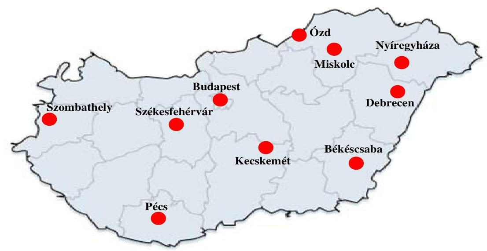

Forrás: ÁSZ
A szervezeti keretek mellett jelentős mértékben módosult a feladatellátás szerkezete is, mivel 2011. február 19-étől a képző központok, majd a 2011. július 1-jétől megalakult Türr István Intézet az állami felnőttképzési intézményi feladatok mellett ellátja a területi felzárkózási koordinációs központi feladatokat is ${ }^{4}$.

[^0]
[^0]:    ${ }^{2}$ A Türr István Intézet felügyeletét a hatásköri Korm. rendelet alapján 2012. május 14-étől az Emberi Erőforrás Minisztérium Társadalmi Felzárkózásért Felelős Államtitkársága látja el.
    ${ }^{3}$ Az Ózdi Igazgatóság korábban a miskolci képző központ telephelye volt.
    ${ }^{4}$ a KIM rendelet 1. § (1) bekezdés szerint

---

Az állami felnőttképzésnek a foglalkoztatáspolitikában, a társadalmi esélyegyenlőség biztosításában betöltött szerepe miatt kiemelt figyelmet érdemel, hogy az állami költségvetésből az állami felnőttképzési intézmény működtetésére, fenntartására, szakmai tevékenységére fordított erőforrások felhasználása hatékony-e, az ezekkel megvalósított szakmai tevékenység eredményes-e.

Az Állami Számvevőszék stratégiai célkitűzéseivel összhangban és a téma társadalmi jelentőségére figyelemmel ellenőrizte a képző központok (Türr István Intézet) tevékenységét.

Az ellenőrzés célja annak értékelése volt, hogy a 2011. évi költségvetés végrehajtásáról szóló beszámoló megbízható és valós képet adott-e a vagyoni és a pénzügyi helyzetről, valamint a képző központok (Türr István Intézet) tevékenységük hatékonyságának és eredményességének javításával hozzájárultak-e a változó munkaerőpiaci igények kielégítéséhez, ezen keresztül a foglalkoztatás bővítéséhez.

Ennek során értékelni kellett, hogy:

- a 2011. évi költségvetés végrehajtásáról szóló beszámoló megbízható és valós képet adott-e a Türr István Intézet vagyoni és pénzügyi helyzetéről;
- az intézményrendszer működési feltételeinek kialakítása, a szakmai irányítás eszközrendszere, a feladatellátás tárgyi és személyi feltételei, és a költségvetési források összhangban voltak-e a rövid távú munkaerőpiaci igények változásával, valamint a 2010-2011. évi szervezeti és jogszabályi változások milyen hatást gyakoroltak az intézményrendszerre;
- az intézményrendszer működése az előírt feladatok és kitűzött célok hatékonysága és eredményessége szempontjából megfelelő volt-e;
- az ellenőrzési, monitoring és értékelési rendszer hozzájárult-e a célkitűzések teljesítéséhez;
- a korábbi számvevőszéki ellenőrzés során tett megállapítások, javaslatok hasznosultak-e.

A képző központok szakmai tevékenységének hatékonyságát és eredményességét az ÁSZ átfogóan utoljára 2005-ben ${ }^{5}$ értékelte. A felnőttképzés feltételrendszerének ellenőrzéséről ${ }^{6}$ a 2010. évben készült jelentés, amely érintette a képző központok felnőttképzéssel kapcsolatos feladatellátását is.

[^0]
[^0]:    ${ }^{5}$ Jelentés a Foglalkoztatáspolitikai és Munkaügyi Minisztérium fejezet működésének ellenőrzéséről, 2005. október
    ${ }^{6}$ Jelentés a felnőttképzés feltételrendszerének, eredményességének, a gazdaság munkaerőigénye kielégítésében betöltött szerepének ellenőrzéséről, 2010. december

---

Az ellenőrzés szempontrendszerét előtanulmánnyal, valamint a felnőttképzéssel kapcsolatos korábbi ÁSZ ellenőrzéshez bekért 2006-2009. évekre kitöltött tanúsítványainak adataival alapoztuk meg.

A Türr István Intézet 2011. évi költségvetési beszámolóját az ÁSZ által a 2011. évi zárszámadás előkészítése során, a BM költségvetési szervek elemi beszámolóinak pénzügyi (szabályszerűségi) ellenőrzéséhez készített Egyszerűsített Útmutató alapján vizsgáltuk felül. A képző központok (Türr István Intézet) szakmai tevékenységének eredményességét és hatékonyságát a teljesítmény-ellenőrzés keretében, elemző eljárással vizsgáltuk az ÁSZ Ellenőrzési Kézikönyvében és teljesítmény-ellenőrzési módszertanában, valamint az INTOSAI ${ }^{7}$ vonatkozó standardjainak (ISSAI 3000 és 3100) a figyelembe vételével.

A képző központok képzési tevékenységének hatékonyságát a 2007-2011. évek között a képzést követően szakmájukban elhelyezkedők aránya, valamint az egy főre jutó képzési költség alakulásának elemzésével mértük. A képzési tevékenységet hatékonynak értékeltük, ha a képzést követően szakmájukban elhelyezkedők aránya magasabb ütemben emelkedett, mint az egy főre jutó képzési költség.

A képzési tevékenység eredményességét a 2007-2011. évek között öt indikátor alakulásának elemzésével értékeltük. Eredményesnek értékeltük a szakmai tevékenységet, ha a 2007-2011. években a kialakított intézményi rendszer működése biztosította az éves képzések aktuális munkaerőpiaci igények szerinti megvalósítását; növekedett a hátrányos helyzetű személyek bevonása a képzésekbe; növekedett a sikeresen vizsgát tettek és az elhelyezkedettek aránya; a képzéseket saját fejlesztésű tananyaggal (képzési modulokkal) támogatták; a költségvetésből származó forrást uniós támogatásokkal, valamint piaci alapon végzett képzésekből származó saját bevétellel egészítették ki.

A helyszíni ellenőrzés a képző központok irányítását ellátó NGM-re és KIM-re, a szakmai felügyeletet ellátó NMH-ra, valamint a szakmai feladatot ellátó Türr István Intézet központjára és négy (a kecskeméti, a székesfehérvári, a miskolci és a nyíregyházi) igazgatóságára terjedt ki. A helyszíni ellenőrzésbe vont négy igazgatóság kiválasztása kockázatelemzés alapján, mintavétellel történt.

Az ellenőrzött időszak a Türr István Intézet éves beszámolójának ellenőrzése tekintetében a 2011. évre, a teljesítmény-ellenőrzés esetében a 2007-2011 közötti időszakra terjedt ki.

Az Állami Számvevőszékről szóló 2011. évi LXVI. törvény 29. §-a szerint a jelentéstervezetet megküldtük egyeztetésre a közigazgatási és igazságügyi miniszternek, a nemzetgazdasági miniszternek, az emberi erőforrások miniszterének, a Türr István Intézet és az NMH főigazgatóinak. A beérkezett észrevételeket és az ezekre adott válaszokat, ideértve az el nem fogadott észrevételeket és azok indokolását a jelentés 9. a)-h) mellékletei tartalmazzák.

[^0]
[^0]:    ${ }^{7}$ International Organization of Supreme Audit Institutions, Legfőbb Ellenőrző Intézmények Nemzetközi Szervezete

---

Az ellenőrzés jogszabályi alapját Magyarország Alaptörvénye 43. cikk (1) bekezdésében, az Állami Számvevőszékről szóló 2011. évi LXVI. törvény 1. § (3) bekezdésében, 5. § (2), (3), (6) és (7) bekezdéseiben, valamint az államháztartásról szóló 2011. évi CXCV. törvény 61. § (2) bekezdésében és 90. § (1) bekezdésében foglaltak képezték.

---

# I. ÖSSZEGZŐ MEGÁLLAPÍTÁSOK, KÖVETKEZTETÉSEK, JAVASLATOK 

A képző központok intézményrendszerének, működési feltételeinek kialakítása és a rövid távú munkaerőpiaci igények közötti összhang a 2007-2010. években csak részben volt biztosított.

A szakmai irányítás keretében az irányító szerv a képző központok alapító okiratait a 2007-2010. években jóváhagyta, rendelkeztek SzMSz-szel, azonban azok aktualizálása az alapító okiratok módosításaival összhangban nem történt meg. A képző központok a képzési célkitűzéseikhez nem alakítottak ki önálló hosszú távú stratégiát, de rövid távú stratégiai célkitűzéseiket éves képzési terveikben megfogalmazták. A képzési tervek összeállításánál fő szempontként nem a foglalkoztatáspolitikai célok érvényesültek, mivel a képzési tervbe kerülést elsődlegesen a képzési keret terhére elszámolható képzések, a képző központoknál kialakult infrastruktúra, illetve az FMM által rögzített költségnormákból való finanszírozhatóság határozta meg. A Foglalkoztatási Hivatal eljárásrendje szerint nem kellett pályázati eljárást lefolytatni azon képzésekre, amelyek lebonyolítását a képző központok vállalni tudták. Az eljárásrend - a pályáztatás mellőzése miatt - a hatékonyság javítását ösztönző piaci verseny ellen hatott.

A képző központok meglévő képzési infrastruktúrája a piachoz való rugalmas alkalmazkodás ellen hatott, mivel nem volt lehetőségük a kialakított nagyszámú oktatótermeiknek, oktatóműhelyeiknek, illetve berendezéseiknek - a változó foglalkoztatáspolitikai igényekhez alkalmazkodó - folyamatos funkcióváltására. A képzési tervek összeállítását megalapozó dokumentumok az ellenőrzött képző központoknál a 2007-2010. években nem álltak rendelkezésre.

A munkaügyi központokkal való együttműködés 2007-2010. években a jogszabályi előírásoknak megfelelően működött, de eredményességi kritériumokat az irányító szerv nem támasztott. A 2007-2010. évekre a képző központok képzéseire vonatkozó értékelő rendszert a szakmai irányítást végző Foglalkoztatási Hivatal kialakította, azonban az nem volt alkalmas a teljesítmények mérésére, mivel a képzések hatékonysági és eredményességi kritériumait nem rögzítette. Erre vonatkozóan az ÁSZ a 2010. évben már tett javaslatokat ${ }^{8}$.

A képző központok a 2007-2010. években önálló minőségirányítási rendszer keretében építették ki és működtették monitoring és értékelési rendszerüket. A monitoring rendszeren belül folyamatosan végeztek hallgatói és megrendelői

[^0]
[^0]:    ${ }^{8}$ Az ÁSZ a 2010. évben a felnőttképzés témakörében végzett ellenőrzése során javaslatot tett a Kormánynak

 a felnőttképzés eredményességi és hatékonysági követelményeinek meghatározására, valamint ezek mérését, értékelését támogató információs rendszer kialakítására. Javaslatot tett továbbá a nemzetgazdasági miniszternek, hogy intézkedjen a felnőttképzést folytató intézmények képzési céljainak teljesüléséről, az általuk meghatározott eredményességi követelmények eléréséről, valamint a célok megvalósulását gátló körülményekről szóló információk nyilvánossá tételéről.

---

elégedettségmérést, illetve a képzéseket eredményesen teljesítők elhelyezkedésére vonatkozó kérdőíves felméréseket, melyeket rendszeresen értékeltek, azonban indikátoraik célértékeinek meghatározása hiányában a tevékenységük eredményességét nem lehetett megítélni. A kérdőíves felmérés alacsony visszaküldési aránya miatt nem nyújtott megfelelő információt arról, hogy a képzésben részt vettek a munkaerőpiaci igényeknek megfelelő végzettséget szereztek-e. Az értékelési rendszer a képzési terveknek a teljesülési adatokkal való összevetésének hiánya miatt a 2007-2010. években nem nyújtott releváns információt a vonatkozó foglalkoztatáspolitikai döntések meghozatalához, a munkaerőpiaci helyzet, a területi különbségek értékeléséhez, valamint nem volt alkalmas a képző központok tevékenysége eredményességének mérésére.

Az intézményrendszer működése az előírt feladatok és kitűzött célok hatékonysága és eredményessége szempontjából - az ellenőrzésben alkalmazott hatékonysági és eredményességi mutatók alapján - a 2007-2010. években nem volt megfelelő.

A képző központok szakmai tevékenysége a 2007-2010. évek tekintetében nem volt hatékony, mert az egy főre jutó képzési költség 125,1 M Ft-ról 137,1 M Ft-ra, 9,6%-kal emelkedett, míg az elhelyezkedési kérdőívre választ adókból az elhelyezkedettek aránya 55,7%-ról 52,2%-ra csökkent. A szakmai tevékenység a hátrányos helyzetűek képzése tekintetében a 2007-2010. években nem volt eredményes, mivel a hátrányos helyzetűek száma a 2007. évről a 2010. évre a képző központokban 19025 főről 17719 főre, a képzésben résztvevőkhöz viszonyított aránya 50,0% alá csökkent.

A képzéseket sikeresen teljesítők és az elhelyezkedettek aránya tekintetében a szakmai tevékenység a 2007-2010. években nem volt eredményes. A képzést eredményesen teljesítők aránya 2007-ről 2010-re kismértékben, 1,7 százalékponttal emelkedett (számuk 29003 főről 29498 főre változott), azonban a sikeresen elhelyezkedettek aránya 3,0 százalékponttal csökkent az időszakban. A képző központok pályázati tevékenysége eredményes volt, a 2007-2010. időszakban 1268 M Ft európai uniós támogatással egészítették ki a költségvetésből származó forrásaikat. A munkáltatók és munkavállalók megrendelésére végzett képzési tevékenység eredményes volt, mivel az ellenőrzött időszakban a munkáltatók és egyének megrendelése alapján is szerveztek képzéseket. A képző központok szakmai tevékenysége a képzések saját fejlesztésű tananyagokkal való támogatottsága szempontjából eredményes volt, mivel a 2007-2010. években több saját fejlesztésű tananyagot, képzési modulokat készítettek. A képzési tervek megvalósítása a 2007-2010. években az aktuális munkaerőpiaci igényeknek való megfelelés tekintetében nem volt eredményes, mivel a képzési keret alkalmazása, a keret-szerződés megkötésének eljárásrendje a piachoz való rugalmas alkalmazkodás, a piaci verseny érvényesülése ellen hatott. Emellett a képző központok 2007-2010. évi szakmai beszámolóikban nem mutatták be összehasonlítható módon, hogy a tervezett képzésekből melyek valósultak meg, az elmaradt képzések helyett milyen képzéseket indítottak, a megvalósult képzések összhangban voltak-e a foglalkoztatáspolitikai célokkal.

A képző központok működése a 2007-2010. évek között összességében nem volt hatékony és nem volt eredményes, emiatt nem segítette elő

---

# a változó munkaerőpiaci igények kielégítését, és a foglalkoztatás bővítési célok megvalósítását. 

A 2007-2010. években a tanfolyamokhoz szükséges tárgyi feltételek a képző központok mindegyikében saját, illetve bérelt eszközökkel biztosítottak voltak, azonban a képzéseket szolgáló saját tárgyi eszközök az ellenőrzött időszakban folyamatosan avultak, nettó értékük a 2007. évről a 2010. évre 540,1 M Ft-ra, közel 40,0%-kal csökkent. Az eszközök használhatósági foka az ellenőrzési időszak alatt 25,0%-ról 15,0%-ra mérséklődött, ezen belül az informatikai eszközök használhatósági foka a 2010. évben 6,5% volt. A képző központok képzési tevékenységüknek több mint 60,0%-át külső helyszínen, külső oktatók, intézmények közreműködésével látták el, mert a munkaerőpiaci igények szerint folyamatosan változó képzések elindításához - speciális célú oktatótermeik, illetve a telephelyeiken kívül indított képzések miatt - saját eszközeikkel rugalmasan alkalmazkodni nem tudtak.

Az ellenőrzött időszakban képzési feladat a személyi feltételek hiánya miatt nem maradt el. A feladatok teljesítéséhez a 2007-2010. években átlagosan 85,5%-ban külső oktatókat vettek igénybe amellett, hogy saját dolgozóik csupán munkaidejüknek 15-20%-ában oktattak. A fennmaradó időben tananyag fejlesztési, pályázat koordinálási, vizsgáztatási, felnőttképzés szervezési és lebonyolítási feladatokat láttak el. A munkaügyi központtal kötött keretszerződések szerinti képzések finanszírozása a 2007-2010. évek között az MpA képzési keretéből biztosított volt, képzések forráshiány miatt nem maradtak el.

A képző központok önállósága 2011. július 1-jétől megszűnt és megváltozott a finanszírozási struktúra is. A képzésre fordítható kiadások 2010-ről 2011-re 5211,8 M Ft-ról mintegy 74,0%-kal, 1360,3 M Ft-ra csökkentek. Előtérbe került a feladatok pályázati forrásokból történő finanszírozása. A Türr István Intézetben az eredeti előirányzatok alapján a 2011-2012. évek viszonylatában a működés finanszírozását 1983,8-3483,8 M Ft-os összegben, 40,6%-77,5%-os mértékben a saját és pályázati bevételekből kell biztosítani.

A 2010-2011. évi szervezeti és jogszabályi változások mind a minisztériumi irányításra, mind az intézményrendszer működésére jelentős hatást gyakoroltak. A képző központok szakmai tevékenységének irányítására vonatkozóan a jogszabályi rendelkezések a kormányváltást követő időszakban ellentmondásosak voltak, valamint nem érvényesült a jogszabályok közötti összhang követelménye. Ellentmondás alakult ki az FMM rendelet és a KIM rendeletben foglalt hatásköri szabályok között. Az FMM rendelet szerint a képző központok irányítását a kormányváltást követően az NGM látta el a Foglalkoztatási Hivatal bevonásával. Ezzel szemben a hatásköri Korm. rendelet szerint a képző központok irányítása 2010. július 1-jétől a KIM-hez került. Ennek következtében az NGM és a Foglalkoztatási Hivatal a 2011. évtől nem vett részt a képző központok irányításában, valamint az NGM nem gyakorolt szakmai felügyeletet a vállalatok közvetlen képzési megrendelései tekintetében sem.

A képzési keret 2011. január 1-jével megszűnt, a képző központok 2011. július 1-jével a Türr István Intézetbe beolvadtak, azonban a képzési keret felhasználását, és a képző központoknak a munkaügyi központokkal való együttműködé-

---

sét szabályozó FMM rendeletet ezekkel a változásokkal összhangban nem módosították.

A KIM, majd az EMMI${ }^{9}$ irányítása alá tartozó Türr István Intézet KIM rendeletben meghatározott feladatai a közfoglalkoztatás területén a belügyminiszter, a lakásgazdálkodás, felnőttképzés területén a nemzetgazdasági miniszter feladat- és hatáskörébe tartoznak. A közfoglalkoztatási feladatokról szóló Korm. határozat a közfoglalkoztatás új rendszerével összefüggésben előírta a jogszabályok és a közjogi szervezetszabályozó eszközök felülvizsgálatának szükségességét, amely elősegíti a tárcák közötti egyértelmű feladatmegosztást is. Ez a helyszíni ellenőrzés befejezéséig nem történt meg. Az intézmény által ellátott feladatok egyértelmű lehatárolásának hiánya párhuzamos feladatellátást eredményezhet.

A 2011. év elején a képző központok, majd 2011. július 1-jétől a Türr István Intézet a képzési célkitűzéseikhez, illetve a társadalmi felzárkózással kapcsolatos céljaikhoz nem alakítottak ki önálló hosszú távú stratégiát, és ehhez kapcsolódóan nem határozták meg hosszú és rövid távú célkitűzéseiket. A Türr István Intézet főigazgatója nem dolgozott ki az intézmény szakmai feladatai teljesítményének mérésére, értékelésére alkalmas egységes kritériumrendszert, mérőszámokat, ezáltal nem segítette elő a hatékony és eredményes munkavégzést. A főigazgató a szakmai tervekben rögzített feladatok megvalósításához munkatervet készíttetett, amely a vezetői információs rendszer részeként információt szolgáltat egyes tevékenységek előre haladásáról, felméri a feladatellátás kockázatait. Ez a feladatellátással kapcsolatos teljesítmények mérésére azonban nem alkalmas, mert nem határoz meg a mérésre alkalmas indikátorokat és értékelési szempontokat. A képzés terén kialakított, és a Türr István Intézet által alkalmazott monitoring rendszer nem nyújt megbízható információt a képzésben részt vetteknek a munkaerőpiacon történő elhelyezkedéséről, valamint a képzések tervezésének és szervezésének rendszere nem segíti elő, hogy a képzést teljesítőknek a megszerzett szakmájukban való elhelyezkedése biztosított legyen.

A Türr István Intézet megalakítását megelőzően nem készült döntést megalapozó helyzetértékelés, valamint a képző központok integrálásának várható hatásait bemutató hatástanulmány. A képzések számának mérséklődése a 2011. évben mind a képzésre rendelkezésre álló ingatlanok, mind a humánerőforrások tekintetében kihasználatlan kapacitásokat eredményezett. Az intézmény vezetője a közvagyon hatékony és eredményes felhasználása érdekében a megalakulást követően nem mérte fel meglévő tárgyi eszköz állománya új feladataival - különös tekintettel a hátrányos helyzetűek foglalkoztatásának elősegítésével - összhangban lévő hasznosíthatóságát. A 2011. évben nem mérte fel a feladatok ellátásához rendelkezésre álló, illetve a feladat-ellátáshoz szükséges személyi feltételeket.

A Türr István Intézet szakmai tevékenységének hatékonysága és eredményessége a megalakulása óta eltelt rövid idő, valamint a szakmai feladatok telje-

[^0]
[^0]:    ${ }^{9}$ 2012. május 14-étől

---

sítményének mérésére, értékelésére alkalmas egységes kritériumrendszer, mérőszámok kialakításának hiánya miatt objektív módon nem ítélhető meg.

A 2011. évi zárszámadási törvényjavaslat ellenőrzéséhez illeszkedve az ÁSZ a Türr István Intézet 2011. évi beszámolóját felülvizsgálta és megállapította, hogy gazdálkodása és előirányzatainak felhasználása összhangban volt a költségvetési gazdálkodásra vonatkozó szabályokkal. Az intézményi beszámoló a költségvetési szerv vagyoni, pénzügyi helyzetéről megbízható és valós képet adott. Az ellenőrzés - a beszámoló megbízhatóságát nem befolyásoló - hiányosságokat tárt fel. Az Ámr-ben foglaltak ellenére hiányos volt a kötelezettségvállalások ellenjegyzése, a kiadások teljesítését megelőzően a teljesítésigazolási és érvényesítési feladatokat nem az arra jogosultak látták el, valamint az intézmény szabad maradványt kötelezettségvállalással terhelt előirányzatmaradványként mutatott ki. A 2011. évi átszervezést követően a Türr István Intézetnél az Áhsz-ben, az Ávr-ben és a Bkr-ben előírt - az SzMSz-ben foglaltakkal összhangban lévő - belső szabályzatok (a kötelezettségvállalási szabályzat kivételével) nem készültek el, illetve nem kerültek jóváhagyásra.

Az Állami Számvevőszékről szóló 2011. évi LXVI. törvény 33. § (1) bekezdésében foglaltak értelmében a jelentésben foglalt megállapításokhoz kapcsolódó intézkedési tervet köteles az ellenőrzött szervezet vezetője összeállítani és azt a jelentés kézhezvételétől számított 30 napon belül az ÁSZ részére megküldeni. Amennyiben az intézkedési tervet határidőben nem küldi meg a szervezet, vagy az nem elfogadható, az ÁSZ elnöke a hivatkozott törvény 33. § (3) bekezdés a)-b) pontjaiban foglaltakat érvényesítheti.

Az ellenőrzés intézkedést igénylő megállapításai és javaslatai:

# az emberi erőforrások miniszterének 

Az EMMI irányítása alá tartozó Türr István Intézet KIM rendeletben meghatározott feladatai a közfoglalkoztatás területén a belügyminiszter, a lakásgazdálkodás, felnőttképzés területén a nemzetgazdasági miniszter feladat- és hatáskörébe tartoznak. A helyszíni ellenőrzés befejezéséig a tárcák közötti egyértelmű feladatmegosztás nem történt meg. Az intézmény által ellátott feladatok egyértelmű lehatárolásának hiánya párhuzamos feladatellátást eredményezhet. A közfoglalkoztatási feladatokról szóló Korm. határozat a közfoglalkoztatás új rendszerével összefüggésben előírta a jogszabályok és a közjogi szervezetszabályozó eszközök felülvizsgálatának szükségességét, az érintett miniszterek részvételével.

Javaslat:
Egyeztesse a kormányzati célok összehangolt megvalósítása, a párhuzamos feladatellátás elkerülése érdekében a belügyminiszterrel és a nemzetgazdasági miniszterrel a Türr István Intézetnek a közfoglalkoztatás, valamint a lakásgazdálkodás és a felnőttképzés keretében ellátandó feladatait, és ennek eredményét az intézmény szakmai tervének elbírálásakor vegye figyelembe.

---

# a Türr István Intézet főigazgatójának 

1. A Türr István Intézet a területi felzárkózási koordinációs központi és felnőttképzési feladatai ellátásához nem alakított ki hosszú távú stratégiát, ehhez kapcsolódóan nem határozta meg hosszú és rövid távú céljait. Nem dolgozta ki
 a szakmai feladatai teljesítményének mérésére, értékelésére alkalmas egységes kritériumrendszert, mérőszámokat, ezáltal nem segítette elő a hatékony és eredményes munkavégzést.

Javaslat:
A KIM rendeletben és az alapító okiratban meghatározott feladatok figyelembevételével:
a) dolgozza ki a Türr István Intézet intézményi stratégiáját és ezek alapján határozza meg hosszú és rövid távú céljait;
b) intézkedjen a szakmai feladatai teljesítményének mérésére, értékelésére alkalmas kritériumrendszer, mérőszámok kialakításáról.
2. A képző központok működése a 2007-2010. évek között nem volt hatékony és nem volt eredményes, emiatt nem segítette elő a változó munkaerőpiaci igények kielégítését, és a foglalkoztatás bővítési célok megvalósítását. A képzés terén kialakított és alkalmazott monitoring rendszer nem nyújtott megbízható információt a képzésben részt vetteknek a munkaerőpiacon történő elhelyezkedéséről. Ezáltal nem szolgáltatott releváns információt a foglalkoztatáspolitikai intézkedések meghozatalához. Az éves képzési tervek összeállításánál fő szempontként nem a foglalkoztatáspolitikai célok érvényesültek, mivel a képzési tervbe kerülést elsődlegesen a képzési keret terhére elszámolható képzések, a képző központoknál rendelkezésre álló infrastruktúra határozta meg.

Javaslat:
A közpénzek eredményes és hatékony felhasználása, a foglalkoztatáspolitikai szempontok érvényesülése érdekében:
a) a képzési feladatok ellátása során vegye figyelembe a munkaerőpiaci igényeket, annak érdekében, hogy a képzést befejezőknek a szakmájukban való elhelyezkedése biztosított legyen;
b) alakítson ki a társadalmi felzárkózással kapcsolatos képzések tekintetében a képzésben részt vettek elhelyezkedéséről releváns információt szolgáltató monitoring rendszert;
c) gondoskodjon a 2007-2010. években eredménytelen képzési tevékenység okainak feltárásáról, a kapcsolódó felelősség kivizsgálásáról, és ennek eredménye ismeretében a szükséges intézkedések megtételéről.
3. Az intézmény vezetője a közvagyon hatékony és eredményes felhasználása érdekében a megalakulást követően nem mérte fel meglévő tárgyi eszközállománya új feladataival - különös tekintettel a hátrányos helyzetűek foglalkoztatásának elősegítésével - összhangban lévő hasznosíthatóságát. Az intézmény vezetője a 2011. évben

---

nem mérte fel a feladatok ellátásához rendelkezésre álló, illetve a feladat-ellátáshoz szükséges személyi feltételeket sem. A képzések számának csökkenése következtében 2011-ben a korábban képzési célt szolgáló ingatlanokban és humánerőforrásokban kihasználatlan kapacitás keletkezett.

Javaslat:
A rendelkezésére álló erőforrásainak feladataival összhangban álló hatékony és eredményes felhasználása érdekében:
a) mérje fel a feladatok ellátásához rendelkezésre álló, illetve a feladat-ellátáshoz szükséges személyi- és tárgyi feltételeket;
b) tegyen intézkedést meglévő eszközeinek új feladataival összhangban álló hasznosítására;
c) dolgozzon ki hasznosítási tervet, illetve tegyen javaslatot az irányító szervnek az intézmény alapfeladatainak ellátására nem alkalmas, vagy ahhoz nem szükséges eszközök hasznosítására.
4. A Türr István Intézet 2011. évi kiadásainak teljesítésénél a kötelezettségvállalás ellenjegyzése nem minden esetben történt meg. Nem biztosították a teljesítésigazolási és érvényesítési feladatok jogosultak által történő ellátását. Az intézmény szabad maradványt kötelezettségvállalással terhelt előirányzat-maradványként mutatott be. A 2011. évi átszervezést követően a Türr István Intézetnél az Áhsz-ben, az Ávr-ben és a Bkr-ben előírt - az SzMSz-ben foglaltakkal összhangban lévő - belső szabályzatok (a kötelezettségvállalási szabályzat kivételével) nem készültek el, illetve nem kerültek jóváhagyásra.

Javaslat:
A gazdálkodás szabályszerűsége, a jogszabályi előírások maradéktalan betartása érdekében:
a) biztosítsa, hogy az Áht ${ }_{2}$ 37. § (1) bekezdésében foglaltak alapján a kötelezettségvállalást megelőzően minden esetben történjen meg a pénzügyi ellenjegyzés;
b) gondoskodjon az Ávr. 57. § (4) és az 58. § (4) bekezdéseinek megfelelően a kifizetéseket megelőzően a teljesítésigazolási és érvényesítési feladatok jogosultak által történő ellátásáról;
c) intézkedjen a kötelezettségvállalással terhelt előirányzat-maradvány megállapítása során az Áht ${ }_{2} 2 . \S$ (1) bekezdés o) pontja szerint a kötelezettségvállalás tartalmára vonatkozó előírások figyelembevételéről annak érdekében, hogy az előirányzat-maradványt terhelő kötelezettségvállalás összegét szabályszerűen megtett jognyilatkozat alapján állapítsák meg;
d) gondoskodjon az Áhsz-ben, az Ávr-ben és a Bkr-ben előírt - az SzMSz-ben foglaltakkal összhangban lévő - belső szabályzatok elkészítéséről és jóváhagyásáról.

---

# II. RÉSZLETES MEGÁLLAPÍTÁSOK 

## 1. A 2011. ÉVI KÖLTSÉGVETÉS VÉGREHAJTÁSÁRÓL SZÓLÓ BESZÁMOLÓ MEGBÍZHATÓSÁGA

Az ellenőrzés keretében az ÁSZ a Türr István Intézet 2011. évi beszámolóját felülvizsgálta és megállapította, hogy gazdálkodása és előirányzatainak felhasználása összhangban volt a költségvetési gazdálkodásra vonatkozó szabályokkal. Az intézményi beszámoló a költségvetési szerv vagyoni, pénzügyi helyzetéről megbízható és valós képet ad (1. számú melléklet).

### 1.1. Az intézményi beszámolóban szereplő pénzforgalmi adatok megbízhatósága

A Türr István Intézet ${ }^{10}$ jogelődje a budapesti képző központ a 2011. évre 348,3 M Ft kiadási, 136,6 M Ft bevételi és 211,7 M Ft költségvetési támogatási eredeti előirányzattal rendelkezett. A beszámolási időszakban a kiadási előirányzat 3261,6 M Ft-ra, a bevételi előirányzat (pénzforgalom nélküli bevételek nélkül) 2139,8 M Ft-ra, a támogatási előirányzat 1069,0 M Ft-ra módosult. A pénzforgalom nélküli bevételek módosított előirányzata 52,8 M Ft volt. Az előirányzatok közel tízszeresre növekedésében a nyolc képző központ budapesti képző központba való beolvadásának, és ennek bázisán az egységes Türr István Intézet létrehozásának volt döntő szerepe, mely valamennyi kiemelt előirányzatot és azok teljesítését érintette (2. sz. melléklet).

A teljesítés a költségvetési kiadásoknál 1843,4 M Ft (56,5%), a költségvetési bevételeknél 2506,8 M Ft (114,3%), a támogatásoknál 1069,0 M Ft (100,0%) volt. A költségvetési kiadások 49,2%-át a személyi juttatások (719,2 M Ft) és a munkaadókat terhelő járulékok (188,9 M Ft), további 47,0%-át a dologi és egyéb folyó kiadások (865,6 M Ft) képezték. Előző évi előirányzat-maradvány átadásra a költségvetési kiadások 0,9%-át (16,4 M Ft-ot), felhalmozásra a 2,9%-át (53,3 M Ft-ot) fordították.

A személyi juttatások eredeti kiadási előirányzata a 2011. évre 108,8 M Ft volt, amely a módosítások következtében 805,1 M Ft-ra növekedett, elsősorban a képző központok intézménybe olvadása révén. A személyi juttatások ellenőrzött tételeinél a számfejtések a rendelkezésre álló dokumentumok alapján, szabályosan történtek, a kifizetések a számfejtés nettó összegével azonosak voltak. Az intézmény munkavállalói (közalkalmazottak) számára a rendszeres személyi juttatások számfejtési, továbbá a személyi jövedelemadóval kapcsolatos munkáltatói, a társadalombiztosítási, és a munkaadói járulékbevallással, valamint az információszolgáltatással összefüggő feladatokat a Kincstár látta el. A személyi juttatások elszámolása központosított illetményszámfejtő rendszeren (KIR) keresztül történt.

[^0]
[^0]:    ${ }^{10}$ A Türr István Intézet 2011. július 1-jével alakult meg.

---

A munkaadókat terhelő járulékok eredeti előirányzata 29,2 M Ft volt, amely a módosítások következtében 272,0 M Ft-ra növekedett és 188,9 M Ft-ra teljesült. A vizsgált - a 9. havi bér számfejtésével összefüggő - pénzforgalmi tranzakciók során a járulékköteles jövedelmek után a járulékok elszámolása, bevallása, pénzügyi teljesítése megfelelő időszakra és határidőre megtörtént.

Az intézmény dologi és egyéb folyó kiadásainak eredeti előirányzata 200,3 M Ft, a módosított előirányzata 2069,3 M Ft, a teljesítése 865,6 M Ft volt. Az országgyűlési hatáskörű módosítás 21,2 M Ft csökkenést, míg az irányító szervi változtatások összesen 687,9 M Ft, az intézményi hatáskörűek 1202,3 M Ft növekedést eredményeztek a dologi és egyéb folyó kiadások előirányzatában. A dologi és egyéb folyó kiadások előirányzatain keletkezett, 1203,7 M Ft megtakarításban meghatározó volt a 890,0 M Ft maradványtartási kötelezettség végrehajtása. A megtakarítás szakmai feladatonkénti képződésére vonatkozó információ nem állt rendelkezésre, azt az intézmény 2011. éves beszámolójának szöveges indokolásában sem mutatták be.

Az előző évi működési célú előirányzat-maradvány átadás jogcímen eredeti előirányzatot nem terveztek, a módosított előirányzat és a teljesítés 16,4 M Ft volt. A kiadást jelentő tételeket a KIM, a Foglalkoztatási Hivatal, és az MpA javára utalták át, kötelezettségvállalással nem terhelt előirányzatmaradványként, illetve a különféle feladatra kapott támogatások elszámolása során kimutatott maradványként.

A felhalmozási kiadások eredeti előirányzata 10,0 M Ft, módosított előirányzata 98,8 M Ft volt, melyet 53,3 M Ft-ra teljesítettek. A felhalmozási kiadások előirányzata a képző központok beolvadása kapcsán 116,9 M Ft-tal emelkedett, amit a képző központokat érintő zárolás, majd elvonás 30,3 M Ft-tal csökkentett. Az intézmény a 2010. évi előirányzat-maradványa terhére 2,2 M Ft-tal növelte az intézményi beruházások előirányzatát. Intézményi beruházásokra 36,3 M Ft-ot, a felújításokra 17,0 M Ft-ot fordítottak 2011-ben. A beruházások és felújítások során betartották a közbeszerzésre vonatkozó szabályokat.

A kiadások számviteli tartalmi besorolása, a gazdasági események főkönyvi könyvelése és analitikus nyilvántartása megfelelő volt. A tranzakciók mintatételeinek vizsgálata során megbízhatósági hibát az ellenőrzés nem tárt fel. A mintatételek ellenőrzése alapján megállapítható, hogy a Türr István Intézetnél nem tartották be az Ámr. V. fejezetében foglalt előírásokat, mivel az Ámr. 74. § (1) bekezdésében ${ }^{11}$ foglaltak ellenére a kötelezettségvállalást jelentő szerződések, megrendelések ellenjegyzése nem volt teljes körű. Emellett a kiadások teljesítésénél figyelmen kívül hagyták az Ámr. 76. § (5) ${ }^{12}$ bekezdésében, továbbá az Ámr. 77. § (4) bekezdésében ${ }^{13}$ foglaltakat, mert a szakmai teljesítésigazolást, valamint az érvényesítést nem az arra jogosultak végezték.

[^0]
[^0]:    ${ }^{11}$ 2011. december 31-étől az Áht 37. § (1) bekezdése szabályozza.
    ${ }^{12}$ 2012. január 1-jétől az Ávr. 57. § (4) bekezdése szabályozza.
    ${ }^{13}$ 2012. január 1-jétől az Ávr. 58. § (4) bekezdése szabályozza.

---

A Türr István Intézetnél a pénzforgalmi adatok megbízható, valós képet mutattak a gazdálkodás folyamatairól, a pénzügyi és vagyoni helyzetről. A költségvetési előirányzatokat a törvényi és egyéb jogszabályi felhatalmazások betartásával használták fel, érvényesültek a törvényesség, az átláthatóság és az elszámoltathatóság követelményei.

# 1.2. A mérlegtételek teljes körűsége, értékelésük számviteli elveknek való megfelelősége 

A Türr István Intézet 2011. évi könyvviteli mérlege tárgyévi állományi értékének főösszege (4621,5 M Ft) az eszközök és források tekintetében egyező volt (3. sz. melléklet). A könyvviteli mérleg egyes sorain kimutatott tárgyévi állományi értékeket a záró főkönyvi kivonat adatai alátámasztották, azok egyezősége biztosított volt. A mérlegfőösszeg és a mérlegtételek tárgyévi nyitó adatai megegyeztek az előző évi mérleg záró adataival. Az intézménynél 2011. december 31-ei fordulónappal leltározást nem hajtottak végre, azonban a mérleg sorai analitikus nyilvántartásokkal egyeztetettek voltak. A képző központok Türr István Intézet mérlegébe beépülő - 2011. június 30-ai könyvviteli mérlegei főösszegének együttes értéke 3409,5 M Ft volt.

A mérlegben a követelések állományi értéke az előző évi, 1,0 M Ft-hoz képest 96,9 M Ft-ra emelkedett, döntően a képző központok beolvadása miatt. A követelések tárgyévi állományi értékéből 96,5 M Ft szolgáltatásból származó követelés volt. A követelések mérlegsort az analitikus nyilvántartás alapján összeállított kimutatással támasztották alá. A mérlegsor adata a számviteli alapelvek valódiság elvének nem felelt meg, mivel - az ellenőrzött tételek között kettő, összesen 6,4 M Ft értékű - téves, kétszeres számlázás miatti tétel is szerepelt a tárgyévi állományi értékben. A feltárt mérleghiba - melynek 6,4 M Ft-os értéke a mérlegfőösszegből számított, 2,0%-os lényegességi küszöböt (92,4 M Ft-ot) nem érte el (az eltérés 0,1% volt) - a pénzforgalmi beszámoló megbízhatóságát nem érinti. A követelések mérlegtétel besorolása megfelelő volt, azonban tartalma - a vizsgálat alá vont tételek alapján feltárt hiba miatt - nem felelt meg az Szt. 29. § (2) bekezdésében és
 az Áhsz. 22. § (1) bekezdés a) pontjában foglaltaknak.

A 2011. évi könyvviteli mérlegben a kötelezettségek tárgyévi állományi értéke - az előző évi 7,0 M Ft-ról - 534,7 M Ft-ra növekedett. Az emelkedés elsősorban a képző központok - 2011. év I. féléves mérlegében kimutatott 446,2 M Ft kötelezettségállománya beépülésének következménye. A tárgyév végi kötelezettségállomány 127,3 M Ft értékben áruszállításból és szolgáltatásból, 407,4 M Ft értékben támogatási program előlege miatti kötelezettségekből származott. A kötelezettségek mérlegtétel tartalma, besorolása megfelelt az Áhsz. 22. § (7) és (8) bekezdéseiben foglaltaknak, valamint az Áhsz. 9. számú melléklete függő, átfutó, kiegyenlítő kiadásokra vonatkozó rendelkezéseinek.

A 2011. évi könyvviteli mérlegben az egyéb aktív pénzügyi elszámolások tárgyévi állományi értéke 5,1 M Ft, az egyéb passzív pénzügyi elszámolásoké 0 Ft volt. Az egyéb aktív pénzügyi elszámolások mérlegsort főkönyvi számlával, analitikus nyilvántartással alátámasztották, melyek egyezőségét biztosították. A mérlegsor az ellenőrzött tételek alapján a számviteli alapelvek valódiság, teljesség elveinek megfelelt.

---

# 1.3. Az előirányzatok évközi módosításai és átcsoportosításai 

A Türr István Intézetnél a 2011. évi beszámoló „23 Költségvetési előirányzatok egyeztetése" űrlapjának adatai szerint a 348,3 M Ft eredeti kiadási előirányzat 2913,3 M Ft-tal, 3261,6 M Ft-ra növekedett. A módosított előirányzatban megjelent az intézménybe olvadó képző központokkal összefüggő előirányzat, amely 3106,0 M Ft volt.

A kiadási előirányzat-változást 857,3 M Ft összegben támogatás, 2139,8 M Ft összegben intézményi működési célú bevételek, 52,8 M Ft összegben előző évi előirányzatmaradvány-igénybevétel előirányzata fedezte.

A Türr István Intézet előirányzatairól és azok módosításairól vezetett főkönyvi könyvelés és analitikus nyilvántartás kiemelt előirányzatonkénti adatai megegyeztek a 2011. évi beszámoló 23-as űrlapjában foglaltakkal. A saját hatáskörű, 2011. II. félévi előirányzat-módosítások során betartották az Ámr. 60. §-ában foglalt előírásokat. Az intézmény eleget tudott tenni a szolgáltatási kiadásokkal, az adókkal és egyéb befizetésekkel kapcsolatos kötelezettségeinek. A kiemelt előirányzatokon előirányzat-túllépés nem történt.

### 1.4. A központi költségvetés egyensúlyának megteremtése érdekében előírt maradványtartási és kiadáscsökkentő intézkedések

A költségvetési egyensúly megtartásával összefüggő intézkedések keretében az intézménynél 28,9 M Ft, majd 290,5 M Ft előirányzat-csökkentésre került sor, melyekből 48,9 M Ft a személyi juttatások, 5,4 M Ft a munkaadói járulékok, 234,8 M Ft a dologi és 30,3 M Ft a beruházási kiadások előirányzatát mérsékelte. A KIM 890,0 M Ft maradványtartási kötelezettséget írt elő az intézmény számára, melyet a Türr István Intézet végrehajtott.

Az intézmény az előírt maradványtartási kötelezettség miatt mentességi kérelemmel fordult a KIM-hez a folyamatban lévő felnőttképzési, közfoglalkoztatással kapcsolatos átképzési feladatok lebonyolításához szükséges beszerzések érdekében. A KIM a kérelemben foglalt beszerzési igényeket jóváhagyta.

A Türr István Intézet feladatellátását nehezítette, de nem akadályozta a támogatás elvonása, és - tekintettel a jóváhagyott beszerzési igényekre - a maradványtartási kötelezettség teljesítése. Az elvonással érintett kiemelt előirányzatokon maradvány képződött, mely szabad maradványrészt is tartalmazott.

### 1.5. A költségvetési szerv tervezett bevételeinek teljesülése

Az intézmény pénzforgalmi bevételének eredeti előirányzata 136,6 M Ft, módosított előirányzata 2139,8 M Ft volt, melyet 114,7%-ra (2454,0 M Ft-ra) teljesítettek. Az intézményi működési bevételeken 257,6 M Ft, a támogatásértékű bevételeken 46,8 M Ft, a működési célra átvett pénzeszközökön 9,8 M Ft bevételi túlteljesítés mutatkozott. A bevételi többlet keletkezésének oka - a beszámoló szöveges indokolásában foglaltak szerint - a november-december hónapban bonyolított képzések következő évben esedékes díjainak 2011-ben történt beérkezése volt.

---

Az előző évi előirányzat-maradvány igénybevétele (52,8 M Ft) és a támogatás (1069,0 M Ft) a módosított előirányzattal azonos összegben teljesült.

# 1.6. A tárgyévi előirányzat-maradványok megállapításának szabályszerűsége, alátámasztottsága, keletkezésének okai 

A Türr István Intézet 2011. évi előirányzat-maradványa 1732,4 M Ft volt, mely összeg 1418,2 M Ft kiadási megtakarítás és 314,2 M Ft bevételi túlteljesítés együttes összegéből képződött. Előző évekből származó előirányzat-maradvány a tárgyévi összeget nem módosította. A 2011. éves beszámoló 42-es űrlapján levezetett maradvány összege megegyezett a könyvviteli mérleg tartalékok sora tárgyévi állományi értékével. A felhasználható összes előirányzatmaradványból 1453,0 M Ft-ot kötelezettségvállalással terhelt, 279,4 M Ft-ot szabad előirányzat-maradványként mutatott ki az intézmény.

Az előirányzat-maradványt terhelő kötelezettségvállalások ellenőrzött tételei között kettő tételhez - melyek együttes értéke 29,2 M Ft volt - nem állt rendelkezésre dokumentum. A fejezeti kezelésű előirányzatok intézmény részére történő átcsoportosítására vonatkozó megállapodások alapján három tételt vettek figyelembe kötelezettségvállalásként, összesen 460,0 M Ft értékben. Az előirányzatok átcsoportosítása - az intézmény 23-as űrlapjának adatai szerint - és a fedezet intézményhez utalása nem történt meg a 2011. évben, így az előirányzat-maradványnak sem képezte részét.

Az intézmény a 489,2 M Ft szabad maradvány kötelezettségvállalással terhelt előirányzat-maradványként történt kimutatásával nem tartotta be az Ámr. 72. § (1) bekezdésében $^{14}$ foglaltakat. A hibák a mérleg és a pénzforgalmi jelentés megbízhatóságát nem befolyásolták.

## 2. A KÉPZŐ KÖZPONTOK INTÉZMÉNYRENDSZERE MŰKÖDÉSI FELTÉTELEINEK KIALAKÍTÁSA

### 2.1. A foglalkoztatáspolitikai szempontok érvényesülése a szakmai irányításban és az intézményi feladatellátás során

A képző központok szakmai tevékenységének irányítására vonatkozóan a jogszabályi rendelkezések az ellenőrzött időszakban ellentmondásosak voltak, emiatt a Kormány által meghatározott foglalkoztatáspolitikai célok és a képző központok tevékenysége közötti összhang csak részben volt biztosított. A 2007-2010. évek között az állami felnőttképzési intézmény feladatait, irányítási és kapcsolatrendszerét az FMM rendelet szabályozta. A jogszabály szerint az irányító szerv az SZMM, majd az NGM volt, akik az irányítást a Foglalkoztatási Hivatal bevonásával látták el. A kormányváltást követően (2010. július 1-jétől) a képző központok irányítása a hatásköri Korm. rendelet szerint a KIM-hez került. A még mindig hatályos FMM rendelet szerint

[^0]
[^0]:    $^{14}$ Az Áht $^{2}$ 2. § (1) bekezdés o) pontja szabályozza 2012. január 1-jétől.

---

azonban az irányítás továbbra is a szakképzésért és felnőttképzésért felelős nemzetgazdasági miniszterhez tartozott. Ez a szabályozás 2010. július 1. és 2011. február 18. közötti időszakban - a KIM rendelet hatályba lépéséig - állt fenn. A KIM rendelet 2011. február 19-étől ugyan hatályon kívül helyezte az FMM rendelet 1-6. §-ait, azonban ezzel a jogszabályi ellentmondást csak részben oldotta fel. A rendelet személyi hatályát tartalmazó 1. §-a hatályon kívül helyezése miatt most az FMM rendeletből nem derül ki, hogy az alkalmazott rövidítések melyik költségvetési szervre vonatkoznak, így nem lehet tudni, hogy mely Hivatal, illetve mely Minisztérium a feladatok címzettje, ami jogbizonytalanságot okoz.

Az FMM rendelet módosítás után megmaradó szakaszai - pl. 7. § (1) bekezdése, 8. § (3) bekezdés a) pontja, 8. § (2) bekezdése, 11. § (2) bekezdése stb. - azonban visszahivatkoznak a hatályon kívül helyezett paragrafusokra, emiatt a rendelet nehezen értelmezhető.

Az ellentmondásos jogi szabályozás következménye az volt, hogy a 2010. év II. felétől - az FMM rendeletben foglaltak ellenére - sem az NGM, sem a Foglalkoztatási Hivatal nem vett részt a képző központok irányításában. Emellett - a hatásköri Korm. rendelet 81. § (2) bekezdés r) pontjában foglaltak ellenére - az NGM nem gyakorolt szakmai felügyeletet a vállalatok közvetlen képzési megrendelései tekintetében. A képzési keret 2011. január 1-jével megszűnt, a képző központok a Türr István Intézetbe beolvadtak, azonban a képzési keret felhasználását, és a képző központoknak a munkaügyi központokkal való együttműködését szabályozó FMM rendeletet ezekkel a változásokkal összhangban nem módosították.

A képző központok irányításában, a 2007-2010. I. félévében jogszabállyal ellentétes gyakorlat alakult ki az SZMM és a Foglalkoztatási Hivatal között, mivel a képző központok éves képzési terveit a minisztérium helyett a Foglalkoztatási Hivatal főigazgatója hagyta jóvá.

Az FMM rendelet 5. § (1)-(2) bekezdései tartalmazták a miniszter hatáskörébe tartozó irányítási feladatokat, mely szerint a miniszter a Foglalkoztatási Hivatal véleményezése után jóváhagyja a képző központok éves képzési tervét. Az SZMM a feladatot nem teljesítette.

A Foglalkoztatási Hivatal a képző központok szakmai irányításával összefüggő feladata közül a 2007-2010. években nem teljesítette a képző központok szolgáltatásai eredményességi követelmények meghatározására vonatkozó feladatát. A 2010. év II. félévében a hatásköri Korm. rendelet hatályba lépését követően - a jogi szabályozásból eredő jogbizonytalanság miatt - működési zavarok léptek fel a Foglalkoztatási Hivatalnál $^{15}$ a képző központok irányításában. A KIM rendelet hatályba lépését követően a képző központok irányítása ténylegesen a KIM Társadalmi Felzárkózásért Felelős Államtitkárság feladatát képezte $^{16}$,

[^0]
[^0]:    $^{15}$ A főigazgató például nem hagyta jóvá a képző központok fejlesztési keretét. Ebben az időszakban nem volt egyértelmű, hogy KIM vagy NGM irányítás alatt, az FMM rendelet szerint, vagy annak figyelmen kívül hagyásával szükséges-e irányítani a képző központokat.
    $^{16}$ 2012. május 14-étől az Emberi Erőforrás Minisztériumhoz tartozik.

---

azonban a minisztériumon belül a szakmai főosztály ügyrendjében nem szabályozták az ezzel kapcsolatos részletes feladatokat és hatásköröket.

A feladat- és hatáskörökkel kapcsolatos jogszabályi összhang hiánya mind az NGM-nél, mind a KIM-nél feladatelmaradást okozott. Az NGM-nek a társadalmi felzárkózásért felelős miniszter egyetértésével - az Flt.-ben 2010. december 31-étől kapott törvényi felhatalmazás $^{17}$ alapján - rendeletben kellett volna szabályoznia „az állami felnőttképzési intézmény és az állami foglalkoztatási szerv a Nemzeti Foglalkoztatási Alapból támogatott - munkaerőpiaci képzések lebonyolításával kapcsolatos együttműködését, az állami felnőttképzési intézmény feladatai ellátásának finanszírozását, a képzési keret felhasználásának szabályait". A képzési keret megszüntetésével $^{18}$ a képzési keret felhasználásának szabályozására vonatkozó felhatalmazás okafogyottá vált, azonban a rendeletalkotás a többi kérdésben sem történt meg.

Az ÁSZ a Kormánynak a felnőttképzés feltételrendszerének szabályozásával kapcsolatban a 2010. évben javaslatot tett a felnőttképzés rendszerének oly módon való átalakítására, amely elősegíti az elmaradott térségek, hátrányos helyzetű emberek felzárkóztatását. Javaslatot tett továbbá arra, hogy a hatásköri Korm. rendeletben a felnőttképzésért felelős miniszter feladatköre terjedjen ki a felnőttképzés működtetéséhez, fejlesztéséhez szükséges és realizált források felmérésére, számbavételére, értékelésére, a feladatok és a források összhangjának megteremtése érdekében. A korábbi ÁSZ javaslatok a helyszíni ellenőrzés befejezéséig nem realizálódtak.

A képző központok, majd a Türr István Intézet feladatainak KIM rendeletben meghatározott keretszabályait 2011. február 19-étől egyéb jogszabályok - a KIM rendelet előkészítésével kapcsolatos tárcaközi vélemények, valamint a közfoglalkoztatási feladatokról szóló Korm. határozatban foglaltak ellenére - nem tették teljessé. Így nem határozták meg a közmunkához kapcsolódóan a BM, a lakhatással és a képzési tevékenységével kapcsolatos feladatokban az NGM $^{19}$, a munkaerőpiaci szolgáltatások tekintetében a kormányhivatalok és a Türr István Intézet közötti feladatmegosztást. A közfoglalkoztatási feladatokról szóló Korm. határozat a közfoglalkoztatás új rendszerével összefüggésben előírta a jogszabályok és a közjogi szervezetszabályozó eszközök felülvizsgálatának szükségességét, amely elősegíti a tárcák közötti egyértelmű feladatmegosztást is. Ez a helyszíni ellenőrzés befejezéséig nem történt meg. Jelenleg a több tárcát érintő feladatok nem kellően lehatároltak, ami párhuzamos feladatellátáshoz vezethet, veszélyeztetve a kormányzati célok összehangolt megvalósítását $^{20}$.

Az új funkciók költségvetési kihatásai
 tervezésének szükségességére a KIM rendelet 2011. évi módosításakor a tárcaközi egyeztetés során az NGM, valamint a BM

[^0]
[^0]:    ${ }^{17}$ Flt. 52. §-a.
    ${ }^{18}$ A képzési keretre vonatkozó rendelkezést az Flt. 43. §-a tartalmazta, amely 2011. január 1-jétől hatálytalan.
    ${ }^{19}$ A hatásköri Korm. rendelet szerint a közfoglalkoztatás a BM, a lakásgazdálkodás, lakáspolitika, a felnőttképzés és szakképzés az NGM a felelősségi körébe tartozik.
    ${ }^{20}$ Az NGM közigazgatási államtitkárának a 2011. januárjában a KIM rendelettervezet véleményezésére írt levele.

---

is felhívta a figyelmet. Emellett a közfoglalkoztatással kapcsolatos együttműködés feladatait, jogszabálytervezetek elkészítését írta elő a közfoglalkoztatási feladatokról szóló Korm. határozat is. A jelzett Korm. határozat végrehajtására érdemi intézkedés a helyszíni ellenőrzés lezárásáig nem történt.

A KIM rendelettel a képző központok, illetve a Türr István Intézet feladat-szerkezete is jelentősen átalakult, a korábban elsősorban felnőttképzési, szakképzési feladatokat ellátó intézmény komplexebb, a társadalmi felzárkózással kapcsolatos feladatokat lát el. A KIM rendelet rögzíti, hogy a Türr István Intézet feladatai ellátása érdekében részt vesz hazai és uniós forrásból kiírt pályázatokon, bevételt eredményező képzési és képzéshez kapcsolódó tevékenységet végez $^{21}$.

A kormányzati foglalkoztatáspolitikai célok kormányhatározatokban ${ }^{22}$ jelentek meg. Az ezekben foglalt stratégiai célkitűzések megvalósítása érdekében az SZMM a 2008. és a 2010. években irányelveket adott ki a képző központok szakmai felügyeletét ellátó Foglalkoztatási Szolgálat számára, de nem írt elő stratégiakészítési kötelezettséget. Ennek ellenére a Foglalkoztatási Szolgálat elkészítette a hosszú távú - 2007-2013. közötti időszakra vonatkozó - stratégiáját és az ahhoz kapcsolódó akciótervezési dokumentumot, azonban annak a foglalkoztatáspolitikai célok változását követő aktualizálása nem történt meg.

A 2011. évben a képző központok tevékenységét szabályozó KIM rendelet összhangban volt a Kormány foglalkoztatáspolitikai célkitűzéseiben történt prioritás-változással.

A KIM rendelet előírásai, ezzel együtt a Türr István Intézet feladatai összhangban álltak az egész életen át tartó tanulásról szóló Korm. határozatban, valamint az Országos Fejlesztéspolitikai Koncepcióban megfogalmazottakkal, amelyek előtérbe helyezték a hátrányos helyzetű csoportok oktatását, és az esélyegyenlőség biztosítását.

A 2011. évben kiadott Széll Kálmán Tervben a foglalkoztatás bővítése érdekében közmunkaprogramok indítását, és az oktatási rendszer munkaerőpiaci igényekhez történő közelítését hirdette meg a Kormány. Mindezekkel összhangban a KIM rendelet szerint a képző központok (Türr István Intézet) a közfoglalkoztatással összefüggő képzési feladatait elsőbbségiként kezeli.

A képző központok, majd a 2011-ben alapított Türr István Intézet a 2007-2011. években részben rendelkeztek a feladatellátáshoz szükséges szervezeti és működési keretekkel. Alapító okirataikat az irányító szerv jóváhagyta $^{23}$, azonban a

[^0]
[^0]:    ${ }^{21}$ KIM rendelet 5. § (1) bekezdés
    ${ }^{22}$ az 1057/2005. (V. 31.) Szakképzés-fejlesztési, az 1069/2004. (VII. 9.) Felnőttképzésfejlesztési, és a 2212/2005. (X. 13.), az egész életen át tartó tanulásról szóló Korm. határozatok
    ${ }^{23}$ A kecskeméti képző központ SzMSz-ét 1996. szeptember 12-én, a nyíregyházi képző központ SzMSz-ét 1996. szeptember 1-jén, a miskolci képző központ SzMSz-ét 2000. március 1-jén, a székesfehérvári képző központ SzMSz-ét 2000. június 19-én hagyta jóvá az irányító szerv.

---

képző központok SzMSz-ei a többszöri módosítási javaslatok ellenére nem kerültek ezekkel összhangban módosításra. A Türr István Intézet SzMSz-ét a közigazgatási miniszter a 2011. július 1-jei alapítást követően csak 2011. december 30-án hagyta jóvá. A 2011. július 1-jétől létrehozott Türr István Intézet igazgatóságai $^{24}$ önálló ügyrendeket készítettek, melyeket a főigazgató az SzMSz jóváhagyását követően felülvizsgáltatott és előírta azoknak az SzMSz-szel összhangban történő átdolgozását.

A szakmai tevékenységgel összhangban a jogszabályok a támogatott képzések hatékonysági, eredményességi kritériumait nem rögzítették és erre vonatkozóan a Foglalkoztatási Hivatal sem határozott meg követelményeket, annak ellenére, hogy ezt számára az FMM rendelet 2011. február 18-ig előírta $^{25}$. A 2007-2010. évekre vonatkozóan a Foglalkoztatási Hivatal kialakította és működtette a képzésekre vonatkozó értékelő rendszert, de az a képző központok eredményességét, hatékonyságát nem mérte, és nem is tette érdekeltté azokat az eredményes és hatékony munkavégzésben.

A képzési keretből történő finanszírozásnál nem alakult ki verseny. A képző központok a munkaügyi központoktól a képzési ajánlatban szereplő azon képzéseket, amelyek lebonyolítását vállalták, pályázat nélkül kapták meg. Ez a költséghatékonyságot nem ösztönözte.

Az ÁSZ a Kormánynak a felnőttképzés feltételrendszerének szabályozásával kapcsolatban a 2010. évben javaslatot tett a felnőttképzés eredményességi és hatékonysági követelményeinek meghatározására, valamint a képzések eredményességének és hatékonyságának mérését, értékelését támogató információs rendszer kialakítására. Az ÁSZ javaslatok a helyszíni ellenőrzés befejezéséig nem realizálódtak. Ez is hozzájárult ahhoz, hogy a monitoring rendszer nem nyújtott megfelelő információt az irányító miniszternek a munkaerőpiaci helyzet, a területi különbségek értékeléséhez.

A képző központok a képzési célkitűzéseikhez a 2007-2010. években nem alakítottak ki önálló hosszú távú stratégiát. A rövid távú stratégiai célkitűzéseiket éves képzési (szakmai) terveikben megfogalmazták. Az éves képzési tervek összeállítása során - a képző központok információja szerint - figyelembe vették a Foglalkoztatási Szolgálat által készített éves beszámolókban megjelenő helyzetelemzéseket, az adott régió területfejlesztési koncepcióját, a gazdasági kamarák és a KSH adatait, az intézmény tárgyi, technikai feltételeit, a rendelkezésre álló belső és külső (szerződéses) munkatársi állomány szakmai összetételét, a kormányprogramok fő foglalkoztatáspolitikai célkitűzéseit, valamint kiemelt célként határozták meg a hátrányos helyzetűek képzését. A Foglalkoztatási Hivatal eljárásrendje szerint nem kellett pályázati eljárást lefolytatni azon képzésekre, amelyek lebonyolítását a képző központok vállalni tudták. Az eljárásrend - a pályáztatás mellőzése miatt - a hatékonyság javítását ösztönző piaci verseny ellen hatott. A képzési tervek összeállításánál fő szem-

[^0]
[^0]:    ${ }^{24}$ A korábbi önállóan működő és gazdálkodó képző központok.
    ${ }^{25}$ Az FMM rendelet 5. § (3) bekezdés d) pontja szerint a Foglalkoztatási Hivatal meghatározza a képző központok által nyújtott képzésekkel, szolgáltatásokkal kapcsolatos eredményességi követelményeket.

---

pontként nem a foglalkoztatáspolitikai célok érvényesültek, mivel a képzési tervbe kerülést elsődlegesen a képzési keret terhére elszámolható képzések, a képző központoknál kialakult infrastruktúra, illetve az FMM által rögzített költségnormákból való finanszírozhatóság határozta meg. A képzési tervek összeállítását megalapozó dokumentumok $^{26}$ az ellenőrzött képző központoknál a 2007-2010. évekre nem álltak rendelkezésre.

A képző központok meglévő infrastruktúrája a piachoz való rugalmas alkalmazkodás ellen hatott, mivel nem volt lehetősége a kialakított nagyszámú oktatótermeinek, illetve oktatóműhelyeinek, berendezéseinek a változó foglalkoztatáspolitikai igényekhez alkalmazkodó folyamatos átalakítására, funkcióváltására.

A 2011. év elején a képző központok, majd 2011. július 1-jétől a Türr István Intézet a területi felzárkózási koordinációs központi és felnőttképzési feladatok ellátásához nem alakítottak ki önálló hosszú távú stratégiát, és ehhez kapcsolódóan nem határozták meg rövid és hosszú távú célkitűzéseiket.

A képző központok és a munkaügyi központok közötti együttműködés 2007-2010. években a jogszabályi előírásoknak megfelelően működött, de eredményességi kritériumokat az irányító szerv nem támasztott, ezért együttműködésük eredményessége nem minősíthető. A jogszabályok változása miatt a szakmai együttműködés 2011-től átalakult, a képző központok feladatai közül a társadalmi felzárkóztatás kapott nagyobb hangsúlyt. A 2010. év nyarán a képző központok irányításában bekövetkezett változás ellenére a munkaügyi központok és a képző központok együttműködése év végéig folytatódott a keretmegállapodások szerint. A 2011. évtől az együttműködés átalakult, a keretmegállapodással végzett képzések csak az áthúzódó képzések esetében valósultak meg, a többi képzés esetében pályázati rendszer lépett életbe. Emellett hangsúlyosabbá vált más szervezetekkel (pl. önkormányzatokkal, civil szervezetekkel) való együttműködés.

A Türr István Intézet országos hatáskörének eredménye a közfoglalkoztatáshoz kapcsolt háztáji gazdálkodással érintett 624 önkormányzattal kötött együttműködési megállapodás is, amelyhez kapcsolódnak az önkormányzatok munkaügyi központokkal kötött támogatási szerződései.

A képző központok és a TISZK-ek, valamint a szakiskolák között intézményesített szakmai együttműködés a vizsgált időszakban nem alakult ki, mivel annak szakmai támogatottsága nem volt meg.

Az államháztartás hatékony működését elősegítő szervezeti átalakításokról és az azokat megalapozó intézkedésekről szóló 2118/2006. (VI. 30.) Korm. határozatban a Kormány célul tűzte ki a képző központok és a TISZK-ek lehető legszorosabb együttműködését $^{27}$. A TISZK-ek alapfeladata az iskolarendszerű, ifjúsági szakképzés, míg a képző központok iskolarendszeren kívüli felnőttképzést végeztek, ezért szakmai oldalról nem volt meg a képző központ - TISZK együttműködés támogatottsága. Érdemi szakmai együttműködés nem valósult meg.

[^0]
[^0]:    ${ }^{26}$ Pl. a munkaügyi központok írásos képzési igényei, vállalkozások képzésekkel kapcsolatos megkeresései, a régió hiányszakmáiról szóló kimutatások.
    ${ }^{27}$ A célkitűzést az 1117/2010. (V. 12.) Korm. határozat hatályon kívül helyezte.

---

# 2.2. A feladatellátás tárgyi feltételei 

A 2007-2010. években a tanfolyamokhoz szükséges tárgyi feltételek a képző központok mindegyikében saját, illetve bérelt eszközökkel biztosítottak voltak.

A képző központok képzési terveiket a rendelkezésre álló erőforrásaik figyelembe vételével készítették el. A 2007. évben összesen 160 elméleti oktatást szolgáló tanteremmel, 88 gyakorlati oktatást szolgáló tanműhellyel, ebből 8 nyelvi laborral rendelkeztek (4. sz. melléklet). Az elméleti oktatást szolgáló tantermek száma a 2010. évre 165-re, a gyakorlati oktatást szolgáló tanműhelyek száma 89-re növekedett, a nyelvi laborok száma nem változott. A 2010. évről a 2011. évre a tantermek és tanműhelyek száma ugyanazon a szinten maradt. A 2007-2010. évek között összesen 1509 M Ft-ot, a 2011. évben 123 M Ft-ot fordítottak beruházásra és felújításra.

#### Abstract

A miskolci képző központban az ellenőrzött időszakban 5 tanterem kialakítására került sor. A képzési igények változásának megfelelően az elektronikai tanműhely helyett villanyszerelő tanműhelyt alakítottak ki a 2010. évben. A székesfehérvári képző központ a nagyszámú külső tanfolyam hatására 2007-től a régió másik két megyéjének székhelyén - Tatabányán és Veszprémben - külső oktatóbázist alakított ki egy-egy informatikai terem, illetve 3-3 általános oktatóterem berendezésével, továbbá ügyfélszolgálati irodával. A kecskeméti képző központban a képzésekhez közvetlenül kapcsolódó korszerű gépeket, berendezéseket vásároltak (pl. megújuló energiahasznosító rendszer stb.), valamint a Mercedes gyár autó üléseit gyártó céggel együttműködve alakítottak ki egy oktatótermet. A nyíregyházi képző központban megvalósult fejlesztések elsősorban pótlást szolgáltak.

A fejlesztések ellenére az oktatáshoz használt tárgyi eszközök nettó értéke a 2007. évről a 2010. évre 540,1 M Ft-ra, a 2011. évre 482,4 M Ft-ra, közel felére csökkent. Emellett az eszközök használhatósági foka $^{28}$ is folyamatosan csökkenő értéket mutatott (a 2007. évi 24,6%-ról a 2010. évre 15,1%-ra, a 2011. évre 13,9%-ra mérséklődött), ezen belül az informatikai eszközök használhatósági foka 6,5% volt. A nettó érték és a használhatósági fok csökkenése azt mutatja, hogy a fejlesztésre rendelkezésre álló források nem voltak elegendőek az eszközök pótlására, a képzéseket szolgáló tárgyi eszközök az ellenőrzött időszakban folyamatosan avultak.

[^0]
[^0]:    ${ }^{28}$ Eszközök használhatósági foka: az eszközök nettó értékének és bruttó értékének a hányadosa.

---

A következő ábra az oktatáshoz használt tárgyi eszközök (ingatlanok nélkül) 2007-2011. évi használhatósági fokának értékét
 mutatja:
2. számú ábra
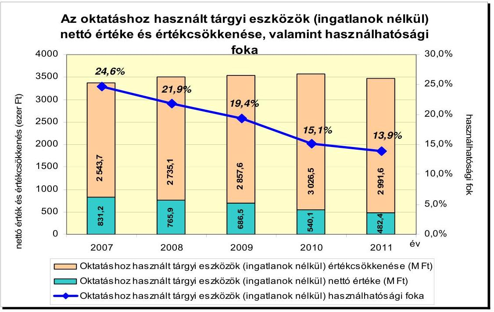

Forrás: az ellenőrzés tanúsítványai
A képző központok képzési tevékenységüknek több mint 60,0\%-át külső helyszínen, külső oktatók, intézmények közreműködésével látták el, mert a munkaerőpiaci igények szerint folyamatosan változó képzések elindításához saját eszközeikkel rugalmasan alkalmazkodni nem tudtak. A 2007. évről a 2010. évre a saját tantermekben megtartott órák számának növekedése ellenére az ingatlanok kapacitás-kihasználása csökkent. Arra vonatkozóan, hogy a rendelkezésre álló oktató- és tantermeknek mennyi a tényleges kapacitása, egyes képző központok ${ }^{29}$ képzési tervei és beszámolói tartalmaztak adatot, azonban a tényleges kapacitások és a lekötött kapacitások összevetésére a 2007-2011. években dokumentált módon számításokat nem végeztek, a kapacitáskihasználtságot - a saját szabad kapacitások, és ezzel egyidejűleg a külső helyiségek igénybevételének okait, hatásait - éves szakmai beszámolóikban nem elemezték.

A képzési tervekben megjelent képzések tanterem szükséglete a 2007. évben összesen 448726 óra volt, melyből a saját tantermekben megtartott órák száma 161169 óra, az összes tanterem szükséglet 35,9\%-a volt. A 2010. évben az 520995 órát kitevő tanterem szükséglet 41,3\%-a (215348 óra) bonyolódott saját tanteremben. Az ingatlanok képzésre történő kihasználtsága a képzések számának csökkenése következtében 2011. évre jelentősen mérséklődött. A saját tantermekben tartott órák száma 114470 órára változott, az összes tanterem szükséglet (246 274 óra) 46,5\%-át tette ki.

[^0]
[^0]:    ${ }^{29}$ miskolci, székesfehérvári, nyíregyházi képző központok

---

A képzési helyszínek területi elhelyezkedése lehetővé tette a képzések lefolytatását, mert azokat az igényeknek megfelelő településre szervezték. A miskolci és a székesfehérvári képző központok nehezen, a kecskeméti és a nyíregyházi képző központok könnyen megközelíthetők tömegközlekedési eszközökkel.

A kilenc képző központból nyolcban a távoktatás infrastrukturális feltételeit, valamint az egyénileg tanulható tananyagot, a konzultációs rendszert, valamint a kapcsolattartás és tudásellenőrzés módszereit európai uniós források bevonásával megteremtették, azonban kihasználtságuk - a fizetőképes kereslet hiánya miatt - alacsony volt.

Távoktatási programban az ellenőrzött időszakban Kecskeméten 65 fő, Székesfehérváron 97 fő, Nyíregyházán 12 fő, Miskolcon 154 fő vett részt.

# 2.3. A feladatellátás személyi feltételei 

A képző központok képzési feladataikat a 2007-2010. években részben saját személyi állománnyal, nagyobb részt (átlagosan 85,5\%-ban) külső oktatókkal látták el (5. sz. melléklet). Személyi feltételek hiánya miatt képzés nem maradt el az ellenőrzött időszakban.

A következő ábra az egy intézményre jutó, saját és külső oktatók által tartott éves átlagos óraszámot szemlélteti ${ }^{30}$:
3. számú ábra
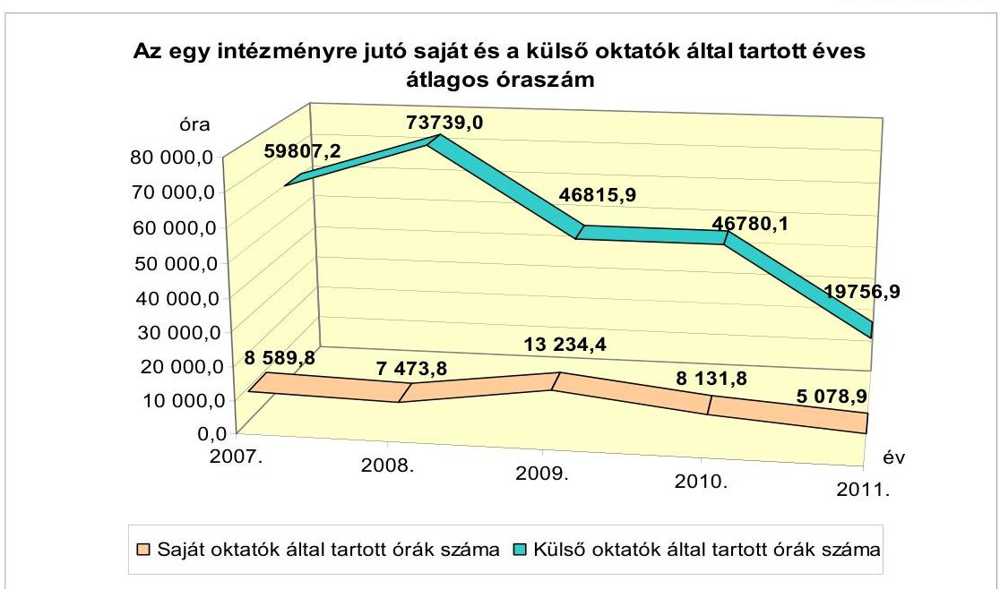

Forrás: az ellenőrzés tanúsítványai

[^0]
[^0]:    ${ }^{30}$ Az egy intézményre jutó átlagos óraszám meghatározásánál - a torzító hatás elkerülése miatt - nem vettük figyelembe azon képző központokat, akik az óraszámokra vonatkozóan adatot nem közöltek. (A 2007-2008 években a miskolci, a pécsi és a kecskeméti a 2009. évben a pécsi és kecskeméti, a 2010-2011 években a pécsi képző központokat.)

---

A képző központok személyi állományát az oktatáshoz kapcsolódó feladatokat ellátó és az egyéb, technikai, műszaki, pénzügyi feladatokat ellátó munkavállalók alkották. A négy ellenőrzött képző központnál kizárólag oktatói vagy oktatásszervezői munkakör nem volt. Instruktori munkaköröket hoztak létre, akik oktatási, tananyag fejlesztési, pályázat koordinálási, vizsgáztatási, felnőttképzés szervezési és lebonyolítási feladatokat is elláttak.

A székesfehérvári központban az instruktorok a havi munkaidejük 33,0-28,0\%-át fordították oktatásra a fennmaradó 67,0-72,0\%-ban egyéb feladatokat láttak el. Az nem állapítható meg, hogy munkaidejüknek hány százalékában végeztek szervezési feladatokat.

Az intézményekben dolgozók száma a 2007. évhez képest a 2010. évre jelentős változást nem mutatott (mindössze 6 fővel, 1,5\%-kal csökkent) annak ellenére, hogy az egy főre jutó átlagos óraszámok ${ }^{31}$ 25,2\%-kal mérséklődtek. A 2011. évben a képzések száma, valamint a megtartott órák száma is jelentősen lecsökkent, de ezt az oktatók számának változása nem követte.

A 2007. évben a 391 fő teljes munkaidőben foglalkoztatott közül 290 fő (a létszám csaknem háromnegyede) oktatási és oktatáshoz kapcsolódó tevékenységet végző és 101 fő (a létszám egynegyede) egyéb tevékenységet végző munkavállaló dolgozott a képző központokban. Egy saját oktató a 2007. évben átlagosan 554,2 órát tartott, amely a 2010. évre 414,4 órára változott (25,2\%-kal csökkent). Az intézmény feladatstruktúrájának és a képzések finanszírozási rendszerének átalakulása miatt - a képzések számának csökkenése mellett - a 2011. évben egy oktató átlagosan már csak 290,2 órát (a 2007. évinek alig a felét) tanított, ezzel szemben azonban az oktatók létszáma kevesebb, mint 6,4\%-kal csökkent.

Az oktatók a tevékenység folytatásához a megfelelő szakképesítéssel rendelkeztek, valamint folyamatos továbbképzésük biztosított volt, rendszeresen vettek részt külső és belső szakmai továbbképzéseken, konferenciákon.

# 2.4. A költségvetési források összhangja a rövid távú munkaerőpiaci igények változásával 

A képzéseket a 2007-2010. években az MpA által kezelt keretekből, a munkaügyi központok külön képzési forrásaiból, európai uniós támogatásokból, valamint a munkáltatók, munkavállalók befizetéseiből finanszírozták (6. sz. melléklet). A munkaügyi központtal kötött keretszerződések szerinti képzések finanszírozása a 2007-2010. évek között az MpA képzési keretéből biztosított volt, a képzési támogatások a 2007-2010. évek között folyamatosan emelkedtek. Az időszakban a keretszerződés alapján megvalósuló képzések forráshiány miatt nem maradtak el ${ }^{32}$.

[^0]
[^0]:    ${ }^{31}$ A átlagos óraszámok meghatározásánál nem vettük figyelembe a budapesti, a pécsi igazgatóságok 2007-2011. évi, a kecskeméti igazgatóság 2007-2009. évi, a miskolci igazgatóság 2007-2008. évi létszám adatait, mert az óraszámokra vonatkozóan a tanúsítványokban adatot nem közöltek.
    ${ }^{32}$ Képzések a piaci megrendelők visszalépése illetve önköltséges képzések esetén a nem elegendő számú jelentkező miatt hiúsultak meg.

---

A 2007-2010. években az MpA-ból eredő támogatás átlagosan 71,6\% volt, a 2011. évre az arány 50,8\%-ra csökkent. Ennek oka, hogy a 2011. évben életbe lépő új szabályozás az elkülönített képzési keretet megszüntette, a képzések megvalósítására pályázati úton elnyerhető források álltak rendelkezésre. A képző központoknak 2011-től a kizárólag pályázati úton elnyerhető képzési források miatt fel kellett venniük a versenyt a piaci szereplőkkel. A képzések és a képzésben résztvevők száma közel harmadára (62,5\%-kal), a költségvetési forrás pedig ezt meghaladóan (csaknem 79,2\%-kal) csökkent. A képző központok a 2007-2010. években az MpA-ból összesen 14 751,3 M Ft-ot, a 2011. évben 692,5 M Ft-ot, a munkaügyi központoktól a 2007-2010. években 2571,3 M Ft-ot, a 2011. évben 315,9 M Ft-ot kaptak képzések finanszírozására. A finanszírozások összegét a következő táblázat szemlélteti:

1. számú táblázat

Az MpA és a munkaügyi szervezetek képzési finanszírozása a 2007-2011. években

|  |  |  |  |
| :--: | :--: | :--: | :--: |
| Év | MpA finanszírozása | Munkaügyi   szervezet   finanszírozása | Összesen: |
| 2007 | 3319,9 | 358,9 | 3678,8 |
| 2008 | 3768,9 | 743,4 | 4512,3 |
| 2009 | 3704,3 | 827,3 | 4531,6 |
| 2010 | 3958,2 | 641,7 | 4599,9 |
| 2011 | 692,5 | 315,9 | 1008,4 |
| összesen: | 15443,8 | 2887,2 | 18331,0 |

Forrás: az ellenőrzés tanúsítványai
A 2008. évi gazdasági válság az országrészeket eltérően érintette, de a leghátrányosabb térségek nem változtak. A költségvetési források elosztásánál a Foglalkoztatási Hivatal a leghátrányosabb, illetve hátrányos helyzetű kistérségek körét részben figyelembe vette.

A képző központok területi elhelyezkedése szempontjából a leghátrányosabb térségekben találhatók ${ }^{33}$ a miskolci, a debreceni, a nyíregyházi, a békéscsabai és a pécsi igazgatóságok. A MpA-tól kapott támogatásokból a 2007-2011. években a legnagyobb, (az elosztott források 20,0\%-át meghaladó) kiugró összegű támogatásban a Pécsi Igazgatóság részesült. Ezt követte a miskolci és a debreceni igazgatóság támogatása.

A leghátrányosabb térségben található békéscsabai és nyíregyházi igazgatóságok támogatási aránya nem érte el a képzési keret 10,0\%-át sem. A források elosztását indokoló dokumentum nem állt az ellenőrzés rendelkezésére.

[^0]
[^0]:    ${ }^{33}$ A kedvezményezett térségek besorolásáról szóló 311/2007. (XI. 17.) Korm. rendelet alapján.

---

A képző központok 2007-2011. évben kapott támogatását az alábbi ábra szemlélteti:
4. számú ábra
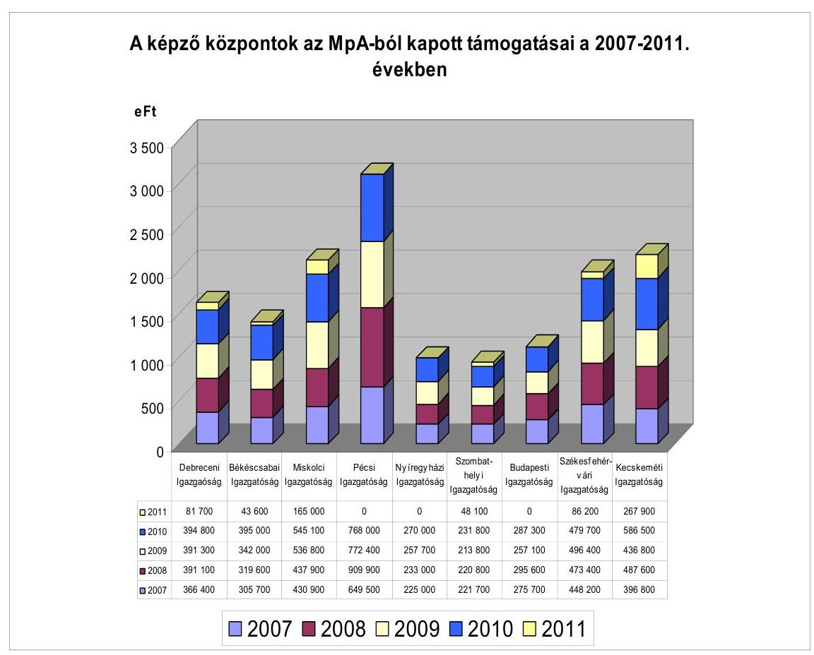

Forrás: az ellenőrzés tanúsítványai

# 2.5. A 2010-2011. évi szervezeti és jogszabályi változások hatása az intézményrendszerre 

A képző központok (Türr István Intézet) irányítása a 2010. évi kormányzati átalakítást követően a KIM-hez tartozott, de a felnőttképzés vonatkozásában együtt kellett működnie az NGM-mel, illetve a közfoglalkoztatás területén a BM-mel.

A Türr István Intézet megalakítását megelőzően nem készült döntést megalapozó helyzetértékelés, valamint a képző központok integrálásának várható hatásait bemutató hatástanulmány. Dokumentált módon nem vizsgálták meg az intézményi átalakítás költségvetési hatásait és az új feladatok humánerőforrás és infrastruktúra szükségletét, nem készítettek cselekvési tervet a feladatok és az erőforrások összehangolására.

A 2011. évi intézményi összeolvadás kinyilvánított célja - a KIM Társadalmi Felzárkózásért Felelős Államtitkárának XVIII/68/50/2011. sz. feljegyzése alapján az volt, hogy az addigi „9 irány helyett egységes normák szerint működjön az intéz-

---

mény", valamint az addigi „rossz gyakorlatot megszüntessék: azaz a helyi igényekhez igazodó elszigetelt megoldási kísérletek helyett országos szintű programok lebonyolítása történjen, igazodva a társadalmi felzárkózás politikai célrendszeréhez."

A 2011. évben kialakították az új feladatoknak megfelelő szervezeti kereteket. A területi igazgatóságok elsődleges szerepe az operatív végrehajtás lett. A stratégiai tervezési, a költségvetési-pénzügyi tervezési, a pénzügyi és szakmai monitoring, az ellenőrzés, a kommunikáció, az informatika és a kutatási feladatok ellátása a Türr István Intézet központjában, centralizáltan történik. A területi igazgatóságok személyi összetétele az új feladatok elvégzésére teljes körűen nem alkalmas - pl. pályázatok előkészítése, közfoglalkoztatással és lakhatással kapcsolatos feladatok szervezése - ezért a központ ezeket az operatív feladatokat is centralizáltan látja el. Ennek ellenére a korábbi képzési létszám a 2011. évben szinte változatlanul megmaradt.

# 3. AZ INTÉZMÉNYRENDSZER MÜKÖDÉSÉNEK ÉRTÉKELÉSE A FELADATOK HATÉKONY ÉS EREDMÉNYES ELÉRÉSE SZEMPONTJÁBÓL 

### 3.1. A képző központok (Türr István Intézet) működésének eredményessége és hatékonysága

A 2007-2010. években a források növekedése nem volt összhangban a képzések és a képzésben részt vevők számának változásával. A képzések forrásainak összege a 2007. évről a 2010. évre a képzésben részt vevők számának növekedését (0,8\%) jelentősen meghaladó mértékben (10,5\%-kal) emelkedett ${ }^{34}$ (6-7. sz. melléklet).

A 2011. évre a képzésekre fordított források 1362,1 M Ft-ra, a 2010. évinek 26,1\%-ára csökkentek, ezzel együtt a képzésben résztvevők száma 14133 főre (37,2\%-ra) mérséklődött. A 2011. évben a 2010. évről áthúzódó képzések egy részének forrását az MpA FA részének elkülönített képzési keretéből kellett volna finanszírozni, de az MpA 2011. év januárjától történő megszüntetése az áthúzódó képzések finanszírozásának tekintetében problémát jelentett. A kilenc 2011 júliusáig még önálló képző központ igazgatója a KIM Társadalmi Felzárkóztatásért Felelős Államtitkárságnak levelet küldött kérve, hogy a 241 képzésen részt vevő 4220 fő képzésének befejezéséhez a szükséges 887 M Ft forrást biztosítsák.

[^0]
[^0]:    ${ }^{34}$ A képzések forrásainak összege 4715,5 M Ft-ról 5211,8 M Ft-ra, a képzésben részt vevők száma 37691 főről
 38010 főre emelkedett.

---

Az alábbi ábra a képző központok képzéseinek finanszírozási forrásait mutatja be a 2007-2011. évek között:
5. számú ábra
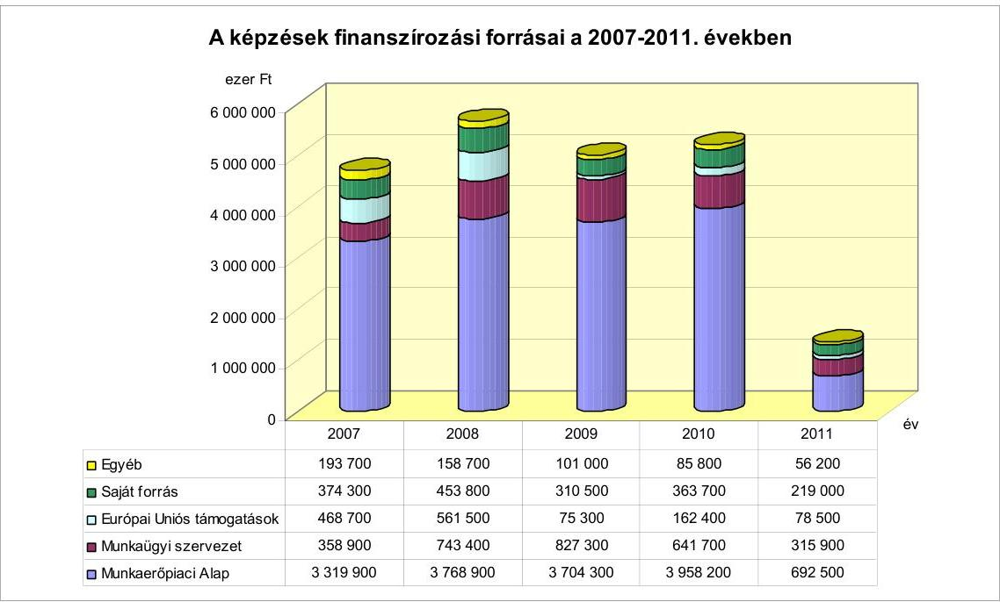

Forrás: az ellenőrzés tanúsítványai
A képző központok vállalkozási tevékenységet a vizsgált időszakban nem folytattak, vállalkozási bevételük nem volt.

A képző központok a 2007-2010. évek közötti szakmai tevékenységének eredményességét az alapján ítéltük meg, hogy a kialakított intézményi rendszer működése biztosította-e az éves képzések aktuális munkaerőpiaci igények szerinti megvalósítását, a hátrányos helyzetű személyek bevonását a képzésekbe, valamint a sikeresen vizsgát tettek és az elhelyezkedettek aránya növekedett-e. Vizsgáltuk továbbá, hogy a képzéseket saját fejlesztésű tananyaggal (képzési modulokkal) támogatták-e, és a költségvetésből származó forrásokat kiegészítették-e uniós támogatásokkal, illetve piaci alapon végzett képzésekből származó saját bevétellel.

A szakmai tevékenység a képzéseket sikeresen teljesítők és az elhelyezkedettek aránya tekintetében a 2007-2010. években nem volt eredményes, mivel mind a képzést eredményesen teljesítők, mind a sikeresen elhelyezkedettek aránya csökkent az időszakban. A 2011. évben a képzést eredményesen teljesítők és az elhelyezkedettek száma is jelentősen lecsökkent.

A képző központokban a 2007-2010. években befejezett képzéseken 120245 fő vett részt, ebből a képzést eredményesen teljesítette 112785 résztvevő (93,8%). A 2007. évben 29003 tanuló, a 2010. évben 1,7%-kal többen, 29498 tanuló végzett eredményesen, azonban a képzést befejezőkhöz viszonyított arányuk az időszakban folyamatosan 94,5%-ról 91,5%-ra csökkent. A 2011. évben a képzést eredményesen teljesítők aránya 90,3%, 10134 fő volt.

---

A képző központok a végzett hallgatók munkaerőpiacon történő elhelyezkedésének mérésére a képzés befejezését követően két alkalommal (3 és 12 hónap) kérdőíves hallgatói megkeresést végeztek${ }^{35}$. A kérdőíves felmérés alapján a 2007-2010. időszakban az elhelyezkedettek száma 4026 főről 5011 főre emelkedett, azonban a válaszadókból az elhelyezkedettek aránya 55,7%-ról 52,2%-ra csökkent. A 2011. évre az elhelyezkedettek száma és aránya is csökkent, a válaszadók 48,8%-a, 3065 volt hallgató nyilatkozott úgy, hogy a szerzett szakmájában elhelyezkedett (7. sz. melléklet). A képzés eredményességét vizsgáló módszer - az alacsony visszaküldési arány miatt${ }^{36}$ - nem adott megalapozott következtetések levonására alkalmas információt. A képzés eredményéről megkérdezettek visszajelzési kötelezettségére nincs előírás, ösztönzésére nincs megfelelő eszköz. A nyomon követést befolyásolta a képzést követően külföldön munkát vállalók és a lakcímváltozások száma.

A képzéseken eredményesen teljesítők és az elhelyezkedettek számának változását a következő ábra szemlélteti:
6. számú ábra
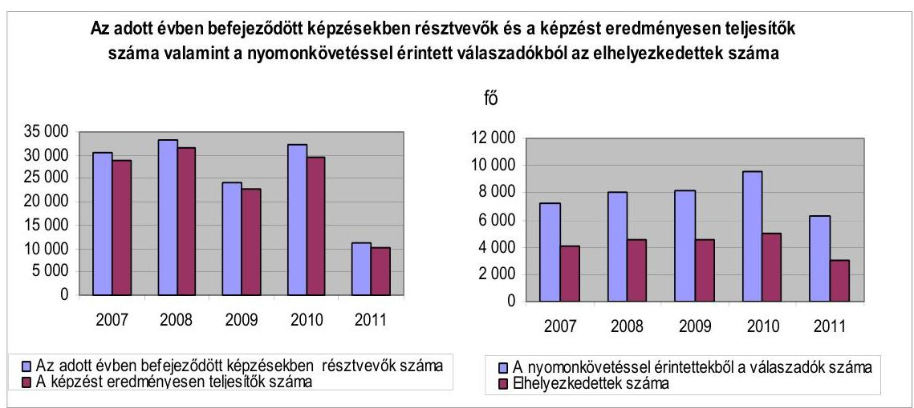

Forrás: az ellenőrzés tanúsítványai
A képző központokban a 2007-2010. években összesen 2640 fő vett részt több képzésben, ebből 1391 fő (52,7%) szerzett több szakképesítést. A 2007. évről a 2010. évre a több szakképzésben résztvevők száma növekedett, a több szakképesítést szerzők száma viszont csökkent, a 2008-2009. években számuk ingadozott. A 2011. évben 260 fő vett részt több képzésben és 136-an szereztek több szakképesítést.

A képző központok éves képzési terveikben kiemelt célként határozták meg a hátrányos helyzetűek képzését. Ennek ellenére a képzésben résztvevő hátrányos helyzetűek száma a 2007. évről a 2010. évre 19025 főről 17719 főre, míg a képzésben résztvevőkhöz viszonyított aránya 50,0% alá csökkent. A hátrányos

[^0]
[^0]:    ${ }^{35}$ A 2007-2011. évek között összesen 117450 kérdőív kiküldésére került sor, melyet 39299 fő (33,4%) töltött ki és küldött vissza az intézményeknek.
    ${ }^{36}$ A kérdőíveket a nyomon követéssel érintettek 1/3-a küldte vissza.

---

helyzetűek száma és aránya a 2008-2009. években növekedett${ }^{37}$, amelyre hatást gyakorolt a gazdasági válság is. A képző központok szakmai tevékenysége a hátrányos helyzetűek képzése tekintetében a 2007-2010. években nem volt eredményes. A 2011. évben a képzésben résztvevők száma 14133 főre, a 2010. évi 37,2%-ára, a hátrányos helyzetűek száma 7911 főre, a 2010. évi 44,6%-ára jelentősen lecsökkent, azonban - az intézmény megváltozott feladat- és célrendszerével összhangban${ }^{38}$ - arányuk a képzésben résztvevők számának több mint a felét tette ki.

A hátrányos helyzetűek aránya a szombathelyi, kecskeméti és nyíregyházi igazgatóságoknál 80,0% feletti volt, míg a békéscsabai, a székesfehérvári és a debreceni igazgatóságoknál 50,0% alatt maradt. A hátrányos helyzetűek aránya a legalacsonyabb a budapesti igazgatóságnál volt, 8,0% alatti. A Miskolci Igazgatóságon a képzéseken résztvevők mindegyikét hátrányos helyzetűnek minősítették.

A hátrányos helyzetű képzésben résztvevők számát és az összes képzésben résztvevőhöz viszonyított arányát mutatja be az alábbi ábra:
7. számú ábra
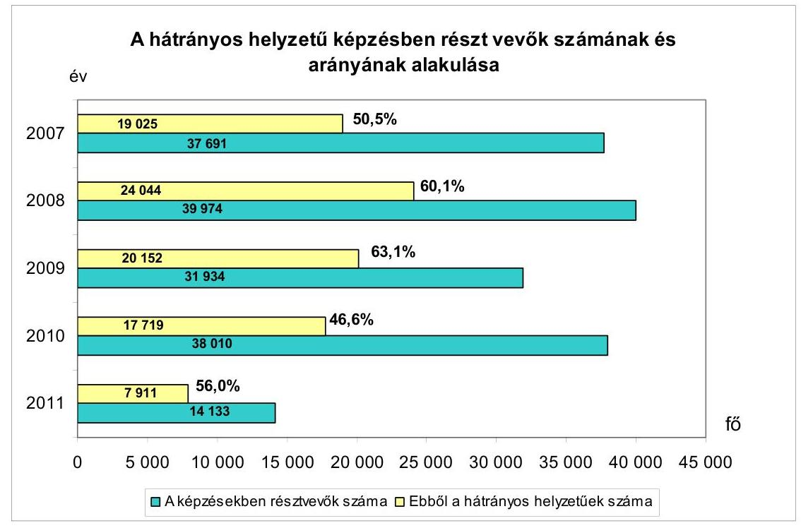

Forrás: az ellenőrzés tanúsítványai
A képző központok pályázati tevékenysége eredményes volt, a 2007-2010. időszakban 1267,9 M Ft, a 2011. évben 78,5 M Ft európai uniós támogatást kaptak. Ezen belül kiemelkedők voltak a 2007. és 2008. évek, amelyekben

[^0]
[^0]:    ${ }^{37}$ A 2008. évben 24044 fő (60,2%), a 2009. évben 20152 fő (63,1%) volt.
    ${ }^{38}$ A KIM rendelet szerint a képzéseken belül az elsődleges feladatok közé tartozik a hátrányos helyzetűek képzése.

---

összesen 1030,2 M Ft európai uniós forrást fordítottak képzésekre. A legtöbb forrást a kecskeméti, a debreceni és a békéscsabai igazgatóságok nyerték el.

A kecskeméti képző központ európai uniós támogatást nyert pl. a HEFOP 3.5.1. korszerű felnőttképzési módszerek kidolgozása és alkalmazása, és a TÁMOP 2.2.4. határon átnyúló együttműködés a szakképzés és felnőttképzés területén címmel. A Türr István Intézet a 2011. évben 3 db ÁROP, 9 db TÁMOP, 1 db TIOP és egy szociális terep-rehabilitáció projektet készített elő.

A képző központok a munkavállalók és munkáltatók megrendelésére végzett képzési tevékenysége eredményes volt, mivel az ellenőrzött időszakban a munkáltatók és egyének megrendelése alapján is szerveztek képzéseket. A munkáltatók és egyének megrendelése alapján szervezett képzések aránya az ellenőrzött időszakban csökkenő tendenciát mutatott. A csökkenéshez hozzájárult a gazdasági válság, a vállalkozások jövedelemtermelő képességének mérséklődése. A piaci megrendelésre végzett képzések költségeit 99,0%-ban finanszírozta a munkáltatók és egyének befizetéséből származó 1721,3 M Ft saját forrás.

A munkáltatók és munkavállalók megrendelésére végzett képzések bevételének aránya az összes forráson belül a 2007. évről a 2010. évre kis mértékben (7,9%-ról 7,0%-ra) mérséklődött, a képzési szerkezet megváltozása után a 2011. évben 16,1% volt. A bevételek összege a pécsi igazgatóságon volt a legmagasabb (503,1 M Ft), majd a kecskeméti (263,1 M Ft), a szombathelyi (235,3 M Ft) és a debreceni igazgatóság (227,9 M Ft) következett. A székesfehérvári (29,4 M Ft), a nyíregyházi (42,4 M Ft) és a miskolci igazgatóságokon (70,8 M Ft) volt a legalacsonyabb a saját forrás értéke. Az alaptevékenysége körében a munkáltatók és munkavállalók megrendelésére végzett képzéseken a szombathelyi, a debreceni és a kecskeméti igazgatóságok esetében a résztvevők száma meghaladta a 2007-2011. időszakban a 3000 főt. A munkáltatók és munkavállalók megrendelésére végzett képzésekben résztvevők száma a legalacsonyabb a miskolci (696 fő) és a budapesti (605 fő) igazgatóságokon volt.

A képző központok szakmai tevékenysége a képzések saját fejlesztésű tananyagokkal való támogatottsága szempontjából eredményes volt, mivel a 2007-2010. időszakban és 2011-ben is több saját fejlesztésű tananyagot, képzési modulokat készítettek. A legjelentősebb fejlesztések a HEFOP 3.5.1. „Korszerű felnőttképzési módszerek kifejlesztése és alkalmazása” uniós támogatásból megvalósuló programban, az „Út a munkához programban”, az OKJ változása miatt és a Start munkaprogramban történtek.

A képző központok saját területük (régiójuk) munkaerőpiaci helyzetéről önállóan tájékozódtak, elsősorban a munkaügyi központoktól szereztek be információkat. Képzési terveiket a 2007-2010. években a munkaügyi központokkal egyeztetetten állították össze. A képző központok a 2007-2010. években a képzési terveikben 5499 képzést terveztek, amelynek 87,9%-a, 4832 képzés valósult meg. A tervezett 103699 fő mintegy 97,0%-a, 100601 fő vett részt a képzéseken. A képzési keret teljesítése az eredeti tervet kis mértékben 2,5%-kal meghaladta${ }^{39}$. A 2011. évben a tervezett képzések 51,1%-a, 193 kép-

[^0]
[^0]:    ${ }^{39}$ a 8. számú mellékletből számított adatok

---

zés valósult meg, melyeken a tervezett 7185 fő helyett 2918 fő (40,6%) vett részt.

A képzési tervek és teljesülésük 2007-2011. évi összevont adatait a következő ábra szemlélteti:
8. számú ábra
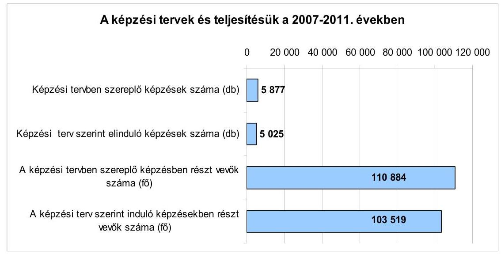

Forrás: az ellenőrzés tanúsítványai
A képzési tervek megvalósítása a 2007-2010. években aktuális munkaerőpiaci igényeknek való megfelelés tekintetében nem volt eredményes, mivel a képzési keret alkalmazása a piachoz való rugalmas alkalmazkodás, a piaci verseny érvényesülése ellen hatott. A képző központok 2007-2010. évi beszámolóikban nem mutatták be összehasonlítható módon, hogy a tervezett képzésekből melyek valósultak meg, az elmaradt képzések helyett milyen képzéseket indítottak, a megvalósult képzések összhangban voltak-e a foglalkoztatáspolitikai célokkal.

A 2011. júliusában megalakuló Türr István Intézetnél a szakmai terv összeállítási szempontja az új feladatoknak megfelelően nem a munkaerőpiaci igényekhez való alkalmazkodás, hanem a társadalmi felzárkózást elősegítő feladatok megvalósítása volt. Ezt a 2011. évi szakmai terv még teljes körűen nem tükrözte${ }^{40}$. A szakmai terv összeállításánál, illetve módosításánál kiemelten számoltak a pályázati lehetőségekkel.

# A képző központok működése a 2007-2010. évek között összességében 

- az éves képzések aktuális munkaerőpiaci igények szerinti megvalósítása, a hátrányos helyzetű személyek képzésekbe történő bevonása, a sikeresen vizsgát tettek és az elhelyezkedettek aránya, a képzések saját fejlesztésű tananyaggal való támogatása és a költségvetésből származó források uniós támogatásokkal,

[^0]
[^0]:    ${ }^{40}$ A 2011. évi szakmai terveket a képző központok önállóan készítették el, ezek, bár csökkenő volumenben, de elsősorban még a képzési tevékenységen és az azokhoz kapcsolódó szolgáltatásokon alapultak.

---

valamint piaci alapon végzett képzésekből származó saját bevétellel történő kiegészítése szempontok értékelése alapján - nem volt eredményes.

Az azonos szakmára felkészítő képzések fajlagos költségei intézményenként és évenként jelentős eltéréseket mutattak, mert a képző központok a képzéseket nem egységes elméleti és gyakorlati óraszámmal, tananyaggal, valamint változó létszámmal és helyszínen bonyolították le. A vizsgált időszakban nagy költségigényű képzések pl. a kőműves és a hegesztő szakmára történő képzések voltak.

Egy hegesztő képzése a 2007. évben 119 E Ft (Szombathely) és 384 E Ft (Miskolc) között, a 2010. évben 96 E Ft (Szombathely) és 472 E Ft (Debrecen) között változott. A kőművesek képzésének fajlagos költsége a 2007. évben 182 E Ft (Szombathely) és 826 E Ft (Miskolc), míg a 2010. évben 290 E Ft (Nyíregyháza) és 684 E Ft (Kecskemét) között alakult.

A képzési keret-megállapodás alapján végzett képzések fajlagos költségének tervezésénél a képző központok nem végeztek költséghatékonysági vizsgálatot, mert a költségkeretet meghatározta az FMM rendelet 2. számú melléklete.

A szerzett szakmájukban elhelyezkedők számának, a válaszadókon belüli arányának és az egy főre jutó képzési költségnek az alakulását a következő ábra mutatja be:
9. számú ábra
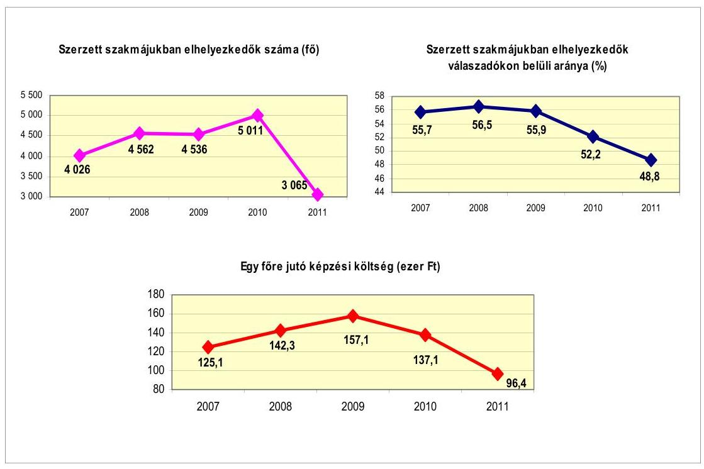

Forrás: az ellenőrzés tanúsítványai
A képzések összes kiadásának és a felnőttképzésben résztvevők számának hányadosát mutató egy főre jutó képzési költség a 2007. évi 125,1 E Ft-ról a 2010. évre 137,1 E Ft-ra (9,6%-kal) emelkedett. A 2011. évi 96,4 E Ft-os
 egy főre

---

jutó képzési költséget meghatározta, hogy az adott évben a képző központok képzési szerkezete az olcsóbb (munkaerőpiaci elhelyezkedésre felkészítő) képzések irányába tolódott el.

Az ellenőrzés szempontjai szerint a képző központok tevékenysége akkor volt hatékony, ha magasabb ütemben emelkedett a képzést követően szerzett szakmájukban elhelyezkedők száma az egy főre jutó képzési költségnél. Mivel az elhelyezkedők számának mérési módszere nem ad megbízható eredményt, a hatékonyság vizsgálatánál a kérdőívet visszaküldőkön belül elhelyezkedettek arányát vettük figyelembe. A 2011. évben a tevékenység szerkezete mellett a képzési szerkezet is átalakult, a költségigényes képzésekről a kevésbé költségigényes, a társadalmi felzárkózással kapcsolatos (pl. kompetencia-fejlesztő, életviteli, motivációs, pályaorientáló stb.) képzések irányába tolódott el. A képzési szerkezet átalakulása miatt a 2011. év hatékonysága a 2007-2010. évekhez képest nem állapítható meg.

A képző központok tevékenysége a 2007-2010. évek tekintetében nem volt hatékony, mert az egy főre jutó képzési költség 9,6%-kal emelkedett, míg az elhelyezkedési kérdőívre választ adókból az elhelyezkedettek aránya 56,1%-ról 52,1%-ra csökkent. A 2011. évre az egy főre jutó képzési költség a 2007. évinek a 73,1%-a volt, az elhelyezkedettek aránya a 2007. évhez képest 6,7 százalékponttal csökkent.

A képző központok működése a 2007-2010. évek között összességében nem volt hatékony és eredményes, emiatt nem segítette elő a változó munkaerőpiaci igények kielégítését, és a foglalkoztatás bővítési célok megvalósítását.

A Türr István Intézet szakmai tevékenységének hatékonysága és eredményessége a megalakulása óta eltelt rövid idő, valamint a szakmai feladatok teljesítményének mérésére, értékelésére alkalmas egységes kritériumrendszer, mérőszámok kialakításának hiánya miatt objektív módon nem ítélhető meg.

# 3.2. A rendelkezésre álló erőforrások hozzájárulása a tevékenység fenntartásához 

A 2011. évtől a finanszírozási szerkezet módosulása, a képzési keret megszűnése miatt csak az előző évről áthúzódó képzések esetében volt lehetőség a képzési keret-megállapodások megkötésére. Emiatt a forrásszerkezet átalakult. Míg a 2007-2010. években az MpA-ból eredő támogatás átlagosan 71,6% volt, addig a 2011. évre az arány 50,8%-ra csökkent. Emellett a korábban a képzésekre fordított költségvetési források összességében is beszűkültek. Előtérbe került a feladatok - közöttük a képzési feladatok - pályázati forrásokból történő finanszírozása. Emiatt a KIM rendeletben meghatározott feladatellátás terjedelmét nagymértékben befolyásolja a pályázati tevékenység sikeressége. A Türr István Intézetben az eredeti előirányzatok alapján a 2011-2012. évek viszonylatában a működés finanszírozását 40,5%-77,5%-os mértékben a saját és pályázati bevételekből kell biztosítani.

---

Az eredeti előirányzatok adatait szemlélteti a következő táblázat (adatok M Ftban):
2. számú táblázat

| Forrás típusa | $\mathbf{2 0 1 0 .}$ év | $\mathbf{2 0 1 1 .}$ év | $\mathbf{2 0 1 2 .}$ év |
| :-- | --: | --: | --: |
| Bevétel* | 4356,0 | 1983,8 | 3483,8 |
| Támogatás | 279,6 | 2905,6 | 1013,3 |
| Összes bevétel | $\mathbf{4 635 , 6}$ | $\mathbf{4 889 , 4}$ | $\mathbf{4 497 , 1}$ |

Forrás: a 2010-2012. évi költségvetési törvények
*A bevétel a pályázati úton elnyerhető forrásokat is tartalmazza, a 2010. év tekintetében az MpA FA-ból finanszírozott képzési keret összegét is magában foglalja. A 2011. évben a képzési keret megszűnése miatt már csak az előző évről áthúzódó képzések fedezetét tartalmazza.

A Türr István Intézet a 2011. évben 53,9 M Ft értékű TÁMOP 1.1.2. pályázatot nyújtott be a „Hátrányos helyzetűek felzárkóztatásának elősegítésére végzett munkahely teremtő partnerség létrehozásával" címmel, amely nem volt eredményes. Ez a projekt része volt pl. a Békéscsabai Regionális Képző Központ 2011. év szakmai tervének is. Ez a szakmai tervben szerepeltetett feladat elmaradásához vezetett.

A 2011. évben a képzési tevékenység a tényleges feladatellátásban háttérbe szorult. A társadalmi felzárkózással kapcsolatos feladatok körében kiemelten foglalkoztak a közfoglalkoztatáshoz kapcsolódó képzésekkel; az európai uniós pályázatok előkészítésével; a működési területén megvalósuló beruházások munkaerőigényének és a betöltésre alkalmas álláskeresőknek a felmérésével; a társadalmi felzárkózást akadályozó lakhatási feltételek javításával; a felzárkóztatási programok megvalósítása érdekében együttműködési megállapodások megkötésével; mentori hálózat kialakításával; kutatási tevékenységgel.

A négy ellenőrzött képző központnál a 2007-2011. I. félévében a képzés és a képzéshez kapcsolódó szolgáltatási tevékenységre fordított kiadások a teljes kiadás mintegy 76,0-90,0%-át tették ki (a kifizetések 2-3 Mrd Ft között mozogtak). Az egységes intézmény létrejöttét követően a Türr István Intézetben 2011. II. félévében a képzésekre fordított összeg nem érte el az 1,5 Mrd Ft-ot, arányaiban a kifizetések 50,0%-át.

Az intézmény vezetője a 2011. évben nem mérte fel a feladatok ellátásához rendelkezésre álló, illetve a feladat-ellátáshoz szükséges személyi feltételeket. A 2011. évben bekövetkezett feladatszerkezeti változásokat a foglalkoztatottak összetételének változása nem követte, így a képzési területen a humánerőforrásokban kihasználatlan kapacitás keletkezett. Az új feladatok egy részét (pl. pályázatok előkészítése, közfoglalkoztatással és lakhatással kapcsolatos feladatok szervezése) centralizálva, a budapesti központban látták el.

A 2011. évben a 362 fő teljes munkaidőben foglalkoztatott munkavállalónak 76,0%-a oktatáshoz kapcsolódó tevékenységet végzett, ugyanakkor az egyéb tevékenységet végző munkavállalók száma is csökkent, 87 fő (24,0%) volt. Az óra-

---

számok csökkenésénél lényegesen kisebb arányban mérséklődött az oktatási tevékenységhez kapcsolódó munkakört ellátók száma a 2011. évre (a 2007. évi 94,8%-a, 275 fő).

A képző központok finanszírozási és feladatellátási struktúrájának változása a képzések számának mérséklődését eredményezte, emiatt az ingatlanoknál is nem hasznosított kapacitások jelentkeztek, az ingatlanok képzésre történő kihasználtsága a 2010. évről a 2011. évre jelentősen csökkent.

A saját tantermekben tartott órák száma a 2010. évi 215348 óráról 114470 órára változott, ami a 2011. évben az összes tanterem szükséglet (246 274 óra) 46,5%-át tette ki. Ennek ellenére a termek bérbeadással történő hasznosítása a 2010. évről a 2011. évre 9866 óráról 2975 órára (közel 70,0%-kal) esett vissza.

Az intézmény vezetője a közvagyon hatékony és eredményes felhasználása érdekében a megalakulást követően nem mérte fel meglévő tárgyi eszközállományának új feladataival - különös tekintettel a hátrányos helyzetűek foglalkoztatásának elősegítésével - összhangban lévő hasznosíthatóságát. A képzések számának csökkenése következtében 2011-ben a korábban képzési célt szolgáló ingatlanok nem voltak kihasználva.

# 3.3. A minisztériumi irányítás szerepe a feladatellátás eredményességében 

A képző központok szakmai, gazdálkodási tevékenységének rendszeres értékelése a Foglalkoztatási Hivatalnál, mint az irányításban közreműködő szervnél a 2007-2009. években megvalósult, a lebonyolított képzéseket figyelemmel kísérték, de az évközi változásokat a beszámolókból nem lehetett nyomon követni, és a képzések eredményességéről a monitoring rendszer megbízható információt nem nyújtott.

A Foglalkoztatási Hivatal 2007-2010. években a központi képzési információs rendszer (FIR) adatait is felhasználva elvégezte a képző központok gazdasági és szakmai ellenőrzését, de 2010-ről összefoglaló beszámolót a jogszabályváltozások miatt már nem készített, a képző központok tevékenységükről közvetlenül a KIM-nek számoltak be.

A 2009-től a képző központokra is kiterjesztett FIR alkalmas volt a tanfolyamokkal kapcsolatos adatok - létszámelszámolás, vizsgaeredmény rögzítés, keretgazdálkodás - rögzítésére és nyomon követésére, de a képző központok eredményességét, hatékonyságát nem mérte. A képző központok ezért saját vezetői információs rendszereket alakítottak ki.

A Foglalkoztatási Hivatal által a 2007-2009. években elkészített összefoglaló beszámolók főbb mutatószámai a bevétel, tanfolyamok száma, hallgatói létszám voltak. Terv-tény adatokat azonban csak a bevételre és a hallgatói napokra vonatkozóan tartalmaztak. A Foglalkoztatási Hivatal ellenőrzési tevékenysége elsősorban az időszaki beszámolók elemzése révén valósult meg.

Az SZMM és a Foglalkoztatási Hivatal a 2010. évtől tervezte bevezetni a tartalmi, foglalkoztatáspolitikai szempontú eredményességi mutatók alkalmazását a képző központok tevékenységében, de a minisztériumok hatáskörét érintő

---

2010. évi jogszabályi változások miatt erre már nem került sor. A képző központok képzéseinek eredményességéről a kérdőíves monitoring rendszer sem nyújtott megbízható információt a szakmai felügyeletet ellátó szervnek, mivel a visszaküldési hajlandóság alacsony, 30,0-35,0% közötti volt, továbbá a képző központok által kiadott kérdőívek sem voltak egységesek. A Foglalkoztatási Hivatal által kialakított beszámolási rendszer a képzési terveknek a teljesülési adatokkal való összevetésének hiánya miatt a 2007-2010. években nem nyújtott releváns információt az irányító miniszternek a vonatkozó foglalkoztatáspolitikai döntések meghozatalához, a munkaerőpiaci helyzet, a területi különbségek értékeléséhez, valamint a monitoring rendszer nem volt alkalmas a képző központok tevékenysége eredményességének mérésére.

A felnőttképzés feltételrendszerének ellenőrzéséről készült ÁSZ jelentés a nemzetgazdasági miniszter számára javasolta, hogy a felnőttképzést folytató intézményeknél rendelkezésre álló, a képzési céljaik teljesüléséről, az általuk meghatározott eredményességi követelmények eléréséről, a célok megvalósulását gátló körülményekről szóló információkat nyilvánossá tegyék. Az ÁSZ javaslat végrehajtására a helyszíni ellenőrzés lezárásáig intézkedés nem történt.

Az NGM-nek az FMM rendelet 1. § a) pontja és 15. § (1) bekezdése alapján 2011. február 19-ig a képző központok számára átadott pénzeszközök felhasználásának jogszerűségét ellenőriznie kellett, melynek dokumentált módon nem tett eleget.

A KIM illetékes államtitkársága, illetve helyettes államtitkársága 2010. júliustól közvetlen munkakapcsolatban volt a képző központokkal. Ennek során 2010-ben és 2011-ben a képzési tervek elfogadása, a szakmai és az éves pénzügyi beszámolók fogadása, központi programok véleményeztetése, ajánlása tárgyában végzett feladatot. A feladatellátás elsősorban az alapítói joggyakorlásra és a szakmai irányításra terjedt ki. A KIM miniszter a képző központok 2011. évi szakmai terveit a társadalmi felzárkózásért felelős államtitkár javaslata szerinti kiegészítésekkel jóváhagyta.

A pénzügyi-gazdasági felügyeleti tevékenység keretében a KIM a 2010-ről 2011-re áthúzódó keret megállapodások alapján a Türr István Intézet területi igazgatóságai által ellátott képzések 886,9 M Ft összegű költségének, illetve ezek képzési időre eső keresetpótló támogatásainak az MpA-ból való pótlólagos finanszírozását érte el az NGM-nél.

# 3.4. A kontrollrendszer kiépítése és hozzájárulása a tevékenység eredményességéhez 

A képző központokban a 2007-2011. év I. félévében a belső kontrollrendszer kialakítva volt. A 2011. évi átszervezést követően a Türr István Intézetnél a működést elősegítő belső szabályzatok határidőben nem készültek el. Az intézmény a 2011. évben belső szabályzatait nem tudta elkészíteni, mivel SzMSz-ét az irányító szerv csak 2011. december 30-án hagyta jóvá. Az átmeneti időszakban a folyamatos működés érdekében a főigazgató úgy rendelkezett, hogy a korábbi budapesti képző központ szabályzatait kell minden igazgatóságon alkalmazni. A jóváhagyott SzMSz birtokában 2012. február 1-jei hatállyal elkészítették a Kötelezettségvállalás, ellenjegyzés, érvényesítés utalványozás rendjének szabályzatát, azonban a többi - az új szervezeti kereteknek megfelelő szabályzat$^{41}$ készítésére és az SzMSz-ben előírt határidőben - 60 napon belül történő kiadására a helyszíni ellenőrzés lezárásáig nem került sor.

A képző központok a 2007-2011. I. félévében az önálló minőségirányítási rendszer keretében építették ki és működtették monitoring és értékelési rendszerüket. A monitoring rendszeren belül folyamatosan végeztek hallgatói és megrendelői elégedettségmérést, illetve a képzéseket eredményesen teljesítők elhelyezkedésére vonatkozó méréseket, melyeket rendszeresen értékeltek. Azonban az indikátorok célértékeinek$^{42}$ meghatározása hiányában a képzési tevékenység eredményességét nem lehetett megítélni. A kérdőíves felmérés az alacsony visszaküldési arány miatt nem nyújtott megfelelő információt arról, hogy a képzésben részt vettek a munkaerőpiaci igényeknek
 megfelelő végzettséget szereztek-e.

A hallgatói elégedettség mérése során alkalmazott elégedettségi szempontok között szerepelt pl. a képzés környezetének megítélése, a képzés személyi feltételeinek - az oktató, a tanfolyam felelős instruktora - megítélése. A munkáltatók elégedettsége során vizsgálták pl. a tanfolyam előkészítésével, jogszabályi előírások betartásával, szervezés szakszerűségével, a képző központ munkatársainak felkészültségét. Az elhelyezkedésre vonatkozó felmérést negyedéves és éves kérdőíves mérés formájában végezték.

A képző központokkal szemben eredményességi követelményként a képzést teljesítő hallgatók száma jelent meg, mivel a munkaügyi központ csak azoknak a képzési költségeit fizette ki, akik azt elvégezték.

A megalakulást követően a Türr István Intézet főigazgatója nem dolgozta ki az intézmény szakmai feladatai teljesítményének mérésére, értékelésére alkalmas egységes kritériumrendszert, mérőszámokat, ezáltal nem segítette elő a hatékony és eredményes munkavégzést.

A képző központokban a vezetői információs rendszer a 2007-2010. években a minőségirányítási rendszerhez kapcsolódó önértékelési rendszeren keresztül működött. A 2011. évben a szakmai tervekben rögzített feladatok megvalósításához munkatervet készítettek megjegyzés/kockázat rovattal és kitértek a további teendőkre. Ez a vezetői információs rendszer részeként információt szolgáltat egyes tevékenységek előrehaladásáról, felméri a feladatellátás kockázatait is. A feladatellátással kapcsolatos teljesítmények mérésére azonban nem alkalmas, mert nem határoz meg a mérésre alkalmas indikátorokat.

[^0]
[^0]:    ${ }^{41}$ Az Áhsz 8. § (4), 37. § (6) bekezdéseiben előírt számviteli szabályzatok, az Ávr. 13. § (2) bekezdés b)-h) pontjaiban, valamint a Bkr. 17. § (1) bekezdésében előírt belső szabályzatok.
    ${ }^{42}$ Nem határozták meg a képzést sikeresen teljesítőkön belül az elhelyezkedettek elvárt arányát.

---

A képzés terén kialakított, és a Türr István Intézet által alkalmazott monitoring rendszer nem nyújt megbízható információt a képzésben részt vetteknek a munkaerőpiacon történő elhelyezkedéséről, valamint a képzések tervezésének és szervezésének rendszere nem segíti elő, hogy a képzést teljesítőknek a megszerzett szakmájukban való elhelyezkedése biztosított legyen.

Budapest, 2012. 05 hónap 2. nap

Melléklet: 16 db
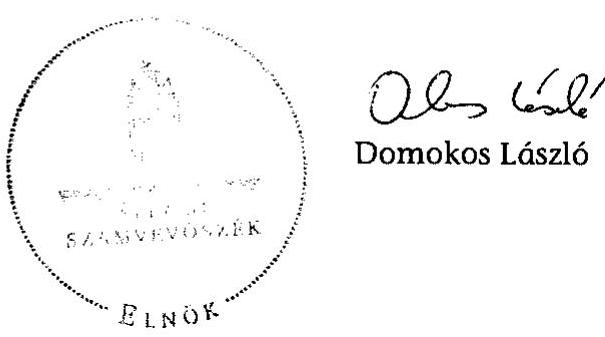

---

# FIGYELEMFELHÍVÓ MEGJEGYZÉSSEL ELLÁTOTT ELFOGADÓ VÉLEMÉNY 

A X. Közigazgatási és Igazságügyi Minisztérium fejezet 12. cím Regionális Képző Központok, Türr István Képző és Kutató Intézet 2011. évi beszámolóját a BM költségvetési szervek elemi beszámolója pénzügyi (szabályszerűségi) ellenőrzéséhez - az Állami Számvevőszék által a zárszámadás ellenőrzéséhez - kidolgozott Egyszerűsített Útmutató alapján felülvizsgáltuk.

Ennek keretében elegendő és megfelelő bizonyosságot szereztünk arról, hogy a Türr István Képző és Kutató Intézet zárszámadási törvényjavaslatban szereplő kiadási és bevételi pénzforgalmi adatai a költségvetési gazdálkodásra vonatkozó jogszabályok előírásainak megfelelően kerültek kimutatásra.

Az ellenőrzés során feltárt - a Türr István Képző és Kutató Intézet pénzforgalmi és vagyoni adatai megbízhatóságát nem befolyásoló - hiányosságok miatt azonban indokolt felhívni a figyelmet az alábbiakra:

- a kiadások teljesítése során a kötelezettségvállalás ellenjegyzése hiányos volt az Ámr. 74. § (1) bekezdésében előírtak ellenére;
- a kiadások teljesítésénél figyelmen kívül hagyták az Ámr. 76. § (3) és 77. § (4) bekezdéseiben foglaltakat, mert a szakmai teljesítésigazolási és érvényesítési feladatokat nem az arra jogosultak látták el;
- az intézmény a szabad maradványt kötelezettségvállalással terhelt előirányzat-maradványként mutatta ki, az Ámr. 72. § (1) bekezdésében foglaltak ellenére.

---

# A Türr István Intézet 2011. évi beszámolójának pénzforgalmi adatai 

| Megnevezés | Eredeti ei. | Mód. ei. | Teljesítés |
| :--: | :--: | :--: | :--: |
| Személyi juttatások | 108800 | 805080 | 719183 |
| Munkaadókat terhelő járulékok | 29200 | 271957 | 188880 |
| Dologi kiadások és egyéb folyó kiadások összesen | 200300 | 2069312 | 865638 |
| Támogatásértékű működési kiadás összesen | 0 | 0 | 0 |
| Egyéb működési célú támogatások, kiadások | 0 | 16364 | 16363 |
| Ellátottak pénzbeli juttatásai | 0 | 0 | 0 |
| Működési kiadások összesen | 338300 | 3162713 | 1790064 |
| Felhalmozási kiadások összesen | 10000 | 98843 | 53310 |
| Törvény szerinti kiadások | 348300 | 3261556 | 1843374 |
| Intézményi működési bevétel összesen | 67800 | 1075911 | 1333458 |
| Támogatásértékű működési bevételek összesen | 68800 | 1063919 | 1110743 |
| Működési célú pénzeszköz-átvétel államháztartáson kívülről összesen | 0 | 0 | 9861 |
| Működési célú pénzforgalmi bevétel összesen | 136600 | 2139830 | 2454062 |
| Alap- és vállalkozási tevékenység közötti elszámolások | 0 | 0 | 0 |
| Működési bevételek összesen | 136600 | 2139830 | 2454062 |
| Törvény szerinti bevételek | 136600 | 2139830 | 2454082 |
| Költségvetési támogatás | 211700 | 1068952 | 1068952 |
| Előző évi előirányzat-maradvány, pénzmaradvány igénybevétele | 0 | 52774 | 52774 |
| Finanszírozási kiadások | 0 | 0 | 4951 |
| Finanszírozás összesen | 0 | 52774 | 47823 |
| Tárgyévi kiadások | 348300 | 3261556 | 1848325 |
| Tárgyévi bevételek | 136600 | 2192604 | 2506856 |
| Foglalkoztatottak létszáma (fő) - időszakra | 29 | 390 | 156 |
| Munkajogi létszám a tárgyidőszak végén | 29 | 0 | 379 |

Forrás: a Türr István Intézet 2011. évi beszámolójának 98-as űrlapja.

---

# A Türr István Intézet 2011. évi mérlege 

| Megnevezés | Előző évi állományi érték | Tárgyévi állományi érték |
| :--: | :--: | :--: |
| ESZKÖZÖK |  |  |
| I. Immateriális javak összesen | 6109 | 30955 |
| II. Tárgyi eszközök összesen | 147580 | 2734440 |
| III. Befektetett pénzügyi eszközök összesen | 0 | 2192 |
| IV. Üzemeltetésre, kezelésre átadott, koncesszióba, vagyonkezelésbe adott, illetve vagyonkezelésbe vett eszközök | 0 | 0 |
| A) BEFEKTETETT ESZKÖZÖK ÖSSZESEN | 153689 | 2767587 |
| I. Készletek összesen | 0 | 22554 |
| II. Követelések összesen | 1050 | 96885 |
| III. Értékpapírok összesen | 0 | 0 |
| IV. Pénzeszközök összesen | 52585 | 1729329 |
| V. Egyéb aktív pénzügyi elszámolások összesen | 189 | 5140 |
| B) FORGÓESZKÖZÖK ÖSSZESEN | 53824 | 1853908 |
| ESZKÖZÖK ÖSSZESEN | 207513 | 4621495 |
| FORRÁSOK |  |  |
| D) SAJÁT TÖKE ÖSSZESEN | 147774 | 2354334 |
| E) TARTALÉKOK ÖSSZESEN | 52774 | 1732434 |
| I. Hosszú lejáratú kötelezettségek összesen | 0 | 0 |
| II. Rövid lejáratú kötelezettségek összesen | 6965 | 534727 |
| III. Egyéb passzív pénzügyi elszámolások összesen | 0 | 0 |
| F) KÖTELEZETTSÉGEK ÖSSZESEN | 6965 | 534727 |
| FORRÁSOK ÖSSZESEN | 207513 | 4621495 |

Forrás a Türr István Intézet 2011. évi beszámolójának 01. űrlapja.

---

# A képző központok tárgyi eszközeinek állománya és használhatósági foka

|  Év | Elméleti oktatás célját szolgáló tanműhelyek száma (db) | Gyakorlati képzést szolgáló tanműhelyek száma (db) | Ebből nyelvi labor (db) | A tantermek férőhely kapacitása (db) | Oktatáshoz használt tárgyi eszközök (ingatlanok nélkül) bruttó értéke (M Ft) | Oktatáshoz használt tárgyi eszközök (ingatlanok nélkül) nettó értéke (M Ft) | Oktatáshoz használt tárgyi eszközök használhatósági foka | Ebből informatikai eszközök bruttó értéke (M Ft) | Ebből informatikai eszközök nettó értéke (M Ft) | Informatikai eszközök használhatósági foka | Tárgyi eszközök felhalmozási kiadásai (M Ft)  |
| --- | --- | --- | --- | --- | --- | --- | --- | --- | --- | --- | --- |
|  2007 | 160 | 88 | 8 | 4142 | 3374,9 | 831,2 | 24,6\% | 1048,6 | 233,1 | 22,23\% | 545,2  |
|  2008 | 163 | 88 | 8 | 4196 | 3501,0 | 765,9 | 21,9\% | 1113,6 | 213,6 | 19,18\% | 404,7  |
|  2009 | 165 | 88 | 8 | 4228 | 3544,1 | 686,5 | 19,4\% | 1024,5 | 111,1 | 10,84\% | 377,1  |
|  2010 | 165 | 89 | 8 | 4254 | 3566,6 | 540,1 | 15,1\% | 999,0 | 65,3 | 6,54\% | 182,0  |
|  2011 | 165 | 89 | 8 | 4254 | 3474,0 | 482,4 | 13,9\% | 984,8 | 60,7 | 6,16\% | 123,0  |
|  Összesen |  |  |  |  |  |  |  |  |  |  | 1632,0  |

Forrás: az ellenőrzés tanúsítványai

## A képző központok ingatlan kihasználtsága

|  Év | A képzések tanterem szükséglete (óra) | Az intézmény saját tantermeiben tartott órák száma | A képzések tanműhely szükséglete (óra) | Az intézmény saját tanműhelyében tartott órák száma | A képzések nyelvi labor szükséglete (óra) | Az intézmény saját nyelvi laborjában tartott órák száma | Bérbe vett ingatlanban megtartott órák száma | Az intézményi ingatlan termeinek bérbeadással történő hasznosítása (óra) | A saját intézményben tartott órák aránya | Bérbe vett ingatlanban tartott órák aránya | A saját ingatlanban tartott összes órából a bérbeadással történt hasznosítás aránya  |
| --- | --- | --- | --- | --- | --- | --- | --- | --- | --- | --- | --- |
|  2007. | 216782 | 87025 | 204960 | 55651 | 26984 | 18493 | 287557 | 8079 | 35,9\% | 64,1\% | 4,8\%  |
|  2008. | 229698 | 77572 | 258537 | 82194 | 44134 | 29151 | 343452 | 7314 | 35,5\% | 64,5\% | 3,7\%  |
|  2009. | 212674 | 82108 | 213246 | 74545 | 28928 | 18947 | 279248 | 7233 | 38,6\% | 61,4\% | 4,0\%  |
|  2010. | 250300 | 109154 | 250191 | 89778 | 20504 | 16416 | 305647 | 9866 | 41,3\% | 58,7\% | 4,4\%  |
|  2011. | 112335 | 53413 | 121165 | 50885 | 12774 | 10172 | 131804 | 2975 | 46,5\% | 53,5\% | 2,5\%  |
|  Összesen | 1021789 | 409272 | 1048099 | 353053 | 133324 | 93179 | 1347708 | 35467 | 38,8\% | 61,2\% | 4,0\%  |

Forrás: az ellenőrzés tanúsítványai

---

# A képző központok létszámadatai a 2007-2011. években

|  Év | Teljes munkaidőben foglalkoztatottak számából oktató (fő) | Teljes munkaidőben foglalkoztatottak számából oktatásszervező (fő) | Teljes munkaidőben foglalkoztatottak számából egyéb oktatáshoz kapcsolódó (fő) | Teljes munkaidőben foglalkoztatottak számából egyéb (fő) | Részmunkaidőben foglalkoztatottak számából egyéb (fő) | Részmunkaidőben foglalkoztatott oktatók éves óraszáma (fő) | A külső oktatók száma (fő) | Teljes munkaidőben foglalkoztatott oktatók
 éves óraszáma | Részmunkaidőben foglalkoztatott oktatók éves óraszáma | A külső oktatók óraszáma  |
| --- | --- | --- | --- | --- | --- | --- | --- | --- | --- | --- |
|  2007 | 391 | 154 | 22 | 114 | 101 | 8 | 2074 | 46514 | 5025 | 358843  |
|  2008 | 390 | 145 | 23 | 124 | 98 | 7 | 2570 | 40463 | 4380 | 442434  |
|  2009 | 390 | 144 | 21 | 130 | 95 | 3 | 2226 | 91014 | 1627 | 327711  |
|  2010 | 385 | 140 | 30 | 125 | 90 | 3 | 2213 | 63166 | 1888 | 374241  |
|  2011 | 362 | 129 | 30 | 116 | 87 | 3 | 1064 | 39656 | 975 | 158055  |

---

A képző központokban bonyolított képzések költségei finanszírozási forrásonként

|  Év | Finanszírozás forrásai |  |  |  |  |  |  |  |  |  |  |  |  |   |
| --- | --- | --- | --- | --- | --- | --- | --- | --- | --- | --- | --- | --- | --- | --- |
|   | Munkaerőpiaci Alap |  | Munkaerőpiaci Alap forrásának aránya | Munkaügyi szervezet finanszírozása (ezer Ft) | Munkaügyi szervezet finanszírozási aránya | Európai Uniós támoga- tások (ezer Ft) | Európai Uniós támoga- tások aránya | Saját forrás |  |  |  | Egyéb forrás (ezer Ft) | Egyéb forrás aránya | Összesen (ezer Ft)  |
|   | Foglalkoztatási alaprész (ezer Ft) | Képzési alaprész (ezer Ft) |  |  |  |  |  | Munkáltatói saját forrás (ezer Ft) | Munkáltatói saját forrás (ezer Ft) | Munkáltatói saját forrás aránya | Egyéni saját forrás (ezer Ft) |  |  |   |
|  2007 | 3319900,0 | 0,0 | 70,4% | 358900,0 | 7,6% | 468660,0 | 9,9% | 302100,0 | 6,4% | 72200,0 | 1,5% | 193700,0 | 4,1% | 4715460,0  |
|  2008 | 3565400,0 | 203500,0 | 66,3% | 743400,0 | 13,1% | 561540,0 | 9,9% | 382800,0 | 6,7% | 71000,0 | 1,2% | 158700,0 | 2,8% | 5686340,0  |
|  2009 | 3675900,0 | 28390,0 | 73,8% | 827300,0 | 16,5% | 75310,0 | 1,5% | 268100,0 | 5,3% | 42400,0 | 0,8% | 101000,0 | 2,0% | 5018400,0  |
|  2010 | 3958200,0 | 0,0 | 75,9% | 641700,0 | 12,3% | 162400,0 | 3,1% | 327100,0 | 6,3% | 36600,0 | 0,7% | 85800,0 | 1,6% | 5211800,0  |
|  2011 | 692500,0 | 0,0 | 50,8% | 315900,0 | 23,2% | 78500,0 | 5,8% | 190600,0 | 14,0% | 28400,0 | 2,1% | 56200,0 | 4,1% | 1362100,0  |
|  Összesen | 15211900,0 | 231890,0 | 70,2% | 2887200,0 | 13,1% | 1346410,0 | 6,1% | 1470700,0 | 6,7% | 250600,0 | 1,1% | 595400,0 | 2,7% | 21994100,0  |

Az egy főre jutó képzési költség a 2007-2011. években

|  Év | Képzési költség összesen | Felnőttkép- zésben résztvevők száma | Egy főre jutó képzési költség  |
| --- | --- | --- | --- |
|  2007 | 4715460,0 | 37691 | 125,1  |
|  2008 | 5686340,0 | 39974 | 142,3  |
|  2009 | 5018400,0 | 31934 | 157,1  |
|  2010 | 5211800,0 | 38010 | 137,1  |
|  2011 | 1362100,0 | 14133 | 96,4  |
|  Összesen | 21994100,0 | 161742 | 136,0  |

---

A képző központokban képzésben résztvevők száma és a hátrányos helyzetűek száma és aránya

|  Év | A képzésben résztvevők száma (fő) | Ebből hátrányos helyzetűek száma (fő) | A hátrányos helyzetűek aránya | Az adott évben helyeződött képzésekre szerződést kötöttek száma (fő) | Ebből hátrányos helyzetűek száma (fő) | A hátrányos helyzetűek aránya | A képzést eredménye- sen teljesítők száma (fő) | A képzést eredménye- sen teljesítők hátrányos helyzetűek száma (fő) | A hátrányos helyzetűek aránya | Nyomonköve- téssel érintett szakképzést szerzettek száma (fő) | Válaszadók száma (fő) | A válaszadók és a nyo- monköve- tettek aránya | A szerzett szakmájuk- ban elhelyezke- dettek száma (fő) | Elhelyezke- dettek aránya  |
| --- | --- | --- | --- | --- | --- | --- | --- | --- | --- | --- | --- | --- | --- |
|  2007 | 37691 | 19025 | 50,5% | 30696 | 16905 | 55,1% | 29003 | 15370 | 53,0% | 24199 | 7226 | 29,9% | 4026 | 55,7%  |
|  2008 | 39974 | 24044 | 60,1% | 33250 | 20867 | 62,8% | 31517 | 15853 | 50,3% | 22373 | 8075 | 36,1% | 4562 | 56,5%  |
|  2009 | 31934 | 20152 | 63,1% | 24055 | 16104 | 66,9% | 22767 | 11513 | 50,6% | 24189 | 8121 | 33,6% | 4536 | 55,9%  |
|  2010 | 38010 | 17719 | 46,6% | 32244 | 15671 | 48,6% | 29498 | 14032 | 47,6% | 27211 | 9599 | 35,3% | 5011 | 52,2%  |
|  2011 | 14133 | 7911 | 56,0% | 11221 | 6334 | 56,4% | 10134 | 5686 | 56,1% | 19478 | 6278 | 32,2% | 3065 | 48,8%  |
|  Összesen | 161742 | 88851 | 56,0% | 131466 | 75881 | 56,4% | 122919 | 62454 | 56,1% | 117450 | 39299 | 33,5% | 21200 | 53,9%  |

A képző központokban a munkáltatói és munkavállalói megrendelés alapján bonyolított képzések és résztvevők

|  Év | Képzések száma (db) | Képzésekből a munka- vállalói, munkáltatói megrendelés alapján bonyolított képzések száma (db) | A munkáltató, munka- vállalói megrendelés alapján bonyolított képzések aránya | Felnőttképzés ben résztvevők száma (fő) | A munkáltatói, munka- vállalói megrendelés alapján bonyolított képzések résztvevőinek száma (fő) | A munkáltatói, munka- vállalói megrendelés alapján bonyolított képzések résztvevőinek száma (fő) | Képzési költség (ezer Ft) | Képzési költségből saját forrás (ezer Ft) | Saját forrás aránya a képzési költségből  |
| --- | --- | --- | --- | --- | --- | --- | --- | --- | --- |
|  2007 | 2258 | 457 | 20,2% | 37691 | 6138 | 16,3% | 382073 | 374173 | 97,9%  |
|  2008 | 2389 | 423 | 17,7% | 39974 | 4919 | 12,3% | 453768 | 453768 | 100,0%  |
|  2009 | 1843 | 219 | 11,9% | 31934 | 2359 | 7,4% | 318358 | 310358 | 97,5%  |
|  2010 | 1693 | 172 | 10,2% | 38010 | 2016 | 5,3% | 365734 | 363664 | 99,4%  |
|  2011 | 838 | 174 | 20,8% | 14133 | 1876 | 13,3% | 219312 | 219049 | 99,9%  |
|  Összesen | 9021 | 1445 | 16,0% | 161742 | 17308 | 10,7% | 1739245 | 1721012 | 99,0%  |

---

A képző központokban tervezett képzések és teljesítésük a 2007-2011. években

|  Év | Képzési keret |  |  | Képzések száma |  |  | Képzési napok száma |  |  | Képzésben résztvevők száma |  |   |
| --- | --- | --- | --- | --- | --- | --- | --- | --- | --- | --- | --- | --- |
|   | Terv (költségvetés szerinti) (M Ft) | Tény (M Ft) | Tény/Terv | Képzési tervben szereplő képzések száma (db) | Képzési terv szerint elinduló képzések száma (db) | Tény/Terv | Terv (nap) | Tény (nap) | Tény/Terv | A képzési tervben szereplő képzésben résztvevők száma (fő) | A képzési terv szerint induló képzésekben résztvevők száma (fő) | Tény/Terv  |
|  2007 | 3455,3 | 3566,5 | 103,0% | 1644,0 | 1489,0 | 90,6% | 791887,0 | 1015706,0 | 128,3% | 28048,0 | 25294,0 | 90,2%  |
|  2008 | 3590,0 | 3879,3 | 107,9% | 1706,0 | 1414,0 | 82,9% | 867875,0 | 1066965,0 | 122,9% | 29985,0 | 26133,0 | 87,2%  |
|  2009 | 3870,3 | 3841,5 | 98,9% | 1091,0 | 959,0 | 87,9% | 766180,0 | 866583,0 | 113,1% | 22149,0 | 19084,0 | 86,2%  |
|  2010 | 3674,0 | 3675,3 | 100,5% | 1058,0 | 970,0 | 91,7% | 772336,0 | 975450,0 | 126,3% | 23517,0 | 30090,0 | 127,9%  |
|  2011 | 518,0 | 315,8 | 32,5% | 378,0 | 193,0 | 51,1% | 681113,0 | 484152,0 | 71,1% | 7185,0 | 2918,0 | 40,6%  |
|  Összesen | 15107,6 | 15278,4 |  | 5877,0 | 5025,0 |  | 3879391,0 | 4408856,0 |  | 110884,0 | 103519,0 |   |

---

9. a) sz. melléklet

a V-0013-083/2012. sz. jelentéshez
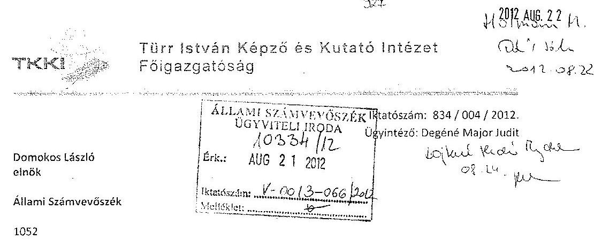

1052
Budapest
Apáczai Csere János u. 10.

Tárgy: Jelentéstervezet a Regionális Képző Központok (Türr István Képző és Kutatóintézet) ellenőrzéséről

Tisztelt Elnök Úr!
A 2012. 08. 01. kelt, V-0013-053/2012. iktatószámú - a Regionális Képző Központok (Türr István Képző és Kutatóintézet) ellenőrzéséről szóló - Jelentéstervezethez az alábbi észrevételeket teszem.

Az ÁSZ vizsgálat a 2007-2011. közötti időszakot vizsgálta, megállapításai erre az időszakra vonatkoznak. Mint a Türr István Képző és Kutatóintézet (továbbiakban: TKKI) 2011. július 1-től hivatalban lévő főigazgatója, elsősorban csak az integrációt követő, azaz a 2011. július 01. és december 31. közötti időszakra vonatkozó megállapításokra kívánok észrevételt tenni.

Egyetértek a jelentéstervezet több helyen tett megállapításával, hogy a kormányváltás utáni időszakban a képző központok, majd a Türr István Képző és Kutatóintézet felügyeletére, szakmai irányítására, hatáskörére vonatkozóan a jogszabályi környezet több esetben is ellentmondásokat tartalmazott, és hiányosságokat mutatott, melyek alapjaiban befolyásolták a TKKI szakmailag eredményes, megfelelő működését.

A képző központok, de különösen az egybeolvadás után létrejött TKKI az irányítási, szakmai felügyeleti és hatásköri szabályozási hiányok miatt csak részben tudott megfelelni a statútumrendeletben megjelölt céljainak, azaz többek között foglalkoztatáspolitikai irányelveknek, a közfoglalkoztatási céloknak, a foglalkoztatás javításában való aktív közreműködésnek, a változó munkaerő-piaci igények kielégítésének, továbbá a foglalkoztatás-bővítési célok megvalósulásának.

Ahogyan a Jelentéstervezet is megállapítja, 2011-ben az intézmény szervezeti keretei átalakultak, ezzel párhuzamosan módosult a feladatellátás szerkezete is, a TKKI 2011. július 01-től az állami felnőttképzési feladatok mellett ellátja a
 területi felzárkózási koordinációs központi feladatokat is. Ugyanakkor megfelelő volumenű forrásokat a 2011. évi költségvetés nem biztosított a lényegesen átalakult, kibővült feladatkörhöz. A társadalmi felzárkózással összefüggő, kibővült feladatok forrását pedig 2011. évben egyedül a projektalapú finanszírozás teremthette volna meg. Ezzel függ össze szorosan, hogy az új feladatokra nem lehetett átfogó mérésre, értékelésre alkalmas egységes kritériumrendszert sem kialakítani. A képzések tervezési, szervezési és monitoring rendszere a szabályozási hiányosságok miatt nem nyújt kellő információt, és biztosít kellő elhelyezkedést.

---

# 9. a) sz. melléklet a V-0013-083/2012. sz. jelentéshez 

A jelentés hiányolja az intézet önálló hosszú távú stratégiájának 2011. évi kidolgozását. Ennek kialakítását több tényező is akadályozta. Egyrészt nem állt rendelkezésre 2011-ben kormányzati hosszú távú társadalmi felzárkózási stratégia, azt a Kormány csak év végén fogadta el a 1430/2011. (XII. 13.) számú a Nemzeti Társadalmi Felzárkózási Stratégiáról, valamint végrehajtásának a 2012-2014. évekre szóló kormányzati intézkedési tervéről szóló határozatával, így nem volt olyan keretrendszer, amihoz viszonyítva megfelelő intézményi stratégiát lehetett volna alkotni. Másrészt az intézet egyetlen, jelentős volumenű EU-s kiemelt projektet sem tudott megkezdeni 2011. évben érvényes támogatási szerződés híján, ami a hosszú távú tervezést megalapozta volna.

A tárgyi és humán kapacitások felmérésére sor került az integrációt követően, azonban az új feladatrendszernek való megfeleltetésére akkor valóban nem került sor, aminek elsősorban kapacitáshiány volt az oka. A kilenc intézmény összevonása, beolvadása a BMEK-ba, a zárómérleg elkészítése, a szervezet átvilágítása teljesen lekötötte az erőforrásokat. További problémát jelentett, hogy az új feladatok finanszírozására projektalapon került volna sor, és 2011-ben érvényes támogatási szerződések híján a 2011. évi társadalmi felzárkózási feladatok nagy része nem került megvalósításra, így a tárgyi infrastruktúra hozzárendelésére sem volt szükség. Hasonló okból a személyi állomány ez irányú felmérésére is csak 2012-ben került sor. A feladatszerkezeti változásokat a foglalkoztatottak szerkezetének változása valóban nem tudta követni. A konkrét rész- és projektfeladatok ismerete nélkül egyrészt nem lehetett megítélni milyen képzettségű, végzettségű és kompetenciájú munkaerőre lesz szükség, másrészt a csoportos leépítés jelentős pluszforrást igényelt, amire nem volt fedezet. Ezért csak a legszükségesebb mértékű változást hajtottuk végre, elsősorban a funkcionális egységek létszámának racionalizálásával, a feladatok centralizációjával, a párhuzamosságuk megszüntetésével. Az EZMEZ elfogadásának elhúzódása is akadályozta a folyamatot, a feladatszerkezetben és szervezetben bekövetkező változások az ügyrendek és a munkaköri leírások szintjén nem voltak érvényesíthetők. Ugyanakkor a kiszámíthatatlanul és rendkívül rövid beadási idővel kiírásra kerülő új pályázatokhoz tartozó előkészítő feladatok, - úgymint a teljes pályázati dokumentáció, a szakmai és pénzügyi tervek összeállítása, a megvalósíthatósági tanulmányok és azok mellékleteinek - elkészítése nagy létszámú, felkészült humánerőforrás kapacitást igényeltek. Az éppen aktuális feladat-ellátáshoz, illetve a folyamatosan jelen lévő szakmai feladatok ellátásához szükséges személyi feltételek minden esetben biztosítva voltak.

A fent vázolt objektív, tényszerű körülményekre való tekintettel az „önálló hosszú távú stratégia kidolgozása" és a szakmai feladatok ellátásához kapcsolódó teljesítmények „egységes kritériumrendszer" szerinti mérésének, értékelésének a kialakítása jelenleg folyamatban van, várhatóan 2012. III. negyedévére befejeződik.

A 2010-2011. évi szervezeti és jogszabályi változások mind a minisztériumi irányításra, mind az intézményrendszer működésére jelentős hatást gyakoroltak. Mivel nem érvényesült a jogszabályok közötti összhang követelménye, így ellentmondás alakult ki a hatáskörök leszabályozása tekintetében is, a képző központok és a munkatárgyi központok közötti együttműködést szabályozó FMM rendelet a változásokkal összhangban nem került módosításra. A TKKI monitoring rendszerének kialakításához alapvető feltétel a jelenlegi Nemzeti Munkaügyi Hivatal és a TKKI közötti szabályozatlanság felszámolása. Ennek bekövetkezteig nem hozható létre olyan informatikai adatbázis, mely alkalmas a Jelentésben megfogalmazott rendszerszerű, megbízható információt szolgáltatni.

A jelentésben szereplő intézkedési terv összeállításával egyetértek, a TKKI-ra nézve megfogalmazott javaslatait az alábbi észrevételekkel kívánom ellátni.

---

# 9. a) sz. melléklet a V-0013-083/2012. sz. jelentéshez 

Amennyiben a jogszabályi környezetben meglévő ellentmondások feloldásával pontosan meghatározásra kerülnek a TKKI számára előírt szakmai feladatok, biztosításra kerülnek a végrehajtásukhoz szükséges feltételek, egyértelműen lehatárolásra kerülnek az irányítási, a szakmai felügyeleti és a hatásköri feladatok, abban az esetben kialakíthatóvá válik a TKKI intézményi stratégiája, rövid- és hosszú távú céljai. Létrehozható a körfoglalkoztatáshoz, társadalmi felzárkózáshoz kapcsolódó monitoring rendszer, megtervezhető 2012. II. félévére és 2013-ra a TKKI feladatstruktúrája, a szakmai feladatokhoz rendelt humánerőforrás és tárgyi eszköz igény is.

Budapest, 2012. augusztus 13.

---

ELNÖK

Ikt. szám: V-0013-069/2012.

Dr. Köpeczi-Bócz Tamás úr
Főigazgató
Türr István Képző és Kutató Intézet

Budapest

Tisztelt Főigazgató Úr!

A Regionális Képző Központok (Türr István Képző és Kutató Intézet) ellenőrzéséről készített számvevőszéki jelentéstervezetre tett észrevételeit köszönettel megkaptam.

Az Állami Számvevőszék észrevételekre vonatkozó álláspontjáról a felügyeleti vezető által készített részletes tájékoztatást csatoltan megküldöm.

Tájékoztatom Főigazgató urat, hogy az el nem fogadott észrevételeket – az Állami Számvevőszékről szóló 2011. évi LXVI. törvény 29. § (3) bekezdése alapján – a jelentésben szerepeltetjük, az elutasítás indokának feltüntetésével együtt.

Budapest, 2012. 03. hó 05. nap

Tisztelettel:

Domokos László

Melléklet: Tájékoztatás az elfogadott és az el nem fogadott észrevételekről

1052 BUDAPEST, AFRICZIN CSERÉ JAKAB UTCA 10. 1364 Budapest K. Pf. 54 telefon: 484 0101 fax: 484 0201

---

# Tájékoztatás 

## az el nem fogadott észrevételekről

A Regionális Képző Központok (Türr István Képző és Kutató Intézet) ellenőrzéséről készített számvevőszéki jelentéstervezetre a 834/004/2012. iktatószámú levelében tett észrevételeit, megállapításainkhoz füzött magyarázatait áttekintettük, azok kezeléséről az alábbi tájékoztatást adom.

A feladatok átfogó mérésére, értékelésére alkalmas kritériumrendszer, az intézményi stratégia, valamint az ehhez kapcsolódó hosszú és rövid távú célok hiányával, a monitoring rendszerrel, valamint a szakmai feladatokhoz rendelt humánerőforrással és tárgyi eszköz igénnyel kapcsolatos tájékoztatását köszönettel vettük, azonban ezek a jelentésben foglalt megállapításainkat nem módosítják. A 2010. július 1-2011. február 18-a közötti időszakra vonatkozóan a jogszabályi rendelkezések ellentmondásosságát, a jogszabályok közötti összhang érvényesülésének hiányát, valamint ezek hatását az intézményi működésre a jelentéstervezet tartalmazza. A képző központok feladatait a 2011. február 19-től hatályos KIM rendelet meghatározta, ebben és a hatásköri rendeletben az intézmény irányítási és szakmai felügyeleti kérdéseit szabályozták. Így a jogszabályi ellentmondások a Türr István Intézet megalapításának időpontjára feloldásra kerültek. Mindezek következtében a jelenlegi jogszabályi környezet javaslataink végrehajthatóságát nem befolyásolja, így az erre vonatkozó észrevételét nem fogadtuk el.

A szakmai feladatok mérésére, értékelésére alkalmas egységes kritériumrendszer kialakításával kapcsolatos megállapításunkat a - Türr István Intézet feladatait meghatározó - KIM rendeletben foglaltak is megerősítik. Ennek 2. § b) pontja előírja, hogy az intézménynek az éves szakmai tervében szerepeltetnie kell a célok meghatározását, és azok indikátorait, valamint a 4/B. § (1) bekezdés a) pontja szerint kutatási feladatai körében a társadalmi felzárkózáshoz kapcsolódó ágazati és területi indikátorokat kell fejlesztenie. A rendelet nem tesz különbséget a pályázati forrásból, illetve az állami támogatásból megvalósuló feladatok között.

Az „intézet önálló hosszú távú stratégiájának 2011. évi kidolgozása"-val kapcsolatos tájékoztatását köszönjük, azonban az a jelentésben foglalt megállapításainkat nem módosítja. Az éves feladatokat meghatározó megalapozott és végrehajtható szakmai terv elkészítéséhez nélkülözhetetlen az intézményi stratégia megléte. Ennek elkészítéséhez az Országos Fejlesztéspolitikai Koncepció, a 2011. év márciusában kiadott Széll Kálmán Terv, valamint a Türr István Intézet feladatait szabályozó KIM rendelet együttesen kellő alapot biztosít. Ezt a munkát most már segíti a 2011 decemberében elkészített Nemzeti Társadalmi Felzárkóztatási Stratégia is.

---

Az Állami Számvevőszék - figyelembe véve az intézmény megalakulásától eltelt rövid időt és az átalakulással kapcsolatos nehézségeket - megállapításaival és javaslataival a Türr István Intézet működésének szabályszerűbbé tételét, új, a társadalmi felzárkózással kapcsolatos feladatainak hatékony és eredményes ellátását kívánja elősegíteni. Éppen ezért örömmel vettük Főigazgató Úr tájékoztatását a szakmai feladatok mérésére, értékelésére alkalmas egységes kritériumrendszer és az intézményi stratégia kialakításával kapcsolatos intézkedéseiről. Ezeket az ÁSZ utóvizsgálat keretében tudja értékelni.

A tárgyi és humán erőforrások felmérésével, a kapacitások kihasználtságával kapcsolatos észrevétele megállapításainkat nem módosítja. Levelében foglaltak megerősítik, hogy a személyi állomány feladat alapú felmérésére 2011-ben nem, csak a 2012. évben került sor, valamint a „foglalkoztatottak szerkezetének változása" a feladatszerkezeti változásokat nem tudta követni. A feladatok és az erőforrások összhangjának szükségességét a projektalapú finanszírozás bizonytalansága még inkább alátámasztja. A feladatellátás eredményessége, a közpénzek hatékony felhasználása érdekében az intézménynek az aktuális feladatokhoz rugalmasan alkalmazkodni tudó eszköz- és a személyi állományt kell kialakítania.

A belső kontrollrendszer részeként az intézmény monitoring rendszerének kialakítása és működtetése az Áht. szerint az intézményvezető feladata. A szervezet tevékenységének, a célok (pl. foglalkoztatáspolitika, társadalmi felzárkózás) megvalósításának nyomon követését biztosító rendszernek alkalmasnak kell lennie az operatív tevékenységek keretében megvalósuló folyamatos és eseti nyomon követésre, ezért az ezzel kapcsolatban megfogalmazott magyarázata megállapításainkat nem módosítja. A Türr István Intézetnek monitoring rendszere a munkaügyi központoknál pályázott képzések terén kapcsolódhat a Nemzeti Munkaügyi Hivatal által létrehozott adatbázishoz is. Mindezek következtében nincs közvetlen összefüggés a szabályozási hiányosságok, a képzésekkel kapcsolatos információk és monitoring rendszer között.

Tájékoztatom, hogy a számvevőszéki jelentés mellékleteiként szerepeltetjük a jelentéstervezethez tett észrevételeit, valamint azokra adott válaszunkat.

Budapest, 2012. 08. hó 30. nap

Holman Magdolna
felügyeleti vezető

---

9. c) sz. melléklet a V-0013-083/2012. sz. jelentéshez
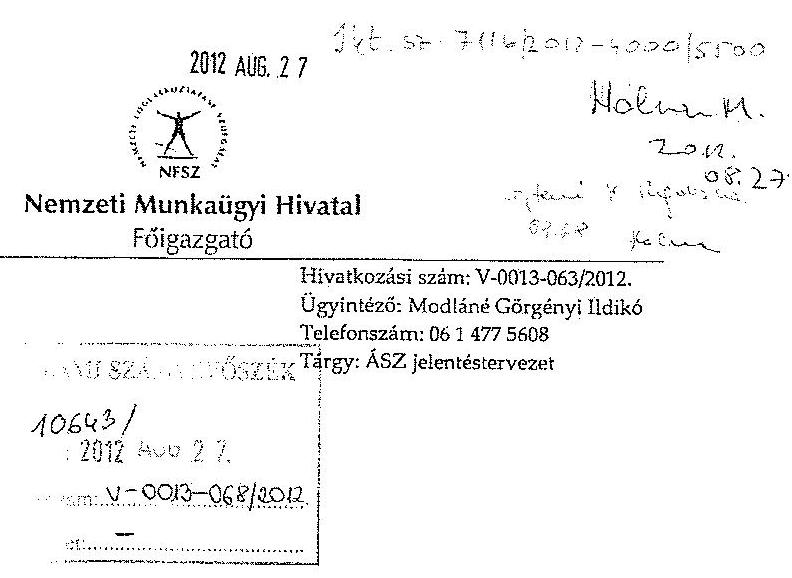

Áttanulmányoztam az Állami Számvevőszék által a regionális képző központok (Türr István Képző és Kutató Intézet) ellenőrzéséről készített jelentés-tervezetet, amellyel kapcsolatosan a következő néhány megjegyzést teszem, és egyben kérem, hogy azok tartalmát a jelentésben is megjeleníteni szíveskedjenek:
A Foglalkoztatási Hivatal, mint a Nemzeti Munkaügyi Hivatal jogelődje, az új kormány szakképzési és foglalkoztatási elképzeléseit folyamatosan követte és segítette a szükséges változásokat. A 2010-ben elkészült és a kormány által elfogadott 1198/2011. (VI. 17.) Kormányhatározat a szakképzési koncepcióról megvilágítja az e területen tervezett ésszerűsítési átalakításokat. Így e tekintetben több korábbi döntés végrehajtása indokolatlanná vált.
A Foglalkoztatási Hivatal valóban nem írt elő eredményességi követelményeket a Türr István Képző és Kutató Intézet jogelődjeinek 2010.07.01. és 2011.02.18. között, mert

- egyrészről a koncepció átalakult,
- másrészről a képző központoknál elfogadott eljárásrend alapján pályáztatási rendszer került bevezetésre,
- harmadszor ugyan az eredményességi kritériumok addigra elkészültek, de az új helyzetben okafogyottá váltak (30-31. oldal).
Ahogyan azt a jelentés is leszögezi, a Foglalkoztatási Hivatal által működtetett FIR rendszer alkalmas a nyomon követésre, de nem alkalmas az eredményesség és a hatékonyság mérésére. Ezzel összefüggésben azonban célszerű megjegyezni, hogy egy teljesen eltérő gazdasági környezetben folyt a feladatellátás, mint ahogy 2009-ben az ÁSZ javaslatot tett különféle intézkedésekre (47-48. oldalhoz való hozzáfüzés). Budapest, 2012. augusztus 21.
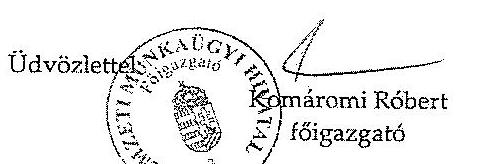

1089 Budapest, Kálvária tér 7.,- Levelezési cím: 1476 Budapest, Pf. 75
Telefon: 06 1 303 5300 Fax: 06 1 210 1870 www.munka.hu

---

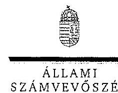

ELNÖK

Ikt.szám: V-0013-070/2012.

# Komáromi Róbert úr 

főigazgató
Nemzeti Munkaügyi Hivatal

## Budapest

## Tisztelt Főigazgató Úr!

A Regionális Képző Központok (Türr István Képző és Kutató Intézet) ellenőrzéséről készített számvevőszéki jelentéstervezetre tett észrevételeit köszönettel megkaptam.

Az Állami Számvevőszék észrevételekre vonatkozó álláspontjáról a felügyeleti vezető által készített részletes tájékoztatást csatoltan megküldöm.

Tájékoztatom Főigazgató urat, hogy az el nem fogadott észrevételeket - az Állami Számvevőszékről szóló 2011. évi LXVI. törvény 29.
 § (3) bekezdése alapján - a jelentésben szerepeltetjük, az elutasítás indokának feltüntetésével együtt.

Budapest, 2012. 03. hó 14. nap

Tisztelettel:

Melléklet: Tájékoztatás az elfogadott és az el nem fogadott észrevételekről

---

# Tájékoztatás 

## az el nem fogadott észrevételekról

A Regionális Képző Központok (Türr István Képző és Kutató Intézet) ellenőrzéséről készített számvevőszéki jelentéstervezetre a 7116/2012-4000/5500 iktatószámú levelében tett észrevételeit áttekintettük, azok kezeléséről az alábbi tájékoztatást adom.

Válaszlevelében a Foglalkoztatási Hivatalnak a képző központok által nyújtott képzések eredményességi követelményei meghatározásával kapcsolatban adott észrevétele megállapításainkat nem módosítja, mivel azok nem csak a 2010. július 1-je és 2011. február 18-a közötti, hanem a 2007-2011. közötti időszakra vonatkoznak. Az FMM rendelet 5. § (3) bekezdés d) pontja már 2005. december 26-án előírta a Foglalkoztatási Hivatal számára az eredményességi követelmények meghatározásának feladatát. A képző központok képzési tevékenységük jelentős részét csak - a képzési keret megszűnését követően - a 2011. évtől nyerik el pályázati rendszer útján. A korábbi időszakban a Foglalkoztatási Hivatal által kiadott eljárásrend szerint a képzési keretből finanszírozott képzések esetében éppen a pályáztatás mellőzése volt a gyakorlat. Az FMM rendelet eredményességi követelmények meghatározására vonatkozó részét csak 2011. február 19-től törölték a jogszabályból, azonban az új szakképzési koncepció e feladat elmaradására vonatkozó indokolását a 2010. július 1-je és 2011. február 18-a közötti időszakra alátámasztja.

Válaszlevelében foglalt - a FIR rendszer eredményesség és hatékonyság mérésére való alkalmasságával, valamint a felnőttképzés ellenőrzéséről készült korábbi ÁSZ jelentésben foglalt javaslattal kapcsolatos - kiegészítését nem fogadjuk el. A feladatellátás hatékonysága és eredményessége, a közpénzekkel való elszámoltathatóság érdekében a mérési és információs rendszer kialakítása szükséges. Ezt az eltérő gazdasági környezet csak az adatok begyűjtésének módszerében, a mutatószámok illetve a nyilvánosságra kerülő információk tartalmának meghatározásában érinti. A 2009. évben központilag bevezetett FIR rendszerre vonatkozó megállapításunk nincs közvetlen kapcsolatban a korábbi ÁSZ jelentésben a felnőttképzést folytató intézmények képzéseivel kapcsolatos információinak nyilvánossá tételéről megfogalmazott javaslattal.

Tájékoztatom, hogy a számvevőszéki jelentés mellékleteiként szerepeltetjük a jelentéstervezethez tett észrevételeit, valamint azokra adott válaszunkat.

Budapest, 2012. 08. hó 30. nap
Holman Magdolna
felügyeleti vezető

---

9. e) sz. melléklet a V-0013-083/2012. sz. jelentéshez

Iktatószám:NGM/12070/5/2012

Hiv.:V-0013-063/2012.
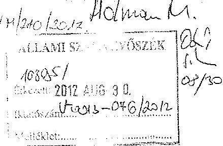

Domokos László úr részére, elnök

Állami Számvevőszék.

# Budapest 

## Tisztelt Elnök Úr!

Köszönettel megkaptam „Regionális Képző Központok (Türr István Képző és Kutató Intézet) ellenőrzéséről" készített jelentéstervezetet.

A tervezet kapcsán az alábbi észrevételeket tesszük:
A tervezet 48. oldal 3. bekezdése pontatlan. A megfogalmazás szerint „az ÁSZ a 2009. és a 2010. évek zárszámadás ellenőrzésekor már javasolta a nemzetgazdasági miniszternek, hogy vizsgálja felül az MpA ellenőrzési rendszerét ... . Az ÁSZ megállapította, hogy az alapkezelő NGM Ellenőrzési Főosztálya az MpA célszerű, szabályszerű, hatékony felhasználását, továbbá a felhasználásban részt vevő intézmények szakmai feladatellátását a 2010. évben sem vizsgálta."
A megállapítás több szempontból helytelen:

- A Munkaerőpiaci Alap vonatkozásában az NGM-nek, illetve jogelőd NFGM-nek nem tett és nem tehetett javaslatot az ÁSZ, tekintve, hogy az Alap 2010. május 29. előtt nem tartozott a minisztérium kezelésébe.
- Ebből következően a mondat utolsó része helyesen: 2010-ben nem vizsgálta. Egyébként a kormányváltás következtében a minisztérium struktúrája októberben véglegesült, az Ellenőrzési Főosztály létszáma akkor 4 fő volt, mely nem tette lehetővé az összes átvett feladat munkatervi ellenőrzését. Nincs információnk arról, hogy az SzMM belső ellenőrzése 2009-2010-ben az Alap kezelését vizsgálta-e, tekintve, hogy az átadás-átvétel során belső ellenőrzési

---

vizsgálati anyagokat nem kaptunk - egyébként azt a vonatkozó jogszabály nem is írta elő. A pontosítás érdekében javasoljuk megkeresni az EMMI Ellenőrzési Főosztályát.

- A felhasználásban résztvevő intézmények szakmai feladatellátása a jogszabályok alapján nem az Ellenőrzési Főosztály feladata. Ezt a belső ellenőrzés kötelezettségeit szabályozóan sem az államháztartásról szóló 1991. évi XXXVIII. törvény, sem a 2011. évi CXCV. törvény (Áht), sem a költségvetési szervek belső ellenőrzéséről illetve kontrollrendszeréről szóló Komr.rendeletek (Ber.,Bkr.) sem írják elő. Ezt a feladatot a minisztérium azon szakfőosztályai látják el, amelyek hatáskörébe az intézmények szakmai felügyelete tartozik.
- Véleményünk szerint az Áht-t, Ber-t, Bkr-t a belső ellenőrzés feladatai tekintetében értelmezve: az MpA alaprészeinek szabályszerű, célszerű, hatékony felhasználásának vizsgálata a feladatot ellátó intézmények, illetve a Kormányhivatalok belső ellenőrzési egységeinek feladata. Ezt megerősíti a fővárosi és megyei kormányhivatalokról, valamint a fővárosi és megyei kormányhivatalok kialakításáról és a területi integrációval összefüggő törvénymódosításokról szóló 2010. évi CXXVI. törvény 10.§ (4) bekezdése.

A Nemzeti Munkaügyi Hivatal észrevételeit közvetlenül teszi meg az Állami Számvevőszék felé.

Budapest, 2012. augusztus
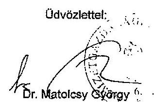

---

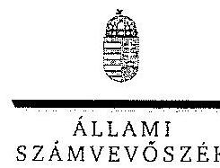

# Dr. Matolesy György úr 

miniszter
Nemzetgazdasági Minisztérium

## Budapest

## Tisztelt Miniszter Úr!

A Regionális Képző Központok (Türr István Képző és Kutató Intézet) ellenőrzéséről készített számvevőszéki jelentéstervezetre tett észrevételeit köszönettel megkaptam.

Az Állami Számvevőszék észrevételére vonatkozó álláspontjáról a felügyeleti vezető által készített részletes tájékoztatást csatoltan megküldöm.

Elfogadott észrevételét a jelentés szövegezésénél figyelembe vesszük.
Budapest, 2012. 05. hó 13. nap
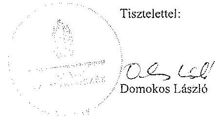

Melléklet: Tájékoztatás az elfogadott észrevételekről

---

# Tájékoztatás 

## az elfogadott észrevételekról

A Regionális Képző Központok (Türr István Képző és Kutató Intézet) ellenőrzéséről készített számvevőszéki jelentéstervezetre az NGM/12070/8/2012 iktatószámú levelében tett észrevételeit, megállapításainkhoz füzött magyarázatait áttekintettük, azok kezeléséről az alábbi tájékoztatást adom.

Az Állami Számvevőszék 2010. augusztusában közzétett, a Magyar Köztársaság 2009. évi költségvetése végrehajtásának ellenőrzéséről szóló 1016 számú jelentésében 16. sorszámon a Munkaerőpiaci Alap ellenőrzésének megvalósulása érdekében a nemzetgazdasági miniszternek tett előremutató javaslata volt, hogy „Vizsgálja felül a Munkaerőpiaci Alap ellenőrzési rendszerét és intézkedjen, hogy a jogszabályban meghatározott hatáskörök érvényre juttatásával az ellenőrzési kötelezettségek teljesüljenek".

Az Állami Számvevőszék, a Magyar Köztársaság 2010. évi költségvetése végrehajtásának ellenőrzéséről szóló jelentésének az 1117-F számon 2011. szeptemberében közzétett függelékében megállapította, hogy a Munkaerőpiaci Alap ellenőrzési rendszerének felülvizsgálatára tett javaslata nem hasznosult, mivel a 2010. év végén a minisztérium a javaslatra vonatkozóan intézkedési tervet készített, de az ellenőrzési rendszer felülvizsgálatára feladatot nem írt elő, és az NGM Ellenőrzési Főosztálya ezt a 2010. évben nem vizsgálta. Az Állami Számvevőszék javaslatát azért nem ismételte meg, mert a helyszíni ellenőrzés ideje alatt megismerte az NGM 2011. évi ellenőrzési tervét és abban a Munkaerőpiaci Alap ellenőrzése feladatként szerepelt.

Észrevétele a Regionális Képző Központok (Türr István Képző és Kutató Intézet) ellenőrzésével kapcsolatos ellenőrzési céljaink megvalósulását érdemben nem befolyásolja, ezért az erre vonatkozó részt - észrevételét elfogadva - jelentésünk részletes megállapításai közül töröljük.

Budapest, 2012. 03. hó 14. nap

Holman Magdolna
felügyeleti vezető

---

# 9. g) sz. melléklet a V-0013-083/2012. sz. jelentéshez 

2012 219723

## Közigazgatási és Igazságügyi Minisztérium miniszter

Iktató szám: IX-15/3/3-1/2012
Hiv.szám: V-0013-063/2012.

## Domokos László úrnak, elnök

Állami Számvevőszék

Budapest

Tárgy: A Regionális Képző Központok (Türr István Képző és Kutató Intézet) ellenőrzéséről készített számvevőszéki jelentéstervezet

## Tisztelt Elnök Úr!

A Regionális Képző Központok (Türr István Képző és Kutató Intézet) ellenőrzéséről készített - fenti számú - számvevőszéki jelentéstervezetet tisztelettel megkaptam. A jelentéstervezetben foglaltakhoz észrevételt nem kívánok tenni.

Budapest, 2012. augusztus 11.
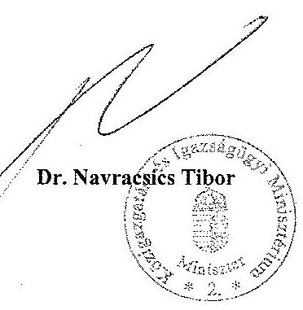

---

# 9. h) sz. melléklet   a V-0013-083/2012. sz. jelentéshez 

EMBERI ERŐFORRÁSOK MINISZTÉRIUMA MINISZTER

Iktatószám: 36448-1/2012/SIF
Hiv. szám: V-0013-063/2012
Ügyintéző: Sik Endre Miklós
Tel.:795-3060

## Domokos László részére

elnök

Állami Számvevőszék

## Budapest

Apáczai Csere János u. 10.
1052
Tárgy: Az Állami Számvevőszék Regionális Képző Központok (TKKI) ellenőrzéséről készített jelentéstervezetének észrevételezése

Tisztelt Elnök úr!
Köszönettel megkaptam a Regionális Képző Központok (TKKI) ellenőrzéséről készített számvevőszéki jelentéstervezetet.

Tájékoztatom, hogy az ellenőrzés megállapításaira észrevételt nem teszek.
Budapest, 2012. augusztus 7.
Üdvözlettel:

