# JELENTÉS 

a mezőgazdasági középfokú szakoktatás és szaktanácsadás intézményeinek ellenőrzéséről

---

# Állami Számvevőszék 

Iktatószám: V-0018-108/2012.
Témaszám: 1057
Vizsgálat-azonosító szám: V0585

## Az ellenőrzést felügyelte:

Holman Magdolna
felügyeleti vezető
Az ellenőrzést vezette és az ellenőrzés végrehajtásáért felelős:

Horváthné Herbáth Mária ellenőrzésvezető

## Az összefoglaló jelentést készítették:

## Horváthné Herbáth Mária ellenőrzésvezető

## Eötvös Magdolna

számvevő tanácsos
Dr. Láng Ágnes Krisztina
számvevő
Kersmájer Ágota
számvevő tanácsos
Az ellenőrzést végezték:

| Bíró Zsolt | Burenzsargal | Csényi István |
| :-- | :-- | :-- |
| számvevő tanácsos | Narantuja | számvevő tanácsos |
|  | számvevő tanácsos |  |
| Csiszárné dr. Kosik | Czmarkó Frigyes | Eötvös Magdolna |
| Mária | György | számvevő tanácsos |
| számvevő tanácsos | számvevő |  |
| Dr. Gaálné Berente | Groholy Andrásné | Kersmájer Ágota |
| Mónika | Hangyál Márta | számvevő tanácsos |
| számvevő | számvevő tanácsos |  |
| Dr. Kevevári Edit | Dr. Láng Ágnes | Nagy Attila |
| számvevő | Krisztina | számvevő tanácsos |
|  | számvevő |  |
| Reichert Margit | Szeibel Gáborné | Vörös Mária |
| számvevő | számvevő | számvevő főtanácsos |
| Vörösné Lakatos |  |  |
| Zsuzsanna |  |  |
| számvevő |  |  |

---

# A témához kapcsolódó eddig készített számvevőszéki jelentések: 

## címe

Jelentés a szakiskolai fejlesztési programra fordított pénzeszközök felhasználása ellenőrzésének eredményességéről
Jelentés a felnőttképzés feltételrendszerének, eredményességének, a gazdaság munkaerőigénye kielégítésében betöltött szerepének ellenőrzéséről
Jelentés a szakképzési hozzájárulás felhasználása célszerűségének ellenőrzéséről

---

# TARTALOMJEGYZÉK 

BEVEZETÉS ..... 9
I. ÖSSZEGZŐ MEGÁLLAPÍTÁSOK, KÖVETKEZTETÉSEK, JAVASLATOK ..... 13
II. RÉSZLETES MEGÁLLAPÍTÁSOK ..... 24

1. Az intézményi beszámolók pénzügyi-szabályszerűségi ellenőrzése ..... 24
1.1. A pénzforgalmi folyamatok szabályszerűsége és az adatok megbízhatósága ..... 24
1.2. A mérlegtételek - kiemelten a követelések, kötelezettségek, aktív és passzív pénzügyi elszámolások - értékelése ..... 25
1.3. Az évközi előirányzat-módosítások, átcsoportosítások értékelése ..... 27
1.4. A maradványtartási- és kiadáscsökkentő intézkedések hatásai ..... 27
1.5. A bevételi előirányzatok és teljesülésük ..... 28
1.6. Az előirányzat-maradvány megállapításának szabályszerűsége ..... 29
2. A VM fenntartásában lévő szakképző központok és tagintézményeik működési feltételeinek hozzájárulása a feladatellátás eredményességéhez ..... 29
2.1. A VM fenntartásában lévő szakképző iskolák TISzK-ekbe történő átszervezésének indokoltsága, eredményessége ..... 29
2.2. A tagintézmények feladatellátását meghatározó szabályozás értékelése ..... 33
2.3. A rendelkezésre álló források és eszközök hozzájárulása az eredményes feladatellátáshoz ..... 35
3. A szakoktatási feladatok ellátásának eredményessége ..... 44
3.1. A TISzK-ek képzési szerkezetének kialakítása ..... 44
3.2. A TISzK-ek szakmai feladatellátásának eredményessége ..... 49
3.3. A tanüzemek cél szerinti működtetése ..... 51
4. A VKSzI - VM által meghatározott - szakképzési feladatainak teljesítése ..... 58
4.1. A VKSzI szakképzéssel összefüggő feladatainak meghatározása ..... 58
4.2. A VKSzI számára előírt szakmai feladatok teljesítése ..... 59

---

# MELLÉKLETEK 

1/a. sz. melléklet Az ellenőrzésre kijelölt szervezetek névjegyzéke
1/b. sz. melléklet Az ellenőrzéssel érintett szervezetek kapcsolatai
2/a. sz. melléklet Korlátozott vélemény a VM Vidékfejlesztési, Képzési és Szaktanácsadási Intézet 2011. évi intézményi költségvetési beszámolójáról
2/b. sz. melléklet Elutasító vélemény a VM Kelet-magyarországi Agrár-szakképző Központ 2011. évi intézményi költségvetési beszámolójáról
2/c. sz. melléklet Elutasító vélemény a VM Dunántúli Agrár-szakképző Központ 2011. évi intézményi költségvetési beszámolójáról
2/d. sz. melléklet Elutasító vélemény a VM Közép-magyarországi Agrár-szakképző Központ 2011. évi intézményi költségvetési beszámolójáról
3. sz. melléklet Táblázatok jegyzéke (3/1-3/6 táblázatok)
4. sz. melléklet Diagramok jegyzéke (4/1-4/7 diagramok)

5/a. sz. melléklet A vidékfejlesztési miniszter jelentéstervezetre tett észrevételei
5/b. sz. melléklet Az ÁSZ válasza a vidékfejlesztési miniszter jelentéstervezetre tett észrevételeire
5/c. sz. melléklet A Dunántúli Agrár-szakképző Központ főigazgatójának jelentéstervezetre tett észrevételei
5/d. sz. melléklet Az ÁSZ válasza a Dunántúli Agrár-szakképző Központ főigazgatójának jelentéstervezetre tett észrevételeire
5/e. sz. melléklet A Kelet-magyarországi Agrár-szakképző Központ főigazgatójának jelentéstervezetre tett észrevételei
5/f. sz. melléklet Az ÁSZ válasza a Kelet-magyarországi Agrár-szakképző Központ főigazgatójának jelentéstervezetre tett észrevételeire
5/g. sz. melléklet A Közép-magyarországi Agrár-szakképző Központ főigazgatójának jelentéstervezetre tett észrevételei
5/h. sz. melléklet Az ÁSZ válasza a Közép-magyarországi Agrár-szakképző Központ főigazgatójának jelentéstervezetre tett észrevételeire
5/i. sz. melléklet A Nemzeti Agrárszaktanácsadási Képzési és Vidékfejlesztési Intézet főigazgatójának jelentéstervezetre tett észrevételei
5/j. sz. melléklet Az ÁSZ válasza a Nemzeti Agrárszaktanácsadási Képzési és Vidékfejlesztési Intézet főigazgatójának jelentéstervezetre tett észrevételeire

---

# RÖVIDÍTÉSEK JEGYZÉKE 

| ASzK | VM Kelet-magyarországi Agrár-szakképző Központ, Mezőgazdasági Szakképző Iskola és Kollégium, Jánoshalma |
| :--: | :--: |
| Áhsz. | az államháztartás szervezeti beszámolási és könyvvezetési kötelezettségének sajátosságairól szóló 249/2000. (XII. 24.) Korm. rendelet |
| Áht. 1 | az államháztartásról szóló 1992. évi XXXVIII. törvény Hatályon kívül helyezve: 2012. január 1-jétől |
| Áht. 2 | az államháztartásról szóló 2011. évi CXCV. törvény |
| Ámr. | az államháztartás működési rendjéről szóló 292/2009. (XII. 19.) Korm. rendelet |
|  | Hatályos 2010. január 1-jétől 2011. december 31-ig |
| ÁSZ | Állami Számvevőszék |
| ÁSZ tv. | Az Állami Számvevőszékről szóló 2011. évi LXVI. törvény |
| Ávr. | az államháztartásról szóló törvény végrehajtásáról szóló 368/2011. (XII. 31.) Korm. rendelet |
| DASzK | VM Dunántúli Agrár-szakképző Központ, Csapó Dániel Középiskola, Mezőgazdasági Szakképző Iskola és Kollégium, Szekszárd |
| EU | Európai Unió |
| Felnőttképzési tv. | a felnőttképzésről szóló 2001. évi CI. törvény |
| FVM | Földművelésügyi és Vidékfejlesztési Minisztérium (2010. május 25-től jogutódja a VM) |
| Jelentés | a Földművelésügyi és vidékfejlesztési miniszter, a Szociális és munkaügyi miniszter, az Oktatási és kulturális miniszter 1347/7/2008. számú jelentése a Kormány részére az FVM fenntartásában lévő mezőgazdasági szakképző intézmények agrár-szakképző központokba szervezéséről, valamint a létrejövő új központok és a területi szakképző intézmények közötti lehető legszorosabb együttműködés kialakításának lehetőségeiről szóló középtávú tervről |
| KASzK | VM Közép-magyarországi Agrár-szakképző Központ, Bercsényi Miklós Élelmiszeripari Szakképző Iskola, Kollégium és VM Gyakorlóiskola, Budapest |
| KEOP | Környezet és Energia Operatív Program |
| KMOP | Közép-magyarországi Operatív Program |
| Közokt. tv. | a közoktatásról szóló 1993. évi LXXIX. törvény |
| Kvtv. | a Magyar Köztársaság 2011. évi költségvetéséről szóló 2010. évi CLXIX. törvény |
| MNV Zrt. | Magyar Nemzeti Vagyonkezelő Zrt. |
| MPA | Munkaerőpiaci Alap |
| NEFMI | Nemzeti Erőforrás Minisztérium |
| NSZFI | Nemzeti Szakképzési és Felnőttképzési Intézet |
| OKJ | Országos Képzési Jegyzék |
| RFKB | Regionális Fejlesztési és Képzési Bizottság |

---

| Szakképzési tv. | a szakképzésről szóló 2011. évi CLXXXVII. törvény |
| :--: | :--: |
| Szht. (régi) | a szakképzési hozzájárulásról és a képzés fejlesztésének támogatásáról szóló 2003. évi LXXXVI. törvény   Hatályon kívül helyezve: 2012. január 1-jétől |
| Szht. (új) | a szakképzési hozzájárulásról és a képzés fejlesztésének támogatásáról szóló 2011. évi CLV. törvény |
| Szkt. | a szakképzésről szóló 1993. évi LXXVI. törvény   Hatályon kívül helyezve: 2012. január 1-jétől |
| SzMSz | Szervezeti és Működési Szabályzat |
| Szt. | a számvitelről szóló 2000. évi C. törvény |
| TÁMOP | Társadalmi Megújulás Operatív Program |
| TISzK | Térségi Integrált Szakképző Központ |
| ÚMVP | Új Magyarország Vidékfejlesztési Program |
| VKSzI | VM Vidékfejlesztési, Képzési és Szaktanácsadási Intézet (2012. áprilistól Nemzeti Agrár-szaktanácsadási Képzési és Vidékfejlesztési Intézet) |
| VM | Vidékfejlesztési Minisztérium (2010. május 25-től az FVM jogutódja) |

---

# ÉRTELMEZŐ SZÓTÁR 

állam által elismert szakképesítés
egyéb saját bevétel
fenntartó
gyakorlati képzés

Az OKJ-ben meghatározott szakképesítés.
(a szakképzésről szóló 1993. évi LXXVI. törvény 10. § (1) bekezdés; hatálytalan: 2012. január 1-jétől)
Az állam által elismert szakképesítéseket az OKJ tartalmazza.
(a szakképzésről szóló 2011. évi CLXXXVII. törvény 6. § (1) bekezdése alapján)

Áru- és készletértékesítés ellenértékéből, szolgáltatások ellenértékéből, egyéb sajátos bevételekből, amelyek meghatározott kiadásokhoz pótlólagos forrást jelentenek, továbbszámlázott (közvetített) szolgáltatások értékéből, bérleti és lízing díj bevételekből, intézményi ellátási díjakból, alkalmazottak térítéséből, kötbér egyéb kártérítésből, bánatpénz bevételéből, alkalmazott, hallgató, tanuló kártérítéséből és egyéb térítésből származó bevétel.
Az a jogi személy (helyi önkormányzat, állami szerv, egyházi jogi személy, felsőoktatási intézmény, vállalat, szövetkezet, alapítvány, egyesület, kisebbségi érdekképviseleti szervezet, kisebbségi önkormányzat és más jogi személy), illetőleg természetes személy (mint egyéni vállalkozó), amely, illetve aki a közoktatási szolgáltató tevékenység folytatásához szükséges jogosítvánnyal rendelkezik, és az e törvényben meghatározottaknak megfelelően a közoktatási intézmény működéséhez szükséges feltételekről gondoskodik.
(a közoktatásról szóló 1993. évi LXXIX. törvény 121. § (1) bekezdés 12. pontja alapján)
A szakképzésről szóló 1993. évi LXXVI. törvény hatálya alá tartozó, a gyakorlati ismeretek nyújtása és alkalmazása, készségek kialakítása és fejlesztése érdekében végzett, pedagógiailag tervezett képzési tevékenység, amelynek tartalmát, időkeretét a központi program (tanterv), a szükséges eszközök minimumát a szakmai és vizsgakövetelmény tartalmazza.
(a szakképzési hozzájárulásról és a képzés fejlesztésének támogatásáról szóló 2003. évi LXXXVI. törvény 19. § 1. pontja alapján)
A szakmai képzésnek az iskolai tanműhelyben, az állami felnőttképzési intézmény tanműhelyében vagy a gyakorlati képzés folytatására jogosult gazdálkodó szervezetnél, egyéb szervnél vagy szervezetnél folyó azon része, amelynek célja a szakképesítéshez kapcsolódó munkatevékenységek gyakorlatban történő elsajátítása és a tanulónak a komplex szakmai vizsga gyakorlati részére való felkészítése, amelyet iskolai rendszerű szakképzés esetén a szakképzési kerettanterv határoz meg.

---

intézményátszervezés
iskolarendszeren kívüli képzés
iskolai rendszerű szakképzés
kompetencia
közoktatási intézmény székhelye
második és további szakképesítés
(a szakképzési hozzájárulásról és a képzés fejlesztésének támogatásáról szóló 2011. évi LXXXVII. törvény 2. § 11. pontja alapján)
Minden olyan fenntartói döntés, amely az alapító okiratnak a Közokt. tv. 37. § (5) bekezdésének b) pontjában meghatározottak módosulásával jár, kivéve az olyan vagyont érintő döntést, amely vagyon a feladatellátáshoz továbbiakban nem szükséges.
(a közoktatásról szóló 1993. évi LXXIX. törvény 121. § (1) bekezdés 15. pontja alapján)
Felnőttképzés és OKJ-s tanfolyamok. Tankötelezett korúakon túliak részére szervezett iskolarendszeren kívüli képzés. Célja szerint lehet általános, nyelvi vagy szakmai képzés. Jogi szabályozás szempontjából felnőttképzésnek számít a felnőttképzést segítő szolgáltatás is. A felnőttképzésben részt vevők nincsenek a képző intézménnyel tanulói vagy hallgatói jogviszonyban, kapcsolatukat a felnőttképzési szerződés szabályozza.
A közoktatás keretében a közoktatási és a szakképzési törvényben meghatározott szakképző iskolában, illetőleg a felsőoktatási törvényben meghatározott felsőoktatási intézményben folyó szakképzés. Résztvevői a szakképzést folytató intézménnyel tanulói, illetőleg hallgatói jogviszonyban állnak.
(a szakképzésről szóló 1993. évi LXXVI. törvény 54/B. § 7. pontja alapján)
A köznevelés keretében a nemzeti köznevelésről szóló törvényben és az e törvényben meghatározott, szakképző iskolában folyó szakképzés, résztvevői a szakképző iskolával tanulói jogviszonyban állnak.
(a szakképzésről szóló 2011. évi CLXXXVII. törvény 2. § 11. pontja alapján)
Cselekvőképes tudás; azon ismeretek, készségek, képességek, magatartási, viselkedési jegyek összessége, amely által a személy képes lesz egy meghatározott feladat eredményes végzésére.
Az alapító okiratban meghatározott, a közoktatási intézmény alaptevékenységének ellátását szolgáló feladatellátási hely, ahol a közoktatási intézmény képviseleti jogának gyakorlására jogosult vezető munkahelye található.
(a közoktatásról szóló 1993. évi LXXIX. törvény 121. § (1) bekezdés 35. pontja alapján)
Minden olyan államilag elismert szakképesítés, amely munkakör betöltésére, foglalkozás, tevékenység gyakorlására jogosít, és már meglévő - államilag elismert - szakképesítés birtokában szerzik meg. Figyelmen
 kívül kell hagyni azt az államilag elismert szakképesítést, amelyet iskolarendszeren kívüli oktatásban szereztek; nem számít

---

második szakképesítésnek a meglévő szakképesítéssel betölthető munkakör magasabb színvonalon való ellátását biztosító képzésben - jogszabályban meghatározott körben - szerezhető szakképesítés.
(a közoktatásról szóló 1993. évi LXXIX. törvény 121. § (1) bekezdés 21. pontja alapján)
szakiskola
szakközépiskola
tagintézmény
tanüzem

Térségi Integrált Szakképző Központ
Olyan középfokú oktatási intézmény, ahol a 9-10. évfolyamon közismereti képzés is folyik, de emellett nagy hangsúlyt kap a pályaorientáció, később pedig a szakmai előkészítés és a szakmai alapozás. A 10. évfolyam elvégzése, illetve a tanköteles kor betöltése után lehet elkezdeni a szakképző évfolyamokon a szakmai vizsgára való felkészülést.
(www.szakkepesites.hu/szakiranytu/fogalmak)
Olyan középiskola, ahol a 9-12. évfolyamon közismereti, az érettségire felkészítő képzés folyik. Emellett az első két évben szakmai orientációs, a második két évben pedig szakmai alapozó tantárgyakat is tanítanak. A szakmai vizsgára felkészítő, szakképzési évfolyamok számát az OKJ határozza meg.
(www.szakkepesites.hu/szakiranytu/fogalmak)
A székhelyen kívül - azonos vagy más településen - működő - azonos vagy különböző feladatot ellátó - intézményegység, ha a székhelytől való távolság, a feladatok jellege miatt az irányítási, képviseleti feladatok a székhelyről nem vagy csak részben láthatók el.
(a közoktatásról szóló 1993. évi LXXIX. törvény 121. § (1) bekezdés 36. pontja alapján)
Szakképzési célokat szolgáló intézmény által fenntartott tanműhely, tangazdaság, tanbolt, tankórterem, tankert, tanudvar, tankonyha, laboratórium, taniroda, demonstrációs terem, gyakorló- és szaktanterem.
Szakképző iskolák, esetleg felsőfokú szakképzést folytató felsőoktatási intézmények társulása szakképzési feladatok összehangoltan történő ellátására.

---

.

---

# JELENTÉS 

## a mezőgazdasági középfokú szakoktatás és szaktanácsadás intézményeinek ellenőrzéséről

## BEVEZETÉS

Az ellenőrzés kapcsolódik az Állami Számvevőszék (ÁSZ) 2012. évi ellenőrzési tervében szereplő 16. témasorszámú, a Magyar Köztársaság 2011. évi költségvetése végrehajtásának ellenőrzéséhez, növelve ezzel a zárszámadási ellenőrzésbe bevont költségvetési szervek számát.

A középfokú mezőgazdasági szakoktatás kiemelt fontosságú a gazdálkodók, a mezőgazdasági vállalkozók képzésében, a szakmai műveltség terjesztésében és alapját szolgálja az agrár-felsőoktatásnak.

A középfokú szakképzésen belül a mezőgazdasági szakmák oktatását ellátó intézményrendszer helyzete Magyarországon sajátosan alakult az elmúlt évtizedekben. Az iskolák egy része az ágazati minisztérium fenntartásában működik, sok szempontból privilegizált helyzetben. Az intézményrendszer szakképzésben betöltött szerepe ugyanakkor az elmúlt időszakban folyamatosan csökkent, részben a mezőgazdasági ágazat hanyatlása, részben a tanulói létszám csökkenése miatt. Az iskolák fenntartói finanszírozása is nehézségekbe ütközik.

A Kormány a 2006. évben a mezőgazdasági szakképző intézményhálózat felülvizsgálatát és javaslat kidolgozását rendelte el ${ }^{1}$ a hatékonyabb működés érdekében. A felülvizsgálat eredményeként a 2007. év végén az Földművelésügyi és Vidékfejlesztési Minisztérium (FVM) - a 2005-2013. évekre szóló szakképzésfejlesztési stratégiával, valamint a szakképzéssel és az oktatással összefüggő jogszabályváltozásokkal összhangban - döntött a fenntartásában lévő mezőgazdasági szakképző intézmények agrár-szakképző központokba szervezéséről. A döntés három Térségi Integrált Szakképző Központ (TISzK) státusszal felruházott, közös igazgatású, többcélú közoktatási intézmény létrehozására vonatkozott. Az átszervezés célja az intézmények működtetésének racionalizálása mellett számos pályázati forrás és a szakképzési hozzájárulás igénybevételi lehetőségének megteremtése volt.

A 2008. évben 196 szakképző iskolában folyt agrár-szakképzés. Az FVM (2010. évtől a jogutód Vidékfejlesztési Minisztérium) irányítása, fenntartása alá 18 mezőgazdasági szakképző iskola tartozott, amelyek nappali tagozatán mintegy

[^0]
[^0]:    ${ }^{1}$ a Kormány 2160/2006. (IX. 15.) számú. határozatával módosított, az államháztartás hatékony működését elősegítő szervezeti átalakításokról és az azokat megalapozó intézkedésekről szóló 2118/2006. (VI. 30.) határozata

---

40, az iskolarendszeren kívüli képzésein további 30 szakmában lehetett szakképesítést szerezni.

A 18 minisztériumi fenntartású mezőgazdasági szakképző iskola a 2008/2009-es tanévtől három TISzK keretében működik. Az integrált szakképző központok különböző típusú közoktatási feladatokat látnak el, tagintézményeik önálló oktató-nevelő munkát folytatnak.

Az FVM, illetve a Vidékfejlesztési Minisztérium (VM), mint fenntartó az ellenőrzött időszakban a Kutatás- és Oktatásszervezési Főosztályán keresztül látta el a szakmai felügyelet és irányítás feladatait, az intézmények szakmai munkájának értékelését.

A mezőgazdasági középfokú szakoktatás és szaktanácsadás intézményeiben folyó szakmai képzésekre az ellenőrzött időszakban a közoktatásról szóló 1993. évi LXXIX. törvény vonatkozott, amelyet a szakképzésről szóló 1993. évi LXXVI. törvény, valamint a felnőttképzésről szóló 2001. évi CI. törvény speciális rendelkezései egészítettek ki. Az állam által elismert szakképesítéseket az Országos Képzési Jegyzék (OKJ) tartalmazza.

A VKSzI², mint a tárca háttérintézménye, részt vesz a közoktatási és szakképzési törvényben megfogalmazott, a szakképzésért felelős miniszter feladatkörébe tartozó feladatok végrehajtásában.

Az ellenőrzött TISzK-ek és a VKSzI költségvetését a VM fejezet 6. cím tartalmazza.

A 2008-2011 közötti időszakban a VM fejezet 6. címhez tartozó ellenőrzött intézmények összesen 18 793,7 M Ft költségvetési támogatásban részesültek. A költségvetési támogatás teljesített összege csökkenő tendenciájú volt, a 2008. évi 5567,3 M Ft-hoz képest a 2011. évben 26,6%-kal (1479,8 M Ft-tal) kevesebb volt.

Az ÁSZ stratégiai célkitűzése, hogy „A hatékonyabb és eredményesebb közpénzfelhasználás érdekében a szabályszerűségi követelmények érvényesülése mellett előtérbe helyezi a központi és önkormányzati államháztartási alrendszerben, valamint az államháztartáson kívül működő közfeladat-ellátó rendszerek, közpénzekből finanszírozott programok és projektek (beruházások) teljesítmény-ellenőrzését".

Ennek megfelelően az ellenőrzés típusa: teljesítmény-ellenőrzés, a jelentés 1. pontja tekintetében pénzügyi-szabályszerűségi ellenőrzés volt.

Az ellenőrzés a Magyar Köztársaság 2011. évi költségvetése végrehajtásának értékeléséhez kapcsolódó pénzügyi-szabályszerűségi ellenőrzés tekintetében a 2011. évet, a teljesítmény-ellenőrzés tekintetében a 2008-2011. éveket érintette.

Az ellenőrzött szervezetek jegyzékét az 1/a-b. sz. melléklet tartalmazza.

[^0]
[^0]:    ${ }^{2}$ a VKSzI 2012. áprilistól Nemzeti Agrárszaktanácsadási Képzési és Vidékfejlesztési Intézet

---

Az ellenőrzés célja annak értékelése volt, hogy:

- az ellenőrzött intézmények 2011. évi elemi beszámolói megbízható és valós képet adnak-e a vagyoni és a pénzügyi helyzetről;
- a VM fenntartásában levő TISzK-ek és tagintézményeik működési feltételei hozzájárultak-e a feladatellátás eredményességéhez;
- eredményes volt-e a TISzK-eknél és tagintézményeiknél a szakoktatási feladatok ellátása;
- a VKSzI a VM által meghatározott szakképzési feladatokat megfelelően teljesítette-e.

A VM fenntartásában levő agrár-szakképző központok 2011. évi költségvetési beszámolóját az ÁSZ által a 2011. évi zárszámadás előkészítése során, a BM költségvetési szervek elemi beszámolóinak pénzügyi-szabályszerűségi ellenőrzéséhez készített Egyszerűsített Útmutató alapján vizsgáltuk felül.

A teljesítmény-ellenőrzést az ÁSZ Ellenőrzési Kézikönyve, valamint a teljesítmény-ellenőrzéshez kidolgozott módszertani előírások alapján végeztük. Az értékelés során az ellenőrzési programban rögzített kérdéseket, kritériumokat vettük figyelembe.

A működési feltételek hozzájárultak a feladatellátás eredményességéhez ha:

- a mezőgazdasági szakképző intézmények agrár-szakképző központokba történő szervezésének kitűzött céljai teljesültek;
- a fenntartó stratégián alapuló szakmai célokat, elvárásokat támasztott az intézményekkel szemben;
- a TISzK-ek és tagintézményeik belső szabályozottsága biztosította a feladatellátás párhuzamosságának kiküszöbölését;
- a rendelkezésre álló források nagyságrendje, ütemezettsége biztosította az alapfeladatok zavartalan ellátását.

A szakoktatási feladatok ellátásának eredményessége akkor valósult meg, ha:

- a TISzK-ek teljesítették a fenntartó által kitűzött és pedagógiai programjukban meghatározott oktatási, szakképzési célokat;
- a képzések indításakor - az alapító okiratban rögzített lehetőségek mellett - figyelembe vették a munkaerő-piaci igényeket, a pályakövetési rendszer tapasztalatait;
- javultak a szakmai feladatellátás mutatói (lemorzsolódás, végzettséget szerzettek száma, kompetenciamérés eredményei);
- biztosított volt a tanüzemek vagyontárgyainak oktatási célú és a szabad kapacitások pénzügyi eredménnyel járó hasznosítása.

---

A VKSzI tevékenységét akkor minősítettük eredményesnek, amennyiben az alapító okiratában rögzített szakképzéshez kapcsolódó feladatokat kitűzött célok alapján, a VM előírásainak és munkatervének megfelelően teljesítette.

Megállapításainkat a helyszíni ellenőrzés tapasztalataira, az ellenőrzött szervezetek beszámolóinak, tanúsítványainak elemzésére és a témához kapcsolódó statisztikai adatokra alapoztuk.

Az Állami Számvevőszékről szóló 2011. évi LXVI. törvény 29. §-a szerint a jelentéstervezetet megküldtük egyeztetésre a vidékfejlesztési miniszternek, a Dunántúli, a Kelet-magyarországi és a Közép-magyarországi Agrár-szakképző Központok, valamint a Nemzeti Agrárszaktanácsadási Képzési és Vidékfejlesztési Intézet főigazgatóinak. A beérkezett észrevételeket és az ezekre adott válaszokat, ideértve az el nem fogadott észrevételeket és azok indokolását, a jelentés 5. a)-j) mellékletei tartalmazzák.

Az ellenőrzés végrehajtására az Állami Számvevőszékről szóló 2011. évi LXVI. törvény 1. § (3) bekezdésében, a pénzügyi-szabályszerűségi ellenőrzés tekintetében az Állami Számvevőszékről szóló 2011. évi LXVI. törvény 5. § (2), (6-7) bekezdéseiben, valamint az államháztartásról szóló 2011. évi CXCV. törvény 61. § (2) bekezdésében és 90. § (1) bekezdésében foglaltak adtak jogszabályi alapot.

---

# I. ÖSSZEGZŐ MEGÁLLAPÍTÁSOK, KÖVETKEZTETÉSEK, JAVASLATOK 

A VM fenntartásában levő középfokú mezőgazdasági szakképző iskolákat 2008-ban integrált szakképző központokba szervezték át. A TISzK-ek létrehozásának alapvető célja a szakképzési hozzájárulás igénybevételére vonatkozó jogszabályváltozásoknak megfelelő feltételek megteremtése, valamint az uniós pályázati lehetőségek kihasználása volt.

A Kormány számára készült jelentésben további célként szerepelt a TISzK-ben résztvevő intézmények közötti szakmai hatékonyság erősítése, a párhuzamos képzések csökkentése, a munkaerő-piaci igényeket rugalmasan követni tudó szakképzés kialakítása.

Az elérendő célokhoz a fenntartó nem határozott meg teljesítménymutatókat, nem tervezték meg az átszervezés költségeit. A fenntartó az átszervezéshez kapcsolódóan létszámcsökkentést és egyéb erőforrás-racionalizációt nem tervezett, konkrét szakmai célokat, elvárásokat nem fogalmazott meg a megalakuló TISzK-ek számára.

A szakképző iskolák TISzK-ekbe történő szervezésének forrásbevonásra vonatkozó céljai teljesültek. Az integráció ennek ellenére formális volt, eredményeként a tervezett hatékonyságnövekedés és erőforrás-racionalizálás nem valósult meg.

Az uniós pályázati lehetőségek és a szakképzési hozzájárulás igénybevételére vonatkozó célok teljesültek. Az intézmények uniós forrásokból származó bevételei az összes forrás 6,7%-át tették ki a 2008-2011 közötti időszakban. Az uniós pályázati támogatások aránya 2008. évhez viszonyítva 2009-ben hétszeresére, 2010-ben tízszeresére növekedett.

Az intézmények pályázati tevékenysége a nyertes pályázatok számának benyújtott pályázatokhoz viszonyított arányát tekintve eredményes, 78,7%-os volt. Az elnyert támogatási összeg azonban az igényeltnek átlagosan csak 36,9%-a volt, nagyösszegű uniós pályázatok elutasítása miatt. Az ellenőrzött időszakban a három TISzK pályázatokból származó tényleges bevétele az eredeti 308,0 M Ft-os előirányzatnak több mint a hétszeresét, 2379,3 M Ft-ot tett ki. A pályázati források hozzájárultak a humánerőforrás- és szervezetfejlesztéshez, valamint a TISzK-ek működési feltételeinek javításához.

A TISzK-ek szakképzési hozzájárulásból az ellenőrzött időszakban 712,1 M Ft többletbevételhez jutottak, ami 2008-2011 között az összes forrásnak mindössze csak a 2,5%-át tette ki, a felhalmozási bevételeken belül viszont jelentős, 34,2%-os arányt képviselt. A TISzK-ek számára kedvezőtlen volt a szakképzési hozzájárulás fenntartó általi fogadása, mivel a korábbi szabályozás szerint az ebből származó forrást közvetlenül az intézmények kapták meg. A fenntartó a felhasználókkal kötött megállapodás alapján a támogatást, annak beérkezésétől számított 30 napon belül adta át. Előfordult, hogy az intézmények a likviditás biztosítása érdekében a befolyt, de későbbi időpontban felhasználandó támogatást - visszapótlási kötelezettség mellett - bevonták a napi finanszírozásba.

Az integráció nem járt költségcsökkentő hatással a foglalkoztatásra, mivel az adminisztratív feladatokat ellátók, a gazdasági ügyintézők létszáma és a vezetői szintek száma nem csökkent. Az ellenőrzött időszakban az egy pedagógusra jutó tanulók száma (a három TISzK-nél átlagosan 9,19,5 fő) az országos átlagnál lényegesen - több mint 40%-kal - alacsonyabb volt (4/1. sz. melléklet). A TISzK-eken belül a párhuzamos képzések száma nem csökkent. A képzések egy részének több tagintézményben történő indítását az iskolák közötti földrajzi távolság indokolta.

A VM fenntartású TISzK-eknél az egy tanulóra jutó működési kiadás az ellenőrzött időszak átlagában 1037,0 E Ft volt. A mutató 2008. évi 1098,4 E Ft-ról
 2011-re 1005,0 E Ft-ra (8,5%-kal) csökkent. 2011-ben ugyanakkor az egy főre jutó működési kiadások nagyságrendje a VM fenntartású TISzK-eknél lényegesen, 70,9%-kal meghaladta - az alapvetően normatív finanszírozású - önkormányzati fenntartású agrár-szakképzést is folytató intézmények ${ }^{3}$ átlagát (588,2 E Ft/fő). Ehhez a képzési szerkezet és az annak megfelelő feltételrendszer különbözősége, valamint az eltérő finanszírozás egyaránt hozzájárult.

Az ellenőrzött időszakban a fenntartó a TISzK-ek Alapító Okiratait a jogszabályi változásoknak megfelelően módosította. A TISzK-ek azonban szabályzataikat nem, vagy késedelmesen aktualizálták, azok nem voltak összhangban az Alapító Okiratokkal, valamint a hatályos jogszabályokkal. Az Ámr. 15. §-a előírásainak nem felelt meg, hogy az önállóan működő és gazdálkodó státusszal rendelkező székhelyintézményen kívül - párhuzamos feladatellátás mellett - a tagintézmények is önálló gazdasági szervezettel rendelkeztek. A TISzK - mint önálló költségvetési szerv - székhelyintézményének és a tagintézményeinek szabályzatai eltérőek voltak.

A fenntartó az átszervezés eredményességét 2011-ben az agrár-szakképző központok átvilágításával, a 2010. és a 2011. években felügyeleti ellenőrzés keretében értékelte. A megállapítások rávilágítottak arra, hogy nem valósult meg a TISzK-eken belül a székhelyintézményre és a tagintézményekre vonatkozó egységes szabályozás, az átszervezés kimutatható gazdasági megtakarítással nem járt.

A jelentések arra is rámutattak, hogy az intézmények a feladatellátáshoz a szükségesnél nagyobb méretű épületekkel, létesítményekkel rendelkeznek, amelyek karbantartására nem rendelkeznek anyagi erőforrással. Az ingatlanok egyéb célú hasznosítására (pl. bérbeadás) állaguk, földrajzi elhelyezkedésük miatt kevés a lehetőség. Az átvilágítás javaslataihoz kapcsolódóan a VM nem tervezett intézkedéseket. Nem végeztetett összehasonlító elemzést a saját fenn-

[^0]
[^0]:    ${ }^{3} 41$ agrár-szakképzést is folytató önkormányzati fenntartású intézmény beszámolójának adatai alapján (21. űrlap 50. sor)

---

tartásában működő, valamint a hasonló profilú, egyéb (önkormányzati, alapítványi) fenntartású intézmények tevékenységére vonatkozóan.

A 2008-2011 időszakban a fenntartó bázis alapú tervezés alapján - az előző évi költségvetési támogatás eredeti előirányzatából kiindulva - nyújtotta a költségvetési támogatást az intézmények részére, év közben esetenként pótelőirányzatokat is biztosítva. A támogatás nyújtását nem kötötték feladatmutatókhoz, elvárt teljesítménymutatókat sem határoztak meg. A tervezett működési bevételek átlagosan 51,4%-os, a működési kiadások 20,3%-os túlteljesítéséből következően megállapítható mind a bevételek, mind a kiadások alultervezése. A VM fenntartású iskoláknál az egy tanulóra jutó működési támogatás 2008-ban 820,6 E Ft, 2011-ben 644,5 E Ft volt. A 2011. évi fajlagos támogatás - a csökkenés ellenére - 31,3%-kal meghaladta a hasonló profilú önkormányzati iskolák egy tanulóra jutó átlagos működési költségvetési támogatását ${ }^{4}$ (490,7 E Ft-ot).

A tervezett és tényleges működési kiadások eltérését, a forrásszükséglet növekedését az intézmények saját bevételei biztosították. A költségvetési támogatás az ellenőrzött időszakban az intézményeknél együttesen 27,6%-kal - azon belül a működés támogatása 1264,9 M Ft-tal, 24,9%-kal - csökkent, a működési kiadások 849,5 M Ft-os, 12,5%-os csökkentésével és a működési bevételek 3,8%-os (69,1 M Ft összegű) növekedésével egyidejűleg.

1. sz. diagram

A működési kiadások, működési bevételek és a működési
támogatás változása a VM fenntartású TISzK-eknél
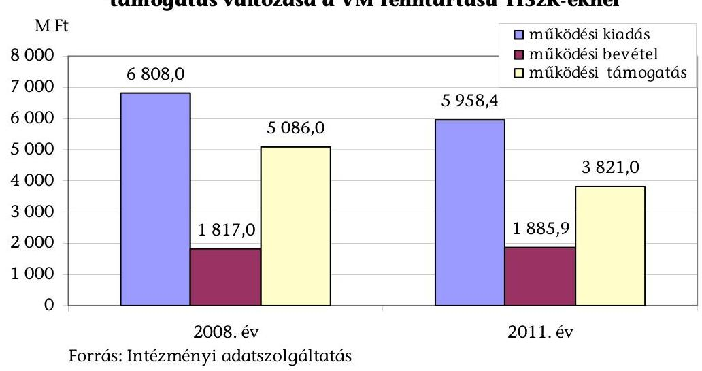

Aztáményel a datszolgáltatás

Az intézmények saját hatáskörben a kiadások csökkentésére és a bevételek növelésére egyaránt hoztak intézkedéseket: veszteséges ágazatokat számoltak fel, tanfolyamokat szerveztek, szabad kapacitásokat adtak bérbe. A racionalizálásra, takarékosságra, illetve kihasználtság-növelésre irányuló intézkedések terve-

[^0]
[^0]:    ${ }^{4}$ A fajlagos mutató számítása 41 agrár-szakképzést is folytató önkormányzati fenntartású intézmény működési költségvetési támogatásának adatai alapján történt (intézményi beszámoló 09. úrlap 01. sora)

---

zett és tényleges hatásait nem számszerűsítették. A TISzK-eknél az iskolarendszeren kívüli képzésekből származó bevételek ( $723,6 \mathrm{M} \mathrm{Ft}$ ) az ellenőrzött időszakban összesen 207,3 M Ft-tal meghaladták a bevételek megszerzése érdekében felmerült kiadásokat ( $516,3 \mathrm{M} \mathrm{Ft}$ ).

Annak ellenére, hogy az Országos Képzési Jegyzékről szóló rendeletek ${ }^{5}$ az ágazatot érintő szakképesítésekért felelősként az agrárpolitikáért felelős vidékfejlesztési minisztert nevesítették, a VM az ellenőrzött időszakra vonatkozóan agrároktatási, illetve agrár-szakképzési stratégiát nem dolgozott ki.

A saját fenntartású intézményei számára az ellátandó feladatokat az alapító okiratokban rögzítette, számukra teljesítménymutatókat, szakmai célokat, elvárásokat nem fogalmazott meg. Pontosan meghatározott, számszerűsített célkitűzések hiányában a VM fenntartású TISzK-ek szakoktatási feladatellátásának eredményessége - a szakmai feladatmutatók, a képzési szerkezet, valamint a szabad kapacitások hasznosítása tekintetében - nem állapítható meg.

Az indított képzéseknél meghatározóak voltak a helyi adottságok. A TISzK-ek az illetékes Regionális Fejlesztési és Képzési Bizottságok támogatott képzési irányokra vonatkozó határozatait alapvetően figyelembe vették, azonban előfordult, hogy a jelentkezések száma alapján csak úgy tudtak egy egész osztályt indítani, hogy abban 2-3 féle szakma képzése is folyt.

A szakképzés országos szintű pályakövetési rendszerének kialakítása az ÁSZ ellenőrzés befejezéséig nem történt meg. Az ellenőrzött agrár-szakképző központok közül a KASzK és tagintézményei nem működtettek egységes pályakövetési rendszert. Ugyanakkor az ASzK és a DASzK saját pályakövetési rendszert alakított ki, TÁMOP pályázati forrás felhasználásával. A két intézmény összesített adatai alapján a végzett tanulóknak 37,3%-a szolgáltatott adatot. A képzési szerkezet kialakítása során a pályakövetési rendszerből nyert információk az adatszolgáltatók viszonylag alacsony száma, valamint a rendszer működtetésének kezdetlegessége, az adatok teljes körű feldolgozásának hiánya miatt nem voltak meghatározóak. A pályakövetési rendszer feldolgozott adatai alapján a szakiskolában végzettek nagyobb arányban (49,2%) helyezkedtek el a szakmájukban, mint a szakközépiskolában végzettek (27,5%), akik közül 33,0%-a továbbtanul. A válaszadók közül a szakiskolában végzettek 18,3%-a nem tudott elhelyezkedni, a szakközépiskolában végzetteknél ez az arány 26,8%. A mezőgazdasági és élelmiszeripari jellegű szakmákban a gyakorlati ismeretekkel rendelkezőkre van nagyobb igény a munkaerő piacon.

A szakközépiskolai, valamint szakiskolai képzésben résztvevők lemorzsolódására és az évfolyamismétlésre vonatkozóan jogszabály, illetve a fenntartó által kötelezően előírt adatgyűjtés nincs. Az évismétlésre kötelezett tanulók aránya

[^0]
[^0]:    ${ }^{5}$ az Országos Képzési Jegyzékről és az Országos Képzési Jegyzékbe történő felvétel és törlés eljárási rendjéről szóló 1/2006. (II. 17.) OM rendelet, valamint az Országos Képzési Jegyzékről és az Országos Képzési Jegyzék módosításának eljárásrendjéről szóló 133/2010. (IV. 22.) Korm. rendelet

---

2,4%-ról 4,2%-ra emelkedett (4/2. sz. melléklet). A TISzK-ek szakmai feladatellátásának javulására utal, hogy a lemorzsolódott tanulók induló létszámhoz viszonyított aránya 15,3%-ról 12,1%-ra csökkent (4/3. sz. melléklet), miközben a végzett tanulók száma 16,9%-kal emelkedett. Mindhárom agrár-szakképző központnál voltak azonban olyan szakmák, ahol az OKJ-s végzettséget szerzett tanulók száma egy-egy tanévben tíz fő alatt volt.

# A TISzK-ek szakközépiskolai osztályainak kompetencia-méréseken elért eredményei az ellenőrzött időszak mindegyik évében az országos átlag alatt voltak. 

2. sz. diagram

A kompetenciamérés eredményei a TISzK-ek szakközépiskoláinál az országos átlag %-ában
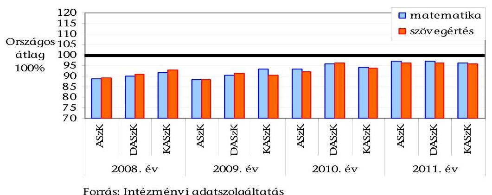

Forrás: Intézményi adatszolgáltatás

Az ASzK eredményei a szakiskolai képzésben sem érték el az országos átlagot. A DASzK mérésben résztvevő szakiskolák tanulói - a 2009. évi matematikai alapkészséget leszámítva - szintén átlag alatt teljesítettek. A KASzK szakiskolai eredményei azonban a 2009. évtől minden évben az országos átlagot meghaladóak voltak. Azokban a tagintézményekben, ahol a mérések eredményei az országos szint alatt teljesültek, tanévenként kompetenciafejlesztésre irányuló intézkedési tervet készítettek, amelyek azonban csak részben voltak eredményesek.
3. sz. diagram
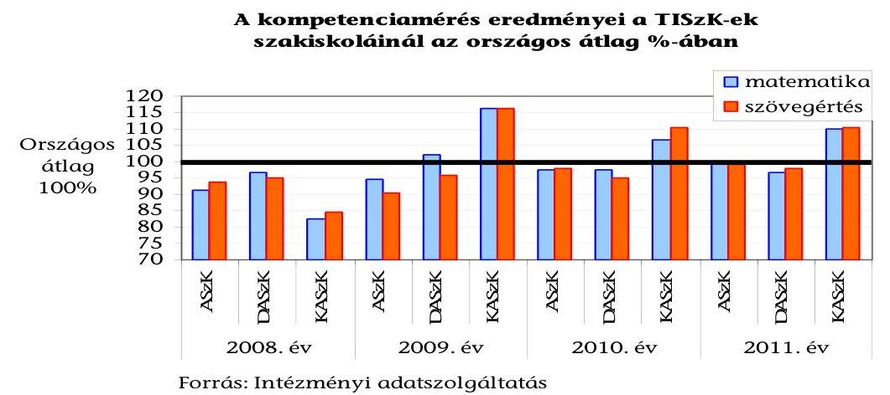

---

A tanüzemek vagyontárgyai az intézmények nyilvántartásai alapján alapvetően a szakképzés céljait szolgálták. Az agrár-szakképző központok vállalkozási tevékenységet nem folytattak. Az ellenőrzött időszak átlagában a szakképzésben résztvevő tanulók 78,2%-ának gyakorlati képzése valósult meg a tanüzemekben, ahol azok a gyakorlati óráknak több mint 70%-át töltötték. A kiemelt vagyontárgyak kihasználtsága - a mezőgazdasági munkák időszakos jellegét is figyelembe véve - biztosított volt.

A TISzK-ek a rendelkezésükre álló földterület több mint 70%-át művelték meg az ellenőrzött időszak átlagában. A földterületek egy részét gazdaságossági okokból nem hasznosították. Ilyen volt pl. a DASzK elöregedett gyümölcsöse, amelynek csak 42,1%-át művelték meg. A TISZK-ek saját földterületeiken kívül további területeket béreltek növénytermesztési célra.

Az intézmények vagyontárgyaik közül néhány ingatlant - kiegészítő tevékenység keretében - bérbe adtak, illetve szálláshelyként üzemeltetve hasznosítottak.

A tanüzemi gépek - az intézmények tanúsítványi adatszolgáltatása alapján - alapvetően oktatási célt szolgáltak. Az oktatási célú használat aránya az ellenőrzött időszakban átlagosan a teljesített gépórák 80%-a volt. Az egy erőgépre jutó gyakorlati órák száma a 2008. évi 138,4 óráról 2011-re 147,0 órára (6,2%-kal) növekedett.

A TISzK-ek összesített adatai alapján a gyakorlati oktatást segítő gépek használhatósági foka évről évre - a 2008. évi 21,7%-ról a 2011. évre 13,8%-ra csökkent. Ez a kedvezőtlen tendencia mind a három TISzK-re jellemző volt.

A tanulók csak az év korlátozott időszakában, meghatározott nap óraszámban kerülhetnek beosztásra a tanüzemi munkavégzésre. A tanüzemben felmerülő teendők folyamatos ellátása a tanulókon és a pedagógusokon túl egyéb foglalkoztatást is igényelt. A tanüzemekben nem pedagógusként foglalkoztatottak aránya az összes létszámhoz képest nem volt jelentős, azonban a 2008/2009. tanévi 7,1%-ról a 2010/2011. tanévre 7,8%-ra emelkedett. A létszámot a tangazdaságok méretéhez és a munka jellegéhez igazították, figyelembe véve a költségvetési kereteket is.

A TISzK-ek a földeket minden évben megművelték, azok a szakképzés, illetve az ahhoz kapcsolódó kiegészítő tevékenységek céljait szolgálták. Az átlaghozamok azonban - a DASzK kivételével - nem érték el az országos átlagot, ehhez a föld minősége, a vetőmagok fajtája, valamint a tanüzemi célú hasznosítás egyaránt hozzájárult.

A tanüzemekben előállított termékeket részben értékesítették, részben az állatok takarmányozására használták fel, illetve a saját üzemeltetésű konyhák, tankonyhák részére adták át.

A 2008-2011. években a növények, az állatok és az állati melléktermékek értékesítésének nettó árbevétele - a három agrár-szakképző központnál együttesen - 1511,3 M Ft-ot tett ki. Az árbevétel több mint fele (51,7%) a DASzK-nál, 42,3%-a az ASzK-nál és 6,0%-a a KASzK-nál realizálódott.

---

A 2008. évről a 2011. évre a három TISzK értékesítésének nettó árbevétele növekedett, együttesen átlagosan 7,9%-kal.

Az eladási átlagárak és a felvásárlási árak egymáshoz való viszonyítása alapján megállapítottuk, hogy a TISzK-ek jellemzően a felvásárlási áraknál alacsonyabb áron tudták értékesíteni termékeiket. A tanüzemek működtetése alapvetően oktatási célokat szolgált. A kedvező piaci lehetőségeket az intézmények tájékoztatása szerint nem tudták kihasználni, a gabonafélék, takarmányok tárolási lehetőségeinek hiányában.

Az eladási áron számított összes értékesítési bevétel a négy szántóföldi növény és a legmeghatározóbb állatértékesítéseknél meghaladta az intézmények által kimutatott nyilvántartási áron számított értéket. A nyilvántartási ár nem tartalmazta a közvetett költségeket, illetve a KASzK-nál a közvetlen költségek egy részét (tanüzemben nem pedagógusként foglalkoztatottak bérét és járulékait) sem. A megtermelt termékek hasznosítása növekvő árbevételt eredményezett, de egyes termékek értékesítésének eredményéről az árbevétel megszerzése érdekében felmerült ráfordítások teljes körű kimutatásának hiányában nem nyerhető pontos információ. Az intézmények önköltségszámítási szabályzatuk általános részében az Szt. 51. § (1) bekezdésének megfelelően határozták meg a bekerülési érték összetevőit, a szabályzat szerinti kalkulációs séma részletezése és alkalmazása azonban nem biztosítja a bekerülési érték (közvetlen önköltség) szabályszerű megállapítását.

A tanüzemi tevékenység bevételeinek és kiadásainak pontos kimutatását az államháztartási szakfeladatrend szerinti elszámolás nem biztosította, mert azt központi előírások nem tették kötelezővé. A tangazdaságok bevételeit és kiadásait a szakképzés
 megszerzésére felkészítő gyakorlati képzés szakfeladaton mutatták ki, amely a tanüzemi működtetésen kívüli tételeket is tartalmazott (pl. a gyakorlati képzéshez kapcsolódó iskolai tanórák megtartása). A tanüzemi tevékenység közvetett kiadásainak kimutatása intézményi szinten nem volt egységes és teljes körű. A TISzK-ek tanüzemi bevételei az ellenőrzött időszak átlagában - a tanüzemi kiadások 71,8%-ára nyújtottak fedezetet. A tanüzemi tevékenység kiadásai az ellenőrzött időszakban mindhárom intézménynél - a három TISzK-nél összesen 1220,9 M Ft-tal - meghaladták a tanüzemi tevékenység bevételeit. Ezt az intézmények a tevékenység oktatási jellegével, a mezőgazdasági tevékenység sajátosságaival és a kedvezőtlen üzemmérettel indokolták.

A VKSzI az ellenőrzött időszakban a VM által meghatározott feladatokat az alapító okiratban, illetve szervezeti és működési szabályzatban foglaltaknak megfelelően látta el. Ezeken túlmenően a minisztérium egyéb elvárásokat, célkitűzéseket nem határozott meg az intézet számára. Az agrár-szakképzéssel kapcsolatos feladatok jelentős részének ellátása pályázati forrásból történt. Az ellátott feladatok számát és jellegét az adott időszakra elnyert forrás összege befolyásolta.

A VM fenntartása alá tartozó, mezőgazdasági középfokú szakoktatást folytató TISzK-ek, valamint a VKSzI 2011. évi beszámolói pénzügyiszabályszerűségi ellenőrzés keretében felülvizsgáltuk.

---

A TISzK-ek 2011. évi intézményi beszámolóira a gazdálkodás szabályszerűségének minősítése alapján az ellenőrzés elutasító véleményt adott. Az elutasító véleményt az indokolta, hogy az agrár-szakképző központok tagintézményeiben összességében 4760,3 M Ft felhatalmazás nélküli kifizetés történt, amely mindhárom TISzK esetében meghaladta a 2011. évi kiadási főösszeg 2%-át.

A TISzK-ek főigazgatói - az Ámr. 72. § (3) bekezdésének előírásait figyelmen kívül hagyva - nem adtak írásbeli felhatalmazást a tagintézményeknél a kötelezettségvállalásra és az utalványozási jogkör gyakorlására. Nem történt meg az ellenjegyzésre és a szakmai teljesítésigazolásra, érvényesítésre jogosult személyek írásbeli kijelölése sem, megsértve ezzel az Ámr. 74. § (2) és 76. § (5) bekezdésének előírásait. Az Áht. $^{6}$ 100/C. § (1) bekezdése értelmében kiadási előirányzatot terhelő kötelezettséget csak a költségvetési szervek vezetői, valamint az általuk írásban felhatalmazott személyek vállalhatnak. Így a felhatalmazás nélküli kötelezettségvállalásért és kifizetésekért a TISzK-ek főigazgatóit, valamint a tagintézmények vezetőit egyaránt felelősség terheli.

Az Áht. $_{1}$ 12/A. § (1) bekezdésében foglaltak ellenére az ASzK-nál összesen 50,0 M Ft-tal, a DASzK-nál 79,3 M Ft-tal túllépték a dologi és egyéb folyó kiadások, valamint az egyéb működési célú kiadások előirányzatait, továbbá az Ámr. 74. § (3) bekezdésének és a 77. § (1) bekezdésének előírásait figyelmen kívül hagyva a kötelezettségvállalásokat és a kifizetéseket megelőzően nem győződtek meg a szükséges előirányzat, illetve a fedezet rendelkezésre állásáról.

# A VKSzI 2011. évi beszámolójára korlátozott véleményt adott az ellenőrzés. Ennek okai: az egyes kiemelt kiadási előirányzatok (a személyi juttatások, az egyéb működési célú és a felhalmozási kiadások) 36,2 M Ft összegű túllépése, a kötelezettségvállalással terhelt maradvány összegének 10,0 M Ft összeget, valamint a mérleg forrásösszetételének 81,8 M Ft-os összeget érintő helytelen kimutatása.

Az intézményi beszámolók minősítéseit, valamint azok alátámasztását a 2/a-d. mellékletek tartalmazzák.

Az ÁSZ tv. 33. § (1) bekezdésében foglaltak értelmében az ellenőrzött szervezet vezetője köteles a jelentésben foglalt megállapításokhoz kapcsolódó intézkedési tervet készíteni. Az ÁSZ tv. 33. § (3) bekezdése az intézkedési terv határidőben történő megküldésének elmulasztása, vagy nem megfelelő intézkedési terv megküldése esetére büntetőjogi, fegyelmi, vagy egyéb jogkövetkezmények alkalmazását teszi lehetővé.

[^0]
[^0]:    $^{6}$ az államháztartásról szóló 1992. évi XXXVIII. törvény

---

Az ellenőrzés intézkedést igénylő megállapításai és javaslatai:

# a vidékfejlesztési miniszternek

1. Az átszervezésről döntést hozó miniszter nem határozott meg eredményességi, hatékonysági követelményeket az agrár-szakképző központok részére. A fenntartó a TISzK-ek részére biztosított támogatás nyújtását nem kötötte feladatmutatókhoz, elvárt teljesítménymutatókat sem határozott meg részükre, miközben a VM fenntartású iskolák egy tanulóra jutó működési támogatása meghaladta a hasonló profilú önkormányzati iskolák támogatását.

Javaslat:
Vizsgálja meg a fenntartása alá tartozó intézmények egy tanulóra jutó, az országos átlagtól eltérő támogatásának indokoltságát. A költségvetési támogatás nyújtását kösse feladatmutatókhoz és határozzon meg az általa fenntartott intézmények számára a teljesítmény mérésére alkalmas mutatószámokat.
2. A TISzK-eken belül a párhuzamos képzések száma nem csökkent.

Javaslat:
Az Emberi Erőforrások Minisztériumával együttműködve mérje fel a beiskolázási területén az eltérő fenntartású iskolákban fennálló párhuzamos képzéseket. A felmérés eredményeit figyelembe véve vizsgálja felül a fenntartása alá tartozó intézmények alapító okiratában meghatározott tanulólétszámot, képzési szerkezetet, és tegyen intézkedéseket a közpénzek hatékony felhasználása, a képzési struktúra országos célokhoz való illeszkedése érdekében.
3. Az Áht. 100/C. § (1) bekezdése értelmében kiadási előirányzatot terhelő kötelezettséget csak a költségvetési szervek vezetői, valamint az általuk írásban felhatalmazott személyek vállalhatnak. A felhatalmazás nélküli kötelezettségvállalásért és kifizetésekért az intézmények főigazgatóit felelősség terheli.

Javaslat:
Intézkedjen a kötelezettségvállalás szabályait - 2012. január 1-jétől az Ávr. 52. § (1) a) pontját - sértő gyakorlat megszüntetéséről. Vizsgálja ki, hogy a jogszabálysértő gyakorlat alkalmazásáért kiket terhel személyes felelősség, annak ismeretében tegye meg a szükséges intézkedéseket.

## az ellenőrzött Térségi Integrált Szakképző Központok főigazgatóinak:

1. Az ellenőrzött időszakban hatályos Ámr. 15. §-a előírásainak nem felelt meg, hogy az önállóan működő és gazdálkodó státusszal rendelkező székhelyintézményen kívül párhuzamos feladatellátás mellett - a tagintézmények is önálló gazdasági szervezettel rendelkeztek.

Javaslat:
Tegyenek intézkedéseket annak érdekében, hogy az általuk vezetett TISzK gazdasági

---

szervezete megfeleljen az államháztartásról szóló 2011. évi CXCV. törvény 10. § (4) bekezdésének és az államháztartásról szóló törvény végrehajtásáról szóló 368/2011. (XII. 31.) Korm. rendelet 9. §-a előírásainak.
2. A tanüzemi tevékenység pénzügyi bevételeinek és kiadásainak kimutatását az államháztartási szakfeladatrend szerinti elszámolás nem biztosította, mert azt központi előírások nem tették kötelezővé. A szakképzés megszerzésére felkészítő gyakorlati képzés szakfeladat a tanüzemi működtetésen kívüli tételeket is tartalmaz. Egyes termékek értékesítésének eredménye pedig az önköltségszámítás szabályozásának és alkalmazásának hiányosságai miatt nem állapítható meg.

Javaslat:
A tanüzemek működésének és gazdálkodásának átláthatósága érdekében:
a) gondoskodjanak a szakképzés megszerzésére felkészítő gyakorlati képzés szakfeladaton belül a tanüzemek bevételeinek és kiadásainak elkülönített és teljes körű kimutatásáról,
b) vizsgálják felül az önköltségszámítás szabályait és a nyilvántartási árakat a tényleges önköltség figyelembevételével határozzák meg.
3. A racionalizálásra, takarékosságra, illetve kihasználtság növelésére irányuló intézkedések tervezett és tényleges bevételnövelő illetve kiadáscsökkentő hatásait nem számszerűsítették.

Javaslat:
Készítsenek intézkedési tervet a tanüzemekre vonatkozóan a bevételszerzés és a kiadáscsökkentés lehetőségeinek feltárása és kihasználása, valamint a vagyontárgyak eredményes hasznosítása érdekében a várható hatások számszerűsítésével.
4. Az ellenőrzött időszakban a TISzK-ek gazdálkodásának szabályozottsága nem volt megfelelő, mivel az elkészített szabályzatokat nem vagy késedelmesen aktualizálták. A TISzK - mint önálló költségvetési szerv - székhelyintézményének és a tagintézményeinek szabályzatai eltérőek voltak.

Javaslat:
Gondoskodjanak az SZMSZ jogszabályoknak megfelelő aktualizálásáról, valamint a székhelyintézményben és a tagintézményeknél egységes gazdálkodási és számviteli szabályzatok alkalmazásáról, azok jogszabályi megfelelőségéről.
5. A TISzK-ek főigazgatói az Ámr. 72. § (3) bekezdés a) pontjában foglaltakat figyelmen kívül hagyva nem adtak írásbeli felhatalmazást a tagintézményeknél a kötelezettségvállalásra és az utalványozási jogkör gyakorlására kijelölt személyek részére, valamint az Ámr. 76. § (5) bekezdésének rendelkezéseivel ellentétesen nem jelölték ki írásban a szakmai teljesítés igazolására és az érvényesítésre jogosult személyeket. A gazdasági főigazgató-helyettesek az Ámr. 74. § (2) bekezdés a) pontja ellenére a tagintézményeknél nem jelölték ki írásban a kötelezettségvállalások és utalványozás ellenjegyzésével megbízott személyeket.

---

Javaslat:
Gondoskodjanak arról, hogy a gazdálkodási jogkörök gyakorlására írásban kiadott felhatalmazások megfeleljenek az államháztartásról szóló törvény végrehajtásáról szóló 368/2011. (XII. 31.) Korm. rendelet 52. § (1), az 55. § (1), az 57. § (4), valamint az 58. § (4) bekezdésének.
6. Az ellenőrzött TISzK-eknél nem történt meg a pénzügyi ellenjegyzésre, a szakmai teljesítésigazolásra és érvényesítésre jogosult személyek írásbeli kijelölése, megsértve ezzel az Ámr. 74. § (2) és a 76. § (5) bekezdésének előírásait.

Javaslat:
Munkáltatói jogkörükből adódóan vizsgálják ki a pénzügyi ellenjegyzésre, valamint a teljesítésigazolásra vonatkozó szabályok - 2012. január 1-jétől az Ávr. 55. § (2) bekezdése, valamint az 57. § (4) bekezdése - előírásait sértő gyakorlat személyi felelősségét és annak ismeretében tegyék meg a szükséges intézkedéseket.

# az ASzK és a DASzK főigazgatójának

1. Az intézményeknél az Áht. $_{1}$ 12/A. § (1) bekezdésében foglaltak ellenére túllépték a dologi és egyéb folyó kiadások, valamint az egyéb működési célú kiadások előirányzatait, továbbá az Ámr. 74. § (3) bekezdésének és a 77. § (1) bekezdésének előírásait figyelmen kívül hagyva a kötelezettségvállalásokat és a kifizetéseket megelőzően nem győződtek meg a szükséges előirányzat, illetve a fedezet rendelkezésre állásáról.

Javaslat:
Intézkedjenek annak érdekében, hogy kötelezettségvállalásra csak az államháztartásról szóló 2011. évi CXCV. tv. 36. § (1) bekezdése szerinti szabad előirányzat mértékéig kerüljön sor, továbbá, hogy a kötelezettségvállalás ellenjegyzésére felhatalmazott személy - a 37. § (1) bekezdésében előírtaknak megfelelően - győződjön meg a szabad előirányzat, illetve a pénzügyi előirányzat rendelkezésre állásáról.

## a VKSZI (NAKVI) főigazgatójának

1. Az intézménynél az Áht. $_{1}$ 12/A. § (1) bekezdésében foglaltak ellenére túllépték a működési és felhalmozási kiadások egyes kiemelt előirányzatait, továbbá az Ámr. 74. § (3) bekezdésének és a 77. § (1) bekezdésének előírásait figyelmen kívül hagyva a kötelezettségvállalásokat és a kifizetéseket megelőzően nem győződtek meg a szükséges előirányzat, illetve a fedezet rendelkezésre állásáról.

Javaslat:
Intézkedjék annak érdekében, hogy kötelezettségvállalásra csak az államháztartásról szóló 2011. évi CXCV. tv. 36. § (1) bekezdése szerinti szabad előirányzat mértékéig kerüljön sor, továbbá, hogy a pénzügyi ellenjegyző - a tv. 37. § (1) bekezdésében előírtaknak megfelelően - győződjön meg a szabad előirányzat, illetve a pénzügyi előirányzat rendelkezésre állásáról.

---

# II. RÉSZLETES MEGÁLLAPÍTÁSOK

## 1. AZ INTÉZMÉNYI BESZÁMOLÓK PÉNZÜGYI-SZABÁLYSZERŰSÉGI ELLENŐRZÉSE

### 1.1. A pénzforgalmi folyamatok szabályszerűsége és az adatok megbízhatósága

A VM fenntartású TISzK-ek pénzforgalmi adatai nem voltak megbízhatóak, a feltárt hibák aránya összességében 6232,4 M Ft-tal, meghaladta az intézményi szintű kiadási főösszegek 2%-át. A VKSzI kiadási és bevételi pénzforgalmi adatainak kimutatása a költségvetési gazdálkodásra vonatkozó jogszabályok előírásainak - egyes kiemelt előirányzatok túllépése miatt - csak részben felelt meg.

Az ellenőrzött intézmények 2011. évi kiadási és bevételi előirányzatai a következőképpen alakultak:

1. sz. táblázat

Az ellenőrzött intézmények 2011. évi
költségvetési adatai
Adatok: M Ft-ban

| Megnevezés | Előirányzat |  | Teljesítés |
| :--: | :--: | :--: | :--: |
|  | Eredeti | Módosított |  |
| Kiadás | 5744,9 | 7625,3 | 7286,9 |
| Bevétel | 1703,9 | 3537,7 | 3767,3 |
| Támogatás | 4041,0 | 4087,5 | 4087,5 |

Forrás: 2011. évi beszámolók
Az VM szakképző intézményeinek teljesített kiadási főösszege 4,4%-kal (338,4 M Ft-tal) alatta maradt a módosított előirányzatnak, azonban három intézménynél (ASzK, DASzK, VKSzI) a működési kiadások egyes kiemelt előirányzatait az Áht. $_{1}$ 12/A. § (1) bekezdésében foglaltak ellenére túllépték.

Az ASzK 49,5 M Ft-tal túllépte a dologi és folyó kiadások és 0,5 M Ft-tal az egyéb működési célú kiadások kiemelt előirányzatát. A személyi juttatás és a járandóságok előirányzatán képződött
 maradvány a túllépésre fedezetet nyújtott volna, de az intézmény nem élt az előirányzat-módosítás lehetőségével.

A DASzK-nál 76,9 M Ft-tal túllépték a dologi és egyéb folyó kiadások, valamint 2,4 M Ft-tal az egyéb működési célú kiadások előirányzatait.

A VKSzI-nél a személyi juttatások kiemelt előirányzatát 28,1 M Ft-tal, az egyéb működési célú kiadásokét $0,2 \mathrm{M}$ Ft-tal, a felhalmozási kiadások kiemelt előirányzatát 7,9 M Ft-tal lépték túl.

---

Az Ámr. 74. § (3) bekezdésének és a 77. § (1) bekezdésének előírásait figyelmen kívül hagyva a kötelezettségvállalásokat és a kifizetéseket megelőzően nem győződtek meg a szükséges előirányzat, illetve a fedezet rendelkezésre állásáról.

A pénzforgalmi tételek ellenőrzése alapján megállapítható, hogy a TISzK-ek tagintézményeinél az Ámr. 72. § (3) bekezdésében rögzítettekkel ellentétes, felhatalmazás nélküli kifizetések történtek.

Az önállóan működő és gazdálkodó TISzK-ek főigazgatói nem adtak írásbeli felhatalmazást a tagintézményeknél a kötelezettségvállalásra és az utalványozási jogkör gyakorlására kijelölt személyek részére, továbbá írásban nem jelölték ki a szakmai teljesítés igazolására és az érvényesítésre jogosultakat. A gazdasági főigazgató-helyettesek írásban nem jelölték ki a tagintézményeknél a kötelezettségvállalások és utalványozás ellenjegyzésével megbízott személyeket.

A felhatalmazás nélküli kifizetések a kiadások teljesített főösszegének a KASzK esetében az 55,8%-át (896,6 M Ft-ot), a DASzK-nál a 81,0%-át (1992,8 M Ft-ot), míg az ASzK-nál a 81,5%-át (1870,9 M Ft-ot) jelentették. A gazdálkodási jogkörök felhatalmazás nélküli gyakorlása a zárszámadásban szereplő adatok valódiságát, megbízhatóságát befolyásolta. Az agrár-szakképző intézményeknél a költségvetési előirányzatokat nem a törvényi és egyéb jogszabályi előírások betartásával használták fel. A TISzK-ek beszámolóinak elkészítése során emiatt a törvényesség, az átláthatóság és az elszámoltathatóság követelményei csak részben érvényesültek.

A VKSzI-nél a pénzforgalmi adatok megbízható, valós képet mutattak a gazdálkodás folyamatairól. A dokumentumok tartalmilag és formailag megfeleltek az előírásoknak. A pénzforgalmi kiadások teljesítése a belső szabályozásnak megfelelő volt. Az intézmény az egyes kiemelt előirányzatok túllépésével megsértette a jogszabályi előírásokat.

A felhalmozási kiadások jellemzően külső (EU-s pályázat, szakképzési hozzájárulás) forrás felhasználásával megvalósuló felújításokhoz, illetve beruházásokhoz kapcsolódtak, amelyeket a jogszabálynak megfelelően számoltak el.

# 1.2. A mérlegtételek - kiemelten a követelések, kötelezettségek, aktív és passzív pénzügyi elszámolások - értékelése 

Az ellenőrzött intézmények mérlegeinek eszköz és forrás oldala, valamint a tárgyévi nyitó és előző évi záró adatai egyezőek voltak. A mérlegtételeket analitikus nyilvántartással, leltárral támasztották alá.

A könyvviteli mérlegek adatai alapján a VM szakképző intézményei 2011. év végén összesen 10111,3 M Ft összegű vagyonnal rendelkeztek, ami az előző évhez képest $4,1 \%$-os ( $430,2 \mathrm{M} \mathrm{Ft})$ csökkenést jelent (3/1. sz. melléklet).

A VM 2011. augusztus 31-ével az ASzK két tagintézménye (Kétegyháza, Gyomaendrőd) által ellátott közoktatási feladatokat - megállapodás alapján átadta a Békés Megyei Önkormányzatnak. A megállapodás szerint az ingó és ingatlan vagyon ingyenes használatát a VM biztosítja a feladatot ellátó részére, ugyanakkor az átadás napján fennálló tartozásállomány rendezése a Békés Megyei Önkormányzat kötelezettsége. A feladatok ellátására szolgáló ingatlanok

---

ingyenes használatának átadásához szükséges a Magyar Nemzeti Vagyonkezelő (MNV) Zrt. és a Magyar Földalapkezelő Szervezet engedélye, amelyek a helyszíni ellenőrzés befejezéséig a VM-hez nem érkeztek meg.

A kiemelt mérlegtételek tartalma, értékelése - a beszámoló megbízhatóságát alapvetően nem befolyásoló, az alábbiakban részletezett kivételekkel - megfelelő volt.

Az intézmények 2011. év elején fennálló 214,8 M Ft követelésállománya az év végére $158,0 \mathrm{M}$ Ft-ra ( $26,4 \%$-kal) csökkent. A záró állomány 49,6%-a $(78,4 \mathrm{MFt})$ a VKSzI által nyilvántartott követelés volt.

Az ASzK-nál az Szt. 29. §-ában és az Áhsz. 22. § (1) bekezdésében előírtakat megsértve 150,1 E Ft értékben helytelenül tartottak nyilván a követelések között egy kintlévőséget, amelyet a másik fél nem ismert el.

Az intézményeknél az egyéb aktív pénzügyi elszámolások számviteli elszámolása az Szt. és az Áht. ${ }_{1}$ rendelkezéseinek megfelelt, a mérlegben kimutatott egyenlege tételes leltárral, analitikus nyilvántartással alátámasztott volt.

Az ellenőrzött intézmények 2011. év végi mérlegében kizárólag rövid lejáratú kötelezettség szerepelt. A rövid lejáratú kötelezettségek 403,3 M Ft összege az előző évi záró állomány 59,1%-át jelentette.

Az ellenőrzés két intézménynél (VKSzI és az ASzK) tárt fel hibát a támogatási program előlegeinek elszámolásával kapcsolatban. A hiba besorolási hibának minősül, amely a forrásösszetételt érintette, de a mérlegfőösszeget nem változtatta meg.

Az Áhsz. 26. § (5) bekezdésének előírásai ellenére a VKSzI-nél helytelenül mutatták ki a támogatási program előlege miatti 81,8 M Ft-os kötelezettséget, az ASzK-nál pedig nem mutatták ki a támogatási program el nem számolt előlegének 221,2 M Ft-os összegét.

Az ASzK a 2011. év végén fennálló kötelezettségállományából 19,1 M Ft az átadott kétegyházi tagintézmény szállítói tartozása volt. A kötelezettség a felek között létrejött megállapodás értelmében a Békés Megyei Önkormányzatot terhelte, ezért a 19,1 M Ft-ot (ami a mérlegfőösszeg 0,06%-a) az ASzK mérlegében helytelenül szerepeltették.

A helytelenül kimutatott szállítói állományból 12,6 M Ft-ot 2012 márciusában a Békés Megyei Intézményfenntartó Központ kiegyenlített, az ASzK nyilvántartásából kivezették. A fennmaradó 6,5 M Ft-ról a helyszíni ellenőrzés befejezéséig az intézmény nem rendelkezett.

Az intézmények a passzív pénzügyi elszámolások állományát analitikus nyilvántartással és leltárral alátámasztották. A mérlegtétel tartalma, besorolása, értékelése megfelelő volt.

---

# 1.3. Az évközi előirányzat-módosítások, átcsoportosítások értékelése 

Az ellenőrzött intézmények jóváhagyott kiadási előirányzatai a 2011. év folyamán 5744,9 M Ft-ról 7625,3 M Ft-ra növekedtek. Az 1880,4 M Ft értékben végrehajtott előirányzat-módosítások hatáskörönkénti összetétele a következő volt:

- Az Országgyűlés hatáskörében végrehajtott februári előirányzatmódosítással, a négy intézménynél összesen 318,8 M Ft-tal csökkentették a kiadási előirányzatokat. Az előirányzat elvonások a 1025/2011. (II. 11.) Korm. határozatban foglaltak végrehajtása érdekében a Kvtv. módosításához kapcsolódtak;
- A Kormány hatáskörében végrehajtott előirányzat módosítások a 2011. évi bérkompenzáció és a prémiumévek programmal kapcsolatos kifizetések fedezetét biztosították. Az intézmények összesen 159,7 M Ft költségvetési többlettámogatáshoz jutottak;
- Felügyeleti szervi hatáskörben az intézményi többletbevételek, illetve a póttámogatások terhére történtek előirányzat-módosítások, összesen 507,6 M Ft összegben;
- A saját hatáskörben végrehajtott előirányzat-módosítások az előző évi maradványok előirányzatosítását, támogatás értékű működési és felhalmozási pénzeszköz átvételét, valamint működési és felhalmozási célú pénzeszköz átvételét jelentették. A végrehajtott saját hatáskörű előirányzat módosítások hatására az ellenőrzött intézmények kiadási előirányzatai összesen 1531,9 M Ft-tal növekedtek.

Az intézményeknél végrehajtott előirányzat-módosítások, átcsoportosítások szakmailag indokoltak és előkészítettek voltak. Azok végrehajtása során három intézménynél az Ámr. előírásait betartották. A DASzK - az Ámr. ${ }^{7}$ 59/A. § (6) bekezdésében foglaltakat figyelmen kívül hagyva - a többletbevételeivel módosította az előirányzatait, azonban, az irányító szerv erre vonatkozó engedélyét az intézmény nem tudta bemutatni.

Az ellenőrzött TISzK-ek az előirányzat-módosításokról analitikus nyilvántartást vezettek, amely szabályosan, hatáskörönként és kiemelt előirányzatonként tartalmazta a módosításokat, az alapján a módosításokat szabályszerűen könyvelték. A VKSzI-nél - az Áht. ${ }_{1}$ 103. § (1) bekezdésében foglaltakkal ellentétesen - analitikus nyilvántartással nem rendelkeztek.

### 1.4. A maradványtartási- és kiadáscsökkentő intézkedések hatásai

A Kormány az 1025/2011. (II. 11.) számú határozata 1. pontjában a VM fejezet részére 18 749,0 M Ft zárolási kötelezettséget írt elő. A VM, mint irányító szerv, az ellenőrzött négy intézményt érintően összesen 1269,4 M Ft zárolásáról döntött. Az 1282/2011. (VIII. 10.) Korm. határozat a zárolást feloldotta, ugyanakkor a 2011. évi költségvetési törvény módosításáról szóló 2011. évi CXIV. törvény ${ }^{8}$ előírásai alapján az intézmények költségvetési támogatása összesen 318,8 M Ft-tal csökkent.

A DASzK-nál a dologi előirányzat 471,9 M Ft-os zárolását követően 110,3 M Ft-tal csökkentették a támogatást. A KASzK-nál a fenntartó 331,7 M Ft zárolását rendelte el, majd ennek feloldásával egyidejűleg 107,9 M Ft-tal csökkentette a dologi kiadások előirányzatát. Az ASzK előirányzatát 419,0 M Ft összegben zárolták, az elvonás 63,8 M Ft volt. A VKSzI előirányzatából zárolt összeg 46,8 M Ft, a végleges elvonás összege 36,8 M Ft volt.

Az intézmények helyzetét tovább nehezítette az 1316/2011. (IX. 19.) Korm. határozatban előírt maradványtartási kötelezettség. A VM a vizsgált intézményeknél összesen 362,0 M Ft maradványtartási kötelezettséget írt elő[^9]. A maradványtartási kötelezettséget 2012. december 28-án[^10] a Kormány feloldotta, azonban az év végi szabadságolások miatt a lejárt tartozások kifizetésének teljesítésére az érintett intézményeknél már nem került sor.

Az ellenőrzött intézményeknél az előirányzat-zárolás, az előirányzat csökkentés és a maradványtartási kötelezettség miatt keletkezett likviditási problémákat elsősorban a szállítói tartozások átütemezésével oldották meg. A fizetőképesség megtartása érdekében a felügyeleti szerv - évközi módosítás keretében - a KASzK részére két esetben összesen 33,7 M Ft póttámogatást biztosított a közüzemi tartozások kiegyenlítésére.

# 1.5. A bevételi előirányzatok és teljesülésük 

Az ellenőrzött intézmények közül a DASzK-nál és a KASzK-nál a bevételek beérkezésének nyomon követése folyamatos volt. A pénzügyi tranzakciókat a főkönyvi könyvelésben a pénzintézeti értesítés alapján azonnal elszámolták. Az elszámolás során a pénzügyi jogosítványok gyakorlása szabályszerűen történt.

Az ellenőrzés két intézménynél (ASzK, VKSzI) tárt fel szabálytalanságot. Az ASzK esetében a székhely intézménynél a bevételi tranzakciókról nem készült utalványrendelet, és a szerződéskötések során elmaradt a pénzügyi ellenjegyzés. A VKSzI-nél - az általános forgalmi adóról szóló 2007. évi CXXVII. törvény 163. § (1) bekezdésében rögzítettekkel ellentétesen - a számlák kiállítása több hónapos késéssel történt meg.

[^0]
[^0]:    ${ }^{8}$ 2011. évi CXIV. törvény a Magyar Köztársaság 2011. évi költségvetéséről szóló 2010. évi CLXIX. törvény módosításáról (hatálytalan 2012. június 27-től)
    ${ }^{9}$ Az intézmények maradványtartási kötelezettsége: DASzK 98,0 M Ft, ASzK 217,2 M Ft, KASzK 46,8 M Ft. Az ASzK-nál a gyomaendrődi és a kétegyházi tagintézmények kiválása miatt, a maradványtartási kötelezettséget 87,8 M Ft-ra csökkentették.
    ${ }^{10}$ a maradványtartási kötelezettséget a Kormány 1505/2011. (XII. 29.) számú határozata oldotta fel

---

Az intézmények saját bevételeinek teljesítése az eredeti előirányzatot 121,1%-kal (2063,5 M Ft-tal), a módosított előirányzatot 6,5%-kal (229,6 M Ft-tal) haladta meg. A költségvetési támogatások a módosított előirányzattal megegyezően teljesültek, 1,1%-kal (46,5 M Ft-tal) haladták meg az eredeti előirányzatot. Az intézmények teljesített költségvetési támogatásának összege 4087,5 M Ft volt, amely jellemzően a személyi juttatások és a munkaadókat terhelő járulékok teljesített összegét (4031,1 M Ft) fedezte. Mindebből következik, hogy az intézmények működése a saját bevételeik folyamatos növelése nélkül nem volt biztosított. Az intézmények a dologi kiadásaikat a teljesített saját bevételekből finanszírozták.

Az intézmények működési bevételei szolgáltatások ellenértékéből, áru- és készletértékesítésből és áfa visszatérülésből képződtek. A rendszeres bevételek intézményi ellátási díjakból, alkalmazottak térítéséből, az intézmények alapfeladatának ellátása során keletkező termékek és végzett szolgáltatások ellenértékéből, valamint bérleti díj bevételekből származtak. Közhatalmi bevételek kizárólag a VKSzI-nél képződtek, a különféle okmányok kiállítási költségének megtérüléséből.

# 1.6. Az előirányzat-maradvány megállapításának szabályszerűsége 

Az intézményi beszámolók részét képező előirányzat-maradvány kimutatás szerint a négy intézménynél a 2011. évi előirányzat-maradvány 655,3 M Ft volt. Az előirányzat
 maradvány 65,9%-a (431,7 M Ft) a VKSzI-nél keletkezett.

A TISzK-eknél kimutatott maradványok teljes egészében kötelezettségvállalással terhelt működési célú előirányzat-maradványok, amelyek megállapítása szabályszerű és bizonylatokkal alátámasztott volt. A kötelezettségvállalásokat az analitikus nyilvántartásban rögzítették.

A VKSzI-nél az előirányzat maradvány levezetése és kimutatása nem felelt meg az Áhsz. 3. számú mellékletében foglaltaknak. A 2011. év végén kötelezettségvállalással terhelt előirányzat-maradványként kimutatott összegből 10,0 M Ft nem vehető figyelembe, mivel a kötelezettségvállalás 2012. március 7-én történt meg.

## 2. A VM fenntartásában lévő szakképző központok és tagintézményeik működési feltételeinek hozzájárulása a feladatellátás eredményességéhez

### 2.1. A VM fenntartásában lévő szakképző iskolák TISzK-ekbe történő átszervezésének indokoltsága, eredményessége

A minisztérium fenntartásában lévő középfokú agrár-szakképző iskolai hálózatot TISzK-ek létrehozásával szervezték át 2008. augusztus 31-től. Az intézkedés jogszabályi alapját a Közokt. tv. és az Szkt. rendelkezései jelentették. A Kor-

---

mány számára készült Jelentés ${ }^{11}$ értelmében a szakképző központok létrehozásának kiemelt indoka a szakképzési hozzájárulás igénybevételére vonatkozó jogszabályváltozásoknak megfelelő feltételek megteremtése, valamint az uniós támogatások igénybevételének lehetősége volt.

Az ellenőrzött időszakban hatályos Szht. 4. § előírásainak értelmében 2008. szeptember 1-jétől a szakképzési hozzájárulást - a speciális szakiskola, készségfejlesztő speciális szakiskola és felsőoktatási intézmény kivételével - kizárólag térségi integrált szakképző központ keretei között működő, szakképzési feladatot ellátó intézmények fenntartói vehették igénybe. További feltétel volt, hogy a nappali rendszerű iskolai oktatásban részt vevő szakképző iskolai tanulók létszáma három tanítási év átlagában szakképző központonként legalább 1500 fő legyen.

A szak- és felnőttképzés fejlesztésére irányuló EU-s fejlesztési támogatások igénybevétele hagyományos formában működő iskola esetében nem volt lehetséges.

A Jelentésben további célként szerepelt a TISzK-ben résztvevő intézmények közötti szakmai hatékonyság erősítése, a párhuzamos képzések csökkentése, az egységes koordináció által a folyamatok tervezhetőbbé válása, a munkaerőpiaci igényeket rugalmasan követni tudó szakképzés. Az elérendő célokhoz teljesítménymutatókat nem határoztak meg. Az átszervezés költségeit nem számszerűsítették. A fenntartó FVM az új intézmények létrehozatalával összefüggésben létszámcsökkentést és egyéb erőforrás-racionalizációt nem tervezett. Az átszervezés gyakorlati feladatain túl a fenntartó konkrét szakmai célokat, elvárásokat nem fogalmazott meg a megalakuló TISzK-ek számára. Az átszervezés végrehajtásának feladataira kijelölték a felelősöket és meghatározták a határidőket.

Az iskolahálózat átszervezésével az uniós pályázati lehetőségek megszerzésére vonatkozó cél teljesült. A 2008-2011 közötti időszakban a VM fenntartásában lévő TISzK-ek összesen 2379,3 M Ft pályázati forráshoz jutottak. Ebből 1881,8 M Ft az EU-s pályázati lehetőségek kihasználásából adódott. A hazai pályázati források és egyedi támogatások összesen 497,5 M Ft-ot tettek ki.

A befolyt pályázati források összege 2008. és 2010. között minden évben nőtt, különösen 2009-ben, amikor az előző évben befolyt 242,0 M Ft-os támogatás háromszorosához (732,1 M Ft-hoz) jutott a három TISzK. A pályázati bevétel 2011-ben a 2010. évi 1030,2 M Ft-ról 375,0 M Ft-ra - az előző évi támogatás 36,4%-ára - csökkent, az uniós programok teljesítésének megfelelően. Az uniós támogatások összegének (1881,8 M Ft-nak) a 77,8%-át (1464,0 M Ft-ot) 2009-ben és 2010-ben fizették ki az intézményeknek.

A pályázati források aránya a teljes időszakra vetítve 8,4%-ot tett ki az intézményi működési és felhalmozási összes forráson (28 249,9 M Ft) belül. A 2008. évben a 242,0 M Ft összegű pályázati bevétel 3,2%-ot tett ki az összes forráson

[^0]
[^0]:    ${ }^{11}$ Jelentés az FVM fenntartásában lévő mezőgazdasági szakképző intézmények agrárszakképző központokba szervezéséről, valamint a létrejövő új központok és a területi szakképző intézmények közötti lehető legszorosabb együttműködés kialakításának lehetőségeiről szóló középtávú tervről

---

belül, a 2009. évben (732,1 M Ft) 10,6%-ot, 2010-ben (1030,2 M Ft) 13,9%-ot képviselt, 2011-ben (375,0 M Ft) azonban mindössze 5,9%-ra csökkent.

A pályázati bevételeken belül meghatározó volt az uniós pályázati támogatások aránya, a teljes időszakra vetítve 79,1%. Az uniós pályázati támogatások aránya a 2008-2011 időszakban az intézményi működési és felhalmozási összes forráson belül 6,7%-ot tett ki. Az uniós pályázati támogatások összege a bázis évhez viszonyítva jelentősen - a 2008. évi 87,8 M Ft-ról 2009-re 556,2 M Ft-ra, 2010-re 907,1 M Ft-ra - növekedett. Az ellenőrzött időszakban a három TISzK pályázatokból származó bevétele az eredeti 308,0 M Ft-os előirányzatnak több mint a hétszeresét, 2379,3 M Ft-ot tett ki.

A TISzK-ek létrehozásával a szakképzési hozzájárulás igénybevételére vonatkozó cél teljesült. Szakképzési hozzájárulásból a 2008-2011 közötti időszakban az intézmények összesen 712,1 M Ft többletbevételhez jutottak. Az ellenőrzött időszakban a szakképzési hozzájárulás a TISzK-ek működési és felhalmozási összes forrásain (28 249,9 M Ft) belül átlagosan 2,5%-ot tett ki, aránya azonban a felhalmozási bevételeken (2079,4 M Ft) belül jelentős, 34,2% volt.

A VM fenntartásában lévő szakképző központok egy tanulójára jutó működési kiadása az ellenőrzött időszakban átlagosan 1037,0 E Ft volt. A mutató 2008. évi 1098,4 E Ft-ról 1005,0 E Ft-ra csökkent 2011. évre (3/2. sz. melléklet). A fajlagos mutató javulása a működési kiadások tanulói létszámot meghaladó csökkenése miatt keletkezett.

# Az egy tanulóra jutó működési kiadás azonban lényegesen magasabb volt a középfokú képzés oktatási szakfeladatra elszámolt fajlagos mutatójánál, illetve az önkormányzati fenntartású mezőgazdasági iskolák egy tanulójára jutó működési kiadásnál. 

A NEFMI által 2011. évben kiadott oktatási statisztikai adatok ${ }^{12}$ szerint a középfokú oktatás egy tanulóra jutó kiadása ${ }^{13}$ 2008-ban 582,9 E Ft, 2009-ben 540,8 E Ft, 2010-ben 549,2 E Ft volt.

Az egy főre jutó működési kiadások összegét összehasonlítottuk agrárszakképzést is folytató önkormányzati fenntartású agrár-szakképző intézmények fajlagos adatával is. Megállapítottuk, hogy a 2011. évben a VM fenntartású intézményeknél az egy tanulóra jutó működési kiadások átlaga (1005,0 E Ft), lényegesen 70,9%-kal meghaladta az önkormányzati fenntartású - alapvetően normatív finanszírozású agrár-szakképzést folytató intézmények ${ }^{14}$

[^0]
[^0]:    ${ }^{12}$ Statisztikai tájékoztató Oktatási Évkönyv 2010/2011.
    ${ }^{13}$ A mutató számításánál az önkormányzati és központi költségvetési szervek által fenntartott középfokú oktatási intézményeinek (gimnázium, szakiskola, szakközépiskola) oktatási szakfeladatra elszámolt kiadásait vették figyelembe.
    ${ }^{14}$ A fajlagos mutató számítása 41 agrár-szakképzést is folytató önkormányzati fenntartású intézmény működési költségvetési támogatásának adatai alapján történt (intézményi beszámoló 09. úrlap 01. sora)

---

átlagát (588,2 E Ft/fő). Ehhez a képzési szerkezet és az annak megfelelő feltételrendszer különbözősége, valamint az eltérő finanszírozás egyaránt hozzájárult.

Az ellenőrzött TISzK-eknél az egy tanulóra jutó személyi kiadás a 2008. évi 718,9 E Ft-ról 2011. évben 618,4 E Ft-ra 14,0%-kal csökkent.

A 2008/2009-es tanévhez viszonyítva a 2010/2011-es tanévre a TISzK-ekben foglalkoztatottak száma a 2008. évi 1348 főről 1305 főre, 3,2%-kal csökkent. Az integráció nem járt tényleges költségcsökkentő hatással a foglalkoztatásra, mert a vezetői szintek, illetve a tanügyi adminisztratív feladatokat ellátók és a gazdasági ügyintézők létszáma összességében nem csökkent.

A személyi juttatások csökkenéséhez a takarékossági intézkedéseken túl a pedagógusok létszámának változása is hozzájárult. A pedagógusok létszáma a 2008/2009. tanévi 680 főről 660 főre csökkent a 2010/2011. tanévre, azon belül az elméleti oktatást végző pedagógusok száma 478 főről 464 főre csökkent.

A VM fenntartású TISzK-eknél az egy pedagógusra jutó tanulók száma az ellenőrzött időszak minden évében több mint 40%-kal alacsonyabb volt az országos átlagnál.

Az ellenőrzött időszakban az egy pedagógusra jutó tanuló létszám országos adata a szakiskolánál 14,7-15,3 fő, a szakközépiskolánál 13,8-13,9 fő volt. A VM fenntartású intézményeknél az egy pedagógusra jutó tanulók létszáma átlagosan 9,1-9,5 fő volt. Az átlag az ASzK-nál növekedett a szakiskolai létszámnál 9,01 főről 10,69 főre, a szakközépiskolánál 7,59 főről 8,37 főre. A KASzK-nál közel azonos maradt a szakiskolánál 6,8-7,2 fő, a középiskolánál 9,8-10,0 fő volt. Az egy pedagógusra jutó tanulók száma a DASzK szakiskoláinál 9,6 főről 11,2 főre növekedett, a szakközépiskolánál 12,3 főről 10,6 főre csökkent (4/1. sz. melléklet).

A szakképző központokon belül a párhuzamos képzések száma nem csökkent. A képzések egy részének több tagintézményben történő indítását a TISzK-ek az iskolák közötti földrajzi távolsággal indokolták. A KASzK tagintézményeinél nincs azonos profilú párhuzamos képzés. A DASzK tagintézményei öt megye területén, míg az ASzK tagintézményei (a két iskola kiválásáig) négy megye területén helyezkedtek el. Az ASzK-nál és a DASzK-nál az iskolarendszerű képzésben hét szakképesítésnél volt párhuzamos képzés.

A VM az átszervezés eredményességét a TISzK-ek átvilágításával és felügyeleti ellenőrzések keretében is értékelte.

Az átvilágítás rámutatott arra, hogy a TISzK-ek működésében gondot okozott az egységes szabályozás hiánya. Az új intézményrendszer irányítása kidolgozatlan volt, nem történt meg az irányítási, szervezési és adminisztratív feladatok átalakítása és feltételeinek rendezése, a feladatok és felelősségi körök tisztázása. A jelentésben megfogalmazott javaslatok végrehajtására a VM nem készített intézkedési tervet. A minisztérium nem végeztetett összehasonlító elemzést a saját fenntartásában működő, valamint a hasonló profilú, egyéb (önkormányzati, alapítványi) fenntartású intézmények tevékenységére vonatkozóan.

---

A felügyeleti ellenőrzés az átszervezés értékeléseként megállapította, hogy az integráció kimutatható gazdasági megtakarítással nem járt.

A DASzK-nál a nyolc intézmény integrációjával a gazdasági és ügyviteli létszám, valamint a vezetői beosztások száma gyakorlatilag nem változott. A nagy földrajzi távolságok, valamint a szakmai oktatás széles köre miatt intenzív szakképzési gyakorlati együttműködés nem volt várható, a módszertan- és tananyagfejlesztésben szükséges együttműködés kiváltása viszont nem kívánt volna szükségképpen teljes szervezeti integrációt.

A jelentések rámutattak arra, hogy az intézmények jellemzően a feladatellátásuk szükségleteit meghaladó méretű épületekkel, létesítményekkel rendelkeznek, amelyek karbantartása, felújítása anyagi erőforrás hiányában elmaradt, egyéb célú hasznosításuk nehézkes.

A VM 2010. június hónapban felmérte az intézmények integrációval kapcsolatos véleményét. Az előnyöket elsősorban egymás tevékenységének megismerésében, a tapasztalatcsere lehetőségében, a TÁMOP szakmai pályázat végrehajtásában látták. Hátrányként értékelték a fenntartó és az intézmények közötti kapcsolatok lazulását, az egy szinttel meghosszabbodott irányítási, függőmi rendszer tanügyi feladatok terén megnyilvánuló hátrányait, a költségvetési gazdálkodás területén az önállóság megszüntetését, illetve a közös adószámmal és OM azonosítóval kapcsolatos problémákat.

A közös adószámból következően előfordul, hogy az azonos szolgáltatóval szerződésben lévő tagintézmények esetében az egyik tagintézmény tartozása miatt a másik sem kap szolgáltatást. A közös OM azonosító miatt a tagintézmények neve az Oktatási Hivatal székhelyintézmény szerinti megyei listáján szerepel.

# 2.2. A tagintézmények feladatellátását meghatározó szabályozás értékelése 

A szakképzés-fejlesztési stratégia végrehajtásához szükséges intézkedésekről szóló 1057/2005. (V. 31.) Korm. határozat feladatokat írt elő az FVM számára a 2005-2013. évekre. Az intézkedések végrehajtási folyamatában a szaktárca közreműködői feladatokat látott el, illetve egyeztetési folyamatokban vett részt.

Az intézkedések végrehajtásaként elkészítették a TISzK-ek minőségirányítási programjait, megtörtént az Europass rendszer bevezetése az agrárszakképesítésekre vonatkozóan. Az agrárszakképzés területén is bevezették a modulrendszert, a szakképesítések tananyag tartalmát korszerűsítették, digitalizált tananyagokat készítettek. Az FVM az OKJ-nak megfelelő szakmai és vizsgakövetelményeket a 8/2008. (I. 23.) FVM rendeletében meghatározta.

Az ellenőrzött időszakban a VM az általa fenntartott TISzK-ek számára nem határozott meg szakmai célokat, elvárásokat.

A régiók szakképzési kapacitásának koordinációját az illetékes RFKB látta el.
 A bizottságok határozták meg a szakképzés fejlesztés irányait, a beiskolázás arányait a régióban. A VM azonban nem követte nyomon, hogy az általa fenntartott TISzK-ek képzéseik kialakításánál figyelembe vették-e az RFKB-k döntéseit.

---

A földművelésügyi és vidékfejlesztési miniszter a TISzK-ek alapító okiratait 2008. augusztus 31-ei hatállyal, a Közokt. tv. 37. § (5) bekezdésének megfelelő tartalommal és határidőben kiadta. Az ellenőrzött időszakban - a jogszabályi változásokkal összhangban - az alapító okiratokat többször módosították.

Az FVM által 2008. augusztus 11-én jóváhagyott alapító okiratok szerint a TISzK-ek gazdálkodási jogköre önállóan gazdálkodó, amelynek tagintézményei részjogkörű költségvetési egységek. A tagintézmények az előirányzatok felett a belső szabályzatokban foglaltak szerint rendelkezhettek. A költségvetési szervek jogállásáról és gazdálkodásáról szóló 2008. évi CV. törvény ${ }^{15}$, illetve a 2010. évtől az Áht. ${ }_{1}$ alapján a TISzK-ek gazdálkodási jogköre „önállóan működő és gazdálkodó" lett.

A TISzK-ek a 2008-2011 közötti időszakban rendelkeztek SzMSz-szel, azonban azokat alapításkori jóváhagyásuk óta nem aktualizálták, 2010. évtől nem voltak összhangban az alapító okirattal. A helyszíni ellenőrzés időpontjában az új működési szabályzatok fenntartó általi véleményezése, jóváhagyása folyamatban volt.

Az ellenőrzött időszakban a TISzK-ek gazdálkodásának szabályozottsága hiányos volt, az elkészített szabályzatokat késedelmesen aktualizálták.

A TISzK szintű számviteli és gazdálkodási szabályzatokat az ASzK és a DASzK 2008-ban, a közbeszerzési szabályzatot 2010-ben készítette el. A számviteli és gazdálkodási szabályzatokat az ASzK 2011-ben, a DASzK 2012-ben módosította. A KASzK 2010-ben készítette el gazdálkodási és számviteli szabályzatait, azonban kötelezettségvállalásra, utalványozásra, ellenjegyzésre, illetve az eszközök és források értékelésére vonatkozó szabályzata az ellenőrzött időszakban nem volt. A szabálytalanságok kezelésére vonatkozó szabályzattal egyik intézmény sem rendelkezett.

Az alapító okirat változását nem követte az SzMSz és a gazdálkodásra vonatkozó szabályzatok aktualizálása. A szabályzatok szerint a székhelyintézményben a gazdasági főigazgató-helyettes, míg a tagintézményekben gazdasági vezetők irányították a gazdálkodási feladatok ellátását. A szabályozás ellentétes az Ámr ${ }^{16}$ 15. § (4) bekezdés b) pontjával, amely kimondja, hogy gazdasági szervezettel kizárólag az önállóan működő és gazdálkodó költségvetési szerv rendelkezhet. A kialakított szabályozás nem biztosította a párhuzamosságok kiküszöbölését a gazdálkodási feladatok ellátásában.

[^0]
[^0]:    ${ }^{15}$ a költségvetési szervek jogállásáról és gazdálkodásáról szóló 2008. évi CV. törvény (hatálytalan: 2010. augusztus 15-től)
    ${ }^{16}$ az Ámr. 2012. január 1-jétől hatályon kívül helyezve

---

A szabályozás lehetővé tette a székhelyintézményben és a tagintézményekben az Ámr. 15. § (2) bekezdésben meghatározott gazdálkodási feladat teljes vertikumának ellátását, ami ellentétes az Ámr. 15. § (1) bekezdésében foglaltakkal ${ }^{17}$.

A kötelezettségvállalásra és ellenjegyzésre vonatkozó szabályzatok hiányosságai miatt fordulhattak elő felhatalmazás nélküli kifizetések, amelyet az ÁSZ a TISzK-ek 2011. évi költségvetési beszámolójának pénzügyiszabályszerűségi ellenőrzése során tárt fel.

A TISzK-ek alapító okiratai rendelkeznek a vagyonkezelői szerződések alapján ellátandó vagyonkezelői feladatokról. Tekintettel arra, hogy a TISzK-eket alkotó tagintézmények jogutódlással szűntek meg, az általuk a Kincstári Vagyoni Igazgatósággal (MNV Zrt. jogelődje) megkötött vagyonkezelői szerződések hatályban vannak.

A vagyonkezelői szerződések tartalmazzák - többek között - a vagyonkezelő jogait és kötelezettségeit, a kezelt vagyon hasznosításának (bérbe-, használatba adás, vállalkozási tevékenység) módját.

A vagyonkezelői jogot a szakképző központok számára átvezették a földhivatali ingatlan-nyilvántartásban. A helyszíni ellenőrzés időpontjában a jogszabályi változásokkal összhangban lévő, új vagyonkezelői szerződéseket még nem kötötték meg. A TISzK-ek az ellenőrzött időszakban a vagyonhasznosításra vonatkozó külön szabályzattal nem rendelkeztek.

# 2.3. A rendelkezésre álló források és eszközök hozzájárulása az eredményes feladatellátáshoz 

A fenntartó az előző évi költségvetési támogatás eredeti előirányzatából kiindulva - bázisalapon - nyújtotta a költségvetési támogatást az intézmények részére, év közben esetenként pótelőirányzatokkal biztosítva. A támogatás nyújtását nem kötötték feladat-, illetve elvárt teljesítménymutatókhoz.

A költségvetési támogatás teljesítése 2008-ban 27,3\%-kal (4186,8 M Ft eredeti előirányzattal és 5329,9 M Ft teljesítéssel, 1143,1 M Ft-tal), 2009-ben 9,0\%-kal (3999,7 M Ft eredeti előirányzattal és 4359,9 M Ft teljesítéssel, 360,2 M Ft-tal), 2010-ben 14,0\%-kal (3844,5 M Ft eredeti előirányzat és 4381,0 M Ft teljesítés mellett, 536,4 M Ft-tal) haladta meg az eredeti előirányzatot, 2011-ben 3892,2 M Ft eredeti előirányzattal és 3857,8 M Ft teljesítéssel, 34,4 M Ft-tal kevesebb lett (4/4. sz. melléklet).

Az ellenőrzött időszakban a tervezett költségvetési támogatás összege - a 2008. évi 4186,8 M Ft-ról a 2011. évre 3892,2 M Ft-ra - 7,0\%-kal csökkent, az összes bevételen belüli aránya alapvetően nem változott. Az ellenőrzött idő-

[^0]
[^0]:    ${ }^{17}$ az Ámr. 15. § (1) bekezdése szerint a gazdasági szervezet feladatait indokolt esetben több szervezeti egység is elláthatja, azonban az egyes szervezeti egységek által ellátott tevékenységek között párhuzamosság nem lehet

---

szakban a költségvetési támogatás eredeti előirányzata a tervezett intézményi bevételek 74%-át tette ki.

A három TISzK ténylegesen teljesített támogatottsága az ellenőrzött időszakban átlagosan 63,5\%-os volt. A működést és felhalmozást szolgáló összes forrás 28249,9 M Ft, ebből a fenntartói támogatás 17928,6 M Ft volt.

A TISzK-ek támogatottsági aránya eltérő volt, az ellenőrzött időszakban a KASzK-nál volt a legmagasabb.
4. sz. diagram

A TISzK-ek tervezett és tényleges forrásösszetétele (%) az ellenőrzött időszakban
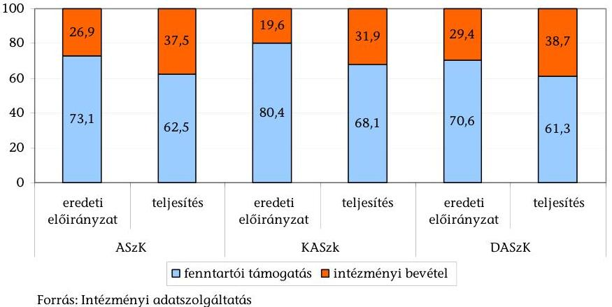

A TISzK-ek eredeti költségvetési támogatási előirányzata az ellenőrzött időszakban a tervezett személyi kiadásokra és a munkaadókat terhelő járulékokra nyújtott fedezetet. A 2009-2011. években a költségvetési támogatás elosztása ugyanakkor nem volt arányban a foglalkoztatottak számának az egyes TISzK-ek közötti megoszlásával sem.

A teljes időszakra vetítve a költségvetési támogatás előirányzata a tervezett személyi kiadások és járulékai 100,2\%-át tette ki. Míg ez az arány 2008-ban 103,6\%, 2009-ben 98,5\%, 2010-ben 97,8\% volt, 2011-re 100,8\%-ra változott.

Az ASzK-hoz tartozott 2009-ben az összes foglalkoztatotti létszám 35,1\%-a, 2010-ben 34,5\%-a, 2011-ben pedig 32,1\%-a, miközben az első két évben az összes támogatás 33,8\%-hoz, 2011-ben 34,3\%-hoz jutott.

A KASzK 2009-ben az összes létszám 25,5\%-át, 2010-ben 23,1\%-át, 2011-ben pedig 23,9\%-át foglalkoztatta, a támogatásának részaránya - a három TISzK-nek juttatott támogatáson belül - az első két évben 28,2\%, 2011-ben 27,1\% volt.

A DASzK-nál jelentősebb volt az eltérés a foglalkoztatottak száma és a támogatás részaránya között, mert amíg 2009-ben az összes dolgozó 39,4\%-át, 2010-ben 42,4\%-át, 2011-ben 44\%-át foglalkoztatta, addig 2009-2010-ben a költségvetési támogatásnak 38\%-ához, 2011-ben csak a 38,6\%-ához jutott.

A szakképző központoknál dolgozók létszáma a 2008/2009. tanévben összesen 1348 fő volt, ebből 488 főt az ASzK, 348 főt a KASzK és 512 főt a DASzK foglalkoztatott. A 2009/2010. tanévben foglalkoztatottak száma összesen 1320 fő volt, eb-

---

ből 479-en az ASzK-nál, 325-en a KASzK-nál és 516-an a DASzK-nál voltak. A 2010/2011. tanévben összesen 1305 fő létszám tartozott a három TISzK-hez, ebből 476 fő az ASzK-hoz, 308 fő a KASzK-hoz és 521 fő a DASzK-hoz.

A 2012. évi költségvetési támogatás szakképző központok szerinti felosztása feladatmutató - az osztályok száma - alapján történt.

Az egy tanulóra jutó összes költségvetési támogatás az ellenőrzött időszakban átlagosan évi 725,7 E Ft volt. A mutató a 2008. évi 859,9 E Ft-ról a 2011. évre 24,3\%-kal 650,7 E Ft-ra csökkent.

A teljes időszakra vonatkozóan egy tanulóra jutó támogatás az ASzK-nál 765,4 E Ft, a KASzK-nál 770,0 E Ft, a DASzK-nál 662,4 E Ft volt.

Az egy tanulóra jutó működési támogatás a VM fenntartású intézményeknél 2008-ban 820,6 E Ft, 2011-ben 644,5 E Ft volt. Az ellenőrzött intézmények egy tanulóra jutó átlagos működési támogatása 2011-ben 31,3\%-kal meghaladta a hasonló profilú önkormányzati iskolák egy tanulóra jutó átlagos támogatását (490,7 E Ft-ot).

A finanszírozás forrásainak tervezése során a bázisszemlélet dominált, a saját bevételek eredeti előirányzatainak meghatározása is az előző évi tervadatok alapján történt. A tárgyévi kiadási előirányzatokat az előző évi támogatási előirányzat és a tervezett működési bevétel alapján határozták meg. A tervezett működési bevételek átlagosan 51,4\%-os, a működési kiadások 20,3\%-os túlteljesítéséből megállapítható mind a bevételek, mind a kiadások egyidejű alultervezése.

A fenntartó a tárgyévet megelőző év júliusában adatszolgáltatást kért az intézményektől az I. félévben teljesített bevételekről, az éves bevételek várható teljesítéséről, valamint a következő évben tervezett bevételi előirányzatokról. A TISzK által javasolt következő évi saját bevételi tervet a fenntartó rendszerint jóváhagyta, azonban a 2011. évben a DASzK által megadott bevételi tervezetet 67,5 M Ft-tal megemelte. A várható kiadásokról a fenntartó nem kért tájékoztatást.

Az intézményi működési és felhalmozási bevételek összege 2008-ban 2162,4 M Ft volt, ami az eredeti előirányzatot 59,3\%-kal haladta meg. A 2009. évben az összes intézményi bevétel 2446,14 M Ft volt, ami 76,1\%-kal, a 2010. évi 2498,0 M Ft 109,3\%-kal, a 2011. évi 2257,9 M Ft 58,7\%-kal haladta meg az eredeti előirányzatot.

A működési bevételek összege a 2008. évben 1816,9 M Ft volt, ami 44,4\%-kal, 2009-ben 1836,0 M Ft 44,1\%-kal, 2010-ben 2236,1 M Ft 75,6\%-kal, 2011-ben 1886,0 M Ft 41,8\%-kal haladta meg a tervszámokat.

A felhalmozási bevételek (2008-ban 354,0 M Ft, 2009-ben 610,2 M Ft, 2010-ben 743,4 M Ft, 2011-ben 371,8 M Ft) háromszorosára, négyszeresére teljesültek.

A csökkenő tendencia ellenére a működést és felhalmozást szolgáló - költségvetési támogatást is magukba foglaló - források 2008. évi 7542,4 M Ft-os összege 36\%-kal, a 2009. évi 6877,9 M Ft 27,6\%-kal haladták meg a tervezettet. 2010-ben a tervezettet 41\%-kal haladták meg (7427,4 M Ft), 2011-ben (6402,2 M Ft) 20,5\%-

---

kal magasabb összegben álltak rendelkezésre. Az eredeti előirányzatok 2008-ban 5544,4 M Ft-ot, 2009-ben 5388,8 M Ft-ot, 2010-ben 5268,0 M Ft-ot, 2011-ben 5314,9 M Ft-ot tettek ki.

A működési támogatás az intézményeknél együttesen a 2008. évi 5086,0 M Ft-ról 3821,0 M Ft-ra 24,9\%-kal csökkent. A működési (személyi és dologi) kiadások a 2008. évi 12,5\%-os (849,6 M Ft összegű) csökkenése mellett a működési bevételek 3,8\%-kal (69,1 M Ft-tal) növekedtek.

A források csökkenése és a bevételek teljesítésének eltérő üteme miatt az intézmények pénzügyi helyzete nem volt kiegyensúlyozott, a likviditást nem tudták biztosítani.

A TISzK-ek számára kedvezőtlen volt a szakképzési hozzájárulás fenntartó általi fogadása, mivel a korábbi szabályozás szerint az ebből származó forrást közvetlenül az intézmények kapták meg. A fenntartó a felhasználókkal kötött megállapodás alapján a támogatást, annak beérkezésétől számított 30 napon belül adta át. Előfordult, hogy az intézmények a likviditás biztosítása érdekében a befolyt, de későbbi időpontban felhasználandó támogatást - visszapótlási kötelezettség mellett - bevonták a napi finanszírozásba. A fizetési kötelezettségeket folyamatosan rangsorolták. Az intézmények gazdálkodását nehezítette 2011. évben a három intézmény 1222,6 M Ft összegű költségvetési támogatásának zárolása.

Az év végi szállítói kötelezettségek állománya jelentős volt. Az év végén rendelkezésre álló pénzeszközök az ASzK-nál és a KASzK-nál a 2010. év kivételével, a DASzK-nál 2009-ben és 2011-ben nem biztosították a rövidlejáratú kötelezettségek év végi állományának fedezetét.

A likviditási problémák
 különösen azoknál a tagintézményeknél jelentkeztek, ahol a bevételek idényjellegűek voltak, illetve a növénytermesztésen kívül nem rendelkeztek egyéb bevételi forrásokkal (étkeztetés, felnőttképzés, állati termékek értékesítése, bérbeadás stb.).

A tényleges működési és felhalmozási bevételek a 2008. évi 2162,4 M Ft-ról 2257,9 M Ft-ra, 4,4%-kal növekedtek a 2011. évre. Az összes forrás szerkezete az ellenőrzött időszakban jelentősen változott. A bevételi szerkezet alakulását a költségvetési támogatás részarányának csökkenése mellett a működési és felhalmozási bevételek részarányának növekedése jellemezte. A 2011. évben azonban a támogatás aránya a támogatás összegének jelentős csökkenése mellett is növekedett, a működési és felhalmozási bevételek aránya csökkent.

A költségvetési támogatás részaránya az összes forráson belül a 2008. évi 70,7%-ról 2011-re 60,3%-ra csökkent. A költségvetési támogatás 2008. évben 5329,9 M Ft, 2011-ben 3857,8 M Ft, a rendelkezésre álló összes forrás 2008. évben 7542,4 M Ft, 2011. évben 6402,2 M Ft volt. A működési és felhalmozási bevételek összege a 2008. évben 2162,4 M Ft, 2011-ben 2257,9 M Ft, aránya az összes forráson belül a 2008. évben 28,7%, 2011-ben 35,3% volt.

A támogatás csökkenésének ellensúlyozására az intézmények saját hatáskörben intézkedéseket hoztak, amelyek hatását azonban nem számszerűsítették.

---

Az ASzK-nál a szabad kapacitások (konyha, kollégium) jobb kihasználásával, tantermek, egyéb helyiségek bérbe adásával, mezőgazdasági, személyszállítási szolgáltatások nyújtásával, iskolarendszeren kívüli oktatással, műszaki vizsgáztatással, valamint a veszteségesen működő ágazatok felszámolásával növelték a saját bevételeiket.

A KASzK-nál, többek között szakképző tanfolyamokat indítottak, kertészeti területeiket, a konyhákat bérbe adták, a szünidő idején a kollégiumokban rendezvényeknek, táboroknak adtak helyet, bérleti szerződéseiket felülvizsgálták, a gépjárművezetői rutinpálya és az oktató-gépjárműveik szabad kapacitásait hasznosították.

A DASzK intézkedései a szakképzési hozzájárulás bevételeinek növelésére, tanfolyamok szervezésére, bérleti díjak emelésére, szálláshelyek hasznosítására, nyári táborok szervezésére irányultak.

Az egy tanulóra jutó működési bevétel a 2008. évi 293,2 E Ft-ról 2011-re 318,1 E Ft-ra emelkedett. Az egy tanulóra jutó fenntartói támogatás 209,2 E Ft összegű csökkenését az intézmények a fajlagos kiadások 93,4 E Ft-os csökkentésével és az egy főre jutó működési bevételek növelésével (24,9 E Ft) nem kompenzálták.

# Az iskolarendszeren kívüli képzések 2008-2011 között eredményesen járultak hozzá a TISzK-ek működéséhez. 

Az iskolarendszeren kívüli képzések pénzügyi eredménye a 2008-2011. években összesen 207,3 M Ft volt. A tanfolyamok szervezésével az intézmények 723,6 M Ft bevételhez jutottak, amellyel szemben 516,3 M Ft kiadás merült fel (3/3. sz. melléklet).

Az ellenőrzött időszakban a három szakképző központban összesen 550 tanfolyamon 10359 fő vett részt. Az egy képzésben résztvevők átlagos létszáma 18,8 fő volt, ugyanakkor mindegyik intézménynél voltak olyan szakmák, ahol az OKJ-s vizsgát tett tanulók száma 10 fő alatt volt. 2008-ról 2011-re a képzések száma 108-ról 150-re növekedett. A képzésben résztvevők száma 2237 főről 2667 főre emelkedett, azonban az egy képzésen résztvevők létszáma 20,7 főről 17,8 főre csökkent. Egy képzés 2008-ban átlagosan 300,3 E Ft eredményt hozott, ami a 2011. évre 516,2 E Ft-ra emelkedett, a tanfolyamok díjaiból származó bevételek növekedése miatt.

A TISzK-ek az ÚMVP által támogatott képzések szervezésében is részt vettek. A DASzK a 2009-2011. években a munkaügyi központtal kötött megállapodás alapján az Európai Szociális Alap által támogatott program keretében szervezett képzéseket.

A nyertes pályázatok darabszámát tekintve az intézmények pályázati tevékenysége eredményes volt. A TISzK-ek 2008-2011. években összesen 244 pályázatot nyújtottak be, amelynek 78,7%-a volt eredményes.

Az ellenőrzött időszakban a megpályázott 6751,7 M Ft összeg 36,9%-át, 2489,0 M Ft-ot nyerték el az intézmények. Az alacsony támogatottság oka, hogy nagy összegű uniós pályázatokat utasítottak el. Az uniós pályázatokon kért 6220,1 M Ft-ból csak 2096,7 M Ft-ot (33,7%) ítéltek meg (3/4. sz. melléklet).

---

A DASzK négy uniós fejlesztési forrásra irányuló pályázata közül hármat elutasítottak forráshiány és a támogatáshoz szükséges minimum pontszám hiánya miatt. Az ASzK-nak három, egyenként 400 M Ft összegű elutasított uniós pályázata volt.

Az elnyert 2489,0 M Ft támogatási összeg 84,2%-a (2096,7 M Ft) uniós forrásból, 14,8%-a (367,3 M Ft) hazai pályázati forrásból, 1,0%-a (25 M Ft) egyedi és egyéb támogatásból származott.

Az egy pályázatra jutó támogatás az EU-s pályázatoknál átlagosan 99 843,4 E Ft, a hazai pályázatoknál 2481,4 E Ft, az egyedi és egyéb támogatásoknál 1087,4 E Ft volt.

A három TISzK közül a KASzK pályázati tevékenysége volt a legeredményesebb, mivel az intézménynél az igényelt/elnyert támogatás aránya 80%-os volt. A három TISzK által elnyert összes pályázati forrás 40,0%-át tette ki a KASzK által elnyert támogatás (4/5 sz. melléklet).

A TISzK-ek eredményesen pályáztak a TÁMOP 2.2.3 alprogram „A Szak- és felnőttképzés struktúrájának átalakítása" konstrukció keretében meghirdetett pályázatra, amely a TISzK rendszer továbbfejlesztésére irányult. E forrásból az ASzK 372,9 M Ft-ot, a KASzK 302,8 M Ft-ot, a DASzK 324 M Ft-ot nyert.

A további pályázati forrásokon belül jelentősebb az ASzK által elnyert, az épületenergetikai fejlesztésre irányuló 345,8 M Ft összegű KEOP (Környezet és Energia Operatív Program) pályázat. A KASzK az infrastruktúra-fejlesztésre irányuló KMOP forrásból 563,5 M Ft támogatáshoz jutott.

A TÁMOP projektek keretében humánerőforrás-, szervezetfejlesztésre, valamint infrastruktúrafejlesztésre került sor. A támogatás céljai között szerepelt a tanulók létszámának, az oktatási rendszerből lemorzsolódott, szakképzésbe bevont tanulók számának, a szakképzésbe bevont hátrányos helyzetű tanulók számának növelése. Cél volt a munkahelyi gyakorlati képzésben résztvevők számának, az oktatói képzést/továbbképzést befejezők arányának, a szakmájukban elhelyezkedők arányának növelése. A pályázat feladatai között szerepelt a pedagógusok, szakoktatók, illetve gyakorlati képzésben részt vevő szakemberek képzése, a tagintézményekben folytatott felnőttképzés módszertanának kialakítása. A tervezett feladatokat az intézmények teljesítették, azonban a pályázatok lezárása a helyszíni ellenőrzés időpontjában még folyamatban volt.

A hazai pályázatok révén az intézmények összesen 367,3 M Ft forráshoz jutottak.

A DASzK egyes pályázatai a kollégiumi eszközök beszerzésére irányultak, a támogatás felhasználásával többek között informatikai eszközöket, televíziót, hangosító berendezéseket vásároltak. A hazai ösztöndíj pályázatokon elnyert támogatással a hátrányos helyzetben lévő tanulókat segítették.

A szakképzést közvetlenül szolgáló tárgyi eszközök beszerzésére meghirdetett hazai pályázatokon a KASzK és tagintézményei összesen 28,8 M Ft támogatást nyertek munkaeszközök vásárlására. A DASzK által elnyert 8,8 M Ft összegű támogatásból mezőgazdasági munkagépeket vásároltak.

---

Az intézmények által benyújtott pályázatok jellemzően csak akkor tartalmaztak előzetes gazdaságossági számításokat, illetve a tárgyi eszköz beszerzésére irányuló pályázatoknál akkor mérték fel az üzemeltetés várható költségét, ha azt a pályázat kiírása előírta.

Egyedi támogatási igényt az ASzK és a KASzK nem nyújtott be. A DASzK a hat egyedi támogatási igényből négy alkalommal járt eredménnyel, a támogatás összesen 13,5 M Ft volt.

A pályázati támogatásból visszafizetési kötelezettségük összesen hét esetben volt az intézményeknek. Az ASzK 551 E Ft-ot fizetett vissza elmaradt feladatok miatt. A DASzK-nál két esetben az elszámolást követően a támogató írta elő a visszafizetést, négy esetben az intézmény a beszámoláskor jelezte a visszafizetési kötelezettséget. Az intézmény összesen 2147 E Ft-ot fizetett vissza a támogatás fel nem használása, határidőn túli felhasználása, illetve jogosulatlan igénybevétele miatt.

A szakképzési hozzájárulásból származó források eredményesen, évente átlagosan 178 M Ft-tal támogatták az intézmények feladatellátását. A szakképzési hozzájárulásból származó bevétel a 2008-2011 időszakban összesen 712,1 M Ft volt.

A szakképzési hozzájárulásból származó forrás az intézmények felhalmozási bevételének (2079,4 M Ft) átlagosan 34,2%-át tette ki az ellenőrzött időszakban, a felhalmozási kiadások (2029,6 M Ft) 35,1%-ára nyújtott fedezetet. Az összes forráson (28 249,9 M Ft) belüli részaránya (2,5%) nem volt jelentős.

Az ASzK – egy tagintézménye kivételével – a 2008-2011 között fogadott fejlesztési támogatásokat az Szht. előírásainak megfelelő célokra, a gyakorlati képzést szolgáló tárgyi eszközök beszerzésére, azok működtetésére, anyagköltségekre, tananyagfejlesztésre, az oktatók akkreditált továbbképzéséhez, valamint az MPA képzési alaprész decentralizált kerete terhére benyújtott pályázat saját forrására használták fel.

Az ASzK egyik tagintézményében szabálytalanul, a gyakorlati képzést közvetlenül nem szolgáló kiadásokra is felhasználták a fejlesztési támogatást.

A mátrafüredi tagintézményben a 2008. évben konyhai eszközöket, a 2009. évben számítógépeket vásároltak a könyvelés, a porta, a pénztár, a gazdasági vezető részére, valamint a tornaterem felújítására is fordítottak fejlesztési támogatást. A 2010. évben a kollégium fűtéskorszerűsítésére is felhasználtak gyakorlati képzésre biztosított fejlesztési támogatást.

Az ellenőrzött időszakban a VM szakképző központoknál nem volt jellemző a gyakorlati képzést szolgáló tárgyi eszközök átvétele, a KASzK-nál három esetben, összesen 1741,2 E Ft értékben és a DASzK-nál egy esetben 150 E Ft értékben történt. Az eszközök állományba vétele szabályszerűen megtörtént, azokat a szakképzési feladatok ellátásához folyamatosan használják a tagintézmények.

---

A 2008. évben a fejlesztési támogatások fogadásának és elszámolásának szabályai megváltoztak. ${ }^{18}$ Az intézmények 2008. szeptember 1-jéig a támogatóval kötöttek fejlesztési megállapodást, a támogatás közvetlenül az intézményekhez érkezett. Az ezt követő időszakban háromoldalú (támogató, a fenntartó és a felhasználó intézmény) megállapodás alapján a támogató a fenntartóhoz utalta a támogatást és azt követően került az intézményekhez.

A 2008. augusztus 31-ig fogadott támogatásokról az iskoláknak, ezt követően az intézmények adatszolgáltatása alapján - a fenntartónak kellett elszámolnia a Nemzeti Szakképzési és Felnőttképzési Intézet (NSZFI) felé.

Az iskolák elszámolási kötelezettségüknek – egy kivétellel – eleget tettek. A DASzK vépi tagintézménye az igénybe vett 4,8 M Ft összegű fejlesztési támogatásról csak az NSZFI 2009. évi ellenőrzését követően készítette el az adatszolgáltatást. Az elszámolást elfogadták.

A tagintézmények számára 2008-ban kiutalt fejlesztési támogatások felhasználását az NSZFI által megbízott szakértők 2009-ben mindhárom TISzK-nél, 2011-ben a DASzK-nál ellenőrizték. Az ellenőrzések az ASzK-hoz tartozó jánoshalmai és a kétegyházi tagintézményeknél állapítottak meg visszafizetési kötelezettséget jogosulatlan igénybevétel miatt. A TISzK-ek megalakulását követően ugyanis az iskolák közvetlenül már nem fogadhattak fejlesztési támogatást. A visszafizetési kötelezettséget az iskolák teljesítették.

A jánoshalmai tagintézménynek egy 2008. június 23-án megkötött támogatási szerződés alapján, de már az ASzK megalakulását követően – 2008. szeptember 19-én – fogadott 457 E Ft összegű fejlesztési támogatást vissza kellett fizetnie. Az ellenőrzés további 415,8 E Ft visszafizetési kötelezettséget állapított meg, mivel a 2008. augusztus 27-én átvett tárgyi eszköz (szőnyeg) nem a szakképzést szolgálta, azt a kollégiumban használták fel.

A kétegyházi tagintézménynek két 2008. augusztus 31-ig megkötött támogatási szerződés alapján, de már az ASzK megalakulását követően – 2008. október 3-án – fogadott 550 E Ft összegű fejlesztési támogatást kellett visszafizetni.

A DASzK-nál az NSZFI 2011. évi ellenőrzése kifogásolta, hogy az intézmény a működési költségek közé sorolt 832133 Ft értékű eszközt, amit a tárgyi eszközök között kellett volna szerepeltetni.

A TISzK-ek működési kiadásai a 2008. évi 6808,0 M Ft-ról a 2011. évre 5958,4 M Ft-ra (12,5%-kal) csökkentek (3/5. sz. melléklet).

A 2008-2011 időszakban a működési kiadásokon (25 619,1 M Ft) belül, a személyi jellegű kiadások és a munkaadói járulékok (16 366,1 M Ft)
 összesen 63,9%-ot, a dologi kiadások (8874,4 M Ft) 34,6%-ot, az egyéb kiadások (378,7 M Ft) 1,5%-ot tettek ki. Az ellenőrzött időszakban a működési kiadások összetétele megváltozott. A személyi juttatások és munkaadókat terhelő járulék

[^0]
[^0]:    ${ }^{18}$ a 13/2008. (VII. 22.) SZMM rendelet a szakképzési hozzájárulásról és a képzés fejlesztésének támogatásáról szóló 2003. évi LXXXVI. törvény végrehajtásáról

---

aránya a 2008. évi 59,7%-ról 57,6%-ra csökkent 2011. évre, a dologi kiadások aránya a 2008. évi 29,7%-ról 34,3%-ra növekedett 2011. évre. A személyi juttatások és munkaadókat terhelő járulékok a 2008. évben 4455,6 M Ft-ot, a 2011. évben 3666,1 M Ft-ot tettek ki. A dologi kiadások összege 2008. évben 2218,8 M Ft, 2011-ben 2181,7 M Ft volt. A csökkenést az intézmények által végrehajtott takarékossági intézkedések eredményezték.

Az intézmények az ellenőrzött időszakban végrehajtottak a személyi és dologi kiadások csökkentésére irányuló takarékossági intézkedéseket. Az intézkedések tervezett és tényleges bevételnövelő illetve kiadáscsökkentő hatásait azonban nem számszerűsítették.

A KASzK-nál a nyugdíjas dolgozók közalkalmazotti jogviszonyát megszüntették. A kisegítő tevékenységet ellátó dolgozóikat kapcsolt munkakörökben foglalkoztatták. A telefonköltségek leszorítására, névre szóló telefonhívás rögzítő és költségkimutató rendszert működtetnek. A víz- és szennyvízköltségek csökkentése érdekében aktivizálták az iskola területén meglévő kútjaikat. A meleg víz felhasználást állítható kimenő vízhőmérsékletű, kevert-vizes rendszer kialakításával csökkentették. Fűtési energia megtakarítást programozható termosztátokkal értek el. Papír és tisztítószer felhasználásukat ésszerű korlátok közé szorították. A fenntartási szolgáltatások díjaira 2011-ben a 2009. évi összegnél 14,1%-kal kevesebbet fizettek ki.

A DASzK-ban és a tagintézményekben 2011-ben munkaköröket vontak össze, a létszámot a nyugdíjasok felmentésével csökkentették. A lengyeli tagintézményben felvett több dolgozó esetében 2010-ben a bért és járulék egy részét a területi illetékes munkaügyi központ támogatta, amely során 3288 E Ft támogatásban részesült. A szentlőrinci tagintézményben minimálisra csökkentették a gépkocsik futásteljesítményét, csoportösszevonásokat hajtottak végre.

A 2011. évben a 1025/2011. (II. 11.) Korm. határozat végrehajtásaként a VM 1222,6 M Ft zárolását rendelte el a fenntartása alatt álló szakképző központoknál. Az elrendelést követően intézkedési terv készítését írta elő, amelynek tartalmi szempontjait három csoportban - a humánerőforrásokkal, a működéssel és a vagyongazdálkodással kapcsolatos intézkedésekre bontva - határozta meg. Az intézmények ennek megfelelően készítették el intézkedési tervüket és azokat végrehajtották.

A humánerőforrással kapcsolatos fontosabb intézkedések voltak: a nyugállományban lévő foglalkoztatottak felmentése, a túlórák minimálisra csökkentése, a béren kívüli juttatások utazási támogatásra és étkezési hozzájárulásra szűkítése, munkakörök összevonása, a gazdasági szervezet létszámának csökkentése. A működéssel kapcsolatos intézkedések tartalmazták a karbantartások, felújítások csökkentését, minimális készletezés előírását, a szolgáltatói és szállítói szerződések, továbbá a telefonhasználat felülvizsgálatát.

A teljesített felhalmozási kiadások a 2008. évi 650,6 M Ft-ról 406,6 M Ft-ra 37,5%-kal csökkent 2011-re. A felhalmozási kiadások 2008-2011 közötti alakulását alapvetően a pályázati tevékenység eredményessége és a szakképzési hozzájárulásból átvett pénzeszközök nagysága befolyásolta. Arányuk az összes kiadáson belül a 2008. évi 8,7%-ról 6,4%-ra csökkent 2011-re. A kiadások összege 2008-ban 7458,8 M Ft, 2011-ben 6366,7 M Ft volt.

---

# 3. A SZAKOKTATÁSI FELADATOK ELLÁTÁSÁNAK EREDMÉNYESSÉGE 

### 3.1. A TISzK-ek képzési szerkezetének kialakítása

Annak ellenére, hogy az Országos Képzési Jegyzékről szóló rendeletek ${ }^{19}$ az ágazatot érintő szakképesítésekért felelősként az agrárpolitikáért felelős vidékfejlesztési minisztert nevesítették, a VM az ellenőrzött időszakra vonatkozóan agrároktatási, illetve agrár-szakképzési stratégiát nem dolgozott ki.

A saját fenntartású intézményeiben indítható képzési típusokat a VM az alapító okiratokban rögzítette. Az alapító okiratokban tagintézményenként meghatározták, hogy az iskolarendszerű képzésben, melyik intézményben, milyen képzési forma indítható, és azon belül mely szakképesítések, milyen munkarendben (nappali, levelező, esti tagozat) oktathatóak.

Az ellenőrzött időszakot megelőzően a DASzK székhelyintézménye gimnáziumi képzést is indított, amely azonban az alapító okirat változása miatt kifutó képzésként szerepel.

Az alapító okiratokban meghatározták a maximálisan felvehető tanulólétszámot (KASzK 1800 fő, DASzK 2700 fő és az ASzK 1680 fő). Az ASzK-nál két tagintézmény (a kétegyházi és gyomaendrődi) kiválása veszélyezteti a TISzK-ekre meghatározott 1500 fős minimum létszám elvárás meglétét (a 2011/2012. tanévben az induló tanulói létszám 1417 fő volt).

A TISzK-ek tagintézményei az egyes években indítandó képzési irányaik megválasztásakor - az alapító okiratban szereplő lehetőségeken belül - elsődlegesen a rendelkezésükre álló, a képzések alapfeltételét képező tárgyi eszközöket és a szaktantárgyak oktatását ellátó pedagógus-állományukat (szakoktatókat) vették alapul. Ebből következően a tagintézmények az ellenőrzött időszakban jellemzően ugyanazokat a képzéseket (szakokat) hirdették meg mind a szakképző, mind a szakiskolai végzettséget adó területen.

A TISzK-ek oktatási-képzési céljaikat a pedagógiai programban határozták meg, amelyet az egyes tagintézményekre vonatkozó helyi tantervek egészítettek ki. A helyi tantervek tartalmazták OKJ szám szerinti szakmacsoportonként (szakmákra lebontva) a kötelező elméleti és gyakorlati órák számát.

A KASzK négy tagintézményénél nem volt átfedés a nappali rendszerű képzések között. Az ASzK és a DASzK tagintézményeiben az ellenőrzött időszakban több helyen folyt párhuzamos képzés - amelynek elkerülését bár célként határozták meg a TISzK létrehozásakor - tájékoztatásuk szerint a földrajzi távolságok miatt nem tudták kiküszöbölni.

[^0]
[^0]:    ${ }^{19}$ az Országos Képzési Jegyzékről és az Országos Képzési Jegyzékbe történő felvétel és törlés eljárási rendjéről szóló 1/2006. (II. 17.) OM rendelet, valamint az Országos Képzési Jegyzékről és az Országos Képzési Jegyzék módosításának eljárásrendjéről szóló 133/2010. (IV. 22.) Korm. rendelet

---

A DASzK-nál a tagintézmények képzési szerkezetének vizsgálatát a TÁMOP projekt keretében elvégezték. A felülvizsgálat során modultérképet készítettek, amelynek eredményeként elkészült a DASzK szakmai képzési profilja. A modultérkép alapján könnyen felismerhetők a tagintézmények párhuzamos képzései, amit azonban a viszonylag nagy távolságok miatt nehéz kiküszöbölni. Pozitív, hogy a 2009. évtől a székhelyintézmény már nem indít lótartó és lótenyésztő szakon képzést, mert a kaposvári intézménynek ez az egyik főprofilja.

A TISzK-ek a képzési igényekről a nyílt napok iránt érdeklődő tanulók számából, munkaerő-piaci felmérések eredményeiből, illetve a területileg illetékes Regionális Fejlesztési és Képzési Bizottságok (RFKB) szakképzési irányokat, beiskolázási arányokat, illetve a hiány szakképesítések körét meghatározó döntéseiből szereztek információt. Az indított képzéseknél meghatározóak voltak a helyi adottságok. A TISzK-ek az illetékes RFKB-ék támogatott képzési irányokra vonatkozó határozatait alapvetően figyelembe vették, azonban előfordult, hogy a jelentkezések száma alapján csak úgy tudtak egy egész osztályt indítani, hogy abban 2-3 féle szakma képzése is folyt. Az indítandó képzéseknél - az alapító okiratban rögzített lehetőségek függvényében - a rendelkezésre álló személyi és tárgyi feltételek, valamint a képzés iránti érdeklődés volt meghatározó.

A KASzK tagintézményei által indított képzések közül a Bercsényi tagintézmény által indított valamennyi képzés az RFKB döntései szerint "A" kategóriába, a Táncsics Mihály tagintézményben a szakközépiskolai képzések "B" kategóriába, a 2009/2010. tanévben indított szakiskolai képzés (lótartó- és tenyésztő szak) "A" kategóriába sorolt.

Az ASzK a jelentkezők közül úgy tudott egy-egy egész osztályt indítani, hogy abban 2-3 féle szakma képzése is folyt. A 2011/2012. tanévtől kivált gyomaendrődi tagintézményben a mezőgazdasági szakképesítésen felül egyéb szakképzéseket is indítottak, amelyre igény volt (pl. pincér, asztalos, épületasztalos).

A DASzK szakképzési szerkezetére az RFKB döntései is hatással voltak, amelyeket az indítandó osztályok kialakítása során figyelembe vettek. A javasolt képzések döntően a mezőgazdasági, kisebb részben az élelmiszeripari és egy osztályt érintően a közgazdasági szakmacsoportba tartoztak. Az RFKB az ellenőrzött időszakban a hiány-szakképesítések körébe sorolta a 2009/2010. tanévtől a gazda, majd a 2010/2011-es tanévtől a mezőgazdasági gépüzemeltető, gépkarbantartó, a borász és a húsipari termékgyártó szakmákat is. Erre reagálva a DASzK módosította a pedagógiai programját, amivel lehetővé vált e hiány-szakképesítéseknek az alapfokú iskolai végzettséggel rendelkezők számára előrehozott szakképzés formájában való oktatása.

A tagintézmények minden évben meghirdették az általuk tervezett szakokat és a pályázók száma alapján határozták meg, hogy mely képzéseket indítják el. Az éves beiskolázási terveket a fenntartó VM jóváhagyta.

A TISzK-ek közül a DASzK székhelyintézménye minőségügyi menedzsment rendszert vezetett be és működtetett. Ennek keretében az oktatási-képzési célok elérése érdekében minden tanévre minőségcélokat határoztak meg, amely teljesítménymutatókat is tartalmazott.

Az ellenőrzött időszakban a szakiskolai képzés iránt nőtt az érdeklődés. A szakiskolai képzésben résztvevő tanulói létszám a három TISzK-nél

---

összességében 447 fővel (23,3%) növekedett, míg a szakközépiskolai létszám 321 fővel (7,7%) csökkent. A szakiskolai képzésben résztvevők létszámnövekedést az ASzK-nál és a DASzK-nál elsődlegesen az okozta, hogy a kiemelten támogatott mezőgazdasági szakképesítések előrehozott szakiskolai képzésben is megszerezhetőek.
2. sz. táblázat

A tanulók létszámának alakulása intézményenként a 2008/2009. és a 2010/2011. tanévek között

| Megnevezés |  | 2008/2009.   tanév (fő) | 2009/2010.   tanév (fő) | 2010/2011.   tanév (fő) | Változás a   2008/2009.   tanévről a   2010/2011.   tanévre (%) |
| :--: | :--: | :--: | :--: | :--: | :--: |
|  | szakiskola | 829 | 877 | 994 | 119,9 |
| ASzK | szakközépiskola | 1220 | 1186 | 1111 | 91,1 |
|  | szakiskola | 850 | 911 | 1056 | 124,2 |
| DASzK | szakközépiskola | 1575 | 1548 | 1551 | 98,5 |
|  | szakiskola | 242 | 323 | 318 | 131,4 |
| KASzK | szakközépiskola | 1394 | 1407 | 1206 | 86,5 |
|  | szakiskola | 1921 | 2111 | 2368 | 123,3 |
| Összesen | szakközépiskola | 4189 | 4141 | 3868 | 92,3 |

Forrás: Intézményi adatszolgáltatás
Az egy tanulócsoportra jutó tanulók száma az ellenőrzött tanévekben mind a három TISzK esetében alacsonyabb volt az országos átlagnál.

A 2008/2009. tanévről a 2010/2011. tanévre a szakiskolai képzésben az egy tanulócsoportra jutó tanulók száma mind a három intézménynél növekedett. A szakközépiskolai képzés esetében - az ASzK kivételével - szintén növekedett az egy tanulócsoportra jutó tanulói létszám.

A szakiskolai képzésben az egy tanulócsoportra jutó tanulók száma az ellenőrzött tanévekben a KASzK esetében volt a legalacsonyabb. A KASzKnál a 2008/2009. tanévben az egy tanulócsoportra jutó tanulók száma (14,4 fő) az országos átlag 59,5%-át, a 2009/2010. tanévben (17,8 fő) a 73,6%-át és a 2010/2011. tanévben (17,6 fő) 73,3%-át tette ki. Az egy tanulócsoportra jutó tanuló létszám országos átlaga a szakiskolákban a 2008/2009. tanévben 24,2 fő, a 2009/2010. tanévben 24,2 fő, a 2010/2011. tanévben 24,0 fő volt.

A szakközépiskolai képzésben az egy tanulócsoportra jutó tanulók száma a 2008/2009. tanévben az DASzK-nál volt a legalacsonyabb, az országos átlag 84,0%-a, míg a 2009/2010. és a 2010/2011. tanévekben az ASzK-nál,

---

az országos átlag 83,4-82,5%-a. Az egy tanulócsoportra jutó tanuló létszám országos átlaga a szakközépiskolákban a 2008/2009. tanévben 25,64 fő, a 2009/2010. tanévben 25,92 fő, a 2010/2011. tanévben 25,94 fő volt (4/6. sz. melléklet).

A szakiskolák és a szakközépiskolák pályakövetési
 rendszerbe történő adatszolgáltatási kötelezettségét a Közokt. tv. 42. § (6) bekezdése 2007. év szeptember 1-jétől írta elő. Ezzel egyidejűleg a Közokt. tv. 94. § (3) bekezdés o) pontja szerint felhatalmazást kapott a Kormány, hogy rendeletben szabályozza a pályakövetési rendszer működtetésének részletes szabályait, a pályakövetési rendszer részére történő adatszolgáltatás eljárási rendjét, továbbá jelölje ki a pályakövetési rendszer működtetéséért felelős szervet. A szakképzés országos szintű pályakövetési rendszerét az ÁSZ vizsgálat befejezéséig nem alakították ki, a törvényben kapott felhatalmazással a Kormány nem élt.

A 2012. január 1-jétől hatályos szakképzésről szóló 2011. évi CLXXXVII. törvény 86. § - a korábbi törvényi szabályokat kiegészítve - 2013. szeptember 1-jétől teszi kötelezővé a pályakövetési rendszerbe történő adatszolgáltatást, és egyben a Kormányt is kötelezi az eljárási szabályok megalkotására, valamint a pályakövetési rendszer működtetéséért felelős szerv kijelölésére.

A KASzK és tagintézményei nem működtettek teljes körűen pályakövetési rendszert. Ezt egyrészt a jogszabályi hiányosságra, másrészt pénzügyi forrás hiányára vezették vissza. Nem készítettek egységes iránymutatást arra vonatkozóan, hogy a tagintézmények milyen módon kövessék nyomon a végzett tanulók elhelyezkedését. A KASzK mind a négy tagintézménye ellátott pályakövetéssel kapcsolatos feladatokat, azonban nyilvántartásuk nem volt naprakész és teljes körű. A pályakövetéssel kapcsolatos feladatokat a tagintézmények eltérő módon (elektronikus, illetve postai levél formájában) és alkalmanként más-más pedagógus kijelölésével látták el esetenként túlmunkában.

A DASzK saját pályakövetési rendszert működtetett. A rendszert a TÁMOP pályázat keretében a Pályakövetési Fejlesztő Csoport dolgozta ki. Adatgyűjtést a helyszíni ellenőrzés befejezéséig kettő alkalommal (a 2008/2009. és a 2009-2010. tanévekben végzett tanulók körében) végeztek, azonban egyelőre csak az első adatfelvétel kiértékelése történt meg, amit tagintézményenként végeztek el. A felmérés eredményéről készült összefoglaló értékelést az oktatási intézmény a honlapján közzétette.

A pályakövetési rendszer elindításához a nyolc tagintézményben egységesen alkalmazandó kérdőívet dolgoztak ki. A kérdőív nem csak az elhelyezkedési adatokra tért ki, hanem arra is, hogy a tanulók megítélése szerint mennyire volt hasznos a képzés, az iskolában elsajátított szaktudást mennyire tudták hasznosítani a munka világában.

Az ASZK 2011. január 10-től működtetett a honlapján elérhető saját pályakövetési rendszert, amelyet a DASzK-hoz hasonlóan a TÁMOP pályázat keretében dolgoztak ki. A 2008/2009. és a 2009/2010. tanévekben telefonos adatgyűjtést végeztek a tanulók körében.

Az ASzK és DASzK összesített adatai alapján a bizonyítvánnyal igazolt végzettséget szerző tanulóknak átlagosan csupán a 37,3%-a szolgáltatott adatot. A szakiskolában végzettek nagyobb arányban tettek eleget az adatszolgáltatási kötelezettségüknek, mint a szakközépiskolában végzettek, de mindkét képzési szinten csökkenő tendenciát mutatott az adatszolgáltatási hajlandóság.

Az adatszolgáltatók alacsony számára tekintettel objektív következtetés nem vonható le a szakképesítést szerzettek munkaerő-piaci helyzetéről és a képzés hasznosságáról, csupán néhány tendencia állapítható meg.

Az ellenőrzött tanévekben a pályakövetési rendszerbe 935 fő szolgáltatott adatot, akiknek 38,2%-a (357 fő) a szakmájában, 20,7%-a (194 fő) nem a szakmájában helyezkedett el, 22,5%-a (210 fő) nem tudott elhelyezkedni, míg a 18,6%-a (174 fő) tovább folytatta tanulmányait.

A szakiskolában végzett adatszolgáltatók (459 fő) nagyobb arányban 49,2% (226 fő) helyezkedtek el a szakmájukban, mint a szakközépiskolában végzettek (27,5%, 131 fő).

Az ellenőrzött tanévekben a szakközépiskolában végzettek adatszolgáltatók 33,0%-a (157 fő) tanult tovább, míg ez az arány a szakiskolások körében csupán 3,7% (17 fő) volt.

A szakközépiskolában végzettek esetében 8,5%-ponttal alacsonyabb volt az elhelyezkedni nem tudók aránya (18,3%), a szakiskolában végzetteknél.

Ebből arra lehet következtetni, hogy az oktatási intézményben jellemző mezőgazdasági és élelmiszeripari jellegű szakmákban inkább a gyakorlati ismeretekkel rendelkezőkre van nagyobb igény a munkaerő piacon.

Kedvező változás, hogy a két TISzK összesített adatai alapján a 2010/2011. tanévre a 2008/2009. tanévhez képest, hogy a válaszadók közül az elhelyezkedni nem tudók aránya 24,2%-ról 20%-ra (74 főről 61 főre) csökkent.

Az ASzK esetében az elhelyezkedni nem tudók aránya a 2008/2009. tanévi 19,7%-ról a 2010/2011. tanévre 21,3%-ra (25 főről 30 főre) növekedett, míg a DASzK-nál 27,4%-ról 18,9%-ra (49 főről 31 főre) csökkent.

Az intézmények képzési szerkezetének kialakítása során a pályakövetési rendszerből nyert információk az adatszolgáltatók viszonylag alacsony száma, valamint a rendszer működtetésének kezdetlegessége, az adatok teljes körű feldolgozásának hiánya miatt nem voltak meghatározóak.

---

# 3.2. A TISzK-ek szakmai feladatellátásának eredményessége 

A szakközépiskolai és a szakiskolai képzésben résztvevők lemorzsolódásának és az évfolyamot ismétlők számának alapdokumentumai az oktatási intézményben a beírási napló, a tanulókról vezetett törzslap, illetve ezek alapján az intézmény által elektronikusan vezetett nyilvántartás. Jogszabály, illetve a fenntartó által kötelezően előírt adatszolgáltatás, statisztikai adatgyűjtés nincs a lemorzsolódásra és az évfolyamismétlésre vonatkozóan.

Mind a három TISzK-nél a szakiskolai képzésben volt nagyobb mértékű a lemorzsolódás és az évfolyamismétlés.

A bizonyítvánnyal adott tanévben végzettséget szerzettek induló létszámához viszonyítva a lemorzsolódott (a képzésből kimaradó) tanulók aránya a 2008/2009. tanévről a 2010/2011. tanévre mind a két képzési típusban csökkent. A szakiskolai képzésben a lemorzsolódási arány 7,9%-ponttal, a szakközépiskolában 1,4%-ponttal csökkent az ellenőrzött időszakban (4/3. sz. melléklet).

A három tanév átlagában a végzős szakközépiskolai évfolyamok lemorzsolódási aránya a KASzK-nál volt a legkedvezőtlenebb 11,9%, (1363 főből 162 fő), viszont tendenciáját tekintve a 2010/2011. tanévre 2,0%-pontos csökkenés következett be a 2008/2009. tanévhez képest. A lemorzsolódási arány az ASzK esetében volt a legalacsonyabb 7,7%, (674 főből 52 fő), viszont tendenciáját tekintve egyedül az ASzK esetében következett be negatív változás.

A lemorzsolódási arány - a három tanév átlagában - a szakiskolai képzésben is a KASzK-nál volt a legmagasabb 38,4%, (az induló létszámból 255 főből 98 fő) és az ASzK-nál a legkedvezőbb 11,9% (698 főből 83 fő). Az időbeli változást tekintve is a KASzK-nál alakult a legkedvezőtlenebbül a lemorzsolódás, annak aránya az induló létszámhoz képest a 2008/2009. tanévi 34,2%-ról (255 főből 98 fő) a 2010/2011. tanévre 41,0%-ra (255 főből 105 fő) növekedett.

Az évfolyamot ismételt tanulók aránya a végzősök induló létszámához viszonyítva a 2008/2009. tanévtől a 2010/2011. tanévre ugyanakkor mindkét képzési típusban növekedett. Az ellenőrzött időszakban, a szakközépiskolában az évfolyamot ismételt tanulók aránya 0,6%-ponttal, a szakiskolai képzésben 4,3%-ponttal növekedett (4/2. sz. melléklet).

A három tanév átlagában, a szakközépiskolákban a végzett tanulók induló létszámából az évfolyamot ismételt tanulók aránya is a KASzK-nál a legkedvezőtlenebb 5,4% (1363 főből 74 fő), a legalacsonyabb az ASzK esetében 1,3%, (674 főből 9 fő) volt. Az időbeli változást tekintve az évfolyamot ismételt tanulók aránya a 2010/2011. tanévre egyedül a KASzK-nál mutatott javuló tendenciát, ahol 0,4%-pontos csökkenés következett be a 2008/2009. tanévhez képest. A DASzK-nál 1,6%-ponttal, az ASzK-nál 0,4%-ponttal romlott a mutató.

A szakiskolai képzésben is a KASzK-nál 11,8% (255 főből 30 fő) volt a legkedvezőtlenebb az évfolyamot ismétlő tanulók aránya a három tanév átlagában. Az ASzK-nál az induló 698 főből 9 fő, a DASzK-nál az induló 599 főből 8 fő volt évfolyamismétlő, az arány így mindkét intézménynél 1,3%-ot tett ki. Tendenciáját tekintve az évfolyamot ismételt tanulók aránya induló létszámhoz képest mindhárom TISzK-nél növekedett, a KASzK-nál a legjelentősebben, a 2008/2009. tanévi 8,2%-ról (255 főből 21 fő) a 2010/2011. tanévre 19,0%-ra (255 főből 49 fő).

A bizonyítvánnyal igazolt végzettséget szerző tanulók száma a 2010/2011. tanévben 16,9%-kal, 1144 főről 1337 főre emelkedett a 2008/2009. tanévhez képest. A legnagyobb mértékű, 20,1%-os növekedés (66 fő) az ASzK-ban volt tapasztalható. A DASzK-ban 69 fővel (15,7%), a KASzK-ban pedig 58 fővel (15,5%) emelkedett a végzettséget szerzett tanulók száma a 2010/2011. tanévre a 2008/2009. tanévhez képest (4/7. sz. melléklet).

Mindegyik TISzK-nél voltak olyan szakmák, ahol az OKJ-s vizsgát tett tanulók száma tanévenként 10 fő alatt volt (pl. az ASzK-nál környezetvédelmi technikus, zöldségtermesztő, a DASzK-nál pék, virágbolti eladó, a KASzK-nál sörgyártó stb.).

Összességében a TISzK-ek szakmai feladatellátásának javulására utal, hogy az ellenőrzött időszakban a lemorzsolódott tanulók induló létszámhoz viszonyított aránya 15,3%-ról (231 főről) 12,1%-ra (200 főre) csökkent, miközben a végzett tanulók száma 16,9%-kal emelkedett. Kedvezőtlen jelenség ugyanakkor, hogy az évismétlésre kötelezett tanulók induló létszámhoz viszonyított aránya 2,4%-ról (36 főről) 4,2%-ra (70 főre) emelkedett.

A Közokt. tv. 99. § (4) bekezdése szerint országos mérések keretében rendszeresen kell mérni, értékelni a nevelési-oktatási intézményekben folyó pedagógiai tevékenységet, így különösen az alapkészségek, képességek fejlődését. A felmérés a 10. osztályos tanulók matematikai alapkészségének és szövegértésének vizsgálatára terjedt ki, külön-külön a szakközépiskolai és a szakiskolai képzési formában.

A KASzK-nál a szakközépiskolai tanulók kompetenciamérésen elért eredményei a 2008-2011. években elmaradtak az országos átlagtól, azonban a szakiskolai tanulók mérési eredményei a 2008. évet kivéve meghaladták az országos szintet. Azokban a tagintézményekben, ahol a mérések eredményei az országos szint alatt teljesültek, tanévenként intézkedési tervet készítettek.

Matematikából a szakközépiskolai és a szakiskolai oktatásban a teljesítés a 2008. évről a 2009. évre, valamint a 2010. évről a 2011. évre is javult$^{20}$. A szövegértésből a szakközépiskolai eredmények a 2008. évről a 2009. évre romlottak, a 2010. évről a 2011. évre javultak, míg a szakiskolai oktatásban a 2008. évről a 2009. évre és a 2010. évről a 2011. évre is pozitív változás következett be. A kompetenciamérés eredményei az országos átlaghoz viszonyítva a 2008. évről a 2011. évre mind a két képzési formában, matematikából és szövegértésből is javultak.

A DASzK-nál az országos kompetenciamérésen elért eredmények az ellenőrzött időszakban - a szakiskolai tanulók 2009. évben mért matematikai alapkészségeit leszámítva - nem érték el az országos átlagot. A felmérések eredményei alapján - mivel azok a 3/2002. (II. 15.) OM rendelet 7. § (2) bekezdés a) pontjában meghatározott minimumot meghaladták - a fenntartó nem írt elő intézkedési kötelezettséget. A DASzK tagintézményei nevelőtestületi ülésen értékelték az országos kompetencia mérés eredményeit, megjelölték a fejlesztendő területeket, valamint valamennyi tagintézményre kiterjedő, saját kompetenciamérési rendszert vezettek be.

Matematikából a szakközépiskolai oktatásban a teljesítés a 2008. évről a 2009. évre nem változott, a 2010. évről a 2011. évre javult. A szakiskolai tanulók matematikai eredménye a 2009. évre javult, míg 2011-re romlott az előző évhez képest. A szövegértésből a szakközépiskolai és a szakiskolai eredmények a 2008. évről a 2009. évre javultak, a 2010. évről a 2011. évre a szakközépiskolai képzésben romlottak, míg a szakiskolai képzésben pozitív változás következett be. A kompetenciamérés eredményei az országos átlaghoz viszonyítva a 2008. évről a 2011. évre mind a két képzési formában, matematikából és szövegértésből is javultak.

Az ASzK-nál a kompetenciamérések eredményei 2008-2011 között elmaradtak az országos átlagtól. Azokban a tagintézményekben, ahol a mérések eredményei az országos szint alatt teljesültek intézkedési tervet
 készítettek, amelyben meghatározták a legfontosabb fejlesztendő területeket.

A tagintézmények tanulóinak kompetenciafejlesztésére irányuló tevékenysége, megtett intézkedései az ellenőrzött időszakban eredményesek voltak.

Matematikából a szakközépiskolai oktatásban a teljesítés a 2008. évről a 2009. évre romlott, a 2010. évről a 2011. évre pedig javult. A szakiskolai oktatásban a matematikai eredmények a 2008. évről a 2009. évre, valamint a 2010. évről a 2011. évre is javultak. A szövegértésből a szakközépiskolai és a szakiskolai eredmények a 2008. évről a 2009. évre romlottak, azonban a 2010. évről a 2011. évre kedvezően alakultak. A kompetenciamérés eredményei az országos átlaghoz viszonyítva a 2008. évről a 2011. évre mind a két képzési formában, matematikából és szövegértésből is javultak. A kompetenciamérés eredményei az országos átlaghoz viszonyítva folyamatosan javultak a 2009. évtől a 2011. évre a két képzési formában matematikából és szövegértésből is.

Az ASzK és a KASzK tanulóinak kompetenciafejlesztésére irányuló tevékenysége, és a megtett intézkedései az ellenőrzött időszakban eredményesek voltak, mivel az eredmények a 2010. évről 2011. évre, és az országos átlaghoz képest is javultak. A DASzK-nál a 2010. évről a 2011. évre a szakiskolában a matematika, a szakközépiskolában a szövegértés eredményei romlottak, azonban az országos átlaghoz képest kedvező változás következett be.

# 3.3. A tanüzemek cél szerinti működtetése 

A tanüzemek vagyontárgyai - az intézmények nyilvántartásai szerint - alapvetően a szakképzés céljait szolgálták az ellenőrzött időszakban.

Az ellenőrzött tanévekben - a TISzK-ek összesített adatai alapján - a gyakorlati órák aránya az összes tanórán belül a 2008/2009. tanévi 35,6%-ról (128 508 óráról) a 2010/2011. tanévre 38,9%-ra (144 182 órára) növekedett.

A gyakorlati órák száma összesen 12,2%-kal emelkedett, ezen belül a saját tanüzemekben eltöltött órák száma 8,1%-kal (93 976 óráról 101 575 órára), a gaz-

---

dasági szervezetek által fenntartott tanüzemekben eltöltött órák 14,7%-kal (5805 óráról 6660 órára), míg a tanulószerződés alapján teljesített órák száma 25,1%-kal (28 727 óráról 35 947 órára) emelkedett.

A szakképzési célokat szolgáló vagyontárgyak oktatási célú kihasználtsága biztosított volt, mivel meghatározó - a három tanév átlagában 71,1% - volt a tagintézmények tanüzemeiben eltöltött órák aránya az összes gyakorlati órán belül.

Az ellenőrzéssel érintett három tanév átlagában a tanüzemen kívül, tanulószerződés alapján teljesített órák aránya 24,2%-ot, míg a gazdasági szervezetek által fenntartott tanüzemekben teljesített órák aránya 4,7%-ot tett ki.

A három tanév $^{21}$ átlagában a szakképzésben résztvevő tanulók 78,2%-ának gyakorlati képzése a tagintézmények tanüzemeiben valósult meg. Gazdasági szervezetekkel kötött együttműködési megállapodás alapján teljesítette a gyakorlati képzést a tanulók 13,6%-a, míg tanulószerződés alapján üzemi gyakorlóhelyen 8,2%-a.

A tárgyi eszközök analitikus nyilvántartását tagintézményenként vezették, amelyből megállapítható a vagyontárgyak felhasználási helye. A tanüzemekben kiállított bizonylatok (üzemóra munkalap, mezei leltár, munkakísérő lap, készárujelentés) alátámasztják a vagyontárgyak cél szerinti felhasználását.

A KASzK saját földterülete a 2008-2011. években a 66,3 hektár volt, amely az ellenőrzött időszakban nem változott. A bevetett területek aránya 2008-ban 79,6% (52,8 hektár), 2009-ben 77,2% (51,2 hektár), 2010-ben 44,5% (29,5 hektár), 2011-ben 80,2% (53,2 hektár) volt. Ezen felül szívességi használattal a 2008. és a 2011. évben 5 hektár, a 2009. évben 19 hektár földterületet műveltek.

A DASzK-ban a tanüzemek az ellenőrzött időszakban átlagosan összesen 952,5 hektár szántófölddel rendelkeztek, amelynek 97,8%-át megművelték. A sellyei tanüzem a vagyonkezelésében lévő szántóföldön (130,6 hektár) felül további 110 hektárt bérel, amelyen takarmánynövényeket termelnek. A tanüzemeknek átlagosan 37,0 hektár gyümölcsösük volt, aminek a 42,1%-át (15,6 hektár) művelték meg.

A tanüzemi gyümölcsösök (37,0 hektár) alacsony kihasználtságának (42,1%) oka, hogy a soproni tagintézmény 18,9 hektár régi telepítésű szőlőültetvényt gazdaságossági okok miatt - nem művel.

Az ASzK-nak a tanüzemek rendelkezésére álló összes földterülete 520,1 hektár volt, amelynek 99,9%-át oktatási célra hasznosították. A jánoshalmai, a pétervásárai, a kétegyházi tanüzemek a vagyonkezelésükben lévő területeken felül további közel 200 hektárt béreltek évente növénytermesztési célra.

[^0]
[^0]:    $^{21}$ 2008/2009., 2009/2010., 2010/2011. tanévek

---

A földterületeken túl az intézmények néhány ingatlant - kiegészítő tevékenység keretében - bérbe adtak, illetve szálláshelyként üzemeltetve hasznosítottak.

A KASzK piliscsabai tagintézménye szálláshelyként üzemeltette a Nagykovácsiban található panziót. A panzió saját kiszolgáló személyzettel rendelkezik. A gyakorlatukat ott töltő tanulók segítenek a takarításban, ágyazásban, terítésben, környezet szépítésben, gondozásában. A szolgáltatást igénybe vevők száma folyamatosan csökkent, a panzió a 2008-2011 közötti időszakban - az évek sorrendjében 21,3-23,0-28,2 M Ft - pénzügyi veszteséggel működött.

Az ASzK gyomaendrődi tagintézménye 2008-2011 között a tejfeldolgozó üzemét adta bérbe, melyből a négy évben összesen 2,8 M Ft bevételt ért el. A pétervásárai tagintézménye egy művelés alól kivett földterületét (sertéstelepet) adott bérbe a 2011. évben, melyből 0,6 M Ft bevétele származott.

A DASzK villányi tagintézményben adtak bérbe 23 hektár szántót, amelyből az ellenőrzött időszakban 1,2 M Ft bevételt értek el.

Valamennyi TISzK-nél jellemzően előfordult a tan-, büfé-, tornaterem bérbeadása, a kollégiumi férőhelyek hasznosítása.

A tanüzemi gépek - a tanúsítványi adatszolgáltatás szerint - alapvetően oktatási célt szolgáltak, bérbeadás - az ASzK kivételével - nem fordult elő. Az oktatási célú használat aránya - a TISzK-ek összesített adatai alapján - a 2008-2011. években teljesített gépórán belül átlagosan 80,0% volt. A tanüzemi gépek egyéb hasznosítása (19,8%) jellemzően saját iskolai használatot jelentett.

Az ASzK esetében a bérbeadás során teljesített gépóra az összes gépórán belül csupán 0,1-0,4% között ingadozott.

Az ellenőrzött időszakban átlagosan a tanüzemi gépek 2,2%-át minősítették használaton kívülinek, számuk a 2008. évi 36 db-ról a 2011. évre 45 db-ra növekedett. A használaton kívüli gépek közül 7-8 db volt az erőgépek száma.

Az egy erőgépre jutó gyakorlati órák száma a 2008. évről 2011. évre 138,4 óráról 147,0 órára, 6,2%-kal növekedett, mivel az erőgépek számának növekedését (2,1%) meghaladta az erőgépeken teljesített gyakorlati órák számának növekedése (8,5%).

Az egy tanulóra eső erőgépek által teljesített gépóra a 2008. évről a 2011. évre 10,8 óráról 8,8 órára mérséklődött a gépórák számának csökkenése (9,2%) és a tanulók számának növekedése (11,3%) következtében.

A TISzK-ek összesített adatai alapján megállapítható, hogy a tagintézményekben használt, gyakorlati oktatást segítő gépek használhatósági foka évről évre - a 2008. évi 21,7%-ról a 2011. évre 13,8%-ra - csökkent. Ez a kedvezőtlen tendencia mind a három TISzK-re jellemző volt. A gépek használhatósági foka a DASzK esetében volt a legalacsonyabb, a 2008. évben 18,7%, a 2009. évben 15,0%, a 2010. évben 12,4% és a 2011. évben 9,4%. A csökkenést az okozta, hogy a gyakorlati oktatást segítő gépek után elszámolt értékcsökkenés összege meghaladta a bruttó érték növekedését. (A 2011. évre a gépek bruttó

---

értéke 0,7%-kal növekedett a 2008. évhez képest.) A gyakorlati oktatást segítő gépek nettó értéke a 2008. évi 520,4 M Ft-ról a 2011. évre 333,2 M Ft-ra, 36,0%-kal csökkent.

Megállapítható, hogy a kiemelt vagyontárgyak kihasználtsága - a mezőgazdasági munkák időszakos jellegét is figyelembe véve - biztosított volt. A tagintézmények vagyonkezelésében álló szántók, gyümölcsösök meghatározó részén növénytermesztést folytattak. A növénytermesztéshez és állattartáshoz rendelkezésre álló gépeket az oktatásnál és a tanüzemi termelésnél hasznosították.

A TISzK-ek vállalkozási tevékenységet nem folytattak, a gyakorlati oktatás célját szolgáló eszközöket vállalkozási célra nem használták.

A tanüzemekben folyó állattenyésztés és növénytermesztés folyamatos munkavégzést igényel. A tanulók azonban csak az év korlátozott időszakában és napi meghatározott óraszámban kerülhetnek beosztásra a tanüzemi munkavégzésre. Ezért a három TISzK a tanüzemekben az oktatói és tanulói létszámon felül egyéb (nem pedagógus) létszámot is foglalkoztatott. A tanüzemekben nem pedagógusként foglalkoztatottak aránya az összes létszámhoz képest növekedett, a 2008/2009. tanévben 7,1% (96 fő), a 2009/2010. tanévben 7,6% (100 fő), a 2010/2011. tanévben 7,8% (102 fő) volt.

Az arány évről évre növekedett, ami azzal indokolható, hogy a TISzK-ek összesített adatai alapján a tanüzemekben nem pedagógusként foglalkoztatottak számának növekedése (a 2009/2010. tanévre 4,2%, a 2010/2011. tanévre 2,0%) mellett az összes létszám a 2009/2010. tanévre 2,1%-kal, a 2010/2011. tanévre további 1,1%-kal csökkent.

A KASzK-nál a tanüzemekben, nem pedagógusként foglalkoztatottak száma (22 fő) az ellenőrzött tanévekben nem változott, arányuk az összes létszámhoz képest - a foglalkoztatottak számának csökkenése miatt - a 2008/2009. tanévben 6,3%, a 2009/2010. tanévben 6,8%, a 2010/2011. tanévben 7,1% volt. A DASzK-nál e létszám az ellenőrzött tanévekben 39-38-41 fő volt, mely az összes foglalkoztatottak létszámának a 7,6-7,4-7,9%-át tette ki. Az ASzK-nál a tanüzemekben, nem pedagógusként foglalkoztatottak száma a 2008/2009. tanévben 35 fő, a 2009/2010. tanévben 40 fő, a 2010/2011. tanévben 39 fő volt, arányuk - a TISzK-ek közül a legmagasabb - az összes foglalkoztatott 7,2-8,4-8,2%-a volt, amelyet a saját és bérelt földterület munkaerőigénye indokolt.

A tanüzemek működtetéséhez szükséges egyéb foglalkoztatottak létszámát a fenntartó által évente engedélyezett keretlétszámon belül a tagintézmények vezetői határozták meg. A létszámot a tangazdaságok méretéhez és a munka jellegéhez igazították, figyelembe véve a költségvetési kereteket is, hogy a foglalkoztatás feltételeit biztosítani tudják.

A tanüzemek mérete és felszereltsége lényeges eltérést mutatott, azok profilja az iskolák fő képzési szakirányait követte.

A TISzK-ek a földeket minden évben megművelték, azok a szakképzés céljait szolgálták. A szántóföldeken a vetésforgónak megfelelően évente más és más növényt (búza, kukorica, árpa, napraforgó stb.) termesztettek. A szántóföldi

---

növényeken kívül például a DASzK villányi és soproni tanüzemében, a KASzK budapesti tanüzemében - a képzési profilnak megfelelően - dísznövényeket, zöldségnövényeket, gyümölcsöt, szőlőt termesztettek.

A tanüzemekben előállított termékeket részben értékesítették, részben az állatok takarmányozására használták fel, illetve a saját üzemeltetésű konyhák, tankonyhák részére adták át. A költségek csökkentése érdekében több tanüzem saját takarmánykeverővel, szárítóüzemmel, terménytárolóval rendelkezett.

A 2008-2011. években a növények, az állatok és az állati melléktermékek értékesítésének nettó árbevétele a három TISzK-nél együttesen 1511,3 M Ft-ot tett ki. Az árbevétel több mint fele (51,7%) a DASzK-nál, 42,3%-a az ASzK-nál, s mindössze 6,0%-a a KASzK-nál realizálódott. Az ágazatonkénti megoszlását tekintve az árbevétel 61,6%-a a növénytermesztésből, 20,8%-a az állattenyésztésből, 17,6%-a az állati melléktermékek értékesítéséből származott. E bevételek a vizsgált időszakban átlagosan 19,4%-át tették ki a TISzK-ek által teljesített 7775,1 M Ft működési bevételnek.

Az ASzK növénytermesztésből, állattenyésztésből és állati melléktermékek értékesítéséből származó bevételei képviselték a legnagyobb részarányt (22,5%) a működési bevételeken belül. A DASzK-nál ez az arány 21,5%-ot, míg a KASzK-nál 7%-ot tett ki.

A TISzK-ek növényértékesítésből származó összes nettó árbevételéből (930,5 M Ft) a legnagyobb földterületen gazdálkodó DASzK ért el a legtöbb árbevételt 628,8 M Ft-ot (67,6%-ot), míg az ASzK 279,7 M Ft-ot (30,1%-ot).

Az állatok értékesítéséből származó összes árbevétel 315,1 M Ft volt, amelynek 71,7%-a az ASzK-nál, 23,4%-a a DASzK-nál teljesült.

A tejtermelésben meghatározó szerepe miatt az állati melléktermékek értékesítéséből származó összes bevételnek (265,7 M Ft) több
 mint felét (50,2%-ot) az ASzK realizálta. E bevételből 29,2%-kal részesedett a DASzK, illetve 20,6%-kal a KASzK, amely tej és tojás értékesítéséből származott.

A növények, az állatok és az állati melléktermékek értékesítésének nettó árbevétele együttesen a 2008. évi 383,4 M Ft-ról a 2009. évre 13,0%-kal, 333,6 M Ft-ra csökkent. E tendencia mind a három TISzK-re jellemző volt. Az ellenőrzött időszakban a 2009. évben volt a legalacsonyabb a bevétel, mivel a szántóföldi növények és a tojás felvásárlási ára ebben az évben volt a legalacsonyabb.

Az értékesítés nettó árbevétele 2010. évre 14,1%-kal (380,6 M Ft-ra), a 2011. évre további 8,7%-kal (413,7 M Ft-ra) növekedett az előző évhez képest. A 2010. évre egyedül a DASzK esetében következett be egy nem jelentős, 4,0%-os (7,5 M Ft) árbevétel-csökkenés. A 2011. évre az ASzK árbevétele csökkent 4,1%-kal (7,3 M Ft), ami szintén nem minősíthető lényegesnek.

A 2008. évről a 2011. évre mind a három TISzK értékesítésének nettó árbevétele növekedett, a KASzK-nak 17,9%-kal (4,1 M Ft-tal), a DASzK-nak 9,6%-kal (19,0 M Ft-tal), az ASzK-nak 4,4%-kal (7,2 M Ft-tal).

---

A növénytermesztésben meghatározó szántóföldi növények, a búza, kukorica, árpa és a napraforgó termésátlagát vizsgáltuk meg az országos átlaghoz képest (3/6. sz. melléklet).

A KASzK tanüzemei e növények közül csak búzát és kukoricát termesztettek. A KASzK esetében az egy hektárra jutó hozam - a kis üzemméret és a gyengébb minőségű földek miatt - egyik évben, illetve egyik növénynél sem érte el az országos átlagot. A kukorica termésátlaga volt a legalacsonyabb a 2010. évben, az országos átlag 22,1%-át tette ki.

Az ASzK-nál a 2008. évben a búza és az árpa, a 2009. évben ezeken felül a napraforgó, a 2010. évben mind a négy növény, a 2011. évben a napraforgó egy hektárra jutó hozama nem érte el az országos átlagot. Az árpa termésátlaga volt a legalacsonyabb a 2010. évben, az országos átlagnak az 55,4%-a.

A DASzK tanüzemeiben a 2010. és a 2011. évben a napraforgó termésátlaga nem érte el az országos átlagot, annak 73,6%-a, illetve 71,4%-a volt. A termésátlagot befolyásolta az is, hogy a tanüzemek működtetése alapvetően oktatási célt szolgált.

Az eladási átlagárak és a felvásárlási árak egymáshoz való viszonyítása alapján megállapítottuk, hogy a TISzK-ek jellemzően a felvásárlási áraknál alacsonyabb áron tudták értékesíteni termékeiket. Az intézmények tájékoztatása szerint a kedvező piaci lehetőségeket a gabonafélék, takarmányok tárolási lehetőségeinek hiányában nem tudták kihasználni.

A vizsgált időszakban - a TISzK-ek összesített adatai alapján - a négy szántóföldi növény értékesítéséből ténylegesen befolyt árbevétel 10,8%-kal (90,2 M Ft) alatta maradt a KSH felvásárlási árakon számított bevételtől. Az állati melléktermékek (tej, tojás) értékesítése során viszont a KSH felvásárlási árakon számított bevételnél 10,9%-kal (26,1 M Ft) több bevételt realizáltak.

A DASzK-nál a termesztett növények eladási árai - az árpa, valamint a 2009. évben a napraforgó kivételével - nem érték el az átlagos felvásárlási árakat. Az állati melléktermékek közül a tej eladási ára - a 2010. évet kivéve - alacsonyabb, a tojás eladási ára pedig minden évben magasabb volt a felvásárlási árnál.

Az ASzK-nál a 2009. évben a kukorica, a 2010. évben a búza és az árpa átlagos eladási ára haladta meg a felvásárlási árakat. A négy év átlagában az értékesítés nettó árbevétele a kukoricánál 13,8%-kal, a búzánál 9,8%-kal, az árpánál 20,6%-kal, a napraforgónál 28,6%-kal maradt el a felvásárlási árakon történő értékesítéssel elérhető bevételtől. Az állati termékek közül a tej felvásárlási ára a 2009. év kivételével, a tojás felvásárlási ára pedig minden évben meghaladta az eladási árat.

A KASzK a megtermelt búzát saját célú felhasználásra fordította, kivéve a 2010. évet, amikor a termésnek 57,8%-át értékesítette. Az átlagos eladási ár 51,0%-a volt a felvásárlási árnak. A kukorica eladási ára csak a 2011. évben haladta meg (4,4%-kal) a felvásárlási árat. A tej és a tojás értékesítésénél mindegyik évben sikerült a felvásárlási áraknál kedvezőbb eladási árat elérniük. A kedvező eladási árra hatással volt, hogy a tojás tanbolti értékesítésénél magasabb árat lehetett érvényesíteni, mint nagykereskedő részére történő értékesítésnél.

---

A TISzK-ek önköltség-számítási szabályzattal rendelkeztek, amely tételesen meghatározta az önköltség összetevőit, a kiadások fajtáit, a költségfelosztás módját. Az intézmények önköltség-számítási szabályzatuk általános részében az Szt. 51. § (1) bekezdésének megfelelően határozták meg a bekerülési érték összetevőit, a szabályzat szerinti kalkulációs séma részletezése és alkalmazása azonban nem biztosítja a bekerülési érték (közvetlen önköltség) szabályszerű megállapítását.

A bekerülési érték részeként nem megfelelően mutatták ki a felosztható közvetett költségeket. Az önköltség-számítási szabályzatban szereplő kalkuláció alapján egységesen a közvetlen költségek 20%-át mutatják ki felosztott közvetett költségként. Ez azonban nem a termékek előállításához kapcsolódó, ténylegesen felmerült közvetett költségeket (pl. víz, gáz, villamosenergia felhasználás) tartalmazza. Egyes intézményeknél a közvetlen költségek egy részét (pl. a tanüzemben foglalkoztatott nem pedagógus munkakörű dolgozók bérét és járulékait) sem tartalmazza a bekerülési érték.

Az eladási áron számított összes értékesítési bevétel a négy szántóföldi növény esetében a vizsgált időszakban átlagosan 15,5%-kal (99,9 M Ft) meghaladta az intézmények által kimutatott nyilvántartási áron számított értéket. Az állatok (szarvasmarha, sertés) értékesítéséből származó bevételek összege, azonban 42,4%-kal (90,9 M Ft) meghaladta a nyilvántartási árakon számított bevételeket.

Az értékesítés nettó árbevétele a 2011. évre a 2008. évhez képest mindegyik TISzK esetében növekedett, és az eladási árak meghaladták a kimutatott nyilvántartási árakat. A felvásárlási áraknál átlagosan alacsonyabb eladási árakat sikerült elérniük, és a DASzK kivételével az átlaghozamok sem érték el az országos átlagot. Az egyes termékek értékesítésének eredményéről azonban az annak érdekében felmerült ráfordítások teljes körű kimutatásának hiányában nem nyerhető pontos információ.

A TISzK-eknek a tanüzemekben 3113,3 M Ft bevétel és 4334,2 M Ft kiadás egyenlegeként összesen 1220,9 M Ft veszteségük keletkezett a 2008-2011. években. A tanüzemi bevételek az ellenőrzött időszak átlagában a tanüzemi kiadások 71,8%-ára nyújtottak fedezetet. Pozitív változás, hogy a kiadások fedezettségi mutatója a 2011-re 23,1%-ponttal növekedett, a 2008. évben 60,0%, a 2009. évben 76,3%, a 2010. évben 70,2% és a 2011. évben 83,1% volt.

Az ellenőrzött időszakban a tanüzemek működési költségvetésének teljesítése összességében kedvezőtlenebbül alakult, mivel a működési kiadások fedezettségi mutatója átlagosan 66,1%, a működési veszteség 1333,1 M Ft volt. Az évek közötti ingadozás mellett a 2011. évre a működés tekintetében is kedvező tendencia tapasztalható, mivel a fedezettségi mutató a 2009. év kivételével javult.

A tanüzemek kiadásai mind a három TISzK-nél meghaladták a tanüzemi bevételeket az ellenőrzött időszak minden évében. A tanüzemek működésére hatással voltak az időjárási viszonyok, a földek minősége, a bevételektől függetlenül felmerülő állandó kiadások mértéke, valamint az érvényesíthető eladási árak ingadozása.

---

Összegszerűségét tekintve a hiány, s ezen belül a működési hiány több mint a fele az ASzK-nál keletkezett. Az összes kiadás, valamint a működési kiadások fedezettségi mutatója a KASzK-nál volt a legalacsonyabb 63%, illetve 53%. Ennek mértékét a KASzK-nál a kis üzemméret is jelentősen befolyásolta.

A tanüzemi tevékenység pénzügyi bevételeinek és kiadásainak pontos kimutatását az államháztartási szakfeladatrend nem biztosítja. A tangazdaságok bevételeit és kiadásait a szakképzés megszerzésére felkészítő gyakorlati képzés szakfeladaton mutatják ki, amely tanüzemi működtetésen kívüli (pl. a gyakorlati képzéshez kapcsolódó iskolai tanórák megtartásához kapcsolódó) tételeket is tartalmaz.

A TISzK-eknél nem történt meg a tanüzemek közvetlen és közvetett működési költségeinek teljes körű kimutatása.

A KASzK-nál a személyi jellegű kiadásokat és azok járulékait csak a váci, valamint a piliscsabai tagintézményben (itt is csak a Nagykovácsiban üzemeltetett panzió nem pedagógus foglalkoztatottjai után) mutatták ki. A rezsi jellegű kiadások kimutatása sem volt egységes. Azokban a tanüzemekben mutatták ki teljes egészében a rezsi jellegű kiadásokat, ahol van önálló mérési lehetőség, ahol erre nincs mód, vagy nem mutattak ki rezsi jellegű kiadást, vagy az nem a valóságot tükrözte.

A működési kiadások fedezettségi mutatója a DASzK-ban volt a legkedvezőbb, a 2008. évben 80,1%, a 2009. évben 76,8%, a 2010. évben 65,5% és a 2011. évben 88,4%.

A három TISzK tanüzemeinek működési bevételein belül az ellenőrzött időszakban meghatározó volt az áru- és készletértékesítésből származó 1609,3 M Ft-os pénzbevétel (a működési bevételek 76,4%-a), valamint az igényelt agrártámogatásokat is tartalmazó támogatásértékű működési bevételek 377,9 M Ft-os összege (a működési bevételek 14,6%-a). A tanüzemek működési kiadásain belül a kimutatott dologi kiadások 2185,4 M Ft-ot (55,6%-ot), a személyi juttatások pedig 1730,0 M Ft-ot (44,0%-ot) tettek ki az ellenőrzött időszakban.

# 4. A VKSZI - VM ÁLTAL MEGHATÁROZOTT - SZAKKÉPZÉSI FELADATAINAK TELJESÍTÉSE 

### 4.1. A VKSZI szakképzéssel összefüggő feladatainak meghatározása

A VKSZI alapító okirata a 2008-2011 közötti időszakban nem tartalmazta a szakképzéssel összefüggő feladatok részletes, pontos meghatározását. Az alapító okirat úgy rendelkezett, hogy az intézmény közreműködik a földművelésügy és vidékfejlesztési miniszterre jogszabályban ráruházott szakképzési feladatok megvalósításában, előkészítő, operatív végrehajtó tevékenységet lát el. Az ellenőrzött időszakban hatályos Szkt. 5. § (1)-(2) bekezdései tartalmazták mindazon feladatokat, amelyeket a szakképesítésért felelős

---

miniszternek az ágazatába tartozó szakképesítések tekintetében el kell látnia. A jogszabály 5. §-ának (3) bekezdése pedig rögzítette, hogy "A szakképesítésért felelős miniszter az (1), (2) bekezdésben foglalt feladatok ellátásának elősegítésére kutató és fejlesztő-szolgáltató intézetet működtethet." A miniszter az ellenőrzött időszakban a feladatok egy részét ugyanakkor nem delegálta a VKSZI-re, illetve más szervezetnek adta át.

Az országos szakmai szakértői névjegyzék vezetése nem volt a VKSZI feladata, a névjegyzékbe történő felvétel, illetve a szakértői tevékenység folytatásához az Oktatási Hivatalnál kell bejelentkezni. Az agrár-szakképesítések tekintetében a szakmai vizsga vizsgaelnökének kijelölésének jogát a VM 2010. áprilisától átadta a Magyar Agrár Kamarának. Nem tartozott a VKSZI feladatkörébe a felsőfokú szakképzéshez ajánlott szakképzési programok elkészítése. A szakmai és vizsgakövetelmények kidolgozása és gondozása, valamint az országos tanulmányi versenyek szervezése 2010-ig a VKSZI feladatát képezte, ezt követően a VM a Magyar Agrárkamarának adta át.

# A VKSZI többször módosított SzMSz-e az intézményre bízott agrárszakképzés és pedagógiai szaktanácsadásra vonatkozó feladat- és hatásköröket részletesen tartalmazta. 

A SzMSz a szakképzéssel összefüggő feladatok ellátását a VKSZI Képzési Igazgatósága keretein belül működő osztályok hatáskörébe utalta. A 2010-ben kiadott SzMSz kiemelt feladatként jelölte meg az OKJ folyamatos korszerűsítését, helyi képzési programok, tankönyvek, vizsgatételek készíttetését, jóváhagyásra történő felterjesztését, az írásbeli és interaktív tételek jóváhagyását, valamint a szakmai vizsgák vizsgatételeinek biztosítását az iskolarendszerű és az iskolarendszeren kívüli képzésekhez egyaránt. Az Intézet feladata volt továbbá a VM által meghirdetett szakmai tanulmányi versenyek szervezésének és rendezésének országos koordinációja, támogatása, a versenyszabályzat kiadása, versenyfeladatok biztosítása.

Az ellenőrzött időszakban a földművelésügyi ágazathoz tartozó szakképesítések szakmai és vizsgakövetelményei kiadásának
 eljárásrendjét a többször módosított 8/2008. (I. 23.) FVM rendeletben határozták meg. A vizsgák lebonyolítását a szakmai vizsgák általános szabályairól és eljárási rendjéről szóló 20/2007. (V. 21.) SZMM rendelet szabályozta. Ennek alapján készítették el a VKSZI Vizsgáztatási Eljárásrendjét, amelyet a VM 2009-ben jóváhagyott. A miniszteri rendeleteken, utasításokon és közzétett közleményeken túl, a szakmai feladatellátással kapcsolatos egyéb célokat, követelményeket a felügyeleti szerv nem határozott meg.

### 4.2. A VKSzI számára előírt szakmai feladatok teljesítése

## Az ellenőrzött időszakban a VKSzI ellátta az alapító okiratban, szervezeti és működési szabályzatban előírt feladatait.

A VKSzI feladata volt 2008-2011 között a VM felelősségi körébe tartozó OKJ szakképesítések szakmai- és vizsgakövetelményeinek kidolgozása, gondozása és jóváhagyásra történő előterjesztése. Az előírt feladatokat az Intézet határidőre teljesítette.

---

Az ellenőrzött időszakban - országos szakmai vizsgaszervező központként - a VKSzI látta el az agrárszakképzés szakmai vizsgáinak koordinálását és kontrollját. Ennek keretében fogadta a szakmai vizsga szervezésére jelentkező iskolákat, ellenőrizte, hogy megfelelnek-e a feltételeknek, gondoskodott a vizsgaszervezésre jogosultak névjegyzékbe kerüléséről. Feladatkörébe tartozott a szakmai vizsgák írásbeli tételeinek aktualizálása, sokszorosítása, titkosítása és a vizsgaszervezőhöz történő eljuttatása. A VKSzI az iskolarendszeren kívüli képzésekhez, kiemelten az ÜMVP Képző Szervezetek számára, 2008-2011 között összesen 254 szakmai vizsgát szervezett. Az ebből származó bevétel összesen 57 M Ft-ot tett ki.

A VKSzI látta el a szakmai szakértői és szakmai vizsgaelnöki névjegyzékbe kerüléshez beküldött pályázatok kezelését, bírálatának előkészítését és a VM-hez történő felterjesztését.

Az ellenőrzött időszakban a VKSzI biztosította az agrár-szakképző iskolák tankönyvellátását. A moduláris szakképzés, illetve az új OKJ bevezetése indokolta a képzéshez igazodó tankönyv-kéziratok készítését, az új tankönyvek nyomdai előállítását.

A 2008-2011. években összesen 277500 db tankönyvet állítottak elő, ebből jelentős arányt képviseltek az új kiadású könyvek. A készletek darabszáma a 2008. év végi 186372-ről a 2011. év végére 208555-re növekedett. A készletek növekedését befolyásolta a tanulói létszám csökkenése, illetve az OKJ bevezetésével összefüggően a tankönyvféleségek számának bővülése. Emellett a fajlagos nyomdai költségek szinten tartása miatt a nagyobb példányszámban (1000 db) történő előállítást választották. Az értékesítésből származó bevétel a 2011. évre 22,5%-kal (a 2008. évi 63,9 M Ft-ról 78,3 M Ft-ra) növekedett.

Az egyes években eltérően, 12-14 fő szaktanácsadó foglalkoztatásával látták el a pedagógiai szaktanácsadási, szakértői feladatokat. Az iskolalátogatások mellett, igény szerint szakértői tevékenységet végeztek az agrár-szakképző iskolák számára. A szaktanácsadási tapasztalatokat a szakmai és vizsgakövetelmények gondozásánál, a tananyagfejlesztésnél, a vizsgák szervezésénél hasznosították.

Az éves munkatervnek megfelelően végezték a szakmai tudásszint méréseket az egyes szakterületeken. A tantárgyi felmérések eredményeit feldolgozták, az eredményekről az iskolákat értesítették, illetve a szaktanári továbbképzéseken megtárgyalták azokat.

A VKSzI az ellenőrzött időszakban 18 szakterületen 162 iskola 2276 tanulója bevonásával végzett helyszíni tudásszint felmérést. A felméréseken a VM fenntartású iskolák eredményei a többi iskolához viszonyítva az egyes szakterületeken változó szintet mutattak.

Az ASzK-hoz tartozó mátrafüredi iskola a vadgazdálkodás-technikus szakmában az iskolák átlagát meghaladó, az erdész-technikus szakmában az átlag alatti eredményt ért el. A virágkötő-berendező szakmát oktató iskolák felmérésében a DASzK-hoz tartozó villányi iskola nem érte el a résztvevő iskolák átlagát. A mezőgazdasági gépésztechnikus képzést érintő felmérésnél az ASzK-hoz tartozó jánoshalmai iskola az átlagot meghaladó, a KASzK-hoz tartozó piliscsabai iskola az

---

átlag alatti, míg a DASzK-hoz tartozó vépi iskola az átlagnak megfelelő eredményt ért el.

Az ellenőrzött időszakban a VKSzI költségvetése nem tartalmazta a jogszabályban előírt feladatok teljes körű ellátásához szükséges forrást. A szakmai feladatok meghatározó részének ellátása - különösen az agrárszakképzés fejlesztéssel kapcsolatos feladatoké - pályázati forrásból történt.

Az új tananyagok készíttetését, a szakmai és vizsgakövetelményeknek megfelelő tételbank kialakítását és fejlesztését, a szaktanári továbbképzések szervezését, a szakmai vizsgaelnökök felkészítését, valamint a 2009/2010. tanév végéig a szakmai tanulmányi versenyek szervezését - az Szht. 14. § (3) bekezdése alapján - az MPA képzési alaprészéből nyújtott támogatásból finanszírozták. Az ellátott fejlesztési feladatok volumenét az adott időszakra elnyert forrás nagyságrendje befolyásolta.

A VKSzI az MPA képzési alaprészéből - az NSZFI-vel kötött támogatási szerződések alapján - az ellenőrzött időszakban három alkalommal részesült támogatásban. A 2008. évben 176,4 M Ft, a 2009. évben 81,8 M Ft, a 2011. évben 71,7 M Ft támogatás felhasználásáról kötöttek támogatási szerződést. A VKSzI a hozzárendelt feladatokat a pályázati előterjesztésnek megfelelő tartalommal végezte el. A szerződések aláírására mindig év végén került sor, ezért a támogatás juttatásának időpontja nem igazodott a feladatok forrásigényéhez. A 2011/2012. tanév és a 2012/2013. tanévre vonatkozó fejlesztések forrását 2011. év végén kapták meg.

A tananyag-fejlesztési feladatokon belül, a módszertani kultúra és eszközrendszer megújításaként prioritást kapott az elektronikus tananyagok, kiemelten a gyakorlatcentrikus oktatóanyagok készítése. A szakmai és vizsgakövetelmények, a technológia és technika változása, a moduláris szakképzési szerkezet, illetve az új szakképesítések indokolták az új tankönyvek megjelentetését.

A rendelkezésre álló keret terhére 2008-2010 között 7 szakterülethez összesen 24 elektronikus tananyagot készítettek. Az új tankönyvek megjelentetéséhez 2009. évben összesen 52 tankönyv kéziratát készítették el.

A tételbank kialakítása és fejlesztése keretében az 1/2006. (II. 27.) OM rendelettel meghatározott VM feladat- és hatáskörbe tartozó szakképesítések moduljaihoz írásbeli és szóbeli vizsgafeladatokat készítettek. Az új szakmai és vizsgakövetelmények szerinti modulokhoz kialakított standardizált feladatbank a tételek folyamatos és költségkímélő biztosítását tette lehetővé.

Az országos szaktanári továbbképzések, illetve vizsgaelnökök felkészítésével járó feladatokon belül évente valamennyi szakterületen, 5-7 helyszínen, alkalmanként 30-100 fő (szakoktató, intézményvezető, szaktanár) részvételével továbbképzéseket tartottak. A programok kialakításánál figyelembe vették a szakmai prioritásokat, a szakképzés változásait. Az új szakmai vizsgaelnököknek a szakmai vizsgáztatás szabályairól felkészítést tartottak.

---

A VKSzI szervezésében rendezték meg az országos szakmai tanulmányi versenyeket 2008-2010 között. Az Országos Szakmai Tanulmányi Verseny, illetve a Szakma Kiváló Tanulója Verseny elnevezésű versenyek elsősorban a gyakorlati tudás mérésére irányultak. A versenyek átfogó mérési-értékelési lehetőséget jelentettek az adott képzés kimeneti követelményeit illetően. A tanulmányi versenyek szervezését a 2010. március 31-én megkötött megállapodással a VM átadta a Magyar Agrárkamarának, annak ellenére, hogy az ellenőrzött időszakban hatályos Szht. 14. § (3) bekezdése a feladat ellátásához szükséges forrást a VKSzI részére biztosította.

Budapest, 2012. 10. hónap

Melléklet: 31 db
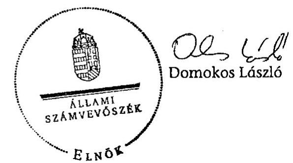

---

# MELLÉKLETEK 

a V-0018-108/2012. sz. Jelentéshez

---

# AZ ELLENŐRZÉSRE KIJELÖLT SZERVEZETEK NÉVJEGYZÉKE 

| Szervezet neve | Címe |
| :-- | :--: |
| Vidékfejlesztési Minisztérium   Kutatás- és Oktatásszervezési Főosztály | 1055 Budapest   Kossuth Lajos tér 11. |
| VM Kelet-magyarországi Agrár-szakképző Központ,   Mezőgazdasági Szakképző Iskola és Kollégium, Jánoshalma | 6440 Jánoshalma   Béke tér 13. (Pf. 55.) |
| VM Közép-magyarországi Agrár-szakképző Központ,   Bercsényi Miklós Élelmiszeripari Szakképző Iskola,   Kollégium és VM Gyakorlóiskola, Budapest | 1106 Budapest   Maglódi út 4/b. |
| VM Dunántúli Agrár-szakképző Központ,   Csapó Dániel Középiskola, Mezőgazdasági Szakképző   Iskola és Kollégium, Szekszárd | 7100 Szekszárd   Palánk 19. (Pf. 61.) |
| VM Vidékfejlesztési, Képzési és Szaktanácsadási Intézet   (2012. áprilistól: Nemzeti Agrárszaktanácsadási Képzési és   Vidékfejlesztési Intézet) | 1223 Budapest   Park u. 2. |

2011. szeptember 1-jétől az ASzK Szakképző Iskola két (a gyomaendrődi és a kétegyházi) tagintézménnyel csökkent. Ugyanezen időponttól negyedik szakoktatási intézményként a karcagi Szentannai Sámuel Gimnázium, Szakközépiskola és Kollégium is a VM fenntartása alá tartozik. A szervezet működéséből csak 4 hónap érinti a vizsgálat alá vont időszakot, így ellenőrzésétől eltekintettünk.

---

## AZ ELLENŐRZÉSSEL ÉRINTETT SZERVEZETEK KAPCSOLATAI

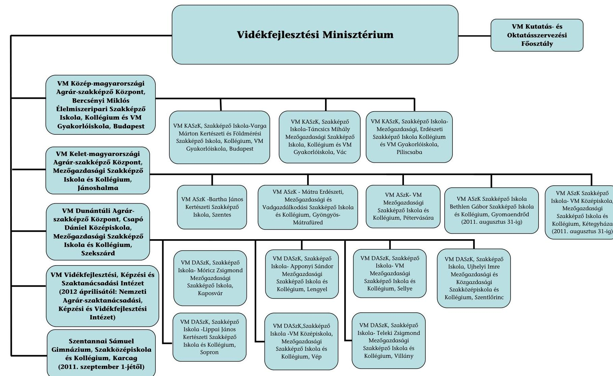

### Vidékfejlesztési Minisztérium

- **VdKKsZKsZKsZKsZKsZKsZKsZKsZKsZKsZKsZKsZKsZKsZKsZKsZKsZKsZKsZKsZKsZKsZKsZKsZKsZKsZKsZKsZKsZKsZKsZKsZKsZKsZKsZKsZKsZKsZKsZKsZKsZKsZKsZKsZKsZKsZKsZKsZKsZKsZKsZKsZKsZKsZKsZKsZKsZKsZKsZKsZKsZKsZKsZKsZKsZKsZKs

---

# KORLÁTOZOTT VÉLEMÉNY 

a VM Vidékfejlesztési, Képzési és Szaktanácsadási Intézet ${ }^{1}$ 2011. évi intézményi költségvetési beszámolójáról

A XII. Vidékfejlesztési Minisztérium fejezet, 6. cím alá tartozó Vidékfejlesztési, Képzési és Szaktanácsadási Intézet (VKSzI) 2011. évi beszámolóját a BM Költségvetési szervek elemi beszámolója pénzügyi-szabályszerűségi ellenőrzéséhez az Állami Számvevőszék által a zárszámadás ellenőrzéséhez - kidolgozott Egyszerűsített Útmutató alapján felülvizsgáltuk.

Az ellenőrzésünk során elegendő és megfelelő bizonyosságot szereztünk arról, hogy a VKSzI zárszámadási törvényjavaslatban szereplő kiadási és bevételi pénzforgalmi adatainak kimutatása a költségvetési gazdálkodásra vonatkozó jogszabályok előírásainak csak részben felel meg.

A VKSzI 2011. évi zárszámadási törvényjavaslatban szereplő pénzforgalmi adatai megbízhatóságát a következők befolyásolják:

- Az intézménynél nem tartották be az ellenőrzött időszakban hatályos államháztartásról szóló 1992. évi XXXVIII. törvény 12/A. § (1) ${ }^{2}$ bekezdésében foglaltakat, amely szerint a költségvetés végrehajtása során tárgyévi fizetési kötelezettség a jóváhagyott kiadási előirányzatok mértékéig vállalható, és kifizetések is ezen összeghatárig rendelhetők el.
- Tárgyévi kötelezettségvállalással terhelt előirányzat-maradványként az Áhsz. 3. számú mellékletében foglaltak ellenére kimutattak egy $10,0 \mathrm{M} \mathrm{Ft}$ összegű 2012. évi kötelezettségvállalást. A hiba a beszámoló kiadási főösszegének $1,1\%$-a.
- Az egyéb rövid lejáratú kötelezettség mérlegsoron az Áhsz. 26. § (5) bekezdésében foglaltak ellenére szerepeltettek $81,8 \mathrm{MFt}$ támogatási programok előlegei miatti kötelezettséget. A hiba a forrásösszetételt befolyásolta, a mérlegfőösszeget azonban nem.

[^0]
[^0]:    ${ }^{1}$ 2012. áprilistól Nemzeti Agrárszaktanácsadási, Képzési és Vidékfejlesztési Intézet
    ${ }^{2}$ Hatályon kívül helyezve: 2012. január 1-jétől

---

# ELUTASÍTÓ VÉLEMÉNY 

a VM Kelet-magyarországi Agrár-szakképző Központ 2011. évi intézményi költségvetési beszámolójáról

A XII. Vidékfejlesztési Minisztérium fejezet, 6. cím alá tartozó VM Kelet-magyarországi Agrár-szakképző Központ (VM ASzK) 2011. évi beszámolóját a BM Költségvetési szervek elemi beszámolója pénzügyi-szabályszerűségi ellenőrzéséhez - az Állami Számvevőszék által a zárszámadás ellenőrzéséhez - kidolgozott Egyszerűsített Útmutató alapján felülvizsgáltuk.

Ellenőrzésünk során elegendő és megfelelő bizonyosságot szereztünk arról, hogy a VM ASzK zárszámadási törvényjavaslatban szereplő kiadási és bevételi pénzforgalmi adatai kimutatása a költségvetési gazdálkodásra vonatkozó jogszabályok előírásainak nem felel meg.

A VM ASzK 2011. zárszámadási törvényjavaslatban szereplő pénzforgalmi adatai nem megbízhatóak, mivel a feltárt megbízhatósági hibák aránya meghaladja az intézmény kiadási főösszegének 2%-át, az alábbiak miatt:

- A VM ASzK - mint önállóan működő és gazdálkodó költségvetési szerv főigazgatója az Ámr ${ }^{1}$ 72. § (3) bekezdésének a) pontjával ellentétesen nem adott írásbeli felhatalmazást a tagintézményeknél a kötelezettségvállalásra és az utalványozási jogkör gyakorlására kijelölt személyek részére. A költségvetési szerv gazdasági vezetője az Ámr 74. § (2) bekezdésének a) pontjának előírása ellenére írásban nem jelölte ki a tagintézményeknél a kötelezettségvállalások és utalványozás ellenjegyzésével megbízott személyeket. A kiadások teljesítésének szakmai teljesítés igazolására és az érvényesítésre jogosult személyeket a főigazgató az Ámr. 76. § (5) bekezdésében foglaltak ellenére írásban nem jelölte ki. A tagintézményeknél a 2011. évben a TISzK főigazgatójának felhatalmazása nélküli kifizetések történtek, amelyek a 2011. évi teljesített kiadások főösszegének 81,5%-át jelentették.

[^0]
[^0]:    ${ }^{1}$ Hatályon kívül helyezve: 2012. január 1-jétől

---

# ELUTASÍTÓ VÉLEMÉNY 

a VM Dunántúli Agrár-szakképző Központ 2011. évi intézményi költségvetési beszámolójáról

A XII. Vidékfejlesztési Minisztérium fejezet, 6. cím alá tartozó VM Dunántúli Agrár-szakképző Központ (VM DASzK) 2011. évi beszámolóját a BM Költségvetési szervek elemi beszámolója pénzügyi-szabályszerűségi ellenőrzéséhez - az Állami Számvevőszék által a zárszámadás ellenőrzéséhez
 - kidolgozott Egyszerűsített Útmutató alapján felülvizsgáltuk.

Ellenőrzésünk során elegendő és megfelelő bizonyosságot szereztünk arról, hogy a VM DASzK zárszámadási törvényjavaslatban szereplő kiadási és bevételi pénzforgalmi adatai kimutatása a költségvetési gazdálkodásra vonatkozó jogszabályok előírásainak nem felel meg.

A VM DASzK 2011. zárszámadási törvényjavaslatban szereplő pénzforgalmi adatai nem megbízhatóak, mivel a feltárt megbízhatósági hibák aránya meghaladja az intézmény kiadási főösszegének 2%-át, az alábbiak miatt:

- A VM DASzK - mint önállóan működő és gazdálkodó költségvetési szerv főigazgatója az Ámr 72. ${ }^{1}$ § (3) bekezdésének a) pontjával ellentétesen nem adott írásbeli felhatalmazást a tagintézményeknél a kötelezettségvállalásra és az utalványozási jogkör gyakorlására kijelölt személyek részére. A költségvetési szerv gazdasági vezetője az Ámr 74. § (2) bekezdésének a) pontjának előírása ellenére írásban nem jelölte ki a tagintézményeknél a kötelezettségvállalások és utalványozás ellenjegyzésével megbízott személyeket. A kiadások teljesítésének szakmai teljesítés igazolására és az érvényesítésre jogosult személyeket a Főigazgató az Ámr. 76. § (5) bekezdésében foglaltak ellenére írásban nem jelölte ki. A tagintézményeknél a 2011. évben a TISzK főigazgatójának felhatalmazása nélküli kifizetések történtek, amelyek a teljesített kiadások főösszegének 81,0%-át jelentették.
- A hét tagintézmény az ellenőrzés időszakában hatályos Áht. 12/A. ${ }^{2}$ § (1) bekezdésének előírása ellenére, a költségvetés végrehajtása során a dologi kiadások módosított előirányzatát 76,8 M Ft-tal (9,4%-kal), az egyéb működési célú kiadások módosított előirányzatát 2,4 M Ft-tal (6,1%-kal) túllépte.

[^0]
[^0]:    ${ }^{1}$ Hatályon kívül helyezve: 2012. január 1-jétől
    ${ }^{2}$ Hatályon kívül helyezve: 2012. január 1-jétől

---

# ELUTASÍTÓ VÉLEMÉNY 

a VM Közép-magyarországi Agrár-szakképző Központ 2011. évi intézményi költségvetési beszámolójáról

A XII. Vidékfejlesztési Minisztérium fejezet, 6. cím alá tartozó VM Közép-magyarországi Agrár-szakképző Központ (VM KASzK) 2011. évi beszámolóját a BM Költségvetési szervek elemi beszámolója pénzügyi-szabályszerűségi ellenőrzéséhez - az Állami Számvevőszék által a zárszámadás ellenőrzéséhez - kidolgozott Egyszerűsített Útmutató alapján felülvizsgáltuk.

Ellenőrzésünk során elegendő és megfelelő bizonyosságot szereztünk arról, hogy a VM KASzK zárszámadási törvényjavaslatban szereplő kiadási és bevételi pénzforgalmi adatai kimutatása a költségvetési gazdálkodásra vonatkozó jogszabályok előírásainak nem felel meg.

A VM KASzK 2011. zárszámadási törvényjavaslatban szereplő pénzforgalmi adatai nem megbízhatóak, mivel a feltárt megbízhatósági hibák aránya meghaladja az intézmény kiadási főösszegének 2%-át, az alábbiak miatt:

- A VM KASzK - mint önállóan működő és gazdálkodó költségvetési szerv főigazgatója az Ámr ${ }^{1}$ 72. § (3) bekezdésének a) pontjával ellentétesen nem adott írásbeli felhatalmazást a tagintézményeknél a kötelezettségvállalásra és az utalványozási jogkör gyakorlására kijelölt személyek részére. A költségvetési szerv gazdasági főigazgató-helyettese az Ámr 74. § (2) bekezdésének a) pontjának előírása ellenére írásban nem jelölte ki a tagintézményeknél a kötelezettségvállalások és utalványozás ellenjegyzésével megbízott személyeket. A kiadások teljesítésének szakmai teljesítés igazolására és az érvényesítésre jogosult személyeket a főigazgató az Ámr. 76. § (5) bekezdésében foglaltak ellenére írásban nem jelölte ki. A tagintézményeknél a 2011. évben felhatalmazás nélküli kifizetések történtek, amelyek a teljesített kiadások főösszegének 55,9%-át jelentették.
- A külső személyi juttatásokat érintő megbízási szerződéseken az ellenőrzött tételek egyharmadánál ellenjegyzés nem szerepelt, amivel megsértették az Ámr. 74. § (1) bekezdésében foglalt előírást.

[^0]
[^0]:    ${ }^{1}$ Hatályon kívül helyezve: 2012. január 1-jétől

---

# TÁBLÁZATOK JEGYZÉKE 

3/1. sz. melléklet A VM ellenőrzött intézményeinek 2011. évi mérlegadatai
3/2. sz. melléklet Az egy tanulóra jutó működési kiadások, működési bevételek és fenntartói támogatás összege az ellenőrzött TISzK-eknél a 2008-2011. években

3/3. sz. melléklet Az iskolarendszeren kívüli képzés adatai 2008-2011. évek között

3/4. sz. melléklet Az ellenőrzött intézmények pályázati tevékenységének adatai

3/5. sz. melléklet Az intézmények költségvetési kiadásainak alakulása a 2008-2011. években

3/6. sz. melléklet A növénytermesztésben elért egy hektárra jutó átlagos hozam

---

# A VM ellenőrzött intézményeinek 2011. évi mérlegadatai

|  Megnevezés | Előző évi |  |  |  |  |  | Tárgyévi |  |  |  |  |  | Változás |   |
| --- | --- | --- | --- | --- | --- | --- | --- | --- | --- | --- | --- | --- | --- | --- |
|   | ASzK | DASzK | KASzK | VKSzI | Összesen |  | ASzK | DASzK | KASzK | VKSzI | Összesen |  | M Ft-ban | %-ban  |
|   | adatok E Ft-ban |  |  |  |  | M Ft-ban | adatok E Ft-ban |  |  |  |  | M Ft-ban |  |   |
|  ESZKÖZÖK |  |  |  |  |  |  |  |  |  |  |  |  |  |   |
|  A) BEFEKTETETT ESZKÖZÖK ÖSSZESEN | 3123961 | 3137462 | 2444988 | 321039 | 9027450 | 9027,4 | 3147496 | 3020850 | 2467216 | 282777 | 8918339 | 8918,3 | -109,1 | 98,8%  |
|  I. Készletek összesen | 81623 | 108353 | 55360 | 84547 | 329883 | 329,9 | 54185 | 172081 | 31573 | 93676 | 351515 | 351,5 | 21,6 | 106,5%  |
|  II. Követelések összesen | 15093 | 68612 | 17726 | 113325 | 214756 | 214,8 | 12793 | 60745 | 6068 | 78392 | 157998 | 158,0 | -56,8 | 73,6%  |
|  III. Értékpapírok összesen | 0 | 0 | 0 | 0 | 0 |  | 0 | 0 | 0 | 0 | 0 |  |  |   |
|  IV. Pénzeszközök összesen | 208988 | 97770 | 130564 | 487866 | 925188 | 925,2 | 61315 | 81620 | 61591 | 450951 | 655477 | 655,5 | -269,7 | 70,8%  |
|  V. Egyéb aktív pénzügyi elszámolások összesen | 12419 | 22475 | 9327 |  | 44221 | 44,2 | 2774 | 17311 | 7944 |  | 28029 | 28,0 | -16,2 | 63,3%  |
|  B) FORGÓESZKÖZÖK ÖSSZESEN | 318123 | 297210 | 212977 | 685738 | 1514048 | 1514,1 | 131067 | 331757 | 107176 | 623019 | 1193019 | 1193,0 | -321,1 | 78,8%  |
|  ESZKÖZÖK ÖSSZESEN | 3442084 | 3434672 | 2657965 | 1006777 | 10541498 | 10541,5 | 3278563 | 3352607 | 2574392 | 905796 | 10111358 | 10111,3 | -430,2 | 95,9%  |
|  FORRÁSOK |  |  |  |  |  |  |  |  |  |  |  |  |  |   |
|  D) SAJÁT TÖKE ÖSSZESEN | 3144273 | 3247866 | 2396480 | 104327 | 8892946 | 8892,9 | 3152980 | 3158403 | 2428996 | 287634 | 9028013 | 9028,0 | 135,1 | 101,5%  |
|  I. Költségvetési tartalékok összesen | 217176 | 106106 | 133462 | 455233 | 911977 | 912,0 | 59952 | 96065 | 67529 | 431738 | 655284 | 655,3 | -256,7 | 71,9%  |
|  II. Vállalkozási tartalékok összesen | 0 | 0 | 0 | 0 | 0 |  | 0 | 0 | 0 | 0 | 0 |  | 0,0 |   |
|  E) TARTALÉKOK ÖSSZESEN | 217176 | 106106 | 133462 | 455233 | 911977 | 912,0 | 59952 | 96065 | 67529 | 431738 | 655284 | 655,3 | -256,7 | 71,9%  |
|  I. Hosszú lejáratú kötelezettségek összesen | 0 |  |  |  | 0 |  | 0 |  |  |  | 0 |  | 0,0 |   |
|  II. Rövid lejáratú kötelezettségek összesen | 77443 | 66618 | 122282 | 415919 | 682262 | 682,3 | 62182 | 95379 | 77017 | 168801 | 403379 | 403,3 | -279,0 | 59,1%  |
|  III. Egyéb passzív pénzügyi elszámolások összesen | 3192 | 14082 | 5741 | 31298 | 54313 | 54,3 | 3449 | 2760 | 850 | 17623 | 24682 | 24,7 | -29,6 | 45,5%  |
|  F) KÖTELEZETTSÉGEK ÖSSZESEN | 80635 | 80700 | 128023 | 447217 | 736575 | 736,6 | 65631 | 98139 | 77867 | 186424 | 428061 | 428,0 | -308,6 | 58,1%  |
|  FORRÁSOK ÖSSZESEN | 3442084 | 3434672 | 2657965 | 1006777 | 10541498 | 10541,5 | 3278563 | 3352607 | 2574392 | 905796 | 10111358 | 10111,3 | -430,2 | 95,9%  |

Forrás: 2011. évi beszámolók

---

# Az egy tanulóra jutó működési kiadások, működési bevételek és fenntartói támogatás összege az ellenőrzött TISzK-eknél a 2008-2011. években

|  Megnevezés | 2008. év |  |  | 2009. év |  |  | 2010. év |  |  | 2011. év |  |   |
| --- | --- | --- | --- | --- | --- | --- | --- | --- | --- | --- | --- | --- |
|   | Egy tanulóra jutó |  |  | Egy tanulóra jutó |  |  | Egy tanulóra jutó |  |  | Egy tanulóra jutó |  |   |
|   | működési kiadás | fenntartói támogatás | működési bevétel | működési kiadás | fenntartói támogatás | működési bevétel | működési kiadás | fenntartói támogatás | működési bevétel | működési kiadás | fenntartói támogatás | működési bevétel  |
|  ASzK | 1166,7 | 922,8 | 314,0 | 1028,2 | 723,1 | 309,5 | 1090,5 | 722,4 | 393,1 | 1117,5 | 688,6 | 387,9  |
|  KASzK | 1055,2 | 893,3 | 216,6 | 959,2 | 705,6 | 172,6 | 1053,6 | 804,9 | 207,4 | 973,9 | 702,8 | 222,7  |
|  DASzK | 1070,8 | 787,0 | 326,0 | 1005,8 | 654,2 | 356,9 | 999,7 | 619,1 | 414,0 | 940,2 | 593,1 | 321,4  |
|  TISzK-ek átlaga | 1098,4 | 859,9 | 293,2 | 1000,4 |

 690,8 | 290,9 | 1043,3 | 698,9 | 356,8 | 1005,0 | 650,7 | 318,1  |

Forrás: Intézményi adatszolgáltatás

---

# Az iskolarendszeren kívüli képzés adatai 2008-2011. évek között

|  Sorsz. | Megnevezés |  |  |  |  | 2008-2011.
összesen | Változás a
bázisévhez (\%)  |
| --- | --- | --- | --- | --- | --- | --- | --- |
|   |  | 2008. év | 2009. év | 2010. év | 2011. év |  | 2011/2008  |
|  1. | Képzések száma összesen (db) | 108 | 112 | 180 | 150 | 550 | $138,9 \%$  |
|  2. | Képzésben résztvettek száma (fő) | 2237 | 2120 | 3335 | 2667 | 10359 | $119,2 \%$  |
|  3. | Iskolarendszeren kívüli képzésből származó bevétel (E Ft) | 131571,0 | 176887,0 | 210528,0 | 204640,0 | 723626 | $155,5 \%$  |
|  4. | Iskolarendszeren kívüli képzéshez kapcsolódó kiadások (E Ft) | 99135,0 | 134717,0 | 155277,0 | 127204,0 | 516333 | $128,3 \%$  |
|  5. | Iskolarendszeren kívüli képzés pénzügyi eredménye (E Ft) (3-4 sor) | 32436,0 | 42170,0 | 55251,0 | 77436,0 | 207293 | $238,7 \%$  |
|  6. | Egy képzésre jutó bevétel (E Ft) | 1218,2 | 1579,3 | 1169,6 | 1364,3 | 1315,7 | $112,0 \%$  |
|  7. | Egy képzésre jutó kiadás (E Ft) | 917,9 | 1202,8 | 862,7 | 848,0 | 938,8 | $107,6 \%$  |
|  8. | Egy képzésre jutó pénzügyi eredmény (E Ft) | 300,3 | 376,5 | 306,9 | 516,3 | 376,9 | $153,5 \%$  |
|  9. | Egy képzésre jutó tanuló (fő) | 20,7 | 18,9 | 18,5 | 17,8 | 18,8 | $87,3 \%$  |

Forrás: Intézményi adatszolgáltatás

---

# Az ellenőrzött intézmények pályázati tevékenységének adatai

| Megnevezés | Benyújtott pályázatok száma (db) | | | | | Nyertes pályázatok száma (db) | | | | | Nyertes pályázatok arányai % | Igényelt támogatások összege (E Ft) | | | | | Elnyert támogatás/igényelt támogatás arányai (%) | Elnyert támogatás/igényelt támogatás összege (E Ft) | | | | | | | | | | | | | | | | | | | | | | | | | | | | | | | | | | | | | | | | | | | | | | | | | | | | | | | | | | | | | | | | | | | | | | | | | | | | | | | | | | | | | | | | | | | | | | | | | | | | | | | | | | | | | | | | | | | | | | | | | | | | | | | | | | | | | | | | | | | | | | | | | | | | | | | | | | | | | | | | | | | | | | | | | | | | | | | | | |

---

Az intézmények költségvetési kiadásainak alakulása a 2008-2011. években

|  S. | Megnevezés | Eredeti előirányzat összesen |  |  |  | Változás a bázisévhez viszonyítva | Teljesítés összesen |  |  |  | Változás a bázisévhez viszonyítva | Teljesítés/Eredeti előirányzat |  |  |   |
| --- | --- | --- | --- | --- | --- | --- | --- | --- | --- | --- | --- | --- | --- | --- | --- |
|   |  | 2008 | 2009 | 2010 | 2011 |  | 2008 | 2009 | 2010 | 2011 |  | 2008 | 2009 | 2010 | 2011  |
|  1 | Személyi juttatások (E Ft) | 3025547,0 | 3075224,0 | 3075224,0 | 3021624,0 | 99,9\% | 3353769,0 | 3211498,0 | 3240584,0 | 2923976,0 | 87,2\% | 110,8\% | 104,4\% | 105,4\% | 96,8\%  |
|  2 | Munkaadókat terhelő járulékok (E Ft) | 1013900,0 | 984076,0 | 857706,0 | 841306,0 | 83,0\% | 1101815,0 | 948490,0 | 843780,0 | 742093,0 | 67,4\% | 108,7\% | 96,4\% | 98,4\% | 88,2\%  |
|  3 | Személyi juttatások és munkaadókat terhelő járulékok (E Ft) | 4039447,0 | 4059300,0 | 3932930,0 | 3862930,0 | 95,6\% | 4455584,0 | 4159988,0 | 4084364,0 | 3666069,0 | 82,3\% | 110,3\% | 102,5\% | 103,9\% | 94,9\%  |
|  4 | Dologi kiadások és egyéb folyó kiadások összesen (E Ft) | 1331277,0 | 1329500,0 | 1335100,0 | 1452000,0 | 109,1\% | 2218802,0 | 2140527,0 | 2333369,0 | 2181737,0 | 98,3\% | 166,7\% | 161,0\% | 174,8\% | 150,3\%  |
|  5 | Támogatásértékű működési kiadás összesen (E Ft) | 0,0 | 0,0 | 0,0 | 0,0 | 0,0\% | 123708,0 | 1390,0 | 106002,0 | 68178,0 | 55,1\% | 0,0\% | 0,0\% | 0,0\% | 0,0\%  |
|  6 | Működési célú pénzeszközátadások államháztartáson kívülre összesen (E Ft) | 0,0 | 0,0 | 0,0 | 0,0 | 0,0\% | 172,0 | 3763,0 | 0,0 | 3240,0 | 1883,7\% | 0,0\% | 0,0\% | 0,0\% | 0,0\%  |
|  7 | Eljátszottak pénzbeli juttatásai (E Ft) | 0,0 | 0,0 | 0,0 | 0,0 | 0,0\% | 9691,0 | 6341,0 | 15654,0 | 23872,0 | 246,3\% | 0,0\% | 0,0\% | 0,0\% | 0,0\%  |
|  8 | Előző évi működési célú előirányzat-, pénzmaradvány átadás (E Ft) | 0,0 | 0,0 | 0,0 | 0,0 | 0,0\% | 5,0 | 1306,0 | 0,0 | 15331,0 | 306620,0\% | 0,0\% | 0,0\% | 0,0\% | 0,0\%  |
|  9 | Működési kiadások összesen (E Ft) | 5325000,0 | 5388800,0 | 5268030,0 | 5314930,0 | 99,8\% | 6807962,0 | 6313315,0 | 6539389,0 | 5958427,0 | 87,5\% | 127,8\% | 117,2\% | 124,1\% | 112,1\%  |
|  10 | Felhalmozási kiadások összesen (E Ft) | 0,0 | 0,0 | 0,0 | 0,0 | 0,0\% | 650603,0 | 537626,0 | 434732,0 | 406647,0 | 62,5\% | 0,0\% | 0,0\% | 0,0\% | 0,0\%  |
|  11 | Működési és felhalmozási kiadások (E Ft) | 5325000,0 | 5388800,0 | 5268030,0 | 5314930,0 | 99,8\% | 7458778,0 | 6852560,0 | 6977484,0 | 6366672,0 | 85,4\% | 140,1\% | 127,2\% | 132,4\% | 119,8\%  |

Forrás: Intézményi adatszolgáltatás

---

# A növénytermesztésben elért egy hektárra jutó átlagos hozam

|  Megnevezés | 2008 |  |  |  | 2009 |  |  |  | 2010 |  |  |  | 2011 |  |  |   |
| --- | --- | --- | --- | --- | --- | --- | --- | --- | --- | --- | --- | --- | --- | --- | --- | --- |
|   | országos átlag | ASzK | DASzK | KASzK | országos átlag | ASzK | DASzK | KASzK | országos átlag | ASzK | DASzK | KASzK | országos átlag | ASzK | DASzK | KASzK  |
|  búza | 49,8 | 37,1 | 65,6 | 31,5 | 38,5 | 34,6 | 54,3 | 27,4 | 37,1 | 31,9 | 45,3 | 35,5 | 42,1 | 28,2 | 50,4 | 31,5  |
|  kukorica | 74,7 | 77,7 | 88,8 | 29,6 | 63,9 | 73,4 | 87,4 | 14,3 | 64,7 | 61,0 | 80,0 | 14,3 | 65,9 | 49,3 | 80,5 | 16,7  |
|  árpa | 44,5 | 41,5 | 50,8 | 0,0 | 33,2 | 22,2 | 44,1 | 0,0 | 33,6 | 18,6 | 36,1 | 0,0 | 37,9 | 47,1 | 53,3 | 0,0  |
|  napraforgó | 26,7 | 28,4 | 31,0 | 0,0 | 23,5 | 14,3 | 24,7 | 0,0 | 19,3 | 15,7 | 14,2 | 0,0 | 23,8 | 27,3 | 17,0 | 0,0  |

Forrás: Intézményi adatszolgáltatás

---

# DIAGRAMOK JEGYZÉKE 

| $4 / 1$. sz. melléklet | Az egy pedagógusra jutó tanuló létszám (fő) az ellenőrzött időszakban |
| :--: | :--: |
| $4 / 2$. sz. melléklet | Az évfolyamot ismételt tanulók aránya a végzős évfolyamokon az adott évfolyam induló létszámához képest (\%) |
| $4 / 3$. sz. melléklet | A lemorzsolódott tanulók aránya a végzős évfolyamokon az adott évfolyam induló létszámához képest (\%) |
| $4 / 4$. sz. melléklet | A VM fenntartásában lévő agrár-szakképző intézmények részére biztosított költségvetési támogatás a 2008-2011. években |
| $4 / 5$. sz. melléklet | Az intézmények részesedése az elnyert támogatásokból és pályázatokból az ellenőrzött időszakban (E Ft) |
| $4 / 6$. sz. melléklet | Az egy tanulócsoportra jutó tanuló létszám (fő) az ellenőrzött időszakban |
| $4 / 7$. sz. melléklet | Végzettséget szerzett tanulók száma (fő) |

---

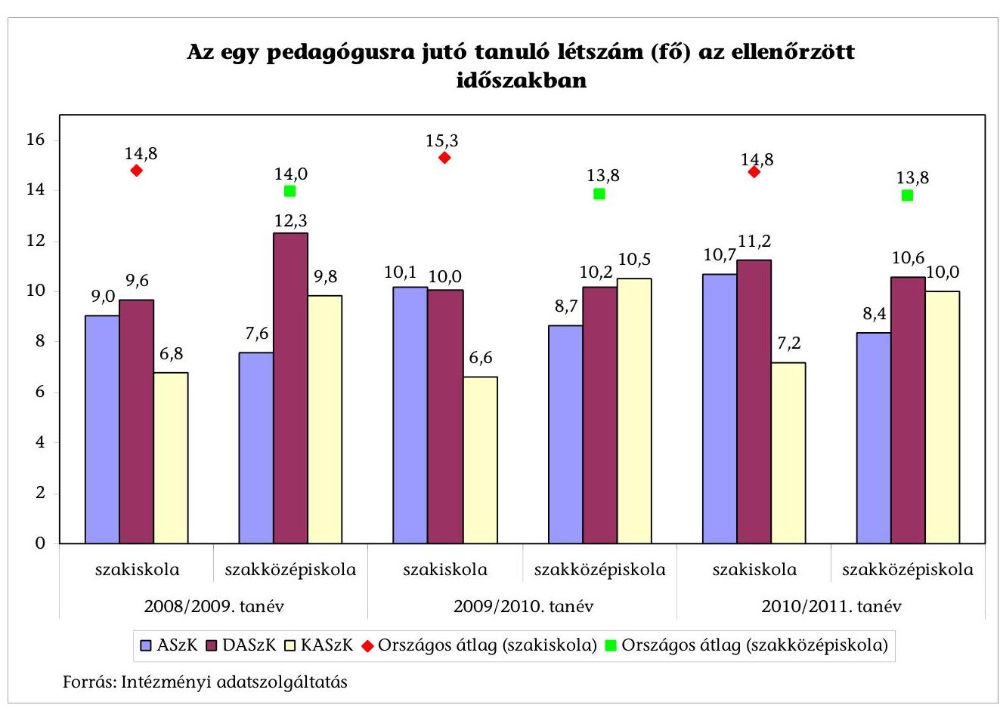

Forrás: Intézményi adatszolgáltatás

---

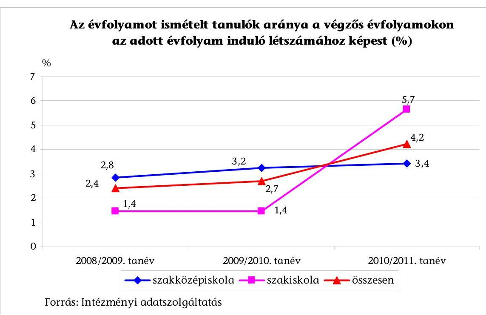

4/3. sz. melléklet a V-0018-108/2012. sz. Jelentéshez
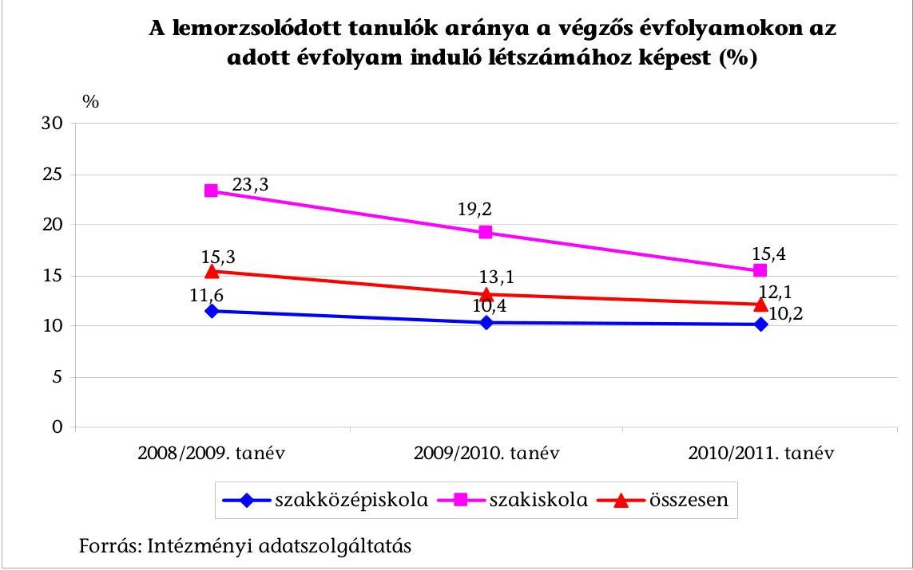

---

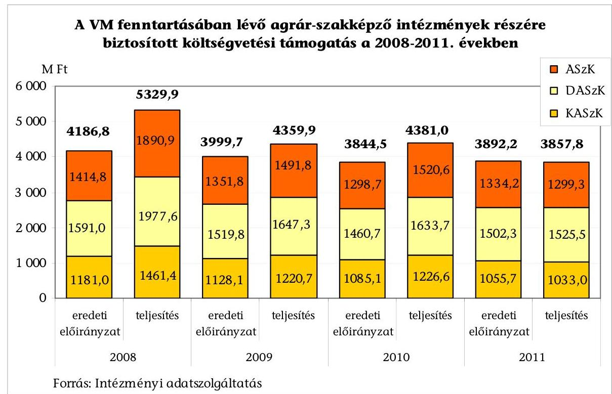

4/5. sz. melléklet a V-0018-108/2012. sz. Jelentéshez

Az intézmények részesedése az elnyert támogatásokból és pályázatokból az ellenőrzött időszakban (E Ft)
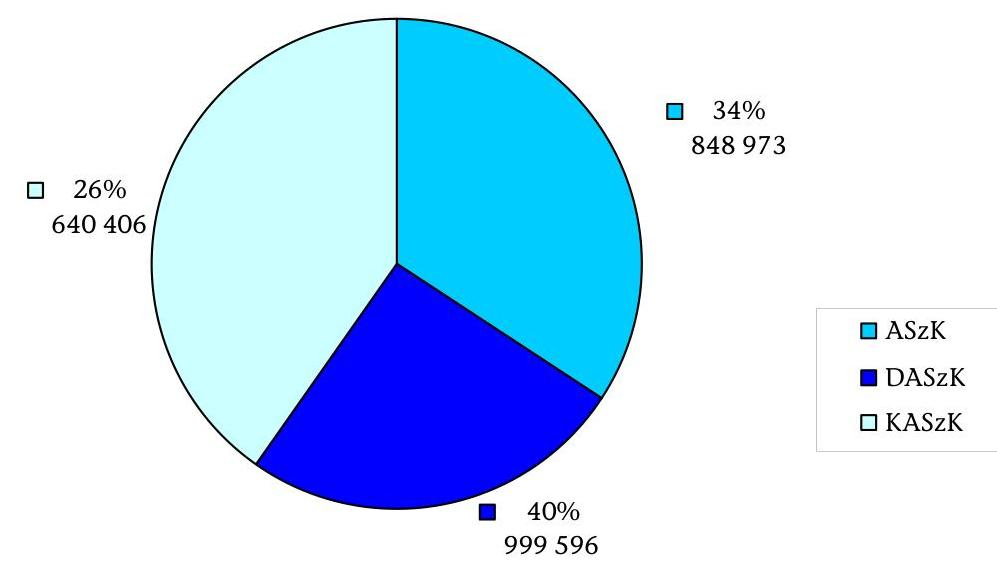

Forrás: Intézményi adatszolgáltatás

---

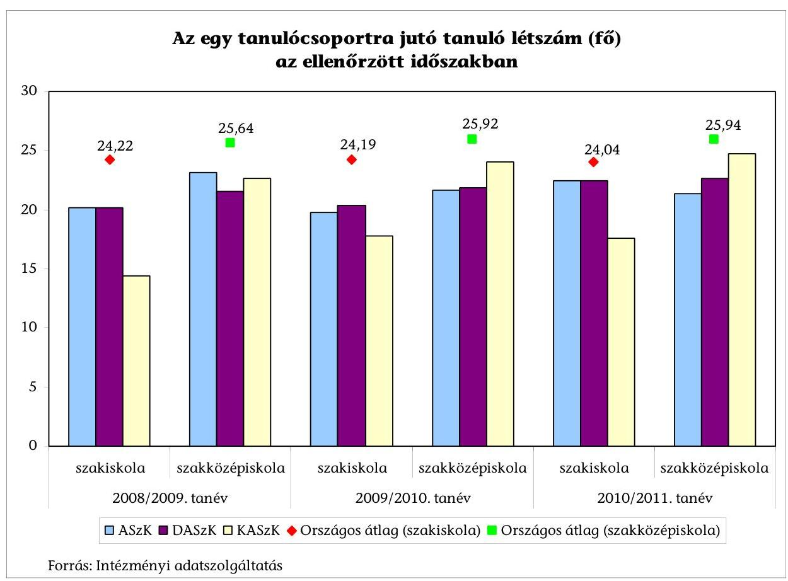

4/7. sz. melléklet a V-0018-108/2012. sz. Jelentéshez
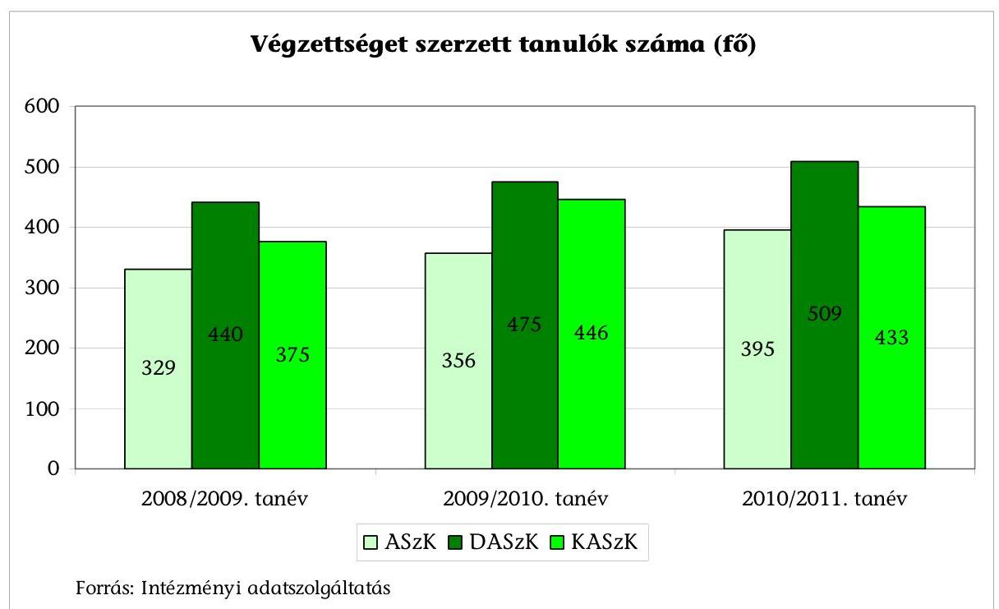

---

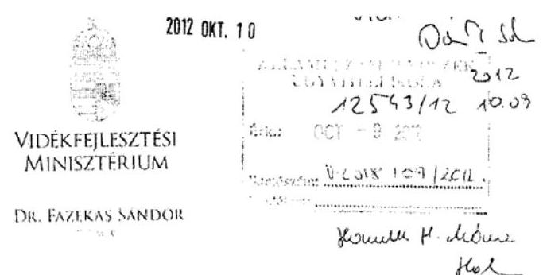

Ügyiratszám: KGF/1613/10/2012.

Domokos László elnök úr részére

# Állami Számvevőszék 

Budapest
Apáczai Csere János u. 10.
1052
Tárgy: Jelentéstervezet észrevételezése

## Tisztelt Elnök Úr!

A 2012. szeptember 20-i keltezéssel véleményezés céljából megküldött, a tárcához szeptember 25-én érkezett, a Mezőgazdasági középfokú szakoktatás és szaktanácsadás intézményeinek ellenőrzéséről készített összefoglaló munkaanyagokra a tárca észrevételeit az alábbiakban foglaljuk össze.

1. „A fenntartó által fogadott szakképzési hozzájárulás intézmények részére történő kiutalása nem igazodott
 a finanszírozási szükséglet időpontjához. Egyes esetekben ez késedelmet okozott a tervezett felhasználásban..." A szakképzési hozzájárulásról és a képzés fejlesztésének támogatásáról szóló 2003. évi LXXXVI. törvény, valamint annak végrehajtási rendelet alapján elkészített fejlesztési támogatás nyújtására szóló megállapodás 3.2. pontja alapján a támogatás - felhasználó iskola részére történő - továbbadásának határideje a támogatás beérkezésétől számított 30 nap. A fenntartó a megállapodásban foglaltak szerint járt el, így a támogatási összeg iskola részére történő átadása a tárgyi eszköz beszerzési nem hátráltatta.
2. A jelentés kifogásolja, hogy a TISzK-en belül a párhuzamos képzések száma nem csökkent. Álláspontunk szerint - ahogyan azt az ÁSz jelentés is megállapítja - ezeket az indokolja, hogy TISzK-ek intézményei több esetben más-más megyében helyezkednek el, így a munkaerőpiaci igények miatt vannak párhuzamos képzések.

---

3. A jelentés megállapítja, hogy az egy főre jutó működési kiadások nagyságrendje meghaladta az önkormányzati fenntartású agrár-szakképzést is folytató intézmények átlagát. Ahogyan az ÁSz jelentés is megállapította ennek azaz az oka, hogy a képzési szerkezet és az annak megfelelő feltételrendszer nagyban eltér egymástól. Ilyenek például a tangazdaságok magas fenntartási költségei, az agrárszakképzés gyakorlati oktatásának magas eszközigénye (pl.: gazda, gépész stb. képzés), valamint a műemlék épületek fenntartási kiadásai.
4. A jelentés rámutat arra, hogy „az intézmények feladatellátáshoz a szükségesnél nagyobb épületekkel rendelkeznek, amelyre nincs elegendő anyagi erőforrás". Az állami vagyonról szóló 2007. évi CVI. törvény 27. § (2.) bekezdése értelmében a vagyonkezelő köteles a vagyontárgy értékét megőrizni, állagának megóvásáról, jó karban tartásáról, működtetéséről gondoskodni. Megjegyezzük, hogy az elmúlt években azon ingatlanok esetében, amelyek az iskolák vagyonkezelésében voltak, de alapfeladataik ellátáshoz nem voltak szükségesek, a fenntartó támogatta a vagyonkezelői jog MNV Zrt. részére történő átadását és folyamatosan kezdeményezni fogja a feladatellátáshoz nem szükséges ingatlanok vagyonkezelői jogának visszaadását.
5. A jelentés megállapítja, hogy „a 2008-2011. időszakban a fenntartó bázis alapú tervezés alapján - az előző évi költségvetési támogatás eredeti előirányzatából kiindulva - nyújtotta a költségvetési támogatást az intézmények részére, év közben esetenként pótelőirányzatokat biztosítva." Megállapításra került az is, hogy a fejezet nem kötötte feladatmutatókhoz a támogatás nyújtását, illetve teljesítménymutatókat sem határozott meg. Megjegyezzük, hogy tervezéskor a minisztérium jóváhagyott keretszámok - amelyektől eltérni nem lehet - alapján tudja az intézmények költségvetését elkészíteni. Az év közben adott póttámogatások jelentős részét közüzemi számlák, működési kiadások fedezetére kapták a TISzK-ek, mivel ezeknek teljesítésére az alaptámogatás és a bevételek nem nyújtottak elegendő fedezetet. A pótelőirányzatok másik részét a minisztérium által meghatározott feladatokra (tankönyvtámogatás, érettségi vizsgák, tanüzemek fejlesztése stb.) kapták az intézmények elszámolási kötelezettség előírása mellett.
6. A jelentés szerint „a VM agrároktatási, illetve agrár-szakképzési stratégiát nem dolgozott ki". Álláspontunk szerint a Nemzeti Vidékstratégiában, valamint a Darányi Ignác tervben is megfogalmazásra került az iskolarendszerű szakképzés valamint a felnőttképzés intézményrendszerének helyreállítása, egységes hálózattá szervezése, fejlesztése. Az elmúlt időszakban számos agrároktatási stratégiatervezetet is készített a tárca, amelyek elfogadására még nem került sor tekintettel a jogszabály-változásokra és az agrár-szakképző iskolahálózat kialakítására.
7. A jelentés szerint a TISzK-ek az illetékes Regionális Fejlesztési és Képzési Bizottságok (RFKB) beiskolázási arányokra, illetve támogatott képzési arányokra vonatkozó határozatait csak részben vették figyelembe, ezáltal a

---

kapcsolódó pályázati forrásokat nem tudták igénybe venni. Álláspontunk szerint az RFKB-k a TISzK-ek székhelyintézményének régiójára vonatkozóan határozzák meg a beiskolázási és képzési arányokat, a más régióba eső tagintézmények beiskolázására más munkaerőpiaci igények vonatkoznak. A fenntartó által minden év október 15-ig szakmacsoportonkénti, szakképesítésenkénti, és évfolyamonkénti bontásban megküldött létszámjelentéseket az ellenőrzött években a korábbi Nemzeti Szakképzési és Felnőttképzési Intézet (NSZFI) elfogadta, és megállapította, hogy az adott tanévben az 1. szakképző évfolyamokon indított képzéseket az illetékes RFKBk támogatták.
8. A jelentés megállapítja, hogy a szakközépiskolai osztályok kompetenciaméréseinek eredményei az országos átlag alatt voltak. A megállapítással kapcsolatban megjegyezzük, hogy a 9. évfolyamon nem ismert a tanulók bemeneti szintje, erre tekintettel a 10. évfolyamon mért kompetencia mérések eredményei nem vethetők össze a tanulók korábbi matematika és szövegértési szintjével.
9. A jelentés szerint a megművelt földek átlaghozamai nem érték el az országos átlagot. A megállapítás részben fedi a valóságot, hiszen az iskolák alapfeladata nem vállalkozási tevékenység folytatása, hanem az általános műveltség megalapozása, a szakmai előkészítés, felkészítés az érettségire, szakképesítő vizsgákra. A tanüzemek, tangazdaságok megléte a gyakorlati oktatás elvégzését segíti. Megjegyezzük, hogy számos VM által fenntartott iskolában a szakmai gyakorlati képzés magas színvonalú ellátásán felül, kiemelkedő termelési eredményeket is elértek.
10. A jelentés szerint a felvásárlási áraknál alacsonyabb áron tudták értékesíteni termékeiket az iskolák. A megállapítás nem helytálló, tekintettel arra, hogy a szakképző intézmények napi piaci áron értékesítik termékeiket. Amennyiben megfelelő tároló kapacitással rendelkeznek, a magasabb értékesítési ár érdekében terményeiket raktározzák.
11. A jelentés megállapítja, hogy az intézményeknél felhatalmazás nélküli kötelezettségvállalások és kifizetések történtek. Megjegyezzük, hogy a tárca minden évben felhívta az intézmények figyelmét arra, hogy az államháztartási jogszabályok rendelkezéseit tartsák be, a gazdálkodásukat ennek megfelelően tervezzék meg. Ezen túlmenően a gazdálkodási szabályok betartására az ellenőrzési jelentések is felhívták a TISzK-ek figyelmét.
12. A jelentés a DASzK esetében megállapítja „Az intézmény többletbevétel felhasználására irányuló kérelmére a fenntartó írásbeli engedélyt nem adott, ugyanakkor a DASzK 2011. évi beszámolóját elfogadta." A jelentés ezen megállapítását nem tudjuk elfogadni, mivel ezen konkrét eset nincsen kifejtve, erről nincsen tudomása a fejezetnek. Az érintett kiemelt bevételi előirányzatok módosított előirányzatának intézményi nyilvántartás szerinti összege a kincstári nyilvántartás adataival minden esetben egyeztetésre kerül, ennek eltérése esetén

---

a beszámoló természetesen nem elfogadható. A DASzK esetében azonban eltérés nem jelentkezett.
13. Az Állami Számvevőszék a jelentéstervezet Összegző megállapításaiban a jelentéstervezet 20. oldalán a TISzK-ek 2011. évi intézményi beszámolóira a gazdálkodás pénzügyi szabályszerűségének minősítése alapján elutasító véleményt adott. Az elutasító véleményt azzal indokolta, hogy az agrárszakképző központok tagintézményeiben összességében 4760,3 M Ft felhatalmazás nélküli kifizetés történt, amely mindhárom TISzK esetében meghaladta a 2011. évi kiadási főösszeg 2%-át. Álláspontja szerint a TISzK-ek főigazgatói az - Ámr. 72 § (3) bekezdésének előírásait figyelmen kívül hagyva - nem adtak írásbeli felhatalmazást a tagintézményeknél a kötelezettségvállalásra és az utalványozási jogkör gyakorlására kijelölt személyek részére. A felhatalmazás nélküli kötelezettségvállalásért és kifizetésekért a TISzK-ek főigazgatóit, valamint a tagintézmények vezetőit egyaránt felelősség terheli. Az ÁSz véleménye szerint: „A felhatalmazások hiányát a fenntartói ellenőrzések nem kifogásolták." Az utóbbi megállapítással a tárcánk nem ért egyet. A hivatkozott ellenőrzések kétéves átfogó rendszerellenőrzések voltak, amely módszertana az egy témakört részletesen vizsgálat alá helyező megbízhatósági ellenőrzéstől jelentősen eltér.

Az ellenőrzési jelentések számos hibát és hiányosságot tártak fel az intézmények szervezeti felépítésével, szabálytalan működésével és gazdálkodásával kapcsolatban, ezek komplexen kerültek megfogalmazásra a következőképpen:

A DASzK ellenőrzési jelentésben:
„A jogilag gazdálkodási önállósággal nem rendelkező tagintézmények teljes jogkörrel rendelkeznek minden előirányzatuk fölött, az Intézmény főigazgatójának kizárólag a székhely intézmény dolgozói, eszközei és forrásai tekintetében van rendelkezési joga."
„A jelenlegi hatásköri megosztás az Érvényes Alapító Okirattal is ellentétes, ezért a hosszú távú fenntartása felülvizsgálatot igényel."
„A költségvetési gazdálkodással kapcsolatos hatáskörök és a gazdálkodási felelősség összhangja nem megfelelő, ugyanis a DASzK beszámolóját aláiró főigazgató és gazdasági vezető csak a székhelyintézmény gazdálkodására tud hatást gyakorolni."
„A DASzK által kialakított, gazdálkodással kapcsolatos 9 szabályzat 2009. január 1-től érvényes a tagintézményekre is. Az ellenőrzés megállapítása szerint egyes szabályzatok esetében elmaradt az aktualizálás, illetve a változások átvezetése."
Az ASzK ellenőrzési jelentésben:
„Az új Alapító Okirat kiadását nem követte új SzMSz kiadmányozása. A revízió szükségesnek tartja az aktuális Alapító Okiratnak mindenben megfelelő SzMSz elkészítését és kiadmányozását. A revízió megállapítása szerint a tagintézmények az alapító Okiratban foglaltak ellenére megtartották részbeni gazdálkodási önállóságukat."

---

A Kötelezettségvállalási szabályzatot a főigazgató adta ki, ezáltal az utalványozásra, érvényesítésre és ellenjegyzésre megtörtént a munkakörök szerinti írásbeli kijelölés, az aláírás minták hiányát és a szabályozás további hiányosságait az ellenőrzés kifogásolta.
A KASzK ellenőrzési jelentésben:
„A tagintézmények az Alapító Okiratban foglaltak ellenére megtartották részbeni gazdálkodási önállóságukat. A revízió szükségesnek tartja az Alapító Okiratnak megfelelő SzMSz elkészítését."
Az SzMSz-hez kapcsolódó, a főigazgató és a gazdasági igazgató által aláírt gazdálkodási szabályzatokkal a vizsgált időszakban a KASzK nem rendelkezett. A revízió elengedhetetlennek tartja a gazdálkodási szabályzatok KASzK szintű egységes, teljes körű elkészítését."
14. A jelentés megállapítja, hogy „A tervezés hiányosságait bizonyítja, hogy a 2008-2011. években a tervezett felhalmozási bevételekkel szemben felhalmozási kiadást nem terveztek", valamint az is, hogy „...megállapítható mind a bevételek, mind a kiadások egyidejű alultervezése." A fentiekkel nem értünk egyet, mivel sem jogszabályi sem módszertani hiányosságot nem jelent az, hogy a felhalmozási bevételekkel egyidejűleg nem felhalmozási (pl.: dologi kiadások) kiadásokat tervezzen a tárca. Továbbá az alultervezéssel kapcsolatban megjegyezzük, hogy a minisztérium a Nemzetgazdasági Minisztérium által megadott keretszámokon belül biztosít támogatást az intézmények részére. Az ennél magasabb költségvetési támogatás megtervezése nem lehetséges. A feladatellátás feltételeit nagymértékben figyelembe nem vevő, felemelt összegű bevétel előírása is megtévesztő lenne. Megjegyezzük, hogy az európai uniós pályázati támogatások a duplikáció kiküszöbölése érdekében nem kerültek betervezésre az intézmények költségvetésébe, tekintettel arra, hogy azok külön fejezetben, illetve fejezeti kezelésű előirányzaton lettek meghatározva.

Kérem Elnök urat, a fentiekben megfogalmazott észrevételeink szíves elfogadására.
Engedje meg továbbá, hogy megköszönjem Elnök úrnak és munkatársainak segítő hozzáállását és azt, hogy megállapításaikkal jelentősen hozzájárulnak az intézmények teljesítményének javulásához.

Budapest, 2012. október „Q",
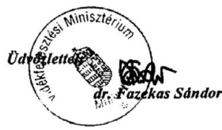

---

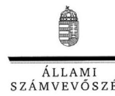

Ikt.szám: V-0018-110/2012.

Dr. Fazekas Sándor úr
miniszter
Vidékfejlesztési Minisztérium

Budapest

# Tisztelt Miniszter Úr! 

A Mezőgazdasági középfokú szakoktatás és szaktanácsadás intézményeinek ellenőrzése című jelentéstervezetre tett észrevételeit köszönettel megkaptam.

Az Állami Számvevőszék észrevételekre vonatkozó álláspontjáról a felügyeleti vezető által készített részletes tájékoztatást csatoltan megküldöm.

Tájékoztatom Miniszter urat, hogy a jelentésben - az Állami Számvevőszékről szóló 2011. évi LXVI. törvény 29. § (3) bekezdése alapján - az el nem fogadott észrevételeket szerepeltetjük az elutasítás indokának feltüntetésével együtt. Az elfogadott észrevételeket a jelentés szövegezésénél figyelembe vesszük.

Budapest, 2012. 44 hó 05 nap
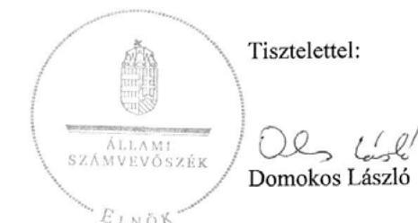

Melléklet: Tájékoztatás az elfogadott és az el nem fogadott észrevételekről

---

# Tájékoztatás 

## az elfogadott és az el nem fogadott észrevételekről

A Mezőgazdasági középfokú szakoktatás és szaktanácsadás intézményeinek ellenőrzése című jelentéstervezetre KGF/1613/10/2012. ügyiratszámú levelében tett észrevételeit áttekintettük, azok kezeléséről ezúton tájékoztatom.

## Elfogadott észrevételek:

- a szakképzési hozzájárulás kiutalására vonatkozó 1. számú észrevételt elfogadtuk. Ez alapján a jelentéstervezet összegző részében a 13. oldal utolsó bekezdésének második mondatát töröltük. A harmadik mondatot az alábbiak szerint átfogalmaztuk és kiegészítettük: „A TISzK-ek számára kedvezőtlen volt a szakképzési hozzájárulás fenntartó általi fogadása, mivel a korábbi szabályozás szerint az ebből származó forrást közvetlenül az intézmények kapták meg. A fenntartó a felhasználókkal kötött megállapodás alapján a támogatást, annak beérkezésétől számított 30 napon belül adta át. Előfordult, hogy az intézmények a likviditás biztosítása érdekében a befolyt,
 de későbbi időpontban felhasználandó támogatást - visszapótlási kötelezettség mellett - bevonták a napi finanszírozásba.

Ehhez kapcsolódóan a részletes megállapítások között a 39. oldal harmadik bekezdésének második mondatát is töröltük, a harmadik mondatot a 13. oldal fenti módosításai szerint átfogalmaztuk és kiegészítettük;

- a 7. számú észrevétel alapján a megállapítást pontosítottuk. A 16. oldal negyedik bekezdését az alábbiak szerint átfogalmaztuk: „Az indított képzéseknél meghatározóak voltak a helyi adottságok. A TISzK-ek az illetékes Regionális Fejlesztési és Képzési Bizottságok támogatott képzési irányokra vonatkozó határozatait alapvetően figyelembe vették, azonban előfordult, hogy a jelentkezések száma alapján csak úgy tudtak egy egész osztályt indítani, hogy abban 2-3 féle szakma képzése is folyt.”

Ehhez kapcsolódóan a részletes megállapítások között a 46. oldal második bekezdésének második mondatát a fentiek szerint átfogalmaztuk;

- a 12. számú észrevétel alapján a jelentéstervezet 28. oldala hatodik bekezdésének utolsó mondatát elhagytuk;
- a 13. számú észrevételt figyelembe véve a 20. oldal ötödik bekezdésének utolsó mondatát elhagytuk;

---

- a 14. számú észrevételt részben elfogadtuk, ez alapján a 38. oldal hetedik bekezdésének utolsó mondatát töröltük.

# El nem fogadott észrevételek: 

- a párhuzamos képzésekre vonatkozó 2. számú észrevételt nem fogadtuk el. Az ellenőrzés során az átszervezés eredményességét a kitűzött célok megvalósulásával értékeltük. Az intézményhálózat átszervezését megalapozó, a Kormány számára 2008 júliusában készült jelentésben az átszervezés egyik céljaként a szakmai hatékonyság erősítése, a párhuzamos képzések csökkentése szerepelt. A közpénzek hatékony felhasználása, a képzési struktúra országos képzési célokhoz való illeszkedése érdekében indokolt az azonos beiskolázási területen a különböző fenntartású intézmények párhuzamos képzéseinek megszüntetése;
- a 3. és 4. számú észrevételek magyarázó jellegűek, a jelentéstervezet megállapításait nem vitatják. Az állami és önkormányzati intézmények működtetése egyaránt közpénzből történik, aminek biztosítania kell, hogy a különböző fenntartású intézményekben - a diákok számára esélyegyenlőséget teremtve - azonos képzési feltételek álljanak rendelkezésre. A különböző fenntartású intézmények között az átlagos működési kiadások és a működési támogatás lényeges eltérése mindezt nem garantálja;
- az 5. számú észrevételt nem fogadtuk el. A jelentéstervezetben azt kifogásoltuk, hogy a minisztérium az ellenőrzött időszakban az agrár-szakképző központok támogatására rendelkezésre álló források TISzK-ek közötti elosztását nem kötötte feladatmutatókhoz. A részletes megállapítások között ugyanakkor - a 38. oldal második bekezdésében - azt is szerepeltettük, hogy „A 2012. évi költségvetési támogatás szakképző központok szerinti felosztása feladatmutató - az osztályok száma - alapján történt.”;
- a 6. számú észrevételben felsorolt stratégiai dokumentumok 2012-2020 időszakra vonatkoznak. Az ellenőrzés a 2008-2011 közötti évekre terjedt ki. Erre az időszakra a VM-ben az ellenőrzés részére jóváhagyott agrár-szakképzési stratégiát nem tudtak bemutatni, ezért az észrevételt nem fogadtuk el;
- a kompetenciamérés eredményeire vonatkozó 8. számú észrevételt nem fogadtuk el, mivel a 10. évfolyamon a kompetenciamérés eredményeit a mindenkori országos átlaghoz viszonyítottuk, ahol évente szintén változó a bemeneti szint. Egyes intézmények eredményeinek országos átlaghoz viszonyított elmozdulását a 3. sz. diagramban is bemutattuk;
- a 9. számú észrevételt nem fogadtuk el. A megművelt földek átlaghozamaira vonatkozó megállapítást az intézmények tanúsítványi adatszolgáltatásának a KSH adatokkal történő egybevetésére alapoztuk. A tanüzemi hozamok országos átlagtól való eltérésének okaira az összegző részben a 19. oldal második bekezdésében és a részletes megállapítások között az 57. oldal második bekezdésében egyaránt kitértünk;
az eladási árakra vonatkozó megállapítást megkérdőjelező 10. számú észrevételt nem fogadtuk el. Az eladási árak nagyságát az intézményi tanúsítványok alapján az árbevételre

---

és értékesített mennyiségre vonatkozó adatokból határoztuk meg. Egyes termékek eladási árait a KSH által közzétett felvásárlási árakkal hasonlítottuk össze. Az összehasonlítás eredményét a jelentéstervezet 57. oldalán kiemelt termékcsoportonként részletesen bemutattuk;

- a 11. számú észrevételében közölt kiegészítő információkat köszönettel vettük;
- a 14. számú, alultervezésre vonatkozó észrevételt nem fogadtuk el. Az uniós pályázati bevételek aránya a saját bevételeken belül az ellenőrzött időszakban 19% volt. A tervezett működési bevételeket átlagosan 51,4%-kal lépték túl, aminek indokoltságát egyéb körülmények nem támasztották alá.

Tájékoztatom, hogy a számvevőszéki jelentés mellékleteiként szerepeltetjük a jelentéstervezethez tett észrevételeit, valamint azokra adott válaszunkat.

Budapest, 2012. 10. hó 16. nap

Holman Magdolna felügyeleti vezető

---

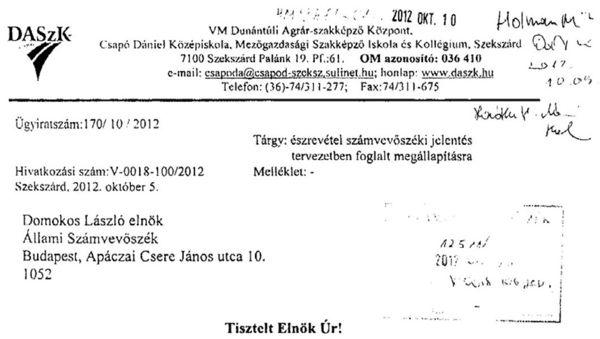

Tisztelt Elnök Úr!

A Mezőgazdasági középfokú szakoktatás és szaktanácsadás intézményeinél ellenőrzéséről készített számvevőszéki jelentéstervezettel kapcsolatosan az alábbi észrevételt teszem:

1. A TISZK-ek 2011. évi intézményi beszámolójára adott elutasító véleménnyel kapcsolatosan.

A Földművelésügyi és Vidékfejlesztési Minisztérium, mint fenntartó 2008. évben a fenntartásában lévő, Dunántúlon működő 8 agrár-szakképző intézmény összevonásáról döntött. Mivel ez a döntés addig önállóan működő és gazdálkodó intézményeket érintett, melyek a Dunántúl különböző megyéiben működtek, a döntés végrehajtása a későbbi tagintézmények részéről jelentős ellenállásba ütközött. A fenntartó, a tagintézmények „viszonylagos” önállóságát biztosítva, a gazdálkodási feladatok ellátását végző dolgozói létszámot a hét tagintézményben változatlanul meghagyta. Ugyanakkor, a székhelyintézményben -ahol a feladatok jelentősen bővültek- változatlanul hagyta. A tagintézmények részére „technikai ÁHT-val” önálló bankszámlákat nyitott, melyek felett a tagintézmények önállóan rendelkeznek.

A DASzK XX/1130/15/2010 számú Alapító Okirata a munkáltatói jogkörök valamint a működési rend tekintetében az alábbiak szerint rendelkezik:
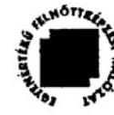

---

# „A DASzK foglalkoztatottjaira vonatkozó foglalkoztatási jogviszony: 

A tagintézmények dolgozói felett a munkáltatói jogokat a tagintézmény-vezető gyakorolja.

## A DASzK működési rendje:

A költségvetési szerv működésére, külső és belső kapcsolataira vonatkozó rendelkezéseket a Szervezeti és Működési Szabályzat (SzMSz) határozza meg, amely a fenntartó jóváhagyásával válik érvényessé. Ugyancsak a fenntartó jóváhagyásával válnak érvényessé a költségvetési szerv működését szabályozó azon dokumentumok, amelyeknek elkészítését és fenntartói jóváhagyását a közoktatásról szóló 1993. évi LXXIX. törvény írja elő.”

A létrehozáskor érvényes és az azóta kiadott Alapító Okiratok, ezen rendelkezések vonatkozásában nem változtak.

A fenntartó által jóváhagyott SzMSz szerint a tagintézmények gazdálkodási jogköre: részjogkörű költségvetési egységek, amelyek az egyes előirányzatok felett a belső szabályzatokban foglaltak szerint rendelkeznek.

Az SzMSz IV. fejezete rendelkezik a gazdálkodási feladatok és hatáskörök DASzK és a tagintézményei közötti megosztásáról, mely szerint:
„Az előirányzat felhasználással kapcsolatos feladatok az alábbiak szerint oszlanak meg az önállóan gazdálkodó és a részjogkörű költségvetési egységek között:

A személyi feltételek biztosítása (munkaerő gazdálkodás)
A VM által jóváhagyott létszámkereten belül a munkáltatói jogok gyakorlása a tagintézmény vonatkozásában - a külön szabályozott kifizetések és elszámolások kivételével - a tagintézmény vezetőjének feladat- és hatásköre. A közalkalmazotti jogviszony létesítésével és megszüntetésével kapcsolatos ügyintézés (kinevezési okirat, átsorolás, jogviszony megszüntetése, elszámoló lap elkészítése), valamint az aláírt okiratok Magyar Államkincstár Illetményszámfejtő Iroda felé történő továbbítása a tagintézmény feladata.
Kötelezettségvállaló: a tagintézmény vezetője.
Ellenjegyző: a tagintézmény gazdasági vezetője
A tagintézmények a részükre jóváhagyott előirányzatok erejéig vállalhatnak kötelezettséget. A tagintézmény-vezető szerződéskötés előtt köteles a közbeszerzési eljárás szükségességét illetően a DASzK gazdasági szervezetével egyeztetni. A főigazgató jogosult és köteles ellenőrizni a részjogkörű költségvetési egység

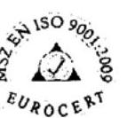

---

költségvetésében jóváhagyott, de a DASzK hatáskörébe tartozó előirányzat felhasználását.

A tagintézmény feladata:
a készpénzes működési bevételek (intézményi ellátási dijak, intézményi infrastruktúra magáncélú igénybevétele, felesleges eszközök értékesítése, stb.) beszedése, számlázás, a bevétel befizetése az előirányzat felhasználási számlára,
ellátottak pénzbeli és természetbeni juttatásainak jogszabály szerinti kifizetése, átadása, valamint nyilvántartása,
a működési célt szolgáló pályázatok benyújtásáról tájékoztatás, havi pénzellátási terv készítése.

Kötelezettségvállaló: tagintézmény vezető
Érvényesítő: a részjogkörű költségvetési szerv kijelölt dolgozója
Ellenjegyző: a tagintézmény gazdasági igazgatója
Beruházás, felújítás, a vagyon használata
A részjogkörű költségvetési egység beruházási, felújítási tevékenységet csak az adott éves jóváhagyott tagintézményi költségvetés szerint végezhet, ide értve azt az esetet is, amikor a beruházás, felújítás forrása pályázati pénzeszköz.

Könyvvezetés, beszámolás, adatszolgáltatás
A tagintézmény vagyoni és pénzügyi helyzetével kapcsolatos könyvvezetési, valamint költségvetési beszámolóra vonatkozó kötelezettség, továbbá a gazdálkodással kapcsolatos adatszolgáltatási kötelezettség a tagintézmény feladata.”

A fentiek, valamint az a tény, miszerint a tagintézmények számára a költségvetési előirányzat kereteket a fenntartó belső utasításban határozza meg, a tagintézmények saját gazdálkodásukkal kapcsolatos jogosultságát és felelősségét támasztják alá. Az intézményi gazdálkodással kapcsolatos belső szabályzataink is rögzítik a tagintézmények vezetőinek, illetve gazdasági vezetőinek jogosultságait, illetve felelősségi körét.

Az egyes tagintézmények vezetőinek kinevezése során a tagintézmény, a vezető személye, valamint a munkakör egyértelműen egymáshoz van rendelve.

A vizsgálat részéről megállapított, a tagintézményekben történt „felhatalmazás nélküli kifizetések” ellentmond a számvitelről szóló 2000. évi C. törvényben rögzített azon alapelvnek, mely szerint a tartalom elsődleges a formával szemben. A gazdasági eseményeket a valós tartalmuk szerint megítélve, a tagintézmények

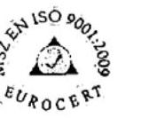

---

jogosan, a fenntartó tudtával és jóváhagyásával gyakorolták a gazdálkodási jogköröket saját előirányzataik felett.

Fentiek miatt az intézmény 2011. évi beszámolójával kapcsolatban hozott elutasító záradék, valamint ezért személyem felelőssé tétele, véleményem szerint túlzó és nem felel meg a hazai és nemzetközi standardok szerinti könyvvizsgálat gyakorlatának.

# 2. A TISZK-ek egy főre jutó működési kiadások nagyságrendjével kapcsolatosan. 

Az ellenőrzési jelentés tervezet megállapításához, miszerint a 2011-ben az egy főre jutó működési kiadások nagyságrendje a VM fenntartású TISZK-eknél lényegesen, 70,9%-kal meghaladta - az alapvetően normatív finanszírozású - önkormányzati fenntartású agrár-szakképzést is folytató intézmények átlagát az alábbi észrevételt teszem.

Az összehasonlítás megítélésem szerint akkor lehet objektív, ha a képzési szerkezetet, valamint az annak megfelelő feltételrendszert és annak működtetéséhez szükséges kiadások nagyságrendjét is összehasonlítjuk. A VM és az önkormányzatok finanszírozási módja jelentős mértékben különbözik egymástól. A VM bázisalapon tervezve nyújt támogatást, az önkormányzati fenntartó pedig normatív támogatást biztosít, kiegészítve a saját forrásával.

## 3. A TISZK-ek szakmai feladatellátásával kapcsolatosan.

A jelentéstervezet a TISZK-ek szakmai feladatellátásának kismértékű javulására utaló megállapítást tett arra hivatkozva, miszerint a lemorzsolódott tanulók induló létszámhoz viszonyított aránya 15,3%-ról 12,1%-ra csökkent. A végzett tanulók száma 16,9%-kal emelkedett. A lemorzsolódást tekintve a 2008/2009. tanévhez viszonyítva a változást jelentősnek tartom, a feladatellátás jelentős mértékű javulását jelenti. Ez különösen a szakiskolai tanulók esetén igaz, mivel ott a változás 7,9%. Figyelembe véve azt is, hogy a DASZK szakiskolai tanuló létszáma a 2008/2009. tanévhez viszonyítva 124,2% változást mutat, ez még inkább a feladatellátás javulását jelzi. Megítélésem szerint a szakmai feladatellátást megítélni a lemorzsolódásra vonatkozó adatokból nem lehet teljes körűen, mivel azt sok más tényező is befolyásolja, meghatározza (hozzáadott pedagógiai érték vizsgálata, tanulmányi eredmények vizsgálata, szakmai tanulmányi versenyeken való eredményesség stb.). Az évfolyamot ismételt tanulók aránya az ellenőrzés megállapítása szerint mindkét képzési típusban (szakközépiskola és szakiskola) növekedett. A DASZK esetében ez a szakközépiskolai képzésnél 1,6%-ponttal való növekedést jelent. A szakiskolai képzésnél ez az arány 1,3%-ot tett ki, ami 8 főt jelent. A számszerűsített eredmények rendkívül alacsonyak, vélhetően az országos átlagnál is alacsonyabbak.

---

A DASZK-nál az országos kompetenciamérés eredményeivel kapcsolatosan intézkedések születtek, melyeket a számvevőszéki jelentés nem tekint eredményesnek, mivel a 2010. évről a 2011. évre a szakiskolában a matematika, a szakközépiskolában a szövegértés eredményei romlottak, azonban az országos átlaghoz képest kedvező változás következett be. A jelentés ebben a tekintetben ellentmondó, hiszen ha az országos átlaghoz képest kedvező változás történik, akkor az intézkedések eredményesek. Mivel a
 két egymást követő év mérései nem ugyanazon tanulócsoportra vonatkoztatva történtek, ezért ezen megállapítást elfogadni nem tudom, hiszen a bemeneti mérések eredményeit nem veszi figyelembe, így a hozzáadott értéket nem tudja vizsgálni.

# 4. A tanüzemben előállított termékek értékesítésével kapcsolatosan. 

A jelentéstervezet a tanüzemekben előállított termékek értékesítésével kapcsolatosan megállapítja, hogy az eladási árak és a felvásárlási árak egymáshoz viszonyítása alapján a TISZK-ek jellemzően a felvásárlási áraknál alacsonyabb áron tudták értékesíteni termékeiket.
Az értékesítés a mindenkori napi piaci árnak megfelelő áron történik. Az a megállapítás, miszerint a gabonafélék tárolási lehetőségeinek hiányában nem tudtuk kihasználni a piaci lehetőségeket, igaz, ám ez nem azt jelenti, hogy a felvásárlási árak alatt értékesített volna a DASZK.

## 5. A tanüzemi tevékenység bevételeinek és kiadásainak államháztartási szakfeladat rend szerinti elszámolásával kapcsolatosan.

A jelentéstervezet megállapítja, hogy a tanüzemi tevékenység bevételeinek és kiadásainak pontos kimutatását az államháztartási szakfeladat rend szerinti elszámolás nem biztosította, mert azt a központi előírások nem tették kötelezővé. A DASZK ügyviteli rendszerében a tanüzemi tevékenység bevételeit és kiadásait a szakképzés megszerzésére felkészítő gyakorlati képzés szakfeladaton belül tartjuk nyilván és mutatjuk ki. A szakfeladaton belül önálló témaszám alatt kerülnek kimutatásra a növénytermesztési és állattenyésztési kiadások és bevételek. A beszámoló valóban nem tartalmaz erre vonatkozó adatokat, ugyanakkor a kimutatás rendelkezésre áll.

Kérem észrevételeim szíves figyelembevételét!
Tisztelettel:
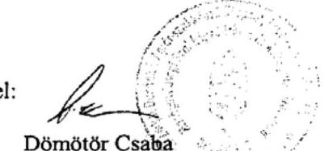

Dömötör Csaba
főigazgató
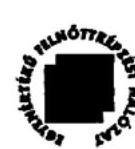

---

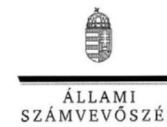

ELNÖK

Ikt.szám: V-0018-112/2012.

# Dömötör Csaba úr 

főigazgató
VM Dunántúli Agrár-szakképző Központ
Csapó Dániel Középiskola, Mezőgazdasági
Szakképző Iskola és Kollégium

## Szekszárd

## Tisztelt Főigazgató Úr!

A Mezőgazdasági középfokú szakoktatás és szaktanácsadás intézményeinek ellenőrzése című jelentéstervezetre tett észrevételeit köszönettel megkaptam.

Az Állami Számvevőszék észrevételekre vonatkozó álláspontjáról a felügyeleti vezető által készített részletes tájékoztatást csatoltan megküldöm.

Tájékoztatom Főigazgató urat, hogy a jelentésben - az Állami Számvevőszékről szóló 2011. évi LXVI. törvény 29. § (3) bekezdése alapján - az el nem fogadott észrevételeket szerepeltetjük az elutasítás indokának feltüntetésével együtt. Az elfogadott észrevételeket a jelentés szövegezésénél figyelembe vesszük.

Budapest, 2012. 11. hó 05. nap
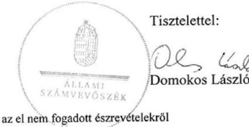

Melléklet: Tájékoztatás az elfogadott és az el nem fogadott észrevételekről

---

# Tájékoztatás 

## az elfogadott és az el nem fogadott észrevételekról

A Mezőgazdasági középfokú szakoktatás és szaktanácsadás intézményeinek ellenőrzése című jelentéstervezetre a 170/10/2012 ügyiratszámú levelében tett észrevételeit áttekintettük, azok kezeléséről ezúton tájékoztatom.

## Elfogadott észrevétel:

- a TISZK-ek szakmai feladatellátásához kapcsolódó 3. számú észrevételt a jelentés készítésénél figyelembe vettük.

Az összegző megállapítások között a 16. oldal utolsó mondatát - a kismértékű szó elhagyásával - az alábbiak szerint szerepeltetjük: „A TISZK-ek feladatellátásának javulására utal, hogy a lemorzsolódott tanulók induló létszámhoz viszonyított aránya 15,3%-ról 12,1%-ra csökkent (4/3. sz. melléklet), miközben a végzett tanulók száma 16,9%-kal emelkedett.” Ugyanehhez a témához kapcsolódóan a részletes megállapítások között az 51. oldal második bekezdésének első mondatát is pontosítjuk: „Összességében a TISZK-ek szakmai feladatellátásának javulására utal, hogy az ellenőrzött időszakban a lemorzsolódott tanulók induló létszámhoz viszonyított aránya 15,3%-ról (231 főről) 12,1%-ra (200 főre) csökkent, miközben a végzett tanulók száma 16,9%-kal emelkedett.”

- a kompetenciamérés eredményeinek alakulására vonatkozó észrevétel alapján az 52. oldal 5. bekezdésének utolsó mondatát az alábbiak szerint pontosítottuk: „A DASZK-nál a 2010. évről a 2011. évre a szakiskolában a matematika, a szakközépiskolában a szövegértés eredményei romlottak, azonban az országos átlaghoz képest kedvező változás következett be.”

## El nem fogadott észrevételek:

- a 2011. évi intézményi beszámoló minősítéséhez kapcsolódó 1. számú észrevételt nem fogadtuk el. Az Alapító Okirat XX/1130/15/2010 számú módosítása, illetve a 2011. január 7-én kelt 88/329914/3/2011 iktatószámú törzskönyvi kivonat szerint a DASZK jogköre: önállóan működő és gazdálkodó költségvetési szerv, amelynek vezetője a főigazgató. Az ellenőrzés időszakában hatályos Ámr. 72. § (3.) bekezdése értelmében kötelezettségvállalásra a költségvetési szerv vezetője, vagy az általa írásban felhatalmazott személy jogosult. Mivel a főigazgató nem hatalmazta fel írásban a kötelezettségvállalásra és az utalványozásra kijelölt személyeket, továbbra is fenntartjuk a jelentéstervezet azon megállapítását, hogy a tagintézményeknél felhatalmazás nélküli kifizetések történtek. Nem történt meg az ellenjegyzésre és a szakmai teljesítésigazolásra, érvényesítésre jogosult személyek írásbeli kijelölése sem, megsértve ezzel az Ámr. 74. § (2) és 76. § (5) bekezdésének előírásait. Az ellenőrzés időszakában hatályos Áht. 100/C. § (1) bekezdése értelmében kiadási előirányzatot terhelő kötelezettséget csak a költségvetési szervek vezetői, valamint az általuk írásban felhatalmazott személyek vállalhatnak. A DASZK 2011. évben hatályos SZMSZ-e a tagintézményeket részjogkörű költségvetési egységként kezeli, az előirányzatok felhasználását megosztva az önállóan gazdálkodó és részjogkörű költségvetési egységek között. Ez nincs összhangban a vele egy időben hatályos Áht. 100/C §-a, valamint az Ámr. 72.§ (3) bekezdésének előírásaival. Az SZMSZ és egyéb belső szabályzatok jogszabályi előírásoktól való eltérése, aktualizálásának hiánya nem mentesít a törvény, illetve a kormányrendelet szabályozásának maradéktalan betartásától. Az írásbeli felhatalmazás hiánya nem formai, hanem tartalmi hiba, mivel nem teszi lehetővé a pénzügyi-gazdasági folyamatok kontrollját;

- a működési kiadások nagyságrendjével kapcsolatos 2. számú észrevétel magyarázó jellegű. A különböző intézmények kiadásainak eltérését okozó tényezőkre a jelentéstervezet 14. oldalán a harmadik bekezdésében kitértünk. Az állami és önkormányzati intézmények működtetése egyaránt közpénzből történik, aminek biztosítania kell, hogy a különböző fenntartású intézményekben - a diákok számára esélyegyenlőséget teremtve - azonos képzési feltételek álljanak rendelkezésre. A különböző fenntartású intézmények között az átlagos működési kiadások és a működési támogatás lényeges eltérése mindezt nem garantálja;
- a tanüzemben előállított termékek értékesítésével kapcsolatos 4. számú észrevételt nem fogadtuk el. Az eladási árak nagyságát az intézményi tanúsítványok árbevételre és értékesített mennyiségre vonatkozó adataiból határoztuk meg. A kiemelt termékek eladási árait a KSH által közzétett felvásárlási árakkal hasonlítottuk össze, ami alapján a DASZK által értékesített kukorica és a búza eladási ára minden évben, a tej felvásárlási ára a 2008., a 2009. és a 2011. évben alatta maradt az átlagos felvásárlási áraknak. A tojás eladási ára azonban - mint azt a jelentéstervezetben is szerepeltettük - meghaladta az átlagos felvásárlási árat;
- a tanüzemi tevékenység bevételeinek és kiadásainak elszámolásával kapcsolatos 5. számú észrevétel nem vitatja azt a megállapításunkat, hogy az államháztartási szakfeladatrend nem biztosítja a tanüzemi tevékenység bevételeinek és kiadásainak pontos kimutatását. A beszámoló az észrevétel szerint sem tartalmaz erre vonatkozó adatokat. Az ellenőrzés megállapítása szerint - bár a tangazdaság bevételeit és kiadásait külön témaszámon tartják nyilván - a közvetett költségek felosztása „a szakképzés megszerzésére felkészítő gyakorlati képzés” szakfeladatra történt, így nem csak a tangazdaság közvetett költségeit tartalmazza.

Tájékoztatom, hogy a számvevőszéki jelentés mellékleteiként szerepeltetjük a jelentéstervezethez tett észrevételeit, valamint azokra adott válaszunkat.

Budapest, 2012. 10. hó 26. nap
Volum falo
Holman Magdolna
felügyeleti vezető

---

# VM KELET-MAGYARORSZÁGI AGRÁR-SZAKKÉPZŐ KÖZPONT, MEZŐGAZDASÁGI SZAKKÉPZŐ ISKOLA ÉS KOLLÉGIUM, JÁNOSHALMA 

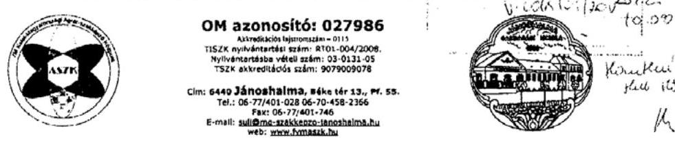

Állami Számvevőszék
Ügyiratszám: 12220/12/2012
Domokos László elnök
Melléklet:
Budapest
Apáczai Csere János u. 10
1052
Hiv. szám:
Tárgy: Észrevételek
Jánoshalma, 2012. október 5.

## Tisztelt Elnök Úr!

Hivatkozva a V-0018-100/2012. iktatószámú levelére, melynek mellékleteként megküldésre került a Mezőgazdasági középfokú szakoktatás-szaktanácsadás intézményeinek ellenőrzéséhez készült számvevőszéki jelentéstervezet, a következő észrevételeket és pontosításokat teszem.

Továbbra is fenntartom a 11503/89/2012 iktatószámú levelemben leírtakat, miszerint a 2011. 06. 20-án kelt Kötelezettségvállalási Szabályzat 2. sz. melléklete tartalmazza a kötelezettségvállalásra, a 3. sz. melléklete az ellenjegyzésre jogosultak körét, a 4. sz. melléklet a teljesítésigazolásra, az 5. sz. melléklet az érvényesítésre, a 6. sz. melléklet az utalványozásra jogosult munkaköröket. Ezzel tulajdonképpen a hatáskörök meghatározása és a jogosultságok átadása a gyakorlatban megvalósult.

A munkaköri leírásokban a tagintézmények vezetői esetében a kötelezettségvállalás, a tagintézmények gazdasági vezetői esetében az ellenjegyzés joga a Kötelezettségvállalási Szabályzatban meghatározott módon átadásra került.

Az ellenjegyzés vonatkozásában már a 2008. évi szabályzathoz elkészültek a 3. sz. melléklet szerinti nyilvántartások a tagintézményekben. A nyilvántartásokban szereplő aláírás minták is tartalmazzák, hogy kit és milyen jog illet meg a tagintézményekben.

A 2011. évre vonatkozóan tett nyilatkozatomban arról nyilatkoztam, hogy a szabályzat nem volt aláírva, így külön írásbeli felhatalmazás kötelezettségvállalásra, ellenjegyzésre, utalványozásra nem volt, ez formai hiba, de a fenti indokok miatt a tényleges hatáskör átruházás megvalósult.

Az érintett időszakban történt a belső ellenőrzés átalakítása, az iskolánként alkalmazott belső ellenőr helyett egy - a székhelyintézményben alkalmazott - belső ellenőr került alkalmazásra. A gazdasági főigazgató-helyettes a megbízásomat követően nyugdíjazását kérte, így új gazdasági vezető került megbízásra. A fenti változások az intézmény gazdasági irányításában nem könnyítették meg a helyes működés kialakítását. Ennek ellenére úgy
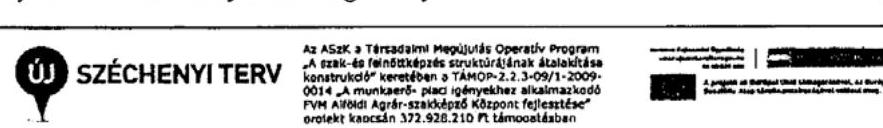

---

# VM KELET-MAGYARORSZÁGI AGRÁR-SZAKKÉPZŐ KÖZPONT MEZŐGAZDASÁGI SZAKKÉPZŐ ISKOLA ÉS KOLLÉGIUM, JÁNOSHALMA 

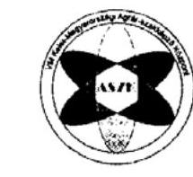

## OM azonosító: 027986

Jánoshalmi Szakszolgálat - 015
T0226 szélvétterlési szám: 8701-004/2008. Nyilvétterlési szám: 02-3521-02 T026 elterelési szám: 0079005076
Cím: 6445 Jánoshalma, Bóka utca 15., Pf. 88.
Tel.: 06-77/455-028 06-70-458-2368
E-mail: lucidima.uvad@mzsu.janoshalma.hu
web: www.funsasol.hu

ítélem meg, hogy az új vezetők segítségével mindent megtettünk a szabályos működés biztosítása érdekében.

A jelentéstervezet 15. oldalán leírja, hogy a VM fenntartású iskoláknál a működési támogatás 31,3%-kal haladta meg a hasonló profilú önkormányzati iskolák egy tanulóra eső működési költségvetési támogatását. Véleményem szerint ez a plusz támogatás adja meg az iskoláknak azt a lehetőséget, hogy az önkormányzati iskoláknál jobb, a termelve oktatáshoz szükséges képzési feltételeket biztosítani tudják, ezzel együtt az önkormányzati iskolákhoz képest sokszoros bevételi tervüket teljesítsék.
Sajnálatos módon a képzés eredményességére vonatkozólag csak a kompetenciamérés eredményeire koncentrál a jelentés, de nem vizsgálja az országos szakmai versenyeken elért eredményeket, amelyek megmutatnák, hogy a jobb képzési feltételek eredményesebb szakmai képzést tudnak biztosítani.

A termelve oktatás esetében a diákok részt vesznek a termelésben, és kezdeti időszakban több, később egyre kevesebb selejtes munka kerül ki a kezeik közül. Az nem kérhető számon ebben az esetben, hogy az országos átlagnak megfelelő terméshozamokat tudjon biztosítani, mert a gyakorlás közben vétett hibák a termésmennyiségben megjelennek. Ezt nem lenne szabad a profi feltételek között működő, sokéves tapasztalattal dolgozó cégek eredményeivel összehasonlítani. Ugyanakkor pl. a jánoshalmi iskola tejtermelésben közel tíz éven keresztül elért országos első és második helyezései, ahol komoly gazdálkodókat előz meg, nincsenek megemlítve.

Kifogásolom tehát, hogy a jelentés több esetben egyoldalúan, a negatívumok kiemelésével készült.

## Üdvözlettel:

Taskovics Péter
főigazgató
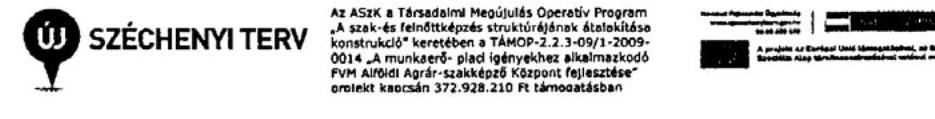

---

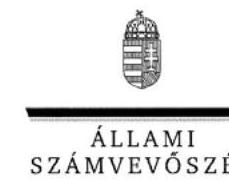

ELNÖK

Ikt.szám: V-0018-111/2012.

# Taskovics Péter úr 

főigazgató
VM Kelet-magyarországi Agrár-szakképző Központ
Mezőgazdasági Szakképző Iskola és Kollégium

## Jánoshalma

## Tisztelt Főigazgató Úr!

A Mezőgazdasági középfokú szakoktatás és szaktanácsadás intézményeinek ellenőrzése című jelentéstervezetre tett észrevételeit köszönettel megkaptam.

Az Állami Számvevőszék észrevételekre vonatkozó álláspontjáról a felügyeleti vezető által készített részletes tájékoztatást csatoltan megküldöm.

Tájékoztatom Főigazgató urat, hogy a jelentésben - az Állami Számvevőszékről szóló 2011. évi LXVI. törvény 29. § (3) bekezdése alapján - az el nem fogadott észrevételeket szerepeltetjük az elutasítás indokának feltüntetésével együtt. Az elfogadott észrevételeket a jelentés szövegezésénél figyelembe vesszük.

Budapest, 2012. 11. hó 05. nap
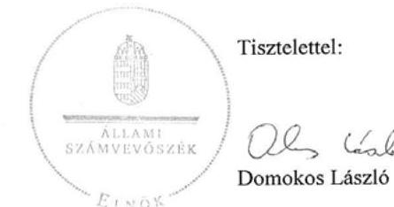

Melléklet: Tájékoztatás az elfogadott és az el nem fogadott észrevételekről

---

# Tájékoztatás 

## az elfogadott és az el nem fogadott észrevételekról

A Mezőgazdasági középfokú szakoktatás és szaktanácsadás intézményeinek ellenőrzése című jelentéstervezetre 12220/12/2012 ügyiratszámú levelében tett észrevételeit áttekintettük, azok kezeléséről ezúton tájékoztatom.

## Elfogadott észrevétel:

- a jelentés 57.
 oldalának második bekezdését az észrevétel alapján az alábbiak szerint pontosítottuk:,,A termésátlagot befolyásolta az is, hogy a tanüzemek működtetését alapvetően oktatási cél szolgált."

## El nem fogadott észrevételek:

- a 2011. évi intézményi beszámoló minősítéséhez kapcsolódó észrevételt nem fogadtuk el. Továbbra is fenntartjuk a jelentéstervezet azon megállapítását, hogy a tagintézményeknél felhatalmazás nélküli kifizetések történtek. A főigazgató nem hatalmazta fel írásban a kötelezettségvállalásra és az utalványozásra kijelölt személyeket az ellenőrzés időszakában hatályos Ámr. 72. § (3) bekezdésének megfelelően. Nem történt meg az ellenjegyzésre és a szakmai teljesítésigazolásra, érvényesítésre jogosult személyek írásbeli kijelölése, megsértve ezzel az Ámr. 74. § (2) és 76. § (5) bekezdésének előírásait. Az ellenőrzés időszakában hatályos Áht. 100/C. § (1) bekezdése értelmében kiadási előirányzatot terhelő kötelezettséget csak a költségvetési szervek vezetői, valamint az általuk írásban felhatalmazott személyek vállalhatnak. Az intézmény elkészítette Kötelezettségvállalási Szabályzatát, de ennek mellékletében a kötelezettségvállalásra jogosult személyek nevének és beosztásának felsorolása nem tekinthető írásbeli felhatalmazásnak. Hiányzik belőle a jogosultak aláírása, az, hogy a felhatalmazás mettől-meddig terjed ki. A szabályzatban a szakmai teljesítésigazolásra jogosult személyek nincsenek nevesítve. Ez nem formai, hanem tartalmi hiba, mivel nem teszi lehetővé a pénzügyi-gazdasági folyamatok kontrollját. A mátrafüredi tagintézményre vonatkozó - főigazgatói jóváhagyás nélküli - aláírás-mintában például olyan személyek is szerepelnek, akik a kötelezettségvállalási szabályzat szerint nincsenek ellenjegyzésre, illetve utalványozásra feljogosítva;
- a működési támogatáshoz kapcsolódó észrevételüket nem fogadtuk el. Az állami és önkormányzati intézmények működtetése egyaránt közpénzből történik, aminek biztosítania kell, hogy a különböző fenntartású intézményekben - a diákok számára esélyegyenlőséget teremtve - azonos képzési feltételek álljanak rendelkezésre. A különböző

---

fenntartású intézmények között az átlagos működési kiadások és a működési támogatás lényeges eltérése mindezt nem garantálja;

- a képzés eredményességének értékelését a kompetenciaméréseken túl a képzésben résztvevők lemorzsolódása, az évfolyamismétlésre kötelezett és a végzett tanulók számának alakulása alapján végeztük el. A tanulók többségére kiterjedő, oktatás-szakmailag elfogadott kompetencia-mérés a tanulmányi versenyek eredményeinél átfogóbb képet ad a képzés színvonaláról, a diákok tudásszintjéről.

Tájékoztatom, hogy a számvevőszéki jelentés mellékleteiként szerepeltetjük a jelentéstervezethez tett észrevételeit, valamint azokra adott válaszunkat.

Budapest, 2012. 10. hó 26. nap

Holman Magdolna
felügyeleti vezető

---

# VM KÖZÉP-MAGYARORSZÁGI AGRÁR-SZAKKÉPZŐ KÖZPONT 

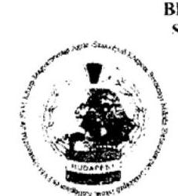

Ikonószén: 1/4/6,2012/g.
Tárgy: Állami Számvevőszék jelentéstervezetre észrevételezés
Horváthné Herbáth Mária
Ellenőrzés-vezető Asszony részére

## ÁLLAMI SZÁMVEVŐSZÉK

1051 Budapest, Apáczai Csere János u. 10.

## 11. 11. 11. 11. 11. 11. 11. 11. 11. 11. 11. 11. 11. 11. 11. 11. 11. 11. 11. 11. 11. 11. 11. 11. 11. 11. 11. 11. 11. 11. 11. 11. 11. 11. 11. 11. 11. 11. 11. 11. 11. 11. 11. 11. 11. 11. 11. 11. 11. 11. 11

---

Számviteli politika
Gazdálkodási Szabályzat
Önköltség-számítási Szabályzat
Leltárkezelési Szabályzat
Pénztárkezelési Szabályzat
16. oldal (3) bekezdés:
„A TISzK-ek az illetékes Regionális Fejlesztési és Képzési Bizottságok beiskolázási arányokra, illetve támogatott képzési irányokra vonatkozó határozatait csak részben illetve nem minden intézménynél vették figyelembe, ezáltal a kapcsolódó pályázati forrásokat nem tudták igénybe venni."

Ennek ellentmond, hogy Bercsényi Miklós szakképző iskolában beindításra került a Dobbantó-program, illetve a váci tagintézménynél a lótartó- és tenyésztő szak és ezzel kapcsolatban a pályázati források maximálisan kiaknázásra kerültek.
17. oldal (1) bekezdés:
„OKJ-s végzettséget szerzett tanulók száma 1-1 tanévben 10 fő alatt volt."
Az állítás mögött nincs konkrét kimutatás, melyből egyértelműen látszana, hogy melyik tagintézménynél és mely szakmánál jelentkezett ez.
18. oldal (2) bekezdés:
„A DASzK és az ASzK a saját földterületein kívül további területeket bérelt növénytermésztési céllal"

A megfogalmazás hiányos, hiszen a KASzK Varga Márton tagintézménye is haszonbérleti szerződéssel a FÖKERT Nonprofit Zrt-től bérel területet 1996-tól, Budapest, X., Keresztúri út 130. alatt, kb. 6 ha-t.
18. oldal (5) bekezdés:
„... a gyakorlati oktatást segítő gépek használhatósági foka évről-évre ... csökkent."
A KASzK létrejöttétől kezdődően folyamatosan likviditási gondokkal küzdött és küszködik, nem volt lehetősége a karbantartások finanszírozására, a kapott szakképzési hozzájárulásokból a jogszabály alapján csak beruházni és felújítani lehetett, a felújításra is csak a befolyt támogatás 15%-át lehetett fordítani. Új gépekre pedig egyáltalán nincs szabad pénzeszköz.
19. oldal (2) bekezdés:
„Az átlaghozamok azonban ... nem érték el az országos átlagot.."
A szakiskolai vagy szakközépiskolai képzés során előállított termékek hozamát nem korrekt az országos átlaghoz hasonlítani, hiszen nálunk még csak a szakmát tanuló diákok munkáját igénybe véve történik a termék-előállítás, mely esetlegesen minőségében és mennyiségében is eltér a növénytermesztéssel foglalkozó kis- és nagyvállalatok szaktudással rendelkező dolgozói által előállított végtermékektől.

---

A privát szférában jobb feltételek adottak a termék előállításához, ebből adódóan következik, hogy sokkal jobb minőségű termékkel is jelenhetnek meg a piacon.
19. oldal (4) bekezdés:
„Az árbevétel több mint fele 51,7 % a DASzK-nál, 42,3 %-a az ASzK-nál, és mindössze 6,0 %-a KASzK-nál realizálódott"

A TISzK-ek különböző profilú mezőgazdasági termék-előállítással foglalkoznak, mely termékeknél a várható nyereség (profit) abszolút eltérő, ezáltal a három TISzK összehasonlítása nem célszerű, nem reális. Pl.: A KASzK-nál nincs árpa- és napraforgó növénytermesztési ágazat.

# 23. oldal (5) és (6) pont: 

Részben átfedi egymást, az 5. pont kötelezettségvállalásról, utalványozási jogköről, ellenjegyzésről, szakmai teljesítés igazolásról és érvényesítésről szól, a 6. pont ugyanúgy a pénzügyi ellenjegyzésre, teljesítés igazolásra és érvényesítésre hivatkozik.

A 5. pont javaslat-részében a hivatkozott jogszabályok a kötelezettségvállalással, az ellenjegyzéssel, a teljesítés igazolással és az érvényesítéssel kapcsolatosak, a 6. pont javaslatában az ellenjegyzésre, illetve a teljesítés igazolásra hivatkoznak a jogszabályok.
25. oldal (1) bekezdés:
„...TISzK-ek pénzforgalmi adatai nem voltak megbízhatóak, a feltárt hibák aránya összességében 6232,4 M Ft-tal meghaladta az intézményi szintű kiadási főösszegek 2 %-át..."

Ezen megállapításhoz nem találtunk a jelentés-tervezetben konkrét számadatokat tartalmazó kimutatást.
A 2.d) számú melléklet a KASzK-ra vonatkozó elutasító véleményét nem tudjuk addig elfogadni, ameddig nem találjuk igazoltnak a „feltárt megbízhatósági hibák aránya meghaladja az intézmény kiadási főösszegének 2 %-át".
25. oldal előbbiekben idézett mondatával kapcsolatban pontosítást szeretnénk kérni, a TISzK-ek pénzforgalmi adatai a nem voltak megbízhatóak és a kiadási fő összeg 2 % megjegyzések vonatkozásában, hiszen a 249/2000. (XII. 24.) Korm. Rendelet értelmező rendelkezések része alapján a
Jelentős összegű hiba = a feltárt hibák és hibahatások együttes összege több, mint a mérleg főösszeg 2 %-a, vagy
Megbízható és valós képet lényegesen befolyásoló hiba = a 2010. évi mérlegben kimutatott saját tőke és tartalékok együttes értéke minimum 10 %-kal változik, (nő vagy csökken), a 2011. évihez viszonyítva.
26. oldal (2) bekezdés:
„...felhatalmazás nélküli kifizetések történtek..."

---

A megállapítás nem pontos, hiszen a tagintézményeknél Kötelezettségvállalási szabályzatok léteztek és bemutatásra kerültek az ellenőrzés során.
35. oldal (6) bekezdés:
„Az SzMSz-t és a gazdálkodásra vonatkozó szabályzatokat az alapító okirat változásával egyidejűleg nem módosították."

Az Alapító Okirat az alapdokumentum, annak elkészülte után (időben csak később), nem vele egyidejűleg lehet csak az SzMSz-t és mellékleteit (a gazdálkodással kapcsolatos különböző szabályzatokat) elkészíteni. A KASzK jelenlegi SzMSz módosítása 2011. ősz óta vár jóváhagyásra a fenntartónál.
2. d) melléklet (5) bekezdés:

A megfogalmazás pontatlan, nem egyértelműen derül ki, hogy a „megbízási szerződések" kifejezésből, hogy konkrétan mire vonatkozik, mely típusú szerződéseknél fordult elő.

Budapest, 2012. október 8.
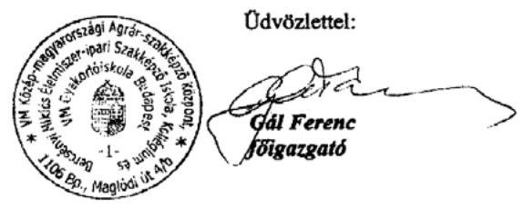

---

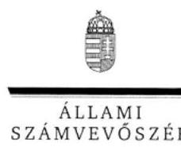

ELNÖK

Ikt.szám: V-0018-113/2012.

# Gál Ferenc úr

főigazgató

VM Közép-magyarországi Agrár-szakképző Központ
Bercsényi Miklós Élelmiszeripari Szakképző Iskola,
Kollégium és VM Gyakorlóiskola

## Budapest

## Tisztelt Főigazgató Úr!

A Mezőgazdasági középfokú szakoktatás és szaktanácsadás intézményeinek ellenőrzése című jelentéstervezetre tett észrevételeit köszönettel megkaptam.

Az Állami Számvevőszék észrevételekre vonatkozó álláspontjáról a felügyeleti vezető által készített részletes tájékoztatást csatoltan megküldöm.

Tájékoztatom Főigazgató urat, hogy a jelentésben – az Állami Számvevőszékről szóló 2011. évi LXVI. törvény 29. § (3) bekezdése alapján – az el nem fogadott észrevételeket szerepeltetjük az elutasítás indokának feltüntetésével együtt. Az elfogadott észrevételeket a jelentés szövegezésénél figyelembe vesszük.

Budapest, 2012. 10. hó 25. nap

Tisztelettel:

Domokos László

Melléklet: Tájékoztatás az elfogadott és az el nem fogadott észrevételekről

1052 BUDAPEST, AFRIZAI CSERE JÁNOS UTCA 10. 1364 Budapest 4. Pf. 54 telefon: 484 9181 fax: 484 9201

---

# Tájékoztatás 

## az elfogadott és az el nem fogadott észrevételekről

A Mezőgazdasági középfokú szakoktatás és szaktanácsadás intézményeinek ellenőrzése című jelentéstervezetre az 1/832/2012/g. iktatószámú levelében tett észrevételeket áttekintettük, azok kezeléséről czúton tájékoztatom.

## Elfogadott észrevételek:

- a 18. oldal második bekezdésével kapcsolatos észrevétel alapján az érintett szövegrészt (18. oldal második bekezdése utolsó mondata) az alábbiak szerint pontosítottuk:
„A TISZK-ek saját földterületeiken kívül további területeket béreltek növénytermesztési célra."
- a 19. oldal negyedik bekezdéséhez kapcsolódó észrevételt figyelembe véve a mondatból a „mindössze” szót elhagytuk. A megállapítás nem a TISzK-ek tanüzemi tevékenységből származó „nyereségének” összehasonlítását, hanem az árbevétel megoszlásának bemutatását célozta;
- a 35. oldal hatodik bekezdését - észrevételét figyelembe véve - az alábbiak szerint átfogalmaztuk: "Az alapító okirat változását nem követte az SZMSZ és a gazdálkodásra vonatkozó szabályzatok aktualizálása."
- a 2. d) melléklet ötödik bekezdését az észrevétel alapján kiegészítettük:" A külső személyi juttatásokat érintő megbízási szerződéseken az ellenőrzött tételek egyharmadánál ellenjegyzés nem szerepelt, amivel megsértették az Ámr. 74. § (1) bekezdésében foglalt előírást."

## El nem fogadott észrevételek:

- a 14. oldal negyedik bekezdéséhez kapcsolódó észrevételt nem fogadtuk el, mivel az átadott dokumentumokból megállapítható volt, hogy a fenntartó az ellenőrzött időszakban a jogszabályi változásoknak megfelelően évente módosította a TISzK-ek Alapító Okiratait. Az ellenőrzött időszakban a KASzK 2008.08.11-ei Alapító Okirata három alkalommal módosult (2008.10.20., 2009.11.13., 2010.11.25.). Az SZMSZ aktualizálása az intézmény feladata. Az ellenőrzés megállapítása szerint a KASzK-nál a hatályos SZMSz-t 2009. óta nem módosították, az nem követi a jogszabályi változásokat. Mint azt a jelentéstervezet 35. oldalán feltüntettük az intézmény 2010-ben készítette el gazdálkodási és számviteli szabályzatait. Az ellenőrzött időszakra vonatkozóan kötelezettségvállalásra, utalványozásra, ellenjegyzésre, illetve az eszközök és források értékelésére és a

---

szabálytalanságok kezelésére vonatkozó szabályzatokat nem bocsátottak az ellenőrzés rendelkezésére;

- az ellenőrzés szabályozottságra vonatkozó értékelése a 2008-2011 közötti időszakot érintette. Egyes gazdálkodást érintő szabályzatok 2010. évi egységesítése nem jelenti azt, hogy a szabályozottság a teljes ellenőrzési időszakban megfelelő volt. Az FVM 2008/2009. évet érintő átfogó rendszerellenőrzése is felhívta a figyelmet a gazdálkodási szabályzatok KASzK szintű egységes és teljes körű elkészítésére. A VM által elrendelt 2011. évi átvilágítás vizsgálati jelentése alapján a KASzK szintjén nem valósult meg a munkavállalók részére adott juttatások egységes szabályozása. Mindezek miatt nem fogadtuk el a jelentéstervezet 14. oldal negyedik bekezdéséhez, valamint a 23. oldal negyedik pontjára adott észrevételt;
- a jelentéstervezet összegző része az agrár-szakképző központokra vonatkozó szintetizált megállapításokat tartalmazza. Az egyes intézményekre vonatkozó értékelést a részletes megállapítások között szerepeltettük. A 16. oldal harmadik bekezdésének Ön által idézett megfogalmazása szerint „A TISzK-ek az illetékes Regionális Fejlesztési és Képzési Bizottságok beiskolázási arányokra, illetve támogatott képzési irányokra vonatkozó határozatait csak részben - illetve nem minden intézménynél - vették figyelembe.” A KASzK-nál az RFKB határozataival összhangban levő szakok indítását a 46. oldal harmadik bekezdésében szerepeltettük. Mindezek miatt nem fogadtuk
 el az 16. oldal harmadik bekezdéséhez tett észrevételt;
- tájékoztatom arról, hogy a számvevőszéki jelentésben a számszerű megállapításokat minden esetben intézményi, statisztikai adatszolgáltatásra, illetve a helyszíni ellenőrzés során bekért dokumentumokra alapozzuk. A 17. oldal első bekezdésében szereplő ténymegállapítás, amely szerint „...az OKJ-s végzettséget szerzett tanulók száma egy-egy tanévben tíz fő alatt volt" az intézmények 21. számú tanúsítványának adatszolgáltatása támasztja alá. A KASZK által közölt adatok szerint a vizsgát tett tanulók száma az alábbi szakképesítéseknél volt 10 fő alatt:
- élelmiszeripari laboráns a 2008-2009. tanévben 2 fő, 2009/2010. tanévben 3 fő;
- tartósítóipari szakmunkás a 2008-2009. tanévben 4 fő, a 2009/2010. tanévben 2 fő;
- élelmiszerminősítő laboratóriumi technikus a 2009/2010. tanévben és a 2010/2011. tanévben egyaránt 8 fő.
- disznóvénykertész a 2008/2009. tanévben 9 fő.

Fentiek miatt a 17. oldal első bekezdésére vonatkozó észrevételt nem fogadtuk el;

- a 18. oldal ötödik bekezdéséhez füzött kiegészítését köszönettel vettük;

---

- a 19. oldal második bekezdésére vonatkozó észrevételt nem fogadtuk el, mivel a jelentéstervezetben az átlaghozamok országos átlagtól való eltérésének okait is bemutattuk.
- a 23. oldalon a TISZK-ek főigazgatóinak tett 5. és 6. számú javaslatok részben azonos megállapításokra épülnek. A javaslatok tartalmi része azonban eltér egymástól. Az 5. pont javaslata a hiányzó írásbeli felhatalmazások pótlására irányul, a 6. pont javaslata pedig a felhatalmazás nélküli pénzügyi ellenjegyzés és teljesítésigazolás személyi felelősségének kivizsgálását, szükség esetén a felelősségre vonást célozza;
- a 25. oldal első bekezdéséhez kapcsolódóan tájékoztatjuk, hogy a jelentéstervezetben az intézményi beszámoló minősítését érintő megállapítások a beszámoló, valamint a tanúsítványok adatain alapulnak. A KASZK 2011. évben teljesített költségvetésének kiadási főösszege (23. úrlap 50. sor) 1604,1 M Ft volt. A tagintézmények teljesített kiadásainak összege - az Önök által megküldött 13. számú tanúsítvány szerint 896,6 M Ft volt. Ez utóbbit a felhatalmazás nélküli kifizetések miatt a beszámoló megbízhatóságát jelentősen befolyásoló hibának tekintettük. A hiba lényegesen magasabb az intézmény kiadási főösszegének 2%-ánál (ami 32,1 M Ft).
- Az észrevétel pontosító részével kapcsolatban tájékoztatom arról, hogy az ÁSZ a Magyar Köztársaság költségvetése végrehajtásának ellenőrzését „A központi költségvetési szervek pénzügyi-szabályszerűségi ellenőrzésének módszertana" alapján végzi. Eszerint a költségvetési szerv beszámolóját elutasító véleménnyel látjuk el, amennyiben a megbízhatósági hibák nagyságrendje a beszámoló kiadási főösszegének 2%-át meghaladja. A felhatalmazás nélküli kifizetéseket minden esetben megbízhatósági hibának tekintjük;
- a 26. oldal második bekezdéséhez füzött észrevételt nem fogadtuk el mivel - mint azt a jelentéstervezet összegző részének 20. oldalán, a részletes megállapítások között a 26. oldalon is kifejtettük - a hatályos jogszabályokkal ellentétesen nem történt meg a tagintézményeknél a kötelezettségvállalással, utalványozással, szakmai teljesítésigazolással és érvényesítéssel megbízott személyek írásbeli felhatalmazása. A bekért és elektronikus úton elküldött szabályzatok között nem szerepeltek a tagintézmények kötelezettségvállalási szabályzatai. A kötelezettségvállalásra vonatkozó gyakorlatuk azonban a szabályzatok megléte esetén sem felel meg a jogszabályoknak.

Tájékoztatom, hogy a számvevőszéki jelentés mellékleteiként szerepeltetjük a jelentéstervezethez tett észrevételeit, valamint azokra adott válaszunkat.

Budapest, 2012. 10. hó 26. nap

Holman Magdolna
felügyeleti vezető

---

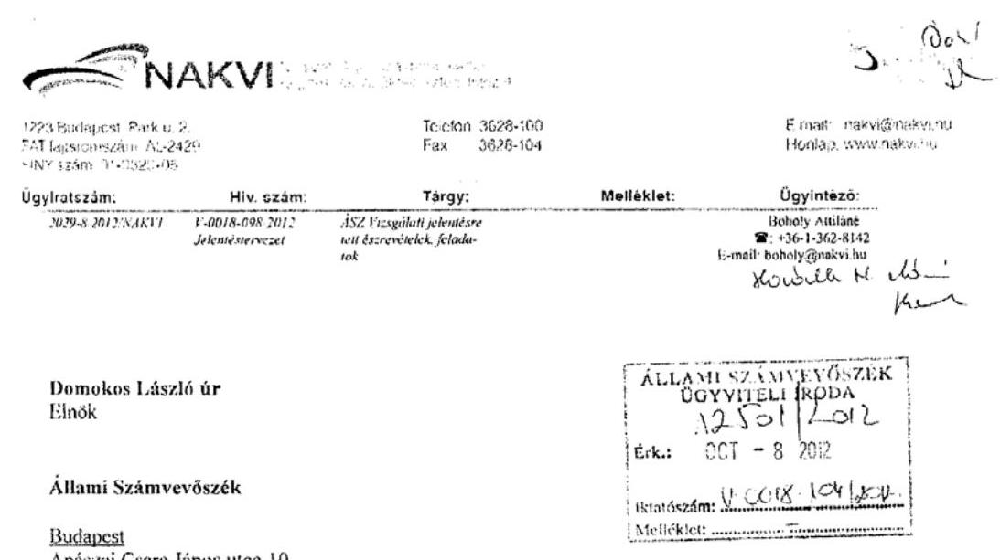

Tárgy: V-0018-098/2012 iktatószámmal Vizsgálati jelentéstervezetre tett észrevételei, feladatok

Tisztelt Elnök Úr!

Hivatkozással a V-0018-098/2012 iktatószámú „A mezőgazdasági középfokú szakoktatás és szaktanácsadás intézményeinek ellenőrzéséről" készített számvevőszéki jelentéstervezetre a Nemzeti Agrárszaktanácsadási, Képzési és Vidékfejlesztési Intézet a következő észrevételeit kívánja tenni:

# 59. oldal: 

### 4.1 A VKSZI szakképzéssel összefüggő feladatainak meghatározása

> 4.1, ÁSZ megállapítása: Az országos szakmai szakértői névjegyzékbe történő felvétel az Oktatási Hivatal feladata. A VM vizsgaelnöki névjegyzékbe történő bekerülést 2012. áprilisáig a VM hagyta jóvá, ezt követően a kijelölés jogát a Magyar Agrárkamarának adta át. Nem tartozott a VKSZI feladatkörébe a felsőfokú szakképzéshez ajánlott szakképzési programok elkészítése. A szakmai vizsgakövetelmények kidolgozása és gondozása, valamint az országos tanulmányi versenyek szervezése 2010-ig a VKSZI feladatát képezte, ezt követően a VM a Magyar Agrárkamarának adta át.
> Az ellenőrzött időszakban a földművelésügyi ágazathoz tartozó szakképzések szakmai és vizsgakövetelményei kiadásának eljárásrendjét a többször módosított 8/2008. (I.23) FVM rendeletben határozták meg. A vizsgák lebonyolítását a szakmai vizsgák általános szabályairól és eljárásrendjéről szóló 20/2007. (V.21.) SZMSZ rendelet szabályozta. A miniszteri rendeleteken, utasításokon és közzétett közleményeken túl, a szakmai feladatellátással kapcsolatos egyéb célokat, követelményeket a felügyeleti szerv nem határozta meg.

# Észrevételek NAKVI (VKSZI): 

A szakértői névjegyzék vezetése nem volt a NAKVI feladata, a pályázatok befogadásával kapcsolatos titkársági teendőket látta el, a bírálat feladatokat a VM által jogszabály szerint létrehozott és működtetett Bírálat bizottság látta el. Az uniós szabályozással összhangban szolgáltatási tevékenységnek minősült a szakképzési és közoktatási szakértői tevékenység, ezért a pályáztatás megszűnt, és az Oktatási Hivatalnál lehet bejelentkezni szakértői tevékenység folytatására.

A vizsgaelnöki névjegyzékbe kerülés hasonló módon működött, mint a szakértői, azzal a különbséggel, hogy a feladat a VM illetékességi körében maradt, a NAKVI csak a titkársági feladatokat látta el és látja el. A bírálat feladatokat a VM által jogszabály szerint létrehozott és működtetett Bírálat bizottság látta el és látja el jelenleg is. Nem ez a feladat került át a VM-tól a Magyar Agrárkamarához, hanem a vizsgaelnökök megbízása az egyes szakmai vizsgákra a VM által jóváhagyott és közlönyben (VM és a NAKVI honlapján) megjelentett névjegyzék alkalmazásával.
A vizsgaszervezést a NAKVI a VM által jóváhagyott „Vizsgaszervezési szabályzat" alapján látta el a jelentésben hivatkozott jogszabályok alapján.

60-62. oldal:

### 4.2 A VKSZI számára előírt szakmai feladatok teljesítése

## Észrevételek NAKVI (VKSZI):

Az országos szaktanári továbbképzéseket nem kizárólag szakoktatók részére szervezte az Intézet. Minden esetben más-más volt a célcsoport (intézményvezetők, szaktanárok és/vagy szakoktatók).

A szakmai tanulmányi versenyek forrását 2005-től 2010-ig folyamatosan az MPA központi alaprészre beadott előterjesztés mentén megkötött támogatási szerződés biztosította. A Magyar Agrárkamara ugyanezen forrásból fedezi a versenyek költségeit.

A VM által fenntartott iskolák gazdálkodásával, gazdasági tevékenységével kapcsolatban, érdemben nem tudunk nyilatkozni, hiszen a fenntartó a VM, ezért erre vonatkozóan nincs rálátásunk. A szakmai munkájukat a tanárgy felmérések és a szaktanácsadói látogatások alapján jobban ismerjük.

A Vizsgálati jelentés által megállapított hibák kijavítására, az ÁSZ ellenőrei által tett javaslatok végrehajtására a következő feladatokat kell elvégezni:
24. oldal:
> 1, ÁSZ ellenőri javaslat: Intézkedjék annak érdekében, hogy az államháztartásról szóló 2011. évi CXCV. tv. 36. § (1) bekezdése szerinti szabad előirányzat mértékéig kerüljön sor, továbbá, hogy a pénzügyi ellenjegyző - a tv. 37. § (1) bekezdésében előírtaknak megfelelően - győződjön meg a szabad előirányzat, illetve a pénzügyi előirányzat rendelkezésre állásáról.

---

Az ellenőrzési javaslattal teljes körűen egyetértünk, ennek figyelembe vételével az alábbi feladatokat írom elő:

- A 2011. évi CXCV tv. 36 § (1) alapján kötelezettséget vállalni csak a költségvetési év kiadási előirányzatának terhére lehet.
- A 2012. évi CXCV tv. 37 § (1) bekezdése alapján kötelezettséget csak pénzügyi ellenjegyzéssel lehet vállalni. Valamint az ellenjegyzést megelőzően meg kell győződni arról, hogy rendelkezésre áll-e a szükséges szabad keret, mely a kifizetés időpontjában a pénzügyi fedezetet biztosíthatja.

Felelős: Tamás Andrea gazdasági igazgató
Boholy Attiláné számviteli osztályvezető

Határidő: 2012. október 05-től folyamatosan
25. oldal:
> 2, ÁSZ ellenőri javaslat: A VKSZI-nél a személyi juttatások kiemelt előirányzatát 28,1 M Ft-tal, az egyéb működési célú kiadásokét 0,2 M Ft-tal, a felhalmozási kiadások kiemelt előirányzatát 7,9 M Ft-tal lépték túl. Az Ámr. 74 § (3) bekezdésének és a 77 § (1) bekezdésének előírásait figyelmen kívül hagyva a kötelezettségvállalásokat és a kifizetéseket megelőzően nem győződtek meg a szükséges előirányzat, illetve a fedezet rendelkezésre állásáról.

Az ellenőrzési javaslattal teljes körűen egyetértünk, ennek figyelembe vételével az alábbi feladatokat írom elő:

- A kötelezettségvállalás pénzügyi ellenjegyzését megelőzően az ellenjegyzőnek meg kell győződnie arról a tényről, hogy a kiadási előirányzat rendelkezésre áll-e, vagy a várható bevételek a fedezetet biztosítani tudják-e, betartva az Ámr. 74 § (3) bekezdésében foglaltakat.
- A szakmai teljesítés igazolónak, illetve az érvényesítőnek ellenőriznie kell a kötelezettségvállalás összegszerűségét, a fedezet meglétét az Ámr. 77 § (1) bekezdése alapján.

Felelős: Tamás Andrea gazdasági igazgató
Dr. Horvát Attila jogi osztályvezető
Boholy Attiláné számviteli osztályvezető
Szakmai teljesítést igazoló közalkalmazottak
Határidő: 2012. október 05-től folyamatosan
29. oldal:
> 3, ÁSZ ellenőri javaslat: Az ellenőrzés két intézménynél (VKSZI, és az ASZK) tárt fel hibát a támogatási program előlegeinek elszámolásával kapcsolatban. A hiba beszámolási hibának minősül, amely a forrásösszetételt érintette, de a mérlegfőösszeget nem változtatta meg.
Az Ahsz. 26. § (5) bekezdésének előírásai ellenére a VKSZI-nél helytelenül mutatták ki a támogatási program előleg miatti 81,8 M Ft-os kötelezettséget.

Az ellenőrzési megállapításával teljes körűen egyetértünk, a feltárt hiba kijavításáról az ellenőrzés alkalmával, folyó évben azonnal intézkedtünk. Ennek megfelelően a támogatási program előleg miatti kötelezettségekről a tőkeváltozásra átkönyveltük a tételt.

Felelős: Tamás Andrea gazdasági igazgató
Boholy Attiláné számviteli osztályvezető

Határidő: 2012. június 07. (könyvelés napja)
30. oldal:
> 4, ÁSZ ellenőri javaslat: Az ellenőrzés két intézménynél (VKSZI, és az ASZK) tárt fel szabálytalanságot a bevételi előirányzatok és teljesülésük tekintetében. A VKSZI-nél az Áfa tv. 163. § (1) bekezdésében rögzítettekkel ellentétesen a számlák kiállítása több hónapos késéssel történt meg.

A számlák késedelmesen történő kiállításának oka, hogy a szerződésben meghatározott feladatokhoz kapcsolódó teljesítési anyagok hiánypótlásra, valamint a pénzügyi bizonylatok formai és tartalmi szempontból javításra szorulnak. Ezek a bizonylatok képezik az elszámolás alapját, ezek figyelembe vételével tudjuk elkészíteni a saját beszámolónkat, illetve kiállítani a számláinkat.

Az ellenőrzési javaslattal teljes körűen egyetértünk, ennek figyelembe vételével az alábbi feladatokat írjuk elő:

- A szerződések elkészítése során hangsúlyt kell fektetni a teljesítési anyagok leadásának határidejére, továbbá szigorúan követelni kell annak betartását.
- Tájékoztatni kell partnereinket a számla kitöltését megelőzően, hogy pontosan, szabályszerűen kell a bizonylatokat kiállítani, valamint a határidők pontos betartására is fel kell hívni a figyelmet.
- A teljesítési anyagok és a számlák felülvizsgálatát 3 munkanapon belül el kell készíteni és a számla kiállításához szükséges minden információt át kell adni a gazdasági igazgatóság, gazdálkodási osztályának, ahol haladéktalanul ki kell állítani a számlákat.

Felelős: Tamás Andrea gazdasági igazgató
Mátrai Balázs gazdálkodási osztályvezető

Határidő: 2012. október 05-től folyamatosan
30. oldal:
> 5, ÁSZ ellenőri javaslat: A VKSZI-nél az előirányzat maradvány levezetése és kimutatása nem felelt meg az Ahsz. Kormányrendelet 3. számú mellékletében foglaltaknak. A 2011. év végén kötelezettségvállalással terhelt előirányzat-maradványként kimutatott összegből 10,0 M Ft nem vehető figyelembe, mivel kötelezettségvállalás 2012. március 07-én történt meg.

Az ellenőrzési megállapításával teljes körűen egyetértünk, a feltárt hiba kijavításáról a folyó év könyvelése során intézkedünk. Ennek megfelelően 2012. évben ezt a tételt pénzügyileg nem rendezett maradványként előírjuk, valamint amennyiben az irányító hatóság számunkra ennek visszafizetési kötelezettségét előírja, gondoskodunk ennek pénzügyi rendezéséről.

Felelős: Tamás Andrea gazdasági igazgató
Mátrai Balázs gazdálkodási osztályvezető

Határidő: 2012. október 05.

Budapest, 2012. október 08.
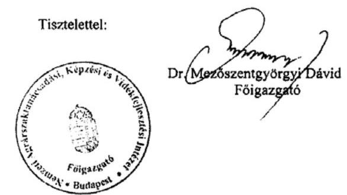

---

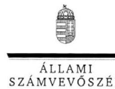

ELKÖK

Ikt.szám: V-0018-114/2012.

Dr. Mezőszentgyörgyi Dávid úr
Főigazgató
Nemzeti Agrár-szaktanácsadási Képzési és
Vidékfejlesztési Intézet

Budapest

Tisztelt Főigazgató Úr!

A Mezőgazdasági középfokú szakoktatás és szaktanácsadás intézményeinek ellenőrzése című
jelentéstervezetre tett észrevételeit köszönettel
 megkaptam.

Az Állami Számvevőszék észrevételekre vonatkozó álláspontjáról a felügyeleti vezető által
készített részletes tájékoztatást csatoltan megküldöm.

Tájékoztatom Főigazgató urat, hogy a jelentésben – az Állami Számvevőszékről szóló 2011.
évi LXVI. törvény 29. § (3) bekezdése alapján – az el nem fogadott észrevételeket
szerepeltetjük az elutasítás indokának feltüntetésével együtt. Az elfogadott észrevételeket a
jelentés szövegezésénél figyelembe vesszük.

Budapest, 2012. 14. hó 25. nap

Tisztelettel:

Domokos László

Melléklet: Tájékoztatás az elfogadott és az el nem fogadott észrevételekről

1052 BUDAPEST, APACZAI CSERE JÁRÁS UTCA 10. 1364 Budapest 4. Pf. 54 telefon. 494 9191 fax. 494 9201

---

# Tájékoztatás 

## az elfogadott és az el nem fogadott észrevételekről

A Mezőgazdasági középfokú szakoktatás és szaktanácsadás intézményeinek ellenőrzése című jelentéstervezetre 2029-8-2012/NAKVI. iktatószámú levelében tett észrevételeit áttekintettük, azok kezeléséről ezúton tájékoztatom.

## Elfogadott észrevételek:

- a jelentéstervezet 4.1. pontjához, a VKSZI szakképzéssel összefüggő feladatainak meghatározásához kapcsolódó kiegészítő észrevételt elfogadtuk. A szakértői névjegyzék vezetéséhez fűzött észrevétele pontosítja a jelentés megállapítását. Kiegészítésük alapján a jelentéstervezet 59. oldalán az utolsó bekezdést az alábbiak szerint módosítottuk:
„Az országos szakmai szakértői névjegyzék vezetése nem volt a VKSZI feladata, a névjegyzékbe történő felvétel, illetve a szakértői tevékenység folytatásához az Oktatási Hivatalnál kell bejelentkezni. "
- a vizsgaelnökök kijelölésével kapcsolatos észrevétel alapján az alábbi mondatot töröltük:
„A VM vizsgaelnöki névjegyzékbe történő bekerülést 2010 áprilisáig a VM hagyta jóvá, ezt követően a kijelölés jogát a Magyar Agrárkamarának adta át. "

Helyette az alábbi szövegrészt szerepeltetjük:
„Az agrár-szakképesítések tekintetében a szakmai vizsga vizsgaelnökének kijelölésének jogát a VM 2010 áprilisától átadta a Magyar Agrár Kamarának. "

- a vizsgaszervezés belső szabályozásával kapcsolatos észrevétel alapján a 60. oldal negyedik bekezdését az alábbiak szerint kiegészítettük.
„Ennek alapján készítették el a VKSZI Vizsgáztatási Eljárásrendjét, amelyet a VM 2009-ben jóváhagyott."
- a jelentéstervezet 4.2. pontjához, a VKSZI számára előírt feladatok teljesítésének értékeléséhez tett észrevétel első részét elfogadtuk. A jelentéstervezet 62. oldala ötödik bekezdését az alábbiak szerint pontosítottuk:
„...30-100 fő (szakoktató, intézményvezető, szaktanár) részvételével továbbképzéseket tartottak."

---

- A jelentéstervezet 4.2. pontjában a VKSZI számára előírt feladatok teljesítésének értékeléséhez tett észrevétel további része (a szakmai tanulmányi versenyek forrása, a VM által fenntartott iskolák gazdálkodása) magyarázó jellegű, a jelentés 61. oldalának utolsó bekezdésében foglalt megállapítást alátámasztja, ezért szövegszerű módosítást nem igényel.

Tájékoztatom továbbá, hogy a számvevőszéki jelentés mellékleteiként szerepeltetjük a jelentéstervezethez tett észrevételeit, valamint azokra adott válaszunkat.

Budapest, 2012. 10. hó 16. nap

Holman Magdolna
felügyeleti vezető
