# ÁLLAMI   SZÁMVEVŐSZÉK 

## JELENTÉS

a Zrínyi Miklós Nemzetvédelmi Egyetem ellenőrzéséről

---

# Állami Számvevőszék 

Iktatószám: V-0014-069/2012.
Témaszám: 1053
Vizsgálat-azonosító szám: V0587

## Az ellenőrzést felügyelte:

Holman Magdolna
felügyeleti vezető
Az ellenőrzést vezette és az ellenőrzés végrehajtásáért felelős:
Dr. Szima Mária
ellenőrzésvezető
Korsósné Vigh Andrea
ellenőrzésvezető
Az összefoglaló jelentést készítették:
Dr. Szima Mária
ellenőrzésvezető
Korsósné Vigh Andrea
ellenőrzésvezető
Kisgergely István
számvevő tanácsos
Zagyi Judit
számvevő tanácsos
Páncsics Judit
számvevő
Az ellenőrzést végezték:

| Balogné Lehoczki Éva | Csordás Péterné | Dalmayné Szerző Ildikó |
| :-- | :-- | :-- |
| számvevő | számvevő | számvevő tanácsos |
| Éva Katalin | Kisgergely István | Páncsics Judit |
| számvevő tanácsos | számvevő tanácsos | számvevő |
| Tolnai Lászlóné | Zagyi Judit |  |
| számvevő főtanácsos | számvevő tanácsos |  |

Jelentéseink az Országgyűlés számítógépes hálózatán és az Interneten a www.asz.hu címen is olvashatóak.

---

# TARTALOMJEGYZÉK 

BEVEZETÉS ..... 11
I. ÖSSZEGZŐ MEGÁLLAPÍTÁSOK, KÖVETKEZTETÉSEK, JAVASLATOK ..... 15
II. RÉSZLETES MEGÁLLAPÍTÁSOK ..... 22

1. A ZMNE 2011. évi intézményi költségvetési beszámolójának megbízhatósága és a ZMNE NKE-be történő integrációja ..... 22
1.1. A 2011. évi intézményi költségvetési beszámoló megbízhatósága ..... 22
1.2. A ZMNE megszüntetése előkészítésének, az NKE szervezetébe való integrálás végrehajtásának szabályszerűsége ..... 24
2. A ZMNE oktatási-képzési tevékenységének eredményessége ..... 26
2.1. A ZMNE oktatási-képzési tevékenysége feltételrendszerének kialakítása ..... 26
2.2. Az oktatási-képzési célok teljesülése ..... 30
2.2.1. Az alap- mester- és doktori képzés követelményeinek teljesülése ..... 30
2.2.2. A katonai és a polgári képzési célok teljesülése ..... 33
2.3. A ZMNE kutatási és pályázati tevékenysége ..... 37
3. A ZMNE személyi, tárgyi és pénzügyi eszközei felhasználásának hatékonysága ..... 38
3.1. Az oktatás-képzés személyi feltételeinek biztosítása ..... 38
3.2. Az elméleti és gyakorlati képzés tárgyi feltételeinek biztosítása ..... 43
3.2.1. A tárgyi eszközökkel való gazdálkodás ..... 45
3.2.2. Külső források bevonása ..... 48
3.3. A szervezeti és szervezési változások hatása a ZMNE gazdálkodására ..... 50
4. A belső kontrollrendszer kialakítása és múködtetése, valamint a belső és a külső ellenőrzések hasznosulása ..... 55
4.1. A belső kontrollrendszer kialakítása és múködtetése ..... 55
4.2. A belső ellenőrzés múködése ..... 58
4.3. A ZMNE-nél lefolytatott külső ellenőrzések ..... 59

---

# MELLÉKLETEK 

1. számú Korlátozott vélemény a ZMNE 2011. évi költségvetési beszámolójáról
2. számú A ZMNE szervezeti változásai a 2007-2011. években

3/A. számú A ZMNE költségvetési bevételei nagyságának, összetételének alakulása a 2007-2011. években
3/B. számú A ZMNE költségvetési kiadásai nagyságának, összetételének alakulása a 2007-2011. években
3/C. számú A ZMNE gazdálkodási adatainak alakulása a 2007-2011. években
4. számú A ZMNE doktori képzéseiben részt vevő hallgatók és a tudományos publikációk száma a 2007-2011. években
5. számú A ZMNE kutatási tevékenysége a 2007-2011. években
6. számú A ZMNE pályázati tevékenysége a 2007-2011. években

7/A. számú Az NKE rektorának a jelentéstervezethez tett észrevétele
7/B. számú Az ÁSZ válasza az NKE rektorának a jelentéstervezethez tett észrevételeire

---

# RÖVIDÍTÉSEK JEGYZÉKE 

## Törvények

Áht.

Ftv.
Hit.
Hszt.

Kbt.

NKE létrehozásáról szóló törvény
Krịt.

Szt.
Rendeletek
Áhsz.

Ámr. 1

Ámr. 2

Ber.

289/2005. (XII. 22.)
Korm. rendelet
33/2007. (III. 7.) Korm. rendelet

15/2006. OM rendelet
az államháztartásról szóló 1992. évi XXXVIII. törvény (hatályon kívül helyezte a 2011. évi CXCV. törvény, hatálytalan 2012. január 1-jétől)
a felsőoktatásról szóló 2005. évi CXXXIX. törvény
a Magyar Honvédség hivatásos és szerződéses állományú katonáinak jogállásáról szóló 2001. évi XCV. törvény
a rendvédelmi felsőoktatási intézménybe felvett, a fegyveres szervek hivatásos állományú tagjainak szolgálati viszonyáról szóló 1996. évi XLIII. törvény
a közbeszerzésekről szóló 2003. évi CXXIX. törvény (hatályon kívül helyezte a 2011. évi CVIII. törvény, hatálytalan 2012. január 1-jétől)
a Nemzeti Közszolgálati Egyetem létesítéséről szóló 2011. évi XXXVI. törvény
a katonai és rendvédelmi felsőoktatási intézmények vezetőinek, oktatóinak és hallgatóinak jogállásáról szóló 1996. évi XLV. törvény
a számvitelről szóló 2000. évi C. törvény
az államháztartás szervezetei beszámolási és könyvvezetési kötelezettségének sajátosságairól szóló 249/2000. (XII. 24.) Korm. rendelet
az államháztartás múködési rendjéről szóló 217/1998. (XII. 30.) Korm. rendelet (hatályon kívül helyezte a 292/2009. (XII. 19.) Korm. rendelet, hatálytalan 2010. január 1-jétől)
az államháztartás múködési rendjéről szóló 292/2009. (XII. 19.) Korm. rendelet (hatályon kívül helyezte a 368/2011. (XII. 31.) Korm. rendelet, hatálytalan 2012. január 1-jétől)
a költségvetési szervek belső ellenőrzéséről szóló 193/2003. (XI. 26.) Korm. rendelet (hatályon kívül helyezte a 370/2011. (XII. 31.) Korm. rendelet, hatálytalan 2012. január 1-jétől)
a felsőoktatási alap- és mesterképzési, valamint a szakindítás eljárási rendjéről szóló 289/2005. (XII. 22.) Korm. rendelet
doktori iskola létesítésének eljárási rendjéről és a doktori fokozat megszerzésének feltételeiről szóló 33/2007. (III. 7.) Korm. rendelet
az alap- és mesterképzési szakok képzési és kimeneti követelményeiről szóló 15/2006. (IV. 3.) OM rendelet

---

# Utasítások és intézkedések 

64/2003. HM utasítás

114/2007. HM utasítás

44/2011. HM utasítás

49/2011. HM utasítás

32/2011. (HK 7.) HM KÁT-HVKF együttes intézkedés
41/2011. (HK 11.) HM KÁT-HVKF együttes intézkedés

## Szórövidítések

ÁBE
ÁSZ
BCE
BJKMK
BM
DT
EU
fenntartó

FEUVE
Gazdálkodási szabályzat

HETK
HDI
HM
HM BEH
HM FHH
HM HEK
a személyi állomány át- és továbbképzésének tervezésével, megszervezésével összefüggő egyes feladatok és hatáskörök meghatározásáról szóló 64/2003. (HK 17.) HM utasítás
a ZMNE egy kampuszra történő költöztetésével kapcsolatos irányítási és koordinációs feladatok ellátásáról szóló 114/2007. (HK 20.) HM utasítás (hatálytalan 2008. december 31-től)
a Nemzeti Közszolgálati Egyetem létrehozásával kapcsolatos egyes feladatokról szóló 44/2011. (IV. 20) HM utasítás (hatálytalan 2012. március 31-től)
a honvédelmi szervek operatív belső kontrolljainak kialakításáról és múködtetéséről szóló 49/2011. (IV. 22.) HM utasítás (hatályon kívül helyezte a 39/2012. (VI. 8.) HM utasítás, hatálytalan 2012. június 11-től)
a Nemzeti Közszolgálati Egyetem létrehozásával kapcsolatos egyes szakmai feladatok végrehajtásáról szóló 32/2011. (HK 7.) HM KÁT-HVKF együttes intézkedés
a Nemzeti Közszolgálati Egyetem létrehozásával kapcsolatos egyes szakmai feladatok végrehajtásáról szóló 41/2011. (HK 11.) HM KÁT-HVKF együttes intézkedés
államháztartási belső ellenőrzés
Állami Számvevőszék
Budapesti Corvinus Egyetem
Bolyai János Katonai Műszaki Kar
Belügyminisztérium
Doktori Tanács
Európai Unió
A HM a ZMNE Alapító Okiratának 8/B. pontja szerint meghatározott irányító szerv, az Alapító Okirat 9. pontja alapján a fenntartói irányítást a honvédelmi miniszter végzi.
folyamatba épített előzetes, utólagos és vezetői ellenőrzés
A ZMNE Szenátusa által a KANC/73-42/2010. számú határozattal jóváhagyott Gazdálkodási szabályzat (hatályos 2010. április 30-tól), a ZMNE Szenátusa által a 77/2007. számú határozattal jóváhagyott Gazdálkodási szabályzat (hatályos 2007. november 1-jétől 2010. április 29-ig)
honvédségi egységes termék kód
Hadtudományi Doktori Iskola
Honvédelmi Minisztérium
HM Belső Ellenőrzési Hivatala
HM Fegyverzeti és Hadbiztosi Hivatal
HM Honvéd Egészségügyi Központ

---

HM KEHH
HM KPH
HM KÁT
HVK
IFT
kötelezettségvállalási, utalványozási, ellenjegyzési és érvényesitési szabályzat ${ }_{1}$
kötelezettségvállalási, utalványozási, ellenjegyzési és érvényesítési szabályzat ${ }_{2}$
Közigazgatási Kar
KFI
$\mathrm{K}+\mathrm{F}$
Kincstár
KLHK
KMDI
MAB
MH
MH LZ
MH TD
M Ft
NGM
NKE
ODT
OKM
OM
OTKA
PDCA
RTF
SzMSz

ZMNE

HM Központi Ellenőrzési és Hatósági Hivatal
HM Közgazdasági és Pénzügyi Hivatal
HM közgazgatási államtitkár
Honvédségi Vezérkar
A ZMNE Intézmény Fejlesztési Terve
57/2006. (XI. 30.) számú szenátusi határozat a Gazdálkodással Kapcsolatos Szabályzatok elfogadásáról

KANC/73-83/2010. (X. 13.) számú szenátusi határozat a gazdálkodási folyamatok szabályozásáról

Budapesti Corvinus Egyetemtől különváló Közigazgatástudományi Kar
Kutatás-fejlesztési innovációs stratégia
Kutatás-fejlesztés
Magyar Államkincstár
Kossuth Lajos Hadtudományi Kar
Katonai Műszaki Doktori Iskola
Magyar Felsőoktatási Akkreditációs Bizottság
Magyar Honvédség
MH Ludovika Zászlóalj
MH Támogató Dandár
millió forint
Nemzetgazdasági Minisztérium
Nemzeti Közszolgálati Egyetem
Országos Doktori Tanács
Oktatási és Kulturális Minisztérium
Oktatási Minisztérium
Országos Tudományos, Kutatási Alapprogramok
Plan-Do-Check-Act (tervezd - csináld - ellenőrizd - cselekedj)
Rendőrtiszti Főiskola
A ZMNE Szenátusa által jóváhagyott Szervezeti és Múködési Szabályzat (hatályos: 2011. április 17-ig), Zrínyi Miklós Nemzetvédelmi Egyetem Szenátusa által jóváhagyott Szervezeti és Múködési Szabályzat (hatályos: 2011. április 18-tól 2011. október 24-ig), Zrínyi Miklós Nemzetvédelmi Egyetem Szenátusa által jóváhagyott Szervezeti és Múködési Szabályzat (hatályos: 2011. október 25-től)
Zrínyi Miklós Nemzetvédelmi Egyetem

---

.

---

# ÉRTELMEZŐ SZÓTÁR 

alapképzés
átszervezés
belső kontrollrendszer
campus
doktori képzés
EFQM modell
felmenő rendszer
habilitáció

Az alapképzésben alapfokozat (baccalaureus, bachelor) és szakképzettség szerezhető. Az alapfokozat az első felsőfokú végzettségi szint, amely feljogosít a mesterképzés megkezdésére. Az alapképzésben szerzett szakképzettség jogszabályban meghatározottak szerinti munkakör betöltésére jogosít. Az alapképzés képzési és kimeneti követelményei határozzák meg, hogy milyen szakképzettséget lehet szerezni az alapképzésben. A képzési idő legalább hat, legfeljebb nyolc félév. (Forrás: Ftv. 32. § (5) bekezdése)
A névváltoztatás kivételével a szervezeti egységet vagy annak elemeit érintő olyan változás, amelynek következtében egyes beosztások, szervezeti elemek létesülnek, megszűnnek vagy módosulnak. (Forrás: Hjt. 2. § (23) bekezdése)
A belső kontrollrendszer tartalmazza mindazon elveket, eljárásokat és belső szabályzatokat, melyek alapján a költségvetési szerv érvényesíti a feladatai ellátására szolgáló előirányzatokkal, létszámmal, és vagyonnal való szabályszerű, gazdaságos, hatékony és eredményes gazdálkodás követelményét. (Forrás: Ámr. ${ }_{2}$ 155. § (2) bekezdése)
Egyetem zárt területe és épülete. (Forrás: Bakos Ferenc: Idegen szavak és kifejezések szótára, Akadémiai Kiadó)
A doktori képzés a tudományág sajátosságaihoz és a doktorandusz igényeihez igazodó egyéni vagy csoportos felkészítés keretében folyó képzési, kutatási és beszámolási tevékenység. Doktori képzésben az vehet részt, aki mesterfokozatot szerzett. (Forrás: Ftv. 68. § (2) bekezdése)
Az EFQM (European Foundation for Quality Management, magyarul: Európai Minőségmenedzsment Alapítvány, Brüsszel) Kiválóság Modell egy nem előiró jellegű keretrendszer, amely kilenc kritériumra tagolódik. A modell önértékelésen alapul, nincs külső auditálás. (Forrás: http://www.felvi.hu/felsooktatasimuhely/avir/ fogalomtar/defmart/!DefMart/index.php/EFQM)
Képzésszervezési elv, amely alapján az új vagy módosított tanulmányi és vizsgakövetelményt azoktól a hallgatóktól lehet megkövetelni, akik a bevezetését követően kezdték meg a tanulmányaikat, illetve azoktól, akik azt megelőzően kezdték meg tanulmányaikat, de választásuk alapján az új vagy módosított tanulmányi és vizsgakövetelmények alapján készülnek fel. (Forrás: Ftv. 147. § 5. pontja)
A tudományos fokozattal rendelkezők oktatói és előadói képességének, valamint tudományos teljesítményének megítélése. (Forrás: Ftv. 147. § 9. pontja)

---

hivatásos állomány Az az altiszti, tiszti rendfokozatú katona, aki a katonai szolgálatot élethivatásként, határozatlan időre vállalja. (Forrás: Hjt. 2. § (14) bekezdése)
intézményfejlesztési terv

A szenátus fogadja el az intézményfejlesztési tervet. Az intézményfejlesztési tervben kell meghatározni a fejlesztéssel, a fenntartó által a felsőoktatási intézmény rendelkezésére bocsátott vagyon hasznosításával, megóvásával, elidegenítésével kapcsolatos elképzeléseket, a várható bevételeket és kiadásokat. Az intézményfejlesztési tervet középtávra, legalább négyéves időszakra kell elkészíteni, évenkénti bontásban meghatározva a végrehajtás feladatait. Az intézményfejlesztési terv része a foglalkoztatási terv. A foglalkoztatási tervben kell meghatározni azt a létszámot, amelynek keretei között a felsőoktatási intézmény megoldhatja feladatait. (Forrás: Ftv. 27. § (3) bekezdés)
impakt faktor Az impakt faktor a tudományos folyóiratok tudománymetriai mérőszáma, amely az egyes folyóiratok minőségét hivatott értékelni. Az impakt faktor számítási módja $\mathrm{IF}=\mathrm{m} / \mathrm{n}$, ahol IF az impakt faktor, „m" egy adott folyóiratnak az előző két évben megjelent publikációira a tárgyévben adott hivatkozások száma, „n" pedig az előző két évben megjelent publikációk száma.
(Forrás: http://www.omikk.bme.hu)
katonai felsőoktatás A katonai és a rendvédelmi felsőoktatási intézményekben folyó tevékenység célja - a magyar felsőoktatási rendszer részeként a Magyar Honvédség és a rendvédelmi szervek feladataihoz, sajátos szolgálati és életviszonyaihoz igazodó körülmények között - e szervek tiszti utánpótlásának, valamint a honvédelmet és a rendvédelmet érintő tevékenységet végző szakembereknek a képzése. (Forrás: Krjt. Preambulum)
kettős jogállású A rendvédelmi felsőoktatási intézménybe felvett, a fegyver hallgatót

A rendvédelmi felsőoktatási intézménybe felvett, a fegyveres szervek hivatásos állományú tagjainak szolgálati viszonyáról szóló 1996. évi XLIII. törvény (a továbbiakban: Hszt.) szerinti hivatásos állomány tagja, aki államilag támogatott képzésben folytat tanulmányokat. (Forrás: Krjt. 2. § c) pontja)
képzési és kimeneti Azoknak az ismereteknek, jártasságoknak, készségeknek, követelmények képességeknek (kompetencia) az összessége, amelyek megszerzése esetén az adott szakon a végzettségi szintet és szakképzettséget igazoló oklevél kiadható.
(Forrás: Ftv. 147. § 18. pontja)

---

képzési program
mesterképzés
minőségcél
minőségirányítási
kézikönyv
monitoring

Az intézmény komplex képzési dokumentuma, amely az alap- és mesterszak, valamint a szakirányú továbbképzési szak részletes képzési és tanulmányi követelményeit, felsőfokú szakképzésben a szakképzési programot, továbbá a doktori képzés tervét tartalmazza, a képzés részletes szabályaival, így különösen a tantervvel, illetve az oktatási programmal és a tantárgyi programokkal, valamint az értékelési és ellenőrzési módszerekkel, eljárásokkal és szabályokkal együtt. (Forrás: Ftv. 147. § 21. pontja)
A mesterképzésben mesterfokozat (magister, master) és szakképzettség szerezhető. A mesterfokozat a második felsőfokú végzettségi szint. A mesterképzés, képzési és kimeneti követelményei határozzák meg, hogy milyen szakképzettség szerezhető a mesterképzésben. A mesterképzésben szerzett szakképzettség jogszabályban meghatározottak szerinti munkakör betöltésére jogosít. A képzési idő legalább két, legfeljebb négy félév. (Forrás: Ftv. 32. § (6) bekezdése)

A minőségcél a minőségnek az a szintje, amit meg akarnak valósítani, megtartani vagy elérni. A minőségcélok általában a szervezet minőségpolitikáján alapulnak, és általában a szervezet megfelelő funkciói és szintjei számára tűzik ki őket. Ahhoz, hogy a minőségcélok elérése mérhető legyen, összhangban kell lenniük a minőségpolitikával és a folyamatos fejlesztés iránti elkötelezettséggel. A minőségcélok elérése előnyösen befolyásolhatja a termékminőséget, a múködés eredményességét és a pénzügyi eredményességet, ezeken keresztül pedig az érdekelt felek megelégedettségét és bizalmát.
(Forrás: http://fogalomtar.eski.hu/index.php/ Min\%C5\%91s\%C3\%A9gc\%C3\%A9I)
A minőségirányítási rendszer leírása, amely tartalmazza azokat az egységes és kötelező alapelveket, amelyek szükségesek a szabványban előírt követelmények teljesítéséhez. A szabvány szerint a kézikönyvnek tartalmaznia kell: a minőségirányítási rendszer alkalmazási területét, beleértve az esetleges kizárások részletezését és indoklását a dokumentált eljárásokat vagy az azokra való hivatkozást és a minőségirányítási rendszer folyamatai közötti kölcsönhatások leírását.
(Forrás: http://mmfk.nyf.hu/min/alap/43.htm)
Időszakonként ismétlődő ellenőrzés. (Forrás: Tudományos és Köznyelvi Szavak Magyar Értelmező Szótára)

---

PDCA ciklus Tervezési módszer, a folyamatos minőségjavítás fő eszköze. Szakaszai:
tervezés (a célok, kontroll paraméterek, illetve a célelérés módszereinek meghatározása);
végrehajtás (a folyamatok múködtetése, ellenőrzése, valamint adatok gyújtése);
ellenőrzés/értékelés (az eredmény összevetése a tervezettel) intézkedés (a szükséges módosítások bevezetése) (Forrás: Kövesi J.-Topár J. szerk. (2006): A minőségmenedzsment alapjai. Budapest)
szenátus A felsőoktatási intézmény, döntést hozó és a döntés végrehajtását ellenőrző testülete. (Forrás: Ftv. 20. § (1) bekezdés)

---

# JELENTÉS   a Zrínyi Miklós Nemzetvédelmi Egyetem ellenőrzéséről 

## BEVEZETÉS

Az ellenőrzés kapcsolódik az Állami Számvevőszék (ÁSZ) 2012. évi ellenőrzési tervében szereplő 16. témasorszámú, a Magyar Köztársaság 2011. évi költségvetése végrehajtásának ellenőrzéséhez, növelve ezzel a zárszámadási ellenőrzésbe bevont költségvetési szervek számát.

Az Országgyúlés 2005 novemberében fogadta el a felsőoktatásról szóló 2005. évi CXXXIX. törvényt (Ftv.-t ${ }^{1}$ ), amely átfogóan szabályozta a felsőoktatás múködését és szerkezetét, egységbe foglalta a felsőoktatás európai közösségi vállalásait. A magyar felsőoktatási rendszerben a képzés - az Ftv. hatálybalépését követően - képzési szintek és tagozatok szerint felsőfokú szakképzés, főiskolai szintű képzés, egyetemi szintű (alap-, mester-, osztatlan, doktori) képzés és szakirányú továbbképzés keretében folyik. A felsőoktatási intézmények oktatási, kutatási, szervezeti, múködési és gazdálkodási autonómiával rendelkeznek. A Zrínyi Miklós Nemzetvédelmi Egyetem (ZMNE) - mint állami fenntartású egyetem - költségvetési szervként múködött. A ZMNE a 2007-2011. közötti években a költségvetési és zárszámadási törvényekben a Honvédelmi Minisztérium (HM) fejezeten belül önálló címet alkotott.

A honvédelem az Alkotmányban, illetve az Alaptörvényben foglalt kötelesség. A felsőoktatás speciális részterülete a katonatiszt-jelöltek oktatása, képzése. A ZMNE 2011. év végéig Magyarország egyetlen katonai felsőoktatási intézménye volt, végezte a Magyar Honvédség (MH) tisztjeinek és tisztjelöltjeinek elméletigyakorlati oktatását, a hivatásos tisztek továbbképzését, a honvédelem tudományos oktatását és kutatását. A ZMNE a katonai képzés mellett polgári képzést is folytatott a nemzetvédelmi, a biztonságtechnikai, a múszaki és a gazdaságtudományi képzési területeken. Az oktatás 2006. szeptember 1-jétől felmenő rendszerben alap-, mester- és doktori képzés szintjén folyt. A 2007-2011. években a ZMNE-n két kar ${ }^{2}$ végezte a hivatásos tisztek, tisztjelöltek, valamint a polgári hallgatók oktatását, képzését. A ZMNE-n két doktori iskola - az egyik a hadtudományok, a másik a katonai műszaki tudományok területén - működött. Ezekben a tudományágakban habilitációs fokozatot lehetett szerezni.

[^0]
[^0]:    ${ }^{1}$ Az Ftv-t a nemzeti felsőoktatásról szóló 2011. évi CCIV. törvény 2012. szeptember 1jétől helyezi hatályon kívül.
    ${ }^{2}$ A ZMNE karai: Bolyai János Katonai Műszaki Kar (BJKMK) és a Kossuth Lajos Hadtudományi Kar (KLHK).

---

A katonai képzésekre felvehető létszámot a HM, míg a polgári hallgatók létszámát az oktatásért felelős miniszter határozta meg. A 2007-2011. években az átlagos hallgatói létszám 3375 fő volt ( $4 \%$-on belüli évenkénti eltéréssel).

A ZMNE 2007-2011. évi teljesített költségvetési bevételeit és kiadásait szemlélteti a következő grafikon ${ }^{3}$ :
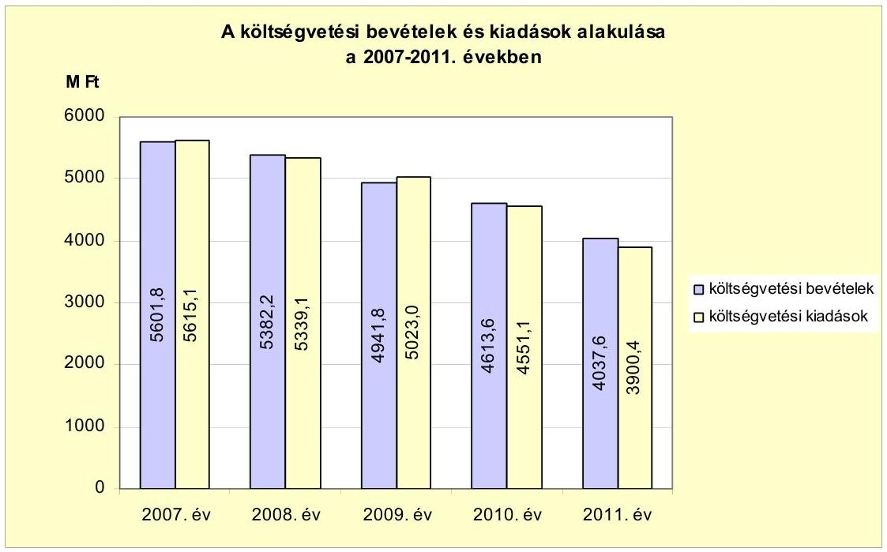

A ZMNE 2007. december 31-ei 2788,7 M Ft-os könyvviteli mérleg szerinti eszköz és forrás értéke 2011. december 31-ére 1433,9 M Ft-ra csökkent.

A 2007-2011. évek között a ZMNE szervezeti változásai közül a jelentősebbek a BJKMK 2008. évi központi telephelyre történő átköltöztetése, 2011. február 1jével az MH Ludovika Zászlóalj (MH LZ) - az MH hadrendjébe tartozó „önálló zászlóalj jogállású" szervezetként való - kiválása, valamint 2011 szeptemberében a BJKMK-nak és a KLHK-nak Hadtudományi és Honvédtisztképző Kar néven történt összevonása voltak.

Az Országgyűlés 2011 áprilisában döntött a Nemzeti Közszolgálati Egyetem (NKE) létesítéséről. Az NKE 2012. január 1-jével jött létre a ZMNE, a Rendőrtiszti Főiskola (RTF) és a Budapesti Corvinus Egyetem Közigazgatás-tudományi Karának jogutódjaként. A ZMNE szervezetét és annak - a vizsgált időszakban történt - változásait a jelentés 2 . számú melléklete szemlélteti.

A ZMNE múködését befolyásolták a jogi háttér módosításai, az oktatás szerkezetének átalakítása, és 2012-től egy új intézménybe történő beolvadása az intézmény autonómiáját megszüntette.

[^0]
[^0]:    ${ }^{3}$ A ZMNE 2007-2011. évi elemi intézményi költségvetési beszámolóinak adatai alapján.

---

Az ellenőrzés célja annak értékelése volt, hogy:

- a 2011. évi költségvetés végrehajtásáról szóló beszámoló ${ }^{4}$ megbízható és valós képet ad-e a ZMNE vagyoni és a pénzügyi helyzetéről;
- a ZMNE megszüntetésének előkészítése, és az NKE szervezetébe való integrálása a jogszabályi előírásoknak megfelelően történt-e;
- a ZMNE feladatellátása - a katonai és a polgári hallgatók oktatása, elméleti és gyakorlati képzése - eredményes, valamint a személyi, tárgyi és pénzügyi források felhasználása hatékony volt-e.

A helyszíni ellenőrzés az NKE-re és a jogelőd ZMNE-re terjedt ki. A zárszámadás pénzügyi-szabályszerúségi ellenőrzése keretében a 2011. évi költségvetési beszámoló megbízhatóságát ellenőriztük. Az oktatási-képzési tevékenység telje-iltmény-ellenőrzése a 2007/2008-as tanévtől a 2011/2012-es tanévig terjedő időszakot érintette. Az ellenőrzés típusa a ZMNE 2011. évi költségvetési beszámolójának vonatkozásában pénzügyi-szabályszerúségi ellenőrzés, az egyetem integrációja tekintetében szabályszerűségi ellenőrzés, az oktatás és képzés esetében teljesítmény-ellenőrzés ${ }^{5}$ volt, amely az eredményesség és a költséghatékonyság értékelésére irányult.

A ZMNE oktatási-képzési tevékenységét akkor tekintettük eredményesnek, ha a szervezeti kereteket a kitűzött oktatási-képzési célokhoz, feladatokhoz igazodóan alakították ki, valamint a kitűzött oktatási-képzési célokat és az intézményi teljesítménymutatókat teljesítették. A ZMNE tevékenységét akkor minősítettük hatékonynak, ha a rendelkezésre álló erőforrások takarékos és célszerű felhasználási követelménye megvalósult. Értékeltük továbbá, hogy a belső kontrollrendszer működése, valamint a lefolytatott külső és belső ellenőrzések javaslatainak hasznosítása hozzájárult-e a közpénz hatékony felhasználásához és a képzési programok teljesüléséhez.

A szabályszerűségi és a teljesítmény-ellenőrzést az ÁSZ Ellenőrzési Kézikönyve és a vonatkozó ISSAI standardok előírásait figyelembe véve végeztük el.

A ZMNE 2011. évi költségvetési beszámolóját az ÁSZ által a 2011. évi zárszámadás előkészítése során, a BM költségvetési szervek elemi beszámolójának pénzügyi (szabályszerúségi) ellenőrzéséhez készített Egyszerűsített Útmutató alapján vizsgáltuk felül.

A ZMNE ellenőrzését előtanulmánnyal alapoztuk meg. Az ellenőrzés végrehajtásának jogszabályi alapját az Alaptörvény 43. cikk (1) bekezdésében, az államháztartásról szóló 2011. évi CXCV. törvény 61. § (2) bekezdésében, és az Állami Számvevőszékről szóló 2011. évi LXVI. törvény 1. § (3) bekezdésében, valamint 5. § (3) és (6) bekezdésében foglaltak együttesen képezték.

[^0]
[^0]:    ${ }^{4}$ a központi költségvetési szervek elemi beszámolói
    ${ }^{5}$ Az ellenőrzés típusa az ellenőrzés elsődleges célja alapján került meghatározásra, de az ellenőrzés 2., 3. és 4. programpontjai - a teljesítmény-ellenőrzési elemek mellett szabályszerűségi ellenőrzési elemeket is tartalmaznak.

---

Az Állami Számvevőszékről szóló 2011. évi LXVI. törvény 29. §-a szerint a jelentéstervezetet megküldtük egyeztetésre az NKE rektorának. A beérkezett észrevételt és az erre adott választ, ideértve az el nem fogadott észrevételeket és azok indoklását a jelentés 7/A-7/B. számú mellékletei tartalmazzák.

---

# I. ÖSSZEGZŐ MEGÁLLAPÍTÁSOK, KÖVETKEZTETÉSEK, JAVASLATOK 

A ZMNE a múködését és az oktatási-képzési tevékenységét megalapozó szabályzatait (SzMSz, IFT, KFI, Minőségbiztosítási szabályzat) elkészítette, azok tartalma azonban - a KFI kivételével - a 2007-2011. években részben volt a jogszabályi előírásoknak megfelelő. Az Ftv. előírásával ellentétesen a karok 2009. szeptemberig önálló SzMSz-szel rendelkeztek, az IFT nem tartalmazta a feladatokat évenkénti bontásban. A minőségbiztosítási rendszer szabályozásában a tervezési, ellenőrzési, mérési, értékelési folyamatok egysége a karok által 2009. szeptemberig alkalmazott eltérő minőségbiztosítási rendszer miatt nem volt biztosított. A ZMNE a katonai és polgári alap- és mesterképzések indításához a Magyar Felsőoktatási Akkreditációs Bizottság (MAB) által véleményezett képzési programokkal, továbbá az Oktatási Minisztérium (OM) által - a katonai képzés tekintetében a HM által is - jóváhagyott szakindítási engedélyekkel rendelkezett.

A teljesítmény-mérési, illetve monitoring rendszer nem volt teljes körű. A minőségfejlesztési programokban teljesítmény-mutatókkal mérhető stratégiai célokat nem határoztak meg. Az IFT-ben az intézményfejlesztés mérésére és monitorozására kialakított teljesítmény-mutatók kiindulási és célértékeit nem határozták meg. A ZMNE 2007-2011 közötti minőségfejlesztési programjaiban meghatározott minőségfejlesztési célok az intézményi akkreditációra történő felkészülésre, valamint egyes dokumentációs kötelezettségek elvégzésére irányultak, amelyeket teljesítésükkel mértek. E minőségfejlesztési célok teljesülését monitorozták és értékelték, továbbá kari, intézményi önértékeléseket és oktatói, hallgatói kérdőíves elégedettségi felméréseket végeztek. A mérési, értékelési, visszacsatolási folyamatok egysége a karonként eltérő szempontrendszer alkalmazása miatt nehezen volt biztosítható, nem épültek egymásra.

A ZMNE oktatási-képzési tevékenysége eredményes volt, mert az intézmény által meghatározott katonai és polgári képzési célok, továbbá a feladatellátás során az alap-, mester- és doktori képzések teljesítéséhez előírt elméleti és gyakorlati követelmények teljesültek. Az oktatás, képzés és az egyéb oktatást segítő funkcionális feladatok szervezeti kereteit az oktatási-képzési célokhoz, feladatokhoz, valamint a honvédelmi és oktatási miniszter által előírt képzési keretszámokhoz igazodóan alakították ki.

- A katonai képzési célok teljesültek, a katonai hallgatók oktatása, elméleti és gyakorlati képzése eredményes volt. A képzési cél a HM elvárásoknak megfelelő számú és képzettségű tisztek és tisztjelöltek oktatása, az ehhez szükséges személyi feltételek, szervezeti keretek kialakítása volt. A ZMNE-n a felvételi keretszámokat, valamint a katonai képzés elméleti és gyakorlati követelményeit a HM meghatározta. A katonai képzési programokban előírt követelmények teljesültek. A személyi feltételeket - az eredményes intézményi akkreditáció alapján - az egyetem biztosította. A szervezeti kereteket a HM elvárásoknak megfelelően alakították ki. A 2007-2011. években minden végzett katonatiszt elhelyezkedése biztosított volt a MH-nál.

---

- A polgári képzési célok teljesültek, a polgári képzés eredményes volt. A célként meghatározott képzési - közte az élethosszig tartó tanuláshoz szükséges - feltételeket az intézmény kialakította és biztosította. A ZMNE-n - az ellenőrzött időszakot megelőzően - a polgári képzés bevezetésének az oka elsősorban a csökkenő katonatiszt képzés miatt felszabadult oktatási kapacitás kihasználása volt. A polgári szakok többségén speciális képzési igényű (pl. védelmi, biztonsági) szakembereket képeztek.

A ZMNE hallgatóinak katonai, illetve polgári képzési forma szerinti megoszlását szemlélteti 2007-2011 között a következő ábra:
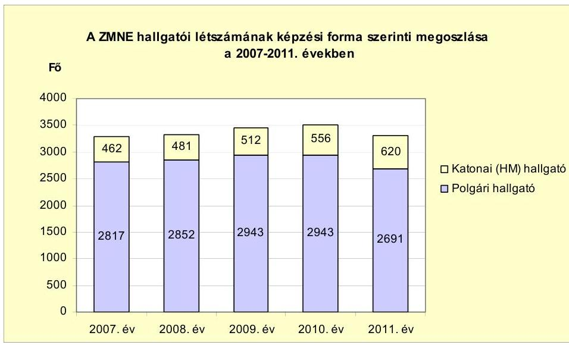

- A képzési programokban kidolgozott alap-, mester- és doktori képzések teljesítéséhez előírt elméleti és gyakorlati követelmények megvalósultak. A szakmai gyakorlat teljesítéséhez az érintett hallgatók legalább 70\%-ának a ZMNE biztosította a képzési helyet.

A ZMNE pályázati, kutatási tevékenysége eredményeit az oktatásban, képzésben hasznosították. A doktori hallgatók bekapcsolódtak a kutatásokba, a ZMNE kutatási programjai elsődlegesen a HM és az MH irányelveihez és fejlesztési koncepciójához igazodtak. Oktatási, képzési eszközökre 2007-2011 között benyújtott pályázatokon összesen 333,8 M Ft, kutatásra 540,6 M Ft támogatást nyertek el.

A ZMNE-n a 2007-2011. években az erőforrások célszerú, valamint - elsődlegesen a fenntartó által elrendelt szervezeti, szervezési és kiadáscsökkentő intézkedések hatására - takarékos felhasználása megvalósult. Az intézményi saját hatáskörben hozott, a képzőhelyek, tanszékek, intézetek, egyéb szervezeti egységek számát növelő intézkedések, továbbá a szabad erőforrások kihasználásából fakadó bevételnövelő lehetőség elmulasztása a fenntartói intézkedések hatását negatívan befolyásolták.

A ZMNE-n 2007-2011 között az elméleti, gyakorlati képzéshez szükséges személyi és tárgyi feltételeket biztosították.

---

- Az elméleti és a gyakorlati képzési feladatokat 2007-2011 között csökkenő főfoglalkozású oktatói létszám mellett, óraadó tanárok bevonásával látták el. Főfoglalkozású oktatóinak tanórai leterheltsége a kötelező óraszám emelése miatt növekedett. Az oktatási és képzési tevékenysége ellátásához szükséges iskolai végzettségű és szakképzettségű, alkalmazotti jogviszonyban álló személyi állománnyal - az Ftv.-ben előírt aránykövetelménynek megfelelően - rendelkezett. A személyi feltételek megteremtése során az oktatás-képzés versenyképességét, minőségének fejlesztését biztosító foglalkoztatási követelményeket az Ftv.-ben foglaltaknak megfelelően - a dokumentációs kötelezettség előírása terén feltárt hiányosságok kivételével - meghatározták. E követelmények végrehajtását azonban egyes részterületeken - így az oktatók folyamatos alkalmasságának felülvizsgálatát, a munkaköri leírások aktualizálását, a címek adományozásának és az álláspályázatok elbírálásának dokumentálását - nem biztosították.
- A ZMNE-n a tárgyi feltételek az oktatáshoz, kutatáshoz biztosítottak voltak. Az oktatói és a tudományos szakmai munkához szükséges elhelyezési, kiképzési és oktatástechnikai eszközökkel való ellátottságról, valamint az üzemeltetési feltételekről gondoskodtak. A tárgyi eszköz állomány használhatósági foka folyamatosan csökkent, a 2007. évi 23,3\%-ról 2011-re 13,4\%ra esett vissza. A tárgyi eszközök bruttó értékének 2007. év végi állománya 4790,2 M Ft-ról 2011-ben 3286,6 M Ft-ra, a nettó értéke 1114,7 M Ft-ról 439,4 M Ft-ra csökkent a folyamatban lévő beruházások értéke nélkül.

A ZMNE-n az elméleti, gyakorlati képzés célkitűzéseinek megvalósításához felhasznált külső források az oktatás, képzés tárgyi feltételeinek biztosítása érdekében szükségesek voltak. A ZMNE-nek a 2007-2011. években a csökkenő költségvetési támogatásokból az eszközök pótlására, azok használhatósági fokának emelésére a felhalmozási célú költségvetési támogatások csekély mértékben álltak rendelkezésre (minden évben 1,7\% alatt). A szakképzési hozzájárulásból kapott támogatásokat oktatási célra fordították, abból számítástechnikai eszközöket és speciális gépeket, berendezéseket vásároltak.

A ZMNE-n a fenntartó által elrendelt szervezeti, szervezési intézkedéseket végrehajtották. A hatékonyabb működés érdekében az Üllői úti telephelyet 2008-ban megszüntették. A 2011. évben a katonatiszt képzés katonai jellegének és hatékonyságának erősítése céljából a ZMNE egyes szervezeti egységeiből kivált az MH LZ. Az NKE létrehozásának előkészítésével összefüggésben, 2011 augusztusában a KLHK és a BJKMK összevonásra került. A ZMNE-n a képzőhelyek, tanszékek, intézetek, egyéb szervezeti egységek száma - a fenntartói szervezeti racionalizálási törekvések ellenére - emelkedett.

A 2007-2011. években a fenntartó utasításaiban elrendelt és a ZMNE által végrehajtott kiadáscsökkentő intézkedések eredményesek voltak. A logisztikai és funkcionális feladatok hatékonyabb ellátása érdekében és a szervezeti változások hatására az engedélyezett álláshelyek száma 2007-2011 között 52,0\%kal, 752 főről 361 főre csökkent. Az összes megszüntetett álláshely 73,7\%-a (288 fő) a technikai dolgozók álláshelyeit érintette. A szervezeti változások és takarékossági intézkedések hatására a költségvetési kiadások 2007-2011 között 30,5\%-kal (1714,7 M Ft-tal) csökkentek. A kiadáscsökkenés 74,4\%-a (1275,3 M Ft) a személyi juttatások és az azokat terhelő járulékok csökkenésé-

---

ből keletkezett, melyet a 2007. és a 2011. évi átszervezéssel együtt járó létszámcsökkentések miatti rendszeres és nem rendszeres személyi juttatások és azok járulékai, valamint a külső személyi juttatások csökkenése okozott. Az egy oktatóra jutó hallgatók száma 14,5 fơről 16,5 főre emelkedett, az egy oktatóra vetített költségvetési kiadás 24,8 M Ft-ról 19,4 M Ft-ra, az egy hallgatóra vetített költségvetési kiadás 1,7 M Ft-ról 1,2 M Ft-ra csökkent.

A 2011. évi költségvetési támogatások összege 36,5\%-kal, 1811,2 M Ft-tal alacsonyabb volt a 2007. évihez képest. A költségvetési támogatások költségvetési bevételeken belüli részaránya 88,6\%-ról 78,1\%-ra mérséklődött a saját bevételek és átvett pénzeszközök emelkedése miatt. A ZMNE a szabad pénzeszközeit nem kötötte le, kamatbevétele nem keletkezett, az Ftv.-ben foglaltak ellenére vagyongazdálkodási tervvel nem rendelkezett. Az erőforrások (a személyi és tárgyi feltételek) szabad kapacitásainak kihasználásával elérhető többletbevételekkel nem járultak hozzá a költségvetési támogatások csökkentéséhez.

A ZMNE gazdálkodása a fizetőképesség és a likviditás alakulása szempontjából kiegyensúlyozott volt. A 2007-2011. években likviditási hitelt és támogatási kölcsönt nem vett igénybe, hosszú lejáratú kötelezettsége nem volt, rövid lejáratú kötelezettségét a szállítói tartozás tette ki. A szállítói tartozásállomány a 2007. év végi 274,0 M Ft-ról - a 2010. évet kivéve - minden évben csökkent, a 2011. év végén 15,3 M Ft volt. Adatszolgáltatásuk szerint a 2011. év végén jogerős határozattal le nem zárt peres eljárások miatt 40,9 M Ft tartozás állt fenn.

A belső kontrollrendszer - kialakításának és múködtetésének, továbbá a belső és külső ellenőrzések javaslatai hasznosításának hiánya miatt - nem járult hozzá a szabálytalanságok feltárásához, a közpénzek hatékony felhasználásához, nem biztosította a hibák kiszűrését. A ZMNE rektora az Áht.-ban előírt kötelezettsége ellenére nem gondoskodott a belső kontrollrendszer megfelelő kialakításáról, működtetéséről és működése nyomon követéséről, illetve ennek részeként 2007-2010 között a belső ellenőrzés megfelelő működtetéséről. A belső kontrollrendszer az Áht.-ban meghatározott célját nem érte el. Mindez szerepet játszott a 2011. évi beszámoló ellenőrzése során feltárt számviteli szabálytalanságok kialakulásában.

- A belső kontrollrendszer elemeként a ZMNE-n a 2007. évet megelőzően vezették be a folyamatba épített elózetes, utólagos és vezetői ellenőrzés (FEUVE) rendszerét, azonban az ellenőrzött időszakban a jogszabályi és szervezeti változások miatt szükséges aktualizálását nem végezték el. A 49/2011. (IV. 22.) HM utasításban előírt általános operatív belső kontroll szabályzatot nem készítették el. A rektor feladatai között az SzMSz-ben 2011. augusztus 29 -ig nem határozták meg a FEUVE rendszer kialakításának és működtetésének kötelezettségét. A munkaköri leírások nem tartalmazták a FEUVE-vel és a kockázatelemzéssel kapcsolatos feladatokat. Kockázatelemzést a kockázatkezelési szabályzatban előírtak ellenére a 2007-2011. években nem végeztek.
- Az ellenőrzési nyomvonal nem fogta át a ZMNE valamennyi tevékenységét, nem alakították ki az egyes feladat/tevékenység elvégzését igazoló dokumentálás rendjét, nem rögzítették a dokumentumok azonosíthatóságát, fellelhetőségét a rendszerben. A rektor a belső kontrollok kialakítása során az Ámr. ${ }_{1,2}$-ben előírtak ellenére az ellenjegyzéssel, érvényesítéssel kapcsolatos

---

jogkörök szabályozásakor a gazdasági vezető hatáskörét elvonta, továbbá az Ámr. ${ }_{1}$-ben előírtak ellenére csak 2007 novemberétől jelölte ki a szakmai teljesítésigazolókat. A ZMNE számlarendjében nem szabályozták az Áhsz.-ben előírtak ellenére az analitikus nyilvántartások formáját, tartalmát és vezetési módját, valamint a főkönyv és az analitikus nyilvántartások egyeztetésének dokumentálását. A ZMNE leltározási és selejtezési szabályzata nem tartalmazta a döntéshozatalra jogosultak körét, az eljárás szabályszerű végrehajtásának folyamatba épített ellenőrzéséért felelős személyt. A leltárellenőrzési és a selejtezési feladatok az érintett dolgozók munkaköri leírásaiban vagy külön megbízásában sem szerepeltek. A követelések év végi értékelésének rendjét nem szabályozták, az értékelések ellenőrzéséért felelős munkakört nem határozták meg.

- A pénzügyi, számviteli, és vagyonvédelmi kontrollok az oktatási és képzési tevékenységhez szükséges személyi és tárgyi feltételek kialakítása ellenőrzésére kiválasztott bizonylatoknál nem múködtek megfelelően.
- A ZMNE-nél - az Áht.-ban és a Ber.-ben előírtak ellenére - a 2007-2009. években a rendelkezésre álló dokumentumok alapján nem végeztek belső ellenőrzést. A Ber.-ben előírtak ellenére a 2010-2011. évi belső ellenőrzési tervet nem támasztották alá kockázatelemzéssel. A 2010. évi belső ellenőrzési terv hét ellenőrzése közül kettő kapacitás hiánya miatt, egy pedig az aktualitás hiánya miatt nem került végrehajtásra. A 2010-2011. években végrehajtott belső ellenőrzések közül a 2011. évi ellenőrzések összesen 43 javaslatot fogalmaztak meg, melyek a közalkalmazottak túlóra elszámolására, a szolgálati rádiótelefonok használatára, a túlforgalmazások megtérítése terén kártérítési, illetve fegyelmi eljárás megindítására irányultak. A 2007-2011 közötti külső ellenőrzések által tett javaslatokra az intézkedési terveket elkészítették. A javaslatok és azok hasznosulására a Ber.-ben előírt nyilvántartást éves bontásban nem vezették, utóellenőrzést nem végeztek. A belső és külső ellenőrzések javaslatainak hasznosulását dokumentumok nem igazolták.

A ZMNE megszüntetésének előkészítése, és az NKE szervezetébe való integrálása a megszűnés napjával (2011. december 31-ei fordulónappal) elkészített beszámolója, annak a leltárral történő alátámasztása tekintetében nem felelt meg az Áhsz. előírásának, mivel a leltározás nem volt teljes körű. A vagyonátadási (nullás) jelentést az előírt határidőn - a megszűnés napját követő 60 napon - túl készítették el. A pénzeszközök átvezetése a jogutód számláira megtörtént. A maradványok átadását szabályosan, pénzeszköz átadásként mutatták be.

A ZMNE 2011. évi költségvetési beszámolójának megbízhatóságáról - a feltárt hiányosságok miatt - korlátozott véleményt adtunk ki, melyet a jelentés 1. számú melléklete tartalmaz.

A Társadalomtudományi Tanszéken, a Magasabb Tanfolyami Parancsnokságon és az Úgyviteli Irodánál a leltározási szabályzatban és az Áhsz-ben foglaltak ellenére nem készült leltár, ezáltal sérült a Szt. egyedi értékelés elve. A tárgyi eszközök és immateriális javak értékcsökkenését az üzembe helyezés hitelt érdemlő dokumentálásának hiányában, az analitikus nyilvántartásba vétel időpontjától kezdődően számolták el. Az utófinanszírozású, EU-s pályázatok

---

vonatkozásában az intézményi forrásból megelőlegezett kifizetéseket az aktív pénzügyi elszámolások helyett költségvetési kiadásként számolták el, emiatt az előirányzat maradvány kimutatása sem volt szabályszerű. Az így megelőlegezett forrásokat analitikus nyilvántartással nem különítették el, ezért nem volt megállapítható pályázatonként az előfinanszírozás összege.

Az Állami Számvevőszékről szóló 2011. évi LXVI. törvény 33. § (1) bekezdésében foglaltak értelmében a jelentésben foglalt megállapításokhoz kapcsolódó intézkedési tervet köteles az ellenőrzött szervezet vezetője összeállítani, és azt a jelentés kézhezvételétől számított 30 napon belül az ÁSZ részére megküldeni. Amennyiben az intézkedési tervet határidőben nem küldi meg a szervezet, vagy az továbbra sem elfogadható, az ÁSZ elnöke a hivatkozott törvény 33. § (3) bekezdés a)-b) pontjaiban foglaltakat érvényesítheti.

Az ellenőrzés intézkedést igénylő megállapításai és javaslatai:

# a Nemzeti Közszolgálati Egyetem rektora részére: 

1. A ZMNE 2011. év végén, a Társadalomtudományi Tanszéken, a Magasabb Tanfolyami Parancsnokságnál és az Ügyviteli Irodánál a leltározási szabályzatban foglaltak ellenére nem készített leltárt, ezáltal nem tett eleget az Áhsz. 37. § (1) bekezdésében előírtaknak és sérült az Szt. egyedi értékelés elve.

Javaslat:
Rendelje el a Hadtudományi és Honvédtisztképző Karnál a 2011. év végén elmaradt leltározás soron kívüli elvégzését, a leltár kiértékelését és a leltár, az analitikus nyilvántartás és a főkönyvi könyvelés egyeztetését.
2. Az utófinanszírozású, EU-s pályázatok vonatkozásában az intézményi forrásból megelőlegezett pályázati kifizetéseket az aktív pénzügyi elszámolások helyett költségvetési kiadásként számolták el. Az így megelőlegezett forrásokat analitikus nyilvántartással nem különítették el, ezért nem volt megállapítható pályázatonként az előfinanszírozás összege.

Javaslat:
Rendelje el olyan analitikus nyilvántartás vezetését, amelyből megállapítható az EU-s támogatásokhoz kapcsolódó és az intézmény által megelőlegezett források összege, és végezze el az aktív pénzügyi elszámolásokkal való egyeztetést.
3. A belső kontrollrendszer - kialakításának és múködtetésének, továbbá a belső és külső ellenőrzések javaslatai hasznosításának hiánya miatt - nem járult hozzá a szabálytalanságok feltárásához, a közpénzek hatékony felhasználásához, nem biztosította a hibák kiszűrését. Mindez szerepet játszott a 2011. évi beszámoló ellenőrzése során feltárt számviteli szabálytalanságok kialakulásában.

Javaslat:

---

Tekintse át a ZMNE 2011. évi belső, valamint a 2007-2011. évi külső ellenőrzései során tett javaslatokat, vizsgálja meg azok időszerűségét az átalakulásra figyelemmel és intézkedjen a releváns javaslatok hasznosítására.

---

# II. RÉSZLETES MEGÁLLAPÍTÁSOK 

## 1. A ZMNE 2011. ÉVI INTÉZMÉNYI KÖLTSÉGVETÉSI BESZÁmolÓJÁNAK MEGBÍZHATÓSÁGA ÉS A ZMNE NKE-BE TÖRTÉNŐ INTEGRÁCIÓJA

### 1.1. A 2011. évi intézményi költségvetési beszámoló megbízhatósága

A ZMNE a 2011. évi éves elemi költségvetési beszámolóját az Áhsz. 10. § (1) bekezdésében előírt határidőhöz képest késve készítette el. A beszámolót az irányító szerv 2012. március 22-én elfogadta, a beszámoló aláírása azonban ehhez képest később, május 31-én történt meg.

A ZMNE 2011. évi vagyonmérlegében az eszközök és források záró állományi értéke 1433,9 M Ft volt, a nyitó állományhoz képest ez 615,8 M Ft-tal kevesebb, melyet az év közbeni szervezeti változások, az ahhoz kapcsolódó HM fejezeten belüli térítésmentes átadások idéztek elő. Ezzel összefüggésben a befektetett eszközök értéke 218,0 M Ft-tal, a készletek értéke 397,0 M Ft-tal csökkent. A mérleg felülvizsgálata során feltárt hiányosságok a következők voltak.

A mérleg leltárral történő alátámasztása nem volt teljes körú: három alegység leltározása ${ }^{6}$ az Áhsz. 37. § (1) bekezdésében előírtak ellenére elmaradt, ezáltal sérültek az Áhsz. 9. § (10)-(11) bekezdéseiben előírt egyedi értékelés és valódiság számviteli alapelvek. Ez a hiba a használatban lévő készletek tekintetében nem befolyásolta a mérleg értékét, a tárgyi eszközök vonatkozásában nem érte el a számviteli politikában meghatározott jelentős összegű hiba mértéket.

Az immateriális javak és tárgyi eszközök nyitó és záró értékét befolyásoló hiba, hogy ezen eszközcsoportokban a tényleges üzembe helyezés időpontját, hitelt érdemlően (pl.: üzembe helyezési jegyzőkönyvvel, tárgyi eszköz állományba vételi bizonylattal) nem dokumentálták. Az üzembe helyezés tényleges időpontjától eltérő, ahhoz képest késedelmes nyilvántartásba vétel miatt az értékcsökkenés elszámolása - az Áhsz. 30. § (1) bekezdés előírásával ellentétesen nem a tényleges használatba vétel időpontjától történt. (Az érintett eszközcsoportok nyitó és záró mérlegértékét befolyásoló hiba összegét az üzembe helyezés dokumentálásának - ezáltal annak időpontjának - hiánya miatt nem tudtuk számszerűsíteni.)

Nem értékelték az elfekvő anyagokat, a selejtezés kivezetése nem történt meg. Ez a hiba nem volt számszerúsíthető, mivel a készletek év végi értékelése az

[^0]
[^0]:    ${ }^{6}$ Nem leltároztak a következő alegységeknél: Társadalomtudományi Tanszék, Magasabb Tanfolyami Parancsnokság, Ügyviteli Iroda.

---

Áhsz. 31. § (1) bekezdésében és a Szt. 56. § (2) bekezdésében előírtak ellenére nem történt meg.

A 2011. év végi vagyonfelmérő leltározás során a ZMNE Központi raktárában nagy mennyiségben volt eredeti állapotú elavult, illetve lejárt szavatossági idejű nyomtató patron, toner, különféle elem, tintapatronos nyomtatóhoz, írásvetítőhöz használható fólia, videó kazetta, valamint már használatból visszavett különféle szerszám, diktafon, rádió, írásvetítő. A Selejtanyag raktárban a 2011. évben selejtezett anyagokat még tárolták, azok elszállítása és leadása nem történt meg a MH ÖHP engedélyének hiányában. A Bázis raktárban tartották nyilván azokat az eszközöket, amelyeket az Üllői úti telephely megszüntetésekor a HM Infrastrukturális Ügynökség engedélyével a Budapesti Rendőr Főkapitányság és a IX. kerületi Önkormányzat részére térítésmentesen átadtak, de az eszközök vagyonból történő végleges kivezetése engedély hiányában nem történt meg. A ZMNE 2011. november 2-i 28-330/2011. számú kimutatása szerint ezeknek az eszközöknek a nettó értéke $43,1 \mathrm{M}$ Ft volt, amelyből a tárgyi eszközök nettó értéke $1,5 \mathrm{M}$ Ft-ot tett ki.

Az EU-s pályázatokkal kapcsolatos intézményi forrásból megelőlegezett finanszírozás könyvvezetési szabályait és nyilvántartási rendjét a számlarendben nem szabályozták. Az Áhsz. 9. számú melléklete 3. g) pontjában előírtakat nem alkalmazták, így az intézményi forrásból megelőlegezett kifizetéseket az aktív pénzügyi elszámolások helyett költségvetési kiadásként számolták el, emiatt az előirányzat maradvány kimutatása sem volt szabályszerű. A hibát nem lehetett számszerűsíteni a nem kellően részletezett analitikus nyilvántartás miatt. A kötelezettségek és az egyéb passzív pénzügyi elszámolások analitikus nyilvántartással alátámasztottak voltak. A mérleg forrás oldalát a fenti, nem számszerűsíthető hibák befolyásolták.

A pénzforgalmi adatok megbízhatósága a személyi juttatások terén biztosított - a rendszeres személyi juttatások számfejtése dokumentált, a nem rendszeres személyi juttatások esetében a képzési költségtérítés folyósítása szabályos, a külső személyi juttatásokon belül az ösztöndíjak kifizetése a ZMNE rektorának határozata alapján, a belső szabályzattal összhangban - volt.

A dologi kiadások ellenőrzött tételei egy kivétellel szabályosak voltak. A hiba, $0,4 \mathrm{M} F \mathrm{ft}$, helyesen felújításként elszámolandó motorcsere dologi kiadásként történő elszámolása volt. A pénzforgalmi jelentésben feltárt hiba nem haladja meg a számviteli politikában meghatározott jelentős összegű hiba mértékét.

Az államháztartási egyensúly megőrzéséhez szükséges intézkedésekről szóló 1025/2011. (II. 11.) Korm. határozat alapján végrehajtották a múködési kiadások, a túlóra és a túlszolgálati keretek 50\%-os csökkentését. Az előirányzatok változásáról vezetett analitikus nyilvántartás megfelelt az előírásoknak. Kormányzati hatáskörben 26,3 M Ft-tal, irányító szervi hatáskörben 314,3 M Ft-tal emelkedett a kiadási előirányzat. A 2011. évi 604,3 M Ft kiadási megtakarítás közel 5/6-a feladatelmaradásból származott. A költségvetési bevételek 151,4 M Ft-tal maradtak el a módosított előirányzathoz képest. A bevételi elmaradás 75\%-a támogatásértékű bevételeknél, 20\%-a az előző évi maradvány felhasználásánál, 5\%-a a saját bevételeknél mutatkozott.

A kötelezettségvállalással terhelt maradványt hibásan, a valóságosnál 3 M Ft-tal magasabb összeggel (151,1 M Ft) mutatták ki egy, az analitikus

---

nyilvántartásban tévesen kétszer szereplő tétel miatt. Ezáltal a tárgyévi előirányzat maradvány elszámolása is hibás volt.

A mérlegben az egyéb aktív pénzügyi elszámolások állománya (a megelőlegezett EU-s támogatásokból finanszírozott kiadások helytelen elszámolása miatt) és az elöirányzat-maradvány kimutatása sem volt szabályszerú.

A fentiek alapján megállapítható, hogy sem a kiadási megtakarítás, sem a kötelezettségvállalással terhelt előirányzat-maradvány nem volt megfelelően alátámasztva, így azok nem a valós képet mutatták.

A fenti hibák, hiányosságok alapján a ZMNE 2011. évi beszámolójának megbízhatóságáról korlátozott véleményt adtunk ki.

# 1.2. A ZMNE megszüntetése előkészítésének, az NKE szervezetébe való integrálás végrehajtásának szabályszerúsége 

Az NKE létrehozásáról a Kormány az 1278/2010. (XII. 15.) Korm. határozattal döntött. Az Országgyúlés megalkotta az NKE létesítéséről szóló 2011. évi XXXVI. törvényt, amely 2011. március 29-én lépett hatályba7. Az NKE a közszolgálati intézmények felsőfokú szakemberképzésének bázisintézményeként, az egyesülő szervezetek (a ZMNE, az RTF és a BCE Közigazgatástudományi Kar) jogutódjaként 2012. január 1-jén megkezdte múködését.

Az NKE létrehozásáról szóló törvény II. fejezete és a 44/2011. HM utasítás 2. § (1)-(5) bekezdése meghatározta az átadás-átvétel általános feladatait. Az átalakulással összefüggő részletes szakmai feladatokat a 32/2011. (HK 7.) HM KÁT-HVKF, valamint a 41/2011. (HK 11.) HM KÁT-HVKF együttes intézkedések írták elő ${ }^{8}$.

Az NKE létesítéséről szóló törvény 5. § (1)-(2) bekezdései alapján a ZMNE-nek a 2011. január 1-jén meghatározott állapot szerint vagyonleltárt kellett készíteni és 2011. április 30-ig a fenntartó részére megküldeni. A ZMNE 2011. január 1jei állapotnak megfelelően nem, hanem 2010. december 31-i fordulónappal készítette el a vagyonleltárt. A 2011. március 9-én aláírt, a 2010. évi vagyonleltározási feladatok végrehajtásáról szóló leltározási Főbizottsági jegyzőkönyv ${ }^{9}$ a ZMNE főtitkára részére benyújtásra került.

A 631/2011. számú rektori határozattal létrehozott bizottság jelentésének 4. pontja szerint „a Bizottság a ZMNE szenátusa által jóváhagyott vagyonleltár alapján elvégezte a vagyontárgyak felosztásának javaslatát". A jelentés mellékletét képezte a 2010. évi december 31-i fordulónappal elkészített vagyonfelmérő leltár.

[^0]
[^0]:    ${ }^{7}$ Egyes rendelkezései 2012. január 1-jétől léptek hatályba.
    ${ }^{8}$ A 32/2011. (HK 7.) HM KÁT-HVKF együttes intézkedés az átalakulás I-II. üteme, a 41/2011. (HK 11.) HM KÁT-HVKF együttes intézkedés az átalakulás III. üteme részletes szakmai feladatairól rendelkezett.
    ${ }^{9}$ BTO/33/8/2011. Főbizottsági jegyzőkönyv a 2010. évi vagyonfelmérő leltározási feladatok végrehajtásáról.

---

A ZMNE rektora a 673/2011. számú határozatában az átalakulással összefüggő feladatok elvégzéséhez felelősöket és határidőket rendelt, azonban a végrehajtás dokumentálási kötelezettségét nem írta elő. A 44/2011. HM utasítás szerinti I-III. ütemtervekben foglaltak megvalósításáról írásos értékelések nem készültek. Az ütemterveket a feladatok végrehajthatósága érdekében folyamatosan pontosították, figyelembe véve a 32/2011. (HK 7.) és a 41/2011. (HK 11.) HM KÁT-HVKF együttes intézkedések előírásait is.

A ZMNE rektora nem adott ki intézkedést a 41/2011. (HK 11.) HM KÁT-HVKF együttes intézkedés 35. pontjában foglaltak ${ }^{10}$ végrehajtására (az oktatással kapcsolatos bizottságok feladatainak és jogkörének felülvizsgálatára, módosítására, és a folyamatban lévő tanulmányi ügyek kezelésére).

A ZMNE-t megszüntető okirat 1. pontja szerint a honvédelmi miniszter az intézményt 2011. december 31-ei hatállyal szüntette meg, az Áht. 95. § (1) és (3) bekezdései szerinti egyesítéssel (összeolvadással) és az Ftv. 36. § (1) bekezdése szerint egyesüléssel.

A ZMNE megszüntetésének előkészítése, és az NKE szervezetébe való integrálása a megszünés napjával (2011. december 31-ei fordulónappal) elkészített beszámolója, annak a leltárral történő alátámasztása tekintetében nem felelt meg az Áhsz. 37. § (7) bekezdés utolsó mondatában foglalt - az átalakuló szervezetekre vonatkozó - előírásnak, mivel a leltározás - három alegység leltározása hiányában - nem volt teljes körű. A vagyonátadási (nullás) jelentést az elôírt határidőn (a megszűnés napját követő 60 na-pon ${ }^{11}$ ) túl - 2012. május 31-ei dátummal - készítették el. A pénzeszközök átvezetése a jogutód számláira megtörtént. A maradványok átadását szabályosan, pénzeszköz átadásként mutatták be.

A ZMNE a megszüntető okirata szerint 2011. december 31-ig vállalhatott kötelezettséget, amely előírást betartották. Az éven túli kötelezettségvállalások lezárása a főkönyvi könyvelési rendszerben nem történt meg. Az új kötelezettségvállaló a jogutód lett, amelyet a Kincstár felé jeleztek.

A 41/2011. (HK 11.) HM KÁT-HVKF együttes intézkedés 49. és 60. pontjaiban foglalt előírásokat nem tartották be, mivel a rektor a követelésekről és a kötelezettségekről 2012. január 7-ig jegyzőkönyvet, a ZMNE a megszűnéssel kapcsolatos pénzügyi és számviteli feladatokról, továbbá a még folyamatban lévő feladatokról a megszűnést követő 60 napon belül felszámolási jegyzőkönyvet nem készített.

A ZMNE átalakításával, valamint az NKE létrehozásával kapcsolatos feladatok nyomon követésére a 41/2011. (HK 11.) HM KÁT-HVKF együttes intézkedés 10. pontjában előírt munkacsoportot a HM Humánpolitikai Főosztály nem hozta

[^0]
[^0]:    ${ }^{10}$ A intézkedés kiadásának határideje - a 41/2011. (HK 11.) HM KÁT-HVKF együttes intézkedés 35. pontja szerint - 2011. október 31. volt.
    ${ }^{11}$ A 60 napos határidőt az Áhsz. 6. § (12) bekezdésében hivatkozott, az átalakulás részletes eljárási szabályait tartalmazó Módszertani Útmutató, továbbá ezzel összhangban a 41/2011. (HK 11.) HM KÁT-HVKF együttes intézkedés 54. pontja rögzítette.

---

létre ${ }^{12}$, így a munkacsoport jegyzőkönyve az átalakulás III. üteme végrehajtásáról, a jogutódlással kapcsolatos elszámolásokról a HM kabinetfőnöke részére a hivatkozott intézkedés 10. b) pont előírása ellenére 2012. március 30-ig nem készült el.

A ZMNE megszűnésével kapcsolatos okmányok átadás-átvételére 2012. június 11-én került sor az NKE gazdasági főigazgatója, mint átvevő és az NKE Hadtudományi és Honvédtisztképző Kar megbízott gazdasági igazgatója (aki egyben korábban a ZMNE megbízott gazdasági főigazgatója is volt), mint átadó között.

A ZMNE a vagyonkezelői jog átadás-átvételéről szóló megállapodás alapján az átadott ingó vagyont az analitikus nyilvántartásból kivezette. Az informatikai rendszereknek, eszközöknek a ZMNE és az NKE közötti átadás-átvételi eljárását a 108-56/2012./NKE ZMNE Vagyonátadó jelentés és a 108/66/2012./NKE ZMNE 2012. évi vagyonátadó jelentést alátámasztó 2011. december 31-i mérlegsorok tételes leltárkimutatása és főkönyvi kivonata tartalmazza.

A honvédelmi miniszter 2011. december 15-én írta alá a megszüntető okiratot. Az NKE a ZMNE törzskönyvi nyilvántartásból való törléséről szóló kincstári értesítővel nem rendelkezett.

A 41/2011. (HK 11.) HM KÁT-HVKF együttes intézkedés 61. pontja alapján a HM KPH a ZMNE NKE-be történő integrálásáról célellenőrzést végzett. Megállapította, hogy az állományból kiváltak részére kifizetett pénzügyi járandóságok jogszerűek voltak, a vagyonelemek átadás-átvétele végrehajtása jelentős lemaradással történt, ami szabályozatlanságra, az egyeztetések elmaradására, továbbá a vagyonátadást előkészítő feladatok nem megfelelő színvonalú végrehajtására vezethető vissza, kifogásolták a vagyon megbízható és hiteles bemutatásának hiányát.

# 2. A ZMNE OKTATÁSI-KÉPZÉSI TEVÉKENYSÉGÉNEK EREDMÉNYESSÉGE 

### 2.1. A ZMNE oktatási-képzési tevékenysége feltételrendszerének kialakítása

A ZMNE a működését és az oktatási-képzési tevékenységét megalapozó szabályzatait (SzMSz, IFT, KFI, Minőségbiztosítási Szabályzat) elkészítette, azok tartalma azonban - a KFI kivételével - a 2007-2011. években részben volt a jogszabályi előírásoknak megfelelő.

A ZMNE múködésének alapelveit a 2007-2011. években az SzMSz rögzítette, amely 2009 szeptemberéig - a karok önálló SzMSz-e miatt - nem felelt meg az Ftv. 21. § előírásának.

[^0]
[^0]:    ${ }^{12}$ A munkacsoport vezetőjét a HM Humánpolitikai Főosztály főosztályvezetőjének kellett volna kijelölnie, ennek hiányában a munkacsoport összehívására nem került sor. A munkacsoport titkárának - a 41/2011. (HK 11.) HM KÁT-HVKF együttes intézkedés 10. a) pontja szerinti - rektor általi kijelölését dokumentum nem igazolta.

---

Az SzMSz 2009. augusztus 28-i módosításáig a ZMNE-nek egyidejűleg három szervezeti és működési szabályzata volt hatályban, az egyetem, a BJKMK és a KLHK is rendelkezett önálló SzMSz-szel, amely ellentétes volt az Ftv. 21. § (1) bekezdésében foglalt előírással. A 2009. augusztus 28-tól hatályba lépett, módosított SzMSz megszüntette a BJKMK és a KLHK SzMSz-eit.

Az SzMSz módosításait minden esetben a szenátus fogadta el. A 2007-2011. években a ZNME SzMSz-e tartalmazta az intézmény szervezeti felépítését, tagolását, vezetési szerkezetét, az egyes szervezeti egységek feladatait, működését, az intézményen belüli kapcsolattartás rendjét, a foglalkoztatási- és hallgatói követelményrendszert. Az SzMSz mellékleteit képezte továbbá a Tanulmányi és Vizsgaszabályzat, a Felvételi Szabályzat, a Térítési és Juttatási Szabályzat is.

A ZMNE IFT-je az Ftv. 27. § (3) bekezdés előírása ellenére nem tartalmazta a feladatokat évenkénti bontásban. Az IFT célkitűzéseivel összhangban került kiadásra - évente - a KFI, mely tartalmilag megfelelt az Ftv. 27. § (4) bekezdésében foglaltaknak.

A ZMNE minőségbiztosítási rendszerét, szabályait az SzMSz mellékletét képező Minőségirányítási Kézikönyvben, illetve 2011. augusztus 29-től az SzMSz részét képező Minőségbiztosítási Szabályzatban meghatározták. A minőségbiztosítási rendszer szabályozásában a tervezési, ellenőrzési, mérési, értékelési folyamatok egysége a karok által 2009. szeptemberig alkalmazott eltérő minőségbiztosítási rendszer ${ }^{13}$ miatt ezen időpontig nem volt biztosított.

Az Ftv. 21.§ (6) bekezdése alapján a 2007-2009. években az intézményi minőségfejlesztési programban kellett meghatározni a felsőoktatási intézmény működésének folyamatát, ennek keretei között a vezetési, tervezési, ellenőrzési, mérési, értékelési, fogyasztóvédelmi feladatok végrehajtását. Az intézményi minőségfejlesztési programban kellett szabályozni az oktatói munka hallgatói véleményezésének rendjét. Mindezeket a ZMNE a Minőségirányítási Kézikönyvében, a Minőségfejlesztési Cselekvési Programjában és az oktatói munka hallgatói véleményezése szabályzatban rögzítette, azonban azokban a tervezési, ellenőrzési, mérési, értékelési folyamatok egysége, egymásra épülése nem volt biztosított. Az Ftv. 21. § (2) bekezdése 2010. január 1-jétől előírta, hogy ezeket a folyamatokat a minőségbiztosítási szabályzatban kell meghatározni. Az előírásnak megfelelő szabályzat hatályba léptetése 2011. augusztus 29-én történt meg.

A ZMNE a katonai és polgári alap- és mesterképzések indításához a MAB által véleményezett képzési programokkal, továbbá OM által - a katonai képzés tekintetében a HM által is - jóváhagyott szakindítási engedélyekkel rendelkezett.

A katonai és polgári alap- és mesterképzések indítását megelőzően elkészített képzési programot a 289/2005. (XII. 22.) Korm. rendelet 10. § (3) bekezdés alapján a MAB véleményezte, a szakindítási kérelmet és a szakindítási engedélyt az oktatásért felelős miniszter hagyta jóvá, illetve adta meg.

A katonai alap- és mesterszakok képzési és kimeneti követelményeit, tantárgyprogramjait, a tanmenetterveket, a szakmai át- és továbbképzések anyagait a

[^0]
[^0]:    ${ }^{13}$ A ZMNE-n a karok eltérő minőségbiztosítási rendszere az egyetem korábbi szervezeti változásai miatt alakult ki.

---

117/2008. HM utasítás ${ }^{14}$ alapján szakreferensek véleményezték és a HM részéről jóváhagyták. A HM szakreferensei az oktatásért és a képzésért felelős HM szervezeten keresztül kezdeményezték a szakok, a szakirányok fejlesztését, alapítását, megszüntetését. A HM és a ZMNE az alap-, és mesterképzés, valamint ezek részét képező szakmai, illetve összevont gyakorlatok feltételeinek megteremtésében és megszervezésében szorosan együttmúködött. A polgári alap- és mesterszakok képzési és kimeneti követelményeiről az oktatási tárca a 15/2006. OM rendeletben rendelkezett.

A ZMNE-n teljesítmény-mutatókkal mérhető célokat nem határoztak meg. Az IFT-ben az intézményfejlesztés mérésére és monitorozására kialakított teljesít-mény-mutatók kiindulási és célértékeit nem határozták meg. A ZMNE 20072011 közötti minőségfejlesztési programjaiban meghatározott minőségfejlesztési célok az intézményi akkreditációra történő felkészülésre, valamint egyes dokumentációs kötelezettségek elvégzésére irányultak, amelyeket teljesítésükkel mértek. E minőségfejlesztési célok teljesülését monitorozták és értékelték, továbbá kari, intézményi önértékeléseket és oktatói, hallgatói kérdőíves elégedettségi felméréseket végeztek.

A 2007-2011 közötti időszakban kitűzött minőségcélok a minőségügyet érintő eseményre való felkészülésre (pl.: intézményi akkreditáció), vagy a dokumentációs kötelezettség elvégzésére vonatkoztak és nem a minőség és a teljesítmények javítását célozták meg. A 2007-2011. évek minőségcéljai - egy kivételével ${ }^{15}$ - nem fogalmaztak meg teljesítmény-mutatókkal mérhető stratégiai célokat.

A 2007-2011. években az értékelések számos információt szolgáltattak a ZMNE vezetése részére, de az információk felhasználását a minőség fejlesztése érdekében dokumentumok nem igazolták. A minőségfejlesztési programokban meghatározott feladatok végrehajtását minden évben ${ }^{16}$ ellenőrizték és beszámolót készítettek a szenátus részére.

A mérési, értékelési, visszacsatolási folyamatok egysége a karonként eltérő ${ }^{17}$ szempontrendszer alkalmazása miatt nehezen volt biztosítható, nem épültek egymásra. A minőségfejlesztési programokban - az akkreditáció kivételével nem határoztak meg mérhető stratégiai célokat. Az IFT-ben az intézményfejlesztés mérésére és monitorozására fogalmaztak meg alkalmas teljesítménymutatókat, azonban ezek kiindulási és célértékeit nem határozták meg. Mindezek alapján a teljesítmény-mérési, illetve monitoring rendszer nem volt teljes körü. A teljesítménymérés monitoring- és ellenőrzési rendszere hiányosságai miatt - funkcióját részben töltötte be.

[^0]
[^0]:    ${ }^{14}$ 2009-ig a 29/2002. HM utasítás szabályozta a katonai felsőoktatás alapképzési szakjait.
    ${ }^{15}$ A 2009. évi 7. számú minőségcél: A dolgozói elégedettség felmérés eredményeinél a 3-as átlag értékelés alatti területek fejlesztése.
    ${ }^{16}$ Kivéve a 2008. évet, a ZMNE 2008. évről szóló beszámolót nem adott át az ellenőrzés részére.
    ${ }^{17}$ A szempontrendszer a vizsgált időszakban a MAB előírásait követve is változott.

---

A ZMNE által végzett minőségügyi ellenőrzés kiterjedt a minőségügyi folyamatok PDCA ciklusnak való megfelelésre ${ }^{18}$. A ZMNE minőségügyi mérési, ellenőrzési tevékenysége a MAB által kiadott szempontrendszer szerinti intézményi/kari önértékelések ${ }^{19}$, a kérdóíves elégedettségi felmérések ${ }^{20}$ és az EFQM modell szerinti egyetemi szintü önértékelések keretében zajlott. Az értékeléseket részben a MAB akkreditációra való felkészüléshez, részben a Minőségi Díj pályázatokhoz használták fel.

A ZMNE két karán a 2007/2008-as tanévekre eltérő szempontrendszerben készültek el a kari önértékelések. Az önértékelési rendszerekben lévő különbség csökkentésére a MAB felhívta a ZMNE figyelmét ${ }^{21}$. A ZMNE a MAB akkreditációt követően kialakított Cselekvési Tervben feladatként nevesítette az értékelések egységesítését, melynek határidejeként 2012. évet adták meg.

A 2008/2009. évi Intézményi és Kari Akkreditációs önértékelést a ZMNE a MAB akkreditációra való felkészülés keretében készítette el. Az önértékelés a ZMNE múködésének bemutatását, az oktatói és hallgatói elégedettségre-, és oktatók hallgatói véleményezésére vonatkozó kérdőíves felmérés adatait tartalmazta. A MAB az akkreditációs eljárás lefolytatását követően megállapította, hogy a ZMNE megfelel az akkreditáció feltételeinek. A MAB Akkreditációs Jelentésében meghatározott fejlesztési javaslatok alapján a ZMNE Cselekvési Tervet készített, az abban foglaltak végrehajtását ellenőrizte. A dokumentumok pontos célokat, javaslatokat tartalmaztak, felelősök és határidő megjelölésével. Az akkreditációhoz kapcsolódó dokumentumok egymásra épültek, a fejlesztés iránya nyomon követhető volt.

Kérdőíves felméréseket a hallgatók és az oktatók körében végeztek. A hallgatók körében végzett kérdőíves felmérés négy területre terjedt ki: az oktatók, az intézmény, az intézmény informatikai ellátottságának és a tanulmányi ügyek intézésének értékelésére. Az oktatók hallgatói értékelése a karokon feldolgozásra került, az eredményről valamennyi értékelt oktatót jegyzőkönyvben tájékoztatták. Az intézményre, az informatikai ellátottságra, a tanulmányi ügyek intézésére vonatkozó felmérések eredményeinek egy részét felhasználták az önértékelések elkészítéséhez, illetve az intézményi akkreditációra való felkészüléshez.

Az oktatók körében végzett kérdőíves munkatársi elégedettség felmérésre az ellenőrzött időszakban két alkalommal került sor, amely az intézménynek, az oktatás és kutatás feltételeinek, ill. a munkakörülményeknek, a jövedelmeknek, a munkahelyi légkörnek, a véleményező fejlődési lehetőségének, a szervezeti egység vezetésének, az intézményi múködés feltételeinek megítélésére vonatkozott. A

[^0]
[^0]:    ${ }^{18}$ A ZMNE által átadott 7. számú tanúsítvány feldolgozható információt nem tartalmazott, viszont a tanúsítvánnyal együtt átadott dokumentumok alapján az ellenőrzés elvégezhető volt.
    ${ }^{19}$ 2006/2007. tanév Intézményi és Kari Éves Minőségértékelés, 2007/2008. tanév Intézményi és Kari Éves Minőségértékelés, 2008/2009. tanév Intézményi és Kari Akkreditációs Önértékelés.
    ${ }^{20}$ Az oktatói munka hallgatói véleményezésére 2008-tól, a munkatársi elégedettség felmérésre a 2008-2009. években, a hallgatói elégedettség felmérésre a 2009-2010. években került sor.
    ${ }^{21}$ Intézményi Akkreditációs Eljárás - 2008/2009. Zrínyi Miklós Nemzetvédelmi Egyetem Akkreditációs Jelentés 2009/8/VII/3. számú MAB határozat.

---

felmérés eredményéről összefoglaló értékelést készítettek, az értékelés eredményeit az önértékelésekben is felhasználták.

A ZMNE a 2009. és a 2010. években benyújtott Felsőoktatási Minőségi Díj pályázataihoz EFQM modell szerinti önértékelést is végzett. A magyar felsőoktatás öszszes szereplője részére kiírt pályázaton a Felsőoktatási Minőségi Díjat nem nyerték el, de az egyetem minőségbiztosítási területen elért eredményeit a bíráló bizottság mindkét alkalommal Bronz Fokozatú Elismerő Oklevéllel ismerte el.

# 2.2. Az oktatási-képzési célok teljesülése 

### 2.2.1. Az alap,- mester- és doktori képzés követelményeinek teljesülése

A ZMNE 2007-2011. évi hallgatói létszáma változását, képzési szintek szerinti megoszlását szemlélteti a következő grafikon:
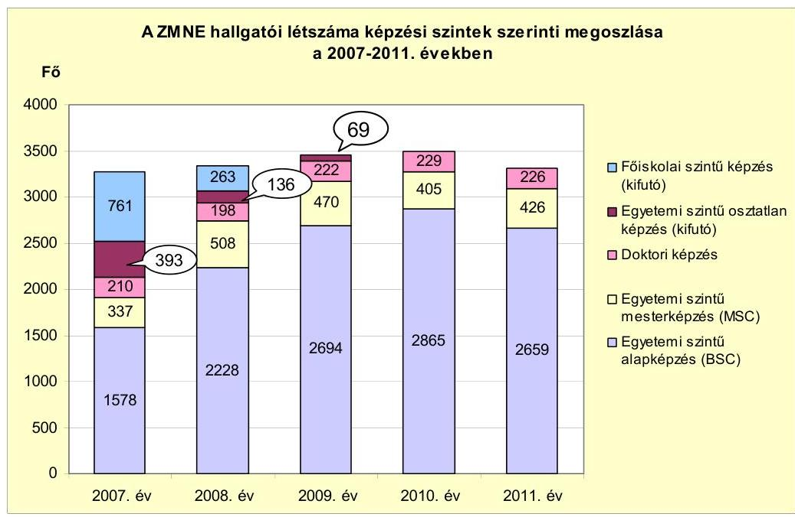

## A ZMNE képzési programjában kidolgozott alap- és mesterképzések teljesítéséhez elöírt elméleti és gyakorlati követelmények teljesültek.

Az elméleti és gyakorlati oktatás képzési követelményei - a tanévenként egy kiválasztott szemeszter, ezen belül egy szak és több szakirány ${ }^{22}$ szakindítási engedélyében szereplő mintatanterv, az egyetemi tanrendben feltüntetett órarend és az óratartás programban rögzített és elszámolt foglalkozások összehasonlítása alapján - teljesültek.

Az elméleti órák közül 637 tanóra (pl.: haditechnikai alapismeretek, katonapedagógia és szociológia, idegenhadsereg ismeret, biztonságpolitika, katonai múve-

[^0]
[^0]:    ${ }^{22}$ Összesen öt szak, a szakokon belül négy alapképzés és két mesterképzési forma, valamint hét szakirány, közte polgári képzés is.

---

letek elmélete, védelemigazgatás, szárazföldi erők műveletei, védeleminformatika, légierő műveletei) ellenőrzése történt meg. A gyakorlati órák közül 1124 tanóra megtartását ellenőriztük a harcászat, a lövészeti felkészítés, a felderítő gyakorlati ismeretek, a harcvezetés, a tüzérfelderítés és a tüzérlövéstan tantárgyak esetében. A gyakorlati órák megtartását az óratartási programban rögzítették.

A gyakorlati oktatáshoz a ZMNE minden év március 31-ig elkészítette a honvéd tisztjelöltek képzéséhez a következő naptári évben szükséges csapat, anyag és kilométer felhasználási igényt. Az igényeket a katonai alapképzési szak tanóra, kredit és vizsgatervében szereplő gyakorlati foglakozások alapján határozták meg. Azokat a gyakorlati foglalkozásokat, amelyeknek a gyakorlati képzési feltételeit a ZMNE - a rendelkezésére álló bázisokon és haditechnikai eszközökkel - nem tudta biztosítani, a MH bázisán tervezték. A polgári hallgatók gyakorlati oktatását a ZMNE oktatási infrastruktúrája biztosította. A szakmai gyakorlat teljesítéséhez az érintett hallgatók legalább 70\%-ának a ZMNE biztosította a képzési helyet.

A gyakorlati képzés tervezetét az adott év áprilisában a ZMNE felterjesztette egyeztetésre az MH Összhaderőnemi Parancsnokságra, illetve jóváhagyásra a HVK Kiképzési Csoportfőnökségre. A ZMNE honvéd tisztjelölt hallgatóinak képzéséhez a következő évre szükséges csapat, anyag és kilométer felhasználási igény, a jóváhagyást követően az MH csapatok részére parancs formájában jelent meg, amelyek felhasználási igényét félévenként pontosították.

A katonai alap és mesterképzési szakok szakindítási dokumentumában szereplő gyakorlati foglalkozásokra, az adott tanszék Levezetési tervet készített, amely a megszervezés és végrehajtás érdekében minden lényeges kérdést szabályozott, meghatározott. A Levezetési terv alapján a tanszék pontosította a csapatok képviselőjével a végrehajtás érdekében a gyakorlati órák megtartásához szükséges igényeket (lőszer, robbanóanyag, ellátás, szállás, stb.).

A ZMNE-n két karon, karonként egy-egy tudományágban folyt a doktori képzés.

A doktori iskolák működését a 2007-2011. években elsődlegesen az Ftv. szabályozta. Az Ftv. 67. § (4) bekezdése alapján, valamint a doktori felvételi tájékoztatók alapján a doktori képzés megszervezése és a doktori fokozat odaítélése a DT joga volt.

A HDI 2009-ben a Budapesten akkreditált képzést kihelyezett formában, Bécsben tartotta meg. Ezt a képzési formát 2010 februárjától a MAB elnökének a felhívására megszüntették.

A doktori felvételről, képzésről, valamint a fokozatszerzésről az Ftv., valamint a ZMNE doktori felvételi tájékoztatói rendelkeztek. A doktori képzés keretében folytatott kutatások szorosan kapcsolódtak a hadtudományok, katonai műszaki tudományok fejlesztéséhez. A doktori hallgatók önálló tudományos munkásságának dokumentálása nem volt megfelelő a doktori iskolákban, mert a publikációs tevékenység igazolására szolgáló külön lenyomat (egy tanulmánykö-

---

tetből egy adott cikk, tanulmány eredeti dokumentum-formával mindenben megegyező példánya) hat esetben hiányzott ${ }^{23}$.

A doktori képzésre jelentkezők ${ }^{24}$ száma 2007-től 2009-ig évről évre nőtt majd 2010-ben és 2011-ben csökkent. A doktori képzésre jelentkezőkön belül a ZMNE korábbi hallgatóinak a száma 2007-ről (kilenc fő) 2011-re (11 fő) nőtt. A 20072011. évben a ZMNE-n a két doktori iskolában összesen 211 fő ${ }^{25}$ szerzett doktori címet. A doktori képzésre jelentkezettek, és a végzett hallgatók száma az ellenőrzött időszak elején nőtt, az időszak végén csökkent.

A ZMNE doktori iskolák hallgatói a 2007-2011. években nem részesültek állami doktori ösztöndíjban annak ellenére, hogy a DT ezt többször kezdeményezte a Rektori Konferenciánál, valamint a honvédelmi és az oktatási minisztereknél. 2012-től 13 államilag támogatott doktori ösztöndíjas hallgató felvételére van lehetőség a jogutód NKE-nél a két doktori iskolába ${ }^{26}$.

Az oktatásért felelős miniszter 2008-ban tájékoztatta a honvédelemért felelős minisztert, hogy a katonai védelmi szakokat a katonai képzési területen akkreditálták, ezért az alap- és mesterképzési szakok esetében lehetővé tette az államilag támogatott férőhelyek biztosítását, azonban államilag támogatott doktorandusz férőhelyeket a ZMNE részére nem biztosítottak.

A HDI-ben és a KMDI-ben 2007-2011-ben doktori címet szerzettek közül 19 főnél ellenőriztük a doktori cím megszerzésének nyilvántartását. A doktori címek megszerzése - a nyilvántartott adatok alapján - szabályosan történt meg.

A ZMNE-n a doktori címet szerzettek közül a 2007-2011. években minden évben részesült legalább egy fő - 2007-ben, 2008-ban és 2011-ben kettő-kettő fő, 2009-ben három fő, 2010-ben egy fő - Bolyai János Kutatási Ösztöndíjban. (Az elmúlt 15 év 7927 pályázójából 2830 fő részesült Bolyai János Kutatási ösztöndíjban.)

A ZMNE doktori iskolák indításánál, azok oktatói - a MAB véleménye alapján - megfeleltek a magas szintű tudományos tevékenység feltételének. Az oktatók tudományos tevékenységének nyomon követése a doktori iskolák felelőssége volt. A két doktori iskola (HDI és KMDI) által készített kimutatás szerint a HDI tíz, a KMDI 13 törzstagja megfelelt a MAB előírásainak. A törzstagokon kívüli hét fő HDI és 30 fő KMDI oktató, témavezető nem felelt meg a MAB előírásainak az ODT honlapján előírt számú cikk közzététele hiánya miatt.

[^0]
[^0]:    ${ }^{23}$ Az Ftv. 68. §-a (5) bekezdésének c) pontja előírta az önálló tudományos munkásság bemutatását cikkekkel, tanulmányokkal. A doktori iskolák felvételi tájékoztatói ezt kiegészítették azzal, hogy csatolni kellett a tudományos munkák külön lenyomatait.
    ${ }^{24}$ 2007-ben 64 fő, 2008-ban 72 fő, 2009-ben 87 fő, 2010-ben 76 fő, 2011-ben 55 fő jelentkezett a doktori képzésre.
    ${ }^{25}$ A végzett hallgatók száma 2007-ben 41, 2008-ban 47, 2009-ben 45, 2010-ben 42, 2011-ben 36 fő volt.
    ${ }^{26}$ Hat fő a HDI-ba, hét fő felvételére a KMDI-ba van lehetőség.

---

A tudományos tevékenység mérésének eszköze a tudományos cikkek impakt faktora és a cikkekre történő hivatkozások száma. Az impakt faktort és a hivatkozásokat 2007-től az ODT adatbázisa kezelte. A doktori iskolák oktatóinak a 33/2007. (III. 7.) Korm. rendelet 4. § a) pontja alapján legalább öt évig meg kellett felelniük a magas szintű tudományos publikációs követelménynek ${ }^{27}$.

A ZMNE 2006. évi IFT-je a tudományos publikációk minőségi mutatóinak javítási célját fogalmazta meg. Nehézségként jelölte meg ugyanakkor, hogy a hadtudományok és a katonai műszaki tudományok terén nincs olyan jellemző tudományos, vagy szakmai folyóirat, amely impakt faktoros lehetne, további problémát jelentett korábban a tudományágak jellegéből adódó titoktartási kötelezettség.

A HDI és a KMDI oktatóitól a 2007-2011. években összesen 2442 idézettséget regisztráltak. A ZMNE adatszolgáltatása alapján a 2007-2008. években 871, a 2009-2011. években 1571 idézés szerepelt a ZMNE doktori iskoláinak oktatóitól. A ZMNE a hallgatók publikációs tevékenységére vonatkozóan nem szolgáltatott adatokat. (A ZMNE-n a doktori képzésében részt vevő hallgatók és a tudományos publikációk számát a 2007-2011. években a jelentés 4 . számú melléklete részletezi.)

A doktori iskolák - a doktori hallgatók tudományos munkássága dokumentálása hiányosságai, valamint a doktori iskolák oktatóinak a tudományos publikációk terén kimutatott elmaradásai ellenére - a képzési programban a doktori képzésre vonatkozó követelményeket teljesítették.

A 2008-ban a doktori iskolák a MAB akkreditáció keretében elvégzett törvényi megfelelőségi vizsgálata alapján 2010. január 31-ig megfelelő minősítést kaptak, ezt követően 2012. január 31-ig, majd 2014. december 31-ig meghosszabbította a MAB a doktori iskolák akkreditációját.

# 2.2.2. A katonai és a polgári képzési célok teljesülése 

A ZMNE hallgatóinak katonai, illetve polgári képzési forma szerinti megoszlását szemlélteti 2007-2011 között a következő ábra:
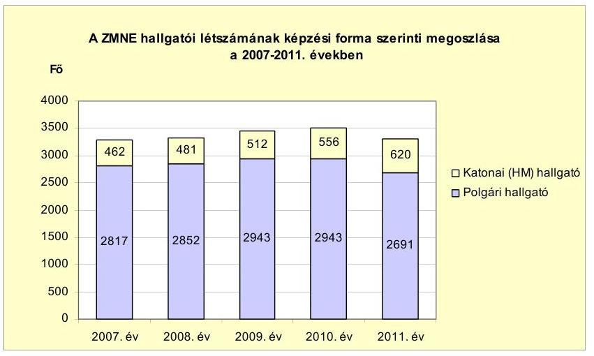

[^0]
[^0]:    ${ }^{27}$ Az ODT honlapján az elmúlt tíz évből évente egy-egy cikket kellett közölni a doktori iskolák törzstagjainak, oktatóinak, témavezetőinek.

---

A katonai képzés terén az IFT-ben meghatározott képzési cél a HM elvárásoknak megfelelő számú és képzettségú tisztek és tisztjelöltek oktatása, az ehhez szükséges személyi feltételek, szervezeti keretek kialakítása volt. A ZMNE-n a felvételi keretszámokat, valamint a katonai képzés elméleti és gyakorlati követelményeit a HM határozta meg. A katonai képzési programokban meghatározott követelmények teljesültek. A személyi feltételeket - az eredményes intézményi akkreditáció alapján - az egyetem biztosította. A szervezeti kereteket a HM elvárásoknak megfelelően alakították ki. Mindezek alapján a katonai képzési célok teljesültek, a katonai képzés eredményes volt.

A katonai felsőoktatás felvételi keretszámait, mint a katonatisztek utánpótlását biztosítandó létszámokat a HVK Személyzeti Csoportfőnökség adta meg a HM Humánpolitikai Főosztályának, ahonnan azt a ZMNE felé ${ }^{28}$ továbbították. A felvételi keretszámok összeállítása a 64/2003. HM utasítás szerint történt. A létszámadatokat az adott tanévet megelőző év augusztus 31-ig a honvédelmi miniszter által jóváhagyott hazai beiskolázási terv tartalmazta. A katonatiszt képzés felvételi létszámadatait az MH szakmai munkakörei, üres beosztásai, a hivatásos tiszti állomány tervezett leszerelése (az így megüresedő beosztások), továbbá a fluktuációs mutatószámok alapján határozták meg. A beiskolázási terv a katonai létszámadatokon túl az MH továbbképzési igényeit is tartalmazta, amely meghatározásánál figyelembe vették a munkaköri követelményeket, a katonai missziós felkészítési szükségleteket, a NATO elvárásokat, illetve egyéb nemzetközi szerződésből eredő kötelezettségeket.

Az első évfolyamra felvett katonatisztjelöltek száma a 2007/2008. tanévi 133 föről a 2011/2012. tanévre 209 före emelkedett. A felvett katonatisztjelöltek számához képest a 2007-2011. években a végzett katonatisztek aránya átlagosan $77,6 \%$ volt. A 2007-2011. években minden végzett katonatisztet az MH-nál végzettségének megfelelő beosztásba helyeztek el.

A katonai szakreferensek részt vettek a tisztképzéssel, a kibocsátandó tisztekkel szembeni katonai, valamint katonai-szakmai követelmények kidolgozásában és a létszámkeret, valamint az ösztöndíjas és kettős jogállású végzős hallgatók első beosztásainak megtervezésében.

A ZMNE a 2007-2011. években nem kötött együttmúködési megállapodást középfokú oktatási intézményekkel a hazafias nevelés elősegítése és a katonatisztjelölt képzés megismertetése céljából.

A ZMNE 2008-ban elkészítette az oktatás-marketing elveit és toborzási kampány stratégiáját, valamint felsőoktatási szerepének erősítése érdekében a 2010-2014. évekre vonatkozóan marketing stratégiát dolgozott ki.

A ZMNE a polgári felsőoktatási intézményekkel ${ }^{29}$ kötött megállapodást a Honvédelmi alapismeretek oktatására. A tantárgy oktatásának a célja volt, hogy a hallgatók egyrészt megismerjék hazánk biztonságpolitikai környezetét, honvédelmét az ezzel kapcsolatos kötelezettségeket. Az oktatás keretében másrészt bemutatásra került az MH helye és szerepe a honvédelem rendszerében, szervezeti

[^0]
[^0]:    ${ }^{28}$ 2011-től a Fenntartói Testület felé
    ${ }^{29}$ 2007-2011. években hét felsőoktatási intézményben vezették be az oktatást.

---

felépítése, múködésének jellemzői. A tantárgy oktatása sikeres, a 2007/2008. tanév I. szemeszterében a hazai felsőoktatási intézményekben 279 hallgató, míg 2011/2012. tanév I. szemeszterében 693 hallgató vette fel a tantárgyat ${ }^{30}$.

A polgári képzés terén célként határozták meg a képzéshez, valamint az élethosszig tartó tanuláshoz szükséges feltételek biztosítását. A ZMNE-n - az ellenőrzött időszakot megelőzően - a polgári képzés bevezetésének az oka elsősorban a csökkenő katonatiszt képzés miatt felszabadult oktatási kapacitás kihasználása volt. A polgári szakok többségén speciális képzési igényű (pl. védelmi, biztonsági) szakembereket képeztek. A képzési feltételeket az intézmény kialakította és biztosította.

A következő szakokon folyt polgári képzés 2007-2011 között: védelmi igazgatás (önkormányzati, katonai, tűzoltósági), védelmi vezető technikai rendszerszervező, biztonságtechnikai, had- és biztonságtechnikai mérnöki, közlekedésmérnöki, gépészmérnöki, villamosmérnöki, biztonságtechnikai mérnöki, katasztrófavédelmi mérnöki, gazdálkodási/pénzügyi számviteli, biztonsági és védelmi politikai, nemzetbiztonsági, büntetés-végrehajtási nevelő, katonai logisztikai, nemzetközi tanulmányok.

A ZMNE polgári képzés keretében új képzéseket a budapesti helyszínen kívül más felsőoktatási intézményekkel közösen - Ózdon és Szegeden indított a 20072011. években ${ }^{31}$. A székhelyen kívüli polgári képzések elindítását költségtervek, hatástanulmányok nem alapozták meg. A székhelyen kívüli képzések indítása a 2006. évben készült IFT-ben megfogalmazott célkitűzéssel összhangban történt.

A ZMNE hallgatói létszáma a 2007-2011. években átlagosan 3375 fő volt, ebből a polgári hallgatók aránya a 2007. évi 83,7\%-ról (2744 főről) 2011-re 81,3\%-ra (2691 főre) csökkent.

Az első évfolyamra felvett polgári hallgatók száma a 2007. évi 1023 főről 2009-re 1274 főre emelkedett, majd 2010-ben 1201 főre, 2011-ben 688 főre csökkent, a védelmi szférához, nemzetbiztonsági területhez nem kapcsolódó polgári képzések fokozatos megszüntetése miatt.

A polgári képzés 2008-ig kizárólag költségtérítéses formában múködött. A költségtérítésként fizetett díjak mértékét évente felülvizsgálták, szükség esetén módosították, és azokat a Felsőoktatási felvételi tájékoztatóban jelentették meg. A hallgatók polgári képzés keretében, államilag támogatott képzési helyekre a 2008/2009. tanévtől öt ${ }^{32}$ szakra jelentkezhettek. Az oktatásért felelős minisztériumtól az államilag támogatott polgári hallgatók képzésére

[^0]
[^0]:    ${ }^{30}$ A tantárgy felvétel összesített adata a 2007/2008-as és a 2011/2012-es tanévekben összesen 7214 fő volt.
    ${ }^{31}$ Az ózdi képzés a képzési szerkezet átalakítása miatt 2014/2015. tanévtől, a szegedi képzés a jelentkezők száma miatt a 2012/2013. tanévtől megszűnik.
    ${ }^{32}$ 2008-2011 között államilag támogatott (és költségtérítéses formában is) indultak a pénzügy számviteli, had- és biztonságtechnikai mérnöki, közlekedésmérnöki, gépészmérnöki és a biztonságtechnikai mérnöki szakok.

---

a 2008/2009-es tanévre 93,0 M Ft, a 2009/2010-es tanévre 154,7 M Ft támogatást kapott a ZMNE. A ZMNE hallgatói létszámának finanszírozási forrás szerinti megoszlását szemlélteti a következő grafikon ${ }^{33}$ :
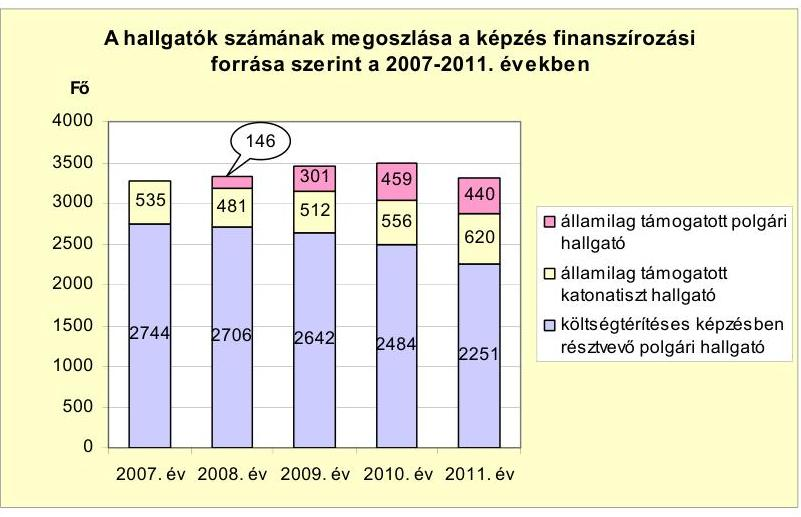

A költségtérítéses képzésben résztvevő polgári hallgatók többsége - 2007-ben 86,2\%-a, 2008-ban 85,2\%-a, 2009-ben 79\%-a, 2010-ben 67,9\%-a, 2011-ben $77,4 \%$-a - levelező tagozatos volt. A levelező képzés megszervezésével az élethosszig tartó tanulás feltételei kialakítása képzési cél teljesült. A polgári képzés a célok megvalósulása tekintetében eredményes volt.

A ZMNE a polgári képzésben részt vett hallgatók elhelyezkedési adatairól a 2007-2011. évekre nem rendelkezett információval.

A Karrier Iroda 2011-ben a Diplomás Pályakövető Rendszer kutatás jelentéséhez adatgyűjtést végzett a 2008. és a 2010. években abszolutóriumot szerzett hallgatók körében. A két évben végzett 1443 főből 245 fő szolgáltatott adatot a ZMNE megkeresésére. A válaszoló hallgatók kb. 80\%-a költségtérítéses képzésben vett részt, a hallgatók közel $40 \%$-a a nyelvvizsga hiányában nem kapott diplomát közvetlenül az államvizsga után. Az álláskeresés, munkavállalás szempontjából a levelező tagozatos hallgatók $94 \%$-át biztos munkahely várta. A levelező tagozatos hallgatók közül 10\% volt munkanélküli hosszabb-rövidebb ideig az eltelt idő alatt. A 2008. évben nappali tagozaton végzettek között ez az arány 31\% volt, a 2010. évben végzettek esetében 39\%.

Az ellenőrzött időszakban a polgári képzésen belül a hallgatók lemorzsolódása évfolyamonként és szakonként jelentősen eltérő mértékű volt. Kisebb arányú (50\% alatti) lemorzsolódás az alapképzésen belül a védelem-igazgatás és a büntetés-végrehatási nevelő szakon, nagyobb arányú ( $60 \%$ feletti) a közlekedés és a gépészmérnöki szakokon volt.

[^0]
[^0]:    ${ }^{33}$ A grafikon 2007. évi oszlopában az 535 fő összetétele 462 fő államilag támogatott katonatiszt, illetve tisztjelölt HM hallgató, és 73 fő BM által támogatott határvédelmi tiszt hallgató. BM által támogatott hallgatók a 2007. évet követően nem voltak.

---

# 2.3. A ZMNE kutatási és pályázati tevékenysége 

Az ZMNE KFI tevékenysége a katonai fejlesztési programokhoz, az állami kutatási programokhoz és egyes ipari fejlesztésekhez kapcsolódott. A doktori hallgatók bekapcsolódtak a kutatásokba, a doktori felvételi tájékoztatóban meghirdetett választható kutatási témák összefüggtek az egyéb fegyveres testületek által megfogalmazott igényekkel. Meghatározó jelentőségű volt a HM támogatása, ezért a ZMNE kutatási programjai is elsődlegesen a HM és az MH irányelveihez és fejlesztési koncepciójához igazodtak. A kutatási eredményeket közzétették, számuk 2007-2011 között 24 volt. (A ZMNE kutatási tevékenységét a 2007-2011. években a jelentés 5. számú melléklete részletezi.)

A KFI célkitűzéseket évente, három éves időtartamra határozták meg. A ZMNE évente kiadta a tudományos kutatási, a tudományos rendezvények szervezési és a folyóirat kiadmányozási tervét.

A tehetséggondozás és a hallgatók kutatómunkába való bevonása a tudományos diákköri tevékenységen keresztül valósult meg.

A ZMNE 2007-2011. években a felsőoktatás eredményességének növelése, a társadalmi és a gazdasági élet által támasztott követelményeknek való jobb megfelelés, a kutatási eredmények kölcsönös hasznosítása érdekében 40 db képzési és kutatási témájú - az Ftv. 31. § (1) bekezdésében előírtaknak megfelelő - együttműködési megállapodást kötött. Az együttműködési megállapodások közül 17 szerződés felsőoktatási intézményekkel, négy civil szervezetekkel, kilenc gazdasági társaságokkal, egy középiskolával, kettő kamarákkal, hét egyéb költségvetési szervekkel jött létre.

Az egyetemi szintű kutatási tevékenységekre kötött vállalkozási szerződések ellenőrzésére kiválasztott mintában a pénzgazdálkodással kapcsolatos belső kontrollok múködése nem volt megfelelő a következő hiányosságok miatt. A szerződéseknél hiányzott a kötelezettségvállalás ellenjegyzőjének aláírása az Ámr. 134. § (8) és az Ámr. 74. § (1) bekezdésében előírtak ellenére. A megbízási szerződések esetében a „Kifizetési engedély megbizási szerzödéshez" elnevezésű formanyomtatványokról hiányoztak az érvényesítők aláírásai az .Ámr. 135. § (4) és az Ámr. 7 77. § (1) bekezdésében foglaltak ellenére. Az utalványozók aláírásai között előfordult névbélyegző használata is annak ellenére, hogy a pénzgazdálkodási szabályzat erről nem rendelkezett.

A kutatáshoz, fejlesztéshez kapcsolódó pályázati tevékenységet 2007-ben a ZMNE Tudományszervezési Központja fogta össze. 2008-ban a pályázati tevékenység erősítése, a pályázati lehetőségek jobb kihasználása érdekében a szenátus PER kidolgozásáról és jóváhagyásáról döntött. A pályázatok célja az oktatás színvonalának emelése, és $\mathrm{K}+\mathrm{F}$ tevékenység fokozása volt.

A ZMNE által az ellenőrzött időszakban benyújtott (2007-ben öt, 2008-ban 13, 2009-ben 10, 2010-ben kilenc, 2011-ben négy) összesen 41 db egyetemi szintü pályázat 70,7\%-a nyertes volt. (A ZMNE pályázati tevékenységét a 2007-2011. években a jelentés 6 . számú melléklete részletezi.)

---

A nyertes pályázatok száma a 2007-2011. években 32 volt a 2006. évben beadott, de az év végéig még el nem bírált három pályázattal együtt. A nyertes pályázatok száma változó volt (hét, tíz, kilenc, egy, illetve öt az egyes években).

A nyertes és a 2006. év végén még folyamatban lévő hat projekt (összesen 38 db ) összköltsége $993,5 \mathrm{M}$ Ft volt, amelynek $6,5 \%$-át saját forrás tette ki. A támogatási rész 74,8\%-a ( $743,3 \mathrm{M}$ Ft) EU-s forrásból származott. A hazai támogatás jellemzően OM, OKM, OTKA által meghirdetett pályázati forrásokból származott.

A nyertes pályázatok, a megpályázott célok alapján három nagy csoportot alkottak. Az oktatási, képzési eszközökre benyújtott pályázatok ( 14 db ) többsége a ZMNE Központi Könyvtár könyveinek, könyvritkaságainak állományvédelmét, az informatika könyvtári használatát, dokumentumok beszerzését, konferenciák megrendezését szolgálták. Oktatási, képzési eszközökre évente változó összegű, összesen 333,8 M Ft támogatást nyertek. A K+F-re benyújtott pályázatok (három db) az egyetem kutatóintézeti jellegének erősítését szolgálták, kapcsolódtak a ZMNE speciális oktatási témájához, a nemzetvédelemhez (védelmi kutatások, kísérleti fejlesztések). 2007-2011 között a kutatási projektekhez öszszesen 540,6 M Ft támogatást nyertek ${ }^{34}$. Az egyéb célokra benyújtott pályázatok ( 21 db ) illeszkedtek a ZMNE képzési szerkezetéhez ${ }^{35}$. A vizsgált időszakban 34 projekt zárult le. A 2011. év végén folyamatban lévő négy projekt értéke 607,1 M Ft, amelyhez 600,8 M Ft támogatás vehető igénybe.

# 3. A ZMNE SZEMÉLYI, TÁRGYI ÉS PÉNZÜGYI ESZKÖZEI FELHASZNÁLÁSÁNAK HATÉKONYSÁGA 

### 3.1. Az oktatás-képzés személyi feltételeinek biztosítása

A ZMNE a tevékenységét a 2007-2011. évek költségvetési beszámolójában bemutatott átlagos statisztikai állományi létszámadatok szerint 2007-ben 713 fővel, 2008-ban 524 fővel, 2009-ben 546 fővel, 2010-ben 559 fővel és 2011-ben 504 fővel látta el, a költségvetésben engedélyezett létszámot betartva. A ZMNEn foglalkoztatottak közalkalmazotti jogviszonyban, illetve hivatásos katonai szolgálati jogviszonyban álltak. A hivatásos katonai állományban alkalmazottak (tisztek, tiszthelyettesek és szerződéses katonák) átlagos statisztikai állományi létszáma 2007-ben 293 fő, 2008-ban 192 fő, 2009-ben 193 fő, 2010-ben 195 fő és 2011-ben 156 fő volt.

A honvédelmi miniszter a 101/2007. (HK 18.) HM utasításban a ZMNE 2007. november 1-től érvényes szervezeti adatait 520 fő munkavállaló és 400 fő katonai hallgató finanszírozását vállalva határozta meg. A honvédelmi miniszter a

[^0]
[^0]:    ${ }^{34}$ A 2006. évről áthúzódó pályázatokkal együtt 559,8 M Ft volt az elnyert támogatási összeg a 6. számú melléklet szerint. Az 5. számú mellékleten a 2006. évi áthúzódó pályázati támogatás ( $19,2 \mathrm{M} \mathrm{Ft}$ ) nélkül szerepel a $\mathrm{K}+\mathrm{F}$ pályázati támogatás összege, 540,6 M Ft.
    ${ }^{35}$ Pl: „Az egyetemes és magyar légi hadviselés elméletének és gyakorlatának a fejlődéstörténete" tárgyú OTKA pályázat is a katonai képzéshez illeszkedett.

---

ZMNE 1164/113. számú munkaköri jegyzékében az engedélyezett létszámot 752 föről - csoportos létszámleépítés keretében - 520 före csökkentette.

A 2007. novemberi létszámcsökkentési döntés hatására a hivatásos katonák engedélyezett létszáma 120 fővel, 2011-ben az MH LZ kiválásával, 23 fővel csökkent. 2011. szeptember 1-jétől a ZMNE két karának összevonása további álláshely csökkentéssel járt együtt, a hivatásos katonatiszti álláshelyek száma 44 fővel csökkent.

A ZMNE kimutatása alapján az elméleti és gyakorlati képzési feladatok személyi feltételeit 2007-2011 között csökkenő főfoglalkozású oktatói létszám mellett, óraadó tanárok bevonásával biztosította. A főfoglalkozású oktatók létszáma a 2007. évi nyitó létszámhoz képest a 2011. év végére 95 fővel (32,1\%-kal) csökkent.

A főfoglalkozású oktatói létszám évenkénti változását szemlélteti a következő grafikon:
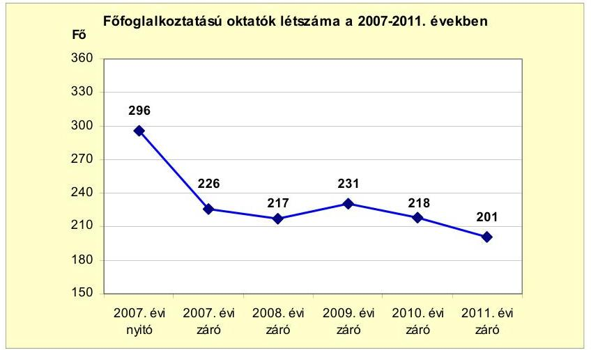

A ZMNE által foglalkoztatott főfoglalkozású oktatók tanórai leterheltsége az évek során növekedett a kötelező óraszám emelése miatt. A ZMNE főfoglalkozású oktatói a 2007/2008-as tanévben 79,9\%-ban, a 2011/2012-es tanévben 82,9\%-ban biztosították az oktatás, képzés tanóra igényét. Az oktatási, képzési feladatok teljes körű ellátásához a ZMNE a főfoglalkozású oktatók mellett az Ftv. 83. §-ában előírtak szerint óraadó tanárokat is alkalmazott megbízási és vállalkozási szerződéssel. A nem főfoglalkozású - óraadó - oktatók a ZMNE kimutatása szerint a 2007/2008-as tanévben 18,7 ezer órát, a 2008/2009-es tanévben 25,3 ezer órát, a 2009/2010-es tanévben 26,4 ezer órát, a 2010/2011-es tanévben 24,6 ezer órát, a 2011/2012es tanévben 18,2 ezer órát tartottak. A ZMNE az oktatáshoz, képzéshez szükséges tananyagok megírásáról, átdolgozásáról - a szerzői jogokat figyelembe véve - felhasználói szerződésekkel gondoskodott.

Az Ftv. 21. § (3) bekezdésében előírtaknak megfelelően a ZMNE SzMSz-ének 7. számú mellékletét képező foglalkoztatási követelményrendszer szabályzatá-

---

ban meghatározták az egyes munkakörök betöltésének feltételeit ${ }^{36}$. A szabályzatban előírták, hogy a kinevezett oktatók, nyelvtanárok, testnevelő tanárok oktató, tudományos és szakmai tevékenységét a folyamatos alkalmasság követelménye alapján figyelemmel kell kísérni, és kétévenként értékelni kell. Az értékelést az önértékelés, a vezetői ellenőrzés és a hallgatói véleményezés tapasztalatai alapján kellett volna elkészíteni. Az értékeléshez nyomtatvány mintát nem írtak elő, az értékelésről készült dokumentumok kezelését, a személyi anyagokban történő elhelyezését annak indokoltsága ellenére nem szabályozták. Az ellenőrzésre egyszerű véletlen mintavétellel kiválasztott - 25 fő kinevezett oktató - kutató és tanár esetében a személyi anyagok szerint a folyamatos alkalmasság vizsgálata az önértékelés, a vezetői ellenőrzés-értékelés és a hallgatói vélemények alapján, dokumentált módon nem történt meg. A foglalkoztatási követelményrendszer szabályzatában a folyamatos alkalmasság vizsgálatán kívül előírták a minősítési és teljesítményértékelési kötelezettséget is. A mintába kiválasztott 12 fő hivatásos katonai szolgálati jogviszonyban álló oktató személyi anyaga tartalmazta a Hjt. 4. számú mellékletében előírt évenkénti minősítés dokumentumait.

A főfoglalkozású alkalmazottak közül - egyszerű véletlen mintavétellel - kiválasztott 30 fő (közalkalmazott és hivatásos katona) esetében a munkáltatói jogkörgyakorlás rendje megfelelt az SzMSz-ben és annak mellékleteiben előírtaknak, valamint az egyes munkakörök betöltésével kapcsolatos foglalkoztatási követelményeket (előírt iskolai végzettség, szakképzettség, gyakorlati idő, vezetői gyakorlat stb.) betartották.

A kinevezéseket, átsorolásokat az SzMSz-ben és annak 1. számú mellékletében ${ }^{37}$ előírtaknak megfelelően a rektor írta alá, a munkaköri leírásokat a munkahelyi vezetők adták ki. A munkaköri leírások felülvizsgálatát jogszabályi, szervezeti és személyi változások miatti indokoltsága ellenére nem végezték el. Az ellenőrzött dolgozók közül egy személy a 2011 októberében kelt munkaköri leírását a helyszíni ellenőrzés idejéig nem vette át.

A szenátus az SzMSz 6. számú mellékleteként hagyta jóvá a vezetői és oktatói munkakörök betöltésére kiírandó nyilvános pályáztatás ${ }^{38}$ rendjét. Rögzítették, hogy a rektori, a dékáni, a gazdasági főigazgatói, a főtitkári és az egyetemi, illetve főiskolai tanári állásokra a honvédelmi miniszter, a többi munkakörben a rektor írja ki a pályázatokat. A 2007-2011. években a szenátusi határozatok szerint 52 alkalommal döntöttek állás pályázatokról, de a döntési folyamatban készült dokumentumokat az ellenőrzésre kiválasztott tíz pályázathoz nem tudták átadni.

A szenátus a címek adományozási rendjét az SzMSz 9. számú mellékletében szabályozta. A ZMNE-vel foglalkoztatási jogviszonyban nem állók részére tíz

[^0]
[^0]:    ${ }^{36}$ A 2011. szeptember 1-jétől az SzMSz második része tartalmazta a foglalkoztatási követelményrendszert.
    ${ }^{37}$ A 2011. szeptember 1-jétől hatályba lépett SzMSz második részének II. fejezete tartalmazta a munkáltatói jogkör gyakorlásának rendjét.
    ${ }^{38}$ A 2011. szeptember 1-jétől hatályba lépett SzMSz második részének IV. fejezete tartalmazta a pályázatok elbírálásának rendjét.

---

féle cím adományozását szabályozták, meghatározták a címek adományozásának feltételeit, az évente adható címek számát, a címek viselésének időtartamát, a címek adományozására javaslatot tevők körét, a döntést hozó személyt vagy testületet, a címmel járó tiszteletdíj mértékét, az átadás időpontját. A 2007-2011. években a szenátusi határozatok szerint 40 alkalommal döntöttek címek adományozásáról, az ellenőrzésre kiválasztott tíz címadományozáshoz a döntési folyamatban készült dokumentumokat nem tudták átadni az ellenőrzés részére.

Egy-egy pályázat értékelésével és cím adományozásával kapcsolatos iratokat nem kezelték egy ügyiratban, a szervezeti és személyi változások következtében a keletkezett részanyagok nem voltak fellelhetők.

A ZMNE - az Ftv.-ben előírt aránykövetelménynek megfelelően ${ }^{39}$ - az oktatási, képzési tevékenysége ellátásához szükséges iskolai végzettségű és szakképzettségű, alkalmazotti jogviszonyban álló oktatói személyi állományt biztosította.

A szerződéses foglalkoztatás szabályszerűségének ellenőrzése ${ }^{40}$ során, a megbízási, vállalkozási és felhasználói szerződések megkötésénél típushibák voltak. Az ellenőrzött szerződések 60 esetben (összesen 16,7 M Ft ellenértékű szerződésekben) - az óraadói és vizsgáztatási feladatokat kivéve - nem kellő részletezettséggel tartalmazták a megbízott által teljesítendő konkrét feladatokat. Az ellenőrzött szerződésekben a megbízó részéről nem jelölték ki a kapcsolattartót és a feladat végrehajtását ellenőrző személyt, valamint hiányzott a feladatellátáshoz szükséges iskolai végzettség és szakmai képesítési követelmény előírása is. A szerződések megkötése 119 esetben (összesen 31,9 M Ft ellenértékű szerződésekben) a feladat teljesítésének megkezdését vagy a teljesítést követően, utólag történt meg.

Az ellenőrzött szerződésekhez kapcsolódó pénzügyi dokumentumoknál a pénzgazdálkodással kapcsolatos belső kontrollok múködése nem megfelelő volt. A kifizetéshez nem a szabályzatban rögzített nyomtatványt használták, a kötelezettségvállalás, a szakmai teljesítésigazolás és az utalványozás módja nem a szabályzatban előírt módon, saját kezű aláírással, hanem névbélyegző használatával történt. A kötelezettségvállalási, a kötelezettségvállalás ellenjegyzési, a szakmai teljesítésigazolási és az érvényesítési feladatokat írásbeli

[^0]
[^0]:    ${ }^{39}$ Az Ftv. 12. § (4) bekezdés előírása szerint: „A felsőoktatási intézménynek rendelkeznie kell állandó székhellyel, továbbá állandó kutatói, oktatói karral. E rendelkezések alkalmazásában állandó székhely a felsőoktatási alaptevékenység gyakorlásának, valamint a központi ügyintézésnek a helye, feltéve, hogy legalább nyolc évig - a Kormány által meghatározottak szerint - a felsőoktatási intézmény feladatainak ellátásához rendelkezésre áll. A felsőoktatási intézmény állandó oktatói, kutatói karral akkor rendelkezik, ha az alaptevékenységének ellátásához szükséges oktatók és kutatók legalább hatvan százalékát munkaviszony, illetve közalkalmazotti jogviszony keretében foglalkoztatja."
    ${ }^{40}$ A 2007-2011. évek megbízási, vállalkozási és felhasználói szerződések szabályszerűségét a szerződésekből egyszerű véletlen mintavétellel kiválasztott 314 tétel (összértéke 130,7 M Ft) és a kapcsolódó kifizetési bizonylatok ellenőrzése alapján értékeltük. Az oktatáshoz, képzéshez kapcsolódó megbízási, vállalkozási és felhasználási szerződések száma évente meghaladta a 3000 db -ot.

---

felhatalmazással nem rendelkező személyek végezték el. Nem tettek eleget az ellenőrzési feladataiknak a kötelezettségvállalás ellenjegyzésére, a szakmai teljesítésigazolásra és az érvényesítésre kijelölt személyek. Az utalványozók és az utalvány ellenjegyzői sem tettek eleget az ellenőrzési kötelezettségüknek, mivel nem kifogásolták az érvényesítés, illetve a szakmai teljesítés igazolásának a hiányát az Ámr. ${ }_{1,2}$-ben előírtak ellenére.

Az ellenőrzési mintában szereplő megbízási és felhasználási szerződések esetében a kifizetés elrendelése nem a kötelezettségvállalási, utalványozási, ellenjegyzési és érvényesítési szabályzat ${ }_{1}$-ban elrendelt utalvány használatával történt meg. Erre a célra a „kifizetési engedély megbizási szerződéshez" nyomtatványt alkalmazták, amely nem tartalmazta az utalvány kifejezést az Ámr. ${ }_{1} 136 . \S$ (4) bekezdés b) pontjában és az Ámr. ${ }_{2} 78 . \S$ (2) bekezdés b) pontjában előírtak ellenére.

A 2007-2011. években a 130,7 M Ft értékű 314 ellenőrzött tételből 2008-ban tíz szerződés esetében - összértéke 22,6 M Ft - a kötelezettségvállaló a sajátkezű aláírása helyett névbélyegzőt használt. A névbélyegző használatát a ZMNE-n nem szabályozták, ezért e kötelezettségvállalások nem minősíthetőek szabályosnak. A 2011. évben 22 szerződés esetében ( $7,5 \mathrm{M}$ Ft összegben) a kötelezettségvállalást az Ámr. ${ }_{2} 72 . \S$ (3) bekezdésében foglaltak ellenére - arra felhatalmazással nem rendelkező személy írta alá.

A kötelezettségvállalás ellenjegyzése az ellenőrzött mintából 127 esetben ( 55,8 M Ft összértékben) elektronikus ellenjegyzéssel megtörtént, de a belső szabályozás ellenére a szerződés kinyomtatását követően az ellenjegyző által nem került saját kezűleg aláírásra ${ }^{41}$. 41 szerződés esetében (összértékük 6,4 M Ft) az Ámr. ${ }_{2} 74 . \S$ (2) bekezdés a) pontjában ${ }^{42}$ foglaltak ellenére az ellenjegyzőnek nem volt írásbeli felhatalmazása.

A szakmai teljesítésigazoló 11 esetben (11,2 M Ft összegben) a sajátkezű aláírása helyett névbélyegzőt használt. A 2008-2009. években négy esetben ( $21,1 \mathrm{M}$ Ft öszszegben) nem történt meg a szakmai teljesítés igazolása az Ámr. ${ }_{1} 135 . \S$ (1) bekezdésében előírtak ellenére. A szakmai teljesítésigazoló 66 esetben ( $10,5 \mathrm{M} \mathrm{Ft}$ összegben) nem rendelkezett a szakmai teljesítés igazolására írásbeli felhatalmazással az Ámr. ${ }_{2} 76 . \S$ (5) bekezdésében ${ }^{43}$ foglaltak szerint.

A megbízási és a felhasználási szerződések díjainak kifizetését megelőzően az Ámr. ${ }_{2} 77 . \S$ (4) bekezdésében előírtak ${ }^{44}$ ellenére az érvényesítést nem végezték el ( $45,8 \mathrm{M}$ Ft értékben) 235 kifizetést megelőzően a szakmai teljesítésigazolás alapján. A 2009. évben 13 esetben ( $10,7 \mathrm{M}$ Ft értékben) az Ámr. ${ }_{1} 135 . \S$ (4) bekezdésben foglaltak ellenére az érvényesítők írásbeli felhatalmazás nélkül látták el a feladatot.

[^0]
[^0]:    ${ }^{41}$ Az egyes nem rendszeres személyi juttatásokról és a munkaviszonyon kívüli tevékenységekről szóló szabályzat 2. általános rendelkezések pontja (7) bekezdésének harmadik és negyedik francia bekezdése tartalmazza azt az előírást, hogy a szerződés nyilvántartási programban rögzített szerződéseket az elektronikus ellenjegyzést követően nyomtatni kell és az aláírásra kötelezetteknek kettő napon belül a szerződéseket alá kell írni.
    ${ }^{42}$ 2010. január 1-jéig az Ámr. 134. § (8) bekezdése írta elő
    ${ }^{43}$ 2010. január 1-jéig az Ámr. ${ }_{1} 135 . \S$ (2) bekezdése írta elő
    ${ }^{44}$ 2010. január 1-jéig az Ámr. ${ }_{1} 135 . \S$ (4) bekezdése írta elő

---

Az utalványozó kilenc esetben a sajátkezű aláírás helyett névbélyegzőt használt, az utalványozók 235 megbízási és felhasználási szerződésre teljesített kifizetés előtt ( $45,8 \mathrm{M}$ Ft értékben) nem tartották be az Ámr. 2 78. § (2) bekezdésének előírását ${ }^{45}$, mivel nem észrevételezték az érvényesítés hiányát és érvényesítés nélküli okmányokat utalványoztak.

Az utalványok ellenjegyzői az Ámr. 2 79. § (2) bekezdésében előírtak ${ }^{46}$ ellenére 235 kifizetés elrendelése előtt ( $45,8 \mathrm{M}$ Ft értékben) nem észrevételezték az érvényesítés és négy kifizetés előtt ( $21,1 \mathrm{M}$ Ft értékben) a szakmai teljesítés hiányát.

Az ellenőrzött megbízási, vállalkozási és felhasználási szerződések - tartalmuk alapján - az oktatási-képzési tevékenységhez kapcsolódtak, az oktatás-képzés tanóra és tananyag igénye biztosításához intézményi szinten e szerződéses formák alkalmazására szükség volt.

# 3.2. Az elméleti és gyakorlati képzés tárgyi feltételeinek biztosítása 

A ZMNE saját tulajdonú ingatlan vagyonnal nem rendelkezett ${ }^{47}$, az ingatlanokat az államtól - a HM-en keresztül - határozatlan időre, ingyenes használatba kapta. Az épületek múködtetésével kapcsolatos közüzemi díjak és az őrzésvédelem kiadásai az ellenőrzött időszakban nem a ZMNE költségvetését terhelték, azokat a HM FHH költségvetéséből finanszírozták.

A ZMNE a tevékenységéhez szükséges kis és nagy értékű tárgyi eszközöket, valamint a szakmai anyagokat az éves költségvetése felhalmozási és dologi kiadási előirányzataiból vásárolta, illetve a HM fejezeten belülről térítésmentesen átvett eszközökkel biztosította. Az oktatáshoz-képzéshez szükséges tárgyi eszközök beszerzése az ellenőrzött években a ZMNE karainak szakmai és az egyéb szervezeti egységek múködéséhez szükséges eszközigényei alapján összeállított éves beszerzési terven alapult, kiegészülve az év közben felmerült igényekkel. A ZMNE a 2007-2011. években összesen 811,9 M Ft-ot fordított - a saját forrásait pályázati forrásokkal és államháztartáson kívüli támogatásokkal kiegészítve - felhalmozási kiadásokra ${ }^{48}$.

A vásárolt eszközök közül vett 25 tételből hét tétel szerepelt a ZMNE éves beszerzési tervében, a többi esetben egyedi, terven felüli beszerzés, vagy szakképzési fejlesztési támogatásból megvalósított beruházás történt. 13 db eszközt a beszer-

[^0]
[^0]:    ${ }^{45}$ 2010. január 1-jéig az Ámr. ${ }_{1}$ 136. § (3) bekezdése írta elő
    ${ }^{46}$ 2010. január 1-jéig az Ámr. ${ }_{1}$ 137. § (3) bekezdése írta elő
    ${ }^{47}$ A honvédelemről és a Magyar Honvédségről szóló 2004. évi CV. törvény 89. §-a rendelkezik arról, hogy a honvédség szervezeteinek elhelyezéséhez, illetve feladatai ellátásához rendelkezésre bocsátott ingatlanok állami tulajdonban, a HM vagyonkezelésében állnak. A katonai szervezetek kijelölés alapján használatba kapják az ingatlanokat. A HM 2011. október 18-án kötötte meg az új használatba adási szerződést a ZMNE-vel. (E törvényt a 2011. évi CXIII. törvény hatályon kívül helyezte, hatálytalan 2012. január 1-jétől.)
    ${ }^{48}$ A felhalmozási kiadások tárgyi eszköz beszerzést jelentettek, kivéve a Zrínyi Miklós Szakképzési-szervezési Nonprofit Közhasznú Zrt.-ben 2009. évben történt 4,2 M Ft-os részvényvásárlást.

---

zést követően tanszékek vagy egyéb szakmai tevékenységet végző szervezeti egységek vettek át használatra, így azok közvetlenül az oktatási-képzési tevékenységet szolgálták. A többi esetben az eszközök a működési, igazgatási feladatokat ellátó szervezeti egységekhez vagy a központi raktárba kerültek, így a szakmai feladat ellátást csak közvetve szolgálták. Az eszközök jelenlegi használatát figyelembe véve az oktatási tevékenységet közvetlenül szolgáló eszközök aránya hasonló, jelenleg 15 db eszköz található közvetlenül szakmai célokat szolgáló egységeknél. Az ellenőrzésre kiválasztott természetben átvett tíz eszköz (összesen 107,9 M Ft bruttó értékű) közül kilenc (107,8 M Ft bruttó értékű) esetében a felhasználásra történő kiadás a különböző tanszékek részére történt, az eszközök az oktatási-képzési célok megvalósítását szolgálták. Egy eszköz (nyomtató) a Személyügyi Alosztályra került kiadásra, kizárólag a központi HR rendszer múködtetéséhez biztosították.

Az ellenőrzésre kiválasztott 25 darab vásárolt eszköz 52\%-a, a HM fejezettől természetben átvett tíz katonai eszköz 90\%-a volt közvetlenül az oktatásiképzési célok megvalósításához köthető. Az ellenőrzött vásárolt eszközök esetén a beszerzés $28 \%$-ban alapult az - oktatási-képzési szükségességet és indokoltságot megalapozó - éves beszerzési terveken.

A 2007-2011. években a tárgyi eszköz állomány használhatósági foka ${ }^{49}$ folyamatosan csökkent, a 2007. évi 23,3\%-ról 2011-re 13,4\%-ra esett vissza. A tárgyi eszközök bruttó értékének 2007. év végi állománya 4790,2 M Ft-ról 2011-ben 3286,6 M Ft-ra, a nettó értéke 1114,7 M Ft-ról 439,4 M Ft-ra csökkent a folyamatban lévő beruházások értéke nélkül.

A gazdálkodási tevékenység oktatási-képzési tevékenységre gyakorolt hatását az éves vezetői beszámolókban értékelték. A beszámolók szerint a ZMNE törekedett az oktatás megfelelő tárgyi feltételeinek biztosítására. Megállapították, hogy a költségvetési források csökkenése kedvezőtlenül hatott az oktatáshoz-képzéshez szükséges tárgyi eszközök állományára, a beszámolókban úgy értékelték, hogy egyes területeken (pl.: nyomdai tevékenység) az eszközök elhasználódása, a karbantartások elmaradása hosszú távon a szakmai tevékenység színvonalát veszélyeztetheti. A 2011. évben a 488,8 M Ft bruttó értékű szakmai tevékenységet ellátó ügyviteli eszközök használhatósági foka 1,8\% volt.

A tárgyi feltételek az oktatáshoz, kutatáshoz biztosítottak voltak, az oktató és tudományos szakmai munkához a szükséges elhelyezési, kiképzési, oktatástechnikai eszközökkel való ellátottság, az üzemeltetési feltételek biztosítása megfelelő szinten megvalósult. Az elméleti képzést magas szintű távoktatási infrastruktúra segítette. Néhány területen jellemző volt az eszközök avultsága, a javítások nehézkessége, a közbeszerzési értékhatárt meghaladó beszerzések esetében pedig a lefolytatott eljárások elhúzódása hátráltatta az eszközök pótlását.

A 2007-2011. évek között a ZMNE mérlegében a tárgyi eszközök és a készletek állománya folyamatosan csökkent. A legjelentősebb csökkenés a 2010. évről a 2011. évre történt, a szervezeti változások miatti feladat átadással összefüggés-

[^0]
[^0]:    ${ }^{49}$ Az eszközök használhatósági fokát az eszközök nettó értékének a bruttó értékhez viszonyított aránya fejezi ki. A ZMNE tárgyi eszközeinek használhatósági foka 2008-ban 19,3\%, 2009-ben 17,9\%, 2010-ben 16,6\% volt.

---

ben. A ZMNE mérlegében kimutatott tárgyi eszközök és készletek állományát, valamint a térítésmentesen átvett eszközök értékét a következő táblázat mutatja be:

Adatok M Ft-ban

| Megnevezés | 2007. év | 2008. év | 2009. év | 2010. év | 2011. év |
| :-- | --: | --: | --: | --: | --: |
| Tárgyi eszközök év végi   nettó állományi értéke | 1206,2 | 1037,1 | 843,1 | 839,8 | 448,0 |
| Készletek év végi állo-   mányi értéke | 949,9 | 749,3 | 717,6 | 616,7 | 199,4 |
| Térítés nélkül átvett tár-   gyi eszközök értéke | 0,0 | 130,1 | 22,8 | 82,5 | 3,8 |
| Térítés nélkül átvett kész-   letek értéke | 133,9 | 114,3 | 63,8 | 63,3 | 26,3 |

# 3.2.1. A tárgyi eszközökkel való gazdálkodás 

A tárgyi eszközökkel és készletekkel történő gazdálkodással kapcsolatos szabályzatokat a helyi sajátosságoknak megfelelően elkészítették. A 2007-2011. években az eszközök nyilvántartásának informatikai hátterét az „Eszköz programrendszer" biztosította.

Az eszközök azonosítását, az átadó és átvevő közötti egyeztetést az ún. HETK kód, a megnevezés, valamint tárgyi eszközök esetében az egyedi azonosító tette lehetővé.

A ZMNE a HM fejezeten belülről természetben átvett eszközöket az analitikus nyilvántartásokban nem kezelte elkülönítetten. A 20072011. években, természetben átvett eszközök átadás-átvételi dokumentumaiból kiválasztott minta alapján, az ellenőrzés hiányosságokat állapított meg az át-adás-átvétel dokumentálási folyamatában és az analitikus nyilvántartás rendszerében. Az eszközmozgások bizonylatainak (eszköz utalványoknak) továbbítása a könyvelés részére nem mindig történt meg a szabályozásnak megfelelő időn belül az Áhsz. 51. § (1) bekezdésében előírtak ellenére, emiatt az eszközmozgásokat az analitikus nyilvántartásban késve rögzítették.

A 45,4 M Ft bruttó értékű Tűzvezetési szimulátort a 2009. június 11-én kelt Előtalálási jegyzőkönyv szerint 2004-ben üzembe helyezték az Üllői úti telephelyen, de nyilvántartásba nem vették. 2009-ben leltártöbbletként - a teljességi jegyzék szerint hiánytalanul - fellelték, ekkor történt meg a nyilvántartásba vétel. A ZMNE-41EP-101 azonosító számú, 49,9 M Ft bruttó értékű Oktató tanterem felszerelését képező kilenc db munkaállomást 2010. január 13-án átvették. A 2010. március 25-én kelt jegyzőkönyv szerint a kialakított oktató kabinetet a ZMNE átvette. Az átvételről 2010. augusztus 24-én készült eszköz utalvány, a nyilvántartásba vétel azonban csak 2010. november 29-én történt meg. Az átvétel időpontjától nem került elszámolásra a terv szerinti értékcsökkenés, amelyet 2010. október 29-én kelt jegyzőkönyv alapján rendkívüli értékcsökkenés elszámolásával rendeztek. Egy 0,1 M Ft bruttó értékű HP Laserjet 1200 típusú nyomtató 2005-ben az átadó szervezet által kiállított eszköz utalvány másolata alapján 2007. december 4-én került bevételezésre. Az eszközök nyilvántartásba vételének határidejére és bizonylatolására vonatkozó szabályokat (Szt. 165. § (1) és (3) bekezdés b) pontjá-

---

ban és a 166. § (3) bekezdését, valamint az Áhsz. 51. § (1) bekezdés b) pontjában foglaltakat) a ZMNE nem tartotta be. Az átadás-átvételt dokumentáló eszköz utalványokon az aláírások dátuma több esetben hiányzott.

A kiválasztott tételek között egy esetben fordult elő, hogy a HETK kód az átadó és az átvevő bizonylatán eltért egymástól, miközben az egyedi azonosító alapján ugyanarról az eszközről volt szó. A központi ellátású szakanyagok nyilvántartásának az átadó és az átvevő közötti egyeztetésére dokumentáltan nem került sor, ezáltal nem tartották be a ZMNE Gazdálkodási szabályzat 10.2. pontjában előírtakat. Az egyeztetések elmaradása is okozta a HETK kódok átadó és átvevő közötti eltéréseit, amelyek az eszközök mozgásának dokumentálását nehezítette.

Az eszközök mozgását figyelemmel kísérték, dokumentálták, a munkahelyre kiadott, valamint a raktári készletekről analitikus nyilvántartást vezettek, az ellenőrzés során azonban bizonylatolási, eljárási hiányosságok merültek fel.

A ZMNE Gazdálkodási szabályzatának előírása szerint az anyagnem felelősök negyedévenként kötelesek voltak nyilvántartásukat egyeztetni az „Eszköz programrendszerben" nyilvántartott adatokkal, azonban az egyeztetések megtörténtét nem dokumentálták, ezáltal nem tartották be a ZMNE Gazdálkodási szabályzat 10.2. pontjának 16. bekezdését. Az eszköz utalványok mellett - a térítésmentes átvételt kivéve - nem voltak megtalálhatók az eszköz kiadását vagy bevételezését megalapozó szolgálati jegyek a Gazdálkodási szabályzatban előírtak ellenére. Az eszközök mozgásairól készült eszköz utalványoknál 12 esetben fordult elő a bizonylat aláírásával kapcsolatos hiba, hat esetben az aláírások alapján az aláíró személye nem volt azonosítható, hat esetben hiányzott egy vagy több aláírás a bizonylatról, ami szintén nem felelt meg a Gazdálkodási szabályzatnak.

A természetben átvett eszközök selejtezési folyamatának ellenőrzése ${ }^{50}$ egy HP Laserjet 1200 típusú nyomtató 2009. évi selejtezésének nyomon követésével történt. A vásárolt tárgyi eszközök selejtezési folyamatát egy 2008. évben beszerzett LG TFT monitor 2011. évi selejtezésével ellenőriztük. A bizonylati szabályzat és a Gazdálkodási szabályzat előírásait nem teljes körűen tartották be.

Az eszközök selejtezésre történő előkészítéséről írásos dokumentum nem készült, az eszközöket fizikailag elkülönítették. Az egyes tárgyi eszközök használatra alkalmatlan műszaki állapotát szakértői véleménnyel nem dokumentálták. Ezzel az eljárással nem tartották be a HM selejtezési szabályzatát, amely az egyedi nyilvántartású, kis és nagy értékű tárgyi eszközök esetében előírja a műszaki állapotról jegyzőkönyv felvételét. A rektor által kijelölt kategorizálási bizottság jegyzőkönyv alapján a selejtezésre összegyűjtött eszközök selejt értékcsoportba történő átsorolásáról döntött. A selejtezési bizottság a selejtezési kimutatásban nem tüntette fel az eszközök selejtezésének módját, a selejtezés végrehajtására vonatkozó adatokat, a nyilvántartásból történt kivezetés tényét. Ez az eljárás nem felelt meg a ZMNE gazdálkodási és selejtezési belső szabályozásának.

[^0]
[^0]:    ${ }^{50}$ Az ellenőrzött tételek kiválasztása a selejtezett eszközökből - a természetben átvett és a vásárolt tárgyi eszközökre külön - véletlen mintavétel alapján történt.

---

A feleslegessé vált eszközöket leselejtezték, azok egyéb célú hasznosítására nem került sor a 2007-2011. években.

Az eszközök leltározására az ellenőrzött időszakban évente sor került, azonban a 2011. évben három szervezeti egységben az eszközöket mennyiségi felvétellel nem leltározták. A leltározás folyamatának ellenőrzése egy természetben átvett tárgyi eszköz (tűzvezetési szimulátor) és egy készlet (Magyarország általános földrajzi térképe) leltározásának nyomon követésével történt. Az anyagfelelősök személyében történt változások miatti eszköz átadás-átvételek dokumentumait a ZMNE az ellenőrzés ideje alatt nem tudta rendelkezésre bocsátani. Egy kilépő esetében egy leltározási albizottsági jegyzőkönyv került bemutatásra, amely azonban csak leltárhiányt és leltártöbbletet állapított meg.

A 2007-2011. években vásárolt tárgyi eszközök kezelése ${ }^{51}$ az üzembe helyezési okmányok kiállításának elmaradása, továbbá az eszközmozgás dokumentálásának módja tekintetében - az ellenőrzött tételeknél - nem volt szabályszerű.

A vásárolt eszközöket eszköz utalvány alapján minden esetben nyilvántartásba vették. Az állományba vételi bizonylat az eszköz utalvány volt, üzembe helyezési jegyzőkönyvet csak azokban az esetekben alkalmaztak, amikor több részből került összeszerelésre az eszköz (a Szt. előírása alapján azonban az eszközök üzembe helyezésekor minden esetben üzembe helyezési okmányt kell kiállítani). A beszerzett eszközök mozgását dokumentálták, de az ellenőrzés hiányosságokat tárt fel. Az eszközök mozgásának bizonylatai az eszköz utalványok voltak, amelyekhez a Gazdálkodási szabályzatban előírt szolgálati jegyeket nem csatolták. Az eszköz utalványok aláírása több esetben hibásan vagy hiányosan történt meg. Az ellenőrzött 52 db mozgásbizonylat közül öt esetben - összesen 1,9 M Ft bruttó értékű eszköznél - az átvevő, illetve az átadó aláírása, 12 esetben - összesen 5,0 M Ft bruttó értékű eszköz esetében - az elrendelő (érvényesítő) aláírása nem volt beazonosítható. Az eszköz utalványokat kettő esetben ( $0,9 \mathrm{M}$ Ft bruttó értékben) nem az arra jogosult átvevő írta alá, három esetben ( $1,0 \mathrm{M}$ Ft bruttó értékben) az átvételt nem az eszköz utalványon, hanem más bizonylaton igazolták (a Gazdálkodási szabályzatban foglaltaktól eltérően). Kettő esetben ( $2,0 \mathrm{M}$ Ft bruttó értékben) az eszköz utalvány nem volt aláírva, ezáltal nem tartották be a Szt. 167. § (1) bekezdés c) pontjában foglaltakat.

Az eszközök beszerzésének ellenőrzése kiterjedt a közbeszerzési szabályok betartásának ellenőrzésére is. A 2007-2011. években történt beszerzések vonatkozásában a Kbt. rendelkezéseit kellett alkalmazni. A jogszabályi előírások szerint - az ellenőrzéssel esetlegesen feltárt közbeszerzési szabálytalanság esetén - az ellenőrzött évek beszerzési dokumentumai közül csak a 2010. szeptember 15-ét követően létrejött kötelezettségvállalások kapcsán van lehetőség jogorvoslati eljárás kezdeményezésére. A fenti időpontot követően megvalósított beszerzések vonatkozásában a ZMNE betartotta a közbeszerzésre vonatkozó előírásokat.

# A tárgyi eszköz beszerzésekre teljesített kifizetések esetében az ope- 

atív gazdálkodási jogkörök múködése - a kötelezettségvállalás, a kötelezettségvállalás ellenjegyzése, a szakmai teljesítésigazolás, az érvényesítés és

[^0]
[^0]:    ${ }^{51}$ A 2007-2011. években vásárolt tárgyi eszközök kezelésének szabályszerűsége ellenőrzéséhez évenként öt, adott évben beszerzett tárgyi eszköz került kiválasztásra egyszerű mintavétellel.

---

az utalvány ellenjegyzése az ellenőrzött bizonylatoknál - nem felelt meg az Ámr. ${ }_{1,2}$-ben elöírtaknak.

A kiválasztott mintatételek közül kettő esetben (összesen 17,1 M Ft összegben) a rektor, mint kötelezettségvállaló nem írta alá az okmányokat. Egy 0,6 M Ft összegű számla esetében olyan személy írta alá a kötelezettségvállalást, akinek nem volt erre felhatalmazása. A kötelezettségvállalás ellenjegyzése négy esetben, öszszesen 7,7 M Ft értékben volt kifogásolható, mivel az ellenjegyzőnek nem volt felhatalmazása az Ámr. ${ }_{1}$ 134. § (8) bekezdésében, illetve és az Ámr. ${ }_{2} 74 . \S$ (2) bekezdésében foglaltak ellenére.

A kifizetések utalványozása a szabályozásnak megfelelően történt. Az utalványozás ellenjegyzése kettő esetben, összesen 17,1 M Ft összegű számla vonatkozásában a pénzgazdálkodási hatáskörökről szóló rektori intézkedésben meghatározott összeghatár felett történt, hat esetben, összesen 14,1 M Ft összegű számla vonatkozásában az ellenjegyző jogosultsága a pénzgazdálkodási hatáskörökről szóló rektori intézkedésben nem volt rögzítve. Az érvényesítést három esetben, összesen 4,6 M Ft összegű számla vonatkozásában olyan személy végezte, akinek jogosultságát a pénzgazdálkodási hatáskörökről szóló rektori intézkedés nem tartalmazta. A szakmai teljesítést három alkalommal, összesen 8,8 M Ft összegű számla esetében olyan személy igazolta, akinek nem volt arra felhatalmazása. A hiányosságok főként arra vezethetők vissza, hogy a gyakori szervezeti változások hatásait a szabályzatokban nem követték naprakészen. 2007 novemberéig a teljesítésigazolásra jogosultak köre nem volt szabályozva.

Az eszközgazdálkodási tevékenység - az ellenőrzött tételeknél - nem volt szabályszerú és eredményes, mivel az eszközmozgásokat az analitikus nyilvántartásban késve rögzítették, a HM fejezeten belülről biztosított szakanyagok átadó és átvevő közötti egyeztetését nem végezték el, a selejtezési folyamatot nem dokumentálták teljes körűen, az eszközök beszerzése során a pénzgazdálkodással kapcsolatos belső kontrollok közül az ellenjegyzés, a szakmai teljesítés igazolás és az érvényesítés működése nem volt megfelelő.

# 3.2.2. Külső források bevonása 

A ZMNE-n az elméleti, gyakorlati képzés célkitűzéseinek megvalósításához külső forrásokat is felhasználtak. Az államháztartáson kívülről átvett pénzeszközök az oktatás, képzés tárgyi feltételeinek biztosítása érdekében szükségesek voltak, mivel a ZMNE-nek a 2007-2011. években a csökkenő költségvetési támogatásából az eszközök pótlására, azok használhatósági fokának emelésére felhalmozási célú költségvetési támogatás csekély mértékben ${ }^{52}$ állt rendelkezésre. A szakképzési hozzájárulásból kapott támogatásokat oktatási célra fordították, abból számítástechnikai eszközöket és speciális gépeket, berendezéseket vásároltak (pl.: biztonságtechnikai laborba, vegyvédelmi oktató rendszerhez).

[^0]
[^0]:    ${ }^{52}$ A költségvetési támogatásból felhalmozási célra kapott támogatások összege 2007ben 42,1 M Ft, 2008-ban 58,0 M Ft, 2009-ben 58,7 M Ft, 2010-ben 63,5 M Ft, 2011-ben 1,5 M Ft volt. A felhalmozási célú költségvetési támogatás aránya egyik évben sem haladta meg a költségvetési támogatásokon belül az 1,7\%-ot.

---

Az államháztartáson kívülről átvett pénzeszközökön belül a felhalmozási célra átvett pénzeszközök aránya 2007-ben 87,0\%-ot (18,1 M Ft), 2008-ban 100,0\%ot (30,8 M Ft), 2009-ben 89,0\%-ot (53,3 M Ft), 2010-ben 85,8\%-ot (53,1 M Ft), 2011-ben 85,0\%-ot ( $35,2 \mathrm{MFt}$ ) tett ki. Az államháztartáson kívülről származó felhalmozási célra átvett pénzeszközök - a 2009. évi 1,0 M Ft-os EU-s támogatást kivéve - a vállalkozások szakképzési hozzájárulás címen teljesített befizetéseiből keletkeztek. A ZMNE 2007-ben 23, 2008-ban 33, 2009-ben 50, 2010-ben 26, 2011-ben négy gazdasági társasággal kötött együttmúködési megállapodást fejlesztési célú támogatás átvételére. A támogatási szerződések tartalmazták a gyakorlati képzésben érintettek létszámát, a gyakorlati képzés időtartamát, a fejlesztési támogatás felhasználásának célját, határidejét és az elszámolás időpontját. A ZMNE analitikus nyilvántartás vezetésével biztosította a fejlesztési célú támogatási bevételek és az azokból beszerzett eszközök elkülönített nyilvántartását.
2008. december 19-én létrejött a Zrínyi Miklós Szakképzési-szervezési Nonprofit Közhasznú Zrt., melyben a ZMNE 85\%-os tulajdoni részesedéssel rendelkezett. A Zrt. létrehozásának célja a központi szakképzési alapból pályázható szakképzési pénzeszközök megszerzése, illetve annak hatékony, szakképzésben történő felhasználása volt. A Zrt. létrehozásakor kitűzött célok nem valósultak meg, ezért 2011. szeptember 26-án döntés született a Zrt. megszüntetéséről. Ennek eredményeképpen a Zrt. 2011. október 1-je óta végelszámolás alatt áll. Múködése során a Zrt. a ZMNE részéről támogatást, kölcsönt nem kapott.

A kapott támogatásokkal kapcsolatos szerződések közül évente véletlenszerűen kiválasztott kettő-kettő (összesen 10) szerződés esetében ellenőriztük az elszámolásokat, valamint a belső kontrollok múködését. Kettő szerződés esetében, a 2010. évi támogatás-felhasználásról az elszámolás határidőre nem történt meg. A belső kontrollok múködtetésében a következő hiányosságokat állapítottuk meg:

- a támogatási szerződéseken az ellenjegyzés egy esetben sem történt meg az Ámr. ${ }_{1,2}$-ben előírtak ellenére;
- a KIPSZER Zrt. által 2007. június 29-én átutalt 3,0 M Ft esetében a bevételi utalványon a szakmai teljesítésigazolást, az érvényesítést, az utalványozást és az utalvány ellenjegyzését nem az arra felhatalmazott személyek végezték el az Ámr. ${ }_{1}$ 134-137. §-aiban előírtak ellenére.

A pénzbeli támogatásokon kívül a ZMNE természetben is kapott támogatást. A Francia Nagykövetség egy személygépjárművet ajándékozott 2009 szeptemberében kelt ajándékozási szerződéssel. A gépjármú üzembe helyezése 2010 februárjában, a nyilvántartásba vétel 2010 decemberében történt meg. A Kossuth Lajos Hadtudományi Alapítvány 2011 áprilisában 15 darab notebookot és egy asztali számítógépet adott tartós használatba a tisztképzés fejlesztése érdekében. A számítógépek 2011. június 1-jével állományba vételre kerültek, ez a késedelmes nyilvántartásba vétel nem felel meg a számviteli politikában foglaltaknak.

---

# 3.3. A szervezeti és szervezési változások hatása a ZMNE gazdálkodására 

A ZMNE belső szervezeti egységeinek változását szemlélteti a következő tábla:

| Megnevezés | 2007. év | 2011. év |
| :-- | --: | --: |
| Képzőhelyek száma (db) | 4 | 5 |
| Karok száma (db) | 2 | 1 |
| Tanszékek száma (db) | 17 | 37 |
| Intézetek száma (db) | 4 | 13 |
| Egyéb szervezeti egységek száma (db) | 18 | 21 |

A ZMNE a 2007. évben négy telephelyen múködött. A hatékonyabb múködés érdekében az Üllői úti telephelyet 2008-ban megszüntették. A polgári képzés képzőhelyeinek (Szeged és Özd) bővítése miatt, a telephelyek és a képzési helyek száma az ellenőrzött időszak végén öt volt.

A Kormány a 2118/2006. (VI. 30.) Korm. határozat 6. pontjában meghatározta, hogy a hatékonyabb múködés érdekében szükségesnek tartja vizsgálat elvégzését és javaslat kidolgozását az RTF és a ZMNE feladatai jövőbeni szervezeti megoldása, ezen belül speciális mester- és doktori képzések szakmai tartalma, az új és a kifutó képzések megszervezésének módja, továbbá a képzés, illetve az intézmény felügyelete vonatkozásában. A 2236/2007. (XII. 15.) Korm. határozattal módosított 2118/2006. (VI. 30.) Korm. határozatban elrendelték, hogy a ZMNE-n a múködési hely, valamint a logisztikai és funkcionális tevékenység területein a hatékonyabb múködés kereteit alakítsák ki.

A honvédelmi miniszter a ZMNE egy campusra történő költöztetésével kapcsolatos irányítási és koordinációs feladatokat a 114/2007. (HK 20.) HM utasításban határozta meg. Ennek végrehajtására a ZMNE 2008 áprilisában diszlokációs költségvetési tervet dolgozott ki. Az Üllői úti telephely Hungária körúti székhelyre történő költöztetése 2008. december 31-ig befejeződött. A 2008. évben létrejött a ZMNE Hallgatói Tagozata, amely magába foglalta a Hallgatói Zászlóaljat és az Egyetemi Kollégiumot.

A ZMNE-n a képzőhelyek, tanszékek, intézetek, egyéb szervezeti egységek száma - a fenntartói szervezeti racionalizálási törekvések ellenére emelkedett.

A 2010. évben létrehozták a Karrier Irodát a diplomás pályakövető rendszer múködtetésére, a hivatásos és szerződéses katonák általános és szakmai katonai tevékenységének felügyeletére a Katonai Föigazgatóságot, valamint a szerződéses katonai és hallgatói állomány fizikai állóképessége szinten tartására a Katonai Testnevelési és Sportközpontot.

A 2011. évben - fenntartói döntés alapján - a katonatiszt képzés katonai jellegének és hatékonyságának erősitése céljából a ZMNE egyes szervezeti egységeiből megalakult és kivált az MH LZ.

---

A 110/2010. (XII. 29.) HM utasításban a honvédelmi miniszter meghatározta a ZMNE és az MH LZ által elvégzendő feladatokat. A kitűzött feladatokat végrehajtották, az előírásoknak megfelelően megtörtént a tevékenység ellátásához szükséges létszám, a jogszabályoknak megfelelő munkakörök, katonai beosztások meghatározása, az MH LZ-nak az MH ellátási, utaltsági rendjébe történő integrálása.

A ZMNE igazgatási, tervezési tevékenységének ellátására, a kari tevékenységek koordinálására a Rektori Hivatal megszüntetésével megalakult a Főtitkári Hivatal. Az NKE létrehozásának előkészítésével összefüggésben a 44/2011. HM utasításban foglaltaknak megfelelően 2011 augusztusában a KLHK és a BJKMK összevonásra került.

A logisztikai és funkcionális feladatok hatékonyabb ellátása érdekében, és a szervezeti változások hatására az engedélyezett álláshelyek száma a 2007. év eleji 752 főről a 2011. év végére 52,0\%-kal, 361 főre csökkent. Az összes megszüntetett 391 álláshelyből 73,7\% (288 fő) a technikai dolgozók álláshelyeit érintette.

A szervezési és szervezeti változások oktatási-képzési tevékenységre gyakorolt hatását az éves vezetői beszámolókban értékelték. A vezetői beszámolók szerint a végrehajtott szervezeti és személyi változások célja a ZMNE korábbinál szervezettebb és jogszerűbb múködési feltételeinek kialakítása volt. A szervezeti változások céljai között szerepelt a fenntartható fejlődés, az intézmény katonai jellegének erősítése, valamint a védelmi szférához, nemzetbiztonsági területhez nem kapcsolódó képzések fokozatos leépítése ${ }^{53}$.

A 2007-2011. években a ZMNE az oktatáshoz-képzéshez szükséges szervezeti és személyi feltételeket biztosította. A ZMNE vezetői, oktatói és oktatást segítő személyi állománya - a szervezeti változások és a végrehajtott létszámleépítések mellett - a képzési feladatokat eredményesen hajtotta végre ${ }^{54}$.

A szervezeti változások és takarékossági intézkedések hatására mind a költségvetési kiadások, mind a költségvetési bevételek (ennek részeként a költségvetési támogatások) csökkentek az ellenőrzött időszakban. A 2007-2011. években teljesített költségvetési kiadások és bevételek változását, összetételét a jelentés 3/A-3/B. számú mellékletei szemléltetik.

A ZMNE a 2007-2011. években a költségvetési kiadásokból személyi juttatásokra és a munkaadót terhelő járulékokra a következő ábrán szereplő összegeket fordította:

[^0]
[^0]:    ${ }^{53}$ A 2010. évtől az általános műszaki és pénzügyi képzések felmenő rendszerben, folyamatosan szűnnek meg.
    ${ }^{54}$ A nyelvi képzés a ZMNE lecsökkent oktatói kapacitása miatt főfoglalkozású oktatókkal nem volt megvalósítható a HVK által igényelt mértékben, a feladat ellátásához nagyobb arányú óraadó nyelvtanár foglalkoztatása vált szükségessé.

---

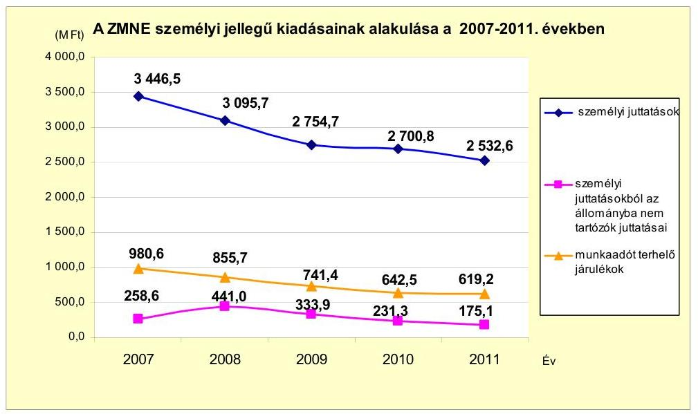

A ZMNE 2011. évi költségvetési kiadásai a 2007. évhez képest 30,5\%-kal (1714,7 M Ft-tal) csökkentek. A kiadáscsökkenés 74,4\%-a (1275,3 M Ft) a személyi juttatások és az azokat terhelő járulékok csökkenéséből keletkezett. Ennek 52,8\%-át (673,0 M Ft-ot) a 2007. évi átszervezéssel együtt járó létszámcsökkentés, 15,3\%-át (195,7 M Ft-ot) a 2011. évi átszervezés miatti rendszeres személyi juttatások és azok járulékainak csökkenése eredményezte.

A személyi juttatások és a munkaadót terhelő járulékok együttes összege a ZMNE költségvetési kiadásaiból 2007-ben 78,8\%-ot (4427,1 M Ft-ot), 2008-ban 74,0\%-ot (3951,4 M Ft-ot), 2009-ben 69,6\%-ot (3496,1 M Ft-ot), 2010-ben 73,5\%-ot (3343,3 M Ft-ot) és 2011-ben pedig 80,8\%-ot (3151,8 M Ft-ot) tett ki.

A személyi juttatások és a munkaadót terhelő járulékok a 2007., a 2008. és a 2011. években tartalmazták a létszámcsökkentési döntések következtében esedékes végkielégítések és felmentési időre járó bérekkel kapcsolatos kiadásokat. A végkielégítések és felmentési időre járó bérek összege 2007-ben 82,4 M Ft, 2008ban 252,8 M Ft, 2011-ben 92,4 M Ft volt.

A szervezési és szervezeti változások hatására a hatékonysági mutatók javultak: az egy oktatóra jutó hallgatók száma emelkedett, az egy oktatóra és az egy hallgatóra jutó költségvetési kiadások csökkentek. A 2007-2011. években végrehajtott kiadáscsökkentő intézkedések eredményesek voltak.

Az egy oktatóra jutó hallgatók száma az ellenőrzött időszakban 14,5 fơről 16,5 fôre ( $13,5 \%$-kal) emelkedett, amely a hallgatói létszám kismértékű növekedése ${ }^{55}$ mellett, az oktatói létszám csökkenésének a következménye. Az egy hallgatóra jutó költségvetési kiadás a 2007. évi 1,7 M Ft-ról a 2011. évre 1,2 M Ft-ra (31,2\%-kal) csökkent. Az egy hallgatóra jutó költségvetési kiadás folyamatos csökkenését a költségvetési kiadások (elsősorban a személyi juttatások) folyamatos csökkenése és a hallgatók számának - a 2011. évet kivéve - csekély mértékủ emelkedése okozta. Az egy oktatóra jutó költségvetési kiadások összege a 2007. évtől a 2011. évig folyamatosan 24,8 M Ft-ról 19,4 M Ft-ra

[^0]
[^0]:    ${ }^{55}$ A hallgatói létszám 2007-től 2010-ig folyamatosan (3279 fôről 3499 fôre) nőtt, a 2011. évben az előző évihez viszonyítva 5,4\%-kal, 188 fővel csökkent.

---

(21,9\%-kal) csökkent a költségvetési kiadások 30,5\%-os és az oktatók év végi létszámának $11,1 \%$-os csökkenésének együttes hatására.

A ZMNE adatszolgáltatása alapján a 2007. év március hónapról a 2011. év végére a foglalkoztatottak tényleges létszáma 678 fơről 335 főre csökkent. A foglalkoztatottak száma a 2007. évben 213 fővel, a 2011. évben 131 fővel csökkent. A tényleges létszámcsökkentés $71,2 \%$-át a technikai létszám 269 fős csökkenése tette ki. Az oktatói létszám a vizsgált időszakban összesen 32,1\%-kal (95 fővel) csökkent.

A létszámcsökkentést eredményező helyi szervezési intézkedésekhez kapcsolódóan a ZMNE a 2008. évben 343,5 M Ft központosított támogatást vett igénybe, a támogatás felhasználásával tartósan leépített álláshelyek száma 123 volt.

A 2007. évben a dologi kiadások előirányzata terhére 85,2 M Ft elvonás történt. A 2008. évben az Üllői úti telephely megszüntetése miatt a dologi kiadási előirányzat 50,0 M Ft-tal, a megbízási díjak és azok járulékainak előirányzata 65,0 M Ft-tal csökkent. A reprezentációs kiadásokból 3,1 M Ft elvonás történt. A 2010. évben az irányító szerv a dologi kiadási előirányzatot 62,9 M Ft-tal, a jutalmak és járulékaik előirányzatát 14,5 M Ft-tal csökkentette. A 2011. évben a szervezeti változások, valamint az elrendelt beszerzési és szerződéskötési tilalom miatt 200,0 M Ft-tal csökkent a dologi kiadások előirányzata. Az NKE létrehozásával kapcsolatos egyes feladatokról szóló 44/2011. HM utasítás, valamint a végrehajtására kiadott HM KÁT-HVKF együttes intézkedés alapján az üzemeltetési feladatok MH TD részére történő átadása, valamint a HM FHH-nak, a HM HEKnek és a Logisztikai Ellátó Központnak történő előirányzat átadás miatt a HM 110,1 M Ft-tal csökkentette a dologi kiadások előirányzatát.

A költségvetési bevételek a költségvetési kiadások változásával párhuzamosan, 27,9\%-kal mérséklődtek. A bevételcsökkenés a költségvetési támogatások 36,5\%-os csökkenésének a következménye, miközben a saját bevételek, átvett pénzeszközök, egyéb saját bevételek - közte a költségtérítésből származó bevételek - emelkedtek. A kétirányú változások hatására a költségvetési támogatásoknak a költségvetési bevételeken belüli részaránya a 2007. évi 88,6\%-ról 78,1\%-ra (10,5 százalékponttal) mérséklődött. (A ZMNE gazdálkodási adatainak alakulását a 2007-2011. években a jelentés 3/C. számú melléklete részletezi.)

A ZMNE a szabad pénzeszközeit nem kötötte le, kamatbevétele nem keletkezett. A ZMNE a 2007-2011. években az Ftv. 27. § (6) bekezdés d) pontjában foglaltak ellenére vagyongazdálkodási tervvel nem rendelkezett. Az erőforrások (a személyi és tárgyi feltételek) szabad kapacitásainak kihasználásával a kimutatásuk szerint többletbevételt nem realizáltak, vállalkozási tevékenységet nem folytattak, saját hatáskörú intézkedésekkel nem járultak hozzá a költségvetési támogatások csökkentéséhez.

A ZMNE a 2007-2011. években likviditási hitelt és támogatási kölcsönt nem vett igénybe, illetve a finanszírozási tervtől eltérő, előrehozott támogatást nem igényelt. A pénzeszközök év végi magas állományi értéke egyrészt abból adódott, hogy az irányító szerv évente kötelező megtakarítást írt elő, másrészt a szakképzési hozzájárulásokból átvett pénzeszközök egy része is év végén érkezett meg az előirányzat felhasználási keretszámlára.

---

A ZMNE-nek a 2007-2011. években hosszú lejáratú kötelezettsége nem volt, rövid lejáratú kötelezettségét a szállítói tartozás tette ki. A ZMNE szállítói tartozásállomány év végén az ellenőrzött években - a 2010. év kivételével - az előző évhez viszonyítva folyamatosan csökkent. (A szállítói tartozásállomány év végi adatait a 3/C. számú melléklet tartalmazza.)

A ZMNE mindegyik év végén mutatott ki lejárt szállítói tartozásállományt, amely 2007-2008-ban és 2010-2011-ben az összes szállítói tartozáshoz képest 10\% alatti volt, a 2009. évben 13,0\%-ot tett ki. A lejárt szállítói tartozásból 2007-ben 66,9\%ot, 2008-ban 100,0\%-ot, 2009-ben 95,9\%-ot, 2010-ben 61,5\%-ot, 2011-ben 100,0\%-ot tett ki a 30 nap alatti lejárt kötelezettségek értéke. A 31 és 60 nap közötti lejárt tartozás aránya a lejárt szállítói tartozáson belül a 2007. (33,1\%) és a 2010. évben (29,5\%) volt számottevő. A lejárt tartozásállomány oka, hogy a központi beszerzésekhez kapcsolódó számlák kifizetés előtt a HM FHH-hoz kerültek igazolásra, és ez elnyújtotta a számla kiegyenlítés idejét. A lejárt tartozások minden évben magas összegú év végi pénzeszköz állomány ${ }^{56}$ mellett álltak fenn, egyéb határidőben nem teljesített rövid lejáratú kötelezettséget nem mutattak ki.

A ZMNE adatszolgáltatása szerint 2011. évben jogerős határozattal le nem zárt peres eljárások miatt $40,9 \mathrm{M} F \mathrm{t}$ tartozást mutatott ki.

A jogerős határozattal le nem zárt peres eljárások összegének 86,6\%-át (35,4 M Ft) három vállalkozási szerződéssel (polgári levelező képzés szervezésével) összefüggő fizetési meghagyások kifogásolása miatt indított perek értéke teszi ki. A ZMNE mindhárom esetben 2010 decemberében értesítette partnereit, hogy a korábbi rektor ellen indított - ezeknek szerződéseknek a vizsgálatára is kiterjedő ügyészségi vizsgálat lezárásáig a szerződésekből eredő kötelezettségeit a ZMNE nem teljesíti. A szerződéseket 2011 januárjában a ZMNE felmondta. Követeléseik érvényesítése érdekében két szervezet fizetési meghagyás kibocsátását kérte, egy szervezet a bírósághoz kereseti kérelmet nyújtott be.

A ZMNE-n az erőforrások célszerú, valamint - elsődlegesen a fenntartó által elrendelt szervezeti, szervezési és kiadáscsökkentő intézkedések hatására, a hallgatói létszám 2007-2010. évek közötti emelkedése mellett - takarékos felhasználása megvalósult. Ezt alátámasztja, hogy:

- az intézmény múködéséhez, az elméleti-gyakorlati képzéshez a jogszabályokban előírt személyi, tárgyi feltételek a vizsgált időszakban folyamatosan biztosították, továbbá a beszerzett tárgyi eszközöket az oktatási-képzési feladatokhoz használták fel;
- a ZMNE szervezeti rendszerének változásai elősegítették a múködés hatékonyságát, továbbá a fenntartó által elrendelt kiadáscsökkentő intézkedések eredményesek voltak:
- az intézkedések hatására a költségvetési kiadások csökkentek;
- a hatékonysági mutatók (egy oktatóra jutó hallgatók száma, egy hallgatóra, illetve oktatóra jutó költségvetési kiadás) javultak;

[^0]
[^0]:    ${ }^{56}$ A pénzeszközök év végi állományát a 3/C. számú melléklet tartalmazza.

---

- a ZMNE gazdálkodása a fizetőképesség alakulása szempontjából kiegyensúlyozott volt.

A ZMNE-n az erőforrásokat célszerűen és takarékosan használták fel annak ellenére, hogy a ZMNE saját hatáskörben hozott egyes intézkedései, továbbá a múködése szabályszerűségének ellenőrzése során feltárt hiányosságok a fenntartói intézkedések hatását, eredményességét negatívan befolyásolták:

- a ZMNE belső szervezeti egységei tekintetében a képzőhelyek, tanszékek, intézetek, egyéb szervezeti egységek számában a vizsgált időszakban bekövetkezett növekedés nem volt összhangban a fenntartónak a ZMNE szervezete racionalizálására irányuló szándékával, csökkentette a fenntartói intézkedések hatékonyságát, eredményességét;
- a bevételek összetételében mutatkozó kedvező változás elsődlegesen a fenntartói intézkedések hatásával, illetve a hallgatói létszám növekedésével volt összefüggésben, az intézmény a szabad pénzeszközei lekötésével, szabad kapacitásai kihasználásával nem járult hozzá a bevételek növekedéséhez, a takarékos gazdálkodás követelménye megvalósításához.

# 4. A BELSŐ KONTROLLRENDSZER KIALAKÍTÁSA ÉS MŰKÖDTETÉSE, VALAMINT A BELSŐ ÉS A KÜLSŐ ELLENŐRZÉSEK HASZNOSULÁSA 

### 4.1. A belső kontrollrendszer kialakítása és múködtetése

Az Ámr. ${ }_{1}$ XIII/A. Fejezetében meghatározott belső kontrollok, illetve az Ámr. ${ }_{2}$ VIII. Fejezetében meghatározott belső kontrollrendszer kialakításáért, működtetéséért és fejlesztéséért - e jogszabályok előírásai alapján - a költségvetési szerv vezetője felelős. Az ZMNE 2007-2011. augusztus 28-ig hatályos SzMSz-e a rektor - mint a költségvetési szerv vezetője - feladatai között a belső kontrollokra vonatkozó feladatokat hiányosan, az ellenőrzési nyomvonal és a kockázatkezelés rendje kialakítására korlátozva tartalmazta. Nem rögzítette és szabályozta a FEUVE rendszer a kontrollkörnyezet, a kontrolltevékenységek, az információs, kommunikációs, valamint a monitoring rendszer kialakítása és működtetése feladatokat. A 2011. augusztus 29-től hatályba lépett SzMSz-ben a rektor feladatai között a belső kontrollrendszer kialakításáért való felelősség szerepelt, nem tartalmazta azonban a belső kontrollrendszer működtetéséért és fejlesztéséért való felelősséget és feladatokat.

A ZMNE a 2007. évet megelőzően vezette be a FEUVE rendszert, azonban az ellenőrzött időszakban a jogszabályi és szervezeti változások miatt szükséges aktualizálását nem végezték el. A honvédelmi szervek operatív belső kontrolljainak kialakításáról és működtetéséről szóló 49/2011. (IV. 22.) HM utasításban előírt általános operatív belső kontroll szabályzatot sem készítették el.

Az ellenőrzött időszakban kiadott munkaköri leírások nem tartalmazták a FEUVE-val és a kockázatelemzéssel kapcsolatosan nevesített feladatokat. A kockázatkezelést a FEUVE szabályzat keretében röviden szerepeltették,

---

azonban annak megfelelő kockázatelemzést nem végeztek. A ZMNE Kockázatkezelő Bizottságának a kockázatkezelési szabályzat szerint évente a teljes szervezetre kellett volna kockázatelemzést végeznie, azonban bizottsági ülések megtartására nem került sor és a kockázatelemzés sem történt meg.

A ZMNE ellenőrzési nyomvonalai a főfolyamathoz, részfolyamathoz kapcsolódóan tartalmazták a felelősségi és az információs szinteken a kapcsolatokat, az irányítási és az ellenőrzési funkciókat, amely az egyes részfolyamatok táblarendszerben történő leírásával kerültek kialakításra. Az ellenőrzési nyomvonal hiányossága volt, hogy nem fogta át teljes körűen a ZMNE valamennyi tevékenységét, múködését (pl.: a selejtezés, a pályáztatás, az irattárózás területét). A ZMNE nem alakította ki megfelelően az egyes feladat/tevékenység elvégzését igazoló dokumentálás rendjét, nem rögzítették a dokumentumok azonosíthatóságát, fellelhetőségét a rendszerben.

A ZMNE a Szabálytalanságok Kezelési Rendjét az Ámr. ${ }_{1}$ 145/A. § (5) bekezdésében foglaltaknak megfelelően az SzMSz mellékleteként kiadta, de az abban előírtaktól eltérően nem biztosította a naprakész, pontos nyilvántartás vezetését a feltárt szabálytalanságokról, mivel a szabálytalanságok jelentéséért felelősök munkaköri leírásaiban nem rögzítették az ezzel kapcsolatos feladatokat.

A HM számviteli politikájának hatálya kiterjed a fejezet irányítása alá tartozó valamennyi költségvetési szervezetre, így előírásait alkalmazni kellett a ZMNE gazdálkodása során is. A számviteli politika keretében a ZMNE rendelkezett az Áhsz. 8. § (4) bekezdés a) pontjában előírt leltározási és selejtezési szabályzattal, azonban az, az elvégzendő feladatokat nem szabályozta teljes körűen. A leltározási és selejtezési szabályzat nem tartalmazta a döntéshozatalra jogosultak körét, az eljárás szabályszerű végrehajtásának folyamatba épített ellenőrzéséért felelős személyt. A leltárellenőrzési és a selejtezési feladatok az érintett dolgozók munkaköri leírásaiban vagy külön megbízásában sem szerepeltek. Az Áhsz. 8. § (4) bekezdés b) pontja alapján elkészített eszközök és források értékelési szabályzatában - az Áhsz. 8. § (17) bekezdésben foglalt előírás ellenére - a követelések év végi értékelésének rendjét nem szabályozták, az értékelések ellenőrzéséért felelős munkakört nem határozták meg. A ZMNE számlarendje nem tartalmazta az Áhsz. 49. § (3) bekezdésében ${ }^{57}$ előírtak ellenére az analitikus nyilvántartások formáját, tartalmát és vezetési módját, valamint az egyeztetés dokumentálását.

A kötelezettségvállalási, utalványozási, ellenjegyzési, érvényesítési szabályzat ${ }_{1,2}$-ot a ZMNE elkészítette, de az abban foglaltak nem feleltek meg a jogszabályi előírásoknak, illetve az előírtakat nem tartották be.

A rektor az Ámr. ${ }_{1,2}$-ben előírtak ellenére a gazdasági vezető helyett adott felhatalmazást a kötelezettségvállalás- és utalvány ellenjegyzőinek, valamint megbízást az érvényesítőknek, továbbá az Ámr. ${ }_{1}$-ben előírtak ellenére csak 2007. november 1-jétől jelölte ki a szakmai teljesítésigazolókat.

[^0]
[^0]:    ${ }^{57}$ 2010. január 1-je előtt az Áhsz. 49. § (2) bekezdése szabályozta.

---

A pénzügyi-számviteli kontrollok múködése megfelelőségét az oktatási és képzési tevékenységhez szükséges személyi és tárgyi feltételek kialakítása ellenőrzéséhez kapcsolódóan ${ }^{58}$ kiválasztott minták alapján ellenőriztük. Az ellenőrzött mintákban a kontrollok nem múködtek megfelelően.

A kutatási tevékenységhez, az oktatáshoz és képzéshez kapcsolódó megbízási, felhasználói díjak kifizetésének elrendelésére a „kifizetési engedély megbízási szerződéshez" nyomtatványt alkalmazták annak ellenére, hogy az nem tartalmazta az utalvány kifejezést az Ámr. ${ }_{1} 136 . \S$ (4) bekezdés b) pontjában és az Ámr. ${ }_{2}$ 78. § (2) bekezdés b) pontjában előírtak ellenére. A kutatási tevékenységhez, az oktatáshoz és képzéshez kapcsolódó megbízási, felhasználói és vállalkozási szerződésekre teljesített kifizetések, valamint az eszközbeszerzések kiadásai esetében az operatív gazdálkodási jogkörök közül a szakmai teljesítésigazolásra, az érvényesítésre és az utalványellenjegyzésére kijelöltek nem az Ámr. ${ }_{1,2}$-ben előírtaknak megfelelően jártak el. A szakmai teljesítésigazolást, érvényesítést és az utalvány ellenjegyzését több esetben írásbeli kijelöléssel nem rendelkező személyek látták el, a szakmai teljesítésigazolásra kijelölt személyek a sajátkezű aláírásuk helyett névbélyegzőt használtak. A kijelölés ellenére nem végezték el a szakmai teljesítésigazolást és az érvényesítést. Az utalvány ellenjegyzésére felhatalmazottak nem kifogásolták a szakmai teljesítésigazolás és az érvényesítés hiányát.

Az eszközgazdálkodási tevékenységen belül a vagyon védelme nem volt eredményes, mivel az eszközmozgásokat az analitikus nyilvántartásban késve rögzítették, a HM fejezeten belülről biztosított szakanyagok átadó és átvevő közötti egyeztetését nem végezték el, a selejtezési folyamatot nem dokumentálták teljes körúen.

A 2007-2011. években a ZMNE éves költségvetési beszámolójában a FEUVE rendszer múködésének összefoglaló jelentése fél oldal terjedelemben pozitívan értékelte ${ }^{59}$ a ZMNE FEUVE rendszerének múködését, azonban a 2007-2011. években elvégzett külső ellenőrzések a FEUVE rendszer múködési hiányosságait jelezték.

A ZMNE által a 2010. és 2011. évi beszámoló keretében kitöltött kérdéslista ${ }^{60}$ válaszai a FEUVE rendszer múködéséről egymásnak ellentmondtak, és ez arra utal, hogy a kérdésekre nem a reális helyzet ismeretében válaszoltak. A kérdésre adott válaszok és a szöveges értékelés nem felelt meg egymásnak, a válaszokat nem a tényleges állapotnak megfelelően adták meg.

A belső kontrollrendszer - a kialakításában és a múködtetésében fennálló hiányosságok miatt - nem járult hozzá a szabálytalanságok és hibák

[^0]
[^0]:    ${ }^{58}$ A mintavétel alapján ellenőrzött területek a pénzforgalmi folyamatokhoz kapcsolódóan a megbízási, vállalkozási és felhasználási szerződések alapján teljesített kifizetések, a támogatási szerződésekre befolyt bevételek, a tárgyi eszköz beszerzésekkel összefüggő kifizetések, a vagyonvédelemhez kapcsolódóan a természetben átvett, továbbá a vásárolt eszközök nyilvántartásba vétele, leltározása és selejtezése voltak.
    ${ }^{59}$ A rektor a belső kontroll rendszer 2008. és 2009. évi kialakításáról, szabályszerű, eredményes és hatékony múködtetéséről szóló nyilatkozatai az irattárban nem voltak fellelhetőek.
    ${ }^{60}$ „Kérdéslista a honvédelmi szervezeten belüli szervezeti egységek vezetői számára a vezetői nyilatkozathoz".

---

# feltárásához és ezáltal nem segítette az erőforrások és a közpénz hatékony felhasználási követelményének teljesülését. 

### 4.2. A belső ellenőrzés múködése

A ZMNE 2007-2011. években hatályos SzMSz-eiben a belső ellenőrzés működési módját meghatározták, a belső ellenőrök Ber. 6. § szerinti funkcionális (feladatköri és szervezeti) függetlensége biztosított volt. A belső ellenőrök létszáma és végzettsége/képzettsége a 2011. évet megelőzően nem, a 2011. évtől megfelelt a Ber. 4. § (6) bekezdésében és 11. §-ában foglalt követelményeknek. A 2011. évtől az ellenőrök rendelkeztek az NGM által előírt regisztrációval.

Az Áht. szerinti éves ÁBE feladatok végrehajtására a Ber., a HM fejezet államháztartási belső ellenőrzési rendjének szabályairól, a HM fejezet egységes belső ellenőrzési kézikönyvének kiadásáról szóló 81/2007. (HK 15.) HM utasítás, valamint a HM Fejezet Egységes Államháztartási Belső Ellenőrzési Kézikönyve ${ }^{61}$ volt az irányadó. A ZMNE-nél a 2007-2009. évi belső ellenőrzésekről nem álltak rendelkezésre nyilvántartások, erre az időszakra a belső ellenőrzési iratanyagok az irattárban sem voltak megtalálhatóak.

A 2010. és a 2011. évi belső ellenőrzési terveket kockázatelemzéssel nem támasztották alá a Ber. 21. §-ában előírtak ellenére. A 2010. évben végrehajtott öt ${ }^{62}$ ellenőrzésről készült belső ellenőrzési jelentések tartalma - intézkedést igénylő javaslatok hiányában - nem felelt meg a Ber. 27. § (2) bekezdés előírásainak.

A 2011. évi ÁBE-re hat ellenőrzést tartalmazó ellenőrzési terv alapján került sor. A 2011. évi belső ellenőrzési jelentések elkészítési módja, a belső ellenőr által tett érdemi ajánlások és javaslatok alaki és tartalmi szempontból megfeleltek a Ber. előírásainak és a standardoknak. A belső ellenőrzés a 2011. évben végrehajtott öt ellenőrzése ${ }^{63}$ során összesen 43 javaslatot tett. A hiányosságok megszüntetésére három intézkedési terv készült. Az ellenőrzések során büntető és szabálysértési eljárás megindítására nem, azonban a közalkalmazottak túlóra elszámolása, valamint a szolgálati rádiótelefonok használata, a túlforgalmazások megtérítése terén kártérítési, illetve fegyelmi eljárás megindítására tett javaslatokat a belső ellenőrzés.

A ZMNE-n a belső kontrollok a belső ellenőrzés területén a 2007-2009. években nem múködtek, a 2010-2011. években nem múködtek hatékonyan. A belső ellenőrzések a 2010-2011. években tártak fel hiányosságokat, ennek ellenére a belső kontrollrendszer egyes elemeit nem szabályozták és mú-

[^0]
[^0]:    ${ }^{61}$ A ZMNE 2011. február 7-től rendelkezett jóváhagyott, az intézményi sajátosságokat tartalmazó, a Ber. 5. § (1) bekezdés előírásainak megfelelő Államháztartási Belső Ellenőrzési Kézikönyvvel.
    ${ }^{62}$ A tervezett hét ellenőrzésből kettő kapacitás hiánya, egy pedig az aktualitás hiánya miatt nem valósult meg, és a tartalék kapacitás terhére egy soron kívüli ellenőrzésre került sor.
    ${ }^{63}$ Az elmaradt egy ellenőrzés kapacitásával a tartalék kapacitást emelték meg a ZMNE átalakulása miatti támogató feladatok ellátása érdekében.

---

ködtették megfelelően. A kontrollok nem voltak alkalmasak a működésbeli hibák, szabálytalanságok kiszűrésére, jelzésére. A 2011. évi belső ellenőrzések javaslatainak hasznosítását dokumentumok nem igazolták, mivel a javaslatok és azok hasznosulásának nyomon követésére a Ber. 29/A. §-ában előírt nyilvántartást éves bontásban nem vezették, a javaslatok hasznosulását utóellenőrzés keretében nem ellenőrizték ${ }^{64}$. A belső ellenőrzés - a hiányosságai miatt - nem járult hozzá a közpénz hatékony felhasználásához és a képzési programok teljesüléséhez.

# 4.3. A ZMNE-nél lefolytatott külső ellenőrzések 

Az ellenőrzött időszakban a ZMNE-t 18 külső ellenőrzés érintette (HM KPH három, HM BEH három, HM KEHH kettő, Kormányzati Ellenőrzési Hivatal egy, a Nemzeti Szakképzési és Felnőttképzési Intézet kettő, egyéb szervezetek hét ellenőrzést végeztek). Az ellenőrzések összesen 104 javaslatot tettek, amelyekre az intézkedési tervek elkészültek, azonban azok végrehajtását a ZMNE nem ellenőrizte.

A ZMNE 2007. és 2008. évi költségvetési beszámolóját a HM BEH megbízhatósági ellenőrzés során a feltárt hiányosságok miatt korlátozott véleménnyel látta el. Az ellenőrzésekben megfogalmazott javaslatokra készített intézkedési tervek megvalósulását utóellenőrzés keretében a HM BEH nem ellenőrizte.

A HM KEHH 2007. évi megbízhatósági ellenőrzésében tett 15 javaslatra elkészítették az intézkedési tervet, azonban utóellenőrzés keretében megállapították, hogy csak nyolc hiányosság felszámolására tett a ZMNE intézkedést. A 2008. évi megbízhatósági ellenőrzés 26 javaslatának megvalósítását a HM KEHH utóellenőrzéssel nem ellenőrizte.

A HM KPÚ ${ }^{65}$ a 2008. évben a ZMNE állományából kiváltak részére kifizetett juttatások ellenőrzése során tett nyolc javaslat megvalósítását utóellenőrzés keretében nem vizsgálta.

A HM KEHH a 2009. évi ellenőrzése során 35 db javaslatot tett, az intézkedési terv utóellenőrzése szerint a feladatok végrehajtása megtörtént, azonban a belső ellenőrzési feladatok ellátásában tapasztalt hiányosságok azt igazolják, hogy a hiányosságok felszámolása teljes körűen nem történt meg.

A 2010. évi egy külső ellenőrzés anyagát a felügyeleti szerv jóváhagyása mellett nem bocsájtották rendelkezésünkre.

A külső szervezetek (pl.: HM BEH, HM KPH) a ZMNE-n 2011. évben összesen tíz ellenőrzést végeztek. A HM BEH 2011. évi „A ZMNE átalakításának, valamint logisztikai gazdálkodása 2008-2009. évi ellenőrzést követő intézkedések megvalósulásának fejezetszintú államháztartási belső ellenőrzése" című 2012. január 13-án lezárult jelentés intézkedési tervének végrehajtása a helyszíni ellenőrzéssel egy időben még

[^0]
[^0]:    ${ }^{64}$ A javaslatok hasznosulásának utóellenőrzését a 2011. évben jóváhagyott, 2012. évi belső ellenőrzési terv a IV. negyedévre ütemezetten tartalmazta.
    ${ }^{65}$ Honvédelmi Minisztérium Közgazdasági és Pénzügyi Ügynökség, amely 2011. január 1-jétől HM KPH néven múködik.

---

folyamatban volt. A HM KPH „A ZMNE átalakításához, az NKE-be történő beintegrálásához kapcsolódó egyes pénzügyi és számviteli feladatok célellenörzése" címú négy intézkedést igénylő intézkedési tervét a helyszíni ellenőrzést követően hagyta jóvá az NKE rektora.

A ZMNE-n a külső ellenőrzésekről az előírt nyilvántartást, az ellenőrzési jelentésekben tett megállapítások, javaslatok hasznosulását, végrehajtását és nyomon követését éves bontásban nem vezették a Ber. 29/A. §-ában foglaltak ellenére. A ZMNE nem ellenőrizte a külső ellenőrzések által tett javaslatok hasznosítását, így azok nem segítették az erőforrások és a közpénzek átlátható és hatékony felhasználási követelményének megvalósítását.

Budapest, 2012. 11. hó 21. nap

Melléklet: 10 db
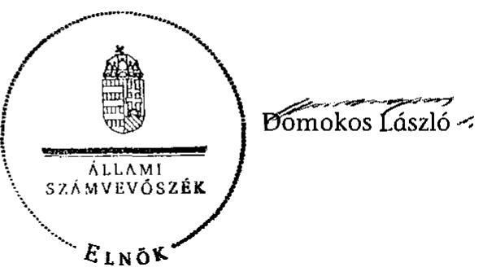

---

# Korlátozott vélemény 

a Zrínyi Miklós Nemzetvédelmi Egyetem
2011. évi költségvetési beszámolójáról

A XIII. Honvédelmi Minisztérium fejezet 4. cím Zrínyi Miklós Nemzetvédelmi Egyetem 2011. évi beszámolóját a BM Költségvetési szervek elemi beszámolója pénzügyi (szabályszerúségi) ellenőrzéséhez - az Állami Számvevőszék által a zárszámadás ellenőrzéséhez - kidolgozott Egyszerúsített Útmutató alapján felülvizsgáltuk.

Az ellenőrzésünk során elegendő és megfelelő bizonyosságot szereztünk arról, hogy a 4. Zrínyi Miklós Nemzetvédelmi Egyetem cím zárszámadási törvényjavaslatban szereplő kiadási és bevételi pénzforgalmi adatainak kimutatása a költségvetési gazdálkodásra vonatkozó jogszabályok előírásainak csak részben felel meg.

A Zrínyi Miklós Nemzetvédelmi Egyetem 2011. évi zárszámadási törvényjavaslatban szereplő pénzforgalmi adatai megbízhatóságát a következők befolyásolták:

- Az EU-s pályázati támogatások intézményi forrásból előfinanszírozott kiadásait nem az aktív pénzügyi elszámolások között számolták el, így a pénzforgalmi jelentés adatai korlátozott módon adnak információt. Ez a hiba hatással volt az egyéb aktív pénzügyi elszámolások és az előirányzat maradvány összegére is. A helytelen elszámolás hatását nem tudtuk számszerúsíteni, mivel az analitikus nyilvántartásból nem volt megállapítható, hogy mely pályázatok elszámolása történt már meg.
- A kötelezettségvállalással terhelt maradvány meghatározásakor egy tételt kétszer vettek számításba (helyesen 148,1 M Ft a kimutatott 151,1 M Ft helyett).
- A beszámoló mérlegét nem teljes körűen támasztotta alá leltár, mivel a Társadalomtudományi Tanszéknél, a Magasabb Tanfolyami Parancsnokságnál és az Ügyviteli Irodánál nem történt meg a leltározás. A hiba nagysága nem számszerúsíthető.
- A mérlegben szereplő tételek közül az egyedi értékelés elvének nem felelt meg az immateriális javak, tárgyi eszközök nyitó és záró értéke, mivel az eszközök nem az üzembe helyezéskor aktiválták, így az értékcsökkenést nem a tényleges használatba vételtől számolták el.

---

# A ZMNE szervezeti változásai a 2007-2011. években 

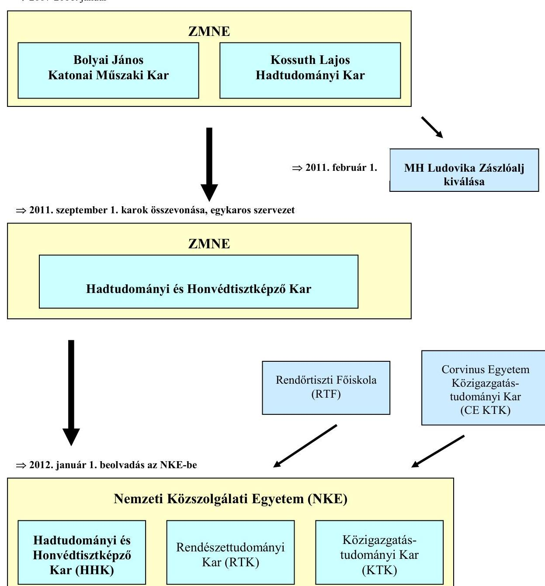

---

## **A ZMNE költségvetési bevételei nagyságának, összetételének alakulása a 2007-2011. években**

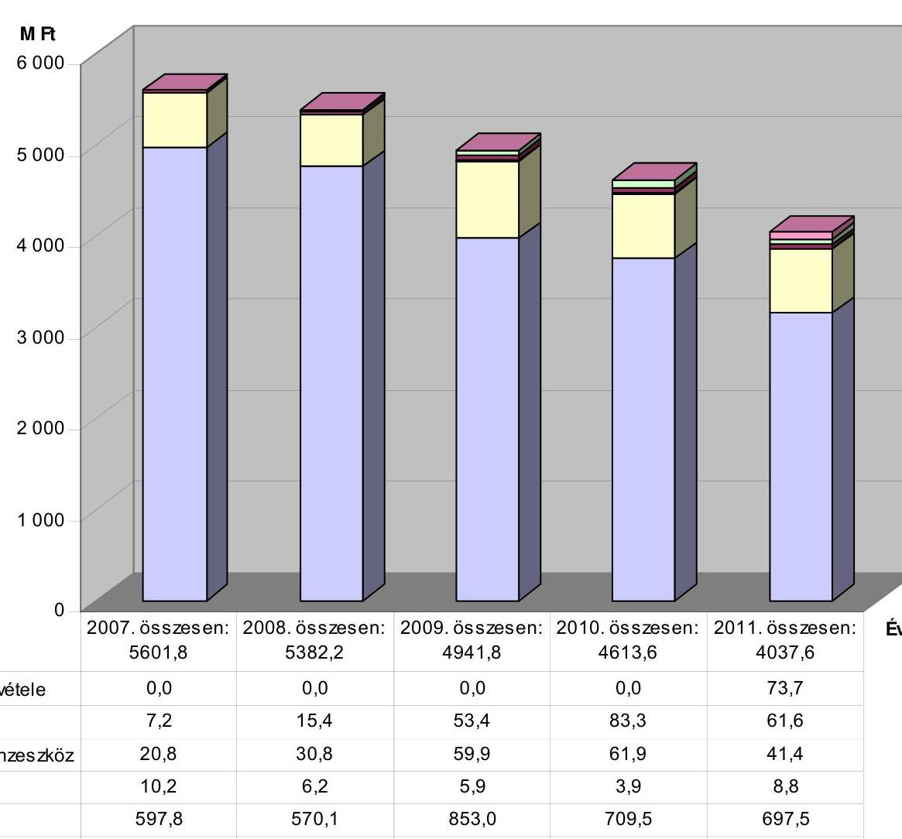

|   | 2007. összesen: 5601,8 | 2008. összesen: 5382,2 | 2009. összesen: 4941,8 | 2010. összesen: 4613,6 | 2011. összesen: 4037,6  |
| --- | --- | --- | --- | --- | --- |
|  elöző évi előirányzat maradvány átvétele | 0,0 | 0,0 | 0,0 | 0,0 | 73,7  |
|  támogatás értékű bevételek | 7,2 | 15,4 | 53,4 | 83,3 | 61,6  |
|  államháztartáson kívülről átvett pénzeszköz | 20,8 | 30,8 | 59,9 | 61,9 | 41,4  |
|  áfa | 10,2 | 6,2 | 5,9 | 3,9 | 8,8  |
|  egyéb saját bevétel | 597,8 | 570,1 | 853,0 | 709,5 | 697,5  |
|  költségvetési támogatás | 4 965,8 | 4 759,7 | 3 969,6 | 3 755,0 | 3 154,6  |

---

### **A ZMNE költségvetési kiadásai nagyságának, összetételének alakulása a 2007-2011. években**

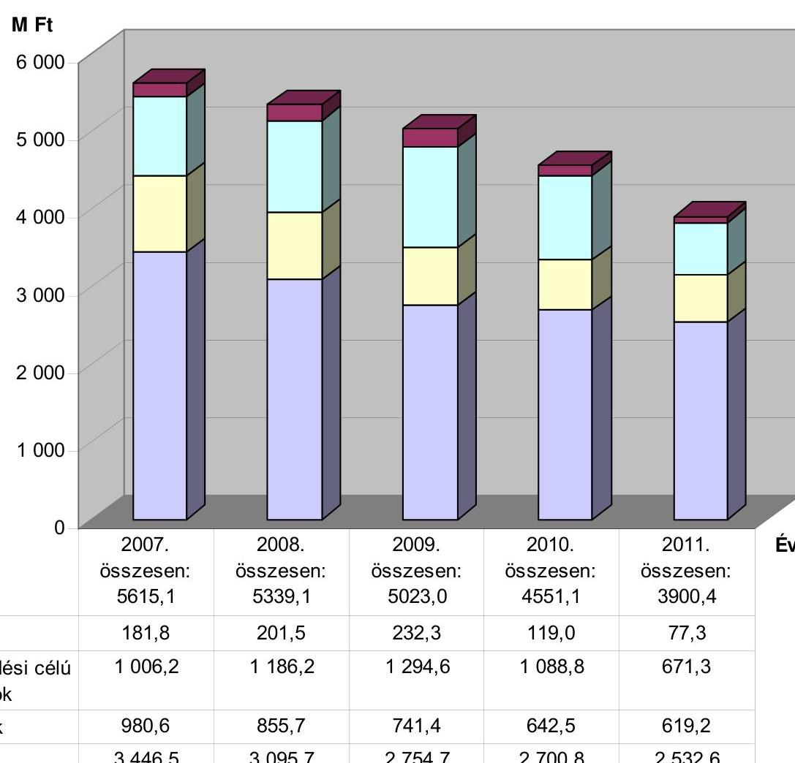

|   | 2007. | 2008. | 2009. | 2010. | 2011. | Év  |
| --- | --- | --- | --- | --- | --- | --- |
|   | összesen:
5615,1 | összesen:
5339,1 | összesen:
5023,0 | összesen:
4551,1 | összesen:
3900,4 |   |
|  felhalmozási kiadások | 181,8 | 201,5 | 232,3 | 119,0 | 77,3 |   |
|  dologi kiadások, egyéb működési célú kiadások és pénzbeli juttatások | 1 006,2 | 1 186,2 | 1 294,6 | 1 088,8 | 671,3 |   |
|  munkaadókat terhelő járulékok | 980,6 | 855,7 | 741,4 | 642,5 | 619,2 |   |
|  személyi juttatások | 3 446,5 | 3 095,7 | 2 754,7 | 2 700,8 | 2 532,6 |   |

---

A ZMNE gazdálkodási adatainak alakulása a 2007-2011. években

|  Megnevezés | 2007. év | 2008. év | 2009. év | 2010. év | 2011. év | változás \%-ban |  |  |  |   |
| --- | --- | --- | --- | --- | --- | --- | --- | --- | --- | --- |
|   |  |  |  |  |  | 2008/2007 | 2009/2008 | 2010/2009 | 2011/2010 | 2011/2007  |
|  Pénzforgalmi adatok |  |  |  |  |  |  |  |  |  |   |
|  költségvetési bevételek (M Ft) | 5601,8 | 5382,2 | 4941,8 | 4613,6 | 4037,6 | 96,1\% | 91,8\% | 93,4\% | 87,5\% | 72,1\%  |
|  költségvetési támogatás (M Ft) | 4965,8 | 4759,7 | 3969,6 | 3755,0 | 3154,6 | 95,9\% | 83,4\% | 94,6\% | 84,0\% | 63,5\%  |
|  költségvetési támogatások aránya a költségvetési bevételeken belül, \%-ban | 88,6\% | 88,4\% | 80,3\% | 81,4\% | 78,1\% |  |  |  |  |   |
|  saját bevételek és átvett pénzeszközök együttes összege (M Ft) | 636,0 | 622,5 | 972,2 | 858,6 | 883,0 | 97,9\% | 156,2\% | 88,3\% | 102,8\% | 138,8\%  |
|  a saját bevétel és az átvett pénzeszközök összegének aránya a költségvetési bevételeken belül, \%-ban | 11,4\% | 11,6\% | 19,7\% | 18,6\% | 21,9\% |  |  |  |  |   |
|  egyéb saját bevételek (M Ft) | 597,8 | 570,1 | 853,0 | 709,5 | 697,5 | 95,4\% | 149,6\% | 83,2\% | 98,3\% | 116,7\%  |
|  költségtérítésből származó bevételek (M Ft) | 516,8 | 453,3 | 719,1 | 660,5 | 669,8 |  |  |  |  |   |
|  költségtérítésből származó bevétel aránya az egyéb saját bevételeken belül, \%-ban | 86,4\% | 79,5\% | 84,3\% | 93,1\% | 96,0\% |  |  |  |  |   |
|  áfa-ból származó bevétel (M Ft) | 10,2 | 6,2 | 5,9 | 3,9 | 8,8 | 61,3\% | 94,9\% | 65,4\% | 227,9\% | 86,7\%  |
|  államháztartáson kívülről müködési c. pénzátvétel (M Ft) | 2,8 |  | 6,6 | 8,8 | 6,2 | 0,0\% |  | 133,8\% | 70,3\% | 225,6\%  |
|  államháztartáson kívülről felhalmozási c. pénzátvétel (M Ft) | 18,0 | 30,8 | 53,3 | 53,1 | 35,2 | 171,3\% | 172,9\% | 99,6\% | 66,3\% | 195,5\%  |
|  támogatási c. müködési bevétel (M Ft) |  | 10,6 | 41,6 | 73,4 | 58,5 |  | 394,0\% | 176,2\% | 79,7\% |   |
|  támogatási c. felhalmozási bevétel (M Ft) | 7,2 | 4,8 | 11,8 | 9,9 | 3,1 | 66,3\% | 245,4\% | 84,6\% | 31,6\% | 43,4\%  |
|  előző évi előirányzat maradvány átvétele (M Ft) |  |  |  |  | 73,7 |  |  |  |  |   |

---

A ZMNE gazdálkodási adatainak alakulása a 2007-2011. években

|  Megnevezés | 2007. év | 2008. év | 2009. év | 2010. év | 2011. év | változás \%-ban |  |  |  |   |
| --- | --- | --- | --- | --- | --- | --- | --- | --- | --- | --- |
|   |  |  |  |  |  | 2008/2007 | 2009/2008 | 2010/2009 | 2011/2010 | 2011/2007  |
|  költségvetési kiadás (M Ft) | 5615,1 | 5339,1 | 5023,0 | 4551,1 | 3900,4 | 95,1\% | 94,1\% | 90,6\% | 85,7\% | 69,5\%  |
|  személyi juttatások (M Ft) | 3446,5 | 3095,7 | 2754,7 | 2700,8 | 2532,6 | 89,8\% | 89,0\% | 98,0\% | 93,8\% | 73,5\%  |
|  ebből: az állományba nem tartózók juttatásai (M Ft) | 258,6 | 441,0 | 333,9 | 231,3 | 175,1 | 170,5\% | 75,7\% | 69,3\% | 75,7\% | 67,7\%  |
|  állományba nem tartózók juttatásainak aránya a személyi juttatásokon belül, \%-ban | 7,5\% | 14,2\% | 12,1\% | 8,6\% | 6,9\% |  |  |  |  |   |
|  munkaadókat terhelő járulékok (M Ft) | 980,6 | 855,7 | 741,4 | 642,5 | 619,2 | 87,3\% | 86,7\% | 86,7\% | 96,4\% | 63,1\%  |
|  személyi juttatások + a munkaadót terhelő járulékok összesen (M Ft) | 4427,1 | 3951,4 | 3496,1 | 3343,3 | 3151,8 | 89,3\% | 88,5\% | 95,6\% | 94,3\% | 71,2\%  |
|  személyi juttatások + munkaadót terhelő járulékok aránya a költségvetési kiadásokon belül, \%-ban | 78,8\% | 74,0\% | 69,6\% | 73,5\% | 80,8\% |  |  |  |  |   |
|  dologi kiadások, egyéb müködési célú kiadások és pénzbeli juttatások (M Ft) | 1006,2 | 1186,2 | 1294,6 | 1088,8 | 671,3 | 117,9\% | 109,1\% | 84,1\% | 61,7\% | 66,7\%  |
|  dologi kiadások, egyéb müködési célú kiadások és pénzbeli juttatások együttes összegének aránya a költségvetési kiadásokon belül, \%-ban | 17,9\% | 22,2\% | 25,8\% | 23,9\% | 17,2\% |  |  |  |  |   |
|  felhalmozási kiadások M Ft | 181,8 | 201,5 | 232,3 | 119,0 | 77,3 | 110,8\% | 115,3\% | 51,2\% | 65,0\% | 42,5\%  |
|  felhalmozási kiadások aránya a költségvetési kiadásokon belül, \%-ban | 3,2\% | 3,8\% | 4,6\% | 2,6\% | 2,0\% |  |  |  |  |   |

---

A ZMNE gazdálkodási adatainak alakulása a 2007-2011. években

|  Megnevezés | 2007. év | 2008. év | 2009. év | 2010. év | 2011. év | változás \%-ban |  |  |  |   |
| --- | --- | --- | --- | --- | --- | --- | --- | --- | --- | --- |
|   |  |  |  |  |  | 2008/2007 | 2009/2008 | 2010/2009 | 2011/2010 | 2011/2007  |
|  Mérlegadatok (december 31-én) |  |  |  |  |  |  |  |  |  |   |
|  mérleg föösszeg (M Ft) | 2788,7 | 2440,5 | 2185,1 | 2049,7 | 1433,9 | 87,5\% | 89,5\% | 93,8\% | 70,0\% | 51,4\%  |
|  tárgyi eszközök nettó értéke (M Ft) | 1206,2 | 1037,1 | 843,1 | 839,8 | 448,0 | 86,0\% | 81,3\% | 99,6\% | 53,3\% | 37,1\%  |
|  tárgyi eszközök nettó értékének aránya a mérleg föösszegéhez képest, \%-ban | $43,3 \%$ | $42,5 \%$ | $38,6 \%$ | $41,0 \%$ | $31,2 \%$ |  |  |  |  |   |
|  gépek, berendezések nettó értéke (M Ft) | 1048,9 | 820,7 | 772,4 | 775,1 | 412,3 | 78,2\% | 94,1\% | 100,3\% | 53,2\% | 39,3\%  |
|  pénzeszközök összege (M Ft) | 375,1 | 440,1 | 412,6 | 383,4 | 731,0 | 117,3\% | 93,8\% | 92,9\% | 190,7\% | 194,9\%  |
|  pénzeszközök aránya a mérleg föösszegéhez képest, \%-ban | $13,5 \%$ | $18,0 \%$ | $18,9 \%$ | $18,7 \%$ | $51,0 \%$ |  |  |  |  |   |
|  szállítói tartozás állomány (M Ft) | 274,0 | 65,4 | 56,3 | 87,0 | 15,3 | 23,9\% | 86,1\% | 154,5\% | 17,6\% | 5,6\%  |
|  lejárt szállítói tartozás állomány (M Ft) | 18,1 | 4,4 | 7,3 | 7,8 | 0,2 | 24,3\% | 165,9\% | 106,8\% | 2,6\% | 1,1\%  |
|  30 nap alatti lejárt szállítói tartozás állomány (M Ft) | 12,1 | 4,4 | 7,0 | 4,8 | 0,2 | 36,4\% | 159,1\% | 68,6\% | 4,2\% | 1,7\%  |
|  30 nap alatti lejárt szállítói tartozás állomány aránya a lejárt szállítói tartozások állományából, \%-ban | $66,9 \%$ | $100,0 \%$ | $95,9 \%$ | $61,5 \%$ | $100,0 \%$ |  |  |  |  |   |
|  30-60 nap között lejárt szállítói tartozás állomány (M Ft) | 6,0 |  | 0,1 | 2,3 |  | 0,0\% |  | 2300,0\% | 0,0\% | 0,0\%  |
|  30-60 nap között lejárt szállítói tartozás állomány aránya a lejárt szállítói tartozásokból, \%-ban | $33,1 \%$ |  | $1,4 \%$ | $29,5 \%$ |  |  |  |  |  |   |

---

A ZMNE gazdálkodási adatainak alakulása a 2007-2011. években

|  Megnevezés | 2007. év | 2008. év | 2009. év | 2010. év | 2011. év | változás \%-ban |  |  |  |   |
| --- | --- | --- | --- | --- | --- | --- | --- | --- | --- | --- |
|   |  |  |  |  |  | 2008/2007 | 2009/2008 | 2010/2009 | 2011/2010 | 2011/2007  |
|  A ZMNE egyéb adatainak alakulása a 2007-2011. években |  |  |  |  |  |  |  |  |  |   |
|  hallgatók száma (fő) | 3279 | 3333 | 3455 | 3499 | 3311 | 101,6\% | 103,7\% | 101,3\% | 94,6\% | 101,0\%  |
|  egy hallgatóra jutó költségvetési kiadás (M Ft/fő) | 1,7 | 1,6 | 1,5 | 1,3 | 1,2 | 93,5\% | 90,8\% | 89,5\% | 90,6\% | 68,8\%  |
|  oktatók létszáma december 31-én (fő) | 226 | 217 | 231 | 218 | 201 | 96,0\% | 106,5\% | 94,4\% | 92,2\% | 88,9\%  |
|  egy oktatóra jutó költségvetési kiadás (M Ft/fő) | 24,8 | 24,6 | 21,7 | 20,9 | 19,4 | 99,0\% | 88,4\% | 96,0\% | 92,9\% | 78,1\%  |
|  egy oktatóra jutó hallgatók száma (fő/fő) | 14,51 | 15,36 | 14,96 | 16,05 | 16,47 | 105,9\% | 97,4\% | 107,3\% | 102,6\% | 113,5\%  |

---

# A ZMNE doktori képzéseiben résztvevő hallgatók és a tudományos publikációk száma a 2007-2011. években 

| (adatok: fő) |  |  |  |  |  |  |  |
| :--: | :--: | :--: | :--: | :--: | :--: | :--: | :--: |
| Sor-   szám | Megnevezés | Mértékegység | 2007. év | 2008. év | 2009. év | 2010. év | 2011.év |
| 1. | Doktori képzések |  |  |  |  |  |  |
| 1.1 | Felvételre jelentkezők száma összesen | fő | $64 / 33$ | $72 / 38$ | $87 / 38$ | $76 / 38$ | $55 / 19$ |
| 1.1.1. | ZMNE hallgatója | fő | $9 / 3$ | $11 / 3$ | $23 / 11$ | $9 / 6$ | $11 / 1$ |
| 1.1.2. | Egyéb helyről jelentkezett | fő | $55 / 30$ | $61 / 35$ | $64 / 27$ | $67 / 32$ | $44 / 18$ |
| 1.2 | Felvett hallgatók száma összesen | fő | $61 / 33$ | $67 / 36$ | $74 / 33$ | $62 / 33$ | $48 / 15$ |
| 1.2.1 | ZMNE hallgatója | fő | $9 / 3$ | $11 / 4$ | $23 / 11$ | $9 / 6$ | $11 / 1$ |
| 1.2.2. | Egyéb helyről jelentkezett | fő | $52 / 30$ | $56 / 32$ | $51 / 22$ | $53 / 27$ | $37 / 14$ |
| 1.3 | Végzett hallgatók száma | fő | $41 / 17$ | $47 / 15$ | $45 / 18$ | $42 / 8$ | $36 / 19$ |
| 1.3.1 | ZMNE hallgatója | fő | $10 / 4$ | $7 / 0$ | $12 / 5$ | $6 / 1$ | $4 / 0$ |
| 1.3.2. | Egyéb helyről jelentkezett | fő | $31 / 13$ | $40 / 0$ | $33 / 13$ | $36 / 7$ | $32 / 19$ |
| 2. | Idézett tudományos publikációk száma |  |  |  |  |  |  |
| 2.1 | Doktori iskolák hallgatóitól | db | - | - | - | - | - |
| 2.1.1. | ZMNE hallgatóitól | db | - | - | - | - | - |
| 2.1.2. | Egyéb helyről jelentkezett hallgatótól | db | - | - | - | - | - |
| 2.2 | Doktori iskolák oktatóitól | db | - | $\begin{gathered} 2007-2008 \\ (56 \text { fő): } \\ 871 \end{gathered}$ | - | - | $\begin{gathered} 2009-2011 \\ (56 \text { fó): } \\ 1571 \end{gathered}$ |
| 2.2.1. | ZMNE oktatóitól | db | - | 793 | - | - | 1386 |
| 2.2.2. | Egyéb jogviszonyú oktatótól | db | - | 78 | - | - | 185 |
| 2.3 | Doktori iskolák hallgatói közül állami ösztöndíjban részesültek száma | fő | 0 | 0 | 0 | 0 | 0 |
| 2.4. | Doktori oklevelet szerzettek közül Bolyai János Kutatási Ösztöndijban részesültek száma | fő | 2 | 2 | 3 | 1 | 2 |

Megjegyzés: - a táblázat egyes celláiban az első szám az összes hallgatók, a második szám a polgári hallgatók számát mutatja;

- a ZMNE a helyszíni ellenőrzés ideje alatt a doktori iskolák hallgatóinak tudományos publikációira vonatkozóan az 5. számú tanúsítványban nem közölt adatot.

---

5. számú melléklet

a V-0014-069/2012. számú jelentéshez

# A ZMNE kutatási tevékenysége a 2007-2011. években

(adatok: M Ft)

|  Év | Kutatási tevékenység megnevezése | A kutatás kapcsolódott-e a ZMNE oktatásához (igen / nem) | Közzétett kutatott témák száma (db) | Kutatásra pályázati vagy egyéb úton elnyert támogatási összeg | Kötöttek-e együttműködési megállapodást az MTA-val | Megjegyzés a pályázattal megvalósuló kutatásokhoz  |
| --- | --- | --- | --- | --- | --- | --- |
|  2007. | Alap kutatás | nem |  |  |  |   |
|   | Alkalmazott kutatás | igen | 1 |  | nem |   |
|   | Kísérleti kutatás és fejlesztés | nem |  | 24,0 |  | Megvalósítás kezdete: 2008. január 1. (Cime: OM- 00039/2008 HT-26-SAJ, készültségi foka: befejezett, a felhasznált saját forrásrész összege: 0,1 M Ft )  |
|   | Technológiai innováció | igen | 1 |  | nem |   |
|   | Oktatást támogató egyéb kutatás | igen | 1 |  | nem |   |
|  2008. | Alap kutatás | nem |  |  |  |   |
|   | Alkalmazott kutatás | igen | 1 |  | nem |   |
|   | Kísérleti kutatás és fejlesztés | igen | 1 | 96,0 | nem | Megvalósítás kezdete: 2008. december 1. (Cime: Telepíthető gyorsdiagnosztikai laboratórium, készültségi foka: folyamatban lévő)  |
|   | Technológiai innováció | igen | 1 |  | nem |   |
|   | Oktatást támogató egyéb kutatás | igen | 3 |  | nem |   |
|  2009. | Alap kutatás | nem |  |  |  |   |
|   | Alkalmazott kutatás | igen | 1 |  | nem |   |
|   | Kísérleti kutatás és fejlesztés | igen | 1 |  | nem |   |
|   | Technológiai innováció | igen | 1 |  | nem |   |
|   | Oktatást támogató egyéb kutatás | igen | 2 |  | nem |   |
|  2010. | Alap kutatás | nem |  |  |  |   |
|   | Alkalmazott kutatás | igen | 1 |  | nem |   |
|   | Kísérleti kutatás és fejlesztés | igen | 1 |  | nem |   |
|   | Technológiai innováció | igen | 1 |  | nem |   |
|   | Oktatást támogató egyéb kutatás | igen | 3 |  | nem |   |
|  2011. | Alap kutatás | nem |  |  |  |   |
|   | Alkalmazott kutatás | igen | 2 |  | nem |   |
|   | Kísérleti kutatás és fejlesztés | nem |  | 420,6 |  | Megvalósítás kezdete: 2012. január 1., (Cime: Kritikus infrastruktúra védelmi kutatás, az önrész tervezett összege: 22,1 M Ft )  |
|   | Technológiai innováció | nem |  |  |  |   |
|   | Oktatást támogató egyéb kutatás | igen | 2 |  | nem |   |
|  Összesen |  |  | 24 | 540,6 |  |   |

---

# A ZMNE pályázati tevékenysége a 2007-2011. években a 2007. évre áthúzódó pályázatokkal együtt

|  Sorszám | Megnevezés | Mérték-
egység | 2006. évról áthúzodók | 2007. év | 2008. év | 2009. év | 2010. év | 2011. év | 2012. május 31-ig | Összesen  |
| --- | --- | --- | --- | --- | --- | --- | --- | --- | --- | --- |
|  1. | Benyújtott pályázatok száma | db | 9 | 5 | 13 | 10 | 9 | 4 |  | 50  |
|  1.1. | Sikertelen pályázatok | db |  |  | 3 | 1 | 8 |  |  | 12  |
|  1.2. | Döntés alatti pályázatok | db | 3 | 1 | 1 | 1 | 1 |  |  |   |
|  2. | Nyertes pályázatok száma | db | 6 | 7 | 10 | 9 | 1 | 5 |  | 38  |
|  2.1. | ebből: a tárgyévet megelőző évben/években benyújtott pályázatok száma | db |  | 3 | 1 | 1 |  | 1 |  | 6  |
|  3. | Nyertes pályázatok összköltsége | M Ft | 25,6 | 29,6 | 120,3 | 260,8 | 42,8 | 514,4 |  | 993,5  |
|  3.1. | ebből: a támogatás | M Ft | 25,6 | 28,9 | 118,2 | 222,6 | 42,8 | 491,3 |  | 929,4  |
|  3.2. | a saját forrás (önerő) | M Ft |  | 0,7 | 2,1 | 38,2 |  | 23,1 |  | 64,1  |
|  4. | Oktatási, képzési eszközökre benyújtott pályázatok száma | db | 2 | 1 | 5 | 4 | 2 |  |  | 14  |
|  5. | Oktatási, képzési eszközökre elnyert pályázatok száma | db | 2 | 1 | 4 | 5 | 1 | 1 |  | 14  |
|  5.1. | ebből:
a tárgyévet megelőző évben/években benyújtott pályázatok száma | db |  |  |  | 1 |  | 1 |  | 2  |
|  6. | Oktatási, képzési eszközökre elnyert pályázatok összegei | M Ft |  | 1,0 | 21,3 | 237,0 | 42,8 | 65,0 |  | 367,1  |
|  6.1. | ebből: a támogatás | M Ft |  | 1,0 | 19,6 | 205,4 | 42,8 | 65,0 |  | 333,8  |
|  6.2. | a saját forrás (önerő) | M Ft |  |  | 1,7 | 31,6 |  |  |  | 33,3  |
|  7. | K+F-re benyújtott pályázatok száma | db |  | 1 | 1 |  |  | 1 |  | 3  |
|  8. | K+F-re elnyert pályázatok száma | db |  | 1 | 1 |  |  | 1 |  | 3  |
|  8.1. | ebből: a tárgyévet megelőző évben/években benyújtott pályázatok száma | db |  |  |  |  |  |  |  |   |
|  9. | K+F-re elnyert pályázatok összegei | M Ft | 19,2 | 24,0 | 96,0 |  |  | 442,7 |  | 581,9  |
|  9.1. | ebből: a támogatás | M Ft | 19,2 | 24,0 | 96,0 |  |  | 420,6 |  | 559,8  |
|  9.2. | a saját forrás (önerő) | M Ft |  |  |  |  |  | 22,1 |  | 22,1  |
|  10. | Az intézmény által igénybe vett támogatás összege | M Ft | 19,9 | 8,6 | 16,0 | 67,7 | 59,5 | 156,9 | 25,2 | 353,8  |
|  10.1 | ebből: $K+F-r e$ igénybe vett támogatás összege | M Ft | 18,6 | 0,6 | 8,1 | 35,4 | 13,5 | 0,1 | 0,0 | 76,3  |
|  11. | Lezárult projektek száma | db |  | 10 | 4 | 9 | 4 | 7 |  | 34  |
|  12. | Folyamatban lévő projektek | db |  |  | 1 |  |  | 3 |  | 4  |

---

# 7/A. számú melléklet aV-0014-069/2012. számú jelentéshez 

## NEMZETI KÖZSZOLGÁLATI EGYETEM

A HAZA SZOLGÁLATÁBAN

REKTOR

Ügyintéző: dr. Fodróczi Nóra
E-mail: fodroczi.nora@uni-nke.hu
Telefon: 432-9000/29723
Ikt. szám: VCE-KH-28T/2012
Hiv. szám: V-0014-057/2012
Tárgy: Észrevétel megküldése
Kovsószé u. A. chele
K. 2

## Domokos László Úrnak

## elnök

Állami Számvevőszék

## 1364 Budapest

Pf.: 54.

## Tisztelt Elnök Úr!

Köszönettel megkaptuk az Állami Számvevőszék V-0014-049/2012. számú ellenőrzése kapcsán elkészült számvevőszéki jelentéstervezetet. A tervezetben foglalt megállapításokat, javaslatokat megfogadva kívánjuk a Zrínyi Miklós Nemzetvédelmi Egyetem integrációs folyamatait lezárni, és intézményünk jelenlegi müködési kereteit a szükséges mértékben átalakítani.

Ezúton is köszönöm kollégáinak az ellenőrzés során minden nehézség ellenére tanúsított rugalmas hozzáállását és az elvégzett feltáró munkát, amely számunkra egy korszak lezárásához nyújt segítséget.

A jelentéstervezetre a 2011. évi LXVI törvény 29. § (2) bekezdése alapján, az ellenőrzött szerv jogutódjaként az alábbi pontosító észrevételeket teszem:
1.) A jelentéstervezet 15. oldalán az első bekezdés 3. mondatát javasolom az alábbiak szerint módosítani: „A minőségbiztosítási rendszer szabályozásában a tervezési ellenőrzési, mérési, értékelési folyamatokat 2009. szeptemberéig a karok a szenátus által elfogadottan, eltérő minőségbiztosítási rendszer keretei között müködtették."

Indoklás: A ZMNE előző integrációi miatt karainak minőségbiztosítási rendszere eltérő volt. A Magyar felsőoktatásban több rendszer is elfogadott. (PI.: ISO 9000-es, vagy TQM, vagy EFQM, vagy CAF alapú, vagy ezek kombinációi.) Az akkreditációval kapcsolatban a MAB ajánlás is csak az eltérés csökkentését várta el.
2.) A jelentéstervezet 15. oldalán a második bekezdés 2. mondatát javasolom az alábbiak szerint módosítani: „A 2006-2008 időszakra készült minőségfejlesztési programban meghatározott célok az egyetemi akkreditációra irányultak, és teljesülésükkel voltak mérhetőek."

---

Indoklás: Ebben az időszakban az egyetem meghatározó stratégiai célja az akkreditáció teljesítése volt.
3.) A jelentéstervezet 15 . oldalán a második bekezdés utolsó mondatát javasolom az alábbiak szerint módosítani: „A mérési, értékelési, visszacsatolási folyamatok egysége, illetve egymásra épülése azonban - a karonként eltérő szempontrendszer alkalmazása miatt - nehezen volt biztosítható."

Indoklás: A szempontrendszer évente nem változott, a bekövetkezett változások a MAB előírásait követték.
4.) A jelentéstervezet 20. oldalán, „a Nemzeti Közszolgálati Egyetem rektora részére:" alcím 1. pontban „...nem készített leltárt..." mondatrészt javasolom „...nem készített vagyonfelmérő leltárt..." szövegre módosítani.
5.) A jelentéstervezet 25 . oldalának első bekezdésének második mondatát, mely szerint a 44/2011 HM utasítás szerinti I. - III. ütemtervben foglaltak megvalósításáról írásos értékelések nem készültek, javasolom törölni, mivel az említett utasítás ilyen kötelezettséget sem a Honvédelmi Minisztérium szerveinek, sem a Zrínyi Miklós Nemzetvédelmi Egyetemnek nem határozott meg.
6.) A jelentéstervezet 26. oldalának első bekezdésében az „...előirt munkacsoportot nem hozták létre..." szövegrészt javasolom „...az előirt munkacsoportot a Honvédelmi Minisztérium Humánpolitikai Főosztály nem hozta létre..." szövegre módosítani, tekintettel arra, hogy a Zrínyi Miklós Nemzetvédelmi Egyetem rektora az utasításnak megfelelően a munkacsoport titkárát kijelölte, de a munkacsoport nem került összehívásra.
7.) A jelentéstervezet 26. oldalának második bekezdésében az NKE főigazgató megjelölést javasolom pontosítani gazdasági főigazgatóra, továbbá javasolom, hogy a mondat második része az alábbiak szerint kerüljön kiegészítésre: „... és az NKE Hadtudományi és Honvédtisztképző Kar megbízott gazdasági igazgatója (aki egyben korábban a ZMNE mb. gazdasági főigazgatója is volt), mint átadó között".
8.) A jelentéstervezet 27. oldalán a negyedik bekezdés 2. mondatát („A 2011. augusztus 28-ig hatályos szabályozás tartalma a folyamatok egysége, egymásra épülésének hiánya, a 2011. augusztus 29-től hatályos szabályozás pedig a hatályba léptetés késedelme miatt részben volt megfelelő") javasolom törölni.

Indoklás: A Minőségirányítási Kézikönyv az ISO 9000.-es minőségügyi szabvány szerint készült, annak logikai rendjét követi. A kézikönyvben foglaltak helyességét és megfelelését a szabvány előírásainak a MAB szakértői lektorálás megerősíti. A Minőségbiztosítási Szabályzat kidolgozását a vonatkozó törvénymódosítás nem kötötte határidőhöz.
9.) A jelentéstervezet 28. oldalán a második bekezdés 2., 3. mondatát javasolom módosítani az alábbiak szerint: „A ZMNE 2006-2008. évekre vonatkozó minőségfejlesztési programjának céljai általános megfogalmazásúak voltak, és az akkreditációs felkészüléssel összhangban, inkább teljesülésükkel, mint számértékekkel voltak mérhetőek. Az adott célok teljesítését a Szenátus részére tett beszámoló igazolta, amelyet a Szenátus elfogadott. A 2009-2011 időszakra készült minőségfejlesztési program céljai körülhatároltabbak, egzaktabbak voltak."

Indoklás: A 2006-2008-as években a minőségbiztosítás stratégiai célja is a sikeres akkreditáció volt, ami az üzemi-, termelési-, szolgáltatási gyakorlatban szokásos módon mérhető célokkal nem volt lefedhető.

---

A 2009-2010 évekre egy, két évre szóló minőségfejlesztési program készült, ami miatt az egymásra épülés nem lenne értelmezhető.
10.) A jelentéstervezet 28. oldalán a negyedik kis bekezdés 2. mondatát („A 2007-20011. évek minőségcéljai - egy kivételével - nem fogalmaztak meg mérhető stratégiai célokat.") javasolom módosítani az alábbiak szerint: „A 2007-2011. évek minőségcéljai az akkreditációt követően konkrétabbakká váltak."

Indoklás: A minőségcélok nem csak üzemi-, termelési-, szolgáltatási gyakorlatban szokásos módon, mértékegységgel kifejezhető mutatókkal, hanem a célok elérésének teljesülésével, vagy nem teljesülésével is mérhetőek. A felsőoktatásban számos ilyen minőségcél fogalmazható meg, hiszen annak kimeneteit kompetenciákkal írják le.
11.) A jelentéstervezet 29. oldalán a második kis bekezdés 4. mondatát javasolom az alábbiak szerint pontosítani: „A MAB Akkreditációs Jelentésében meghatározott fejlesztési javaslatok alapján a ZMNE Cselekvési Tervet készített, az abban foglaltak végrehajtását ellenőrizte"

Indoklás: A jelentéstervezetben szereplő Oktatásfejlesztési Cselekvési Terv nem magának a dokumentumnak, hanem annak első fejezetének a címe.
12.) A jelentéstervezet 30. oldal harmadik kis bekezdés 2. mondatát javasolom módosítani az alábbiak szerint: „A magyar felsőoktatás összes szereplője részére kiírt pályázaton a ZMNE kétszer indult, és a minőségbiztosítási területén elért eredményeit a bíráló bizottság mindkét alkalommal „Bronz Fokozatú Elismerő Oklevéllel" ismerte el.

Indoklás: A pályázati lehetőség nyitott volt a magyar felsőoktatás összes szereplője számára, a pályázók között pedig több olyan is akadt, aki elismerésben nem részesült. A pályázat elismertségét jelzi, hogy az oklevelet első alkalommal a Honvédelmi Miniszter, második alkalommal az Oktatási tárca képviselője adta át ünnepélyes keretek között.
13.) A jelentéstervezet II. Részletes megállapítások fejezet 59. oldalán a 4.2. „A belső ellenőrzés működése" cím utolsó bekezdése helyett tényszerűség okán az alábbi szövegrészt javasolom a jelentésbe foglalni:
„A ZMNE-n a belső kontrollok a belső ellenőrzés területén 2007-2009. években nem, 2010. évben nem hatékonyan működött. A ZMNE belső ellenőrzési tevékenysége 2011. év elejétől jogszerűvé vált. A belső ellenőrzések a 2010-2011. években tártak fel hiányosságokat, a megállapítások, javaslatok hasznosulását a jogutód Nemzeti Közszolgálati Egyetem részére a 2011. évben jóváhagyott éves belső ellenőrzési terve, 2012. IV. negyedévi ütemezéssel tartalmazta, emiatt az ÁSZ ellenőrzés idején a javaslatok hasznosulása még nem volt megállapítható. A belső ellenőrzés - a hiányosságok miatt - 2007-2010. években nem, azonban 2011. évben hozzájárult a közpénzek hatékony felhasználásához és a képzési programok teljesüléséhez."

Indoklás: A jelentéstervezet 4.2. cím utolsó bekezdésében foglaltak jelen megfogalmazásban úgy értelmezhetőek, mintha, a belső ellenőrzési tevékenység 2007. és 2011. között mindvégig hiányosan, elégtelenül működött volna. Álláspontunk szerint a belső ellenőrzés 2011. év elejétől jogszerűen működött. A 2011. évi ellenőrzések megállapításai, javaslatai alapján az ellenőrzött szervezeti egységektől intézkedési terve(ke)t kért, utolsó ellenőrzését 2011. december 31. napjáig fejezte be. A belső ellenőrzés megállapításainak, javaslatainak hasznosulását oly módon kívánta ellenőrizni, hogy valamennyi 2011. évi ellenőrzés utóellenőrzését a 2012. évi éves belső ellenőrzési tervébe belefoglalta, az intézmény vezetője az

1101 Budapest, X. Hungária krt. 9-11. | Tel: (1) 432-9150
Postai cím: 1581 Budapest, Pf.: 15. | Email: rektor@uni-nke.hu

---

ellenőrzési tervet még 2011. évben jóváhagyta. A belső ellenőrzési szakterület 2011. év elejétől jogszerűen müködik, mely tény az előző évekhez képest jelentős javulásnak tekinthető, emiatt fontosnak tartjuk az ellenőrzési jelentésben erre is kitérni.
14.) A jelentéstervezet II. Részletes megállapítások fejezet 59. oldalán a 4.2. „A belső ellenőrzés müködése" cím utolsó bekezdése második felében az „A 2011. évi belső ellenőrzések javaslatainak hasznosítását dokumentumok nem igazolták, mivel a javaslatok és azok hasznosulásának nyomon követésére a Ber. 29/A. §-ában előírt nyilvántartást éves bontásban nem vezették, javaslatok hasznosulását utóellenőrzés keretében nem ellenőrizték." mondatot javasoljuk a szövegből törölni.

Indoklás: A Ber. 29/A. § (1) bekezdése alapján a nyilvántartást nem a belső ellenőrzés, hanem az ellenőrzött szerv, (illetve szervezeti egység) vezetőjének kell vezetnie, és nyomon követnie, ezért véleményem szerint nem következetes ezt a megállapítást a belső ellenőrzési szakterületnél a jelentésbe foglalni.

A fenti pontosításoktól eltekintve a számvevőszéki jelentéstervezetre további észrevételt a Nemzeti Közszolgálati Egyetem, mint jogutód képviseletében nem kívánok tenni.

Budapest, 2012. október 03. napján
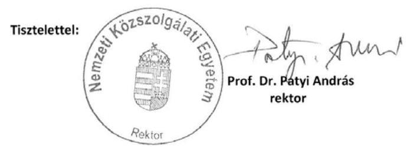

1101 Budapest, X. Hungária krt. 9-11. | Tel: (1) 432-9150
Postai cím: 1581 Budapest, Pf.: 15. | Email: rektor@uni-nke.hu

---

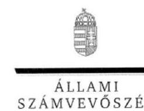

ELNÖK

Ikt.szám: V-0014-065/2012.

Prof. Dr. Patyi András úr
rektor
Nemzeti Közszolgálati Egyetem

Budapest

Tisztelt Rektor Úr!

A Zrínyi Miklós Nemzetvédelmi Egyetem ellenőrzése című jelentéstervezetre tett észrevételeit köszönettel megkaptam.

Az Állami Számvevőszék észrevételekre vonatkozó álláspontjáról a felügyeleti vezető által készített részletes tájékoztatást csatoltan megküldöm.

Tájékoztatom Rektor urat, hogy a jelentésben – az Állami Számvevőszékről szóló 2011. évi LXVI. törvény 29. § (3) bekezdése alapján – az el nem fogadott észrevételeket szerepeltetjük az elutasítás indokának feltüntetésével együtt. Az elfogadott észrevételeket a jelentés szövegezésénél figyelembe vesszük.

Budapest, 2012. / hó / nap

Tisztelettel:

Domokos László

Melléklet: Tájékoztatás az elfogadott és az el nem fogadott észrevételekről

1052 BUDAPEST, APÁCZAI CSERÉ JÁNOS UTCA 10. 1364 Budapest 4. Pl. 54 telefon: 484 9101 fax: 484 9201

---

# Tájékoztatás 

## az elfogadott és az el nem fogadott észrevételekröl

A Zrínyi Miklós Nemzetvédelmi Egyetem (ZMNE) ellenőrzése címú jelentéstervezetre az NKE-RH-285/2012. iktatószámú levelében tett észrevételeit áttekintettük, azok kezeléséről az alábbi tájékoztatást adom.

Elfogadtuk a jelentéstervezetre tett 7, 11. és 12. számú észrevételét. A 7. észrevétel alapján a Nemzeti Közszolgálati Egyetem (NKE) hivatkozott vezetőinek beosztását, a 11. alapján a kifogásolt dokumentum megnevezését pontosítjuk. A 12. észrevételben foglaltak alapján a Felsőoktatási Minőségi Díj pályázatra vonatkozó megállapításunkat kiegészítettük.

Elfogadtuk a 6. számú észrevételében javasolt, az előírt munkacsoport létrehozásának elmaradására vonatkozó szövegpontosítást. Észrevételének indoklását is figyelembe véve a munkacsoport titkára kijelölésének elmaradására vonatkozó megállapítást pontosítottuk.

Nem fogadtuk el a 4. számú, az NKE rektora részére címzett, az 1. számú javaslatot megalapozó megállapítás pontositására irányuló észrevételét. Az államháztartás szervezetei beszámolási és könyvvezetési kötelezettségének sajátosságairól szóló 249/2000. (XII. 24.) Korm. rendelet 37. § (1) bekezdésében foglalt előírás leltárkészítési kötelezettséget ír elő, így a szabályozással való összhang az eredeti szöveg mellett biztosított.

Nem fogadtuk el az 5. számú észrevételét, mert indoklásában nem cáfolta az írásos értékelések hiányát. A jelentéstervezet nem tartalmazott a Nemzeti Közszolgálati Egyetem létrehozásával kapcsolatos egyes feladatokról szóló 44/2011. (IV. 20.) HM utasításban előírt kötelezettség megsértésére vonatkozó megállapítást. Az átalakulással kapcsolatos feladatokat meghatározó ütemtervekben foglaltak végrehajtásáról a felelősök írásos beszámoltatása célszerű lett volna. Ennek elmaradása is hozzájárult az átalakulással kapcsolatosan feltárt - a HM KPH célellenőrzése által is megállapított - hiányosságokhoz.

Nem fogadtuk el a 13. számú észrevételét. Nem általánosítható, hogy a ZMNE belső ellenőrzése a 2011. évtől jogszerűvé vált, mivel a költségvetési szervek belső ellenőrzéséről szóló 193/2003. (XI. 26.) Korm. rendelet (Ber.) 8. § I) bekezdésében foglaltak ellenére nem gondoskodtak az ellenőrzési javaslatok alapján tett intézkedések nyomon követéséről, továbbá a 21. § előírása ellenére a 2011. évi belső ellenőrzési tervet nem alapozta meg kockázatelemzés. Észrevétele alapján ugyanakkor hangsúlyosabbá tettük a belső ellenőrzés jogszerűsége tekintetében 2011-ben tett előrelépéseket (személyi feltételek, intézményi Belső Ellenőrzési Kézikönyv elkészítése és elfogadása, jelentések tartalma). Továbbra is fenntartjuk a 2011. évi belső ellenőrzés kontrolljainak nem hatékony működésére vonatkozó megállapítást.

---

A belső ellenőrzések a 2010-2011. években tártak fel hiányosságokat, ennek ellenére a belső kontrollrendszer egyes elemeit nem szabályozták és müködtették megfelelően. A kontrollok nem voltak alkalmasak a működésbeli hibák, szabálytalanságok kiszürésére, jelzésére. A 2011. évi belső ellenőrzések javaslatainak hasznosítását dokumentumok nem igazolták, mivel a javaslatok és azok hasznosulásának nyomon követésére a Ber. 29/A. §-ában előírt nyilvántartást éves bontásban nem vezették. A javaslatok hasznosulását utóellenőrzés keretében nem ellenőrizték.

Nem fogadtuk el a 14. sorszámú észrevételét. A belső ellenőrzés hatékony és eredményes müködésének megítéléséhez hozzátartozik a javaslatai hasznosításához kapcsolódó információszerzés, és a Ber. 8. § f) pontja alapján a belső ellenőrzés feladata nyomon követni az ellenőrzési javaslatok alapján tett intézkedéseket. A javaslatok és azok hasznosulásának nyomon követéséről dokumentumot a helyszíni ellenőrzés részére az intézmény nem adott át (pl. a Ber. 29. § (1) bekezdés alapján az ellenőrzött szervezeti egység vezetőjétől kért intézkedési tervet, illetve a Ber. 29/A. § alapján a javaslatok és azok hasznosulásának nyomon követésére előírt nyilvántartást). Az intézmény részéről aláírt teljességi nyilatkozat igazolta az átadott dokumentumok teljes körűségét. A Ber. 29/A. §-ban előírt nyilvántartás vezetésének hiányában - utóellenőrzés nélkül - az intézmény, a belső ellenőrzés és az ÁSZ ellenőrzés számára sem volt információ a javaslatok hasznosulásáról.

A minőségbiztosítási rendszer szabályozására és müködésére, azon belül a jelentéstervezet összegző megállapítások rész 1-2. bekezdéseire vonatkozó 1-2. számú, továbbá a részletes megállapítások rész 2.1 pontjára vonatkozó 8-10. számú észrevételében foglaltak nem változtatnak megállapításaink tényszerűségén. Azok részben magyarázzák, részben pontosítják a megállapítások tartalmát. A pontosító észrevételeket a jelentés készítésénél figyelembe vettük.

A minőségbiztosítási rendszer müködésére vonatkozó 3. számú észrevételét részben fogadtuk el. Az értékelési szempontrendszernek a vizsgált időszakon belüli változásait a MAB előírásainak változásával indokolja, melyet elfogadtunk. A mérési, értékelési, visszacsatolási folyamatok egysége, egymásra épülése hiányára vonatkozó megállapítást fenntartjuk. A hiányosság okát, az észrevételt figyelembe véve pontosítottuk.

Tájékoztatom, hogy a számvevőszéki jelentés mellékleteiként szerepeltetjük a jelentéstervezethez tett észrevételeit, valamint azokra adott válaszunkat.

Budapest, 2012. 10. hód̉ nap

Holman Magdolna
felügyeleti vezető