# ÁLLAMI   SZÁMVEVŐSZÉK 

## JELENTÉS

a nemzeti park igazgatóságok feladatellátásának és vagyonkezelésének ellenőrzéséről

---

# Állami Számvevőszék 

Iktatószám: V-0017-103/2012.
Témaszám: 1056.
Vizsgálat-azonosító szám: V0586
Az ellenőrzést felügyelte:
Holman Magdolna
felügyeleti vezető
Az ellenőrzést vezette és az ellenőrzés végrehajtásáért felelős:
Brebán Andrea
ellenőrzésvezető
Az összefoglaló jelentést készítette:
Brebán Andrea
ellenőrzésvezető
A számvevői jelentések feldolgozásában és a jelentés összeállításában közreműködtek:
Morvay András
számvevő főtanácsos

Nyikon Zsigmondné
számvevő tanácsos

Palágyiné Dr. Gömöri Katalin
számvevő

## Az ellenőrzést végezték:

Buús Zoltánné Hütter Erzsébet
számvevő tanácsos
Hegyes Mária
számvevő tanácsos
Morvay András
számvevő főtanácsos

Pappné Dr. Szamosi
Éva
számvevő tanácsos
Tótfalusi Zoltán
számvevő tanácsos

Farkas Emese Rozália
számvevő
Kámán Edina
számvevő
Nyikon Zsigmondné
számvevő tanácsos

Ritecz Tibor
számvevő tanácsos

Vida László
számvevő tanácsos

Hadházy Sándor György
számvevő tanácsos
Molnár Istvánné
számvevő tanácsos
Palágyiné Dr. Gömöri
Katalin
számvevő
Terbe Mónika
számvevő tanácsos

A témához kapcsolódó eddig készített számvevőszéki jelentések:
címe
sorszáma
Jelentés a Fertő tó térség természetvédelmének ellenőrzéséről 0339
Jelentés a magyar-osztrák-szlovén határ menti térség környezet- és 0542 természetvédelmének ellenőrzéséről

---

# TARTALOMJEGYZÉK 

BEVEZETÉS ..... 11
I. ÖSSZEGZŐ MEGÁLLAPÍTÁSOK, KÖVETKEZTETÉSEK, JAVASLATOK ..... 15
II. RÉSZLETES MEGÁLLAPÍTÁSOK ..... 21

1. A 2011. évi zárszámadási beszámolók értékelése ..... 21
1.1. A pénzforgalmi adatok megbízhatósága, a törvényesség, az átláthatóság, az elszámoltathatóság érvényesülése ..... 21
1.2. A mérlegek megfelelősége ..... 22
1.3. Az előírányzatok módosításainak, átcsoportosításainak szabályossága ..... 23
1.4. Az egyensúly megőrzési intézkedések végrehajtása, a bevételek szabályszerűsége és a maradvány megállapítása ..... 23
2. Az igazgatóságok működési feltételrendszere ..... 25
2.1. A kialakított felügyeleti, irányítási rendszer ..... 25
2.2. A feladatellátás szabályozási kerete ..... 26
2.3. A természetvédelmi vagyonkezelés, tervezés szabályozása ..... 26
2.4. A tulajdonosi joggyakorlás szabályozása, gyakorlata ..... 28
2.5. Az igazgatóságok feladatellátásának irányító szervi és tulajdonosi ellenőrzése, értékelése ..... 30
2.6. Az igazgatóságok működése, személyi feltételei ..... 31
3. A nemzeti park igazgatóságok természetvédelmi tevékenysége ..... 34
3.1. Az igazgatóságok belső szabályozásainak, természetvédelmi kezelési és vagyonkezelési terveinek megfelelősége ..... 34
3.2. Természetvédelmi vagyonkezelés ..... 37
3.3. Védett természeti területek és fajok kezelése ..... 39
3.4. Károsodott területek helyreállítása ..... 40
3.5. Nyilvántartások teljessé tételére hozott intézkedések ..... 41
3.6. Ismeretterjesztés, környezeti nevelés ..... 44
4. Az igazgatóságok vagyonkezelése, vagyonhasznosítása ..... 45
4.1. Az igazgatóságok vagyonkezelésében lévő vagyon összetételének változása ..... 45
4.2. A kezelt vagyon saját használattal való hasznosítása ..... 46
4.3. Az igazgatóságok vagyonkezelésében álló területek használatba adása ..... 50
4.4. Ökoturisztikai fejlesztés ..... 53
5. A pénzügyi eszközök rendelkezésre állása, céloknak megfelelő felhasználása ..... 54

---

# MELLÉKLETEK 

1. számú Elfogadó vélemény a Duna-Ipoly, a Hortobágyi, a Körös-Maros, az Örségi Nemzeti Park Igazgatóságok 2011. évi intézményi költségvetési beszámolójáról
2. számú A foglalkoztatottak létszámának alakulása a nemzeti park igazgatóságoknál a 2007-2011. évek között
3. számú A természetvédelmi őrszolgálat és a szakfelügyelői létszám alakulása az igazgatóságoknál a 2007-2011. évek között
4. számú a) A természetvédelem feltételrendszerének javítására a nemzeti park igazgatóságok által előkészített kezelési és fenntartási tervek alakulása a 2007-2011. évek között
b) A védett és védelemre tervezett területek a 2007. és a 2011. években
5. számú A saját használatban álló területek aránya a vagyonkezelésben álló területeken belül a 2007. és a 2011. években igazgatóságonként
6. számú a) Az igazgatóságok vagyonkezelésében lévő területek megoszlása a 2007. és a 2011. években
b) Az igazgatóságok vagyonkezelésében a természetvédelmi erdőkezelés adatai a 2007-2011. évek között
c) A haszonbérleti díjbevétel és díjak a 2007. és a 2011. években
7. számú Az igazgatóságok ökoturisztikai adatai a 2007-2011. évek között
8. számú a) Az igazgatóságok gazdálkodási adatai a 2007-2011. években
b) Az igazgatóságok pályázati tevékenysége a 2007-2011. évek között
9. számú a) Az igazgatóságok vagyonkezelésében lévő használatba adott területek bérleti díj adatai a 2007. és a 2011. években
b) Az igazgatóságok vagyonkezelésében lévő saját használatban álló területeknél az egy hektárra jutó területalapú támogatás adatai a 2007. és a 2011. években
10. számú Az igazgatóságok vagyonkezelésében lévő egyes vagyonelemek alakulása a 2007-2011. években
11. számú A nemzeti park igazgatóságok működési területe
12. számú a) A vidékfejlesztési miniszter jelentéstervezethez tett észrevétele
b) Az ÁSZ válasza a vidékfejlesztési miniszternek a jelentéstervezethez tett észrevételeire
c) A Hortobágyi NPI igazgatójának a jelentéstervezethez tett észrevétele
d) Az ÁSZ válasza a Hortobágyi NPI igazgatójának a jelentéstervezethez tett észrevételeire
e) A Magyar Nemzeti Vagyonkezelő Zrt. elnökének a jelentéstervezethez tett észrevétele
f) Az ÁSZ válasza a Magyar Nemzeti Vagyonkezelő Zrt. elnökének a jelentéstervezethez tett észrevételeire

---

# RÖVIDÍTÉSEK JEGYZÉKE 

adatszolgáltatásról szóló utasítás

Aggteleki NPI
Áhsz.

Ámr. 1

Ámr. 2

Ávt.
Balaton-felvidéki NPI
Bükki NPI
Duna-Dráva NPI
Duna-Ipoly NPI
Evt. 1
Evt. 2
Étvt.

Fertő-Hanság és Őrség NPI
Fertő-Hanság NPI ha
a haszonbérleti szerződések egységesítéséről szóló utasítás
helyszínen ellenőrzött igazgatóságok

Hortobágyi NPI
hosszú távú vagyonkezelési program
igazgatóságok
a nemzeti park igazgatóságok adatszolgáltatási kötelezettségéről szóló 1/2003. (K. Ért. 2.) KvVM utasítás (hatálytalan 2012. június 9-étől)
Aggteleki Nemzeti Park Igazgatóság
az államháztartás szervezetei beszámolási és könyvvezetési kötelezettségének sajátosságairól szóló 249/2000. (XII. 24.) Korm. rendelet
az államháztartás működési rendjéről szóló 217/1998. (XII. 30.) Korm. rendelet (hatálytalan 2010. január 1-jétől)
az államháztartás működési rendjéről szóló 292/2009. (XII. 19.) Korm. rendelet (hatálytalan 2012. január 1-jétől)
az állami vagyonról szóló 2007. évi CVI. törvény
Balaton-felvidéki Nemzeti Park Igazgatóság
Bükki Nemzeti Park Igazgatóság
Duna-Dráva Nemzeti Park Igazgatóság
Duna-Ipoly Nemzeti Park Igazgatóság
az erdőről és az erdő védelméről és erdőgazdálkodásról szóló 2009. évi XXXVII. törvény
az erdőről és az erdő védelméről szóló 1996. évi LIV. törvény (hatálytalan 2009. július 10-étől)
a nemzeti park igazgatóságok természetvédelmi vagyonkezelési tevékenységének egységes alapelvek szerinti ellátásáról szóló 9/2006. (K. V. Ért.) KvVM utasítás mellékletének 4.1.3. pontja szerinti éves természetvédelmi vagyonkezelési terv
Fertő-Hanság és Örség Nemzeti Park Igazgatóság
Fertő-Hanság Nemzeti Park Igazgatóság hektár
a nemzeti park igazgatóságok által kötött haszonbérleti szerződések egységesítéséről szóló 16/2005. (K. V. Ért. 2006. 1.) KvVM utasítás
a helyszínen ellenőrzött 4 igazgatóság: Duna-Ipoly Nemzeti Park Igazgatóság, Hortobágyi Nemzeti Park Igazgatóság, Körös-Maros Nemzeti Park Igazgatóság, Örségi Nemzeti Park Igazgatóság
Hortobágyi Nemzeti Park Igazgatóság
a nemzeti park igazgatóságok természetvédelmi vagyonkezelési tevékenységének egységes alapelvek szerinti ellátásáról szóló 9/2006. (K. V. Ért.) KvVM utasítás mellékletének 4.1.2. pontja szerinti hosszú távú természetvédelmi vagyonkezelési program
Az összes nemzeti park igazgatóság (10 db)

---

| KGF | Költségvetési és Gazdálkodási Főosztály |
| :--: | :--: |
| KEOP | Környezet és Energia Operatív Program |
| Kormány | Magyarország kormánya |
| KIOP | Környezetvédelem és Infrastruktúra Operatív Program |
| Kiskunsági NPI | Kiskunsági Nemzeti Park Igazgatóság |
| Körös-Maros NPI | Körös-Maros Nemzeti Park Igazgatóság |
| KÖTEVIFE | Környezetvédelmi, természetvédelmi és vízügyi felügyelőség |
| KVI | Kincstári Vagyoni Igazgatóság |
| Kvt. | a környezet védelmének általános szabályairól szóló 1995. évi LIII. törvény |
| KvVM | Környezetvédelmi és Vízügyi Minisztérium |
| minisztérium | Környezetvédelmi és Vízügyi Minisztérium, 2010. május 25-étől Vidékfejlesztési Minisztérium |
| MNV Zrt. | Magyar Nemzeti Vagyonkezelő Zrt. |
| NFA | Nemzeti Földalapkezelő Szervezet |
| Nfatv. | a Nemzeti Földalapról szóló 2010. évi LXXXVII. törvény |
| $\mathrm{NKP}_{3}$ | a 96/2009. (XII. 9.) OGY határozat a 2009-2014 közötti időszakra szóló Nemzeti Környezetvédelmi Programról |
| NPTF | Nemzeti Parki és Tájvédelmi Főosztály |
| OGY | Országgyűlés |
| OKTVF | Országos Környezetvédelmi, Természetvédelmi és Vízügyi Főfelügyelőség |
| Örségi NPI | Örségi Nemzeti Park Igazgatóság |
| Ramsari egyezmény | a nemzetközi jelentőségű vadvizekről, különösen mint a vízimadarak tartózkodási helyéről szóló, Ramsarban, 1971. február 2-án elfogadott Egyezmény és annak 1982. december 3-án és 1987. május 28.-június 3. között elfogadott módosításai egységes szerkezetben történő kihirdetéséről szóló 1993. évi XLII. törvény |
| Számv. tv. | a számvitelről szóló 2000. évi C. törvény |
| SZMSZ | szervezeti és működési szabályzat |
| Természetvédelmi Alaptery | Nemzeti Természetvédelmi Alapterv |
| természetvédelmi kezelési terv | a Tvt. 36. § (1) bekezdése szerinti, az országos jelentőségű védett természeti területekre az igazgatóságok által kidolgozott és miniszteri rendeletben megállapított természetvédelmi kezelési terv |
| természetvédelmi vagyonkezelésről szóló utasítás | a nemzeti park igazgatóságok természetvédelmi vagyonkezelési tevékenységének egységes alapelvek szerinti ellátásáról szóló 9/2006. (K. V. Ért.) KvVM utasítás |
| Tftv. | a termőföldről szóló 1994. évi LV. törvény |
| TIR | a természet védelméről szóló 1996. évi LIII. törvény 67. § (1) bekezdésében meghatározott természetvédelmi információs rendszer |
| TMF | Természetmegőrzési Főosztály |

---

Tvt.
vagyongazdálkodási
terv

VM
VSzt.

12/2012. VM utasítás

254/2007. Korm. rendelet
262/2010. Korm. rendelet

347/2006. Korm. rendelet
a természet védelméről szóló 1996. évi LIII. törvény
a nemzeti park igazgatóságok természetvédelmi vagyonkezelési tevékenységének egységes alapelvek szerinti ellátásáról szóló 9/2006. (K. V. Ért.) KvVM utasítás mellékletének 2.7. és 4.1.3. pontjai szerinti éves vagyongazdálkodási terv
Vidékfejlesztési Minisztérium
a védett természeti területek védettségi szintjének helyreállításáról szóló 1995. évi XCIII. törvény
a nemzeti park igazgatóságok természetvédelmi célú vagyonkezelési tevékenységének egységes szakmai alapelvek szerinti ellátásáról szóló 12/2012. (VI. 8.) VM utasítás
az állami vagyonnal való gazdálkodásról szóló 254/2007. (X. 4.) Korm. rendelet
a Nemzeti Földalapba tartozó földrészletek hasznosításának részletes szabályairól szóló 262/2010. (XI. 17.) Korm. rendelet
a környezetvédelmi, természetvédelmi, vízügyi hatósági és igazgatási feladatokat ellátó szervek kijelöléséről szóló 347/2006. (XII. 23.) Korm. rendelet

---

.

---

# ÉRTELMEZŐ SZÓTÁR 

biodiverzitás
eredeti állapot
ex lege védett természeti értékek, területek
élőhely
élő szervezet (élőlény)
környezetkárosodást megelőző intézkedés

LIFE program
megelőzési, illetve helyreállítási költség

Biológiai sokféleség, az élővilág változatossága, amely magában foglalja az élő szervezetek genetikai (fajon belüli), valamint a fajok és életközösségeik közötti sokféleséget és maguknak a természeti rendszereknek a sokféleségét (Tvt. 4. § j) pont).
a kár bekövetkezésének időpontjában a természeti erőforrásoknak és az azok által nyújtott szolgáltatásoknak a rendelkezésre álló legjobb információ alapján becsült helyzete, amely akkor állt volna fenn, ha a károsodás nem következik be (a környezeti károk megelőzése és felszámolása tekintetében a környezeti felelősségről szóló az Európai parlament és a Tanács 2004. április 21-i 2004/35/EK irányelvének 2. cikk 14. pontja)
a törvény erejénél fogva védelem alatt áll valamennyi forrás, láp, barlang, víznyelő, szikes tó, kunhalom, földvár (Tvt. 23. § (2) bekezdés)
az a meghatározható térbeli egység, ahol adott élő szervezet és állománya (populáció), vagy élőlények életközössége a természeti rendszerben előfordul és a kialakulásához, fennmaradásához, szaporodásához, tenyésztéséhez szükséges környezeti feltételek adottak (Tvt. 4. § i) pont)
mikroorganizmusok, gombák, növények és állatok fajai, alfajai, változatai, együttesen a fajok (a természet védelméről szóló 1996. évi LIII. törvény 4. § f) pont)
minden olyan intézkedés, amelyet környezeti kár közvetlen veszélyével fenyegető esemény, cselekmény vagy mulasztás következtében tesznek a kár megelőzése vagy minimálisra csökkentése érdekében (a környezeti károk megelőzése és felszámolása tekintetében a környezeti felelősségről szóló, az Európai parlament és a Tanács 2004. április 21-i 2004/35/EK irányelvének 2. cikk 10. pontja)
a LIFE (L'Instrument Financier pour l'Environnement) az Európai Unió környezetvédelmi politikáját támogató pénzügyi eszköz, amelyet 1992. évben hoztak létre; amely a 2007-2013. évek közötti időszakban LIFE+ program néven folytatódik
azok a költségek, amelyek a környezeti károk megelőzése és felszámolása tekintetében a környezeti felelősségről szóló az Európai Parlament és a Tanács 2004. április 21-i 2004/35/EK irányelv megfelelő és hatékony végrehajtásának biztosításához szükségesek
A költségekbe sorolandók a környezeti károk, valamint az ilyen károk közvetlen veszélyének felmérésével kapcsolatos költségek, a lehetséges intézkedések felmérésének költségei csakúgy, mint a közigazgatási, jogi és végrehajtási költségek, az adatgyűjtés költségei és egyéb általános költségek, valamint a monitoring és az ellenőrzés költségei.

---

Natura 2000 terület

Nemzeti Környezetvédelmi Program
ökoturisztika
természetvédelmi kezelés
természetvédelmi vagyonkezelés

Az európai közösségi
 jelentőségű természetvédelmi rendeltetésű területekről szóló 275/2004. (X. 8.) Korm. rendelet hatálya alá tartozó közösségi jelentőségű természetvédelmi rendeltetésű madárvédelmi terület, különleges természetmegőrzési, illetőleg kiemelt jelentőségű természetmegőrzési terület, amely a közösségi jelentőségű természetes élőhely-típusok, vadon élő állat- és növényfajok védelmén keresztül biztosítja a biológiai sokféleség megóvását
Kijelölése kizárólag szakmai (ökológiai) szempontok figyelembevételével történik.
a 96/2009. (XII. 9.) OGY határozat a 2009-2014 közötti időszakra szóló harmadik Nemzeti Környezetvédelmi Programról $\left(\mathrm{NKP}_{3}\right)$
„Az ökoturizmus a környezetért felelősséget vállaló utazás és látogatás a viszonylag zavartalan természeti területeken, azok természeti, valamint jelen és múltbeli kulturális értékeinek élvezete és értékelése céljából, úgy, hogy kíméli azokat a látogatás káros hatásainak mérséklésével, valamint a helyi népesség társadalmi, gazdasági előnyökhöz juttatásával" (IUCN ${ }^{1}$ Ökoturizmus Programja).
a Tvt. 36. § (2) bekezdésében foglaltak alapján a védett természeti értékek, területek felmérését, nyilvántartását, megóvását, őrzését, fenntartását, bemutatását, helyreállítását célzó tevékenységek összessége
A tevékenységek - különösen a mező-, erdő-, nád-, hal-, vadgazdálkodás során - magukban foglalják a tájvédelemmel, a vadon élő élővilág, az élőhelyek, a földtani természeti értékek védelmével összefüggő fenntartható használatot, a természetkímélő módszerek alkalmazását és a biológiai sokféleség védelmét.
a 262/2010. (XI. 17.) Korm. rendelet 43/A. §-ában foglaltak alapján az állami tulajdonban álló földrészleteken a természetvédelmi közcélok megvalósítása, az élő és élettelen természeti értékek megóvása, a tájképi, kultúrtörténeti értékek megőrzése, a természeti vagyon állagának, értékének megőrzése, védelme, fenntartható módon való növelése
A természetvédelmi vagyonkezelés során a védett természeti területeken történő mező- és erdőgazdálkodási tevékenységek a természetvédelmi célokra tekintettel folytathatók. A természetvédelmi vagyonkezelés megvalósulhat saját használattal és kezeléssel, illetve haszonbérleti szerződéssel való használatba adással.

[^0]
[^0]:    ${ }^{1}$ IUCN: International Union for Conservation of Nature and Natural Resources - a világ hivatalos természetvédelmi szervezete, tagjai között kormányzati és nem kormányzati szervezetek is vannak, 1948. évben jött létre, hazánk 1975. év óta tagja.

---

vagyonkezelési szerződés
védett természeti terület
az állami vagyon használatát biztosító - így különösen bérleti, haszonbérleti, vagyonkezelési, megbízási, haszonélvezeti jogot alapító - szerződés, amely alapján a vagyonkezelő jogosult meghatározott állami tulajdonba tartozó dolog birtoklására, használatára és hasznai szedésére (Ávt. 24. § (1) és 27. § (2) bekezdései alapján)
a Tvt. 28. (1) bekezdése alapján a védett természeti terület kiterjedtségének, céljának, hazai és nemzetközi jelentőségének megfelelően lehet: nemzeti park, tájvédelmi körzet, természetvédelmi terület, természeti emlék

---

.

---

# JELENTÉS   a nemzeti park igazgatóságok feladatellátásának és vagyonkezelésének ellenőrzéséről 

## BEVEZETÉS

Az ellenőrzés kapcsolódik az ÁSZ 2012. évi ellenőrzési tervében a 16. témasorszámú, a Magyar Köztársaság 2011. évi költségvetése végrehajtásának ellenőrzéséhez, növelve ezzel a zárszámadási ellenőrzésbe bevont költségvetési szervek számát.

A Tvt. szerint a természeti értékek és a természeti területek a nemzeti vagyon sajátos és pótolhatatlan részei, kezelésük, állapotuk javítása, a jövő nemzedékek számára való megőrzése, a természeti örökség és a biológiai sokféleség oltalma, mint az emberiség fennmaradásának alapvető feltétele a természet hatékony védelmét igényli. A védett természeti területek természetvédelmi kezeléséért felelős szervként a vonatkozó jogszabályok a nemzeti park igazgatóságokat jelölik ki, amelyek jogszabály által létrehozott, önállóan működő és gazdálkodó központi költségvetési szervek.

A természet védelmével, a biológiai sokféleség megőrzésével a természeti és táji értékek, természetes élőhelyek, vadon élő növény- és állatfajok, valamint más természeti értékek felmérésének, értékelésének, védelmének és helyreállításának biztosítása, továbbá az ezzel kapcsolatos tevékenységek összehangolása érdekében a Nemzeti Környezetvédelmi Programok részeként Természetvédelmi Alapterv készült. A 2009-2014. évek közötti időszakra vonatkozó NKP${ }_{3}$ intézkedései az igazgatóságok megerősítését célozták a megnövekedett európai uniós, hazai természetvédelmi kezelési, kutatási, monitorozási, projekt-menedzselési feladatok miatt. A célok elérése érdekében az $\mathrm{NKP}_{3}$ a Kormány részére igazgatási és költségvetési intézkedések végrehajtását is előírta.

Az igazgatóságok feladatellátása a természetvédelemhez kapcsolódik, vagyonkezelésük során természetvédelmi vagyonkezelési tevékenységet folytatnak.

Természetvédelmi tevékenységük keretében ellátják a védett és fokozottan védett természeti értékek, természeti területek, a Natura 2000 területek, a nemzetközi természetvédelmi egyezmény hatálya alá tartozó területek és értékek természetvédelmi kezelésével kapcsolatos feladatokat. A természetvédelmi kezelés keretében természeti területek, természeti értékek megőrzése, fenntartása, gyarapítása, helyreállítása, kutatása, a vagyonkezeléssel összefüggő természetvédelmi és egyéb jogszabályok, szabályok, nemzetközi egyezmények betartását-

---

betartatását végzik. Emellett a tájjellegű természetkímélő és természetközeli gazdálkodási módok bevezetését, fenntartását, terjesztését, bemutatását végzik.

Vezetik a működési területükön lévő védett természeti területek, értékek nyilvántartását, gondoskodnak azokhoz szükséges adatgyűjtésről, működtetik a feladatkörükkel összefüggő területi monitoring és információs rendszert.

Az igazgatóságok közreműködnek az erdővagyon-védelmi tevékenységben, a természetvédelmi szempontból védetté nem nyilvánított természetes növény- és állatvilág védelmében véleményezői, kultúrtörténeti érték- és örökségvédelmi feladatokat látnak el. Az igazgatóságok munkájának tudományos megalapozását, szakmai segítését, társadalmi támogatottságának növelését a 2005. évtől létrehozott nemzeti park tanácsok segítik.

Az igazgatóságok vagyonkezelési tevékenysége az MNV Zrt-vel kötött vagyonkezelési szerződésben foglalt területekre terjedt ki. Az igazgatóságok vagyonkezelésének sajátosságait a földterületek természetvédelmi kezeléséből eredő kötelezettsége, a területen folytatható gazdálkodás természetvédelmi oltalom miatti korlátozottsága, az őshonos állatok állományának fenntartása, továbbá a barlangokhoz kapcsolódó különleges tevékenységek ellátása képezik.

Az igazgatóságok költségvetési támogatásait és bevételeit a 2007-2011. években a következő diagram mutatja ${ }^{2}$ :
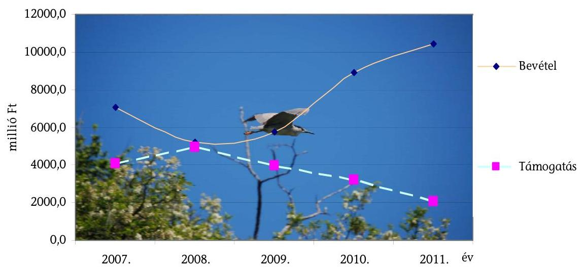

Az igazgatóságok a 2007-2011. években összesen 18 243,5 millió Ft költségvetési támogatásban részesültek, bevételük az érintett időszakban 37 377,6 millió Ft

[^0]
[^0]:    ${ }^{2}$ A diagram hátterében látható szálló bakcsó, amely Magyarországon fokozott védettséget élvez, eszmei értéke 100000 forint.

---

volt ${ }^{3}$. Az igazgatóságok költségvetési támogatása 2007. évről a 2008. évre nőtt, majd ezt követően csökkent.

Az igazgatóságok részére az ellenőrzött időszakban uniós és nemzeti támogatási források is rendelkezésre álltak feladataik ellátására.

A szabályszerűségi ellenőrzés célja annak minősítése volt, hogy a 2011. évi költségvetések végrehajtásáról szóló beszámolók megbízható és valós képet adtak-e az ellenőrzésbe vont 4 igazgatóság vagyoni és pénzügyi helyzetéről. A teljesítményellenőrzés célja az igazgatóságok feladatellátása eredményességének, hatékonyságának, valamint a kezelésükben levő vagyonelemek hasznosításának minősítése volt. Ennek keretében értékeltük:

- az igazgatóságok feladatainak ellátására kialakított feltételrendszert;
- az igazgatóságok természetvédelmi kezelési és természetvédelmi vagyonkezelési feladatainak ellátását;
- az igazgatóságok természetvédelmi vagyonkezelési terveiben foglalt feladatok teljesítéséhez a pénzügyi eszközök rendelkezésre állását, a céloknak megfelelő felhasználását.
- Eredményesnek minősítettük az igazgatóságok feladatellátását, ha
- a mérgezéses esetek száma csökkent, a madárvédelmi cél érdekében a szabadvezetékek szigetelését és a légvezetékek földkábelre cserélését a szervezetek végezték;
- a vagyonkezelt területeken belül a saját használatban álló területek aránya növekedett;
- a források felhasználása során a rendelkezésükre álló költségvetési forrásokból és a saját bevételeikből a tervezett alapfeladataikat teljesítették.

Hatékonynak minősítettük az igazgatóságok feladatellátását, ha az egy hektár saját használatú területre jutó működési kiadás csökkent.

Az ellenőrzés jogalapját az Állami Számvevőszékről szóló 2011. évi LXVI. törvény 1. § (3) bekezdése, továbbá a zárszámadás-ellenőrzéshez kapcsolódó szabályszerűségi ellenőrzés tekintetében az Állami Számvevőszékről szóló 2011. évi LXVI. törvény 5. §-ának (2), (6) és (7) bekezdései, valamint az államháztartásról szóló 2011. évi CXCV. törvény 61. §-ának (2) bekezdése és 90. §-ának (1) bekezdése képezte. Az ellenőrzés megalapozásához előtanulmány készült.

A zárszámadás-ellenőrzéshez kapcsolódó szabályszerűségi ellenőrzést a 2011. évre vonatkozóan 4 igazgatóságnál (Duna-Ipoly NPI, Hortobágyi NPI, Körös-Maros NPI, Őrségi NPI) folytattuk le. Az igazgatóságok 2011. évi költség-

[^0]
[^0]:    ${ }^{3}$ A diagram a Magyar Köztársaság költségvetésének végrehajtásáról szóló törvények 2007-2010. évekre teljesített adatait, a 2011. évre a költségvetés végrehajtásáról szóló törvényjavaslat adatait tartalmazza.

---

vetési beszámolóját az ÁSZ által a 2011. évi költségvetés végrehajtása ellenőrzésének előkészítése során, a BM költségvetési szervek elemi beszámolóinak pénzügyi (szabályszerűségi) ellenőrzéséhez készített Egyszerűsített Útmutató alapján ellenőriztük.

A teljesítményellenőrzést a 2007-2011. évekre kiterjedően az INTOSAI ${ }^{4}$ vonatkozó standardjainak és az ÁSZ teljesítmény-ellenőrzési módszertanának figyelembevételével végeztük. Helyszíni ellenőrzést a Vidékfejlesztési Minisztériumnál, 4 igazgatóságnál (Duna-Ipoly NPI, Hortobágyi NPI, Körös-Maros NPI, Őrségi NPI) és a helyszínen felmerülő vagyonkezelési kérdésekhez kapcsolódóan az MNV Zrt-nél folytattunk. Tanúsítványi adatkérésre az összes igazgatóságnál (10) sor került.

Az Állami Számvevőszékről szóló 2011. évi LXVI. törvény 29. §-a szerint a jelentéstervezetet megküldtük egyeztetésre a vidékfejlesztési miniszternek, a Magyar Nemzeti Vagyonkezelő Zrt. elnökének, a helyszínen ellenőrzött négy igazgatóság igazgatójának. A beérkezett észrevételeket és az ezekre adott válaszokat, ideértve az el nem fogadott észrevételeket és azok indokolását a jelentés 12. a)f) mellékletei tartalmazzák.

[^0]
[^0]:    ${ }^{4}$ INTOSAI (International Organization of Supreme Audit Institutions, Legfőbb Ellenőrző Intézmények Nemzetközi Szervezete)

---

# I. ÖSSZEGZŐ MEGÁLLAPÍTÁSOK, KÖVETKEZTETÉSEK, JAVASLATOK 

#### Abstract

Az igazgatóságok feladatellátásának követelményeit, szabályait a jogszabályi előírások mellett a miniszteri utasítások határozták meg, amelyek a természetvédelmi kezelési és vagyonkezelési feladatok ellátásának kereteit biztosították. Az utasítások rendelkeztek a kötelező adatszolgáltatásról, a haszonbérleti szerződések egységesítéséről, a természetvédelmi kezelésről és vagyonkezelésről, az ellenőrzésről. A természetvédelmi vagyonkezelésről szóló utasítás a tervezés elveit és gyakorlatának szabályozását tartalmazta a 2007-2011. évek között. Az irányító szerv az utasításon túl nem határozott meg további elvárásokat a tervezéssel, annak követésével és ellenőrzésével kapcsolatban. A minisztérium az $\mathrm{NKP}_{3}$ nemzeti park igazgatóságokra megjelölt céljaival kapcsolatos iránymutatást, illetve konkrét feladatot meghatározó normatív szabályozást nem adott ki. Az éves költségvetéseik tervezése kapcsán szakmai előírásokat nem fogalmazott meg az igazgatóságoknak.

A minisztérium a 2007. és a 2011. évek közötti időszakban mindegyik igazgatóságot legalább egy alkalommal pénzügyi vagy szabályszerűségi szempontból ellenőrizte. Az igazgatóságok éves jelentéseikben a természetvédelmi kezelési, vagyonkezelési eredményeikről beszámoltak a minisztérium felé. Az éves jelentések a megkötött haszonbérleti szerződések természetvédelmi kezelési gyakorlatának és ellenőrzésének eredményeit nem tartalmazták. A minisztérium az igazgatóságok együttes tevékenységét értékelte, egyedi értékelések nem készültek és szintén nem terjedtek ki a haszonbérbe adás gyakorlatára. Az MNV Zrt. tulajdonosi ellenőrzést nem végzett, csak a kötelező adatszolgáltatáson keresztül követte az igazgatóságok vagyonkezelési tevékenységét.

Az igazgatóságok a természetvédelmi vagyonkezelésről szóló utasításban előírt hosszú távú természetvédelmi vagyonkezelési programokat és éves terveket elkészítették, azokat az irányító szerv jóváhagyta. A hosszú távú vagyonkezelési programok helyzetelemzés alapján meghatározták a célokat, azok elérését szolgáló rangsorolt tevékenységeket, eszközrendszert. A helyszínen ellenőrzött igazgatóságok éves természetvédelmi vagyonkezelési tervei a hosszú távú vagyonkezelési programmal összhangban, de hiányos tartalommal készültek. A 2007-2009. évek között a hivatkozott utasítás előírásától eltérően e tervekből hiányoztak a tervezett kiadási, bevételi összegek előirányzati jogcím szerint, a halasztható, illetve többletforrás függvényében tervezhető feladatok. A Körös-Maros NPI és az Őrségi NPI programjai nem feleltek meg a természetvédelmi vagyonkezelésről szóló utasításban elrendelteknek. A két igazgatóság programjai nem tartalmazták az évenkénti ütemezésű költség- és eredménytervet, a fejlesztési, a működési költség és bevételi terveket.

A nemzeti parkok kialakított intézményi rendszere a 2007-2011. években az Őrségi NPI önállósága kivételével - nem változott, biztosította az alapfeladatok ellátását. A feladatellátás eredményességének javítását nem segítette, hogy a szakmai beszámolókban a tervekben megjelölttől való eltérések nem je-

---

lentek meg. Az eltérések szerepeltetése és indoklása hiányában a tervekhez mért értékelés elmaradt. A helyszínen ellenőrzött igazgatóságok belső ellenőrzése
 sem hívta fel a figyelmet az igazgatóságok tervadatai és a beszámolóik tényadatai közötti eltérések magyarázatára, indokoltságára. A tervezésnél figyelembe vették az irányító szerv által engedélyezett létszámkeretet. A menedzsment költségekre elnyert támogatásokból az alapfeladatok ellátásához további személyeket foglalkoztattak. Az igazgatóságok alapfeladatainak ellátását a közmunkások, közfoglalkoztatottak tevékenysége is segítette.

Az igazgatóságok természetvédelmi kezelési feladatellátása alkalmas volt a természetvédelmi célok teljesítésére. A fajmegőrzési tervek készítésében közreműködtek, a területüket érintő fajmegőrzési terveket az NKP${ }_{3}$ célkitűzésével összhangban végrehajtották. A tevékenységük eredményes volt a mérgezéses esetek számának csökkenése, a madárvédelmi cél érdekében végzett szabadvezeték szigetelés, a légvezeték földkábelre cserélés alapján. A vadkár minimalizálás érdekében végzett vadállomány-csökkentés minden évben meghaladta a tervezett értéket ${ }^{5}$. Az eredményes feladatellátását elősegítette, hogy az információs rendszerek megfelelő kialakításával biztosították a beszámolókhoz a szükséges adatokat. Az igazgatóságok az NKP${ }_{3}$ céljai megvalósítása érdekében részt vettek a természetvédelmi kezelési tervek, továbbá a Natura 2000 területekre a fenntartási tervek kidolgozásában. A kommunikációs tevékenységük a védett természeti területek bemutatásához, megőrzéséhez, az ökoturizmushoz, környezeti neveléshez kapcsolódott. Nem szolgálta azonban az eredményes feladatellátásukat, hogy az élőhely-rehabilitációs tevékenység időbeli ütemezését nem tervezték.

A minisztérium a szakmai nyilvántartások teljessé tétele és a természetvédelmi kezelési és vagyonkezelési tervezési, a nyilvántartási munka segítése érdekében több intézkedést tett. Folytatta a TIR adatbázis fejlesztését, amelynek adatokkal való folyamatos feltöltésében az igazgatóságok is részt vettek. Azonban a TIR ingatlan adatai és a közhiteles ingatlan-nyilvántartás adatai között továbbra is maradt fenn eltérés. A minisztérium a helyi jelentőségű védett természeti területekről vezetett adatbázist a nyilvánosság számára elérhető módon az NKP${ }_{3}$ céljainak megfelelően létrehozta.

Az MNV Zrt., mint az állami tulajdonosi jogkör gyakorlója az Ávt. 23. § (1) bekezdése alapján az igazgatóságokkal kötött vagyonkezelési szerződésekkel biztosította azok vagyonkezelői jogát. A helyszínen ellenőrzött igazgatóságoknak a területek vagyonkezelésbe adása a tulajdonosi joggyakorlóval folytatott egyeztetések miatt elhúzódott, ezért vagyonkezelési szerződéseiben nem szerepelt az általuk ténylegesen kezelt ingatlanok területének 4,7%-a ${ }^{6}$. Az MNV Zrt-vel folytatott egyeztetések, illetve az NFA-hoz sorolt területek átadásának elhúzódása miatt a tulajdonosi hozzájárulást az igazgatóságok késve, illetve nem kapták meg a művelési ág megváltoztatásához. Mindezek miatt a közhiteles ingatlan nyilvántartásban a besorolás szerinti és a valós művelési ág eltért. Az

[^0]
[^0]:    ${ }^{5}$ A helyszínen ellenőrzött igazgatóságoknál a tervtől való eltérést a vadkár mértéke indokolta.
    ${ }^{6}$ A helyszínen ellenőrzött igazgatóságok nyilatkozata alapján 13 523,2 ha (részletezése a jelentés 4.1. fejezetében).

---

összes vagyonkezelt területnek a Hortobágyi NPI-nél 6,7%-át, a Körös-Maros NPI-nél 11,5%-át használták a besorolás szerinti művelési ágtól eltérően ${ }^{7}$. Az igazgatóságok részére a feltárt barlangok vagyonkezelésbe adása folyamatosan megtörtént.

Az igazgatóságok vagyonkezelésében lévő teljes vagyon értéke a 2007. évi 48166 millió Ft-ról a 2011. évre 58310,2 millió Ft-ra (21,1%-kal) emelkedett. A vagyonkezelt terület a 2007. év eleji 271607,2 ha-ról, a 2011. év végére 289 354,6 ha-ra (6,5%-kal) nőtt. A vagyonkezelésben álló vagyonelemek hasznosítása saját használattal illetve használatba adással valósult meg.

Az igazgatóságok vagyonkezelési tevékenysége eredményes volt a saját használatban álló területek arányának növekedése alapján, a vonatkozó miniszteri utasítással összhangban. Az igazgatóságok saját használatában 2007. évről a 2011. évre 18,7%-kal több terület volt, a vagyonkezelt területeken belül az aránya 41,5%-ról 46,2%-ra nőtt. Ezen túl az élőhely-rehabilitációval és rekonstrukcióval érintett területeik száma 31-ről 413-ra, azok kiterjedése 4130,0 ha-ról 33400,5 ha-ra nőtt. A vagyonkezelésükben levő, folyamatos erdőborítással fedett területek kiterjedése 6465,3 ha-ral növekedett.

Az igazgatóságok által használatba adott területeknél a 2007. évről a 2011. évre az egy hektárra jutó bérleti díj 4941,7 Ft-ról 9173,5 Ft-ra (85,6%-kal) nőtt. Az éves bérleti díj bevételük a 2007. évi 791,1 millió Ft-ról a 2011. év végére 1428,0 millió Ft-ra (80,5%-kal) növekedett. Azonban a helyszínen ellenőrzött igazgatóságok a helyi sajátosságokat tartalmazó szabályokat a bérleti díj megállapításánál nem határozták meg. Így nem szabályozták a természetvédelmi kezelési feladatok és a művelési korlátozások piaci torzító hatásának mértékét, figyelembe vételének módját. A bérleti díjak értéke a területalapú támogatásokhoz képest alacsony volt. Az igazgatóságok saját használatában álló területein az egy hektárra jutó területalapú támogatások éves értékéhez viszonyítva a használatba adott területeken az éves bérleti díj értéke a 2007. évben 17,7%, a 2011. évben 20,7% volt. A természetvédelmi őrök ellenőrizték a haszonbérleti szerződésekben meghatározott művelési ágra és természetvédelmi kezelési feladatra vonatkozó szabályok betartását.

A helyszínen ellenőrzött igazgatóságok a haszonbérleti szerződésekben megjelölt bérleti díjakat rendszeresen felülvizsgálták, az inflációt figyelembe véve korrigálták. A haszonbérleti szerződések megkötése, azok időbeli hatályának meghosszabbítása során a vonatkozó szabályokat betartották. A szerződéseket a haszonbérleti szerződések egységesítéséről szóló utasítás mellékletében lévő útmutatót követve készítették. A mintaszerződésben szereplőkön felül csak a Duna-Ipoly NPI szerződései tartalmaztak további garanciális elemeket. A haszonbérbe adás meghirdetése az önkormányzatok hirdetőtábláin, a jegyző kormányportálon való figyelemfelhívása mellett sem biztosította az átláthatóságot, a széles nyilvánosságot.

[^0]
[^0]:    ${ }^{7}$ A művelési ágtól eltérően használt terület nagysága a Hortobágyi NPI-nél 6761,7 ha, a Körös-Maros NPI-nél 3791,0 ha volt 2011. december 31-én.

---

A helyszínen ellenőrzött igazgatóságok természetvédelmi vagyonkezelési terveiben foglalt feladatok teljesítéséhez a pénzügyi eszközök rendelkezésre álltak. A források felhasználása a céloknak megfelelő és eredményes volt, mert a rendelkezésre álló költségvetési forrásokból és a saját bevételekből a tervezett alapfeladatokat teljesítették. Az éves természetvédelmi vagyonkezelési terveik az alapszintű feladatokat meghatározták, de azok kiadásait és forrásait feladatonként nem, csak összesítve rögzítették. A költségvetési támogatáson kívül a mezőgazdasági támogatásokból, a haszonbérleti tevékenységből, a mezőgazdasági termékek eladásából és egyéb szolgáltatási tevékenységekből származó bevételeket is tervezték.

A teljesített bevételek a 2007. évről a 2011. évre 11 111,1 millió Ft-ról 12518,8 millió Ft-ra (12,7%-kal) nőttek. A költségvetési támogatások a 2007. évről a 2011. évre 4075,5 millió Ft-ról 2069,7 millió Ft-ra csökkentek, amelynek ellensúlyozására az igazgatóságok növekvő hangsúlyt helyeztek a saját bevételek növelésére. Az intézményi saját bevétel a 2007. évi 3106,3 millió Ft-ról a 2011. évre 5485,3 millió Ft-ra (76,6%-kal) nőtt, a haszonbérleti díjbevétel, a mezőgazdasági tevékenységből származó bevételek, az ökoturisztikai bevételek és a pályázati úton elnyert támogatások növekedésének hatására.

A teljesített kiadások a 2007. évhez képest a 2011. évre 11 200,8 millió Ft-ról 13010,1 millió Ft-ra emelkedtek, de ezen belül a működési kiadások az időszakban a kiadáscsökkentő intézkedések hatására 3,4 millió Ft-tal csökkentek. Az egy hektár saját használatú területre jutó működési kiadás 2007. évi 68920 Ft-ról 2011. évi 61460 Ft-ra (10,8%-kal) csökkent, ezért a bevételek felhasználása hatékony volt.

Az igazgatóságok környezetgazdálkodási és természetvédelmi célú európai uniós pályázati tevékenysége folyamatos aktivitást mutatott. A helyszíni ellenőrzés alapján valamennyi pályázatot minisztériumi jóváhagyással nyújtottak be. A helyszínen ellenőrzött igazgatóságoknál a fenntartási kötelezettséggel járó pályázati projektek működtetésének finanszírozása minden esetben biztosított volt, a fenntarthatóság szempontjából eredményes volt. Az uniós projektek céljai összhangban álltak az igazgatóságok alapító okirataiban és szakmai terveiben foglalt kötelezően ellátandó alapfeladatokkal. Az uniós támogatásokból elsősorban élőhely-rekonstrukciós, élőhely-védelmi tevékenységet, a környezeti nevelés érdekében tanösvények és fogadóközpont kialakítását tervezték és végezték el.

A lezárt uniós projekteknél a vállalt indikátorértékek, célok teljesültek. A megvalósított fejlesztések összhangban álltak az NKP${ }_{3}$ céljaival, hozzájárultak az állami vagyon értékének növekedéséhez, az ökoturisztikai fejlesztések növelték a látogatók számát 4,9%-kal és a látogatottságból származó bevételt 19,3%-kal.

A helyszínen ellenőrzött igazgatóságok 2011. évi beszámolói azok vagyoni, pénzügyi helyzetéről megbízható és valós képet mutattak. A zárszámadási beszámolóikban lényeges hiba, gazdálkodásukban lényeges szabályszerűségi hiba nem volt, így elfogadó vélemények kerültek kiadásra (1. számú melléklet). A pénzforgalmi adatok megbízhatóak, a gazdálkodásuk folyamatairól valós képet mutattak. A törvényesség, az átláthatóság, az értékelés során a számvite-

---

li alapelvek érvényesültek. A költségvetési előirányzat-módosítások szakmailag indokoltak, előkészítettek, dokumentáltak voltak. A 2011. évben az országgyűlési és kormányzati hatáskörben elrendelt beszerzési tilalomra vonatkozó rendelkezéseket betartották. A bevételek teljesítése szabályszerű, előírása dokumentált, az igazgatóságok működéséhez kapcsolódó és valós volt. Az előirányzat-maradványok megállapítása, elszámolása szabályszerű volt.

Az Állami Számvevőszékről szóló 2011. évi LXVI. törvény 33. § (1) bekezdésében foglaltak értelmében a jelentésben foglalt megállapításokhoz kapcsolódó intézkedési tervet köteles az ellenőrzött szervezet vezetője összeállítani, és azt a jelentés kézhezvételétől számított harminc napon belül az Állami Számvevőszék részére megküldeni. Amennyiben az intézkedési tervet határidőben nem küldi meg a szervezet vagy az továbbra sem elfogadható, az Állami Számvevőszék elnöke a hivatkozott törvény 33. § (3) bekezdés a)-b) pontjaiban foglaltakat érvényesítheti.

Az ellenőrzés intézkedést igénylő megállapításai és javaslatai:

# a vidékfejlesztési miniszternek 

A minisztérium az NKP${ }_{3}$ nemzeti park igazgatóságokra megjelölt céljaival kapcsolatos iránymutatást, illetve konkrét feladatot meghatározó normatív szabályozást nem adott ki. Az éves költségvetések tervezése kapcsán szakmai előírásokat nem fogalmazott meg az igazgatóságoknak.

Javaslat:
Határozza meg az igazgatóságok természetvédelmi célok teljesítéséhez kapcsolódó konkrét feladatait, a velük szemben támasztott követelményeket és ennek ismeretében alakítsa ki költségvetési keretszámaikat.

## a Duna-Ipoly Nemzeti Park, a Körös-Maros Nemzeti Park, a Hortobágyi Nemzeti Park és az Őrségi Nemzeti Park Igazgatóságok igazgatóinak

1. A helyszínen ellenőrzött igazgatóságok a helyi sajátosságokat tartalmazó szabályokat a bérleti díj megállapításánál nem határozták meg. Így nem szabályozták a természetvédelmi kezelési feladatok és a művelési korlátozások piaci torzító hatásának mértékét, figyelembe vételének módját. A bérleti díjak értéke a területalapú támogatásokhoz képest alacsony volt. Az igazgatóságok saját használatában álló területein az egy hektárra jutó területalapú támogatások éves értékéhez viszonyítva a használatba adott területeken az éves bérleti díj értéke a 2007. évben 17,7%, a 2011. évben 20,7% volt.

Javaslat:
Az igazgatóság kezelésében lévő vagyon hasznosítása során:
a) vizsgálja meg a kezelésében lévő területek hasznosítását megelőzően a saját használathoz, illetve a használatba adáshoz kapcsolódó teljes körű kiadások, va-

---

lamint várható bevételek arányát és ezek eredményeinek ismeretében döntsön a bérbeadásról;
b) határozza meg egyértelműen a haszonbérleti szerződésekben alkalmazott bérleti díj általános piaci értéktől való eltérítésének szempontjait, azt tegye nyilvánossá és visszakereshetővé.
2. A haszonbérbe adás meghirdetése az önkormányzatok hirdetőtábláin, a jegyző kormányportálon való figyelemfelhívása mellett sem biztosítja az átláthatóságot, a széles nyilvánosságot.

Javaslat:
Intézkedjen a haszonbérleti szerződés keretében hasznosítandó területek szélesebb körben történő meghirdetésére az átláthatóság érvényesítése, a verseny növelése érdekében.

---

# II. RÉSZLETES MEGÁLLAPÍTÁSOK 

## 1. A 2011. ÉVI ZÁRSZÁMADÁSI BESZÁMOLÓK ÉRTÉKELÉSE

### 1.1. A pénzforgalmi adatok megbízhatósága, a törvényesség, az átláthatóság, az elszámoltathatóság érvényesülése

A helyszínen ellenőrzött igazgatóságok pénzforgalmi adatai megbízhatóak, a gazdálkodás folyamatairól valós képet mutattak (1. számú melléklet). A teljesített kiadások és bevételek a feladatellátás érdekében merültek fel, azok a jogszabályi előírásoknak megfeleltek. A költségvetési előirányzatokat egy kivételével a törvényi előírások betartásával

 használták fel. Összességében a törvényesség, az átláthatóság, az elszámoltathatóság, valamint a számviteli alapelvek érvényesültek.

Az Őrségi NPI-nél az étkezési utalvány mértékének megállapításánál nem vették figyelembe a Magyar Köztársaság 2011. évi költségvetéséről szóló 2010. évi CLXIX. törvény 59. § (2) bekezdésében előírtakat, amely szerint a költségvetési szervek által foglalkoztatottak éves cafetéria kerete 2011-ben nem haladhatja meg a bruttó 200 ezer Ft-ot. Ebből következően a keret havi mértéke nettó 14 ezer Ft/fő, amelyet az igazgatóság 1 ezer Ft/fő összeggel túllépett.

A költségvetési egyensúlyt biztosító kiadáscsökkentő intézkedések mellett, az igazgatóságok feladataikat fegyelmezett és költségtakarékos gazdálkodással maradéktalanul végrehajtották.

A kiadási jogcímek esetében az ellenőrzött pénzforgalmi tranzakciók a számviteli alapelveknek megfeleltek, szabályosak voltak. A kifizetéseket megelőzően a bizonylatokon a szakmai teljesítés igazolását elvégezték, a kötelezettségvállalások és ellenjegyzések az arra jogosultak által megtörténtek. Az érvényesítő és az utalvány ellenjegyzője eleget tett ellenőrzési feladatainak. A kiadások és bevételek tartalmi besorolása, a gazdasági események főkönyvi könyvelése - a beszámoló megbízhatóságát nem befolyásoló egy esemény kivételével - megfelelő volt.

A Duna-Ipoly NPI-nél az egyszerüsített foglalkoztatás alá tartozó munkavállalók részére fizetett juttatások után a foglalkoztatót terhelő megállapított és pénzügyileg teljesített közterheket, $0,2 \mathrm{M}$ Ft-ot nem az állományba nem tartozók juttatásait terhelő járulékok között, hanem a munkaadókat terhelő járulékok között számolták el.

A mintavétellel kiválasztott munkavállalók besorolása megfelelt a jogszabályi előírásoknak, a szükséges iskolai végzettséggel, szakmai gyakorlattal rendelkeztek, az adható pótlékokra jogosító igazolások a dolgozók személyi anyagában minden esetben rendelkezésre álltak. Az adott havi bérek számfejtése a bérbesorolásnak megfelelően, a jelenléti ívek alapján ellenőrizhetően történt.

---

A dologi és felhalmozási kiadásoknál ellenőrzött tételek beszerzéseinél betartották a közbeszerzésekről szóló 2003. évi CXXIX. tv. előírásait. A függő, átfutó kiadásokat és bevételeket bizonylatonkénti tételes listával alátámasztották, elszámolásuk indokolt volt.

# 1.2. A mérlegek megfelelősége 

A helyszínen ellenőrzött igazgatóságok a 2011. évi intézményi beszámolóikat a Magyar Államkincstárhoz az előírt határidőben, az Áhsz. által előírt formában és tartalommal nyújtották be. A helyszínen ellenőrzött igazgatóságok 2011. évi beszámolójának mérlegfőösszege 37026,4 millió Ft volt.

| Igazgatóságok | 2011. évi mérleg főösszeg (millió Ft) |
| :--: | :--: |
| Duna-Ipoly NPI | 3573,9 |
| Hortobágyi NPI | 26185,7 |
| Körös-Maros NPI | 5877,7 |
| Örségi NPI | 1389,1 |

A mérlegek eszköz és forrás oldalai, továbbá a tárgyévi nyitó mérlegtételek adatai az előző évi záró adatokkal megegyeztek a Számv. tv. 15. § (6) bekezdés és az Áhsz. 9. § (11) bekezdés előírásainak megfelelően, így a beszámolók készítésénél érvényesült a folytonosság számviteli elve. A mérlegsorok adatait - a beszámoló megbízhatóságát nem befolyásoló egy eset kivételével - leltárakkal, főkönyvi és analitikus nyilvántartásokkal szabályszerűen alátámasztották a Számv tv. 46. § (3) bekezdés és a 69. § (1) bekezdésben foglaltak szerint. A mérlegsorok tartalma, a főkönyvi nyilvántartások adatainak mérlegsorba sorolása és értékelése megfelelt a jogszabályi előírásoknak. A beszámolók készítésénél érvényesítették az egyedi értékelés, a valódiság, a teljesség és az átláthatóság számviteli elveit.

Az Őrségi NPI-nél a követelések egyeztetéses leltárát elvégezték, de a mérleg követelések sorában kimutatott összeggel a leltár összege - csökkentve az értékvesztéssel és behajthatatlan követelések összegeivel - nem egyezett meg. A különbség 0,1 millió Ft-ot tett ki.

A mérlegekben kimutatott követeléseket a vevők elismerték. A kötelezettségek valósak, azok szerződésekkel, megrendelésekkel dokumentáltak voltak. Az egyéb aktív és passzív pénzügyi elszámolások értékei megegyeztek a főkönyvi kivonat, valamint az analitikus nyilvántartások adataival, azok elszámolása indokolt és szabályos volt.

---

# 1.3. Az előirányzatok módosításainak, átcsoportosításainak szabályossága 

A helyszínen ellenőrzött igazgatóságoknál a költségvetési előirányzat módosítások szakmailag indokoltak, előkészítettek, dokumentáltak, szabályszerűek voltak.

A helyszínen ellenőrzött igazgatóságoknál:

- országgyűlési hatáskörben az államháztartási egyensúly megőrzéséhez szükséges intézkedésekről szóló 1025/2011. (II. 11.) Korm. határozattal elrendelt zárolt támogatási előirányzatot a 2011. évi költségvetési törvény módosításáról rendelkező 2011. évi CXIV. törvény alapján ${ }^{8}$ elvonták;
- kormányzati hatáskörben a költségvetési szerveknél foglalkoztatottak 2011. évi kompenzációjáról szóló 352/2010. (XII. 30.) Korm. rendelet, valamint a prémiumévek programról és a különleges foglalkoztatási állományról szóló 2004. évi CXXII. törvény alapján történt előirányzat módosítás.

Az Országgyűlés és a Kormány hatáskörében végrehajtott módosítások megalapozottak, számszakilag alátámasztottak voltak, megfeleltek az Ámr. 55. § és az 57. § előírásainak.

A minisztérium hatáskörében végrehajtott előirányzat módosítások indokoltak voltak és megfeleltek az Ámr. 58-59/A. §-ok előírásainak. Az intézményi hatáskörben végrehajtott előirányzat módosítások a támogatásértékű működési illetve felhalmozási bevételekre, a működési és felhalmozási célú pénzátvételekre, illetve az előző évi maradvány felhasználására terjedtek ki. Intézményi hatáskörű előirányzat módosításoknál az ellenőrzött igazgatóságok az Ámr. 60. § (1) bekezdésében előírtakat teljesítették, lényeges szintű szabályszerűségi hibát nem tártunk fel.

A helyszínen ellenőrzött igazgatóságok az előirányzat-módosításokról naprakész analitikus nyilvántartást vezettek, adataik a beszámoló 23. űrlapján szerepeltetett adatokkal egyezőséget mutattak. Az előirányzat-módosítások könyvelése megfelelt a jogszabályi előírásoknak, a vizsgált tételeknél az alapbizonylatok rendelkezésre álltak.

### 1.4. Az egyensúly megőrzési intézkedések végrehajtása, a bevételek szabályszerűsége és a maradvány megállapítása

A Kormány 1025/2011. (II. 11.) számú, az államháztartási egyensúly megőrzéséhez szükséges intézkedésekről szóló határozatában a 2011. évre elrendelt zárolás a helyszínen ellenőrzött 4 igazgatóság költségvetési forrásait 555,4 millió Ft összeggel csökkentette.

[^0]
[^0]:    ${ }^{8}$ a Magyar Köztársaság 2011. évi költségvetéséről szóló 2010. évi CLXIX. törvény módosítását elrendelő 2011. évi CXIV. törvény

---

A 2011. évre vonatkozóan a kiadások csökkentése érdekében 3 igazgatóság takarékossági intézkedési tervet készített, az Örségi NPI egyedi takarékossági intézkedéseket hozott (pl. létszámcsökkentés), ezen túl a helyszínen ellenőrzött igazgatóságok bevételnövelő intézkedéseket tettek.

A takarékosság érdekében az igazgatóságok felfüggesztették, illetve átütemezték a halasztható felújításokat és beruházásokat, csökkentették a gépjárműhasználat és az utazás költségeit, mérsékelték a közüzemi költségeket, szűkítették a látogatóközpontok és bemutatóhelyek szolgáltatásait, illetve bezártak kevésbé látogatott bemutatóhelyeket. A fenntartási kötelezettséggel járó fejlesztések hatására a kiadások a helyszínen ellenőrzött négy igazgatóságnál a 2010. évi 4633,1 millió Ft-ról 5502,3 millió Ft-ra nőttek.

Bevételnövelő intézkedésként a megkötött haszonbérleti szerződésekben a bérleti díj mértékét a tárgyévre tervezett inflációt meghaladó mértékben határozták meg, értékesítették az állatállomány egy részét, egyéb mezőgazdasági készleteket, gépjárműveket.

A megtett takarékossági és bevételszerző intézkedések eredményesnek bizonyultak, az igazgatóságok alapfeladataikat ellátták, likviditási problémák a 2011. évben nem álltak fenn, fizetési kötelezettségeiket teljesítették. Költségvetési támogatási keret előrehozására a Hortobágyi NPI-nél került sor 33 millió Ft összegben.

A Kormány az 1316/2011. (IX. 19.) számú határozatában a 2011. évi költségvetési egyensúlyt megtartó intézkedések között a VM részére 34544,7 millió Ft maradványtartási kötelezettséget írt elő. A VM a maradványtartási kötelezettséget a négy ellenőrzött igazgatóság részére összesen 531,4 millió Ft-ban állapította meg, amely összeget 374,7 millió Ft-ra csökkentett. A Kormány az 1505/2011. (XII. 29.) számú határozatban a maradványtartási kötelezettséget feloldotta. A rendelkezésre bocsátott forrásból az igazgatóságok a tartozásaikat csökkentették, illetve kötelezettségeket vállaltak, amelyek teljesítésére 2012. évben kerül sor.

A Kormány az 1316/2011. (IX. 19.) számú határozatában a 2011. évi költségvetési egyensúlyt megtartó intézkedések között beszerzési tilalmat rendelt el az intézményi beruházás keretében történő tárgyi eszközök, felszerelési tárgyak, valamint immateriális javak, egyéb szellemi alkotások, vagyonértékű jogok vonatkozásában. A helyszínen ellenőrzött igazgatóságok a beszerzési tilalomra vonatkozó rendelkezéseket betartották.

A helyszínen ellenőrzött igazgatóságok beszámolóiban kimutatott 517,9 millió Ft - teljes egészében kötelezettséggel terhelt - 2011. évi előirányzat maradvány megállapítása, elszámolása a jogszabályi előírásoknak megfelelően történt. A maradvány ellenőrzésénél a kötelezettségvállalást alátámasztó dokumentumok rendelkezésre álltak, a kötelezettségvállalások a jogszabályi előírás és a belső szabályozások szerint történtek. A kötelezettséggel terhelt előirányzat maradvány felhasználása szabályosan történt, a megrendelésekben, szerződésekben rögzített határidők szerint.

A bevételi tranzakciók ellenőrzött tételei alapján a bevételek teljesítése szabályszerű, előírása dokumentált volt. A realizált bevételek az igazgatósá-

---

gok működéséhez kapcsolódtak, valósak voltak. A befolyt bevételeket teljes összegében az alaptevékenység érdekében felmerülő dologi kiadások finanszírozására fordították.

# 2. AZ IGAZGATÓSÁGOK MÜKÖDÉSI FELTÉTELRENDSZERE 

### 2.1. A kialakított felügyeleti, irányítási rendszer

A természetvédelem és ezen belül az igazgatóságok szakmai irányítása, felügyelete a 2007-2011. évek között a KvVM, majd a VM keretében valósult meg.

Az igazgatóságokkal kapcsolatos feladatokat a Környezetvédelmi és Vízügyi Minisztérium Szervezeti és Működési Szabályzatáról szóló 17/2006. (MK 94.) KvVM utasítás szabályozta, amely a természet- és környezetmegőrzési szakállamtitkár irányítása alá helyezte az igazgatóságokat. A kormányzati struktúra 2010. évi átalakítását követően a természetvédelem és a nemzeti parkok irányítása - a megszűnt KvVM jogutódjaként - a VM feladatai közé került. Attól kezdve a környezet- és természetvédelemért felelős helyettes államtitkár irányította a területet a Vidékfejlesztési Minisztérium Szervezeti és Működési Szabályzatáról szóló 4/2010. (VII. 30.) VM utasítás, majd az utasítást hatályon kívül helyező 8/2010. (IX. 30.) VM utasítás alapján.

A minisztériumnál a 2007-2011. évek között egyrészt a TMF, másrészt a NPTF keretében folyt a természetvédelem és az igazgatóságok szakmai munkájának felügyelete. A gazdasági és költségvetési feladatellátás figyelemmel kísérése a KGF és a NPTF részéről történt meg.

Az igazgatóságok gazdasági és költségvetési feladatainak központi koordinációjáért való felelősség, valamint az igazgatóságok gazdasági és költségvetési adatszolgáltatásának összefogása és a KGF részére történő továbbításának feladata csak a 2012 áprilisától hatályos NPTF ügyrendben szerepelt.

A szakmai irányítás keretében a minisztérium szervezésében évente rendszeresen 35-36 alkalommal szakmai munkacsoport ülésekre, szakmai értekezletekre került sor, amelyeken az igazgatóságok képviselői is rendszeresen részt vettek. A rendezvények a kitűzött szakmai feladatok végrehajtása során szerzett tapasztalatokat, a feladatellátást akadályozó körülmények elhárítását, illetve az elért eredmények ismertetését és értékelését tűzték napirendre. Az igazgatóságok a szakmai munkát, a tervezési tevékenységet az értekezleteken elhangzottak és a minisztériummal folytatott szakmai megbeszélések emlékeztetői alapján végezték. Az emlékeztetők a szakmai feladatokat tartalmazták, azokat az igazgatóságoknak megküldték.

Rendszeresen ülésezett például a Túzokvédelmi Munkacsoport, az Érzékeny Természeti Területek Felülvizsgálatával Megbízott Munkacsoport, a szakbizottságok közül a Natura 2000 tanácsadó testület, az Akadálymentes Égbolt Koordinációs Bizottság, a Ramsari Egyezmény Magyar Nemzeti Bizottság, a Gyűrűzést Felügyelő Bizottság.

További fórumok voltak a Birtokügyi Értekezlet, a Barlangtani és Földtani Felügyelők értekezlete, a Nemzeti Biodiverzitás Monitorozó Rendszer Koordinátori ülés, a Természetvédelmi Őrszolgálati Vezetők értekezlete, a Natura 2000 értekezlet, az Ökoturisztikai Szakmai Napok, a Földikutya-védelmi Tanács ülése.

---

# 2.2. A feladatellátás szabályozási kerete 

Az igazgatóságok feladatellátásának jogi környezete a 2007. és 2011. évek között alapvetően nem változott. A feladatellátás kereteit elsősorban a Kvt., a VSzt., a Tvt. és az NKP ${ }_{3}$ határozták meg. Az igazgatóságok természetvédelmi vagyonkezelési tevékenységének egységes alapelvek szerinti ellátásának szabályait a természetvédelmi vagyonkezelésről szóló utasítás, az adatszolgáltatásról szóló utasítás és a Természetvédelmi Őrszolgálat Szolgálati Szabályzatáról szóló 9/2000. (V. 19.) KöM rendelet tartalmazták.

## A minisztérium az NKP ${ }_{3}$ nemzeti park igazgatóságok vonatkozásában megjelölt céljaival kapcsolatos iránymutatást, illetve konkrét feladatot meghatározó normatív szabályozást nem adott ki.

A jogszabályok a Natura 2000 területekre és egyéb, nemzetközi minősítésű
 területekre vonatkozóan igazodtak a nemzetközi irányelvekhez, egyezményekhez. Elkészült a 2007. évben a barlangok vagyonkezelési koncepciója, továbbá a természetvédelem irányítását végző szakállamtitkár jóváhagyta az igazgatóságok vadászatra jogosultsága alatti vadászterületeken folytatott vadállománykezelés gyakorlatához készült szabályzatot.

Az NKP${ }_{3}$ megalkotása után a 79/409/EGK és a 92/43/EGK uniós irányelvek alapján módosították az európai közösségi jelentőségű természetvédelmi rendeltetésű területekről szóló 275/2004. (X. 8.) Korm. rendeletet a 23/2010. (II. 11.) Korm. rendelettel. Az NKP${ }_{3}$-ban hivatkozott, az európai közösségi jelentőségű természetvédelmi rendeltetésű területekkel érintett földrészletekről szóló 45/2006. (XII. 8.) KvVM rendeletet 2010. május 25-ével hatályon kívül helyezték, és 2010. május 26-ai hatállyal megalkották az európai közösségi jelentőségű természetvédelmi rendeltetésű területekkel érintett földrészletekről szóló 14/2010. (V. 11.) KvVM rendeletet.

A Ramsari egyezmény alapján a vizes élőhelyeket érintően 2012. január 1-jei hatállyal kihirdetésre került a Nemzetközi Jelentőségű Vadvizek Jegyzékébe bejegyzett hazai védett vizek és vadvízterületek kihirdetéséről szóló 119/2011. (XII. 15.) VM rendelet. A világörökségi helyszínek védelmét érintően hatályba lépett a 2011. évi LXXVII. törvény a világörökségről, valamint a világörökségi kezelési tervről, a világörökségi komplex hatásvizsgálati dokumentációról és a világörökségi várományos helyszínekről szóló 315/2011. (XII. 27.) Korm. rendelet.

Nem valósult meg ugyanakkor a természetvédelmi erdőgazdálkodás tervezési és elszámolási rendszerére vonatkozó szabályozás kidolgozása és bevezetése, amelyet az NKP${ }_{3}$ 5.5.2.2. pontja a célok elérése érdekében szükséges intézkedésként kormányzati feladatként jelölt meg.

### 2.3. A természetvédelmi vagyonkezelés, tervezés szabályozása

A természetvédelmi vagyonkezelés célja a természetvédelmi kezelés biztosítása. Az igazgatóságoknál a természetvédelmi vagyon kezelése megvalósulhat saját használattal és a természetvédelmi kezelési feladatok saját ellátásával, illetve a vagyonelemek használatba adásával. A használatba adás haszonbérleti szerződések megkötésével valósulhat meg, a természetvédelmi kezelési feladatokat ebben az esetben a bérlő végzi el.

---

A természetvédelmi kezelés és vagyonkezelés tervezésének és gyakorlatának szabályozását a minisztérium a 2007-2011. évek között a természetvédelmi vagyonkezelésről szóló utasításban és annak mellékletében előírta. A minisztérium a természetvédelmi vagyonkezelésről szóló utasítás előírásain túl igazgatóságonként a tervezéssel, a feladatok végrehajtásával és végrehajtásának figyelemmel kísérésével, ellenőrzésével kapcsolatos elvárásokat nem határozott meg. (A természetvédelmi kezelés és vagyonkezelés tervezéséről szóló megállapításokat a jelentés 3.1. pontjában, a gyakorlatát a 4. fejezet tartalmazza.)

Az NFA létrehozásáról, illetve a nemzeti földalapba tartozó földrészletek részletes szabályairól szóló 262/2010. Korm. rendelet a 2011. szeptember 1-től hatályos módosításával${ }^{9}$ kiegészült a természetvédelmi vagyonkezelést érintő szabályokkal, ezzel korábbi miniszteri szabályozás helyett magasabb szintű jogi szabályozás valósult meg. A 262/2010. Korm. rendelet nem változtatta meg a természetvédelmi vagyonkezelés tartalmát a korábbi - a természetvédelmi vagyonkezelésről szóló utasítás - szabályozásához képest.

A 262/2010. Korm. rendelet 43/A. § (1) bekezdése szerint „A természetvédelmi célú vagyonkezelés elsődleges célja állami tulajdonban álló földrészleteken természetvédelmi közcélok megvalósítása, az élő és élettelen természeti értékek megóvása, a tájképi, kultúrtörténeti értékek megőrzése, a természeti vagyon állagának és értékének megőrzése, védelme, továbbá értékének fenntartható módon való növelése”.

A természetvédelmi vagyonkezelésről szóló utasítás mellékletének 2.2. pontja alapján a „természetvédelmi vagyonkezelés olyan speciális vagyonfenntartási és vagyonbővítésit tevékenységek összessége, amelynek elsődleges célja a természeti értékek hosszú távú fenntartása és fejlesztése”. Továbbá a melléklet 2.3. a nemzeti park igazgatóságok vagyonkezelési tevékenysége című pont alapján a „természetvédelmi vagyonkezelés” a védett természeti területeken folytatott olyan (kincstári) vagyongazdálkodási tevékenység, amelynek célja az állami feladatok (azaz jelen esetben a természeti értékek megóvása) hatékony ellátása, a természeti vagyon állagának és értékének megőrzése, védelme, továbbá értékének növelése”. A miniszter a 12/2012. VM utasításban rendelkezett a helyszíni ellenőrzés időszakában${ }^{10}$ az új természetvédelmi vagyonkezelési szabályokról.

Az igazgatóságok által kötött haszonbérleti szerződésekre vonatkozó alapvető szabályokat a Tftv., 2010. szeptember 1-jétől az Nfatv., a 254/2007. Korm. rendelet, valamint 2010. december 2-ától a 262/2010. Korm. rendelet tartalmazták, a haszonbérleti szerződések egységesítéséről utasítás${ }^{11}$ rendelkezett. A természetvédelmi vagyonkezelésről szóló utasítás részletesen rendelkezett a használatba, haszonbérbe adott területre vonatkozóan a mezőgazdasági jellegű tevékenységeknél - művelési áganként - a természetvédelmi szempontú gazdálkodási szabályokról, az erdő-, vad-, hal- és nádgazdálkodási tevékenységeknél

[^0]
[^0]:    ${ }^{9}$ 262/2010. (XI. 17.) Korm. rendelet 3. § (1) és (7) bekezdései, a 4. § (1) bekezdés, a 37. §, 43/A-D. §-ok, 44. § (4) bekezdés
    ${ }^{10}$ 2012. június 9-től hatályos
    ${ }^{11}$ A haszonbérleti szerződések egységesítéséről szóló utasítást a 12/2012. VM utasítás 2012. június 8-ával hatályon kívül helyezte, ezt követően az igazgatóságoknak az új szabályokat kell alkalmazniuk.

---

a körzeti, az üzem- és az éves gazdálkodási tervek tartalmára vonatkozó követelményeiről.

Az igazgatóságok éves költségvetésének tervezését a minisztérium részéről a KGF koordinálta. Az igazgatóságok számára az ellenőrzött időszakban az éves költségvetések tervezése kapcsán szakmai előírásokat a minisztérium nem fogalmazott meg. A központi költségvetési források végleges elosztása az igazgatóságok költségvetési tervei alapján történt.

A KGF-en belül külön ügyintézői munkaköri leírás keretében szabályozták a természetvédelem költségvetési forrásainak tervezéséért való felelősséget. Ez a gyakorlatban a Nemzetgazdasági Minisztérium (2007-2010. évek között a Pénzügyminisztérium) által évente közzétett költségvetési tervezési tájékoztató előírásainak a fejezetre, ezen belül a szakfőosztályokra vonatkozó adaptálását jelentette.

# 2.4. A tulajdonosi joggyakorlás szabályozása, gyakorlata 

A minisztériumi szakfőosztályok jogszabály-előkészítő részvételével alkotta meg a 2007. évben az Ávt-t az Országgyűlés. Az többek között szabályozta az állami tulajdonban lévő védett természeti területek és értékek tulajdonjogának átruházási szabályait. Az Nfatv. megalkotását követően a korábban csak az MNV Zrt. által gyakorolt állami tulajdonosi jogok az igazgatóságok által kezelt természeti területekre is érvényesen részben az NFA-hoz kerültek. Az állami tulajdonosi jogkör gyakorlója az Ávt. 23. § (1) bekezdése alapján az igazgatóságokkal kötött vagyonkezelési szerződésekkel biztosította a vagyonkezelői jogot. A vagyonkezelési szerződésben és annak mellékleteiben került rögzítésre az igazgatóságok vagyonkezelésébe adott ingatlan vagyon a helyrajzi szám megjelölésével, amelyet az igazgatóságok használhattak, illetve használatba adhattak.

Az Ávt. 23. § (1) bekezdése alapján az „állami vagyont az MNV Zrt. maga kezeli, vagy szerződés - így különösen bérlet, haszonbérlet, szerződésen alapuló haszonélvezet, vagyonkezelés, megbízás - alapján központi költségvetési szervnek, természetes vagy jogi személynek, vagy jogi személyiséggel nem rendelkező gazdálkodó szervezetnek hasznosításra átengedi”.

Az Ávt. 27. § (2) bekezdése szerint a „vagyonkezelési szerződés alapján a vagyonkezelő jogosult meghatározott állami tulajdonba tartozó dolog birtoklására, használatára és hasznai szedésére. A vagyonkezelő köteles a vagyontárgy értékét megőrizni, állagának megóvásáról, jó karban tartásáról, működtetéséről gondoskodni, továbbá - a központi költségvetési szervek kivételével - díjat fizetni vagy a szerződésben előírt más kötelezettséget teljesíteni”${ }^{12}$.

A természeti területek ökológiai változásai, valamint a természeti területeket használatában bekövetkező változások miatt az igazgatóságok kezelésében levő ingatlanvagyonra vonatkozóan a közhiteles ingatlan nyilvántartás adatai nem tükrözik az ingatlanok művelési ág szerinti valós helyzetét. A közhiteles nyilvántartás módosítását lassította az igazgatóságok és a tulajdonosi joggyakorló közti egyeztetés. Az eljárások gyorsítása érdekében az MNV Zrt. az állam tulajdonában álló és az NFA-hoz nem tartozó ingatlanokat

[^0]
[^0]:    ${ }^{12}$ az Ávt. 23. § (1) bekezdés, 27. § (2) bekezdés 2011. december 31-én hatályos szövege

---

kezelő igazgatóságoknak az egyes ingatlanrendezési eljárásokra meghatalmazást adott ki.

Az Nfatv. 34. § (3) bekezdése által előírt az NFA alapba tartozó vagyonelemek átadása az MNV Zrt. és az NFA között a 2010. év végéig nem valósult meg. A vagyonelemek átadásának elhúzódását az MNV Zrt. azzal indokolta, hogy ahhoz éppen az ingatlan nyilvántartás adatainak az igazgatóságokkal való egyeztetésére volt szükség, az eljárás befejezését az MNV Zrt. a helyszíni ellenőrzés lezárása utáni időpontban valószínűsítette. Ennek megtörténtéig azonban az NFA - a VM írásbeli sürgetése ellenére - nincs abban a helyzetben, hogy bármilyen ingatlan nyilvántartási eljáráshoz az igazgatóságok számára tulajdonosi hozzájárulást adjon, ami pl. a termőföldek esetében továbbra is hátráltatóan hatott a nyilvántartási adatok átvezetésénél. A Hortobágyi NPI nyilatkozata szerint 6761,7 ha-on folytatnak a földhivatali nyilvántartáshoz képest eltérő művelést. A Körös-Maros NPI írásbeli nyilatkozata szerint a 2011. október 31-i állapot szerint összesen 3791,0 ha területet használt művelési ágtól eltérően. Az Nfatv. 23. § (1) bekezdése alapján az NFA vagyoni körébe tartozó védett természeti terület művelési ágának megváltoztatásához, más célú hasznosításához az NFA előzetes hozzájárulása szükséges.

Az MNV Zrt. 270/2011. (V. 30.) IG számú határozatával jóváhagyta a 288/2010. (III. 31.) NVT számú határozatnak${ }^{13}$ a Magyar Állam tulajdonában álló és az NFA-ba nem tartozó ingatlanokat kezelő szerveknek az egyes ingatlanrendezési eljárásokra adott meghatalmazás módosítását. A meghatalmazások valamennyi igazgatóságnak a rendelkezésére álltak, így a bejegyzési eljárások során nagyobb önállósággal járhattak el 2011 júniusától.

Az egyes földügyi tárgyú törvények módosításáról szóló 2011. évi CI. törvény 23. §-a szerint az NFA-ba tartozó vagyonelemek MNV Zrt-től az NFA részére történő átadása az igazgatóságok által kezelt állami vagyont érintően mintegy 45 ezer nyilvántartási adatsor ellenőrzését tette szükségessé. Az MNV Zrt. ugyanis indokoltnak tartotta saját nyilvántartásait az igazgatóságok nyilvántartásaival egyeztetni az átadás előtt. Az MNV Zrt. tájékoztatása szerint minden intézkedést, döntést igénylő úgy esetén megvizsgálták az érintett vagyonelem ingatlan nyilvántartási adatait, ellenőrizték a vagyonkezelési szerződésben és a vagyonkezelőnek a vagyonkataszteri jelentésében az adatok szerepeltetését. Szükség esetén helyszíni ellenőrzést kértek a megyei területi irodájuktól.

A Hortobágyi NPI a 2007-2011. években összesen 1574,1 ha kiterjedésű, 133 földterület esetén kezdeményezett művelési ág változtatást a közhiteles nyilvántartásban. A művelési ág változtatásának a Hortobágyi NPI-t terhelő költségvonzata - amennyiben a földterületet egy új művelési ágba kell besorolni - 2010. január 1-jétől 6600 Ft eljárási illeték volt. Ha az ingatlant több új művelési ágba kell besorolni (adott helyrajzi számú földterületen van szántó, gyep, nádas, stb. művelési ág), ezáltal több alrészlet kerül kialakításra, úgy a földhivatali bejegyzéshez változási vázrajz munkarész készítése szükséges, amelynek már nagyobb a költségvonzata, a Hortobágyi NPI nyilatkozata szerint ez ingatlanonként 100-150 ezer Ft.

[^0]
[^0]:    ${ }^{13}$ NVT (Nemzeti Vagyongazdálkodási Tanács)

---

# 2.5. Az igazgatóságok feladatellátásának irányító szervi és tulajdonosi ellenőrzése, értékelése 

A természetvédelmi vagyonkezelésről szóló utasítás meghatározta az igazgatóságok beszámolási kötelezettségeit, amely a természetvédelmi vagyonkezelés minisztériumi értékelésének alapját adta. A természetvédelmi vagyonkezelésről szóló utasítás mellékletének 4.5.2.1. pontjában meghatározta a felügyeleti ellenőrzésre vonatkozó előírásokat.

A minisztériumnál rendelkezésre álltak az igazgatóságok által az ellenőrzött időszakban készített és jóváhagyott éves tevékenységi beszámolók, amelyek a szabályozások szerint, azonos szerkezetben készültek.

Az éves beszámolók bemutatták a személyi állomány, a védett, védelemre tervezett természeti, Natura 2000 és egyéb területek, területvásárlások, kisajátítások, a terület nélküli értékek adatait. Tartalmazták a kutatás és monitorozás, a természetvédelmi kezelési tevékenység szakmai beszámolóját (élőhely rehabilitáció, fajvédelem, saját állatállomány, erdőgazdálkodás, vadgazdálkodás, halászati vízterek). Bemutatták a projektek, a gazdálkodás, a természetvédelmi őrszolgálat, az
 ökoturisztikai, a környezeti nevelési infrastruktúra és látogatottság adatait, eredményeit.

Az éves tevékenységi beszámolók a TMF és az NPTF szakügyintézőinek felülvizsgálata mellett készültek, indokolt esetben jóváhagyásra való felterjesztés előtt az igazgatóságok átdolgozták azokat, vagy hiánypótlást készítettek. A végleges beszámoló tervezeteket a természetvédelemért felelős szakállamtitkár, helyettes államtitkár hagyta jóvá, erről értesítést kaptak az igazgatóságok.

Az éves tevékenységi beszámolók, valamint az adatszolgáltatásról szóló utasítás szerinti féléves és éves adatszolgáltatásaik alapján a minisztérium évente két alkalommal írásban értékelte az igazgatóságok együttes természetvédelmi vagyonkezelési tevékenységét. Az értékelések kitértek a szakmai célok teljesülésére, a vagyonkezelési tevékenységet befolyásoló körülményekre és folyamatokra, a támogatások felhasználására, illetve a feladat elmaradások indoklására. Az igazgatóságokra egyedi értékelések nem készültek az időszakban, így hiányzott az egyes igazgatóságok felé a dokumentált visszacsatolás.

A minisztérium Ellenőrzési Főosztálya az ellenőrzött időszakban évente 2-6 alkalommal, összesen 20 esetben végzett felügyeleti ellenőrzést az igazgatóságoknál. Az ellenőrzött időszakban minden igazgatóságot ellenőrzött a minisztérium. A 2007-2011. években a minisztérium ellenőrzéséről az igazgatóságoknál dokumentum nem állt rendelkezésre, így elmaradt a dokumentált visszacsatolás a megállapításokról.

Az ellenőrzésekből kilenc pénzügyi, szabályszerűségi, két eseti, közérdekű bejelentés kivizsgálása, hét rendszerellenőrzés és két utóellenőrzés volt.

A minisztérium az $\mathrm{NKP}_{3}$ által meghatározott mutatókon keresztül a célok teljesülését nem teljes körűen értékelte az igazgatóságok munkájában. A minisztériumi értékelések elsősorban a természetvédelmi vagyonkezelés átfogó kérdéseire tértek ki. Az értékelések nem tartalmazták az NKP ${ }_{3}$ által meghatározott mutatószámokat, illetve azok alakulásának értékelését pl. az ex lege védett termé-

---

szeti területek arányának alakulásáról, a természetvédelmi őrszolgálatra, az élettelen természeti értékekre, az agrár környezetgazdálkodásra és az európai uniós támogatási rendszerekben való részvételre vonatkozóan.

# A kötelező adatszolgáltatást a minisztérium és az MNV Zrt. részére 

az igazgatóságok teljesítették. A természetvédelmi vagyonkezelésről szóló utasítás mellékletének 2.7. pontja rendelkezik a kötelező adatszolgáltatásról, az igazgatóságok KVI felé benyújtandó vagyonkataszteri jelentéséről, éves vagyongazdálkodási terv benyújtásáról, beszámoló készítésről. Az MNV Zrt. megalakulását követően a szabályozást nem aktualizálták. Az igazgatóságok a KVI, majd az MNV Zrt. részére évente vagyonkataszteri adatszolgáltatást teljesítettek az állami vagyonnal való gazdálkodásról szóló 254/2007. Korm. rendelet 14. § (1) bekezdése alapján. A kötelező adatszolgáltatások a haszonbérleti szerződések teljesítésére nem terjedtek ki, a minisztérium és az MNV Zrt. pedig nem számoltatta be az igazgatóságokat a haszonbérleti szerződésben foglaltakról, az azokban foglaltak teljesítéséről. Az MNV Zrt. az Ávt. 17. § (1) bekezdés d) pontja szerinti tulajdonosi ellenőrzést nyilatkozata alapján nem végzett, jogelődje ellenőrzéséről nem rendelkezett információval. Az igazgatóságok beszámoltatása a haszonbérleti szerződésben foglaltak betartásáról, annak ellenőrzéséről, a feltárt hiányosságokra tett intézkedésekről és azok végrehajtásáról visszajelzést jelentene a természetvédelmi célú vagyonkezelés teljesüléséről.

A minisztérium részére az adatszolgáltatásról szóló utasítás 2. §-a, az állam tulajdonosi jogait gyakorló szerv részére a 254/2007. Korm. rendelet alapján a kötelező adatszolgáltatást az igazgatóságok teljesítették. Az adatszolgáltatás alapján évenként a minisztérium által készített „Beszámoló a nemzeti park igazgatóságok vagyonkezelési helyzetéről" című szakmai jelentés készült. Az adatszolgáltatásra az MNV Zrt. beszámoló készítési kötelezettségének megalapozása érdekében volt szükség.

### 2.6. Az igazgatóságok működése, személyi feltételei

A 2007-2011. évek között a 347/2006. Korm. rendelet szabályozta az igazgatóságok intézményi kereteit, feladatait.

A 347/2006. Korm. rendelet 7. § (1) bekezdése szerint az igazgatóságok a miniszter irányítása alatt álló központi hivatalok. A kormányrendelet 37. §-a alapján az igazgatóságok alaptevékenységük keretében természetvédelmi kezelési feladatot, vagyonkezelési feladatot látnak el a vagyonkezelésükben lévő állami tulajdonú vagyontárgyak tekintetében, ezentúl a természetvédelmi kutatással, az élőhelyek kialakításával és fenntartásával, a sérült, károsodott élőhelyek helyreállításával, valamint rehabilitációjával kapcsolatos feladatokat is ellátnak. Vezetik a működési területükön lévő védett természeti területek és természeti értékek nyilvántartását, gondoskodnak a természetvédelmi célú nyilvántartások vezetéséhez szükséges elsődleges és másodlagos adatgyűjtésről, illetve működtetik a feladatkörükkel összefüggő területi monitoring és információs rendszert, együttműködnek más információs és ellenőrző rendszerekkel. Közreműködnek továbbá az erdővagyon-védelmi tevékenységben, szakértőként, szakmai adatszolgáltatóként, illetve szakmai véleményezőként működnek közre egyes hatósági eljárásokban. A kormányrendelet a természetvédelem hatósági feladatellátását a környezetvédelmi igazgatási szervek (az OKTVF és szervei, a KÖTEVIFE-k) hatáskörébe utalta.

---

Az igazgatóságok intézményi rendszere ${ }^{14}$ az ellenőrzött időszakban - az Őrségi NPI beolvadása majd kiválása kivételével - nem változott. A szervezeti változtatásokat megelőző hatástanulmány a minisztériumban nem készült.

Az önálló Őrségi NPI alapításának időpontja 2002. március 1. Az ellenőrzött időszakot megelőzően hozott döntés alapján az Őrségi NPI 2007. február 1. napjával elvesztette önállóságát a 347/2006. Korm. rendelet 41. § (5) bekezdése alapján, az intézményt a Fertő-Hanság NPI-vel közös szervezetbe vonták. Az Őrségi NPI 2008. április 1-jétől ismét önálló szervezetként működik a 347/2006. Korm. rendelet 41. § (5) bekezdésének módosítása alapján.

# Az igazgatóságok kialakított működési rendje az alapfeladataik ellátását lehetővé tette. A feladatellátás tervezésére és ellenőrzésére kialakított rendszer nem volt eredményes, mert a tervezettől való eltérések, illetve azok indokolása a szakmai beszámolókban nem jelent meg. A belső ellenőrzési tevékenység - a helyszíni ellenőrzések alapján - nem terjedt ki a tervezett feladatok és a beszámolók tény adatai közötti eltérésének vizsgálatára. 

Az igazgatóságok éves pénzügyi szöveges beszámolói főként a teljesítések pénzügyi adatait, az éves természetvédelmi vagyonkezelési feladatellátásról szóló szakmai beszámolók az adott évben teljesített naturális adatokat mutatták be, ezeket a tervekkel az igazgatóságok nem hasonlították össze, az összehasonlítást biztosító rendszert nem alakították ki.

## A helyszínen ellenőrzött igazgatóságok a tervezésnél figyelembe vették az irányító szerv által engedélyezett létszámkeretet. Az engedélyezett keret terhére köztisztviselőket, kormánytisztviselőket és munkaszerződéssel foglalkoztattak határozatlan időre munkavállalókat.

Az igazgatóságok a támogatások és saját bevételeik terhére határozott idejű munkaszerződésekkel foglalkoztattak további munkavállalókat. A helyszínen ellenőrzött igazgatóságok a menedzsment költségekre elnyert támogatásokból az alapfeladataik érdekében létrehozott projektek működtetésében, menedzselésében résztvevő személyeket foglalkoztattak. Az igazgatóságok éves jelentéseikben beszámoltak a személyi állomány adatairól. A minisztériumnak tudomása volt a pályázati projektek adminisztrációs és fenntartási feladatainak ellátására bevont munkaerőről. A helyszínen ellenőrzött igazgatóságok továbbá közmunkásokat is alkalmaztak a természetvédelmi kezelési feladatok ellátásához. Az alkalmazott közmunkások, közfoglalkoztatottak tevékenysége hozzájárult az igazgatóságok alapfeladatainak ellátásához. Az alkalmazott közmunkások többsége nem rendelkezett képesítéssel.

A közmunkások, közfoglalkoztatottak a természetvédelmi kezelési feladatok keretében olyan szakképesítést nem igénylő feladatokat (pl. hulladékgyűjtés, illegális szemétlerakások felszámolása, allergén és özön növények visszaszorítása) valósítottak meg, amelyeket az igazgatóságok a megelőző években nem végeztek el.

[^0]
[^0]:    ${ }^{14}$ a 11. sz. melléklet szemlélteti

---

Az igazgatóságoknál a minisztérium által engedélyezett összes létszám a 2007. évi 650 főről a 2011. évre 719 főre növekedett (2. számú melléklet). Az igazgatóságoknál a foglalkoztatott személyi állomány éves átlagos statisztikai állományi létszáma a 2011. évre a 2007. évhez képest egyharmaddal (308 fővel) nőtt, 1218 főben realizálódott. A személyi állomány növekedését a közmunkások, közfoglalkoztatottak létszámának több mint kétszeresére (157 főről 367 főre) történő növekedése és a munkaviszonyban lévő alkalmazottak számának növekedése okozta. Az igazgatóságoknál az alkalmazottak képzettségi összetétele az időszakban változott, a közmunkás, közfoglalkoztatott nélküli alkalmazotti körben a 2007. évről a 2011. évre a felsőfokú végzettségűek aránya 2,6 százalékponttal ( $61,9 \%$-ról $64,5 \%$-ra) növekedett.

Az NKP 3 5.5.2.1. pontja tényként ismerte el, hogy a 2008. évben növekedett a természetvédelmi őrszolgálat létszáma. Megállapította, hogy az őrzési feladatok ellátásához ugyancsak szükséges szakfelügyelői gárda és a központ természetvédelmi igazgatás létszáma nem követte a feladatok növekedését. Ezért az NKP 3 5.5.2.1. pontja a 2009-2014. évekre vonatkozóan célként írta elő a természetvédelmi őrzés feladataival arányos személyi, tárgyi feltételek biztosítását, az erdővédelmi szolgálat felállítását.

Az $\mathrm{NPK}_{3}$-ban előírt célokat a Kormány részben megvalósította, mivel a természetvédelmi őrszolgálat működéséhez a tárgyi feltételeket korszerűsítette, az őrszolgálattal szembeni szabályokat pontosította. Az ellenőrzött időszakban a személyi feltételek javítására nem születtek hathatós kormányzati intézkedések, a szakfelügyelői létszám 1 fővel növekedett, a természetvédelmi őrök száma a 2008. évhez képest 13 fővel csökkent (3. számú melléklet).

A 2009. évben módosult a fegyveres biztonsági őrségről, a természetvédelmi és a mezei őrszolgálatról szóló 1997. évi CLIX. törvény, bővítve a természetvédelmi őrök jogosultságait és kötelezettségeit, egyértelműen szabályozva a más hatóságokkal való együttműködés kereteit. Az ellenőrzött időszakban többször módosult a természetvédelmi őrökre vonatkozó 4/2000. (I. 1.) Korm. rendelet az őrök képzésének, a munkakör betöltésének, vizsgáztatásuk szabályainak tekintetében. A szolgálati naplók irattári őrzésének szabályaival egészítette ki a minisztérium a természetvédelmi őrszolgálat szolgálati szabályzatáról szóló 9/2000. (V. 19.) KöM rendeletet. A tárgyi feltételek javítása érdekében a minisztérium 28 terepjáróval cserélte le az elhasználódott járműveket és lehetővé tette az őrszolgálatok számára az egységes digitális rádiótávközlő rendszerhez történő csatlakozásukat.

Az őrszolgálati létszám a 2007. évről a 2008. évre a létszám egyötödével emelkedett (215 főről 260 főre), majd számuk csökkent a 2011. évre 247 főre. A szakfelügyelői létszám az igazgatóságoknál 2007-2011. évek között összesen egy fővel emelkedett, ugyanakkor négy igazgatóságnál (Duna-Dráva NPI, Duna-Ipoly NPI, Hortobágyi NPI, Kiskunsági NPI) ${ }^{15}$ a vizsgált időszakban egyáltalán nem működött szakfelügyelő.

Az NKP 3 5.5.2.1. pontjában rögzített mutató az egy hektár védett természeti területre jutó őr és szakfelügyelői létszám. A mutató értékei alacsony értéket mu-

[^0]
[^0]:    ${ }^{15}$ A Duna-Dráva NPI, Duna-Ipoly NPI, Hortobágyi NPI, Kiskunsági NPI működési területe több mint az ország felét tette ki.

---

tatnak, a 2007. évről a 2011. évre az egy hektár védett természeti területre, illetve Natura 2000 területre jutó őr száma 2,4 tízezredről 2,8 tízezred főre, illetve 1,0 tízezredről 1,2 tízezred főre növekedett. A szakfelügyelői létszám ugyanezen területeken 1,6 tízezredről 1,8 tízezred főre, illetve 6,4 százezredről 6,7 százezred főre nőtt.

Az NKP $_{3}$-ban meghatározott mutató nem kellő szemléletességgel mutatja be az igazgatóságok által kezelt védett természeti területekhez, Natura 2000 területekhez viszonyított őri, szakfelügyelői létszámot. A 2007. évben egy természetvédelmi őrnek 1299,3 ha védett természeti területen, a 2011. évben 1171,5 ha területen kellett őri feladatait ellátni. Az egy őrre jutó Natura 2000 terület 2007. évben 11041,3 ha, a 2011. évben 9883,4 ha volt. Az egy szakfelügyelőre jutó védett természeti terület 2007. évben 4232,6 ha, a 2011. évben 4318,7 ha volt. Az egy szakfelügyelőre jutó Natura 2000 terület a 2007. évben 35968 ha, 2011. évben 36436 ha volt.

Az ellenőrzött időszak végéig a természetvédelmi őrszolgálatra vonatkozóan az $\mathrm{NKP}_{3}$ 5.5.2.1. pontjában meghatározott célhoz kapcsolódóan az $\mathrm{Evt}_{2}$ megteremtett jogi kereteket. Az erdővédelmi szolgálat felállítása megtörtént, de az alacsony (5 fő) létszám az erdővédelmi feladatokat nem tudta ellátni.

Az 2009. május 25-én kihirdetett Evt 2 103. § (3) bekezdése erdővédelmi szolgálat felállítását iktatta törvénybe, amelyet követően egyeztetések indultak a minisztérium szakfőosztályai között. Az erdővédelmi szolgálat - a tervezett 56 fő létszámhoz képest, formálisan 5 fős létszámmal - létrejött a Nemzeti Élelmiszerbiztonsági Hivatal keretében
 múködő Erdészeti Igazgatóságon belül.

# 3. A NEMZETI PARK IGAZGATÓSÁGOK TERMÉSZETVÉDELMI TEVÉKENYSÉGE 

### 3.1. Az igazgatóságok belső szabályozásainak, természetvédelmi kezelési és vagyonkezelési terveinek megfelelősége

A belső szabályozási rendszerüket a jogszabályi előírásokkal - az Őrségi NPI SZMSZ-ének kivételével - összhangban alakították ki. Az igazgatóságok szabályozásaik alapján a feladatellátást biztosították. Az egyes igazgatóságokra jellemző egyedi szabályrendszer megfogalmazása a feladatellátás érdekében történt. Az igazgatóságok rendelkeztek a jogszabályi előírásoknak megfelelő alapító okirattal, azok módosításakor - az Őrségi NPI kivételével - aktualizált SZMSZ-szel.

Az Őrségi NPI csak 2010 márciusától rendelkezett a minisztérium illetékes vezetője által elfogadott SZMSZ-szel, az Fertő-Hanság és Őrség NPI-ből való kiválását követően csak ideiglenes szabályzata volt.

A gazdasági, a szakmai belső szabályzatok tartalma összhangban volt az alapító okiratban, SZMSZ-ben szabályozott tevékenységek ellátásával, így biztosítva a feladatok ellátásának feltételeit. Az SZMSZ-ek rögzítették az igazgatóságok szervezeti felépítését, a szervezeti egységek vezetőinek feladat- és hatáskörét, a szervezeti egységek feladatait, a dokumentálás követelményeit, az adatszolgáltatások teljesítéséhez szükséges nyilvántartási és jelentéskészítési feladatokat.

---

Az SZMSZ-ben megfogalmazott feladatokat nevesítetten a munkaköri leírásokban rögzítették.

A 2007-2016. évek közötti időszakra vonatkozó hosszú távú vagyonkezelési programokkal és az Étvt-kel az igazgatóságok rendelkeztek a természetvédelmi vagyonkezelésről szóló utasítás mellékletének 4.1. pontjában előírtak szerint.

A 2007-2016. évek közötti időszakra vonatkozó hosszú távú vagyonkezelési programokat a KvVM/VM miniszter, az Étvt-ket a természetvédelemért felelős helyettes államtitkár hagyta jóvá, az egyes szabályozások hiányosságai mellett.

Az igazgatóságok 2007-2016. évekre vonatkozóan elkészített és jóváhagyott hosszú távú vagyonkezelési programjai a helyzetelemzést követően meghatározták a célállapotot, az annak elérését szolgáló rangsorolt tevékenységeket és az elérést szolgáló eszközrendszert. A helyszínen ellenőrzött igazgatóságok hosszú távú vagyonkezelési programjai - a Körös-Maros NPI és az Őrségi NPI kivételével - a természetvédelmi vagyonkezelésről szóló utasítás mellékletének 4.1.2. pontjában elrendeltek alapján készültek.

Az Őrségi NPI a 2008. évi kiválását követően is az Fertő-Hanság és Őrség NPI-ra elkészített program alapján dolgozott, amelyben az Fertő-Hanság NPI és az Őrségi NPI vagyonkezelt területeire vonatkozó adatok nem különíthetők el, továbbá nem tartalmazott évenkénti ütemezésű költség- és eredménytervet, ezen belül fejlesztési, működési költségterveket, bevételi terveket. A Körös-Maros NPI hosszú távú természetvédelmi vagyonkezelési programja a természetvédelmi vagyonkezelésről szóló utasítás mellékletének 4.1.2. pontja ellenére nem tartalmazta a költség- és eredménytervet, a fejlesztési tervet, a működési költségterv és a bevételi tervek évenkénti ütemezését.

A helyszínen ellenőrzött igazgatóságok jóváhagyott Étvt-i a hosszú távú vagyonkezelési programokkal összhangban, a természetvédelmi vagyonkezelésről szóló utasítás mellékletének 4.1.3. pontjában előírtaktól eltérő, hiányos tartalommal készültek.

A természetvédelmi vagyonkezelésről szóló utasítás mellékletének 4.1.3. pontjának megfelelően az Étvt-k az aktuális helyzethez igazodva tájegységenként meghatározták az alaptevékenységeket, természetvédelmi előírásokat, létszámszükségletet, a termékek értékesítését, felépítmények üzemeltetését, beruházási igényeket. A melléklet 4.1.3. pontjától eltérően a 2007-2009. évek között a tervezett kiadási, bevételi összegeket szakterületenként igazgatósági szintű összesítésben, de a különböző előirányzati jogcím szerint nem tartalmazták. A természetvédelmi vagyonkezelésről szóló utasítás mellékletének 4.1.3. pontjában előírtak ellenére a 2007-2009. évi vagyonkezelési tervekben nem határozták meg a halasztható, vagy többletforrás függvényében tervezhető feladatokat, a Hortobágyi NPI 2010-2011. évi Étvt-i az előírtaktól eltérően nem tartalmazták az alapszinten elvégzendő vagyonkezelési, illetve a területenként elvégzendő, rangsorolt feladatokat.

A 2010. évtől a minisztérium - szakállamtitkári körlevélben tájékoztatva az igazgatóságokat - új, egységes szerkezetet alakított ki az Étvt-kre azért, hogy a tervezés és a tervek teljesüléséről készített jelentés egységesen és országos szinten azonos formában készüljön.

A terv tájegységenkénti adatlapokból, igazgatóságonkénti összesítő lapból, állattartási és állományváltozási lapokból állt. A tájegységenkénti adatlapok művelési áganként előző évi tény és tárgyévi terv területi adatokat tartalmaztak hektárban és hozamokat tonnában. A táblázatokhoz külön szöveges dokumentum készítését is előírta a minisztérium.

A szöveges részben az épületek, építmények, gépek körében tervezett felújítási, állagmegőrzési feladatok leírását, a munkaerő-gazdálkodás, valamint a költségvetés terv- és tényadatait kellett feltüntetni. Az igazgatóságok a 2010-2011. évi éves vagyonkezelési terveiket a minisztérium által meghatározott táblázatos formában készítették el, a tájegységenkénti adatlapok soraihoz szöveges kiegészítéseket fűztek.

Az NKP 3 5.5.4.1. pontja célul tűzi ki, hogy valamennyi természeti területre (nemzeti park, tájvédelmi körzet, természetvédelmi terület) készüljön „kezelési terv", illetve minden Natura 2000 terület rendelkezzen fenntartási tervvel. Az igazgatóságok az NKP 3 5.5.4.1. pontjában megjelölt célkitűzéseivel összhangban 293 db természetvédelmi kezelési terv, 52 db Natura 2000 fenntartási terv előkészítésében vettek részt (4. számú melléklet a) tábla). Az összes területre azonban a kezelési tervek a szabályozás szerinti ${ }^{16}$ rendelet formájában nem jelentek meg, így hivatalosan nem készültek el. A kezelési tervek elkészítéséhez az igazgatóságoknál szakemberekre, illetve forrásokra volt szükség a terület felméréséhez, erdészeti térképek, közhiteles ingatlannyilvántartási adatok megvásárlásához. A kezelési tervek elkészítését a csökkenő költségvetési támogatások, a minisztérium egyeztetései lassították.

A Tvt. 36. § (1) bekezdése szerinti egyéb kötelezettségként, a természetvédelmi kezelési tervet az országos jelentőségű védett természeti területre vonatkozóan a miniszter rendeletben állapítja meg. A helyszínen ellenőrzött igazgatóságok közül például a Duna-Ipoly NPI-nél 60 elkészült természetvédelmi kezelési tervből 5, a Hortobágyi NPI-nél 10 természetvédelmi kezelési tervből 4 került a minisztérium által elfogadásra és kihirdetésre. A természetvédelmi kezelési tervek egyes tartalmi elemeit határozta meg a 9/2009. (VII. 17.) KvVM utasítás 1. § (1) bekezdése, amely szerint részletes tervdokumentációt kell készíteni. A hivatkozott utasítás 3. § (1) bekezdése alapján az igazgatóság igazgatója eltekinthet a tervdokumentáció egyes tartalmi elemeitől. A Hortobágyi NPI igazgatója élt ezzel, így a tervdokumentáció nem tartalmazta pl. az általános információkat, a terület leírását, a környezeti és biológiai, valamint a gazdasági, társadalmi és kulturális jellemzőket, táji értékeket. A minisztérium ezek hiányára hivatkozva nem hagyta jóvá a terveket, az egyeztetés folyamatban volt a helyszíni ellenőrzés alatt.

A minisztérium (NPTF) indoklása szerint 2009. év áprilisáig és azt követően előterjesztett kezelési tervek miniszteri rendeletben való kihirdetésénél a közigazgatási egyeztetés során felmerült szakmai ellenvélemények okozták a késedelmet. A Kormányon belüli jogalkotás koordinációját ellátó Igazságügyi és Rendészeti Minisztérium nem járult hozzá a miniszteri rendeletek közzétételéhez mindaddig, amíg más KvVM jogszabályok korrekciója meg nem történik.

A 2010. évben a kormányzaton belüli jogalkotás koordinációja a Közigazgatási és Igazságügyi Minisztériumhoz került, ezután felgyorsult a miniszteri rendeletek kiadásának folyamata. Az NPTF 18 előkészített kezelési tervet továbbított tárca-

[^0]
[^0]:    ${ }^{16}$ a természetvédelmi kezelési tervek készítésére, készítőjére és tartalmára vonatkozó szabályokról szóló 3/2008. (II. 5.) KvVM rendelet

---

közi koordinációra, amelyek közül 11 kihirdetése még 2011. évben megtörtént. A többi 7 kezelési terv kihirdetése miniszteri rendelettel 2012 februárjában történt.

A helyszíni ellenőrzéssel érintett 4 igazgatóság az NKP ${ }_{3}$ előírásaival összhangban és a természetvédelmi kezelési tervek készítésére, készítőjére és tartalmára vonatkozó szabályokról szóló 3/2008. (II. 5.) KvVM rendelet 6. §-a alapján - a települési önkormányzatok által a Tvt. 36. § (1) bekezdése alapján készített növekvő számú (2007. évben 8, 2011. évben 17) kezelési tervet véleményezett.

# 3.2. Természetvédelmi vagyonkezelés 

Az ellenőrzött időszakban az igazgatóságoknál - tanúsítványi adatszolgáltatás alapján - a védelemre tervezett területek nagyságát meghaladta a védett természeti terület nagysága minden védettségi kategóriában (4. számú melléklet b) tábla). Az időszakban az igazgatóságok tanúsítványi adatszolgáltatása alapján a természetvédelmi terület, tájvédelmi körzet területe nőtt, az ex lege védett lápok és a nemzeti parkok területe csökkent. A 2007. évről a 2011. évre a természetvédelmi terület 921,7 ha-ral, a tájvédelmi körzet területe 12898 ha-ral nőtt az új területek kijelölése miatt ${ }^{17}$. Az ex lege védett lápok területe 5395,7 ha-ral, a nemzeti parkok területe 44 972,4 ha-ral csökkent a korábbi területi lehatárolások pontosítása miatt.

A területek adatait folyamatosan pontosították a korszerű mérési technológiák alkalmazásával nyert képi és egyéb információk alapján. Az ex lege láp és szikes tó területeinek csökkenése a kijelölések felülvizsgálatának volt a következménye. Az 1998-2000. évek közötti időszakban zajló kijelölésnél a lápi élőhelyet a vele egy egységet alkotó vizes élőhelyekkel és puffer-területekkel együtt jelölték ki.

A Tvt. 23. § (3) bekezdésének 2003. július 18-tól hatályossá vált kiegészítésével a láp és szikes tó definíció ${ }^{18}$ szigorúbb feltételeket szabott, mint a korábbi szakmai irányelvek. Az új definíció alapján a minisztérium utasítására az igazgatóságok felülvizsgálták a működési területükön található védett lápok és szikes tavak lehatárolását.

Az NKP 3 5.5.1.2. pontja a VSzt. 4. § (1) bekezdésében megjelölt 2010. december 31-i határidőre célul tűzte ki a magántulajdonba került 109 ezer hektár terület állami tulajdonba vételét, és az igazgatóságok vagyonkezelésébe adását a védett természeti területek védettségi szintjének helyreállítása érdekében. Ezen célon belül az ún. jogosulti körbe tartozó (a terület állami tulajdonba vétele a jogosult kártalanítása mellett) 48 ezer hektár rendezését is célként jelölték meg. Az NKP $_{3}$ szükség esetén a végrehajtási határidejének módosítását is előírta. Az NKP $_{3}$ 5.5.1.2. pontjában előírt határidőre a területek állami tulajdonba vételének célja, így a védettség helyreállítása nem teljesült. A VSzt. 4. § (1) bekezdésében előírt határidőt a Magyar Köztársaság költségvetését megalapozó egyes törvények módosításáról szóló 2010. évi CLIII. tv. először a 2013. év december 31-ére, a 2011. évi CLXVI. tv. 2015. december 31-ére módosította.

[^0]
[^0]:    ${ }^{17}$ a VM KGF/2012. iktatószámú levelében leírtak alapján
    ${ }^{18}$ Tvt. 23. § (3) bekezdés

---

A helyszíni ellenőrzésbe vont igazgatóságok ellenőrzése alapján a VSzt. hatálya alá tartozó területek vásárlása folyamatos volt a védettség biztosítása érdekében. A vásárolt földek nagysága mindössze 5\%-a volt a helyszínen ellenőrzött igazgatóságok illetékessége alatti és a Vszt. hatálya alá tartozó területnek. A VSzt. szerinti állami tulajdonba vételt szolgáló földvásárlásokhoz, kisajátításokhoz a 2007-2008. években az igazgatóságok tervezett forrással nem rendelkeztek. A 2009. évtől kezdődően a földvásárlásokhoz a minisztériumtól kapott forrásokat és uniós támogatásokat ${ }^{19}$ használtak fel.

A VSzt. hatálya alá tartozó terület a helyszínen ellenőrzött Duna-Ipoly NPI területén 8343,9 ha, a Hortobágyi NPI területén 7111,0 ha, a Körös-Maros NPI területén 4322,8 ha, az Őrségi NPI területén 20 226,0 ha volt. Az időszakban a Vszt. hatálya alatti területekből megvásároltak a Duna-Ipoly NPI-nél 106,3 ha-t, a Hortobágyi NPI-nél 357,6 ha-t, a Körös-Maros NPI-nél 591,6 ha-t, a 2009. év végéig az Őrségi NPI-nél 866,3 ha-t, a 2009-2011. évek között 60,8 ha-t.

A védett fajokról a Tvt. 24. § (2) bekezdése alapján a természetvédelemért felelős miniszter rendelkezett az ellenőrzött időszakban. Az igazgatóságoknak a védett fajokkal kapcsolatos tervezési feladata nem volt.

Magyarországon a Natura 2000 területek kijelölése a madárvédelmi és természetmegőrzési területekre az uniós előírásoknak megfelelően megtörtént, így az NKP 3 5.5.1.3. pontjában megjelölt területkijelölési célt teljesítette a kormány. Az európai közösségi jelentőségű természetvédelmi rendeltetésű területekkel érintett földrészletekről szóló 45/2006. (XII. 8.) KvVM rendeletben foglalt helyrajzi számok felülvizsgálatát
 a minisztérium elvégezte, amely a 14/2010. (V. 11.) KvVM rendeletben jelent meg. A madárvédelmi, a természetmegőrzési területek száma növekedett a 2007-2011. évek között.

Az európai közösségi jelentőségű természetvédelmi rendeltetésű területekkel érintett földrészletekről szóló 45/2006. (XII. 8.) KvVM rendeletben helyrajzi számmal megjelölt területeket, illetve a felülvizsgált és kiegészített területek érvényes listáját a 14/2010. (V. 11.) KvVM rendeletben határozták meg. A 2007. évről 2011. évre a madárvédelmi területek száma eggyel (55-ről 56-ra), a természetmegőrzési területek száma 12-vel (467-ről 479-re) nőtt a VM miniszter tájékoztatása szerint ${ }^{20}$. A 2007-2011. évek között, a megkülönböztetett védelemben részesülő erdő rezervátumok, nemzetközi ökológiai hálózat területe az igazgatóságoknál nem változott.

Az NKP 3 5.5.1.3. pontjában meghatározott mutató „Az előírt területkijelölések végrehajtása (élőhely, növény- és állatfaj szerint)", a jelenlegi szabályozások alapján területi átfedést tartalmaz, így nem értelmezhető a minisztérium NPTF37/2/2012. iktatószámú írásbeli véleménye alapján sem. A meghatározásban leírt élőhelyen ugyanis állatfajok és növények is élnek, a fajok élőhelye átfedi egymást.

[^0]
[^0]:    ${ }^{19}$ LIFE, KEOP pályázatok
    ${ }^{20}$ a VM KGF/2012. iktatószámú levelében leírtak alapján

---

# 3.3. Védett természeti területek és fajok kezelése 

A fajmegőrzési tervek készítését a minisztérium koordinálta és finanszírozta, az igazgatóságok a minisztérium felkérése esetén közreműködtek a tervek előkészítésében. A helyszínen ellenőrzött igazgatóságok a működési területüket érintően az időszakban összesen 88 tervnél közreműködtek a jogszabályi előírásoknak megfelelően. A helyszínen ellenőrzött igazgatóságok a területüket érintő fajmegőrzési terveket végrehajtották az NKP 3 5.5.2.3. pontjában foglalt céllal összhangban. A fajmegőrzési tevékenység keretében minden évben elvégezték a speciális kezelési beavatkozásokat, az állományfelmérést, folytatták az alacsony egyedszámú növényeknél, állatoknál a szaporodást segítő és kutatási tevékenységet.

Az ellenőrzött időszakban a Körös-Maros NPI területén a növényfajok védelme (erdélyi hérics, kónya zsálya), a csigavédelem (dobozi pikkelyescsiga, bánáti csiga), a madárvédelem (túzok, kék vércse), továbbá az atracélcincér, a nyugati földikutya fajvédelmi tevékenysége volt kiemelt. A fajmegőrzési tevékenység keretében az erdélyi hérics termőhelyén minden évben elvégezték a kézi kaszálást, cserjeirtást, a kónya zsályával együtt mindkét növénynél megtörtént az állományfelmérés. Az alacsony egyedszám miatt folytatták magról történő szaporításukat, ennek eredményeként az erdélyi hérics idős töveinek száma a tőszámlálás alapján az ellenőrzött időszakban 55,9%-kal, a kónya zsálya tőcsoportok száma 51,4%-kal emelkedett. A kék vércse költőhelyek növeléséért folytatták a költőládák kihelyezését is (2011. év végéig 660 db-ot), a költőpárokat folyamatosan ellenőrizték. A 2011. évben már 280 költőpár volt a területen, ami kiemelkedően magasnak számít az addigi 200 körüli párhoz képest. A túzok védelme érdekében ugaroltatást végeztek, a veszélyeztetett fészekaljból származó tojásokat a Túzokvédelmi Állomáson keltették, néhány hónapos nevelés után fokozatosan hozzásegítették őket a vad populációhoz való csatlakozáshoz. Az Őrségi NPI fajmegőrzési tevékenységéből adódóan a kereklevelű harmatfű 2008. évről 2011. évre 852 tőről 2437 tőre növekedett. A Duna-Ipoly NPI a 2007-2011. évek fajvédelmi tevékenysége között hangsúlyos volt a madárvédelmi (kék vércse, kerecsen), a hüllővédelmi (rákosi vipera), valamint a növényvédelmi (hagymaburok, tartós szegfű) munka. A Hortobágyi NPI területén a madárvédelmi munka volt a hangsúlyos.

A Duna-Ipoly NPI a 2007. évben részt vett a fóti boglárka, a füstös-szárnyú ősziaraszoló, a magyar futrinka, a magyar tarsza és a pannongyík fajmegőrzési terveinek kidolgozásában.

Az igazgatóságok az $\mathrm{NKP}_{3}$ 5.5.2.3. pontja szerinti madárvédelmi céllal összhangban, eredményesen végezték tevékenységüket. A védett madarak egyedszám csökkenésének elkerülése érdekében a 2007-2011. évek között 1118 km szabadvezeték szigetelését, $85,9 \mathrm{~km}$ légvezeték földkábelre cserélését végezték el. A mérgezéses esetek száma 2008. évig növekedett, azután csökkent. A mérgezésben elhullott állatok által érintett védett fajok száma 2010. évig növekedett, azután csökkent.

A mérgezéses esetek száma a 2007. évben 16, a 2008. évben 36, a 2009. évben 34, a 2010. évben 27, a 2011. évben 22 egyed volt. A mérgezésben elhullott állatok által érintett védett fajok száma a 2007. évben 32, a 2008. évben 48, a 2009. évben 64, a 2010. évben 81, a 2011. évben 30 volt.

Az elhullott, védett állatok például a Hortobágyi NPI területén a parlagi sas, réti sas, egerészölyv, kerecsensólyom, holló egyedek voltak. A mérgezéses esetek rendszerint a vad gyérítésére használt - korábban engedélyezett, de a 2008. évtől betiltott -növényvédőszerek használata miatt keletkeztek.

A helyszíni ellenőrzés alapján a vadgazdálkodási tevékenységet az engedéllyel rendelkező igazgatóságok az NKP 3 5.5.2.3. pontjában előírt nagyvad csökkentési cél elérése érdekében végezték. A helyszínen ellenőrzött igazgatóságok vadgazdálkodási terveit a szakhatóság jóváhagyta. A vadállomány csökkentés mértéke minden évben összességében meghaladta a tervezett értéket a vadállomány által okozott károk mérséklése érdekében. A nagyvad csökkentés célja a vizsgált időszakban a természetvédelmi, erdei- és mezőgazdasági vadkár minimalizálása volt. Az állományszabályozási feladatokat tervek alapján bérvadásztatással és saját teljesítéssel, a hivatásos szakszemélyzeten keresztül látták el.

Az igazgatóságok területén előforduló nagyvadak: az őz, a szarvas, a vaddisznó és a Duna-Ipoly NPI területén a muflon. A tervezett vadcsökkentési értékeket 2007. évben 11%-kal, 2008. évben 8,8%-kal, 2009. évben 14,1%-kal, 2010. évben 13%-kal, 2011. évben 16%-kal haladták meg az éves tényleges értékek. Az egyes vadaknál a tervezettől eltértek a vadak különböző mértékű kárveszélyének figyelembe vétele alapján. Így például a Hortobágyi NPI területén a problémát okozó nagyvad fajok közül csupán a vaddisznó és az őz volt megtalálható, de ebből csak a vaddisznó okozott természetvédelmi szempontból problémát. A tervezés során a következő időszakra az igazgatóságok területein átjáró, újonnan letelepedő, születő állatokat csak korlátozottan tudták tervezni.

A barlangok kizárólagos állami tulajdonjogáról, forgalomképtelenségéről a Tvt. 68. § (1) bekezdése rendelkezett. A barlangok vagyonkezelésbe adása az igazgatóságok részére folyamatos volt a Tvt. 68. § (9) bekezdése alapján, az $\mathrm{NKP}_{3}$ 5.5.2.4. céljával összhangban. A feltárt barlangok vagyonkezelésbe adása az MNV Zrt. nyilatkozata alapján megtörtént. Az új feltárások miatt 2011. év végéig folyamatban volt az ismert barlangok 1,9%-ának az igazgatóságok részére való vagyonkezelésébe adása. A 2007-2011. évek között az igazgatóságok területén 26 darab barlangkezelési terv készült el. A barlangkezelési tervek készítését nem tervezték a helyszínen ellenőrzött igazgatóságok.

Az igazgatóságok területén az összes ismert barlangok száma 2007. évről (3996 db) 2011. évre (4108 db), 112 db-al nőtt a feltárások eredményeként. Az igazgatóságok vagyonkezelésében lévő barlangok száma 2007. évről (3653 db) 2011. évre (4028 db), 375 db-al nőtt, így 2011. év végéig a barlangok átlagosan 98,1%-a az igazgatóságok kezelésébe került.

# 3.4. Károsodott területek helyreállítása 

Az élőhely-rehabilitációs, élőhely-rekonstrukciós tervezés alapját az igazgatóságoknál fejlesztési tervek alapozták meg. Ezekben megjelölték a helyreállítandó károsodott területeken az elvégezendő tevékenységet, de azok időbeli ütemezését nem jelölték meg.

A károsodott ökológiai rendszerek, területegységek, élőhelyek helyreállítására, a korábban megszűnt élőhelyek rekonstrukciójára például a korábbi intenzív területhasznosítás, az inváziós fajok elterjedése, a vegyszeres növényvédelem, az éghajlat változása miatt van, volt szükség.

---

A helyszínen ellenőrzött igazgatóságok Étvt-ikben az élőhely rehabilitációra és rekonstrukcióra tervezett területek számát, nagyságát nem tervezték meg annak ellenére, hogy ilyen tevékenységet végeztek. Az NKP 3 5.5.3.1. pontja alapján az éghajlatváltozás élőhelyekre és életközösségekre, illetve egyes fajokra gyakorolt hatására figyelemmel elő kell segíteni az egyes természeti értékek károsodásához vezető folyamatok megfékezését, a leromlott élőhelyek, termőhelyek helyreállítását és az elpusztult élőhelyek visszaállítását. Az NKP ${ }_{3}$ céljai irányában változott 2007-2011. években az élőhely-rehabilitációval és rekonstrukcióval érintett területek száma, nagysága. A károsodott területek helyreállításának adatait a 2007. és 2011. években a következő tábla tartalmazza:

| Megnevezés | Károsodott területek   helyreállítása, élő-   hely-rehabilitáció   és rekonstrukció   forrása (millió Ft) | Helyreállított   károsodott   területek   száma (db) | Helyreállított   károsodott   területek nagy-   sága (ha) | Egy ha terület-   re jutó forrás   értéke (ezer   Ft/ha) |
| :--: | :--: | :--: | :--: | :--: |
| 2007. év | 111,0 | 31,0 | 4130,0 | 26,87 |
| 2011. év | 1831,8 | 413,0 | 33400,5 | 54,84 |

A rehabilitációba, rekonstrukcióba vont területek nagysága 2007-2011. között 29 270,5 ha-ral, több mint nyolcszorosára nőtt. A területek száma a 2007-2011. évek között 382 db-bal, több mint tizenháromszorosára növekedett. Az egy ha-ra jutó rehabilitációs célú forrás 2011. évre közel 28 ezer Ft-tal, a 2007. évi kétszeresére növekedett. Amíg 2007. évben az igazgatóságok saját bevételei, addig 2011. évben a pályázati támogatások biztosították a rehabilitáció, a rekonstrukció legfőbb forrásait. A 2011. évben saját forrásból jellemzően a kis költségigényű feladatokat látták el (visszagyepesítés, maggyűjtéses növény visszatelepítés), pályázati forrásból a költséges, közbeszerzés és hatósági engedély köteles munkákat végezték el.

# 3.5. Nyilvántartások teljessé tételére hozott intézkedések 

Az igazgatóságok természetvédelmi kezelési, vagyonkezelési és kapcsolódó tervezési feladatait támogatta a TIR, amely az állami természetvédelem intézményeinek munkáját kiszolgáló, komplex térinformatikai támogatással megvalósuló szakmai információs rendszer. Kialakítása és működtetése a Tvt. 67. § (1) bekezdése alapján valósult meg. A TIR biztosította többek között földrajzi helyhez kötődő adatok gyűjtését, tárolását, egységes kezelését, replikálható adatbázisok létrehozását. A 2007. évben megvalósult a TIR tervezett moduljainak kifejlesztése. A TIR üzemeltetési szabályzat kidolgozása elhúzódott, jóváhagyása a helyszíni ellenőrzéskor előkészítés alatt állt.

Az $\mathrm{NKP}_{3}$ 5.5.4.3. pontja szerinti cél - a természetvédelmi és az ingatlannyilvántartás adatai között ne legyen eltérés - nem teljesült. A működő TIR modulokba az adatok feltöltése az igazgatóságok részéről folyamatos volt, így a felhasználóknak biztosította a naprakész információkat. Az igazgatóságok a nemzeti parkok adatainak jelentős részét a TIR rendszerben tartják nyilván. A TIR keretében 7 modult alakítottak ki, amelyből az

---

igazgatóságok által használt ingatlan-nyilvántartási modul nem váltja ki az ingatlanokat érintő jogi változások nyomon követésénél a közhiteles ingatlannyilvántartás adatait (például tulajdoni lap igénylését).

A vagyongazdálkodási modul az igazgatóságoknál azok teljes vagyon kezelésének geometriai adatokkal együtt feltöltött adatait (saját területek, haszonbérleti szerződések és kapcsolódó területek, állatnyilvántartás) tartalmazta. A szerződések adatai az igazgatóságok munkatársai számára elérhetőek voltak. A természetvédelmi őrök ellenőrzési feladatait könnyítette meg a nyilvántartáshoz való hozzáférés, akik a területeken a természetvédelmi kezelési feladatok ellátását és azzal összhangban végzett gazdálkodást ellenőrizték.

A védett érték modul az igazgatóságok területéhez tartozó információkat tartalmazott térképi lehatárolásokkal együtt. Az igazgatóságok feladata a digitális térképek előállítása és a nyilvántartásokhoz tartozó adatok karbantartása volt. Az erdészeti modulban az erdőrészletek területi lehatárolása történt meg.

A biotika modulban a biotikai rekordok - adott faj valamilyen mennyiségben, adott időben, adott helyen, valaki által történő megfigyelésére vonatkozó - adatai kerültek rögzítésre. A modul töltésével az adatok egységes gyűjtése, tárolása, az adatokhoz való hozzáférés, az adatszolgáltatási kötelezettségek támogatása, a gyűjtött adatok összevethetősége a más
 forrásból származó információkkal biztosított.

A vezetői döntés előkészítés modul töltése, javítása a minisztérium feladata volt, az igazgatóságok csak bizonyos jogosultsági szinten értek el adatot belőle. A területhasználati modul beüzemelése még nem történt meg.

Az igazgatóságoknál kialakított információs rendszer felépítése, adattartalma, az abban előírt határidők összhangban voltak a szakmai feladatok ellátásáról készített beszámolókkal. Az igazgatóságoknál a minisztérium és a belső ellenőrzés a szakmai adatszolgáltatási rendszer megbízhatóságával kapcsolatos ellenőrzést dokumentáltan nem végzett.

Az adatszolgáltatási kötelezettséghez, illetve az éves szakmai jelentéshez szükséges információkat a belső információs rendszer biztosította. Az adatszolgáltatást a pénzügyi adatok tekintetében a főkönyvi könyvelés adataiból, a szakmai rész tekintetében a TIR adatbázisból, a Natura $\mathrm{SDF}^{21}$ adatbázisból, illetve az egyes szervezeti egységek egyedi nyilvántartásaiból, adatszolgáltatásaiból, a szakmai ügyintézők által vezetett analitikus nyilvántartások adataiból biztosították.

Az igazgatóságok által kezdeményezett védetté nyilvánítások számától jelentősen elmaradt - 2009. év kivételével - a védettségről kiadott határozatok száma, amelynek értékeit a következő diagram ${ }^{22}$ mutatja:

[^0]
[^0]:    ${ }^{21}$ A Natura 2000 keretében javasolt területek adatszolgáltatási űrlapjáról szóló, 1996. december 18-ai 97/266/EK bizottsági határozat szerint megküldött adatlap (Standard Data Form).
    ${ }^{22}$ A grafikon hátterében vadludak láthatók. A magas fűben legelő vadludak az Fertő-Hanság NPI logójában megtalálhatóak.

---

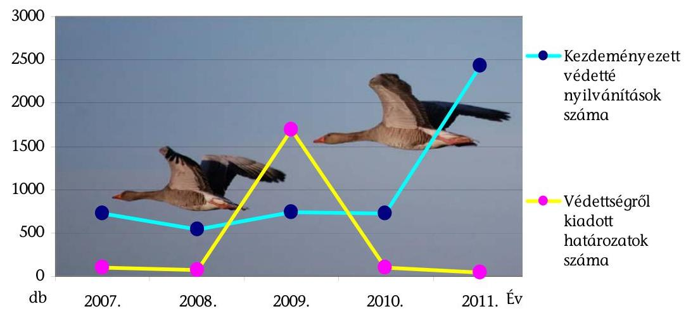

A Tvt. 24. § (1) és a 23. § (2) bekezdésében foglaltak alapján a védelemre érdemes országos jelentőségű területet a miniszter, a helyi jelentőségű területet az önkormányzat nyilvánítja védetté. A Tvt. 25. § (1) bekezdése alapján védetté nyilvánításra bárki tehet javaslatot. A Tvt. 25. § (2) bekezdése alapján a terület védetté nyilvánítását - helyi jelentőségű védett természeti terület kivételével - az igazgatóság készíti elő. Az igazgatóságok a 2007-2011. évek között 5154 esetben kezdeményeztek védetté nyilvánítást, ezek alapján az igazgatóságok ismeretei szerint 2011 határozat született. A 2009. évben az igazgatóságok által kezdeményezett védetté nyilvánításokra hozott határozatok kiugróan magas száma a barlangok és azok felszíni védőövezetéhez kapcsolódott. A 2011. évben kiugróan magas számban kezdeményeztek az igazgatóságok védetté nyilvánítást az ex lege védett lápok esetében.

A helyi jelentőségű védett természeti területekről vezetett adatbázist az NKP ${ }_{3}$ célnak megfelelően létrehozták, működtették. Az adatok száma évről évre nőtt. Az országos adatbázist a minisztérium működteti, kereső felülete nyilvános és mindenki számára interneten ${ }^{23}$ elérhető. Az adatok évenként, megyei, települési és védettségi kategóriák szerint is kereshetők a Védett Területek Törzskönyve oldalon. A területek védettségét meghatározó önkormányzati rendeletek számát és tartalmát az internetes oldalak nem, de azok főbb adatait tartalmazták. A helyi jelentőségű védett természeti területekről vezetett internetes adatbázisból letölthető évenkénti adatok:

| Év | Az adott évre vonatkozóan   feltöltött adatok száma (db) |
| :--: | :--: |
| 2007. | 73 |
| 2008. | 97 |
| 2009. | 72 |
| 2010. | 28 |
| 2011. | 38 |

[^0]
[^0]:    ${ }^{23}$ http://www.termeszetvedelem.hu/helyi-jelentosegu-vedett-termeszeti-teruletek

---

A nemzeti park igazgatóságok internetes portálján a Kiskunsági NPI és az Őrségi NPI oldalain is található helyi védettségű területekről szóló oldal, bár ez nem volt előírás. Feltöltött információ a helyi védettségű területek leírásáról a Kiskunsági NPI oldalán volt.

# 3.6. Ismeretterjesztés, környezeti nevelés 

A helyszínen ellenőrzött igazgatóságok kommunikációs tervet nem készítettek annak ellenére, hogy ilyen tevékenységet végeztek. A helyszínen ellenőrzött igazgatóságok közül csak az Őrségi NPI tervezte a kommunikációra vonatkozó irányokat a 2008. évben elkészült ökoturisztikai stratégiájában, továbbá a 2009. évben marketing tervében.

Az igazgatóságok kommunikációja természetvédelmi tevékenységükön belül különösen a védett természeti területek bemutatásához, a természeti és táji értékek megőrzéséhez, a természetvédelmi kutatás, monitoring feladatainak ismertetéséhez, az ökoturizmushoz kapcsolódott, amelyekhez többféle kommunikációs eszközt használtak.

A minisztérium a 2006. évben elkészítette és elindította a nemzeti parkok új honlapjait ${ }^{24}$, amelyek a tájékoztatásban kitüntetett jelentőséggel bírtak. A magyar nyelvű oldalak frissítése heti rendszerességgel történt, minden új eseményről, programajánlatról tájékoztatták a látogatókat. Az igazgatóságok a honlapokat nem csak az érdeklődők informálására, hanem környezeti nevelésre, ismeretterjesztésre is használták, a különböző témákat látványosan, képekkel illusztrálva mutatták be.

A honlapok mindegyike magyar és angol nyelvű, de a Balaton-felvidéki NPI, Hortobágyi NPI, Körös-Maros NPI német nyelvű, a Bükki NPI szlovák nyelvű honlapot is üzemeltetett. A gyengén látók részére - Balaton-felvidéki NPI és a Hortobágyi NPI kivételével - külön felületet alakítottak ki. Az információk naprakészek, az események, programok naptárszerűen megjelenítettek, a látnivalók tematikusan rendezettek voltak.

Az idegen nyelvű felületeken kevesebb volt a friss információ, de ezeken is az állandó, ritkán változó adatok és az aktuális év programkínálata hozzáférhető volt. A honlapokon a védett természeti területekről, Natura 2000 területekről, környezeti nevelésről, turizmusról volt információ, továbbá a tanösvények, erdei iskolák, nyári táborok, szakmai előadások, szállás, túra lehetőségek, kultúrtörténeti értékek bemutatása történt meg.

Az igazgatóságok programjaikat, természetvédelemmel kapcsolatos tevékenységeiket a helyi, regionális és országos médiákban is népszerűsítették, több ízben kínálták vezetett túráikat, szakköreiket és egyéb környezetvédelmi szemléletformálásra, környezeti nevelésre inspiráló eseményeiket, rendezvényeiket. Az igazgatóságok az $\mathrm{NKP}_{3}$ 5.5.4.2. pontjában megjelölt célt figyelembe véve intézményük megismertetéséhez és népszerűsítéséhez kiadványokat bocsátottak ki. A megjelentetett kiadványok túlnyomó többsége pályázati támogatások igénybevétele révén valósult meg.

[^0]
[^0]:    ${ }^{24}$ www.nemzetipark.gov.hu

---

A bemutató területek ismertetői, az oktató jellegű kiadványok, térképek, DVD-k, szóróanyagok, naptárak, plakátok egy része angol, német, francia és horvát nyelven is elkészült. Az ellenőrzött időszakban az igazgatóságok összesen 12233 oldal terjedelemben és összesen 3033770 példányban jelentettek meg nyomtatott kiadványokat, tájékoztató füzeteket, művészi igényyel készült könyveket.

A helyszíni ellenőrzésbe vont igazgatóságok kommunikációs kiadásaikat a csökkenő működési támogatásaikból fedezték, amit pályázati forrásokkal egészítettek ki. Az igazgatóságok kommunikációs célra fordított tényleges kiadásai a 2007. évi 17,6 millió Ft-ról a 2011. évre 29,2 millió Ft-ra (65,9\%-kal) nőttek. A 2007-2011. évek között nőtt a kommunikációs kiadások forrásaiból a pályázati források részaránya, a 2007. évi 51,7\%-ról, a 2011. évre 79,1\%-ra.

# 4. AZ IGAZGATÓSÁGOK VAGYONKEZELÉSE, VAGYONHASZNOSÍTÁSA 

### 4.1. Az igazgatóságok vagyonkezelésében lévő vagyon összetételének változása

Az ingatlanok az igazgatóságok vagyonkezelésében álltak a vagyonkezelési szerződés alapján. Az igazgatóságok által vásárolt ingóságok vagyonkezelési szerződéstől függetlenül állami tulajdonba kerültek, az igazgatóságnak azok felett is csak vagyonkezelési joga volt. Az igazgatóságok a vagyonkezelésükben lévő vagyonuk használatát tervezték.

A 2011. év december 31-éig az Ávt. 28. § (3) bekezdése szerint „Központi költségvetési szerv a működéséhez szükséges, a számviteli törvény szerinti immateriális jószág, tárgyi eszköz (műszaki berendezés, gép, felszerelés stb.), készlet megvásárlására - ingatlan kivételével - adásvételi szerződést köthet. A szerződés megkötésével a dolog a Magyar Állam tulajdonába, és az adott központi költségvetési szerv vagyonkezelésébe kerül. A vagyonkezelői jog ilyen esetben vagyonkezelési szerződés nélkül, e törvény alapján jön létre."

Az igazgatóságok vagyonkezelésében lévő vagyon értéke összességében a 2007. évi 48 166,0 millió Ft-ról a 2011. év végére 58 310,2 millió Ft-ra (21,1\%-kal) emelkedett. A helyszínen ellenőrzött igazgatóságok hosszú távú vagyonkezelési programjai, Étvt-i a befektetett eszközök vonatkozásában tervezett vagyonnövekménnyel kapcsolatos számszaki adatot nem tartalmaztak.

A vagyon növekedését a beruházások, az erdő és földterület, az épület és építmény növekedése eredményezte. A 2007-2011. években az igazgatóságok vagyonkezelésében lévő terület kiterjedése 6,5\%-kal emelkedett. A meghatározó vagyonelem a földterület, amelynek értéke a földvásárlások következtében minden évben folyamatosan emelkedett 32 564,4 millió Ft-ról 36 608,3 millió Ft-ra (12,4\%-kal). A legnagyobb növekedés a használatba vett vagyonon belül az erdővagyonban következett be (10. számú melléklet) a klímaerdő telepítés, valamint a vagyonkezelésbe átvett erdő területek miatt. A 2007. évi 346,5 millió Ft-ról 2011. évre 1420,4 millió Ft-ra (410\%-ra) emelkedett az igazgatóságok kezelésében lévő erdők értéke.

Az Ávt. 23. § (1) bekezdésében foglaltaktól eltérően a vagyonkezelési szerződések nem fedték le a valóságban kezelt ingatlanvagyont a

---

vagyonkezelői kijelölés elhúzódása miatt. Az igazgatóságok a természetvédelmi vagyonkezelésről szóló utasítás mellékletének 2.4. pontja alapján a vagyonkezelési szerződések mellékleteinek aktualizálásához rendszeresen a szükséges mellékletekkel teljes körűen ellátva elküldték az újonnan birtokba vett területek dokumentációját az MNV Zrt.-nek (a KVI jogutódjának), illetve a minisztériumnak a vagyonkezelői kijelöléshez történő egyetértés megadásához. Az Őrségi NPI a vagyonkezelési szerződésében nem szereplő 26,7 ha területre is kötött haszonbérleti szerződést.

A Körös-Maros NPI 2007. évben négy alkalommal nyújtott be vagyonkezelési kérelmet, amelyből a KVI három kérelmet elbírált és a területeket a Körös-Maros NPI vagyonkezelésébe adta. A negyedik kérelmet a KVI jogutódja a helyszíni ellenőrzés végéig nem bírálta el. A Körös-Maros NPI 2008-2010. években benyújtott további öt kérelme 2012. június 12-ig nem került elbírálásra ${ }^{25}$. Az ellenőrzött időszakban a Körös-Maros NPI összesen 1054,6 ha kezelői jog kijelölésének kezdeményezésére 220,4 ha kijelölése történt meg, 834,2 ha vagyonkezelői jog kijelölés folyamatban van.

Az Őrségi NPI vagyonkezelési szerződésében nem szerepelt 1126,0 ha területű ingatlan, amelyből 26,7 ha területre haszonbérleti szerződést is kötött (az összes haszonbérbe adott területe 34,6 ha volt) ${ }^{26}$.

A 2007-2011. években a KvVM, majd a VM a Hortobágyi NPI kérelmére folyamatosan megküldte a vagyonkezelői kijelöléshez szükséges támogató nyilatkozatokat. A Hortobágyi NPI a minisztériumi támogató nyilatkozat birtokában az MNV Zrt-t öt alkalommal, az NFA-t egy alkalommal kérte a vagyonkezelési szerződések módosításának elkészítésére, de arra a folytatott levelezések, adatszolgáltatások és egyeztetések ellenére a helyszíni ellenőrzés befejezéséig nem került sor ${ }^{27}$. A Hortobágyi NPI vagyonkezelési szerződéseinek megkötésére irányuló kezdeményezéseire a tulajdonosi joggyakorló szervezetektől (MNV Zrt., NFA) többségében válasz nem érkezett. A 17 802,0 ha területből 7289,0 ha területre a Hortobágyi NPI vagyonkezelési szerződéssel rendelkezett.

A Duna-Ipoly NPI-nél a vagyonkezelt 14 115,0 ha területből 1050,0 ha kiterjedésű ingatlanra nincs a nyilvántartásai szerint vagyonkezelési szerződés.

# 4.2. A kezelt vagyon saját használattal való hasznosítása 

Az igazgatóságok a vagyonkezelésükben álló vagyont saját használattal, illetve használatba adás útján hasznosítottak. Az NKP 3 5.5.2.2. pontja szerint a 2014. év végére „állandósuljon a nemzeti park igazgatóságok használatában lévő területek kiterjedése”. Az elérendő szintet az NKP ${ }_{3}$ pontja nem határozta meg. A

[^0]
[^0]:    ${ }^{25}$ Az Körös-Maros NPI 2012. május 24-én kelt kérelmében összefoglalóan megismételte a vagyonkezelési jog kijelölésre folyamatban lévő kérelmeit a (tulajdonosi jogot gyakorló szervezet változása miatt) Nemzeti Földalapkezelő Szervezet részére.
    ${ }^{26}$ A „Nyilatkozat az Őrségi NPI vagyonkezelésében lévő, vagyonkezelési szerződéssel nem érintett területeiről” alapján
    ${ }^{27}$ Az MNV Zrt-nek megküldött 477-2/2008.; 1675-7/2008.; 1676-5/2008.; 1676-7/2008.; 1179-7/2010. iktatószámú levelek; az NFA részére megküldött 3804-2/2011. iktatószámú levél; a KvVM részére megküldött 341-6/2008.; 633-5/2009.; 1729-2/2010 iktatószámú levelek alapján.

---

természetvédelmi vagyonkezelésről szóló utasítás mellékletének 2.5. pontja szerint „Természetvédelmi szempontból a saját használatnak és nem az idegen használatnak szükséges elsőbbséget adni. Saját használat keretében a meglévő erőforrásokat
 - azok szűkössége miatt - a természetvédelmi szempontból legfontosabb (leginkább veszélyeztetett) területek kezelésére kell koncentrálni."

Az utasítás mellékletének 4.1.2. pontja szerint a hosszú távú vagyonkezelési programban az igazgatóságoknak a vagyonkezelésében lévő valamennyi védett természeti területükre meg kell jelölni az elérni kívánt célállapotot, valamint azt, hogy a feladatot saját gondozásban, vagy használatba adással kívánja elérni. A 2007-2016. évekre szóló hosszú távú természetvédelmi vagyonkezelési programban a helyszínen ellenőrzött igazgatóságok közül 3 megjelölte, hogy növelni kívánja a saját használatban lévő területek nagyságát. Az igazgatóságok közül a Körös-Maros NPI konkrét arányt is meghatározott a saját használatban kezelni kívánt területekre vonatkozóan tájegységenként. A saját használatra vonatkozó arányt országos szinten az $\mathrm{NKP}_{3}$, az egyes igazgatóságoknál elérendő arányt a minisztérium nem határozott meg.

Négy igazgatóságnál az ellenőrzött időszakban csökkent a saját használatban álló területek aránya a vagyonkezelésükben lévő területeken belül (a tanúsítványi adatszolgáltatások alapján). Az Aggteleki NPI, a Balaton-felvidéki NPI, a Fertő-Hanság NPI és az Őrségi NPI vagyonkezelésében lévő területén belül a saját használatban álló területek aránya 2007. évről 2011. évre csökkent, így ezen igazgatóságoknál nem teljesült a természetvédelmi vagyonkezelésről szóló utasítás mellékletének 2.5. pontja szerinti előírás teljesítése (5. számú melléklet).

Az Aggteleki NPI-nél a saját használatban lévő területek aránya az összes kiterjedésű terület nagyobb mértékű növekedése miatt, a Balaton-felvidéki NPI-nél a saját használatban lévő terület csökkenése miatt romlott az arány.

Az Fertő-Hanság NPI-nél a 2010. évtől 1958,6 ha nádas területére a Fertő-tavi Nádgazdasági Zrt-nek ingyenes és örökös használati joga lett a földhasználati nyilvántartásba bejegyezve, ami rontotta az arányt.

Az Őrségi NPI a 2007. évben teljes egészében saját használatban hasznosította a területeit, de 2011. évben már hasznosításba adta területeinek 1,8%-át.

A helyszínen ellenőrzött igazgatóságok közül a Duna-Ipoly NPI, Körös-Maros NPI és a Hortobágyi NPI is a hosszú távú vagyonkezelési programjában megjelölt irány szerint növelte a saját használatban álló területek arányát, ez alapján eredményesen végezte vagyonkezelési tevékenységét.

Az igazgatóságok vagyonkezelési tevékenysége eredményes volt, mert a saját használatban álló területek aránya növekedett az időszakban a természetvédelmi vagyonkezelésről szóló utasítás mellékletének 2.5. pontjában meghatározottak szerint. Az igazgatóságok közül 7-nél magasabb 2011. év végén a saját használatban hasznosított területek aránya (5. számú melléklet).

---

A hasznosítási arányokat a 2007. és 2011. évre vonatkozóan a következő grafikon szemlélteti ${ }^{28}$ :
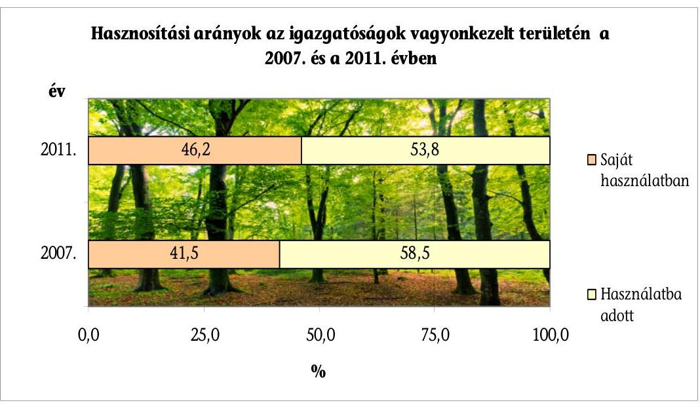

Az igazgatóságoknál az összes vagyonkezelt terület a 2007. évben 271 607,2 ha, a 2011. évben 289 354,6 ha volt. A saját használatban álló terület 2007. január 1-jén 112 597,6 ha volt, amely 2011. december 31-re 133 689,1 ha-ra emelkedett (6. számú melléklet a) tábla).

Az NPK 5.5.2.2. pontja célként fogalmazta meg az igazgatóságok által végzett természetvédelmi célú erdőkezelés során a folyamatos erdőborítással járó technológiák alkalmazási lehetőségeinek javítását. Az igazgatóságok használatában lévő erdőkben a természetvédelmi célú erdőkezelést e célnak megfelelően végezték. Az igazgatóságok használatában levő folyamatos erdőborítással fedett területek nagysága az éves tervekben meghatározott mértékben teljesült, a folyamatos erdőborítással fedett terület 6465,3 ha-ral növekedett a tanúsítványi adatok alapján az ellenőrzött időszakban (6. számú melléklet b) tábla).

Az Evt ${ }_{1}$. nem határozta meg a folyamatos erdőborítás fogalmát. Az Evt ${ }_{2}$. fogalom meghatározásai között definiálta a kifejezést, továbbá ugyanezen törvény 29. § (2) bekezdés b)-d) pontjaiban meghatározta a folyamatos erdőborítást szolgáló üzemmódokat ${ }^{29}$. Ez a szabályozás teremtette meg a lehetőségét először a folyamatos erdőborítást szolgáló technológiákra való áttérés tervezésének. Az Evt ${ }_{2}$. 5. § (13) bekezdése szerint: „Folyamatos erdőborítás: olyan állapot, amikor a többkorú erdőállomány folyamatosan, egyenletesen borítja az erdő talaját és az erdő megújulása, felújítása az erdőállomány védelmében, véghasználati terület nélkül történik, az erdő tájképi megjelenése nem változik."

[^0]
[^0]:    ${ }^{28}$ A grafikon hátterében látható erdőrészlet, az erdő és annak zöld színe - a DunaDráva NPI logójában szereplő jelképes zöld kör - a minket körbevevő növényvilágot jelképezi.
    ${ }^{29}$ szálaló, átalakító, faanyagtermelést nem szolgáló üzemmód

---

Az igazgatóságok fafajcserés erdőszerkezet-átalakítással végezték az idegenhonos fafajú állományok eltávolítását követően az őshonos fafajú erdő felújítást. A fafajcserés erdőszerkezet-átalakítás nem teljesült az erdőgazdálkodási tervekben ${ }^{30}$ tervezett szinten. A tervtől való elmaradások évenként eltérő nagyságú területet képviseltek. Összességében a 2007. évben 81,4 ha, a 2008. évben 60,0 ha, a 2009. évben 64,8 ha, a 2010. évben 65,3 ha, a 2011. évben 10,7 ha területen nem valósult meg a fafajcsere.

Az NKP 3 5.5.2.2. pont kiegészítő célkitűzése, hogy a természetvédelem szempontjai szerint végzett erdőkezelésből keletkező eredmény segítse a természetvédelmi tevékenység finanszírozását. Az igazgatóságok természetvédelmi célú erdőkezelése nem volt hatékony, mert a tanúsítványi adatok alapján a tevékenységből csak egy évben származott nyereségük.

Az igazgatóságok természetvédelmi erdőkezelési tevékenységének 2007-2011. évek közötti időszakra vonatkozó adatait az alábbi tábla szemlélteti:
millió Ft

| Év | 2007. | 2008. | 2009. | 2010. | 2011. |
| :-- | :-- | :-- | :-- | :-- | :-- |
| Bevétel | 285,6 | 282,0 | 400,1 | 307,0 | 362,0 |
| Kiadás | 305,2 | 332,8 | 370,2 | 488,1 | 394,1 |
| Eredmény | $-19,5$ | $-50,8$ | 29,9 | $-181,1$ | $-32,1$ |

Az igazgatóságok környezetgazdálkodási és természetvédelmi célú európai uniós pályázati tevékenysége folyamatos aktivitást mutatott. A minisztériumnál és a helyszínen ellenőrzött igazgatóságoknál végzett ellenőrzés alapján valamennyi pályázatot minisztériumi jóváhagyással nyújtottak be. A helyszínen ellenőrzött igazgatóságoknál a fenntartási kötelezettséggel járó pályázati projektek működtetésének finanszírozása minden esetében biztosított volt, így a pályázatok a fenntarthatóság szempontjából eredményesek voltak. A fenntartási kötelezettség vállalásáról az igazgatóságok írásos nyilatkozatot mellékeltek a pályázati dokumentáció részeként. Az NKP 3 5.5.2.2. pontjában megjelöltekkel összhangban növekvő trendet mutattak az elnyert pályázatok és a hozzájuk kapcsolódó támogatások. Az elnyert pályázatokkal megvalósított természetvédelmi, környezetgazdálkodási területekhez kapcsolódó feladatok teljes bekerülési költségének (21 406,9 millió Ft) 93,2%-a volt támogatás (8. számú melléklet b) tábla).

A 2007-2011. években a természetvédelmi területekre és a Natura 2000 területekre összesen 161 pályázatot nyújtottak be, az időszakban sikeres 135 volt. Az igazgatóságok 76 esetben környezetgazdálkodásra és természetvédelemre nyújtottak be pályázatot, az időszakban sikeres 55 volt. Az igazgatóságok benyújtottak a 2007. évben 23 db, a 2011. évben 42 db pályázatot. Az igazgatóságok elnyertek a 2007. évben 22 db, a 2011. évben 34 db pályázatot.

[^0]
[^0]:    ${ }^{30}$ a fakitermelés módját erdőgazdálkodási tervekben tervezték, amelyet számukra az erdészeti hatóság a 10 éves üzemtervben határozott meg

---

A természetvédelmi területekre és Natura 2000 területekre elnyert pályázatokkal a 2007. évben 998,4 millió Ft, a 2011. évben 4803,4 millió Ft, a környezetgazdálkodásra és természetvédelemre elnyert pályázatokkal a 2007. évben 633,5 millió Ft, a 2011. évben 339,9 millió Ft támogatást szereztek.

A támogatási nyilatkozat kötelező írásos melléklete volt a LIFE/LIFE+ és a KIOP/KEOP pályázatoknak. Az európai uniós projektek fenntartására nem volt külön költségvetési előirányzat, azok fenntartása az igazgatóságok költségvetésében az intézményi üzemeltetés része volt. Az 1083/2006/EK. tanácsi rendelet ${ }^{31} 57$. cikk (1) bekezdése 5 éves fenntartási kötelezettséget írt elő az európai uniós projektekre.

A minisztériumok, illetve az MNV Zrt. kifejezetten a projektek fenntartási időszakára vonatkozó költségek biztosítására nem adott ki nyilatkozatot. A kiadott nyilatkozatok a szakmai támogatásról, az önerő biztosításáról szóltak, illetve arról, hogy a kötelező fenntartási időszak alatt az érintett vagyoni elemek funkciójában, tulajdonlási, vagyonkezelői státuszában nem kezdeményeznek változtatást.

A lezárult projektekre 10239,2 millió Ft-ot vettek igénybe, ebből 8288,9 millió Ft-ot természetvédelmi területekhez és a Natura 2000 területekhez, 1950,3 millió Ft-ot környezetgazdálkodásra és természetvédelemre.

A helyszínen ellenőrzött igazgatóságok feladataikat kizárólag természetvédelmi közszolgáltatás és jogszabályban meghatározott közhatalmi tevékenység keretében végezték, az alapító okiratukkal összhangban vállalkozási tevékenységet nem folytattak.

# 4.3. Az igazgatóságok vagyonkezelésében álló területek használatba adása 

A helyszínen ellenőrzött igazgatóságok a haszonbérleti szerződéskötés folyamatára vonatkozó törvényi rendelkezések és miniszteri utasítások előírásait betartották. A helyszínen ellenőrzött igazgatóságok az Ávt. 24. § (2) bekezdés c) pontja, valamint a természetvédelmi vagyonkezelésről szóló utasítás mellékletének 2.6. pontja szerinti szabályok alapján a versenyeztetést mellőzték, de a kötelező esetekben lefolytatták a haszonbérleti szerződések megkötése, a szerződések időbeli hatályának meghosszabbítása során. A szerződéseket a versenyeztetés nélküli esetekben a hirdetményben, versenyeztetés esetén a kiírás szerint kötötték meg. A helyszínen ellenőrzött igazgatóságoknál a szerződések meghosszabbítására csak azon bérlők esetében került sor, ahol a szerződéses kötelezettségek betartása és a természetvédelmi kezelésre előírt szabályok teljesítése maradéktalan volt.

A védett természeti területeken történő gazdálkodási szabályok, a természetvédelmi kezeléshez szükséges állattartó infrastruktúra előírása miatt a hasznosító személyek köre behatárolt. A haszonbérleti eljárások az igénylők kérésére indul-

[^0]
[^0]:    ${ }^{31}$ az Európai Regionális Fejlesztési Alapra, az Európai Szociális Alapra és a Kohéziós Alapra vonatkozó általános rendelkezések megállapításáról és az 1260/1999/EK rendelet hatályon kívül helyezéséről

---

tak azokban az esetekben, ahol a korábbi bérlő a haszonbérlet meghosszabbításának lehetőségével kívánt élni. A helyszíni ellenőrzés alapján az igazgatóságok mérlegelték, hogy a bérelni kívánt területen a természetvédelmi célkitűzéseknek megfelelő gazdálkodást tudta-e biztosítani a kérelmező. Vizsgálták az elegendő és megfelelő fajú állatállománnyal és állattartásra alkalmas létesítménnyel való rendelkezést, a kutak, a karámok rendelkezésre állását, a terület más gazdálkodó bérleményének zavarása nélküli hasznosíthatóságát, a gazdálkodó helyben lakását, a hagyományos legeltető állattartás folytatását. Amennyiben a feltételek és garanciák megvoltak, úgy a termőföldre vonatkozó elővásárlási és előhaszonbérleti jog gyakorlásának részletes szabályairól szóló a 16/2002. (II. 18.) Korm. rendeletben foglaltaknak megfelelően az ajánlatot a földterület elhelyezkedése szerint illetékes önkormányzat hirdetőtábláján közzétették. Több ajánlat esetén, a legkedvezőbb ajánlat került kifüggesztésre. Az önkormányzattól visszaérkező ajánlat és iratjegyzék alapján készült el a haszonbérleti szerződés azzal az ajánlattevővel, aki az elvárásoknak legmegfelelőbb ajánlatot tette. A kifüggesztett ajánlatok 1-2%-ára érkezett további ajánlat.

Az igazgatóságok alkalmazták a Tftv. 10. § (6) bekezdése, továbbá a 21. §. (3) és (4) bekezdései által biztosított előhaszonbérlet és hirdetmény mellőzésének lehetőségét, de ezekben az esetekben is vizsgálták a szerződés teljesítéséhez szükséges legelő állatállomány, a termelő eszközök meglétét a terület természetvédelmi célú kezeléséhez szükséges garanciaként. Az önkormányzat hirdetőtábláján való kifüggesztések kérése megtörtént. Az önkormányzatok visszajelzése alapján a kifüggesztés megtörtént, de ez nem biztosított kellően széles körű tájékoztatást a nyilvánosság számára. A helyszíni ellenőrzés időszakában az igazgatóságok portáljai a haszonbérleti szerződések megkötésére vonatkozó hirdetményeket - a Duna-Ipoly NPI hirdetmény visszavonása kivételével - nem tartalmaztak. A termőföldre vonatkozó elővásárlási és előhaszonbérleti jog gyakorlásának részletes szabályairól szóló 16/2002. (II. 18.) Korm. rendelet 2. § (3) bekezdése 2009. március 1-jével hatályos módosítása már előírta, hogy a jegyző a kormányzati portálon elektronikus úton tájékoztatót tegyen közzé az ajánlat
 kifüggesztéséről.

A helyszínen ellenőrzött igazgatóságok haszonbérleti szerződéseit a belőlük vett véletlen minták alapján értékeltük. A haszonbérleti szerződések rögzítették a természetvédelmi követelmény és feltételrendszer elveit, azonban az Őrségi NPI 2009. évben megkötött haszonbérleti szerződései nem tartalmazták a természetvédelmi terület-fenntartási rendelkezéseket, a Körös-Maros NPI-nél a 2011. évben, az Őrségi NPI-nél a 2009, 2011-2012. években megkötött haszonbérleti szerződések nem rögzítették, hogy a kezelési előírás a szerződés elválaszthatatlan része. A szerződések a haszonbérleti szerződések egységesítéséről szóló utasítás mellékletében lévő szerződési útmutatóban megjelölteken felül további garanciális elemet nem tartalmaztak a Duna-Ipoly NPI szerződései kivételével. A Duna-Ipoly NPI garanciális elemként rögzítette a szerződésekben a bejelentési kötelezettség előírását a területalapú és közvetett mezőgazdasági támogatás, a Natura 2000 támogatás tényéről, a legeltetés, a kaszálás megkezdéséről.

---

Az igazgatóságok a földhivatalok ${ }^{32}$ által értesültek arról, hogy az ingatlannyilvántartásról szóló 1997. évi CXLI. törvény 26. § (7) bekezdésében foglalt bejelentési kötelezettségüknek a szerződésben megjelölt felek eleget tettek, a haszonbérletbe adott területekre vonatkozóan a szerződésekhez kapcsolódó adatok az ingatlan nyilvántartásban rögzítettek.

A szerződéseket maximum 5 évre, a Körös-Maros NPI-nél egy-egy évre kötötték. A Duna-Ipoly NPI és a Hortobágyi NPI minden évre, a Körös-Maros NPI 2009. évre vonatkozóan megkötött haszonbérleti szerződései tartalmazták a természetvédelmi terület-fenntartási rendelkezéseket. A haszonbérleti szerződések mellékletét képező kezelési szabályzat a szántó, a legelő, a kaszáló, a nádas hasznosításokra vonatkozóan tartalmazott előírásokat. Amennyiben a szerződés hatálya alá tartozó terület esetében ennél specifikusabb előírások voltak szükségesek, azokat közvetlenül a szerződésben rögzítették (pl. a legeltetett állat faja, a minimális állatlétszám).

A helyszínen ellenőrzött igazgatóságok természetvédelmi őrszolgálatának tagjai rendszeresen ellenőrizték a haszonbérleti szerződésekben foglalt művelési ághoz kapcsolódó korlátozások betartását, a természetvédelmi kezelési feladatok ellátását. Az őrök az ellenőrzés során tapasztaltakat őrnaplóban rögzítették, szabálytalanság esetén figyelmeztették a bérlőket.

# Az igazgatóságok haszonbérletből származó összes díjbevétele folyamatosan emelkedett. Az éves bérleti díj bevétel a 2007. évi 791,1 millió Ft-ról a 2011. év végére 1428,0 millió Ft-ra, 80,5\%-kal növekedett (6. számú melléklet c) tábla). Azonban a helyszínen ellenőrzött igazgatóságok a haszonbérleti szerződések megkötésére helyi sajátosságokat tartalmazó szabályokat a bérleti díj megállapításánál a természetvédelmi kezelési feladatok értékének, a művelési korlátozások piaci torzító hatásának meghatározására és figyelembe vételére nem határoztak meg. A piacitól eltérő gazdálkodási jelleg miatt a szerződésekben hatékonysági mutatókat nem határoztak meg.

A haszonbérleti szerződésekben a bérleti díj megállapítása a földek aranykorona értéke és a gazdálkodás természetvédelmi korlátozásokból következő hátrányaira figyelemmel történt. A haszonbérleti szerződések a bérleti díj és a kezelési feladatok arányosságának biztosítása érdekében előírták a bérleti díj rendszeres felülvizsgálatát, amit az igazgatóságok az inflációs ráta figyelembe vételével elvégeztek.

A nem piaci jelleget az igazgatóságok alaptevékenységéből következően meghatározta, hogy a védett, védelemre tervezett területeken a gazdálkodás csak jelentős korlátozásokkal gyakorolható. A védett természeti területeken folytatható agrár-technológia erősen behatárolt többek között a műtrágyázás tilalma, mélyítő szántás tilalma, növényvédelem korlátozása, kaszáló gépek vadriasztóval való kötelező felszerelése, génmódosított növénytermesztési tilalom miatt.

[^0]
[^0]:    ${ }^{32}$ Az ingatlan fekvése szerinti illetékes körzeti földhivatal, amely a földhivatalokról szóló 338/2006. (XII. 23.) Korm. rendeletben szabályozott, a fővárosi és megyei kormányhivatal szervezeti egységeként működő, ingatlanügyi feladatokat ellátó szakigazgatási szerv.

---

A Duna-Ipoly NPI a 2009. évben a „Haszonbérleti díjak megállapításának alapelvei új és meghosszabbított szerződéseknél" szabályzatot megalkotta, az a bérleti díjak alsó és felső értékhatárára javaslatot határozott meg. A bérleti díj kialakításánál a szabályzat alapelveket fogalmazott meg (pl. a mindenkori piaci kereslet, az adott terület földrajzi elhelyezkedése, a földterület minősége, a szántók és a gyepek vonatkozásában a természetvédelmi előírások miatti használatot korlátozó tényezők figyelembe vétele), de az elvek bérleti díjra gyakorolt hatását, annak mértékét nem pontosította. A Duna-Ipoly NPI honlapján a helyszíni ellenőrzés során tárgyévi pályázat visszavonására megtalálható volt hirdetmény.

A földterületek használatba adása a hatékonyság irányában mozdult el a bérleti díjak és a bérleti díj bevételek emelkedése alapján. A 2007. évről a 2011. évre az egy ha-ra jutó bérleti díj 4942 Ft-ról 9174 Ft-ra (85,6\%-kal) nőtt (6. számú melléklet c) tábla). A bérleti díj bevételek aránya a teljesített bevételekhez képest minden évben növekedett, a 2007. évi 7,1\%-os arányról a 2011. évi 11,4\%-os arányra (8. számú melléklet a) tábla). Azonban a bérleti díjak 2007. évi induló értékeinek kialakításáról, megalapozásáról a helyszínen ellenőrzött igazgatóságok szabályozásai nem rendelkeztek. A bérleti díjak értéke a területalapú támogatásokhoz képest alacsony volt. Az igazgatóságok saját használatában álló területein az egy hektárra jutó területalapú támogatások éves értékéhez viszonyítva a használatba adott területeken az éves bérleti díj értéke a 2007. évben 17,7\%, a 2011. évben 20,7\% volt (9. számú melléklet).

Az egy hektárra jutó bérleti díjak mértéke 26,2 százalékponttal nagyobb mértékben nőtt, mint a területalapú támogatás egy hektárra eső értéke.

# 4.4. Ökoturisztikai fejlesztés 

Az igazgatóságok az ökoturisztikai fejlesztéseket, beruházásokat eredményesen hajtották végre ${ }^{33}$. A fejlesztések a természetvédelem érdekei mellett emelték a nemzeti parkok ökoturisztikai értékét, a kínálat körét, a látogatottságot, növelték a látogatottságból származó bevételt és a környezeti nevelés céljait is szolgálták, összhangban álltak az $\mathrm{NKP}_{2}$ azon célkitűzésével is, hogy az igazgatóságok váljanak térségük szellemi központjává.

A beruházások száma évente összességében 43 és 53 között változott, (ez igazgatóságonként évente hat és 19 közötti beruházást jelentett), amelyen belül az európai uniós forrásból finanszírozott beruházások aránya nőtt. A fejlesztések értéke az előző évekhez képest - a 2008. év kivételével - növekedett és összességében elérte a 3739,1 millió Ft-ot (7. számú melléklet). A helyszínen ellenőrzött igazgatóságok közül háromnál - Őrségi NPI, Körös-Maros NPI, Hortobágyi NPI - a meglévő bemutatóhelyek fejlesztése mellett új épület létesítését, a Duna-Ipoly NPI-nél a meglévő bemutatóhelyek fejlesztését jelentette.

Az Őrségi NPI-nél az ökoturisztikai fejlesztések hatására egy fogadóközpont építése van folyamatban. A Körös-Maros NPI 2007. évben létesített Bihari Madárvárta hagyományos szerkezetű, a bihari tájra jellemző építészeti stílusú épületet,

[^0]
[^0]:    ${ }^{33}$ Az Igazgatóságok fenntartásában lévő ökoturisztikai bemutatóhelyek kínálatában a fogadó-, látogatóközpontok, tanösvények, tájházak, növénykertek, barlangok, egyéb bemutatóhelyek és erdei iskolák voltak.

---

a felszereltségéhez tartozó komplex oktatási eszközrendszer a környezettudatosságra nevelő táborok, szakmai műhelymunkák helyszíne. A beruházás 83,9 millió Ft összegéből 99% európai uniós támogatás volt.

A Hortobágyi NPI az Ökoturizmus fejlesztési stratégia I. Prioritás keretében a 2008. évben egy erdei iskola kialakítását, és a látogatóközpontok jobb „használhatóságát" elősegítő infrastrukturális fejlesztéseket valósított meg. A projektek megvalósításának eredményeként növekedett a természetvédelmi bemutatóhelyek látogatottsága, és a látogatottságból származó bevétel.

A Duna-Ipoly NPI-nél a megvalósult, illetve a folyamatban lévő ökoturisztikai pályázatok a bemutatóhelyek felújítására irányultak. A Sas-hegyi látogatóközpont területe az igazgatóság saját vagyonkezelésben volt, az épület fennállt, de korábban bemutatóhelyként nem működött. A 2012. évben az átadott fogadóépület átalakítása 58,8 millió Ft-os Közép-magyarországi Operatív Program pályázati projektje keretében valósult meg. A 2007-2011. év között a fogadó-, látogató- és oktatóközpontok látogatószáma közel 8-szorosára emelkedett.

A látogatottságot és a látogatói bevételt az ökoturisztikai programok növelték, amelyek a látogatóközpontoknál koncentrálódtak. A látogatásokból származó 2011. évi bevétel 19,3\%-kal haladta meg a 2007. évit, annak ellenére, hogy az ellenőrzött időszakban folyamatosan csökkent a legnagyobb arányt képviselő barlanglátogatásból származó bevétel.

Az ökoturisztikai látogatásokból származó bevétel a 2007. évben 623,5 millió Ft, a 2011. évben 743,9 millió Ft volt. Az ökoturisztikai látogatások bevételein belül a barlanglátogatások bevétele a 2007. évről a 2011. évre 408,1 millió Ft-ról 326,3 millió Ft-ra csökkent.

Az igazgatóságoknál a nemzeti parkok, ezen belül a fogadó-, látogató- és oktatóközpontok, a tanösvények látogatóinak száma a 2007-2011. évek között növekvő trendet mutatott. A 2007. évről a 2011. évre a nemzeti parkok látogatottsága 4,9\%-kal (1 142 237 főről 1 198 765 főre) nőtt. A fogadó-, látogató- és oktatóközpontoknál 71,8\%-kal (151 551 főről 260 381 főre), a tanösvények látogatóinak száma 18,4\%-kal (148 737 főről 176 104 főre) emelkedett (7. számú melléklet).

# 5. A PÉNZÜGYI ESZKÖZÖK RENDELKEZÉSRE ÁLLÁSA, CÉLOKNAK MEGFELELŐ FELHASZNÁLÁSA 

A 2007-2009. években az Étvt-k csak az elvégzendő alapfeladatokat tartalmazták. Az alapfeladatok kiadásait és forrásait nem feladatonként, hanem igazgatósági szinten összesítve, vagy kezelési feladatokat összevonva tüntették fel.

A természetvédelmi vagyonkezelésről szóló utasítás mellékletének 4.1.3. pontjában előírtak szerint a saját költségvetésből a vagyonkezelés minimuma, alapszintje tervezhető, amely külső források megszerzése esetén bővülhet. A melléklet 4.1.4. pontja szerint az igazgatóság „költségvetése képezi az éves természetvédelmi vagyonkezelési terv pénzügyi alapját, kereteit".

A helyszínen ellenőrzött igazgatóságoknál a természetvédelmi vagyonkezelési feladatok költségvetési támogatáson felül saját bevételként (8. számú melléklet) tervezett forrásai a vizsgált időszakban mezőgazdasági területalapú és közvetlen támogatásokból, haszonbérleti, bérleti díjakból, mezőgazdasági termékek eladásából, egyéb szolgáltatási díjakból tevődtek össze, részét képezték az előirányzatoknak.

A helyszínen ellenőrzött igazgatóságok a 2007-2011. években alapfeladataikat a csökkenő költségvetési támogatásból és saját bevételeikből teljesítették. Az alapfeladatok teljesítését az intézményi saját bevételek növekedésével és a takarékos gazdálkodással szinten tartott teljesített működési kiadások révén érték el. Az alapfeladatokhoz kapcsolódó fejlesztést az aktív pályázati tevékenységgel szerzett támogatások biztosították. A bevételek felhasználása hatékony volt, az egy hektár saját használatban álló területre jutó működési kiadás 2011. évben 10,8\%-kal volt kevesebb a 2007. évinél (8. számú melléklet a) tábla).

Az egy hektárra jutó működési kiadás a 2007. évben 68,92 ezer Ft, a 2011. évben 61,46 ezer Ft volt.

A teljesített bevételek összege a 2008. és a 2009. évek kivételével az előző évhez képest növekedett. A bevétel a 2007. évi 11 111,1 millió Ft-ról a 2011. év végére 12 518,8 millió Ft-ra, 12,7\%-kal emelkedett. A teljesített bevételek összetétele a költségvetési támogatás csökkenése miatt átrendeződött. A 2007. évi költségvetési támogatás a 4075,5 millió Ft-ról a 2011. évre közel felére, 2069,7 millió Ft-ra csökkent. A költségvetési támogatás összegének alakulását jelentősen befolyásolták a 2009-2011. évek kiadáscsökkentő intézkedései (zárolások, maradványtartás, befizetési és tartalékképzési kötelezettségek) is.

Az igazgatóságok a csökkenő költségvetési támogatás ellensúlyozására évről évre nagyobb hangsúlyt helyeztek a saját bevételek növelésére és a pályázati tevékenységre. Az intézményi saját bevétel folyamatosan emelkedett (8. számú melléklet) a haszonbérleti díjbevétel, a mezőgazdasági tevékenység és az ökoturisztikai látogatói bevételek emelkedésének hatására, így 2007. évi 3106,3 millió Ft-ról a 2011. évre 5485,3 millió Ft-ra (76,6\%-kal) nőtt.

A teljesített kiadások a 2007. évhez képest a 2011. évre 11 200,8 millió Ft-ról 13 010,1 millió Ft-ra emelkedtek. A kiadásokon belül a 2007. évről a 2011. évre az intézményi működési kiadások a kiadáscsökkentő intézkedések hatására 3,4 millió Ft-tal csökkentek. A kiadások növekedése a - pályázati támogatások miatti - felhalmozási kiadások növekedéséből adódott.

Az európai uniós projektek céljai igazodtak az igazgatóságok alapító okiratában és szakmai terveiben foglalt kötelező feladatokhoz, az elnyert támogatások segítették azok ellátását.

Az alapító okiratokban
 a védett természeti területek és természeti értékek bemutatása, megőrzése és fenntartása, továbbá a környezetvédelem és természetvédelem területi igazgatása és szabályozása alaptevékenységeket jelölték meg.

Az igazgatóságok az időszakra elkészített fejlesztési tervekben az alapító okiratokkal összhangban, a természeti értékek hatékonyabb védelme érdekében célul tűzték ki a védett természeti terület kialakításának folytatását, a védett természeti területek, tájak állapotának, a biodiverzitásnak, a veszélyeztetett fa-

---

jok állományának megőrzését. Az elnyert európai uniós támogatásokból az alapfeladatokkal összhangban lévő élőhely rekonstrukciós tevékenységeket, élő- és élettelen természeti értékek megőrzését, élőhelyek védelmét és helyreállítását, tanösvények és fogadóközpont kialakítását tervezték, illetve végezték el.

A KIOP pályázatok a NATURA 2000 területek vásárlását, élőhely-rekonstrukciós programok megvalósítását, szarvasmarha kihelyezhetőségét biztosító infrastruktúra kialakítását, erdei iskola létesítését és a szabadvezeték kiváltását, illetve megszüntetését tették lehetővé. A KEOP pályázatok révén élő- és élettelen természeti értékek megőrzése, vonalas létesítmények természetkárosító hatásának mérséklése, élőhely-védelem és helyreállítás történt. Az Észak-Alföldi Operatív Program pályázatai a versenyképes turisztikai termék- és attrakciófejlesztést szolgálták, ezek keretében ökoturisztikai fejlesztések történtek. A LIFE projektek révén valósult meg a gyepterületek rekonstrukciója, mocsarak védelme, valamint komplex élőhely-rehabilitáció, illetve a fajvédelmi programok a kékvércse, a túzok és a kerecsensólyom védelmét szolgálták, további projektek szolgálták a gyepek és szikes tavak védelmét, valamint a parlagi sas és a kis lilik védelmét.

Az igazgatóságok lezárt projektekhez kapcsolódó záró jelentéseit a támogatást nyújtó szervezetek elfogadták. A pályázatokban megjelölt és a szerződésekbe vállalt indikátorértékek, célok teljesültek, hozzájárultak a végrehajtott fejlesztések révén az állami vagyon növekedéséhez.

A célokhoz kapcsolódó európai uniós projektek indikátorait a megvalósítási szakaszban lévő projektek esetén a projekt előrehaladási jelentések, a befejezett projektek esetében a támogatási szerződésekben szereplő indikátorok alapján lehetett nyomon követni.

Budapest, 2012. 11. hó 28. nap

Melléklet: 22 db
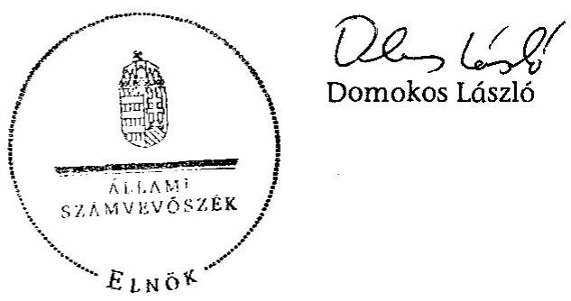

---

# MELLÉKLETEK 

a V-0017-103/2012. sz. jelentéshez

---

# Elfogadó vélemény a Duna-Ipoly, a Hortobágyi, a Körös-Maros, az Őrségi Nemzeti Park Igazgatóságok 2011. évi intézményi költségvetési beszámolójáról 

Elfogadó vélemény a Duna-Ipoly Nemzeti Park Igazgatóság 2011. évi intézményi költségvetési beszámolójáról

A XII. Vidékfejlesztési Minisztérium fejezet, 14. cím alatt a Duna-Ipoly Nemzeti Park Igazgatóság (DINPI) 2011. évi beszámolóját a BM Költségvetési szervek elemi beszámolója pénzügyi (szabályszerűségi) ellenőrzéséhez - az Állami Számvevőszék által a zárszámadás ellenőrzéséhez - kidolgozott Egyszerűsített Útmutató alapján ellenőriztük.

Ennek keretében elegendő és megfelelő bizonyosságot szereztünk arról, hogy a DINPI zárszámadási törvényjavaslatban szereplő kiadási és bevételi pénzforgalmi adatai a költségvetési gazdálkodásra vonatkozó jogszabályok előírásainak megfelelően kerültek kimutatásra.

Elfogadó vélemény a Hortobágyi Nemzeti Park Igazgatóság
2011. évi intézményi költségvetési beszámolójáról
A XII. Vidékfejlesztési Minisztérium fejezet, 14. cím alatt a Hortobágyi Nemzeti Park Igazgatóság (HNPI) 2011. évi beszámolóját a BM Költségvetési szervek elemi beszámolója pénzügyi (szabályszerűségi) ellenőrzéséhez - az Állami Számvevőszék által a zárszámadás ellenőrzéséhez - kidolgozott Egyszerűsített Útmutató alapján ellenőriztük.

Ennek keretében elegendő és megfelelő bizonyosságot szereztünk arról, hogy a HNPI zárszámadási törvényjavaslatban szereplő kiadási és bevételi pénzforgalmi adatai a költségvetési gazdálkodásra vonatkozó jogszabályok előírásainak megfelelően kerültek kimutatásra.

Elfogadó vélemény a Körös-Maros Nemzeti Park Igazgatóság
2011. évi intézményi költségvetési beszámolójáról

A XII. Vidékfejlesztési Minisztérium fejezet, 14. cím alatt a Körös-Maros Nemzeti Park Igazgatóság (KMNPI) 2011. évi beszámolóját a BM Költségvetési szervek elemi beszámolója pénzügyi (szabályszerűségi) ellenőrzéséhez - az Állami Számvevőszék által a zárszámadás ellenőrzéséhez - kidolgozott Egyszerűsített Útmutató alapján ellenőriztük.

---

Ennek keretében elegendő és megfelelő bizonyosságot szereztünk arról, hogy a KMNPI zárszámadási törvényjavaslatban szereplő kiadási és bevételi pénzforgalmi adatai a költségvetési gazdálkodásra vonatkozó jogszabályok előírásainak megfelelően kerültek kimutatásra.

Elfogadó vélemény az Őrségi Nemzeti Park Igazgatóság
2011. évi intézményi költségvetési beszámolójáról

A XII. Vidékfejlesztési Minisztérium fejezet, 14. cím alatt az Őrségi Nemzeti Park Igazgatóság (ŐNPI) 2011. évi beszámolóját a BM Költségvetési szervek elemi beszámolója pénzügyi (szabályszerűségi) ellenőrzéséhez - az Állami Számvevőszék által a zárszámadás ellenőrzéséhez - kidolgozott Egyszerűsített Útmutató alapján ellenőriztük.

Ennek keretében elegendő és megfelelő bizonyosságot szereztünk arról, hogy az ŐNPI zárszámadási törvényjavaslatban szereplő kiadási és bevételi pénzforgalmi adatai a költségvetési gazdálkodásra vonatkozó jogszabályok előírásainak megfelelően kerültek kimutatásra.

---

2. számú melléklet a V-0017-103/2012. sz. jelentéshez

# A foglalkoztatottak létszámának alakulása a nemzeti park igazgatóságoknál a 2007-2011. évek között

(fő)

|  Év | Szakképzettség foka | Köztisztviselő/kor-
mánytisztviselő
átlagos statisztikai
létszám | Munka tör-
vénykönyve
hatálya alá
tartozók átlagos
statisztikai létszám | Megbízási szerződéses átlagos statisztikai létszám | Foglalkoztatott átlagos statisztikai létszám | Engedélyezett álláshelyek száma az év végén | Közmunkás/ közfoglalkoztatott átlagos statisztikai létszáma | Összes foglalkoztatott átlagos statisztikai létszám  |
| --- | --- | --- | --- | --- | --- | --- | --- | --- |
|  2007. év | Alapfokú | 2 | 76 | 7 | 85 | 19 | 86 | 171  |
|   | Középfokú | 126 | 72 | 4 | 202 | 224 | 46 | 248  |
|   | Felsőfokú | 405 | 55 | 6 | 466 | 407 | 25 | 491  |
|   | Összesen | 533 | 203 | 17 | 753 | 650 | 157 | 910  |
|  2008. év | Alapfokú | 4 | 72 | 11 | 87 | 22 | 87 | 174  |
|   | Középfokú | 135 | 80 | 2 | 217 | 237 | 57 | 274  |
|   | Felsőfokú | 460 | 66 | 7 | 533 | 434 | 17 | 550  |
|   | Összesen | 599 | 218 | 20 | 837 | 693 | 161 | 998  |
|  2009. év | Alapfokú | 4 | 81 | 5 | 90 | 14 | 73 | 163  |
|   | Középfokú | 133 | 98 | 1 | 232 | 207 | 57 | 289  |
|   | Felsőfokú | 463 | 63 | 5 | 531 | 472 | 16 | 547  |
|   | Összesen | 600 | 242 | 11 | 853 | 693 | 146 | 999  |
|  2010. év | Alapfokú | 4 | 87 | 4 | 95 | 20 | 110 | 205  |
|   | Középfokú | 121 | 130 | 0 | 251 | 191 | 86 | 337  |
|   | Felsőfokú | 462 | 75 | 7 | 544 | 482 | 27 | 571  |
|   | Összesen | 587 | 292 | 11 | 890 | 693 | 223 | 1113  |
|  2011. év | Alapfokú | 3 | 78 | 7 | 88 | 17 | 182 | 270  |
|   | Középfokú | 115 | 93 | 6 | 214 | 211 | 148 | 362  |
|   | Felsőfokú | 456 | 85 | 8 | 549 | 491 | 37 | 586  |
|   | Összesen | 574 | 256 | 21 | 851 | 719 | 367 | 1218  |

Megjegyzés: a nemzeti park igazgatóságok tanúsítványi adatszolgáltatása alapján

---

# A természetvédelmi őrszolgálat és a szakfelügyelői létszám alakulása az igazgatóságoknál a 2007-2011. évek között

|  Megnevezés | 2007. év | 2008. év | 2009. év | 2010. év | 2011. év  |
| --- | --- | --- | --- | --- | --- |
|  Örszolgálati létszám (fő) | 215 | 260 | 263 | 259 | 247  |
|  Szakfelügyelői létszám (fő) | 66 | 67 | 65 | 65 | 67  |
|  Igazgatóságok által vagyonkezelt védett természeti területek (ha) | 279354,0 | 278052,3 | 278441,1 | 288283,2 | 289355,2  |
|  Egy őrre jutó védett természeti terület (ha) | 1299,3 | 1069,4 | 1058,7 | 1113,1 | 1171,5  |
|  Egy szakfelügyelőre jutó védett természeti terület (ha) | 4232,6 | 4150,0 | 4283,7 | 4435,1 | 4318,7  |
|  Igazgatóságok működési területén a Natura 2000 terület (ha) | 2373885,8 | 2373885,8 | 2373885,8 | 2419703,0 | 2441210,9  |
|  Egy őrre jutó Natura 2000 terület (ha) | 11041,3 | 9130,3 | 9026,2 | 9342,5 | 9883,4  |
|  Egy szakfelügyelőre jutó
Natura 2000 terület (ha) | 35968,0 | 35431,1 | 36521,3 | 37226,2 | 36436,0  |

Megjegyzés: a nemzeti park igazgatóságok tanúsítványi adatszolgáltatása alapján

---

a)

# A természetvédelem feltételrendszerének javítására a nemzeti park igazgatóságok által előkészített kezelési és fenntartási tervek alakulása a 2007-2011. évek között 

| Évek | 2007. | 2008. | 2009. | 2010. | 2011. | Együttesen |
| :-- | --: | --: | --: | --: | --: | --: |
| kezelési tervek száma (db) |  |  |  |  |  |  |
| Nemzeti park | 1 | 3 | 3 | 3 | 3 | 13 |
| Tájvédelmi körzet | 6 | 7 | 7 | 8 | 7 | 35 |
| Természetvédelmi   terület | 41 | 48 | 52 | 50 | 54 | 245 |
| Natura 2000 terü-   letek fenntartási   terve | 1 | 7 | 21 | 10 | 13 | 52 |

Megjegyzés: a nemzeti park igazgatóságok tanúsítványi adatszolgáltatása alapján
b)

A védett és védelemre tervezett területek a 2007. és a 2011. években

| Védettségi kategória | 2007. év. |  | 2011. év |  |
| :--: | :--: | :--: | :--: | :--: |
|  | Védett | Védelemre tervezett terület kiterjedése (ha) | Védett | Védelemre tervezett |
|  |  |  |  |  |
| Nemzeti park | 289077,1 | 14809,3 | 244104,7 | 11405,3 |
| Tájvédelmi körzet | 268481,1 | 102940,2 | 281379,1 | 84867,5 |
| Természetvédelmi terület | 25877,7 | 17030,4 | 26799,4 | 14118,2 |
| Ex lege védett láp | 56302,3 | 0,0 | 50906,6 | 628,8 |

Megjegyzés: a nemzeti park igazgatóságok tanúsítványi adatszolgáltatása alapján

---

5. számú melléklet a V-0017-103/2012. sz. jelentéshez

# A saját használatban álló területek aránya a vagyonkezelésben álló területeken belül a 2007. és a 2011. években igazgatóságonként

|   | 2007. január 1. |  | 2011. december 31. |   |
| --- |

 --- | --- | --- | --- |
|  Igazgatóság | Saját használatú terület nagysága (ha) | Saját használatú terület aránya a vagyonkezelt területen belül (\%) | Saját használatú terület nagysága (ha) | Saját használatú terület aránya a vagyonkezelt területen belül (\%)  |
|  Aggteleki NPI | 5596,9 | 86,8 | 10551,7 | 80,4  |
|  Balaton-felvidéki NPI | 9375,0 | 75,1 | 9181,4 | 69,8  |
|  Bükki NPI | 10794,9 | 32,4 | 13490,4 | 44,1  |
|  Duna-Dráva NPI | 13724,9 | 75,1 | 13877,1 | 77,8  |
|  Duna-Ipoly NPI | 7312,0 | 54,1 | 8003,8 | 56,7  |
|  Fertő-Hanság NPI | 11126,6 | 97,9 | 9869,6 | 81,5  |
|  Hortobágyi NPI | 17331,9 | 18,1 | 24200,1 | 24,1  |
|  Körös-Maros NPI | 10243,3 | 33,9 | 14548,1 | 44,3  |
|  Kiskunsági NPI | 24872,7 | 51,8 | 27518,0 | 52,0  |
|  Őrségi NPI | 2219,6 | 100,0 | 2448,9 | 98,2  |
|  Együttesen | 112597,6 | 41,5 | 133689,1 | 46,2  |

Megjegyzés: a nemzeti park igazgatóságok tanúsítványi adatszolgáltatása alapján

---

6. számú melléklet a V-0017-103/2012. sz. jelentéshez
a)

Az igazgatóságok vagyonkezelésében lévő területek megoszlása a 2007. és a 2011. években*

| Megnevezés | 2007. január 1. | 2011. december 31. |
| :-- | :--: | :--: |
| Összes vagyonkezelt   terület (ha) | 271607,2 | 289354,6 |
| Saját használatban   lévő terület (ha) | 112597,6 | 133689,1 |
| Hasznosításba   adott terület (ha) | 159009,6 | 155665,5 |

b)

Az igazgatóságok vagyonkezelésében a természetvédelmi erdőkezelés adatai a 2007-2011. évek között*

|  | Folyamatos erdőborítás terü-   lete (ha) |  | Fafajcserés erdőszerkezet át-   alakítással érintett terület   (ha) |  |
| :-- | :--: | :--: | :--: | :--: |
| Év |  |  |  |  |
|  | tervezett | teljesített   (év végi   állapot) | tervezett | teljesített   (év végi   állapot) |
| 2007. | 17041,7 | 27170,9 | 164,7 | 83,3 |
| 2008. | 18103,5 | 27503,0 | 269,4 | 209,4 |
| 2009. | 18286,2 | 27629,2 | 179,6 | 114,8 |
| 2010. | 24284,4 | 33426,4 | 137,6 | 72,3 |
| 2011. | 24818,3 | 33636,2 | 101,5 | 90,8 |

c)

# A haszonbérleti díjbevétel és díjak a 2007. és a 2011. években* 

| Megnevezés | 2007.december 31. | 2011. december 31. |
| :-- | --: | --: |
| Hasznosításba   adott terület (ha) | 160086,2 | 155665,5 |
| Bérleti díjbevétel   (millió Ft) | 791,1 | 1428,0 |
| 1 hektárra jutó bér-   leti díj (Ft/ha) | 4941,7 | 9173,5 |

[^0]
[^0]:    *Megjegyzés: a nemzeti park igazgatóságok tanúsítványi adatszolgáltatása alapján

---

# Az igazgatóságok ökoturisztikai adatai a 2007-2011. évek között 

| Megnevezés | 2007. | 2008. | 2009. | 2010. | 2011. |
| :--: | :--: | :--: | :--: | :--: | :--: |
| A nemzeti parkok látogatóinak száma (fő) | 1142237 | 1312899 | 1338553 | 1216015 | 1198765 |
| ebből:   - fogadó-, látogató- és oktatóközpontoknál (fő) | 151551 | 216140 | 258062 | 240507 | 260381 |
| - tanösvényen (fő) | 148737 | 172762 | 172174 | 189783 | 176104 |
| - barlangban (fő) | 473813 | 469120 | 436798 | 393075 | 393850 |
| Látogatásból fakadó bevétel (millió Ft ) | 623,5 | 653,7 | 671,8 | 645,4 | 743,9 |
| ebből:   - fogadó-, látogató- és oktatóközpontoknál (millió Ft) | 55,0 | 78,6 | 89,6 | 84,9 | 204,2 |
| - tanösvényen (millió Ft) | 9,2 | 11,8 | 14,1 | 13,6 | 15,7 |
| - barlang látogatásból származó (millió Ft) | 408,1 | 401,9 | 388,4 | 333,4 | 326,3 |
| Ökoturisztikai fejlesztések, beruházások száma (db) | 47 | 43 | 46 | 44 | 53 |
| Ökoturisztikai fejlesztések, beruházások értéke (millió Ft) | 806,0 | 305,3 | 640,5 | 646,9 | 1340,4 |

Megjegyzés: a nemzeti park igazgatóságok tanúsítványi adatszolgáltatása alapján

---

8. számú melléklet a V-0017-103/2012. sz. jelentéshez a)

Az igazgatóságok gazdálkodási adatai a 2007-2011. években

|  Megnevezés | 2007. december 31. | 2008. december 31. | 2009. december 31. | 2010. december 31. | 2011. december 31. | Változás 2007. évhez képest (\%)  |
| --- | --- | --- | --- | --- | --- | --- |
|  Teljesített bevételek összesen (millió Ft) | 11111,1 | 10188,9 | 9703,3 | 12099,0 | 12518,8 | 112,7  |
|  Ebből: |  |  |  |  |  |   |
|  - költségvetési támogatás (millió Ft) | 4075,5 | 4956,7 | 3949,3 | 3192,3 | 2069,7 | 50,8  |
|  - intézményi saját bevétel (millió Ft) | 3106,3 | 3378,1 | 4222,4 | 4279,3 | 5485,3 | 176,6  |
|  - ebből: bérleti díj bevétel (millió Ft) | 791,1 | 930,8 | 1044,1 | 1320,4 | 1428,0 | 180,5  |
|  Költségvetési támogatás aránya a teljesített bevételekhez (\%) | 36,7 | 48,6 | 40,7 | 26,4 | 16,5 | -  |
|  Bérleti díj bevételek aránya a teljesített bevételekhez (\%) | 7,1 | 9,1 | 10,8 | 10,9 | 11,4 | -  |
|  Teljesített kiadások összesen (millió Ft) | 11202,8 | 9492,0 | 9916,6 | 11463,9 | 13010,1 | 116,1  |
|  Ebből: |  |  |  |  |  |   |
|  - működési kiadás (millió Ft) | 8219,7 | 7948,4 | 7901,1 | 7992,4 | 8216,3 | 99,9  |
|  Saját használatú terület (ha) | 119267,7 | 120257,1 | 121257,5 | 127514,9 | 133689,1 | 112,1  |
|  Egy hektár saját használatú területre jutó működési kiadás (ezer Ft/ha) | 68,92 | 66,10 | 65,16 | 62,68 | 61,46 | 89,2  |

Megjegyzés: a nemzeti park igazgatóságok tanúsítványi adatszolgáltatása alapján

---

b) Az igazgatóságok pályázati tevékenysége a 2007-2011. években

|  Megnevezés | 2007. | 2008. | 2009. | 2010. | 2011. | Változás 2007. évhez képest (\%)  |
| --- | --- | --- | --- | --- | --- | --- |
|  A természetvédelmi területekre és Natura 2000 területekre benyújtott pályázatok száma (db) | 15 | 33 | 40 | 41 | 32 | 213,3  |
|  Környezetgazdálkodásra és természetvédelemre benyújtott pályázatok száma (db) | 8 | 22 | 28 | 8 | 10 | 125,0  |
|  A természetvédelmi területekre és Natura 2000 területekre benyújtott pályázatokkal elvégzett feladatok bekerülési költsége (millió Ft) | 1077,4 | 1065,5 | 1966,4 | 6888,8 | 4886,6 | 453,6  |
|  - ebből támogatás (millió Ft) | 998,4 | 935,5 | 1920,3 | 6425,0 | 4803,4 | 481,1  |
|  Környezetgazdálkodásra és természetvédelemre benyújtott pályázatokkal elvégzett feladatok bekerülési költsége (millió Ft) | 667,3 | 909,4 | 875,3 | 2730,3 | 339,9 | 50,9  |
|  - ebből támogatás (millió Ft) | 633,5 | 635,5 | 875,2 | 2391,7 | 339,9 | 53,7  |
|  Lezárult projektekre elnyert támogatás (millió Ft) | 903,0 | 4616,5 | 584,5 | 1920,8 | 2214,4 | 245,2  |
|  - ebből: természetvédelmi területekre és Natura 2000 területekre | 371,0 | 4029,7 | 452,2 | 1756,1 | 1679,9 | 452,8  |
|  - ebből: környezetgazdálkodásra és természetvédelemre | 532,0 | 586,8 | 132,3 | 164,7 | 534,5 | 100,5  |

Megjegyzés: a nemzeti park igazgatóságok tanúsítványi adatszolgáltatása alapján

---

9. számú melléklet a V-0017-103/2012. sz. jelentéshez a)

Az igazgatóságok vagyonkezelésében lévő használatba adott területek bérleti díj adatai a 2007. és a 2011. években

|  Megnevezés | 2007. évben az egy hektárra
jutó éves bérleti díj (Ft/ha) | 2011. évben az egy hektárra
jutó éves bérleti díj (Ft/ha) | Változás 2007. évhez
képest (\%)  |
| --- | --- | --- | --- |
|  Szántó | 6115,9 | 7360,7 | 20,4  |
|  Rét | 2846,1 | 6759,4 | 237,5  |
|  Gyümölcsös | 2020,2 | 3448,3 | 170,7  |
|  Halastó | 1505,3 | 1729,2 | 114,9  |
|  Kivett | 2904,5 | 1165,6 | -59,9  |
|  Egy hektárra jutó átlagos
bérleti díj | 4941,7 | 9173,5 | 185,6  |

Megjegyzés: a nemzeti park igazgatóságok tanúsítványi adatszolgáltatása alapján b)

Az igazgatóságok vagyonkezelésében lévő saját használatban álló területeknél az egy hektárra jutó területalapú támogatás adatai a 2007. és a 2011. években

|  Megnevezés | 2007. év | 2011. év | Változás 2007. évhez
képest (\%)  |
| --- | --- | --- | --- |
|  Az egy hektárra jutó területalapú
támogatás (Ft/ha) | 27850 | 44400 | 159,4  |

Megjegyzés: a nemzeti parkigazgatóságok tanúsítványi adatszolgáltatása alapján

---

10. számú melléklet

a V-0017-103/2012. sz. jelentéshez

# Az igazgatóságok vagyonkezelésében lévő egyes vagyonelemek alakulása a 2007-2011. években

|  Megnevezés | 2007. | 2008. | 2009. | 2010. | 2011. | Millió Ft
Változás
2007. évhez
képest (\%)  |
| --- | --- | --- | --- | --- | --- | --- |
|  Vagyon | 48166,0 | 47862,7 | 48808,2 | 54622,3 | 58310,2 | +21,1  |
|  Ebből: |  |  |  |  |  |   |
|  Ingatlanok, kapcsolódó vagyoni értékű jogok | 45237,7 | 45392,6 | 45642,1 | 50572,5 | 53411,5 | +18,1  |
|  - földterület | 32564,4 | 32853,9 | 33003,4 | 36251,8 | 36608,3 | +12,4  |
|  - telek | 443,2 | 475,1 | 482,9 | 493,3 | 539,8 | +21,8  |
|  - épület | 7270,9 | 7007,0 | 7002,2 | 7013,9 | 8478,0 | +16,6  |
|  - építmény | 4578,4 | 4581,5 | 4597,9 | 5381,2 | 6219,3 | +35,8  |
|  - erdő | 346,5 | 390,1 | 440,9 | 1316,8 | 1420,4 | +310,0  |

 |
|  Gépek, berendezések, felszerelések | 1318,3 | 1067,9 | 960,8 | 1101,4 | 1279,6 | $-2,9$  |
|  - tenyészállatok | 327,0 | 404,8 | 452,5 | 463,8 | 468,1 | $+43,1$  |
|  Beruházások, felújítások | 520,8 | 392,5 | 1161,3 | 1935,4 | 2641,4 | $+407,2$  |

Megjegyzés: a nemzeti park igazgatóságok tanúsítványi adatszolgáltatása alapján

---

11. számú melléklet
a V-0017-103/2012. sz. jelentéshez

# A nemzeti park igazgatóságok működési területe 

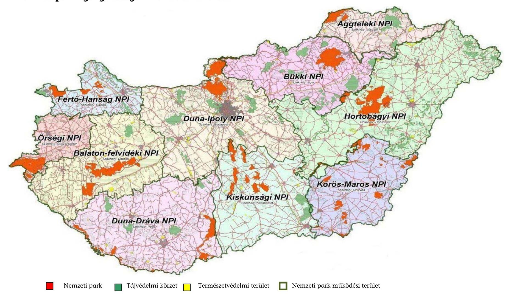

---

# 12. a). számú melléklet a V-0017-103/2012. sz. jelentéshez 

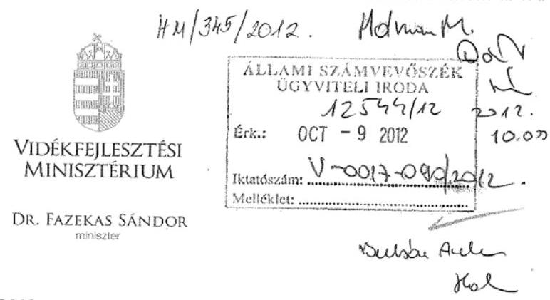

Úgyiratszám: KGF/
/2012

## Domokos László   elnök úr

részére

## Állami Számvevőszék

## Budapest

Apáczai Csere János u. 10.
1052
Tárgy: válasz a nemzeti park igazgatóságok feladatellátása és vagyonkezelése ellenőrzéséről készített ASZ jelentéstervezetre és az azzal egyidejűleg megküldött elnöki figyelemfelhívó levelére

## Tisztelt Elnök Úr!

A 2012. szeptember 20-i keltezéssel megküldött, szeptember 25-én kézhez kapott, a Nemzeti Park Igazgatóságok feladatellátása és vagyonkezelése ellenőrzéséről készített jelentéstervezet és az ahhoz kapcsolódó elnöki figyelemfelhívó levélre (továbbiakban: Tervezet) az alábbi választ adom:

Megítélésem szerint a jelentéstervezet részletes megállapításai általánosságban reális értékelést adnak a vizsgált nemzeti park igazgatóságok (továbbiakban: Igazgatóságok) működéséről, illetve a Minisztérium irányító tevékenységéről. Azonban a vizsgálati területek, tevékenységek között aránytalanság fedezhető fel, illetve a működés eredményességét mutató indikátorok nem teljeskörű képet adnak az Igazgatóságok feladatainak értékeléséhez. Az alábbiakban Domokos László úrnak V-0017-082/2012. iktatási számon írt levelében foglalt elnöki figyelemfelhívásában szereplő megállapítások kapcsán teszem meg észrevételeimet témakörönként, valamint az ÁSZ jelentéstervezetben megfogalmazottakra reflektálok, ahol szükséges, megvilágítva az egyes jelzett problémák hátterét, vagy pontosítást, helyesbítést javaslok.

1. Egyetértek az Állami Számvevőszék részéről a Vidékfejlesztési Minisztérium számára tett javaslattal, miszerint a Minisztérium a jövőben határozza meg a

---

nemzeti park igazgatóságok természetvédelmi célok teljesítéséhez kapcsolódó konkrét feladatait, a velük szemben támasztott követelményeket, és a költségvetési keretszámaikat ennek ismeretében alakítsa ki.

Megjegyezem ugyanakkor, hogy a költségvetési támogatási előirányzat mintegy negyedét teszik ki az igazgatóságok éves költségvetésének. Az Igazgatóságok szakmai feladataikat nagyrészt a pályázatokból, a mezőgazdasági támogatásokból és az ökoturisztikai bevételekből fedezik. A költségvetési támogatás elosztásánál a tárca minden évben figyelembe veszi a természetvédelmi célok teljesítéséhez kapcsolódó konkrét feladatokkal összhangban lévő javaslatokat és többletigényeket, viszont a tárca költségvetésének tervezése minden esetben az Nemzetgazdasági Minisztérium által közölt keretszámok alapján kell, hogy történjen, attól eltérni nem lehetséges.
2. Bár a jelentéstervezet megjegyzi, hogy a Minisztérium az NKP III céljaival kapcsolatos iránymutatást, illetve konkrét feladatot meghatározó normatív szabályozást nem adott ki, ezt nem is tehette ebben a formában. A stratégiaalkotás nem ilyen megközelítésű, annál is inkább, mert keretszámokat, költségeket a dokumentum nem tartalmaz (még ha ez a háttér-dokumentációkban meg is történhetett).
3. A nemzeti park igazgatóságok által alkalmazott haszonbérleti díjak összegének számítási módja, a díjak területalapú támogatásokhoz viszonyított alakulása megállapítása kapcsán felhívom a figyelmet, hogy az Igazgatóságok a helyben szokásos bérleti díjak, valamint az érintett terület védettségére való hivatkozással megkövetelt földhasználati szabályok figyelembevételével alakították ki a haszonbérleti díjak összegét. A haszonbérleti díjak alakulását országszerte számos tényező egyidejűleg befolyásolja (pl.: támogatások, természetvédelmi korlátozások). A haszonbérleti díjaknak az egy hektárra jutó területalapú támogatások éves összegéhez viszonyított értékelése nem veszi figyelembe a természetvédelmi korlátozásokat, de a szóban forgó területek országos átlagnál alacsonyabb termőképességét sem. Utóbbiak miatt nem látom indokoltnak az igazgatóságok vagyonkezelési tevékenységét a díjak területalapú támogatásokhoz való viszonyítása alapján kalkulált mutatószámok szerint megítélni.

A tárgykörben megtett intézkedésként tájékoztatom ugyanakkor arról, hogy a vizsgált időszaktól eltérően a jelenleg hatályos miniszteri utasítás a Nemzeti Földalapkezelő Szervezethez hasonlóan egységes mértékű, $1250 \mathrm{Ft} / \mathrm{AK} / \mathrm{ha}$ összegű haszonbérleti díj alkalmazását követeli meg az Igazgatóságoktól, amely a Jelentésben felvetett és az elnöki figyelemfelhívásban hangsúlyozott hiányosságot kötött keretek felállításával kezeli, az Igazgatóságok számára a korábbi mérlegelési lehetőségek megszüntetésével egyértelmű helyzetet teremt.

---

4. A haszonbérbe adás meghirdetésének módját érintő megállapítás kapcsán megjegyzem, hogy annak módját a termőföldre vonatkozó elővásárlási és előhaszonbérleti jog gyakorlásának részletes szabályairól szóló 16/2002. (II. 18.) Korm. rendelet, valamint a Nemzeti Földalapról szóló 2010. évi LXXXVII. törvény 26. § (1) - (2) bekezdése szabályozza.

Az említett jogszabályi rendelkezések betartása hivatott az átláthatóság és széles nyilvánosság elvárt szintjének biztosítására. A nemzeti park igazgatóságok a beérkezett és igazgatósági szinten nyilvántartott földbérlet igények ismeretében számos esetben a jogszabályi kötelezettségeken túlmutatóan postai úton történő figyelemfelhívással is élnek az érdekeltek felé. Kérem, hogy az igazgatóságok e téren történő elmarasztalását - mely a Tervezet törzsszövegében is többször helyet kap - fentiek alapján megfontolás tárgyává szíveskedjék tenni.
5. A vagyonkezelt területek saját használatban tartására, haszonbérbe adására vonatkozó döntés meghozatalának szempontjait érintően a megkereső levelében és a Tervezetben a helyszíni ellenőrzésekre alapozottan javaslatként fogalmazódik meg, hogy a földterületek bérbeadásáról szóló döntést az igazgatóság a saját használat, illetve a használatba adás esetén jelentkező kiadásokat és bevételeket alapul véve hozza meg. A javaslattal kapcsolatosan kiemelten fontosnak tartom rögzíteni, hogy a nemzeti park igazgatóságok természetvédelmi vagyonkezelési tevékenységének egységes alapelvek szerinti ellátásáról szóló 9/2006. (K. V. Ért. 4.) KvVM utasítás 2.3. pontja deklarálja, hogy ,, a természetvédelmi kezelés elkülönül a vagyonkezelés egyéb, gazdasági hasznosítást is feltételező formáitól. A természetvédelmi vagyonkezelésnek viszont nem lehet elsődleges célja sem a nyereség, sem a haszonelvű vagyonszerzés, mivel az csupán a természeti értékek megóvásán túl, bár kétségtelenül fontos szempontként szerepelhet."
Az utasítás rögzíti, hogy mely területeket kell mindenképpen saját hasznosításban tartani, ami meghatároz egy olyan esetkört, amikor az igazgatóság vezetőjének nem is áll módjában a gazdasági szempontokat mérlegelni. Nem adhatók haszonbérbe többek között azon területek, amelyeken a kiemelkedő jelentőségű védett természeti területek és értékek miatt gazdasági tevékenység egyáltalán nem, illetve a klimax és ahhoz közeli állapotú társulásokkal borított természeti területek, amelyek nem igényelnek természetvédelmi fenntartási tevékenységet (pl. dolomit sziklagyepek).

Felülírhatja azonban a gazdasági megfontolásokat a Kormány birtokpolitikája is, pl. a helyben lakó, állattartó családi gazdálkodók földhöz juttatásának célja. Az Igazgatóságok a mintegy 2000 gazdálkodóval való együttműködésük révén jelentősnek mondható vidéki népesség és munkahelymegtartó szerepet töltenek be, a térségek vidékfejlesztési központjaiként is megjelennek. Az Igazgatóságoknak a természetvédelmi kezelés és a gazdasági hatékonyság szempontjából is megfelelő működése alapvető elvárás, azonban egyes esetekben az egyébként nyereségesen megvalósítható saját hasznosítás ellenére is az adott földterület haszonbérbe adása jelentheti az átgondolt döntést.

---

Fentiek alapján kérem az Igazgatóságok kezelésében lévő vagyon hasznosítása tekintetében megfogalmazott javaslat felülvizsgálatát.

Ezúton is hangsúlyozom, hogy tárcánk a figyelemfelhívásában foglaltakkal összhangban széleskörűen áttekintette 2011. év folyamán a nemzeti park igazgatóságok vagyonkezelési tevékenységére vonatkozó szabályozást. Többek között a haszonbérbe adás teljesen egységes gyakorlatának biztosítása, valamint a megváltozott jogszabályi környezetnek megfelelő szabályozás életbe léptetése érdekében született meg és lépett hatályba 2012. június 9-én a nemzeti park igazgatóságok természetvédelmi célú vagyonkezelési tevékenységének egységes szakmai alapelvek szerinti ellátásáról szóló 12/2012. (VI. 8.) VM utasítás. A megkeresésében említett intézkedésként kérem figyelembe venni az utasítás megjelentetését.
6. A természetvédelmi birtokügyeket érintő megállapítások tükrözik a vizsgált időszakban a tulajdonosi joggyakorló szervezetek és a vagyonkezelők között kialakult helyzetet, utalnak a főbb problémákra, melyek mindegyike a megváltozott szabályozási környezetből és a tulajdonosi joggyakorló szervezetek MNV Zrt. és NFA - magatartásából fakad. A jelentés utal a vagyonkezelési ügyekben a VM által tett intézkedésekre (pl. NFA írásbeli sürgetése a vagyonkezelési szerződések kapcsán), valamint a közhiteles ingatlannyilvántartással kapcsolatos, az igazgatóságokon és a Minisztérium természetvédelmi részlegein túlmutató, egyes problémákra is.
7. Az Igazgatóságok vagyonkezelésében lévő erdőkre vonatkozóan tett megállapítása során kérem figyelembe venni, hogy az Igazgatóságok kezelése alatt álló erdők túlnyomó többsége védett természeti területen helyezkedik el, amely azt jelenti, hogy ezekben az erdőgazdálkodás hosszú távú célját az elsődleges rendeltetés, jelen esetben a természetvédelmi elsődleges rendeltetés adja. Ezeknek az erdőknek további rendeltetésük (főleg nem faanyagtermelő) törvény szerint nincs (az erdőről, az erdő védelméről és az erdőgazdálkodásról szóló 2009. évi XXXVII. törvény 24.§). Az Igazgatóságok számára nem is cél, hogy ezen erdők erdőgazdálkodása/kezelése költséghatékony legyen, hiszen a rendeltetésből fakadóan nem a gazdasági eredmény kiaknázása, hanem a természeti értékek őrzése, kezelése a feladat. Az igazgatóságok természetvédelmi célú erdőkezelése hatékonyságának megítélésekor ezért nem a tevékenységből származó nyereségből kell kiindulni, hanem elsősorban az erdőterületek természeti állapotából, a védett természeti értékek megőrzése terén elért eredményekből. A Jelentésben foglalt megállapítás a szakterület alapvető céljait, az Igazgatóságok alapfeladatait hagyja figyelmen kívül, amikor kizárólag a költséghatékonyságot vizsgálja.
8. A jelentés megállapítja, hogy nem szolgálta az igazgatóságok feladatellátását, hogy az élőhely-rehabilitációs tevékenységet nem ütemezték időben az igazgatóságok. Ezzel kapcsolatban megjegyzem, hogy általában a rendszeres,

---

kisebb léptékű élőhely-kezelési feladatok, amelyek tervezhetők, a nagyobb léptékű élőhely-rehabilitációs beavatkozások megvalósítása a pályázati források rendelkezésre állásától függ, amelyet jellemzően csak nagyvonalakban lehet előre tervezni. A fejlesztési tervek szintjén csupán annak rögzítése történik meg, hogy mely területeken milyen sürgős a beavatkozás elvégzése, ennek megfelelően rövid-, közép- vagy hosszú távra ütemezik a feladatot. A pontos paraméterek (pl. az érintett területnagyság) a tervezési dokumentáció, a részletes megvalósítási terv vagy engedélyes terv összeállításakor állnak csak rendelkezésre. A táblázatban is feltüntetett számok ugyanakkor arról tanúskodnak, hogy az igazgatóságok jelentős és növekvő tendenciát mutató területi kiterjedésben végeznek ilyen jellegű tevékenységet, amely fontos célkitűzése az EU Biodiverzitás Stratégiájának is, és a jelentési szakaszban fel is használható az ország teljesítményeként. Jelzem továbbá, hogy a nemzeti park igazgatóságok éves beszámolóik részeként a következő évi legfontosabb célkitűzéseiket is megfogalmazták, tehát forrás esetén készen állnak projektek beadására.
9. A jelentés az NKP III. 5.5.4.1. pontjában szereplő céllal összhangban megállapítja, hogy összesen 52 terület fenntartási tervének elkészítésében vettek részt az igazgatóságok. Kiegészítő információként fontosnak tartom kiemelni, hogy az Európai Mezőgazdasági Vidékfejlesztési Alapból a tervezési időszak, azaz 2014. év végéig további 243 Natura 2000 területre készül fenntartási terv az igazgatóságok koordinálásában vagy közreműködésében.
10. A jelentésben a Natura 2000 hálózatot érintő területi változásokról szóló adatokat módosítani szükséges, mert azok tévesen szerepelnek. A 37. oldalon szereplő szövegrész helyesen: 2007-ről 2011-re a madárvédelmi területek száma eggyel nőtt (55-ről 56-ra), továbbá egy terület bővítésére került sor, ami összesen 26797 ha növekményt eredményezett. A természetmegőrzési területek száma az Európai Bizottság elvárása és ellenőrzése következtében 12 területtel nőtt (467-ről 479-re), továbbá 33 terület bővítésére került sor, ami összesen 30771 ha növekményt eredményezett. Az új madárvédelmi, illetve természetmegőrzési területek azonban részben átfednek egymással, illetve a Natura 2000 területek ingatlan-nyilvántartási adatbázishoz történt igazításának következményeként a hálózat kiterjedése 10501 ha-ral csökkent is. Mindezek eredőjeként a hálózat összesen 12055 hektárral nőtt a vizsgált időszakban.
11. Azt a megállapítást, miszerint „a nemzetközi ökológiai hálózat területe az igazgatóságoknál nem változott", pontosítani szükséges. A nemzeti ökológiai
 hálózat az Országos Területrendezési Tervről szóló törvény (a továbbiakban: OTrT) 5 éves felülvizsgálatának keretében szakmai felülvizsgálat és az övezeti rendszer nemzetközi gyakorlathoz történő igazítása miatt változott. Az új lehatárolás 2007-ben már rendelkezésre állt, ugyanakkor az OTrT módosítása csak 2008-ban lépett hatályba. A törvény hatályba lépése óta további változás nem történt.

---

12. Az igazgatóságok fajmegőrzési tevékenysége a leírtaknak megfelelően sikeres volt. Minden évben számos különböző, a fajok állományának stabilizálását, illetve növelését célzó tevékenységet hajtottak végre. A fajmegőrzési tervek megvalósításának előrehaladásáról az igazgatóságok évente beszámolót készítettek, amelyből nyomon követhető volt az elvégzett tevékenység és azok pozitív eredménye is. A Körös-Maros NPI fajmegőrzési tevékenységénél írtakat azonban kérjük pontosítani, mivel a nagy szikibagoly nem madárfaj, hanem lepkefaj. Szintén pontosítani kérjük a Hortobágyi NPI-nél a mérgezéses esetekről leírtakat: „A mérgezéses esetek a szőrmés ragadozók illegális gyérítése során fordultak elő, a használt mérgek rendszerint 2008-tól betiltott növényvédőszerek voltak." A pontosítás magyarázata, hogy egyrészt a dúvad, mint fogalom, már nem létezik, másrészt nem növényvédőszer-maradványokról beszélünk, hanem szándékosan, illegálisan elraktározott és illegális célból felhasznált (nemcsak a védett madárfajok, de a vadászható státuszú szőrmés ragadozók mérgezése is törvénybe ütköző), már betiltott növényvédőszerekről.
13. Kiemeli a jelentés-tervezet, hogy a TIR ingatlan adatai és a közhiteles ingatlan-nyilvántartás adatai között továbbra is maradt fenn eltérés, amelynek oka az ingatlan-nyilvántartási térképi és leíró információkhoz való hozzáférés korlátai, illetve a természetvédelmi jogi jelleg ingatlannyilvántartásban való feljegyeztetésének elmaradása, késlekedése, melyet kormányzati szinten mielőbb rendezni szükséges. Ugyanakkor megjegyezem, hogy a TIR sohasem fogja átvállalni és főleg nem helyettesíteni az országos közhiteles ingatlan-nyilvántartás szerepkörét. Nem működik ugyanis kihelyezett „földhivatali" funkciókkal, így a helyrajzi számokban naponta történő ingatlannyilvántartási változások (megosztás, törlés stb.) sohasem szinkronizálódnának automatikusan a mi rendszerünkben, csak egy évi lekövetési periódus után, amennyiben az adatok megvásárlása bekövetkezne.
14. A jelentésben a szakszerű fogalomhasználat érdekében kérjük a szövegben következetesen javítani: „védett terület" helyett védett természeti terület.

Továbbiakban az nemzeti park igazgatóságok feladatellátásának és vagyonkezelésének ellenőrzéséről szóló, jelentés tervezetére az alábbiakban foglalom össze a fentieken túlmenő részletes észrevételeimet.

# Részleteiben 

Ad 6. oldal: természetvédelmi kezelés meghatározása: a Tvt. 6-20. §-ára hivatkozni helytelen, a természetvédelmi kezelés fogalmát a Tvt. 36. § (2) bekezdése rögzíti. A meghatározásban a 2. bekezdés felesleges és nehezen értelmezhető: eszerint a (többek között a biológiai sokféleség megőrzése, fenntartása érdekében történő) természetvédelmi kezelés magában foglalja a biológiai sokféleség védelmét.

Ad 8. oldal: „védettségi kategóriák" fogalom meghatározása: a definíció és a definiált fogalom nincs összhangban egymással. A meghatározás a védett természeti területek

---

típusait sorolja fel, amelyek a védettség szintje szempontjából egyenrangúak, tehát nem különböző védettségi kategóriák.

Ad 10. oldal: Bevezetés, a nemzeti park igazgatóságok tevékenységének bemutatása: a NPI-k tájvédelmi (pl. a természetvédelmi szempontok érvényesítése a területrendezési, településrendezési jogalkotási folyamatban, egyedi tájértékek kataszterezése, stb.), a természetvédelmi bemutatással (ökoturizmus, környezeti nevelés) és a kultúrtörténeti értékek védelmével, örökségvédelemmel kapcsolatos tevékenységéről nem esik szó, ezt pótolni szükséges.

Ad 11. oldal: a felsorolás 2. pontja az oldal tetején: „természetvédelmi területkezelés" helyett a természetvédelmi kezelés szóhasználat javasolt.

Ad 11. oldal: az Igazgatóságok tevékenységének eredményességéhez csak a felsorolt 3 paramétert vizsgálta. Véleményem szerint a mérgezéses esetek száma nem a megfelelő indikátor egy NPI tevékenységének megítéléséhez.

Ad 13. oldal 2. bekezdése: egyszerre tesz említést a haszonbérleti szerződések természetvédelmi kezelési gyakorlatának, valamint a haszonbérbe adás gyakorlatának ellenőrzéséről, értékeléséről, azonban azokat külön tárgykörként kell vizsgálnunk. A haszonbérleti szerződésekben foglalt természetvédelmi előírások és az azok figyelembevételével folytatott gazdálkodási gyakorlat eredményessége az érintett területek természeti állapotának alakulása, a védett természeti értékek helyzete alapján értékelhető. Utóbbira az Igazgatóságok éves jelentésükben kitérnek, a jelentést a helyettes-államtitkár, korábban szakállamtitkár hagyta jóvá. A haszonbérbe adás gyakorlatának vizsgálata és értékelése sokkal inkább tekinthető az előzőektől eltérően eljárásrendbeli kérdésnek. A haszonbérbeadás során alkalmazott gyakorlatról, annak a vonatkozó utasításoknak való megfelelőségéről a minisztériumi munkatársak Igazgatóságoknál lefolytatott vagyonkezelési szemléin, valamint széles körben az évente kétszeri alkalommal megtartott többnapos vagyonkezelési értekezleteken történt beszámolás. A haszonbérbe adás gyakorlatának megfelelőségéről utóbbiak alapján formálhatott a Minisztérium véleményt.

Ad 14. oldal: a nyilvántartásokról szóló részben szükséges kiegészítés: a Minisztérium nem csak a helyi, hanem az országos jelentőségű védett természeti területek esetében is hozzáférhetővé tette az adatbázis arra kijelölt publikus részét.

Ad 24. oldal 2. bekezdés: Az Igazgatóságok vagyonkezelési tervezésével kapcsolatos minisztériumi elvárások érvényesülését a tervek egyenkénti szakállamtitkári/helyettes államtitkári jóváhagyása biztosította. A vagyonkezelési tervek Igazgatóságonkénti megvizsgálása keretében szakmai alapon történő kiigazítás számos esetben történt, a jóváhagyásra egyeztetési folyamat eredményeként került sor. A végrehajtás figyelemmel kísérését 2010-től már biztosította az, hogy az éves vagyonkezelési tervekhez a megvalósulást bemutató tényadatokról szóló jelentés is társult. A tényadatokról való beszámolás keretében a tervadatoktól történt jelentős eltérések magyarázatára is ki kell térnie az Igazgatóságoknak.

---

Ad 24. oldal utolsó bekezdés: Jelezem, hogy a vizsgálati időszakon túl, de még NKP 2009-2014 közötti időszakán belül megvalósult illetve továbbra is folyamatban van a természetvédelmi erdőgazdálkodás tervezési és elszámolási rendszerére vonatkozó szabályozás kidolgozása és bevezetése. A változó jogszabályi környezet (ld. erdőtörvény, erdőterv rendelet, új típusú körzeti erdőtervek) hatására a Minisztérium „Eljárásrend a körzeti erdőtervezésben közreműködő nemzeti park igazgatóságok számára" címmel 2011. november 30-án az erdőtervezési rendszerre vonatkozó szabályozást adott ki. Továbbá 2012. július 8-án „A nemzeti park igazgatóságok természetvédelmi célú vagyonkezelési tevékenységének egységes szakmai alapelvek szerinti ellátásáról" szóló 12/2012. VM utasítás is kihirdetésre került, mely - a megváltozott jogszabályi hátteret figyelembe véve - a saját erdőgazdálkodást szabályozza.

Ad 25. oldal, 2.3. alpont: a természetvédelmi és a természetvédelmi vagyonkezelés szabályozása: kérem szerepeltetni az anyagban, hogy a természetvédelmi kezelési tervekkel kapcsolatban is kiadásra került az országos jelentőségű védett természeti területekre vonatkozó természetvédelmi kezelési terv dokumentációjának elkészítéséről szóló KvVM utasítás.

Ad 29. oldal: Hiányosságként jelenik meg, hogy a Minisztérium nem számoltatta be a nemzeti park igazgatóságokat a haszonbérleti szerződésekben foglaltak teljesüléséről. Jelezem, hogy az évente két alkalommal, a 10 nemzeti park igazgatóság vagyonkezelési szakterületen dolgozó munkatársainak részvételével megtartott vagyonkezelési értekezletek, valamint a Minisztérium munkatársai által az Igazgatóságoknál lefolytatott vagyonkezelési szemlék jelentették azt a fórumot, amelyen a szerződésekben foglaltak betartásáról, a szerződések természetvédelmi előírásainak betartása terén elvégzett ellenőrzésekről, az esetleges problémás ügyekről a Minisztérium visszajelzést kért.

Ad 35. oldal: az oldal tetejétől kezdődő bekezdés: az „a nemzeti parkok területén lévő összes védett természeti területre" mondatrész értelmezhetetlen, mert a nemzeti park már önmagában védett természeti terület, azon belül meg nem létezhet egy másik. A nemzeti park helyett a nemzeti park igazgatóság kifejezés használatát javaslom. A szövegben indokolt bevezetni a kezelési terv dokumentáció fogalmát, ennek az elkészítését szabályozza az előbb említett KvVM utasítás (a szövegben szereplő 293as szám ezekre vonatkozik). A vastagon szedett megállapítás a 3/2008. (II. 5.) KvVM rendeletben meghatározott természetvédelmi kezelési tervre vonatkozik, ezek jogszabályi kihirdetésére valóban nem került még sor az összes védett természeti terület (2011-ben 211 db) esetében. A „minisztériumi egyeztetései" így nem a kezelési terv dokumentációk elkészítését befolyásolhatták, hanem a természetvédelmi kezelési tervek jogszabályi kihirdetését. Javasolt tisztázni a szövegben, hogy itt a jogszabályban előírt közigazgatási egyeztetésről van szó a jogszabályalkotás során és nem a Minisztérium „öncélú" egyeztetéseiről. A szöveg közti apró betűs résznél javasoljuk az Igazgatóság által készített kezelési terv dokumentációk száma helyett az Igazgatóság által területi szinten leegyeztetett (jogszabályban előírt kötelezettség)

---

természetvédelmi kezelési terv tervezetek számához viszonyítani a jogszabályban kihirdetett természetvédelmi kezelési tervek számát. A Minisztérium ugyanis csak azokból a dokumentumokból tud jogszabály-tervezetet előkészíteni, amelyet a területi egyeztetést követően az Igazgatóság felterjeszt részére. A Minisztérium a miniszteri utasítás alapján csak olyan kezelési terv dokumentáció alapján elkészített természetvédelmi kezelési terv-tervezet területi egyeztetéséhez járul hozzá, amely megfelel a miniszteri utasításban szereplő szakmai (tartalmi, formai) követelményeknek.
Az oldal alján lévő bekezdésben, a 3/2008. (II. 5.) KvVM 6. §-ára hivatkozásnál javaslom egyértelműsíteni, hogy ebben az esetben helyi jelentőségű védett természeti területek természetvédelmi kezelési terveinek tervezeteiről van szó.

Ad 3.2., 36. oldal eleje: helytelen az a megállapítás, hogy a természetvédelmi területek és a tájvédelmi körzetek területe a korszerű mérési technológiáknak köszönhető pontosabb területmérések miatt növekedett 2007-2011-ig. Az időszakban összesen 12 természetvédelmi terület és 2 tájvédelmi körzet létesült.

Ad 42. oldal eleje: a szöveg védetté nyilvánításról szóló határozatokat említ, azok számának alakulását elemzi. Szükséges rögzíteni, hogy itt a védett jogi jelleg ingatlannyilvántartásba történő feljegyzésének kezdeményezéséről van szó a Tv. 26. § (2) bekezdése alapján. A feljegyzést az illetékes földhivatal végzi el. Szükséges lenne a szövegben egyértelműen elkülöníteni ezt az eljárást a védetté nyilvánítás folyamatától (ha ez utóbbinak az ismertetése egyáltalán szükséges itt), ugyanis a védett jogi jelleg feljegyzése nem védetté nyilvánítás. A Tvt. 24. § és 25. §-ára való hivatkozás ebből a szempontból megtévesztő a szövegben.

Ad 46. oldal: Az Igazgatóságok vagyonkezelésében lévő földrészletek saját használatban tartására, illetve haszonbérbe adására vonatkozó döntés meghozatala több szempontból megvizsgálandó kérdés. A 9/2006. (K. V. Ért. 4.) KvVM utasítás (továbbiakban: Utasítás) 2.5. pontjában megfogalmazottak, mely szerint „természetvédelmi szempontból a saját használatnak és nem az idegen használatnak szükséges elsőbbséget adni", általános alapelvként értelmezhetők, amelyek teljesítése azonban egyéb körülmények (birtokpolitika, humán- és anyagi erőforrás hiánya, stb.) következtében korlátokba ütközhet, tehát 2.5. pontban foglaltak nem tekinthetők kizárólagos szabálynak. Ezt hivatott alátámasztani az Utasítás 2.5. pontjának azon mondata, mely kimondja, hogy a „saját használat keretében a meglévő erőforrásokat azok szűkössége miatt a természetvédelmi szempontból legfontosabb (leginkább veszélyeztetett) területek kezelésére kell koncentrálni".
Tekintettel a fentiekre, a saját és idegen hasznosításra vonatkozóan sem az NKP III, sem a Minisztérium nem fogalmazhatott meg az Igazgatóságoknál elérendő konkrét arányszámot.

Tájékoztatom, hogy a Igazgatóságok számára rendkívüli feladatot jelentett az, hogy a 2009-ben induló agrár-környezetgazdálkodási programban részt venni kívánó gazdálkodók számára határidőre megkössék a haszonbérleti szerződéseket.

---

A Tervezetben szereplő megállapításaival kapcsolatosan tájékoztatom, hogy a fejezet pontatlanságokat tartalmaz az Igazgatóságok 2007-2011. közötti saját hasznosítású, valamint haszonbérbe adott területeinek értékelésében. A 2007. 12. 31-ei és a 2011. 12. 31. vagyonkezelési adatszolgáltatás szerint az Aggteleki és a Fertő-Hanság Nemzeti Park Igazgatóság saját használatában lévő földterületeinek aránya, csekély mértékben ugyan, de növekedett, miképpen emelkedést mutat a 10 nemzeti park igazgatóság adatainak összesítése szerinti saját használatában lévő földterületek aránya is.
Jelzem, hogy az Őrségi Nemzeti Park Igazgatóságnál az igazgatási feladatokat 2007. február 1-től 2008. április 1-ig a Fertő-Hanság és Őrségi Nemzeti Park Igazgatóság látta el, majd 2008. áprilisától lett újra önálló az Őrségi Nemzeti Park Igazgatóság. A 2007. évi adatszolgáltatásban ezért értelemszerűen nem szerepeltek külön az ÖNPI adatai.

Ad 48. oldal utolsó bekezdés:
 A Tervezetben foglalt megállapításai során az Igazgatóságok kezelése alatt álló erdőkre vonatkozóan kérjük, vegye figyelembe az általános véleményeknél adott észrevételeinket és egyúttal az alapján kérjük az utolsó bekezdés törlését a Tervezetből. „Az NKP III 5.5.2.2. pont kiegészítő célkitűzése, hogy a természetvédelem szempontjai szerint végzett erdőkezelésből keletkező eredmény segítse a természetvédelmi tevékenység finanszírozását. Az igazgatóságok természetvédelmi célú erdőkezelése nem volt hatékony, mert a tanúsítványi adatok alapján a tevékenységből csak egy évben származott nyereségük.”

Ad 4. számú melléklet a) táblázat: szükséges a címben és a táblázatban is megjelölni, hogy a számok a KvVM utasítás által elkészítendő kezelési terv dokumentációkra és a Natura 2000 fenntartási tervekre vonatkoznak.

Kérem Elnök Urat, a levelemben jelzett észrevételeimet elfogadni szíveskedjen.
Engedje meg továbbá, hogy megköszönjem Elnök Úrnak és munkatársainak segítő hozzáállását és azt, hogy megállapításaikkal jelentősen hozzájárulnak az Igazgatóságok teljesítményének javulásához.

Budapest, 2012. október „ ${ }^{8}$ „,
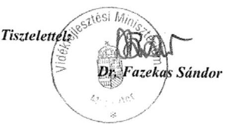

---

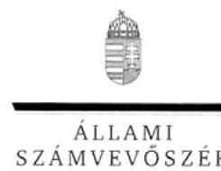

ELNÖK

Ikt.szám: V-0017-096/2012.

# Dr. Fazekas Sándor úr 

miniszter
Vidékfejlesztési Minisztérium

## Budapest

## Tisztelt Miniszter Úr!

A nemzeti park igazgatóságok feladatellátásának és vagyonkezelésének ellenőrzése című jelentéstervezetre tett észrevételeit köszönettel megkaptam.

Az Állami Számvevőszék észrevételekre vonatkozó álláspontjáról a felügyeleti vezető által készített részletes tájékoztatást csatoltan megküldöm.

Tájékoztatom Miniszter urat, hogy a jelentésben - az Állami Számvevőszékről szóló 2011. évi LXVI. törvény 29. § (3) bekezdése alapján - az el nem fogadott észrevételeket szerepeltetjük az elutasítás indokának feltüntetésével együtt. Az elfogadott észrevételeket a jelentés szövegezésénél figyelembe vesszük.

Budapest, 2012. A hó 24 nap
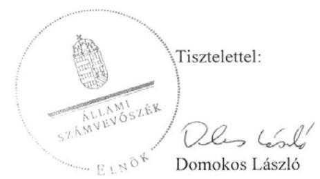

Melléklet: Tájékoztatás az elfogadott és az el nem fogadott észrevételekről

---

# Tájékoztatás 

## az elfogadott és az el nem fogadott észrevételekről

A nemzeti park igazgatóságok feladatellátásának és vagyonkezelésének ellenőrzése című jelentéstervezetre KGF/2012. iktatószámú levelében tett észrevételeit áttekintettük, azok kezeléséről az alábbi tájékoztatást adom.

Az 1. és 2. számú észrevétele nem módosítja megállapításunkat. A jelentéstervezet tényként rögzítette, hogy a minisztérium a 2009-2014 közötti időszakra szóló Nemzeti Környezetvédelmi Programban $\left(\mathrm{NKP}_{3}\right)$ kitűzött, a nemzeti park igazgatóságokhoz kapcsolódó stratégiai célok teljesítése érdekében nem határozott meg az igazgatóságok részére konkrét feladatokat. Ezt az észrevétel sem kifogásolja. A minisztérium a természetvédelmi célok teljesítése érdekében az éves költségvetés tervezése során, az igazgatóságok rendelkezésére álló források (költségvetési támogatás, saját bevétel) figyelembevételével sem határozott meg részükre szakmai előírásokat. A minisztérium szakmai követelményeinek megfogalmazását nem helyettesítik az igazgatóságok által készített javaslatok és többletigények. Mindezek miatt továbbra is fenntartjuk azt a javaslatunkat, hogy határozza meg az igazgatóságok természetvédelmi célok teljesítéséhez kapcsolódó konkrét feladatait, a velük szemben támasztott követelményeket és ennek ismeretében alakítsa ki költségvetési keretszámaikat (költségvetési támogatás, saját bevételek).

A 3. számú észrevételét nem fogadtuk el. A jelentéstervezet 52. oldal 2. és 3. bekezdése tényként rögzítette, hogy a haszonbérleti szerződésekben a bérleti díj megállapítása a földek aranykorona értéke és a gazdálkodás természetvédelmi korlátozásokból következő hátrányaira figyelemmel történt. A helyszínen ellenőrzött igazgatóságok a haszonbérleti szerződések megkötésére helyi sajátosságokat tartalmazó szabályokat - a bérleti díj megállapításánál a természetvédelmi kezelési feladatok értékének, a művelési korlátozások piaci torzító hatásának meghatározására és figyelembe vételére - nem határoztak meg. Az igazgatóságok a haszonbérbe adással lemondanak a területalapú támogatás saját igénybevételéről úgy, hogy a bérbeadástól várt és a saját használattal elérhető eredményeket nem hasonlították össze.

A nemzeti park igazgatóságok természetvédelmi célú vagyonkezelési tevékenységének egységes szakmai alapelvek szerinti ellátásáról szóló 12/2012. (VI. 8.) VM utasítás (VM utasítás) hatálya alá az 1. § (2) bekezdése által behatárolt földrészletek tartoznak. A VM utasításban megjelölt bérleti díjak értékének meghatározása ezekre a területekre vonatkozik. A Nemzeti Földalapról szóló 2010. évi LXXXVII. törvény 3. § (3) bekezdése azonban azt is jelzi, hogy lehet állami tulajdonban álló, nem földalapba tartozó földrészlet is. A Magyar Nemzeti Vagyonkezelő Zrt. elnöke a jelentéstervezetre adott észrevételében jelezte is a jelenleg a hatáskörében lévő területeket. Mindezek miatt továbbra is fenntartjuk javaslatunkat és megállapításunkat, hogy a jogszabály vagy más szabályozó eszköz által meg nem határozott

---

haszonbérleti díj esetében az igazgatóságnak az átláthatóság érdekében szabályoznia kell a piaci értéktől való eltérítés szempontjait, azt visszakereshető módon nyilvánosságra kell hoznia.

A 4. számú észrevételét nem fogadtuk el. A termőföldre vonatkozó elővásárlási és előhaszonbérleti jog gyakorlásának részletes szabályairól szóló 16/2002. (II. 18.) Korm. rendeletben, valamint a Nemzeti Földalapba tartozó földrészletek hasznosításának részletes szabályairól szóló 262/2010. (XI. 17.) Korm. rendelet 43/D. § (3) bekezdésében foglaltakat figyelembe vettük ${ }^{1}$. Az ellenőrzés megállapításai szerint így is a meghirdetett földterületek csak 1-2\%-ára érkezett a jelentkezőn kívül további ajánlat (jelentéstervezet 50. oldal utolsó bekezdés). Az átláthatóság érvényesítése és a verseny növelése, a VM utasításban foglalt természetvédelmi célú vagyonkezelési alapelvek teljesítése érdekében célszerű a haszonbérleti szerződés keretében hasznosítandó területek szélesebb körben történő meghirdetése.

Az 5. számú észrevételét nem fogadtuk el. A hatályon kívül helyezett, a nemzeti park igazgatóságok természetvédelmi vagyonkezelési tevékenységének egységes alapelvek szerinti ellátásáról szóló 9/2006. (K. V. Ért. 4.) KvVM utasítás ${ }^{2}$ (természetvédelmi vagyonkezelési utasítás) 2.5.1. pontjában felsorolta a saját használatban tartandó területek jellemzőit, amelyet a jelenleg hatályos VM utasítás már nem tartalmaz. Előírja azonban, hogy természetvédelmi szempontból a saját használatnak szükséges elsőbbséget adni. Az igazgatóságok természetvédelmi célú vagyonkezelési tevékenysége között a VM utasítás 2.2. pontja a saját, illetve az idegen használatot nevesíti. Ebben azonban csak a természetvédelmi célok elérését, a megfelelő kezelési eljárások alkalmazását írja elő, valamint arra való törekvést, hogy a használó lehetőség szerint igénybe vehesse a területalapú mezőgazdasági támogatást. A használatba adásra vonatkozó konkrét döntés az igazgatóság vezetőjének át nem ruházható hatáskörébe tartozik. Javaslatunk arra vonatkozik, hogy amennyiben az igazgatóság a használatba adás útján történő hasznosítás mellett dönt, úgy a megalapozott döntés meghozatala érdekében nélkülözhetetlen a saját és az idegen használat előnyeinek-hátrányainak bemutatása, a hozzá kapcsolódó kiadások és bevételek összehasonlítása.

A 6. számú észrevétele nem módosítja a jelentéstervezet megállapítását, ahhoz csak magyarázatul szolgál.

A 7. számú észrevételét nem fogadtuk el, mivel a hatékonyságot mutatószám alapján, a 96/2009. (XII. 9.) OGY határozattal elfogadott NKP ${ }_{3}$ 5.5.2.2. pontjában szereplő „természetvédelmi célú erdőkezelés költségei-bevételei, a nyereségből természetvédelmi tevékenységekre fordított összeg” alapján értékeltük, figyelemmel - az ellenőrzött időszakban

[^0]
[^0]:    ${ }^{1}$ A Nemzeti Földalapról szóló 2010. évi LXXXVII. számú törvény 32. § (1) bekezdésének b) pontjában foglaltak alapján a Nemzeti Földalapba tartozó földrészletek hasznosításának részletes szabályairól szóló 262/2010. (XI. 17.) Korm. rendeletnek az igazgatóságok vagyonkezelésében álló területek használatba adására vonatkozó előírásainak figyelembevételével.
    ${ }^{2}$ Hatályon kívül helyezte a 12/2012. (VI. 08.) VM utasítás 4. § c) bekezdése, hatálytalan 2012. VI. 9-től.

---

hatályos - az államháztartásról szóló törvény 1992. évi XXXVIII. tv. 91. § (1) bekezdés b) pontjában foglaltakra.

A 8. számú észrevételét nem fogadtuk el. A természet védelméről szóló 1996. évi LIII. törvény 36. § (2) bekezdésben foglalt - védett természeti érték, terület helyreállítását célzó természetvédelmi kezelési tevékenység a nemzeti park igazgatóságok alapfeladata. A természetvédelmi vagyonkezelési utasítás mellékletének 2.3. pontja elvárásként előírta a vagyonkezelésben álló területek, értékek fenntartását és helyreállítását. A természetvédelmi vagyonkezelési utasítás mellékletének 4.1.3. pontja elrendelte, hogy az igazgatóságok terveikben a kezelésükben álló területre - a jóváhagyott feladatok ellátásában a figyelembe vett forrásoktól függően - határozzák meg a területenként elvégzendő, rangsorolt feladatokat és az egyes feladatokra tervezett kiadásokat és bevételeket. A természetvédelmi vagyonkezelési utasítás nem tesz különbséget a feladatok nagyságrendje között. A helyszínen ellenőrzött igazgatóságok éves természetvédelmi vagyonkezelési terveikben az élőhely rehabilitációra és rekonstrukcióra tervezett területek számát, nagyságát sem tervezték meg. Emiatt az igazgatóságok 2007-2009. évek vagyonkezelési tervei hiányos tartalommal készültek.

A 9. számú észrevétele nem módosítja a jelentéstervezet megállapítását, ahhoz csak kiegészítő információt nyújt.

A 10. számú észrevételében foglalt pontosításokat elfogadjuk. Egyben megjegyezzük, hogy a jelentéstervezetben az igazgatóságok tanúsítványi adatszolgáltatása alapján szerepeltettük az adatokat.

A 11. számú észrevétele nem módosítja a jelentéstervezet megállapítását, mert azt adatokkal nem támasztotta alá. A nemzeti park igazgatóságok tanúsítványi adatszolgáltatásukban a 2007. évtől kezdődően ugyanakkora összterületet adtak meg a nemzetközi ökológiai hálózatra vonatkozóan. A jelentéstervezetben ezt a tényt rögzítettük.

A 12. számú észrevételét elfogadjuk. Az észrevétel alapján a nagy szikibagolyt töröltük a jelentéstervezet 38. oldal 2. bekezdésében lévő felsorolásból és módosítottuk a 39. oldal első bekezdésének utolsó mondatát is.

A 13. számú észrevételét nem fogadtuk el, mivel az $\mathrm{NKP}_{3}$ 5.5.4.3. pontja célként írta elő a természetvédelmi nyilvántartások és az ingatlan-nyilvántartás közötti adategyezőség elérését. Egyben kormányzati feladatként megfogalmazta a TIR (természetvédelmi információs rendszer) fejlesztését, a természetvédelmi nyilvántartások és az ingatlan-nyilvántartási adategyezőség érdekében végrehajtandó feladatok ellátását.

A 14. számú észrevételét elfogadtuk. Azonban megjegyezzük, hogy az $\mathrm{NKP}_{3}$ több pontjában (pl. 5.5.1.1., 5.5.1.5., 5.5.1.7., 5.5.2.2., 5.7.2.1.) is használja egymás mellett a két kifejezést.

A 6. oldalra tett észrevételét részben fogadtuk el. A jelentéstervezet értelmező szótárában szereplő természetvédelmi kezelés fogalmából töröltük a természet védelméről szóló 1996. évi LIII. törvény 6-20. §-aira való hivatkozást. Az ezt követő bekezdés a tevékenység megértéséhez ad információt.

---

A 8. oldalra tett észrevétele alapján a fogalomtárban a definiált fogalmat pontosítottuk.
A 10. oldalra tett észrevétele alapján a nemzeti park igazgatóságok feladatait a kultúrtörténeti, örökségvédelmi tevékenységgel kiegészítettük. A tájvédelmi tevékenységre, a természetvédelmi tevékenységre a jelentéstervezet 9. oldalán utaltunk.

A 11. oldalra tett észrevétele alapján a felsorolás 2. pontjában a kifejezést pontosítottuk. A nemzeti park igazgatóságok feladatellátásának minősítéséhez kapcsolódó felsoroláshoz füzött észrevétele nem módosítja a jelentéstervezet megállapítását. Az Állami Számvevőszék a nemzeti park igazgatóságok feladatellátásának eredményességét több indikátor egyidejű alkalmazásával ítélte meg. Az $\mathrm{NKP}_{3}$ a mérgezéses esetek számát, mint mutatót nevesíti a fajok megőrzése, kezelése érdekében kitűzött célok elérése érdekében.

A 13. oldalra tett észrevételét nem fogadtuk el, mivel a nemzeti park igazgatóságok éves jelentései a megkötött haszonbérleti szerződések természetvédelmi kezelés gyakorlatának és ellenőrzésének eredményeit nem tartalmazták. Az éves jelentések az érintett területek természeti állapotát, annak alakulását nem mutatták be, csak az elvégzett természetvédelmi kezelési feladatokat tartalmazták. A használatba adás gyakorlata szabályszerűségének és megfelelőségének vizsgálatáról - az igazgatóságoknál tartott szemle eredményéről készült dokumentumok hiányában az ellenőrzés nem tudott meggyőződni. A vagyonkezelési értekezletek emlékeztetői gyakorlati problémákról, a vagyonkezelési továbbképzésekről szóltak.

A 14. oldalra tett észrevétele nem módosítja a jelentéstervezet megállapítását. Az ellenőrzésnek nem volt tárgya az országos jelentőségű védett természeti területek adatbázisának vizsgálata.

A 24. oldal 2. bekezdésére tett észrevétele nem módosítja a jelentéstervezet megállapítását. Az észrevétel a vagyonkezelési tervezés egyeztetésének gyakorlatát mutatja be.

A 24. oldal utolsó bekezdésére tett észrevétele nem módosítja a jelentéstervezet megállapítását, mivel az - az észrevételben jelzettek szerint is - az ellenőrzött időszakon túl mutat. Az észrevételében hivatkozott eljárásrendet a helyszíni ellenőrzés során nem adták át az ellenőrzést végzőknek.
 részére. A VM utasítás 6.6.7. pontja a vagyonkezelés erdészeti alágazatok szerinti elvárásait fogalmazza meg. Ennek keretében csak a kötelező mennyiségi és értékbeni nyilvántartás szerinti könyvelést, költséghelyekre való megbontást és szakmai elveket ír elő, nem részletes tervezési szabályokat.

A 25. oldal 2.3. alponthoz füzött észrevétele nem módosítja a jelentéstervezet megállapítását, mivel a 35. oldal 2. bekezdése hivatkozik az észrevételben jelzett KvVM utasításra.

A 29. oldalhoz füzött észrevételét nem fogadtuk el. Amint azt a 13. oldalra tett észrevételéhez kapcsolódóan is írtuk, a haszonbérbe adás gyakorlata szabályszerűségének és megfelelőségének vizsgálatáról dokumentumok hiányában az ellenőrzés nem tudott meggyőződni. A vagyonkezelési értekezletek emlékeztetői gyakorlati problémákról, a vagyonkezelési továbbképzésekről szóltak.

---

A 35. oldal 1. bekezdéséhez füzött észrevétele alapján a nemzeti park kifejezést pontosítottuk és lábjegyzetben szerepeltetjük a hivatkozott rendeletet. Az észrevétele alapján a jelentéstervezet szövegét pontosítottuk a nemzeti park igazgatóságok kezelési terv előkészítésében való részvételére. A minisztérium a nemzeti park igazgatóságokkal és tárcákkal folytatott egyeztetéseket. Ezeknek a kezelési terv készítésére vonatkozó hatását a jelentéstervezet részbekezdése kifejti. Észrevétele alapján a tárcaközi egyeztetést közigazgatási egyeztetésre módosítottuk. Mindez nem befolyásolja azt a megállapításunkat, hogy a kezelési tervek rendelet formájában nem kerültek kihirdetésre. A jelentés 35. oldal utolsó bekezdéséhez füzött észrevétele szintén nem igényli a megállapítás módosítását, mivel a szöveg ,,a települési önkormányzatok által elkészített" kezelési tervekről szól.

A 36. oldalra tett észrevételében foglalt pontosításokat elfogadjuk. Egyben megjegyezzük, hogy a jelentéstervezetben az igazgatóságok tanúsítványi adatszolgáltatása alapján szerepeltettük az adatokat.

A 42. oldal első bekezdéséhez füzött észrevételét nem fogadtuk el, mert a megállapítás és a hozzá kapcsolódó ábra védetté nyilvánítások kezdeményezéséről és annak realizálásáról szólt. A védett jogi jelleg ingatlan nyilvántartásba történő feljegyzéséről szóló mondatot a jelentéstervezetből töröltük, mivel az nem az igazgatóságok feladatellátásához kapcsolódik.

A 46. oldalhoz füzött észrevétele a jelentéstervezetben foglalt megállapítás tényét nem módosítja, ahhoz csak magyarázatot fűz. Az adatokhoz kapcsolódó észrevételét nem fogadtuk el, mivel a jelentéstervezetben az adatok az igazgatóságok tanúsítványi adatszolgáltatása alapján szerepelnek a 2007. év január 1-jei és a 2012. december 31-i állapot szerint. Az észrevétel a változást a 2007. december 31-ei adatokhoz viszonyítja. Észrevétele nincs ellentmondásban a jelentéstervezetben leírt tényekkel.

A 48. oldal utolsó bekezdéséhez füzött észrevételét a 7. számú észrevételéhez kapcsolódó válaszunkban leírtak alapján nem fogadtuk el.

A 4. számú melléklet a) táblázatához füzött észrevétele alapján a táblázat címét kiegészítettük.
Tájékoztatom, hogy a számvevőszéki jelentés mellékleteként szerepeltetjük a jelentéstervezethez tett észrevételeit, valamint azokra adott válaszunkat.

Budapest, 2012. 11. hó  nap
Holman Majdolna
felügyeleti vezető

---

# 12. c). számú melléklet a V-0017-103/2012. sz. jelentéshez 

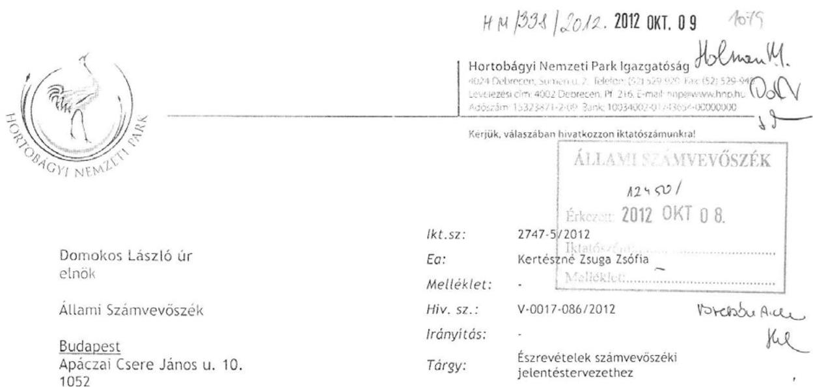

Tisztelt Elnök Úr!
A nemzeti park igazgatóságok feladatellátásának és vagyonkezelésének ellenőrzéséről szóló jelentéstervezettel kapcsolatban az alábbi észrevételeket teszem:
I. fejezet: összegző megállapítások, következtetések, javaslatok:
14. oldal, második bekezdés Az élőhely-rehabilitációs tevékenységek időbeli ütemezésének tervezése nem lehetséges, mert az ilyen jellegű tevékenységet kizárólag pályázati forrásból tudjuk megvalósítani. A HNPI nem tudja befolyásolni, hogy mikor, milyen pályázati források válnak hozzáférhetővé.
18. oldal, 1, 2.

A nemzeti park igazgatóságok természetvédelmi célú vagyonkezelési tevékenységének egységes szakmai alapelvek szerinti ellátásáról szóló 12/2012. (VI. 8.) VM utasítás az igazgatóságok számára előírja a kötelező eljárási szabályokat, így a vagyon hasznosítására vonatkozó szabályozási rendszer kialakításának hatásköre kikerült a mindenkori igazgató feladatai közül. A VM utasítás szabályozza a közzététel módját, illetve előírja a haszonbérleti díj mértékét is, utóbbi miatt a verseny növelése nem megoldható.

---

# II. fejezet: Részletes megállapítások 

31. oldal, 3. bekezdés

Véleményünk szerint a területen dolgozó közmunkásoknak nem feltétlenül kell rendelkezniük szakmai képesítéssel, viszont szakképzett természetvédelmi őr irányítja a munkájukat.
38. oldal, második bekezdés

A nagy szikibagoly (Gortyna borelii lunata) nem madár, hanem lepkefaj, így vele kapcsolatban madárvédelmi tevékenységet nem lehet kifejteni.
48. oldal, utolsó bekezdés

A természetvédelmi célú erdőkezelés hatékonyságának mérésére a nyereségességet, mint mutatót nem lehet alkalmazni. A természetvédelmi célú erdőkezelésnél a természetvédelmi cél nem a kitermelendő fa mennyisége (amely a bevételt biztosítja), hanem az erdő jó természeti állapota, megfelelő faj- és korösszetétele, szintezettsége.

Debrecen, 2012. október 4.

Tisztelettel:
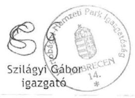

---

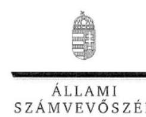

ELNÖK

Ikt.szám: V-0017-100/2012.

# Szilágyi Gábor úr 

igazgató
Hortobágyi Nemzeti Park Igazgatóság

## Debrecen

## Tisztelt Igazgató Úr!

A nemzeti park igazgatóságok feladatellátásának és vagyonkezelésének ellenőrzése címû jelentéstervezetre tett észrevételeit köszönettel megkaptam.

Az Állami Számvevőszék észrevételekre vonatkozó álláspontjáról a felügyeleti vezető által készített részletes tájékoztatást csatoltan megküldöm.

Tájékoztatom Igazgató urat, hogy a jelentésben - az Állami Számvevőszékről szóló 2011. évi LXVI. törvény 29. § (3) bekezdése alapján - az el nem fogadott észrevételeket szerepeltetjük az elutasítás indokának feltüntetésével együtt. Az elfogadott észrevételeket a jelentés szövegezésénél figyelembe vesszük.

Budapest, 2012. / hó / nap
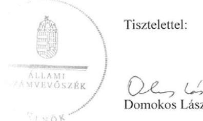

Tisztelettel:

Melléklet: Tájékoztatás az elfogadott és az el nem fogadott észrevételekről

---

# Tájékoztatás 

## az elfogadott és az el nem fogadott észrevételekról

A nemzeti park igazgatóságok feladatellátásának és vagyonkezelésének ellenőrzése címû jelentéstervezetre 2747-5/2012. iktatószámú levelében tett észrevételeit áttekintettük, azok kezeléséről az alábbi tájékoztatást adom.

Elfogadtuk a jelentéstervezet 38. oldal, második bekezdésre tett észrevételét, amelyet a jelentés készítése során figyelembe vettünk.

Nem fogadtuk el a jelentéstervezet 14. oldal, második bekezdésével kapcsolatban tett észrevételét, mivel a természet védelméről szóló 1996. évi LIII. törvény 36. § (2) bekezdésben foglaltak alapján a védett természeti érték, terület helyreállítását célzó természetvédelmi kezelési tevékenység az igazgatóság alapfeladata. A nemzeti park igazgatóságok természetvédelmi vagyonkezelési tevékenységével szemben támasztott követelmények egységes alapelvek szerinti ellátásáról szóló 9/2006. (K. V. Ért. 4.) KvVM utasítás mellékletének 2.3. pontja elvárásként előírta a vagyonkezelésben álló területek, értékek fenntartását és helyreállítását. Az igazgatóságok terveinek tartalmánál az utasítás mellékletének 4.1.3. pontja elrendelte, hogy a kezelésében álló területre meg kellett határozni a rangsorolt feladatokat. A jelentéstervezet 34. oldal, 3. bekezdésben tett megállapításunk alapján a rangsorolt feladatokat a Hortobágyi Nemzeti Park Igazgatóság a 2010-2011. évi éves természetvédelmi vagyonkezelési tervei nem tartalmazták. A helyreállítási feladatok, illetve a végrehajtásához szükséges és a rendelkezésre álló források alapján az időbeli ütemezés tervezhető.

Nem fogadtuk el a jelentéstervezet 18. oldal 1. és 2. számú javaslatokkal kapcsolatos észrevételét. Az igazgatóság gondos vagyonkezelési tevékenységének feltétele a számításokkal alátámasztott és az eredmény alapján hozott döntés a saját és az idegen használatról. A vagyon hasznosítása nem korlátozódik a nemzeti park igazgatóságok természetvédelmi célú vagyonkezelési tevékenységének egységes szakmai alapelvek szerinti ellátásáról szóló 12/2012. (VI. 8.) VM utasítás 1. § (2) bekezdése által behatárolt földrészletekre. A Nemzeti Földalapról szóló 2010. évi LXXXVII. törvény 3. § (3) bekezdése is jelzi, hogy lehet állami tulajdonban nem földalapba tartozó földrészlet. Mindezek miatt továbbra is fenntartjuk javaslatunkat és véleményünket, hogy a jogszabály vagy más szabályozó eszköz által meg nem határozott haszonbérleti díj esetében az igazgatóságnak az átláthatóság érdekében szabályoznia kell a piaci értéktől való eltérítés szempontjait, azt visszakereshető módon nyilvánosságra kell hoznia. A Nemzeti Földalapba tartozó földrészletek hasznosításának részletes szabályairól szóló 262/2010. (XI. 17.) Korm. rendelet 43/D. § (3) bekezdése a hirdetménynél nem határozza meg az igazgatóság székhelyén és portálján a közzététel időtartamát, módját, a helyben

---

helyben szokásos módon való közzététel szabályait. A hiányzó előírásokat az átláthatóság és a verseny növelése érdekében az igazgatóságnak kell szabályoznia.

Nem fogadtuk el a jelentéstervezet 48. oldal, utolsó bekezdésére tett észrevételét, mivel a Nemzeti Környezetvédelmi Program 5.5.2.2. pontjának a „természetvédelmi célú erdőkezelés költségei-bevételei, a nyereségből természetvédelmi tevékenységekre fordított összeg" mutatót használtuk a hatékonyság minősítésére. A hivatkozott mutató alapján is értékelhető a NKPban foglalt célok teljesítése, a természetvédelmi erdőkezelési tevékenység eredményessége és hatékonysága.

A 31. oldal, harmadik bekezdésével kapcsolatban tett észrevételét elfogadjuk. A jelentésben a közmunkások szakképzetségére vonatkozó tényt rögzítettük.

Tájékoztatom, hogy a számvevőszéki jelentés mellékleteiként szerepeltetjük a jelentéstervezethez tett észrevételeit, valamint azokra adott válaszunkat.

Budapest, 2012. 10. hó 16. nap

Holman Magdolna
felügyeleti vezető

---

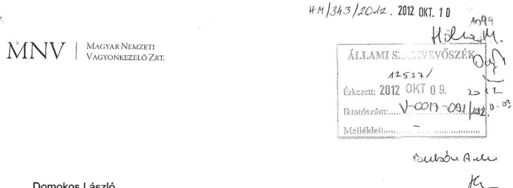

Domokos László
elnök úr
Állami Számvevőszék
H-1052 Budapest
Apáczai Csere János u. 10.
Isz: MNV/01/25/94/0/2012.

Tárgy: A Nemzeti Park Igazgatóságok feladatellátásának és vagyonkezelésének ellenőrzéséről készített számvevőszéki jelentéstervezet észrevételezése

Hiv.sz.: V-2017-086/2012.

Tisztelt Elnök Úr!
A Nemzeti Park Igazgatóságok feladatellátásának és vagyonkezelésének ellenőrzéséről készített V-2017-086/2012. számú - az MNV Zrt-hez 2012. szeptember 24-én érkezett - számvevőszéki jelentéstervezetet észrevételezésre köszönettel megkaptam.

A jelentéstervezetre az MNV Zrt. képviseletében az alábbi pontosító jellegű észrevételeket teszem:

1. A 4.1. Az igazgatóságok vagyonkezelésében lévő vagyon összetételének változása cím alatti bekezdés harmadik mondatára vonatkozóan /44. oldal/:
..."Az igazgatóságok a saját vagyon alakulását nem, csak a vagyonkezelésükben lévő vagyonuk használatát tervezték...."

A központi költségvetési szervek az állami vagyonról szóló 2007. évi CVI. tv. 2. § (2) bekezdése értelmében nem rendelkeznek saját vagyonnal. Az intézmény működését szolgáló intézményi vagyonelemek is a Magyar Állam tulajdonában és az igazgatóságok vagyonkezelésében lévő vagyonelemek, erre figyelemmel a mondat pontosítását javaslom.

---

2. A 4.1. Az igazgatóságok vagyonkezelésében lévő vagyon összetételének változása cím alatti ötödik bekezdéshez /45. oldal/:
„Az Ávt. 23.§(1) bekezdésében foglaltaktól eltérően a vagyonkezelési szerződések nem fedték le a valóságban kezelt ingatlanvagyont a vagyonkezelői kijelölés elhúzódása miatt. ..."

A vizsgált időszakban az állami vagyonról szóló 2007. évi CVI. törvény és a Nemzeti Földlapról szóló 2010. évi LXXXVII. törvény a tulajdonosi joggyakorló szervezetek változását eredményezték. Ennek következtében 2010. szeptember 1-tól az MNV Zrt. az NFA tulajdonosi joggyakorlása alá tartozó ingatlanok vonatkozásában már nem köthetett vagyonkezelési szerződést.

Az MNV Zrt. szakterületének ismeretei szerint a jelentés-tervezetben említett Körös-Maros NPI 834,2 ha folyamatban lévő vagyonkezelésbe adásból 11,4 ha, a Duna-Ipoly NPI 1050,0 ha folyamatban lévő vagyonkezelésbe adásból 6,6 ha tartozik az MNV Zrt. hatáskörébe. Az Őrségi NPI-nak és a Hortobágyi NPI-nak nincs az MNV Zrt-nél folyamatban vagyonkezelési kérelme.

Javasolom a folyamatban lévő vagyonkezelési szerződések tekintetében a jelentéstervezetben egyértelműen rögzíteni, hogy annak túlnyomó többsége az NFA feladatkörébe tartozik.

Kérem az észrevételek mérlegelését és szíves figyelembe vételét.

Budapest, 2012. október 3.
Üdvözlettel:

# MNVI   Magyar Nemzeti Vagyonkezelő Zrt.   Igazgatóság Elnöke 

dr. Halasi Tibor
IGAZGATÓSÁG ELNÖKE

---

# 12. f). számú melléklet a V-0017-103/2012. sz. jelentéshez 

## 12.100

## In

## Dr. Halasi Tibor úr

elnök
Magyar Nemzeti Vagyonkezelő Zrt.

## Budapest

## Tisztelt Igazgató Úr!

A nemzeti park igazgatóságok feladatellátásának és vagyonkezelésének ellenőrzése címû jelentéstervezetre tett észrevételeit köszönettel megkaptam.

Az Állami Számvevőszék észrevételekre vonatkozó álláspontjáról a felügyeleti vezető által készített részletes tájékoztatást csatoltan megküldöm.

Tájékoztatom Elnök urat, hogy a jelentésben - az Állami Számvevőszékről szóló 2011. évi LXVI. törvény 29. § (3) bekezdése alapján - az el nem fogadott észrevételeket szerepeltetjük az elutasítás indokának feltüntetésével együtt. Az elfogadott észrevételeket a jelentés szövegezésénél figyelembe vesszük.

Budapest, 2012. / hó / nap
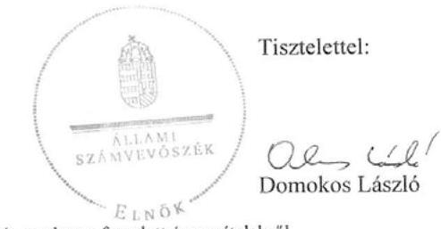

Melléklet: Tájékoztatás az elfogadott és az el nem fogadott észrevételekről

---

# Tájékoztatás 

## az elfogadott és az el nem fogadott észrevételekről

A nemzeti park igazgatóságok feladatellátásának és vagyonkezelésének ellenőrzése címû jelentéstervezetre MNV/01/25194/0/2012. iktatószámú levelében tett észrevételeit áttekintettük, azok kezeléséről az alábbi tájékoztatást adom.

A jelentéstervezet 44. oldal utolsó bekezdésével kapcsolatban tett pontosító észrevételét elfogadtuk. A jelentéstervezet is tartalmazta, hogy a nemzeti park
 igazgatóságoknak az ingatlanok és ingóságok felett csak vagyonkezelési joga volt.

Nem fogadtuk el a jelentéstervezet 45. oldal 4. bekezdésére tett észrevételét. A jelentéstervezet 27. oldalán leírtak alapján a Nemzeti Földalapról szóló 2010. évi LXXXVII. törvény 34. § (3) bekezdése által előírt, a Nemzeti Földalapba tartozó vagyonelemek átadása az Magyar Nemzeti Vagyonkezelő Zrt. részéről a 2010. év végéig nem valósult meg. A benyújtott kérelmekkel kapcsolatos intézkedések több évig elhúzódtak, a részbekezdésben hivatkozottakra a nemzeti park igazgatóságok a helyszíni ellenőrzés végéig nem kaptak választ. A Körös-Maros Nemzeti Park Igazgatóság 2007. év óta folyamatban lévő kérelmének helyszíni ellenőrzés befejezéséig való rendezetlensége nem indokolható a 2010. évben bekövetkezett jogszabályi változással, az abban megjelölt átadási határidő be nem tartásával.

Tájékoztatom, hogy a számvevőszéki jelentés mellékleteiként szerepeltetjük a jelentéstervezethez tett észrevételeit, valamint azokra adott válaszunkat.

Budapest, 2012. 10. hónap

## Volum végleges   Holman Magdolna felügyeleti vezető
