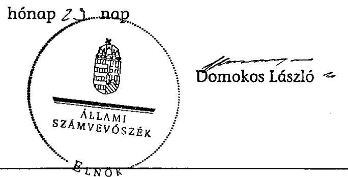

# ÁLLAMI   SZÁMVEVŐSZÉK 

## JELENTÉS

a MIÉP-Jobbik a Harmadik Út Párt 2008-2010. évi gazdálkodása törvényességének ellenőrzéséről

---

# Állami Számvevőszék 

Iktatószám: V-0005-066/2012.
Témaszám: 1044
Vizsgálat-azonosító szám: V0577

## Az ellenőrzést felügyelte:

## Horváth Balázs

felügyeleti vezető

## Az ellenőrzés végrehajtásáért felelős:

Dr. Veress Tiborné
ellenőrzésvezető

## A jelentés összeállításában közremúködött:

## Baracsi Szilvia

számvevő tanácsos

## Az ellenőrzést végezték:

## Baracsi Szilvia Dr. Márton Gabriella   számvevő tanácsos számvevő tanácsos

A témához kapcsolódó eddig készített számvevőszéki jelentések:
címe
sorszáma
Jelentés a MIÉP-Jobbik a Harmadik Út Párt 2006-2007. évi gazdál- 0912 kodása törvényességének ellenőrzéséről

---

# TARTALOMJEGYZÉK 

BEVEZETÉS ..... 5
I. ÖSSZEGZŐ MEGÁLLAPÍTÁSOK, KÖVETKEZTETÉSEK, JAVASLATOK ..... 7
II. RÉSZLETES MEGÁLLAPÍTÁSOK ..... 9

1. A Párt éves beszámolói elkészítése és közzététele ..... 9
2. A Párt könyvvezetésének belső szabályozása, gyakorlata ..... 9
3. A Párt bevételszerző, gazdálkodó tevékenysége ..... 9
MELLÉKLETEK
4. számú Teljességi nyilatkozat (1 oldal)

---

.

---

# RÖVIDÍTÉSEK JEGYZÉKE 

| ÁSZ | Állami Számvevőszék |
| :-- | :-- |
| párt | MIÉP-Jobbik a Harmadik Út Párt |
| párttörvény | a pártok múködéséről és gazdálkodásáról szóló 1989. évi |
|  | XXXIII. törvény |
| Számv. tv. | a számvitelről szóló 2000 . évi C. törvény |

---

.

---

# JELENTÉS 

## a MIÉP-Jobbik a Harmadik Út Párt 2008-2010. évi gazdálkodása törvényességének ellenőrzéséről

## BEVEZETÉS

Az Állami Számvevőszékről szóló 2011. évi LXVI. törvény 5. § (11) bekezdés a) pontja, valamint a pártok múködéséről és gazdálkodásáról szóló 1989. évi XXXIII. törvény (párttörvény) 10. § (1) bekezdése alapján a pártok gazdálkodása törvényességének ellenőrzésére az Állami Számvevőszék (ÁSZ) jogosult. Az ÁSZ a rendszeres költségvetési támogatásban részesülő pártok gazdálkodását a párttörvény 10. § (3) bekezdésében előírtak szerint kétévenként ellenőrzi. A MIÉP-Jobbik a Harmadik Út Párt (Párt) 2010 júniusáig volt jogosult rendszeres költségvetési támogatásra, mivel a 2010. évi országgyúlési képviselő választáson jelöltet nem állított. A Párt a 2008. és a 2009. évben 37,9 -37,9 millió Ft, a 2010. évben 15,8 millió Ft költségvetési támogatásban részesült.

Az ellenőrzés célja annak megállapítása volt, hogy:

- a Párt által készített és a Magyar Közlönyben közzétett éves beszámolók a törvényi előírásoknak megfelelnek-e, a könyvvezetéssel és a valósággal megegyező adatokat tartalmaznak-e;
- a könyvvezetés és a gazdálkodás során betartották-e a számvitelről 2000. évi C. törvény (Számv. tv.) és az egyéb jogszabályok rendelkezéseit, a belső előírásokat;
- a Párt a múködéséhez szabályszerűen igénybe vehető forrásokat használt-e fel, a párttörvényben engedélyezett gazdálkodó tevékenységet folytatott-e.

Az ellenőrzött időszak: 2008. január 1. - 2010. december 31.
Az ellenőrzés típusa: pénzügyi-szabályszerűségi ellenőrzés.
Az ÁSZ a párttörvény módosításáig a hatályos rendelkezéseknek megfelelő - egységes módszertani alapokra helyezett - gyakorlattal folytatja a pártok gazdálkodása törvényességének ellenőrzését. Az ÁSZ az ellenőrzést a pénzügyiszabályszerűségi ellenőrzés módszertani szabályai szerint, a pártellenőrzésre kiadott „A pártok gazdálkodása törvényességének pénzügyi szabályszerűségi ellenőrzéséhez" című segédletbe foglalt egységes követelmény szerint tervezte elvégezni.

---

Az ellenőrzés előkészítése során bekért dokumentumokat a Párt nem bocsátotta az ÁSZ rendelkezésére arra hivatkozással, hogy azok a Párt bejegyzett székhelyére „besurranás", illetve a „raktározási helyre" történt betörés alkalmával eltűntek.

A helyszíni ellenőrzés időszakában a Párt átadta a nyomozások felfüggesztéséről szóló rendőrségi határozatokat, amelyek azonban nem igazolták, hogy a Párt gazdálkodásával összefüggő bármilyen dokumentum a „besurranás" során eltulajdonított bőröndökben vagy a betöréssel érintett „raktározási helyen" voltak. A Párt képviselője a helyszíni ellenőrzés megkezdését követően gondoskodott a Párt OTP Bank Zrt-nél vezetett bankszámla 2008-2010. évi forgalmáról szóló, hitelesített kivonatok másolatának az ellenőrzés részére történő átadásáról. A Párt képviselője teljességi nyilatkozatot adott, hogy az ellenőrzött tárgykörben kért dokumentumokkal, adatokkal, iratokkal nem rendelkezik (1. számú melléklet).

Az ellenőrzés körülményeit illetően rögzíteni szükséges, hogy a Párt irányítását és adminisztratív ügyeit intéző társelnök, 2012 februárjában elhunyt. A Párt bíróságon nyilvántartásba vett adataiban a helyszíni ellenőrzés megkezdésekor nem volt változás.

---

# I. ÖSSZEGZŐ MEGÁLLAPÍTÁSOK, KÖVETKEZTETÉSEK, JAVASLATOK 

A Párt a 2008-2010. évi gazdálkodásáról szóló beszámolóinak elkészítését nem dokumentálta, a Hivatalos Értesítőben a párttörvényben előírtak ellenére nem tette közzé. Az ellenőrzés előkészítése és a helyszíni ellenőrzés idején a Párt nem rendelkezett honlappal. A párttörvény a beszámoló közzétételének elmulasztására vonatkozóan nem tartalmaz szankciót1.

A beszámolási kötelezettség elmulasztása, valamint a Párt gazdálkodását alátámasztó - bankkivonatokon kívüli - dokumentumok hiányában az ellenőrzési programban meghatározott célokat teljesíteni és a feladatokat végrehajtani nem lehetett.

A Párt nem bocsátott az ellenőrzés rendelkezésére a 2008-2010. évekre vonatkozóan hatályos, a Számv. tv-ben előírt számviteli szabályzatokat. A dokumentumok hiánya miatt a könyvvezetési kötelezettség teljesítése, a bizonylati elv és fegyelem érvényesítése, a bizonylati rend betartása és a bizonylat megőrzési kötelezettség teljesítése nem volt ellenőrizhető, ezért az ellenőrzés azon célja, hogy a könyvvezetés során a Számv. tv-ben foglaltaknak eleget tettek-e, nem teljesült.

A Párt gazdálkodó, bevételszerző tevékenységét, a párttörvényben előírt forrásszerzési és gazdálkodási tilalmak betartását a bankszámlán jóváírt költségvetési támogatás és banki kamat bevétel kivételével a könyvviteli nyilvántartások és dokumentumok hiányában ellenőrizni nem lehetett. A kiadásokra vonatkozóan a párttörvény rendelkezéseket nem tartalmaz ${ }^{2}$.

A Párt képviselője által az ellenőrzés részére átadott a 2008-2010. évi bankszámla kivonatok alapján az ellenőrzött években 91,6 millió Ft költségvetési támogatás és 0,1 millió Ft kamat jóváírása történt. A kiadások 9,4 millió Ft-tal meghaladták a bevételek összegét, amelyre a korábbi évi pénzmaradvány nyújtott fedezetet. A bankkivonatok alapján a terhelések 79,6\%-át készpénz felvétel, 19,7\%-át bírósági végzés alapján történt terhelés és $0,7 \%$-át bankköltség és alapítványi alapítói vagyon befizetés képezte.

Az Állami Számvevőszékről szóló 2011. évi LXVI. törvény 33. § (1) bekezdésében foglaltak értelmében a jelentésben foglalt megállapításokhoz kapcsolódó intézkedési tervet köteles az ellenőrzött szervezet vezetője összeállítani és azt a jelentés kézhezvételétől számított harminc napon belül az ÁSZ részére megküldeni. Amennyiben az intézkedési tervet határidőben nem küldi meg a szervezet, vagy az továbbra sem elfogadható, az ÁSZ elnöke a hivatkozott törvény 33. § (3) bekezdés a)- b) pontjaiban foglaltakat érvényesítheti.

[^0]
[^0]:    ${ }^{1,2}$ Az Állami Számvevőszék a szabályozási hiányosságok megszüntetése érdekében évek óta szorgalmazza a párttörvény módosítását.

---

A helyszíni ellenőrzés, intézkedést igénylő megállapításai és felhívásai:

# a Párt társelnökének 

1. A Párt a 2008-2010. évi gazdálkodásáról szóló beszámolóinak elkészítését nem dokumentálta, a Hivatalos Értesítőben a párttörvény előírása ellenére nem tette közzé.

Felhívás:
Készítse el és tegye közzé a Párt 2008-2009-2010. évi beszámolóját a párttörvény 9. § (1) bekezdésében előírtaknak megfelelően.
2. A Párt nem bocsátott az ellenőrzés rendelkezésére a 2008-2010. évekre vonatkozó hatályos, a Számv. tv-ben előírt számviteli szabályzatokat.

Felhívás:
Gondoskodjon a Számv. tv. 14. § (3), továbbá (5) bekezdés a), b), d), valamint 161. § (1) bekezdésében és a 161/A. §-ában előírt számviteli szabályzatok elkészíttetéséről.
3. Dokumentumok hiánya miatt a 2008-2010. évekre vonatkozó könyvvezetési kötelezettség teljesítése, a bizonylati rend és fegyelem betartása nem volt ellenőrizhető.

Felhívás:
Intézkedjen:
a) a Számv. tv. 159. §-ában előírt könyvvezetési kötelezettség teljesítéséről;
b) a Számv. tv. 164. § (1)-(2) bekezdésében szabályozott könyvviteli zárlati feladatok elvégzéséről;
c) a Számv. tv. 165. § (1)-(2) bekezdéseiben és a 167-169. §-aiban szabályozott bizonylati elv és fegyelem érvényesítéséről, a bizonylati rend betartásáról és a bizonylat megőrzési kötelezettség teljesítéséről.

---

# II. RÉSZLETES MEGÁLLAPÍTÁSOK 

## 1. A PÁRT ÉVES BESZÁmolói ELKÉszítÉse És KÖzzÉtétele

A Párt a párttörvény 9. § (1) bekezdésében előírt a 2008., a 2009. és a 2010. évi beszámolók elkészítését dokumentumokkal nem igazolta, azokat a Hivatalos Értesítőben nem tette közzé. Az ellenőrzés előkészítése és a helyszíni ellenőrzés idején a Párt nem rendelkezett honlappal. A párttörvény a beszámoló elkészítésének és közzétételének elmulasztására vonatkozóan nem tartalmaz szankciót.

## 2. A PÁRT KÖNYVVEZETÉSÉNEK BELSŐ SZABÁLYOZÁSA, GYAKORLATA

A Párt nem bocsátott az ellenőrzés rendelkezésére a 2008-2010. évekre vonatkozóan hatályos a Számv. tv. 14. § (3) bekezdés, továbbá az (5) bekezdés a), b), és d) pontjaiban, valamint a 161. § (1) bekezdésében és a 161/A §-ában előírt számviteli szabályzatokat.

Az ellenőrzött időszakra vonatkozó a Számv. tv. 159. §-ában előírt könyvvezetési kötelezettség teljesítése és a 164. § (1)-(2) bekezdéseiben szabályozott könyvviteli zárlati feladatok elvégzése, a 165. § (1)-(2) bekezdéseiben és a 167-169. §-aiban szabályozott bizonylati elv és fegyelem érvényesítése, a bizonylati rend betartása és a bizonylat megőrzési kötelezettség teljesítése dokumentumok hiánya miatt nem volt ellenőrizhető.

## 3. A PÁRT BEVÉTELSZERZŐ, GAZDÁlKODÓ TEVÉKENYSÉGE

A Párt vagyonának elemeit, valamint gazdálkodását a hatályos alapszabály V. fejezetének 20. §-ában szabályozta. Az állami költségvetésből származó támogatáson felüli forrásait jogcím szerint határozta meg: „tagsági díjak, egyéb támogatások, a párttörvény 6. §-ában meghatározott gazdálkodó tevékenység, a Párt által alapított vállalat és egyszemélyes kft. adózott nyeresége". Az alapszabály összhangban állt a párttörvény 4. § (1) bekezdésében engedélyezett bevételekkel, valamint a 6. § (1) és (3) bekezdéseiben foglalt gazdálkodó tevékenységekkel.

A Párt képviselője által az ellenőrzés részére átadott, a 2008-2010. évekre vonatkozó bankszámla kivonatok szerint a 2008. és a 2009. évi 37900 ezer Ft, a 2010. évi 15791 ezer Ft költségvetési támogatás összege megegyezett a Magyar Köztársaság 2008. évi költségvetésének végrehajtásáról szóló 2009. évi CXXIX. törvényben, valamint a Magyar Köztársaság 2009. évi költségvetésének végrehajtásáról szóló 2010. évi XCVIII. törvényben és a Magyar Köztársaság 2010. évi költségvetésének végrehajtásáról szóló 2011. évi CXXXIII. törvényben rögzítettekkel. A Párt bankszámláján a párttörvény 4. § (2)-(3) bekezdéseiben foglalt tiltott vagyoni hozzájárulást, adományt nem írtak jóvá.

A Párt kiadása a 2008. évben 148 ezer Ft, a 2009. évben 30 ezer Ft, a 2010. évben 189 ezer Ft bankszámla vezetésével kapcsolatos költség, amely banki dokumentumokkal alátámasztott. A Párt által alapított Magyar Igazságért, a Jobb Magyarországért Alapítvány részére 2008. október 15-én 400 ezer Ft alapí-

---

tói vagyon átutalását és a 2010. január 22-én bírósági végzés alapján az Ady Endre Sajtó Alapítvány részére 19898 ezer Ft végrehajtás terhelését, valamint 80500 ezer Ft készpénz felvételét támasztották alá a bankkivonatok.

A Párt bevételszerző gazdálkodó tevékenységére vonatkozó, a párttörvény 6. § (1) bekezdésében foglalt előírások nem voltak ellenőrizhetők, mivel dokumentumok nem álltak rendelkezésre. A párttörvény a kiadásokra előírásokat nem határoz meg.

A Párt 2008-2010. évi bankszámlájának forgalma a következők szerint alakult: adatok: ezer Ft-ban

| év/jogcímek | Nyitó | Jóváírás | Terhelés | Záró |
| :--: | :--: | :--: | :--: | :--: |
| 2008. év | 9505 |  |  |  |
| állami támogatás |  | 37900 |  |  |
| kamat bevétel |  | 70 |  |  |
| készpénz felvétele |  |  | 47000 |  |
| bankköltség |  |  | 148 |  |
| alapítói vagyon |  |  | 400 |  |
| 2008. év összesen | 9505 | 37970 | 47548 | $-73$ |
| 2009. év | $-73$ |  |  |  |
| állami támogatás |  | 37900 |  |  |
| kamat bevétel |  | 58 |  |  |
| bankköltség |  |  | 30 |  |
| 2009. év összesen | $-73$ | 37958 | 30 | 37855 |
| 2010. év | 37855 |  |  |  |
| állami támogatás |  | 15791 |  |  |
| kamat bevétel |  | 19 |  |  |
| készpénz felvétele |  |  | 33500 |  |
| bankköltség |  |  | 189 |  |
| bírósági végrehajtás |  |  | 19898 |  |
| 2010. év összesen | 37855 | 15810 | 53587 | 78 |

Budapest, 2012.
Melléklet: 1 db

---

# 1. számú melléklet a V-0005-066/2012. számú jelentéstervezethez 

Ellenôrzött szervezet:
MIÉP-Jobbik a Harmadik Út Párt

## TELJESSÉGI NYILATKOZAT

Alulírott Dr. Kovács László, mint a Párt képviselöje a MIÉP-Jobbik a Harmadik Út Párt 2008-2010. évi gazdálkodása törvényességének ellenôrzése vonatkozásában büntető jogi felelősségem tudatában kijelentem, hogy az ellenőrzött tárgykörben kért dokumentumokkal, adatokkal, iratokkal nem rendelkeżem. Az ellenőrzést végzőket tájékoztattam minden olyan eseményről, amely bármiféle hatással volt az ellenőrzött idôszakra vonatkozó információkra és adatokra.

Budapest, 2012. szeptember 3.

Dr. Kovács László a Párt képviselöje