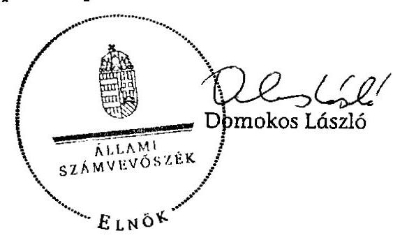

# ÁLLAMI   SZÁMVEVŐSZÉK 

## JELENTÉS

a Magyar Igazságért, a Jobb Magyarországért Alapítvány 2009-2010. évi gazdálkodása törvényességének ellenőrzéséről

---

# Állami Számvevőszék 

Iktatószám: V-0006-051/2012.
Témaszám: 1045
Vizsgálat-azonosító szám: V0578

## Az ellenőrzést felügyelte:

Horváth Balázs
felügyeleti vezető
Az ellenőrzés végrehajtásáért felelős:
Dr. Veress Tiborné
ellenőrzésvezető
A jelentés összeállításában közremúködött:
Robák Ferencné
számvevő tanácsos
Az ellenőrzést végezték:
Robák Ferencné
Számvevő tanácsos

Dr. Márton Gabriella
számvevő tanácsos

---

# TARTALOMJEGYZÉK 

BEVEZETÉS ..... 5
I. ÖSSZEGZŐ MEGÁLLAPÍTÁSOK, KÖVETKEZTETÉSEK, JAVASLATOK ..... 7
II. RÉSZLETES MEGÁLLAPÍTÁSOK ..... 10

1. Az alapítvány működésének, gazdálkodásának törvényessége ..... 10
2. Az éves számviteli beszámolók jogszabályi előírásoknak való megfelelése ..... 11
3. A számviteli törvény, a pártalapítványok könyvvezetésére vonatkozó jogszabályok, valamint belső előírások betartása ..... 11
MELLÉKLETEK
4. számú Teljességi nyilatkozat (1 oldal)

---

.

---

# RÖVIDÍTÉSEK JEGYZÉKE 

| ÁSZ | Állami Számvevőszék |
| :-- | :-- |
| alapító/párt | MIÉP-Jobbik a Harmadik Út Párt |
| alapítvány | Magyar Igazságért, a Jobb Magyarországért Alapítvány |
| alapítvány képviselője | az ellenőrzésben közreműködő kuratóriumi tag |
| pártalapítványi törvény | a pártok múködését segítő tudományos, ismeretterjesztő, |
|  | kutatási, oktatási tevékenységet végző alapítványokról |
|  | szóló 2003. évi XLVII. törvény |
| párttörvény | a pártok múködéséről és gazdálkodásáról szóló 1989. évi |
|  | XXXIII. törvény |
| Ptk. | a Polgári Törvénykönyvről szóló 1959. évi IV. törvény |

---

.

---

# JELENTÉS 

## a Magyar Igazságért, a Jobb Magyarországért Alapítvány 2009-2010. évi gazdálkodása törvényességének ellenőrzéséről

## BEVEZETÉS

A pártok múködését segítő tudományos, ismeretterjesztő, kutatási, oktatási tevékenységet végző alapítványokról szóló 2003. évi XLVII. törvény (pártalapítványi törvény) alapján, a pártok a politikai kultúra fejlesztése érdekében tudományos, ismeretterjesztő, kutatási és oktatási tevékenységük elősegítésére alapítványt hozhattak létre. Az alapítvány költségvetési támogatásra jogosultságáról, a támogatás formáiról és mértékéről a pártok müködéséről és gazdálkodásáról szóló 1989. évi XXXIII. törvény (párttörvény) rendelkezik. A MIÉPJobbik a Harmadik Út Párt (párt) a törvényben biztosított lehetőséggel élve létrehozta a Magyar Igazságért, a Jobb Magyarországért Alapítványt (alapítvány), amelyet a Fővárosi Bíróság 2009. március 11-én a 12.Pk. 60.133/2009/2. számú végzéssel 10779. sorszám alatt vett nyilvántartásba.

Az alapító okirat szerint az alapítvány célja, a politikai kultúra fejlesztése, a MIÉP-Jobbik a Harmadik Út Párt által vallott nemzeti konzervatív, keresztény értékrendhez kapcsolódó tudományos, ismeretterjesztő, kutatatási és oktatási tevékenység végzése, tudományos kutatás az anyaországi és a határon túli magyarlakta területeken, objektív tájékoztatás, történelmi, jogi, közgazdasági, szociológiai, politológiai képzés szervezése és végzése, a nemzettudat megerősítése, az alapítvány értékrendjének megfelelő kiadványok támogatása és kiadása, az alapítvány által vallott értékrend népszerűsítése, a nemzeti érdekek érvényre juttatása és képviselete.

Az alapítvány a törvényi előírásoknak megfelelően a 2009. évben 25000 ezer Ft, a 2010. évben 12500 ezer Ft költségvetési támogatásban részesült. Az alapító nem állított jelöltet a 2010. évi országgyűlési választásokon, így az alapítvány a párttörvényben foglaltak alapján 2010. június 30 -ig volt jogosult költségvetési támogatásra.

Az Állami Számvevőszékről szóló 2011. évi LXVI. törvény 5. § (3) bekezdése szerint, az Állami Számvevőszék (ÁSZ) az államháztartásból származó források felhasználásának keretében ellenőrzi az államháztartásból nyújtott támogatás felhasználását az alapítványoknál. A pártalapítványi törvény 4. § (2) bekezdése alapján az alapítvány gazdálkodása törvényességének ellenőrzésére az ÁSZ jogosult, a pártalapítványi törvény 4. § (4) bekezdése alapján az ÁSZ kétévenként ellenőrzi azoknak az alapítványoknak a gazdálkodását, amelyek e tör-

---

vény szerint állami költségvetési támogatásban részesültek. Az ÁSZ első alkalommal ellenőrizte az alapítvány gazdálkodásának törvényességét.

Jelen ellenőrzés célja volt az alapítvány 2009-2010. évi gazdálkodása törvényességének értékelése, amelynek keretében ellenőrizni terveztük:

- az alapítvány gazdálkodásának és éves jelentéseinek törvényességét;
- az éves számviteli beszámolók jogszabályi előírásoknak való megfelelését;
- az alapítvány könyvvezetésében a számvitelről szóló 2000. évi C. törvény, a pártalapítványok könyvvezetésére vonatkozó jogszabályok, valamint belső előírások betartását.

Az ellenőrzést a pénzügyi-szabályszerúségi ellenőrzés módszertani szabályai szerint, a pártalapítványok ellenőrzéséhez kiadott segédletbe foglalt egységes követelmények alapján terveztük elvégezni.

Az ellenőrzött időszak: 2009. január 1. - 2010. december 31.
Az ellenőrzés típusa: pénzügyi-szabályszerúségi ellenőrzés.
Az ellenőrzés előkészítése során bekért dokumentumokat az alapítvány nem bocsátotta az ÁSZ rendelkezésére arra hivatkozással, hogy azok az alapítvány bejegyzett székhelyére „besurranás", illetve a „raktározási helyre" történt betörés alkalmával eltűntek. Az ÁSZ a Fővárosi Törvényszéktől kikérte az alapítvány alapító okiratának hiteles másolatát. A helyszíni ellenőrzés szakaszában az alapítvány képviselője átadta a nyomozások felfüggesztéséről szóló rendőrségi határozatokat, amelyek azonban nem igazolták, hogy az alapítvány gazdálkodásával összefüggő bármilyen dokumentum a „besurranás" során eltulajdonított bőröndökben vagy a betöréssel érintett „raktározási helyen" voltak. Az alapítvány számlavezető pénzintézete az ÁSZ hivatalos megkeresésére a számvevőknek átadta a 2009-2010. évi teljes bankszámlaforgalmat alátámasztó bankszámlakivonatokat. Egyéb, az alapítvány múködésével, gazdálkodásával összefüggő dokumentumokat az ellenőrzés részére az alapítvány nem adott át. Az alapítvány képviselője teljességi nyilatkozatot adott, hogy az ellenőrzött tárgykörben kért dokumentumokkal, adatokkal, iratokkal nem rendelkezik (1. számú melléklet).

Az ellenőrzés körülményeit illetően rögzíteni szükséges, hogy az alapítvány képviseletre jogosult kuratóriumi elnöke 2012 februárjában elhunyt. Az alapítvány bíróságon nyilvántartásba vett adataiban a helyszíni ellenőrzés megkezdésekor nem volt változás.

---

# I. ÖSSZEGZŐ MEGÁLLAPÍTÁSOK, KÖVETKEZTETÉSEK, JAVASLATOK 

A kuratórium múködésére vonatkozó az alapító okiratban rögzített dokumentumokat, a kuratóriumi jegyzőkönyveket és a határozatok nyilvántartását nem küldték meg, ezért nem minősíthető, hogy az alapítványi vagyon felhasználásával kapcsolatban hozott kuratóriumi döntések az alapító okirat szerinti cél megvalósulása érdekében végzett tevékenységek ellátását szolgálták-e.

Az alapító okiratban meghatározott alapítványi célok megfeleltek, a párttörvényben foglaltaknak. A képviseleti és a bankszámla feletti rendelkezési jog alapító okiratbeli szabályozása összhangban volt a Ptk-ban foglaltakkal. Az alapítványt a kuratórium elnöke képviseli, azonban nem jelölt meg az alapító okirat olyan személyt, akit az elnök akadályoztatása esetén a képviseleti jog megillet. Az alapító okirat nevesítette a kuratórium elnökét, illetve egy kuratóriumi tagot banki aláíróként.

Az alapítvány az éves jelentéseket a pártalapítványi törvény előírása ellenére, egyik évben sem hozta nyilvánosságra a Hivatalos Értesítőben. Honlapot nem múködtetett. A pártalapítványi törvény a beszámoló közzétételének elmulasztására vonatkozó szankciót nem tartalmaz.

Az alapító 400 ezer Ft induló vagyont bocsátott az alapítvány rendelkezésére. Az alapítvány a 2009. évben 25000 ezer Ft, a 2010. évben 12500 ezer Ft költségvetési támogatásban részesült. Az alapítvány nem bizonyította a pártalapítványi törvényben előírt éves tevékenységéről szóló jelentés elkészítését. A költségvetési támogatás és a vagyon felhasználását igazoló kimutatások nem álltak rendelkezésre. Ennek következtében nem volt ellenőrizhető a források célszerinti felhasználása.

Az alapítvány képviselője nem bocsátott az ellenőrzés rendelkezésére a 20092010. évekre vonatkozóan a Számv. tv.-ben előírt hatályos számviteli szabályzatokat. Az ellenőrzött időszakra a Számv. tv.-ben előírt könyvvezetési kötelezettség teljesítését, a bizonylati elv és fegyelem érvényesítését, a bizonylati rend betartását és a bizonylat megőrzési kötelezettség teljesítését, dokumentumok hiánya miatt ellenőrizni nem lehetett.

Az ellenőrzési programban meghatározott célokat teljesíteni és a feladatokat végrehajtani a dokumentumok hiánya miatt nem lehetett.

Az Állami Számvevőszékről szóló 2011. évi LXVI. törvény 33. § (1) bekezdésében foglaltak értelmében a jelentésben foglalt megállapításokhoz kapcsolódó intézkedési tervet köteles az ellenőrzött szervezet vezetője összeállítani és azt a jelentés kézhezvételétől számított harminc napon belül az ÁSZ részére megküldeni. Amennyiben az intézkedési tervet határidőben nem küldi meg a szervezet, vagy az továbbra sem elfogadható, az ÁSZ elnöke a hivatkozott törvény 33. § (3) bekezdés a)- b) pontjaiban foglaltakat érvényesítheti.

---

A helyszíni ellenőrzés, intézkedést igénylő megállapításai és javaslatai:

# az alapítvány kuratóriumának 

1. A kuratórium működésére vonatkozó az alapító okiratban rögzített dokumentumokat, a kuratóriumi jegyzőkönyveket és a határozatok nyilvántartását nem küldték meg az ellenőrzés részére.
javaslat:
Gondoskodjon az alapító okirata VII. fejezetében előírt a kuratórium működésének feltételeiről, a döntéshozatal módjáról, a jegyzőkönyvek elkészítéséről.
2. Az alapítvány nem bizonyította a pártalapítványi törvényben előírt éves tevékenységéről szóló jelentés elkészítését. A költségvetési támogatás és a vagyon felhasználását igazoló kimutatások nem álltak rendelkezésre.

Javaslat:
Készítse el a 2009. és a 2010. évi tevékenységéről szóló jelentést a pártalapítványi törvény 3/A. § (1), (3) bekezdéseiben előírtaknak megfelelően.
3. Az alapítvány az éves jelentéseket a pártalapítványi törvény előírása ellenére, egyik évben sem hozta nyilvánosságra a Hivatalos Értesítőben.

Javaslat:
Tegye közzé a 2009. és a 2010. évi jelentéseit a pártalapítványi törvény 3/A. § (5) bekezdésének előírásai szerint.
4. Az alapítvány nem bocsátotta az ellenőrzés rendelkezésére a 2009-2010. évekre vonatkozó a Számv. tv.-ben előírt hatályos számviteli szabályzatokat.

Javaslat:
Gondoskodjon a Számv. tv. 14. § (3), továbbá (5) bekezdés a), b), d) valamint 161. § (1) bekezdésében és a 161/A. §-ában előírt számviteli szabályzatok elkészíttetéséről.
5. Dokumentumok hiánya miatt a 2009-2010. évekre vonatkozó könyvvezetési kötelezettség teljesítése, a bizonylati rend és fegyelem betartása nem volt ellenőrizhető.

Javaslat:
Intézkedjen:
a) a Számv. tv. 159. §-ában előírt könyvvezetési kötelezettség teljesítéséről;
b) a Számv. tv. 164. § (1)-(2) bekezdésében szabályozott könyvviteli zárlati feladatok elvégzéséről;

---

c) a Számv. tv. 165. § (1)-(2) bekezdéseiben és a 167-169. §-aiban szabályozott bizonylati elv és fegyelem érvényesítéséről, a bizonylati rend betartásáról és a bizonylat megőrzési kötelezettség teljesítése érvényesítéséről.

---

# II. RÉSZLETES MEGÁLLAPÍTÁSOK 

## 1. AZ ALAPÍTVÁNY MŰKÖDÉSÉNEK, GAZDÁLKODÁSÁNAK TÖRVÉNYESSÉGE

Az alapító okirata VII. fejezete részletesen meghatározza a kuratórium múködésének feltételeit, a döntéshozatal módját, a konkrét kuratóriumi feladatokat és a jegyzőkönyv készítési kötelezettséget. A kuratórium múködését igazoló dokumentumokat az alapítvány az ellenőrzés részére nem adott át.

A képviseleti és a bankszámla feletti rendelkezési jog, alapító okiratbeli szabályozása megfelelt a Ptk. 29. § (3) bekezdésében foglaltaknak. Az alapító okirat VIII. 1. pontja szerint az alapítványt a kuratórium elnöke képviseli. Nem jelölt meg az alapító okirat olyan személyt, akit az elnök akadályoztatása esetén megillet a képviseleti jog. Az alapító okirat nevesítette a kuratórium elnökét, illetve egy kuratóriumi tagot banki aláiróként. A képviseleti jog és a bankszámla feletti rendelkezési jog gyakorlásának ellenőrzésére nem álltak rendelkezésre dokumentumok.

Az alapítvány a párttörvény 9/A. §-ában meghatározott mértékű, rendszeres költségvetési támogatásban részesült, a Magyar Köztársaság 2009. évi költségvetésének végrehajtásáról szóló 2010. évi XCVIII. törvény szerint 25000 ezer Ft, a Magyar Köztársaság 2010. évi költségvetésének végrehajtásáról szóló 2011. évi CXXXIII. törvény szerint 12500 ezer Ft összegben. A támogatások folyósítása az alapítvány bankszámla kivonatainak tanúsága szerint a párttörvény 9/A. § (2) bekezdése előírásainak megfelelően történt.

Az alapító okirat - a törvényi szabályozással összhangban - lehetővé tette, hogy csatlakozók pénzzel vagy egyéb vagyon hozzárendelésével, vagyoni értékű felajánlással hozzájáruljanak az alapítványi célok megvalósulásához a pártalapítványi törvény előírásai figyelembe vételével.

A támogatások elfogadása szabályszerűségének, törvényszerűségének ellenőrzéséhez - kivéve a bankkivonatokat, amelyen a költségvetési támogatáson és banki kamaton kívül más jóváírás nem történt - nem állt rendelkezésre dokumentum. A pártalapítványi törvény 3. § (4) bekezdése szerint „az alapítvány számára támogatást nyújtó személy azonosításához szükséges adatok és a támogatás összege közérdekből nyilvános adatnak minősül, és azt a támogatás beérkezését követő harminc napon belül az alapítvány honlapján közzé kell tenni". Az alapítvány honlapot nem múködtetett.

---

Az alapítvány 2009-2010. évi bankszámlájának forgalma a következők szerint alakult:

|  |  |  | adatok: ezer Ft-ban |  |
| :--: | :--: | :--: | :--: | :--: |
| év/jogcímek | Nyitó | Jóváírás | Terhelés | Záró |
| 2009. év | 396 |  |  |  |
| állami támogatás |  | 25000 |  |  |
| kamat bevétel |  | 29 |  |  |
| bankköltség |  |  | 9 |  |
| 2009. év összesen | 396 | 25029 | 9 | 25416 |
| 2010. év | 25416 |  |  |  |
| állami támogatás |  | 12500 |  |  |
| kamat bevétel |  | 149 |  |  |
| készpénz felvétele |  |  | 37900 |  |
| bankköltség |  |  | 165 |  |
| 2010. év összesen | 25416 | 12649 | 38065 | 0 |

# 2. Az ÉVES SZÁMVITELI BESZÁMOLÓK JOGSZABÁLYI ELŐíRÁSOKNAK VALÓ MEGFELELÉSE 

A pártalapítványi törvény 3/A. § (1) bekezdése szerint „az alapítvány köteles az éves beszámoló jóváhagyásával egyidejúleg tevékenységéről jelentést készíteni"a (3) bekezdés szerinti tartalommal. Az alapítvány nem bizonyította a pártalapítványi törvényben előírt éves tevékenységéről szóló jelentés elkészítését. A költségvetési támogatás és a vagyon felhasználását igazoló kimutatások nem álltak rendelkezésre.

A jelentéseket a 3/A. § (5) bekezdése szerint „az alapítvány köteles az (1) bekezdésben meghatározott jelentését a tárgyévet követő évben, legkésőbb június 30 -áig a Magyar Közlöny mellékleteként megjelenő Hivatalos Értesítőben, továbbá saját honlapján közzétenni". Az alapítvány az éves jelentést egyik évben sem hozta nyilvánosságra a Hivatalos Értesítőben. Honlapot nem működtetett.

## 3. A SZÁMVITELI TÖRVÉNY, A PÁRTALAPÍTVÁNYOK KÖNYVVEZETÉSÉRE VONATKOZÓ JOGSZABÁLYOK, VALAMINT BELSŐ ELŐÍRÁSOK BETARTÁSA

Az alapítvány képviselője nem bocsátott az ellenőrzés rendelkezésére a 20092010. évekre vonatkozóan hatályos a Számv. tv. 14. § (3) bekezdésében, továbbá az (5) bekezdés a), b), és d) pontjaiban, valamint a 161. § (1) bekezdésében és a 161/A. §-ában előírt számviteli szabályzatokat.

---

Az ellenőrzött időszakra vonatkozó a Számv. tv. 159. §-ban előírt könyvvezetési kötelezettség teljesítése és a 164. § (1)-(2) bekezdéseiben szabályozott könyvviteli zárlati feladatok elvégzése, a 165. § (1)-(2) bekezdéseiben és a 167-169. §-aiban szabályozott bizonylati elv és fegyelem érvényesítése, a bizonylati rend betartása és a bizonylat megőrzési kötelezettségének teljesítése dokumentumok hiánya miatt nem volt ellenőrizhető.

Budapest, 2012. 11 hónap ふ nap

Melléklet: 1 db

---

# Ellenőrzött szervezet: 

A Magyar Igazságért, a Jobb Magyarországért Alapítvány

## TELJESSÉGI NYILA TKOZAT

Alulírott Papolczy Gizella mint az alapítvány kuratóriumi tagja, büntető jogi felelősségem tudatában kijelentem, hogy a mai napon felvett jegyzőkönyv 1. számú mellékletének dokumentumai a Magyar Igazságért, a Jobb Magyarországért Alapítvány 2009-2010. évi gazdálkodása törvényességének ellenőrzésével kapcsolatban megbízható, teljes körű információt tartalmaznak. Az ellenőrzött tárgykörben kért és átadott dokumentumokon kívül más adatokkal, iratokkal nem rendelkezem és tudomásom szerint az alapítvány sem rendelkezik. Az ellenőrzést végzőket tájékoztattam minden olyan eseményről, amely bármiféle hatással volt az ellenőrzött idöszakra vonatkozó információkra és adatokra.

Budapest, 2012. „ 4