# ÁLLAMI   SZÁMVEVŐSZÉK 

## JELENTÉS

Az állami vagyon feletti tulajdonosi joggyakorlással kapcsolatos
2011. évi tevékenységek ellenőrzéséről

---

# Állami Számvevőszék 

Iktatószám: V-2017-250/2011-2012.
Témaszám: 1040
Vizsgálat-azonosító szám: V0568.

## Az ellenőrzést felügyelte:

## Makkai Mária

felügyeleti vezető

## Az ellenőrzést vezette:

## Balkay Attila

ellenőrzésvezető

## Az ellenőrzést végezték:

| Farkas László | Fülöppné Nagy Marianna | Dr. Jártas Ágnes |
| :-- | :-- | :-- |
| számvevő tanácsos | számvevő tanácsos | számvevő tanácsos |
| Szakmányné Bilik Mária | Temesváry Miklós | Trenovszki István |
| számvevő tanácsos | számvevő tanácsos | számvevő tanácsos |
| Kovácsy Tamás | Vásárhelyi Zoltán | Dr. Zelei Andrásné |
| számvevő tanácsos | számvevő tanácsos |  |

## A témához kapcsolódó eddig készített számvevőszéki jelentések:

## címe

Jelentés az állami vagyon feletti tulajdonosi joggyakorlással kap- 1128 csolatos 2010. évi tevékenységek ellenőrzéséről
Jelentés a Magyar Nemzeti Vagyonkezelő Zrt. 2009. évi tevékenységének ellenőrzéséről
Jelentés a Magyar Nemzeti Vagyonkezelő Zrt. 2008. évi tevékenységének ellenőrzéséről
sorszáma
sorszáma
1013
0929

---

# TARTALOMJEGYZÉK 

BEVEZETÉS ..... 7
I. ÖSSZEGZŐ MEGÁLLAPÍTÁSOK, KÖVETKEZTETÉSEK, JAVASLATOK ..... 10
II. RÉSZLETES MEGÁLLAPÍTÁSOK ..... 18

1. Az állami vagyon tulajdonosi joggyakorlása ..... 18
1.1. A tulajdonosi joggyakorlás szabályozási problémái a Vtv-ben ..... 18
1.2. Az állami vagyonra vonatkozó stratégiai elképzelések ..... 19
1.3. Az állami vagyonról való beszámolás ..... 20
1.3.1. A Kormány beszámolása az állami vagyonról ..... 20
1.3.2. Az MNV beszámolása a rábízott vagyonról ..... 22
1.4. Az MNV beszámolásának és nyilvántartásának megbízhatósága érdekében tett intézkedések ..... 24
1.4.1. Az intézkedési tervek végrehajtása ..... 24
1.4.2. Nyilvántartási rendszerek ..... 26
2. A Nemzeti Földalap tulajdonosi joggyakorlása ..... 26
2.1. A Földalap vagyonának átadás-átvétele ..... 28
2.2. A Nemzeti Földalappal való gazdálkodás szabályozása ..... 33
2.3. Az NFA feladatellátásának feltételei ..... 36
2.4. Középtávú stratégia és éves terv ..... 37
2.5. Az NFA beszámolási rendszere ..... 38
2.6. Az NFA vagyonnyilvántartása ..... 39
3. Az állami tulajdonba tartozó társasági részesedések feletti tulajdonosi joggyakorlás ..... 44
3.1. Az MNV tulajdonosi joggyakorlása ..... 44
3.2. Az MFB tulajdonosi joggyakorlása ..... 50
4. A tulajdonosi joggyakorlás ellenőrzési rendszere ..... 53
4.1. Az MNV ellenőrzési rendszere ..... 53
4.1.1. Szabályozottság, szervezeti és személyi feltételek ..... 53
4.1.2. Az ellenőrzések tervezése és végrehajtása ..... 54
4.2. A Nemzeti Földalap ellenőrzési rendszere ..... 56
4.2.1. A Nemzeti Földalap Ellenőrző Bizottságának tevékenysége ..... 56
4.2.2. A tulajdonosi ellenőrzések ..... 57
4.2.3. Belső ellenőrzés ..... 58
4.3. Az MNV és az MFB rábízott állami vagyoni körébe tartozó társasági portfólió tulajdonosi ellenőrzési rendszere ..... 59

---

4.3.1. A társasági portfólió tulajdonosi ellenőrzése az MNV-nél ..... 59
4.3.2. A társasági portfólió tulajdonosi ellenőrzése az MFB-nél ..... 60
MELLÉKLETEK

1. számú Az állami vagyon feletti tulajdonosi joggyakorlás 2011. évi szervezeti formá- ja
2. számú Az állami vagyongazdálkodás szakmai beszámolási rendszere
3. számú Az MNV részéről az Unitárius Egyháznak átadott ingatlannal kapcsolatban a bérleti jogviszonyok rendezésére átutalt összeg felhasználásának utóellen- őrzése
4. számú Mintatételek jegyzéke
5. számú A mintában szereplő vagyonelemekkel és a vonatkozó szerződésekkel kap- csolatban feltárt hibák
6. a) számú A nemzeti fejlesztési miniszter észrevétele
7. b) számú Észrevételre adott válasz a nemzeti fejlesztési miniszter részére
8. c) számú A vidékfejlesztési miniszter észrevétele
9. d) számú Észrevételre adott válasz a vidékfejlesztési miniszter részére
10. e) számú Az MNV Zrt. vezérigazgatójának észrevétele
11. f) számú Észrevételre adott válasz az MNV Zrt. vezérigazgatója részére
12. g) számú Az MFB Zrt. elnök-vezérigazgatójának észrevétele
13. h) számú Észrevételre adott válasz az MFB Zrt. elnök-vezérigazgatója részére
14. i) számú Az NFA elnökének észrevétele
15. j) számú Észrevételre adott válasz az NFA elnöke részére

FÜGGELÉK
A hasznosításba adott ingatlanokkal kapcsolatos megállapítások

---

# RÖVIDÍTÉSEK JEGYZÉKE 

| ÁAK Zrt. | Állami Autópálya Kezelő Zrt. |
| :--: | :--: |
| Áht. | az államháztartásról szóló 1992. évi XXXVIII. törvény |
| AK | aranykorona |
| ÁSZ | Állami Számvevőszék |
| BEF | Az MNV saját kezelésében lévő eszközeinek nyilvántartása |
| BEI | Belső Ellenőrzési Igazgatóság |
| BPT | Birtokpolitikai Tanács |
| EB | Ellenőrző Bizottság |
| EI | Ellenőrzési Igazgatóság |
| FALAP | Az MNV Zrt. Nemzeti Földalap vagyon-nyilvántartási információs rendszere |
| FB | Felügyelő Bizottság |
| Földalap | Nemzeti Földalap |
| FÖMI | Földmérési és Távérzékelési Intézet |
| Gt. | a gazdasági társaságokról szóló 2006. évi IV. törvény |
| ha | hektár |
| hrsz. | helyrajzi szám |
| Ig. | Igazgatóság |
| KEHI | Kormányzati Ellenőrzési Hivatal |
| KEIG | MNV Költségvetési Szervek Vagyongazdálkodási és Elhelyezési Igazgatóság |
| Kincstár | Magyar Államkincstár |
| KKK | Közlekedésfejlesztési Koordinációs Központ |
| Kötu vhr. | 220/2011. (X. 20.) Korm. rendelet a Nemzeti Földalapról szóló törvény szerinti közös tulajdonosi joggyakorlás alatt álló ingatlanokról |
| KSH | Központi Statisztikai Hivatal |
| KVI | Kincstári Vagyoni Igazgatóság |
| KVK | az MNV Kincstári Vagyonkataszter nyilvántartása |
| MALÉV | Magyar Légiközlekedési Vállalat Zrt. |
| MÁV Zrt. | Magyar Államvasutak Zrt. |
| MFB | Magyar Fejlesztési Bank Zrt. |
| MFB tv. | a Magyar Fejlesztési Bank Részvénytársaságról szóló 2001. évi XX. törvény |
| MNV | Magyar Nemzeti Vagyonkezelő Zrt. |
| MVM | Magyar Villamos Múvek Zrt. |
| NFA | Nemzeti Földalapkezelő Szervezet |
| NFA EB rendelet | a Nemzeti Földalap Ellenőrző Bizottsága működési rendjének, valamint működési költségei megtérítésének szabályairól szóló 27/2010. (XI. 4.) VM rendelet |
| NFA tv. | a Nemzeti Földalapról szóló 2010. évi LXXXVII. törvény |
| NFM | Nemzeti Fejlesztési Minisztérium |

---

| NFM miniszter | nemzeti fejlesztési miniszter |
| :-- | :-- |
| NIF Zrt. | Nemzeti Infrastruktúra Fejlesztő Zrt. |
| NVT | Nemzeti Vagyongazdálkodási Tanács |
| OGY | Országgyűlés |
| PM | Pénzügyminisztérium |
| Ptk. | a Polgári Törvénykönyvről szóló 1959. évi IV. törvény |
| RJGY | Részvényesi Jogok Gyakorlója (NFM miniszter) |
| SZMSZ | Szervezeti és Működési Szabályzat |
| Sztv. | a számvitelről szóló 2000. évi C. törvény |
| Vig. | vezérigazgató |
| Vigh. | vezérigazgató-helyettes |
| VIR | Az MNV társasági portfólió analitikus nyilvántartó rend- |
|  | szere |
| VM | Vidékfejlesztési Minisztérium |
| VM miniszter | vidékfejlesztési miniszter |
| Vtv. | az állami vagyonról szóló 2007. évi CVI. törvény |
| VtvVhr. | az állami vagyonnal való gazdálkodásról szóló 254/2007. |
|  | (X. 4.) Korm. rendelet |

---

# ÉRTELMEZŐ SZÓTÁR 

állami vagyon A Vtv. 1. § (2) bekezdése szerint:
a) az állam tulajdonában lévő dolog, valamint dolog módjára hasznosítható természeti erő;
b) az a) pont hatálya alá tartozó mindazon vagyon, amely vonatkozásában törvény az állam kizárólagos tulajdonjogát nevesíti;
c) az állam tulajdonában lévő tagsági jogviszonyt megtestesítő értékpapír, illetve az államot megillető egyéb társasági részesedés;
d) az államot megillető olyan immateriális, vagyoni értékkel rendelkező jogosultság, amelyet jogszabály vagyoni értékű jogként nevesít;
e) az állam tulajdonában lévő pénzügyi eszközök.

Az NFA tv. 1. § (1) bekezdése alapján az állami tulajdonban lévő termőföldek, mező-, erdőgazdasági művelés alatt álló belterületi földek, a mező-, erdőgazdasági tevékenységet szolgáló vagy ahhoz szükséges, művelés alól kivett földek összessége.
kontrolling Az a vezetéstámogató rendszer, amely a vezetői tervezést, ellenőrzést, valamint információ-ellátást koordinálja célorientáltan, a környezeti változásokhoz igazodva.
rábízott állami A Vtv. 22. § (6) bekezdése alapján minden a Vtv. alkalmazásába állami vagyonnak minősülő vagyon, amit az MNV - a saját vagyonától elkülönítetten - kezel és nyilvántart.
Az MFB tv. 3. § (9) bekezdése szerint az a vagyon, amely felett az MFB tv. erejénél fogva a Magyar Állam nevében az MFB gyakorolja a tulajdonosi jogokat.
A NFA tv. 1. § (1) bekezdése szerint a Nemzeti Földalapba tartozó földvagyon tekinthető rábízott vagyonnak.
társasági
portfólió
tulajdonosi joggyakorlás

Az MNV és az MFB rábízott vagyonába tartozó állami tulajdonú társasági részesedések.
A Vtv. 3. § (1) bekezdése szerint az állami vagyon felett a Magyar Államot megillető tulajdonosi jogoknak (és kötelezettségeknek) az összességét az állami vagyon felügyeletéért felelős miniszter gyakorolja, aki e feladatát az MNV, az MFB, illetve a (2) bekezdés szerinti tulajdonosi joggyakorló szervezet (pl. központi költségvetési szervek, 100%-ban állami tulajdonban álló gazdasági társaságok) útján látja el.
Az NFA tv. 3. § (1) bekezdése szerint a Nemzeti Földalap felett a Magyar Állam nevében a tulajdonosi jogokat (és kötelezettségeket) az agrárpolitikáért felelős miniszter a Nemzeti Földalapkezelő Szervezet útján gyakorolja. A Nemzeti Földalappal kapcsolatos polgári jogviszonyokban az államot a szervezet képviseli.

---

tulajdonosi joggyakorlás és vagyongazdálkodás feladata
vagyonkezelői jog
tulajdonosi ellenőrzés

A Vtv. 2. § (1) bekezdése szerint az állami vagyon rendeltetésének megfelelő - az állami feladatok ellátásához, a társadalmi szükségletek kielégítéséhez, valamint a Kormány gazdaságpolitikája megvalósításának elősegítéséhez szükséges, egységes elveken alapuló, önálló ágazatként megjelenő - hatékony, költségtakarékos, értékmegőrző, értéknövelő felhasználásának biztosítása (közvetlen felhasználás), illetve közvetett hasznosítása (beleértve a vagyoni kör változását eredményező értékesítést), valamint az állami vagyon gyarapítása (ideértve a vagyoni kör bővítését is).
A Vtv. alapján a vagyonkezelői jog az állami vagyon hasznosítására az MNV-vel kötött vagyonkezelési szerződéssel jön létre. A vagyonkezelési szerződés alapján a vagyonkezelő jogosult (vagyonkezelői jog) meghatározott, állami tulajdonba tartozó dolog birtoklására, használatára és hasznai szedésére.
Az NFA tv. alapján a vagyonkezelői jog az erre irányuló (NFA-val kötött) szerződéssel jön létre. A vagyonkezelői szerződés alapján a vagyonkezelő jogosult meghatározott földrészlet birtoklására, használatára és hasznai szedésére. A vagyonkezelő köteles a földrészlet értékét megőrizni, állagának megóvásáról, jó karban tartásáról gondoskodni, továbbá - az NFA tv-ben meghatározott esetek kivételével - díjat fizetni vagy a szerződésben előírt más kötelezettséget teljesíteni.
A VtvVhr. 20. §. (2) bekezdés alapján a tulajdonosi ellenőrzés célja az állami vagyonnal való gazdálkodás vizsgálata, ennek keretében a rendeltetésellenes, jogszerűtlen, szerződésellenes, vagy a tulajdonos érdekeit sértő, illetve a központi költségvetést hátrányosan érintő vagyongazdálkodási intézkedések feltárása és a jogszerű állapot helyreállítása, továbbá a vagyonnyilvántartás hitelességének, teljességének és helyességének biztosítása.

---

# JELENTÉS 

## az állami vagyon feletti tulajdonosi joggyakorlással kapcsolatos 2011. évi tevékenységek ellenőrzéséről

## BEVEZETÉS

Az állami vagyonról szóló 2007. évi CVI. törvény (Vtv.) 2010. június 17-től hatályos módosításával az állami vagyon felett a Magyar Államot megillető tulajdonosi jogok és kötelezettségek összességének a gyakorlója az állami vagyon felügyeletéért felelős miniszter (a nemzeti fejlesztési miniszter), aki e feladatát a Magyar Nemzeti Vagyonkezelő Zrt. (MNV) és a Magyar Fejlesztési Bank Zrt. (MFB), illetve a miniszter által kijelölt tulajdonosi joggyakorló szervezet útján látja el ${ }^{1}$. 2010. szeptember 1-jétől a Nemzeti Földalapról szóló 2010. évi LXXXVII. törvényben (NFA tv.) foglaltakat kell alkalmazni a Nemzeti Földalap feletti tulajdonosi jogok gyakorlására. E szerint a Nemzeti Földalap felett a Magyar Állam nevében a tulajdonosi jogokat és kötelezettségeket az agrárpolitikáért felelős vidékfejlesztési miniszter, a Nemzeti Földalapkezelő Szervezet (NFA) útján gyakorolja. Az állami vagyon feletti tulajdonosi joggyakorlás - az állami vagyon jellege szerint, a nemzeti fejlesztési miniszter és a vidékfejlesztési miniszter között - megosztott. Az állami vagyon feletti tulajdonosi joggyakorlás módját és
 szervezetét, a vagyonnal való gazdálkodást a Vtv., a Magyar Fejlesztési Bank Részvénytársaságról szóló 2001. évi XX. törvény (MFB tv.), az NFA tv., valamint az ezekhez kapcsolódó végrehajtási rendeletek együttesen szabályozzák.

Az MNV és az MFB gazdasági társaság, az NFA központi költségvetési szerv. A három tulajdonosi joggyakorló szervezetnél a joggyakorlás eltérő vagyoni kört érint, az MNV-nél ez minden vagyoncsoportra (ingatlanok, földterületek, gazdasági társaságok), az MFB-nél 40 gazdasági társaságra, az NFA esetében a termőföldek tulajdonosi joggyakorlásával összefüggő feladatokra vonatkozik. E szervezeteknek a saját vagyontól elkülönítetten kell nyilvántartani a rábízott állami vagyont. Az MNV és az MFB esetében a rábízott állami vagyon tekintetében a számvitelről szóló 2000. évi C. törvény (Sztv.) és a Magyar Állam nevében tulajdonosi jogokat gyakorló szervezetek rábízott állami vagyonnal kap-

[^0]
[^0]:    ${ }^{1}$ 2012. január 1-jétől a Vtv. tulajdonosi joggyakorlásra vonatkozó szabályozásába bekerült az Egészségbiztosítási Alap és a Nyugdíjbiztosítási Alap ellátási vagyona is, amelyek felett az egészségbiztosításért, illetve a nyugdíjpolitikáért felelős miniszter gyakorol tulajdonosi jogokat. A települési önkormányzatoktól átvett fekvőbeteg-szakellátó intézmények tulajdonosi jogait 2012. május 1-jétől a Gyógyszerészeti és Egészségügyi Minőség- és Szervezetfejlesztési Intézet gyakorolja, ami viszont nem került a Vtv. hatálya alá.

---

csolatos éves beszámoló készítési és könyvvezetési kötelezettségéről szóló 347/2010. (XII. 28.) Korm. rendelet, az NFA esetében az Sztv. mellett a Nemzeti Földalapba tartozó rábízott földvagyonnal kapcsolatos éves beszámoló-készítési és könyvvezetési kötelezettségről szóló 34/2011. (III. 17.) Korm. rendelet előírásait kell alkalmazni.

Az MNV-re, az MFB-re, valamint az NFA-ra bízott állami vagyon bevételi és kiadási előirányzatait az éves költségvetési törvény XLIII. az állami vagyonnal kapcsolatos bevételek és kiadások fejezete és a XLIV. a Nemzeti Földalappal kapcsolatos bevételek és kiadások fejezete határozza meg. Az állami vagyonnal kapcsolatos bevételek és kiadások megalapozottságát, azok előírásoknak megfelelő teljesülését, a teljesítések és azok elszámolásai megbízhatóságát, az előirányzatok terhére történt kifizetések szabályszerűségét az Állami Számvevőszék (ÁSZ) külön ellenőrzés (a Magyar Köztársaság 2011. évi költségvetésének végrehajtása) keretében értékelte.

Az ellenőrzés célja annak értékelése volt, hogy

- az állami vagyonról a beszámolás rendszere és abban az érintett szervezetek együttműködése szabályozott volt-e; az MNV és az NFA könyvvezetésében a rábízott állami vagyon analitikus és főkönyvi nyilvántartásai között mutatkozó nyilvántartási és elszámolási különbségek megoldására irányuló intézkedések eredményesek voltak-e;
- az MNV és az MFB rábízott állami vagyoni körébe tartozó társasági portfólióra vonatkozó, a tulajdonosi joggyakorlás kereteit meghatározó szabályozás egyértelmű és elégséges volt-e; a vagyongazdálkodás szabályszerű és eredményes volt-e; továbbá a kontrolling rendszerük eredményesen működött-e;
- a központi költségvetési szervek használatában lévő ingatlanokkal való gazdálkodás és az MNV rábízott állami vagyonába tartozó, hasznosításra átengedett állami tulajdonú ingatlanokkal kapcsolatban megkötött vagyonhasznosítási szerződések esetében érvényesültek-e a Vtv. előírásai;
- a tulajdonosi ellenőrzési rendszer támogatta-e a jogszabályokban a vagyongazdálkodással szemben megfogalmazott követelmények érvényesülését;
- hasznosították-e a korábbi ÁSZ ellenőrzések megállapításait.

Az ellenőrzés jogszabályi alapját az Állami Számvevőszékről szóló 2011. évi LXVI. törvény 5. §-ának (4) bekezdése, továbbá az állami vagyonról szóló 2007. évi CVI. törvény 3. § (4) bekezdésében, és a Nemzeti Földalapról szóló 2010. évi LXXXVII. törvény 14. § (1) bekezdésében foglaltak együttesen képezték.

Az ellenőrzés típusa rendszerellenőrzés. Az ellenőrzés alapvetően a 2011. év gazdasági eseményeit érintette, de az összefüggések feltárása érdekében kitekintett a megelőző, illetve az ellenőrzés befejezéséig terjedő időszak eseményeire is. A helyszíni ellenőrzés egyrészt a Nemzeti Fejlesztési Minisztérium (NFM), az

---

MNV, az MFB, másrészt a Vidékfejlesztési Minisztérium (VM) és az NFA Szervezet tulajdonosi joggyakorlással kapcsolatos tevékenységeire terjedt ki. Az ellenőrzés nem terjedt ki a Vtv. 3. § (2) bekezdése alapján az állami vagyon felügyeletéért felelős miniszter által kijelölt egyéb tulajdonosi jogokat gyakorló szervezetek működésére. Az ellenőrzést az INTOSAI vonatkozó standardjainak (ISSAI 3000, ISSAI 3100), és az ÁSZ rendszerellenőrzési módszertani útmutatójának figyelembevételével végeztük.

Az ÁSZ a 2011. évi LXVI. törvény 29. §-a szerint a jelentést megküldte a nemzeti fejlesztési miniszternek, a vidékfejlesztési miniszternek, az MNV Zrt. vezérigazgatójának, az MFB Zrt. elnök-vezérigazgatójának, valamint az NFA elnökének. A beérkezett észrevételeket és az arra adott válaszokat a jelentés 6/a-6/j. számú mellékletei tartalmazzák.

---

# I. ÖSSZEGZŐ MEGÁLLAPÍTÁSOK, KÖVETKEZTETÉSEK, JAVASLATOK 

A Vtv. és az NFA tv. alapján az állami vagyon feletti tulajdonosi jogokat 2011-ben az NFM miniszter és a VM miniszter három szervezet (MNV, MFB, NFA) útján gyakorolta (1. sz. melléklet). Az állami vagyon szakmai beszámolási rendszere (2. sz. melléklet) is elkülönült és megosztott a két miniszter között.

A megosztott tulajdonosi joggyakorlás és vagyoni kör miatt két kormánybeszámoló készül. A Vtv. hatálya alá tartozó vagyonról történő szakmai beszámolás ${ }^{2}$ tulajdonosi joggyakorlóként a nemzeti fejlesztési miniszter feladata és felelőssége ${ }^{3}$, azonban ennek tartalmi és részletszabályai nem rendezettek. Ez közrejátszott abban, hogy a Kormány által 2011-ben elkészített 2010. évi beszámoló nem mutatta be a rábízott vagyon nyilvántartásainak hiányosságait, megbízhatóságát, alátámasztottságát korlátozó, illetve a tevékenységre kiemelt jelentőséggel bíró tényezőket (pl. intézkedési tervek végrehajtása, a Földalap átadás-átvétel állapota, az erdőgazdaságokkal kapcsolatos a rábízott vagyon mérlegét érintő intézkedések). A Kormány 2010. évi beszámolója az MNV és az MFB rábízott vagyonának éves beszámolóin alapul. Az MNV 2010. évi rábízott vagyon beszámolójában a vagyongazdálkodás rendszerben történő értékelése és elemzése nem jutott hangsúlyos szerephez, továbbá az állami vagyon állományát, annak összetétel-változását értékadatokon kívül mennyiségi adatok nem minden területen támasztották alá. A Kormány 2011. szeptember 30. helyett 2012. januárjában nyújtotta be a beszámolóját.

A Kormány emellett az NFA tv. szerint (5. §) a VM miniszter útján évente beszámol az Országgyúlésnek a földbirtok-politikai irányelvek érvényesüléséről, a Nemzeti Földalap helyzetéről és az NFA tevékenységéről. A beszámoló tartalmi elemei, az elkészítés eljárásrendje és határideje nem meghatározott. Az NFA tevékenységéről és az NFA helyzetéről a 2010-2011. időszakot felölelő beszámoló még nem készült.

Az állami vagyonnal való gazdálkodás stratégiai megalapozása nem történt meg, a kormányzati stratégiai koncepció 2011-ben is hiányzó eleme volt az állami vagyongazdálkodásnak. A Vtv-ben meghatározott Nemzeti Vagyongazdálkodási Irányelvek és Éves Nemzeti Vagyongazdálkodási Program nem készültek el. A tulajdonosi joggyakorló szervezetek - az MFB kivételével - nem készítettek a rábízott vagyonra vonatkozó középtávú stratégiai tervet. Az NFA tv. által előírt - a Nemzeti Földalapba tartozó vagyonelemek hasznosítására vonatkozó - jóváhagyott középtávú stratégia nem volt, éves terv nem készült. Az

[^0]
[^0]:    ${ }^{2}$ A tulajdonosi jogokat gyakorló szervezetek működéséről, az állami vagyon állományának alakulásáról, az állami vagyonnal való gazdálkodás folyamatairól készített kormánybeszámoló (Vtv. 19. § (3) bek.)
    ${ }^{3}$ a Magyar Állam nevében tulajdonosi jogokat gyakorló szervezetek rábízott állami vagyonnal kapcsolatos éves beszámoló készítési és könyvvezetési kötelezettségéről szóló 347/2010. (XII. 28.) Korm. rendelet 10. § (1) bekezdése alapján

---

NFA tv-ben meghatározott földbirtok-politikai irányelvek 19 pontban meghatározott támogatandó célokat jelölnek, a prioritási szempontok meghatározása nélkül.

A felelős tulajdonosi joggyakorlás nélkülözhetetlen eleme a megbízható és valós adatokat tartalmazó állami vagyonnyilvántartás, azonban a Vtv. és az NFA tv. nem ad egyértelmű iránymutatást az állami vagyon teljes és egységes nyilvántartására. Az állami vagyon tulajdonosi joggyakorlásának az MNV megalakulásától, 2008-tól fennálló problémája, hogy a vagyon-nyilvántartási adatok nem megbízhatóak és nem teljes körűek, a nyilvántartó rendszerek nem zártak. Sem az MNV, sem az NFA nem tudja nyilvántartásai alapján meghatározni teljes körűen a tulajdonosi joggyakorlása alá tartozó ingatlanok körét, továbbá az egyes ingatlanok vagyonkezelői előtt sem ismert alrészlet pontosságig, hogy mely vagyonelemek tartoznak a Földalapba. További problémát okoz, hogy a vagyonkezelők Földalapba tartozó vagyonelemeinek adatszolgáltatására, annak módjára a jogszabályok nem fogalmaznak meg előírásokat.

Az állami tulajdonú társaságok kezelésében lévő vagyonelemek és a társasági részesedésekben megjelenő kezelt vagyon tekintetében is fennállnak még megoldandó halmozódást okozó problémák. Az erdészeti társaságok az egyes vagyonelemekről (ingatlanok, termőföldek, erdők) - többek között - értékadatot ${ }^{4}$ is szolgáltatnak az MNV részére, amely mint ezek feletti tulajdonosi joggyakorló a rábízott vagyon beszámolójában szerepelteti azokat. Ugyanakkor ezek az adatok a társaságok beszámolóiban (kezelt vagyonként) is szerepelnek, amelyeket az MFB - mint a társasági részesedések feletti tulajdonosi joggyakorló - szerepeltet a beszámolójában. Az MNV és az MFB rábízott vagyoni köréről a Kormány beszámolójában a társaságok előzőekben leírt adatai halmozódnak.

Az MNV rábízott vagyonának nyilvántartási problémái az MNV megalakulása óta befolyásolják a beszámolók könyvvizsgálói elfogadását, amelyek gyökerei 2008. előtti időszakra vezethetők vissza. Az MNV rábízott vagyona analitikus és főkönyvi nyilvántartási rendszerei között a megalakulástól fennálló, a beszámoló elfogadását is befolyásoló problémák megoldására évente intézkedési tervek készültek, de a nyilvántartási problémák 2011-ben sem rendeződtek. Továbbra is fennáll az ún. nagy vagyonkezelők, pl. a MÁV Zrt., a közutas vagyonkezelők által kezelt ingatlanok sok éve húzódó tulajdonjogi (társasági és állami vagyon elkülönítése), és az erdőtársaságok vagyonának számviteli rendezetlensége (a termőföldeket és erdőket 0 értéken tartják nyilván). Az MNV új integrált vagyon-nyilvántartási rendszerének kialakítása folyamatban van.

Az NFA tv. 2010. szeptember 1-jével rendelkezett az MNV Földalapba tartozó vagyonelemeinek NFA részére történő átadásáról. A két szervezet között 2011-ben kezdődő átadás-átvételi folyamat három körre ${ }^{5}$ tagolódott és jelentősen elhúzódott, a törvény eltérő értelmezése és a Földalapba tartozó ingatlankör időközbeni megváltozása miatt. A Földalapba tartozó vagyon NFA részére tör-

[^0]
[^0]:    ${ }^{4}$ Az erdészeti társaságok kezelt vagyonukról (termőföldek és erdők) a jogszabályoktól eltérve „0" értéken jelentenek, tehát számszakilag nem áll fenn duplikáció.
    ${ }^{5}$ I. kör az MNV által közvetlenül kezelt, II. kör a vagyonkezelésben lévő termőföld ingatlanok, III. kör törvény-módosítás miatt újabb ingatlan átadás, illetve visszavétel.

---

ténő átadásával a szervezetek közötti együttműködésben felszínre kerültek a Földalap nyilvántartásának korábbi - addig csak az MNV szervezetén belül jelen lévő - problémái (többek között az MNV 2008-2010. között alkalmazott főkönyvi-analitikai nyilvántartásának dokumentációs hiányosságai ${ }^{6}$ ).

Az MNV közvetlen kezelésébe tartozó vagyon NFA részére I. körben - vagyonmérleggel - történt átadása 117,981 Mrd Ft értékű 446743 ha Földalapba tartozó vagyonelemet tartalmazott (ami a teljes Földalap közel 25%-a). Az átadás-átvételt csak 2012. január 30-án tekintette teljesítettnek az MNV és az NFA. A vagyoni kör, amelyre a törvény szerinti átadás kiterjedt, az MNV-nél nyilvántartási hibákat tartalmazott, ami a Földalapba tartozó vagyon átadás-átvételének megalapozását nem biztosította. A vagyonhasznosítási szerződések és a kapcsolódó bizonylatok átadása nem volt teljes körű. Az átadott nyilvántartások nem voltak összekapcsolhatóak (pl. szerződés-nyilvántartás és ingatlannyilvántartás), ami megnehezítette az NFA részéről a visszakeresést és a pontos azonosítást. Az NFA 2011. augusztustól kezdte meg az adatok feldolgozását, és a vagyonnyilvántartó rendszerében történő rögzítését. Az átadott vagyonnyilvántartási adatok és az ingatlan-nyilvántartási adatok,
 valamint a hasznosítási állapot között fennálló jelentős eltérés miatt az NFA a Földalapba tartozó valamennyi földrészlet ingatlan-nyilvántartási, jogi, hasznosítási és vagyon-nyilvántartási helyzetének tételes felmérését külső szakértők bevonásával elvégezte.

Az MNV és az NFA közötti II. vagyoni kör (2010. december 31-jei fordulónapi) átadás-átvétele 2011. augusztus 15-i határidővel nem történt meg. ${ }^{7}$ A nyilvántartási problémák mellett egyes vagyonkezelők (pl. MÁV Zrt., ÁAK Zrt.) nem rendelkeztek teljes körű vagyonleltárral, ami több tízezres nagyságú tétel esetében nehezítette az átadás-átvétel előkészítését. Az MNV és az NFA közös tulajdonosi joggyakorlása alá eső ingatlanok minősítésére 2012. szeptember 30-i határidőt írt elő a kormányrendelet (Kötu. vhr). A feladat határidőre történő elvégzésében kockázatot hordoz a valós, megbízható, alrészleti szintű adatokat tartalmazó nyilvántartás hiánya. Az NFA tv. 2011. augusztus 1-jei vagyoni körre vonatkozó módosítása ${ }^{8}$ további feladat (III. kör) elé állította az MNV-t és az NFA-t, ami - abból következően, hogy több, már az I. körben az NFA részére átadott ingatlan visszakerül az MNV-hez - az átadás-átvételi folyamatot lassítja, többletköltséget okoz.

Az NFA-nak tulajdonosi joggyakorlóként 2011. volt az első teljes éve. Feladatainak egy részét a folyamatokat, felelősséget szabályozó eljárásrendek nélkül végezte. A földterületek haszonbérbe adásának részletes pályázati, bírálati és

[^0]
[^0]:    ${ }^{6}$ Az MNV 2009. évi tevékenységének ellenőrzéséről készített 1013. sz. ÁSZ jelentés is jelezte a problémákat.
    ${ }^{7}$ Az MNV Zrt. vezérigazgatójának 2012. október 16-i jelentéstervezetre tett észrevétele szerint az MNV és az NFA közötti II. vagyoni kör átadás-átvételét az MNV (2012. július 30. véghatáridővel) végrehajtotta. Ezzel az MNV szerint az előkészített ütemnek megfelelően az MNV Zrt. 2011. évi mérlegkészítése is határidőben megvalósult.
    ${ }^{8}$ Az NFA tv. 16. § (2) bekezdése 2011. augusztus 1-jével megváltoztatta a Földalapba tartozó ingatlanok körét. Az állam javára kisajátítással megszerzett földrészlet - a kisajátítás céljától függően - beletartozhat a Földalapba.

---

szerződéskötési szabályairól szóló eljárásrend 2011. december közepén, a rábízott/hozzárendelt vagyon kezelésével kapcsolatos számviteli-pénzügyi utasítások december végén léptek hatályba. Nem készült el a vagyonnyilvántartás szabályzata és a gazdálkodás ügyrendje. Az NFA a vagyon-nyilvántartási rendszer működtetésének felelősségi és eljárási szabályait csak részben alakította ki. A belső kontrollrendszer szabályozása és működése még nem teljes körű. Az NFA rábízott vagyonáról készült 2010. évi beszámolóját a könyvvizsgáló 2011. december 27-én korlátozott záradékkal látta el, többek között azért, mert a számviteli bizonylatok átadásának elhúzódása miatt 2011-ben sem számlázták ki teljes körűen a 2010-es gazdasági évet érintő bevételeket.

Az NFA nem rendelkezett a jogszabályokban ${ }^{9}$ meghatározott vagyonnyilvántartással. A 2011 szeptemberében bevezetett nyilvántartó rendszer adattartalma - a folyamatos adategyeztetés és adatfeltöltés miatt - csak részben biztosította a követelmények teljesülését. A rábízott vagyon beszámolókészítés feladatát az NFA vagyonnyilvántartó rendszere nem tudja kiszolgálni, mert e rendszerben - a könyvviteli és vagyon-nyilvántartás szabályozásának hiányán túl - nincs kialakítva az adatbázisok közötti kapcsolat sem. A Vtv. által az állami vagyonra megfogalmazott ágazati koncepción túllépve az NFA új vagyon-nyilvántartási-, gazdálkodási- és vállalatirányítási rendszer kialakítását kezdte meg.

Az állam társasági részesedései felett 2011-ben az MNV és az MFB gyakorolt tulajdonosi jogokat. A társasági kör heterogén, különböző méretű, azok egy része közfeladatot lát el, illetve egy-egy nemzetgazdasági ágazathoz tartozik. Az egyes területeken megkezdett vagy tervezett átalakítások koncepciói nem véglegesedtek (pl. közösségi közlekedés), vagy hiányoztak az ágazati-szakmai stratégiák (pl. posta). 2011-ben az MNV a társaságok gazdálkodásának szorosabb nyomon követésére és a gazdálkodásra részletesebb követelményeket, elvárásokat fogalmazott meg. A társaságok pozitív adózás előtti eredményét jelölte meg minimum célként, valamint meghatározta a többségi állami tulajdonú társaságok 2011. évi üzleti terveinek kötelező tartalmi elemeit, ezek teljesülését figyelemmel kísérte. A vagyongazdálkodással szemben támasztott követelmények és célok teljesítésének mérésére, értékelésére alkalmas szempontokat - a tőkehatékonysági elvárások kijelölésére és visszamérésére alkalmas (ROE) mutatón kívül - az MNV 2011-ben nem alakított ki. Ugyanakkor megújították a kontrolling rendszert, hogy részletesebb és pontosabb információkat szolgáltathasson a vezetés és a szakterületek részére. Felmérték a társasági portfóliót annak érdekében, hogy lehetőség szerint csökkentsék azokkal a kisebbségi részesedésekkel, amelyek gazdaságilag nem számottevőek.

Az MFB első teljes évét zárta tulajdonosi joggyakorlóként, ez alatt kialakította az átvett 40 társaság tulajdonosi joggyakorlásának ellátásához igazodó szervezeti egységeit, azok működési szabályozását, ügyrendjeit. Rendszeres adatszolgáltatást és kontrolling rendszert épített ki. Kidolgozta a társaságok vagyonkezelésére vonatkozó 2011-2015. évi középtávú stratégiát, az arra épülő részstra-

[^0]
[^0]:    ${ }^{9}$ Az NFA tv. 17. §, és a Nemzeti Földalap vagyonnyilvántartásának szabályairól szóló 11/2011. (II. 22.) Korm. rendelet 1-6. §.

---

tégiákat. Az MFB felmérte a társaságok irányítási és ellenőrzési rendszerét, és a társaságoknál kockázat alapú ellenőrzési rendszert vezetett be.

Az MNV állami tulajdonú ingatlanok feletti eredményes tulajdonosi joggyakorlását, az egyes ingatlanok hasznosítását a jogszabályi környezet, a hasznosítási kötelezettség, a hasznosítási szerződések tartalma, a vagyonkezelői gondosság és a tulajdonosi felügyelet is befolyásolja. (Pl. az erdőgazdaságok tulajdonosi joggyakorlása a vagyonelemek fajtája szerint az MNV-hez, az NFA-hoz és az MFB-hez is tartozhat.) A vagyonkezelői szerződések, az adatszolgáltatási kötelezettségek vagyonkezelő általi be nem tartásának, megszegésének a tulajdonosi joggyakorló részéről történő szankcionálása korlátozott, mivel az állami vagyonnal való gazdálkodásról szóló 254/2007. (X. 4.) Korm. rendelet (VtvVhr.) 12. § (7) bekezdése szerint az állami feladat ellátását szolgáló vagyon esetén az MNV felmondási jogát oly módon gyakorolhatja, hogy az adott állami feladat folyamatos ellátása biztosított legyen. Emellett a központi költségvetési szerv vagyonkezelői szerződésének megszüntetéséhez az adott szerv irányítását vagy felügyeletét ellátó szerv vezetőjének az egyetértése is szükséges. Az ingatlanok hasznosításával kapcsolatos részletes megállapításokat a függelék tartalmazza.

Az MNV felmérte a központi költségvetési szervek használatában álló ingatlanok körét, és az azokra vonatkozó hasznosítási/bérleti szerződéseket. Ennek összegzéseként megállapította, hogy e szervezetek vagyonkezelésében lévő és bérbeadott ingatlanok száma 27,4%-kal magasabb, mint azon ingatlanok száma, amelyeket feladatellátásukhoz bérbe vesznek. Ugyanakkor a hasznosításból származó 2010. évi bevételeket közel négyszeresen haladták meg a kifizetett bérleti díjak. Az MNV felmérése alapján ennek egyik oka, hogy a vagyonkezelők többségében a piaci átlag alatt hasznosítják az ingatlanokat, illetve a költségvetési szervek által bérelt ingatlanok bérbeadóinak egyharmada piaci szereplő, amely magasabb bérleti díjkifizetést eredményez. Az ingatlangazdálkodás racionalizálása és költségtakarékosabbá tétele érdekében az MNV 2011-ben felszólító leveleket küldött ki a központi költségvetési szervek részére, hogy vizsgálják felül a magas bérleti díjon bérelt, illetve alacsony bérleti díj mellett hasznosított ingatlanok szerződéseit.

A részletes ellenőrzésre kiválasztott ingatlanok (4. sz. melléklet) vagyonkezelési szerződéseit az aláíráskor hatályos jogszabályok figyelembevételével kötötték meg, azonban esetenként pontatlan, nem egyértelmű értelmezésre okot adó módon fogalmazták meg (pl. vagyonkezelési díjak felülvizsgálatának ideje). A későbbi szerződésmódosítások alkalmával az egyes rendelkezéseket pontosították (pl. állagmegóvás tekintetében). A 2010. évi egységes szerkezetbe foglalt megállapodások jelentős előrelépést jelentettek a vagyonkezelői jog ingatlan nyilvántartásba történő bejegyeztetését illetően. A szerződéseknek a tartalmi hiányosságokon túl jogi szempontból vett formai hiányosságai is voltak (nem egyértelműen beazonosítható mellékletek, vagy azok hiánya), amelyek a későbbi módosítások alkalmával már kevésbé voltak jellemzőek. A szerződések mellékletei (pl. ingatlanjegyzékek) esetenként hiányosak, pontatlanok voltak. A szerződések ingatlan adatai nem mindig egyeztek meg az MNV vagyonnyilvántartási adataival. A kiválasztott ingatlanok áttekintett szerződései és nyilvántartott adatai tekintetében tapasztalt hibák és pontatlanságok alátámasztották a vagyonkezelői szerződések és az adatszolgáltatás felülvizsgálatá-

---

nak fontosságát, a nyilvántartás adattisztításának szükségességét. Az ezzel kapcsolatos tevékenységek már 2009. óta napirenden vannak az MNV-nél.

A 2008. előtt kötött szerződésekben alkalmazott díjak meghatározását dokumentumok nem támasztják alá. A vagyonkezelői díjak kiszámlázása esetenként egyáltalán nem, vagy helytelenül történt meg. A vagyonkezelői díjak számlázási gyakorlatát az MNV felülvizsgálta, de azt követően nem teljes körűen intézkedett a díjak beszedése érdekében (a díjhátralék pl. a vízmű társaságokat érintően 17,2 MFt). A szerződésekben megfogalmazott kötelezettségek (pl. vagyonkezelési díj) vonatkozásában az MNV lekérdezésre alkalmas nyilvántartással nem rendelkezik.

Az MNV ellenőrzési szervezeteinek 2010. évi integrációja a párhuzamos ellenőrzéseket megszüntette. Az ellenőrzési tevékenységek szervezeti és irányítási szabályozása, valamint az SZMSZ-szel történt összehangolása 2011-ben csak részben valósult meg. Az MNV Zrt. Ellenőrzési Igazgatóságának négyes funkciójából ${ }^{10}$ adódó feladatairól a szabályzat 2012-ben került kiadásra. A 10 fős ellenőrzési szervezet kapacitását a tervezett, a terven felüli feladatok és a külső megkeresések (dokumentumok biztosítása az elszámoltatási kormánybiztos, a KEHI és az ügyészségi vizsgálatok részére) lekötötték. Átfogó tulajdonosi ellenőrzések nem a stratégiai tervben előírt gyakorisággal valósultak meg. Az ellenőrzési témák kiválasztásában a vagyongazdálkodással összefüggő átfogó, stratégiai megfontolások nem voltak azonosíthatóak.

Az NFA Ellenőrző Bizottságának (NFA EB) ellenőrzési feladatait az NFA tv. és a 27/2010. (XI. 4.) VM rendelet nem részletesen határozza meg. Az NFA EB 2011. évi munkaterve 7 ellenőrzési feladatot határozott meg. A munkaterv az egyes vizsgálatokhoz felelőst, határidőt nem tartalmazott. A tervezett 7 feladatról az NFA EB nem készített jelentést. A Birtokpolitikai Irányelvek teljesülésének tervezett önálló ellenőrzése elmaradt. Az NFA szervezetében 2011-ben kialakított független belső ellenőrzési szervezet 9 ellenőrzésből 7-et terv szerint elvégezte. Az NFA tulajdonosi ellenőrzést nem folytatott, tulajdonosi ellenőrzési tervet nem készített. Az NFA szervezetében nincs elkülönült szervezeti egység a tulajdonosi ellenőrzési feladatok szervezett és összehangolt ellátására. 2011-ben a tulajdonosi ellenőrzési feladatok ellátását a Földalapba tartozó vagyon átadás-átvételi feladatai is korlátozták.

Az Állami Számvevőszékről szóló 2011. évi LXVI. törvény 33. § (1) bekezdésében foglaltak értelmében a jelentésben foglalt megállapításokhoz kapcsolódó intézkedési tervet köteles az ellenőrzött szervezet vezetője összeállítani, és azt a jelentés kézhezvételétől számított 30 napon belül az ÁSZ részére megküldeni. Amennyiben az intézkedési tervet határidőben nem küldi meg a szervezet, vagy az nem elfogadható, az ÁSZ elnöke a hivatkozott törvény 33. § (3) bekezdés a)-b) pontjaiban foglaltakat érvényesítheti.

[^0]
[^0]:    ${ }^{10}$ Az MNV Ellenőrzési Igazgatósága ellátja az FB ellenőrzési tevékenységének segítésével kapcsolatos feladatokat, az MNV rábízott vagyonával kapcsolatos tulajdonosi ellenőrzési, valamint a vezetői és belső ellenőrzés körébe tartozó feladatokat.

---

Az ellenőrzés intézkedést igénylő megállapításai és javaslatai:

# a nemzeti fejlesztési miniszternek 

1. A Vtv-ben az állami vagyonnal való gazdálkodás stratégiai és éves kereteit meghatározó dokumentumokat (Nemzeti Vagyongazdálkodási Irányelvek és Éves Nemzeti Vagyongazdálkodási Program) nem készítették el. Nem szabályozottak a tulajdonosi jogokat gyakorló szervezetek működéséről, az állami vagyon állományának alakulásáról, az állami vagyonnal való gazdálkodás folyamatairól készített kormány beszámoló tartalmi elemei. A beszámoló elkészítésének eljárásrendje sem szabályozott.

Javaslat:
Intézkedjen az állami vagyonnal való gazdálkodás stratégiai és éves kereteit meghatározó dokumentumok kidolgozásáról, valamint a kormány beszámoló tartalmi elemeinek részletes meghatározásáról, a beszámoló készítés eljárásrendjének szabályozásáról.
2. Az MNV rábízott vagyona analitikus és főkönyvi nyilvántartási rendszerei
 között a megalakulástól fennálló, a beszámoló elfogadását is befolyásoló problémák megoldására évente intézkedési tervek készültek, de a nyilvántartás problémái 2011-ben sem oldódtak meg. Az MNV új integrált vagyon-nyilvántartási rendszerének kialakítása folyamatban van

Javaslat:
Rendszeres beszámoltatással kísérje figyelemmel az MNV új integrált vagyonnyilvántartási rendszerének kialakítását, annak érdekében, hogy az biztosítsa a jogszabályokban megfogalmazott követelmények teljesítését.

## a vidékfejlesztési miniszternek

1. A Vtv. és a VtvVhr. meghatározza a törvény hatálya alá tartozó vagyonelemek hasznosítóinak adatszolgáltatási kötelezettségét az MNV részére. Az NFA tv. hatályba lépésével a Földalapba tartozó vagyonelemek felett az NFA gyakorolja a tulajdonosi jogokat. Az NFA tv. hatálya alá tartozó vagyonelemek hasznosítóinak adatszolgáltatási kötelezettségéről jogszabály nem rendelkezik.

Javaslat:
Kezdeményezze a Földalapba tartozó vagyont hasznosítók adatszolgáltatási kötelezettségeinek jogszabályi előírását, annak érdekében, hogy a tényleges vagyoni helyzetről az információk rendelkezésre álljanak.
2. A 2011 szeptemberében bevezetett nyilvántartó rendszer adattartalma - a folyamatos adategyeztetés és adatfeltöltés miatt - csak részben biztosította a követelmények teljesülését. A rábízott vagyon beszámolókészítés feladatát az NFA vagyonnyilvántartó rendszere nem tudja kiszolgálni, mert e rendszerben - a könyvviteli és vagyonnyilvántartás szabályozásának hiányán túl - nincs kialakítva az adatbázisok közötti

---

kapcsolat sem. Az NFA új vagyon-nyilvántartási-, gazdálkodási- és vállalatirányítási rendszer kialakítását kezdte meg.

Javaslat:
Rendszeres beszámoltatással kísérje figyelemmel az NFA új vagyon-nyilvántartási-, gazdálkodási- és vállalatirányítási rendszerének kialakítását, annak érdekében, hogy az biztosítsa a jogszabályokban megfogalmazott követelmények teljesítését.

# a nemzeti földalapkezelő szervezet elnökének 

1. Nem készült el a vagyonnyilvántartás szabályzata és a gazdálkodás ügyrendje. Az NFA a vagyon-nyilvántartási rendszer működtetésének felelősségi és eljárási szabályait csak részben alakította ki. A belső kontrollrendszer szabályozása és működése még nem teljes körű.

Javaslat:
Intézkedjen a hiányzó szabályozások és az NFA belső kontrollrendszerének teljes körű kialakításáról.
2. Az NFA tv. szerint a földbirtok-politikai irányelvek érvényesüléséről, a Nemzeti Földalap helyzetéről és az NFA tevékenységéről a Kormány évente beszámol az Országgyűlésnek. A törvény előírásai alapján a beszámolót az NFA elnöke készíti el, az ellenőrző bizottság és a BPT véleményezi. Az NFA tevékenységéről és az NFA helyzetéről a 2010-2011. időszakot felölelő beszámoló még nem készült.

Javaslat:
Készítse el a földbirtok-politikai irányelvek érvényesüléséről, a Nemzeti Földalap helyzetéről és az NFA tevékenységéről szóló, a 2010-2011. évekre vonatkozó beszámolót annak érdekében, hogy a Kormány beszámolási kötelezettségének eleget tudjon tenni.

---

# II. RÉSZLETES MEGÁLLAPÍTÁSOK 

## 1. Az Állami VAGYON TULAJDONOSI JOGGYAKORLÁSA

### 1.1. A tulajdonosi joggyakorlás szabályozási problémái a Vtvben

A Vtv. 2011. évi szabályozása nem alkot koherens rendszert, mivel a törvényben összemosódik az állami vagyongazdálkodás feletti irányítási jogkör, az MNV részvényesi jogainak gyakorlása (azaz a Gt. szerinti jogköre a saját és a rábízott vagyon tekintetében), illetve az állami vagyon feletti tulajdonosi joggyakorlás fogalma. A Vtv. nem határozta meg a tulajdonosi joggyakorlási feladatokat szervezetileg ellátó MNV kormányzati, közjogi irányításának eszközét, és a 2010-ben végrehajtott törvénymódosítás sem rendezte ezt a kérdést.

Az MNV részvénytársaságként - a költségvetési szervekkel ellentétben - nem része a közigazgatásnak. Az állami vagyont illető döntésekben a 2010. évi törvénymódosítás visszaállította ugyan a kormányzati kompetenciát (az állami vagyonért felelős miniszter nevesítésével), de az MNV működésének és a rábízott vagyon kezelésének irányítását változatlanul a Gt. keretei között hagyta. A Vtv. 2011. január 1-jétől kimondja, hogy az MNV végrehajtja az Országgyűlés, a Kormány és a miniszter állami tulajdonosi döntéseit (17. § (1) bek. a) pontja), illetve azt is rögzíti, hogy az MNV ügyvezetése, az Igazgatóság csak a jogszabályoknak, az alapító okiratnak, valamint a részvényesi jogokat gyakorló miniszter határozatainak van alávetve (20. § (7) bek.). A miniszter formálisan továbbra is csak RJGY határozatokkal utasíthatja közvetlenül az MNV-t. Az NFM miniszter az MNV-t illetően részvényesi joggyakorlóként, az állami vagyont érintően az állami vagyonért felelős miniszterként is döntési és felelősségi körrel rendelkezik. Kormánytagként felel a kormánydöntések végrehajtásáért.

Az MNV részvénytársasági formája és a Vtv. irányításra vonatkozó szabályainak hiányossága miatt a Kormánynak nincs, csak a miniszternek mint tulajdonosi joggyakorlónak van utasítási eszköze az MNV felé. Az állami vagyont is érintő kormányzati döntéseket (határozatokat) 2011-ben is részvényesi határozatokká transzformálták (pl. Malév tulajdonosi kölcsön 2011. december, MÁV Zrt. vasúti dolgozóinak támogatása 2011. december), és azok végrehajtására utasították az MNV-t. A minisztérium - a korábbi évek gyakorlatával egyezően, - az RJGY határozatokon kívül is számos esetben levélben, átiratok útján utasította az MNV-t a rábízott vagyonnal kapcsolatban (pl. a társaságok javadalmazási kérdésében, a vagyonkezelési tervet illetően), ami nincs összhangban a Vtv. 20. § (7) bekezdésében foglaltakkal ${ }^{11}$. Az utasításokat az MNV végrehajtotta.

[^0]
[^0]:    ${ }^{11}$ „Az Igazgatóság tagja csak a jogszabályoknak, az alapító okiratnak, valamint az MNV Zrt. felett részvényesi jogokat gyakorló miniszter határozatainak van alávetve."

---

Az állami vagyoni körrel kapcsolatban hoztak olyan döntéseket, amelyek kormányzati stratégiai és nem gazdasági-üzleti alapon születtek (pl. a MÁV Zrt. vasúti dolgozóinak ösztönzése ${ }^{12}$, vagy a Malévnak juttatott tőkeemelések ${ }^{13}$ és tulajdonosi kölcsönök). A miniszter a Vtv-ben felsorolt szempontok szerinti (hatékony, átlátható, költségtakarékos) döntésekért felel, és a részvényesi jogok gyakorlójaként felelősséggel tartozik a Magyar Állam vagyonáért, a gazdálkodás következményeiért. Felelőssége jelenleg formálisan társasági és polgári jogi jellegű, ugyanakkor egyes gazdaságpolitikai döntések, amelyeket kormánytagként RJGY határozattal közvetít az MNV felé, összkormányzati szinten fogalmazódhatnak/fogalmazódnak meg, és gyakran a gazdasági szempontokon túlmutatnak. Az ilyen jellegű döntésekért formálisan az RJGY határozatot kiadó minisztert terheli a felelősség.

A Vtv. az állami vagyon egységes elveken alapuló, hatékony és költségtakarékos működtetését írja elő. A szabályozások ugyanakkor nem határozzák meg a hatékony vagyongazdálkodás kritériumait, nem alakítanak ki szempontrendszert az állami vagyon rendeltetésének megfelelő használatára. 2011-ben az állami vagyon feletti tulajdonosi joggyakorlás két miniszter, illetve három szervezet útján történt. Ami megnehezítette az egységes vagyongazdálkodási politika kialakítását és az állami vagyongazdálkodás egységes irányítását. (Az egyes miniszterek feladat és hatáskörét is szabályozó 212/2010. (VII. 1.) Korm. rendelet 87. § c) pontja szerint az NFM miniszter „alakítja és végrehajtja" a Kormány vagyongazdálkodási politikáját.)

# 1.2. Az állami vagyonra vonatkozó stratégiai elképzelések 

A kormányzati koncepció 2011-ben is - a korábbi évek gyakorlatának megfelelően - hiányzó eleme volt az állami vagyongazdálkodásnak. Az állami vagyonnal való gazdálkodást a Kormány stratégiai tervekkel nem alapozta meg. A Vtv-ben 2010. június 17-től - a korábbi Középtávú Vagyonhasznosítási Stratégia helyett - előírt Nemzeti Vagyongazdálkodási Irányelveket és Éves Nemzeti Vagyongazdálkodási Programot a törvénymódosítás óta eltelt két évben nem adtak ki. Az előző Kormány által 2009 decemberében jóváhagyott, az NVT által készített Stratégia nem vesztette érvényét.

Az MNV 2011-ben az Irányelvekre vonatkozó javaslatát elkészítette és megküldte az NFM-nek, illetve részt vett a minisztérium által készített kormány-előterjesztés tervezet véleményezésében, amelyet a tárca 2011 szeptemberében tervezett benyújtani. Az irányelvek középtávon határozták volna meg a Kormány vagyonpolitikai, vagyongazdálkodási koncepcióját, és egyben kijelölték volna a sarkalatos vagyontörvény céljait is. Az Irányelvekről döntés nem született.

A Vtv. és egyéb szabályozások sem határozzák meg az Irányelvek és a Program célját és tartalmi követelményeit, időtávját (rövid, középtáv), elfogadásának

[^0]
[^0]:    ${ }^{12}$ A Kormány döntése alapján a MÁV Zrt. dolgozói egyszeri, vissza nem térítendő támogatásban részesültek 2011. decemberben 1 Mrd Ft összegben
    ${ }^{13}$ Az Európai Bizottság 2012. január 9-én közzétett határozatában a 2007 és 2010 között kapott támogatások ( 88 Mrd Ft ) visszafizetésére kötelezte a Malévot, mivel azok tiltott állami támogatásnak minősülnek.

---

határidejét és felelősét. A Vtv. egyedül az MNV-t nevesíti, mint az Irányelv elkészítésének közreműködőjét és az állami vagyon fejlesztésével, hasznosításával, elidegenítésével kapcsolatos javaslat kialakítóját, de nem határoz meg feladatokat az MFB részére, aki szintén tulajdonosi jogokat gyakorol az állami vagyon felett.

A nemzeti vagyonról szóló 2011. évi CXCVI. törvény 2011. december 30-tól lépett hatályba. Az abban meghatározott vagyongazdálkodási elvek nem helyettesítik a nemzeti vagyonnal, ezen belül az állami vagyonnal való gazdálkodásnak a Kormány gazdaságpolitikájához és az állami vagyonpolitikához igazodó irányelveit, a főbb irányok kijelölését. Az állami vagyon feletti tulajdonosi joggyakorlásra feljogosított szervezetek és az érintett miniszterek számának növekedésével egyre nagyobb jelentősége lenne egységes irányelv és éves program meghatározásának és érvényesítésének.

A vagyongazdálkodással kapcsolatos koncepciókat a Kormány nem deklarálta (pl. fenntart-e bizonyos gazdaságtalanul végzett üzleti tevékenységet, kivonul-e valamely tevékenységből vagy növeli részesedését, esetleg piaci szereplőként kíván fellépni). Mindemellett több olyan stratégiai döntést (kormányhatározatot) is hozott 2011-ben, amely az állami vagyont, azon belül az üzleti vagyont érintette. Hiányzik az állam nem közfeladat ellátásához kapcsolódó, üzleti szerepének meghatározása, annak ellenére, hogy az állami társaságok többsége profitorientált és üzleti tevékenységet folytat. Akadályozta a középtávú, vagyongazdálkodási szempontú tervezést (vagyonkezelői és társasági szinten egyaránt) az, hogy az egyes területeken megkezdett vagy tervezett átalakítások (pl. közösségi közlekedés ${ }^{14}$ ) nem voltak ismertek, több esetben hiányoztak az ágazati-szakmai stratégiák (közösségi közlekedés, postaügy ${ }^{15}$, kulturális szféra, egészségügy stb.) Az állami feladatellátás újragondolása (konkrétan annak szűkítése) 2012 elején a második Széll Kálmán Tervben az ágazati finanszírozás visszaállítása kapcsán napirendre került.

# 1.3. Az állami vagyonról való beszámolás 

### 1.3.1. A Kormány beszámolása az állami vagyonról

A Vtv. szerint a Kormány a Magyar Állam nevében tulajdonosi jogokat gyakorló szervezetek működéséről, az állami vagyon állományának alakulásáról, az állami vagyonnal való gazdálkodás folyamatairól évente, a tárgyévet követő év szeptember 30-ig beszámol az Országgyűlésnek. A 347/2010. (XII. 28.) Korm. rendelet 10. § (1) bekezdése meghatározza, hogy a tulajdonosi joggyakorló szervezetek (az MNV és az MFB) feladataik ellátásáról, a rábízott állami vagyon változásáról, működtetésének hatékonyságáról és gazdaságosságáról éves beszámolót készítenek. A Vtv-ben, valamint a kormányrendeletben foglaltakon túlmenően a Kormány beszámolója elkészítésével kapcsolatban az

[^0]
[^0]:    ${ }^{14}$ Ezzel kapcsolatban a vasúti közlekedés állami támogatási rendszerének ellenőrzéséről szóló 2012. évi ÁSZ jelentés tartalmaz részletes megállapításokat.
    ${ }^{15}$ Ezzel kapcsolatban Magyar Posta Zrt. gazdálkodásáról szóló 2012. évi ÁSZ jelentés tartalmaz részletes megállapításokat.

---

előkészítésben résztvevők számára részletes eljárásrendet nem alakítottak ki, nem egyértelműen szabályozott az előkészítési és egyeztetési rendben a felelősség, továbbá a vagyongazdálkodás értékelésének egységes szempontrendszere sem meghatározott.

A Kormány 2011. december 21-én tárgyalta meg a 2010. évi beszámolót (Beszámoló Jelentést), az abban foglaltakat tudomásul vette, és kisebb technikai jellegű módosításokkal, de tartalmilag változatlan formában elfogadta. A Kormány a Beszámoló Jelentést a Vtv-ben meghatározott határidő helyett 2012. január 19-én nyújtotta be az Országgyűlés részére (J/5633 sz. iromány).

A Beszámoló Jelentés - az MNV és az MFB vonatkozásában - bemutatja az állami vagyonnal való gazdálkodás szabályozási és intézményi kereteinek változását, annak indokait és az elérni kívánt célokat. Nem tartalmazza azonban a tulajdonosi joggyakorlás és
 vagyongazdálkodás feladatainak (Vtv. 2. § (1)), illetve a vagyonpolitikai célok teljesülésének az értékelését, a vagyonkezelés és a vagyongazdálkodás hatékonyság oldaláról való bemutatását.

Az MNV nem alakította ki a tulajdonosi joggyakorlásába tartozó valamennyi vagyonelemre teljes körűen a rábízott vagyonnal való gazdálkodás mérésére alkalmas mutatókat, kritériumokat. Az MNV a portfóliójába tartozó, többségi állami tulajdonú cégkör részére határozott meg a 2011. és a 2012. üzleti évekre tervezési irányelveket. Az MNV a közvetlen kezelésében lévő további vagyonelemekre, a központi költségvetési szervek és egyéb vagyongazdálkodók kezelésében lévő állami vagyonnal gazdálkodás mérésére alkalmas célértékeket nem dolgozott ki, ami korlátozza az állami vagyon hatékony, költségtakarékos, értékmegőrző, értéknövelő felhasználásának, hasznosításának, az állami vagyon gyarapításának mérését, értékelését, számonkérését. Egyes vagyonelemekkel kapcsolatban (pl. csatornák, árkok, utak, folyók) egyáltalán nem, vagy csak korlátozott mértékben lehet célértékeket meghatározni.

A Beszámoló Jelentés a vagyon állományának alakulását, az állami vagyonnal való gazdálkodás folyamatait nem teljes körűen mutatja be. Az MNV 2010. évi rábízott vagyonának és vagyonváltozásának bemutatása mellőzi az összefüggéseket, az állami ingatlanvagyon állományát érték adatokon kívül mennyiségi adatok nem támasztják alá. A Beszámoló Jelentés az MNV tekintetében a vagyonkezelési tervben meghatározott előirányzatok felhasználásának ismertetésén alapult, abban a gazdálkodás rendszerben történő értékelése és elemzése nem jutott hangsúlyos szerephez.

A Beszámoló Jelentésben található táblázatok (pl. „A 2010. évi támogatások alakulása", „Az MNV Zrt. eszközeinek bontása 2010.12.31.") számadatai alapján levont következtetéseket és összefüggéseket nem fogalmazták meg. Nem tartalmazza az állami tulajdonban lévő ingatlanállomány bemutatását, átfogóan nem elemzi az MNV-vel szerződés útján megvalósuló vagyonkezelési tevékenységet és nem tér ki az egyéb vagyonkezelők vagyongazdálkodására. Pl. nem tartalmaz információt a MÁV Zrt. és az ÁAK Zrt. ingatlanvagyonának rendezetlenségéről, az azzal kapcsolatos feladatokról és a végrehajtás állapotáról, az erdőgazdasági társaságok és az MNV közötti végleges vagyonkezelői szerződés hiányáról.

A Beszámoló Jelentés nem ismerteti az MNV és az NFA közötti - a Földalapba tartozó termőföldvagyonnal kapcsolatos - átadás-átvételi eljárást megnehezítő

---

körülményeket (pl. nyilvántartási, dokumentálási problémák), az átadás elhúzódását.

A Beszámoló Jelentés az MNV és az MFB közötti, az állami tulajdonú társaságok részesedése feletti tulajdonosi jogok 2010. év végén befejezett átadását nem átlátható módon mutatja be, mivel az MNV által átadáskor kimutatott részesedések értéke, valamint az MFB rábízott vagyonának nyitó eszközértéke közötti 505 M Ft a különbség.

A Beszámoló Jelentés - egyes kiemelt pl. vagyonnyilvántartással kapcsolatos problémák felsorolása mellett - bemutatja az MNV 2009. és 2010. évi rábízott vagyon beszámolójával kapcsolatos könyvvizsgálói véleményt, azonban nem jeleníti meg, hogy a 2009. évi rábízott vagyon beszámoló tulajdonosi elfogadására a vagyon-nyilvántartási problémák miatt csak 2011. február 9-én került sor. Nem mutatja be továbbá az FB az MNV rábízott vagyonának 2010. évi éves beszámolójáról alkotott (elfogadást támogató) véleményét, valamint az FB-nek az MNV vezérigazgatója számára - az NFA vagyonmozgásokkal, a vagyonkezelőknél lévő vagyonra vonatkozó mérlegadatokkal kapcsolatban megfogalmazott figyelemfelhívó javaslatait.

A Beszámoló Jelentés az MNV rábízott vagyon beszámolójával összefüggésben feltárt problémákat az azok megoldására kidolgozott intézkedési tervekben megfogalmazott feladatokat, a végrehajtás 2010. év végi állapotát nem ismerteti.

# 1.3.2. Az MNV beszámolása a rábízott vagyonról 

Az MNV könyvvizsgálója a rábízott vagyon 2008. és 2009. évi beszámolóit elutasító, a 2010. évi beszámolót korlátozó záradékkal látta el. A nem megbízható és valós beszámolók készítésének gyökerei az MNV megalakulásához vezethetők vissza.

Az elődszervezetek nem készítettek vagyonmérleget és vagyonleltárt a rábízott vagyon 2007. december 31-i záró állományáról. Az MNV 2008. január 1-jei nyitó mérlegének alátámasztására nem készült leltár, amely tételesen, ellenőrizhető módon mennyiségben és értékben tartalmazta volna a mérleg fordulónapján az eszközöket és azok forrásait. Az elődszervezetektől átvett nyilvántartási rendszerek - BEF, KVK, VIR - funkciójukat tekintve a vagyonjelentések készítésére, nem pedig az analitikus nyilvántartással szemben támasztott követelményeknek megfelelő, érték és mennyiségi adatok folyamatos változásának nyilvántartására készültek. Az ÁSZ ellenőrzései során a vagyonnyilvántartással és a beszámoló készítéssel összefüggésben megállapította a vagyon-nyilvántartási rendszerek hibáit, és rámutatott a nyilvántartási eljárásrendek, belső kontrollok szabályozatlanságából eredő könyvvezetési és beszámolási kockázatokra.

Az MNV rábízott vagyon 2009. évi beszámolóját 2010. október 26-án a miniszter nem hagyta jóvá. A 2009. évi nem auditált beszámoló következményeként a 2010. évi nyitó adatok nem egyértelműségével, az egyéb vagyonkezelők mérlegadatai és a KVK-ban nyilvántartott adatainak eltérésével, továbbá az egyéb vagyonkezelők éves beszámolóit minősítő könyvvizsgálók korlátozó záradékával volt összefüggésben az, hogy a rábízott vagyon 2010. évi beszámolóját korlátozó záradékkal látta el a könyvvizsgáló. A 220/2010. (XI. 15.) Ig. határozat-

---

tal elfogadott intézkedési tervben foglaltak részleges teljesülését követően a rábízott vagyon nem auditált, javított 2009. évi beszámolóját 2011. február 9-én hagyta jóvá a miniszter.

Az MNV 2010. évi rábízott vagyonának mérlegét és az eredménykimutatását a miniszter 2011. szeptember 29-én hagyta jóvá. A miniszteri jóváhagyás dokumentuma csak fő összesített adatokat tartalmazott a Magyar Állam nevében tulajdonosi jogokat gyakorló szervezetek rábízott állami vagyonnal kapcsolatos éves beszámoló készítési és könyvvezetési kötelezettségéről szóló 347/2010. (XII. 28.) Korm. rendelet 1. számú mellékletében előírt mérlegtagolás helyett. Az MNV által készített beszámoló tagolása megfelelt a kormányrendelet előírásainak. A dokumentum így nem mutatta ki külön soron a közvetlen kezelésű ingatlanokon belül a termőföldek, egyéb ingatlanok és vagyoni értékű jogok adatait. Ezek a sorok tartalmazták az MNV rábízott vagyon 2010. évi mérlegében az NFA tulajdonosi joggyakorlása alá tartozó, de 2010. december 31-éig az MNV nyilvántartásába rendelt, vagyonkezelésében lévő földterületeket, vagyoni értékű jogokat is. A kiegészítő melléklet az MNV közvetlenül kezelt és vagyonkezelésbe adott állami ingatlanokról tartalmaz értékadatokat, de az azokat alátámasztó mennyiségi adatokat nem mutatja be. A dokumentumban nem szerepel a 2010. évi üzleti jelentés jóváhagyása.

Az MNV a Vtv. és az NFA törvény módosításából, valamint a kormányrendelet szabályozásából eredő változásokat a rábízott vagyon számviteli szabályzatain átvezette. Az MNV rábízott vagyonára vonatkozó 2011. évi számviteli politika a vagyon nyilvántartási, elszámolási és beszámolási rendszerének sajátosságait, a Sztv-től való eltéréseit a 347/2010. (XII. 28.) Korm. rendelettel összhangban tartalmazza. Az eszközök és források értékelési szabályzatát a jogszabályi változásoknak megfelelően módosították. A leltározási szabályzat már előírja az ingatlanok leltározása során a nyilvántartások és a földhivatali nyilvántartás közötti éves egyeztetést, négyévente pedig tényleges műszaki bejárással összekapcsolt mennyiségi felvételt. A számlarend azonban nem tartalmazza teljes körűen a főkönyvi nyilvántartás analitikus alátámasztását szolgáló nyilvántartási rendszerekből kinyert adatok és a főkönyvi számla kapcsolatát. Többek között nem szabályozták az ingatlanok számlacsoporthoz, illetve annak további bontását tartalmazó számlákhoz rendelt analitikus nyilvántartásokat, azok kapcsolatát. Az MNV meghatározta a saját és a rábízott vagyonra vonatkozó beszámoló-készítési kötelezettség teljesítésének eljárásrendjét, ami a mérleg- és beszámoló készítéssel összefüggő feladatokat és felelősségeket több szervezeti egység együttes felelősségi körében határozza meg. A munkaköri leírásokban csak általános megfogalmazásban rögzítették a nyilvántartási, beszámoló készítési feladatokat. Így nem számon kérhető a feladatellátás.

A közvetlen kezelésű rábízott vagyon 2011. december 31-i fordulónappal történő leltározáshoz a leltározási utasítást 2012. január 5-én adták ki. Az utasítás szerint a rábízott vagyon leltárának kiértékelését és az eltérések rendezésére vonatkozó döntés előkészítő javaslatot 2012. április 23-ig kell elkészíteni, de a helyszíni ellenőrzés végéig (2012. június vége) a javaslat nem készült el. Az MNV tájékoztatása szerint a helyszíni ellenőrzést követően: „elkészült a 2011. december 31-i fordulónapi közvetlen kezelésű rábízott vagyonba tartozó vagyonelemek leltára, a leltáreltérésekre vonatkozó jegyzőkönyvet a vezérigazgató aláirta, a többletek és a hiányok a nyilvántartási rendszerben átvezetésre kerültek. Az MNV 2011. évi beszámolója ezek figyelembevételével került összeállításra. A könyvvizsgáló a beszámoló auditja során a leltárral és az elszámolásokkal kapcsolatban kifogást nem fogalmazott meg".

# 1.4. Az MNV beszámolásának és nyilvántartásának megbízhatósága érdekében tett intézkedések 

### 1.4.1. Az intézkedési tervek végrehajtása

Az MNV-nél a rábízott állami vagyon analitikus és a főkönyvi nyilvántartásai között a megalakulástól fennálló, a könyvvizsgálatok, valamint az ÁSZ ellenőrzései során feltárt eltérések, hibák megoldására évente intézkedési tervek készültek. Az intézkedési tervekben meghatározott főbb feladatok a vagyonnyilvántartási szabályzatok, eljárásrendek kidolgozására, a közvetlenül kezelt vagyon analitikájának felülvizsgálatára és az ingatlanok teljes körű leltározására, továbbá FÖMI nyilvántartással való egyeztetésére, a vagyonkezelők jelentéstételi kötelezettségének és feltételének biztosítására, az adatok tisztítására, valamint az egységes partnertörzs kialakítására irányultak.

Az intézkedési tervekben megfogalmazott feladatok tekintetében a kitűzött határidő többszöri módosításával részleges eredményeket értek el. Az összetett feladatok két évvel később is megoldandó célként szerepelnek az új intézkedési tervben.

A 2009-ben megfogalmazott - védett erdők analitikájának előállítása - feladat elvégzéséről 2010 májusában készült beszámolóban a feladatot „ütemterv szempontjából lezárt" minősítéssel látták el. A 2010 szeptemberében elfogadott intézkedési terv ugyanakkor az erdőtársaságok által kezelt ingatlanok analitikájának előállítását határozta meg. A feladatot 2011 júniusában számviteli szempontból teljesítettnek minősítették, következő feladatként jelentkezett a végleges vagyonkezelési szerződések megkötése, amihez 2011. december 31. határidőt határoztak meg. A határidő 2012 februárjában 2012. december 31. lett.

A szakmai konszenzus hiánya (pl. a kiemelt közutas szervezetek jelentéstételi kötelezettségének feltételéinél), a prioritások kijelölésének elmaradása is hozzájárult a feladatok nem teljes körű teljesítéséhez. A humánerőforrás szükségletet, a feladatok terjedelmét, időigényét, a megoldáshoz vezető út lépéseit nem mérték fel körültekintően. A kitűzött rövid határidők általában a zárási és beszámolási feladatok határidejéhez kapcsolódtak, nem a feladatteljesítés reális időigényéhez.

A kiemelt közutas vagyonkezelők jelentési feltételeinek biztosítására 2011. május 31. helyett újabb határidőt tűztek ki (2012. június 30.) ${ }^{16}$. A közutas vagyonjelentők jelenlegi vagyonkezelő jelentése duplikációt idéz elő a rendszer-

[^0]
[^0]:    ${ }^{16}$ Az MNV Zrt. vezérigazgatójának a jelentéstervezetre 2012. október 16-án tett észrevétele szerint a kiemelt közutas vagyonkezelők a jelentési kötelezettségük teljesítéséhez szükséges CD telepítő lemezt megkapták.

---

ben. A szakterület a több tízezres tétellel kapcsolatban összevetette a MÁV Zrt., a NIF, a KKK és az ÁAK Zrt. által a KVK-ba jelentett adatait a FÖMI adatbázissal. A feltárt eltérések egyeztetése folyamatban van, a vagyonkezelői szerződések megkötésének feltétele a vagyonelem lista véglegesítése. Ezek véglegesítéséig az adatszolgáltatás teljes körűsége nem állapítható meg.

A MÁV Zrt. által kezelt ingatlanállomány jogi helyzetének - az állami vállalatból gazdasági társasággá történt 1993. évi átalakulása óta - fennálló rendezetlensége a vagyonnyilvántartás megbízhatóságát továbbra is hátrányosan befolyásolja. A MÁV Zrt. KVK rendszerbe jelentett adatai nem hitelesek, mert azok nincsenek összhangban a földhivatali nyilvántartással, és a vagyonkezelési szerződéssel, amit 2004 óta nem aktualizáltak. A MÁV Zrt. nyilvántartásában szereplő mintegy 16000 db föld ingatlan és a rajtuk szereplő több tízezer épület és építmény tulajdonjogi helyzete rendezetlen.

A MÁV Zrt. átalakulási vagyonmérlege nem tartalmazott tételes, helyrajzi szám szerinti apportlistát. Az állam és MÁV Zrt. közötti vagyonmegosztás érdekében a telekkialakítások megkezdődtek, az ingatlanok fiktív helyrajzi számot kaptak, de a megosztások
 ingatlan nyilvántartási átvezetésére nem került sor. A MÁV Zrt. az ingatlanok egy részét a nyilvántartásában saját tulajdonú ingatlanként, másik részét állami vagyonként vette nyilvántartásba, de a földhivatali nyilvántartásba be nem vezetett helyrajzi számokon. Ennek következtében a KVK-ban nem létező helyrajzi számok, az azokhoz rendelt nyilvántartási értékek is szerepelnek, ugyanakkor hiányoznak a közhiteles nyilvántartás szerint állami tulajdonban és a MÁV Zrt. kezelésében lévő helyrajzi számon nyilvántartott ingatlanok adatai. Nehezíti a rendezetlen vagyoni kör tisztázást, hogy nem történt meg a NIF Zrt. által lebonyolított, többségében állami tulajdonú ingatlanokon végzett beruházások számviteli rendezése, az eszközök átadása az MNV Zrt. részére, majd vagyonkezelésbe visszaadása a MÁV Zrt. részére.

Az intézkedési tervekben szerepelt az erdőgazdasági társaságok analitikájának rendezése. A korábbi KVI nyilvántartások adatainak duplikációja megoldása érdekében 2000-től fiktív helyrajzi számon, erdőgazdaságonként egy $\mathrm{m}^{2}$ területen tartotta nyilván a KVI, majd az MNV az erdőgazdasági társaságok által kezelt ingatlanvagyont. Az erdőgazdaságok a földhivatali nyilvántartással megegyező mélységben művelési áganként, a Sztv. rendelkezésétől eltérve érték nélkül tartották nyilván a vagyont. (Ennek hátterét a függelék mutatja be.) A fiktív helyrajzi számon nyilvántartott analitikai adatok kivezetéséről a 221/2010. (XI. 15.) Ig. határozat döntött. Ennek megfelelően az erdőgazdaságok ideiglenes vagyonkezelésében lévő, a határozat meghozatala időpontjában az NFA vagyoni körébe nem tartozó ingatlanok adatait helyesbítették. A nyilvántartásból 139775 M Ft ingatlanállományt kivezettek, így az MNV nyilvántartásában 5243,5 ha terület szerepel 1822 M Ft értékben.

Az MNV rábízott vagyonáról szóló 2009. évi javított beszámolójában rendezték végül a kivezetést, ugyanakkor az MNV 2010. évi rábízott vagyon beszámolójának kiegészítő melléklete is bemutatja a 139775 M Ft ingatlanállomány kivezetését, anélkül, hogy utalna arra, hogy azt már a 2009. évi beszámolóban rendezték. A 2010. évről a Kormány által az OGY részére készített Beszámoló Jelentés nem mutatta be, hogy 2010. évben az erdőgazdaságok vagyonkezelésében lévő vagyont kivezettek az MNV analitikai nyilvántartásából.

---

Az erdőgazdasági társaságok végleges vagyongazdálkodási szerződései megkötésére nem került sor, annak ellenére, hogy azok megkötését az Ig. határozat „haladéktalanul" rendelte el. A szerződések megkötésének határidejét 2012. december 31-re módosították. A vagyonkezelői szerződések megkötését hátrányosan befolyásolta a tulajdonosi joggyakorló szervezetek vagyoni körének újabb, 2011. november 1-jei változása. Emiatt ismét felülvizsgálatra szorul az MNV nyilvántartásában 1822 M Ft értéken szereplő ingatlanok köre. A végleges vagyonkezelői szerződések megkötésére az NFA-val és - az erdőgazdasági társaságok részesedése feletti tulajdonosi joggyakorló - MFB-vel egyeztetett módon kerülhet sor. A vagyonkezelői szerződések újrakötéséig az erdőgazdasági társaságok által kezelt vagyon „0" értéken kerül be az MNV mérlegébe. Az MNV rábízott vagyon 2011. évi beszámolóját alátámasztó analitikus nyilvántartás a fenti ingatlanállomány vonatkozásában továbbra sem tartalmaz pontos, megbízható adatokat.

# 1.4.2. Nyilvántartási rendszerek 

A közvetlenül kezelt befektetett eszközök és készletek - kivéve a társasági részesedések és a termőföldek - analitikus nyilvántartási rendszere a BEF, a társasági részesedések nyilvántartási rendszere a VIR. A vagyonkezelésben lévő eszközök analitikus nyilvántartását a kincstári vagyonkataszter (KVK) végzi. A FALAP a Nemzeti Földalapba tartozó vagyonelemek nyilvántartási rendszere 2010. augusztus 31-től már nem aktívan használt rendszer, csak lekérdezésre alkalmas. A főkönyvi nyilvántartás a BA (Business Assistance) pénzügyi és számviteli rendszerben történik.

A központi költségvetési szervek és az egyéb vagyonkezelők éves kataszteri jelentéseiket a vagyon-nyilvántartási szabályzat szerint teljesítik, ami nem tartalmaz alrészlet és tulajdonosi joggyakorlók szerinti adatszolgáltatási követelményt. A vagyonkezelők továbbá nem rendelkeznek megbízható információval a jogszabályi változásokkal összefüggésben a vagyonkezelésükben lévő ingatlanok tulajdonosi joggyakorlóinak személyéről, alrészlet szintű adatairól. A KVK az ingatlanok eszközcsoportból az MNV és az NFA tulajdonosi joggyakorlásába tartozó termőföldek külön-külön nyilvántartását nem tartalmazza.

Az MNV 2008 márciusában a vagyon-nyilvántartási feladatok ellátására új, egységes vagyon-nyilvántartási rendszer (EVEREST) kialakításáról döntött. A projekt keretében tervezték megoldani a funkcionális és adattartalmi hibákat. A fejlesztés az előírt ütemezéssel és tartalmi elemekkel nem készült el, a rendszerfejlesztéstől 2010 májusában az MNV elállt. Az MNV Ig. döntése értelmében - az Országleltár keretében - új integrált vagyon-nyilvántartási rendszert alakítanak ki. A vagyon-nyilvántartási rendszer aktuális helyzetéről készített - FB által elfogadott - 2012. áprilisi jelentés megállapításai rámutatnak a megvalósíthatóság további bizonytalansági tényezőire (pl. nyilvántartások színvonala) és a pontos adattartalom (pl. MÁV Zrt., ÁAK Zrt., erdészeti társaságok nyilvántartási adatai) biztosításának kockázataira.

Az MNV-nél a vagyonnyilvántartás rendszerszerű, szabályozott belső kontrolljait, a folyamatok szabályozását nem alakították ki, azokat mindenkor a nyilvántartási rendszer kialakításával együtt tervezték megoldani. A 2008. június 11-től hatályos vagyon-nyilvántartási szabályzat átfogó módosítása 2011-ben nem történt meg. A vagyon-nyilvántartási eljárásrend kidolgozásának eredeti határideje 2009. december 15. volt. Az MNV 2011 márciusában csak a nyilvántartási eljárásrend keretszabályait készítette el, emellett újból előírták immáron 2012. december 31. határidővel - a szakmai területek eljárásrendjeinek elkészítését. Hiányzik az eljárások, a feladatok, a felelősségi körök és kontrollpontok szabályozott, számon kérhető rendje, ami továbbra is kockázatot jelent az adatok megbízhatósága, pontossága és ellenőrzöttsége terén. A kritikus adatkörök megjelölését, az adatkontroll módszertani leírását, a lehetséges kontrollpontokat, a rendszeres és ad hoc hibalisták készítésének rendjét nem dolgozták ki. A vagyonkezelők jelentéstételi kötelezettségei átfogó pontosítására nem került sor.

Az MNV a megalakulása utáni ötödik évben sem rendelkezik egységes, a jogszabályi követelményeknek megfelelő vagyon-nyilvántartási rendszerrel, ami az éves beszámoló elkészítését és megbízhatóságát hátrányosan befolyásolja. Az MNV rábízott vagyonába tartozó vagyonelemek analitikus nyilvántartását az elődszervezetektől 2007-ben átvett informatikai rendszerekkel valósítják meg. A vagyon-nyilvántartási rendszerekben a kincstári és üzleti vagyon kategóriákat nem különítették el ${ }^{17}$ a Vtv. - 2011-ben hatályos - 4. §-ában meghatározottak szerint.

A könyvvizsgáló és az ÁSZ jelentései is megállapították, hogy a vagyonkataszter nyilvántartási rendszer (KVK) nem felel meg a Sztv-ben megfogalmazott követelménynek, mivel abban a valóságnak megfelelően, folyamatosan a változásokat nem lehetett nyomon követni. A vagyonkezelők adatszolgáltatásaikat korábbi időszakra vonatkozóan bármikor módosíthatták, ezért egy adott időszakra vonatkozó zárást nem biztosított a rendszer. E tekintetben 2011. évben előrelépést jelentett a KVK rendszer informatikai fejlesztése a számviteli zártság megteremtése érdekében (ún. periódus törzs kialakítása). Továbbra is fennmaradtak azonban a KVK rendszer szintű funkcionális és adatminőségi korlátai. A KVK 2011-ben nem volt alkalmas az ingatlanokon belül a termőföldek és az egyéb ingatlanok elkülönítésére, az ingatlanok alrészlet szerinti nyilvántartására, valamint a tulajdonosi joggyakorlók szerinti elkülönítésre. Az MNV - tájékoztatása szerint - 2012-ben a KVK rendszeren olyan fejlesztést hajtott végre, amely - az egyes ingatlanok és alrészletek tulajdonosi joggyakorlásának meghatározását követően - már lehetővé teszi az ingatlanok alrészlet szintű jelentését, és az alrészletekhez a tulajdonosi joggyakorlók megkülönböztetését. Az alrészlet szintű ingatlan-nyilvántartás elengedhetetlen alapfeltétele az MNV és az NFA teljes és valódi nyilvántartásra alapozott számviteli kimutatása elkészítésének. Az adatok pontatlansága kockázati tényezőt jelent az MNV rábízott vagyon 2011. évi beszámolójának megbízhatóságát tekintve.

A VtvVhr. 13. § (1) bekezdése előírja az MNV-nek, hogy az egyes tulajdonosi jogokat gyakorló szervezetekre rábízott állami vagyont elkülönítve kell nyilvántartani. E kormányrendelet meghatározza továbbá, hogy a tulajdonosi jogokat gyakorló szervezetek az egységes vagyonnyilvántartás érdekében kötelesek ada-

[^0]
[^0]:    ${ }^{17}$ A Magyar Állam nevében tulajdonosi jogokat gyakorló szervezetek rábízott állami vagyonnal kapcsolatos éves beszámoló készítési és könyvvezetési kötelezettségéről szóló 347/2010. (XII. 28.) Korm. rendelet 2. § (1) bekezdése szerint.

---

tot szolgáltatni az MNV részére. Az MNV vagyonnyilvántartó rendszerei 2011-ben nem voltak alkalmasak az elkülönített nyilvántartásra. Az MNV tájékoztatása szerint a KVK ez irányú fejlesztése folyamatban van ${ }^{18}$.

Az MNV a közvetlenül kezelt befektetett eszközök és készletek analitikus nyilvántartási rendszerében (BEF) minimális, szükségszerű fejlesztést végzett. Az MNV vagyon-nyilvántartási rendszerei közül csak a BEF képes közvetlen főkönyvi feladásra. A BEF esetében hiányzik az adatbeviteli kontrollok szabályozása, ami kockázati tényező a nyilvántartott adatok megbízhatósága tekintetében. A BEF modul a szerződés-nyilvántartás modullal nincs kapcsolatban és egyes vagyonelem csoportok (pl. termőföldek) mennyiségi adatait nem pontosan összesíti. A rendszerben nyilvántartott eszközök a 2010. évi mérlegadatok szerint az MNV rábízott vagyon összes eszközértékének mindössze $11,2 \%$-át jelentik.

A társasági portfólió analitikus nyilvántartó rendszerében (VIR) a társasági részesedések nyilvántartásának számviteli zártsága nem biztosított. A VIR a helyszíni ellenőrzés idején sem tudta teljes körűen kezelni a társaságok bekerülési és könyv szerinti értékét, illetve nem tartalmazza az értékvesztések, értékhelyesbítések adatait.

# 2. A Nemzeti Földalap tulajdonOSI JOGGYAKORLÁsa 

### 2.1. A Földalap vagyonának átadás-átvétele

Az NFA tv. 2010. szeptember 1-jei hatályba lépéséig a Földalappal kapcsolatos feladatok ellátása az MNV hatáskörébe tartozott. Az NFA tv. rendelkezett az MNV és az NFA közötti feladatok és az MNV közvetlenül és közvetetten kezelt vagyonelemeinek átadásáról. Az NFA tv. az MNV részéről a közvetlenül kezelt eszközök 2010. augusztus 31-i fordulónapra vonatkozó vagyonmérlegének és az ezt alátámasztó vagyonleltárnak az elkészítési határidejét 2010. november 30-ában határozta meg, de nem rendelkezett az NFA részére történő átadás határidejéről. Az NFA tv. 34. § (3) bek. b) pontja az MNV közvetlenül kezelt eszközei közé nem tartozó (vagyonkezelésbe adott) ingatlanainak nyilvántartására az MNV részéről 2010. december 31-i határnapot jelölt meg.

Az NFA tv. olyan vagyoni kör átadásáról rendelkezett, amely az elődszervezetektől (2008. év előtti NFA, KVI. ÁPV Rt.) örökölt, és az MNV megalakulását követően sem rendezett nyilvántartási hibákkal volt terhelt. A Földalapba tartozó vagyon NFA részére történő átadásával 2011-ben felszínre kerültek azok a problémák (pl. a FALAP és a szerződés-nyilvántartás kapcsolatának hiányából fakadó problémák, a vagyon-nyilvántartási és ingatlan-nyilvántartási adatok közötti eltérés), amelyek az MNV Földalapba tartozó termőföld ingatlanok nyilvántartásában az átadást megelőzően is megvoltak. A Földalapba tartozó

[^0]
[^0]:    ${ }^{18}$ Az MNV Zrt. vezérigazgatója a jelentéstervezetre 2012. október 16-án tett észrevételében arról tájékoztatott, hogy az MNV Zrt. 2012 szeptemberében az adattartalom javítása érdekében kiadta a 27/2012. vig. utasítást a KVK ellenőrzési módszertanáról, amely az adatszolgáltatási határidőket, az alapelveket és a felelősségi kérdéseket tartalmazza.

---

termőföld-vagyon nyilvántartásának kockázataira az ÁSZ is felhívta a figyelmet az MNV Zrt. 2009. évi tevékenységének ellenőrzéséről készített jelentésében. A FALAP informatikai rendszer fejlesztését az MNV 2008-ban az átvételt követően leállította, az a vele szemben támasztott analitikai, számviteli, illetve a főkönyv felé történő feladási feladatokat csak jelentős korlátokkal volt képes ellátni. A vonatkozó jogszabályi előírásoknak megfelelő fejlesztési igényt, a nyilvántartással szemben támasztott követelményeket az MNV Nemzeti Földalapért felelős szervezeti egysége 2008-tól többször, többféle formában, több MNV fórumon jelezte, azonban a FALAP fejlesztése az EVEREST egységes nyilvántartási rendszer tervezett bevezetésére tekintettel elmaradt. A FALAP csak korlátozott funkciókkal támogatta az NFA ingatlanokkal kapcsolatos vagyongazdálkodási feladatokat, a mérleg és a beszámoló elkészítését és analitikus alátámasztását. A főkönyvi rendszerben csak eszközcsoportonként és mozgásnemenként összesített adatokat könyveltek.
 A főkönyvi feladásokat nem lehetett közvetlenül analitikus adatokkal alátámasztani. Az utólagos egyeztetésre, ellenőrzésre csak informatikai szakmai segítséggel, az adatbázisok mozgásadatainak (esetlegesen már megváltozott adattartalmú) ismételt lekérdezésével, újbóli összesítésével volt lehetőség. A Földalap vagyon nyilvántartási és elszámolási folyamataiban nem alakították ki azokat a kontrollokat, melyek teljes körűen biztosíthatják a nyilvántartott adatok naprakészségét, a teljesség és a valódiság számviteli elveinek érvényesülését. Az elkülönült adatok időszakos egyeztetését manuálisan, listák alapján, nem dokumentált módon végezték. Megfelelő ellenőrzési nyomvonalat az utólagos ellenőrzéshez nem alakítottak ki. Az MNV a vagyon átadását megelőző, 2008-2010. között alkalmazott főkönyvi-analitikai gyakorlata és annak dokumentációs hiányosságai korlátozták az átadás-átvétel megalapozását.

A Földalapba tartozó ingatlanok nyilvántartási és elszámolási folyamataiban az ügyhátralék miatt bekövetkező nyilvántartási és könyvvezetési elmaradások kiszűrésére az MNV nem épített ki megfelelő kontrollokat. A Földalapba tartozó ingatlanokkal kapcsolatban megkötött vagyonmozgást előidéző szerződések (csere, vagy adás-vételi szerződés, haszonbérleti szerződés stb.) esetében az MNV belső folyamatai nem támogatták a kapcsolódó pénzforgalmi tételek vagyonelemhez és annak mozgásához köthető teljes körű azonosítását. Az MNV eljárásrendjeiben nem rögzítették, hogy a vagyonmozgást indukáló szerződésekhez kapcsolódó számlák kibocsátását megelőzően a szerződés vagyonnyilvántartást érintő információi, valamint az ezekből következő analitikus nyilvántartást érintő vagyonmozgások rögzítésre, illetve átvezetésre kerüljenek.

A Földalapba tartozó termőföld területek értéke a rábízott állami vagyonról beszámolót készítő MNV beszámolójából, mérlegéből elkülönített kimutatás hiányában közvetlenül nem volt meghatározható. A számviteli jogszabályok (pl. 249/2000. (XII. 24.) Korm. rendelet) a vagyonkezelők részére nem írták elő a Földalapba tartozó termőföld ingatlanok elkülönített kimutatását a beszámolóban, a mérlegben. Az előzőekből adódóan az MNV a rábízott állami vagyonról készített beszámolóban, a mérlegben a Földalapba tartozó teljes termőföldterület értékét elkülönítetten nem mutatta be.

A Földalapba tartozó ingatlanok MNV és az NFA közötti átadás-átvételi folyamata - az NFA törvény eltérő értelmezése és a Földalapba tartozó ingatlanok körének 2011. augusztus 1-jével történt további változása miatt - jelentősen elhúzódott és három körre tagolódott (I. kör az MNV által közvetlenül kezelt, II.

---

kör a vagyonkezelésben lévő termőföld ingatlanok, III. kör törvény-módosítás miatt újabb ingatlan átadás, illetve visszavétel).

Az I. kör az MNV közvetlenül kezelt termőföld ingatlanainak az átadását jelentette. Az MNV iratokat és szerződéseket adott át az NFA-nak. A FALAP nyilvántartási rendszer 2010. augusztus 31-jei rögzített állapottal és csak betekintésre áll az NFA rendelkezésére. A rendszerben nyilvántartott adatok különböző szempontok szerinti lekérdezését az NFA az MNV-től külön szolgáltatásként tudta igényelni, ami megnehezítette az NFA adatkezelését, illetve az átvett iratanyag feldolgozását is. Mindezen túl az MNV - ezen vagyoni kör átadásához készült - 2010. augusztus 31-re vonatkozó vagyonmérlegét az NFM miniszter csak 2011. március 23-án fogadta el. A mérleg NFA oszlopában és a közvetlenül kezelt eszközök tárgyi eszköz sorában összesen 118,274 Mrd Ft szerepelt (ebből 293 M Ft az egyéb ingatlan). Az átadás-átvételét a két fél csak a 2012. január 30-án tekintette teljesítettnek, ami az I. körös vagyonátadás tekintetében - a vagyonmérleg jóváhagyásától számítva is - 10 hónapot jelentett.

A 2010. augusztus 31-i fordulónappal készített közbenső mérleg, vagyonleltár, a mérlegben szereplő követelések és kötelezettségek alapbizonylatainak, a pénzforgalmi kimutatások 2010. december 23-ig történő átadását-átvételét a 2012. január 30-án kelt jegyzőkönyv igazolja. Az MNV a bankszámlájára érkező, az NFA-t megillető bevételekkel kapcsolatosan 2010. évre összesen 2866 M Ft-ot, 2011. évre 469 M Ft-ot utalt át.

Az MNV az I. körű átadás során az NFA Gazdasági Igazgatóságának 17201 db vevői követelést adott át 7568 M Ft értékben, 2413 M Ft értékvesztést elszámolva. Az átadott vevői követelés analitikáján összesített adatokat (csak a számlaszám, partnerkód, partner, a számla értéke, az elszámolt értékvesztés összege) tüntettek fel. Az analitika hiányzó tartalmi kiegészítését az MNV később, 2011 szeptemberében, a számviteli törvényben előírt értékvesztés elszámolását alátámasztó számításokat viszont a helyszíni ellenőrzés végéig sem adta át az NFA részére. Így a számviteli átadás nem teljes körű, a vevői követelés nagysága és az analitika hiányossága miatt a követelések feldolgozása többlet időigényt vont maga után.

Az NFA-nak nem volt megbízható információja az MNV által elszámolt értékvesztésről, ezért az NFA 2010. december 31. évi záró mérlegében az átvett értékvesztés teljes összegét visszaírta, és az elszámolt értékvesztést az Sztv. 55. § (1) bekezdésének megfelelően újraértékelte és 1767 M Ft-ra módosította, miután csak a 2010. év előtti vevői követelésre számolt el értékvesztést.

Az MNV közvetlen kezelésébe tartozó vagyon vagyonmérlegének elkészítését követő NFA részére történő átadása - az átadási jegyzőkönyv szerint - részben papír, részben elektronikus formában készített vagyonleltárral történt. A vagyonelemek átadásához az MNV részéről excel táblázat készült, a vagyonhasznosítási szerződések és a kapcsolódó bizonylatok - nem teljes körű - átadása papír alapon történt. Az NFA részére átadott dokumentumok és kimutatások nem kapcsolhatók össze, ami megnehezítette a visszakeresést és a pontos beazonosítást. A vagyonmérleget alátámasztó vevőkövetelések adatbázisa nem tartalmazta azt az információt, hogy a követelés mely helyrajzi számmal beazonosítható földterülettel összefüggésben keletkezett. A vagyonelem nyil-

---

vántartás tartalmazta a helyrajzi számokat, azonban nem tartalmazta, hogy az adott földterületnek ki a haszonbérlője vagy kezelője.

Az MNV 2012. június 6-i tájékoztatása alapján a 2010. augusztus 31-i vagyonmérleg szerint az NFA I. körös átadás a termőföldek mérlegsoron átadott 117,981 Mrd Ft értékű, az analitika szerint ehhez kapcsolódó 446743 ha - ebből 109,616 Mrd Ft értékű, 407651 ha közvetlen kezelésű - vagyonelemet tartalmazott.

Az MNV által 2010. május végén készített, az NFA vagyoni körébe tartozó ingatlanok analitikájának 2009. évi változását összesítő elszámoló kimutatás szerint az MNV közvetlen kezelésében lévő termőföld vagyon összesen 546 552,7 ha, értéke 142,887 Mrd Ft volt. A kimutatás szerint az NFA teljes vagyona 2009. év végén 1912 078,4 ha, értéke 623,6519 Mrd Ft, amelyből - az MNV kezelésében lévő termőföld vagyonon felül - az erdészetek 812 114,2 ha, 316,602 Mrd Ft értékű termőföldet kezelnek, más vagyonkezelőnél 553411,5 ha volt kimutatva 164,162 Mrd Ft értéken. Az MNV által 2010. augusztus 31-ére - az NFA vagyonátadáshoz - kimutatott közvetlen kezelésű termőföld vagyon közel 139 ezer ha és 33,271 Mrd Ft eltérést (25%, illetve 23%-os csökkenést) mutatkozott a 2009. év végi állapothoz képest, ami nem alátámasztott, mivel ilyen mértékű termőföld értékesítésre, illetve jogszabály módosításra nem került sor. Azonban az adatok összevethetőségét korlátozzák az MNV főkönyvi és analitikai nyilvántartási hátterében mutatkozó, az NFA vagyoni körét érintő a teljességgel és a valódisággal összefüggő - már ismertetett - problémák.

Az MNV által átadott vagyon-nyilvántartási-, és ingatlan-nyilvántartási adatok, valamint a hasznosítási állapot között fennálló eltérés miatt az NFA megkezdte a Földalapba tartozó valamennyi földrészlet ingatlan-nyilvántartási, jogi, hasznosítási és vagyon-nyilvántartási helyzetének tételes felmérését és ennek alapján a Földalapba tartozó tényleges földvagyon megállapítását. 2011. augusztus hónapot követően kezdődött az adatok feldolgozása és a vagyonnyilvántartás helyesbítése.

Az NFA-nál 2011. december 31-én a közvetlen kezelésű földrészletek összterülete 407651 ha 109,616 Mrd Ft értékkel, a vegyes kezelésű földrészletek 39092 ha, 8,365 Mrd Ft értékkel, összesen 446743 ha, 117,981 Mrd Ft értékű földrészlet volt. Ez a vagyon tartalmazta az MNV részéről I. körben az NFA-nak átadott, a 2010. augusztus 31-i vagyonmérlegen alapuló termőföld vagyont.

Az MNV és az NFA közötti (az NFA tv. 34. § (3) bek. b) pontja szerint) vagyonkezelésben lévő, Földalapba tartozó II. vagyoni kör (2011. augusztus 15-i határidővel történő) átadás-átvétele késett - a nyilvántartási problémák mellett azért is -, mert egyes vagyonkezelők (pl. MÁV Zrt., ÁAK Zrt.) nem rendelkeztek megfelelő vagyonleltárral, több tízezres nagyságú vagyonelemeik esetében nem tudtak eleget tenni az átadás-átvétel előkészítésének. Az MNV szerint ${ }^{19}$ a vagyonkezelők által (pl. MÁV Zrt., Erdőgazdasági társaságok, és ÁAK Zrt. által kezelt vagyonelemekről) megküldött jelentések és leltárak alapján a vagyonátadás nem volt végrehajtható.

[^0]
[^0]:    19 A vagyonátadás helyzetéről az MNV 2011. augusztus 12-én írt, MNV/01/29520/1/2011. számú levélben tájékoztatta a nemzeti fejlesztési minisztert.

---

A MÁV Zrt. által használt ingatlanok tulajdoni viszonyainak rendezésére hozott döntések, jogszabályi változások részeredményeket hoztak. Az RJGY 2012 februárjában hozott határozata szerint 2012-ben sor kerül a teljes vagyonrendezésre.

Az NFA részére átadandó vagyoni körön belül az egy helyrajzi számon nyilvántartott különböző hasznosítási célú, az MNV és az NFA tulajdonosi joggyakorlásával egyaránt érintett ingatlanok átadásának és tulajdonosi joggyakorlásának problémájára megoldást jelentett az NFA tv. 2011. augusztus 1-i módosítása, valamint a Nemzeti Földalapról szóló törvény szerinti közös tulajdonosi joggyakorlás alatt álló ingatlanokról szóló 220/2011. (X. 20.) Korm. rendelet (Kötu. vhr.).

Az NFA tv. 3. § (3) bekezdés: „Azon állami tulajdonban álló, vagy állami tulajdonba kerülő ingatlan felett, amely az ingatlan-nyilvántartás szerint nem kizárólag Nemzeti Földalapba tartozó földrészletet tartalmaz, a tulajdonosi jogokat a miniszter az állami vagyon felügyeletéért felelős miniszterrel, az NFA és az MNV - e törvény végrehajtására kiadott jogszabályban foglaltak szerint -... gyakorolja."

A közös tulajdonosi joggyakorlás alá eső ingatlanok minősítésére 2012. szeptember 30-i határidőt írt elő a Kötu. Vhr. A minősítési eljárásokat alrészleti szinten kell teljesíteni, ami a helyrajzi szám szerint nyilvántartott ingatlanok számának többszörösét jelenti. Emellett a valós, megbízható, alrészleti szintű adatokat tartalmazó nyilvántartás is hiányzik. Így a feladat határidőre történő teljesítése kockázatos.

Az MNV kapcsolódó intézkedési terve (24/2012. (II. 27.) Ig. hat.) szerint az NFA II. ütemű átadás során érintett vagyontömeg meghatározása, a vagyonátadási dokumentáció elkészítésére kitűzött határidő 2012. június 30. Figyelemmel a MÁV Zrt. és a kiemelt közutas szervezetek rendezetlen vagyontömegére, a teljes körű vagyonleltár átadási dokumentációjának elkészítése kiemelt kockázatot jelent. A feladat elvégzésére kitűzött határidő kockázatot jelent a rábízott vagyon 2011. évi beszámolójának 2011. december 31-jei analitikai alátámasztása tekintetében mindkét félnél.

Az átadás II. ütemében átadandó vagyonelemek értékképzése, valamint a vagyonkezelőknél lévő átadással érintett vagyonelemek esetében az egyeztetés az MNV 2012. június 6-i tájékoztatása szerint folyamatban van, a várható befejezés 2012. augusztus 31. A FALAP-ban szereplő 10893 vagyonelemet tételesen ellenőrizték abból a szempontból, hogy abból mi tartozik az I. és a II. átadáshoz.

Az NFA tv. 16. § (2) bekezdése 2011. augusztus 1-jével megváltoztatta a Földalapba tartozó ingatlanok körét. Az állam javára kisajátítással megszerzett földrészlet - a kisajátítás céljától függően - beletartozhat a Földalapba (pl. természetvédelem, fenntartható erdőgazdálkodás és közérdekű erdőtelepítés), ami miatt egy újabb kétirányú III. körös átadás-átvételi fázis jött létre. A módosítás többletfeladat elé állította az MNV-t és az NFA-t, ami az átadás-átvételi folyamatot lassítja, és abból következően, hogy több, már az I. körben az NFA részére átadott ingatlan visszakerül az MNV-hez mind az MNV-nek, mind az NFA-nak az újbóli felülvizsgálat miatt többletköltséget
 okoz. Az MNV Vig. az NFM vagyongazdálkodásért felelős államtitkárának 2011. szeptember 20-i levelében megfogalmazta, hogy „különösen végrehajthatatlan a jogszabály módosítás

---

kapcsán bekövetkező III. fázisban megvalósuló vagyonátadás kérdésköre, mivel a VM válaszának hiányában még azon alapadatokkal sem rendelkezünk, hogy mely ingatlanok tartoznak a módosítás által megjelölt vagyoni körbe." Az ingatlanok körét a helyszíni ellenőrzés végéig nem határozták meg.

Nem tisztázódott az az ingatlankör, amelyre a földhaszonbérletek kiszámlázását az MNV még nem végezte el. A haszonbérleti díjak két évre történő visszamenőleges számlázási feladatai elvégzésének tervezett határideje 2012. június 30. volt, a végrehajtás azonban addig nem kezdődött meg. Az MNV helyszíni ellenőrzést követő, 2012. augusztusi tájékoztatása szerint: „Az MNV 2012. március 23-án hivatalosan megkereste az NFA-t, hogy számlázási adatokat kérjen vegyes tulajdonosi joggyakorlás alá eső vagyonelemek tekintetében. Az MNV megkeresésére válasz nem érkezett."

A 2010. augusztus 31-i vagyonmérleg alapján az MNV átadott az NFA-nak 8364 M Ft összegű, közös tulajdonú joggyakorlás alá eső vagyonelemet. Az MNV részéről a számlázás ezen ingatlanok körében a tervezettől eltérően nem történt meg 2010. szeptember 1-jétől, és ezt a helyszíni ellenőrzés időszakában sem kezdték meg (a módosított határidő 2012. június 30. volt). Ennek oka, hogy a kapcsolódó szerződéseket, iratokat átadták, és az NFA-MNV között a díjak megosztása tekintetében nem jött létre megállapodás.

# 2.2. A Nemzeti Földalappal való gazdálkodás szabályozása 

A 2010. szeptember 1-jétől hatályos NFA tv. 3. §. (1) bekezdése alapján a Földalap felett a Magyar Állam nevében a tulajdonosi jogokat és kötelezettségeket az agrárpolitikáért felelős VM miniszter a Nemzeti Földalapkezelő Szervezet (NFA) útján gyakorolja. Az NFA a miniszter irányítása alatt álló központi költségvetési szerv. Az OGY az állami földvagyonnal való ésszerű és a földbirtokpolitikai céloknak megfelelő gazdálkodás megvalósítására hozta létre a Földalapot ${ }^{20}$.

A VM miniszter 2010. augusztus 10-én kiadta az NFA Alapító Okiratát, az SZMSZ 2010. december 1-én lépett hatályba. A miniszter hatáskörébe tartozik az NFA középtávú stratégiai tervének - a Kormány részére elfogadás céljából történő - előterjesztése, az NFA éves hasznosítási tervének a jóváhagyása, valamint az NFA költségvetési előirányzatával kapcsolatos előterjesztésekről való döntés.

Az NFA tv. nem rendelkezik teljes körűen az NFA rábízott állami földvagyona feletti tulajdonosi joggyakorlás módjáról, a miniszter döntési hatásköréről, valamint az NFA elnökével és Birtokpolitikai Tanáccsal (BPT) való kapcsolatáról.

[^0]
[^0]:    ${ }^{20}$ A Földalapba tartozik az állam tulajdonában lévő, az ingatlan-nyilvántartásban szántó, szőlő, gyümölcsös, kert, rét, legelő (gyep), nádas, erdő, fásított terület vagy halastó művelési ágban nyilvántartott, vagy művelés alól kivett területként nyilvántartott olyan terület, amely a Földalapba tartozó földrészlet mező-, erdőgazdasági tevékenységét szolgálja vagy ahhoz szükséges.

---

Az NFA tv. 6. § e) pontja csak a miniszter NFA költségvetési előirányzatával kapcsolatos előterjesztésekről való döntését fogalmazza meg, de nem határozza meg az állami földvagyonnal kapcsolatos döntési jogosultságokat. Az NFA tv. 7. § (1) f) pont szerint az NFA elnöke elkészíti a rábízott földvagyonról szóló éves beszámolót, azonban annak elfogadásáról (pl. elfogadó személye, határideje) a szabályozás nem rendelkezik.

Az NFA tv. 8. § (1) bekezdése határozza meg a BPT Földalapba tartozó földrészletek hasznosításával kapcsolatos jogait, és az NFA SZMSZ-ét jelöli meg a BPT feladatellátásának szabályozására. Ugyanakkor az NFA SZMSZ-e a BPT ezen feladatkörét nem szabályozza. A BPT - miniszter által 2010 októberében jóváhagyott - ügyrendje szerint az NFA tv. alapján és az abban meghatározott feladat- és hatáskörrel az állami tulajdonban lévő termőföldek feletti tulajdonosi jogok és kötelezettségek összességének a Magyar Állam nevében való, az NFA tv-ben meghatározott jogok gyakorlására létrehozott jogi személyiségnek nem minősülő testület, melynek felelőssége korlátos.

Az NFA tv. 8. § (1) bekezdés d) pontja szerint a BPT dönt a Földalapba tartozó földrészletek hasznosításával kapcsolatos egyedi ügyekben, ha az annak tárgyát képező földrészlet vagy földrészletek együttes értéke eléri a 100 M Ft -ot, dönt továbbá a 8. § (1) bekezdés e) pontja szerint a 100 M Ft -ot, vagy 100 hektárt elérő földrészlet vagy földrészletek tulajdonjogának az állam javára történő megszerzésével kapcsolatos ügyekben. A törvény a BPT-nek az állami tulajdonjog megszerzésének döntési jogát értékhatárhoz köti, a földrészletek hasznosításánál ugyanezt az értékhatárt csak egyedi ügyeknél engedélyezi. Szabályozás nem határozza meg, hogy az értékhatár feletti ügyletek esetében mi tekintendő egyedi ügynek. Mivel az NFA ügyletei nagy részét érinti a törvény szerinti értékhatár, ezért az NFA vezetősége szinte minden döntési hatáskörébe tartozó ügyet előterjeszt a BPT részére (egyes esetekben a miniszter részére), ami a döntéshez szükséges időt jelentősen megnöveli.

Az NFA elnökének a VM-hez intézett, az NFA középtávú stratégiai terv tárgyban írt, 2011. augusztus 31-én kelt levele szerint általános ügyek döntési jogköre került a BPT-hez: „A BPT 2011. szeptember 6. napjára tervezett ülésén dönt az idei haszonbérleti pályázatok eljárásrendjéről, a pályázatok tárgyát képező birtoktestek kialakításáról és pályázatok bírálati szempontrendszeréről." A BPT „2011. szeptember 12. napjától tervezi a haszonbérleti pályázatok közzétételét".

Az NFA tv. 7. § (1) bekezdésének d) pontja fő szabályként az NFA elnökének döntési jogkörébe sorolja - a BPT javaslatának figyelembevételével - a Földalapba tartozó földrészletek hasznosításával kapcsolatos kérdéseket. A BPT 2011. évi üléseiről készült összefoglalók alapján nem egyértelmű, hogy a tárgyalt ügy az NFA tv. mely paragrafusa alapján kerül a BPT döntési hatáskörébe.

Az NFA tv. 18. §. (4) - (5) bekezdése szerint a földrészletek átmeneti hasznosítására egy gazdasági évre terjedő időszakra az NFA megbízási szerződéseket köthet. A megbízási szerződésekkel kapcsolatban azonban a BPT határozataiban döntéseket hozott.

BPT 1/2011.(01. 18.) határozata szerint: „A 2011. évi »átmeneti időszakra« alkalmazott megbízási szerződéseknél a korábbi jogcím nélküli földhasználó által fizetendő - a megbízás időszakára időarányosan - egységesen 1250 Ft*AK/ha megbízási díjat kell al-

---

kalmazni. A tanács felkéri az NFA elnökét, hogy az AKG pályázattal érintett földrészletekre vonatkozó haszonbérleti pályáztatást és a 2011. évi »átmeneti időszakra« kidolgozott megbízási szerződéseket a fent megállapított díj figyelembevételével soron kívül készítse elő".

BPT 14/2011.(02.22.) határozata szerint: „1. A Birtokpolitikai Tanács jóváhagyja az előterjesztés mellékletét képező megbízási szerződéses tervezetet azzal, hogy annak közbeszerzési eljárások alóli mentességének igazolása szükséges. 2. A Birtokpolitikai Tanács jóváhagyja az előterjesztés részét képező elveket a megbízottak kiválasztásáról.3. Az NFA haladéktalanul kezdje meg a megbízási szerződések fenti 1-2. pontok szerinti megkötését, amennyiben az NFA közbeszerzési tanácsadója megerősítette a szerződések közbeszerzési eljárások alóli mentességét".

Az NFA tv. 14. §. (2) bekezdése alapján az NFA tevékenységét az Ellenőrző Bizottság ellenőrzi. A BPT jogait és kötelezettségeit testületként gyakorolja, illetve - mivel döntési joggal rendelkezik - a tulajdonosi joggyakorlásban is részt vesz. Ugyanakkor a BPT tevékenységének ellenőrzéséről a szabályozás nem rendelkezik. Az NFA tv. 14. § (7) bekezdése alapján az ellenőrző bizottság tagja a feladatának ellátása érdekében csak tájékoztatást kérhet a BPT elnökétől.

Az NFA tv. 9. §. (6) bekezdésével a BPT tevékenységének nyilvánosságát közzététellel - az ülések összefoglalóinak az NFA honlapján való megjelentetésével - kívánja erősíteni. A törvény meghatározza az összefoglaló főbb tartalmi elemeit, és megfogalmazza, hogy az összefoglaló mellékleteként meg kell őrizni az előterjesztést, továbbá a BPT által hozott döntést tartalmazó iratoknak a BPT elnöke általi aláírással ellátott eredeti egy-egy példányát. Ezek a dokumentumok minden ülésről elkészültek, de nem a törvény által előírt részletességgel és nem kerültek fel az NFA honlapjára sem.

Az NFA a rábízott vagyonnal kapcsolatos feladatainak egy részét a feladat ellátás folyamatát, felelősségét szabályozó eljárásrendek nélkül végezte. A földterületek haszonbérbe adásának részletes pályázati, bírálati és szerződéskötési szabályairól szóló eljárásrend 2011. december közepén, a rábízott/hozzárendelt vagyon kezelésével kapcsolatos számviteli-pénzügyi utasítások december végén léptek hatályba. A helyszíni ellenőrzés végéig (2012. június vége) nem készült el a vagyonnyilvántartás szabályzata és a Gazdasági Igazgatóság ügyrendje, nem történt meg a meglévő szabályzatok pontosítása, aktualizálása. Az NFA-nál rábízott vagyon számviteli eljárásrendjei 2011. év végén készültek el külső cég bevonásával. A szabályzatok formálisak, túl általánosak, nem igazodnak az NFA sajátosságaihoz. Például a számviteli politika a feladások szabályozásában a szervezet sajátosságait nem vette figyelembe, a nyilvántartás változását nem követte, emellett az ellenőrzési pontokat nem határozták meg. A belső kontrollrendszer szabályozása és működése még nem teljes körű. Hiányzik (az SZMSZ részeként) a szabálytalanságok kezelésének eljárásrendje, az adatvédelem, az informatikai terület, a bizonylati rend szabályozása. Elkészült, de kiadásra még nem került az Etikai kódex, elkészült és 2012. április 10-én kiadásra került az NFA minőségirányítási kézikönyve, április 17-én az NFA Kockázatkezelés Szabályzata, és május 24-én az NFA folyamatba épített előzetes és utólagos vezetői ellenőrzésre vonatkozó eljárásrendje. A vagyonhasznosítás,

---

vagyongazdálkodás szempontjából fontos számlázás szabályozása a 42/2011. (XII. 27.) Elnöki utasításban 2011. év végén történt csak meg. ${ }^{21}$

# 2.3. Az NFA feladatellátásának feltételei 

Az NFA létszáma 2010. év végén - döntően vezetői státuszban lévő - 35 fő volt. 2010-ben az NFA központi szervezete jött létre, a megyei szintű területi irodák felállítása csak 2011. január elsejével történt meg. 2011. május 5-ei adatok szerint az NFA létszáma már 137 fő volt, ebből a vezetők száma 27 fő volt. 2011. december 31-én 139 főből, 28 vezető volt.

Az NFA megalakulása óta vezetői szinteken több személycsere történt, ami hátráltatta a szervezet ügyeinek vitelét. A Vagyonhasznosítási, a Vagyonnyilvántartási és Informatikai, a Vagyonkezelési, és a Jogi Igazgatóságot a második, a Gazdasági Igazgatóságot a harmadik igazgató vezeti.

A területi irodák működésének személyi feltételei - a Belső Ellenőrzési Osztály 2011. évről szóló ellenőrzési jelentése szerint - szakmai szempontból megfelelnek, azonban nem rendelkeznek az NFA feladatainak ellátásához szükséges „megbízható létszámmal", ami veszélyezteti a feladatellátást. A területi irodák esetében a munkavégzéshez szükséges alapvető feltételrendszer csak 2011. októberről alakult ki. 2011-ben gondot jelentett, hogy az irodák nem rendelkeztek sem megfelelő műszaki felszereltséggel (GPS berendezés, fényképezőgép, megfelelő állapotú gépkocsi), sem megfelelő informatikai háttérrel. ${ }^{22}$ Az NFA a feladatai ellátása érdekében személyi és technikai igényeit jelezte a VM felé, melyet kalkulációval alátámasztott. A helyszíni ellenőrzés befejezéséig az igényekkel kapcsolatban döntés nem született.

A 37/2011. (XII. 16.) számú Elnöki utasítás rendelkezik a Földalapba tartozó földterületek haszonbérbe adásának részletes pályázati, bírálati és szerződéskötési szabályairól, amely szerint a területi irodák jelentős szereppel bírnak a földrészletek haszonbérbe adásának eljárásában. Az irodák feladata a földrészletek megyei jegyzéke alapján előkészíteni a pályázati felhívás tervezetét a központilag meghatározott minta alapján, továbbá a birtoktestek kialakításának szakmai felügyelete és ellenőrzése. A haszonbérleti pályázatok elbírálásának előkészítése a szabályzat szerint az illetékes területi irodán történik. Az NFA a pályázatok elbírálására vonatkozó döntés előkészítésére Értékelő Bizottságot hoz létre, mely egy
 3 fős testület 1 póttaggal, elnökét és tagjait az NFA elnöke nevezi ki írásban az NFA alkalmazottaiból. Az elnöki utasítás rendelkezik arról, hogy amennyiben az NFA központ, vagy a területi iroda szükségesnek

[^0]
[^0]:    ${ }^{21}$ Az NFA elnöke 2012. október 27-én kelt észrevételében arról tájékoztatta az ÁSZ elnökét, hogy az NFA a 2011. évi működési tapasztalatai alapján 2012. I. negyedévétől felülvizsgálta a működés szervezeti és szabályozási kereteit. Ennek eredményeképpen 2012. augusztus 14-én új SZMSZ lépett hatályba, amely a korábbinál pontosabban határozta meg az NFA tevékenységével összefüggő feladatköröket, azok elhatárolását és a felelősségi köröket. Az új SZMSZ-nek megfelelő szabályozási környezet kialakítását 2013. március végéig tervezik végrehajtani.
    ${ }^{22}$ A Nemzeti Földalapkezelő Szervezet NFA-1676/2012. ügyiratszámú a Belső Ellenőrzési Osztály éves ellenőrzési jelentése 2011. évről

---

tartja, úgy külső személyt, vagy szervezetet (eljárásba bevont személy, továbbiakban: EBSZ) is megbízhat az utasítás alapján ellátandó egyes adminisztratív feladatok teljesítésével, valamint a szükséges iratok előkészítésével. Az utasítás arról is rendelkezik, hogy a pályázati eljárás iratanyagának a jóváhagyása, valamint a pályázati eljárást lezáró jogosultság semmilyen esetben sem ruházható át az eljáró EBSZ-re.

Az NFA SZMSZ-ben felsorolt hat igazgatósága közül a Birtokrendezési Igazgatóság a helyszíni ellenőrzés végéig nem jött létre. Feladatait nem csoportosították át más szervezeti egységhez. ${ }^{23}$ Az igazgatóság részére meghatározott feladatok végrehajtásának felelősségi kérdései nem rendezettek, azok számon kérhetősége hiányzik.

Az SZMSZ szerint a Birtokrendezési Igazgatóság felelős a stratégiai és éves hasznosítási tervek összehangolásáért, az átfedések, ellentmondások feltárásáért valamint a stratégiai célkitűzések megvalósulásának elemzéséért. Felelős továbbá az NFA kiemelt feladatai, az egyes szakmai területek alapvető célkitűzései és azokat megvalósító ágazati intézkedések, munkatervek összehangolásáért. Feladatai közé tartozik az NFA termőföld hasznosításával kapcsolatos programjait, intézkedéseit megalapozó elemzési, tervezési és programozó feladatok ellátása, koordinálása. Feladatai továbbá a földpiaci viszonyok, földárak és földbérleti árak elemzése, a földbirtok-politikai irányelvek, illetve a megvalósulásukat szolgáló jogszabályi és egyéb érvényesülésének vizsgálata, elemzése, értékelése; a stratégiai elemző, adatgyűjtő munka alapján átfogó javaslatok, birtokrendezési elképzelések kidolgozása, az NFA birtokrendezési tevékenységével összefüggő feladatok teljesítésének koordinálása.

# 2.4. Középtávú stratégia és éves terv 

Az NFA tv. 8. § (1) bek. a) pontja szerint a Földalapba tartozó földrészletek hasznosításával kapcsolatos - a földbirtok-politikai irányelveken alapuló - középtávú stratégiai terv elkészítése a BPT feladata. Neki kell érvényre juttatni az NFA tevékenysége során a Kormány által elfogadott középtávú stratégiát. Emellett véleményezi - a középtávú stratégiában és Nemzeti Vidékfejlesztési Tervben megfogalmazott célkitűzések alapján - az NFA által készített, a Földalapba tartozó vagyonelemek hasznosításával kapcsolatos éves tervet. Az NFA tv. szerint az agrárpolitikáért felelős miniszter terjeszti elő elfogadás céljából a középtávú stratégiai tervet a Kormány részére. Az NFA tv. a középtávú stratégiai terv elfogadásának határidejéről nem rendelkezik. A Földalapba tartozó földrészletek hasznosításával összefüggő - az NFA által kidolgozott számszaki részeket tartalmazó - középtávú stratégiai tervet a BPT elkészítette, és 2011. július 20-án azt elfogadásra javasolja. Tartalmával a VM egyetértett. A Közigazgatási és Igazságügyi Minisztérium (KIM) a stratégiai tervre a tárcaközi egyeztetés során két alkalommal tett észrevételt, illetve - a tervezet elnagyoltsága, a vidékfejlesztési stratégiával való kapcsolat bemutatásának hiánya és a 2011-2013. időszak földbirtok-politikai stratégiájának konkrét célok nélküli

[^0]
[^0]:    ${ }^{23}$ Az NFA elnöke 2012. október 27-én kelt észrevételében arról tájékoztatta az ÁSZ elnökét, hogy az új, hatályos SZMSZ-ben nincs nevesítve a Birtokrendezési Igazgatóság, feladatait az általános és vagyongazdálkodási elnökhelyettes irányítása alatt működő szervezeti egységekhez rendelték.

---

meghatározása miatt - 2011. október 13-án átdolgozásra visszaküldte azt. A stratégiai tervvel kapcsolatos tárcaközi egyeztetések a VM Költségvetési és Gazdálkodási Főosztálya 2012. július 3-ai tájékoztatása szerint még folyamatban voltak.

A Földalapba tartozó földrészletek hasznosításával kapcsolatos éves terv a 2011. és a 2012. évre - a középtávú stratégiai terv elfogadásának hiányára való hivatkozással - nem készült el.

A Földalapba tartozó földrészleteket a Nemzeti Földalapba tartozó földrészletek hasznosításának részletes szabályairól szóló 262/2010. (XI. 17.) Korm. rendelet - 2011. október 31-ig hatályos - 2. §-a szerint a Kormány által elfogadott középtávú stratégiai terv és az annak alapján készített éves terv figyelembevételével lehet hasznosítani. A középtávú stratégiai és éves hasznosítási terv hiánya mellett is lehetővé vált a földrészletek haszonbérbeadására irányuló pályáztatás 2011. novemberi megindítása, mivel a vonatkozó rendelkezést 2011. november 1-jei hatállyal - a Kötu. Vhr. 14. § (2) bekezdésével - törölték.

Az NFA tv. 27. §-ában meghatározott - a Földalapba tartozó értékesítésre, vagyonkezelésre vagy haszonbérbeadásra szánt - földrészletek jegyzékét (Jegyzék) az NFA földrészletek hasznosításáról szóló terv alapján készíti el és teszi közzé. A haszonbérleti pályáztatás útján hasznosítandó földrészletek országos Jegyzéke éves hasznosítási terv hiányában, az NFA Vagyon-nyilvántartási és Informatikai Igazgatóság által készített a hasznosítatlan területek kimutatása alapján került összeállításra. Ennek részét képezték azok az ingatlanok, amelyek esetében az NFA által - a 2011. gazdasági évre vonatkozóan - megkötött megbízási szerződések, valamint az NFA-t megelőző, tulajdonosi jogokat gyakorló szervezetek által megkötött haszonbérleti szerződések lejártak.

Az NFA 2010. októberében egyéves megbízási szerződéseket kötött a 2010-ben, illetve korábban lejárt haszonbérleti szerződések, valamint ideiglenes földhasználati engedélyekkel alátámasztott földrészletek vonatkozásában 1250 Ft/AK/év használati díj megállapításával. A hosszú távú (20 éves) haszonbérleti szerződések megkötéséig - a földterületek hasznosítása érdekében az NFA elengedhetetlennek tartotta a hasznosítatlan területek egy gazdasági évre, megbízási szerződéssel való hasznosítását. A megbízási szerződések 2011. október 31. napjával lejártak. A 2011. gazdasági év végével lejáró megbízási szerződésekkel, valamint a 2011-ben és 2012-ben lejáró haszonbérleti szerződésekkel érintett földrészletek hosszú távú hasznosítását az NFA a 2011. novemberi pályázatok keretében kezdte meg. 2012. június 25-én összesen 68 685,9626 ha állami földterületet hasznosítottak megbízási szerződéssel.

# 2.5. Az NFA beszámolási rendszere 

Az NFA rábízott vagyonáról készült 2010. évi beszámolóját a könyvvizsgáló 2011. december 27-én korlátozó záradékkal látta el. A könyvvizsgálói vélemény szerint a 2010-es gazdasági évet érintő bevételek nem kerültek teljes körűen kiszámlázásra a számviteli bizonylatok MNV általi átadásának elhúzódása miatt. A korábbi könyvvizsgálói dokumentumokban szereplő 308 M Ft függő kötelezettséget alátámasztó dokumentum továbbra sem állt a könyvvizsgálat rendelkezésére, ez az állapot a helyszíni ellenőrzés végén is fennállt.

---

A VM Költségvetési és Gazdálkodási Főosztálya és az NFA vezetői egyeztető megbeszélést tartottak 2011. június 22-én a Nemzeti Földvagyonba tartozó rábízott földvagyon 2010. évi éves beszámolójának elkészítésével kapcsolatban. A megbeszélésről készült jegyzőkönyv szerint a Főosztály több alkalommal felhívta az NFA figyelmét a beszámoló elkészítésének a 34/2011. (III. 17.) Korm. rendelet 2. § (1) bekezdésében foglalt határidejére. A vezetői egyeztető megbeszélés összegezte, hogy az NFA megalakulásától eltelt 10 hónap után sem rendelkezett a rábízott vagyonával kapcsolatos - a számviteli törvényben előírt - szabályzatokkal, a bizonylatok rögzítésére szolgáló számítógépes programmal, továbbá a rögzítendő bizonylatok sem álltak teljes körűen rendelkezésre.

Az NFA vezetőinek tájékoztatása szerint az MNV-től a 2011. április 11-én megkezdett átadás-átvétel folyamán átvett vagyonleltárt alátámasztó dokumentumokat - mérlegtételi részletezettséggel - várták, ezek átvételével lehetett volna megnyitni a 2010. évi könyvelést. A számviteli nyilvántartások kereteit adó belső szabályzatokat az NFA külső tanácsadó cég igénybevételével kívánta elkészíteni. A bizonylatok könyvelését végző FORRÁS SQL integrált ügyviteli rendszer még nem állt rendelkezésre, ezért a vezetés egy kereskedelmi forgalomban beszerezhető könyvelési szoftvert kívánt megvásárolni.

Az NFA 2011. második felében kezdte meg a 2010. és a 2011. évi bizonylatok könyvelését. Az előírt szabályzatok 2011. decemberében elkészültek. A Kormány beszámolója a földbirtok-politikai irányelvek érvényesüléséről, az NFA tevékenységéről és az NFA helyzetéről 2010. évről nem készült, - az NFA elnökének a VM minisztertől kapott szóbeli tájékoztatása szerint - 2010-2011. évekről majd egy összevont beszámoló készül. A kormány beszámoló előkészítési és egyeztetési rendje, felelőssége nem szabályozott. A jogszabályok nem határozzák meg az Országgyűlés felé történő beszámolás határidejét sem.

Az NFA törvény meghatározza, hogy a Kormány a miniszter útján évente beszámol az Országgyűlésnek a földbirtok-politikai irányelvek érvényesüléséről, a Földalap helyzetéről és az NFA tevékenységéről. A beszámolót az NFA elnöke készíti el, az ellenőrző bizottság és a BPT véleményezi. A Nemzeti Földalapba tartozó rábízott földvagyonnal kapcsolatos éves beszámoló-készítési és könyvvezetési kötelezettségről szóló 34/2011. (III. 17.) Korm. rendelet 9. §-a meghatározza, hogy a Kormány a rendelet 3. § (1) bekezdése szerinti (rábízott földvagyonról szóló) beszámoló alapján teljesíti beszámolási kötelezettségét.

# 2.6. Az NFA vagyonnyilvántartása 

Az NFA az állami vagyon hiteles és naprakész nyilvántartása érdekében a rábízott állami vagyon-nyilvántartási rendszere működtetésének felelősségi és eljárási szabályait csak részben alakította ki. A vagyonnyilvántartásban is érintett Gazdasági Igazgatóság és a területi irodák ügyrendjei hiányoznak, a két terület részletes feladatát és felelősségét tartalmazó munkaköri leírások sem készültek a vagyonnyilvántartással kapcsolatban. Hiányzik a vagyonnyilvántartásban résztvevő szakmai területek együttműködésének szabályozása, a nyilvántartás munkafolyamatának leírása, a felelősök megnevezése, az ellenőrzési nyomvonal kialakítása. Nem történt meg a meglévő ügyrendek és az SZMSZ nyilvántartással kapcsolatos aktualizálása. Az állami vagyon hiteles és naprakész nyilvántartása érdekében az NFA folyamatokba épített kontrollpontokat nem alakított ki.

---

A vagyongazdálkodási elnökhelyettes irányítása alá a Vagyon-nyilvántartási és Informatikai Igazgatóság, az elnök irányítása alá a Gazdasági Igazgatóság tartozik. Az elnökhelyettes feladata a hozzá tartozó szakterületek vonatkozásában javaslatok megfogalmazása a hatékony működés érdekében, az igazgatóságok munkájának szervezése, vezetése és ellenőrzése, valamint a jogszabályok, illetve a belső szabályzatok érvényre juttatása. A Vagyon-nyilvántartási és informatikai Igazgatóság ügyrendje szerint a Földalapba tartozó vagyonelemek naprakész nyilvántartásáért, a szerződéstár működtetéséért, azaz informatikai és az ügykezelési feladatok ellátásáért felelős. Az NFA szerződéstárának a kialakításáért, az NFA által kötött és a vagyonnyilvántartáshoz tartozó szerződések egy eredeti vagy hitelesített példányának nyilvántartásba vételéért és megőrzéséért az egész Vagyon-nyilvántartási és Informatikai Igazgatóság a felelős. A munkaköri leírások az ügyrendben leírt felelősségekkel, feladatokkal összhangban vannak.

A Gazdasági Igazgatóság ügyrenddel nem rendelkezik, az SZMSZ a pénzügyi és számviteli feladatait rögzíti, a naprakész és pontos vagyonnyilvántartás Gazdasági Igazgatóságot érintő feladatairól csak az analitikus és főkönyvi számvitel vezetésének ellátása kapcsán rendelkezik. A munkaköri leírások sem tartalmazzák a vagyonnyilvántartással összefüggő feladat- és felelősségi köröket. Az SZMSZ az NFA területi irodáinak irányítását, kapcsolattartását a Területi Irodák Koordinációs Osztályához rendeli. Az osztály és a területi irodák nem rendelkeznek ügyrenddel, az SZMSZ az irodák vagyon-nyilvántartási feladatait a nyilvántartásban való közreműködésben határozza meg, de annak megvalósítását nem fogalmazza meg.

Az NFA Belső Ellenőrzési Osztálya 2011-ben ellenőrizte az NFA vagyonnyilvántartási tevékenységét. Megállapították többek között, hogy az NFA nem rendelkezik a vagyonnyilvántartás vezetésének részletes rendjét meghatározó szabályzattal, az NFA vagyon-nyilvántartási tevékenysége az átvett területek vonatkozásában az adatkutatásban, a földhivatali bejegyzések
 bonyolításában merül ki. Az NFA hatékony munkavégzését továbbá gátolja az (MNV-től átvett NFA-nál lévő) iratanyag rendezetlensége és feldolgozatlansága, valamint a szerződésnyilvántartás és a bevételek számlázásának szervezeti elkülönítése. A Belső Ellenőrzés intézkedést kezdeményezett a vagyon-nyilvántartási szabályzat elkészítésére, az MNV-től átvett vevőanalitika tisztázására az NFA 2010. évi könyvelésének mielőbbi megkezdése érdekében, a nyilvántartó munka folyamatát lassító eltérő állapotú és helyű iratanyag – egységes elvek alapján, elektronikusan történő – rendezésére. Intézkedést javasolt továbbá a számlák tartalmi elemeinek (terület, helyrajzi szám, szerződésszám, időszak megjelenítése) szabályozására, a Gazdasági Igazgatóság vagyonhasznosítással kapcsolatos tranzakciókról való tájékoztatására. A kezdeményezett intézkedésekből csak a vevőanalitikára vonatkozó valósult meg.

Az NFA a helyszíni ellenőrzés végéig nem rendelkezett az NFA tv. 17. §-ának és a Nemzeti Földalap vagyonnyilvántartásának szabályairól szóló 11/2011. (II. 22.) Korm. rendelet 1-6. §-ban meghatározott részletes szempontoknak megfelelő vagyonnyilvántartással. A 2011 szeptemberében bevezetett FORRÁS SQL rendszer adattartalma – a folyamatos adategyeztetés és adatfeltöltés miatt – csak részben biztosította a jogszabályokban foglalt elvárások teljesülését, a kötelező információk nem érhetők el teljes körűen. Hiányzik még a földrészlet helyszíni ellenőrzés alapján megállapított jövedelmező mezőgazdasági alkalmassága, a Magyar Állam tulajdonszerzésének jogcíme, a vagyonkezelői és a haszonbérlő tartozása az NFA felé, a vagyonkezelésben lévő hányad piaci érté-

---

ke, a hasznosítási javaslat, valamint a gazdasági, jogi információk és a szociális földprogram bejegyzése. A Földalapból kikerült földrészletekről a rendszer listát készít, de a csere-, adás-vételi, haszonbérleti szerződés nem köthető egyértelműen az adott vagyonelemhez, illetve annak mozgásához.

Az NFA rábízott vagyonáról szóló beszámoló-készítés feladatát a FORRÁS SQL rendszer jelenleg nem tudja kiszolgálni, mert nincs kialakítva – illetve fejlesztés alatt van – a könyvviteli és a vagyon-nyilvántartási adatbázisok közötti kapcsolat (pl. számlázás és vagyonelem nyilvántartása). A vagyonnyilvántartás könyvviteli feladási munkafolyamata nincs szabályozva, az ellenőrzési nyomvonal kialakítása megtörtént, de elfogadása és alkalmazása még nem. A területi irodák 2012. március 1. óta kapcsolódnak a központi rendszerhez, így automatikusan rögzíthetők az NFA által megkötött megbízási- és a haszonbérleti szerződések adatai, ezáltal a haszonbérleti díjakról rendelkező számlák a FORRÁS SQL rendszerből automatikusan állíthatók ki.

Az NFA tájékoztatása szerint az NFA az EKOP pályázati konstrukcióban a Földmérési és Távérzékelési Intézettel konzorciumban forrást és lehetőséget kapott új vagyon-nyilvántartási-, gazdálkodási- és vállalatirányítási rendszerének a kialakítására. A pályázattal kapcsolatos támogatási szerződés megkötötték, a konzorciumi együttműködést szabályozó megállapodás aláírták. Befejező szakaszában van az NFA új rendszerének részletes specifikálása és a beszerzések elindítása. A vagyon-nyilvántartási eljárásrend az új rendszer minden moduljának végleges, üzemképes átadásáig fog elkészülni.

Az NFA 2011. februártól az állami vagyon felmérése érdekében – 2011. december 31. teljesítési határidővel – az általa meghatározott tevékenységi területen lévő földrészletekkel kapcsolatos jogi tanácsadást tartalmazó dokumentáció elkészítésére 7 ügyvédi irodával és egy az azok munkáját auditáló ügyvédi irodával megbízási keretszerződéseket kötött. A dokumentáció tartalmi elvárásai voltak: az NFA vagyon-nyilvántartási és informatikai rendszer szabályai megfelelőségének megítélése, az ingatlanok jogi helyzetének validálása (érvényesítési, jóváhagyási), eltérés esetén annak leírása. Továbbá a szükséges ingatlannyilvántartási intézkedés meghatározása, a művelésre, műveltetésre vonatkozó jogi kötelezettség teljesülésének vizsgálata, annak megjelölése, hogy hasznosított-e a földterület, a földrészletnek az NFA nyilvántartásához való kapcsolódása, jogi tanácsadás további jogi rendezés szükségességére a földrészlet hasznosításához, illetve egyéb jogi tanácsadás. Az ügyvédi irodák részére 2011. április 28. és december 22. között összesen 3,258 Mrd Ft-ot fizetett ki az NFA. A teljesítések igazolását a szerződésekben foglalt jogi vezető helyett a Vagyongazdálkodási elnökhelyettes állította ki.

A szerződések ellenértékét az NFA részére két egyenként 1,5 Mrd Ft-os költségvetési forrás biztosította. 2010. december 20-án megállapodás jött létre a VM és az NFA között az Országleltár keretén belül az állami tulajdonban lévő termőföldek és a hozzájuk tartozó művelésből kivett ingatlanok helyszínelésére, jogi-mérnöki állapotfelvételre, adatbázisok előállítására, meglévő nyilvántartások rendezésére, illetve kapcsolódó egyéb technikai jellegű feladatok ellátására. A megvalósításra

---

pénzeszköz átadással ${ }^{24}$ 2011. I. negyedévi teljesítéssel 1,5 Mrd Ft állt rendelkezésre. A megállapodásban a felek rögzítették, hogy az átadott összeg pénzügyi elszámolását a VM Költségvetési és Gazdálkodási Főosztálya, a feladat szakmai részének teljesítését a Földügyi Főosztálya hagyja jóvá. Az elszámolás határidejét a megállapodás 2011. december 31-ben jelölte meg. Az NFA 2012-ben négyszer benyújtott – formai és tartalmi hiányosságok miatt hiánypótolt – pénzügyi elszámolását végül elfogadták. A helyszíni ellenőrzés befejezéséig a feladat szakmai részének teljesítését a Földügyi és Térinformatikai Főosztály még nem hagyta jóvá. ${ }^{25}$ A 2011. évi költségvetési törvény ${ }^{26}$ a XLIV. fejezete a Vagyongazdálkodás egyéb kiadásai alatt az állami ingatlanvagyon felmérésére további 1,5 Mrd Ft-ot irányzott elő. Ennek felhasználásával kapcsolatban az NFA-nak külön meghatározott beszámolási kötelezettsége nincs.

Az elvégzett felmérési, validálási feladat összetett és több szakterületet, pl. jogi, földmérési, informatikai tevékenységeket felölelő szaktudást is igényelt. A megbízásokat – a tevékenységeket a jogi rendezés és tanácsadás keretein belül értelmezve – az NFA ügyvédi irodákkal a közbeszerzési kötelezettség alóli mentesüléssel élve kötötte meg.

A feladat elvégzése az ügyvédek mellett helyszínelők, adatfeltöltők, informatikusok, operátorok és audit minőségellenőrök által történt. A feladat végrehajtására megbízott régiós ügyvédek (7 ügyvédi iroda) – teljesítési segédként – más ügyvédi irodákat, ügyvédeket bíztak meg, és részfeladatként az alapvetően helyszínen végezett, helyszíneléssel kapcsolatos feladatokat ruházták rájuk. A helyszínelés során a teljesítési segéd ügyvédeknek a helyszínelésre és informatikai feladatokra szakosodott cégeket vettek igénybe.

A regionális szinten szervezett feladatokat az NFA független auditorral ellenőriztette. Az auditor feladata volt a hét, regionális szinten szervezett feladatokat ellátó ügyvédek feladatának, tevékenységének ellenőrzése, koordinálása, jogi minőségbiztosítással való ellátása. A fentieken túl, az auditor összefoglaló jelentést készített az NFA felé a régiós megbízottak szerződéseinek teljesüléséről. A validált földrészletekre vonatkozó Termőföld-adatlapokat az auditor jegyzőkönyv kíséretében adta át az NFA részére papír alapú és elektronikus formában. A papíralapú termőföld adatlapokat az NFA ügyvédi letétbe helyezte havi összesen 655 ezer Ft + áfa letéti díjért. (A letétbe helyezés a Letéti Szerződésben foglaltak szerint azért vált szükségessé, mert a régiós ügyvédek által leszállított Termőföldadatlapok megfelelősségének ellenőrzése folyamatos, továbbá az adatlapok állami tulajdonú termőföld teljes adatállományát tartalmazzák, és az NFA így oldotta meg az iratok elhelyezését, kezelését.)

Az NFA nyilvántartása szerint a munka keretében összesen 1 731 625,7147 ha területet azonosítottak. A felmérés eredményeként felleltek több mint 25 ezer

[^0]
[^0]:    ${ }^{24}$ A Magyar Köztársaság 2010. évi költségvetéséről szóló 2009. évi CXXX törvény, valamint a 1136/2010. (VI. 29.) Korm. határozat 1. sz. melléklete szerint a XII. Vidékfejlesztési Minisztérium fejezet 20/03/15 törvényi soron szereplő „Központosított bevételekből finanszírozott intézményi feladatok" 2010. évi előirányzat maradvány terhére.
    ${ }^{25}$ A vidékfejlesztési miniszter 2012. október 16-án kelt levelében arról értesített, hogy a feladat szakmai részének teljesítését a Földügyi és Térinformatikai Főosztály időközben jóváhagyta.
    ${ }^{26}$ a Magyar Köztársaság 2011. évi költségvetéséről szóló 2010. évi CLXIX. törvény

---

darab, a nyilvántartásban eddig nem szereplő földrészletet ${ }^{27}$. Az NFA által adott, 2012. július 4-i állapotot tükröző tájékoztatás szerint az NFA FORRÁS SQL rendszerében szereplő, a Földalapba tartozó teljes terület 1 764 073,4596 ha. Az NFA főbb nyilvántartási adatait a következő táblázat mutatja be:

# A Nemzeti Földalapba tartozó területek megoszlása 

(NFA adatszolgáltatás alapján)

| Földterület típusa | Földterület | Megjegyzés |
| :--: | :--: | :--: |
| Nemzeti Földalapba tartozó teljes terület: (2012. júl. 4.) | 1 764 073,4596 ha | NFA közvetlen kezelésű: 435 060,3492 ha   Vagyonkezelt: 1 329 013,1104 ha   Validált: 1 731 625,7147 ha   Nem validált: 32 447,7449 ha |
| Megbízási szerződéssel hasznosított területek: (2012. jún. 25.) | 68 685,9626 ha | 2012 októberében minden megbízási szerződés megszűnik. Az át nem adott földterületekről az NFA nem tud kimutatást készíteni. |
| Pályázattal haszonbérleti szerződéssel hasznosított területek:   (2012. jún. 25.) | 12 676,5204 ha | Forrás SQL-ben rögzítve, kiírás alatt további 34 209,5830 ha (folyamatosan változó adat) |
| Hasznosítás alá nem vont területek: (2012. jún. 25.) | 84 758,1005 ha | Az átadás-átvétel még zajlik (folyamatosan változó adat) |

Az NFA megbízható vagyonnyilvántartásának kialakításáig, a vagyonelemek értékadatainak meghatározásáig és az adatok hasznosíthatóságának megoldásáig az NFA vagyoni körébe tartozó földrészletek felmérése és a jogi helyzetük tisztázásával kapcsolatban elvégzett munka nem tud teljes körűen hasznosulni.

A 254/2007. (X. 4.) Korm. rendelet (VtvVhr.) 14. § (1) bekezdésében foglaltak szerint a tulajdonosi jogokat gyakorló szervezetek az egységes vagyonnyilvántartás érdekében kötelesek adatot szolgáltatni az MNV részére. A nyilvántartás egységessége, pontossága és az adatellenőrzések biztosítása érdekében az érintettek kötelesek az MNV-vel együttműködni. Az ÁSZ 2010. évi állami vagyon feletti tulajdonosi joggyakorlásának ellenőrzéséről készített jelentésében a nemzeti fejlesztési és a vidékfejlesztési miniszter részére javaslatként fogalmazta meg, hogy kezdeményezzék az NFA tv. módosítását, amely előírja az NFA adatszolgáltatási kötelezettségét az MNV részére a tulajdonosi joggyakorlása alá tartozó vagyonról a vagyontörvényben előírt egységes állami vagyon nyilvántartási kötelezettség teljesülése érdekében. A miniszter 2012. április 3-án az

[^0]
[^0]:    ${ }^{27}$ Az NFA tájékoztatása szerint a fellelt ingatlanokhoz kapcsolódó, a szerződésben nem szereplő többlet felmérési feladatok és a területek jogi auditja együttesen képezi az előirányzott összesen 3 Mrd Ft-ot meghaladó kifizetések összegét. A tájékoztatás szerint a 25 289 db fellelt ingatlan teljes számosságában helyszínelést igényel, ami a helyszíni ellenőrzés végén még folyamatban volt az összesen 48 350 db helyszíneléssel érintett egyéb ingatlan között, aminek lezárására 2012 folyamán kerül sor.

---

ÁSZ elnökéhez intézett levelében kifejtette, hogy álláspontja szerint a VtvVhr. a Vtv. felhatalmazása alapján született, így a Vhr-ben szereplő „tulajdonosi jogokat gyakorló szervezetek" szövegrész tartalma nem terjeszkedhet túl a Vtv-ben megfogalmazottakon. Vagyis a VtvVhr. szerinti tulajdonosi jogokat gyakorló szervezetek alatt a Vtv. 3. § (1)-(2) bekezdésében meghatározott szervezeteket kell érteni. Így a VtvVhr. 1. § (7) bekezdés c) pontja – összhangban a Vtv-vel – nem tekinti a VtvVhr. alkalmazásában az NFA-t olyan szervezetnek, amely tulajdonosi jogokat gyakorol, így az MNV által vezetett egységes vagyonnyilvántartás nem terjed ki az NFA tulajdonosi joggyakorlása alá tartozó vagyonra.

# 3. Az Állami tulajdonba tartozó társasági részesedések feletti tulajdonosi joggyakorlás 

A rábízott vagyoni körbe tartozó társaságok valamely közfeladatot, közszolgáltatást, össztársadalmi érdeket szolgáló tevékenységet látnak el, vagy a Kormány gazdaságpolitikájának megvalósításához kapcsolódnak. Az MNV és az MFB által kezelt társaságok száma, azok tevékenysége, a társaságoknak az állami vagyonban képviselt súlya, szerepe eltérő.

### 3.1. Az MNV tulajdonosi joggyakorlása

Az MNV mint tulajdonosi joggyakorló szervezet nem készített olyan dokumentumot, amely a rábízott vagyonra középtávra előre vetítené a stratégiai irányokat. A gazdálkodási tervek az éves vagyonkezelői tervben és annak szöveges indoklásában szerepelnek, annak teljesüléséről
 az éves beszámoló hivatott számot adni. A vagyongazdálkodással szemben támasztott követelmények és célok teljesítésének mérésére, értékelésére alkalmas mutatókkal - a tőkehatékonysági elvárások kijelölésére és visszamérésére alkalmas mutató (ROE mutató - saját tőkére vetített adózás előtti eredmény) kívül - az MNV 2011-ben nem rendelkezett.

Az MNV rábízott vagyonába 2011. végén 274 működő (többségi és kisebbségi) társasági részesedés tartozott ${ }^{28}$. Ezek mintegy 40%-a, 108 társaság látott el közfeladatot, illetve közszolgáltatást (ebből 14 tartósan veszteséges volt). A többi 166 társaság egyéb feladatokat látott el, illetve piaci tevékenységet folytatott (ezek között 10 tartósan veszteséges volt). Végelszámolás, illetve felszámolás alatt a 2011. évi kimutatások szerint 163 társaság állt.

Az MNV a hozzá tartozó társaságok tekintetében vagyonkezelő (törvényen alapuló vagyonkezelési joga van), illetve a társaságok egy részére vagyonkezelési szerződést kötött. A 274 működő társaság közül 213 az MNV vagyonkezelésében, 61 egyéb szervezet vagyonkezelésében volt. A saját vagyonkezelésű társaságok mintegy $2 / 3$-a, 136 cég többségi állami tulajdonban volt, 77 társaságban kisebbségi állami részesedés volt. A kisebbségi részesedések kétharmadában 25% alatti volt az állami tulajdon aránya.

[^0]
[^0]:    ${ }^{28}$ az MNV rábízott vagyonának 2011. évi tevékenységéről szóló pénzügyi beszámoló alapján

---

A portfólió kezelés gyakorlatában a súlypont a többségi, ezen belül a kiemelt, 100%-ban állami tulajdonú társaságokon van. A kisebbségi portfólióba tartozó cégek többsége napi ügyintézést nem igényel, mivel a részesedés alacsony hányada miatt a társaság működésére érdemi befolyást az állam nem tud gyakorolni.

2012 elején 80 olyan cég volt, amelyben az állami részesedés 50% vagy kevesebb, a csoport több mint kétharmadát azok a cégek teszik ki, amelyekben 25% alatti az állami részesedés, és ezen belül is túlsúlyban vannak az 1% alatti részesedések. A csekély tulajdonú hányad miatt az értékesítés gyakorlatilag csak a tulajdonostársaknak lehetséges.

A portfólió tisztítása érdekében döntés született a kisebbségi részesedések értékesítési feltételrendszerének kidolgozásáról és a részesedések értékesítésének ütemtervéről. Az értékesítést elvi szinten az NFM is támogatta, de a Nemzeti Vagyongazdálkodási Irányelvek tervezett elfogadtatásáig leállította, majd 2012 februárjában az MNV kezdeményezésére feloldotta a korlátozást.

Az állami tulajdonú többségi gazdasági társaságokkal kapcsolatos döntéseket a miniszter, az MNV Ig. és a Vig. (döntéshozók) abban az esetben hozhatja meg körültekintően, ha az MNV rábízott vagyoni körébe tartozó (közvetlenül kezelt, illetve vagyonkezelésbe adott) állami többségi tulajdonú gazdasági társaságok állapotáról, gazdasági helyzetéről pontos, adott esetben beavatkozáshoz szükséges információval rendelkeznek. A gazdasági társaságok állapotának, gazdasági helyzetének a megismerését az MNV rábízott vagyonáról készített és a miniszter által jóváhagyott 2010. évi éves beszámoló összességében korlátozottan támogatta. A 2010. évi beszámoló egyes társaságcsoporttal és társasággal (pl. Volán társaságok, erdészeti társaságok, regionális víziközmű társaságok, lóverseny társaságok, MALÉV Zrt., Balatoni Halászati Zrt., egyes nonprofit társaságok) kapcsolatos 2010. évi döntéseket és tranzakciókat mutatja be, ennek alapján az MNV társasági portfóliója egészének működéséről és működtetéséről, a társaságokkal szemben megfogalmazott elvárások teljesüléséről nem lehet képet alkotni. A beszámoló áttekinthető módon nem csoportosítja (tartós állami tulajdonú társasági részesedéssel működő, többségi állami tulajdonú, nonprofit társaságokra) az MNV portfóliójába tartozó működő társaságokat, nem mutatja be a 2010. évben is tartósan veszteségesen működő társasági körbe tartozó társaságokat és a vagyonkezelésbe adott társaságok helyzetét. Az MNV Zrt. rábízott vagyonáról készült 2011. évi évközi beszámolói a társaságok állapotát, a társasági portfólió területén végbemenő folyamatokat, az egyes társaságcsoportok szakmai koncepciójának kidolgozását, a koncepciókban megfogalmazott irányok követését, a reorganizációs folyamatok helyzetét - mivel azok az MNV portfóliójába tartozó társaságok tervezett és tényleges eredményét, illetve a főbb döntéseket tartalmazzák - nem mutatják be. A negyedévente készülő beszámolókat az MNV Igazgatósága jóváhagyta.

A 2011. évi vagyonkezelési terv, az éves és évközi beszámolók nem tartalmaznak információt a közfeladatot ellátó gazdasági társaságok számáról és - a MÁV Zrt., a Volán társaságok és a Vízmű csoportba tartozó társaságok kivételével - azok működéséről, így e társasági körről átfogó képet a döntéshozók nem alkothattak. 2011-ben az MNV portfóliójába tartozó többségi állami tulajdonú társaság fele közfeladatot/közszolgáltatást ellátó társaság volt, amelyek közül közelítőleg minden harmadik vagyonkezelésben lévő társaság volt.

---

A többségi állami tulajdonú társaságok tizede 2011-ben tartósan veszteséges volt.

A legkritikusabb helyzetben a közfeladatot ellátó, tartósan veszteséges MÁV Zrt. volt, 2011. december 31-én közel 49 Mrd Ft veszteséggel. A nem közfeladatot ellátó MALÉV Zrt. MNV-re jutó adózás előtti eredménye 2011. december 31-én közel 22 Mrd Ft veszteség volt. A többségi állami tulajdonú közfeladatot ellátó nonprofit társaságok közül tíz (pl. Millenáris Nonprofit Kft., Vituki Nonprofit Kft., Zánkai Gyermek és Ifjúsági Centrum Np. Kft.) volt tartósan veszteséges.

A miniszter 2011-ben a társaságok gazdálkodását befolyásoló - a Kormány döntéseit közvetítő, valamint saját hatáskörben kiadott határozatokkal - eseti intézkedéseket rendelt el, vagy évközi eseti engedélyeket adott ki (pl. tőkeemelés, támogatás-nyújtás) az MNV részére. A miniszter tőkeemelésről, illetve tartozás-átvállalásról határozott egyes tartósan veszteséges állami tulajdonú gazdasági társaságoknál (MALÉV Zrt., illetve MÁV Zrt.). A MALÉV Zrt. számára nem írt elő szerkezetátalakításra vonatkozó intézkedési-terv készítési kötelezettséget. (A MÁV Zrt. átszervezését a közösségi közlekedési ágazat átalakítása keretében tervezte végrehajtani.)

Az MNV a 100%-os állami tulajdonban lévő társasági körre kiadott alapítói határozatokról olyan nyilvántartást vezet, amely a határozatokban - a társaságok számára a felelős és határidő megjelölésével - meghatározott feladatok végrehajtásának teljes körű nyomon követésére nem alkalmas. Az MNV Ig. félévente összesítő jelentéseket kap a határozatok végrehajtásáról. Az alapítói határozatokkal érintett társaságok egy része nem időben számolt be a határozatok végrehajtásáról, így azok nem szerepeltek a 2011. I. félévére vonatkozó összesítő jelentésben. A 2011. II. félévéről készített összesítő jelentés a helyszíni ellenőrzés végéig még nem készült el.

Az MNV Ig. 2012. január 23-án fogadta el a 2011. I. félévben hozott Alapítói határozatok végrehajtásáról szóló összesítő jelentést. 2011. I. félévében 71 társaság részére 194 db alapítói határozat került kiadásra: 57 társaság 154 db (összesen 552 feladatot tartalmazó) alapítói határozat végrehajtásáról időben beszámolt. 14 társaság 40 db (összesen 120 feladatot tartalmazó) alapítói határozatáról a beszámolási időszakot követően késve számolt be.

Az MNV Ig. által a 2011-ben tartósan veszteséges társaságok veszteséges működésének/tevékenységének megszüntetése érdekében tett és tervezett intézkedésekkel kapcsolatban kiadott alapítói határozatok végrehajtásáról az MNV havi kontrolling tájékoztatói és a rábízott vagyonáról készített évközi beszámolói alapján nem lehet teljes körűen megismerni. Azok alapvetően a menedzsment és az Ig. számára készülő, a vagyonkezelési terv teljesítésére, a portfólió teljesítményére koncentráló, gyorsjelentések, összefoglalt információkat tartalmaznak, terjedelmi okokból nem képesek minden témára átfogó válaszokat adni.

A kontrolling feladatokat ellátó igazgatóság készíti és figyelemmel kíséri a rábízott vagyonba tartozó társaságok tervezési irányelveit, vizsgálja és elemzi az egyes portfólió elemeket, az egyes társaságok vagyoni-, jövedelmi- és pénzügyi helyzetét. Az MNV Ig. a 2011. üzleti évre tervezési irányelveket fogadott el ${ }^{29}$

[^0]
[^0]:    ${ }^{29}$ 255/2010. (XI. 29.) Ig. határozat

---

az MNV portfóliójába tartozó, többségi állami tulajdonú cégkör részére. Ebben többek között - a kiemelt jelentőségű cégkörre valamint egyes társaságcsoportra ${ }^{30}$ - minimális tőkehatékonysági elvárásokat írt elő, a társaságok pozitív adózás előtti eredményét jelölte meg minimum célként, valamint meghatározta a többségi állami tulajdonú társaságok 2011. évi üzleti terveinek kötelező tartalmi elemeit (pl. a felelős vállalatirányítás erősítése érdekében tervezett intézkedéseket, a társaságfinanszírozással összefüggő problémás területeinek és a társaság kockázatkezelési rendszerének, módszerének a bemutatását).

Az MNV feladata a portfóliójába tartozó társaságok gazdálkodásának nyomon követése, az MNV felső vezetésének a társasági portfólió gazdálkodásáról, pénzügyi, jövedelmi helyzetéről való tájékoztatása, a szükséges tulajdonosi beavatkozás megtételéhez információ nyújtása, amely feladatokat az MNV a Kontrolling Információs Rendszer (KIR), és ehhez kapcsolódó monitoring rendszer segítségével lát el. 2011-ben a szorosabb tulajdonosi kontroll megvalósítása érdekében a hangsúly a gazdálkodási folyamatok elemzésére, a (társaságok) gazdálkodását bemutató terv-tény adatok eltérésének vizsgálatára, a teljesítés kockázatainak megítélhetőségére, az eltérések okainak kimutatására helyeződött. A társaságoknak az üzleti tervüktől való eltérésekre magyarázatot kell adni, illetve az eltérések következményeit, továbbá gazdálkodásukra való hatását - a kontrolling adatszolgáltatás során - be kell mutatni. Az MNV a kontrolling és előrejelző rendszer információ forrásait 2011-ben felülvizsgálta, továbbfejlesztését megkezdte ${ }^{31}$. A korai riasztási rendszer (KIR alrendszer) meghatározott kritériumok szerint jelzi azokat a társaságokat, amelyeknél a gazdálkodás jelentősen, negatív irányban eltér. A rendszer információt szolgáltat a negyedéves tulajdonosi értékelésekhez, a tulajdonosi beavatkozásokhoz. A rendszert 2012 márciusában tesztelték és éles üzemét ezt követően vezették be, a működési tapasztalatokról október 31-ig számolnak be.

A társaságoktól bekért adatok köre bővült. A kumulált adatok helyett havi bontású adatok bekérésére és elemzésekre kerül sor, illetve a terv/tény adatok eltérésére (fő szabályként 10%) indoklást kérnek a társaságtól vagy a portfóliós szakterülettől. A várható adatok bekérésével az üzleti terv célkitűzéseinek teljesíthetőségéről nyernek információt, célja a terv teljesülésének visszamérése. Az adatszolgáltatás kb. 250 céget érint, a bekért adatok köre az állam tulajdoni hányadának arányában változik. 2011-ben 120 társaságot, a többségi állami tulajdonú cégeket érintett a bővített adatgyűjtés.

Az MNV még nem alakított ki egy általános érvényű koncepciót az állami vállalatok irányítására és a vállalatgazdálkodási irányelvek érvényre juttatására (hatékony vállalatirányítási keretek ${ }^{32}$ ). Az egységes vállalatirányításnak feltétele olyan portfólió csoportok kialakítása, amelyre azonos szabályrendszer alkalmazható, és amelyre ismertek a kormányzati, illetve ágazati elképzelések is.

[^0]
[^0]:    ${ }^{30}$ pl. MVM Zrt., Magyar Posta Zrt., Szerencsejáték Zrt., Volán csoport, Regionális vízmű társaságok
    ${ }^{31}$ A Magyar Posta Zrt. gazdálkodásának ellenőrzéséről szóló 2011. évi jelentésünkben javasoltuk az MNV-nek, hogy a kontrolling és előrejelző rendszer információ forrásait bővítse a Magyar Posta Zrt. gazdálkodási kockázatainak időbeni feltárásához.
    ${ }^{32}$ A Kormány az 1097/2009. (VI. 23.) Korm. határozat 2. pontjában rendelkezett a hatékony vállalatirányítási keretek kialakításáról

---

A teljes portfólióra alkalmazott elvárásként az elmúlt évekből a javadalmazási szabályzatok egységesítése emelhető ki példaként. A vállalatirányítási kódex előkészítő munkálatain kívül a gazdasági és az ellenőrzési szakterületen történtek olyan intézkedések, amelyek az egységesülő vállalatirányítás és az átláthatóbb, számon kérhetőbb társasági működés felé mutatnak, egyben költségcsökkenést is eredményeztek. Az egyik ilyen intézkedés a társasági portfólióba tartozó társaságok könyvvizsgálói kiválasztási rendszerének kialakítása, a könyvvizsgálókkal szembeni követelmények egységesítése volt a tulajdonosi kontroll erősítése érdekében. 2011-ben a lejárt könyvvizsgáló szerződések helyébe lépő szerződések megkötése után összességében a könyvvizsgálói díjak az előző évi díjak 84%-át, 266 M Ft-ot érték el 111 társaságra vonatkozóan. Csökkent a könyvvizsgálók száma, a 2010-es 73 helyett 2011-ben 47 könyvvizsgáló volt, amelyek közül 37 az év folyamán nyerte el a megbízást. Egységesítették a könyvvizsgálói díjban foglalt
 szolgáltatások körét.

Az MNV kontrolling szakterület kialakította az együttműködést a portfólióért felelős szakterülettel olyan formában is, hogy egy-egy adott cégnek felelőse van mindkét szakterületen. Az Ellenőrzési Igazgatóság 2012-ben átfogóan áttekintette és értékelte az MNV kontrolling tevékenységét, a szervezetben betöltött funkciói és feladatai alapján (tervezés, beszámolás, monitoring, egyéb ellátott feladatok). Megállapította, hogy a kontrolling terület által ellátott feladatok funkciói és céljai összhangban vannak az MNV általános céljaival és feladataival. Javasolta a kontrolling folyamat kialakítását az ingatlanokra, továbbá a 2011-től alkalmazott adattáblák és a szűkített kontrolling adatlapok adattartalmának összehangolását.

2011-ben és 2012 első felében a portfólió kezelés szervezetileg egy főigazgatóságon belül 3 igazgatóságon történt. Mindhárom igazgatóság portfóliója vegyes képet mutatott, az állami tulajdoni hányadokat, a társaság tevékenységét, profilját, cégformáját és jelentőségét tekintve egyaránt. A feladatok felosztása az elődszervezeteknél kialakult gyakorlaton alapult, az új feladatok kiosztásánál elsősorban a munkatársak leterheltsége volt a szempont. A társaságok referensi kiosztása erősen személyfüggő. Az egyes igazgatóságok kezelésében vannak hasonló profilú társaságok (pl. egy-egy igazgatóságnál vannak a Volán társaságok, vagy a víziközmű társaságok). A feladatok elosztásánál nem érvényesültek olyan rendező elvek, mint pl. többségi-kisebbségi társaságok, profitorientált-nonprofit cégek vagy egy nemzetgazdasági ágazathoz (pl. közlekedés) tartozó társaságok (pl. egy igazgatóságon belül vannak a Volán társaságok és a MÁV Zrt., de egy másikon van a Malév és a Mahart). A társasági portfólió gazdálkodásának tartalmi elemei nincsenek szabályozva. A portfólió heterogén volta miatt ez nehézségekbe ütközik, de az egyes cégformáknál (pl. rt., kft.) nincsenek folyamatszabályozások a vagyonkezelési tevékenységre. Ebből fakadóan az egyes portfólió elemekre eltérő kezelési gyakorlat valósulhat meg, amely nagyban függ a menedzsertől, továbbá a menedzser szakmai feladatellátásának számonkérése is nehezebb.

Az Ellenőrzési Igazgatóság átfogó ellenőrzése 2011-ben is rámutatott az MNV vagyonkezelési tevékenységének korlátozottságára. A jelentés szerint a hatékony vagyongazdálkodás - a financiális lehetőségek miatt - behatárolt a nonprofit és közfeladatot ellátó cégeknél, továbbá a jelentős vagyongazdálkodási döntések - az MNV-nek a cégek hatékony gazdálkodásáért fennálló felelőssége mellett - az MNV hatáskörén kívül születnek.

A vagyonkezelés felhasználható forrásait a rábízott vagyon vagyonkezelési terve adja. A pénzügyi keretekkel kapcsolatban ellentétes irányú folyamatok zajlottak 2011-ben, mivel az állami vagyonnal kapcsolatos költségvetési fejezet kiadásait - a költségvetési gazdálkodáshoz való kötöttsége miatt az államháztartás helyzetének egyensúlyban tartása érdekében - a kormányzat csökkentette (zárolások), ugyanakkor a kiadási oldalon - jellemzően kormány és RJGY határozatokkal - a részesedések növekedésére és a társaságok támogatására meghatározott előirányzatokat sokszorosan túllépte (átcsoportosításokkal). Az egyedi kormányhatározatokon alapuló, év közben végrehajtandó, nem tervezett feladatokhoz a kormányzat vagy biztosította a forrást, vagy a vagyonkezelési terv terhére kellett azokat végrehajtani, amik azonban forrásokat vontak el más, tervezett feladatoktól. A forráselvonás nemcsak a társaságok működőképességét, hanem a társasági formában ellátott feladatellátást is veszélyeztetheti (pl. nonprofit társaságoknál).

Az állami vagyonra fordítható költségvetési bevételek és kiadások tükrözik a tervezéskor érvényes kormányzati elképzeléseket. A kiadásokra fordítható forrásokat a Kormány költségcsökkentési céllal korlátozta (zárolások), ugyanakkor az egyes kormánydöntések végrehajtása érdekében általában más forrásokból - fejezeti tartalék, a költségvetés általános tartaléka - forrást biztosított. Összességében magasabbak lettek a kiadások a tervezettnél, a tőkeemelések és a társaságok támogatása a tervezett többszöröse lett. Az év során összesen 22 alkalommal változtak a kiadási előirányzatok, ugyanakkor a vagyonkezelési tervet nem módosították.

A társaságok támogatására a vagyonkezelési tervben 1,45 Mrd Ft szerepelt. A keretet az év során többször megemelték, így 7,1 Mrd kifizetést teljesítettek. A jogcím legnagyobb kifizetése a Nemzeti Filmalap Nonprofit Zrt. támogatása volt 4 Mrd Ft összegben. A MÁV Zrt. vasúti dolgozóinak 1 Mrd Ft-os ösztönzése nem kötődött gazdasági tevékenységhez, a Kormány egyedi döntésén alapult.

A nonprofit társaságoknál jellemző probléma volt a működés finanszírozása, mert az az általuk ellátott állami vagy közhasznú feladatok ellátását befolyásolta. A vagyonkezelési terv a társaságok támogatására szűk kereteket tartalmaz, 2011-ben pl. a megváltozott munkaképességűeket foglalkoztató cégek tőkehelyzetének rendezése (tőkeemelésére) 1,5 Mrd Ft szerepelt a vagyonkezelési tervben, de az állam 2011-ben 1 Mrd Ft-tal kevesebb forrást biztosított. A nonprofit társaságoknál az MNV az elmaradt tárca finanszírozást egészíti ki, amivel a cégek működési ellehetetlenülését kerülik el. A társaságok 2,7 Mrd Ft olyan forrásigényt mutatott ki 2011-ben, amelyre az MNV-nek nem volt előirányzata.

Azon társaságoknál, amelyeknél a szakmai irányítási és a tulajdonosi joggyakorlás elkülönül az ágazati költségvetési források csökkenésével, megszűnésével a működés biztosítása a társasági formában történő működés miatt végső soron a tulajdonos kötelezettségévé válik (pl. Budapesti Kamaraszínház, Játékszín ügye). Az MNV vagyonkezelési terve azonban ilyen esetekre - azaz a kieső források pótlására, vagy a társaságok felszámolására - nem tartalmaz forrásokat és tartalékokat.

A társasági portfólióhoz kapcsolódnak a tulajdonosi kölcsönök. A felhasználás két kisebb kölcsöntől eltekintve (Hollóházi Np. Kft. 43,5 M Ft és a Gödöllői Királyi Kastély Np. Kft. 32 M Ft) a Malév részére 2011. novemberben 4,2 Mrd Ft-ot, decemberben 5 Mrd Ft-ot, összesen 9,2 Mrd Ft-ot fizettek ki.

# 3.2. Az MFB tulajdonosi joggyakorlása 

Az MFB-hez 40 társaság került át az MNV-től 2010-ben. Az MFB az átvett társaságok vonatkozásában az első teljes évet zárta tulajdonosi joggyakorlóként. Kialakította az új feladatokhoz igazodó szervezeti egységeit, azok működési szabályozását, ügyrendjeit. Rendszeres adatszolgáltatást és kontrolling rendszert épített ki a tulajdonosi irányításhoz. Felmérte a társaságok irányítási és ellenőrzési rendszerét, és azoknál kockázat alapú ellenőrzési módszertant vezetett be.

Az MFB kidolgozta a társaságok vagyonkezelésére vonatkozó 2011-2015. évi stratégiát és az arra épülő részstratégiákat. A stratégia rögzíti a gazdasági tevékenységek gazdaságpolitikai szerepét, jelentőségét. A részstratégiák meghatározzák az egyes vagyonkezelési igazgatóságok (főigazgatóság) portfóliójába tartozó társaságoknál végrehajtandó intézkedéseket, amelyek a feladatok takarékosabb, hatékonyabb ellátását biztosítják, illetve csökkentik az állami vagyonvesztés kockázatait. A rábízott vagyon körébe tartozó társaságokkal kapcsolatos feladatok (pl. a pénzügyi portfólió kiemelt tagjai tevékenységének áttekintése; a Diákhitel Zrt. működési formájának felülvizsgálata; erdészeti társaságok szervezeti rendszerének kialakítása; az út- és vasúthálózat fejlesztéssel foglalkozó társaságok integrációs kereteinek kidolgozása). A feladatok elvégzésének határideje 2011-2013., amelyről az MFB Igazgatóságának negyedévente, a negyedéves beszámoló keretében beszámolási kötelezettsége volt.

Az MFB a társaságok átvételét követően elkészítette és elfogadta a tulajdonosi joggyakorlással összefüggő belső szabályzatokat, kialakította a rábízott állami vagyon elkülönített nyilvántartási rendszerét. A rábízott vagyonhoz tartozó társasági részesedések vagyonkezelését az MFB a 2011. január 3-tól hatályos SZMSZ-e alapján a társaság tevékenységének megfelelően 3 vagyonkezelési főigazgatóság látta el. A vagyonkezelési igazgatóságok egységes szerkezetű ügyrendjei 2011-ben folyamán elkészültek.

Az MFB alapítói határozatban intézkedett arról, hogy az MFB tv. 1. és 2. sz. mellékletében felsorolt társaságok végezzék el a működésük 2002. évtől kezdődő, teljes körű - különösen gazdasági, jogi, szakmai, informatikai, biztonságtechnikai - átvilágítását. A társaságok átvilágítása a gazdálkodás valamennyi területéről tárt fel hiányosságokat. A kapcsolódó intézkedési tervek végrehajtásáról negyedévente beszámoló készült az Ig. részére. A beszámolók társaságonként összegezték az adott negyedévben megtörtént, illetve további nyomon követést igénylő intézkedések alapjául szolgáló átvilágítási megállapításokat, az intézkedési terv erre vonatkozó elemeit, az intézkedések végrehajtásának határidejét, a megtörtént, valamint tervezett intézkedéseket. A 2011. augusztusban az MFB Ig. elé terjesztett beszámoló az Agrárgazdasági Vagyonkezelő Kft-nél, és a Mezőhegyesi Állami Ménes Kft-nél korábbi tevékenységükkel összefüggő, valószínűsíthető jelentős állami vagyonvesztésre hívta fel a figyelmet. Az elnök-vezérigazgató levelében javasolta az NFM miniszternek két társaság (Állami Autópálya Kezelő Zrt., Agrárgazdasági Vagyonkezelő Kft.) esetében KEHI vizsgálat kezdeményezését. Ennek következtében az Állami Autópálya Kezelő Zrt-nél 2011. novemberben KEHI vizsgálat indult a társaság 2002-2010 közötti működése tárgyában. A vizsgálat az MFB információja szerint várhatóan 2012 végén zárul le.

A középtávú stratégiában megjelenő céloknak és követelményeknek a társasági stratégiákban és éves üzleti tervekben való megjelenését az MFB a tervezési irányelvek kiadásával, a stratégiák és tervek jóváhagyásának rendjével biztosítja és ellenőrzi. A célok és követelmények teljesítésének, a vagyonkezelés eredményességének folyamatos nyomon követése, számonkérése a társaságok havi és negyedéves adatszolgáltatásának, illetve a Kontrolling Igazgatóság erre épülő beszámolóinak szöveges és számszaki elemzései alapján a bank gyakorlatában megvalósul.

Az MFB felügyeli a rábízott állami vagyonhoz tartozó társaságok üzleti terveinek készítését, az üzleti terveket elfogadja. Adatszolgáltatási rendszerének keretében a társaságok havi rendszerességgel - negyedévenként részletesebb tartalommal - beszámolnak gazdálkodásukról. A társaságok havi beszámolója az üzleti tevékenység és a gazdálkodás átfogó bemutatását szolgáló szöveges elemzésből, valamint a számszerű adatokat tartalmazó számviteli mérlegből, eredménykimutatásból és a kontrolling adatlapból áll. A negyedéves beszámoló a havi beszámolókban is szereplő számszerű adatok bemutatásából, továbbá a társaságok tevékenységét, gazdálkodását mélyebben és átfogóbban bemutató szöveges elemzésből áll. Ez utóbbi kiterjed a társaságok fő tevékenységeire, gazdálkodására, bemutatja a bevételek, költségek, beruházások, az eredmény, a létszám alakulását. Beszámol az esetleges rendkívüli eseményekről, a likviditási helyzetről, a társaság befektetéseiről, illetve az Alapítói döntést, intézkedést igénylő ügyekről. A Kontrolling Igazgatóság havi beszámolója társaságonként követi a mérlegfőösszeg, a saját tőke és az adózás előtti eredmény bázis, terv és tény adatát. A beszámoló szöveges része elemzi a működési kockázatokat, a tervtől való eltérés indokait, a megtett, folyamatban lévő vagy várható intézkedéseket.

A 2011. évi tevékenységéről készült beszámolótervezet az MFB rábízott vagyonának a 2011. évi vagyonkezelési tervének, a bank középtávú stratégiájában megfogalmazott feladatoknak teljesítését és a Stratégiai csoport egészének éves tevékenységét értékeli. A beszámoló továbbá társaságonként részletesen elemzi az éves gazdálkodást és a jelentős gazdasági eseményeket. Mindezek alapján a rábízott állami vagyonnal való gazdálkodásról a rendszeres adatszolgáltatás révén az MFB tulajdonosi információval rendelkezik.

Az MFB Ig. 2011. május 12-én jóváhagyta a rábízott vagyon 2011. évi vagyonkezelési tervét, amely 2,5 Mrd Ft felhalmozási jellegű kiadást, 3 Mrd Ft hasznosítással kapcsolatos folyókiadást és 1 Mrd Ft egyéb kiadást (az MFB tevékenységével kapcsolatos kifizetések és az MFB működésének támogatása) irányzott elő. Mind a felhalmozás jellegű kiadások, mind a hasznosítással kapcsolatos folyó kiadások (támogatások) indoklása összhangban volt az MFB vagyonkezelési koncepcióját tartalmazó stratégiájával.

A 2011. évi költségvetési egyensúlyt megtartó intézkedések részeként az MFB módosította a 2011. évi vagyonkezelési tervet. A módosított terv összességében 1 Mrd Ft-tal csökkentette a rábízott vagyon kiadásait: a felhalmozási jellegű kiadásokat 2 Mrd Ft, a hasznosítással kapcsolatos folyó kiadásokat 2,5 Mrd Ft, a vagyongazdálkodás egyéb kiadásait pedig 1 Mrd Ft összegben állapította meg.

A társaságok üzleti terveit az adatszolgáltatás eljárási rendje szerint a vagyonkezelők elemzik, és a kiadott irányelvektől való esetleges indokolatlan eltérés esetén azokat módosíttatják. Az üzleti tervek negyedéves bontásban, a negyedéves beszámolóval azonos tartalommal készülnek, ami lehetővé teszi a tervteljesítés év közbeni mérését, értékelését.

2010-ben a rábízott állami vagyoni körben a pénzügyi csoportból 2 társaság, az infrastruktúra társaságok közül egy, az erdő- és mezőgazdasági portfólióból 5 társaság, az egyéb
 portfólióból 5 társaság volt veszteséges. Arányában és abszolút összegben egyaránt jelentős veszteséget halmozott fel a NIF Zrt., a lóverseny társaságok, a Regionális Fejlesztési Holding Zrt., és a Garantiqa Hitelgarancia Zrt. A társaságok együttes vesztesége 23 Mrd Ft volt, ebből a NIF Zrt. vesztesége 10,6 Mrd Ft-ot, a Garantiqa Hitelgarancia Zrt.-é 6,8 Mrd Ft-ot tett ki. 2011-ben a rábízott vagyon körben 3 társaságnál keletkezett jelentős veszteség: a NIF Zrt.-nél az adózás előtti eredmény -4,6 Mrd Ft, a Garantiqa Zrt.-nél -3,5 Mrd Ft, az ITD Hungary Zrt.-nél -1,13 Mrd Ft. A rábízott állami vagyoni körbe tartozó felsorolt veszteséges társaságok mindegyikének kezelése szerepelt a Bank kiemelt, és az állami vagyonért felelős miniszter által alapítói határozatban jóváhagyott stratégiai feladatai között.

Az összesített 2011. évi adózás előtti eredmény -0,48 Mrd Ft volt, ami a tervezettnél mintegy 1,2 Mrd Ft-tal alacsonyabb veszteség. (2010. évben -12,74 Mrd Ft volt az összesített adózás előtti eredmény.) A nyereséges társaságok összesített eredménye 9,64 Mrd Ft, míg a negatív eredményt elérő társaságok vesztesége 10,12 Mrd Ft volt. Pozitív irányban 0,5-1,5 Mrd Ft-tal tért el a tervezettől az Állami Autópálya Kezelő Zrt., HM VERGA Veszprémi Erdőgazdaság Zrt. és a Magyar Export-Import Bank Zrt. adózás előtti eredménye. A tervezettnél 0,6-2,9 Mrd Ft-tal nagyobb veszteséggel zárta az évet a NIF Zrt., és a Regionális Fejlesztési Holding Zrt.

A NIF Zrt. veszteségét nem a társaság közvetlen működése, hanem a korábbi években indított beruházási programok elszámolhatóságának problémái okozták. A Regionális Fejlesztési Holding Zrt. tervezett szintet meghaladó veszteségében közrejátszott a 24/2010. (IX. 16.) sz. Alapítói határozat végrehajtása, amely a dél-alföldi térség mezőgazdasági reorganizációját szolgálta.

A kialakított kontrolling rendszer lehetővé tette a társaságok gazdálkodásának nyomon követését, szükség esetén alkalmas volt a tulajdonosi beavatkozások megfelelő információval való megalapozására.

- A 2012. évi üzleti tervek elkészítéséhez csoportszintű irányelveket az MFB társaság csoportokra (befektetés, erdészeti társaságok, lovas társaságok, pénzügy) dolgozott ki. Az irányelvek vonatkoztak a tevékenységre, jövedelmezőségre, létszámra, költséggazdálkodásra, tőkehelyzetre, likviditásra, költségvetési kapcsolatokra, beruházásokra. A tervezési irányelvek meghatározása, majd az elkészült üzleti tervek jóváhagyásának rendje megfelelt

---

annak a követelménynek, hogy az MFB vagyongazdálkodási koncepciója és a társaságok tervei összhangban legyenek.

Az MFB BEI vizsgálatot végzett a társaságok irányítási és ellenőrzési rendszerének felmérésére. A jelentés szerint a rábízott vagyonba tartozó társaságok irányítási és ellenőrzési, továbbá kockázatkezelési szintje, szabályozottsága és a vezetés kompetenciája vegyes képet mutatott. Valamennyi csoport esetében a kockázatkezelés bizonyult a leggyengébb területnek, a társaságok túlnyomó része nem rendelkezett kockázatvállalási szabályzattal, és még ennél is kevesebb azok száma, ahol folyamat- és kockázati térkép készült. A jelentés megállapította: „A kockázatkezelés színvonalát minden csoportnál, a csoportokon belül egységes követelményrendszerrel emelni szükséges”. Hiányosságokat tapasztalt a felmérés a belső ellenőrzés területén is. Az MFB FB 2010 novemberében alternatív lehetőségként bevezette a kockázat alapú ellenőrzési módszertant, majd 2011 végén kötelező, alkalmazandó módszerként elrendelte a 2012. évi belső ellenőri munkatervek elkészítéséhez. A társaságoknak a 2012. évi üzleti terveikkel együtt kell készíteniük belső ellenőrzési tervüket.

# 4. A TULAJDONOSI JOGGYAKORLÁS ELLENŐRZÉSI RENDSZERE 

### 4.1. Az MNV ellenőrzési rendszere

### 4.1.1. Szabályozottság, szervezeti és személyi feltételek

Az MNV ellenőrzési szervezeteinek 2010. évi integrálásával a felügyeleti, a tulajdonosi, vezetői és a belső ellenőrzési funkciókat összevonták. Ami a párhuzamos ellenőrzéseket megszüntette és az ellenőri kapacitás jobb kihasználtságát eredményezte. Ugyanakkor az ellenőrzési tevékenységek szervezeti és irányítási szabályozása, valamint az SZMSZ-szel történt összehangolása csak részben valósult meg.

Az Ellenőrzési Igazgatóság az FB elnöke irányításával ellátja egyrészt az FB ellenőrzési tevékenységének segítségével kapcsolatos feladatokat, másrészt a Vig. irányítása mellett az MNV rábízott vagyonával kapcsolatos tulajdonosi ellenőrzési, valamint vezetői ellenőrzése körébe tartozó feladatokat. A belső ellenőrzésről az SZMSZ nem rendelkezik. A szervezeti egység vezetője felett az FB elnökének egyetértésével a Vig. gyakorolja a munkáltatói jogokat. A kettős irányítást és feladatellátást tovább bonyolítja, hogy az EI-n belül (az igazgató szolgálati és szakmai vezetése alatt) az SZMSZ szerint külön szervezeti egységnek kellene működnie, amelyet az FB elnöke közvetlenül irányít és a részleg tagjai felett a munkáltatói jogok tekintetében egyetértési joga van. A szervezeti egységet nem hozták létre.

Az ÁSZ 2011. évi 1128 sz. jelentésében megállapította, hogy az MNV-nél az Ellenőrzési Igazgatóság (EI) feladatai nem teljes körűen szabályozottak. A szabályzat elkészítését szükségessé tette, hogy az EI négyes funkciójából adódó feladatairól, komplex ellenőrzéseiről egységes szabályozás nem rendelkezett. A nemzeti fejlesztési miniszter az ÁSZ megállapításához kapcsolódó intézkedési terve az ellenőrzési rendszer működésének teljes körű szabályozására az MNV részére 2012. március 2. határidőt állapított meg. Az MNV Vig. a szabályzat elkészítésének határidejét már 2012. március 31-én határozta meg, majd későbbi időpontra halasztotta, így a belső ellenőrzési szabályzat elfogadására 2012. május 24-én került sor. Az elfogadott szabályzat magába foglalja a különböző ellenőrzési funkciókat, amely funkciók eljárásrendjét önálló szabályzatok rögzítik. Az FB Ellenőrzési Szabályzatában leírt eljárásrend nem követte a szervezeti változásokat, így olyan szervezeti egységnek is delegál feladatokat, amely a szervezeti összevonással megszűnt. A tulajdonosi ellenőrzési szabályzatot az MNV Ig. 2011. október 3-án fogadta el.

# 4.1.2. Az ellenőrzések tervezése és végrehajtása 

Az MNV féléves ellenőrzési tervet készít. A külső megkeresések számosságából adódó ellenőrzési kapacitás lekötés miatt nem tudja teljes körűen előre ütemezni az ellenőrzési feladatokat. Az egyes ellenőrzési témákat az FB féléves munkatervei, valamint a szakterületek javaslatai alapján tervezték. A szervezeti integráció a hatáskörök összevonásával segítette az ellenőrzések lefolytatását annyiban, hogy azok komplexebb értékelést adhattak. Az ellenőrzési témákban a vagyongazdálkodással összefüggő átfogó, stratégiai megfontolások nem azonosíthatóak, azokat inkább a különböző szintű elvárások és igények befolyásolták. Az EI 2011. évi ellenőrzései során is prioritásként kezelte az FB által elrendelt ellenőrzéseket, - a tagok szigorú jogi felelősségére figyelemmel - amelyek teljes körűen teljesültek. Ugyancsak teljes körűen teljesült - a vagyonelemekhez képest aránytalanul alacsony számú - összesen 19 db tulajdonosi ellenőrzés. Eleget tett az EI a nem tervezett vezetői ellenőrzéseknek is, belső ellenőrzési feladatokra azonban csak ezekhez a vizsgálatokhoz közvetlenül kapcsolódóan került sor. A 10 fős EI 2011-ben 92 db ellenőrzést, elemzést készített, ebből 26 db-ot az MNV Vig., 66 db-ot az FB elrendelése alapján. Az ellenőrzési feladatok mellett 2011-ben is kiemelt feladat volt az elszámoltatási és korrupcióellenes kormánybiztos munkájának támogatása. 2010. június 1-jétől 2012. május 31-ig 140 db megkeresést kapott a MNV mintegy 80 témakörben. Az EI volt a kapcsolattartó továbbá a KEHI által végzett vizsgálatoknál (2011-ben 10 db), valamint a Központi Nyomozó Főügyészség vizsgálataihoz rendszeresen adatokat szolgáltatott. E feladatok együttes teljesítésének munkaterhelése nem volt összhangban a 10 fős létszámmal.

Az FB által elrendelt vizsgálatok, a Vig. által elrendelt tulajdonosi ellenőrzések, valamint soron kívüli, konkrét személyekhez, ügyekhez kapcsolódó belső vizsgálatok mellett az EI 2011-ben a pénzügyi-gazdasági területen önálló, a Vig. által elrendelt belső ellenőrzési feladatot nem végzett, így nem vizsgálta az MNV gazdálkodásának szabályosságát, a gazdaságossági és eredményességi szempontok érvényesülését.

A Felügyelő Bizottság 2011. évben vizsgálatait a 2010. július 29-én elfogadott Ellenőrzési Szabályzat alapján végezte, amelyet jóváhagyásra megküldött az RJGY-nek, de azt nem hagyták jóvá az időközbeni szervezeti változások miatt. A szabályzat átdolgozására a helyszíni ellenőrzés lezárásáig nem került sor. A vizsgálataihoz az FB féléves munkaterveket készített és fogadott el. Az FB a 2011. évi munkaterve alapján 24 db vizsgálatot indított el, ezek közül 20 db vizsgálatról készített jelentést véglegezett 2011-ben, 4 db ellenőrzést pedig 2012. I. negyedévében. Az FB 2011-ben 16 alkalommal ülésezett és összesen 104 db, ebből vizsgálatokkal közvetlen összefüggésben 49 db határozatot hozott. Az FB - 2010. június 22. és 2011. május 31. közötti - egy éves tevékenységéről 2011.

---

június 22-i ülésén fogadott el beszámolót, amelyet megküldött az RJGY részére. Az FB-nek 2011. évre vonatkozó éves beszámolási kötelezettségének a helyszíni ellenőrzést követően 2012. augusztus 31-ig kell eleget tennie.

Az MNV a 2009-2014. időszakra vonatkozóan rendelkezik Tulajdonosi Stratégiai Ellenőrzési Tervvel. A tulajdonosi ellenőrzések 2011-ben elsősorban cél- és témaellenőrzések voltak, a vagyonkezelők átfogó, rendszeres ellenőrzése nem valósult meg az előírt arányban. A tulajdonosi ellenőrzések tervezése nem kapcsolódott közvetlenül a nagy horderejú, stratégiai döntések előkészítéséhez, csak egyes esetekben - jellemzően utólag - rendeltek el ezekhez kapcsolódó ellenőrzéseket.

A stratégiai terv az MNV rábízott vagyona tekintetében a prioritásoknak megfelelően 5 éves gyakorisággal végzett tulajdonosi ellenőrzési gyakoriságot határozott meg, vagyis ennek teljesítéséhez átlagosan évente a vagyonkezelők 20%-át kellene ellenőrizni. A vagyonkezelők száma folyamatosan változó, a helyszíni ellenőrzés időszakában mintegy 1200 db volt. A terv szerint évente mintegy 250 db vagyonkezelő 5 éves vagyongazdálkodási tevékenységét és mintegy 23700 db közvetlenül kezelt vagyonelem rendszeres ellenőrzését kellene tulajdonosi ellenőrzés keretében a 10 fős EI-nek végrehajtania.

Az MNV 2011-ben lefolytatott tulajdonosi ellenőrzéseinek mintegy 70%-át (13 db) keret-megállapodásos közbeszerzési eljárás keretében kiválasztott külső kapacitás bevonásával teljesítette, amelyre 2011-ben 27,3 M Ft kifizetést teljesített. A szakértői közreműködéssel végzett vizsgálatok mellett önállóan, kizárólag saját munkatársakkal további 6 db költségvetési intézménynél tulajdonosi ellenőrzést végzett az EI. A 2011. évi elvégzett tulajdonosi ellenőrzések számos esetben tártak fel szabálytalanságokat, és több esetben állapítottak meg szándékosságot, illetve személyhez rendelt mulasztást. Ezekkel kapcsolatban az EI a jogi lépések megtételére tett javaslatokat.

A 2011-re vonatkozó tulajdonosi ellenőrzési tervet az MNV - a VtvVhr. 20. § (3) bekezdésétől eltérően - nem küldte meg jóváhagyásra a miniszter részére. A 2012. évi tervet május 30-án megküldte a miniszternek. A 2012. évi tulajdonosi ellenőrzési terv a vagyonkezelő szervezetek feletti kontrollt tovább tervezi erősíteni azzal, hogy a költségvetési szervként működő vagyonkezelők belső ellenőrzési egységeivel történő együttműködés keretében a számukra előírt kincstári vagyonkataszteri jelentések pontossága, megbízhatósága javuljon.

Az MNV kialakította, és működtette az utóellenőrzés rendszerét. A 2011. évi ellenőrzések során előírt intézkedési terveket az ellenőrzöttek megküldték, a tervekben foglaltak végrehajtásának helyzetéről az MNV beszámoltatás alapján győződött meg. Mindemellett az MNV a tulajdonosi ellenőrzési szabályzatban foglaltaktól eltérően nem rendelkezik az egyes vagyonkezelők és ezen belül az egyes gazdasági társaságok átfogó ellenőrzéseinek nyilvántartásáról.

---

# 4.2. A Nemzeti Földalap ellenőrzési rendszere 

### 4.2.1. A Nemzeti Földalap Ellenőrző Bizottságának tevékenysége

Az NFA Ellenőrző Bizottsága (NFA EB) 2011. január 12-én alakult meg, feladata az NFA tv. alapján az NFA tevékenységének ellenőrzése. Szervezetét, működési kereteit, feladatellátásának módját az NFA tv. és a Nemzeti Földalap Ellenőrző Bizottsága működési rendjének, valamint működési költségei megtérítésének szabályairól szóló 27/2010. (XI. 4.) VM rendelet (NFA EB rendelet) szabályozza. Az NFA EB eljárásrendjét a 2011. május 10-én elfogadott ügyrend, 2011. évi feladatait a március
 18-án elfogadott munkaterv határozza meg.

A jogszabályok, illetve az NFA EB ügyrendje csak általánosságban, nem elég részletesen és számon kérhetően határozzák meg a bizottság feladatait. Ez nincs összhangban az NFA tv. 12. § (2) bekezdésében a bizottsági tagok számára meghatározott korlátlan és egyetemleges felelősségekkel. Melyek érvényesíthetőségéhez a szabályozási környezetben a feladatokat még pontosítani szükséges. Ilyen például az ellenőrzési és beszámoltatási feladatok teljesítésével összefüggésben az ülések jegyzőkönyveinek részletezettsége, a jelentések írásba foglalásának és megküldésének kötelezettsége, a megállapítások realizálásával, hasznosulásával kapcsolatos eljárások, a munkaterv végrehajtása elmaradásának kérdéskörei.

Az NFA EB működéséhez szükséges feltételek megteremtéséről az NFA gondoskodik. Az NFA EB nem rendelkezik közvetlen felügyelete alá tartozó ellenőri szervezettel. Az NFA tv. szerint az NFA EB tagja az NFA és a BPT elnökétől tájékoztatást kérhet, továbbá jogosult bármely, az NFA tevékenységével kapcsolatos iratba betekinteni, azokat - szükség esetén szakértő bevonásával - megvizsgálhatja. Az NFA EB rendelet a tagok számára ellenőrzési feladatot nem határoz meg, és kizárólag javaslatot tehetnek a bizottságnak külső szakértői vélemény kérésére, ha ez a bizottság állásfoglalásának kialakításához szükséges. 2011-ben az NFA EB külső szakértőket nem alkalmazott. Az NFA EB ügyrendje az ellenőrzési tevékenységet az NFA tv-ben, illetve az NFA EB rendeletben megfogalmazottaknál szélesebb hatáskörrel fogalmazza meg, mivel önálló, ellenőrzési program alapján a kijelölt tagok által vezetett vizsgálatok lefolytatását is lehetővé teszi. Ilyen vizsgálatra 2011-ben csak egy alkalommal került sor.

A vizsgálat a 2010. évre megállapított haszonbérleti díj mérséklés gyakorlatát tekintette át. Az 1418 M Ft haszonbérleti díjból 259,2 M Ft-ot engedett el az NFA, többnyire belvíz károkkal érintett földterületeken. A vizsgálat megállapítása szerint az eljárási rendet tartalmazó szabályzat nem egyértelmű megfogalmazásokat tartalmazott, a kár megállapítása nem volt egzakt, emellett a mérséklés, elengedés jogalapjának vizsgálatához az NFA nem rendelkezett megfelelő ellenőrző szervezettel és nyilvántartásokkal.

Az NFA EB NFA tv-ben megfogalmazott feladata az NFA helyzetéről és tevékenységéről készült éves országgyűlési beszámoló véleményezése. 2011-ben a 2010. évről beszámoló nem készült, így az NFA EB véleményt nem készített.

Az NFA EB 2011. évi munkaterve 15 feladatot (ebből 7 ellenőrzési feladatot) határozott meg. Az egyes vizsgálatokhoz, beszámoltatáshoz sem felelőst, sem határidőt a munkaterv nem tartalmazott. Az NFA EB 2011-ben a megalakulásával együtt összesen 5 alkalommal ült össze. Az ülésekről csak összefoglaló jegyzőkönyvek készültek, melyek alapján 2011-ben az ülések napirendjén elsősorban a BPT döntéseiről, az MNV és az NFA közötti átadás-átvételről, a haszonbérleti szerződések és pályáztatások aktuális helyzetéről készült tájékoztatók szerepeltek, amelyeket a bizottság mint testületi döntést tudomásul vett. Azokhoz további beszámolási, vagy ellenőrzési feladatot egy esetben sem határozott meg. Az NFA EB a munkatervben előírt ellenőrzési és beszámoltatási feladatok teljesítéséről nem készített jelentéseket. A témákat az NFA EB önálló napirendi pontként nem tárgyalta.

Az NFA tv. szerint az NFA EB üléséről csak összefoglaló készül, amely tartalmazza az ülés helyét és időpontját, az ülésen résztvevők nevét, a tárgyalt írásbeli anyagok címét és az előterjesztő megjelölését, a napirenden kívül szóba került ügyek tárgy szerinti ismertetését, a hozzászólók nevét, szavazás esetén annak tárgyát és számszerű arányát, a testületi döntés lényegét.

A Birtokpolitikai Irányelvek - mint a döntéshozók által meghatározott elvárások - teljesülésének önálló ellenőrzését (a haszonbérbe, illetve ideiglenes hasznosításra megbízási szerződéssel átadott termőföldekre szűkítve) a bizottság tervezte ugyan, de annak végrehajtása elmaradt. Az irányelvek alkalmazásával, teljesülésével kapcsolatban monitoring rendszert az NFA nem működtet, így átfogóan nem értékelhető a kormányzati szándék megvalósításának helyzete. Eseti ellenőrzésekkel annak csak egyes részterületeit lehet értékelni.

Az NFA EB 2011. évi munkatervébe rögzítette az NFA működési szabályzatainak áttekintését, jogszabályi felelősségének vizsgálatát, betartásának ellenőrzését, továbbá területi szervei tevékenységének ellenőrzését, de a témában jelentés nem készült. Az NFA költségvetési szerv, ezért arra a VM irányítási és felügyeleti jogköre kiterjed, azonban a VM 2011-ben sem ellenőrizte a közfeladatellátását, a gazdálkodás követelményeinek teljesülését.

# 4.2.2. A tulajdonosi ellenőrzések 

A NFA tulajdonosi ellenőrzési feladatainak ellátását 2011-ben a szervezeti és működési feltételek hiányosságai és a vagyon átadás-átvételből adódó soron kívüli feladatok korlátozták. Az NFA-nál nincs elkülönült szervezeti egység a tulajdonosi ellenőrzési feladatok szervezett és összehangolt ellátására. ${ }^{33}$

Az NFA sem 2011. évre, sem a helyszíni ellenőrzésünk 2012. júliusi lezárásáig a Nemzeti Földalapba tartozó földrészletek hasznosításának részletes szabályairól szóló 262/2010. (XI. 17.) Korm. rendeletben előírt módon tulajdonosi ellenőrzést nem folytatott, a földterületet használók joggyakorlásának ellenőrzéséhez tulajdonosi ellenőrzési tervet nem készített. Az NFA elnökének - a kormányrendelet szerinti - a tárgyévet követő év május 31-ig az éves tulajdonosi ellenőrzési tapasztalatokról, az azok nyomán tett intézkedésekről jelentést kell

[^0]
[^0]:    ${ }^{33}$ Az NFA elnöke 2012. október 27-én kelt észrevételében arról tájékoztatta az ÁSZ elnökét, hogy az új SZMSZ hatályba lépésével közvetlenül az általános és vagyongazdálkodási elnökhelyettes irányítása alá rendelt önálló osztályként 2012. augusztus 14. napjától létrejött a Tulajdonosi Ellenőrzési Osztály.

---

készíteni a VM miniszter részére. Ilyen jelentés a tulajdonosi ellenőrzések lefolytatásának elmaradása miatt 2010. és 2011. vonatkozásában nem készült. A földterületek használatát - a tulajdonosi ellenőrzési szempontok részbeni érvényesítésével - a területi irodái az egyéb ügyek alapján elrendelt helyszíni ellenőrzések keretében vizsgálták. A NFA 2012 márciusában alakította ki a tulajdonosi ellenőrzések lefolytatásának eljárásrendjét. Az eljárási rend nem határozza meg az ellenőrzésre kiválasztás módszereit. Az NFA nem rendelkezik nyilvántartással arról, hogy hol végzett helyszíni ellenőrzést, mivel a helyszíni szemlelapok nem kerülnek feldolgozásra, azokat rendszerszerű hasznosítás nélkül az adott ügyirat aktájába helyezik.

Az esetleges tulajdonosi ellenőrzések során a feltárt hiányosságok megszüntetéséről a 262/2010 (XI.17.) Korm. rendelet 49. § (2) bekezdés e) pontja tájékoztatási kötelezettséget ír elő a felhasználó részére, de annak határidejéről, a jogsértő magatartás felszámolásának határidejéről és a tájékoztatási kötelezettség be nem tartásának jogi következményeiről az nem rendelkezik. Ezt a szabályozási hiányosságot az NFA elnökének 9/2012. (III. 21.) számú utasításával kiadott eljárási renddel pótolták, ami azonban nem vonatkozhat a szerződéses félként szereplő földhasználókra, annak ellenére, hogy hatálya azokra is kiterjed. A jogalkotásról szóló 2010. évi CXXX. törvény 23. § (4) - (5) bekezdései szerint a központi költségvetési szerv vezetője által kiadott utasítás a vezetése, irányítása, vagy felügyelete alá tartozó szervek szervezetét és működését, valamint tevékenységét szabályozhatja, személyi hatálya a szerv személyi állományára kötelező. Az eljárási rendre a szerződések nem tartalmaznak hivatkozást.

# 4.2.3. Belső ellenőrzés 

Az NFA csak 2011-ben alakította ki a független belső ellenőrzés szervezeti kereteit. Belső ellenőrzési vezetőt 2011. január 3-ától alkalmaznak és 2011. II. negyedévében kezdődött meg a belső ellenőrzési osztály működése, és az engedélyezett háromfős létszámkeret feltöltése. A belső ellenőrzés munkáját 2011. évben megbízási szerződés alapján külső tanácsadó nem támogatta. A belső ellenőrzési szervezet feladatai végrehajtásának eljárási rendjét a 2011. május 1-jétől hatályos Belső Ellenőrzési Kézikönyv tartalmazza. A vizsgált időszakban hatályos kézikönyv megfelelt a 2011-ben hatályos 193/2003. (XI. 26.) Korm. rendelet 5. §-a által megfogalmazott követelményeknek. A 370/2011. (XII. 31.) Korm. rendelet szerinti Ellenőrzési Működési Kézikönyv átdolgozása a helyszíni ellenőrzés végén még folyamatban volt. A 2011. évi ellenőrzési tervben és a 2011-2015. közötti időszakra kidolgozott stratégiai tervben meghatározott feladatok időarányos részét a belső ellenőrzés többségében teljesítette. A tervezett 9 ellenőrzésből 7-et terv szerint végzett el az osztály. Két tervezett ellenőrzés az NFA elnökének jóváhagyásával - a vagyonátadás-átvétel elhúzódása okán - elmaradt és áthúzódott 2012-re. Emellett két terven felüli ellenőrzés végrehajtására került sor. A belső ellenőrzés 2011-ben önálló vizsgálat keretében nem

---

ellenőrizte a rábízott vagyonról, illetve az intézményről készített pénzforgalmi beszámolók, mérlegek tartalmának valódiságát. ${ }^{34}$

# 4.3. Az MNV és az MFB rábízott állami vagyoni körébe tartozó társasági portfólió tulajdonosi ellenőrzési rendszere 

Nincs jogi szabályozás arra, hogy az állami tulajdonú gazdasági társaságok belső ellenőrzést működtessenek, nincs előírás a tevékenység irányítására, tervezésére, végzésére, megállapítások rögzítésére és realizálására, illetve az ellenőrzést végzők képzettségére, az összeférhetetlenségre.

Az MNV 2011. június 15-i felmérése alapján a tulajdonosi joggyakorlása alá tartozó közvetlen kezelésű, többségi állami tulajdonú (111 db) társaságból választ adó 98 db gazdasági társaság közül 55 db működtet a nemzetközi standardoknak részben vagy teljesen megfelelő belső ellenőrzést (56,1%), 6 db társaságnál működik olyan belső ellenőrzési rendszer, amely részben nem felel meg a standardoknak (6,1%) és 37 db társaságnál nem működik belső ellenőrzés (37,8%).

### 4.3.1. A társasági portfólió tulajdonosi ellenőrzése az MNV-nél

Az MNV 2011-ben átalakította a rábízott vagyoni körbe tartozó társaságok ellenőrzési és beszámoltatási rendszerét. A 100%-os állami tulajdonú társaságokra kiadott Alapítói Határozatok (MNV Ig. döntések) végrehajtásáról az adott társaság ügyvezetése beszámol a társaság FB-jének, amit az ellenőriz, és az erről szóló FB jelentést megküldik az MNV-nek. Az FB-k által készített jelentéseket az MNV EI ellenőrzi (2011-ben 57 társaság esetében folytatott le ellenőrzést), megállapítása szerint „az Alapítói Határozattal előírt feladat teljesítésének elmulasztása egyetlen esetben sem fordult elő".

A tulajdonosi ellenőrzések lefolytatása az MNV megalakulásától kezdve az ellenőrzési tevékenységben háttérbe szorult, mivel a vezetés által elrendelt feladatok mellett erre nem volt kapacitás. Az új tulajdonosi ellenőrzési szabályzat nem rendelkezett a többségi, de nem 100%-os állami tulajdonban lévő gazdasági társaságok esetében a tulajdonosi döntések végrehajtásának beszámoltatási rendjéről, ellenőrzéséről. Az MNV tulajdonosi joggyakorlása alá tartozó, közvetlen kezelésű többségi állami tulajdonban lévő gazdasági társaságok esetében a szabályzat a társaság szervezetében működő ellenőrzési szervezetek feletti felügyeletet növelte azzal, hogy azok - első alkalommal 2012-re vonatkozólag - kötelesek majd az ellenőrzési terveiket az MNV EI-vel egyeztetni, az MNV vizsgálatokat rendelhet el, jelentéseket kérhet be, továbbá éves összefoglaló jelentések elkészítését és megküldését írta elő. A szabályzat lehetőséget biztosít a társaságok belső ellenőrzési szervezeteinek az MNV ellenőrzéseibe történő bevonására, támogatására is.

[^0]
[^0]:    ${ }^{34}$ Az NFA elnöke 2012. október 27-én kelt észrevételében arról tájékoztatta az ÁSZ elnökét, hogy a 2011. évre tervezett és az MNV Zrt.-NFA vagyonátadás-átvétel elhúzódása miatt elmaradt 2 ellenőrzést a Belső Ellenőrzési Osztály elvégezte 2012. első félévében. Az NFA elnökének véleménye szerint az NFA a rábízott földvagyonra vonatkozó éves beszámolót készít, aminek auditálását az arra jogosultsággal rendelkező független könyvvizsgáló végzi.

---

# 4.3.2. A társasági portfólió tulajdonosi ellenőrzése az MFB-nél 

Az MFB 2011-ben hatályos Belső Ellenőrzési Szabályzata teljes körűen szabályozza a belső ellenőrzési rendszer működését. A belső ellenőrzés függetlensége biztosított. Az MFB BEI az FB szakmai felügyelete mellett működik, létszáma 2012. január 1-jétől 9 fő.

Az MFB BEI a 40 társaság átvételét követően 2010-ben a tulajdonosi joggyakorlás alá sorolt társaságok irányításában, ellenőrzési rendszerében, kockázatkezelésében és szabályozottságában rejlő
 kockázatokat felmérte. A felmérés az ellenőrzési tevékenységet az átlagosnál kockázatosabb területnek mutatta ki. Az MFB által kezelt rábízott vagyonhoz tartozó és a tulajdonolt társaságokkal szemben már 2011-ben kötelező elvárás volt az ellenőrzések kockázatalapú tervezése. Az MFB 2011. évi ellenőrzési munkaterve az ebben a tárgyban felvett két célvizsgálattal megfelelt a kockázatelemzés alapú kiválasztás követelményének, a vizsgálati témáknak és a tulajdonosi joggyakorlás prioritásai közötti összehangoltságnak.

Az MFB BEI 2011. évi és középtávra vonatkozó munkatervét kockázatelemzés alapján, a felügyeleti ajánlások figyelembevételével állította össze. A munkatervet az MFB FB jóváhagyta. A 2011. évi munkaterv az átfogó vizsgálatok között tartalmazta az MFB tulajdonosi joggyakorló szerepéből fakadó feladatok teljesítésének vizsgálatát. Az átfogó vizsgálatok között a rábízott vagyonba tartozó társaságok ellenőrzése - a Corvinus Támogatásközvetítő Zrt. 2011. évi vizsgálata kivételével - nem szerepelt. Az MFB BEI a 2011. évi ellenőrzési tervben szereplő vizsgálatokat a terv módosítása mellett, 16 terven felüli vizsgálattal lefolytatta, összesen 35 ellenőrzést végzett. Mind az ellenőrzési terv módosítása, mind a vizsgálatok 2012. évre való áthúzódása a rábízott vagyon feletti tulajdonosi joggyakorlást érintő 2011. évi ellenőrzések számának csökkenéséhez vezetett. A célvizsgálatok között a rábízott vagyonnal kapcsolatban az éves munkaterv négy vizsgálat lefolytatását irányozta elő, ebből egyre érdekmúlás miatt nem került sor, két vizsgálat pedig 2012-re áthúzódott.

Budapest, 2012.
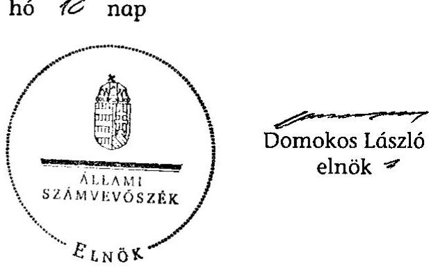

---

# MELLÉKLETEK

---

# Az állami vagyon feletti tulajdonosi joggyakorlás 2011. évi szervezeti formája 

## Kormány

Állami vagyonnal kapcsolatos döntéseket hozhat. Elfogadja a Nemzeti Vagyongazdálkodási Irányelveket és az éves Nemzeti Vagyongazdálkodási Programot. A Magyar Állam nevében évente beszámol az Országgyűlésnek a tulajdonosi jogokat gyakorló szervezetek működéséről, az állami vagyon állományának alakulásáról és az állami vagyonnal való gazdálkodás folyamatairól, a tárgyévet követő év szeptember 30. napjáig a Vtv. szerint. Emellett a vidékfejlesztési miniszter útján évente beszámol az Országgyűlésnek a földbirtokpolitikai irányelvek érvényesüléséről, a Nemzeti Földalap helyzetéről és az NFA tevékenységéről.

## Nemzeti Fejlesztési Miniszter

Az állami vagyonnal való gazdálkodás szabályozásáért, az állami vagyon felügyeletéért felelős. Alakítja és végrehajtja a Kormány vagyongazdálkodási politikáját. A Nemzeti Vagyongazdálkodási irányelvekre és az éves Nemzeti Vagyongazdálkodási Programra kialakított javaslatot a Kormány elé terjeszti. Az állami vagyon felett a Magyar Államot megillető tulajdonosi jogok és kötelezettségek összességét gyakorolja, feladatát az MNV, az MFB, illetve tulajdonosi joggyakorló szervezet útján látja el. Azon állami tulajdonban álló ingatlanok felett, amelyek egy része a Nemzeti Földalapba tartozik, a tulajdonosi jogokat a Miniszter az agrárpolitikáért felelős miniszterrel (vidékfejlesztési miniszter) közösen gyakorolja. Az MNV-ben a Magyar Állam részvényesi jogait, az MNV működése során a közgyűlés jogait gyakorolja. Írásban utasíthatja az Igazgatóságot. Jóváhagyja az MNV saját vagyona üzleti tervét, a rábízott vagyon éves vagyonkezelési tervét, az MNV saját vagyonáról, valamint az MNV rábízott vagyonáról és az MFB rábízott vagyon változásáról (tárgyévet követő év aug. 15-ig) készített beszámolóját.

## Felügyelő Bizottság

(5 tagú, Min. nevezi ki)
MNV Zrt. működésének és állami vagyonnal való gazdálkodásának ellenőrzése. Jelezheti a Miniszternek az IG, VIG jogszabálysértő magatartását. Az MNV beszámolóiról jelentést, tevékenységéről tárgyévet köv. 08.31-ig beszámolót készít a Miniszter részére.

## MNV Zrt. Igazgatósága

(7 tagú, MNV Zrt. ügyvezető szerve, élén Miniszter által kinevezett elnök áll)
Feladata: az állami vagyonnal kapcsolatos irányelvekre és az éves Nemzeti Vagyongazdálkodási Programra vonatkozó javaslat kialakítása a miniszter részére. Döntés a gt.-k részére hitel, kölcsön, támogatás nyújtásáról, tőkeemelésről; döntés az állami tulajdonú gt-k közgyűlésein képviselendő álláspontról, az állami vagyon elidegenítéséről, hasznosításáról nettó 500 M Ft felett. SZMSZ jóváhagyása. pénzügyi-gazdasági, vagyonnyilvántartási, tulajdonosi ellenőrzési és javadalm. szabályzatok elfogadása. Az MNV Zrt. üzleti tervének, vagyonkezelési tervének, Sztv. szerinti beszámolójának, a rábízott vagyonról szóló éves beszámolójának elkészítése.

## MNV Zrt.

(Magyar Állam által alapított egyszemélyes Rt.)
Az MNV Zrt. munkaszervezetét - a jogszabályok, az Alapító Okirat, az RJGY hat.-k, az Igazgatóság döntéseinek keretei között - a vezérigazgató vezeti, aki az MNV Zrt. munkavállalói felett gyakorolja a munkáltatói jogokat. Feladata: előkészíti és végrehajtja az OGY, Kormány és a miniszter állami vagyonnal kapcsolatos döntéseit, közreműködik a Nemzeti Vagyongazdálkodási Irányelvek és az Éves Nemzeti Vagyongazdálkodási Program előkészítésében, nyilvántartást vezet a tul.-i joggyakorlása alá tartozó (ideértve a miniszter vagy törvény által átadott) vagyonról, állami vagyonnal kapcs. polgári jogi jogviszonyban képviseli a Magyar Államot.

## Vidékfejlesztési Miniszter

A Nemzeti Földalap felett a Magyar Állam nevében a tulajdonosi jogokat és kötelezettségeket az agrárpolitikáért felelős miniszter a Nemzeti Földalapkezelő Szervezet (NFA) útján gyakorolja.
Feladata: NFA Alapító Okiratának kiadása, SZMSZ jóváhagyása, Nemzeti Földalapba tartozó földrészletek hasznosításával kapcsolatos középtávú stratégia Kormány elé terjesztése, a Nemzeti Földalapba tartozó földrészletek hasznosításával kapcsolatos NFA által készített éves terv jóváhagyása.

## Birtokpolitikai Tanács

(5 tagú testület, Elnökét a Miniszter nevezi ki)
Elkészíti és érvényre juttatja Nemzeti Földalapba tartozó földrészletek hasznosításával kapcs. középtávú stratégiai tervet, véleményezi az NFA által készített éves tervet és a beszámoló tervezetét; dönt a Nemzeti Földalapba tartozó földrészletek hasznosításával kapcsolatos egyedi ügyekben (ha az együttes érték eléri a 100 M Ft-ot, ill. a 100 ha-t), 100 M Ft-ig dönt a tulajdonjog megszerzésével kapcsolatos ügyekben. Észrevételeit az OGY beszámolóhoz csatolni kell.

## Nemzeti Földalapkezelő Szerv.

(VM Miniszter irányítása alatt álló központi költségvetési szerv, Elnökét a Min. nevezi ki)
Elnöke felelős a Tanács döntéseinek végrehajtásáért, Nemzeti Földalapba tartozó földrészletek naprakész nyilvántartásáért, a fölrészletek törvényes, szakszerű, hatékony és gazdaságos hasznosításáért; képviseli az NFA-t harmadik személyekkel szemben. Feladata: dönt (Tanács javaslatainak figyelembevételével) a Földalapba tartozó földrészletek hasznosításával kapcsolatos egyes kérdésekben. A Földalapba tartozó rábízott földvagyon változásáról, működtetéséről tárgyévet követő év aug. 15 -ig éves beszámolót készít. Elkészíti a földbirtokpolitikai irányelvek érvényesüléséről, a Földalap helyzetéről és az NFA tevékenységéről szóló beszámolót

---

# Az állami vagyongazdálkodás szakmai beszámolási rendszere 

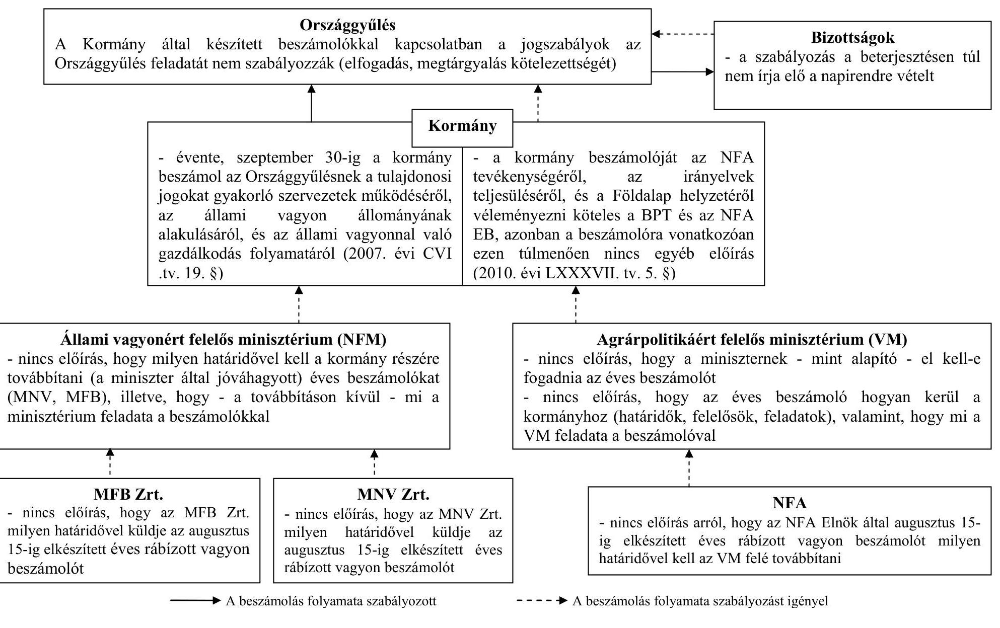

---

# Az MNV részéről az Unitárius Egyháznak átadott ingatlannal kapcsolatban a bérleti jogviszonyok rendezésére átutalt összeg felhasználásának utóellenőrzése 

A volt egyházi ingatlanok tulajdoni helyzetének rendezéséről szóló 1991. évi XXXII. törvény alapján korábbi igénybejelentésére tekintettel a Kormány az 1075/1993. (XII. 2.) Korm. határozatával Budapest V. ker. Alkotmány u. 12. szám (hrsz.: 24911) alatti ingatlan 51/100 tulajdoni hányadát a Magyarországi Unitárius Egyház tulajdonába adta. A Magyarországi Unitárius Egyház már 2006-ban és 2010-ben is kezdeményezte az állami tulajdonban maradt hányadnak ingyenes tulajdonba adását.

A Magyar Köztársaság 2008. évi költségvetéséről szóló törvény végrehajtásáról szóló 2009. évi CXXIX. törvény 30. § (2) bekezdésében az „Országgyűlés az állami vagyonról szóló 2007. évi CVI. törvény 36. § (1) bekezdése alapján úgy rendelkezik, hogy a Budapest V. Alkotmány u. 12. szám alatti ingatlannak (hrsz.: Budapest belterület 24911) a Magyar Állam tulajdonában lévő 49/100 tulajdoni hányada kiürített állapotban, térítésmentesen a Magyarországi Unitárius Egyház tulajdonába kerüljön kulturális, szociális és hitéleti célokra. A tulajdonváltás ingatlan-nyilvántartásba történő bejegyzésére alkalmas szerződést a Magyar Állam nevében a Magyar Nemzeti Vagyonkezelő Zrt. köti meg."

A Magyarországi Unitárius Egyház és az MNV képviselőinek 2010. január 15-i megbeszélésén készült emlékeztető szerint az Unitárius Egyház képviselői azzal a felvetéssel fordultak az MNV képviselőihez, hogy az Egyház tulajdonjogának gyorsabb bejegyzése érdekében az ingatlanrészt bérlőkkel terhelten, azaz a törvényben foglalt „kiürített állapotban" feltételtől eltekintve kívánják átvenni. A Nemzeti Vagyongazdálkodási Tanács a 126/2010. (II.03.) NVT sz. határozatával felhatalmazta az MNV vezérigazgatóját, hogy a társadalmi szervezetekkel, egyházakkal való egyetértést követően, az MNV által kidolgozásra kerülő szerződések cégszerű aláírásáról gondoskodjon.

Az MNV a 290/2010. (XII. 20.) IG sz. határozattal döntött a vagyonátadási szerződés elfogadásáról és aláírásáról. Az MNV az ingatlant a törvényben előírtak ellenére nem kiürített állapotban, hanem az emlékeztetőben foglaltaknak megfelelően bérlőkkel terhelten adta át. A birtokba adási eljárásra 2011. február 8-án került sor. Az eljárásról készült jegyzőkönyv mellékletében 3 db üres lakás és 2 db üres pince mellett 14 db lakott lakás és 3 db használt üzlethelyiség szerepelt.

Az épületben a bérleti jogviszonyok Egyház részéről történő rendezése érdekében az MNV szerződésben vállalta 350 M Ft átutalását. Az Egyház kötelezettséget vállalt arra, hogy az átadott pénzeszközt az ingatlant jelenleg terhelő bérleti jogviszonyok rendezésére fordítja. A szerződés szerint az Egyháznak az átutalt összeg felhasználásáról 2011. június 30-ig kellett volna tájékoztatni az MNV-t, de erre nem került sor. Az Ász 2011. évi 1128 sz. jelentésében a tárgyban megállapítottak kapcsán elnöki figyelemfelhívás keretében javasolta, hogy a nemzeti fejlesztési miniszter gondoskodjon az egyházi ingatlanok átadása esetében a jogszabályi rendelkezések betartásáról, a konkrét ügy kapcsán pedig a kifizetett összeg felhasználásának ellenőrzéséről. Az MNV Vig. a 10/2012. (I.

---

20.) számú határozatában foglalt intézkedési tervnek megfelelően sor került az MNV és a Magyarországi Unitárius Egyház közötti szerződés módosítására. A szerződésmódosítás a Magyarországi Unitárius Egyház Magyarországi Egyházkerülete számára előírja, hogy az Egyház köteles 2011. december 31. napját követően minden harmadik hónap utolsó napjáig írásban tájékoztatni az MNV Zrt-t a pénzeszköz felhasználásáról, mindaddig, amíg a teljes összeg rendeltetésszerű felhasználása nem történik meg. Az Egyház beszámolási kötelezettségének 2012. március 30-án eleget tett. Az MNV a tájékoztatás kiegészítését kérte.

Az Egyház negyedéves beszámolási kötelezettségének és a kiegészítésnek 2012. június 27. napján kelt levelében tett eleget. Addig öt lakás vonatkozásában került sor a megállapodás összegének átutalására és a lakások birtokba vételére összesen 57100000 Ft értékben. Három lakás esetében a megállapodott összeg ötven százaléka átutalásra került (a megállapodott összeg összesen 54500000 Ft), de a lakások birtokba vétele különböző időpontokba történik (2012. július 16-ig és 18-ig, illetve 2012. december 31-ig várható). A bérleti jogviszony megszüntetésével kapcsolatos közjegyzői díjakra 611907 Ft-ot, a bérleti jogviszony megszüntetésével kapcsolatos ügyvédi díjakra pedig 2822500 Ft-ot használtak fel. A 2012. június 27-ig az Egyház mindösszesen 115034407 Ft-ot használt fel az átutalt összegből.

Az MNV tájékoztatása szerint az ingatlan lakásainak 9 bérlője, mint felperesek jogi képviselőjük útján az I. r. Magyar Állam, II. r. MNV és III. r. Magyarországi Unitárius Egyház ellen „lakás kiürítése stb. iránt" keresetet terjesztettek elő a Fővárosi Bírósághoz 2011. december 20-án. Az MNV 2012. június 19-ei tájékoztatása szerint a III.-IV. és IX. rendű felperes elállt a pertől, így a helyszíni ellenőrzés befejezésekor 6 felperes volt. A kialakult jogi helyzet és egyes bérlők elzárkózó álláspontja miatt az ingatlan bérleti jogainak rendezése a közeljövőben valószínűleg nem fog megoldódni. ${ }^{1}$

[^0]
[^0]:    ${ }^{1}$ Az MNV Zrt. vezérigazgatója a jelentéstervezetre 2012. október 16-án tett észrevételében arról tájékoztatott, hogy az ingatlanok kiürítése érdekében az Egyház és a bérlők között a tárgyalások a jelentés lezárása idején is folyamatban voltak.

---

# Mintatételek jegyzéke

|  Mintasorszám | Település | HRSZ. | Vagyonkezelő | Vagyonelem  |
| --- | --- | --- | --- |

 --- |
|  1 | Katymár | 0180/39 | Bács-Kiskun Megyei Rendőr Főkapitányság | NYOMSÁV 475 M2 (KATYMÁR)  |
|  2 | Gyomaendrőd | 5 | Békés Megyei Rendőr-főkapitányság | TELEK, KOSSUTH U. 1. GYOMAENDRÓD  |
|  3 | Budapest, 10. ker. | 38897 | Készenléti Rendőrség | I. RAKTÁR IX/E2. II. BÚTORRAKT.  |
|  4 | Bicske | 0238/01 | BÁH BEF ALLOMÁS BICSKE | TÖBBCELŰ CSARNOK  |
|  5 | Nagykovácsi | 0106/17 | Adyligeti Rendészeti Szakközépiskola | Barakk  |
|  6 | Pétervására | 416/1 | VM Kelet-Magyarországi Agrár-szakképző Központ, Mezőgazdasági Szakk | Portásfülke  |
|  7 | Szarvas | 01344 | Mezőgazdasági Szakigazgatási Hivatal Központ | Földterület  |
|  8 | Budapest, II. kerület | 12184 | Központi Élelmiszer-tudományi Kutatóintézet | Lakóépület  |
|  9 | Fertőhomok | 287/249 | Magyar Szabadalmi Hivatal | Földterület KFK  |
|  10 | Jósvaló | 0227/1 | Aggteleki Nemzeti Park Igazgatóság | Földterület  |
|  11 | Csőr | 0262 | Duna-Ipoly Nemzeti Park Igazgatóság | Földterület  |
|  12 | Mezőnagymihály | 0222/16 | Bükki Nemzeti Park Igazgatóság | Földterület  |
|  13 | Örtilos | 0441/2 | Duna-Dráva Nemzeti Park Igazgatóság | kivett út  |
|  14 | Vámoscsalád | 0180 | Fertő-Hanság Nemzeti Park Igazgatóság | föld  |
|  15 | Nádudvar | 0968 | Hortobágyi Nemzeti Park Igazgatósága | Földterület  |
|  16 | Szeged | 02185/1 | Kiskunsági Nemzeti Park Igazgatóság | nádas  |
|  17 | Szentbékkálla | 012/22 | Balaton-felvidéki Nemzeti Park Igazgatósága |   |
|  18 | Dévaványa | 01312 | Körös-Maros Nemzeti Park Igazgatóság | Dévaványai-Ecsegi puszták  |
|  19 | Ivánc | 0169 | Örségi Nemzeti Park Igazgatósága | föld  |
|  20 | Kaposgyarmat | 102/1 | Utgazdálkodási és Koordinációs Igazgatóság (UKIG) | Földterület  |
|  21 | Csongrád | 6394 | Alsó-Tisza-vidéki Környezetvédelmi és Vizügyi Igazgatóság | beépített terület  |
|  22 | Adony | 073 | Közép-dunántúli Környezetvédelmi és Vizügyi Igazg. | csatorna, gyep, töltés  |
|  23 | Völány | 0186/3 | Dél-Dunántúli Környezetvédelmi és Vizügyi Igazg. | KARASICA VF.  |
|  24 | Kocsord | 0139/64 | Felső-Tisza-vidéki Környezetvédelmi és Vizügyi Igazgatóság | gyümölcsös Kocsord  |
|  25 | Tiszaszólós | 087 | Közép-Tisza-vidéki Környezetvédelmi és Vizügyi Igazgatóság | Saját használatú út  |
|  26 | Dejtár | 066/4 | Közép-Duna-Völgyi Környezetvédelmi és Vizügyi Igazgatóság. | Ipoly folyó  |
|  27 | Murakeresztúr | 083 | Nyugat-dunántúli Környezetvédelmi és Vizügyi Igazgatóság | Mura-folyó  |
|  28 | Sarród | 0131 | Észak-dunántúli Környezetvédelmi és Vizügyi Ig. | Homok-Sarródi csatorna földterület  |
|  29 | Tiszavalk | 090 | BAZ Megyei Állami Közútkezelő KHT. |   |
|  30 | Zalaegerszeg | 035/124 | Zala Megyei Állami Közútkezelő KHT | Földterület  |
|  31 | Tatabánya |  | Északdunántúli Vízmű Zrt. | KM PVC csővezeték  |
|  32 | Badacsonytördemic |  | Dunántúli Regionális Vízmű Zrt. | Átemelő aknával II/2 jelű ROCLA  |
|  33 | Mezőkeresztes |  | Észak-magyarországi Regionális Vízművek ZRT. | D150 KM, PVC, KPE IVÖVÍZ GERINCVEZ.  |
|  34 | Mezőtúr | 0615 | Szolnoki Főiskola | JUHODÁLY és lóistálló  |
|  35 | Cserépváralja | 085 | Egererdő Erdészeti Zártkörűen Működő Részvénytársaság | Földterület  |
|  36 | Kővágószólós | 036 | Mecseki Erdészeti Zrt. | Földterület  |
|  37 | Vác | 034/2 | Ipoly Erdő Részvénytársaság | Földterület  |
|  38 | Vállus | 037 | Bakonyerdő Erdészeti és Faipari ZRT. | Földterület  |

---

|  Minta-
sorszám | Település | HRSZ. | Vagyonkezelő | Vagyonelem  |
| --- | --- | --- | --- | --- |
|  39 | Csévharaszt | 0129 | NEFAG Nagykunsági Erdészeti és Faipari Zrt. | Földterület  |
|  40 | Vaskút | 0243 | Gemenci Erdő és Vadgazdaság Rt. | Földterület  |
|  41 | Gyula | 01177/4 | Délalföldi Erdészeti Rt. | Földterület  |
|  42 | Ivánc | 0233/1 | Szombathelyi Erdészeti Zrt. | 0233 megosztás  |
|  43 | Mucsi | 0128 | Gyulaj Erdészeti és Vadászati Rt. | Földterület  |
|  44 | Nagyatád | 0515 | SEFAG Erdészeti és Faipari Zrt. | Földterület  |
|  45 | Kisgyőr | 0201 | ÉSZAKERDŐ Erdőgazdasági Zártkörűen Működő Részvénytársaság | Földterület  |
|  46 | Orosztány | 0110/901 | Vértesi Erdészeti és Faipari Rt. | Földterület  |
|  47 | Győrzámoly | 0255 | Kisalföldi Erdőgazdaság Zrt. | Földterület  |
|  48 | Tilaj | 0134/6 | Zalaerdő Erdészeti Zártkörűen Működő Részvénytársaság | Földterület  |
|  49 | Debrecen | 01247/1 | Nyírségi Erdészeti Rt. | Földterület  |
|  50 | Budapest, 17. ker. | 138602/73 | EKM-i Autópálya-fejlesztő és -üzemeltető RT. | fejlesztés alatti ap  |
|  51 | Kéleshalom | 0111/1 | KEFAG Krakunsági Erdészeti és Faipari Zrt. | Földterület  |
|  52 | Veresegyház | 0221/7 | Pilisi Parkerdő Zártkörűen Működő Részvénytársaság | Földterület  |
|  53 | Kokad | 07/1 | Nemzeti Infrastruktúrális és Fejlesztő Zrt | Földterület  |
|  54 | Kecskemét | 32270/3 | AKA ALFÖLD KONCESSZIÓS AUTÓPÁLYA RT. | Földterület  |
|  55 | Szolnok |  | MAGYAR ÁLLAMVASUTAK RT | FÉMVEZETŐJŰ LAN  |
|  56 | Nagyhegyes | 0278 | Hortobágyi Halgazdaság Rt. | Földterület  |
|  57 | Nagyhegyes |  | Bányavagyon Hasznosító Közhasznú Társaság | Bal-6  |
|  58 | Fadd | 094/63 | M6 Tolna Autópálya Koncessziós Zrt. | Földterület  |
|  59 | Barcs | 027/2 | Barcs és Vidéke Horgász Egyesület | Horgászház  |
|  60 | Vác | 3189/2/A/1 | Pest Megyei Kormányhivatal | Váci Körzeti Földhivatal  |
|  61 | Szeged | 25886/24 | Csongrád Megyei Kormányhivatal | Vizsgapálya megvalósulási terv  |
|  62 | Nyíracsád | 0552/5 | Közlekedésfejlesztési Koordinációs Központ | Földterület  |

Az adatok forrása az MNV Zrt. vagyonkezelői adatszolgáltatáson alapuló nyilvántartása (KVK) Megjegyzés: a sötétített hátterű tételeket részletes szempontrendszer alapján ellenőriztük

---

# A mintában szereplő vagyonelemekkel és a vonatkozó szerződésekkel kapcsolatban feltárt hibák

|  Minta se2. | Vagyonelem-Település | Hrsz. | Feltárt hiba  |
| --- | --- | --- | --- |
|  57 | Nagyhegyes | Bal-6 kút | 1., 2006. és 2007. évi vagyonkezelési díjat a KVI nem számlázta, az MNV utólag, 2008. évben ezt pótolta. 2., 2008-2011. évekre vonatkozó díjakat több hónapos késéssel számlázta az MNV. 3., A Bányavagyon Hasznosító Kht. a 2009. évi díj megfizetésével közel egy évet késett, a szerződésben késedelmes fizetésre nem kötöttek ki késedelmi kamatot.  |
|  20 | Kaposgyarmat 102/1 | 102/1 | A mintában szereplő vagyonkezelő (UKIG) átalakult, jogutódja 2007. óta nem jelent a vagyonelemről.  |
|  30 | Zalaegerszeg | 035/124 | 1., A vagyonelem a tulajdoni lap szerint 1975.02.15-én kisajátítással került a Magyar Állam tulajdonába; kezelője a Zala Megyei Állami Közútkezelő Kht. volt, de a vagyonkezelési szerződésének ingatlan melléklete nem tartalmazta ezt a hrsz-ot, viszont a társaság jelentett róla a vagyonkataszterbe, utóljára 2004. dec. 31-i állapotról. 2., Jogutódja a Magyar Közút Zrt. nem küldött jelentést a vagyonkataszterbe.  |
|  53 | Kokad | 07/1 | Az ingatlant nem lehet beazonosítani, mivel nem szerepel a szerződésben.  |
|  54 | Kecskemét 32270/3 | 32270/3 | 1., A földhivatali nyilvántartás szerint ez a helyrajzi szám nem létezik. 2., Az AKA Rt. jelentett róla, de csak 1999. dec. 31-ig.  |
|  42 | Ivánc | 0233/1 | 1., A vagyonkezelővel kötött szerződéshez csatolt listában ez a hrsz. nem szerepel, helyette 233/b hrsz., mely 2,5151 ha gyep, rét ingatlant takar, míg az ellenőrzendő vagyonelem a 233/1 hrsz-ként megtalálható a vagyonkataszterben és a körmendi Körzeti Földhivatal nyilvántartásában is, az MNV által is nyilvántartott 2,0363 ha területtel. 2., A 2008. évi időszakra vonatkozó díjat egy összegben 2009-ben számlázta az MNV. Ezzel eltértek a szerződésben foglaltaktól, mivel nem a tárgyidőszakban, az esedékesség idején két részletben, hanem egy évvel később számláztak és akkor folyt be a bevétel is. 3., A vagyonkezelő részére a 2009. és 2010. évi vagyonkezelési díjat az MNV nem számlázta le, a 2011. évre vonatkozó díj számlázása a nyilatkozatuk szerint folyamatban van.  |
|  37 | Vác | 034/2 | 1., A 2008. évi időszakra vonatkozó díjat egy összegben 2009-ben számlázta az MNV. Ezzel eltértek a szerződésben foglaltaktól, mivel nem a tárgyidőszakban, az esedékesség idején két részletben, hanem egy évvel később számláztak és akkor folyt be a bevétel is. 2., A vagyonkezelő részére a 2009. és 2010. évi vagyonkezelési díjat az MNV nem számlázta le, a 2011. évre vonatkozó díj számlázása a nyilatkozatuk szerint folyamatban van.  |
|  44 | Nagyatád | 0515 | 1., A 2008. évi időszakra vonatkozó díjat egy összegben 2009-ben számlázta az MNV. Ezzel eltértek a szerződésben foglaltaktól, mivel nem a tárgyidőszakban, az esedékesség idején két részletben, hanem egy évvel később számláztak és akkor folyt be a bevétel is. 2., A vagyonkezelő részére a 2009. és 2010. évi vagyonkezelési díjat az MNV nem számlázta le, a 2011. évre vonatkozó díj számlázása a nyilatkozatuk szerint folyamatban van. 3., A tétel nem szerepel a szerződésben.  |
|  40 | Vaskút | 0243 | 1., A 2008. évi időszakra vonatkozó díjat egy összegben 2009-ben számlázta az MNV. Ezzel eltértek a szerződésben foglaltaktól, mivel nem a tárgyidőszakban, az esedékesség idején két részletben, hanem egy évvel később számláztak és akkor folyt be a bevétel is. 2., A vagyonkezelő részére a 2009. és
 2010. évi vagyonkezelési díjat az MNV nem számlázta le, a 2011. évre vonatkozó díj számlázása a nyilatkozatuk szerint folyamatban van.  |
|  52 | Veresegyház | 0221/7 | 1., A 2008. évi időszakra vonatkozó díjat egy összegben 2009-ben számlázta az MNV. Ezzel eltértek a szerződésben foglaltaktól, mivel nem a tárgyidőszakban, az esedékesség idején két részletben, hanem egy évvel később számláztak és akkor folyt be a bevétel is. 2., A vagyonkezelő részére a 2009. és 2010. évi vagyonkezelési díjat az MNV nem számlázta le, a 2011. évre vonatkozó díj számlázása a nyilatkozatuk szerint folyamatban van.  |
|  36 | Kővágószőlős | 036 | 1., A 2008. évi időszakra vonatkozó díjat egy összegben 2009-ben számlázta az MNV. Ezzel eltértek a szerződésben foglaltaktól, mivel nem a tárgyidőszakban, az esedékesség idején két részletben, hanem egy évvel később számláztak és akkor folyt be a bevétel is. 2., A vagyonkezelő részére a 2009. és 2010. évi vagyonkezelési díjat az MNV nem számlázta le, a 2011. évre vonatkozó díj számlázása a nyilatkozatuk szerint folyamatban van. 3., A vagyonkezelővel kötött alapszerződés 2007. évi módosításakor a bevezetőben hivatkozott jogszabály (a Nemzeti Földalapról szóló 2001. évi CXVI. tv. 3. § (1) és 6. § (3) bekezdés) a szerződés kiegészítés (Iktsz: NFA 71.854/2007) aláírása idején már nem volt hatályos.  |

---

|  12 | Mezőnagymihály | 022/16 | 1. Az alapszerződés mellékletei közül hiányzik a 2. sz. (alaptevékenységhez kapcsolódó kincstári vagyoni kör), a 4. sz. (a kezelt vagyonelemekre vonatkozó teljességi nyilatkozat) és az 5. sz. (köztartozásokra vonatkozó nyilatkozat) melléklet. 2. A 2600093-2003-120 sz. szerződésmódosításhoz tartozó kijelölő nyilatkozat (Iktsz:312003468/3/2003) mellékletében nem szerepel a mintatétel, mint ahogy a teljességi nyilatkozat ellenére a december 5-én aláírt szerződés 3. sz. mellékletében (vagyonkezelésben lévő ingatlanok) sem.  |
| --- | --- | --- | --- |
|  55 | Szolnok, építmény | - | A mintatételhez az ellenőrzés részére átadott dokumentáció az alapszerződéssel, ill. módosításaival kapcsolatos mellékleteket nem tartalmazott.  |
|  35, 36, 37, 38, 39, 40, 41, 42, 43, 44, 45, 46, 47, 48, 49, 51, 52 | Erdőgazdaságok |  | Az erdőgazdasági alapszerződések egyes pontjai között ellentmondás észlelhető: a szerződések 3.3.2. pontja szerinti vagyonkezelési díjat érintő éves felülvizsgálat a tárgyévet megelőző november végéig esedékes, míg a 3.10. pontja szerinti éves felülvizsgálat a tárgyévet követő május végéig beküldendő írásos beszámolással teljesül. A szerződéseknek nincs időbeli hatálya.  |
|  32 | Badacsonytördemic |  | 1. A KVI időszakában rendszertelenül, nem a szerződés alapelveinek megfelelően kiszámolt díjakat számláztak a regionális vízművek felé, illetve fizettek a KVI-nek. A szerződés pontatlan megfogalmazása a számlázott összegeket aggályossá teszi. Egyrészt nem került rögzítésre, mikor kell teljesíteni a fizetési kötelezettséget, másrészt az infláció figyelembe vételének megfogalmazása nem volt egyértelmű, mivel adott évre lehet az előző évi, vagy az arra az évre vonatkozó inflációval is számolni. Az MNV valamennyi regionális vízmű vagyonkezelési díjának elszámolását felülvizsgálta 2008. év végén - 2009. év elején, azonban a felülvizsgálat eredményét nem megfelelően hasznosította, ugyanis nem intézkedett az egyes vízművek részére nem, vagy nem a szerződésben lefektetett elveknek megfelelően számlázott díjak - mintegy 17,2 M Ft - utólagos behajtására. Ezen összeg 88 %-át a Dunántúli Regionális Vízmű halmozta fel. 2. Nem lehet beazonosítani, mivel nincsen helyrajzi szám.  |
|  1 | Katymár | 0180/39 | A szerződésben érintett szervezetek tekintetében bekövetkezett változások átvezetése nem történt meg.  |
|  7 | Szarvas | 1344 | A szerződésben érintett szervezetek tekintetében bekövetkezett változások átvezetése nem történt meg.  |
|  24 | Kocsord | 0139/64 | Az ingatlant nem lehet beazonosítani mivel nem szerepel a szerződésben.  |
|  29 | Tiszavalk | 90 | Nem lehet beazonosítani, mivel a szerződés nem tartalmazza ezt a helyrajzi számot.  |
|  31 | Tatabánya |  | Nem lehet beazonosítani, mivel nincsen helyrajzi szám.  |
|  33 | Mezőkeresztes |  | Nem lehet beazonosítani, mivel nincsen helyrajzi szám.  |
|  50 | Budapest, 17. ker. | 138602/73 | Az ingatlant nem lehet beazonosítani mivel nem szerepel a szerződésben.  |

---

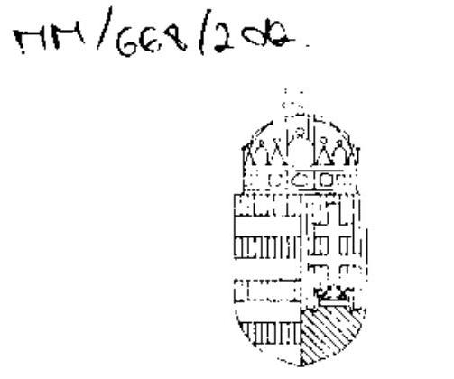

NEMZETI FEJLESZTÉSI MINISZTÉRIUM

NÉMETH LÁSZLÓNÉ

Iktatószám: 9132/5/2012. Felszt. Hiv. sz.: V-2017-231/2012.

Domokos László részére
elnök
Állami Számvevőszék

Budapest
Apáczai Csere János u. 10.
1052

Tárgy: Jelentés-tervezet véleményezése

Tisztelt Elnök Úr!

Köszönettel vettem „Az állami vagyon feletti tulajdonosi joggyakorlással kapcsolatos
2011. évi tevékenységek” ellenőrzéséről szóló jelentéstervezetét, mellyel kapcsolatosan az
alábbi megjegyzést teszem:

Az ÁSZ jelentés
- az állami vagyonnal való gazdálkodás stratégiai és éves kereteit meghatározó
dokumentumok (Nemzeti Vagyongazdálkodási Irányelvek, Éves Nemzeti
Vagyongazdálkodási Program) kidolgozását javasolja az NFM miniszternek,
- részletes megállapításaiban a tulajdonosi joggyakorlás szabályozási problémáira
hívja fel a figyelmet.

Ehhez kapcsolódóan meg kívánom jegyezni, hogy
- a Nemzeti Vagyongazdálkodási Irányelvekről 2011 őszén kormánydöntés nem
született, tekintettel arra, hogy az abban megfogalmazott vagyongazdálkodási elvek
és célok a 2012. január 1-én hatályba lépő nemzeti vagyonról szóló (sarkalatos)
törvényben kerültek rögzítésre,
- az ÁSZ jelentés részletes megállapításaiban szerepeltetett, a tulajdonosi
joggyakorlás szabályozási problémáit, valamint az Éves Nemzeti
Vagyongazdálkodási Program kapcsán felmerülő feladatok felülvizsgálatát az NFM a
folyamatban lévő Vtv. módosítása során tervezi rendezni.

Budapest, 2012. október 29.

Üdvözlettel:

Németh Lászlóné
(P. H.)

---

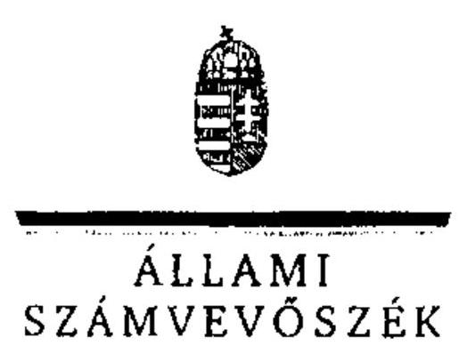

6/b sz. melléklet
a V-2017-250/2011-2012. sz. jelentéshez

ELNÖK

ÁLLAMI
SZÁMVEVŐSZÉK

Ikt.szám: V-2017-240/2011-2012.

Németh Lászlóné asszony
miniszter
Nemzeti Fejlesztési Minisztérium

Budapest

Tisztelt Miniszter Asszony!

Az állami vagyon feletti tulajdonosi joggyakorlással kapcsolatos 2011. évi tevékenységek ellenőrzése címủ jelentéstervezetre tett észrevételeit köszönettel megkaptam.

Az Állami Számvevőszék észrevételekre vonatkozó álláspontjáról a felügyeleti vezető által készített részletes tájékoztatást csatoltan megküldöm.

Tájékoztatom Miniszter Asszonyt, hogy a számvevőszéki jelentés az elfogadott észrevételek figyelembevételével készül.

Budapest, 2012. 11. hónap nap

Tisztelettel:

Domokos László

Melléklet: Tájékoztatás az elfogadott és el nem fogadott észrevételekről

1052 BUDAPEST, APÁCZAI CSERÉ JÁNOS UTCA 10. 1364 Budapest 4. Pf. 54 telefon: 484 9101 fax: 484 9281

---

# Tájékoztatás   az elfogadott és el nem fogadott észrevételekról 

Az állami vagyon feletti tulajdonosi joggyakorlással kapcsolatos 2011. évi tevékenységek ellenőrzése címủ jelentéstervezetre a V-2017-231/2012. iktatószámú levelében tett észrevételeit áttekintettük, azokat a következők szerint kezeljük:

A jelenleg is hatályban lévő állami vagyonról szóló törvény tartalmazza a nemzeti vagyongazdálkodási irányelvek elkészítésének követelményét annak ellenére, hogy a nemzeti vagyonról szóló sarkalatos törvény rögzíti a vagyongazdálkodás alapelveit. Ezért a javaslatunkat fenntartjuk.

Megköszönjük tájékoztatását, amely szerint az ÁSZ megállapításaival összhangban az NFM is indokoltnak tartja az állami vagyon feletti tulajdonosi joggyakorlás szabályozási problémáinak rendezését, valamint az Éves Nemzeti Vagyongazdálkodási Program kapcsán felmerülő feladatok felülvizsgálatát a folyamatban lévő Vtv. módosítása során.

Budapest, 2012.  hónap  nap

Makkai Mária
felügyeleti vezető

---

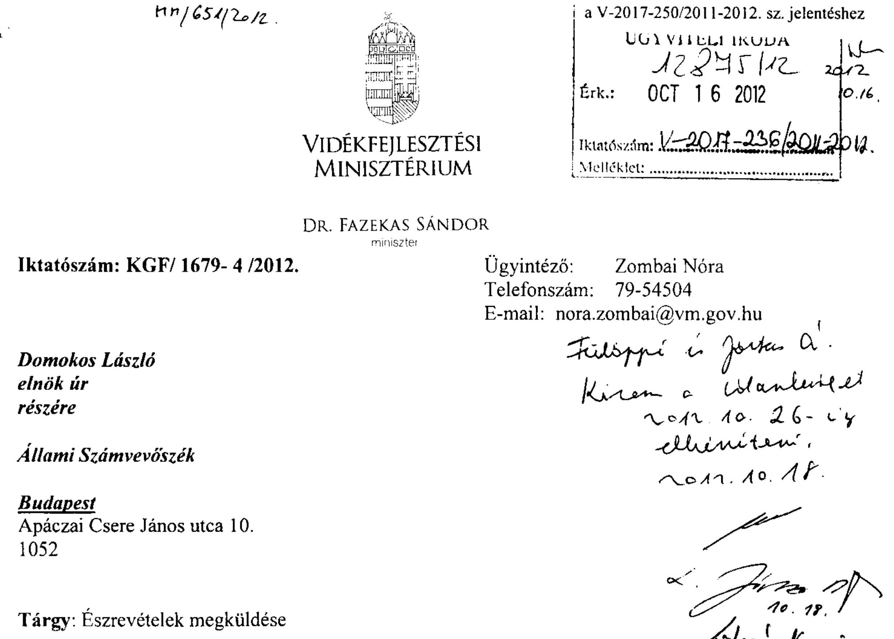

Hivatkozva a V-2017-231/2012. sz. levelére, az állami vagyon feletti tulajdonosi joggyakorlással kapcsolatos 2011. évi tevékenységek ellenőrzéséről készült jelentéstervezettel kapcsolatban az alábbi észrevételeket teszem:
1.) A jelentés-tervezetnek a vidékfejlesztési miniszterhez címzett 1. számú javaslatában foglaltakkal kapcsolatban megjegyzem, hogy a Nemzeti Földalap vagyonnyilvántartásának szabályairól szóló Korm. rendelet tervezetének a közigazgatási egyeztetésre (2010. szeptemberében) kiküldött első változatában még szerepeltek a Nemzeti Földalapba tartozó földrészlet vagyonkezelőjének, haszonbérlőjének, és erdőgazdálkodójának az NFA felé történő adatszolgáltatási (tájékoztatási) kötelezettségére vonatkozó javaslatok. A tervezet közigazgatási egyeztetése során a Közigazgatási és Igazságügyi Minisztérium (továbbiakban: KIM) részéről felmerült észrevételek alapján (pl. adatvédelem, a korm. rendelet megalkotására vonatkozó felhatalmazó rendelkezés kerete) a Nemzeti Földalap vagyonnyilvántartásának szabályairól szóló Korm. rendelet tervezetéből utólag elhagyásra kerültek a vonatkozó tervezett rendelkezések, de azok a Nemzeti Földalapról szóló 2010. évi LXXXVII. törvénybe (továbbiakban Nfa tv.) sem épültek be.

Indokoltnak tartom a szabályozás pótlását, amelyet kizárólag törvényi szinten, azaz az Nfatv. módosításával tartok megoldhatónak. Az Nfatv. ez irányú módosítására vonatkozó előterjesztés elkészítéséről intézkedem.

---

2.) A jelentés-tervezetnek a vidékfejlesztési miniszterhez címzett 2. számú javaslatában foglaltakkal egyetértek.
Álláspontom szerint is szükséges, hogy a Nemzeti Földalap felett a Magyar Állam nevében a tulajdonosi jogokat és kötelezettségeket gyakorló vidékfejlesztési miniszter ilyen módon is figyelemmel kísérje az NFA tevékenységét.
3.) A jelentés-tervezet a Részletes megállapítások fejezetében, az NFA vagyonnyilvántartására vonatkozó 2.6. pontjában a 41 . oldalon azt tartalmazza, hogy a Vidékfejlesztési Minisztérium és a Nemzeti Földalapkezelő Szervezet között létrejött megállapodás szerinti, a megállapodásban meghatározott feladatok szakmai részének teljesítését a Földügyi és Térinformatikai Főosztály a helyszíni ellenőrzés befejezéséig nem hagyta jóvá.

Tájékoztatom, hogy a megállapodásban rögzített feladatok szakmai részének teljesítését a Földügyi és Térinformatikai Főosztály időközben jóváhagyta.

A jelentés szövegének véglegesítése során kérem észrevételeim figyelembevételét.
Budapest, 2012. október  nap.
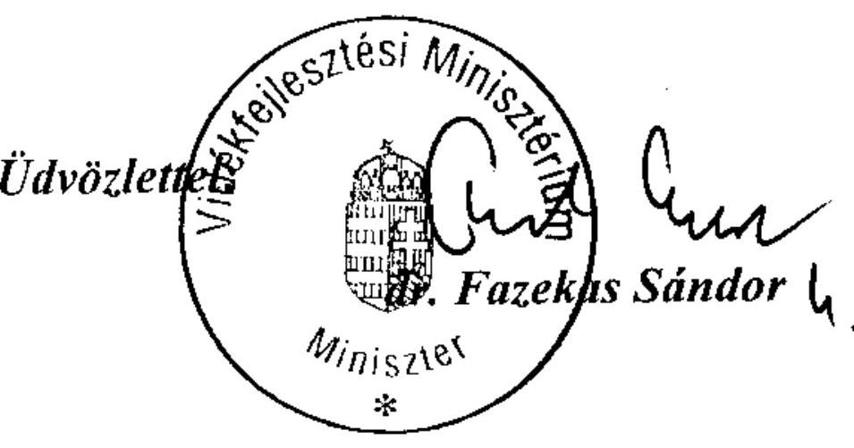

---

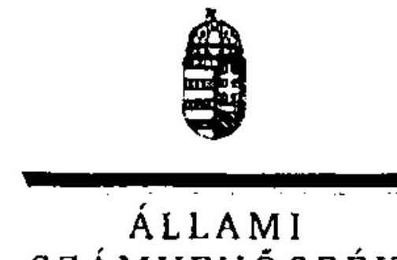

6/d sz. melléklet
a V-2017-250/2011-2012. sz. jelentéshez

ELNÖK

ÁLLAMI
SZÁMVEVŐSZÉK

Ikt.szám: V-2017-241/2011-2012.

Dr. Fazekas Sándor úr
miniszter
Vidékfejlesztés Minisztérium

Budapest

Tisztelt Miniszter Úr!

Az állami vagyon feletti tulajdonosi joggyakorlással kapcsolatos 2011. évi tevékenységek ellenőrzése címủ jelentéstervezetre tett észrevételeit köszönettel megkaptam.

Az Állami Számvevőszék észrevételekre vonatkozó álláspontjáról a felügyeleti vezető által készített részletes tájékoztatást csatoltan megküldöm.

Tájékoztatom Miniszter urat, hogy a számvevőszéki jelentés az elfogadott észrevételek figyelembevételével készül.

Budapest, 2012. 11. hó 15. nap

Tisztelettel:

Domokos László

Melléklet: Tájékoztatás az elfogadott észrevételekről

1052 BUDAPEST, APÁCZAI CSERE JÁNOS UTCA 10. 1364 Budapest 4. Pf. 54 telefon: 484 9101 fax: 484 9201

---

# Tájékoztatás   az elfogadott észrevételekről 

Az állami vagyon feletti tulajdonosi joggyakorlással kapcsolatos 2011. évi tevékenységek ellenőrzése címủ jelentéstervezetre tett észrevételek kezeléséről a következő tájékoztatást adom:

Levele szerint indokoltnak tartja a Nemzeti Földalappal kapcsolatos szabályozás kiegészítését, továbbá az NFA új vagyon-nyilvántartási és irányítási rendszere kialakításának figyelemmel kísérését. Mindez összhangban áll az ÁSZ által a vidékfejlesztési miniszternek megfogalmazott 1. és 2. számú javaslatokkal.

Elfogadtuk a jelentéstervezet 2.6. pontjában a 41. oldalra tett észrevételét (levele szerinti 3. pont), amelyet a jelentés készítésénél figyelembe veszünk a következők szerint:
„A vidékfejlesztési miniszter 2012. október 16-án kelt levelében arról értesített, hogy a feladat szakmai részének teljesítését a Földügyi és Térinformatikai Főosztály időközben jóváhagyta."

Budapest, 2012. 13. hó 28. nap
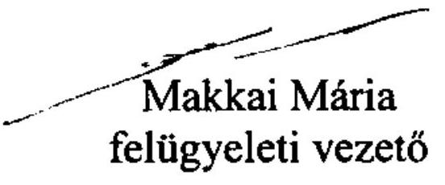

---

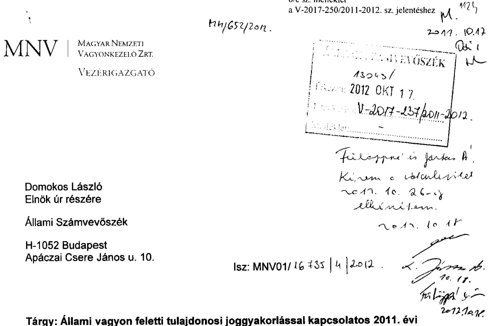

Tárgy: Állami vagyon feletti tulajdonosi joggyakorlással kapcsolatos 2011. évi tevékenységek ellenőrzéséről készített Jelentéstervezet észrevételezése

Hiv.sz.: V-2017-231/2012.

Tisztelt Elnök Úr!

Az állami vagyon feletti tulajdonosi joggyakorlással kapcsolatos 2011. évi tevékenységek ellenőrzéséről készített, és az MNV Zrt. részére észrevételezésre 2012. október 3-ai érkezéssel megküldött V-2017-231/2012. iktatószámú Jelentéstervezetet köszönettel megkaptam.

A Jelentéstervezetre az MNV Zrt. az alábbi észrevételeket teszi:

1. A „I. Összegzô megállapítások, következtetések, javaslatok" címủ fejezetben a 12. oldal harmadik bekezdésének szövegét az alábbi - vastag betűvel jelzett - szövegrész szerint javasoljuk módosítani:
„Az MNV és az NFA közötti II. vagyoni kör (2010. december 31-jei fordulónapi, 2011. augusztus 15. határidejű) átadás-átvételét MNV végrehajtotta (2012. július 30. véghatáridővel). Ezzel az előkészített ütemnek megfelelően az MNV Zrt. 2011. évi mérlegkészítése is határidőben megvalósult. Az MNV és az NFA közös tulajdonjog-gyakorlása alá eső ingatlanok minősítésére 2012. szeptember 30-i határidőt írt elő a kormányrendelet

 állította MNV-t és NFA-t, ezért a vagyonátadás/vagyonrendezés feladatok jogszabályi kereteinek tisztázását célzó törvénymódosítási javaslatnak részét fogja képezni a végrehajtás határidejének módosítása 2012. december 31-re. Az NFA tv. 2011. augusztus 1-jei vagyoni körre vonatkozó módosítása további feladat (III. kör) elé állította az MNV-t és az NFA-t, ami - abból következően, hogy több, már az I. körben az NFA részére átadott ingatlan visszakerül az MNV-hez - az átadás-átvételi folyamatot lassítja, többletköltséget okoz."
2. Az „I. Összegző megállapítások, következtetések, javaslatok" címủ fejezetben a 13. oldal harmadik bekezdésében szereplő megállapítás pontosítását kérjük az alábbiak figyelembe vételével:

A Jelentéstervezet megállapítása szerint a vagyongazdálkodással szemben támasztott követelmények és célok teljesítésének mérésére, értékelésére alkalmas szempontokat az MNV még nem alakított ki.

Az MNV Zrt. 2011-re is rendelkezett olyan mutatókkal, melyek a társasági portfólió részére tervezési irányelvekként kerültek megfogalmazásra, ezeket a 255/2010. (XI.29.) sz. IG határozat tartalmazta. A tőkehatékonysági elvárások kijelölésére és visszamérésére alapvetően a ROE mutatót (saját tőkére vetített adózás előtti eredmény) alkalmaztuk és alkalmazzuk. A mutatók célértékei, ennek megfelelően, megjelennek a vagyonkezelési tervben is az osztalékbevételi tervek meghatározásánál.

A Jelentéstervezet 3.1. Az MNV tulajdonosi joggyakorlása pontjában a 43. oldal harmadik bekezdésében a fenti pontosításra javasolt megállapítás már árnyaltabban került megfogalmazásra. Az ellenőrzési munkaanyagra tett észrevételeink részben figyelembevételre kerültek, kérjük, hogy a pontosítást ne csak a „Részletes megállapítások" cím alatt részben, hanem az Összegző megállapításoknál is szíveskedjenek megjeleníteni.
3. A „I. Összegző megállapítások, következtetések, javaslatok" címủ fejezetben a 15. oldal második bekezdésében kérjük az alábbi - dőlt betűvel idézett - mondat módosítását:

A jelentés tervezet szerint „Az MNV ellenőrzési szervezeteinek 2010. évi integrációja a párhuzamos ellenőrzéseket megszüntette, ugyanakkor a tevékenységek teljes körű és átlátható szabályozása csak részben valósult meg."

Álláspontunk szerint az ellenőrzési tevékenységek teljes körű és átlátható szabályozása megvalósult a Belső Ellenőrzési Szabályzat elfogadásával és kiadásával. E szabályzat teljes körűen és átlátható módon szabályozza az ellenőrzési tevékenységeket, ezt támasztják alá többek között a Szabályzat alább idézett rendelkezései is:
„A jelen szabályzat célja, hogy bemutassa az ellenőrzés általános célját, a Magyar Nemzeti Vagyonkezelő Zrt. (a továbbiakban: MNV Zrt.) belső ellenőrzési rendszerét, annak elemeit, az MNV Zrt. függetlenített belső ellenőrzési tevékenységét végző szervezeti egység jogait, és kötelezettségeit, valamint, hogy megállapítsa a független belső ellenőrzési tevékenység eljárási szabályait."

# ,Az ellenőrzés kiterjed különösen az alábbiakra:

---

a) a vizsgált tevékenységre vonatkozó jogszabályok és a belső előírások megtartására, b) a működés bizonylatolási fegyelmére,
c) a működés szabályozottságára és szervezettségére,
d) a tevékenység célszerűségének és gazdaságosságának elemzésére."
,, Az MNV Zrt. komplex belső ellenőrzési rendszere magában foglalja
a) a vezetők ellenőrzési tevékenységét,
b) a tevékenységek folyamatába épített ellenőrzést, és
c) a függetlenített belső ellenőrzést végző szervezeti egység, az Ellenőrzési Igazgatóság által végzett ellenőrzéseket, amely ellenőrzések:
ca) a Felügyelő Bizottság által elrendelt ellenőrzések az MNV Zrt. Felügyelő Bizottságának Ellenőrzési Szabályzata alapján,
cb) a rábizott vagyonba tartozó vagyonelemekkel kapcsolatos ellenőrzések az MNV Zrt. Tulajdonosi Ellenőrzési Szabályzata alapján,
cc) az Ellenőrzési Igazgatóság által végzett függetlenített vezetői ellenőrzések pedig jelen szabályzat rendelkezései szerint kerülnek lefolytatásra."
4. A „II. Részletes megállapítások 1.3.2 Az MNV beszámolása a rábizott vagyonról" című fejezetben a 23. oldal második bekezdésének kiegészítését kérjük az alábbiak szerinti megjegyzéssel:

A jelentéstervezet megállapítja, hogy a munkaköri leírások csak általános megfogalmazásban rögzítik a nyilvántartási, beszámoló készítési feladatokat. Tájékoztatom, hogy a humánpolitikai szakterület a többi szakterület vezetőinek bevonásával megkezdi az érintett munkavállalók munkaköri leírásának felülvizsgálatát, figyelemmel a MNV Zrt. SZMSZ-ének legutóbbi, 2012. október 10-én hatályba lépett módosítására is.
5. A „II. Részletes megállapítások 1.4.1. Az intézkedési tervek végrehajtása" címü fejezetben a 24. oldal utolsó előtti bekezdést pontosítani kérjük az alábbiak figyelembe vételével:

A kiemelt közutas vagyonkezelők jelentési feltételeinek biztosítása megtörtént, a vagyonkezelők jelentéstételi kötelezettségük teljesítéséhez szükséges CD telepítő lemezt megkapták. A 2011. évi jelentés a folyamatban lévő egyeztetéseknek megfelelően nem teljes körű.

Megjegyezzük, hogy az 1.4.1. pontban a nyolcadik bekezdés szövegezése félreérthető, mivel a KVI nyilvántartásban erdőgazdaságonként egy m²-en tartottuk nyilván a vagyon értékét, nem összesen egy m²-en.
6. A „II. Részletes megállapítások 1.4.2. Nyilvántartási rendszerek" címủ fejezetben a 27. oldalon a központi vagyonkataszterrel (KVK) kapcsolatos megállapításokat kérjük kiegészíteni az alábbiak figyelembe vételével:

A 327/2012.(IX.24.) Vig. sz. határozattal jóváhagyásra, a 27/2012. Vig. utasítással kiadásra került a Központi Vagyonkataszter (KVK) ellenőrzési módszertana, amely részletesen tartalmazza az adatszolgáltatási határidőket, alapelveket, felelősségi kérdéseket. Az elfogadott módszertan intézményesíti az eddigi munkafolyamatot, pontosan meghatározva az ellenőrzés pontjait és módszerét, ezzel is elősegítve az adattartalom javítását. A módszertan szerinti ellenőrzési metodika a következő:

---

- a központi költségvetési szervek esetében negyedévente megtörténik a KVK aktuális vagyonkezelői listájának és a MÁK törzskönyvi nyilvántartásának összevetése,
- új vagyonkezelő szervezet létrejötte esetén a KVK partnertörzsbe történő rögzítés érdekében a szükséges adatok beszerzése, amely alapján megtörténik a partner rögzítése, elkészül a telepítő lemez, amelyet a szakterület a részletes tájékoztatóval megküld az új partner részére,
- jelentést nem küldő szervezetek esetén felszólító levél kiküldése a jelentés pótlása érdekében (15 napos póthatáridő),
- ha a póthatáridő eredménytelen eltelte esetén a jogszabályi előírásoknak megfelelően jelzés a felügyeleti szerv részére,
- aktuális mozgás-dátum vizsgálata (ún. beragadt tétel): az adott év végi záró állapotnál régebbi dátumú mozgással szereplő tételek kiszűrése, hibalista megküldése a központi költségvetési szervek felé,
- vagyonelem változásra vonatkozó határozatok figyelemmel kísérése: alapja lehet szerződés-módosítás vagy jogszabályi előírás (a szerződések tartalmazzák az ezzel kapcsolatos feladatokat, ezek figyelemmel kísérése, pl.: vagyonelem MNV általi átvétele esetén a központi költségvetési szerv kivezeti a KVK-ból, MNV bevezeti a BEF-be, háromoldalú megállapodás esetén átadó központi költségvetési szerv kivezeti, MNV bevezeti, majd kivezeti, és az átvevő központi költségvetési szerv bevezeti a nyilvántartásba), elmaradás esetén felszólítás,
- megszüntető jelentések: ha megszűnik egy központi költségvetési szerv, 5-ös típusú megszüntető jelentést kell küldeni a vagyon-nyilvántartás felé, ennek elmaradása esetén kiléptetéshez szükséges intézkedések meghatározása (attól függően, hogy jogutóddal vagy anélkül szűnt meg),
- eseti ellenőrzések végzése: KVK és FÖMI adatok összevetése évente egy alkalommal (földterületek ingatlan-nyilvántartási adatainak összehasonlítása a vagyonnyilvántartásban szereplő tételekkel); az összevetés eredményét meg kell küldeni a központi költségvetési szerv felé egyeztetésre azzal, hogy a szükséges intézkedésekről tájékoztatnia kell az MNV Zrt.-t; az adatpontosítások után utóellenőrzés újabb eltéréslista összeállítása útján,
- feltárt hibákról tételes felszólító levél központi költségvetési szervek részére, meghatározva a szükséges intézkedéseket, utóellenőrzés mellett.

Mint a fentiek mutatják, az elfogadott módszertan intézményesíti az eddigi munkafolyamatot, pontosan meghatározva az ellenőrzés pontjait és módszerét, ezzel is elősegítve az adattartalom javítását.
7. A „II. Részletes megállapítások 3.1. Az MNV tulajdonosi joggyakorlása" fejezetben a 44. oldal hatodik bekezdésében szereplő megállapítással kapcsolatos észrevételünk:

---

A Jelentéstervezet megállapítása szerint az MNV társasági portfóliójának működéséről és működtetéséről, a társaságokkal szemben megfogalmazott elvárások teljesítéséről nem lehet képet alkotni.

A fenti megállapítás tekintetében fenntartjuk az ellenőrzési munkaanyagra tett észrevételünket. A fenti sommás megfogalmazást - véleményünk szerint - konkretizálni és pontosítani szükséges. Az éves és évközi beszámolók ugyanis tartalmaznak információkat és elemzéseket a társasági portfólió gazdálkodásáról. A beszámolók egyik állandó eleme a várható gazdálkodási adatok bemutatása, üzleti tervekkel való összevetése, melyek a tervezési irányelvek követelményein alapulnak. A beszámoló jelentések rendszeresen tartalmaznak információt a kritikus gazdálkodási, pénzügyi, vagyoni helyzetű cégekről.

Megjegyezzük továbbá, hogy a beszámoló jelentések részletes tartalmára, specifikálására nincs jogszabályi előírás, az ÁSZ észrevételeit ugyanakkor figyelembe vesszük a jövőben elkészülő jelentések kialakításakor.
8. A „II. Részletes megállapítások 3.1. Az MNV tulajdonosi joggyakorlása" fejezetben a 45. oldal ötödik bekezdésében az aláhúzással jelzett mondat módosítását javasoljuk:

A Jelentéstervezet megállapítása szerint „Az MNV Ig. félévente összesítő jelentéseket kap a határozatok végrehajtásáról. A jelentések csak a 100%-os állami tulajdonban lévő társasági körre vonatkoztak..."

Megjegyezzük, hogy Alapítói Határozat csak 100%-os állami tulajdonban lévő társaság részére kerülhet kiadásra, ebből következően Alapítói Határozat végrehajtását is csak 100%-ban állami tulajdonú cégnél lehet ellenőrizni.
9. A „II. Részletes megállapítások 3.1. Az MNV tulajdonosi joggyakorlása" című fejezetben a 49. oldal második bekezdését kiegészíteni javasoljuk az alábbiak figyelembe vételével:

A szakmai irányítás és a tulajdonosi joggyakorlás problematikájával kapcsolatban a Jelentéstervezet megjegyzi, hogy az ágazati költségvetési források csökkenésével és megszűnésével a működés biztosítása végső soron a tulajdonos kötelezettségévé válik, ugyanakkor az MNV vagyonkezelési terve a kieső források pótlására, vagy a társaságok felszámolására nem tartalmaz forrásokat, tartalékokat.

Kérjük a bekezdés kiegészítését azzal a ténnyel, hogy a 1122/2012. (IV.25.) Korm. határozat 13. pontja előírja azt, hogy a többségi állami tulajdonú gazdasági társaságok által ellátandó ágazati-szakmai feladatok 2013-tól kizárólag ágazati forrásokból kerülhetnek finanszírozásra, a feladat jellege szerint érintett minisztérium költségvetésének terhére. A Korm. határozat alapján az MNV vagyonkezelési terve nem is tartalmazhat forrásokat és tartalékokat a kieső források pótlására.
10. A „II. Részletes megállapítások 4.1.1. Szabályozottság, szervezeti és személyi feltételek" című pont alatti első bekezdésben (52. oldal) az „Ugyanakkor az ellenőrzési tevékenységek teljes körű és átlátható szabályozása csak részben valósult meg." mondat módosítását kérjük a fenti 3. pontban írt indokok alapján.

---

11. A „II. Részletes megállapítások 4.1.1. Szabályozottság, szervezeti és személyi feltételek" címủ pont alatt az 53. oldal első bekezdéséből „Az elfogadott szabályzat a különböző funkciókból adódó feladatokat továbbra sem hangolta össze. " megállapítás törlését kérjük az alábbi indokok alapján:

Álláspontunk szerint az MNV Zrt. Belső Ellenőrzési Szabályzata teljes körűen összehangolja az MNV Zrt. komplex belső ellenőrzési rendszerét, ezt alátámasztják - de nem kizárólagosan - egyrészt a Szabályzatból a fenti 3. pontban is ismertetett rendelkezések, másrészt az alább idézett rendelkezések is:

# „AZ MNV ZRT. KOMPLEX BELSŐ ELLENŐRZÉSI TEVÉKENYSÉGHEZ TARTOZÓ FELADATOK, JOGOK ÉS KÖTELEZETTSÉGEK 

1. Cím

A vezetői ellenőrzés
13. A vezetői ellenőrzés a vezetők irányítói, vezetői tevékenységének szerves része.
14. Az MNV Zrt. vezetői (a mindenkor hatályos Munka Törvénykönyve szerinti MNV Zrt. munkavállalók) kötelesek
a) a döntéseik és döntési javaslataik során az előterjesztések megalapozottságát és a javasolt intézkedés helyénvalóságát felülvizsgálni;
b) az irányításuk, vezetésük alá tartozó szervezeti egységet a feladataik teljesítéséről rendszeresen, illetve szükség szerint beszámoltatni;
c) az irányításuk, vezetésük alá tartozó munkavállalókat a folyamatban lévő ügyekről rendszeresen beszámoltatni és ellenőrizni.
15. Az MNV Zrt. Igazgatósága és vezérigazgatója a vezetői ellenőrzést a függetlenített belső ellenőrzést végző szervezeti egység útján is végeztetheti.
2. Cím

A tevékenység folyamatába épített ellenőrzés
16. Az MNV Zrt. vezetői felelősek a munkafolyamatba épített ellenőrzés rendszerének hatékony működtetéséért. A munkafolyamatba épített ellenőrzési szabályokat, a kontrollpontokat az adott munkafolyamat leírását részletező belső utasítás tartalmazza.
17. A munkafolyamatba épített ellenőrzés rendszerébe tartozik az Igazgatóság, a vezérigazgató, valamint az MNV Zrt. döntési joggal felruházott vezetői által hozott határozatok végrehajtásának ellenőrzése is.

## 3. Cím

Az MNV Zrt. függetlenített belső ellenőrzése
18. Az MNV Zrt. függetlenített belső ellenőrzési tevékenységét az Ellenőrzési Igazgatóság végzi, elősegítve a

 Felügyelő Bizottság, az Igazgatóság és a Vezérigazgató feladatainak eredményes ellátását.

---

19. Az Ellenőrzési Igazgatóság feladatkörét az MNV Zrt. más szervezeti egységeitől függetlenül, a Felügyelő Bizottság és a vezérigazgató közvetlen irányításával látja el. A Felügyelő Bizottság és a vezérigazgató az Ellenőrzési Igazgatóságot vizsgálat elvégzésére utasíthatja. Az MNV Zrt. szervezeti egységei a feladatkörükbe tartozó ügyekben a vezérigazgatónál kezdeményezhetik az Ellenőrzési Igazgatóság általi vizsgálat lefolytatását.
20. Az Ellenőrzési Igazgatóság szakmai irányítása az MNV Zrt. működésének, valamint az állami vagyonnal való gazdálkodásának tekintetében az SZMSZ szerint az MNV Zrt. Felügyelő Bizottságának hatáskörébe tartozik.

# 4. Cím 

Az MNV Zrt. függetlenített belső ellenőrzésének célja, feladatai
21. A függetlenített belső ellenőrzés célja, hogy vizsgálatai során figyelemmel kísérje az alábbiakat:
a) az MNV Zrt. a hatályos jogszabályok betartásával működik-e;
b) az MNV Zrt. kialakította-e a működéshez szükséges jogszabályoknak megfelelő belső szabályzatokat, eljárási rendeket;
c) az MNV Zrt. működése során eleget tesz-e az MNV Zrt. belső szabályzatai (így különösen: az SZMSZ, igazgatósági határozattal elfogadott belső szabályzatok, vezérigazgatói utasítások) előírásainak;
d) az MNV Zrt. belső számviteli és információs rendszere alkalmas-e a valós gazdasági események rögzítésére, illetve tükrözésére;
e) az MNV Zrt. döntéshozói (Igazgatóság, vezérigazgató, átruházott hatáskörben eljáró vezetők) megfelelő, korrekt és naprakész információkkal rendelkeznek-e döntéseik alátámasztására.
22. A fenti célok elérése érdekében a függetlenített belső ellenőrzés feladata
a) jogszabályok, alapítói, igazgatósági, vezérigazgatói, átruházott hatáskörben eljáró döntéshozói és felügyelő bizottsági határozatok, döntések alapján az MNV Zrt. tevékenységének ellenőrzése;
b) felügyelő bizottsági, valamint vezérigazgatói döntés alapján éves, valamint féléves munkaterv készítése, a jóváhagyott munkaterv végrehajtása;
c) a belső ellenőrzéssel összefüggő koordinációs és adminisztratív feladatok ellátása;
d) kapcsolat tartása a vezérigazgató által meghatározott külső ellenőrző szervekkel, továbbá az MNV Zrt. könyvvizsgálójával.
12. „Az MNV részéről az Unitárius Egyháznak átadott ingatlannal kapcsolatban a bérleti jogviszonyok rendezésére átutalt összeg felhasználásának utóellenőrzése" című 3. sz. Melléklet utolsó bekezdését - „Az MNV tájékoztatása szerint az ingatlan lakásainak 9 bérlője, mint felperesek...." - javasoljuk kiegészíteni az alábbiak figyelembe vételével:

Az egyház a tulajdonba adás céljaként megjelölt feladatainak ellátása érdekében folyamatosan egyeztetett a még bentlakó bérlőkkel, melynek menetéről - a vállalt szerződéses kötelezettségére és a folyamatban lévő perre is tekintettel - rendszeresen tájékoztatást ad az MNV Zrt. részére. A kiürítéssel érintett 5 lakásból 2 esetében a bérlőkkel már megtörtént a megállapodás, és további egy lakás esetében ugyancsak reális esély van a megállapodásra. Az egyház a pénzbeli térítésre vonatkozó ajánlatánál a Belváros-Lipótváros Önkor-

---

mányzata 38/2007 (X.19.) sz. rendeletét tekinti irányadónak. A fennmaradó két további (157 m² és 180 m²) alapterületű bérlakás bérlői részére felajánlott pénzbeli térítés összegét (29,8 MFt illetve 34,2 MFt) a bérlők nem fogadták el, és bérleményükért ennél magasabb összeget (45 M Ft, illetve 50 M Ft) szabtak a megegyezés feltételéül. A bérlői igényekre tekintettel a felek között egyezség ez ideig nem jött létre, de a kiürítés érdekében a tárgyalások változatlanul folyamatban vannak.
13. A „Függelék" 2.2. pontja alatt a 6. oldal negyedik bekezdésében foglaltakhoz az alábbi kiegészítő, tájékoztató jellegű észrevételt tesszük:

Jelenleg folyamatban van a Nemzeti Park Igazgatóságok egységes vagyonkezelési szerződéseinek módosítása, amely a nemzeti vagyonról szóló 2011. évi CXCVI. törvény, az állami vagyonról szóló 2007. évi CVI. törvény, továbbá az NFA törvény változásainak figyelembe vételével került átdolgozásra. A Nemzeti Park Igazgatóságok vagyonkezelésben közel 26000 db vagyonelem található, amelynek felülvizsgálata, adategyeztetése jelenleg is folyamatban van.
14. A „Függelék" 2.3. pontja alatt a 9. oldal első bekezdését kiegészíteni kérjük az alábbiak figyelembe vételével:

Az ÁSZ vizsgálatra tekintettel az MNV Zrt. ismételten felülvizsgálta a regionális vízművek által a szerződések megkötése óta megfizetett vagyonkezelési díjakat.

A regionális vízművek által korábban teljesített adatszolgáltatás, az MNV Zrt. illetékes Területi Irodáinak tájékoztatása, valamint a rendelkezésre álló dokumentumok alapján megvizsgáltuk a Társaságok részére a szerződés megkötése óta kiszámlázott és befizetett vagyonkezelési díjakat. A díjeltérésről 2012. szeptember 3. napján kelt levelünkben tájékoztattuk a regionális víziközmű társaságokat. Levelünkben a vagyonkezelési díj elszámolásával kapcsolatos kimutatásunk felülvizsgálatát, a kimutatásban foglaltaktól eltérő összegű befizetés esetén a Társaság által befizetett díj alátámasztására szolgáló dokumentumok másolatának megküldését, valamint a vagyonkezelési díj elszámolásával kapcsolatos álláspontjáról tájékoztatásukat kértük.

Ez ideig öt víziközmű társaságtól érkezett válaszlevél az MNV Zrt.-hez. Amennyiben fenti levelünkre a TRV Zrt. válasza is megérkezik, a válaszlevelekben foglaltakat haladéktalanul megvizsgáljuk és egységes eljárást alkalmazva intézkedünk az elmaradt vagyonkezelési díjak rendezésére vonatkozóan.
15. A „Függelék" 2.4. pontjának a 11. oldalon lévő utolsó bekezdését kérjük kiegészíteni az alábbiak figyelembe vételével:

Mint azt az 5. pont alatti észrevételünkben is jelezzük, a 27/2012. Vig. utasítással kiadásra került a Központi Vagyonkataszter ellenőrzési módszertana.

A Függelék 2. pontjához általánosságban megjegyezzük, hogy az MNV Zrt. megalakulása óta folyamatosan törekszik a jogelőd Kincstári Vagyoni Igazgatóság által kötött vagyonkezelési szerződések felülvizsgálatára, és új vagyonkezelési szerződések megkötésére. Az elmúlt 5 évben számos alkalommal került sor a hatályos jogszabályi környezetnek megfelelő vagyonkezelési mintaszerződések kidolgozására, azonban egyrészt a folyamatosan változó jogszabályi környezet, másrészt a vagyonkezelők ellenállása a vagyonkezelőket

---

megillető korábbi széles körű jogosultságok szűkítése, kötelezettségek bővítése megnehezíti az új szerződések megkötését.

Az új szerződések megkötését természetesen megelőzi egy teljes körű vizsgálat a vagyonkezeléssel érintett ingatlanokkal kapcsolatban (szerződéses adatok, ingatlan-nyilvántartási és vagyon-nyilvántartási adatok összevetése, eltérések vizsgálata). A vizsgálat eredményeként az ingatlanok naprakész állapotának rögzítésére törekszünk. Arra is szükséges figyelemmel lenni, hogy az érintett vagyonelemek száma tíz-, illetve százezres nagyságrendű, így a tételes vizsgálat időigényes. Figyelemmel a humánerőforrásra, törekszünk az adatelemzések informatikai úton történő automatizálására, ezzel is elősegítve az ellenőrzés alá vont vagyonelemek számának növelését.

A vagyonkezelési mintaszerződéseket (a vagyonkezelők jogait és kötelezettségeit egységesen tartalmazó szerződés) kidolgoztuk, és megküldtük véleményezésre számos vagyonkezelő részére. Az észrevételek egyeztetésének időigényét szintén számításba kell venni.

Eközben folyamatban van a költségvetési szerv vagyonkezelőkkel a szerződésekkel érintett vagyonelemek tételes ellenőrzése annak érdekében, hogy a szerződés szövegének mindkét fél általi elfogadása esetén az ingatlanok kimutatása naprakész állapotot tükrözzön.

Dolgozunk a kormányhivatalok egységes szerződésén, beleértve a vízügyi létesítmények átadását a kormányhivataloktól a vízügyi igazgatóságok részére (összesen cc. 10.000 ingatlan van a kormányhivataloknál, ebből vízügyi átadással érintett cc. 5500 db). A kormányzati döntések számtalan intézkedést tartalmaznak vagyonelemek átadás-átvételéről, amelynek szerződéses lekövetése - figyelemmel az érintett vagyonelemek számosságára - jelentős kihívás.

A megyei intézményfenntartó központokhoz került vagyon (cc. 3500 db ingatlan) tekintetében is számos kormánydöntés született, amely meghatározott vagyonelem csoportok átadásáról rendelkezik más központi költségvetési szervek, esetenként önkormányzatok részére. Az MNV Zrt. ennek szerződéses lekövetése érdekében is kezdeményező szerepet vállalt, felvéve a kapcsolatot az átvevő minisztériummal és szervezetekkel, kialakítva a javasolt munkamódszert.

Kérem észrevételeink szíves mérlegelését és elfogadását.

Budapest, 2012. október 16.
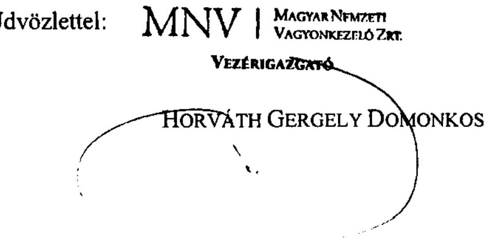

---

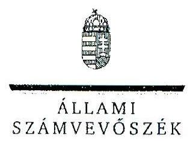

6/f sz. melléklet
a V-2017-250/2011-2012. sz. jelentéshez

ELKÖK

ÁLLAMI
SZÁMVEVŐSZÉK

Ikt.szám: V-2017-242/2011-2012.

Horváth Gergely Domonkos úr
vezérigazgató
Magyar Nemzeti Vagyonkezelő Zrt.

Budapest

Tisztelt Vezérigazgató Úr!

Az állami vagyon feletti tulajdonosi joggyakorlással kapcsolatos 2011. évi tevékenységek ellenőrzése című jelentéstervezetre tett észrevételeit köszönettel megkaptam.

Az Állami Számvevőszék észrevételekre vonatkozó álláspontjáról a felügyeleti vezető által készített részletes tájékoztatást csatoltan megküldöm.

Tájékoztatom Vezérigazgató Urat, hogy a számvevőszéki jelentés az elfogadott észrevételei figyelembevételével készül.

Budapest, 2012. 17. hó 8. nap

Tisztelettel:

Domokos László

Melléklet: Tájékoztatás az elfogadott és az el nem fogadott észrevételekről

---

# Tájékoztatás   az elfogadott és az el nem fogadott észrevételekről 

Az állami vagyon feletti tulajdonosi joggyakorlással kapcsolatos 2011. évi tevékenységek ellenőrzése című jelentéstervezetre MNV01/16735/4/2012. iktatószámú levelében tett észrevételeit áttekintettük, azok kezeléséről az alábbi tájékoztatást adom:

1. Az „I. Összegző megállapítások, következtetések, javaslatok" című fejezetben a 12. oldal harmadik bekezdéséhez az MNV Zrt. és az NFA II. vagyoni kör átadás-átvételével kapcsolatos tájékoztatásukat köszönjük. Az érintett szövegrészt az alábbiak szerint egészítjük ki:
„Az MNV és az NFA közötti II. vagyoni kör (2010. december 31-jei fordulónapi) átadás-átvétele 2011. augusztus 15-i határidővel nem történt meg.* A nyilvántartási problémák mellett az egyes vagyonkezelők (pl. MÁV Zrt., ÁAK Zrt.) nem rendelkeztek teljes körű vagyonleltárral, ami több tízezres nagyságú tétel esetében nehezítette az átadás-átvétel előkészítését."
*(lábjegyzet) Az MNV Zrt. vezérigazgatójának 2012. október 16-i jelentéstervezetre tett észrevétele szerint az MNV és az NFA közötti II. vagyoni kör átadás-átvételét az MNV (2012. július 30. véghatáridővel) végrehajtotta. Ezzel az MNV Zrt. szerint az előkészített ütemnek megfelelően az MNV Zrt. 2011. évi mérlegkészítése is határidőben megvalósult.

A vagyonátadási/vagyonrendezési feladatok jogszabályi kereteinek tisztázását célzó törvénymódosítási javaslat készítéséről szóló tájékoztatását köszönettel vettük.
2. Az „I. Összegző megállapítások, következtetések, javaslatok" című fejezetben a 13. oldal harmadik bekezdésében szereplő megállapítást a vagyongazdálkodással szemben támasztott követelmények és célok teljesítésének mérésével kapcsolatban az alábbiak szerint egészítjük ki:
„A vagyongazdálkodással szemben támasztott követelmények és célok teljesítésének mérésére, értékelésére alkalmas szempontokat - a tőkehatékonysági elvárások kijelölésére és visszamérésére alkalmas (ROE) mutatón kívül - az MNV 2011-ben nem alakított ki."
3. Az „I. Összegző megállapítások, következtetések, javaslatok" című fejezetben a 15. oldal második bekezdésében szereplő megállapítást az MNV Zrt. ellenőrzési rendszerével kapcsolatban az alábbiak szerint egészítjük ki:

---

„Az MNV ellenőrzési szervezeteinek 2010. évi integrációja a párhuzamos ellenőrzéseket megszüntette. Az ellenőrzési tevékenységek szervezeti és irányítási szabályozása, valamint az SZMSZ-szel történt összehangolása 2011-ben csak részben valósult meg. Az MNV Zrt. Ellenőrzési Igazgatóságának négyes funkciójából* adódó feladatairól a szabályzat 2012-ben került kiadásra."
*(lábjegyzet) „Az MNV Zrt. Ellenőrzési Igazgatósága ellátja az FB ellenőrzési tevékenységének segítésével kapcsolatos feladatokat, az MNV rábizott vagyonával kapcsolatos tulajdonosi ellenőrzési, valamint a vezetői és belső ellenőrzés körébe tartozó feladatokat."

Ezzel összefüggésben a részletes megállapítások vonatkozó részét (az MNV Zrt. levelében a 10-11. pontban szereplő észrevételeket) az alábbiak szerint egészítjük ki:
„Az MNV ellenőrzési szervezeteinek 2010. évi integrálásával a felügyeleti, a tulajdonosi, vezetői és a belső ellenőrzési funkciókat összevonták. Ami a párhuzamos ellenőrzéseket megszüntette és az ellenőri kapacitás jobb kihasználtságát eredményezte. Ugyanakkor az ellenőrzési tevékenységek szervezeti és irányítási szabályozása, valamint az SZMSZ-szel történt összehangolása csak részben valósult meg."
„Az ÁSZ 2011. évi 1128. sz. jelentésében megállapította, hogy az MNV-nél az Ellenőrzési Igazgatóság (EI) feladatai nem teljes körűen szabályozottak. A szabályzat elkészítését szükségessé tette, hogy az EI négyes funkciójából adódó feladatairól, komplex ellenőrzéseiről egységes szabályozás nem rendelkezett. A nemzeti fejlesztési miniszter az ÁSZ megállapításhoz kapcsolódó intézkedési terve az ellenőrzési rendszer működésének teljes körű szabályozására az MNV részére 2012. március 2. határidőt állapított meg. Az MNV Vig. a szabályzat elkészítésének határidejét már 2012. március 31-én határozta meg, majd későbbi időpontra halasztotta, így a belső ellenőrzési szabályzat elfogadására 2012. május 24-én került sor. Az elfogadott szabályzat magába foglalja a különböző ellenőrzési funkciókat, amely funkciók eljárásrendjét önálló szabályzatok rögzítik. Az FB Ellenőrzési Szabályzatában leírt eljárásrend nem követte a szervezeti változásokat, így olyan szervezeti egységnek is delegál feladatokat, amely a szervezeti összevonással megszűnt. A tulajdonosi

 ellenőrzési szabályzatot az MNV Ig. 2011. október 3-án fogadta el."
4. A „II. Részletes megállapítások 1.3.2. Az MNV beszámolása a rábízott vagyonról" címû fejezetben a 23. oldal második bekezdésében a munkaköri leírások tartalmával kapcsolatban a következőkről tájékoztatom:

A levelében a munkaköri leírásokhoz kapcsolódóan megfogalmazottak a megállapításunk helytállóságát megerősítik. Köszönjük tájékoztatását arról, hogy az ÁSZ ellenőrzés hatására levele szerint - megkezdik az érintett munkavállalók munkaköri leírásának felülvizsgálatát.
5. A „II. Részletes megállapítások 1.4.1. Az intézkedési tervek végrehajtása" címû fejezet 23. oldal második bekezdésében a kiemelt közutas vagyonkezelők jelentési feltételeivel kapcsolatban tett megállapításokat az alábbiak szerint egészítjük ki:

---

„A kiemelt közutas vagyonkezelők jelentési feltételeinek biztosítására 2011. május 31. helyett újabb határidőt tűztek ki (2012. június 30.).*"
*(lábjegyzet) „Az MNV Zrt. vezérigazgatójának a jelentéstervezetre 2012. október 16-án tett észrevétele szerint a kiemelt közutas vagyonkezelők a jelentési kötelezettségük teljesítéséhez szükséges CD telepítő lemezt megkapták."

Pontosítjuk a megállapításunkat az erdőgazdasági társaságok által kezelt ingatlanvagyonnal kapcsolatban:
„A korábbi KVI nyilvántartások adatainak duplikációja megoldása érdekében 2000-től fiktív helyrajzi számon, erdőgazdaságonként egy $\mathrm{m}^{2}$ területen tartotta nyilván a KVI, majd az MNV az erdőgazdasági társaságok által kezelt ingatlanvagyont."
6. A „II. Részletes megállapítások 1.4.2. Nyilvántartási rendszerek" címû fejezetben a 27. oldalon a központi vagyonkataszter (KVK) nyilvántartási rendszerrel kapcsolatban tett megállapításokat az alábbiakkal egészítjük ki:
„Az MNV vagyonnyilvántartó rendszerei 2011-ben nem voltak alkalmasak az elkülönített nyilvántartásra. Az MNV tájékoztatása szerint a KVK ez irányú fejlesztése folyamatban van.*"
*(lábjegyzet),,Az MNV Zrt. vezérigazgatója a jelentéstervezetre 2012. október 16-án tett észrevételében arról tájékoztatott, hogy az MNV Zrt. 2012 szeptemberében az adattartalom javítása érdekében kiadta a 27/2012. vig. utasítást a KVK ellenőrzési módszertanáról, amely az adatszolgáltatási határidőket, az alapelveket és a felelősségi kérdéseket tartalmazza."
7. A „II. Részletes megállapítások 3.1. Az MNV tulajdonosi joggyakorlása" fejezetben a 44. oldal hatodik bekezdéséhez - az MNV Zrt. társasági portfóliójával kapcsolatban - tett MNV Zrt. észrevétel nem mond ellent a jelentéstervezetben leírtaknak. A teljes egyértelműség érdekében a végleges jelentés részletes megállapítását pontosítjuk.
„A 2010. évi beszámoló egyes társaságcsoporttal és társasággal (pl. Volán társaságok, erdészeti társaságok, regionális víziközmű társaságok, lóverseny társaságok, MALÉV Zrt., Balatoni Halászati Zrt., egyes nonprofit társaságok) kapcsolatos 2010. évi döntéseket és tranzakciókat mutatja be, ennek alapján az MNV társasági portfóliója egészének működéséről és működtetéséről, a társaságokkal szemben megfogalmazott elvárások teljesüléséről nem lehet képet alkotni. A beszámoló áttekinthető módon nem csoportosítja (tartós állami tulajdonú társasági részesedéssel működő, többségi állami tulajdonú, nonprofit társaságokra) az MNV portfóliójába tartozó működő társaságokat, nem mutatja be a 2010. évben is tartósan veszteségesen működő társasági körbe tartozó társaságokat és a vagyonkezelésbe adott társaságok helyzetét. Az MNV Zrt. rábízott vagyonáról készült 2011. évi évközi beszámolói a társaságok állapotát, a társasági portfólió területén végbemenő folyamatokat, az egyes társaságcsoportok szakmai koncepciójának kidolgozását, a koncepciókban megfogalmazott irányok követését, a reorganizációs folyamatok

---

helyzetét - mivel azok az MNV portfóliójába tartozó társaságok tervezett és tényleges eredményét, illetve a főbb döntéseket tartalmazzák - nem mutatják be. A negyedévente készülő beszámolókat az MNV Igazgatósága jóváhagyta."

Az MNV Zrt. rábízott vagyonáról készített 2010. évi éves beszámoló pénzforgalmi szemléletben készült, döntően terv-tény elemzésen alapult. Az MNV Zrt. észrevételében nem csak az éves beszámoló - hanem a beszámoló jelentés - tartalmára utal, kiemelve, hogy a beszámoló jelentések részletes tartalmára, specifikálására nincs jogszabályi előírás. Előremutatónak találjuk, hogy az ÁSZ észrevételeit az MNV Zrt. a jövőben figyelembe veszi a jelentések készítése során.
8. A II. Részletes megállapítások 3.1. Az MNV tulajdonosi joggyakorlása fejezetben a 45. oldal ötödik bekezdésével kapcsolatban tett megállapításokat az alábbiak szerint egészítjük ki:
„Az MNV a 100%-os állami tulajdonban lévő társasági körre kiadott Alapítói határozatokról olyan nyilvántartást vezet, amely a határozatokban - a társaságok számára a felelős és határidő megjelölésével - meghatározott feladatok végrehajtásának teljes körű nyomon követésére nem alkalmas. Az MNV Ig. félévente összesítő jelentéseket kap a határozatok végrehajtásáról. Az alapítói határozatokkal érintett társaságok egy része nem időben számolt be a határozatok végrehajtásáról, így azok nem szerepeltek a 2011. I. félévére vonatkozó összesítő jelentésben. A 2011. II. félévéről készített összesítő jelentés a helyszíni ellenőrzés végéig még nem készült el."
9. A „II. Részletes megállapítások 3.1. Az MNV tulajdonosi joggyakorlása" című fejezetben a 49. oldal második bekezdésével kapcsolatban a következőkről tájékoztatom.

Az MNV Zrt. vagyonkezelési tervével kapcsolatban - mivel az ellenőrzött év a vagyonkezelési terv esetében is 2011 - a végleges jelentés részletes megállapításait nem pontosítjuk. Az észrevételében hivatkozott kormányhatározat 2012 áprilisában kelt. Ezért az abban foglaltakra nem lehet hivatkozni a 2011. évet érintően.

# A 10-11. pontban szereplő észrevételeket jelen levél 3. pontjában részleteztük. 

12. „Az MNV részéről az Unitárius Egyháznak átadott ingatlannal kapcsolatban a bérleti jogviszonyok rendezésére átutalt összeg felhasználásának utóellenőrzése" címû 3. sz. melléklet utolsó bekezdését az alábbiak szerint egészítjük ki:
„A kialakult jogi helyzet és egyes bérlők elzárkózó álláspontja miatt az ingatlan bérleti jogainak rendezése a közeljövőben valószínűleg nem fog megoldódni.*"
*(lábjegyzet) „Az MNV Zrt. vezérigazgatója a jelentéstervezetre 2012. október 16-án tett észrevételében arról tájékoztatott, hogy az ingatlanok kiürítése érdekében az Egyház és a bérlők között a tárgyalások a jelentés lezárása idején is folyamatban voltak."

---

13. A „Függelék" 2.2. pontja alatt a 6. oldal negyedik bekezdésében foglaltakhoz tett kiegészítő tájékoztatást a nemzeti parkok vagyonkezelési szerződéseinek előkészítéséről köszönettel vettük. A Függelék szövegmódosítása azonban nem indokolt, mivel a szerződések módosítása és a vagyonkezelésben lévő vagyonelemek felülvizsgálata még nem zárult le, illetve a jelentéstervezetben részletezett problémák - a felülvizsgálattól függetlenül is - fennálltak.
14. A „Függelék" 2.3. pontja alatt a 9. oldal első bekezdését, a regionális vízművek vagyonkezelési díjtartozásával kapcsolatban, az alábbiak szerint egészítjük ki.
„A vízművek fennálló tartozása mintegy $17,2 \mathrm{M} \mathrm{Ft}$, amelynek behajtásáról az MNV nem intézkedett.*"
*(lábjegyzet) ,,Az MNV Zrt. vezérigazgatójának a jelentéstervezetre 2012. október 16-án tett észrevétele szerint az MNV Zrt. az ÁSZ vizsgálatra tekintettel ismételten felülvizsgálta a regionális vízművek által a szerződések megkötése óta megfizetett vagyonkezelési díjakat. Az MNV megvizsgálta a vagyonkezelési díjak kiszámlázását és a befizetéseket, a díjeltérésekről 2012 szeptemberében tájékoztatták és egyben a díjelzámolással kapcsolatos álláspontjukat kérték a társaságoktól."
15. A „Függelék" 2.4. pontjának a 11. oldalon lévő utolsó bekezdésénél az MNV Zrt. (vagyonhasznosítási szerződések) észrevételében a KVK nyilvántartási rendszer ellenőrzési módszertanára vonatkozó kiegészítést kért, amelyet a jelentésben az MNV Zrt. 6. sz. észrevételéhez írtak szerint megjelenítünk.

Az MNV Zrt. tájékoztatása szerint az új vagyonkezelési szerződések megkötését megelőzően a vagyonkezeléssel érintett ingatlanok teljes körű (időigényes) vizsgálatára kerül sor, a vizsgálat eredményeként az MNV célja az ingatlanok naprakész állapotának rögzítése. A jövőben ellenőrzéseink során folyamatosan nyomon követjük a vagyonkezeléssel érintett ingatlanokkal kapcsolatos feladatok eredményes végrehajtását, de a tájékoztatás alapján a jelentés módosítását nem tartjuk indokoltnak.

Budapest, 2012. A hó 28 nap

Makkai Mária
felügyeleti vezető

---

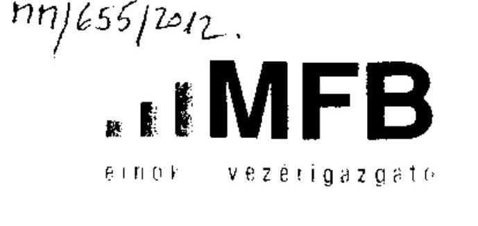

6/g sz. melléklet a V-2017-250/2011-2012. sz. jelentéshez

M600619 10542-2/2012.

Domokos László úr
elnök részére

Állami Számvevőszék
Budapest

Tisztelt Elnök Úr!

13130/
2012 OKT 18
V-2017-238/2011-2012

Pabha Pise a Pise

2012. szeptember 3-án köszönettel készséggel kaptuk „az állam vagyon feletti tulajdonjoggyakorlással kapcsolatos 2011. évi tevékenységek ellenőrzéséről" szóló számvevőszéki jelentéstervezetet.

A jelentéstervezettel kapcsolatban az MFB Zrt. a melléklet 1. pontjában az utolsó észrevételeket teszi. A jelentéstervezet két, közvetlenül az MNV Zrt.-re, illetve az MFB Zrt.-re vonatkozó, de az MFB Zrt. tulajdonosi joggyakorlás alá tartozó térségeket is érintő felvetéséhez a Bank helyzetjelentést készített, amelyet a II. fejezet tartalmaz.

"Joggyakor"
Valógpua M. M.
József 4.

10.25.12

2012.10.26.15
2012.10.26.20

Budapest, 2012. október 17.

Tisztelettel.

MFB Magyar Fejlesztési Bank Zártkörűen Működő Részvénytársaság 1051 Budapest, Nádor 31. levélcím: 1365 Budapest 5. Pt 678
telefon 428-1400 fax 428-1474 e-mail vezig@mfb.hu http:www.mfb.hu
cégjegyzékszám: 01-10-041712 Fővárosi Bíróság mint cégbíróság

---

# 1. Az MFB Zrt. észrevételei, pontosítási javaslatai az Állami Számvevőszék jelentéstervezetéhez 

### 3.2. MFB tulajdonosi joggyakorlása fejezet, 49. oldal utolsó előtti bekezdés utolsó előtti mondata

Az MFB-ben 3 vagyonkezelési főigazgatóság látta el a vagyonkezelést, vagy 4 vagyonkezelési igazgatóság.

### 3.2. MFB tulajdonosi joggyakorlása fejezet, 52. oldal harmadik bekezdés utolsó előtti mondata

„Az MFB 2010. novemberében alternatív lehetőségként bevezette a kockázat alapú ellenőrzési rendszert, majd 2011. év végén kötelező alkalmazandó módszerként elrendelte a 2012. évi belső ellenőri munkatervek elkészítéséhez."

A mondatban egy szó pontosítását kérnénk szépen:
Az MFB 2010 novemberében alternatív lehetőségként bevezette a kockázat alapú ellenőrzési rendszert módszertant, majd 2011. év végén kötelező alkalmazandó módszerként elrendelte a 2012. évi belső ellenőri munkatervek elkészítéséhez.

### 4.3.2. A társasági portfólió tulajdonosi ellenőrzése az MFB-nél fejezet, 58. oldal második bekezdés első mondata

„Az MFB BEI a 40 társaság átvételét követően 2010-ben a tulajdonosi joggyakorlás alá sorolt társaságok szabályozottságában rejlő kockázatokat felmérte."
A mondat módosítását kérnénk szépen, mivel a felmérés a társaságok irányítására, ellenőrzésére, kockázatkezelésére, szabályozottságára és a vezetés kompetenciájára terjedt ki - tehát nemcsak a szabályozottság kockázataira.

A mondatra vonatkozó módosítási javaslatunk:
Az MFB BEI a 40 társaság átvételét követően 2010-ben a tulajdonosi joggyakorlás alá sorolt társaságok irányításában, ellenőrzési rendszerében, kockázatkezelésében és szabályozottságában rejlő kockázatokat felmérte.

### 4.3.2. A társasági portfólió tulajdonosi ellenőrzése az MFB-nél fejezet, 58. oldal második bekezdés harmadik mondata

A hivatkozott helyen a második és a harmadik mondat alapján összemosódik a tulajdonosi joggyakorolt társaságok ellenőrzési tevékenységének tervezése, illetőleg a velük szemben támasztott kockázatalapú szemlélet követelménye az MFB belső ellenőrzési munkatervével (amely egyébként szintén kockázatfelmérésen alapul).
„2011-ben az MFB által kezelt rábízott vagyonhoz tartozó és a tulajdonolt társaságokkal szemben már kötelező elvárás volt az ellenőrzések kockázatalapú tervezése."
A harmadik mondatban említett ellenőrzési munkaterv már az MFB Bank 2011. évi ellenőrzési munkaterve, mert két célvizsgálatot említ a tulajdonosi joggyakorlással összefüggésben: „Az ellenőrzési munkaterv az ebben a tárgyban felvett két célvizsgálattal megfelelt a kockázatelemzés alapú kiválasztás követelményének, ...". Ezen mondatot az egyértelműség kedvéért az alábbiak szerint javasolnánk módosítani:
Az MFB 2011. évi ellenőrzési munkaterve az ebben a tárgyban felvett két célvizsgálattal megfelelt a kockázatelemzés alapú kiválasztás követelményének, ...".

### 4.3.2. A társasági portfólió tulajdonosi ellenőrzése az MFB-nél fejezet, 59. oldal második bekezdés harmadik mondata

„Az átfogó vizsgálatok között a rábízott vagyonba tartozó társaságok ellenőrzése nem szerepelt."

---

A jelentés megállapításától eltérően az MFB belső ellenőrzési munkaterv 2. Átfogó vizsgálatok 4. pontjaként szerepel a Corvinus Támogatásközvetítő Zrt. (a társaság az MFB törvény 1. és 2. számú mellékletében fel van tüntetve, tehát a társaságban részesedéssel rendelkezik az Állam és az MFB is), amelynek vizsgálata meg is valósult 2011-ben.

# II. Helyzetjelentés a jelentéstervezet egyes felvetéseire 

## I. Összegzö megállapítások, következtetések javaslatok fejezet 12. oldal 3. bekezdéséhez

Az ÁAK országos közutak feletti vagyonkezelői jogának 2006-2007. években történő megszünése ellenére ingatlan-nyilvántartási szempontból még közel 10 ezer ingatlan kapcsán szerepel az ÁAK vagyonkezelőként, illetve vannak még a vagyonkezelői jog
 átadásából kimaradt (vagy át nem vett) ingatlanok is. Ennek rendezése miatt az ÁAK 2011-et megelőzően már többször - eredménytelenül -- vette fel a kapcsolatot az MNV-vel.

Végül az Országleltár készítése miatt az MNV Zrt. 2011-ben megkereste az ÁAK-t, hogy az autópályákhoz kapcsolódó ingatlanok jogi helyzetének rendezésében működjön együtt. Ennek keretében összeállításra került az az ingatlanlista, amelyben a vagyonkezelői jog rendezése szükséges akként, hogy a kimaradt ingatlanok vagyonkezelői joga a tényleges vagyonkezelőknek átadásra kerüljön, és az ingatlan-nyilvántartás is a valós állapotot tartalmazza.

A folyamatra ütemterv is készült:

- leghamarabb a KKK és a NIF részére teljesíthető a vagyonkezelői jog háromoldalú (ÁAK-MNV-KKK és ÁAK-NIF-MNV) szerződések keretében történő átadása,
- majd ezt követné a koncessziós autópályák ingatlanjainak vagyonkezelési rendezése (minisztérium bevonásával), illetve az ÁAK-KVI közötti 2002. évben kötött vagyonkezelési szerződés aktualizálása. Ez utóbbi miatt az ÁAK Zrt. összeállított egy, közel 30 ingatlant (mérnökségi telephelyek, ügyfélszolgálati irodák, stb.) tartalmazó listát, amelyekben a jogi helyzet rendezését, illetve az azokon a 2000-2007. években végzett beruházásokkal való elszámolást kérte.

A teljes ingatlanlistából a KKK és a NIF általi visszajelzések nyomán is vannak olyan ingatlanok, amelyeknél egyértelműen kimondható, hogy azoknak a KKK-nál vagy a NIF-nél kellene lenniük (kb. 3300-3600 ingatlan), ezekkel kapcsolatban az ÁAK minden szükséges adatot és információt feldolgozott és átadott, így ezen ingatlanok vagyonkezelői jogának átadására az MNV-nél jelenleg is folyamatban van a megfelelő szerződésterveztek előkészítése.

A tervezetekkel kapcsolatban 2012. nyár eleje óta még sem az ÁAK, sem a vagyonkezelői jogot átvevő harmadik szervezetek nem kaptak információt, így az elkészülést követően az aláírásig még több közös egyeztetés várható.

### 1.4.1. Intézkedési tervek végrehajtása fejezet 25. oldal utolsó bekezdéséhez

Az MNV Zrt. 2011. év júniusában az erdőgazdaságok végleges vagyonkezelési szerződéseinek megkötésével kapcsolatos kérdések megvitatása érdekében Munkacsoportot hozott létre, amelyben részt vett az MFB Zrt. több képviselője is.
Az értekezleten elhangzottak alapján az MNV Zrt. megkezdte a személyes egyeztető tárgyalások lebonyolítását az erdőgazdasági társaságok képviselőivel.

---

2012. év februárjában az MNV Zrt. az Erdőgazdaságok végleges vagyonkezelési szerződéseinek előkészítése céljából tartott egyeztető tárgyalást.
A 2012. év februárjában megtartott Munkacsoport értekezleten elhangzottak figyelembe vétele mellett végrehajtott intézkedések, illetve eredményeinek megvitatása, továbbá a jogszabályi környezet időközben bekövetkezett változása - különösen a nemzeti vagyonról szóló 2011. évi CXCVI. törvény, valamint a 220/2011. (X.20.) Korm. rendelet hatályba lépése - és az így előállt feladatok és változások egyeztetése céljából az MNV Zrt. ismételt Munkacsoport értekezletet kezdeményezett 2012. év júliusában. Az értekezleten abban állapodtak meg a felek, hogy az MNV Zrt. és az NFA által tisztázott vagyonelemek tekintetében az MNV Zrt. minél hamarabb megköti a vagyonkezelési szerződést az erdőgazdasági társaságokkal. Megoldandó problémát jelent a vagyonkezelési díj meghatározása, amellyel kapcsoltban az MNV Zrt. ad ajánlatot. Az NFA Elnökének tájékoztatása szerint az NFA a következő évben köti meg a szerződéseket, miután lezárta a vitatott vagyonelemek megosztását az MNV Zrt.-vel.

---

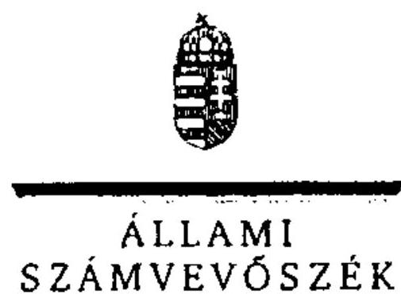

6/11 sz. melléklet
a V-2017-250/2011-2012. sz. jelentéshez

ELNÖK

ÁLLAMI
SZÁMVEVŐSZÉK

Ikt.szám: V-2017-243/2011-2012.

# Baranyay László úr 

elnök-vezérigazgató
Magyar Fejlesztési Bank Zrt.

## Budapest

## Tisztelt Elnök-vezérigazgató Úr!

Az állami vagyon feletti tulajdonosi joggyakorlással kapcsolatos 2011. évi tevékenységek ellenőrzése címú jelentéstervezetre tett észrevételeit köszönettel megkaptam.

Az Állami Számvevőszék észrevételekre vonatkozó álláspontjáról a felügyeleti vezető által készített részletes tájékoztatást csatoltan megküldöm.

Tájékoztatom Elnök-vezérigazgató Urat, hogy a számvevőszéki jelentés az elfogadott észrevételei figyelembevételével készül.

Budapest, 2012. 11. hó 25. nap
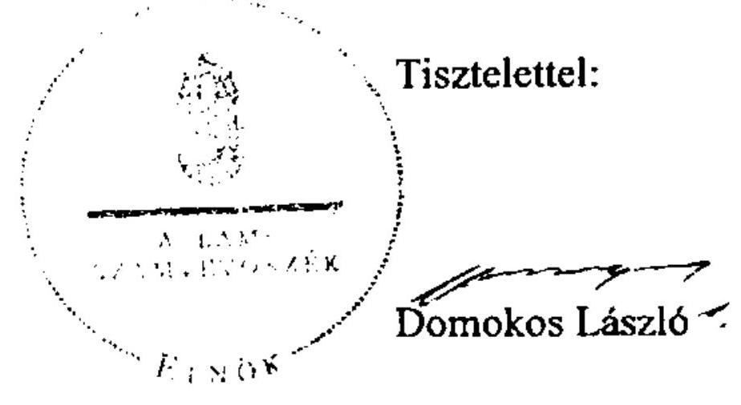

Melléklet: Tájékoztatás az elfogadott észrevételekről

---

# Tájékoztatás   az elfogadott észrevételekről 

Az állami vagyon feletti tulajdonosi joggyakorlással kapcsolatos 2011. évi tevékenységek ellenőrzése címú jelentéstervezetre a 10542-2/2012. iktatószámú levelében tett észrevételeit áttekintettük, azok kezeléséről a következő tájékoztatást adom:
3.2. MFB tulajdonosi joggyakorlása fejezet, 49. oldal utolsó előtti bekezdés utolsó előtti mondatának megállapításában levele alapján az ,,igazgatóság" helyett „föigazgatóságot" jelenítünk meg a következők szerint:
„A rábízott vagyonhoz tartozó társasági részesedések vagyonkezelését az MFB a 2011. január 3-tól hatályos SZMSZ-e alapján a társaság tevékenységének megfelelően 3 vagyonkezelési föigazgatóság látta el."
3.2. MFB tulajdonosi joggyakorlása fejezet, 52. oldal harmadik bekezdés utolsó előtti mondatában kérésének megfelelően a „rendszer" kifejezés helyett - mivel a jelentéstervezetre 2012. október 17-én tett észrevétele szerint ellenőrzési módszertan bevezetése történt - a „módszertant" szerepeltetjük:
„Az MFB FB 2010 novemberében alternatív lehetőségként bevezette a kockázat alapú ellenőrzési módszertant, majd 2011 végén kötelező, alkalmazandó módszerként elrendelte a 2012. évi belső ellenőri munkatervek elkészítéséhez."

A 4.3.2. A társasági portfólió tulajdonosi ellenőrzése az MFB-nél fejezet, 58. oldal második bekezdés első mondatát - „Az MFB BEI a 40 társaság átvételét követően 2010-ben a tulajdonosi joggyakorlás alá sorolt társaságok szabályozottságában rejlő kockázatokat felmérte." - a következőre pontosítjuk:
„Az MFB BEI a 40 társaság átvételét követően 2010-ben a tulajdonosi joggyakorlás alá sorolt társaságok irányításában, ellenőrzési rendszerében, kockázatkezelésében és szabályozottságában rejlő kockázatokat felmérte."

A 4.3.2. A társasági portfólió tulajdonosi ellenőrzése az MFB-nél fejezet, 58. oldal második bekezdés harmadik mondatát - „Az ellenőrzési munkaterv az ebben a tárgyban felvett két célvizsgálattal megfelelt a kockázatelemzés alapú kiválasztás követelményének, a vizsgálati témáknak és a tulajdonosi joggyakorlás prioritásai közötti összehangoltságnak. " - a következőre pontosítjuk:
„Az MFB 2011. évi ellenőrzési munkaterve az ebben a tárgyban felvett két célvizsgálattal megfelelt a kockázatelemzés alapú kiválasztás követelményének, a vizsgálati témáknak és a tulajdonosi joggyakorlás prioritásai közötti összehangoltságnak."

A 4.3.2. A társasági portfólió tulajdonosi ellenőrzése az MFB-nél fejezet, 58. oldal második bekezdés harmadik mondatát a levele alapján a következővel egészítjük ki:

Az átfogó vizsgálatok között a rábízott vagyonba tartozó társaságok ellenőrzése - a Corvinus Támogatásközvetítő Zrt. 2011. évi vizsgálata kivételével - nem szerepelt.

Köszönettel vettük az MNV Zrt.-re és az NFA-ra vonatkozó megállapításokhoz tett, de az MFB Zrt. tulajdonosi joggyakorlása alá tartozó társaságokat is érintő helyzetjelentést. Az abban leírtakat ellenőrzéseink során hasznosítani fogjuk.

Budapest, 2012. 28. nap

Makkai Mária
felügyeleti vezető

---

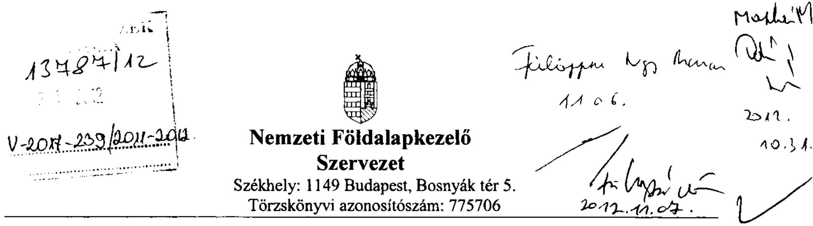

Iktatószám: NFA-14634/1/2012.
Hiv. szám: V-2017-231/2012.
Melléklet: 2 db .

# DOMOKOS LÁSZLÓ 

## Elnök

## Állami Számvevőszék Budapest

Apáczai Csere János utca 10.
1052

Tárgy: észrevételek és intézkedési terv megküldése az Állami Számvevőszék jelentéstervezetéhez.

## Tisztelt Elnök Úr!

Az Állami Számvevőszék (ÁSZ) 2012. szeptember 27-én kelt V-2017-231/2012. ikt. sz. levelében megküldött - az állami vagyon feletti tulajdonosi joggyakorlással kapcsolatos 2011. évi tevékenységekről készült - jelentéstervezetet köszönettel megkaptam.

A Nemzeti Földalapkezelő Szervezet (NFA) a jelentéstervezetet áttekintette és az észrevételeket, valamint a kapcsolódó intézkedési tervet jelen levél mellékletei tartalmazzák.

Tájékoztatom a Tisztelt Elnök Urat, hogy a Birtokpolitikai Tanács (BPT) elnökével 2012. október 25-én folytattam a tárgyban megbeszélést, az NFA Ellenőrző Bizottsága (EB) pedig 2012. október 26-án tartott ülésén tárgyalta a jelentéstervezetnek a testületre vonatkozó megállapításait. Ezek alapján az NFA mellékelt észrevételei és intézkedési terve nem terjed ki a jelentéstervezet BPT-re és EB-re vonatkozó megállapításaira.

Kérem, hogy az észrevételeinket a jelentésbe beépíteni és az intézkedési tervet elfogadni szíveskedjenek.

Budapest, 2012. október 27.
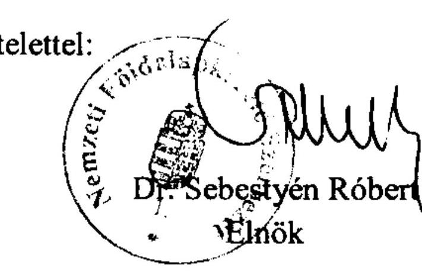

---

# Nemzeti Földalapkezelő   Szervezet   Székhely: 1149 Budapest, Bosnyák tér 5.   Törzskönyvi azonosítószám: 775706 

Iktatószám: NFA-14634/1/2012.
Hiv. szám: V-2017-231/2012.
Melléklet: Intézkedési Terv.

## ÉSZREVÉTELEK

## az állami vagyon feletti tulajdonosi joggyakorlással kapcsolatos 2011. évi tevékenység ellenőrzéséről készült jelentéstervezethez

Az Állami Számvevőszék (ÁSZ) V-2017-231/2012. ikt. sz. levelével megküldött jelentéstervezethez (Jelentéstervezet) a Nemzeti Földalapkezelő Szervezet (NFA) a következő észrevételeket teszi.

## I.   Általános észrevételek

A Jelentéstervezet I. Összegző megállapítások, következtetések, javaslatok fejezetében a Nemzeti Földalap feletti tulajdonosi joggyakorlással összefüggő 2011. évi tevékenységet reálisan értékeli, azonban a II. Részletes megállapítások fejezetben nem került rögzítésre több olyan az NFA alapításával összefüggő körülmény, ami jelentős kihatással volt 2011. évben a tulajdonosi joggyakorlásra. Ezek közül az NFA következő körülményeket tartja a legfontosabbnak.

1. A Nemzeti Földalapról szóló 2010. évi LXXXVII. törvény (Nfatv.) 2010. szeptember 1. napjával lépett hatályba, ezzel egyidejűleg a hatályát vesztette a Nemzeti Földalapról szóló többször módosított 2001. évi CXVI. törvény. Az Nfatv. hatálybalépésekor a vidékfejlesztési miniszter a tulajdonosi joggyakorlási feladatok ellátására az NFA-t mint új központi költségvetési szervet hozta létre. A XIX./1131/4/2010. ügyiratszám alatt kiadott Alapítói Okirat 12. pontja az Nfatv. 34. § (2) bekezdésével összhangban rögzíti, hogy az NFA az Nfatv. hatálya alá tartozó ingatlanokkal kapcsolatos jogok és kötelezettségek tekintetében jogutódja a korábbi tulajdonosi joggyakorló Magyar Nemzeti Vagyonkezelő Zrt.-nek (MNV Zrt.). Az NFA ezért szervezetileg nem jogutódja az MNV Zrt.-nek.
2. Az NFA alapításakor személyi állománnyal, a 2010. szeptember 1-től december 31-ig terjedő időszakra saját költségvetési forrásokkal, a feladatvégzéshez szükséges technikai és informatikai eszközökkel nem rendelkezett. Székhelyén 2011. január hónapjában tudott berendezkedni, megyei területi irodáinak kialakítása és elfoglalása

---

2011. évben fejeződött be. A létszámkeret feltöltése a 2010-2011. évi beszerzési korlátozások, valamint a 2011. évi költségvetési zárolás (intézményi fejezet) és forráselvonás következtében 2011. harmadik negyedévéig elhúzódott. A leírt körülmények között az Nfatv. 34.§ (3) bekezdésében foglalt feladatátadást-átvételt egy működő átadó (MNV Zrt.) és egy még szervezés alatt álló átvevő (NFA) között kellett lebonyolítani.
3. Az NFA több mint 2000 folyamatban lévő, illetve befejezetlen ügyet, valamint 200-nál több peres eljárást, továbbá 65 ezer ha termőföldet érintő lejárt földhasználati jogviszonyt vett át az MNV Zrt.-től. Ezek közül az átvételt követően elsődlegesen a jogvesztő határidejű folyamatban lévő vagy befejezetlen ügyek feldolgozására és érdemi intézésére kényszerült az NFA.
4. Az NFA alapításával egyidejűleg meghatározták a szervezet felépítését és a 145 fős létszámkeretet. 2011-ben - az NFA első teljes működési évében - láthatóvá vált, hogy az adott szervezeti felépítés és létszámkeret, valamint a beszerzési korlátozások és intézményi költségvetési elvonások mellett a szervezeti működés kialakítása, a működés teljes körű és összehangolt szabályozása a vártnál hosszabb időt vesz igénybe. Ezért 2012-ben új szervezeti és működési szabályokat kellett kialakítani, valamint a 2013. évi költségvetési tervben 80 fős létszám- és az ehhez szükséges intézményi költségvetési forrásbővülés szerepel. Ez utóbbi két működési feltétel megteremtését az Országgyűlésnek beterjesztett földtörvénytervezet is alátámasztja, és a forrásigényt az Országgyűlés által elfogadott 2013. évi költségvetési sarokszámok már tartalmazzák.

# II. 

## Részletes észrevételek

## 1. A Jelentéstervezet 2.1. pontja

a) Az MNV Zrt. és az NFA között a vagyonátadás I-III. szakaszát a 2012. július 30. napján kelt jegyzőkönyvvel a felek befejezték. Ugyanakkor megállapodás született arról, hogy a tulajdonosi joggyakorlás tekintetében még rendezetlen, a további előkészítést igénylő közvetetten kezelt vagyonelemek átadás-átvételét egy elkülönült IV. szakaszban hajtják végre a felek. Ezzel biztosítható volt, hogy az IV. szakaszba tartozó vagyonelemek tekintetében - ide sorolva a közös tulajdonosi joggyakorlás alá tartozó ingatlanokat is - a tulajdonosi joggyakorlással összefüggő feladatok ellátása.
b) Az I. szakaszban átadott ingatlanokhoz kapcsolódó követelés és kötelezettségállományt az MNV Zrt. alapbizonylatok és állománylisták formájában átadta, azonban a folyószámlaadatok és ügyfél-törzsadatok átadására nem került sor. Az NFA saját eljárásában a korábban átadott szerződésállomány tételes feldolgozásával állította elő a számlázáshoz szükséges adatállományokat. Ezért az NFA a
 2010-2011. évre vonatkozó haszonbérlethez és

---

más jogcímhez kapcsolódó számlázási kötelezettségének késedelmesen tudott eleget tenni.
c) A II-III. szakaszban a vagyonátadás az ingatlanok mennyiségben és nyilvántartási értéken történő átadására terjedt ki, a kapcsolódó követeléskötelezettség állomány átadására nem.
d) A fenti b)-c) pontokban foglaltak miatt az NFA 2011. évben a Nemzeti Földalapba tartozó vagyon tételes felmérésén felül megkezdte a haszonbérlőkkel kapcsolatos követelésállománynak a pénzügyi követelések elévülési határidejéig visszamenő felmérését is.
e) Az egyes földügyi tárgyú törvények módosításáról szóló 2011. évi CI. törvény 24. § (2) bekezdése 2011. augusztus 1. napjával külön szabályokat állapított meg a közös tulajdonosi joggyakorlás tárgyát képező ingatlanok haszonbérleti és vagyonkezelési dijának számlázására, ami zavarokat okoz a Magyar Államot megillető földhasznosítási bevételek beszedésében, és a kapcsolódó követelések érvényesítésében. Az NFA véleménye szerint a szabály fenntartása nem indokolt, mivel a haszonbérleti szerződések alrészlet szintjén határozzák meg a haszonbérlet tárgyát, továbbá az NFA és az MNV Zrt. megállapodások szintjén tudja kezelni a közös tulajdonosi joggyakorlás alá tartozó vagyonkezelésbe adott vagyont érintő számlázást.

# 2) A Jelentéstervezet 2.2. pontja 

a) Az NFA az alapításkor meghatározott szervezeti felépítéshez határozta meg az első szervezeti és működési szabályzatát, ami 2010. november 24-én lépett hatályba. A 2011. évi működés tapasztalatai alapján 2012. I. negyedévében megkezdte a szervezeti működés felülvizsgálatát és az új szervezeti és működési szabályzat (SZMSZ) kidolgozását. Az új SZMSZ 2012. augusztus 14-én lépett hatályba, a korábbinál pontosabban határozta meg az NFA tevékenységével összefüggő feladatköröket, azok elhatárolását és a kapcsolódó felelősségi köröket. Ennek megfelelően új szervezeti egységek kialakítására került sor. Az SZMSZ hatályba lépése egyben a mellékelt intézkedési tervben foglaltak teljesítésének alapfeltételét képezi.
b) Az SZMSZ 2. §-a rendelkezik arról, hogy az ügyrendeket a hatályba lépést követő 90 napon belül kell elkészíteni (határidő: 2012. november 12.).
c) A Nemzeti Földalap korábbi tulajdonosi joggyakorló szervezeteivel ellentétben az SZMSZ biztosítja a tulajdonosi joggyakorlási tevékenység, a vagyon- és szerződés-nyilvántartás, valamint a rábízott vagyonhoz kapcsolódó pénzügyi és számviteli tevékenység összekapcsolását, integritását. Az SZMSZ alapján a szervezeti egységek felelnek az ügyrendi, eljárásrendi szabályzatok elkészítéséért, a meghatározott ellenőrzési nyomvonalak működéséért, a belső adatszolgáltatási, bizonylatolási és pénzügyi/számviteli feladatok teljesítéséért, a belső kontrollrendszer más elemeinek működtetéséért.
d) Az SZMSZ-nek megfelelően elsőként a Gazdasági Igazgatóságot szervezte át az NFA (személyi változások, feladatátszervezés, pénzügyi és számviteli feladatok

---

elhatárolása, stb.). A Gazdasági Igazgatóság ügyrendje 2012. november 12. határidővel elkészül az Áht. 10. § (4) bekezdése, az Ávr. 9. §. (5) bekezdése és az SZMSZ 2. §-a szerint.
e) Az NFA 2010-ben és 2011-ben összesen 53 db szabályzatot alkotott, amiből 10 db a tulajdonosi joggyakorlással közvetlenül összefüggő szabályzat, 19 db a Nemzeti Földalapba tartozó vagyonnal, illetve az intézményi működéssel összefüggő gazdasági, pénzügyi és számviteli szabályzat. Az NFA általános működésével kapcsolatban 23 szabályzat készült a fenti időszakban. Az új SZMSZ-nek megfelelő szabályozási környezetet a 2012. március 31-ig tervezzük kialakítani a meglévő szabályzatok módosításával és szükség szerint új szabályzatok létrehozásával.

# 3) A Jelentéstervezet 2.3. pontja 

a) Az új SZMSZ hatályba lépésével a Birtokrendezési Igazgatóság kivezetésre került a szervezetből, mivel nem születtek meg a birtokrendezéssel összefüggő jogszabályok (többek között: birtokrendezési törvény, üzemszabályozási törvény). A megszűnt szervezeti egységhez kapcsolódó feladatokat az általános és vagyongazdálkodási elnökhelyettes irányítása alatt működő szervezeti egységekhez rendelte az SZMSZ.

## 4) A Jelentéstervezet 2.4. pontja

a) Az középtávú stratégiai tervet az NFA a hozzárendelt vagyon 2012. december 31. fordulónappal rögzített állománya, összetétele és hasznosítási helyzete alapján 2013. I. negyedévében tervezi benyújtani a BPT-nek, különös figyelemmel a vagyonátadás-átvételekkel (MNV Zrt., Honvédelmi Minisztérium, megyei önkormányzatok konszolidációja, stb.) módosult vagyonra, valamint az Országgyűlésnek a még tárgyalás alatt álló földtörvénytervezetről későbbiekben meghozott döntésére.

## 5) A Jelentéstervezet 2.5. pontja

a) A Nemzeti Földalap vagyonfejezetéről szóló 2011. évi beszámoló elkészítésének időbeliségét befolyásolta az, hogy az Nfatv. 34. § (3) bekezdés b) pontjában meghatározott feladatátadás keretében a 2012. július 11. és a 2012. július 30. napján kelt jegyzőkönyvekben foglalt 315,5 milliárd Ft és 265,5 millió Ft nyilvántartási értékű földvagyon-csoportok átadás-átvétele 2010. december 31. fordulónappal teljesült (II-III. szakasz). Ezért ezeket a vagyonelemeket az átvételt követő ellenőrzéseket követően 2011. január 1. napi nyitótételként kellett lekönyvelni és a 2011. évi beszámolóba foglalni. Ez a beszámoló késedelméhez vezetett, azonban a vonatkozó számviteli elvek betartása tekintetében mind az MNV Zrt., mind az NFA részéről indokolt lépés volt. Erről a körülményről az NFA tájékoztatta a Vidékfejlesztési Minisztériumot. A vagyonfejezet 2011. évi beszámolója (mérleg,

---

eredmény-kimutatás, kiegészítő melléklet, üzleti jelentés, könyvvizsgáló jelentése) 2012. október 12-én elkészült.
6) A Jelentéstervezet 2.6. pontja
a) Az MNV Zrt. által 2010-2012. években átadott - a Nemzeti Földalap vagyoni körébe tartozó - földrészletekhez kapcsolódó vagyon- és szerződésállomány nyilvántartási rendszere („FALAP" Rendszer) nem felel meg a vonatkozó 11/2011. (II. 22.) Korm. rendeletben rögzített követelményeknek. Ezért ezt a rendszert az NFA csak mint archív adat-nyilvántartási rendszert használja a 2010. szeptember 1. napját megelőző időszakra vonatkozóan.
b) Az NFA 2010-2012. években nem rendelkezett elegendő felhalmozási célú költségvetési forrással a jogszabályi előírásoknak megfelelő nyilvántartási rendszer kifejlesztéséhez.
c) A megkövetelt vagyon- és szerződés-nyilvántartási rendszer létrehozása érdekében a következő intézkedések történtek:

Az NFA 2011. évben tételesen felmérte és számba vette a Nemzeti Földalap vagyoni körébe tartozó földrészleteket valamint a kapcsolódó szerződésállományt és a folyó ügyekben a felmérések eredményeként létrejött adatállomány felhasználásával jár el.

Az NFA 2012. évben az EKOP 1.2.13.-2011-2011-001 számú „Integrált Nemzeti Ingatlankataszter" projekt keretében 500 millió Ft összegű támogatást nyert el a saját integrált és zártkörű vagyon- és szerződésnyilvántartási rendszerének létrehozására és fejlesztésére. A támogatási szerződést 2012. április 24. napján írták alá, a projektmenedzsmentre és a minőségbiztosításra vonatkozó szerződések 2012. szeptember 10. napján létrejöttek. Kapcsolódó közbeszerzési eljárások műszaki dokumentációinak összeállítása 2012. november hónapban befejeződik, és megindul a közbeszerzési eljárás. A fejlesztés első fázisában a rendszer tesztüzeme 2013. február hónapban indul, fejlesztés befejezésének határideje 2012. szeptember 30.

Az NFA 2012. augusztus 14-én hatályba lépett új Szervezeti és Működési Szabályzatában elkülönülten létrehozta a vagyon- és szerződésnyilvántartások vezetésére szakosodott, valamint a nyilvántartási adatbázisrendszerek működését és védelmét biztosító szervezeti egységeit. A szervezeti egységek személyi állományának feltöltése 2013-as költségvetési év elejére lesz teljes.
7) A Jelentéstervezet 4.2.2. pontja
a) A vizsgált időszakban az egyes tulajdonosi joggyakorlási ügyek keretében végzett tulajdonosi ellenőrzéseket az NFA. Ennek eredményeként két esetben az érintett

---

Mindkét esetben peres eljárás kezdődött, amiből egy eljárás azóta megszűnt, egy eljárás még folyamatban van. Ezen felül a 2011. évi időleges hasznosítási kötelezettség teljesítését szolgáló megbízási szerződések megkötéséből számos esetben kizárta azokat a korábbi földhasználókat, akik szerződéses kötelezettségeiket megszegték. A jogcím nélküli földhasználókkal szemben birtokvédelmi ügyeket kezdeményezett az NFA.
b) Az új SZMSZ hatályba lépésével közvetlenül az általános és vagyongazdálkodási elnökhelyettes irányítása alá rendelt önálló osztályként 2012. augusztus 14. napjától létrejött a Tulajdonosi Ellenőrzési Osztály. A Tulajdonosi Ellenőrzési Osztály feladata a Nemzeti Földalapba tartozó földrészletek és a kapcsolódó vagyonértékű jogok hasznosítására jogosultak (használók) szerződésben foglalt kötelezettségei teljesítésének ellenőrzése, és a szerződéses kötelezettségek nem teljesítése esetén szükséges intézkedések megtétele.

# 8) A Jelentéstervezet 4.2.3. pontja 

a) A Jelentéstervezet a 15. oldalon is megállapítja, hogy „Az NFA szervezetében 2011-ben kialakított független belső ellenőrzési szervezet 9 ellenőrzésből 7-et terv szerint elvégzett." A 2011. évre tervezett és az MNV Zrt.-NFA vagyonátadás-átvétel elhúzódása miatt elmaradt 2 ellenőrzést a Belső Ellenőrzési Osztály maradéktalanul elvégezte 2012 első félévében. Ezért kérjük, hogy az idézett megállapítás ezzel egészüljön ki.
b) Az NFA Belső Ellenőrzési Osztálya a tervezett ellenőrzések mellett több alkalommal kapott megbízást az elnöktől soron kívüli ellenőrzések lefolytatására.
c) A belső ellenőrzés 2011-ben önálló vizsgálat keretében nem ellenőrizte a rábízott vagyonról, illetve az intézményről készített pénzforgalmi beszámolók, mérlegek tartalmának valódiságát, mivel ellenőrzési tervében ez nem szerepelt. Az NFA a rábízott földvagyonra vonatkozó éves beszámolót készít, aminek auditálását az arra jogosultsággal rendelkező független könyvvizsgáló végzi.

Budapest, 2012. október 27.
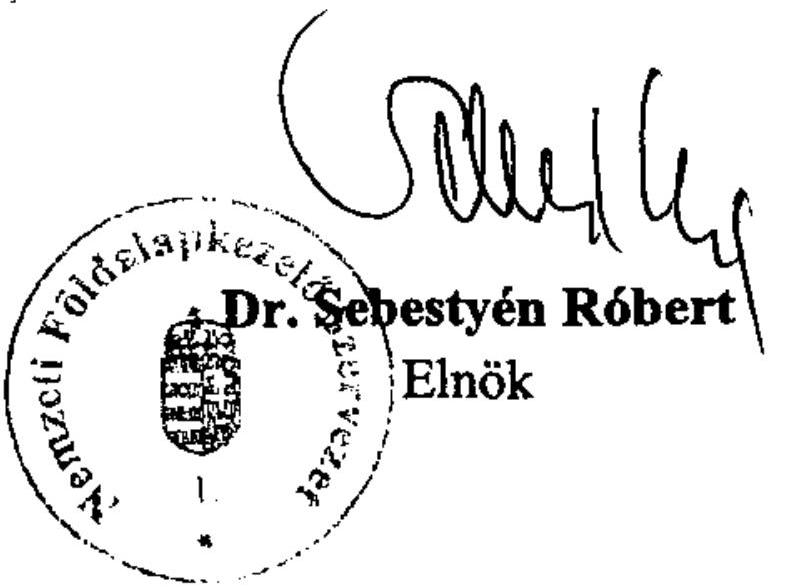

---

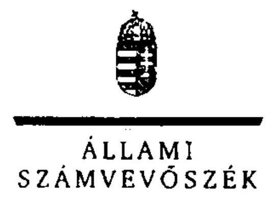

6/j sz. melléklet
a V-2017-250/2011-2012. sz. jelentéshez

ELNÖK

# Dr. Sebestyén Róbert úr 

elnök
Nemzeti Földalapkezelő Szervezet

## Budapest

## Tisztelt Elnök Úr!

Az állami vagyon feletti tulajdonosi joggyakorlással kapcsolatos 2011. évi tevékenységek ellenőrzése címú jelentéstervezetre tett észrevételeit köszönettel megkaptam.

Az Állami Számvevőszék észrevételekre vonatkozó álláspontjáról a felügyeleti vezető által készített részletes tájékoztatást csatoltan megküldöm.

Tájékoztatom Elnök urat, hogy a számvevőszéki jelentés az elfogadott észrevételei figyelembevételével készül.

Budapest, 2012. 17. hó 6. nap
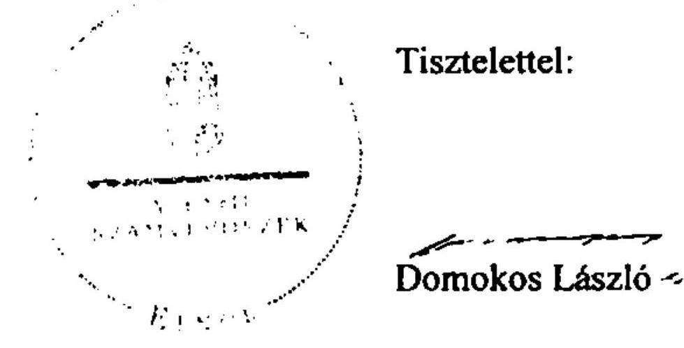

Melléklet: Tájékoztatás az elfogadott és el nem fogadott észrevételekről

---

# Tájékoztatás   az elfogadott és az el nem fogadott észrevételekről 

Az állami vagyon feletti tulajdonosi joggyakorlással kapcsolatos 2011. évi tevékenységek ellenőrzése címú jelentéstervezetre az NFA-14634/1/2012. iktatószámú levelében tett észrevételeit áttekintettük, azok kezeléséről az alábbi tájékoztatást adom:

Az ellenőrzés a Nemzeti Földalap feletti tulajdonosi joggyakorlással kapcsolatos 2011. évi tevékenység ellátását érintette, ezért megállapításaink alapvetően erre az időszakra vonatkoztak. Az összefüggések feltárása érdekében kitekintettünk a megelőző, illetve a helyszíni ellenőrzés befejezéséig terjedő időszak egyes eseményeire is (pl. a vagyon átadás-átvétele, a vagyonnyilvántartás kiépítettsége). Megköszönjük tájékoztatását azon intézkedésekről, amelyek a helyszíni ellenőrzés lezárását követő időszakban történtek, illetve amelyeket terveznek. A jelentésben - az új SZMSZ kiadása és a szabályozás, a Tulajdonosi Ellenőrzési Osztály létrehozása, valamint a Belső Ellenőrzési Osztály feladatellátása tekintetében a változás megjelenítésén kívül - szövegszerű módosítást nem hajtottunk végre, a kapott információkat a jövő évi ellenőrzésünk előkészítése során hasznosítjuk.

A jelentéstervezetre tett észrevételének I. részében (Általános észrevételek) Elnök úr kiemelte, hogy a Nemzeti Földalap feletti tulajdonosi joggyakorlással összefüggő 2011. évi tevékenységet a jelentéstervezet „I. Összegző megállapítások, következtetések, javaslatok" fejezete reálisan értékeli. Megállapításainkat minden esetben dokumentumokkal támasztottuk alá, és a helyzet leírásakor a tényeket vettük figyelembe. A bemutatott helyzet kialakulását befolyásoló levele szerint az NFA 2010. évi alapításával összefüggő körülmények részletezését köszönjük, azok alapján a jelentéstervezetben foglaltak változtatást nem igényelnek. Az észrevételekben leírtakhoz kapcsolódó ÁSZ megállapítások a jelentéstervezet „Részletes megállapításainak" 2.2. és 2.3. pontjaiban találhatók.

## Részletes észrevételek

$1 / a-d$.
Az MNV Zrt. és az NFA közötti vagyonátadással kapcsolatos tájékoztatását köszönjük, azonban - tekintettel az MNV Zrt. vezérigazgatójának a jelentéstervezetre tett észrevételére - a jelentéstervezetet a következő kiegészítéssel, és az alábbi indokok alapján pontosítjuk:
„Az MNV és az NFA közötti II. vagyoni kör (2010. december 31-jei fordulónapi) átadás-átvétele 2011. augusztus 15-i határidővel nem történt meg.*"A nyilvántartási problémák mellett az egyes vagyonkezelők (pl. MÁV Zrt., ÁAK Zrt.) nem rendelkeztek teljes körű vagyonleltárral, ami több tizezres nagyságú tétel esetében nehezítette az átadás-átvétel előkészítését."

---

*(lábjegyzet) „Az MNV Zrt. vezérigazgatójának 2012. október 16-i jelentéstervezetre tett észrevétele szerint az MNV és az NFA közötti II. vagyoni kör átadás-átvételét az MNV (2012. július 30. véghatáridővel) végrehajtotta. Ezzel az
 MNV Zrt. szerint az előkészített ütemnek megfelelően az MNV Zrt. 2011. évi mérlegkészítése is határidőben megvalósult.

Az NFA észrevétele szerint „az MNV Zrt. és az NFA között a vagyonátadás I-III. szakaszát a 2012. július 30. napján kelt jegyzőkönyvvel a felek befejezték." Az MNV Zrt. tájékoztatása szerint az MNV 2012. július 30. véghatáridővel az MNV és az NFA közötti II. vagyoni kör átadás-átvételét hajtotta végre. Az MNV Zrt. nem tett észrevételt az MNV és az NFA közötti III. vagyoni kör átadás-átvételére vonatkozó megállapításainkkal kapcsolatban, észrevételében az MNV és az NFA közös tulajdonosi joggyakorlása alá eső ingatlanok minősítésének határidejére vonatkozó törvénymódosítási javaslatról adott tájékoztatást. Az NFA észrevételében hivatkozott 2012. július 30. napján kelt jegyzőkönyvvel nem rendelkezünk, illetve nem egyértelmű, hogy az NFA és az MNV közötti II. és III. körös vagyonátadásról hány jegyzőkönyv, milyen dátummal és tartalommal készült (Észrevételének 5/a. pontja szerint két jegyzőkönyv készült). Nem kellően alátámasztott továbbá az NFA észrevételének az a következtetése, hogy - egy olyan MNV és NFA közötti vagyonátadás-átvétel esetében, amely 2012. július 30-án zárult - biztosítható volt a tulajdonosi joggyakorlással kapcsolatos feladatok ellátása. 2011-ben az MNV és az NFA közötti vagyonátadás-átvétel nem zárult le, a Nemzeti Földalapba tartozó vagyon (nyilvántartási értéken számolva) közel kétharmada nem az NFA-nál volt, 2011-ben így - noha az NFA tv. 3. §-a szerint a Nemzeti Földalap feletti tulajdonosi jogokat az NFA gyakorolja - az NFA a hozzá át nem került vagyon esetében a tulajdonosi joggyakorlással kapcsolatos feladatok ellátásának gyakorlását nem látja biztosítottnak.

A jelentéstervezet 2.1. pontjához kapcsolódó további magyarázatokat - amelyben Elnök úr arról tájékoztatott, hogy az NFA 2011-ben megkezdte a haszonbérlőkkel kapcsolatos követelésállományának a felmérését is - köszönjük, ugyanakkor azok a leírtak megváltoztatását nem indokolják.
$1 / \mathrm{e}$.
Az egyes földügyi tárgyú törvények módosításáról szóló 2011. évi CI. törvénnyel kapcsolatos észrevételükben jelezték, hogy az abban foglaltak - a közös tulajdonosi joggyakorlás tárgyát képező ingatlanok haszonbérleti és vagyonkezelési dijának számlázása - zavarokat okoznak a földhasznosítási bevételek beszedésében. Véleményük szerint a szabály fenntartása nem indokolt. A jelentéstervezet azt tartalmazza a közös tulajdonosi joggyakorlás alá eső ingatlanok haszonbérleti dijának a kiszámlázásával kapcsolatban, hogy a számlázás az NFA és az MNV közötti megállapodás hiánya miatt maradt el. Javasoljuk a jogszabály-módosítási álláspontjukat az illetékes szervnek megküldeni.
$2 /$ a-e.
Az NFA szervezeti működésének felülvizsgálatát követően 2012. augusztus 14-én hatályba lépett új SZMSZ-ével kapcsolatos tájékoztatását köszönjük, azt a jelentésben (a 2.2. pont utolsó bekezdéséhez kapcsolódóan) lábjegyzetben megjelenítjük.

---

„Az NFA a rábízott vagyonnal kapcsolatos feladatainak egy részét a feladat ellátás folyamatát, felelősségét szabályozó eljárásrendek nélkül végezte. ... A vagyonhasznosítás, vagyongazdálkodás szempontjából fontos számlázás szabályozása a 42/ 2011. (XII. 27.) Elnöki utasításban 2011. év végén történt csak meg.*"
*(lábjegyzet) ,,Az NFA elnöke 2012. október 27-én kelt észrevételében arról tájékoztatta az ÁSZ elnökét, hogy az NFA a 2011. évi működési tapasztalatai alapján 2012. I. negyedévétől felülvizsgálta a működés szervezeti és szabályozási kereteit. Ennek eredményeképpen 2012. augusztus 14-én új SZMSZ lépett hatályba, amely a korábbinál pontosabban határozta meg az NFA tevékenységével összefüggő feladatköröket, azok elhatárolását és a felelősségi köröket. Az új SZMSZ-nek megfelelő szabályozási környezet kialakítását 2013. március végéig tervezik végrehajtani."
$3 / a$.
A Birtokrendezési Igazgatósággal kapcsolatos tájékoztatását köszönjük, azt a jelentésben, lábjegyzet formájában megjelenítjük.
„Az NFA SZMSZ-ben felsorolt hat igazgatósága közül a Birtokrendezési Igazgatóság a helyszíni ellenőrzés végéig nem jött létre. Feladatait nem csoportosították át más szervezeti egységhez. Az igazgatóság részére meghatározott feladatok végrehajtásának felelősségi kérdései nem rendezettek, azok számon kérhetősége hiányzik.*"
*(lábjegyzet) ,,Az NFA elnöke 2012. október 27-én kelt észrevételében arról tájékoztatta az ÁSZ elnökét, hogy az új, hatályos SZMSZ-ben nincs nevesítve a Birtokrendezési Igazgatóság, feladatait az általános és vagyongazdálkodási elnökhelyettes irányítása alatt működő szervezeti egységekhez rendelték."
$4 / a$.
Köszönettel vettük tájékoztatását arról, hogy a középtávú stratégiai tervük benyújtása 2013. I. negyedévében várható a BPT részére. A várható intézkedés alapján a jelentéstervezet tartalmát véleményünk szerint nem indokolt módosítani.
$5 / a$.
Az NFA észrevételében nevesített „vagyonfejezet 2011. évi beszámolója" 2012. október 12-i elkészítésére vonatkozó tájékoztatását köszönjük. A kapott információkat a jövő évi ellenőrzésünk során hasznosítjuk.
$6 /$ a-c.
Az NFA vagyon-nyilvántartási tevékenységével kapcsolatos megállapításainkat az észrevételeikben leírtak megerősítik. Az új vagyon- és szerződés-nyilvántartási rendszer kialakításáról, illetve a fejlesztés befejezésének időpontjáról szóló tájékoztatást köszönjük.

---

7/a-b.
Az NFA tulajdonosi ellenőrzési feladataival kapcsolatos tájékoztatását köszönjük. A 2012. augusztus 14. napjától létrejött Tulajdonosi Ellenőrzési Osztályt a jelentésben (4.2.2. ponthoz kapcsolódóan) lábjegyzetben jelenítjük meg.
„A NFA tulajdonosi ellenőrzési feladatainak ellátását 2011-ben a szervezeti és működési feltételek hiányosságai és a vagyon átadás-átvételből adódó soron kívüli feladatok korlátozták. Az NFA-nál nincs elkülönült szervezeti egység a tulajdonosi ellenőrzési feladatok szervezett és összehangolt ellátására.*"
*(lábjegyzet) ,,Az NFA elnöke 2012. október 27-én kelt észrevételében arról tájékoztatta az ÁSZ elnökét, hogy az új SZMSZ hatályba lépésével közvetlenül az általános és vagyongazdálkodási elnökhelyettes irányítása alá rendelt önálló osztályként 2012. augusztus 14. napjától létrejött a Tulajdonosi Ellenőrzési Osztály."

8/a-c.
Az NFA belső ellenőrzési feladataival kapcsolatos tájékoztatását köszönjük, 2011. évi feladatellátásáról a jelentésben (4.2.3. ponthoz kapcsolódóan) lábjegyzetben teszünk említést.
„A tervezett 9 ellenőrzésből 7-et terv szerint végzett el az osztály. Két tervezett ellenőrzés az NFA elnökének jóváhagyásával - a vagyonátadás-átvétel elhúzódása okán - elmaradt és áthúzódott 2012-re. Emellett két terven felüli ellenőrzés végrehajtására került sor. A belső ellenőrzés 2011-ben önálló vizsgálat keretében nem ellenőrizte a rábízott vagyonról, illetve az intézményről készített pénzforgalmi beszámolók, mérlegek tartalmának valódiságát.*"
*(lábjegyzet) ,,Az NFA elnöke 2012. október 27-én kelt észrevételében arról tájékoztatta az ÁSZ elnökét, hogy a 2011. évre tervezett és az MNV Zrt.-NFA vagyonátadás-átvétel elhúzódása miatt elmaradt 2 ellenőrzést a Belső Ellenőrzési Osztály maradéktalanul elvégezte 2012. első félévében. Az NFA elnökének véleménye szerint az NFA a rábízott földvagyonra vonatkozó éves beszámolót készít, aminek auditálását az arra jogosultsággal rendelkező független könyvvizsgáló végzi."

A megküldött intézkedési tervvel kapcsolatos ÁSZ álláspontról az Állami Számvevőszékről szóló 2011. évi LXVI. tv. 33. §-a értelmében, a kiadmányozott jelentés megküldését követően, külön levélben adunk tájékoztatást.

Budapest, 2012. /A hó 28 nap
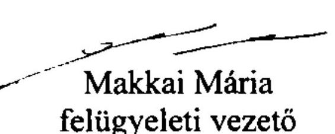

---

# FÜGGELÉK

---

# A HASZNOSÍTÁSBA ADOTT INGATLANOKKAL KAPCSOLATOS MEGÁLLAPÍTÁSOK 

## 1. A KÖZPONTI KÖLTSÉGVETÉSI SZERVEK HASZNÁLATÁBAN LÉVŐ INGATLANOKKAL VALÓ GAZDÁLKODÁS INTÉZKEDÉSEI

A központi költségvetési szervek használatába adható állami ingatlanok pontos meghatározása és a hatékonyabb ingatlangazdálkodás elérése céljából 2010. december 31-ei vagyonkezelői adatszolgáltatások alapján - az MNV Költségvetési Szervek Vagyongazdálkodási és Elhelyezési Igazgatósága (KEIG) 2011-ben felmérést készített a bérbe adott, bérelt és üres ingatlanokról. Az adatszolgáltatások alapján felülvizsgálhatóvá váltak azon jogviszonyok, ahol a bérbeadó központi költségvetési szerv ellenérték fejében adta bérbe az állami tulajdonban lévő ingatlant másik központi költségvetési szerv részére, ill. a nem piaci alapú, irreálisan alacsony áron kötött ingatlanok szerződései. Emellett megnyílt a lehetőség, hogy a felmerülő új elhelyezési igények teljesítése céljából a vagyonkezelők által nem saját használatra igénybe vett (továbbhasznosított) ingatlanokat is számításba vegyék.

Az adatok alapján a KEIG által elkészített elemzés ${ }^{1}$ szerint a központi költségvetési szervek által hasznosított ingatlanok száma (3613 darab) 27,4%-kal magasabb, mint a központi költségvetési szervek által bérelt ingatlanok száma (2835 darab). Ugyanakkor a hasznosításból származó 2010. évi díjbevétel (370 MFt/hó) jelentősen kisebb, mint a bérelt ingatlanokra kifizetett összegek (1460,7 MFt/hó). A központi költségvetési szervek által bérelt ingatlanok között a központi költségvetési szervtől bérelt ingatlanok száma 238 darab (8,4%), az önkormányzatoktól térítésmentesen használatra kapott ingatlanok száma 1014 darab (35,8%), míg a piaci szereplőtől bérelt ingatlanok száma 942 darab (33,2%). A piaci szereplő bérbeadókat az átlagostól magasabb bérleti díj jellemezte. Pl. Budapesten az átlagos irodabérleti díj 7,57 €/m²/hó volt, amennyiben a bérbeadó piaci szereplő, akkor ez átlagosan 9,9 €/m²/hó volt.

A bérelt ingatlanok átfogó elemzése szerint az átlagos bérleti díj országosan 6,82 €/m²/hó, amely Budapesten magasabb (7,28 €/m²/hó), vidéken alacsonyabb (6,29 €/m²/hó). Az átlagos irodabérleti díjak különböző összegei (átlagos, főváros, vidék) ugyanezt a tendenciát tükrözik. Az átlagos irodabérleti díj országosan 5,4 €/m²/hó volt.

A bérlők személye alapján megállapítható volt, hogy a központi költségvetési szervnek bérbe adott ingatlanok száma 258 darab (7,1%), az önkormányzatoknak térítésmentesen használatba adott ingatlanok száma 9 darab (0,2%), és a piaci szereplőknek bérbe adott ingatlanok száma 3091 darab (85,6%). Az

[^0]
[^0]: ${ }^{1}$ A 2010-re vonatkozó adatok 2011 folyamán változhattak, azonban az MNV tájékoztatása szerint az elemzés adatai - nagyságrendileg - a 2011. év egészére érvényes gyakorlatot is tükrözik.

---

elemzésből kitűnt, hogy az átlagos bérleti díj országosan 0,11 €/m²/hó, amely Budapesten magasabb (1,55 €/m²/hó), vidéken viszont alacsonyabb (0,097 €/m²/hó) volt. A vagyonkezelők többségben a piaci átlag alatt hasznosították a vagyonkezelésükben lévő ingatlanokat, pl. piaci szereplők részére hasznosított ingatlanoknál 20 darab esetben az 1 €/m²/hó mértéket sem érte el a bérleti díj. A 370 MFt/hó összesített bevételből 304 MFt/hó bérleti díjat szedtek be a szervek piaci szereplőktől.

Összesen 271 darab ingatlant adtak ingyenesen használatba a szervek, ebből 65-nél a bérlő piaci szereplő, 10-nél állami tulajdonban lévő gazdasági társaság, 30-nál pedig társadalmi szervezet.

Az elhelyezési célra alkalmas (kiemelten az irodai és raktározási tevékenységre) ingatlanok, ingatlanrészek hasznosítására, valamint az elhelyezési célú ingatlanok, ingatlanrészek bérbevételére irányuló egyedi 3540 darab szerződés vizsgálatát követően 83 darab vagyonkezelő felé történt intézkedés. Az MNV tételes felszólító levelekben felhívta a figyelmet egyes szervek által túlságosan magas bérleti díjon bérelt, vagy túlságosan alacsony bérleti díj mellett hasznosított szerződésekre és kérte a szerződések felülvizsgálatát, módosítását. Ezzel kapcsolatban 578 szerződés felülvizsgálatára történt intézkedés. 17 esetben az MNV részére az ingatlan visszaadására, 3 esetben a szerződés megszüntetésére és 1 esetben a vagyonkezelő általi bérlet felmondására vonatkozó jelzés történt.

A Budapest V. Városház u. 7. (Hrsz: 24268) ingatlan állami és önkormányzati tulajdonban van. A Kincstár a vagyonkezelt 363,6 m² területből 165,85 m² területet a Nemzeti Fogyasztóvédelmi Hatóság részére ad bérbe határozatlan idejű bérleti szerződés keretében a piaci ártól kedvezőbb (5,45 €/m²/hó) bérleti díjjal. További 89 m² területet a Közép-magyarországi Regionális Közigazgatási Hivatal (2011. 01. 01-ét követően: Kormányhivatal) használ térítésmentesen. A Szeged Széchenyi tér 9. (3938 hrsz.) ingatlan
 a Kincstár Csongrád Megyei Igazgatóságának elhelyezését biztosította, jelenleg összesen $1796,79 \mathrm{~m}^{2}$ bérbeadás (5 bérlő) útján hasznosítanak. Az alkalmazott bérleti díjak a piaci viszonyok közt helyben szokásos mértéktől (-6-8 €/m²/hó) jelentősen elmaradnak (-3 €/m²/hó)

A Fővárosi Bíróság a Canada Square Kft-vel a Budapest II. Ganz u. 14. szám alatti ingatlan $2523,31 \mathrm{~m}^{2}$ összterület nagyságú iroda/tárgyaló, $208,61 \mathrm{~m}^{2}$ alapterületű irattárolásra alkalmas helyiség, valamint 20 darab személygépkocsi parkolóhely bérbevételére kötött 2014.12.31-ig szóló határozott idejű bérleti szerződést. Az adatok szerint a bérbevett terület bérleti díja $3652 \mathrm{Ft} / \mathrm{m}^{2} /$ hó, azaz $13,5 € / \mathrm{m}^{2} /$ hó, ami meghaladja a kerületre jellemző 10,5-11,7 €/m²/hó bérleti díjat. A Budapest Ingatlanhasznosító Kft-vel a Budapest XXI. Központi út 1-15. szám alatti ingatlan $2329 \mathrm{~m}^{2}$ alapterületű irattárolásra alkalmas helyiség bérbevételére kötött 2011.12.31-ig szóló határozott idejű bérleti szerződés adatai szerint a bérbevett terület bérleti díja $1080 \mathrm{Ft} / \mathrm{m}^{2} /$ hó, azaz 4 €/m²/hó, ami meghaladja a kerületre jellemző 3 €/m²/hó bérleti díjat.

A KEIG a vagyon-nyilvántartás adattisztításával kapcsolatos tevékenységeket 2009 őszétől végzi. A feladatok három fő területe a partnertörzs tisztítása, a duplikációk és beragadt tételek kiszűrése és a jelentések tartalmának tételes vizsgálata. A partnertörzs tisztítása során kimutatást készítettek a létező központi költségvetési szervekről és azok jogelődeiről. Kigyűjtésre kerültek a vagyonkezelők által leadott jelentések (közel 24000 tétel). A tételes vizsgálat ki-

---

szűrte a hiányzó jelentéseket, amelyek pótlására felszólították a vagyonkezelőket és szükség szerint a mulasztást jelezték a felügyeleti szerveknek. A 2011. évi jelentési kötelezettség teljesítésének vizsgálata a helyszíni ellenőrzés végén még folyamatban volt. A munkarendben a KEIG hetente egy alkalommal letölti az aktuális partnertörzset a KVK-ból és az illetékességébe tartozó vagyonkezelőket leszűrve összeveti a Kincstár törzskönyvi nyilvántartásával. Megállapítja az eltéréseket, új szervezet létrejötte esetében bekéri a KVK partnertörzsébe való berögzítéshez szükséges adatokat, azokat rögzíti. Megszűnt szervezet esetén a KEIG felkutatja a megszűnt szervezet jogutódját - amennyiben a megszűnt szervezet a partnertörzsből való kilépés iránt nem intézkedett - felszólítja a záró jelentés elkészítésére. A duplikációk egyik leggyakoribb oka a jogelőd kivezetésének elmaradása. A partnertörzs tisztítása során, ha egy költségvetési szerv megszűnt, ugyanakkor aktív tételekkel szerepel a nyilvántartásban, de e tételek a jogutódoknál is szerepelnek, ezzel duplikációt okoznak. A KEIG szűri a formahibás jelentéseket, ahol a vagyonkezelő nem az összes általa vagyonkezelt eszközre ad év végi záró állapotra vonatkozó jelentést, amelyeket egyébként már korábbi években szerepeltetett a jelentésében. Emellett azonosítják az ún. nem mozgó, beragadt tételeket. A problémakör megoldásához előállították vagyonkezelőnként a tételes adatlapok állományát az összes vagyonelem vonatkozásában és kiszűrték az adott év végi záró állapotnál régebbi dátumú mozgással szereplő tételeket. Az érintett vagyonkezelőket felszólították a hibás jelentéseik javítására. Az ingatlanokra vonatkozó kataszteri jelentések tartalmával kapcsolatban jelentkező főbb típushibák voltak: a vagyonkezelő elnevezése nem egységes, a tulajdoni lapokon különböző módon került bejegyzésre; a jogelődök szerepelnek az ingatlan-nyilvántartásban; a vagyonkezelt hányad nem pontos; a földterületet nagyon sok esetben nem jelentik a vagyonkezelők, csak az épületet; önkormányzati vagy magántulajdon szerepel a vagyonkezelt földterületek, épületek között; nem pontosak a helyrajzi számok; épületeknél a tulajdoni lap szerinti helyrajzi számot indokolatlanul bővítik; a használati jogot nem az ingatlanhoz kötődő vagyoni értékű jogok között tüntetik fel, hanem az épületek, földterületek között; társasházi albetéteket csak főszámon jelentenek és nincsenek kibontva az albetétek.

A Vtv. szerint az MNV kötelessége a jogelőd által megkötött vagyonkezelési szerződések felülvizsgálata, és azok jogszabályokban foglalt előírásoknak megfelelő módosítása. A tárgykört érintő - az MNV FB 2011. júniusi 22-i ülésén elfogadott - jelentés megállapította, hogy a 314 központi költségvetési szerv vagyonkezelő közül 63-mal kötötték meg az egységes vagyonkezelési szerződést. Az MNV azonban nem rendelkezik szakcionálási lehetőséggel a szerződés megkötésére vonatkozóan, és a vagyonkezelési szerződés felmondása sem vezethet eredményre, mivel kötelezettség az állami feladat ellátás folyamatosságának biztosítása.

# 2. VAGYONHASZNOSÍTÁSI SZERZŐDÉSEK 

A Vtv. szerint az állami vagyont az MNV maga kezeli, vagy szerződés - így különösen bérlet, haszonbérlet, szerződésen alapuló haszonélvezet, vagyonkezelés megbízás - alapján központi költségvetési szervnek, természetes vagy jogi személynek, vagy jogi személyiséggel nem rendelkező gazdálkodó szervezetnek átengedi. A vagyonkezelési szerződés alapján a vagyonkezelő köteles a vagyon-

---

tárgy értékét megőrizni, állagának megóvásáról, jó karbantartásáról, működtetéséről gondoskodni, továbbá - a központi költségvetési szervek kivételével - díjat fizetni vagy szerződésben előírt más kötelezettséget teljesíteni.

Ellenőrzésünkhöz az MNV KVK rendszerében nyilvántartott, az ingatlanokat érintő mintegy 350 ezer tételből véletlen mintavételezéssel egy 62 darabos mintát (4. sz. melléklet: Mintatételek jegyzéke) választottunk ki. A mintából véletlenszerűen kiválasztott 30 darab ingatlanhoz kapcsolódó hasznosítási szerződéseket részletes szempontrendszer alapján ellenőriztünk, 32 ingatlan esetében csak a hasznosítási szerződés meglétét, annak hatályosságát, a hasznosító szervezetek tekintetében bekövetkezett változások (pl. jogutódlás) átvezetését, illetve a szerződéses jogviszonyban az ingatlan azonosíthatóságát értékeltük. Az ingatlanokkal kapcsolatos megállapításokat összesítését „A mintában szereplő vagyonelemekkel és a vonatkozó szerződésekkel kapcsolatban feltárt hibák"-ról szóló 5. sz. melléklet tartalmazza.

# 2.1. A célszerű és gazdaságos használat biztosítékai 

A részletesen ellenőrzött tételekkel összefüggő alapszerződéseket a KVI az Áht. kincstári vagyonra vonatkozó módosításának ${ }^{2}$ 1996. január 1-jei hatálybalépésekor kezelt állami vagyonra kötötte. A költségvetési szervekkel kötött szerződések határozatlan időtartamú szerződések, míg a gazdálkodó szervekkel kötöttek közül az erdőgazdaságoké ideiglenesek és időtartam meghatározás nélküliek. Az MNV nem tudta indokolni, hogy a jogelődök által megkötött egyes szerződések miért ideiglenesek, míg a többiek nem. Az 1996-1998. között megkötött határozatlan időtartamú és ideiglenes alapszerződések, valamint azok 2002-2004. közötti módosításai, és a 2010. évi egységes szerkezetbe foglalt vagyonkezelési szerződések megkötése típusszerződések alapján történt. A mindenkori vagyonkezelésbe adók (KVI, NFA, MNV) a szerződéseket a feltételek (pl. jogszabályi környezet módosítása, vagy szervezeti átalakulások) és a vagyoni kör változásakor módosították. A módosítások indokoltak voltak, vitás esetekben (pl. a környezetvédelmi szempontokat) a minisztérium állásfoglalását figyelembe vették. Azonban a jogszabályi módosítások alapján kizárólagosan állami tulajdonba tartozó ingatlanok állami tulajdonba, majd vagyonkezelésbe vétele esetenként több év késéssel történt csak meg.

A 19 db erdőgazdaság vonatkozásában a végleges vagyonkezelői szerződések megkötésével kapcsolatos előkészítő munka a helyszíni ellenőrzés idején még folyamatban volt. Hasonlóan folyamatban van az MNV és a MÁV Zrt. közötti adategyeztetés a 2001-ben megkötött vagyonkezelési szerződés pontosítása, véglegezése tárgyában.

A tételesen ellenőrzött 30 ingatlan szerződései - hiányosságaik miatt - csak részben biztosítják a Vtv. által meghatározott célok teljesítését (az állami vagyon hatékony működtetése, állagának védelme, értékének megőrzése, illetve gyarapítása, az állami és közfeladatok ellátásának elősegítése). A vizsgált

[^0]
[^0]:    ${ }^{2}$ 1995. évi CV. törvény az államháztartásról szóló 1992. évi XXXVIII. törvény és az ahhoz kapcsolódó egyes törvényi rendelkezések módosításáról

---

szerződések tartalma biztosítja a vagyonkezelési feladatok szabályozott és átlátható módon történő végrehajtását, a vagyonkezelés ellenőrzését. A szerződések a szükséges elemeket tartalmazzák, ugyanakkor esetenként (pl. az állagvédelemre, a szerződésszegésre, a vagyonkezelői jog bejegyeztetésére vonatkozóan) a kötelezettségek megfogalmazása nem biztosítja a vagyonkezelés hatékonyságának, illetve az ezzel kapcsolatos nyilvántartások pontosságának számon kérhetőségét.

Egyes szerződésekben tartalmi hiányosságok, pontatlanságok voltak. A 36. sorszámú mintatétel (Kővágószőlős Hrsz: 036) alapszerződésének 2007. évi módosításakor a bevezetőben hivatkozott jogszabály (a Nemzeti Földalapról szóló 2001. évi CXVI. tv. 3. § (1) és 6. § (3) bekezdés) a szerződés kiegészítés 2007. évi aláírása idején már nem volt hatályos. A 12. sorszámú mintatétel (Mezőnagymihály Hrsz: 022/16) esetében az alapszerződés mellékletei közül hiányzik a 2. sz. (alaptevékenységhez kapcsolódó kincstári vagyoni kör), a 4. sz. (a kezelt vagyonelemekre vonatkozó teljességi nyilatkozat) és az 5. sz. (köztartozásokra vonatkozó nyilatkozat) melléklet. Az 55. sorszámú mintatételhez (Szolnok, építmény) rendelkezésre álló dokumentáció az alapszerződéssel, ill. módosításaival kapcsolatos mellékleteket nem tartalmazott. A 6 db erdőgazdasági (36., 37., 40., 42., 44., 52. sorszámú mintatételek) alapszerződések egyes pontjai között ellentmondás volt pl. a szerződések 3.3.2. pontja szerinti vagyonkezelési díjat érintő éves felülvizsgálat a tárgyévet megelőző november végéig esedékes, míg a 3.10. pont szerinti éves felülvizsgálat a tárgyévet követő május végéig beküldendő írásos beszámolással teljesül.

Az alapszerződéseknek, egyes esetekben azok módosításainak formai hiányosságai is vannak. A részletesen ellenőrzött tételeknél minden esetben hiányoztak a mellékletekről a szerződésszámok, így azok hovatartozása, azonosítása aggályos.

A Hortobágyi Nemzeti Park Igazgatóságával kötött szerződéshez átadott iratok között lévő 14. sz. mellékleten nincs feltüntetve, hogy mikor készült és melyik szerződés-módosításhoz tartozik. Hasonló problémák jelentkeztek később a szerződés módosítások során is, pl. a 17. sorszámú mintatétel (Szentbékkálla Hrsz: 012/22) esetében a szerződés 2002., 2004. és 2005. évi módosításaikor, a 21. sorszámú mintatétel (Csongrád Hrsz: 6394) esetében a szerződés 2003. évi módosításakor, a 9. sorszámú mintatétel (Fertőhomok Hrsz: 287/249) esetében a 2010. évi egységes szerkezetbe foglalt szerződésnél.

A kiválasztott ingatlanok szerződéseinek előkészítését az MNV elődszervezetei végezték. A szerződések előkészítő dokumentumai az MNV-nél nem álltak rendelkezésre, így azok megalapozottsága nem volt megállapítható.

# 2.2. Az ingatlanok meghatározottsága a szerződésekben 

A kiválasztott 62 ingatlan közül 6 esetben (12., 24., 29., 44., 50. és 53. srsz.) a kiválasztott ingatlan nem szerepelt a szerződésekben, 4 esetben (31-33. és 55. srsz) az azonosítást a Hrsz. hiánya gátolta meg, 2 esetben (32. és 54. srsz) a Hrsz. nem létezik, és 2 ingatlan (1. és 7. srsz) szerződéseiben érintett szervezetek tekintetében bekövetkezett változások átvezetése nem történt meg.

---

A 30 db részletes ellenőrzött szerződés közül az MNV csak három esetben tudta csatolni a vagyonkezelői jogot igazoló tulajdoni lapokat. Erre vonatkozó kötelezettséget a 2010-ben kötött, egységes szerkezetbe foglalt vagyonkezelési szerződések előírtak a vagyonkezelők számára. A szerződések, a közhiteles in-gatlan-nyilvántartás és a vagyonkezelők jelentéseinek 2010. évben az MNV által megkezdett adattisztítási ellenőrzései együttesen azt támasztják alá, hogy a szerződések megkötése nem volt teljes körűen ingatlan nyilvántartási dokumentumokkal alátámasztva, az MNV jogelődje (KVI) nem követelte meg, hogy a szerződésben szereplő ingatlanokra a vagyonkezelői jog be legyen jegyezve. Ezen kötelezettség a későbbi szerződésmódosításokban elő volt írva minden esetben, de ennek teljesítését nem ellenőrizték.

A szerződések esetenként nem a valóságnak megfelelően tartalmazták a kiválasztott vagyonkezelésbe adott ingatlanokat. Több esetben a mellékletekben feltüntetett vagyonelemek egy helyrajzi számon jelöltek meg olyan ingatlanokat, amelyekről a későbbiekben alrészlet szintű adatokat jelentettek.

A 140098-1997/0100 sz. szerződés mellékletében szereplő Pétervására Hrsz: 416/1 egységes ingatlanként (iskola) szerepel, azonban a 6. srsz-ú mintatétel ennek egy részét (portásfülke) képezi. A 2600093-2003-120 sz. szerződésmódosításhoz tartozó kijelölő nyilatkozat (Iktsz:31200-3468/3/2003) mellékletében nem szerepel a mintatétel (12. sorsz. Mezőnagymihály hrsz: 0222/16), mint ahogy a teljességi nyilatkozat
 ellenére a december 5-én aláírt szerződés 3. sz. mellékletében (vagyonkezelésben lévő ingatlanok) sem. A Zalaegerszeg 035/124 hrsz. ingatlan (30. sorszámú mintatétel) a tulajdoni lap szerint 1975-ben kisajátítással került a Magyar Állam tulajdonába; azonban a 300199-1997/0000 vagyonkezelési szerződés ingatlan melléklete nem tartalmazta ezt a hrsz-ot.

A Bükki Nemzeti Park Igazgatósággal alapvetően jogszabályváltozások miatt szükségessé váló - jelenleg is hatályos - 2003. évi szerződésmódosításhoz tartozó, 2003. november 21-ei keltezésű kijelölő nyilatkozata mellékletében nem szerepel a mintatétel (12. sorszámú Mezőnagymihály hrsz: 0222/16), mint ahogy a teljességi nyilatkozattal a december 5-én aláírt szerződés 3. sz. mellékletében (vagyonkezelésben lévő ingatlanok) sem. (Az alapszerződés védett területekre vonatkozó mellékletében szerepel a kérdéses ingatlan több olyan ingatlannal együtt, amelyek a szúrópróba szerű ellenőrzés eredményeként szerepelnek a módosításhoz tartozó felsorolásban is.) A vagyonelemre vonatkozó utolsó adatszolgáltatás ugyanakkor 2011. 12. 31-ei állapotra vonatkozik. Jelentős eltérés tapasztalható a kijelölő nyilatkozat, illetve a szerződés 3. sz. mellékletében szereplő ingatlanok összesítő adatai között. A kijelölésben 137 863,36 AK értékű, összesen 26650,5711 ha vagyonkezelésbe adását rögzítették, néhány nappal később a szerződés mellékletében már csak 24679,1836 ha terület kezelését tüntették fel, igaz 138 852,79 AK értékben. Az eltérés a területben -1971,3875 ha, az értékben pedig +989,43 AK.

A Dunántúli Regionális Vízmű Zrt. vagyonkezelésében megjelölt Badacsonytördemic hrsz. nélkül jelzett a mintához tartozó vagyonelem esetében megállapításra került, hogy a vagyonkezelő egy nem létező (ingatlan nyilvántartásban nem szereplő) hrsz. számon építmény vagyonelemet jelent a vagyonkataszterbe. A vagyonkataszteri adatok pontosítása érdekében az MNV Speciális Vagyonelemek Igazgatósága a vagyonkezelők részére adategyeztető táblázatot küldött, amelyben kérte a táblázat és a társaság saját nyilvántartásának összevetését és a szükséges intézkedések megtételét. A rendezés jelenleg még folyamatban van.

A Dunántúli Regionális Vízmű Zrt-nél végzett adattisztítás eredményeként 356 db ingatlan bizonyult mindhárom (földhivatali, vagyonkezelési szerződés és a társaság analitikája) nyilvántartásban rendezettnek. 90 darabnak be kell kerülni a vk. szerződésbe, 45 darabnak ki kell kerülnie, 29 darab esetén a szerződés módosítása szükséges. A közhiteles nyilvántartásban 73 ingatlannál kell a társaság vagyonkezelői jogát bejegyezni.

A Zalaegerszeg 035/124 hrsz. ingatlan a tulajdoni lap szerint 1975-ben kisajátítással került az állam tulajdonába (kezelő a Zala Megyei Állami Közútkezelő Kht.), de a vagyonkezelési szerződés ingatlan melléklete nem tartalmazta ezt a hrsz-ot, viszont a társaság jelentette a vagyonkataszterbe. A Kht. jogelődje volt a Magyar Közút Zrt. társaságnak. Jelenleg is folyamatban van az adategyeztetés a vagyonkezelt ingatlanok listájának elkészítése érdekében, amely a Magyar Közút Zrt-vel kötendő vagyonkezelési szerződés részét fogja képezni.

A Kecskemét, 32270/3 hrsz. vagyonelemhez az ellenőrzés által kért dokumentációt az MNV nem tudta átadni, mivel a 2000-2005. időszakban az MNV tájékoztatása szerint az Észak-Magyarországi Autópálya kezelő és fejlesztő Rt. vagyonkezelésében volt ugyan, de a földhivatali nyilvántartásban ilyen ingatlan nem szerepelt. (Takarnet lekérdezés 2012. 05. 24.) Jelenleg az út-társaságok vagyonátadása és jogutódlása miatt az MNV adategyeztetést folytat a Közlekedésfejlesztési Koordinációs Központ, a Nemzeti Infrastruktúrális Fejlesztő Zrt., a Magyar Közút Zrt., az Állami Autópályakezelő Zrt. társaságokkal a vagyonkezelt ingatlanok adatainak rendezése érdekében. Ezen egyeztetés tárgyát képezik szintén a vizsgált mintában szereplő, Kokad 07/1 és a Kaposgyarmat 102/1 hrsz., valamint az AKA Rt. 1999. dec. 31-ről küldött jelentésében még szerepelt Kecskemét 32270/3 hrsz. ingatlan is.

A Szombathelyi Erdészeti Zrt-vel kötött szerződéshez csatolt lista pontatlan, mivel abban 233/b hrsz. ingatlan szerepel, ami 2,5151 ha gyep, rét ingatlant takar. A kiválasztott vagyonelem 233/1 hrsz. található meg a vagyonkataszterben, és a körmendi Körzeti Földhivatal nyilvántartásában is, azonban 2,0363 ha területtel.

# 2.3. A sajátosságok, a jogok és kötelezettségek részletezettsége 

A vagyonkezelési szerződések tartalmazták a kiválasztott ingatlanok vagyonkezelése során érvényesítendő kiemelt szempontokat (pl. természetvédelmi területek, múemlékek stb.) és a vagyonkezelő ehhez kapcsolódó kötelezettségeit, amelyeket külön mellékletekben jelenítettek meg. A részletesen ellenőrzött szerződések meghatározták a megszűnéskor - rendes, illetve rendkívüli felmondás esetén - megteendő intézkedéseket, kötelezettségeket. A megvizsgált szerződések többségét a KVI kötötte. A szerződések tartalmazzák a felek jogait és kötelezettségeit, és költségvetési szervek esetén a szerződések időbeli hatályát.

A nem költségvetési szervekkel kötött vagyonkezelési szerződésekben a vagyonkezelési jog megszerzésének ellentételezéséért vagyonkezelői díjat, ill. ellenszolgáltatást (pl. MÁV Zrt.) kötött ki a tulajdonosi jogokat gyakorló szervezet (KVI, NFA, MNV). A vagyonkezelési díj megállapításának indokairól, illetve részleteiről az MNV nem tudott információt szolgáltatni. A számlakibocsátás a szakterületek felelőssége, a szerződésben foglaltak manuális figyelésével.

A Regionális Vízmű Zrt-k vonatkozásában az alapszerződésekben meghatározott vagyonkezelési díjaknak a szerződésekben meghatározott módszer szerint, KSH által közölt inflációval megnövelt összeggel történő számlázásra az MNV intézkedett. A 2008-2010. években az MNV által számított és számlázott összegeket a regionális vízművek befizették. A 2011. évi díjak szerződés szerinti összegét az MNV megállapította, de az ellenőrzés részére 2012. március 9-én készített kimutatás szerint addig egyik társaság sem fizetett. Az MNV 2012. augusztusi tájékoztatása szerint a regionális víziközmű társaságok által 2012. évben fizetendő (2011. évre vonatkozó) vagyonkezelési díj (összesen bruttó 16 360 082 Ft) kiszámlázása 2012 márciusában megtörtént. A díjak 2012. április és május hónapok során teljes egészében befolytak.

A szerződések 1998. évi megkötését követően a díjakat valamennyi évben a KSH adatainak figyelembe vételével kellett volna újra megállapítani a szerződésben megfogalmazott elv szerint, ugyanakkor a szerződés pontatlan megfogalmazása ${ }^{3}$ a számlázott összegeket aggályossá teszi. Egyrészt nem került rögzítésre, mikor kell teljesíteni a fizetési kötelezettséget, másrészt az infláció ilyen megfogalmazása nem egyértelmű, mivel adott évre lehet az előző évi, vagy az arra az évre vonatkozó inflációval is számolni. A KVI a számlázott évre vonatkozó inflációval (a 2000. év kivételével, amikor a KSH szerinti 109,8 % helyett tévesen 110,1 %-kal) számolt, és ezt a gyakorlatot az MNV is átvette. Az MNV megalakulását követően a 6 db regionális vízmű részére kiszámlázott vagyonkezelési díj megegyezett a befizetésekkel, ugyanakkor a 2008. évet megelőzően 1998-2007 között a 60 db esedékes számlázásból mindösszesen csak 6 esetben volt egyezőség.

A KVI időszakában 3 esetben az is előfordult, hogy a vagyonkezelő egyáltalán nem fizetett vagyonkezelői díjat. A KVI által kiszámlázott és befizetett, illetve a szerződés alapján kiszámlázható vagyonkezelési díjak között egyes esetekben eltérés mutatható ki a Magyar Állam hátrányára. Ez pl. a Dunántúli Regionális Vízmű Zrt. 2007. évi díját érintően 1 704 516 Ft volt.

Az infláció figyelembe vételének módja jelentős eltérést okozhat a jövőbeni díjakra vonatkozóan is. A Dunántúli Regionális Vízmű Zrt. esetében az 1998. áprilisban megkötött vagyonkezelési szerződés alapján az adott évre vonatkozó inflációval számolva 6 341 262 Ft, az előző évi inflációval számolva 6 975 999 Ft a 2011. évre vonatkozó vagyonkezelési díj. (A KVI és ennek alapján az MNV is a KSH-tól eltérően a 2000. évi adatot 109,8 helyett 110,1%-kal vette figyelembe a számlázásnál.)

Az egyes regionális vízművek által fizetett díjaknál sajátos összefüggés állapítható meg. Az Észak-magyarországi és a Dunántúli Regionális Vízművek Zrt-k 2000-2003-ig az inflációval növelt díjak helyett az 1998. évi alapösszeget fizették a KVI-nek, a Dunántúli Reg. Vízmű Rt. emellett 1998 és 1999. évekre egyáltalán nem fizetett díjat a KVI részére. Ezzel szemben a másik négy vízmű Rt. egyre növekvő, de a szerződés szerintivel nem pontosan egyező díjakat fizetett.

Az MNV valamennyi regionális vízmű vagyonkezelési díjának elszámolását felülvizsgálta 2008. év végén - 2009. év elején, azonban a felülvizsgálat eredményét nem megfelelően hasznosította, ugyanis nem intézkedett az egyes vízművek felé a nem, vagy nem a szerződésben lefektetett elveknek megfelelően számlázott díjak utólagos behajtására. Az MNV számításai szerint, ha évente az infláció figyelembe vételével módosították volna a fizetendő díjakat, a 6 regionális vízmű - a 2008. évet is figyelembe véve - összesen 28,3 M Ft-tal kisebb díjat fizetett a szerződések teljes időszakában, mint amit a szerződések alapján kellett volna. A 2008. évi díjakat 2008. év végén kiszámlázták és 2009. júniusig befizették. A vízművek fennálló tartozása mintegy 17,2 M Ft, melynek behajtására az MNV nem intézkedett ${ }^{4}$. Ezen összeg 88%-át a Dunántúli Regionális Vízmű halmozta fel.

A felülvizsgálat keretében az MNV Tulajdonosi Ügyekért Felelős Igazgatósága valamennyi vízműtől levélben kért tájékoztatást a vagyonkezelési szerződés kezdetétől (1998) a vagyonkezelői díjfizetés teljesítéséről, valamint beszámolót kértek a az illetékes (MNV) megyei területi irodáktól a vagyonkezelési díjfizetések számlázási gyakorlatáról. A beérkezett dokumentumok alapján tájékoztatást készítettek az MNV Gazdasági Vigh. részére. A feljegyzésben egyrészt megállapították, hogy a díjak kiszámlázásának menete és a szerződések esetenként módosításainak kezdeményezője és aláírója sem volt egységes, néhány társaság esetén a KVI központ, néhány társaság esetén a KVI illetékes kirendeltsége, vagy regionális igazgatósága bocsátotta ki a számlát. Megállapították, hogy a KVI illetve egyes irodái, kirendeltségei nem minden esetben végezték el az infláció követését a szerződések módosításával, továbbá a kiszámlázás és a befizetések nem minden esetben voltak dokumentumokkal alátámaszthatók. Felhívták ugyan a gazdasági vig.h. figyelmét a fizetendő és a ténylegesen befolyt díjak különbözetére, de annak rendezésére 2008. év kivételével nem tettek javaslatot és a gazdasági vig.h. sem intézkedett.

A kontrollrendszer hiányosságait mutatja, hogy a KVI Regionális igazgatója a Dunántúli Regionális Vízmű Rt esetén a 2000. évi és a 2001. évi díjakat inflációs rátával nem korrigálta, az 1998. évre megállapított összegeket - nettó 2 915 000 Ft-ot - számlázta 2001. március 13-án. A 2002. évi díjra vonatkozó 2002. december 23-ai banki kivonat szerint a díj megegyezett a korábbival. A 2003. évi díjat 2004. év januárban számlázták, szintén az 1998. évi összegben. 2005. év elején úgy módosította a KVI regionális igazgatója a 2000. évi szerződés szerinti (4 évvel korábban megállapított) díjat, hogy felszorozta az egyéves infláció mértékével (1,068-del). A szerződésmódosítást ellenjegyezte ugyan egy ügyvédi iroda, de azt nem észrevételezte, hogy a mondat elején szereplő bruttó 4 280 678 Ft még a 2004. évi díj összegére, ami a mondat vége szerint már a 2005-re vonatkozik. Ezt a
 díjat számlázták 2004-ben és 2005-ben, majd a 2006. évi díjat megállapító 2007. évi szerződésmódosításban (300436/2007/0113.sz.) ismét hibás logikával egy éves inflációs rátával emelték a díjat 2 évre vonatkozóan (2006. évben nem volt díjmegállapítás). A szerződések hibás logikáját az is alátámasztja, hogy az MNV által 2009. január 15-én készített kimutatásban a 2004. és a 2005. évi nettó díjak (3424542 Ft), valamint a 2006. és a 2007. évi díjak (3558099 Ft) egymással közel azonos összegűek.

Az Erdőgazdaságok alapszerződései alapján az 50-100 Ft/ha/év vagyonkezelési díjak megalapozottsága nem volt megítélhető. A vizsgált Erdőgazdasági Zrt-k részére az MNV részéről 2008-2010. között csak a 2008. évi időszakra vonatkozóan történt meg a vagyonkezelési díjak kiszámlázása. A megkötött ideiglenes vagyonkezelési szerződések alapján a vagyonkezelői díj mértékét évente állapítják meg. A tárgyévi értékét a szerződésnek a megelőző év november 30-ig esedékes felülvizsgálata során a felek az adott évre vonatkozó külön megállapodásban határozzák meg. Az MNV-től kapott tájékoztatás szerint 2008-2012. időszakban mindössze egyetlen alkalommal számláztak az erdőgazdaságok részére (2008. évi díjat). De ekkor eltértek a szerződésben foglaltaktól, mivel nem a tárgyidőszakban, az esedékesség idején, hanem egy évvel később számláztak, és akkor folyt be a bevétel is. Mivel 2009., 2010. évekre vonatkozóan az MNV az ellenőrzés részére számlázási dokumentációt nem tudott átadni. Ezzel kapcsolatban az MNV illetékes igazgatósága azonnali intézkedés megtételéről tájékoztatta az ÁSZ-t. A 2011. év időszakára vonatkozó számlázás 2012. júniusában még folyamatban volt.

A Bányavagyon Hasznosító Kht.-val (BVH) kötött szerződés a vagyonkezelési jog megszerzésének ellenértékét 50 M Ft-ban állapította meg. 2006. és 2007. évekre vonatkozóan a KVI nem számlázta az éves díjat a BVH felé, de az MNV 2008-ban ezt utólag pótolta. A szerződés szerint a BVH a díjakat a tárgyév „április 31-ig” köteles megfizetni. Az MNV egyetlen évben sem számlázott időben.

Az MNV 2011. évi pénzügyi beszámolója a tervezetthez képest 152%-os teljesüléssel, összesen 3 543,1 M Ft vagyonkezelési díj realizálását rögzíti. Ezen bevételek jelentős részét (97,8%) két légiközlekedéssel kapcsolatos cég befizetései teszik ki, az előző évi légiforgalom növekedés díjfizetésével összefüggésben.

A vagyonkezelési szerződések a vagyonkezelők részére a továbbhasznosításra vonatkozóan lehetőséget biztosítottak. A továbbhasznosítással kapcsolatban azonban az MNV nem rendelkezik teljes körű információval. Az erdőgazdaságok vagyonkezelői szerződéseivel kapcsolatos tárgyalások egyik lényeges pontja ezen jogok gyakorlásának, ill. az ebből befolyó bevételek felhasználásának a tisztázása.

A szerződések tartalmaznak az ingatlanok állagmegóvására, fejlesztésére vonatkozó kötelezettségeket. Az 1996-1998. években megkötött alapszerződések szerint „a vagyonkezelő a jó gazda gondosságával biztosítja a kincstári vagyon fenntartását, felújítását, karbantartását és állagvédelmét”. A 2002-2003. évi módosítások ezt kiegészítették azzal, hogy a vagyonkezelő a hatékonyság érdekében vagyongazdálkodásra kiképzett alkalmazott foglalkoztatásáról gondoskodik 5 éven belül. Ezen kötelezettségek teljesítésére vonatkozó beszámolási kötelezett-

---

séget a KVI nem írt elő. Az ellenőrzés részére erre utaló irat az MNV nem tudott átadni. Az egységes szerkezetbe foglalt 2010. évi szerződések az utóbbi kikötést mellőzve csak a kezelt vagyon értékmegőrzésének, rendeltetésszerű használatának, közterhei viselésének, fenntartásának és állagvédelmének kötelezettségét fogalmazták meg, továbbá előírták, annak indoklását, ha az adott évi értéknövelő beruházások, felújítások összege nem éri el az értékcsökkenés mértékét.

# 2.4. Adatszolgáltatás, nyilvántartás és ellenőrzés 

A vagyonkezelő szervek és az MNV, illetve jogelődje a KVI a vagyonkezelt ingatlanokkal kapcsolatos elszámolásokat az alapszerződések 8.1 pontja alapján általában folyamatosan végezték. Egyes esetekben az adatszolgáltatás elmaradt és a nem költségvetési szerv vagyonkezelőknél - jellemzően erdészeti társaságok - esetenként a kezelt vagyon értékének kimutatása nem a valóságot tükrözi. Az erdők értékét az erdőgazdasági társaságok „0” Ft-on tartják nyilván a mérlegükben.

Az erdőgazdaságok nyilvántartási szokásainak hátteréhez a Mecseki Erdészeti Zrt. 2005. és 2006. évi beszámolójának kiegészítő melléklete tartalmazott információkat, mely szerint: „Az ideiglenes vagyonkezelői szerződés 1. sz. melléklete az erdőket és az ahhoz szorosan kapcsolódó ingatlanokat érték nélkül, csak naturáliákban tartalmazza, így eszközként a mérlegben való kimutatásuk nem lehetséges. A PM Számviteli Főosztályának 9806/1997(NG-1129/97) sz. ügyirata ezzel kapcsolatban leszögezte: »A számviteli törvény 21. §-ának (3) bekezdésében megfogalmazott előírás feltételezi, hogy a kezelt kincstári vagyon megfelelő módon, dokumentáltan értékelésre kerül, hiszen csak ez esetben lehet azt az eszközök között értékkel kimutatni. Ebből - természetesen - az is következik, amíg megfelelő értékelés nem áll rendelkezésre, vagy az adott kincstári vagyont nem lehet a természeténél fogva értékelni, addig nem lehet alkalmazni a törvény hivatkozott 21. § (3) bekezdésének rendelkezését sem. «A 2000. évi C tv. 23. § (2) bekezdése tartalmában megegyezik a hivatkozott 1991. évi XVIII. tv. 21. § (3) bekezdésével, így az állásfoglalás tartalmában most is hatályos.”

A Vtv. végrehajtására kiadott, az állami vagyonnal való gazdálkodásról szóló 254/2007. (X. 4.) Korm. rendelet 13. § (2) szerint mennyiségben és értékben is nyilván kell tartania az MNV-nek, azonban a (3) bekezdés alapján „az értékben történő nyilvántartástól csak abban az esetben lehet eltekinteni, ha az adott vagyontárgy értéke természeténél, jellegénél fogva nem állapítható meg”. (A korábbi, a kincstári vagyonnal való gazdálkodásról szóló 58/2005. (IV. 4.) Korm. rendelet (18. § (3) - (4) bek.), valamint az azt megelőző, a kincstári vagyon kezeléséről, értékesítéséről és az e vagyonnal kapcsolatos egyéb kötelezettségekről szóló 183/1996. (XII. 11.) Korm. rendelet (18. § (3) - (4) bek.) szinte szó szerint azonosan fogalmazott.)

Az alkalmazott gyakorlat ellentétes a Sztv. 16. § (1) bekezdésében megfogalmazott egyedi értékelés elvével. A gyakorlat alapját képező PM állásfoglalás nincs összhangban a számviteli alapelvvel, a kormányrendelet megengedő rendelkezése pedig ezekben az esetekben nem alkalmazható, mivel a vagyonelemek (pl. erdő, legelő stb.) értéke természeténél, jellegénél fogva természetesen meghatá-

---

rozható. Az MNV 2012. december 31. határidővel tervezi az erdőgazdaságokkal az új vagyonkezelési szerződések megkötését az értékek meghatározását.

Az MNV nyilvántartása nem teljes körűen és nem a valóságnak megfelelően tartalmazta egyes ingatlanok adatait (pl. Kecskemét 32270/3. hrsz., Kaposgyarmat 102/1. hrsz.) Az MNV a 254/2007.(X.4.) Korm. rendelet 14. § (1) bekezdés alapján a vagyonkezelők felelősségét szem előtt tartva vette nyilvántartásba a beküldött adatokat, azonban azok helyességét, valódiságát csak eseti jelleggel ellenőrizte. Az adatok alátámasztására szolgáló leltárakat pedig egyáltalán nem kontrollálta. Az MNV tájékoztatása szerint a mintatételeink vonatkozásában az MNV korábban nem végzett ellenőrzést.
