# ÁLLAMI   SZÁMVEVŐSZÉK 

## JELENTÉS

Adony Város Önkormányzata pénzügyi helyzetének ellenőrzéséről (43/4)

---

# Állami Számvevőszék 

Iktatószám: V-3089-027/2012.
Témaszám: 1015
Vizsgálat-azonosító szám: V0560120

## Az ellenőrzést felügyelte:

Dr. Varga Sándor
számvevő igazgatóhelyettes
Az ellenőrzést vezette:
Renkó Zsuzsanna
számvevő tanácsos
Ellenőrzési csoportvezető:
Csepreginé Tancsik Erzsébet
számvevő tanácsos
Az ellenőrzést végezték:

Szeibel Gáborné
számvevő

## Patcs Regina

számvevő

---

# TARTALOMJEGYZÉK 

BEVEZETÉS ..... 7
I. ÖSSZEGZŐ MEGÁLLAPÍTÁSOK, KÖVETKEZTETÉSEK, JAVASLATOK ..... 11
II. RÉSZLETES MEGÁLLAPÍTÁSOK ..... 22

1. Az Önkormányzat kötelező és önként vállalt feladatai, a feladatellátás szervezeti keretei és annak változásai ..... 22
2. Az Önkormányzat pénzügyi egyensúlyi helyzetét befolyásoló tényezők ..... 25
2.1. A működési és a felhalmozási egyensúly változása ..... 27
2.2. Az Önkormányzat bevételeinek változása ..... 33
2.3. Az Önkormányzat folyó és felhalmozási célú kiadásainak változása ..... 35
3. Az Önkormányzat kötelezettségei ..... 37
3.1. Az Önkormányzat pénzintézettel szembeni kötelezettségeinek változása ..... 37
3.2. A szállítói kötelezettségek változása ..... 41
3.3. Egyéb kötelezettségek változása ..... 42
4. A pénzügyi egyensúly megteremtése érdekében hozott intézkedések eredménye ..... 43
5. Az ÁSZ által a korábbi években a pénzügyi egyensúly javítására tett szabályszerűségi és célszerűségi javaslatok hasznosulása ..... 47

---

# MELLÉKLETEK 

1. számú Működési és felhalmozási célú hiány/többlet az Önkormányzat zárszámadási rendeleteiben (1 oldal)
2. számú Az Önkormányzat bevételei és kiadásai, valamint adósságszolgálata 2007-2010 között (1 oldal)
3/a. számú Az Önkormányzat 2007-2010. években megvalósított, 2010. december 31-ig befejezett fejlesztései és azok forrásösszetétele (1 oldal)
3/b. számú Az Önkormányzat 2010. december 31-én folyamatban lévő fejlesztési feladataira 2010. december 31-ig teljesített kifizetések és azok forrásösszetétele (1 oldal)
3/c. számú Az Önkormányzat 2010. december 31-én folyamatban lévő fejlesztési feladataira 2010. december 31-én fennálló kötelezettségek és azok forrásösszetétele (1 oldal)
3. számú Az önkormányzati feladatok ellátásában résztvevő gazdasági társaságok (1 oldal)

---

# RÖVIDÍTÉSEK JEGYZÉKE 

## Törvények

Art.
Áht $_{1}$
Áht $_{2}$
Helyi adó tv.
Kbt.
Ötv.
Ptk.
Stabilitási tv.
Számv. tv.
2010. évi Kvtv.

## Rendeletek

Áhsz.
2007. évi költségvetési rendelet
2009. évi költségvetési rendelet
2011. évi költségvetési rendelet
2007. évi zárszámadási rendelet
2008. évi zárszámadási rendelet
2009. évi zárszámadási rendelet
2010. évi zárszámadási rendelet

## Szórövidítések

áfa
ÁSZ
EU
jegyző
Képviselő-testület
Kincstár
Kistérségi társulás
MFB
az adózás rendjéről szóló 2003. évi XCII. törvény
az államháztartásról szóló 1992. évi XXXVIII. törvény
az államháztartásról szóló 2011. évi CXCV. törvény
a helyi adókról szóló 1990. évi C. törvény
a közbeszerzésekről szóló 2003. évi CXXIX. törvény
a helyi önkormányzatokról szóló 1990. évi LXV. törvény
a Polgári Törvénykönyvről szóló 1959. évi IV. törvény
a Magyarország gazdasági stabilitásáról szóló 2011. évi CXCIV. törvény
a számvitelről szóló 2000. évi C. törvény
a Magyar Köztársaság 2010. évi költségvetéséről szóló 2009. évi CXXX. törvény
az államháztartás szervezetei beszámolási és könyvvezetési kötelezettségének sajátosságairól szóló 249/2000. (XII. 24.) Korm. rendelet
Adony Város Önkormányzat Képviselő-testületének 6/2011. (IV. 12.) számú rendelete az Önkormányzat szervezeti és működési szabályzatáról
Adony Város Önkormányzatának 4/2007. (II. 23.) számú rendelete az Önkormányzat 2007. évi költségvetéséről
Adony Város Önkormányzatának 4/2009. (II. 13.) számú rendelete az Önkormányzat 2009. évi költségvetéséről
Adony Város Önkormányzatának 3/2011. (II. 25.) számú rendelete az Önkormányzat 2011. évi költségvetéséről
Adony Város Önkormányzatának 12/2008. (IV. 25.) számú rendelete az Önkormányzat 2007. évi zárszámadásáról
Adony Város Önkormányzatának 9/2009. (IV. 30.) számú rendelete az Önkormányzat 2008. évi zárszámadásáról
Adony Város Önkormányzatának 7/2010. (IV. 30.) számú rendelete az Önkormányzat 2009. évi zárszámadásáról
Adony Város Önkormányzatának 7/2011. (IV. 25.) számú rendelete az Önkormányzat 2010. évi zárszámadásáról
általános forgalmi adó
Állami Számvevőszék
Európai Unió
Adony Város Önkormányzatának Jegyzője
Adony Város Önkormányzatának Képviselő-testülete
Magyar Államkincstár
Adonyi Többcélú Kistérségi Társulás
Magyar Fejlesztési Bank Zártkörűen Működő Részvénytársaság

---

| NKÖM | Nemzeti Kulturális Örökség Minisztériuma |
| :-- | :-- |
| OEP | Országos Egészségbiztosítási Pénztár |
| Önkormányzat | Adony Város Önkormányzata |
| polgármester | Adony Város Önkormányzatának Polgármestere |
| Polgármesteri hivatal | Adony Város Önkormányzatának Polgármesteri hivatala |
| PPP konstrukció | Public Private Partnership (Partnerségi együttműködés köz- |
| szja | feladatok ellátására a magánszektor bevonásával)   személyi jövedelemadó |

---

# ÉRTELMEZŐ SZÓTÁR 

bevételi kitettség

CLF módszer

EURIBOR
kötelező közszolgáltatás
közfeladat
önkormányzat többségi tulajdonában lévő gazdasági társaságok

Az önkormányzat pénzügyi helyzete olyan külső körülmények hatására is módosulhat, amelyekre az önkormányzatnak nincs hatása, emiatt bevételi kitettsége keletkezik. Pl. az önkormányzat bevételeinek alakulása függhet néhány nagy adózó gazdasági helyzetének, tevékenységének alakulásától, illetve székhelyének, telephelyének változásától.
Az önkormányzatok költségvetése elemzésének eszköze. A módszer következetesen elkülöníti a folyó és a felhalmozási költségvetés bevételeit és kiadásait, azok költségvetési egyenlegeit. Bizonyos mértékig a vállalati gazdálkodás logikai elemeit érvényesíti az önkormányzatok pénzügyi, jövedelmi helyzetének vizsgálata során. Az értékelés a pénzügyi kapacitás fogalmát helyezi a középpontba.
A frankfurti bankközi piacon jegyzett, az Európai Központi Bank szabályainak megfelelően megállapított kínálati kamatláb. Az EURIBOR értékét a legfontosabb európai bankok hitelkínálatának kamatlábai alapján a Reuters ügynökség számolja ki és teszi közzé naponta. A magyar pénzintézetek is ezt használják viszonyítási alapnak EUR hitelek esetén.
A helyi önkormányzati feladatkörbe tartozó, a köztisztasággal és a településtisztasággal, valamint az élet- és vagyonbiztonsággal összefüggő egyes - közszolgáltatás útján megvalósuló - közfeladatok ellátása, amelynek kötelező igénybevételét külön jogszabály (törvény, helyi önkormányzati rendelet) határoz meg.
Állami, helyi, illetve kisebbségi önkormányzati feladat, amelynek ellátásáról az államnak, illetve az önkormányzatoknak kell gondoskodni. A hatályos szabályozás szerint közfeladatot törvény és önkormányzati rendelet állapíthat meg. Az önkormányzatok által ellátandó feladatok keretszerű meghatározását az Ötv. tartalmazza.
Az önkormányzat a gazdasági társaságban a szavazatok több mint ötven százalékával vagy a Ptk. 685/B. § (2)-(3) bekezdéseiben rögzített meghatározó befolyással rendelkezik. A befolyással rendelkező akkor rendelkezik egy jogi személyben meghatározó befolyással, ha annak tagja, illetve részvényese, és jogosult e jogi személy vezető tisztségviselői vagy felügyelőbizottsága tagjai többségének megválasztására, illetve visszahívására, vagy a jogi személy más tagjaival, illetve részvényeseivel kötött megállapodás alapján egyedül rendelkezik a szavazatok több mint ötven százalékával (Ptk. 685/B. § (2) bek.). A meghatározó befolyás akkor is fennáll, ha a befolyással rendelkező számára e jogosultságok közvetett módon (köztes vállalkozásain keresztül, a Ptk. 685/B § (3), (4) bek. szerint) biztosítottak.

---

pénzügyi kapacitás
pénzügyi kockázat

SNA

A helyi önkormányzat és az önkormányzat irányítása alá tartozó költségvetési szerv többségi tulajdonában, illetve többségi befolyása alatt álló gazdálkodó szervezet esetében hitelfelvétel, kölcsönfelvétel, garancia- vagy kezességvállalás, tartozásátvállalás, tartozás-elengedés, értékpapír kibocsátás, -vásárlás, pénzügyi lízing, tartós bérleti szerződés, ingyenes vagyonjuttatás (így különösen: ajándékozás, ingyenes engedményezés), vagy követelésvásárlás, követelésengedményezés végrehajtására vonatkozóan az Áht ${ }_{1}$ 100/M. § (4) bekezdése alapján az önkormányzat rendelkezik döntési jogosultsággal.
A pénzügyi kapacitás (financial capacity) az adósok hitelfelvételi képességének azon mértéke, ahol még anélkül tudják növelni az adósságot, hogy csökkenteniük kellene akár a jelenbeli, akár a jövőben esedékes kiadásaikat a fizetésképtelenség elkerülése érdekében. (Forrás: Az önkormányzati rendszer pénzügyi helyzete, ÁSZKUT tanulmány 2010.)
A működési kockázat egyik eleme. Megmutatkozhat a költségvetés nagyságrendjének, szerkezetének nem megalapozott módosításaiban, a bevételi és a kiadási előirányzatoktól lényegesen eltérő teljesítésekben, a nem megfelelő belső kontrollrendszer működésében, a tudatos károkozásokban, a biztosítások elmaradásában, a hibás fejlesztési döntésekben, a nem a terveknek megfelelő forrásfelhasználásokban. Jelentkezhet továbbá a bevételek és kiadások ütemkülönbsége miatt felvett folyószámla- és likvidhitelek költségvetési év végén fennálló egyenlege miatt, amely az önkormányzat költségvetésébe - akár tartósan - beépülő forráshiányt jelzi.
System of National Account, azaz a Nemzeti Számlák Rendszere, amely a gazdasági szektorok által létrehozott valamennyi terméket és szolgáltatást figyelembe veszi.

---

# JELENTÉS   Adony Város Önkormányzata pénzügyi helyzetének ellenőrzéséről 

## BEVEZETÉS

Az Állami Számvevőszék 2011. évtől érvényes stratégiája új irányt szabott a helyi önkormányzatok gazdálkodásának ellenőrzésében is. Az ÁSZ - küldetése és jövőképe szerint - szilárd szakmai alapokra támaszkodva értékteremtő ellenőrzéseivel és helyzetelemzéseivel az államháztartás egészében, így a helyi önkormányzati alrendszerben is elő kívánja segíteni a közpénzek és a közvagyon szabályos, gazdaságos, hatékony és eredményes felhasználását. E folyamat részeként - az államháztartási hiány alakulásának összetevőire is figyelemmel - végezzük az önkormányzati alrendszer pénzügyi helyzetelemzését.

Az államháztartás helyi szintjén a 304 városnak ${ }^{1}$ az általuk ellátott közszolgáltatások volumenére is tekintettel a közfeladatok ellátásában kiemelt szerepe van. E települések 2011. január 1-jei népessége 3169 ezer fő volt.

Feladataik és hatásköreik az Ötv. mellett különböző ágazati törvények által meghatározottak, miközben a feladatellátás szervezeti kereteit - ezen belül a gazdasági társaságok közszolgáltatások ellátásában betöltött szerepét - saját maguk határozzák meg. A gazdasági társaságok által ellátott feladatok esetén a gazdálkodás, továbbá az önkormányzatok pénzügyi egyensúlyi helyzetére ható közvetlen kockázatok egy része kikerült az önkormányzati alrendszerből. A többségi önkormányzati tulajdonban lévő társaságok gazdálkodásának körülményei befolyásolhatják a városok pénzügyi egyensúlyi helyzetének megítélésében rejlő kockázatokat.

Az áttekintett időszakban az önkormányzati forrásszabályozás elvei lényegesen nem változtak. Az önkormányzatok gazdasági mozgásterét a központi költségvetéstől való függőség mellett jelentősen befolyásolja a helyi adókivetési jog gyakorlása. A városok gazdálkodási szabadságának lényeges eleme, hogy anyagi lehetőségeik függvényében dönthettek arról, hogy feladataik közül azokat, amelyek megoldására az Ötv. szerint a települési önkormányzat nem kötelezhető, a megyei önkormányzat fenntartásába adhatták. E döntések differenciáltan érintették a városok pénzügyi helyzetét.

[^0]
[^0]:    ${ }^{1}$ A megyei jogú városok nélkül figyelembe vett városok száma 304 városi önkormányzatot jelent.

---

A városi önkormányzatok 2007-2010 között teljesített bevételeinek alakulását és összetételét a következő ábra szemlélteti:

Az önkormányzati alrendszer pénzügyi helyzetértékelése során új elemzési módszereket alkalmaz az ellenőrzés. A költségvetési beszámoló adatok elemzése helyett az önkormányzat pénzügyi helyzetét a CLF módszerrel értékeljük, amelynek lényegét és számításának módszerét a jelentés 2. pontjában, és a jelentés 2. számú mellékletében ismertetjük részletesen.

Az új módszereken alapuló helyzetértékelés fontosságát az adja, hogy a helyi önkormányzatok bruttó adósságállománya ${ }^{2}$ a 2010. évi költségvetési beszámolók alapján 1248 milliárd Ft-ot tett ki. Ezen belül a 304 város adóssága 383 milliárd Ft volt, amely az önkormányzati alrendszer teljes adósságállományának 30,7 %-át jelentette ${ }^{3}$.

A mérlegben kimutatott bruttó adósságállomány mellett az önkormányzatok számára az eszközállomány műszaki állapotának megőrzése is előbb-utóbb pénzügyi kötelezettséget jelent. Az elhasználódott eszközök pótlására forrást biztosító amortizációs (felújítási) alap képzésének ${ }^{4}$ elmaradása maga után vonhatja a feladatellátást kiszolgáló tárgyi eszközök állagának erőteljes romlását.

[^0]
[^0]:    ${ }^{2}$ Az önkormányzati mérlegbeszámolókból számított bruttó adósságállomány 2010. év végi összege magában foglalja a fejlesztési és a működési célú kötvénykibocsátások, a beruházási és fejlesztési hitelek, a működési célú hosszú lejáratú hitelek, a rövid lejáratú hitelek, váltótartozások miatti kötelezettségek teljes (2011-ben, illetve az azt követő években esedékes) állományát. Az önkormányzatok 2007. év végi mérleg szerinti adósságállománya 692 milliárd Ft volt.
    ${ }^{3}$ A fővárosi és a kerületi önkormányzatok adósságának figyelmen kívül hagyásával számított 977 milliárd Ft összegű bruttó adósságállományból a városok 39,2\%-kal részesedtek.
    ${ }^{4}$ Erre a jelenlegi szabályozási környezetben nem kötelezi előírás az önkormányzatokat.

---

Emellett a 2007-2013-as időszakra meghirdetett, vissza nem térítendő EU-s fejlesztési forrásokhoz való hozzájutás lehetősége felerősítette az önkormányzati alrendszer fejlesztési igényeit, amelyek a felhalmozási költségvetési hiány folyamatos emelkedésén túl - az előírt jövőbeni fenntartási kötelezettség miatt - tovább terhelhetik az önkormányzatok költségvetését.

 ${ }^{5}$.

Az ÁSZ a 2011. évi ellenőrzési tervében 43. számú, az önkormányzatok gazdálkodási rendszerének ellenőrzése részeként áttekinti, és elemzi az önkormányzatok pénzügyi helyzetét. A gazdálkodás szabályszerűségét az ÁSZ az előző évek során ebben az önkormányzati körben is ellenőrizte. Jelen vizsgálatunk a tett javaslataink pénzügyi helyzetet érintő pontjainak hasznosítására utóellenőrzés jelleggel tér ki.

Az ellenőrzés megállapításait az Önkormányzat által kitöltött - teljességi nyilatkozattal megerősített - 27 tanúsítványon szolgáltatott adatokra alapoztuk. Ellenőrzési bizonyítékként használtuk fel továbbá:

- a képviselő-testületi és bizottsági előterjesztéseket, a döntés-előkészítés során készített dokumentumokat;
- a kötelezettségvállalások dokumentumait;
- a pénzügyi-számviteli nyilvántartásokat;
- az éves költségvetési beszámolókat;
- a költségvetési és zárszámadási rendeleteket.

Az ellenőrzés a 2007. január 1. - 2011. június 30. közötti időszakot öleli fel. A pénzintézeti kötelezettségek állományának vizsgálatakor az ellenőrzött időszak 2006. december 31. - 2011. június 30. közötti időszakra terjedt ki.

Az ellenőrzés során vizsgáltunk minden olyan körülményt és adatot, amely a program végrehajtásához kapcsolódott és a pénzügyi helyzet alakulására hatást gyakorló releváns tények és folyamatok feltárásához szükségessé vált.

# Az ellenőrzés célja annak értékelése, hogy: 

- a vizsgált időszakban a kötelező és önként vállalt feladatok ellátását biztosító szervezeti keretekben, a feladatellátás módjában bekövetkezett változások milyen hatást gyakoroltak az Önkormányzat pénzügyi helyzetének alakulására;

[^0]
[^0]:    ${ }^{5}$ Az Állami Számvevőszék 2011. júniusában közzétett 1108. számú, a helyi önkormányzatok fejlesztési célú támogatási rendszerének ellenőrzéséről szóló jelentésében feltárta a fejlesztési folyamatok problémáit. A helyi önkormányzatok elsősorban azokat a fejlesztéseket valósították meg, amelyekhez támogatást lehetett igényelni. A fejlesztési célok közül a magasabb támogatási intenzitású pályázatokat részesítették előnyben. A fejlesztéssel megvalósuló létesítmények jövőbeli üzemeltetésének várható ráfordításait az önkormányzatok 71,9%-a nem mérte fel.

---

- az Önkormányzat pénzügyi - ezen belül működési és felhalmozási - egyensúlya mely tényezők hatására miként változott, és az Önkormányzat milyen intézkedéseket tett a pénzügyi egyensúly javítása érdekében;
- a költségvetési kiadások finanszírozása érdekében vállalt pénzintézeti kötelezettségek hogyan alakultak, továbbá milyen kötelezettségek fennállása befolyásolja az Önkormányzat jövőbeli pénzügyi helyzetét;
- hasznosultak-e a gazdálkodási rendszer korábbi ellenőrzése során a pénzügyi egyensúly javítására az ÁSZ által tett szabályszerűségi és célszerűségi javaslatok.

Az ellenőrzés típusa: szabályszerűségi vizsgálat.
A vizsgálat jogszabályi alapját az Állami Számvevőszékről szóló 2011. évi LXVI. törvény 1. § (3), 5. § (2)-(6) bekezdései, továbbá az Áht${ }_{1}$ 120/A. § (1) bekezdése ${ }^{6}$ előírásai képezik.

Adony Város lakosságszáma 2010. január 1-jén 3800 fő volt. A 2010. évben 704,4 millió Ft bevételből gazdálkodott, 2010. december 31-én a könyvviteli mérleg szerint 2877,3 millió Ft értékű vagyonnal rendelkezett. A vizsgált időszakban a vagyona 1351,2 millió Ft-ról 112,9%-kal, 1526,1 millió Ft-tal emelkedett, a beruházások, fejlesztések eredményeként. A Képviselő-testület az Önkormányzat 2011. évi költségvetési rendeletét 1022,0 millió Ft bevételi és kiadási főösszeggel hagyta jóvá.

Az Önkormányzat a kötelező és önként vállalt feladatait 2011. június 30-án 5 költségvetési szervvel, 3 gazdasági társasággal, valamint a Kistérségi társulás által fenntartott intézmény útján látta el. A 2010. évi választások során a polgármester személye nem változott, a jegyző 2009. február 1-jétől tölti be munkakörét.

[^0]
[^0]:    ${ }^{6}$ 2012. január 1-jétől az Áht${ }_{2}$ 61. § (2) bekezdés

---

# I. ÖSSZEGZŐ MEGÁLLAPÍTÁSOK, KÖVETKEZTETÉSEK, JAVASLATOK 

Az Önkormányzat - besorolása és adatszolgáltatása szerint - a 2010. évi működési költségvetési kiadásaiból (541,1 millió Ft) 345,4 millió Ft-ot (63,8%) a kötelező feladatok, 195,7 millió Ft-ot (36,2%) az önként vállalt feladatok ellátására fordított. Az önként vállalt feladatok a művészeti és a két tannyelvű oktatáshoz, a kulturális, sport, közbiztonsági és városgazdálkodási feladatokhoz kapcsolódtak. Ezen túlmenően hozzájárultak civil szervezetek működésének finanszírozásához. Az önként vállalt feladatokra fordított működési kiadások részaránya 2007-2009. év átlagához viszonyítva a 2010. évre 9,6 százalékponttal, 77,4 millió Ft-tal emelkedett, amely kedvezőtlen hatással volt az Önkormányzat pénzügyi egyensúlyi helyzetére, és a kötelező feladatok ellátására nézve kockázatot jelent.

Az Önkormányzat feladatellátásának szervezeti struktúráját a következő ábra szemlélteti:
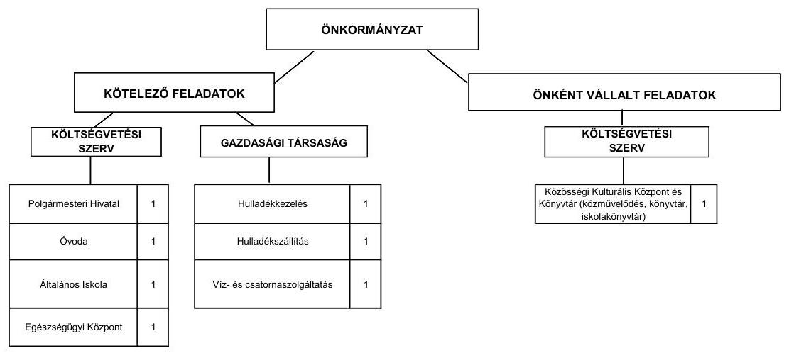

Az Önkormányzat feladatait 2011. június 30-án (a Polgármesteri hivatallal együtt) öt költségvetési szervvel, három gazdasági társasággal, valamint a Kistérségi társulás társult tagjaként látta el. Az intézmények számában az áttekintett időszakban nem történt változás. Az általános iskola alapfokú művészetoktatás feladattal történt bővítése következtében a feladatellátás telephelyeinek száma a 2008. évben egy telephellyel hétre emelkedett. Az Önkormányzat egy gazdasági társaságban rendelkezett tulajdonosi részesedéssel (49,0%). A kötelező feladatok ellátásában továbbá két önkormányzati tulajdonrésszel nem rendelkező társaság vett részt. A gazdasági társaságok a hulladékkezelésben és szállításban, valamint a víz- és csatornaszolgáltatás területén kaptak szerepet. Működésükhöz az ellenőrzött időszakban az Önkormányzat nem adott át pénzeszközöket.

---

A működési kiadások finanszírozási forrásösszetételét a 2007. és a 2010. évben a következő ábra szemlélteti:
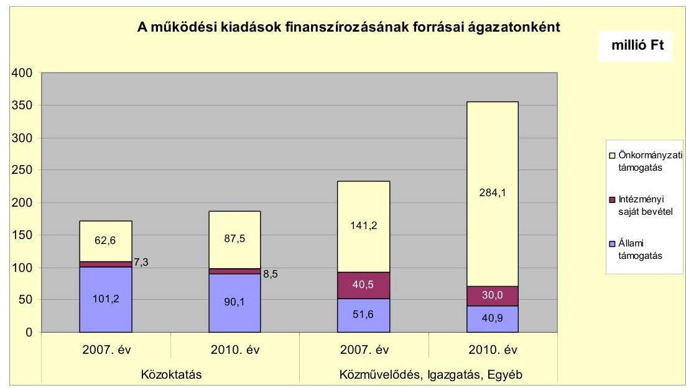

Az Önkormányzat a vizsgált időszakban kórházat, szociális és gyermekjóléti intézményt, illetőleg sportlétesítményt nem tartott fenn.

A közművelődési, igazgatási, illetve az egyéb feladatok önkormányzati támogatásának a 2010. évi kiemelkedően magas összegét az önként vállalt feladatok arányának növekedése, az állami támogatás mérséklődése, valamint a hazai és EU-s támogatással megvalósuló feladatok kiadásainak megelőlegezése határozta meg.

A 2011. év I. félévében a házi gyermekorvosi és az iskola-egészségügyi feladatok ellátását vették át betéti társaságtól. A szociális és gyermekjóléti feladatokat (családsegítés, gyermekjóléti szolgáltatás, szociális étkeztetés, időskorúak nappali ellátása, házi segítségnyújtás) ellátó intézményt a vizsgált időszakot megelőzően átadták a Kistérségi társulásnak. Az Önkormányzat évente biztosította a Kistérségi társulásnak a település lakosságának ellátásával kapcsolatban jelentkező kiadások és az állami támogatás különbözetét. Ezen a jogcímen a 2007-2010. években összesen 2,1 millió Ft kifizetést teljesítettek.

---

Az Önkormányzat folyó költségvetési egyenlegét, működési jövedelmét az alábbi ábra mutatja:
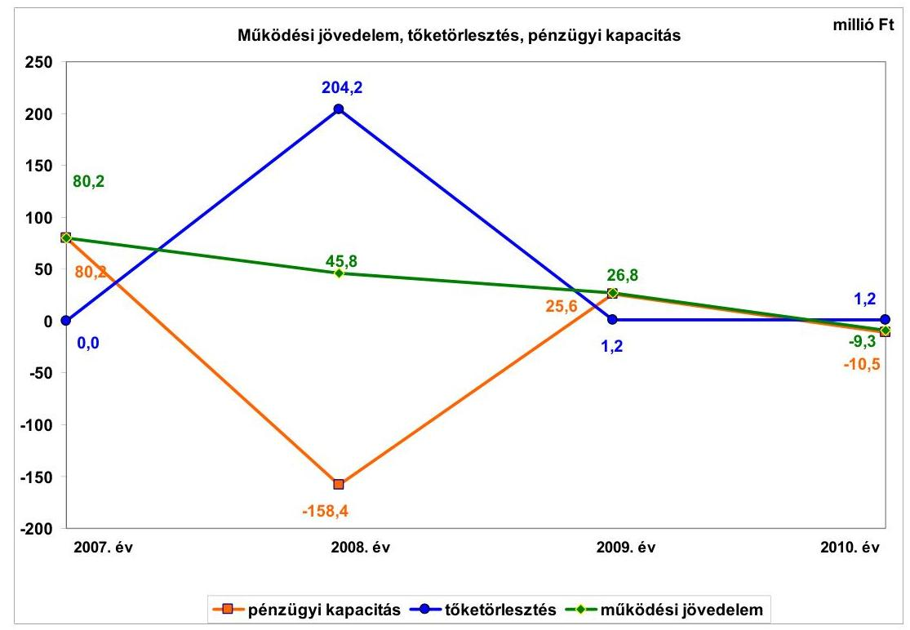

A működési jövedelem csökkenésére hatással volt az önként vállalt feladatokra fordított kiadások összegének és arányának növekedése, valamint az EU-s támogatással megvalósuló feladatok (Polgármesteri hivatal szervezetfejlesztése, kompetencia alapú oktatás bevezetése) kiadásainak megelőlegezése (28,1 millió Ft). A működési jövedelem csökkenése az Önkormányzat pénzügyi egyensúlya szempontjából kockázatot jelent. A pénzügyi kapacitás (nettó működési jövedelem) értéke a folyó költségvetési pozíció mellett az adott költségvetési év adósságtörlesztésének hatását is tükrözi. Értéke a 2008. és a 2010. évben negatív volt. Az adósságszolgálatra történt kifizetés a 2008. évben kiemelkedően magas, 204,2 millió Ft kiadást jelentett, a fejlesztési hitelek meghatározó részének kötvénykibocsátásból történt visszafizetése miatt. A 2007-2010. időszakban képződött működési jövedelem az adósságszolgálattal kapcsolatos kiadásoknak csak egy részére nyújtott fedezetet.

A működésképtelen önkormányzatok 5,0 millió Ft összegű egyéb támogatása nélkül a 2007. évben a működési jövedelem és a nettó működési jövedelem egyaránt 75,2 millió Ft lett volna.

---

A pénzügyi egyensúlyi helyzet alakulását jelentősen befolyásolta az Önkormányzat fejlesztési tevékenysége. A felhalmozási költségvetés bevételeit, kiadásait és egyenlegét az alábbi ábra szemlélteti:
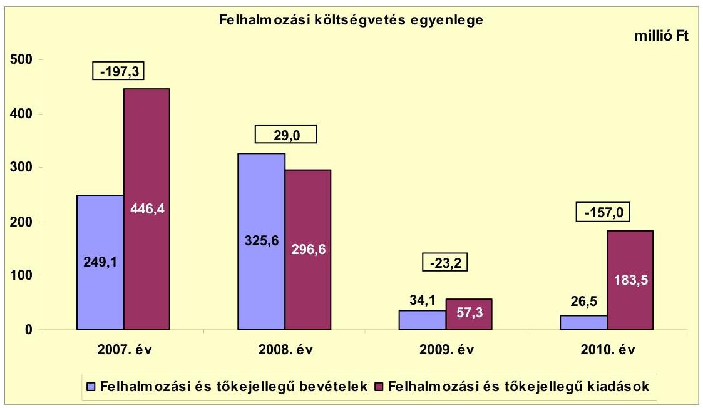

Az Önkormányzat címzett támogatásból valósította meg a belvízrendezést, a beruházás a 2008. évben fejeződött be. A 2009. évben - a források szűkössége miatt - mindössze 57,3 millió Ft-ot fordítottak felhalmozásra. A felhalmozási költségvetés 2010. évi negatív egyenlegét egyrészt az okozta, hogy az Önkormányzat saját forrásai terhére előlegezett meg kifizetéseket EU-s támogatással megvalósuló feladatokra (könyvtár fejlesztése, egészségház és orvosi rendelő felújítása). Másfelől az egyéb központi támogatásból (100,0 millió Ft) beérkező bevétel egy része nem a kiadás felmerülésének évében jelentkezett.

A felhalmozási költségvetés 2007-2010. között összesen 348,5 millió Ft felhalmozási forráshiányt mutatott, amelynek a fedezetét a működési megtakarítás (működési jövedelem), a 2007. január 1-jén rendelkezésre álló 92,0 millió Ft pénzkészlet, valamint kötvény (50,5 millió Ft) és hitel (142,2 millió Ft) biztosította.

Az Önkormányzat folyó bevétele a 2007. évben 514,7 millió Ft, a 2008. évben 545,6 millió Ft, a 2009. évben 527,6 millió Ft, a 2010. évben 565,2 millió Ft, a 2011. év I. félévében 296,3 millió Ft volt. A működési célú költségvetési támogatás és az szja bevétel együttes összege a 2007-2009. évi átlagos 240,3 millió Ft-tal szemben a 2010. évben 246,6 millió Ft-ot tett ki. A vizsgált időszakban az Önkormányzatnál helyi iparűzési adó, építményadó és magánszemélyek kommunális adója volt bevezetve. A helyi adókból és pótlékokból származó bevételek aránya a 2007-2010. évek között 2,1 százalékponttal nőtt, 2010-ben 30,6%-ot tett ki a folyó bevételekből. A helyi adóbevételek 72,3%-át az iparűzési adó tette ki. Az építményadó helyi adókból való részesedése a 2009. évi 26,8 millió Ft-ról (17,9%) 2010-re 68,5 millió Ft-ra (37,7%) emelkedett, a 49,2 millió Ft összes helyi adó bevétel emelkedésnek a 84,8%-át adta. Az építményadóból származó bevétel meghatározó része egy

---

nagy adóalanytól származik, a bevételi kitettség miatt hosszú távon kockázat jelentkezhet.

Az Önkormányzat 2007-2011. év I. félév időszakában képződött felhalmozási és tőkejellegű bevételeinek (635,8 millió Ft) 94,3%-át (599,4 millió Ft) állami támogatás, 3,5%-át (22,5 millió Ft) támogatásértékű felhalmozási bevétel, 2,2%-át (13,9 millió Ft) saját forrás biztosította. Az állami támogatás összegét döntően a címzett (456,2 millió Ft) és az egyéb központi (100,0 millió Ft) támogatás határozta meg.

A 2007-2010. években műszaki szempontból befejezett fejlesztésekre 1072,7 millió Ft kifizetést teljesítettek, melynek 60,9%-át (653,4 millió Ft) hazai forrásokból fedezték. A további forrásokat saját erő, EU-s támogatások, valamint 192,7 millió Ft kötvény és hitel (18,0%) biztosította. A 2010. december 31-én műszaki szempontból folyamatban lévő fejlesztési feladatok végrehajtására 2007-2010. között 13,9 millió Ft kiadást teljesítettek, amelyet saját bevételből finanszíroztak.

Az Önkormányzatnál 2010. december 31-én folyamatban lévő 3 fejlesztési feladat 2010. évet követő kötelezettségvállalásainak összege 312,2 millió Ft, melynek forrásösszetételét a következő ábra mutatja be:
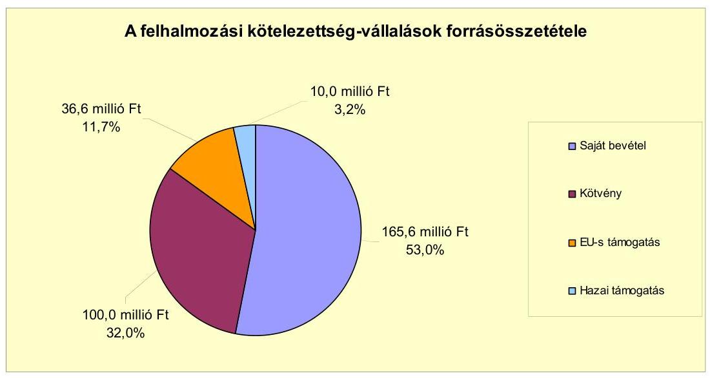

Az Önkormányzat tájékoztatása szerint a fejlesztések elkészültek, két esetben az átadás és a számlák kifizetése megtörtént. Az iskola 6 tanteremmel történt bővítésének használatbavétel előtti szakhatósági engedélyezése folyamatban van. A 250,0 millió Ft-os bekerülési költségből 96,8 millió Ft kifizetése megtörtént, az Önkormányzat nyilatkozata alapján a bank az Önkormányzat rendelkezésére bocsát 100,0 millió Ft-ot az óvadéki betétben lévő kötvénybevételből, a fennmaradó 53,2 millió Ft forrása is biztosított. A kivitelező ellen időközben felszámolási eljárás indult, ezért nem történt még meg az óvadéki betétből a számla kifizetése.

Az EU-s támogatásokkal kapcsolatos működési és felhalmozási kiadásokat az előző években képződött tartalékból előlegezték meg. Az EU-s pályázati pénzeszközből megvalósított fejlesztés esetében éltek az előleg igénybevételének lehetőségével. Az EU-s támogatás terhére teljesített működési és felhalmozási célú kiadások fedezetéből 2011. november 8. napjáig 35,9 millió Ft továbbra sem érkezett be. A 2011. év II. félévére az EU-s támogatások megelőlegezése nehézséget jelent. Az átmeneti likviditási probléma feloldására többféle (előfinanszírozási, folyószámla, fejlesztési) hitelt is kérelmeztek, de a pénzintézetek ezt elutasították. A fizetőképesség biztosítása érdekében a gazdasági társaságban meglévő 49,0% tulajdonosi részesedésből 45,0%-ot 40,0 millió Ft-ért értékesítettek.

Az Önkormányzat fejlesztéshez kapcsolódó, beadott, elbírálás alatti pályázattal nem rendelkezik.
 és 2011. év I. félévben fejlesztéseket, felújításokat kizárólag saját forrásból nem indított.

Az Önkormányzat mérleg szerinti pénzintézettel szembeni kötelezettsége a 2006. év végéről a 2011. év I. félév végére 70,0 millió Ft-ról 517,1 millió Ft-ra nőtt. A fennálló pénzintézeti kötelezettségek 96,7%-át a CHF-ben (500,0 millió Ft, 3306,0 ezer CHF), a 2008. évben kibocsátott devizaalapú kötvény, 3,3%-át, (17,1 millió Ft) hosszú lejáratú hitel teszi ki.

A kötvény tőketörlesztését 2013. év II. félévében kell megkezdeni. A tőketörlesztés összege 220,4 ezer CHF/év, amelynek Ft-ban kimutatott értékét, valamint a pénzügyi egyensúlyra gyakorolt hatását befolyásolja a tőketörlesztés esedékességekor érvényes CHF árfolyam.

Az Önkormányzat Számv. tv.-ben előírtak ellenére nem végezte el a 2008-2010. években, a 2008. évben a devizában kibocsátott, fennálló kötvény kötelezettsége év végi értékelését, az előírt devizaárfolyammal számolva. Az Önkormányzat a kötvény értékét a pénzintézettel szembeni, hosszú lejáratú kötelezettségen túl, az Áhsz-ben foglalt előírásokkal ellentétesen, a tartós hitelviszonyt megtestesítő értékpapírok között is kimutatta.

Az Önkormányzat kötelezettségvállalásaira a képviselő-testületi döntés alapján került sor, az előterjesztésekben bemutatták a kamat- és a devizaalapú kötelezettséget érintő árfolyamkockázatot. Az Önkormányzat a vizsgált időszakban számlavezető bankot nem váltott. Nem lépték túl az adósságot keletkeztető kötelezettségvállalás felső határát. A vizsgált időszakban az Önkormányzat rövid lejáratú hitelt nem vett igénybe. Az Önkormányzat nem szabályozta a kötvény, valamint a pénzintézeti kötelezettségvállalások versenyeztetését.

Az Önkormányzat a hat hitelt lehívta és a hitelcéloknak megfelelően a Képviselő-testület által jóváhagyott, a költségvetésbe betervezett beruházáshoz használta fel. A hitelek összegéből a 2007. évben 123,8 millió Ft-ot, a 2008. évben 30,4 millió Ft-ot vett igénybe. A kötvénykibocsátás összegéből a 2008. évben a fennálló hiteleket - egy hitel kivételével - visszafizette 199,5 millió Ft összegben, 50,5 millió Ft-ot az önkormányzati beruházásokhoz, fejlesztésekhez használt fel. 250,0 millió Ft-ot óvadéki betétszámlán helyeztek el, amelyből a pénzintézet hozzájárulásával 100,0 millió Ft felhasználható, a fennmaradó 150,0 millió Ft-tal nem rendelkezhet szabadon az Önkormányzat. Az Önkormányzat 2011. június 30-ig a CHF-ben fennálló pénzintézettel szembeni kötelezettségeiből tőkét nem törlesztett, 285,0 ezer CHF (55,5 millió Ft) kamatot fizetett meg.

---

A refinanszírozás, a hitelek visszafizetését követően nem javult az Önkormányzat pénzügyi pozíciója, mivel a deviza alapú kötvény kibocsátását követően jelentősen megemelkedett a CHF árfolyama, így a fizetendő kamatok Ft-ban kimutatott értéke nőtt. A kötvény kibocsátása miatt a hosszú lejáratú pénzintézettel szembeni kötelezettség megnövekedett, amely kedvezőtlen hatással lehet az Önkormányzat pénzügyi egyensúlyi helyzetére.

Az Önkormányzat kötelezettségeinek 2010. december 31-i, valamint 2011. június 30-i állományát és várható alakulását a kötelezettségek lejáratáig a következő táblázat szemlélteti:

| Megnevezés | Állomány 2010. december 31-én |  |  | Állomány 2011. június 30-án |  |  | Várható kötelezettség 2011-2013. években |  | Várható kötelezettség 2014. évtől |  |
| :--: | :--: | :--: | :--: | :--: | :--: | :--: | :--: | :--: | :--: | :--: |
|  | HUF-ban   (millió Ft-ban) | Devizében   (összege,   ezer CHF-ben) | Deviza   nem | HUF-ban   (millió Ft-ban) | Devizében   (összege,   ezer CHF-ben) | Deviza   nem | HUF-ban   (millió Ft-ban) | Devizében   (összege,   ezer CHF-ben) | HUF-ban   (millió Ft-ban) | Devizében   (összege,   ezer CHF-ben) |
| Pénzintézeti kötelezettségek |  |  |  |  |  |  |  |  |  |  |
| Pénzintézeti kötelezettségek összesen HUF-ban: | 17,7 | 0 | HUF | 17,1 | 0 | HUF | 5,2 | 0 | 22,9 | 0 |
| Pénzintézeti kötelezettségek összesen CHF-ben:   Kéznylékkény Kötvény | 0 | 3306,0 | CHF | 0 | 3306,0 | CHF | 0 | 493,7 | 0 | 4379,2 |
| Szállító tartozás | 0 | 0 | HUF | 9,3 | 0 | HUF | 9,3 | 0 | 0 | 0 |
| Pénzintézeti és szállító kötelezettségek összesen   HUF-ban: | 17,7 | 0 | HUF | 26,4 | 0 | HUF | 14,5 | 493,7 | 22,9 | 4379,2 |

Az Önkormányzatnak pénzintézetekkel szemben fennálló kötelezettsége a 2011. év I. félév végén 17,1 millió Ft, és 3306,0 ezer CHF volt. Ezek várható kötelezettsége (tőke, kamat és egyéb költség) a legutóbbi kamatfizetés feltételei alapján a 2011-2013. években 5,2 millió Ft, és 493,7 ezer CHF. A 2011-2013. évek kötelezettségeinek teljesítésére figyelembe vehető a 2010. december 31-én kimutatott 278,3 millió Ft pénzmaradványból a 3,3 millió Ft összegű szabad pénzmaradvány, a 39,9 millió Ft mérlegben kimutatott követelésállomány, valamint a forgalomképes ingatlanvagyon. A pénzintézetekkel szemben fennálló kötelezettségeken túl az Önkormányzatnak 2011. június 30-án 9,3 millió Ft szállítói kötelezettsége állt fenn. A 2014. évet követően jelenleg ismert pénzintézettel szembeni kötelezettségek (tőke, kamat): 22,9 millió Ft és 4379,2 ezer CHF. Az Önkormányzat tájékoztatása szerint - az óvadéki betétszámlán meglévő, fel nem használt kötvénymaradvány összegéből, továbbá a jelenlegi állami finanszírozási rendszer változatlansága, valamint a jövőben várhatóan képződő működési jövedelem (főként helyi iparűzési adó, építményadó) növekedése esetén - az eddig vállalt kötelezettségeit a jövőben teljesíteni tudja.

Az Önkormányzat a 2007-2010. években az eszközállománya után összesen 217,4 millió Ft értékcsökkenést számolt el a számvitelben. Az Önkormányzat tájékoztatása alapján az elavult eszközök pótlását a 2007-2010. évek időszakában 142,8 millió Ft összegben felújítással biztosította. A Képviselőtestületnek előterjesztett éves zárszámadási rendeleteikben nem mutatták be az Önkormányzat eszközei után tárgyévben elszámolt értékcsökkenés összegét, az eszközpótlásra fordított tényleges kiadásokat, az eszközök elhasználódási fokának alakulását.

Az Önkormányzat 2007-2011. év I. félév időszakában kiadási megtakarítást eredményező és bevételt növelő intézkedéseket hozott. A 2007-

---

2011. I. év féléve között tett intézkedések hatására az Önkormányzat adatszolgáltatása szerint 169,4 millió Ft bevételi többletet, továbbá 41,6 millió Ft kiadási megtakarítást mutattak ki, ezáltal az Önkormányzat pénzügyi egyensúlyi helyzetét javították. Az Önkormányzat a pénzügyi egyensúlyának javítását, a fennálló kötelezettségeinek a teljesítését a jövőben továbbra is bevételnövelő és kiadáscsökkentő intézkedésekkel tudja csak teljesíteni.

A kiadáscsökkentő intézkedések eredményéből 69,7%, 29,0 millió Ft az elrendelt álláshely csökkentéshez kapcsolódott. A 2007-2011. év I. féléve között önkormányzati szinten összesen 6 álláshely megszüntetés történt. Egyes közszolgáltatási területeken azonban feladatbővülések is voltak, amelyek álláshely- és egyben létszámnövekedéssel is jártak. Ennek következtében az időszak álláshelyeinek száma 11 fővel nőtt. A 11 álláshelyből 9 álláshelyet közalkalmazotti, köztisztviselői státuszban, 2 álláshelyet megbízásos jogviszonyban látnak el.

A bevételnövelő intézkedések a helyi adókhoz, az eszközök hasznosításához, valamint szolgáltatási díjakhoz kapcsolódtak. A kiadáscsökkentő (41,6 millió Ft) és bevételnövelő intézkedésekből (169,4 millió Ft) származó összeg ellensúlyozta a költségvetési támogatásból és az szja bevételből származó kiesést (32,7 millió Ft). A 2007-2011. év I. félév időszakában a kiadáscsökkentő és bevételnövelő intézkedések összegének, valamint a költségvetési támogatások és az szja bevétel kiesésnek a különbsége 178,3 millió Ft.

Az ÁSZ az Önkormányzat gazdálkodási rendszerét a 2010. évben ellenőrizte. A gazdálkodási rendszer korábbi ellenőrzése során tett javaslatok közül a pénzügyi egyensúly javítására sem szabályszerűségi, sem célszerűségi javaslatot nem tett.

Az Önkormányzat pénzügyi egyensúlyi helyzetét összegezve a következők emelhetők ki:

Adony Város Önkormányzata pénzügyi egyensúlya rövid távon biztosított. A pénzügyi egyensúly középtávon ható helyreállítására és hosszú távú fenntarthatóságára az Önkormányzatnak fel kell készülnie.

A működési jövedelem évről-évre csökkent, a folyó bevételek a 2010. évben nem nyújtottak fedezetet a folyó kiadásokra és az adósságszolgálatra.

Az építményadóból származó bevétel meghatározó része egy nagy adóalanytól származik, a bevételi kitettség miatt hosszú távon kockázat jelentkezhet.

Az önként vállalt feladatokra fordított kiadások összege és részaránya emelkedik, amely kedvezőtlen hatással van az Önkormányzat pénzügyi egyensúlyi helyzetére, és a kötelező feladatok ellátására.

Az EU-s támogatással megvalósuló beruházások előlegen túli előfinanszírozása, valamint a működési célú kiadással járó pályázatok előfinanszírozása likviditási problémát jelent.

Likvid hitelek miatti rövid lejáratú pénzintézettel szembeni kötelezettség, valamint 60 napon túli lejárt szállító tartozás nem állt fenn. A kötvény kibocsátása

---

miatt a hosszú lejáratú pénzintézeti kötelezettség megnövekedett, amely kedvezőtlen hatással lehet az Önkormányzat pénzügyi egyensúlyi helyzetére.

Gazdasági társaságok miatti kockázat (pénzintézeti, szállítói, egyéb) nem állt fenn, mivel az Önkormányzat gazdasági társaságban nem rendelkezik többségi tulajdoni hányaddal.

Az Állami Számvevőszékről szóló 2011. évi LXVI. törvény 33. § (1) bekezdésében foglaltak értelmében a jelentésben foglalt megállapításokhoz kapcsolódó intézkedési tervet köteles az ellenőrzött szervezet vezetője összeállítani és azt a jelentés kézhezvételétől számított harminc napon belül az ÁSZ részére megküldeni. Amennyiben az intézkedési tervet határidőben nem küldi meg a szervezet, vagy az továbbra sem elfogadható, az ÁSZ elnöke a hivatkozott törvény 33. § (3) bekezdés a)-b) pontjaiban foglaltakat érvényesítheti.

# A 2011. június 30-i pénzügyi egyensúlyi helyzet alapján az ellenőrzés intézkedést igénylő megállapításai és javaslatai a következők: 

## a Polgármesternek

1. Az Önkormányzat pénzügyi egyensúlya rövid távon biztosított. A pénzügyi egyensúly középtávon ható helyreállítására és hosszú távú fenntarthatósága az Önkormányzatnak fel kell készülnie. A működési jövedelem évről-évre csökkent; a folyó bevételek 2010. évben nem nyújtottak fedezetet a folyó kiadásokra és az adósságszolgálatra. A kötvény kibocsátása miatt a hosszú lejáratú pénzintézettel szembeni kötelezettség megnövekedett.

Javaslat:
Az Önkormányzat pénzügyi egyensúlyának középtávon történő helyreállítása és hosszú távú fenntarthatósága érdekében kezdeményezze - felelősök és határidők megjelölésével - az alábbi intézkedések megtételét:
a) Tárja fel a bevételszerző és kiadáscsökkentő lehetőségeket. Intézkedjen a bevételek növelésére és a kiadások csökkentésére. Ütemezze a bevételek beszedését a jövőben keletkező fizetési kötelezettségeihez.
b) Képezzen egyensúlyi (elkülönített) tartalékot a jövőbeni adósságszolgálat teljesítése érdekében.
c) Mutassa be a Képviselő-testületnek félévente legalább három évre kitekintően a kötelezettségek teljes körére szóló finanszírozási tervet, a források számszerűsített megjelölésével.
2. Az önként vállalt feladatokra fordított kiadások összege és részaránya emelkedik, amely kedvezőtlen hatással van az Önkormányzat pénzügyi egyensúlyi helyzetére, és a kötelező feladatok ellátására.

---

Javaslat:
Tekintse át az önként vállalt feladatok finanszírozhatóságát a kötelező feladatellátás elsődlegességének biztosítása érdekében, mutassa be a Képviselő-testületnek a megoldás lehetőségeit, és szükség esetén a gazdasági program módosításának igényét.
3. A Képviselő-testületnek előterjesztett éves zárszámadási rendeleteikben nem mutatták be az Önkormányzat eszközei után tárgyévben elszámolt értékcsökkenés összegét, az eszközpótlásra fordított tényleges kiadásokat, az eszközök elhasználódási fokának alakulását.

Javaslat:
Mutassa be a Képviselő-testületnek évente a zárszámadási rendelet előterjesztésében az értékcsökkenés összegét, az eszközpótlásra fordított tényleges kiadásokat, az eszközök elhasználódási fokának alakulását.

# a Jegyzönek 

1. Az Önkormányzat 2008-ban 500,0 millió Ft összegben bocsátott ki kötvényt, melynek értékét a 2008-2010. évi éves elemi költségvetési beszámolókban - a pénzintézettel szembeni, hosszú lejáratú kötelezettségen túl, az Áhsz-ben
 19. § (7) bekezdésében foglalt előírásokkal ellentétesen - a tartós hitelviszonyt megtestesítő értékpapírok év végi állományában is kimutatta.

Javaslat:
Intézkedjen a kibocsátott kötvény értékének a tartós hitelviszonyt megtestesítő értékpapírok közül történő kivezetéséről.
2. Az Önkormányzat a 2008-2010. években nem tett eleget a Számv. tv. 60. § (2) bekezdésében előírtaknak, mivel a devizában fennálló kötelezettsége (a 2008. évben kibocsátott kötvény) év végi értékelését nem végezte el a Számv. tv. 60. § (4), (6) bekezdéseiben szereplő devizaárfolyammal számolva.

Javaslat:
Gondoskodjon az Áhsz. 33. § (1) bekezdésében foglaltak betartása érdekében arról, hogy a devizában fennálló kötelezettségeket a Számv. tv. 60. § (2) bekezdésében előírt devizaárfolyamon átszámított forintértéken mutassák be a mérlegben. Biztosítsa, hogy az év végi értékeléskor elszámolt nem realizált árfolyamveszteséget és nyereséget az Áhsz. 33. § (2) bekezdés c) pontjában foglaltaknak megfelelően - a kötelezettségek árfolyamveszteségét a saját tőke csökkenéseként, az árfolyamnyereségét a saját tőke növekedéseként - rögzítsék a számviteli nyilvántartásban.

---

3. Az Önkormányzat nem szabályozta a kötvény, valamint a pénzintézettel szembeni kötelezettségvállalások versenyeztetését.

Javaslat:
Szabályozza a pénzintézettel szembeni kötelezettségvállalások (hitel, kötvény) rendjét.

A polgármester a helyszíni ellenőrzés lezárása után tájékoztatta az Állami Számvevőszéket az Önkormányzat megtett intézkedéseiről, amelyet az Állami Számvevőszék nem ellenőrzött, arra vonatkozóan véleményt vagy megállapítást nem fogalmaz meg. Az ellenőrzés lezárását követően elvégzett intézkedéseket az Állami Számvevőszék utóellenőrzés keretében vizsgálhatja.

A polgármester tájékoztatása szerint a következő intézkedéseket tette az Önkormányzat:

- a bevételek növelése érdekében 2012. január 1-től az építményadó emeléséről döntött a Képviselő-testület, melynek hatásaként 26,2 millió Ft többletbevételt várnak 2012. évtől kezdődően;
- a kiadások csökkentése érdekében a 2012. évi költségvetés összeállítása során az intézményi dologi kiadásokat 3-7%-kal csökkentették, melynek hatásaként 12,7 millió Ft kiadásmegtakarítással számoltak a 2012. évben;
- a 2012. évi költségvetési rendeletben 4,0 millió Ft-os összeggel egyensúlyi tartalékot hoztak létre az adósságszolgálat teljesítése érdekében;
- a 2011. évi zárási műveletek során a kibocsátott kötvény értékét a tartós hitelviszonyt megtestesítő értékpapírok közül kivezették.

---

# II. RÉSZLETES MEGÁLLAPÍTÁSOK 

## 1. Az ÖNKORMÁNYZAT KÖTELEZŐ ÉS ÖNKÉNT VÁLLALT FELADATAI, A FELADATELLÁTÁS SZERVEZETI KERETEI ÉS ANNAK VÁLTOZÁSAI

Az Önkormányzat a kötelező feladatait az Ötv. és az ágazati törvények által meghatározottnak tekinti. Az önként vállalt feladatok a művészeti és a két tannyelvű oktatáshoz, a kulturális, sport, közbiztonsági és városgazdálkodási feladatokhoz kapcsolódtak. Ezen túlmenően hozzájárultak civil szervezetek működésének finanszírozásához. Az önként vállalt feladatokkal kapcsolatos rendelkezéseket az önkormányzati SzMSz-ben szabályozták, a feladatokat az SzMSz nem tartalmazza ${ }^{7}$. Az önként vállalt feladatok terjedelmét az éves költségvetési rendeletekben az adott évi költségvetés forrásainak ismeretében határozták meg.

Az önkormányzati SzMSz alapján önként vállalt feladatokat akkor látnak el, ha az ahhoz szükséges anyagi és személyi lehetőségek, feltételek fennállnak. Az önként vállalt feladatok ellátásának feltételeit a Képviselő-testület évente a következő évi költségvetési koncepció tárgyalásakor áttekinti és a fedezet biztosításával dönt a feladatellátás fenntartásáról vagy annak megszüntetéséről.

A 2010. évi működési kiadások feladat-csoportonkénti megoszlását, azok forrásait, valamint a kötelező feladatok kiadásainak részarányát az alábbi táblázat ${ }^{8}$ mutatja be:

| Ellátott feladat | Működési   kiadás   összesen   (millió Ft) | Kötelező   feladatok   kiadásainak   részaránya   % | Működési   bevétel   összesen   (millió Ft) | Állami   támogatás   részaránya   % | Intézményi   saját bevétel   részaránya   % | Önkormá |
| :-- | :--: | :--: | :--: | :--: | :--: | :--: |
| Óvodák | 60,8 | 100,0 | 60,8 | 43,0 | 4,1 | 52,9 |
| Általános iskolák | 125,3 | 95,0 | 125,3 | 51,0 | 4,8 | 44,2 |
| Közművelődési intézmények | 37,2 | 0,0 | 37,2 | 0,0 | 11,7 | 88,3 |
| Egyéb intézmények | 9,5 | 0,0 | 9,5 | 81,0 | 10,5 | 8,5 |
| Polgármesteri hivatal igazgatási   kiadásai | 134,3 | 100,0 | 134,3 | 11,0 | 6,5 | 82,5 |
| Polgármesteri hivatalban ellátott   egyéb feladatok működési kiadásai | 174,0 | 18,0 | 174,0 | 10,6 | 9,1 | 80,3 |
| Működési kiadások összesen | 541,1 | 63,8 | 541,1 | 24,2 | 7,1 | 68,7 |

Az Önkormányzat - besorolása és adatszolgáltatása szerint - a 2007-2009 időszakban a működési kiadások átlagosan 73,4%-át (325,9 millió Ft-ot) fordította a kötelező, 26,6%-át (118,3 millió Ft) az önként vállalt feladatok ellátására. A

[^0]
[^0]:    ${ }^{7}$ Erre jogszabályi előírás ma már nem kötelezi az Önkormányzatot.
    ${ }^{8}$ A táblázat a kisebbségi önkormányzatok és az egészségügyi feladatok adatait nem tartalmazza.

---

2010. évben a kötelező feladatok működési kiadásokból való részesedése 63,8% (345,4 millió Ft), az önként vállalt feladatoké 36,2% (195,7 millió Ft) volt. Az önként vállalt feladatokra fordított működési kiadások részaránya a 2007-2009 év átlagához viszonyítva a 2010. évre 9,6 százalékponttal, 77,4 millió Ft-tal emelkedett, amely kedvezőtlen hatással volt az Önkormányzat pénzügyi helyzetére és a kötelező feladatok ellátására nézve kockázatot jelent.

Az óvodát és az általános iskolát érintően az állami támogatás a 2007-2009. években átlagosan 102,6 millió Ft volt, mely a 2010. évre 90,1 millió Ft-ra csökkent. A gyermekek, tanulók száma a 2007-2009. évi átlagos 438 fővel szemben a 2010. évben átlagosan 426 fő volt, valamint 2008. szeptember 1-jétől a teljesítménymutató alapú finanszírozás került bevezetésre. Az állami támogatás mérséklődése miatt kieső forrást az önkormányzati támogatás növelésével ellensúlyozták. Ennek összege a 2010. évben 22,6 millió Ft-tal haladta meg a 2007-2009. évi 64,9 millió Ft éves átlagos összeget. Az alapfokú művészetoktatást érintő állami támogatás összege a 2007-2009. évek átlagában 6,3 millió Ft-ot tett ki. A 2010. évben kapott állami támogatás 7,7 millió Ft-os összege 22,2%-kal lépte túl az előző három év átlagos évi támogatási mértékét. Ennek az volt az oka, hogy a támogatás alapjául szolgáló 2010. évi létszám 43 fővel meghaladta a 2007-2009. évi 102 fős átlaglétszámot. Az önkormányzati támogatás összege a 2010. évben 0,8 millió Ft-ot tett ki, a 2007-2009. évi átlag kétszeresét.

A közművelődési intézmény 2010. évi működési kiadása (37,2 millió Ft) 6,7 millió Ft-tal (22,0%) haladta meg a 2007-2009. évi átlagos 30,5 millió Ft-ot. Az Önkormányzat az intézményben ellátott feladatokra tekintettel a 2007-2009. időszakban évente átlagosan 4,2 millió Ft állami támogatásban részesült. Az állami támogatás a 2010. évre megszűnt, a 2010. évi Kvtv. 3. számú melléklete - a korábbi évekkel ellentétben - már nem tartalmaz normatív hozzájárulást a helyi közművelődési és közgyűjteményi feladatok támogatására. Az intézményi saját bevétel a 2007-2009. évi 3,2 millió Ft-os átlagos összeghez képest a 2010. évben 4,3 millió Ft volt. Az önkormányzati támogatás a 2010. évben 32,9 millió Ft-ot tett ki, mely 9,8 millió Ft-tal (42,4%) haladta meg a 2007-2009. évi átlagos összeget.

Az igazgatási feladatok 2007-2009. évi átlagos 19,6 millió Ft összegű állami támogatása a 2010. évre 14,7 millió Ft-ra csökkent. Csökkent a normatívák fajlagos összege és az okmányiroda ügyiratszáma is, ez utóbbi a 2007-2009. évi átlagos 13840-ről a 2010. évre 10840-re változott. Az intézményi saját bevétel a 2010. évben 8,8 millió Ft forrást jelentett, a 2007-2009. évi átlagos összegnek (4,2 millió Ft) több mint a kétszeresét tette ki. A 2010. évben lebonyolított közbeszerzési eljárások dokumentációjának ellenértéke 3,0 millió Ft, beruházáshoz kapcsolódó kötbér összege szintén 3,0 millió Ft volt.

A Polgármesteri hivatalban ellátott feladatok 2007-2009. évi átlagos 99,6 millió Ft működési kiadása a 2010. évre 174,0 millió Ft-ra emelkedett. A 2010. évben valósult meg a Polgármesteri hivatal szervezetfejlesztése és a kompetencia alapú oktatás bevezetése. A projektek megvalósításával kapcsolatban a 2010. évben 41,7 millió Ft egyszeri kiadás jelentkezett. A közfoglalkoztatásra kifizetett összeg az előző évi 2,0 millió Ft-tal szemben 2010-ben 10,0 millió Ft volt. A cafetéria rendszer bevezetése 7,0 millió Ft többletkiadással járt. A rászorultak számának emelkedése miatt az előző évhez képest 6,0 millió Ft-tal többet fizettek ki segélyekre. Ezen túlmenően az Önkormányzatnak 7,0 millió Ft egyszeri többletköltsége keletkezett a vis maior támogatáshoz kapcsolódóan (belvízrendezés), saját forrása terhére. Az intézményi saját bevétel a 2007-2009. évi átlagos 28,2 millió Ft-ról a 2010. évre 15,9 millió Ft-ra csökkent. Ennek az volt az oka, hogy a 2007-2009 időszakban szúnyogirtásra, valamint a 2009. évben két EU-s pályázatra (hivatali szervezet fejlesztése, kompetencia alapú oktatás bevezetése) kapott támogatás a 2010. évben már nem jelentkezett. Az önkormányzati támogatás összege a 2007-2009. évi átlagos 52,5 millió Ft-ról a 2010. évre több mint két- és félszeresére, 139,7 millió Ft-ra emelkedett. A közfoglalkoztatás és a segélyek esetében az önrészt, valamint az állami támogatás egy hónapos késéssel történő beérkezéséig a kiadások további részét saját forrásból biztosították. A Polgármesteri hivatal szervezetfejlesztésére és a kompetencia alapú oktatás bevezetésére 6,9 millió Ft előleget igényeltek, a fennmaradó összeget (34,8 millió Ft) a fedezet beérkezéséig önkormányzati támogatásból finanszírozták. A cafetéria juttatásokat saját forrásból biztosították. A vis maior feladat utófinanszírozott volt.

A Polgármesteri hivatalban ellátott feladatok a következők voltak: lakossági szemétszállítás, közvilágítás, köztemető fenntartása, közutak fenntartása, lakó- és nem lakó ingatlanok bérbeadása, segélyek folyósítása, zöldterület gondozás, civil szervezetek támogatása, állategészségügyi feladatok, ár- és belvízvédelem, választások lebonyolítása, városgazdálkodási feladatok.

Az Önkormányzat a vizsgált időszakban kórházat, szociális és gyermekjóléti intézményt, illetőleg sportlétesítményt nem tartott fenn.

Az Önkormányzat kötelező és önként vállalt feladatait 2011. június 30-án (a Polgármesteri hivatallal együtt) öt költségvetési szervvel, három gazdasági társasággal, valamint a Kistérségi társulás társult tagjaként látta el. Az intézmények számában az áttekintett időszakban nem történt változás. Az általános iskola alapfokú művészetoktatási feladattal történt bővítése következtében a feladatellátás telephelyeinek száma a 2008. évben egy telephellyel, hétre emelkedett. Az Önkormányzat egy gazdasági társaságban rendelkezett tulajdonosi részesedéssel (49,0%). A kötelező feladatok ellátásában további két önkormányzati tulajdonrésszel nem rendelkező társaság vett részt. A gazdasági társaságok a hulladékkezelésben és -szállításban, valamint a víz- és csatornaszolgáltatás területén kaptak szerepet. Működésükhöz az ellenőrzött időszakban az Önkormányzat nem adott át pénzeszközöket.

Az Önkormányzat az általa fenntartott intézményeken keresztül óvodai nevelési, általános iskolai oktatási, két tannyelvű oktatási, alapfokú művészetoktatási, egészségügyi alapellátási, valamint kulturális és közművelődési feladatokat látott el. A gazdasági társaságok a hulladékkezelésben és -szállításban, valamint a víz- és csatornaszolgáltatás területén kaptak szerepet.

Feladat államháztartáson kívüli szervezet részére történő kiszervezésére, kiszerződésére sem a vizsgált időszakban, sem a vizsgált időszakot megelőzően nem került sor.

A 2011. év I. félévében a házi gyermekorvosi és az iskola-egészségügyi feladatok ellátását vették át betéti társaságtól. A feladatok ellátását a már meg-

---

lévő egészségügyi
 alapellátó intézményhez telepítették. A feladatot az Önkormányzat az átvételt megelőzően a gazdasági társasággal kötött szerződés alapján látta el. A feladatátvétel a gazdasági társaság kérelmére finanszírozási nehézségek, az Önkormányzat szempontjából az ellátás biztonságának szem előtt tartása miatt történt.

A szociális és gyermekjóléti feladatokat (családsegítés, gyermekjóléti szolgáltatás, szociális étkeztetés, időskorúak nappali ellátása, házi segítségnyújtás) ellátó intézményt a vizsgált időszakot megelőzően átadták a Kistérségi társulásnak.

Az áttekintett időszakban feladatot vagy intézményt nem adtak át más önkormányzatnak, társulásnak, egyháznak, gazdasági társaságnak vagy egyéb szervezetnek. Intézményi átszervezés vagy feladatátrendezés nem történt.

A házi gyermekorvosi és az iskola-egészségügyi feladatok átvétele a 2011. április - 2011. december időszakban - az Önkormányzat adatszolgáltatása szerint várhatóan 0,1 millió Ft többletkiadást jelent a bevételek (OEP-támogatás) 5,8 millió Ft-tal, a kiadások 5,9 millió Ft-tal történő emelkedése következtében.

A szociális és gyermekjóléti feladatokkal kapcsolatban az Önkormányzat évente biztosította a Kistérségi társulásnak a település lakosságának ellátásával kapcsolatban jelentkező kiadások és az állami támogatás különbözetét. Ezen a jogcímen a 2007-2010. években összesen 2,1 millió Ft kifizetést teljesítettek ${ }^{9}$.

A kötelező közszolgáltatások ellátásában részt vevő, önkormányzati tulajdonrésszel nem rendelkező kettő, és 50,0% alatti önkormányzati tulajdonosi részesedésű egy gazdasági társaság esetében átszervezés, átalakulás, csődeljárás, végelszámolás vagy felszámolás nem történt. Az önkormányzati feladatok ellátásában résztvevő gazdasági társaságok gazdálkodását, illetve működését érintő egyes adatokat a jelentés 4. számú melléklete mutatja be.

# 2. Az ÖNKORMÁNYZAT PÉNZÜGYI EGYENSÚLYI HELYZETÉT BEFOLYÁSOLÓ TÉNYEZŐK 

A hagyományos költségvetési szerkezet helyett az önkormányzat pénzügyi helyzetét a CLF módszerrel mutatjuk be, amelyben jobban elkülönülnek a vagyonnal kapcsolatos bevételek és kiadások az önkormányzati feladatokkal kapcsolatos közvetlen működtetési bevételektől és kiadásoktól. A módszer következetesen elkülöníti a folyó és a felhalmozási költségvetés bevételeit és kiadásait, azok költségvetési egyenlegeit. A saját folyó bevételek, valamint a saját felhalmozási bevételek nem tartalmazzák az előző évi pénzmaradványok felhasználásából származó pénzforgalom nélküli bevételeket ${ }^{10}$.

[^0]
[^0]:    ${ }^{9}$ Az átadott összeget a Polgármesteri hivatalban ellátott feladatok működési kiadásai tartalmazzák.
    ${ }^{10}$ A költségvetési években kialakuló hiány finanszírozása az előző évi pénzmaradvány és a korábbi években képzett tartalékok felhasználásával is történhet.

---

A folyó költségvetés egyenlege, a működési jövedelem megmutatja, hogy az önkormányzat éves folyó bevétele fedezetet biztosít-e a kötelező és önként vállalt feladatellátáshoz kapcsolódó éves folyó kiadására. A működési jövedelem negatív értéke pénzügyileg fenntarthatatlan helyzetet jelez. A mutató pozitív értéke megtakarítást mutat, amely forrásul szolgálhat az önkormányzat fennálló kötelezettségei megfizetéséhez, valamint fejlesztéseihez.

A felhalmozási költségvetés pozitív értéke felhalmozási többletet mutat, amely a jövőbeni fejlesztések forrását biztosíthatja. Amennyiben a folyó költségvetési hiány finanszírozása a felhalmozási többletből történik, ez szűkebb értelemben vagyonfelélésnek tekinthető. Amennyiben a felhalmozási költségvetés megtakarítása fejlesztési célú hitelek, kötvények adósságszolgálatát finanszírozza, az változatlan vagyontömeg mellett, a korábban megelőlegezett tőkebevételek valós realizációjának tekinthető. A felhalmozási deficit által generált finanszírozási igény önmagában nem jár pénzügyi kockázattal, a pénzügyileg fenntartható beruházásokhoz kapcsolódó kötelezettségvállalás (adósságszolgálat) átlátható és szabályozott költségvetési gazdálkodással teljesíthető.

A módszer a pénzügyi kapacitás fogalmát helyezi a középpontba. Az adós hitelfelvételi képessége, hosszú távú fizetőképessége vagy bonitása a pénzügyi kapacitással, ezen belül is a nettó működési jövedelemmel jellemezhető. A nettó működési jövedelem negatív értéke az egyes költségvetési években jelentkező adósságszolgálat túlzott mértékére utal. ${ }^{11}$ A nettó működési jövedelem negatív értékének felhalmozási többletből, vagy további hitelből történő finanszírozása pénzügyileg nem fenntartható gazdálkodást vetít előre. A pozitív értéket mutató nettó működési jövedelem fejlesztési kiadások fedezetét biztosíthatja, illetve a folyamatosan, évenként képződő pozitív nettó működési jövedelemből meghatározható a jövőben vállalható, teljesíthető éves adósságszolgálat, ily módon az a hitelösszeg, amely - a többi tényezőt, feltételt adottnak tekintve - visszafizetési kockázat nélkül felvehető.

A CLF módszer alapján a pénzügyi kapacitás mértéke az önkormányzat összevont, nettósított, a központi információs rendszerbe a Magyar Államkincstáron keresztül leadott éves költségvetési beszámolójának 80-as űrlapjában szerepeltetett adatok alapján került meghatározásra ${ }^{12}$.

A számítási leírás némileg eltér az ÁSZ módszertanában korábban alkalmazott gyakorlattól. A jelen besorolás általános közgazdasági meggondolásokon alapul, amely megjelenik az SNA statisztikai módszertanában is. Folyó tételek alatt értjük azokat a kiadásokat és bevételeket, amelyek a gazdálkodó szervezet helyzetét automatikusan nem változtatják. Bevételi oldalon ilyenek az adók, a

[^0]
[^0]:    ${ }^{11}$ kivéve, ha annak finanszírozására a korábbi években képzett tartalékok fedezetet nyújtanak
    ${ }^{12}$ A költségvetési támogatásból a felhalmozási célú összeg a 2007. évben 242,0 millió Ft, a 2008. évben 324,4 millió Ft, a 2009. évben 20,0 millió Ft, a 2010. évben 12,9 millió Ft volt. Ezzel az összeggel csökkentettük az 1.1.2. Költségvetési támogatás, és növeltük a 2.1.2. Államháztartáson belülről kapott támogatások soron kimutatott összegeket.

---

tényező jövedelmek, a transzferek ${ }^{13}$, kiadási oldalon a transzferek és a szolgáltatás igénybevételével kapcsolatos működési kiadások. A folyó költségvetésben a bevételekben nem térül meg, a kiadásokban nem jelenik meg az amortizáció, a vagyoni helyzetet az egyenleg befolyásolja.

A folyó költségvetés egyenlege (működési jövedelem) tartalmazza a kamatbevételeket és a kamatkiadásokat is, mind a működési, mind a fejlesztési kamatot, valamint a visszatérülő és befizetendő áfa teljes összegét, mert ezek közgazdaságilag tényező jövedelmek. Nem tartalmazzák viszont a követelés elengedés miatt könyvelt bevételi és kiadási pénzforgalmi tételeket, mert valójában technikai elszámolási műveletnek minősülnek, a bevétel soha nem realizálódott, és költségvetési kiadás sem történt.

A felhalmozási költségvetésben a bevételek között a vagyon megőrzésére és bővítésére fordítható források jelennek meg. A felhalmozási vagy tőketételek módosítják a vagyon nagyságát. A privatizációs bevétel csökkenti, a beruházás, pénzügyi befektetés növeli a vagyont.

A nettó működési jövedelmet a tőketörlesztés levonásával a folyó költségvetés egyenlegéből származtatjuk.

# 2.1. A működési és a felhalmozási egyensúly változása 

CLF módszer szerinti önkormányzati adatok

| Megnevezés | 2007. év | 2008. év | 2009. év | 2010. év |
| :--: | :--: | :--: | :--: | :--: |
| Folyó bevételek | 514,7 | 545,6 | 527,6 | 565,2 |
| Folyó kiadások | 434,5 | 499,8 | 500,8 | 574,5 |
| Működési jövedelem | 80,2 | 45,8 | 26,8 | $-9,3$ |
| Nettó működési jövedelem   =működési jövedelem - tőketörlesztés | 80,2 | $-158,4$ | 25,6 | $-10,5$ |
| Felhalmozási bevételek* | 249,1 | 325,6 | 34,1 | 26,5 |
| Felhalmozási kiadások | 446,4 | 296,6 | 57,3 | 183,5 |
| Felhalmozási költségvetés egyenlege | $-197,3$ | 29,0 | $-23,2$ | $-157,0$ |
| Finanszírozási műveletek nélküli (GFS) pozíció   = működési jövedelem + felhalmozási   költségvetés egyenlege | $-117,1$ | 74,8 | 3,6 | $-166,3$ |
| Finanszírozási műveletek egyenlege | 123,8 | 320,3 | 0,0 | $-52,7$ |
| Tárgyévi pénzügyi pozíció | 6,7 | 395,1 | 3,6 | $-219,0$ |
| Egyéb tájékoztató adatok |  |  |  |  |
| Összes kötelezettség** | 232,3 | 559,6 | 529,9 | 527,9 |
| -ebből rövid lejáratú | 43,2 | 40,8 | 12,3 | 11,4 |
| Finanszírozásba vonható eszközök: | 98,7 | 493,7 | 497,3 | 278,3 |
| Pénzeszközök (idegen pénzeszközök nélkül) év végi állománya | 98,7 | 493,7 | 497,3 | 278,3 |

*A költségvetési támogatásból a felhalmozási célú összeget az Önkormányzat adatszolgáltatása szerinti mértékben vettük figyelembe.
**Az összes kötelezettséget a passzív pénzügyi elszámolások nélkül vettük figyelembe, mert a passzívák a pénzmaradvány elszámolás tételei közé tartoznak.

[^0]
[^0]:    ${ }^{13}$ Transzfer kiadásoknak nevezzük azokat a folyó és felhalmozási tételeket, amelyeket nem az adott önkormányzat használ fel szolgáltatásnyújtásra.

---

Az Önkormányzat 2008-ban 500,0 millió Ft összegben bocsátott ki kötvényt, melynek értékét a 2008-2010. évi éves elemi költségvetési beszámolókban - a pénzintézettel szembeni, hosszú lejáratú kötelezettségen túl, az Áhsz.-ben foglalt előírásokkal ellentétesen - a tartós hitelviszonyt megtestesítő értékpapírok év végi állományában is kimutatta. Az Áhsz. 19. §-ának (7) bekezdése előírja, hogy a tartós hitelviszonyt megtestesítő értékpapírok között a befektetési céllal beszerzett hosszú lejáratú hitelviszonyt megtestesítő értékpapírokat kell kimutatni azok beváltásáig, illetve értékesítéséig. Az Önkormányzat nem befektetési célú kötvényt vásárolt, hanem hitel kiváltás miatt kötvényt bocsátott ki. A kibocsátott kötvényből 2009-ben 250,0 millió Ft-ot váltottak be. A kötvény maradványát, 250,0 millió Ft összeget a Pénzeszközök (ideiglenes pénzeszközök nélkül) 2010. év végi állománya tartalmazza.

Az Önkormányzat 2007-2010 évek közötti bevételeinek és kiadásainak főbb jogcímeit, valamint az adósságszolgálat adatait a jelentés 2. számú melléklete tartalmazza.

Az Önkormányzat folyó bevételeit és folyó kiadásait az alábbi diagram mutatja be:
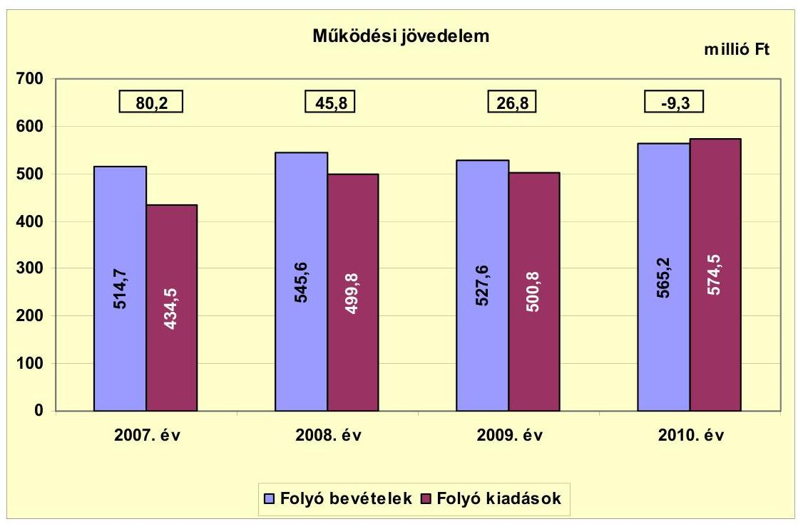

Az Önkormányzat folyó költségvetésének egyenlege (működési jövedelem) 2007-2009 között működési forrástöbbletet, a 2010. évben forráshiányt mutatott. A 2007. évben a folyó bevételeken túlmenően a január 1-jei nyitó pénzkészlet (92,0 millió Ft) további forrásként állt rendelkezésre.

A 2010. évi -9,3 millió Ft összegű forráshiányt az okozta, hogy EU-s támogatással megvalósuló feladatokra (Polgármesteri hivatal szervezetfejlesztése, kompetencia alapú oktatás bevezetése) teljesített működési célú kiadás (28,1 millió Ft) fedezete a 2010. évben nem folyt be, ebből 2011. november 8. napjáig 8,0 millió Ft továbbra sem érkezett be.

---

A folyó bevételek összegének emelkedése nem követte a folyó kiadások összegének növekedését, ezért a működési jövedelem évről-évre csökkent. A folyó bevételek kisebb kilengéseket mutattak, a helyi adó és az egyéb saját bevételek ingadozása miatt. A helyi adó bevételek változását az iparűzési adó és az építményadó határozta meg. Az iparűzési adó 2008. évi összege (131,4 millió Ft) 2009-re 36,5 millió Ft-tal csökkent. Az építményadóból befolyt összeg évről-évre emelkedett, a 2007. évi 6,5 millió Ft-ról a 2010. évre több, mint tízszeresére (68,5 millió Ft). Az egyéb saját bevételek alakulásában a hozam- és kamatbevételek, valamint a támogatásértékű működési bevételek változása játszott meghatározó szerepet. A hozam- és kamatbevételek a 2008. évi 12,4 millió Ft-ról a 2009. évre 31,7 millió Ft-tal emelkedtek, majd a 2010. évre 25,2 millió Ft-tal mérséklődtek. A támogatásértékű működési bevételek összege évről-évre emelkedett, a 2010. évi összeg (46,1 millió Ft) 18,6 millió Ft-tal haladta meg a 2007. évben befolyt bevételt.

A folyó kiadások összegének emelkedésében - az EU-s pályázatok megvalósítására teljesített, valamint a létszámcsökkentési döntések miatti egyszeri jellegű kiadások mellett - az önként vállalt feladatokra fordított kiadások arányának és összegének növekedése volt a meghatározó. A működési jövedelem csökkenése az Önkormányzat pénzügyi egyensúlya szempontjából kockázatot jelent.

Az önkormányzatok működőképességének megőrzését szolgáló kiegészítő támogatások közül az Önkormányzat a 2007. évben részesült „A működésképtelen helyi önkormányzatok egyéb támogatása" címen 5,0 millió Ft összegű támogatásban. A támogatás teljes összege célhoz/feladathoz nem kötött, vissza nem térítendő támogatás volt. A kapott összeget a dologi kiadások kiemelt
 előirányzatokon jelentkezett hiány finanszírozására fordították.

A nettó működési jövedelem alakulását az alábbi ábra mutatja be:
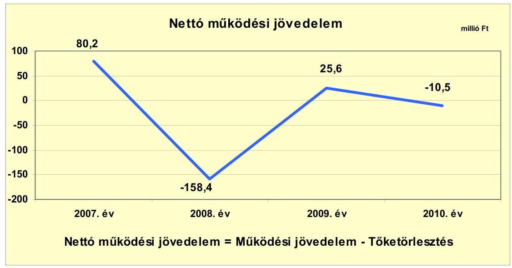

A nettó működési jövedelem (pénzügyi kapacitás) értéke a folyó költségvetési pozíció mellett az adott költségvetési év adósságtörlesztésének hatását is tükrözi. A működési jövedelem évről-évre fokozatosan csökkent, döntően az

---

önként vállalt feladatokra fordított kiadások összegének és arányának növekedése, valamint az EU-s támogatással megvalósuló feladatok kiadásainak megelőlegezése (28,1 millió Ft) miatt. Önként vállalt feladatokra a 2010. évben a 2007-2009 időszak átlagos értékénél (118,3 millió Ft) 77,4 millió Ft-tal (65,4%) nagyobb összeget fordítottak. A tőketörlesztés a kiugró 2008. évet leszámítva folyamatosan csökkenő értéket mutat. Az adósságszolgálatra történt kifizetés a 2008. évben kiemelkedően magas, 204,2 millió Ft kiadást jelentett, a fejlesztési hitelek meghatározó részének kötvénykibocsátásból történt visszafizetése miatt. A 2007-2010 időszakban képződött működési jövedelem az adósságszolgálattal kapcsolatos kiadásoknak csak egy részére nyújtott fedezetet. A folyó költségvetés kialakult helyzete pozitív nettó működési jövedelmet eredményező gazdálkodás mellett teszi elkerülhetővé további külső források bevonását, az eladósodás növekedését.

A működésképtelen önkormányzatok 5,0 millió Ft összegű egyéb támogatása nélkül a 2007. évben a működési jövedelem és a nettó működési jövedelem egyaránt 75,2 millió Ft lett volna.

A felhalmozási költségvetés bevételeit, kiadásait és egyenlegét az alábbi ábra szemlélteti:

Az Önkormányzat címzett támogatásból valósította meg a belvízrendezést, a beruházás a 2008. évben fejeződött be. A 2009. évben - a források szűkössége miatt - mindössze 57,3 millió Ft-ot fordítottak felhalmozásra. A felhalmozási költségvetés 2010. évi negatív egyenlegét egyrészt az okozta, hogy az Önkormányzat saját forrásai terhére előlegezett meg kifizetéseket EU-s támogatással megvalósuló feladatokra (könyvtár fejlesztése, egészségház és orvosi rendelő felújítása), melyek fedezete a 2010. évben nem folyt be (52,8 millió Ft), ebből 2011. november 8. napjáig 27,9 millió Ft továbbra sem érkezett be. Másfelől az egyéb központi támogatásból (100,0 millió Ft) beérkező bevétel egy része nem a kiadás felmerülésének évében jelentkezett.

---

Az EU-s támogatások terhére teljesített kiadásokat érintően az utófinanszírozási rendszer a vizsgált időszakban a likviditás terén kezelhető volt. Az EU-s pályázati pénzeszközből megvalósított fejlesztés esetében éltek az előleg igénybevételének lehetőségével. A 2011. év II. félévére az EU-s támogatások megelőlegezése nehézséget jelent. Az Önkormányzat által adott információ alapján a hitelkérelmüket több bank is elutasította, ezen túlmenően a számlavezető bank sem engedélyez részükre folyószámlahitelt. A fizetőképességet gazdasági társaságban meglévő tulajdonosi részesedés meghatározó részének értékesítésével biztosították. A fizetőképesség biztosítása érdekében az egyik gazdasági társaságban meglévő 49,0% tulajdonosi részesedésből 45,0%-ot 40,0 millió Ft-ért értékesítettek.

A felhalmozási költségvetés 2007-2010 között összesen 348,5 millió Ft felhalmozási forráshiányt mutatott, amelynek a fedezetét a működési megtakarítás (működési jövedelem), a 2007. január 1-jén rendelkezésre álló 92,0 millió Ft pénzkészlet, valamint kötvény és hitel biztosította. Az óvoda felújítása, a művelődési ház átalakítása, az iskolaépület korszerűsítése, a Polgármesteri hivatal akadálymentesítése és a belvízrendezés költségeinek (összesen 922,4 millió Ft) 20,9%-át (192,7 millió Ft) kötvény finanszírozta.

Az Önkormányzat finanszírozási műveleteinek egyenlegét a következő ábra szemlélteti:
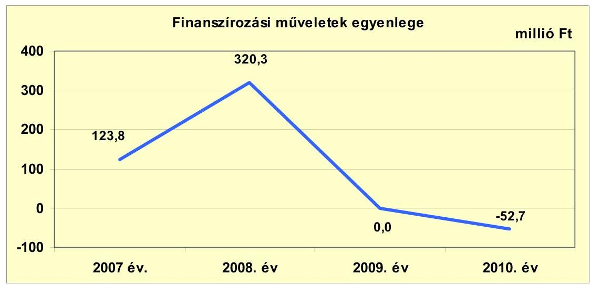

A finanszírozási műveletek egyenlegét a 2007. évben a korábban felvett hitelek 123,8 millió Ft összegű lehívása határozta meg. A 2008. évben 500,0 millió Ft összegben bocsátottak ki kötvényt és 30,4 millió Ft hitelt vettek igénybe, valamint 204,2 millió Ft-ot fordítottak hiteltörlesztésre. A 2009. és a 2010. évben 1,2-1,2 millió Ft hiteltörlesztés történt. A finanszírozási célú műveleteket a jelentés 2. számú mellékletének 4.1.-4.8. pontja részletezi.

---

Az Önkormányzat a 2007-2010. évi zárszámadási rendeleteiben meghatározta a felhalmozási, illetve működési bevételek és kiadások főösszegét $^{14}$, amelyet a jelentés 1. számú melléklete szemléltet.

Az Önkormányzat kamatbevételeinek és kamatkiadásainak alakulását a következő ábra szemlélteti:
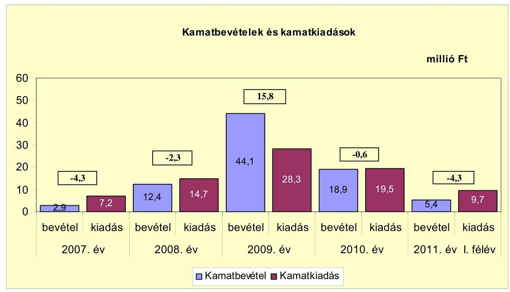

Az Önkormányzat a 2008 szeptemberében kibocsátott kötvényből (500,0 millió Ft), valamint ugyanebben az évben a Polgármesteri hivatal akadálymentesítésére kapott egyéb központi támogatásból (100,0 millió Ft) származó, átmenetileg szabad pénzeszközeit azok felhasználásáig le tudta kötni. Ezáltal a 2009. és a 2010. évben kiemelkedően magas összegű kamatbevételre tettek szert, melyet a kötvénykibocsátáshoz kapcsolódó kamatkiadásokra fordítottak. A kötvény kamata a 2009. évben 27,2 millió Ft-ot tett ki, mely a kibocsátástól 2009. december 31. napjáig tartó 15 hónapos időszakra vonatkozó összeg. A 2010. évben az összes kamatkiadásból a kötvény kamata 18,9 millió Ft-ot jelentett.

[^0]
[^0]:    $^{14}$ Nincs kötelező előírás a működési és fejlesztési többlet, hiány megállapításának módjára.

---

# 2.2. Az Önkormányzat bevételeinek változása 

A folyó bevételek alakulását az alábbi diagram mutatja be:
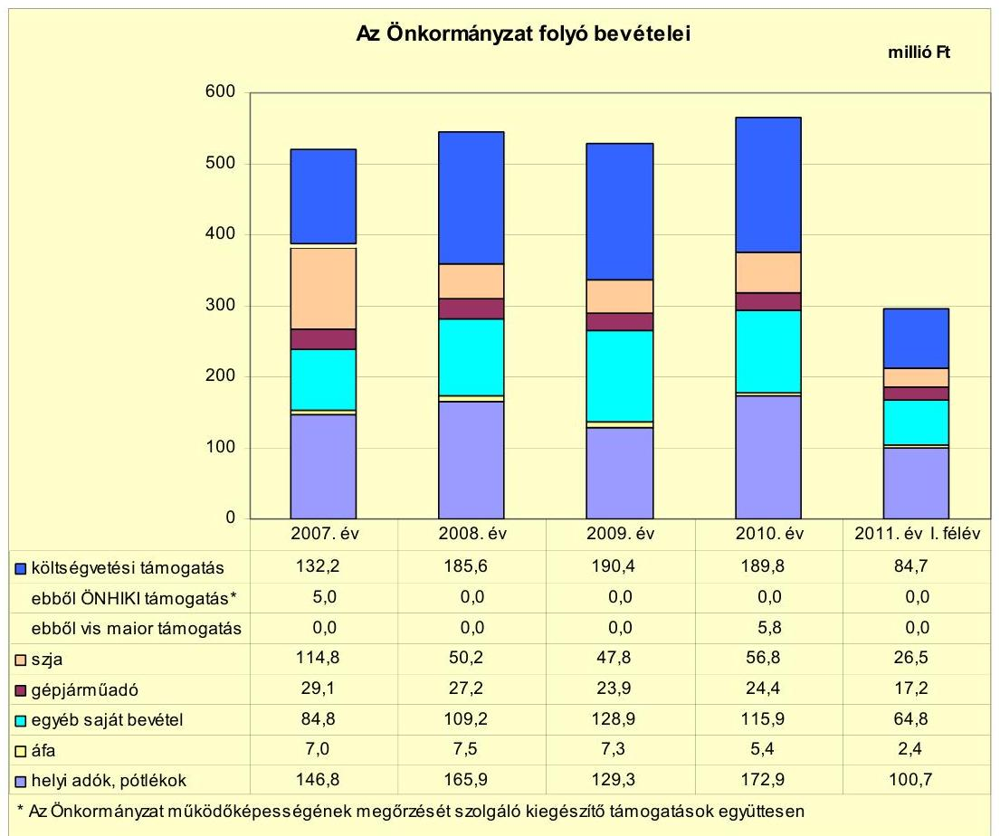

Az Önkormányzat folyó bevétele a 2007. évben 514,7 millió Ft, a 2008. évben 545,6 millió Ft, a 2009. évben 527,6 millió Ft, a 2010. évben 565,2 millió Ft, a 2011. év I. félévében 296,3 millió Ft volt.

A működési célú költségvetési támogatás és az szja bevétel együttes összege a 2007-2009. évi átlagos 240,3 millió Ft-tal szemben a 2010. évben 246,6 millió Ft-ot tett ki. A települési önkormányzatok jövedelemdifferenciálódásának mérséklése jogcímen az Önkormányzat a 2007. évben 16,3 millió Ft, a 2008. évben 9,8 millió Ft összeget kapott. A 2007. évről a 2008. évre bekövetkezett 6,5 millió Ft összegű támogatáscsökkenést az iparűzési adóalap 5518,9 millió Ft-ról 7049,4 millió Ft-ra történt emelkedése okozta. Az iparűzési adóalap a 2008. évben az M6-os autópálya építkezésből származó ideiglenes iparűzési adó és az EVA bevezetése miatt emelkedett.

A vizsgált időszakban az Önkormányzatnál helyi iparűzési adó, építményadó és magánszemélyek kommunális adója volt bevezetve. Az iparűzési és a kommunális adó mértéke a vizsgált időszakban nem változott. Az építményadó mértéke a 2007. évi 300,0 Ft/m²-ről a 2008. évre felére csökkent, a 2009. évben nem változott. A 2010. évben az övezetek kialakítása folytán két adómértéket alkalmaztak (300,0 Ft/m², 400,0 Ft/m²). A helyi adóbevéte-

---

lek 72,3%-át az iparűzési adó tette ki, amelynek mértéke - a Helyi adó tv. szerinti 2,0%-os maximális mértéken belül - 1,5%-ban került megállapításra.

A helyi adókból és pótlékokból származó bevételek aránya a 2007-2010 évek között 2,1 százalékponttal nőtt, 2010-ben 30,6%-ot tett ki a folyó bevételekből. A 2007. évről a 2008. évre bekövetkezett 19,1 millió Ft növekedésben az építményadóból befolyt összeg növekedése (20,2 millió Ft) játszott meghatározó szerepet. A 2008. évről a 2009. évre történt 36,6 millió Ft-os csökkenésből 36,5 millió Ft-ot a helyi iparűzési adó bevétel visszaesése tett ki. A 2010. évi bevétel - főként az építményadó 41,7 millió Ft-os emelkedésének köszönhetően 43,6 millió Ft-tal haladta meg a 2009. évi összeget.

Az építményadó helyi adókból való részesedése a 2009. évi 26,8 millió Ft-ról (17,9%) 2010-re 68,5 millió Ft-ra (37,7%) emelkedett, a 49,2 millió Ft összes helyi adó bevétel emelkedésnek a 84,8%-át adta. A 2010-ben bekövetkezett több mint két és félszeres növekedését az adómérték emelése, illetve az adófizetés alapjául szolgáló övezetek kialakítása által az adómérték differenciált megállapítása tette lehetővé. Az építményadóból befolyó bevétel meghatározó része egy nagy adóalanytól származik.

A helyi adókhoz kapcsolódó pótlékok, bírságok összege a 2009. évi 4,9 millió Ft-ról a 2010. évre 9,6 millió Ft-ra nőtt. A megszűnt és be nem jelentett, felszámolás alatt lévő vállalkozások száma megduplázódott, ezért az adóhátralékokat terhelő pótlék jelentősen megnövekedett, valamint a jegybanki alapkamat is magasabb lett.

A vendégéjszakák utáni idegenforgalmi adót 2009. január 1-jei hatállyal vezették be, a saját bevételi források növelése és a bevételhez kapcsolódó állami támogatás igénybevétele céljából. A 2009-2010 időszakban az adónemen bevételt nem realizáltak. Az idegenforgalmi adó bevezetésével kapcsolatban az Önkormányzatnál többletkiadás nem jelentkezett.

Az Önkormányzatnak a tulajdonosi részesedése után a vizsgált időszakban osztalék bevétele nem származott.

Az Önkormányzat felhalmozási bevételei az alábbiak szerint alakultak:
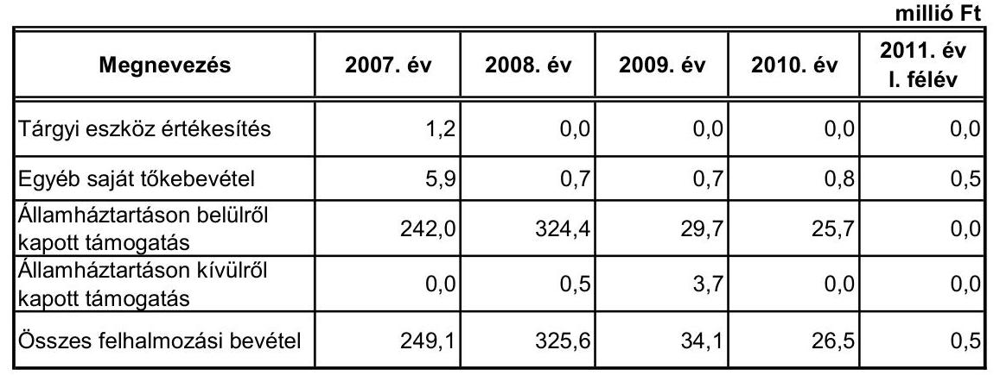

Az „Államháztartáson belülről kapott támogatás" soron - a támogatásértékű felhalmozási bevételek mellett - a költségvetési támogatás felhalmozási célú

---

részét vettük figyelembe. Ennek összege - az Önkormányzat adatszolgáltatása alapján - a 2007. évben 242,0 millió Ft-ot, a 2008. évben 324,4 millió Ft-ot, a 2009. évben 20,0 millió Ft-ot, a 2010. évben 12,9 millió Ft-ot tett ki. A 2007. és a 2008. évben a belvízrendezésre kapott címzett (456,2 millió Ft), valamint az akadálymentesítésre kapott egyéb központi (100,0 millió Ft) támogatás miatt volt kiemelkedően magas a felhalmozási bevétel összege. A támogatásértékű felhalmozási bevételek a 2007-2011. év I. félév időszakában összesen 22,5 millió Ft forrást jelentettek.

# 2.3. Az Önkormányzat folyó és felhalmozási célú kiadásainak változása 

Az Önkormányzat folyó kiadása 2007-2011. június 30. között az alábbiak szerint alakult:

| Megnevezés | 2007. év | 2008. év | 2009. év | 2010. év | 2011. év   I. félév |
| :--: | :--: | :--: | :--: | :--: | :--: |
| Folyó kiadások | 434,5 | 499,8 | 500,8 | 574,5 | 239,2 |
| Működési kiadások (kamatkiadás nélkül) | 386,5 | 445,5 | 424,6 | 498,6 | 206,6 |
| Államháztartáson belülre átadott pénzeszközök | 1,8 | 5,9 | 11,1 | 13,8 | 4,3 |
| Transzferkiadások | 39,0 | 33,7 | 36,8 | 42,6 | 18,6 |
| -ebből: vállalkozásoknak | 1,5 | 0,0 | 0,0 | 0,0 | 0,1 |
| magánszemélyeknek | 26,6 | 21,7 | 19,5 | 25,8 | 13,3 |
| nonprofit szervezeteknek | 10,9 | 12,0 | 17,3 | 16,8 | 5,2 |
| Kamatkiadások | 7,2 | 14,7 | 28,3 | 19,5 | 9,7 |

Az egyes kiemelt működési előirányzatok kiadásainak alakulását az alábbi táblázat mutatja be:

|  |  |  |  |  | millió Ft |
| :-- | --: | --: | --: | --: | --: |
| Megnevezés | 2007. év | 2008. év | 2009. év | 2010. év | 2011. év   I. félév |
| Személyi juttatások | 194,1 | 214,0 | 209,8 | 237,8 | 105,0 |
| Munkaadót terhelő járulékok | 61,5 | 69,4 | 62,4 | 61,2 | 28,8 |
| Dologi kiadások | 145,2 | 158,8 | 149,4 | 190,6 | 70,2 |
| Egyéb folyó kiadások | 12,0 | 18,0 | 31,4 | 28,6 | 12,4 |

A személyi juttatások összegének ingadozását a létszámcsökkentési döntésekből adódó egyszeri többletkiadások, a létszámfejlesztés és a közcélú foglalkoztatottak létszámának változása okozta. A személyi juttatások és a dologi kiadások 2010. évi teljesítési adatában az EU-s támogatás (a Polgármesteri hivatal szervezetfejlesztése, az általános iskolában a kompetencia alapú oktatás bevezetése) terhére kifizetett összegek is megjelennek. Az egyéb folyó kiadásokon a 2008. évről a 2009 évre a kifizetések 13,4 millió Ft-tal emelkedtek, a kamatkiadások növekedése miatt.

---

A működési és a felhalmozási kiadások alakulását az alábbi ábra szemlélteti:
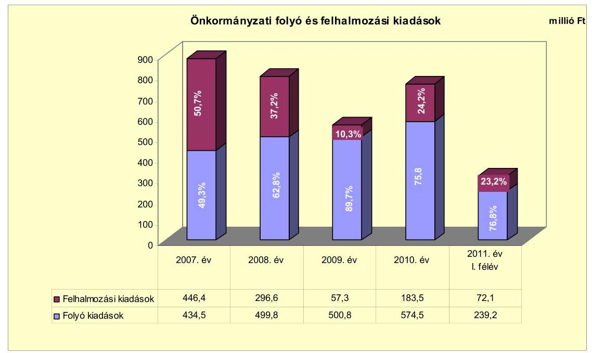

A működési és a felhalmozási
 célú kiadások felhasználásának arányai a 2007. évről a 2010. évre a működési kiadások irányába tolódtak el. A 2007. évi 49,3\% - 50,7\%-os arány (434,5 millió Ft - 446,4 millió Ft) a 2010. évre 75,8\% -24,2\%-ra (574,5 millió Ft - 183,5 millió Ft) változott. Ennek az volt az oka, hogy a nagy összegű, címzett támogatásból megvalósuló beruházás a 2008. évben befejeződött. A 2009. évben az Önkormányzat - a források szűkössége miatt - mindössze 57,3 millió Ft-ot (10,3\%) fordított felhalmozásra.

Az Önkormányzat által 2005-2010 között megvalósított, a 2007-2010 időszakban műszaki szempontból befejezett felújítások (34) és fejlesztések (80) száma 114 volt. A teljes bekerülési költség 1072,7 millió Ft-ot tett ki, melynek 60,9\%-át (653,4 millió Ft-ot) hazai támogatásokból (címzett támogatás, egyéb központi támogatás, fejlesztési támogatás, központosított előirányzat) finanszírozták. A kiadások további fedezetét 20,6\%-ban (220,8 millió Ft) saját bevétel, 18,0\%-ban (192,7 millió Ft) kötvény és hitel, 0,5\%-ban (5,8 millió Ft) EU-s támogatás biztosította. ${ }^{15}$

Az Önkormányzatnál 2010. december 31-én két felújítás és egy fejlesztés volt folyamatban. A felújítások és a fejlesztés várható bekerülési költsége 326,1 millió Ft, melyből 13,9 millió Ft (4,3\%) kiadás a 2007-2010 időszakban már teljesült, a 2010. évet követő kötelezettségvállalás összege 312,2 millió Ft.

Az Önkormányzat tájékoztatása szerint a fejlesztések elkészültek, két esetben az átadás és a számlák kifizetése megtörtént. Az iskola 6 tanteremmel történt bővítésének szakhatósági engedélyezése folyamatban van. A 250,0 millió Ft-os bekerülési költségből 96,8 millió Ft kifizetése megtörtént, az Önkormányzat nyi-

[^0]
[^0]:    ${ }^{15}$ A részletes adatokat a jelentés 3/a. számú melléklete tartalmazza.

---

latkozata alapján a bank az Önkormányzat rendelkezésére bocsát 100,0 millió Ft-ot az óvadéki betétben lévő 250,0 millió Ft kötvénybevételből, a fennmaradó 53,2 millió Ft forrása is biztosított. A kivitelező ellen időközben felszámolási eljárás indult, ezért nem történt még meg a kötvénybevétel lehívása. A fennmaradó 150,0 millió Ft óvadéki betét lekötésből származó kamatbevétellel az Önkormányzat a kötvény kamatkiadásait kívánja csökkenteni.

Az Önkormányzat fejlesztéshez kapcsolódó, beadott, elbírálás alatti pályázattal nem rendelkezik és a 2011. év I. félévében fejlesztéseket, felújításokat kizárólag saját forrásból nem indított.

A vizsgált időszakban az Önkormányzat három legmagasabb bekerülési költségű beruházása:

- Az Önkormányzat a 2005-2008 időszakban valósította meg Adony város belterületi vízrendezését. A beruházás a 2005. évben kezdődött és a 2008. évben fejeződött be. Tényleges bekerülési költsége 672,3 millió Ft-ot tett ki, melyből 510,1 millió Ft-ot (75,9\%) címzett támogatásból, 2,0 millió Ft-ot saját bevételből, 90,1 millió Ft-ot hitelből finanszírozták.
- A Polgármesteri hivatal (Kossuth u.) akadálymentesítését 2009-2010-ben végezték el. Teljes bekerülési költsége 108,6 millió Ft volt, amelyet 100,0 millió Ft összegben hazai támogatás, 8,6 millió Ft összegben kötvénybevétel fedezett.
- A Művelődési házon a 2007. évben 40,0 millió Ft hitel és 2,4 millió Ft saját bevétel felhasználásával energiatakarékossági beruházásokat (külső hőszigetelés, nyílászáró csere, fűtés- és világításkorszerűsítés) és részleges akadálymentesítést hajtottak végre. Ezen túlmenően az addig használaton kívüli részt Civilháznak alakították át, így az energia felhasználás összességében nem változott számottevően.

A gazdasági társaságok az Önkormányzattól az ellenőrzött időszakban rendszeres működési, vagy fejlesztési célú támogatást nem kaptak. A szolgáltatási díjakra tekintettel az előírt költségszint alatti ár- és díjmegállapítás miatti támogatásban sem részesültek.

# 3. Az ÖNKORMÁNYZAT KÖTELEZETTSÉGEI 

### 3.1. Az Önkormányzat pénzintézettel szembeni kötelezettségeinek változása

Az Önkormányzat rövid- és hosszú lejáratú kötelezettségeinek állománya a 2007. január 1-jei 97,1 millió Ft-ról 2010. december 31-re 527,9 millió Ft-ra emelkedett, amely 2011. június 30-ára további 23,1 millió Ft-tal nőtt (551 millió Ft-ra). A rövid- és hosszú lejáratú kötelezettségekből a pénzintézettel szembeni kötelezettség 2007. év január 1-jén 70,0 millió Ft, 2010. december 31-én 517,7 millió Ft, 2011. június 30-án 517,1 millió Ft volt.

A fennálló pénzintézeti kötelezettség 2007. december 31-ig beruházási- és fejlesztési hitelekből állt. A 2008., 2009. és 2010. évek végén, valamint 2011. jú-

---

nius 30-án meglévő pénzintézettel szembeni kötelezettség 96,7\%-a (3306,0 ezer CHF) kötvénykibocsátásból keletkezett, a fejlesztési hitel összege 17,1 millió Ft-ot tett ki.

Az Önkormányzat mérlegében kimutatott, pénzintézetnél fennálló kötelezettség-állományát a 2006-2011. év I. félév közötti időszakban az alábbi ábra szemlélteti:
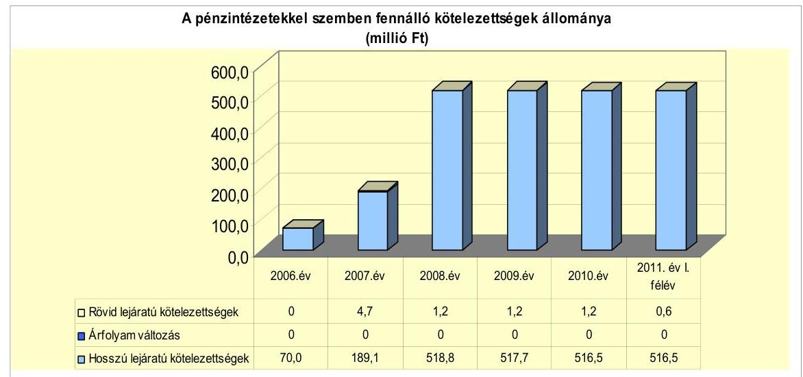

Az Önkormányzat a 2008-2010. években nem tett eleget a Számv. tv. 60. § (2) bekezdésében előírtaknak, mivel a devizában fennálló kötelezettsége (a 2008. évben kibocsátott kötvény) év végi értékelését nem végezte el a Számv. tv. 60. § (4), (6) bekezdéseiben szereplő devizaárfolyammal számolva. Tekintettel arra, hogy az év végi értékelések nem történtek meg, a kötelezettségek állománya nem tartalmazza az árfolyam változások hatását. Az Önkormányzat 2008. szeptember 18-án 3 306,0 ezer CHF névértékű, 500,0 millió Ft összegű kötvényt bocsátott ki. A kötvénykibocsátás célja a meglévő felhalmozási célú hitelek kiváltása, továbbá a pályázati forrásból megvalósított önkormányzati beruházásokhoz szükséges önerő biztosítása. A hosszú lejáratú adósságot keletkeztető kötelezettségvállalás során betartották az Ötv. 88. § (2) bekezdésében foglalt előírásokat ${ }^{16}$. Nem lépték túl az adósságot keletkeztető kötelezettségvállalás felső határát.

A kötvény információs anyaga szerint az Önkormányzat 2008. évre tervezett saját folyó bevétele 209,9 millió Ft, a korrigált saját folyóbevétel 187,5 millió Ft volt. A 2008. évre vonatkozó költségvetési rendelet hitelképességet bemutató melléklete alapján a hitelképességi korlát 147,0 millió Ft volt.

Az Önkormányzat pénzintézeti kötelezettségvállalására (kötvény) a 2007-2011. év I. félév időszakában a Képviselő-testület döntése alapján került sor. A számlavezető bank ajánlatát fogadták el. Az Önkormányzat nem szabályozta belső szabályzatban a kötvény, valamint a pénzintézeti kötelezettségvál-

[^0]
[^0]:    ${ }^{16}$ 2012. január 1-jétől a Stabilitási tv. 10. § (3) bekezdés

---

lások versenyeztetését. A kötvény kibocsátását szabályozás hiányában nem versenyeztette.

A hitelek felvétele, a kötvény kibocsátása előtt tájékoztatták a Képviselőtestületet a fizetendő kamat feltételeiről. A kötvény kibocsátását megelőzően az árfolyamkockázat bemutatása megtörtént. A 2007-2011. év I. félév időszakában az Önkormányzat számlavezetője azonos volt mind a hitelnyújtó, mind a kötvényt lejegyző pénzintézettel.

Az árfolyamváltozás hatására az Önkormányzat CHF-ben fennálló, kötvénykibocsátásból származó pénzintézettel szembeni kötelezettségének forint ellenértéke (500,0 millió Ft) 222,68 Ft/CHF árfolyamon számítva 2010. december 31-én 736,2 millió Ft-ot tett ki, amelyből a számviteli szabályokból adódó átértékelési veszteség 236,2 millió Ft.

Annak megítéléséről, hogy a devizában fennálló hitel vagy kötvény visszafizetése, illetve visszavásárlása az Önkormányzat számára forintban összességében többletkiadást (árfolyamveszteség), vagy kiadási megtakarítást (árfolyamnyereség) eredményez, a futamidő végén, a teljes kötelezettség rendezését követően lehet képet alkotni. Mindaddig, amíg törlesztési kötelezettség nem áll fenn (türelmi idő, moratórium), a tőkére vonatkoztatva nem értelmezhető sem az árfolyamveszteség, sem az árfolyamnyereség. Ugyanakkor a számviteli szabályok meghatározzák, hogy az árfolyam különbözetet év végén a kötelezettségek vagy követelések között a könyvviteli mérlegben nyilván kell tartani, azonban árfolyam különbözet ebben az esetben ténylegesen nem képződött.

Az Önkormányzatnak a 2007-2008. év időszakában hat fennálló hitele volt. A 2007. évet megelőzően felvett hiteleket - a 70,0 millió Ft-os hitel kivételével - a 2007., 2008. évben hívta le. A hitelek összegéből a 2007. évben 123,8 millió Ft-ot, a 2008. évben 30,4 millió Ft-ot vettek igénybe.

A belterületi vízrendezéshez 95,0 millió Ft-ot (a tényleges igénybevétel 90,1 millió Ft volt); ingatlanvásárlási célra 70,0 millió Ft-ot; a közoktatási intézmények felújításához 40,0 millió Ft-ot (a tényleges igénybevétel 12,1 millió Ft volt); az egészségügyi intézmény épületének felújításához 12,0 millió Ft-ot; a közművelődési épület felújításához két szerződéssel 20,0-20,0 millió Ft-ot igényelt.

Az Önkormányzat 2011. június 30-án HUF-ban fennálló adósságot keletkeztető kötelezettségvállalása az alábbi volt:

| Megnevezés | Szerződéskötés   időpontja | Szerződött összeg ezer Ft-ban | Kamat (referencia kamat+
kamatfelár) | Felhasználás célja: |
| :-- | :--: | :--: | :--: | :--: |
| "Közkincs" hosszúlejáratú   hitel | 2008. március 14. | 20000 | 3 havi EURIBOR+2,5\% | Művelődési ház felújítása |

Az Önkormányzat 2011. június 30-án CHF-ben fennálló adósságot keletkeztető kötelezettségvállalása az alábbi volt:

| Megnevezés | Kibocsátás időpontja | Összeg   ezer CHF-ben | Kibocsátási/lehívási   árfolyam | Kamat (referencia kamat+   kamatfelár) | Felhasználás célja: |
| :-- | :--: | :--: | :--: | :--: | :--: |
| Adony\&Adony Kötvény | 2008. szeptember 18. | 3306 | 151,24 | 6 havi LIBOR+2,5\% | Hitel kiváltás, előző hitelek   visszafizetése, felhalmozás |

---

Az Önkormányzat a 2008. évben kibocsátott 500,0 millió Ft értékű kötvényből 250,0 millió Ft-ot használt fel 2011. június 30-ig. Ebből az összegből 199,5 millió Ft-ot a korábban felvett öt MFB hitel kiegyenlítésére, 50,5 millió Ft-ot pályázati forrásból megvalósított önkormányzati beruházásokhoz, felújításokhoz használt fel.

A refinanszírozást, a hitelek visszafizetését követően nem javult az Önkormányzat pénzügyi pozíciója, mivel a deviza alapú kötvény kibocsátását követően jelentősen megemelkedett a CHF árfolyama, így a fizetendő kamatok Ft-ban kimutatott értéke nőtt.

A kötvény tőketörlesztését 2013. év II. félévében kell megkezdeni. A tőketörlesztés összege 220,4 ezer CHF/év, amelynek Ft-ban kimutatott értékét, valamint a pénzügyi egyensúlyra gyakorolt hatását befolyásolja a CHF tőketörlesztés időpontjában fennálló árfolyama.

A kötvény kibocsátása miatt a hosszú lejáratú pénzintézeti kötelezettség megnövekedett, amely kedvezőtlen hatással lehet az Önkormányzat pénzügyi helyzetére.

A 2010. december 31-ig fel nem használt 250,0 millió Ft kötvényforrás óvadékolt betétszámlán került elhelyezésre, amelyből az Önkormányzat iskolájának hat tanteremmel való bővítése kiadásait tervezi finanszírozni. Az óvadékolt betétszámlán lévő összeg kamatozik. Az Önkormányzat tájékoztatása szerint a pénzintézet 100,0 millió Ft-ot rendelkezésére bocsát az általános iskola 6 tanteremmel való bővítése fejlesztés pénzügyi teljesítésére. A fennmaradó 150,0 millió Ft-tal nem rendelkezhet szabadon az Önkormányzat.

Az Önkormányzat a fennálló pénzintézeti kötelezettségeihez kapcsolódóan a 2007-2011. év I. félév időszakában 79,2 millió Ft kamatot és 0,2 millió Ft egyéb kötelezettséget teljesített.

Az Önkormányzatnak a 2007-2011. év I. félév időszakában a fel nem használt kötvényforráson 48,0 millió Ft kamatbevételt, valamint 6,6 millió Ft árfolyamnyereséget realizált, amelyet felhalmozási kiadások teljesítésére fordított.

Az Önkormányzat pénzügyi egyensúly biztosítása érdekében a 2007-2011. év I. félév között nem vett igénybe rövid lejáratú hiteleket (sem folyószámla sem munkabérhitelt).
Az Önkormányzat 2010. december 31-én fennálló adósságot keletkeztető kötelezettségvállalások esetében a kamatfizetési kötelezettségek alakulását jelentősen befolyásolja a kibocsátáskori, lehívási és az utolsó fizetéskori referencia kamat változása, amelyet az alábbi táblázat mutat be.

| Megnevezés | Kibocsátási, lehívási | Utolsó fizetéskori | Változás \% |
| :--: | :--: | :--: | :--: |
|  | kamat (referencia + kamatfelár) \% |  |  |
| 3 havi EURIBOR (2006.március 14.-i hitelszerződés) | 7.286 | 3,731 | -0,488 |
| 6 havi LIBOR (2008. szeptember 18.-i kötvényszerződés) | 5,445 | 2.75667 | -0,494 |

Az Önkormányzat a 2007-2011. év I. félév időszakában fejlesztési célú hitelei után 23,7 millió Ft kamatot fizetett meg.
 A megfizetett kamatból 3,1 millió Ft

---

kamattámogatást visszaigényelt és megkapott az NKÖM-től az évenként megkötött támogatási szerződéseknek megfelelően.

A kötvény kibocsátásával kapcsolatos kamatfizetési kötelezettsége 2010. december 31-ig 239,2 ezer CHF, 46,1 millió Ft-ot, a 2011. év I. félévben 45,8 ezer CHF, 9,4 millió Ft-ot tett ki.

A kötvény kamatának (referencia+alapkamat) csökkenése kedvezően érintette az Önkormányzatot. Az árfolyam- és a kamatváltozás együttes hatására a kötvény kibocsátásától 2010. december 31-ig megfizetett kamat 46,1 millió Ft volt. Az árfolyam az induló szinthez ( $151,24 \mathrm{Ft} / \mathrm{CHF}$ ) képest növekedett (222,68 Ft/CHF). A kamat az induló állapothoz (5,445\%) képest csökkent (2,75667\%). Az induló értékekkel számolva az Önkormányzat 61,3 millió Ft kamatot fizetett volna.

Az Önkormányzat kötelezettségeinek állományát 2010. december 31-én, és 2011. június 30-án, valamint várható alakulását a kötelezettségek lejáratáig az alábbi táblázat mutatja:

| Megnevezés | Állomány 2010. december 31   én |  |  | Állomány 2011. június 30-án |  |  | Várható   kötelezettség 2011-   2013. években |  | Várható   kötelezettség 2014.   évtől |  |
| :--: | :--: | :--: | :--: | :--: | :--: | :--: | :--: | :--: | :--: | :--: |
|  | HUF-ban   (millió Ft-   ban) | Devizában   (összege.   ezer CHF-   ben) | Deviza   nem | HUF-ban   (millió Ft-   ban) | Devizában   (összege.   ezer CHF-   ben) | Deviza   nem | HUF-ban   (millió Ft-   ban) | Devizában   (összege.   ezer CHF-   ben) | HUF-ban   (millió Ft-   ban) | Devizában   (összege.   ezer CHF-   ben) |
| Pénzintézeti kötelezettségek |  |  |  |  |  |  |  |  |  |  |
| Hosszú lejáratú hitel | 17,7 | 0 | HUF | 17,1 | 0 | HUF | 5,2 | 0 | 22,9 | 0 |
| Kötvény (Adany/Adanya) | 0 | 3.306,0 | CHF | 0 | 3.306,0 | CHF | 0 | 493,7 | 0 | 4.379,2 |
| Pénzintézeti kötelezettségek összesen HUF-ban | 17,7 | 0 | HUF | 17,1 | 0 | HUF | 5,2 | 0 | 22,9 | 0 |
| Pénzintézeti kötelezettségek összesen CHF-ben | 0 | 3.306,0 | CHF | 0 | 3.306,0 | CHF | 0 | 493,7 | 0 | 4379,2 |
| Szállítási tartozás | 0 | 0 | HUF | 5,3 | 0 | HUF | 9,3 | 0 | 0 | 0 |
| Pénzintézeti és szállítói kötelezettségek összesen HUF-ban | 17,7 | 0 | HUF | 22,4 | 0 | HUF | 14,5 | 0 | 22,9 | 0 |

A fennálló pénzintézeti kötelezettségekből (tőke és kamat) a 2011-2013. években 5,2 millió Ft, valamint 493,7 ezer CHF fizetési kötelezettség várható. Ennek teljesítésére a 2010. december 31-én kimutatott 278,3 millió Ft pénzmaradványból a 3,3 millió Ft összegű szabad pénzmaradvány, a 39,9 millió Ft mérlegben kimutatott követelésállomány, valamint a forgalomképes ingatlanvagyon vehető figyelembe. Az Önkormányzatnak 2010. december 31-én nem volt jelzálogjoggal terhelt forgalomképes ingatlanja.

Az Önkormányzat 2014. évre és a további évekre szóló jelenleg ismert pénzintézeti kötelezettségei (tőke és kamat) 22,9 millió Ft és 4379,2 ezer CHF. Az Önkormányzat tájékoztatása szerint a kötelezettségek jövőbeni fedezete lehet a megképződött működési jövedelem (a jövőben képződő, a költségvetési rendeletekbe betervezendő saját bevételek, elsősorban helyi adóbevételek), a szabad pénzmaradvány, valamint a meglévő forgalomképes ingatlanvagyon.

# 3.2. A szállítói kötelezettségek változása 

Az Önkormányzat 2010. december 31-én szállítói állománnyal nem rendelkezett, a 2011. június 30-i szállítói állomány 9,3 millió Ft-ot tett ki, amely a kötelezettségek 1,4\%-a volt. A 2011. év I. félév végén lejárt, 9,3 millió Ft

---

összegű szállítói tartozás 30 napon belüli lejáratú. Az Önkormányzatnak a vizsgált időszakban nem volt átütemezési megállapodással érintett szállítói állománya, egyéb kiadáselmaradása, kórházat nem tartott fenn.

# 3.3. Egyéb kötelezettségek változása 

Az Önkormányzat a 2007-2011. év I. félév időszakában nem kötött lízingszerződést, garancia és kezességvállalás beváltása nem történt, PPP konstrukcióban nem vett részt.
Az Önkormányzat a 2007-2011. év I. félév időszakában 25,4 millió Ft követelést engedett el, ez a 2007. évben 4,9 millió Ft-ot, a 2008. évben 5,0 millió Ft-ot, a 2009. évben 4,7 millió Ft-ot, a 2010. évben 5,3 millió Ft-ot, a 2011. év I. félévben 5,5 millió Ft-ot tett ki. A behajthatatlan követelések állományának összege a 2007-2011. év I. félév időszakában mindösszesen 0,5 millió Ft volt.

Az elengedett követelések a vizsgálat minden évében az építményadóhoz (8,7 millió Ft), a magánszemélyek kommunális adójához (1,8 millió Ft), a talajterhelési díjhoz (2,7 millió Ft), valamint a szemétszállítási díjhoz (11,7 millió Ft) kapcsolódtak. A követelések elengedésére a Képviselő-testület jóváhagyásával, az Art. 164. § (6) bekezdése alapján került sor, az adózók kérelmére.
Az Önkormányzat pénzügyi egyensúlyára az elengedett, valamint a behajthatatlan követelések, nagyságukat tekintve nem voltak érdemi hatással.

Az Önkormányzat a 2007-2011. év I. félév időszakában nem nyújtott kölcsönt intézményeknek, más önkormányzatoknak, civil szervezeteknek, egyéb államháztartáson belüli és kívüli szervezetnek, nem volt folyamatban lévő peres eljárása. Nem adott tagi és egyéb kölcsönt sem önkormányzati tulajdonnal rendelkező gazdasági társaság, sem egyéb gazdasági társaság részére. A 2007-2011. év I. félév időszakában az Önkormányzat tájékoztatása szerint az adósságot keletkeztető kötelezettségvállalásaihoz nem kapcsolódott jelzálogjog alapítás. Az Önkormányzat forgalomképes ingatlanjai állományának bruttó értéke 2010. december 31-én és 2011. június 30-án 12,5 millió Ft, nettó értéke 12,0 millió Ft, a becsült forgalmi értéke 30,1 millió Ft volt. Az Önkormányzat nem rendelkezett legalább 50\% vagy azt meghaladó tulajdoni hányaddal gazdasági társaságban.

Az Önkormányzat a 2007-2010. években az eszközállománya után összesen 217,4 millió Ft értékcsökkenést számolt el a számvitelben. Az elavult eszközök pótlását a 2007-2010. év időszakában az Önkormányzat tájékoztatása alapján 142,8 millió Ft összegben (ÁFA-val növelt összeg) felújítással biztosította. Az Önkormányzat az eszközök pótlására az értékcsökkenésnek megfelelő összegű tartalékot nem képzett ${ }^{17}$. A fejlesztésekre, felújításokra az elszámolt értékcsökkenésnél 775,0 millió Ft-tal nagyobb (4,6 szoros) összeget fordítottak. A fejlesztések teljes összege 992,4 millió Ft, amelyből 151,2 millió Ft értékű felújítást, 841,2 millió Ft értékű fejlesztést valósítottak meg (a 3/a, 3/b mellékletek

[^0]
[^0]:    ${ }^{17}$ Az Önkormányzatot nem kötelezi előírás arra, hogy tartalékot, illetve alapot képezzen az elhasználódott eszközök pótlására.

---

alapján). Az Önkormányzat 2010. december 31-én folyamatban lévő felújításainak és fejlesztéseinek tervezett összege 4,9 millió Ft volt.

Az eszközök használhatósági foka a 2007. évben 78,5\%, a 2008. évben 83,5\%, a 2009. évben 80,9\%, a 2010. évben 79,4\% volt. A bruttó eszközállományból a legnagyobb arányt minden évben az ingatlanok képviselik. Az Önkormányzat befektetett eszközállományán belül az üzemeltetésre átadott eszközök állománya a 2007. év december 31-ről 565,4 millió Ft-ról a 2010. év december 31-ére 577,9 millió Ft-ra (2,2\%-kal, 12,5 millió Ft-tal) nőtt. Az üzemeltetésre átadott eszközök állománya az üzemeltető gazdasági társaság részére átadott vízvezetékrendszer, valamint a szennyvíztisztító épületei és annak gépi állományából áll. Az üzemeltetésre átadott eszközök használhatósági foka kismértékűben csökkent, 2007-ben 78,6\%, 2008-ban 76,9\%, 2009-ben 74,9\%, 2010-ben 73,1\% volt. A Képviselő-testületnek előterjesztett éves zárszámadási rendeleteikben nem mutatták be az Önkormányzat eszközei után tárgyévben elszámolt értékcsökkenés összegét, az eszközpótlásra fordított tényleges kiadásokat, az eszközök elhasználódási fokának alakulását.

# 4. A PÉNZÜGYI EGYENSÚLY MEGTEREMTÉSE ÉRDEKÉBEN HOZOTT INTÉZKEDÉSEK EREDMÉNYE 

Az Önkormányzat kiadáscsökkentő és bevételnövelő intézkedései a 2007-2011. években a pénzügyi egyensúlyi helyzet javítását célozták. Az Önkormányzat jelentősebb mértékű kiadásmegtakarítást létszámcsökkentéssel, a béren kívüli juttatások (cafetéria elemek) csökkentésével, helyettesítéssel (gyermekgondozási díj, gyermekgondozási segély miatt), valamint a polgármester béremelésről való lemondásával ért el.

A 2007-2011. év I. félév közötti időszak kiadáscsökkentő intézkedéseinek hatását beavatkozási területenként az alábbi diagram mutatja:
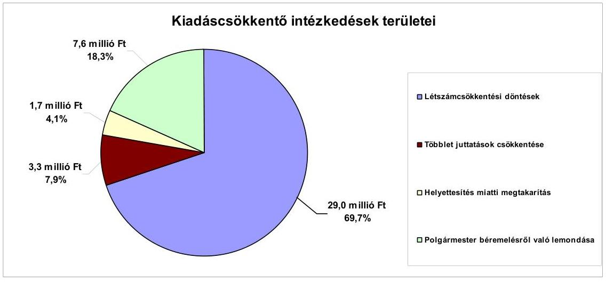

A 2007-2011. év I. féléve között a kiadáscsökkentő intézkedéseivel az Önkormányzat adatszolgáltatása szerint, a közölt adatok alapján összességében 41,6 millió Ft kiadásmegtakarítást ért el, amely a személyi juttatások és járulékaiknál jelentkezett.

---

Abban az esetben, hogyha az Önkormányzat kiadáscsökkentő intézkedéseket nem hajtott volna végre, a 2007. évben 3,4 millió Ft-tal, a 2008. évben 5,4 millió Ft-tal, a 2009. évben 8,4 millió Ft-tal, a 2010. évben 14,1 millió Ft-tal, a 2011. év I. félévében 10,3 millió Ft-tal magasabban alakultak volna a személyi jellegű kiadások és járulékaik. Az Önkormányzat személyi jellegű juttatásai, valamint a munkaadót terhelő járulékai évről évre növekedtek. A növekedés a 2007. évről a 2008. évre 10,9\%, a 2009. évre 6,5\%, a 2010. évre 17,0\%. A növekedés egyrészt a köztisztviselői bértábla szerinti soros lépésekkel, a jubileumi jutalom kifizetésekkel, másrészt a feladatbővülés miatti bér- és járuléknövekedéssel indokolható.

Az Önkormányzat 2007-2011. év I. félév kiadáscsökkentő intézkedései miatti megtakarításait az alábbi területeken, összegben és arányban mutatta ki:

- létszámleépítés miatti kiadásmegtakarítás a közoktatási intézményekben (4 fő) és a polgármesteri hivatalban (2 fő), 29,0 millió Ft, 69,7\%,
- többletjuttatások csökkentése miatti megtakarítás a 2011. évben, 3,3 millió Ft, 7,9\%,
- helyettesítés miatti kiadásmegtakarítás, 1,7 millió Ft, 4,1\%,
- a polgármester béremelésről való lemondása miatti kiadásmegtakarítás, 7,6 millió Ft, 18,3\%.

A 2007-2010. éveket érintő létszámváltozások alakulását az alábbi táblázat mutatja:

| Megnevezés (adatok fő-ben) |  | Közoktatás | Egészségügy | Polgármesteri hivatal | Egyéb | Összesen |
| :--: | :--: | :--: | :--: | :--: | :--: | :--: |
| 2007. január 1-jén jóváhagyott álláshelyek száma |  | 51 | 8 | 20 | 5 | 84 |
| Megszüntetett álláshelyek száma |  | 4 | 0 | 2 | 0 | 6 |
| ebből: | üres álláshelyek száma | 6 | 0 | 0 | 0 | 6 |
|  | megszűnt álláshelyek száma | 4 | 0 | 2 | 0 | 6 |
|  | intézmény-üzemeltetéssel kapcsolatos   álláshelyek száma | 0 | 0 | 0 | 0 | 0 |
| Álláshely növekedése |  | 6 | 0 | 2 | 3 | 11 |
| 2010. december 31-én záró álláshelyek száma |  | 53 | 8 | 20 | 8 | 89 |
| 2007. január 1-jén foglalkoztatott létszám |  | 51 | 8 | 20 | 5 | 84 |
| Létszámcsökkenés |  | 4 | 0 | 2 | 0 | 6 |
| Létszámnövekedés |  | 6 | 0 | 2 | 3 | 11 |

 4 | 0 | 2 | 3 | 9 |
| 2010. december 31-én foglalkoztatott létszám |  | 51 | 8 | 20 | 8 | 87 |

Az Önkormányzatnál a 2007-2010. évek között a foglalkoztatott létszám összeségében 3 fővel változott, 2007. január 1-jéről 2010. december 31-ére 84 főről 87 főre nőtt. A létszámcsökkenés (6 fő) oka, hogy 4 fő „prémiumévek program" keretében került foglalkoztatásra, valamint további 2 fővel csökkent az engedélyezett létszám. A 2007-2010. évek között 9 fővel nőtt ténylegesen a létszám. Egyes közszolgáltatási területeken azonban feladatbővülések is voltak, amelyek álláshely- és egyben létszámnövekedéssel is jártak. A létszámnövekedés oka feladatbővülés az intézményekben (a közoktatásban az angol nyelvű két tannyelvű oktatás bevezetése miatt), valamint a Polgármesteri hivatalban. A 4 fő leépített létszám nem azonos a feladatbővülés miatti létszámnövekedéssel. Az álláshelyek közül 9 álláshelyet közalkalmazotti, köztisztviselői státuszban, 2 pedagógus álláshelyet megbízásos jogviszonyban láttak el. Ennek oka, hogy a meghirdetett álláshelyekre teljes munkaidős foglalkoztatásra nem volt jelentkező.

---

A Képviselő-testület döntései alapján a „prémiumévek" programban való részvétellel a 2007-2010. évek között 4 fővel (évente 1 fő) csökkentették a létszámot (2 fő a polgármesteri hivatali igazgatási feladatoknál, 2 fő oktatási intézménynél). A prémiumévek keretében történő foglalkoztatással az eddigi heti 40 órás munkaviszony helyett heti 12 órát kell ledolgoznia a munkavállalónak, a nyugdíjba vonulásának időpontjáig. A dolgozó a tényleges létszámban így már nem szerepel. A közoktatási intézményekben a 2007. és a 2009. évi költségvetési rendeletben foglaltak alapján 1-1 fővel csökkent a létszám (mindösszesen 6 fővel csökkent).

A 2007-2010. évek között 9 fővel nőtt az engedélyezett létszám, amelyből négy a közoktatásban, kettő a Polgármesteri hivatalban, három az egyéb ágazatban jelentkezett. A létszám növekedésére szakmai átszervezés miatt került sor. A közoktatásban a 2007-2009. között évente egy fővel a két tannyelvű oktatás bevezetése miatt (3 fő), a 2009. évben 1 fő napközis tanítói álláshellyel nőtt a létszám. A Polgármesteri hivatalban a 2007. évben 1 fő műszaki (építési I. fokú szakhatósági tevékenység törvényi előírásnak való megfelelés miatt), 1 fő okmányirodai köztisztviselővel nőtt a létszám (okmányirodai mutatószámok növekedése miatt).

A 2007-2010. években az Önkormányzat 16,0 millió Ft támogatást igényelt és kapott a „prémiumévek" programban résztvevők további foglalkoztatásához, a létszámcsökkentéshez kapcsolódóan. A 2007. évben 0,7 millió Ft, a 2008. évben 2,1 millió Ft, a 2009. évben 4,6 millió Ft, a 2010. évben 8,6 millió Ft volt a megigényelt, valamint a folyósított támogatás összege.

A 2007-2011. év I. félév között a kiadáscsökkentő intézkedések mellett az Önkormányzat az alábbiakban számszerűsített bevételnövelő intézkedéseket tette:
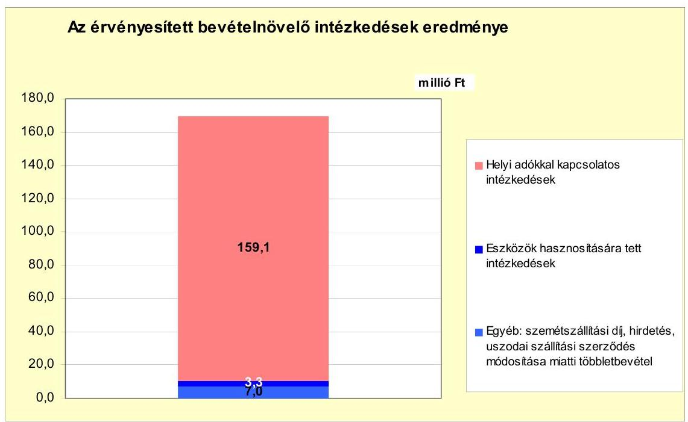

A 2007-2011. év I. félév között a bevételnövelésre irányuló intézkedések számszerűsített összege az Önkormányzat által közölt adatok alapján 169,4 millió Ft volt.

---

A helyi adókkal kapcsolatos intézkedések közül a legjelentősebb az építményadó mértékének változtatása ( $150 \mathrm{Ft} / \mathrm{m}^2$-ről $300 \mathrm{Ft} / \mathrm{m}^2$, illetve $400 \mathrm{Ft} / \mathrm{m}^2$ ) volt. Hatása a 2010-2011. év I. félévében 79,0 millió Ft bevételi többletet eredményezett. Emiatt a település illetékességi területén lévő, raktározási tevékenységet folytató gazdasági társaság jelentős építményadó befizetést teljesített a 2010. évtől. A gazdasági társaság épületcsarnokai a Duna mellett épültek. A vállalkozó a közúti szállítás lehetősége mellett az olcsóbb vízi, hajózással történő szállítási mód kialakítása miatt új kikötőt is épített. A vízi szállítás hosszú távon olcsóbb beszállítási lehetőséget biztosít a raktározást igénybevevő partnereknek. A raktározási tevékenységhez a közúti és vízi szállítási módon kívül, a vasúti szállítási módra is van lehetőség. A gazdasági tevékenység elsősorban mezőgazdasági termények raktározására irányul, de a kapacitás kihasználása érdekében a gazdasági társaság szabad kapacitását ipari és kereskedelmi áruk kezelésével, raktározásával, ezek logisztikájának lebonyolításával fedi le. A raktározási tevékenységi kört a gazdasági társaság folyamatosan bővíti, helyet biztosít vámügynökségi tevékenység folytatásához is. Az Önkormányzat a gazdasági társaság építményadó kötelezettségét folyamatosan emelte, de a helyi adó tv. adta lehetőség még nincs teljes mértékben kihasználva.

A 2007-2011. év I. félév időszakában az adóhátralékok behajtásából származó többletbevétel 80,1 millió Ft volt. Az adóhátralékok összege a 2007. évben 14,2 millió Ft, a 2008. évben 14,6 millió Ft, a 2009. évben 13,0 millió Ft, a 2010. évben 43,4 millió Ft, a 2011. év I. félévben 6,7 millió Ft volt. A behajtott adóhátralék összege az adóhátralékok összegének 2007. évben 35,2%-a, a 2008. évben a 95,2%-a, a 2009. évben 95,4%-a, a 2010. évben a 97,9%-a, a 2011. év I. félévében 94,0%-a volt. Az eszközök hasznosítására, bérbeadására tett intézkedések eredményeképpen a 2007. évben 0,6 millió Ft, a 2008. évben 0,7 millió Ft, a 2009., 2010. években 0,8-0,8 millió Ft, a 2011. év I. félévében 0,4 millió Ft volt a többletbevétel.

Az egyéb bevételnövelő intézkedések a szemétszállítási díj emeléséhez (4,6 millió Ft), a hirdetési díjbevételhez (1,3 millió Ft), valamint az uszodai szállítási szerződés módosításából származó (1,1 millió Ft) többletbevételhez kapcsolódtak.

A kiadáscsökkentő és bevételnövelő intézkedésekből származó összeg ellensúlyozta a költségvetési támogatásból és az szja bevételből származó kiesést. Az Önkormányzat költségvetési támogatásból, szja bevételből származó bevételei a 2007. évhez viszonyítva a 2008. évben 11,2 millió Ft-tal, a 2009. évben 8,8 millió Ft-tal, a 2010. évben 0,4 millió Ft-tal, a 2011. év I. félévben 12,3 millió Ft-tal, összességében 32,7 millió Ft-tal csökkentek. A 2007-2010. években a kiadáscsökkentő intézkedések eredménye 41,6 millió Ft, a bevételnövelő intézkedések 169,4 millió Ft, összesen 211 millió Ft volt, szemben a költségvetési támogatások és az szja bevétel együttes 32,7 millió Ft összegű csökkenésével. Abban az esetben, hogyha az Önkormányzat a 2007-2011. év I. félév időszakában nem hajtott volna végre kiadáscsökkentő (személyi jellegű kiadások és járulékai) és bevételnövelő intézkedéseket, a teljesített kiadások 41,6 millió Ft-tal magasabb, a bevételek 169,4 millió Ft-tal alacsonyabb szinten teljesültek volna. Az Önkormányzat a pénzügyi egyensúlyának javítását, a fennálló kötelezettségeinek a teljesítését a jövőben továbbra is bevételnövelő és kiadáscsökkentő intézkedésekkel fogja tudni teljesíteni. Az Önkormányzat adatszolgáltatása szerinti kiadáscsökkentő és bevételnövelő intézkedések összegének, valamint a költségvetési támogatások és az szja bevétel csökkenésének a különbsége 178,3 millió Ft.

---

# 5. Az ÁSZ által a korábbi években a pénzügyi egyensúly javítására tett szabályszerűségi és célszerűségi javaslatok hasznosulása

Az ÁSZ az Önkormányzat gazdálkodási rendszerét a 2010. évben ellenőrizte. A javaslatok megvalósítása érdekében a számvevői jelentés aláírását követően a jegyző intézkedést rendelt el. A Képviselő-testület határozattal fogadta el a jegyző által készített intézkedési tervet. Az intézkedési terv tartalmazta a felelősöket és az azok végrehajtására megszabott határidőket. A gazdálkodási rendszer korábbi ellenőrzése során tett javaslatok közül a pénzügyi egyensúly javítására sem szabályszerűségi, sem célszerűségi javaslatot nem tett az ÁSZ.

Budapest, 2012. április 16.

Melléklet:  6 db
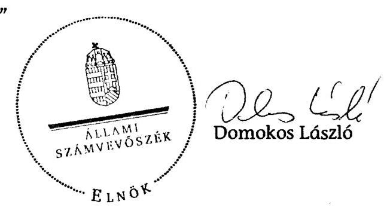

---

Adony Város Önkormányzata

1. számú melléklet
a V-3089-027/2012. számú Jelentéshez

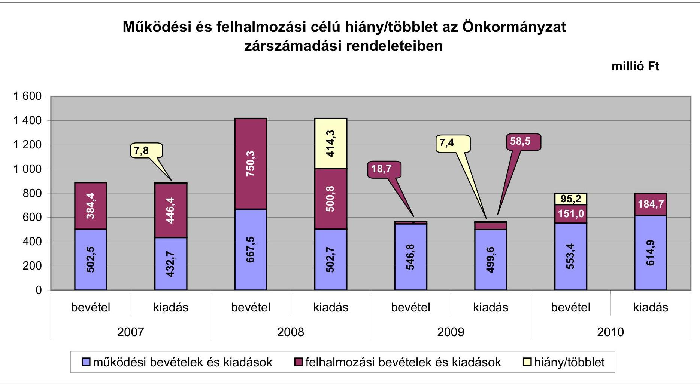

---

Az Önkormányzat bevételei és kiadásai, valamint adósságszolgálata 2007-2010 között

|  1. FOLYÓ KÖLTSÉGVETÉS* | 2007. év | 2008. év | 2009. év | 2010. év  |
| --- | --- | --- | --- | --- |
|  1.1.1. Saját működési bevételek | 207,2 | 236,9 | 223,8 | 244,7  |
|  1.1.2. Költségvetési támogatás*** | 132,2 | 185,6 | 190,4 | 189,8  |
|  1.1.3. Átengedett bevételek | 144,1 | 77,6 | 71,9 | 81,3  |
|  1.1.4. Állambáztartáson belülről kapott támogatások | 29,5 | 38,2 | 41,4 | 49,1  |
|  1.1.5. EU-tól és külföldről kapott bevételek | 0,0 | 0,0 | 0,0 | 0,0  |
|  1.1.6. Állambáztartáson kívülről kapott bevételek | 1,7 | 7,3 | 0,1 | 0,3  |
|  1.1.7. Előző évi pénzmaradvány átvétel | 0,0 | 0,0 | 0,0 | 0,0  |
|  1.1. Folyó bevételek $=1.1.1.+1.1.2.+1.1.3.+1.1.4.+1.1.5.+1.1.6.+1.1.7.$ | 514,7 | 545,6 | 527,6 | 565,2  |
|  1.2.1. Működési kiadások kamatkiadások nélkül | 386,5 | 445,5 | 424,6 | 498,6  |
|  1.2.2. Állambáztartáson belülre átadott pénzeszközök | 1,8 | 5,9 | 11,1 | 13,8  |
|  1.2.3.1. vállalkozásoknak | 1,5 | 0,0 | 0,0 | 0,0  |
|  1.2.3.2. EU-nak, illetve külföldre | 0,0 | 0,0 | 0,0 | 0,0  |
|  1.2.3.3. magánszemélyeknek | 26,6 | 21,7 | 19,5 | 25,8  |
|  1.2.3.4. nonprofit szervezeteknek | 10,9 | 12,0 | 17,3 | 16,8  |
|  1.2.3. Transferkiadások ( $=1.2.3.1+1.2.3.2+1.2.3.3+1.2.3.4$ ) | 39,0 | 33,7 | 36,8 | 42,6  |
|  1.2.4 Kamatkiadások | 7,2 | 14,7 | 28,3 | 19,5  |
|  1.2.5. Előző évi pénzmaradvány átadás | 0,0 | 0,0 | 0,0 | 0,0  |
|  1.2. Folyó kiadások $=1.2.1.+1.2.2.+1.2.3.+1.2.4.+1.2.5.$ | 434,5 | 499,8 | 500,8 | 574,5  |
|  1.3. Folyó költségvetés egyenlege MŰKÖDÉSI JÖVEDELEM (1.1. - 1.2.) | 80,2 | 45,8 | 26,8 | -9,3  |
|  2. FELHALMOZÁSI KÖLTSÉGVETÉS** |  |  |  |   |
|  2.1.1. Saját tökebevételek | 7,1 | 0,7 | 0,7 | 0,8  |
|  2.1.2. Állambáztartáson belülről kapott támogatások*** | 242,0 | 324,4 | 29,7 | 25,7  |
|  2.1.3. EU-tól és külföldről kapott támogatások | 0,0 | 0,0 | 0,0 | 0,0  |
|  2.1.4. Állambáztartáson kívülről kapott támogatások | 0,0 | 0,5 | 3,7 | 0,0  |
|  2.1. Felhalmozási bevételek ( $=2.1.1.+2.1.2+2.1.3+2.1.4$.) | 249,1 | 325,6 | 34,1 | 26,5  |
|  2.2.1. Saját beruházási kiadás állíval | 389,4 | 265,6 | 35,2 | 117,1  |
|  2.2.2. Saját felújítási kiadás állíval | 56,8 | 30,2 | 20,5 | 63,7  |
|  2.2.3. Állambáztartáson belülre átadott pénzeszköz | 0,0 | 0,0 | 0,0 | 0,0  |
|  2.2.4. EU-nak és külföldnek adott pénzeszközök | 0,0 | 0,0 | 0,0 | 0,0  |
|  2.2.5. Állambáztartáson kívülre adott pénzeszközök | 0,2 | 0,8 | 1,6 | 2,7  |
|  2.2.6. Befektetési célú részesedések vásárlása | 0,0 | 0,0 | 0,0 | 0,0  |
|  2.2. Felhalmozási kiadások ( $=2.2.1.+2.2.2.+2.2.3.+2.2.4.+2.2.5.+2.2.6$.) | 446,4

 | 296,6 | 57,3 | 183,5  |
|  2.3. Felhalmozási költségvetés egyenlege (2.1. - 2.2.) | $-197,3$ | 29,0 | $-23,2$ | $-157,0$  |
|  3. Finanszírozási műveletek nélküli (GFS) pozíció(1.3.+2.3.) | $-117,1$ | 74,8 | 3,6 | $-166,3$  |
|  4. Finanszírozási műveletek |  |  |  |   |
|  4.1. Hitelfelvétel | 123,8 | 30,4 | 0,0 | 0,0  |
|  4.2. Hiteltörlesztés | 0,0 | 204,2 | 1,2 | 1,2  |
|  4.3. Forgatási és befektetési célú értékpapírok kibocsátása | 0,0 | 500,0 | 0,0 | 0,0  |
|  4.4. Forgatási és befektetési célú értékpapírok beváltása | 0,0 | 0,0 | 0,0 | 0,0  |
|  4.5. Forgatási és befektetési célú értékpapírok értékesítése | 0,0 | 0,0 | 0,0 | 0,0  |
|  4.6. Forgatási és befektetési célú értékpapírok vásárlása | 0,0 | 0,0 | 0,0 | 0,0  |
|  4.7. Egyéb finanszírozási bevételek (függő, átfutó, kiegyenlítő) | $-1,8$ | $-3,1$ | 0,0 | $-11,1$  |
|  4.8. Egyéb finanszírozási kiadások (függő, átfutó, kiegyenlítő) | $-1,8$ | 2,8 | $-1,2$ | 40,4  |
|  4.9. Finanszírozási műveletek egyenlege (4.1.-4.2.+4.3.-4.4+4.5.-4.6.+4.7.-4.8.) | 123,8 | 320,3 | 0,0 | $-52,7$  |
|  5. Tárgyévi pénzügyi pozíció (1.3.+ 2.3.+4.9.) | 6,7 | 395,1 | 3,6 | $-219,0$  |
|  6. Nettó működési jövedelem =működési jövedelem (1.3.) - hiteltörlesztés (4.2+4.4) | 80,2 | $-158,4$ | 25,6 | $-10,5$  |
|  TÁJÉKOZTATÓ ADATOK |  |  |  |   |
|  Összes kötelezettség | 232,3 | 559,6 | 529,9 | 527,9  |
|  ebből rövid lejáratú | 43,2 | 40,8 | 12,3 | 11,4  |
|  Összes szállítói kötelezettség | 0,3 | 0,0 | 0,0 | 0,0  |
|  ebből lejárt (tanúsítványból) | 0,3 | 0,0 | 0,0 | 0,0  |
|  Pénz és tőkepiaci kötelezettség (adósság) | 193,8 | 520,0 | 518,8 | 517,7  |
|  ebből rövid lejáratú | 4,7 | 1,2 | 1,2 | 1,2  |
|  PPP szerződéses állomány jelenértéken (tanúsítványból) | 0,0 | 0,0 | 0,0 | 0,0  |
|  ebből lejárt szolgáltatási díj miatti kötelezettség | 0,0 | 0,0 | 0,0 | 0,0  |
|  Folyószámlahitel napi átlagos állománya (tanúsítványból) | 0,0 | 0,0 | 0,0 | 0,0  |
|  Likviditási napi átlagos állománya (tanúsítványból) | 0,0 | 0,0 | 0,0 | 0,0  |
|  Munkabérhitel napi átlagos állománya (tanúsítványból) | 0,0 | 0,0 | 0,0 | 0,0  |
|  Kezesség és garanciavállalások (tanúsítványból) | 0,0 | 0,0 | 0,0 | 0,0  |
|  Jogerős bírósági ítéletekből adódó kötelezettségek (tanúsítványból) | 0,0 | 0,0 | 0,0 | 0,0  |
|  Finanszírozásba bevonható eszközök: | 98,7 | 493,7 | 497,3 | 278,3  |
|  Tartós hitelviszonyt megtestesítő értékpapírok év végi állománya | 0,0 | 0,0 | 0,0 | 0,0  |
|  Rövid lejáratú bankbetétek év végi állománya | 0,0 | 0,0 | 0,0 | 0,0  |
|  Értékpapírok év végi állománya | 0,0 | 0,0 | 0,0 | 0,0  |
|  Pénzeszközök (idegen pénzeszközök nélkül) év végi állománya | 98,7 | 493,7 | 497,3 | 278,3  |

[^0] [^0]: * Bevételekben nem térül, a kiadásokban nem jelenik meg az amortizáció, a vagyoni helyzetet az egyenleg befolyásolja. ** Bevételekben vagyon megőrzésre és bővítésére fordítható források. *** A költségvetési támogatásból a felhalmozási célú összeget az Önkormányzat adatszolgáltatása szerinti mértékben vettük figyelembe, a 2.1.2. soron.

---

Adony Város Önkormányzata

Az Önkormányzat 2007-2010. években megvalósított, 2010. december 31-ig befejezett fejlesztései és azok forrásösszetétele

módú Ft

|  Fejlesztési feladat (beruházás, felújítás) | Beruházás, felújítás | Teljes bekerülési költség | 2008. dec. 2007-2010. évek között teljesített kiadás | 2007-2010. évek között teljesített kiadás | Saját bevétel | 2010. december 31-ig megvalósított beruházás forrásösszetétele | Külvény | EU-s támogatás | Hazai támogatás | A tényleges bekerülési költségből (7. oszlopból) eszközpótlásra fordított összeg | A tényleges bekerülési költségből szakmai követelmény teljesítése (igen/nem)  |
| --- | --- | --- | --- | --- | --- | --- | --- | --- | --- | --- | --- |
|  Megnevezése | Képviselő-testületi határozat száma | kezdete | befejezése | Terv (teriménylei 23+21) | Tény (tényleges+tekintélyes- 23+22) | Eltérés (1-1) (típus+terimény) | Eltérés (1-1) (típus+terimény) | Tény | Eltérés (1-1) (13+12- 11) | Tény | Eltérés (1-1) (17+16- 15)  |
|  1 | 2 | 3 | 4 | 5 | 6 | 7 | 8 | 9 | 10 | 11 | 12  |
|  1. | Felújítások |  |  |  |  |  |  |  |  |  |   |
|  2 | Hóvirág Óvoda felújítási 113/2007.(VI.26.)KI.sz.h. munkái | 2007. év | 2007. év | 41 | 13 | -28 | 0 | 13,4 | 1,3 | 1,3 | 0  |
|  3 | Művelődési Ház színházterem felúj. | 3/2008.(II.22.)K.,4/2008.(II.13.)K. | 2008. év | 2009. év | 14 | 14 | 0 | 0 | 14,2 | 0 | 0  |
|  4 | Iskola - vízvezeték korszerűsítés | 37/2009.(III.5.)KI.hat. | 2010. év | 2010. év | 25,0 | 29,8 | 4,8 | 0,0 | 29,8 | 0,0 | 4,8  |
|  5 | Iskola - ebédlő (CEDE) | 137/2009.(VI.25.)KI. | 2010. év | 2010. év | 26,7 | 17,3 | -9,4 | 0,0 | 17,3 | 0,0 | 0,0  |
|  6 | 10 millió Ft alatt felújítások | 30 |  |  | 80,9 | 72,0 | -8,9 | 0,0 | 71,9 | 70,6 | 61,7  |
|  7 | Felújítások összesen: |  |  |  | 188,1 | 146,7 | -41,4 | 0,0 | 146,6 | 71,9 | 67,8  |
|  8 | Fejlesztések |  |  |  |  |  |  |  |  |  |   |
|  9 | Művelődési Ház átalakítás | 138/2007.(VIII.14.)KI.sz.hat. 12 9/2007.(VIII.14.)KI.sz.hat. | 2007. év | 2007. év | 40,0 | 42,4 | 2,4 | 0 | 42,4 | 0,0 | 2,4  |
|  10 | Egészségügyi Központ felépítése | 150/2008.(XII.14.)KI.sz.hat. 23 2007.(II.12.)KI.sz. hat. | 2007. év | 2007. év | 12,0 | 0,0 | -12,0 | 0 | 0,0 | 0,0 | 0,0  |
|  11 | Belvíz rendezés | 169/2009.(II.24.)KI.sz.hat. | 2005. év | 2008. év | 679,3 | 672,2 | -7,1 | 94 | 578,1 | 71,7 | 72,0  |
|  12 | Polgármesteri Hivatal - Bayrny-Zs.u.sk.menn. | 60/2008.(IV.24.)KI.sz.hat. | 2008. év | 2009. év | 24,4 | 24,4 | 0,0 | 0 | 24,4 | 0,6 | 0,6  |
|  13 | Polgármesteri Hivatal - Kossuth-u. | 20/2009.(II.12.),206/200 9.(X.29.)KI.sz.hat. | 2009. év | 2010. év | 108,6 | 108,6 | 0,0 | 0 | 108,6 | 0,0 | 0,0  |
|  14 | 10 millió Ft alatt fejlesztések | 75 |  |  | 99,0 | 79,4 | -20,6 | 0 | 79,4 | 56,2 | 78,0  |
|  15 | Fejlesztések összesen: |  |  |  | 963,3 | 926,8 | -37,3 | 94,2 | 831,9 | 128,5 | 153,0  |
|  16 | Mindösszesen: |  |  |  | 1 151,4 | 1 072,7 | -78,7 | 94,2 | 978,5 | 200,4 | 220,8  |

*A= ha a forrás már rendelkezésre áll,* *B= ha a forrás közbeszerzési eljárása folyamatban van,* *C= ha a forrás közbeszerzési eljárása még nem indult el, a forrás nem áll rendelkezésre.*

---

Adony Város Önkormányzata a V-3089-027/2012. számú Jelentéshez

Az Önkormányzat 2010. december 31-én folyamatban lévő fejlesztési feladataira 2010. december 31-ig teljesített kifizetések és azok forrásösszetétele

|   | Fejlesztési feladat (beruházás, felújítás) |  | Beruházás, felújítás |  |  |  |  |  |  |  |  |  |  |  |  |  |  |  |  |  |  |  |  |  |  |  |  |  |  |  |  |  |  |  |  |  |  |   |
| --- | --- | --- | --- | --- | --- | --- | --- | --- | --- | --- | --- | --- | --- | --- | --- | --- | --- | --- | --- | --- | --- | --- | --- | --- | --- | --- | --- | --- | --- | --- | --- | --- | --- | --- | --- | --- | --- | --- |
|   |  |  |  |  |  |  |  |  |  |  |  |  |  |  |  |  |  |  |  |  |  |  |  |  |  |  |  |  |  |  |  |  |  |  |  |  |  |   |
|   | Fejlesztési feladat (beruházás, felújítás) |  | Beruházás, felújítás |  |  |  |  |  |  |  |  |  |  |  |  |  |  |  |  |  |  |  |  |  |  |  |  |  |  |  |  |  |  |  |  |  |  |   |

 |  |   |
|   |  |  |  |  |  |  |  |  |  |  |  |  |  |  |  |  |  |  |  |  |  |  |  |  |  |  |  |  |  |  |  |  |  |  |  |  |  |   |
|   |  |  |  |  |  |  |  |  |  |  |  |  |  |  |  |  |  |  |  |  |  |  |  |  |  |  |  |  |  |  |  |  |  |  |  |  |  |   |
|   |  |  |  |  |  |  |  |  |  |  |  |  |  |  |  |  |  |  |  |  |  |  |  |  |  |  |  |  |  |  |  |  |  |  |  |  |  |   |
|   |  |  |  |  |  |  |  |  |  |  |  |  |  |  |  |  |  |  |  |  |  |  |  |  |  |  |  |  |  |  |  |  |  |  |  |  |  |   |
|   |  |  |  |  |  |  |  |  |  |  |  |  |  |  |  |  |  |  |  |  |  |  |  |  |  |  |  |  |  |  |  |  |  |  |  |  |  |   |
|   |  |  |  |  |  |  |  |  |  |  |  |  |  |  |  |  |  |  |  |  |  |  |  |  |  |  |  |  |  |  |  |  |  |  |  |  |  |   |
|   |  |  |  |  |  |  |  |  |  |  |  |  |  |  |  |  |  |  |  |  |  |  |  |  |  |  |  |  |  |  |  |  |  |  |  |  |  |   |
|   |  |  |  |  |  |  |  |  |  |  |  |  |  |  |  |  |  |  |  |  |  |  |  |  |  |  |  |  |  |  |  |  |  |  |  |  |  |   |
|   |  |  |  |  |  |  |  |  |  |  |  |  |  |  |  |  |  |  |  |  |  |  |  |  |  |  |  |  |  |  |  |  |  |  |  |  |  |   |
|   |  |  |  |  |  |  |  |  |  |  |  |  |  |  |  |  |  |  |  |  |  |  |  |  |  |  |  |  |  |  |  |  |  |  |  |  |  |   |
|   |  |  |  |  |  |  |  |  |  |  |  |  |  |  |  |  |  |  |  |  |  |  |  |  |  |  |  |  |  |  |  |  |  |  |  |  |  |   |
|   |  |  |  |  |  |  |  |  |  |  |  |  |  |  |  |  |  |  |  |  |  |  |  |  |  |  |  |  |  |  |  |  |  |  |  |  |  |   |
|   |  |  |  |  |  |  |  |  |  |  |  |  |  |  |  |  |  |  |  |  |  |  |  |  |  |  |  |  |  |  |  |  |  |  |  |  |  |   |
|   |  |  |  |  |  |  |  |  |  |  |  |  |  |  |  |  |  |  |  |  |  |  |  |  |  |  |  |  |  |  |  |  |  |  |  |  |  |   |
|   |  |  |  |  |  |  |  |  |  |  |  |  |  |  |  |  |  |  |  |  |  |  |  |  |  |  |  |  |  |  |  |  |  |  |  |  |  |   |
|   |  |  |  |  |  |  |  |  |  |  |  |  |  |  |  |  |  |  |  |  |  |  |  |  |  |  |  |  |  |  |  |  |  |  |  |  |  |   |
|   |  |  |  |  |  |  |  |  |  |  |  |  |  |  |  |  |  |  |  |  |  |  |  |  |  |  |  |  |  |  |  |  |  |  |  |  |  |   |
|   |  |  |  |  |  |  |  |  |  |  |  |  |  |  |  |  |  |  |  |  |  |  |  |  |  |  |  |  |  |  |  |  |  |  |  |  |  |   |
|   |  |  |  |  |  |  |  |  |  |  |  |  |  |  |  |  |  |  |  |  |  |  |  |  |  |  |  |  |  |  |  |  |  |  |  |  |  |   |
|   |  |  |  |  |  |  |  |  |  |  |  |  |  |  |  |  |  |  |  |  |  |  |  |  |  |  |  |  |  |  |  |  |  |  |  |  |  |   |

 |  |   |
|   |  |  |  |  |  |  |  |  |  |  |  |  |  |  |  |  |  |  |  |  |  |  |  |  |  |  |  |  |  |  |  |  |  |  |  |  |  |   |
|   |  |  |  |  |  |  |  |  |  |  |  |  |  |  |  |  |  |  |  |  |  |  |  |  |  |  |  |  |  |  |  |  |  |  |  |  |  |   |
|   |  |  |  |  |  |  |  |  |  |  |  |  |  |  |  |  |  |  |  |  |  |  |  |  |  |  |  |  |  |  |  |  |  |  |  |  |  |   |
|   |  |  |  |  |  |  |  |  |  |  |  |  |  |  |  |  |  |  |  |  |  |  |  |  |  |  |  |  |  |  |  |  |  |  |  |  |  |   |
|   |  |  |  |  |  |  |  |  |  |  |  |  |  |  |  |  |  |  |  |  |  |  |  |  |  |  |  |  |  |  |  |  |  |  |  |  |  |   |
|   |  |  |  |  |  |  |  |  |  |  |  |  |  |  |  |  |  |  |  |  |  |  |  |  |  |  |  |  |  |  |  |  |  |  |  |  |  |   |
|   |  |  |  |  |  |  |  |  |  |  |  |  |  |  |  |  |  |  |  |  |  |  |  |  |  |  |  |  |  |  |  |  |  |  |  |  |  |   |
|   |  |  |  |  |  |  |  |  |  |  |  |  |  |  |  |  |  |  |  |  |  |  |  |  |  |  |  |  |  |  |  |  |  |  |  |  |  |   |
|   |  |  |  |  |  |  |  |  |  |  |  |  |  |  |  |  |  |  |  |  |  |  |  |  |  |  |  |  |  |  |  |  |  |  |  |  |  |   |
|   |  |  |  |  |  |  |  |  |  |  |  |  |  |  |  |  |  |  |  |  |  |  |  |  |  |  |  |  |  |  |  |  |  |  |  |  |  |   |
|   |  |  |  |  |  |  |  |  |  |  |  |  |  |  |  |  |  |  |  |  |  |  |  |  |  |  |  |  |  |  |  |  |  |  |  |  |  |   |
|   |

---

Adony Város Önkormányzata a V-3089-027/2012. számú jelentéshez

Az Önkormányzat 2010. december 31-én folyamatban lévő fejlesztési feladataira 2010. december 31-én fennálló kötelezettségek és azok forrásösszetétele

|   | Fejlesztési feladat (beruházás, felújítás) |  | Beruházás, felújítás |  |  |  |  |  |  |  |  |  |  |  |  |  |  |  |  |  |  |  |  |  |  |  |  |  |  |  |  |  |  |  |  |  |  |  |  |  |  |  |  |  |  |  |  |  |  |  |  |  |  |  |  |  |  |  |  |  |  |  |  |  |  |  |  |  |  |  |  |  |  |  |  |  |  |  |  |  |  |  |  |  |  |  |  |  |  |  |  |  |  |  |  |  |  |  |  |  |  |  | 

---

Adony Város Önkormányzata 4. számú melléklet a V-3089-027/2012. számú jelentéshez

Az önkormányzati feladatok ellátásában résztvevő gazdasági társaságok

millió Ft

|  Gazdasági társaság megnevezése | önkormányzat | önkormányzat gazdasági társaságának | saját tőke, jegyzett tőke aránya | kötelező feladathoz | önként vállalt feladathoz | hosszú lejáratú hitelből, kötvényből | lízingből | lejárt szállítóállományból | működési célra átadott pénzeszköz | felhalmozási célra átadott pénzeszköz  |
| --- | --- | --- | --- | --- | --- | --- | --- | --- | --- | --- |
|   | tulajdoni hányada (%) |  |  |  |  |  |  |  |  |   |
|  1. 100%-os tulajdoni hányadú gazdasági társaságok: |  |  |  |  |  |  |  |  |  |   |
|  100%-os tulajdoni hányadú gazdasági társaságok összesen | x | x | x | 0 | 0 | 0 | 0 | 0 | 0 | 0  |
|  II. 75-99%-os tulajdoni hányadú gazdasági társaságok: |  |  |  |  |  |  |  |  |  |   |
|  75-99%-os tulajdoni hányadú gazdasági társaságok összesen | x | x | x | 0 | 0 | 0 | 0 | 0 | 0 | 0  |
|  III. 51-74%-os tulajdoni hányadú gazdasági társaságok: |  |  |  |  |  |  |  |  |  |   |
|  51-74%-os tulajdoni hányadú gazdasági társaságok összesen | x | x | x | 0 | 0 | 0 | 0 | 0 | 0 | 0  |
|  IV. egyéb, közfeladatot ellátó gazdasági társaságok: |  |  |  |  |  |  |  |  |  |   |
|  Viertikál Zrt. | 0 | 0 | 6,5 | 265,6 | 0 | 85,4 | 0 | 0 | 0 | 0  |
|  DÉSZOLG Kft. | 49,0 | 0 | 3,4 | 24,2 | 0 | 5,4 | 0 | 106,0 | 0 | 0  |
|  Dunántúli Regionális Vízmű Zrt.* | 0 | 0 | 1,8 | 302,7 | 0 | 542,1 | 0 | -18,8 | 0 | 0  |
|  egyéb, közfeladatot ellátó gazdasági társaságok összesen | x | x | x | 592,5 | 0 | 632,9 | 0 | 87,2 | 0 | 0  |
|  összesen | x | x | x | 0,0 | 0 | 0,0 | 0 | 0,0 | 0 | 0  |

- A társaság tájékoztatása szerint a

 lejárt szállítói állomány negatív előjele az áram- és gázdíjak sztornó, illetve jóváíró számlából adódik, melyek rendezése folyamatban van.
