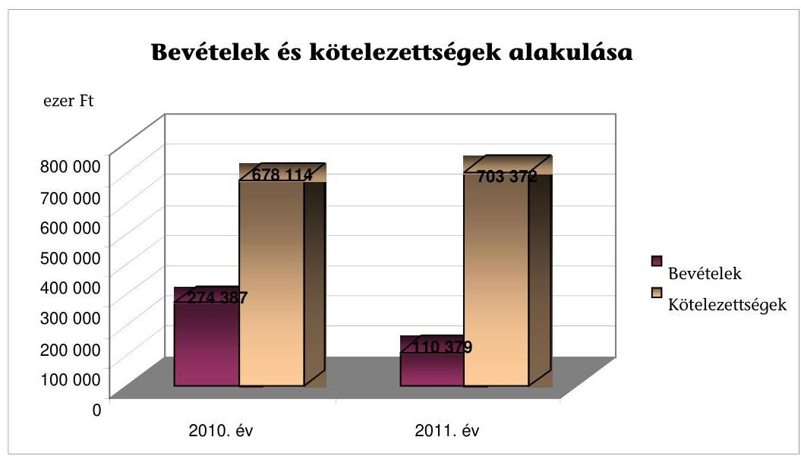
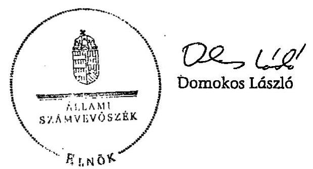

# ÁLLAMI   SZÁMVEVŐSZÉK 

## JELENTÉS

a Jólét és Szabadság Demokrata Közösség 2010-2011. évi gazdálkodása törvényességének ellenőrzéséről

---

# Állami Számvevőszék 

Iktatószám: V-0022-054/2012.
Témaszám: 1061
Vizsgálat-azonosító szám: V0575

## Az ellenőrzést felügyelte:

## Horváth Balázs

felügyeleti vezető

## Az ellenőrzés végrehajtásáért felelős:

Dr. Veress Tiborné
ellenőrzésvezető

## A jelentés összeállításában közremúködött:

Dr. Faragóné Tóth Mária
számvevő tanácsos

## Az ellenőrzést végezték:

| Dr. Faragóné Tóth   Mária | Deák Tamásné számvevő tanácsos | Hajdú Károlyné számvevő tanácsos |
| :--: | :--: | :--: |

## A témához kapcsolódó eddig készített számvevőszéki jelentések:

| címe |  | sorszáma |
| :--: | :--: | :--: |
| Jelentés a Magyar Demokrata Fórum 1991. évi gazdálkodása törvényességének ellenőrzéséről |  | 136 |
| Jelentés a Magyar Demokrata Fórum 1992-1993. évi gazdálkodása törvényességének ellenőrzéséről |  | 235 |
| Jelentés a Magyar Demokrata Fórum 1994-1995. évi gazdálkodása törvényességének ellenőrzéséről |  | 342 |
| Jelentés a Magyar Demokrata Fórum 1996-1997. évi gazdálkodása törvényességének ellenőrzéséről |  | 9902 |
| Jelentés a Magyar Demokrata Fórum 1998-1999. évi gazdálkodása törvényességének ellenőrzéséről |  | 0106 |
| Jelentés a Magyar Demokrata Fórum 2000-2001. évi gazdálkodása törvényességének ellenőrzéséről |  | 0313 |
| Jelentés a Magyar Demokrata Fórum 2002-2003. évi gazdálkodása törvényességének ellenőrzéséről |  | 0457 |
| Jelentés a Magyar Demokrata Fórum 2004-2005. évi gazdálkodása törvényességének ellenőrzéséről |  | 0703 |
| Jelentés a Magyar Demokrata Fórum 2006-2007. évi gazdálkodása törvényességének ellenőrzéséről |  | 0847 |
| Jelentés a Magyar Demokrata Fórum 2008-2009. évi gazdálkodása törvényességének ellenőrzéséről |  | 1040 |

---

# TARTALOMJEGYZÉK 

BEVEZETÉS ..... 5
I. ÖSSZEGZŐ MEGÁLLAPÍTÁSOK, KÖVETKEZTETÉSEK ..... 7
II. RÉSZLETES MEGÁLLAPÍTÁSOK ..... 13

1. A Párt gazdálkodásáról szóló 2010-2011. évi beszámolók ..... 13
1.1. A teljes ellenőrzési időszakra érvényes megállapítások ..... 13
1.2. Bevételek ..... 13
1.3. Kiadások ..... 15
2. A Pártnak a beszámoló összeállítására és az azt alátámasztó
könyvvezetésre vonatkozó belső szabályozása és gyakorlata ..... 16
2.1. A számviteli rendszer szabályozása ..... 16
2.2. A könyvvezetés összhangia a jogszabályokban és a belső
szabályzatokban előírt követelményekkel ..... 18
2.3. A bizonylati elv és fegyelem, a bizonylati rend érvényesülésének
ellenőrzése ..... 21
2.4. A Pártra jellemző speciális területek ..... 22
3. A Párt bevételszerző, gazdálkodó tevékenysége ..... 22
3.1. A Párt gazdálkodásának szabályozottsága ..... 22
3.2. A Párt vagyonának elemei ..... 22
4. A gazdálkodással összefüggő egyéb jogszabályokban foglalt előírások
betartásának ellenőrzése ..... 24
4.1. A foglalkoztatás szabályszerűsége ..... 24
4.2. Személyi jellegű kifizetésekre vonatkozó jogszabályok betartása ..... 25
4.3. Az adózási, társadalombiztosítási és egyéb jogszabályok
rendelkezéseinek betartása ..... 26
5. A belső ellenőrzés rendszere ..... 27
5.1. A belső ellenőrzés rendszerének szabályozottsága, múködése ..... 27
5.2. Az informatikai rendszer szabályozottsága, múködése ..... 28
6. Az előző ellenőrzés megállapítására tett intézkedések ..... 28
MELLÉKLETEK
7. számú A Magyar Demokrata Fórum 2010. évi pénzügyi beszámolója (2 oldal)
8. számú A Jólét és Szabadság Demokrata Közösség 2011. évi pénzügyi beszámolója
(2 oldal)

---

.

---

# RÖVIDÍTÉSEK JEGYZÉKE 

Jogszabályok rövidítése

Art.
párttörvény
Számv. tv.
Szja tv.
Tbj.

Szórövidítések

Alapítvány
ÁSZ
Insomnia
kis értékú eszközök
könyvelési szolgáltató

MDF
MFB Zrt.
NAV
OE
OGY
OH
OSZB
OV
Párt
PGSZ
PSZ
VK
Zirconia
az adózás rendjéről szóló 2003. évi XCII. törvény
a pártok múködéséről és gazdálkodásáról szóló 1989. évi XXXIII. törvény
a számvitelről szóló 2000. évi C. törvény
a személyi jövedelemadóról szóló 1995. évi CXVII. törvény a társadalombiztosítás ellátásaira és a magánnyugdíra jogosultakról, valamint e szolgáltatások fedezetéről szóló 1997. évi LXXX. törvény

Antall József Alapítvány
Állami Számvevőszék
Insomnia Reklámügynökség Kft.
100 ezer Ft érték alatt beszerzett eszközök
Antaszolg Kft. (2700 Cegléd, Körösi út 24., 2008. szeptember 17.-2010. december 31.), Czi and T Kft. (2700 Cegléd, Körösi út 24., 2011. január 1.-2012. június 13.)

Magyar Demokrata Fórum
Magyar Fejlesztési Bank Zrt.
Nemzeti Adó- és Vámhivatal
Országos Elnökség
Országos Gyúlés
Országos Hivatal
Országos Számvizsgáló Bizottság
Országos Választmány
Jólét és Szabadság Demokrata Közösség
Pénzügyi Gazdasági Szabályzat
Pénzkezelési Szabályzat
Választó Kerület
Zirconia Trading Limited

---

.

---

# JELENTÉS 

## a Jólét és Szabadság Demokrata Közösség 2010-2011. évi gazdálkodása törvényességének ellenőrzéséről

## BEVEZETÉS

Az Állami Számvevőszékről szóló 2011. évi LXVI. törvény 5. § (11) bekezdés a) pontja, valamint a pártok múködéséről és gazdálkodásáról szóló 1989. évi XXXIII. törvény (párttörvény) 10. § (1) bekezdése alapján a pártok gazdálkodása törvényességének ellenőrzésére az Állami Számvevőszék (ÁSZ) jogosult. Az ÁSZ a rendszeres költségvetési támogatásban részesülő pártok gazdálkodását a párttörvény 10. § (3) bekezdésében előírtak szerint kétévenként ellenőrzi. A Jólét és Szabadság Demokrata Közösség (Párt) - névváltozás előtt a Magyar Demokrata Fórum (MDF) - rendszeres, 2010. évben 116,1 millió Ft, 2011. évben 42,8 millió Ft költségvetési támogatásban részesült.

Az ellenőrzés célja annak megállapítása volt, hogy:

- a Párt által készített és a Magyar Közlönyben közzétett éves beszámolók a törvényi előírásoknak megfelelnek-e, a könyvvezetéssel és a valósággal megegyező adatokat tartalmaznak-e;
- a könyvvezetés és a gazdálkodás során betartották-e a számvitelről szóló többször módosított - 2000. évi C. törvény (Számv. tv.) és az egyéb jogszabályok rendelkezéseit, a belső előírásokat;
- a Párt a múködéséhez szabályszerűen igénybe vehető forrásokat használt-e fel, a párttörvényben engedélyezett gazdálkodó tevékenységet folytatott-e.

Az ellenőrzött időszak: 2010. január 1. - 2011. december 31.
Az ellenőrzés típusa: pénzügyi-szabályszerűségi ellenőrzés
Az ellenőrzés körülményeit illetően rögzíteni szükséges ${ }^{1}$, hogy:

- a párttörvény 1. számú melléklete szerinti beszámoló-mintához magyarázatot, útmutatót nem készítettek a jogalkotók, így ennek kitöltése pártonként kialakított számviteli politikájuknak megfelelően - eltérő lehet;

[^0]
[^0]:    ${ }^{1}$ Az ÁSZ a korábbi pártellenőrzésekről készített jelentéseiben javasolta a Kormánynak a párttörvény módosítását. A közigazgatási és igazságügyi miniszter 2012 májusában tájékoztatta az ÁSZ-t, hogy a Kormány fontosnak tartja a Számv. tv-nyel összehangolt pártfinanszírozási és gazdálkodási szabályok megalkotását.

---

- a beszámoló-minta a Számv. tv. rendelkezéseivel nem harmonizál, nem felel meg sem a mérleg, sem az eredmény-kimutatás követelményeinek.

Az ÁSZ a párttörvény módosításáig a hatályos rendelkezéseknek megfelelő egységes módszertani alapokra helyezett - gyakorlattal folytatja a pártok gazdálkodása törvényességének ellenőrzését. Az ellenőrzést a pénzügyiszabályszerűségi ellenőrzés módszertani szabályai, valamint a pártellenőrzésre kiadott „A pártok gazdálkodása törvényességének pénzügyi szabályszerűségi ellenőrzéséhez" című segédletbe foglalt egységes követelmények szerint végeztük. Az ellenőrzési feladatok szempontrendszerét kockázatelemzéssel alapoztuk meg, amelynek eredményeként az ellenőrzést magas eredendő és közepes kontroll kockázatúnak minősítettük. A Párttól bekért adatok előzetes elemzése és a 2010-2011. évi főkönyvi könyvelési adatok alapján terveztük meg a tételes ellenőrzést, valamint a statisztikai mintavételi eljárást. Tételesen ellenőriztük a bevételek közül az egy millió Ft feletti tételeket, valamint a beszámolóban kötelezően nevesítendő, értékhatárt elérő egyéb hozzájárulásokat, adományokat. Az ellenőrzött években a bizonylati rend és fegyelem ellenőrzéséhez az ellenőrzési program szerint Win-idea programmal értékalapú rétegzett, véletlenszerű mintavétellel választottuk ki a bizonylatokat.

Az előkészítés során a rendelkezésre bocsátott dokumentumok alapján az átfogó lényegességi küszöb mértéket a beszámolók bevételi főösszegének 2,0\%-ában határoztuk meg, továbbá specifikus lényegességi küszöböt alkalmaztunk az egyéb hozzájárulások, adományok körében a párttörvény 1. számú mellékletének előírása szerinti nevesítési értékhatárra (belföldi 500 ezer Ft, külföldi 100 ezer Ft feletti) tekintettel.

A helyszíni ellenőrzés körülményeiről rögzíteni szükséges:

- a Párt a 2010. áprilisi országgyűlési képviselőválasztáson elért eredménye alapján mandátumot nem szerzett, azonban a párttörvény 5. § (2) bekezdésében szabályozott feltételnek megfelelve költségvetési támogatásra jogosult, mert az 1\%-os küszöbértéket meghaladó szavazatot megszerezte;
- a Párt elnökének személyében 2010. június 20-tól a gazdasági igazgató személyében 2010. február 10-ével változás történt;
- a Párt Országos Gyűlése (OGY) az új pártvezetés javaslatára 2010. december 12-én döntött a szervezet tartalmi és arculati átalakulásáról, 2011. április 8án a Párt nevét megváltoztatták;
- a könyvelési feladatokat az ellenőrzött időszakban ellátó szolgáltató a Párttal kötött szerződését 2012. június 13-án azonnali hatállyal felmondta a megbízási szerződésben rögzített megállapodások megszegése miatt.

A helyszíni ellenőrzés 2012. augusztus 21 - szeptember 7-e között, a Párt Budapest, II. kerület Szilágyi Erzsébet fasor 73. szám alatti székhelyén történt.

---

# I. ÖSSZEGZŐ MEGÁLLAPÍTÁSOK, KÖVETKEZTETÉSEK 

A Párt a pénzügyi beszámolóját a Hivatalos Értesítőben és internetes honlapján mindkét évben a párttörvényben előírt határidőn túl tette közzé. A beszámolók összeállításának rendjét a Párt a hatályos számviteli politikájában nem szabályozta. A 2010. évi beszámoló megbízható és valós képet adott a Párt gazdálkodásáról. A 2011. évi beszámoló összeállításával összefüggésben feltárt és számszerúsített elszámolási hiba előjeltől független összege a bevételi és a kiadási oldalon 20703 ezer Ft volt, ami a bevételi főösszeg 18,8\%-a, amely meghaladta az ÁSZ által alkalmazott 2\%-os átfogó lényegességi küszöböt. A lényeges hibát a Számv. tv.-ben rögzített teljesség és valódiság elvének megsértése okozta. A 2011. évi beszámolóban közzétett -20703 ezer Ft összegű politikai kiadás (tartozás elengedés) egy 2009. évben megrendelt és teljesített, de ki nem fizetett szolgáltatáshoz kapcsolódott, amit 2011. évi egyéb hozzájárulások, adományok jogi személyektől jogcímen nem pénzbeli adományként nem mutattak ki. A 2011. évi beszámoló nem mutatott megbízható, valós képet. A párttörvény nem rendelkezik a pártok beszámolóinak megbízhatósága érdekében a kötelező könyvvizsgálatról.

A Párt 2011. január 1-jétől új számviteli politikát készített, aminek részét képezte az értékelési szabályzat, a bizonylati rend, a számlarend és a leltározási szabályzat. A Párt pénzkezelési szabályait 2009. február 1-jétől hatályos pénzkezelési szabályzatban és 2010. október 16-tól hatályos pénzügyi gazdasági szabályzatban rögzítette. A szabályozásokban az előző ÁSZ ellenőrzés felhívásait részben vették figyelembe. A számviteli politikában nem rögzítették a megbízható és valós képet lényegesen befolyásoló hiba nagyságát, az ismételt közzététel előírásait, a Párt sajátosságai figyelembevételével a beszámoló elkészítésekor és a könyvvezetés során érvényesítendő számviteli alapelveket. A szabályzatok csak részben tükrözték a Pártra jellemző sajátosságokat, mivel nem tartalmazták a párttörvény szerinti beszámoló összeállításához az egyéb bevételek, a múködési, a politikai és egyéb kiadások, az eszközbeszerzések fogalomkörét és a kapcsolódó főkönyvi számlákat, továbbá a Párt részére nyújtott nem pénzbeli vagyoni hozzájárulás értékelésének szabályait. A szabályozási hiányosságok hozzájárultak a könyvvezetési és a beszámolási hibákhoz, amely részben összefüggött a párttörvény és a Számv. tv. közötti összhang hiányával is. A számlarendből hiányzott több, a könyvelési gyakorlatban alkalmazott számlaszám, a számlák más számlákkal való kapcsolatát csak részben rögzítették. A Párt 2012. első negyedévében elkészített szabályzatai (pénzügyi gazdasági szabályzat, pénzkezelési szabályzat) tartalmazták a Párt szervezetének változását (területi irodák, helyi szervezetek megszűnése), szervezeti struktúrájának átalakítását.

A Párt a számviteli politika előírásával összhangban a Számv. tv.-ben rögzített kettős könyvvitelt vezetett. A beszámoló összeállítását és a könyvvezetést külső könyvelési szolgáltató megbízási szerződéssel végezte, amely rendelkezett a Számv. tv.-ben meghatározott képesítéssel és szerepelt a könyvviteli szolgáltatást végzők nyilvántartásában. Könyvelési hibából eredően a 2011. évi beszámoló nem mutatott megbízható, valós képet, mivel a tartozás elengedését a

---

Párt költségcsökkentésként könyvelte a nem pénzbeli vagyoni hozzájárulás helyett. A beszámolót nem érintő könyvvezetési szabálytalanságot tárt fel az ellenőrzés, mert a rövid és a hosszú lejáratú kötelezettséget a Számv. tv.-ben előírtaktól eltérően tartották nyilván. A számlakijelölés gyakorlata - eseti hibák kivételével - összhangban volt a Számv. tv.-ben és a számlarendben előírtakkal. Az eszközök értékcsökkenésének elszámolása megfelelt a Számv. tv.-ben és a számviteli politikában foglaltaknak. Szabályszerú̉ leltárt egyik évben sem végeztek, mivel országos szinten a leltár összesítéséről, kiértékeléséről, a különbözet megállapításáról szóló jegyzőkönyvet nem készítettek. A számlarendben meghatározott zárlati feladatok szabályszerű végrehajtása teljes körűen nem valósult meg.

Az analitikus nyilvántartásokat részben vezették a Számv. tv.-nek és a belső előírásoknak megfelelően. A szabályozásban a felsorolt analitikák tartalmi követelményeit és formáját meghatározták. Az analitikák vezetése terén előforduló szabálytalanság volt, hogy a Párt nyilvántartotta a kis értékű eszközöket, de azok nem voltak naprakészek és a szervezetek leltárával sem egyeztették. Az ellenőrzött időszakban a főkönyvi számlákhoz kapcsolódóan a tárgyi eszközök, a készpénzforgalom, az elszámolásra kiadott előlegek, a vevők, a szállítók, a hosszú és rövid lejáratú hitelek és kölcsönök, az egyéni bérek- és járulékok, valamint a tagdíjak és az adományok analitikus nyilvántartását vezették. A hoszszú és rövid lejáratú hitelekről és kölcsönökről a főkönyvi könyveléshez kapcsolódóan vezetett analitikus nyilvántartást nem a számlarendben előírt tartalommal vezették. A nyilvántartás nem volt alkalmas arra, hogy a kapott hiteleket, kölcsönöket év végén lejárat szerint minősítsék.

A pénzkezelési feladatok szabályszerű ellátását a Számv. tv. és a pénzkezelési szabályzat előírásaival összhangban a pénztárosi feladatot ellátók körében biztosították. Összeférhetetlenség nem állt fenn és felelősségvállalási nyilatkozatot is aláírtak. Az ellenőrzött időszakban a Párt belső struktúrája átalakult, az átszervezés pénztárak megszüntetésével járt, a pénzkészleteket az OH pénztárába befizették. A készpénzben és a bankszámlán tartott pénzeszközök közötti forgalomban a szabályszerűséget biztosították, a főkönyvi nyilvántartás adataiból a pénzmozgások követhetőek voltak. Az ellenőrzött bizonylatok közel felét nem utalványozták, az utalványozás rendje részben felelt meg a belső szabályzatok előírásainak. A Párt rendszeresen túllépte a napi készpénz záró állomány maximális mértéket, amelynek keretét a 2012. évtől megemelték.

A bizonylati elv és fegyelem szabályait a számlarendhez kapcsolódóan a bizonylati rend tartalmazta. A gazdasági események számviteli nyilvántartásokban történő rögzítése során - egy kivétellel - betartották a Számv. tv.-ben szabályozott bizonylati elvet. Alapbizonylat (számla) nélkül könyveltek 2010. évben 594 ezer Ft összegű bérleti díjat. A vegyes bizonylatok megalapozottsága, a gazdasági események időrendisége biztosított volt. A könyvvezetésben gondoskodtak a főkönyvi könyvelés és a bizonylatok adatai közötti egyeztetés és ellenőrzés logikailag zárt rendszerben való biztosításáról. A gazdasági eseményeket - a késedelemmel átadott elszámolások kivételével - időrendben rögzítették. A könyvviteli elszámolást közvetlenül alátámasztó számviteli bizonylatok ala-ki-tartalmi előírásait, a 2010. évben - kivéve a könyvviteli nyilvántartásban való rögzítés időpontját és a pénztárbizonylatokon az átvevő aláírását - és a

---

2011. évben betartották. A bizonylatok megőrzéséről a Számv. tv.-ben előírtaknak megfelelően gondoskodtak.

A Párt gazdálkodó, bevételszerző tevékenysége során a könyvviteli nyilvántartásai szerint betartotta a párttörvényben előírt forrásszerzési és gazdálkodási tilalmakat. A Párt külföldi államtól, költségvetési szervtől, állami vállalattól, állami részvétellel működő gazdasági társaságtól vagyoni hozzájárulást, valamint névtelen adományt nem fogadott el, betartva a párttörvényben foglaltakat. A Párt kizárólag a párttörvényben engedélyezett gazdálkodó tevékenységet (pl. tulajdonában álló ingatlan értékesítést) folytatott. Egyszemélyes korlátolt felelősségű társaságot nem alapított, más gazdasági társaságban részesedést nem szerzett, értékpapírt nem vásárolt.

A Párt kötelezettség állománya a zárlati adatok szerint a 2010. évben 678113 ezer Ft, a 2011. évben 703372 ezer Ft volt, amelynek a közzétett bevételi adatokhoz való viszonyát az alábbi grafikon szemlélteti:

A Párt az állami vagyonról szóló törvény alapján 2009-ben vásárolt 21 állami tulajdonú ingatlanra kedvezményes kamatra hitelt vett igénybe a Magyar Fejlesztési Bank Zrt-től (MFB Zrt.). A Párt a bevételi forrásainak csökkenése következtében a kölcsönszerződések alapján vállalt kötelezettségeket teljes körűen nem teljesítette. A kialakult szerződésszegő magatartás miatt az MFB Zrt. a kölcsönszerződést felmondta.

A Párt bevételéhez viszonyított kötelezettség állománya 2010. évi közel két és félszereséről 2011. évre hat és félszeresére nőt. A felhalmozott tartozás rendezését az ellenőrzés bizonytalannak ítéli. Az állami vagyon veszélyeztetettségére utal, hogy sem a párttörvényben sem az állami vagyontörvényben nincsenek szabályozott garanciák a fizetésképtelenség esetére.

A munkaerő-foglalkoztatás az ellenőrzött időszakban a Munka Törvénykönyvéről szóló törvényben szabályozott tartalmú munkaszerződések, valamint megbízási szerződések szerint történt. A Párt a foglalkoztatottakat a törvényi előírásoknak megfelelően bejelentette. A munkabérek számfejtése, kifizetése

---

megfelelt a hatályos jogszabályi előírásoknak. A munkavállalókat megillető juttatásokat és a költségtérítéseket szabályozták. A béren kívüli juttatások után az adót késedelmesen, többszöri önellenőrzéssel vallották be és fizették meg. A Párt a magáncélú telefonhasználat értékének tételes elkülönítése helyett választható, a kifizetőt terhelő $100 \%$-os magáncélú telefonhasználat utáni adózást alkalmazta; a tulajdonában álló telefonok magáncélú használatából eredő adó- és járulék bevallási- és fizetési kötelezettségének eleget tett. Az elszámolt reprezentáció költségei nem haladták meg az Szja tv.-ben meghatározott adómentes határt. A foglalkoztatás elősegítéséről és a munkanélküliek ellátásáról szóló törvény szerinti rehabilitációs hozzájárulást megfizette. A Párt a járulékok bevallását az Art.-ban meghatározott határidőre, a befizetéseit rendszeresen késedelemmel teljesítette.

A belső ellenőrzés rendjét az alapszabályban, a pénzügyi és gazdasági szabályzatban, illetve a pénzkezelési szabályzatban meghatározták. A pénzkezelési szabályzatot az ellenőrzött időszakban nem aktualizálták, a helyi szervezetek megszűnése miatti változást nem vezették át, pénztárellenőrt és ellenjegyzőt nem neveztek ki, ez utóbbit a 2012. évben elkészített szabályzat már tartalmazta. A Párt választott ellenőrző szervezete az Országos Számvizsgáló Bizottság (OSZB) az alapszabály és ügyrendje szerinti feladatokat ellátta. A Párt 2011. évi pénzügyi beszámolóját megfelelőnek tartotta, azonban nem tárta fel a 20703 ezer Ft összegű lényeges hibát. Az ÁSZ ellenőrzés által megállapított könyvvezetési és beszámolási hibák a szabályozási hiányosságokra és a nem megfelelően működött vezetői és munkafolyamatba épített ellenőrzésre vezethetők vissza.

Az előző ÁSZ jelentés felhívására összeállított intézkedési tervben foglalt feladatokat részben hajtották végre. A Párt a 2008-2009. évi beszámolóját ismételten közzé tette; intézkedett az adóköteles természetbeni juttatások utáni adóés járulékok bevallására és megfizetésére; a munkaköri leírásokat elkészítették és átadták; a kötelezettségvállalási értékhatárt betartották; szabályozták az adományozás dokumentálását. A Párt beszámolási és könyvvezetési sajátosságainak megfelelő kiegészítéseket a szabályzatokban nem írták elő. A Párt az éves beszámoló összeállításakor, illetve a könyvvezetésében továbbra sem érvényesítette teljes körűen a Számv. tv.-ben szabályozott számviteli alapelveket.

Az Állami Számvevőszékről szóló 2011. évi LXVI. törvény 33. § (1) bekezdésében foglaltak értelmében a jelentésben foglalt megállapításokhoz kapcsolódó intézkedési tervet köteles az ellenőrzött szervezet vezetője összeállítani és azt a jelentés kézhezvételétől számított harminc napon belül az ÁSZ részére megküldeni. Amennyiben az intézkedési tervet határidőben nem küldi meg a szervezet, vagy az továbbra sem elfogadható, az ÁSZ elnöke a hivatkozott törvény 33. § (3) bekezdés a)- b) pontjaiban foglaltakat érvényesítheti.

A helyszíni ellenőrzés intézkedést igénylő megállapításai és felhívásai:

# a Párt elnökének 

1. A 2011. évi beszámoló hibáinak előjeltől független összege a bevételi és a kiadási oldalon 20703 ezer Ft volt, amelyek a bevételi főösszegre vetítve $18,8 \%$ mértéket értek el. A lényeges hibákat a Számv. tv.-ben rögzített teljesség és valódiság elvének

---

megsértése okozta, amelynek következtében a 2011. évi beszámoló nem mutatott megbízható, valós képet.

Felhívás:
Készítse el és tegye közzé megbízható és valós adatokkal a Párt 2011. évi módosított beszámolóját a Számv. tv. 15. § (2)-(3) bekezdéseiben foglalt teljesség és valódiság elveinek érvényesítésével.
2. A számviteli szabályzatok nem felelnek meg teljes körűen a Számv. tv. előírásainak.
a) A számviteli politikában a Párt nem rögzítette a megbízható és valós képet lényegesen befolyásoló hiba nagyságát, az ismételt közzététel előírásait, a Párt sajátosságai figyelembevételével a beszámoló elkészítésekor és a könyvvezetés során érvényesítendő számviteli alapelveket.

Felhívás:
Módosítsa a számviteli politikát figyelemmel a Számv. tv. 14. § (4) bekezdésében, a 15-16. §-ában, valamint a 154. § (5) bekezdésben előírtak betartására.
b) A szabályzatok részben tükrözték a Pártra jellemző sajátosságokat, mivel nem tartalmazták a párttörvény szerinti beszámoló összeállításához az egyéb bevételek, müködési, politikai és egyéb kiadások, eszközbeszerzések fogalomkörét és a kapcsolódó főkönyvi számlákat és a Párt részére nyújtott nem pénzbeli vagyoni hozzájárulás értékelésének szabályait.

Felhívás:
Egészítse ki szabályzatait a Pártra jellemző sajátosságokkal, valamint a párttörvény 4. § (5) bekezdésével összhangban a nem pénzbeli vagyoni hozzájárulás értékelési módjának előírásaival.
c) A Számv. tv. előírása ellenére a számlarendből hiányzott több, a könyvelési gyakorlatban alkalmazott számlaszám, a számlák más számlákkal való kapcsolatát részben rögzítették.

Felhívás:
Egészítse ki a számlarendet a Számv. tv. 161. § (2) bekezdés a)-b) pontjai előírásainak megfelelően.
3. A 2011. évi beszámolóban lényeges hibához vezetett, hogy a könyvvezetésben nem érvényesítették a Számv. tv.-ben foglalt teljesség és valódiság elvét. A tartozás elengedést a Párt költségcsökkentésként könyvelte a nem pénzbeli vagyoni hozzájárulás helyett.

Felhívás:
Érvényesítse a könyvvezetésben a Számv. tv. 15. § (2)-(3) bekezdésében foglalt teljesség és valódiság elveket.

---

4. A Párt a rövid és hosszú lejáratú kötelezettségeket a Számv. tv.-ben előírtaktól eltérően tartotta nyilván.

Felhívás:
Tartsa nyilván a Számv. tv. 42. § (1)-(3) bekezdéseiben előírtaknak megfelelően a rövid és hosszú lejáratú kötelezettségeket.
5. A Párt nem tartotta be a pénzkezelésre vonatkozó előírásokat, a bizonylatok közel felét nem utalványozták, a napi készpénz záró állomány maximális mértékét rendszeresen túllépték.

Felhívás:
Intézkedjen a pénzkezelési szabályzat előírásai szerint az utalványozási rend érvényesítéséről és a készpénz záró állomány maximális mértékének betartásáról.
6. Az ÁSZ ellenőrzés által megállapított könyvvezetési és beszámolási hibák a szabályozási hiányosságokra és a nem megfelelően működött vezetői és munkafolyamatba épített ellenőrzésre vezethetők vissza.

Felhívás:
Intézkedjen a vezetői és munkafolyamatba épített ellenőrzés hatékony működtetésére.

---

# II. RÉSZLETES MEGÁLLAPÍTÁSOK 

## 1. A PÁrt GAZDÁlKodÁsÁról SZÓLÓ 2010-2011. ÉVI BESZÁmolók

### 1.1. A teljes ellenőrzési időszakra érvényes megállapítások

A Párt a 2010. évi gazdálkodásáról szóló beszámolót 2011. május 6-án a Hivatalos Értesítő 30. számában, a 2011. évi beszámolót 2012. május 8-án a Hivatalos Értesítő 20. számában mindkét évben, a párttörvény 9. § (1) bekezdésében előírt határidőn túl tette közzé. A Párt ugyanakkor igazolta a 2011. évi beszámoló közzétételre továbbításának (postai feladás) 2012. április 27-i időpontját. Mindkét év beszámolóját a párttörvény 1. számú mellékletében előírt tartalommal állították össze (1-2. számú melléklet). A Párt a 2010. és a 2011. évi beszámolóját az internetes honlapján is nyilvánosságra hozta. Az Országos Választmány (OV) az alapszabály 16. § (1) bekezdés n) pontja alapján a Párt éves gazdálkodásáról készített éves beszámolókat 2011. április 28-án és 2012. április 27-én határozattal elfogadta.

A beszámolók összeállításának rendjét a Párt a hatályos számviteli politikájában nem szabályozta. A közzétett beszámolókat december 31-i fordulónappal központi könyveléssel alátámasztva, a helyi szervezetek, a területi irodák és az OH bizonylatai alapján, a főkönyvi számlák adatai alapján és az azokhoz kapcsolódó analitikus nyilvántartásokkal alátámasztva állították össze.

A 2010. évi beszámoló megbízható és valós képet adott a Párt gazdálkodásáról. A nyilvánosságra hozott 2011. évi beszámoló nem mutatott megbízható és valós képet a Párt gazdálkodásáról, mivel összeállítása során a Számv. tv. 15. § (2) bekezdésében foglalt teljesség és a (3) bekezdésben rögzített valódiság számviteli alapelveket megsértették.

A 2011. évi beszámoló összeállításával összefüggésben feltárt és számszerúsített elszámolási hiba előjeltől független összege a bevételi oldalon 20703 ezer Ft, ami a bevételi főösszeg 18,8\%-a volt. A kiadási oldalon feltárt hibák előjeltől független összege és a bevételi főösszegre vetített mértéke a 2010. évben 616 ezer Ft ( $0,2 \%$ ), a 2011. évben 20703 ezer Ft, (18,8\%). A megjelentetett beszámoló bevételi főösszegére vetített hiba mértéke 2011-ben a bevételi és a kiadási oldalon egyaránt meghaladta az ÁSZ-nál általánosan elfogadott 2\%-os átfogó lényegességi küszöböt.

### 1.2. Bevételek

A beszámoló bevételeit a 9. Bevételek elnevezésű számlaosztályhoz tartozó, a párttörvény 1. számú melléklete szerinti minta soraihoz igazodó főkönyvi számlák adataiból állították össze.

---

A Párt 2010. és 2011. évi bevételeit és az ellenőrzése során megállapított eltérést a következő táblázat részletezi:

Adatok: ezer Ft-ban

| Megnevezés | Párt által közzétett beszámoló |  | Megállapított eltérés |
| :--: | :--: | :--: | :--: |
|  | 2010. évi | 2011. évi | 2011. évi |
| 1. Tagdíjak | 962 | 430 | 0 |
| 2. Állami költségvetésből származó támogatás | 129812 | 42800 | 0 |
| 4. Egyéb hozzájárulások, adományok | 97615 | 49469 | $+20703$ |
| 6. Egyéb bevétel | 45998 | 17680 | 0 |
| ÖSSZESEN: | 274387 | 110379 | $+20703$ |

A Párt alapszabályának 16. §-a értelmében a tagdíj összegének megállapítása az OV feladat- és hatásköre. Az OE 2011. december 22-i javaslata alapján az OV 2012. január 10-i határozatával visszamenőleges hatállyal, 2011. január 1-jétől megszüntette a kötelező tagdíjat és bevezette az önkéntes tagdíjfizetési rendszert, értékében felső korlát meghatározása nélkül. A tagdíjak címen közzétett adat a 2010-2011. években megegyezett a főkönyvi könyvelésben szereplő összeggel. A tagdíjbevételek alapbizonylatai a szervezetenként kiállított és a tagok által igazolt tagdíj befizetési lapok és a hozzá tartozó pénztárbizonylatok, banki átutalások voltak. A befizetők személye a bizonylatok alapján megállapítható volt. A tagdíjakról vezetett analitikus nyilvántartás a főkönyvi számla egyenlegét alátámasztotta. A tagdíjbevételek között más bevételeket nem szerepeltettek.

Az állami költségvetés által biztosított támogatás címén a közzétett adatok mindkét évben megegyeztek a főkönyvi könyvelésben kimutatott és a bankszámlakivonaton szereplő, a Magyar Államkincstár által ténylegesen átutalt összegekkel. A párttörvény 5. § (2) bekezdése alapján kapott 2010-2011. évi támogatás egyezett a Magyar Köztársaság 2010. évi költségvetésének végrehajtásáról szóló 2011. évi CXXXIII. törvényben és a Magyar Köztársaság 2011. évi költségvetéséről szóló 2010. évi CLXIX. törvényben meghatározott összeggel. A Párt állami támogatása 2010. évben kiegészült az Országos Választási Bizottság 265/2010. sz. határozata alapján az Önkormányzati Minisztérium által átutalt kampánytámogatás összegével.

Az egyéb hozzájárulások, adományok beszámolósor adattartalmát a Párt a párttörvény 9. § (2) bekezdésében előírtaknak és az 1. sz. mellékletének megfelelően tovább részletezte. A Pártnak az ellenőrzött időszakban belföldi jogi személyektől, valamint belföldi magánszemélyektől származott bevétele. A belföldi jogi személyek és magánszemélyek értékhatár feletti adományait a Párt a párttörvény 9. § (2) bekezdésében meghatározottak szerint a beszámolókban név szerint kimutatta. A támogatónkénti kimutatást a Párt elkészítette, amely alátámasztotta a beszámoló adatait. Az egyéb hozzájárulások, adományok

---

belföldi jogi személyektől jogcímen kimutatott bevételek összege megegyezett a vonatkozó főkönyvi számlák összesített egyenlegével, azonban 2011. évben nem tartalmazta a 20703 ezer Ft összegű, az ellenőrzés által adománynak minősített, nevesítendő bevételt. A beszámolókban a párttörvény 4. § (5) bekezdésében előírtakkal összhangban szerepeltették az önkormányzati ingatlanhasználat formájában kapott nem pénzbeli vagyoni hozzájárulás értékét. A fizetett és a piaci érték különbözetét az érintett ingatlanok kezelőitől bekért igazolásokban, értékelési dokumentumokban közölt bérleti díjtételek támasztották alá. A beszámolókban feltüntették a párttörvény 9. § (2) bekezdés előírása szerint az értékhatár feletti támogatást nyújtó önkormányzatokat és a támogatási összeget. Az egyéb hozzájárulások, adományok belföldi magánszemélyektől beszámolósor adata egyezett a vonatkozó főkönyvi számlák összesített egyenlegével.

Az egyéb bevétel jogcímen elszámolható bevételeket a számviteli politika szabályozta. Itt kellett kimutatni az ingatlan értékesítésből, eszköz bérbeadásából, továbbszámlázott szolgáltatási (közüzemi) díjakból, kártérítésből származó bevételeket, kamatbevételeket, árfolyamnyereséget, kerekítési különbözetet és egyéb különféle bevételeket. A beszámolósor összege a főkönyvi kivonattal megegyezett. Az egyéb bevétel összege nem tartalmazott jogcím szerint nem oda tartozó értéket.

# 1.3. Kiadások 

A Párt 2010. és 2011. évi kiadásait és az ellenőrzés által megállapított eltéréseket a következő táblázat részletezi:

Adatok: ezer Ft-ban

| Megnevezés | Párt által közzétett   beszámoló |  | Megállapított   eltérés |  |
| :-- | :--: | :--: | :--: | :--: |
|  | $\mathbf{2 0 1 0}$. évi | $\mathbf{2 0 1 1}$. évi | $\mathbf{2 0 1 0}$. évi | $\mathbf{2 0 1 1}$. évi |
| 2. Támogatás egyéb   szervezeteknek | 13 | 0 | 0 | 0 |
| 4. Múködési kiadások | 148500 | 107727 | 0 | 0 |
| 5. Eszközbeszerzés | 640 | 199 | 0 | 0 |
| 6. Politikai tevékeny-   ség kiadásai | 183863 | 14846 | -616 |  |
| 6.1 Politikai tevékenység nem tárgyévet terhelő kiadásai |  | -20703 |  | -20703 |
| 7. Egyéb kiadás | 62413 | 47601 | 0 | 0 |
| ÖSSZESEN: | $\mathbf{3 9 5 4 2 9}$ | $\mathbf{1 4 9 6 7 0}$ | $\mathbf{- 6 1 6}$ | $\mathbf{- 2 0 7 0 3}$ |

A támogatás egyéb szervezeteknek beszámoló soron közölt összeget a Párt bejegyzett, bíróságon nyilvántartott szervezetnek nyújtotta, amely megegyezett a vonatkozó főkönyvi számla egyenlegével.

Működési kiadások között számolta el a Párt a bérleti díjakat, rezsi költségeket, a munkavállalók bér- és járulék költségeit, a működéshez szükséges anyagkölt-

---

séget és az igénybevett szolgáltatásokat. A beszámoló sor adata mindkét évben egyezett a főkönyvi számlák egyenlegeinek összesített adatával.

Az eszközbeszerzés sorok mindkét évi beszámolóban egyeztek a főkönyvi számlák összesített adataival. A Párt 2010. és 2011. évi beszerzései az irodai gépek, berendezések eszközcsoportot érintették.

A politikai tevékenység kiadása beszámoló soron kimutatott összeg a főkönyvi számlák egyenlegével megegyezett, azonban az a következők miatt nem a tényleges állapotot mutatta:

- a 2010. évben egy esetben a szolgáltatás igénybe vételét a szerződésben rögzített összegnél 22 ezer Ft-tal magasabb összeggel és 594 ezer Ft összegű bérleti díjat alapbizonylat (számla) nélkül könyveltek;
- a Párt egy 2009. évben igényelt reklám-szolgáltatással összefüggésben a 2011. február 11-én kelt Insomnia Reklámügynökség Kft. (Insomnia) számlában visszatérítendőként kimutatott -20 703 ezer Ft összeget számolt el a politikai kiadások között. A Párt a beszámolóban a politikai kiadás soron ezt megjelenítve csökkentette a politikai kiadások összegét, amellyel a beszámoló sor egyenlege ténylegesen - 5587 ezer Ft összeget mutat. A nevezett szolgáltatás teljesítését a Párt - az arra jogosult személy által - igazolta, arra vonatkozóan kifogást, vagy megjegyzést nem tüntetett fel, így azokat vélelmezhetően a megállapodásokban foglaltaknak megfelelőnek, szerződésszerűnek ismert el. A szerződésszerű teljesítés esetén a szerződésben foglalt ellenérték megfizetését jogszerűen nem lehet megtagadni, így az Insomnia számlájában szereplő mínusz összeg, mint jogcímében meg nem határozott tartozás elengedése, megfelel a párttörvény 4. § (1) bekezdésében szereplő jogi személy vagyoni hozzájárulásának minősülő adománynak.

Egyéb kiadások között bankköltséget, árfolyamveszteséget, hitelkamatot, illetéket, közjegyzői díjat és kerekítés miatti eltéréseket számoltak el. A beszámolóban ezen a jogcímen kimutatott kiadások összege mindkét évben megegyezett a főkönyvi számlák összegezett egyenlegével.

# 2. A PÁrtnak a beszámoló öSSZeÁllítÁsára És az azT alÁtÁMASZTÓ KÖNYVVEZETÉSRE VONATKOZÓ BELSŐ SZABÁLYOZÁSA ÉS GYAKORLATA 

### 2.1. A számviteli rendszer szabályozása

Az előző ÁSZ ellenőrzés felhívására 2011. január 1-jétől új számviteli politikát készítettek. Ennek részét képezte az értékelési szabályzat, a bizonylati rend, a számlarend és a leltározási szabályzat. A Párt pénzkezelési szabályait 2009. február
1-jétől hatályos PSZ-ben és 2010. október 16-tól hatályos PGSZ-ben rögzítette, amit az alapszabály 16. §-a szerint az OV jóváhagyott. A pénzkezelés szabályozását az ellenőrzött időszakra vonatkozóan Országos Elnökségi (OE) határozatokkal, elnöki- és igazgatói utasításokkal egészítették ki. A számviteli törvény-

---

ben előírt szabályzatokat a PGSZ 8. § (2) pontjában előírtaknak megfelelően az OE hagyta jóvá.

Az új szabályozásban az előző ÁSZ ellenőrzés javaslatait - a leltározás bizonylati rendjének meghatározása kivételével - nem vették figyelembe. A szabályzatok részben tükrözték a Pártra jellemző sajátosságokat, mivel nem tartalmazták a párttörvény szerinti beszámoló összeállításához az egyéb bevételek, múködési, politikai és egyéb kiadások, eszközbeszerzések fogalomkörét és a kapcsolódó főkönyvi számlákat. Nem tartalmazták a Párt részére nyújtott nem pénzbeli vagyoni hozzájárulás értékelésének szabályait, a pénzkezelésnél nem vették figyelembe a területi irodák múködésének sajátosságait, a szervezetek megszűnésére vonatkozó szabályrendszert. A PGSZ-t 2012. január 10-ei hatállyal módosították, amely a Párt szervezeti változását, struktúrájának átalakítását tartalmazta, amit az OV helyezett hatályba. Az OE 2012. március 28-án új értékelési és pénzkezelési szabályzatot fogadott el.

A Számv. tv. 14. § (3) bekezdés számviteli politikára vonatkozó előírásainak megfelelően szabályozták: a könyvvezetés módját, az évközi és év végi zárlatok időpontját, feladatait; az éves beszámoló készítésének rendjét, időpontját. Nem rögzítették a Számv. tv. 3. § (3) bekezdés 5. pontjának szabályozása ellenére a megbízható és valós képet lényegesen befolyásoló hiba nagyságát, a 154. § (5) bekezdés szerinti ismételt közzététel előírásait, a Párt sajátosságai figyelembevételével a beszámoló elkészítésekor és a könyvvezetés során érvényesítendő számviteli alapelveket.

A számviteli politika keretében elkészített 2011. január 1-jétől hatályos a Számv. tv. 14. § (5) bekezdés a) pontjában előírt eszközök és források leltárkészítési és leltározási szabályzata, figyelemmel a Számv. tv. 69. § (1)-(2) bekezdéseire tartalmazza: a leltározás fordulónapját, a leltározás módját, a leltározási dokumentumok feldolgozási, megőrzési módját, a leltározás technikai feltételeit, eszközeinek biztosítását, a leltározás előkészítése során elvégzendő feladatokat, a leltári eltérések megállapításának, rendezésének módját (leltárértékelés), továbbá a leltározás és az értékelés ellenőrzésének módját.

A Számv. tv. 14. § (5) bekezdés b) pontjában előírt eszközök és források értékelési szabályzata az előírásokkal összhangban tartalmazza az eszközök és a források minősítési szempontjait, az egyes eszköz- és forráscsoportok választott értékelési eljárásait, az eszközök bekerülési értékének tartalmát, a jelentős, illetve a nem jelentős összeg meghatározását eszköz- és forráscsoportonként, továbbá az amortizációs politika elemeit és a lényegesség általános meghatározását. Előírták a párttörvény 4. § (5) bekezdése alapján a Párt részére nyújtott nem pénzbeli vagyoni hozzájárulás, a piaci és a kedvezményes bérleti díj közötti különbség kimutatását a beszámolóban, azonban az értékelés módjáról nem rendelkeztek.

A PSZ-ben rögzítették a bankszámlaforgalommal kapcsolatos feladatokat, a pénzforgalom lebonyolításának rendjét a PGSZ-ben és az ehhez kiadott utasításokban szabályozták. A jogszabályi előírásokkal összhangban rendelkeztek a PSZ-ben az elszámolásra kiadott előlegek felvételének, elszámolásának és nyilvántartásának szabályairól. A pénztárak napi készpénz záró állományának maximális mértékét a Párt egészére határozták meg 2000 ezer Ft-ban, az egyes

---

területi irodák pénztáraira vonatkozóan nem. A szabályozás összességében nem vette figyelembe a területi irodák működésének sajátosságait, amelyet a 2012. március 28-i aktualizálás már tartalmaz. A 2012. évi szabályozásban rögzítették, hogy a Pártnak csak egy, az OH-ban működő pénztára van a záró állomány maximális mértékét 5400 ezer Ft-ban határozták meg.

A számlarendet a Számv. tv. 161. § (1) bekezdés szerint, a Számv. tv. 160. §ában előírt, egységes számlakeret követelményeire figyelemmel alakították ki, azonban a múködési sajátosságokat teljes körűen nem vették figyelembe. A párttörvény szerinti beszámoló soraihoz nem teljes körűen jelölték ki a főkönyvi számlákat. A Számv. tv. 161. § (2) bekezdés a) pontja alapján a számlarendnek tartalmaznia kell minden alkalmazásra kijelölt számla számjelét és megnevezését. A számlarendben szerepeltetett főkönyvi számlaszámok és a könyvelési gyakorlatban használt főkönyvi számlaszámok között a 2011. években nem állt fenn teljes egyezőség, ami a számlarend karbantartásának hiányát mutatja. A számlarendből hiányzott több, a könyvelési gyakorlatban alkalmazott számlaszám. A Számv. tv. 161. § (2) bekezdésének b) pontja alapján a számlarend tartalmazta a számlák értéke növekedésének, csökkenésének jogcímeit, a számlák tartalmát, a számlákat érintő gazdasági eseményeket, azonban a számlák más számlákkal való kapcsolatát csak részben rögzítették. A Számv. tv. 161. § (2) bekezdés c) pontjának előírása szerint a szabályzatban - a kis értékű tárgyi eszközök részletező nyilvántartásának vezetése kivételével rendelkeztek a főkönyvi számlákhoz kapcsolódó analitikus nyilvántartások tartalmának, formájának meghatározásáról. A Számv. tv. 161. § (2) bekezdés d) pontjának megfelelően a számlarendben foglaltakat alátámasztó bizonylati rendet kialakították.

# 2.2. A könyvvezetés összhangja a jogszabályokban és a belső szabályzatokban előírt követelményekkel 

A Párt a számviteli politika előírásával összhangban a Számv. tv. 159. §-ban rögzített kettős könyvvitelt vezetett. A beszámoló összeállítását külső könyvelési szolgáltató megbízási szerződéssel végezte, amely rendelkezett a Számv. tv. 151. § (1) bekezdés a) pontja szerint meghatározott képesítéssel és szerepelt a könyvviteli szolgáltatást végzők nyilvántartásában.

Az ellenőrzés a Számv. tv. 15. § (2)-(3) bekezdéseiben foglalt teljesség, valódiság számviteli alapelveket sértő, a beszámolót érintő könyvvezetési hibákat tárt fel:

A Számv. tv. 15. § (3) bekezdésében előírt valódiság elve sérült a 2010. évben:

- a politikai kiadások között a médiaszervezési tevékenyről szóló számlát a Párt a megbízási szerződésben rögzített összegnél 22 ezer Ft-tal magasabb értékben fizette ki;
- a politikai kiadásként ingatlan bérleti díj jogcímen 594 ezer Ft-ot számla nélkül a „teljesítetlen bejövő" főkönyvi számlára könyveltek.

---

A Számv. tv 15. § (2)-(3) bekezdésében előírt teljesség és valódiság elvét sértette 2011. évben az Insomnia mínusz 20703 ezer Ft visszatérítendő végösszegről szóló tartozás elengedésnek minősíthető számlájának könyvelése:

- a teljesség elve sérült, mert a számlát a Pártnál nem pénzben nyújtott vagyoni hozzájárulásként nem könyvelték;
- a valódiság elvét sértette, hogy a 2011. évben költségcsökkentésként lekönyvelt negatív számla tartozás elengedésnek minősül.

A beszámolót nem érintő könyvvezetési szabálytalanságokat tárt fel az ellenőrzés a Párt könyvvezetésében, mert azon rövid lejáratú kötelezettségét, amely az egy évet meghaladta a Számv. tv. 42. § (1)-(3) bekezdéseiben előírtaktól és saját számlarendjében szabályozottaktól eltérően a hosszú lejáratú kötelezettségek közé nem vezette át. A Pártnak a Zirconia Trading Limited (Zirconia) felé 2009. év óta a rövid lejáratú deviza kölcsönszámlán 56003 ezer Ft tartozása állt fent.

A Párt 2009. május 29-én a Zirconiával 180 ezer EUR összegű szerződést kötött, a kölcsönt 2009. június 4-én megkapta. A szerződésben vállalták, hogy a kölcsön összeget - annak kamataival egyetemben - legkésőbb 2009. augusztus 27. napjáig visszafizetik. A kölcsön és kamatainak fizetésére az ellenőrzött időszakban nem került sor. A Párt több alkalommal megkísérelte felvenni a kapcsolatot a Zirconiával, de sikertelenül. A Párt 2012. július 19-én a Legfőbb Úgyésznél bejelentéssel élt, miszerint a kölcsönszerződés olyan mértékű kötelezettséggel terhelte meg a Pártot, mely a tényleges múködését veszélyezteti.

A számlakijelölés gyakorlata összhangban volt a Számv. tv. 160. §-ában, illetve a számlarendben rögzített előírásokkal, az ellenőrzött számlákon elszámolható tételek szerepeltek.

A vásárolt eszközök bekerülési értékét a Számv. tv. 47-48. §-ának és az 51. §ának szabályai szerint határozták meg. Az eszközök értékcsökkenését évente egyszer a Számv. tv. 52-53. §-ával és az értékelési szabályzat előírásával összhangban számolták el. A Párt a 100 ezer Ft érték alatt beszerzett kis értékű eszközök költségét használatba vételkor értékcsökkenési leírásként egy összegben elszámolta, nyilvántartásában érték nélkül szerepeltette. A nem pénzbeli vagyoni hozzájárulás értékét a pártörvény előírásaira figyelemmel a Párt által bérelt ingatlanoknál meghatározták.

Az ellenőrzött időszakban a főkönyvi számlákhoz kapcsolódóan a tárgyi eszközök, a készpénzforgalom, az elszámolásra kiadott előlegek, a vevők, a szállítók, a hosszú és rövid lejáratú hitelek és kölcsönök, az egyéni bérek- és járulékok, a tagdíjak és az adományok analitikus nyilvántartását vezették. Szabályszerúen kiállították az állományba vétellel egyidejűleg a tárgyi eszközök egyedi nyilvántartó lapjait. Az értékesített és selejtezett tárgyi eszközöket az analitikus nyilvántartásból kivezették. A hosszú és rövid lejáratú hitelekről és kölcsönökről a főkönyvi könyveléshez kapcsolódóan vezetett analitikus nyilvántartást nem a számlarendben előírt tartalommal vezették. A nyilvántartás nem volt alkalmas arra, hogy a kapott hiteleket, kölcsönöket év végén lejárat szerint minősítsék.

---

A Pártnál a 2010. és a 2011. évben az előleg kifizetéseket a főkönyvi könyvelésben vezették. A PSZ előírása ellenére két fő a harminc napos elszámolási határidőt nem tartotta be és 237 ezer Ft összegű előleggel 2011. év végén nem számolt el.

A számlarendben, valamint a PGSZ-ben felsorolt analitikák tartalmi követelményeit, formáját meghatározták. Az analitikák vezetése terén előforduló szabálytalanság volt, hogy a Párt nyilvántartotta a kis értékű eszközöket, de azok nem voltak naprakészek és azokat a szervezetek leltárával sem egyeztették.

A Párt a gazdálkodási dokumentumait - a megbízási szerződésben vállalt tárgyhót követő 15 -e helyett - rendszeresen több hónapos késéssel adta át a könyvelési szolgáltató részére. Ebből adódóan a Számv. tv. 165. § (3) bekezdés a)-b) pontjai szerinti nyilvántartási határidők a könyvvezetésben nem érvényesültek.

A Párt nem szabályszerűen tett eleget a Számv. tv. 69. § (1)-(2) bekezdéseiben előírt leltározási kötelezettségnek. A leltározás lebonyolítására a belső szabályzat előírása szerint leltározási utasítás készült. A gazdasági igazgató az éves zárással kapcsolatos teendőket 2010. november 29-i gazdálkodási utasításban szabályozta. Az ellenőrzött években minden területi irodában a leltározási utasításban és ütemtervben foglaltaknak megfelelően kötelező leltár készítését írták elő, különösen az érték nélkül nyilvántartott eszközökre.

Országos szinten a leltár összesítéséről, kiértékeléséről, a különbözet megállapításáról szóló jegyzőkönyvet egyik évben sem készítettek, annak ellenére, hogy a leltározási szabályzatban előírták a leltározási eltérések megállapításának, rendezésének, valamint a leltározás és az értékelés ellenőrzésének módját. Az éves zárlati munkák Számv. tv. 164. § (1) bekezdés szerinti szabályos elvégzését teljes körűen nem biztosították.

Az OE határozatában 2010. április 1-jétől a területi irodák részére átutalt havi rendszeres 200 ezer Ft folyósítását felfüggesztették. Tagi kölcsönt a helyi szervezetek és területi irodák 2010. augusztustól nem vehettek fel. A költségek csökkentése érdekében 2011. februári határozattal a Párt az MKB Banknál vezetett "vidéki" számlaszámait felmondta és a számlákon lévő egyenlegeket a központi számlán vonta össze. A megyei irodákba rendszeresen érkező szolgáltatási, bérleti szerződéseknél a számla kifizetőjeként az OH-t jelölték meg. A területi irodák pénztárai a folyamatos létszámleépítés mellett megszűntek, pénztár 2011. év végére csak az OH-ban múködött. A pénztárak megszűnésekor a pénzmaradványt átadási-átvételi jegyzőkönyvvel az OH pénztárába befizették és a könyvelésben átvezették. A pénzmaradvány befizetéseket a könyveléssel folyamatosan egyeztették, erre vonatkozóan külön nyilvántartás nem készült. Öt területi iroda 154 ezer Ft összegű pénzmaradványát a könyvelő jegyzőkönyve és az OE határozata alapján szabályszerűen rendezték.

A pénzkezelés szabályszerűségét a Számv. tv. 14. § (8) bekezdésével és a PSZ előírásaival összhangban a pénztárosi feladatot ellátók körében biztosították: összeférhetetlenség nem állt fenn, felelősségvállalási nyilatkozatot aláírtak. A Párt a megszűnt munkaviszonyok esetén nem minden esetben készített szabályszerű pénztár, illetve munkakör átadás-átvételi jegyzőkönyvet. A Párt

---

rendszeresen túllépte a Számv. tv. 14. § (9) bekezdés szabályai szerint megállapított 2000 ezer Ft összeget. A Párt a 2012. március 28 -tól hatályos szabályzatában már 5400 ezer Ft-ban határozta meg a limitet.

A készpénzben és a bankszámlán tartott pénzeszközök közötti forgalomban a szabályszerűséget biztosították, a főkönyvi nyilvántartás adataiból a pénzmozgások követhetőek voltak. Az utalványozás rendje részben felelt meg a belső szabályzatok előírásainak. Az utalványozás 2010. évben az ellenőrzött bizonylatok $51 \%$-ánál, 2011. évben $41 \%$-ánál hiányzott. A banki kifizetéseket a jogosultak írták alá, illetve engedélyezték.

# 2.3. A bizonylati elv és fegyelem, a bizonylati rend érvényesülésének ellenőrzése 

A bizonylati elv és a bizonylati fegyelem érvényesüléséhez a Párt a számlarendhez kapcsolódóan kialakította a bizonylati rendet. A gazdasági események számviteli nyilvántartásokban történő rögzítése során a Számv. tv. 165. § (1)(2) bekezdéseiben szabályozott bizonylati elv érvényesült. A vegyes bizonylatok megalapozottsága, a gazdasági események (műveletek) könyvekben való rögzítésének időrendisége biztosított volt. A könyvvezetésben a Számv. tv. 165. § (4) bekezdés előírásának megfelelően gondoskodtak a főkönyvi könyvelés és a bizonylatok adatai közötti egyeztetés és ellenőrzés logikailag zárt rendszerben való biztosításáról.

A könyvviteli elszámolást közvetlenül alátámasztó számviteli bizonylatok Számv. tv. 167. § (1) bekezdésében rögzített alaki-tartalmi előírásai közül a 2010. évben a könyvviteli nyilvántartásban való rögzítés időpontja az ellenőrzött bizonylatok $23 \%$-ánál, a pénztárbizonylatokon az átvevő aláírása $15 \%$ ánál hiányzott. Az alaki és tartalmi előírásokat 2011. évben betartották. A pénztárbizonylatokon a befizető aláírása, a bizonylatok kiállításának időpontja, a gazdasági műveletek leírása, a külső bizonylatok formai kellékei, az érintett könyvviteli számlára való hivatkozás az ellenőrzött bizonylatokon mindkét évben szerepelt.

A Párt a Számv. tv. 168. § (3) bekezdése szerinti szigorú számadású nyomtatványok nyilvántartásba vételi kötelezettségének biztosítása érdekében központilag beszerzett és nyilvántartott bizonylatokat adott át használatra a területi irodák részére. Szigorú számadású bizonylatként pénztár-jelentést, fel nem használt nyomtatványok jegyzékét, kiadási-bevételi pénztárbizonylatot és kiküldetési rendelvényt használtak. A nyilvántartást az ellenőrzött időszakban vezették. A bizonylat megőrzéséről a Számv. tv. 169. § előírásainak megfelelően gondoskodtak.

A Párt gazdasági eseményeinek könyvelésére és a nyilvántartásokra az ellenőrzött időszakban a könyvelési szolgáltató ugyanazt a számviteli szoftvert használta. A Pártnál és a könyvelési szolgáltatónál egyaránt ellenőrizték az adatállományokat, amelyekből a Számv. tv. 169. §-a szerinti megőrzési határidőn belül az adatok előállíthatóak.

---

# 2.4. A Pártra jellemző speciális területek 

Az ellenőrzött időszakban megtörtént a Párt belső struktúrájának átalakítása, ennek eredményeként 2011. év végére százhetvenhat VK múködött, a feladatok átcsoportosításával a foglalkoztatottak számát felére csökkentették. A Pártnál az ellenőrzött időszakot követően könyvelési szolgáltató váltás történt. A könyvelési szolgáltató a Párttal kötött szerződését azonnali hatállyal 2012. június 13 -án felmondta a megbízási szerződésben rögzített megállapodások megszegése miatt.

## 3. A PÁrt beVÉTELSZERző, GAZDÁlKODÓ TEVÉKENYSÉGE

### 3.1. A Párt gazdálkodásának szabályozottsága

A hatályos alapszabály 53. § (3) bekezdése szerint a PGSZ rendelkezik a bevételek felhasználásáról, az ingatlanvásárlás és eladás, szerződéskötés, illetve az ingatlanokkal kapcsolatos bármilyen intézkedés részletes szabályairól. A PGSZ 2. § (1) bekezdésében rögzítették a Párt bevételeinek és gazdálkodó tevékenységének jogcímeit.

### 3.2. A Párt vagyonának elemei

A Párt vagyona a párttörvény 4. § (1) bekezdésében meghatározott forrásokból képződött: a tagok által fizetett díjak, a központi költségvetésből juttatott támogatás, az egyéb hozzájárulások és adományok, a Párt tulajdonában lévő ingatlanok, tárgyi eszközök értékesítéséből származó bevételek, kártérítések, valamint kamatbevételek alkották.

A Párt a 2010. évben 129812 ezer Ft, a 2011. évben 42800 ezer Ft költségvetési támogatásban részesült. A Pártnál a bevételeknek a 2010. évben 47,3\%-a, a 2011. évben $38,8 \%$-a állami támogatásból származott.

A Párt az ellenőrzött időszakban a könyvviteli nyilvántartásai szerint külföldi államtól, költségvetési szervtől, állami vállalattól, állami részvétellel múködő gazdasági társaságtól vagyoni hozzájárulást, valamint névtelen adományt nem fogadott el, betartva a párttörvény 4. § (2)-(3) bekezdéseiben foglaltakat.

A Párt a 2010. évben 23, a 2011. évben 22 ingatlant bérelt helyi önkormányzatoktól, gazdasági társaságtól, illetve társasháztól. A Párt a párttörvény 4. § (5) bekezdésének előírásával összhangban az ingyenes és a kedvezményes díjtételű ingatlanok (2010. évben 19 db , 2011. évben 21 db ) esetében megállapította a nem pénzbeli vagyoni hozzájárulás értékét a tényleges piaci ár és a kedvezményes ár különbözeteként, amelyeket igazolások, értékelések, ezek hiányában becslések támasztottak alá.

A Párt kizárólag a párttörvény 6. § (1) bekezdésében engedélyezett gazdálkodó tevékenységet (pl. tulajdonában álló ingatlan értékesítést) folytatott. A gazdálkodó tevékenységre vonatkozó, annak jogszerűségét igazoló szerződések, egyéb dokumentumok rendelkezésre álltak. A 6. § (3)-(4) bekezdéseiben engedélyezett

---

egyszemélyes korlátolt felelősségű társaságot nem alapított, más gazdasági társaságban részesedést nem szerzett és értékpapírt sem vásárolt.

A Pártnak a hosszú és rövid lejáratú kötelezettsége a főkönyvi számlák december 31-i egyenlege alapján a 2010. évben 678113 ezer Ft, a 2011. évben 703372 ezer Ft volt, amelynek jogcímeit az alábbi adatok tartalmazzák:

| Megnevezés | 2010. XII. 31. | 2011. XII. 31. |
| :--: | :--: | :--: |
| Ingatlanvásárlásra   (MFB Zrt. által nyújtott kölcsön) | 412076 | 383321 |
| Rövid lejáratú kölcsönök | 74822 | 115555 |
| Vevőktől kapott előlegek | 0 | 21000 |
| Szállítók | 191215 | 183496 |
| Összesen | 678113 | 703372 |

A Párt az állami vagyonról szóló 2007. évi CVI. törvény 68. § (4) bekezdése alapján 2009-ben vásárolt 21 állami tulajdonú ingatlanra a hivatkozott törvény 68. § (1) bekezdése szerinti kedvezményes kamattal hitelt vett igénybe az MFB Zrt-től. A kölcsönszerződés 4.1 pontja értelmében a Párt kötelezettséget vállalt - többek között - arra, hogy a hitelkeret terhére vásárolt ingatlanokra vagyonbiztosítást köt, éves beszámolóját a tárgyévet követően, az éves költségvetési tervezetét a tárgyévben az MFB Zrt. részére benyújtja, amelyeknek az ellenőrzött időszakban eleget tett. A Párt a bevételi forrásainak csökkenése miatt kötelezettségeit teljes körűen nem teljesítette, tőkére és kamatra 2010. évben 5028 ezer Ft-ot, 2011. évben 54059 ezer Ft-ot fizetett.

Az ellenőrzött időszakban az MFB Zrt-vel szemben a Párt tartozása az alábbiak szerint alakult:

|  |  | Adatok ezer Ft-ban |
| :-- | --: | --: |
| Megnevezés | 2010. XII. 31. | 2011. XII. 31. |

# Tartozás: 

Tőke 383320354565
Lejárt tőke 28756
Kamat 2395727277

## Késedelmi kamat:

Tőke 621883
Kamat 432805

## Összesen:

437086
412286
A kialakult szerződésszegő magatartásból, valamint az MFB Zrt. többszöri felszólításának eredménytelenségéből következően 2012. április 2-án az MFB Zrt.

---

a Párttal kötött kölcsönszerződést felmondta. A felmondott kölcsönszerződésből fennálló tartozás a fenti jogcímek alapján összesen 424480 ezer Ft-ot tett ki.

A Párt a kiadásait, a szabályozott bevételein felül magánszemélyektől kapott kölcsönökből, szállítói és egyéb tartozásokból fedezte. A Párt egy per- és tehermentes saját ingatlanát - a párttörvény 6. § (1) bekezdés b) pontja alapján - a 2011. október 25 -én kelt adásvételi szerződés szerint 15500 ezer Ft összegű vételár ellenében értékesítette. Ennek megfelelően az ingatlan nyilvántartási értékét (13 498 ezer Ft-ot) a számviteli nyilvántartásból 2011. évben kivezették. A vevő tulajdonjogát 2011. december 16-án a tulajdoni lapra bejegyezték. Az ingatlanértékesítéshez az OE hozzájárult.

A Párt az MFB Zrt. kölcsönszerződése alapján vásárolt 21 db ingatlan közül két ingatlan értékesítéséről is intézkedett. A Párt a Bp. XII. Szarvas Gábor utcai ingatlant az MFB Zrt. és az OE hozzájárulásával 41200 ezer Ft vételárral értékesítették. A Bp. V. Nádor u-i ingatlan értékesítésére a Párt 2011. május 5-én az Antall József Alapítvánnyal (Alapítvány) adás-vételi előszerződést kötött. Az Alapítvány 2011. év végéig 1400 ezer Ft összegű foglalót és 19600 ezer Ft öszszegű vételárelőleget utalt át. A Párt az MFB Zrt-nek bejelentette a vételi szándékot. Az MFB Zrt. az ingatlanra fennálló tartozás összegét közölte, amelynek kiegyenlítése a feltétele a jelzálog törlésének. A Párt a hitel előtörlesztését nem teljesítette, az ingatlan tehermentesítése így nem történt meg. Ennek ellenére az adásvételi szerződés a Párt és az Alapítvány között szabálytalanul létrejött. A szerződés alapján az Alapítvány a tulajdonjog bejegyzése iránti kérelmet benyújtotta a Földhivatalhoz.

A Párt a szervezetének strukturális átalakítása következtében és a bevételi források növelése érdekében a vagyontárgyát képező két gépkocsit (Opel Astra, Skoda Octavia) értékesítette, amelyet a PGSZ előírásával összhangban a gazdasági igazgató engedélyezett. Az értékesítésről szóló adás-vételi szerződések és a befizetést igazoló dokumentumok időpontját követően a gépjárművek nyilvántartási értékét a számviteli nyilvántartásból kivezették.

A Párt bevételeinek csökkenése, illetve kötelezettségeinek a növekedése miatt az ellenőrzés a felhalmozott tartozás rendezését bizonytalannak ítéli.

# 4. A GAZDÁLKOdÁSSAL ÖSSZEFÜGGŐ EGYÉB JOGSZABÁLYOKBAN FOGLALT ELŐÍRÁSOK BETARTÁSÁNAK ELLENŐRZÉSE 

### 4.1. A foglalkoztatás szabályszerűsége

A Párt munkaviszony keretében foglalkoztatott 25 fős átlaglétszáma 2011. évre 13 főre csökkent. A 2010. december 12-ig érvényes alapszabály 43. § (3) bekezdése értelmében a munkáltatói jogot a pártigazgató gyakorolta, a későbbi alapszabályban a munkáltatói jog gyakorlását külön nem szabályozták. Az OE ügyrend 14. § b) bekezdés szerint amennyiben nincs megbízott pártigazgató, a munkáltatói jogot az elnök vagy az elnökhelyettes gyakorolja, az elnök megbízásából. A pártigazgatói tisztséget 2010. április 30-ig töltötték be, addig a munkaszerződéseket a pártigazgató, majd a pártelnök írta alá. A munkaerő foglalkoztatása az ellenőrzött időszakban a Munka Törvénykönyvéről szóló 1992. évi

---

XXII. törvény² 76. § (1)-(6) bekezdéseiben szabályozott tartalmú munkaszerződések, valamint megbízási szerződés szerint történt.

A szerződésekben rögzítették, hogy a munkáltató a munkavállalót tájékoztatta a 76. § (7) bekezdésben felsorolt feltételekről. A Párt a hivatkozott törvény 76. § (8) bekezdésében előírt kötelezettségnek eleget tett, a munkaszerződésekkel egyidejúleg a feladatokat szabályosan, munkaköri leírásokban rögzítették. Megbízásos jogviszony keretében 2010. áprilisban egy hónapig adatbeviteli feladatra egy föt, a 2011. évben magánszemélyt nem foglalkoztattak.

A Párt a foglalkoztatottakat az Art. előírásainak megfelelően bejelentette. A munkabérek számfejtését a Pártnál az ellenőrzött időszakban a könyvelési szolgáltató végezte bér- és adó elszámolási programmal. A munkabérek számfejtése, kifizetése megfelelt a hatályos Tbj., valamint az Szja tv. előírásainak.

# 4.2. Személyi jellegú kifizetésekre vonatkozó jogszabályok betartása 

A Párt a munkavállalókat megillető juttatásokat, költségtérítéseket szabályozta. A belső szabályozások a Párt hivatali üzleti utazási rendjére, a Párt tulajdonában levő telefonok magáncélú használatára, a külföldi kiküldetési költségek elszámolására és a Párt gépjármúveinek használatára terjedtek ki.

A munkába járással kapcsolatos költségtérítéseket gazdasági igazgatói utasításokban szabályozták. A Párt a dolgozók részére a munkába járással kapcsolatos utazási költségtérítésről szóló 78/1993. (V. 12.) Korm. rendelet 4. §-a szerint bérlet- és gépkocsi hozzájárulást fizetett, azonban a Párt a munkába járást szolgáló bérlet árának a 3. § (2) bekezdésben rögzített $86 \%$-kal ellentétben a bérlet teljes árát térítette. Egy főnek 2010. évben gépkocsival való munkába járási költségtérítést fizetett. Mindkét évben a belső szabályozás előírásának megfelelően az elszámoláshoz csatolták a munkáltató nevére szóló számlát és a bérletet.

A Párt munkavállalói és tagjai részére engedélyezte magántulajdonú gépjármú hivatali célú használatát. A Párt előírta a hivatalos utazások elszámolásánál a magántulajdonú gépjármú használati jogának igazolását és a kötelező gépjármú felelősségbiztosítást igazoló befizetési bizonylat csatolását. A költségtérítést az igazolás nélkül elszámolható adómentes értékhatárban állapították meg az Szja tv. 7. § (1) bekezdés r) pontjában foglaltak szerint. A költségelszámolásnál az Szja tv. 3. § 83. pontjában előírt tartalmú kiküldetési rendelvényt alkalmazták a hivatali, üzleti utazás elrendelésekor. Az üzemanyag költségtérítések elszámolása a Pártnál szabályszerűen teljesült. A munkavállalóknak a belföldi hivatalos kiküldetés során az élelmezési költségtérítésről szóló 278/2005. (XII. 20.) Korm. rendelet szerinti napidíjat nem fizettek.

[^0]
[^0]:    ${ }^{2}$ a Munka Törvénykönyvéről szóló 2012. évi I. törvény 2012. január 6-tól hatályon kívül helyezte

---

A Párt a mobiltelefon használatot az 1/2006. számú igazgatói utasításban szabályozta, amelyet 2010. júniusában és 2011. októberében módosított. A hivatali telefont használóknak a Párt a telefonköltség 100\%-át kifizette.

# 4.3. Az adózási, társadalombiztosítási és egyéb jogszabályok rendelkezéseinek betartása 

A Párt a munkába járás címén 2010. évben az Szja tv. 70. § (2) bekezdés e) pontja, 2011. évben Szja tv. 71. § (1) bekezdés (f) pontja szerint béren kívüli juttatásnak minősülő a munkáltató nevére szóló számlával megvásárolt, kizárólag a munkavállaló helyi utazására szolgáló bérlet formájában juttatott bevétel után az adót bevallotta és megfizette. A Pártnál 2010. első félévére vonatkozóan a munkába járás címén nyújtott bérleti juttatásra - adatszolgáltatási problémák miatt - az adót késedelmesen, többszöri önellenőrzéssel vallották be és fizették meg.

A Párt feladatai teljesítéséhez 2010. évben kettő saját tulajdonú gépkocsit üzemeltetett. A gépjárművek után teljesítették a gépjármúadóról szóló 1991. évi LXXXII. törvény 17/A.-17/G. §-ok előírásai szerinti cégautó adó bevallási és fizetési kötelezettséget.

A Pártnál 2010 októberétől gazdasági igazgatói utasításban szabályozták a reprezentációs költségek, illetve rendezvények költségeinek elszámolását. A főkönyvi nyilvántartás alapján megállapítható volt, hogy a reprezentációs kiadások szabályszerű elszámolásánál nem haladták meg az Szja tv. 69. § (7) bekezdés b) pontjában meghatározott adómentes határt.

A Párt a tulajdonában álló telefonok 20\%-os vélelmezett magáncélú használatából eredő adó- és járulék bevallási- és fizetési kötelezettségének eleget tett. A Pártnál egy irodahelyiség magánszemélytől történő bérlete után - az Szja tv. 74. § (6) bekezdése alapján - forrásadó fizetési kötelezettség állt fenn. A Párt az Szja tv. 74. § (1) bekezdésében meghatározott mértékű adót megállapította, levonta és megfizette. A Párt a foglalkoztatás elősegítéséről és a munkanélküliek ellátásáról szóló 1991. évi IV. törvény 41/A. §-a szerinti rehabilitációs hozzájárulást megfizette.

A Párt a járulékok bevallását az Art. 31. § (2) bekezdésében és 1. számú mellékletében meghatározott határidőre, befizetését a 2. számú mellékletében előírtakhoz képest késedelemmel teljesítette. A bevallott és befizetett járulék adatai a főkönyvi nyilvántartás adataival megegyeztek. A Tbj.-ben foglaltaknak megfelelően a Párt határidőben bejelentette a foglalkoztatási jogviszonyban történő változásokat. Az Art. 46. § (1) bekezdésében és a Tbj. 47. § (3) bekezdésében foglalt igazolásokat a Párt határidőben kiadta. Társadalombiztosítási ellenőrzésre a 2010-2011. években a Pártnál nem került sor. A 2010. január 1-től hatályos rendelkezés szerint az Szja tv. 48. § (1) bekezdése alapján a bevételt terhelő adóelőleget a magánszemély által írásban adott nyilatkozat (adóelőlegnyilatkozat) figyelembevételével állapították meg.

A Párt a 2010. évben adófizetési kötelezettségét egy havi, 2011. évben járulék és adófizetési kötelezettségeit több havi késedelemmel fizette meg, mindkét évben a Pártnak év végén egy havi járulék és kettő havi adó tartozása volt.

---

# 5. A Belső ELLENŐRZÉS RENDSZERE 

### 5.1. A belső ellenőrzés rendszerének szabályozottsága, múködése

A Párt gazdálkodásának belső ellenőrzési rendszerét a hatályban lévő alapszabályban, a PGSZ-ben, illetve a PSZ-ben határozta meg. Az alapszabály értelmében a Párt gazdálkodását érintő döntéshozó testületei: az OGY, az OV és az OE.

Az alapszabályt négy alkalommal módosították az ellenőrzött időszakban. Alapvető változás, hogy a helyi szervezeteket és a területi irodákat ellenőrző számvizsgáló bizottságok feladat- és hatáskörét a 2010. december 12-től hatályos alapszabály nem sorolja fel. Az OGY eleget tett a hatáskörébe tartozó gazdálkodást érintő feladatainak, az alapszabályt módosította, elfogadta, illetve az OSZB tagjait megválasztotta, beszámolóját jóváhagyta. Az OV hatáskörébe tartozott az OE által készített éves költségvetés és a beszámoló jóváhagyása, a PGSZ módosításáról és a tagdíj mértékéről való döntés meghozatala. Az OV feladatait a 2010. és a 2011. években ellátta. Az OE feladatát az alapszabályban rögzítetteknek megfelelően végezte, elkészítette és az OV elé terjesztette a Párt éves költségvetését és az év végi záró beszámolót, tevékenységéről félévente beszámolt az OV-nak, illetőleg az OGY-nak.

A Párt választott ellenőrző szervezete az OSZB. Az OSZB feladat- és hatáskörét az alapszabály tartalmazza, amely szerint ellenőrzi a költségvetés végrehajtását, az alapszabálynak, a PGSZ gazdálkodásra vonatkozó rendelkezéseinek, valamint az általános számviteli szabályoknak a betartását. Figyelemmel kíséri a Párt vagyoni helyzetének alakulását. Az OSZB ügyrend az alapszabályban felsoroltakon kívül feladatként rögzíti még az éves költségvetés, a beszámoló és az OE javaslatára megalkotott és módosított PGSZ véleményezését. Az ügyrend szerint az alapszabályban előírt ellenőrzési és szabályozási hatáskörön túl az OSZB végezhet átfogó, minden szervezetre kiterjedő vizsgálatot. Az OSZB a 2010. és 2011. évben az éves beszámolót véleményezte, a pénzügyi tervet és a PGSZ módosítást elfogadta, további ellenőrzést nem végzett. A 2012. április 24én készült jegyzőkönyv szerint a Párt 2011. évi pénzügyi beszámolóját megfelelőnek tartotta, azonban nem tárta fel az ÁSZ által megállapított lényeges hibát.

A vezetői és munkafolyamatba épített ellenőrzési feladat- és hatásköröket a hatályos PGSZ-ben és PSZ-ben előírták. A kötelezettségvállalást és az utalványozást a PGSZ-ben szabályozták, az előírt sávos összeghatárokat betartották. A 2010. évben az ellenőrzött bizonylatok 82\%-ánál, 2011. évben közel teljes körűen a kötelezettségvállalás dokumentált volt. A belső szabályozások az ellenjegyző feladatkörét nem határozták meg annak ellenére, hogy a kifizetéseket megelőző utalványozás mellett ellenjegyzést is gyakoroltak. A munkaköri leírásokban nem rögzítették a vezetői ellenőrzési feladatokat és azok dokumentálásának módját. A gazdasági döntéseket a gazdasági igazgató, távollétében az elnök és az elnökhelyettes hozta meg. A munkafolyamatba épített ellenőrzést a teljesítés igazolásával valósították meg, amely az ellenőrzött bizonylatoknál a 2010. évben $82 \%$-ban, a 2011. évben $99 \%$-ban volt igazolt. A bevételi és kiadá-

---

si bizonylatokon a pénztárellenőr aláírása a 2010. évben $85 \%$-ban, illetve a 2011. évben $71 \%$-ban hiányzott.

A 2009. február 1-jén készült PSZ-t az ellenőrzött időszakban nem aktualizálták, a helyi szervezetek megszűnése miatti változást nem vezették át. Az új, 2012. március 28 -tól hatályos PSZ a változásokat már tartalmazza. A könyvelési szolgáltató a vele kötött szerződés értelmében elvégezte a részére átadott dokumentumok formai és alaki ellenőrzését a Párt által összeállított útmutató alapján. A bizonylati hibákról listát küldött a Párt részére, azonban az ÁSZ általi ellenőrzés tanúsága szerint a bizonylatolási hibák nem szűntek meg.

Az ÁSZ ellenőrzés által megállapított hibák azt mutatják, hogy a vezetői és munkafolyamatba épített ellenőrzés továbbra sem tárta fel a bizonylatolási, elszámolási, könyvvezetési és beszámolási hibákat.

# 5.2. Az informatikai rendszer szabályozottsága, múködése 

A Párt nem rendelkezik informatikai biztonsági szabályzattal. A Párt 2011. április 7 -én vállalkozási szerződést kötött egy társasággal az OH épületre vonatkozóan szerver, tűzfal, weboldal szerver üzemeltetés, e-mail szolgáltatás biztosítására.

A Párt könyvelési szolgáltatóval kötött megbízási szerződése nem tartalmazta a Párt könyvvezetésével és bérszámfejtésével összefüggő elektronikus adatok kezelésére, feldolgozására, tárolására vonatkozó előírásokat. A könyvelési szolgáltató a Párt gazdálkodási adatainak könyveléséhez, illetve bérszámfejtéséhez külön programot használt, a könyvelést végző személy és az ügyvezető rendelkezett hozzáférési jogosultsággal a programhoz. A pénzügyi, számviteli szoftverek jogszabályi előírásoknak való megfeleltetéséről folyamatosan gondoskodtak. A verzióváltozásokat értesítő levél alapján töltötték le, a változásokat dokumentálták. A könyvelési szolgáltató végfelhasználói licencszerződést írt alá a szerződés tárgyát képező szoftvertermék használatba vevőjeként a használatba adó társasággal a felhasználási feltételekről. A könyoviteli nyilvántartásra és a bérszámfejtésre alkalmazott szoftverek mentési eljárásait nem szabályozták. A gyakorlatban a pénzügyi, számviteli adatállományt általában havonta mentették külső adathordozóra, amelyet a környezeti ártalmaktól, az illetéktelen hozzáféréstől megvédve, elzárva tartottak.

A könyvelő program (Kulcs-Soft) és a bérszámfejtési program (Forint-Soft) frissítését, a jogszabályi előírásoknak való megfeleltetését elvégezték. Az alkalmazott programokból ellenőrzési listák, naplók (számlasoros listák, főkönyvi kivonat, főkönyvi számlák kivonatai, banknapló, pénztárnapló, vegyes napló) lekérhetőek. A lekérdezések tartalma, időpontja megállapítható, az adatok előállítása a Számv. tv 169. §-a szerinti megőrzési időn belül biztosított.

## 6. AZ ELŐZŐ ELLENŐRZÉS MEGÁLLAPÍTÁSÁRA TETT INTÉZKEDÉSEK

Az ÁSZ ellenőrzés az 1040. számú jelentésben tizenkét pontban tett felhívást a Párt elnökének. A Párt az előző ÁSZ ellenőrzés felhívására intézkedési tervet készített, amelyet határidőre benyújtott. Az ÁSZ felhívásban foglaltak részleges

---

végrehajtása miatt a hibák, hiányosságok teljes körűen nem szűntek meg. A Párt az ÁSZ felhívásból ötöt végrehajtott, ötöt részben, kettőt nem teljesített.

Végrehajtott intézkedések:

- a Magyar Közlöny 2010. november 26-ai 99. számában az ÁSZ felhívásának megfelelően közzétették a Párt 2008. és 2009. évi módosított pénzügyi beszámolóját, tartalma a jogszabályi előírásoknak megfelelt, a hibákat kijavították;
- a Párt 2010. évtől pénzügyi támogatási okiratot alkalmaz a támogatások elfogadásakor, nyilvántartást vezet a magánszemélyektől és jogi személyektől kapott adományokról. A gazdálkodó szervezetektől, illetve alapítványoktól érkező adományok fogadása esetén az adományozónak nyilatkoznia kellett arról, hogy a párttörvény 4. § (2) bekezdés szerinti korlátozás alá nem esik;
- intézkedtek a gazdasági igazgató gazdálkodással összefüggő feladat- és hatásköréről. A munkavállalók munkaköri leírásait elkészítették, azokat dokumentáltan átadták;
- a PGSZ-ben előírt kötelezettségvállalás dokumentálását 2010. és 2011. évben közel teljes körűen betartották;
- a könyvelési szolgáltató elvégezte az önellenőrzéseket (telefonköltség, cégau-tó-adó miatt) a 2008-2009. évekre az adóköteles természetbeni juttatások utáni adó és járulék megállapítására, bevallására és megfizetésére. A keletkezett kötelezettséget és az önellenőrzési pótlékot a Párt befizette.

Részben végrehajtott intézkedések:

- a bizonylati fegyelem (alaki és tartalmi követelmények) - az utalványozás és ellenőrzés dokumentálásának kivételével - javult (részletesen a 2.3. pontban);
- a Párt sajátosságaihoz igazodó, analitikus nyilvántartások vezetéséről a Párt intézkedett, azonban annak naprakészségét, pontosságát nem biztosította (részletesen a 2.2. pontban);
- az eszközöket az OH-ban az előírások ellenére 2010. évben nem leltározták, 2011. évben kiértékelés nélküli leltár készült;
- a 2010. október 16-tól hatályos PGSZ-ben a helyi szervezetekre vonatkozó pénzkezelés rendjét meghatározták, belső utasítással a pénzkezelést 2011-től az OH vette át. A szabályzatban az ellenjegyzésre jogosultak körét, az ellenjegyzés során ellátandó feladatokat, a dokumentálás módját továbbra sem határozták meg. A PGSZ-ben nem vezették át a Párt strukturális változásait, ez által az alapszabály és a PGSZ nincs összhangban, amit a 2012. januárban elfogadott PGSZ-ben megoldottak;
- a belső ellenőrzési rendszer összehangolt szabályozására az ellenőrzött időszakban részben intézkedtek. Az ÁSZ ellenőrzés által megállapított hibák azt mutatják, hogy a vezetői és munkafolyamatba épített ellenőrzés továbbra sem tárta fel a bizonylatolási, elszámolási, könyvvezetési és a beszámolási hibákat. Az OSZB a beszámoló ellenőrzése során nem tárta fel az eltéréseket,

---

ami a 2011. évi beszámolóban lényeges hibát okozott (részletesen az 5.1. pontban).

Nem megfelelően teljesített felhívások:

- a Párt az intézkedési tervében 2011. május 31-ig új számviteli politika és pénzkezelési szabályzat elkészítését vállalta. A számviteli politikát 2011. január 1-jével elkészítette, amely továbbra sem tartalmazta a párttörvény 1. számú melléklete szerinti beszámoló bevételi és kiadási jogcímek definícióit, a beszámoló sorok és főkönyvi számlák kapcsolatát, a megbízható és valós képet lényegesen befolyásoló hiba nagyságát, valamint az ismételt közzététel előírásait. A számviteli politika részét képező értékelési szabályzat nem rögzíti a nem pénzbeli vagyoni hozzájárulás értékelési eljárását, szabályát, lényegesség kritériumait (részletesen a 2.1. pontban). A pénzkezelési szabályzatot 2012. március 28 -ával készítette el a Párt;
- a Párt az éves beszámoló összeállításakor, illetve annak alapjául szolgáló könyvvezetésben a Számv. tv. 15. § (2)-(3) bekezdéseiben szabályozott számviteli alapelveket nem érvényesítette (részletesen a 1.1. és 2.2. pontban).

Budapest, 2012. $\quad \Lambda_{L} \quad$ hónap $2_{A}$ nap

Melléklet: $\quad 2 \mathrm{db}$

---

# A Magyar Demokrata Fórum 2010. évi pénzügyi beszámolója 

## Bevételok

1. Tagdij
2. Állami költségvetésból számvasi támogatás
3. Képviselöcsoportnak nyújtott állami tämogatás
4. Egyéb hozzájárulások, adományok
4.1. Jogi személyektól
4.1.1. Betlökilektól
Enropa Terv Kft.
Tevirálos Kft.
Budapest Vt. Kerületi Önkormányzat
Budapest XVII. Kerületi Önkormányzat
Budapest XXI. Kerületi Önkormányzat
Debrecen M/V Önkormányzata
Eger Várta Önkormányzat
Gyula Várta Önkormányzata
Kaposvár M/V Önkormányzata
Miskolc M/V Önkormányzata
Nagybörös M/V Önkormányzata

Adatok ezer forintban
962
129812
97615
36908
3000
3600
718
3729
2718
1040
5756
3435
3280
1587
3522
559

---

Nyíregyháza M.N. Onkormányzata ..... 740
Szeged M.N. Onkormányzata ..... 1610
Szolnok M.N. Onkormányzata ..... 1627
4.1.2. Külföldiektól
4.2. Jogi személynek nem minősülöcöl
4.2.1. Belföldiektól
4.2.2. Külföldiektól
4.3. Magánszemélyektól ..... 60707
4.3.1. Belföldiektól ..... 60707
Dr. Medgyeszy István ..... 1000
Németh Ferenc ..... 687
Viniczai Tibor ..... 39417
4.3.2. Külföldiektól
5. A párr által alapított vállalat és kft. nyereségéből származó bevétel ..... -
6. Egyéb bevétel ..... 45998
7. Összes bevétel a gazdasági évben ..... 274387
Kiadások
1. Támogatás a párr országgyúköd csoponja számára ..... -
2. Támogatás egyéb szervezeteknek ..... 13
3. Vállalkozások alapítására fordított összegek ..... -
4. Müködési kiadások ..... 148500
5. Fizikőchesszerzés ..... 640
6. Politikai tevékenység kiadásai ..... 183863
7. Egyéb kiadás ..... 62415.
Összes kiadás ..... 595429

Budapest, 2011. április 13.

---

# 2. számú melléklet a V-0022-054/2012. számú jelentéshez 

Pártok beszámolói

A Jélét és Szabadság Demokrata Közösség 2011. évi pénzügyi beszámolója

## Bevételek

Adatok ezer forintban
1. lagoljak 430
2. Állami költségvetéshöl számiaso támogatas 42800
3. Képviselöcsoportnak nyújtott támogatas
4. Egyéb hozzájönáknok, adományok 49469
4.1. Jogi személyektoó 46172
4.1.1. Belföldiektoó 46172
Twinílea Kft. 1062
Budapest Vt. Kerületi Önkormányzat 3874
Budapest XVII. Kerületi Önkormányzat 2824
Budapest XXII. Kerületi Önkormányzat 1081
Budapest V. Kerületi Önkormányzat 2150
Budapest XIX. Kerület Kispert Önkormányzata 1248
Budapest X. Kerületi Kö̉bányai Önkormányzat 9792
Budapest VII. Kerület Ercsébetváros Önkormányzata 888
Budapest Obuda-Békásmegyer Önkormányzata 8791
Debrecen M.N Önkormányzata 1438
Eger Város Önkormányzata 573
Kapuvár Város Önkormányzata 504
Karcag Város Önkormányzata 2864
Kacskemét Köszszárodatrás Kft. 695
Miskolc M.N Önkormányzata 4022
Nagykárös M.N Önkormányzata 627
Szeged M.N Önkormányzata 1024
Szakszárd M.N Önkormányzata 536
Szoknik M.N Önkormányzata 1893
4.1.2. Köllökílektoó
4.2. Jogi személynek nem minősölötöl
4.2.1. Belföldiektoó
4.2.2. Köllödékktoó
4.3. Magánszemélyektoó 3297
4.3.1. Belföldiektoó 3297

Hámeth Ferenc 1424
4.3.2. Köllödékktoó
5. A pár által alapított vállalat és Kft. nyereségéből számnasi bevétei
6. Egyéb bevétei 17680
7. Összes bevétei a gazdasági évben 110379

---

# Kladások

|   |  | Adatok ezer forintban  |
| --- | --- | --- |
|  1. | Támogatás a párt országgyűkési csoportja számára |   |
|  2. | Támogatás egyéb szervezeteknek |   |
|  3. | Válalkozások alapítására fordított összeg |   |
|  4. | Működési kiadások | 107 727  |
|  5. | Eszkóobeszorzés | 199  |
|  6. | Politikai tevékenység kiadásai | 14 846  |
|   | 6.1. Politikai tevékenység nem a tárgyévet terhelti kiadásai | -20 703  |
|  7. | Egyéb kiadás | 47 601  |
|  8. | Összes kiadás | 149 670  |

Budapest, 2012. április 27.

*Mokay Zsolt*