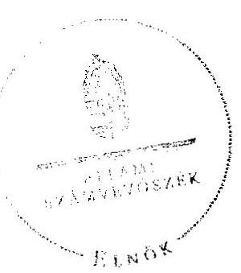
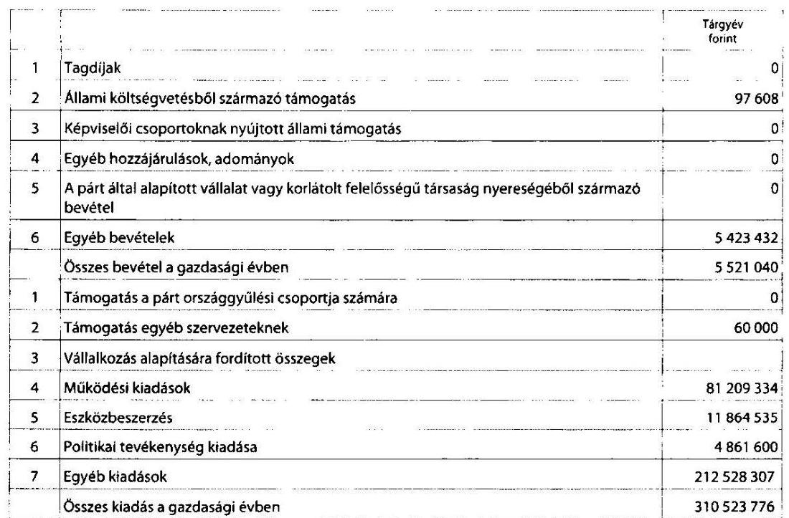

# ÁLLAMI   SZÁMVEVŐSZÉK 

## JELENTÉS

a rendszeres állami támogatásban nem részesülő egyes pártok utóellenőrzéséről

---

# Állami Számvevőszék 

Iktatószám: V-0027-063/2012.
Témaszám: 1066
Vizsgálat-azonosító szám: V-059501

## Az ellenőrzést felügyelte:

Horváth Balázs
felügyeleti vezető
Az ellenőrzés végrehajtásáért felelős:
Dr. Veress Tiborné
ellenőrzésvezető
A jelentés összeállításában közreműködött:
Tóth István
számvevő tanácsos
Az ellenőrzést végezték:
Nagy László Csaba Tóth István
számvevő tanácsos számvevő tanácsos

A témához kapcsolódó eddig készített számvevőszéki jelentések:
címe
sorszáma
Jelentés a központi költségvetési támogatásban nem részesülő pártok 2005-2008. évi gazdálkodása törvényességének ellenőrzéséről

---

# TARTALOMJEGYZÉK 

BEVEZETÉS ..... 5
I. ÖSSZEGZŐ MEGÁLLAPÍTÁSOK, KÖVETKEZTETÉSEK, JAVASLATOK ..... 6
II. RÉSZLETES MEGÁLLAPÍTÁSOK ..... 9

1. A Pártok által közzétett éves beszámolók ellenőrzése ..... 9
1.1. A Független Kisgazda-, Földmunkás- és Polgári Párt ..... 9
1.2. A Magyarországi Szociáldemokrata Párt ..... 9
2. A számviteli szabályozás módosítása az ÁSZ felhívására ..... 10
2.1. A Független Kisgazda-, Földmunkás- és Polgári Párt ..... 10
2.2. A Magyarországi Szociáldemokrata Párt ..... 10
3. A könyvvezetés összhangja a jogszabályokban és a belső szabályzatokban előírt követelményekkel ..... 10
3.1. A Független Kisgazda-, Földmunkás- és Polgári Párt ..... 10
3.2. A Magyarországi Szociáldemokrata Párt ..... 11
4. A bizonylati elv és fegyelem, bizonylati rend érvényesülése ..... 12
4.1. A Független Kisgazda-, Földmunkás- és Polgári Párt ..... 12
4.2. A Magyarországi Szociáldemokrata Párt ..... 12
5. Az adózási, társadalombiztosítási és egyéb jogszabályok rendelkezéseinek betartása a Független Kisgazda-, Földmunkás- és Polgári Pártnál ..... 12
6. A belső kontrollrendszer ellenőrzése ..... 12
6.1. A Független Kisgazda-, Földmunkás- és Polgári Párt ..... 12
6.2. A Magyarországi Szociáldemokrata Párt ..... 13
MELLÉKLETEK
7. számú A Független Kisgazda-, Földmunkás- és Polgári Párt 2005. évi beszámolója
8. számú A Független Kisgazda-, Földmunkás- és Polgári Párt 2006. évi beszámolója
9. számú A Független Kisgazda-, Földmunkás- és Polgári Párt 2007. évi beszámolója
10. számú A Független Kisgazda-, Földmunkás- és Polgári Párt 2008. évi beszámolója
11. számú A Független Kisgazda-, Földmunkás- és Polgári Párt 2009. évi beszámolója
12. számú A Független Kisgazda-, Földmunkás- és Polgári Párt 2010. évi pénzügyi beszámolója
13. számú A Független Kisgazda-, Földmunkás és Polgári Párt beszámolója a 2011. évi gazdálkodásáról

---

.

---

# RÖVIDÍTÉSEK JEGYZÉKE 

Jogszabályok rövidítése

Art.
ÁSZ tv.
párttörvény
Számv. tv.
Szja tv.
Tbj.

Szórövidítések:
alapszabály
ÁSZ
FKgP
MCFRÖP
MSZDP
OE
OEB
OV
párt
pártalkotmány
az adózás rendjéről szóló 2003. évi XCII. törvény
az Állami Számvevőszékről szóló 2011. évi LXVI. törvény
a pártok működéséről és gazdálkodásáról szóló 1989. évi XXXIII. törvény
a számvitelről szóló 2000. évi C. törvény
a személyi jövedelemadóról szóló 1995. évi CXVII. törvény
a társadalombiztosítás ellátásaira és a magánnyugdíjra jogosultakról, valamint e szolgáltatások fedezetéről szóló 1997. évi LXXX. törvény
az MSZDP 2011. október 8-i módosításokkal egységes szerkezetbe foglalt alapszabálya
Állami Számvevőszék
Független Kisgazda-, Földmunkás- és Polgári Párt
MCF Roma Összefogás Párt
Magyarországi Szociáldemokrata Párt
Országos Elnökség
Országos Ellenőrző Bizottság
Országos Vezetőség
Független Kisgazda-, Földmunkás- és Polgári Párt, illetőleg
Magyarországi Szociáldemokrata Párt
az FKgP 2010. március 20-i Országos Nagygyűlése által elfogadott módosításokkal egységes szerkezetbe foglalt Pártalkotmánya

---

.

---

# JELENTÉS 

## a rendszeres állami támogatásban nem részesülő egyes pártok utóellenőrzéséről

## BEVEZETÉS

Az Állami Számvevőszékről szóló 2011. évi LXVI. törvény 5. § (11) bekezdés a) pontja, valamint a pártok működéséről és gazdálkodásáról szóló 1989. évi XXXIII. törvény (párttörvény) 10. § (1) bekezdése alapján a pártok gazdálkodása törvényességének ellenőrzésére az Állami Számvevőszék (ÁSZ) jogosult. E törvényi felhatalmazások alapján az ÁSZ 2012. I. félévi ellenőrzési tervének megfelelően utóellenőrzés keretében vizsgálta - a 2010. évi országgyűlési választáson egyéni jelöltet állító - a Független Kisgazda-, Földmunkás- és Polgári Párt (FKgP), a Magyarországi Szociáldemokrata Párt (MSZDP) és az MCF Roma Összefogás Párt (MCFRÖP) esetében „a központi költségvetési támogatásban nem részesülő pártok 2005-2008. évi gazdálkodása törvényességének ellenőrzéséről" szóló 0937 számú ÁSZ jelentésben részükre megfogalmazott felhívások teljesítését.

Az ellenőrzés célja annak megállapítása volt, hogy a pártok a 0937 számú ÁSZ jelentésben részükre megfogalmazott felhívásoknak eleget tettek-e. Az ellenőrzés a 2005-2011. évi beszámolóval lezárt évekre vonatkozóan a párttörvény szerinti beszámoló készítési és közzétételi kötelezettség teljesítésére terjedt ki. A számviteli rendszer és a belső ellenőrzés szabályozottságát, a könyvvezetés és a bizonylatolás szabályszerűségét, valamint a belső ellenőrzés működését a 2011. évben hatályos szabályzatok és a 2011. évi gyakorlat alapján értékeltük. A felhívásokban javasolt intézkedések megtételét az intézkedést bizonyító dokumentumok, bizonylatok alapján minősítettük.

Az ellenőrzés típusa: pénzügyi-szabályszerűségi ellenőrzés
Az ÁSZ a párttörvény módosításáig a hatályos rendelkezéseknek megfelelő - egységes módszertani alapokra helyezett - gyakorlattal folytatja a pártok gazdálkodása törvényességének ellenőrzését. Az ÁSZ az ellenőrzést a pártellenőrzésre kiadott „A pártok gazdálkodása törvényességének pénzügyi szabályszerűségi ellenőrzéséhez" című segédletbe foglalt egységes követelmény szerint végezte.

Az ellenőrzéshez az FKgP teljes körű, az MSZDP hiányos adatszolgáltatást teljesített, amelynek következtében az ellenőrzési program feladatait csak részben lehetett végrehajtani. Az MCFRÖP az ÁSZ tv. 28. § (2) bekezdésében előírt közreműködési kötelezettségének nem tett eleget, ezzel meghiúsította az ellenőrzés lefolytatását.

---

# I. ÖSSZEGZŐ MEGÁLLAPÍTÁSOK, KÖVETKEZTETÉSEK, JAVASLATOK 

Az FKgP a 2005-2008 időszak éves beszámolóit 2011. februárban tette közzé, a 2009-2011. évekre beszámoló készítési és közzétételi kötelezettségét a párttörvényben előírt határidőn túl teljesítette. Az MSZDP nem igazolta a 2007. és 2008. évi módosított, valamint a 2009-2011. közötti éves beszámolók elkészítését, közzétételét. A párttörvény az ÁSZ felhívás teljesítésére vonatkozóan nem határoz meg határidőt, továbbá nem tartalmaz szankciót arra az esetre, ha a párt a beszámoló készítési és közzétételi kötelezettségét nem teljesíti ${ }^{1}$.

A számviteli szabályozás megfelelősége érdekében az FKgP 2011. január 1-jei hatállyal módosította pénzkezelési szabályzatát, megteremtve az összhangot a Számv. tv. előírásaival. Az MSZDP az ÁSZ 0937 számú jelentésében tett felhívása ellenére a számviteli politikáját nem módosította, a Számv. tv. előírása szerint a „számviteli politika elkészítéséért, módosításáért a gazdálkodó képviseletére jogosult személy felelős". A Számv. tv.-ben előírt leltározási, értékelési, pénzkezelési szabályzatok módosításait 2012. szeptember 24-ével helyezték hatályba. A pénzkezelési szabályzat módosításánál a Számv. tv. előírása ellenére nem szabályozták a pénztárzárlat és a pénztárellenőrzés gyakoriságát.

Az FKgP 2011. évi könyvvezetése megfelelt a Számv. tv. és a belső szabályzatok előírásainak, a leltározást és a könyvviteli zárlatot szabályszerűen végrehajtották. Az ÁSZ felhívására a könyvvezetési hibákat (pl. a bevételi nyilvántartást) önellenőrzéssel helyesbítették, a párt kötelezettségeit a saját tulajdonú székház értékesítéséből részletekben befolyt 1320 millió Ft bevételből rendezte.

Az MSZDP elnöke nyilatkozatot adott, hogy a párt könyvvezetési kötelezettségét nem teljesítette, megsértve ezzel a Számv. tv. előírásait, amely szerint „a naprakész könyvvezetés helyességéért a gazdálkodó képviseletére jogosult személy a felelős".

Az FKgP-nél a könyvviteli elszámolást alátámasztó számviteli bizonylatok Számv. tv.-ben előírt alaki és tartalmi követelményeit nem teljes körűen érvényesítették (pl. hiányzott a könyvviteli nyilvántartásokban rögzítés időpontja). Azonban az ellenőrzés által feltárt hiányosságoknak nem volt kihatása a 2011. évi beszámolóra. Az FKgP 2012. májusában nullás bevallással tett eleget a 2005-2008. évekre vonatkozó, Art. által előírt kötelezettségének. A 2011. évben szabályszerűen teljesítette a párt az Szja tv.-ben, a Tbj.-ben és az Art.-ban előírt adó- és járulék megállapítási, nyilvántartási, levonási, bevallási, befizetési kötelezettségét.

[^0]
[^0]:    ${ }^{1}$ Az Állami Számvevőszék a szabályozási hiányosságok megszüntetése érdekében évek óta szorgalmazza a párttörvény módosítását.

---

Az FKgP a belső ellenőrzési rendszerét 2011. január 1-jétől hatályos szabályzataiban rögzítette, amelynek keretében meghatározta a választott ellenőrző testület feladat- és hatáskörét, a vezetői és munkafolyamatba épített ellenőrzést. Az MSZDP a belső ellenőrzési rendszerét nem szabályozta, a belső kontrollrendszer működését dokumentumokkal igazolni nem tudta.

Az Állami Számvevőszékről szóló 2011. évi LXVI. törvény 33. § (1) bekezdésében foglaltak értelmében a jelentésben foglalt megállapításokhoz kapcsolódó intézkedési tervet köteles az ellenőrzött szervezet vezetője összeállítani és azt a jelentés kézhezvételétől számított harminc napon belül az ÁSZ részére megküldeni. Amennyiben az intézkedési tervet határidőben nem küldi meg a szervezet, vagy az továbbra sem elfogadható, az ÁSZ elnöke a hivatkozott törvény 33. § (3) bekezdés a)- b) pontjaiban foglaltakat érvényesítheti.

A helyszíni ellenőrzés intézkedést igénylő megállapításai és felhívásai:

# a Független Kisgazda-, Földmunkás és Polgári Párt elnökének 

1. Az FKgP a 2009-2011. évekre beszámoló készítési és közzétételi kötelezettségét a párttörvényben előírt határidőn túl teljesítette.

Felhívás
Intézkedjen a jövőben az éves beszámolók elkészítésére és közzétételére figyelemmel a párttörvény 9. § (1) bekezdésében előírt határidő betartására.
2. Az FKgP-nél a könyvviteli elszámolást alátámasztó számviteli bizonylatok Számv. tv.-ben előírt alaki és tartalmi követelményeit nem teljes körűen érvényesítették (pl. hiányzott a könyvviteli nyilvántartásokban rögzítés időpontja).

Felhívás
Intézkedjen, a könyvviteli elszámolást közvetlenül alátámasztó bizonylatok alaki és tartalmi követelményeinek a Számv. tv. 167. §-ban előírt teljes körű érvényesítésére.

## a Magyarországi Szociáldemokrata Párt elnökének

1. Az MSZDP nem igazolta a 2007. és 2008. évi módosított, valamint a 2009-2011. közötti éves beszámolók elkészítését, közzétételét.

Felhívás
Készíttesse el és tegye közzé a 2007-2011. évek beszámolóit a párttörvény 9. § előírásainak megfelelően.
2. Az MSZDP az ÁSZ 0937 számú jelentésében tett felhívása ellenére a számviteli politikáját nem módosította. A pénzkezelési szabályzat módosításánál a Számv. tv. előírása ellenére nem szabályozták a pénztárzárlat és a pénztárellenőrzés gyakoriságát.

---

# Felhívás 

Módosítsa a számviteli politikát és a pénzkezelési szabályzatot figyelemmel a Számv. tv. 14. § (3)-(4) és (8) bekezdések előírásaira.
3. Az MSZDP elnöke nyilatkozatot adott, hogy a párt könyvvezetési kötelezettségét nem teljesítette.

Felhívás
Intézkedjen a Számv. tv. 159. §-ban előírt könyvvezetési kötelezettség teljesítésére.
4. Az MSZDP a párt belső ellenőrzési rendjét átfogóan nem szabályozta, a belső kontrollrendszer működését dokumentumokkal igazolni nem tudta.

Felhívás
Szabályozza a belső ellenőrzési rendjét, gondoskodjon hatékony működéséről.

---

# II. RÉSZLETES MEGÁLLAPÍTÁSOK 

## 1. A Pártok Által Közzétett Éves Beszámolók Ellenőrzése

### 1.1. A Független Kisgazda-, Földmunkás- és Polgári Párt

Az FKgP a 0937 számú ÁSZ jelentés felhívásában foglalt, 2005-2008. évekre vonatkozó - önellenőrzést követő - beszámoló készítési és közzétételi kötelezettségének eleget tett. A beszámolókat a párttörvény 1. sz. mellékletében előírt formában és tartalommal a Hivatalos Értesítő 2011. február 25-i 13. számában közzétették, amit a jelentés 1-4. számú melléklete tartalmaz. Az FKgP 2009-2011. évekre vonatkozóan is eleget tett beszámoló készítési és közzétételi kötelezettségének, azonban mindhárom évi beszámoló a párttörvény 9. § (1) bekezdésében előírt április 30-i határidő után - a 2009. évi a Hivatalos Értesítő 2011. február 25-i 13., a 2010. évi a 2011. június 2-i 34., a 2011. évi a 2012. június 8-i 24. számában - jelent meg (5-7. számú melléklet). Az FKgP a közzététellel egy időben, internetes honlapján a párttörvény előírásától eltérően a Számv. tv.-ben előírt beszámolókat jelentette meg. A párttörvény szerinti 2005-2011. évi beszámolókat a párt internetes honlapján 2012. május 30-án, az ellenőrzés előkészítésének időszakában tették közzé.

A 2011. évi párttörvény szerinti beszámoló összeállítása során - a teljesség elvének kivételével - érvényesültek a Számv. tv. 15-16. §-ában megfogalmazott elvek és a belső szabályzatokban foglalt előírások. A beszámolóban eszközbeszerzésként 79,5 ezer Ft-ot mutattak ki, miközben az FKgP - könyvvezetésének adatai alapján - 265,7 ezer Ft értékben szerzett be tárgyi eszközöket, ezzel sérült a Számv. tv. 15. § (2) bekezdésében foglalt teljesség elve. A hiba azonban
 nem minősült lényegesnek, mert nem érte el az ÁSZ által elfogadott, a bevételi főösszegre vetített 2%-os lényegességi szintet (1,5%).

### 1.2. A Magyarországi Szociáldemokrata Párt

Az MSZDP az ÁSZ felhívása ellenére a 2007. és 2008. évi módosított beszámolóit nem tette közzé, a 2009-2011. évi beszámolók elkészítését dokumentumokkal nem igazolta, azokat a párttörvény 9. §-ában előírt módon a Hivatalos Értesítőben sem jelentette meg. A beszámoló ellenőrzéséhez szükséges dokumentumokat a párt elnöke nem bocsátotta az ÁSZ rendelkezésére.

A párt elnökének 2012. október 1-jei nyilatkozata szerint: "Elfogadva az Állami Számvevőszék észrevételeit módosításra elkészült a Párt gazdálkodásáról szóló beszámoló a 2007-2008. évekre, valamint a 2009-2011. évekre vonatkozó gazdálkodási beszámoló. Mivel a Párt Alapszabálya szabályozza, hogy a Párt gazdálkodásának beszámolóját mely testület fogadja el, így haladéktalanul összehívtam a Párt kongresszusát figyelembe véve az Alapszabály rendelkezését, mely szerint 15 munkanappal előbb lehet összehívni leghamarabb a testületet, 2012. október 13-án megtartjuk a Kongresszust. A Kongresszuson mind a kért módosítások, mind az új beszámolók elfogadása megtörténik, ezen döntéseket, az elfogadott beszámolókat, a közzétételről a másolatokat még 13-án az Állami Számvevőszék részére eljuttatom."

---

# 2. A SZÁMVITELI SZABÁLYOZÁS MÓDOSÍTÁSA AZ ÁSZ FELHÍVÁSÁRA 

### 2.1. A Független Kisgazda-, Földmunkás- és Polgári Párt

A Számv. tv. 14. § (5) bekezdés d) pontjában előírt pénzkezelési szabályzatot 2011. január 1-jén léptették hatályba. A módosított szabályzat megfelel a Számv. tv. 14. § (8)-(10) bekezdésekben foglaltaknak, tartalmazza az egy és kétforintos címletű érmék bevonásáról szóló 10/2007. (X. 1.) MNB rendeletben előírt kerekítési szabályokat. A pénzkezelési szabályzatot a Számv. tv. 14. § (12) bekezdés, illetve a pártalkotmány 20. § (5) bekezdése szerinti felelős, a párt elnöke adta ki.

### 2.2. A Magyarországi Szociáldemokrata Párt

Az MSZDP az ÁSZ 0937 számú jelentésében tett felhívása ellenére nem módosította a Számv. tv. 14. § (3)-(4) bekezdés előírásainak megfelelően a számviteli politikáját, nem szabályozta a párt sajátosságait tükröző beszámolási és könyvvezetési rendet. A Számv. tv. 14. § (12) bekezdése értelmében a „számviteli politika elkészítéséért, módosításáért a gazdálkodó képviseletére jogosult személy felelős".

A Számv. tv. 14. § (5) bekezdés a), b), és d) pontjaiban előírt módosított számviteli szabályzatokat 2012. szeptember 24-i hatállyal adta ki. Az eszközök és források leltározási szabályzata tartalmazza a leltározás során elvégzendő feladatokat, a leltározás technikai feltételeit, a leltározás és az értékelés ellenőrzésének módját, a leltárkülönbözetek megállapításának kezelését. Az eszközök és források értékelési szabályzata meghatározza a párttörvény 4. § (5) bekezdésének előírásai szerinti, a párt részére nyújtott nem pénzbeli vagyoni hozzájárulás értékelési módját. A pénzkezelési szabályzat előírja a készpénzben és a bankszámlán tartott pénzeszközök közötti forgalom rendjét, a készpénzállományt érintő pénzmozgások jogcímeit, a napi készpénz záró állomány maximális értékét és a pénzszállítás feltételeit, nem szabályozza azonban a pénztárzárlat és a pénztárellenőrzés gyakoriságát.

## 3. A KÖNYVVEZETÉS ÖSSZHANGJA A JOGSZABÁLYOKBAN ÉS A BELSŐ SZABÁLYZATOKBAN ELŐÍRT KÖVETELMÉNYEKKEL

### 3.1. A Független Kisgazda-, Földmunkás- és Polgári Párt

Az ÁSZ 0937 számú jelentésében megállapította, hogy „a párt 2007. évben a bevételei között saját székház eladásából 505 millió Ft-ot, az egyéb kiadásai között hitel visszafizetés és tartozás kiegyenlítés 2007. évi teljesítése címén 355 millió Ft-ot mutatott ki, könyvvezetése azonban nem volt teljes körű".

A hivatkozott jelentésben az ÁSZ felhívta a párt elnökét „Intézkedjen a párt 2005-2008. évi kettős könyvelésének önellenőrzéssel történő helyesbítéséről, hogy az a számviteli törvény 15. § (2) bekezdésében megfogalmazott teljesség elvének megfelelően tartalmazza a kötelezettségeket, valamint az azok teljesítésére szolgált bevételeket.".

---

A párt könyvviteli nyilvántartásával alátámasztottan kötelezettségeit 98,25%-ban a Budapest, V. kerület Belgrád rakpart 24. szám alatti volt székházának 2007. évi értékesítéséből befolyt bevételből rendezte. A 2005-2011. évek összes bevétele 1346 millió Ft-ot tett ki, a kiadásaira 971 millió Ft-ot számolt el a párt, továbbá ebből rendezte a 2005. év előtt keletkezett 157 millió Ft tartozását. A pénzeszköze 2011. december 31-én 218 millió Ft volt. A főkönyvi könyvelés a helyesbítést követően tartalmazta a párt kötelezettségeit és bevételeit.

- A székházat a Fővárosi Munkaügyi Bíróság által kibocsátott végrehajtó okirat alapján 2006. szeptember 7-én 710 millió Ft kikiáltási árról indulva, 700 millió Ft-ért, a párt képviselőjének távollétében elárverezték.
- Az árverés eredményét a párt elnöke megtámadta. Az elsőfokú bíróság a keresetet elutasította, azonban másodfokon a Fővárosi Bíróság a keresetnek helyt adott, az árverés eredményét 2007. április 19-én megsemmisítette.
- A párt az ingatlant 2007. szeptember 21-én megkötött adásvételi szerződés szerint 1320 millió Ft-ért eladta. A párt a 2005-2008. évek kettős könyvelésének helyesbítését követően és annak adatai alapján összeállított 2007. évi beszámolójában, az egyéb bevételek között megjelenítette az 1320 millió Ft összegű ingatlan vételárát.

A 2011. év végi záráshoz, a beszámoló elkészítéséhez eleget tettek a Számv. tv. 69. § (1)-(2) bekezdésben, valamint a belső szabályzatban előírt leltározási kötelezettségnek. A leltározást a szabályzatban meghatározott módon és határidőben elvégezték, szabályosan dokumentálták. A leltározás eredménye alapján elvégezték a leltárak kiértékelését, leltári eltérést nem állapítottak meg. A könyvviteli zárlatot a Számv. tv. 164. §, valamint a számviteli politika előírásai szerint dokumentáltan elvégezték. A pártnál a 2011. évi könyvviteli zárlattal egy időben ellenőrizték, hogy az elmentett pénzügyi, számviteli adatállományokból készült adatmentések alapján a Számv. tv. 169. §-a szerinti formában és előírt megőrzési időn belül az adatok teljes körű előállíthatósága biztosított.

# 3.2. A Magyarországi Szociáldemokrata Párt 

A Számv. tv. 159. §-ában előírt könyvvezetési kötelezettség teljesítését és a 164. § (1)-(2) bekezdéseiben szabályozott könyvviteli zárlati feladatok elvégzését a párt dokumentumokkal nem igazolta.

Az MSZDP az utóellenőrzéssel érintett időszakban nem rendelkezett könyvvezetéssel, melynek oka a párt elnökének 2012. szeptember 5-i írásban tett nyilatkozata szerint a könyvvezetési feladattal megbízott mulasztása volt. Az indokot az ellenőrzés nem fogadta el, mivel a Számv. tv. 161. § (4) bekezdése „a naprakész könyvvezetés helyességéért a gazdálkodó képviseletére" jogosult személyt jelöli meg felelősként.

---

# 4. A BIZONYLATI ELV ÉS FEGYELEM, BIZONYLATI REND ÉRVÉNYESÜLÉSE 

### 4.1. A Független Kisgazda-, Földmunkás- és Polgári Párt

A 2011. évben keletkezett bizonylatok ellenőrzése során megállapítottuk, hogy a könyvviteli elszámolást közvetlenül alátámasztó számviteli bizonylatok Számv. tv. 167. §-ában előírt alaki és tartalmi követelményeit nem teljes körűen érvényesítették. A Számv. tv. 167. § (1) bekezdés e) pontjának előírását figyelmen kívül hagyva a gazdasági művelet tartalmának leírása 11,8%-ban hiányos volt; a h) pont szerint a bizonylatok 24,7%-án nem szerepeltették az érintett könyvviteli számlákra történő hivatkozást; az i) pont előírása ellenére közel teljes körűen hiányzott a könyvviteli nyilvántartásokban rögzítés időpontja és 78,5%-ban annak igazolása.

A szigorú számadású bizonylatok nyilvántartását a Számv. tv. 168. § és a pénzkezelési szabályzat előírásainak megfelelően vezették. A bizonylatok megőrzéséről a Számv. tv. 169. § előírásának megfelelően gondoskodtak.

### 4.2. A Magyarországi Szociáldemokrata Párt

A Számv. tv. 165. § (1)-(2) bekezdéseiben a bizonylati elv és fegyelem érvényesítése és a 167-169. §-aiban szabályozott, a bizonylati rend betartása és a bizonylat megőrzési kötelezettség teljesítése a számviteli bizonylatok hiánya miatt nem volt ellenőrizhető.

## 5. Az adózÁSI, TÁRSADALOMBIZTOSÍTÁSI ÉS EGYÉB JOGSZABÁLYOK RENDELKEZÉSEINEK BETARTÁSA A FÜGGETLEN KISGAZDA-, FÖLDMUNKÁS- ÉS POLGÁRI PÁRTNÁL

Az FKgP a 2011. évben eleget tett a hatályos Szja tv.-ben, a Tbj.-ben és az Art.-ban előírt adó- és járulék nyilvántartási, levonási, bevallási, befizetési kötelezettségének. A 2005-2008. évekre vonatkozóan az ÁSZ felhívása alapján 2012. május 25-i dátummal teljesítették az Art. 31. § (5) bekezdésében előírt nullás bevallási kötelezettséget. A 2012. június 16-i adófolyószámla kivonat szerint lejárt adó és járuléktartozás nem volt.

## 6. A BELSŐ KONTROLLRENDSZER ELLENŐRZÉSE

### 6.1. A Független Kisgazda-, Földmunkás- és Polgári Párt

Az FKgP belső ellenőrzési rendszerét a hatályos pártalkotmány 22. §-a, a 2011. január 1-jétől hatályos belső ellenőrzési és pénzkezelési szabályzat rögzíti. A párt döntéshozó országos hatáskörű szerve az Országos Nagygyűlés. A pártalkotmány 19. § (3) bekezdése értelmében az Országos Vezetőség (OV) hatáskörébe tartozik a költségvetés és a beszámoló elfogadása. Az OV a gazdálkodásról szóló beszámolókat hatáskörében elfogadta. A gazdálkodást ellenőrző legfőbb választott testület az Országos Ellenőrző Bizottság (OEB), amelynek a feladat-

---

és hatáskörét a pártalkotmány 22. § (3) bekezdése határozza meg és a belső ellenőrzési szabályzat részletezi. A belső ellenőrzési szabályzat 1. pontja alapján az OEB feladata ellenőrizni a pártvagyon kezelését, a párt központi, megyei és helyi szervezetei szintjén, a jogszabályok és a belső szabályok betartását. A 2011. évi gazdálkodáshoz kapcsolódó jegyzőkönyvek tanúsága szerint az OEB a könyvelőváltás átadás-átvételi eljárását rendben találta, a beszámolót megalapozottnak minősítette.

A vezetői és munkafolyamatba épített ellenőrzés rendszerét kialakították, működési előírásait a belső ellenőrzési és a pénzkezelési szabályzat tartalmazza. A vezetői ellenőrzés a kötelezettségvállaláson, utalványozási és munkáltatói jog gyakorlásán keresztül érvényesült. Az utalványozásra és bankszámla feletti rendelkezésre jogosultak aláírás mintáiról és a pénztárosi felelősségvállalási nyilatkozatokról nyilvántartást vezettek. Az elnök gyakorolta a munkáltatói jogokat, kiadta a munkaköri leírást. Az FKgP a 2011. évben egy főt foglalkoztatott. A munkafolyamatba épített ellenőrzéshez a könyvviteli szolgáltatóval kötött szerződés az ellenőrzési feladatot nem ír elő, azt azonban tartalmazza, hogy „Az esetlegesen tapasztalt hiányosságokra felhívja a figyelmet, segít azok megszüntetésében."

# 6.2. A Magyarországi Szociáldemokrata Párt 

Az MSZDP belső ellenőrzési rendszerét nem szabályozta. Az alapszabály 21. §-a választott ellenőrző testületként az OEB létrehozását írja elő, amelynek feladatait és hatáskörét az alapszabály 21. § első bekezdés p)-r) pontjai, valamint a 38. § (2) bekezdése határozza meg. Az OEB által végzett tevékenységet igazoló dokumentumok nem álltak rendelkezésre.

Budapest, 2012. /L hónap 2.1 nap

Melléklet: 7 db

Dl, 1,21'
Domokos László

---

# Mérlegbeszámolók 

## A Független Kisgazda-, Földmunkás- és Polgári Párt 2005. évi beszámolója

|  | Bevételek | (Ft) |
| :--: | :--: | :--: |
| 1. | Tagdíjak | 0 |
| 2. | Állami költségvetésből származó támogatás | 0 |
| 3. | Képviselői csoportoknak nyújtott állami támogatás | 0 |
| 4. | Egyéb hozzájárulások, adományok | 0 |
| 5. | A párt által alapított vállalat vagy korlátolt felelősségű társaság nyereségéből származó bevétel | 0 |
| 6. | Egyéb bevétel | 2241 |
|  | Összes bevétel a gazdasági évben | 2241 |
|  | Kiadások |  |
| 1. | Támogatás a párt országgyűlési csoportja számára | 0 |
| 2. | Támogatás egyéb szervezeteknek | 0 |
| 3. | Vállalkozások alapítására fordított összegek | 0 |
| 4. | Működési kiadások | 6505039 |
| 5. | Eszközbeszerzés |  |
| 6. | Politikai tevékenység kiadása | 350000 |
| 7. | Egyéb kiadások | 106804082 |
|  | Összes kiadás a gazdasági évben | 113659121 |

 |

Hegedűs Péter s. k.,
címké
Független Kisgazda-, Földmunkás- és Polgári Párt

---

# A Független Kisgazda-, Földmunkás- és Polgári Párt 2006. évi beszámolója 

| Bevételek | (Ft) |
| :--: | :--: |
| 1. Tagdíjak | 0 |
| 2. Állami költségvetésből származó támogatás | 649842 |
| 3. Képviselői csoportoknak nyújtott állami támogatás | 0 |
| 4. Egyéb hozzájárulások, adományok | 0 |
| 5. A párt által alapított vállalat vagy korlátolt felelősségű társaság nyereségéből származó bevétel | 0 |
| 6. Egyéb bevétel | 4262 |
| Összes bevétel a gazdasági évben | 654104 |
| Kiadások |  |
| 1. Támogatás a párt országgyűlési csoportja számára | 0 |
| 2. Támogatás egyéb szervezeteknek | 88000 |
| 3. Vállalkozások alapítására fordított összegek | 0 |
| 4. Működési kiadások | 46528541 |
| 5. Eszközbeszerzés | 0 |
| 6. Politikai tevékenység kiadása | 1549760 |
| 7. Egyéb kiadások | 1433333 |
| Összes kiadás a gazdasági évben | 49599634 |

Hegedűs Péter s. k.,
címké
Független Kisgazda-, Földmunkás- és Polgári Párt

---

# A Független Kisgazda-, Földmunkás- és Polgári Párt 2007. évi beszámolója 

| Bevételek | (Ft) |
| :--: | :--: |
| 1. Tagdíjak | 0 |
| 2. Állami költségvetésből származó támogatás | 0 |
| 3. Képviselői csoportoknak nyújtott állami támogatás | 0 |
| 4. Egyéb hozzájárulások, adományok | 0 |
| 5. A párt által alapított vállalat vagy korlátolt felelősségű társaság nyereségéből származó bevétel | 0 |
| 6. Egyéb bevétel | 1320000499 |
| Összes bevétel a gazdasági évben | 1320000499 |
| Kiadások |  |
| 1. Támogatás a párt országgyűlési csoportja számára | 0 |
| 2. Támogatás egyéb szervezeteknek | 10000 |
| 3. Vállalkozások alapítására fordított összegek | 0 |
| 4. Működési kiadások | 112387651 |
| 5. Eszközbeszerzés | 910801 |
| 6. Politikai tevékenység kiadása | 1153605 |
| 7. Egyéb kiadások | 128671341 |
| Összes kiadás a gazdasági évben | 243133398 |

Hegedűs Péter s. k.,
címké
Független Kisgazda-, Földmunkás- és Polgári Párt

---

# A Független Kisgazda-, Földmunkás- és Polgári Párt 2008. évi beszámolója 

| Bevételek | (Ft) |
| :--: | :--: |
| 1. Tagdíjak | 0 |
| 2. Állami költségvetésből származó támogatás | 0 |
| 3. Képviselői csoportoknak nyújtott állami támogatás | 0 |
| 4. Egyéb hozzájárulások, adományok | 0 |
| 5. A párt által alapított vállalat vagy korlátolt felelősségű társaság nyereségéből származó bevétel | 0 |
| 6. Egyéb bevétel | 4920144 |
| Összes bevétel a gazdasági évben | 4920144 |
| Kiadások |  |
| 1. Támogatás a párt országgyűlési csoportja számára | 0 |
| 2. Támogatás egyéb szervezeteknek | 0 |
| 3. Vállalkozások alapítására fordított összegek | 0 |
| 4. Működési kiadások | 25116537 |
| 5. Eszközbeszerzés | 0 |
| 6. Politikai tevékenység kiadása | 6600507 |
| 7. Egyéb kiadások | 77311168 |
| Összes kiadás a gazdasági évben | 109028212 |

Hegedűs Péter s. k.,
elnök,
Független Kisgazda-, Földmunkás- és Polgári Párt

---

# A Független Kisgazda-, Földmunkás- és Polgári Párt 2009. évi beszámolója 

Bevételek ..... (Ft)

1. Tagdíjak ..... 0
2. Állami költségvetésből származó támogatás ..... 51500
3. Képviselői csoportoknak nyújtott állami támogatás ..... 0
4. Egyéb hozzájárulások, adományok ..... 0
5. A párt által alapított vállalat vagy korlátolt felelősségű társaság nyereségéből származó ..... 0 bevétel
6. Egyéb bevétel ..... 281
Összes bevétel a gazdasági évben ..... 51781
Kiadások
7. Támogatás a párt országgyűlési csoportja számára ..... 0
8. Támogatás egyéb szervezeteknek ..... 0
9. Vállalkozások alapítására fordított összegek ..... 0
10. Működési kiadások ..... 44246870
11. Eszközbeszerzés ..... 112260
12. Politikai tevékenység kiadása ..... 2266555
13. Egyéb kiadások ..... 2588170
Összes kiadás a gazdasági évben ..... 49213855

---

# Pártok mérlegbeszámolói 

## A Független Kisgazda-, Földmunkás- és Polgári Párt 2010. évi pénzügyi beszámolója

Budapest, 2011. május 20.

---

# Pártok beszámolói 

## A Független Kisgazda-, Földmunkás és Polgári Párt beszámolója a 2011. évi gazdálkodásáról

Adószám: 19023755-1-41
Regisztrációs szám: 6.PK.60862/4/861

## Bevételek és kiadások kimutatása

Beszámolási időszak: 2011.01.01.-2011.12.31.
Forintban

| 1. | Tagdíjak | 0 |
| :--: | :--: | :--: |
| 2. | Állami költségvetésből származó támogatás | 0 |
| 3. | Képviselői csoportoknak nyújtott állami támogatás | 0 |
| 4. | Egyéb hozzájárulások, adományok | 0 |
| 5. | A párt által alapított vállalat vagy korlátolt felelősségű társaság nyereségéből   származó bevétel | 0 |
| 6. | Egyéb bevételek | 12418467 |
|  | Összes bevétel a gazdasági évben | 12418467 |
| 1. | Támogatás a párt országgyűlési csoportja számára | 0 |
| 2. | Támogatás egyéb szervezeteknek | 0 |
| 3. | Vállalkozás alapítására fordított összegek | 0 |
| 4. | Működési kiadások | 26950652 |
| 5. | Eszközbeszerzés | 79500 |
| 6. | Politikai tevékenység kiadása | 50224164 |
| 7. | Egyéb kiadások | 18924698 |
|  | Összes kiadás a gazdasági évben | 96179014 |

Budapest, 2012. május 12.
Hegedűs Péter s. k.,
elnök
a Független Kisgazda-, Földmunkás és Polgári Párt
képviselője

