# ÁLLAMI   SZÁMVEVŐSZÉK 

## JELENTÉS

a megváltozott munkaképességűek foglalkoztatása költségvetési támogatási rendszerének és a támogatások hasznosulásának ellenőrzéséről

---

# Állami Számvevőszék 

Iktatószám: V-0016-170/2012.
Témaszám: 1055
Vizsgálat-azonosító szám: V0590
Az ellenőrzést felügyelte:
Holman Magdolna
felügyeleti vezető
Az ellenőrzést vezette és az ellenőrzés végrehajtásáért felelős:
Horváth József
ellenőrzésvezető
A számvevői jelentések feldolgozásában és a jelentés összeállításában közreműködtek:
Csepreginé Tancsik Dr. Lajos Béla Erzsébet számvevő főtanácsos
Szappanos Júlia
számvevő tanácsos
Szappanos Júlia
számvevő tanácsos
Az ellenőrzést végezték:

| Balogné Dakó Eszter | Csepreginé Tancsik | Győriné Franyó Éva |
| :-- | :-- | :-- |
| számvevő tanácsos | Erzsébet | számvevő |
|  | számvevő tanácsos |  |
| Kiss Rita Teréz | Dr. Lajos Béla | Dr. Szöllősi Zsolt |
| számvevő tanácsos | számvevő főtanácsos | számvevő |
| Klinga László | Mokánszkiné Mengyi | Pálfiné Pusztai |
| számvevő tanácsos | Andrea | Magdolna |
|  | számvevő tanácsos | számvevő tanácsos |
| Péntek László | Szabóné Farkas | Szalontai Miklós |
| számvevő tanácsos | Katalin | számvevő tanácsos |
|  | számvevő főtanácsos |  |
| Szappanos Júlia | Szihalminé Kovács |  |
| számvevő tanácsos | Zsuzsanna |  |

A témához kapcsolódó eddig készített számvevőszéki jelentések:
címe
sorszáma
A munkaképesség megőrzésére fordított pénzeszközök hasznosulásának ellenőrzése
A fogyatékos személyek támogatásában részt vevő nonprofit szervezeteknek nyújtott nem normatív állami támogatás és ingyenes állami vagyonjuttatás felhasználásának ellenőrzéséről

---

# TARTALOMJEGYZÉK 

BEVEZETÉS ..... 13
I. ÖSSZEGZŐ MEGÁLLAPÍTÁSOK, KÖVETKEZTETÉSEK, JAVASLATOK ..... 17
II. RÉSZLETES MEGÁLLAPÍTÁSOK ..... 29

1. A kialakított koncepciók, célkitűzések, jogszabályi környezet és a szervezeti keretek hozzájárulása a támogatási rendszer működéséhez ..... 29
1.1. A költségvetési támogatási rendszer célkitűzései ..... 29
1.2. A költségvetési támogatási rendszer működését biztosító jogszabályok és eljárásrendek összhangja ..... 35
1.2.1. A támogatási rendszer hazai szabályozása ..... 35
1.2.2. A hazai és az uniós jogszabályi rendelkezések összhangja ..... 39
1.3. A támogatás-közvetítő intézményrendszer átalakítása, hozzájárulása a támogatás céljainak megvalósításához ..... 41
1.3.1. A támogatást közvetítő intézményrendszer átalakulása a 2007-2011. években ..... 41
1.3.2. A munkáltatók akkreditálásának célja ..... 44
2. A kialakított támogatási rendszer, a rendelkezésre álló források eredményes, hatékony, átlátható és összehangolt felhasználása ..... 46
2.1. A védett szervezeti szerződések alapján történő foglalkoztatás célszerűsége, megalapozottsága, a támogatás hozzájárulása a gazdálkodás eredményességéhez és az integrált foglalkoztatáshoz ..... 46
2.2. A költségvetési támogatási rendszer működtetésével elért eredmények ..... 57
3. A támogatási programok ellenőrzési, beszámolási és értékelési rendszere ..... 65
3.1. Az ellenőrzési rendszer kialakítása és működtetése ..... 65
3.2. Az ellenőrzések által feltárt szabálytalanságok, jogosulatlan támogatás igénybevétele miatt hozott szankciók és azok realizálása ..... 67
3.3. A beszámolási, nyomon követési rendszer kialakításának hatása a támogatások felhasználására ..... 70
4. A korábbi ÁSZ ellenőrzések javaslatai hasznosulása ..... 72

---

# MELLÉKLETEK 

1. számú melléklet Az ellenőrzött szervezetek és intézmények névjegyzéke
2. számú melléklet A 21 védett szervezeti szerződéssel rendelkező szervezet 2011. évi I. féléves támogatási szerződésben szereplő támogatható költségei
3. számú melléklet A rehabilitációs költségtámogatásban részesült 21 védett szervezet támogatásának alakulása 2007-2011. években
4. számú melléklet A 21 védett szervezeti szerződéssel rendelkező társaság egy főre jutó támogatásának költségnemenkénti megoszlása a 2007. és a 2010. években
5. számú melléklet Kimutatás a védett szervezeti szerződéssel rendelkező társaságok 2011. évi támogatási összegének és létszámának alakulásáról
6. számú melléklet Kimutatás a védett szervezeti szerződéssel rendelkező társaságok 2007-2011. évi tényleges létszámának alakulásáról
7. számú melléklet A helyszínen ellenőrzött rehabilitációs költségtámogatásban részesült társaságok létszámadatainak alakulása 2007-2011. évek között
8. számú melléklet A helyszínen ellenőrzött társaságok mérleg szerinti eredményének és az adófizetési kötelezettségének alakulása
9. számú melléklet A helyszínen ellenőrzött védett szervezeti szerződéssel rendelkező társaságok vezető tisztségviselőinek juttatásai
10/a. számú melléklet Az Emberi Erőforrások Miniszter jelentéstervezethez tett észrevétele
10/b. számú melléklet Az ÁSZ válasza az Emberi Erőforrások Miniszterének a jelentéstervezethez tett észrevételeire
11/a. számú melléklet A Nemzeti Rehabilitációs és Szociális Hivatal főigazgatójának a jelentéstervezethez tett észrevétele
11/b. számú melléklet Az ÁSZ válasza a Nemzeti Rehabilitációs és Szociális Hivatal főigazgatójának a jelentéstervezethez tett észrevételeire
12/a. számú melléklet Az ERFO Nkft. ügyvezető igazgatójának a jelentéstervezethez tett észrevétele
12/b. számú melléklet Az ÁSZ válasza az ERFO Nkft. ügyvezető igazgatójának a jelentéstervezethez tett észrevételeire
13/a. számú melléklet A FŐKEFE Nkft. ügyvezető igazgatójának a jelentéstervezethez tett észrevétele
13/b. számú melléklet Az ÁSZ válasza a FŐKEFE Nkft. ügyvezető igazgatójának a jelentéstervezethez tett észrevételeire
14/a. számú melléklet A KÉZMŰ Nkft. gazdasági igazgatójának a jelentéstervezethez tett észrevétele
14/b. számú melléklet Az ÁSZ válasza a KÉZMŰ Nkft. gazdasági igazgatójának a jelentéstervezethez tett észrevételeire

---

15/a. számú melléklet A MOVE NK Zrt. vezérigazgatójának a jelentéstervezethez tett észrevétele
15/b. számú melléklet Az ÁSZ válasza a MOVE NK Zrt. vezérigazgatójának a jelentéstervezethez tett észrevételeire

---

.

---

# RÖVIDÍTÉSEK JEGYZÉKE 

ÁFSZ
AGORA Kft.
Agria-Humán Kft.
Áht. 1
Áht. 2
Alfa Nkft.
Alko-Soft Bt.
APEH
ÁSZ
ÁSZ tv.
Bátonyrehab Nkft.
Bizottság
Civil Nkft.
Contact Kht.
Csődtv.
Dél-Borsodi Nkft.
Emberekért Nkft.
EMMI
ERFO Nkft.
ESÉLY Nkft.
EU
EüM
FÉBÉ Nkft.
FEPA-Elektro Nkft.
FH
Flt.
FMM
Fogyatékosügyi tv.
FORENO Nkft.
FŐKEFE Nkft.
FSZH
GTX Kft.

Állami Foglalkoztatási Szolgálat
AGORA Ipari, Kereskedelmi és Szolgáltató Kft.
Agria-Humán Szolgáltató Kft.
az államháztartásról szóló 1992. évi XXXVIII. törvény
az államháztartásról szóló 2011. évi CXCV. törvény
Alfa Rehabilitációs Nonprofit Kft.
Alko-Soft Szolgáltató Bt.
Adó és Pénzügyi Ellenőrzési Hivatal (Megszűnt: 2010. december 31-én)
Állami Számvevőszék
az Állami Számvevőszékről szóló 2011. évi LXVI. törvény
Bátonyrehab Rehabilitációs Nonprofit Kft.
Európai Bizottság
Civil Szolgáltató Nonprofit Kft.
CONTACT Munkarehabilitációs Foglalkoztató, Kereskedelmi és Szolgáltató Nonprofit Közhasznú Kft.
a csődeljárásról és a felszámolási eljárásról szóló 1991. évi XLIX. törvény
Dél-Borsodi Rehabilitációs és Környezetvédelmi Nonprofit Közhasznú Kft.
Emberekért Rehabilitációs Foglalkoztató Közhasznú Nonprofit Kft.
Emberi Erőforrások Minisztériuma
ERFO Rehabilitációs Foglalkoztató Nonprofit Közhasznú Kft.
ESÉLY Győri Rehabilitációs és Foglalkoztatási Közhasznú Nonprofit Kft.
Európai Unió
Egészségügyi Minisztérium
FÉBÉ Szociális és Rehabilitációs Szolgáltató Nonprofit Közhasznú Kft.
FEPA-Elektro Nonprofit Kft.
Foglalkoztatási Hivatal
a foglalkoztatás elősegítéséről és a munkanélküliek ellátásáról szóló 1991. évi IV. törvény
Foglalkoztatáspolitikai és Munkaügyi Minisztérium
a fogyatékos személyek jogairól és az esélyegyenlőségük biztosításáról szóló 1998. évi XXVI. törvény
FORENO Foglalkoztatási és Rehabilitációs Nonprofit Kft.
FŐKEFE Rehabilitációs Foglalkoztató Ipari Nonprofit Kft.
Foglalkoztatási és Szociális Hivatal (2010.01.01-2010.12.31.)

GTX Humán Kft.

---

| HEFOP | Humánerőforrás Operatív Program |
| :--: | :--: |
| HODFO Nkft. | Hódmezővásárhelyi Városellátó és Foglalkoztató Közhasznú Nonprofit Kft. |
| HUMÁN Kft. | HUMÁN Foglalkoztató Kft. |
| INTERPLÁN Kft. | INTERPLÁN Ipari, Mezőgazdasági, Kereskedelmi és Szolgáltató Kft. |
| ISSAI | Legfőbb Ellenőrzési Intézmények Nemzetközi Standardjai |
| KÁLLFO Nkft. | KÁLLFO Nonprofit Kft. |
| KEHI | Kormányzati Ellenőrzési Hivatal |
| KE-KO Média Kft. | "KE-KO Média" Rehabilitációs célú Ipari, Kereskedelmi és Szolgáltató Kft. |
| Ket. | a közigazgatási hatósági eljárás és szolgáltatás általános szabályairól szóló 2004. évi CXL. törvény |
| KÉZMŰ Nkft. | KÉZMŰ Fővárosi Kézműipari Nonprofit Kft. |
| Kh. tv. | a közhasznú szervezetekről szóló 1997. évi CLVI. törvény (Hatályon kívül helyezve: 2012. január 1-jétől) |
| KHJ | kincstári hitelesítő jelentés |
| KIM | Közigazgatási és Igazságügyi Minisztérium |
| Kincstár | Magyar Államkincstár |
| Komló-Habilitas Nkft. | Komló-Habilitas Termelő és Értékesítő Nonprofit Közhasznú Kft. |
| KSH | Központi Statisztikai Hivatal |
| LUX-TEX Kft. | LUX-TEX Export-Import Kereskedelmi Kft. |
| mmk | megváltozott munkaképesség/ megváltozott munkaképességű |
| MNV Zrt. | Magyar Nemzeti Vagyonkezelő Zrt. |
| MONETA Kft. | MONETA Könyvvizsgálói és Adótanácsadó Kft. |
| MOVE Zrt. | MOVE Rehabilitációs Ipari és Szolgáltató Nonprofit Közhasznú Zrt. |
| MPA | Munkaerő-piaci Alap |
| Mük. | Munkaügyi Közlöny |
| NAV | Nemzeti Adó és Vámhivatal |
| NEFMI | Nemzeti Erőforrás Minisztérium |
| NFM TVI | Nemzeti Fejlesztési Minisztérium Támogatásokat Vizsgáló Iroda |
| NFSZ | Nemzeti Foglalkoztatási Szolgálat |
| NGM | Nemzetgazdasági Minisztérium |
| NKszoci Nkft. | Nagykanizsai Szociális Foglalkoztató Nonprofit Kft. |
| NRSZH | Nemzeti Rehabilitációs és Szociális Hivatal (2011.01.01.-től) |
| OFA | Országos Foglalkoztatási Közalapítvány |
| OFP | Országos Fogyatékosügyi Program |
| OFT | Országos Fogyatékosügyi Tanács |
| OGY | Országgyúlés |
| OOSZI | Országos Orvos-szakértői Intézet |

---

| ORSZI | Országos Rehabilitációs és Szociális Szakértői Intézet |
| :--: | :--: |
| Összefogás Nkft. | Összefogás Rehabilitációs Nonprofit Közhasznú Kft. |
| PIREHAB Nkft. | PIREHAB Rehabilitációs Foglalkoztató Nonprofit Kft. |
| PM | Pénzügyminisztérium |
| PRO-TEAM Nkft. | "PRO-TEAM" Rehabilitációs Közhasznú Nonprofit Kft. |
| Ptk. | a Polgári Törvénykönyvről szóló 1959. évi IV. törvény |
| Rehabit Komplex Kft. | REHABIT KOMPLEX Termelő, Szolgáltató és Kereskedelmi   Rehabilitációs Foglalkoztató Kft. |
| RMK | Regionális Munkaügyi Központ |
| SAVARIA NETT PACK   Kft. | SAVARIA-NETT-PACK Rehabilitációs Célú Ipari és Keres-   kedelmi Kft. |
| START Nkft. | START Rehabilitációs Foglalkoztató és Intézményei Köz-   hasznú Nonprofit Kft. |
| SZMM | Szociális és Munkaügyi Minisztérium |
| Szt. | a számvitelről szóló 2000. évi C. törvény |
| TÁMOP | Társadalmi Megújulás Operatív Program |
| Teljes Életért Nkft. | "Teljes Életért" Nonprofit Közhasznú Kft. |
| ÚMFT | Új Magyarország Fejlesztési Terv |
| UWYTA Kht. | UWYTA Rehabilitációs és Foglalkoztatási Kht. |

---

.

---

# ÉRTELMEZŐ SZÓTÁR 

akkreditációs eljárás
akkreditációs tanúsítvány
akkreditált foglalkoztatott
akkreditált munkáltató
bértámogatás
célcsoport
csoportmentességi rendelet
dotáció
indikátor

A megváltozott munkaképességű munkavállalókat foglalkoztató munkáltatók akkreditációjának, továbbá az akkreditált munkáltatók ellenőrzésének szabályairól szóló 176/2005. (IX. 2.) Korm. rendelet szabályai szerint lefolytatott eljárás.

A 176/2005. (IX. 2.) Korm. rendelet 4. § alapján kiadott hatósági bizonyítvány, amely igazolja, hogy a foglalkoztató az akkreditációs követelményeknek megfelelt. Típusai: alap, rehabilitációs, kiemelt és feltételes.

A 176/2005. (IX. 2.) Korm. rendelet 2. § (1) bekezdés a) pontjában meghatározott alapvető akkreditációs követelményeknek megfelelő, akkreditációs alap tanúsítvánnyal rendelkező munkavállaló.

A 176/2005. (IX. 2.) Korm. rendelet 2. § (1) bekezdés b) pontjának szabályai szerint lefolytatott akkreditációs eljárás alapján kiadott akkreditációs tanúsítvánnyal rendelkező munkáltató.

A megváltozott munkaképességű munkavállalók bér és járulékának támogatása, amely a foglalkoztatott munkaképességének csökkenéséhez kapcsolódik. Az akkreditációs tanúsítvánnyal rendelkező foglalkoztató részére legfeljebb 36 hónapra állapítható meg, folyósítható és több alkalommal meghosszabbítható. A foglalkoztató támogatási igényét a munkaügyi központokhoz kell benyújtania.

A megváltozott munkaképességű személyeket foglalkoztató különböző csoportjai (védett szervezetek, akkreditált foglalkoztatók stb.), amelyek az ösztönzési rendszer egyes elemeit (bértámogatás, költségkompenzáció, rehabilitációs költségtámogatás) vehetik igénybe az általuk foglalkoztatott megváltozott munkaképességű munkavállalókkal összefüggésben, részben a megfelelő munkahely biztosításához, részben a többletköltségeik kompenzálásához.

Az Európai Unió Bizottsága 2008. augusztus 6-i 800/2008/EK Rendelete a Szerződés 87. és 88. cikke alkalmazásában a támogatások bizonyos fajtáinak a közös piaccal összeegyeztethető általános csoportmentességi rendelet.

A gazdálkodó szervezet részére a megváltozott munkaképességű személyek foglalkoztatását segítő támogatás.
Megvalósulást, teljesülést, változást mérő fizikai vagy pénzügyi számszerűsített jelzőszám.

---

költségkompenzációs támogatás
közhasznúsági jelentés
közreműködő szervezet
megváltozott munkaképességű személy
munkanélküliségi ráta
normatív keret
nyílt munkaerő-piac

Az akkreditációs tanúsítvánnyal rendelkező foglalkoztató részére a megváltozott munkaképességű munkavállalók munkába járásával közvetlenül összefüggő személyszállítás többletköltségei valamint a foglalkoztatás, illetve a munkavégzés feltételeinek biztosításához - az irányításhoz és az adminisztrációhoz kapcsolódó, továbbá a logisztikai, munkaszervezési és szállítási költségekre - igényelhető.
A közhasznú szervezetekről szóló 1997. évi CLVI. törvény 19. § (3) bekezdése tartalmazza a számviteli beszámolót; a költségvetési támogatás felhasználását; a vagyon felhasználásával kapcsolatos kimutatást; a cél szerinti juttatások kimutatását; a központi költségvetési szervtől, az elkülönített állami pénzalaptól, a helyi önkormányzattól, a kisebbségi települési
 önkormányzattól, a települési önkormányzatok társulásától és mindezek szerveitől kapott támogatás mértékét; a közhasznú szervezet vezető tisztségviselőinek nyújtott juttatások értékét, illetve összegét; a közhasznú tevékenységről szóló rövid tartalmi beszámolót.

A támogatások szakmai és/vagy pénzügyi kezelését végző szervezetek.

A foglalkoztatás elősegítéséről és a munkanélküliek ellátásáról szóló 1991. évi IV. törvény 58. § (5) bekezdésének m) pontja szerint, aki testi vagy szellemi fogyatékos, vagy akinek az orvosi rehabilitációt követően munkavállalási és munkahely-megtartási esélyei testi vagy szellemi károsodása miatt csökkennek (Flt.).
A megváltozott munkaképességű munkavállalók foglalkoztatásához nyújtott költségvetési támogatásáról szóló 177/2005. (IX. 2.) Korm. rendelet 2. § e) pontja alapján a megváltozott munkaképességű munkavállaló: az a munkaviszony keretében foglalkoztatott munkavállaló, akinek munkaszerződés szerinti napi munkaideje a négy órát eléri, ha a jogszabályban felsorolt egészségkárosodást igazoló dokumentummal rendelkezik.

A munkanélkülieknek a gazdaságilag aktívakhoz viszonyított aránya (forrás: KSH munkaügyi statisztika).
A megváltozott munkaképességűek foglalkoztatásának elősegítésére kialakított koncepciók, célkitűzések, intézkedések, támogatási formák, jogszabályi környezet, valamint az ezek megvalósításához létrehozott szervezetek rendszere.

A munkahelyeknek a gazdaság független szereplői között kialakuló kereslete és kínálata (saját fogalommeghatározás).

---

nyílt munkaerő-piaci foglalkoztatás

Országos
Fogyatékosügyi Program
ösztönzési rendszer
ösztönzési rendszer elemei
rehabilitáció
rehabilitációs költségtámogatás
rehabilitációs foglalkoztató

A versenyszférában működő szervezetek, a közszféra intézményei, és a nem rehabilitációs célra létrehozott non-profit szervezetek, amelyek eladható terméket állítanak elő vagy szolgáltatást végeznek, és azokkal meg is jelennek a piacon. Foglalkoztatási célú non-profit szervezetek nem tekinthetők nyílt munkaerő-piaci foglalkoztatónak.

Az Országgyűlés a fogyatékos személyek esélyegyenlőségének megteremtéséhez szükséges intézkedések megalapozása érdekében Országos Fogyatékosügyi Programot határoz meg. A Programban foglaltakat az egészségügyi, foglalkoztatási, oktatási, közlekedési tervezésben, továbbá a településfejlesztésben, valamint az egyéb állami tervezés körébe tartozó döntés meghozatala során érvényre kell juttatni. [A fogyatékos személyek jogairól és esélyegyenlőségük biztosításáról szóló 1998. évi XXVI. tv. 26. § (1) bekezdése.]
A megváltozott munkaképességűek foglalkoztatásának elősegítésére kidolgozott és alkalmazott elemek összessége.

Mindazok az eszközök, amelyek segítik a megváltozott munkaképességű munkavállalókat foglalkoztató szervezeteket a megváltozott munkaképességű személyek foglalkoztatásához megfelelő munka-, és egyéb körülmények megteremtésében, valamint érdekeltté tegyék a foglalkoztatókat a megváltozott munkaképességűek alkalmazásában a felmerülő többletköltségek megteremtésével, illetve a foglalkoztatás hatékonyságának, gazdaságosságának javításával.

Az egészségügyről szóló 1997. évi CLIV. tv. 100. § (1) és (2) bekezdései alapján olyan szervezett segítség, amit a társadalom nyújt az egészségében, testi vagy szellemi épségében ideiglenes vagy végleges károsodás miatt fogyatékos személynek, hogy helyreállított vagy megmaradt képességei felhasználásával ismét elfoglalhassa helyét a közösségben. A rehabilitáció egészségügyi, pszichológiai, oktatás-nevelési, foglalkoztatási és szociális intézkedések tervszerű, együttes és összehangolt, egyénre szabott, az érintett személy tevékeny részvételével megvalósuló alkalmazása.

Azoknak a közhasznú szervezeteknek nyújtható, akik olyan megváltozott munkaképességű munkavállalók foglalkoztatására vállalnak kötelezettséget, akik a nyílt munkaerőpiacon nem tudnak elhelyezkedni. A támogatás pályázati eljárás alapján nyújtható. A nyertes pályázókkal védett szervezeti szerződést kötnek.
A 176/2005. (IX. 2.) Korm. rendelet 2. § (1) bekezdés l) pontja alapján a Korm. rendelet szabályai szerint lefolytatott akkreditációs eljárás alapján kiadott rehabilitációs tanúsítvánnyal rendelkező munkáltató.

---

védett foglalkoztatás

védett foglalkoztató
védett szervezeti szerződés

A megváltozott munkaképességű személyek alkalmazását elősegítő speciális foglalkoztatási forma, olyan személyek számára, akik a nyílt munkaerő-piacon nem foglalkoztathatók.

A 176/2005. (IX. 2.) Korm. rendelet 2. § (1) bekezdés r) pontja alapján a Korm. rendelet szabályai alapján kiadott kiemelt, illetőleg feltételes tanúsítvánnyal rendelkező munkáltató.

A 177/2005. (IX. 2.) Korm. rendelet 9. §-a alapján kötött szerződés: a megváltozott munkaképességű munkavállalókat foglalkoztató munkáltató köthet rehabilitációs költségtámogatásra. Védett szervezeti szerződés a közhasznú szervezetekről szóló 1997. évi CLVI. törvény 2. § (1) bekezdésének g) pontjában megjelölt munkáltatóval köthető.

---

# JELENTÉS   a megváltozott munkaképességűek foglalkoztatása költségvetési támogatási rendszerének és a támogatások hasznosulásának ellenőrzéséről 

## BEVEZETÉS

Az ellenőrzés kapcsolódott az ÁSZ 2012. évi ellenőrzési tervében szereplő 16. témaszámú, a Magyar Köztársaság 2011. évi költségvetése végrehajtásának ellenőrzéséhez.

A fogyatékkal élő, megváltozott munkaképességű munkavállalók felé irányuló állami gondoskodásnak kettős - társadalompolitikai és gazdaságpolitikai - célja van.
2006. február 16-án a 10/2006. (II. 16.) OGY határozattal fogadta el az Országgyűlés a 2007-2013. évekre vonatkozó Országos Fogyatékosügyi Programot (OFP), amelynek céljai között szerepelt a komplex rehabilitáció megalapozása.

A programban a jogi fogalmak egységesítésének, az azonos jogosultsági rendszer kialakításának és a minősítő eljárások egyszerűsítésének szükségességét fogalmazták meg. Meghatározták továbbá a foglalkoztatási aktivitás növelésére, az érintettek munkavállalását akadályozó jogszabályi, szakmai és tárgyi körülmények felszámolására irányuló feltételeket.

A foglalkoztatási célkitűzések között napjainkban is fontos szerepe van a megváltozott munkaképességű személyek foglalkoztatása elősegítésének és a munkaerő-piacra történő visszavezetésének. Ezt támasztják alá a támogatási rendszer megváltoztatására tett kormányzati intézkedések.

A nemzeti reformprogram, a Széll Kálmán Terv alapján az „Európa 2020" Stratégia kiemelt célkitűzésének eléréséhez Magyarország a 2020. évig a 20-64 év közötti népességre vonatkozó foglalkoztatási ráta 75%-ra történő növelésével kíván hozzájárulni. Ennek érdekében a foglalkoztatásra vonatkozó kiemelt intézkedések között szerepel a megváltozott munkaképességűek foglalkoztatásának elősegítése is.

Az Új Széchenyi Terv középpontjában a foglalkoztatás dinamikus bővítése, a pénzügyi stabilitás fenntartása, a gazdasági növekedés feltételeinek megteremtése, valamint Magyarország versenyképességének javítása áll. A munkaerőkínálat bővítésének prioritásai között szerepel a megváltozott munkaképességű

---

munkavállalók munkaerő-piacra való belépésének vagy visszatérésének támogatása.

A megváltozott munkaképességű munkavállalók foglalkoztatását 2007-2011. évek között 202 Mrd Ft-tal támogatta a központi költségvetés, - két fejezeti kezelésű előirányzatból ${ }^{1}$ - amelyek támogatási jogcím szerinti megoszlását a következő ábra mutatja be:
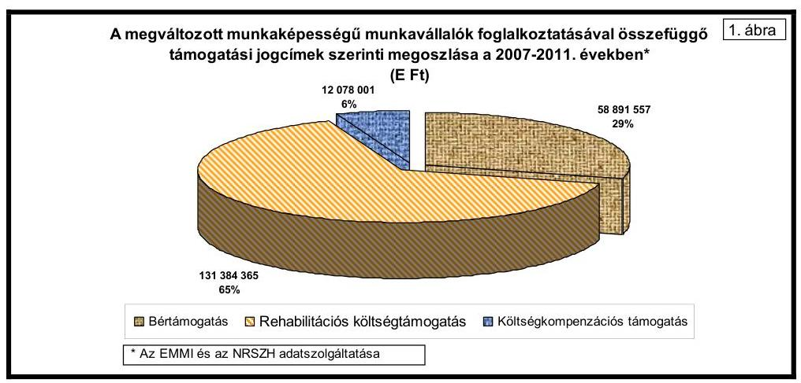

A 2007-2011. évek között, az ellenőrzött időszakra vonatkozóan a megváltozott munkaképességű munkavállalók foglalkoztatásához nyújtható költségvetési támogatást a 177/2005. (IX. 2.) Korm. rendelet alapján vissza nem térítendő támogatás - bértámogatás, költségkompenzációs támogatás, valamint rehabilitációs költségtámogatás - formájában nyújtották.

A megváltozott munkaképességűek foglalkoztatásának támogatása a 2007-2009. években a Szociális és Munkaügyi Minisztérium (SZMM), a 2010. évtől a Nemzeti Erőforrás Minisztérium (NEFMI) hatáskörébe tartozott, a két fejezeti kezelésű előirányzat a minisztériumok költségvetésében került megtervezésre. Az ellenőrzött időszakban a szervezeti átalakítás a támogatásközvetítő intézményrendszert is érintette.

A támogatásokkal kapcsolatos szakmai irányítás az ellenőrzött időszakban az SZMM, a Nemzetgazdasági Minisztérium, valamint a NEFMI végezte.

Az ÁSZ a megváltozott munkaképességűek foglalkoztatása költségvetési támogatási rendszerét és a támogatások hasznosulását még nem ellenőrizte. A munkaképesség megőrzésére fordított pénzeszközök hasznosulását és a fogyatékos személyek támogatásában résztvevő non-profit szervezeteknek nyújtott nem normatív támogatás és ingyenes állami vagyonjuttatás felhasználását a 2007., illetve 2010. évben ellenőrizte az ÁSZ. A jelentésekben a szociális és munkaügyi miniszternek, valamint a Kormány részére fogalmazott meg olyan javaslatokat, amelyek a jelen ellenőrzéshez is kapcsolódnak. Ezen javaslatok

[^0]
[^0]:    ${ }^{1}$ „Megváltozott munkaképességűek foglalkoztatásával összefüggő bértámogatás", valamint a „Megváltozott munkaképességűek foglalkoztatásával összefüggő költségkompenzáció".

---

hasznosulására tett intézkedéseket utóellenőrzés keretében ellenőriztük, értékeltük.

Az ÁSZ jelen ellenőrzésének célja annak értékelése volt, hogy a megváltozott munkaképességűek munkaerő-piacra történő visszavezetésére, illetve a munkaerő-piacon való jelenlétének fokozására kialakított költségvetési támogatási rendszer biztosította-e a célcsoport foglalkoztatásban való növekvő részvételét, a társadalmi érték előállítását és az esélyegyenlőséget. A támogatási rendszer hatékonyan és eredményesen szolgálta-e a célok megvalósulását, hasznosultak-e a korábbi számvevőszéki ellenőrzések megállapításai, javaslatai.

Ennek során értékeltük, hogy:

- a költségvetési támogatási rendszer átlátható és összehangolt működésének biztosításához a kialakított koncepciók, a célkitűzések, a jogszabályi környezet és a szervezeti keretek hozzájárultak-e;
- a kialakított támogatási rendszer elősegítette-e a megváltozott munkaképességűek támogatására rendelkezésre álló források hatékony, átlátható felhasználását;
- a támogatások ellenőrzési, nyomon követési, beszámolási és értékelési rendszere elősegítette-e a támogatások eredményes felhasználását és a célok megvalósulását.

Az ellenőrzés nem terjedt ki a megváltozott munkaképességűek minősítési rendszere folyamatának értékelésére, az un. passzív (pénzbeli) rokkantsági ellátások megállapításának, folyósításának folyamatára, az EU által e célból folyósított támogatásokra, a rehabilitációs hozzájárulás alakulására, valamint a NAV ellenőrzési feladatkörébe tartozó tevékenységre.

Az ellenőrzés hatóköre a megváltozott munkaképességűek foglalkoztatása költségvetési támogatási rendszerének és a támogatások hasznosulásának teljesítmény-ellenőrzési megközelítés alapján történő ellenőrzése - az ÁSZ Ellenőrzési Kézikönyve és a Teljesítmény-ellenőrzés módszertana alapján - a 2007-2011. évekre terjedt ki.

Az ellenőrzés kiterjedt az Országgyűlés Számvevőszéki és költségvetési bizottságának "Az elmúlt 8 év kormányzati intézkedéseit vizsgáló albizottsága" által javasolt a megváltozott munkaképességű alkalmazottakat foglalkoztató 21 ún. védett szervezeti szerződéssel rendelkező társaság ellenőrzésére is, amelyből a helyszínen 13 gazdasági társaságot ellenőriztünk.

Az ellenőrzési program szempontjai alapján, a helyszínen ellenőriztük a megváltozott munkaképességűekkel kapcsolatos a jogszabályt előterjesztő, a szakmai felügyeletet és a pénzügyi tevékenységet végző minisztériumokat és intézményeket, valamint a véletlen számú mintavételezéssel kiválasztott, támogatásban részesült szervezeteket (1. számú melléklet).

Az ellenőrzés eredményességi kritériuma a megváltozott munkaképességűek nyílt munkaerő-piaci munkavállalását akadályozó jogszabályi és szakmai kö-

---

rülmények felszámolása, az integrált foglalkoztatás irányába történő pozitív elmozdulás, valamint a foglalkoztatott megváltozott munkaképességű munkavállalók létszámának növekedése.

A támogatási rendszer akkor biztosítja a közpénzfelhasználás hatékonyságát, ha változatlan vagy növekvő foglalkoztatás mellett csökkent a megváltozott munkaképességűek egy főre jutó támogatása, és azonos vagy csökkenő források mellett az összes foglalkoztatott létszámon belül növekedett a megváltozott munkaképességűek aránya.

Az Állami Számvevőszékről szóló 2011. évi LXVI. törvény 29. §-a szerint a jelentéstervezetet megküldtük egyeztetésre az Emberi Erőforrások Minisztériuma, a Nemzeti Rehabilitációs és Szociális Hivatal és a helyszínen ellenőrzött 13 rehabilitációs költségtámogatásban részesült szervezet részére. A beérkezett észrevételeket és az ezekre adott válaszokat, ideértve az el nem fogadott észrevételeket és azok indokolását a jelentés 10-15. számú mellékletei tartalmazzák.

Az ellenőrzés végrehajtásának jogszabályi alapját a szabályszerűségi ellenőrzés tekintetében az Állami Számvevőszékről szóló 2011. évi LXVI. törvény (továbbiakban: ÁSZ tv.) 5. §-ának (1)-(2) és (5)-(6) bekezdései, valamint az Áht${ }_{2}$. 61. §-ának (2) bekezdése és az Áht${ }_{1}$. 120/A. §-ának (1) bekezdése, a teljesítményellenőrzés tekintetében az ÁSZ tv. 5. §-ának (3) bekezdése képezték.

---

# I. ÖSSZEGZŐ MEGÁLLAPÍTÁSOK, KÖVETKEZTETÉSEK, JAVASLATOK 

A megváltozott munkaképességű személyek foglalkoztatását a gazdálkodó szervezetek részére a Kormány vissza nem térítendő támogatásokkal segítette elő. Ennek ösztönzésére 1983-tól 2007. június 30-ig normatív támogatásra épülő dotációs${ }^{2}$ rendszert működtetett. A dotációs rendszerrel összefüggő kiadások visszaszorítására, valamint az uniós irányelvekben rögzített előírások teljesítése céljából a Kormány - a megváltozott munkaképességű munkavállalók foglalkoztatása támogatási rendszerének átalakításáról szóló 2180/2005. (VIII. 26.) határozatával - a támogatási rendszer átalakításáról döntött. Az új támogatási rendszer teljes körű bevezetése fokozatosan - a jogszabályi háttér biztosításával - 2005 szeptemberétől 2007 júliusáig tartó átmeneti időszak alatt valósult meg.

Az új ösztönzési rendszer akkreditációra${ }^{3}$ és több jogcímen igénybe vehető támogatásra épült. A támogatások forrását a szakmai irányítást ellátó minisztérium költségvetésében két fejezeti kezelésű előirányzat${ }^{4}$ - bértámogatás, költségkompenzációs támogatás és rehabilitációs költségtámogatás jogcímen - biztosította.

A fogyatékos személyek jogairól és esélyegyenlőségük biztosításáról az 1998. évi XXVI. tv. rendelkezik. A törvény 30. § (1) bekezdés c) pontja felhatalmazta a Kormányt, hogy többek között rendeletben határozza meg a speciális munkahely működésének, finanszírozásának szabályait. Erre vonatkozóan ilyen címen az ellenőrzött időszakban a Kormány önálló jogszabályt nem alkotott.

A 2005. évi támogatási rendszer átalakítását megalapozó hatástanulmányt, számszerűsített célokat is
 tartalmazó stratégiát, rövid- és hosszú távú cselekvési programot a felügyeleti szerv nem tudta átadni. Nem tudtak információt adni a támogatás szempontjából figyelembe vehető célcsoportok nagyságrendjéről és jellemzőiről sem. Hatékonysági és eredményességi célkitűzéseket a jogszabályok és a támogatási szerződések nem tartalmaztak, továbbá nem határozták meg a támogatások eredményességét és hatékonyságát mérő indikátorokat sem.

[^0]
[^0]:    ${ }^{2}$ 8/1983. (VI. 29.) EüM-PM együttes rendelet a megváltozott munkaképességű dolgozók foglalkoztatásáról és szociális ellátásáról (hatályon kívül helyezve: 2008. január 1jével)
    ${ }^{3}$ Az akkreditációs eljárás célja, hogy a munkáltató rendelkezzen azokkal a személyi és tárgyi feltételekkel, amelyek biztosítják az egészségkárosodással élő és fogyatékos személyek egészségi állapotának és fogyatékosságának megfelelő környezetben megvalósuló foglalkoztatását.
    ${ }^{4}$ „Megváltozott munkaképességűek foglalkoztatásával összefüggő bértámogatás", valamint a „Megváltozott munkaképességűek foglalkoztatásával összefüggő költségkompenzáció".

---

Az EMMI és az NRSZH tanúsítványai alapján (a jogelőd szervezetekre is vonatkozó adatszolgáltatás) a két fejezeti kezelésű előirányzat terhére a megváltozott munkaképességű munkavállalók foglalkoztatásához nyújtott támogatások területi megoszlása az ellenőrzött időszakban egyenlőtlenségeket mutatott. A szakmai irányítást ellátó minisztériumban és háttérintézményekben nem vezettek olyan nyilvántartást, amiből megállapítható lett volna, hogy a foglalkoztatás arányban volt-e a régiókban foglalkoztatható megváltozott munkaképességű személyek létszámával. Az Észak-Alföldi régióban a bértámogatásból (23,6\%-kal), a Közép-Magyarországi régióban pedig a rehabilitációs költségtámogatásból (49,6\%-kal) és a költségkompenzációs támogatásból (22,2\%-kal) részesültek legnagyobb arányban a székhellyel rendelkező társaságok.

# A munkáltatók részére folyósított támogatások a jogszabályok ${ }^{5}$ folyamatos módosítása következtében nem voltak kiszámíthatóak, a folyamatosságot, a stabilitást nem biztosították és a hosszú távú tervezést nem tették lehetővé. 

A megváltozott munkaképességű munkavállalók támogatását biztosító fejezeti kezelésű előirányzatok szakmai és részben pénzügyi kezelési feladatait a 2006. évtől a kormányváltásig az SZMM, a kormányváltást követően rövid ideig az NGM és 2010. december 4-től a NEFMI végezte. A támogatást közvetítő intézményrendszert több szervezeti átalakítás érintette, amelyek a feladatellátást nem veszélyeztették. A bértámogatással kapcsolatos feladatokat a - szervezeti változásoknak megfelelő irányítás alatt működő - munkaügyi központok ${ }^{6}$ látták el. A költségkompenzációs és a rehabilitációs költségtámogatás kezelését 2009. évig az SZMM, 2010. évtől az FSZH és 2011. évtől az NRSZH végezte. Az intézmények feladatait eljárásrendekben szabályozták, amelyekben meghatározták a megváltozott munkaképességű munkavállalók foglalkoztatásának fedezetére biztosított fejezeti kezelésű előirányzatok folyósításának, felhasználásának, elszámolásának szabályait. A támogatások kifizetése mindhárom jogcím esetén utófinanszírozással történt.

A munkaügyi központok részére a bértámogatás folyósításához egységes eljárásrendet a háttérintézmények ${ }^{7}$ alakítottak ki, amelyet az ellenőrzött időszakban a jogszabályváltozások és az EU jogharmonizáció miatt hat alkalommal módosítottak. Az eljárásrend a módosítások ellenére a gazdasági tevékenység meghatározása és a segítő személy költségtámogatása jogcímére nem adott egységes iránymutatást. A minisztérium a költségkompenzációs támogatás és a rehabilitációs költségtámogatás eljárásrendjét 2006. évben adta ki, melyet az ellenőrzött időszakban nem módosítottak, a szervezeti és a jogszabályi változásokkal nem aktualizáltak.

[^0]
[^0]:    ${ }^{5}$ A megváltozott munkaképességű munkavállalókat foglalkoztató munkáltatók akkreditációjának, továbbá az akkreditált munkáltatók ellenőrzésének szabályairól szóló 176/2005. (IX. 2.) és a megváltozott munkaképességű munkavállalók foglalkoztatásához nyújtható költségvetési támogatásról szóló 177/2005. (IX. 2.) Korm. Rendelet.
    ${ }^{6}$ a Nemzeti Foglalkoztatási Szolgálatról szóló 315/2010. (XII. 27.) Korm. rendelettel 1. § (3) bekezdése
    ${ }^{7}$ 2007-2010. években FSZH, 2011. évtől NRSZH

---

Az esélyegyenlőség elve a támogatásokhoz jutás folyamatában nem érvényesült. A költségkompenzációs támogatás és a rehabilitációs költségtámogatás igénylése pályázat alapján történt. Pályázatot csak a 2005. és 2006. években írt ki a minisztérium. A pályázatok elbírálását követően három éves időtartamra költségkompenzációs támogatásra 53 szervezettel támogatási szerződést, rehabilitációs költségtámogatásra 21 szervezettel védett szervezeti szerződést kötöttek. A védett szervezeti szerződésben nem egységes módon került meghatározásra a nyílt munkaerő-piacon nem foglalkoztatható személyek száma. A későbbi években a minisztérium rehabilitációs költségtámogatás igénybevételére pályázati felhívást nem írt ki, így újabb szervezetek nem juthattak védett szervezeti szerződéshez, ugyanakkor a 21 szerződéssel már rendelkező szervezet védett szervezeti szerződésnek való megfelelési felülvizsgálatát nem végezték el. A pályázatok elbírálásával kapcsolatos döntést megalapozó dokumentumok, valamint a döntésről szóló határozatok a jogutód minisztériumban teljes körűen nem álltak rendelkezésre. A dokumentumok hiányában a pályázatok alapján történt kiválasztás, értékelés szabályszerűségét, az esélyegyenlőségi elvek teljesülését az ÁSZ nem tudta megítélni. Bértámogatást és költségkompenzációs támogatást csak akkreditált szervezetek kaphattak. Bértámogatást minden akkreditációval rendelkező munkáltató igénybe vehetett, amennyiben a jogszabályban előírt - foglalkoztatási - követelményeknek megfelelt. Ugyanakkor a legnagyobb közpénzfelhasználással járó rehabilitációs költségtámogatás igényléséhez nem volt szükség akkreditációs tanúsítványra.

A pályázati eljárással kiválasztott társaságoknak a támogatást minden évben igényelni kellett. A 2011. évtől - a rendszer átalakítása érdekében - a támogatási szerződéseket csak féléves időtartamokra kötötték meg. A támogatási szerződésekben meghatározták a támogatott megváltozott munkaképességű munkavállalók létszámának felső korlátját és a támogatás összegét. Ez az összeg az egyes szervezeteknél anyag és személyi jellegű ráfordítások tekintetében egy főre vetítve jelentős eltéréseket mutatott. Az ellenőrzött időszakban a támogatások folyósításánál a megváltozott munkaképességű munkavállalókra vonatkozó jogszabályokban, szerződésekben a gazdálkodással kapcsolatban nem határoztak meg követelményeket. Elszámolni a támogatásokhoz ténylegesen felhasznált költségekkel kellett.

Az EMMI-nél nem álltak rendelkezésre a szervezetek évenkénti támogatási igényléseit alátámasztó dokumentumok, így az igénylések jog- és szabályszerűsége nem volt értékelhető.

A támogatási rendszer nem biztosította a megváltozott munkaképességű munkavállalók növekvő részvételét a foglalkoztatásban, nem tette érdekelté a foglalkoztatókat a munkavállalók nyílt munkaerő-piacra történő visszavezetésben, illetve nem járult hozzá a források hatékony, eredményes felhasználásához.

A megváltozott munkaképességű munkavállalók támogatásának eredményessége a foglalkoztatás vonatkozásában az ellenőrzött idő-

---

szakban összességében romlott. A foglalkoztatott létszám változása a három támogatás típuson belül eltérő tendenciát mutat ${ }^{8}$.
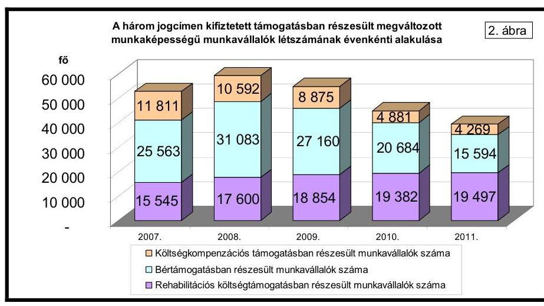

A költségkompenzációs támogatásban részesült szervezeteknél foglalkoztatott megváltozott munkaképességű munkavállalók létszáma - 10592 főről 4269 főre - 60\%-kal csökkent. A bértámogatásban részesült szervezeteknél alkalmazott munkavállalók száma a 2008. évhez képest 2011. évre 50\%-kal csökkent. A bér és a költségtámogatásban részesült munkavállalók létszám adata a kimutatásokban halmozódást ${ }^{9}$ tartalmaz. Az ellenőrzött szervezetek közül hét a költségkompenzációs támogatás mellett bértámogatást is igénybe vett, mivel erre a támogatásokat szabályozó kormányrendelet lehetőséget biztosított. Az ellenőrzés részére átadott, az egyes támogatásokra vonatkozó tanúsítványok alapján a halmozódást (párhuzamosságot) az ÁSZ nem tudta kiszűrni. A rehabilitációs költségtámogatásból foglalkoztatott megváltozott munkaképességűek létszáma évről-évre folyamatosan - összesen 1897 fővel - 10,8\%-kal nőtt. Ez önmagában nem járult hozzá az integrált foglalkoztatás ${ }^{10}$ növekedéséhez. A helyszínen ellenőrzött védett szervezeti szerződéssel rendelkező szervezeteknél ${ }^{11}$ a megváltozott munkaképességű munkavállalók mellett 5-30\%-ban foglalkoztattak nem megváltozott munkaképességű munkavállalókat is. Ez az arány az ellenőrzött időszak végéig alapvetően nem változott.

[^0]
[^0]:    ${ }^{8}$ A 2007. évi adatok csak fél évre vonatkoznak, mivel ebben az évben indult az új támogatási rendszer, ezért ezt az évet kiinduló adatnak tekintjük, az értékelésnél nem vesszük figyelembe.
    ${ }^{9}$ A hazai és az uniós jogszabályok összhangját teljes körűen 2009. január 1-jétől teremtették meg, mert a kormányrendeletben meghatározott bértámogatásból a munkahelyi segítő személy foglalkoztatásához nyújtott támogatás nem felelt meg a 800/2008/EK Bizottsági rendelet előírásainak. A jogszabály módosítást követően ezt a támogatást a költségkompenzációs forrás terhére folyósították.
    ${ }^{10}$ Integrált foglalkoztatás: megváltozott munkaképességű munkavállaló és nem megváltozott munkaképességű munkavállaló együttes foglalkoztatása.
    ${ }^{11}$ Védett szervezeti szerződést azokkal a szervezetekkel kötött az FMM, illetve az SZMM, akik vállalták olyan személyek foglalkoztatását, akiknek a nyílt munkaerő-piacon történő foglalkoztatására nincs lehetőség.

---

A megváltozott munkaképességű munkavállalók foglalkoztatásának támogatására a 2007-2011. években összesen 202 Mrd Ft-ot fizettek ki, amely évenkénti alakulását a következő ábra szemlélteti.
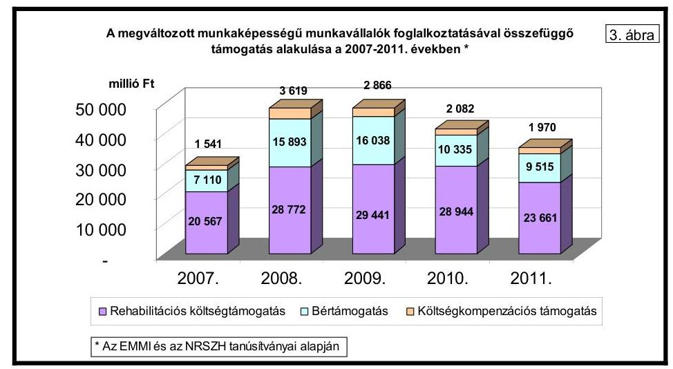

Az ellenőrzött időszakban az összes támogatás 60-70\%-át rehabilitációs költségtámogatásra a 21 védett szervezeti szerződéssel rendelkező munkáltató részére fizették ki. A társaságok számára a jogszabályok és a támogatási szerződések a foglalkoztatással kapcsolatban mérhető célokat, gazdálkodásukkal kapcsolatban mutatószámokat nem határoztak meg. Ezek hiányában a felhasznált támogatások eredményessége, hatékonysága nem értékelhető. A költségkompenzációs támogatásokra kifizetett összegek csökkenésének oka, hogy a támogatott szervezetek száma 53-ról 35-re változott. A bértámogatás összege a 2008. évhez képest 2009. évre növekedett, majd 2010. évben az előző évhez viszonyítva 36\%-kal csökkent. Az előirányzat a 2009. szeptember 1-ig ún. felülről nyitott (előirányzat módosítás nélkül teljesülő) volt. Az ezt követő időszakban az RMK ${ }^{12}$-k részére a minisztérium éves keretösszeget határozott meg. A 2010. évről a 2011. évre a támogatás összege 7,9\%-kal tovább csökkent. 2010 szeptemberétől az akkreditációs követelmények szigorodtak, új kérelmet csak kiemelt tanúsítvánnyal rendelkező és minimum 20 fő alkalmazottat foglalkoztató munkáltató adhatott be.

A munkáltatónak az egy fő megváltozott munkaképességű munkavállaló után nyújtott támogatás évenkénti összege a rehabilitációs költségtámogatásnál 2008. évtől folyamatosan csökkent. A társaságok a támogatás összegének évről-évre történő csökkentése miatt lerövidítették a megváltozott munkaképességű munkavállalók munkaidejét és növelték a megváltozott munkaképességű munkavállalók létszámát. A költségkompenzációs és bértámogatás esetében az egy főre jutó támogatás összege növekedett.

Az éves támogatások fajlagos mutatójának alakulása alapján - az eltérő munkaidőben foglalkoztatott munkavállalók teljes munkaidőre történő át-

[^0]
[^0]:    ${ }^{12}$ Regionális Munkaügyi Központ

---

számítása hiányában - a támogatások hatékonysága reálisan nem ítélhető meg. ${ }^{13}$

Az egy megváltozott munkaképességű munkavállalóra jutó éves támogatás egyes jogcímeken kifizetett összegének alakulását a következő ábra szemlélteti. ${ }^{14}$
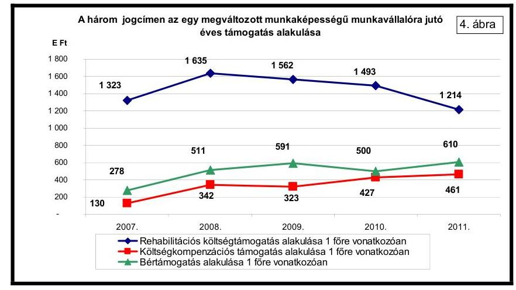

A helyszínen ellenőrzött 13 társaságnál a rehabilitációs költségtámogatás hozzájárult az eredményes gazdálkodáshoz, ellensúlyozta a megváltozott munkaképességű munkavállalók foglalkoztatásával kapcsolatos többletköltségeket. A 2011. évben a társaságok 46,1\%-a (6 db) - amelyből három állami tulajdonú társaság volt - veszteséget realizált.

A társaságok gazdálkodásának eredményét a támogatások 2011. évi csökkenése mellett egyéb tényezők is befolyásolták. A vezető tisztségviselők juttatásai - a 2010. és 2011. évi csökkenés ellenére - 13 társaság átlagában 6869 E Ft/évről 9843 E Ft/évre emelkedett ${ }^{15}$. Ez 43\%-kal magasabb a 2007. évi juttatások átlagos összegénél. A támogatási szerződések a vezető tisztségviselők juttatásaira előírást nem tartalmaztak. Két 100\%-os állami tulajdonú társaság átvette szintén két 100\%-os állami tulajdonban lévő Kft. munkavállalóinak teljes létszámát. A foglalkoztatottak átvétele nem járt együtt a vagyon átadásával, a foglalkoztatás továbbra is az átadóktól bérelt ingatlanokban történt. A foglalkoztatók a bérelt ingatlanok után a 2007-2011. években 742000 E Ft bérleti díjat fizettek ki, ez számukra jelentős többletköltséget jelentett.

Az ellenőrzött időszakban a társaságok többségénél finanszírozási problémák voltak, melynek ellensúlyozására folyószámlahitelt, tagi kölcsönt vettek igénybe. A kamatfizetési kötelezettség a társaságok eredményességét rontotta. A fi-

[^0]
[^0]:    ${ }^{13}$ A foglalkoztatott létszám meghatározása nem függvénye a napi ledolgozott munkaidő hosszának (4 órában és 8 órában foglalkoztatott

 munkavállaló között nem tesz különbséget, mindkettőt egy főnek számítja).
    ${ }^{14}$ Az EMMI és az NRSZH tanúsítványai alapján.
    ${ }^{15}$ A 13 társaság vezető tisztségviselőinek 2007-2011. évi átlagos évi juttatásának alakulását nagy mértékben befolyásolta az a tény, hogy a legmagasabb átlagos éves jövedelem egy Kft-nél 26161 E Ft/év volt.

---

nanszírozási nehézségek enyhítésére a minisztérium 2009. január 1-jétől igénylés alapján - az éves szerződések megkötése előtt előleg ${ }^{16}$ folyósítását tette lehetővé a társaságok részére.

# A támogatási rendszer hatékonyságát és eredményességét negatív irányban befolyásolták a felügyeletet ellátó szervezetek ellenőrzési hiányosságai és a szükséges intézkedések elmaradása. 

A támogatások szabályszerű, szerződés szerinti felhasználásának ellenőrzését FMM rendelet ${ }^{17}$ szabályozta. Kiutalás előtt a bértámogatást a támogatott által benyújtott dokumentáció alapján a munkaügyi központok ellenőrizték. Megállapítottuk, hogy az ellenőrzött 12 társaságból - a 2007-2011. évekre vonatkozóan - kilenc társaságnál nem végeztek utólagos helyszíni ellenőrzést. Az ellenőrzött három társaságnál az RMK ellenőrzés adminisztrációs hiányosságot állapított meg. A költségkompenzációs és a rehabilitációs költségtámogatás kiutalás előtti és a helyszíni utóellenőrzésével a minisztérium 2007-2009. években a MONETA Kft-t., a 2010-2011. években a Kincstárt bízta meg.

Az ellenőrzést végző szervezetek a támogatások felhasználásának helyszíni ellenőrzéseiről jegyzőkönyvet vettek fel, amelyben rögzítették a feltárt hiányosságokat. Az ellenőrzések tapasztalatairól éves és féléves beszámolót készítettek a minisztérium részére. A minisztérium a jogszabály módosítások során figyelmen kívül hagyta az ellenőrzések nyomon követési, beszámolási és értékelési rendszer működésével kapcsolatos megállapításokat. A feltárt hiányosságok közül néhány kisebb jelentőségű javaslatot az évenkénti támogatási szerződések feltételeinek kialakítása során hasznosítottak.

Az ellenőrzést végző szervezetek a feltárt hiányosságok miatt visszafizetési kötelezettséget állapítottak meg. A minisztériumban olyan analitikus nyilvántartás, amelyből a jogosulatlan támogatások követelésként történő előírása és teljesülése - 2007-2009. évekre vonatkozóan teljes körűen megállapítható lett volna, nem állt rendelkezésre. Az ÁSZ a MONETA Kft. éves jelentései és az EMMI adatszolgáltatása alapján megállapította, hogy a jogosulatlanul igénybe vett támogatások visszafizetése alacsony hatásfokú volt.

[^0]
[^0]:    ${ }^{16}$ Az előleget a társaság első negyedévi támogatására lehetett kérelmezni, melynek felhasználásáról havi bontású elszámolást kellett benyújtani. Az előleg a tényleges havi támogatás felhasználása alapján került visszafizetésre vagy kiegészítésre.
    ${ }^{17}$ A megváltozott munkaképességű személyek foglalkoztatásához nyújtható költségvetési támogatás megállapításának részletes szabályairól szóló 15/2005. (IX. 2.) FMM rendelet 7. § (1) bekezdés.

---

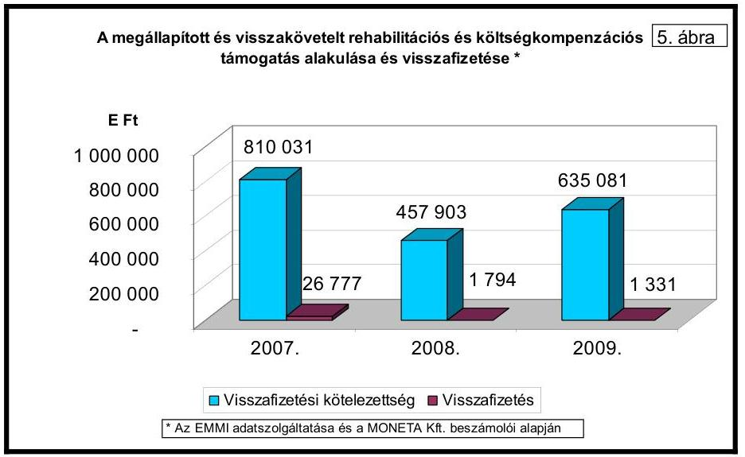

A 2007-2009. években a rehabilitációs költségtámogatásból 1793685 E Ft visszakövetelt összegből 22005 E Ft-ot (1,2\%), a költségkompenzációs támogatásból 109330 E Ft-ból 7897 E Ft-ot (7,2\%) fizettek vissza.

Az NRSZH főigazgatója a 2010. évben és 2011. első félévében jogosulatlanul felvett támogatások visszafizetésére vonatkozó határozatokat öt esetben közel egy év késedelemmel hozta meg. A határozathozatalok elhúzódásának okáról az ÁSZ részére indoklást nem adtak.

A minisztériumban és a háttérintézményekben nem alakítottak ki - a támogatások megítélését, elszámoltatását, ellenőrzését a jogosulatlan támogatások nyomon követését támogató - egységes, kompatibilis informatikai rendszert.

A minisztérium az ellenőrző szervezetek által feltárt szabálytalanságok nem megfelelő kezelése - a szabálytalan támogatás felhasználások visszakövetelésére késedelmesen hozott határozatok, a követelések nyilvántartásának hiányossága, a támogatott szervezetek céginformációs adatainak nem, vagy nem rendszeres figyelése - miatt, nem valósította meg az átlátható, a közpénzzel történő körültekintő és hatékony gazdálkodást.

A 2010. évben a Széll Kálmán tervben a Kormány által megfogalmazott célok között szerepelt a megváltozott munkaképességű személyek munkaerő-piacon történő foglalkoztatási arányának növelése, az egészségkárosodás mértékét megállapító rendszer felülvizsgálata. A rendszer Kormány általi átalakításának célja, egy racionálisan működő, átlátható, a foglalkoztatást ösztönző és a támogatások elszámoltathatóságát biztosító ellátórendszer létrehozása. A támogatási rendszer átalakítása a megváltozott munkaképességű személyek ellátásai-

---

ról és egyes törvények módosításáról szóló 2011. évi CXCI. törvény ${ }^{18}$ megalkotásával elkezdődött.

Utóellenőrzés keretében az ÁSZ korábbi ellenőrzéseiben megfogalmazott - jelen jelentéshez kapcsolódó - javaslatok hasznosulását ellenőriztük.

A 2007. évben zárult, a munkaképesség megőrzésére fordított pénzeszközök hasznosulásának ellenőrzéséről készült jelentés (0731) vonatkozásában a szociális és munkaügyi miniszternek tett javaslatok végrehajtására nem készítettek intézkedési tervet.

A munkaügyi központok személyi és tárgyi feltételei alapvetően biztosítottak voltak az ellenőrzött időszakban, annak ellenére, hogy a bértámogatással kapcsolatos feladatok ellátása komoly adminisztratív terhet jelent a munkaügyi kirendeltségeknek. Az akkreditáció általánossá tételével kapcsolatosan intézkedés nem történt. A 2011. évi CXCI. törvény rendelkezik az egységes akkreditációs rendszer bevezetéséről, mely 2013. január 1-jétől minden szervezet számára kötelezővé teszi az akkreditációt.

A 2010. évi fogyatékos személyek támogatásában résztvevő nonprofit szervezeteknek nyújtott nem normatív állami támogatás és ingyenes állami vagyonjuttatás felhasználásának ellenőrzéséről készített jelentésben (1024) a Kormány részére megfogalmazott javaslatokra intézkedési tervet készítettek.

Az OFP-ban szereplő célok megvalósításáról készült jelentést - amely a 2007-2010. évek intézkedési tervében megfogalmazottak végrehajtásáról szólt - a Kormány 2012. május 9-én elfogadta, azt 2012. május 25-én az OGY részére benyújtotta. A központi finanszírozási rendszer felülvizsgálatára vonatkozó javaslat - a 2011. évi CLXXV. tv. 53. § (3)-(6) bekezdései alapján - részben megvalósult. A „dupla finanszírozás" elkerülésére tett javaslatban foglaltak - informatikai alapú adatszolgáltatás - nem valósult meg.

A ellenőrzés megállapításai alapján a 15 napos észrevételezésre megküldött jelentéstervezetben a megváltozott munkaképességű munkavállalók támogatási rendszerével kapcsolatban intézkedést igénylő megállapításokat és javaslatokat fogalmaztunk meg az EMMI részére. Ennek végrehajtására a minisztérium az ellenőrzés időszakában már intézkedéseket tett. A megváltozott munkaképességű munkavállalókat foglalkoztató munkáltatók akkreditációjáról, valamint a megváltozott munkaképességű munkavállalók foglalkoztatásához nyújtható költségvetési támogatásokról szóló 327/2012. (XI. 16.) Korm. rendelet elfogadásával az ellenőrzés során feltárt, a támogatási rendszerre vonatkozó hiányosságok megszüntetésre kerültek. Ezért az alábbiakban felsoroltakat a jelentés intézkedést igénylő megállapításai és javaslatai között már nem szerepeltetjük.
A) A támogatási rendszer nem biztosította a foglalkoztatók részére a rehabilitációs költségtámogatás esetében a támogatás folyósításánál az esélyegyenlőséget. A rendszer nem járult hozzá a megváltozott munkaképességű munkavállalók növekvő részvételéhez a foglalkoztatásban, a munkaerő-

[^0]
[^0]:    ${ }^{18}$ Hatályos: 2012. január 1-jétől

---

piacra történő visszavezetéséhez, illetve nem biztosította a források hatékony, eredményes és átlátható felhasználását. A támogatás nyújtásának feltételeként sem a jogszabály, sem a szervezetekkel kötött szerződésben nem határoztak meg eredményességi kritériumot. A minisztériumban, illetve háttérintézményeiben az ellenőrzött időszakban nem vezettek olyan nyilvántartást, amiből megállapítható lett volna, hogy a foglalkoztatás arányban volt-e az adott régióban foglalkoztatható megváltozott munkaképességű személyek létszámával. Az ellenőrző szervezetek által feltárt szabálytalanságok nem megfelelő kezelése a szabálytalan támogatás felhasználások visszakövetelésére késedelmesen hozott határozatok, a követelések nyilvántartásának hiányossága miatt nem valósult meg az átlátható, a közpénzzel történő körültekintő hatékony gazdálkodás.

Javaslat:
Vizsgálja felül a megváltozott munkaképességű személyek támogatási rendszerét, és intézkedjen olyan támogatási rendszer kialakításáról (eredményességi és hatékonysági mutatószámok kidolgozásával), amely biztosítja az esélyegyenlőséget, az átláthatóságot és az elszámoltathatóságot, valamint a foglalkoztatókat érdekeltté teszi a megváltozott munkaképességű munkavállalók nyílt munkaerő-piacra történő minél nagyobb számú visszavezetésében (képzés, gyakorlati képzés), és további foglalkoztatásában.
B) A rehabilitációs költségtámogatásra 2005. és 2006. években kiírt pályázati rendszer nem biztosított esélyegyenlőséget a munkáltatók számára. Az ellenőrzött időszakban a védett szervezeti szerződéssel rendelkező szervezetek köre nem bővült, amely nem tette lehetővé újabb társaságok részére ennek a támogatási formának az igénybevételét. Az éves támogatási igények elbírálásánál nem minden esetben jártak el körültekintően, így a szerződés megkötését követően derült ki, hogy a támogatott nyilatkozata nem a valóságnak megfelelő.

Javaslat:
Kezdeményezze a megváltozott munkaképességű személyek foglalkoztatását végző szervezetek körének azonnali felülvizsgálatát, új pályázati eljárás keretében az esélyegyenlőség elvének biztosításával történő kiválasztását. Az elbírálásnál szerezzenek bizonyosságot a pályázók kiírásban szereplő feltételeknek való megfeleléséről.

Az Állami Számvevőszékről szóló 2011. évi LXVI. törvény 33. § (1) bekezdésében foglaltak értelmében a jelentésben foglalt megállapításokhoz kapcsolódó intézkedési tervet köteles az ellenőrzött szervezet vezetője összeállítani és azt a jelentés kézhezvételétől számított harminc napon belül az ÁSZ részére megküldeni. Amennyiben az intézkedési tervet határidőben nem küldi meg a szervezet, vagy az továbbra sem elfogadható, az ÁSZ elnöke a hivatkozott törvény 33. § (3) bekezdés a)-b) pontjaiban foglaltakat érvényesítheti.

---

Az ellenőrzés intézkedést igénylő megállapításai és javaslatai:

# az emberi erőforrások miniszterének 

1. A megváltozott munkaképességű munkavállalót foglalkoztató szervezetek részére a támogatás nyújtása utófinanszírozás keretében történik. A kifizetéseket megelőzően az ellenőrző szervezetek dokumentációs ellenőrzést végeznek. A teljes körű helyszíni ellenőrzés a 2010. évtől valósult meg. Az ellenőrzést végző szervezetek a helyszíni ellenőrzés során jogosulatlan támogatás felhasználást, visszafizetési kötelezettséget állapítottak meg, melynek behajtása a társaságoknál bekövetkezett felszámolások következtében nem valósult meg.

Javaslat:
Intézkedjen az utófinanszírozás keretében történő támogatás kifizetések esetében a dokumentális ellenőrzés szempontjainak - a támogatottak gazdasági mutatóinak értékelésével - bővítéséről, amellyel csökkenthető a jogosulatlanul igénybe vett támogatás.
2. A rehabilitációs költségtámogatás és a költségkompenzációs támogatás esetében a jogosulatlanul igénybevett támogatás felhasználás visszakövetelésére a határozatok meghozatala késedelmesen történt. A követelések nyilvántartása nem volt teljes körű. Szabályozottság hiányában a céginformációs adatok figyelése nem volt rendszeres, ez is hozzájárult ahhoz, hogy két esetben a felszámoló felé a követelés bejelentése határidőn túl valósult meg. Az előzőek alapján nem valósult meg a közpénzzel való körültekintő gazdálkodás.

Javaslat:
Gondoskodjon a jogosulatlanul igénybe vett támogatások megállapításának, nyilvántartásának és visszafizetésének egységes - zárt rendszerben történő - nyilvántartásáról és kezeléséről, az ehhez szükséges szabályozás kialakításáról.
3. Az ellenőrzött időszakban a megváltozott munkaképességűek foglalkoztatásához nyújtott költségvetési támogatások folyósításánál jogszabályokban, eljárásrendekben, szerződésekben nem határoztak meg eredményességi és hatékonysági kritériumokat. A rehabilitációs költségtámogatás igényléséhez nem volt szükség akkreditációra, továbbá a 2006. évet követően nem írtak ki újabb pályázatot, így újabb szervezetek nem juthattak védett szervezeti szerződéshez. Ugyanakkor a 21 szerződéssel már rendelkező szervezet védett szervezeti szerződésnek való megfelelési felülvizsgálatát nem végezték el, így nem érvényesült az esélyegyenlőség elve. A jogszabályi keretek belső utasításban, eljárásrendben történő szabályozása nem kellő részletességgel történt meg. A rehabilitációs költségtámogatásban és költségkompenzációs támogatásban részesült szervezetek pályázati kiválasztását alátámasztó dokumentáció nem állt rendelkezésre, így annak szabályszerűsége nem volt megítélhető. A jogosultak részére évenként megítélt támogatás nagyságát számításokkal nem támasztották alá, így annak jog és szabályszerűsége nem volt értékelhető. Az ellenőrző szervek által feltárt szabálytalanul igénybe vett támogatások visszafizetésére a határozatok meghozatala késedelmesen történt meg. A felszámolási eljárásban érintett szervezetek céginformációs adatainak figyelése nem volt szabályozott, ez által a felszámolás közzétételére a jelentkezés határidőn túl történt meg. A jogosulatlanul igénybe vett támogatások visszakövetelésének nyilvántartása, behajtása nem volt teljes körű. A 2007-2009. évekre a támogatás felhasználás ellenőrzésére a MONETA Kft-vel kötött szerződés nem felelt meg a szerződéskötés időpontjában hatályos jogszabályi előírásoknak. Ennek következtében a Fővárosi Törvényszék jogerős ítéletében megsemmisítette az ellenőrző szervezet jogosulatlan támogatás igénybevétel megállapításaira vonatkozó határozatait és új eljárás lefolytatását rendelte el.

Javaslat:
Gondoskodjon a megváltozott munkaképességűek támogatási rendszerével kapcsolatban feltárt hiányosságok miatti személyi, kártérítési, polgár- és büntetőjogi felelősség kivizsgálásáról
 és a vizsgálat eredményének ismeretében tegye meg a szükséges intézkedéseket.
4. 2011. évben a támogatási szerződésekben a maximálisan foglalkoztatható létszámot súlyos és nem súlyos fogyatékkal élő megváltozott munkaképességű munkavállalók bontásban határozták meg. Az egy fő súlyos fogyatékos személyre jutó támogatás maximális összege 2011. év I. félévében 725 E Ft, a II. félévben 660 E Ft, az egy fő nem súlyos fogyatékos személyre jutó támogatás I. félévi maximális összege 580 E Ft, a II. félévben ez 528 E Ft volt. A 2011. II. félévére megkötött támogatási szerződésekben a munkáltatók által foglalkoztatott súlyos fogyatékos munkavállalók aránya az összes foglalkoztatott megváltozott munkavállalóhoz viszonyítva 1-78% között alakult. Ez az arányeltérés a szervezeteknél az 1 főre jutó fajlagos támogatás összegében is jelentősen befolyásolta.

Javaslat:
Vizsgáltassa ki, hogy a súlyos fogyatékkal élő megváltozott munkaképességű munkavállalók arányának eltérését az egyes munkáltatóknál indokolta-e és alátámasztotta-e az egészségkárosodás romlásának mértéke.

---

# II. RÉSZLETES MEGÁLLAPÍTÁSOK 

## 1. A kialakított KONCEPCIÓK, CÉLKITŰZÉSEK, JOGSZABÁLYI KÖRNYEZET ÉS A SZERVEZETI KERETEK HOZZÁJÁRULÁSA A TÁMOGATÁSI RENDSZER MÜKÖDÉSÉHEZ

### 1.1. A költségvetési támogatási rendszer célkitűzései

Magyarországon a megváltozott munkaképességű személyek foglalkoztatási támogatásának meghatározó eszköze 2007. június 30-ig a dotáció ${ }^{19}$ volt.

A dotációt azon gazdálkodó szervezetek vehették igénybe, akik 40%-nál nagyobb mértékű egészségkárosodásban szenvedett személyt foglalkoztattak. A dotációs szabályozás nem rendelkezett a támogatott gazdálkodó szervezetek foglalkozási rehabilitációs feladatairól, a dotációt egyéni vállalkozók és nonprofit szervezetek nem igényelhették.

A támogatási rendszer átalakításáról a Kormány - a dotációs rendszerrel összefüggő kiadások visszaszorítása, valamint az uniós irányelvekben rögzített előírások teljesítése céljából - a megváltozott munkaképességű munkavállalók foglalkoztatása támogatási rendszerének átalakításáról szóló 2180/2005. (VIII. 26.) határozatával döntött. Az új támogatási rendszer bevezetése fokozatosan a jogszabályi háttér biztosításával, mintegy másfél éves átmeneti időszak alatt valósult meg.

A megváltozott munkaképességű munkavállalók foglalkoztatását ösztönző támogatási rendszer átalakításának nemzetgazdasági szintű célkitűzéseit nem határozták meg. Az átalakítást megalapozó hatástanulmány, számszerűsített célokat is tartalmazó stratégia, rövid- és hosszú távú cselekvési program a felügyeleti szervnél nem állt rendelkezésre.

A fogyatékos személyek jogairól és esélyegyenlőségük biztosításáról az 1998. évi XXVI. tv. 30. § (1) bekezdés c) pontjának felhatalmazása ellenére a Kormány nem határozta meg önálló rendeletben a speciális munkahely működésének és finanszírozásának szabályait. ${ }^{20}$

A 2005. évben a Kormány - a foglalkoztatás elősegítéséről és a munkanélküliek ellátásáról szóló 1991. évi IV. törvény (Flt.) 39. § (5) bekezdése által adott felhatalmazás alapján - rendeletekben írta elő:

[^0]
[^0]:    ${ }^{19}$ 8/1983. (VI. 29.) EüM-PM együttes rendelet a megváltozott munkaképességű dolgozók foglalkoztatásáról és szociális ellátásáról (hatályon kívül helyezve: 2008. január 1-jével)
    ${ }^{20}$ A fogyatékos személyek jogairól és esélyegyenlőségük biztosításáról az 1998. évi XXVI. tv. 29. § (4) bekezdése alapján, a speciális munkahelyen történő foglalkoztatás feltételeit legkésőbb 2005. január 1-jéig meg kellett teremteni.

---

- a megváltozott munkaképességű munkavállalókat foglalkoztató munkaadók akkreditációjának, továbbá az akkreditált munkaadók ellenőrzésének szabályait;
- a megváltozott munkaképességű munkavállalók foglalkoztatásához nyújtható költségvetési támogatás feltételeit, módját és mértékét.

A kormányrendeletek ${ }^{21}$ előírásai nem tértek ki a megváltozott munkaképességű foglalkoztatottak munkaerő-piacra történő visszavezetésére, annak elősegítésére.

Az akkreditációs eljárást és követelményrendszert, a megváltozott munkaképességű személyek foglalkoztatásához nyújtható költségvetési támogatás további feltételeinek, igénylésének, folyósításának, nyilvántartásának, megszüntetésének és visszakövetelésének, valamint ellenőrzésének részletes szabályait az FMM miniszter rendeletekben ${ }^{22}$ szabályozta.

Az ellenőrzött 2007-2011. években már több hazai stratégiai dokumentum készült, amely megfogalmazta a megváltozott munkaképességűek foglalkoztatása költségvetési támogatási rendszerének, szélesebb értelmezésben ösztönző támogatási rendszerének nemzetgazdasági szintű célkitűzéseit.
6. ábra

A megváltozott munkaképességű személyek foglalkoztatásának növelését megfogalmazó hazai cselekvési célkitűzéseket tartalmazó főbb dokumentumok
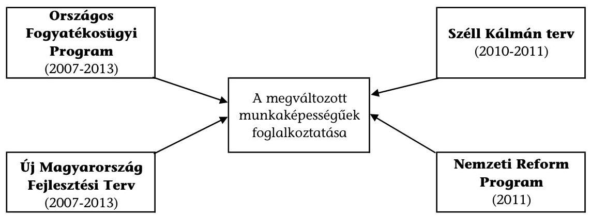

Az Országgyűlés (OGY) a 10/2006. (II. 16.) OGY határozatával elfogadta a 2007-2013. évekre vonatkozó Országos Fogyatékosügyi Programot

[^0]
[^0]:    ${ }^{21}$ A megváltozott munkaképességű munkavállalókat foglalkoztató munkáltatók akkreditációjának, továbbá az akkreditált munkáltatók ellenőrzésének szabályairól szóló 176/2005. (IX. 2.) és a megváltozott munkaképességű munkavállalók foglalkoztatásához nyújtható költségvetési támogatásról szóló 177/2005. (IX. 2.) Korm. Rendelet.
    ${ }^{22}$ A 14/2005. (IX. 2.) FMM rendelet a rehabilitációs akkreditációs eljárás és követelményrendszer szabályairól szól, a 15/2005. (IX. 2.) FMM rendelet a megváltozott munkaképességű személyek foglalkoztatásához nyújtható költségvetési támogatás megállapításának részletes szabályairól.

---

(OFP) ${ }^{23}$. Az OGY határozatában felkérte a Kormányt, hogy az OFP alapján - a fogyatékos személyek országos érdekvédelmi szervezeteivel, illetve az Országos Fogyatékosügyi Tanáccsal (OFT) együttműködve - legkésőbb 2006. augusztus 31-éig dolgozza ki az OFP végrehajtásáról szóló, a 2007-2010. évekre vonatkozó középtávú intézkedési tervet, a feladatok, a felelősök és a szükséges források meghatározásával. Az intézkedési tervet a 1062/2007. (VIII. 7.) Korm. határozat tartalmazta.

A kormányhatározat hangsúlyosan a fogyatékkal élő személyek egészségügyi, szociális, esélyegyenlőségi problémáira tér ki, néhány helyen azonban megjelenik a foglalkoztatással kapcsolatos intézkedésekre történő felhívás is (III. A fogyatékos személyek társadalom életében való aktív részvételének elősegítése fejezet 710. pontjai, IV. A rehabilitációval kapcsolatos célok fejezet 5. pontja). A végrehajtás határidejét az egyes témákban 2008., 2009. és 2010. december 31-ében jelölték meg.

A Kormány nem tájékoztatta az OGY-t a Korm. határozatban megjelölt években az OFP végrehajtásáról.

Az Új Magyarország Fejlesztési Terv (ÚMFT) nagy hangsúlyt fektetett a hátrányos helyzetű személyek társadalmi befogadásának javítására, ezen belül a megváltozott munkaképességű személyek foglalkoztatásának - az uniós jogszabályi előírásoknak megfelelően történő - előmozdítására.

A 2010. évi választásokat követően a Kormány több programjában is megfogalmazta a megváltozott munkaképességű személyek foglalkoztatásának támogatását.

A Széll Kálmán terv („Összefogás az adósság ellen" c. fejezete) meghatározza, hogy az államháztartási egyensúly és az államadósság csökkentése érdekében indokolt a munkaerő-piacon a legálisan foglalkoztatottak számának növelése. Rögzíti továbbá, hogy Magyarországon rendkívül negatívan hatnak a foglalkoztatásra a rokkanttá nyilvánítás rendszerében a visszaélések, ennek is következménye, hogy az OECD országok átlagához (Szlovákia, Csehország, Lengyelország) képest hazánkban mintegy kétszeres a rokkantak aránya.

[^0]
[^0]:    ${ }^{23}$ Az OFP a megváltozott munkaképességű személyekre is vonatkozik, úgy fogalmaz, hogy ahol az OFP-ben fogyatékos felnőttekről van szó, egyúttal a megváltozott munkaképességű személyeket is érteni kell. (III. fejezet 1. pont. 1.2. alpont)

---

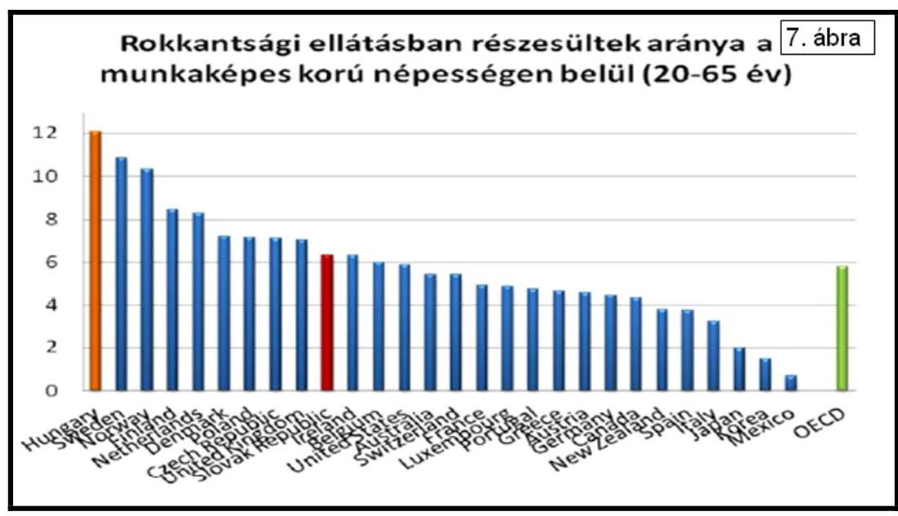

Forrás: Széll Kálmán terv
A terv 2011. július 1-jei határidővel - a NEFMI koordinálásával - célul tűzte ki az új rokkanttá nyilvánítási rendszer alapjait jelentő jogszabályok megalkotását és az intézményrendszer kialakítását. A helyszíni ellenőrzés befejezéséig a vonatkozó jogszabályok megalkotása és az intézményrendszer kialakítása nem fejeződött be.

A Nemzeti Reform Programban a megváltozott munkaképességűek foglalkoztatásának elősegítése, a népesség egészségi állapotának javítása révén a foglalkoztathatóság növelése, valamint az aktív és egészséges idősödés elősegítése, továbbá a területiség alapelve jelennek meg.

A foglalkoztatási rehabilitáció kormányzati feladatait ellátó SZMM 2008. októberében a megváltozott munkaképességű munkavállalók foglalkoztatása támogatási rendszere korszerűsítésének rövid távú feladataira koncepciótervezetet készített, amelyet a Kormány nem fogadott el.

A koncepcióban szerepelt, hogy egyetlen formában történjen bértámogatás, a foglalkozási rehabilitációhoz nyújtható bértámogatással. A tervezet a támogatások szabályainak átalakításával, a munkavállalói kör szűkítésével és a támogatási mérték csökkentésével kívánta megakadályozni a mindenkori költségvetési előirányzat túllépését. Szigorító intézkedésként rögzítette a foglalkozási rehabilitáció eredményességi kritériumának meghatározását, valamint azt, hogy támogatásban csak az előírt foglalkoztatási kvótát teljesítő munkáltatók részesüljenek.

Az SZMM a megváltozott munkaképességű személyek rehabilitációjához kapcsolódó egyes foglalkoztatási tárgyú kormány-, és miniszteri rendeletek módosításával kapcsolatosan több alkalommal készített előterjesztést, de ezek módosítására nem került sor.
2007. év végén az SZMM a 176/2005. (IX. 2.) és a 177/2005. (IX. 2.) kormányrendeletek módosítására tett javaslatot, a 2008. január 1-jétől bevezetésre kerülő új minősítéssel összefüggésben a fogalmak tisztázása, a jogosultsági kör új fogalomrendszer szerinti meghatározásának indoklásával. A javasolt módosítások nem

---

tartalmazták azok költségvetésre gyakorolt hatását. Az előterjesztést az érdekvédelmi szervek, és a minisztériumok részére - közigazgatási egyeztetésre - továbbították, az érintett szaktárcák érdemi és nemleges észrevételeiket az SZMM részére megküldték.
2009. év elején a megváltozott munkaképességű munkavállalókat foglalkoztató munkáltatók akkreditációjával kapcsolatos miniszteri rendeletek módosítására készítettek előterjesztést. Az előterjesztés a 26/2005. (XII. 27.) FMM rendelet akkreditációs díjfizetési táblázatának módosítását tartalmazta. Ezzel egy időben javaslatot tettek egységes fogalomhasználatra a két kormányrendeletben. (A 176/2005. (IX. 2.) Korm. rendelet módosításáról szóló előterjesztést a 2009. május 20-ai kormányülésre terjesztették be.)

A 2010. évi kormányváltást követően a NEFMI miniszter 2010. év második félévétől Fogyatékosságügyi miniszteri biztost nevezett ki, melynek feladatait NEFMI utasításban ${ }^{24}$ fogalmazta meg.

A NEFMI utasítás szerint a miniszteri biztos feladata „...a fogyatékos és megváltozott munkaképességű emberek munkavállalását támogató új foglalkoztatáspolitikai koncepció kidolgozása, esélyegyenlőségük, társadalmi befogadásuk elősegítését szolgáló közép- és hosszú távú stratégia megalkotása, a támogatási rendszer átalakítása..." volt.
2011. évben a Kormány új koncepciót dolgozott ki a rokkantsági nyugdíjrendszer átalakítására, amelyet a megváltozott munkaképességű személyek ellátásairól és egyes törvények módosításáról szóló 2011. évi CXCI. törvény, illetve az arra vonatkozó Kormány előterjesztés tartalmazott.

A 2011. december 30-án hatályba lépett törvény meghatározza a megváltozott munkaképességű személyek rehabilitációs és rokkantsági ellátásait, a foglalkoztatáshoz nyújtható támogatások keretszabályait, és felhatalmazást ad a támogatások részletes szabályait tartalmazó végrehajtási rendeletek megalkotására.

A támogatási rendszer célja a 177/2005. (IX. 2.) Korm. rendelet 1. § (2) bekezdése alapján, a megváltozott munkaképességű munkavállalók foglalkoztatásának elősegítése, képzettségüknek és egészségi állapotuknak megfelelő munkavégzés feltételeinek biztosítása, a nyílt munkaerő-piacra való visszavezetésük érdekében adaptációs készségük fejlesztése, valamint az állapotukból adódó foglalkoztatási hátrányok kiegyenlítése.

A megváltozott munkaképességet eredményező egészségkárosodások konkrét meghatározása kiemelt jelentőségű. A célcsoport munkaképesség-csökkenését, az összegészség károsodás mértékét szakhatósági állásfoglalás igazolja. (A szakértői bizottságok 2008. január 1-jétől már nem a munkaképességcsökkenés, hanem az egészségkárosodás mértékét határozzák meg.)

A megváltozott munkaképességű munkavállalók esetében két jelentős csoportot kell megkülönböztetni, egyrészt azokat, akik foglalkoztatására egészségi állapotuk következtében a nyílt munkaerő-piacon nincs lehetőség, másrészt azt a

[^0]
[^0]:    ${ }^{24}$ A miniszteri biztos kinevezéséről szóló 3/2010. (IX. 1.) NEFMI utasítás.

---

csoportot, amelyik vagy a rehabilitációt követően vagy anélkül felkészíthető a nyílt munkaerő-piacon való foglalkoztatásra.

Az ellenőrzött időszakban sem a minisztériumban, sem a háttérintézményeiben nem állt rendelkezésre olyan nyilvántartás, amelyből megállapítható lett volna az állami támogatások potenciális célcsoportját képező foglalkoztatható megváltozott munkaképességű személyek száma és területi eloszlása. Ennek következtében nem állapítható meg, hogy a foglalkoztatás arányban állt-e a régióban foglalkoztatható megváltozott munkaképességű személyek számával. A NEFMI által a rokkantsági nyugdíjrendszer átalakításához kapcsolódó új intézményrendszer koncepciótervezete ${ }^{25}$ az ellátórendszerben részesülőket kizárólag az ellátások típusai alapján, az alábbiak szerint csoportosította:

| A rokkantsági ellátásban részesülők csoportosítása |  |  |  |  |
| :--: | :--: | :--: | :--: | :--: |
| Adatok főben |  |  |  |  |
| Ellátásban részesülők | Öregségi nyugdíjkorhatári betöltött személyek | 5 évvel az irányadó öregségi nyugdíjhatár betöltése előtt | Több mint 5 évvel
 az irányadó öregségi nyugdíjhatár betöltése előtt | Összesen |
| I., II., III. csoportos rokkantsági ellátásban részesülők | 384000 | 226000 | 111000 | 721000 |
| Rendszeres szociális járadékban részesülők | 26000 | 29000 | 84000 | 139000 |
| Átmeneti járadékban részesülő személyek |  | 18000 |  | 18000 |
| Egyéb ellátásokban részesülők | 89000* |  |  | 89000 |

* rehabilitációs járadék, rokkantsági járadék, bányász dolgozók egészségkárosodási járadéka, mezőgazdasági és mezőgazdasági szövetkezeti járadék, özvegyi nyugdíj, árvaellátás

A megváltozott munkaképességűek foglalkoztatását a 177/2005. (IX. 2.) Korm. rendelet alapján a munkáltatónak nyújtható bértámogatás, költségkompenzációs támogatás, valamint rehabilitációs költségtámogatással ösztönözték.

Az SZMM, illetve a jogutód minisztérium az ellenőrzött időszakra vonatkozóan a támogatások eredményességét, hatékonyságát mérő indikátorokat nem határozott meg. A jogszabályokban, a belső eljárásrendekben és a támogatási szerződésekben sem határoztak meg eredményességi és hatékonysági kritériumokat a támogatások nyújtásának feltételeként.

A támogatási szerződésekben nem rögzítették a megváltozott munkaképességű munkavállaló foglalkoztatásának időtartamát, a munkaerő-piacra történő visszavezethetőségének a feltételét.

A rehabilitációs költségtámogatás esetében kikötötték a foglalkozási rehabilitációs tevékenység folytatását szakmai program alapján, illetve az alkalmazot-

[^0]
[^0]:    ${ }^{25}$ 54215-26/2011-NEFMI előterjesztés a Kormány részére a rokkantsági nyugdíjrendszer átalakításához kapcsolódó új intézményrendszer koncepciójáról (készült 2011. november 7-én)

---

tankénti személyes rehabilitációs terv elkészítését. Ehhez kapcsolódóan azonban eredményességi kritériumot nem írtak elő.

A támogatások forrását az SZMM (2007-2009. évek között), illetve a NEFMI (2010-2011. években) két fejezeti kezelésű előirányzatából ${ }^{26}$ biztosították.

Megváltozott munkaképességűek foglalkoztatásával összefüggő bértámogatás fejezeti kezelésű előirányzatból fizették ki a munkavállalók rehabilitációs foglalkoztatását elősegítő bértámogatást.

A megváltozott munkaképességűek foglalkoztatásával összefüggő költségkompenzáció fejezeti kezelésű előirányzat terhére került kifizetésre a megváltozott munkaképességű munkavállalók foglalkoztatásához nyújtható költségkompenzációs támogatás, valamint 21 szervezet részére a rehabilitációs költségtámogatás.

A támogatások folyósításában és ellenőrzésében közreműködő szervezetek féléves, éves beszámolót készítettek a megváltozott munkaképességű munkavállalók foglalkoztatásához nyújtott források, a támogatottak létszámának alakulásáról. Előírás hiányában ezek a beszámolók nem tartalmaztak információt a támogatás eredményességére és hatékonyságára vonatkozóan.

A támogatási rendszer nemzetgazdasági szintű célmeghatározása, valamint a támogatások eredményességét, hatékonyságát mérő indikátorok hiánya hátráltatta a források hatékony, eredményes felhasználását.

# 1.2. A költségvetési támogatási rendszer működését biztosító jogszabályok és eljárásrendek összhangja 

### 1.2.1. A támogatási rendszer hazai szabályozása

A 2005. évben elfogadott jogszabályok alapján 2006. évben vezették be az új támogatási rendszert, mely felváltotta a korábbi, ún. dotációs rendszert. A rendszert meghatározó jogszabályokat a következő ábra mutatja be.

[^0]
[^0]:    ${ }^{26}$ „Megváltozott munkaképességűek foglalkoztatásával összefüggő bértámogatás", valamint a „Megváltozott munkaképességűek foglalkoztatásával összefüggő költségkompenzáció"

---

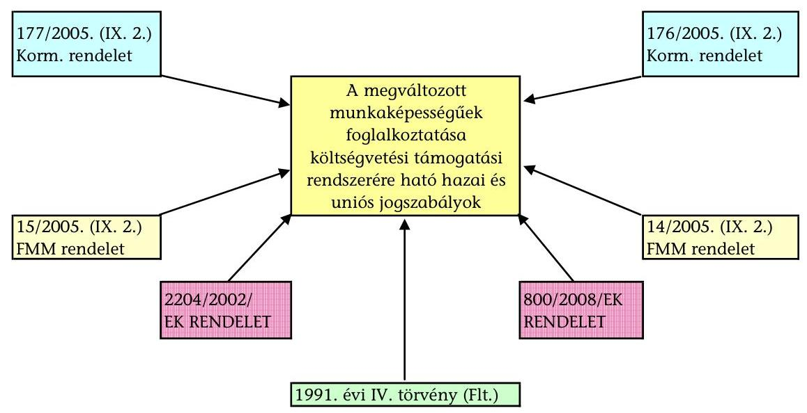

A megváltozott munkaképességűek foglalkoztatása költségvetési támogatási rendszerének szabályairól a 2007-2011. években a 177/2005. (IX. 2.) Korm. rendelet és a 15/2005. (IX. 2.) FMM rendelet rendelkezett.

A kialakított támogatási rendszer a 176/2005. (IX. 2.) Korm. rendeletben, valamint a 14/2005. (IX. 2.) FMM rendeletben szabályozott akkreditációra épül.

A hatályos magyar jogszabályokban a megváltozott munkaképességű személy fogalmát az Flt. és a 177/2005. (IX. 2.) Korm. rendelet is szabályozza. A két definíció nem azonos tartalommal használja a fogalmat.

A megváltozott munkaképességű álláskeresők megkülönböztetése az Flt. szabályai szerint történik, a központi költségvetésből nyújtott támogatások nyújtásakor, megítélésekor a 177/2005. (IX. 2.) Korm. rendeletben foglaltak az irányadók.

Az Flt. 58. § (5) bekezdés m) pontja alapján megváltozott munkaképességű személy: „aki testi vagy szellemi fogyatékos, vagy akinek az orvosi rehabilitációt követően munkavállalási és munkahely-megtartási esélyei testi vagy szellemi károsodása miatt csökkennek;"

A fogyatékkal élő személy fogalmát a Fogyatékossággal élő személyek jogairól szóló egyezmény és az ahhoz kapcsolódó Fakultatív Jegyzőkönyv kihirdetéséről szóló 2007. évi XCII. törvény 1. cikke határozza meg.

A törvény szerint: „Fogyatékossággal élő személy minden olyan személy, aki hosszan tartó fizikai, értelmi, szellemi vagy érzékszervi károsodással él, amely számos egyéb akadállyal együtt korlátozhatja az adott személy teljes, hatékony és másokkal egyenlő társadalmi szerepvállalását."

A fogyatékos személyek jogairól és esélyegyenlőségük biztosításáról szóló 1998. évi XXVI. törvény 4. § a) pontja szerint:

---

„fogyatékos személy az, aki érzékszervi - így különösen látás-, hallásszervi, mozgásszervi, értelmi képességeit jelentős mértékben vagy egyáltalán nem birtokolja, illetőleg a kommunikációjában számottevően korlátozott, és ez számára tartós hátrányt jelent a társadalmi életben való aktív részvétel során".

A törvény 15. § (1) bekezdése szerint „a fogyatékos személy lehetőség szerint integrált, ennek hiányában védett foglalkoztatásra jogosult". A 16. §-ban leírtak alapján, „ha a fogyatékos személy foglalkoztatása az integrált foglalkoztatás keretében nem megvalósítható, úgy számára speciális munkahelyek működtetésével a munkához való jogát lehetőség szerint biztosítani kell. A védett munkahelyet a központi költségvetés normatív támogatásban részesíti".

# A támogatásra jogosult megváltozott munkaképességű munkavállaló fogalmát a 177/2005. (IX. 2.) Korm. rendelet 2. § (1) bekezdés e) pont- 

ja definiálja. E jogszabályhely tartalmazza továbbá azon kritériumokat, hogy ki és milyen szakvélemény alapján tekinthető megváltozott munkaképességű munkavállalónak.

A megváltozott munkaképességű munkavállalók fogalmát 2008. március 3-tól a 42/2008. (II. 29.) Korm. rendelet 5. § (2) bekezdése, 2009. január 1-jétől a 357/2008. (XII. 31.) Korm. rendelet 1. § (1) bekezdése kibővítette, ezekkel az alaprendeletet módosították.

Az ellenőrzött időszakban a támogatási rendszer alapjait jelentő, 2005-ben elfogadott jogszabályok többször módosultak, melynek következtében a támogatási rendszer nem volt kiszámítható, a stabilitást, a munkáltatók hosszútávra történő tervezését nem segítette elő. A jogszabályváltozások bizonytalanságot eredményeztek - a támogatási szerződések megkötésének elhúzódása, az akkreditáció 2009. második félévében történő felfüggesztése miatt - a támogatott munkáltatók körében. A módosítások következtében a támogatások megállapításának és folyósításának feltételei - a foglalkoztatás napi legkisebb mértékének meghatározása, a munkaképesség csökkenés, illetve az egészségkárosodás besorolásának változása miatt - szigorodtak.

A megváltozott munkaképességű munkavállaló fogalma 2008. március 3-tól már tartalmazza feltételként, hogy a munkavállaló munkaszerződés szerinti munkaideje a napi négy órát elérje. 2009. január 1-jétől pedig megváltoztatták a munkaképesség csökkenés, illetve az egészségkárosodás mértékének a figyelembe vételét.
2009. január 1-jétől bértámogatás a munkáltató részére csak akkor volt nyújtható, ha az Flt. 41/A. § (1)-(2) bekezdésében foglalt kötelező foglalkoztatási szintet teljesítette ${ }^{27}$, valamint teljesültek a 177/2005. (IX. 2.) Korm. rendelet 4. § (2) bekezdésében foglaltak: „A naptári negyedév első hónapjától kezdődően fel kellett függeszteni a támogatás folyósítását, ha a munkáltatónak a rehabilitációs hozzájárulás előző negyedévi elszámolása során befizetési kötelezettsége keletkezett. A támogatást ismételten csak abban az esetben lehetett folyósítani, ha a munkáltató rehabilitációs foglalkoztatási kötelezettségét egy naptári negyedéven keresztül ismét teljesítette.

[^0]
[^0]:    ${ }^{27}$ Az Flt. ezen rendelkezése 2011. dec. 31-ig volt hatályos.

---

A megváltozott munkaképességűek foglalkoztatását segítő támogatási rendszer többcsatornás. A munkáltatók a rehabilitációs foglalkoztatást elősegítő bértámogatáson és a költségkompenzációs támogatáson felül 2010. december 31-éig a Munkaerő-piaci Alap (MPA) Rehabilitációs Alaprész központi-, valamint decentralizált keretéből is részesülhettek támogatásban.

A 177/2005. (IX. 2.) Korm. rendelet alapján az akkreditált (nem védett szervezeti szerződéssel rendelkező) szervezetek a megváltozott munkaképességű munkavállalók támogatására két támogatástípusból (bértámogatás és költségkompenzációs támogatás) is részesülhettek, valamint pályázati úton - elsősorban fejlesztési, beruházási célokhoz - további támogatásokat igényelhettek.

Az ellenőrzött időszakban a támogatási rendszer nehezen átlátható és széttagolt volt, párhuzamosságok és átfedések jellemezték.

A megváltozott munkaképességű munkavállalók foglalkoztatásának fedezetére biztosított fejezeti kezelésű előirányzatok folyósításának, felhasználásának, elszámolásának szabályait eljárásrendekben határozták meg.

A megváltozott munkaképességű munkavállalók foglalkoztatásához költségvetési előirányzatból nyújtható bértámogatásra vonatkozó eljárásrendeket 2007-2010. éveket érintően az ÁFSZ és az FSZH, 2011. évtől kezdődően az NRSZH készített.

Az eljárásrend tartalmazta a megváltozott munkaképességű munkavállalók részére biztosított, a rehabilitációs foglalkoztatást elősegítő bértámogatás, illetve a munkahelyi segítő személy foglalkoztatásával kapcsolatos költségekhez nyújtott költségkompenzációs támogatás megállapításának, folyósításának országosan egységes szabályait. Az eljárásrend előírta a fővárosi és megyei kormányhivatalok munkaügyi feladatokat ellátó szakigazgatási szerveinél (munkaügyi központ) és kirendeltségein, hogy a bértámogatás nyújtásánál egységes szempontok alapján kell eljárniuk.

Az ellenőrzött időszakban ÁFSZ, illetve az FSZH főigazgatói utasításban kiadott eljárásrendet hatszor módosították. A változtatásokat a vonatkozó jogszabályokban bekövetkezett változások, az EU-s jogharmonizáció indokolták.

Az eljárásrend két esetben nem adott iránymutatást - a gazdasági tevékenység meghatározása, vagy a segítő személy költségtámogatása esetében - a jogszabályok egységes értelmezéséhez.
2010. január 1-jétől azok a nonprofit gazdasági szervezetek, akik a nonprofit tevékenységük mellett vállalkozási tevékenységet is végeztek az eddigi 100% helyett támogatásként a bértámogatás 75%-át igényelhették.

A segítő személy költségtámogatását csak a ténylegesen segítésre fordított idő alapján lehet elszámolni, ennek igazolása a gyakorlatban ellentmondásos, nehezen kimutatható és bizonyítható volt.

Az NRSZH főigazgatója 2011. április 26-án kiadta a rehabilitációs foglalkoztatást elősegítő bértámogatás és a munkahelyi segítő személy foglalkoztatásával kapcsolatos költségekhez nyújtott költségtámogatásról szóló eljárásrendet.

---

Az eljárásrendben meghatározták a támogatások nyújtásának feltételeit, a bér és költségtámogatás forrását, formáját, mértékét és időtartamát, az eljárási szabályokat, a kifizetés pénzügyi lebonyolítását, a nyilvántartások vezetését. Az eljárásrend tartalmazta továbbá a támogatások felhasználásának ellenőrzését is.

Az eljárásrend 10. pontja kimondta, hogy a 177/2005. (IX. 2.) Korm. rendelet alapján folyósított támogatások esetében nem kell hatékonysági vizsgálatot végezni.

Eljárásrendekben határozták meg:

- a védett műhelyek nyilvántartásba vételéről és ezek ellenőrzéséről,
- a megváltozott munkaképességű munkavállalókat foglalkoztató munkáltatók akkreditációjáról,
- a megváltozott munkaképességű munkavállalókat foglalkoztató akkreditált munkáltatók hatósági ellenőrzéséről,
- a céljellegű támogatásokhoz kapcsolódó szerződéskötési, elszámolási, ellenőrzési feladatokról és
- az azokban közreműködők közötti munkamegosztás rendjéről, valamint a költségkompenzációs támogatás és a rehabilitációs költségtámogatás igénylésével, elszámolásával, ellenőrzésével kapcsolatos szabályokat.

Az FMM 2006. évben készítette el a Költségkompenzációs támogatással és a rehabilitációs költségtámogatással kapcsolatos eljárásrendet, amelyet ezt követően nem aktualizáltak.

Az SZMM 2008. évben rendszerellenőrzést végzett a megváltozott munkaképességű személyek foglalkoztatásának társadalmi célú megvalósulását szolgáló jogi eszközök, az SZMM fejezeti kezelésű előirányzati források, jogszabályok és szervezeti szabályozási folyamatok, a támogatási formák működtetéséről. Az ellenőrzési jelentésben megállapította, hogy „a támogatási eszköz különös részletszabályozása hiányos, csak részben szabályozott, az eljárási rend aktualizálása elmaradt. Hiányzik a folyamatok részfolyamatokra, tevékenységekre való bontása, az ellenőrzési pontok azonosítása, aminek a következményeként kockázattal kell számolni."

A rendszerellenőrzés által feltárt hiányosságok megszüntetésére tett intézkedésekről az ellenőrzés részére az EMMI Foglalkozási Rehabilitációs Főosztályán dokumentáció nem állt rendelkezésre.

Az SZMM, az FSZH, az NRSZH által készített eljárásrendek és útmutatók hozzájárultak a megváltozott munkaképességű munkavállalók fogalmának egységes értelmezéséhez.

# 1.2.2. A hazai és az uniós jogszabályi rendelkezések összhangja 

Az ellenőrzött időszakban a megváltozott munkaképességű munkavállalókra vonatkozó hazai és az uniós jogszabályok összhangja az ellenőrzött időszak egészében nem minden tekintetben volt biztosított.

A megváltozott munkaképességűek foglalkoztatása költségvetési támogatási rendszerének szabályai tekintetében az Európai Bizottság 2002. december 5-ei 2204/2002/EK Rendelete az EK-Szerződés 87. és 88. cikkének a foglalkoz-

---

tatásra nyújtott állami támogatásra történő alkalmazásáról, valamint a Bizottság 2008. augusztus 6-ai 800/2008/EK Rendelete a Szerződés 87. és 88. cikke alkalmazásában a támogatások bizonyos fajtáinak a közös piaccal összeegyeztethetőnek nyilvánításáról (általános csoportmentességi rendelet) voltak az irányadóak.

A 2204/2002/EK rendeletet 2003. január 2-től 2008. augusztus 28-ig terjedő időszakban kellett alkalmazni. A 800/2008/EK rendelete 2008.
 augusztus 29-től hatályos.

A jelenleg hatályos (800/2008/EK) Rendelet 2. cikk 20. és 21. pontja meghatározza a „fogyatékkal élő munkavállaló" és a „védett munkahely" fogalmát.
20. „fogyatékkal élő munkavállaló": bármely olyan személy
a) aki a nemzeti jog szerint fogyatékosnak elismert; vagy
b) aki elismerten fizikai, elmebeli vagy pszichológiai károsodásban szenved;
21. „védett munkahely": olyan vállalkozásnál történő foglalkoztatás, ahol az alkalmazottak legalább 50 %-a fogyatékkal élő munkavállaló;

Az ellenőrzött időszakban a megváltozott munkaképességű munkavállalókra vonatkozó hazai és az uniós jogszabályok összhangját teljes körűen 2009. január 1-jétől teremtették meg, mert a kormányrendeletben meghatározott bértámogatásból a munkahelyi segítő személy foglalkoztatásához nyújtott támogatás nem felelt meg a 800/2008/EK Bizottsági rendelet előírásainak. A jogszabály módosítást követően ezt a támogatást a költségkompenzációs forrás terhére folyósították.

A megváltozott munkaképességű munkavállalókra vonatkozó jogszabályok módosítása hazánk uniós csatlakozása miatti jogharmonizációs elvárásoknak megfelelt.

A 2010. évben a Kormány által megfogalmazott célok között szerepelt a megváltozott munkaképességű személyek munkaerő-piacon történő foglalkoztatási arányának növelése, az egészségkárosodás mértékét megállapító rendszer felülvizsgálata.

A fogyatékos személyek foglalkoztatási rátája az Európai Unióban 40\% körül, Magyarországon 12-15\% körül van. Az Unió növekedési céljainak megvalósításához több fogyatékos, megváltozott munkaképességű személynek kell fizetett munkaviszonyba kerülnie a nyílt munkaerő-piacon.

A megváltozott munkaképességű személyek ellátásairól és egyes törvények módosításáról szóló 2011. évi CXCI. törvény megalkotásával elkezdődött a támogatási rendszer átalakítása. Az ellátórendszer átalakításának célja, hogy egy racionálisan működő, átlátható, és a foglalkoztatást ösztönző ellátórendszer jöjjön létre. A módosítással érintett jogszabályok egyeztetése megtörtént az NFM TVI-vel, azok a hatályos EU-s jogszabályoknak megfelelnek. A törvény 2011. december 31-én lépett hatályba.

---

# 1.3. A támogatás-közvetítő intézményrendszer átalakítása, hozzájárulása a támogatás céljainak megvalósításához 

### 1.3.1. A támogatást közvetítő intézményrendszer átalakulása a 2007-2011. években

A megváltozott munkaképességűek támogatási rendszerének működtetése 2007-2009. években az SZMM, 2010. évtől a NEFMI ${ }^{28}$ hatáskörébe tartozott.

A megváltozott munkaképességűek foglalkoztatásával összefüggő bértámogatás és a megváltozott munkaképességűek foglalkoztatásával összefüggő költségkompenzációs fejezeti kezelésű előirányzatok nyilvántartásának, felhasználásának és elszámolásának ellenőrzésében az ellenőrzött időszakban a minisztérium illetékes főosztályai, valamint közreműködő szervezetek vettek részt.

A szociális és munkaügyi miniszter feladat- és hatáskörét a 170/2006. (VII. 28.) Korm. rendelet tartalmazta.

Az SZMM minisztere felelt többek között a foglalkoztatáspolitikáért, felelős volt a társadalmi esélyegyenlőség előmozdításáért, ezen belül a fogyatékos és megváltozott munkaképességű személyek társadalmi integrációjának elősegítéséért.

A SZMM miniszter a 3/2006. (MK. 94.) SZMM utasítással adta ki a minisztérium szervezeti és működési szabályzatát, amelyben két szakállamtitkár között osztotta meg a megváltozott munkaképességű személyekkel kapcsolatos feladatokat.

Az esélyegyenlőségi szakállamtitkár irányítása alá rendelte az ágazati koordinációs és előkészítő feladatokat.

A foglalkoztatási és képzési szakállamtitkár irányítása alá rendelte a költségtámogatások - pályázat eljárás keretében történő - működtetését.

A 2010. évi választásokat követően, a 2010. évi XLII. törvény ${ }^{29}$ 1. § f) pontja mondta ki a NEFMI megalakulását, amely az SZMM általános jogutódja lett, feladatai és intézményei közül többet más tárcákhoz csoportosítottak át.

A társadalmi esélyegyenlőséggel kapcsolatos feladatok a KIM-hez, a foglalkoztatáspolitikával kapcsolatos feladatok a Nemzetgazdasági Minisztériumhoz (NGM) kerültek. A fogyatékkal élő személyek esélyegyenlőségének előmozdításával kapcsolatos feladatok azonban a NEFMI-nél maradtak.

[^0]
[^0]:    ${ }^{28}$ 2012. május 14-től Emberi Erőforrások Minisztériuma (EMMI)
    ${ }^{29}$ a Magyar Köztársaság minisztériumainak felsorolásáról szóló 2010. évi XLII. törvény

---

A kormányváltást követően a nyílt munkaerő-piaci foglalkoztatással és a megváltozott munkaképességű személyek foglalkoztatásával kapcsolatos kormányzati feladatok is az NGM fejezethez kerültek.

A Kormány a 212/2010. (VII. 1.) Korm. rendelet elfogadásával döntött az egyes miniszterek feladat- és hatásköréről, melynek értelmében a foglalkoztatási rehabilitációért és a társadalmi esélyegyenlőség előmozdításáért a nemzeti erőforrás miniszter felelős.

A rehabilitációs támogatások koordinációjával, előkészítésével kapcsolatos feladatok 2010. január 1-jén kerültek át az FSZH-hoz ${ }^{30}$ amely a kormányváltás után, az NGM irányítása alá került.

A kormányzati struktúra újragondolása eredményezte, hogy a foglalkozási rehabilitációért viselt felelősség elváljon a foglalkoztatáspolitikától és visszakerüljön - 2010. év végén - a NEFMI-be.

A NEFMI szervezeti és működési szabályzatáról szóló 6/2010. (X. 19.) NEFMI utasítás szerint a fogyatékosság ügy és a foglalkozási rehabilitáció felett a szociális, család- és ifjúságügyért felelős államtitkár gyakorolta a szakmai irányítást három - Fogyatékosságügyi, Esélyegyenlőségi és Foglalkozási rehabilitációs - főosztály bevonásával.

A Kormány 2010 decemberében módosította a miniszterek feladat- és hatáskörét szabályozó rendeletét ${ }^{31}$ melynek alapján a nemzeti erőforrások miniszterének feladata bővült az NRSZH irányításával.

A megváltozott munkaképességűek foglalkoztatásával összefüggő bér-, illetve költségkompenzációs támogatás fejezeti kezelésű előirányzatok pénzügyi lebonyolításához kapcsolódó feladatokat - a kötelezettségvállalás rendjét, az előirányzat felhasználást, a támogatásnyújtást és az elszámolást - az SZMM és a NEFMI évenként aktualizált utasításai ${ }^{32}$ szabályozták.

A 2007-2011. évek között a támogatás közvetítő intézményrendszert több szervezeti átalakítás érintette, amelyek a feladatellátást nem veszélyeztették.

Az Állami Foglalkoztatási Szolgálatról (ÁFSZ) szóló 291/2006. (XII. 23. ) Korm. rendelet 2. § (1) bekezdése szerint az ÁFSZ irányítása az SZMM miniszter feladata volt.

Az ÁFSZ a Foglalkoztatási és Szociális Hivatalból (FSZH) és a Regionális Munkaügyi Központokból állt (RMK).

[^0]
[^0]:    ${ }^{30}$ 352/2009. (XII. 30.) Korm. rendelet 6. §
    ${ }^{31}$ 267/2010. (XII. 3.) Korm. rendelet
    ${ }^{32}$ 19/2007. (Mük. 6.), 11/2008. (Mük. 5.), 15/2009 (V. 20.), 16/2010. (V. 20.) SZMM utasítások, valamint a 10/2010. (XII. 10.) NEFMI utasítás

---

A megváltozott munkaképességűek foglalkoztatásával összefüggő bértámogatás felhasználásával kapcsolatos feladatokat 2007-2010. években az RMK-k látták el. A források átadása - a fejezetek és az RMK-k között - megállapodások alapján történt, amelyben többek között előírták a féléves és éves pénzügyi és szakmai beszámoló elkészítését.

A RMK-k feladatait a megváltozott munkaképességű személyekkel kapcsolatban a 291/2006. (XII. 23. ) Korm. rendelet 7. § (1)-(2) bekezdései és a 8. § tartalmazta.

Feladatuk volt többek között az együttműködés a munkaképesség, illetve a munkaalkalmasság értékelésében részt vevő, illetve a megváltozott munkaképességű személyek foglalkoztatása elősegítésében közreműködő szervekkel, valamint át nem ruházható hatáskörben, a munkaügyi központnak - a külön jogszabályban meghatározott - illetékességi területén első fokú hatósági jogkör gyakorlása a foglalkoztatást elősegítő támogatások közül a megváltozott munkaképességű személyek foglalkoztatását elősegítő beruházáshoz, felújításhoz nyújtott támogatással kapcsolatban.

A Kormány a 2010. évi CXXVI. törvény 21. § b)-d) pontjaiban kapott felhatalmazás alapján a 315/2010. (XII. 27.) Korm. rendelettel létrehozta a Nemzeti Foglalkoztatási Szolgálatot (NFSZ).

Az NFSZ szervezetrendszere a Foglalkoztatási Hivatalból (FH) és a munkaügyi központokból áll. A rendelet 1. § (3) bekezdése szerint a munkaügyi központok a fővárosi és megyei kormányhivatalok munkaügyi feladatokat ellátó szakigazgatási szerveként működnek, 2011. január 1-jétől ismét megyei rendszerben látják el feladataikat.
2011. évtől a munkaügyi központok szervezeti változás miatt a támogatások átadását négyoldalú megállapodásban rögzítik.

A négyoldalú megállapodás résztvevői: a NEFMI, a KIM, a fővárosi és megyei kormányhivatalok és az NRSZH.

A megállapodásban szereplő 2012. március 31-ei határidőre a munkaügyi központok a 2011. évi támogatás felhasználásáról a szakmai és pénzügyi beszámolójukat elkészítették.

A 331/2010. (XII. 27.) Korm. rendelet alapján, 2011. január 1-jével megalakult a Nemzeti Rehabilitációs és Szociális Hivatal (NRSZH). A kormányrendelet alapján az NRSZH feladat- és hatáskörébe tartozik az ORSZI korábbi feladatainak ellátása, valamint az FSZH-tól az új szervezetbe kerültek a foglalkozási rehabilitációs feladatok. 2011. január 1-jétől a szociális és rehabilitációs terület kiválásával az FSZH elnevezése FH-ra módosult.

Az NRSZH foglalkozási rehabilitációs feladatkörében ellátandó tevékenységét a 331/2010. (XII. 27.) Korm. rendelet 8. § (1) bekezdése szabályozza. Feladata többek között a megváltozott munkaképességűeket foglalkoztató szervezetek akkreditációjával és annak ellenőrzésével összefüggő hatósági ügyek, a költségvetési támogatásokkal kapcsolatos jogszabályi feladatok végrehajtása, tájékoztatás és információnyújtás.

---

A 2007-2009. években a megváltozott munkaképességűek foglalkoztatásával összefüggő költségkompenzációs fejezeti kezelésű előirányzatból a rehabilitációs költségtámogatás, valamint a költségkompenzációs támogatás nyújtásával összefüggő hatósági, szakmai és pénzügyi feladatokat az SZMM szakmai főosztályain keresztül saját hatáskörben látta el.

A 2010-2011. években az SZMM, illetve a NEFMI a feladatok végrehajtására megállapodást kötött az FSZH-val (2010.), illetve az NRSZH-val (2011.).

A megállapodásban rögzítették az átadott forrás nagyságát, a lebonyolító szervezet feladatellátással kapcsolatos hatósági, pénzügyi, szakmai feladatait, valamint a feladatok végrehajtásáért járó vállalkozási díj összegét. Előírták továbbá, hogy a támogatást lebonyolító intézmények az átadott előirányzat felhasználásáról rész-, illetve éves szakmai és pénzügyi beszámolót készítenek.

A 2010-2011. években az FSZH, illetve NRSZH a szerződésben rögzített beszámolási kötelezettségeinek határidőben eleget tett.

A rehabilitációs költségtámogatás és költségkompenzációs támogatás felhasználásának ellenőrzésére együttműködési megállapodás jött létre 2010. évre az FSZH és a Kincstár, 2011. évre vonatkozóan pedig a NEFMI, az NRSZH és a Kincstár között.

A megállapodás értelmében a Kincstár a költségkompenzációs, valamint rehabilitációs költségtámogatásban részesülő munkáltató esetében pénzügyi ellenőrzést végzett. A megállapodások rögzítették a felek jogait és kötelezettségeit. A Kincstár a pénzügyi ellenőrzések lefolytatásának rendjét félévente aktualizált eljárásrendjében rögzítette (amelyben meghatározta, hogy az együttműködési megállapodás alapján végzett ellenőrzését nem hatóságként látja el), valamint azt, hogy a támogatások felhasználásának tapasztalatairól, a megállapításokról féléves és éves jelentést készít. A Kincstár a támogatások felhasználásának ellenőrzéséről készült 2010. féléves és éves valamint a 2011. évre vonatkozó féléves jelentését az ellenőrzés részére átadta.

# 1.3.2. A munkáltatók akkreditálásának célja 

A 176/2005. (IX. 2.) Korm. rendelet alapján az akkreditációs eljárás célja, hogy a munkáltató székhelyén, telephelyén és fióktelepén rendelkezzen azokkal az akkreditációs követelményrendszerben meghatározott személyi és tárgyi feltételekkel, amelyek biztosítják az egészségkárosodással élő és fogyatékos személyek egészségi állapotának és fogyatékosságának megfelelő környezetben megvalósuló foglalkoztatását. Az akkreditációs eljárás ugyanakkor nem biztosította a foglalkoztatók esélyegyenlőségét a támogatásokhoz jutás folyamatában.

Az akkreditációs eljárás lefolytatását a munkáltató kezdeményezte annak érdekében, hogy foglalkoztatási rehabilitációs tevékenységét az állam elismerje és számára a foglalkoztatáshoz támogatást nyújtson.

A 176/2005. (IX. 2.) Korm. rendelet 4. § (1) bekezdése az akkreditációs tanúsítványnak különböző típusait különbözteti meg.

---

Az alap tanúsítvány igazolta, hogy a munkáltató az alapvető akkreditációs követelményeknek megfelelt, a tanúsítvány birtokában akkreditált foglalkoztatónak minősült. A rehabilitációs tanúsítvány a munkáltatót rehabilitációs foglalkoztatónak nyilvánította. A kiemelt tanúsítvány a munkáltatót védett foglalkoztatónak minősítette. A feltételes tanúsítvány tulajdonosát a kiemelt tanúsítvány megszerzésére való felkészülésben segítette. A tanúsítványok a minősítésüknek megfelelően, eltérő érvényességi idővel rendelkeztek: az alap tanúsítvány 5 év, a rehabilitációs tanúsítvány 3 év, a kiemelt tanúsítvány 2 év, a feltételes tanúsítvány 1 év.

Az akkreditációra vonatkozó új kérelmek befogadását a jogalkotó 2009. szeptember 1. és 2009. december 31. között szüneteltette.

A 177/2005. (IX. 5.) Korm. rendelet 2009. január 1-2009. szeptember 1. között többször módosult a 800/2008. EK rendelet hazai jogszabályokra történő kötelező alkalmazása miatt.

A megváltozott munkaképességűek támogatási rendszere nem támasztott azonos feltételeket a támogatott munkáltatókkal szemben. Az ellenőrzött időszakban a két fejezeti kezelésű előirányzatból kifizetett költségvetési támogatások 65\%-át kitevő rehabilitációs költségtámogatás igénybevételéhez nem volt kötelező az akkreditációs tanúsítvány beszerzése.

A 21 védett szervezeti szerződéssel
 ${ }^{33}$ rendelkező munkáltatók rehabilitációs költségtámogatást abban az esetben is kaphattak, ha nem rendelkeztek tanúsítvánnyal. A 2011. évben a védett szerződéssel rendelkező munkáltatók közül kettő nem rendelkezett tanúsítvánnyal.

A bértámogatás és a költségkompenzációs támogatás igénybevételéhez a megváltozott munkaképességűeket foglalkoztató szervezetnek akkreditációs tanúsítvánnyal kell rendelkezni.

A költségkompenzációs támogatás nyújtására kötött támogatási szerződésben meghatározták, hogy a támogató a szerződést felmondja és a támogatás további folyósítását megszünteti, ha a védett foglalkoztató tanúsítványát visszavonják, vagy érvényességi ideje lejár és a kérelmet megújításra a foglalkoztató nem nyújtotta be.

A költségkompenzációs támogatási szerződésben a munkáltató a kiemelt, vagy feltételes tanúsítványban védett foglalkoztatóvá minősített székhelyen vagy telephelyen, illetve fióktelepen munkát végző megváltozott munkaképességű munkavállaló foglalkoztatásához igényelt támogatást.

A NEFMI Foglalkozási Főosztálya nem rendelkezett arra vonatkozó dokumentummal, hogy a jogalkotás során a védett szervezeti szerződés megkötését miért nem kötötték akkreditációs tanúsítvány meglétéhez.

[^0]
[^0]:    ${ }^{33}$ A védett szervezeti szerződést azokkal a szervezetekkel kötötte az FMM, illetve az SZMM, akik vállalták olyan személyek foglalkoztatását, akiknek a nyílt munkaerőpiacon történő foglalkoztatásra nincs lehetőség.

---

2010. január-február hónapban az APEH, a Kincstár, az FSZH, az ORSZI, az OEP, az OMMF és a RMK-k közösen elvégezték az akkreditációs és a támogatási rendszer felülvizsgálatát.

A felülvizsgálatról készült jelentés tartalmazta, hogy „a különféle típusú foglalkoztatások funkciói keverednek, nem alkotnak rendszert, a tartós és a tranzit foglalkoztatás nem különül el. Nincs megoldva a foglalkoztatottak minősítése, az orvosi igazolások hitelesítése és ellenőrzése.".

A jelentés javaslatként fogalmazta meg a rehabilitációs foglalkoztatás „minden" támogatott formája esetén a Ket. szabályainak alkalmazását, végső következtetésként pedig "a támogatási rendszer elsődleges célja a megváltozott munkaképességű munkavállalók nyílt munkaerőpiacra való visszajuttatása."
2. A KIALAKITOTT TÁMOGATÁSI RENDSZER, A RENDELKEZÉSRE ÁLLÓ FORRÁSOK EREDMÉNYES, HATÉKONY, ÁTLÁTHATÓ ÉS ÖSSZEHANGOLT FELHASZNÁLÁSA

# 2.1. A védett szervezeti szerződések alapján történő foglalkoztatás célszerűsége, megalapozottsága, a támogatás hozzájárulása a gazdálkodás eredményességéhez és az integrált foglalkoztatáshoz 

A 177/2005. (IX. 2.) Korm. rendelet 9. §-a szerint rehabilitációs költségtámogatás azoknak a megváltozott munkaképességű munkavállalókat foglalkoztató munkáltatóknak nyújtható, amelyek pályázati eljárás alapján hatósági szerződésben (védett szervezeti szerződés) vállalják olyan személyek foglalkoztatását, akiknek - egészségi állapotuk, fogyatékosságuk miatt - a nyílt munkaerőpiacon történő foglalkoztatására nincs lehetőség.

## Annak kritériumait, hogy ki alkalmazható a nyílt munkaerőpiacon és ki nem, jogszabályokban nem határozták meg.

A pályázati eljárást, annak feltételeit az FMM a 2006. évben elkészített „a rehabilitációs foglalkoztatáshoz nyújtható költségkompenzációs támogatás, valamint a rehabilitációs költségtámogatás szabályainak alkalmazásáról" szóló eljárásrendben határozta meg.

A rehabilitációs költségtámogatás igénybevételére 2005-ben az FMM, 2006-ban az SZMM írt ki pályázatokat. A pályázatok célja a munkáltatók foglalkoztatási rehabilitációs tevékenységének segítése, az egészségi állapotuk, illetőleg fogyatékosságuk jellege miatt nyílt munkaerőpiacon nem foglalkoztatható személyek munkavégzésének elősegítése, valamint a megváltozott munkaképességű munkavállalók foglalkoztatásának támogatása volt.

A kiírásban meghatározták a pályázaton való részvétel feltételeit, az igényelhető rehabilitációs költségtámogatás felső korlátját (a foglalkoztatáshoz kapcsolódó költségek 80%-a), előírták az évenkénti igénylési kötelezettséget, a döntésre jogosultak körét. Pályázati útmutatót készítettek, amely tartalmazta a támogatás

---

nyújtásának részletes feltételeit, a pályázat elbírálásához benyújtandó dokumentumok körét.

Az FMM által 2005. november 2-án kiírt pályázat benyújtásának határideje 2005. november 15-étől 2006. március 31-ig tartott. Az SZMM 2006. november 20-án kiírt pályázatára 2007. január 31-ig lehetett jelentkezni.

A helyszínen ellenőrzött védett szervezeti szerződéssel rendelkező 13 társaság megfelelt a pályázati feltételeknek.

A benyújtott pályázatok alapján 2006. évben az FMM miniszter hét szervezet, 2007. évben az SZMM miniszter 14 szervezet rehabilitációs költségtámogatásáról döntött. A 2007. évtől rehabilitációs költségtámogatás nyújtására pályázatot nem hirdettek meg, így a támogatási rendszer nem tette lehetővé új szervezetek csatlakozását és nem történt meg a támogatottak felülvizsgálata.
2006. évben a Dél-Borsodi Nkft., ERFO Nkft., FŐKEFE Nkft., KÉZMŰ Nkft., KomlóHabilitas Nkft., START Nkft. és Teljes Életért Nkft. társaságokkal kötöttek védett szervezeti szerződést.

Az Emberi Erőforrások Minisztériuma (EMMI, mint jogutód) a védett szervezetek részére a 2005. és a 2006. években meghirdetett pályázatok elbírálásával kapcsolatos iratokat, - bírálat szempontjai, a bizottság jegyzőkönyve, a nem nyertes (elutasított) szervezetek jegyzéke, az elutasítás indoka - a döntést megalapozó dokumentumokat és a miniszter döntéséről készített határozatokat - a 2007. évi miniszteri döntésről készült határozatok kivételével az ellenőrzés részére nem adott át.

A védett szervezeti szerződést három évre kötötték, és meghatározták benne a megváltozott munkaképességű személyek, valamint a nyílt munkaerőpiacon nem foglalkoztatható személyek létszámát. Ennek aránya az egyes szervezetek esetében nem egységes mértékben került meghatározásra, 10-81% között változott. A helyszínen ellenőrzött 13 szervezetnél a szerződés megkötésekor a nyílt munkaerőpiacon nem foglalkoztathatók aránya az összes megváltozott munkaképességű munkavállalókhoz, valamint a megváltozott munkaképességű munkavállalók aránya az összes foglalkoztatotthoz a következők szerint alakult:

---

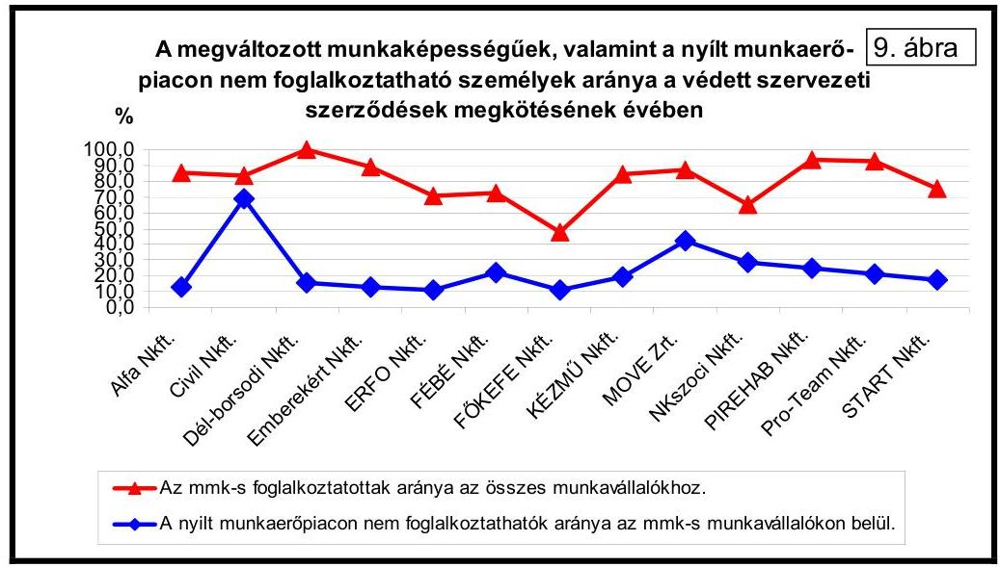

A védett szervezeti szerződés megkötését követően az évenkénti támogatási szerződésekben a nyílt munkaerőpiacon nem foglalkoztatható személyek számában nem történt változás. A védett szervezeti szerződéseket több alkalommal - a szerződés meghosszabbítása, az adott évi előleg igénybevételének módja, a támogatás felhasználását ellenőrző szervezet változása miatt - módosították.

A védett szervezeti szerződés megkötésének nem volt feltétele az akkreditációs tanúsítvány megléte.

A helyszínen ellenőrzött 13 gazdasági társaság közül öt társaság 2006. évben, nyolc társaság 2007. évben kötött védett szervezeti szerződést a támogatóval. A 13 társaságból 10 társaság esetében a szerződések aláírása későbbi időpontban történt, mint a támogatás időszakának kezdete.

A 2006. évben pályázó gazdasági társaságok alapítói 2006. június 30-ig döntöttek a társaságaik közhasznú társasággá történő átalakításáról (FŐKEFE Nkft., ERFO Nkft., KÉZMŰ Nkft., Dél-borsodi Nkft.), a 2007. évben pályázó társaságok közhasznú szervezetként való nyilvántartásba vétele a védett szervezeti szerződésben meghatározott időpontig megtörtént. A közhasznú társaságok a jogszabályi előírásoknak ${ }^{34}$ megfelelően 2008-2009. években nonprofit társasággá (Kft., Zrt.) alakultak át.

A társaságok - a védett szervezeti szerződés megkötését követően - a nyílt munkaerőpiacon nem foglalkoztatható személyekről elkészített összesítő kimutatást megküldték véleményezésre az illetékes munkaügyi központoknak, akik a nyilvántartásaik alapján azokat ellenőrizték, majd ezt követően jóváhagyták.

Az ellenőrzött időszakban a támogatási szerződésekben nem írtak elő felülvizsgálati követelményeket a foglalkoztatott megváltozott munkaképességű munkavállalók egészségkárosodásának a 177/2005. (IX. 2.) Korm. rendelet 2. § (1) e) pontjai alapján történő megfelelésére.

[^0]
[^0]:    ${ }^{34}$ a gazdasági társaságokról szóló 2006. évi IV. törvény 365. § (3) bekezdése

---

A rehabilitációs költségtámogatás évenkénti igénylését megelőzően a minisztérium elkészítette, és a támogatottak rendelkezésére bocsátotta a támogatható költségek számítására vonatkozó útmutatót, melyben részletesen meghatározta az elszámolható költségek körét és elveit.

A védett szervezeti szerződés és a rehabilitációs költségtámogatás iránti pályázat és az évenkénti forrásigény benyújtását megelőzően a helyszínen ellenőrzött társaságok elkészítették a támogatási igényt megalapozó üzleti terveiket, amelyeket a tulajdonosok elfogadtak. Az évenkénti támogatások igénylésekor betartották az útmutatóban előírtakat, továbbá figyelemmel voltak a támogató elvárásaira.

A társaságok az évenkénti igényléseket az előírt formában benyújtották, a szükséges mellékleteket csatolták. A védett szervezeti szerződés lejártát megelőzően kérelmezték a védett szervezeti szerződés meghosszabbítását, 2011. évtől kezdődően a félévenkénti megújítását.

A 21 védett szervezeti szerződéssel rendelkező társaság 2011. év I. féléves támogatási szerződésben szereplő támogatható költségeit részletesen a 2. számú melléklet tartalmazza. A társaságok a támogatott költségek 88,9%-át személyi jellegű ráfordításra kapták. Ennek összege 10 863,2 E Ft volt. Az anyagjellegű ráfordítások összesen 1362 E Ft-ot tettek ki.

A támogatható költségek között az anyagjellegű ráfordításokra a Pro-Team Nkft. kapta a legnagyobb összeget 313,8 E Ft összegben. Ez a megítélt támogatás 27,7%-a volt. A Bátonyrehab Nkft. csak személyi jellegű ráfordításokra kapott támogatást összesen 32,5 E Ft összegben.

Az EMMI a 21 védett szervezeti szerződéssel rendelkező szervezet részére nyújtott rehabilitációs költségtámogatás évenkénti igénylését alátámasztó dokumentációt nem adta át az ellenőrzés részére.

A helyszínen ellenőrzött társaságok a pályázat benyújtásakor és a későbbi években - három társaság kivételével ${ }^{35}$ - a jogszabályban biztosított 80%-os támogatási mértéknél kisebb összegben igényeltek rehabilitációs költségtámogatást. A megítélt támogatás egy társaság ${ }^{36}$ kivételével minden évben 80% alatt maradt. A támogatás terhére elszámolt költségek egyik társaság esetében sem érték el az összes költség 80%-át.

A helyszínen ellenőrzött társaságoknál az évenként igényelt, a megítélt és ténylegesen nyújtott támogatás, és az egy főre jutó éves támogatás összege a következők szerint alakult:

[^0]
[^0]:    ${ }^{35}$ Dél-borsodi Nkft., Emberekért Nkft. 2007. évben, MOVE Zrt. 2008. évben a tervezett költségei 80,0%-áig nyújtotta be forrásigényét.
    ${ }^{36}$ Dél-borsodi Kft. 2007. évben a megítélt 80%-os támogatásban részesült.

---

| A helyszínen ellenőrzött 13 rehabilitációs költségtámogatásban részesült társaság 2007-2011. évekre vonatkozó támogatásának alakulása és annak egy főre jutó összege |  |  |  |  |  |  |
| :--: | :--: | :--: | :--: | :--: | :--: | :--: |
|  |  | 2007 | 2008 | 2009 | 2010 | 2011 |
| Forrásigénylésben |  |  |  |  |  |  |
| tervezett összes költség | E Ft | 34604861 | 49186723 | 46845824 | 46209851 | 42967783 |
| igényelt támogatás | E Ft | 18234201 | 29712839 | 28763093 | 26402123 | 21384606 |
| évközi módosításokkal | E Ft | 21396058 | 29729129 | 28916103 | 26472623 | 21384606 |
| tervezett költség / igényelt támogatás évközi módosításokkal | % | 62 | 60 | 62 | 57 | 50 |
| tervezett munkavállalói létszám** | fő | 15251 | 16156 | 17485 | 17607 | 17327 |
| egy főre jutó támogatási összeg | E Ft/fő | 1887 | 1843 | 1698 | 1504 | 1234 |
| Szerződésben |  |  |  |  |  |  |
| elfogadott összes költség | E Ft | 29607751 | 49156608 | 46843460 | 46148437 | 48683707 |
| megítélt támogatás | E Ft | 18220184 | 28257284 | 28233489 | 26399861 | 21180554 |
| évközi módosításokkal | E Ft | 21382041 | 28273574 | 28386499 | 26399861 | 21180554 |
| elfogadott összes költség / megítélt támogatás évközi módosításokkal | % | 72 | 58 | 61 | 57 | 44 |
| legfeljebb támogatható munkavállalói létszám** | fő | 16478 | 16284 | 17610 | 17658 | 17492 |
| egy főre jutó támogatási összeg | E Ft/fő | 1745 | 1739 | 1655 | 1495 | 1211 |
| Elszámoltabban |  |  |  |  |  |  |
| összes költség | E Ft | 32042348 | 43423975 | 44737649 | 42719584 | 42395320 |
| támogatás terhére elszámolt költség | E Ft | 18756236 | 25976033 | 26674381 |  |  |

 | 25979039 | 20989516 |
| ténylegesen támogatott munkavállalói létszám | fti | 13298 | 15360 | 16596 | 17438 | 17121 |
| összes költség / támogatás terhére elszámolt költség | \% | 59 | 60 | 60 | 61 | 50 |
| egy főre jutó támogatási összeg | E Ft/fti | 1709 | 1691 | 1607 | 1490 | 1226 |
| * évközi módosítás: év közben megszűnt és költségkompenzációs támogatásban részesült szervezetek munkavállalói létszámának átvétele következtében módosult támogatási összeg |  |  |  |  |  |  |

Az EMMI az ellenőrzés részére átadta a 2007-2009. évekre vonatkozó külső könyvvizsgáló által készített támogatási igények elbírálásáról szóló összesítő jelentéseket és a szervezetenkénti értékelő lapokat. A szervezetek eredeti támogatási igényét az átadott dokumentáció nem tartalmazta. Nem adták át továbbá a szervezetek évenkénti kérelmét, az abban foglaltakat megalapozó számításokat, valamint a miniszter jóváhagyását a szervezetek támogatásáról.

A könyvvizsgáló a 2009. évi összefoglalójában jelezte, hogy a szervezetek által benyújtott negatív adótartozás fennállását nem ellenőrizte, de tudomása szerint néhány szervezetnél - a társaságok nevének megjelölése nélkül - az adótartozás fennáll.

A szakmai kezelő szervezetek az évenkénti forrásigénylések alapján döntöttek a támogatási szerződések megújításáról, melyekben meghatározták a legfeljebb támogatható megváltozott munkaképességű munkavállalók létszámát és a rehabilitációs költségtámogatás összegét, rögzítették a keretszerződés módosításait, előírták a megváltozott munkaképességű munkavállalók foglalkoztatásának további feltételeit.

Meghatározták, - többek között - hogy a foglalkoztatás munkaviszony keretében történik, amely napi időtartama legalább 4 óra, de nem haladja meg a heti 40 órát.

A 21 védett szervezet egy főre jutó támogatása 2010. évben a szerződés megkötésének évéhez viszonyítva 8 társaság esetében csökkent. A csökkenés 4-38 E Ft/fő/hó összegek között alakult. Legkisebb mértékben az ERFO Nkft., legnagyobb mértékben a Komló-Habilitas Nkft. egy főre jutó támogatása változott. 13 társaság esetében az egy fő munkavállalóra jutó támogatás havi összege emelkedett. Ennek nagysága 3-79 E Ft/fő/hó között változott. A legkisebb növekedés az Esély Nkft. és a FÉBÉ Nkft. esetében volt, a legnagyobb növekedés a START Nkft.-nél figyelhető meg.

Az NRSZH által átadott tanúsítvány alapján a 21 védett szervezet egy főre jutó támogatása a szerződés megkötésének évében és a 2010. évben a következők szerint alakult:
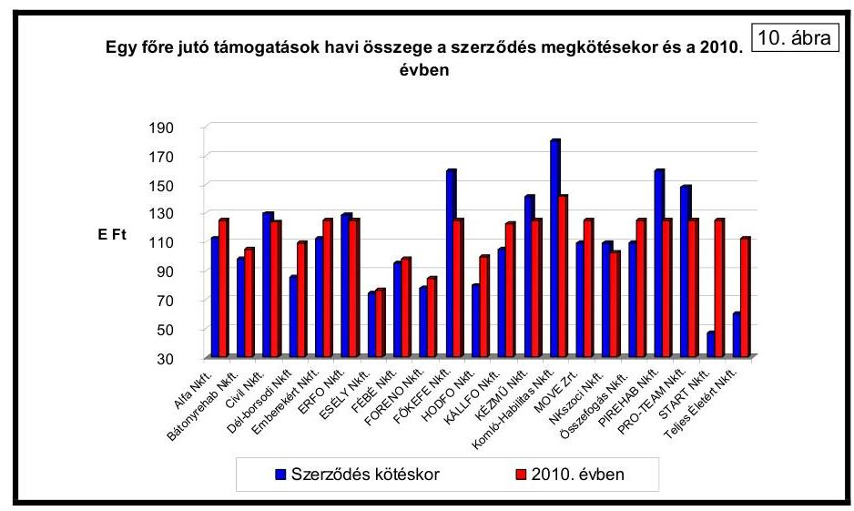

A támogatások megállapításánál a 2007-2010. években a foglalkoztatáshoz kapcsolódó költségeket vették figyelembe a 177/2005. (IX. 2.) Korm. rendelet 9. § (6) bekezdésében foglaltak szerint. Az egyes szervezeteknél az anyag- és személyi jellegű ráfordítások fajlagos támogatása jelentős eltéréseket mutatott. Ennek évenkénti alakulását a 3. számú melléklet tartalmazza.
2007. évben az egy főre jutó anyagjellegű ráfordítás 6-671 E Ft/fő/év, 2010. évben ez az érték 13-435 E Ft/fő/év között változott. A személyi jellegű ráfordítások nagysága 2007. évben 436-1822 E Ft/fő/év, 2010. évben 907-1574 E Ft/fő/év értékek között alakult.

Az anyagjellegű ráfordítások eltérésének oka a társaságok által folytatott tevékenységek és technológiák különbözősége. Az egy főre jutó támogatások 2007. és a 2010. évekre vonatkozó adatait a 4. számú melléklet tartalmazza.

A védett szerződéssel rendelkező szervezetekkel évenként megkötött háromoldalú (SZMM, illetékes munkaügyi központ és a támogatott szervezet) rehabilitációs költségtámogatásra vonatkozó szerződésekben - 2007-2010. évekre - meghatározták a vissza nem térítendő támogatás éves összegének és a megváltozott munkaképességű munkavállalók létszámának felső határát (a szerződésekben a „legfeljebb" jelzőt alkalmazták).

A 2011. évben a támogatás összegét a súlyos és nem súlyos fogyatékosság alapján egy fő megváltozott munkaképességű munkavállalóra határozták meg.

A 2011. évi támogatási szerződésben a maximálisan foglalkoztatható létszámot súlyos és nem súlyos fogyatékkal élő megváltozott munkaképességű munkavállalók bontásban rögzítették hivatkozással a 177/2005. (IX. 2.) Korm. rendelet 2. § (1) bekezdés e) pontban foglalt kategóriákra. Az egy fő súlyos fogyatékos személyre jutó támogatás maximális összege 2011. év I. félévében 725 E Ft, a II. félévben 660 E Ft; az egy fő nem súlyos fogyatékos személyre jutó támogatás maximális összege 580 E Ft a II. félévben 528 E Ft volt.

A megkötött támogatási szerződésekben 2011. II. félévében a támogatott létszám 1,8\%-kal volt magasabb az I. félévhez viszonyítva. 2011. II. félévében a 21 foglalkoztatónál a támogatott létszámon belül a súlyos fogyatékkal élő megváltozott munkaképességű munkavállalók létszámának aránya 37\%-kal növekedett a nem súlyosan fogyatékos megváltozottan munkaképes munkavállalók létszámának terhére. Három társaságnál a súlyos fogyatékkal élő megváltozott munkaképességű munkavállalók létszámának növekedése 29-361\% között volt (5. számú melléklet). Az egészségkárosodás éven belüli nagy mértékű változásánál magas a kockázata annak, hogy a munkavállalók átsorolása nem minden esetben egészségi állapotuk figyelembevételével történt.

A 2007-2009. években hat társaságnál a megváltozott munkaképességű munkavállalók létszámában jelentős növekedés történt, ennek oka a pénzügyi nehézségekkel küzdő, illetve a felszámolási eljárás alá került társaságoknál (UWYTA Kht., HUMÁN Kft., Rehabit Komplex Kft.) foglalkoztatott megváltozott munkaképességű munkavállalók átvétele volt.

A foglalkoztatás további folytatása érdekében az átvevő társaság az átadó 5 társaság részére megítélt és fennmaradó támogatás összegét is megkapta, 3 társaság az átvétel évében a foglalkoztatáshoz többlettámogatásban nem részesült.

Az átadó és átvevő társaságok adatait a következő táblázat mutatja be:

| Átvevő társaság | Foglalkoztatás   kezdő dátuma | Átadó társaság | mmk-s   létszám (fő) | Támogatás   összege   (E Ft) |
| :-- | :--: | :-- | :--: | :--: |
| ERFO Nkft. | 2007. 05. 01 | Agora Kft. | 895 | 1015252 |
| FŐKEFE Nkft. | 2007. 06. 01 | SAVARIA NETT PACK Kft. |  |  |
| FŐKEFE Nkft. | 2007. 07. 01 | Rehabit Komplex Kft. | 2180 | 2146605 |
| PIREHAB Nkft. | 2008. 10. 01 | UVYTA Kht. | 60 | - |
| MOVE Zrt. | 2008. 10. 01 | UVYTA Kht. | 37 | 16290 |
| PRO-TEAM Nkft. | 2008. 12. 01 | UVYTA Kht. | 77 | - |
| Emberekért Nkft.* | 2009. 08. 14 | HUMÁN Kft. | 100 | - |
| MOVE Zrt. | 2009. 11. 01 | Lux-Tex Kft. | 739 | 153010 |

* Tiszajenőn lévő telephely

A foglalkoztatottak átvétele - az Emberekért Nkft. és a MOVE Zrt. kivételével - jogutódlással történt, ami nem járt együtt vagyonmozgással. A létszám átvételt követően a foglalkoztatás a korábbi telephelyeken, az átadó társaságtól bérelt ingatlanokban és eszközökkel történt. A társaságok áttekintették az átvett telephelyek gazdaságos működtetésének lehetőségét és ennek következtében telephelyeket zártak be, illetve új telephelyet nyitottak.

A MOVE Zrt. a Lux-Tex Kft.-től átvett Nyíradony-Aradványpusztán lévő telephelyének 2010. január 1-jei bezárásáról döntött, és megszüntette az ott foglalkoztatott 37 fő megváltozott munkaképességű munkaviszonyát. A dolgozók pertársaságokat alapítva bírósághoz fordultak, amely jogszerűtlennek ítélte a munkáltató eljárását, ezért összesen 61500 E Ft megfizetésére kötelezte a társaságot.

Az átadó AGORA Kft., SAVARIA NETT-PACK Kft. esetében a létszám átvételéről az OFA, mint az állam tulajdonosi jogának gyakorlója, határozatban döntött. A létszám átadásokkal együtt a vagyonelemek átadása, a társaságok végelszámolása, a létszámot átvevő társaságokba történő beolvadása a helyszíni ellenőrzés időszakában nem történt meg. A két átadó társaság eszközeit, ingatlanjait a foglalkoztatást végző társaságok bérleti díj ellenében használták, illetve kölcsönszerződéseket kötöttek. A foglalkoztató társaságok részére a bérleti díj, a kamatok fizetése jelentős többletköltséget jelentett.

A 2007-2011. években a FŐKEFE Nkft. a SAVARIA NETT-PACK Kft.-nek 306800 E Ft-ot, az ERFO Nkft. az AGORA Kft.-nek 432000 E Ft bérleti díjat fizetett.

A REHABIT Komplex Kft. dolgozóinak 2007. július 1-jétől történő foglalkoztatásával járó átmeneti finanszírozási problémák megoldására az OFA - az OFA Kuratóriumának 42/2007. (VII. 19.) számú alapítói határozata alapján - 180 M Ft kamatmentes tulajdonosi kölcsönt nyújtott a FŐKEFE Nkft. részére, 2008. február 28-ai visszafizetési határidővel. A kölcsönt a FŐKEFE Nkft. a folyamatos likviditási problémák miatt az OFA részére nem tudta visszafizetni, azt az OFA a 2011. évben elengedte.

A munkavállalók folyamatos foglalkoztatása érdekében a FŐKEFE Nkft. és a SAVARIA NETT-PACK Kft. bérleti szerződést kötött a SAVARIA NETT-PACK Kft. tulajdonában lévő - illetve az általa is bérelt - ingatlanokra és eszközökre. A munkavállalók folyamatos foglalkoztatása során fellépő finanszírozási problémák megoldására a két társaság kölcsönszerződést is kötött. A kölcsön állománya a 2011. évi beszámoló szerint 283,5 M Ft volt.

Az állami tulajdonban lévő AGORA Kft. és a SAVARIA NETT-PACK Kft. - amelyek fölött a tulajdonosi jogokat az MNV Zrt. gyakorolja - a létszám átadása után megváltozott munkaképességű munkavállalókat nem foglalkoztattak. Bevételeiket a munkavállalókat átvevő társaságoktól kapott bérleti díjakkal, illetve a kölcsönök után fizetett kamatokkal növelték.

Az MNV Zrt. a 331/2011. (IX. 25.) számú határozatában a FŐKEFE Nkft. és a SAVARIA NETT-PACK Nkft. beolvadásával egyetértett.

Az ellenőrzés részére átadott dokumentumok alapján megállapítottuk, hogy az AGORA Kft. eszközeire jelentős adótartozás miatt a NAV jogerős végrehajtási joggal rendelkezik.

Az ellenőrzött szervezeteknél a munkáltatók által vállalt és ténylegesen foglalkoztatott megváltozott munkaképességű munkavállalók létszáma 2010. évig folyamatosan emelkedett, 2011. évben az előző évhez viszonyítva kis mértékben (mintegy 1\%) csökkent.

A ténylegesen foglalkoztatottak létszámának a 2007-2008. évek közötti 19,9\%-os, valamint a 2009-2010. évek közötti 5,1\%-os növekedését a pénzügyi nehézségekkel küzdő munkáltatóktól - évközben - átvett létszám eredményezte.

A megváltozott munkaképességű munkavállalók létszámának növekedése mellett az egy főre jutó támogatás (szerződésben vállalt) összege évről évre - 2007-2011. évek között - mintegy 30\%-kal csökkent.

A védett szervezeti szerződéssel történő foglalkoztatás önmagában nem járult hozzá az integrált (megváltozott munkaképességű munkavállaló és teljes értékű munkavállaló együttes foglalkoztatása) foglalkoztatás növeléséhez. Az ellenőrzött időszakban a védett szervezeti szerződéssel rendelkező társaságoknál a megváltozott munkaképességű munkavállalók tényleges aránya az összes foglalkoztatotthoz viszonyítva átlagosan 84\% volt (6. számú melléklet). A helyszínen ellenőrzött szervezetekre jellemző volt, hogy a megváltozott munkaképességű munkavállalók mellett - az összes létszámhoz viszonyítva mintegy 5-30\% - foglalkoztattak nem mmk-s munkavállalókat. (Az évenkénti foglalkoztatottak létszámának, ezen belül a megváltozott munkaképességű munkavállalók létszámának alakulását szervezetenként a 7. számú melléklet tartalmazza.)
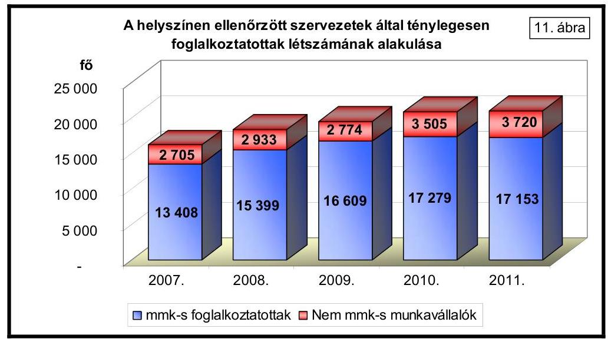

Az adatok alapján megállapítható, hogy a védett szervezeti szerződéssel rendelkező munkáltatóknál a 2010. és 2011. években a nem mmk-s foglalkoztatottak száma és aránya is növekedett.

Az integrált foglalkoztatás bővülése a megváltozott munkaképességű munkavállalókkal kapcsolatos programok célkitűzéseinek, illetve a fogyatékos személyek jogairól és esélyegyenlőségük biztosításáról szóló 1998. évi XXVI. törvény 15-16. §-aiban foglaltak, valamint a nemzetközi elvárások, a folyamatok megvalósulásának irányába hatnak.

Az ellenőrzött védett szervezeteknél az integrált foglalkoztatás a szervezeten belül megvalósult, azonban a megváltozott munkaképességű munkavállalók foglalkoztatása a nyílt munkaerő-piacra való visszavezetésükhöz a személyre szabott rehabilitációs tervek ellenére nem járult hozzá. A munkaképesség csökkenésből eredően a megváltozott munkaképességű munkavállalók nagy részének szüksége volt a folyamatos rehabilitációs tevékenységre és szükség szerint a segítő személy által nyújtott segítségre.

Az ellenőrzött szervezetek eltérő arányban foglalkoztattak a megváltozott munkaképességű munkavállalók mellett nem mmk-s
 munkavállalókat.

A nem megváltozott munkaképességű dolgozókat elsősorban az adminisztráció és az irányítás területén, valamint a nagyobb szaktudást - faipar, nyomda, varroda - igénylő munkaterületeken, továbbá a nehéz fizikai munkát igénylő munkáknál - anyagmozgatás - foglalkoztatták.

Az ERFO Nkft. és a KÉZMŰ Nkft. az intézményi ellátottak részére az intézmények területén fejlesztő-felkészítő műhelyeket alakított ki, ezzel segítve a megváltozott munkaképességű ellátottak mentális fejlődését, valamint a munkaerő-piacra történő visszatérésüket.

A rehabilitációs költségtámogatás a helyszínen ellenőrzött társaságoknál ellensúlyozta a megváltozott munkaképességű munkavállalók foglalkoztatásával kapcsolatos többletköltségeket, ezzel hozzájárult a társaságok eredményes gazdálkodásához. Ennek ellenére 2011. évben a társaságok 46,1%-a (6 db) veszteséget realizált, melyből 3 állami tulajdonú társaság volt. (Mérleg szerinti eredmény és adófizetési kötelezettség alakulását a 8. számú melléklet tartalmazza). A megváltozott munkaképességű munkavállalókat foglalkoztató társaságok számára a jogszabályok és a támogatási szerződések a foglalkoztatással kapcsolatban mérhető célokat, gazdálkodásukkal kapcsolatban elvárásokat nem fogalmaztak meg. Nem határozták meg a saját bevételekből (árbevétel) a rehabilitációs foglalkoztatás fejlesztésére és működtetésére fordítandó összeg nagyságrendjét.

A támogatási szerződésekben csak a támogatással szemben elszámolható költségek körére és nagyságrendjére határoztak meg követelményeket. A gazdálkodás eredményességével, az árbevétel nagyságával, a személyi jellegű egyéb ráfordításokkal, a dolgozói létszám szakképesítésével, a kifizetett bérek alakulásával, valamint a vezetők és a dolgozók létszámának megoszlásával kapcsolatban célkitűzéseket nem fogalmaztak meg, így ezek nagysága, jogszerűsége a feladatellátás érdekében való indokoltsága nem értékelhető.

Az ellenőrzött társaságok közül 2011. évben a KÉZMŰ Nkft., a FŐKEFE Nkft. és az ERFO Nkft. jelentős veszteséget ért el.

A FŐKEFE Nkft. saját tőkéje a veszteség hatására negatív lett. A tulajdonos MNV Zrt. részéről a helyszíni ellenőrzés lezárásáig a negatív saját tőke megszüntetésére intézkedés nem történt.

A helyszíni ellenőrzés során megállapítottuk, hogy a gazdasági társaságok az Szt.-ben meghatározott szabályzatokkal (számviteli politika, pénzkezelési szabályzat, eszközök és források értékelési szabályzata, leltározási szabályzat és önköltség számítási szabályzat) rendelkeztek. A főkönyvi számlák alábontása és az analitikus nyilvántartások a kapott támogatások elkülönített nyilvántartását biztosították.

A fejlesztésekhez a társaságok fejlesztési célú támogatásokat vettek igénybe, amelyet saját forrásokkal egészítettek ki, valamint a munkafolyamatokhoz szükséges - munkafeltételeket javító - eszközbeszerzéseket, saját tulajdonú ingatlan felújításokat végeztek.

A helyszínen ellenőrzött társaságok közül 10 társaság a 2007-2011. években az anyagjellegű kiadások között bérleti díj, szállítási és raktározási szolgáltatás címén 5823690 E Ft-ot mutatott ki, melyek 25%-a után 1469614 E Ft rehabilitációs költségtámogatást vett igénybe. Ez az érték a támogatást nyújtó által kiadott útmutatóban foglaltaknak megfelelt.

Az ellenőrzött 13 társaság közül igénybevett anyagjellegű szolgáltatásai között négy (FŐKEFE Nkft., PIREHAB Nkft., PRO-TEAM Nkft., KÉZMŰ Nkft.) társaság mutatott ki alvállalkozók felé történt kifizetést. A társaságok kifizetései 3-5%-át tették ki az összes anyagjellegű ráfordításnak.

A társaságok gazdálkodási eredményére hatással volt a vezető tisztségviselők és a felügyelőbizottságok tagjai részére kifizetett járandóság, illetve az alapítóktól igénybevett szolgáltatásokra történt kifizetés is. (A helyszínen ellenőrzött szervezetek vezető tisztségviselőinek juttatását a 9. számú melléklet tartalmazza).
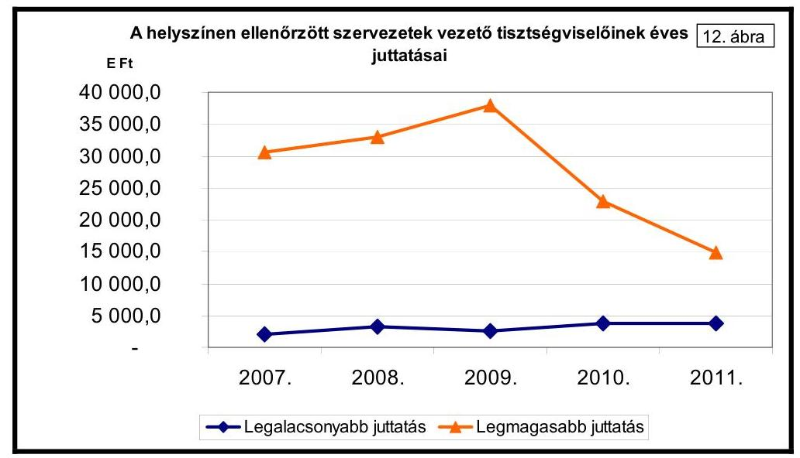

Az ellenőrzött időszakban a vezető tisztségviselők juttatásai - a 2010. és 2011. évi csökkenés ellenére - 13 társaság átlagában 6869 E Ft-ról 9843 E Ft-ra emelkedtek. Ez 43%-kal magasabb a 2007. évi juttatások átlagos összegénél.

A helyszínen ellenőrzött társaságok közül 2011. évben hét társaság felügyelőbizottsága tagjai részére fizettek tiszteletdíjat. Hat társaságnál a felügyelőbizottság tagjai ellenszolgáltatás nélkül végezték feladatukat.

A PRO-TEAM Nkft. felügyelőbizottság tagjai a 2008-2010. években évi 23002400 E Ft juttatásban részesültek, 2011. évben ez az összeg több mint a felére csökkent.

A szervezetek évenkénti támogatási kérelmét ellenőrző könyvvizsgáló a 2008. évi támogatási igények felülvizsgálatáról készített értékelésében jelezte a felső vezetés magas bérarányát, javaslata is hozzájárult a védett szervezetek támogatási igényeinek csökkentéséhez.

A támogatások felhasználásának ellenőrzését végző MONETA Kft. 2009. évi ellenőrzésekről készített összegző jelentésében észrevételezte, hogy egyes szervezetek vezető beosztású munkavállalói részére kiemelt nagyságú munkabért folyósítottak, anélkül, hogy a társaság gazdasági helyzete ezt indokolta volna.

A társaságok helyszíni ellenőrzése során az ÁSZ hiányosságokat állapított meg:

- A Dél-borsodi Nkft.-nél az ellenőrzött időszak személyhez nem köthető költségeiből véletlen számú mintavételezéssel kiválasztott 80 darab mintából 37 bizonylat nem tartalmazta az ellenőr, valamint a készletmozgásoknál az átvevő aláírását, ezzel a társaság megsértette az Szt. 167. § (1) bekezdés c) pontjában foglalt alaki és tartalmi előírásokat.
- Az Emberekért Nkft. és a MOVE Zrt. a 2009-2011. években a szállítással kapcsolatos költségek között a szállítás érdekében felmerült rakodási költségeket (targoncához üzemanyag, gépi rakodás) is elszámoltak, annak ellenére, hogy 2009. évtől ezen a jogcímen csak a telephelyek közötti szállítással (idegen szállító számlája, üzemanyag, gépkocsivezető bére, biztosítás) kapcsolatos költségek számolhatók el ${ }^{37}$.
- Az ERFO Nkft. a megváltozott munkaképességű munkavállalók munkaalkalmassági vizsgálatának költségei között számolta el a 2008. évi rehabilitációs vizsgálat költségeit, ezen költségek után is igénybe vette a támogatást. Ez ellentétes volt a támogatást nyújtó által kiadott útmutatóban leírtakkal.

# 2.2. A költségvetési támogatási rendszer működtetésével elért eredmények 

Eredményességi és hatékonysági célkitűzéseket, azok számszerű meghatározását a megváltozott munkaképességűek foglalkoztatásával kapcsolatos jogszabályok, a megkötött támogatási szerződések nem tartalmaztak.

A megváltozott munkaképességű munkavállalók támogatásának eredményessége a foglalkoztatás vonatkozásában az ellenőrzött időszakban összességében romlott. A foglalkoztatott létszám változása a három támogatástípuson belül eltérő tendenciát mutat ${ }^{38}$.

[^0]
[^0]:    ${ }^{37}$ 21/2008. (XII. 31.) SZMM rendelet a megváltozott munkaképességű személyek foglalkoztatásához nyújtható költségvetési támogatás megállapításának részletes szabályairól szóló 15/2005. (IX. 2.) FMM rendelet módosításáról.
    ${ }^{38}$ A 2007. évi adatok csak fél évre vonatkoznak, mivel ebben az évben indult az új támogatási rendszer, ezért ezt az évet kiinduló adatnak tekintjük.

---

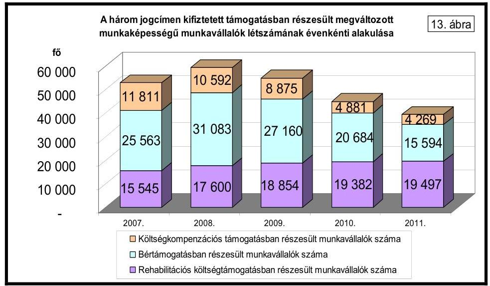

A költségkompenzációs támogatásban részesült szervezeteknél foglalkoztatott megváltozott munkaképességű munkavállalók létszáma 2008. évről 2011. évre 60%-kal - 10592 főről 4269 főre - csökkent. A bértámogatásban részesült szervezeteknél alkalmazott munkavállalók száma a 2008. évhez képest 2011. évre 50%-kal csökkent. A bér és a költségtámogatásban részesült munkavállalók létszám adata a kimutatásokban halmozódást ${ }^{39}$ tartalmaz. A helyszíni ellenőrzés során megállapítottuk, hogy hét szervezet a költségkompenzációs támogatás mellett bértámogatást is igénybe vett. Az ellenőrzés részére átadott az egyes támogatásokra vonatkozó tanúsítványok alapján a halmozódást (párhuzamosságot) nem tudtuk kiszűrni.

A rehabilitációs költségtámogatásból foglalkoztatott megváltozott munkaképességűek létszáma évről-évre folyamatosan - összesen 1897 fővel - 10,8%-kal nőtt. Ez önmagában nem járult hozzá az integrált (megváltozott munkaképességű munkavállaló és nem megváltozott munkaképességű munkavállaló) foglalkoztatás növekedéséhez. A helyszínen ellenőrzött védett szervezeti szerződéssel rendelkező szervezeteknél ${ }^{40}$ a megváltozott munkaképességű munkavállalók mellett 5-30%-ban foglalkoztattak nem megváltozott munkaképességű munkavállalókat is. Ez az arány az ellenőrzött időszak végéig alapvetően nem változott.

A megváltozott munkaképességű munkavállalók foglalkoztatásának támogatására a 2007-2011. években 202 Mrd Ft-ot fizettek ki, amely évenkénti alakulását a következő ábra szemlélteti.

[^0]
[^0]:    ${ }^{39}$ A hazai és az uniós jogszabályok összhangját teljes körűen 2009. január 1-jétől teremtették meg, mert a kormányrendeletben meghatározott bértámogatásból a munkahelyi segítő személy foglalkoztatásához nyújtott támogatás nem felelt meg a 800/2008/EK Bizottsági rendelet előírásainak. A jogszabály módosítást követően ezt a támogatást a költségkompenzációs forrás terhére folyósították.
    ${ }^{40}$ Védett szervezeti szerződést azokkal a szervezetekkel kötött az FMM, illetve az SZMM, akik vállalták olyan személyek foglalkoztatását, akiknek a nyílt munkaerő-piacon történő foglalkoztatására nincs lehetőség.

---

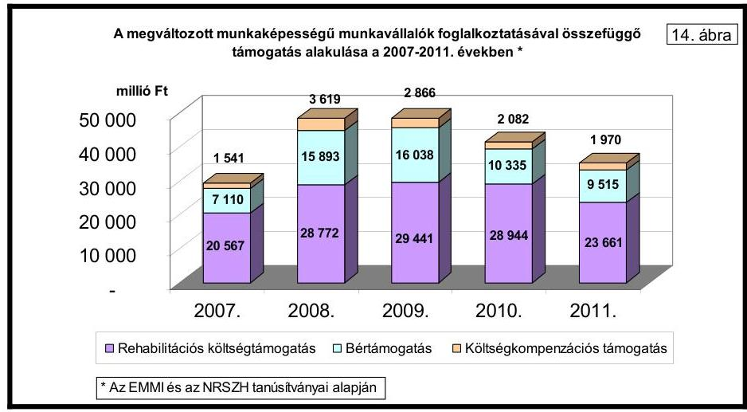

Az ellenőrzött időszakban az összes támogatás 60-70%-át rehabilitációs költségtámogatásra a 21 védett szervezeti szerződéssel rendelkező munkáltató részére fizették ki. A bértámogatás összege a 2008. évhez képest 2009. évre növekedett, majd 2010. évben az előző évhez viszonyítva 36%-kal csökkent. Az előirányzat a 2010. évig ún. felülről nyitott (előirányzat módosítás nélkül teljesülő) volt. Az ezt követő időszakban az RMK ${ }^{41}$-k részére a minisztérium éves keretösszeget határozott meg. A 2010. évről 2011. évre 7,9%-kal tovább csökkent, amelyben közrejátszott az akkreditációs követelmények - kérelmet csak kiemelt tanúsítvánnyal rendelkező és minimum 20 fő alkalmazottat foglalkoztató munkáltató adhatott be - szigorítása. A költségkompenzációs támogatásokra kifizetett összegek csökkenésének oka, hogy a támogatott szervezetek száma 53-ról 35-re változott.

A munkáltatónak az egy fő megváltozott munkaképességű munkavállaló után nyújtott támogatás évenkénti összege a rehabilitációs költségtámogatásnál 2008. évtől folyamatosan csökkent. A társaságok a támogatás összegének év-ről-évre történő csökkentésére reagálva lecsökkentették a megváltozott munkaképességű munkavállalók munkaidejét és növelték a megváltozott munkaképességű munkavállalók létszámát. A költségkompenzációs és bértámogatás esetében az egy főre jutó támogatás összege növekedett.

Az éves támogatások fajlagos mutatójának alakulása alapján - az eltérő munkaidőben foglalkoztatott munkavállalók teljes munkaidőre történő átszámítása hiányában - a támogatások hatékonysága reálisan nem ítélhető meg. ${ }^{42}$

Az egy megváltozott munkaképességű munkavállalóra jutó éves támogatás egyes jogcímeken kifizetett összegének alakulását a következő ábra szemlélteti.

[^0]
[^0]:    ${ }^{41}$ Regionális Munkaügyi Központ
    ${ }^{42}$ A foglalkoztatott létszám meghatározása nem függvénye a napi ledolgozott munkaidő hosszának.(4 órában és 8 órában foglalkoztatott munkavállaló között nem tesz különbséget, mindkettőt egy főnek számítja).

---

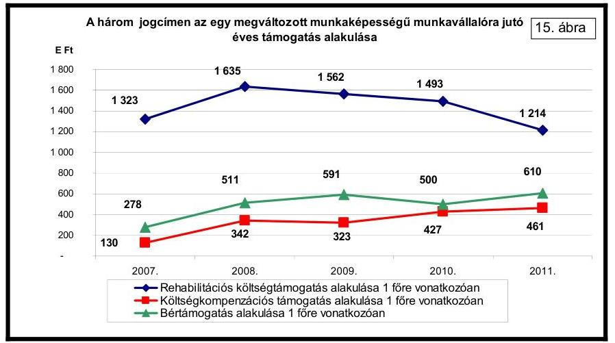

Az EMMI Foglalkozási Rehabilitációs Főosztálya az ellenőrzés részére az eredményességi és hatékonysági célkitűzéseket megfogalmazó dokumentációkat nem tudott átadni, melyet a 2012. július 12-én felvett jegyzőkönyvben rögzítettünk.

Valamennyi támogatás nyújtásának feltételeként kikötötték a foglalkozási rehabilitációs tevékenység folytatását szakmai program alapján, illetve az alkalmazottankénti személyes rehabilitációs terv elkészítését. Ezekhez kapcsolódóan azonban eredményességi kritériumot nem írtak elő.

Az EMMI az ellenőrzés részére nem tudott dokumentációt átadni arra vonatkozóan, hogy a támogatásokra kiírt pályázatok elbírálásánál, a támogatások elosztásának meghatározásánál figyelembe vették, elemzésekkel, számításokkal megalapozták-e az esélyegyenlőségi elvek - minden pályázó részére az egyenlő hozzáférés - érvényesülését.

A két fejezeti kezelésű előirányzat terhére a megváltozott munkaképességű munkavállalók foglalkoztatásához nyújtott támogatások (bér, költségkompenzációs és rehabilitációs költség) a társaságok székhelye szerinti területi megoszlása az ellenőrzött időszakban - az EMMI és az NRSZH tanúsítványai alapján - a következők szerint alakult:
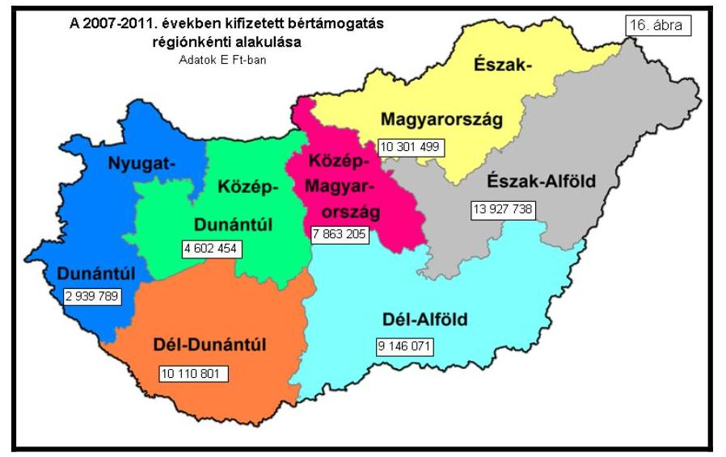

A bértámogatásban részesülő munkáltatók közül az ellenőrzött időszakban az Észak-Alföldi régióban működő munkáltatók részére nyújtott támogatás az összes támogatás 23,6%-a volt. A Közép- és Nyugat-Dunántúli régió részesedése a támogatásokból 10% alatti volt, míg a többi régió átlagosan 15%-os részesedéssel rendelkezett.
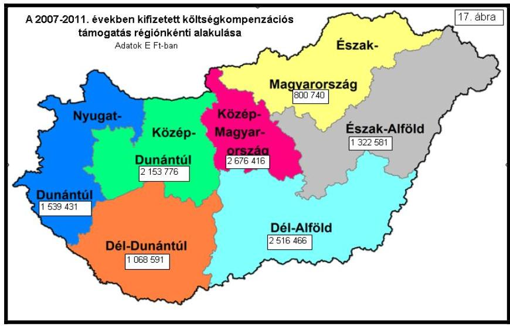

A költségkompenzációs támogatás esetében az ellenőrzött években a támogatott munkáltatók száma 53 szervezetről 35-re, a foglalkoztatott megváltozott munkaképességű munkavállalók átlagos létszáma 11811 főről 4269 főre csökkent. A Közép-Magyarországi régió a támogatások 22%-át, a Dél-Alföldi régió a támogatások 21%-át kapta meg, míg az Észak-Magyarországi és a Dél-Dunántúli régió 7-9% részesedéssel rendelkezett, a többi három régió részesedése 11-18% között szóródott.

A csökkenés egyik oka az volt, hogy bértámogatás nyújtásához az új kérelmek befogadása - 2009. augusztus 31. és 2009. december 31. között - szünetelt. A szervezetek szerződésben foglalt támogatási határidejének megszűnését követően csak a kiemelt tanúsítvánnyal rendelkező szervezetek adhattak be új
 kérelmet, ez a támogatottak létszámának csökkenését okozta. (Az akkreditált munkáltatók közel 66%-a alaptanúsítvánnyal rendelkezett, ugyanakkor az alaptanúsítvánnyal rendelkező munkáltatóknál a támogatással foglalkoztatottak létszáma átlagosan nem haladta meg a 20 főt.)

---

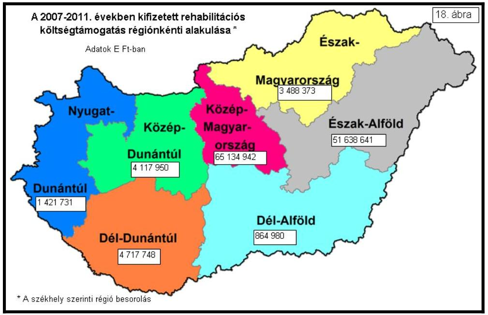

A védett szervezeti szerződéssel rendelkező munkáltatók területi (székhely szerinti ${ }^{43}$ ) eloszlásában alapvetően két régió emelkedik ki. A Közép-Magyarországi régió hat munkáltatója az összes rehabilitációs költségtámogatás 50%-át, az Észak-Alföldi régió öt munkáltatója 39%-át használta fel. A további öt régióban összesen 10 védett szervezeti szerződéssel rendelkező munkáltató az összes rehabilitációs költségtámogatás 11%-át vette igénybe.

# Az egyes támogatási jogcímekből támogatásban részesült megváltozott munkaképességű munkavállalók területi megoszlása egyenlőtlenséget mutatott. Nyilvántartás hiányában nem állapítható meg, hogy ez arányban volt-e a régióban foglalkoztatható megváltozott munkaképességű személyek létszámával.

Az ÁSZ a helyszíni ellenőrzés során megállapította, hogy a társaságok eleget tettek a védett szervezeti szerződésben vállalt - a nyílt munkaerő-piacon nem foglalkoztatható személyeket alkalmazásával kapcsolatos - kötelezettségüknek. Az esetleges kieső munkavállalókat azonos szakmacsoportba tartozókkal pótolták.

A szerződésben vállalt létszám betartását a 2006-2009. években három társaságnál a MONETA Kft., egynél pedig az illetékes munkaügyi központ is ellenőrizte. A 2009. évet követően védett szervezeti szerződésben vállalt létszám vizsgálatára a külső ellenőrzések nem tértek ki.

A féléves és éves beszámolókban a támogató nem kért adatszolgáltatást a védett szervezeti szerződésben előírt létszám adatok betartására vonatkozóan. Ezzel a védett szervezeti szerződés megkötésének legfőbb feltételét nem ellenőrizték.

[^0]
[^0]:    ${ }^{43}$ Székhely szerinti: A társaságok részére kifizetett támogatás a támogatási szerződésben szereplő székhely szerinti régióban került kimutatásra.

---

A rehabilitációs foglalkoztatást elősegítő költségvetési előirányzatból nyújtható bértámogatás igénybevételének szerződésben vállalt kötelezettségeit az ÁSZ a helyszínen ellenőrizte. Az ellenőrzés során hiányosságot nem állapított meg.

A bértámogatás igényléséhez pályáztatási rendszer nem kapcsolódott. Amennyiben a munkáltató és a támogatással foglalkoztatni kívánt munkavállaló megfelelt a jogszabályi feltételeknek, úgy a bértámogatásokat meg kell ítélni, így a bértámogatáshoz kapcsolódóan a területi esélyegyenlőségi szempontok érvényesülése nem értelmezhető.

Az előirányzat 2010. évig ún. felülről nyitott - előirányzat módosítás nélkül teljesülő - előirányzat volt. A felhasználható kereteket munkaügyi központokra határozták meg.

Az ellenőrzött társaságoknál a megváltozott munkaképességű munkavállalók bértámogatása a társaság összes személyi jellegű kiadására az alábbiak szerint nyújtott fedezetet:
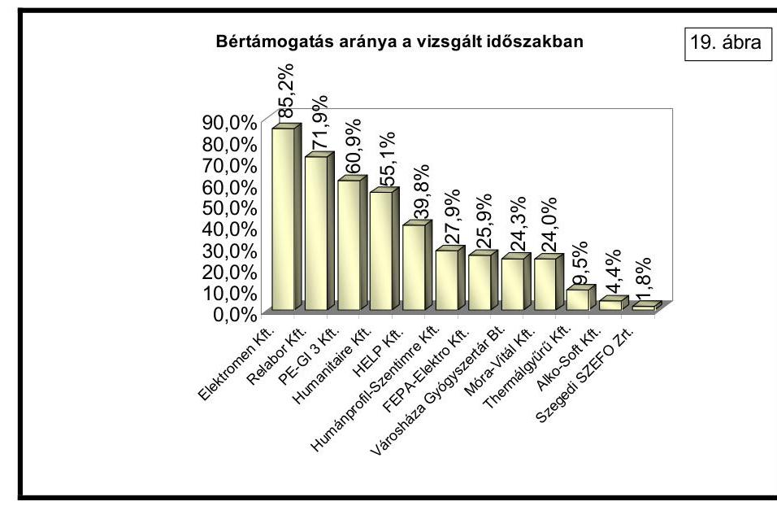

A helyszíni ellenőrzés során megállapítottuk, hogy a költségkompenzációs támogatásban részesült Humán Foglalkoztató Kft. ellen 2009. évben felszámolási eljárás indult. Az ellenőrzés megállapításait a jelentés 3.2. pontja tartalmazza. Az Agria-Humán Kft. 2006-2009. évek számviteli dokumentumait bűncselekmény gyanújával az Egri Városi Rendőrkapitányság 2011. június 13-án lefoglalta. Az ÁSZ 2012. július 3-án hivatalosan kérte a Rendőrkapitányságtól a dokumentumba történő betekintést. A helyszíni ellenőrzés végéig írásos válasz az ÁSZ-hoz nem érkezett. A helyszíni ellenőrzésre kijelölt hat társaságból három társaságnál az ellenőrzés a szerződésben foglaltak betartásával kapcsolatban hiányosságot nem állapított meg.

A helyszíni ellenőrzésre kijelölt védett szervezeti szerződéssel rendelkező társaságoknál megállapítottuk, hogy a támogatásokra történt kifizetések a szerződéskötések elhúzódása következtében finanszírozási nehézséget okozott. Ezt a

---

körülményt befolyásolta az is, hogy a támogatások kifizetése utófinanszírozással történik.

A társaságok a likviditást - elsősorban bér és járulékfizetést - pénzintézeti hitellel (folyószámlahitel, rulírozó hitel, támogatás megelőlegezési hitel), a tulajdonostól kapott kölcsönnel biztosították. A társaságok likviditási gondjainak enyhítése érdekében a támogató a 2009. évtől - bértámogatás kivételével - kétháromhavi előleg kifizetését engedélyezte, amelyet később figyelembe vettek a havi támogatási összegek kiutalásánál.

A PIREHAB Nkft. részére a tevékenység folytatásához a PIREMON Nkft. 2007. szeptemberében 400 M Ft kölcsönt adott. A kamat mértéke a báziskamattal egyező volt.

Az ALFA Nkft. 2007. július 13-án kötött megállapodást az ALFA Ipari Zrt-vel 60 M Ft összegű kölcsön igénybevételére, amelynek kamata megegyezett a jegybanki alapkamat mindenkori mértékével.

Az Emberekért Nkft. részére a tulajdonos gazdasági társaság kölcsönt biztosított, amelynek nagysága az ellenőrzött időszakban változott. A legkisebb összeg 134700 E Ft, a legnagyobb 359300 E Ft volt. A kölcsönök után a kamatot a jegybanki alapkamat + 5%-ban állapították meg. Az ellenőrzött időszakban 34 M Ft kamatot fizettek ki.

A MOVE Zrt. tagi kölcsönt és 116000 E Ft folyószámlahitelt vett igénybe, a hitel után az ellenőrzött időszakban 17,2 M Ft kamatfizetési kötelezettsége keletkezett. A tagi kölcsönt kamat nem terhelte.

A helyszínen ellenőrzött társaságok közül az ellenőrzött időszakban - a társaságok kimutatása szerint - 12 társaság részesült 1226097 E Ft további támogatásban.

- A 8/1983. (VI. 29.) EüM-PM együttes rendelet alapján 2007. I. félévében nyolc társaság 311009 E Ft támogatást (dotációt) kapott.
- Munkahely megőrző, teremtő beruházások, fejlesztések megvalósításához nyolc társaság kapott 538590 E Ft-ot.
- A TÁMOP program keretében öt társaság 158577 E Ft bértámogatásban részesült. A bértámogatásban részesített dolgozókat a rehabilitációs támogatás igénylésénél nem vették figyelembe.
- Az állami tulajdonban lévő három társaság a 2011. évi adó- és járulékszámítási szabályok módosulása miatt a nettó bércsökkenés és annak járulékvonzata kompenzációjaként összesen 106126 E Ft bérkompenzációs támogatást kapott az MNV Zrt-től.
- Önkormányzati hozzájárulásban két társaság részesült 111795 E Ft összegben.

---

# 3. A TÁMOGATÁSI PROGRAMOK ELLENŐRZÉSI, BESZÁMOLÁSI ÉS ÉRTÉKELÉSI RENDSZERE 

### 3.1. Az ellenőrzési rendszer kialakítása és működtetése

A támogatások felhasználásának ellenőrzési rendszerét a 2007-2011. évekre vonatkozóan kialakították.

A támogatott munkáltatóknál a jogszabályban meghatározottak alapján több szervezetnek volt ellenőrzési jogköre. A 15/2005. (IX. 2.) FMM rendelet 7. § (1) bekezdésében határozták meg, hogy „a támogatásban részesülő munkáltatókat az Állami Számvevőszék, a Kormányzati Ellenőrzési Hivatal, illetve a kirendeltség, a munkaügyi központ, a Hivatal, az FMM, továbbá - a támogatások felhasználása tekintetében - az APEH ellenőrzi" (Hatályos: 2008. december 31-ig).

Az ellenőrzött időszakban a két fejezeti kezelésű előirányzatból megvalósított támogatások felhasználásával kapcsolatos ellenőrzések rendjét - az FMM rendelettel összhangban - a minisztérium eljárásrendekben szabályozta.

A támogatások ellenőrzésére az „Eljárásrend a rehabilitációs foglalkoztatáshoz nyújtható költségkompenzációs támogatás, valamint a rehabilitációs költségtámogatás szabályainak alkalmazásáról" szóló az SZMM államtitkár által 2006. szeptember 8-án jóváhagyott eljárásrend tartalmazott előírásokat. Az eljárásrend 4.2. pontjában rögzítették, hogy a munkaügyi központ vizsgálja a szerződésben rögzített kötelezettségek teljesítését, így különösen - negyedévenként - a munkabér és járulékaik megfizetését, valamint hatósági ellenőrzést folytat. A jogszabályváltozások nyomon követését tartalmazó, aktualizált eljárásrendeket az ÁSZ kérése ellenére nem adtak át.

A bértámogatás ellenőrzésével kapcsolatban a „HEFOP 1.2. Intézkedés 1.1.2.4. Projekt A hatósági és ellátási tevékenység adminisztrációjának korszerűsítése 2.0 verzió V. Témacsoport Bér- és járulékalapú támogatásokról" szóló 2006. január 1-jétől hatályos FMM miniszter által kiadott eljárásrend tartalmazott előírásokat. Ezt a szabályozást 2007. július 1-jétől a 3/2007. ÁFSZ utasítás váltotta fel, amely „Eljárásrend a megváltozott munkaképességű munkavállalók foglalkoztatásához költségvetési előirányzatból nyújtható bértámogatásról" címen jelent meg. A következő időszakokban 2011-ig az eljárásrendet 6 alkalommal módosították. Jelenleg az NRSZH főigazgatója által kiadott 7/2011. számú utasítás van érvényben, melynek 9. pontja tartalmazza a támogatások ellenőrzésére vonatkozó előírásokat és az ellenőrző szervezetek felsorolását.

A 15/2005. (IX. 2.) FMM rendelet 2008. december 31-ei módosítását követően az ellenőrzésre jogosult szervezetek köre megváltozott.

A hivatkozott FMM rendelet 7. § (1) bekezdése alapján „a támogatásban részesülő munkáltatókat a külön jogszabályban meghatározott szerveken kívül az SZMM, illetőleg az általa megbízott személy vagy szervezet, továbbá a regionális munkaügyi központ ellenőrzi."

A 2007-2009. években a megváltozott munkaképességű munkavállalók foglalkoztatásának rehabilitációs költségtámogatás, valamint a költségkompenzációs támogatás felhasználásának ellenőrzésére az SZMM - a közbeszerzési eljárásokat követően - a MONETA Kft-vel kötött vállalkozási szerződéseket.

A MONETA Kft. tevékenysége a támogatás pénzügyi, valamint a támogatottak féléves és éves beszámolóinak ellenőrzésére terjedt ki. A Kft. feladata volt annak megállapítása, hogy a támogatás igénybevétele megfelelt-e a 177/2005. (IX. 2.) Korm. rendeletben és egyéb jogszabályokban, valamint a támogatási szerződésben előírtaknak. Ellenőriznie kellett továbbá, hogy az igénybevett támogatás felhasználásáról szóló beszámoló megfelel-e a valóságnak és a számviteli előírásoknak. A megállapítások alapján feladata volt a záró beszámolóról könyvvizsgálói vélemény kiadása. A szerződésben rögzítették a keletkezett iratanyag hét évig történő megőrzési kötelezettségét is.

A 2010. január 1-jétől a központi költségvetési forrásból támogatott rehabilitációs költségtámogatás és költségkompenzációs támogatás pénzügyi ellenőrzését a 177/2005. (IX. 2.) Korm. rendelet 12. § (5) bekezdésében foglaltak alapján a Kincstár végzi. Az ellenőrzési feladatot a Kincstár - a 2/2011. (I. 14.) NGM utasítással jóváhagyott - szervezeti és működési szabályzatában rögzítették.

A Kincstár elkészítette a rehabilitációs költségtámogatás és a költségkompenzációs támogatás ellenőrzésről szóló 2010. január 1-jétől hatályos eljárásrendjét, mely a 23/2010. számú Elnöki Utasítás mellékleteként „A megváltozott munkaképességű munkavállalók foglalkoztatásához nyújtott költségvetési támogatások kincstári ellenőrzésének eljárásrendje" címen jelent meg. Az eljárásrend tartalmazza az ellenőrzés szabályait, folyamatát, módszereit, szempontjait, az ellenőrzési nyomvonalat. Az eljárásrendet 2011. január 1-jétől a 25/2011. számú Elnöki Utasítással módosították.

A Kincstár ellenőrzése során feltárt jogosulatlanul igénybevett támogatások nyilvántartása, valamint határozatok meghozatala az NRSZH feladata.

Az ellenőrzött időszakban a megváltozott munkaképességű munkavállalók rehabilitációs foglalkoztatását elősegítő bértámogatás és a munkahelyi segítő személy foglalkoztatásával kapcsolatos költségekhez nyújtott költségtámogatás ellenőrzését 2007-2010. évek között az RMK-k, 2011. évtől a kormányhivatalok munkaügyi központjai végezték.

Az eljárásrendben a támogatottak helyszíni ellenőrzésre történő kiválasztásához szempontrendszert nem határoztak meg.

A NRSZH, korábban FSZH eljárásrendjében foglaltak szerint a kérelmek elbírálásának, a hatósági szerződések teljesítésének ellenőrzése a munkaügyi központ által folytatott belső ellenőrzéssel valósult meg. A támogatás jogszerűségét - már az ügyintézés folyamatában is - a munkaügyi központ a hatósági ellenőrzés szabályainak eljárási rendjében foglaltaknak megfelelően folyamatosan ellenőrzi.

A rehabilitációs költségtámogatás és költségkompenzációs támogatás ellenőrzéseinek folyamatában kockázatelemzésen alapuló kiválasztási rendszer nem működött. A támogatások felhasználásának ellenőrzése pénzügyi ellenőrzés volt. A MONETA Kft. ellenőrzési feladatait vállalkozási szerződésben rögzítették.

---

A MONETA Kft. a költségkompenzációs támogatások felhasználását nem teljes körűen, vagyis a helyszínen nem minden támogatott munkáltatónál ellenőrizte, mivel azt a szerződésében nem kötötték ki.

A 2007. június 25-én aláírt vállalkozási szerződés szerint a MONETA Kft. a rehabilitációs költségtámogatás felhasználását 7 védett támogatási szerződéssel rendelkező szervezetnél, a költségtámogatás felhasználását „maximum 11 cég"-nél volt köteles elvégezni. A vállalkozási szerződés 2007. szeptember 27-ei módosítása további 25 támogatást nyert szervezet vonatkozásában írta elő az ellenőrzési kötelezettséget. Egyik vállalkozási szerződés sem tartalmazott információt a szervezetek kiválasztásának módszerére.

A Kincstár 2010. évtől minden költségkompenzációs támogatásban, illetve rehabilitációs költségtámogatásban részesülő támogatottat negyedévente ellenőriz.

A bértámogatások ellenőrzése az ellenőrzött időszakban a munkaügyi központ által folytatott belső ellenőrzéssel valósult meg. Az ellenőrzés a bér- és járulékalapú támogatások iránti kérelmek elbírálásának és a hatósági szerződések teljesítésének ellenőrzésére terjed ki. A helyszíni ellenőrzésre kijelölt támogatottak kiválasztása nem kockázatelemzéssel történt.

# 3.2. Az ellenőrzések által feltárt szabálytalanságok, jogosulatlan támogatás igénybevétele miatt hozott szankciók és azok realizálása 

A két fejezeti kezelésű előirányzat terhére történő támogatások kifizetésének teljesítése utófinanszírozás keretében valósult meg.

A megváltozott munkaképességű munkavállalók foglalkoztatását elősegítő bértámogatás felhasználásának ellenőrzését - a 2007-2011. években - az RMK-k végezték.

A helyszíni ellenőrzés
 során megállapítottuk, hogy a bértámogatás helyszíni ellenőrzésére kiválasztott 12 támogatott szervezet közül a munkaügyi központok 2007-2011. évekre vonatkozóan kilenc szervezetnél nem végeztek helyszíni ellenőrzést.

A helyszíni ellenőrzések a három ellenőrzött szervezetnél adminisztrációs hiányosságokat állapítottak meg, amelyek hiánypótlására felszólították az érintett társaságokat. A feltárt hiányosságokat a társaságok minden esetben megszüntették.

Az ellenőrzött időszakban a rehabilitációs költségtámogatás és a költségkompenzációs támogatás felhasználásának ellenőrzését a MONETA Kft. és a Kincstár végezte. Az ellenőrző szervezetek jelentéseikben több esetben jeleztek a minisztériumnak, illetve a kezelő szervezeteknek a jogosulatlanul igénybevett támogatás felhasználásokat, amelyek visszafizetéséről a támogatónak határozatban kellett rendelkeznie.

Az ÁSZ ellenőrzés részére a NEFMI 2007-2009. évekre vonatkozóan nem tudott átadni olyan analitikus nyilvántartást, amelyből a rehabilitációs költségtámogatással és a költségkompenzációs támogatással kapcsolatos jogosulatlanul igénybe vett támogatás követelésként történő előírása és azok teljesülése teljes körűen megállapítható lett volna.

Analitikus nyilvántartás hiányában a jogosulatlan támogatások igénybevétele miatti követelések alakulását a MONETA Kft. 2008-2009. évek ellenőrzéséről készített összefoglaló jelentései alapján, a 2007. évi követelések alakulását az EMMI Foglalkozási Rehabilitációs Főosztály által készített kimutatás alapján elemeztük. A MONETA Kft. 2007. évről készített összefoglaló jelentése az ellenőrzés részére a minisztériumban nem állt rendelkezésre.

Az elemzésünk alapján megállapítottuk, hogy a rehabilitációs költségtámogatásoknál a jogosulatlanul igénybe vett költségvetési támogatások visszafizetése kis mértékben - 0 és 2,6% között - valósult meg. Ennek alakulását a következő grafikon mutatja be:
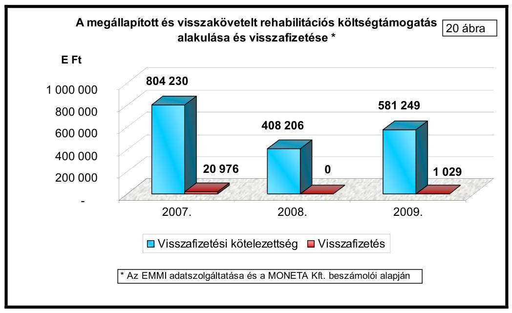

Kimutatásunk alapján megállapítottuk, hogy a költségkompenzációs támogatásnál a jogosulatlanul igénybe vett költségvetési támogatás visszafizetése 2007. évre teljes összegben, 2008-2009. években alacsony szinten - 0,6 és 3% között - valósult meg, melyet a következő grafikon mutat be.

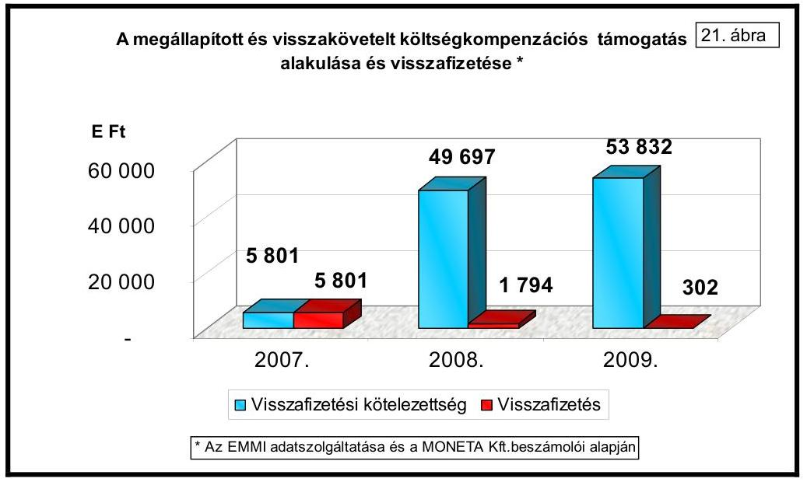

A 2010. évtől a Kincstár végezte a rehabilitációs költségtámogatás és költségkompenzációs támogatások felhasználásának - kifizetés előtti és negyedéves gyakorisággal minden támogatottnál a helyszínen - ellenőrzését.

A Kincstár a helyszíni ellenőrzést követően a 2010. évre 179856 E Ft összegű szabálytalan támogatás igénybevételét állapította meg 15 szervezetnél.

Az ellenőrzés normatív költség korlát túllépése miatt egy esetben 13939 E Ft eltérést állapított meg, amelynek visszafizetése megtörtént. A megváltozott munkaképességű munkavállalók munkajogi állományi létszámának elmaradása miatt a támogatás visszavonására öt munkáltatónál 164671 E Ft összegben került sor. "Jegyzőkönyvi korrekció" kilenc munkáltató esetében fordult elő 1245 E Ft összegben, ebből egy támogatott - az Agria-Humán Nkft. - nem fizette vissza a 1131 E Ft összegű támogatást. (A Nkft. 2006-2009. évi könyvelési dokumentumait az Egri Rendőrkapitányság Bűnügyi osztálya bűncselekmény gyanújával lefoglalta.)

A Kincstár 2011. I. félévre vonatkozóan 97611 E Ft összegű szabálytalan támogatás igénybevétele miatt állapított meg visszafizetési kötelezettséget.

A visszafizetési kötelezettség három rehabilitációs költségtámogatásban és 22 költségkompenzációs támogatásban részesült szervezetet érintett. 19 szervezet elismerte a visszafizetés jogosságát, két társaság részletfizetést, illetve felülvizsgálatot kért. Az ellenőrzés megállapításait négy költségkompenzációs támogatásban részesült szervezet nem fogadta el, részükre az NRSZH főigazgatója 2012. február 29-én 35977 E Ft tőke és 2835 E Ft késedelmi pótlék, összesen 38772 E Ft összegre visszafizetésre kötelező határozatot küldött ki.

Az NRSZH főigazgatója 2012. február 29-én öt társaság részére a 2010. évi támogatások jogosulatlan elszámolásával kapcsolatban a Kincstár 2011. első negyedévben végzett ellenőrzései alapján hozott határozatot 187 656,7 E Ft (támogatás és késedelmi pótlék) összegben. A határozatok két rehabilitációs költségtámogatásban részesült társaságot 170 554,5 E Ft és három költségkompenzációs támogatásban részesült szervezetet összesen 17 102,2 E Ft összegben érintették.

A NRSZH főigazgatója a határozatokat a Kincstár által 2011. első negyedévben végrehajtott helyszíni ellenőrzések során tett megállapítások alapján hozta meg. A határozathozatal és a helyszíni ellenőrzés időpontja között egy esetben 13 hónap, a további négy esetben több mint 11 hónap telt el. A határozathozatal időbeli elhúzódásának okáról az NRSZH érdemi információt az ellenőrzés részére nem adott.

# 3.3. A beszámolási, nyomon követési rendszer kialakításának hatása a támogatások felhasználására 

A támogatásokat kezelő, ellenőrző szervezetek, intézmények éves jelentései a megváltozott munkaképességű foglalkoztatottak számát, területi összevetését, a nyújtott támogatások nagyságát, a támogatás felhasználásának szabályszerűségét tartalmazták. Indikátorokat nem tartalmaztak, így eredményességet javító beavatkozások megtételére nem szolgáltattak megfelelő alapot.

A nyomon követési, beszámolási és értékelési rendszer működése során szerzett tapasztalatokat elsősorban az adott évi pályázatok előkészítése, értékelése és a szerződés feltételeinek kialakítása során hasznosították.

Az ellenőrzött időszakban az ellenőrzések tapasztalatait, megállapításait, javaslatait a támogatás felhasználását ellenőrző rendszer továbbfejlesztésében, a döntéshozatal és a jogalkotás során nem minden esetben érvényesítették.

A bértámogatás a segítő személyek költségkompenzációs támogatása esetében a RMK-k a beszámolással kapcsolatos feladataikat a jogszabályokban és a belső szabályzatokban előírtak szerint teljesítették. Az adatok megbízható nyilvántartása és kezelése a támogatás nem megbízható számítógépes háttere miatt nem volt teljes körűen biztosított. A problémát az NFSZ már a 2010. évi beszámolójában jelezte, a megoldásra érdemi intézkedés nem történt.

A „REHAB" bértámogatási program a rehabilitációs foglalkoztatást elősegítő bértámogatás számítástechnikai háttérprogramja. A jelenleg is aktív programot a munkaügyi központok, kirendeltségek használják a bértámogatási szerződések megkötésére/rögzítésére, a támogatás bérszámfejtésére, kötelezettségvállalások nyilvántartására. A programot az FH - 2012. január 4-től Nemzeti Munkaügyi Hivatal (NMH) - üzemelteti. Az FH-nak (NMH-nak) a programot fejlesztő céggel 2010. óta nincs szerződése, így a szükséges fejlesztések nem, vagy csak korlátozottan valósulnak meg. A program a jogszabályi változásokat nem, vagy csak hosszú átfutási idővel követi, a kirendeltségek/munkaügyi központok számára rendelkezésre álló lekérdezési lehetőségek és jogosultságok korlátozottak. A program lehetőséget nyújt a munkáltató köztartozás-mentességi ellenőrzésére is, amely azonban nem működik. A program - a helyszíni ellenőrzés végéig - még mindig a régi (2009-es) eljárásrend iratmintáit használta, és nem volt alkalmas a többhavi időkeretben foglalkoztatott, teljesítménybéres munkavállalók elszámolásainak nyomon követésére sem.

A költségkompenzációs és a rehabilitációs költségtámogatás felhasználását az ellenőrzött időszakban a MONETA Kft. és a Kincstár ellenőrizte.

A támogatások hasznosulásának, a foglalkoztatási kötelezettség teljesítésének nyomon követésére a 2007-2009. évek között az SZMM a támogatások szabályszerű elszámolásának ellenőrzésére működtetett ellenőrzési (monitoring) rendszert. A szervezeteknek nyújtott támogatások elszámolásairól, a támogatási szerződésekben vállalt kötelezettségek teljesítéséről, a támogatások igénylése, valamint kifizetése adatairól a MONETA Kft. készített jelentést, valamint szakmai beszámolót. A Kft. jelentéseiben a támogatási rendszer átalakítására, valamint a jogszabályok módosítására nem tett javaslatot.

A Kincstár a Lotus Notes rendszerkörnyezetben végezte a megváltozott munkaképességűek foglalkoztatására megkötött támogatási szerződések nyilvántartását, elkülönített adatbázis segítségével. A Kincstár a 2010. évi ellenőrzésekről készült összegző beszámolójában - rehabilitációs költségtámogatás és a költségkompenzációs támogatással kapcsolatban - a támogatási rendszer javítása érdekében, az ellenőrzések eredményeként a szabályozási rendszer szigorítását, a tervezés pontosabb meghatározását, az adminisztrációs terhek csökkentését fogalmazta meg.

Javasolta az irányítási, ügyviteli és szervezési költségek maximalizálását az éves támogatási összeg 20%-ának mértékéig, mind a tervezés mind a kifizetés esetében, javasolták továbbá az elszámolható költségek arányosítását a megváltozott munkaképességű dolgozók létszámának, vagy egyéb természetes arányszámának függvényében.

Felhívta a figyelmet a kapcsolt vállalkozásokban betöltött vezetői tisztségek alaposabb ellenőrzési lehetőségének megteremtésére, tekintettel a több esetben előforduló anya-, illetve leányvállalatoktól származó számlák befogadására, elszámolására.

Javaslatot tett az egyes elszámolható költségtételek törlésére (pl. információ feldolgozás, munka alkalmassági vizsga költségei), továbbá szükségesnek ítélte meg a kettős finanszírozás kizárását igazoló záradék számlákon és egyéb számviteli bizonylatokon történő feltüntetését.

Javaslatot fogalmazott meg a pénzügyileg rendezetlen számlák támogatásának elutasítására, valamint a jogosulatlan támogatás igénylések könnyebb kiszűrése érdekében - az összeghatártól és költségtípustól függően - egyes számlák, számviteli bizonylatok másodpéldányainak becsatolására.

Az ellenőrzött időszakban, a minisztériumokban és a háttérintézményekben nem alakítottak ki a támogatások nyilvántartását, elszámolását, ellenőrzését a követelések nyomon követését biztosító kompatibilis informatikai rendszert. Az intézmények által alkalmazott REHAB program és az ellenőrzést végző Kincstár Lotus Notes rendszere a támogatás teljes folyamatát nem fedte le.

# A támogatási rendszer hatékony, eredményes működését a minisztériumban és a háttérintézményekben egy egységes, komplex informatikai rendszer nem támogatta.

# 4. A KORÁBBI ÁSZ ELLENŐRZÉSEK JAVASLATAI HASZNOSULÁSA 

Az ÁSZ a szociális és munkaügyi miniszternek a 2007. évben zárult a munkaképesség megőrzésére fordított pénzeszközök hasznosulásának ellenőrzéséről készült jelentésében (0731) a megváltozott munkaképességű személyek vonatkozásában a következő javaslatokat fogalmazta meg.

- Határozza meg az Állami Foglalkoztatási Szolgálaton belül a megváltozott munkaképességűeket érintő egyes szolgáltatások személyi és tárgyi minimumfeltételét.
- Fontolja meg a támogatási rendszerben a minősítési rendszer (akkreditáció) általánossá tételét.

A javaslatok végrehajtásához az SZMM intézkedési tervet nem készített.

A munkaügyi központok - az elkészült beszámolók alapján - személyi és tárgyi feltételei alapvetően biztosítottak voltak az ellenőrzött időszakban, annak ellenére, hogy a bértámogatással kapcsolatos feladatok ellátása komoly adminisztratív terhet jelent a munkaügyi kirendeltségeknek.

Az akkreditáció általánossá tételével kapcsolatosan intézkedés nem történt. A 2011. évi CXCI. törvény rendelkezik egységes akkreditációs rendszer bevezetéséről, mely 2013. január 1-től minden szervezet számára kötelezővé teszi az akkreditációt.

Az ÁSZ a 0731. számú jelentésben az önkormányzati és területfejlesztési miniszter részére megfogalmazta, hogy:

Intézkedjen arról, hogy a 2007-2013. évek új programozási időszakra a megváltozott munkaképességűek célcsoportjához kapcsolódó intézkedések aktuális állapotáról információt biztosító monitoring indikátorokat határozzanak meg.

Az önkormányzati és területfejlesztési miniszter az intézkedési tervet 2007. évben elkészítette, amely tartalmazta a programokba bevont megváltozott munkaképességű személyekre vonatkozó indikátorok pályázati útmutatókban való rögzítését.

Az ÁSZ a fogyatékos személyek támogatásában részt vevő nonprofit szervezeteknek nyújtott nem normatív állami támogatás és ingyenes állami vagyonjuttatás felhasználásának ellenőrzéséről szóló 2010. évi jelentésében (1024) a Kormánynak javasolta a következőket:

- Vizsgálja meg az új Országos Fogyatékosügyi Program végrehajtásáról szóló jelentés Országgyűlés elé terjesztése elmaradásának okát, mulasztás esetén állapítsa meg a felelősséget.
- Kezdeményezze a fogyatékkal élők támogatásához kapcsolódó központi költségvetési finanszírozási rendszer felülvizsgálatát, különös tekintettel a nonprofit szervezetek nem normatív támogatása összehangolásának megoldására, társadalmi hasznosságának mérhetőségére.

- Intézkedjen a támogatások pénzügyi átláthatóságát biztosító egységes informatikai alapú adatszolgáltatás kidolgozásáról a dupla finanszírozás elkerülése, az ellenőrzési adatok biztosítása érdekében.

A 2010. évben a beküldött intézkedési terv tartalmazta, hogy a nemzeti erőforrás miniszter jóváhagyja az OFP 2007-2009. évek közötti megvalósításáról készített jelentést és azt a Kormány elé terjeszti. A nonprofit szervezetek nem normatív támogatása összehangolása, társadalmi hasznosságának mérhetőségére, valamint az egységes informatikai alapú adatszolgáltatással kapcsolatosan a szociális, család- és ifjúságügyekért felelős államtitkár az OFT keretében munkacsoport felállítását kezdeményezi a javaslat kidolgozása, megoldása érdekében.

A fogyatékos személyek jogairól és esélyegyenlőségük biztosításáról szóló 1998. évi XXVI. törvény 26. § (4) bekezdése, valamint az OFP végrehajtásáról kiadott kormányhatározatok az OGY számára kétévente teljesítendő jelentéstételi kötelezettséget írták elő az intézkedési tervben foglaltak végrehajtásáról a Kormánynak. Az 1062/2007. (VIII. 7.) Korm. határozat 1. pontja alapján az első beszámolót 2008. március 15-ig kellett benyújtani, majd ezt követően kétévente március 15-ig. A feladat elvégzéséért kijelölt felelős a szociális és munkaügyi miniszter volt. A Kormány az OGY-t sem 2008. évben, sem 2010. évben a megjelölt határidőig nem tájékoztatta az OFP végrehajtásáról, beszámolót nem készített.

Az
 ellenőrzés információja alapján a tervezet mindkét jelzett évben elkészült, azonban azt nem nyújtották be az Országgyűlésnek.

Az 1062/2007. (VIII. 7.) Korm. határozatot az új Országos Fogyatékosügyi Program végrehajtásának 2012-2013. évekre vonatkozó intézkedési tervéről szóló 1056/2012. (III. 9.) Korm. határozat 3. pontja hatályon kívül helyezte. Így a 2012. évben a Kormánynak beszámoló-készítési kötelezettsége nincs, annak esedékessége legközelebb 2014. március 31.

Az Országos Fogyatékosügyi Programról szóló 10/2006. (II. 16.) OGY határozat 2. pontja alapján a Kormány kidolgozza az OFP végrehajtásáról szóló, 2007-2010. évekre vonatkozó középtávú intézkedési tervet, a feladatok, a felelősök és a szükséges források meghatározásával. A minisztérium a 2007-2010. évekről több lépcsőben, az érintett tárcákkal való hosszú egyeztetéseket követően 2012 januárjában összeállította a jelentés tervezetét, amely 2012 februárjában került közigazgatási egyeztetésre. A jelentést a Kormány 2012. május 9-én elfogadta, ezt követően május 25-én az OGY számára benyújtotta. A jelentést az Országgyűlés a 70/2012. (X. 16.) számú határozatával elfogadta.

A fogyatékossággal élők támogatásához kapcsolódó központi költségvetési finanszírozási rendszer felülvizsgálatára, a nonprofit szervezetek nem normatív támogatása összehangolásának megoldására, társadalmi hasznosságának mérésére a javaslatra tett intézkedés részben teljesült. A 2011. évi CLXXV. tv. 53. § (3)-(6) bekezdései alapján a civil szervezeteknek nyújtott támogatásokat, a Kincstár által működtetett monitoring rendszerben történő rögzítéssel egy időben az erre a célra rendszeresített számítógépes rendszeren keresztül küldi meg

---

az adatokat a miniszter számára a Civil Információs Portálon történő közzététel céljából.

Az új Országos Fogyatékosügyi Programról szóló 10/2006. (II. 16.) OGY határozat V. fejezete értelmében szükségesnek ítélt, „duplafinanszírozás” elkerülésére javasolt informatikai alapú adatszolgáltatás kidolgozása nem történt meg a helyszíni ellenőrzés befejezéséig.

A 1024. számú jelentésben az ÁSZ a következő javaslatot tette a NEFMI miniszternek:

Jelölje meg a támogatási célok kapcsolódását az OFP-hoz, az elérendő eredményességi mutatókat.

A 2010. évben a beküldött intézkedési terv tartalmazta, hogy a nemzeti erőforrás miniszter a 2011. évi fejezeti kezelésű előirányzatok felhasználását részleteiben szabályozó miniszteri utasítás normaszövegében elő kell írni, hogy a támogatási szerződéseknek kötelezően tartalmazniuk kell a támogatással elérendő eredményességi mutatókat és minimális célértékeit. A támogatási szerződéseknek kötelező jelleggel tartalmazniuk kell azt az információt, hogy a támogatott feladatok az OFP-ban szereplő programpontok közül melyikhez kapcsolódnak, milyen eredményességi mutatókkal írható le és ezek minimális célértéke mekkora legyen.
2011. évtől a fogyatékosságügyi szakterület szerződései tartalmazzák az eredményességi mutatókat, és egy szerződés kivételével az OFP-hez való kapcsolódási pontokat. A 2010. évben közzétett, a fogyatékos személyek támogatásában résztvevő non-profit szervezeteknek nyújtott nem normatív állami támogatás és ingyenes állami vagyonjuttatás felhasználásának ellenőrzéséről szóló ÁSZ jelentést követően került sor a címzett érdekvédelmi szervezetek támogatásának OFP alapú tervezésére, amely vagy a szerződésben, vagy annak elválaszthatatlan részét képező mellékletben szerepel. Azokban az esetekben, amikor a támogatást nem címzetten tervezték, a pályázati útmutató vagy a szakmai feladat leírása tartalmazza a vonatkozó adatot.

Budapest, 2012.
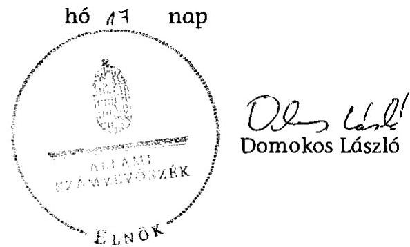

---

# AZ ELLENŐRZÖTT SZERVEZETEK ÉS INTÉZMÉNYEK NÉVJEGYZÉKE 

Közigazgatási és Igazságügyi Minisztérium (KIM)
Háttérintézményei:

- Budapest Főváros Kormányhivatala Munkaügyi Központja
- Csongrád Megyei Kormányhivatal Munkaügyi Központja
- Komárom-Esztergom Megyei Kormányhivatal Munkaügyi Központja
- Jász-Nagykun-Szolnok Megyei Kormányhivatal Munkaügyi Központja

Emberi Erőforrások Minisztériuma (EMMI)
Háttérintézménye:

- Nemzeti Rehabilitációs és Szociális Hivatal (NRSZH)

Magyar Államkincstár
Bértámogatás helyszíni ellenőrzésére kiválasztott szervezetek:

- ALKO-SOFT Bt.
- ELEKTROMEN Kft.
- FEPA-Elektro Nonprofit Kft.
- HELP Nonprofit Kft.
- Humanitaire Kft.
- Humánprofil-Szentimre Kft.
- MÓRA-VITÁL Nonprofit Kiemelkedően Közhasznú Kft.
- PE-GI 3 Kft.
- Relabor Kft.
- Szegedi SZEFO Zrt.
- Thermálgyűrű Kft.
- Városháza Gyógyszertár Bt.

---

Költségkompenzációs támogatás helyszíni ellenőrzésére kiválasztott szervezetek:

- Agria-Humán Közhasznú Nonprofit Kft.
- CONTACT Nkft.
- GTX Kft.
- Horváth Gran Kft., jogutód: 2008.10.20-tól Grantek Kft.
- Humán" Kft. "fa"
- INTERPLÁN Kft.

Rehabilitációs költségtámogatás helyszíni ellenőrzésére kiválasztott szervezetek

- Alfa Rehabilitációs Nonprofit Kft.
- Civil Szolgáltató Nonprofit Kft.
- Dél-Borsodi Rehabilitációs és Környezetvédelmi Nonprofit Közhasznú Kft.
- Emberekért Rehabilitációs Foglalkoztató Közhasznú Nonprofit Kft.
- ERFO Rehabilitációs Foglalkoztató Nonprofit Közhasznú Kft.
- FÉBÉ Szociális és Rehabilitációs Szolgáltató Nonprofit Közhasznú Kft.
- FŐKEFE Rehabilitációs Foglalkoztató Ipari Nonprofit Kft.
- KÉZMŰ Fővárosi Kézműipari Nonprofit Kft.
- MOVE Rehabilitációs Ipari és Szolgáltató Nonprofit Közhasznú Zrt.
- Nagykanizsai Szociális Foglalkoztató Nonprofit Kft.
- PIREHAB Rehabilitációs Foglalkoztató Nonprofit Kft.
- "PRO-TEAM" Rehabilitációs Közhasznú Nonprofit Kft.
- START Rehabilitációs Foglalkoztató és Intézményei Közhasznú Nonprofit Kft.

---

1. számú melléklet a V-0016-170/2012. sz. jelentéshez

A 21 VÉDETT SZERVEZETI SZERZŐDÉSSEL RENDELKEZŐ SZERVEZET 2011. ÉV I. FÉLÉVES TÁMOGATÁSI SZERZŐDÉSBEN SZEREPLŐ TÁMOGATHATÓ KÖLTSÉGEI

|  Sorszám | Megnevezés | Támogatás | Anyagjellegú ráfordítások |  |  |  |  |  | Személy jellegú ráfordítások |  |  |  |  |  |   |
| --- | --- | --- | --- | --- | --- | --- | --- | --- | --- | --- | --- | --- | --- | --- | --- |
|   |  |  | Anyag ktg. | Szállítási ktg. | Raktározási ktg. | Bérleti díj | Egyéb szolg. | Anyagjellegú ráfordítások összesen | Bérktg. | Személyi jellegú egyéb költség | Bérjárulék | Személy jellegú ráfordítások összesen | 1 före jutó személyi juttatás | Anyagjellegú ráfordítások aránya | Személyi jellegú ráfordítások aránya  |
|   |  | E FI | E FI | E FI | E FI | E FI | E FI | E FI | E FI | E FI | E FI | E FI | E FI | \% | \%  |
|  1. | Alfa Nkft. | 262640 | 14431 | 9650 | - | - | - | 24081 | 184456 | 2950 | 49803 | 237209 | 579 | 9,7 | 90,3  |
|  2. | Námosztaló Nkft. | 22486 | - | - | - | - | - | - | 25580 | - | 6906 | 32486 | 591 | - | 100,0  |
|  3. | Civil Nkft. | 231473 | 20965 | 1794 | - | 3850 | 100 | 26509 | 161709 | 18020 | 43660 | 223389 | 577 | 11,2 | 88,8  |
|  4. | Dél-borocdi Nkft. | 66590 | 4817 | - | - | - | 200 | 5017 | 63790 | - | 17223 | 81013 | 544 | 6,4 | 93,6  |
|  5. | Embesdám Nkft. | 510923 | 27088 | 168 | - | 24140 | 69 | 51465 | 335110 | 30967 | 90480 | 456557 | 522 | 10,6 | 89,4  |
|  6. | ERFO Nkft. | 878126 | 81026 | 12000 | - | 4000 | 500 | 97526 | 605500 | 10215 | 163485 | 779200 | 561 | 11,3 | 88,7  |
|  7. | ESÉLY Nkft. | 71597 | 90 | - | - | - | - | 90 | 54389 | 1080 | 14683 | 70152 | 491 | 1,9 | 96,1  |
|  8. | FEBE Nkft. | 60476 | 272 | - | - | - | 33 | 305 | 44933 | 2490 | 12132 | 59555 | 614 | 1,5 | 98,5  |
|  9. | FORENO Nkft. | 51774 | - | 45 | - | - | - | 45 | 39820 | 1102 | 10752 | 51674 | 478 | 0,2 | 99,8  |
|  10. | FOKSÉE Nkft. | 2105193 | 159117 | - | - | - | - | 159117 | 1508175 | 30839 | 407052 | 1996066 | 552 | 7,8 | 92,4  |
|  11. | HODFO Nkft. | 109784 | 4575 | - | - | - | - | 4575 | 82842 | - | 22367 | 105209 | 578 | 4,2 | 95,8  |
|  12. | KALLFO Nkft. | 106158 | 5783 | - | - | 270 | 150 | 6103 | 77447 | - | 20911 | 98358 | 579 | 7,3 | 92,7  |
|  13. | KEZMÓ Nkft. | 2056600 | 168857 | 45000 | - | 6150 | 1337 | 221344 | 1428587 | 15800 | 385719 | 1830106 | 567 | 11,0 | 89,0  |
|  14. | Komló-Habitás | - | - | - | - | - | - | - | - | - | - | - | - | - | -  |
|  15. | Nkft. | 47423 | 2343 | - | - | - | - | 2343 | 33421 | 650 | 9046 | 43117 | 625 | 9,1 | 90,9  |
|  16. | MOVE-Zrt. | 705982 | 37904 | 21000 | - | 12000 | 372 | 71276 | 480342 | 18372 | 129692 | 628406 | 581 | 11,0 | 89,0  |
|  17. | Nkomo Nkft. | 42057 | 1000 | - | - | - | - | 1000 | 31431 | 810 | 8486 | 40727 | 582 | 3,2 | 96,8  |
|  18. | Összefogás Nkft. | 367783 | 41015 | - | - | - | 840 | 41855 | 254632 | 987 | 68751 | 324370 | 528 | 11,8 | 88,2  |
|  19. | PIREHAB Nkft. | 1378028 | 137205 | - | - | 17676 | 635 | 155516 | 920381 | 18331 | 248503 | 1187215 | 576 | 13,8 | 86,2  |
|  20. | PRO-TEAM Nkft. | 1276510 | 324150 | 7200 | 7800 | - | - | 339150 | 715520 | 14000 | 193190 | 922710 | 453 | 27,7 | 72,3  |
|  21. | STAKE Nkft. | 1232712 | 66662 | - | - | - | - | 66662 | 904069 | 17882 | 244099 | 1166050 | 583 | 5,4 | 94,6  |
|  22. | Teljes Életet
Nkft. | 591122 | - | - | - | 11484 | - | 11484 | 456408 | - | 123230 | 579638 | 618 | 1,9 | 98,1  |
|   | Mindösszesen | 12225327 | 1097280 | 96807 | 7800 | 79570 | 4236 | 1362120 | 8408542 | 184495 | 2270170 | 10863207 |  |  |  |

 | 555 | 11,1 | 88,9  |

---

A rehabilitációs költségtámogatásban részesült 21 védett szervezet támogatásának alakulása 2007-2011. években

|   | 1 főre jutó támogatás (E Ft) |  |  |  |  | 1 főre jutó anyag jellegű ráfordítás (E Ft) |  |  |  |  | 1 főre jutó személy jellegű ráfordítás (E Ft) |  |  |  |   |
| --- | --- | --- | --- | --- | --- | --- | --- | --- | --- | --- | --- | --- | --- | --- | --- | --- |
|   | 2007 | 2008 | 2009 | 2010 | 2011 | 2007 | 2008 | 2009 | 2010 | 2011 | 2007 | 2008 | 2009 | 2010 | 2011  |
|  Alfa Nkft.(1) | 676 | 1334 | 1489 | 1500 | 1234 | 71 | 79 | 165 | 188 | 93 | 605 | 1255 | 1324 | 1311 | 1141  |
|  Bátonyrehab Nkft.(1) | 588 | 1098 | 1106 | 1255 | 1129 | 56 | 52 | - | - | - | 657 | 1384 | 1106 | 1255 | 1129  |
|  Civil Nkft.(1) | 778 | 1668 | 1380 | 1486 | 1236 | 124 | 237 | 131 | 157 | 129 | 654 | 1431 | 1250 | 1329 | 1108  |
|  Dél-borsodi Nkft. | 1468 | 1466 | 1289 | 1312 | 1118 | 36 | 201 | 35 | 83 | 38 | 909 | 1178 | 1254 | 1229 | 1080  |
|  Emberekért Nkft.(1) | 672 | 1213 | 1580 | 1498 | 1146 | 47 | 111 | 153 | 169 | 98 | 636 | 1102 | 1427 | 1329 | 1047  |
|  ERFO Nkft. | 1478 | 1926 | 1760 | 1500 | 1209 | 145 | 592 | 373 | 306 | 116 | 676 | 1335 | 1387 | 1194 | 1092  |
|  ESELY Nkft.(1) | 444 | 872 | 925 | 920 | 993 | 8 | 15 | 13 | 13 | 19 | 436 | 857 | 912 | 907 | 974  |
|  FÉBÉ Nkft.(1) | 569 | 1080 | 1143 | 1173 | 1191 | 15 | 17 | 27 | 31 | 20 | 555 | 1063 | 1116 | 1142 | 1171  |
|  FORENO Nkft.(1) | 467 | 973 | 1033 | 1019 | 951 | 9 | 27 | 24 | 30 | 3 | 458 | 946 | 1009 | 988 | 948  |
|  FÖKEFE Nkft. | 1303 | 2092 | 1760 | 1500 | 1181 | 185 | 652 | 338 | 435 | 95 | 461 | 1440 | 1423 | 1065 | 1086  |
|  HODFO Nkft.(1) | 478 | 1225 | 1199 | 1195 | 1153 | 76 | 176 | 120 | 121 | 34 | 523 | 1132 | 1079 | 1074 | 1119  |
|  KALLFO Nkft.(1) | 628 | 1506 | 1448 | 1476 | 1193 | 14 | 143 | 61 | 160 | 92 | 615 | 1363 | 1386 | 1316 | 1157  |
|  KEZMÚ Nkft. | 1389 | 1615 | 1601 | 1500 | 1231 | 395 | 379 | 350 | 314 | 152 | 994 | 1323 | 1251 | 1186 | 1079  |
|  Komló-Habilitus Nkft. | 2494 | 2273 | 2000 | 1700 | 1319 | 671 | 644 | 267 | 126 | 95 | 1822 | 1629 | 1734 | 1574 | 1224  |
|  MOVE Zrt.(1) | 656 | 1360 | 2115 | 1500 | 1247 | 50 | 202 | 203 | 221 | 126 | 606 | 1277 | 1497 | 1279 | 1121  |
|  NKszoci Nkft.(1) | 656 | 1070 | 1222 | 1233 | 1152 | 6 | 9 | 23 | 33 | 29 | 480 | 1053 | 1198 | 1200 | 1122  |
|  Összefogás Nkft.(1) | 656 | 1445 | 1532 | 1500 | 1204 | 84 | 83 | 285 | 202 | 82 | 571 | 1361 | 1246 | 1298 | 1122  |
|  PIREHAB Nkft.(1) | 955 | 1871 | 1760 | 1500 | 1276 | 242 | 459 | 390 | 341 | 201 | 714 | 1412 | 1370 | 1159 | 1074  |
|  PRO-TEAM Nkft.(1) | 889 | 1709 | 1684 | 1500 | 1211 | 288 | 516 | 371 | 412 | 337 | 601 | 1263 | 1312 | 1088 | 873  |
|  START Nkft. | 2123 | 1602 | 1677 | 1500 | 1177 | 521 | 369 | 348 | 340 | 77 | 1535 | 1232 | 1329 | 1160 | 1101  |
|  Teljes Életért Nkft. | 1388 | 1344 | 1332 | 1346 | 1209 | 73 | 54 | 45 | 78 | 12 | 1315 | 1290 | 1287 | 1268 | 1197  |
|  Átlag: | 988 | 1464 | 1478 | 1386 | 1179 | 148 | 239 | 177 | 179 | 88 | 754 | 1254 | 1281 | 1207 | 1094  |

(1) 2007. évben 14 szervezet július 1-től részesült támogatásban

---

# 4. számú melléklet 

a V-0016-170/2012. sz. jelentéshez

## A 21 védett szervezeti szerződéssel rendelkező társaság egy főre jutó támogatásának költségnemenkénti megoszlása a 2007. és a 2010. években

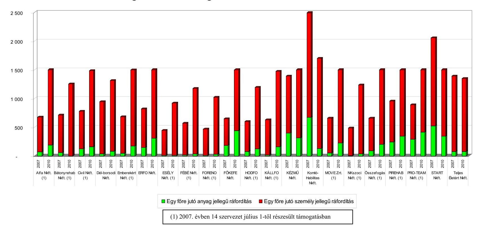
(1) 2007. évben 14 szervezet július 1-től részesült támogatásban

---

### 5. számú melléklet

### a V-0016-170/2012. sz. jelentéshez

### Kimutatás

a védett szervezeti szerződéssel rendelkező társaságok 2011. évi támogatási összegének és létszámának alakulásáról

|   |  |  |  |  |  |  |  |  |  |  |  |  |  |  |  |  |  |  |  |  |  |  |  |  |  |  |  |  |  |  |  |  |  |  |  |  |  |   |
| --- | --- | --- | --- | --- | --- | --- | --- | --- | --- | --- | --- | --- | --- | --- | --- | --- | --- | --- | --- | --- | --- | --- | --- | --- | --- | --- | --- | --- | --- | --- | --- | --- | --- | --- | --- | --- | --- | --- | --- | --- |
|   |  |  |  |  |  |  |  |  |  |  |  |  |  |  |  |  |  |  |  |  |  |  |  |  |  |  |  |  |  |  |  |  |  |  |  |  |  |  |  |   |
|   |  |  |  |  |  |  |  |  |  |  |  |  |  |  |  |  |  |  |  |  |  |  |  |  |  |  |  |  |  |  |  |  |  |  |  |  |  |  |  |   |
|   |  |  |  |  |  |  |  |  |  |  |  |  |  |  |  |  |  |  |  |  |  |  |  |  |  |  |  |  |  |  |  |  |  |  |  |  |  |  |  |   |
|   |  |  |  |  |  |  |  |  |  |  |  |  |  |  |  |  |  |  |  |  |  |  |  |  |  |  |  |  |  |  |  |  |  |  |  |  |  |  |  |   |
|   |  |  |  |  |  |  |  |  |  |  |  |  |  |  |  |  |  |  |  |  |  |  |  |  |  |  |  |  |  |  |  |  |  |  |  |  |  |  |  |   |
|   |  |  |  |  |  |  |  |  |  |  |  |  |  |  |  |  |  |  |  |  |  |  |  |

  |  |  |  |  |  |  |  |  |  |  |  |  |  |  |  |   |
|   |  |  |  |  |  |  |  |  |  |  |  |  |  |  |  |  |  |  |  |  |  |  |  |  |  |  |  |  |  |  |  |  |  |  |  |  |  |  |  |   |
|   |  |  |  |  |  |  |  |  |  |  |  |  |  |  |  |  |  |  |  |  |  |  |  |  |  |  |  |  |  |  |  |  |  |  |  |  |  |  |  |   |
|   |  |  |  |  |  |  |  |  |  |  |  |  |  |  |  |  |  |  |  |  |  |  |  |  |  |  |  |  |  |  |  |  |  |  |  |  |  |  |  |   |
|   |  |  |  |  |  |  |  |  |  |  |  |  |  |  |  |  |  |  |  |  |  |  |  |  |  |  |  |  |  |  |  |  |  |  |  |  |  |  |  |   |
|   |  |  |  |  |  |  |  |  |  |  |  |  |  |  |  |  |  |  |  |  |  |  |  |  |  |  |  |  |  |  |  |  |  |  |  |  |  |  |  |   |
|   |  |  |  |  |  |  |  |  |  |  |  |  |  |  |  |  |  |  |  |  |  |  |  |  |  |  |  |  |  |  |  |  |  |  |  |  |  |  |  |   |
|   |  |  |  |  |  |  |  |  |  |  |  |  |  |  |  |  |  |  |  |  |  |  |  |  |  |  |  |  |  |  |  |  |  |  |  |  |  |  |  |   |
|   |  |  |  |  |  |  |  |  |  |  |  |  |  |  |  |  |  |  |  |  |  |  |  |  |  |  |  |  |  |  |  |  |  |  |  |  |  |  |  |   |
|   |  |  |  |  |  |  |  |  |  |  |  |  |  |  |  |  |  |  |  |  |  |  |  |  |  |  |  |  |  |  |  |  |  |  |  |  |  |  |  |   |
|   |  |  |  |  |  |  |  |  |  |  |  |  |  |  |  |  |  |  |  |  |  |  |  |  |  |  |  |  |  |  |  |  |  |  |  |  |  |  |  |   |
|   |  |  |  |  |  |  |  |  |  |  |  |  |  |  |  |  |  |  |  |  |  |  |  |  |  |  |  |  |  |  |  |  |  |  |  |  |  |  |  |   |
|   |  |  |  |  |  |  |  |  |  |  |  |  |  |  |  |  |  |  |  |  |  |  |  |  |  |  |  |  |  |  |  |  |  |  |  |  |  |  |  |   |
|   |  |  |  |  |  |  |  |  |  |  |  |  |  |  |  |  |  |  |  |  |  |  |  |  |  |  |  |  |  |  |  |  |  |  |  |  |  |  |  |   |
|   |  |  |  |  |  |  |  |  |  |  |  |  |  |  |  |  |  |  |  |  |  |  |  |  |  |  |  |  |  |  |  |  |  |  |  |  |  |  |  |   |
|   |  |  |  |  |  |  |  |  |  |  |  |  |  |  |  |  |  |  |  |  |  |  |  |  |  |  |  |  |  |  |  |  |  |  |  |  |  |  |  |   |
|   |  |  |  |  |  |  |  |  |  |  |  |  |  |  |  |  |  |  |  |  |  |  |  |  |  |  |  |  |  |  |  |  |  |  |  |  |  |  |  |   |
|   |  |  |  |  |  |  |  |  |  |  |  |  |  |  |  |  |  |  |  |  |  |  |  |  |  |  |  |  |  |  |  |  |  |  |  |  |  |  |  |   |
|   |  |  |  |  |  |  |  |  |  |  |  |  |  |  |  |  |  |  |  |  |  |  |  |  |  |  |  |  |  |  |  |  |  |  |  |  |  |  |  |   |
|   |  |  |  |  |  |  |  |  |  |  |  |  |  |  |  |  |  |  |  |  |  |  |  |  |  |

  |  |  |  |  |  |  |  |  |  |  |  |  |  |   |
|   |  |  |  |  |  |  |  |  |  |  |  |  |  |  |  |  |  |  |  |  |  |  |  |  |  |  |  |  |  |  |  |  |  |  |  |  |  |  |  |   |
|   |  |  |  |  |  |  |  |  |  |  |  |  |  |  |  |  |  |  |  |  |  |  |  |  |  |  |  |  |  |  |  |  |  |  |  |  |  |  |  |   |
|   |  |  |  |  |  |  |  |  |  |  |  |  |  |  |  |  |  |  |  |  |  |  |  |  |  |  |  |  |  |  |  |  |  |  |  |  |  |  |  |   |
|   |  |  |  |  |  |  |  |  |  |  |  |  |  |  |  |  |  |  |  |  |  |  |  |  |  |  |  |  |  |  |  |  |  |  |  |  |  |  |  |   |
|   |  |  |  |  |  |  |  |  |  |  |  |  |  |  |  |  |  |  |  |  |  |  |  |  |  |  |  |  |  |  |  |  |  |  |  |  |  |  |  |   |
|   |  |  |  |  |  |  |  |  |  |  |  |  |  |  |  |  |  |  |  |  |  |  |  |  |  |  |  |  |  |  |  |  |  |  |  |  |  |  |  |   |
|   |

---

6. számú melléklet a V-0016-170/2012. sz. jelentéshez

Kimutatás a védett szervezeti szerződéssel rendelkező társaságok 2007-2011. évi tényleges létszámának alakulásáról

| Megnevezés | 2007 |  |  | 2008 |  |  | 2009 |  |  | 2010 |  |  | 2011 |  |  | 2012 |  |  | 2013 |  |  | 2014 |  |  | 2015 |  |  | 2016 |  |  | 2017 |  |  | 2018 |  |  | 2019 |  |  | 2020 |  |  | 2021 |  |  | 2022 |  |  | 2023 |  |  |  |  |  |  |  |  |  |  |  |  |  |  |  |  |  |  |  |  |  |  |  |  |  |  |  |  |  |  |  |  |  |  |  |  |  |  |  |  |  |  |  |  |  |   |
| --- | --- | --- | --- | --- | --- | --- | --- | --- | --- | --- | --- | --- | --- | --- | --- | --- | --- | --- | --- | --- | --- | --- | --- | --- | --- | --- | --- | --- | --- | --- | --- | --- | --- | --- | --- | --- | --- | --- | --- | --- | --- | --- | --- | --- | --- | --- | --- | --- | --- | --- | --- | --- | --- | --- | --- | --- | --- | --- | --- | --- | --- | --- | --- | --- | --- | --- | --- | --- | --- | --- | --- | --- | --- | --- | --- | --- | --- | --- | --- | --- | --- | --- | --- | --- | --- | --- | --- | --- | --- | --- | --- | --- | --- | --- | --- | --- | --- | --- | --- | --- | --- |

---

### 7. számú melléklet

### a V-0016-170/2012. sz. jelentéshez

|   |  |  |  |  | 2007. |  |  | 2008. |  |  | 2009. |  |  | 2010. |  |  | 2011. |  |   |
| --- | --- | --- | --- | --- | --- | --- | --- | --- | --- | --- | --- | --- | --- | --- | --- | --- | --- | --- | --- |
|   | Összes foglalkoztatott | mnm-a foglalkoztatott | mnm-a foglalkoztatott | Összes foglalkoztatott | mnm-a foglalkoztatott | mnm-a foglalkoztatott | mnm-a foglalkoztatott | mnm-a foglalkoztatott | mnm-a foglalkoztatott | mnm-a foglalkoztatott | mnm-a foglalkoztatott | mnm-a foglalkoztatott | mnm-a foglalkoztatott | mnm-a foglalkoztatott | mnm-a foglalkoztatott | mnm-a foglalkoztatott | mnm-a foglalkoztatott | mnm-a foglalkoztatott |   |
|   | M | M | M | M | M | M | M | M | M | M | M | M | M | M | M | M | M | M |   |
|  Alta NVA | 640 | 463 | 85,7% | 693 | 428 | 86,8% | 669 | 424 | 90,3% | 663 | 406 | 87,7% | 666 | 410 | 84,4% |  |  |  |   |
|  Csin NVA | 388 | 448 | 89,6% | 409 | 374 | 81,4% | 438 | 392 | 92,0% | 447 | 405 | 90,6% | 414 | 385 | 95,4% |  |  |  |   |
|  Dárkossági NVA | 77 | 73 | 94,8% | 134 | 126 | 94,0% | 152 | 143 | 94,1% | 160 | 150 | 93,8% | 160 | 150 | 93,8% |  |  |  |   |
|  Tájékoztatást NVA | 521 | 480 | 92,1% | 636 | 615 | 96,7% | 758 | 752 | 94,2% | 663 | 640 | 95,1% | 603 | 876 | 94,8% |  |  |  |   |
|  KIWÓ KR | 1 175 | 999 | 82,0% | 1 493 | 1 279 | 82,7% | 1 545 | 1 321 | 82,5% | 1 622 | 1 414 | 87,2% | 1 621 | 1 419 | 87,3% |  |  |  |   |
|  FENE NVA | 123 | 96 | 78,0% | 120 | 86 | 80,0% | 122 | 97 | 79,5% | 121 | 97 | 80,2% | 122 | 87 | 78,8% |  |  |  |   |
|  FÖKÍFÉN NVA | 2 370 | 2 038 | 86,0% | 3 594 | 3 161 | 87,7% | 3 836 | 3 511 | 96,6% | 3 748 | 3 356 | 89,5% | 3 823 | 3 531 | 92,4% |  |  |  |   |
|  RÉZMÓ NVA | 3 837 | 2 810 | 73,4% | 3 944 | 2 906 | 73,7% | 4 205 | 3 081 | 73,5% | 4 644 | 3 239 | 69,7% | 4 980 | 3 056 | 60,5% |  |  |  |   |
|  MÖVÉ ZH. | 246 | 221 | 89,8% | 267 | 232 | 86,9% | 507 | 448 | 88,4% | 1 162 | 1 049 | 90,3% | 1 138 | 1 075 | 94,5% |  |  |  |   |
|  Mésszor NVA | 97 | 84 | 66,0% | 99 | 70 | 70,7% | 100 | 73 | 72,0% | 100 | 73 | 72,0% | 100 | 71 | 71,0% |  |  |  |   |
|  PIRÉHAB NVA | 2 161 | 2 059 | 95,3% | 2 326 | 2 091 | 89,9% |
 | 2 544 | 2 194 | 86,2% | 2 466 | 2 109 | 84,8% | 2 393 | 2 084 | 86,3% |  |  |  |   |
|  Pécs címei NVA | 1 630 | 1 628 | 94,7% | 2 071 | 1 922 | 92,8% | 2 149 | 1 903 | 92,7% | 2 192 | 2 020 | 92,8% | 2 199 | 2 006 | 93,5% |  |  |  |   |
|  START NVA | 2 660 | 1 931 | 74,6% | 2 746 | 2 109 | 76,8% | 2 770 | 2 171 | 76,4% | 2 756 | 2 107 | 76,2% | 2 526 | 2 017 | 79,8% |  |  |  |   |
|  Összesen | 18 112 | 13 409 | 83,2% | 18 233 | 15 388 | 84,6% | 19 283 | 16 809 | 85,1% | 22 784 | 17 279 | 83,1% | 20 873 | 17 152 | 82,2% |  |  |  |   |
|  Változás előző évhez |  |  |  | 14,8% | 14,8% |  | 9,7% | 9,9% |  | 7,9% | 4,9% |  | 9,4% | 9,5% |  |  |  |  |   |
|  Változás 2007. évhez |  |  |  | 13,8% | 14,8% |  | 20,3% | 23,9% |  | 28,0% | 28,9% |  | 29,5% | 27,9% |  |  |  |  |   |

---

1. számú melléklet a V-0016-170/2012. sz. jelentéshez

A HELYSZÍNEN ELLENŐRZÖTT TÁRSASÁGOK MÉRLEG SZERINTI EREDMÉNYÉNEK ÉS AZ ADÓFIZETÉSI KÖTELEZETTSÉGÉNEK ALAKULÁSA

|  Megnevezés | Foglalkoztatottak száma 2011-ben |  | 2007. |  | 2008. |  | 2009. |  | 2010. |  | 2011. |   |
| --- | --- | --- | --- | --- | --- | --- | --- | --- | --- | --- | --- | --- |
|   | Összesen |  | Mérleg szerinti eredmény | Adófizetési kötelezettség | Mérleg szerinti eredmény | Adófizetési kötelezettség | Mérleg szerinti eredmény | Adófizetési kötelezettség | Mérleg szerinti eredmény | Adófizetési kötelezettség | Mérleg szerinti eredmény | Adófizetési kötelezettség  |
|   | 15 | 15 | E Ft | E Ft | E Ft | E Ft | E Ft | E Ft | E Ft | E Ft | E Ft  |
|  Alfa Nkft. | 486 | 410 | 8363 | 2022 | 1065 |  | 1217 |  | 1552 | 809 | 1036  |
|  Civil Nkft. | 414 | 395 | 51612 | 3039 | 3229 | 153 | 11635 | 466 | 27053 | 1263 | 17732  |
|  Dél-borsodi Nkft. | 160 | 150 | 1008 |  | 409 | 3127 | 457 | 1230 | 1926 | 1932 | 1602  |
|  "Emberekért" Nkft. | 923 | 876 | 18012 |  | 14708 |  | 29820 | 1277 | 1482 | 876 | 1325  |
|  ERFO Kft. | 1621 | 1415 | 30412 |  | 21339 |  | 1491 |  | 136150 |  | 250945  |
|  FÉBÉ Nkft. | 122 | 97 | 2163 |  | 2460 |  | 2637 | 197 | 1380 |  | 10918  |
|  FÖKEFE Nkft. | 3823 | 3531 | 158379 | 531 | 249275 | 409 | 307267 |  | 79368 | 101 | 807696  |
|  KEZMÚ Nkft. | 4965 | 3006 | 257772 | 34107 | 24905 |  | 31954 | 16852 | 43142 | 30409 | 1254104  |
|  MOVE Zrt. | 1138 | 1075 | 4626 |  | 8510 |  | 48378 |  | 105034 |  | 28368  |
|  NKszoci Nkft. | 100 | 71 | 26749 |  | 4177 |  | 6228 |  | 8146 |  | 13937  |
|  PIREHAB Nkft. | 2393 | 2064 | 75606 | 4926 | 137642 | 8904 | 146152 | 10751 | 105485 | 13803 | 31135  |
|  "Pro-Team" Nkft. | 2199 | 2046 | 2453 |  | 72858 |  | 7269 |  | 55510 | 1068 | 16018  |
|  START Nkft. | 2528 | 2017 | 560810 |  | 66622 |  | 33631 |  | 15093 |  | 183344  |
|  Összesen | 20872 | 17153 | 1161941 | 44625 | 579695 | 12593 | 53660 | 30773 | 578561 | 50261 | 2423728  |

- A 2010. évi mérlegszerinti eredmény - az előző évek módosító tételei miatt - az ERFO Nkft-nél -37 521 E Ft-tal, a FÖKEFE Nkft-nél -186 900 E Ft-tal módosult 2011. évben

---

### 9. számú melléklet

a V-0016-170/2012. sz. jelentéshez

|  Társaságok | Foglalkoztatottak száma |  | 2007. év |  |  | 2008. év |  |  | 2009. év |  |  | 2010. év |  |  | 2011. év |  |   |
| --- | --- | --- | --- | --- | --- | --- | --- | --- | --- | --- | --- | --- | --- | --- | --- | --- | --- |
|   | 2011-ben |  | Éves juttatás | Létszám | Egy főre jutó éves juttatás | Éves juttatás | Létszám | Egy főre jutó éves juttatás | Éves juttatás | Létszám | Egy főre jutó éves juttatás | Éves juttatás | Létszám | Egy főre jutó éves juttatás | Éves juttatás | Létszám | Egy főre jutó éves juttatás  |
|   | Összesen | mrdt.-x |  |  |  |  |  |  |  |  |  |  |  |  |  |  |   |
|   | N° |  |  |  |  |  |  |  |  |  |  |  |  |  |  |  |   |
|  Alfa Nkh. | 486 | 410 | 3 900 | 1 | 3 900 | 8 580 | 1 | 8 580 | 8 580 | 1 | 8 580 | 8 580 | 1 | 8 580 | 8 580 | 1 | 8 580  |
|  Civil Nkh. | 414 | 395 | 15 120 | 3 | 5 040 | 17 978 | 3 | 5 993 | 19 128 | 3 | 6 378 | 14 142 | 2 | 7 071 | 13 482 | 2 | 8 741  |
|  Dél-barasol Nkh. | 160 | 150 | 9 480 | 2 | 4 740 | 9 480 | 2 | 4 740 | 9 480 | 2 | 4 740 | 10 418 | 2 | 5 209 | 6 082 | 2 | 4 055  |
|  "Emberekért" Nkh. | 923 | 876 | 4 800 | 1 | 4 800 | 9 600 | 1 | 9 600 | 11 000 | 1 | 11 000 | 14 150 | 1 | 14 150 | 11 040 | 1 | 11 040  |
|  ERFO XR | 1 621 | 1 415 | 15 405 | 1,4 | 10 849 | 16 689 | 1 | 16 689 | 26 792 | 1 | 26 792 | 11 529 | 1 | 11 529 | 10 200 | 1 | 10 200  |
|  FEBE Nkh. | 122 | 97 | 3 658 | 1 | 3 658 | 3 772 | 1 | 3 772 | 2 527 | 1 | 2 527 | 5 203 | 1 | 5 203 | 5 164 | 1 | 5 164  |
|  FÖKÉFE Nkh. | 3 823 | 3 531 | 13 581 | 1 | 13 581 | 21 929 | 1 | 21 929 | 18 349 | 1 | 18 349 | 17 490 | 2 | 8 745 | 13 128 | 1 | 13 128  |
|  KÉZMÓ Nkh. | 4 865 | 3 006 | 27 000 | 1 | 27 000 | 32 945 | 1 | 32 945 | 38 024 | 1 | 38 024 | 18 436 | 1 | 18 436 | 14 400 | 1 | 14 400  |
|  MOVE ZK. | 1 138 | 1 075 | 12 911 | 6 | 2 152 | 29 581 | 5 | 5 916 | 27 977 | 4 | 6 994 | 84 893 | 7 | 12 128 | 69 981 | 6 | 11 664  |
|  Négszol Nkh. | 100 | 71 | 4 079 | 2 | 2 040 | 6 519 | 2 | 3 260 | 8 669 | 2 | 3 345 | 7 449 | 2 | 3 725 | 7 690 | 2 | 3 845  |
|  PIRÉHAB Nkh. | 2 393 | 2 064 | 41 309 | 7 | 5 901 | 124 377 | 10 | 12 438 | 113 394 | 9 | 12 599 | 110 020 | 8 | 13 753 | 72 050 | 7 |

 10 283  |
|  "Pro-Tpam" Nkh. | 2 199 | 2 046 | 13 255 | 1 | 13 255 | 27 600 | 1 | 27 600 | 27 600 | 1 | 27 600 | 22 838 | 1 | 22 838 | 14 238 | 1 | 14 238  |
|  START Nkh. | 3 528 | 2 017 | 30 867 | 1 | 30 867 | 31 718 | 1 | 31 718 | 29 918 | 1 | 29 918 | 18 720 | 1 | 18 720 | 14 817 | 1 | 14 817  |
|  Összesen | 20 872 | 17 153 | 195 205 | 28,4 | 6 869 | 340 769 | 30 | 11 359 | 339 459 | 28 | 12 124 | 343 869 | 30 | 11 462 | 260 952 | 27 | 9 843  |
|  Játhozás előző évhez |  |  |  |  |  | 74,6% | 5,6% | 65,4% | -0,4% | -8,7% | 6,7% | 1,5% | 7,1% | -5,5% | -24,1% | -11,7% | -14,1%  |
|  Játhozás 2007. évhez |  |  |  |  |  | 74,6% | 5,6% | 65,4% | 73,9% | -1,5% | 76,5% | 76,2% | 5,6% | 66,9% | 33,6% | -6,8% | 43,3%  |

---

# 10/a. számú melléklet 

a V-0016-170/2012. sz. jelentéshez

2012 DEC. $05^{\text {OA }}$ HUllazilll.
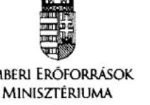

EMBERI ERŐFORRÁSOK MINISZTÉRIUMA MINISZTER

Iktatószám: 29498-6/2012/REHAB
Ügyintéző: Dávid István (795-2546)

## Domokos László részére

elnök

## Állami Számvevőszék

## Budapest

Apáczai Csere János u. 10.
1052

Tárgy: Észrevételek a V-0016-131/2012. iktatószámú levéllel érkezett jelentés tervezetére

## Tisztelt Elnök Úr!

A megváltozott munkaképességűek foglalkoztatása költségvetési támogatási rendszerének és a támogatások hasznosulásának ellenőrzéséről készített számvevőszéki jelentés tervezetét megismerve köszönöm munkatársai segítségét abban, hogy átfogó képet adtak az elmúlt időszak támogatási gyakorlatáról és hasznos észrevételeik az ellenőrzés folyamatában is segítették kollégáimat. A jelentéstervezetre vonatkozóan az alábbiakban foglalom össze észrevételeimet.

## Általános észrevételek:

Az Állami Számvevőszék mélyreható, alapos és a területet egészét érintő vizsgálata megerősíti a támogatási rendszer átalakításának szükségességét. A jelentéstervezetben foglaltak alapján örömmel állapítjuk meg, hogy az ÁSZ jelentés is alátámasztja azt, hogy a támogatási rendszer átalakítása érdekében megtett lépéseink helyesek voltak.
2012. november 18-án lépett hatályba a megváltozott munkaképességű munkavállalókat foglalkoztató munkáltatók akkreditációjáról, valamint a megváltozott munkaképességű munkavállalók foglalkoztatásához nyújtható költségvetési támogatásokról szóló 327/2012. (XI.16.) Korm. rendelet, amely tartalmazza mindazokat az intézkedéseket, amelyeket a megállapításokban hiányoltak vagy kifogásoltak.

---

A vizsgált időszak 6 év támogatási rendszerét fogja át, amely három jól megkülönböztethető időszakot foglal magába, a 2005-2007, a 2008-2010, valamint a 2011-es évet, bár a 12. oldalon az ellenőrzött időszakot 2007-2011. év között határozzák meg, a 45. oldalon 2005-2006. évi iratok hiányát kifogásolják. A jelentéstervezet ugyan néhány bekezdésben pontosan megjelöli azt, hogy a megállapításai mely időszakra vonatkoznak, de számos esetben ez hiányzik, ezért az észrevételek egy jelentős része félreérthető. A feltárt mulasztások, megjegyzések általánosságban nem elfogadhatóak, míg a konkrét időszak megjelölése esetén igen, ezért kérjük ezek pontos átvezetését a teljes anyagban.

További értelmezési nehézséget okoznak a vizsgálatot végzők részéről kért dokumentumok átadására vonatkozó megállapítások, például a „nem állt rendelkezésre”, „nem adta át”, „nem tudtak információt adni” szövegrészek.
Szükségesnek tartjuk kiemelni, hogy a vizsgált időszakban az alábbi szervezetek hatáskörébe tartoztak a feladatok:

- a szakmai irányítás:
- 2006 - 2010. 05. 29-ig Szociális és Munkaügyi Minisztérium (SZMM)
- 2010. 05. 29-től - 2010. 12. 04-ig Nemzetgazdasági Minisztérium (NGM)
- 2010. 12. 04-től Nemzeti Erőforrás Minisztérium (NEFMI).
- támogatást nyújtása:
- 2006 - 2009. 12. 31-ig SZMM.
- 2010. 01. 01-jétől 2010. 12. 31-ig Foglalkoztatási és Szociális Hivatal (FSZH)
- 2011. 01. 01-jétől a Nemzeti Rehabilitációs és Szociális Hivatal (NRSZH)

A Foglalkozási Rehabilitációs Főosztály minden olyan dokumentumot átadott, amellyel rendelkezett, vagy amely az EMMI irattárában, vagy a Jogi Főosztályon, vagy a Belső Ellenőrzési Főosztályon rendelkezésre állt, továbbá iratokat kért a feladatot korábban ellátó jogelőd szervezetektől. Azokat a feltételezett, vagy szükségesnek vélt dokumentumokat, amelyet a vizsgálatot végzők kértek és átadásra nem kerültek, pontosan és egységesen javasoljuk jelölni. Azokban az esetekben, amikor ilyen dokumentumok nem álltak rendelkezésre, az érintettek a vizsgálatvezetőt tájékoztatták.
Kérjük ezért e szövegrészekben az egységes szóhasználatot, hogy a megfogalmazások ne keltsenek olyan benyomást, mintha a vizsgálatban érintett terület nem tett volna meg mindent a teljes körű adatszolgáltatásért. Az iratok jelentős része ugyanis a minisztériumi hatáskör megszűnése miatt, jogutódlás folytán az FSZH-hoz, majd az NRSZH-hoz került, erről az ÁSZ munkatársai meg is győződtek.
Az NRSZH jogkörét meghatározó, 331/2010. (XII.27.) Korm. rendelet 23. § (6) bekezdése szerint az NRSZH-t „az e rendelet által meghatározott, a rendelet hatályba lépését megelőzően a Foglalkoztatási és Szociális Hivatal által ellátott hatáskörök és feladatok tekintetében jogutódnak kell tekinteni”.

# Konkrét észrevételek: 

## Jelentéstervezet 12. oldal:

$\checkmark$ 3. francia bekezdését kérjük módosítani, mert a jelentéstervezet - a 39.-40. oldallal is ellentétesen - tévesen tartalmazza, hogy a vizsgált időszakban mely szervezet hatáskörébe tartozott a támogatások nyújtásával kapcsolatos feladatkör.

---

Kiemeljük, hogy a 267/2010. (XII.3.) Korm. rendelet egészítette ki az egyes miniszterek, valamint a Miniszterelnökséget vezető államtitkár feladat- és hatásköréről szóló 212/2010. (VII.1.) Korm. rendeletet a 65/A. §-sal, amelynek révén „csak” 2010. december 4-e óta tartozik az EMMI hatáskörébe a foglalkozási rehabilitációs feladatkör. A jelentéstervezet 39. oldalának utolsó bekezdése is hangsúlyozza, hogy a kormányváltást követően a megváltozott munkaképességű személyek foglalkoztatásával kapcsolatos kormányzati feladatok is az NGM-hez kerültek.

# Jelentéstervezet 15. oldal: 

$\checkmark$ 1. francia bekezdésében kérjük feltüntetni a dotációs időszak pontos időtartamát, valamint a 2005. évtől bevezetett „új” támogatási rendszer kezdő időpontját az egyértelműség miatt, mert jelenleg is egy új támogatási rendszer bevezetése zajlik, és félreérthető a kritikai észrevétel. A kiegészítést az alábbiak szerint javasoljuk: „Ennek ösztönzésére 1983-tól 2007. június 30-ig normatív támogatásra épülő dotációs rendszert működtetett.”
„Az új támogatási rendszer teljes körű bevezetése fokozatosan - a jogszabályi háttér biztosításával - 2005. szeptemberétől 2007. júliusáig -, mintegy másfél éves átmeneti időszak alatt valósult meg.”
$\checkmark$ 4. francia bekezdésében kérjük az időpont feltüntetését.
„A 2005. évi támogatási rendszer átalakítását megalapozó tanulmány….”
$\checkmark$ 4. francia bekezdésében kérjük módosítani a „nem állt rendelkezésre”, „nem tudtak információt adni” szövegrészeket, mert ebből az érezhető, hogy a vizsgálttal érintettek hiányossága, hogy nem tudtak mit mondani a 2005. évi cselekvési programról.

## Jelentéstervezet 16. oldal:

$\checkmark$ 1. francia bekezdését kérjük módosítani, mert úgy tűnik, hogy az EMMI és az NRSZH, mint háttérintézmény nem vezetett nyilvántartást az ellenőrzött időszakban (2007-2011 között), holott a vizsgált időszak háromnegyedében az SZMM és az FSZH nem vezette a hiányolt nyilvántartást 2007-2010 között.
2. 3. francia bekezdésében a dátum módosítását kérjük, mert a NEFMI és háttérintézménye (NRSZH) 2011-től végezte a feladatot és nem 2010-tól, a fentiekben hivatkozott jogszabályok alapján.

## Jelentéstervezet 17. oldal:

$\checkmark$ 1. francia bekezdéséhez észrevétel:
A 2007. évi pályázatok elbírálásával kapcsolatos, döntést megalapozó dokumentumok, a döntésről szóló határozatok teljes körűen nem álltak rendelkezésre, de az erre vonatkozó - a jogelőd minisztérium Belső Ellenőrzési Főosztálya által is vizsgált - dokumentumokat az ÁSZ munkatársainak bemutattuk.
$\checkmark$ 3. francia bekezdését kérjük módosítani: a támogatásra beadott kérelmek felülvizsgálatra kerültek azon szempontok szerint, hogy megfelelnek-e a jogszabályban előírt támogatható költségeknek, 2007-2008-2009. évben független könyvvizsgáló ellenőrizte, a jelentése átadásra is került az ÁSZ munkatársának. A

---

jóváhagyott támogatásnak a mindenkori jogszabály és a rendelkezésre álló (költségvetésben jóváhagyott) forrás szabott határt, amely évente csökkenő volt.

# Jelentéstervezet 18. oldal: 

$\checkmark$ szövegrész alábbi 4. mondata nem helytálló, kérjük törölni:
„Az ellenőrzés részére átadott, az egyes támogatásokra vonatkozó tanúsítványok alapján a halmozódást (párhuzamosságot) az ÁSZ nem tudta kiszűrni.”
Amennyiben a párhuzamosság fogalma alatt azt érti, hogy a költségkompenzációs támogatásban részesülő munkáltatók bértámogatást is kaptak, ez a jogszabály által biztosított lehetőség volt. A bértámogatás és a költségkompenzációs támogatás nem ugyanazon költség finanszírozását szolgálta, ezért ez nem tekinthető halmozódásnak, a megállapítás téves.

## Jelentéstervezet 19. oldal:

$\checkmark$ 2. francia bekezdés alábbi mondatát kérjük pontosítani:
„Az előirányzat a 2010. évig ún. felülről nyitott (előirányzat módosítás nélkül teljesülő) volt.” Javasolt szöveg:
A bértámogatás előirányzata 2009. szeptember 1-ig volt felülről nyitott.
$\checkmark$ 2. francia bekezdés alábbi mondatát kérjük törölni:
„A 2010. évről 2011. évre a támogatás összege 7,9 %-kal tovább csökkent, melybe közrejátszott az akkreditációs követelmények - kérelmet csak kiemelt tanúsítvánnyal rendelkező és minimum 20 fő alkalmazottat foglalkoztató munkáltató adhatott be - szigorítása.”
A támogatás összegének csökkentésére a költségvetési forrás csökkenése miatt került sor, nem függ össze az akkreditációs követelményekkel. (Új bértámogatás iránti kérelmet 2009. szeptember 1-je után, akkreditációs tanúsítványtól függetlenül már senki nem nyújthatott be.)

## Jelentéstervezet 21. oldal:

$\checkmark$ 1.- 4. francia bekezdéséhez észrevétel:
A jogosulatlanul igénybe vett támogatások visszakövetelése tárgyában az SZMM Foglalkoztatási Főosztálya intézkedett a Jogi Főosztály felé a visszakövetelések érvényesítése érdekében.
Tekintettel arra, hogy a START Kft. ügyében a Fővárosi Munkaügyi Bíróság a MONETA Kft. által folytatott ellenőrzést - mivel nem hatóság, hanem az SZMM megbízásából egy Kft. végezte - jogellenesnek ítélte, ezért 2009-ben új eljárás lefolytatására kötelezte a minisztériumot. Az SZMM fellebbezése folytán, a Fővárosi Törvényszék, mint másodfokú bíróság 2012. május 12-én hozott ítéletében helyben hagyta az elsőfokú döntést. Figyelembe véve, hogy a korábbi visszaköveteléseket a MONETA Kft. ellenőrzési jelentései alapozták meg, e „procedens” perre tekintettel a többi peres ügy is felfüggesztésre került, mely oka az elhúzódó bírósági ügyeknek.

---

# Jelentéstervezet 22. oldal: 

$\checkmark$ 2. francia bekezdésének az „NRSZH Éligazgatója” szövegrészt kérjük törölni, mert 2010-ben a támogatásokkal kapcsolatos jogkört az NRSZH nem gyakorolta, az az FSZH-hoz tartozott. Az NRSZH 2011. január 1-jétől vette át a feladatot.

## Jelentéstervezet 30. oldal:

$\checkmark$ 1. francia bekezdéséhez észrevétel:
A jelentéstervezet még arról számol be, hogy a helyszíni ellenőrzés befejezéséig az új támogatási rendszerre vonatkozó jogszabály nem jelent meg, de tájékoztatásul utalunk a már bevezetőben is hivatkozott 327/2012. (XI.16.) Korm. rendeletre, amely az új szabályokat tartalmazza (emiatt indokolt lehet a szövegrész módosítása).

## Jelentéstervezet 45. oldal:

$\checkmark$ 3. francia bekezdését kérjük módosítani, mert az EMMI nem „nem adta át” a 2005. és a 2006. évi iratokat, hanem vagy nem is léteztek bírálati szempontok, jegyzőkönyvek, vagy nem voltak már az EMMI-ben, mert 2010-ben jogutódlás folytán az iratok részben az FSZH-hoz kerültek. Megjegyezzük, hogy a 2007. évi miniszteri döntésről készült iratokat, határozatokat átadtuk.

## Jelentéstervezet 47-48. oldal:

mindkét oldal 1. francia bekezdését kérjük módosítani, mert az szerepel a szövegrészekben, hogy az EMMI a támogatási igénylések dokumentumait „nem adta át”. Nem a munkatársak nem adták át, hanem
 nem állt rendelkezésre, mert a jogutódláskor átadásra kerültek.

## Jelentéstervezet 58. oldal:

$\checkmark$ 1. francia bekezdését kérjük módosítani, mert nem az „EMMI az ellenőrzés részére nem tudott dokumentációt átadni" a 2006. évi pályázatok elbírálására vonatkozóan, hanem az SZMM a pályázatok elbírálásának szempontjait nem dokumentálta.

## Jelentéstervezet 60. oldal:

$\checkmark$ 1. francia bekezdését kérjük módosítani, mert a jelentés szerint:
.. A féléves és éves beszámolókban a támogató nem kért adatszolgáltatást a védett szervezeti szerződés előírt létszám adatok betartására vonatkozóan. Ezzel a védett szervezeti szerződés megkötésének legfőbb feltételét nem ellenőrizték."
Ez nem helytálló megállapítás, mert a védett szervezeti szerződésben rögzített létszám egy felső korlát, amelynél több megváltozott munkaképességű munkavállalót az adott munkáltatónál nem lehet támogatni. Amennyiben a ténylegesen foglalkoztatottak létszáma ennél kevesebb, akkor a támogatást is kevesebb főre lehet igénybe venni.

---

# Jelentéstervezet 65. oldal: 

$\checkmark$ 3. francia bekezdésének utolsó mondatát kérjük módosítani az alábbiak szerint: A MONETA Kft. 2007. évi ellenőrzésről szóló összefoglaló jelentése nem, de a többi, a támogatott foglalkoztatókra vonatkozó részletes egyedi jelentések rendelkezésre álltak.

## Jelentéstervezet 69. oldal:

$\checkmark$ 9. francia bekezdését kérjük törölni, mert ez az önkormányzati és területfejlesztési miniszter részére megfogalmazott feladatokhoz kötődik és nem az EMMI-hez. Az EMMI erről információval nem rendelkezett.

## Jelentéstervezet 70. oldal:

$\checkmark$ 5. francia bekezdésének utolsó mondatát kérjük pontosítani az alábbiak szerint, mert az őszi ülésszakon elfogadásra került:
A jelentést az Országgyűlés a 70/2012. (X. 16.) számú határozatával elfogadta.
Jelentéstervezet 71. oldal:
$\checkmark$ az utolsó francia bekezdést javasoljuk a következőkkel kiegészíteni:
Ugyanezen szempontok figyelembevételével került sor a 2012. évi támogatási szerződések megkötésére is azzal, hogy a támogatott szervezetek részére kötelezően megvalósítandó feladatot is előírtunk.

Kérem Elnök Urat, hogy az ellenőrzés megállapításaira tett javaslatainkat, észrevételeinket figyelembe véve szíveskedjék a jelentést véglegesíteni.

Budapest, 2012. november 30. -

Üdvözlettel:
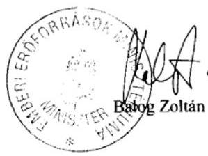

---

# 10/b. számú melléklet   a V-0016-170/2012. sz. jelentéshez 

## Balog Zoltán úr

miniszter úr
Emberi Erőforrások Minisztériuma

## Budapest

## Tisztelt Miniszter Úr!

A megváltozott munkaképességűek foglalkoztatása költségvetési támogatási rendszerének és a támogatások hasznosulásának ellenőrzése című jelentéstervezetre tett észrevételeit köszönettel megkaptam.

Az Állami Számvevőszék észrevételekre vonatkozó álláspontjáról a felügyeleti vezető által készített részletes tájékoztatást csatoltan megküldöm.

Tájékoztatom Miniszter urat, hogy a jelentésben - az Állami Számvevőszékről szóló 2011. évi LXVI. törvény 29. § (3) bekezdése alapján - az el nem fogadott észrevételeket szerepeltetjük az elutasítás indokának feltüntetésével együtt. Az elfogadott észrevételeket a jelentés szövegezésénél figyelembe vesszük.

Budapest, 2012. 12. hó 2. nap
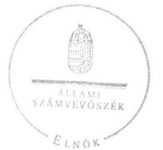

Tisztelettel:

## 106

Melléklet: Tájékoztatás az elfogadott és az el nem fogadott észrevételekről

---

# Tájékoztatás 

## az elfogadott és az el nem fogadott észrevételekről

A megváltozott munkaképességűek foglalkoztatása költségvetési támogatási rendszerének és a támogatások hasznosulásának ellenőrzése című jelentéstervezetre 29498-6/2012/REHAB iktatószámú levelében tett észrevételeit áttekintettük, azok kezeléséről az alábbi tájékoztatást adom.

Általános észrevételek:
A megváltozott munkaképességű munkavállalókat foglalkoztató munkáltatók akkreditációjáról, valamint a megváltozott munkaképességű munkavállalók foglalkoztatásához nyújtott költségvetési támogatásokról szóló 327/2012. (XI. 16.) Korm. rendelet elfogadására vonatkozó tájékoztatását köszönettel vettük, megjelenését érzékeltük. Örömmel vettük tudomásul, hogy az Állami Számvevőszék ellenőrzése során feltárt hiányosságokat a jogalkotás során figyelembe vették. Ennek következtében a jelentéstervezetben megfogalmazott, a szabályozási rendszerre és a pályáztatásra vonatkozó intézkedést igénylő megállapításainkat és javaslatainkat töröltük, a feltárt hiányosságokat csak a számvevőszéki jelentés összegzőjében szerepeltetjük.

Észrevételében kifogásolta, hogy az ellenőrzött időszak a 2007-2011. évekre terjedt ki, ugyanakkor a jelentéstervezet a 2005-2006. évi iratok hiányát fogalmazta meg. A jelentéstervezetben szereplő, 45. oldalon jelzett hiányzó iratok a rehabilitációs költségtámogatás pályázati dokumentációi voltak. Tekintettel arra, hogy a 2007-2011. évi kifizetések a 2005-2006. évben kiírt pályázatok alapján történtek, (a későbbi években nem volt pályáztatás) ezen dokumentumok hiányában nem volt megállapítható, hogy a támogatásban részesült szervezetek kiválasztása a jogszabályi, illetve a pályázati feltételeknek megfelelően történt-e.

Észrevételében kifogásolta továbbá, hogy a feltárt mulasztások, hiányosságok konkrét időszak megjelölése nélkül szerepelnek a jelentéstervezetben, ezért kérik ennek pótlását az egész anyagban. Észrevételét nem fogadjuk el, mert a jelentéstervezetben az indokolt helyeken feltüntettük az időszakot, ahol ezt nem jeleztük, ott megállapításaink a vizsgálat teljes időtartamát érintik.

Levelében több esetben jelezte, hogy az át nem adott dokumentációkért nem a minisztériumot terheli a felelősség. Ezért kérte a jelentéstervezet módosítását. A Magyar Köztársaság minisztériumainak felsorolásáról szóló 2010. évi XLII. törvény 2. § (1) bekezdés k) pontja meghatározza, hogy az ellenőrzést érintő területek tekintetében a Szociális és Munkaügyi Minisztérium jogutódjának a Nemzeti Erőforrás Minisztériumot kell tekinteni. A törvény 1. számú melléklete meghatározta az átadás-átvételi jegyzőkönyv tartalmára vonatkozó követelményeket. Ennek következtében az ellenőrzés során kért dokumentumok az átadás-

---

átvétel részét kellett, hogy képezzék. A feladathoz kapcsolódó hatáskörök változását mind a jelentéstervezet bevezető része, mind a részletes megállapítások fejezetben leírtak részletesen tartalmazzák. Ezért nem tartom indokoltnak az Ön által javasolt szerkezetben történő ismételt bemutatását.

Az ellenőrzés végrehajtásához bekért dokumentumokról tételes listát adtunk át az ellenőrzött szervezetek részére. Az Emberi Erőforrások Minisztériuma a bekért dokumentumokat teljes körűen nem tudta átadni az ellenőrzést végző számvevők részére. Ennek tényét (az át nem adott dokumentumok körét) 2012.07.12-én jegyzőkönyvben rögzítették a Minisztérium és az Állami Számvevőszék munkatársai. A számvevőszéki jelentéstervezetben a dokumentációk hiányával kapcsolatban tett megállapítások kerültek rögzítésre.

# Konkrét észrevételek: 

Jelentéstervezet 12. oldal 3. bekezdésével kapcsolatban tett észrevételét elfogadtuk, a számvevőszéki jelentésben a megállapítást a következők szerint pontosítjuk:
„A megváltozott munkaképességűek foglalkoztatásának támogatása a 2007-2009. években a Szociális és Munkaügyi Minisztérium (SZMM), a 2010. évtől a Nemzeti Erőforrás Minisztérium (NEFMI) hatáskörébe tartozott, a két fejezeti kezelésű előirányzat a minisztériumok költségvetésében került megtervezésre. Az ellenőrzött időszakban a szervezeti átalakítás a támogatásközvetítő intézményrendszert is érintette.

A támogatásokkal kapcsolatos szakmai irányítás az ellenőrzött időszakban az SZMM, a Nemzetgazdasági Minisztérium, valamint a NEFMI végezte. "

A fenti módosítás következtében nincs ellentmondás a jelentéstervezet 39. oldalának utolsó bekezdésében leírtakkal.

A jelentéstervezet 15. oldal 1. bekezdésére vonatkozóan az időpontokat érintő észrevételét elfogadtuk. A számvevőszéki jelentést a következők szerint pontosítjuk:
„A megváltozott munkaképességű személyek foglalkoztatását a gazdálkodó szervezetek részére a Kormány vissza nem térítendő támogatásokkal segítette elő. Ennek ösztönzésére 1983-tól 2007. június 30-ig normatív támogatásra épülő dotációs rendszert működtetett. $\qquad$ Az új támogatási rendszer teljes körű bevezetése fokozatosan - a jogszabályi háttér biztosításával - 2003 szeptemberétől 2007 júliusáig tartó átmeneti időszak alatt valósult meg. "

A jelentéstervezet 15. oldal 4. bekezdésére vonatkozóan az időpontot érintő észrevételét elfogadtuk. A számvevőszéki jelentést a következők szerint pontosítjuk:
„A 2005. évi támogatási rendszer átalakítását megalapozó hatástanulmányt, számszerűsített célokat is tartalmazó stratégiát, rövid- és hosszú távú cselekvési programot a felügyeleti szerv nem tudta átadni. Nem tudtak információt adni a támogatás szempontjából figyelembe vehető célcsoportok nagyságrendjéről és

---

jellemzőiről sem. Hatékonysági és eredményességi célkitűzéseket a jogszabályok és a támogatási szerződések nem tartalmaztak, továbbá nem határozták meg a támogatások eredményességét és hatékonyságát mérő indikátorokat sem."

Elfogadtuk a jelentéstervezet 16. oldal 1. bekezdését érintő észrevételét. Ennek alapján a számvevőszéki jelentést a következők szerint pontosítjuk:
„Az EMMI és az NRSZH tanúsítványai alapján (a jogelőd szervezetekre is vonatkozó adatszolgáltatás) a két fejezeti kezelésű előirányzat terhére a megváltozott munkaképességű munkavállalók foglalkoztatásához nyújtott támogatások területi megoszlása az ellenőrzött időszakban egyenlőtlenségeket mutatott. A szakmai irányítást ellátó minisztériumokban és háttérintézményekben nem vezettek olyan nyilvántartást........."

Elfogadtuk a 16. oldal 3. bekezdését érintő észrevételeit, a bekezdést az alábbiak szerint pontosítjuk:
„A megváltozott munkaképességű munkavállalók támogatását biztosító fejezeti kezelésű előirányzatok szakmai és részben pénzügyi kezelési feladatait 2006. évtől a kormányváltásig az SZMM, a kormányváltást követően rövid ideig az NGM és 2010. december 4-től a NEFMI végezte. A támogatást közvetítő intézményrendszert több szervezeti átalakítás érintette, amelyek a feladatellátást nem veszélyeztették.
A költségkompenzációs és a rehabilitációs költségtámogatás kezelését 2009. évig az SZMM, 2010. évtől az FSZH és 2011. évtől az NRSZH végezte $\qquad$
A jelentéstervezet 17. oldal 1. bekezdéséhez tett észrevételét elfogadtuk, a számvevőszéki jelentést az alábbiak szerint módosítjuk:
„A pályázatok elbírálásával kapcsolatos döntést megalapozó dokumentumok, valamint a döntésről szóló határozatok a jogutód minisztériumban teljes körűen nem álltak rendelkezésre."

A jelentéstervezet 17. oldal 3. bekezdésével kapcsolatos észrevételét nem fogadtuk el. Az ÁSZ részére átadott dokumentumok csak a könyvvizsgáló által készített támogatási igények elbírálásáról szóló összesítő jelentéseket és a szervezetenkénti értékelő lapokat tartalmazták. A szervezetek eredeti támogatási igényét, azt megalapozó számításokat az átadott dokumentáció nem tartalmazta.

A jelentéstervezet 18. oldal 1. bekezdésével kapcsolatban kért törlést nem fogadtuk el. A jelentéstervezetben leírtak a halmozódást a támogatott létszámra állapította meg, nem a támogatás jogcímére. A támogatási rendszer lehetővé tette, hogy a munkáltató egy megváltozott munkaképességű munkavállaló után egy időben bérkompenzációs és költségkompenzációs támogatásban is részesüljön. Ennek következtében a foglalkoztatásba bevont megváltozott munkaképességűek létszáma halmozódást tartalmaz. Erre a tényre hívta fel a jelentéstervezet a figyelmet.

A jelentéstervezet 19. oldal 2. bekezdésével kapcsolatban tett észrevételeit elfogadtuk, a számvevőszéki jelentést az alábbiak szerint módosítjuk:
„Az előirányzat a 2009. szeptember 1-ig ún. felülről nyitott (előirányzat módosítás nélkül teljesülő) volt. Az ezt követő időszakban az RMK-k részére a minisztérium éves keretösszeget határozott meg. A 2010. évről a 2011. évre a támogatás összege 7,9%-kal tovább csökkent. 2010 szeptemberétől az akkreditációs követelmények szigorodtak, új kérelmet csak kiemelt tanúsítvánnyal rendelkező és minimum 20 fő alkalmazottat foglalkoztató munkáltató adhatott be.

A jelentéstervezet 21. oldal 1-4. bekezdésével kapcsolatban tett észrevétele nem érinti a jelentéstervezet megállapításait, ahhoz csak kiegészítő információt nyújt.

A jelentéstervezet 22. oldal 2. bekezdéséhez tett észrevételét nem fogadtuk el. A 2010. évi támogatások felhasználását a Kincstár 2011. I. negyedévében ellenőrizte. A helyszíni ellenőrzés időpontjában - az FSZH 2010. december 31-ei megszünése miatt - a támogatásokkal kapcsolatos jogkört már az NRSZH gyakorolta. A Kincstár helyszíni ellenőrzése során felvett jegyzőkönyvben rögzített hiányosságokra a határozathozatal egy esetben 13 hónap, további négy esetben több mint 11 hónap elteltével történt meg.

A jelentéstervezet 30. oldal 1. bekezdésével kapcsolatban tett észrevétele nem érinti a jelentéstervezet megállapításait. A helyszíni ellenőrzés a megváltozott munkaképességű munkavállalókat foglalkoztató munkáltatók akkreditációjáról, valamint a megváltozott munkaképességű munkavállalók foglalkoztatásához nyújtott költségvetési támogatásokról szóló 327/2012. (XI. 16.) Korm. rendelet hatályba lépése előtt 2012. augusztus 3-án befejeződött.

A jelentéstervezet 45. oldal 3. bekezdését észrevétele alapján a számvevőszéki jelentést az alábbiak szerint módosítjuk:
„Az Emberi Erőforrások Minisztériuma (EMMI, mint jogutód) a védett szervezetek részére a 2005. és a 2006. években meghirdetett pályázatok elbírálásával kapcsolatos iratokat, - bírálat szempontjai, a bizottság jegyzőkönyve, a nem nyertes (elutasított) szervezetek jegyzéke, az elutasítás indoka - a döntést megalapozó dokumentumokat és a miniszter döntéséről készített határozatokat - a 2007. évi miniszteri döntésről készült határozatok kivételével - az ellenőrzés részére nem adott át."

A jelentéstervezet 47-48. és 58. oldalával kapcsolatban megfogalmazott észrevételét nem fogadtuk el, az általános észrevételekre adott válaszunkban foglaltak alapján.

A jelentéstervezet 60. oldalával kapcsolatban tett
 észrevételét nem fogadtuk el, mert a 21 rehabilitációs költségtámogatásban részesült munkáltató védett szervezeti szerződésében meghatározásra került, hogy a megváltozott munkaképességű személyek kötelező foglalkoztatási szintet meghaladó foglalkoztatása mellett legalább hány olyan személy foglalkoztatását vállalja, akinek egészségi állapota, illetve fogyatékossága miatt a nyílt munkaerőpiacon történő foglalkoztatására a munkaügyi központok véleménye szerint nincs

lehetőség. Ezen feltétel teljesüléséről az ellenőrzés részére átadott dokumentációk információt nem tartalmaztak.

A jelentéstervezet 65. oldal 3. bekezdésével kapcsolatban megfogalmazott észrevételét nem fogadtuk el. A jelentéstervezetben tett megállapításunk a Moneta Kft. éves összefoglaló jelentésére vonatkozott.

A jelentéstervezet 69. oldal 9. bekezdését kérésének megfelelően töröltem. Jelentéstervezet 70. oldal 5. bekezdését az alábbiak szerint kiegészítjük:
„A jelentést az Országgyűlés a 70/2012. (X. 16.) számú határozatával elfogadta."
A jelentéstervezet 71. oldal utolsó bekezdésével kapcsolatban kért kiegészítést nem fogadtuk el, mert a 2012. évi támogatási szerződések ellenőrzése nem képezte az ellenőrzési program részét, ezért erről véleményt mondani nem tudunk.

Tájékoztatom, hogy a számvevőszéki jelentés mellékleteiként szerepeltetjük a jelentéstervezethez tett észrevételeit, valamint azokra adott válaszunkat.

Budapest, 2012. 12. hó 8. nap

Holman Magdolna
felügyeleti vezető

---

# Nemzeti Rehabilitációs és Szociális Hivatal 

Főigazgató
1071 Budapest, Damjanich u. 48.
Telefon: (1) 462-6410 Fax: (1) 462-6421
E-mail: toggazgatoemrsch.hu
Iktatószám: IV./021987-1/2012
Ügyintéző: Boros Attila
Tárgy: észrevételek jelentéstervezethez

Állami Számvevőszék
Domokos László
elnök részére

## Budapest

Apáczai Csere János utca 10.
1052

Tisztelt Elnök Úr!
..A megváltozott munkaképességűek foglalkoztatása költségvetési támogatási rendszerének és a támogatások hasznosulásának ellenőrzéséről" szóló jelentéstervezetet köszönettel megkaptam, arra a következő észrevételeket teszem.

Általános észrevételek

1. A költségkompenzációs és rehabilitációs költségtámogatás kezelését az FSZH 2010-től, az NRSZH 2011-től végezte. A korábbi években a feladat az SZMM-nél volt. A 2010. évben az FSZH a támogatást már úgy vette át, hogy az adott évre vonatkozó tervezési felhívás már 2009 decemberében a munkáltatók részére az SZMM által kiküldésre került. Mivel újabb pályázat nem került kiírásra az évek folyamán - az EMMI és az NRSZH a tapasztalatok birtokában új támogatási rendszer kidolgozása mellett döntött, jelen ÁSZ jelentés megállapításaival megegyezően - így a létszámeloszlást a két szervezet „készen" kapta, azon módosítani nem volt lehetősége.
2. A rendszer hatékonysága 2011-re (az első teljes év, amikor mindent az EMMI és az NRSZH (FSZH) bonyolított le) növekedett, ugyanis több, mint 20%-kal kevesebb forrásból nagyságrendileg azonos számú megváltozott munkaképességű munkavállaló foglalkoztatása valósult meg a költségkompenzációs, és rehabilitációs költségtámogatás keretében.
3. A rehabilitációs költségtámogatásban részesülők számára valóban nem írta elő jogszabály az előzetes akkreditációs kötelezettséget, ennek ellenére - két szervezet kivételével - mindegyikük akkreditáltatta magát.
4. Az FSZH-nak a 2010. évben tapasztalat és idő hiányában, valamint az 1. pontban leírtak okán nem volt lehetősége a rendszeren érdemben módosítani, a 2011. évre vonatkozóan a

dokumentációk minden esetben előzetesen egyeztetésre kerültek az ellenőrzést végző Magyar Államkincstárral.
5. A jogszabályokban a hatáskörök nem voltak kellően rendezve a visszakövetelésekkel kapcsolatos eljárást illetően, továbbá a folyamatban lévő bírósági ügyek - 2012-ben több jogerős ítélet is született - is kihatással voltak a visszakövetelésekre. Ezen okból az NRSZH több egyeztetést folytatott le az EMMI-vel az ügyben, továbbá az eljárásokkal kapcsolatban írásbeli választ kért. A problémát az okozta, hogy jogszabályokban az NRSZH (FSZH) döntéselőkészítő, számfejtő, folyósító szervként van megjelölve, míg a döntést a társadalmi esélyegyenlőség előmozdításáért felelős miniszter hozza meg, továbbá a 177/2005 (IX. 2.) Korm. rendelet nem rendezi a visszaköveteléseket kellőképpen, míg az eljárás vonatkozásában a 2004. évi CXL. törvény, valamint az 1991. évi IV. törvény eltérően szabályoz.

# Konkrét észrevételek: 

1. Észrevételek az ellenőrzés, intézkedést igénylő megállapításaira, javaslataira (23-26. oldal):

- A javaslatnak teljes mértékben megfelelő, nyílt pályázat keretében kiválasztásra kerülő foglalkoztatókkal a 327/2012. (XI.16.) Kormányrendelet alapján új pályázat került 2012. november 17-én kiírásra. A Nemzeti Rehabilitációs és Szociális Hivatal, valamint a szakmai irányítása alá tartozó rehabilitációs szakigazgatási szervek feladat- és hatásköréről szóló 95/2012. (V.15.) Kormányrendelet 2012. november 13-i módosításával a visszakövetelések helyzete is rendezésre került, a 6. § (3) bekezdésében mondja ki egyértelműen a Hivatal elsőfokú hatósági jogkörét, a 9. §. (4) bekezdésében pedig az erről szóló döntés formáját a visszakövetelések ügyében.
- A 2011. évtől az NRSZH (FSZH) a támogatások felosztásával kapcsolatban több alternatívát is készített az EMMI részére, amelyek közül az EMMI, a költségvetési soron rendelkezésre álló forrás figyelembe vételével, döntött a megvalósítandó alternatíváról.
- A súlyos fogyatékosok számának növekedését az okozta, hogy amikor bevezetésre került - a rendszerek közelítése szempontjából - a rehabilitációs költségtámogatott szervezetek esetében is az egészségkárosodáshoz igazított támogatás mértéke, az előzetes kalkulációkhoz előzetesen bekért megoszlást három szervezet nem megfelelően adta le, esetükben a létszámarány változást csak 2011. II. félévében állt módunkban elfogadni. Addig ezen személyekre támogatást csak a nem súlyos fogyatékosok mértékéig vehettek igénybe. Ez összességében 1694 fős növekedést (37%-os változás) jelentett.

2. Az akkreditációs követelményrendszer 2005. november 1-je, vagyis a 176/2005. (IX. 2.) Korm. rendelet hatályba lépése óta változatlan. A 168/2009. (VIII. 26.) Korm. rendelet valóban az új bértámogatás iránti kérelmek befogadásának szüneteléséről rendelkezett - amely jelentős szerepet játszott a létszám csökkenésében -, azonban nemcsak a kiemelt tanúsítvánnyal rendelkezők, hanem az összes akkreditált, és az illetékes munkaügyi központtal kötött érvényes és hatályos támogatási szerződéssel rendelkező szervezet számára továbbra is fennmaradt a lehetőség a szerződések meghosszabbítására, amely nem konkrét létszámhoz (lásd 20 fő) lett kötve, hanem az adott foglalkoztató korábban szerződött létszámára lett korlátozva. (19. oldal)
3. A rokkantsági nyugdíjrendszer átalakítása vonatkozásában a felülvizsgálatok folyamatban vannak. Létrejöttek a fővárosi, megyei kormányhivatalokon belül a rehabilitációs szakigazgatási szervek, amelynek köszönhetően az ügyek immár egy szervezetnél összpontosulnak. A jövőben a területi elhelyezkedést az újonnan felállított rendszernek köszönhetően meg lehet már mondani, mivel a teljes folyamat egy szervezetnél összpontosul, továbbá az új támogatási rendszer lehetőséget biztosít arra is, hogy amennyiben bizonyos területen a foglalkoztatási kapacitások nem biztosítottak, arra külön, meghívásos pályázatot lehet kiírni. (32. oldal)
4. A vezető tisztségviselők juttatásai vonatkozásában a Jelentésből nem derül ki, hogy a 2007. évi juttatások milyen időszakra lettek számítva, mivel 2007. év a támogatás szempontjából több szervezet esetében is csak tört év - félév - volt. (Ezt javasolt minden táblázat esetében figyelembe venni) (54. oldal, továbbá 3,4,6,7,8,9. sz. mellékletek.)
5. A régiónkénti alakulást vizsgáló kimutatásokat torzíthatja, hogy a szervezetek szerte az országban rendelkeznek telephellyel. Ennek következtében a támogatás székhelyhez való csoportosítása nem valós képet mutat. (58-59. oldal)
6. A 176/2005. (IX.2.) Kormányrendelet szerinti akkreditációs eljárások lefolytatásában az FSZH, illetve az NRSZH szigorúan és kizárólag jogalkalmazóként vett részt. (42. oldal)

Kérem Tisztelt Elnök Urat, hogy a jelentés véglegesítésénél észrevételeinket figyelembe venni szíveskedjen.

Budapest, 2012. november 10.
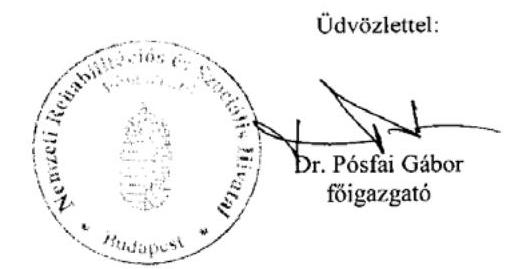

---

# 11/b. számú melléklet   a V-0016-170/2012. sz. jelentéshez 

## 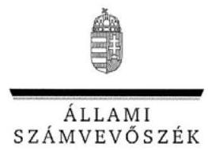

Ikt.szám: V-0016-168/2012.

## Dr. Pósfai Gábor úr   főigazgató

Nemzeti Rehabilitációs és Szociális Hivatal

## Budapest

## Tisztelt Főigazgató Úr!

A megváltozott munkaképességűek foglalkoztatása költségvetési támogatási rendszerének és a támogatások hasznosulásának ellenőrzése címû jelentéstervezetre tett észrevételeit köszönettel megkaptam.

Az Állami Számvevőszék észrevételekre vonatkozó álláspontjáról a felügyeleti vezető által készített részletes tájékoztatást csatoltan megküldöm.

Tájékoztatom Főigazgató urat, hogy a jelentésben - az Állami Számvevőszékről szóló 2011. évi LXVI. törvény 29. § (3) bekezdése alapján - az el nem fogadott észrevételeket szerepeltetjük az elutasítás indokának feltüntetésével együtt. Az elfogadott észrevételeket a jelentés szövegezésénél figyelembe vesszük.

Budapest, 2012. 11. hó 11. nap
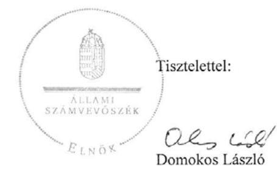

Melléklet: Tájékoztatás az elfogadott és az el nem fogadott észrevételekről

---

# Tájékoztatás 

## az elfogadott és az el nem fogadott észrevételekről

A megváltozott munkaképességűek foglalkoztatása költségvetési támogatási rendszerének és a támogatások hasznosulásának ellenőrzése címû jelentéstervezetre IV./021987-1/2012 iktatószámú levelében tett észrevételeit áttekintettük, azok kezeléséről az alábbi tájékoztatást adom.

Általános észrevételek:
Az 1., 2., 3., és 4. észrevétele nem módosítja a jelentéstervezet megállapításait. A jelentéstervezet 18. és 19. oldalán található grafikonok is azt mutatják, hogy 2010. évhez viszonyítva a 2011. évben a rehabilitációs költségtámogatásban és a költségkompenzációs támogatásban részesült megváltozott munkaképességű munkavállalók létszáma 2,04%-kal, a folyósított támogatás összesen 17,39%-kal (rehabilitációs költségtámogatás esetében 18,25%, költségkompenzációs támogatás esetében 5,37%) csökkent. Az Önök észrevétele miszerint, „kevesebb forrásból nagyságrendileg azonos számú megváltozott munkaképességű munkavállaló foglalkoztatása valósult meg" nem módosítja a jelentéstervezetben leírtakat. A jelentéstervezet 19. oldalán az ellenőrzés megállapítja, hogy a társaságok számára a jogszabályok és támogatási szerződések a foglalkoztatással kapcsolatban mérhető célokat, gazdálkodásukkal kapcsolatban mutatószámokat nem határoztak meg. Ezek hiányában a felhasznált támogatások hatékonysága nem értékelhető.

Az 5. számú általános észrevételét nem fogadtuk el. A megváltozott munkaképességű munkavállalók foglalkoztatásához nyújtható támogatásokra vonatkozóan a folyamatokat - a visszaköveteléssel kapcsolatos eljárásokat is - eljárásrendekben szabályozták. A jelentéstervezet 37. oldala tartalmazza, hogy a költségkompenzációs támogatással és a rehabilitációs költségtámogatással kapcsolatos eljárásrendet az FMM 2006. évben készítette el, mely az ellenőrzés időpontjában érvényes volt. Az eljárásrend aktualizálása a szervezeti változásoknak és a feladatok ellátásának megfelelően nem történt meg. A minisztérium és az NRSZH feladatainak megosztásához és egységes értelmezéséhez az eljárásrend aktualizálása indokolt.

## Konkrét észrevételek:

A jelentéstervezet intézkedést igénylő megállapításaira vonatkozó 1. számú észrevételének 1-2 pontjában megfogalmazott tájékoztatást köszönettel vettem. A megváltozott munkaképességű munkavállalókat foglalkoztató munkáltatók akkreditációjáról, valamint a megváltozott munkaképességű munkavállalók foglalkoztatásához nyújtott költségvetési támogatásokról szóló 327/2012. (XI. 16.) Korm. rendelet megjelenését érzékeltük, az abban foglaltakat a jelentés készítésénél figyelembe vettük. A súlyos fogyatékosok számának 2011. évközi

változásának indokolását elfogadtuk. Ez azonban nem módosítja az ellenőrzés azon megállapítását, hogy az egyes szervezetek között jelentős (1-78%) eltérés mutatkozott a súlyos és nem súlyos fogyatékos munkavállalók arányában. Ezt is figyelembe véve a javaslat szövegét pontosítottuk.
„Vizsgáltassa ki, hogy a súlyos fogyatékkal élő megváltozott munkaképességű munkavállalók arányának eltérését az egyes munkáltatóknál indokolta-e és alátámasztotta-e az egészségkárosodás romlásának mértéke."
2. számú észrevételét elfogadtuk, ennek alapján a megállapítás az alábbiak szerint módosul:
„A 2010. évről a 2011. évre a támogatás összege 7,9%-kal tovább csökkent. 2010 szeptemberétől az akkreditációs követelmények szigorodtak, új kérelmet csak kiemelt tanúsítvánnyal rendelkező és minimum 20 fő alkalmazottat foglalkoztató munkáltató adhatott be.
3. számú észrevétele az ellenőrzött időszakot (2007-2011.) követően tett intézkedéseket tartalmazza, ezért a jelentés megállapításait nem módosítja.
4. számú észrevételében foglaltakat a táblázatok készítésénél figyelembe vettük. Az adatok egyértelművé tétele érdekében a táblázatok lábjegyzetében jelezzük, hogy a 2007. évben mely szervezetek nem részesültek egész évben támogatásban. A vezető tisztségviselők juttatásával kapcsolatos kimutatásban a teljes évi kifizetés szerepel.
5. számú észrevételét nem fogadtuk el. A megváltozott munkaképességű munkavállalók foglalkoztatása esélyegyenlőségének biztosítását a célcsoport nagyságának és foglalkoztatottságának területi megoszlása alapján célszerű megítélni. Az ellenőrzött időszakban sem a minisztériumban, sem a háttérintézményeiben nem állt rendelkezésre olyan nyilvántartás, amelyből megállapítható lett volna az állami támogatások célcsoportját képező és a foglalkoztatható megváltozott munkaképességű személyek száma és területi eloszlása.
 Ennek hiányában a kimutatást csak a foglalkoztató székhelyére vonatkozóan lehetett elkészíteni. A szervezetek nem rendelkeztek a telephelyekre lebontott támogatásokról.
6. számú észrevétele nem módosítja megállapításunkat, ahhoz kiegészítő információt nyújt.

Tájékoztatom, hogy a számvevőszéki jelentés mellékleteiként szerepeltetjük a jelentéstervezethez tett észrevételeit, valamint azokra adott válaszunkat.

Budapest, 2012. 13. hónap

Holman Magdolna
felügyeleti vezető

---

# 12/a. számú melléklet a V-0016-170/2012. sz. jelentéshez 

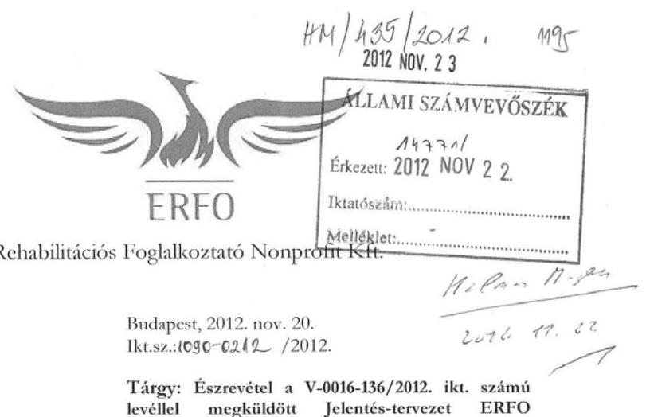

Budapest

Tisztelt Elnök Úr!

Köszönjük a Jelentés-tervezet megküldését, annak áttanulmányozását követően az abban foglaltaknak két pontosítását kérjük.

A Jelentés-tervezet Kivonat 4. oldalán az utolsó előtti beljebb kezdett bekezdésben véleményünk szerint az ERFO Nkft. helyett a Főkefe Nkft. nevesítése tükrözné jobban a valóságot.

Tekintettel arra, hogy az intézményi foglalkoztatásnál Társaságunk marginális szerepet játszott a vizsgált időszakban, míg 2007. évben is az intézményi foglalkoztatás nem érte el cégünknél a 240 főt, ez a vizsgálat éveiben rendre nagymértékben csökkent, így 2011. évben már a 40 főt sem érte el.

Az 5. oldalon a jkv. utolsó bekezdésében szereplő megállapításnál annak 378 ezer Ft-os összegét és az éves lehívott rehabilitációs költségtámogatás teljes összegéhez viszonyított 0,159 ezrelék arányát a valós kép jobb érzékeltetése miatt kérjük, feltüntetni szíveskedjenek.

Megjegyezzük, hogy ezen kifizetés az államháztartáson belüli szervezet, az Országos Rehabilitációs és Szociális Szakértő Intézet bevételét képezte és a nem megváltozott munkaképességű dolgozók foglalkoztatása érdekében felmerült vizsgálati költséget nem itt szerepeltettük.

Kérjük fentiekben indokolt, véleményünk szerint fontos, pontosításra vonatkozó kérésünket akceptálni szíveskedjék. Ezek átvezetését követően a jelentés-tervezet kivonatában foglaltakkal egyetértünk.

Kérésünket megismételve, tisztelettel:

SRFO Nonprofit Kft.
n?n Re. Dózgö
Kovács Gábor
ügyvezető igazgató

---

# 12/b. számú melléklet a V-0016-170/2012. sz. jelentéshez 

## ELNÖK

Ikt.szám: V-0016-164/2012.

## Kovács Gábor úr

ügyvezető igazgató
ERFO Nonprofit Kft.

## Budapest

## Tisztelt Ügyvezető Igazgató Úr!

A megváltozott munkaképességűek foglalkoztatása költségvetési támogatási rendszerének és a támogatások hasznosulásának ellenőrzése címủ jelentéstervezetre tett észrevételeit köszönettel megkaptam.

Az Állami Számvevőszék észrevételekre vonatkozó álláspontjáról a felügyeleti vezető által készített részletes tájékoztatást csatoltan megküldöm.

Budapest, 2012. 11. hó 17. nap
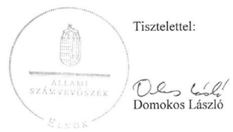

Melléklet: Tájékoztatás az észrevételekről

---

# Tájékoztatás az észrevételekről 

A megváltozott munkaképességűek foglalkoztatása költségvetési támogatási rendszerének és a támogatások hasznosulásának ellenőrzése címủ jelentéstervezetre 1090-0212/2012. iktatószámú levelében tett észrevételeit áttekintettük, azok kezeléséről az alábbi tájékoztatást adom.

Az Ön által megfogalmazott észrevételek - nagyságrendjüknél fogva - a jelentéstervezet megállapításait nem módosítják, ahhoz kiegészítő információt nyújtanak.

Tájékoztatom, hogy a számvevőszéki jelentés mellékleteiként szerepeltetjük a jelentéstervezethez tett észrevételeit, valamint azokra adott válaszunkat.

Budapest, 2012. 18. hó 12. nap

Holman Magdolna
felügyeleti vezető

---

# 13/a. számú melléklet a V-0016-170/2012. sz. jelentéshez 

## FÖKKFE Nonprofit Kft.

Cím:
Levélcím:
Fővárosi Bíróság:
Telefon:
Fax:
Email:
Web:
1145 Budapest, Leky Adolf u. 41-49.
1443 Budapest, Pf. 169
Cg. 01-09-908769
+36 1 251-3788
+36 1 251-4355
info@fokkfe.hu
www.fokkfe.hu

## ÁLLAMI SZÁMVEVŐSZÉK

Apáczai Csere János u. 10.
Budapest
1052
1364 Bp.4. Pf. 54.
15425172

Domokos László úr részére
Elnök

Tisztelt Elnök Úr!
Köszönettel megkaptam V-0016-138/2012. ikt. sz. levelét, melynek 4. oldala alján és 5. oldala tetején a FÖKEFE NKft-t is érintő bekezdéseihez az alábbi észrevételt adom.

A megváltozott munkaképességű foglalkoztatást végző gazdálkodó védettszervezetek veszteségeit, különös tekintettel a 2011. évre elsősorban az okozhatta, hogy az állami támogatás csökkenő trendjét a társaságok az elhúzódó gazdasági válságban, expanzív üzleti környezet híján nem tudták kereskedelmi árbevételük növelésével ellensúlyozni, ami így az eredmény romlásához, azaz veszteség realizálásához vezetett.

A FÖKKFE NKft. tekintetében ráadásul olyan egyszeri tételek negatív eredményhatása is vezetett, mint a korábbi évek gazdálkodásában az APEH által indított, s annak jogutódja (NAV) által másodfokú határozatokkal lezárt vizsgálatából eredő 379.125 eFt összegű, különböző (adóhiány, bírság, pótlék) jogcímeken elszenvedett negatív eredményhatás. Ezek nélkül a társaság saját tőkéje nem fordult volna negatívba, miközben a Társaság menedzsmentje 2010 óta számos intézkedéssel igyekezett kezelni a támogatás kieséséből eredő hatásokat.

Tisztelt Elnök Úr!
Kérem engedje meg, hogy idézzek a Gt. 143.§ tekintetében a negatív saját tőke kialakulásáról szóló, tulajdonos MNV Zrt-nek címzett 1350/2012. ikt. sz. levelemből:
„Összességében elmondható, hogy a 2010. évi változatlan támogatási szint mellett, figyelmen kívül hagyva a 2011-es támogatási elvonást, a Társaság eredménye - még a NAV követelésekkel együtt is, a romló gazdasági körülmények ellenére is - pozitív lett volna, összegszerűen 158798 ezer Ft. ami a 2010. évi eredmény több mint 200%-a."

Budapest, 2012. november 30.
Tisztelettel,
Szabó György
ügyvezető igazgató

---

# 13/b. számú melléklet a V-0016-170/2012. sz. jelentéshez 

## ELNÖK

Ikt.szám: V-0016-167/2012.

Szabó György úr
ügyvezető igazgató
FÖKEFE Nonprofit Kft.

Budapest

## Tisztelt Ügyvezető Igazgató Úr!

A megváltozott munkaképességűek foglalkoztatása költségvetési támogatási rendszerének és a támogatások hasznosulásának ellenőrzése címủ jelentéstervezetre tett észrevételeit köszönettel megkaptam.

Az Állami Számvevőszék észrevételekre vonatkozó álláspontjáról a felügyeleti vezető által készített részletes tájékoztatást csatoltan megküldöm.

Budapest, 2012. 11. hó 17. nap

Tisztelettel:

Domokos László

Melléklet: Tájékoztatás az észrevételekről

---

# Tájékoztatás az észrevételekről 

A megváltozott munkaképességűek foglalkoztatása költségvetési támogatási rendszerének és a támogatások hasznosulásának ellenőrzése címủ jelentéstervezetre 2012.12.03/5801. iktatószámú levelében tett észrevételeit áttekintettük, azok kezeléséről az alábbi tájékoztatást adom.

Az Ön által megfogalmazott észrevételek a jelentéstervezet megállapításait nem módosítják, ahhoz kiegészítő információt nyújtanak.

Tájékoztatom, hogy a számvevőszéki jelentés mellékleteiként szerepeltetjük a jelentéstervezethez tett észrevételeit, valamint azokra adott válaszunkat.

Budapest, 2012. 12. hónap

Holman Magdolna
felügyeleti vezető

---

# 14/a. számú melléklet a V-0016-170/2012. sz. jelentéshez 

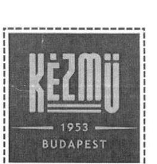

Kézmű Fővárosi Kézműipari Nonprofit Kft.
A céget nyilvántartó bíróság: Fővárosi Bíróság, mint Cégbíróság
Cégjegyzékszám: Cg.01-09-919882
Székhely: H-1147 Budapest, Csáméri út 50-60.
Levélcím: H-1590 Budapest, Pf. 176.
Tel.: +36 14222400 I Fax: +36 12520456
Bankszámlaszám: CIB Bank 10700079-65895986-51100005

## ÁLLAMI SZÁMVEVŐSZÉK

Domokos László úr részére

## Budapest

Apáczai Csere János u. 10.
1052

Iktatószám:660/2012
ÁLLAMI SZÁMVEVŐSZÉK
15033/
Efkce: 2012. NOV. 28.
Iktatószám:
Melléklet:
Tárgy: Észrevétel

## Tisztelt Domokos Úr!

A V-0016-139/2012 iktatószámú levelük mellékleteként megküldött kivonat táblázatával kapcsolatban az alábbi észrevételt tesszük.

## 5.számú melléklet

2011. I. félévi támogatás táblázatban a támogatás összege 2.056.245 eFt, a KÉZMŰ kimutatása szerint 2.056.600 eFt.
2011. II. félévi támogatás táblázatban a támogatás összege 1.916.904 eFt, a KÉZMŰ kimutatása szerint 1.917.891 eFt.

Összes támogatás 3.973.149 eFt, a KÉZMŰ kimutatása szerint 3.974.491 eFt.

## 6.számú melléklet

2009. foglalkoztatott MMK létszám összesen 3086 fő, KÉZMŰ kimutatása szerint 3091 fő
2010. foglalkoztatott munkavállaló össz. 4300 fő, KÉZMŰ kimutatása szerint 4644 fő
2010. foglalkoztatott MMK létszám összesen 3080 fő, KÉZMŰ kimutatása szerint 3239 fő
2010. foglalkoztatott mmk-s létszám aránya az összes foglalkoztatotthoz viszonyítva 72% helyett 70%
2011. foglalkoztatott munkavállaló össz. 4887 fő, KÉZMŰ kimutatása szerint 4965 fő
2011. foglalkoztatott MMK létszám összesen 3071 fő, KÉZMŰ kimutatása szerint 3006 fő
2011. foglalkoztatott mmk-s létszám aránya az összes foglalkoztatotthoz viszonyítva 63% helyett 61%

---

# 8.számú melléklet 

2011. Mérleg szerinti eredmény -1256545 eFt, KÉZMŰ kimutatása szerint -1254104 eFt.
2011. adófizetési kötelezettség 0 Ft, KÉZMŰ kimutatása szerint -2441 eFt.

## 3.oldal, 7. bekezdés

Megítélésünk szerint 2010. évig a rehabilitációs költségtámogatás ellensúlyozta a megváltozott munkaképességű foglalkoztatottsággal kapcsolatos többletköltséget, azonban 2011. évtől a drasztikus támogatás csökkentést követően - a társaságnál kialakult működési és humán struktúrát figyelembe véve - már nem, döntően ezzel magyarázható a 2011. évi jelentős veszteség.

Budapest, 2012. november 22.
G. Nagy László
gazdasági igazgató

---

# 14/b. számú melléklet a V-0016-170/2012. sz. jelentéshez 

## 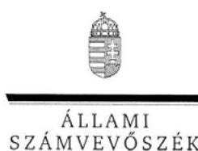

Ikt.szám: V-0016-166/2012.

## Dr. Csereklyei Dániel úr

ügyvezető igazgató
Kézmű Nonprofit Kft.

## Budapest

## Tisztelt Ügyvezető Igazgató Úr!

A megváltozott munkaképességűek foglalkoztatása költségvetési támogatási rendszerének és a támogatások hasznosulásának ellenőrzése címủ jelentéstervezetre a gazdasági igazgató által tett észrevételeit köszönettel megkaptam.

Az Állami Számvevőszék észrevételekre vonatkozó álláspontjáról a felügyeleti vezető által készített részletes tájékoztatást csatoltan megküldöm.

Tájékoztatom Ügyvezető igazgató urat, hogy a jelentésben - az Állami Számvevőszékről szóló 2011. évi LXVI. törvény 29. § (3) bekezdése alapján - az el nem fogadott észrevételeket szerepeltetjük az elutasítás indokának feltüntetésével együtt. Az elfogadott észrevételeket a jelentés szövegezésénél figyelembe vesszük.

Budapest, 2012. 12. hó 17. nap
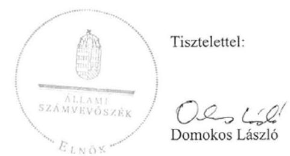

Melléklet: Tájékoztatás az elfogadott és az el nem fogadott észrevételekről

---

# Tájékoztatás az elfogadott és az el nem fogadott észrevételekről

A megváltozott munkaképességűek foglalkoztatása költségvetési támogatási rendszerének és a támogatások hasznosulásának ellenőrzése címủ jelentéstervezetre 660/2012. iktatószámú levelében tett észrevételeit áttekintettük, azok kezeléséről az alábbi tájékoztatást adom.

A jelentéstervezet 5. számú és a 8. számú mellékletével kapcsolatban tett észrevételét elfogadtuk, a számvevőszéki jelentés megállapítását észrevétele alapján módosítjuk.

A jelentéstervezet 6. számú mellékletére vonatkozó észrevételeit nem fogadtuk el. A melléklet a Nemzeti Rehabilitációs és Szociális Hivatal által kitöltött és megküldött tanúsítvány adataiból készült minden szervezet tekintetében.

A jelentéstervezet kivonat 3. oldal 7. bekezdésével kapcsolatban megfogalmazott tájékoztatása a jelentéstervezetben leírtakat nem módosítja.

Tájékoztatom, hogy a számvevőszéki jelentés mellékleteiként szerepeltetjük a jelentéstervezethez tett észrevételeit, valamint azokra adott válaszunkat.

Budapest, 2012. 11. hó 12. nap

Holman Magdolna
felügyeleti vezető

---

# 15/a. számú melléklet a V-0016-170/2012. sz. jelentéshez 

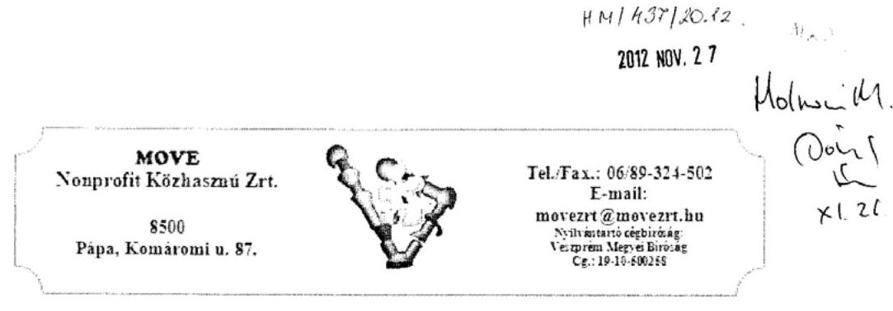

Domokos László
Elnök Úr részére

Ikt.szám: 7858/2012.
Tárgy: Észrevétel V-0016-140/2012.
iktatószámú Számvevőszéki
jelentéstervezettel kapcsolatban
Gépelte: Bognárné K. Ildikó

## Állami Számvevőszék

Budapest, Pf. 54.
1364
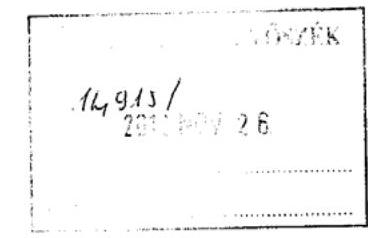
2012. november 13. napján kelt, V-0016-140/2012. iktatószámú Számvevőszéki jelentéstervezetet a megváltozott munkaképességűek foglalkoztatása költségvetési támogatási rendszerének és a támogatások hasznosulásának ellenőrzéséről.

A Számvevőszéki jelentéstervezet tartalmával alapvetően egyetértünk, a benne foglaltakat szakmailag és jogi szempontból egyaránt megalapozottnak tartjuk. A jelentéstervezet 4. oldala, 4) bekezdése azonban a lábjegyzetben felhívott jogszabályok tartalmához képest olyan megállapítást tartalmaz, amely megítélésünk szerint nem egyértelmű. A megváltozott munkaképességű személyek foglalkoztatásához nyújtható költségvetési támogatás megállapítás részleteinek szabályairól szóló 15/2005. (IX.2.) FMM rendelet 3. § (1) bekezdése c.) pontja szerint „a védett foglalkoztatók költségkompenzációs támogatásának megállapításakor a munkáltató részére külön jogszabály alapján kiemelt, illetőleg feltételes tanúsítványban védett foglalkoztatóvá minősített székhelyen, telephelyen, illetőleg fióktelepen munkát végző, megváltozott munkaképességű munkavállalók foglalkoztatásával összefüggő logisztikai költségek közül a tároláshoz közvetlenül kapcsolódó költségek [...] vehetők figyelembe.

---

Tény, hogy az idézett Rendelet 2009-től hatályos, 4. § (4) bekezdése c.) pontja értelmében „a foglalkoztatáshoz kapcsolódó költségek között elszámolható a telephelyek közötti szállítás költségei." A jelentéstervezet felhívott megállapítása a 2009-2011. években a szállítási költségekkel kapcsolatos rakodási költségek elszámolását jelölte meg hiányosságként. A fenti jogszabályi idézetek összevetése alapján ugyanakkor az állapítható meg, hogy ilyen típusú költségként a Rendelet 3. §-ának (1) bekezdése c.) pontja alapján nemcsak a telephelyek közötti árumozgatás, rakodás számolható el és talán nem is életszerű ez a jogi megközelítés, hiszen az egyes telephelyeken belül a futószalagra történő felrakás, a futószalagról történő eltávolítás és a raktároztatás targoncák igénybevételével történik, ezért a megítélésünk szerint indokolatlan lenne e jogszabály helyes szűkítő értelmezése, amely alapján e költségeket az ellenőrző szervezetek nem vehetnék figyelembe az elszámolások felülvizsgálata során.

Mindezek alapján, kérjük a T. Elnök Urat, hogy az itt kifejtett érveinket mérlegeljék és (lehetőség szerint) a jelentéstervezet negyedik oldala negyedik bekezdését e szerint vizsgálják felül!

Pápa, 2012. november 23.

Köszönettel és Tisztelettel:
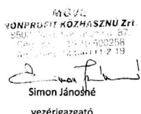

---

# 15/b. számú melléklet a V-0016-170/2012. sz. jelentéshez 

## ÁLLAMI SZÁMVEVŐSZÉK

Ikt.szám: V-0016-165/2012.

## Simon Jánosné asszony

vezérigazgató
MOVE Nonprofit Közhasznú Zrt.

## Pápa

## Tisztelt Vezérigazgató Asszony!

A megváltozott munkaképességűek foglalkoztatása költségvetési támogatási rendszerének és a támogatások hasznosulásának ellenőrzése címủ jelentéstervezetre tett észrevételeit köszönettel megkaptam.

Az Állami Számvevőszék észrevételekre vonatkozó álláspontjáról a felügyeleti vezető által készített részletes tájékoztatást csatoltan megküldöm.

Tájékoztatom Vezérigazgató asszonyt, hogy a jelentésben - az Állami Számvevőszékről szóló 2011. évi LXVI. törvény 29. §
 (3) bekezdése alapján - az el nem fogadott észrevételeket szerepeltetjük az elutasítás indokának feltüntetésével együtt. Az elfogadott észrevételeket a jelentés szövegezésénél figyelembe vesszük.

Budapest, 2012. 12. hó 1. nap
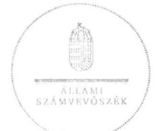

Tisztelettel:

## Clans

Domokos László

Melléklet: Tájékoztatás az elfogadott és az el nem fogadott észrevételekről

---

# Tájékoztatás 

## az elfogadott és az el nem fogadott észrevételekről

A megváltozott munkaképességűek foglalkoztatása költségvetési támogatási rendszerének és a támogatások hasznosulásának ellenőrzése címû jelentéstervezetre 7858/2012. iktatószámú levelében tett észrevételeit áttekintettük, azok kezeléséről az alábbi tájékoztatást adom.

A jelentéstervezet kivonat 4. oldal 4. bekezdésében foglalt megállapításra tett észrevételét nem fogadtuk el. Az Ön által hivatkozott 15/2005 (IX. 2.) FMM rendelet 4. § (4) bekezdése tartalmazza a rehabilitációs költségtámogatás során a foglalkoztatáshoz kapcsolódó költségek között elszámolható költségtípusokat. A hivatkozott Rendelet 4. § (4) bekezdés c) pontja szállítási költségként a telephelyek közti szállítást nevesíti. Téves azon következtetése, hogy a Rendelet 3. § (1) bekezdés c) pontja alapján nemcsak a telephelyek közötti árumozgatás, rakodás számolható el a támogatások terhére költségként. Ez a paragrafus a költségkompenzációs támogatásban részesült szervezetekre vonatkozik. Elfogadott észrevétel nem volt.

Tájékoztatom, hogy a számvevőszéki jelentés mellékleteiként szerepeltetjük a jelentéstervezethez tett észrevételeit, valamint azokra adott válaszunkat.

Budapest, 2012. 12. hó 12. nap

## Rúun (fotow)

Holman Magdolna
felügyeleti vezető
