# ÁLLAMI   SZÁMVEVŐSZÉK 

## JELENTÉS

Badacsonytomaj Város Önkormányzata pénzügyi helyzetének ellenőrzéséről (43/4)

---

# Állami Számvevőszék 

Iktatószám: V-3128-018/2012.
Témaszám: 1015
Vizsgálat-azonosító szám: V0560159

## Az ellenőrzést felügyelte:

Dr. Varga Sándor
számvevő igazgató-helyettes
Az ellenőrzést vezette:
Renkó Zsuzsanna
számvevő tanácsos
Ellenőrzési csoportvezető:
Dér Lívia
számvevő tanácsos

## Az ellenőrzést végezték:

Humli Tamásné
Molnár Istvánné
számvevő tanácsos
számvevő tanácsos

---

# TARTALOMJEGYZÉK 

BEVEZETÉS ..... 9
I. ÖSSZEGZŐ MEGÁLLAPÍTÁSOK, KÖVETKEZTETÉSEK, JAVASLATOK ..... 13
II. RÉSZLETES MEGÁLLAPÍTÁSOK ..... 25

1. Az Önkormányzat kötelező és önként vállalt feladatai, a feladatellátás szervezeti keretei és annak változásai ..... 25
2. Az Önkormányzat pénzügyi egyensúlyi helyzetét befolyásoló tényezők ..... 29
2.1. A működési és a felhalmozási egyensúly változása ..... 31
2.2. Az Önkormányzat bevételeinek változása ..... 37
2.3. Az önkormányzat múködési és a felhalmozási célú kiadásainak változása ..... 40
3. Az önkormányzat kötelezettségei ..... 44
3.1. Az önkormányzat pénzintézeti kötelezettségeinek változása ..... 44
3.2. A szállítói kötelezettségek változása ..... 50
3.3. Egyéb kötelezettségek változása ..... 50
4. A pénzügyi egyensúly megteremtése érdekében hozott intézkedések eredménye ..... 52
5. A helyi önkormányzatok gazdálkodási rendszerének ellenőrzése során a pénzügyi egyensúly javítására tett szabályszerűségi és célszerűségi javaslatok hasznosulása ..... 55

---

# MELLÉKLETEK 

1. számú Múködési és felhalmozási célú hiány/többlet a 2007-2010 közötti időszakban az Önkormányzat zárszámadási rendeleteiben (1 oldal)
2. számú Az Önkormányzat bevételei és kiadásai, valamint adósságszolgálata 2007-2010 között (1 oldal)
3/a. számú Az Önkormányzat 2007-2010. években megvalósított, 2010. december 31ig befejezett fejlesztései és azok forrásösszetétele (1 oldal)
3/b. számú Az Önkormányzat 2010. december 31-én folyamatban lévő fejlesztési feladataira 2010. december 31-ig teljesített kifizetések és azok forrásösszetétele (1 oldal)
3/c. számú Az Önkormányzat 2010. december 31-én folyamatban lévő fejlesztési feladataira 2010. december 31-én fennálló kötelezettségek és azok forrásöszszetétele (1 oldal)
3/d. számú Az Önkormányzat beadott, elbírálás alatti pályázati forrásból megvalósítani tervezett fejlesztéseihez kapcsolódó kötelezettségvállalásai és azok forrásösszetétele (1 oldal)
3. számú Az önkormányzati feladatok ellátásában résztvevő gazdasági társaságok (1 oldal)

---

# RÖVIDÍTÉSEK JEGYZÉKE 

## Törvények

Áht $_{1}$
Áht $_{2}$
Csődtv.
Gt.
Helyi adó tv.
Ötv $_{1}$
Ötv $_{2}$
Számv. tv.

## Rendeletek

Áhsz.
önkormányzati SzMSz

## Szórövidítések

áfa
ÁSZ
BAHART
Egyesület
EU
Iskola
jegyzó
Képviselő-testület

Kincstár
Kistérségi társulás
OEP
Óvoda
Önkormányzat
polgármester
Polgármesteri hivatal

PPP konstrukció
szja
TEKI támogatás

Tűzoltóság
Városüzemeltető Kft.
az államháztartásról szóló 1992. évi XXXVIII. törvény
az államháztartásról szóló 2011. évi CXCV. törvény
A csődeljárásról és a felszámolási eljárásról szóló 1991. évi XLIX. törvény
a gazdasági társaságokról szóló 2006. évi IV. törvény
a helyi adókról szóló 1990. évi C. törvény
a helyi önkormányzatokról szóló 1990. évi LXV. törvény
Magyarország helyi önkormányzatairól szóló 2011. évi CLXXXIX. törvény
a számvitelről szóló 2000. évi C. törvény
az államháztartás szervezetei beszámolási és könyvvezetési kötelezettségének sajátosságairól szóló 249/2000. (XII. 24.) Korm. rendelet
Badacsonytomaj Város Képviselő-testületének a mindenkor hatályos önkormányzati rendelete a szervezeti és múködési szabályzatáról
általános forgalmi adó
Állami Számvevőszék
Balatoni Hajózási Részvénytársaság
Badacsony Céh Turisztikai Egyesület
Európai Unió
Tatay Sándor Közös Fenntartású Általános Iskola
Badacsonytomaj Város Önkormányzatának Jegyzője
Badacsonytomaj Város Önkormányzatának Képviselőtestülete
Magyar Államkincstár
Tapolca és Környéke Többcélú Kistérségi Társulás
Országos Egészségbiztosítási Pénztár
„Pipitér" Közös Fenntartású Napközi Otthonos Óvoda
Badacsonytomaj Város Önkormányzata
Badacsonytomaj Város Önkormányzatának Polgármestere
Badacsonytomaj Város Önkormányzatának Polgármesteri hivatala
Public Private Partnership (Partnerségi együttmúködés közfeladatok ellátására a magánszektor bevonásával)
személyi jövedelemadó
Területi kiegyenlítést szolgáló önkormányzati fejlesztési feladatok támogatása
Hivatásos Önkormányzati Tűzoltóság
Badacsonytomaj Városüzemeltető Kiemelten Közhasznú Nonprofit Korlátolt Felelősségű Társaság

---

.

---

# ÉRTELMEZŐ SZÓTÁR 

| BUBOR | Budapesti Bankközi Forint Hitelkamatláb. Irányadó, refe-   rencia jellegú kamatláb. Mértékét az MNB naponta álla-   pitja meg a banki kamatok figyelembevételével. Közzété-   tele naponta történik. |
| :--: | :--: |
| CLF módszer | Az önkormányzatok költségvetése elemzésének eszköze. A   módszer következetesen elkülöníti a folyó és a felhalmo-   zási költségvetés bevételeit és kiadásait, azok költségvetési   egyenlegeit. Bizonyos mértékig a vállalati gazdálkodás   logikai elemeit érvényesíti az önkormányzatok pénzügyi,   jövedelmi helyzetének vizsgálata során. Az értékelés a   pénzügyi kapacitás fogalmát helyezi a középpontba. |
| EURIBOR | A frankfurti bankközi piacon jegyzett, az Európai Közpon-   ti Bank szabályainak megfelelően megállapított kínálati   kamatláb. Az EURIBOR értékét a legfontosabb európai   bankok hitelkínálatának kamatlábai alapján a Reuters   ügynökség számolja ki és teszi közzé naponta. A magyar   pénzintézetek is ezt használják viszonyítási alapnak EUR   hitelek esetén. |
| használhatósági fok | Az eszközgazdálkodás vizsgálatának elemzése során   használt mutató. Számításakor a tárgyi eszköz könyv sze-   rinti (nettó) értékét viszonyítják a tárgyi eszköz bruttó (be-   szerzési/létesítési) értékéhez. A \%-ban kifejezett mutató   értéke annál kedvezőbb, minél közelebb áll a 100\%-hoz.   Csökkenése az eszköz állagának romlására, avulására   utal, ami maga után vonja az üzemeltetési és fenntartási   költségek növekedését is. |
| kamatkockázat | A változó kamatozású forint-, vagy a devizahitelek futam-   ideje alatt a kamat emelkedése miatt fennálló kamatkoc-   kázat, melynek növekedése miatt nő a hitel törlesztő rész-   lete. |
| kötelező közszolgáltatás | A helyi önkormányzati feladatkörbe tartozó, a köztiszta-   sággal és a településtisztasággal, valamint az élet- és va-   gyonbiztonsággal összefüggő egyes - közszolgáltatás út-   ján megvalósuló - közfeladatok ellátása, amelynek köte-   lező igénybevételét külön jogszabály (törvény, helyi ön-   kormányzati rendelet) határoz meg. |
| közfeladat | Állami, helyi, illetve kisebbségi önkormányzati feladat,   amelynek ellátásáról az államnak, illetve az önkormány-   zatoknak kell gondoskodni. A hatályos szabályozás sze-   rint közfeladatot törvény és önkormányzati rendelet álla-   píthat meg. Az önkormányzatok által ellátandó feladatok   keretszerú meghatározását az Ötv. tartalmazza. |
| LIBOR | Angol kifejezés, a London Interbank Offered Rate rövidíté-   se. Jelentése: Londoni bankközi, referencia jellegú kínálati   (hitel) kamatláb. |

---

önkormányzat többségi tulajdonában lévő gazdasági társaságok
pénzügyi kapacitás
pénzügyi kockázat

Az önkormányzat a gazdasági társaságban a szavazatok több mint ötven százalékával vagy a Ptk. 685/B. § (2)-(3) bekezdéseiben rögzített meghatározó befolyással rendelkezik. A befolyással rendelkező akkor rendelkezik egy jogi személyben meghatározó befolyással, ha annak tagja, illetve részvényese és jogosult e jogi személy vezető tisztségviselői vagy felügyelőbizottsága tagjai többségének megválasztására, illetve visszahívására, vagy a jogi személy más tagjaival, illetve részvényeseivel kötött megállapodás alapján egyedül rendelkezik a szavazatok több mint ötven százalékával (Ptk. 685/B. § (2) bek.). A meghatározó befolyás akkor is fennáll, ha a befolyással rendelkező számára e jogosultságok közvetett módon (köztes vállalkozásain keresztül, a Ptk. 685/B §. (3),(4) bek. szerint) biztosítottak.
A helyi önkormányzat és az önkormányzat irányítása alá tartozó költségvetési szerv többségi tulajdonában, illetve többségi befolyása alatt álló gazdálkodó szervezet esetében hitelfelvétel, kölcsönfelvétel, garancia- vagy kezességvállalás, tartozásátvállalás, tartozás-elengedés, értékpapír kibocsátás, vásárlás, pénzügyi lízing, tartós bérleti szerződés, ingyenes vagyonjuttatás (így különösen: ajándékozás, ingyenes engedményezés), vagy követelésvásárlás, követelésengedményezés végrehajtására vonatkozóan az Áht ${ }_{1}$ 100/M. § (4) bekezdése alapján az önkormányzat rendelkezik döntési jogosultsággal.
A pénzügyi kapacitás (financial capacity) az adósok hitelfelvételi képességének azon mértéke, ahol még anélkül tudják növelni az adósságot, hogy csökkenteniük kellene akár a jelenbeli, akár a jövőben esedékes kiadásaikat a fizetésképtelenség elkerülése érdekében. (Forrás: Az önkormányzati rendszer pénzügyi helyzete, ÁSZKUT tanulmány 2010.)
A múködési kockázat egyik eleme. Megmutatkozhat a költségvetés nagyságrendjének, szerkezetének nem megalapozott módosításaiban, a bevételi és a kiadási előirányzatoktól lényegesen eltérő teljesítésekben, a nem megfelelő belső kontrollrendszer múködésében, a tudatos károkozásokban, a biztosítások elmaradásában, a hibás fejlesztési döntésekben, a nem a terveknek megfelelő forrásfelhasználásokban. Jelentkezhet továbbá a bevételek és kiadások ütemkülönbsége miatt felvett folyószámla- és likvidhitelek költségvetési év végén fennálló egyenlege miatt, amely az önkormányzat költségvetésébe - akár tartósan - beépülő forráshiányt jelzi.

---

törlesztési kockázat

SNA

Annak a kockázata, hogy a megfelelő időben és mértékben a hitelt felvevőnél rendelkezésre állnak-e a pénzintézetek és egyéb szervek felé fennálló kötelezettségek visszafizetéséhez, a hitelek és kölcsönök törlesztéséhez szükséges pénzügyi források.
A törlesztési kockázatot növeli a kamat- és árfolyam növekedése, mivel ezekben az esetekben az adósságszolgálat nőhet. Törlesztési kockázatot okozhat a visszafizetésre tervezett forrás elérésének, teljesítésének bizonytalansága (pl. a visszafizetéshez tervezett tartalékolás elmaradt, a tervezettnél alacsonyabb a saját bevétel, a helyi adóból származó bevétel az adóalanyok, adóalapok csökkenése miatt nem teljesül).
System of National Account azaz a Nemzeti Számlák Rendszere, amely a gazdasági szektorok által létrehozott valamennyi terméket és szolgáltatást figyelembe veszi.

---

.

---

# JELENTÉS 

## Badacsonytomaj Város Önkormányzata pénzügyi helyzetének ellenőrzéséről

## BEVEZETÉS

Az Állami Számvevőszék 2011. évtől érvényes stratégiája új irányt szabott a helyi önkormányzatok gazdálkodásának ellenőrzésében is. Az ÁSZ - küldetése és jövőképe szerint - szilárd szakmai alapokra támaszkodva értékteremtő ellenőrzéseivel és helyzetelemzéseivel az államháztartás egészében, így a helyi önkormányzati alrendszerben is elő kívánja segíteni a közpénzek és a közvagyon szabályos, gazdaságos, hatékony és eredményes felhasználását. E folyamat részeként - az államháztartási hiány alakulásának összetevőire is figyelemmel végezzük az önkormányzati alrendszer pénzügyi helyzetelemzését.

Az államháztartás helyi szintjén a 304 városnak ${ }^{1}$ az általuk ellátott közszolgáltatások volumenére is tekintettel a közfeladatok ellátásában kiemelt szerepe van. E települések 2011. január 1-jei népessége 3169 ezer fő volt.

Feladataik és hatásköreik az Ötv ${ }_{1}$ mellett különböző ágazati törvények által meghatározottak, miközben a feladatellátás szervezeti kereteit - ezen belül a gazdasági társaságok közszolgáltatások ellátásában betöltött szerepét - saját maguk határozzák meg. A gazdasági társaságok által ellátott feladatok esetén a gazdálkodás, továbbá az önkormányzatok pénzügyi egyensúlyi helyzetére ható közvetlen kockázatok egy része kikerült az önkormányzati alrendszerből. A többségi önkormányzati tulajdonban lévő társaságok gazdálkodásának körülményei befolyásolhatják a városok pénzügyi egyensúlyi helyzetének megítélésében rejlő kockázatokat.

Az áttekintett időszakban az önkormányzati forrásszabályozás elvei lényegesen nem változtak. Az önkormányzatok gazdasági mozgásterét a központi költségvetéstől való függőség mellett jelentősen befolyásolja a helyi adókivetési jog gyakorlása. A városok gazdálkodási szabadságának lényeges eleme, hogy anyagi lehetőségeik függvényében dönthettek arról, hogy feladataik közül azokat, amelyek megoldására az Ötv ${ }_{1}$ szerint a települési önkormányzat nem kötelezhető, a megyei önkormányzat fenntartásába adhatták. E döntések differenciáltan érintették a városok pénzügyi helyzetét.

[^0]
[^0]:    ${ }^{1}$ A megyei jogú városok nélkül figyelembe vett városok száma 304 városi önkormányzatot jelent.

---

A városi önkormányzatok 2007-2010 között teljesített bevételeinek alakulását és összetételét a következő ábra szemlélteti:
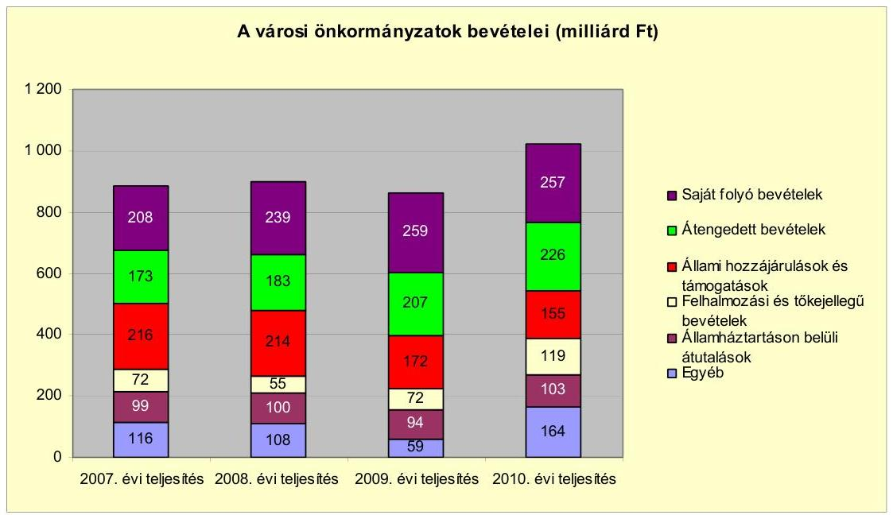

Az önkormányzati alrendszer pénzügyi helyzetértékelése során új elemzési módszereket alkalmazott az ellenőrzés. A költségvetési beszámoló adatok elemzése helyett az önkormányzat pénzügyi helyzetét a CLF módszerrel értékeltük, amelynek lényegét és számításának módszerét a jelentés 2. pontjában, és a jelentés 2 . számú mellékletében ismertetjük részletesen.

Az új módszereken alapuló helyzetértékelés fontosságát az adja, hogy a helyi önkormányzatok bruttó adósságállománya ${ }^{2}$ a 2010. évi költségvetési beszámolók alapján 1248 milliárd Ft-ot tett ki. Ezen belül a 304 város adóssága 383 milliárd Ft volt, amely az önkormányzati alrendszer teljes adósságállományának $30,7 \%$-át jelentette ${ }^{3}$.

A mérlegben kimutatott bruttó adósságállomány mellett az önkormányzatok számára az eszközállomány műszaki állapotának megőrzése is előbb-utóbb pénzügyi kötelezettséget jelent. Az elhasználódott eszközök pótlására forrást biztosító amortizációs (felújítási) alap képzésének ${ }^{4}$ elmaradása maga után vonhatja a feladatellátást kiszolgáló tárgyi eszközök állagának erőteljes romlá-

[^0]
[^0]:    ${ }^{2}$ Az önkormányzati mérlegbeszámolókból számított bruttó adósságállomány 2010. év végi összege magában foglalja a fejlesztési és a működési célú kötvénykibocsátások, a beruházási és fejlesztési hitelek, a működési célú hosszú lejáratú hitelek, a rövid lejáratú hitelek, váltótartozások miatti kötelezettségek teljes (2011-ben, illetve az azt követő években esedékes) állományát. Az önkormányzatok 2007. év végi mérleg szerinti adósságállománya 692 milliárd Ft volt.
    ${ }^{3}$ A fővárosi és a kerületi önkormányzatok adósságának figyelmen kívül hagyásával számított 977 milliárd Ft összegű bruttó adósságállományból a városok 39,2\%-kal részesedtek.
    ${ }^{4}$ Erre a jelenlegi szabályozási környezetben nem kötelezi előírás az önkormányzatokat.

---

sát. Emellett a 2007-2013-as időszakra meghirdetett, vissza nem térítendő EU-s fejlesztési forrásokhoz való hozzájutás lehetősége felerősítette az önkormányzati alrendszer fejlesztési igényeit, amelyek a felhalmozási költségvetési hiány folyamatos emelkedésén túl - az előírt jövőbeni fenntartási kötelezettség miatt tovább terhelhetik az önkormányzatok költségvetését ${ }^{5}$.

Az ÁSZ a 2011. évi ellenőrzési tervében 43. számú, az Önkormányzatok gazdálkodási rendszerének ellenőrzése részeként áttekinti, és elemzi az önkormányzatok pénzügyi helyzetét. A gazdálkodás szabályszerűségét az ÁSZ az előző évek során ebben az önkormányzati körben is ellenőrizte. Jelen vizsgálatunk a tett javaslataink pénzügyi helyzetet érintő pontjainak hasznosítására utóellenőrzés jelleggel tér ki.

Az ellenőrzés megállapításait az Önkormányzat által kitöltött - teljességi nyilatkozattal megerősített - 27 tanúsítványon szolgáltatott adatokra alapoztuk. Ellenőrzési bizonyítékként használtuk fel továbbá:

- a képviselő-testületi és bizottsági előterjesztéseket, a döntés-előkészítés során készített dokumentumokat;
- a kötelezettségvállalások dokumentumait;
- a pénzügyi-számviteli nyilvántartásokat;
- az éves költségvetési beszámolókat;
- a költségvetési és zárszámadási rendeleteket.

Az ellenőrzés a 2007. január 1. - 2011. június 30. közötti időszakot öleli fel. A pénzintézeti kötelezettségek állományának vizsgálatakor az ellenőrzött időszak 2006. december 31. - 2011. június 30. közötti időszakra terjedt ki.

Az ellenőrzés során vizsgáltunk minden olyan körülményt és adatot, amely a program végrehajtásához kapcsolódott és a pénzügyi helyzet alakulására hatást gyakorló releváns tények és folyamatok feltárásához szükségessé vált.

# Az ellenőrzés célja annak értékelése volt, hogy: 

- a vizsgált időszakban a kötelező- és önként vállalt feladatok ellátását biztosító szervezeti keretekben, a feladatellátás módjában bekövetkezett változások milyen hatást gyakoroltak az Önkormányzat pénzügyi helyzetének alakulására;

[^0]
[^0]:    ${ }^{5}$ Az Állami Számvevőszék 2011 júniusában közzétett 1108. számú, a helyi önkormányzatok fejlesztési célú támogatási rendszerének ellenőrzéséről szóló jelentésében feltárta a fejlesztési folyamatok problémáit. A helyi önkormányzatok elsősorban azokat a fejlesztéseket valósították meg, amelyekhez támogatást lehetett igényelni. A fejlesztési célok közül a magasabb támogatási intenzitású pályázatokat részesítették előnyben. A fejlesztéssel megvalósuló létesítmények jövőbeli üzemeltetésének várható ráfordításait az önkormányzatok $71,9 \%$-a nem mérte fel.

---

- az Önkormányzat pénzügyi - ezen belül múködési és felhalmozási - egyensúlya mely tényezők hatására miként változott, és az Önkormányzat milyen intézkedéseket tett a pénzügyi egyensúly javítása érdekében;
- a költségvetési kiadások finanszírozása érdekében vállalt pénzintézeti kötelezettségek hogyan alakultak, továbbá milyen kötelezettségek fennállása befolyásolja az Önkormányzat jövőbeli pénzügyi helyzetét;
- hasznosultak-e a gazdálkodási rendszer korábbi ellenőrzése során a pénzügyi egyensúly javítására az ÁSZ által tett szabályszerűségi és célszerűségi javaslatok.

Az ellenőrzés típusa: szabályszerűségi vizsgálat.
A vizsgálat jogszabályi alapját az Állami Számvevőszékről szóló 2011. évi LXVI. törvény 1. §. (3), 5. § (2)-(6) bekezdései, továbbá az Áht ${ }_{1} 120 /$ A. § (1) bekezdése ${ }^{6}$ előírásai képezik.

Badacsonytomaj város lakosainak száma 2011. január 1-jén 2091 fő volt. Az Önkormányzat a 2007. évi zárszámadási rendelete szerint 1370,9 millió Ft bevételt ért el, amely a 2010. évre 8,6\%-kal 1489,0 millió Ft-ra emelkedett. A 2007. évi teljesített kiadások összege 1223,0 millió Ft volt, amely a 2010. évre 1273,4 millió Ft lett, a növekedés 4,1\%-os mértékű volt. A zárszámadási rendeletben szereplő összes kiadásból a felhalmozási célú kiadás részaránya a 2007. évben $24,2 \%$, a 2010. évben $29,9 \%$ volt. Az Önkormányzat 2007. december 31én a könyvviteli mérleg szerint 4065,7 millió Ft értékű vagyonnal rendelkezett, mely 2010. december 31-re 11,2\%-kal (454,5 millió Ft-tal) 4520,2 millió Ft-ra emelkedett.

[^0]
[^0]:    ${ }^{6}$ 2012. január 1-jétől az Áht ${ }_{2}$ 61. § (2) bekezdés

---

# I. ÖSSZEGZŐ MEGÁLLAPÍTÁSOK, KÖVETKEZTETÉSEK, JAVASLATOK 

Az Önkormányzat - adatszolgáltatása szerint - a 2010. évi 708,4 millió Ft öszszegű működési költségvetési kiadásából 651,5 millió Ft-ot (92,0\%) a kötelező feladatok, 56,9 millió Ft-ot ( $8,0 \%$ ) az önként vállalt feladatok ellátására fordított. Az önként vállalt feladatok - az Önkormányzat által elvégzett besorolás alapján - kulturális, sport feladatokhoz, a helyi médiaszolgáltatáshoz kapcsolódtak, amelyeket a kötelező feladatok mellett látott el a Polgármesteri hivatal és a Városi Művelődési Központ és Könyvtár.

Az Önkormányzat 2011. június 30-i feladatellátásának szervezeti struktúráját a következő ábra szemlélteti:
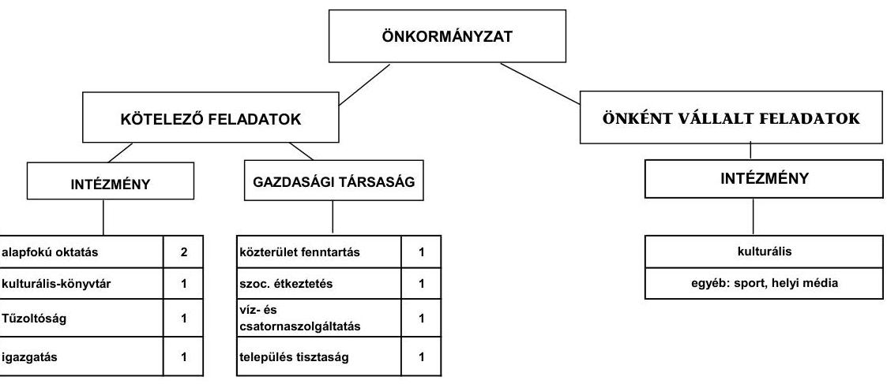

Az Önkormányzat feladatait 2011. június 30-án (a Polgármesteri hivatallal együtt) öt költségvetési szervvel és négy gazdasági társasággal, valamint a Kistérségi társulás tagjaként látta el. A költségvetési szervek száma a vizsgált időszakban eggyel csökkent, a telephelyek száma hét volt, amely nem változott. Az Önkormányzat egy gazdasági társaságban kizárólagos tulajdonnal, egy gazdasági társaságban 75\% feletti tulajdoni hányaddal rendelkezik. A gazdasági társaságok a víz- és szennyvízkezelés, a köztisztasági feladatok, közterületfenntartás munkáiban, város-, strand üzemeltetési és az étkeztetési feladatok ellátásában kaptak szerepet. A gazdasági társaságok a múködésükhöz az ellenőrzött időszakban összesen 180,4 millió Ft rendszeres, 9,6 millió Ft eseti múködési célú pénzeszközátadásban részesültek.

---

Az egyes közszolgáltatások feladatellátásában résztvevő intézmények múködési kiadásainak finanszírozási forrásait ágazatonként a 2007. és a 2010. években a következő ábra szemlélteti:
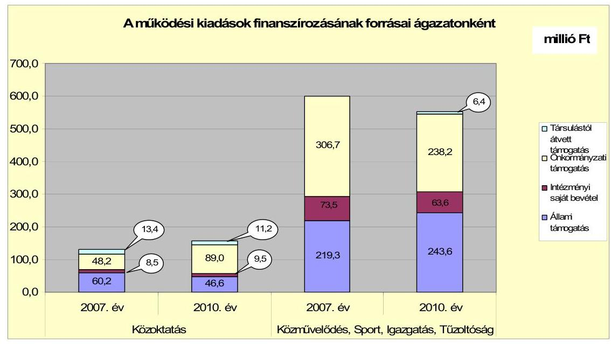

A 2007-2010. években a finanszírozási forrásokon belül összességében az állami támogatás képviselte a legnagyobb részarányt, $44,0 \%$-ot, az önkormányzati támogatás részaránya $41,7 \%$ volt. A fenti ábra alapján a közoktatási ágazat múködési kiadását finanszírozó forrásoknál az állami támogatás $22,6 \%$-os (13,6 millió Ft) csökkenést, a többi ágazatnál 11,1\%-os (24,3 millió Ft) növekedést mutatott. Az önkormányzati támogatás a közoktatási ágazatnál 84,6\%kal (40,8 millió Ft-tal) nőtt, a többi ágazatnál 22,3\%-os (68,5 millió Ft-os) csökkenés következett be.

Az Önkormányzat múködési kiadásaiból a 2007-2009. években átlagosan 140,3 millió Ft-ot (18,9\%), a 2010. évben 156,6 millió Ft-ot (22,1\%) közoktatási feladatok ellátására fordítottak. Az Önkormányzat 2009. évi nyertes pályázata folytán sor került a kompetencia alapú oktatás bevezetésére, amelyet követően a 2010. évi múködési kiadások megnövekedtek. A közművelődési, igazgatási és egyéb önkormányzati feladatokra csökkenő mértékű és arányú kiadás jutott a rendelkezésre álló források következtében, ezekre a feladatokra a 2007-2009. években átlagosan 604,8 millió Ft-ot ( $81,1 \%$ ), a 2010. évben 551,8 millió Ft-ot $(77,9 \%)$ fordított az Önkormányzat.

A kötelező és önként vállalt feladatellátást biztosító szervezeti keretekben bekövetkezett változások - szociális és gyermekvédelmi feladatok a Kistérségi társuláshoz kerültek, védett műemlékek átvétele, turisztikai feladatok átadása - az Önkormányzat pénzügyi egyensúlyi helyzetét kedvezőtlenül befolyásolták. A kötelező feladatként ellátott szociális és gyermekvédelmi feladatok átadása az Önkormányzatnak 75,9 millió Ft kiadáscsökkenést és 94,3 millió Ft bevételkiesést eredményezett. Az önként vállalt feladatok átvételének és átadásának hatására a kiadások 35,7 millió Ft-tal, a bevételek 31,9 millió Ft-tal emelkedtek. A feladatellátásban bekövetkezett változások együttesen 22,2 millió Ft-os bevételkiesést eredményeztek, amely a pénzügyi egyensúlyra negatívan hatott.

---

Az Önkormányzat folyó költségvetési egyenlege (múködési jövedelem) 2007-2010 között minden évben múködési forráshiányt mutatott.

Az Önkormányzat 2007-2010. évek közötti folyó költségvetésének egyenlegét, múködési jövedelmét az alábbi ábra szemlélteti:
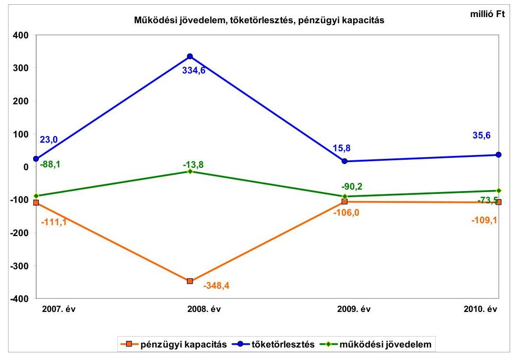

Az Önkormányzat múködési hiánya a 2007. évben 88,1 millió Ft, a 2008. évben 13,8 millió Ft, a 2009. évben 90,2 millió Ft, a 2010. évben 73,5 millió Ft volt. Az Önkormányzat által tett szervezeti átalakítások, kiadást csökkentő és bevételnövelő intézkedések nem biztosítottak elegendő forrást a pénzügyi egyensúly helyreállításához. A múködési hiány 2009. évi növekedésében szerepet játszott, hogy az Önkormányzat a 2008. évben eladta a TÁTIKA üzletházat, ezáltal az üzletek bérleti díjbevétele lecsökkent. A múködési hiány 2009. évről 2010. évre történő $18,5 \%$-os ( 16,7 millió Ft ) csökkenéséhez hozzájárult a helyi adók $9,7 \%$-os ( 12,5 millió Ft ) növekedése.

A pénzügyi kapacitás a folyó költségvetési pozíció mellett az adott költségvetési év adósságtörlesztésének hatását is tükrözi. Az Önkormányzat pénzügyi kapacitása, nettó múködési jövedelme a vizsgált időszakban folyamatosan negatív értéket mutatott, a 2008. évi kiugróan magas érték oka, hogy a kibocsátott 500,8 millió Ft értékű (2990,0 ezer CHF) kötvényből ebben az évben - a víziközmú társulati hitelek kivételével - visszafizették a 316,0 millió Ft hosszú lejáratú fejlesztési hitelt. Az Önkormányzat a 2007-2011. év I. féléve közötti időszakban az önkormányzatok működőképességének megőrzését szolgáló kiegészítő támogatásban nem részesült.

Az Önkormányzat pénzügyi egyensúlyi helyzetének alakulását befolyásolta a fejlesztési tevékenység. Az Önkormányzat felhalmozási költségvetésének egyenlege a 2007-2008. években negatív ( $-83,4$ millió Ft, illetve $-10,7$ millió Ft), a 2009-2010. években pozitív összegű ( 71,8 millió Ft, illetve 107,8 millió Ft)

---

volt, a 2007-2010. években összesen 85,5 millió Ft felhalmozási forrástöbbletet mutatott. A felhalmozási költségvetés évenkénti egyenlegének alakulását befolyásolta, hogy a 2007-2008. években a hazai támogatásból megvalósított projektek támogatásainak kifizetése átcsúszott a következő évre, ami pénzforgalmi szempontból javította a 2008-2009. évi felhalmozási egyenleget. Ezen kívül az Önkormányzat a 2010. évben értékesítette - a 103,6 millió Ft könyvszerinti értéken nyilvántartott - BAHART részvényét, amelyből 150,6 millió Ft bevételhez jutott. A 2010. évi felhalmozási bevétel alakulásában szerepet játszott még az Iskola felújításához, valamint a Városháza építéséhez kapott 258,3 millió Ft EU-s támogatás is.

Az Önkormányzat tárgyévi pénzügyi pozíciója a 2007. évi 96,3 millió Ft negatív eredménnyel szemben a 2008. évre jelentős javulást (126,7 millió Ft pozitív eredményt) mutatott a múködési- és felhalmozási hiány csökkenése, továbbá a 2008. évben kibocsátott kötvény következtében. A 20092010. években a pénzügyi pozíció ismét negatív eredményt (-23,3 millió Ft, illetve -23,1 millió Ft) mutatott.

Az Önkormányzat 2009-2011. év I. félévében a kötvény óvadéki betétben elhelyezett összegének kamatbevételeit és a beruházásokhoz kapcsolódó fordított áfa összegeket nem szerepeltette a számviteli nyilvántartásaiban.

Az Önkormányzat folyó bevétele a 2007-2009. évek átlagában 681,9 millió Ft volt, a 2010. évre 6,0\%-kal (41,1 millió Ft-tal) 640,8 millió Ft-ra csökkent, a 2011. év I. félévében 307,8 millió Ft volt. A folyó bevételek 2009. évi csökkenésének oka a szociális és gyermekjóléti feladatok Kistérségi társulásnak történő átadása volt. A 2008. évben a magasabb összegű folyó bevételeket a Tűzoltóság költségvetési támogatásának nyugdíjazások miatti magasabb öszszegei okozták.

A vizsgált időszakban a működési célú költségvetési támogatás és az szja bevétel együttes összege átlagosan a folyó bevételek 57,0\%-át (387,8 millió Ft) tette ki. A költségvetési támogatás és az szja együttes összege a 2007-2009. évek átlagos 402,2 millió Ft értékéhez viszonyítva a 2010. évre 14,3\%-kal, 344,5 millió Ft-ra csökkent. A 2007. évről a 2008. évre a költségvetési támogatás és az szja 20,7\%-kal ( 77,3 millió Ft) növekedett, amit a Tűzoltóságnál végrehajtott nyugdíjazások miatti többletjuttatások költségvetési támogatása okozott. A 2008. évről a 2009. évre történt 15,7\%-os ( 70,8 millió Ft) csökkenést a szociális és gyermekvédelmi feladatok Kistérségi társulásnak történő átadása okozta.

Az Önkormányzat a helyi adók közül építményadót, telekadót, idegenforgalmi adót és helyi iparűzési adót alkalmazott. A vizsgált időszakban új adónemet nem vezettek be. A helyi adókból és pótlékokból származó bevételek a 20072010. években átlagosan a folyó bevételek 19,0\%-át (126,7millió Ft) tették ki, arányuk a folyó bevételekhez viszonyítva a 2007. évi 17,0\%-ról a 2010. évre 5,1 százalékponttal 22,1\%-ra emelkedett. A helyi adók 2010. évi növekedése az iparűzési adónál három új adózó belépése, az építményadó és a telekadó mértékének emelése, valamint az adóhátralékok behajtásának növekedése miatt következett be. A vizsgált időszakban a helyi adóbevételek átlagosan 42,1\%-át

---

az iparúzési adó tette ki, amelynek mértéke a helyi adókról szóló törvényben rögzített maximális mértékben került megállapításra.

A vizsgált időszakban az összes felhalmozási bevétel 963,2 millió Ft volt, amelynek közel felét, 47,5\%-át ( 458,0 millió Ft), az államháztartáson belülről kapott támogatások tették ki. Az államháztartáson belüli támogatások között legjelentősebb a szennyvízcsatorna építés IV. üteméhez a 2007. évben kapott 55,4 millió Ft összegű céltámogatás, a 20,5 millió Ft TEKI támogatás, valamint a 2010. évben az Iskola felújításához és a Közösségi ház és rendezvénytér beruházásokhoz kapott EU-s támogatás volt. A tárgyi eszközértékesítés 285,3 millió Ft összege a vizsgált időszak összes felhalmozási bevételének a 29,6\%-át jelentette.

Az Önkormányzat folyó kiadásai a 2007-2009. években átlagosan 746,0 millió Ft-ot tettek ki, melyhez viszonyítva a 2010. évre 4,3\%-os ( 31,7 millió Ft-os) csökkenés volt tapasztalható. A 2011. év I. félévében a folyó kiadások összege 352,0 millió Ft volt. A folyó kiadásokon belül a 2007-2009. években a múködési kiadások (kamat kiadások nélkül) átlaga 636,1 millió Ft volt, amely a 2010. évre $2,1 \%$-os ( 13,6 millió Ft-os) csökkenést mutatott. A múködési kiadások mérsékelt csökkenését a feladatellátás változása okozta.

A személyi juttatások összege a 2007-2009. évek átlagában 335,9 millió Ft volt, amely a 2010. évre 5,1\%-kal (17,2 millió Ft-tal) 318,7 millió Ft-ra csökkent. A munkaadókat terhelő járulékok összege egyrészt a kifizetett személyi juttatások, másrészt a járulékok mértékének csökkenése miatt a 2007-2009. évi átlagos 101,0 millió Ft-ról 19,4\%-kal ( 9,7 millió Ft-tal) a 2010. évre 81,4 millió Ft-ra mérséklődött. A dologi kiadások összege a 2007-2009. években folyamatosan csökkent, a 2010. évre azonban a 2007-2009. évek 183,3 millió Ft átlagos öszszegéhez viszonyítva $12,9 \%$-kal ( 23,7 millió Ft-tal) 207,0 millió Ft-ra emelkedett. A dologi kiadások növekedését a kompetencia alapú oktatás bevezetése miatti többletkiadások okozták.

A kiadásokon belül a 2007-2011. év I. félévében a felhalmozási kiadások aránya változó volt, a kiadások 11,4\%-32,5\%-át tette ki. A 2007-2010. évek időszakában a 801,4 millió Ft értékű fejlesztések és felújítások forrása 282,2 millió Ft ( $35,2 \%$ ) saját erő, 415,1 millió Ft ( $51,8 \%$ ) hazai- és 9,1 millió Ft (1,1\%) EU-s támogatások mellett 95,0 millió Ft hitel (11,9\%) volt. A 2010. december 31-én folyamatban lévő fejlesztési feladatok végrehajtására 2007-2010. között 395,6 millió Ft kiadást teljesítettek, amelyre hitelből 54,3 millió Ft-ot (26,6\%) fordítottak. Az EU-s támogatásból megvalósult fejlesztések finanszírozása a vizsgált időszakban likviditási gondot nem okozott.

Az Önkormányzat 2010. december 31-én folyamatban lévő fejlesztési feladatok 2010. évet követő kötelezettség-vállalásainak összege 233,7 millió Ft volt, amelyből 170,8 millió Ft-ot EU-s támogatásból terveznek biztosítani. A fejlesztések megvalósításához 62,9 millió Ft saját forrással számoltak.

---

A folyamatban lévő fejlesztések 2010. december 31-én fennállt felhalmozási kötelezettségeinek forrásösszetételét és annak megoszlását a következő ábra mutatja be:
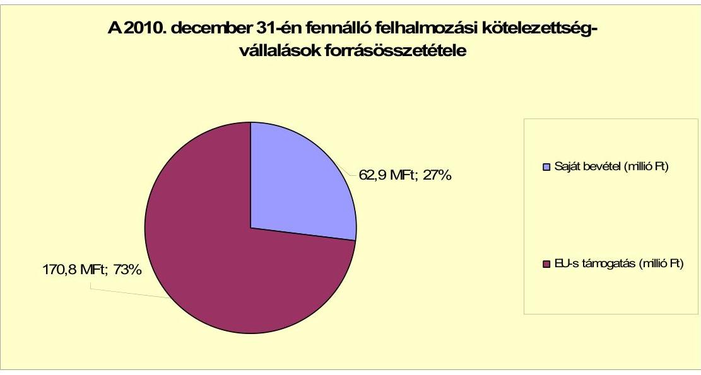

Az Önkormányzat által beadott, elbírálás alatt álló pályázatok tervezett teljes bekerülési költsége 13,7 millió Ft, amelyet 2,7 millió Ft saját bevételből és 11,0 millió Ft hazai támogatásból terveznek finanszírozni. Az Önkormányzat által a 2010-2013. évekre vállalt kötelezettségek összege 247,4 millió Ft volt. A 65,6 millió Ft saját forrást a 2011. évi költségvetési rendeletben szereplő 51,3 millió Ft ingatlanértékesítésből, valamint 30,2 millió Ft kötbérbevételből kívánják biztosítani. Az Önkormányzatnál a fejlesztési döntéseket megelőzően nem vizsgálták azok jövőbeni bevételnövelő, illetve kiadáscsökkentő hatásait.

Az Önkormányzat mérleg szerinti pénzintézettel szembeni kötelezettsége a 2006. év végéről a 2011. I. félév végére 242,4 millió Ft-ról 665,8 millió Ft-ra nőtt, amelyből az árfolyamváltozás miatti különbözet 165,8 millió Ft volt. A 2011. június 30 -án fennálló pénzintézeti kötelezettség $100 \%$-át a 2008. március 30 -án CHF-ben kibocsátott „VULKÁN" önkormányzati kötvény tette ki. Az Önkormányzat a kötvényt a költségvetési rendeletében meghatározott célú kiadások finanszírozására, beruházások finanszírozási igényeinek biztosítására és hitelszerkezetének konszolidálására bocsátotta ki. Az Önkormányzat a „VULKÁN" kötvényből 320,0 millió Ft-ot használt fel 2011. év I. félév végéig. A fel nem használt kötvény maradványa 180,8 millió Ft, amelyet a keretszerződésnek megfelelően óvadéki számlán elkülönítettek. Az óvadék a bankkal szemben fennálló kötelezettségei teljesítésének biztosítására szolgál. A 2011. év II. negyedévi mérlegjelentés rövid lejáratú kötelezettséget nem tartalmazott. Az Önkormányzat költségvetési elszámolási számlájának 2011. június 30-i záró egyenlege -68,0 millió Ft volt. A folyószámlahitel napi átlagos állománya a 2007-2010. évekhez viszonyítva 2011. év I. félévére több mint háromszorosára emelkedett. A 2011. év II. negyedévi mérlegjelentésben a költségvetési pénzforgalmi számlák tárgyidőszak végi összevont egyenlege pozitív volt, ezért az Önkormányzat a likvidhitelét hitelfelvételként nem könyvelte.

---

Az Önkormányzat kötelezettségvállalásaira képviselő-testületi döntés alapján került sor, azonban az előterjesztésekben nem mutatták be a kötelezettségvállalás visszafizetési forrásait, a kamat- és árfolyamkockázatot. A kötvény kibocsátó pénzintézet nem volt azonos a számlavezető pénzintézettel.

Az Önkormányzat a vizsgált időszakot megelőzően felvett öt darab, 242,4 millió Ft összegű hitelét, továbbá a 2007. évben a víziközmű társulattól átvállalt 74,2 millió Ft összegű hitelt és a 2005. évi hitelszerződéshez kapcsolódó 92,4 millió összegű hitel igénybevétellel keletkezett hosszú lejáratú hitelállományt 2007-2010. években teljes mértékben visszafizette. Egy fejlesztési célú hitelt kötvényből refinanszírozott 316,0 millió Ft összegben. Ez az Önkormányzat pénzügyi egyensúlyi helyzetét kedvezően befolyásolta, mivel a kedvezőtlenebb kamatkondíciójú pénzintézeti kötelezettség állománya szűnt meg. A hiteleket a hitelcéloknak megfelelően használta fel. Az Önkormányzat 2011. június 30-ig a CHF-ben fennálló pénzintézettel szembeni kötelezettségeiből tőkét nem törlesztett. Az első tőketörlesztés esedékessége 2013. március 31-e, összege 99670 CHF. A vizsgált időszakban az Önkormányzat 239,8 ezer CHF (44,4 millió Ft) kamatot fizetett. A 2007-2011. I. féléve között átmenetileg szabad pénzeszközeiből 58,1 millió Ft kamatbevételt realizált, ebből a kötvény kamatbevétele 40,6 millió Ft volt, amelyet az óvadéki számlán jóváírtak.

Az Önkormányzat költségvetésének pénzügyi egyensúlyát a vizsgált időszakban folyószámlahitel igénybevételével tudta biztosítani.

A folyószámlahitel igénybevétele a 2007-2011. év I. félévében az alábbiak szerint alakult:

| Megnevezés | 2007. év | 2008. év | 2009. év | 2010. év | 2011. év I.   félév |
| :-- | :--: | :--: | :--: | :--: | :--: |
| Folyószámlahitel |  |  |  |  |  |
| Keretösszeg január 1-én (millió Ft-ban) | 100,0 | 77,0 | 77,0 | 30,0 | - |
| Átlagos napi állomány (millió Ft-ban) | 22,8 | 29,5 | 10,3 | 10,7 | 56,3 |
| Folyószámla hitellel zárt napok száma (nap) | 241 | 302 | 226 | 176 | 169 |
| Egyenleg (állomány millió Ft-ban) | - | - | - | - | 68 |

Az Önkormányzat 2011. január 1-én folyószámla hitelkeret szerződéssel nem rendelkezett, új szerződést 2011. január 4-én kötöttek. A likviditás biztosítása az Önkormányzatnak 12,5 millió Ft kamatkiadást, és 0,5 millió Ft egyéb költség fizetésének kötelezettségét okozta. Az Önkormányzat 2011. év I. félév végi szállítói tartozása 9,7 millió Ft, melyből lejárt tartozása 9,3 millió Ft, az átütemezett szállítói tartozás összege 0,4 millió Ft volt. A lejárt szállítói tartozások kiegyenlítése a helyszíni vizsgálat befejezéséig teljes körűen megtörtént. Az Önkormányzat gazdasági társasága részére rövid lejáratú hitelek igénybevételéhez készfizető kezességet vállalt 19,0 millió Ft összegig. Az Önkormányzat a kizárólagos tulajdoni hányadú Városüzemeltető Kft. folyószámla hitelkeret szerződéséhez 2010. április 29-én 9,0 millió Ft-hoz 17 hónapra, a 2011. június 15-én felvett 10,0 millió Ft összegű rulírozó hitelhez 9 hónapra vállalt készfizetői kezességet. A gazdasági társaságok részére az Önkormányzat kölcsönt nem nyújtott.

---

Az Önkormányzat kötelezettségeinek 2010. december 31-i, valamint 2011. június 30-i állományát és várható alakulását a kötelezettségek lejáratáig a következő táblázat szemlélteti:

| Megnevezés | Állomány 2010. december 31   én |  |  | Állomány 2011. június 30-án |  |  | Várható kötelezettség   2011-2013. években |  | Várható kötelezettség   2014. évtől |  |
| :--: | :--: | :--: | :--: | :--: | :--: | :--: | :--: | :--: | :--: | :--: |
|  | HUF-ban   (millió Ft-   ban) | Devizában   (összege,   ezer ...   ban) | Deviza   nem | HUF-ban   (millió Ft-   ban) | Devizában   (összege,   ezer ...   ban) | Deviza   nem | HUF-ban   (millió Ft-   ban) | Devizában   (összege,   ezer ...-ben) | HUF-ban   (millió Ft-   ban) | Devizában   (összege,   ezer ...-ben) |
| Pénzintézeti kötelezettségek |  |  |  |  |  |  |  |  |  |  |
| "VULKÁN" kötvény |  | 2990,0 | CHF |  | 2990,0 | CHF |  | 347,0 |  | 3141,9 |
| Folyószámla-hitel | 0,0 |  | HUF | 68,0 |  | HUF | 68,0 |  |  |  |
| Pénzintézet kötelezettségek összesen HUF-ban | 0,0 |  | HUF | 68,0 |  | HUF | 68,0 |  |  |  |
| Pénzintézet kötelezettségek összesen CHF-ben |  | 2990,0 | CHF |  | 2990,0 | CHF |  | 347,0 |  | 3141,9 |
| Biztosítékok |  |  |  |  |  |  |  |  |  |  |
| Ászeesség | 4,9 | 0,0 | HUF | 9,4 | 0,0 | HUF | 9,4 | 0,0 | 0,0 | 0,0 |
| Biztosítékok összesen: | 4,9 | 0,0 |  | 9,4 | 0,0 |  | 9,4 | 0,0 | 0,0 | 0,0 |
| Szállítási tartozás | 2,0 |  | HUF | 9,7 |  | HUF | 9,7 |  |  |  |
| Jogerős végzéssel lezárt de ki nem fizetett kötelezettségek | 0,3 |  | HUF | 0,3 |  | HUF | 0,3 |  |  |  |
| Kötelezettségek összesen HUF-ben: | 7,2 | 0,0 | HUF | 87,4 | 0,0 | HUF | 87,4 | 0,0 | 0,0 | 0,0 |
| Kötelezettségek összesen CHF-ben: |  | 2990,0 | CHF |  | 2990,0 | CHF |  | 347,0 |  | 3141,9 |

Az Önkormányzatnak pénzintézetekkel szemben fennálló kötelezettsége a 2011. év I. félév végén 68,0 millió Ft és 2990,0 ezer CHF volt. A várható kötelezettségek (tőke, kamat és egyéb költség) összege a legutóbbi kamatfizetés feltételei alapján a 2011-2013. években 68,0 millió Ft és 347,0 ezer CHF. Az Önkormányzatnak a 2011. évben kezességvállalás, szállítói tartozások és jogerős végzéssel lezárt, de ki nem fizetett kötelezettségek címén 19,4 millió Ft fizetési kötelezettsége keletkezett. A 2011-2013. közötti kötelezettség teljesítésére figyelembe vehető forrás a 2010. évi mérlegben kimutatott 140,6 millió Ft összegű - az Önkormányzat tájékoztatása alapján - behajtható követelésállomány. A 2014. évet követő kötelezettségekre figyelembe vehető forrás lehet a jelzáloggal nem terhelt forgalomképes nettó ingatlanvagyon, a kamatokkal növelt óvadéki betét összege. A kötelezettségek teljesítésére figyelembe vehető vagyon értékének fedezetként való beszámítása bizonytalansági tényezőt hordoz.

A kötelezettségek növekedése mellett a minősített többségi befolyással rendelkező gazdasági társaságok kötelezettségei is befolyásolhatják az Önkormányzat pénzügyi egyensúlyát.

| Megnevezés | Állomány 2010. december 31   én |  |  | Állomány 2011. június 30-án |  |  | Várható kötelezettség   2011-2013. években |  | Várható kötelezettség   2014. évtől |  |
| :--: | :--: | :--: | :--: | :--: | :--: | :--: | :--: | :--: | :--: | :--: |
|  | HUF-ban   (millió Ft-   ban) | Devizában   (összege,   ezer ...-   ben) | Deviza   nem | HUF-ban   (millió Ft-   ban) | Devizában   (összege,   ezer ...   ban) | Deviza   nem | HUF-ban   (millió Ft-   ban) | Devizában   (összege,   ezer ...-ben) | HUF-ban   (millió Ft-   ban) | Devizában   (összege,   ezer ...-ben) |
| Folyószámla-hitel | 4,9 | 0 | HUF | 7,4 | 0 | HUF | 7,4 | 0 | 0 | 0 |
| Ászeezés-hitel | 0,0 | 0 | HUF | 1,9 | 0 | HUF | 1,9 | 0 | 0 | 0 |
| Pénzintézeti kötelezettségek összesen: | 4,9 | 0,0 |  | 9,3 | 0,0 |  | 9,3 | 0,0 | 0,0 | 0,0 |
| Lizing kötelezettségek | 3,1 | 0 | HUF | 1,8 | 0 | HUF | 1,8 | 0 | 0 | 0 |
| Szállító tartozás | 3,9 | 0 | HUF | 8,5 | 0 | HUF | 8,5 | 0 | 0 | 0 |
| Kötelezettségek összesen HUF-ben: | 11,9 | 0,0 |  | 19,6 | 0,0 |  | 19,6 | 0,0 | 0,0 | 0,0 |

---

A gazdasági társaságoknak a 2011. évtől 9,4 millió Ft pénzintézettel szembeni kötelezettséget, 1,8 millió Ft lízing kötelezettséget, 8,5 millió Ft szállítói tartozást kell rendezniük.

Az Önkormányzat 2007-2010 között eszközállománya után 382,5 millió Ft öszszegű értékcsökkenést mutatott ki számvitelében, az elhasznált eszközök felújítására 272,8 millió Ft-ot fordított. Az értékcsökkenésnél 109,7 millió Ft-tal kevesebbet fordítottak felújításra. Az Önkormányzatnál nem történt meg annak felmérése, hogy az eszközök elhasználódása, amortizációja fedezetének biztosítása mekkora forrást igényel.

Az Önkormányzat az ellenőrzött időszakban kiadási megtakarítást eredményező és bevételt növelő intézkedéseket tett. A 2007-2011. év I. féléve között tett intézkedések hatására - adatszolgáltatása szerint - 20,2 millió Ft bevételi többletet, továbbá 69,8 millió Ft kiadási megtakarítást mutattak ki. A kiadási megtakarítások 52,4\%-a szociális és gyermekvédelmi feladatok Kistérségi társulás részére történt feladatellátás átadásának az eredménye. Az álláshelycsökkentő intézkedések 2007-2011. I. féléve között önkormányzati szinten öszszesen 10 álláshely (üres álláshelyet nem tartalmazott) megszüntetését jelentették. Egyes közszolgáltatási területeken azonban feladatbővülések is voltak, amelyek álláshely- és egyben létszámnövekedéssel is jártak. Ennek következtében az időszak álláshelyeinek száma 12 fővel emelkedett. Az elért bevételi többlet a helyi adókhoz kapcsolódó önkormányzati adóhátralékok fokozott behajtásából származott.

Az Önkormányzat gazdálkodási rendszerének 2007. évi ellenőrzése során a pénzügyi egyensúly javítására vonatkozó javaslatot az ÁSZ nem tett.

# Az Önkormányzat pénzügyi egyensúlyi helyzetét összegezve a következők emelhetők ki: 

Badacsonytomaj Város Önkormányzatának pénzügyi egyensúlyi helyzete rövid távon nem biztosított.

Az Önkormányzat múködési jövedelme a 2007-2010. évek között negatív volt. A folyó bevételek nem nyújtottak fedezetet a folyó kiadásokra és az adósságszolgálatra.

A likviditás biztosítása folyószámlahitel igénybevételével történt. A múködési kockázatot növeli, hogy a folyószámlahitel napi átlagos állománya a 20072010. évekhez viszonyítva 2011. év I. félévére több mint háromszorosára emelkedett.

A kötelező és önként vállalt feladatellátást biztosító szervezeti keretekben bekövetkezett 2007-2010. évek közötti változások - szociális és gyermekvédelmi feladatok Kistérségi társuláshoz átadása, védett múemlékek átvétele, turisztikai feladatok átadása - az Önkormányzat pénzügyi egyensúlyi helyzetét kedvezőtlenül befolyásolták.

Az Önkormányzat felhalmozási bevételei a 2009. évtől kezdődően fedezték a felhalmozási kiadásokat.

---

Az Önkormányzatnál a fejlesztési döntéseket megelőzően nem vizsgálták azok jövőbeni bevételnövelő, illetve kiadáscsökkentő hatásait.

A pénzintézettel szembeni és egyéb kötelezettségek teljesítése kockázatot jelent. Növekedett az Önkormányzat adósságszolgálata, melyre nem biztosít fedezetet a múködési jövedelem. A kötelezettségek teljesítésére figyelembe vehető vagyon értékének fedezetként való beszámítása bizonytalansági tényezőt hordoz.

Az Önkormányzat költségvetésének nagyságrendjéhez viszonyítva a gazdasági társaságok kötelezettsége pénzügyi kockázatot nem jelent.

Az Állami Számvevőszékről szóló 2011. évi LXVI. törvény 33. § (1) bekezdésében foglaltak értelmében a jelentésben foglalt megállapításokhoz kapcsolódó intézkedési tervet köteles az ellenőrzött szervezet vezetője összeállítani és azt a jelentés kézhezvételétől számított harminc napon belül az ÁSZ részére megküldeni. Amennyiben az intézkedési tervet határidőben nem küldi meg a szervezet, vagy az továbbra sem elfogadható, az ÁSZ elnöke a hivatkozott törvény 33. § (3) bekezdés a)-b) pontjaiban foglaltakat érvényesítheti.

# A 2011.június 30-i pénzügyi egyensúlyi helyzet alapján az ellenőrzés intézkedést igénylő megállapításai és javaslatai a következők: 

## a Polgármesternek

1. Az Önkormányzat nettó múködési jövedelme a vizsgált időszakban folyamatosan negatív értéket mutatott. A likviditás biztosítása folyószámlahitel igénybevételével történt. Az Önkormányzat által tett intézményszervezeti átalakítások, kiadáscsökkentő és bevételnövelő intézkedések nem biztosítanak elegendő forrást a pénzügyi egyensúly helyreállításhoz. Az Önkormányzatnál a pénzintézettel szembeni és egyéb kötelezettségek fedezete a múködési forráshiány miatt kockázatos, a fedezetként figyelembe vehető vagyon bizonytalansági tényezőt hordoz.

Javaslat:
Az Önkormányzat pénzügyi egyensúlyának gyors helyreállítása és hosszú távú fenntarthatósága érdekében kezdeményezze - felelősök és határidők megjelölésével - az alábbi intézkedések megtételét:
a) Tárja fel a bevételszerző és kiadáscsökkentő lehetőségeket. Intézkedjen a bevételek növelésére, a kintlévőségek behajtására, a kiadások csökkentésére.
b) Képezzen egyensúlyi (elkülönített) tartalékot az adósságszolgálat teljesítése érdekében.
c) Vizsgálja felül teljes körűen a folyamatban levő beruházásokat és a megvalósuló létesítmények fenntartásának jövőbeni pénzügyi kihatásait.
d) Tekintse át az önként vállalt feladatok finanszírozhatóságát a kötelező feladatellátás elsődlegességének biztosítása érdekében.

---

e) Mutassa be havonta a fél éven belül esedékes kötelezettségeinek finanszírozási forrásait.
f) Az adósságot keletkeztető kötelezettségvállalásról szóló döntéskor mutassa be a Képviselő-testületnek a jövőben várható - árfolyam-, kamat- és törlesztési - kockázatot. Kezességvállalás és helytállási kötelezettségvállalásról szóló döntésnél mutassa be a Képviselő-testületnek azok pénzügyi kockázatait.
g) Gondoskodjon, hogy a jövőben az adósságot keletkeztető kötelezettségvállalásokról szóló képviselő-testületi előterjesztések tételesen tartalmazzák a visszafizetés forrásait.
2. A vizsgált időszakban az Önkormányzatnál nem történt meg annak felmérése, hogy az eszközök elhasználódása, amortizációja fedezetének biztosítása mekkora forrást igényel.

Javaslat
Mutassa be a Képviselő-testületnek évente a zárszámadási rendelet előterjesztésében az értékcsökkenés összegét, és ezzel összevetve az elhasználódott eszközök pótlására fordított tényleges kiadásokat, az eszközök elhasználódási fokának alakulását.

# a Jegyzönek 

1. Az Önkormányzat 2009-2011.év I. félévében a kötvény óvadéki betétben elhelyezett összegének kamatbevételeit és a beruházásokhoz kapcsolódó fordított áfa összegeket nem szerepeltette a számviteli nyilvántartásaiban.

Javaslat:
Gondoskodjon arról, hogy a kötvény óvadéki betétben elhelyezett összegének kamatbevételeit és a beruházásokhoz kapcsolódó fordított áfa összegeket az Áhsz. 9. § (11) bekezdésében, valamint az Áhsz. 9. számú melléklet 1. pont g), illetve 14. pont a) bekezdéseiben előírtaknak megfelelően rögzítse a számviteli nyilvántartásában.

A polgármester a helyszíni ellenőrzés lezárása után tájékoztatta az Állami Számvevőszéket az Önkormányzat megtett és tervezett intézkedéseiről, amelyet az Állami Számvevőszék nem ellenőrzött, arra vonatkozóan véleményt vagy megállapítást nem fogalmaz meg. Az ellenőrzés lezárását követően elvégzett intézkedéseket az Állami Számvevőszék utóellenőrzés keretében vizsgálhatja.

A polgármester tájékoztatása szerint a következő intézkedéseket tette és tervezi az Önkormányzat:

- a bevételek növelése érdekében 2012. január 1-jétől az építményadó és az idegenforgalmi adó emeléséről döntött a Képviselő-testület, az adóellenőrzések szigorítását, továbbá a strand pályázat útján történő bérbeadását határozták el;

---

- a kiadások csökkentése érdekében a 2012. évtől az intézmények elhelyezését racionalizálták, a szerződéseket felülvizsgálták;
- a hitel visszafizetésből, továbbá a kötvénykibocsátásból eredő kötelezettség fedezetét a 2012. évi költségvetésben megteremtették;
- a 2012. évi költségvetés tervezésénél már figyelembe vették az önként vállalt feladatok finanszírozhatóságát a kötelező feladatellátás elsődlegességének biztosítása érdekében;
- a jövőben az adósságot keletkeztető kötelezettségvállalásról szóló előterjesztésben a várható - árfolyam-, kamat- és törlesztési - kockázatot, továbbá a visszafizetés forrásait bemutatják;
- a 2011. évi zárszámadás keretében tervezik bemutatni az értékcsökkenés öszszegét és az elhasználódott eszközök pótlására fordított tényleges kiadásokat;
- az óvadéki betétben elhelyezett összegből befolyt kamatbevételek, valamint a beruházásokhoz kapcsolódó fordított áfa számviteli elszámolásának rendezése megtörtént.

---

# II. RÉSZLETES MEGÁLLAPÍTÁSOK 

## 1. Az ÖNKORMÁNYZAT KÖTELEZŐ ÉS ÖNKÉNT VÁLlALT FELADATAI, A FELADATELLÁTÁS SZERVEZETI KERETEI ÉS ANNAK VÁLTOZÁSAI

Az Önkormányzat a kötelező feladatait az Ötv. és az ágazati törvények által meghatározottnak tekinti, az önként vállalt feladatok terjedelmét az SzMSz-ben határozták meg. Önként vállalt feladatok - az Önkormányzat által elvégzett besorolás alapján - a közösségi, kulturális hagyományok és értékek ápolása és támogatása, ifjúsági alap múködtetése, sport feladatok támogatása, a helyi média múködésének segítése. Az önként vállalat feladatokat a kötelező feladatok mellett a Polgármesteri hivatal és a Városi Múvelődési Központ és Könyvtár látta el.

Az Önkormányzat - adatszolgáltatása szerint - a múködési kiadásokon belül a kötelezően ellátott feladatok kiadásainak aránya a 2007-2009. években átlagosan $89,9 \%$ ( 669,8 millió Ft), a 2010. évben $92,0 \%$ ( 651,5 millió Ft) volt. Önként vállalt feladatra a 2007-2009. években átlagosan a kiadások 10,1\%-át ( 75,3 millió Ft-ot), a 2010. évben 8,0\%-át ( 56,9 millió Ft-ot) fordították. A 2010. évi önként vállalt feladatok közül a helyi média múködésére 16,1 millió Ft-ot, a sportegyesület támogatására 9,5 millió Ft-ot, a badacsonyi idegenforgalmi rendezvényekre (borhét és szüret) 31,3 millió Ft-ot fordítottak.

Az Önkormányzat múködési kiadásaiból a 2007-2009. években átlagosan 140,3 millió Ft-ot ( $18,9 \%$ ) a 2010. évben 156,6 millió Ft-ot ( $22,1 \%$ ) közoktatási feladatok ellátására vettek igénybe. Az Önkormányzat 2009. évi nyertes pályázata ${ }^{7}$ folytán sor került a kompetencia alapú oktatás bevezetésére, amelyet követően a 2010. évi múködési kiadások megnövekedtek.

A közművelődési, igazgatási és egyéb önkormányzati feladatokra csökkenő mértékű és arányú kiadás jutott a rendelkezésre álló források következtében. Ezekre a feladatokra a 2007-2009. években átlagosan 604,8 millió Ft-ot ( $81,1 \%$ ) a 2010. évben 551,8 millió Ft-ot ( $77,9 \%$ ) fordított az Önkormányzat.

[^0]
[^0]:    ${ }^{7}$ A TÁMOP-3.1.4. Kompetencia alapú oktatás módszertani központjának kialakítása

---

A 2010. évi múködési kiadások kötelező feladatonkénti megoszlását és azok finanszírozási arányait az Önkormányzat adatszolgáltatása alapján ${ }^{8}$ az alábbi táblázat mutatja be:

| Ellátott feladat | Múködési   kiadás   összesen   (millió Ft) | Kötelezö   feladatok   kiadásainak   részaránya   \% | Múködési   bevétel   összesen   (millió Ft) | Állami   támogatás   részaránya   \% | Intézményi   saját bevétel   részraránya   \% | Önkormányzat   i támogatás   részraránya   \% | Társulástól átvett   támogatás   részraránya   \% |
| :--: | :--: | :--: | :--: | :--: | :--: | :--: | :--: |
| Övodák | 46,0 | 100,0 | 46,0 | 29,9 | 8,9 | 57,4 | 3,8 |
| Általános iskolák | 110,6 | 100,0 | 110,6 | 29,6 | 5,2 | 56,6 | 8,6 |
| Közművelődési   intézmények | 39,9 | 21,5 | 39,9 | 11,8 | 43,2 | 45,0 | 0,0 |
| Sportlétesitmények | 9,5 | 0,0 | 9,5 | 0,0 | 0,0 | 100,0 | 0,0 |
| Hivatásos Tüzoltóság | 175,2 | 100,0 | 175,2 | 98,8 | 1,2 | 0,0 | 0,0 |
| Polgármesteri hivatal   igazgatási kiadásai | 179,4 | 91,0 | 179,4 | 0,9 | 11,9 | 87,2 | 0,0 |
| Polgármesteri   hivatalban ellátott   egyéb feladatok   múködési kiadásai | 147,8 | 100,0 | 147,8 | 50,5 | 15,6 | 29,6 | 4,3 |
| Múködési kiadá-   sok összesen | 708,4 | 92,0 | 708,4 | 41,0 | 10,3 | 46,2 | 2,5 |

A 2010. évben a költségvetési kiadások 56,5\%-át (400,1 millió Ft) a járulékokkal növelt személyi juttatások, 29,2\%-át (207,0 millió Ft) a dologi kiadások jelentették. A bevételi források megoszlása a következő volt: állami támogatás 41,0\% (290,2 millió Ft), saját bevétel 10,3\% (73,4 millió Ft), önkormányzati támogatás $46,2 \%$ ( 327,2 millió Ft), társulástól átvett támogatás 2,5\% (17,6 millió Ft).

A 2010. évi múködési kiadások ágazatonkénti finanszírozása az alábbi:

- A közoktatási feladatok 2010. évi múködési kiadásaihoz biztosított állami támogatás összege 46,5 millió Ft (29,7\%), amely a 2007-2009. évi átlagos mértéknél 10,6 millió Ft-tal volt kevesebb. A csökkenés oka, hogy a finanszírozás alapja a teljesítménymutató lett. A csökkenő állami támogatást az önkormányzati támogatás növelésével ellensúlyozták. A 2010. évi önkormányzati támogatás 89,0 millió Ft (56,8\%), ami 29,7 millió Ft-tal több a 2007-2009. évi (59,4 millió Ft) átlagos összeghez képest.
- Közművelődési intézmény 2010. évi múködési kiadása 39,9 millió Ft, amely a 2007-2009. évi átlagos mértéknél 13,1 millió Ft-tal (24,7\%) volt kevesebb. A 2010. évi kiadásoknál az állami támogatás 4,7 millió Ft volt, a 2007-2009. évi átlagos mértéknél 2,0 millió Ft-tal több, a könyvtár érdekeltségnövelő támogatása és a bérpolitikai intézkedésekre kapott támogatás miatt. Az intézményi bevétel is és az önkormányzati támogatás is csökkent, 16,7\%-kal (3,4 millió Ft-tal), illetve 39,4\%-kal (11,7 millió Ft-tal) a 20072009. évi átlagos mértékhez viszonyítva. A csökkenés összefügg azzal, hogy

[^0]
[^0]:    ${ }^{8}$ A tanúsítvány nem tartalmazza az egészségügyi ellátás kiadásait - háziorvosi-, gyermekorvosi, iskola-egészségügyi-, védőnői-, családsegítő szolgálat - melyek költségeinek finanszírozása az OEP által történik.

---

a Badacsonyra oly jellemző rendezvények (borhét és szüret) iránti érdeklődés az előző évekhez képest visszaesett.

- A sport feladatok 2010. évi múködési kiadása 9,5 millió Ft, a 2007-2009. évi átlagos mérték 6,4 millió Ft. A növekedés oka, hogy a városi sportegyesület új felállását - NB III-ba kerülését - megemelt támogatással finanszírozta az Önkormányzat. A 2009. évi állami támogatás ( 1,2 millió Ft) kivételével az összes forrást az Önkormányzat biztosította.
- Tüzoltóság 2010. évi múködési kiadása 29,6 millió Ft-tal (14,5\%-kal) volt alacsonyabb a 2007-2009. évi átlagos mértéknél (204,9 millió Ft) az állami normatíva változása következtében. A 2010. évi múködési kiadásokat 98,8\%-ban állami támogatásból fedezték.
- Az igazgatási feladatok 2007-2009. évi átlagos 20,1 millió Ft összegű állami támogatása a 2010. évre 1,5 millió Ft-ra csökkent, mivel csak az építéshatósági feladatokra kapott támogatást az Önkormányzat. A saját bevétel a 2007-2009. évi átlagos 27,1 millió Ft-ról 21,3 millió Ft-ra (21,6\%) csökkent, az önkormányzati támogatás 8,3 millió Ft-tal (5,0\%-kal) csökkent a 2007-2009. évi átlagos 164,8 millió Ft-hoz viszonyítva.
- A Polgármesteri hivatalban ellátott feladatok 2007-2009. évi átlagos 128,5 millió Ft múködési kiadása a 2010. évre 147,8 millió Ft-ra (15,0\%-kal) nőtt. A növekedés egyrészt a Városüzemeltető Kft. részére adott 9,6 millió Ft működési célú pénzeszköz átadás ${ }^{9}$, valamint a közmunkaprogram kiadásainak növekedése és kapcsolódó eszközbeszerzése miatt történt.

A Polgármesteri hivatalban látták el a városgazdálkodási, a köztemető fenntartási, házi gondozás és szociális étkeztetés feladatokat, a szociális ellátások folyósítását, a szennyvízkezelési, üdültetési feladatokat.

Az Önkormányzat kötelező és önként vállalt feladatait 2011. június 30 -án - a Polgármesteri hivatallal együtt - öt költségvetési szervvel és négy gazdasági társaság keretében látta el. A költségvetési szervek közül három önállóan múködő, és kettő önállóan múködő és gazdálkodó. A költségvetési szervek száma a vizsgált időszakban eggyel csökkent, a telephelyek száma hét, amely nem változott. Az Önkormányzat feladatait az alábbi intézményi struktúrával látja el:

- közoktatási feladatait kettő intézmény biztosítja: Óvoda és Iskola,
- közművelődési tevékenységet végez a Városi Művelődési Központ és Könyvtár,
- tűzvédelmi tevékenység folyik a Tűzoltóságnál,
- igazgatási feladatokat lát el a Polgármesteri hivatal.

Az Önkormányzat egészségügyi, szociális és gyermekvédelmi, sport feladatokat ellátó intézményt nem tartott fenn, e területen kötelező és önként vállalt fel-

[^0]
[^0]:    ${ }^{9}$ A pénzeszközátadás a helyi utak karbantartási munkáira, lakossági észrevételek alapján elvégzett feladatokra vonatkozott.

---

adatait a Polgármesteri hivatal által, valamint önkormányzati társulás keretében biztosította. A gyermekjóléti és családsegitői feladatok ellátása a „Szebb Gyermekkorért" Gyermekjóléti és Családsegítő Alapszolgáltató Társulás, a házi segítségnyújtás és a szociális étkeztetés feladatellátása a „Támasz" Szociális Alapszolgáltató Társulás keretében történt. Az Önkormányzat a fenti társulásokat 2008. december 31-vel megszüntette. A szociális és gyermekvédelmi feladatokat a Kistérségi társulás vette át.

Az Önkormányzat kizárólagos önkormányzati tulajdonú gazdasági társasága a Városüzemeltető Kft. részt vett a védett természeti területek gondozásában, közterület-fenntartási, parkolási, utak, járdák fenntartási munkáiban, vá-ros-, strand üzemeltetési feladatok ellátásában. A Városüzemeltető Kft. adózott eredménye a 2010. év kivételével pozitív volt, a 2010. évi veszteség nagysága 9,4 millió Ft volt. Többségi tulajdoni hányaddal ( $96,0 \%$ részesedés) rendelkezett az Önkormányzat az étkeztetési (gyermek és szociális) feladatokat ellátó MENÜ Bt-ben. Az Önkormányzat a társasági szerződés szerint a betéti társaságnak kültagja, ennek megfelelően a felelőssége a vállalt vagyoni betétje ( 1,35 millió Ft) erejéig terjed. Ez a gazdasági társasági forma megfelelt az Ötv ${ }_{1}$ 80. § (3) bekezdésében előírtaknak ${ }^{10}$. Az Önkormányzatot a betéti társaságot érintő döntéseknél megillető szavazat a vagyoni betét ( $96 \%$ ) arányában illeti meg. A gazdasági társaság 2010. évi adózott eredménye negatív, nagysága 2,2 millió Ft volt, a veszteség nem önkormányzati feladatellátásból származott.

Az Önkormányzat az ivóvíz szolgáltatási és szennyvíz elvezetési és tisztítási feladatokat végző gazdasági társaságban $0,1 \%$-os tulajdoni hányaddal rendelkezett. A köztisztaság és település tisztasági feladatokat olyan gazdasági társaság látta el közszolgáltatási szerződés alapján, amelyben az önkormányzatnak tulajdoni részesedése nincs.

A feladat ellátásban részt vevő gazdasági társaságok gazdálkodását, illetve múködését érintő adatokat a jelentés 4. sz. melléklete mutatja be.

Az Önkormányzat a vizsgált időszakban a Veszprém Megyei Önkormányzattól kettő feladatot vett át. A megyei önkormányzat 2007-ben felajánlotta vidéki múzeumait és kiállítóhelyeit az illetékes települések önkormányzatainak. Az Önkormányzathoz került - Badacsonyhoz történetileg hozzátartozó - Szegedy Róza Ház üzemeltetési feladatainak ellátása, és az Egry József Emlékmúzeum múködtetése. Az üzemeltetésre, múködtetésre átvett védett múemlékek 35,7 millió Ft-os kiadási hatását 33,2 millió Ft összegű bevétel ellensúlyozta. A szociális és gyermekvédelmi feladatok Kistérségi társuláshoz történő átadása következtében a személyi kiadások 36,6 millió Ft-tal, a dologi kiadások 39,3 millió Ft-tal csökkentek. Az intézkedés bevételi kihatása 75,6 millió Ft öszszegű állami támogatás és 18,7 millió Ft saját bevétel csökkenés. Az Önkormányzat a költségvetési szervként múködő Tourinform Irodát 2011. január 1jétől az Egyesületnek adta át. A település üdülővárosi jellegéből adódóan az Önkormányzat a település turisztikai fejlődése érdekében tevékenykedő szervezeteket támogatta. Az Egyesület létrejöttével az Önkormányzat a turizmus köz-

[^0]
[^0]:    ${ }^{10}$ 2012. január 1-jétől hatályos szabályozás a nemzeti vagyonról szóló 2011. évi CXCVI. törvény 9. § (2) bekezdésében található.

---

vetlen szervezési feladataiból kivonult, ezért a Tourinform Iroda az Egyesület keretében folytatta múködését. Az intézkedésnek a kiadásokra nem volt hatása, a saját bevételeknél 1,3 millió Ft-os csökkenés történt.

A 2007-2011. év I. félév közötti feladat átvételek és átadások az Önkormányzat pénzügyi helyzetére negatív hatással voltak, mivel az önkormányzati kiadások 40,2 millió Ft-os csökkenése a bevételek 62,4 millió Ft-os csökkenése mellett történt. A kötelező és önként vállalt feladatok ellátásában bekövetkezett változások együttesen 22,2 millió Ft-os bevételkiesést eredményeztek, amelyek az Önkormányzat pénzügyi egyensúlyára kedvezőtlenül hatottak.

# 2. AZ ÖNKORMÁNYZAT PÉNZÜGYI EGYENSÚLYI HELYZETÉT BEFOLYÁSOLÓ TÉNYEZŐK 

A hagyományos költségvetési szerkezet helyett az önkormányzat pénzügyi helyzetét a CLF módszerrel mutatjuk be, amelyben jobban elkülönülnek a vagyonnal kapcsolatos bevételek és kiadások az önkormányzati feladatokkal kapcsolatos közvetlen múködtetési bevételektől és kiadásoktól. A módszer következetesen elkülöníti a folyó és a felhalmozási költségvetés bevételeit és kiadásait, azok költségvetési egyenlegeit. A saját folyó bevételek, valamint a saját felhalmozási bevételek nem tartalmazzák az előző évi pénzmaradványok felhasználásából származó pénzforgalom nélküli bevételeket ${ }^{11}$.

A folyó költségvetés egyenlege, a múködési jövedelem megmutatja, hogy az önkormányzat éves folyó bevétele fedezetet biztosít-e a kötelező és önként vállalt feladatellátáshoz kapcsolódó éves folyó kiadására. A múködési jövedelem negatív értéke pénzügyileg fenntarthatatlan helyzetet jelez. A mutató pozitív értéke megtakarítást mutat, amely forrásul szolgálhat az önkormányzat fennálló kötelezettségei megfizetéséhez, valamint fejlesztéseihez.

A felhalmozási költségvetés pozitív értéke felhalmozási többletet mutat, amely a jövőbeni fejlesztések forrását biztosíthatja. Amennyiben a folyó költségvetési hiány finanszírozása a felhalmozási többletből történik, ez szűkebb értelemben vagyonfelélésnek tekinthető. Amennyiben a felhalmozási költségvetés megtakarítása fejlesztési célú hitelek, kötvények adósságszolgálatát finanszírozza, az változatlan vagyontömeg mellett, a korábban megelőlegezett tőkebevételek valós realizációjának tekinthető. A felhalmozási deficit által generált finanszírozási igény önmagában nem jár pénzügyi kockázattal, a pénzügyileg fenntartható beruházásokhoz kapcsolódó kötelezettségvállalás (adósságszolgálat) átlátható és szabályozott költségvetési gazdálkodással teljesíthető.

A módszer a pénzügyi kapacitás fogalmát helyezi a középpontba. Az adós hitelfelvételi képessége, hosszú távú fizetőképessége vagy bonitása a pénzügyi kapacitással, ezen belül is a nettó múködési jövedelemmel jellemezhető. A nettó múködési jövedelem negatív értéke az egyes költségvetési években jelent-

[^0]
[^0]:    ${ }^{11}$ A költségvetési években kialakuló hiány finanszírozása az előző évi pénzmaradvány és a korábbi években képzett tartalékok felhasználásával is történhet.

---

kező adósságszolgálat túlzott mértékére utal. ${ }^{12}$ A nettó múködési jövedelem negatív értékének felhalmozási többletből, vagy további hitelből történő finanszírozása pénzügyileg nem fenntartható gazdálkodást vetít előre. A pozitív értéket mutató nettó múködési jövedelem fejlesztési kiadások fedezetét biztosíthatja, illetve a folyamatosan, évenként képződő pozitív nettó múködési jövedelemből meghatározható a jövőben vállalható, teljesíthető éves adósságszolgálat, ily módon az a hitelösszeg, amely - a többi tényezőt, feltételt adottnak tekintve visszafizetési kockázat nélkül felvehető.

A CLF módszer alapján a pénzügyi kapacitás mértéke az Önkormányzat összevont, nettósított, a központi információs rendszerbe a Magyar Államkincstáron keresztül leadott éves költségvetési beszámolójának 80-as űrlapjában szerepeltetett adatok alapján került meghatározásra.

A számítási leírás némileg eltér az ÁSZ módszertanában korábban alkalmazott gyakorlattól. A jelen besorolás általános közgazdasági meggondolásokon alapul, amely megjelenik az SNA statisztikai módszertanában is. Folyó tételek alatt értjük azokat a kiadásokat és bevételeket, amelyek a gazdálkodó szervezet helyzetét automatikusan nem változtatják. Bevételi oldalon ilyenek az adók, a tényező jövedelmek, a transzferek ${ }^{13}$, kiadási oldalon a transzferek és a szolgáltatás igénybevételével kapcsolatos múködési kiadások. A folyó költségvetésben a bevételekben nem térül meg, a kiadásokban nem jelenik meg az amortizáció, a vagyoni helyzetet az egyenleg befolyásolja.

A folyó költségvetés egyenlege (múködési jövedelem) tartalmazza a kamatbevételeket és a kamatkiadásokat is, mind a múködési, mind a fejlesztési kamatot, valamint a visszatérülő és befizetendő áfa teljes összegét, mert ezek közgazdaságilag tényező jövedelmek. Nem tartalmazzák viszont a követelés elengedés miatt könyvelt bevételi és kiadási pénzforgalmi tételeket, mert valójában technikai elszámolási múveletnek minősülnek, a bevétel soha nem realizálódott, és költségvetési kiadás sem történt.

A felhalmozási költségvetésben a bevételek között a vagyon megőrzésére és bővítésére fordítható források jelennek meg. A felhalmozási vagy tőketételek módosítják a vagyon nagyságát. A privatizációs bevétel csökkenti a vagyont, a fizikai beruházás, pénzügyi befektetés növeli.

A nettó múködési jövedelmet a tőketörlesztés levonásával a folyó költségvetés egyenlegéből származtatjuk.

[^0]
[^0]:    ${ }^{12}$ kivéve, ha annak finanszírozására a korábbi években képzett tartalékok fedezetet nyújtanak
    ${ }^{13}$ Transzfer kiadásoknak nevezzük azokat a folyó és felhalmozási tételeket, amelyeket nem az adott önkormányzat használ fel szolgáltatásnyújtásra.

---

# 2.1. A múködési és a felhalmozási egyensúly változása 

CLF módszer szerinti önkormányzati adatok

| Megnevezés | 2007.év | 2008.év | 2009.év | 2010.év |
| :--: | :--: | :--: | :--: | :--: |
| Folyó bevételek | 654,0 | 772,7 | 619,1 | 640,8 |
| Folyó kiadások | 742,1 | 786,5 | 709,3 | 714,3 |
| Müködési jövedelem | $-88,1$ | $-13,8$ | $-90,2$ | $-73,5$ |
| Nettó müködési jövedelem   *müködési jövedelem - töketörlesztés | $-111,1$ | $-348,4$ | $-106,0$ | $-109,1$ |
| Felhalmozási bevételek * | 189,1 | 90,9 | 167,0 | 452,4 |
| Felhalmozási kiadások | 272,5 | 101,6 | 95,2 | 344,6 |
| Felhalmozási költségvetés egyenlege | $-83,4$ | $-10,7$ | 71,8 | 107,8 |
| Finanszirozási műveletek nélküli (GFS) pozíció = müködési jövedelem + felhalmozási költségvetés egyenlege | $-171,5$ | $-24,5$ | $-18,4$ | 34,3 |
| Finanszirozási műveletek egyenlege | 75,2 | 151,2 | $-4,9$ | $-57,4$ |
| Tárgyévi pénzügyi pozíció | $-96,3$ | 126,7 | $-23,3$ | $-23,1$ |
| Egyéb tájékoztató adatok |  |  |  |  |
| Összes kötelezettség** | 404,2 | 564,9 | 631,9 | 677,8 |
| -ebből rövid lejáratú | 31,6 | 29,1 | 86,7 | 12,0 |
| Folyószámlahitel napi átlagos állománya *** | 22,8 | 29,5 | 10,3 | 10,7 |
| Finanszirozásba vonható eszközök: | 138,6 | 265,3 | 241,9 | 219,9 |
| Tartós hitelviszonyt megtestesítő értékpapírok év végi állománya | 0,2 | 0,2 | 0,2 | 0,2 |
| Pénzeszközök (idegen pénzeszközök nélkül) év végi állománya | 138,4 | 265,1 | 241,7 | 219,7 |

*A költségvetési támogatásból a felhalmozási célú összeget az Önkormányzat adatszolgáltatása szerinti mértékben vettük figyelembe a soron.
${ }^{* * *}$ Az összes kötelezettséget a passzív pénzügyi elszámolások nélkül vettük figyelembe, mert a passzívák a pénzmaradvány elszámolás tételei közé tartoznak.
${ }^{* * * *}$ A folyószámlahitel átlagos állományát 365 napos osztószámmal és nem a fennálló napok számával vettük figyelembe.

A 2007-2010. évek közötti időszakban az Önkormányzat kiadásainak és bevételeinek főbb jogcímek szerinti alakulását, valamint adósságszolgálatának adatait részletesen a jelentés 2 . számú melléklete tartalmazza.

---

Az Önkormányzat 2007-2010. évek közötti múködési jövedelmét (folyó költségvetési egyenlegét) a következő ábra szemlélteti:
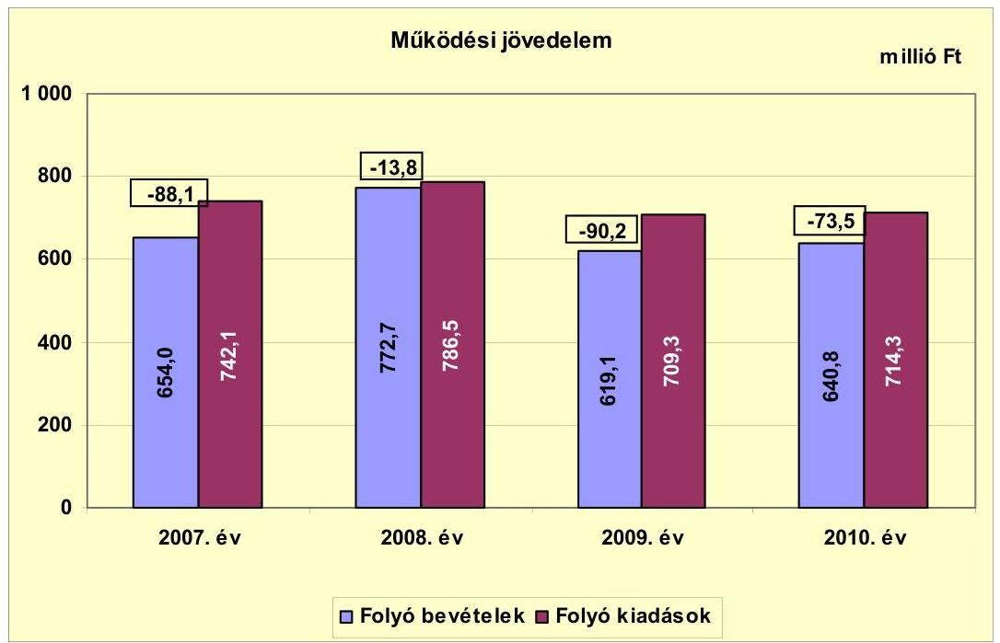

Az Önkormányzat folyó költségvetésének egyenlege (múködési jövedelem) a vizsgált időszak minden évében forráshiányt ${ }^{14}$ mutatott.

Az Önkormányzat 2008. évi folyó bevétele a 2007. évhez viszonyítva 18,1\%-kal (118,7 millió Ft-tal) emelkedett, majd a 2009. évre 19,9\%-kal (153,6 millió Fttal) csökkent, ezt követően a 2010. évben 3,5\%-kal (21,7 millió Ft-tal) emelkedett. A folyó bevételek 2007-2009. évi átlaga 681,9 millió Ft volt, melyhez viszonyítva a 2010. évi folyó bevételek 41,1 millió Ft-tal (6,0\%-kal) 640,8 millió Ft-ra csökkentek.

Az Önkormányzat folyó kiadásai a 2008. és a 2010. években a folyó bevételeknél kisebb mértékben - a 2008. évben 6,0\%-kal, (44,4 millió Ft-tal), a 2010. évben $0,7 \%$-kal ( 5,0 millió Ft-tal) - emelkedtek. A 2009. évben a folyó kiadások az előző évihez viszonyítva 9,8\%-kal 77,2 millió Ft-tal csökkentek, ezzel szemben a folyó bevételeknél 19,9\%-os (153,6 millió Ft) volt a bevétel csökkenés. A 2009. év kiugró értékének alakulásában az Iskolában pályázati támogatással megvalósult kompetencia alapú oktatás múködési kiadásai játszottak szerepet. A folyó kiadások 2007-2009. évi átlaga 746,0 millió Ft volt, melyhez viszonyítva a 2010. évi folyó kiadások 31,7 millió Ft-tal (4,2\%-kal) 714,3 millió Ft-ra csökkentek.

A vizsgált időszak folyamatos múködési forráshiánya az Önkormányzat pénzügyi egyensúlyi helyzetét kedvezőtlenül befolyásolta. Az Önkormányzat által

[^0]
[^0]:    ${ }^{14}$ A múködési forráshiány a 2007. évben a folyó kiadások 11,9\%-át (88,1 millió Ft-ot), a 2008. évben 1,8\%-át (13,8 millió Ft-ot), a 2009. évben 12,7\%-át (90,2 millió Ft-ot) a 2010. évben 10,3\%-át ( 73,5 millió Ft-ot) tett ki.

---

tett szervezeti átalakítások kiadást csökkentő és bevételnövelő intézkedések nem biztosítottak elegendő forrást a pénzügyi egyensúly helyreállításához. Az Önkormányzat a vizsgált időszakban nem tekintette át az intézményei múködését, az éves intézményi költségvetések kiadási előirányzataiban az infláció hatása figyelembevételre került, annak ellenére, hogy a bevételek erre nem nyújtottak fedezetet.

Az Önkormányzat a 2007-2011. év I. féléve közötti időszakban az önkormányzatok múködőképességének megőrzését szolgáló kiegészítő támogatásban nem részesült.

Az Önkormányzat nettó működési jövedelmének (pénzügyi kapacitásának) 2007-2010. közötti alakulását az alábbi grafikon szemlélteti:
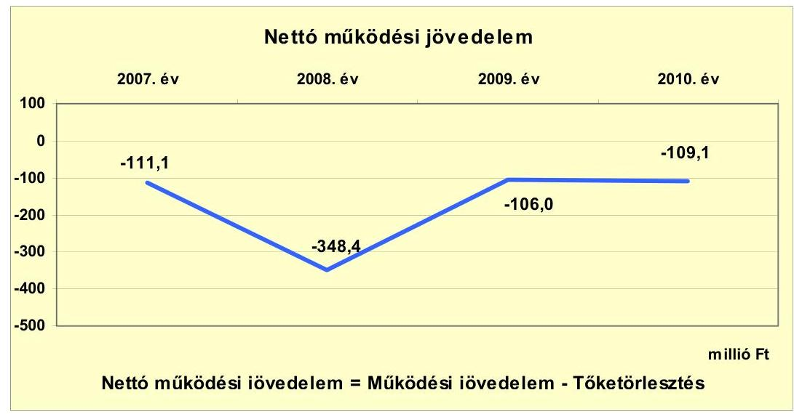

A nettó múködési jövedelem értéke a múködési jövedelem mellett az adott költségvetési év adósságtörlesztésének hatását is tükrözi. Az Önkormányzat pénzügyi kapacitása a 2007-2010. években folyamatosan negatív értéket mutatott, mivel az Önkormányzat a 2007-2010. években folyamatosan múködési hiányos volt. A 2008. évi kiugróan magas negatív érték abból adódott, hogy az Önkormányzat a 2008. évben kibocsátott kötvényből még abban az évben - a víziközmű társulati hitelek kivételével - vissza is fizette a fennálló hosszú lejáratú fejlesztési hitelét, ennek összege 316,0 millió $\mathrm{Ft}^{15}$ volt, amely a nettó múködési jövedelem negatív értékének $90,7 \%$-át tette ki. A negatív múködési jövedelem pénzügyileg nem fenntartható helyzetet mutat, amely felelős, előrelátó gazdálkodással kezelhető.

[^0]
[^0]:    ${ }^{15}$ Az Önkormányzat 2008. évi hiteltörlesztése összesen 334,6 millió Ft volt.

---

A felhalmozási költségvetés egyenlegét a 2007-2010. évek között a következő ábra szemlélteti:
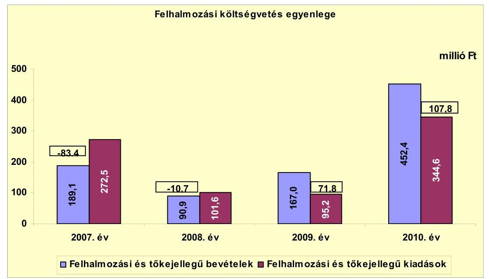

A felhalmozási költségvetés egyenlege a 2007-2008. években negatív előjelű volt, de mértéke a 2008. évre jelentősen javult a 2007. évi 83,4 millió Ft felhalmozási hiány $87,2 \%$-kal ( 72,7 millió Ft-tal) csökkent. A 2009-2010. években a felhalmozási költségvetés egyenlege pozitív előjelű volt, 2010. évi összege a 2009. évi felhalmozási többletet 50,1\%-kal (36,0 millió Ft-tal) haladta meg.

A 2007-2008. években a hazai támogatásból megvalósított projektek ${ }^{16}$ támogatásainak kifizetése átcsúszott a következő évre, ami javította a felhalmozási egyenleget. Ezen kívül az Önkormányzat a 2010. évben értékesített 103,6 millió Ft könyvszerinti értéken nyilvántartott - BAHART részvényeiből 150,6 millió Ft bevételhez jutott. A 2010. évi felhalmozási bevétel alakulásában szerepet játszott még az Iskola felújításhoz kapott 174,3 millió Ft, valamint a Városháza építéshez kapott 84,0 millió Ft EU-s támogatás is.

A felhalmozási forráshiány fedezetét a 2007. évben a 92,4 millió Ft összegű hosszúlejáratú hitelfelvételből, a 2008. évben pedig a kibocsátott kötvényből biztosították.

Az Önkormányzat évenkénti - CLF - módszer szerint számított - teljes finanszírozási igénye ${ }^{17}$ a 2007. évben -194,5 millió Ft, a 2008. évben -359,1 millió Ft, a 2009. évben -34,2 millió Ft, a 2010. évben -1,3 millió Ft volt. A vizsgált időszak teljes finanszírozási hiányának fedezetét a 2007. január 1-jei 234,7 millió Ft nyitó pénzkészlettel, 92,4 millió Ft hitelfelvétellel és 500,8 millió Ft értékben kibocsátott kötvénnyel biztosították.

[^0]
[^0]:    ${ }^{16}$ Könyvtárfejlesztési pályázat, Egészségház felújítás, Móricz Zs. úti közvilágítás.
    ${ }^{17}$ A nettó múködési jövedelem és a felhalmozási költségvetés egyenlegének összege.

---

Az Önkormányzat finanszírozási múveletei 2007-2010. évekbeli egyenlegének alakulását a következő ábra szemlélteti:
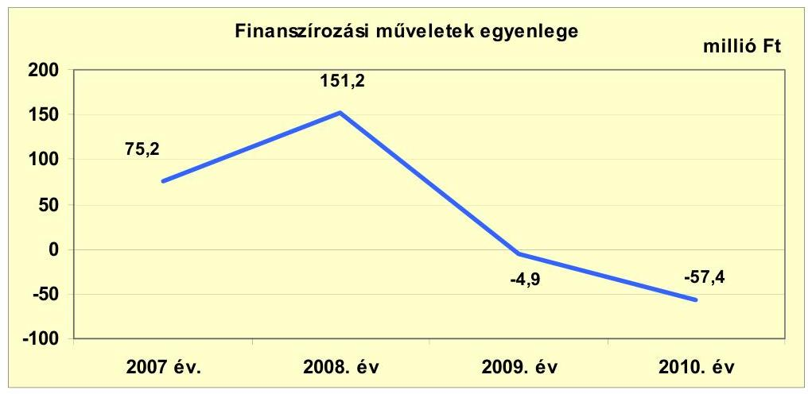

A finanszírozási múveletek egyenlegét a 2007. évben a korábban felvett fejlesztési hitel 92,4 millió Ft összegű lehívása és a 23,0 millió Ft fejlesztési és víziközmú-társulati hiteltörlesztés határozta meg. A 2008. évben a kiugróan magas összeg oka az 500,8 millió Ft értékű kötvénykibocsátás, valamint az előző években felvett fejlesztési hitel kötvényből történő visszafizetése volt. A 20092010. években a finanszírozási múveletek negatív egyenlegének kialakulásában a víziközmű-társulati hiteltörlesztések - 15,8 millió Ft, 35,6 millió Ft - voltak a meghatározóak. A finanszírozási múveleteket a jelentés 2. számú mellékletének 4.1.-4.8. pontjai részletezik.

Az Önkormányzat a 2007-2011. évi költségvetési rendeleteiben bemutatta a múködési, illetve a felhalmozási célú bevételi és kiadási előirányzatokat mérlegszerűen, egymástól elkülönítetten, de - a finanszírozási műveleteket is figyelembe véve - együttesen egyensúlyban. A 2007-2010. évi zárszámadási rendeletekben azonban csak az önkormányzati összes kiadásokat és bevételeket mutatták be, ezáltal nem tettek eleget az Áht. 18. §-ában előírtaknak, miszerint a zárszámadási rendeletet a költségvetési rendelettel összehasonlítható módon kell elkészíteni. A 2007-2010. években teljesített múködési és felhalmozási bevételek és kiadások főösszegeit ${ }^{18}$, a helyszíni vizsgálat során bocsátották az ellenőrzés rendelkezésére, amelyet a jelentés 1. számú melléklete szemléltet.

[^0]
[^0]:    ${ }^{18}$ Az önkormányzatok részére nincs kötelező előírás a működési és fejlesztési hiány/többlet megállapításának módjára.

---

Az Önkormányzat 2007-2011. év I. félév között teljesített kamatbevételeit és kamatkiadásait a következő ábra mutatja be:
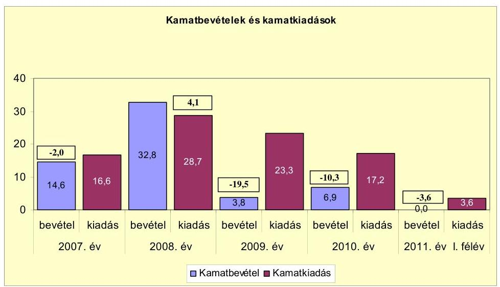

Az Önkormányzat kamatkiadásai a 2008. év kivételével meghaladták a kamatbevételeket. Az eltérés a 2007. évben nem volt jelentős, mivel az átmenetileg szabad pénzeszközök lekötéséből származó kamatbevétel 88,0\%-os mértékben fedezte a felmerült folyószámlahitel, a víziközmű II/A és III. ütemű társulati hitelek, valamint az infrastrukturális fejlesztési hitel kamatkiadásait. A 2008. évben az átmenetileg szabad pénzeszközök lekötéséből és a kibocsátott kötvény óvadéki betétjének lekötéséből származó kamatbevétel meghaladta a kamatkiadásokat. Az Önkormányzat a 2009-2011. év I. félévében a kötvény óvadéki betétben elhelyezett összegének kamatbevételeit nem rögzítette a számviteli elszámolásaiban ${ }^{19}$, a kötvénykibocsátáshoz kapcsolódó kamatfizetési kötelezettséget azonban kimutatta, ezért ezekben az években a számviteli elszámolásokban kimutatott kamatkiadások rendre meghaladták a kamatbevételeket. A 2009. évben elszámolt 35,1 millió Ft kamatkiadás 11,8 millió Ft ügynöki díjat is tartalmazott ${ }^{20}$. A kötvény óvadéki betétéből származó kamatbevételek a 2009. évben 12,5 millió Ft, a 2010. évben 13,3 millió Ft, a 2011. év I. félévében pedig 5,3 millió Ft összeget tettek ki. A kötvény kamatának figyelembevételével a kamatbevételek a 2010. évben 17,5\%-kal (3,0 millió Ft-tal, a 2011. év I. félévében 49,8\%-kal ( 1,8 millió Ft-tal) meghaladták a kamatkiadásokat. A 2009. évben a kamatbevételek 30,0\%-kal ( 7,0 millió Ft-tal) elmaradtak a kamatkiadásoktól.

Az Önkormányzat a 2008. év márciusában kibocsátott 500,8 millió Ft összegű kötvényből a hosszú lejáratú fejlesztési hitelek visszafizetését követően megmaradt 180,8 millió Ft-ot a kötvény keretszerződésének megfelelően óvadéki betétben helyezte el. Az Óvadéki betét jóváírt kamatait a pénzintézet nem utalta ki az Önkormányzat részére, hanem a kamat összegével emelte a betét összegét. Az

[^0]
[^0]:    ${ }^{19}$ Az Önkormányzat nem tartotta be az Áhsz. 9. § (11) bekezdésében előírtakat.
    ${ }^{20}$ A CLF tábla 1.2.4. sor 2009. évi adata csökkentésre került a kötvénykibocsátás 11,8 millió Ft ügynöki díj összegével. A kamatbevételeket és kiadásokat bemutató ábra a módosított kamatkiadást tartalmazza.

---

óvadéki betét kamatkiadásait a 2009-2011. év I. félévében az Önkormányzat az elszámolási betétszámlájáról egyenlítette ki a vizsgált időszakban. A 2008. évben a pénzintézet a felmerült kamatkiadások elszámolási számláról való megtérítését nem kérte, mivel azt az árfolyamváltozás miatt felmerült többletből belső elszámolás útján kiegyenlítette.

# 2.2. Az Önkormányzat bevételeinek változása 

Az Önkormányzat 2007-2011. év I. félév között realizált folyó bevételeit az alábbi diagram mutatja be:
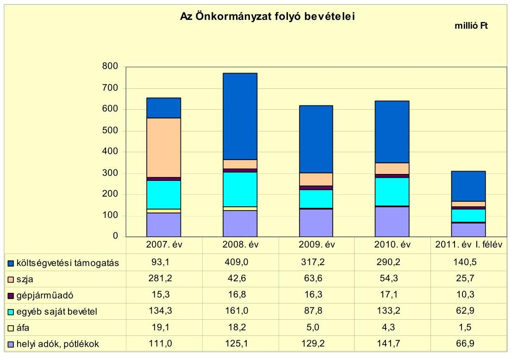

Az Önkormányzat folyó bevételének átlaga a 2007-2009. években 681,9 millió Ft volt, amely a 2010. évre 6,0\%-kal (41,1 millió Ft) 640,8 millió Ftra csökkent, a 2011. év I. félévében 307,8 millió Ft volt. Az Önkormányzat a folyó bevételek között a beruházásokhoz kapcsolódó fordított áfa összegeket nem szerepeltette ${ }^{21}$. A folyó bevételek a 2007-2009. években átlagosan 5,3\%-kal (34,9 millió Ft-tal) csökkentek, ezt követően a 2010. évre 3,5\%-os (21,7 millió Ft-os) emelkedés következett be. A folyó bevételek csökkenésének oka a 2009. évi szociális és gyermekjóléti feladatok Kistérségi társulásnak történő átadása, valamint a közoktatásban a teljesítménymutató alapú finanszírozás. A 2008. évben a magasabb összegű folyó bevételeket a Tűzoltóság költségvetési támogatásának nyugdíjazások miatti magasabb összegei okozták.

[^0]
[^0]:    ${ }^{21}$ Az Önkormányzat a beruházásokkal összefüggő fordított áfát csak áfa befizetésként számolta el a számviteli nyilvántartásaiban a kapcsolódó áfa visszatérülést nem szerepeltette, ezáltal nem tett eleget az Áhsz. 9. § (11) bekezdésében foglaltaknak, valamint a fordított áfa számviteli megjelenítését nem a 9. számú melléklet 1. pont g), illetve 14. pont a) bekezdése szerint végezte.

---

A vizsgált időszakban a működési célú költségvetési támogatás és az szja bevétel együttes összege átlagosan a folyó bevételek 57,0\%-át (387,8 millió Ft) tette ki. A 2007-2011. év I. félévében a költségvetési támogatás és az szja együttes összege a 2007-2009. évek átlagos 402,2 millió Ft értékéhez viszonyítva a 2010. évre 14,3\%-kal, 344,5 millió Ft-ra csökkent. A 2007. évről a 2008. évre a költségvetési támogatás és az szja 20,7\%-kal (77,3 millió Ft) növekedett, amit a Tűzoltóságnál végrehajtott nyugdíjazások miatti többletjuttatások költségvetési támogatása okozott. A 2008. évről a 2009. évre történt 15,7\%-os (70,8 millió Ft) csökkenését a szociális és gyermekvédelmi feladatok Kistérségi társulásnak történő átadása okozta.

A helyi adókból és pótlékokból származó bevételek a 2007-2010. években átlagosan a folyó bevételek 19,0\%-át (126,7 millió Ft) tették ki, arányuk a folyó bevételekhez viszonyítva a 2007. évi 17,0\%-ról a 2010. évre 5,1 százalékponttal 22,1\%-ra emelkedett. A helyi adók összege a 2007-2009. évek 121,8 millió Ft átlagához viszonyítva a 2010. évre 16,3\%-kal (19,9 millió Ft-tal) emelkedett. A 2010. évi növekedés az iparűzési adó adónemnél következett be három új adózó ${ }^{22}$ belépése, valamint az építményadó és a telekadó mértékének emelése miatt. A vizsgált időszakban új adónemet nem vezettek be. Az Önkormányzat a helyi adók közül építményadót, telekadót, idegenforgalmi adót és helyi iparúzési adót alkalmazott.

A 2007-2011. év I. féléve között az alábbi helyi adóknál emelték a fizetendő díjak mértékét:

- Építményadó: a nem lakás céljára szolgáló épületek után fizetendő összeget a 2010. évben $400 \mathrm{Ft} / \mathrm{m}^{2}$-ről $500 \mathrm{Ft} / \mathrm{m}^{2}$-re növelték.
- Telekadó: a beépíthető, de nem beépített telek után fizetendő adó mértékét a 2008. évben $25 \mathrm{Ft} / \mathrm{m}^{2}$-ről $50 \mathrm{Ft} / \mathrm{m}^{2}$-re emelték, a beépíthetőségtől függetlenül gondozatlan területek után fizetendő adó mértékét pedig a 2010. évben 200 $\mathrm{Ft} / \mathrm{m}^{2}$-ről $283 \mathrm{Ft} / \mathrm{m}^{2}$-re emelték. Az Önkormányzattól kedvezményes áron vásárolt telek után fizetendő adó mértéke a 2008. évben $5 \mathrm{Ft} / \mathrm{m}^{2}$-ről $150 \mathrm{Ft} / \mathrm{m}^{2}$-re emelkedett. A mezőgazdasági múvelés alatt álló, be nem építhető, gondozott telkek után fizetendő adó mértéke a 2008. évben $5 \mathrm{Ft} / \mathrm{m}^{2}$-ről $10 \mathrm{Ft} / \mathrm{m}^{2}$-re emelkedett.
- Az idegenforgalmi adó mértéke a 2008. évben $200 \mathrm{Ft} /$ fő/éj összegről $300 \mathrm{Ft} /$ fő/éj összegre emelkedett, majd a 2009-2010. években még 20-20 $\mathrm{Ft} /$ fő/éj adóemelés történt.

Az iparűzési adó mértéke a maximális 2\%-on került megállapításra, mértéke a vizsgált időszakban nem változott.

Az Önkormányzat a 2007-2011. június 30-a közötti időszakban tulajdonosi részesedései után a 2009. évben a Balatoni Hajózási Rt-ben lévő 3,6\%-os tulajdonosi részesedése után kapott 1,2 millió Ft, a 2011. év I. félévében pedig a Dunántúli Regionális Vízmú Zrt-ben levő 0,1\%-os tulajdonosi részesedése után részesült 0,1 millió Ft osztalékban.

[^0]
[^0]:    ${ }^{22}$ A három új adózó között két szálloda és egy borfeldolgozó vállalkozás szerepelt.

---

Az Önkormányzat 2007-2011. év I. félév között teljesített felhalmozási bevételei az alábbiak voltak:

| Megnevezés | 2007. év | 2008. év | 2009. év | 2010. év | 2011. év I.   félév |
| :-- | --: | --: | --: | --: | --: |
| Tárgyi eszköz értékesítés | 57,8 | 51,0 | 88,8 | 29,2 | 0,7 |
| Egyéb saját tőkebevétel | 9,2 | 0,5 | 0,7 | 151,4 | 0,3 |
| Államháztartáson belülről   kapott támogatás | 108,4 | 12,3 | 20,5 | 254,5 | 62,3 |
| EU-tól és külföldről kapott   támogatások | 0,0 | 0,0 | 28,7 | 0,0 | 0,0 |
| Államháztartáson kívülről   kapott támogatás | 13,7 | 27,1 | 28,3 | 17,3 | 0,5 |
| Összes felhalmozási bevétel | 189,1 | 90,9 | 167,0 | 452,4 | 63,8 |

A vizsgált időszakban az összes felhalmozási bevétel 963,2 millió Ft volt, amelynek közel felét, $47,5 \%$-át ( 458,0 millió Ft), az államháztartáson belülről kapott támogatások tették ki. Az „Államháztartáson belülről kapott támogatások" soron vettük figyelembe a költségvetési támogatás felhalmozási célú részét. Ennek összege - az Önkormányzat adatszolgáltatása alapján - a 2007. évben 76,4 millió Ft, a 2008. évben 0,5 millió Ft, a 2009. évben 15,7 millió Ft, a 2010. évben 10,5 millió Ft volt. Az államháztartáson belüli támogatások között legjelentősebb a szennyvízcsatorna építés IV. üteméhez a 2007. évben kapott 55,4 millió Ft összegű céltámogatás, és a 20,5 millió Ft TEKI támogatás, valamint a 2010. évben az Iskola felújításhoz és a Közösségi ház és rendezvénytér beruházásokhoz kapott EU-s támogatás volt. A tárgyi eszközértékesítés 285,3 millió Ft összege a vizsgált időszak összes felhalmozási bevételének a 29,6\%-át jelentette. A tárgyi eszközértékesítések között a 2007-2008. években telek értékesítések és önkormányzati lakásértékesítés szerepelt. A 2009. évi kimagasló felhalmozási bevétel a „Tátika" üzletház értékesítéséből származó 84,5 millió Ft-ból, 5 db telek értékesítéséből származó 2,2 millió Ft-ból, valamint egy gépjármú 1,3 millió Ft összegű értékesítéséből tevődött össze. A 2010. évben csak telek értékesítésből (forgalomképes ingatlan) származott az Önkormányzatnak e soron felhalmozási bevétele.

---

# 2.3. Az önkormányzat múködési és a felhalmozási célú kiadásainak változása. 

Az Önkormányzat folyó kiadásai főbb jogcímek szerinti bontásban a 20072011. év I. félév közötti időszakban az alábbiak voltak:

| Megnevezés | 2007. év | 2008. év | 2009. év | 2010. év | 2011. év I.   félév |
| :--: | :--: | :--: | :--: | :--: | :--: |
| Folyó kiadások | 742,1 | 786,5 | 709,3 | 714,3 | 352,0 |
| Müködési kiadások (kamatkiadás nélkül) | 645,6 | 653,7 | 609,0 | 622,5 | 311,0 |
| Államháztartáson belülre átadott pénzeszközök | 7,6 | 12,7 | 5,7 | 3,3 | 0,4 |
| Transzferkiadások | 72,3 | 91,4 | 71,3 | 71,3 | 37,0 |
| -ebből: vállalkozásoknak | 39,0 | 48,5 | 40,2 | 39,6 | 23,4 |
| magánszemélyeknek | 17,5 | 19,8 | 15,0 | 13,8 | 0,0 |
| nonprofit szervezeteknek | 15,8 | 23,1 | 16,1 | 17,9 | 8,7 |
| Kamatkiadások | 16,6 | 28,7 | 23,3 | 17,2 | 3,6 |

Az Önkormányzat folyó kiadásai a 2007-2009. években átlagosan 1,9\%-kal (16,4 millió Ft-tal) csökkentek, a 2010. évben az előző évek 746,0 millió Ft átlagához viszonyítva további 4,3\%-os ( 31,7 millió Ft-os) csökkenés tapasztalható. A 2011. év I. félévében a folyó kiadások 352,0 millió Ft-ot, a 2010. évi folyó kiadások 49,3\%-át tették ki. A folyó kiadásokon belül a múködési kiadások átlagos csökkenése 2,7\% (18,3 millió Ft) volt, amely a 2010. évre további 2,1\%-os (13,6 millió Ft-os) csökkenést mutatott. A múködési kiadások mérsékelt csökkenését a feladatellátás változása okozta.

Az Önkormányzat folyó kiadásai főbb kiadásnemek szerinti bontásban a 20072011. év I. félév közötti időszakban az alábbiak voltak:

|  |  |  |  |  | millió Ft |
| :-- | --: | --: | --: | --: | --: |
| Megnevezés | 2007. év | 2008. év | 2009. év | 2010. év | 2011. év I.   félév |
| Személyi juttatások | 341,0 | 343,4 | 323,4 | 318,7 | 139,9 |
| Munkaadót terhelő járulékok | 106,5 | 105,4 | 91,1 | 81,4 | 36,5 |
| Dologi kiadások | 189,2 | 186,2 | 174,5 | 207,0 | 108,9 |
| Egyéb folyó kiadások | 8,9 | 18,7 | 20,0 | 15,4 | 25,7 |

A személyi juttatások összege a vizsgált időszakban a 2008. évi minimális -0,7\%-os mértékű, (2,4 millió Ft összegű) - növekedés kivételével, folyamatosan csökkent. A 2007-2009. évek átlagos 335,9 millió Ft összegű személyi juttatása a 2010. évre további 5,1\%-kal (17,2 millió Ft-tal) csökkent. A 2009. évhez viszonyítva a 2010. évi csökkenés minimális 1,5\%-os ( 4,7 millió Ft) volt. A 2009. évi személyi juttatás csökkenés oka a szociális és gyermekjóléti feladatok Kistérségi társulásnak történő átadása (nyolc fővel csökkent a létszám). A vizsgált időszakban a munkaadókat terhelő járulékok összege egyrészt a kifizetett személyi juttatások, másrészt a járulékok mértékének csökkenése miatt csökkent a 2007-2009. évi átlagos 101,0 millió Ft-ról 19,4\%-kal ( 9,7 millió Ft-tal) a 2010. évre 81,4 millió Ft-ra. A dologi kiadások összege a 2007-2009. években folyamatosan csökkent, a 2010. évre azonban az előző évek 183,3 millió Ft összegéhez viszonyítva 12,9\%-kal (23,7 millió Ft-tal) emelkedett. A dologi kiadások növekedését a kompetencia alapú oktatás miatti többletkiadások okozták.

---

Az Önkormányzat folyó és felhalmozási kiadásainak alakulását a teljesített kiadások folyó és felhalmozási felhasználásának arányait a 2007-2011. év I. félév közötti időszakban a következő grafikon szemlélteti:
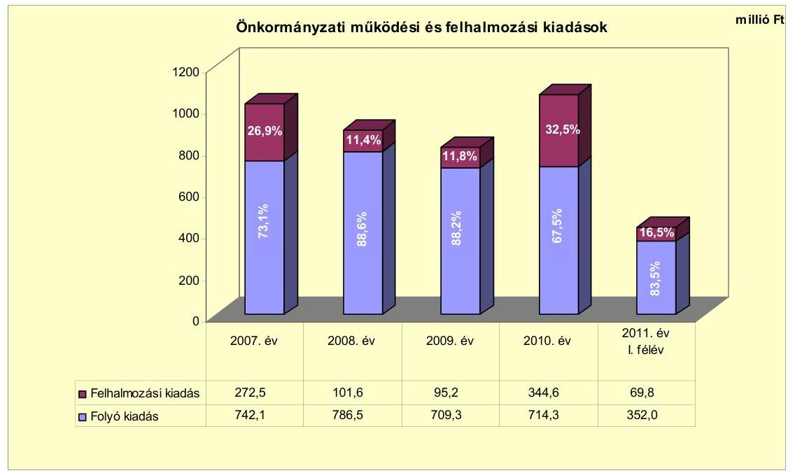

A folyó kiadásokon belül a 2007-2011. év I. félévében a felhalmozási kiadások aránya változó volt, a folyó kiadások 11,4\%-32,5\%-át tette ki. A felhalmozási kiadások aránya a vizsgált időszakon belül a 2010. évben volt a legmagasabb összegű és arányú, mivel ebben az évben történt többek között az új Polgármesteri hivatal építése ${ }^{23}$ és bútor beszerzése ( 94,5 millió Ft, 10,1 millió Ft), az Iskola felújítása (193,8 millió Ft), Óvoda nyílászáróinak cseréje (11,9 millió Ft). A vizsgált időszak második legmagasabb felhalmozási kiadását a 2007. évben hajtották végre. Ekkor volt folyamatban a szennyvízcsatorna építés IV. üteme, amihez 92,8 millió Ft volt a felhalmozási kiadás, jelentős volt még a túzoltó laktanya 47,1 millió Ft összegű, valamint a termálkútfúrás 56,1 millió Ft összegű fejlesztési kiadása.

Az Önkormányzatnál a fejlesztési döntéseket megelőzően nem vizsgálták azok jövőbeni bevételnövelő, illetve kiadáscsökkentő hatásait. Az Önkormányzatnál a 2007-2010. években összesen 37 felújítás és 56 fejlesztés fejeződött be, amelyek tervezett bekerülési költsége 1414,0 millió Ft, a tényleges bekerülési költsége pedig ennél $43,3 \%$-kal ( 612,6 millió Ft-tal) kevesebb, 801,4 millió Ft volt. A jelentős eltérés oka, hogy az éves költségvetési rendeletekben a tervezett felújítások és fejlesztési kiadások nem valósultak meg teljes körűen. A felújítási, fejlesztési feladatokat $38,8 \%$-ban ( 549,1 millió Ft) saját bevételből, 10,0\%-ban (141,4 millió Ft) hitelből, 19,8\%-ban (279,9 millió Ft) EU támogatásból, és $31,4 \%$-ban ( 443,6 millió Ft) hazai támogatásból kívánták megvalósítani. A vizsgált időszakban befejezett felújítások és fejlesztések tényleges bekerülési

[^0]
[^0]:    ${ }^{23}$ Az új Polgármesteri hivatal megépítésére a folyamatban levő „Közösségi ház és rendezvénytér" projekt keretében került sor.

---

költségének 35,2\%-át (282,2 millió Ft-ot) saját bevételből, 11,9\%-át (95,0 millió Ft-ot) hitelből, 1,1\%-át ( 9,1 millió Ft-ot) EU támogatásból, 51,8\%-át (415,1 millió Ft-ot) hazai támogatásból biztosították. A befejezett felújítások között egy útfelújítás, az Óvoda nyílászárócseréje, valamint a Városháza bútorcseréje szerepelt ${ }^{24}$. A 10 millió Ft alatti felújítási feladatok között útfelújítások, sportpálya felújítás, lakás felújítások, az Egészségház felújítása, játszótér felújítás, a Művelődési Ház fűtési rendszerének felújítása szerepelt. A befejezett fejlesztések között a Tűzoltó laktanyabővítés, lakótelkek kialakítása, a szennyvízcsatorna építés IV. üteme, ivóvíz ellátáshoz csővezeték építés, utcai közvilágítás kiépítés, ingatlan vásárlás szerepelt. A 10 millió Ft alatti fejlesztési feladatok között többek között akadálymentesítési feladatok elvégzése, beruházások tervezése, játszótéri játékbeszerzések, kerítésépítés, gyalogátkelőhely kialakítás, számítástechnikai eszközbeszerzések szerepeltek.

Az Önkormányzatnál 2010. december 31-én kettő felújítási és három fejlesztési feladat volt folyamatban. A felújítási feladatok között az Iskola felújítás és a Szénégető dűlő rekultivációja szerepelt. A projektek tervezett bekerülési költsége 326,9 millió Ft volt, melynek 13,6\%-át (44,3, millió Ft-ot) saját bevételből, 86,4\%-át (282,6 millió Ft-ot) EU támogatásból terveznek megvalósítani. A két felújítási feladatra 2010. december 31-ig ténylegesen 197,4 millió Ft kiadást számoltak el, melynek forrását $11,7 \%$-ban ( 23,1 millió Ft ) önkormányzati saját bevétel, $88,3 \%$-ban ( 174,3 millió Ft) EU támogatás biztosította. A felújítási feladatok várható tényleges bekerülési költsége 305,0 millió Ft, melyből a 2010. december 31. utánra vállalt kötelezettség 107,6 millió Ft. A felújítási feladatok vállalt kötelezettségeinek 15,2\%-át (16,4 millió Ft-ot) saját bevételből, 84,8\%-át ( 91,2 millió Ft-ot) EU támogatásból kívánnak megvalósítani. A fejlesztési feladatok közül „Egy jobb kilátásért, Új kilátó létesités a Badacsony hegyen", a Közösségi ház és rendezvénytér, valamint a Termálkút-fúrás projektek voltak folyamatban 2010. december 31-én. A projektek tervezett bekerülési költsége 383,1 millió Ft, melynek 37,8\%-át (144,9 millió Ft-ot saját bevételből, 47,8-át (183,2 millió Ft-ot) EU támogatásból, 14,4\%-át (55,0 millió Ft-ot) pedig hitelből terveznek megvalósítani. A tényleges kiadások összege 2010. december 31-én 203,9 millió Ft volt, melynek forrása $32,2 \%$-ban ( 65,6 millió Ft ) saját bevétel, 26,6-ban ( 54,3 millió Ft) hitel ${ }^{25}$, 41,2\%-ban ( 84,0 millió Ft) EU támogatás volt. A fejlesztési feladatok várható tényleges bekerülési költsége 259,3 millió Ft, a 2010. évet követő kötelezettségvállalás összege 126,1 millió Ft. A kötelezettségvállalás forrásaként 36,9\%-ban ( 46,5 millió Ft) saját bevételt, 63,1\%-ban ( 79,6 millió Ft) EU támogatást jelölt meg az Önkormányzat. A 2010. évet követő kötelezettségvállalások között a termálkút fúrás ${ }^{26}$ már nem szerepel, mivel arra a 2010. december 31-ét követően már nem merült fel kiadás. Azért szere-

[^0]
[^0]:    ${ }^{24}$ A bútorbeszerzést a Számviteli törvény 3. § 7., 8. pontjaiban foglaltak alapján a felhalmozási kiadások között kellett volna szerepeltetni.
    ${ }^{25}$ A Termálkút fúrás költségeiből 5,7 millió Ft a 2006. évben, 56,1 millió Ft a 2007. évben, 8,8 millió Ft a 2008.évben merült fel, amikor még a kötvényből a hosszúlejáratú fejlesztési hitelek törlesztése nem történt meg.
    ${ }^{26}$ A Termálkút fúrás peres eljárás oka, mivel 900 m mélységben sem találtak az eredeti elvárásoknak megfelelő termálvizet, ezért az Önkormányzat a további munkálatokat leállíttatta, és a vállalkozót hibás teljesítésre való hivatkozással perelte, az eljárás 2011. évi lezárásakor a Bíróság az Önkormányzat keresetét elutasította.

---

peltették a folyamatban lévő beruházások között, mert peres eljárás volt folyamatban, amely a 2011. évben zárult le. A peres eljárás eredményeként a beruházás nem valósul meg, az eddig felmerült költségek a beruházások közül értékvesztésként kivezetésre kerülnek. Az Önkormányzat a 2011. év I. félévében nem indított saját forrásból felújítási, fejlesztési feladatot.

Az Önkormányzat a 2011. év I. félévében az Óvoda épületének hőszigetelésére nyújtott be 2011. április 18-án „A társult formában múködtetett, kötelező önkormányzati feladatot ellátó intézmények fejlesztésének, felújításának támogatására" pályázatot, melynek tervezett bekerülési költsége 13,7 millió Ft volt, amelyet 19,7\%-os ( 2,7 millió Ft) saját bevételből és $80,3 \%$-os ( 11,0 millió Ft) hazai támogatásból kívánnak megvalósítani. A pályázat eredményéről az Önkormányzat a helyszíni vizsgálat befejezéséig nem kapott tájékoztatást.

Az Önkormányzat három legmagasabb bekerülési költségú beruházása a befejezett „Szennyvízcsatorna építés IV. ütem", a folyamatban lévő „Iskola felújítás" és a „Közösségi ház és rendezvénytér" projektek.

- Az Önkormányzat a 2005-2008. években valósította meg a „Szennyvízcsatorna építés IV. ütem" beruházását, amelynek a tényleges bekerülési költsége 495,7 millió Ft volt, 6,0\%-kal ( 31,5 millió Ft-tal) elmaradt a tervezettől. A tényleges bekerülési költség $27,3 \%$-át ( 135,1 millió Ft-ot saját forrásból, $72,7 \%$-át ( 360,6 millió Ft) pedig hazai támogatásból finanszíroztak. A hazai támogatás $81,4 \%$-a (293,6 millió Ft) céltámogatás, $8,3 \%$-a ( 30,0 millió Ft) TEKI támogatás, 5,1\%-a (18,4 millió Ft) BFT támogatás, 5,2\%-a (18,6 millió Ft) KÖVICE támogatás volt.
- Az Iskola felújítás projekt a 2008. évben kezdődött és várhatóan a 2011. évben fejeződik be. A projekt célja az Iskola kompetenciaalapú oktatás kistérségi módszertani központjává való fejlesztésének kialakítása. A tervezett bekerülési költség 268,0 millió Ft, a várható tényleges bekerülési költség ennél 9,5\%-kal ( 25,4 millió Ft-tal) kevesebb 242,6 millió Ft. A várható tényleges bekerülési költség $11,2 \%$-át ( 27,1 millió Ft-ot) saját bevétel, $88,8 \%$-át ( 215,5 millió Ft) EU-s támogatás fedezi.
- A Közösségi ház és rendezvénytér projekt keretében új Városháza került megépítésre. A projekt tervezett bekerülési költsége 197,0 millió Ft volt, a várható tényleges bekerülési költség ennél 17,3\%-kal ( 34,0 millió Ft-tal) kevesebb, 163,0 millió Ft. A várható tényleges bekerülési költség 48,5\%-át ( 79,0 millió Ft) saját bevétel, $51,5 \%$-át ( 84,0 millió Ft) EU-s támogatás fedezi.

Az Önkormányzat gazdasági társaságai részére a 2007-2011. év I. félévében összesen 190,7 millió Ft múködési és 6,0 millió Ft felhalmozási célú pénzeszköz átadást teljesített. A múködési célú pénzeszközátadások 99,6\%-át (190,0 millió Ft-ot) az Önkormányzat 100\%-os tulajdonában lévő Városüzemeltető Kft. kapta. A múködési célú pénzeszközátadások 0,3\%-át ( 0,5 millió Ft-ot) a Kéknyelú Kft., 0,1\%-át ( 0,2 millió Ft-ot) pedig a Nosztalgia vonat Kft. kapta, amelyekben az Önkormányzat tulajdoni részaránnyal nem rendelkezik. A 6,0 millió Ft összegú felhalmozási célú pénzeszközátadást a MÁV Zrt. részére peron felújítási feladatokra nyújtotta az Önkormányzat.

---

# 3. Az ÖNKORMÁNYZAT KÖTELEZETTSÉGEI 

### 3.1. Az önkormányzat pénzintézeti kötelezettségeinek változása

Az Önkormányzat mérleg szerinti pénzintézettel szembeni kötelezettségeinek állománya 2006. december 31-től 2011. június 30-ára 242,4 millió Ft-ról 665,8 millió Ft-ra nőtt. A fennálló pénzintézettel szembeni kötelezettsége 2011. június 30 -án kötvény kibocsátásból származott. A 2011. év II. negyedévi mérlegjelentés rövidlejáratú kötelezettséget nem tartalmazott. Az Önkormányzatnak 2011. június 30 -án a költségvetési elszámolási számlájának záró egyenlege -68,0 millió Ft volt. A 2011. év II. negyedévi mérlegjelentésben a költségvetési pénzforgalmi számlák tárgyidőszak végi összevont egyenlege pozitív volt, ezért az Önkormányzat a likvidhitelét hitelfelvételként nem könyvelte.
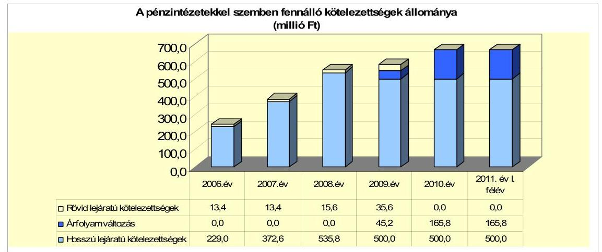

A fennálló pénzintézeti kötelezettség állományt 2007. december 31-ig a szennyvízelvezetés és tisztítás, az infrastruktúra fejlesztés céljára 2002-2006 évek között felvett 242,4 millió Ft összegű - 2007-2010. években visszafizetett hitelek alkották. A hosszú lejáratú kötelezettségek állományát megnövelte a 2008. évben kibocsátott kötvény. Az Önkormányzat 2008. március 31-én 2990 ezer CHF névértékű, zártkörű, dematerizált kötvényt bocsátott ki 20 éves futamidőre. A változó kamatozású ( 6 havi LIBOR CHF+1,4\%) kötvényt - jegyzési eljárás keretében - a Raiffeisen Bank Zrt. hozta forgalomba. A pénzintézettel szembeni kötelezettségek állományán belül a kötvény kibocsátása, illetve annak árfolyam növekedése miatt a hosszú lejáratú kötelezettségek aránya 2009-ben 93,9\% volt, a 2010. évben 100,0\%. A 2011. év I. félévi állományt képező kötvénynek $33,4 \%$-a ( 166,8 millió Ft) az árfolyam növekedés miatt keletkezett.

Az árfolyamváltozás hatása is befolyásolja a kötelezettségek alakulását, azonban annak mértéke előre pontosan nem határozható meg, csak várakozásokon alapuló tendenciák jelezhetők. Annak megítéléséről, hogy a devizában fennálló hitel vagy kötvény visszafizetése, illetve visszavásárlása az Önkormányzat számára forintban összességében többletkiadást (árfolyamveszteség) vagy kiadási megtakarítást eredményez a futamidő végén, a teljes kötelezettség rendezését követően lehet képet alkotni. Mindaddig, amíg törlesztési kötelezettség nem áll fenn (türelmi idő, moratórium), a tőkére vonatkoztatva nem értelmez-

---

hető sem az árfolyamveszteség, sem az árfolyamnyereség. A Számv. tv. 60. § (4) bek. meghatározza, hogy az árfolyam-különbözetet év végén a kötelezettségek vagy követelések között a könyvviteli mérlegben nyilván kell tartani, azonban az árfolyam-különbözet valójában nem realizálódott.

Az Önkormányzat a 2007-2011. év I. félévben hosszú lejáratú hitel felvételéről nem, viszont kötvény kibocsátásról egy alkalommal - 2008. évben - döntött. A pénzintézeti kötelezettségvállalásra képviselő-testületi döntés alapján került sor. Az Önkormányzat „költségvetési rendeletében meghatározott célú kiadásainak finanszírozása, beruházás finanszírozási igényeinek biztosítása és hitelszerkezetének konszolidálása" céljára 20 éves futamidejű, 500,0 millió Ft keretösszegű kötvényt bocsátott ki. Az Önkormányzat a kötvénykibocsátáskor a pénzintézeteket versenyeztette. A kötvényt finanszírozó pénzintézet nem volt azonos a számlavezető pénzintézettel. A kötelezettségvállalásból származó forrás felhasználási céljait meghatározták. A Képviselő-testület döntését megalapozó előterjesztés nem tartalmazta a kötelezettségvállalás visszafizetési forrásainak, a teljes futamidő várható kamat és tőkefizetési kötelezettségeknek, az árfolyam- és kamatkockázatnak a bemutatását. Az előterjesztésekben nem tértek ki az adósságszolgálati korlát bemutatására, a Képviselő-testület döntéseit ennek figyelembevétele nélkül hozta meg. Az Önkormányzat a kötelezettségvállalás során az adósságot keletkeztető kötelezettségvállalásának felső határát ${ }^{27}$ nem lépte túl. Az adósságot keletkeztető kötelezettségvállalással megvalósított felhalmozási kiadások esetleges bevételt növelő, illetve kiadást csökkentő vonzatát, illetve ennek a fejlesztéshez, felújításhoz vállalt kötelezettségek visszafizetési forrásként való számbavételét nem vizsgálták.

Az Önkormányzat 2011. év I. félév végén devizában fennálló adósságot keletkeztető kötelezettségvállalása az alábbi volt:

| Megnevezés | Szerződéskötés/   Kibocsátás   időpontja | Összeg   ezer CHF-ben | Kibocsátás//lehívási   árfolyam | Kamat (referencia kamat^   kamatfelár) | Felhasználás célja: |
| :-- | :--: | :--: | :--: | :--: | :-- |
| "VULKÁN" kötvény | 2008. március 19.   (2008.március 31. | 2990 | 167,5 | 6 havi LIBOR + 1,4\% | A költségvetési rendeletben   meghatározott célú kiadásainak   finanszírozása, beruházás   finanszírozási igényeinek   biztosítása és hitelszerkezetének   konszolidálása. |

Az Önkormányzat 2007-2011. év I. félév között a CHF-ben fennálló pénzintézeti kötelezettségére tőkét nem törlesztett. A tőketörlesztés 2013. március 31től a futamidő végéig (2028. március 31.) félévenként lesz esedékes. Az első tőketörlesztés összege 99670 CHF. Az Önkormányzat 2011. év I. félév végéig 239,8 ezer CHF ( 44,4 millió Ft) kamatot, valamint a kötelezettséghez kapcsoló-

[^0]
[^0]:    ${ }^{27}$ A 2007. évi beszámoló szerint a kötelezettségvállalás felső határa 67,8 millió Ft, a 2008. évi költségvetés adatai szerint számított hitelképesség felső határa 75,7 millió Ft. A kötvény forgalomba hozatalához a forgalmazó által készített Információs Összeállítás alapján a törlesztési időpontokhoz rendelt aktuális tőkeérték névértéke évente 64,2 millió Ft-tal fog csökkeni.

---

an 4,0 millió Ft egyéb díjat (jegyzési garanciavállalási díj), továbbá 68,6 ezer CHF ( 11,8 millió Ft) egyéb költséget ${ }^{28}$ fizetett.

Az Önkormányzat a „VULKÁN" kötvényből 320,0 millió Ft-ot használt fel 2011. év I. félév végéig. A fel nem használt kötvény maradványa 180,8 millió Ft, amelyet a keretszerződésnek megfelelően elkülönítettek, óvadéki számlán jóváírásra került. Az óvadék a bankkal szemben fennálló kötelezettségei teljesítésének biztosítására szolgál. A keretszerződés szerint: „az óvadéki számlán lévő óvadék a bank birtokából nem vonható ki". A kötvény kibocsátásból származó bevételnek - a pénzóvadék figyelembevételével - csak 63,9\%-a képezhette döntés tárgyát a felhasználást illetően. A felhasznált 320,0 millió Ft $98,8 \%$-át a fennálló hitelek visszafizetésére, $1,2 \%$-át jegyzési garanciavállalási díj kifizetésére fordították.

Az Önkormányzat 2007-2010. években a vizsgált időszakot megelőzően felvett öt darab, 242,4 millió Ft összegű hosszú lejáratú hitelét teljes mértékben visszafizette. A vizsgált időszakban (2007. évben) került sor 74,2 millió Ft összegű víziközmű társulati hitel átvállalásra, valamint a 2005. évben kötött hitelszerződés alapján 92,4 millió összegű hitel igénybevételre ${ }^{29}$. A hiteleket az Önkormányzat a hitelcéloknak megfelelően használta fel. Egy fejlesztési célú hitelt a kötvényből refinanszírozott. Ez az intézkedés az Önkormányzat pénzügyi helyzetét kedvezően befolyásolta, mivel a kedvezőtlenebb kamatkondíciójú ${ }^{30}$ Magyar Fejlesztési Bank által refinanszírozott pénzintézeti kötelezettség állománya szűnt meg. A 2007-2010. években a hitelek tőketörlesztésére és a kamat fizetésére 440,0 millió Ft-ot fordítottak, ebből 409,0 millió Ft volt a tőketörlesztés és 31,0 millió Ft a kamatfizetés.

Szennyvízelvezetés célját szolgáló létesítmények létrehozása céljából a lakossági érdekeltségi hozzájárulások megelőlegezésére az ütemenkénti Víziközmú Társulással négy darab kölcsönszerződést kötött a vizsgált időszakot megelőzően. A Víziközmú Társulás megszűnése miatt az Önkormányzat e kötelezettségeket átvállalta és teljesítette azok törlesztését. A 2007-2010 között 84,0 millió Ft összegű hitelt fizetett vissza, a kifizetett kamat összege 5,8 millió Ft volt.
„Önkormányzati Infrastruktúra Fejlesztési Program" keretében 438,7 millió Ft hitelt kettő hitelcélra nyújtotta a Bank:

- „A" hitelcél: ivóvízminőségét javító és csapadékvíz-elvezetést szolgáló beruházások finanszírozása 24,3 millió Ft összegben,
- „B" hitelcél: infrastrukturális beruházások finanszírozása 414,4 millió Ft öszszegben.

[^0]
[^0]:    ${ }^{28}$ 2009. április 16-án a forgalmazói szerződés kiegészítésre került, a forgalmazó bank a 2009. évre 2,3\%-os átalánydíjat határozott meg kifizető és kamatszámító ügynöki szolgáltatásokért, amelyet az Önkormányzat elfogadott.
    ${ }^{29}$ A 2007. évi hitelfelvétellel került sor a Termálkút fúrás tanulmánytervének elkészítése, lakótelkek közművesítése, útfelújítási feladatok, járdaépítések elvégzésére.
    ${ }^{30}$ Összehasonlító elemzés készült a kötvény és a hitel kamat-kondíciójára.

---

A hitelszerződést 72,2\%-ban vette igénybe az Önkormányzat. Az igénybevett 316,6 millió Ft-ot teljes mértékben visszafizette 2008. április 17-én. A fizetett kamat összege 24,8 millió Ft volt.
A 2002. évi költségvetésben elfogadott fejlesztési feladatok megvalósítására még Badacsonytomaj Nagyközség Önkormányzata 36,0 millió Ft-ot igényelt. A hiteltörlesztés két utolsó üteme a 2007-2008. években volt. A hitel visszafizetés összege 9,0 millió Ft, a kamat 0,4 millió Ft volt.

Az Önkormányzat 2007-2010. december 31. között az átmenetileg szabad pénzeszközein 58,1 millió Ft kamatbevételt realizált. Kötvény forrás befektetéséből 40,6 millió Ft kamatbevétel keletkezett. A kötvényforrás befektetéséből származó kamatbevételt az Önkormányzat óvadéki betétbe helyezte. A kamatbevétel a kötvény teljesített kamatfizetésnek ( 44,4 millió Ft) a $91,4 \%$-át tette ki.

Az Önkormányzat múködésének pénzügyi egyensúlyához a vizsgált időszakban folyószámlahitelt kellett igénybe venni, munkabér megelőlegezési hitel igénybevételére nem került sor.

A folyószámlahitel alakulását a következő táblázat mutatja be:

| Megnevezés | 2007. év | 2008. év | 2009. év | 2010. év | 2011. év I.   félév |
| :-- | --: | --: | --: | --: | --: |
| I. Folyószámlahitel |  |  |  |  |  |
| a folyószámlahitel keretösszege január 1-jén | 100,0 | 77,0 | 77,0 | 30,0 | 0,0 |
| teljesített kamat és egyéb költség | 2,0 | 2,8 | 1,0 | 4,3 | 2,9 |

Az Önkormányzat a 2009. szeptember 3-án kötött folyószámla hitelkeret szerződésének lejárata 2010. szeptember 4-én volt. Az Önkormányzat 2011. január 1-én folyószámla hitelkeret szerződéssel nem rendelkezett, új szerződést 2011. január 4-én kötöttek.

A folyószámlahitel kondíciói és egyéb költségei a következők voltak ${ }^{31}$ :

| Megnevezés | Kamat (referencia+ kamatfelár) | Egyéb költség |
| :--: | :--: | :--: |
| Folyószámlahitel |  |  |
| 2007-2008. év | 3 havi BUBOR $+1 \%$ | 0,5\% kezelési költség |
| 2008-2009. év | 3 havi BUBOR $+2,2 \%$ | 0,25\% rend.tart.jutalék, 0,5\%   kezelési költség |
| 2009-2010. év | 1 havi BUBOR $+3,25 \%$ | 0,5\% rend.tart.jutalék, 0,5\%   kezelési költség |
| 2011. év | 1 havi BUBOR $+3,0 \%$ | 0,5\% rend.tart.jutalék, 0,5\%   kezelési költség |

Az Önkormányzat az átmeneti likviditási problémák kezelésére minden évben megújította a folyószámla hitelszerződését. A folyószámlahitel évenkénti lejáratakor a bank - új szerződés megkötésével - a hitelt mindig tovább folyósítot-

[^0][^1]
[^0]:    ${ }^{31}$ A referencia kamat az alábbiak szerint alakult:

[^1]:    ${ }^{31}$ A referencia kamat az alábbiak szerint alakult:

    | MNB BUBOR fixing (állagkamat) \%-ban |  |  |  |  |
    | :--: | :--: | :--: | :--: | :--: |
    | Referencia kamat | 2007. évi | 2008. évi | 2009. évi | 2010. évi | 2011. év I.   félév |
    | 1 havi BUBOR | 7,83 | 8,75 | 8,66 | 5,47 | 6,00 |
    | 3 havi BUBOR | 7,75 | 8,87 | 8,64 | 5,50 | 6,07 |

---

ta, így az Önkormányzatnak a lejáratkor nem kellett a hitelt törlesztenie. A folyószámlahitel keret a 2007. évi szerződéskötéskor 23,0 millió Ft-tal, a 2009. szeptember 5-i folyószámlahitel szerződés megkötésekor 47,0 millió Ft-tal csökkent. Az Önkormányzat a 2007. évben 241 napon át vett igénybe folyószámlahitelt, a hitel átlagos napi állománya 22,8 millió Ft. A 2008. évben a folyószámlahitellel zárt napok száma 302 nap volt, a hitel átlagos napi állománya 29,5 millió Ft. A 2009. évtől csökkent a folyószámlahitellel zárt napok száma, 226 illetve 176 napon át vette igénybe folyószámla hitelkeretét az Önkormányzat. A hitel átlagos napi állománya 10,3 millió Ft, illetve 10,7 millió Ft volt. A pénzügyi helyzet kedvező alakulását mutatta a 2009., 2010. évi folyószámlahitel napi átlagos állományának 2008. évhez viszonyított ( $65,1 \%$-os, illetve $63,7 \%$-os) csökkenése. A folyószámlahitel fordulónapi állomány is kedvezően alakult. A 2007-2008. évi fordulónapi hitelállomány 74,0 millió Ft, illetve 42,3 millió Ft volt, a 2009-2010. évben a forduló napon jelentősen csökkent 2,3 millió Ft volt, illetve nem állt fenn folyószámlahitel. A kedvező változás iránya 2011-ben megfordult, mert a 2011. június 30-i hitelállomány ( 68,0 millió Ft) megközelítette a 2007. évi összeget. A folyószámlahitel átlagos napi állománya 56,3 millió Ft lett. A 2007-2010. évek végén a folyószámlahitelnek nem volt állománya. A likviditás biztosítása az Önkormányzatnak 13,0 millió Ft kamatkiadást jelentett a vizsgált időszakban.

A kamat mértékének alakulása jelentős hatással van az adott devizanemben kifejezett, a teljes futamidőre számított, várható kamatköltség nagyságára. Az Önkormányzat jelenleg fennálló kötvénye esetében a kamatfizetési kötelezettségek alakulását is jelentősen befolyásolta a referencia kamat változása, melyet az alábbi táblázat mutat be:

| Megnevezés | Kibocsátási, lehivási | Utolsó fizetéskor | Változás \% |
| :--: | :--: | :--: | :--: |
|  | kamat (referencia + kamatfelár) \% |  |  |
| 6 havi CHF LIBOR (2008.03.19-i szerződés) | 4,3183 |  | $-61,7 \%$ |

Az Önkormányzat utolsó kamatfizetési kötelezettsége a kötvény után 2011. március 31-én volt.

Amennyiben a referenciakamat nem változott volna, az Önkormányzatnak kibocsátáskori referenciakamattal számolva 2011. június 30-ig 387,4 ezer CHF kamatfizetési kötelezettsége jelentkezett volna. A kamatváltozások miatt az Önkormányzatnak 147,6 ezer CHF-el kisebb fizetési kötelezettséget kellett teljesítenie, mint amivel a szerződés megkötésekor számolnia kellett.

---

Az Önkormányzat kötelezettségeinek állományát (beleértve a szállítói kötelezettségeket is), valamint várható alakulását a következő táblázat mutatja:

| Megnevezés | Állomány 2010. december 31   én |  |  | Állomány 2011. június 30-án |  |  | Várható kötelezettség   2011-2013. években |  | Várható kötelezettség   2014. évtöl |  |
| :--: | :--: | :--: | :--: | :--: | :--: | :--: | :--: | :--: | :--: | :--: |
|  | HUF-ban   (millió Ft-   ban) | Devizában   (összege,   ezer ...   ben) | Devize   nem | HUF-ban   (millió Ft-   ban) | Devizában   (összege,   ezer...   ban) | Devize   nem | HUF-ban   (millió Ft-   ban) | Devizában   (összege,   ezer ...-ben) | HUF-ban   (millió Ft-   ban) | Devizában   (összege,   ezer ...-ben) |
| Pénzintézeti kötelezettségek |  |  |  |  |  |  |  |  |  |  |
| "SULKÁM" kötvény |  | 2990,0 | CHF |  | 2990,0 | CHF |  | 347,0 |  | 3 141,9 |
| Polyószámla hitel | 0,0 |  | HUF | 68,0 |  | HUF | 68,0 |  |  |  |
| Pénzintézeti kötelezettségek összesen HUF-ban: | 0,0 |  | HUF | 68,0 |  | HUF | 68,0 |  |  |  |
| Pénzintézeti kötelezettségek összesen CHF-ben: |  | 2990,0 | CHF |  | 2990,0 | CHF |  | 347,0 |  | 3 141,9 |
| Biztosítékok |  |  |  |  |  |  |  |  |  |  |
| Kezesség | 4,9 | 0,0 | HUF | 9,4 | 0,0 | HUF | 9,4 | 0,0 | 0,0 | 0,0 |
| Biztosítékok összesen: | 4,9 | 0,0 |  | 9,4 | 0,0 |  | 9,4 | 0,0 | 0,0 | 0,0 |
| Szállítói tartozás | 2,0 |  | HUF | 9,7 |  | HUF | 9,7 |  |  |  |
| Zegerős végzéssel lezárt de ki nem fizetett kötelezettségek | 0,3 |  | HUF | 0,3 |  | HUF | 0,3 |  |  |  |
| Kötelezettségek összesen HUF-ban: | 7,2 | 0,0 | HUF | 87,4 | 0,0 | HUF | 87,4 | 0,0 | 0,0 | 0,0 |
| Kötelezettségek összesen CHF-ben: |  | 2990,0 | CHF |  | 2990,0 | CHF |  | 347,0 |  | 3 141,9 |

Az Önkormányzatnak pénzintézetekkel szemben fennálló kötelezettsége 2011. június 30-án 68,0 millió Ft folyószámlahitel és 2 990,0 ezer CHF kötvény miatt állt fenn. A kötvény állomány várható kötelezettsége a tőke törlesztését és annak kamatfizetési kötelezettségét jelenti. Az Önkormányzatnak a 2010. december 31-én fennálló 2990,0 ezer CHF összegű tőketartozás törlesztését 2013-ban kell megkezdeni. Az Önkormányzatnak a 2011-2013-as években szállítói tartozások címén 9,7 millió Ft fizetési kötelezettsége keletkezett. A kezességvállalásaiból adódóan 9,4 millió Ft összegű terhe ${ }^{32}$ jelentkezhet, amennyiben a két társasága a folyószámlahitelre és a rövidlejáratú hitelre vonatkozó kötelezettségeit nem teljesíti. A kötvény tőke és kamat fizetésének 2011-2013. években esedékes összege 347,0 ezer CHF, a 2014-től várható kötelezettség 3 141,9 ezer CHF. A 2011-2013. közötti kötelezettség teljesítésére figyelembe vehető forrás a 2010. évi mérlegben kimutatott 140,6 millió Ft összegű - az Önkormányzat tájékoztatása alapján - behajtható követelésállomány. A 2014. évet követő kötelezettségekre figyelembe vehető forrás lehet a jelzáloggal nem terhelt forgalomképes nettó ingatlanvagyon, a kamatokkal növelt óvadéki betétösszeg. A követelésállomány és a jelzáloggal nem terhelt forgalomképes ingatlanok értékének fedezetként való beszámítása bizonytalansági tényezőt hordoz.

A helyszíni vizsgálat alatt hitel-igénybevételről döntött a Képviselő-testület. A hitelkérelmet a finanszírozó bank befogadta. Az Önkormányzat az Európai Uniós pályázatokból megvalósuló beruházások finanszírozásához

[^0]
[^0]:    ${ }^{32}$ Az Önkormányzat a Városüzemeltető Kft. folyószámla hitelszerződéséhez 2010. szeptember 30-án 9,0 millió Ft összegű készfizető kezességi szerződést kötött, melyből a 2011. június 30-án fennálló kötelezettség 7,4 millió Ft. A Városüzemeltető Kft. 2011. március 24-én kelt 10,0 millió Ft összegű rulírozó hitelkeretéhez vállalt készfizető kezességet az Önkormányzat, ebből a 2011. június 30-án fennálló kötelezettség 2,0 millió Ft.

---

30,3 millió Ft összegű, rövid lejáratú támogatást megelőlegező hitelt vesz fel. Kötvénykibocsátásról szóló újabb döntést nem készítettek elő.

# 3.2. A szállítói kötelezettségek változása 

Az Önkormányzat adatszolgáltatása szerint a szállítói kötelezettség és a lejárt szállítói tartozás az alábbiak szerint alakult:

|  |  |  |  |  | millió Ft   2011. év I. fólé |
| :--: | :--: | :--: | :--: | :--: | :--: |
| Polgármesteri hivatal és intézmények | 11,8 | 7,8 | 35,3 | 2,0 | 9,7 |
| ebből: lejárt szállitóo tartozás | 6,7 | 2,6 | 1,0 | 0,5 | 9,3 |

A 2007-2010. év között a szállítói kötelezettség változatos képet mutatott. A 2009. évben volt a legmagasabb 35,3 millió Ft a szállítói kötelezettség ${ }^{33}$, a 2010. évben a legalacsonyabb 2,0 millió Ft. A szállítói kötelezettség összegével arányosan változott a kötelezettségeken belüli aránya is: 2007. évben 2,7\%, a 2008. évben 1,3\%, a 2009. évben 5,4\%, a 2010. évben 0,3\% volt. A 2010. év végén kimutatott szállítói állomány 2,0 millió Ft volt, amely 2011. június 30-ra 9,7 millió Ft-ra nőtt, ebből 0,4 millió Ft átütemezési megállapodással érintett. A 2011. év I. félévi lejárt tartozás 78,7\%-a 7,3 millió Ft 30 nap alatti, 2,0 millió Ft 30-60 nap közötti volt, amelyek kiegyenlítése teljes körűen megtörtént a helyszíni vizsgálat befejezéséig. Az Önkormányzatnak a vizsgált időszakban egyéb kiadáselmaradása nem volt.

### 3.3. Egyéb kötelezettségek változása

Az Önkormányzatnak a vizsgált időszakban nem volt lizingszerződése, PPP konstrukcióban nem vett részt. Intézményeknek, más önkormányzatoknak, civil szervezeteknek, gazdasági társaságoknak kölcsönt nem nyújtott, így ezek nem jelentettek fizetési kötelezettséget, a pénzügyi egyensúlyt nem befolyásolták.

Az Önkormányzat a vizsgált időszakot megelőzően a kizárólagos tulajdonában álló gazdasági társasága felé vállalt kezességet 17,6 millió Ft összegben. A kezességvállalással kapcsolatos hosszú távú kötelezettség tárgya pénzügyi lizing. A lizing szerződést gépjármúvekre kötötték, a kapcsolódó kezességvállalás 2011. június 30 -án már nem állt fenn. A 2010. évben a gazdasági társasága felé 9,0 millió Ft folyószámlahitel, a 2011. évben 10,0 millió Ft rulírozó hitel biztosítékaként a hitel, járulékos költségei és kamatai visszafizetésének erejéig vállalt készfizető kezességet. A kezességvállalással fennálló kötelezettség összege 2011. június 30 -án 9,4 millió Ft lett. A kezességvállalásra a helyszíni ellenőrzés befejezéséig fizetési kötelezettséget nem kellett teljesíteni, mivel a Városüzemeltető Kft. teljesítette a fennálló fizetési kötelezettségeit. Az Önkormányzat a 2010-2011. év I. félév

[^0]
[^0]:    ${ }^{33}$ A 2009. évi szállítói kötelezettség 89,5\%-át (31,6 millió Ft-ot) a Közösségi Ház és rendezvénytér projekt kivitelezői számlái alkották.

---

időszakában 0,7 millió Ft összegű követelést engedett el. A követelés elengedés 55,5\%-ban ( 0,4 millió Ft) az adózók kérésére a jegyző méltányossági jogkörébe tartozó helyi adó elengedés volt. A Képviselő-testület a 2010. évben 0,3 millió Ft összegű behajthatatlannak minősülő bérleti díj elengedésről hozott döntést.

Az Önkormányzatnál jelzálogjoggal terhelt ingatlanvagyon nem volt.
Az Önkormányzat 50\%-ot és azt meghaladó tulajdonosi hányaddal rendelkezik kettő társaságában, amelyek kötelezettségeinek állományát 2010. december 31-én és 2011. június 30-án, valamint azok várható összegét a kötelezettségek lejártáig az alábbi táblázat mutatja be:

| Megnevezés | Állomány 2010. december 31   én |  |  | Állomány 2011. június 30-án |  |  | Várható kötelezettség   2011-2013. években |  | Várható kötelezettség   2014. évtól |  |
| :--: | :--: | :--: | :--: | :--: | :--: | :--: | :--: | :--: | :--: | :--: |
|  | HUF-ban   (millió Ft-   ban) | Devizában   (összege,   ezer ...-   ben) | Devizá   nem | HUF-ban   (millió Ft-   ban) | Devizában   (összege,   ezer ...-   ben) | Devizá   nem | HUF-ban   (millió Ft-   ban) | Devizában   (összege,   ezer ...-ben) | HUF-ban   (millió Ft-   ban) | Devizában   (összege,   ezer ...-ben) |
| Polyószámla-hitel | 4,9 | 0 | HUF | 7,4 | 0 | HUF | 7,4 | 0 | 0 | 0 |
| Rúkrozs-hitel | 0,0 | 0 | HUF | 2,0 | 0 | HUF | 1,9 | 0 | 0 | 0 |
| Pénzintézeti kötelezettségek összesen: | 4,9 | 0,0 |  | 9,4 | 0,0 |  | 9,3 | 0,0 | 0,0 | 0,0 |
| Lióing kötelezettségek | 3,1 | 0 | HUF | 1,8 | 0 | HUF | 1,8 | 0 | 0 | 0 |
| Szállító tartozás | 3,9 | 0 | HUF | 8,5 | 0 | HUF | 8,5 | 0 | 0 | 0 |
| Kötelezettségek összesen HUF-ban: | 11,9 | 0,0 |  | 19,7 | 0,0 |  | 19,6 | 0,0 | 0,0 | 0,0 |

Az Önkormányzati kötelezettségek növekedése mellett a minősített többségi tulajdonú társaságok kötelezettségei is befolyásolhatják az Önkormányzat pénzügyi egyensúlyát. A gazdasági társaságoknak a 2011. évtől 9,4 millió Ft pénzintézeti kötelezettséget, 1,8 millió Ft lízing kötelezettséget, 8,5 millió Ft szállítói tartozást kell rendezniük. Az Önkormányzat számára pénzügyi kockázatot jelenthet esetleges csőd, vagy felszámolási eljárás esetén a bíróság korlátlan és teljes felelősséget állapíthat meg az Önkormányzat terhére a fenti kötelezettségekkel érintett egy 100\%-os és egy 96\%-os tulajdoni hányadú gazdasági társasága után. Az Önkormányzat költségvetésének nagyságrendjéhez viszonyítva a gazdasági társaságok kötelezettsége pénzügyi kockázatot nem jelent.

Az Önkormányzat jelenleg folyamatban lévő peres eljárásban alperesként érintett. A kimutatott perérték 46,3 millió Ft, melyből 0,3 millió Ft jogerős határozattal lezárt, 46,0 millió Ft jogerős határozattal nem lezárt. Az Önkormányzat a jogerős ítélet szerinti kártérítési kötelezettségét teljesítette volna, többszöri kiutalás történt, de a felperes a pénzt nem vette át. A bírósági eljárás alatt levő perek tárgya szintén kártérítési kötelezettség.

Az Önkormányzat számvitelében a 2007-2010. években a tárgyi eszközök után 382,5 millió Ft összegű értékcsökkenést számolt el. Felújításra 272,8 millió Ft-ot fordított, kimutatásaiban 73,4 millió Ft eszközpótlást ${ }^{34}$ mutatott ki. A vizsgált időszakban nem történt meg annak felmérése, hogy az elhasználódott eszközök pótlása milyen kötelezettséget jelent az Önkormányzat számára. A felújításokra, az eszközök pótlására elsősorban az

[^0]
[^0]:    ${ }^{34}$ Az Önkormányzat eszközpótlásként a Városháza bútorcseréjét, valamint az intézményekben végrehajtott elhasználódott eszközök pótlását szerepeltette.

---

intézmények működőképességének biztosítása, illetve a szakhatósági előírások figyelembevételével került sor.

Az Önkormányzat eszközállományának bruttó értéke 4281,0 millió Ft volt, 4,4\%-kal (179,8 millió Ft) nőtt, átlagos használhatósági foka a 20072010. évek között 6,3 százalékponttal csökkent, 87,5\%-ról 81,2\%-ra. Az eszközök használhatósági foka annak ellenére csökkent, hogy az Önkormányzat felújításra és fejlesztésre együtt 694,3 millió Ft-ot fordított. Az eszközök használhatósági foka részletesen: a gépek, berendezések, felszerelések eszközcsoportban a mutató értéke $43,1 \%$ volt a 2010. évben, ez a 2007. évi 30,3\%-hoz képest 12,8 százalékpontos javulást mutatott. A járműveknél lett a legrosszabb a mutató értéke, a csökkenés 29,6 százalékpont. Az ingatlanok állományának és az üzemeltetésre átadott eszközök állományának állaga folyamatosan romlik. Az ingatlanok állományát mutató használhatósági fok $91,8 \%$-ról, $86,4 \%$ ra, az üzemeltetésre átadott eszközök állományának mutatója 87,5\%-ról $81,2 \%$-ra csökkent.

# 4. A PÉNZÜGYI EGYENSÚLY MEGTEREMTÉSE ÉrDEKÉBEN HOZOTT INTÉZKEDÉSEK EREDMÉNYE 

Az Önkormányzat kiadáscsökkentő és bevételnövelő intézkedései a pénzügyi egyensúlyi helyzet javítását célozták. Az Önkormányzat kimutatásai szerint a vizsgált időszakban a kiadáscsökkentő intézkedések hatásaként összesen 69,8 millió Ft megtakarítás ért el.

Az Önkormányzat 2007-2011. év I. félév közötti kiadáscsökkentő intézkedéseinek beavatkozási területenkénti hatását a következő diagram mutatja:
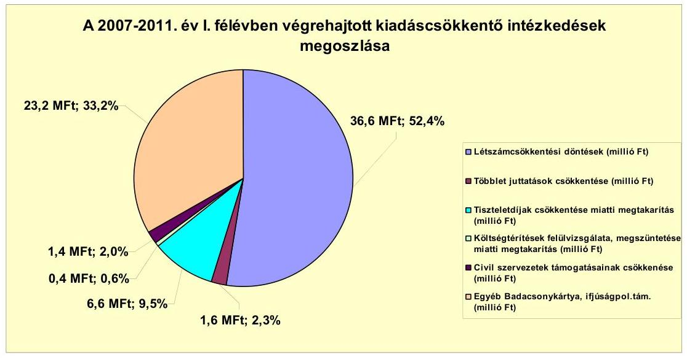

A létszámcsökkentési döntések következtében 36,6 millió Ft megtakarítása keletkezett az Önkormányzatnak, ami 52,4\%-a volt a végrehajtott kiadáscsökkentő intézkedésekből adódó megtakarításnak.

---

A szociális és gyermekjóléti feladatellátás Kistérségi társulás részére történő átadása miatt a Képviselő-testület a 2009. évi költségvetési rendeletben az engedélyezett létszámkeretet nyolc fővel csökkentette. Az Önkormányzat a 2009-2011. év I. félévében a szociális és gyermekjóléti feladatellátással összefüggő kiadásokat nem számolt el.

A 2011. évi költségvetési rendeletben az önkormányzati intézményekben foglalkoztatottak cafetéria juttatásának - $6000 \mathrm{Ft} /$ fő összegű étkezési hozzájárulás - megszüntetését rendelték el, az ebből adódó megtakarítás 1,6 millió Ft volt.

A 2009. évi költségvetési rendeletben a Képviselő-testület a képviselők és bizottsági tagok tiszteletdijának, valamint az alpolgármesterek költségtérítésének 2009. évi $\mathbf{5 0 \%}$-os mértékú csökkentéséról döntött. Az ebből eredő megtakarítás összesen 7,0 millió Ft volt. A juttatásokat 2010. január 1-jétől újra 100\%-os mértékben állapították meg.

A Képviselő-testület a 2008. évben döntött a Badacsony kártya 2008. október 31-étől történő megszüntetéséről, az ebből eredő megtakarítás a 20092011. év I. féléve között 21,9 millió Ft volt.

A Badacsony kártyát a szállásadók kötelesek voltak a szállást igénybevevő vendégek részére átadni. A kártya a vendégeket ingyenes strandhasználatra, valamint a kártyán feltüntetett elfogadó helyeken kedvezményes szolgáltatások igénybevételére jogosította fel.

A 2009-2010. évi költségvetési rendeletekben a civil szervezetek támogatásainak csökkentéséről rendelkeztek, amely az előző évekhez viszonyítva 1,4 millió Ft kiadás megtakarítást eredményezett.

A 2010-2011. évi költségvetési rendeletekben az ifjúságpolitikai támogatás csökkentéséról rendelkeztek, az ebből eredő megtakarítás összesen 1,3 millió Ft volt.

A 2007-2010. éveket érintő létszámváltozások alakulását az alábbi táblázat mutatja:

| Megnevezés (adatok fő-ben) | Közoktatás | Szociális és gyermekvédelem | Egészségügy | Polgármesteri hivatal | Egyéb | Összesen |
| :--: | :--: | :--: | :--: | :--: | :--: | :--: |
| 2007. január 1-jén jóváhagyott álláshelyek száma | 30 | 6 | 2 | 21 | 48 | 107 |
| Megszüntetett álláshelyek száma |  | 8 |  | 2 |  | 10 |
| ebből: üres álláshelyek száma |  |  |  |  |  |  |
|  | Szakma álláshelyek száma |  | 8 | 2 |  | 10 |
|  | Intézmény-üzemeltetéssel kapcsolatos álláshelyek száma |  |  |  |  |  |
| Álláshely növekedése |  | 2 | 0 | 6 | 4 | 12 |
| 2010. december 31-én záró álláshelyek száma | 30 | 0 | 2 | 25 | 52 | 109 |
| 2007. január 1-jén foglalkoztatott létszám | 30 | 6 | 2 | 21 | 48 | 107 |
| Létszámcsökkenés |  | 8 |  | 2 |  | 10 |
| Létszámnövekedés |  | 2 |  | 6 | 4 | 12 |
| 2010. december 31-én foglalkoztatott létszám | 30 | 0 | 2 | 25 | 52 | 109 |

Az engedélyezett álláshelyek száma a 2007. január 1-jei 107 fơről 2010. december 31-ére 109 főre emelkedett. Az Önkormányzat a feladatellátásának változása miatt a vizsgált időszakban 10 álláshelyet megszüntetett, azonban

---

emellett 12 fős létszámnövekedés is történt. A foglalkoztatottak létszáma megegyezett az engedélyezett létszámmal. Az Önkormányzat intézményeinél a Képviselő-testület évközi létszámváltoztatásról a vizsgált időszakban nem határozott, a létszámok a költségvetési rendeletekben engedélyezett mértékben kerültek betöltésre.

A szociális és gyermekjóléti feladatok ellátását a 2007-2008. években az Önkormányzat gesztorságával múködő társulás látta el. A feladat ellátásához a Képvi-selő-testület a 2008. évi költségvetési rendeletben egy gépjárművezető álláshely növekedést engedélyezett a szociális étkeztetéshez, valamint a négy órában foglalkoztatott házi szociális gondozót teljes munkaidőssé módosította. A feladatellátást 2009. január 1-jétől a Kistérségi társulásnak adták át, ekkor a költségvetési rendeletben a feladathoz kapcsolódó nyolc fő létszámot nullára csökkentették.

A polgármesteri hivatali feladatellátás engedélyezett létszámkeretét a 2008. évi költségvetési rendeletben 6 fővel - négy fő köztisztviselő (műszaki osztály adminisztrátor és építész, titkársági előadó, polgármesteri asszisztens), két fő Munka Törvénykönyve hatálya alá tartozó (műszaki adminisztrátor, pályázati menedzser) - növelték. A 2010. évben az engedélyezett létszám két fővel csökkent, mivel a két fő Munka Törvénykönyve alapján foglalkoztatott dolgozó foglakoztatását megszűntették.

Az egyéb feladatok ellátásánál az engedélyezett létszám a 2008. évben összességében nem változott, mivel a Tűzoltóság létszámát központilag egy fővel növelték, viszont ezzel egyidejűleg a Művelődési Ház létszámát a Képviselő-testület egy fővel csökkentette. A 2009. évben az egyéb feladatok engedélyezett létszáma egy fővel emelkedett, mivel a Művelődési Központ visszakapta az előző évben megvont egy főt. A 2010. évi költségvetésben az engedélyezett létszámkeret a Tűzoltóság központilag engedélyezett háromfős létszámnövelésével változott.

A vizsgált időszakban a közoktatási és egészségügyi feladatok engedélyezett létszáma, illetve a ténylegesen foglalkoztatottak létszáma nem változott.

Az Önkormányzat kimutatásaiban üres álláshelyeket nem mutatott ki.
Az Önkormányzat a vizsgált időszakban végrehajtott létszámcsökkentésekhez nem igényelt támogatást.

A vizsgált időszakban a helyi adók adóhátralékainak fokozott figyelemmel történő behajtásával az Önkormányzat - adatszolgáltatása szerint - 20,2 millió Ft többletbevételt realizált. Egyéb bevételnövelő intézkedést az Önkormányzat a 2007-2011. év I. féléve között nem fogalmazott meg.

Az Önkormányzat kiadáscsökkentő és bevételnövelő intézkedései eredményeként a 2007-2011. év I. félév között összesen 69,8 millió Ft megtakarítást és 20,2 millió Ft többletbevételt számolt el. Az Önkormányzat költségvetési támogatásból, átengedett bevételekből származó bevételei a 2007. évhez viszonyítva az időszak egészét tekintve összességében 54,0 millió Ft-tal emelkedtek.

---

5. A HELYI ÖNKORMÁNYZATOK GAZDÁLKODÁSI RENDSZERÉNEK ELLENŐRZÉSE SORÁN A PÉNZÜGYI EGYENSÚLY JAVÍTÁSÁRA TETT SZABÁLYSZERŰSÉGI ÉS CÉLSZERŰSÉGI JAVASLATOK HASZNOSULÁSA

Az ÁSZ az Önkormányzat gazdálkodási rendszerét a 2007. évben ellenőrizte. Az ellenőrzésről készült jelentés megállapításairól a polgármester a Képviselőtestületet a 2008. május 7-i képviselő-testületi ülésen tájékoztatta. Az ellenőrzés által megfogalmazott javaslatokra a Képviselő-testület intézkedési tervet fogadott el határidők és felelősök megjelölésével.

A gazdálkodási rendszer 2007. évi ellenőrzése során tett javaslatok közül a pénzügyi egyensúly javítására sem szabályszerűségi, sem célszerűségi javaslatot nem fogalmazott meg az ÁSZ.

Budapest, 2012. április " 16 "

Melléklet: $\quad 7 \mathrm{db}$
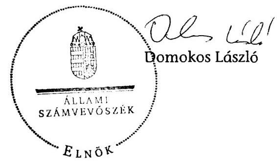

---

Badacsonytomaj Város Önkormányzata

1. számú melléklet a V-3128-018/2012. számú jelentéshez

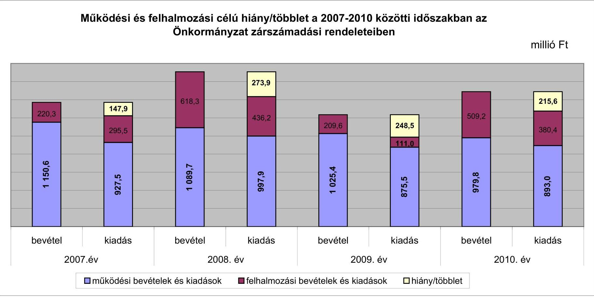

---

Az Önkormányzat bevételei és kiadásai, valamint adósságszolgálata 2007-2010 között

|  1. FOLYÓ KÖLTSÉGVETÉS* | 2007. év | 2008. év | 2009. év | 2010. év  |
| --- | --- | --- | --- | --- |
|  1.1.1. Saját müködési bevételek | 210,3 | 237,7 | 189,8 | 252,2  |
|  1.1.2. Költségvetési támogatás *** | 93,1 | 409,0 | 317,2 | 290,2  |
|  1.1.3. Átengedett bevételek | 296,5 | 59,4 | 80,0 | 71,4  |
|  1.1.4. Állambáztartáson belülről kapott támogatások | 50,8 | 60,8 | 28,7 | 26,8  |
|  1.1.5. EU-tól és külföldről kapott bevételek | 1,2 | 0,0 | 0,0 | 0,0  |
|  1.1.6. Állambáztartáson kívülről kapott bevételek | 2,1 | 2,6 | 3,4 | 0,2  |
|  1.1.7. Elúző évi pénzmaradvány átvétel | 0,0 | 3,2 | 0,0 | 0,0  |
|  1.1. Folyó bevételek $=1.1 .1 .+1.1 .2 .+1.1 .3 .+1.1 .4 .+1.1 .5 .+1.1 .6 .+1.1 .7$. | 654,0 | 772,7 | 619,1 | 640,8  |
|  1.2.1. Müködési kiadások kamatkiadások nélkül | 645,6 | 653,7 | *609,0 | 622,5  |
|  1.2.2. Állambáztartáson belülre átadott pénzeszközök | 7,6 | 12,7 | 5,7 | 3,3  |
|  1.2.3.1. vállalkozásoknak | 39,0 | 48,5 | 40,2 | 39,6  |
|  1.2.3.2. EU-nak, illetve külföldre | 0,0 | 0,0 | 0,0 | 0,0  |
|  1.2.3.3. magánszemélyeknek | 17,5 | 19,8 | 15,0 | 13,8  |
|  1.2.3.4. nonprofit szervezeteknek | 15,8 | 23,1 | 16,1 | 17,9  |
|  1.2.3. Transferkiadások ( $=1.2 .3 .1+1.2 .3 .2+1.2 .3 .3+1.2 .3 .4$ ) | 72,3 | 91,4 | 71,3 | 71,3  |
|  1.2.4 Kamatkiadások | 16,6 | 28,7 | *23,3 | 17,2  |
|  1.2.5. Elúző évi pénzmaradvány átadás | 0,0 | 0,0 | 0,0 | 0,0  |
|  1.2. Folyó kiadások $=1.2 .1 .+1.2 .2 .+1.2 .3 .+1.2 .4 .+1.2 .5$. | 742,1 | 786,5 | 709,3 | 714,3  |
|  1.3. Folyó költségvetés egyenlege MÜKÖDÉSI JÖVEDELEM (1.1. - 1.2.) | $-88,1$ | $-13,8$ | $-90,2$ | $-73,5$  |
|  2. FELHALMOZÁSI KÖLTSÉGVETÉS** | 0,0 | 0,0 | 0,0 | 0,0  |
|  2.1.1. Saját tökebevételek | 67,0 | 51,6 | 89,5 | 180,6  |
|  2.1.2. Állambáztartáson belülről kapott támogatások | 108,4 | 12,3 | 20,5 | 254,5  |
|  2.1.3. EU-tól és külföldről kapott támogatások | 0,0 | 0,0 | 28,7 | 0,0  |
|  2.1.4. Állambáztartáson kívülről kapott támogatások | 13,7 | 27,0 | 28,3 | 17,3  |
|  2.1. Felhalmozási bevételek ( $=2.1 .1 .+2.1 .2+2.1 .3+2.1 .4$.) | 189,1 | 90,9 | 167,0 | 452,4  |
|  2.2.1. Saját beruházási kiadás állíval | 249,3 | 77,4 | 50,8 | 93,7  |
|  2.2.2. Saját felújítási kiadás áfával | 19,2 | 19,2 | 7,9 | 246,8  |
|  2.2.3. Állambáztartáson belülre átadott pénzeszköz | 0,0 | 4,7 | 1,6 | 0,0  |
|  2.2.4. EU-nak és külföldnek adott pénzeszközök | 0,0 | 0,0 | 0,0 | 0,0  |
|  2.2.5. Állambáztartáson kívülre adott pénzeszközök | 3,7 | 0,3 | 0,4 | 4,1  |
|  2.2.6. Befektetési célú részesedések vásárlása | 0,3 | 0,0 | 34,5 | 0,0  |
|  2.2. Felhalmozási kiadások ( $=2.2 .1 .+2.2 .2 .+2.2 .3 .+2.2 .4 .+2.2 .5 .+2.2 .6$.) | 272,5 | 101,6 | 95,2 | 344,6  |
|  2.3. Felhalmozási költségvetés egyenlege (2.1. - 2.2.) | $-83,4$ | $-10,7$ | 71,8 | 107,8  |
|  3. Finanszírozási műveletek nélküli (GFS) pozíció(1.3.+2.3.) | $-171,5$ | $-24,5$ | $-18,4$ | 34,3  |
|  4. Finanszírozási műveletek | 0,0 | 0,0 | 0,0 | 0,0  |
|  4.1. Hitelfelvétel | 92,4 | 0,0 | 0,0 | 0,0  |
|  4.2. Hiteltörlesztés | 23,0 | 334,6 | 15,8 | **35,6  |
|  4.3. Forgatási és befektetési célú értékpapírok kibocsátása | 0,0 | 500,8 | 0,0 | 0,0  |
|  4.4. Forgatási és befektetési célú értékpapírok beváltása | 0,0 | 0,0 | 0,0 | 0,0  |
|  4.5. Forgatási és befektetési célú értékpapírok értékesítése | 1,4 | 0,0 | 0,0 | 0,0  |
|  4.6. Forgatási és befektetési célú értékpapírok vásárlása | 0,0 | 0,0 | 0,0 | 0,0  |
|  4.7. Egyéb finanszírozási bevételek (függő, átfutó, kiegyenlítő) | 3,4 | 0,2 | $-3,0$ | $-16,6$  |
|  4.8. Egyéb finanszírozási kiadások (függő, átfutó, kiegyenlítő) | $-1,0$ | 15,2 | $-13,9$ | 5,2  |
|  4.9.Finanszírozási műveletek egyenlege (4.1. - 4.2.+4.3.-4.4+4.5.-4.6.+4.7.-4.8.) | 75,2 | 151,2 | $-4,9$ | $-57,4$  |
|  5. Tárgyévi pénzügyi pozíció (1.3.+ 2.3.+4.9.) | $-96,3$ | 126,7 | $-23,3$ | $-23,1$  |
|  6. Nettó müködési jövedelem =müködési jövedelem (1.3.) - tüketörlesztés (4.2+4.4) | $-111,1$ | $-348,4$ | $-106,0$ | $-109,1$  |
|  TÁJÉKOZTATO ADATOK |  |  |  |   |
|  Összes kötelezettség | 404,2 | 564,9 | 631,9 | 677,8  |
|  ebből rövid lejáratú | 31,6 | 29,1 | 86,7 | 12,0  |
|  Összes szállítói kötelezettség | 11,8 | 7,8 | 35,3 | 2,0  |
|  ebből lejárt (tanúsítványból) | 6,7 | 2,6 | 1,0 | 0,5  |
|  Pénz és tőkepiaci kötelezettség (adósság) | 386,0 | 551,4 | 580,8 | 665,8  |
|  ebből rövid lejáratú | 13,5 | 15,6 | 35,6 | 0,0  |
|  Folyószámlabítél napi átlagos állománya (tanúsítványból) | 22,8 | 29,5 | 10,3 | 10,7  |
|  Kezesség és garanciavállalások (tanúsítványból) | 0,0 | 0,0 | 0,0 | 9,0  |
|  Jogerős bírósági ítéletekből adódó kötelezettségek (tanúsítványból) | 0,3 | 0,3 | 0,3 | 0,3  |
|  Finanszírozásba bevonható eszközök: | 138,6 | 265,3 | 241,9 | 219,9  |
|  Tartós hitelviszonyt megtestesítő értékpapírok év végi állománya | 0,2 | 0,2 | 0,2 | 0,2  |
|  Pénzeszközök (idegen pénzeszközök nélkül) év végi állománya | 138,4 | 265,1 | 241,7 | 219,7  |

- A 2009. évi kamatkiadások sor összegét csökkentettük a kötvénykibocsátáshoz kapcsolódó 11,8 millió Ft ügynöki díjjal. Ezzel egyidejüleg a müködési kiadások kamatkiadások nélkül sor összege ugyaneztés összeggel növelésre került. **A 2010. évi hiteltörlesztés összege javításra került +963 ezer Ft-tal, így a javított összeg ( 35588 ezer Ft) 35,6 millió Ft lett. A könyvelés jó volt, az eltérést az integrált könyvelés program hibája okozta. *** A költségvetési támogatásból a felhalmozási célú összeget az Önkormányzat adatszolgáltatása szerinti mértékben vettük figyelembe a 2.1.2. soron

---

### **Az Önkormányzat 2007-2010. években megvalósított, 2010. december 31-ig befejezett fejlesztései és azok forrásösszetétel**

|   |  |  |  |  |  |  |  |  |  |  |  |  |  |  |  |  |  |  |  |  |  |  |  |  |  |  |  |  |  |  |  |  |  |  |  |  |  |  |  |  |  |  |  |  |  |  |  |  |  |  |  |  |  |  |  |  |  |  |  |  |  |  |  |  |  |  |  |  |  |  |  |  |  |  |  |  |  |  |  |  |  |  |  |  |  |  |  |  |  |  |  |  |  |  |  |  |  |  |  | 

---

### **Az Önkormányzat 2010. december 31-én folyamatban lévő fejlesztési feladataira 2010. december 31-ig teljesített kifizetések és azok forrásösszetétele**

|  2010. december 31-ig pénzügyileg teljesített beruházás forrásösszetétele |  |  |  |  |  |  |  |  |  |  |  |  |  |  |  |  |  |  |  |  |  |  |  |  |  |  |  |  |  |  |  |  |   |
| --- | --- | --- | --- | --- | --- | --- | --- | --- | --- | --- | --- | --- | --- | --- | --- | --- | --- | --- | --- | --- | --- | --- | --- | --- | --- | --- | --- | --- | --- | --- | --- | --- | --- |
|   | Fejlesztési feladat (beruházás, felújítás) |  | Beruházás, felújítás |  |  |  |  |  |  |  |  |  |  |  |  |  |  |  |  |  |  |  |  |  |  |  |  |  |  |  |  |  |   |
|  Sorszám | Megnevezése | Képviselő testületi határozat száma | kezdete | tervezett befejezése | Terv (2010/11/21-2312) | Tény (2010/11/21-2312) | Eltérés (11; 1) (2010/11/21-2312) | Eltérés (11; 1) (2010/11/21-2312) | 2006. dec. 31-ig teljesített kiadás | 2007. 2010. évek között teljesített kiadás | A teljes bekerüvleti költség-körszektőlő pótlátart forráltott összeg | Saját bevétel |  |  |  | Hitel |  |  |  |  | Kötvény |  |  |  |  |  | EU-s támogatás |  |  |  |  | Hazai támogatás |  |   |
|   |  |  |  |  |  |  |  |  |  |  |  |  |  |  |  |  |  |  |  |  |  |  |  |  |  |  |  |  |  |  |  |  |   |
|  1 | 2 | 3 | 4 | 5 | 6 | 7 | 8 | 9 | 10 | 11 | 12 | 13 | 14 | 15 | 16 | 17 | 18 | 19 | 20 | 21 | 22 | 23 | 24 | 25 | 26 | 27 | 28 | 29 | 30 | 31 |  |   |
|  1. | Felújítások |  |  |  |  |  |  |  |  |  |  |  |  |  |  |  |  |  |  |  |  |  |  |  |  |  |  |  |  |  |  |  |   |
|  2. | Iskola felújítás | 194/2007, 316/2007 | 2008 | 2011 | 268,0 | 193,8 | -74,2 | 0,0 | 193,8 | 6,6 | 38,7 | 19,5 | -19,2 | A | 0,0 | 0,0 | 0,0 | 0,0 | 0,0 | 0,0 | 0,0 | 229,3 | 174,3 | -55,0 | A | 0,0 | 0,0 | 0,0 |  |  |   |
|  3. | Szénégető dűlő rekultivációja | 48/2010 | 2010 | 2011 | 58,9 | 3,6 | -55,3 | 0,0 | 3,6 | 0,0 | 5,6 | 3,6 | -2,0 | A | 0,0 | 0,0 | 0,0 | 0,0 | 0,0 | 0,0 | 0,0 | 53,3 | 0,0 | -53,3 | A | 0,0 | 0,0 | 0,0 |  |  |   |
|  4. | 10 millió Ft alatti felújítások |  |  |  | 0,0 | 0,0 | 0,0 | 0,0 | 0,0 | 0,0 | 0,0 | 0,0 | 0,0 | 0,0 | 0,0 | 0,0 | 0,0 | 0,0 | 0,0 | 0,0 | 0,0 | 0,0 | 0,0 | 0,0 | 0,0 | 0,0 | 0,0 | 0,0 |  |  |   |
|  5. | Fejújítások összesen |  |  |  | 326,9 | 197,4 | -129,5 | 0,0 | 197,4 | 6,6 | 44,3 | 23,1 | -21,2 |  | 0,0 | 0,0 | 0,0 | 0,0 | 0,0 | 0,0 | 0,0 | 282,6 | 174,3 | -108,3 |  | 0,0 | 0,0 | 0,0 |  |  |   |
|  6. | Fejlesztések |  |  |  | 0,0 | 0,0 | 0,0 | 0,0 | 0,0 | 0,0 | 0,0 | 0,0 | 0,0 | 0,0 | 0,0 | 0,0 | 0,0 | 0,0 | 0,0 | 0,0 | 0,0 | 0,0 | 0,0 | 0,0 | 0,0 | 0,0 | 0,0 | 0,0 |  |  |   |
|   | Egy jobb kilátásért. Új kilátó létesítése a Badacsony hegyen | 21/2008, 265/2008 | 2008 | 2011 | 97,9 | 2,8 | -95,1 | 0,0 | 2,8 | 0,0 | 14,7 | 2,8 | -11,9 | A | 0,0 | 0,0 | 0,0 | 0,0 | 0,0 | 0,0 | 83,2 | 0,0 | -83,2 | A | 0,0 | 0,0 | 0,0 |  |  |   |
|  7. | Közösségi ház és rendezvénytár | 164/2006, 318/2007 | 2008 | 2011 | 197,0 | 130,5 | -66,5 | 0,0 | 130,5 | 0,0 | 97,0 | 46,5 | -50,5 | A | 0,0 | 0,0 | 0,0 | 0,0 | 0,0 | 0,0 | 100,0 | 84,0 | -16,0 | A | 0,0 | 0,0 | 0,0 |  |  |   |
|  8. | Termálkút fúrás | 227/2006 | 2006 | 2011 | 88,2 | 70,6 | -17,6 | 5,7 | 64,9 | 0,0 | 33,2 | 16,3 | -16,9 | A | 55,0 | 54,3 | -0,7 | A | 0,0 | 0,0 | 0,0 | 0,0 | 0,0 | 0,0 | 0,0 | 0,0 | 0,0 |  |  |   |
|  9. | 10 millió Ft alatti fejlesztések |  |  |  | 0,0 | 0,0 | 0,0 | 0,0 | 0,0 | 0,0 | 0,0 | 0,0 | 0,0 | 0,0 | 0,0 | 0,0 | 0,0 | 0,0 | 0,0 | 0,0 | 0,0 | 0,0 | 0,0 | 0,0 | 0,0 | 0,0 | 0,0 |  |  |   |
|  11. | Fejlesztések összesen: |  |  |  | 383,1 | 203,9 | -179,2 | 5,7 | 198,2 | 0,0 | 144,9 | 65,6 | -79,3 |  | 55,0 | 54,3 | -0,7 |  | 0,0 | 0,0 | 0,0 | 183,2 | 84,0 | -99,2 |  | 0,0 | 0,0 | 0,0 |  |   |
|  12. | Mindösszesen |  |  |  | 710,0 | 401,3 | -308,7 | 5,7 | 395,6 | 6,6 | 189,2 | 88,7 | -100,5 |  | 55,0 | 54,3 | -0,7 |  | 0,0 | 0,0 | 0,0 | 465,8 | 258,3 | -207,5 |  | 0,0 | 0,0 | 0,0 |  |   |

*A= ha a forrás már rendelkezésre áll,

B= ha a forrás közbeszerzési eljárása folyamatban van,

C= ha a forrás közbeszerzési eljárása még nem indult el, a forrás nem áll rendelkezésre.

---

### **Az Önkormányzat 2010. december 31-én folyamatban lévő fejlesztési feladataira 2010. december 31-én fennálló kötelezettségek és azok forrásösszetétel**

|   | Fejlesztési feladat (beruházás, felújítás) |  | Beruházás, felújítás |  | Teljes bekerülési költség (2010. dec. 31-isl.) |  | 2008. dec. 31-ig teljesített kiadás | 2007-2010. évek között teljesített kiadás | Várható tény (teljes bekerülési költség) (11+4+12+13) | 2010. olávva váladt költsészetség (12+13+14+15+16) | A várható tény (teljes bekerülési költségtől eszkönyöröben fordított összeg) |  |  |  |  |  |  |  |  |  |  |  |  |  |  |  |  |  |  |  |  |  |  |  |  |  |  |  |  |  |  |  |  |  |  |  |  |  |  |  |  |  |  |  |  |  |  |  |  |  |  |  |  |  |  |  |  |  |  |  |  |  |  |  |  |  |  |  |  |  |  |  |  |  |  |  |  |  |  |  |  |  |  |  |  |  |  |  |  |  |  |  |  |  |  |  |  |  |  |  | 

---

### **Az Önkormányzat beadott, elbírálás alatti pályázati forrásból megvalósítani tervezett fejlesztéseihez kapcsolódó kötelezettségvállalásai és azok forrásösszetétel^{1}**

|  Fejlesztési feladat (beruházás, felújítás) |  | Beruházás, felújítás |  | Teljes bekerülési költség (terv) | A teljes bekerülési költségből eszközpótlásra tervezett összeg | 2010. dec. 31-ig teljesített kiadás | 2010. utánra vállalt kötelezettség (9+10+12+14+16+18) | 2010. december 31-e utáni kötelezettségvállalások forrásösszetétele |  |  |  |  |  |  |  |  |  |  |  | jogszabályban foglalt szakmai követelmény teljesítése (igen/nem)  |
| --- | --- | --- | --- | --- | --- | --- | --- | --- | --- | --- | --- | --- | --- | --- | --- | --- | --- | --- | --- | --- |
|  Megnevezése |  | Képviselő-testületi határozat száma | kezdete | tervezett befejezése |  |  |  |  |  |  |  |  |  |  |  |  |  |  |  |   |
|  1 | 2 | 3 | 4 | 5 | 6 | 7 | 8 | 9 | 10 | 11 | 12 | 13 | 14 | 15 | 16 | 17 | 18 | 19 | 20 |   |
|  1. Felújítások |  |  |  |  |  |  |  |  |  |  |  |  |  |  |  |  |  |  |  |   |
|  2. Övoda épület hőszigetelés | 56/2011 | 2011 | 2011 | 13,7 | 0,0 | 0,0 | 13,7 | 2,7 | A | 0,0 | 0,0 | 0,0 | 0,0 | 11,0 | nem |  |  |  |  |   |
|  3. 10 millió Ft alatti felújítások |  |  |  | 0,0 | 0,0 | 0,0 | 0,0 | 0,0 | 0,0 | 0,0 | 0,0 | 0,0 | 0,0 | 0,0 |  |  |  |  |  |   |
|  4. Fejújítások összesen |  |  |  | 13,7 | 0,0 | 0,0 | 13,7 | 2,7 | 0,0 | 0,0 | 0,0 | 0,0 | 11,0 |  |  |  |  |  |  |   |
|  5. Fejlesztések |  |  |  |  |  |  |  |  |  |  |  |  |  |  |  |  |  |  |  |   |
|  6. 10 millió Ft alatti fejlesztések |  |  |  | 0,0 | 0,0 | 0,0 | 0,0 | 0,0 | 0,0 | 0,0 | 0,0 | 0,0 | 0,0 | 0,0 |  |  |  |  |  |   |
|  7. Fejlesztések összesen: |  |  |  | 0,0 | 0,0 | 0,0 | 0,0 | 0,0 | 0,0 | 0,0 | 0,0 | 0,0 | 0,0 | 0,0 |  |  |  |  |  |   |
|  8. Összesen |  |  |  | 13,7 | 0,0 | 0,0 | 13,7 | 2,7 | 0,0 | 0,0 | 0,0 | 0,0 | 11,0 |  |  |  |  |  |  |   |

*A= ha a forrás már rendelkezésre áll,

B= ha a forrás közbeszerzési eljárása folyamatban van,

C= ha a forrás közbeszerzési eljárása még nem indult el, a forrás nem áll rendelkezésre.

---

# Az önkormányzati feladatok ellátásában résztvevő gazdasági társaságok

|  Gazdasági társaság megnevezése | 2010. december 31-én |  |  |  |  |  |  | a gazdasági társaságnak szerződéses kötelezettségre, feladat ellátási szerződésre alapozottan az önkormányzat költségvetéséből nyújtott |  |  |  |  |  |  |  |  |  |   |
| --- | --- | --- | --- | --- | --- | --- | --- | --- | --- | --- | --- | --- | --- | --- | --- | --- | --- | --- |
|   | önkormányzat
gazdasági
társaságának | saját tőke,
jegyzett tőke
aránya | kötelező
feladathoz | önként vállalt
feladathoz | hosszú lejáratú
híteből,
kötvényből | lizingból | lejárt szállító
állományból | működési célú pénzeszköz átadás |  |  |  |  | felhalmozási célú pénzeszköz átadás |  |  |  |  |   |
|   | tulajdoni hányada |  |  |  | rendelt nettó vagyon |  | fennálló kötelezettség |  | 2007. | 2008. | 2009. | 2010. | 2011. | 1. félév | 2007. | 2008. | 2009. | 2010.  |
|  I. 100%-os tulajdoni hányadú gazdasági társaságok: |  |  |  |  |  |  |  |  |  |  |  |  |  |  |  |  |  |   |
|  Városüzemeltető Kft. | 100,0% |  | 244,7% | 29,5 | 0,0 | 0,0 | 1,6 | 3,0 | 39,0 | 48,0 | 40,0 | 39,6 | 22,4 | 0,0 | 0,0 | 0,0 | 0,0 | 1,0  |
|  100%-os tulajdoni hányadú gazdasági társaságok
összesen | 100,0% | x | 244,7% | 29,5 | 0,0 | 0,0 | 1,6 | 3,0 | 39,0 | 48,0 | 40,0 | 39,6 | 22,4 | 0,0 | 0,0 | 0,0 | 0,0 | 1,0  |
|  II. 75-99%-os tulajdoni hányadú gazdasági társaságok: |  |  |  |  |  |  |  |  |  |  |  |  |  |  |  |  |  |   |
|  Menü Bt. | 96,0% |  | 123,9% | 1,7 | 0,0 | 0,0 | 1,5 | 0,4 | 0,0 | 0,0 | 0,0 | 0,0 | 0,0 | 0,0 | 0,0 | 0,0 | 0,0 | 0,0  |
|  75-99%-os tulajdoni hányadú gazdasági társaságok összesen | 96,0% | x | 123,9% | 1,7 | 0,0 | 0,0 | 1,5 | 0,4 | 0,0 | 0,0 | 0,0 | 0,0 | 0,0 | 0,0 | 0,0 | 0,0 | 0,0 | 0,0  |
|  75% feletti tulajdoni hányadú gazdasági társaságok összesen | 98,9% | x | x | 31,2 | 0,0 | 0,0 | 3,1 | 3,4 | 39,0 | 48,0 | 40,0 | 39,6 | 22,4 | 0,0 | 0,0 | 0,0 | 0,0 | 1,0  |
|  III. 51-74%-os tulajdoni hányadú gazdasági társaságok: |  |  |  |  |  |  |  |  |  |  |  |  |  |  |  |  |  |   |
|  51-74%-os tulajdoni hányadú gazdasági társaságok összesen | x | x | x | 0,0 | 0,0 | 0,0 | 0,0 | 0,0 | 0,0 | 0,0 | 0,0 | 0,0 | 0,0 | 0,0 | 0,0 | 0,0 | 0,0 | 0,0  |
|  IV. egyéb, közfeladatot ellátó gazdasági társaságok: |  |  |  |  |  |  |  |  |  |  |  |  |  |  |  |  |  |   |
|  DR Vízmű Zrt. | 0,1% |  | 178,0% | 0,0 | 0,0 | 542,1 | 0,0 | -18,8 | 0,0 | 0,0 | 0,0 | 0,0 | 0,0 | 0,0 | 0,0 | 0,0 | 0,0 | 0,0  |
|  Remondis Tapolca Kft. | 0,0% |  | 194,5% | 0,0 | 0,0 | 95,0 | 3,4 | 13,6 | 0,0 | 0,0 | 0,0 | 0,0 | 0,0 | 0,0 | 0,0 | 0,0 | 0,0 | 0,0  |
|  egyéb, közfeladatot ellátó gazdasági társaságok összesen | x | x | x | 0,0 | 0,0 | 637,1 | 3,4 | -5,2 | 0,0 | 0,0 | 0,0 | 0,0 | 0,0 | 0,0 | 0,0 | 0,0 | 0,0 | 0,0  |
|  Összesen | x | x | x | 31,2 | 0,0 | 637,1 | 6,5 | -1,8 | 39,0 | 48,0 | 40,0 | 39,6 | 22,4 | 0,0 | 0,0 | 0,0 | 0,0 | 1,0  |