# ÁLLAMI   SZÁMVEVŐSZÉK 

## JELENTÉS

Balatonalmádi Város Önkormányzata pénzügyi helyzetének ellenőrzéséről (43/4)

---

# Állami Számvevőszék 

Iktatószám: V-3129-021/2012.
Témaszám: 1015
Vizsgálat-azonosító szám: V0560160

## Az ellenőrzést felügyelte:

Dr. Varga Sándor
számvevő igazgatóhelyettes
Az ellenőrzést vezette:
Renkó Zsuzsanna
számvevő tanácsos
Ellenőrzési csoportvezető:
Dér Lívia
számvevő tanácsos
Az ellenőrzést végezték:
Kalmár István Komonszky Krisztina
számvevő tanácsos számvevő

---

# TARTALOMJEGYZÉK 

BEVEZETÉS ..... 7
I. ÖSSZEGZŐ MEGÁLLAPÍTÁSOK, KÖVETKEZTETÉSEK, JAVASLATOK ..... 11
II. RÉSZLETES MEGÁLLAPÍTÁSOK ..... 19

1. Az Önkormányzat kötelező és önként vállalt feladatai, a feladatellátás szervezeti keretei és annak változásai ..... 19
2. Az Önkormányzat pénzügyi egyensúlyi helyzetét befolyásoló tényezők ..... 25
2.1. A működési és a felhalmozási egyensúly változása ..... 27
2.2. Az Önkormányzat bevételeinek változása ..... 31
2.3. Az Önkormányzat folyó és felhalmozási célú kiadásainak változása ..... 35
3. Az Önkormányzat kötelezettségei ..... 38
3.1. Az Önkormányzat pénzintézeti kötelezettségeinek változása ..... 38
3.2. A szállítói kötelezettségek változása ..... 41
3.3. Egyéb kötelezettségek változása ..... 41
4. A pénzügyi egyensúly megteremtése érdekében hozott intézkedések ..... 45
5. Az ÁSZ által a korábbi években a pénzügyi egyensúly javítására tett szabályszerűségi és célszerűségi javaslatok hasznosulása ..... 48

---

# MELLÉKLETEK 

1. számú Működési és felhalmozási célú hiány/többlet a 2007-2010 közötti időszakban az Önkormányzat zárszámadási rendeleteiben (1 oldal)
2. számú Az Önkormányzat bevételei és kiadásai, valamint adósságszolgálata 20072010 között (1 oldal)
3/a. számú Az Önkormányzat 2007-2010. években megvalósított, 2010. december 31-ig befejezett fejlesztései és azok forrásösszetétele (1 oldal)
3/b. számú Az Önkormányzat 2010. december 31-én folyamatban lévő fejlesztési feladataira 2010. december 31-ig teljesített kifizetések és azok forrásösszetétele (1 oldal)
3/c. számú Az Önkormányzat 2010. december 31-én folyamatban lévő fejlesztési feladataira 2010. december 31-én fennálló kötelezettségek és azok forrásösszetétele (1 oldal)
3/d. számú Az Önkormányzat által beadott, elbírálás alatti pályázati forrásból megvalósítani tervezett fejlesztéseihez kapcsolódó kötelezettségvállalásai és azok forrásösszetétele (1 oldal)
3. számú Az önkormányzati feladatok ellátásában résztvevő gazdasági társaságok (1 oldal)

---

# RÖVIDÍTÉSEK JEGYZÉKE 

| Törvények |  |
| :--: | :--: |
| Áht $_{1}$ | az államháztartásról szóló 1992. évi XXXVIII. törvény |
| Áht $_{2}$ | az államháztartásról szóló 2011. évi CXCV. törvény |
| Ötv. | a helyi önkormányzatokról szóló 1990. évi LXV. törvény |
| Ptk. | a Polgári Törvénykönyvről szóló 1959. évi IV. törvény |
| Rendeletek |  |
| SzMSz | Balatonalmádi Önkormányzat 8/2001. (V.15.), 2009. január 1-jétől 21/2008. (XI. 14.) rendelete a Szervezeti és Működési Szabályzatról |
| Szórövidítések |  |
| áfa | általános forgalmi adó |
| ÁSZ | Állami Számvevőszék |
| EU | Európai Unió |
| jegyző | Balatonalmádi Város Önkormányzatának jegyzője |
| Képviselő-testület | Balatonalmádi Város Képviselő-testülete |
| Kommunális Kft. | Balatonalmádi Kommunális és Szolgáltató Kft. |
| OECF kölcsön | A Japán Tengerentúli Gazdasági Együttműködési Alap (Overseas Economic Cooperation Fund) és a Magyar Állam által kötött kölcsönszerződés alapján a Magyar Köztársaság Kormánya nevében eljáró Pénzügyminisztérium által Balatonalmádi Város Önkormányzatának forintban továbbkölcsönzött összeg. |
| Önkormányzat polgármester | Balatonalmádi Város Önkormányzata |
| Polgármesteri hivatal | Balatonalmádi Város Önkormányzatának polgármestere Balatonalmádi Város Önkormányzatának Polgármesteri hivatala |
| PPP konstrukció | Public Private Partnership (Partnerségi együttműködés közfeladatok ellátására a magánszektor bevonásával) |
| szja | személyi jövedelemadó |

---

.

---

# ÉRTELMEZŐ SZÓTÁR 

| BUBOR | Budapesti Bankközi Forint Hitelkamatláb.   Egyes bankok által a budapesti bankközi piacon egymás közötti rövid lejáratú (például 3 hónap) hitelnyújtásai során alkalmazott kamatlábak átlaga, melyet a Magyar Nemzeti Bank számol minden banki munkanapra. A BUBOR referencia jellegű kamatláb. |
| :--: | :--: |
| CLF módszer | Az önkormányzatok költségvetése elemzésének eszköze. A módszer következetesen elkülöníti a folyó és a felhalmozási költségvetés bevételeit és kiadásait, azok költségvetési egyenlegeit. Bizonyos mértékig a vállalati gazdálkodás logikai elemeit érvényesíti az önkormányzatok pénzügyi, jövedelmi helyzetének vizsgálata során. Az értékelés a pénzügyi kapacitás fogalmát helyezi a középpontba. |
| használhatósági fok | Az eszközgazdálkodás vizsgálatának elemzése során használt mutató. Számításakor a tárgyi eszköz könyv szerinti (nettó) értékét viszonyítják a tárgyi eszköz bruttó (beszerzési/létesítési) értékéhez. A \%-ban kifejezett mutató értéke annál kedvezőbb, minél közelebb áll a 100\%-hoz. Csökkenése az eszköz állagának romlására, avulására utal, ami maga után vonja az üzemeltetési és fenntartási költségek növekedését is. |
| kötelező közszolgáltatás | A helyi önkormányzati feladatkörbe tartozó, a köztisztasággal és a településtisztasággal, valamint az élet- és vagyonbiztonsággal összefüggő egyes - közszolgáltatás útján megvalósuló - közfeladatok ellátása, amelynek kötelező igénybevételét külön jogszabály (törvény, helyi önkormányzati rendelet) határoz meg. |
| önkormányzat többségi tulajdonában lévő gazdasági társaságok | Az önkormányzat a gazdasági társaságban a szavazatok több mint ötven százalékával vagy a Ptk. 685/B. § (2)-(3) bekezdéseiben rögzített meghatározó befolyással rendelkezik. A befolyással rendelkező akkor rendelkezik egy jogi személyben meghatározó befolyással, ha annak tagja, illetve részvényese és jogosult e jogi személy vezető tisztségviselői vagy felügyelőbizottsága tagjai többségének megválasztására, illetve visszahívására, vagy a jogi személy más tagjaival, illetve részvényeseivel kötött megállapodás alapján egyedül rendelkezik a szavazatok több mint ötven százalékával (Ptk. 685/B. § (2) bek.). A meghatározó befolyás akkor is fennáll, ha a befolyással rendelkező számára e jogosultságok közvetett módon (köztes vállalkozásain keresztül, a Ptk. 685/B §. (3),(4) bek. szerint) biztosítottak.   A helyi önkormányzat és az önkormányzat irányítása alá tartozó költségvetési szerv többségi tulajdonában, illetve többségi befolyása alatt álló gazdálkodó szervezet esetében hitelfelvétel, kölcsönfelvétel, garancia- vagy kezességvállalás, tartozásátvállalás, tartozás-elengedés, értékpapír |

---

pénzügyi kapacitás
pénzügyi kockázat

SNA
kibocsátás, vásárlás, pénzügyi lízing, tartós bérleti szerződés, ingyenes vagyonjuttatás (így különösen: ajándékozás, ingyenes engedményezés), vagy követelésvásárlás, követelésengedményezés végrehajtására vonatkozóan az Áht ${ }_{1}$ 100/M. § (4) bekezdése alapján az önkormányzat rendelkezik döntési jogosultsággal.
A pénzügyi kapacitás (financial capacity) az adósok hitelfelvételi képességének azon mértéke, ahol még anélkül tudják növelni az adósságot, hogy csökkenteniük kellene akár a jelenbeli, akár a jövőben esedékes kiadásaikat a fizetésképtelenség elkerülése érdekében. (Forrás: Az önkormányzati rendszer pénzügyi helyzete, ÁSZKUT tanulmány 2010.)
A működési kockázat egyik eleme. Megmutatkozhat a költségvetés nagyságrendjének, szerkezetének nem megalapozott módosításaiban, a bevételi, és a kiadási előirányzatoktól lényegesen eltérő teljesítésekben, a nem megfelelő belső kontrollrendszer működésében, a tudatos károkozásokban, a biztosítások elmaradásában, a hibás fejlesztési döntésekben, a nem a terveknek megfelelő forrásfelhasználásokban. Jelentkezhet továbbá a bevételek és kiadások ütemkülönbsége miatt felvett folyószámla- és likvidhitelek költségvetési év végén fennálló egyenlege miatt, amely az önkormányzat költségvetésébe - akár tartósan - beépülő forráshiányt jelzi.
System of National Account, azaz a Nemzeti Számlák Rendszere, amely a gazdasági szektorok által létrehozott valamennyi terméket és szolgáltatást figyelembe veszi.

---

# JELENTÉS 

## Balatonalmádi Város Önkormányzata pénzügyi helyzetének ellenőrzéséről

## BEVEZETÉS

Az Állami Számvevőszék 2011. évtől érvényes stratégiája új irányt szabott a helyi önkormányzatok gazdálkodásának ellenőrzésében is. Az ÁSZ - küldetése és jövőképe szerint - szilárd szakmai alapokra támaszkodva értékteremtő ellenőrzéseivel és helyzetelemzéseivel az államháztartás egészében, így a helyi önkormányzati alrendszerben is elő kívánja segíteni a közpénzek és a közvagyon szabályos, gazdaságos, hatékony és eredményes felhasználását. E folyamat részeként - az államháztartási hiány alakulásának összetevőire is figyelemmel végezzük az önkormányzati alrendszer pénzügyi helyzetelemzését.

Az államháztartás helyi szintjén a 304 városnak ${ }^{1}$ az általuk ellátott közszolgáltatások volumenére is tekintettel a közfeladatok ellátásában kiemelt szerepe van. E települések 2011. január 1-jei népessége 3169 ezer fő volt.

Feladataik és hatásköreik az Ötv. mellett különböző ágazati törvények által meghatározottak, miközben a feladatellátás szervezeti kereteit - ezen belül a gazdasági társaságok közszolgáltatások ellátásában betöltött szerepét - saját maguk határozzák meg. A gazdasági társaságok által ellátott feladatok esetén a gazdálkodás, továbbá az önkormányzatok pénzügyi egyensúlyi helyzetére ható közvetlen kockázatok egy része kikerült az önkormányzati alrendszerből. A többségi önkormányzati tulajdonban lévő társaságok gazdálkodásának körülményei befolyásolhatják a városok pénzügyi egyensúlyi helyzetének megítélésében rejlő kockázatokat.

Az áttekintett időszakban az önkormányzati forrásszabályozás elvei lényegesen nem változtak. Az önkormányzatok gazdasági mozgásterét a központi költségvetéstől való függőség mellett jelentősen befolyásolja a helyi adókivetési jog gyakorlása. A városok gazdálkodási szabadságának lényeges eleme, hogy anyagi lehetőségeik függvényében dönthettek arról, hogy feladataik közül azokat, amelyek megoldására az Ötv. szerint a települési önkormányzat nem kötelezhető, a megyei önkormányzat fenntartásába adhatták. E döntések differenciáltan érintették a városok pénzügyi helyzetét.

[^0]
[^0]:    ${ }^{1}$ A megyei jogú városok nélkül figyelembe vett városok száma 304 városi önkormányzatot jelent.

---

A városi önkormányzatok 2007-2010 között teljesített bevételeinek alakulását és összetételét a következő ábra szemlélteti:

Az önkormányzati alrendszer pénzügyi helyzetértékelése során új elemzési módszereket alkalmazott az ellenőrzés. A költségvetési beszámoló adatok elemzése helyett az önkormányzat pénzügyi helyzetét a CLF módszerrel értékeltük, amelynek lényegét és számításának módszerét a jelentés 2. pontjában, és a jelentés 2. számú mellékletében ismertettük részletesen.

Az új módszereken alapuló helyzetértékelés fontosságát az adja, hogy a helyi önkormányzatok bruttó adósságállománya ${ }^{2}$ a 2010. évi költségvetési beszámolók alapján 1248 milliárd Ft-ot tett ki. Ezen belül a 304 város adóssága 383 milliárd Ft volt, amely az önkormányzati alrendszer teljes adósságállományának 30,7%-át jelentette ${ }^{3}$.

A mérlegben kimutatott bruttó adósságállomány mellett az önkormányzatok számára az eszközállomány műszaki állapotának megőrzése is előbb-utóbb pénzügyi kötelezettséget jelent. Az elhasználódott eszközök pótlására forrást biztosító amortizációs (felújítási) alap képzésének ${ }^{4}$ elmaradása maga után vonhatja a feladatellátást kiszolgáló tárgyi eszközök állagának erőteljes romlá-

[^0]
[^0]:    ${ }^{2}$ Az önkormányzati mérlegbeszámolókból számított bruttó adósságállomány 2010. év végi összege magában foglalja a fejlesztési és a működési célú kötvénykibocsátások, a beruházási és fejlesztési hitelek, a működési célú hosszú lejáratú hitelek, a rövid lejáratú hitelek, váltótartozások miatti kötelezettségek teljes (2011-ben, illetve az azt követő években esedékes) állományát. Az önkormányzatok 2007. év végi mérleg szerinti adósságállománya 692 milliárd Ft volt.
    ${ }^{3}$ A fővárosi és a kerületi önkormányzatok adósságának figyelmen kívül hagyásával számított 977 milliárd Ft összegű bruttó adósságállományból a városok 39,2%-kal részesedtek.
    ${ }^{4}$ Erre a jelenlegi szabályozási környezetben nem kötelezi előírás az önkormányzatokat.

---

sát. Emellett a 2007-2013-as időszakra meghirdetett, vissza nem térítendő EU-s fejlesztési forrásokhoz való hozzájutás lehetősége felerősítette az önkormányzati alrendszer fejlesztési igényeit, amelyek a felhalmozási költségvetési hiány folyamatos emelkedésén túl - az előírt jövőbeni fenntartási kötelezettség miatt tovább terhelhetik az önkormányzatok költségvetését ${ }^{5}$.

Az ÁSZ a 2011. évi ellenőrzési tervében 43. számú, az Önkormányzatok gazdálkodási rendszerének ellenőrzése részeként áttekinti, és elemzi az önkormányzatok pénzügyi helyzetét. A gazdálkodás szabályszerűségét az ÁSZ az előző évek során ebben az önkormányzati körben is ellenőrizte. Jelen vizsgálatunk a tett javaslataink pénzügyi helyzetet érintő pontjainak hasznosítására utóellenőrzés jelleggel tér ki.

Az ellenőrzés megállapításait az Önkormányzat által kitöltött - teljességi nyilatkozattal megerősített - 27 tanúsítványon szolgáltatott adatokra alapoztuk. Ellenőrzési bizonyítékként használtuk fel továbbá:

- a képviselő-testületi és bizottsági előterjesztéseket, a döntés-előkészítés során készített dokumentumokat;
- a kötelezettségvállalásokat
 dokumentumait;
- a pénzügyi-számviteli nyilvántartásokat;
- az éves költségvetési beszámolókat;
- a költségvetési és zárszámadási rendeleteket.

Az ellenőrzés a 2007. január 1. - 2011. június 30. közötti időszakot ölelte fel. A pénzintézeti kötelezettségek állományának vizsgálatakor az ellenőrzött időszak 2006. december 31. - 2011. június 30. közötti időszakra terjedt ki.

Az ellenőrzés során vizsgáltunk minden olyan körülményt és adatot, amely a program végrehajtásához kapcsolódott és a pénzügyi helyzet alakulására hatást gyakorló releváns tények és folyamatok feltárásához szükségessé vált.

# Az ellenőrzés célja annak értékelése volt, hogy: 

- a vizsgált időszakban a kötelező- és önként vállalt feladatok ellátását biztosító szervezeti keretekben, a feladatellátás módjában bekövetkezett változások milyen hatást gyakoroltak az Önkormányzat pénzügyi helyzetének alakulására;

[^0]
[^0]:    ${ }^{5}$ Az Állami Számvevőszék 2011 júniusában közzétett 1108. számú, a helyi önkormányzatok fejlesztési célú támogatási rendszerének ellenőrzéséről szóló jelentésében feltárta a fejlesztési folyamatok problémáit. A helyi önkormányzatok elsősorban azokat a fejlesztéseket valósították meg, amelyekhez támogatást lehetett igényelni. A fejlesztési célok közül a magasabb támogatási intenzitású pályázatokat részesítették előnyben. A fejlesztéssel megvalósuló létesítmények jövőbeli üzemeltetésének várható ráfordításait az önkormányzatok $71,9 \%$-a nem mérte fel.

---

- az Önkormányzat pénzügyi - ezen belül működési és felhalmozási - egyensúlya mely tényezők hatására miként változott, és az Önkormányzat milyen intézkedéseket tett a pénzügyi egyensúly javítása érdekében;
- a költségvetési kiadások finanszírozása érdekében vállalt pénzintézeti kötelezettségek hogyan alakultak, továbbá milyen kötelezettségek fennállása befolyásolja az Önkormányzat jövőbeli pénzügyi helyzetét;
- hasznosultak-e a gazdálkodási rendszer korábbi ellenőrzése során a pénzügyi egyensúly javítására az ÁSZ által tett szabályszerűségi és célszerűségi javaslatok.

Az ellenőrzés típusa: szabályszerűségi vizsgálat.
A vizsgálat jogszabályi alapját az Állami Számvevőszékről szóló 2011. évi LXVI. törvény 1. §. (3), 5. § (2)-(6) bekezdései, továbbá az Áht 120/A. § (1) bekezdése ${ }^{6}$ előírásai képezik.

Balatonalmádi Veszprém megyében, a Balaton észak-keleti öble közelében található. A város lakosainak száma 2010. január 1-jén 9243 fő volt. Balatonalmádi része Vörösberény, Budatava és Káptalanfüred is.

Az Önkormányzat a 2010. évi költségvetési beszámolója szerint 2689,2 millió Ft költségvetési bevételt ért el és 2657,5 millió Ft költségvetési kiadást teljesített, a 2010. év végén a könyvviteli mérleg szerint 12 203,7 millió Ft értékű vagyonnal rendelkezett. A 2011. évi költségvetési rendeletben 2008,3 millió Ft költségvetési bevételt és 2511,7 millió Ft költségvetési kiadást irányoztak elő. Az Önkormányzat kötelező és önként vállalt feladatait 2011. június 30-án nyolc költségvetési szervvel és négy gazdasági társasággal látta el.

[^0]
[^0]:    ${ }^{6}$ 2012. január 1-jétől az Áht 61. § (2) bekezdés

---

# I. ÖSSZEGZŐ MEGÁLLAPÍTÁSOK, KÖVETKEZTETÉSEK, JAVASLATOK 

Az Önkormányzat a kötelező és önként vállalt feladatainak körét az SzMSz-ben rögzítette. Az önként vállalt feladatok az alapfokú művészetoktatáshoz, a strandüzemeltetéshez, a turisztikai és idegenforgalmi szolgáltatásokhoz, a Tourinform Iroda működtetéséhez, a Kelet-Balatoni Kistérség Többcélú Társulása munkájában való közreműködéshez, a sporttevékenységek, a közalapítványok, a társadalmi szervezetek támogatásához, valamint a közbiztonság helyi feladatairól való gondoskodáshoz kapcsolódtak. Az Önkormányzat adatszolgáltatása szerint - a 2010. évi működési költségvetési kiadásaiból ( 1656,3 millió Ft, mely nem tartalmazza a védőnői szolgálat és a helyi kisebbségi önkormányzat működési költségvetési kiadásait és bevételeit ${ }^{1}$ 207,9 millió Ft-ot ( $12,6 \%$ ) fordított az önként vállalt feladatok ellátására, mely 55,4 millió Ft-tal haladta meg a 2007. év adatát. Az önként vállalt feladatokkal kapcsolatos működési kiadások emelkedését nagyrészt a strandüzemeltetéssel kapcsolatos kiadások növekedése határozta meg, azonban ez nem befolyásolta az Önkormányzat működésének biztonságát, mivel a feladathoz kapcsolódó működési bevétel a vizsgált időszak minden évében több mint másfélszerese volt a teljesített működési kiadásoknak. A strandüzemeltetéssel kapcsolatban felmerült működési kiadás a 2007. évben 70,2 millió Ft, a 2008. évben 76,9 millió Ft, a 2009. évben 92,8 millió Ft, a 2010. évben 114,3 millió Ft volt. A strandüzemeltetés működési bevétele a 2007. évben 116,5 millió Ft, a 2008. évben 129,5 millió Ft, a 2009. évben 164,1 millió Ft, a 2010. évben 183,3 millió Ft volt.

Az Önkormányzat feladatellátásának szervezeti struktúráját a 2011. június 30-ai állapot szerint a következő ábra szemlélteti:

Az Önkormányzat feladatellátásának szervezeti struktúrája
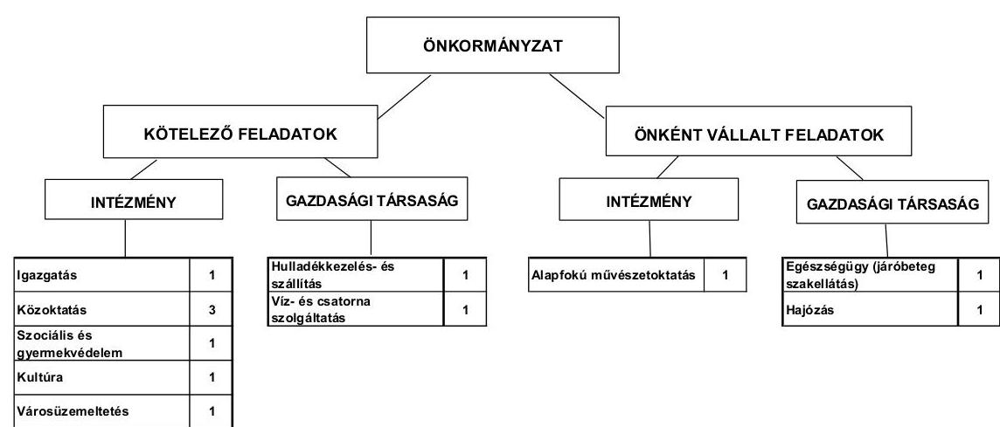

A 2007-2011. év I. félév közötti időszakban a költségvetési szervek száma eggyel csökkent, az Önkormányzat a Tourinform Iroda működtetését a 2009. évben a Balatonalmádi Turisztikai Egyesületnek adta át. Az Iroda mú-

---

ködtetéséhez az Önkormányzat támogatást biztosított, az intézmény átadásával kapcsolatban az Önkormányzatnak 2011. június 30-áig 1,6 millió Ft többletkiadása jelentkezett. A feladatellátás módjában bekövetkezett változás nem befolyásolta az Önkormányzat pénzügyi egyensúlyi helyzetének alakulását. A szociális és gyermekjóléti intézmény ellátási területének növekedése következtében a feladatellátás telephelyeinek száma a 2007. évi 11-ről a 2011. év I. félév végére 16-ra nőtt.

A feladatellátásban résztvevő gazdasági társaság száma a 2007-2011. év I. félév között eggyel növekedett. Az Önkormányzat 2011. március 1-jével alapította meg a Balatonalmádi Kistérségi Egészségügyi Központ Közhasznú Nonprofit Kft.-t, melynek kizárólagos tulajdonosa. A hulladékkezelés-szállítást végző gazdasági társaságban 51-75\% közötti, a víz- és szennyvízkezelési, a hajózási feladatokat ellátó társaságokban 50\% alatti tulajdoni hányaddal rendelkezik.

Az intézményátadás az Önkormányzat pénzügyi egyensúlyi helyzetének alakulását nem befolyásolta. A 2011. év I. félévében alapított gazdasági társaság a vizsgált időszakban szakmai tevékenységet nem végzett, azt 2011. november 2-án kezdte meg.

Az Önkormányzat működési kiadásokra 2010-ben 1656,3 millió Ft-ot fordított, amely 339,4 millió Ft-tal ( 25,8%-kal) haladta meg a 2007. évi ráfordításokat. A működési kiadások 49,7%-át intézményi körben (Polgármesteri hivatal nélkül) realizálták. Az egyes közszolgáltatások feladatellátásában résztvevő intézmények működési kiadásainak finanszírozási összetételét ágazatonként az alábbi ábra szemlélteti:
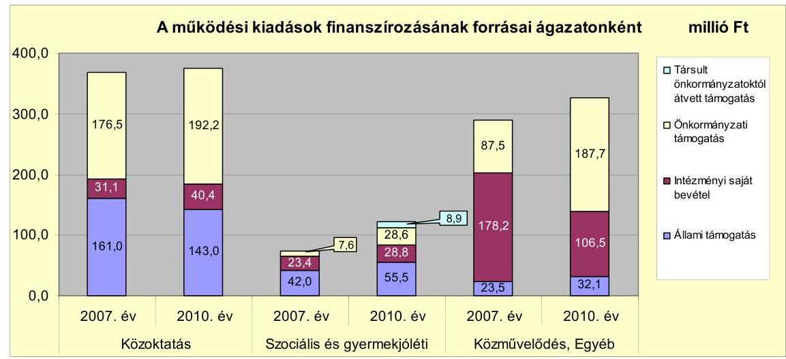

Az Önkormányzat a szociális és gyermekjóléti feladat ellátására két másik településsel közösen létrehozta a Szociális és Gyermekjóléti Intézményfenntartó Társulást, melyhez a vizsgált időszakban további három önkormányzat csatlakozott. A szociális és gyermekjóléti intézményben az ellátottak számának emelkedése, illetve az ellátási terület és a szociális alapszolgáltatások bővülésének következtében az állami és az önkormányzati támogatás összege is emelkedett. Az egyéb intézmények intézményi saját bevételeinek csökkenését az okozta, hogy a strandüzemeltetés a 2009. évtől a Polgármesteri hivatal felada-

---

tai között szerepel. Az önkormányzati támogatás növekedésének oka, hogy a 2009. évtől az egyéb intézmények között szereplő Balatonalmádi Városgondnokság feladata az önállóan működő intézmények gazdasági-pénzügyi feladatainak ellátása, valamint a közfoglalkoztatás szervezése, melyek a 2007-2008. években a Polgármesteri hivatalnál szerepeltek.

Az Önkormányzat folyó költségvetés egyenlege (működési jövedelem) 2007-2010 között minden évben működési forrástöbbletet mutatott. A működési jövedelem, a tőketörlesztés és a pénzügyi kapacitás alakulását a 2007-2010. években az alábbi diagram mutatja be:
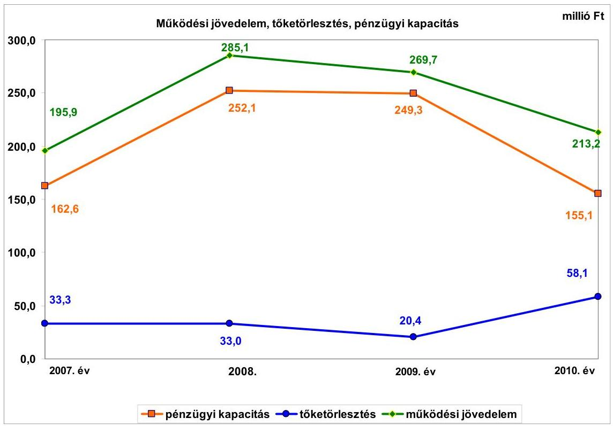

A folyó költségvetés egyenlege 2007-ben a folyó kiadások 14,8\%-át (195,9 millió Ft-ot), 2008-ban 20,4\%-át (285,1 millió Ft-ot), 2009-ben 18,3\%-át (269,7 millió Ft-ot), 2010-ben 12,8\%-át (213,2 millió Ft-ot) jelentette. A folyó költségvetés egyenlegének (a működési jövedelemnek) a 2008. évi 89,2 millió Ft-os növekedését a forrásszabályozásban bekövetkezett változások okozták, a költségvetési támogatásból és az átengedett szja-ból származó bevételek együttesen nőttek. A működési jövedelem a 2007-2010. években az Önkormányzat adósságszolgálatára fedezetet nyújtott.

A 2007-2010. években az Önkormányzat felhalmozási költségvetésének egyenlege folyamatosan negatív összegű volt, így az 2007-2010. évek között összesen 583,0 millió Ft felhalmozási forráshiányt mutatott. A felhalmozási költségvetés hiánya a 2007. évben 137,6 millió Ft, a 2008. évben 33,5 millió Ft, a 2009. évben 230,5 millió Ft, a 2010. évben 181,4 millió Ft volt.

A pénzügyi egyensúly fenntartását külső források bevonása nélkül biztosították az ellenőrzött időszakban. A 2007-2010. években a vizsgált időszakot megelőzően felvett hitelekre 144,8 millió Ft-ot törlesztettek. Az adósságszolgálat, továbbá

---

a felhalmozási forráshiány 2007-2010 között együttesen 727,8 millió Ft-ot tett ki, amelyre az időszakban képződő 963,9 millió Ft működési megtakarítás (működési jövedelem) szolgált fedezetül. A kialakult pénzügyi egyensúlyi helyzet további pozitív nettó működési jövedelmet eredményező gazdálkodás mellett elkerülhetővé teszi külső források bevonását, a pénzügyi egyensúly megőrzését.

Az Önkormányzat folyó bevételei a 2010. évben 13,9%-kal, 229,1 millió Ft-tal haladták meg a 2007-2009. évek átlagos szintjét. Az Önkormányzatnál a költségvetési támogatásból és az átengedett szja-ból származó bevétel a 2007-2009. évek 691,9 millió Ft-os átlagáról a 2010. évre kismértékben ( 0,2%-kal) 690,7 millió Ft-ra csökkent. A áfa visszatérülésből származó bevétel a 2007. évben 65,5 millió Ft, a 2010. évben 275,0 millió Ft volt. A növekedést az áfa mértékének 20%-ról 25%-ra történő emelkedése, illetve a beruházásokhoz kapcsolódó fordított áfa elszámolása okozta.

Az Önkormányzat összes felhalmozási célú bevétele a 2010. évben 675,7 millió Ft-tal meghaladta a 2007-2009. évek átlagos értékét (132,7 millió Ft-ot), annak több mint hatszorosa volt. Az államháztartáson belülről kapott támogatások a 2007. évben 52,6\%-át (48,1 millió Ft-ot) a 2010. évben 71,3\%-át (576,2 millió Ft-ot) jelentették a teljesített bevételnek. A növekedés oka, hogy ez évben több nagy értékű beruházás és felújítás valósult meg.

A folyó kiadások a 2007-2009. évi átlag 1400,1 millió Ft-ról a 2010. évre 1666,2 millió Ft-ra ( 19,0%-al) nőttek a működési kiadások növekedése miatt. A növekedését a szociális és gyermekjóléti ágazat feladatbővülése, valamint a strandüzemeltetéssel kapcsolatos kiadások növekedése okozta. A transzferkiadások emelkedését a Tourinform Iroda működtetéséhez a Balatonalmádi Turisztikai Egyesületnek nyújtott támogatás határozta meg, mely az átadást megelőzően a működési kiadások közt szerepelt.

A pénzügyi egyensúlyi helyzet alakulását jelentősen befolyásolta az Önkormányzat elmúlt időszaki fejlesztési tevékenysége. A befejezett fejlesztések jelentős részét saját bevételből és hazai támogatásból fedezték. A 20072010. évek időszakában 1279,0 millió Ft értékű fejlesztés és felújítás forrása a saját erő, EU-s támogatás és a fejezeti kezelésű előirányzattól EU-s programra kapott támogatás mellett 235,1 millió Ft 2007. év előtti hitelfelvétel (18,4\%) volt. A 2010. december 31-én folyamatban lévő fejlesztési feladatok végrehajtására 2007-2010. között 875,7 millió Ft kiadást teljesítettek, amelyre hitelt nem vettek igénybe. A fejlesztésekkel kapcsolatosan a 2010. év utánra vállalt kötelezettségek összege 657,2 millió Ft, melynek finanszírozása a tervek szerint 370,2 millió Ft (56,3\%) EU-s támogatás és 287,0 millió Ft (43,7%) saját forrás. Az EU-s támogatásból megvalósult fejlesztések finanszírozása likviditási gondot nem okozott, mivel az Önkormányzat az utófinanszírozott projektek forrásszükségletét biztosítani tudta.

---

Az Önkormányzat 2010. december 31-én folyamatban lévő fejlesztési feladatai 2010. évet követő kötelezettségvállalásainak tervezett forrásösszetételét a következő diagram mutatja be:
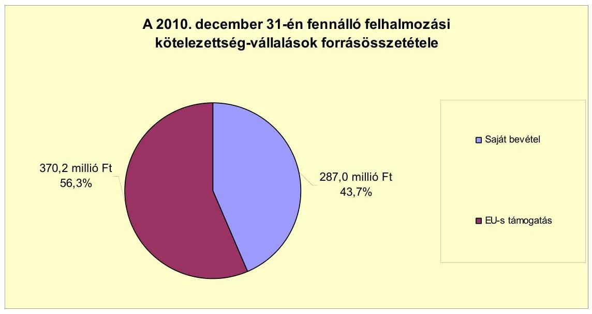

Az Önkormányzat által beadott, elbírálás alatt álló pályázatokban szereplő projektek tervezett teljes bekerülési költsége 53,0 millió Ft volt, amelyhez 35,6 millió Ft-ot EU-s támogatást, 16,3 millió Ft-ot saját forrást kívánnak bevonni. A pályázat előkészítésére 2010. december 31-éig az Önkormányzat 1,1 millió Ft kiadást teljesített. Az Önkormányzat által a 2011. év I. félévében indított beruházási, felújítási munkálatok vállalt bekerülési költsége 198,4 millió Ft. Az Önkormányzat által a 2011-2013. évekre vállalt összes felhalmozási kötelezettség összege 907,5 millió Ft, amelyből 405,8 millió Ft-ot EU-s támogatásból és 501,7 millió Ft-ot saját forrásból terveznek biztosítani.

Az Önkormányzat mérleg szerinti OECF kölcsön és pénzintézeti kötelezettsége 2006. december 31-éről a 2011. I. félév végére 753,6 millió Ft-ról 740,6 millió Ft-ra csökkent. A 2011. június 30-án fennálló pénzintézeti kötelezettség egy hosszú lejáratú hitelből keletkezett. Az Önkormányzat az elfogadott 2011. évi költségvetési rendelete alapján felhalmozási célú hitel felvételét tervezte 117,3 millió Ft összegben, a hitelt a helyszíni vizsgálat befejezésének időpontjáig még nem vette igénybe.

Az Önkormányzat az OECF kölcsönhöz és pénzintézeti kötelezettségeihez kapcsolódóan a vizsgált időszakban 156,4 millió Ft tőkét törlesztett és 43,2 millió Ft kamatot fizetett. Az OECF kölcsöntartozás összegéből az Országgyűlés az éves költségvetési törvényekben a vizsgált időszakban 91,7 millió Ft-ot elengedett. A vizsgált években - az előre eltervezett ütemezés szerint - négy hitelét fizette vissza az Önkormányzat.

---

Az Önkormányzat kötelezettségeinek 2010. december 31-ei és 2011. június 30-i állományát és azok várható alakulását a kötelezettségek lejáratáig a következő táblázat szemlélteti:
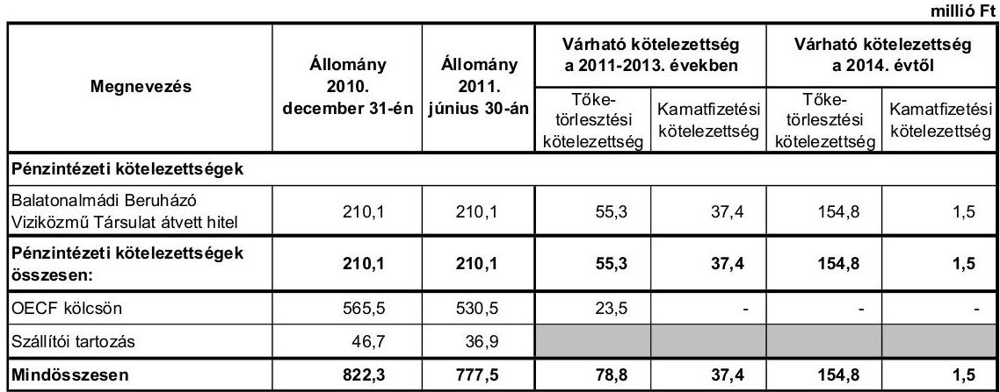

Az Önkormányzatnak OECF kölcsön és pénzintézetekkel szemben fennálló kötelezettsége a 2011. év I. félév végén 740,6 millió Ft volt. A hitelhez kapcsolódóan a várható kamatfizetési kötelezettség - az utolsó ismert kamatmértékkel számítva - a 2011-2013. években 37,4 millió Ft, a 2014. évben 1,5 millió Ft, melyből az Önkormányzat 2011. év I. félévében 6,5 millió Ft-ot kamatfizetést már teljesített. Az Önkormányzatnak az OECF kölcsönnel kapcsolatban a 2011. évben 11,5 millió Ft fizetési kötelezettsége keletkezett, melyet 2011. június 30-áig teljesített. Az Országgyűlés 2011. december 1-jei hatállyal lemondott az Önkormányzattal szemben fennálló OECF kölcsön követelés összegéről. A Balatonalmádi Beruházó Víziközmű Társulattól átvett hitel várható tőke- és kamatfizetési kötelezettsége a legutóbbi kamatfizetés feltételei alapján a 2011-2013. években 92,7 millió Ft. A 2011-2013. évek kötelezettségeinek teljesítésére figyelembe vehető 570,9 millió Ft pénzmaradvány. A 2014. évet követően jelenleg ismert pénzintézeti kötelezettsége (kamattal együtt) 156,3 millió Ft, melyből a tőkefizetési kötelezettségre várhatóan fedezetet nyújt a társulati tagok által kötött, 2014. évben lejáró lakáselőtakarékossági szerződés megtakarítási része.

Az Önkormányzat 2011. év I. félév végi szállítói tartozása 36,9 millió Ft, melyből lejárt tartozása 3,5 millió Ft volt, ebből 1,8 millió Ft fizetési határideje 31 napon túl járt le. A számlák határidőn túli kiegyenlítését munkaszervezési problémák okozták.

Az Önkormányzat 2007-2010 között eszközállománya után 917,4 millió Ft összegű értékcsökkenést mutatott ki, miközben az elhasznált eszközök pótlására 571,7 millió Ft-ot fordított.

Az Önkormányzat az ellenőrzött időszakban kiadási megtakarítást eredményező és bevételnövelő intézkedéseket tett. A 2007-2011. év I. féléve között tett intézkedések hatására - az Önkormányzat adatszolgáltatása szerint - 381,6 millió Ft bevételi többletet, továbbá 19,1 millió Ft kiadási megtakarítást mutattak ki, ezáltal az Önkormányzat pénzügyi egyensúlyi helyzetét javították. A kiadási megtakarítás teljes egészében létszámcsökkentés eredménye. Az álláshely-csökkentő intézkedések 2007-2011. év I. féléve között önkormányzati

---

szinten összesen öt álláshely (üres álláshelyet nem tartalmazott) megszüntetését jelentették. A szociális és gyermekjóléti intézmény ellátási területének bővülése miatt álláshely- és egyben létszámnövekedés is történt. Ennek következtében az időszak álláshelyeinek száma 19 fővel nőtt. A bevételnövelő intézkedések a helyi adóbevétel növeléshez, eszközök hasznosításához és az átmenetileg szabad pénzeszközök lekötéséhez kapcsolódtak.

Az Önkormányzat költségvetési támogatásból, valamint személyi jövedelemadóból származó bevétele a 2007-2011. év I. féléve közötti időszakban összességében 155,3 millió Ft-tal nőtt, melyből 42,3 millió Ft-ot a szociális ágazat feladatbővülése, 62,8 millió Ft-ot a közfoglalkoztatáshoz kapcsolódó normatív, kötött felhasználású támogatás növekedése okozott.

Az Önkormányzat gazdálkodási rendszerének 2007. évi ellenőrzése során a pénzügyi egyensúly javítására vonatkozó javaslatot az ÁSZ nem tett.

Az Önkormányzat pénzügyi egyensúlyi helyzetét összegezve a következők emelhetők ki:

Balatonalmádi Város Önkormányzata pénzügyi egyensúlya rövid és közép távon biztosított. Hosszú távú megőrzésére az Önkormányzatnak fel kell készülnie.

Az Önkormányzat gazdálkodásának pénzügyi egyensúlya a 2007-2011. év I. félévében biztosított volt. A folyó bevételek évente fedezetet nyújtottak a folyó kiadások és az adósságszolgálat finanszírozására. A likviditást folyószámlahitel igénybevétele nélkül biztosították. A folyamatban lévő fejlesztési feladatokhoz, továbbá a benyújtott pályázatokhoz szükséges önerő biztosításához a saját források rendelkezésre állnak.

Az Önkormányzat kötelezettségeit a vizsgált időszakban teljesíteni tudta, a 2011. június 30-án fennálló kötelezettségállomány fedezete biztosított. A lejárt szállítói tartozások növekedését munkaszervezési problémák okozták.

Az önként vállalt feladatokra fordított kiadások aránya a működési kiadásokon belül nem jelent kockázatot.

Az Állami Számvevőszékről szóló 2011. évi LXVI. törvény 33. § (1) bekezdésében foglaltak értelmében a jelentésben foglalt megállapításokhoz kapcsolódó intézkedési tervet köteles az ellenőrzött szervezet vezetője összeállítani és azt a jelentés kézhezvételétől számított harminc napon belül az ÁSZ részére megküldeni. Amennyiben az intézkedési tervet határidőben nem küldi meg a szervezet, vagy az továbbra sem elfogadható, az ÁSZ elnöke a hivatkozott törvény 33. § (3) bekezdés a)-b) pontjaiban foglaltakat érvényesítheti.

---

# A 2011. június 30-i pénzügyi egyensúlyi helyzet alapján az ellenőrzés intézkedést igénylő megállapítása és javaslata a következő: 

## a polgármesternek

Az Önkormányzat pénzügyi egyensúlyi helyzete rövid és közép távon biztosított. A pénzügyi egyensúly hosszú távú megőrzésére az Önkormányzatnak fel kell készülnie.

Javaslat:
Folyamatosan tájékoztassa a Képviselő-testületet az Önkormányzat pénzügyi egyensúlyi helyzetéről. Kezdeményezzen szükség esetén intézkedéseket a pénzügyi egyensúly hosszú távú fenntarthatósága érdekében.

---

# II. RÉSZLETES MEGÁLLAPÍTÁSOK 

## 1. Az ÖNKORMÁNYZAT KÖTELEZŐ ÉS ÖNKÉNT VÁLLALT FELADATAI, A FELADATELLÁTÁS SZERVEZETI KERETEI ÉS ANNAK VÁLTOZÁSAI

Az Önkormányzat a kötelezően ellátandó és az önként vállalt feladatainak körét az SzMSz-ben rögzítette${ }^{7}$. Az Önkormányzat önként vállalt feladatai közé sorolta az alapfokú művészetoktatást, a strandüzemeltetést, a turisztikai és idegenforgalmi szolgáltatást, a Tourinform Iroda működtetését, a Kelet-Balatoni Kistérség Többcélú Társulása munkájában való közreműködést, a sporttevékenységek, a közalapítványok, a társadalmi szervezetek támogatását, valamint a közbiztonság helyi feladatairól való gondoskodást.

A 2007-2010. években az Önkormányzat adatszolgáltatása szerint${ }^{8}$ a kötelező és önként vállalt feladatok aránya jelentősen nem változott. A kötelező feladatok működési kiadásai az összes működési kiadáson belül a 2007. évben 1164,4 millió Ft-ot (88,4%), a 2008. évben 1227,5 millió Ft-ot (88,5%), a 2009. évben 1285,7 millió Ft-ot (88,1%), a 2010. évben 1448,4 millió Ft-ot (87,4%) tettek ki. Az önként vállalt feladatokkal kapcsolatos működési kiadás a 2007. évben 152,5 millió Ft (11,6%), a 2008. évben 159,3 millió Ft (11,5%), a 2009. évben 174,1 millió Ft (11,9%), a 2010. évben 207,9 millió Ft (12,6%) volt. Az önként vállalt feladatokkal kapcsolatos működési kiadások emelkedését nagyrészt a strandüzemeltetéssel kapcsolatos kiadások növekedése okozta. A 2007. évtől a 2008. évre a feladattal kapcsolatos működési kiadások 6,7 millió Ft-tal, 76,9 millió Ft-ra, a 2009. évre 15,9 millió Ft-tal, 92,8 millió Ft-ra, a 2010. évre, 21,5 millió Ft-tal, 114,3 millió Ft-ra emelkedtek. A strandüzemeltetéssel kapcsolatos működési kiadások növekedése nem rontotta az Önkormányzat pénzügyi pozícióját, mivel a bevételek a 2007-2010. években jelentősen meghaladták a teljesített működési kiadásokat. A 2007. évtől a 2008. évre a feladattal kapcsolatos működési bevételek 13,0 millió Ft-tal, 129,5 millió Ft-ra, a 2009. évre 34,6 millió Ft-tal, 164,1 millió Ft-ra, a 2010. évre, 19,2 millió Ft-tal, 183,3 millió Ft-ra emelkedtek. Az önként vállalt feladatok aránya nem befolyásolta az Önkormányzat működésének biztonságát.

A működési kiadások a vizsgált időszakban folyamatosan növekedtek. Az Önkormányzat adatszolgáltatása szerint a 2007. évi működési kiadások 1316,9 millió Ft-ot tettek ki. A működési kiadások a 2008. és a 2009. években az előző évhez viszonyítva 5,3%-kal (1386,8 millió Ft-ra, majd 1459,8 millió Ft-ra) emelkedtek. A 2010. évre a működési kiadások a 2009. évihez képest 13,5%-kal (1656,3 millió Ft-ra) nőttek. A 2010. évi növekedés fő oka, hogy a fordított áfa miatti befizetés a 2009. évtől a 2010. évre 28,1 millió Ft-ról 146,2 millió Ft-ra nőtt.

[^0]
[^0]: ${ }^{7}$ Erre jogszabályi előírás nem kötelezi az Önkormányzatot.
    ${ }^{8}$ Az Önkormányzat adatszolgáltatása nem tartalmazza a védőnői szolgálat és a helyi kisebbségi önkormányzat működési költségvetési kiadásait és bevételeit.

---

Az Önkormányzat fordított áfa miatti befizetési kötelezettsége a 2008. évben 7,1 millió Ft, a 2009. évben 28,1 millió Ft, a 2010. évben 146,2 millió Ft volt. A fordított áfa miatti befizetések nélkül${ }^{9}$ az Önkormányzat működési kiadásai hasonló mértékben nőttek az előző évhez képest, a 2008. évre 4,8%-kal, 1379,7 millió Ft-ra, a 2009. évre 3,8%-kal, 1431,7 millió Ft-ra, a 2010. évre 5,5%-kal, 1510,1 millió Ft-ra. A járulékmértékek 2009. évi csökkenésének hatására a működési kiadások a 2009. évben a 2008. évhez viszonyítva alacsonyabb mértékben növekedtek.

A 2010. évi működési kiadások feladatonkénti megoszlását, azok finanszírozási arányait - az Önkormányzat adatszolgáltatása alapján - a következő táblázat mutatja be:

| Ellátott feladat | Működési   kiadás   összesen   (millió Ft) | Kötelező   feladatok   kiadásainak   részaránya   % | Működési   bevétel   összesen   (millió Ft) | Állami   támogatás   részaránya   % | Intézményi   saját bevétel   részaránya   % | Önkormányzati   támogatás   részaránya   % | Társult   önkormány-   zatoktól átvett   támogatás   részaránya   % |
| :--: | :--: | :--: | :--: | :--: | :--: | :--: | :--: |
| Óvodák | 120,9 | 100,0 | 120,9 | 33,5 | 16,1 | 50,4 | 0 |
| Általános iskolák | 254,7 | 100,0 | 254,7 | 40,3 | 8,2 | 51,5 | 0 |
| Szociális   intézmények | 103,2 | 100,0 | 103,2 | 46,5 | 26,1 | 22,2 | 5,2 |
| Gyermekjóléti   intézmények | 18,6 | 100,0 | 18,6 | 40,3 | 10,2 | 30,6 | 18,9 |
| Közművelődési   intézmények | 84,0 | 100,0 | 84,0 | 3,5 | 12,4 | 84,1 | 0,0 |
| Egyéb intézmények | 242,3 | 89,0 | 242,3 | 12,1 | 39,7 | 48,2 | 0,0 |
| Polgármesteri   hivatalban ellátott   feladatok működési   kiadásai | 832,6 | 78,2 | 1452,3 | 30,3 | 69,5 | 0,0 | 0,2 |
| Összesen | 1656,3 | 87,4 | 1867,5 | 35,9 | 63,5 | 0,0 | 0,6 |

A kiadások finanszírozásában az állami támogatás összege a 2007. évről a 2008. évre minden intézménycsoportban, összességében 100,0 millió Ft-tal, 16,2%-kal 718,6 millió Ft-ra növekedett, aránya az összes működési jövedelmen belül 42,2%-ról 43,0%-ra emelkedett. A növekedést nagyrészt a bérpolitikai intézkedések és kereset-kiegészítés támogatásának bevezetése, valamint az átengedett szja növekedése okozta. Az állami támogatások aránya az összes működési bevételen
 belül a 2009. évtől folyamatosan csökkent, a 2009. évben 39,8\% (680,6 millió Ft), a 2010. évben 35,9\% (671,3 millió Ft) volt. Az intézményi saját bevételek a 2007-2009. évek átlagához, 940,5 millió Ft-hoz képest a 2010. évre 1185,2 millió Ft-ra növekedtek. A növekedést a térítési díjak emelése, illetve a többcélú kistérségi társulástól átvett támogatásértékű működési bevételek növekedése befolyásolta. Az önkormányzati támogatás összegét, annak változását az állami támogatások és az intézményi saját bevételek alakulása határozta meg.

[^0]
[^0]:    ${ }^{9}$ A fordított áfa összege a költségvetési beszámolókban előzetesen felszámított áfaként és fordított áfa miatti befizetésként is megjelenik. A fordított áfa miatti befizetés összege az Önkormányzatnak többletkiadást nem jelent, azonban elszámolása a kiadási és a bevételi főösszeget is növeli. A fordított áfa befolyásolja a működési bevételek és kiadások összegét, fokozatos elterjedése torzítja az évenkénti változások mértékét.

---

A közoktatási feladatokra ${ }^{10}$ fordított működési kiadások a 2008. évről a 2009. évre 7,0\%-kal, 27,4 millió Ft-tal csökkentek. A csökkenését a foglalkoztatottak számának csökkenése, valamint a járulékmértékek mérséklődése okozta.

A 2007. évben a működési kiadások 43,7\%-át (161,0 millió Ft) fedezte az állami támogatás, mely a 2008. évre $44,4 \%$-ra, 173,0 millió Ft-ra növekedett, majd a 2009. évre $41,7 \%$-ra, 151,4 millió Ft-ra, a 2010. évre $38,1 \%$-ra, 143,0 millió Ft-ra csökkent. Az intézményi saját bevételek összege és aránya a vizsgált időszakban folyamatosan növekedett a térítési díjak emelésének hatására. A 2007. évben 31,1 millió Ft ( $8,4 \%$ ), a 2008. évben 33,5 millió Ft ( $8,6 \%$ ), a 2009. évben 36,1 millió Ft (10,0\%), a 2010. évben 40,4 millió Ft (10,8\%) volt.

A szociális-gyermekjóléti intézmény működési kiadásai a 2007-2010. években folyamatosan növekedtek. Az ágazat működési kiadásaira az Önkormányzat a 2007. évben 73,6 millió Ft-ot fordított. Az előző évhez viszonyítva a 2008. évben 36,4\%-kal (100,4 millió Ft-ra), a 2009. évben 4,0\%-kal (104,4 millió Ft-ra), a 2010. évben 16,7\%-kal (121,8 millió Ft-ra) emelkedtek a működési kiadások. A növekedés oka az ellátottak számának emelkedése, illetve az ellátási terület és a szociális alapszolgáltatások körének bővülése volt.

A szociális intézményben ellátottak száma folyamatosan emelkedett, a 2007. évben 260 fő, a 2008. évben 285 fő, a 2009. évben 306 fő, a 2010. évben 331 fő volt. A Balatonalmádi Szociális Alapszolgáltatási Központot fenntartó Szociális és Gyermekjóléti Intézményfenntartó Társuláshoz csatlakozott 2007. április 1-jétől Litér és Felsőörs községek önkormányzata, 2007. május 31-étől Balatonfűzfő Város Önkormányzata. 2009. december 31-étől a Balatonalmádi Szociális Alapszolgáltatási Központ Alsóörs Község és Balatonfűzfő Város közigazgatási területén a nappali ellátás és a házi segítségnyújtás feladatait is ellátja.

A szociális és gyermekjóléti feladatokat az állami támogatás a vizsgált időszakban átlagosan 52,9\%-ban finanszírozta. A 2007. évben a működési kiadások $57,2 \%$-át ( 42,0 millió Ft) fedezte az állami támogatás, mely a 2008. évre $58,9 \%$-ra, 59,1 millió Ft-ra növekedett az ellátottak számának növekedése miatt. Az Önkormányzatnak a 2009. évben az állami támogatás csökkenése miatt az előző évhez képest majdnem duplájával, 16,9 millió Ft-tal kellett hozzájárulnia az intézmény működéséhez. A 2010. évre az önkormányzati támogatás 11,7 millió Ft-tal, 69,2\%-kal emelkedett az ellátottak számának növekedése miatt. A társult önkormányzatok a 2007. évben 0,5 millió Ft-tal, a 2008. évben 4,0 millió Ft-tal, a 2009. évben 5,8 millió Ft-tal, a 2010. évben 8,9 millió Ft-tal járultak hozzá a feladatellátáshoz.

A közművelődési feladatokkal kapcsolatos működési kiadás a 2007. évben 81,8 millió Ft volt, mely a 2008. évre 2,4\%-kal, 2,0 millió Ft-tal csökkent. A csökkenés oka, hogy a 2007. évben az Önkormányzatot a Veszprém Megyei Bíróság kötelezte, hogy az intézmény volt vezetője részére az elmaradt munkabért és járulékait, valamint a hozzá kapcsolódó késedelmi kamatot fizesse meg, melynek összege a 2007. évi működési kiadásokban jelentkezett.

[^0]
[^0]:    ${ }^{10}$ Óvodai nevelésre, általános iskolai oktatásra. Az alapfokú művészetoktatással kapcsolatos működési kiadások az egyéb intézmények adatai között jelennek meg.

---

A közművelődési intézményekben ellátott feladatokhoz kapcsolódó állami támogatás - az Önkormányzat adatszolgáltatása szerint - a működési kiadásokat a 2007-2009. években átlagosan $15,6 \%$-ban, a 2010 . évben $3,5 \%$-ban finanszírozta ${ }^{11}$.

Az egyéb intézmények ${ }^{12}$ működési kiadása a 2007. évben 207,4 millió Ft, a 2008. évben 214,0 millió Ft, a 2009. évben 224,0 millió Ft, a 2010. évben 242,3 millió Ft volt. Az önként vállalt feladatok aránya a 2008. évről a 2009. évre $55,7 \%$-ról $14,4 \%$-ra csökkent, mely nem járt együtt a működési kiadások mérséklődésével. Az önként vállalt feladatok aránya a 2007. évről a 2008. évre, illetve a 2009. évről a 2010. évre jelentősen nem változott. Az önként vállalt feladatok arányának 2009. évi csökkenését az okozta, hogy 2009. május 1-jétől a Tourinform Iroda működtetését (önként vállalt feladat) az Önkormányzat átadta a Balatonalmádi Turisztikai Egyesületnek, illetve hogy a strandüzemeltetéssel kapcsolatos kiadások (önként vállalt feladat) a 2009. évtől a Polgármesteri Hivatal kiadásai között jelennek meg. A működési kiadások változatlanságának oka, hogy a 2009. évtől a Balatonalmádi Városgondnokság feladata az önállóan működő intézmények gazdasági-pénzügyi feladatainak ellátása, valamint a közcélú, közhasznú foglalkoztatás, illetve a közmunka program ${ }^{13}$ szervezése.

A működési kiadásokat a 2008. évben 7,6\%-ban (11,6 millió Ft), a 2009. évben 9,4\%-ban (21,1 millió Ft) finanszírozta az állami támogatás. Az állami támogatások növekedésének oka, hogy a 2009. évtől a Balatonalmádi Városgondnokság keretein belül valósul meg a közcélú foglalkoztatás ${ }^{14}$, melyhez az Önkormányzat normatív, kötött felhasználású támogatást vett igénybe. Az intézményi saját bevételek a 2008. évről a 2009. évre 81,3 millió Ft-tal, 48,8\%-kal csökkentek. A változásban jelentős szerepet játszott, hogy a 2009. évtől a strandüzemeltetéssel kapcsolatos kiadások és bevételek a Polgármesteri hivatal adatai között szerepeltek ${ }^{15}$, illetve hogy az ingatlan bérbeadással, üzemeltetéssel kapcsolatos bevételek a 2008. évről a 2009. évre 22,6 millió Ft-ról 76,0 millió Ft-ra emelkedtek.

A Polgármesteri hivatalban az önként vállalt feladatok aránya a 2008. évről a 2009. évre 6,7\%-ról 20,7\%-ra nőtt a feladatok átcsoportosítása miatt. A működési kiadások az előző évhez képest a 2008. évre 2,9\%-kal, 17,1 millió Ft-tal, a 2009. évre $14,1 \%$-kal, 84,7 millió Ft-tal, a 2010. évre

[^0]
[^0]:    ${ }^{11}$ A 2010. évtől a közművelődési és közgyűjteményi feladatokhoz kapcsolódó normatív állami hozzájárulás beleolvadt a település-üzemeltetés, igazgatás támogatásába, mely a Polgármesteri hivatal bevételei között szerepel. A helyi közművelődési és közgyűjteményi feladatok jogcímen az Önkormányzat a 2007. évben 10,0 millió Ft, a 2008. évben 10,1 millió Ft, a 2009. évben 9,5 millió Ft állami támogatásban részesült.
    ${ }^{12}$ Balatonalmádi Városgondnokság, Kósa György Városi Zeneiskola Alapfokú Művészetoktatási Intézmény, Tourinform Iroda
    ${ }^{13}$ A 2007-2008. években ezek a feladatok a Polgármesteri hivatalnál szerepeltek.
    ${ }^{14}$ A 2007-2008. években a közcélú foglalkoztatással kapcsolatos működési kiadások és bevételek a Polgármesteri hivatal adatai között jelentek meg.
    ${ }^{15}$ A 2008. évben a strandüzemeltetéssel kapcsolatos működési bevétel 129,5 millió Ft volt.

---

21,1\%-kal, 145,2 millió Ft-tal emelkedtek. A 2009. évi növekedés oka a 2009. január 1-jével módosított feladat-ellátási struktúra. A 2010. évi növekedést nagyrészt meghatározta a fordított áfa miatti befizetés változása, mely a 2009. évről a 2010. évre 118,1 millió Ft-tal növekedett.

A fordított áfa befizetés nélkül a Polgármesteri hivatal működési kiadásai az előző évhez képest a 2008. évre 2,3\%-kal, 13,6 millió Ft-tal, a 2009. évre 10,0\%-kal, 60,1 millió Ft-tal, a 2010. évre 4,1\%-kal, 27,1 millió Ft-tal emelkedtek.

Az intézményi saját bevételek a 2007. évről a 2008. évre 88,6 millió Ft-tal, 16,3\%-kal 710,4 millió Ft-ra emelkedtek. A 2009. évre az előző évhez képest az intézményi működési bevételek $21,4 \%$-kal, 152,1 millió Ft-tal emelkedtek. A strandüzemeltetéssel kapcsolatos működési bevétel a 2009. évben 164,1 millió Ft volt. Az intézményi működési bevételek a 2010. évre további 17,0\%-kal, 147,0 millió Ft-tal nőttek. A fordított áfa miatti bevétel-növekedés a 2009. évről a 2010. évre 139,3 millió Ft volt.

Az Önkormányzat kötelező és önként vállalt feladatait 2011. június 30-án (a Polgármesteri hivatallal együtt) nyolc költségvetési szervvel és négy gazdasági társasággal látta el. A költségvetési szervek közül kettő önállóan működő és gazdálkodó, hat önállóan működő költségvetési szerv volt.

A 2007-2011. év I. félév közötti időszakban a költségvetési szervek száma eggyel csökkent, az Önkormányzat a Tourinform Iroda működtetését 2009. május 1-jével a Balatonalmádi Turisztikai Egyesületnek adta át. Az intézmények telephelyeinek száma a vizsgált időszakban 11-ről 16-ra emelkedett. A telephelyek számának változását a Balatonalmádi Szociális Alapszolgáltatási Központ ellátási területének, illetve a szociális alapszolgáltatások körének bővülése eredményezte.

A gazdasági társaság száma a 2007-2011. év I. félév között eggyel növekedett. Az Önkormányzat 2011. március 1-jével megalapította a Balatonalmádi Kistérségi Egészségügyi Központ Közhasznú Non-profit Kft.-t. A társaság egyszemélyes, önkormányzati tulajdonú, kiemelkedően közhasznú nonprofit kft. Az Önkormányzat további egy gazdasági társaságban (Kommunális Kft.) rendelkezik 51\%-os, egy kötelező közszolgáltatást ellátó gazdasági társaságban (Dunántúli Regionális Vízmű) pedig 0,02\%-os tulajdonrésszel. További egy gazdasági társaságban (Balatoni Hajózási Zrt.) az Önkormányzat a részvények 2,89\%-ával rendelkezik, a társaság nem vesz részt a kötelező közszolgáltatási feladatok ellátásában.

Az Önkormányzat feladatait 2011. június 30-án az alábbi intézménystruktúrával látta el:

- közoktatási feladatot három intézmény látott el (az Önkormányzat az óvodai ellátást egy székhely óvodával és egy tagintézménnyel, az általános iskolai oktatást kettő általános iskolában biztosította);
- szociális és gyermekvédelmi feladatokat egy intézmény végzett (a Balatonalmádi Szociális Alapszolgáltatási Központ a házi segítségnyújtást, a családsegítést, a szociális étkeztetést, a nappali szociális ellátást, a védőnői szolgálatot, valamint az anya-, gyermek és csecsemővédelmet látta el; az intéz-

---

mény működési területe: Balatonalmádi, Szentkirályszabadja, Alsóörs, Litér, Felsőörs és Balatonfűzfő közigazgatási területe);

- a kulturális feladatok ellátását egy intézmény biztosította (a Pannónia Kulturális Központ és Könyvtár helyi könyvtári és közművelődési feladatait székhelyén és a könyvtári intézményegységben látta el);
- egyéb feladatokat kettő intézmény látott el (a városüzemeltetést és az önállóan működő intézmények pénzügyi-gazdasági feladatait a Balatonalmádi Városgondnokság, az alapfokú művészetoktatást a Kósa György Városi Zeneiskola Alapfokú Művészetoktatási Intézmény biztosította);
- az igazgatási feladatokat a Polgármesteri hivatal látta el.

Az egészségügyi alap- és szakellátásokat az Önkormányzat feladatellátási szerződések keretében, vállalkozók útján biztosította.

Az Önkormányzat kötelező közszolgáltatási feladatainak ellátásában a gazdasági társaságok az alábbiak szerint vettek részt:

- a települési szilárd- és folyékony hulladékgazdálkodással, valamint a köztisztasággal kapcsolatos feladatokat a Kommunális Kft. végezte, melyben az Önkormányzat 51,0\%-os tulajdonrésszel rendelkezik;
- a víz- és csatornaszolgáltatást a Dunántúli Regionális Vízmű Zrt. biztosította, melyben az Önkormányzatnak 0,02\% tulajdonrésze van;
- az Önkormányzat 2011. március 1-jével létrehozta a Balatonalmádi Kistérségi Egészségügyi Központ Közhasznú Non-profit Kft.-t, melynek 100\%-ban tulajdonosa. A Balatonalmádi kistérségi járóbeteg szakellátás integrált fejlesztése című projekt keretén belül valósul meg a Balatonalmádi Városi Egészségügyi Központ kiépítése. A megvalósíthatósági tanulmány tartalmazta, hogy az Önkormányzat a projektben megjelölt feladatok ellátására saját tulajdonú non-profit gazdasági társaságot hoz létre. A Központ építésének kivitelezési határideje a vállalkozói szerződés értelmében: 2011. április 29. volt, mely működési engedélyét 2011. október 12-én kapta meg. A Balatonalmádi Városi Egészségügyi Központ működését 2011. november 2-án kezdte meg. Az Önkormányzat kötelező egészségügyi feladatait a működési engedély kiadását követően feladatátadási szerződés keretében a kft.-nek adja át.
2010. december 31-én az Önkormányzat egy gazdasági társaságban (a Kommunális Kft.-ben) rendelkezett többségi tulajdonrésszel ${ }^{16}$. A társaság saját tőke, jegyzett tőke aránya a 2007-2010. évi adatok alapján folyamatos tőkenövekedést mutat. A társaság saját tőke növekedési mutatója a 2007. évben 1,04 a 2010. évben 1,62 volt. A társaság pénzügyi helyzete a saját tőke, jegyzett tőke aránya alapján stabil, a társaság működése a 2007-2010. években nyereséges volt. Az Önkormányzat a társaság részére tőkejuttatást nem biztosított.

[^0]
[^0]:    ${ }^{16}$ Az Önkormányzat a Balatonalmádi Kistérségi Egészségügyi Központ Közhasznú Nonprofit Kft.-t, melynek egyszemélyes tulajdonosa 2011. március 1-jével alapította meg.

---

A vizsgált évek során átszervezés, átalakulás, csődeljárás, végelszámolás, felszámolás az Önkormányzat többségi tulajdonában lévő gazdasági társaságainál nem volt. Az önkormányzati feladatokat ellátó gazdasági társaságok gazdálkodását, működését érintő 2007-2010. évi adatokat a jelentés 4. sz. melléklete mutatja be.

A kialakult önkormányzati feladatstruktúra a működési kockázatot nem növelte.

A 2007-2011. június 30. közötti időszakban az Önkormányzatnál feladatátvétel és intézményátvétel nem történt.

Az Önkormányzat a Tourinform Iroda működtetését 2009. május 1-jével a Balatonalmádi Turisztikai Egyesületnek adta át. A Képviselő-testület 2008. november 27-én arról döntött, hogy a Balatonalmádi Turisztikai Egyesülettel a KDOP/2008/2.2.1.D ${ }^{17}$ kódszámú pályázati felhívás szakmai és pénzügyi követelményeinek megfelelő megállapodás kerüljön kidolgozásra. A pályázati feltételek között szerepelt a Tourinform Iroda egyesületi üzemeltetésbe történő átadása.

A 2009. május 1-jétől 2011. június 30-áig terjedő időszakban a Tourinform Iroda átadásával a személyi juttatások, a munkaadót terhelő járulékok és dologi kiadások 20,5 millió Ft-tal, a saját bevételek 4,4 millió Ft-tal csökkentek, ami 16,1 millió Ft-os megtakarítást eredményezne az Önkormányzatnak. A Balatonalmádi Turisztikai Egyesülettel kötött megállapodás értelmében az Önkormányzat az átadott feladatok ellátásához évente támogatást nyújt, amely nem lehet kevesebb, mint a 2009. évi költségvetésben az iroda működtetésére és vásári megjelenésekre tervezett kiadás és saját bevétel különbözete. Az iroda működtetéséhez az Önkormányzat 17,7 millió Ft támogatást nyújtott. Ezáltal az intézményátadással kapcsolatban az Önkormányzatnak 1,6 millió Ft többletkiadása keletkezett. A többletkiadás oka, hogy a Balatonalmádi Turisztikai Egyesület nem fogadta el az Önkormányzat által a 2009. évre tervezett saját bevétel összegét, melynek mértéke befolyásolta a megállapodás szerinti támogatást.

Az intézményátadás az Önkormányzat pénzügyi helyzetének alakulását nem befolyásolta. A 2011. év I. félévében alapított gazdasági társaság a vizsgált időszakban szakmai tevékenységet nem végzett, azt 2011. november 2-án kezdte meg.

# 2. AZ ÖNKORMÁNYZAT PÉNZÜGYI EGYENSÚLYI HELYZETÉT BEFOLYÁSOLÓ TÉNYEZŐK 

A hagyományos költségvetési szerkezet helyett az Önkormányzat pénzügyi helyzetét a CLF módszerrel mutatjuk be, amelyben jobban elkülönülnek a vagyonnal kapcsolatos bevételek és kiadások az önkormányzati feladatokkal kapcsolatos közvetlen működtetési bevételektől és kiadásoktól. A módszer kö-

[^0]
[^0]:    ${ }^{17}$ A Közép-Dunántúli Regionális Operatív Program Balatoni Turisztikai Desztináció Menedzsment Szervezetek támogatása

---

vetkezetesen elkülöníti a folyó és a felhalmozási költségvetés bevételeit és kiadásait, azok költségvetési egyenlegeit. A saját folyó bevételek, valamint a saját felhalmozási bevételek nem tartalmazzák az előző évi pénzmaradványok felhasználásából származó pénzforgalom nélküli bevételeket ${ }^{18}$.

A folyó költségvetés egyenlege, a működési jövedelem megmutatja, hogy az Önkormányzat éves folyó bevétele fedezetet biztosít-e a kötelező és önként vállalt feladatellátáshoz kapcsolódó éves folyó kiadására. A működési jövedelem negatív értéke pénzügyileg fenntarthatatlan helyzetet jelez. A mutató pozitív értéke megtakarítást mutat, amely forrásul szolgálhat az Önkormányzat fennálló kötelezettségei megfizetéséhez, valamint fejlesztéseihez.

A felhalmozási költségvetés pozitív értéke felhalmozási többletet mutat, amely a jövőbeni fejlesztések forrását biztosíthatja. Amennyiben a folyó költségvetési hiány finanszírozása a felhalmozási többletből történik, ez szűkebb értelemben vagyonfelélésnek tekinthető. Amennyiben a felhalmozási költségvetés megtakarítása fejlesztési célú hitelek, kötvények adósságszolgálatát finanszírozza, az változatlan vagyontömeg mellett, a korábban megelőlegezett tőkebevételek valós realizációjának tekinthető. A felhalmozási deficit által generált finanszírozási igény önmagában nem jár pénzügyi kockázattal, a pénzügyileg fenntartható beruházásokhoz kapcsolódó kötelezettségvállalás (adósságszolgálat) átlátható és szabályozott költségvetési gazdálkodással teljesíthető.

A módszer a pénzügyi kapacitás fogalmát helyezi a középpontba. Az adós hitelfelvételi képessége, hosszú távú fizetőképessége vagy bonitása a pénzügyi kapacitással, a nettó működési jövedelemmel jellemezhető. A nettó működési jövedelem negatív értéke az egyes költségvetési években jelentkező adósságszolgálat túlzott mértékére utal. ${ }^{19}$ A nettó működési jövedelem negatív értékének felhalmozási többletből, vagy további hitelből történő finanszírozása pénzügyileg nem fenntartható gazdálkodást vetít előre. A pozitív értéket mutató nettó működési jövedelem fejlesztési kiadások fedezetét biztosíthatja, illetve a folyamatosan, évenként képződő pozitív nettó működési jövedelemből meghatározható a jövőben vállalható, teljesíthető éves adósságszolgálat, ily módon az a hitelösszeg, amely - a többi tényezőt, feltételt adottnak tekintve - visszafizetési kockázat nélkül felvehető.

A CLF módszer alapján a pénzügyi kapacitás mértéke az Önkormányzat összevont, nettósított, a központi információs rendszerbe a Magyar Államkincstáron keresztül leadott éves költségvetési beszámolójának 80-as űrlapjában szerepeltetett adatok alapján került meghatározásra.

A számítási leírás némileg eltér az ÁSZ módszertanában korábban alkalmazott gyakorlattól. A jelen besorolás általános közgazdasági meggondolásokon alapul, amely megjelenik az SNA statisztikai módszertanában is. Folyó tételek alatt értjük azokat a kiadásokat és bevételeket, amelyek a gazdálkodó szervezet

[^0]
[^0]:    ${ }^{18}$ A költségvetési években kialakuló hiány finanszírozása az előző évi pénzmaradvány és a korábbi években képzett tartalékok felhasználásával is történhet.
    ${ }^{19}$ kivéve, ha annak finanszírozására a korábbi években képzett tartalékok fedezetet nyújtanak

---

helyzetét automatikusan nem változtatják. Bevételi oldalon ilyenek az adók, a tényező jövedelmek, a transzferek ${ }^{20}$, kiadási oldalon a transzferek és a szolgáltatás igénybevételével kapcsolatos működési kiadások. A folyó költségvetésben a bevételekben nem térül meg, a kiadásokban nem jelenik meg az amortizáció, a vagyoni helyzetet az egyenleg befolyásolja.

A folyó költségvetés egyenlege (működési jövedelem) tartalmazza a kamatbevételeket és a kamatkiadásokat is, mind a működési, mind a fejlesztési kamatot, valamint a visszatérülő és befizetendő áfa teljes összegét, mert ezek közgazdaságilag tényező jövedelmek. Nem tartalmazzák viszont a követelés elengedés miatt könyvelt bevételi és kiadási pénzforgalmi tételeket, mert valójában technikai elszámolási műveletnek minősülnek, a bevétel soha nem realizálódott, és költségvetési kiadás sem történt.

A felhalmozási költségvetésben a bevételek között a vagyon megőrzésére és bővítésére fordítható források jelennek meg. A felhalmozási vagy tőketételek módosítják a vagyon nagyságát. A privatizációs bevétel csökkenti a vagyont, a fizikai beruházás, pénzügyi befektetés növeli.

A nettó működési jövedelmet a tőketörlesztés levonásával a folyó költségvetés egyenlegéből származtatjuk.

# 2.1. A működési és a felhalmozási egyensúly változása 

CLF módszer szerinti önkormányzati adatok

| Megnevezés | 2007. év | 2008. év | 2009. év | 2010. év |
| :--: | :--: | :--: | :--: | :--: |
| Folyó bevételek | 1523,8 | 1684,1 | 1743,1 | 1879,4 |
| Folyó kiadások | 1327,9 | 1399,0 | 1473,4 | 1666,2 |
| Működési jövedelem | 195,9 | 285,1 | 269,7 | 213,2 |
| Nettó működési jövedelem   működési jövedelem - tőketörlesztés | 162,6 | 252,1 | 249,3 | 155,1 |
| Felhalmozási bevételek | 91,5 | 178,0 | 128,5 | 808,4 |
| Felhalmozási kiadások | 229,1 | 211,5 | 359,0 | 989,8 |
| Felhalmozási költségvetés egyenlege | $-137,6$ | $-33,5$ | $-230,5$ | $-181,4$ |
| Finanszírozási műveletek nélküli (GFS) pozíció = működési jövedelem + felhalmozási költségvetés egyenlege | 58,3 | 251,6 | 39,2 | 31,8 |
| Finanszírozási műveletek egyenlege | 76,3 | 18,9 | $-108,7$ | $-73,2$ |
| Tárgyévi pénzügyi pozíció | 134,6 | 270,5 | $-69,5$ | $-41,4$ |
| Egyéb tájékoztató adatok |  |  |  |  |
| Összes kötelezettség* | 731,6 | 914,6 | 866,8 | 839,8 |
| -ebből rövid lejáratú | 81,3 | 70,1 | 80,4 | 121,1 |
| Finanszírozásba vonható eszközök: | 629,7 | 855,5 | 786,0 | 744,6 |
| Értékpapírok év végi állománya | 44,7 | 0,0 | 0,0 | 0,0 |
| Pénzeszközök (idegen pénzeszközök nélkül) év végi állománya | 585,0 | 855,5 | 786,0 | 744,6 |

* Az összes kötelezettséget a passzív pénzügyi elszámolások nélkül vettük figyelembe, mert a passzívák a pénzmaradvány elszámolás tételei közé tartoznak.

Az évenkénti részletes adatokat a jelentés 2. számú melléklete mutatja be.

[^0]
[^0]:    ${ }^{20}$ Transzferkiadásoknak nevezzük azokat a folyó és felhalmozási tételeket, amelyeket nem az adott önkormányzat használ fel szolgáltatásnyújtásra.

---

A vizsgált időszakban az Önkormányzat folyó költségvetési egyenlege, működési jövedelme pozitív összegű volt, melynek alakulását a következő ábra szemlélteti:
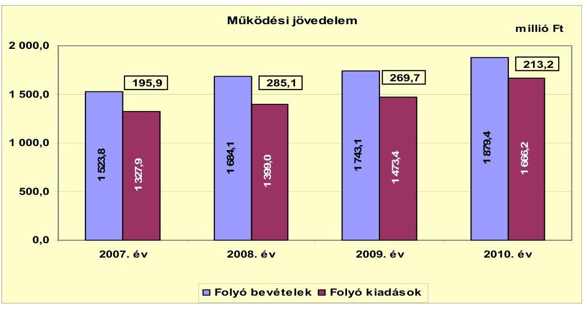

A folyó költségvetés egyenlegének (a működési jövedelemnek) 2008. évi 89,2 millió Ft-os növekedését a forrásszabályozásban bekövetkezett változások okozták, a költségvetési támogatásból és az átengedett szja-ból származó bevételek együttesen nőttek. A 2009. évről a 2010. évre a költségvetés egyenlege 56,5 millió Ft-tal romlott (továbbra is pozitív volt). Ennek oka a korábbi évek működési kiadásainak emelkedését meghaladó mértékű, 11,2\%-os működési kiadásnövekedés. A vizsgált időszakban a működési jövedelem 963,9 millió Ft többletet mutatott, amely forrásul szolgált az Önkormányzat 144,8 millió Ft tőketörlesztési kötelezettségének teljesítéséhez, a 2007-2010. évek 583,0 millió Ft összevont fejlesztési hiány finanszírozásához, továbbá 236,1 millió Ft-tal növelte az Önkormányzat pénzeszközeinek állományát.

Az Önkormányzat nettó működési jövedelmének (pénzügyi kapacitásának) évenkénti alakulását az alábbi ábra szemlélteti:
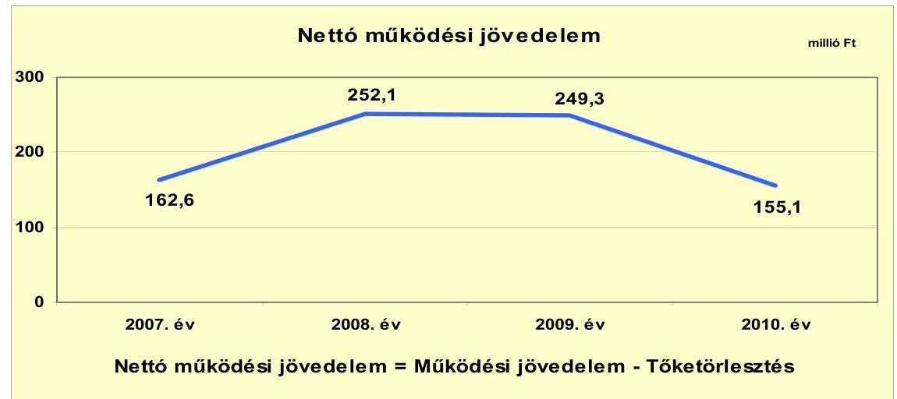

---

Az Önkormányzat pénzügyi kapacitása a 2007-2010. években pozitív volt. A tőketörlesztésre a 2007. évben 33,3 millió Ft-ot, a 2008. évben 33,0 millió Ft-ot, a 2009. évben 20,4 millió Ft-ot, a 2010. évben 58,1 millió Ft-ot fordítottak. A 2007-2008. évi változás mértéke és oka azonos volt a működési jövedelem változásával. A 2009. évről a 2010. évre bekövetkezett 56,5 millió Ft működési jövedelemi pozíció csökkenés és a 37,7 millió Ft tőketörlesztés növekedés együttes hatására a pénzügyi kapacitás a 2010. évre 94,2 millió Ft-tal csökkent. A tőketörlesztés 2010. évi növekedést a Balatonalmádi Beruházó Víziközmű Társulattól átvett hitel törlesztése okozta. Az Országgyűlés az OECF kölcsön törlesztőrészleteinek 50\%-át a 2007-2009. években elengedte az Önkormányzatnak. A 2010. évben - a korábbi évektől eltérően - támogatást biztosított a törlesztéshez, így a 2010. évben a tőketörlesztés teljes összege megjelent a pénzforgalomban. A nettó működési jövedelem finanszírozta a felhalmozási forráshiányt.

A felhalmozási költségvetési alakulását a 2007-2010. években az alábbi diagram mutatja be:
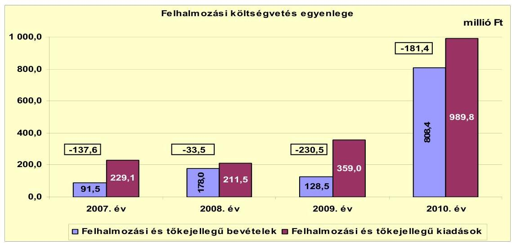

A felhalmozási kiadások alakulását az Önkormányzat céljainak megfelelő pályázati lehetőségek befolyásolták. A felhalmozási kiadások és bevételek 2010. évi növekedését az okozta, hogy a 2008-2009. években benyújtott pályázatokban szereplő projektek (a Wesselényi-strand felújítása, a Balatonalmádi Egészségügyi Központ megvalósítása, valamint a Györgyi Dénes Általános Iskola komplex felújítása és tornateremmel történő bővítése) a 2010. évben valósultak meg. A fejezeti kezelésű előirányzattól EU-s programra kapott támogatásból megvalósuló beruházásokkal (kilenc EU-s programmal) kapcsolatban a 2010. évben 861,3 millió Ft kiadás jelentkezett.

A 2007-2010. években az Önkormányzat felhalmozási költségvetésének egyenlege folyamatosan negatív összegű volt, amely kiegyensúlyozott költségvetési gazdálkodás és pénzügyileg fenntartható ${ }^{21}$ beruházások esetén

[^0]
[^0]:    ${ }^{21}$ Az minősül pénzügyileg fenntartható beruházásnak, amelynek többletként jelentkező működtetési költségeire az Önkormányzat nettó működési jövedelme a következő években is fedezetet nyújt.

---

- tekintettel a képződő nettó működési jövedelem nagyságára - nem jár az Önkormányzatnál pénzügyi egyensúlyt érintő kockázattal.

A felhalmozási forráshiánynak a felhalmozási és tőke jellegű kiadásokhoz viszonyított aránya a vizsgált években a felhalmozási kiadások függvényében eltérő volt. A 2007. és a 2009-2010. évek magas felhalmozási költségvetési hiánya annak eredménye, hogy a beruházásokra a saját tőkebevételek és az államháztartáson belülről kapott felhalmozási célú támogatások nem nyújtottak fedezetet. A 2007-2010. években jelentkezett 583,0 millió Ft felhalmozási forráshiány finanszírozása a 2007-2010. években a 963,8 millió Ft nettó működési jövedelemből történt.

A 2007-2010. években az Önkormányzatnál a finanszírozási műveletek egyenlegének alakulását az alábbi ábra szemlélteti:
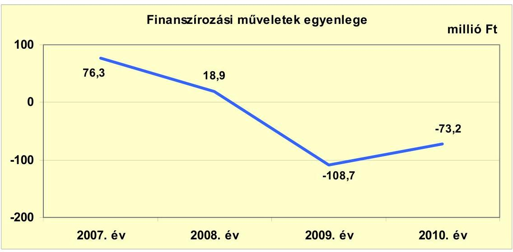

A finanszírozási műveletek forgalma az Önkormányzat költségvetési kiadásaihoz és bevételeihez viszonyítva nem jelentős (1,4-6,0\% között változott). A vizsgált időszakban együttesen jelentkező finanszírozási célú pénzügyi műveletek negatív értéke azt jelzi, hogy az éves költségvetések végrehajtása során nem volt szükség külső finanszírozás igénybevételére. A finanszírozási célú pénzügyi műveletek 2007. és 2008. évi pozitív egyenlege a forgatási célú értékpapírok értékesítésének következménye. A 2009-2010. évi negatív egyenleget a hiteltörlesztések, továbbá a függő, átfutó kiegyenlítő bevételek és kiadások idézték elő. (A finanszírozási célú műveleteket a vizsgált időszakban a jelentés 2. számú mellékletének 4.1-4.8 pontjai részletezik.)

Az Önkormányzat a 2007-2010. évek közötti zárszámadási rendeleteiben a hagyományos költségvetési szerkezetben mutatta be a hiányt és a többletet ${ }^{22}$. A megállapított működési és felhalmozási kiadásokat, a keletkezett pénzügyi többleteket a jelentés 1. számú melléklete tartalmazza. A zárszámadási rende-

[^0]
[^0]:    ${ }^{22}$ Nincs központi előírás arra, hogy a költségvetési és zárszámadási rendeletekben az önkormányzatoknak hogyan kell elkészíteniük a működési és felhalmozási célú bevételeiket és kiadásaikat tartalmazó mérleget. Annak formáját maguk határozzák meg.

---

letekben az Önkormányzat a 2007. évben 383,2 millió Ft, a 2008. évben 736,4 millió Ft, a 2009. évben 751,8 millió Ft, a 2010. évben 31,7 millió Ft többletet mutatott ki. A CLF módszer szerint kimutatott többlethez képest az eltérést az okozta, hogy a rendeletekben kimutatott működési és felhalmozási bevételek a 2007-2009. években tartalmazták a pénzmaradvány összegét is.

A 2007-2011. év I. félév között az Önkormányzat által fizetett kamatok, illetve a realizált kamatbevétel alakulását az alábbi ábra mutatja:
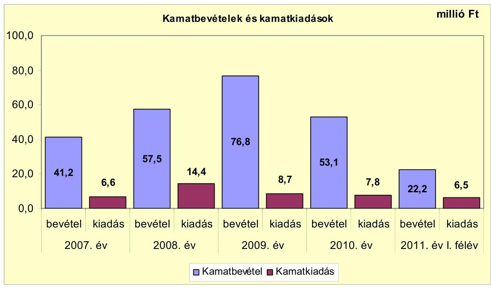

Az Önkormányzat pénzügyi kapacitása kedvező alakulásának eredményeként a vizsgált időszakban a kamatbevételek minden évben meghaladták a fizetett kamatokat. A 2007-2011. év I. félév között az Önkormányzat összesen 44,0 millió Ft kamatot fizetett. Az átmenetileg szabad pénzeszközein realizált kamatbevétel összege pedig 250,8 millió Ft volt, vagyis a kamatbevétel összege közel hatszorosa ( $570,7 \%$ ) volt a fizetett kamatok összegének.

# 2.2. Az Önkormányzat bevételeinek változása 

Az Önkormányzat folyó bevételei a 2010. évben 13,9\%-kal, 229,1 millió Ft-tal haladták meg a 2007-2009. évek átlagos szintjét. A 2007-2010 között realizált főbb bevételi jogcímek számszaki adatait a következő táblázat részletezi és grafikon mutatja be:

---

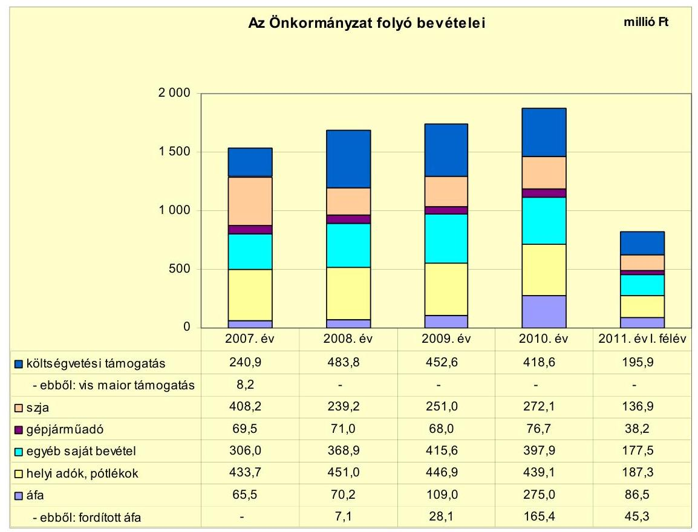

Az Önkormányzatnál a költségvetési támogatásból és az átengedett szja-ból származó bevétel aránya a folyó bevételeken belül a 2007. évi 42,6\%-ról (649,1 millió Ft-ról) a 2010. évre 36,8\%-ra (690,7 millió Ft-ra) csökkent. A két forrás összege a 2007-2009. évek 691,9 millió Ft-os átlagáról a 2010. évre kismértékben ( $0,2 \%$-kal) 690,7 millió Ft-ra csökkent.

A költségvetési támogatások összege tartalmazza a fejlesztési célú támogatásokat is. A 2007. évben 10,1 millió Ft cél- és 8,2 millió Ft vis maior-, továbbá 12,4 millió Ft fejlesztési célú központosított támogatást kapott az Önkormányzat. A 2008. évben a központosított támogatás összege 4,3 millió Ft volt, a 2009. évben infrastruktúra fejlesztésére 6,8 millió Ft fejlesztési célú támogatásban és 14,6 millió Ft fejlesztési célú központosított támogatásban részesültek. A 2010. évben az Önkormányzat 1,5 millió Ft fejlesztési célú központosított támogatást kapott.

Az átengedett bevételen belül a gépjárműadó beszedéséből származó bevétel összege a 2007-2009. években átlagosan 69,5 millió Ft, a 2010. évben 76,7 millió Ft, összes folyó bevételen belüli aránya a 2007. évben 4,6\%, a 2010. évben $4,1 \%$ volt.

Az Önkormányzat egyéb saját bevételeinek az összege a 2007-2009. években átlagosan 363,5 millió Ft, a 2010. évben 397,9 millió Ft volt. A növekedést meghatározó mértékben az ellátotti térítési díjak emelése és a szolgáltatási bevételek növekedése okozta.

---

A áfa visszatérülésből származó bevétel a 2007. évben 65,5 millió Ft volt, mely a 2008. évre 7,1\%-kal, 4,7 millió Ft-tal, a 2009. évre 55,2\%-kal, 38,8 millió Ft-tal, a 2010. évre 152,4\%-kal, 166,0 millió Ft-tal nőtt. A növekedést az áfa mértékének 20\%-ról 25\%-ra történő emelkedése, illetve a beruházásokhoz kapcsolódó fordított áfa elszámolása okozta. A fordított áfa bevétel a 2008. évben 7,1 millió Ft volt, mely a 2008. évről a 2009. évre 21,0 millió Ft-tal emelkedett. A fordított áfa bevétel a 2010. évre az előző évhez képest 137,3 millió Ft-tal, 165,4 millió Ft-ra nőtt.

A folyó működési bevételek negyedét kitevő helyi adóbevételek, pótlékok, bírságok mértéke a 2007. évről a 2008. évre emelkedtek (17,3 millió Ft-tal, $4,0 \%$-kal), ezt követően csökkenést mutattak. A 2009-ben a 2008. évhez viszonyítva a csökkenés 4,1 millió Ft, ( $0,9 \%$ ), majd 2010-re a 2009-hez mérten további 7,8 millió Ft-tal ( $1,7 \%$ ) csökkent az e címen realizált önkormányzati bevétel. A Képviselő-testület a vizsgált időszakot megelőzően döntött a helyi adók (építményadó, helyi iparűzési adó, vendégéjszakák utáni idegenforgalmi adó és telekadó) bevezetéséről. A vizsgált időszakot megelőzően az iparűzési adó mértéke az adóalap 1,8\%-a, az építményadó általános értéke (a kedvezményre jogosító tényezők nélkül) $900 \mathrm{Ft} / \mathrm{m}^{2}$, az idegenforgalmi adó összege pedig vendégéjszakánként $300 \mathrm{Ft} /$ fő, a telekadó mértéke övezetenként $50 \mathrm{Ft} / \mathrm{m}^{2}$, $100 \mathrm{Ft} / \mathrm{m}^{2}$ illetve $200 \mathrm{Ft} / \mathrm{m}^{2}$ volt. A helyi adórendeletek többszöri módosításával az adók mértéke a helyi iparűzési adó és vendégéjszakák utáni idegenforgalmi adó vonatkozásában nőtt, a kedvezmények, mentességek köre fokozatosan szűkült. A vizsgált időszak végére a helyi iparűzési adó mértéke 1,95\%-ra, a vendégéjszakák utáni idegenforgalmi adó mértéke $420 \mathrm{Ft} /$ fő-re emelkedett. A helyi adók közül meghatározó az építményadó, melynek aránya és mértéke a helyi adókon belül fokozatosan a 2007. évi 46,7\%-ról (194,2 millió Ft-ról) 2010-re 49,6\%-ra (212,8 millió Ft-ra) nőtt.

A helyi adók vizsgált időszakra vonatkozó adónemenkénti alakulását a következő táblázat mutatja be:

| Megnevezés | 2007. év | 2008. év | 2009. év | 2010. év | 2011. év   I. félév |
| :-- | --: | --: | --: | --: | --: |
| Építményadó | 194,2 | 202,8 | 207,3 | 212,8 | 104,8 |
| Helyi iparűzési adó | 147,3 | 152,9 | 142,5 | 135,2 | 57,0 |
| Vendégéjszakák utáni idegenforgalmi adó | 48,6 | 51,1 | 49,5 | 48,7 | 7,7 |
| Telekadó | 25,9 | 32,8 | 34,1 | 32,4 | 16,1 |

Az Önkormányzatnak a vizsgált időszakban tulajdonosi részesedései után osztalék bevétele nem volt.

---

Az Önkormányzat felhalmozási bevételei a vizsgált időszakban a következők voltak:

| Megnevezés | 2007. év | 2008. év | 2009. év | 2010. év | 2011. év   I. félév |
| :-- | --: | --: | --: | --: | --: |
| Tárgyi eszköz értékesítés | 28,4 | 79,5 | 14,2 | 92,4 | 7,9 |
| Egyéb saját tőkebevétel | 6,9 | 18,2 | 31,2 | 134,6 | 6,1 |
| Államháztartáson belülről   kapott támogatás | 48,1 | 42,0 | 81,9 | 576,2 | 55,8 |
| EU-tól és külföldről kapott   támogatások | 0,0 | 0,0 | 0,0 | 0,0 | 0,0 |
| Államháztartáson kívülről   kapott támogatás | 8,1 | 38,3 | 1,2 | 5,2 | 4,2 |
| Összes felhalmozási bevétel | $\mathbf{9 1 , 5}$ | $\mathbf{1 7 8 , 0}$ | $\mathbf{1 2 8 , 5}$ | $\mathbf{8 0 8 , 4}$ | $\mathbf{7 4 , 0}$ |

Az Önkormányzat összes felhalmozási célú bevétele a 2010. évben 675,7 millió Ft-tal meghaladta a 2007-2009. évek átlagos értékét (132,7 millió Ft-ot), annak több mint hatszorosa volt. Az összes bevételből minden vizsgált évre jellemzően jelentős részarányt képvisel az államháztartáson belülről kapott támogatás. Az államháztartáson belülről kapott támogatások 2010. évben 71,3\%-át (576,2 millió Ft-ot) jelentették a teljesített bevételnek. A növekedés oka, hogy ez évben több nagy értékű beruházás és felújítás valósult meg. A tárgyi eszköz értékesítés bevétele ingadozott, amelynek oka a gazdasági válságból eredő kiszámíthatatlan ingatlanpiaci mozgás. A 2008. évben 79,5 millió Ft, a 2010. évben 92,4 millió Ft bevételt realizált, ezekben az években az Önkormányzat értékesítési szándéka közel állt a piaci kereslethez. A 2009. évben az ingatlanértékesítési előirányzat 12,3\%-os teljesítéssel realizálódott. Az egyéb saját tőkebevételek 2010. évi növekedését meghatározta a 113,5 millió Ft-os Balatoni Hajózási Zrt. részvényértékesítés.

---

# 2.3. Az Önkormányzat folyó és felhalmozási célú kiadásainak változása 

Az Önkormányzat folyó kiadásai főbb jogcímek szerinti bontásban az alábbiak voltak:

| Megnevezés | 2007. év | 2008. év | 2009. év | 2010. év | 2011. év   I. félév |
| :-- | --: | --: | --: | --: | --: |
| Folyó kiadások | 1327,9 | 1399,0 | 1473,4 | 1666,2 | 780,8 |
| Működési kiadások (kamatkiadás nélkül) | 1245,1 | 1303,7 | 1362,9 | 1515,5 | 707,3 |
| Államháztartáson belülre átadott   pénzeszközök | 13,5 | 9,5 | 11,4 | 15,0 | 5,2 |
| Transzferkiadások | 62,7 | 71,4 | 90,4 | 94,8 | 60,6 |
| -ebből: vállalkozásoknak | 4,0 | 4,2 | 7,2 | 3,6 | 4,0 |
| EU-nak, illetve külföldre | 0,0 | | 0,0 | 0,0 | 0,0 | 0,0 |
| --- | --- | --- | --- |
| magánszemélyeknek | 34,5 | 34,9 | 40,5 | 44,6 | 22,6 |
| nonprofit szervezeteknek | 24,2 | 32,3 | 42,7 | 46,6 | 34,1 |
| Kamatkiadások | 6,6 | 14,4 | 8,7 | 7,8 | 6,5 |
| Előző évi pénzmaradvány átadás | 0,0 | 0,0 | 0,0 | 33,1 | 0,0 |

A folyó kiadások a 2007-2009. évi átlag 1400,1 millió Ft-ról a 2010. évre 1666,2 millió Ft-ra (19,0\%-al) nőttek a működési kiadások növekedése miatt. A növekedését a szociális és gyermekjóléti ágazat feladatbővülése, valamint a strandüzemeltetéssel kapcsolatos kiadások növekedése okozta. A transzferkiadások emelkedését a Tourinform Iroda működtetéséhez a Balatonalmádi Turisztikai Egyesületnek nyújtott támogatás határozta meg, mely az átadást megelőzően a működési kiadások közt szerepelt.

A működési kiadások alakulását az alábbi táblázat mutatja be:

|  |  |  |  |  | millió Ft |
| :-- | --: | --: | --: | --: | --: |
| Megnevezés | 2007. év | 2008. év | 2009. év | 2010. év | 2011. év   I. félév |
| Személyi juttatások | 581,4 | 644,1 | 628,5 | 657,9 | 298,3 |
| Munkaadót terhelő járulékok | 180,5 | 199,9 | 182,6 | 164,1 | 74,0 |
| Dologi kiadások | 411,2 | 448,5 | 536,9 | 662,2 | 317,1 |
| Egyéb folyó kiadások | 72,0 | 11,2 | 9,5 | 29,6 | 17,0 |

Az Önkormányzat 2010-ben a folyó kiadásokból 822,0 millió Ft-ot (49,3\%) személyi juttatásokra és a munkaadókat terhelő járulékokra fordított, az üzemeltetést, intézményfenntartást biztosító dologi kiadásokra 662,2 millió Ft $(39,7 \%)$ jutott.

A 2010. évi személyi juttatások a 2007-2009. évi átlaghoz képest 6,5\%-kal (39,9 millió Ft-tal) nőttek a létszámcsökkentés és létszámnövekedés együttes hatása miatt. A nettó létszámnövekedést a szociális és gyermekjóléti intézményben és a strandüzemeltetésnél foglalkoztatottak számának növekedése okozta. A vizsgált időszakban a munkaadókat terhelő járulékok összege a központi szabályozás változásának hatására mérséklődött.

---

Az Önkormányzat dologi kiadásai a 2007-2009. évi átlag 465,5 millió Ft-ról 2010. évre 61,0\%-kal 662,2 millió Ft-ra nőttek. A dologi kiadások növekedése a 2009-2010. években volt jelentős, amelyet a szociális ágazatban történt feladatbővülés, a strandüzemeltetéshez kapcsolódó kiadásnövekedés és az áfa mértékének növekedése mellett a fordított áfa már ismertetett halmozódása okozott.

Az egyéb folyó kiadásokra teljesített kifizetés a 2007-2010. évek között változóan alakult. A 2007. évről a 2008. évre 84,5\%-kal (60,8 millió Ft-tal), majd a 2009. évre 15,2\%-kal (1,7 millió Ft-tal) csökkent, 2010-re 210,5\%-kal (20,1 millió Ft-tal) nőtt, az adók, díjak befizetéseinek változása miatt.

Az Önkormányzatnál a működési és felhalmozási célú kiadások 2007-2010 közötti változását a következő grafikon szemlélteti:
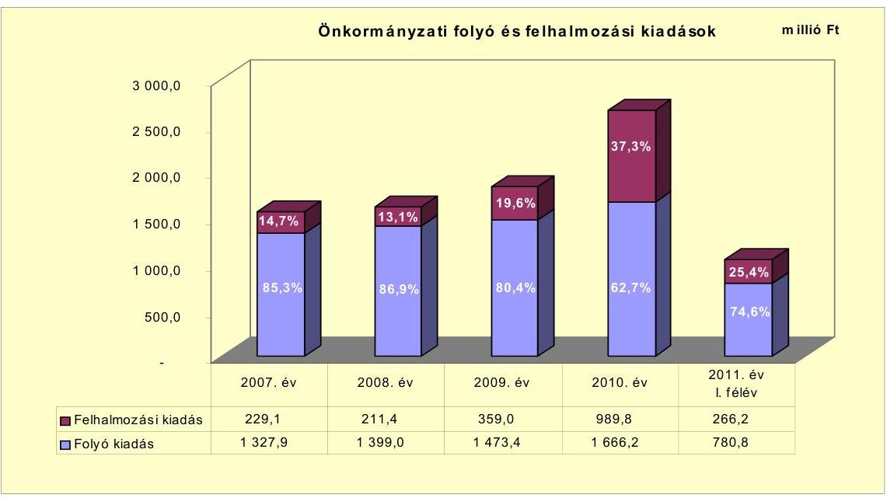

A kiadásokon belül a 2007-2011. években a felhalmozási kiadások aránya változó volt. A 2007. évben 14,7\% (229,1 millió Ft), a 2008. évben 13,1\% (211,4 millió Ft), a 2009. évben 19,6\% (359,0 millió Ft), a 2010. évben 37,3\% ( 989,8 millió Ft), a 2011. év első félévében 25,4\% (266,2 millió Ft) volt az összkiadáson belüli aránya. A 2010. évi kimagasló felhalmozási kiadás a pályázati forrásokból megvalósuló - Wesselényi-strand felújítása, az Egészségügyi Központ megvalósítása, a Györgyi Dénes Általános Iskola komplex felújítása és tornateremmel történő bővítése - projektekkel volt kapcsolatos. A fejlesztések egy része áthúzódott a 2011. évre.

Az Önkormányzatnál a 2007-2010. években összesen 70 felújítás és 157 fejlesztés fejeződött be. A befejezett felújítási, fejlesztési munkálatok tényleges bekerülési költsége 1279,0 millió Ft, ebből a 2007-2010. évek közötti pénzügyi ráfordítás összege 763,5 millió Ft volt. A fejlesztésekkel kapcsolatosan 2006. december 31-ig 515,5 millió Ft ráfordítás jelentkezett. A kifizetések 18,4\%-át (235,1 millió Ft-ot) a korábbi években felvett hitelből, 6,7\%-át (85,2 millió Ft-ot) EU-s, 26,3\%-át (336,1 millió Ft-ot) hazai támogatásból, 48,6\%-át (622,2 millió Ft-ot) önkormányzati saját forrásból finanszírozták. A

---

2010. december 31-ig befejezett felújítások, fejlesztések részletezését a jelentés 3/a. számú melléklete mutatja be.

A 2010. december 31-én folyamatban lévő fejlesztések várható bekerülési költsége 1532,9 millió Ft, ebből a 2010. év végéig 875,7 millió Ft-ot teljesítettek. A fejlesztésekkel kapcsolatosan a 2010. év utánra vállalt kötelezettségek összege 657,2 millió Ft, melynek finanszírozása a tervek szerint 370,2 millió Ft (56,3\%) EU-s támogatás és 287,0 millió Ft (43,7\%) saját forrás. A 2010. december 31-én folyamatban lévő felújítások, fejlesztések adatait a jelentés 3/a. és 3/b. számú mellékletei mutatják be.

Az Önkormányzat által a 2011. év I. félévében indított beruházási, felújítási munkálatok vállalt bekerülési költsége 198,4 millió Ft. A fejlesztésekkel kapcsolatosan a 2011. év I. félév utánra vállalt kötelezettségek összege 152,2 millió Ft, melynek finanszírozását teljes egészében saját forrásból tervezik megvalósítani. A kötelezettségvállalás a Babits úti Posta-parkoló felújítását és Városgondnokság telephelyének fejlesztését tartalmazta. Ezek mellett a tervezett 10 millió Ft alatti egyedi bekerülési értéket meg nem haladó beruházások száma 28, a felújításoké pedig 15 .

Az Önkormányzat - a jelenlegi finanszírozási rendszer, valamint a saját bevételi potenciálja változatlansága esetén - az eddig vállalt kötelezettségeit teljesíteni tudja, a folyamatban lévő beruházások, felújítások megvalósítása pénzügyi kockázatot nem jelent.

Az Önkormányzat pályázatot nyújtott be a „EURÓPA SZOBORPARK" címmel a Bakony és Balaton Keleti Kapuja Helyi Akciócsoporthoz a „Leader Kultúrparkok és -központok kialakítása" célterületre. Az elbírálás alatt álló pályázat tervezett teljes bekerülési költsége 53,0 millió Ft volt, amelyhez 35,6 millió Ft EU-s támogatást igényeltek. A fejlesztéshez 16,3 millió Ft saját forrás igénybevételét tervezték. A pályázat előkészítésére 2010. december 31-éig az Önkormányzat 1,1 millió Ft kiadást teljesített. A beadott, elbírálás alatti pályázati forrásból megvalósítani tervezett fejlesztést a jelentés 3/d. számú melléklete mutatja be.

Az Önkormányzat három legmagasabb bekerülési költségű beruházása:

- A Wesselényi-strand felújítása 2009. december 7-én kezdődött. A főépület teljes rekonstrukcióján túl a strand szolgáltatásai, kényelmi ellátottságai is bővültek. Kialakítottak új ivókutakat, szabadtéri zuhanyzót, kerékpártárolókat, baba-mama szobát, játszóteret, a felújított területen akadálymentes járdákat, közvilágítást, homokos partszakaszt. A főbejárattal szemben a Balaton vízében $100 \mathrm{~m}^{2}$-es napozó stég készült. A felújítás az elszámolható pótmunkák vonatkozásában 2010. július 31-én befejeződött. A beruházás és felújítás teljes bekerülési költsége 238,4 millió Ft, melyhez 55,2 millió Ft (23,2\%) EU-s támogatást kapott az Önkormányzat, a fennmaradó 183,2 millió Ft-ot ( $76,8 \%$-ot) saját forrásból biztosította.
- A Balatonalmádi Egészségügyi Központ megvalósításának tervezett kezdési időpontja 2009. május 15, a fizikai megvalósításának tervezett időpontja pedig 2011. május 14. volt a támogatási szerződés szerint. A tervezett 500,0 millió Ft bekerülési költségű beruházás forrásösszetétele: 400,0 millió Ft EU-s támogatás és 100,0 millió Ft önkormányzati saját forrás.

---

Az építési munkálatokra vonatkozó közbeszerzési felhívás elhúzódott (a hirdetmény 2009. augusztus 7-én jelent meg). Az eljárás nyertes ajánlata az építés költség eredeti előirányzatát 133,6 millió Ft-tal meghaladta, a többletforrást az Önkormányzat biztosította. Az Egészségügyi Központ működési engedélye 2011. október 12-én emelkedett jogerőre, 2011. november 2-án megkezdte működését. Az Egészségügyi Központ létrejöttével az Önkormányzat alapszintű szakellátást nyújt a kistérség megközelítően 27500 lakosa számára. A teljes beruházás várható bekerülési költsége 633,6 millió Ft, melyhez a 400,0 millió Ft EU-s támogatási szerződésben biztosított, a fennmaradó 233,6 millió Ft-ot az Önkormányzat saját forrásból finanszírozza. A beruházás 2010. december 31-éig felmerült költsége 266,6 millió Ft, melynek forrása 203,8 millió Ft EU-s támogatás és 62,8 millió Ft saját forrás volt.

- A Györgyi Dénes Általános Iskola komplex felújításának és tornateremmel történő bővítésének kivitelezése 2009. március 1-én kezdődött meg. A rekonstrukció keretében megvalósult a főépület korszerűsítése, komplex akadálymentesítése, orvosi szoba, logopédiai szoba és informatikai szaktanterem kialakítása és egy akadálymentes tornaterem építése, továbbá oktatási eszközök és tantermi bútorok beszerzése, meglevő tanösvény felújítása, a nyílászárók és a világítás korszerűsítése. A teljes rekonstrukció várható bekerülési költsége 337,7 millió Ft, melyhez 229,2 millió Ft EU-s támogatást kapott az Önkormányzat, a fennmaradó 97,4 millió Ft-ot saját forrásból biztosította. A 2010. december 31. utánra vállalt kötelezettség 11,1 millió Ft, melynek fedezete EU-s támogatás.

Az Önkormányzat a 2011. év I. félévben működési célra a Balatonalmádi Kistérségi Egészségügyi Központ Közhasznú Non-profit Kft.-nek 5,0 millió Ft pénzeszközt adott át. Fejlesztési célú pénzeszköz átadás a Dunántúli Regionális Vízmű Zrt. részére történt a 2007-2009. években. A pénzeszköz átadás célja környezetvédelmi beruházások megvalósítása, elsősorban a szennyvízelvezetéssel kapcsolatban keletkező szaghatás csökkentése volt. Az átadott pénzeszköz mértéke a 2007. évben 16,2 millió Ft, a 2008. évben 16,2 millió Ft, a 2009. évben 20,3 millió Ft volt.

# 3. Az ÖNKORMÁNYZAT KÖTELEZETTSÉGEI 

### 3.1. Az Önkormányzat pénzintézeti kötelezettségeinek változása

Az Önkormányzatnak 2006. december 31-én 753,6 millió Ft OECF kölcsön ${ }^{23}$ és pénzintézeti kötelezettség állománya volt, amely 2010. december 31-ére 775,6 millió Ft-ra emelkedett, 2011. június 30-ára 740,6 millió Ft-ra csökkent. Az Önkormányzat pénzintézeti kötelezettségei hosszú lejáratú hitelek igénybevételéből keletkeztek. Munkabér-megelőlegezési, folyószámla, illetve likvidhitelt az Önkormányzat a vizsgált időszakban nem vett igénybe, kötvénykibocsátásra nem került sor.

[^0]
[^0]:    ${ }^{23}$ Tengerentúli Gazdasági Együttműködési Alap (OECF)

---

Az Önkormányzat OECF kölcsön és pénzintézetek felé fennálló kötelezettségállományának alakulását a 2006-2011. év I. félév közötti időszakban az alábbi diagram szemlélteti:
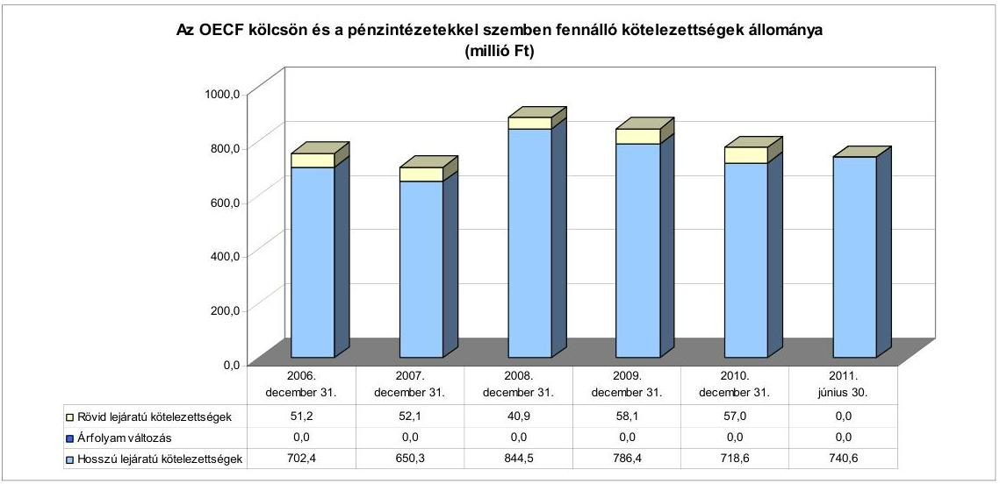

A vizsgált időszakban az Önkormányzat hitelfelvételről nem döntött. A rövid lejáratú kötelezettségek állományát a hosszú lejáratú hitelek tárgyévet követő évet terhelő törlesztő részletei jelentették.

Az Önkormányzat hosszú lejáratú adósságot keletkeztető kötelezettségvállalásai a 2007-2011. június 30. közötti időszakban az alábbiak voltak:

- A Japán Tengerentúli Gazdasági Együttműködési Alap (OECF) és a Magyar Állam által kötött kölcsönegyezmény alapján az OECF 4914 millió japán yen összegű kölcsönt nyújtott a Magyar Államnak a Várpalota és Térsége Környezetvédelmi Rehabilitációs program megvalósításához. Az OECF kölcsön Önkormányzatra eső részét a Magyar Köztársaság Kormánya nevében eljáró Pénzügyminisztérium az 1995. március 31-én kötött szerződés értelmében forintban továbbkölcsönözte az Önkormányzatnak. A szerződés értelmében a kölcsöntőke teljes kamatát és a kölcsön futamideje alatt bekövetkező árfolyamváltozásból adódó többletterhek megfizetését a Magyar Állam magára vállalta. Az Önkormányzat a kölcsön összegét beruházási és fejlesztési hitelként tartotta nyilván. Az OECF kölcsönből 2006. december 31-én az Önkormányzatnak 724,2 millió Ft tartozása állt fenn. A 2007-2011. június 30. közötti időszakban az Önkormányzat 102,0 millió Ft tőketörlesztést teljesített. Az éves költségvetési törvényekben az Országgyűlés a vizsgált időszakban a kölcsöntartozás összegéből 91,7 millió Ft-ot elengedett.
- A közvilágítás korszerűsítésére az Önkormányzat a 2001. évben feladatátvállalási szerződést kötött. A szerződés értelmében a korszerűsítést a vállalkozó lízing segítségével finanszírozta, amelyre az Önkormányzat inkasszó jogot biztosított. A feladatátvállalás havi díja tartalmazta a teljes futamidőre vonatkozó tőketörlesztés ( 78,1 millió Ft) és kamat ( 39,6 millió Ft) összegét is. Az Önkormányzat a tőketartozás összegét beruházási és fejlesztési hitelként tartotta nyilván. A hitelből az Önkormányzatnak 2006. decem-

---

ber 31-én 24,9 millió Ft tartozása állt fenn, melyet 2008. december 31-éig megfizetett.

- 2002. január 1-jén az Önkormányzat a 2001. december 31-én megszűnt Balatonalmádi Beruházó Víziközmű Társulattól három hitelt vett át, melyből a 2006. december 31-én fennálló kötelezettsége 4,5 millió Ft volt. A hitelekből kettő 2007. december 1-jén, egy 2008. december 1-jén járt le. Az Önkormányzat a törlesztéseket a lejárati határidőig teljesítette.
- 2008. január 1-jén az Önkormányzat a 2007. december 31-én megszűnt Balatonalmádi Beruházó Víziközmű Társulattól 235,1 millió Ft hitelt vett át. 2011. június 30-áig 25,0 millió Ft tőketörlesztést teljesített.

Az Önkormányzat 2011. június 30-án Ft-ban fennálló hosszú lejáratú adósságot keletkeztető kötelezettségvállalását a következő tábla mutatja be:

| Megnevezés | Szerződéskötés   időpontja | Összeg   millió Ft-ban | Kamat (referencia kamat+
kamatfelár) | Felhasználás célja: |
| :-- | :--: | :--: | :--: | :--: |
| Víziközmű Társulattól átvett   hitel | - | 210,1 | 3 havi BUBOR + 1,3\% | Szennyvízcsatorna-hálózat   bővítés |

Az Önkormányzat a vizsgált időszakban pénzintézeti kötelezettségeivel kapcsolatban 43,2 millió Ft kamatot fizetett meg. A vizsgált időszakban kamatfizetést az Önkormányzat az alábbi kötelezettségeivel kapcsolatban teljesített:

- A közvilágítás korszerűsítéséhez kapcsolódó hitel kamata fix összegű volt, a 2007-2008. években az Önkormányzatnak 12,5 millió Ft kamatfizetési kötelezettsége keletkezett.
- A 2001. december 31-én megszűnt Balatonalmádi Beruházó Víziközmű Társulat hitel kamata fix 3,316\% volt, a 2007-2008. években az Önkormányzat a hitelhez kapcsolódóan 0,1 millió Ft kamatot fizetett.
- A 2007. december 31-én megszűnt Balatonalmádi Beruházó Víziközmű Társulattól átvett hitel után az Önkormányzat 2011. június 30-áig 30,6 millió Ft kamatfizetést teljesített. A hitel kamata 3 havi BUBOR $+1,3 \%$ volt, melyet a kamatváltozás és a forrásköltségek jelentős emelkedése miatt 2009. április 10-én 3 havi BUBOR + 3,25\%-ra módosítottak. Az alapkamat mértékének alakulása jelentős hatással van a teljes futamidőre számított, várható kamatkötelezettség nagyságára. A kamatfizetési kötelezettségek alakulását jelentősen befolyásolta és jelenleg is befolyásolja az átvételkori és a 2011. június 30-ai kamatfizetéskori referencia kamatok változása, melyet az alábbi táblázat mutat be:

| Megnevezés | Hitel átvételekor   érvényes   kamat (referencia + kamatfelár) $\%$ | Változás $\%$ |
| :--: | :--: | :--: |
| 3 havi BUBOR (2008.01.01-jei átvétel) | 8,80 | 9,35 |

A hitelhez kapcsolódóan az Önkormányzat a 2008. évben 7,7 millió Ft, a 2009. évben 8,7 millió Ft, a 2010. évben 7,7 millió Ft, a 2011. év I. félévben 6,5 millió Ft kamatot fizetett. A kamatkiadások a 2009. évben - a referencia

---

kamat ${ }^{24}$ csökkenése ellenére - növekedtek a kamatfelár módosítása miatt. A referencia kamat a 2010. évben tovább mérséklődött, azonban a kamattámogatás 2010. október 12-ével $70,0 \%$-ról $35,0 \%$-ra csökkent, ezért az Önkormányzat kamatfizetési kötelezettsége jelentősen növekedett.

# 3.2. A szállítói kötelezettségek változása 

Az Önkormányzat szállítókkal szemben fennálló kötelezettsége 2007. december 31-én 7,8 millió Ft volt, mely az összes kötelezettség $1,1 \%$-át tette ki. A szállítói állomány aránya az összes kötelezettségen belül a 2008. és 2009. év végére $0,5 \%$-ra ( 4,5 millió Ft és 4,0 millió Ft) csökkent, a 2010. év végére jelentősen, $5,6 \%$-ra ( 46,7 millió Ft ) emelkedett a beruházásokhoz kapcsolódó számlák miatt. Az Önkormányzat szállítói tartozása 2011. június 30-án 36,9 millió Ft volt, melyből beruházáshoz 32,8 millió Ft kapcsolódott.

A lejárt szállítói tartozások összegének növekedése 2008. év végén következett be 4,4 millió Ft volt, melyből 4,2 millió Ft 30 nap alatti, 0,2 millió Ft 31 és 60 nap közötti volt. A lejárt szállítói tartozás 2009. év végére 2,8 millió Ft volt. 2010. december 31-re a lejárt szállítói tartozás 2,3 millió Ft-ra változott, ebből 1,5 millió Ft 30 nap alatti, 0,8 millió Ft 31 és 60 nap közötti volt. 2011. június 30-án a lejárt szállítói tartozásból ( 3,5 millió Ft) 1,7 millió Ft 30 nap alatti, 1,7 millió Ft 31 és 60 nap közötti, 0,1 millió Ft 61 és 90 nap közötti volt. A számlák határidőn túli kiegyenlítését munkaszervezési problémák okozták. A lejárt szállítói tartozások rendezése 2009., illetve 2010. januárban, valamint 2011. júliusban megtörtént.

A szállítói tartozások átütemezésére a vizsgált időszakban nem került sor. A vizsgált időszakban egyéb kiadás elmaradás nem volt.

### 3.3. Egyéb kötelezettségek változása

Az Önkormányzat a 2007-2011. június 30. közti időszakban PPP konstrukció keretében nem végzett beruházást, garanciavállalásból kötelezettsége nem keletkezett. Az Önkormányzat és intézményei a jegyző nyilatkozata alapján lízingszerződést nem kötöttek.

A vizsgált időszakban készfizető kezesség beváltására nem került sor. Az Önkormányzat a Balatonalmádi Beruházó Víziközmű Társulat részére a Víziközmű társulati hitel igénybevételéhez készfizető kezességet vállalt 239,9 millió Ft összegű hitel és járulékai erejéig. A társulat 2007. december 31-én megszűnt, az Önkormányzat a hitelt 2008. január 1-jén átvette, készfizető kezessége megszűnt.

Az Önkormányzat a 2007-2011. év I. félév közötti időszakban 7,7 millió Ft követelésről mondott le. Az elengedett követelésekből 4,5 millió Ft adótartozás, késedelmi pótlék és talajterhelési díj, 2,4 millió Ft bérleti díj, 0,8 millió Ft

| MNB BUBOR fixing (állagkamat) \%-ban |  |  |  |  |  |
| :--: | :--: | :--: | :--: | :--: | :--: |
| Referencia kamat | 2008. évl | 2009. évl | 2010. évl | 2011. év 1-félévl |  |
| 3 havi BUBOR | 8,87 | 8,64 | 5,50 | 6,07 |  |

---

egyéb követelések (otthonteremtési támogatás, érdekeltségi hozzájárulás, közterület használati díj, térítési, hirdetési és közüzemi díjak, egy havi különjuttatás) elengedéséből származott.

Az Önkormányzat intézményeinek, gazdasági társaságoknak, más önkormányzatoknak a vizsgált időszakban kölcsönt nem nyújtott. A 2010. évben az Almádiért Közalapítványnak a rendezvények lebonyolításához szükséges mobileszközök beszerzéséhez 10,0 millió Ft, a 2011. évben a Dermamedic Egészségügyi Kft.-nek működési finanszírozási előlegként 0,4 millió Ft kölcsönt folyósított. Az Almádiért Közalapítvány a kölcsönt a 2010. évben visszafizetette. A Dermamedic Egészségügyi Kft.-nek nyújtott kölcsön lejárata 2011. december 31.

Az Önkormányzat adatszolgáltatása szerint ingatlanjait 2011. június 30-án pénzintézeti kötelezettséghez kapcsolódó jelzálogjog, elidegenítési és terhelési tilalom nem terhelte. Az Önkormányzat és a Nemzeti Sporthivatal 2006. július 3-án támogatási szerződést kötött sportlétesítmények fejlesztésének, korszerűsítésének és felújításának támogatására. A szerződés értelmében a korlátozottan forgalomképes ingatlanként nyilvántartott sporttelepre 5,0 millió Ft jelzálogjogot jegyeztek be a pályázaton elnyert támogatási összeg és járulékai erejéig 2007. április 2-án, melynek jogosultja a Nemzeti Sporthivatal (2006. augusztus 1-jétől jogutódja, az Önkormányzati és Területfejlesztési Minisztérium, jelenleg a Nemzeti Erőforrás Minisztérium). A jelzálogjog lejárata 2012. április 2.

Az Önkormányzat 2011. június 30-án két folyamatban lévő peres eljárásban volt érintett alperesként. Az Önkormányzat terhére kimutatott perérték 3,6 millió Ft.

A Napfény Kft. jogelődje 1985-ben egy vízi csúszdát és három egységből álló kiszolgáló épületet létesített a korábban a Magyar Állam tulajdonában és a Kommunális Szolgáltató üzem kezelésében lévő, jelenleg önkormányzati tulajdonú Wesselényi strand területén. A felépítmények után területbérleti díjat fizetett az építtető. A 2008. évben nem jött létre egyezség a területbérlet kérdésében, ezért az Önkormányzat a bérleti szerződés hiányában kezdeményezte, hogy a Napfény Kft. a felépítményeit távolítsa el. A Napfény Kft. pert indított a Veszprém Megyei Bíróságnál földhasználati jog megállapítása tárgyában. Az Önkormányzat viszont-keresetében kérte a felperesi kereset elutasítását, a bérleti jogviszony megszűnésének megállapítását, a terület eredeti állapotba történő visszaadását illetve az eltelt időszakra használati díj megállapítását. Az ügyben ítélet még nem született, a következő tárgyalást 2011. november 14. napjára tűzte ki a bíróság.

Az Önkormányzat a 2007. évben elidegenítette a tulajdonában álló 3952/4 hrszú ingatlant a szomszédos 3952/3 és 3952/5 hrsz-ú ingatlanok tulajdonosai részére. Az adásvételi szerződés aláírását követően a vételár kiegyenlítése és a tulajdonjog ingatlan-nyilvántartási átvezetése megtörtént. A 2010. évben az elidegenített ingatlannal ugyancsak szomszédos, 3952/2 hrsz-ú ingatlan tulajdonosa az előbbi adás-vételi szerződés érvénytelenségének megállapítása tárgyában pert indított az Önkormányzat ellen, mivel sérelmezte, hogy részére nem történt vételi felajánlás az Önkormányzat részéről. Az ügyben ítélet még nem született, a következő (helyszíni) tárgyalást 2011. december 2. napjára tűzte ki a bíróság.

---

Jogerős határozattal lezárt, de ki nem fizetett kötelezettsége az Önkormányzatnak nem volt. Egy jogerős határozattal lezárt peres ügyük van, amelyben az Önkormányzat bérleti és üzemeltetési díból származó követelése 0,7 millió Ft. Az alperessel szemben végrehajtási eljárás van folyamatban.

Az Önkormányzat kötelezettségeinek állományát 2010. december 31-én és 2011. június 30-án, valamint várható alakulását a kötelezettségek lejáratáig az alábbi táblázat szemlélteti:
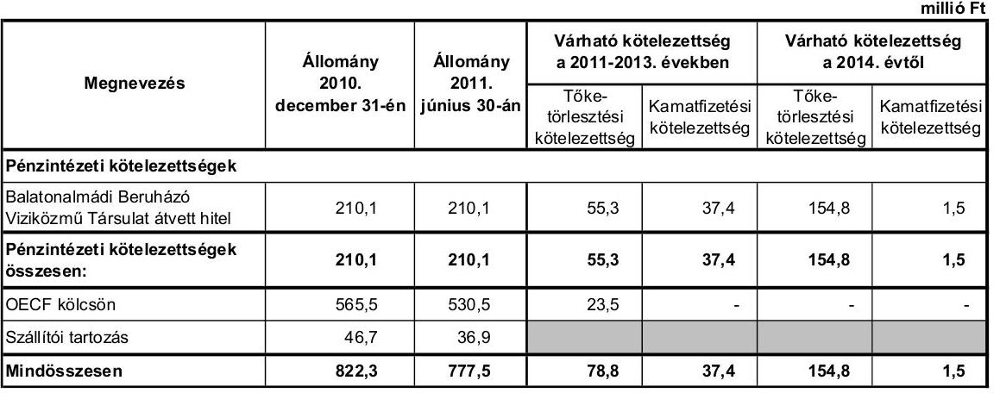

Az Önkormányzat kötelezettségeinek állománya 2011. június 30-án 210,1 millió Ft hiteltartozásból, 530,5 millió Ft OECF kölcsöntartozásból és 36,9 millió Ft szállítói tartozásból tevődött össze.

A 2011-2013. években esedékes tőketörlesztési kötelezettség várható összege a forintban fennálló hitel törlesztéséhez kapcsolódóan 55,3 millió Ft, melynek teljesítésére figyelembe vehető az 570,6 millió Ft kimutatott szabad felhasználású pénzmaradvány ${ }^{25}$. A 2014. évben a hiteltörlesztés összege 154,8 millió Ft, melyre várhatóan fedezetet nyújt a társulati tagok által kötött, 2014. évben lejáró lakás-előtakarékossági szerződés megtakarítási része.

A társulati tagok nyilatkozatuk szerint a lakás-előtakarékossági szerződés összegének megtakarítási részét a Balatonalmádi Szennyvízberuházó Víziközmű Társulatra, illetve a beruházás befejezését követően Balatonalmádi Önkormányzatra engedményezték.

A hitel után - az utolsó ismert kamatmértékkel számítva - a 2011-2013. években 37,4 millió Ft, a 2014. évben 1,5 millió Ft kamatkötelezettség várható, melyből az Önkormányzat 2011. év I. félévében 6,5 millió Ft-ot kamatfizetést már teljesített.

[^0]
[^0]:    ${ }^{25}$ A 2010. december 31-éig keletkezett pénzmaradványból (az előző évek pénzmaradványa 160,3 millió Ft, a 2010. évi pénzmaradvány összege 676,6 millió Ft) 105,7 millió Ft kötelezettséggel terhelt. Az Önkormányzat 2011. évi költségvetésének I. félévi teljesítéséről szóló 227/2011. (IX. 1.) határozat szerint 2011. június 30-áig az előző évi pénzmaradvány igénybevételére nem került sor, így az fedezetet nyújthat az Önkormányzat 2011. június 30-án fennálló kötelezettségeire.

---

Az Önkormányzatnak az OECF kölcsönnel kapcsolatban a 2011. évben 11,5 millió Ft fizetési kötelezettsége keletkezett, melyet 2011. június 30-áig teljesített. Az Országgyűlés 2011. december 1-jei hatállyal lemondott az Önkormányzattal szemben fennálló OECF kölcsön követelés összegéről ${ }^{26}$.

Az Önkormányzat - a jelenlegi állami finanszírozási rendszer, valamint a saját bevételi potenciálja változatlansága esetén - az eddig vállalt kötelezettségeit teljesíteni tudja.

Az Önkormányzat többségi tulajdonú gazdasági társaságai kötelezettségeinek állományát 2010. december 31-én, 2011. június 30-án, illetve várható alakulását a kötelezettségek lejáratáig a következő táblázat szemlélteti:

| Megnevezés | $\begin{gathered} \text { Állomány } \\ \text { 2010. december 31-én } \end{gathered}$ |  | $\begin{gathered} \text { Állomány } \\ \text { 2011. június } 30 \text {-án } \end{gathered}$ |  | Várható kötelezettség a 2011-2013. években |  |  | Várható kötelezettség 2014. évtől |  |
| :--: | :--: | :--: | :--: | :--: | :--: | :--: | :--: | :--: | :--: |
|  | HUF-ban (millió Ft-ban) | Devizában (ezer CHF-ben) | HUF-ban (millió Ft-ban) | Devizában (ezer CHF-ben) | Tőketörlesztési kötelezettség |  | Kamatfizetési kötelezettség |  | $\begin{gathered} \text { HUF-ban } \\ \text { (millió Ft- } \\ \text { ban) } \end{gathered}$ |
|  |  |  |  |  | HUF-ban (millió Ft-ban) | Devizában (ezer CHF-ben) | HUF-ban (millió Ft-ban) | Devizában (ezer CHF-ben) |  |
| HUF-ban fennálló lízing kötelezettség | 2,3 | - | 2,0 | - | 2,3 | - | 0,6 |  | - |
| CHF-ban fennálló lízing kötelezettség | - | 9,2 | - | 1,4 | - | 9,2 |  | 0,4 | - |
| Szállító tartozás | 11,6 | - | 23,9 | - |  |  |  |  |  |
| Egyéb kötelezettségek | 7,7 | - | 4,9 | - |  |  |  |  |  |
| Mindösszesen | 21,6 | 9,2 | 30,8 | 1,4 | 2,3 | 9,2 | 0,6 | 0,4 | 0,0 |

Az Önkormányzat 51\%-os tulajdonában lévő Kommunális Kft. összes kötelezettsége 2011. június 30-án 30,6 millió Ft és 1,4 ezer CHF volt. Lízingszerződésből 1,4 ezer CHF és 2,0 millió Ft, szállítókkal szemben 23,9 millió Ft, egyéb kötelezettségekkel kapcsolatosan 4,7 millió Ft tartozása állt fenn.

A Kommunális Kft. 2007. július 17-én lízingszerződést kötött haszongépjármű beszerzésére. A lízing összege 51,3 ezer CHF volt. A lízinghez kapcsolódóan a társaságnak 15,0 ezer CHF kamat és 0,4 millió Ft egyéb költség fizetési kötelezettsége keletkezett. 2011. június 30-áig a társaság 49,9 ezer CHF tőketörlesztést, 15,0 ezer CHF kamatot és 0,4 millió Ft egyéb költséget fizetett meg. 2010. december 31-éig a társaság a tőkefizetés után 1,0 millió Ft árfolyamveszteséget realizált. A lízingszerződés lejárata 2011. július 15. volt.
2009. október 14-én a Kommunális Kft. haszongépjármű beszerzésre újabb lízingszerződést kötött 3,0 millió Ft értékben. A társaság 2011. június 30-áig 1,0 millió Ft tőketörlesztést teljesített. A lízing kamata 1,1 millió Ft volt. A lízinghez kapcsolódóan a kft. 2010. december 31-éig 0,5 millió Ft, a 2011. év I. félévében 0,2 millió Ft kamatot fizetett meg. A lízingszerződés 2013. október 1-jén jár le.

Az Önkormányzat kizárólagos tulajdonában lévő Balatonalmádi Kistérségi Egészségügyi Központ Közhasznú Non-profit Kft.-nek 2011. június 30-án 0,2 millió Ft kötelezettsége állt fenn. A társaság kötelezettsége 0,1 millió Ft ki

[^0]
[^0]:    ${ }^{26}$ a megyei önkormányzatok konszolidációjáról, a megyei önkormányzati intézmények és a Fővárosi Önkormányzat egyes egészségügyi intézményeinek átvételéről szóló 2011. évi CLIV. törvény 78. § (7) bekezdés

---

nem fizetett személyi juttatásból, 0,1 millió Ft központi költségvetéssel szembeni adó, illetve járuléktartozásból származott.

A gazdasági társaságok a vizsgált időszakban peres eljárásban nem voltak érintettek, likvidhitelt, folyószámlahitelt ${ }^{27}$, hosszú lejáratú hitelt nem vettek igénybe, kötvényt nem bocsátottak ki. Az Önkormányzat gazdasági társaságai részére a vizsgált időszakban kölcsönt nem nyújtott.

A 2007-2010. évek között az Önkormányzat az immateriális javak, a tárgyi és az üzemeltetésre átadott eszközök után 917,4 millió Ft értékcsökkenést számolt el. Felújításokra a vizsgált időszakban az elszámolt értékcsökkenés 62,3\%-ának megfelelő összeget, 571,7 millió Ft-ot fordítottak.

Az elszámolt értékcsökkenés állománya a vizsgált időszakban 32,2\%-kal, 2220,5 millió Ft-ra emelkedett. A 2007-2010. évek között az immateriális javak és tárgyi eszközök állományának bruttó értéke 2122,1 millió Ft-tal, 11,3\%-kal nőtt az Önkormányzat befejezett fejlesztéseinek eredményeként. A 2007-2010. években elszámolt amortizáció növekedésének mértéke meghaladta a bruttó érték növekedésének mértékét, így az immateriális javak és tárgyi eszközök átlagos használhatósági foka $88,6 \%$-ról $85,1 \%$-ra, az üzemeltetésre átadott eszközöké $78,3 \%$-ról $70,0 \%$-ra csökkent. Átlagosan az immateriális javak, tárgyi és üzemeltetésre átadott eszközök használhatósági foka négy százalékponttal, $86,9 \%$-ról $82,9 \%$-ra csökkent.

# 4. A PÉNZÜGYI EGYENSÚLY MEGTEREMTÉSE ÉRDEKÉBEN HOZOTT INTÉZKEDÉSEK 

A jelentésben szereplő CLF módszer szerint bemutatott működési többlet finanszírozta a felhalmozási hiányt, ennek ellenére a vizsgált időszakban az Önkormányzat intézkedéseket tett, hogy alkalmazkodjon a finanszírozási rendszer változása miatti forráscsökkenéshez.

A Képviselő-testület által elfogadott 2007. évi és 2011. évi gazdasági programok és éves költségvetési koncepciók feladatként határozták meg a pénzügyi egyensúly megtartását és a bevételek növelését.

A 2007. évi gazdasági program gazdálkodási fejezete előírta:

- a költségvetés tartós pénzügyi egyensúlya mellett kell biztosítani a település működését, fejlesztését, eladósodás nélkül;
- bővíteni kell az Önkormányzat bevételi forrásrendszerét;
- a helyi adók mértékét - a törvényi előírásokban megállapított szélső értékek keretei között, a teherbíró képesség figyelembevételével, indokolt kedvezmények és méltányosság alkalmazásával - úgy kell megállapítani, hogy a lehető legnagyobb adóbevételt biztosítsa;
- hitel - kedvező kondíciók mellett - fejlesztési célra vehető fel;

[^0]
[^0]:    ${ }^{27}$ A Balatonalmádi Kommunális és Szolgáltató Kft. rendelkezésére álló folyószámla hitelkeret a 2008. évben 6,0 millió Ft, a 2010. évben 10,0 millió Ft volt, azonban a társaság a hitelt egyik évben sem vette igénybe.

---

- működésre, nem kötelező önkormányzati feladat ellátására, hitel csak kivételes esetben és rövid lejáratra vehető igénybe.

Az Önkormányzat adatszolgáltatása szerint a 2007-2011. év I. félévében a kiadáscsökkentő intézkedések eredményeként 19,1 millió Ft megtakarítást realizált. Kiadáscsökkentő intézkedést a létszámcsökkentés területén, a közoktatási ágazatban mutattak ki.

A létszámcsökkentő intézkedések következtében 2007-2010 között a Polgármesteri hivatalnál és intézményeknél összesen öt álláshelyet ${ }^{28}$ szüntettek meg, mely üres álláshelyet nem tartalmazott. A megszüntetés a 2007. január 1-jei 245 fő átlaglétszám 2,1\%-át tette ki. Az álláshelycsökkenésből három (60,0\%) szakmai, kettő (40,0\%) intézmény-üzemeltetéssel kapcsolatos álláshely volt.

A 2007-2010. években végrehajtott létszámcsökkenés eredményét a következő táblázat ${ }^{29}$ szemlélteti:

| Megnevezés (adatok fő-ben) | Közoktatás | Szociális és gyermekvédelem | Egészségügy | Polgármesteri hivatal | Egyéb | Összesen |
| :--: | :--: | :--: | :--: | :--: | :--: | :--: |
| 2007. január 1-jén jóváhagyott álláshelyek száma | 110 | 22 | 0 | 65 | 48 | 245 |
| Megszüntetett álláshelyek száma | 7 | 2 | 0 | 1 | 9 | 19 |
| Ebből: üres álláshelyek száma | 5 | 0 | 0 | 0 | 0 | 8 |
|  | szakmai álláshelyek száma | 2 | 1 | 0 | 0 | 0 | 3 |
|  | intézmény-üzemeltetéssel kapcsolatos álláshelyek száma | 5 | 1 | 0 | 1 | 9 | 16 |
| Álláshely növekedése |  | 1 | 17 | 0 | 6 | 38 |
| 2010. december 31-én záró álláshelyek száma |  | 104 | 37 | 0 | 78 | 45 | 264 |
| 2007. január 1-jén foglalkoztatott létszám |  | 109 | 22 | 0 | 63 | 48 | 242 |
| Létszámcsökkenés |  | 7 | 2 | 0 | 1 | 9 | 19 |
| Létszámnövekedés |  | 2 | 17 | 0 | 8 | 2 | 29 |
| 2010. december 31-én foglalkoztatott létszám |  | 104 | 37 | 0 | 70 | 41 | 252 |

Az álláshely megszüntetések mellett álláshely növekedés és ágazatok közti átcsoportosítás is történt a vizsgált időszakban. A közoktatásban hat fő csökkenés, az szociális és gyermekjóléti ágazatban 15 fő növekedés, a Polgármesteri hivatalnál - a strandüzemeltetés Városgondnokságtól történő átvétele miatti 13 fő növekedés, az egyéb ágazatban három fő álláshely-csökkenés történt. Összességében az álláshelyek száma a 2007. január 1-jei 245 főről 2010. december 31-re 264 főre, 19 fővel nőtt.

A Képviselő-testület a 2007. évben két fő pedagógus álláshely megszüntetéséről döntött. A Vörösberényi Általános Iskolában a 2007. szeptember 1-jétől történő kötelező óraszám növekedés miatt megszüntetett egy tanítói és egy szaktanári álláshelyet. A határozat előterjesztése rögzítette a létszámcsökkentés pénzügyi hatásait. A további négy fő létszámcsökkentésről a Képviselő-testület az éves költségvetési rendeletekben döntött.

A szociális és gyermekjóléti ágazat álláshely-növekedését az ellátási terület (három önkormányzat csatlakozott a társuláshoz) növekedése okozta.

[^0]
[^0]:    ${ }^{28}$ A részmunkaidős álláshelyek teljes munkaidős álláshelyekre átszámításra kerültek.
    ${ }^{29}$ A táblázat a közfoglalkoztatás álláshelyeinek és foglalkoztatottjainak adatait nem tartalmazza.

---

A foglalkoztatott létszám a közoktatási ágazatban öt fővel csökkent, a szociális és gyermekvédelmi területen 15 fővel nőtt. Az intézmények közti feladatátcsoportosítás miatt a Polgármesteri hivatal létszáma hét fővel nőtt, míg az egyéb intézményekben a foglalkoztatott létszáma ugyanekkora mértékkel csökkent. Összességében a betöltött állományi létszám ezen időszakban 242 főről 252 főre (10 fővel) nőtt.

Az álláshely és a foglalkoztatottak létszámának növekedése közti jelentős eltérés oka a strandüzemeltetésnél a szezonális foglalkoztatás.

A helyi szervezési intézkedések végrehajtásához az Önkormányzat az áttekintett időszak alatt 3,2 millió Ft központi költségvetési támogatásban részesült, amelynek felhasználásával a nyilvántartások szerint egy fő álláshelyet tartósan megszüntetett.

A bevételnövelésre irányuló intézkedések Önkormányzat által számszerűsített összegéből, ami 381,6 millió Ft volt, 245,1 millió Ft-ot (64,3\%) jelentettek az átmenetileg szabad pénzeszközök lekötéséből realizált bevételek. A helyi adókkal kapcsolatos adómérték növelő intézkedések 84,0 millió Ft (22,0%), az eszközök hasznosítására tett intézkedések 0,9 millió Ft ( $0,2 \%$ ), az egyéb intézkedések 51,6 millió Ft (13,5\%) többlet-bevételt eredményeztek.

A 2007-2011. év I. félév közötti bevételnövelés intézkedéseinek jogcímek szerint megoszlását a következő diagram szemlélteti:
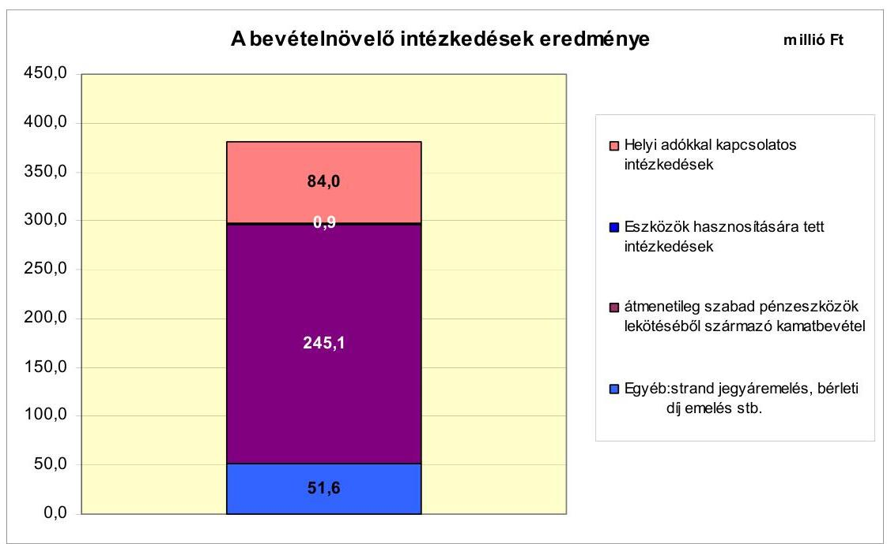

Az Önkormányzat kiadáscsökkentő és bevételnövelő intézkedései eredményeként 2007-2011. év I. félév között összesen 400,7 millió Ft megtakarítást és többletbevételt mutatott ki.

Az Önkormányzat költségvetési támogatásból, valamint személyi jövedelemadóból származó bevétele a 2007. évben 649,1 millió Ft, a 2008. évben 723,0 millió Ft, a 2009. évben 703,6 millió Ft, a 2010. évben 690,7 millió Ft

---

volt. A 2011. évre vonatkozóan ez az eredeti előirányzat 619,5 millió Ft. A vizsgált évek számadatai alapján megállapítható, hogy ezen bevételek a 2007-2011. év I. féléve közötti időszakban összességében (kumuláltan) 155,3 millió Ft-tal nőttek, melyből 42,3 millió Ft-ot a szociális ágazat feladatbővülése, 62,8 millió Ft-ot közcélú foglalkoztatáshoz kapcsolódó normatív, kötött felhasználású támogatás növekedése okozott.

A bevételnövelő és kiadáscsökkentő intézkedések az Önkormányzat pénzügyi helyzetét tovább javították.

# 5. Az ÁSZ Által a Korábbi Években a Pénzügyi Egyensúly Javítására Tett Szabályszerűségi és Célszerűségi Javaslatok Hasznosulása 

Az ÁSZ az Önkormányzat gazdálkodási rendszerét a 2007. évben ellenőrizte, amely során a pénzügyi egyensúly javítására vonatkozó javaslatot nem tett.

Budapest, 2012. április "11"

Melléklet: $\quad 7 \mathrm{db}$
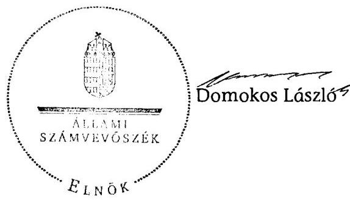

---

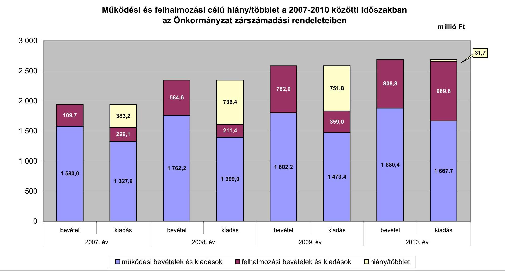

# Balatonalmádi Város Önkormányzata

## 1. számú melléklet

### a V-3129-021/2012. számú jelentéshez

|  Melléklet | Számú Melléklet | Számú Állám | Számú Érték  |
| --- | --- | --- | --- |
|  1 580,0 | 1 327,9 | 1 762,2 | 1 399,0  |
|  1 327,9 | 1 762,2 | 1 399,0 | 1 399,0  |
|  1 327,9 | 1 399,0 | 1 802,2 | 1 399,0  |
|  1 327,9 | 1 802,2 | 1 802,2 | 1 399,0  |
|  1 327,9 | 1 802,2 | 1 802,2 | 1 399,0  |

## Működési és felhalmozási célú hiány/többlet a 2007-2010 közötti időszakban az Önkormányzat zárszámadási rendeleteiben

### millió Ft

|  Melléklet | Számú Melléklet | Számú Érték  |
| --- | --- | --- |
|  1 580,0 | 1 327,9 | 1 762,2  |
|  1 327,9 | 1 399,0 | 1 399,0  |
|  1 327,9 | 1 802,2 | 1 399,0  |
|  1 327,9 | 1 802,2 | 1 399,0  |
|  1 327,9 | 1 802,2 | 1 399,0  |

## Működési bevételek és kiadások

- [ ] felhalmozási bevételek és kiadások
- [ ] hiány/többlet

---

Az Önkormányzat bevételei és kiadásai, valamint adósságszolgálata 2007-2010 között

|  1. FOLYÓ KÖLTSÉGVETÉS* | 2007. év | 2008. év | 2009. év | 2010. év  |
| --- | --- | --- | --- | --- |
|  1.1.1. Saját működési bevételek | 765,0 | 814,2 | 889,1 | 1006,8  |
|  1.1.2. Költségvetési támogatás ** | 240,9 | 483,8 | 452,6 | 418,6  |
|  1.1.3. Átengedett bevételek | 477,7 | 310,2 | 319,0 | 348,8  |
|  1.1.4. Állambáztartáson belülről kapott támogatások | 39,5 | 75,7 | 81,8 | 71,3  |
|  1.1.5. EU-tól és külföldről kapott bevételek | 0,0 | 0,0 | 0,0 | 0,0  |
|  1.1.6. Állambáztartáson kívülről kapott bevételek | 0,7 | 0,2 | 0,6 | 0,8  |
|  1.1.7. Előző évi pénzmaradvány átvétel | 0,0 | 0,0 | 0,0 | 33,1  |
|  1.1. Folyó bevételek $=1.1 .1 .+1.1 .2 .+1.1 .3 .+1.1 .4 .+1.1 .5 .+1.1 .6 .+1.1 .7$. | 1523,8 | 1684,1 | 1743,1 | 1879,4  |
|  1.2.1. Működési kiadások kamatkiadások nélkül | 1245,1 | 1303,7 | 1362,9 | 1515,5  |
|  1.2.2. Állambáztartáson belülre átadott pénzeszközök | 13,5 | 9,5 | 11,4 | 15,0  |
|  1.2.3.1. vállalkozásoknak | 4,0 | 4,2 | 7,2 | 3,6  |
|  1.2.3.2. EU-nak, illetve külföldre | 0,0 | 0,0 | 0,0 | 0,0  |
|  1.2.3.3. magánszemélyeknek | 34,5 | 34,9 | 40,5 | 44,6  |
|  1.2.3.4. nonprofit szervezeteknek | 24,2 | 32,3 | 42,7 | 46,6  |
|  1.2.3. Transferkiadások ( $=1.2 .3 .1+1.2 .3 .2+1.2 .3 .3+1.2 .3 .4$ ) | 63,7 | 71,4 | 90,4 | 94,8  |
|  1.2.4 Kamatkiadások | 6,6 | 14,4 | 8,7 | 7,8  |
|  1.2.5. Előző évi pénzmaradvány átadás | 0,0 | 0,0 | 0,0 | 33,1  |
|  1.2. Folyó kiadások $=1.2 .1 .+1.2 .2 .+1.2 .3 .+1.2 .4 .+1.2 .5$. | 1327,9 | 1399,0 | 1473,4 | 1666,2  |
|  1.3. Folyó költségvetés egyenlege MŰKÖDÉSI JÖVEDELEM (1.1. - 1.2.) | 195,9 | 285,1 | 269,7 | 213,2  |
|  2. FELHALMOZÁSI KÖLTSÉGVETÉS*** | 0,0 | 0,0 | 0,0 | 0,0  |
|  2.1.1. Saját tőkebevételek | 35,3 | 97,7 | 45,4 | 227,0  |
|  2.1.2. Állambáztartáson belülről kapott támogatások ** | 48,1 | 42,0 | 81,9 | 576,2  |
|  2.1.3. EU-tól és külföldről kapott támogatások | 0,0 | 0,0 | 0,0 | 0,0  |
|  2.1.4. Állambáztartáson kívülről kapott támogatások | 0,1 | 30,3 | 1,2 | 5,2  |
|  2.1. Felhalmozási bevételek ( $=2.1 .1 .+2.1 .2+2.1 .3+2.1 .4$.) | 91,5 | 178,0 | 128,5 | 808,4  |
|  2.2.1. Saját beruházási kiadás állával | 161,4 | 114,5 | 158,5 | 633,3  |
|  2.2.2. Saját felújítási kiadás állával | 33,6 | 55,0 | 141,0 | 342,1  |
|  2.2.3. Állambáztartáson belülre átadott pénzeszköz | 16,4 | 12,1 | 6,7 | 1,9  |
|  2.2.4. EU-nak és külföldnek adott pénzeszközök | 0,0 | 0,0 | 0,0 | 0,0  |
|  2.2.5. Állambáztartáson kívülre adott pénzeszközök | 17,7 | 29,9 | 24,0 | 12,5  |
|  2.2.6. Befektetési célú részesedések vásárlása | 0,0 | 0,0 | 28,8 | 0,0  |
|  2.2. Felhalmozási kiadások ( $=2.2 .1 .+2.2 .2 .+2.2 .3 .+2.2 .4 .+2.2 .5 .+2.2 .6$.) | 229,1 | 211,5 | 359,0 | 989,8  |
|  2.3. Felhalmozási költségvetés egyenlege (2.1. - 2.2.) | $-137,6$ | $-33,5$ | $-230,5$ | $-181,4$  |
|  3. Finanszírozási műveletek nélküli (GFS) pozíció(1.3.+2.3.) | 58,3 | 251,6 | 39,2 | 31,8  |
|  4. Finanszírozási műveletek | 0,0 | 0,0 | 0,0 | 0,0  |
|  4.1. Hitelfelvétel | 0,0 | 0,0 | 0,0 | 0,0  |
|  4.2. Hiteltörlesztés | 33,3 | 33,0 | 20,4 | 58,1  |
|  4.3. Forgatási és befektetési célú értékpapírok kibocsátása | 0,0 | 0,0 | 0,0 | 0,0  |
|  4.4. Forgatási és befektetési célú értékpapírok beváltása | 0,0 | 0,0 | 0,0 | 0,0  |
|  4.5. Forgatási és befektetési célú értékpapírok értékesítése | 104,2 | 44,7 | 0,2 | 0,0  |
|  4.6. Forgatási és befektetési célú értékpapírok vásárlása | 0,0 | 0,0 | 0,0 | 0,0  |
|  4.7. Egyéb finanszírozási bevételek (függő, átfutó, kiegyenlítő) | 7,6 | 1,4 | 0,7 | $-36,8$  |
|  4.8. Egyéb finanszírozási kiadások (függő, átfutó, kiegyenlítő) | 2,2 | $-5,8$ | 89,2 | $-21,7$  |
|  4.9.Finanszírozási műveletek egyenlege (4.1. - 4.2.+4.3.-4.4+4.5.-4.6.+4.7.-4.8.) | 76,3 | 18,9 | $-108,7$ | $-73,2$  |
|  5. Tárgyévi pénzügyi pozíció változás (1.3.+ 2.3.+4.9.) | 134,6 | 270,5 | $-69,5$ | $-41,4$  |
|  6. Nettó működési jövedelem =működési jövedelem (1.3.) - tőketörlesztés (4.2+4.4) | 162,6 | 252,1 | 249,3 | 155,1  |
|  TÁJÉKOZTATÓ ADATOK |  |  |  |   |
|  Összes kötelezettség | 731,6 | 914,6 | 866,8 | 839,8  |
|  ebből rövid lejáratú | 81,3 | 78,1 | 80,4 | 121,1  |
|  Összes szállítói kötelezettség | 7,8 | 4,5 | 4,0 | 46,7  |
|  ebből lejárt (tanúsítványból) | 0,1 | 4,4 | 2,8 | 2,3  |
|  Pénz és tőkepínci kötelezettség (adósság) | 702,4 | 885,4 | 844,5 | 775,6  |
|  ebből rövid lejáratú | 52,1 | 40,9 | 58,1 | 57,0  |
|  PPP szerződéses állomány jelenértéken (tanúsítványból) | 0,0 | 0,0 | 0,0 | 0,0  |
|  ebből lejárt szolgáltatási díj miatti kötelezettség | 0,0 | 0,0 | 0,0 | 0,0  |
|  Folyószámlahitel napi átlagos állománya (tanúsítványból) | 0,0 | 0,0 | 0,0 | 0,0  |
|  Likvidhitel napi átlagos állománya (tanúsítványból) | 0,0 | 0,0 | 0,0 | 0,0  |
|  Munkabérhitel napi átlagos állománya (tanúsítványból) | 0,0 | 0,0 | 0,0 | 0,0  |
|  Kezesség és garanciavállalások (tanúsítványból) | 239,9 | 0,0 | 0,0 | 0,0  |
|  Jogerős bírósági ítéletekből adódó kötelezettségek (tanúsítványból) | 0,0 | 0,0 | 0,0 | 0,0  |
|  Finanszírozásba bevonható eszközök: | 629,7 | 855,5 | 786,0 | 744,6  |
|  Tartós hitelviszonyt megtestesítő értékpapírok év végi állománya | 0,0 | 0,0 | 0,0 | 0,0  |
|  Hosszú lejáratú bankbetétek év végi állománya | 0,0 | 0,0 | 0,0 | 0,0  |
|  Értékpapírok év végi állománya | 44,7 | 0,0 | 0,0 | 0,0  |
|  Pénzeszközök (idegen pénzeszközök nélküli) év végi állománya | 585,0 | 855,5 | 786,0 | 744,6  |

- Bevételekben nem tétel, a kiadásokban nem jelenik meg az amortizáció, a vagyoni helyzetet az egyenleg befolyásolja ** A költségvetési támogatás felhalmozási célú része (hatánet 1.1.2. ${ }^{a}$. ${ }^{a}$. 2.1.2. ${ }^{a}$. ${ }^{a}$ ) ${ }^{* * *}$ Bevételekben vagyon megőrzése és bővítése fordítható források

---

Balatonalmádi Város Önkormányzata

1.  számú melléklet

a V-3129-021/2012. számú jelentéshez

Az Önkormányzat 2007-2010. évi időszakban megvalósított, 2010. december 31-ig befejezett fejlesztései és azok forrásösszetételei

|   |  |  |  |  |  |  |  |  |  |  |  |  |  |  |  |  |  |  |  |  |  |  |  |  |  |  |  |  |  |  |  |  |  |  |  |  |  |  |  |  |  |  |  |  |  |  |  |  |  |  |  |  |  |  |  |  |  |  |  |  |  |  |  |  |  |  |  |  |  |  |  |  |  |  |  |  |  |  |  |  |  |  |  |  |  |  |  |  |  |  |  |  |  |  |  | 
 |  |  |  |  | 

---

Ad Önkormányzat 2010. december 31-én folyamatban lévő fejlesztési feladataira

2010. december 31-ig teljesített időszaknak és azok forráslsszatétele

|   |  |  |  |  |  |  |  |  |  |  |  |  |  |  |  |  |  |  |  |  |  |  |  |  |  |  |  |  |  |  |  |  |  |  |  |  |  |  |  |   |
| --- | --- | --- | --- | --- | --- | --- | --- | --- | --- | --- | --- | --- | --- | --- | --- | --- | --- | --- | --- | --- | --- | --- | --- | --- | --- | --- | --- | --- | --- | --- | --- | --- | --- | --- | --- | --- | --- | --- | --- |
|   | Fejlesztési feladat (beruházás, felújítás) |  |  |  |  |  |  |  |  |  |  |  |  |  |  |  |  |  |  |  |  |  |  |  |  |  |  |  |  |  |  |  |  |  |  |  |  |  |   |
|   |  |  |  |  |  |  |  |  |  |  |  |  |  |  |  |  |  |  |  |  |  |  |  |  |  |  |  |  |  |  |  |  |  |  |  |  |  |  |   |
|   |  |  |  |  |  |  |  |  |  |  |  |  |  |  |  |  |  |  |  |  |  |  |  |  |  |  |  |  |  |  |  |  |  |  |  |  |  |  |   |
|   |  |  |  |  |  |  |  |  |  |  |  |  |  |  |  |  |  |  |  |  |  |  |  |  |  |  |  |  |  |  |  |  |  |  |  |  |  |  |   |
|   |  |  |  |  |  |  |  |  |  |  |  |  |  |  |  |  |  |  |  |  |  |  |  |  |  |  |  |  |  |  |  |  |  |  |  |  |  |  |   |
|   |  |  |  |  |  |  |  |  |  |  |  |  |  |  |  |  |  |  |  |  |  |  |  |  |  |  |  |  |  |  |  |  |  |  |  |  |  |  |   |
|   |  |  |  |  |  |  |  |  |  |  |  |  |  |  |  |  |  |  |  |  |  |  |  |  |  |  |  |  |  |  |  |  |  |  |  |  |  |  |   |
|   |  |  |  |  |  |  |  |  |  |  |  |  |  |  |  |  |  |  |  |  |  |  |  |  |  |  |  |  |  |  |  |  |  |  |  |  |  |  |   |
|   |  |  |  |  |  |  |  |  |  |  |  |  |  |  |  |  |  |  |  |  |  |  |  |  |  |  |  |  |  |  |  |  |  |  |  |  |  |  |   |
|   |  |  |  |  |  |  |  |  |  |  |  |  |  |  |  |  |  |  |  |  |  |  |  |  |  |  |  |  |  |  |  |  |  |  |  |  |  |  |   |
|   |  |  |  |  |  |  |  |  |  |  |  |  |  |  |  |  |  |  |  |  |  |  |  |  |  |  |  |  |  |  |  |  |  |  |  |  |  |  |   |
|   |  |  |  |  |  |  |  |  |  |  |  |  |  |  |  |  |  |  |  |  |  |  |  |  |  |  |  |  |  |  |  |  |  |  |  |  |  |  |   |
|   |  |  |  |  |  |  |  |  |  |  |  |  |  |  |  |  |  |  |  |  |  |  |  |  |  |  |  |  |  |  |  |  |  |  |  |  |  |  |   |
|   |  |  |  |  |  |  |  |  |  |  |  |  |  |  |  |  |  |  |  |  |  |  |  |  |  |  |  |  |  |  |  |  |  |  |  |  |  |  |   |
|   |  |  |  |  |  |  |  |  |  |  |  |  |  |  |  |  |  |  |  |  |  |  |  |  |  |  |  |  |  |  |  |  |  |  |  |  |  |  |   |
|   |  |  |  |  |  |  |  |  |  |  |  |  |  |  |  |  |  |  |  |  |  |  |  |  |  |  |  |  |  |  |  |  |  |  |  |  |  |  |   |
|   |  |  |  |  |  |  |  |  |  |  |  |  |  |  |  |  |  |  |  |  |  |  |  |  |  |  |  |  |  |  |  |  |  |  |  |  |  |  |   |
|   |  |  |  |  |  | 
 |  |  |  |  |  |  |  |  |  |  |  |  |  |  |  |  |  |  |  |  |  |  |  |  |  |  |  |  |  |  |  |  |   |
|   |  |  |  |  |  |  |  |  |  |  |  |  |  |  |  |  |  |  |  |  |  |  |  |  |  |  |  |  |  |  |  |  |  |  |  |  |  |  |   |
|   |  |  |  |  |  |  |  |  |  |  |  |  |  |  |  |  |  |  |  |  |  |  |  |  |  |  |  |  |  |  |  |  |  |  |  |  |  |  |   |
|   |  |  |  |  |  |  |  |  |  |  |  |  |  |  |  |  |  |  |  |  |  |  |  |  |  |  |  |  |  |  |  |  |  |  |  |  |  |  |   |
|   |  |  |  |  |  |  |  |  |  |  |  |  |  |  |  |  |  |  |  |  |  |  |  |  |  |  |  |  |  |  |  |  |  |  |  |  |  |  |   |
|   |  |  |  |  |  |  |  |  |  |  |  |  |  |  |  |  |  |  |  |  |  |  |  |  |  |  |  |  |  |  |  |  |  |  |  |  |  |  |   |
|   |  |  |  |  |  |  |  |  |  |  |  |  |  |  |  |  |  |  |  |  |  |  |  |  |  |  |  |  |  |  |  |  |  |  |  |  |  |  |   |
|   |  |  |  |  |  |  |  |  |  |  |  |  |  |  |  |  |  |  |  |  |  |  |  |  |  |  |  |  |  |  |  |  |  |  |  |  |  |  |   |
|   |  |  |  |  |  |  |  |  |  |  |  |  |  |  |  |  |  |  |  |  |  |  |  |  |  |  |  |  |  |  |  |  |  |  |  |  |  |  |   |
|   |  |  |  |  |  |  |  |  |  |  |  |  |  |  |  |  |  |  |  |  |  |  |  |  |  |  |  |  |  |  |  |  |  |  |  |  |  |  |   |
|   |  |  |  |  |  |  |  |  |  |  |  |  |  |  |  |  |  |  |  |  |  |  |  |  |  |  |  |  |  |  |  |  |  |  |  |  |  |  |   |
|   |  |  |  |  |  |  |  |  |  |  |  |  |  |  |  |  |  |  |  |  |  |  |  |  |  |  |  |  |  |  |  |  |  |  |  |  |  |  |   |
|   |  |  |  |  |  |  |  |  |  |  |  |  |  |  |  |  |  |  |  |  |  |  |  |  |  |  |  |  |  |  |  |  |  |  |  |  |  |  |   |
|   |  |  |  |  |  |  |  |  |  |  |  |  |  |  |  |  |  |  |  |  |  |  |  |  |  |  |  |  |  |  |  |  |  |  |  |  |  |  |   |
|   |  |  |  |  |  |  |  |  |  |  |  |  |  |  |  |  |  |  |  |  |  |  |  |  |  |  |  |  |  |  |  |  |  |  |  |  |  |  |   |
|   |

---

|   |  |  |  |  |  |  |  |  |  |  |  |  |  |  |  |  |  |  |  |  |  |  |  |  |  |  |  |  |  |  |  |  |  |  |  |  |  |  |  |  |  |  |  |  |  |  |  |  |  |   |
| --- | --- | --- | --- | --- | --- | --- | --- | --- | --- | --- | --- | --- | --- | --- | --- | --- | --- | --- | --- | --- | --- | --- | --- | --- | --- | --- | --- | --- | --- | --- | --- | --- | --- | --- | --- | --- | --- | --- | --- | --- | --- | --- | --- | --- | --- | --- | --- | --- | --- | --- | --- | --- |
|   |  |  |  |  |  |  |  |  |  |  |  |  |  |  |  |  |  |  |  |  |  |  |  |  |  |  |  |  |  |  |  |  |
 | | | | | | | | | | | | | | | | | |
| | | | | | | | | | | | | | | | | | | | | | | | | | | | | | | | | | | | | | | | | | | | | | | | | | | |
| | | | | | | | | | | | | | | | | | | | | | | | | | | | | | | | | | | | | | | | | | | | | | | | | | |
| | | | | | | | | | | | | | | | | | | | | | | | | | | | | | | | | | | | | | | | | | | | | | | | | | |
| | | | | | | | | | | | | | | | | | | | | | | | | | | | | | | | | | | | | | | | | | | | | | | | | | |
| | | | | | | | | | | | | | | | | | | | | | | | | | | | | | | | | | | | | | | | | | | | | | | | | | |
| | | | | | | | | | | | | | | | | | | | | | | | | | | | | | | | | | | | | | | | | | | | | | | | | | |
| | | | | | | | | | | | | | | | | | | | | | | | | | | | | | | | | | | | | | | | | | | | | | | | | | |
| | | | | | | | | | | | | | | | | | | | | | | | | | | | | | | | | | | | | | | | | | | | | | | | | | |
| | | | | | | | | | | | | | | | | | | | | | | | | | | | | | | | | | | | | | | | | | | | | | | | | | |
| | | | | | | | | | | | | | | | | | | | | | | | | | | | | | | | | | | | | | | | | | | | | | | | | | |
| | | | | | | | | | | | | | | | | | | | | | | | | | | | | | | | | | | | | | | | | | | | | | | | | | |
| | | | | | | | | | | | | | | | | | | | | | | | | | | | | | | | | | | | | | | | | | | | | | | | | | |
| | | | | | | | | | | | | | | | | | | | | | | | | | | | | | | | | | | | | | | | | | | | | | | | | | |
| | | | | | | | | | | | | | | | | | | | | | | | | | | | | | | | | | | | | | | | | | | | | | | | | | |
| | | | | | | | | | | | | | | | | | | | | | | | | | | | | | | | | | | | | | | | | | | | | | | | | | | | | | | | | | | | | | | | | | | | | | | | | | | | | | | | | | | | | | |
| | | | | | | | | | | | | | | | | | | | | | | | | | | | | | | | | | | | | | | | | | | | | | | | | |
| | | | | | | | | | | | | | | | | | | | | | | | | | | | | | | | | | | | | | | | | | | | | | | | | |
| | | | | | | | | | | | | | | | | | | | | | | | | | | | | | | | | | | | | | | | | | | | | | | | | |
| | | | | | | | | | | | | | | | | | | | | | | | | | | | | | | | | | | | | | | | | | | | | | | | | |
| | | | | | | | | | | | | | | | | | | | | | | | | | | | | | | | | | | | | | | | | | | | | | | | | |
| | | | | | | | | | | | | | | | | | | | | | | | | | | | | | | | | | | | | | | | | | | | | | | | | |
| | | | | | | | | | | | | | | | | | | | | | | | | | | | | | | | | | | | | | | | | | | | | | | | | |
| | | | | | | | | | | | | | | | | | | | | | | | | | | | | | | | | | | | | | | | | | | | | | | | | |
| | | | | | | | | | | | | | | | | | | | | | | | | | | | | | | | | | | | | | | | | | | | | | | | | |
| | | | | | | | | | | | | | | | | | | | | | | | | | | | | | | | | | | | | | | | | | | | | | | | | |
| | | | | | | | | | | | | | | | | | | | | | | | | | | | | | | | | | | | | | | | | | | | | | | | | |
| | | | | | | | | | | | | | | | | | | | | | | | | | | | | | | | | | | | | | | | | | | | | | | | | |
| | | | | | | | | | | | | | | | | | | | | | | | | | | | | | | | | | | | | | | | | | | | | | | | | |
| | | | | | | | | | | | | | | | | | | | | | | | | | | | | | | | | | | | | | | | | | | | | | | | | | |
|   |  |  |  |  |  |  |  |  |  |  |  |  |  |  |  |  |  |  |  |  |  |  |  |  |  |  |  |  |  |  |  |  |  |  |  |  |  |  |  |  |  |  |  |  |  |  |  |  |   |
|   |

---

### **Az Önkormányzat által beadott, elbírálás alatti pályázati forrásból megvalósítani tervezett fejlesztéseihez kapcsolódó kötelezettségvállalásai és azok forrásösszetétele**

|  É | Fejlesztési feladat (beruházás, felújítás) |  | Beruházás, felújítás |  | Teljes bekerülési költség (terv) | A teljes bekerülési költségből eszközpótlásra tervezett összeg | 2010. dec. 31-ig teljesített kiadás | 2010. utánra vállalt kötelezettség (9×10×12×14×16×18) | 2010. december 31-e utáni kötelezettség-vállalások forrásösszetétele |  |  |  |  |  |  |  |  |  |  | jogszabályban foglalt szakmai követelmény teljesítése (igen/nem)  |
| --- | --- | --- | --- | --- | --- | --- | --- | --- | --- | --- | --- | --- | --- | --- | --- | --- | --- | --- | --- | --- |
|   | Megnevezése | Költségvetési testületi határozat száma | kezdete | tervezett befejezése |  |  |  |  |  |  |  |  |  |  |  |  |  |  |  |   |
|  1 | 2 | 3 | 4 | 5 | 6 | 7 | 8 | 9 | 10 | 11 | 12 | 13 | 14 | 15 | 16 | 17 | 18 | 19 | 20 |   |
|  1. | Felújítások |  |  |  | 0,0 | 0,0 | 0,0 | 0,0 | 0,0 |  | 0,0 |  | 0,0 |  | 0,0 |  | 0,0 |  |  |   |
|  2. | 10 millió Ft alatti felújítások |  |  |  | 0,0 | 0,0 | 0,0 | 0,0 | 0,0 |  | 0,0 |  | 0,0 |  | 0,0 |  | 0,0 |  |  |   |
|  3. | Felújítások összesen |  |  |  | 0,0 | 0,0 | 0,0 | 0,0 | 0,0 |  | 0,0 |  | 0,0 |  | 0,0 |  | 0,0 |  |  |   |
|  4. | Fejlesztések |  |  |  | 0,0 | 0,0 | 0,0 | 0,0 | 0,0 |  | 0,0 |  | 0,0 |  | 0,0 |  | 0,0 |  |  |   |
|  5. | EURÓPA Kultúrpark | 40/2010 (II.25.)/Ön. | 2011. | 2013. | 53,0 | 0,0 | 1,1 | 51,9 | 16,3 | A | 0,0 |  | 0,0 |  | 35,6 | C | 0,0 |  |  | igen  |
|  6. | 10 millió Ft alatti fejlesztések |  |  |  | 0,0 | 0,0 | 0,0 | 0,0 | 0,0 |  | 0,0 |  | 0,0 |  | 0,0 |  | 0,0 |  |  |   |
|  7. | Fejlesztések összesen |  |  |  | 53,0 | 0,0 | 1,1 | 51,9 | 16,3 |  | 0,0 |  | 0,0 |  | 35,6 |  | 0,0 |  |  |   |
|  8. | Mindösszesen: |  |  |  | 53,0 | 0,0 | 1,1 | 51,9 | 16,3 |  | 0,0 |  | 0,0 |  | 35,6 |  | 0,0 |  |  |   |

*A= ha a forrás már rendelkezésre áll,

B= ha a forrás közbeszerzési eljárása folyamatban van,

C= ha a forrás közbeszerzési eljárása még nem indult el, a forrás nem áll rendelkezésre.

---

## **Az önkormányzati feladatok ellátásában résztvevő gazdasági társaságok**

|  Gazdasági társaság
megnevezése | 2010. december 31-én | a gazdasági társaságnak szerződéses kötelezettségre, feladat ellátási szerződésre alapozottan
az önkormányzat költségvetéséből nyújtott  |
| --- | --- | --- |
|   | önkormányzat | önkormányzat
gazdasági
társaságának  |
|   |  | tulajdoni hányada  |
|  1. 100%-os tulajdoni hányadú gazdasági társaságok: |  |   |
|  Balatonalmádi Közlétesítmény
Eszközkezelő Központ
Közhasznú Non-profit Kft. | x | x  |
|  100%-os tulajdoni hányadú
gazdasági társaságok
összesen | x | x  |
|  II. 75-89%-os tulajdoni hányadú gazdasági társaságok: |  |   |
|  75-89%-os tulajdoni
hányadú gazdasági
társaságok összesen | x | x  |
|  75% feletti tulajdoni
hányadú gazdasági
társaságok összesen | x | x  |
|  III. 51-74%-os tulajdoni hányadú gazdasági társaságok: |  |   |
|  Balatonalmádi Kommunális
és Szolgáltató Kft. | 51,00% | 0,00%  |
|  51-74%-os tulajdoni
hányadú gazdasági
társaságok összesen | x | x  |
|  IV. egyéb, közfeladatot ellátó gazdasági társaságok: |  |   |
|  Dunántúli Regionális Vízmű
Zrt. | 0,02% | 0,00%  |
|  egyéb, közfeladatot ellátó
gazdasági társaságok
összesen | x | x  |
|  Összesen | x | x  |