# ÁLLAMI   SZÁMVEVŐSZÉK 

## JELENTÉS

Balatonfűzfő Város Önkormányzata pénzügyi helyzetének ellenőrzéséről (43/4)

---

# Állami Számvevőszék 

Iktatószám: V-3130-017/2012.
Témaszám: 1015
Vizsgálat-azonosító szám: V0560161

## Az ellenőrzést felügyelte:

Dr. Varga Sándor
számvevő igazgatóhelyettes
Az ellenőrzést vezette:
Renkó Zsuzsanna
számvevő tanácsos
Ellenőrzési csoportvezető:
Lingné Rajz Borbála
számvevő tanácsos
Az ellenőrzést végezték:
Kámán Edina Kántor Ilona
számvevő számvevő tanácsos

---

# TARTALOMJEGYZÉK 

BEVEZETÉS ..... 7
I. ÖSSZEGZŐ MEGÁLLAPÍTÁSOK, KÖVETKEZTETÉSEK, JAVASLATOK ..... 11
II. RÉSZLETES MEGÁLLAPÍTÁSOK ..... 23

1. Az Önkormányzat kötelező és az önként vállalt feladatai, a feladatellátás szervezeti keretei és annak változásai ..... 23
2. Az Önkormányzat pénzügyi egyensúlyi helyzetét befolyásoló tényezők ..... 28
2.1. A működési és a felhalmozási egyensúly változása ..... 31
2.2. Az Önkormányzat bevételeinek változása ..... 36
2.3. Az Önkormányzat működési és a felhalmozási célú kiadásainak változása ..... 39
3. Az Önkormányzat kötelezettségei ..... 43
3.1. Az Önkormányzat pénzintézeti kötelezettségeinek változása ..... 43
3.2. A szállítói kötelezettségek változása ..... 50
3.3. Egyéb kötelezettségek változása ..... 51
4. A pénzügyi egyensúly megteremtése érdekében hozott intézkedések eredménye ..... 54
5. Az ÁSZ által a korábbi években a pénzügyi egyensúly javítására tett szabályszerűségi és célszerűségi javaslatok hasznosulása ..... 58

---

# MELLÉKLETEK 

1. számú Működési és felhalmozási célú hiány/többlet 2007-2010 közötti időszakban az Önkormányzat zárszámadási rendeleteiben (1 oldal)
2. számú Az Önkormányzat bevételei és kiadásai, valamint adósságszolgálata 2007-2010 között (1 oldal)
3/a. számú Az Önkormányzat 2007-2010. években megvalósított, 2010. december 31-ig befejezett fejlesztései és azok forrásösszetétele (1 oldal)
3/b. számú Az Önkormányzat 2010. december 31-én folyamatban lévő fejlesztési feladataira 2010. december 31-ig teljesített kifizetések és azok forrásösszetétele (1 oldal)
3/c. számú Az Önkormányzat 2010. december 31-én folyamatban lévő fejlesztési feladataira 2010. december 31-én fennálló kötelezettségek és azok forrásösszetétele (1 oldal)
3/d. számú Az Önkormányzat által beadott, elbírálás alatti pályázati forrásból megvalósítani tervezett fejlesztéseihez kapcsolódó kötelezettségvállalásai és azok forrásösszetétele (1 oldal)
3. számú Az önkormányzati feladatok ellátásában résztvevő gazdasági társaságok (1 oldal)

---

# RÖVIDÍTÉSEK JEGYZÉKE 

## Törvények

Áht.
Csőd. tv.
Gt.
Ötv.
Számv. tv.

## Rendeletek

Ámr.
SzMSz

Áhsz.

## Szórövidítések

áfa
ÁSZ
EU
Hivatásos Tűzoltóság
Intézményi társulás
Iskola
jegyző
Képviselő-testület
Kistérségi társulás
Művelődési Központ
Óvoda
Önkormányzat
polgármester
Polgármesteri hivatal

PPP konstrukció
szja
Támasz Kht.
Többcélú társulás
az államháztartásról szóló 1992. évi XXXVIII. törvény
a csődeljárásról és a felszámolási eljárásról szóló 1991. évi XLIX. törvény
a gazdasági társaságokról szóló 2006. évi IV. törvény
a helyi önkormányzatokról szóló 1990. évi LXV. törvény
a számvitelről szóló 2000. évi C. törvény
az államháztartás működési rendjéről szóló 217/1998. (XII. 30.) Korm. rendelet

Balatonfűzfő Város Képviselő-testületének 11/2009. (IV. 30.) számú rendelete a Balatonfűzfő Város Önkormányzatának Szervezeti és Működési Szabályzatáról
az államháztartás szervezetei beszámolási és könyvvezetési kötelezettségének sajátosságairól szóló 249/2000. (XII. 24.) Korm. rendelet
általános forgalmi adó
Állami Számvevőszék
Európai Unió
Balatonfűzfő Város Hivatásos Önkormányzati Tűzoltósága
Balatonfűzfő és Papkeszi Közoktatási Intézményi Társulása
Irinyi János Általános Iskola és Alapfokú Művészetoktatási Intézmény
Balatonfűzfő Város Önkormányzatának jegyzője
Balatonfűzfő Város Képviselő-testülete
Kelet-Balatoni Kistérség Többcélú Társulás
Városi Művelődési Központ és Könyvtár
Szivárvány Óvoda és Bölcsőde
Balatonfűzfő Város Önkormányzata
Balatonfűzfő Város Önkormányzatának polgármestere
Balatonfűzfő Város Önkormányzatának Polgármesteri hivatala
Public Private Partnership (Partnerségi együttműködés közfeladatok ellátására a magánszektor bevonásával)
személyi jövedelemadó
Támasz Idősek Otthona Szociális Ellátó Kht.
Balatonalmádi Kistérség Többcélú Társulása

---

.

---

# ÉRTELMEZŐ SZÓTÁR 

| BUBOR | Budapesti Bankközi Forint Hitelkamatláb. Irányadó, refe-   rencia jellegű kamatláb. Mértékét az MNB naponta álla-   pítja meg a banki kamatok figyelembevételével. Közzété-   tele naponta történik. |
| :--: | :--: |
| CLF módszer | Az önkormányzatok költségvetése elemzésének eszköze. A   módszer következetesen elkülöníti a folyó és a felhalmo-   zási költségvetés bevételeit és kiadásait, azok költségvetési   egyenlegeit. Bizonyos mértékig a vállalati gazdálkodás   logikai elemeit érvényesíti az önkormányzatok pénzügyi,   jövedelmi helyzetének vizsgálata során. Az értékelés a   pénzügyi kapacitás fogalmát helyezi a középpontba. |
| használhatósági fok | Az eszközgazdálkodás vizsgálatának elemzése során   használt mutató. Számításakor a tárgyi eszköz könyv szer-   inti (nettó) értékét viszonyítják a tárgyi eszköz bruttó (be-   szerzési/létesítési) értékéhez. A %-ban kifejezett mutató   csökkenése az eszköz állagának romlására, avulására   utal, ami maga után vonja az üzemeltetési és fenntartási   költségek növekedését is. |
| kamatkockázat | A változó kamatozású forint-, vagy a devizahitelek futam-   ideje alatt a kamat emelkedése miatt fennálló kamatkocká-   zat, melynek növekedése miatt nő a hitel törlesztő rész-   lete. |
| kötelező közszolgáltatás | A helyi önkormányzati feladatkörbe tartozó, a köztiszta-   sággal és a településtisztasággal, valamint az élet- és va-   gyonbiztonsággal összefüggő egyes - közszolgáltatás út-   ján megvalósuló - közfeladatok ellátása, amelynek köte-   lező igénybevételét külön jogszabály (törvény, helyi ön-   kormányzati rendelet) határoz meg. |
| közfeladat | Állami, helyi, illetve kisebbségi önkormányzati feladat,   amelynek ellátásáról az államnak, illetve az önkormán-   zatoknak kell gondoskodni. A hatályos szabályozás sze-   rint közfeladatot törvény és önkormányzati rendelet álla-   píthat meg. Az önkormányzatok által ellátandó feladatok   keretszerű meghatározását az Ötv. tartalmazza. |
| LIBOR | Angol kifejezés, a London Interbank Offered Rate rövidíté-   se. Jelentése: Londoni bankközi, referencia jellegű kínálati   (hitel) kamatláb. |
| önkormányzat többségi   tulajdonában lévő gaz-   dasági társaságok | Az önkormányzat a gazdasági társaságban a szavazatok   több mint ötven százalékával vagy a Ptk. 685/B. § (2)-(3)   bekezdéseiben rögzített meghatározó befolyással rendelkezik. A befolyással rendelkező akkor rendelkezik egy jogi   személyben meghatározó befolyással, ha annak tagja,   illetve részvényese és jogosult e jogi személy vezető tisztsé-   gviselői vagy felügyelőbizottsága tagjainak többségének   megválasztására, illetve visszahívására, vagy a jogi sze-   méllyel más tagjaival, illetve részvényeseivel kötött megálla-   podás alapján egyedül rendelkezik a szavazatok több |

---

pénzügyi kapacitás
pénzügyi kockázat
törlesztési kockázat

SNA
mint ötven százalékával (Ptk. 685/B. § (2) bek.). A meghatározó befolyás akkor is fennáll, ha a befolyással rendelkező számára e jogosultságok közvetett módon (köztes vállalkozásain keresztül, a Ptk. 685/B §. (3),(4) bek. szerint) biztosítottak.
A helyi önkormányzat és az önkormányzat irányítása alá tartozó költségvetési szerv többségi tulajdonában, illetve többségi befolyása alatt álló gazdálkodó szervezet esetében hitelfelvétel, kölcsönfelvétel, garancia- vagy kezességvállalás, tartozásátvállalás, tartozás-elengedés, értékpapír kibocsátás, vásárlás, pénzügyi lízing, tartós bérleti szerződés, ingyenes vagyonjuttatás (így különösen: ajándékozás, ingyenes engedményezés), vagy követelésvásárlás, követelésengedményezés végrehajtására vonatkozóan az Áht. 100/M. § (4) bekezdése alapján az önkormányzat rendelkezik döntési jogosultsággal.
A pénzügyi kapacitás (financial capacity) az adósok hitelfelvételi képességének azon mértéke, ahol még anélkül tudják növelni az adósságot, hogy csökkenteniük kellene akár a jelenbeli, akár a jövőben esedékes kiadásaikat a fizetésképtelenség elkerülése érdekében.
A működési kockázat egyik eleme. Megmutatkozhat a költségvetés nagyságrendjének, szerkezetének nem megalapozott módosításaiban, a bevételi és a kiadási előirányzatoktól lényegesen eltérő teljesítésekben, a nem megfelelő belső kontrollrendszer működésében, a tudatos károkozásokban, a biztosítások elmaradásában, a hibás fejlesztési döntésekben, a nem a terveknek megfelelő forrásfelhasználásokban. Jelentkezhet továbbá a bevételek és kiadások ütemkülönbsége miatt felvett folyószámla- és likvidhitelek költségvetési év végén fennálló egyenlege miatt, amely az önkormányzat költségvetésébe - akár tartósan - beépülő forráshiányt jelzi.
Annak a kockázata, hogy a megfelelő időben és mértékben a hitelt felvevőnél rendelkezésre állnak-e a pénzintézetek és egyéb szervek felé fennálló kötelezettségek visszafizetéséhez, a hitelek és kölcsönök törlesztéséhez szükséges pénzügyi források.
A törlesztési kockázatot növeli a kamat- és árfolyam növekedése, mivel ezekben az esetekben az adósságszolgálat nőhet. Törlesztési kockázatot okozhat a visszafizetésre tervezett forrás elérésének, teljesítésének bizonytalansága (pl. a visszafizetéshez tervezett tartalékolás elmaradt, a tervezettnél alacsonyabb a saját bevétel, a helyi adóból származó bevétel az adóalanyok, adóalapok csökkenése miatt nem teljesül).
System of National Account, azaz a Nemzeti Számlák Rendszere, amely a gazdasági szektorok által létrehozott valamennyi terméket és szolgáltatást figyelembe veszi.

---

# JELENTÉS 

## Balatonfüzfő Város Önkormányzata pénzügyi helyzetének ellenőrzéséről

## BEVEZETÉS

Az Állami Számvevőszék 2011. évtől érvényes stratégiája új irányt szabott a helyi önkormányzatok gazdálkodásának ellenőrzésében is. Az ÁSZ - küldetése és jövőképe szerint - szilárd szakmai alapokra támaszkodva értékteremtő ellenőrzéseivel és helyzetelemzéseivel az államháztartás egészében, így a helyi önkormányzati alrendszerben is elő kívánja segíteni a közpénzek és a közvagyon szabályos, gazdaságos, hatékony és eredményes felhasználását. E folyamat részeként - az államháztartási hiány alakulásának összetevőire is figyelemmel - végezzük az önkormányzati alrendszer pénzügyi helyzetelemzését.

Az államháztartás helyi szintjén a 304 városnak${ }^{1}$ az általuk ellátott közszolgáltatások volumenére is tekintettel a közfeladatok ellátásában kiemelt szerepe van. E települések 2011. január 1-jei népessége 3169 ezer fő volt.

Feladataik és hatásköreik az Ötv. mellett különböző ágazati törvények által meghatározottak, miközben a feladatellátás szervezeti kereteit - ezen belül a gazdasági társaságok közszolgáltatások ellátásában betöltött szerepét - saját maguk határozzák meg. A gazdasági társaságok által ellátott feladatok esetén a gazdálkodás, továbbá az önkormányzatok pénzügyi egyensúlyi helyzetére ható közvetlen kockázatok egy része kikerült az önkormányzati alrendszerből. A többségi önkormányzati tulajdonban lévő társaságok gazdálkodásának körülményei befolyásolhatják a városok pénzügyi egyensúlyi helyzetének megítélésében rejlő kockázatokat.

Az áttekintett időszakban az önkormányzati forrásszabályozás elvei lényegesen nem változtak. Az önkormányzatok gazdasági mozgásterét a központi költségvetéstől való függőség mellett jelentősen befolyásolja a helyi adókivetési jog gyakorlása. A városok gazdálkodási szabadságának lényeges eleme, hogy anyagi lehetőségeik függvényében dönthettek arról, hogy feladataik közül azokat, amelyek megoldására az Ötv. szerint a települési önkormányzat nem kötelezhető, a megyei önkormányzat fenntartásába adhatták. E döntések differenciáltan érintették a városok pénzügyi helyzetét.

[^0]
[^0]:    ${ }^{1}$ A megyei jogú városok nélkül figyelembe vett városok száma 304 városi önkormányzatot jelent.

---

A városi önkormányzatok 2007-2010 között teljesített bevételeinek alakulását és összetételét a következő ábra szemlélteti:

Az önkormányzati alrendszer pénzügyi helyzetértékelése során új elemzési módszereket alkalmazott az ellenőrzés. A költségvetési beszámoló adatok elemzése helyett az önkormányzat pénzügyi helyzetét a CLF módszerrel értékeltük, amelynek lényegét és számításának módszerét a jelentés 2. pontjában, és a jelentés 2. számú mellékletében ismertetjük részletesen.

Az új módszereken alapuló helyzetértékelés fontosságát az adja, hogy a helyi önkormányzatok bruttó adósságállománya${ }^{2}$ a 2010. évi költségvetési beszámolók alapján 1248 milliárd Ft-ot tett ki. Ezen belül a 304 város adóssága 383 milliárd Ft volt, amely az önkormányzati alrendszer teljes adósságállományának 30,7 %-át jelentette${ }^{3}$.

A mérlegben kimutatott bruttó adósságállomány mellett az önkormányzatok számára az eszközállomány műszaki állapotának megőrzése is előbb-utóbb pénzügyi kötelezettséget jelent. Az elhasználódott eszközök pótlására forrást biztosító amortizációs (felújítási) alap képzésének${ }^{4}$ elmaradása maga után vonhatja a feladatellátást kiszolgáló tárgyi eszközök állagának erőteljes romlását.

[^0]
[^0]:    ${ }^{2}$ Az önkormányzati mérlegbeszámolókból számított bruttó adósságállomány 2010. év végi összege magában foglalja a fejlesztési és a működési célú kötvénykibocsátások, a beruházási és fejlesztési hitelek, a működési célú hosszú lejáratú hitelek, a rövid lejáratú hitelek, váltótartozások miatti kötelezettségek teljes (2011-ben, illetve az azt követő években esedékes) állományát. Az önkormányzatok 2007. év végi mérleg szerinti adósságállománya 692 milliárd Ft volt.
    ${ }^{3}$ A fővárosi és a kerületi önkormányzatok adósságának figyelmen kívül hagyásával

 számított 977 milliárd Ft összegű bruttó adósságállományból a városok 39,2%-kal részesedtek.
    ${ }^{4}$ Erre a jelenlegi szabályozási környezetben nem kötelezi előírás az önkormányzatokat.

---

Emellett a 2007-2013-as időszakra meghirdetett, vissza nem térítendő EU-s fejlesztési forrásokhoz való hozzájutás lehetősége felerősítette az önkormányzati alrendszer fejlesztési igényeit, amelyek a felhalmozási költségvetési hiány folyamatos emelkedésén túl - az előírt jövőbeni fenntartási kötelezettség miatt tovább terhelhetik az önkormányzatok költségvetését ${ }^{5}$.

Az ÁSZ a 2011. évi ellenőrzési tervében 43. számú, az Önkormányzatok gazdálkodási rendszerének ellenőrzése részeként áttekinti és elemzi az önkormányzatok pénzügyi helyzetét. A gazdálkodás szabályszerűségét az ÁSZ az előző évek során ebben az önkormányzati körben is ellenőrizte. Jelen vizsgálatunk a tett javaslataink pénzügyi helyzetet érintő pontjainak hasznosítására utóellenőrzés jelleggel tér ki.

Az ellenőrzés megállapításait az Önkormányzat által kitöltött - teljességi nyilatkozattal megerősített - 27 tanúsítványon szolgáltatott adatokra alapoztuk. Ellenőrzési bizonyítékként használtuk fel továbbá:

- a képviselő-testületi és bizottsági előterjesztéseket, a döntés-előkészítés során készített dokumentumokat;
- a kötelezettségvállalások dokumentumait;
- a pénzügyi-számviteli nyilvántartásokat;
- az éves költségvetési beszámolókat;
- a költségvetési és zárszámadási rendeleteket.

Az ellenőrzés a 2007. január 1. - 2011. június 30. közötti időszakot ölelte fel. A pénzintézeti kötelezettségek állományának vizsgálatakor az ellenőrzött időszak 2006. december 31. - 2011. június 30. közötti időszakra terjedt ki.

Az ellenőrzés során vizsgáltunk minden olyan körülményt és adatot, amely a program végrehajtásához kapcsolódott és a pénzügyi helyzet alakulására hatást gyakorló releváns tények és folyamatok feltárásához szükségessé vált.

# Az ellenőrzés célja annak értékelése volt, hogy: 

- a vizsgált időszakban a kötelező- és önként vállalt feladatok ellátását biztosító szervezeti keretekben, a feladatellátás módjában bekövetkezett változások milyen hatást gyakoroltak az Önkormányzat pénzügyi helyzetének alakulására;

[^0]
[^0]:    ${ }^{5}$ Az Állami Számvevőszék 2011. júniusában közzétett 1108. számú, a helyi önkormányzatok fejlesztési célú támogatási rendszerének ellenőrzéséről szóló jelentésében feltárta a fejlesztési folyamatok problémáit. A helyi önkormányzatok elsősorban azokat a fejlesztéseket valósították meg, amelyekhez támogatást lehetett igényelni. A fejlesztési célok közül a magasabb támogatási intenzitású pályázatokat részesítették előnyben. A fejlesztéssel megvalósuló létesítmények jövőbeli üzemeltetésének várható ráfordításait az önkormányzatok 71,9%-a nem mérte fel.

---

- az Önkormányzat pénzügyi - ezen belül működési és felhalmozási - egyensúlya mely tényezők hatására miként változott, és az Önkormányzat milyen intézkedéseket tett a pénzügyi egyensúly javítása érdekében;
- a költségvetési kiadások finanszírozása érdekében vállalt pénzintézeti kötelezettségek hogyan alakultak, továbbá milyen kötelezettségek fennállása befolyásolja az Önkormányzat jövőbeli pénzügyi helyzetét;
- hasznosultak-e a gazdálkodási rendszer korábbi ellenőrzése során a pénzügyi egyensúly javítására az ÁSZ által tett szabályszerűségi és célszerűségi javaslatok.

Az ellenőrzés típusa: szabályszerűségi vizsgálat.
A vizsgálat jogszabályi alapját az Állami Számvevőszékről szóló 2011. évi LXVI. törvény 1. §. (3), 5. § (2)-(6) bekezdései, továbbá az Áht. 120/A. § (1) bekezdése előírásai képezik.

Balatonfűző város lakosainak száma 2011. január 1-jén 4302 fő volt. Az Önkormányzat a 2010. évben a CLF módszer szerint 1405,5 millió Ft folyó és felhalmozási költségvetési bevételt ért el, és 1657,0 millió Ft folyó és felhalmozási költségvetési kiadást teljesített. Az összes folyó és felhalmozási költségvetési kiadásból a felhalmozási célú kiadás részaránya a 2010. évben 448,3 millió Ft (27,1%) volt. Az Önkormányzat könyvviteli mérleg szerinti vagyona a 2006. év végi állományhoz viszonyítva 5,0%-kal emelkedett, 2010. december 31-én 9417,8 millió Ft volt. A polgármester a 2010. évi önkormányzati képviselő- és polgármester választás óta tölti be tisztségét, a jegyző személye a 2008. évben változott.

---

# I. ÖSSZEGZŐ MEGÁLLAPÍTÁSOK, KÖVETKEZTETÉSEK, JAVASLATOK 

Az Önkormányzat - adatszolgáltatása szerint - a működési célú költségvetési kiadásaiból a kötelező feladatok ellátására a 2007-2009. években átlagosan 991,3 millió Ft-ot - a működési kiadások 93,5%-át - a 2010. évben 1072,3 millió Ft-ot (91,1%-ot) fordított. A 2010. évi növekedésben meghatározó volt a Papkeszi Község Önkormányzatától átvett közoktatási feladat, valamint a városüzemeltetésre alapított intézmény (Városgondnokság) kötelező feladatok ellátásával összefüggő kiadásainak növekménye. Az Önkormányzat által meghatározott önként vállalt feladatokra adatszolgáltatása szerint a 2007-2009. években átlagosan 68,7 millió Ft - a működési kiadások 6,5%-a - a 2010. évben 104,8 millió Ft (8,9%) jutott. Az önként vállalt feladatok a bölcsődei ellátáshoz, az alapfokú művészeti oktatáshoz, a szakorvosi ellátáshoz, a fürdő, strand valamint helyi televízió üzemeltetéséhez, és a civil szervezetek, turisztikai egyesület fenntartásához történő hozzájárulásokhoz kapcsolódtak. Az önként vállalt feladatok működési kiadásainak növekményét a 2009. évben alapított Városgondnokság strandüzemeltetéssel kapcsolatos kiadásai határozták meg. A 2011. évi tervadatok alapján az önként vállalt működési célú feladatokra 122,6 millió Ft-ot - a működési kiadások 11,3%-át - terveznek felhasználni. Az Önkormányzat pénzügyi egyensúlyi helyzetére negatív hatást gyakorolt az önként vállalt feladatok működési célú költségvetési kiadásokon belüli arányának növekedése.

Az Önkormányzat feladatellátásának szervezeti struktúráját 2011. június 30-án a következő ábra szemlélteti:
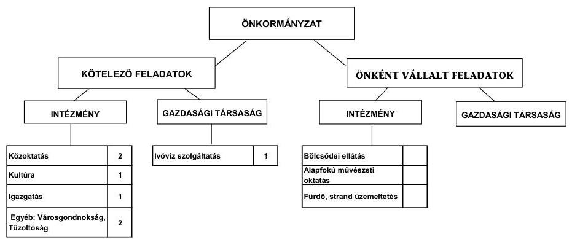

Az Önkormányzat kötelező és önként vállalt feladatait ellátó intézmények száma a 2007. év eleji hétről - két intézmény (egy iskola és a Szociális Szolgáltató Központ) megszüntetése és egy intézmény alapítása (Városgondnokság) következtében - a 2011. év I. félév végére hatra, a többségi tulajdonú gazdasági társaságok száma - egy gazdasági társaságban lévő tulajdonrész értékesítését követően - kettőről egyre csökkent. Az Önkormányzat a vizsgált időszakban kórházat nem tartott fent. Az önként vállalt feladatokat a kötelező feladatokat ellátó intézmények végezték. Az intézményszervezeti átalakítások, feladatbővülés következtében a feladatellátás telephelyeinek száma a 2007. évi hétről a 2011. év I. félév végére kilencre emelkedett.

---

A kizárólagos önkormányzati tulajdonú gazdasági társaság a 2007-2009. években közterület-fenntartási, ivóvíz szolgáltatási, városüzemeltetési feladatok ellátásával, a 2010. évben ivóvíz szolgáltatással vett részt az önkormányzati feladatellátásban. A vizsgált időszakban működéséhez 4,5 millió Ft-ot, felhalmozási feladatai ellátásához 8,0 millió Ft-ot adott át az Önkormányzat. A kizárólagos önkormányzati tulajdonú gazdasági társaságnál a 2007-2010. években tőkeemelésről nem kellett gondoskodni, azonban a 2011. év I. félév végén a felhalmozott vesztesége 125,2 millió Ft volt, amely kockázatot jelent az Önkormányzat számára.

A vizsgált időszakban a kötelező és önként vállalt feladatok ellátását biztosító szervezeti keretekben, a feladatellátás módjában bekövetkezett változások 135,6 millió Ft megtakarítást eredményeztek, amely javította az Önkormányzat pénzügyi egyensúlyi helyzetét.

Az egyes közszolgáltatási feladatellátásban résztvevő intézmények működési kiadásainak finanszírozási forrásait ágazatonként a 2007. és a 2010. években a következő ábra szemlélteti:
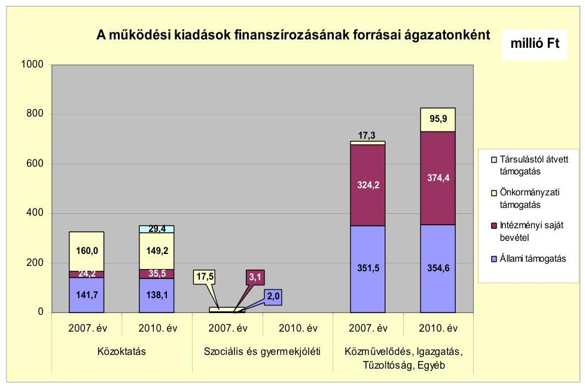

Az Önkormányzat működési célú feladatainak ellátásához biztosított állami támogatás összege a 2007. évi 495,2 millió Ft-ról a 2010. évre 492,7 millió Ft-ra (0,5%-kal) csökkent. A változás a 2008. évi 0,5%-os növekedés (2,6 millió Ft), a 2009. évi 3,3%-os csökkenés (16,3 millió Ft), majd a 2010. évi 2,3%-os (11,2 millió Ft) növekedés együttes hatására következett be. A csökkenés a feladatellátásban való központi szerepvállalás mérséklődésének hatására, az ellátottak számának közoktatási területen történt növekedése ellenére történt. A működési feladatok végrehajtása érdekében elszámolt önkormányzati támogatás 2007-2009. évi átlaga 196,0 millió Ft volt. A 2010. évben az önkormányzati támogatás összege a 2007-2009. évi átlaghoz képest az állami támogatás mérséklődését ellensúlyozva 245,1 millió Ft-ra (25,1%-kal) nőtt. Az egyéb ágazatban elszámolt önkormányzati támogatás a 2007. évről a 2010. évre alapvetően a Városgondnokság 2009. évi alapításának eredményeként emelkedett 5,5-szeresére, 17,3 millió Ft-ról 95,9 millió Ft-ra.

---

Az Önkormányzat pénzügyi kapacitásának, működési jövedelmének, tőketörlesztésének alakulását a 2007-2010. években az alábbi ábra mutatja be:
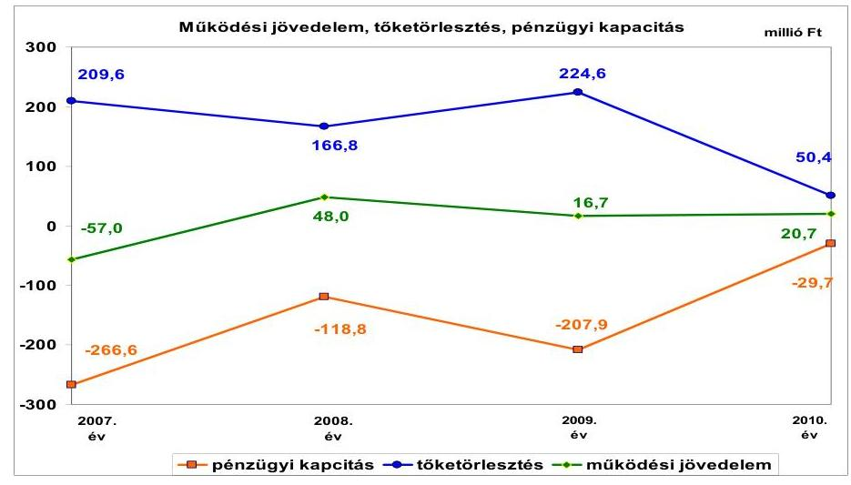

Az Önkormányzat folyó költségvetési egyenlege - működési jövedelme - a 2007. évben forráshiányt, a 2008-2010. években a 2007. évben kibocsátott kötvény értékesítéséből származó bevétel befektetéséből, a helyi adókból és az intézményi átszervezésekből adódóan összesen 85,4 millió Ft-os forrástöbbletet mutatott. A folyó költségvetés 2007. évi hiányát mérsékelte, hogy az Önkormányzat a 2007. évben a helyi önkormányzatok működőképességének megőrzését szolgáló kiegészítő támogatásokon belül, a működésképtelen helyi önkormányzatok egyéb támogatása címen 15,0 millió Ft vissza nem térítendő, feladathoz nem kötött támogatásban részesült. E támogatás hiánya esetén az Önkormányzat folyó költségvetésének egyenlege a 2007. évben -72,0 millió Ft lett volna.

Az Önkormányzat pénzügyi kapacitása - nettó működési jövedelme - az alacsony működési jövedelem és a tőketörlesztések együttes hatására a vizsgált időszakban negatív, a 2007-2009. évek átlagában -197,8 millió Ft volt, amely a 2010. év végére -29,7 millió Ft-ra (85,0%-kal) csökkent. A csökkenéshez hozzájárult, hogy a 2009. évben a felhalmozási célú hitelekhez kapcsolódóan 71,2 millió Ft előtörlesztésre került sor. Az Önkormányzat megtakarításai a vizsgált időszakban nem voltak elégségesek az adósságszolgálati kiadásokra. A negatív nettó működési jövedelem előző évhez képest történt mérséklődését a 2008. évben - 48,0 millió Ft - a pozitív működési jövedelem mellett 166,8 millió Ft - hiteltörlesztés csökkenése, a 2009. évi növekedését az előző évhez képest gyengébb - 16,7 millió Ft - működési jövedelem és magasabb összegű 224,6 millió Ft - hiteltörlesztés okozta. A nettó működési jövedelem 2010. évi mérséklődését az előző évhez képest kedvezőbb - 20,7 millió Ft - működési egyenleg és 50,4 millió Ft hiteltörlesztés határozta meg.

Az Önkormányzat tárgyévi pénzügyi pozíciója folyamatosan gyengült, mivel a 2007. évi 630,9 millió Ft pozitív eredménnyel szemben, a 2008. évben 15,5 millió Ft, a 2009. évben 39,5 millió Ft, a 2010. évben - a 2009. évi felhalmozási célú hitelekhez kapcsolódó előtörlesztések ellenére, a növekvő negatív összegű felhalmozási költségvetési egyenleg miatt - 293,5 millió Ft negatív eredménnyel zárta az évet.

---

Az Önkormányzat feladatai ellátása érdekében a 2007. évben 996,5 millió Ft, a 2008. évben 1134,3 millió Ft, a 2009. évben 1163,9 millió Ft, a 2010. évben 1229,4 millió Ft folyó bevételt teljesített. A folyó bevételek körében leginkább meghatározó volt a költségvetési támogatás és az átengedett bevételek együttes összege, amelyek átlagosan 51,9%-ot (584,9 millió Ft-ot) tettek ki. A folyó bevételek között a második legnagyobb súllyal a helyi adókból beszedett bevétel bírt, amelyek átlagos költségvetési súlya 31,9% (359,2 millió Ft) volt a vizsgált időszakban.

Az Önkormányzat folyó kiadásai a 2007-2009. években átlagosan 4,4%-kal (46,9 millió Ft-tal) emelkedtek, a 2010. évben - az intézményi átszervezések, megszüntetés és bővítés, az ellátottak, és foglalkoztatottak számának változásához igazodóan - 10,3%-kal (113,0 millió Ft-tal) haladták meg azt. A 2011. év I. félévében a folyó kiadások 590,7 millió Ft-ot, a 2007. évi folyó kiadások 56,1%-át tették ki.

A 2007-2010. években az Önkormányzat felhalmozási költségvetésének egyenlege a 2009. év kivételével negatív összegű volt, a 2007-2010. évek között összesen 229,8 millió Ft felhalmozási forráshiányt mutatott. A felhalmozási többletbevétel 2009-ben 67,3%-kal (144,8 millió Ft-tal) haladta meg a felhalmozási kiadásokat. A felhalmozási költségvetés 2009. évi többletét alapvetően az év során az ingatlanértékesítésből befolyt bevétel (252,9 millió Ft), 2010. évi
 hiányát a saját beruházási kiadások (298,6 millió Ft), valamint az Önkormányzat kizárólagos tulajdonú gazdasági társasága részére felhalmozásra átadott pénzeszköz (95,0 millió Ft) teljesítése határozta meg.

Az Önkormányzat pénzügyi egyensúlyi helyzetének alakulását jelentősen befolyásolta a vizsgált és az azt megelőző időszakban végzett fejlesztési tevékenysége. A 2007-2010. évek időszakában 469,1 millió Ft értékű befejezett fejlesztés és felújítás forrása 168,7 millió Ft (36,0%) saját erő és a 173,8 millió Ft (37,0%) hazai- és EU-s támogatások mellett 126,6 millió Ft kötvénybevétel (27,0%) volt. A 2010. december 31-én folyamatban lévő fejlesztési feladatok végrehajtására 2007-2010 között 162,8 millió Ft kiadást teljesítettek, amelyre kötvényforrásból 52,2 millió Ft-ot (32,1%) fordítottak, a felhasznált saját forrás 5,1 millió Ft (3,1%), az EU-s és hazai támogatás együtt 105,5 millió Ft (64,8%) volt.

Az Önkormányzatnál a 2010. december 31-én folyamatban lévő fejlesztési feladatok 2010. évet követő kötelezettségvállalásainak összege 552,1 millió Ft volt, amelyből 270,5 millió Ft-ot (49,0%) kötvénybevételből, 281,5 millió Ft-ot (51,0%) EU-s és hazai támogatásból terveznek biztosítani. A fejlesztések megvalósításához minimális saját bevétel igénybevételével (0,1 millió Ft) számoltak.

---

A folyamatban lévő fejlesztések 2010. december 31-én fennállt felhalmozási kötelezettségeinek forrásösszetételét és annak megoszlását a következő ábra mutatja be:
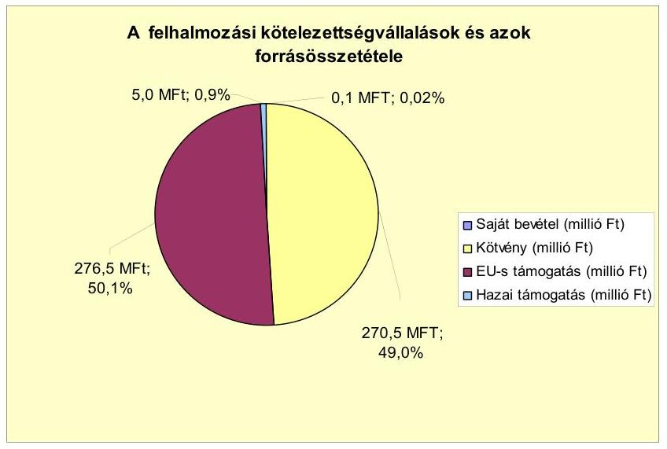

Az Önkormányzat által beadott, elbírálás alatt álló pályázatok tervezett teljes bekerülési költsége 61,5 millió Ft volt. Az Önkormányzat által a 2010. évet követő időszakra vállalt kötelezettségek összege 613,6 millió Ft volt, amelyből 288,9 millió Ft-ot (47,1%-ot) kötvénybevételből, 324,6 millió Ft-ot (52,8%-ot) EU-s és hazai támogatásból, valamint 0,1 millió Ft saját bevételből terveznek biztosítani. A megvalósított fejlesztések bevételnövelő, illetve kiadáscsökkentő hatását, valamint visszafizetési forrásként való számbavételét a beruházások jellegétől függően a kötvény felhasználási szabályzatban előírtak szerint vizsgálták, a megvalósult létesítmények fenntarthatóságának pénzügyi kihatásait nem értékelték.

Az Önkormányzat mérleg szerinti pénzintézeti kötelezettsége a 2007-2009. években átlagosan 1027,0 millió Ft volt, a 2006. december 31-én fennálló 268,9 millió Ft-ról a 2011. év I. félév végére 1167,0 millió Ft-ra nőtt, amelyből az árfolyamváltozás miatti különbözet 345,2 millió Ft volt. A fennálló pénzintézeti kötelezettségek 750,0 millió Ft CHF alapú kötvénykibocsátásból, valamint folyószámlahitel igénybevételéből keletkeztek. Az Önkormányzat az elfogadott 2011. évi költségvetési rendeletében működési és fejlesztési hitel felvételt, további kötvénykibocsátást nem tervezett, és a helyszíni vizsgálat befejezésének időpontjáig erre nem került sor.

Az Önkormányzat kötelezettségvállalása képviselő-testületi döntés alapján történt, azonban az előterjesztésben nem mutatták be a visszafizetés forrásait, a kamat-, a visszafizetési és - a devizaalapú kötelezettséget érintő - árfolyamkockázatot. A 2006. december 31-i pénzintézeti kötelezettségállományban kimutatott 165,1 millió Ft összegű fejlesztési hitelek a 2007-2010. években visszafizetésre kerültek, az Önkormányzatnak hosszú lejáratú hitelállománya a 2010. év végétől nem volt. A kötvény felhasználásáról, a szabad források befektetéséből származó bevételek alakulásáról, valamint a kamat és tőkefizetési kötelezettség alakulásáról a Képviselő-testületet folyamatosan, évente általában két alkalommal tájékoztatták.

---

Az Önkormányzat a vizsgált időszakban CHF-ben fennálló pénzintézettel szembeni kötelezettségéből tőkét nem törlesztett, azonban 425,3 ezer CHF (76,4 millió Ft) kamatot és 16,7 millió Ft egyéb költséget (jegyzési, garanciavállalási díjat és átalánydíjat) fizetett. A kötvénykibocsátásból származó tőketörlesztési kötelezettség 2012 szeptemberétől válik esedékessé, amelynek összege várhatóan - a 2012. évre vonatkozóan - 153,7 ezer CHF. A 2007-2011. év I. félév időszakában az átmenetileg szabad pénzeszközökből 165,4 millió Ft kamatbevételt realizáltak.

Az Önkormányzat a kötvény kibocsátást követően 2008. július 1-jével számlavezető bankot váltott, és a kötvényt finanszírozó pénzintézet lett az Önkormányzat számlavezetője. A pénzintézet váltás nem volt befolyással az Önkormányzat finanszírozási struktúrájára, pénzügyi egyensúlyi helyzetére.

Az Önkormányzat likviditását a vizsgált időszakban folyószámlahitel, a 2007-2008. években munkabér megelőlegezési hitel és két alkalommal egyéb likvid hitel igénybevételével, költségvetésének finanszírozhatóságát folyószámlahitel igénybevételével tudta biztosítani. Az Önkormányzatnál folyószámlahitel igénybevételre - a 2008-2010. évek pozitív működési jövedelme ellenére - a 2007. és azt megelőző években keletkezett működési hiány finanszírozása miatt volt szükség.

A folyószámlahitel és munkabér-megelőlegezési hitel igénybevétele a 2007-2011. év I. félév időszakában a következő volt:

| Megnevezés | 2007. év | 2008. év | 2009. év | 2010. év | 2011. év I.   félév |
| :-- | --: | --: | --: | --: | --: |
| Folyószámlahitel |  |  |  |  |  |
| Keretösszeg január 1-jén (millió Ft-ban) | 150,0 | 160,0 | 150,0 | 150,0 | 150,0 |
| Átlagos napi állomány (millió Ft-ban) | 92,8 | 55,0 | 6,2 | 26,9 | 17,8 |
| Folyószámla hitellel zárt napok száma (nap) | 251 | 176 | 91 | 305 | 163 |
| Egyenleg (állomány) | 143,4 | 127,0 | 40,2 | 66,3 | 71,8 |
| Munkabér-megelőlegezési hitel | - | - | 10,0 | - | - |
| Keretösszeg január 1-jén (millió Ft-ban) | 7,8 | 2,2 | - | - | - |
| Átlagos napi állomány (millió Ft-ban) | 175,0 | 85,0 | - | - | - |
| Munkabér megelőlegezési hitellel zárt napok | x | x | x | - | - |
| száma (nap) |  |  |  |  |  |
| Egyenleg (állomány) |  |  |  |  |  |

Az Önkormányzat az ellenőrzött időszakban a folyószámlahitel szerződések lejáratának időpontjában - a 2009. évi fordulónap kivételével - 19,4 millió Ft és 118,2 millió Ft közötti folyószámlahitel állománnyal rendelkezett. Az Önkormányzatnak a 2008. évben a lejáratkor fennálló - 118,2 millió Ft - kötelezettség állomány miatt a likviditás biztosítása érdekében - az új folyószámlahitel keret megkötéséig - egyéb likvidhitel felvétele vált szükségessé.

Az év végén fennálló folyószámlahitel állomány a 2007. év végi 143,4 millió Ft-ról a 2009. év végére 40,2 millió Ft-ra csökkent. A csökkenés egyik oka, hogy az Önkormányzat a kötvény értékesítéséből származó bevételéből 40,0 millió Ft-ot működési célra, a folyószámlahitel kiváltására használt fel, valamint a 2009. évi 252,9 millió Ft ingatlanértékesítésből származó bevételből 65,4 millió Ft-ot átmenetileg elszámolási számláján tartott. A 2010. évben a 65,4 millió Ft-ot a felhalmozási kiadásokhoz igénybe vették, amelynek következtében a folyószámlahitel állomány a 2010. év végére 66,3 millió Ft-ra emelkedett.

---

A 2007-2011. év I. félév között a likviditás biztosítása az Önkormányzatnak 29,5 millió Ft - az összes teljesített kamatkiadás (159,6 millió Ft) 18,5%-át kamatkiadást, és 8,2 millió Ft rendelkezésre tartási jutalék és kezelési költség fizetésének kötelezettségét okozta. Az Önkormányzat 2011. év I. félév végi szállítói tartozása 27,0 millió Ft, amelyből lejárt tartozása 15,9 millió Ft volt. A lejárt szállítói tartozás 97,4%-a (15,5 millió Ft) a szállítói finanszírozású EU-s pályázatok miatt keletkezett. Az EU-s pályázatoknak ebben a finanszírozási formájában az Önkormányzat a számviteli előírásoknak megfelelően eljárva a számlák teljes összegét szállítói kötelezettségként nyilvántartásba vette. Ugyanakkor a szállítóknak csak a számlák rá eső önrészét fizette ki. Ezt követően a számlákat és a kifizetési kérelmeket benyújtotta a támogatást folyósító szervezetnek, amely ellenőrizte az önrész kiegyenlítését, majd a szállító részére kifizette a számlák támogatással megegyező részét. Az Önkormányzat a támogatást folyósító szervezet - a számlák támogatási részének kifizetését igazoló - értesítését követően könyvelhette le a számlák teljes összegére vonatkozó szállítói kötelezettség kiegyenlítését.

Az Önkormányzatnál az ellenőrzött időszakban szállítói kötelezettségek átütemezésére nem került sor.

Az Önkormányzat a kizárólagos tulajdonú gazdasági társasága részére folyószámlahitel igénybevételéhez készfizető kezességet vállalt 20,0 millió Ft összegben. Kezességvállalásról szóló döntésnél nem mutatták be a Képviselőtestületnek annak pénzügyi kockázatát. A 2010. év végén a kezességgel kapcsolatos kötelezettség fennállt, az Önkormányzatnak a helyszíni ellenőrzés befejezéséig fizetési kötelezettséget nem kellett teljesítenie. Az Önkormányzat az ellenőrzött időszakban a kizárólagos tulajdonú gazdasági társasága részére 169,7 millió Ft összegben tagi kölcsönt, civil szervezetek részére 11,3 millió Ft összegben visszterhes pénzeszköz átadást teljesített. A civil szervezetek a visszterhesen átvett pénzeszközből 2011. június 30-ig 6,6 millió Ft-ot fizettek vissza.
Az Önkormányzat kötelezettségeinek 2010. december 31-i, valamint 2011. június 30-i állományát és várható alakulását a kötelezettségek lejáratáig a következő táblázat szemlélteti:

| Megnevezés | Állomány 2010. december 31-én |  | Állomány 2011. június 30-án |  | Várható kötelezettség 2011-2013. években |  | Várható kötelezettség 2014. évtől |  |
| :--: | :--: | :--: | :--: | :--: | :--: | :--: | :--: | :--: |
|  | HUF-ben (millió Ft-ban) | CHF-ben (ezer CHFben) | HUF-ben (millió Ft-ban) | CHF-ben (ezer CHFben) | HUF-ben (millió Ft-ban) | CHF-ben (ezer CHFben) | HUF-ben (millió Ft-ban) | CHF-ben (ezer CHFben) |
| Pénzintézeti kötelezettségek |  |  |  |  |  |  |  |  |
| Pénzintézeti kötelezettségek összesen HUF-ben (igénybevett folyósokhoz tőke) | 66,3 |  | 71,8 |  | 71,8 |  |  |  |
| Pénzintézeti kötelezettségek összesen CHF-ben "Balatonfürtő Gyanspródia" kötvény | - | 5637,8 | - | 5601,4 | - | 673,0 | - | 4964,6 |
| Biztosítékok |  |  |  |  |  |  |  |  |
| Kezesség | 20,0 |  | 20,0 |  | - | - | - | - |
| Biztosítékok összesen | 20,0 |  | 20,0 |  | - | - | - | - |
| Szállítói tartozás | 38,4 |  | 27,0 |  | 27,0 | - | - | - |
| Kötelezettségek összesen HUF-ben | 124,7 |  | 110,8 |  | 98,8 | - | - | - |
| Kötelezettségek összesen CHF-ben | - | 5637,8 | - | 5601,4 | - | 673,0 | - | 4964,6 |

Az Önkormányzatnak pénzintézetekkel szemben fennálló kötelezettsége a 2011. év I. félév végén 71,8 millió Ft és 5601,4 ezer CHF volt. Ezek várható kötelezettsége (tőke, kamat és egyéb költség) a legutóbbi kamatfizetés feltételei alapján a 2011-2013. években 71,8 millió Ft, továbbá 673,0 ezer CHF. Az Önkormányzatnak a 2011. évben szállítói tartozások és kezességvállalás címén

---

47,0 millió Ft fizetési kötelezettsége volt. A 2011-2013. évek kötelezettségeinek teljesítésére figyelembe vehető 121,9 millió Ft mérlegben kimutatott vevő által elismert követelésállomány. A 2014. évet követően a helyszíni vizsgálat idején ismert pénzintézeti kötelezettségek összege a várható kamatterhekkel 4 964,8 ezer CHF. Az Önkormányzat tájékoztatása szerint a kötelezettségre a bevételnövelő és kiadáscsökkentő intézkedésekből keletkező megtakarítások, többletbevételek nyújtanak
 fedezetet. A helyszíni vizsgálat idején ismert pénzintézeti kötelezettségek teljesítése a 2014. évtől nem biztosított, mivel a visszafizetés forrásaira vonatkozóan a Képviselő-testület a helyszíni vizsgálat befejezéséig a 2011. évet követő időszakot érintő bevételnövelő és kiadáscsökkentő intézkedésről még döntést nem hozott.

Az önkormányzati kötelezettségek növekedése mellett az Önkormányzat kizárólagos tulajdonú gazdasági társaságának kötelezettségei is befolyásolhatják az Önkormányzat pénzügyi egyensúlyát.
Az Önkormányzat kizárólagos tulajdonú gazdasági társasága kötelezettségeinek állományát és várható alakulását a kötelezettségek lejáratáig a következő táblázat mutatja be:

| Megnevezés | Állomány 2010.   december 31-én |  | Állomány 2011. június 30-án |  | Várható kötelezettség   2011-2013. években |  | Várható kötelezettség   2014. évtől |  |
| :--: | :--: | :--: | :--: | :--: | :--: | :--: | :--: | :--: |
|  | HUF-ban   (millió Ft-ban) | EUR-ban   (ezer EUR-   ban) | HUF-ban   (millió Ft-ban) | EUR-ban   (ezer EUR-   ban) | HUF-ban   (millió Ft-ban) | EUR-ban   (ezer EUR-   ban) | HUF-ban   (millió Ft-ban) | EUR-ban   (ezer EUR-   ban) |
| Igénybevett folyószámlatok | 18,3 |  | 18,8 |  | 18,8 |  |  |  |
| Pénzintézeti kötelezettségek összesen: | 18,3 |  | 19,8 |  | 19,8 |  |  |  |
| Lizing kötelezettségek |  | 7,7 |  | 5,0 |  | 7,7 |  |  |
| Szállító tartozás | 76,1 |  | 35,7 |  | 35,7 |  |  |  |
| Egyéb kötelezettségek | 190,9 |  | 177,9 |  | 30,8 |  | 147,1 |  |
| Kötelezettségek összesen HUF-ban | 285,3 |  | 233,4 |  | 86,3 |  | 147,1 |  |
| Kötelezettségek összesen EUR-ben |  | 7,7 |  | 5,0 |  | 7,7 |  |  |

A gazdasági társaságnak a 2011. évtől 19,8 millió Ft pénzintézeti kötelezettséget, 35,7 millió Ft szállítói tartozást, 7,7 ezer EUR lízing kötelezettséget és egyéb kötelezettségek címén 177,9 millió Ft (Önkormányzat által nyújtott tagi kölcsön, munkavállalókkal és központi költségvetéssel szemben fennálló kötelezettség, késedelmi kamatfizetési kötelezettség) tartozást kell rendeznie. Esetleges csőd, vagy felszámolási eljárás esetén a Gt.-ben és a Csőd. tv-ben meghatározott feltételek teljesülésekor a bíróság korlátlan és teljes felelősséget állapíthat meg az Önkormányzat terhére. A gazdasági társaság kedvezőtlen pénzügyi egyensúlyi helyzete - a volt nitrokémiai gyár és gyártelep ellátását szolgáló ivóvíz és ipari víz létesítmények 2007. évi megvásárlását követően alakult ki. A vételi szerződés feltételei szerint a szolgáltatást 10 évig biztosítania kell, miközben az ipari víz értékesítése a korszerűtlen vízrendszer és több nagy fogyasztó megszűnése miatt veszteséges.

A gazdasági társaság mérleg szerinti eredménye a 2008-2010. években negatív, a felhalmozott veszteség nagysága meghaladta a jegyzett tőke (120 millió Ft) összegét, 2011. június 30-án 125,2 millió Ft volt. A 2011. év III. negyedévében az Önkormányzat megvizsgáltatta gazdasági társasága pénzügyi, vagyoni helyzetét. Az Önkormányzat tájékoztatása szerint nincs reális lehetőség arra, hogy a 2012. évtől a gazdasági társaság az Önkormányzattól kapott tagi kölcsönt visszafizesse. A likviditási helyzete alapján reális veszély van a fizetés-

képtelenség bekövetkezésére. A szállítók részéről a lejárt 31,0 millió Ft szállítói kötelezettség a gazdasági társasággal szemben felszámolási eljárás megindítását eredményezheti.

A Képviselő-testületnek előterjesztett éves zárszámadási rendeleteikben nem mutatatták be az Önkormányzat eszközei után tárgyévben elszámolt értékcsökkenés összegét, az eszközpótlásra fordított tényleges kiadásokat, az eszközök elhasználódási fokának alakulását. Az Önkormányzat a 2007-2010. évek között, eszközállománya után 389,2 millió Ft összegű értékcsökkenést mutatott ki. A számvitelben elszámolt beruházások, felújítások összege 517,3 millió Ft volt, amelyből az elhasznált eszközök pótlására a kimutatások szerint 98,4 millió Ft-ot fordítottak.

Az Önkormányzat az ellenőrzött időszakban kiadási megtakarítást eredményező és bevételt növelő intézkedéseket hozott. A 2007-2011. év I. féléve között tett intézkedések hatására 197,1 millió Ft bevételi többletet, továbbá 149,6 millió Ft kiadási megtakarítást mutatott ki az Önkormányzat. A kiadási megtakarításokból meghatározó volt az intézmények (Iskola, Polgármesteri hivatal, Városgondnokság, Szociális Szolgáltató Központ) átszervezésével, alapításával, megszüntetésével kapcsolatosan - a létszámcsökkentések hatását is tartalmazó - kimutatott 135,6 millió Ft megtakarítás összege, amely az Önkormányzat pénzügyi egyensúlyi helyzetét javította. A kiadási megtakarítások 82,7 %-a az elrendelt álláshely csökkentések eredménye. Az álláshelycsökkentő intézkedések 2007-2011. év I. féléve között önkormányzati szinten összesen 28,5 álláshely (ebből üres álláshely nem volt) megszüntetését jelentették. Egyes közszolgáltatási területeken azonban feladatbővülés, átszervezés és új intézmény létrehozása is volt, amelyek álláshely- és egyben létszámnövekedéssel is jártak. Ennek következtében az időszak álláshelyeinek száma 31-el nőtt. Az álláshelyek változásának együttes eredményeként a vizsgált időszakban 2,5 álláshely növekedés következett be. A létszám a létszámcsökkentések és a természetes létszámváltozás eredményeként a 2007. január 1-jei 199,5 főről 2010. december 31-re (0,5 %-kal) 198,5 főre csökkent. A bevételnövelésre irányuló intézkedések eredményeként 197,1 millió Ft többletbevételt mutatott ki az Önkormányzat, amelyből 173,5 millió Ft-ot (88,0 %-ot) a helyi adók mértékének emelése és 9,9 millió Ft-ot (5,0 %-ot) az adóhátralék behajtásából származó bevétel tett ki. Az önkormányzati eszközök értékesítése 3,1 millió Ft-tal (1,6 %-kal) részesült a bevétel-növekményből. Az intézményi térítési díjak emelésével kapcsolatosan kimutatott bevétel növekedés 10,6 millió Ft (5,4%) volt. Az Önkormányzat által tett intézményszervezeti átalakítások, kiadáscsökkentő és bevételnövelő intézkedések nem biztosítanak elegendő forrást a pénzügyi egyensúly helyreállításához.

Az utóellenőrzés a pénzügyi egyensúly javítására tett egy szabályszerűségi javaslat hasznosítására terjedt ki, amely szerint a jegyző gondoskodjon arról, hogy az önállóan gazdálkodó költségvetési szerv pénzmaradványa tekintetében az előzetes ellenőrzésre alapozottan a Képviselő-testület az Ámr.-ben foglalt feladatát teljesíteni tudja. A Képviselő-testület által elfogadott intézkedési tervben a javaslat végrehajtásának határideje az éves zárszámadási rendelet benyújtásának időpontja volt, amelynek nem tettek eleget, így a pénzügyi egyensúly javítására tett javaslatunk nem teljesült.

Az Önkormányzat pénzügyi egyensúlyi helyzetét összegezve a következők emelhetők ki:

Balatonfűzfő Város Önkormányzatának pénzügyi egyensúlya középtávon veszélyeztetett.

A folyó bevételek a 2007-2010. években nem biztosították a folyó kiadások és az adósságszolgálat finanszírozását, a likviditás biztosítása folyószámlahitel igénybevételével, valamint a 2008. évben az előző évben kibocsátott kötvény bevételéből likviditási hitel kiváltásával történt. Az ellenőrzött időszakban a folyószámlahitel tartóssá vált. Az Önkormányzat pénzügyi egyensúlyi helyzetére negatív hatást gyakorolt az önként vállalt feladatok működési célú költségvetési kiadásokon belüli arányának növekedése.

Az Önkormányzat felhalmozási költségvetésének egyenlege a 2009. év kivételével negatív volt. A pénzügyi hiány fedezete kötvény kibocsátás volt. A folyamatban lévő és az elbírálás alatt álló fejlesztésekre, felújításokra történő kötelezettségvállalások finanszírozása EU-s és hazai támogatási forrásokból, a kötvény szabadon felhasználható maradványából biztosított.

A pénzintézeti és egyéb kötelezettségek teljesítésének fedezetét a saját bevételek mellett, egyensúlyt javító bevételnövelő és kiadáscsökkentő intézkedések meghozatalában jelölték meg. A helyszíni vizsgálat befejezéséig a 2011. és az azt követő éveket érintő egyensúlyt javító intézkedésről a Képviselő-testület döntést nem hozott, a visszafizetés forrásaira számítások nem készültek. A törlesztési kockázatot mérsékelheti, hogy az Önkormányzat követelésállománya szükség esetén felhasználható az adósságszolgálat mérséklésére.

A kizárólagos tulajdonú gazdasági társaság pénzügyi egyensúlyi helyzete kockázatot hordoz az Önkormányzat számára. A gazdasági társaság veszteséges gazdálkodása, az Önkormányzat által nyújtott tagi kölcsön, valamint a folyószámla hiteléhez nyújtott kezességvállalásból, és a lejárt (elismert) szállítói tartozásából eredő kötelezettségek az Önkormányzat korlátlan és teljes felelőssége miatt az Önkormányzat számára helytállási kötelezettséget jelenthet.

Az Állami Számvevőszékről szóló 2011. évi LXVI. törvény 33. § (1) bekezdésében foglaltak értelmében a jelentésben foglalt megállapításokhoz kapcsolódó intézkedési tervet köteles az ellenőrzött szervezet vezetője összeállítani és azt a jelentés kézhezvételétől számított harminc napon belül az ÁSZ részére megküldeni. Amennyiben az intézkedési tervet határidőben nem küldi meg a szervezet, vagy az továbbra sem elfogadható, az ÁSZ elnöke a hivatkozott törvény 33. § (3) bekezdés a)-b) pontjaiban foglaltakat érvényesítheti.

# A 2011. június 30-i pénzügyi egyensúlyi helyzet alapján az ellenőrzés intézkedést igénylő megállapításai és javaslatai a következők: 

## a Polgármesternek

1. Az Önkormányzat nettó működési jövedelme az elmúlt időszakban negatív volt, a likviditás a vizsgált időszakban folyószámlahitel igénybevételével volt biztosítható. Az Önkormányzat finanszírozásában a folyószámlahitel tartóssá vált, működési célú hitel

kiváltására kötvényből származó bevételt vett igénybe. A vállalt pénzintézeti és egyéb kötelezettségek fedezete 2014. évtől nem biztosított. Az Önkormányzat által tett intézményszervezeti átalakítások, kiadáscsökkentő és bevételnövelő intézkedések nem biztosítottak és nem biztosítanak elegendő forrást a pénzügyi egyensúly helyreállításához. Az Önkormányzat adósságot keletkeztető kötelezettségvállalására vonatkozó képviselő-testületi előterjesztés nem tartalmazta a visszafizetés forrásait. A Képviselő-testület részére nem készítettek a kötvénykibocsátáshoz kapcsolódóan teljes körű tájékoztatást az így keletkezett kötelezettségek jövőbeni (árfolyam / kamat / visszafizetési) kockázatairól. Kezességvállalásról szóló döntésnél nem mutatták be a Képviselő-testületnek annak pénzügyi kockázatát. Az önként vállalt feladatok működési célú költségvetési kiadásokon belüli aránya emelkedett. A megvalósult létesítmények fenntarthatóságának pénzügyi hatásait nem értékelték.

Javaslat:
A Képviselő-testület elé terjesztendő intézkedési terv írja elő a pénzügyi egyensúly középtávon ható helyreállítása és hosszú távú fenntarthatósága érdekében operatív terv készítését - felelősök és határidők megjelölésével -, amely tartalmazza az alábbiakat:
a) Tárja fel a bevételszerző és kiadáscsökkentő lehetőségeket. Ütemezze a bevételek beszedését a jövőben jelentkező fizetési kötelezettségeihez.
b) Képezzen egyensúlyi (elkülönített) tartalékot az adósságszolgálat teljesítése érdekében.
c) Vizsgálja felül a folyamatban lévő és a tervezett beruházásokat, és mutassa be a Képviselő-testületnek a megvalósuló létesítmények fenntarthatóságának pénzügyi hatásait.
d) Vizsgálja felül az intézményi szerkezetet, és az intézményfinanszírozás módját. Tegyen javaslatot a Képviselő-testületnek a feladatellátás racionalizálására.
e) Tekintse át az önként vállalt feladatok finanszírozhatóságát a kötelező feladatellátás elsődlegességének biztosítása érdekében, a gazdasági program áttekintésével összhangban, és mutassa be a Képviselő-testületnek a megoldás lehetőségeit.
f) Mutassa be a Képviselő-testületnek félévente legalább három évre kitekintően a kötelezettségek teljes körére szóló finanszírozási tervet, a források számszerűsített megjelölésével.
g) Az adósságot keletkeztető kötelezettségvállalásról szóló döntéskor mutassa be a Képviselő-testületnek a jövőben várható - árfolyam-, kamat- és törlesztési - kockázatot. Kezességvállalási döntésnél mutassa be a Képviselő-testületnek azok pénzügyi kockázatait.
h) Gondoskodjon, hogy a jövőben az adósságot keletkeztető kötelezettségvállalásokról szóló képviselő-testületi előterjesztések tételesen tartalmazzák a visszafizetés forrásait.

2. A gazdasági társaság mérleg szerinti eredménye a 2008-2010. években negatív volt, a felhalmozott veszteség nagysága meghaladta a jegyzett tőke összegét. Az Önkormányzat tájékoztatása alapján nincs reális lehetőség arra, hogy a 2012. évtől az Önkormányzattól kapott tagi kölcsönt visszafizesse. A likviditási helyzete alapján reális a veszély a fizetésképtelenség bekövetkezésére, a felszámolási eljárás megindítására.

Javaslat:
Kísérje folyamatosan figyelemmel és szükség szerint, de legalább félévente mutassa be
 a Képviselő-testületnek a kizárólagos tulajdonú gazdasági társasága aktuális pénzügyi egyensúlyi helyzetét, kötelezettségeinek alakulását, az Önkormányzat likviditására, pénzügyi-egyensúlyi helyzetére gyakorolt hatását. Tegye meg a szükséges és lehetséges intézkedéseket a tulajdonosi érdekek védelme érdekében.
3. A Képviselő-testületnek előterjesztett éves zárszámadási rendeletekben nem mutatták be az Önkormányzat eszközei után tárgyévben elszámolt értékcsökkenés összegét, az eszközpótlásra fordított tényleges kiadásokat, az eszközök elhasználódási fokának alakulását.

Javaslat:
Mutassa be a Képviselő-testületnek évente a zárszámadási rendelet előterjesztésében az értékcsökkenés összegét, és ezzel összevetve az elhasználódott eszközök pótlására fordított tényleges kiadásokat, az eszközök elhasználódási fokának alakulását.
4. Az utóellenőrzés a pénzügyi egyensúly javítására tett egy szabályszerűségi javaslat hasznosítására terjedt ki, amely szerint a jegyző gondoskodjon arról, hogy az önállóan gazdálkodó költségvetési szerv pénzmaradványa tekintetében az előzetes ellenőrzésre alapozottan a Képviselő-testület az Áht. végrehajtásáról szóló 368/2011. (XII. 31.) Korm. rendelet 155. § (2) bekezdésében foglalt feladatát teljesíteni tudja. A Képviselő-testület által elfogadott intézkedési tervben a javaslat végrehajtásának határideje az éves zárszámadási rendelet benyújtásának időpontja volt, amelynek azonban nem tettek eleget, így a pénzügyi egyensúly javítására tett javaslatunk nem teljesült.

Javaslat:
a) Gondoskodjon az Önkormányzat gazdálkodási rendszerét érintő előző ellenőrzés nem hasznosult javaslatának végrehajtásáról.
b) Intézkedjen - Önkormányzat gazdálkodási rendszerét érintő előző ellenőrzés nem hasznosult szabályszerűségi javaslataival kapcsolatban - a fegyelmi felelősség kivizsgálása iránt.

---

# II. RÉSZLETES MEGÁLLAPÍTÁSOK 

## 1. Az ÖNKORMÁNYZAT KÖTELEZŐ ÉS AZ ÖNKÉNT VÁLLALT FELADA-

TAI, A FELADATELLÁTÁS SZEVEZETI KERETEI ÉS ANNAK VÁLTOZÁSAI

Az Önkormányzat kötelező feladatait az Ötv. és az ágazati törvények által meghatározottnak tekintette, önként vállalt feladatairól az SzMSz-ben, egyéb belső szabályzatokban nem rendelkezett, azok terjedelmét az éves költségvetési rendeletekben az adott évi költségvetés forrásainak ismeretében határozta meg. Önként vállalt feladatként ${ }^{6}$ határozták meg a bölcsődei ellátást, az alapfokú művészeti oktatást, a szakorvosi ellátást, a fürdő, strandüzemeltetést, a helyi televízió, civil szervezetek, turisztikai egyesület fenntartásához történő hozzájárulást.

Az Önkormányzat adatszolgáltatása szerint ${ }^{7}$ a működési célú költségvetési kiadásaiból a kötelező feladatok ellátására a 2007-2009. években átlagosan 991,3 millió Ft-ot - a működési kiadások 93,5%-át -, a 2010. évben 1072,3 millió Ft-ot (91,1%-ot) fordított. A 2010. évi növekedésben meghatározó volt a Papkeszi Község Önkormányzatától átvett közoktatási feladat, valamint a városüzemeltetésre alapított intézmény (Városgondnokság) kötelező feladatok ellátásával összefüggő kiadásainak növekménye. Az Önkormányzat által meghatározott önként vállalt feladatokra adatszolgáltatása szerint a 2007-2009. években átlagosan 68,7 millió Ft - a működési kiadások 6,5%-a - 2010. évben 104,8 millió Ft (8,9%) jutott. Az önként vállalt feladatok működési kiadásainak növekményét a 2009. évben alapított Városgondnokság strandüzemeltetéssel kapcsolatos kiadásai határozták meg. A 2011. évi tervadatok alapján az önként vállalt működési célú feladatokra 122,6 millió Ft-ot - a működési kiadások 11,3%-át - terveznek felhasználni ${ }^{8}$. Az Önkormányzat pénzügyi egyensúlyi helyzetére negatív hatást gyakorolt az önként vállalt feladatok működési célú költségvetési kiadásokon belüli arányának növekedése.

Az Önkormányzat működési kiadásaiból a 2007-2009. években átlagosan 340,9 millió Ft-ot - a működési kiadások 32,2%-át - a 2010. évben 352,2 millió Ft-ot (29,9%-ot) közoktatási feladatok ellátására vették igénybe. A növekedés annak ellenére mérsékelt volt, hogy a 2008. évben az Óvoda egy tagintézménnyel bővült, továbbá ebben az évben egy másik település intézményének megszűnése miatt általános iskolai feladatellátást vettek át.

A szociális és gyermekvédelmi feladatokra fordított intézményi működési kiadás a 2007. évben 22,6 millió Ft - a működési kiadások 2,2%-a - volt. Az Önkormányzat szociális feladatokat ellátó intézményét 2007. februártól megszüntette, amelynek következtében a vizsgált időszak további éveiben összesen 28,1 millió Ft kiadást teljesített az e feladatot szerződéssel, megállapodással ellátók részére.

A 2007-2009. években átlagosan 29,4 millió Ft-ot (2,8%-ot) a 2010. évben 38,6 millió Ft-ot (3,3%-ot), a működési kiadások növekedését meghaladó arányban a közművelődési feladatok ellátására fordítottak. A 2007-2009. évben átlagosan 258,5 millió Ft-ot (24,4%-ot), a 2010. évben 416,0 millió Ft-ot (35,3%-ot) az egyéb intézmények (Hivatásos Tűzoltóság, Városgondnokság) fenntartására vették igénybe ${ }^{9}$. Az egyéb intézményekre fordított kiadások növekedésében meghatározó szerepe volt a Városgondnokság 2009. évi alapításának. A Polgármesteri hivatalban kezelt igazgatási feladatok ${ }^{10}$ körében a működési kiadás összege 221,9 millió Ft (18,9%), az egyéb önkormányzati feladatokra ${ }^{11}$ fordított működési kiadás 148,4 millió Ft (12,6%) volt a 2010. évben, amely intézmény megszüntetés, feladatátadások hatására összességében 4,7%-os és 13,7%-os csökkenést mutatott a 2007-2009. évi átlaghoz képest ${ }^{12}$.

[^0]
[^0]:    ${ }^{6}$ az Önkormányzat besorolása alapján
    ${ }^{7}$ Az éves beszámolók és az Önkormányzat adatszolgáltatása szerinti működési kiadások közötti eltérés oka, hogy az adatszolgáltatásban nem szerepel a felhalmozási célra felvett hitelek és kötvény után fizetett kamatok összege.
    ${ }^{8}$ Az önként vállalt feladatokra a 2011. évben tervezett pénzeszközök előirányzatának 2010. évi teljesített működési kiadásokhoz történt növekedését a bölcsődei csoportbővítés, az alapfokú művészetoktatásra az óraadók számának változása miatt tervezett kiadások és az Önkormányzat részéről átadott pénzeszközök emelkedése okozta.

---

nyel bővült, továbbá ebben az évben egy másik település intézményének megszűnése miatt általános iskolai feladatellátást vettek át.

A szociális és gyermekvédelmi feladatokra fordított intézményi működési kiadás a 2007. évben 22,6 millió Ft - a működési kiadások 2,2%-a - volt. Az Önkormányzat szociális feladatokat ellátó intézményét 2007. februártól megszüntette, amelynek következtében a vizsgált időszak további éveiben összesen 28,1 millió Ft kiadást teljesített az e feladatot szerződéssel, megállapodással ellátók részére.

A 2007-2009. években átlagosan 29,4 millió Ft-ot (2,8%-ot) a 2010. évben 38,6 millió Ft-ot (3,3%-ot), a működési kiadások növekedését meghaladó arányban a közművelődési feladatok ellátására fordítottak. A 2007-2009. évben átlagosan 258,5 millió Ft-ot (24,4%-ot), a 2010. évben 416,0 millió Ft-ot (35,3%-ot) az egyéb intézmények (Hivatásos Tűzoltóság, Városgondnokság) fenntartására vették igénybe ${ }^{9}$. Az egyéb intézményekre fordított kiadások növekedésében meghatározó szerepe volt a Városgondnokság 2009. évi alapításának. A Polgármesteri hivatalban kezelt igazgatási feladatok ${ }^{10}$ körében a működési kiadás összege 221,9 millió Ft (18,9%), az egyéb önkormányzati feladatokra ${ }^{11}$ fordított működési kiadás 148,4 millió Ft (12,6%) volt a 2010. évben, amely intézmény megszüntetés, feladatátadások hatására összességében 4,7%-os és 13,7%-os csökkenést mutatott a 2007-2009. évi átlaghoz képest ${ }^{12}$.

[^0]
[^0]:    ${ }^{9}$ A Hivatásos Tűzoltóság fenntartása önkormányzati támogatást nem igényelt.
    ${ }^{10}$ okmányirodai, építésügyi, gyámügyi, általános igazgatási
    ${ }^{11}$ településüzemeltetési, szociális feladatok, működési célra átadások, pályázatok működési kiadásai
    ${ }^{12}$ A Polgármesteri hivatalban kezelt igazgatási kiadások 2007-2009. évi átlaga 252,0 millió Ft, az egyéb önkormányzati feladatokra jutóé 171,9 millió Ft volt.

---

A 2010. évi működési kiadások feladatonkénti megoszlását és azok finanszírozási arányait az - Önkormányzat adatszolgáltatása alapján - az alábbi táblázat mutatja be:

| Ellátott feladat | Múködési   kiadás   összesen   (millió Ft) | Kütelesi   feladatok   kiadásainak   részaránya   % | Múködési   bevétei   összesen   (millió Ft) | Állami   támogatás   részaránya   % | Intézményi   saját bevétei   részaránya   % | Önkormányz   ati   támogatás   részaránya   % | Társulástól   átvett   támogatás   részaránya   % |
| :--: | :--: | :--: | :--: | :--: | :--: | :--: | :--: |
| Övodák | 142,3 | 78,5% | 142,3 | 40,1% | 9,4% | 39,5% | 11,0% |
| Általános iskolák | 209,9 | 90,0% | 209,9 | 38,6% | 10,6% | 44,3% | 6,5% |
| Közművelődési   intézmények | 38,6 | 100,0% | 38,6 | 1,8% | 7,7% | 90,5% | 0,0% |
| Egyéb intézmények | 416,0 | 92,0% | 416,0 | 66,7% | 18,6% | 14,6% | 0,0% |
| Polgármesteri hivatal   igazgatási kiadásai | 221,9 | 100,0% | 221,9 | 10,0% | 90,0% | 0,0% | 0,0% |
| Polgármesteri   hivatalban ellátott   egyéb feladatok   működési kiadásai | 148,4 | 86,6% | 148,4 | 36,5% | 63,5% | 0,0% | 0,0% |
| Működési kiadá-   sok összesen | 1177,1 | 91,1% | 1177,1 | 41,9% | 34,8% | 20,8% | 2,5% |

Megjegyzés: Az Önkormányzat kórházat nem tart fenn.
Az Önkormányzat működési célú feladatainak ellátásához biztosított állami támogatás összege a 2007. évi 495,2 millió Ft-ról a 2010. évre 492,7 millió Ft-ra (0,5%-kal) csökkent. A változás a 2008. évi 0,5%-os növekedés (2,6 millió Ft), a 2009. évi 3,3%-os csökkenés (16,3 millió Ft), majd a 2010. évi 2,3%-os (11,2 millió Ft) növekedés együttes hatására következett be. A csökkenés a feladatellátásban való központi szerepvállalás mérséklődésének hatására, az ellátottak számának közoktatási területen történt növekedése ellenére történt. A 2007-2009. években az állami támogatás átlagos összege 491,5 millió Ft volt, amely működési kiadás 46,4%-ára, a 2010. évi a 1177,1 millió Ft-os működési kiadás 41,9%-ára (492,7 millió Ft-ra) nyújtott fedezetet.

A közoktatási intézményekben az ellátottak számának 51 fős (12,0%-os) növekedése ellenére az állami támogatás összege a 2007. évi 141,7 millió Ft-ról - a 2008. évi növekedést, majd a 2009. évi csökkenést követően - a 2010. évre 138,1 millió Ft-ra (2,5%-kal) csökkent. Az egy ellátottra jutó támogatás összege a 2007. évi 332,6 ezer Ft-ról - a 2008-2009. évi növekedést követően - a 2010. évben 289,4 ezer Ft-ra (13,0%-kal) mérséklődött. A Művelődési Központ bevételeiben 22,8%-ról 1,8%-ra (5,0 millió Ft-tal), az igazgatási feladatok körében 12,6%-ról 10,0%-ra (9,8 millió Ft-tal), a Polgármesteri hivatal költségvetésében kezelt feladatok esetében 39,6%-ról 36,5%-ra (9,8 millió Ft-tal) csökkent az állami támogatás aránya a 2007. évről a 2010. évre.

Az Önkormányzat működési célú feladatainak ellátásához biztosított intézményi saját bevételek 2007-2009. évi átlaga 372,5 millió Ft volt, összege a 2010. évre 409,9 millió Ft-ra (10,0%-kal) emelkedett. A saját bevételek emelkedése körében az ellátottak száma, és a térítési díjak növekedése mellett meghatározó szerepe volt a Városgondnokság által beszedett városüzemeltetési bevételnek, amelyet a 2009. évet megelőzően az Önkormányzat kizárólagos tulajdonú gazdasági társasága, a SAL-X Kft. szedett be és számolt el könyveiben.

---

A működési feladatok végrehajtása érdekében elszámolt önkormányzati támogatás ${ }^{13}$ 2007-2009. évi átlaga 196,0 millió Ft volt, összege az állami támogatás mérséklődésének ellensúlyozására - a saját bevételek emelkedésének mértékét meghaladóan -, a 2010. évben 245,1 millió Ft-ra (25,1%-kal) nőtt. Ugyanakkor az egy ellátottra jutó állami támogatás csökkenésével párhuzamosan az intézményi átszervezések eredményeként elért kiadási megtakarítás miatt az Óvodában 24,4 ezer Ft-tal csökkent az egy ellátottra jutó saját bevétel és önkormányzati támogatás együttes összege is. Az Iskolában az egy ellátottra jutó állami támogatás a 2007-2009. évek átlagához viszonyított 2010. évi 35,2 millió Ft-os csökkenését az egy ellátottra jutó saját bevétel és önkormányzati támogatás növekménye (43,3 millió Ft), a Kistérségi társulástól és Papkeszi Község Önkormányzatától átvett támogatás miatt ellensúlyozni tudta. Az egyéb ágazatban elszámolt önkormányzati támogatás a 2007. évről a 2010. évre alapvetően a Városgondnokság 2009. évi alapítása eredményeként emelkedett 5,5-szeresére, 17,3 millió Ft-ról 95,9 millió Ft-ra.

Az Önkormányzat finanszírozási terheit a 2008. évtől kezdődően mérsékelte a Papkeszi községben működő tagóvoda, és az Iskola művészeti iskolai feladatainak ellátásához Papkeszi Önkormányzattól átvett támogatás, továbbá a bejáró tanulók után a Kistérségi társulástól átvett támogatás, amelynek részaránya az Óvodánál 11,0% (15,6 millió Ft), az Iskolánál 6,5% (13,8 millió Ft) volt a működési kiadások között a 2010. évben.

Az Önkormányzat kötelező és önként vállalt feladatait ellátó intézmények száma a 2006. év végi hétről - két intézmény megszüntetése és egy intézmény alapítása következtében - a 2010. évre hatra, a többségi tulajdonú gazdasági társaságok száma - egy gazdasági társaságban lévő

 tulajdonrész értékesítését követően - kettőről egyre csökkent. Az intézmények 2010. december 31-én összesen kilenc telephelyen működtek ${ }^{14}$. Az Önkormányzat a vizsgált időszakban kórházat nem tartott fent. Az önként vállalt feladatokat a kötelező feladatokat ellátó intézmények végezték.

Az Önkormányzat költségvetési szervekhez rendelt feladatait a 2006. év végén kettő önállóan gazdálkodó, és öt részben önállóan gazdálkodó, 2010. évben és 2011. június 30-án is kettő önállóan működő és gazdálkodó ${ }^{15}$, továbbá négy önállóan működő ${ }^{16}$ költségvetési szerv hajtotta végre. A Polgármesteri hivatal a négy önállóan működő költségvetési szerv gazdálkodási feladatait is ellátta.

Az Önkormányzat költségvetési szervei közül közoktatási feladatokat kettő Óvoda, és az Iskola -, közművelődési feladatokat egy - a Művelődési Központ - költségvetési szerv látott el a 2010. évben. Az Óvoda és az Iskola Intézményi társulásban működött a 2010. évben.

[^0]
[^0]:    ${ }^{13}$ amely tartalmazza a Kistérségi társulástól és Papkeszi Község Önkormányzatától átvett támogatást is
    ${ }^{14}$ A 2011. június 30-án a szervezeti struktúra megegyezett a 2010. december 31-én fennállóval.
    ${ }^{15}$ Hivatásos Tűzoltóság, Polgármesteri hivatal
    ${ }^{16}$ Óvoda, Iskola, Művelődési Központ, Városgondnokság

---

Az Önkormányzat az iskolák működését a 2007. évben felülvizsgálta, majd a Jókai Mór Általános Iskola 2007. július 1-jével történő megszüntetéséről döntött. A nevelési-oktatási feladatok ellátására a jogutód Iskolában (Irinyi János Általános és Alapfokú Művészetoktatási Intézményben) került sor.

Papkeszi Község Önkormányzata 2008. június 30-ával megszüntette két közoktatási (óvoda és általános iskola) intézményét. A közoktatási feladatokat - az óvodát 50 férőhelyes tagintézményként, és az általános iskolai feladatokat helyben ellátva - az Önkormányzat a 2008/2009-es tanévtől kezdődően átvette. Az Önkormányzat a 2008. évben a közoktatási feladatok hatékonyabb ellátása érdekében társulási szerződést kötött a Kistérségi társulással is.

Az egyéb feladatot ellátó intézmények - Városgondnokság, Hivatásos Tűzoltóság - száma kettő volt a 2010. év végén, az igazgatási feladatokat a Polgármesteri hivatal végezte.

A Képviselő-testület a kizárólagos tulajdonában álló gazdasági társasága veszteséges gazdálkodására tekintettel, a városüzemeltetési feladatok magasabb színvonalon, hatékonyabb ellátása érdekében 2009 novemberében költségvetési szerv (Városgondnokság) alapításáról döntött. A költségvetési szerv SAL-X Kft.-től átvett feladata többek között a helyi utak létesítése, felújítása, fenntartása, ingatlanhasznosítás, város- és községgazdálkodás, temetőfenntartás, szennyvízelvezetés és kezelés, települési hulladékkezelés, köztisztasági tevékenység.

Az Önkormányzat egészségügyi, szociális és gyermekvédelmi, sport feladatokat ellátó intézményt nem tartott fent a 2010. év végén, e területen kötelező és önként vállalt feladatait a Polgármesteri hivatal által, társuláshoz történt csatlakozás révén, valamint feladatellátási szerződéssel biztosította.

Az Önkormányzat a szociális- és gyermekvédelmi feladatokat a 2010. év végén az Óvoda - a bölcsődei ellátással -, valamint társulási megállapodás révén a Többcélú társulás által működtetett Balatonalmádi Szociális Alapszolgáltató Központ útján látta el. A hajléktalansággal összefüggő önkormányzati feladatokat - átmeneti szállás, nappali melegedő - ellátási szerződéssel a Vöröskereszt végzi a településen.

Az Önkormányzat a szociális feladatokat ellátó költségvetési szervét a Szociális Szolgáltató Központot - 2007. februártól megszüntette. Ellátott feladatai közül a házi segítségnyújtást, az idősek nappali ellátását, az étkeztetést a Támasz Kht., a családsegítést, az egyéb szociális és gyermekjóléti feladatokat a Polgármesteri hivatal, a bölcsődei ellátást az Óvoda vette át. Az Önkormányzat 2007. július 1-jével csatlakozott a Többcélú társuláshoz a szociális és gyermekjóléti feladatok közös ellátására, Szociális és Gyermekjóléti Intézményfenntartó Társulás létrehozásával. 2010. január 1-jétől a Támasz Kht. által ellátott feladatokat is a Többcélú társulás vette át.

Az Önkormányzat 2006. december 31-én a Támasz Kht.-ben 1,5 millió Ft, 50% tulajdoni hányaddal rendelkezett, amelyet tulajdonostársainak könyv szerinti értéken értékesített a 2008. évben. A Kht. 2007. február 1-jétől - 2009. december 31-ig a házi segítségnyújtási, az idősek nappali ellátási, és az étkeztetési feladatokat látta el a településen, amelyeket a 2010. évtől a Többcélú társulás vette át.

---

Az Önkormányzat kizárólagos önkormányzati tulajdonú gazdasági társasága a SAL-X Kft. a 2007. évben a közterület-fenntartási, parkfenntartás, utakhidak fenntartása, hóeltakarítás, takarítás, ivóvíz szolgáltatási, városüzemeltetési feladatok ellátásával, a Városgondnokság létrehozását követően a 2010. évben már csak az ivóvíz szolgáltatással vett részt az önkormányzati feladatellátásban. A kizárólagos önkormányzati tulajdonú gazdasági társaságnál a 2007-2010. években tőkeemelésről nem kellett gondoskodni ${ }^{17}$, azonban felhalmozott veszteségének nagysága, pénzügyi helyzete kockázatot jelent az Önkormányzat számára.

Az ellenőrzött időszakban az Önkormányzat ${ }^{18}$ a jogszabályi kötelezettségének eleget téve a helyi tömegközlekedést, egy településrészen az ivóvíz, két településrészen a szennyvízelvezető rendszer teljes körű üzemeltetését, valamint a lakossági települési hulladék gyűjtését és szállítását közszolgáltatási szerződéssel olyan gazdasági társaságokkal biztosította, amelyekben nem rendelkezett tulajdoni részesedéssel ${ }^{19}$. Ezen gazdasági társaságokkal biztosított közszolgáltatásokhoz az Önkormányzat a vizsgált időszakban 36,0 millió Ft pénzeszköz átadást teljesített.

A gazdasági társaságok gazdálkodását, illetve működését érintő adatokat (saját tőke, jegyzett tőke aránya, a feladatellátáshoz biztosított vagyon, a fennálló kötelezettségek, önkormányzat részéről átadott pénzeszköz) a jelentés 4. sz. melléklete mutatja be.

Az Önkormányzat a 2007-2010. években önkormányzattól, önkormányzati társulástól, központi költségvetési szervtől, egyháztól, egyéb szervezettől intézményei számának növekedésével, csökkenésével járó feladatot nem vett, és nem adott át.

A vizsgált időszakban a kötelező és önként vállalt feladatok ellátását biztosító szervezeti keretekben, a feladatellátás módjában a települési önkormányzattól és gazdasági társaságtól történő feladatátvétel, valamint az egyéb intézményátszervezések hatására bekövetkezett változások 135,6 millió Ft megtakarítást eredményeztek, ily módon javították az Önkormányzat pénzügyi helyzetét.

# 2. AZ ÖNKORMÁNYZAT PÉNZÜGYI EGYENSÚLYI HELYZETÉT BEFOLYÁSOLÓ TÉNYEZŐK 

A hagyományos költségvetési szerkezet helyett az Önkormányzat pénzügyi helyzetét a CLF módszerrel mutatjuk be, amelyben jobban elkülönülnek a vagyonnal kapcsolatos bevételek és kiadások az önkormányzati feladatokkal

[^0]
[^0]:    ${ }^{17}$ A 2009. és 2010. években a SAL-X Kft. annak érdekében, hogy elkerülje a saját tőke jegyzett tőke 50%-a alá kerülését tárgyi eszközeit átértékelte, és a megállapított különbözettel a saját tőke összegét növelte, így a Gt. által előírt feltételt teljesítette.
    ${ }^{18}$ az Ötv. 8. § (1) bekezdésében, valamint az egyes helyi közszolgáltatások kötelező igénybevételéről szóló 1995. évi XLII. tv. 1. § (1) bekezdésében foglaltak alapján
    ${ }^{19}$ A köztemetők fenntartását és üzemeltetését a Városgondnokság alapításáig a SAL-X Kft. látta el.

---

kapcsolatos közvetlen működtetési bevételektől és kiadásoktól. A módszer következetesen elkülöníti a folyó és a felhalmozási költségvetés bevételeit és kiadásait, azok költségvetési egyenlegeit. A saját folyó bevételek, valamint a saját felhalmozási bevételek nem tartalmazzák az előző évi pénzmaradványok felhasználásából származó pénzforgalom nélküli bevételeket ${ }^{20}$.

A folyó költségvetés egyenlege, a működési jövedelem megmutatja, hogy az Önkormányzat éves folyó bevétele fedezetet biztosít-e a kötelező és önként vállalt feladatellátáshoz kapcsolódó éves folyó kiadására. A működési jövedelem negatív értéke pénzügyileg fenntarthatatlan helyzetet jelez. A mutató pozitív értéke megtakarítást mutat, amely forrásul szolgálhat az Önkormányzat fennálló kötelezettségei megfizetéséhez, valamint fejlesztéseihez.

A felhalmozási költségvetés pozitív értéke felhalmozási többletet mutat, amely a jövőbeni fejlesztések forrását biztosíthatja. Amennyiben a folyó költségvetési hiány finanszírozása a felhalmozási többletből történik, ez szűkebb értelemben vagyonfelélésnek tekinthető. Amennyiben a felhalmozási költségvetés megtakarítása fejlesztési célú hitelek, kötvények adósságszolgálatát finanszírozza, az változatlan vagyontömeg mellett, a korábban megelőlegezett tőkebevételek valós realizációjának tekinthető. A felhalmozási deficit által generált finanszírozási igény önmagában nem jár pénzügyi kockázattal, a pénzügyileg fenntartható beruházásokhoz kapcsolódó kötelezettségvállalás (adósságszolgálat) átlátható és szabályozott költségvetési gazdálkodással teljesíthető.

A módszer a pénzügyi kapacitás fogalmát helyezi a középpontba. Az adós hitelfelvételi képessége, hosszú távú fizetőképessége vagy bonitása a pénzügyi kapacitással, ezen belül is a nettó működési jövedelemmel jellemezhető. A nettó működési jövedelem negatív értéke az egyes költségvetési években jelentkező adósságszolgálat túlzott mértékére utal. ${ }^{21}$ A nettó működési jövedelem negatív értékének felhalmozási többletből, vagy további hitelből történő finanszírozása pénzügyileg nem fenntartható gazdálkodást vetít előre. A pozitív értéket mutató nettó működési jövedelem fejlesztési kiadások fedezetét biztosíthatja, illetve a folyamatosan, évenként képződő pozitív nettó működési jövedelemből meghatározható a jövőben vállalható, teljesíthető éves adósságszolgálat, ily módon az a hitelösszeg, amely - a többi tényezőt, feltételt adottnak tekintve visszafizetési kockázat nélkül felvehető.

A CLF módszer alapján a pénzügyi kapacitás mértéke az Önkormányzat összevont, nettósított, a központi információs rendszerbe a Magyar Államkincstáron keresztül leadott éves költségvetési beszámolójának 80-as űrlapjában szerepeltetett adatok alapján került meghatározásra.

A számítási leírás némileg eltér az ÁSZ módszertanában korábban alkalmazott gyakorlattól. A jelen besorolás általános közgazdasági meggondolásokon alapul, amely megjelenik az SNA statisztikai módszertanában is. Folyó tételek

[^0]
[^0]:    ${ }^{20}$ A költségvetési években kialakuló hiány finanszírozása az előző évi pénzmaradvány és a korábbi években képzett tartalékok felhasználásával is történhet.
    ${ }^{21}$ kivéve, ha annak finanszírozására a korábbi években képzett tartalékok fedezetet nyújtanak

---

alatt értjük azokat a kiadásokat és bevételeket, amelyek a gazdálkodó szervezet helyzetét automatikusan nem változtatják. Bevételi oldalon ilyenek az adók, a tényező jövedelmek, a transzferek ${ }^{22}$, kiadási oldalon a transzferek és a szolgáltatás igénybevételével kapcsolatos működési kiadások. A folyó költségvetésben a bevételekben nem térül meg, a kiadásokban nem jelenik meg az amortizáció, a vagyoni helyzetet az egyenleg befolyásolja.

A folyó költségvetés egyenlege (működési jövedelem) tartalmazza a kamatbevételeket és a kamatkiadásokat is, mind a működési, mind a fejlesztési kamatot, valamint a visszatérülő és befizetendő áfa teljes összegét, mert ezek közgazdaságilag tényező jövedelmek. Nem tartalmazzák viszont a követelés elengedés miatt könyvelt bevételi és kiadási pénzforgalmi tételeket, mert valójában technikai elszámolási műveletnek minősülnek, a bevétel soha nem realizálódott, és költségvetési kiadás sem történt.

A felhalmozási költségvetésben a bevételek között a vagyon megőrzésére és bővítésére fordítható források jelennek meg. A felhalmozási vagy tőketételek módosítják a vagyon nagyságát. A privatizációs bevétel csökkenti a vagyont, a fizikai beruházás, pénzügyi befektetés növeli.

A nettó működési jövedelmet a tőketörlesztés levonásával a folyó költségvetés egyenlegéből származtatjuk.

[^0]
[^0]:    ${ }^{22}$ Transzfer kiadásoknak nevezzük azokat a folyó és felhalmozási tételeket, amelyeket nem az adott önkormányzat használ fel szolgáltatásnyújtásra.

---

# 2.1. A működési és a felhalmozási egyensúly változása 

| Megnevezés | 2007. év | 2008. év | 2009. év | millió Ft   2010. év |
| :--: | :--: | :--: | :--: | :--: |
| Folyó bevételek | 996,5 | 1134,3 | 1163,9 | 1229,4 |
| Folyó kiadások | 1053,5 | 1086,3 | 1147,2 | 1208,7 |
| Működési jövedelem | $-57,0$ | 48,0 | 16,7 | 20,7 |
| Nettó működési jövedelem   =működési jövedelem - tőketörlesztés | $-266,6$ | $-118,8$ | $-207,9$ | $-29,7$ |
| Felhalmozási bevételek | 54,2 | 45,4 | 360,0 | 176,1 |
| Felhalmozási kiadások | 120,0 | 82,0 | 215,2 | 448,3 |
| Felhalmozási költségvetés

 egyenlege | $-65,8$ | $-36,6$ | 144,8 | $-272,2$ |
| Finanszírozási műveletek nélküli (GFS)   pozíció = működési jövedelem +   felhalmozási költségvetés egyenlege | $-122,9$ | 11,4 | 161,5 | $-251,4$ |
| Finanszírozási műveletek egyenlege | 753,8 | $-26,9$ | $-201,1$ | $-42,0$ |
| Tárgyévi pénzügyi pozíció | 630,9 | $-15,5$ | $-39,5$ | $-293,5$ |
| Egyéb tájékoztató adatok |  |  |  |  |
| Összes kötelezettség* | 1079,9 | 1071,2 | 1036,4 | 1252,0 |
| -ebből rövid lejáratú | 222,1 | 239,8 | 139,7 | 156,9 |
| Folyószámlahitel napi átlagos állománya ** | 92,8 | 55,0 | 6,2 | 26,9 |
| Likvidhitel napi átlagos állománya** | 0,2 | 0,4 | 0,0 | 0,0 |
| Munkabérhitel napi átlagos állománya** | 7,8 | 2,2 | 0,0 | 0,0 |
| Finanszírozásba vonható eszközök: | 645,0 | 629,0 | 590,0 | 258,0 |
| Tartós hitelviszonyt megtestesítő értékpapírok év végi állománya | 0,0 | 0,0 | 0,0 | 0,0 |
| Hosszú lejáratú bankbetétek év végi állománya | 0,0 | 0,0 | 0,0 | 0,0 |
| Értékpapírok év végi állománya | 0,0 | 0,0 | 0,0 | 0,0 |
| Pénzeszközök (idegen pénzeszközök nélkül) év végi állománya | 645,0 | 629,0 | 590,0 | 258,0 |

* Az összes kötelezettséget a passzív pénzügyi elszámolások nélkül vettük figyelembe, mert a passzívák a pénzmaradvány elszámolás tételei közé tartoznak.
** A folyószámla, a likvid- és a munkabérhitel átlagos állományát 365 napos osztószámmal és nem a fennálló napok számával vettük figyelembe.

Az Önkormányzat felhalmozási céllal alakult társulásban gesztorszerepet nem töltött be, ezért a CLF módszer szerint figyelembe vett felhalmozási bevételek és kiadások kizárólag a saját gazdálkodásának eredményét mutatják be. Az Önkormányzat pénzügyi adatait részletesen a jelentés 2. számú melléklete tartalmazza.

---

A 2007-2010. években az Önkormányzat folyó költségvetési egyenlegét az alábbi ábra szemlélteti ${ }^{23}$ :
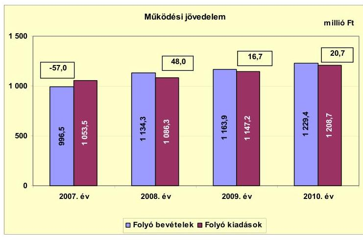

A 2007. évben az Önkormányzat folyó költségvetési egyenlege, működési jövedelme negatív, a 2008-2010. években pozitív összegű volt. A folyó költségvetés 2008. évi többletét alapvetően a kötvényforrás befektetéséből realizált hozam (21,5 millió Ft) és kamatbevétel (51,0 millió Ft), a helyi adókból származó többletbevétel (25,8 millió Ft), és az intézményi átszervezésekből keletkezett bevételi többlet eredményezte. A 2008-2010. években keletkezett összes működési jövedelem 85,4 millió Ft, amely az Önkormányzat fennálló tőketörlesztési kötelezettségeinek teljesítéséhez, valamint fejlesztéseinek finanszírozásához meghatározó forrásként nem szolgált. A folyó költségvetés 2007. évi hiányát mérsékelte, hogy az Önkormányzat a 2007. évben a helyi önkormányzatok működőképességének megőrzését szolgáló kiegészítő támogatásokon belül, a működésképtelen helyi önkormányzatok egyéb támogatása címen 15,0 millió Ft vissza nem térítendő, feladathoz nem kötött támogatásban részesült. E támogatás hiánya esetén az Önkormányzat folyó költségvetésének egyenlege a 2007. évben -72,0 millió Ft lett volna.

A nettó működési jövedelem alakulását a 2007-2010. években a következő ábra szemlélteti:
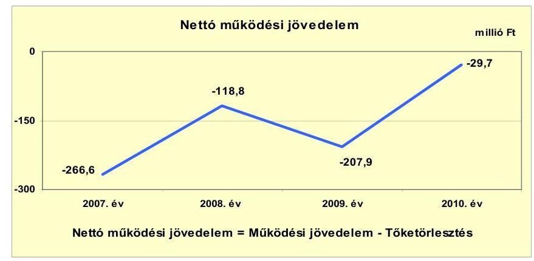

[^0]
[^0]:    ${ }^{23}$ A folyó bevételek között figyelembe vett költségvetési támogatásból a 2009. évben 10,0 millió Ft, a 2010. évben 12,5 millió Ft felhalmozási célú támogatás volt.

---

Az Önkormányzat pénzügyi kapacitása - az alacsony működési jövedelem és az adott költségvetési év hiteltörlesztésének együttes hatására - a vizsgált időszakban folyamatosan negatív értéket mutatott. A 2007-2010. években keletkezett összesen 28,4 millió Ft működési jövedelmet közel 23-szoros mértékben haladta meg a hitelekhez kapcsolódó törlesztés (651,4 millió Ft), amelynek teljesítését követően 623,0 millió Ft negatív nettó működési jövedelem keletkezett.

A 2009. évben a felhalmozási célú hitelekhez kapcsolódóan 71,2 millió Ft előtörlesztésre került sor, amelynek hatására az Önkormányzat 2010. évi pénzügyi kapacitása - a 2009. évi -207,9 millió Ft-ról a 2010. évben -29,7 millió Ft-ra - kedvezően változott. Ugyanakkor az Önkormányzat pénzügyi pozíciója - a növekvő negatív összegű felhalmozási költségvetési egyenleg miatt - a 2010. évben - a 2009. évi -39,5 millió Ft-ról -293,5 millió Ft-ra - romlott.

A negatív nettó működési jövedelem a 2007. évről a 2008. évre történt mérséklődését a működési jövedelem növekedése mellett a hiteltörlesztés mérséklődése okozta. A 2010. évi mérséklődését alapvetően a hiteltörlesztés csökkenése határozta meg ${ }^{24}$. A nettó működési jövedelem előző évhez viszonyított gyengülését a 2009. évben a hiteltörlesztés növekedésén (57,8 millió Ft) túl, a folyó kiadások ${ }^{25}$ növekedése befolyásolta. A negatív nettó működési jövedelem finanszírozása a 2007-2010. években folyószámlahitelből, és az előző évi pénzmaradvány - amelynek része a pénzeszközök év végi állománya - igénybevételével történt.

A felhalmozási költségvetés egyenlegének alakulását a 2007-2010. években a következő ábra szemlélteti:
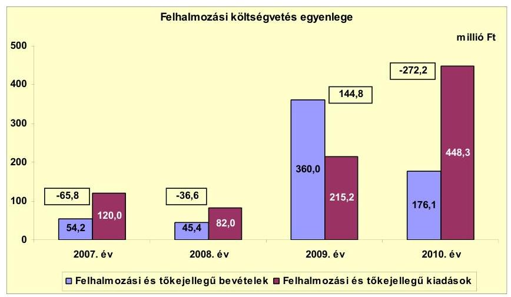

A vizsgált időszakban jelentkező összes felhalmozási forráshiány 229,8 millió Ft volt. A felhalmozási többletbevétel 2009-ben 67,3%-kal

[^0]
[^0]:    ${ }^{24}$ Az Önkormányzat teljesített törlesztési kötelezettsége a 2007. évihez képest a 2008. évben 42,8 millió Ft-tal (20,4%-kal), a 2010. évben 159,2 millió Ft-tal (76,0%-kal) mérséklődött.
    ${ }^{25}$ A folyó kiadások 60,9 millió Ft-os (5,6%-os) növekményének meghatározó részét az intézményalapításból és tagintézmény átvételből eredő dologi kiadások határozták meg.

---

(144,8 millió Ft-tal) haladta meg a felhalmozási kiadásokat. A felhalmozási költségvetés 2009. évi többletét alapvetően az év során az ingatlanértékesítésből befolyt bevétel (252,9 millió Ft), 2010. évi hiányát saját beruházási kiadások (298,6 millió Ft), valamint gazdasági társasága részére felhalmozásra átadott pénzeszköz (95,0 millió Ft) teljesítése határozta meg.

Az Önkormányzat 2007. évi felhalmozási költségvetési hiányának - amely 65,8 millió Ft volt - fedezetét kizárólag kötvénybevételből tudta biztosítani, mivel a folyó költségvetés is pénzügyi hiányt mutatott. A vizsgált időszak további éveiben keletkezett működési jövedelem (85,4 millió Ft) a 2008. és 2010. években fennálló összesen 308,8 millió Ft felhalmozási forráshiány 27,7%-ára nyújthatott fedezetet ${ }^{26}$. A felhalmozási forráshiány további finanszírozása a 2008. és 2010. években az előző évek pénzmaradványából - a kötvényforrás igénybevételével - történt.

A vizsgált időszakban keletkezett teljes finanszírozási hiány ${ }^{27}$ **852,8** millió Ft, amelyből 2007-ben 332,4 millió Ft, 2008-ban 155,4 millió Ft, 2009-ben 63,1 millió Ft, 2010-ben 301,9 millió Ft volt a hiányzó forrás. A hiányzó forrás biztosítására a finanszírozási műveletek bevétele sem volt elég, mivel a 483,8 millió Ft-os pozitív finanszírozási egyenleg a vizsgált időszakban keletkezett finanszírozási hiány 56,7%-át finanszírozhatta. Mindez azt jelzi, hogy az egyensúly megteremtése érdekében szükség volt az előző években képződött tartalékok igénybevételére is.

A folyó és felhalmozási költségvetés hiánya együtt a 2007. évben 122,8 millió Ft, a 2010. évben 251,4 millió Ft, többlete a 2008. évben 11,4 millió Ft, a 2009. évben 161,5 millió Ft volt. Az Önkormányzat a 2007. évi zárszámadási rendeletében 101,1 millió Ft, a 2010. évi zárszámadási rendeletében 74,0 millió Ft pénzügyi hiányt, a 2008. évben 95,8 millió Ft, a 2009. évben 205,5 millió Ft pénzügyi többletet hagyott jóvá.

A folyó és felhalmozási költségvetési egyenleg és a zárszámadásban bemutatott egyenleg közötti eltérés oka, hogy a folyó és felhalmozási költségvetés egyenlege nem tartalmazza az előző évi pénzmaradvány igénybevételét. További eltérést jelentett, hogy a 2010. évben a zárszámadási rendeletben kimutatott költségvetési kiadás 37,8 millió Ft-tal nagyobb volt, mint a folyó és felhalmozási kiadások együttes összege, amelynek oka, hogy az Áhsz. 9. § (11), 9. számú melléklet számlaosztályok tartalmára vonatkozó 1. g) és 2. ca) pontjainak ellenére a 37,8 millió Ft összegű fordított áfa kiadást az 56123 számú főkönyvi számla helyett a 18122 és a 1932 számú főkönyvi számlákra könyvelték, amely a beszámolóban a felújítási, beruházási kiadásoknál halmozódást okozott. A 2011. évben a fordított áfa könyvelése helyesen történt ${ }^{28}$.

A Képviselő-testület az Önkormányzat 2007-2010. évi zárszámadási rendeleteiben a működési és felhalmozási hiányt, többletet a hagyományos költségvetési

[^0]
[^0]:    ${ }^{26}$ A folyó költségvetés egyenlege a 2008. évben teljes körűen, a 2010. évben a felhalmozási költségvetés egyenlegének 7,6%-ára biztosíthatott fedezetet.
    ${ }^{27}$ a nettó működési jövedelem és a felhalmozási költségvetés eredője
    ${ }^{28}$ A halmozódás kiszűrése érdekében a 2. számú mellékletben a 2010. évi adatokat korrigáltuk.

---

szerkezet alapján hagyta jóvá, amelyeket a jelentés 1. számú melléklete mutat be ${ }^{29}$.

Az Önkormányzat tárgyévi pénzügyi pozíciója ${ }^{30}$ folyamatosan gyengült, a 2007. évi 630,9 millió Ft pozitív eredménnyel szemben, a 2008. évben 15,5 millió Ft, a 2009. évben 39,5 millió Ft, a 2010. évben 293,5 millió Ft negatív eredménnyel zárta az évet. A tárgyévi pénzügyi pozíció gyengülésében a 2008. évben a felhalmozási és a finanszírozási egyenleg együttesen, a 2009. évben a finanszírozási egyenleg, a 2010. évben a felhalmozási költségvetés negatív egyenlege volt a meghatározó. Az Önkormányzat finanszírozási műveletei egyenlegének alakulását a 2007-2010. években a következő ábra szemlélteti:
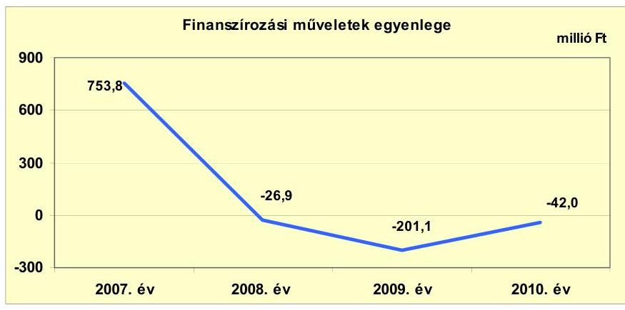

Az Önkormányzatnál a finanszírozási műveletek eredménye a 2007. évben jelentősen hozzájárult a tárgyévi pénzügyi pozíció javításához, a 2008-2010. években ellenben gyengítette azt. Az Önkormányzatnál a 2007. évben a finanszírozási műveletek pozitív egyenlegét a 750,0 millió Ft értékű, CHF alapú kötvénykibocsátás határozta meg. Az ellenőrzött időszakban a korábban felvett hosszú lejáratú hitelekből eredően 165,1 millió Ft tőkét törlesztettek, és 486,3 millió Ft év végén fennálló folyószámlahitelből eredő kötelezettséget egyenlítettek ki. A finanszírozási műveletek 483,8 millió Ft összegű pozitív egyenlege segítette a gazdálkodást ${ }^{31}$.

[^0]
[^0]:    ${ }^{29}$ Az Önkormányzat 2008. évi beszámolója és az 1. sz. melléklet adatainak eltérése abból adódik, hogy a 631,0 millió Ft kötvénybevétel maradványát fejlesztési céltartalékba helyezték, a teljes összeget pénzmaradvány igénybevételként könyvelték. Ezzel szemben a kötvényforrásból a tényleges felhasználás 39,6 millió Ft volt. Pénzmaradvány igénybevételként a 2008. évben helyesen az egyéb forrásból történt igénybevétellel együtt 61,9 millió Ft-ot lehetett volna pénzmaradvány igénybevételként könyvelni. A pénzmaradvány Számv. tv. 16. § (3) bekezdését sértő, Áhsz. 9. számú melléklet számlaosztályok tartalmára vonatkozó 4. b) pontjában előírtaktól eltérő elszámolását a 2009. évben az Önkormányzat gazdálkodási rendszerének ellenőrzéséről szóló jelentés rögzítette, javaslatot tett. A javaslatot hasznosították, a későbbiekben a pénzmaradvány fenti tárgykörben szabálytalan elszámolására nem került sor.
    ${ }^{30}$ a folyó, a felhalmozási és a finanszírozási műveletek egyenlege együtt
    ${ }^{31}$ A finanszírozási célú műveleteket a jelentés 2. számú mellékletének 4.1-4.8. pontjai részletezik.

---

Az Önkormányzat kamatbevételeit és kamatkiadásait a 2007-2011. év I. féléve között a következő ábra mutatja be:
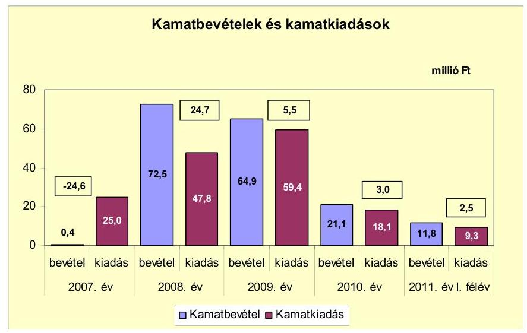

Az Önkormányzat 2007-2010 között 170,7 millió Ft kamatbevételt ért el, és 159,6 millió Ft kamatot fizetett meg. A 2008. évi 72,5 millió Ft és a 2009. évi 64,9 millió Ft kiugróan magas kamatbevételt a kötvényből származó átmenetileg szabad
 pénzeszközök befektetéseiből realizálták. A kamatkiadások a 2007. évről a 2008. évre 25,0 millió Ft-ról 47,8 millió Ft-ra (91,2%-kal), a 2009. évre 59,4 millió Ft-ra (24,3%-kal) emelkedtek, a kötvény kamatfizetési kötelezettségével összefüggésben. A kamatkiadások 2010-re az előző évhez képest 41,3 millió Ft-tal (69,5%-kal) mérséklődtek, a kötvény referencia kamatának csökkenése következtében.

# 2.2. Az Önkormányzat bevételeinek változása 

Az Önkormányzat feladatai ellátása érdekében a 2007. évben 996,5 millió Ft, a 2008. évben 1134,3 millió Ft, a 2009. évben 1163,9 millió Ft, a 2010. évben 1229,4 millió Ft folyó bevételt teljesített. A folyó bevételek körében leginkább meghatározó volt a költségvetési támogatás és az átengedett bevételek együttes összege, amelyek átlagosan 51,9%-ot (584,9 millió Ft-ot) tettek ki. A folyó bevételek között a második legnagyobb súllyal a helyi adókból beszedett bevétel bírt, amelyek átlagos költségvetési súlya 31,9% (359,2 millió Ft) volt a vizsgált időszakban.

---

Az Önkormányzat 2007-2011. év I. félév közötti időszakban realizált főbb folyó bevételi jogcímeinek számszaki adatait az alábbi grafikon mutatja be:
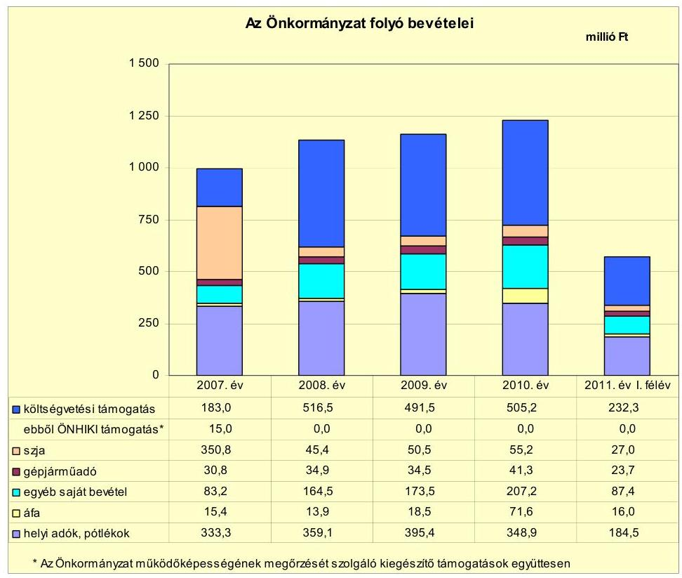

A költségvetési támogatás és az szja együttesen az Önkormányzat számára a 2007-2009. évben átlagosan 545,9 millió Ft, a 2010. évben az átlaghoz képest 2,7%-kal több, összesen 560,4 millió Ft bevételt jelentett. A 2011. év I. félévében a költségvetési támogatás és az szja együtt 259,3 millió Ft (a 2010. évi teljesített bevétel 46,3%-a) volt.

A költségvetési támogatás és az szja együttesen az Önkormányzat számára a 2007. évi teljesítéshez viszonyítva 62,9 millió Ft többletbevételt $^{32}$ jelentett a 2008-2010. években. A többletbevétel leginkább meghatározó oka az intézményi átszervezésekből adódó ellátotti létszámnövekmény volt.

Az Önkormányzatnál az egyéb saját bevételek a 2007-2009. évben átlagosan 140,4 millió Ft-ot (a folyó bevételek 12,8%-át) tettek ki, majd a 2010. évben alapvetően az intézményi ellátotti létszámokból eredően a befolyt térítési díjak növekedésének eredményeként, 66,8 millió Ft-tal (47,6%-kal) meghaladták azt. Az áfa bevétel 2010. évi összegének 2007-2009. évekhez viszonyított 55,7 millió Ft-os (3,5 szeres) emelkedését a felhalmozási feladatokra fordított kiadások teljesítésével összefüggő fordított áfa bevétel elszámolása (37,8 millió Ft) határozta meg. Az Önkormányzat helyi adóból származó bevétele a 2009. évig folyamatosan növekedett, majd a 2010. évben - az adóalanyok számának 1,6%-os (47 adóalany) növekedése ellenére, az adóhátralékok 47,2 millió Ft-tal

[^0]
[^0]:    $^{32}$ Az Önkormányzat költségvetési támogatásából a 2009. évben 10,0 millió Ft (2,0%), a 2010. évben 12,5 millió Ft (2,5%) felhalmozási célú volt.

---

történő növekedése hatására - a 2007-2009. évi átlaghoz képest 13,7 millió Ft-tal (3,8%-kal) csökkent. Az Önkormányzatnak helyi iparűzési adóból $^{33}$, építményadóból $^{34}$, idegenforgalmi és telekadóból keletkezett bevétele az ellenőrzött időszakban. Új helyi adót a vizsgált időszakban nem vetettek ki. Az Önkormányzat a 2007-2010. években az alábbi változásokat hajtotta végre a helyi adók tekintetében:

Az Önkormányzat 2008. január 1-jétől az építményadó mértékét a 2007. évi 600 Ft/m²-ről 760 Ft/m²-re, 2009. január 1-jétől 800 Ft/m²-re emelte a nem állandó lakosok tulajdonában álló valamennyi építményre vonatkozóan. Az idegenforgalmi adó a 2007. évi 230 Ft/vendégéjszakáról, 2008. január 1-jétől 330 Ft-ra, 2011. január 1-jétől 350 Ft/vendégéjszakára emelkedett. A telekadó a beépítetlen belterületi fölterületek után a 2007. évi 180/m²-kénti mértékről 2009. január 1-jétől 258 Ft/m²-re emelkedett.
Az Önkormányzat 2007-2011. év I. félév között teljesített felhalmozási bevételei az alábbiak szerint alakultak:

| Megnevezés | 2007. év | 2008. év | 2009. év | 2010. év | 2011. év I.   félév |
| :-- | --: | --: | --: | --: | --: |
| Tárgyi eszköz értékesítés | 1,9 | 3,1 | 252,9 | 4,4 | 2,7 |
| Egyéb saját tőkebevétel | 34,4 | 25,7 | 43,2 | 5,0 | 5,7 |
| Államháztartáson belülről   kapott támogatás | 14,8 | 16,0 | 63,0 | 166,3 | 54,5 |
| EU-tól és külföldről kapott   támogatások | 0,0 | 0,0 | 0,0 | 0,0 | 0,0 |
| Államháztartáson kívülről   kapott támogatás | 3,1 | 0,6 | 0,9 | 0,4 | 0,0 |
| Összes felhalmozási bevétel | 54,2 | 45,4 | 360,0 | 176,1 | 62,9 |

A felhalmozási bevételek összege és aránya a költségvetési bevételek körében a vizsgált időszakban nem volt meghatározó, mivel költségvetési súlyuk átlagosan 11,3%-ot (158,9 millió Ft) tett ki. A tárgyi eszközök értékesítéséből származó bevétel a 2009. évben kiugróan magas (252,9 millió Ft) összege, a felhalmozási bevétel $^{35}$ 70,3%-át képezve jelentős szerepet játszott a 144,8 millió Ft-os felhalmozási költségvetési egyenleg megteremtésében.

A 2010. évben teljesített felhalmozási célú bevételeket döntően (94,4%-ban) meghatározta az államháztartáson belülről kapott támogatások 166,3 millió Ft-os összege, amely az Árpád utca korszerűsítésének, és a Balatonfűzfő Fűzfőgyártelep városrésze értéknövelő és funkcióbővítő fejlesztésének támogatását jelentette.

[^0]
[^0]:    $^{33}$ A helyi adóbevételek 57,3%-át az iparűzési adóból származó bevétel tette ki. Az iparűzési adómértéke az adómérték maximuma volt a 2007-2011. év I. féléve közötti időszakban.
    $^{34}$ Az építményadó helyi adók közötti súlya átlagosan 33,9% volt a vizsgált időszakban.
    $^{35}$ Az Önkormányzatnak a 2009. évben a „községháza" megjelölésű (673 hrsz.) ingatlan értékesítéséből 22,2 millió Ft, és egy 15 ha 5061 m² területű belterületi ingatlan (1058/4. hrsz.) eladásából 228,5 millió Ft bevétele keletkezett.

---

# 2.3. Az Önkormányzat működési és a felhalmozási célú kiadásainak változása 

Az Önkormányzat működési és felhalmozási kiadásai együttesen a 2008. évben 0,4%-kal (5,2 millió Ft-tal) elmaradtak, a 2009. évben 16,1%-kal (188,9 millió Ft-tal), a 2010. évben 41,2%-kal (483,5 millió Ft-tal) haladták meg a 2007. évit, amely 1173,5 millió Ft volt. A költségvetési kiadások átlagos növekedési üteme 12,6% - ezen belül a folyó működési kiadásoké 4,7% - volt a vizsgált időszakban.
Az Önkormányzat folyó kiadásai főbb jogcímek szerinti bontásban a 2007-2011. év I. félév közötti időszakban az alábbiak voltak:

| Megnevezés | 2007. év | 2008. év | 2009. év | 2010. év | 2011. év I.   félév |
| :--: | :--: | :--: | :--: | :--: | :--: |
| Folyó kiadások | 1053,5 | 1086,3 | 1147,2 | 1208,7 | 590,7 |
| Működési kiadások (kamatkiadás nélkül) | 977,3 | 962,4 | 1012,2 | 1108,6 | 533,5 |
| Államháztartáson belülre átadott pénzeszközök | 2,7 | 4,0 | 5,1 | 6,1 | 3,6 |
| Transzferkiadások | 48,5 | 72,1 | 70,6 | 75,9 | 40,4 |
| -ebből: vállalkozásoknak | 24,3 | 31,5 | 28,9 | 21,9 | 8,9 |
| EU-nak, illetve külföldre | 0,0 | 0,0 | 0,0 | 0,0 | 0,0 |
| magánszemélyeknek | 19,5 | 33,2 | 35,5 | 47,1 | 25,1 |
| nonprofit szervezeteknek | 4,7 | 7,4 | 6,2 | 6,9 | 6,4 |
| Kamatkiadások | 25,0 | 47,8 | 59,4 | 18,1 | 9,3 |
| Előző évi pénzmaradvány átadás | 0,0 | 0,0 | 0,0 | 0,0 | 3,9 |

Az Önkormányzat folyó kiadásai a 2007-2009. években átlagosan 4,4%-kal (46,9 millió Ft-tal) emelkedtek, a 2010. évben 10,3%-kal (113,0 millió Ft-tal) haladták meg azt. A 2011. év I. félévében a folyó kiadások 590,7 millió Ft-ot, a 2007. évi folyó kiadások 56,1%-át tették ki. A folyó kiadásokon belül a működési kiadások átlagos növekedési üteme 3,4% (34,6 millió Ft) volt, amelyet a 2010. évben 9,6%-kal (98,7 millió Ft-tal) teljesítettek túl. A működési kiadások 2008. évi csökkenését, majd 2009-2010. évi mérsékelt emelkedését a feladatellátás változása határozta meg.
Az Önkormányzat működési kiadásai főbb kiadásnemek szerinti bontásban a 2007-2011. év I. félév közötti időszakban az alábbiak voltak:

|  |  |  |  |  | millió Ft |
| :-- | --: | --: | --: | --: | --: |
| Megnevezés | 2007. év | 2008. év | 2009. év | 2010. év | 2011. év I.   félév |
| Személyi juttatások | 539,4 | 538,4 | 551,5 | 587,7 | 270,3 |
| Munkaadót terhelő járulékok | 166,7 | 165,0 | 153,9 | 144,9 | 67,3 |
| Dologi kiadások | 255,4 | 249,3 | 301,2 | 352,7 | 185,5 |
| Egyéb folyó kiadások | 40,8 | 57,5 | 65,0 | 41,4 | 23,8 |

A személyi juttatások évi átlagos növekedése a 2007-2009. évben 1,1% (6,1 millió Ft) volt. A 2010. évben a 2007-2009. évi átlaghoz képest 8,2%-os (36,2 millió Ft-os) növekedés oka az intézményalapítás és intézménybővülés és tagintézmény átvétel miatti létszámnövekedés volt. A vizsgált időszakban a munkaadókat terhelő járulékok összege a központi szabályozás változásának hatására mérséklődött.

A folyó kiadások növekedésében az üzemeltetést, intézményfenntartást biztosító dologi kiadások növekménye volt meghatározó, mivel a 2010. évben teljesített kiadások 31,3%-kal (84,1 millió Ft-tal) haladták meg a 2007-2009. évi 24,5%-os (268,6 millió Ft-os) átlagot.

---

Az Önkormányzat folyó és felhalmozási kiadásainak alakulását, a teljesített kiadások működési és felhalmozási felhasználásának arányait a 2007-2011. év. I. félév közötti időszakban a következő ábra mutatja be:
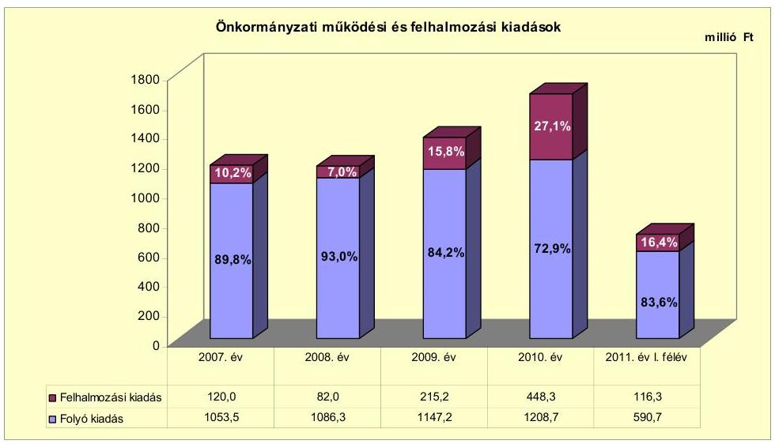

Az Önkormányzat költségvetésében elszámolt felhalmozási kiadások arányának változásában a 2007. évhez viszonyítva a 2008. évben figyelhető meg 3,2 százalékpontos csökkenés, majd a 2009-2010. években 5,6 és 16,8 százalékpontos növekedés. A változások irányát és nagyságrendjét a pályázati források elnyerhetősége, a saját források rendelkezésre állása, valamint a Képviselő-testület által megfogalmazott fejlesztési irányok határozták meg. A 2011. év I. félévében teljesített felhalmozási kiadások a 2007. évben teljesített kiadásoktól 3,7 millió Ft-tal (3,1%-kal) maradtak el.

Az Önkormányzatnál a vizsgált időszakban befejezett és folyamatban lévő fejlesztések együttes tervezett bekerülési költsége 1299,5 millió Ft volt, amellyel szemben a 2007-2010. évben összesen 632,1 millió Ft teljesítés történt. Az önkormányzati fejlesztések döntően intézményi épületek korszerűsítéséhez, kapacitásbővítéséhez, közterületek - utak, járdák - felújításához, ingatlan vásárláshoz kapcsolódtak. A folyamatban lévő és tervezett fejlesztések felülvizsgálatára nem került sor, a megvalósult létesítmények fenntarthatóságának pénzügyi hatásait nem értékelték.

Az Önkormányzat a 2007-2010. években befejezett fejlesztések érdekében a vizsgált időszakban 469,1 millió Ft kifizetést teljesített $^{36}$. A befejezett fejlesztések forrásmegoszlása 168,7 millió Ft (36,0%) saját bevétel, 126,6 millió Ft (27,0%) kötvény értékesítéséből származó bevétel, 147,0 millió Ft (31,3%) EU-s támogatás, 26,8 millió Ft (5,7%) hazai támogatás volt. A fejlesztések a tervezettnél 62,5 millió Ft-tal (11,8%-kal) kevesebb kiadással valósultak meg.

Az Önkormányzat folyamatban lévő - a vizsgált időszak előtt, illetve a vizsgált időszakban megkezdett, de a 2010. évet
 követő időszakban befejezni tervezett beruházásainak tervezett bekerülési költsége 706,4 millió Ft, amelyből a 2007-

[^0]
[^0]:    ${ }^{36} 10$ felújítási és 114 fejlesztési feladat valósult meg.

---

2010. években teljesített kiadás 162,8 millió Ft volt ${ }^{37}$. E feladatok megvalósítása érdekében az Önkormányzat 5,1 millió Ft (3,1\%) saját bevételt, 52,2 millió Ft (32,1\%) kötvény értékesítéséből származó bevételt, 98,0 millió Ft (60,2\%) EU-s támogatást, és 7,5 millió Ft (4,6\%) hazai támogatást vett igénybe. Az Önkormányzat 2010. december 31-én folyamatban lévő további, összesen 552,1 millió Ft-ban tervezett fejlesztési feladatainak forrása 0,1 millió Ft ( $0,02 \%$ ) saját bevétel, 270,5 millió Ft (49,0\%) kötvény értékesítéséből származó bevétel, 276,5 millió Ft (50,1\%) EU-s támogatás, 5,0 millió Ft ( $0,9 \%$ ) hazai támogatás.

Az Önkormányzat a 2011. évben egy felhalmozási feladat megvalósítása érdekében nyújtott be pályázatot. Az építési beruházás tervezett bekerülési költsége 61,5 millió Ft, amelynek forrása 18,4 millió Ft (30,0\%) kötvény értékesítéséből származó bevétel, 43,1 millió Ft (70,0\%) hazai támogatás. A feladatot a 2012. évben tervezik megvalósítani. A pályázat benyújtásához kapcsolódóan az Önkormányzatnak 0,2 millió Ft kiadása merült fel a 2010. évben.

Az Önkormányzat három legmagasabb bekerülési költségű beruházása az „Árpád utca korszerűsítése Balatonfüzfőn", a „Balatonfüzfő Füzfögyártelep városrészének értéknövelő és funkcióbővítő fejlesztése", és a „balatonfüzfői Szivárvány Óvoda és Bölcsőde bölcsődei kapacitásbővítése épület-átalakítással" elnevezésű feladatokhoz kapcsolódott.

Az „Árpád utca korszerűsítése Balatonfüzfőn", elnevezésű 2008. évben indult projekt tervezett teljes bekerülési költsége 168,3 millió Ft volt. Az Önkormányzat tervezett saját forrása 50,5 millió Ft (30,0\%) kötvényértékesítésből származó bevétel, az EU-s támogatás tervezett előirányzata 117,8 millió Ft (70,0\%) volt. A kivitelezés a 2009. évben kezdődött meg és a 2010. évben befejeződött. A teljesített kifizetés összege 165,4 millió Ft, ebből a saját forrás 49,8 millió Ft, a támogatás 115,6 millió Ft volt.

A „Balatonfüzfő Füzfögyártelep városrészének értéknövelő és funkcióbővítő fejlesztése" elnevezésű 2008. évben indult projekt tervezett teljes bekerülési költsége 110,0 millió Ft volt, amelyhez az Önkormányzat kötvényértékesítésből származó bevételéből 11,0 millió Ft-ot (a források 10\%-át) tervezett biztosítani. Az igényelt EU-s támogatás 99,0 millió Ft (a források 90\%-a) volt. A fejlesztés a 2010. év végén még folyamatban volt. A 2007-2010. években a feladatra teljesített kiadás 91,3 millió Ft volt, amelyhez a támogatás késedelme miatt a kötvényforrások terhére, a tervezettet 95,5%-kal meghaladóan 21,5 millió Ft saját forrás átmeneti igénybevételére volt szükség. A tervezett támogatás teljesítése 70,6%-os volt. Az elmaradt 29,2 millió Ft összegű támogatásból a 2011. év I. félévében tényleges igénybevétel 26,6 millió Ft volt. A fejlesztési feladat a 2010. évben műszakilag megvalósult, a pénzügyi befejezés a forrás késedelme miatt a 2011. év I. félévében történt meg.

A „balatonfüzfői Szivárvány Óvoda és Bölcsőde bölcsődei kapacitásbővítése épületátalakítással" elnevezésű projekt 2009. évben indult 105,2 millió Ft tervezett bekerülési költség mellett, 26,0 millió Ft kötvényforrás (24,7\%), és 79,3 millió Ft (75,3\%) EU-s támogatás igénybevételének tervezésével. A fejlesztéssel kapcsolatos pályázatot a 2009. évben nyújtották be, a kivitelezés 2011. évben kezdődött meg. A 2010. évben a tervezett saját forrásból 1,4 millió Ft (5,4\%), az EU-s támogatásból 1,2 millió Ft (1,5\%) igénybevétele történt meg. A 2011. év I. félév végén a közbeszerzési eljárás zajlott, a feladatra teljesített összes kiadás 2,6 millió Ft volt.

[^0]
[^0]:    ${ }^{37}$ A 2010. év végén egy felújítás, és kilenc fejlesztési feladat volt folyamatban.

---

Az Önkormányzat a 2007-2010. években működési célra 284,9 millió Ft-ot, felhalmozási célra 233,4 millió Ft-ot adott át az államháztartáson belüli és kívüli szervezeteknek együttesen ${ }^{38}$.

Az Önkormányzat által a kizárólagos tulajdonában lévő gazdasági társasága, valamint a kiemelt közfeladatot ellátó gazdasági társaságok számára működési, felhalmozási célra átadott pénzeszközök alakulását a 2007-2011. év I. félévében az alábbi diagram mutatja be:
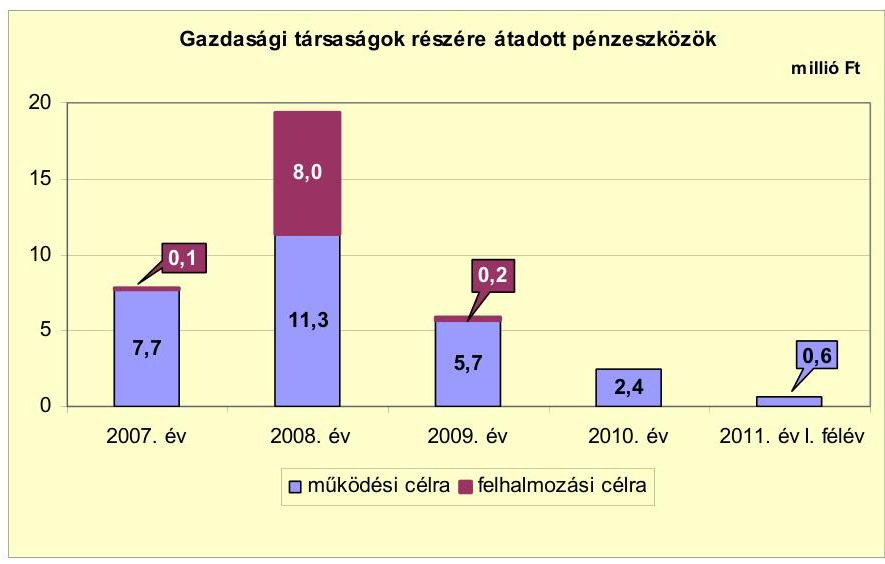

Az Önkormányzat kizárólagos önkormányzati tulajdonában álló gazdasági társasága működéséhez 4,5 millió Ft-ot, felhalmozási feladatai megvalósítása érdekében - gázellátás - 8,0 millió Ft-ot adott át a vizsgált időszakban. A helyi tömegközlekedést biztosító gazdasági társaság számára az Önkormányzat a települési önkormányzatok közösségi közlekedéssel kapcsolatos feladatainak ellátásához kapcsolódóan 5,2 millió Ft-ot, valamint saját forrásai terhére további 3,0 millió Ft-ot adott át a vizsgált időszakban. A Dunántúli Regionális Vízmű Zrt. részére környezetvédelmi beruházás megvalósításához 0,3 millió Ft-ot biztosított az Önkormányzat. A Támasz Kht. működéséhez, az általa vállalt szociális feladatok ellátása érdekében a 2007-2009. években összesen 15,0 millió Ft-ot juttatott az Önkormányzat.

A Képviselő-testület ${ }^{39}$ helyi rendeletekben, határozatokban határozta meg közszolgáltatások díjait. A közszolgáltatást biztosító gazdasági társaságok az Önkormányzattól rendszeres működési célú pénzeszköz átadásban nem részesültek, a kialakított díjrendszerek biztosították a társaságok ráfordításaira és a működésükhöz szükséges nyereség fedezetét. A kizárólagos önkormányzati tulajdonú gazdasági társaság, valamint a közszolgáltatási feladatot ellátó gazdasági társaságok részére átadott pénzeszközöket a 4. számú melléklet mutatja be.

[^0]
[^0]:    ${ }^{38}$ Az államháztartáson kívülre teljesített kiadás 490,7 millió Ft volt a 2007-2010. években.
    ${ }^{39}$ az Ötv. 16. § (1) bekezdésében kapott felhatalmazás alapján valamint az árak megállapításáról szóló 1990. évi LXXXVII. tv. 7. § (1) bekezdése alapján

---

# 3. Az ÖNKORMÁNYZAT KÖTELEZETTSÉGEI 

### 3.1. Az Önkormányzat pénzintézeti kötelezettségeinek változása

Az Önkormányzat pénzintézeti kötelezettségeinek állománya 2006. december 31-től 2010. december 31-ig - deviza alapú kötvény kibocsátás miatt 4,3-szeresére 268,9 millió Ft-ról 1161,5 millió Ft-ra nőtt. A 2006. december 31-én fennálló pénzintézeti kötelezettség beruházási és fejlesztési hitelekből, valamint folyószámlahitel igénybevételéből állt. A beruházási és fejlesztési hitelek a 2007-2010. években visszafizetésre kerültek ${ }^{40}$. A 2010. december 31-én fennálló 1161,5 millió Ft pénzintézeti kötelezettségek állományából 750,0 millió Ft az önkormányzati fejlesztésekhez forrást biztosító 2007. évi CHF alapú kötvénykibocsátásból, 345,2 millió Ft árfolyamváltozásból, valamint 66,3 millió Ft folyószámlahitel igénybevételéből keletkezett. A 2010. év végétől a folyószámlahitel igénybevételének további 5,5 millió Ft-os növekedése miatt a pénzintézeti kötelezettségek állománya 2011. június 30-ára 1167,0 millió Ft-ra emelkedett.
Az Önkormányzat pénzintézeti kötelezettségeinek állományát 2006. december 31-től 2011. június 30-ig a következő ábra szemlélteti:
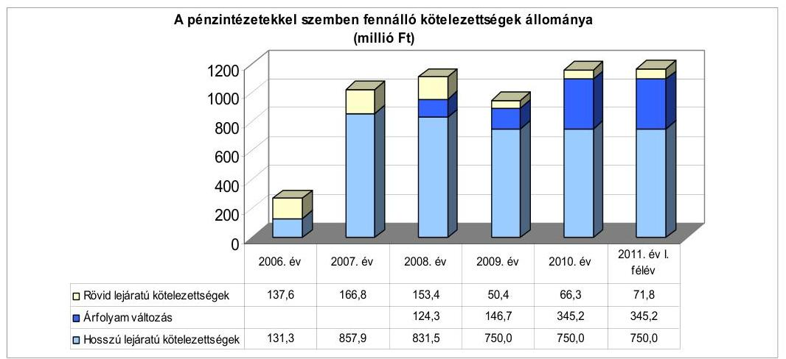

Az Önkormányzat a devizában kibocsátott kötvénynél az árfolyamváltozás miatti év végi értékelést a 2008-2010. években elvégezte. A 2008. évi értékelést az Önkormányzat a számviteli politikájában meghatározottak szerint, de az Áhsz. 5. § 7/d. pontjában ${ }^{41}$ foglaltakkal ellentétesen állapította meg, és a 124,3 millió Ft árfolyam különbözetet a főkönyvi könyvelésben nem számolta el, így a kötelezettségek állománya nem tartalmazta az árfolyam változások

[^0]
[^0]:    ${ }^{40}$ A felhalmozási célú hitelekből a 2007. évben 33,8 millió Ft-ot, a 2008. évben 23,4 millió Ft-ot, a 2009. évben 97,6 millió Ft-ot, a 2010. évben 10,3 millió Ft-ot fizettek vissza.
    ${ }^{41}$ Az Áhsz. 5. § 7/d pontja alapján minden esetben jelentős összegűnek kell tekinteni, ha a külföldi pénzértékre szóló követelés, befektetett pénzügyi eszköz, értékpapír, illetve kötelezettség mérleg fordulónapi értékelésekor a költségvetési év mérlegforduló napjára vonatkozó - a Számv. tv. 60. §-a szerinti - devizaárfolyamon átszámított forintértéke és az értékelés előtti könyv szerinti értéke közötti különbözet összege meghaladja az értékelés előtti könyv szerinti érték 20\%-át vagy a 100 ezer forintot.

---

hatását. Ezért az ábrán szereplő 2008. évi pénzintézeti kötelezettség állománya eltér az Önkormányzat 2008. évi beszámolójától és a CLF módszer szerinti adattábla pénz- és tőkepiaci kötelezettség (adósság) során található 2008. évi adattól.

Az árfolyamváltozás hatása befolyásolja a kötelezettségek alakulását, azonban annak mértéke előre pontosan nem határozható meg, csak várakozásokon alapuló tendenciák jelezhetők. Annak megítéléséről, hogy a devizában felvett hitelekért kapott forinthoz képest a hitelek visszafizetésekor jelentkező forint kötelezettség többletkiadást (árfolyamveszteség), vagy megtakarítást (árfolyamnyereség) eredményez a futamidő végén, a teljes kötelezettség rendezését követően lehet képet alkotni. Mindaddig, amíg törlesztési kötelezettség nem áll fenn (türelmi idő, moratórium), a tőkére vonatkoztatva nem értelmezhető sem az árfolyamveszteség, sem az árfolyamnyereség. Ugyanakkor a számviteli szabályok meghatározzák, hogy az árfolyam különbözetet év végén a kötelezettségek vagy követelések között a könyvviteli mérlegben nyilván kell tartani, azonban az árfolyam különbözet valójában nem realizált.

Az Önkormányzat a forráshiány kezelése érdekében a 2007-2010. évi költségvetési rendeletekben működési célú hitelfelvétellel, a 2011. évi költségvetési rendeletben működési célú hitelfelvétellel, valamint pénzmaradvány igénybevétellel számolt. A Képviselő-testület minden évben a költségvetés elfogadásakor a működési forráshiány kezelése érdekében folyószámlahitel igénybevételéről döntött. A likviditási hitel keretét a 2008. évben 160,0 millió Ft-ban, a 2007. évben valamint a 2009-2011 közötti években 150,0 millió Ft-ban határozta meg. A 2007. évi költségvetés egyensúlyának biztosítása érdekében a Képviselő-testület évközben intézkedési tervet fogadott el.

Az intézkedési tervben foglaltak szerint a 2007. évi költségvetésben tervezett kiadási előirányzatokon felüli többletkiadáshoz fedezet csak valamely másik kiadási előirányzat csökkentésével volt biztosítható. A Polgármesteri hivatal és a részben önállóan gazdálkodó intézmények hosszú távú kötelezettségvállalásait felül kellett vizsgálni. A tervezett - még nem teljesített, illetve kötelezettségvállalással nem terhelt - felhalmozási kiadások közül a hiteltörlesztésen kívül más kiadás nem volt teljesíthető, továbbá a tervezetten felül új beruházás nem volt indítható.

A 2007. évben a Képviselő-testület az Önkormányzat fejlesztési céljainak megvalósítására, valamint hosszú lejáratú és likvid hiteleinek kiváltására 750,0 millió Ft-nak megfelelő CHF alapú „Balatonfüzfő Gyarapodás" elnevezésű kötvény kibocsátásáról döntött. Az Önkormányzat a kötvénykibocsátásra négy kereskedelmi banktól kért ajánlatot, amelyre két bank nyújtotta be pályázatát. A Képviselő testület a kötvényt svájci frankban 20 éves futamidővel ${ }^{42}$, négy év kilenc hónap és 18 nap tőkefizetési halasztással, változó összegű kamatfizetési kötelezettséggel bocsátotta ki. Az ellenőrzött időszakban az Önkormányzatnál hosszú lejáratú működési, illetve fejlesztési célú hitelfelvételre nem került sor.

A Képviselő-testület a kötvényből származó forrás felhasználási céljaként fejlesztési forrásteremtést, hatékony hitelkiváltást jelölt meg. A Képvi-

[^0]
[^0]:    ${ }^{42}$ A futamidő és kamatszámítás kezdő napja 2007. december 12. volt.

---

selő-testület kötvénykezelő csoportot hozott létre, amelynek tagjai a jegyző és pénzügyi osztályvezető volt.

A Képviselő-testület szempontrendszert fogadott el a kötvénykibocsátásból származó bevétel felhasználási szabályzatának kidolgozásához. Ennek figyelembevételével elkészítették a kötvény felhasználás szabályzatát és intézkedési tervét, amelyben meghatározták az Önkormányzat fejlesztéseinek prioritását.

A Képviselő-testület a kötvénykibocsátásról szóló döntés meghozatalakor a döntéskor ismert pénzpiaci feltételekkel számolt. A döntést megalapozó előterjesztés azonban nem tartalmazta a kötelezettségvállalás visszafizetési forrásait, a kamat-, a visszafizetési és - a deviza alapú kötelezettséget érintő árfolyamkockázatot. Az adósságot keletkeztető kötelezettségvállalás felső határát ${ }^{43}$ a döntéskor figyelembe vették, azt az áttekintett időszakban nem lépték túl. A kötvény felhasználásáról, a szabad források befektetéséből származó bevételek alakulásáról, valamint a kamat és tőkefizetési kötelezettség alakulásáról a Képviselő-testületet folyamatosan, évente általában két alkalommal tájékoztatták.

Az Önkormányzat számlavezetője a kötvény kibocsátás időpontjában nem volt
 azonos a kötvényt finanszírozó pénzintézettel, azonban 2008. július 1-jétől a kötvényt finanszírozó pénzintézet lett a számlavezető. A pénzintézetváltás az Önkormányzat finanszírozási struktúrájában, pénzügyi helyzetében változást nem okozott.

A 2009. évben a kötvényt finanszírozó pénzintézet és az Önkormányzat a kötvény forgalmazói szerződésének díjfizetési kötelezettségre vonatkozó pontját kiegészítette. A kiegészítés szerint a pénzintézetet átalányjellegű, a szolgáltatások folyamatos teljesítéséért járó díjazás illeti meg az adott év január első banki napján fennálló kötvényállomány össznévértékére vetítve. A mindenkori átalánydíj mértékét 0,0-5,0% közötti díjmértékben határozták meg. A 2009. évben az Önkormányzat 2,2% mértékű átalánydíj jogcímen 54,0 ezer CHF-ot (9,7 millió Ft-ot) fizetett ki, ugyanakkor a 2010-2011. év I. félév időszakában átalánydíj fizetésre nem került sor.

Az Önkormányzat 2010. december 31-én valamint 2011. június 30-án CHF-ben fennálló hosszú lejáratú adósságot keletkeztető kötelezettségvállalása azonosan az alábbi volt:

| Megnevezés | Szerződéskötés/   Kibocsátás   időpontja | Összeg   ezer CHF-ben | Kibocsátási   /fehívási   árfolyam | Kamat (referencia   kamat+ kamatfelár) | Felhasználás célja: |
| :-- | :--: | :--: | :--: | :--: | :--: |
| "Balatonfüzfő Gyarapodás"   elnevezésű HU0000340963   kötvény | 2007. december 12. | 4918 | $152,5 \mathrm{Ft} / \mathrm{CHF}$ | 6 havi LIBOR $+1,2 \%$ | Fejlesztési   forrásteremtés,   hatékony hitelkiváltás |

A devizában fennálló pénzintézeti kötelezettségből 2011. június 30-ig tőkét nem törlesztettek. A tőketörlesztési kötelezettség 2012 szeptemberétől válik esedékessé, amelynek összege várhatóan - a 2012. évre vonatkozóan - 153,7 ezer CHF. A CHF-ben fennálló pénzintézeti kötelezettsége után 2011. június 30-ig 425,3 ezer CHF (76,4 millió Ft) kamatot és 16,7 millió Ft egyéb költséget (jegyzési, garanciavállalási díjat és átalánydíjat) fizetett meg az Önkormányzat.

[^0]
[^0]:    ${ }^{43}$ az Ötv. 88. § (2) bekezdés alapján

---

A kötvény kibocsátás bevételéből 2011. június 30-ig 402,7 millió Ft-ot használtak fel, és további 280,7 millió Ft felhasználására vállalt kötelezettséget a Képviselő-testület. A kötvénykibocsátásból származó források szabadon, a pénzintézet korlátozása nélkül befektethetőek voltak.

Az Önkormányzat a kötvénykibocsátásból származó bevételéből 169,7 millió Ft tagi kölcsönt - 6,5 millió Ft-ot működésének biztosítására, 163,2 millió Ft-ot felhalmozási feladatokra - nyújtott a kizárólagos tulajdonú gazdasági társaságának, 40,0 millió Ft-ot működési célú hitel kiváltására fordított. A kötvény jegyzési, garanciavállalási díjára 7,0 millió Ft-ot, ingatlan vásárlásra 27,1 millió Ft-ot, önkormányzati felhalmozási célú pályázatokhoz önrész biztosítására 158,9 millió Ft-ot használtak fel. A Képviselő-testület 2011. június 30-ig további önkormányzati felhalmozási célú pályázatokhoz önrész biztosítására vállalt 280,7 millió Ft kötelezettséget.

Az adósságot keletkeztető kötelezettségvállalással megvalósított fejlesztések bevételnövelő, illetve kiadáscsökkentő hatását, valamint visszafizetési forrásként való számbavételét a beruházások jellegétől függően a kötvény felhasználási szabályzatban előírtak szerint vizsgálták.

Az Önkormányzat a kötvény szabad forrásának befektetéséből 2011. június 30-ig 165,4 millió Ft bevételt realizált.

A kötvény szabad forrásának befektetéséből realizált bevétel részeként a 2008. évben a kamatbevétel mellett deviza opciós ügylet eredményeként 21,5 millió Ft hozama is keletkezett az Önkormányzatnak. A 2009. évtől deviza opciós ügyletet nem végeztek, a szabad pénzeszközt tartós betétben két-három hónapos lekötéssel helyezték el.

A kötvény befektetéséből realizált bevételt kötvény kamatfizetési kötelezettségre (86,1 millió Ft), a 2008-2010. években fennállt fejlesztési hitelek törlesztésére (43,9 millió Ft), a 2008-2010. években fennállt fejlesztési hitelek kamatfizetési kötelezettségére (23,3 millió Ft), valamint önkormányzati beruházásokra (12,1 millió Ft) fordították.

Az Önkormányzat a likviditását a 2007-2011. év I. félév időszakában folyószámlahitel, a 2007. és a 2008. évben munkabér megelőlegezési hitel, valamint egyéb likvid hitel igénybevételével, költségvetésének finanszírozhatóságát folyószámlahitel igénybevételével tudta biztosítani. A folyószámlahitel és a munkabér megelőlegezési hitel alakulását 2007-2011. év I. félév időszakában az alábbi táblázat mutatja be:
millió Ft-ban

| Megnevezés | 2007. év | 2008. év | 2009. év | 2010. év | 2011. év I.   félév |
| :-- | --: | --: | --: | --: | --: |
| I. Folyószámlahitel |  |  |  |  |  |
| a folyószámlahitel keretösszege január 1-jén | 150,0 | 160,0 | 150,0 | 150,0 | 150,0 |
| teljesített kamat és egyéb költség | 12,1 | 9,5 | 3,9 | 4,9 | 2,9 |
| II. Munkabér megelőlegezési hitel |  |  |  |  |  |
| Igénybevett hitel összesen: | 113,0 | 28,0 | 0,0 | 0,0 | 0,0 |
| teljesített kamat és egyéb költség | 0,7 | 0,5 | 0,0 | 0,0 | 0,0 |

---

A folyószámlahitel és munkabér megelőlegezési hitelek kondícióinak és egyéb költségeinek alakulását az alábbi táblázat szemlélteti ${ }^{44}$:

| Megnevezés | Kamat (referencia+ kamatfelár) | Egyéb költség |
| :--: | :--: | :--: |
| Folyószámlahitel |  |  |
| $\begin{aligned} & \text { 2007. 01. 01.-2008. 04. 12-ig } \\ & \text { 2008. 08. 01.-2008. 11. 19-ig } \end{aligned}$ | 3 havi BUBOR $+1,5 \%$ | kezelési költség 0,5\% |
|  | 1 havi BUBOR $+1,0 \%$ | rendelkezésre tartási jutalék 0,3\% |
| 2008. 11. 20.-2008. 12. 14-ig | 1 havi BUBOR $+2,0 \%$ | rendelkezésre tartási jutalék 0,3\% |
| 2008. 12. 15.-2009. 07. 31-ig | 1 havi BUBOR $+2,0 \%$ | rendelkezésre tartási jutalék 2,0\% |
| 2009. 08. 01.-2011. 06. 30-ig | 1 havi BUBOR $+3,0 \%$ | rendelkezésre tartási jutalék 2,0\% |
| Munkabér megelőlegezési hitel |  |  |
| 2007. év | 3 havi BUBOR $+1,5 \%$ | - |
| 2008. év | 1 havi BUBOR $+1,0 \%$ | rendelkezésre tartási jutalék 0,3\% |
| 2009. év | 1 havi BUBOR $+1,0 \%$ | rendelkezésre tartási jutalék 0,3\% |

Az Önkormányzatnál folyószámlahitel igénybevételre - a 2008-2010. évek pozitív működési jövedelme ellenére - a 2007. és azt megelőző években keletkezett működési hiány finanszírozása miatt volt szükség ${ }^{45}$. A folyószámlahitellel zárt napok száma a 2007. évben 251 nap, a 2008. évben 176 nap, a 2009. évben 91 nap volt, míg a 2010. évben 305 nap, a 2011. év I. félévében 163 nap rendelkezett folyószámlahitellel az Önkormányzat. Az év végén fennálló folyószámlahitel állomány a 2007. év végi 143,4 millió Ft-ról a 2009. év végére 40,2 millió Ft-ra csökkent, mivel a 2009. évi ingatlanértékesítésből származó bevétel még fel nem használt részét átmenetileg az elszámolási számlán kezelték. A csökkenéshez hozzájárult továbbá, hogy a Képviselő-testület döntése alapján a kibocsátott kötvénybevételből 2008-ban 40,0 millió Ft-ot folyószámlahitel kiváltására használt fel az Önkormányzat. A 2009. évi 252,9 millió Ft ingatlanértékesítésből származó bevétel maradványának - 65,4 millió Ft - 2010. évi felhasználását követően a folyószámlahitel állománya a 2010. év végére 66,3 millió Ft-ra emelkedett, 2011. június 30-án 71,8 millió Ft volt. A hitel napi átlagos állománya ${ }^{46}$ a 2007. évi 92,8 millió Ft-ról a 2010. évre 26,9 millió Ft-ra, majd a 2011. év I. félév végére 17,8 millió Ft-ra mérséklődött ${ }^{47}$, amelyhez hozzájárult a folyó költségvetés 2008-2010. években képződött pozitív egyenlege. Az Önkormányzat az ellenőrzött időszakban a folyószámlahitel szerződések lejáratának időpontjában a 2009. évi fordulónap kivételével 19,4 millió Ft-118,2 millió Ft közötti kötelezettségállománnyal rendelkezett ${ }^{48}$. Az Önkormányzatnak a 2008. évben a lejáratkor fennálló - 118,2 millió Ft - kötelezettségállomány miatt a likviditás biztosítása érdekében - az új folyószámlahitel keret megkötéséig -

[^0]
[^0]:    ${ }^{44}$ A referencia kamat az alábbiak szerint alakult a 2007-2011. év I. félévben:

    | MNB BUBOR fieng (álogkamat) %-ben |  |  |  |  |
    | :--: | :--: | :--: | :--: | :--: |
    | Referencia kamat | 2007. év | 2008. év | 2009. év | 2010. év |
|  |  |  |  |  | 1. félév |  |
    | 1 havi BUBOR | 7,83 | 8,75 | 8,66 | 5,47 | 6,00 |
    | 3 havi BUBOR | 7,75 | 8,87 | 8,64 | 5,50 | 6,07 |

    ${ }^{45}$ A működés hiánya a 2007. évben 57,0 millió Ft, a 2006. évben 79,0 millió Ft volt.
    ${ }^{46}$ a fennálló folyószámla állomány/365 nap
    ${ }^{47}$ A hitellel zárt napok számának figyelembevételével a folyószámlahitel napi átlagos állománya 2007-ben 135 millió Ft, 2008-ban 114 millió Ft, 2009-ben 24,7 millió Ft, 2010-ben 32,2 millió Ft, 2011. év I. félév végén 39,9 millió Ft volt.
    ${ }^{48}$ A lejáratkori folyószámlahitel állomány 2007. 04. 12-én 108,4 millió Ft, 2008. 04. 12-én 118,2 millió Ft, 2009. 07. 31-én 0 millió Ft, 2010. 07. 31-én 28,2 millió Ft volt.

---

egyéb likvidhitel felvétele vált szükségessé. A folyószámlahitel igénybevétele az Önkormányzatnak a 2007-2011. év I. félévében 25,5 millió Ft kamatkiadást és 7,8 millió Ft rendelkezésre tartási jutalék és kezelési költség címén felmerülő költséget eredményezett.

A folyószámlahitel mellett az Önkormányzatnak a 2007. és a 2008. évben munkabér megelőlegezési hitel igénybevételére is szüksége volt, amelyet 2007. évben hét alkalommal 8,0-24,4 millió Ft közötti összegekben vettek igénybe. A Képviselő-testület 2008. júliusában a munkabérek finanszírozása céljából 10,0 millió Ft összegű rollírozó hitelre kötött szerződést ${ }^{49}$ a bankszámlát vezető pénzintézettel. A hitelt két alkalommal 10-10 millió Ft összegben vették igénybe. A rollírozó hitelszerződés megkötését megelőzően a 2008. évben további egy alkalommal 8,0 millió Ft összegben került még sor munkabér megelőlegezési hitel igénybevételére. A 2007-2008. években a munkabér megelőlegezési hitelek után 1,3 millió Ft összegű kamatkiadás és rendelkezésre tartási jutalék költsége merült fel.

Az Önkormányzat az ellenőrzött időszakban két alkalommal vett igénybe egyéb likvid hitelt.

A Képviselő-testület a 2007. évben a víziközmű vagyon visszavásárlásának finanszírozása céljából - átmeneti jelleggel - 72,0 millió Ft rövid lejáratú hitel felvételéről döntött. A kötvényt finanszírozó pénzintézettől a 2007. október 30-án felvett kölcsön 2007. december 14-én a kibocsátott kötvény bevételéből visszafizetésre került. A 64 napig fennálló kölcsön után 0,9 millió Ft összegű kamatkiadás (1 havi BUBOR $+1,2 \%$) és egyszeri jellegű kezelési költség merült fel.

Az Önkormányzat a 2008. évben az önkormányzati számlavezetési szolgáltatásra a számlavezető pénzintézettől és a kötvényt finanszírozó számlavezető pénzintézettől ajánlatot kért, majd az ajánlatok alapján 2008. július 1-jétől számlavezető pénzintézetet váltott. A korábbi számlavezető pénzintézetnél a folyószámlahitel-keretszerződés 2008. április 12-én megszűnt, míg az új számlavezetőnél a multicurrency bankszámlahitel igénybevételére 2008. augusztus 1-jétől nyílt
 lehetőség ${ }^{50}$. A Képviselő-testület a likviditási nehézségek áthidalására az új számlavezető pénzintézetnél 2008. április 12–2008. augusztus 12. időszakra 150,0 millió Ft rövid lejáratú hitelfelvételről döntött. A pénzintézettel multicurrency ${ }^{51}$ kölcsönszerződés kötöttek, és a pénzintézet 150,0 millió Ft-nak megfelelő összegű CHF alapú kölcsönt nyújtott az Önkormányzatnak egy havi LIBOR +0,8% kamatfelár kondícióval. A kölcsönt 2008. augusztus 1-jén az Önkormányzat visszafizette, amely után 2,2 millió Ft kamatkiadása, és 3,4 millió Ft árfolyamnyeresége keletkezett.

A 2011. év I. félévét követően, a helyszíni ellenőrzés befejezéséig az Önkormányzat további kötvénykibocsátásról és hitelfelvételről szóló döntést nem készített elő.

[^0]
[^0]:    ${ }^{49}$ A rulírozó hitel igénybevételi időszaka 2008. 07. 31–2009. 07. 31. volt.
    ${ }^{50}$ A folyószámlahitel igénybevételére forintban került sor.
    ${ }^{51}$ Multicurrency kölcsön: olyan kölcsön, amelyben a bank lehetőséget nyújt az ügyfélnek arra, hogy a kölcsönt az általa megválasztott, a kölcsönszerződésben előzetesen rögzített devizanemek egyikében hívja le.

---

A 2007. évben kibocsátott kötvény esetében a kamatfizetési kötelezettségek alakulását jelentősen befolyásolta és jelenleg is befolyásolja a kibocsátáskori és az utolsó kamatfizetéskori referenciakamatok változása, amelyet az alábbi táblázat mutat be:

| Megnevezés | Kibocsátási, lehívási | Utolsó fizetéskori | Változás \% |
| :--: | :--: | :--: | :--: |
|  | kamat (referencia + kamatfelár) \% |  |  |
| 6 havi CHF LIBOR+1,2\% kamatfelár (2007. 12. 12-ai szerződés) | 4,0033 |  | -63,7\% |

A kamat mértékének alakulása jelentős hatással van az adott devizanemben kifejezett, a teljes futamidőre számított, várható kamatkötelezettség nagyságára. Az Önkormányzat kamatfizetési kötelezettségét a referencia kamatok csökkenése kedvezően befolyásolta. A kötvény árfolyama az igénybevételkor 152,5 Ft/CHF, az utolsó kamatfizetéskor 238,2 Ft/CHF volt ${ }^{52}$.

Az Önkormányzatnak a kötvény esetében az induló kamatkondícióval számolva a kibocsátástól 2011. június 30-ig 689,1 ezer CHF kamatfizetési kötelezettsége keletkezett volna. A változások miatt azonban 263,8 ezer CHF-el kevesebb, 425,3 ezer CHF (76,4 millió Ft) fizetési kötelezettséget kellett teljesítenie.
Az Önkormányzat kötelezettségeinek állományát 2010. december 31-én és 2011. június 30-án, valamint várható alakulását a kötelezettségek lejártáig az alábbi táblázat részletezi:

| Megnevezés | Állomány 2010. december 31-én |  | Állomány 2011. június 30 |  | Várható kötelezettség 2011-2013. években |  | Várható kötelezettség 2014. évtől |  |
| :--: | :--: | :--: | :--: | :--: | :--: | :--: | :--: | :--: |
|  | HUF-ban   (millió Ft-ban) | CHF-ben (ezer CHFben) | HUF-ban (millió Ft-ban) | CHF-ben (ezer CHFben) | HUF-ban (millió Ft-ban) | CHF-ben (ezer CHFben) | HUF-ban (millió Ft-ban) | CHF-ben (ezer CHFben) |
| Pénzintézeti kötelezettségek |  |  |  |  |  |  |  |  |
| Pénzintézeti kötelezettségek összesen HUFban (igénybevett folyószámla hitel) | 66,3 |  | 71,9 |  | 71,9 |  |  |  |
| Pénzintézeti kötelezettségek összesen CHF-ben "Balatonfüzfői Gyarapodás" kötvény |  | 5637,8 |  | 5601,4 |  | 673,0 |  | 4964,8 |
| Biztosítékok |  |  |  |  |  |  |  |  |
| Kezesség | 20,0 |  | 20,0 |  | - |  | - |  |
| Biztosítékok összesen | 20,0 |  | 20,0 |  | - |  | - |  |
| Östéleti tartozás | 38,4 |  | 27,0 |  | 27,0 |  | - |  |
| Kötelezettségek összesen HUF-ban | 124,7 |  | 118,8 |  | 98,8 |  | - |  |
| Kötelezettségek összesen CHF-ben |  | 5637,8 |  | 5601,4 |  | 673,0 |  | 4964,8 |

Az Önkormányzat fennálló összes kötelezettsége 2010. december 31-én 124,7 millió Ft és 5637,8 ezer CHF, 2011. június 30-án 118,8 millió Ft és 5601,4 ezer CHF volt. A fennálló kötelezettségekből a 2011-2013. években - a várható kamatterhek figyelembevételével - 98,8 millió Ft és 673,0 ezer CHF${ }^{53}$ kötelezettsége keletkezik az Önkormányzatnak. Ennek teljesítésére figyelembe vehető a vevők által elismert, mérlegben kimutatott 121,9 millió Ft összegű követelésállomány. A Képviselő-testület a 2011. szeptember 13-i ülésének „Kötvénytartozás kiegyenlítése stratégiai alternatívák" című tájékoztatójában foglaltak szerint a kötelezettségek fedezetének biztosítása érdekében további egyensúlyt javító bevételnövelő és kiadáscsökkentő intézkedések meghozatalát tervezi. Az intézkedések mellett szükség esetén a finanszírozó pénzintézettel tárgyalások kezdeményezését is megjelölték esetleges fizetési könnyítésre, a kö-

[^0]
[^0]:    ${ }^{52}$ Az Önkormányzat utolsó kamatfizetési kötelezettsége 2011. szeptember 30-án volt.
    ${ }^{53}$ A 2011-2013. évi kötelezettségek között a kötvénykibocsátásból származó kötelezettséget a 2010. december 31-i állapot figyelembevételével.

---

telezettségek átütemezésére. Az adósságszolgálat teljesítése érdekében tartalékot nem képeztek.

A 2014. évtől várható, a helyszíni ellenőrzés időszakában ismert pénzintézeti kötelezettség összege - a jelentkező kamatterhekkel együtt - 4964,8 ezer CHF. Az Önkormányzat tájékoztatása szerint a kötelezettségre a bevételnövelő és kiadáscsökkentő intézkedések nyújtanak majd fedezetet. A helyszíni vizsgálat idején ismert pénzintézeti kötelezettségek teljesítése a 2014. évtől nem biztosított, mivel a visszafizetés forrásaira vonatkozóan a Képviselő-testület a helyszíni vizsgálat befejezéséig a 2011. évet követő időszakot érintő bevételnövelő és kiadáscsökkentő intézkedésről még döntést nem hozott.

# 3.2. A szállítói kötelezettségek változása 

Az Önkormányzat mérleg szerinti szállítói állománya a 2007–2009. években átlagosan 21,9 millió Ft volt. A 2010. év végére alapvetően az EU-s pályázatok szállítói finanszírozásából eredő kötelezettségek kiegyenlítésének időbeli elhúzódása miatt - amelyre az Önkormányzatnak nincs befolyása - 38,4 millió Ft-ra növekedett ${ }^{54}$ a szállítói állomány. A 2011. év I. félév végén 27,0 millió Ft volt a szállítói kötelezettség állománya, amely az összes kötelezettségen belül 2,1%-ot tett ki.

Az év végi lejárt szállítói állomány a 2007–2009. években átlagosan 9,7 millió Ft volt, amely a 2010. évben 17,7 millió Ft-ra emelkedett ${ }^{55}$. A lejárt szállítói állomány a 2011. év I. félév végén 15,9 millió Ft volt.

A lejárt szállítói állomány emelkedésének oka volt, hogy a 2009–2011. év I. félév időszakában az EU-s pályázatok - a támogatási szerződések szerint - szállítói finanszírozásúak voltak. Az EU-s pályázatoknak ebben a finanszírozási formájában az Önkormányzat a számviteli előírásoknak megfelelően eljárva a számlák teljes összegét szállítói kötelezettségként nyilvántartásba vette. Ugyanakkor a szállítóknak csak a számlák ráeső önrészét fizette ki. Ezt követően a számlákat és a kifizetési kérelmeket benyújtotta a támogatást folyósító szervezetnek, amely ellenőrizte az önrész kiegyenlítését, majd a szállító részére kifizette a számlák támogatással megegyező részét. Az Önkormányzat a támogatást folyósító szervezet - a számlák támogatási részének kifizetését igazoló - értesítését követően könyvelhette le a számlák teljes összegére vonatkozó szállítói kötelezettség kiegyenlítését. Az EU-s pályázatokhoz kapcsolódó lejárt szállítói állomány aránya a lejárt szállítói kötelezettségen belül a 2009. évben 87,7% (21,9 millió Ft), a 2010. évben 44,3% (7,8 millió Ft), 2011. június 30-án 97,4% (15,5 millió Ft) volt.

A szállítói állományban a lejárt szállítói tartozás aránya 2007-ben 23,9%, 2008-ban 12,0%, 2009-ben 63,5%, 2010-ben 46,1%, 2011. június 30-án 59,0% volt. A lejárt szállítói tartozások között a vizsgált időszak minden évében a 30

[^0]
[^0]:    ${ }^{54}$ A 2007. év végén 7,1 millió Ft, a 2008. év végén 19,2 millió Ft, a 2009. év végén 39,3 millió Ft az Önkormányzat mérleg szerinti szállítói kötelezettségének állománya.
    ${ }^{55}$ A lejárt szállítói állomány a 2007. évben 1,7 millió Ft, a 2008. évben 2,3 millió Ft, a 2009. évben 25,0 millió Ft volt.

---

nap alatti tartozások domináltak, amelynek összege 2007-ben 1,7 millió Ft (100,0%), 2008-ban 2,2 millió Ft (95,6%), 2009-ben 24,9 millió Ft (99,6%), a 2010-ben 9,1 millió Ft (51,2%) volt. 2011. június 30-án a lejárt szállítói állomány 3 ezer Ft kivételével 30 nap alatti volt. Az Önkormányzatnak a 91–365 nap közötti tartozása a 2010. évben volt a legmagasabb 0,7 millió Ft, éven túli lejárt szállítói tartozás a vizsgált időszakban nem volt. Az Önkormányzat és intézményei az ellenőrzött időszakban szállítói kötelezettségeiknek átütemezésére megállapodást nem kötöttek. Egyéb kiadási elmaradása az Önkormányzatnak a 2007–2011. év I. félév közötti időszakban nem volt.

# 3.3. Egyéb kötelezettségek változása 

Az Önkormányzat az ellenőrzött időszakban PPP konstrukció keretében beruházást nem végzett, lízingszerződést nem kötött. A 2007–2011. év I. félév időszakában a kizárólagos tulajdonában álló gazdasági társasága felé vállalt kezességet az Önkormányzat 20,0 millió Ft folyószámlahitel biztosítékaként, a hitel, járulékos költségei és kamatai visszafizetésének erejéig. Kezességvállalásról szóló döntésnél nem mutatták be a Képviselő-testületnek annak pénzügyi kockázatát. A kezességvállalás 2011. június 30-án fennállt, a helyszíni ellenőrzés befejezéséig fizetési kötelezettséget nem kellett teljesíteni. Az Önkormányzat a 2007–2011. év I. félév időszakában 11,0 millió Ft összegű követelést engedett el. A követeléselengedések 100%-ban a jegyző méltányossági jogkörébe tartozó helyi adó és ahhoz kapcsolódó késedelmi pótlék elengedése volt ${ }^{56}$.

A vizsgált időszakban az Önkormányzat öt alkalommal 11,3 millió Ft összegben visszterhes pénzeszközátadást teljesített civil szervezeteknek pályázatok előfinanszírozásához, valamint működtetés likviditásának segítése céljából. A civil szervezetek a kapott kölcsönökből 6,6 millió Ft-ot fizettek vissza 2011. június 30-ig. Az Önkormányzat a 2007–2011. év I. félév időszakában más önkormányzatnak, önkormányzati intézménynek és egyéb államháztartáson belüli szervezetnek visszterhes pénzeszközátadást nem teljesített. Az Önkormányzat képviselő-testületi döntések alapján a 2007–2011. év I. félév időszakában a kizárólagos tulajdonú gazdasági társaságának 169,7 millió Ft tagi kölcsönt nyújtott.

A Képviselő-testület a 2007. évben víziközmű vagyon visszavásárlásának finanszírozására nyújtott 72,0 millió Ft tagi kölcsönt a gazdasági társaságának. A 2009. évben az Önkormányzat megvásárolta a gazdasági társaságtól az ivóvízhez kapcsolódó létesítményeket, és a vételár összegével a tagi kölcsön összegét 62,2 millió Ft-ra csökkentette. A Képviselő-testület a 2009. évben a gazdasági társaság működtetésének biztosítására 6,5 millió Ft, fejlesztési feladatokra 6,0 millió Ft tagi kölcsönt nyújtott. A 2010. évben sürgősségi fejlesztésekhez biztosított az Önkormányzat 95,0 millió Ft tagi kölcsönt. A tagi kölcsönök visszafizetésére várhatóan 2012-től kerül sor.

Az Önkormányzat adósságot keletkeztető kötelezettségvállalásaihoz egy esetben kapcsolódott ingatlanon jelzálogjog alapítása, bejegyzése. A bejegy-

[^0]
[^0]:    ${ }^{56}$ A helyi adók vonatkozásában a követelések elengedésére az adózás rendjéről szóló 2003. évi XCII. törvény alapján került sor az adózók kérelmére.

---

zésre 2003. decemberében, a Balatonfűzfői strandfürdőként nyilvántartott ingatlan strand céljára történő kisajátításához
 43,2 millió Ft fejlesztési hitel igénybevétele miatt került sor. A helyszíni ellenőrzés során elindították a 43,2 millió Ft bejegyzett jelzálog törlését, mivel a jelzálog lejáratának időpontja 2007. szeptember 30-a volt. A biztosítékként megjelölt ingatlan a korlátozottan forgalomképes ingatlanok nettó értékének 1,0%-át jelentette, a számvitelben nyilvántartott nettó értéke 2010. december 31-én 50,5 millió Ft volt. 2010. december 31-én az összes forgalomképes ingatlan könyvszerinti nettó értéke 417,7 millió Ft, a korlátozottan forgalomképes ingatlanoké 3607,0 millió Ft volt.

Az Önkormányzat a vizsgált időszakban kötelezettséget keletkeztető peres eljárásban nem volt érintett.

Az Önkormányzat kizárólagos tulajdoni hányaddal rendelkező gazdasági társasága kötelezettségeinek állománya 2010. december 31-én, és 2011. június 30-án, valamint várható alakulása a kötelezettségek lejáratáig:

| Megnevezés | Állomány 2010. december 31-én |  | Állomány 2011. június 30-án |  | Várható kötelezettség 2011-2013. években |  | Várható kötelezettség 2014. évtől |  |
| :--: | :--: | :--: | :--: | :--: | :--: | :--: | :--: | :--: |
|  | HUF-ban (millió Ft-ban) | EUR-ban (ister EURban) | HUF-ban (millió Ft-ban) | EUR-ban (ister EURban) | HUF-ban (millió Ft-ban) | EUR-ban (ister EURban) | HUF-ban (millió Ft-ban) | EUR-ban (ister EURban) |
| Igenybevett folyószámlahitel | 18,3 | - | 19,8 | - | 19,8 | - | - | - |
| Pénzintézett kötelezettségek összesen | 18,3 | - | 19,8 | - | 19,8 | - | - | - |
| Lizing kötelezettségek | - | 7,7 | - | 5,6 | - | 7,7 | - | - |
| Szállítási tartozás | 76,1 | - | 35,7 | - | 35,7 | - | - | - |
| Egyéb kötelezettségek | 190,9 | - | 177,9 | - | 30,8 | - | 147,1 | - |
| Kötelezettségek összesen HUF-ban | 285,3 | - | 233,4 | - | 86,3 | - | 147,1 | - |
| Kötelezettségek összesen EUR-ban | - | 7,7 | - | 5,6 | - | 7,7 | - | - |

Az Önkormányzat kizárólagos tulajdonú gazdasági társasága 2008. decemberétől 20,0 millió Ft folyószámlahitelkerettel rendelkezett. A folyószámlahitel átlagos napi állománya a gazdasági társaság pénzügyi helyzetének kedvezőtlen változása miatt, folyamatosan - 37,1%-kal - a 2008. évi 13,2 millió Ft-ról a 2011. év I. félév végére 18,1 millió Ft-ra emelkedett. A gazdasági társaság az ellenőrzött időszakban a folyószámlahitel szerződések lejáratának időpontjában 2009. november 30-án 15,8 millió Ft, 2010. december 14-én 18,2 millió Ft folyószámlahitel állománnyal rendelkezett. A gazdasági társaság kedvezőtlen pénzügyi helyzete - a volt nitrokémiai gyár és gyártelep ellátását szolgáló - ivóvíz és ipari víz létesítmények 2007. évi megvásárlását követően alakult ki. A vételi szerződés feltételei szerint a szolgáltatást 10 évig biztosítania kell, miközben az ipari víz értékesítése több nagy fogyasztó megszűnése, valamint a korszerűtlen vízrendszer következtében veszteséges. A 2009. évben a folyószámlahitel szerződés lejáratakor fennálló kötelezettségállomány a pénzintézet váltása miatt okozott nehézséget a gazdasági társaságnak, ekkor a likviditás biztosítása érdekében egyéb likvidhitel felvétele vált szükségessé. A folyószámlahitelből fennálló kötelezettség a 2010. év végén 18,3 millió Ft, 2011. június 30-án 19,8 millió Ft volt. A folyószámlahitel igénybevétele a 2008-2011. év I. félévében 3,8 millió Ft kamatkiadást és 0,7 millió Ft egyéb költséget eredményezett.

---

A gazdasági társaság az ellenőrzött időszakban egy alkalommal vett igénybe egyéb likvid hitelt - lejárt folyószámlahitele miatt - likviditásának biztosítása érdekében. A likvid hitel a 2009. évben 17 napig állt fent, az igénybevett hitel összege 15,8 millió Ft volt, amely után 0,1 millió Ft kamatkiadás keletkezett. Az ellenőrzött időszakban hosszú lejáratú működési, illetve fejlesztési célú hitelfelvételre nem került sor. A gazdasági társaság a 2009. évben használt tehergépjárműre EUR alapú pénzügyi lízing szerződést kötött. A lízing teljes összege 14,0 ezer EUR (3,6 millió Ft), futamideje 36 hónap, a 2010. év végén fennálló kötelezettség állománya 7,7 ezer EUR (2,2 millió Ft) volt.

A gazdasági társaság szállítói állománya a 2007. évi 7,0 millió Ft-ról a pénzügyi helyzetének romlása miatt folyamatosan a 2010. évre 76,1 millió Ft-ra növekedett, a 2011. év I. félév végén fennálló szállítói kötelezettség állomány 35,7 millió Ft volt. A 2009. évben 62,5 millió Ft, a 2010. évben 4,3 millió Ft szállítói kötelezettség kamatmentes fizetési átütemezésére kötöttek megállapodást. A szállítói állományban a lejárt szállítói tartozás aránya a 2007. évi 9,9%-ról a 2010. évre 17,6%-ra, 2011. június 30-ára 86,8%-ra emelkedett. Az év végi lejárt szállítói állomány a 2007. évben 0,7 millió Ft, a 2010. évben 13,4 millió Ft, 2011. június 30-án 31,0 millió Ft volt. A 2011. év I. félévkor a lejárt szállítói állomány 65,5%-a (20,3 millió Ft) 91-365 nap közötti, 14,5%-a (4,5 millió Ft) éven túli lejárt kötelezettség volt.

A 2011. év I. félév végén a gazdasági társaság egyéb kötelezettségeinek összege 177,9 millió Ft volt, amely az Önkormányzat által nyújtott tagi kölcsönből, munkavállalókkal és központi költségvetéssel szemben fennálló kötelezettségekből és késedelmi kamatfizetési kötelezettségből keletkezett.

A gazdasági társaságnak a 2011-2013. években várható kötelezettségállománya 86,3 millió Ft és 7,7 ezer EUR, a további években 147,1 millió Ft lesz.

# A kizárólagos önkormányzati tulajdonú gazdasági társaságnak az Önkormányzat költségvetési egyensúlyára gyakorolt hatása számottevő, a gazdasági társaság kizárólagos befolyásával összefüggő korlátlan felelőssége miatt. 

Az Önkormányzat a Gt. 54. § (2) bekezdése alapján korlátlan felelősséggel tartozik azon gazdasági társaságának felszámolása esetében, amelyben az Önkormányzat az 52. § (2) bekezdése szerint a szavazatok legalább 75%-ával rendelkezik, így minősített befolyásszerzőnek minősül, továbbá a Csőd. tv. 63. § (2) bekezdése alapján a kizárólagos önkormányzati tulajdonú gazdasági társaságának minden olyan kötelezettségéért, amelynek kielégítését a felszámolási eljárás során az adós társaság vagyona nem fedez, ha a hitelezőinek a felszámolási eljárás során benyújtott keresete alapján a bíróság - az adós társaság felé érvényesített tartósan hátrányos üzletpolitikájára figyelemmel - megállapítja az önkormányzat korlátlan és teljes felelősségét.

A gazdasági társaság mérleg szerinti eredménye a 2008-2010. években negatív⁵⁷, a felhalmozott veszteség nagysága meghaladta a jegyzett tőke (120 millió

[^0]
[^0]:    ⁵⁷ a 2007. évben 0 millió Ft, a 2008. évben -62,5 millió Ft, a 2009. évben -20,7 millió Ft, a 2010. évben -9,1 millió Ft, 2011. június 30-án -14,1 millió Ft

---

Ft) összegét, 2011. június 30-án 125,2 millió Ft volt. A 2011. év III. negyedévében az Önkormányzat megvizsgáltatta gazdasági társasága pénzügyi, vagyoni helyzetét. Az Önkormányzat tájékoztatása szerint nincs reális lehetőség arra, hogy a 2012. évtől a gazdasági társaság az Önkormányzattól kapott tagi kölcsönt visszafizesse. A likviditási helyzete alapján reális veszély van a fizetésképtelenség bekövetkezésére. A szállítók részéről a lejárt kötelezettségek - amely összegek mögött elismert követelések szerepelnek - a gazdasági társasággal szemben felszámolási eljárás megindítását eredményezhetik.

Az Önkormányzatnál a 2007-2010. években kimutatott értékcsökkenés összege 389,2 millió Ft volt. A vizsgált időszakban az Önkormányzatnál nem történt meg annak felmérése, hogy az eszközök elhasználódása, amortizációja fedezetének biztosítása mekkora forrásokat igényel. A felújításokra, az eszközök pótlására - az Önkormányzat kimutatásai szerint - a pénzügyi lehetőségek függvényében került sor. A Képviselő-testületnek előterjesztett éves zárszámadási rendeleteikben nem mutatatták be az Önkormányzat eszközei után tárgyévben elszámolt értékcsökkenés összegét, az eszközpótlásra fordított tényleges kiadásokat, az eszközök elhasználódási fokának alakulását.

Az Önkormányzat összes eszközének (immateriális javak, ingatlanok, gépek, járművek, átadott eszközök) használhatósági foka 2007-2010 között a bruttó érték 392,6 millió Ft emelkedése ellenére, az amortizáció 389,2 millió Ft-os növekedése miatt 2,9 százalékponttal (92,6%-ról 89,7%-ra) csökkent. A használhatósági fok a 2007. évről a 2010. évre a járműveknél 4,5 százalékponttal, a gépek berendezéseknél 5,4 százalékponttal, az immateriális javaknál 7,9 százalékponttal növekedett. Az ingatlanoknál 2,8 százalékponttal, az üzemeltetésre átadott eszközöknél 3,9 százalékponttal viszont csökkent a használhatósági fok a vizsgált időszakban. A felújításokra, az eszközök pótlására elsősorban az intézmények működőképességének biztosítása, illetve a szakhatósági előírások figyelembevételével került sor. A felhalmozási kiadásokból eszközpótlásra (rekonstrukcióra, felújításra) 98,4 millió Ft-ot fordított 2010. december 31-ig az Önkormányzat. A számvitelben elszámolt beruházások, felújítások összege a 2007-2010. években 517,3 millió Ft, amely 32,9%-kal (128,1 millió Ft) meghaladta az ugyanezen időszakban kimutatott értékcsökkenés összegét.

# 4. A PÉNZÜGYI EGYENSÚLY MEGTEREMTÉSE ÉRDEKÉBEN HOZOTT INTÉZKEDÉSEK EREDMÉNYE 

A jelentésben szereplő CLF modellben bemutatott 2007. évi működési és 2007-2008. évi, valamint 2010. évi felhalmozási hiány amellett alakult ki, hogy a vizsgált időszakban az Önkormányzat folyamatosan intézkedéseket tett, hogy alkalmazkodjon a finanszírozási rendszer változása miatti forráscsökkenéshez. Ennek érdekében bevételnövelő és kiadáscsökkentő döntéseket hozott. A kiadáscsökkentő és bevételnövelő intézkedések a gazdálkodás átláthatóbbá tételét, a feladatellátás szakmai színvonalának, valamint a pénzügyi helyzetnek a javítását célozták.

Az Önkormányzat az - általa készített kimutatások szerint - a 2007-2011. év I. félév közti időszakban kiadáscsökkentő intézkedések eredményeként

---

149,6 millió Ft megtakarítást mutatott ki. A kiadáscsökkentő intézkedésekből 3,4 millió Ft (2,3%) kapcsolódott az önként vállalt feladatok - strandüzemeltetés működési kiadásának - csökkentésével elért megtakarításokhoz.

A végrehajtott kiadáscsökkentő intézkedések összegét és megoszlását a 2007-2011. év I. félév közötti időszakban a következő ábra szemlélteti:
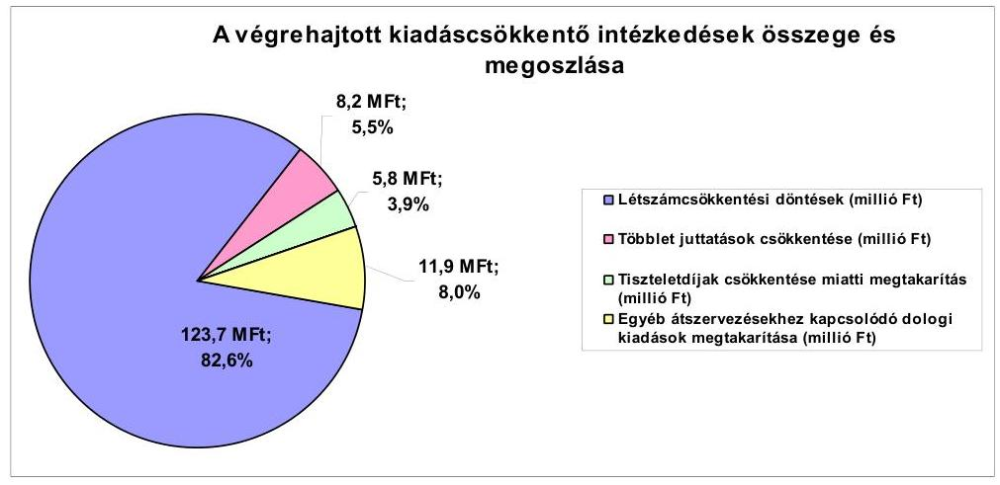

Az ellenőrzött időszakban az intézmények átszervezésével kapcsolatosan az Önkormányzat által kimutatott megtakarítás összege - a létszámcsökkentések hatásával is számolva - 135,6 millió Ft volt. Az átszervezésekkel kapcsolatos létszámcsökkentési döntésekből keletkezett megtakarítások 123,7 millió Ft-ot (82,7%-ot), míg az átszervezésekhez kapcsolódó dologi kiadások csökkentéséből adódó megtakarítások 11,9 millió Ft-ot (8,0%-ot) képviseltek a kiadáscsökkentő intézkedésekből.

Az Önkormányzat 2006-2010. évekre szóló gazdasági programja tartalmazta az igények és finanszírozhatóság figyelembevételével - az intézményhálózat racionalizálásának szükségességét. A gazdasági programmal összhangban a 2007. évtől a Képviselő-testület több alkalommal hozott intézmény-átszervezési döntéseket. A döntést előkészítő előterjesztések alapján az átszervezéseknek gazdasági (költségtakarékosabb) és szakmai (kiegyenlített szakmai színvonal biztosítása) indokai voltak.

Az oktatási intézményhálózat racionalizálása során a Képviselő-testület 2007. július 1-jével megszüntette a Jókai Mór Általános Iskolát, és a nevelési-oktatási feladatokat a jogutód Irinyi János Általános Iskola és Alapfokú Művészetoktatási Intézmény vette át. A kimutatott megtakarítás összege 65,2 millió Ft volt.

A 2007. évben átszervezésre került a Polgármesteri hivatal. Az ellátott feladatok átszervezésével egyidejűleg megszüntették a Műszaki, az Önkormányzati és Koordinációs, a Gyámhivatal és Szociális, valamint a Belső Ellenőrzési osztályokat, valamint három fő álláshelyet (építési ügyintéző, iktató, belső ellenőr), és egy fő településreferensi munkakört hoztak létre. Az átszervezés eredményeként 22,1 millió Ft megtakarítást mutattak ki.

A 2007. évben a Képviselő-testület megszüntette a Szociális
 Szolgáltató Központot. A bölcsődei ellátás az óvodában, a szociális és gyermekjóléti feladatok ellátása szerződéssel a Támasz Kht.-vel, majd a Többcélú társuláshoz történt csatla-

---

kozás után a társulás által kerültek biztosításra. A feladat kiszervezésének hatásaként kimutatott összeg 44,9 millió Ft volt.

A Képviselő-testület 2009-ben a városüzemeltetési közszolgáltatások magasabb színvonalú, hatékony ellátása érdekében létrehozta a Városgondnokság intézményét. A feladatot korábban az Önkormányzat kizárólagos tulajdonú gazdasági társasága látta el. A feladat átszervezése az Önkormányzat kimutatása alapján 3,4 millió Ft megtakarítást eredményezett.

Az intézményi átszervezéseket, megszüntetéseket érintő döntések előtt az Önkormányzat minden esetben végzett költségkihatásra vonatkozó háttérszámításokat, amelyeket a képviselő-testületi előterjesztésekbe beépítettek.

A kiadáscsökkentő intézkedések további 5,5%-a a köztisztviselők juttatásainak (étkezési hozzájárulás) csökkentéséből keletkezett, amelynek hatásaként az Önkormányzat 8,2 millió Ft megtakarítást mutatott ki. A képviselői tiszteletdíjak csökkentésének eredménye 5,8 millió Ft megtakarítás, amely a kiadáscsökkentő intézkedések 3,9%-a volt.

Az álláshely-csökkentő intézkedések következtében a 2007-2011. év I. félév közti időszakban a Polgármesteri hivatalnál és az intézményeknél összesen 28,5 álláshelyet $^{58}$ szüntettek meg, amelyből 21,5 (75,4%) szakmai, hét (24,6%) intézményüzemeltetéshez, fenntartáshoz kapcsolódó álláshely volt $^{59}$. A vizsgált időszakban üres álláshelyet nem szüntetettek meg.
Az Önkormányzat létszámának és álláshelyeinek változását a 2007-2010. években az alábbi táblázat mutatja be:

| Megnevezés (adatot tő-ben) | Közoktatás | Szociális és gyermekvédelem | Egészségügy | Polgármesteri hivatat | Egyéb | Összesen |
| :--: | :--: | :--: | :--: | :--: | :--: | :--: |
| 2007. január 1-jén jóváhagyott álláshelyek száma | 80,0 | 17,5 | - | 40,0 | 65,5 | 203,5 |
| Megszüntetett álláshelyek száma | 8,0 | 17,5 | - | 3,0 | - | 28,5 |
| ab00. üres álláshelyek száma | - | - | - | - | - | 0 |
|  | szakmai álláshelyek száma | 3,0 | 15,5 | 3,0 | - | 21,5 |
|  | intézmény-üzemeltetéssel kapcsolatos álláshelyek száma | 5,0 | 2,0 | - | - | 7,0 |
| Álláshely növekedése | 15,0 |  |  | 2,0 | 14,0 | 31,0 |
| 2010. december 31-én záró álláshelyek száma | 87,5 |  |  | 39,0 | 79,5 | 206,0 |
| 2007. január 1-jén foglalkoztatott létszám | 80,5 | 17,5 |  | 39,0 | 62,5 | 199,5 |
| Létszámcsökkentés | 9,5 | 17,5 |  | 3,0 | 2 | 32,0 |
| Létszámnövekedés | 19,0 |  |  | 2,0 | 14,0 | 31,0 |
| 2010. december 31-én foglalkoztatott létszám | 86,0 |  |  | 38,0 | 74,5 | 198,5 |

A helyi szervezési intézkedésekhez kapcsolódóan a 2007-2011. év I. félév között 21,6 millió Ft támogatásban részesült az Önkormányzat. A támogatás felhasználásával a nyilvántartások szerint tartósan leépített létszám 16 fő volt. Az Önkormányzat tájékoztatása szerint a létszámcsökkentéssel érintett dolgozókat a Polgármesteri hivatalnál, az intézményeknél és az Önkormányzat gazdasági társaságánál nem foglalkoztatták tovább. A kiadáscsökkentő intézkedésekről hozott döntések során betartották a szakmai minimumlétszámra vonatkozó előírásokat, illetve nem veszélyeztették az ellátás színvonalát.

[^0]
[^0]:    $^{58}$ A részmunkaidős álláshelyek teljes munkaidős álláshelyekre átszámításra kerültek.
    $^{59}$ A Képviselő-testület 28 álláshely megszüntetését évközi döntéssel, 0,5 álláshely megszüntetését a 2010. évi költségvetési rendelet elfogadásával engedélyezte.

---

Az ellenőrzött időszakban a Polgármesteri hivatalnál és az intézményeknél feladatnövekedéssel, valamint új intézmény alapításával kapcsolatosan 31 álláshely létesítését $^{60}$ engedélyezte a Képviselő-testület.

A közoktatási intézménynél az óvodai csoportok számának növekedése (Papkeszi tagóvoda) és a bölcsődei ellátás óvodához történő átszervezése miatt került sor 15 fő létszámfejlesztésre. A Városgondnokság alapítása 14 álláshely növekedést eredményezett, míg a Polgármesteri hivatalnál egy településreferensi és egy polgármesteri referensi álláshely létrehozását engedélyezte a Képviselő-testület.

A fenti változások eredményeként az Önkormányzatnál a 2007. január 1-jei álláshelyek száma 203,5 álláshelyről, 2010. december 31-re, 206 álláshelyre (1,2%-kal) nőtt, a létszám a létszámcsökkentések és a természetes létszámcsökkenés eredményeként a 2007. január 1-jei 199,5 fôről 2010. december 31-re (0,5%-kal) 198,5 főre csökkent.

A bevételnövelésre irányuló intézkedések számszerűsített összegéből, ami az Önkormányzat kimutatása szerint 197,1 millió Ft volt, 173,5 millió Ft-ot (88,0%) jelentett a helyi adók - építményadó, telekadó, idegenforgalmi adó - emeléséből és 9,9 millió Ft-ot (5,0%) az adóhátralék behajtásából származó bevétel. Az önkormányzati eszközök értékesítése 3,1 millió Ft-tal (1,6%) részesült a bevétel-növekményből. Az intézményi térítési díjak emelésével kapcsolatosan kimutatott bevétel növekedés 10,6 millió Ft (5,4%) volt.

A kiadáscsökkentő intézkedések mellett az Önkormányzat a 2007-2011. év I. félév közti időszakban - a kimutatásai szerint - az alábbiakban számszerűsített
bevételnövelő intézkedéseket tette:
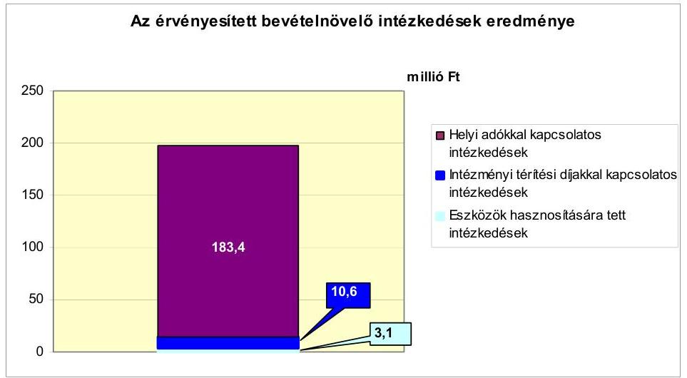

A 2007-2011. év I. félév közti időszakban a 2007. évhez képest összességében a költségvetési támogatások 1084,8 millió Ft-tal növekedtek, az szja

[^0]
[^0]:    $^{60}$ A Képviselő-testület 30 álláshely létrehozását évközi döntéssel, egy álláshely létrehozását a 2008. évi költségvetési rendelet elfogadásával engedélyezte.

---

1050,9 millió Ft-tal csökkent a 2007. évhez képest $^{61}$. Az Önkormányzat szempontjából forráskiesés nem volt, mivel e változások együttesen 33,9 millió Ft bevétel növekedést eredményeztek. A központi források együttes növekedése mellett az Önkormányzat kiadáscsökkentő és bevételnövelő intézkedéseivel 346,7 millió Ft megtakarítást mutatott ki. Az Önkormányzat által tett intézményszervezeti átalakítások, kiadáscsökkentő és bevételnövelő intézkedések nem biztosítanak elegendő forrást a pénzügyi egyensúly helyreállításához.

# 5. Az ÁSZ Által a korábbi években a pénzügyi egyensúly javítására tett szabályszerűségi és célszerűségi javaslatok hasznosulása

Az ÁSZ az Önkormányzat gazdálkodási rendszerét a 2009. évben ellenőrizte átfogó jelleggel. Az ÁSZ a jelentésében hét szabályszerűségi és öt célszerűségi javaslatot tett. A jelentést a Képviselő-testület a 2009. szeptember 1-jén tartott ülésén megismerte. A javaslatok megvalósítására intézkedési tervet készítettek $^{62}$, amely teljes körűen tartalmazta a javaslatokat, meghatározta a feladatok elvégzéséért felelősöket és a feladatok elvégzésének határidejét.

A pénzügyi egyensúly javítására egy szabályszerűségi javaslat vonatkozott, amely szerint a jegyző gondoskodjon arról, hogy az önállóan gazdálkodó költségvetési szerv pénzmaradványa tekintetében az előzetes ellenőrzésre alapozottan a Képviselő-testület az Ámr. 66. § (4) bekezdésében $^{63}$ foglalt feladatát teljesíteni tudja. Az intézkedési tervben a javaslat végrehajtásának határideje az éves zárszámadási rendelet benyújtásának időpontja volt, amelynek nem tettek eleget, így a pénzügyi egyensúly javítására tett javaslatunk nem teljesült.

Budapest, 2012. április 11.

Melléklet: 7 db
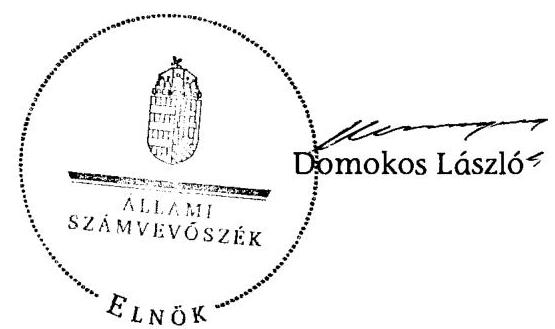

[^0]
[^0]:    $^{61}$ A számított összegek a 2007. évhez viszonyítva az évente folyósított költségvetési támogatást és az szja összegét kumulálva tartalmazzák.
    $^{62}$ A Képviselő-testület az ÁSZ V-3001-4/18/2009. számú jelentésére készített intézkedési tervet a 276/2009. (IX. 01.) számú határozatával fogadta el.
    $^{63}$ 2012. január 1-jétől az Áht. végrehajtásáról szóló 368/2011. (XII. 31.) Korm. rendelet 155. § (2) bekezdésében

---

Balatonfűző Város Önkormányzata

1. számú melléklet
a V-3130-017/2012. számú Jelentéshez

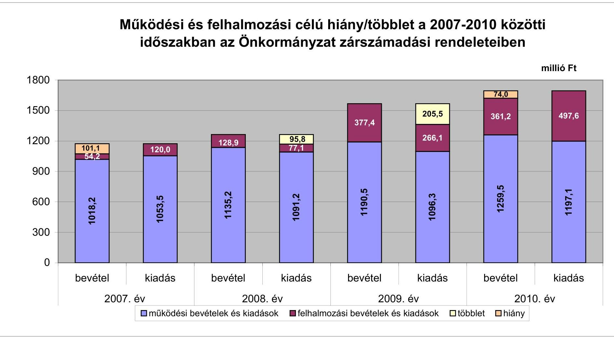

---

Az Önkormányzat bevételei és kiadásai, valamint adósságszolgálata 2007-2010 között

|   |  |  |  |  | millió Ft  |
| --- | --- | --- | --- | --- | --- |
|  1. FOLYÓ KÖLTSÉGVETÉS* |  | 2007. év | 2008. év | 2009. év | 2010. év  |
|  1.1.1. Saját működési bevételek |  | 413,8 | 508,0 | 531,4 | 553,3  |
|  1.1.2. Költségvetési támogatás |  | 183,0 | 516,5 | 491,5 | 505,2  |
|  1.1.3. Átengedett bevételek |  | 381,6 | 80,2 | 85,0 | 96,5  |
|  1.1.4. Állambáztartáson belülről kapott támogatások |  | 15,1 | 28,0 | 48,0 | 65,4  |
|  1.1.5. EU-tól és külföldről kapott bevételek |  | 0,0 | 0,0 | 0,0 | 0,0  |
|  1.1.6. Állambáztartáson kívülről kapott bevételek |  | 2,9 | 1,6 | 8,0 | 9,0  |
|  1.1.7. Előző évi pénzmaradvány átvétel |  | 0,1 | 0,0 | 0,0 | 0,0  |
|  1.1. Folyó bevételek $=1.1 .1 .+1.1 .2 .+1.1 .3 .+1.1 .4 .+1.1 .5 .+1.1 .6 .+1.1 .7$. |  | 996,5 | 1134,3 | 1163,9 | 1229,4  |
|  1.2.1. Működési kiadások kamatkiadások nélkül |  | 977,3 | 962,4 | 1012,2 | 1108,6  |
|  1.2.2. Állambáztartáson belülre átadott pénzeszközök |  | 2,7 | 4,0 | 5,1 | 6,1  |
|  1.2.3.1. vállalkozásoknak |  | 24,3 | 31,5 | 28,9 | 21,9  |
|  1.2.3.2. EU-nak, illetve külföldre |  | 0,0 | 0,0 | 0,0 | 0,0  |
|  1.2.3.3. magáncélúaknak |  | 19,5 | 33,2 | 35,5 | 47,1  |
|  1.2.3.4. nonprofit szervezeteknek |  | 4,7 | 7,4 | 6,2 | 6,9  |
|  1.2.3. Transferkiadások ( $=1.2 .3 .1+1.2 .3 .2+1.2 .3 .3+1.2 .3 .4$ ) |  | 48,5 | 72,1 | 70,6 | 75,9  |
|  1.2.4 Kamatkiadások |  | 25,0 | 47,8 | 59,4 | 18,1  |
|  1.2.5. Előző évi pénzmaradvány átadás |  | 0,0 | 0,0 | 0,0 | 0,0  |
|  1.2. Folyó kiadások $=1.2 .1 .+1.2 .2 .+1.2 .3 .+1.2 .4 .+1.2 .5$. |  | 1053,9 | 1086,3 | 1147,2 | 1208,7  |
|  1.3. Folyó költségvetés egyenlege MÜKÖDÉSI JÖVEDELEM (1.1. - 1.2.) |  | -57,0 | 48,0 | 16,7 | 20,7  |
|  2. FELHALMOZÁSI KÖLTSÉGVETÉS** |  | 0,0 | 0,0 | 0,0 | 0,0  |
|  2.1.1. Saját tőkebevételek |  | 36,3 | 28,8 | 296,0 | 9,4  |
|  2.1.2. Állambáztartáson belülről kapott támogatások |  | 14,8 | 16,0 | 63,0 | 166,3  |
|  2.1.3. EU-tól és külföldről kapott támogatások |  | 0,0 | 0,0 | 0,0 | 0,0  |
|  2.1.4. Állambáztartáson kívülről kapott támogatások |  | 3,1 | 0,6 | 0,9 | 0,4  |
|  2.1. Felhalmozási bevételek ( $=2.1 .1 .+2.1 .2+2.1 .3+2.1 .4$.) |  | 54,2 | 45,4 | 360,0 | 176,1  |
|  2.2.1. Saját beruházási kiadás átfával |  | 40,2 | 46,0 | 178,7 | 298,6  |
|  2.2.2. Saját felújítási kiadás átfával |  | 0,4 | 9,9 | 15,3 | 42,9  |
|  2.2.3. Állambáztartáson belülre átadott pénzeszköz |  | 2,8 |

 0,4 | 0,6 | 6,1  |
|  2.2.4. EU-nak és külföldnek adott pénzeszközök |  | 0,0 | 0,0 | 0,0 | 0,0  |
|  2.2.5. Állambüdzsétől kívülre adott pénzeszközök |  | 76,6 | 25,7 | 20,6 | 100,7  |
|  2.2.6. Befektetési célú részesedések vásárlása |  | 0,0 | 0,0 | 0,0 | 0,0  |
|  2.2. Felhalmozási kiadások ( $=2.2 .1 .+2.2 .2 .+2.2 .3 .+2.2 .4 .+2.2 .5 .+2.2 .6$.) |  | 120,0 | 82,0 | 215,2 | 448,3  |
|  2.3. Felhalmozási költségvetés egyenlege (2.1. - 2.2.) |  | $-65,0$ | $-36,6$ | 144,8 | $-272,2$  |
|  3. Finanszírozási műveletek nélküli (GFS) pozíció(1.3.+2.3.) |  | $-122,9$ | 11,4 | 161,5 | $-251,4$  |
|  4. Finanszírozási műveletek |  | 0,0 | 0,0 | 0,0 | 0,0  |
|  4.1. Hitel felvétel |  | 215,4 | 127,0 | 40,2 | 66,3  |
|  4.2. Hiteltörlesztés |  | 209,6 | 166,8 | 224,6 | 50,4  |
|  4.3. Forgatási és befektetési célú értékpapírok kibocsátása |  | 0,0 | 0,0 | 0,0 | 0,0  |
|  4.4. Forgatási és befektetési célú értékpapírok beváltása |  | 0,0 | 0,0 | 0,0 | 0,0  |
|  4.5. Forgatási és befektetési célú értékpapírok értékesítése |  | 750,0 | 0,0 | 0,0 | 0,0  |
|  4.6. Forgatási és befektetési célú értékpapírok vásárlása |  | 0,0 | 0,0 | 0,0 | 0,0  |
|  4.7. Egyéb finanszírozási bevételek (függő, átfutó, kiegyenlítő) |  | 1,2 | 12,3 | $-11,8$ | $-25,2$  |
|  4.8. Egyéb finanszírozási kiadások (függő, átfutó, kiegyenlítő) |  | 3,3 | $-0,5$ | 4,8 | 32,7  |
|  4.9.Finanszírozási műveletek egyenlege (4.1. - 4.2.+4.3.-4.4+4.5.-4.6.+4.7.-4.8.) |  | 753,8 | $-26,9$ | $-201,1$ | $-42,0$  |
|  5. Tárgyévi pénzügyi pozíció (1.3.+ 2.3.+4.9.) |  | 630,9 | $-15,5$ | $-39,5$ | $-293,5$  |
|  6. Nettó működési jövedelem = működési jövedelem (1.3.) - tőketörlesztés (4.2+4.4) |  | $-266,6$ | $-118,8$ | $-207,9$ | $-29,7$  |
|  TÁJÉKOZTATÓ ADATOK |  |  |  |  |   |
|  Összes kötelezettség |  | 1079,9 | 1071,2 | 1036,4 | 1252,0  |
|  ebből rövid lejáratú |  | 222,1 | 239,8 | 139,7 | 156,9  |
|  Összes szállító kötelezettség |  | 7,1 | 19,2 | 39,3 | 38,4  |
|  ebből lejárt (tanúsítványból) |  | 1,7 | 2,3 | 35,0 | 17,7  |
|  Pénz és tőkepiaci kötelezettség (adósság) |  | 1024,7 | 984,9 | 947,1 | 1161,5  |
|  ebből rövid lejáratú |  | 166,8 | 153,4 | 50,4 | 66,3  |
|  PPP szerződéses állomány jelenértéken (tanúsítványból) |  | 0,0 | 0,0 | 0,0 | 0,0  |
|  ebből lejárt szolgáltatási díj miatti kötelezettség |  | 0,0 | 0,0 | 0,0 | 0,0  |
|  Folyószámlahitel napi átlagos állománya (tanúsítványból) |  | 92,8 | 55,0 | 6,2 | 26,9  |
|  Likviditási napi átlagos állománya (tanúsítványból) |  | 0,2 | 0,4 | 0,0 | 0,0  |
|  Munkabérhitel napi átlagos állománya (tanúsítványból) |  | 7,8 | 2,2 | 0,0 | 0,0  |
|  Kezesség és garanciavállalások (tanúsítványból) |  | 0,0 | 0,0 | 0,0 | 0,0  |
|  Jogerős bírósági ítéletekből adódó kötelezettségek (tanúsítványból) |  | 0,0 | 0,0 | 0,0 | 0,0  |
|  Finanszírozásba bevonható eszközök: |  | 644,6 | 629,1 | 589,5 | 158,3  |
|  Tartós hitelviszonyt megtestesítő értékpapírok év végi állománya |  | 0,0 | 0,0 | 0,0 | 0,0  |
|  Hosszú lejáratú bankbetétek év végi állománya |  | 0,0 | 0,0 | 0,0 | 0,0  |
|  Értékpapírok év végi állománya |  | 0,0 | 0,0 | 0,0 | 0,0  |
|  Pénzeszközök (idegen pénzeszközök nélkül) év végi állománya |  | 644,6 | 629,1 | 589,5 | 158,3  |

- Bevételekben nem térül, a kiadásokban nem jelenik meg az amortizáció, a vagyoni helyzetet az egyenleg befolyásolja. Bevételekben vagyon megőrzésre és bővítésre fordítható források.

---

### 3/a. számú melléklet a V-3130-017/2012. számú Jelenéshez

|   |  |  |  |  |  |  |  |  |  |  |  |  |  |  |  |  |  |  |  |  |  |  |  |  |  |  |  |  |  |  |  |  |  |  |  |  |  |  |  |  |  |  |  |  |  |  |  |  |  |  |   |
| --- | --- | --- | --- | --- | --- | --- | --- | --- | --- | --- | --- | --- | --- | --- | --- | --- | --- | --- | --- | --- | --- | --- | --- | --- | --- | --- | --- | --- | --- | --- | --- | --- | --- | --- | --- | --- | --- | --- | --- | --- | --- | --- | --- | --- | --- | --- | --- | --- | --- | --- | --- |
|   |  |  |  |  |  |  |  |  |  |  |  |  |  |  |  |  |  |  |  |  |  |  |  |  |  |  |  |  |  |  |  |  |  |  |  |  |  |  |  |  |  |  |  |  |  |  |  |  |  |   |
|   |  |  |  |  |  |  |  |  |  |  |  |  |  |  |  |  |  |  |  |  |  |  |  |  |  |  |  |  |  |  |  |  |  |  |  |  |  |  |  |  |  |  |  |  |  |  |  |  |  |   |
|   |  |  |  |  |  |  |  |  |  |  |  |  |  |  |  |  |  |  |  |  |  |  |  |  |  |  |  |  |  |  |  |  |  |  |  |  |  |  |  |  |  |  |  |  |  |  |  |  |  |   |
|   |  |  |  |  |  |  |  |  |  |  |  |  |  |  |  |  |  |  |  |  |  |  |  |  |  |  |  |  |  |  |  |  |  |  |  |  |  |  |  |  |  |  |  |  |  |  |  |  |  |   |
|   |  |  |  |  |  |  |  |  |  |  |  |  |  |  |  |  |  |  |  |  |  |  |  |  |  |  |  |  |  |  |  |  |  |  |  |  |  |  |  |  |  |  |  |  |  |  |  |  |  |   |
|   |  |  |  |  |  |  |  |  |  |  |  |  |  |  |  |  |  |  |  |  |  |  |  |  |  |  |  |  |  |  |  |  |  |  |  |  |  |  |  |  |  |  |  |  |  |  |  |  |  |   |
|   |  |  |  |  |  |  |  |  |  |  |  |  |  |  |  |  |  |  |  |  |  |  |

  |  |  |  |  |  |  |  |  |  |  |  |  |  |  |  |  |  |  |  |  |  |  |  |  |  |  |   |
|   |  |  |  |  |  |  |  |  |  |  |  |  |  |  |  |  |  |  |  |  |  |  |  |  |  |  |  |  |  |  |  |  |  |  |  |  |  |  |  |  |  |  |  |  |  |  |  |  |  |   |
|   |  |  |  |  |  |  |  |  |  |  |  |  |  |  |  |  |  |  |  |  |  |  |  |  |  |  |  |  |  |  |  |  |  |  |  |  |  |  |  |  |  |  |  |  |  |  |  |  |  |   |
|   |  |  |  |  |  |  |  |  |  |  |  |  |  |  |  |  |  |  |  |  |  |  |  |  |  |  |  |  |  |  |  |  |  |  |  |  |  |  |  |  |  |  |  |  |  |  |  |  |  |   |
|   |  |  |  |  |  |  |  |  |  |  |  |  |  |  |  |  |  |  |  |  |  |  |  |  |  |  |  |  |  |  |  |  |  |  |  |  |  |  |  |  |  |  |  |  |  |  |  |  |  |   |
|   |  |  |  |  |  |  |  |  |  |  |  |  |  |  |  |  |  |  |  |  |  |  |  |  |  |  |  |  |  |  |  |  |  |  |  |  |  |  |  |  |  |  |  |  |  |  |  |  |  |   |
|   |  |  |  |  |  |  |  |  |  |  |  |  |  |  |  |  |  |  |  |  |  |  |  |  |  |  |  |  |  |  |  |  |  |  |  |  |  |  |  |  |  |  |  |  |  |  |  |  |  |   |
|   |  |  |  |  |  |  |  |  |  |  |  |  |  |  |  |  |  |  |  |  |  |  |  |  |  |  |  |  |  |  |  |  |  |  |  |  |  |  |  |  |  |  |  |  |  |  |  |  |  |   |
|   |  |  |  |  |  |  |  |  |  |  |  |  |  |  |  |  |  |  |  |  |  |  |  |  |  |  |  |  |  |  |  |  |  |  |  |  |  |  |  |  |  |  |  |  |  |  |  |  |  |   |
|   |  |  |  |  |  |  |  |  |  |  |  |  |  |  |  |  |  |  |  |  |  |  |  |  |  |  |  |  |  |  |  |  |  |  |  |  |  |  |  |  |  |  |  |  |  |  |  |  |  |   |
|   |  |  |  |  |  |  |  |  |  |  |  |  |  |  |  |  |  |  |  |  |  |  |  |  |  |  |  |  |  |  |  |  |  |  |  |  |  |  |  |  |  |  |  |  |  |  |  |  |  |   |
|   |  |  |  |  |  |  |  |  |  |  |  |  |  |  |  |  |  |  |  |  |  |  |  |  |  |  |  |  |  |  |  |  |  |  |  |  |  |  |  |  |  |  |  |  |  |  |  |  |  |   |
|   |  |  |  |  |  |  |  |  |  |  |  |  |  |  |  |  |  |  |  |  |  |  |  |  |  |  |  |  |  |  |  |  |  |  |  |  |  |  |  |  |  |  |  |  |  |  |  |  |  |   |
|   |  |  |  |  |  |  |  |  |  |  |  |  |  |  |  |  |  |  |  |  |  |  |  |  |  |  |  |  |  |  |  |  |  |  |  |  |  |  |  |  |  |  |  |  |  |  |  |  |  |   |
|   |  |  |  |  |  |  |  |  |  |  |  |  |  |  |  |  |  |  |  |  |  |  |  |  |  |  |  |  |  |  |  |  |  |  |  |  |  |  |  |  |  |  |  |  |  |  |  |  |  |   |
|   |  |  |  |  |  |  |  |  |  |  |  |  |  |  |  |  |  |  |  |  |  |  |  |  |  |  |  |  |  |  |  |  |  |  |  |  |  |  |  |  |  |  |  |  |  |  |  |  |  |   |
|   |  |  |  |  |  |  |  |  |  |  |  |  |  |  |  |  |  |  |  |  |  |  |  |  |  |  |  |  |  |  |  |  |  |  |  |  |  |  |  |  |  |  |  |  |  |  |  |  |  |   |

  |  |  |  |  |  |  |   |
| --- | --- | --- | --- | --- | --- | --- | --- | --- | --- | --- | --- | --- | --- | --- | --- | --- | --- | --- | --- | --- | --- | --- | --- | --- | --- | --- | --- | --- | --- | --- | --- | --- | --- | --- | --- | --- | --- | --- | --- | --- | --- | --- |
|   |  |  |  |  |  |  |  |  |  |  |  |  |  |  |  |  |  |  |  |  |  |  |  |  |  |  |  |  |  |  |  |  |  |  |  |  |  |  |  |  |  |  |  |  |  |  |  |  |  |   |
|   |  |  |  |  |  |  |  |  |  |  |  |  |  |  |  |  |  |  |  |  |  |  |  |  |  |  |  |  |  |  |  |  |  |  |  |  |  |  |  |  |  |  |  |  |  |  |  |  |  |   |
|   |  |  |  |  |  |  |  |  |  |  |  |  |  |  |  |  |  |  |  |  |  |  |  |  |  |  |  |  |  |  |  |  |  |  |  |  |  |  |  |  |  |  |  |  |  |  |  |  |  |   |
|   |  |  |  |  |  |  |  |  |  |  |  |  |  |  |  |  |  |  |  |  |  |  |  |  |  |  |  |  |  |  |  |  |  |  |  |  |  |  |  |  |  |  |  |  |  |  |  |  |  |   |
|   |  |  |  |  |  |  |  |  |  |  |  |  |  |  |  |  |  |  |  |  |  |  |  |  |  |  |  |  |  |  |  |  |  |  |  |  |  |  |  |  |  |  |  |  |  |  |  |  |  |   |
|   |  |  |  |  |  |  |  |  |  |  |  |  |  |  |  |  |  |  |  |  |  |  |  |  |  |  |  |  |  |  |  |  |  |  |  |  |  |  |  |  |  |  |  |  |  |  |  |  |  |   |
|   |  |  |  |  |  |  |  |  |  |  |  |  |  |  |  |  |  |  |  |  |  |  |  |  |  |  |  |  |  |  |  |  |  |  |  |  |  |  |  |  |  |  |  |  |  |  |  |  |  |   |
|   |  |  |  |  |  |  |  |  |  |  |  |  |  |  |  |  |  |  |  |  |  |  |  |  |  |  |  |  |  |  |  |  |  |  |  |  |  |  |  |  |  |  |  |  |  |  |  |  |  |   |
|   |  |  |  |  |  |  |  |  |  |  |  |  |  |  |  |  |  |  |  |  |  |  |  |  |  |  |  |  |  |  |  |  |  |  |  |  |  |  |  |  |  |  |  |  |  |  |  |  |  |   |
|   |

---

## **Az Önkormányzat 2010. december 31-én folyamatban lévő fejlesztési feladataira 2010. december 31-ig teljesített kifizetések és azok forrásösszetevői**

|   |  |  |  |  |  |  |  |  |  |  |  |  |  |  |  |  |  |  |  |  |  |  |  |  |  |  |  |  |  |  |  |  |  |  |  |  |  |  |  |  |  |   |
| --- | --- | --- | --- | --- | --- | --- | --- | --- | --- | --- | --- | --- | --- | --- | --- | --- | --- | --- | --- | --- | --- | --- | --- | --- | --- | --- | --- | --- | --- | --- | --- | --- | --- | --- | --- | --- | --- | --- | --- | --- | --- | --- |
|   |  |  |  |  |  |  |  |  |  |  |  |  |  |  |  |  |  |  |  |  |  |  |  |  |  |  |  |  |  |  |  |  |  |  |  |  |  |  |  |  |  |   |
|   |  |  |  |  |  |  |  |  |  |  |  |  |  |  |  |  |  |  |  |  |  |  |  |  |  |  |  |  |  |  |  |  |  |  |  |  |  |  |  |  |  |   |
|   |  | Fejlesztési feladat (beruházás, felújítás) |  |  |  |  |  |  |  |  |  |  |  |  |  |  |  |  |  |  |  |  |  |  |  |  |  |  |  |  |  |  |  |  |  |  |  |  |  |  |  |   |
|   |  |  |  |  |  |  |  |  |  |  |  |  |  |  |  |  |  |  |  |  |  |  |  |  |  |  |  |  |  |  |  |  |  |  |  |  |  |  |  |  |  |   |
|   |  |  |  |  |  |  |  |  |  |  |  |  |  |  |  |  |  |  |  |  |  |  |  |  |  |  |  |  |  |  |  |  |  |  |  |  |  |  |  |  |  |   |
|   |  |  |  |  |  |  |  |  |  |  |  |  |  |  |  |  |  |  |  |  |  |  |  |  |  |  |  |  |  |  |  |  |  |  |  |  |  |  |  |  |  |   |

 |  |  |  |  |  |  |  |  |  |  |  |  |  |  |  |  |  |  |  |  |  |  |  |  |  |  |  |  |  |  |  |  |  |  |  |  |  |   |
|   |  |  |  |  |  |  |  |  |  |  |  |  |  |  |  |  |  |  |  |  |  |  |  |  |  |  |  |  |  |  |  |  |  |  |  |  |  |  |  |  |  |   |
|   |  |  |  |  |  |  |  |  |  |  |  |  |  |  |  |  |  |  |  |  |  |  |  |  |  |  |  |  |  |  |  |  |  |  |  |  |  |  |  |  |  |   |
|   |  |  |  |  |  |  |  |  |  |  |  |  |  |  |  |  |  |  |  |  |  |  |  |  |  |  |  |  |  |  |  |  |  |  |  |  |  |  |  |  |  |   |
|   |  |  |  |  |  |  |  |  |  |  |  |  |  |  |  |  |  |  |  |  |  |  |  |  |  |  |  |  |  |  |  |  |  |  |  |  |  |  |  |  |  |   |
|   |  |  |  |  |  |  |  |  |  |  |  |  |  |  |  |  |  |  |  |  |  |  |  |  |  |  |  |  |  |  |  |  |  |  |  |  |  |  |  |  |  |   |
|   |  |  |  |  |  |  |  |  |  |  |  |  |  |  |  |  |  |  |  |  |  |  |  |  |  |  |  |  |  |  |  |  |  |  |  |  |  |  |  |  |  |   |
|   |  |  |  |  |  |  |  |  |  |  |  |  |  |  |  |  |  |  |  |  |  |  |  |  |  |  |  |  |  |  |  |  |  |  |  |  |  |  |  |  |  |   |
|   |  |  |  |  |  |  |  |  |  |  |  |  |  |  |  |  |  |  |  |  |  |  |  |  |  |  |  |  |  |  |  |  |  |  |  |  |  |  |  |  |  |   |
|   |  |  |  |  |  |  |  |  |  |  |  |  |  |  |  |  |  |  |  |  |  |  |  |  |  |  |  |  |  |  |  |  |  |  |  |  |  |  |  |  |  |   |
|   |  |  |  |  |  |  |  |  |  |  |  |  |  |  |  |  |  |  |  |  |  |  |  |  |  |  |  |  |  |  |  |  |  |  |  |  |  |  |  |  |  |   |
|   |  |  |  |  |  |  |  |  |  |  |  |  |  |  |  |  |  |  |  |  |  |  |  |  |  |  |  |  |  |  |  |  |  |  |  |  |  |  |  |  |  |   |
|   |  |  |  |  |  |  |  |  |  |  |  |  |  |  |  |  |  |  |  |  |  |  |  |  |  |  |  |  |  |  |  |  |  |  |  |  |  |  |  |  |  |   |
|   |  |  |  |  |  |  |  |  |  |  |  |  |  |  |  |  |  |  |  |  |  |  |  |  |  |  |  |  |  |  |  |  |  |  |  |  |  |  |  |  |  |   |
|   |  |  |  |  |  |  |  |  |  |  |  |  |  |  |  |  |  |  |  |  |  |  |  |  |  |  |  |  |  |  |  |  |  |  |  |  |  |  |  |  |  |   |
|   |  |  |  |  |  |  |  |  |  |  |  |  |  |  |  |  |  |  |  |  |  |  |  |  |  |  |  |  |  |  |  |  |  |  |  |  |  |  |  |  |  |   |
|   |  |  |  |  |  |  |  |  |  |  |  |  |  |  |  |  |  |  |  |  |  |  |  |  |  |  |  |  |  |  |  |  |  |  |  |  |  |  |  |  |  |   |
|   |  |  |  |  |  |  |  |  |  |  |  |  |  |  |  |  |  |  |  |  |  |  |  |  |  |  |  |  |  |  |  |  |  |  |  |  |  |  |  |  |  |   |
|   |  |  |  |  |  |  |  |  |  |  |  |  

 |  Fejlesztési feladat (beruházás, felújítás) |  | Beruházás, felújítás |  | Teljes bekerülési költségből eszközpótlásra tervezett összeg | 2010. dec. 31-ig teljesített kiadás | 2010. utánra vállalt kötelezettség (9×10×12×14×16×18) | 2010. december 31-e utáni kötelezettség-vállalások forrásösszetétele |  |  |  |  |  |  |  |  |  |  |  |  | jogszabályban foglalt szakmai követelmény teljesítése (igen/nem)  |
| --- | --- | --- | --- | --- | --- | --- | --- | --- | --- | --- | --- | --- | --- | --- | --- | --- | --- | --- | --- | --- |
|  Megnevezése |  | Képviselőtestületi határozat száma | kezdete | tervezett befejezése |  |  |  |  |  |  |  |  |  |  |  |  |  |  |  |   |
|  1 | 2 | 3 | 4 | 5 | 6 | 7 | 8 | 9 | 10 | 11 | 12 | 13 | 14 | 15 | 16 | 17 | 18 | 19 | 20 |   |
|  1. | Felújítások |  |  |  |  |  |  |  |  |  |  |  |  |  |  |  |  |  |  |   |
|  2. | 10 millió Ft alatti felújítások | 0 |  |  | 0,0 | 0,0 | 0,0 | 0,0 | 0,0 | 0 | 0 | 0 | 0 | 0 | 0 | 0 | 0 | 0 |  |   |
|  3. | Felújítások összesen |  |  |  | 0,0 | 0,0 | 0,0 | 0,0 | 0,0 | 0,0 | 0,0 | 0,0 | 0,0 | 0,0 | 0,0 | 0,0 | 0,0 | 0,0 |  |   |
|  4. | Fejlesztések |  |  |  |  |  |  |  |  |  |  |  |  |  |  |  |  |  |  |   |
|  5. | Balatonfűzfő és Balatonalmádi balesetveszélyes belterületi/külterületi csomópontjának átépítése | 353/2010. (12. 21.) | 2012 | 2012 | 61,5 | 0,0 | 0,2 | 61,5 | 0,0 | 0,0 | 0,0 | 18,4 |

 | A | 0,0 | 43,1 | B | 0,0 | 43,1 | B | igen |
|  6. | 10 millió Ft alatti fejlesztések | 0 |  |  | 0,0 | 0,0 | 0,0 | 0,0 | 0,0 | 0,0 | 0,0 | 0,0 | 0,0 | 0,0 | 0,0 | 0,0 | 0,0 | 0,0 |  |   |
|  7. | Fejlesztések összesen: |  |  |  | 61,5 | 0,0 | 0,2 | 61,5 | 0,0 | 0,0 | 0,0 | 18,4 | 0,0 | 43,1 |  |  |  |  |  |   |
|  8. | Összesen |  |  |  | 61,5 | 0,0 | 0,2 | 61,5 | 0,0 | 0,0 | 0,0 | 18,4 | 0,0 | 43,1 |  |  |  |  |  |   |

*A = ha a forrás már rendelkezésre áll,

*B = ha a forrás közbeszerzési eljárása folyamatban van,

C = ha a forrás közbeszerzési eljárása még nem indult el, a forrás nem áll rendelkezésre.

---

## **Az önkormányzati feladatok ellátásában résztvevő gazdasági társaságok**

|  Gazdasági társaság
megnevezése | 2010. december 31-én | a gazdasági társaságnak szerződéses kötelezettségre, feladatellátási szerződésre alapozottan az önkormányzat költségvetéséből  |
| --- | --- | --- |
|   | önkormányzat
gazdasági
társaságának | saját tőke,
jegyzett tőke
aránya  |
|   | tulajdoni hányada |   |
|  3. 100%-os tulajdoni hányadú gazdasági társaságok: |  |   |
|  SAL-X Kft. | 100,0% | 0,0%  |
|  100%-os tulajdoni hányadú gazdasági társaságok
összesen | x | x  |
|  8. 75-99%-os tulajdoni hányadú gazdasági társaságok: |  |   |
|   | 0,0% | 0,0%  |
|  75-99%-os tulajdoni
hányadú gazdasági
társaságok összesen | x | x  |
|  75% feletti tulajdoni
hányadú gazdasági
társaságok összesen | x | x  |
|  00. 51-74%-os tulajdoni hányadú gazdasági társaságok: |  |   |
|   | 0,0% | 0,0%  |
|  51-74%-os tulajdoni
hányadú gazdasági
társaságok összesen | x | x  |
|  IV. egyéb, közfeladatot ellátó gazdasági társaságok: |  |   |
|  Bakony Volán Zrt. | 0,0% | 0,0%  |
|  Támasz Kht. | 0,0% | 0,0%  |
|  Dunántúli Regionális Vízmű
Zrt. | 0,0% | 0,0%  |
|  egyéb, közfeladatot ellátó
gazdasági társaságok
összesen | x | x  |
|  Összesen | x | x  |

