# ÁLLAMI   SZÁMVEVŐSZÉK 

## JELENTÉS

Balmazújváros Város Önkormányzata pénzügyi helyzetének ellenőrzéséről (43/4)

---

# Állami Számvevőszék 

Iktatószám: V-3093-025/2012.
Témaszám: 1015
Vizsgálat-azonosító szám: V0560124

## Az ellenőrzést felügyelte:

Dr. Varga Sándor
számvevő igazgatóhelyettes
Az ellenőrzést vezette:
Renkó Zsuzsanna
számvevő tanácsos
Ellenőrzési csoportvezető:
Bialkó Zsolt Gyula
számvevő tanácsos

## Az ellenőrzést végezték:

Mokánszkiné Mengyi Andrea Ujvári Józsefné számvevő tanácsos számvevő tanácsos

---

# TARTALOMJEGYZÉK 

BEVEZETÉS ..... 9
I. ÖSSZEGZŐ MEGÁLLAPÍTÁSOK, KÖVETKEZTETÉSEK, JAVASLATOK ..... 13
II. RÉSZLETES MEGÁLLAPÍTÁSOK ..... 26

1. Az Önkormányzat kötelező és önként vállalt feladatai, a feladatellátás szervezeti keretei és annak változásai ..... 26
2. Az Önkormányzat pénzügyi egyensúlyi helyzetét befolyásoló tényezők ..... 31
2.1. A működési és a felhalmozási egyensúly változása ..... 33
2.2. Az Önkormányzat bevételeinek változása ..... 38
2.3. Az Önkormányzat működési és felhalmozási célú kiadásainak változása ..... 40
3. Az Önkormányzat kötelezettségei ..... 44
3.1. Az Önkormányzat pénzintézeti kötelezettségeinek változása ..... 44
3.2. A szállítói kötelezettségek változása ..... 50
3.3. Egyéb kötelezettségek változása ..... 51
4. A pénzügyi egyensúly megteremtése érdekében hozott intézkedések eredménye ..... 53
5. Az ÁSZ által a korábbi években a pénzügyi egyensúly javítására tett szabályszerűségi és célszerűségi javaslatok hasznosulása ..... 57

---

# MELLÉKLETEK 

1. számú Működési és felhalmozási célú hiány/többlet a 2007-2010 közötti időszakban az Önkormányzat zárszámadási rendeleteiben (1 oldal)
2. számú Az Önkormányzat bevételei és kiadásai, valamint adósságszolgálata 2007-2010 között (1 oldal)
3/a. számú Az Önkormányzat 2007-2010. években megvalósított, 2010. december 31-ig befejezett fejlesztései és azok forrásösszetétele (1 oldal)
3/b. számú Az Önkormányzat 2010. december 31-én folyamatban lévő fejlesztési feladataira 2010. december 31-ig teljesített kifizetések és azok forrásösszetétele (1 oldal)
3/c. számú Az Önkormányzat 2010. december 31-én folyamatban lévő fejlesztési feladataira 2010. december 31-én fennálló kötelezettségek és azok forrásösszetétele (1 oldal)
3/d. számú Az Önkormányzat által beadott, elbírálás alatti pályázati forrásból megvalósítani tervezett fejlesztéseihez kapcsolódó kötelezettségvállalásai és azok forrásösszetétele (1 oldal)
3. számú Az önkormányzati feladatok ellátásában résztvevő gazdasági társaságok (1 oldal)
4. számú Balmazújváros Város Önkormányzata polgármesterének észrevétele (5 oldal)
5. számú Balmazújváros Város Önkormányzata polgármesterének észrevételére adott válasz (2 oldal)

---

# RÖVIDÍTÉSEK JEGYZÉKE 

| Törvények |  |
| :--: | :--: |
| $\AA_{1}$ | az államháztartásról szóló 1992. évi XXXVIII. törvény |
| $\AA_{2}$ | az államháztartásról szóló 2011. évi CXCV. törvény |
| Ötv. | a helyi önkormányzatokról szóló 1990. évi LXV. törvény |
| Számv. tv. | a számvitelről szóló 2000. évi C. törvény |
| Rendeletek |  |
| $\AA_{1}$ | az államháztartás működési rendjéről szóló 217/1998. (XII. 30.) Korm. rendelet |
| $\AA_{2}$ | az államháztartás működési rendjéről szóló 292/2009. (XII. 19.) Korm. rendelet |
| Ávr. | 368/2011. (XII. 31.) Korm. rendelet az államháztartásról szóló törvény végrehajtásáról |
| Áhsz. | az államháztartás szervezetei beszámolási és könyvvezetési kötelezettségének sajátosságairól szóló 249/2000. (XII. 24.) Korm. rendelet |
| Szórövidítések |  |
| áfa | általános forgalmi adó |
| ÁSZ | Állami Számvevőszék |
| EU | Európai Unió |
| ÉAOP | Észak-Alföldi Operatív Program |
| jegyző | Balmazújváros Város Önkormányzatának jegyzője |
| Képviselő-testület | Balmazújváros Város Képviselő-testülete |
| Kistérségi társulás | Balmazújvárosi Kistérség Többcélú Társulása |
| nevelési tanácsadó | Balmazújváros Város Önkormányzata Nevelési Tanácsadó |
| OEP | Országos Egészségbiztosítási Pénztár |
| ÖNHIKI | Önhibáján kívül hátrányos helyzetbe került önkormányzatok kiegészítő támogatása |
| Önkormányzat polgármester | Balmazújváros Város Önkormányzata |
| Polgármesteri hivatal | Balmazújváros Város Önkormányzatának polgármestere Balmazújváros Város Önkormányzatának Polgármesteri hivatala |
| szja | személyi jövedelemadó |
| TÁMOP | Társadalmi Megújulás Operatív Program |
| VESZ | Balmazújvárosi Városi Egészségügyi Szolgálat Nonprofit Kft. |

---

.

---

# ÉRTELMEZŐ SZÓTÁR 

banki kitettség

bevételi kitettség

BUBOR

CLF módszer
kamatkockázat
kötelező közszolgáltatás
közfeladat

LIBOR

Az önkormányzat pénzügyi helyzete olyan külső körülmények hatására is módosulhat, amelyekre az önkormányzatnak nincs hatása, emiatt banki kitettsége keletkezik. Pl.: rövid távú kötelezettségek fennállása esetén kizárólag a bank egyoldalú döntésén múlik, hogy továbbra is biztosít-e hitelt az önkormányzatnak, valamint azt milyen feltételekkel bocsátja az önkormányzat rendelkezésére.
Az önkormányzat pénzügyi helyzete olyan külső körülmények hatására is módosulhat, amelyekre az önkormányzatnak nincs hatása, emiatt bevételi kitettsége keletkezik. Pl.: az önkormányzat bevételeinek alakulása függhet néhány nagy adózó gazdasági helyzetének, tevékenységének alakulásától, illetve székhelyének, telephelyének változásától.
Budapesti Bankközi Forint Hitelkamatláb. Mértékét az MNB naponta állapítja meg a banki kamatok figyelembevételével. Közzététele naponta történik.
Az önkormányzatok költségvetése elemzésének eszköze. Bizonyos mértékig a vállalati gazdálkodás logikai elemeit érvényesíti az önkormányzatok pénzügyi jövedelmi helyzetének vizsgálat során. Következetesen elkülöníti a folyó és a felhalmozási költségvetés bevételeit és kiadásait, azok költségvetési egyenlegeit. A módszer a pénzügyi kapacitás fogalmát helyezi a középpontba.
Az a kockázat, amely a változó kamatozású hiteleknél akkor áll fenn, ha a forint-, vagy a devizahitel futamideje alatt emelkedik a kamat, és ez által nő a hitel törlesztő részlete.
A helyi önkormányzati feladatkörbe tartozó, a köztisztasággal és a településtisztasággal, valamint az élet- és vagyonbiztonsággal összefüggő egyes - közszolgáltatás útján megvalósuló - közfeladatok ellátása, amelynek kötelező igénybevételét külön jogszabály (törvény, helyi önkormányzati rendelet) határoz meg.
Állami, helyi, illetve kisebbségi önkormányzati feladat, amelynek ellátásáról az államnak, illetve az önkormányzatoknak kell gondoskodni. A hatályos szabályozás szerint közfeladatot törvény és önkormányzati rendelet állapíthat meg. Az önkormányzatok által ellátandó feladatok keretszerú meghatározását az Ötv. tartalmazza.
Angol kifejezés, a London Interbank Offered Rate rövidítése. Jelentése: Londoni bankközi, referencia jellegű kínálati (hitel) kamatláb.

---

önkormányzat többségi tulajdonában lévő gazdasági társaságok
pénzügyi kapacitás
pénzügyi kockázat
törlesztési kockázat

Az önkormányzat a gazdasági társaságban a szavazatok több, mint ötven százalékával vagy a Ptk. 685/B. § (2)-(3) bekezdéseiben rögzített meghatározó befolyással rendelkezik. A helyi önkormányzat és az önkormányzat irányítása alá tartozó költségvetési szerv többségi tulajdonában, illetve többségi befolyása alatt álló gazdálkodó szervezet esetében hitelfelvétel, kölcsönfelvétel, garancia- vagy kezességvállalás, tartozásátvállalás, tartozás-elengedés, értékpapír kibocsátás, vásárlás, pénzügyi lízing, tartós bérleti szerződés, ingyenes vagyonjuttatás (így különösen: ajándékozás, ingyenes engedményezés), vagy követelésvásárlás, követelésengedményezés végrehajtására vonatkozóan az Áht1 100/M. § (4) bekezdése alapján az önkormányzat rendelkezik döntési jogosultsággal.
A pénzügyi kapacitás (financial capacity) az adósok hitelfelvételi képességének azon mértéke, ahol még anélkül tudják növelni az adósságot, hogy csökkenteniük kellene akár a jelenbeli, akár a jövőben esedékes kiadásaikat a fizetésképtelenség elkerülése érdekében. (Forrás: Az önkormányzati rendszer pénzügyi helyzete, ÁSZKUT tanulmány 2010.)
A belső működési kockázat egyik eleme. A költségvetési szerv működésének, tevékenységének, rövid távon ható velejáróinak része a tevékenységi, és emberi erőforrás kockázatokkal együtt. Megmutatkozhat a költségvetés nagyságrendjének, szerkezetének módosulásaiban, a bevételi és kiadási előirányzatok változásaiban, a nem megfelelő belső kontrollrendszer működése során, a tudatos károkozásokban, a biztosítások elmaradásában, a hibás fejlesztési döntésekben, a nem megfelelő forrásfelhasználásokban. A bevételek és kiadások ütemkülönbsége miatt is jelentkezhet.
Annak a kockázata, hogy a megfelelő időben és mértékben a hitelt felvevőnél rendelkezésre állnak-e a pénzintézetek és egyéb szervek felé fennálló kötelezettségek visszafizetéséhez, a hitelek és kölcsönök törlesztéséhez szükséges pénzügyi források.
A törlesztési kockázatot növeli a kamat- és árfolyam növekedése, mivel ezekben az esetekben az adósságszolgálat nőhet. Törlesztési kockázatot okozhat a visszafizetésre tervezett forrás elérésének, teljesítésének bizonytalansága (pl. a visszafizetéshez tervezett tartalékolás elmaradt, a tervezettnél alacsonyabb a saját bevétel, a helyi adóból származó bevétel az adóalanyok, adóalapok csökkenése miatt nem teljesül).
SNA System of National Account, azaz a Nemzeti Számlák Rendszere, amely a gazdasági szektorok által létrehozott valamennyi terméket és szolgáltatást figyelembe veszi.

---

szállítói kitettség

Az önkormányzat pénzügyi helyzete olyan külső körülmények hatására is módosulhat, amelyekre az önkormányzatnak nincs hatása, emiatt szállítói kitettsége keletkezik. Pl.: a lejárt szállítói tartozások rendezése függhet attól, hogy a szállító milyen intézkedéseket foganatosít az önkormányzattal szemben.

---

.

---

# JELENTÉS 

## Balmazújváros Város Önkormányzata pénzügyi helyzetének ellenőrzéséről

## BEVEZETÉS

Az Állami Számvevőszék 2011. évtől érvényes stratégiája új irányt szabott a helyi önkormányzatok gazdálkodásának ellenőrzésében is. Az ÁSZ - küldetése és jövőképe szerint - szilárd szakmai alapokra támaszkodva értékteremtő ellenőrzéseivel és helyzetelemzéseivel az államháztartás egészében, így a helyi önkormányzati alrendszerben is elő kívánja segíteni a közpénzek és a közvagyon szabályos, gazdaságos, hatékony és eredményes felhasználását. E folyamat részeként - az államháztartási hiány alakulásának összetevőire is figyelemmel - végezzük az önkormányzati alrendszer pénzügyi helyzetelemzését.

Az államháztartás helyi szintjén a 304 városnak ${ }^{1}$ az általuk ellátott közszolgáltatások volumenére is tekintettel a közfeladatok ellátásában kiemelt szerepe van. E települések 2011. január 1-jei népessége 3169 ezer fő volt.

Feladataik és hatásköreik az Ötv. mellett különböző ágazati törvények által meghatározottak, miközben a feladatellátás szervezeti kereteit - ezen belül a gazdasági társaságok közszolgáltatások ellátásában betöltött szerepét - saját maguk határozzák meg. A gazdasági társaságok által ellátott feladatok esetén a gazdálkodás, továbbá az önkormányzatok pénzügyi egyensúlyi helyzetére ható közvetlen kockázatok egy része kikerült az önkormányzati alrendszerből. A többségi önkormányzati tulajdonban lévő társaságok gazdálkodásának körülményei befolyásolhatják a városok pénzügyi egyensúlyi helyzetének megítélésében rejlő kockázatokat.

Az áttekintett időszakban az önkormányzati forrásszabályozás elvei lényegesen nem változtak. Az önkormányzatok gazdasági mozgásterét a központi költségvetéstől való függőség mellett jelentősen befolyásolja a helyi adókivetési jog gyakorlása. A városok gazdálkodási szabadságának lényeges eleme, hogy anyagi lehetőségeik függvényében dönthettek arról, hogy feladataik közül azokat, amelyek megoldására az Ötv. szerint a települési önkormányzat nem kötelezhető, a megyei önkormányzat fenntartásába adhatták. E döntések differenciáltan érintették a városok pénzügyi helyzetét.

[^0]
[^0]:    ${ }^{1}$ A megyei jogú városok nélkül figyelembe vett városok száma 304 városi önkormányzatot jelent.

---

A városi önkormányzatok 2007-2010 között teljesített bevételeinek alakulását és összetételét a következő ábra szemlélteti:

Az önkormányzati alrendszer pénzügyi helyzetértékelése során új elemzési módszereket alkalmazott az ellenőrzés. A költségvetési beszámoló adatok elemzése helyett az önkormányzat pénzügyi helyzetét a CLF módszerrel értékeltük, amelynek lényegét és számításának módszerét a jelentés 2. pontjában, és a jelentés 2. számú mellékletében ismertetjük részletesen.

Az új módszereken alapuló helyzetértékelés fontosságát az adja, hogy a helyi önkormányzatok bruttó adósságállománya ${ }^{2}$ a 2010. évi költségvetési beszámolók alapján 1248 milliárd Ft-ot tett ki. Ezen belül a 304 város adóssága 383 milliárd Ft volt, amely az önkormányzati alrendszer teljes adósságállományának 30,7 %-át jelentette ${ }^{3}$.

A mérlegben kimutatott bruttó adósságállomány mellett az önkormányzatok számára az eszközállomány műszaki állapotának megőrzése is előbb-utóbb pénzügyi kötelezettséget jelent. Az elhasználódott eszközök pótlására forrást biztosító amortizációs (felújítási) alap képzésének ${ }^{4}$ elmaradása maga után vonhatja a feladatellátást kiszolgáló tárgyi eszközök állagának erőteljes romlását.

[^0]
[^0]:    ${ }^{2}$ Az önkormányzati mérlegbeszámolókból számított bruttó adósságállomány 2010. év végi összege magában foglalja a fejlesztési és a működési célú kötvénykibocsátások, a beruházási és fejlesztési hitelek, a működési célú hosszú lejáratú hitelek, a rövid lejáratú hitelek, váltótartozások miatti kötelezettségek teljes (2011-ben, illetve az azt követő években esedékes) állományát. Az önkormányzatok 2007. év végi mérleg szerinti adósságállománya 692 milliárd Ft volt.
    ${ }^{3}$ A fővárosi és a kerületi önkormányzatok adósságának figyelmen kívül hagyásával számított 977 milliárd Ft összegű bruttó

 adósságállományból a városok 39,2%-kal részesedtek.
    ${ }^{4}$ Erre a jelenlegi szabályozási környezetben nem kötelezi előírás az önkormányzatokat.

---

sát. Emellett a 2007-2013-as időszakra meghirdetett, vissza nem térítendő EU-s fejlesztési forrásokhoz való hozzájutás lehetősége felerősítette az önkormányzati alrendszer fejlesztési igényeit, amelyek a felhalmozási költségvetési hiány folyamatos emelkedésén túl - az előírt jövőbeni fenntartási kötelezettség miatt - tovább terhelhetik az önkormányzatok költségvetését ${ }^{5}$.

Az ÁSZ a 2011. évi ellenőrzési tervében 43. számú, az Önkormányzatok gazdálkodási rendszerének ellenőrzése részeként áttekinti és elemzi az önkormányzatok pénzügyi helyzetét. A gazdálkodás szabályszerűségét az ÁSZ az előző évek során ebben az önkormányzati körben is ellenőrizte. Jelen vizsgálatunk a tett javaslataink pénzügyi helyzetet érintő pontjainak hasznosítására utóellenőrzés jelleggel tér ki.

Az ellenőrzés megállapításait az Önkormányzat által kitöltött - teljességi nyilatkozattal megerősített - 27 tanúsítványon szolgáltatott adatokra alapoztuk. Ellenőrzési bizonyítékként használtuk fel továbbá:

- a képviselő-testületi és bizottsági előterjesztéseket, a döntés-előkészítés során készített dokumentumokat;
- a kötelezettségvállalások dokumentumait;
- a pénzügyi-számviteli nyilvántartásokat;
- az éves költségvetési beszámolókat;
- a költségvetési és zárszámadási rendeleteket.

Az ellenőrzés a 2007. január 1. - 2011. június 30. közötti időszakot öleli fel. A pénzintézeti kötelezettségek állományának vizsgálatakor az ellenőrzött időszak 2006. december 31. - 2011. június 30. közötti időszakra terjedt ki.

Az ellenőrzés során vizsgáltunk minden olyan körülményt és adatot, amely a program végrehajtásához kapcsolódott és a pénzügyi helyzet alakulására hatást gyakorló releváns tények és folyamatok feltárásához szükségessé vált.

# Az ellenőrzés célja annak értékelése volt, hogy: 

- a vizsgált időszakban a kötelező és önként vállalt feladatok ellátását biztosító szervezeti keretekben, a feladatellátás módjában bekövetkezett változások milyen hatást gyakoroltak az Önkormányzat pénzügyi helyzetének alakulására;

[^0]
[^0]:    ${ }^{5}$ Az Állami Számvevőszék 2011. júniusában közzétett 1108. számú, a helyi önkormányzatok fejlesztési célú támogatási rendszerének ellenőrzéséről szóló jelentésében feltárta a fejlesztési folyamatok problémáit. A helyi önkormányzatok elsősorban azokat a fejlesztéseket valósították meg, amelyekhez támogatást lehetett igényelni. A fejlesztési célok közül a magasabb támogatási intenzitású pályázatokat részesítették előnyben. A fejlesztéssel megvalósuló létesítmények jövőbeli üzemeltetésének várható ráfordításait az önkormányzatok 71,9%-a nem mérte fel.

---

- az Önkormányzat pénzügyi - ezen belül működési és felhalmozási - egyensúlya mely tényezők hatására miként változott, és az Önkormányzat milyen intézkedéseket tett a pénzügyi egyensúly javítása érdekében;
- a költségvetési kiadások finanszírozása érdekében vállalt pénzintézeti kötelezettségek hogyan alakultak, továbbá milyen kötelezettségek fennállása befolyásolja az Önkormányzat jövőbeli pénzügyi helyzetét;
- hasznosultak-e a gazdálkodási rendszer korábbi ellenőrzése során a pénzügyi egyensúly javítására az ÁSZ által tett szabályszerűségi és célszerűségi javaslatok.

Az ellenőrzés típusa: szabályszerűségi vizsgálat.
A vizsgálat jogszabályi alapját az Állami Számvevőszékről szóló 2011. évi LXVI. törvény 1. §. (3), 5. § (2)-(6) bekezdései, továbbá az Áht ${ }_{1}$ 120/A. § (1) bekezdése előírásai képezik.

Balmazújváros város állandó lakosainak száma 2011. január 1-jén 17383 fő volt. A 2010. évi önkormányzati képviselő és polgármester választást követően az önkormányzati döntéseket - a polgármesterrel együtt - 12 tagú Képviselőtestület hozza meg. A településen két - cigány és német - kisebbségi önkormányzat működik.

Az Önkormányzat a 2010. évben 4278,0 millió Ft bevételt és 4853,9 millió Ft kiadást teljesített, a könyvviteli mérleg szerinti vagyona 10487,7 millió Ft volt.

---

# I. ÖSSZEGZŐ MEGÁLLAPÍTÁSOK, KÖVETKEZTETÉSEK, JAVASLATOK 

Az Önkormányzat - adatszolgáltatása szerint - a 2010. évi 3153,1 millió Ft összegű működési költségvetési kiadásaiból 2681,2 millió Ft-ot (85,0%) a kötelező feladatok, 471,9 millió Ft-ot (15,0%) az önként vállalt feladatok ellátására fordított. Az Önkormányzat a 2007-2010. években a kötelező feladatok ellátása mellett önként vállalt feladatnak tekintette a középfokú - gimnáziumi, szakközépiskolai, szakiskolai - oktatást, alapfokú művészetoktatást, múzeum fenntartást, mezőőri szolgálat feladatait, továbbá a Polgármesteri hivatal által civil szervezetek, önként vállalt feladatokat ellátó gazdasági társaságok részére teljesített pénzeszközátadást.

Az Önkormányzat feladatellátásának szervezeti struktúráját a következő ábra szemlélteti:
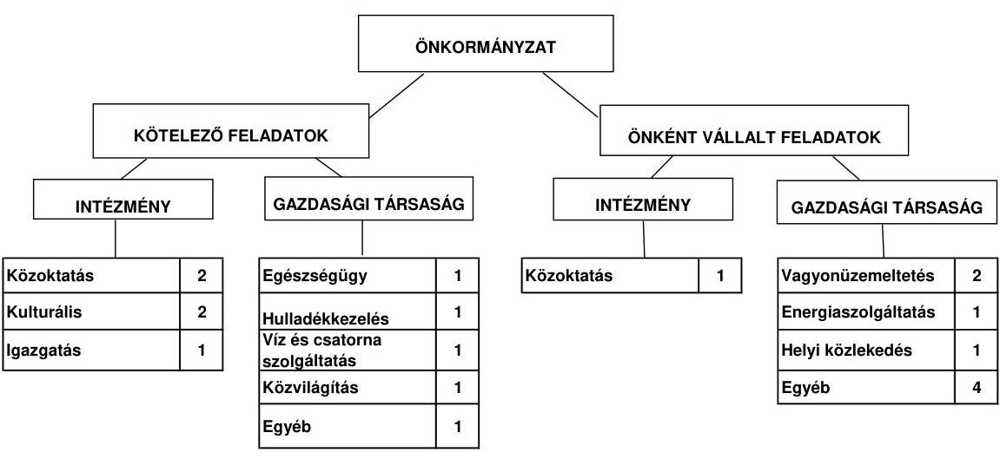

Az Önkormányzat feladatait 2011. június 30-án (a Polgármesteri hivatallal együtt) hat költségvetési szervvel és 13 - ebből hét többségi önkormányzati tulajdonú - gazdasági társaság keretében látta el. További egy - az önkormányzat minősített többségi tulajdonában levő - gazdasági társaság felszámolási eljárás miatt nem vett részt a feladatellátásban. Az intézmény szervezeti átalakítások és intézményi összevonások következtében az intézmények száma a 2007. január 1-jei 12-ről hatra, a feladatellátás telephelyeinek száma a 2007. évi 18-ról 2011. év I. félév végére 14-re csökkent. Az Önkormányzat 2011. év I. félév végén hét gazdasági társaságban kizárólagos tulajdonnal, egy gazdasági társaságban 75% feletti, három társaságban 50% alatti tulajdoni hányaddal rendelkezett. A közszolgálati feladatellátásban résztvevő két gazdasági társaságban az Önkormányzat nem rendelkezett tulajdoni részaránnyal. A gazdasági társaságok hulladékkezelés, -szállítás, víz- és szennyvízkezelés, helyi tömegközlekedés, kábel tv, internet szolgáltatás, mezőgazdasági termelés, közvilágítás, temetkezési szolgáltatás, önkormányzati vagyon működtetés, valamint az egészségügyi ellátás területén kaptak szerepet az Önkormányzat feladatellátásában. A gazdasági társaságok az ellenőrzött időszakban - támogatási megállapodás alapján - összesen 621,6 millió Ft rendszeres működési és 459,6 millió Ft fejlesztési célú pénzeszközátadásban részesültek. Az Önkormányzat tulajdonában levő gazdasági társaságok saját tőkéje a jegyzett tőke alá csökkent, két gazdasági társaság esetében a saját tőke negatív előjelűvé vált. A kizárólagos önkormányzati tulajdonban levő gazdasági társaságok jegyzett tőkéjének együttes összege 53,3 millió Ft, a saját tőkéjük összege 12,1 millió Ft, a saját tőke és a jegyzett tőke aránya 0,2 volt 2010. december 31-én. A minősített többségi tulajdonú felszámolás alatt levő gazdasági társaság saját tőkéje 2010. december 31-én -73,3 millió Ft volt. Az Önkormányzat kizárólagos és minősített többségi tulajdonában levő gazdasági társaságok tőkevesztése - a gazdasági társaságok szerkezetátalakításkor teljesített tőkepótlás - az Önkormányzat pénzügyi egyensúlyi helyzetére kedvezőtlen hatással volt, az Önkormányzat pénzügyi egyensúlyának megőrzésében kockázatot jelentenek. Az Önkormányzat 2011. június 30-án gazdasági társaságok szerkezetének racionalizálásáról - négy kizárólagos önkormányzati tulajdonban levő gazdasági társaság beolvadásáról - döntött feladatellátásuk, gazdálkodásuk áttekinthetősége, a kockázatok csökkentése érdekében.

Az Önkormányzat működési kiadásokra 2010-ben 3153,1 millió Ft-ot fordított ${ }^{6}$, amely a 2007-2009. évek 2779,9 millió Ft összegű átlagát 373,2 millió Ft-tal (13,4%-kal) haladta meg. A működési kiadások 59,2%-át intézmények működtetésére fordították. A 2007. és 2010. évi működési kiadások finanszírozási forrását ágazatonkénti bontásban az alábbi ábra szemlélteti:
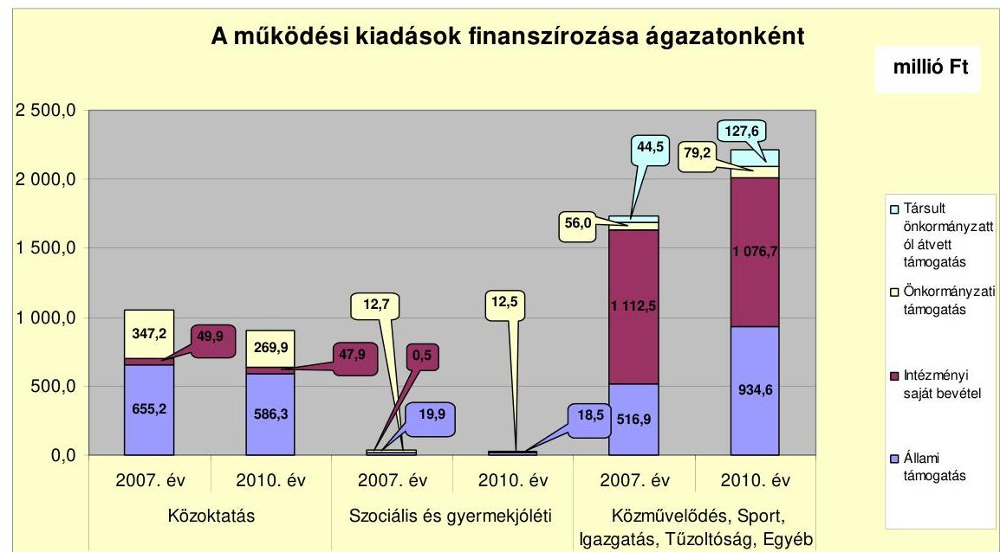

A 2007-2010. években a finanszírozási forrásokon belül összességében az állami támogatás képviselte a legnagyobb részarányt. A 2007. évben az állami támogatás 1192,0 millió Ft volt, amely az összes bevétel 42,3%-át tette ki. A

[^0]
[^0]:    ${ }^{6}$ Az Önkormányzat adatszolgáltatása szerinti működési kiadás és a CLF módszer alapján megállapított folyó kiadás között az eltérést a kisebbségi önkormányzatok működési kiadásának, az OEP által finanszírozott kiadásoknak, valamint a kamat és működési kölcsön kiadás eltérő módon történő figyelembevétele okozza.

---

2008. évben 1503,4 millió Ft-ot (55,8%-ot), a 2009. évben 1479,8 millió Ft-ot (52,9%-ot) tette ki az állami támogatás a finanszírozási forrásokon belül. A 2010. évben 1539,4 millió Ft-ra nőtt az állami támogatás összege, bevételeken belüli részaránya 48,8%-ra csökkent.

Az állami támogatás bevételeken belüli aránya a 2009. évben 2,9 százalékponttal, a 2010. évben 4,1 százalékponttal csökkent az előző évhez képest, ezen belül jelentős volt a közoktatási és közművelődési feladatok finanszírozását szolgáló forrásokon belüli részarány csökkenése. Az állami támogatás részarányának csökkenése miatt kieső forrásokat az intézmények működtetése érdekében 2009-2010. évben 0,3 millió Ft saját intézményi bevétel, illetve önkormányzati támogatás növelésével kellett biztosítania az Önkormányzatnak, amely működés biztonságának kockázatát jelentős mértékben nem befolyásolta.

A működési jövedelem, a tőketörlesztés és a pénzügyi kapacitás alakulását a 2007-2010. években a következő ábra szemlélteti:
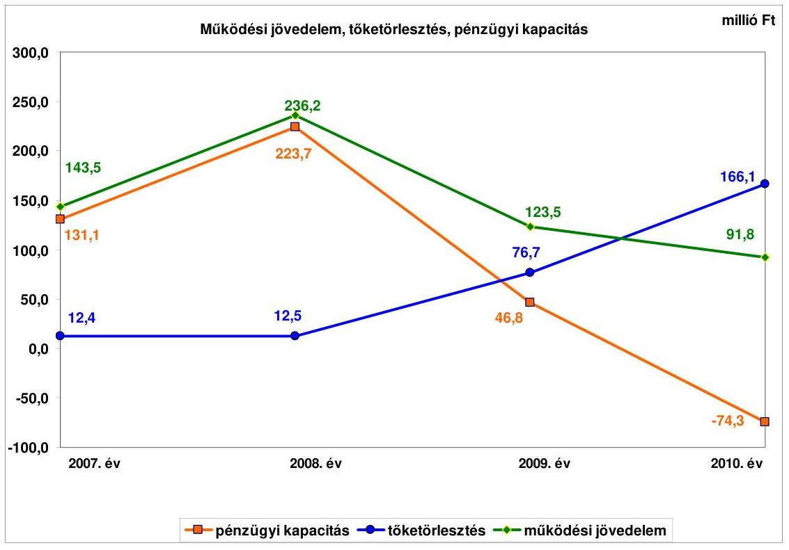

Az Önkormányzat folyó költségvetési egyenlege (működési jövedelem) 2007-2010 között működési forrástöbbletet mutatott. A működési jövedelem a 2008. évben jelentős mértékben (92,7 millió Ft-tal) emelkedett a 2007. évhez viszonyítva. A növekedést a folyó bevételek 25,4 millió Ft-os emelkedése, valamint a folyó kiadások - részben egy alapfokú oktatási intézmény átadása és a nevelési tanácsadó megszüntetése miatt - (67,3 millió Ft-os) csökkenése okozta. A vizsgált időszakban a folyó költségvetés egyenlege - a 2010. év kivételével - az adósságszolgálatra fedezetet nyújtott, így ezekben az években az Önkormányzat pénzügyi kapacitása is pozitív összegű volt. A 2009. évtől a felvett hitelek törlesztő részleteinek növekedése (2009-ben 64,9 millió Ft-tal, 2010-ben további 48,8 millió Ft-tal), illetve a 2010. évtől a kibocsátott kötvény törlesztésének (40,6 millió Ft) megkezdése következtében az adósságszolgálat megnövekedett, amely a pénzügyi kapacitásra kedvezőtlen hatással volt. A folyó költségvetés (működési jövedelem) egyenlege a 2010. évben az adósságszolgálati kötelezettségre nem nyújtott fedezetet, így -74,3 millió Ft negatív nettó működési jövedelem keletkezett.

Az Önkormányzat működőképességének megőrzéséhez 2008-ban 61,3 millió Ft, 2009-ben 30,1 millió Ft, 2010-ben 145,9 millió Ft kiegészítő támogatásban részesült. A 2008-2010. években kapott támogatás (237,3 millió Ft) 85,3%-a (202,3 millió Ft) a működési hiány csökkentését szolgálta, illetve 14,7%-a (35,0 millió Ft) feladathoz nem kötött támogatás volt. A 2011. év I. félévében az Önkormányzat - a támogatásról szóló értesítés szerint - elszámolási kötelezettséggel az alapfokú nevelési, oktatási intézmények fenntartására 31,9 millió Ft, az egyéb kötelező feladatellátáshoz kapcsolódó működési forráshiány mérséklésére 70,0 millió Ft támogatásban részesült. Az Önkormányzat működési jövedelme a kapott ÖNHIKI és a működésképtelen önkormányzatok egyéb támogatása nélkül a 2008. évben 236,2 millió Ft helyett 174,9 millió Ft, a 2009. évben 123,5 millió Ft helyett 93,4 millió Ft, míg a 2010. évben 91,8 millió Ft helyett -54,1 millió Ft lett volna.

A 2007-2010. években az Önkormányzat felhalmozási költségvetésének egyenlege folyamatosan negatív összegű volt, így a 2007-2010. évek között összesen 1377,6 millió Ft felhalmozási forráshiányt mutatott. A felhalmozási költségvetési hiányra a vizsgált időszakban összességében képződött 327,3 millió Ft nettó működési jövedelem nem biztosított fedezetet, ennek finanszírozása likviditási problémákat okozott. A pénzügyi egyensúly fenntartását 23,1 millió Ft fejlesztési hitel felvételével és 1500 millió Ft kötvénykibocsátásból származó bevétellel biztosították.

Az Önkormányzat zárszámadási rendeleteiben mérlegszerűen bemutatta az adott év működési és felhalmozási célú bevételeit és kiadásait a pénzügyi egyensúlyi helyzet szemléltetése érdekében. A megállapított működési és felhalmozási célú bevételek az Áht ${ }_{1}$ előírása ellenére a 2008. évben pénzügyi műveleteket - finanszírozási célú bevételeket (kötvénykibocsátásból származó bevétel) - is tartalmaztak.

Az Önkormányzat folyó bevételei a 2007-2009. évek átlagához (3016,8 millió Ft) viszonyítva 2010-re 3402,5 millió Ft-ra, 12,8%-kal (385,7 millió Ft-tal) emelkedtek. Az Önkormányzat a 2007-2010. években összesen 8080,3 millió Ft költségvetési támogatásban és átengedett szja-ban részesült. Jelentős növekedés a 2008. évben történt, a költségvetési támogatások emelkedése következtében. A vizsgált időszakban - a jelentésben bemutatott CLF módszer szerint - az Önkormányzat összesen 611,5 millió Ft többlet költségvetési támogatást és átengedett szja-t realizált.

Az
 Önkormányzat helyi adó bevételei 2007-től 2009-ig folyamatosan növekedtek, majd 2010-ben csökkentek az előző évhez viszonyítva. A befolyt helyi adó bevételek összege a 2011. év I. félévében 152,6 millió Ft volt. Az Önkormányzat által kivetett helyi adók az iparűzési adó, az építményadó, az idegenforgalmi adó, valamint 2007-ben és 2008-ban a luxusadó voltak.

---

Az Önkormányzat felhalmozási bevételeinek változására számottevő hatással az államháztartáson belülről kapott támogatások voltak, amelyeket az Önkormányzat pályázati tevékenysége befolyásolt.

Az Önkormányzat folyó kiadásai 2008-ban 2,4%-kal (67,3 millió Ft-tal) csökkentek - egy oktatási intézmény Kistérségi társulás részére történő átadása miatt - az előző évhez viszonyítva. A folyó kiadások 2009. és 2010. évi növekedésében a különböző pályázati forrásokból megvalósított projektek keretében felmerült személyi és dologi kiadások játszottak szerepet az előző évhez viszonyítva.

Az Önkormányzat által a gazdasági társaságai részére szerződés alapján átadott pénzeszközök összege a 2007-2011. év I. féléve között 1132,3 millió Ft volt. A működési célú pénzeszközátadások esetében az Önkormányzat elszámolási kötelezettséget írt elő gazdasági társaságai részére. A 2010. évben a kötvénykibocsátás bevételéből az Önkormányzat képviselő-testületi döntés alapján, a gazdasági társaságával kötött megállapodás keretében 445,0 millió Ft felhalmozási célú pénzeszközt adott át a „Balmazújváros Városi Termál- és Strandfürdő komplex fejlesztése" című projekt megvalósítása érdekében, a fejlesztés önerejeként. A pénzeszközátadásokon kívül az Önkormányzat három gazdasági társaságának adott összesen 90,2 millió Ft tőkejuttatást a 2007-2011. év I. félévében.

A pénzügyi egyensúlyi helyzet alakulását jelentősen befolyásolta az Önkormányzat elmúlt időszaki fejlesztési tevékenysége. A befejezett fejlesztések jelentős részét - az EU-s és hazai támogatásokon kívül - a kötvénykibocsátás bevételéből (26,6%-át) fedezték. A 2010. december 31-én folyamatban lévő fejlesztési feladatok végrehajtására 2007-2010 között 409,3 millió Ft kiadást teljesítettek, amelyre a kötvénykibocsátás bevételéből 167,0 millió Ft-ot (40,8%) fordítottak. Az EU-s támogatásból megvalósult fejlesztések előfinanszírozása az Önkormányzatnál likviditási problémákat okozott, amelynek enyhítésére az Önkormányzat folyamatosan folyószámlahitelt vett igénybe. A folyószámlahitel átlagos napi állományának legalacsonyabb összege 188,5 millió Ft a 2007. évben, legmagasabb összege 291,1 millió Ft a 2009. évben volt. A folyószámlahitellel zárt napok száma a vizsgált időszakban 344 és 365 nap között alakult.

Az Önkormányzat 2010. december 31-én folyamatban lévő fejlesztési feladatai - intézmények felújítása és bővítése, önkormányzati utak fejlesztése és szilárd burkolattal való ellátása - 2010. évet követő kötelezettségvállalásainak összege 2149,1 millió Ft volt, amelyből 131,0 millió Ft-ot saját bevételből, 370,0 millió Ft-ot hitel felvételéből, 1568,1 millió Ft-ot EU-s támogatásból és 80,0 millió Ft-ot hazai támogatásból terveznek biztosítani. A tervezett hitel felvétele a már megkötött hitelszerződés alapján a felhalmozási kiadásra a finanszírozási forrást biztosítja. Az Önkormányzat a 2011. évben két felújítási és három fejlesztési feladat megvalósítását kezdte meg, amelyek tervezett értéke összesen 9,1 millió Ft volt. A költségvetési rendeleteiben a fejlesztések forrásaként a saját bevételeit jelölte meg.

---

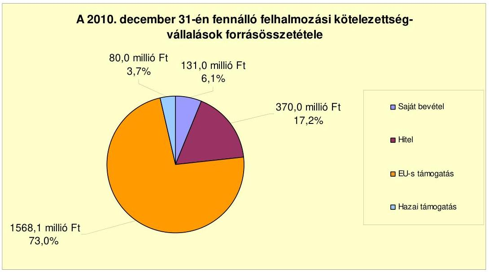

Az Önkormányzat által a 2011-2012. évekre vállalt és tervezett felhalmozási célú kötelezettségek összege 2158,2 millió Ft volt, amelyből 140,1 millió Ft-ot saját bevételből, 370,0 millió Ft-ot hitel felvételéből, 1568,1 millió Ft-ot EU-s támogatásból és 80,0 millió Ft-ot hazai támogatásból terveznek biztosítani. A hitelszerződés megkötése 2010. szeptember 30-án megtörtént. A 2011-2012. évekre vállalt felhalmozási célú kiadások fedezeteként szolgáló 140,1 millió Ft saját bevétel esetleges nem teljesülése a fejlesztések pénzügyi kockázatát növeli.

Az Önkormányzat által beadott öt pályázat - amelyekből a helyszíni vizsgálat befejezéséig kettő eredményes, három pedig elbírálás alatt volt - tervezett teljes bekerülési költsége 213,9 millió Ft volt.

Az Önkormányzat mérleg szerinti pénzintézeti kötelezettsége a 2007. év elejéről a 2011. év I. félév végére 116,8 millió Ft-ról 2872,8 millió Ft-ra nőtt. A fennálló pénzintézeti kötelezettségek összege 237,2 millió Ft három hosszú lejáratú beruházási hitelből, 961,1 millió Ft egy víziközmű társulattól átvett kölcsönből, 1418,9 millió Ft (6918,5 ezer CHF és 378,4 millió Ft) kötvénykibocsátásból fennálló, valamint 255,6 millió Ft folyószámlahitelből tevődött össze. A mérlegszerinti kötelezettségek állománya a 2009-2010. években nem tartalmazta az árfolyamváltozások hatását, ezzel megsértették a Számv. tv. 60. § (2) bekezdésében foglalt előírást, az Áhsz. 33. § (1) és (2) bekezdésében foglaltak ellenére nem végezték el a devizában fennálló kötelezettségek év végi értékelését, valamint a számviteli nyilvántartásokban való rögzítését.

Az Önkormányzat kötelezettségvállalásaira képviselő-testületi döntés alapján került sor, meghatározták a kötelezettségvállalásból származó források célját, az előterjesztések tartalmazták a kamatterheket, azonban nem mutatták be a devizaalapú kötelezettségeket érintő árfolyamkockázatot és a visszafizetés forrását. A Képviselő-testület a pénzintézeti kötelezettségvállalásról szóló döntés meghozatala előtt nem vizsgálta az Ötv-ben meghatározott adósságszolgálati korlát betartását, azonban a vállalt kötelezettségekkel annak felső határát nem lépték túl.

---

Az Önkormányzat a hiteleket - két kivétellel - teljes egészében igénybe vette, a városi strand-fürdőfejlesztésre rendelkezésre álló 370 millió Ft hitelből 256,4 millió Ft-ot hívott le, az egészségügyi alapellátás fejlesztési kiadásaihoz 2011. június 30-ig hitelt nem vett igénybe. Az Önkormányzat a városi fürdő fejlesztését támogató pályázat benyújtását, illetve a hitel felvételét megelőzően gazdaságossági számításokat nem végzett, nem vizsgálta, hogy a fürdő működtetése milyen hatást gyakorol az Önkormányzat jövőbeni pénzügyi egyensúlyi helyzetére, ez az Önkormányzat számára pénzügyi kockázatot jelent.

Az Önkormányzat a lehívott hiteleket a hitelcélnak megfelelően a Képviselőtestület által jóváhagyott, a költségvetésbe betervezett beruházásokhoz használta fel. A kötvénykibocsátás 1500,0 millió Ft-os bevételéből 1393,0 millió Ft-ot a kötvénykibocsátás céljának megfelelően használtak fel. A kötvénybevételből még felhasználható összeg 107,0 millió Ft volt 2011. június 30-án, amit betétlekötés formájában hasznosított az Önkormányzat. Felhasználásáról az Önkormányzat a kötvénykibocsátás céljának figyelembevételével rendelkezhet. A 7313,8 ezer CHF kötvénykibocsátásból származó pénzintézeti kötelezettségeiből 2011. június 30-ig 395,3 ezer CHF (82,7 millió Ft) tőkét törlesztett, továbbá ehhez kapcsolódóan 412,2 ezer CHF (80,5 millió Ft) kamatot fizetett az Önkormányzat. A tőketörlesztés realizált árfolyamvesztesége 11,9 millió Ft volt. A forintban kibocsátott 400 millió Ft kötvényből 21,6 millió Ft tőketörlesztést és 86,9 millió Ft kötvényt terhelő kamatfizetést teljesített az Önkormányzat 2011. június 30-ig. A 2007-2011. év I. féléve között a kötvénykibocsátás átmenetileg szabad pénzeszközeiből 107,0 millió Ft kamatbevételt realizált, amit a kötvényeket terhelő kamatfizetési kötelezettség teljesítésére fordítottak. Az Önkormányzat forintban fennálló hiteleiből 2007 és 2010 között tőketörlesztésre 11,8 millió Ft-ot, kamatfizetésre 175,9 millió Ft-ot fordított, a 2011. év I. félévében 549,6 millió Ft tőketartozást és 28,6 millió Ft kamat megfizetését teljesítették. Az Önkormányzat 2010. évi költségvetési beszámoló könyvviteli mérlegében a pénzintézeti kötelezettségek állománya nem tartalmazta a devizában fennálló kötelezettségek (525,2 millió Ft) nem realizált árfolyamveszteségét.

Az Önkormányzat költségvetésének pénzügyi egyensúlyát a vizsgált időszakban folyószámlahitel igénybevételével tudta biztosítani. A fizetőképesség fenntartásához folyamatosan folyószámla-hitellel rendelkezett, amit a felhalmozási tevékenységnél tartósan fennálló forráshiány, az európai uniós támogatással megvalósuló beruházások utófinanszírozása tett szükségessé.

A folyószámlahitel igénybevétele a 2007-2011. év I. félévében az alábbiak szerint alakult:

| Megnevezés | 2007. év | 2008. év | 2009. év | 2010. év | 2011. év I.   felév |
| :-- | :--: | :--: | :--: | :--: | :--: |
| Folyószámlahitel |  |  |  |  |  |
| Keretösszeg január 1-jén (millió Ft-ban) | 400,0 | 400,0 | 400,0 | 480,0 | 480,0 |
| Átlagos napi állomány (millió Ft-ban) | 188,5 | 244,0 | 291,1 | 229,4 | 157,1 |
| Folyószámla hitellel zárt napok száma (nap) | 365 | 344 | 365 | 353 | 173 |
| Egyenleg (állomány) | 220 | 358 | 283 | 166,7 | 255,6 |

A likviditás biztosítása az Önkormányzatnak 103,8 millió Ft kamatkiadást, és 5,2 millió Ft egyéb fizetési kötelezettséget okozott. Az Önkormányzat 2011. év I. félév végi szállítói tartozása 3,3 millió Ft, melyből lejárt tartozása nem volt. Az

---

Önkormányzat gazdasági társaságai részére a fejlesztési és egyéb hitelek igénybevételéhez készfizető kezességet vállalt 59,7 millió Ft összegben. A 2010. év végére a kezességgel kapcsolatos kötelezettség 9,5 millió Ft-ra, 2011. év I. félév végére 10,0 millió Ft-ra csökkent.

Az Önkormányzat kötelezettségeinek 2010. december 31-i, illetve a 2011. június 30-i állományát és várható alakulását a kötelezettségek lejáratáig a következő táblázat szemlélteti:

| Megnevezés | Állomány 2010. december 31-én |  |  | Állomány 2011. június 30-án |  |  | Várható kötelezettség 2011-2013. években |  | Várható kötelezettség 2014. évtől |  |
| :--: | :--: | :--: | :--: | :--: | :--: | :--: | :--: | :--: | :--: | :--: |
|  | HUF-ban (millió Ftban) | Devizáltan (összegy, ezer CHFben) | Deviza nem | HUF-ban (millió Ftban) | Devizáltan (összegy, ezer CHFben) | Deviza nem | HUF-ban (millió Ftban) | Devizáltan (összegy, ezer CHFben) | HUF-ban (millió Ftban) | Devizáltan (összegy, ezer CHFben) |
| Pénzintézeti kötelezettségek |  |  |  |  |  |  |  |  |  |  |
| "Balmazújváros 01" Kötvény Erste Bank Zrt |  | 7116,2 | CHF |  | 6918,5 | CHF |  | 1290,6 |  | 6807,6 |
| "Balmazújváros 01" Kötvény Erste Bank Zrt | 389,2 |  | HUF | 378,4 |  | HUF | 104,9 |  | 509,8 |  |
| GTP Bank Nyrt | 10,9 |  | HUF | 6,7 |  | HUF | 7,3 |  | 0,0 |  |
| UNICREDIT Bank Zrt | 0,0 |  | HUF | 370,0 |  | HUF | 159,1 |  | 415,8 |  |
| GTP Bank Nyrt | 1506,2 |  | HUF | 961,1 |  | HUF | 1106,2 |  | 0,0 |  |
| Budapest Autófinanszírozási Kft | 0,3 |  | HUF | 0,3 |  | HUF | 0,3 |  | 0,0 |  |
| Folyószámlahitel | 166,7 |  | HUF | 255,6 |  | HUF | 203,6 |  | 0,0 |  |
| Pénzintézeti kötelezettségek összesen HUF-ban: | 2073,3 |  |  | 1972,1 |  |  | 1633,4 |  | 925,6 | 6807,6 |
| Pénzintézeti kötelezettségek összesen CHF-ben: |  | 7116,2 |  |  | 6918,5 |  |  | 1290,6 |  |  |
| Kezesség | 9,5 | 0,0 |  | 10,0 | 0,0 |  | 0,0 |  | 0,0 |  |
| Biztosítékok összesen: | 9,5 | 0,0 |  | 10,0 | 0,0 |  | 0,0 |  | 0,0 |  |

 |  |  |  |  |  |
| Szállítói tartozás | 3,9 |  |  | 3,3 |  |  | 3,3 | 0,0 | 0,0 | 0,0 |
| MINDÖSSZESEN: | 2086,9 | 7116,2 |  | 1985,4 | 6918,5 |  | 1636,7 | 1290,6 | 925,6 | 6807,6 |

Az Önkormányzatnak pénzintézetekkel szemben fennálló kötelezettsége a 2011. év I. félév végén 1985,4 millió Ft és 6918,5 ezer CHF volt. Szállítói kötelezettség és kezességvállalás miatt további 13,3 millió Ft kötelezettség terheli. A pénzintézeti kötelezettségek várható kötelezettsége (tőke, kamat és egyéb költség) a legutóbbi kamatfizetés feltételei alapján a 2011-2013. években 1633,4 millió Ft és 1290,6 ezer CHF. A 2011-2013. évek kötelezettségeinek teljesítésére figyelembe vehető az Önkormányzat forgalomképes vagyona, továbbá 4,7 millió Ft mérlegben kimutatott követelésállomány. A pénzintézeti kötelezettségek teljesítéséhez szabad pénzmaradvánnyal nem rendelkezett az Önkormányzat.

Az Önkormányzatnak a kötvény és a felhalmozási célú hitelek tőketörlesztése miatt a 2012. évi pénzintézeti fizetési kötelezettsége 176,9 millió Ft és 395,1 ezer CHF, ebből a kötvénykibocsátás miatti fizetési kötelezettség 21,6 millió Ft és 395,1 ezer CHF. Az ellenőrzött időszakban igénybevett felhalmozási célú hitelek tőketörlesztése 25,8 millió Ft, az azt követően felvenni tervezett hitelfelvételek realizálása esetén a törlesztés 12,5 millió Ft forrást igényel. A víziközmű társulati hitel miatt 117,0 millió Ft óvadéki betétképzési kötelezettsége van az Önkormányzatnak a 2012. évben.

A 2014. évet követően a 2011. június 30-án ismert pénzintézeti kötelezettsége 925,6 millió Ft és 6807,6 ezer CHF. Az Önkormányzat tájékoztatása szerint figyelembe vehető további források „a mindenkori költségvetési rendeletekben megtervezett bevételek", azonban a visszafizetés forrását nem számszerúsítették. A költségvetési bevételek növelésére 2011-ben tett intézkedések nem biztosítanak elegendő többletforrást a várható kötelezettségek rendezésére. A 2014. évtől a

---

szennyvízberuházáshoz igénybevett víziközmű társulati hitel lejáratát követően megszűnik az évi 117,0 millió Ft összegű óvadéki betétképzési kötelezettség, az így felszabaduló forrás felhasználhatóvá válik a fennálló pénzintézeti kötelezettségek teljesítéséhez, ennek ellenére a pénzintézeti kötelezettségek teljesítésére elegendő fedezet nem áll rendelkezésre.

Az önkormányzati kötelezettségek növekedése mellett az Önkormányzat minősített többségi befolyású gazdasági társaságainak kötelezettségei is befolyásolhatják az Önkormányzat pénzügyi egyensúlyát, amelyet a következő táblázat mutat be:

| Megnevezés | Állomány 2010. december 31-én |  |  | Állomány 2011. június 30.   án |  |  | Várható kötelezettség 2011-2013. években |  | Várható kötelezettség 2014. évtől |  |
| :--: | :--: | :--: | :--: | :--: | :--: | :--: | :--: | :--: | :--: | :--: |
|  | HUF-ban   (millió Ftban) | Devizában (összege, ezer CHF-ben) | Devizánév | HUF-ban (millió Ftban) | Devizában (összege, ezer CHF-ben) | Devizánév | HUF-ban (millió Ftban) | Devizában (összege, ezer CHF-ben) | HUF-ban (millió Ftban) | Devizában (összege, ezer CHF-ben) |
| Erste Lizing Autófinanszírozási Zrt (Váncagazol Kft) |  | 15 | CHF |  | 13,9 | CHF |  | 5,6 |  | 8,3 |
| CIB Credit Ft (Váncagazol Kft) |  | 0,2 | CHF |  | 0,5 | CHF |  | 0,0 |  | 0,0 |
| CIB Credit Ft (Váncagazol Kft) |  | 2,3 | CHF |  | 1,3 | CHF |  | 1,3 |  | 0,0 |
| Pénzintézeti kötelezettségek összesen: |  | 17,5 | CHF |  | 15,2 | CHF |  | 6,9 |  | 8,3 |
| Lizing kötelezettségek |  | 14 | CHF |  | 0 | CHF |  | 0 |  | 0 |
| Szállítói tartozás | 194,3 | 0 | HUF | 154,0 | 0,0 | HUF | 154,0 | 0,0 | 0,0 | 0,0 |

A gazdasági társaságoknak a 2011. június 30-tól 15,2 millió Ft pénzintézeti kötelezettséget, 154,0 millió Ft szállítói tartozást kell rendezniük. A gazdasági társaságok pénzintézeti kötelezettségei az Önkormányzat pénzügyi egyensúlyát nem veszélyeztetik, azonban csőd, vagy felszámolási eljárás esetén a bíróság korlátlan és teljes felelősséget állapíthat meg az Önkormányzat terhére.

Az Önkormányzat pénzügyi egyensúlyi helyzetét befolyásolhatja eszközeinek állapota, használhatósági foka, az eszközök pótlására fordított összegek nagysága. Az Önkormányzat az ellenőrzött időszakban tárgyi eszközeinek értéke után 921,2 millió Ft értékcsökkenést számolt el, az elhasználódott eszközök pótlására 1706,7 millió Ft-ot fordított. Az elhasználódott eszközök pótlása nem volt teljes körű, a tárgyi eszközök használhatósági foka 87,8 %-ról 85,0 %-ra csökkent. Az éves zárszámadási rendeletekben az Önkormányzat eszközei után elszámolt értékcsökkenés összegét és azok pótlására fordított kiadásokat nem mutatták be.

Az Önkormányzat az ellenőrzött időszakban kiadási megtakarítást eredményező és bevételt növelő intézkedéseket tett. A 2007-2011. év I. féléve között tett intézkedések hatására 295,2 millió Ft bevételi többletet, továbbá 1785,5 millió Ft kiadási megtakarítást mutattak ki. A kiadási megtakarítások 59,8%-a (1067,3 millió Ft) az elrendelt álláshely-csökkentések eredménye. Egy oktatási intézmény a Kistérségi Társulás részére átadásra került, amely az Önkormányzatnál 69,5 millió Ft megtakarítást eredményezett. A megtett intézkedések az Önkormányzat pénzügyi egyensúlyi helyzetére kedvezően hatottak. Az álláshely-csökkentő intézkedések 2007-2010. évek között önkormányzati szinten összesen 102 álláshely (ebből üres álláshely nem volt) megszüntetését jelentették. Egyes közszolgáltatási területeken azonban feladatbővülések is voltak, amelyek álláshely- és egyben létszámnövekedéssel is jártak. Ennek következtében az időszak álláshelyeinek száma összességében 82 fővel csökkent. A

---

bevételnövelő intézkedések a helyi adókkal, intézményi térítési díjakkal, lejárt tartozások behajtásával és a mezőőri járulék emelésével összefüggő intézkedésekhez kapcsolódtak.

Az Önkormányzat a 2011. évben a költségvetési támogatások és átengedett szja összegének csökkenésével kalkulál az előző évhez viszonyítva. A költségvetési rendeletben tervezett költségvetési támogatás és átengedett szja összege 540,3 millió Ft-tal maradhat el a 2010. évitől. A 2011. év I. félévében az Önkormányzat - kimutatása szerint - a kiadáscsökkentő intézkedéseinek eredményeként 148,1 millió Ft megtakarítást, míg bevételnövelő intézkedéseinek eredményeként 43,0 millió Ft bevételi többletet ért el. Az így elért bevételi többlet és kiadási megtakarítás összege (191,1 millió Ft) a kieső költségvetési támogatás és átengedett szja időarányos részére (270,2 millió Ft) nem nyújt fedezetet.

Az utóellenőrzés a pénzügyi egyensúly javítására tett két szabályszerűségi javaslat hasznosítására terjedt ki. A javaslatokat az Önkormányzat hasznosította.

Az Önkormányzat pénzügyi egyensúlyi helyzetét összegezve a következők emelhetők ki:

Balmazújváros Város Önkormányzatának pénzügyi egyensúlyi helyzete rövid távon veszélyeztetett.

A folyó bevételek 2010-ben annak ellenére nem nyújtottak fedezetet a folyó kiadásokra és az adósságszolgálatra, hogy az Önkormányzat jelentős összegű ÖNHIKI támogatásban részesült. Működését az állandósult és növekvő folyószámlahitel igénybevételével tudta biztosítani.

Az önként vállalt feladatok ellátására fordított kiadások szintje jelentős.
Fejlesztései érdekében hosszú lejáratú hiteleket vett fel és kötvényeket bocsátott ki. A kötvények tőketörlesztése miatt 2011-től az adósságszolgálat ugrásszerűen megemelkedik. Ennek fedezete az évről évre csökkenő összegű működési jövedelem mellett nem biztosított, és az egyéb fedezetül szolgáló források sem számszerúsítettek.

A folyamatban lévő és tervezett fejlesztéseikhez saját forrás biztosítására vállaltak kötelezettséget. A tervezett felhalmozási célú kiadások fedezeteként szolgáló saját bevétel esetleges nem teljesülése a fejlesztések pénzügyi kockázatát növeli. További kockázatot jelent a hazai és EU-s támogatással megvalósuló beruházások előfinanszírozása.

Az Önkormányzat a városi fürdő fejlesztését támogató pályázat benyújtását, illetve a hitel felvételét megelőzően gazdaságossági számításokat nem végzett, nem vizsgálta a fürdő működtetésének az Önkormányzat jövőbeni pénzügyi egyensúlyi helyzetére gyakorolt hatását.

Az ellenőrzött időszakban az elhasználódott eszközök pótlására fordított kiadások nem érték el az elszámolt értékcsökkenés összegét. A tárgyi eszközök hasz-

---

nálhatósági foka csökkent, ami az Önkormányzat jövőbeni pénzügyi egyensúlyi helyzetére kedvezőtlen hatást gyakorol.

Az Állami Számvevőszékről szóló 2011. évi LXVI. törvény 33. § (1) bekezdésében foglaltak értelmében a jelentésben foglalt megállapításokhoz kapcsolódó intézkedési tervet köteles az ellenőrzött szervezet vezetője összeállítani és azt a jelentés kézhezvételétől számított harminc napon belül az ÁSZ részére megküldeni. Amennyiben az intézkedési tervet határidőben nem küldi meg a szervezet, vagy az továbbra sem elfogadható, az ÁSZ elnöke a hivatkozott törvény 33. § (3) bekezdés a)-b) pontjaiban foglaltakat érvényesítheti.

# A 2011. június 30-i pénzügyi egyensúlyi helyzet alapján az ellenőrzés intézkedést igénylő megállapításai és javaslatai a következők: 

## a Polgármesternek

1. Az Önkormányzat nettó működési jövedelme 2010-ben, az ÖNHIKI támogatás ellenére, nem nyújtott fedezetet a folyó kiadásokra és az adósságszolgálatra. Az önként vállalt feladatok aránya jelentős. A kibocsátott kötvények tőketörlesztése 2010. év IV. negyedévében megkezdődött. A pénzintézeti és egyéb kötelezettségek fedezete a 2010. évtől nem biztosított. A Képviselő-testületnek nem mutatták be a beruházásokkal létrehozott létesítmények - kiemelten a fürdőberuházást - működtetése és fenntarthatósága érdekében várhatóan felmerülő költségvetési kiadásokat. Az Önkormányzat által tett intézményszervezeti átalakítások, kiadáscsökkentő és bevételnövelő intézkedések nem biztosítanak elegendő forrást a pénzügyi egyensúly helyreállításához. Az önként vállalt feladatok működési kiadásokon belüli aránya és szintje a 2009-2010. években folyamatosan növekedett.

Javaslat:
Az Önkormányzat pénzügyi egyensúlyának gyors helyreállítása és hosszú távú fenntarthatósága érdekében kezdeményezze - felelősök és határidők megjelölésével - az alábbi intézkedések megtételét:
a) tárja fel a bevételszerző és kiadáscsökkentő lehetőségeket;
b) intézkedjen a bevételek növelésére, a kintlévőségek behajtására, a kiadások csökkentésére;
c) terjesszen a Képviselő-testület elé reorganizációs programot a kedvezőtlen pénzügyi folyamatok megállítására, a pénzügyi egyensúlyi helyzet gyors stabilizálására;
d) kezdeményezze az intézmények finanszírozásának napi kontrollját;
e) szűkítse a jóváhagyott előirányzatok felhasználásának lehetőségeit;
f) vizsgálja felül az önként vállalt feladatok finanszírozhatóságát, s hozzon intézkedéseket a kötelező feladatok ellátásának biztosítása érdekében;

---

g) mutassa be havonta a fél éven belül esedékes kötelezettségeinek finanszírozási forrásait;
h) képezzen egyensúlyi (elkülönített) tartalékot az adósságszolgálat teljesítése érdekében;
i) gondoskodjon, hogy a jövőben az adósságot keletkeztető kötelezettségvállalásokról szóló képviselő-testületi előterjesztések tételesen tartalmazzák a visszafizetés forrásait;
j) vizsgálja meg az állandósult folyószámla és likvid hitel hosszú távú kötelezettséggé történő átalakításának jogi lehetőségét és a Stabilitási törvény 10. §-ában előírt feltételek fennállása esetén kezdeményezze a Kormánynál ennek engedélyezését.
2. A Képviselő-testület részére nem készítettek a kötvénykibocsátáshoz kapcsolódóan teljes körű tájékoztatást a döntés jövőbeni kötelezettségeit befolyásoló tényezők (árfolyam / kamat / visszafizetési) kockázatairól.

Javaslat:
Az adósságot keletkeztető kötelezettségvállalásról szóló döntéskor mutassa be a Képviselő-testületnek a jövőben várható - árfolyam-, kamat- és törlesztési - kockázatot.
3. A Képviselő-testületnek előterjesztett éves zárszámadási rendeleteikben nem mutatták be az Önkormányzat eszközei után tárgyévben elszámolt értékcsökkenés összegét, az eszközpótlásra fordított tényleges kiadásokat, az eszközök elhasználódási fokának alakulását.

Javaslat:
Mutassa be a Képviselő-testületnek évente a zárszámadási rendelet előterjesztésében az értékcsökkenés összegét, és ezzel összevetve az elhasználódott eszközök pótlására fordított tényleges kiadásokat, az eszközök elhasználódási fokának alakulását.
4. Az Önkormányzat a városi fürdő fejlesztését támogató pályázat benyújtását, illetve a hitel felvételét megelőzően gazdaságossági számításokat nem végzett, nem vizsgálta a fürdő működtetésének az Önkormányzat
 jövőbeni pénzügyi egyensúlyi helyzetére gyakorolt hatását.

Javaslat:
Terjesszen javaslatot a Képviselő-testület elé a városi fürdő fejlesztésével megvalósuló létesítmény rentábilis működtetésére vonatkozó gazdaságossági számítások elvégzésére, továbbá vizsgáltassa meg a létesítmény működtetésének az Önkormányzat jövőbeni pénzügyi egyensúlyi helyzetére gyakorolt hatását.

---

# a Jegyzõnek 

A kötelezettségek növekedése nem tartalmazta a devizában kimutatott kötelezettségek árfolyamváltozása miatti eltérést, mivel az árfolyamváltozás elszámolásának szükségességét nem vizsgálták, a devizában fennálló kötelezettségek év végi értékelését az Áhsz. 33. § (2) bekezdés c) pontjában foglaltak ellenére elmulasztották, ezzel megsértették a Számv. tv. 60. § (2) bekezdésének előírását.

Javaslat:
Gondoskodjon az Áhsz. 33. § (1) bekezdésében foglaltak betartása érdekében arról, hogy a devizában kimutatott kötelezettségeket a Számv. tv. 60. § (2) bekezdésében előírt devizaárfolyamon számított forintértéken mutassák be a könyvviteli mérlegben. Biztosítsa, hogy az év végi értékeléskor elszámolt nem realizált árfolyam különbözetet az Áhsz. 33. § (2) bekezdés c) pontjában foglaltaknak megfelelően - a kötelezettségek árfolyamveszteségét saját tőke csökkenéseként, az árfolyamnyereséget saját tőke növekedésként - rögzítsék a számviteli nyilvántartásban.

A polgármester a helyszíni ellenőrzés lezárása után tájékoztatta az Állami Számvevőszéket az Önkormányzat megtett intézkedéseiről, amelyet az Állami Számvevőszék nem ellenőrzött, arra vonatkozóan véleményt vagy megállapítást nem fogalmaz meg. Az ellenőrzés lezárását követően elvégzett intézkedéseket az Állami Számvevőszék utóellenőrzés keretében vizsgálhatja.

A Képviselő-testület a polgármester tájékoztatása szerint a következő intézkedéseket tette:

- ÖNHIKI pályázat benyújtásáról döntött,
- felkérte és felhatalmazta a polgármestert az Önkormányzat tulajdonát képező, értékesítésre kijelölt ingatlanok hasznosítására,
- határozott a Tűzoltóság által igényelt 21689 millió Ft összegű támogatásról. Ebből 7230 millió Ft-ot biztosít, a fennmaradó összegről később dönt,
- felkérte a polgármestert és a jegyzőt az Önkormányzat 2012. évi költségvetési hiányának megszüntetésére, a költségvetési kiadások csökkentése érdekében az önként vállalt feladatok finanszírozhatóságának és ellátásának felülvizsgálatára,
- felkérte a polgármestert és a jegyzőt és a Városi Termál- és Strandfürdő ügyvezetőjét a működtetésre vonatkozó gazdaságossági számítások elvégzésére,
- felkérte a polgármestert és a jegyzőt a folyószámlahitel állomány rendezése lehetőségeinek feltárására,
- a „Balmazújváros 01" elnevezésű kötvény devizában nyilvántartott kötelezettségének árfolyamkülönbözetét a 2011. évi költségvetési rendeletben kimutatták.

---

# II. RÉSZLETES MEGÁLLAPÍTÁSOK 

## 1. Az ÖNKORMÁNYZAT KÖTELEZŐ ÉS ÖNKÉNT VÁLLALT FELADATAI, A FELADATELLÁTÁS SZERVEZETI KERETEI ÉS ANNAK VÁLTOZÁSAI

Az Önkormányzat az SzMSz-ben rögzítette a kötelező és az önként vállalt feladatait. Kötelezően ellátandó feladatainak az Ötv. és az ágazati törvények által meghatározottakat tekintette, a középfokú oktatást, az alapfokú művészetoktatást, a járóbeteg szakellátást, a mezőőri szolgálatot, az eltérő tantervű oktatást, továbbá a testnevelés és a német nyelv emelt szintű oktatását önként vállalt feladatok közé sorolta.

Az Önkormányzat a 2010. évi működési célú költségvetési kiadásaiból - az Önkormányzat adatszolgáltatása alapján - 2681,2 millió Ft-ot (85%-ot) a kötelező feladatok, 471,9 millió Ft-ot (15%-ot) önként vállalt feladatok ellátására fordított7.

Az Önkormányzat 2010. évi működési kiadásait, azok ágazati megoszlását és finanszírozási forrásait az alábbi táblázat szemlélteti:

| Ellátott feladat | Működési   kiadás   összesen   (millió Ft) | Kötelező   feladatok   kiadásainak   részaránya   % | Működési   bevétel   összesen   (millió Ft) | Állami   támogatás   részaránya   % | Intézményi   saját bevétel   részaránya   % | Önkormányzati   támogatás   részaránya   % | Társulástól   átvett támogatás   részaránya   % |
| :--: | :--: | :--: | :--: | :--: | :--: | :--: | :--: |
| Övodák | 246,9 | 100,0 | 246,9 | 60,2 | 1,9 | 37,9 | 0,0 |
| Általános iskolák | 378,5 | 100,0 | 378,5 | 68,5 | 2,6 | 28,9 | 0,0 |
| Gimnáziumok | 103,6 | 0,0 | 103,6 | 56,8 | 21,9 | 21,3 | 0,0 |
| Szakközépiskolák,   szakképző intéz-  mények | 175,2 | 0,0 | 175,2 | 68,3 | 6,2 | 25,5 | 0,0 |
| Szociális   intézmények | 31,0 | 100,0 | 31,0 | 59,6 | 0,0 | 40,4 | 0,0 |
| Közművelődési   intézmények | 74,0 | 100,0 | 74,0 | 7,0 | 16,7 | 76,3 | 0,0 |
| Egyéb intézmények | 57,3 | 0,0 | 57,3 | 45,3 | 15,1 | 39,6 | 0,0 |
| Polgármesteri hivatal   igazgatási kiadásai | 800,1 | 93,8 | 800,1 | 6,9 | 77,2 | 0,0 | 15,9 |
| Polgármesteri   hivatalban ellátott   egyéb feladatok   működési kiadása | 1286,5 | 93,4 | 1286,5 | 65,9 | 34,1 | 0,0 | 0,0 |
| Működési kiada-   sok összesen | 3 153,1 | 85,0 | 3 153,1 | 48,8 | 35,7 | 11,5 | 4,0 |

[^0]
[^0]:    7 A táblázat összes működési kiadása 5,6 millió Ft-tal eltér a költségvetési beszámolóban elszámolt kiadások összegétől, mivel a táblázat nem tartalmazza a kisebbségi önkormányzatok működési kiadásait, valamint az egészségügyi szakfeladaton elszámolt, OEP által finanszírozott kiadásokat. A CLF módszer alapján megállapított működési kiadás beszámolóban kimutatott kiadástól való eltérését, a kamat, illetve működési célú kölcsön kiadás eltérő módon történő figyelembe vétele okozta.

---

Az Önkormányzat működési kiadása a 2008. évben az intézményátadás miatt az előző évhez képest csökkent, az ezt követő években mérsékelt ütemben növekedett. A működési kiadások a 2010. évben az előző három év 2779,9 millió Ft összegű átlagához viszonyítva 373,2 millió Ft-tal (13,4%-kal) növekedtek.

A 2008. évben 120,9 millió Ft-tal (4,3%-kal) csökkent, 2009-2010. években 135,5 millió Ft-tal (5,0%-kal), illetve 323,2 millió Ft-tal (11,4%-kal) növekedett az előző év teljesített kiadásához hasonlítva.

Az Önkormányzat kötelező és önként vállalt feladataira fordított kiadásainak aránya a 2007-2010. években meghatározó mértékben nem változott, a kötelező feladatellátás kiadásainak aránya az egyes években 84,2% és 85,0% között volt.

A 2007. évben a közoktatásra fordított kiadások az összes működési kiadás 37,4%-át, az ezt követő években az egyharmadát tették ki. A közoktatási kiadások aránya egy oktatási intézmény Kistérségi társulás részére történő átadása miatt csökkent 2008. évben az előző évhez képest. A közművelődési feladatokra, szociális ellátásra és az egyéb feladatokra, igazgatási kiadásokra teljesített kiadások összes működési kiadáson belüli részarányának változása az Önkormányzat pénzügyi helyzetére nem volt jelentős hatással.

Az ellenőrzött időszakban az Önkormányzat intézményei által ellátott kötelező és önként vállalt feladatok szerkezetében számottevő változás nem volt, ezáltal az ágazati feladatokra teljesített kiadások részarányában sem volt jelentős változás.

Az Önkormányzat 2010. évi kötelező és önként vállalt feladatait 1539,3 millió Ft állami támogatásból, 1124,6 millió Ft intézményi saját bevételből, 361,6 millió Ft önkormányzati támogatásból és 127,6 millió Ft társult önkormányzattól átvett pénzeszközből finanszírozta. A 2007-2010. években finanszírozási forrásokon belül legnagyobb részarányt az állami támogatás képviselte, azonban 2008. évtől kezdődően a finanszírozási forrásokon belüli részaránya csökkent. Az állami támogatás részaránya a 2009. évben 2,9 százalékponttal, a 2010. évben 4,1 százalékponttal csökkent az előző évhez képest, amit az egyes ágazati feladatok finanszírozási forrásösszetételében jelentkező változások eredményeztek.

A 2007-2009. években a közoktatási feladatokra felhasznált állami támogatás mértékének aránya 2007-2009 között egyenletesen növekedett, majd 2010. évben az előző évhez képest 9,9 százalékponttal csökkent, amit az egy feladatmutatóra jutó normatív állami hozzájárulás csökkenése eredményezett. A közművelődési feladatok ellátásához felhasznált forrásokon belül 2007-2010. évek között folyamatosan - az előző három év 31,4%-os átlagos részarányához képest 7,0%-ra - csökkent az állami támogatás, ezzel együtt növekedett a saját bevételek és az önkormányzati támogatás aránya. Ennek oka, hogy a közművelődési feladatok önálló jogcímen történő támogatása megszűnt, arra a 2010. évtől a „települési önkormányzatok üzemeltetési, igazgatási, sport, kulturális" feladataira kapott normatív hozzájárulásból kell fedezetet biztosítani. Az egyéb tevékenység finanszírozását szolgáló forrásokon belül az állami támogatás részarányának csökkenését a nevelési tanácsadó 2008. évi

---

átadása, valamint 2010. évtől az alapfokú művészeti oktatás önálló jogcímen közvetlen támogatással - történő finanszírozásának megszűnése okozott. Az egyéb tevékenység finanszírozásában a 2008. évben 4,7 százalékponttal, a 2010. évben 25,2 százalékponttal csökkent az állami hozzájárulás részaránya. A szociális feladatok és igazgatási feladatok finanszírozásába a 2007-2010. években bevont források összetételében pénzügyi helyzetet befolyásoló változás nem volt.

A feladatok finanszírozásában az állami támogatás részarányának csökkenését az intézményi saját bevételek és az önkormányzati támogatás növelésével ellensúlyozták. A 2010. évben realizált intézményi saját bevétel 11,6%-kal (116,7 millió Ft-tal) haladta meg az előző három év átlagában számított 1007,9 millió Ft saját bevételt. Az Önkormányzati támogatás 6%-kal (20,6 millió Ft-tal) haladta meg a 2007-2009. évek számított 341,0 millió Ft-os átlagát. Az Önkormányzati feladatok működési kiadásainak folyamatos növekedése, az állami támogatás feladatellátás finanszírozásában való részvételi arányának csökkenése kedvezőtlenül befolyásolta az Önkormányzat pénzügyi egyensúly megtartására irányuló tevékenységét.

Az Önkormányzat kötelező és önként vállalt feladatait 2011. június 30-án hat költségvetési szervvel és hét kizárólagos tulajdonában levő gazdasági társasággal látta el. A feladatellátásban részt vett további három, az Önkormányzat kisebbségi tulajdonában levő és három Önkormányzat tulajdonában nem levő gazdasági társaság. További egy minősített önkormányzati tulajdonban levő gazdasági társaság felszámolási eljárás miatt nem vett részt a feladatellátásban.

Az Önkormányzat - 2007-2008. években közvilágítási feladatot ellátó - minősített többségi tulajdonában levő gazdasági társaság 2011. június 30-án nem vett részt a feladatellátásban, mert felszámolás alatt állt.

Az Önkormányzat a költségvetési szervekhez rendelt feladatait 2007. január 1-jén kettő önállóan gazdálkodó és tíz részben önállóan gazdálkodó, 2011. június 30-án kettő önállóan gazdálkodó és működő és négy önállóan működő költségvetési szerv hajtotta végre. A Polgármesteri hivatal látta el a négy önállóan működő költségvetési szerv gazdálkodási feladatait.

Az Önkormányzat költségvetési szervei közül három intézmény vett részt a közoktatási feladatok ellátásában, közülük egy a szociális feladatellátás körében bölcsődei feladatokat is ellátott. Közművelődési feladatokat - közművelődési és könyvtári szolgáltatást - két intézmény végzett. Egyéb feladatot a Művelődési Központ az alapfokú művészetoktatással, illetve 2008. június 30-ig a Nevelési tanácsadó (nevelési tanácsadás, logopédiai szolgáltatás) látott el. A Polgármesteri hivatal kiadásai tartalmazták a közmunka, közhasznú-, és közcélú foglalkoztatás kiadásait, a pénzügyi feladatok ellátásának kiadásait, városgazdálkodással, élelmezéssel, mezőőri feladatellátással kapcsolatos teljesítéseket.

Kistérségi tárulással kötött megállapodás útján látta el a családsegítő a gyermekjóléti szolgálatfeladatait, valamint a szociális feladatokat, gondozást nyújtó ellátásokat.

---

Az Önkormányzat kötelezően ellátandó feladatai közül a hulladékkezelés, szállítás, ártalmatlanítás, az ivóvíz- és csatornaszolgáltatás, a köztemető fenntartás, a közvilágítási feladatokat négy gazdasági társaság látta el, a velük kötött feladatellátási megállapodás, közszolgáltatási szerződés alapján. Ezen szolgáltatási feladatokat ellátó három gazdasági társaságban az Önkormányzatnak 50%-ot meg nem haladó tulajdoni részesedése volt, egy társaságban nem rendelkezett tulajdoni részesedéssel.

Az Önkormányzat önként vállalt feladatainak ellátásában 2011. június 30-án hét az önkormányzat kizárólagos tulajdonában levő, továbbá két
 olyan gazdasági társaság vett részt, melyekben az Önkormányzat nem rendelkezett tulajdoni részaránnyal.

A vagyongazdálkodási, egészségügyi szolgáltatás, valamint egyéb, kábeltelevízió és internet szolgáltatást, növénytermesztés, gáz előállítás és kereskedelmi szolgáltatás feladatait kizárólagos önkormányzati tulajdonú gazdasági társaság látta el, a helyi közlekedési feladatokat végző és az internet szolgáltatás nyújtásban részt vevő gazdasági társaságokban nem volt tulajdoni részesedése az Önkormányzatnak.

A 2007-2011. év I. félév végéig a költségvetési szervek, illetve a gazdasági társaságok által ellátott feladatok közötti átrendeződés nem volt, azonban az intézményi átszervezések hatására az intézmények száma csökkent, az alapítás, összevonás és szétválás miatt a feladatellátásba bevont gazdasági társaságok száma évenként változott, a 2008. évben növekedett, a 2009. évben csökkent, majd a 2010. évben ismét növekedett az előző évhez képest.

Az Önkormányzat közoktatási intézményrendszerének átalakításáról a 2007. évben döntött a Képviselő-testület. Az óvodai feladatok ellátását végző két óvodaigazgatóság és a Városi Bölcsőde intézmények, továbbá két általános iskolai intézmény összevonásával egy-egy új intézményt alapítottak. Az Önkormányzat a harmadik általános iskolai oktatást végző intézményt 2007. július 1-jén átadta a Kistérségi társulás részére. A Nevelési tanácsadó Kistérségi társulás részére 2008. június 1-jén történő átadásával az intézmények száma tovább csökkent, számuk - a 2007. évi tízről - hatra változott.

A Képviselő-testület 2011. évben, a 2011/2012. tanévre vonatkozó, a közoktatási feladatellátást érintő döntéseket hozott, az intézkedések a feladatellátást végző intézmények számában nem eredményeztek változást, azonban az óvodai feladatokat ellátó telephelyek száma eggyel csökkent, az általános iskolai oktatás telephelyeinek száma eggyel nőtt.

A feladat- és intézményátadások az Önkormányzat pénzügyi helyzetére kedvező hatással voltak. Az oktatási intézményátadást követően 743 fővel csökkent az általános iskolai oktatásban részt vevők száma.

Ezt az intézményt a Képviselő-testület - 2011. április 12-ei - döntése alapján 2011. július 1-től a Kistérségi társulástól visszavette, ezzel együtt 547 fő általános iskolai tanuló átvételére került sor. Az átvétel a tanévkezdéskor nem járt intézményszám emelkedéssel, mivel a 2011/2012 tanévtől az általános iskolai tanulók az Önkormányzat által fenntartott intézmény és a 2011/2012. tanévben induló egyházi fenntartású intézmény közül választhattak. Az Önkormányzati intéz-

---

ményt választók számának változása nem indokolta az intézmények számának növelését.

A feladatátszervezések hatására 503,7 millió Ft-tal csökkentek az Önkormányzat kiadásai, ezen belül a személyi juttatások és járulékok kiadása 869,7 millió Ft-tal csökkent, a dologi kiadások 366,0 millió Ft-tal növekedtek. Az intézkedések következtében az Önkormányzat bevétele 428,9 millió Ft-tal, ezen belül az állami támogatás 519,5 millió Ft-tal csökkent, míg a saját bevételek 20,8 millió Ft-tal, az önkormányzati támogatás 69,8 millió Ft-tal növekedett. Az Önkormányzat kimutatása szerint a feladatátszervezések 74,8 millió Ft megtakarítást eredményeztek.

Az Önkormányzati feladatellátásban résztvevő gazdasági társaságok száma a Képviselő-testület döntései alapján folyamatosan változott. Az Önkormányzat feladatellátásában a 2007. évben négy gazdasági társaság - melyből egyet 2007-ben alapított - vett részt, 2008. és 2009. években további két gazdasági társaságot hozott létre önként vállalt önkormányzati feladatok ellátása érdekében. A 2009. évben a Képviselő-testület három kizárólagos tulajdonában levő gazdasági társaság apportálásával holdingot hozott létre. A holding további két gazdasági társaságot alapított.
2010. október 12-én a Cégbíróság az Önkormányzat 90%-os minősített többségi tulajdonában levő közvilágítási feladatellátásra létrehozott gazdasági társaság felszámolását kezdeményezte, egy eredménytelen végelszámolást követően. A felszámolási eljárás 2011. június 30-án még folyamatban volt. A gazdasági társaság 2010. december 31-én a mérlegében rendelkezésre álló 46,9 millió Ft összegű vagyona nem nyújt fedezetet a fennálló 101,0 millió Ft - ebből 15,4 millió Ft Önkormányzattal szembeni - kötelezettség teljesítésére, ami kockázatot jelent az Önkormányzat pénzügyi egyensúlyának megőrzésében.

A Képviselő-testület 2011. június 22-én hozott határozatával - a gazdasági társaságok működésének átláthatósága érdekében - a holdingba tartozó öt gazdasági társaság átalakításával megszüntette a holdingot és a gazdasági társaságok - alapító okirataik módosítását követően - az Önkormányzat közvetlen tulajdonába kerültek. A gazdasági társaságok veszteséges tevékenysége miatt a 2007-2010. években visszafizetési kötelezettséggel összesen 90,2 millió Ft - ebből a 2010. évben 76,4 millió Ft - pótbefizetést teljesített az Önkormányzat. A tőkepótlásra fordított kiadás az Önkormányzat 2010. évi pénzügyi egyensúlyát kedvezőtlenül befolyásolta, likviditási helyzetét rontotta. Az Önkormányzat 2011. június 30-án a gazdasági társaságok szerkezetének racionalizálásáról, négy kizárólagos önkormányzati tulajdonban levő gazdasági társaság beolvadásáról döntött, egy kizárólagos önkormányzati tulajdonban levő, városgazdálkodási feladatok ellátását végző gazdasági társaságba. Az átalakításról a gazdasági társaságok feladatellátásának, gazdálkodásának átláthatósága, kockázatok csökkentése érdekében döntött.

Az Önkormányzat kizárólagos, illetve minősített többségi tulajdonában levő gazdasági társaságaink saját tőkéje a 2010. december 31-ei mérlegadatok szerint a jegyzett tőke alá csökkent. A legnagyobb mértékű vagyonvesztés a városgazdálkodási és a növénytermesztést végző és a felszámolás alatt levő gazdasági társaságnál jelentkezett, kiknek saját tőkéje negatív előjelűvé vált. A kizáró-

---

lagos önkormányzati tulajdonú gazdasági társaságok saját tőkéjének együttes összege 2010. december 31-én 12,1 millió Ft, a jegyzett tőkéjük összege 53,3 millió Ft, a saját tőke, jegyzett tőke aránya 0,2 volt. Közülük két gazdasági társaság saját tőkéje volt negatív előjelű, együttes összegük -27,9 millió Ft. A minősített többségi tulajdonban levő, felszámolás alatt álló gazdasági társaság saját tőkéje a jegyzett tőke (három millió Ft) alá csökkent, 2010. december 31-én -73,3 millió Ft volt. A gazdasági társaságok tőkevesztése az Önkormányzat pénzügyi egyensúlyának megőrzésében kockázatot jelentettek és jelentenek. A gazdasági társaságok gazdálkodását, illetve működését érintő adatokat a 4. számú melléklet mutatja be.

# 2. AZ ÖNKORMÁNYZAT PÉNZÜGYI EGYENSÚLYI HELYZETÉT BEFOLYÁSOLÓ TÉNYEZŐK 

A hagyományos költségvetési szerkezet helyett az Önkormányzat pénzügyi helyzetét a CLF módszerrel mutatjuk be, amelyben jobban elkülönülnek a vagyonnal kapcsolatos bevételek és kiadások az önkormányzati feladatokkal kapcsolatos közvetlen működtetési bevételektől és kiadásoktól. A módszer következetesen elkülöníti a folyó és a felhalmozási költségvetés bevételeit és kiadásait, azok költségvetési egyenlegeit. A saját folyó bevételek, valamint a saját felhalmozási bevételek nem tartalmazzák az előző évi pénzmaradványok felhasználásából származó pénzforgalom nélküli bevételeket ${ }^{8}$.

A folyó költségvetés egyenlege, a működési jövedelem megmutatja, hogy az Önkormányzat éves folyó bevétele fedezetet biztosít-e a kötelező és önként vállalt feladatellátáshoz kapcsolódó éves folyó kiadására. A működési jövedelem negatív értéke pénzügyileg fenntarthatatlan helyzetet jelez. A mutató pozitív értéke megtakarítást mutat, amely forrásul szolgálhat az Önkormányzat fennálló kötelezettségei megfizetéséhez, valamint fejlesztéseihez.

A felhalmozási költségvetés pozitív értéke felhalmozási többletet mutat, amely a jövőbeni fejlesztések forrását biztosíthatja. Amennyiben a folyó költségvetési hiány finanszírozása a felhalmozási többletből történik, ez szűkebb értelemben vagyonfelélésnek tekinthető. Amennyiben a felhalmozási költségvetés megtakarítása fejlesztési célú hitelek, kötvények adósságszolgálatát finanszírozza, az változatlan vagyontömeg mellett, a korábban megelőlegezett tőkebevételek valós realizációjának tekinthető. A felhalmozási deficit által generált finanszírozási igény önmagában nem jár pénzügyi kockázattal, a pénzügyileg fenntartható beruházásokhoz kapcsolódó kötelezettségvállalás (adósságszolgálat) átlátható és szabályozott költségvetési gazdálkodással teljesíthető.

A módszer a pénzügyi kapacitás fogalmát helyezi a középpontba. Az adós hitelfelvételi képessége, hosszú távú fizetőképessége vagy bonitása a pénzügyi kapacitással, ezen belül is a nettó működési jövedelemmel jellemezhető. A nettó működési jövedelem negatív értéke az egyes költségvetési években jelent-

[^0]
[^0]:    ${ }^{8}$ A költségvetési években kialakuló hiány finanszírozása az előző évi pénzmaradvány és a korábbi években képzett tartalékok felhasználásával is történhet.

---

kező adósságszolgálat túlzott mértékére utal. ${ }^{9}$ A nettó működési jövedelem negatív értékének felhalmozási többletből, vagy további hitelből történő finanszírozása pénzügyileg nem fenntartható gazdálkodást vetít előre. A pozitív értéket mutató nettó működési jövedelem fejlesztési kiadások fedezetét biztosíthatja, illetve a folyamatosan, évenként képződő pozitív nettó működési jövedelemből meghatározható a jövőben vállalható, teljesíthető éves adósságszolgálat, ily módon az a hitelösszeg, amely - a többi tényezőt, feltételt adottnak tekintve visszafizetési kockázat nélkül felvehető.

A CLF módszer alapján a pénzügyi kapacitás mértéke az önkormányzat összevont, nettósított, a központi információs rendszerbe a Magyar Államkincstáron keresztül leadott éves költségvetési beszámolójának 80-as űrlapjában szerepeltetett adatok alapján került meghatározásra.

A számítási leírás némileg eltér az ÁSZ módszertanában korábban alkalmazott gyakorlattól. A jelen besorolás általános közgazdasági meggondolásokon alapul, amely megjelenik az SNA statisztikai módszertanában is. Folyó tételek alatt értjük azokat a kiadásokat és bevételeket, amelyek a gazdálkodó szervezet helyzetét automatikusan nem változtatják. Bevételi oldalon ilyenek az adók, a tényezőjövedelmek, a transzferek ${ }^{10}$, kiadási oldalon a transzferek és a szolgáltatás igénybevételével kapcsolatos működési kiadások. A folyó költségvetésben a bevételekben nem térül meg, a kiadásokban nem jelenik meg az amortizáció, a vagyoni helyzetet az egyenleg befolyásolja.

A folyó költségvetés egyenlege (működési jövedelem) tartalmazza a kamatbevételeket és a kamatkiadásokat is, mind a működési, mind a fejlesztési kamatot, valamint a visszatérülő és befizetendő áfa teljes összegét, mert ezek közgazdaságilag tényezőjövedelmek. Nem tartalmazzák viszont a követeléselengedés miatt könyvelt bevételi és kiadási pénzforgalmi tételeket, mert valójában technikai elszámolási műveletnek minősülnek, a bevétel soha nem realizálódott, és költségvetési kiadás sem történt.

A felhalmozási költségvetésben a bevételek között a vagyon megőrzésére és bővítésére fordítható források jelennek meg. A felhalmozási vagy tőketételek módosítják a vagyon nagyságát. A privatizációs bevétel csökkenti a vagyont, a fizikai beruházás, pénzügyi befektetés növeli.

A nettó működési jövedelmet a tőketörlesztés levonásával a folyó költségvetés egyenlegéből származtatjuk.

[^0]
[^0]:    ${ }^{9}$ kivéve, ha annak finanszírozására a korábbi években képzett tartalékok fedezetet nyújtanak
    ${ }^{10}$ Transzferkiadásoknak nevezzük azokat a folyó és felhalmozási tételeket, amelyeket nem az adott önkormányzat használ fel szolgáltatásnyújtásra.

---

# 2.1. A működési és a felhalmozási egyensúly változása 

CLF módszer szerinti önkormányzati adatok

| Megnevezés | 2007. év | 2008. év | 2009. év | 2010. év |
| :--: | :--: | :--: | :--: | :--: |
| Folyó bevételek | 2966,9 | 2992,3 | 3091,3 | 3402,5 |
| Folyó kiadások | 2823,4 | 2756,1 | 2967,8 | 3310,7 |
| Működési jövedelem | 143,5 | 236,2 | 123,5 | 91,8 |
| Nettó működési jövedelem =működési jövedelem - tőketörlesztés | 131,1 | 223,7 | 46,8 | $-74,3$ |
| Felhalmozási bevételek | 366,3 | 167,1 | 268,3 | 875,4 |
| Felhalmozási kiadások | 405,9 | 463,9 | 641,6 | 1543,3 |
| Felhalmozási költségvetés egyenlege | $-39,6$ | $-296,8$ | $-373,3$ | $-667,9$ |
| Finanszírozási műveletek nélküli (GFS) pozíció = működési jövedelem + felhalmozási költségvetés egyenlege | 103,9 | $-60,6$ | $-249,8$ | $-576,1$ |
| Finanszírozási műveletek egyenlege | 8,0 | 1486,9 | 65,4 | $-240,1$ |
| Tárgyévi pénzügyi pozíció | 111,9 | 1426,3 | $-184,4$ | $-816,2$ |
| Egyéb tájékoztató adatok |  |  |  |  |
| Összes kötelezettség* | 337,3 | 3433,9 | 3507,8 | 3323,2 |
| -ebből rövid lejáratú | 335,8 | 426,7 | 530,7 | 355,0 |
| Folyószámlahitel napi átlagos

 állománya ** | 188,5 | 244,0 | 291,1 | 229,4 |
| Likvidhitel napi átlagos állománya** | 0,0 | 0,0 | 0,0 | 0,0 |
| Munkabérhitel napi átlagos állománya** | 0,0 | 0,0 | 0,0 | 0,0 |
| Finanszírozásba vonható eszközök: | 157,1 | 1591,9 | 1354,1 | 537,9 |
| Tartós hitelviszonyt megtestesítő értékpapírok év végi állománya | 0,0 | 0,0 | 0,0 | 0,0 |
| Hosszú lejáratú bankbetétek év végi állománya | 0,0 | 0,0 | 0,0 | 0,0 |
| Értékpapírok év végi állománya | 45,0 | 53,5 | 0,0 | 0,0 |
| Pénzeszközök (idegen pénzeszközök nélkül) év végi állománya | 112,2 | 1538,5 | 1354,1 | 537,9 |

* Az összes kötelezettséget a passzív pénzügyi elszámolások nélkül vettük figyelembe, mert a passzívák a pénzmaradvány elszámolás tételei közé tartoznak.
** A folyószámla, a likvid- és a munkabérhitel átlagos állományát 365 napos osztószámmal és nem a fennálló napok számával vettük figyelembe.
A részletes pénzügyi adatokat a jelentés 2. számú melléklete mutatja be.

---

Az Önkormányzat folyó költségvetési egyenlegének, működési jövedelmének alakulását a 2007-2010. években a következő ábra szemlélteti:
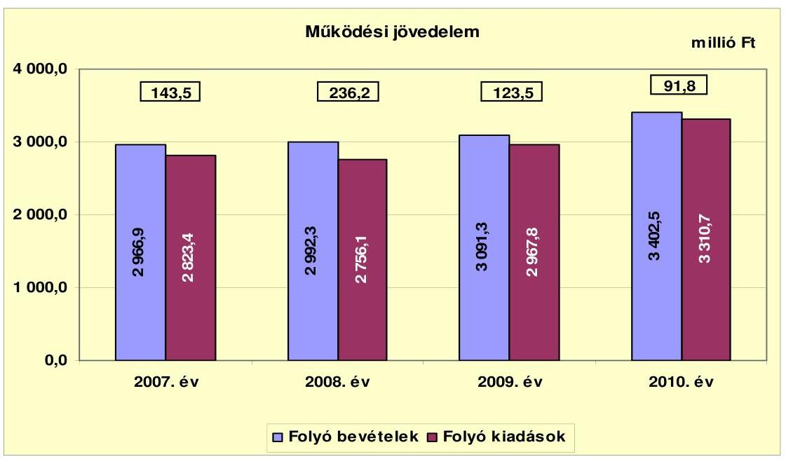

A vizsgált időszakban az Önkormányzat folyó költségvetési egyenlege, működési jövedelme pozitív összegű volt. A működési forrástöbblet 2008. évi (92,7 millió Ft-os) növekedését a 2007. évhez viszonyítva a folyó bevételek 25,4 millió Ft-os emelkedése, valamint a folyó kiadások - részben egy alapfokú oktatási intézmény átadása és a nevelési tanácsadó megszüntetése miatti (67,3 millió Ft-os) csökkenése okozta. A 2009. és a 2010. évben a működési forrástöbblet folyamatosan csökkenő tendenciát mutatott, mivel a működési- és kamatkiadások növekedését a költségvetési- és az államháztartáson belülről kapott támogatások növekedése nem tudta ellensúlyozni. Az Önkormányzat működési jövedelme a kapott ÖNHIKI és működésképtelen önkormányzatok egyéb támogatása nélkül a 2008. évben 236,2 millió Ft helyett 174,9 millió Ft, a 2009. évben 123,5 millió Ft helyett 93,4 millió Ft, míg a 2010. évben 91,8 millió Ft helyett -54,1 millió Ft lett volna.

Az Önkormányzat pénzügyi kapacitása - a 2010. év kivételével - a vizsgált időszakban pozitív értéket mutatott. A nettó működési jövedelem ${ }^{11}$ értéke a folyó költségvetési pozíció mellett az adott költségvetési év adósságtörlesztésének hatását is tükrözi.

[^0]
[^0]:    ${ }^{11}$ pénzügyi kapacitás

---

Az Önkormányzat nettó működési jövedelmének évenkénti alakulását a 2007-2010. években az alábbi ábra szemlélteti:
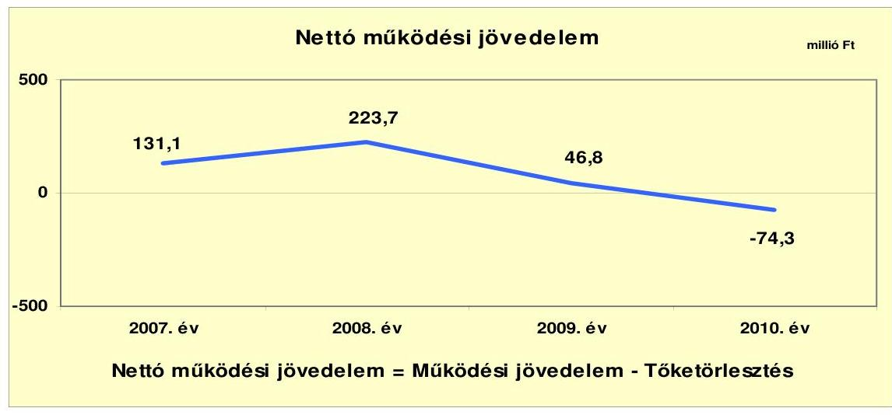

A vizsgált időszakban képződött 327,3 millió Ft működési jövedelemnek 81,8%-át (267,7 millió Ft-ot) tette ki a hitelekhez kapcsolódó tőketörlesztés. Az éves adósságszolgálat a 2008. évre nem változott számottevő mértékben, így a nettó működési jövedelem a működési jövedelem növekedésével arányosan emelkedett. Az Önkormányzat a közvilágítás korszerűsítése érdekében felvett fejlesztési célú hitelének visszafizetését a 2009. évben, illetve a kibocsátott kötvény törlesztését a 2010. évben kezdte meg, amelyek egyre nagyobb mértékű adósságszolgálati kötelezettséget jelentettek. Ennek következtében az Önkormányzat nettó működési jövedelme is csökkenő tendenciát mutatott. A 2009. évben 176,9 millió Ft-tal (46,8 millió Ft) volt kevesebb, mint az előző évben. A 2010. évben a folyó költségvetés egyenlege az adósságszolgálatra nem nyújtott fedezetet, így -74,3 millió Ft negatív nettó működési jövedelem keletkezett.

A 2007-2010. években az Önkormányzat felhalmozási költségvetésének egyenlege folyamatosan negatív összegű volt. A felhalmozási költségvetés egyenlegét a 2007-2010. években a következő ábra szemlélteti:
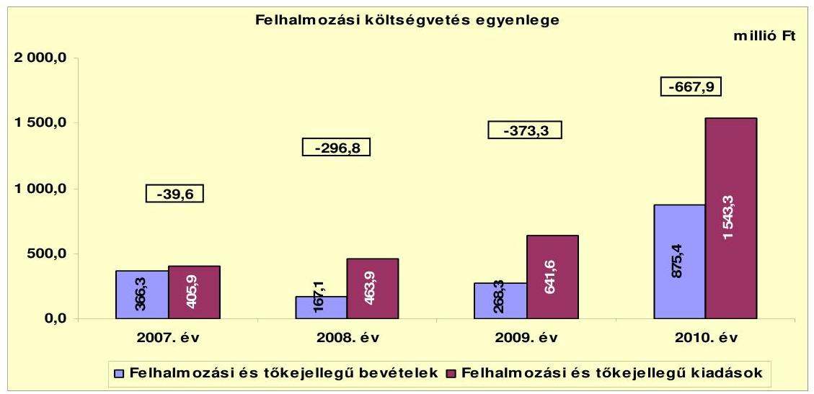

---

A felhalmozási forráshiánynak a felhalmozási és tőke jellegű kiadásokhoz viszonyított aránya 2007-ben 9,8% (-39,6 millió Ft), 2008-ban 64,0% (-296,8 millió Ft), 2009-ben 58,2% (-373,3 millió Ft), 2010-ben 43,3% (-667,9 millió Ft) volt. A felhalmozási kiadásokra az Önkormányzat által tervezett saját bevételek, igénybe vett EU-s és hazai támogatások, a folyó költségvetésben keletkezett nettó működési jövedelem nem nyújtott fedezetet. Az Önkormányzat az egyre növekvő felhalmozási kiadásait fejlesztési célú hitelekkel és kötvénykibocsátásból származó bevétellel fedezte. A vizsgált időszakban keletkezett 1377,6 millió Ft felhalmozási forráshiányt a 327,3 millió Ft nettó működési jövedelem, a 0,3 millió Ft 2007. évi nyitó pénzkészlet, a felvett 23,1 millió Ft összegű fejlesztési hitel és az 1500 millió Ft kötvénykibocsátás fedezte.

Az Önkormányzat évenkénti teljes finanszírozási igénye ${ }^{12}$ - a 2007. év kivételével - a CLF módszer szerint 2008-ban 73,1 millió Ft, 2009-ben 326,5 millió Ft, 2010-ben 742,2 millió Ft volt, amelynek forrását a finanszírozási célú bevételek ${ }^{13}$ biztosították. A 2007. évben az Önkormányzat 91,5 millió Ft finanszírozási többlettel rendelkezett, mivel a nettó működési jövedelem a felhalmozási forráshiányt meghaladta. Az Önkormányzat 2010. évi 742,2 millió Ft finanszírozási igényére az előző évek finanszírozási bevételei nyújtottak fedezetet ${ }^{14}$.

Az Önkormányzat finanszírozási műveletei 2007-2010. évekbeli egyenlegének alakulását a következő ábra szemlélteti:
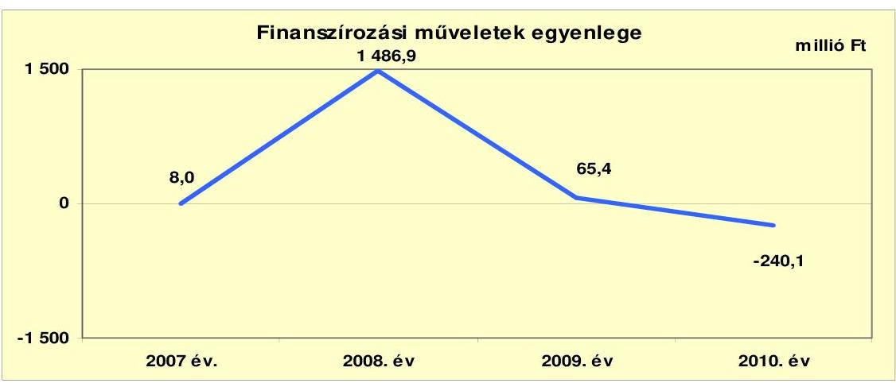

A finanszírozási pénzügyi műveletek pozitív egyenlege azt jelzi, hogy az éves költségvetések végrehajtása során szükség volt az előző években keletkezett pénzmaradvány igénybevételén túl külső finanszírozás igénybevételére is. A finanszírozási műveletek egyenlegének 2008. évi kiugró értéke a kötvénykibocsátás bevételéből eredő finanszírozási többletet tükrözi, amely a 2008. év és az azt következő évek felhalmozási kiadásainak forrását képezte. A finanszírozási célú

[^0]
[^0]:    ${ }^{12}$ a nettó működési jövedelem és a felhalmozási költségvetés egyenlegének összege
    ${ }^{13}$ A finanszírozási célú bevételek összege 2008-ban 1638 millió Ft, 2009-ben 20,5 millió Ft volt.
    ${ }^{14}$ A 2010. évben fejlesztési célú hitelt nem vett fel, a bankszámláin rendelkezésre álló pénzeszközök kötelezettségvállalással terheltek voltak.

---

műveleteket a vizsgált időszakban a jelentés 2. számú mellékletének 4.1-4.8 pontjai részletezik.

Az Önkormányzat a 2007-2008. években a zárszámadási rendeleteiben bevételi többletet, a 2009-2010. években bevételi hiányt mutatott ki. A kimutatott bevételi többlet összege a 2007. évben 69,0 millió Ft, a 2008. évben 1451,0 millió Ft, míg a forráshiány összege a 2009. évben 249,8 millió Ft, a 2010. évben 575,9 millió Ft volt. A megállapított bevételek az Áht ${ }_{1}$ 8/A. § (7) bekezdésében előírása ellenére a 2008. évben pénzügyi műveleteket - finanszírozási célú bevételeket (kötvénykibocsátásból származó bevétel) - is tartalmaztak. Az Önkormányzat által a zárszámadási rendeletekben megállapított működési és fejlesztési többletet és hiányt az 1. számú melléklet szemlélteti.

A 2007-2010. évek között az Önkormányzat összesen 433,7 millió Ft kamatot fizetett meg. Az átmenetileg szabad pénzeszközei befektetéséből származó kamatbevétel a teljes kamatráfordítás 59,1%-át (256,5 millió Ft) tette ki.

Az Önkormányzat kamatbevételeinek és kamatkiadásainak alakulását a vizsgált időszakban a következő ábra mutatja:
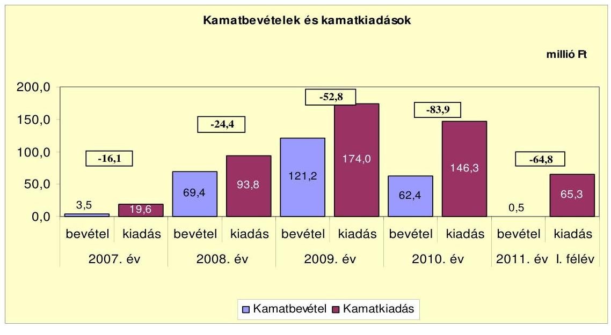

A kamatbevételek összege a 2008. és a 2009. évben a kötvénykibocsátásból származó átmenetileg szabad pénzeszközök lekötése következtében növekedett. A kötvénykibocsátásból származó bevételek felhasználása miatt az átmenetileg szabad pénzeszközök csökkentek, így a kamatbevétel is csökkent az előző évhez viszonyítva. A kötvénykibocsátással, a fejlesztési célú hitelek felvételével, és a folyószámlahitel igénybevételével a kamatkiadások összege évről évre növekedett a 2008. és a 2009. évben. A 2010. évben a kamatkiadások csökkenését okozta, hogy az Önkormányzat által igénybe vett folyószámlahitel napi átlagos állománya csökkent az előző évhez viszonyítva.

A 2011. évre az Önkormányzat a kamatkiadások növekedésével kalkulál, a költségvetési rendeletben tervezett 636 millió Ft kamatkiadás 61,9%-kal (90,6 millió Ft-tal) haladhatja meg a 2010. évit.

---

# 2.2. Az Önkormányzat bevételeinek változása 

Az Önkormányzat összes folyó bevétele a 2007-2009. évek átlagához (3016,8 millió Ft) viszonyítva 2010-re 3402,5 millió Ft-ra, 12,8%-kal (385,7 millió Ft-tal) emelkedett.

Az Önkormányzat működőképességének megőrzéséhez 2008-2010. években ${ }^{15}$ összesen 237,3 millió Ft kiegészítő támogatásban részesült. A támogatás 85,3%-a (202,3 millió Ft) a működési hiány csökkentését szolgálta, illetve 14,7%-a (35,0 millió Ft) feladathoz nem kötött támogatás volt. A 2011. év I. félévében az Önkormányzat - a támogatásról szóló értesítés szerint - elszámolási kötelezettséggel az alapfokú nevelési, oktatási intézmények fenntartására 31,9 millió Ft, az egyéb kötelező feladatellátáshoz kapcsolódó működési forráshiány mérséklésére 70,0 millió Ft támogatásban részesült.

Az Önkormányzat 2007-2010 között realizált főbb bevételi jogcímeinek számszaki adatait, összetételének változását az alábbi ábra mutatja be:
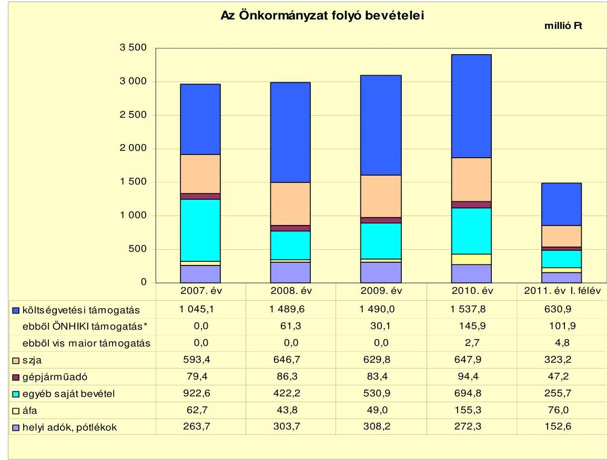

[^0]
[^0]:    * Az Önkormányzat működőképességének megőrzését szolgáló kiegészítő támogatások együttesen
    ${ }^{15}$ Az Önkormányzat a 2007. évben a működőképességének megőrzését szolgáló kiegészítő támogatásban nem részesült. ÖNHIKI keretében a 2008. évben 46,3 millió Ft-ot, a 2009. évben 30,1 millió Ft-ot és a 2010. évben 125,9 millió Ft-ot kapott. Ezen kívül a működésképtelen helyi önkormányzatok egyéb támogatása címen a 2008. évben 15,0 millió Ft-ban, a 2010. évben 20,0 millió Ft-ban részesült. A 2011. év I. félévében az ÖNHIKI keretében 101,9 millió Ft-ot kapott.

---

Az Önkormányzat a 2007-2010. években összesen 8080,3 millió Ft költségvetési támogatásban és átengedett szja-ban részesült. Jelentős növekedés a 2008. évben történt, a költségvetési támogatások növekedése következtében. A vizsgált időszakban - a jelentésben bemutatott CLF módszer szerint - az Önkormányzat a 2006. évi költségvetési támogatás és átengedett szja összegéhez ${ }^{16}$ viszonyítva összesen 611,5 millió Ft többlet költségvetési támogatást és átengedett szja-t realizált. A 2011. év I. félévében 954,1 millió Ft költségvetési támogatásban és átengedett szja-ban részesült az Önkormányzat.

Az Önkormányzat helyi adó bevételei 2007-től 2009-ig folyamatosan növekedtek, majd 2010-ben csökkentek az előző évhez viszonyítva. A befolyt helyi adó bevételek összege a 2011. év I. félévében 152,6 millió Ft volt. Az Önkormányzat által kivetett helyi adók az iparűzési adó, az építményadó, az idegenforgalmi adó, valamint 2007-ben és 2008-ban a luxusadó voltak.

Az iparűzési adó esetében az állandó jelleggel végzett iparűzési tevékenység esetén az adó évi mértéke 2007. január 1. előtt az adóalap 1,8%-a, 2007. január 1-jétől 2%-a volt, amely 2010-ben 1,8%-ra csökkent.

Az építményadót külterületi ingatlanokra vetették ki, alapja az építmény m²-ben számított hasznos alapterület volt, mértéke a 2007. évi 120 Ft/m²-ről 2008-tól 500 Ft/m²-ra nőtt.

Az idegenforgalmi adó mértéke a 2007. évben személyenként és vendégéjszakánként 200 Ft, 2008-tól 300 Ft volt.

A luxusadó mértéke a 2007. évben a lakóingatlan számított értékének 100 millió Ft feletti része után 0,5% volt. A 2008. évtől az adónem megszűnt.

Az Önkormányzat a vizsgált időszakban gazdasági társaságaitól osztalékban nem részesült. Az egyes években nyereségesen működő gazdasági társaságai által elért adózott eredményt eredménytartalékba helyeztette.

Az Önkormányzat felhalmozási bevételeit jogcímenként a következő táblázat tartalmazza:

| Megnevezés | 2007. év | 2008. év | 2009. év | 2010. év | 2011. év I.   félév |
| :-- | --: | --: | --: | --: | --: |
| Tárgyi eszköz értékesítés | 40,0 | 5,3 | 29,6 | 228,3 | 26,9 |
| Egyéb saját tőkebevétel | 8,5 | 5,4 | 7,5 | 80,9 | 10,5 |
| Államháztartáson belülről   kapott támogatás | 299,5 | 139,2 | 225,1 | 556,5 | 138,8 |
|

 Államháztartáson kívülről   kapott támogatás | 18,3 | 17,2 | 6,1 | 9,7 | 7,2 |
| Összes felhalmozási bevétel | 366,3 | 167,1 | 268,3 | 875,4 | 183,4 |

Az Önkormányzat gazdasági társaságai által elért bevételeket a 4. számú melléklet tartalmazza.

[^0]
[^0]:    ${ }^{16} 1867,2$ millió Ft

---

Az Önkormányzat felhalmozási bevételei a vizsgált időszakban jelentősen változtak. A változásra legszámottevőbb hatással az államháztartáson belülről kapott támogatások bírtak, amelyeket az Önkormányzat pályázati tevékenysége befolyásolt. Az Önkormányzatnak tárgyi eszközök, járművek és ingatlanok értékesítésből a 2010. évben 228,3 millió Ft bevétele származott, amely az előző évek viszonylatában kiugróan magas (a 2009. évhez viszonyítva több mint hétszerese), mivel itt számolták el a 200,0 millió Ft, kártérítés címén kapott összeget. Az Önkormányzat 2011. év I. félévében 183,4 millió Ft felhalmozási bevételt realizált.

# 2.3. Az Önkormányzat működési és felhalmozási célú kiadásainak változása. 

Az Önkormányzat működési kiadásai főbb jogcímek szerinti bontásban az alábbiak voltak:

| Megnevezés | 2007. év | 2008. év | 2009. év | 2010. év | $\begin{gathered} \text { millió Ft } \\ 2011 . \text { év I. } \\ \text { félév } \end{gathered}$ |
| :--: | :--: | :--: | :--: | :--: | :--: |
| Folyó kiadások | 2823,4 | 2756,1 | 2967,8 | 3310,7 | 1415,9 |
| Működési kiadások (kamatkiadás nélkül) | 1975,1 | 1825,6 | 1880,3 | 2216,1 | 946,7 |
| Államháztartáson belülre átadott pénzeszközök | 228,8 | 197,0 | 197,4 | 217,9 | 59,6 |
| Transzferkiadások | 599,9 | 637,6 | 699,6 | 702,3 | 335,0 |
| -ebből: vállalkozásoknak | 184,0 | 190,8 | 334,7 | 333,0 | 137,8 |
| magánszemélyeknek | 391,9 | 426,4 | 343,9 | 347,8 | 184,4 |
| nonprofit szervezeteknek | 24,0 | 20,4 | 21,0 | 21,5 | 12,8 |
| Kamatkiadások | 19,6 | 93,8 | 174,0 | 146,3 | 65,3 |
| Előző évi pénzmaradvány átadás | 0,0 | 2,1 | 16,5 | 28,1 | 9,3 |

Az Önkormányzat folyó kiadásai 2008-ban 2,4%-kal (67,3 millió Ft-tal) csökkentek - egy oktatási intézmény Kistérségi társulás részére történő átadása miatt - az előző évhez viszonyítva. A folyó kiadások 2009. és 2010. évi növekedésében a különböző pályázati forrásokból megvalósított projektek keretében felmerült személyi és dologi kiadások játszottak szerepet az előző évhez viszonyítva.

Az Önkormányzat működési kiadásai a vizsgált időszakban a következőképpen alakultak:

|  |  |  |  |  | millió Ft |
| :-- | --: | --: | --: | --: | --: |
| Megnevezés | 2007. év | 2008. év | 2009. év | 2010. év | 2011. év I.   félév |
| Személyi juttatások | 1057,2 | 969,9 | 941,1 | 1137,4 | 470,0 |
| Munkaadót terhelő járulékok | 337,5 | 307,2 | 276,3 | 294,1 | 119,9 |
| Dologi kiadások | 547,2 | 516,1 | 620,6 | 728,4 | 332,4 |
| Egyéb folyó kiadások | 52,9 | 131,0 | 236,8 | 202,4 | 24,5 |

Az Önkormányzatnál a személyi juttatások és a munkaadókat terhelő járulékok folyó kiadásokon belüli aránya a 2007-2009. évek átlagát tekintve 45,5% volt, mely a 2010. évben 2,3 százalékponttal (43,2%-ra) csökkent. Az intézményfenntartást biztosító dologi kiadásokra a 2007-2009. évek átlagában 19,7%, míg a 2010. évben 2,3 százalékponttal több (22,0%) jutott.

---

A személyi juttatások 2009-re 10,9%-kal, 116,1 millió Ft-tal csökkentek a 2007. évhez viszonyítva. Ennek oka az oktatási intézmény Kistérségi társulás részére történő átadása mellett a nevelési tanácsadó megszüntetése volt. Ezt követően a személyi juttatások 2010-ben 20,9%-kal (196,3 millió Ft-tal) emelkedtek az előző évhez viszonyítva.

A személyi juttatások 2010. évi növekedésének oka részben az ebben az évben megvalósított Téli-tavaszi (80,5 millió Ft), valamint az Idegenforgalmi és vasúttisztasági közmunkaprogram (53,1 millió Ft) keretében kifizetett személyi juttatások összege.

A dologi kiadások 2008-ban 5,7%-kal (31,1 millió Ft-tal) csökkentek a 2007. évhez viszonyítva, majd évről évre emelkedtek.

A dologi kiadások növekedését okozta a TÁMOP keretében megvalósított önkormányzati projekt, melynek keretében 2009-ben 12,5 millió Ft eszközbeszerzés és 71,5 millió Ft közszolgáltatás vásárlás, 2010-ben 18,0 millió Ft eszközbeszerzés és az előző évivel azonos összegű közszolgáltatás vásárlás történt.

Az egyéb folyó kiadásokon belül a kamatkiadások aránya a 2007-2010. évek átlagában 69,6%-volt, így ennek arányában változtak az egyéb folyó kiadások is.

Az Önkormányzatnál a folyó és felhalmozási kiadások alakulását, a teljesített kiadások működési és felhalmozási felhasználásának arányait az alábbi ábra mutatja:
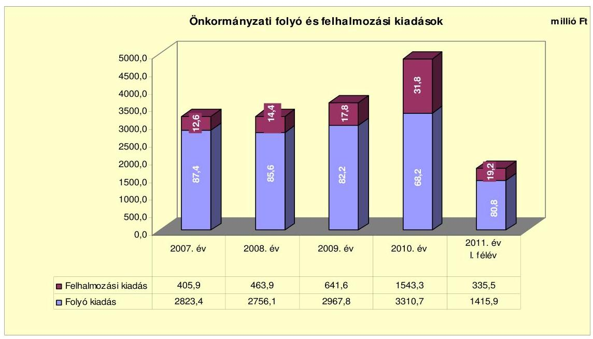

A teljesített összes kiadáson belül a felhalmozási kiadások aránya a 2008. évben 1,8 százalékponttal (14,4%-ra), a 2009. évben 3,1 százalékponttal (17,8%-ra), míg a 2010. évben 14,0 százalékponttal (31,8%-ra) növekedett az előző évhez viszonyítva.

A vizsgált időszakban az Önkormányzat befejezett és folyamatban levő fejlesztéseinek tervezett összege összesen 4234,1 millió Ft volt. Az Önkormányzat a

---

2007-2010. években 13 projekt megvalósítását végezte EU-s források felhasználásával. A 2007-2010. években a megvalósított és folyamatban lévő beruházások településrészek korszerűsítésére, önkormányzati intézmények felújítására, belvíz- és csapadékvíz elvezető rendszerek karbantartására, szilárd burkolatú úthálózat burkolat-felújítására, kerékpárút építésére és a tűzoltóság épületének felújítására irányultak.

Az Önkormányzatnál a 2007-2010. években befejezett fejlesztési feladatok összes költségvetési kiadása 1693,3 millió Ft volt, amelyből a beruházások összege 891,5 millió Ft (52,6%) és a felújítások összege 801,8 millió Ft (47,4%) volt. A projektek döntő többsége utófinanszírozású beruházás volt, amely az Önkormányzat likviditási helyzetére, fizetőképességére kedvezőtlen hatást gyakorolt. A befejezett 1693,3 millió Ft értékű fejlesztés forrásmegoszlása: 661,8 millió Ft EU-s támogatás (39,1%), 361,1 millió Ft hazai támogatás (21,3%), 220,4 millió Ft saját bevétel (13,0%), 450,0 millió Ft (26,6%) kötvénykibocsátásból származó bevétel volt. A 2007-2010. években teljesített kiadások összege 1688,7 millió Ft volt, míg a további 4,6 millió Ft kiadást 2006. december 31-ig teljesítették.

Az Önkormányzat 2010. december 31-én folyamatban lévő (21 db) fejlesztési feladatainak tervezett nagysága 2527,2 millió Ft, a 2010. december 31-ig teljesített kiadások tényleges összege 409,3 millió Ft volt. A folyamatban lévő beruházások 2010. december 31-ig teljesített kiadásainak forrása 115,5 millió Ft (28,2%) saját bevétel, 167,0 millió Ft (40,8%) kötvényből származó bevétel, 103,5 millió Ft EU-s támogatás (25,3%), és 23,3 millió Ft (5,7%) hazai támogatás volt. A források a fejlesztések esetében az EU-s és a hazai támogatásoknál utólagosan álltak rendelkezésre. A 2010. december 31-én folyamatban lévő fejlesztések 2010. évet követő kötelezettségvállalásainak összege 2149,1 millió Ft volt, amelynek forrása 131,0 millió Ft (6,1%) saját bevétel, 370,0 millió Ft hitel ${ }^{17}$ (17,2%), 1568,1 millió Ft EU-s támogatás (73,0%), és 80,0 millió Ft hazai támogatás (3,7%). Az Önkormányzat a 2011. évben két felújítási és három fejlesztési feladat megvalósítását kezdte, amelyek tervezett értéke összesen 9,1 millió Ft volt. A felújítások forrásaként a költségvetési rendeletében a saját bevételeit jelölte meg. A 2011-2012. évekre vállalt felhalmozási célú kiadások fedezeteként szolgáló 140,1 millió Ft saját bevétel esetleges nem teljesülése a fejlesztések pénzügyi kockázatát növeli.

A 2011. évben az Önkormányzat öt pályázatot nyújtott be, amelyek 213,9 millió Ft összegű tervezett fejlesztéshez kapcsolódtak. A beadott pályázatok közül a helyszíni ellenőrzés befejezésének időpontjában kettő volt eredményes, három pályázat elbírálása nem zárult le. A benyújtott pályázatokkal megvalósítani kívánt projektek bekerülési költsége összesen 213,9 millió Ft, amelynek forrása 49,6 millió Ft (23,2%) saját bevétel, 73,0 millió Ft (34,1%) EU-s támogatás és 91,3 millió Ft (42,7%) hazai támogatás.

Az Önkormányzat folyamatban lévő fejlesztései közül a legnagyobb költségigényű az alábbi három beruházás volt:

[^0]
[^0]:    ${ }^{17}$ A hitelszerződés megkötése 2010. szeptember 30-án megtörtént.

---

- Az Önkormányzat a VESZ épületének felújításáról döntött ÉÁOP keretében. A felújítás keretében 2328 m² ingatlan teljes körű felújítását tervezte az Önkormányzat 6 új szakrendelő kialakításával. A fejlesztés megvalósítására 2011-ben kerül sor, a tervezett összköltség 584,3 millió Ft, amelynek forrása 11,5 millió Ft (2,0%) saját bevétel, 35,2 millió Ft (6,0%) kötvényből származó bevétel és 537,6 millió Ft (92,0%) EU-s támogatás;
- A „Versenyképes turisztika" Kastélyrekonstrukció projekt megvalósítását az Önkormányzat a 2011-2012. években tervezte. A projekt keretében a Képviselő-testület 1876,66 m² teljes épület felújításáról döntött az épület műemlék jellegének megfelelően. A projekt tervezett kiadása 452,4 millió Ft volt, amelynek forrása 53,1 millió Ft (11,7%) saját bevétel és 399,3 millió Ft (88,3%) EU-s támogatás. A projekt megvalósítására a 2011. év I. félévében 9,6 millió Ft-ot fordítottak, amelynek forrása a kötvénybevétel volt;
- Az Önkormányzat ÉÁOP keretében tervezi megvalósítani önkormányzati utak (engedélyköteles útépítés 1988 fm, nem engedélyköteles útépítés 4086 fm) fejlesztését a 2010-2011. években. A fejlesztés tervezett kiadása 413,7 millió Ft, amelynek forrása 62,0 millió Ft (11,7%) saját bevétel és 351,7 millió Ft (88,3%) EU-s támogatás. A projekt megvalósítására 2010. december 31-ig 191,7 millió Ft-ot fordítottak. A kifizetés forrása 52,2 millió Ft (27,2%) saját bevétel, 36,0 millió Ft (18,8%) kötvényből származó bevétel és 103,5 millió Ft (54,0%) uniós támogatás volt.

Az Önkormányzat gazdasági társaságai részére működési és felhalmozási célra adott át pénzeszközöket a vizsgált időszakban, amelyeket a következő ábra szemléltet:
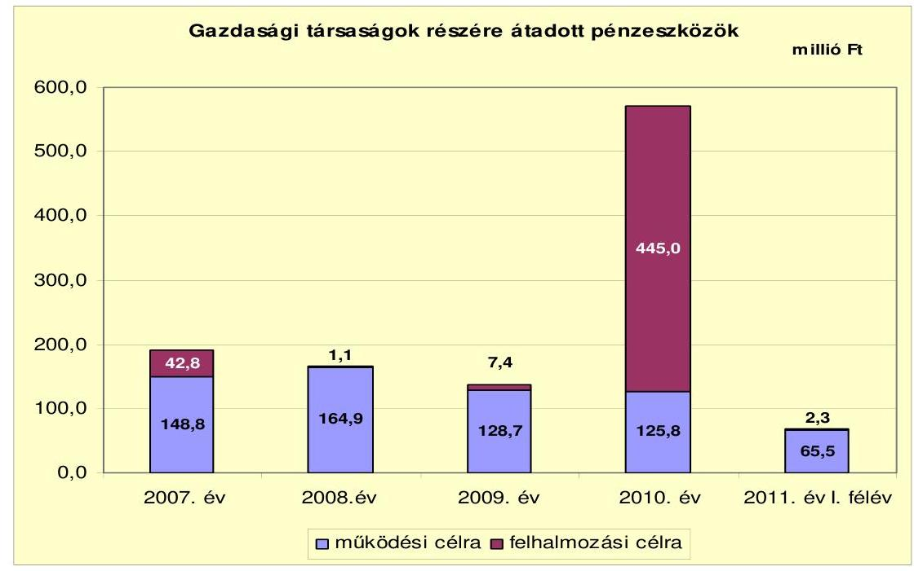

A gazdasági társaságok részére szerződés alapján átadott pénzeszközök összege a 2007-2011. év I. féléve között 1132,3 millió Ft volt. A működési célú pénzeszközátadások esetében az Önkormányzat elszámolási kötelezettséget írt elő gazdasági társaságai részére. Az átadott pénzeszközök

---

95,0%-át (1075,3 millió Ft) a Városgazdálkodási Kft. kapta, a városüzemeltetéssel kapcsolatos és fejlesztési feladatok ellátása érdekében. A 2010. évben a kötvénykibocsátás bevételéből az Önkormányzat 445,0 millió Ft felhalmozási célú pénzeszközt adott át gazdasági társaságának, a „Balmazújváros Városi Termálés Strandfürdő komplex fejlesztése" című projekt megvalósítása érdekében. A felhalmozási célú pénzeszközátadás képviselő-testületi döntésen alapuló, az Önkormányzat és gazdasági társasága között létrejött megállapodás keretében történt. A megállapodás tartalmazta, hogy az átadott pénzeszközt az Önkormányzat a fejlesztés önerejeként, számlaadási kötelezettség nélkül, a fejlesztés megvalósítása során esedékes számlafizetési kötelezettség teljesítéséhez adja át. A pénzeszközátadásokon kívül az Önkormányzat három gazdasági társaságának adott összesen 90,2 millió Ft tőkejuttatást a 2007-2010. években és 2011. év I. félévében. Az Önkormányzat által a gazdasági társaságai részére adott pénzeszközöket a 4. sz. melléklet tartalmazza.

# 3. Az ÖNKORMÁNYZAT KÖTELEZETTSÉGEI 

### 3.1. Az Önkormányzat pénzintézeti kötelezettségeinek változása

Az Önkormányzat pénzintézeti kötelezettségeinek állománya mérlegadatok
 szerint a 2007–2008. években növekedett, majd 2009–2010. években és 2011. év I. félévében a törlesztések hatására fokozatosan csökkent. 2011. június 30-ai állománya 2872,8 millió Ft volt. Az Önkormányzat pénzintézeti kötelezettségei egy kötvénykibocsátásból, majd egy rájegyzést követő ismételt kibocsátásból, három hosszú lejáratú hitel igénybevételéből, a víziközmű társulattól átvett kölcsönből, valamint folyószámlahitel igénybevételéből származtak. A kötvényt kibocsátó pénzintézet, a hosszú lejáratú hitelt nyújtó és a folyószámlát vezető pénzintézetek kiválasztása közbeszerzési eljárás lefolytatásával történt meg.

Az Önkormányzat pénzintézeteknél fennálló kötelezettségállományát az ellenőrzött időszakban az alábbi ábra szemlélteti:
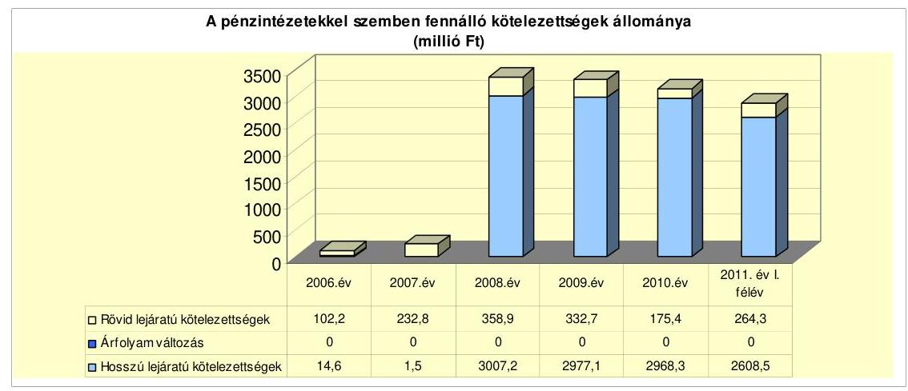

Az Önkormányzat a 2006. évet követően hiányzó fejlesztési forrásainak biztosítása érdekében a pénzintézeti kötelezettségvállalásait növelte. A 2007–2010. évek között négy hosszú lejáratú hitelszerződésben összesen 593,2 millió Ft hitel

---

felvételében állapodott meg, és ebből 2011. június 30-ig 230,2 millió Ft-ot hívott le. Felhalmozási célú kötvényt bocsátottak ki 2008-ban 1100 millió Ft, majd egy rájegyzést követően – szintén 2008-ban – további 400 millió Ft összegben. A pénzintézeti kötelezettségeket növelte 2008. évben a víziközmű társulattól 1506,2 millió Ft kölcsön átvétele. A 2007–2009. évek végén 400 millió Ft, 2010. év végén és 2011. június 30-án 480,0 millió Ft folyószámlahitel-kerettel rendelkezett az Önkormányzat.

A forint alapon kibocsátott kötvényekből 2008. október 1-jén az 1100 millió Ft névértékű kötvényt CHF-re váltották át, azonban azt az Önkormányzat továbbra is forintban tartotta nyilván. Az árfolyamváltozás miatti árfolyamkülönbözet elszámolásának szükségességét nem vizsgálták, annak ellenére, hogy az Áhsz. 33. § (1) és (2) bekezdésében előírja, a devizában keletkezett kötelezettséget a költségvetési év mérlegfordulójára vonatkozó devizaárfolyamon átszámított értéken történő kimutatását, amennyiben a mérleg fordulónapi értékelésből adódó különbözet kötelezettségekre gyakorolt hatása jelentős.

A 2009–2010–2011. évi költségvetési rendeletekben bemutatták az adott költségvetési évet terhelő kötvénnyel összefüggő tőketörlesztéseket, kamatterheket, a fejlesztési hitel és víziközmű kölcsön átvállalásával, továbbá a 2011. évi költségvetési rendeletben megtervezett hitelfelvételekkel összefüggően a várható kamatterhek összegét.

Az Önkormányzat pénzintézeti kötelezettségvállalásai minden esetben Képviselő-testületi döntésen alapultak, a kötelezettségből származó források felhasználási célját meghatározták, a kamatterheket bemutatták, azonban a visszafizetés forrását és – a devizára történő átváltást megelőzően – a devizaalapú kötelezettség árfolyamkockázatát az előterjesztésekben nem mutatták be. A Képviselő-testület döntéseiben kötelezettséget vállalt arra, hogy a pénzintézeti kötelezettségek és azok terheinek visszafizetéséhez szükséges forrásokat a mindenkori költségvetésében biztosítja, azokat az adott évi költségvetési rendeletekben megtervezte és jóváhagyta.

A hitelfelvételeket, kötvénykibocsátást megalapozó előterjesztések nem tartalmazták az adósságszolgálati korlát bemutatását. A Képviselő-testület a döntéshozatalkor az adósságot keletkeztető kötelezettségvállalásának felső határát nem vizsgálta, azonban kötelezettségvállalásaival annak felső határát nem lépte túl.

A közbenső egyeztetés során a polgármester által tett észrevétel szerint: az adósságszolgálati korlát vizsgálata kivétel nélkül folyamatosan történt és az Önkormányzat az adósságot keletkeztető kötelezettségvállalások törvényi korlátját nem lépte át.

Az észrevételében foglaltakat nem fogadjuk el, mivel az előterjesztések nem tartalmaztak adósságszolgálati korlátra vonatkozó számítást, illetve tájékoztatást. A jelentés viszont tartalmazza, hogy az adósságszolgálati korlátot betartották.

Az Önkormányzat devizában fennálló pénzintézeti kötelezettsége a kötvénykibocsátásból keletkezett, melynek 2010. december 31-ei állományát a következő tábla szemlélteti:

---

| Megnevezés | Szerződéskötés/   Kibocsátás   időpontja | Összeg   ezer CHF-ben | Kibocsátási/lehivási   árfolyam | Kamat (referencia   kamat+ kamatfelár) | Felhasználás célja: |
| :-- | :--: | :--: | :--: | :--: | :-- |
| "Balmazújváros 01"   Kötvény |  |  |  |  | Beruházások,   felújítások |

A 7313,8 millió Ft devizaalapú kötvénytartozás tőketörlesztése 2010. év IV. negyedévében kezdődött, félévenkénti törlesztési ütemezéssel. A tőketörlesztés megkezdésének időpontjáig 412,2 ezer CHF (80,5 millió Ft) kamatot fizettek, 2,0 millió Ft egyéb költség merült fel. A 2011. év I. félévében 197,7 ezer CHF tőketartozást törlesztettek és ezzel együtt 65,7 ezer CHF kamatot fizettek. 2011. június 30-át követő futamidő alatt 6918,5 ezer CHF tőkét kell törleszteni és ezzel együtt – az utolsó kamatfizetéskor ismert kamatszint alapján – 1179,9 ezer CHF kamatot megfizetni.

A forintban kibocsátott 400 millió Ft kötvényből 2010. december 31-én 389,2 millió Ft, 2011. június 30-án 378,4 millió Ft volt a fennálló tőketörlesztési kötelezettség összege, és 236,3 millió Ft kamatfizetési kötelezettség merült fel.

A kötvények futamideje 20 év, lejárati ideje 2028. október 1.
A kötvénykibocsátás bevételéből megvalósult többek között a színházterem felújítása, funkcióbővítés, integrált városközpont fejlesztés, Gimnázium épületének felújítása, utak felújítása, bölcsődeépítés, óvodafelújítás, sportcsarnok-felújítás, továbbá gazdasági társaság részére felhalmozási célú pénzeszközátadás.

Az Önkormányzat forint alapú kötvénykibocsátásából és hitelfelvételéből származó 2010. december 31-én fennálló pénzintézeti kötelezettségeket az alábbi táblázat tartalmazza:

| Megnevezés | Szerződéskötés/   Kibocsátás   időpontja | Összeg   millió HUF-   ben | Kamat (referencia kamat+   kamatfelár) | Felhasználás célja: |
| :-- | :--: | :--: | :-- | :-- |
| Víz-közmű kölcsön |  |  | egyéves futamidejű   állampapír   referenciahozama + 1% | víz közmű fejlesztés   (csatornahálózat) |
| Beruházási hitel | 2005. 03. 31 | 1506,2 |  |  |
| Kötvénykibocsátás | 2005. 11. 08 | 0,5 | Ügyleti kamatláb (7,97%) | gépjármű vásárlás |
| Beruházási hitel | 2008. 10. 20 | 389,2 | 3 havi BUBOR + 0,95% | beruházások, felújítások |
|  | 2009. 11. 26 | 10,9 | OTP Prim rate (15,5%) | közvilágítás korszerűsítés   tartozás átvállalás |

Az Önkormányzat által kötött három hitelszerződésben rögzített hitel lehívása és a célnak megfelelő felhasználása megtörtént, elkezdődött a hitelek tőketörlesztése, a kamatok és egyéb költségek szerződés szerinti kifizetése.

Az ellenőrzött időszakban három hosszú lejáratú hitel törlesztésére kellett forrást biztosítani az Önkormányzatnak. A 2005. évben gépjárművásárlás beruházásához szükséges forrást egészítették ki, valamint a Balmazújváros területén szennyvízberuházás megvalósításához a Balmazújvárosi Vízmű Társulat által felvett víziközmű társulati hitelből fennálló tartozást átvállalta az Önkormányzat. A 2009. évben – az Önkormányzat minősített többségi tulajdonában álló gazdasági társaság által – a közvilágítás korszerűsítésére felvett hitel átvállalásából nőtt a hiteltartozás állománya.

---

A 2011. évben felvett beruházási hitel törlesztése 2011. június 30-ig nem kezdődött meg. Az egészségügyi alapellátáshoz kapcsolódó beruházáshoz rendelkezésre álló 370 millió Ft hitelkeretből 230,2 millió Ft-ot hívtak le, a beruházás befejezését követően a teljes hitelkeret igénybevétele várható. A tőke törlesztése 2012. harmadik negyedévében kezdődik.

Az Önkormányzat a városi termál- és strandfürdő fejlesztés megvalósításához szükséges saját források biztosítása érdekében 2010. szeptember 29-én 200,0 millió Ft hitel igénybevételére szerződést kötött, a hitel lehívása a kivitelezés, szállító számlakibocsátásának elhúzódása miatt nem történt meg. A hitel igénybevételére várhatóan 2011. negyedik negyedévében, vagy 2012. első negyedévében kerül sor, törlesztése a tervezettek szerint 2012. III. negyedévében kezdődik.

A Városi Termál- és Strandfürdő komplex fejlesztését az Önkormányzat kizárólagos tulajdonában levő gazdasági társasága valósítja meg. A projekt megvalósítására az ÉAOP-2007-2.1.1 Versenyképes turisztikai termék- és akciófejlesztés pályázat keretében kerül sor. Az Önkormányzat a pályázathoz szükséges önerő biztosítása céljából veszi igénybe a hitelt. A fürdő fejlesztéséhez benyújtott pályázathoz – a pályázatot benyújtó és a projektet megvalósító gazdasági társaság – megvalósíthatósági tanulmányt készített, amely tartalmazta a projekt pénzügyi fenntarthatóságának elemzését. Ebben a működés nettó működési pénzárama 2013. évtől pozitív.

Az Önkormányzat a városi fürdő fejlesztését támogató pályázat benyújtását, illetve a hitel felvételét megelőzően gazdaságossági számításokat nem végzett, nem vizsgálta, hogy a fürdő működtetése milyen hatást gyakorol az Önkormányzat jövőbeni pénzügyi helyzetére, ez az Önkormányzat számára pénzügyi kockázatot jelent.

Az Önkormányzat 2007–2010 között a beruházási hitelek, kölcsönök tőketörlesztésére 11,8 millió Ft-ot, a kamatfizetésre 175,9 millió Ft-ot fordított. A 2011. év I. félévében összesen 549,6 millió Ft tőketartozás és 28,6 millió Ft kamat megfizetését teljesítették.

A kötvénykibocsátásból származó bevétel befektetése a kibocsátástól a felhasználásig 107,0 millió Ft kamatbevételt eredményezett az Önkormányzatnak, melyet a kötvények után fizetendő kamatok teljesítésére használtak fel.

Az Önkormányzat működésének pénzügyi egyensúlyát a vizsgált időszakban folyószámlahitel igénybevételével tudta biztosítani, munkabérhitel felvételére nem volt szükség. Az igénybevett folyószámlahitel adatait az alábbi táblázat mutatja be:

| Megnevezés | 2007. év | 2008. év | 2009. év | 2010. év | 2011. év I.   félév |
| :--: | :--: | :--: | :--: | :--: | :--: |
| I. Folyószámlahitel |  |  |  |  |  |
| a folyószámlahitel keretösszege január 1-jén | 400,0 | 400,0 | 400,0 | 480,0 | 480,0 |
| teljesített kamat és egyéb költség | 15,8 | 26,1 | 37,9 | 21,3 | 7,5 |

---

A folyószámlahitelek kondíciói és egyéb költségei a következők voltak ${ }^{18}$:

| Megnevezés | Kamat (referencia+ kamatfelár) | Egyéb költség |
| :-- | :--: | :--: |
| Folyószámlahitel |  |  |
| 2006. 12. 08-tól – 2007. 12. 07-ig | 3 havi BUBOR + 0,5% | 0,00% |
| 2007. 12. 07-tól – 2008. 12. 06-ig | 3 havi BUBOR + 0,45% | 0,00% |
| 2008. 12. 06-tól – 2010. 10. 11-ig | 3 havi BUBOR + 0,265% | 0,55% kez. ktsg.+rend.tart.jut |
| 2010. 10. 01-tól – 2011. 08. 31-ig | 1 havi BUBOR + 0,275% | 0,25% rend.tart.jut. |

Az Önkormányzat folyószámlahitellel terhelt napjainak számában nem volt jelentős változás, 2007-ben és 2009-ben az év minden napján, 2008-ban 344 napon, 2010-ben 353 napon, 2011. év első félévében 173 napon rendelkeztek folyószámlahitellel.

A Képviselő-testület döntése alapján a folyószámla hitelkeret összegét 2010. október 1-jétől 80 millió Ft-tal megemelték. A hitelkeret megemelését a folyószámlahitel napi átlagos állománya, illetve a szerződés lejáratkori hitelállomány nem indokolta. A Képviselő-testület hitelkeret megemelésének okára az előterjesztésben nem tért ki, a hitelkeretet a pénzforgalmi számla vezetésére kiírt közbeszerzési ajánlatkérésben emelte meg. A folyószámlahitel átlagos napi állománya 2007. évben volt a legalacsonyabb, 188,5 millió Ft, 2008–2009. években 244,0 és 291,1 millió Ft-ra növekedett, majd a 2010. évre 229,4 millió Ft-ra, a 2011. első negyedévében 157,1 millió Ft-ra csökkent. 2010. szeptember 30-án a hitel záró állománya 342,9 millió Ft volt, 2010. december 31-re 166,7 millió Ft-ra mérséklődött.

A folyószámlahitel igénybevétele nélkül a pénzügyi egyensúly nem volt biztosítható. Az áttekintett időszakra jellemző felhalmozási hiány és a beruházások utófinanszírozása szükségessé tette a folyószámlahitel folyamatos igénybevételét, amely az Önkormányzat pénzügyi helyzetét kedvezőtlenül befolyásolta. A rendszeresen jelentkező likviditási problémák finanszírozása az Önkormányzatnak a 2007-től 2011. június 30-ig összesen 103,3 millió Ft kamatkiadást és 5,2 millió Ft egyéb költséget eredményezett.

A kötvények esetében a kamatfizetési kötelezettségek alakulását jelentősen befolyásolta a kibocsátáskori és az utolsó kamat fizetéskori referencia kamat változása, melyet az alábbi táblázat mutat be:

| Megnevezés | Kibocsátási, lehívási | Utolsó fizetéskori | Változás % |
| :--: | :--: | :--: | :--: |
|  | kamat (referencia + kamatfelár) % | 

 |  |
| 3 havi BUBOR (2008. október 1-jei szerződés) | 8,66 | 7,05 | $-18,6 \%$ |
| 3 havi CHF LIBOR (2008. október 1-jei szerződés) | 9,61 | 1,825 | $-81,0 \%$ |
| 1 éves állampapír referencia hozam (2009. 03.10.) | 11,12 | 6,42383 | $-42,2 \%$ |

[^0]
[^0]:    ${ }^{18}$ A referencia kamat az alábbiak szerint alakult:

    | MNB BUBOR fixing (átlagkamat) %-ban |  |  |  |  |
    | :--: | :--: | :--: | :--: | :--: |
    | Referencia kamat | 2007. évi | 2008. évi | 2009. évi | 2010. év | 2011. év I.   félév |
    | 1 havi BUBOR | 7,83 | 8,75 | 8,66 | 5,47 | 6,00 |
    | 3 havi BUBOR | 7,75 | 8,87 | 8,64 | 5,50 | 6,07 |

---

A közvilágítás korszerűsítésre felvett hitel, a víziközmű társulati hitel referenciakamata és a gépjárművásárlás beruházási hitelének ügyleti kamata nem változott a törlesztés időtartama alatt. Az Önkormányzat fizetési kötelezettségét a referencia kamatok változása összességében kedvezően befolyásolta, azonban a kötvénykibocsátás miatti kötelezettség összegére a CHF árfolyamváltozásnak kedvezőtlen volt a hatása.

A CHF/HUF árfolyamának változása ${ }^{19}$ miatti árfolyam-különbözet a 2010. december 31-én devizában fennálló kötvénykibocsátás kötelezettség összegét 525,2 millió Ft-tal növelte.

Az Önkormányzat pénzintézeti kötelezettségvállalásaiból származó tőketartozások, azok kamata és egyéb kötelezettségei miatt várható kötelezettségek alakulását a következő táblázat mutatja:

| Megnevezés | Állomány 2010. december 31-én |  |  | Állomány 2011. június 30-án |  |  | Várható kötelezettség 2011. 2013. években |  | Várható kötelezettség 2014. évtől |  |
| :--: | :--: | :--: | :--: | :--: | :--: | :--: | :--: | :--: | :--: | :--: |
|  | HUF-ban (millió Ftban) | Devizában (összége, ezer CHFben) | Devizaneme | HUF-ban (millió Ftban) | Devizában (összége, ezer CHFben) | Devizaneme | HUF-ban (millió Ftban) | Devizában (összége, ezer CHFben) | HUF-ban (millió Ftban) | Devizában (összége, ezer CHFben) |
| Pénzintézeti kötelezettségek |  |  |  |  |  |  |  |  |  |  |
| *Balmazsijváros 01" Kötvény Erste Bank Zrt |  | 7116,2 | CHF |  | 6918,5 | CHF |  | 1290,6 |  | 6807,6 |
| *Balmazsijváros 01" Kötvény Erste Bank Zrt | 389,2 |  | HUF | 378,4 |  | HUF | 104,9 |  | 509,8 |  |
| OTP Bank Nyrt (közvilágítás korszerűsítés) | 10,9 |  | HUF | 6,7 |  | HUF | 7,3 |  | 0,0 |  |
| UNICREDIT Bank Zrt (Egészségügyi alapellátó fejl.) | 0,0 |  | HUF | 370,0 |  | HUF | 159,1 |  | 415,8 |  |
| OTP Bank Nyrt (víziközmű fejlesztés) | 1506,2 |  | HUF | 961,1 |  | HUF | 1106,2 |  | 0,0 |  |
| Budapest Autófinanszírozási Rt | 0,5 |  | HUF | 0,3 |  | HUF | 0,3 |  | 0,0 |  |
| OTP Bank Nyrt folyószámla hitel | 166,7 |  | HUF | 255,6 |  | HUF | 255,6 |  | 0,0 |  |
| Pénzintézeti kötelezettségek összesen HUF-ban: | 2073,5 |  |  | 1972,1 |  |  | 1633,4 |  |  |  |
| Pénzintézeti kötelezettségek összesen CHF-ben: |  | 7116,2 |  |  | 6918,5 |  |  | 1290,6 | 925,6 | 6807,6 |
| Kezesség | 9,5 |  |  | 10,0 |  |  | 0,0 |  | 0,0 |  |
| Biztosítékok összesen: | 9,5 |  |  | 10,0 |  |  | 0,0 |  | 0,0 |  |
| Szállítói tartozás | 3,9 | 0,0 |  | 3,3 | 0,0 |  | 3,3 | 0,0 | 0,0 | 0,0 |
| MINDÖSSZÉSEN | 2086,9 | 7116,2 |  | 1985,4 | 6918,5 |  | 1636,7 | 1290,6 | 925,6 | 6807,6 |

Az Önkormányzat által a 2007-2010. években vállalt pénzintézeti kötelezettségekből a kötvénykibocsátásból származó kötelezettség tőketörlesztését 2010. IV. negyedévben kezdte meg az Önkormányzat, a lehívás alatt levő fejlesztési célú felhalmozási hitelek tőketörlesztése 2012. szeptember 30-án esedékes. A kötvénykibocsátással, illetve a hitelek igénybevételével az Önkormányzat 2011. és az azt követő évek pénzügyi kockázatát kedvezőtlenül befolyásolta, azok visszafizetési forrását nem határozta meg, a visszafizetéshez szükséges források megteremtése érdekében bevételnövelő intézkedéseket nem tett, ezzel a pénzügyi egyensúly megőrzésének kockázatát növelte.

Az egészségügyi alapellátás fejlesztésére kötött hitelszerződésben 200 millió Ft hitel visszafizetését az épület alsó szintjének bérbeadásából származó bérleti díjból tervezik visszafizetni, a bérleti szerződést megkötötték, azonban nem számszerűsítették, hogy a bérleti díj bevétel milyen arányban biztosít fedezetet a hitelhez kapcsolódó adósságszolgálati kötelezettség teljesítéséhez.

[^0]
[^0]:    ${ }^{19}$ Az árfolyamkülönbözet megállapítása 222,68 CHF/HUF 2010. december 31-ei árfolyam figyelembevételével történt.

---

A 2012. évben a kötvénykibocsátás miatti kötelezettség teljesítésére 21,6 millió Ft és 395,1 ezer CHF, az ellenőrzött időszakban felvett fejlesztési célú hitelek törlesztése 25,8 millió Ft, és az ellenőrzött időszakot követően tervezett hitelfelvételek tőketörlesztése 12,5 millió Ft, összesen 38,3 millió Ft forrást igényel. A szennyvízberuházáshoz igénybevett víziközmű társulati hitel miatt a 2012. évben 117,0 millió Ft óvadéki betétképzési kötelezettsége van az Önkormányzatnak.

A 2011-2013. években a várható kötelezettség teljesítésére figyelembe vehető a 2010. december 31-én kimutatott 4,7 millió Ft vevőkövetelés állomány, valamint az Önkormányzat nyilvántartásában szereplő forgalomképes ingatlanvagyon. Az Önkormányzat 2010. december 31-ei pénzmaradványa 532,9 millió Ft volt. A képződött pénzmaradvány teljes összege kötelezettségvállalással terhelt volt, így az a pénzintézeti kötelezettségek teljesítéséhez nem vehető igénybe. A 2014. évtől - a szennyvízberuházáshoz igénybevett víziközmű társulati hitel visszafizetését követően - az óvadéki betétképzési kötelezettség megszűnésével felszabaduló évi 117 millió Ft forrás felhasználhatóvá válik a fennálló pénzintézeti kötelezettségek teljesítésére.

# 3.2. A szállítói kötelezettségek változása 

Az Önkormányzat szállítói kötelezettség miatti tartozása - egyben a lejárt határidejű szállítói tartozások - az összes kötelezettség elenyésző hányadát tette ki a 2008-2011. év I. féléve között. A 2007. december 31-ei 337,3 millió Ft kötelezettség 17,9%-át (60,5 millió Ft) tette ki a szállítói kötelezettség, az ezt követő években a szállítói kötelezettség kötelezettségeken belüli aránya csökkent. A szállítói tartozás 2010. december 31-én 5,8 millió Ft volt, mely nem érte el a kötelezettségek (3323,2 millió Ft) 1,0%-át, 2011. év I. félév végére a szállítói kötelezettség 3,5 millió Ft-ra csökkent.

A szállítói kötelezettségek - ezzel együtt a lejárt határidejű szállítói tartozások - tendenciája csökkenő volt. Az Önkormányzat szállítói állományának csökkenését a beruházások befejezését követő beruházási szállítók kiegyenlítése, illetve a folyószámlahitel igénybevételével a készlet és szolgáltatásvásárláshoz kapcsolódó szállítói tartozásainak kiegyenlítése eredményezte. A 2010. évben a lejárt határidejű tartozások között a 30 napon belüli lejárt határidejű tartozások aránya 17,1% (3,9 millió Ft), a 31 és 60 nap közötti 81,7% (0,7 millió Ft), 91 és 365 nap közötti tartozások aránya 1,2% (3,2 millió Ft) volt. A 2011. év I. félév végén valamennyi lejárt határidejű tartozás (3,3 millió Ft) 30 napon belüli lejáratú volt. Az Önkormányzat kiadásokat csökkentő intézkedései segítségével és folyószámlahitel igénybevételével folyamatosan csökkentette a lejárt határidejű szállítói állományát, a 2011. június 30-ai lejárt határidejű szállítói tartozás összegét nem forráshiány, hanem adminisztrációs hiba okozta.

---

# 3.3. Egyéb kötelezettségek változása 

Az Önkormányzat garancia- és kezességvállalási kötelezettséget egy kizárólagos önkormányzati tulajdonban levő gazdasági társasága részére ${ }^{20}$, 2007-2011. év I. félév végéig összesen 59,7 millió Ft összegben vállalt. A garancia- és kezességvállalási kötelezettség teljesítésére 2008-ban 16,5 millió Ft-ot, 2010. évben 7,9 millió Ft-ot fordított az Önkormányzat, melyekből 9,5 millió Ft-ot követelésként tartott nyilván az Önkormányzat egy gazdasági társasággal szemben. Az Önkormányzat 2011. június 30-án fennálló garancia- és kezességvállalásának összege 10,0 millió Ft volt.

Az Önkormányzat kizárólagos, illetve minősített többségi tulajdonában levő gazdasági társaságai részére a 2007-2011. év I. félévében összesen 163,0 millió Ft kölcsönt folyósított, a többségében a működés zavartalan biztosítása érdekében. A folyósított kölcsönből 2011. június 30-ig 72,9 millió Ft megtérült, 82,2 millió Ft-ot pedig elengedett az Önkormányzat (a gazdasági társaságok tulajdonosi szerkezetének megváltoztatása érdekében).

A régiós civil szervezetek infrastrukturális feltételeinek fejlesztése címú pályázat sikeres lebonyolítása érdekében a „Hátrányos Helyzetű Kistérségi Társulás" részére 2009. évben 27,9 millió Ft kölcsönt folyósított az Önkormányzat. Kölcsönszerződés alapján 20,0 millió Ft-ot ingatlanvásárlás céljából egy helyi gazdasági társaság részére, 1,5 millió Ft-ot az Önkéntes Tűzoltósság működési feltételeinek biztosítása érdekében nyújtott az Önkormányzat. A kölcsönfolyósítások minden esetben a Képviselő-testület döntésén alapultak.

Az Önkormányzat beruházási hitel fedezeteként forgalomképes ingatlanainak jelzáloggal történő megterheléséhez járult hozzá. Az Önkormányzat forgalomképes ingatlanainak nettó értéke 2010. december 31-én 827,5 millió Ft, a jelzálogjoggal terhelt forgalomképes ingatlanok számviteli nyilvántartás szerinti nettó értéke 372,3 millió Ft volt. Az ingatlanok jelzálogjoggal történő megterhelése során betartották az Ötv. 88. § (1) bekezdés b) pontjában ${ }^{21}$ foglaltakat.

[^0]
[^0]:    ${ }^{20}$ Vetőmag vásárláshoz szükséges hitelfelvételhez.
    ${ }^{21}$ A törzsvagyon egyes elemeit a 2012. január 1-jétől hatályos Nemzeti vagyon tv. 5. § (2) bekezdése szerint kell meghatározni. A kötelezettségek fedezeteként kizárólag a Nemzeti vagyon tv. 5. § (2) bekezdés c) pontjába tartozó korlátozottan forgalomképes vagyonrész ajánlható fel, amennyiben jogszabály nem tiltja és az Önkormányzat rendeletében megengedően rendelkezik. Ezen túl a 3. § (1) bekezdés 18. pontja szerinti forgalomképes üzleti vagyon terhelhető meg.

---

A jelzálogjoggal terhelt forgalomképes ingatlanok nettó értékének forgalomképes ingatlanokon belüli arányát az alábbi ábra szemlélteti:
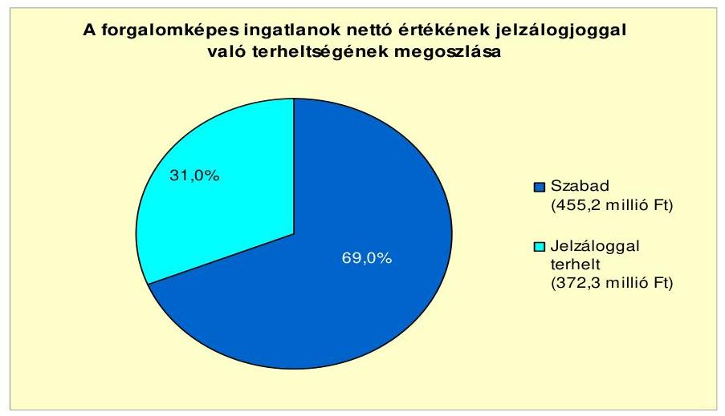

Az Önkormányzat kizárólagos és többségi tulajdonában levő gazdasági társaságok kötelezettségeit az alábbi táblázat mutatja:

| Megnevezés | Állomány 2010. december 31-én |  |  | Állomány 2011. június 30-   án |  |  | Várható kötelezettség 2011. 2013. években |  | Várható kötelezettség 2014. évtől |  |
| :--: | :--: | :--: | :--: | :--: | :--: | :--: | :--: | :--: | :--: | :--: |
|  | HUF-ban
   (millió Ftban) | Devizában (összegy, ezer CHFben) | Devizsi   nem | HUF-ban   (millió Ftban) | Devizában (összegy, ezer CHFben) | Devizsi   nem | HUF-ban   (millió Ftban) | Devizában (összegy, ezer CHFben) | HUF-ban   (millió Ftban) | Devizában (összegy, ezer CHFben) |
| Erste Lízing Autofinanszírozási Zrt. (Vunsgaard Kft) |  | 15,0 | CHF |  | 13,9 | CHF |  | 5,6 |  | 8,3 |
| CIB-CREDI1 Rt (Vunsgaard Kft) |  | 0,2 | CHF |  | 0,0 | CHF |  | 0,0 |  | 0,0 |
| CIB-CREDI1 Rt (Vunsgaard Kft) |  | 2,3 | CHF |  | 1,3 | CHF |  | 1,3 |  | 0,0 |
| Pénzintézeti kötelezettségek összesen: |  | 17,5 |  | 0,0 | 15,2 |  | 0 | 6,9 | 0 | 8,3 |
| Lízing kötelezettségek | 0 | 14,0 | CHF | 0,0 | 0,0 |  | 0,0 | 0,0 | 0,0 | 0,0 |
| Szállítói tartozás | 194 | 0,0 |  | 154,0 | 0,0 |  | 154,0 | 0,0 | 0,0 | 0,0 |
| ÖSSZESSEN: | 194 | 32 |  | 154 | 15 |  | 154 | 7 | 0 | 8 |

A gazdasági társaságok hitelfelvételei gépjárműbeszerzéshez kapcsolódtak. Lízingből származó kötelezettsége egy gazdasági társaságnak volt 2010. december 31-én, amit 2011. év I. félévében pénzügyileg rendezett. Az Önkormányzat kizárólagos tulajdonában levő gazdasági társaságok hitelfelvételei és lízingügyletei az Önkormányzat pénzügyi egyensúlyát nem veszélyeztették.

Az 50\% feletti tulajdoni hányaddal rendelkező gazdasági társaságok szállítói tartozása 2010. december 31-ei 205,2 millió Ft-ról 2011. június 30-ra 154,0 millió Ft-ra, a lejárt határidejű szállítói tartozása 58,7 millió Ft-ról 51,2 millió Ft-ra csökkent. Az Önkormányzat kizárólagos tulajdonában levő gazdasági társaságok szállítói kötelezettsége közvetlenül nem jelent kockázatot az Önkormányzat pénzügyi egyensúlyára.

Az Önkormányzat korlátlan felelősséggel tartozik felszámolás esetén a gazdasági társaságokról szóló 2006. évi IV. törvény 54. § (2) bekezdése alapján azon gazdasági társaságának, amelyben az Önkormányzat az 52. § (2) bekezdése szerint a szavazatok legalább 75\%-ával rendelkezik, így minősített befolyásszerzőnek minősül, továbbá a csődeljárásról és a felszámolási eljárásról szóló 1991. évi XLIX. törvény 63. § (2) bekezdése alapján a kizárólagos önkormányzati tulajdonú gaz-

---

dasági társaságának minden olyan kötelezettségéért, amelynek kielégítését a felszámolási eljárás során az adós társaság vagyona nem fedez, ha a hitelezőinek a felszámolási eljárás során benyújtott keresete alapján a bíróság - az adós társaság felé érvényesített tartósan hátrányos üzletpolitikájára figyelemmel - megállapítja az önkormányzat korlátlan és teljes felelősségét.

Az Önkormányzat a 2007-2010. években a tárgyi eszközök után együttesen 921,2 millió Ft értékcsökkenést számolt el. A vizsgált időszakban nem történt meg annak felmérése, hogy az eszközök elhasználódásának, amortizációjának pótlása milyen kötelezettséget jelent az Önkormányzat számára. A felújításokra, az eszközök pótlására az Önkormányzat pénzügyi lehetőségeinek függvényében - elsősorban az intézmények működőképessége biztosításának figyelembevételével - került sor. Az intézmények kimutatása szerint négy év alatt 653,2 millió Ft értékben elvégzett felújításokon túl 1053,4 millió Ft értékben fejlesztést is megvalósítottak.

Az Önkormányzat 2010. december 31-ei mérlege alapján a tárgyi eszközök bruttó értéke összesen 6678,4 millió Ft volt, mely 1005,0 millió Ft-tal (17,7\%-kal) volt magasabb, mint 2007. év december 31-én. A tárgyi eszközök használhatósági foka 87,8\%-ról 85,0\%-ra változott, annak ellenére, hogy a beruházásokra, felújításokra 1706,7 millió Ft-ot fordítottak. Az ellenőrzött időszakban az eszközpótlásra fordított pénzeszközök 785,5 millió Ft-tal meghaladták a 921,2 millió Ft összegben elszámolt értékcsökkenés összegét.

# 4. A PÉNZÜGYI EGYENSÚLY MEGTEREMTÉSE ÉRDEKÉBEN HOZOTT INTÉZKEDÉSEK EREDMÉNYE 

Az Önkormányzat a kiadáscsökkentő és bevételnövelő intézkedések meghozatalával a gazdálkodás átláthatóbbá tételét, az Önkormányzat pénzügyi helyzetének a javítását, valamint a feladatellátás szakmai színvonalának emelését kívánta elérni.

A 2007-2010. évek és a 2011. év I. félév kiadáscsökkentő intézkedéseinek pénzügyi hatásai - az Önkormányzat kimutatása szerint - beavatkozási területenként az alábbiak voltak:
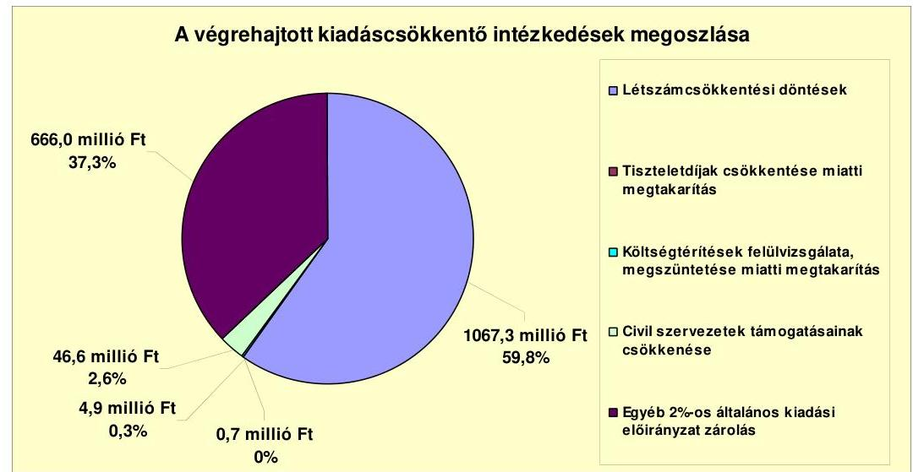

---

A 2007-2010. években és a 2011. év I. félévében az Önkormányzat kimutatása szerint az intézményi átszervezések, a feladatváltozások, valamint a takarékossági intézkedések hatásaként együttesen 1785,5 millió Ft kiadási megtakarítás jelentkezett. Ennek 59,8\%-a (1067,3 millió Ft) a létszámcsökkentésekből (az intézményeket érintő álláshelyek megszüntetése, feladatmegszüntetés, átszervezés, intézmény átadása a Kistérségi társulás részére) származott.

A közoktatási intézmények szerkezetátalakítása során a Képviselő-testület intézmények összevonásáról döntött. Így összevonásra került 2007. július 1-jétől az 1. és a 2. sz. Óvodaigazgatóság valamint a bölcsőde egy részben önálló intézménynyé, továbbá a Bocskai István Általános Iskola és a Kalmár Zoltán Általános Iskola szintén egy részben önálló intézménnyé. Az iskolák összevonásával 7 álláshely megszüntetésére került sor, míg az óvodák esetében álláshely megszüntetés nem történt.

Az Önkormányzat a Központi Általános Iskolát $^{22}$ a Kistérségi társulás részére 2007. július 1. napjától átadta. A döntéssel az Önkormányzatnál 78 álláshely megszüntetésére került sor.

A Nevelési tanácsadót az Önkormányzat 2008. június 30. napi hatállyal megszüntette, fenntartói jogát a Kistérségi társulás hatáskörébe adta át. A döntéssel 7 álláshely megszüntetésére került sor.

A 2007. évben további 3, a 2008. évben 7 álláshely csökkentésre került sor.
Az Önkormányzat kiadási megtakarítást ért el az előirányzatok - a vizsgált időszak minden évében történő - általános 2\%-os zárolásával, melynek teljesítéséről az intézményeket zárszámadáskor számoltatta be. Az így elért megtakarítás összege 2007-2010. években és a 2011. év I. félévében az Önkormányzat kimutatása szerint az összes kiadási megtakarítás 37,3\%-a (666,0 millió Ft) volt.

A vizsgált időszakban a költségvetés tervezése során az Önkormányzat a személyi kiadásokat a hatályos jogszabályi előírásoknak megfelelő besorolások alapján tervezte meg. A dologi kiadások tervezése a 2007. évben az előző évivel azonos szinten, a 2008-2010. években az előző évi tényadatok 4\%-os növelésével, a 2011. évben a 2010. évi tényadatok alapján történt. A költségvetési rendelet-tervezet előterjesztése során a Képviselő-testület részére bemutatásra kerültek a megtervezett előirányzatok, valamint intézményenként a tervezett 2\%-os mértékű előirányzat zárolások eredményeként kialakuló előirányzatok és a tervezett megtakarítások. A zárszámadás készítés során kimutatásra kerültek az intézmények által ténylegesen teljesített kiadások, illetve a tervezett megtakarítástól való elmaradások. A tervezett megtakarítás összegétől való elmaradás okairól az intézmények kötelesek voltak beszámolni.

További kiadáscsökkentő intézkedések hatásaként az Önkormányzat a vizsgált időszakban az előzőeken kívül a kimutatása szerint 52,2 millió Ft megtakarítást ért el.

A Képviselő-testület a 2009. évben döntött a bizottsági és képviselő-testületi tagok esetében a fizetendő tiszteletdíjak 25\%-kal való csökkentéséről, amellyel 0,7 millió Ft megtakarítást ért el. A költségtérítések 2009. és a 2010. évi felülvizsgálatával 4,9 millió Ft-tal csökkentette kiadásait. Az Önkormányzat a civil szervezetek részére nyújtandó támogatásokat minden évben a költségvetési rendelettervezet megalkotásakor felülvizsgálta, amellyel 46,6 millió Ft megtakarítást ért.

Az Önkormányzat álláshelyeinek száma 2007. január 1-jéről 2010. december 31-re 18,0\%-kal, 373 főre csökkent.

A létszámcsökkenést a következő táblázat szemlélteti:

| Megnevezés (adatok fő-ben) |  | Közoktatás | Polgármesteri hivatal | Egyéb | Összesen |
| :--: | :--: | :--: | :--: | :--: | :--: |
| 2007. január 1-jén jóváhagyott álláshelyek száma |  | 322 | 79 | 54 | 455 |
| Megszüntetett álláshelyek száma |  | 79 |  | 23 | 102 |
| ebből: | üres álláshelyek száma |  |  |  | 0 |
|  | szakmai álláshelyek száma | 75 |  | 23 | 98 |
|  | intézmény-üzemeltetéssel kapcsolatos álláshelyek száma | 4 |  |  | 4 |
| Álláshely növekedése |  | 6 | 14 |  | 20 |
| 2010. december 31-én záró álláshelyek száma |  | 249 | 93 | 31 | 373 |
| 2007. január 1-jén foglalkoztatott létszám |  | 322 | 79 | 54 | 455 |
| Létszámcsökkenés |  | 79 |  | 23 | 102 |
| Létszámnövekedés |  | 6 | 14 |  | 20 |
| 2010. december 31-én foglalkoztatott létszám |  | 247 | 91 | 31 | 369 |

A létszámcsökkentő intézkedések következtében az Önkormányzat kimutatása szerint 2007. január 1. és 2010. december 31. között a Polgármesteri hivatalnál és az intézményeknél a nyilvántartások szerint összesen 102 álláshelyet szüntettek meg, amelynek 96,1\%-a (98 fő) ágazati szakmai, 3,9\%-a (4 fő) intézményüzemeltetéshez, fenntartáshoz, gazdasági ügyek intézéséhez kapcsolódó álláshely volt. Egyes közszolgáltatási területen azonban feladatbővülések is voltak, amelyek álláshely és egyben létszámnövekedéssel is jártak, ennek következtében az időszak álláshelyeinek száma összességében 20 fővel növekedett. A megszüntetett álláshelyekből üres álláshely nem volt.

Az Önkormányzatnál a vizsgált időszakban az álláshelyek száma összesen 20-szal növekedett, melyet részben a feladatátszervezések okoztak. Az álláshely növekedések keretében a 2008. évben 1 fő EU-s pályázati figyelő, pályázatírói, 1 fő munkaügyi ügyintézői, 1 fő okmányirodai ügyintézői, 2 fő takarítói munkakör kialakítására került sor. További 2 álláshely növekedést jelentett, hogy a Képviselő-testület az Ámr. 13. § (4) bekezdés e) pontjában foglaltak alapján az engedélyezett költségvetési létszámkeretet megemelte. A 2009. évben projektmenedzseri feladatok ellátása érdekében a Polgármesteri hivatalnál az álláshelyek száma (a projektek lebonyolításának időtartamára) 1 fővel, településőri feladatok ellátása érdekében 2 fővel emelkedett, továbbá a középfokú oktatási intézmény részére 1 fő rendszergazda álláshely kialakítása történt. A középfokú oktatási intézmény részére a 2010. évben további 1 fő fejlesztő pedagógus álláshelyet, az óvoda és bölcsőde részére szintén 1 fő fejlesztőpedagógus és bölcsődei csoportbővítés miatt 3 gondozónői álláshelyet biztosított a Képviselő-testület.

A létszámcsökkentések végrehajtásához az Önkormányzat - kimutatása szerint - 2007-2010. években 61,1 millió Ft központosított költségvetési támogatásban részesült. A támogatás felhasználásával 20 álláshelyet tartósan megszüntettek. A létszámcsökkenés 80,4\%-ához (82 álláshely) központi támogatás nem kapcsolódott. A létszámcsökkentésben érintett dolgozók közül 78 fő a Kistérségi társulás részére átadott oktatási intézményben került tovább foglalkoztatásra.

---

A kiadáscsökkentő intézkedések mellett - az Önkormányzat kimutatása szerint - az alábbiakban számszerűsített bevételnövelő intézkedéseket tette:
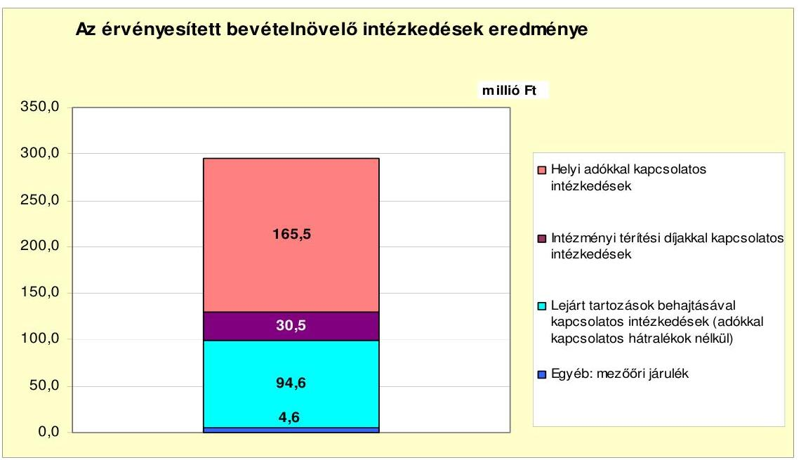

A bevételnövelő intézkedések hatására az Önkormányzat - kimutatása alapján - a 2007-2010. években és a 2011. év I. félévében összesen 295,2 millió Ft többletbevételt ért el. A többletbevétel 56,0\%-át (165,5 millió Ft-ot) a helyi adórendeletek módosításával és adómérték emelésével, 10,3\%-át (30,5 millió Ft-ot) intézményi térítési díjakkal kapcsolatos, 32,0\%-át (94,6 millió Ft-ot) térítési díjak és vevő hátralékok behajtásával kapcsolatos intézkedésekkel, 1,7\%-át (4,6 millió Ft-ot) mezőőri járulék emelésével érték el.

A vizsgált
 időszakban az Önkormányzatnál új adónem bevezetésére nem került sor. Az Önkormányzat élve a jogszabályi lehetőségekkel, a magánszemélyek részére korábban megállapított kommunális adó mértékét 2500 Ft-ról 2007. január 1-jétől 5000 Ft-ra emelte. További intézkedésként az iparűzési adó mértékét szintén 2007. január 1-jei hatállyal 1,8%-ról 2%-ra emelte, majd 2010. január 1-jétől ismét 1,8%-ban állapította meg. Az adómértékek változtatásával az Önkormányzat - nyilvántartásai szerint - a vizsgált időszakban összesen 155,8 millió Ft többletbevételt realizált.

Helyi adókkal kapcsolatos intézkedések keretében az Önkormányzat a magánszemélyek kommunális adó mentességének mértékét 2007. január 1-jétől 100%-ról 50%-ra csökkentette, majd 2009. január 1-jétől ismét 100%-ra emelte. 2010. január 1-jétől a 62 éven felüliek esetében a magánszemélyek kommunális adó mentessége egy ingatlanra csökkent, így a több ingatlannal rendelkezőknek 100%-ot kellett fizetni. Az Önkormányzat a helyi adók kedvezményeinek, mentességeinek változtatásával a vizsgált időszakban kimutatása szerint 9,6 millió Ft többletbevételt ért el.

Az Önkormányzat a mezőőri járulék mértékét 2008. január 1-jétől zártkerti földtulajdon esetén parcellánként évente 500 Ft-tal, szántóföld esetében hektáronként évente 150 Ft-tal emelte meg. Az így elért többletbevétel 2007. január 1.-2011. június 30. között kimutatása szerint 4,6 millió Ft.

---

Az Önkormányzat a 2007-2010. években - a jelentésben bemutatott CLF módszer szerint - 611,5 millió Ft többlet állami támogatásban és átengedett szja-ban részesült - a központi szabályozórendszer változásai és a megvalósított közmunkaprogramokra kapott támogatások következtében -, amely az Önkormányzat által a kimutatott kiadáscsökkentő és bevételnövelő (326,2 millió Ft) intézkedéseivel együtt kedvezően hatott az Önkormányzat pénzügyi helyzetére. A 2011. évre az Önkormányzat az állami támogatás csökkenésével számol az előző évhez viszonyítva. A költségvetési rendeletben tervezett 1735,0 millió Ft állami támogatás 23,7%-kal (540,3 millió Ft-tal) maradhat el a 2010. évitől. A kieső állami támogatás ellensúlyozására szolgál az Önkormányzat kimutatása szerint a 2011. év I. félévében a bevételnövelő intézkedések hatására elért 43,1 millió Ft, valamint a kiadáscsökkentő intézkedések hatására jelentkező 148,1 millió Ft. Az így elért bevételi többlet és kiadási megtakarítás összege (191,2 millió Ft) a kieső állami támogatás és átengedett szja időarányos részére (270,2 millió Ft) nem nyújt fedezetet.

# 5. Az ÁSZ Által a korábbi években a pénzügyi egyensúly javítására tett szabályszerűségi és célszerűségi javaslatok hasznosulása 

Az ÁSZ a 2007. évben végzett vizsgálatának megállapításairól készült jelentésében a pénzügyi egyensúly javítására kettő szabályszerűségi javaslat vonatkozott. A javaslatok hasznosulása érdekében készített intézkedési tervet a Képviselő-testület jóváhagyta, a feladatok végrehajtásáért felelős személyeket és a feladatok végrehajtásának határidejét meghatározta. A javaslatnak megfelelően az Önkormányzat a költségvetési rendelet-tervezetének összeállítása során finanszírozási célú bevételeket és kiadásokat költségvetési bevételként és kiadásként nem mutatott ki.

A pénzügyi egyensúly javítására tett másik javaslat teljesült, mivel az Önkormányzat a költségvetési rendeleteiben bemutatta elkülönítetten az európai uniós támogatással megvalósuló projektek bevételeit és kiadásait.

Budapest, 2012. április "46"

Melléklet: 9 db
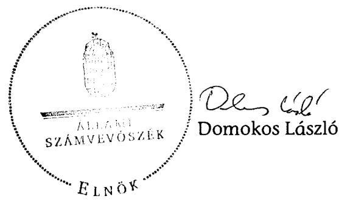

---

Balmazújváros Város Önkormányzata

1. számú melléklet
a V-3093-025/2012. számú Jelentéshez

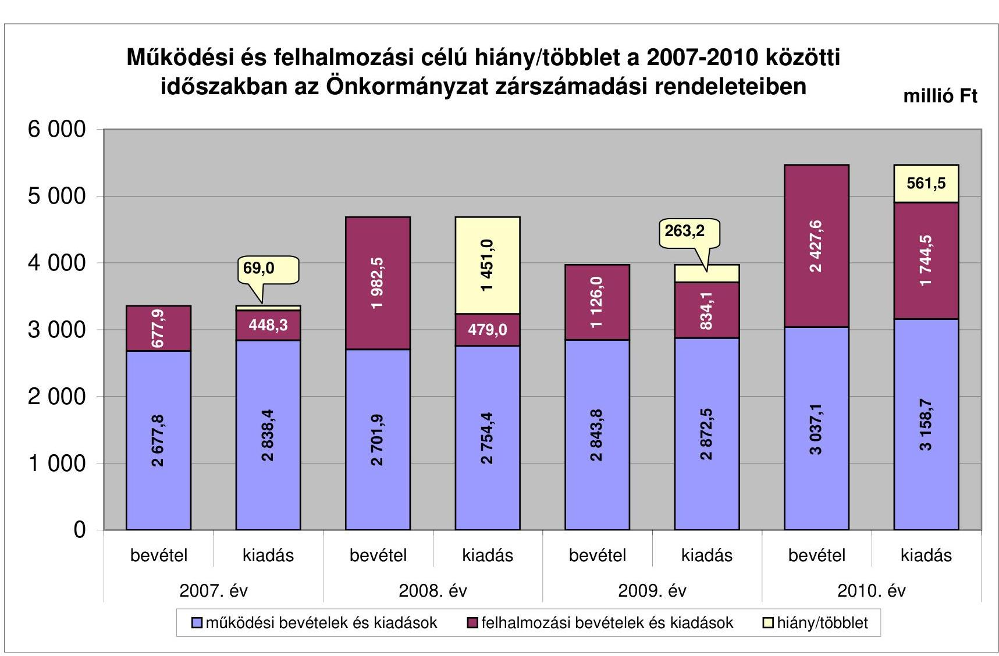

---

|  Az Önkormányzat bevételei és kiadásai, valamint adósságszolgálata 2007-2010 között |  |  |  |   |
| --- | --- | --- | --- | --- |
|   |  |  |  |  |
|  1. FOLYÓ KÖLTSÉGVETÉS | 2007. év | 2008. év | 2009. év | 2010. év  |
|  1.1.1. Saját működési bevételek | 609,8 | 646,6 | 657,3 | 690,5  |
|  1.1.2. Költségvetési támogatás | 1045,1 | 1489,6 | 1490,0 | 1537,8  |
|  1.1.3. Átengedett bevételek | 1212,2 | 733,3 | 713,3 | 742,5  |
|  1.1.4. Állambáztartáson belülről kapott támogatások | 95,3 | 115,8 | 208,1 | 395,7  |
|  1.1.5. EU-tól és külföldről kapott bevételek | 0,0 | 0,0 | 0,0 | 0,0  |
|  1.1.6. Állambáztartáson kívülről kapott bevételek | 4,5 | 4,9 | 6,1 | 7,9  |
|  1.1.7. Előző évi pénzmaradvány átvétel | 0,0 | 2,1 | 16,5 | 28,1  |
|  1.1. Folyó bevételek =1.1.1.+1.1.2.+1.1.3.+1.1.4.+1.1.5.+1.1.6.+1.1.7. | 2966,9 | 2992,3 | 3091,3 | 3402,5  |
|  1.2.1. Működési kiadások kamatkiadások nélkül | 1975,1 | 1825,6 | 1880,3 | 2216,1  |
|  1.2.2. Állambáztartáson belülre átadott pénzeszközök | 228,8 | 197,0 | 197,4 | 217,9  |
|  1.2.3.1. vállalkozásoknak | 184,0 | 190,8 | 334,7 | 333,0  |
|  1.2.3.2. EU-nak, illetve külföldre | 0,0 | 0,0 | 0,0 | 0,0  |
|  1.2.3.3. magánszemélyeknek | 391,9 | 426,4 | 343,9 | 347,8  |
|  1.2.3.4. nonprofit szervezeteknek | 24,0 | 20,4 | 21,0 | 21,5  |
|  1.2.3. Transferkiadások (=1.2.3.1+1.2.3.2+1.2.3.3+1.2.3.4) | 599,9 | 637,6 | 699,6 | 702,3  |
|  1.2.4 Kamatkiadások | 19,6 | 93,8 | 174,0 | 146,3  |
|  1.2.5. Előző évi pénzmaradvány átadás | 0,0 | 2,1 | 16,5 | 28,1  |
|  1.2. Folyó kiadások = 1.2.1.+1.2.2.+1.2.3.+1.2.4.+1.2.5. | 2823,4 | 2756,1 | 2967,8 | 3310,7  |
|  1.3. Folyó költségvetés egyenlege MÜKÖDÉSI JÖVEDELEM (1.1. - 1.2.) | 143,5 | 236,2 | 123,5 | 91,8  |
|  2. FELHALMOZÁSI KÖLTSÉGVETÉS | 0,0 | 0,0 | 0,0 | 0,0  |
|  2.1.1. Saját tőkebevételek | 48,5 | 10,7 | 37,1 | 309,2  |
|  2.1.2. Állambáztartáson belülről kapott támogatások | 299,5 | 139,2 | 225,1 | 556,5  |
|  2.1.3. EU-tól és külföldről kapott támogatások | 0,0 | 0,0 | 0,0 | 0,0  |
|  2.1.4. Állambáztartáson kívülről kapott támogatások | 18,3 | 17,2 | 6,1 | 9,7  |
|  2.1. Felhalmozási bevételek (=2.1.1.+2.1.2+2.1.3+2.1.4.) | 366,3 | 167,1 | 268,3 | 875,4  |
|  2.2.1. Saját beruházási kiadás áfával | 244,0 | 290,3 | 180,5 | 475,6  |
|  2.2.2. Saját felújítási kiadás áfával | 29,7 | 76,7 | 301,1 | 485,6  |
|  2.2.3. Állambáztartáson belülre átadott pénzeszköz | 0,0 | 1,4 | 61,2 | 37,7  |
|  2.2.4. EU-nak és külföldnek adott pénzeszközök | 0,0 | 0,0 | 0,0 | 0,0  |
|  2.2.5. Állambáztartáson kívülre adott pénzeszközök | 129,2 | 94,6 | 78,8 | 544,3  |
|  2.2.6. Befektetési célú részesedések vásárlása | 3,0 | 0,9 | 20,0 | 0,1  |
|  2.2. Felhalmozási kiadások (=2.2.1.+2.2.2.+2.2.3.+2.2.4.+2.2.5.+2.2.6.) | 405,9 | 463,9 | 641,6 | 1543,3  |
|  2.3. Felhalmozási költségvetés egyenlege (2.1. - 2.2.) | -39,6 | -296,8 | -373,3 | -667,9  |
|  3. Finanszírozási műveletek nélküli (GFS) pozíció(1.3.+2.3.) | 103,9 | -60,6 | -249,8 | -576,1  |
|  4. Finanszírozási műveletek | 0,0 | 0,0 | 0,0 | 0,0  |
|  4.1. Hitelfelvétel | 133,0 | 138,0 | 20,5 | 0,0  |
|  4.2. Hiteltörlesztés | 12,4 | 12,5 | 76,7 | 125,5  |
|  4.3. Forgatási és befektetési célú értékpapírok kibocsátása | 0,0 | 1500,0 | 0,0 | 0,0  |
|  4.4. Forgatási és befektetési célú értékpapírok beváltása | 0,0 | 0,0 | 0,0 | -40,6  |
|  4.5. Forgatási és befektetési célú értékpapírok értékesítése | 0,0 | 0,0 | 66,9 | 0,0  |
|  4.6. Forgatási és befektetési célú értékpapírok vásárlása | 45,0 | 8,5 | 0,0 | 0,0  |
|  4.7. Egyéb finanszírozási bevételek (függő, átfutó, kiegyenlítő) | -58,1 | -100,8 | 2,3 | -98,3  |
|  4.8. Egyéb finanszírozási kiadások (függő, átfutó, kiegyenlítő) | 9,5 | 29,3 | -52,4 | -24,3  |
|  4.9.Finanszírozási műveletek egyenlege (4.1. - 4.2.+4.3.-4.4+4.5.-4.6.+4.7.-4.8.) | 8,0 | 1486,9 | 65,4 | -240,1  |
|  5. Tárgyévi pénzügyi pozíció (1.3.+ 2.3.+4.9.) | 111,9 | 1426,3 | -184,4 | -816,2  |
|  6. Nettó működési jövedelem =működési jövedelem (1.3.) - tőketörlesztés (4.2+4.4) | 131,1 | 223,7 | 46,8 | -74,3  |
|  TÁJÉKOZTATÓ ADATOK |  |  |  |   |
|  Összes kötelezettség | 337,3 | 3433,9 | 3507,8 | 3323,2  |
|  ebből rövid lejáratú | 335,8 | 426,7 | 530,7 | 355,0  |
|  Összes szállítói kötelezettség | 60,5 | 17,8 | 24,3 | 5,8  |
|  ebből lejárt (tanúsítványból) | 3,1 | 10,0 | 4,6 | 3,9  |
|  Pénz és tőkepiaci kötelezettség (adósság) | 234,3 | 3366,1 | 3309,8 | 3143,7  |
|  ebből rövid lejáratú | 232,8 | 358,9 | 332,7 | 175,4  |
|  PPP szerződéses állomány jelenértéken (tanúsítványból) | 0,0 | 0,0 | 0,0 | 0,0  |
|  ebből lejárt szolgáltatási díj miatti kötelezettség | 0,0 | 0,0 | 0,0 | 0,0  |
|  Folyószámlabítet napi átlagos állománya (tanúsítványból) | 188,5 | 244,0 | 291,1 | 229,4  |
|  Likvidhítet napi átlagos állománya (tanúsítványból) | 0,0 | 0,0 | 0,0 | 0,0  |
|  Munkabérhítet napi átlagos állománya (tanúsítványból) | 0,0 | 0,0 | 0,0 | 0,0  |
|  Kezesség és garanciavállalások (tanúsítványból) | 0,0 | 9,5 | 9,5 | 9,5  |
|  Jogerős bírósági ítéletekből adódó kötelezettségek (tanúsítványból) | 0,0 | 0,0 | 0,0 | 0,0  |
|  Finanszírozásba bevonható eszközök | 157,1 | 1591,9 | 1354,1 | 537,9  |
|  Tartós hitelviszonyt megtestesítő értékpapírok év végi állománya | 0,0 | 0,0 | 0,0 | 0,0  |
|  Hosszú lejáratú bankbetétek év végi állománya | 0,0 | 0,0 | 0,0 | 0,0  |
|  Értékpapírok év végi állománya | 45,0 | 53,5 | 0,0 | 0,0  |
|  Pénzeszközök (idegen pénzeszközök nélkül) év végi állománya | 112,2 | 1538,5 | 1354,1 | 537,9  |

---

Balmazújváros Város Önkormányzata

Az Önkormányzat 2007-2010. években megvalósított, 2010. december 31-ig befejezett fejlesztései és azok forrásösszetevői

|  |   |   |   |   |   |   |   |   |   |   |   |   |   |   |   |   |   |   |   |  

 |   |   |   |   |   |   |   |   |   |   |   |   |   |   |   |   |   |   |   |   |   |   |   |   |   |   |   |   |   |   |   |   |   |   |   |   |   |   |   |   |   |   |   |   |   |   |   |   |   |   |   |   |   |   |   |   |   |   |   |   |   |   |   |   |   |   |   |   |   |   |   |   |   |   |   |   |   |   |   |   |   |   |   |   |   |   |   |   |   |   |   |   |   |  

---

Balmazújváros Város Önkormányzata 3/6. számú melléklet a V-3093-025/2012. számú jelentéshez

Az Önkormányzat 2010. december 31-én folyamatban lévő fejlesztési feladataira 2010. december 31-ig teljesített kifizetések és azok forrásösszetevői

|  |   |   |   |   |   |   |   |   |   |   |   |   |   |   |   |   |   |   |   |   |   |   |   |   |   |   |   |   |   |   |   |   |   |   |   |   |   |   |   |   |   |   |   |   |   |   |   |   |   |   |   |   |   |   |   |   |   |   |   |   |   |   |   |   |   |   |   |   |   |   |   |   |   |   |   |   |   |   |   |   |   |   |   |   |   |   |   |   |   |   |   |   |   |   |   |   |   |   |   |   |  

---

Balmazújváros Város Önkormányzata

Az Önkormányzat 2010. december 31-én folyamatban lévő fejlesztési feladataira 2010. december 31-ig fennálló kötelezettségek és azok forrásösszetevői

|  |   |   |   |   |   |   |   |   |   |   |   |   |   |   |   |   |   |   |   |   |   |   |   |   |   |   |   |   |   |   |   |
| --- | --- | --- | --- | --- | --- | --- | --- | --- | --- | --- | --- | --- | --- | --- | --- | --- | --- | --- | --- | --- | --- | --- | --- | --- | --- | --- | --- | --- | --- | --- | --- |
|   |  |  |  |  |  |  |  |  |  |  |  |  |  |  |  |  |  |  |  |  |  |  |  |  |  |  |  |  |  |  |   |
|   |  | Fejlesztési feladat (beruházás, felújítás) |  |  |  |  |  |  |  |  |  |  |  |  |  |  |  |  |  |  |  |  |  |  |  |  |  |  |  |  |   |
|   |  |  |  |  |  |  |  |  |  |  |  |  |  |  |  |  |  |  |  |  |  |  |  |  |  |  |  |  |  |  |   |
|   |  |  |  |  |  |  |  |  |  |  |  |  |  |  |  |  |  |  |  |  |  |  |  |  |  |  |  |  |  |  |   |
|   |  |  |  |  |  |  |  |  |  |  |  |  |  |  |  |  |  |  |  |  |  |  |  |  |  |  |  |  |  |  |   |
|   |  | Megnevezése |  |  |  |  |  |  |  |  |  |  |  |  |  |  |  |  |  |  |  |  |  |  |  |  |  |  |  |  |   |
|   |  |  |  |  |  |  |  |  |  |  |  |  |  |  |  |  |  |  |  |  |  |  |  |  |  |  |  |  |  |  |   |
|   |  |  |  |  |  |  |  |  |  |  |  |  |  |  |  |  |  |  |  |  |  |  |  |  |  |  |  |  |  |  |   |
|   |  |  |  |  |  |  |  |  |  |  |  |  |  |  |  |  |  |  |  |  |  |  |  |  |  |  |  |  |  |  |   |
|   |  |  |  |  |  |  |  |  |  |  |  |  |  |  |  |  |  |  |  |  |  |  |  |  |  |  |  |  |  |  |   |
|   |  |  |  |  |  |  |  |  |  |  |  |  |  |  |  |  |  |  |  |  |  |  |  |  |  |  |  |  |  |  |   |
|   |  |  |  |  |  |  |  |  |  |  |  |  |  |  |  |  |  |  |  |  |  |  |  |  |  |  |  |  |  |  |   |
|   |  |  |  |  |  |  |  |

  |  |  |  |  |  |  |  |  |  |  |  |  |  |  |  |  |  |  |  |  |  |  |   |
|   |  |  |  |  |  |  |  |  |  |  |  |  |  |  |  |  |  |  |  |  |  |  |  |  |  |  |  |  |  |  |   |
|   |  |  |  |  |  |  |  |  |  |  |  |  |  |  |  |  |  |  |  |  |  |  |  |  |  |  |  |  |  |  |   |
|   |  |  |  |  |  |  |  |  |  |  |  |  |  |  |  |  |  |  |  |  |  |  |  |  |  |  |  |  |  |  |   |
|   |  |  |  |  |  |  |  |  |  |  |  |  |  |  |  |  |  |  |  |  |  |  |  |  |  |  |  |  |  |  |   |
|   |  |  |  |  |  |  |  |  |  |  |  |  |  |  |  |  |  |  |  |  |  |  |  |  |  |  |  |  |  |  |   |
|   |  |  |  |  |  |  |  |  |  |  |  |  |  |  |  |  |  |  |  |  |  |  |  |  |  |  |  |  |  |  |   |
|   |  |  |  |  |  |  |  |  |  |  |  |  |  |  |  |  |  |  |  |  |  |  |  |  |  |  |  |  |  |  |   |
|   |  |  |  |  |  |  |  |  |  |  |  |  |  |  |  |  |  |  |  |  |  |  |  |  |  |  |  |  |  |  |   |
|   |  |  |  |  |  |  |  |  |  |  |  |  |  |  |  |  |  |  |  |  |  |  |  |  |  |  |  |  |  |  |   |
|   |  |  |  |  |  |  |  |  |  |  |  |  |  |  |  |  |  |  |  |  |  |  |  |  |  |  |  |  |  |  |   |
|   |  |  |  |  |  |  |  |  |  |  |  |  |  |  |  |  |  |  |  |  |  |  |  |  |  |  |  |  |  |  |   |
|   |  |  |  |  |  |  |  |  |  |  |  |  |  |  |  |  |  |  |  |  |  |  |  |  |  |  |  |  |  |  |   |
|   |  |  |  |  |  |  |  |  |  |  |  |  |  |  |  |  |  |  |  |  |  |  |  |  |  |  |  |  |  |  |   |
|   |  |  |  |  |  |  |  |  |  |  |  |  |  |  |  |  |  |  |  |  |  |  |  |  |  |  |  |  |  |  |   |
|   |  |  |  |  |  |  |  |  |  |  |  |  |  |  |  |  |  |  |  |  |  |  |  |  |  |  |  |  |  |  |   |
|   |  |  |  |  |  |  |  |  |  |  |  |  |  |  |  |  |  |  |  |  |  |  |  |  |  |  |  |  |  |  |   |
|   |  |  |  |  |  |  |  |  |  |  |  |  |  |  |  |  |  |  |  |  |  |  |  |  |  |  |  |  |  |  |   |
|   |  |  |  |  |  |  |  |  |  |  |  |  |  |  |  |  |  |  |  |  |  |  |  |  |  |  |  |  |  |  |   |
|   |  |  |  |  |  |  |  |  |  |  |  |  |  |  |  |  |  |  |  |  |  |  |  |  |  |  |  |  |  |  |   |
|   |  |  |  |  |  |  |  |  |  |  |  |  |  |  |  |  |  |  |  |  |  |  |  |  |  |  |  |  |  |  |   |
|   |  |  |  |  |  |  |  |  |  |  |  |  |  |  |  |  |  |  |  |  |  |  |  |  |  |  |  |  |  |  |   |
|   |  |  |  |  |  |  |  |  |  |  |  |  |  |  |  |  |  |  |  |  |  |  |  |  |  |  |  |  |  |  |   |
|   |  |  |  |  |  |  |  |  |  |  |  |  |  |  |  |  |  |  |  |  |  |  |  |  |  |  |  |  |  |  |   |
|   |  |  |  |  |  |  |  |  |  |  |  |  |  |  |  |

  |  |  |  |  |  |  |  |  |  |  |  |  |  |  |   |
|   |

---

### **Az Önkormányzat által beadott, elbírálás alatti pályázati forrásból megvalósítani tervezett fejlesztéseihez kapcsolódó kötelezettségvállalásai és azok forrásösszetétele**

|  Fejlesztési feladat (beruházás, felújítás) |  | Beruházás, felújítás |  |  |  |  |  |  |  |  |  |  |  |  |  |  |  |  |  |  |  |  |  |  |  |  |  |  |  |  |  |  |  |  |  |  |  |  |  |  |  |  |  |  |  |  |  |  |  |  |  |  |  |  |  |  |  |  |  |  |  |  |  |  |  |  |  |  |  |  |  |  |  |  |  |  |  |  |  |  |  |  |  |  |  |  |  |  |  |  |  |  |  |  |  |  |  |  |  |  |  | 

---

## 4. számú melléklet a V-3093-025/2012. számú jelentéshez

|  Az önkormányzati feladatok ellátásában résztvevő gazdasági társaságok |  |  |  |  |  |  |  |  |  |  |  |  |  |  |  |  |  |  |  |  |  |   |
| --- | --- | --- | --- | --- | --- | --- | --- | --- | --- | --- | --- | --- | --- | --- | --- | --- | --- | --- | --- | --- | --- | --- |
|   |  |  |  |  |  |  |  |  |  |  |  |  |  |  |  |  |  |  |  |  |  | mFt.ban  |
|   |  |  |  |  |  |  |  |  |  |  |  |  |  |  |  |  |  |  |  |  |  |   |
|   |  |  |  |  |  |  |  |  |  |  |  |  |  |  |  |  |  |  |  |  |  |   |
|   |  |  |  |  |  |  |  |  |  |  |  |  |  |  |  |  |  |  |  |  |  |   |
|  Gazdasági társaság megnevezése |  |  |  |  |  |  |  |  |  |  |  |  |  |  |  |  |  |  |  |  |  |   |
|   | önkormányzati | önkormányzati gazdasági társaságának | saját töke, jegyzett töke aránya | kötelező feladathoz | önként vállalt feladathoz | hitelhez lejáratú feladathoz | kisingből | lejárt szállítás állományból | működési támogatás |  |  |  |  |  |  |  |  |  |  |  |  |   |
|   |  | tulajdoni hányada |  |  |  |  |  |  |  |  |  |  |  |  |  |  |  |  |  |  |  |   |
|   |  |  |  |  |  |  |  |  |  |  |  |  |  |  |  |  |  |  |  |  |  |   |
|   |  |  |  |  |  |  |  |  |  |  |  |  |  |  |  |  |  |  |  |  |  |   |
|   |  |  |  |  |  |  |  |  |  |  |  |  |  |  |  |  |  |  |  |  |  |   |
|  1. 100%-os tulajdoni hányadú gazdasági társaságné: |  |  |  |  |  |  |  |  |  |  |  |  |  |  |  |  |  |  |  |  |  |   |
|  Balmazújvárosi Város Képviselőtestületi Szolgáltató Kft | 100 |  |  | 0,8 | 202,9 | 0,0 | 0,0 | 0,0 | 1,1 | 0,0 | 0,0 | 0,0 | 0,0 | 0,0 | 0,0 | 0,0 | 0,0 | 0,0 | 0,0 | 0,0 | 0,0 |   |
|  Első Vagyonkezelő és Fejlesztő Kft | 100 |  |  | 0,7 | 0,5 | 34,7 | 13,1 | 0,0 | 1,1 | 0,0 | 0,0 | 0,0 | 0,0 | 0,0 | 0,0 | 0,0 | 0,0 | 0,0 | 0,0 | 0,0 | 0,0 |   |
|  Balmazújvárosi Vagyonkezelő Kft |  |  | 100 | -0,9 | 0,0 | 0,0 | 17,2 | 4,2 | 49,1 | 146,5 | 155,7 | 128,7 | 125,8 | 64,0 | 3,8 | 1,1 | 7,4 | 445,1 | 2,3 |  |  |   |
|  Balmazújvárosi CCM Kft |  |  | 100 | 5,7 | 0,0 | 0,0 | 12,2 | 0,0 | 5,7 | 0,0 | 0,0 | 0,0 | 0,0 | 0,0 | 0,0 | 0,0 | 0,0 | 0,0 | 0,0 | 0,0 | 0,0 |   |
|  Határőrség Kft |  |  | 100 | -35,8 | 0,0 | 0,0 | 22,9 | 1,8 | 10,9 | 0,0 | 9,2 | 0,0 | 0,0 | 0,0 | 0,0 | 0,0 | 0,0 | 0,0 | 4,9 |  |  |   |
|  Első Garázs Kft |  |  | 100 | 0,9 | 0,0 | 0,0 | 0,0 | 0,0 |  | 0,0 | 0,0 | 0,0 | 0,0 | 0,0 | 0,0 | 0,0 | 0,0 | 0,0 | 0,0 | 0,0 | 0,0 |   |
|  Első Ingatlankezelő Kft |  |  | 100 | 0,9 | 0,0 | 0,0 | 0,0 | 0,0 | 0,1 | 0,0 | 0,0 | 0,0 | 0,0 | 0,0 | 0,0 | 0,0 | 0,0 | 0,0 | 0,0 | 0,0 | 0,0 |   |
|  100%-os tulajdoni hányadú gazdasági társaságné összesen |  |  |  |  |  |  |  |  |  |  |  |  |  |  |  |  |  |  |  |  |  |   |
|   |  |  |  |  |  |  |  |  |  |  |  |  |  |  |  |  |  |  |  |  |  |   |
|  2. 75-99%-os tulajdoni hányadú gazdasági társaságné: |  |  |  |  |  |  |  |  |  |  |  |  |  |  |  |  |  |  |  |  |  |   |
|  Balmazenergia Kft (fa) |  |  |  |  |  |  |  |  |  |  |  |  |  |  |  |  |  |  |  |  |  |   |
|  75-99%-os tulajdoni hányadú gazdasági társaságné összesen |  |  |  |  |  |  |  |  |  |  |  |  |  |  |  |  |  |  |  |  |  |   |
|   |  |  |  |  |  |  |  |  |  |  |  |  |  |  |  |  |  |  |  |  |  |   |
|  70%-feletti tulajdoni hányadú gazdasági társaságné összesen |  |  |  |  |  |  |  |  |  |  |  |  |  |  |  |

  |  |  |  |  |  |  |   |
|   |  |  |  |  |  |  |  |  |  |  |  |  |  |  |  |  |  |  |  |  |  |   |
|  4. 51-74%-os tulajdoni hányad gazdasági társaságnál: |  |  |  |  |  |  |  |  |  |  |  |  |  |  |  |  |  |  |  |  |  |   |
|  51-74%-os tulajdoni hányad
gazdasági társaságnál összesen |  |  |  |  |  |  |  |  |  |  |  |  |  |  |  |  |  |  |  |  |  |   |
|   |  |  |  |  |  |  |  |  |  |  |  |  |  |  |  |  |  |  |  |  |  |   |
|  70- egyéb, közfeladatot ellátó gazdasági társaságnál: |  |  |  |  |  |  |  |  |  |  |  |  |  |  |  |  |  |  |  |  |  |   |
|  Hajdúsági Hulladékgazdálkodási és
Szolgáltató Kft |  |  |  |  |  |  |  |  |  |  |  |  |  |  |  |  |  |  |  |  |  |   |
|  Szolgáltató Kft |  |  |  |  |  |  |  |  |  |  |  |  |  |  |  |  |  |  |  |  |  |   |
|  Hajdú-Bihar Megyei
Önkormányzatok Vízmű Zrt |  |  |  |  |  |  |  |  |  |  |  |  |  |  |  |  |  |  |  |  |  |   |
|  Hajdú-Bihar Megyei Termelők
Közép |  |  |  |  |  |  |  |  |  |  |  |  |  |  |  |  |  |  |  |  |  |   |
|  Hajdú-Vidék Zrt |  |  |  |  |  |  |  |  |  |  |  |  |  |  |  |  |  |  |  |  |  |   |
|  Diannei Trafik Zrt |  |  |  |  |  |  |  |  |  |  |  |  |  |  |  |  |  |  |  |  |  |   |
|  EU: Multivarga Kft |  |  |  |  |  |  |  |  |  |  |  |  |  |  |  |  |  |  |  |  |  |   |
|  Egyéb, közfeladatot ellátó
gazdasági társaságok összesen |  |  |  |  |  |  |  |  |  |  |  |  |  |  |  |  |  |  |  |  |  |   |
|   |  |  |  |  |  |  |  |  |  |  |  |  |  |  |  |  |  |  |  |  |  |   |
|  Összesen |  |  |  |  |  |  |  |  |  |  |  |  |  |  |  |  |  |  |  |  |  |   |
|   |  |  |  |  |  |  |  |  |  |  |  |  |  |  |  |  |  |  |  |  |  |   |

---

# Balmazújváros Város Önkormányzata 

24060 Balmazújváros, Kossuth tér 4-5. sz.
Telefon: (52) 580-102
FAX: (52) 370-035
Állami Számvevőszék
Domokos László Úr

## Budapest

Apáczai Csere János u. 10.
1052

Tisztelt Domokos László Úr!
Az önkormányzatunk pénzügyi helyzetének ellenőrzéséről szóló V-3093-20/2012. iktatószámú jelentéstervezethez az alábbi észrevételt kívánom tenni.

1/a. Önkormányzatunk az elmúlt időszakban több intézkedést is tett a bevételszerző és kiadáscsökkentő lehetőségek feltárása érdekében. Az önkormányzat minimálisra csökkentette az irányítása alatt működő intézményeinek számát, ennek alapján a városban már csak négy önállóan működő és a Polgármesteri Hivatalon kívül egy önállóan működő és gazdálkodó intézmény látja el az önkormányzat kötelező és önként vállalt feladatait.
Több feladat a Balmazújvárosi Kistérség Többcélú Társulása fenntartásába került átadásra a magasabb normatív állami támogatás elérése és a hatékonyabb gazdálkodási feltételek megteremtése érdekében.
Önkormányzatunk gazdálkodási tevékenységből származó bevételeinek növelése érdekében létrehozott több gazdasági társaságot, de mivel ezen társaságok többsége nem bizonyult nyereséget termelő, rentábilisan működő kft-nek az önkormányzat döntött egyes gazdasági társaságok végelszámolásáról, más gazdasági társaságok beolvasztásáról.
A Képviselő-testület az önkormányzat költségvetési rendeletének elfogadásakor valamennyi személyi juttatás és dologi kiadás tervezésekor a legkisebb - a jogszabályi előírásoknak megfelelő - kiadási szintek tervezését engedélyezte az irányítása alatt álló költségvetési szervek részére.

Az önkormányzat bevételeinek növelése érdekében 2011. decemberében döntött a magánszemélyek kommunális adója adónem esetén az 5.000,- Ft/ingatlan/év mértékről a 12.000,- Ft/ingatlan/év mértékre történő emelésről, valamint az iparűzési adó mértékét 1,8%-ról 2,0%-ra emelte 2012. január 1. napjától.
Az önkormányzat helyi adókról szóló rendeletében az adómentességek mértékét is szűkítette. A Képviselő-testület 2012. február 1. napjától elfogadta az ebrendészeti hozzájárulás bevezetéséről szóló rendeletét is.

Meg kívánjuk jegyezni, hogy a Képviselő-testület 2006-2011 között több lépcsőben hozott olyan intézkedéseket, amelyek eredményeképpen mind a Polgármesteri Hivatal, mind a fenntartott intézmények engedélyezett létszám keretét úgy határozta meg, hogy a jogszabályi minimum által meghatározott minimális kereteket nem lépi túl egyetlen egy intézmény esetében sem. Ennek eredménye a tisztelt Állami Számvevőszék által a jelentéstervezetben is megjelölt álláshely-csökkentés magas száma. Így elmondható, hogy jelenleg már nincs olyan lehetősége önkormányzatunknak (mert ezeket már elvégeztük korábban), amelynek eredményeképpen az álláshelyek számát, és így a személyi kiadásokat érdemben csökkenteni tudnánk (figyelembe véve a

---

kötelező jogszabályi előírásokat).
A dologi kiadások tekintetében elmondható, hogy önkormányzatunk a teljes intézményrendszer tekintetében minimalizálta a dologi kiadásait, és a közüzemi díjakon kívül (amelyek a dologi kiadások döntő hányadát teszik ki, és tőlünk független tényezők) más jelentős megtakarítási potenciállal nem rendelkezünk.

1/b. Balmazújváros Város Önkormányzata bevételeinek növelése, kintlévőségek behajtása érdekében 2011. évben az alábbi intézkedéseket tette:

- felhívások küldése: 5.166 db
- hatósági utalás: 520 db
- letiltás munkabérből, nyugdíjból: 680 db
- behajtás: 1.418 db

Ebben az évben is minden lehetőségünkkel fokozottan kívánunk élni a behajtás eredményessége érdekében.

Sajnálatos módon megállapíthatjuk, hogy az önkormányzati bevételek növelésére csak nagyon korlátozott lehetősége van az önkormányzatoknak, így erre vonatkozóan lépéseket az 1/a. pontban meghatározottakon felül nagyon nehezen tud önkormányzatunk végrehajtani.

A kiadáscsökkentésre tett folyamatos intézkedéseket az 1/a pontban részleteztük.
1/c. Reorganizációs program kidolgozását önkormányzatunk megkezdte és a szükséges előterjesztéseket megtárgyalja.

1/d. Balmazújváros Város Önkormányzat Képviselő-testülete 2000. évtől bevezette az önkormányzati „kiskincstári" rendszert, mely működése óta az önkormányzat fenntartásában lévő intézmények kiadásainak teljesítését a Polgármesteri Hivatal bankszámlájához kapcsolódó alszámlán teljesítik. Az intézmények alszámlájukra heti két alkalommal (hétfő és csütörtök) kérhetnek intézményfinanszírozást, melyből az aktuális és szükséges kiadásaikat egyenlíthetik ki, így az intézmények bankszámláin még ideiglenesen sincs szabad pénzeszköz.

Ennek megfelelően az intézmények finanszírozásának napi kontrollja jelenleg is teljesül, és az ellenőrzés tárgyát képező időszakban is teljesült. Önkormányzatunk ezt a jövőben is teljesíteni kívánja.

1/c. Önkormányzatunk az intézmények költségvetésének elfogadásával egyidejűleg 2007. évtől minden évben döntött arról, hogy a jóváhagyott előirányzatok felhasználását mind a személyi jellegű ráfordítások, mind a dologi kiadások tekintetében korlátozza. A Képviselő-testület által zárolt előirányzatok betartásáról a zárszámadási rendeletek tárgyalásakor az intézményeknek be kell számolniuk. Abban az esetben, ha az intézmény nem tudja teljesíteni a Képviselő-testület által elvárt szűkített előirányzaton belül a költségvetési kiadásait, úgy arról számot kellett adnia. A számadás elfogadásáról a Képviselő-testület dönt.

1/f. Az önként vállalt feladatok körét, mértékét, finanszírozhatóságát a Képviselő-testület következő ülésére elő kívánjuk terjeszteni a szükséges döntések meghozatala érdekében.
Önkormányzatunk az önként vállalt feladatok körében ellátja a középfokú iskolai oktatás (gimnázium, szakközépiskola, szakiskola), az alapfokú művészeti oktatás, és a gyógypedagógiai nevelés-oktatás feladatait. A közoktatásról szóló 1993. évi LXXIX. törvény 102. § (9) bekezdése

---

szerint „A fenntartó tanítási évben (szorgalmi időben), továbbá - a július-augusztus hónapok kivételével - nevelési évben
a) iskolát nem indíthat, továbbá iskolát, kollégiumot, óvodát nem szervezhet át, nem szüntethet meg, fenntartói jogát nem adhatja át,
b) iskolai osztályt, kollégiumi csoportot, óvodai csoportot nem szerveztethet át, és nem szüntethette meg,
c) az iskola, kollégium, óvoda feladatait nem változtathatja meg."

Fentebb hivatkozott törvény 121. § 15. pontja alapján intézményátszervezés: minden olyan fenntartói döntés, amely az alapító okiratnak e törvény 37. § (5) bekezdésének b) pontjában meghatározottak módosulásával jár, kivéve az olyan vagyont érintő döntést, amely vagyon a feladatellátáshoz továbbiakban nem szükséges;
Tehát a törvény tanév közben az intézményátszervezést nem engedi meg.
Az Országgyűlés decemberben fogadta el a nemzeti köznevelésről szóló 2011. évi CXC. törvényt, mely szerint 2013.
 január elsejétől az óvoda kivételével a köznevelési intézmények fenntartója az állam lesz, így nem terheli az önkormányzatot az intézmények többletfinanszírozása, mivel eddig a normatíva mellé évente átlagosan 500 ezer Ft-ot kellett saját forrásból hozzátenni a működéshez. Fentiek miatt a közoktatási intézményeket érintő további intézkedést nem tartunk célszerűnek.

1/g. Az önkormányzat költségvetési rendeletei elfogadásakor és az adott évi költségvetési rendelet módosításakor jóváhagyja az előirányzat felhasználási ütemtervét. Az önkormányzat 2012. évi költségvetési rendelethez elfogadott likviditási tervet a várható bevételek – ideértve az időszak elején rendelkezésre álló készpénz és számlaállomány együttes összegét is – alapul vételével, havi ütemezéssel felül kell vizsgálni az önkormányzat esedékes kötelezettségei figyelembevételével.

1/h. Jelen finanszírozási körülmények között olyan mértékű egyensúlyi tartalékot az önkormányzat nem tud képezni, mint ami kellene az adósságszolgálatra.

1/i. Amennyiben a jövőben a Képviselő-testület adósságot keletkeztető kötelezettségvállalásról szóló döntést hoz, az erre vonatkozó előterjesztés tételesen fogja tartalmazni az akkor már tudott és előre látható visszafizetés forrásait.

1/j. Az önkormányzat állandósult folyószámlahitelének 2012. december 31-ig történő visszafizetésére, illetve hosszú távú kötelezettséggé történő átalakítás jogi lehetőségének vizsgálatát a Képviselő-testület elé fogjuk terjeszteni.
Önkormányzatunknak jelenleg 480.000 ezer Ft összegű folyószámla-hitelkeret áll rendelkezésére, melyet az elmúlt években folyamatosan igénybe vettünk. Az EU-s támogatásból megvalósult fejlesztések előfinanszírozása mellett a működési hiányból adódó likviditási problémákat is likvid hitel igénybevételével tudtuk kezelni.

Magyarország gazdasági stabilitásáról szóló 2011. évi CXCIV. törvény 10. § (3) bekezdésében foglaltaknak nem felel meg, mivel 2012. évben adósságot keletkeztető ügyletből származó tárgyévi összes fizetési kötelezettsége meghaladja az önkormányzati adott évi saját bevételeinek 50%-át, így önkormányzatunk a Kormánynál nem kezdeményezheti hitelfelvételét.
A jelentés tervezet tartalmazza azt, hogy a Képviselő-testület a pénzintézeti kötelezettségvállalásról szóló döntés meghozatala előtt nem vizsgálta az Ötv-ben meghatározott adósság szolgálati korlát betartását. Ezen megállapítással nem értünk egyet, mivel az adósság szolgálati korlát vizsgálata kivétel nélkül folyamatosan történt és amennyiben önkormányzatunk nem felelt volna meg ezen korlát előírásainak, úgy a Képviselő-testület pénzintézeti kötelezettségvállalásról, kezességvállalásról nem hoz döntést. Az önkormányzat a vállalt kötelezettségekkel az Ötv-ben

---

meghatározott felső határt nem lépte túl.
2. A Képviselő-testület jövőbeni, adósságot keletkeztető kötelezettségvállalásáról szóló döntéséről szóló előterjesztés elkészítésekor, annak várható – árfolyam, kamat- és törlesztési – kockázatát a Képviselő-testületnek bemutatjuk, a rendelkezésre álló adatok alapján, mint ahogyan ezt eddig is tettük.
3. Önkormányzatunk – véleményem szerint – eleget tesz költségvetési rendeleteiben az államháztartás működési rendjéről szóló 292/2009. (XII. 19.) Korm. rendelet 36. § (1) h. pontja előírásának, mely szerint „elkülönítetten az Európai Uniós forrásból finanszírozott támogatással megvalósuló programok, projektek bevételei, kiadásai, valamint az önkormányzaton kívüli ilyen projektekhez történő hozzájárulások”, valamint az államháztartásról szóló törvény végrehajtásáról szóló 368/2011. (XII. 31.) Korm. rendelet 24. § (1) bekezdés a) pontjában leírtaknak, mely szerint „a helyi önkormányzat bevételeit – így különösen a helyi adóbevételeket, a normatív hozzájárulásokat, támogatásokat, a központi költségvetésből származó egyéb költségvetési támogatásokat –, elkülönítetten az Európai Uniós forrásból finanszírozott támogatással megvalósuló programok, projektek bevételeit”; továbbá a Kormány rendelet 24. § (1) bekezdés bd) pontjában leírtaknak, mely szerint „elkülönítetten az Európai Uniós forrásból finanszírozott támogatással megvalósuló programok, projektek kiadásait, valamint a helyi önkormányzat ilyen projekthez történő hozzájárulásait”.

A fentiekben idézett Kormány rendeletek nem tartalmazzák, hogy az Európai Uniós támogatással megvalósult projektek bevételeit és kiadásait több éves bontásban kell bemutatni a tárgyévi költségvetési rendeletben.
4. Az önkormányzat éves zárszámadási rendeletei tartalmazzák a vagyonkimutatást. A tárgyévi és az előző évi értékeket, valamint az azok összehasonlítását bemutató változás százalékban kifejezett arányát. A változás bemutatása magába foglalja az elszámolt értékcsökkenést, valamint a tárgyévben aktivált eszközök bekerülési értékét.
Önkormányzatunknál nincs arra vonatkozó döntés, hogy az értékcsökkenésből alapot kell képezni és az ebben elszámolt összeget kötelezően eszközpótlásra kell fordítani.
5. A Képviselő-testület az aktuális pályázati kiírások szerint a városfejlesztés érdekében városi fürdőfejlesztési pályázatot nyújtott be. A pályázat benyújtásakor megvalósíthatósági tanulmány készült, amely kellően alátámasztotta azt, hogy a létesítendő termálfürdő rentábilisan fog tudni működni és az első két év kivételével nem fog önkormányzati pénzügyi ráfordítást igényelni.
A Képviselő-testület következő üléseire a városi fürdő fejlesztésével megvalósuló létesítmény rentábilis működtetésére vonatkozó gazdaságossági számítások elvégzésére, továbbá a létesítmény működtetésének az önkormányzat jövőbeni pénzügyi helyzetére gyakorolt hatására vonatkozóan előterjesztés készül, amely különösen aktuális most, hiszen néhány hónapon belül átadásra fog kerülni az újonnan kialakított termálfürdő egység, és a termálfürdő beindításához ezen számítások, elemzések elkészítése időszerűvé vált (pl. belépőjegyek árainak meghatározásához, tervezett nyitvatartás meghatározásához, tervezett személyi állományi létszám meghatározásához), amelynek önkormányzatunk erre vonatkozó felhívás hiányában is eleget kívánt tenni.
6. Balmazújváros Város Önkormányzata 2008. évben kibocsátotta a „Balmazújváros 01” elnevezésű kötvényt 1.100.000 ezer Ft értékben, melyre további 400.000 ezer Ft rájegyzés valósult meg. A kötvény kibocsátása forintban történt, 1 db kötvény névértéke 1 HUF/kötvény.
A dematerializált kötvény kibocsátásáról szóló okirat mindvégig forintban tartalmazza az aktuális kötelezettségek összegét, emiatt az önkormányzat mérlegében nem került elszámolásra a nem realizált árfolyam különbözet.
A kötvény kibocsátást követően az 1.100.000 ezer Ft névértékű kötvény vonatkozásában értesítést

---

küldtünk az Erste Bank Hungary Nyrt. részére a kamatszámítás alapjának megváltoztatásáról.

A devizában fennálló év végi kötelezettség értékelésére eddig nem került sor és a költségvetési szervek gazdálkodására vonatkozó speciális előírások szerint a visszamenőleges könyvviteli mérlegben való javításra nincs mód. A nem realizált árfolyam különbözet kötelezettségként történő elszámolására így csak a 2011. évi könyvviteli mérleg készítésekor kerülhet sor.

Balmazújváros, 2012. február 20.

Tisztelettel:
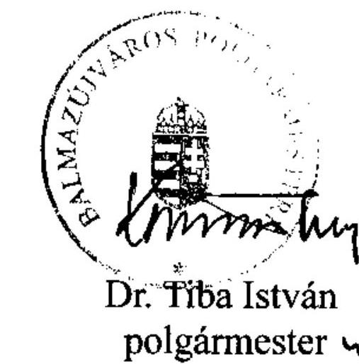

---

# Dr. Tiba István úr   polgármester 

Balmazújváros Város Önkormányzata
Balmazújváros

## Tisztelt Polgármester Úr!

Köszönettel vettem Balmazújváros Város Önkormányzata pénzügyi helyzetének ellenőrzéséről készített jelentéstervezethez kapcsolódó észrevételekről és intézkedésekről szóló tájékoztatását.

Az adósságot keletkeztető kötelezettségvállalások felső határa vizsgálatára tett megállapításra vonatkozó észrevétele kapcsán felhívom szíves figyelmét arra, hogy a Képviselő-testület részére készített előterjesztések nem tartalmaztak adósságszolgálati korlátra vonatkozó számítást, illetve tájékoztatást.

Tájékoztatom továbbá, hogy az európai uniós támogatással megvalósuló projektek bevételeinek és kiadásainak bemutatására tett észrevételét elfogadom, azt átvezettük a jelentés végleges szövegében.

Örömmel értesültem arról, hogy pénzügyi egyensúlyi helyzetük javítása érdekében intézkedéseket tett, illetve tervez.

Felhívom szíves figyelmét arra, hogy a megküldött intézkedéseiről szóló levele nem tekinthető az Állami Számvevőszékről szóló 2011. évi LXVI. törvény 33. § (1) bekezdése szerinti intézkedési tervnek, ezért kérem, hogy azt a jelentés kézhezvételét követően, törvényi határidőn belül az Állami Számvevőszék részére megküldeni szíveskedjen.

---

Köszönöm Polgármester úrnak és munkatársainak az ellenőrzés során tanúsított hozzáállását, amellyel az Önkormányzatról szóló pénzügyi helyzetelemzés elkészítését segítették.

Budapest, 2012. április " ".

Tisztelettel:
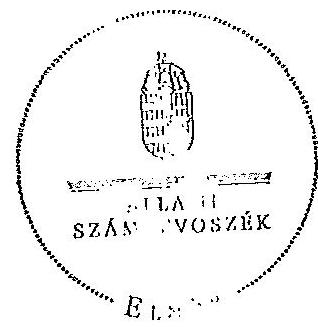

Domokos László
