# ÁLLAMI   SZÁMVEVŐSZÉK 

## JELENTÉS

Bátaszék Város Önkormányzata pénzügyi helyzetének ellenőrzéséről (43/4)

---

# Állami Számvevőszék 

Iktatószám: V-3124-019/2012.
Témaszám: 1015
Vizsgálat-azonosító szám: V0560155

## Az ellenőrzést felügyelte:

Dr. Varga Sándor
számvevő igazgatóhelyettes
Az ellenőrzést vezette:
Renkó Zsuzsanna
számvevő tanácsos
Ellenőrzési csoportvezető:
Bíró Zsolt
számvevő tanácsos
Az ellenőrzést végezték:
Kéri Péter
számvevő tanácsos

Koczor László
számvevő tanácsos

---

# TARTALOMJEGYZÉK 

BEVEZETÉS ..... 9
I. ÖSSZEGZŐ MEGÁLLAPÍTÁSOK, KÖVETKEZTETÉSEK, JAVASLATOK ..... 13
II. RÉSZLETES MEGÁLLAPÍTÁSOK ..... 24

1. Az Önkormányzat kötelező és önként vállalt feladatai, a feladatellátás szervezeti keretei és annak változásai ..... 24
2. Az Önkormányzat pénzügyi egyensúlyi helyzetét befolyásoló tényezők ..... 29
2.1. A működési és a felhalmozási egyensúly változása ..... 31
2.2. Az Önkormányzat bevételeinek változása ..... 36
2.3. Az Önkormányzat múködési és a felhalmozási célú kiadásainak változása ..... 39
3. Az Önkormányzat kötelezettségei ..... 42
3.1. Az Önkormányzat pénzintézeti kötelezettségeinek változása ..... 42
3.2. A szállítói kötelezettségek változása ..... 48
3.3. Egyéb kötelezettségek változása ..... 49
4. A pénzügyi egyensúly megteremtése érdekében hozott intézkedések eredménye ..... 51
5. Az ÁSZ által a korábbi években a pénzügyi egyensúly javítására tett szabályszerűségi és célszerűségi javaslatok hasznosulása ..... 55

---

# MELLÉKLETEK 

1. számú Múködési és felhalmozási célú hiány/többlet az Önkormányzat zárszámadási rendeleteiben (1 oldal)
2. számú Az Önkormányzat bevételei és kiadásai, valamint adósságszolgálata 20072010 közötti időszakban (1 oldal)
3/a. számú Az Önkormányzat 2007-2010. években megvalósított, 2010. december 31-ig befejezett fejlesztései és annak forrásösszetétele (1 oldal)
3/b. számú Az Önkormányzat 2010. december 31-én folyamatban lévő fejlesztési feladataira 2010. december 31-ig teljesített kifizetések és azok forrásösszetétele (1 oldal)
3/c. számú Az Önkormányzat 2010. december 31-én folyamatban lévő fejlesztési feladataira 2010. december 31-én fennálló kötelezettségvállalásai és forrásösszetétele (1 oldal)
3. számú Az önkormányzati feladatok ellátásában résztvevő gazdasági társaságok (1 oldal)

---

# RÖVIDÍTÉSEK JEGYZÉKE 

## Törvények

Áht $_{1}$.
Áht $_{2}$.
Ötv.
Ptk.
Stabilitási tv.
Számv. tv.

## Rendeletek

Áhsz.

Ámr.

## Szórövidítések

áfa
Általános iskola
ÁSZ
Bát-Kom 2004 Kft.
DDOP
EU
Gondozási központ
Intézményi társulás

Jegyző
Képviselő-testület
Közmű üzemeltető Kft.
Közös Víz Kft.
Mikrotérségi oktatási
központ

Mikrotérségi társulás

Önkormányzat
ÖTM
Panteon Kft.
polgármester
Polgármesteri hivatal

PPP konstrukció
szja
TÁMOP
Többcélú társulás
az államháztartásról szóló 1992. évi XXXVIII. törvény az államháztartásról szóló 2011. évi CXCV. törvény a helyi önkormányzatokról szóló 1990. évi LXV. törvény a Polgári Törvénykönyvről szóló 1959. évi IV. törvény a Magyarország gazdasági stabilitásáról szóló 2011. évi CXCIV. törvény
a számvitelről szóló 2000. évi C. törvény
az államháztartás szervezetei beszámolási és könyvvezetési kötelezettségének sajátosságairól szóló 249/2000. (XII. 24.) Korm. rendelet
az államháztartás múködési rendjéről szóló 292/2009. (XII. 19.) Korm. rendelet
általános forgalmi adó
Kanizsai Dorottya Általános Iskola és Zeneiskola
Állami Számvevőszék
BÁT-KOM 2004 Városüzemeltető és Szolgáltató Kft.
ÚMFT Dél-Dunántúli Operatív program
Európai Unió
Gondozási Központ Bátaszék
Bátaszék és Városkörnyéki Önkormányzatok Családsegítő és Gyermekjóléti Intézmény-fenntartó Társulás
Bátaszék Város Önkormányzatának jegyzője
Bátaszék Város Képviselő-testülete
Dél-Tolna Közmű Üzemeltető és Szolgáltató Kft.
Bátaszéki Közös Víz Nonprofit Kft.
Bátaszék-Alsónyék-Pörböly Mikrotérségi Bölcsőde, Óvoda, Általános Iskola, Alapfokú Művészetoktatási Intézmény, Gimnázium és Pedagógiai Szakszolgálat
Bátaszék-Alsónyék-Pörböly Mikrotérségi Intergrált Oktatási Intézmény-fenntartó Társulás
Bátaszék Város Önkormányzata
Önkormányzati és Területfejlesztési Minisztérium
Panteon Kegyeleti Szolgáltató Kft.
Bátaszék Város Önkormányzatának polgármestere
Bátaszék Város Önkormányzatának Polgármesteri hivatala
Public Private Partnership (Partnerségi együttmúködés közfeladatok ellátására a magánszektor bevonásával) személyi jövedelemadó
ÚMFT Társadalmi Megújulás Operatív Program
Szekszárd és Térsége Többcélú Kistérségi Társulás

---

.

---

# ÉRTELMEZŐ SZÓTÁR 

| BUBOR | Budapesti Bankközi Forint Hitelkamatláb. Irányadó, refe-   rencia jellegú kamatláb. Mértékét az MNB naponta álla-   pitja meg a banki kamatok figyelembevételével. Közzété-   tele naponta történik. |
| :--: | :--: |
| CLF módszer | Az önkormányzatok költségvetése elemzésének eszköze. A   módszer következetesen elkülöníti a folyó és a felhalmo-   zási költségvetés bevételeit és kiadásait, azok költségvetési   egyenlegeit. Bizonyos mértékig a vállalati gazdálkodás   logikai elemeit érvényesíti az önkormányzatok pénzügyi,   jövedelmi helyzetének vizsgálata során. Az értékelés a   pénzügyi kapacitás fogalmát helyezi a középpontba. |
| EURIBOR | A frankfurti bankközi piacon jegyzett, az Európai Közpon-   ti Bank szabályainak megfelelően megállapított kínálati   kamatláb. Az EURIBOR értékét a legfontosabb európai   bankok hitelkínálatának kamatlábai alapján a Reuters   ügynökség számolja ki és teszi közzé naponta. A magyar   pénzintézetek is ezt használják viszonyítási alapnak EUR   hitelek esetén. |
| használhatósági fok | Az eszközgazdálkodás vizsgálatának elemzése során   használt mutató. Számításakor a tárgyi eszköz könyv sze-   rinti (nettó) értékét viszonyítják a tárgyi eszköz bruttó (be-   szerzési/létesítési) értékéhez. A \%-ban kifejezett mutató   értéke annál kedvezőbb, minél közelebb áll a 100\%-hoz.   Csökkenése az eszköz állagának romlására, avulására   utal, ami maga után vonja az üzemeltetési és fenntartási   költségek növekedését is |
| kamatkockázat | A változó kamatozású forint-, vagy a devizahitelek futam-   ideje alatt a kamat emelkedése miatt fennálló kamatkoc-   kázat, melynek növekedése miatt nő a hitel törlesztő rész-   lete. |
| kötelező közszolgáltatás | A helyi önkormányzati feladatkörbe tartozó, a köztiszta-   sággal és a településtisztasággal, valamint az élet- és va-   gyonbiztonsággal összefüggő egyes - közszolgáltatás út-   ján megvalósuló - közfeladatok ellátása, amelynek köte-   lező igénybevételét külön jogszabály (törvény, helyi ön-   kormányzati rendelet) határoz meg. |
| közfeladat | Állami, helyi, illetve kisebbségi önkormányzati feladat,   amelynek ellátásáról az államnak, illetve az önkormány-   zatoknak kell gondoskodni. A hatályos szabályozás sze-   rint közfeladatot törvény és önkormányzati rendelet álla-   píthat meg. Az önkormányzatok által ellátandó feladatok   keretszerú meghatározását az Ötv. tartalmazza. |
| LIBOR | Angol kifejezés, a London Interbank Offered Rate rövidíté-   se. Jelentése: Londoni bankközi, referencia jellegú kínálati   (hitel) kamatláb. |
| önkormányzat többségi   tulajdonában lévő gaz- | Az önkormányzat a gazdasági társaságban a szavazatok   több mint ötven százalékával vagy a Ptk. 685/B. § (2)-(3) |

---

dasági társaságok
pénzügyi kapacitás
pénzügyi kockázat
törlesztési kockázat
bekezdéseiben rögzített meghatározó befolyással rendelkezik. A befolyással rendelkező akkor rendelkezik egy jogi személyben meghatározó befolyással, ha annak tagja, illetve részvényese, és jogosult e jogi személy vezető tisztségviselői vagy felügyelőbizottsága tagjai többségének megválasztására, illetve visszahívására, vagy a jogi személy más tagjaival, illetve részvényeseivel kötött megállapodás alapján egyedül rendelkezik a szavazatok több mint ötven százalékával (Ptk. 685/B. § (2) bek.). A meghatározó befolyás akkor is fennáll, ha a befolyással rendelkező számára e jogosultságok közvetett módon (köztes vállalkozásain keresztül, a Ptk. 685/B §. (3), (4) bek. szerint) biztosítottak.
A helyi önkormányzat és az önkormányzat irányítása alá tartozó költségvetési szerv többségi tulajdonában, illetve többségi befolyása alatt álló gazdálkodó szervezet esetében hitelfelvétel, kölcsönfelvétel, garancia- vagy kezességvállalás, tartozásátvállalás, tartozáselengedés, értékpapírkibocsátás, vásárlás, pénzügyi lízing, tartós bérleti szerződés, ingyenes vagyonjuttatás (így különösen: ajándékozás, ingyenes engedményezés), vagy követelésvásárlás, követelésengedményezés végrehajtására vonatkozóan az Áht ${ }_{1}$. 100/M. § (4) bekezdése alapján az önkormányzat rendelkezik döntési jogosultsággal.
A pénzügyi kapacitás (financial capacity) az adósok hitelfelvételi képességének azon mértéke, ahol még anélkül tudják növelni az adósságot, hogy csökkenteniük kellene akár a jelenbeli, akár a jövőben esedékes kiadásaikat a fizetésképtelenség elkerülése érdekében. (Forrás: Az önkormányzati rendszer pénzügyi helyzete, ÁSZKUT tanulmány 2010.
A múködési kockázat egyik eleme. Megmutatkozhat a költségvetés nagyságrendjének, szerkezetének nem megalapozott módosításaiban, a bevételi és a kiadási előirányzatoktól lényegesen eltérő teljesítésekben, a nem megfelelő belső kontrollrendszer múködésében, a tudatos károkozásokban, a biztosítások elmaradásában, a hibás fejlesztési döntésekben, a nem a terveknek megfelelő forrásfelhasználásokban. Jelentkezhet továbbá a bevételek és kiadások ütemkülönbsége miatt felvett folyószámla- és likvidhitelek költségvetési év végén fennálló egyenlege miatt, amely az önkormányzat költségvetésébe - akár tartósan - beépülő forráshiányt jelzi.
Annak a kockázata, hogy a megfelelő időben és mértékben a hitelt felvevőnél rendelkezésre állnak-e a pénzintézetek és egyéb szervek felé fennálló kötelezettségek visszafizetéséhez, a hitelek és kölcsönök törlesztéséhez szükséges pénzügyi források.
A törlesztési kockázatot növeli a kamat- és árfolyam növekedése, mivel ezekben az esetekben az adósságszolgálat

---

nőhet. Törlesztési kockázatot okozhat a visszafizetésre tervezett forrás elérésének, teljesítésének bizonytalansága (pl. a visszafizetéshez tervezett tartalékolás elmaradt, a tervezettnél alacsonyabb a saját bevétel, a helyi adóból származó bevétel az adóalanyok, adóalapok csökkenése miatt nem teljesül).
SNA
szállítói kitettség

System of National Account. azaz a Nemzeti Számlák Rendszere, amely a gazdasági szektorok által létrehozott valamennyi terméket és szolgáltatást figyelembe veszi.
Az önkormányzat pénzügyi helyzete olyan külső körülmények hatására is módosulhat, amelyekre az önkormányzatnak nincs hatása, emiatt szállítói kitettsége keletkezik. Pl. a lejárt szállítói tartozások rendezése függhet attól, hogy a szállító milyen intézkedéseket foganatosít az önkormányzattal szemben.

---

.

---

# JELENTÉS 

## Bátaszék Város Önkormányzata pénzügyi helyzetének ellenőrzéséről

## BEVEZETÉS

Az Állami Számvevőszék 2011. évtől érvényes stratégiája új irányt szabott a helyi önkormányzatok gazdálkodásának ellenőrzésében is. Az ÁSZ - küldetése és jövőképe szerint - szilárd szakmai alapokra támaszkodva értékteremtő ellenőrzéseivel és helyzetelemzéseivel az államháztartás egészében, így a helyi önkormányzati alrendszerben is elő kívánja segíteni a közpénzek és a közvagyon szabályos, gazdaságos, hatékony és eredményes felhasználását. E folyamat részeként - az államháztartási hiány alakulásának összetevőire is figyelemmel végezzük az önkormányzati alrendszer pénzügyi helyzetelemzését.

Az államháztartás helyi szintjén a 304 városnak ${ }^{1}$ az általuk ellátott közszolgáltatások volumenére is tekintettel a közfeladatok ellátásában kiemelt szerepe van. E települések 2011. január 1-jei népessége 3169 ezer fő volt.

Feladataik és hatásköreik az Ötv. mellett különböző ágazati törvények által meghatározottak, miközben a feladatellátás szervezeti kereteit - ezen belül a gazdasági társaságok közszolgáltatások ellátásában betöltött szerepét - saját maguk határozzák meg. A gazdasági társaságok által ellátott feladatok esetén a gazdálkodás, továbbá az önkormányzatok pénzügyi egyensúlyi helyzetére ható közvetlen kockázatok egy része kikerült az önkormányzati alrendszerből. A többségi önkormányzati tulajdonban lévő társaságok gazdálkodásának körülményei befolyásolhatják a városok pénzügyi egyensúlyi helyzetének megítélésében rejlő kockázatokat.

Az áttekintett időszakban az önkormányzati forrásszabályozás elvei lényegesen nem változtak. Az önkormányzatok gazdasági mozgásterét a központi költségvetéstől való függőség mellett jelentősen befolyásolja a helyi adókivetési jog gyakorlása. A városok gazdálkodási szabadságának lényeges eleme, hogy anyagi lehetőségeik függvényében dönthettek arról, hogy feladataik közül azokat, amelyek megoldására az Ötv. szerint a települési önkormányzat nem kötelezhető, a megyei önkormányzat fenntartásába adhatták. E döntések differenciáltan érintették a városok pénzügyi helyzetét.

[^0]
[^0]:    ${ }^{1}$ A megyei jogú városok nélkül figyelembe vett városok száma 304 városi önkormányzatot jelent.

---

A városi önkormányzatok 2007-2010 között teljesített bevételeinek alakulását és összetételét a következő ábra szemlélteti:
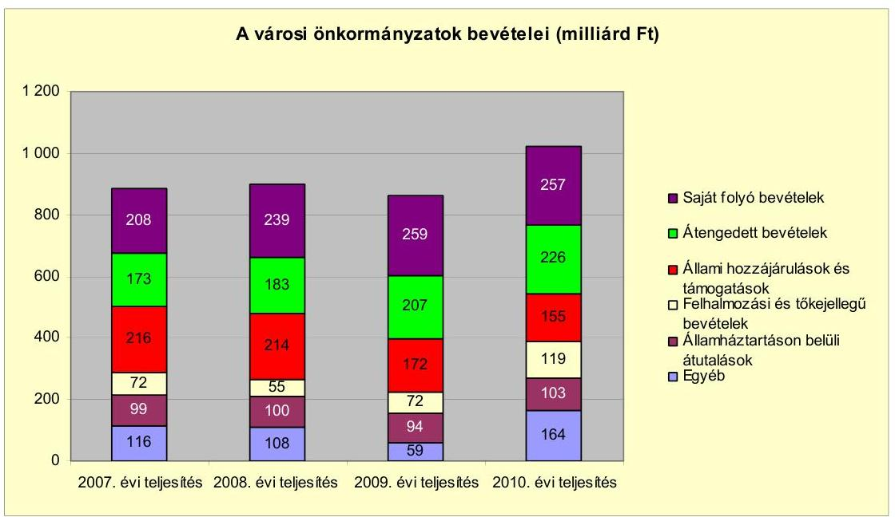

Az önkormányzati alrendszer pénzügyi helyzetértékelése során új elemzési módszereket alkalmazott az ellenőrzés. A költségvetési beszámoló adatok elemzése helyett az Önkormányzat pénzügyi helyzetét a CLF módszerrel értékeltük, amelynek lényegét és számításának módszerét a jelentés 2. pontjában, és a jelentés 2 . számú mellékletében ismertetjük részletesen.

Az új módszereken alapuló helyzetértékelés fontosságát az adja, hogy a helyi önkormányzatok bruttó adósságállománya ${ }^{2}$ a 2010. évi költségvetési beszámolók alapján 1248 milliárd Ft-ot tett ki. Ezen belül a 304 város adóssága 383 milliárd Ft volt, amely az önkormányzati alrendszer teljes adósságállományának $30,7 \%$-át jelentette ${ }^{3}$.

A mérlegben kimutatott bruttó adósságállomány mellett az önkormányzatok számára az eszközállomány műszaki állapotának megőrzése is előbb-utóbb pénzügyi kötelezettséget jelent. Az elhasználódott eszközök pótlására forrást biztosító amortizációs (felújítási) alap képzésének ${ }^{4}$ elmaradása maga után vonhatja a feladatellátást kiszolgáló tárgyi eszközök állagának erőteljes romlását. Emellett a 2007-2013-as időszakra meghirdetett, vissza nem térítendő EU-s fej-

[^0]
[^0]:    ${ }^{2}$ Az önkormányzati mérlegbeszámolókból számított bruttó adósságállomány 2010. év végi összege magában foglalja a fejlesztési és a múködési célú kötvénykibocsátások, a beruházási és fejlesztési hitelek, a múködési célú hosszú lejáratú hitelek, a rövid lejáratú hitelek, váltótartozások miatti kötelezettségek teljes (2011-ben, illetve az azt követő években esedékes) állományát. Az önkormányzatok 2007. év végi mérleg szerinti adósságállománya 692 milliárd Ft volt.
    ${ }^{3}$ A fővárosi és a kerületi önkormányzatok adósságának figyelmen kívül hagyásával számított 977 milliárd Ft összegű bruttó adósságállományból a városok 39,2\%-kal részesedtek.
    ${ }^{4}$ Erre a jelenlegi szabályozási környezetben nem kötelezi előírás az önkormányzatokat.

---

lesztési forrásokhoz való hozzájutás lehetősége felerősítette az önkormányzati alrendszer fejlesztési igényeit, amelyek a felhalmozási költségvetési hiány folyamatos emelkedésén túl - az előírt jövőbeni fenntartási kötelezettség miatt tovább terhelhetik az önkormányzatok költségvetését ${ }^{5}$.

Az ÁSZ a 2011. évi ellenőrzési tervében 43. számú, az Önkormányzatok gazdálkodási rendszerének ellenőrzése részeként áttekinti, és elemzi az önkormányzatok pénzügyi helyzetét. A gazdálkodás szabályszerűségét az ÁSZ az előző évek során ebben az önkormányzati körben is ellenőrizte. Jelen vizsgálatunk a tett javaslataink pénzügyi helyzetet érintő pontjainak hasznosítására utóellenőrzés jelleggel tér ki.

Az ellenőrzés megállapításait az Önkormányzat által kitöltött - teljességi nyilatkozattal megerősített - 27 tanúsítványon szolgáltatott adatokra alapoztuk. Ellenőrzési bizonyítékként használtuk fel továbbá:

- a képviselő-testületi és bizottsági előterjesztéseket, a döntés-előkészítés során készített dokumentumokat;
- a kötelezettségvállalások dokumentumait;
- a pénzügyi-számviteli nyilvántartásokat;
- az éves költségvetési beszámolókat;
- a költségvetési és zárszámadási rendeleteket.

Az ellenőrzés a 2007. január 1. - 2011. június 30. közötti időszakot öleli fel. A pénzintézeti kötelezettségek állományának vizsgálatakor az ellenőrzött időszak 2006. december 31. - 2011. június 30. közötti időszakra terjedt ki.

Az ellenőrzés során vizsgáltunk minden olyan körülményt és adatot, amely a program végrehajtásához kapcsolódott és a pénzügyi helyzet alakulására hatást gyakorló releváns tények és folyamatok feltárásához szükségessé vált.

# Az ellenőrzés célja annak értékelése volt, hogy: 

- a vizsgált időszakban a kötelező és önként vállalt feladatok ellátását biztosító szervezeti keretekben, a feladatellátás módjában bekövetkezett változások milyen hatást gyakoroltak az Önkormányzat pénzügyi helyzetének alakulására;
- az Önkormányzat pénzügyi - ezen belül múködési és felhalmozási - egyensúlya mely tényezők hatására miként változott, és az Önkormányzat milyen intézkedéseket tett a pénzügyi egyensúly javítása érdekében;

[^0]
[^0]:    ${ }^{5}$ Az Állami Számvevőszék 2011 júniusában közzétett 1108. számú, a helyi önkormányzatok fejlesztési célú támogatási rendszerének ellenőrzéséről szóló jelentésében feltárta a fejlesztési folyamatok problémáit. A helyi önkormányzatok elsősorban azokat a fejlesztéseket valósították meg, amelyekhez támogatást lehetett igényelni. A fejlesztési célok közül a magasabb támogatási intenzitású pályázatokat részesítették előnyben. A fejlesztéssel megvalósuló létesítmények jövőbeli üzemeltetésének várható ráfordításait az önkormányzatok $71,9 \%$-a nem mérte fel.

---

- a költségvetési kiadások finanszírozása érdekében vállalt pénzintézeti kötelezettségek hogyan alakultak, továbbá milyen kötelezettségek fennállása befolyásolja az Önkormányzat jövőbeli pénzügyi helyzetét;
- hasznosultak-e a gazdálkodási rendszer korábbi ellenőrzése során a pénzügyi egyensúly javítására az ÁSZ által tett szabályszerűségi és célszerűségi javaslatok.

Az ellenőrzés típusa: szabályszerűségi vizsgálat.
A vizsgálat jogszabályi alapját az Állami Számvevőszékről szóló 2011. évi LXVI. törvény 1. § (3), 5. § (2)-(6) bekezdései, továbbá az Áht ${ }_{1}$. 120/A. § (1) bekezdése ${ }^{6}$ előírásai képezték.

Bátaszék város lakosainak száma 2011. január 1-jén 6583 fő volt. Az Önkormányzat 2010. december 31-én a könyvviteli mérleg szerint 3613,8 millió Ft értékű vagyonnal rendelkezett, amelynek $94,1 \%$-a befektetett eszköz volt. A vagyont terhelő kötelezettségek állománya a 2010. év végén 723,0 millió Ft, amelyből 293,6 millió Ft hosszú lejáratú kötelezettség volt. Az Önkormányzat 2010. évi beszámolója szerint 2590,6 millió Ft költségvetési bevételt és 2918,7 millió Ft költségvetési kiadást teljesített.

[^0]
[^0]:    ${ }^{6}$ A jogszabályi hivatkozás 2012. január 1-jétől Áht ${ }_{2}$. 61. § (2) bekezdésére módosult.

---

# I. ÖSSZEGZŐ MEGÁLLAPÍTÁSOK, KÖVETKEZTETÉSEK, JAVASLATOK 

Az Önkormányzat kötelező feladatait az Ötv. és az ágazati törvények figyelembevételével állapította meg. Az önként vállalt feladatait az SzMSz-ben felsorolta. Az Önkormányzat - adatszolgáltatása szerint - a 2010. évi múködési költségvetési kiadásaiból ( 1601,1 millió Ft), amely nem tartalmazta a kisebbségi önkormányzatok és a háziorvosi szolgálat kiadásait, 1307,4 millió Ft-ot (81,7\%) a kötelező feladatok, 293,7 millió Ft-ot (18,3\%) az önként vállalt feladatok ellátására fordított. A 2007-2009. évi múködési költségvetési kiadások átlaga 1217,4 millió Ft, amelyből a kötelező feladatok aránya 75,7\% ( 921,8 millió Ft), az önként vállalt feladatoké $24,3 \%$ ( 295,7 millió Ft). Az átlaghoz viszonyítva a múködési kiadások a 2010. évben 31,5\%-kal (383,7 millió Fttal) nőttek, amelyből a kötelező feladatok ellátására fordított kiadások 41,8\%kal (385,6 millió Ft-tal) emelkedtek. Az önként vállalt feladatok mértéke a 2007-2009. évek átlagához viszonyítva hat százalékponttal, 2,0 millió Ft-tal csökkent. Az önként vállalt feladatok a bölcsődei ellátáshoz, a gimnáziumi oktatáshoz, a nyilvános könyvtári ellátáshoz, a lapkiadáshoz, a múvelődési ház és múzeumi tevékenységhez, a sportlétesítmények fenntartásához, a civil szervezetek, a sportegyesület és a városi rendezvények támogatásához kapcsolódtak. Az elkészült tanuszoda igénybevételéért fizetett PPP szolgáltatási dí a 2008. évben 30,5 millió Ft-tal, a 2009. évben 54,6 millió Ft-tal, a 2010. évben 54,9 millió Ft-tal és 2011. június 30-ig 31,9 millió Ft-tal emelte a sportlétesítmények kiadásait. Az Önkormányzat pénzügyi egyensúlyának fenntarthatóságára hosszú távon kihatással lehet az önként vállalt feladatokra fordított múködési kiadások magas összege.

Az Önkormányzat 2011. június 30 -án a kötelező és önként vállalt feladatait a következő szervezeti struktúrában látta el:
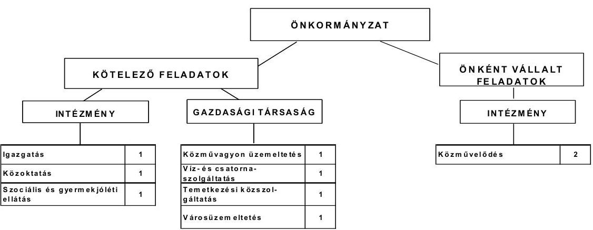

Az Önkormányzat a feladatait 2011. év I. félév végén öt költségvetési szervvel (beleértve a Polgármesteri hivatalt is) és négy gazdasági társasággal látta el. Ezenkívül a Többcélú társulás és két intézményi társulás (az oktatás, illetve a szociális és gyermekjóléti ellátások területén) megállapodás keretében vett részt

---

az Önkormányzat feladatai ellátásában. Az Önkormányzat feladatai ellátását 2007. január 1-jén 12, 2011. június 30-án 20 telephellyel biztosította. Az intézményszervezeti átalakítások és intézményi összevonások következtében a feladatellátás telephelyeinek száma a 2007. január 1-jei 12-ről a 2011. év I. félév végéig 20-ra növekedett. Ebben szerepet játszott, hogy a vizsgált időszakban a szociális és gyermekjóléti feladatok ellátására múködtetett intézmény ellátási körzete hat településsel bővült. A létrehozott Mikrotérségi oktatási központba integrálták az óvodát, az általános iskolát, a gimnáziumot, továbbá kiegészült a pörbölyi óvodával és az általános iskolával, valamint a Gondozási központból áthelyezték a bölcsődei ellátást. A telephelyek száma a közoktatási ágazatban a változások hatására a 2008. évi 6-ról 10-re, önkormányzati szinten 18ról 22-re nőtt. A 2011. évben elkészült az új óvoda, amelybe az addigi három telephelyet összevonták. Ezért a közoktatási ágazatban 8-ra, összesen 20-ra csökkent a telephelyek száma.

Az egyes közszolgáltatások feladatellátásában résztvevő költségvetési szervek múködési kiadásainak finanszírozási összetételét a következő ábra szemlélteti:
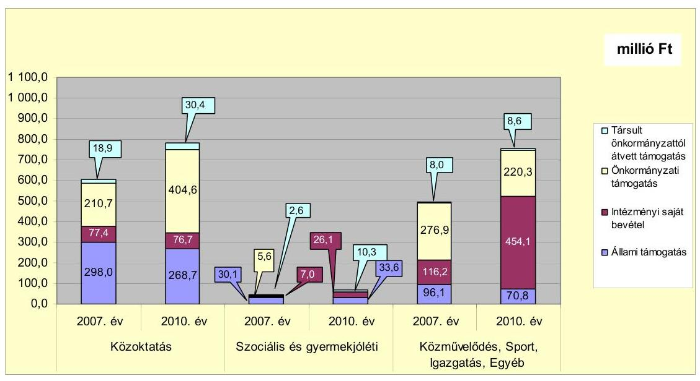

A közoktatási intézménynél az általános iskolai tanulók száma a 2007. évi 594 fơről a 2010. évben 551 fốre csökkent. Ez okozta az állami támogatások csökkenését, ezzel párhuzamosan nőtt az önkormányzati támogatás mértéke, valamint a 2010. évben jelentkezett a pörbölyi általános iskola és óvoda átvételének pénzügyi hatása. A Polgármesteri hivatalnál a fordított áfa befizetése eredményezte a bevételek növekedését.

Az Önkormányzat két gazdasági társaságban kizárólagos tulajdonnal rendelkezik. A 100\%-os önkormányzati tulajdonban álló a város kommunális hulladékkezelési és -szállítási feladatait, az intézmények takarítását, az önkormányzati lakóingatlanok kezelését, a parkok gondozását végezte. A másik gazdasági társaság az Önkormányzat közmúvagyonát kezeli. A gazdasági társaságoknak a múködésükhöz az ellenőrzött időszakban összesen 7,8 millió Ft fejlesztési, 1,2 millió Ft múködési célú pénzeszközt adtak át. A Bát-Kom 2004 Kft. és a Közös Víz Kft. pénzügyi egyensúlyi helyzete a 2010. évi saját tő-

---

ke/jegyzett tőke 2,0-szeres, illetve 1,1-szeres aránya alapján összességében stabil. Két gazdasági társaság közszolgáltatási szerződés keretében látta el a köztemető múködtetését, illetve a víz- és csatornaszolgáltatást. A vizsgált időszakban a köztemető fenntartását végző gazdasági társaságnak az Önkormányzat 0,8 millió Ft múködési és 1,2 millió Ft fejlesztési pénzeszközt adott át.

Az Önkormányzat adatszolgáltatása szerint a 2007. és 2011. június 30-a közötti időszakban a feladatátvételek hatására 72,2 millió Ft-tal nőttek a múködési kiadások, amelyből 58,5 millió Ft a személyi juttatások és járulékaik, valamint 13,7 millió Ft a dologi kiadás. A bevételek növekedése is azonos, az állami támogatásokból 49,4 millió Ft, az intézményi saját bevétel 6,1 millió Ft, a társult önkormányzatoktól átvett támogatás 16,7 millió Ft. A feladatátvételek hatása az Önkormányzat pénzügyi egyensúlyát nem befolyásolta.

Az Önkormányzat múködési jövedelmének, tőketörlesztésének, pénzügyi kapacitásának 2007-2010. évi alakulását mutatja be a következő ábra:
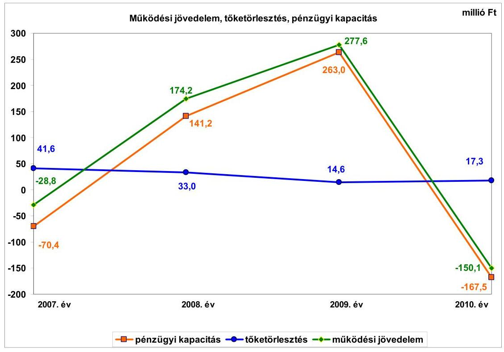

Az Önkormányzat folyó költségvetés egyenlege (múködési jövedelem) a 2007. évben forráshiányt, a 2008-2009. években többletet mutatott. A többlet kialakulását a csökkenő átengedett bevételek ellenére a település mellett épülő autópálya helyi adóbevételeket növelő hatása és az emelkedő államháztartáson belülről kapott támogatások idézték elő. Az autópálya-építés befejezését követően a helyi adóbevételek visszaestek. A 2010. évben a költségvetési támogatás is csökkent. A múködési kiadások a megvalósított fejlesztések, intézményátszervezések, a PPP konstrukcióban megépült tanuszoda igénybevételéért fizetett PPP szolgáltatási díjai és az inflációs hatások következtében megemelkedtek. Ennek hatására 2010. évben forráshiány alakult ki. A 2010. évben kialakult múködési hiány fennállása esetén az Önkormányzat pénzügyi egyensúlya rövid távon veszélyeztetett.

---

Az Önkormányzat tőketörlesztését is bemutató pénzügyi kapacitása a vizsgált időszakban - átmeneti javulást követően - romlott. A pénzügyi kapacitás romlását a működési jövedelem visszaesése idézte elő. A vizsgált időszakban az Önkormányzat évente 41,6 millió Ft, 33,0 millió Ft, 14,6 millió Ft, illetve 17,3 millió Ft felhalmozási célra felvett hitelt fizetett vissza.

A 2007-2010. években az Önkormányzat felhalmozási költségvetésének egyenlege -15,0 millió Ft, -22,3 millió Ft, -173,4 millió Ft, illetve -178,0 millió Ft volt. A vizsgált időszakban a felhalmozási hiány - a 2009. évben indított mikrotérségi közoktatási hálózat kialakítási és főút csomópont korszerűsítési fejlesztések miatt 1193,4 millió Ft-tal emelkedő felhalmozási kiadások hatására - növekvő tendenciát mutat. A 2007-2010. évek fejlesztéseihez a felhalmozási bevételeken túl összesen 388,7 millió Ft forrást kellett biztosítani a folyó bevételekből és hitelek igénybevételével.

A pénzügyi egyensúlyt a 2007. évben, a 2010. évben külső forrás bevonásával lehetett biztosítani. Az Önkormányzatnak a CLF módszer szerint teljes finanszírozási hiánya 2007-ben 85,4 millió Ft, a 2010. évben 345,5 millió Ft volt. A 2008. évben és a 2009. évben a felhalmozási hiányt meghaladó pozitív nettó működési jövedelem hatására 118,9 millió Ft, illetve 89,6 millió Ft pénzügyi többlet keletkezett. A működési és felhalmozási hiányok miatt az Önkormányzatnak a vizsgált időszakban 350,0 millió Ft hosszú lejáratú hitelt kellett felvennie.

Az Önkormányzat folyó bevétele a vizsgált időszakban 1118,1 millió Ft-ról 1398,4 millió Ft-ra, illetve 1597,5 millió Ft-ra emelkedett, majd a 2010. évben 1493,7 millió Ft-ra csökkent. A 2010. évben a megelőző három év átlagához képest 8,9\%-kal (122,4 millió Ft-tal) nőtt. A 2008-2009. évi növekedést az autó-pálya-építés miatt emelkedő helyi iparűzési adóból befolyt bevételek, valamint a Gondozási központ ellátási területének kibővítése és a közoktatási intézményi társulások tagönkormányzatai által fizetett nagyobb összegű támogatások okozták. A folyó bevételek a 2009. évről a 2010. évre az Önkormányzat által elnyert pályázatok és az építési beruházások áfa értékeinek folyó bevételek közötti elszámolása ellenére 103,8 millió Ft-tal csökkentek.

Az Önkormányzat folyó kiadásai a vizsgált időszakban évente 77,4 millió Ft-tal, 95,7 millió Ft-tal, illetve 323,9 millió Ft-tal nőttek. A 2011. év I. félévében 699,5 millió Ft folyó kiadás teljesült. A 2010. évben a megelőző három év 1230,3 millió Ft-os átlagához képest 33,6\%-kal (413,5 millió Ft-tal) több folyó kiadás teljesült a működési kiadások miatt. A működési kiadások növekedését egyrészt - az intézmény átszervezések hatására - a személyi juttatások és munkaadókat terhelő járulékok 5,9\%-os (42,7 millió Ft) emelkedése okozta. Másrészt a dologi kiadások 96,2\%-os (354,2 millió Ft) növekedése eredményezte, amelyek a tanuszoda igénybevételéért fizetett PPP szolgáltatási díjai, az intézményátszervezések kiadásai és a fejlesztésekhez kapcsolódó fordított áfabefizetések miatt emelkedtek. Az egyéb folyó kiadások a Mikrotérségi oktatási központ létrehozásának hatására 177,3\%kal (10,9 millió Ft-tal) nőttek.

A befejezett fejlesztések 533,8 millió Ft értékű kiadásait 302,2 millió Ft saját bevétel, 90,0 millió Ft hitel, valamint 135,1 millió Ft hazai és 6,5 millió Ft EU-s

---

támogatások fedezték. A 2010. december 31-én folyamatban lévő fejlesztési feladatok végrehajtására a 2007-2010. években 1278,5 millió Ft kiadást teljesítettek, melyből 1005,0 millió Ft-ot EU-s támogatásokból, 273,5 millió Ft-ot saját bevételből rendeztek.
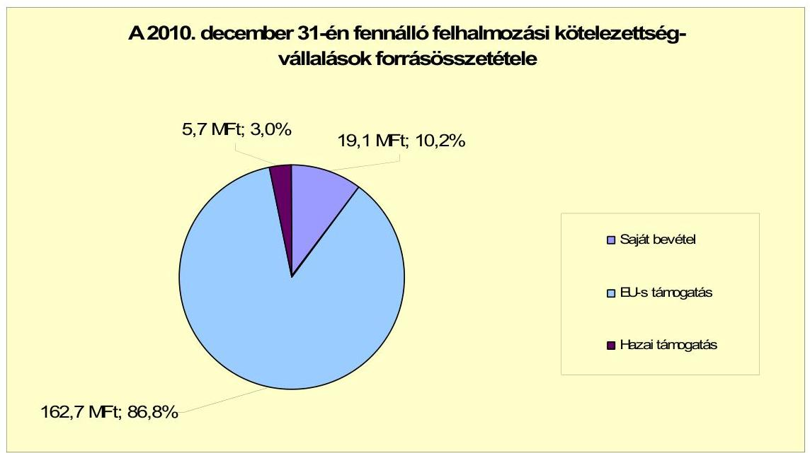

Az Önkormányzat 2010. december 31-én folyamatban lévő fejlesztési feladataihoz kapcsolódó 2010. évet követő kötelezettségvállalásainak összege 187,5 millió Ft volt, amelyből 162,7 millió Ft-ot EU-s támogatásból, 5,7 millió Ft-ot hazai támogatásból, 19,1 millió Ft-ot saját bevételből terveznek biztosítani.

Az Önkormányzat mérleg szerinti pénzintézeti kötelezettsége a 2006. év végéről a 2011. év I. félév végére 234,6 millió Ft-ról 594,7 millió Ft-ra nőtt. A fennálló pénzintézeti kötelezettségek hét hosszú lejáratú hitelből, valamint egy rövid lejáratú hitel igénybevételéből keletkeztek. A hosszú lejáratú hitelek közül kettő tőketörlesztése (182,0 millió Ft,14,4 millió Ft) a vizsgált időszak előtt, háromé ( 40,0 millió Ft, 15,0 millió Ft és 35,0 millió Ft) a 2008. év és a 2011. év I. féléve közötti időszakban elkezdődött. Két hitel esetében ( 169,0 millió Ft és 131,0 millió Ft) 2012. március 31-én 2,3 millió Ft, 2012, június 30-án 1,8 millió Ft összeggel kezdődik, negyedévenkénti esedékességgel. A törlesztés a 2012. évtől kockázatot jelent az Önkormányzat pénzügyi egyensúlyi helyzetére.

Az Önkormányzat pénzintézeti kötelezettségvállalásaira minden esetben képvi-selő-testületi döntés alapján került sor. A képviselő-testületi előterjesztésekben tájékoztatást adtak a kamatokról és egyéb költségekről, de azok várható összegeit nem mutatták be a futamidő végéig. Az előterjesztések nem tartalmazták a visszafizetés forrásait sem. Az adósságot keletkeztető kötelezettségvállalások felső határát betartották. A hitelt nyújtó pénzintézeteket két alkalommal versenyeztetéssel választották ki.

Az Önkormányzat a hiteleket - egy kivételével - teljes összegben lehívta, és a hitelcélnak megfelelően a Képviselő-testület által jóváhagyott, a költségvetésbe betervezett beruházásokhoz használta fel. A CHF-ben fennálló pénzintézeti kö-

---

telezettségéből 11,9 ezer CHF (1,8 millió Ft) tőkét törlesztett, és 2,1 ezer CHF ( 0,3 millió Ft) kamatot fizetett 2011. június 30-ig. Az Önkormányzat 2007-2010. közötti főkönyvi nyilvántartásaiban - a Számv. tv. és az Áhsz. előírásai ellenére a devizában fennálló kötelezettségeket nem értékelték és a változásokat nem rögzítették.

A vizsgált időszakban egy hitel törlesztése fejeződött be. A 2002. évben az intézmények belső világításának korszerűsítésére felvett 14,4 millió Ft összegű hitelt 2010. december 31-éig visszafizették (a kamatok és egyéb költségek összege 2,5 millió Ft). A 2007-2011. év I. féléve között átmenetileg szabad pénzeszközeiből 16,8 millió Ft kamatbevételt realizált. Az Önkormányzat számlavezető bankot a vizsgált időszakban nem váltott.

Az Önkormányzat fizetőképessége fenntartását a vizsgált időszakban folyamatosan megújított folyószámlahitel igénybevételével tudta biztosítani. A növekvő összegű és folyamatosan fennálló folyószámlahitel az Önkormányzat eladósodásának növekedését jelzi és magas pénzintézeti kockázatot jelent.

A folyószámlahitel igénybevétele a 2007-2011. év I. félévében években az alábbiak szerint alakult:

| Megnevezés | 2007. év | 2008. év | 2009. év | 2010. év | 2011. év I.   félév |
| :-- | --: | --: | --: | --: | --: |
| Folyószámlahitel |  |  |  |  |  |
| Nemtöbbségi jarnalir 1-jém (millió Ft-ban) | 101,00 | 98,00 | 100,00 | 120,00 | 180,00 |
| Allagos napi állomány (millió Ft-ban) | 10,4 | 19,5 | 3,1 | 19,5 | 60,3 |
| Folyószámlia hitellel alirh napok száma (nap) | 84 | 240 | 42 | 116 | 116 |
| Egyenteg (állomány) | 19,8 | - | - | 1,7 | 158,2 |

A likviditás biztosítása a 2007. évtől a 2011. év I. félév végéig terjedő időszakban az Önkormányzatnak 7,8 millió Ft kamatkiadást, és 4,5 millió Ft egyéb költség megfizetését okozta.

Az Önkormányzat 2011. év I. félév végi szállítói tartozása 129,6 millió Ft, melyből lejárt tartozása 126,2 millió Ft, amelyből a 91 nap és 365 nap közötti lejárt szállítói tartozás 57,4 millió Ft volt. Ez utóbbi összegből 49,4 millió Ft EU-s támogatású projekt lebonyolításához kapcsolódott. A ténylegesen fennálló 8,0 millió Ft összegű 90 napot meghaladó, szállítók felé fennálló kötelezettség, amely a hitelezők adósságrendezési eljárás kezdeményezési joga miatt, a pénzügyi kockázatot növelte.

Az Önkormányzat kötelezettségeinek 2010. december 31-i, valamint 2011. június 30-i állományát és várható alakulását a kötelezettségek lejáratáig a következő táblázat szemlélteti:

---

| Megnevezés | Állomány 2010. december 31   én |  |  | Állomány 2011. június 30-án |  |  | Várható kötelezettség 2011-   2013. években |  | Várható kötelezettség 2014. évtől |
| :--: | :--: | :--: | :--: | :--: | :--: | :--: | :--: | :--: | :--: |
|  | HUF-ban   (millió Ft-   ban) | Devizában   (összegy,   ezer CHF-   ben) | Deviza   nem | HUF-ban   (millió Ft   ban) | Devizában   (összegc,   ezer CHF-   ben) | Deviza   nem | HUF-ban   (millió Ft   ban) | Devizában   (összegc,   ezer CHF-   ben) | HUF-ban (millió Ft   ban) |
| Pénzintézeti kötelezettségek |  |  |  |  |  |  |  |  |  |
| Víziközmú távulatú hitel | 113,2 |  |  | 35,4 |  |  | 115,2 |  | 0,0 |
| Közcsiát építése, önkormányzati ing. felúj. | 34,2 |  |  | 33,0 |  |  | 10,2 |  | 33,6 |
| Rossuth L. utca burkolatának felújítása | 13,7 |  |  | 13,3 |  |  | 4,4 |  | 14,8 |
| Telekvéssárlás (Mikrotiers. akt. kp.) | 35,0 |  |  | 33,7 |  |  | 12,8 |  | 34,5 |
| ODOP- Integrált mikrobén, akt. központi köé | 47,6 |  |  | 47,6 |  |  | 30,1 |  | 161,5 |
| ODOP- Integrált mikrobén, akt. központi köé | 169,0 |  |  | 169,0 |  |  | 47,4 |  | 237,4 |
| Oligijármú véssérlés |  | 2,5 | CHF |  | 0,0 | CHF |  | 2,5 |  |
| Patyószerma hitel | 1,7 |  |  | 158,2 |  |  | 158,2 |  |  |
| Pénzintézeti kötelezettségek összesen HUF-ban | 414,4 |  |  | 460,2 |  |  | 378,3 |  | 481,7 |
| Pénzintézeti kötelezettségek összesen CHF-ben |  | 2,5 | CHF |  |  |  |  | 2,5 |  |
| Szállítás tartozás | 112,0 |  |  | 129,6 |  |  | 129,6 |  |  |

Az Önkormányzatnak pénzintézetekkel szemben fennálló kötelezettsége a 2011. év I. félév végén 490,2 millió Ft volt. Ezek várható kötelezettsége (tőke, kamat és egyéb költség) a legutóbbi kamatfizetés feltételei alapján a 20112013. években 378,3 millió Ft. Az Önkormányzatnak a 2011. évben szállítói tartozások rendezése címén 129,6 millió Ft fizetési kötelezettsége keletkezett. A 2011-2013. évek kötelezettségeinek teljesítésére figyelembe vehető 109,2 millió Ft mérlegben kimutatott behajtható követelésállomány. Az ebből várható bevétel nem nyújt fedezetet az ismert kötelezettségvállalások összegére. A 2014. évet követően jelenleg ismert pénzintézeti kötelezettségei: 481,7 millió Ft. Az Önkormányzat tájékoztatása szerint figyelembe vehető további források „a mindenkori költségvetési rendeletekben megtervezett önkormányzati helyi adóbevételek", azonban ennek növelésére 2011-ben tett intézkedés nem biztosít elegendő többletforrást. A 2010. évi negatív múködési jövedelem miatt a következő évekre szóló jelenleg ismert pénzintézeti kötelezettségek teljesítése további bevételnövelő és kiadáscsökkentő intézkedések megtételének hiányában - törlesztési kockázatot jelent az Önkormányzatnak.

A Képviselő-testület a 2010. évben 0,1 millió Ft követelést engedett el, amellyel megsértette az Áht ${ }_{1}$. előírásait, mivel a követelés elengedés eseteit és módját helyi rendeletben nem szabályozta.

Az Önkormányzat PPP konstrukcióban valósította meg a tanuszoda beruházását, amelynek kötelezettségvállalása a 2023. évig 1080,8 millió Ft. Az összegből a 2011. év I. félév végéig 171,9 millió Ft-ot törlesztettek. A 2011-2013. évekre 197,6 millió Ft, a 2014. évet követően 735,4 millió Ft a fizetési kötelezettség. A fennálló kötelezettség miatt a tanuszoda PPP konstrukcióban történő múködtetése magas múködési kockázattal jár, a pénzügyi egyensúlyt kedvezőtlenül érinti.

Az önkormányzati kötelezettségek növekedése mellett az Önkormányzat minősített többségi befolyásával rendelkező gazdasági társaságok kötelezettségei is befolyásolhatják az Önkormányzat pénzügyi egyensúlyát.

A társaságok kötelezettségeinek állománya 2010. december 31-én és 2011. június 30-án, valamint várható alakulása a kötelezettségek lejáratáig a következő:

---

| Megnevezés | Állomány 2010. december 31   én | Állomány 2011. június 30-án | Várható kötelezettség   2011-2013. években |
| :-- | :--: | :--: | :--: |
|  | HUF-ban (millió Ft-ban) | HUF-ban (millió Ft-ban) | HUF-ban (millió Ft-ban) |
| Lizing kötelezettségek | 2,9 | 2,0 | 2,0 |
| Szállító tartozás | 29,3 | 7,4 | 7,4 |

A társaságoknak a 2011. évtől 2,0 millió Ft lízing kötelezettséget, 7,4 millió Ft szállítói tartozást kell rendezniük. Esetleges csőd, vagy felszámolási eljárás esetén a bíróság korlátlan és teljes felelősséget állapíthat meg az Önkormányzat terhére.

Az Önkormányzat 2007-2010 között eszközállománya után 421,4 millió Ft öszszegű értékcsökkenést mutatott ki. A felújításokra ebben az időszakban 318,1 millió Ft-ot, a megvalósult fejlesztésekből az eszközök pótlására 280,3 millió Ft-ot fordított. A Képviselő-testületnek előterjesztett éves zárszámadási rendeleteikben nem mutatták be az Önkormányzat eszközei után tárgyévben elszámolt értékcsökkenés összegét, az eszközpótlásra fordított tényleges kiadásokat, az eszközök elhasználódási fokának alakulását. Nem mérték fel, hogy az elhasználódott eszközök pótlása milyen kötelezettséget jelent az Önkormányzat számára. Erre tartalékot nem képeztek, és alapot nem hoztak létre.

Az Önkormányzat - adatszolgáltatása szerint - 2007 és 2011. június 30. között több kiadási megtakarítást eredményezö és bevételt növelő intézkedéseket hozott. A 2007-2011. év I. féléve között tett intézkedések hatására 294,8 millió Ft bevételi többletet, továbbá 40,9 millió Ft kiadási megtakarítást mutattak ki, ezáltal az Önkormányzat pénzügyi egyensúlyi helyzetét javították. A kiadási megtakarítások 78,2\%-a (31,9 millió Ft) az elrendelt álláshelycsökkentések, 15,2\%-a (6,2 millió Ft) a többletjuttatások (cafetéria elemek) csökkentése, 6,6\%-a ( 2,7 millió Ft) az élelmiszervásárlás közbeszerzésének az eredménye. Az álláshely-csökkentő intézkedések hatására a 2007. évben 12 fővel, a 2010. évben további kettő fővel csökkent az álláshelyek száma. A feladatellátás átszervezése, illetve a Mikrotérségi oktatási központ kialakítása 26 álláshely- és egyben létszámnövekedéssel is jártak. Ennek következtében az álláshely-csökkentések ellenére az időszak álláshelyeinek száma összességében 12 fővel emelkedett. A bevételnövelő intézkedésekből 241,5 millió Ft többletbevétel $(81,9 \%)$ a helyi adókhoz kapcsolódott. Az Önkormányzatnak az adómérték emeléséből és kedvezmények csökkentéséből 29,9 millió Ft többletbevétele, az adóhátralékok behajtásának következtében 211,6 millió Ft többletbevétele származott. Ingatlanok bérbeadásából és értékesítéséből 38,7 millió Ft (13,1\%), intézményi térítési díjak emeléséből 14,7 millió Ft (5,0\%) többletbevétele keletkezett.

Az Önkormányzat gazdálkodási rendszerének 2007. évi ellenőrzéséről készült ÁSZ jelentés a pénzügyi egyensúlyi helyzet javítására három javaslatot tartalmazott. A javaslatokat az Önkormányzat hasznosította. A PPP konstrukcióban megvalósult tanuszoda projekt ellenőrzéséről a 2008. évben készült számvevői jelentés javaslatai realizálódtak.

Az Önkormányzat pénzügyi egyensúlyi helyzetét összegezve a következők emelhetők ki:

---

Bátaszék Város Önkormányzatának pénzügyi egyensúlyi helyzete rövid távon veszélyeztetett, a pénzügyi egyensúly rövid távú helyreállítása és hosszú távú fenntarthatósága intézkedéseket igényel.

Kockázatot jelent a szállítói állomány növekedése, ezen belül a 90 napon túli szállítói állomány. A pénzintézeti kötelezettségek nőttek, a rövid lejáratú kötelezettségek aránya emelkedett.

A 2010. évben csökkentek a folyó bevételek, a folyó kiadások nőttek. A 2007. és a 2010. évben a folyó bevételek nem nyújtottak fedezetet a folyó kiadásokra és az adósságszolgálatra. Az Önkormányzat müködőképességét csak állandósult folyószámlahitel igénybevételével tudták biztosítani.

Kockázatot jelent a PPP konstrukcióban üzemeltetett tanuszodával kapcsolatos kötelezettségvállalás.

Az Állami Számvevőszékről szóló 2011. évi LXVI. törvény 33. § (1) bekezdésében foglaltak értelmében a jelentésben foglalt megállapításokhoz kapcsolódó intézkedési tervet köteles az ellenőrzött szervezet vezetője összeállítani és azt a jelentés kézhezvételétől számított harminc napon belül az ÁSZ részére megküldeni. Amennyiben az intézkedési tervet határidőben nem küldi meg a szervezet, vagy az továbbra sem elfogadható, az ÁSZ elnöke a hivatkozott törvény 33. § (3) bekezdés a)-b) pontjaiban foglaltakat érvényesítheti.

# A 2011. június 30-i pénzügyi egyensúlyi helyzet alapján az ellenőrzés intézkedést igénylő megállapításai és javaslatai a következők: 

## a Polgármesternek

1. Az autópálya-építés befejezését követően a 2010. évtől a csökkenő bevételek és a növekvő múködési kiadások miatt forráshiány alakult ki. Az Önkormányzat mérleg szerinti pénzintézeti kötelezettsége 2011. év I. félév végére 594,7 millió Ft, likviditását állandósult folyószámlahitellel tudta biztosítani. A 2010. évi müködési költségvetési kiadásaiból 293,7 millió Ft-ot fordított az önként vállalt feladatok finanszírozására.

Javaslat:
Az Önkormányzat pénzügyi egyensúlyának gyors helyreállítása és hosszú távú fenntarthatósága érdekében kezdeményezze - felelősök és határidők megjelölésével - az alábbi intézkedések megtételét:
a) Tárja fel a bevételszerző és kiadáscsökkentő lehetőségeket. Intézkedjen a bevételek növelésére, a kintlévőségek behajtására, a kiadások csökkentésére
b) Képezzen egyensúlyi (elkülönített) tartalékot az adósságszolgálat teljesítése érdekében.
c) Vizsgálja meg az állandósult folyószámlahitel hosszú távú kötelezettséggé történő átalakításának jogi lehetőségét, és a Stabilitási tv. 10. §-ban előírt feltételek fennállása esetén kezdeményezze a Kormánynál ennek engedélyezését;

---

d) Tekintse át az önként vállalt feladatok finanszírozhatóságát a kötelező feladatellátás elsődlegességének biztosítása érdekében, mutassa be a Képviselőtestületnek a megoldás lehetőségeit, és szükség esetén a gazdasági program módosításának igényét;
2. Az előterjesztések nem tartalmazták a pénzintézeti kötelezettségvállalások kamatai és egyéb költségei várható összegeit a futamidő végéig, valamint a visszafizetés forrásait.

Javaslat:
a) Az adósságot keletkeztető kötelezettségvállalásról szóló döntéskor mutassa be a Képviselő-testületnek a jövőben várható - árfolyam-, kamat- és törlesztési - kockázatot.
b) Gondoskodjon, hogy a jövőben az adósságot keletkeztető kötelezettségvállalásokról szóló képviselő-testületi előterjesztések tételesen tartalmazzák a visszafizetés forrásait.
3. A Képviselő-testületnek előterjesztett éves zárszámadási rendeleteikben nem mutatatták be az Önkormányzat eszközei után tárgyévben elszámolt értékcsökkenés öszszegét, az eszközpótlásra fordított tényleges kiadásokat, az eszközök elhasználódási fokának alakulását. Nem mérték fel, hogy az elhasználódott eszközök pótlása milyen kötelezettséget jelent az Önkormányzat számára.

Javaslat:
Mutassa be a Képviselő-testületnek évente a zárszámadási rendelet előterjesztésében az értékcsökkenés összegét, és ezzel összevetve az elhasználódott eszközök pótlására fordított tényleges kiadásokat, az eszközök elhasználódási fokának alakulását.
4. Az Önkormányzat lejárt szállítói állománya 2011. június 30-án 126,2 millió Ft volt, amelyből a 90 napot meghaladó 57,4 millió Ft.

Javaslat:
Kezelje az Önkormányzat lejárt szállítói állományát, a szállítói kitettség és a jogszabályi következmények elkerülése érdekében.
5. A Képviselő-testület a 2010. évben 0,1 millió Ft követelést engedett el, amellyel megsértette az Áht ${ }_{1}$. előírásait, mivel a követelés elengedés eseteit és módját helyi rendeletben nem szabályozta.

Javaslat:
Intézkedjen annak érdekében, hogy a követelés elengedés eseteit és módját amennyiben arról törvény nem rendelkezik - helyi rendeletben szabályozzák az Áht ${ }_{2}$. 97. § (2) bekezdésében foglaltaknak megfelelően.

---

# a jegyzőnek 

1. Az Önkormányzat a vizsgált időszakban rendelkezett devizában fennálló kötelezettséggel, amely év végi értékelését a Számv. tv. 60. § (2) bekezdésének és az Áhsz. 33. § (1) bekezdésének előírásai ellenére nem végezte el.

Javaslat:
Gondoskodjon arról, hogy a devizában fennálló kötelezettségeket a Számv. tv. 60. § (2) bekezdésének és az Áhsz. 33. § (1) bekezdésének előírásai alapján év végén értékeljék és a változásokat a számviteli nyilvántartásokban rögzítsék.

---

# II. RÉSZLETES MEGÁLLAPÍTÁSOK 

## 1. Az ÖNKORMÁNYZAT KÖTELEZŐ ÉS ÖNKÉNT VÁLLALT FELADATAI, A FELADATELLÁTÁS SZERVEZETI KERETEI ÉS ANNAK VÁLTOZÁSAI

Az Önkormányzat kötelező feladatait az Ötv. és az ágazati törvények figyelembevételével állapította meg. Az önként vállalt feladatokat az SzMSz-ben sorolták fel azzal, hogy helyi közügy önálló megoldásának önkéntes vállalása előtt a polgármester minden esetben előkészítő eljárást folytat le, amelynek során be kell mutatni a feladat megvalósításához szükséges forrásokat is.

Az SzMSz 6. § (1) bekezdés a)-I) pontja szerint az Önkormányzat önként vállalt feladatai „a gimnáziumi oktatás, fizikoterápiás ellátás, helyi autóbusz-közlekedés biztositása, bölcsődei ellátás, közterület-felügyelet, jelzőrendszeres házi segítségnyújtás, közösségi pszichiátriai ellátás, támogató szolgáltatás, utcai szociális munka, nappali ellátás, gyermekek átmeneti gondozása, civil szféra anyagi támogatása".

Az Önkormányzat 2010. évi kötelező feladatellátás ágazatonkénti megoszlását és azok finanszírozási arányait a következő táblázat mutatja be:

| Ellátott feladat | Müködési   kiadás   összesen   (millió Ft) | Kötelező   feladatok   kiadásainak   részaránya   $\%$ | Müködési   bevétel   összesen   (millió Ft) | Állami   támogatás   részaránya   $\%$ | Intézményi   saját bevétel   részaránya   $\%$ | Önkormányzati   támogatás   részaránya   $\%$ | Társulástól átvett   támogatás   részaránya   $\%$ |
| :--: | :--: | :--: | :--: | :--: | :--: | :--: | :--: |
| Övodák | 194,6 | 96,0 | 194,6 | 25,1 | 4,6 | 70,3 | 0,0 |
| Általános iskolák | 424,8 | 96,0 | 424,8 | 37,5 | 14,2 | 40,8 | 7,7 |
| Gimnáziumok | 161,0 | 0,0 | 161,0 | 37,6 | 4,5 | 57,9 | 0,0 |
| Szociális és gyermek-jólati   intézmények | 66,9 | 100,0 | 70,0 | 48,0 | 37,3 | 0,0 | 14,7 |
| Kormóvelődési   intézmények | 32,6 | 0,0 | 32,6 | 0,0 | 9,5 | 90,5 | 0,0 |
| Sportlétesítmények | 66,5 | 0,0 | 66,5 | 0,0 | 0,2 | 99,8 | 0,0 |
| Polgármesteri hivatali   gazgatási kiadásai | 430,1 | 100,0 | 430,1 | 3,1 | 77,7 | 19,2 | 0,0 |
| Polgármesteri hivatal-ban   ellátott egyéb fela-datok   működési kiadásai | 224,6 | 96,1 | 224,6 | 25,6 | 52,5 | 18,7 | 3,7 |
| Müködési kiadá-   sok összesen | 1601,1 | 83,9 | 1604,2 | 19,6 | 38,2 | 39,6 | 2,6 |

Az Önkormányzat - adatszolgáltatása szerint - a 2010. évi 1601,1 millió Ft működési célú költségvetési kiadásból ${ }^{7} 1307,4$ millió Ft-ot ( $81,7 \%$-ot) a kötelező feladatok ellátására, 293,7 millió Ft-ot ( $18,3 \%$-ot) az önként vállalt feladatok ${ }^{8}$ ellátására fordított. A 2007-2009. évi müködési költségvetési kiadások átlaga 1217,4 millió Ft, amelyből a kötelező feladatok aránya 75,7\% (921,8 millió Ft), az önként vállalt feladatoké $24,3 \%$ (295,7 millió Ft) volt. Az átlaghoz viszonyítva a múködési kiadások a 2010. évben $31,5 \%$-kal (383,7 millió Ft-tal) nőttek, amelyből a kötelező feladatok ellátására fordított kiadások $41,8 \%$-kal

[^0]
[^0]:    ${ }^{7}$ Nem tartalmazza a kisebbségi önkormányzatok (cigány, német) és a háziorvosi szolgálat kiadásait.
    ${ }^{8}$ Az önként vállalt feladatok arányát az Önkormányzat állapította meg.

---

(385,6 millió Ft-tal) emelkedtek. Az önként vállalt feladatok aránya a 20072009. évek átlagához viszonyítva hat százalékponttal, 2,0 millió Ft-tal csökkent. Az Önkormányzat pénzügyi egyensúlyának fenntarthatóságára hosszú távon kihatással lehet az önként vállalt feladatokra fordított múködési kiadások összege.

A 2010. évben az önként vállalt feladatok aránya a közoktatási ágazatban $23,8 \%$, a közművelődés és sport területén $100 \%$, és a Polgármesteri hivatalban ellátott feladatok támogatásánál 3,9\%.

A közoktatási intézményben önként vállalt feladatként látják el az alapfokú mű-vészet- és a gimnáziumi oktatást, illetve a bölcsődei ellátást, a közművelődés területén a nyilvános könyvtári ellátást, a lapkiadást, a művelődési ház és múzeumi tevékenységet, a szórakozás, kultúra, sport ágazatban végzett kiegészítő tevékenységeket. A sport területén a sportcsarnok és a tanuszoda fenntartását. A Polgármesteri hivatalban a civil szervezetek és a sportegyesület támogatását.

A 2011. év I. félévi tervadatok alapján az 1288,6 millió Ft működési célú költségvetési kiadásból 1039,5 millió Ft-ot ( $80,7 \%$-ot) a kötelező feladatok, 249,1 millió Ft-ot ( $19,3 \%$-ot) az önként vállalt feladatok ellátására szándékoznak fordítani.

A 2007-2011. év I. félév vége közötti időszakban nem változott a kötelező és önként vállalt feladatok aránya a közoktatási ágazaton belül a gimnáziumnál, a közművelődési intézményeknél, a sportlétesítménynél és a Polgármesteri hivatal igazgatási feladatánál. Az intézményi struktúra átszervezése miatt az óvodai ellátásban a kötelező feladatok 2007. és 2008. évi 100\%-os arányáról a 2009. évben $97 \%$-ra csökkent. A szociális és gyermekjóléti ágazatban a kötelező feladatok aránya a 2007. évben 78\%, a 2008. évi $82 \%$, a 2009. évben $83 \%$ volt, amely a 2010. évben az átszervezés hatására $100 \%$ lett.

A bölcsődei ellátás feladata 2009. július 1-jétől a Gondozási központból a Mikrotérségi oktatási központba került. Továbbá az oktatási intézmény két tagintézménnyel a pörbölyi általános iskolával és az óvodával bővült.

A Polgármesteri hivatalban kimutatott önként vállalt feladatok aránya a 2007. évi $9,5 \%$-ról ( 20,8 millió Ft-ról) a 2008. évben 5,8\%-ra ( 12,8 millió Ft-ra) csökkent. A 2009. évben 9,7\%-ra (20,3 millió Ft-ra) emelkedett az előző évhez képest. A 2010. évben ez az arány 3,9\%-ra csökkent, míg összege 20,4 millió Ft-ra nőtt.

A Polgármesteri hivatalban kimutatott önként vállalt feladatok a különféle szervezeti tagsági díjak összegeit, a civil szervezetek és sportegyesületek támogatását tartalmazták, amelyek mértékét a Képviselő-testület évente határozta meg.

A Polgármesteri hivatalban ellátott kötelező feladatokra a 2010. évben 645,9 millió Ft-ot fordítottak, az összes múködési kiadás 40,3\%-át. A Polgármesteri hivatal kiadásai tartalmazzák az önkormányzati igazgatás, a településüzemeltetés, a népjóléti igazgatás, a körzeti igazgatás, az egészségügyi ellátás, valamint a helyi és országgyúlési képviselőválasztások kiadásait. A kiadások a 2007. évi 452,1 millió Ft-ról a 2010. évre 654,7 millió Ft-ra emelkedtek, amelynek oka a 2009. és 2010. években a Mikrotérségi oktatási központ kialakításával kapcsolatos fordított áfa megjelenése a dologi kiadásokban. Az in-

---

tézményi saját bevételek a 2008. évi 153,8 millió Ft-ról a 2009. évben 295,6 millió Ft-ra (141,8 millió Ft-tal), a 2010. évben 450,9 millió Ft-ra (155,3 millió Ft-tal) növekedtek, amelyet a fordított áfa bevételei okoztak.

A közoktatási ágazat múködési kiadásaira a 2010. évben 780,4 millió Ft-ot, az összes múködési kiadás 48,7\%-át fordították. A múködéshez 268,6 millió Ft állami támogatáson felül, az Önkormányzat további 402,6 millió Ft támogatást nyújtott, amely a közoktatási intézmények múködési kiadásainak 51,6\%-a. Az óvodai nevelés esetében a feladat ellátására biztosított állami támogatás a 2007. évi 55,8 millió Ft-ról a 2010. évben 48,9 millió Ft-ra csökkent. Annak ellenére, hogy az ellátottak száma a 233 fơről a 2009. évben 260 főre nőtt a pörbölyi intézmény 2009. július 1-jén történt átvétele miatt, majd a 2010. évben 14 fővel csökkent. Ennek oka a normatívák 2007. évtől kezdődő csökkenése. Az általános iskolai oktatás esetében az állami támogatások a 2007. évi 192,8 millió Ft-ról a 2010. évben 150,2 millió Ft-ra csökkentek. Ebben közrejátszott a tanulói létszám 594 főről 551 főre, 43 fővel történő csökkenése, amit a pörbölyi általános iskola átvétele sem ellensúlyozott. A gimnáziumban az állami támogatás összege a 2007. évi 49,4 millió Ft-ról a 2010. évben 60,5 millió Ft-ra növekedett, amelynek oka a tanulói létszám növekedése a 2007. évi 229 fơről, a 2010. évben 242 főre. A közoktatási ágazatban az állami támogatások csökkenését az önkormányzati támogatások növekvő aránya ellensúlyozta. A 2007. évben az önkormányzati támogatás 210,7 millió Ft-ról, aránya a múködési bevételekben $34,8 \%$-ról a 2010. évben 402,6 millió Ft-ra, illetve aránya $51,6 \%$-ra nőtt. Az aránynövekedés oka az általános iskolai létszámok csökkenése mellett, a bölcsőde ellátás áthelyezése a Gondozási központból.

A szociális és gyermekjóléti ágazat ${ }^{9}$ múködési kiadása 2010. évben 66,9 millió Ft, aránya az összes múködési kiadásban 4,2\%. Az ágazat múködési kiadása a 2007. évben 45,3 millió Ft-ról a 2008. évben 67,6 millió Ft-ra nőtt, amelyet az ellátási területének ${ }^{10}$ bővülése eredményezett, amelynek hatása a 2008. évtől jelentkezett. A 2009. évben a bölcsődei ellátást áthelyezték a Mikrotérségi oktatási központba.

A közmúvelődési ágazat múködési kiadása a 2010. évben 32,6 millió Ft, az összes múködési kiadás 4,3\%-a. Az ágazat két intézménye a művelődési ház és a könyvtár, amelyeknél a 2007. év és a 2011. év I. félév végéig tartó időszakban szervezeti változás nem volt.

A sportlétesítmények múködési kiadása a 2010. évben 66,5 millió Ft volt, a múködési kiadások 8,8\%-a. A 2007. évben a múködési kiadás 14,0 millió Ft volt, majd a 2008. évben 42,1 millió Ft-ra, a 2009. és 2010. években 66,5 millió Ft-ra emelkedett, amelynek oka a PPP konstrukcióban elkészült tanuszoda után fizetett PPP szolgáltatás díj emelkedése volt. A tanuszodán kívül az Önkormányzat sportpályát és sportcsarnokot múködtet.

[^0]
[^0]:    ${ }^{9}$ Az Önkormányzat - adatszolgáltatása szerint - a Gondozási központ keretében ellátott gyermekjóléti alapszolgáltatásokat, de azok kiadásait nem tudta elkülöníteni.
    ${ }^{10}$ Alsónána, Alsónyék, Báta, Pörböly, Sárpilis és Várdomb önkormányzatai közigazgatási területével.

---

Az Önkormányzat adatszolgáltatása alapján a vizsgált évek során összességében csökkent az állami támogatások aránya a feladatellátáshoz. Amíg a 2007-2009. évek átlagában az intézmények (Polgármesteri Hivatallal együtt) bevételeiből 416,9 millió Ft, 34,2\%-os részarány származott állami hozzájárulásból, addig ez az érték 2010. évre 373,0 millió Ft-ra csökkent, részaránya 23,3\%-ra változott, mely 10,9 százalékpontos csökkenést jelent. Az önkormányzati támogatások aránya a 2007-2009. évek átlagának 38,0\%-áról a 2010. évre 38,8\%-ra nőtt, abszolút értékben 462,4 millió Ft-ról 622,8 millió Ft-ra növekedett. Az intézmények saját bevételeik növelésére voltak képesek, amelynek eredményeként a 2007-2009. évek átlaga 285,3 millió Ft-ot, az összes múködési bevételből 23,4\%-os részarányt a 2010. évben 557,0 millió Ft-ra 34,7\%-ra tudták növelni.

Az Önkormányzat a kötelező és önként vállalt feladatait 2011. év I. félév végén öt költségvetési szervvel (beleértve a Polgármesteri hivatalt is) és négy gazdasági társasággal látta el. A Bát-Kom 2004 Kft.-ben 100\%-os, a Közös Víz Kft.-ben 76,0\%-os tulajdoni hányaddal rendelkezik. Ezen kívül a feladatai ellátásában részt vesz a Többcélú társulás, és két intézményi társulás ${ }^{11}$ megállapodás keretében.

Az Önkormányzat által fenntartott költségvetési szervek közül 2011. június 30án két önállóan működő és gazdálkodó, három önállóan működő, feladataikat - az alapító okirataik szerint - 20 telephelyen folytatták. A feladatellátás megteremtése érdekében végrehajtott feladatátvételek, átszervezések következtében az intézmények száma a 2007. január 1-jétől nyolcról ötre, 37,5\%-kal csökkent, míg a telephelyek száma 12-ről 20-ra, 66,7\%-kal nőtt. A vizsgált időszakban az ellátott feladatok köre nem változott.

A 2011. évben elkészült az új óvoda, amelybe az addigi három telephelyet (Kossuth u. 3., Flórián u. 1-3. és Perczel u. 1.) összevonták, és a bölcsőde is új telephelyre költözött.

Az Önkormányzat 2007. január 1-jén két önállóan gazdálkodó költségvetési szervvel a Polgármesteri hivatallal és az általános iskolával, valamint hat részben önálló gazdálkodású költségvetési szervvel rendelkezett. A közoktatási ágazatban - a részben önállóan gazdálkodó költségvetési szervek közül - két óvodát (négy telephellyel), és egy gimnáziumot múködtettek.

A szociális és gyermekjóléti ágazatban - intézményi társulás keretében - egy Gondozási központtal látta el a feladatokat, amely az alapszolgáltatásokon túl a bölcsődei ellátást is biztosította. A 2007. évben az intézményellátási területe kibővült hat önkormányzat ${ }^{12}$ közigazgatási területével. Telephelyeinek száma háromról kilencre nőtt.

A kulturális ágazathoz egy könyvtár és egy művelődési ház tartozott. A részben önálló gazdálkodású intézmények gazdálkodási feladatait a Polgármesteri hivatal látta el.

[^0]
[^0]:    ${ }^{11}$ A Mikrotérségi társulás a közoktatási feladatok, az Intézményi társulás a szociális és gyermekjóléti feladatok ellátásában.
    ${ }^{12}$ Alsónána, Alsónyék, Báta, Pörböly, Sárpilis, Várdomb községek.

---

Az Önkormányzat 2009. július 1-jétől létrehozta a Mikrotérségi oktatási központot, amelybe tagintézményként integrálták az eddig önállóan múködő közoktatási költségvetési szerveket (egy óvoda, egy általános iskola és egy gimnázium), továbbá kiegészült két új tagintézménnyel, a pörbölyi óvodával és az általános iskolával, valamint a Gondozási központból áthelyezték a bölcsődei ellátást.

Az Önkormányzat a 2007. évben pályázatot nyert el „bátaszéki integrált mikrotérségi közoktatási intézmény fejlesztése" címen, amelynek keretében lehetőség nyílt új bölcsőde épület kialakítására.

Az Önkormányzat kötelező feladatai ellátásában négy gazdasági társaság vett részt a 2007. évtől 2011. év I. félév végéig terjedő időszakban, amelyekből kettőben többségi tulajdonnal rendelkezett.

Az Önkormányzat a 2004. évben alapította a 100\%-os tulajdonában álló BátKom 2004 Kft.-t, amely a város kommunális hulladékkezelési és -szállítási feladatait, az intézmények takarítását, az önkormányzati lakóingatlanok kezelését, a parkok gondozását végezte.

A Közös Víz Kft.-ben az Önkormányzat tulajdonosi részarány 75,98\%. A gazdasági társaság fő feladata az 1994. évben beapportált közművagyon kezelése.

Két gazdasági társaság közszolgáltatási szerződés keretében látta el a feladatokat, amelyek közül az egyik a köztemető működtetése, a másik a víz- és szennyvízcsatorna hálózat üzemeltetése.

Az Önkormányzat által 2011. június 30 -án működtetett öt költségvetési szerve közül egy csak kötelező, kettő pedig csak önként vállalt feladatokat lát el, további kettő a kötelező feladatok ellátásán túl, az önként vállalt feladatok teljesítésében is részt vett.

A Gondozási központ 100\%-ban kötelező feladatot látott el a szociális és gyermekjóléti, illetve egészségügyi alapszolgáltatások területén.

A művelődési ház és a könyvtár 100\%-ban önként vállalt feladatokat látott el.
A Mikrotérségi oktatási központban a kötelező feladatok mellett (óvodai nevelés, általános iskolai oktatás, pedagógiai szakszolgálat működtetése), önként vállalt feladatként látják el a bölcsődei ellátást, az alapfokú művészetoktatást és a gimnáziumi oktatást.

A Polgármesteri hivatalban - az igazgatási feladatok mellett - kötelező feladatként látják el a városüzemeltetési feladatokat, a közvilágítás, az ivóvíz biztosítását, a közutak fenntartását. Önként vállat feladatként a civilszervezetek, egyházak, sportegyesületek, városi rendezvények támogatását, sportlétesítmények, tanuszoda üzemeltetését.

Az Önkormányzat a 2007. évben átvette Pörböly, Sárpilis és Várdomb önkormányzataitól a szociális és gyermekjóléti alapellátási feladatokat.

Az Önkormányzat adatszolgáltatása szerint a 2007. és 2011. június 30-a közötti időszakban a feladatátvételek hatására 72,2 millió Ft-tal nőttek a működési kiadásai, amelyből 58,5 millió Ft a személyi juttatások és járulékaik, valamint

---

13,7 millió Ft a dologi kiadás. A bevételek növekedése is azonos, az állami támogatásokból 49,4 millió Ft, az intézményi saját bevétel 6,1 millió Ft, a társult önkormányzatoktól átvett támogatás 16,7 millió Ft. A feladatátvételek hatása az Önkormányzat pénzügyi egyensúlyát nem befolyásolta.

# 2. Az ÖNKORMÁNYZAT PÉNZÜGYI EGYENSÚLYI HELYZETÉT BEFOLYÁSOLÓ TÉNYEZŐK 

A hagyományos költségvetési szerkezet helyett az Önkormányzat pénzügyi helyzetét a CLF módszerrel mutatjuk be, amelyben jobban elkülönülnek a vagyonnal kapcsolatos bevételek és kiadások az önkormányzati feladatokkal kapcsolatos közvetlen múködtetési bevételektől és kiadásoktól. A módszer következetesen elkülöníti a folyó és a felhalmozási költségvetés bevételeit és kiadásait, azok költségvetési egyenlegeit. A saját folyó bevételek, valamint a saját felhalmozási bevételek nem tartalmazzák az előző évi pénzmaradványok felhasználásából származó pénzforgalom nélküli bevételeket ${ }^{13}$.

A folyó költségvetés egyenlege, a múködési jövedelem megmutatja, hogy az Önkormányzat éves folyó bevétele fedezetet biztosít-e a kötelező és önként vállalt feladatellátáshoz kapcsolódó éves folyó kiadására. A múködési jövedelem negatív értéke pénzügyileg fenntarthatatlan helyzetet jelez. A mutató pozitív értéke megtakarítást mutat, amely forrásul szolgálhat az önkormányzat fennálló kötelezettségei megfizetéséhez, valamint fejlesztéseihez.

A felhalmozási költségvetés pozitív értéke felhalmozási többletet mutat, amely a jövőbeni fejlesztések forrását biztosíthatja. Amennyiben a folyó költségvetési hiány finanszírozása a felhalmozási többletből történik, ez szűkebb értelemben vagyonfelélésnek tekinthető. Amennyiben a felhalmozási költségvetés megtakarítása fejlesztési célú hitelek, kötvények adósságszolgálatát finanszírozza, az változatlan vagyontömeg mellett, a korábban megelőlegezett tőkebevételek valós realizációjának tekinthető. A felhalmozási deficit által generált finanszírozási igény önmagában nem jár pénzügyi kockázattal, a pénzügyileg fenntartható beruházásokhoz kapcsolódó kötelezettségvállalás (adósságszolgálat) átlátható és szabályozott költségvetési gazdálkodással teljesíthető.

A módszer a pénzügyi kapacitás fogalmát helyezi a középpontba. Az adós hitelfelvételi képessége, hosszú távú fizetőképessége vagy bonitása a pénzügyi kapacitással, ezen belül is a nettó múködési jövedelemmel jellemezhető. A nettó múködési jövedelem negatív értéke az egyes költségvetési években jelentkező adósságszolgálat túlzott mértékére utal. ${ }^{14}$ A nettó múködési jövedelem negatív értékének felhalmozási többletből, vagy további hitelből történő finanszírozása pénzügyileg nem fenntartható gazdálkodást vetít előre. A pozitív értéket mutató nettó múködési jövedelem fejlesztési kiadások fedezetét biztosíthatja, illetve a folyamatosan, évenként képződő pozitív nettó múködési jövedelemből

[^0]
[^0]:    ${ }^{13}$ A költségvetési években kialakuló hiány finanszírozása az előző évi pénzmaradvány és a korábbi években képzett tartalékok felhasználásával is történhet.
    ${ }^{14}$ kivéve, ha annak finanszírozására a korábbi években képzett tartalékok fedezetet nyújtanak

---

meghatározható a jövőben vállalható, teljesíthető éves adósságszolgálat, ily módon az a hitelösszeg, amely - a többi tényezőt, feltételt adottnak tekintve visszafizetési kockázat nélkül felvehető.

A CLF módszer alapján a pénzügyi kapacitás mértéke az Önkormányzat összevont, nettósított, a központi információs rendszerbe a Magyar Államkincstáron keresztül leadott éves költségvetési beszámolójának 80-as űrlapjában szerepeltetett adatok alapján került meghatározásra.

A számítási leírás némileg eltér az ÁSZ módszertanában korábban alkalmazott gyakorlattól. A jelen besorolás általános közgazdasági meggondolásokon alapul, amely megjelenik az SNA statisztikai módszertanában is. Folyó tételek alatt értjük azokat a kiadásokat és bevételeket, amelyek a gazdálkodó szervezet helyzetét automatikusan nem változtatják. Bevételi oldalon ilyenek az adók, a tényező jövedelmek, a transzferek ${ }^{15}$, kiadási oldalon a transzferek és a szolgáltatás igénybevételével kapcsolatos múködési kiadások. A folyó költségvetésben a bevételekben nem térül meg, a kiadásokban nem jelenik meg az amortizáció, a vagyoni helyzetet az egyenleg befolyásolja.

A folyó költségvetés egyenlege (múködési jövedelem) tartalmazza a kamatbevételeket és a kamatkiadásokat is, mind a múködési, mind a fejlesztési kamatot, valamint a visszatérülő és befizetendő áfa teljes összegét, mert ezek közgazdaságilag tényező jövedelmek. Nem tartalmazzák viszont a követelés elengedés miatt könyvelt bevételi és kiadási pénzforgalmi tételeket, mert valójában technikai elszámolási múveletnek minősülnek, a bevétel soha nem realizálódott, és költségvetési kiadás sem történt.

A felhalmozási költségvetésben a bevételek között a vagyon megőrzésére és bővítésére fordítható források jelennek meg. A felhalmozási vagy tőketételek módosítják a vagyon nagyságát. A privatizációs bevétel csökkenti a vagyont, a fizikai beruházás, pénzügyi befektetés növeli.

A nettó múködési jövedelmet a tőketörlesztés levonásával a folyó költségvetés egyenlegéből származtatjuk.

[^0]
[^0]:    ${ }^{15}$ Transzferkiadásoknak nevezzük azokat a folyó és felhalmozási tételeket, amelyeket nem az adott önkormányzat használ fel szolgáltatásnyújtásra.

---

# 2.1. A múködési és a felhalmozási egyensúly változása 

CLF módszer szerinti önkormányzati adatok

| Megnevezés | 2007. év | 2008. év | 2009. év | 2010. év |
| :--: | :--: | :--: | :--: | :--: |
| Folyó bevételek | 1118,1 | 1398,4 | 1597,5 | 1493,7 |
| Folyó kiadások | 1146,8 | 1224,2 | 1319,9 | 1643,8 |
| Múködési jövedelem | $-28,8$ | 174,2 | 277,6 | $-150,1$ |
| Nettó múködési jövedelem =múködési jövedelem - tőketörlesztés | $-70,4$ | 141,2 | 263,0 | $-167,5$ |
| Felhalmozási bevételek | 63,4 | 59,3 | 61,9 | 1096,9 |
| Felhalmozási kiadások | 78,4 | 81,5 | 235,3 | 1274,9 |
| Felhalmozási költségvetés egyenlege | $-15,0$ | $-22,3$ | $-173,4$ | $-178,0$ |
| Finanszírozási múveletek nélküli (GFS) pozíció = múködési jövedelem + felhalmozási költségvetés egyenlege | $-43,8$ | 152,0 | 104,2 | $-328,1$ |
| Finanszírozási műveletek egyenlege | 18,3 | $-55,3$ | 31,7 | 174,1 |
| Tárgyévi pénzügyi pozíció | $-25,4$ | 96,6 | 135,9 | $-154,0$ |
| Egyéb tájékoztató adatok |  |  |  |  |
| Összes kötelezettség* | 252,0 | 379,6 | 384,3 | 710,4 |
| -ebből rövid lejáratú | 57,0 | 197,7 | 182,8 | 416,8 |
| Folyószámlahitel napi átlagos állománya ** | 10,4 | 15,5 | 3,1 | 15,5 |
| Likvidhitel napi átlagos állománya** | 0,0 | 0,0 | 0,0 | 0,0 |
| Munkabérhitel napi átlagos állománya** | 0,0 | 0,0 | 0,0 | 0,0 |
| Finanszírozásba vonható eszközök: | 12,9 | 109,5 | 245,4 | 91,4 |
| Tartós hitelviszonyt megtestesítő értékpapírok év végi állománya | 0,0 | 0,0 | 0,0 | 0,0 |
| Hosszú lejáratú bankbetétek év végi állománya | 0,0 | 0,0 | 0,0 | 0,0 |
| Értékpapírok év végi állománya | 0,0 | 0,0 | 0,0 | 0,0 |
| Pénzeszközök (idegen pénzeszközök nélkül) év végi állománya | 12,9 | 109,5 | 245,4 | 91,4 |

* Az összes kötelezettséget a passzív pénzügyi elszámolások nélkül vettük figyelembe, mert a passzívák a pénzmaradvány elszámolás tételei közé tartoznak.
** A folyószámla, a likvid- és a munkabérhitel átlagos állományát 365 napos osztószámmal és nem a fennálló napok számával vettük figyelembe.

A 2007-2010 között az Önkormányzat kiadásainak és bevételeinek főbb jogcímei, valamint az adósságszolgálatának adatait részletesen a jelentés 2 . számú melléklete tartalmazza.

Az Önkormányzat folyó bevételeiből és folyó kiadásaiból álló költségvetési egyenlegének (működési jövedelmének) alakulását a következő ábra szemlélteti:

---

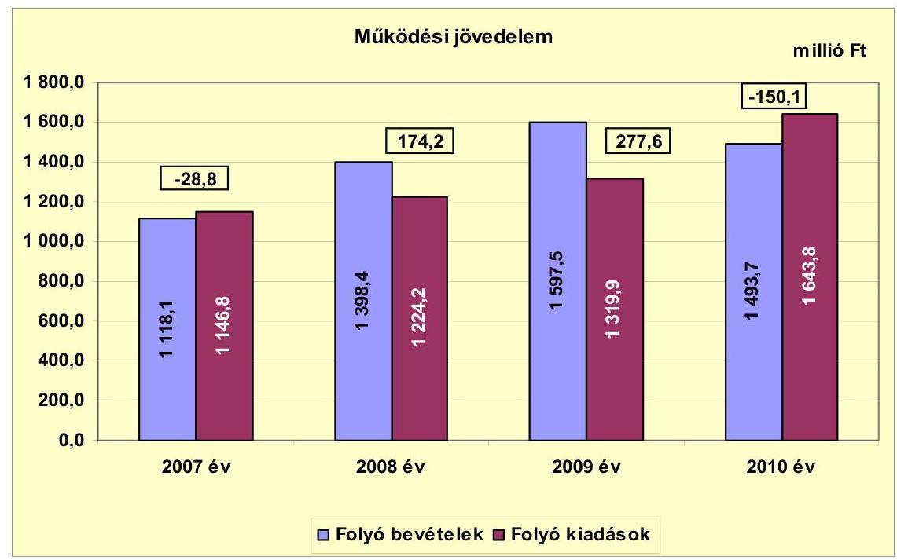

Az Önkormányzat folyó költségvetési egyenlege, múködési jövedelme a 2007. évben és a 2010. évben forráshiányt, a 2008-2009. években forrástöbbletet mutatott. Az átengedett bevételek csökkenése ellenére a múködési jövedelem 2008. évi 203,0 millió Ft-os és 2009. évi 103,4 millió Ft-os növekedését az emelkedő államháztartáson belülről kapott támogatásokon túl, alapvetően a település mellett épülő autópálya gazdaságélénkítő, bevételnövelő hatása idézte elő. A 2009. évi múködési jövedelem egyenlegét torzítja az a 25,0 millió Ft összegű fejlesztési célú támogatás, ami a folyó bevételek ${ }^{16}$ között jelenik meg. Az autópálya-építés befejezése után a 2010. évben 150,1 millió Ft múködési hiány keletkezett. A 2010. évi 427,7 millió Ft-os csökkenést a helyi adóbevételek és a költségvetési támogatás csökkenése, valamint a megugró beruházások 218,8 millió Ft értékű áfa kiadásainak folyó kiadások között elszámolt tételei okozták. Az Önkormányzat az ellenőrzött időszakban működőképességének megőrzését szolgáló kiegészítő támogatásra nem pályázott.

A múködési jövedelem csökkenését befolyásolta, hogy a 2008. évben a múködési kiadásokat 30,5 millió Ft-tal megnövelte a PPP konstrukcióban megvalósult tanuszoda igénybevételéért fizetett PPP szolgáltatási díj. A szolgáltatási díj a 2009. évben 54,6 millió Ft-ra, a 2010. évben 54,9 millió Ft-ra nőtt. Az autópálya építés befejezése miatti bevételkiesés, valamint a tanuszoda múködtetése miatti kiadásnövekedés 2010-ben negatív múködési jövedelmet eredményezett. A kialakult helyzet fennmaradása esetén az Önkormányzat pénzügyi egyensúlya rövid távon veszélyeztetett.

[^0]
[^0]:    ${ }^{16}$ A CLF módszer a költségvetési támogatást a folyó bevételek között jeleníti meg.

---

A nettó múködési jövedelem ${ }^{17}$ értéke a folyó költségvetési pozíció mellett az adott költségvetési év adósságtörlesztésének hatását is tükrözi.

Az Önkormányzat pénzügyi kapacitása a vizsgált időszakban változó értékeket mutatott, amelynek évenkénti alakulását a következő ábra szemlélteti:
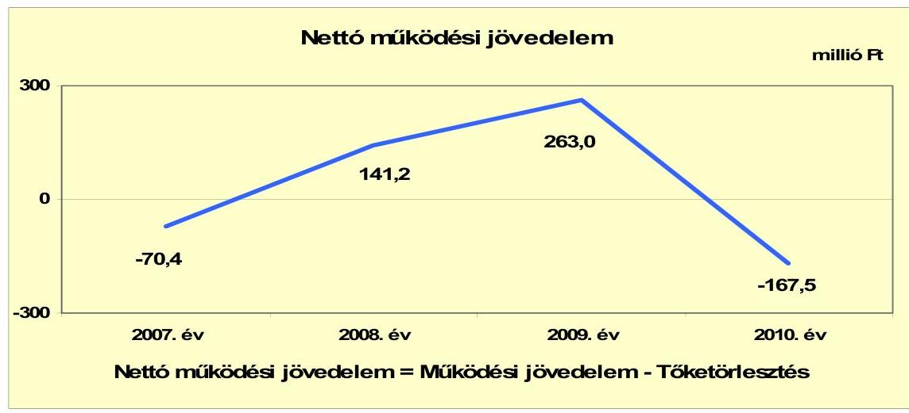

Az Önkormányzat pénzügyi kapacitása (nettó működési jövedelem) a 2007. évi -70,4 millió Ft-ról a 2008. évre 141,2 millió Ft-ra, a 2009. évre 263,0 millió Ft-ra emelkedett. A javulást az autópálya-építés hatására emelkedő helyi adó bevételek és növekvő költségvetési támogatások okozták. Az átmeneti javulás után a 2010. évben 167,5 millió Ft negatív nettó múködési jövedelem keletkezett. A csökkenés okai a költségvetési támogatás csökkenése, az autópá-lya-építés befejezése miatt kieső helyi adóbevételek, valamint a 2010. évben a működési költségek növekedése voltak. A vizsgált időszakban az Önkormányzat évente 41,6 millió Ft, 33,0 millió Ft, 14,6 millió Ft, illetve 17,3 millió Ft felhalmozási célra felvett hitelt fizetett vissza.

A felhalmozási költségvetés egyenlegét 2007-2010 közötti években a következő ábra szemlélteti:

[^0]
[^0]:    ${ }^{17}$ pénzügyi kapacitás

---

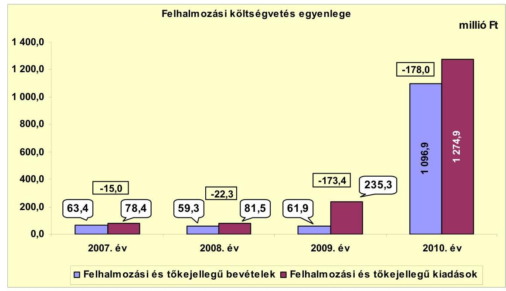

A vizsgált időszakban az Önkormányzat felhalmozási költségvetésének egyenlege egyre növekvő negatív értéket mutatott. A 2009. évben indított mikrotérségi közoktatási hálózat kialakítási és főút csomópont korszerűsítési fejlesztések miatt a felhalmozási kiadások a 2009-2010. években 153,9 millió Ft-tal, illetve 1039,5 millió Ft-tal emelkedtek. A felhalmozási bevételek a 2010. évben a fejlesztések kivitelezéséhez kapott EU-s támogatások miatt 1035,2 millió Ft-tal növekedtek. A felhalmozási forráshiány a 2007-2009. években a felhalmozási és tőke jellegű kiadások 19,1\%-át (15,0 millió Ft-ot), 27,3\%át (22,3 millió Ft-ot), illetve 73,7\%-át (173,4 millió Ft-ot) tette ki. A forráshiány aránya a 2010. évben 4,0\%-ra csökkent, miközben a hiány mértéke tovább emelkedett 178,0 millió Ft-ra. A vizsgált időszakban a felhalmozási forráshiány összesen 388,7 millió Ft volt, melyet az Önkormányzat a 2008-2009. évi múködési jövedelméből és hitelekből finanszírozott.

Az Önkormányzatnak a CLF módszer szerint teljes finanszírozási hiánya ${ }^{18}$ 2007-ben 85,4 millió Ft, a 2010. évben - a csökkenő nettó múködési jövedelem és növekvő felhalmozási kiadások miatt - 345,5 millió Ft volt. A 2008. évben és a 2009. évben a felhalmozási hiányt meghaladó pozitív nettó múködési jövedelem hatására 118,9 millió Ft, illetve 89,6 millió Ft pénzügyi többlet keletkezett.

Az Önkormányzat finanszírozási célú pénzügyi múveletei 2007-2010. évekbeli egyenlegeit a következő ábra szemlélteti:

[^0]
[^0]:    ${ }^{18}$ A nettó múködési jövedelem és a felhalmozási költségvetés egyenlegeinek összege.

---

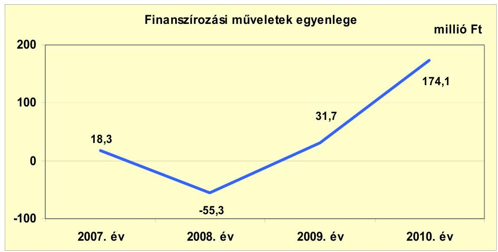

A finanszírozási múveletek egyenlegét a 2007-2008. években a korábban felvett hitelek visszafizetése határozta meg. A 2009-2010. években 35,0 millió Ft, illetve 218,3 millió Ft hitelt vettek igénybe. A finanszírozási célú múveleteket a jelentés 2. számú mellékletének 4.1-4.8. pontjai részletezik.

Az Önkormányzat zárszámadási rendeleteiben a múködési és fejlesztési hiányt és többletet a hagyományos költségvetési szerkezet alapján mutatta be ${ }^{19}$, amelyről a jelentés 1. számú melléklete nyújt tájékoztatást. A zárszámadási rendeletek a 2007. évre és a 2010. évre a múködési és felhalmozási bevételek és kiadások eredőjeként 19,2 millió Ft, valamint 328,1 millió Ft hiányt, illetve a 2008-2009. évekre 152,0 millió Ft, valamint 103,3 millió Ft bevételi többletet jeleztek. A CLF módszer alapján számítottak szerint a múködési és felhalmozási bevételek és kiadások a 2007. évre és a 2010. évre 43,8 millió Ft, valamint 328,1 millió Ft hiányt, a 2008-2009. évekre 152,0 millió Ft, valamint 104,2 millió Ft bevételi többletet eredményeztek.

Az Önkormányzat 2007-2011. év I. félév közötti kamatbevételeinek és kamatkiadásainak évenkénti alakulását a következő ábra mutatja:

[^0]
[^0]:    ${ }^{19}$ Nincs kötelező előírás a múködési és fejlesztési hiány megállapításának módjára.

---

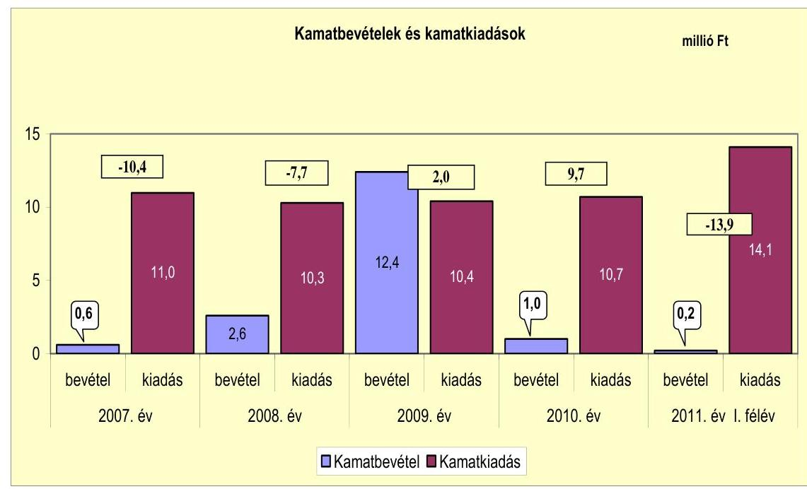

A felvett hitelekhez kapcsolódóan kamatfizetési kötelezettség miatt 2007-2011. június 30-a között az Önkormányzat összesen 56,5 millió Ft kamatot fizetett. A kamatkiadások a 2010. évben felvett hitelek miatt a 2011. évtől emelkednek jelentősen. A 2011. év I. félévében kifizetett kamatok 3,4 millió Ft-tal haladják meg a 2010. évi kamatkiadásokat. Az Önkormányzat szabad pénzeszközeiből realizált kamatbevétel 16,8 millió Ft volt, melyből 12,4 millió Ft a 2009. évben realizálódott.

# 2.2. Az Önkormányzat bevételeinek változása 

Az Önkormányzat főbb folyó bevételi jogcímeinek adatait az alábbi táblázat részletezi és grafikon mutatja be:
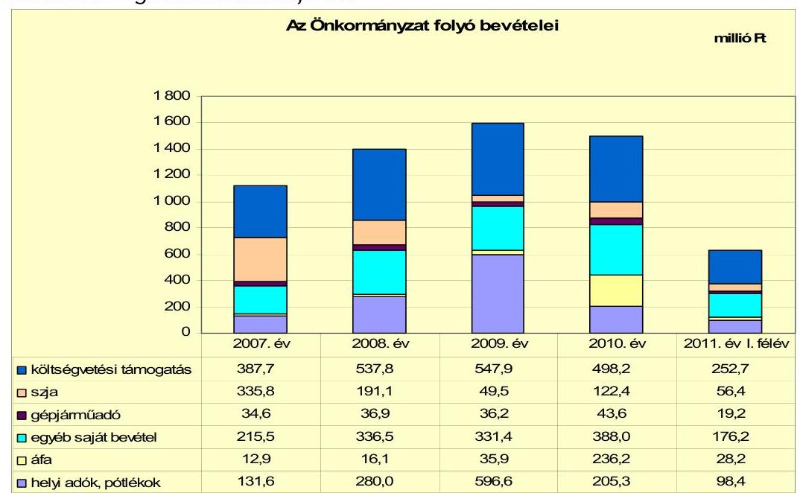

---

Az Önkormányzat folyó bevétele a 2007. évi 1118,1 millió Ft-ról - a város mellett zajló autópálya-építés miatt fellendülő vállalkozások által befizetett növekvő helyi adók miatt - a 2008. évre 1398,4 millió Ft-ra, a 2009. évre 1597,5 millió Ft-ra emelkedett. Majd a 2010. évben - az autópálya-építés befejeztével - 1493,7 millió Ft-ra csökkent. A 2010. évben a megelőző három év átlagához képest $8,9 \%$-kal ( 122,4 millió Ft-tal) nőtt.

A költségvetési támogatások és az átengedett szja együttes összege a 2007. évről a 2008. évre $0,8 \%$-kal ( 5,5 millió Ft-tal) nőtt. A 2009. évben 18,1\%kal (131,6 millió Ft-tal) lecsökkent annak ellenére, hogy a költségvetési támogatások között jelent meg a közlekedési csomópont és a városháza építésére kapott 25,0 millió Ft fejlesztési célú támogatás. A csökkenés oka az átengedett szja-n belül az autópálya-építés miatt megugró helyi iparűzési adóbevételek hatására a jövedelemkülönbség mérséklés tételének 151,0 millió Ft-tal való csökkenése volt. A 2010. évre ezek a bevételek az átengedett szja növekedése miatt $3,9 \%$-kal ( 23,2 millió Ft-tal) megemelkedtek. A vizsgált időszakban az ezeken a jogcímeken befolyt bevételek a központi forrásszabályozás változásának hatására és a bemutatott okok miatt összességében lecsökkentek.

Az áfabevételek a 2009-2010. években emelkedtek jelentősen. Az áfabevételek növekedését a megvalósuló építési beruházásokhoz elszámolt „fordított áfa" értéke okozta. A jogszabályi változások miatt ezt az adót az Önkormányzat számolta el befizetésként és visszaigénylésként is. A 2009. évben az Önkormányzat ezen a jogcímen 18,1 millió Ft-ot, a 2010. évben 218,8 millió Ft-ot számolt el. Az elszámolás során kiadást meghaladó többletbevétele az Önkormányzatnak ebből a tételsorból nem keletkezett.

Az egyéb saját bevételek a 2008. évben és a 2010. évben emelkedtek 121,0 millió Ft-tal, illetve 56,6 millió Ft-tal. A 2008. évi növekedést az okozta, hogy a Gondozási központ ellátási területének kibővítése miatt a szociális ellátásért Alsónána, Alsónyék, Báta, Pörböly, Sárpilis és Várdomb községek is támogatást fizetnek az Önkormányzatnak. Ezenkívül a közoktatási intézményfenntartó társulások tagönkormányzatai a 2008. évtől nagyobb összegű támogatást fizettek. A 2010. évi növekedést az Önkormányzat által elnyert pályázatokra érkező támogatások okozták.

A TÁMOP keretén belül meghirdetett „Tudásdepó" pályázatra, kompetencia alapú oktatásra, a DDOP keretén belül közoktatási központ kialakítására, rendezvényszervezésre és testvérkapcsolatok kiépítésére érkezett hazai és EU-s támogatások.

A helyi adókból befolyt bevételek az előző évhez képest 2008-ban 148,4 millió Ft-tal ( $112,8 \%$-kal), 2009-ben 316,6 millió Ft-tal ( $113,1 \%$-kal) nőttek. Az adóbevételek növekedését alapvetően a város mellett zajló autópályaépítés gazdaságélénkítő hatása, valamint az adómértékek 2009. évi megemelése okozták. A 2009. évről a 2010. évre az adóbevételek 391,3 millió Ft-tal ( $65,6 \%$-kal) csökkentek az autópálya-építés befejeztével. Az Önkormányzatnak 2011. június 30-ig helyi adóból 98,4 millió Ft (a 2010. évi bevétel 47,9\%-a) realizálódott, annak ellenére, hogy a Képviselő-testület döntött a magánszemélyek kommunális adója mértékének emeléséről.

---

Az iparűzési adónál a 2009. évtől 1,9\% helyett a maximális adómértéket, 2\%-ot alkalmazták. A magánszemélyek kommunális adójának mértéke lakás után a 2007. évi 12000 Ft/év-ről a 2008. évre 4000 Ft/év-re csökkent, mivel a hulladékkezelési, -szállítási díjat külön terhelték a lakosságra. A 2009. évben az adó mértékét $5000 \mathrm{Ft} /$ év-re, a 2011 . évben $6000 \mathrm{Ft} /$ év-re emelték. A vállalkozók kommunális adójának mértéke a 2007-2010. években $2000 \mathrm{Ft} /$ év volt. Az adónemet a Képviselő-testület a 2011. évtől megszüntette.

A vizsgált időszakban az Önkormányzatnak tulajdonosi részesedései után osztalék bevétele nem származott.

Az Önkormányzat felhalmozási bevételei a vizsgált időszakban a következőképpen alakultak:
millió Ft

| Megnevezés | 2007. év | 2008. év | 2009. év | 2010. év | 2011. év I.   félév |
| :-- | --: | --: | --: | --: | --: |
| Tárgyi eszköz értékesítés | 4,8 | 5,3 | 21,3 | 0,0 | 0,0 |
| Egyéb saját tőkebevétel | 1,9 | 8,0 | 0,9 | 8,0 | 0,0 |
| Államháztartáson belülről   kapott támogatás | 13,3 | 5,6 | 16,5 | 1000,5 | 25,0 |
| EU-tól és külföldről kapott   támogatások | 0,0 | 0,0 | 0,0 | 0,0 | 0,0 |
| Államháztartáson kívülről   kapott támogatás | 43,4 | 40,4 | 23,2 | 88,4 | 21,1 |
| Összes felhalmozási bevétel | 63,4 | 59,3 | 61,9 | 1096,9 | 46,1 |

A 2007-2011. június 30-a között évente 2007-ben az Önkormányzat felhalmozási bevételeinek $21,0 \%$-a ( 13,3 millió Ft ), 2008-ban $9,4 \%$-a ( 5,6 millió Ft ), 2009-ben $26,8 \%$-a ( 16,5 millió Ft ), 2010-ben $91,2 \%$-a ( 1000,5 millió Ft), illetve 2011. 1. félévében $54,2 \%$-a ( 25,0 millió Ft ) államháztartáson belülről kapott támogatásból keletkezett. A támogatások folyamatban lévő fejlesztésekre vonatkozó pályázatok eredményeképpen érkeztek. A 2010. évi kiugró értéket a „Bátaszéki Integrált Mikrotérségi Közoktatási Hálózat és Központjának kialakítása" című DDOP pályázat megvalósítására érkezett támogatás okozta.

Az államháztartáson kívülről kapott támogatás 2010. évi 88,4 millió Ft-os értékéből 68,3 millió Ft-ot a Víziközmű társulat megszűnése miatt az Önkormányzat könyvelésébe kerülő szennyvíz érdekeltségi hozzájárulásból keletkező többletbevétel idézte elő. A fennmaradó 20,1 millió Ft a Duna-Mecsek Területfejlesztési Alapítványtól városközpont rehabilitációjára és játszótéri elemek vásárlására érkező támogatásokból keletkezett.

Tárgyi eszköz értékesítéséből a 2009. évben jelentkezett előző éveket meghaladó többletbevétele az Önkormányzatnak. A Képviselő-testület az ingatlanértékesítésekről határozatokban döntött.

---

# 2.3. Az Önkormányzat múködési és a felhalmozási célú kiadásainak változása 

Az Önkormányzat folyó kiadásai főbb jogcímek szerinti bontásban 20072011. június 30. között az alábbiak voltak:

| Megnevezés | 2007. év | 2008. év | 2009. év | 2010. év | 2011. év I.   félév |
| :--: | :--: | :--: | :--: | :--: | :--: |
| Folyó kiadások | 1146,8 | 1224,2 | 1319,9 | 1643,8 | 699,5 |
| Müködési kiadások (kamatkiadás nélkül) | 1013,8 | 1111,4 | 1187,4 | 1509,6 | 632,5 |
| Államháztartáson belülre átadott pénzeszközök | 0,0 | 12,7 | 9,1 | 5,6 | 0,0 |
| Transzferkiadások | 100,2 | 100,7 | 104,3 | 118,7 | 51,9 |
| -ebből: vállalkozásoknak | 0,7 | 2,0 | 0,9 | 0,2 | 0,0 |
| EU-nak, illetve külföldre | 0,0 | 0,0 | 0,0 | 0,0 | 0,0 |
| magánszemélyeknek | 80,9 | 83,2 | 80,5 | 94,8 | 44,0 |
| nonprofit szervezeteknek | 18,6 | 15,5 | 22,9 | 23,7 | 7,9 |
| Kamatkiadások | 11,0 | 10,3 | 10,4 | 10,7 | 14,1 |
| Előző évi pénzmaradvány átadás | 0,0 | 0,0 | 0,0 | 0,0 | 0,0 |

Az Önkormányzat folyó kiadásai a 2010. évben a megelőző három év 1230,3 millió Ft-os átlagához képest 33,6\%-kal (413,5 millió Ft-tal) nőttek. A 2011. év I. félévében a 2010. évi folyó kiadások 42,6\%-a (699,5 millió Ft) teljesült. A kiadások emelkedését a múködési kiadások növekedése okozta.

Az Önkormányzat folyó kiadásai közül, a főbb kiadásnemek szerinti bontásban az alábbiak voltak:

|  |  |  |  |  | millió Ft |
| :-- | --: | --: | --: | --: | --: |
| Megnevezés | 2007. év | 2008. év | 2009. év | 2010. év | 2011. év I.   félév |
| Személyi juttatások | 529,4 | 566,7 | 572,1 | 612,4 | 280,7 |
| Munkaadót terhelő járulékok | 165,2 | 175,3 | 165,9 | 155,2 | 71,7 |
| Dologi kiadások | 299,3 | 364,4 | 440,9 | 722,4 | 270,4 |
| Egyéb folyó kiadások | 7,9 | 5,0 | 5,6 | 17,1 | 8,8 |

Az Önkormányzat 2007-ben 694,6 millió Ft-ot (a folyó kiadások 60,6\%-át) fordított személyi juttatásokra és a munkaadókat terhelő járulékokra, az üzemeltetést, intézményfenntartást biztosító dologi kiadásokra 299,3 millió Ft (26,1\%) jutott. A múködési kiadásokon belül a személyi juttatások és járulékok a 2008. évre - változatlan arány mellett - 742,0 millió Ft-ra emelkedtek. A növekedés oka bérfejlesztésen kívül a közcélú foglalkoztatásra fordított kiadások emelkedése volt. A 2009. évre a személyi juttatások és a munkaadókat terhelő járulékok 738,0 millió Ft-ra (55,9\%-ra) csökkentek, a 2010. évben a létrehozott Mikrotérségi oktatási központ hatására 767,6 millió Ft-ra emelkedtek. A 2009. évről a 2010. évre történt 29,6 millió Ft-os növekedés ellenére - a dologi kiadások ütemesebb emelkedése miatt - a személyi juttatások és járulékok aránya $46,7 \%$-ra csökkent.

A folyó kiadásokon belül a dologi kiadások aránya a vizsgált időszakban emelkedett. A mértéke a 2010. évben a megelőző három év 368,2 millió Ft mér-

---

tékű átlagához képest 96,2\%-kal (354,2 millió Ft-tal) nőtt. A kiadások növekedését az inflációs hatásokon kívül alapvetően a 2008. évtől múködő - PPP konstrukcióban megvalósult - tanuszodához kapcsolódóan a magánpartnernek fizetett PPP szolgáltatási díj, az intézményátszervezés kiadásai, valamint a folyamatban lévő beruházások miatt fizetett 218,8 millió Ft-os áfa kiadások folyó kiadások között történő elszámolása okozta.

A Mikrotérségi oktatási központ létrehozásának hatására az Önkormányzat rehabilitációs hozzájárulásai, szja kiadásai is növekedtek. Ennek hatására az egyéb folyó kiadások a 2009. évi 5,6 millió Ft-ról ( $0,4 \%$-ról) a 2010. évre 17,1 millió Ft-ra ( $1,0 \%$-ra) emelkedtek.

A múködési és felhalmozási kiadások évenkénti alakulását a következő grafikon szemlélteti:
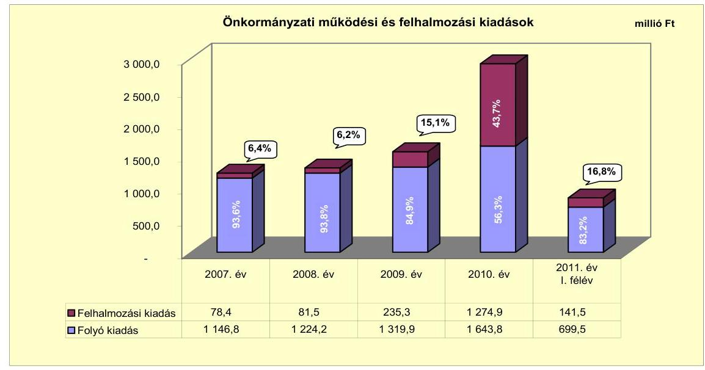

A múködési és felhalmozási kiadások arányának változásában 2007-2010 között elmozdulás figyelhető meg. A felhalmozási kiadások a fejlesztésekhez elnyert támogatások segítségével megvalósuló beruházások hatására 78,4 millió Ft-ról ( $6,4 \%$-ról) 1274,9 millió Ft-ra (43,7\%-ra) nőttek.

Az Önkormányzat 2007-2010. években megvalósított fejlesztéseinek finanszírozására együttesen 533,8 millió Ft-ot fordított. A 2007-2010. között 15 darab 10,0 millió Ft teljes bekerülési költség feletti befejezett beruházás és felújítás összértéke 341,6 millió Ft, a 10,0 millió Ft alatti fejlesztések összértéke 192,2 millió Ft volt. A teljes bekerülési költség 56,6\%-át (302,2 millió Ft-ot) saját bevételből finanszírozták. A kiadások további fedezetét 25,4\%-ban (135,1 millió Ft) hazai támogatás, 16,9\%-ban ( 90,0 millió Ft) hitel, 0,1\%-ban (6,5 millió Ft) EU-s támogatás biztosította.

A 2010. december 31-én a Bátaszéki Integrált Mikrotérségi Közoktatási Hálózat és Központjának kialakítása, vízrendezési és főútvonal-csomópont kiépítési munkák voltak folyamatban. A folyamatban lévő fejlesztések várható be-

---

kerülési költsége 1466,0 millió Ft volt, melyből az Önkormányzat 2010. december 31-ig 1278,5 millió Ft-ot teljesített. Saját bevételből 273,5 millió Ft-ot, illetve a folyamatban lévő fejlesztésekhez elnyert EU-s támogatásból 1005,0 millió Ftot. A folyamatban lévő fejlesztésekhez 2010. december 31-ig az azt követő időszakra 187,5 millió Ft kötelezettséget vállaltak, melyből 162,7 millió Ft forrása elnyert EU-s támogatás, 5,7 millió Ft hazai támogatás. A fejlesztések hiányzó 19,1 millió Ft összegét saját bevételből finanszírozzák. Az Önkormányzat fejlesztési céllal a 2011. évben nem nyújtott be saját forrást is igénybe vevő új pályázatot.

A vizsgált időszakban az Önkormányzat három legmagasabb bekerülési költségű fejlesztése a következő:

- A Bátaszéki Integrált Mikrotérségi Közoktatási Hálózat és Központjának kialakítását (1275,5 millió Ft) 2009-ben indították, melyhez EU-s forrásból 996,7 millió Ft támogatásban részesültek. A fejlesztés 2011. évi megvalósításához összesen 278,8 millió Ft önrészre volt szüksége az Önkormányzatnak. A beruházás öt közoktatási intézmény felújítására és bővítésére terjed ki. A fejlesztés során a II. Géza gimnázium $1604 \mathrm{~m}^{2}$-e, az Általános iskola $2329 \mathrm{~m}^{2}$-e, az Alsónyéki tagóvoda $249 \mathrm{~m}^{2}$-e, a Pörbölyi tagóvoda $325 \mathrm{~m}^{2}$-e, a Bátaszéki Óvoda-bölcsőde $1353 \mathrm{~m}^{2}$-e került felújításra-bővítésre.
- A helyszíni vizsgálat befejezéséig valósult meg a Bátaszék 55. és 56. számú főutak csomópont korszerűsítése. A fejlesztés összköltsége 69,6 millió Ft, melyhez 59,2 millió Ft EU-s támogatást kaptak. A fennmaradó 10,4 millió Ft-ot saját forrásból biztosították. A beruházás eredményeképpen $270 \mathrm{~m}^{3}$ aszfaltbeton, $170 \mathrm{~m}^{3}$ beton burkolatalap került beépítésre.
- A 2009. évtől megvalósuló belterületi vízrendezés és csapadékvíz elvezetők rekonstrukciójának várható bekerülési költsége 86,7 millió Ft. Az Önkormányzat a fejlesztéshez a 77,9 millió Ft EU-s és 5,7 millió Ft hazai támogatáson kívül 3,1 millió Ft saját forrást biztosít. A fejlesztés során 1109 fm burkolt árkot, és 67 fm átereszt építenek.

---

Az Önkormányzat 2007-2010 között átadott pénzeszközeinek összegét az alábbi ábra szemlélteti:
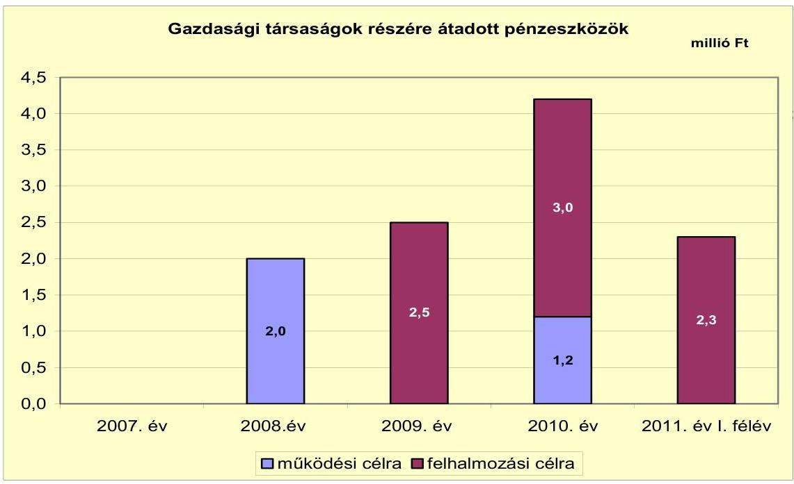

Felhalmozási céllal adott át pénzeszközt az Önkormányzat a 2009. évben a BátKom 2004 Kft. részére 2,5 millió Ft összegben fűnyíró vásárlására, a 2010. évben és a 2011. évben 1,0 millió Ft-ot, illetve 2,3 millió Ft-ot szivattyú vásárlására. A 2010. évben a Bátaszéki Közös Víz Nonprofit Kft.-nek is adtak át 2,0 millió Ft-ot nyomóvezeték kiépítésére.

Az Önkormányzat eseti múködési célra a 2008. évben a Bát-Kom 2004 Kft.-nek adott át 1,2 millió Ft-ot, valamint a Panteon Kegyeleti Szolgáltató Kft.-nek 0,8 millió Ft-ot. A 2011. év I. félévében a Panteon Kegyeleti Szolgáltató Kft.-nek adott 1,2 millió Ft-ot múködési célra.

Az Önkormányzat által a gazdasági társaságoknak átadott pénzeszközöket a jelentés 4. számú melléklete tartalmazza.

# 3. Az ÖNKORMÁNYZAT KÖTELEZETTSÉGEI 

### 3.1. Az Önkormányzat pénzintézeti kötelezettségeinek változása

Az Önkormányzatnak 2006. december 31-én 234,6 millió Ft pénzintézeti kötelezettség állománya volt, amely a 2007. évben 2,9\%-kal, 227,7 millió Ft-ra csökkent a Víziközmű társulati ( 182,0 millió Ft) és az intézmények belső világításának korszerűsítésére felvett ( 14,4 millió Ft) hitelek tárgyévi törlesztései miatt. A 2008. évben 13,7\%-kal, 31,2 millió Ft-tal (196,5 millió Ft-ra) tovább csökkent az előző évhez viszonyítva, amit az előzőekben ismertetett két hitel tárgyévi, illetve a belterületi közutak építésére felvett ( 40,0 millió Ft) hitel III. negyedévben megkezdődött törlesztése eredményezett. A 2009. évben a pénzintézeti kötelezettség állománya 10,4\%-kal, 216,9 millió Ft-ra növekedett, a hoszszú lejáratú hitelek tárgyévi törlesztései és a telekvásárlásra ( 35,0 millió Ft) fel-

---

vett hitel egyenlegeként. Majd a 2010. évben 96,6\%-kal, 417,8 millió Ft-ra nőtt, a Bátaszéki Integrált Mikrotérségi Közoktatási Hálózat és Központjának kialakítása projekt megvalósítására felvett ( 169,0 millió Ft és 47,6 millió Ft hitelek felvétele) és a 17,3 millió Ft hiteltörlesztés eredményeként. A 2011. év I. félévben tovább emelkedett 42,3\%-kal 594,7 millió Ft-ra, amelyet a rövid lejáratú kötelezettségek magas állománya ( 158,2 millió Ft) okozott.

Az Önkormányzat 2007-2011. év I. félév között folyószámlahitellel, és nyolc hosszú lejáratú hitellel rendelkezett. A hosszú lejáratú hitelek közül egy deviza alapú, melynek törlesztése 2011. június 30 -ig megtörtént. A többi pedig forint alapú volt, amelyek közül egy visszafizetése 2010. december 31-ig megtörtént ( 14,4 millió Ft), a közmútársulati hitel végtörlesztését ( 35,4 millió Ft) 2011. december 31-ig tervezik.

A Víziközmű társulat 2002. május 21-én 182,0 millió Ft összegű hitelt vett fel a társulás tagjai később megfizetendő érdekeltségi hozzájárulásának megelőlegezésére. A hitel két részből állt: 74,0 millió Ft a társulathoz hagyományos módon befizetett hozzájárulásból, illetve 108,0 millió Ft az LTP megtakarításból. A beruházás megvalósításában érdekelt lakosság hozzájárulásának megelőlegezésére nyújtott hitel kamatának megfizetéséhez a központi költségvetés támogatást biztosított. A lakáscélú állami támogatásokról szóló 12/2001. (I. 31.) Korm. rendelet előírása szerint legfeljebb az egyéves futamidejű állampapír referenciahozama tárgyév január 1-jét megelőző féléves átlag 1,3-szeresének a 70\%-át a társulat helyett a Magyar Állam megtéríti. Ezért a hitel kamatának mértéke ténylegesen évi $2,778 \%$.

Az Önkormányzat pénzintézetekkel szemben fennálló - a könyvviteli mérlegében kimutatott - kötelezettségeinek állományát a következő ábra szemlélteti:
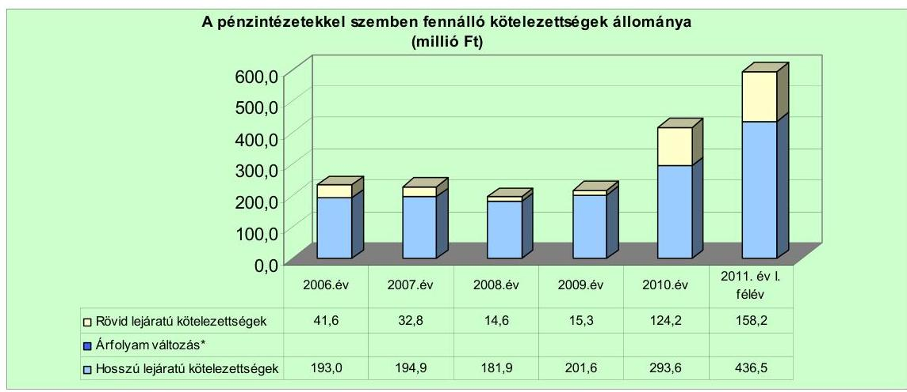
*Megjegyzés: az évenkénti árfolyamváltozást az Önkormányzat nem számolta el.

Az Önkormányzat a 2007. év és a 2011. év I. félév vége közötti időszakban egy CHF alapú hitellel rendelkezett, amelyet gépkocsi vásárlás céljára vettek igénybe 2008. június 16-án 11,9 ezer CHF ( 1,8 millió Ft) összegben 153,21 Ft/1 CHF árfolyamon. A hitel változó kamatozású, az induló ügyleti kamat 12,5\% volt. Az Önkormányzat 2007-2010. közötti főkönyvi nyilvántartásaiban - a Számv. tv. 60. § (1) bekezdésében és az Áhsz. 33. § (1) bekezdésében foglaltak

---

ellenére - a devizában fennálló kötelezettségeket nem értékelte és a változásokat nem rögzítette.

Az Önkormányzat 2007-2011. évi költségvetési rendeletei az időszak valamenynyi évében forráshiányt tartalmaztak. A müködési forráshiányt, illetve a likviditási problémákat folyószámlahitel felvételével, a felhalmozási forráshiány fedezetét a 2007-2010. években hosszú lejáratú hitel igénybevételével tervezték megteremteni. A forráshiány csökkentésére minden évben számításba vették az előző évi pénzmaradványt. A pénzfelhasználás optimalizálására kiskincstári rendszert ${ }^{20}$ müködtettek.

Az Önkormányzat pénzintézeti kötelezettségvállalásaira minden esetben képviselő-testületi döntés alapján került sor. A kötelezettségvállalásból származó források felhasználási céljait meghatározták. Az adósságot keletkeztető kötelezettségvállalások felső határát betartották. A hitelfelvétekkel kapcsolatos előterjesztésekben tájékoztatták a Képviselő-testületet a tőke, a kamat és egyéb költségek mértékéről, de azok várható összegeit nem mutatták be a futamidő végéig. Az előterjesztések nem tartalmazták a visszafizetések forrásait sem. A Mikrotérségi oktatási központ beruházásához kapcsolódó hitelek felvételéhez a pénzintézeteket közbeszerzési eljárás keretében versenyeztették. A pályázatot az Önkormányzat számlavezető bankja nyerte el.

Az adósságot keletkeztető kötelezettségvállalással megvalósított felhalmozási kiadások esetleges bevételt növelő, illetve kiadást csökkentő vonzatát, illetve ennek a fejlesztéshez, felújításhoz vállalt kötelezettségek visszafizetési forrásként való számbavételét nem vizsgálták.

Az Önkormányzat 2011. június 30-án HUF-ban fennálló adósságot keletkeztető kötelezettségvállalása az alábbi volt:

| Megnevezés | Szerződéskötés/   Kibocsátás   idöpontja | Összeg millió   HUF-ban | Kamat (referencia   kamat+ kamatfelár)   (\%) | Felhasználás célja: |
| :-- | :--: | :--: | :--: | :-- |
| Hosszú lejáratú hitel 1. | 2002. május 21. | 182,0 | 3 havi BUBOR + 0,6* | Víziközmú |
| Hosszú lejáratú hitel 2. | 2005. október 24. | 40,0 | 3 havi EURIBOR + 2,0 | Közutak építése felújítása |
| Hosszú lejáratú hitel 3. | 2007. január 26. | 15,0 | 3 havi EURIBOR + 2,0 | Kossuth L. u. felújítása |
| Hosszú lejáratú hitel 4. | 2009. március 25. | 35,0 | 3 havi EURIBOR + 3,5 | Telek vásárlás |
| Hosszú lejáratú hitel 5. | 2010. június 17. | 169,0 | 3 havi EURIBOR + 1,2 | Mikrotérs. közokt. kp. kialak. |
| Hosszú lejáratú hitel 6... | 2010. június 27. | 114,9 | 3 havi EURIBOR + 1,2 | Mikrotérs. közokt. kp. kialak. |

*Megjegyzés: a beruházás megvalósításában érdekelt lakosság hozzájárulásának megelőlegezésére nyújtott hitel kamatának megfizetéséhez a központi költségvetés támogatást biztosított. Ezért a hitel kamatának mértéke ténylegesen évi $2,778 \%$.

Az Önkormányzat a 2007. év és 2011. év I. félév végéig terjedő időszakban, HUF-ban fennálló valamennyi hitelét a hitelszerződésekben meghatározott célokra használta fel a következők szerint:

[^0]
[^0]:    ${ }^{20}$ A kiskincstári rendszer lényege, hogy az intézmények gazdálkodásához csak annyi önkormányzati támogatást biztosítanak, amennyi a folyó kiadásaik fedezetére elégséges.

---

- a 2002. május 21-én aláírt hitelszerződésben a lakossági érdekeltségi hozzájárulás megelőlegezését szolgáló 182,0 millió Ft összegű hitelt Bátaszék város érdekeltségi területén belül közműves szennyvízelvezetésre, bel- és csapadékvíz rendezésre szolgáló vízilétesítmények létrehozására és bővítésére fordították. A hitelt teljes összegben lehívták. A tőke törlesztését 2004. december 1jén kezdték el 8,5 millió Ft összeggel. A tőkére és kamataira 2010. december 30-ig 98,6 millió Ft-ot, 2011. június 30-ig további 79,0 millió Ft-ot fordítottak. A 2011. december 31-jéig fennálló tartozás 36,2 millió Ft,
- a 2002. október 30-án aláírt hitelszerződésben 14,4 millió Ft összegű fejlesztési hitelt az óvoda, általános iskola és a gimnázium belső világításának a korszerűsítésére használták fel. A hitelt teljes összegben lehívták. A tőke törlesztése 2003. március 27-én kezdődött 0,5 millió Ft összeggel. A tőkét és a kamatait 2010. december 31-ig kifizették 16,9 millió Ft összegben,
- a 2005. október 24-én aláírt hitelszerződésben 40,0 millió Ft összegű fejlesztési hitelt belterületi közutak építésére és önkormányzati tulajdonú létesítmények felújítására fordították. A hitelt teljes összegben lehívták. A tőke törlesztését 2008. szeptember 30-án kezdték el 0,6 millió Ft összeggel. A tőkére és kamataira 2010. december 30-ig 12,4 millió Ft-ot, 2011. június 30-ig további 1,7 millió Ft-ot fordítottak. A 2011-2013. években várható kötelezettség 10,2 millió Ft, azt követően a 2025. évig 33,5 millió Ft,
- a 2007. január 26-án aláírt hitelszerződésben 15,0 millió Ft összegű fejlesztési hitelt a Kossuth Lajos utca burkolatának a felújítására fordították. A hitelt teljes összegben felhasználták. A tőke törlesztését 2009. szeptember 30-án kezdték el 0,2 millió Ft összeggel. A tőkére és kamataira 2010. december 30ig 4,1 millió Ft-ot, 2010. június 30-ig további 0,7 millió Ft-ot fordítottak. A 2011-2013. években várható kötelezettség 4,4 millió Ft, azt követően a 2025. évig 14,8 millió Ft,
- a 2009. március 25-én aláírt hitelszerződésben 35,0 millió Ft összegű fejlesztési hitelt a „Bátaszék Integrált Kistérségi Közoktatási hálózat" központjának a kialakításához kapcsolódó intézmény megépítéséhez szükséges telek megvásárlására fordították. A tőke törlesztését 2011. március 31-én 0,7 millió Ft összeggel kezdték el. A tőke kamataira és járulékos költségeire 2010. december 31-ig 3,1 millió Ft-ot teljesítettek. A 2011. év I. félév végéig a tőkére és kamataira 2,2 millió Ft-ot törlesztettek. A 2011-2013. években várható kötelezettség 12,8 millió Ft, azt követően a 2023. évig 34,5 millió Ft,
- a 2010. június 27-én aláírt hitelszerződésben 169,0 millió Ft összegű fejlesztési hitelt a DDOP-3.1.2/2F-2f-2009-0020. Bátaszéki Integrált Mikrotérségi Közoktatási Hálózat és Központjainak kialakítása tárgyú projekt megvalósítására használták fel. A tőke törlesztése 2012. március 31-én kezdődik 2,3 millió Ft összeggel. A kamatok és a járulékos költségek törlesztésére 2010. december 31-ig 4,1 millió Ft-ot, 2011. június 30-ig 5,3 millió Ft-ot fordítottak. A várható kötelezettség a 2011-2013. években 47,4 millió Ft, azt követően a 2030. évig 237,4 millió Ft,
- a 2010. június 27-én aláírt hitelszerződésben 131,0 millió Ft fejlesztési hitel felvételét irányozták elő. Két részletben 47,6 millió Ft-ot és 67,3 millió Ft-ot használtak fel a DDOP-3.1.2/2F-2f-2009-0020. Bátaszéki Integrált Mikrotérségi Közoktatási Hálózat és Központjainak kialakítása tárgyú pro-

---

jekten belül, a közoktatási intézmények múszaki felújítására és rekonstrukciójára. Az Önkormányzat nyilatkozata szerint a teljes hitelösszeg lehívására nem volt lehetőségük, de a hitelszerződés módosítására a helyszíni vizsgálat befejeződéséig, 2011. november 18-ig nem került sor. A várható kötelezettségeket 16,1 millió Ft-tal csökkentett összeggel, 114,9 millió Ft-tal számítottuk. A tőke törlesztése 2012. június 30 -ától kezdődik 1,8 millió Ft összeggel. A 2010. évben a hitel kamataira és járulékos költségeire 1,1 millió Ft-ot, a 2011. év I. félév végéig 1,5 millió Ft-ot fordítottak. A várható kötelezettség a 2011-2013. évben 30,1 millió Ft, azt követően a 2030. évig 161,5 millió Ft.

A hosszú lejáratú fejlesztési hitelek 2011-2013. években várható törlesztési kötelezettsége 220,1 millió Ft, amelyből 158,0 millió Ft tőke, 62,1 millió Ft kamat és az egyéb költség törlesztési kötelezettsége. A 2014. évtől a futamidő végéig várható törlesztési kötelezettség összege 481,7 millió Ft, amelyből 321,9 millió Ft tőke, 159,8 millió Ft kamat és egyéb költség.

A hosszú lejáratú forinthiteleket az Önkormányzat számlavezető pénzintézete nyújtotta.

Az Önkormányzat a 2007. év és a 2011. év. I. félév végéig terjedő időszakban egy CHF alapú hitelszerződése volt, amelyet a következő táblázat mutat be:

| Megnevezés | Szerződéskötési   Kibocsátás   időpontja | Összeg   ezer CHF-ben | Kibocsátásifehívási   árfolyam | Kamat (referencia kamat+   kamatfelár)   $(\%)$ | Felhasználás célja: |
| :--: | :--: | :--: | :--: | :--: | :--: |
| Hosszú lejáratú hitel 8. | 2008. június 15. | 11,9 | 153,21 | 12,5 | Gépkocsi vásárlás |

A felvett 11,9 ezer CHF összegű ( 1,8 millió Ft) hitelt személygépkocsi vásárlására fordították a Polgármesteri hivatal részére. A 2010. év végéig 9,4 ezer CHF tőkét ( 1,4 millió Ft) és 2,1 ezer CHF kamatot ( 0,3 millió Ft) törlesztettek. A 2011. évben fennálló kötelezettség 2,5 ezer CHF ( 0,4 millió Ft), amelyet 2011. június 30 -ig törlesztettek. A hitelt az Önkormányzat nem a számlavezető bankjától vette fel.

Az Önkormányzat a 2007. évtől a 2011. június 30 -ig terjedő időszakban pénzügyi egyensúlyát folyószámlahitelek felvételével biztosította.

A vizsgált időszakban a folyószámlahitel alakulását a következő táblázat mutatja be:

|  |  |  |  |  | millió Ft-ban   2011. év   félév |
| :--: | :--: | :--: | :--: | :--: | :--: |
| Megnevezés | 2007. év | 2008. év | 2009. év | 2010. év |  |
| I. Folyószámlahitel |  |  |  |  |  |
| a folyószámlahitel keretösszege január 1-jén | 101,0 | 98,0 | 100,0 | 120,0 | 180,0 |
| teljesített kamat és egyéb költség | 1,5 | 2,1 | 1,2 | 2,3 | 5,2 |

A folyószámla hitelkeret összege a 2007. évhez viszonyítva a 2011. év I. félévéig 78,2\%-kal, 101,0 millió Ft-ról 180,0 millió Ft-ra emelkedett, a folyószámlahitel átlagos állománya ${ }^{21} 10,4$ millió Ft-ról 60,3 millió Ft-ra, a folyószámlahitellel zárt napok száma 84 napról 178 napra növekedett. A folyószámlahitel decem-

[^0]
[^0]:    ${ }^{21}$ Fennálló folyószámla hitelállomány/365 nap

---

ber 31-ei állománya a 2007. évben 19,8 millió Ft, a 2010. évben 1,7 millió Ft volt. A 2008. és a 2009. évben az Önkormányzat év végén nem rendelkezett folyószámlahitel állománnyal. A folyószámlahitel állománya 2011. június 30-án 158,2 millió Ft-ra növekedett a költségvetési kiadások finanszírozása miatt. A folyószámla hitelkeret szerződés lejártakori és újra kötéskori kötelezettségállomány a 2008. évben 18,1 millió Ft, a 2009. évben nem volt, a 2010. évben 34,3 millió Ft volt. ${ }^{22}$ A 2007. és 2011. év I. félév között a folyószámlahitel-állomány növekedésével, az ezzel kapcsolatban teljesített kamat és egyéb költségek is emelkedtek összesen 12,3 millió Ft kiadást eredményeztek.

A növekvő összegű és folyamatosan fennálló folyószámlahitel az Önkormányzat eladósodásának növekedését jelzi és magas pénzintézeti kockázatot jelent.

A folyószámlahitel kondíciói és egyéb költségei a következők voltak ${ }^{23}$ :

| Megnevezés | Kamat (referencia+ kamatfelár) | Egyéb költség |
| :--: | :--: | :--: |
| Folyószámlahitel |  |  |
| 2007-2008. év | 3 havi BUBOR $+1,0 \%$ | $0,50 \%$ |
| 2008-2009. év | 3 havi BUBOR $+1,25 \%$ | $0,5 \%$ kez.dij, $0,25 \%$ rend.t.j |
| 2009-2010. év | 3 havi BUBOR $+3,25 \%$ | $0,5 \%$ kez.dij, $1,0 \%$ rend.t.j |
| 2009-2011. év | 1 havi BUBOR $+3,25 \%$ | $0,5 \%$ kez.dij, $1,0 \%$ rend.t.j |

A folyószámlahitel kamatfelára 2009-től növekvő tendenciájú (1,0\%-ról 3,5\%ra emelkedett). A számlavezető pénzintézet 2009-től a kezelési költség növeléséről, valamint rendelkezésre tartási díj megállapításáról döntött.

A fennálló hosszú lejáratú hitelek esetében a kamatfizetési kötelezettségek alakulását jelentősen befolyásolja a lehívási és az utolsó kamatfizetéskori kamatok (referencia + kamatfelár) változása, amelyet az alábbi táblázat mutat be:

| Megnevezés | Kibocsátási, lehívási | Utolsó fizetéskori | Változás \% |
| :--: | :--: | :--: | :--: |
|  | kamat (referencia + kamatfelár) \% |  |  |
| 3 havi EURIBOR (2007.01.26-i szerződés) | 5,722 | 4,8 | $-16,1 \%$ |
| 3 havi EURIBOR (2005.10.24-i szerződés) | 4,188 | 3,537 | $-15,5 \%$ |
| 3 havi EURIBOR (2009.09.25-i szerződés) | 6,473 | 5,037 | $-22,2 \%$ |
| 3 havi EURIBOR (2010.06.17-i szerződés) | 3,427 | 6,237 | 82,0\% |
| 3 havi EURIBOR (2010.06.17-i szerződés) | 3,427 | 6,237 | 82,0\% |
| 3 havi BUBOR (2002.05.21-i szerződés 2) | 2,778 | 1,388 | $-50,0 \%$ |

Az alapkamat mértékének alakulása jelentős hatással van a teljes futamidőre számított várható kamatkötelezettség nagyságára. Amennyiben a referencia kamat nem változott volna, az Önkormányzatnak a kibocsátáskori referencia kamattal számolva 2011. év I. félévig két hosszú lejáratú hitel esetében összesen 30,3 millió Ft kamatfizetési kötelezettsége jelentkezett volna. A változások miatt azonban 8,7 millió Ft-tal több fizetési kötelezettsége keletkezett, mint amivel a szerződéskötéskor számolnia kellett. Négy hosszú lejáratú hitel eseté-

[^0]
[^0]:    ${ }^{22}$ 2008. június 10-én, 2009.június 17-én és 2010. június 16-án.
    ${ }^{23}$ Az Önkormányzatnál alkalmazott referenciakamatok a következők voltak:

    | MNB BUBOR fixing (állagkamat) \%-ban |  |  |  |  |
    | :--: | :--: | :--: | :--: | :--: |
    | 2007. évi | 2008. évi | 2009. évi | 2010. évi | 2011. év I.   félév |
    | 7,83 | 8,75 | 8,66 | 5,47 | 6,00 |
    | 7,75 | 8,87 | 8,64 | 5,50 | 6,07 |

---

ben összesen 18,1 millió Ft fizetési kötelezettség keletkezett volna, azonban a csökkenő referencia kamatok miatt 2,9 millió Ft-tal kevesebbet, 15,2 millió Ft-ot kellett teljesítenie.

A Víziközmű társulati hitelnél ( 182 millió Ft) a változatlan kamatlábbal számított kamat 27,4 millió Ft, a kifizetett kamat 31,0 millió Ft. A Mikrotérségi oktatási központ kialakítása projektnél ( 169 millió Ft) a számított kamat 2,9 millió Ft, a kifizetett kamat 8,0 millió Ft.

A vállalt pénzintézeti és szállítói kötelezettség alakulását a 2011-2013. években, illetve az azt követő időszakban a kötelezettségek lejáratáig a következő táblázat szemlélteti:

| Megnevezés | Állomány 2010. december 31   én |  |  | Állomány 2011. június 30-án |  |  | Várható   kötelezettség 2011-   2013. években |  | Várható kötelezettség 2014. évtöl |
| :--: | :--: | :--: | :--: | :--: | :--: | :--: | :--: | :--: | :--: |
|  | HUF-ban   (milliú Ft-   ban) | Devizában   (összege.   ezer CHF-   ban) | Devize   nem | HUF-ban   (milliú Ft-   ban) | Devizában   (összege.   ezer CHF-   ban) | Devize   nem | HUF-ban   (milliú Ft-   ban) | Devizában   (összege.   ezer CHF-   ban) | HUF-ban (milliú Ft-   ban) |
| Pénzintézeti kötelezettségek |  |  |  |  |  |  |  |  |  |
| Víziközmú társulati hitel | 113,2 |  |  | 35,4 |  |  | 115,2 |  | 0,0 |
| Közutak építése, önkormányzati ing. felúj. | 34,2 |  |  | 33,0 |  |  | 10,2 |  | 33,5 |
| Kossuth L. utca burkulatának felújítása | 13,7 |  |  | 13,3 |  |  | 4,4 |  | 14,8 |
| Toldosásátlás (Mikroténi, akt. kp.) | 35,0 |  |  | 33,7 |  |  | 12,5 |  | 34,5 |
| SDOP: Integrált mikroténi, akt. központ.kiol. | 47,6 |  |  | 47,6 |  |  | 30,1 |  | 161,5 |
| SDOP: Integrált mikroténi, akt. központ.kiol. | 169,0 |  |  | 169,0 |  |  | 47,4 |  | 237,4 |
| Gégjármú oktatási |  | 2,5 | CHF |  | 0,0 | CHF |  | 2,5 |  |
| Fizetésztemle hitel | 1,7 |  |  | 158,2 |  |  | 158,2 |  |  |
| Pénzintézeti kötelezettségek összesen HUF-ban. | 414,4 |  |  | 490,2 |  |  | 378,3 |  | 491,7 |
| Pénzintézeti kötelezettségek összesen CHF-ben. |  | 2,5 | CHF |  |  |  |  | 2,5 |  |
| Szállitói tartozás | 112,0 |  |  | 129,6 |  |  | 129,6 |  |  |

A 2011-2013. évek kötelezettségeinek teljesítésére figyelembe vehető a 109,2 millió Ft mérlegben kimutatott behajtható követelésállomány. Azonban ez nem nyújt fedezetet az ismert kötelezettségvállalások összegére. A 2014. évet követően jelenleg ismert pénzintézeti kötelezettségei: 481,7 millió Ft, amely tartalmazza a tőke, a kamat és az egyéb költségeket. Az Önkormányzat tájékoztatása szerint figyelembe vehető további források „a mindenkori költségvetési rendeletekben megtervezett önkormányzati helyi adóbevételek", azonban ennek növelésére 2011-ben tett intézkedés nem biztosít elegendő többletforrást. A 2010. évi negatív működési jövedelem miatt a következő évekre szóló jelenleg ismert pénzintézeti kötelezettségek teljesítése - további bevételnövelő és kiadáscsökkentő intézkedések megtételének hiányában - visszafizetési kockázatot jelent az Önkormányzatnak.

# 3.2. A szállítói kötelezettségek változása 

Az Önkormányzat szállítókkal szemben fennálló - adatközlésük szerinti kötelezettségállománya 2007. január 1-jén 21,2 millió Ft-ról a 2007. évben 11,8 millió Ft-ra, 44,5\%-kal csökkent. A 2008. évben 21,6 millió Ft-ra, 83,1\%kal növekedett az előző évhez viszonyítva. A 2009. évben 115,6 millió Ft-ra, 5,4-szeresére nőtt, a 2010. évben 112,0 millió Ft-ra változott. A 2011. év I. félév végére 129,6 millió Ft-ra nőtt.

A 2009. évben a szállítói tartozások 85,2\%-át ( 98,5 millió Ft) a beruházási, $14,8 \%$-át ( 17,1 millió Ft) az egyéb szállítói (közüzemi, karbantartási) számlák alkották. A 2010. évben a beruházási felújítási számlákból 90,8 millió Ft-ot, az

---

egyéb számlákból 21,2 millió Ft-ot fizettek késve. A 2011. év I. félév végén a beruházási szállítói kötelezettségekből 57,4 millió Ft volt a 2010. évről áthúzódó tartozás, 54,9 millió Ft, illetve az egyéb szállítóktól 17,3 millió Ft a 2011. évet terhelte.

A szállítói tartozásállományon belül a lejárt szállítói kötelezettségek aránya a 2010. december 31-i állomány 85,6\%-a ( 95,4 millió Ft), 2011. június 30-án 97,4\% (126,2 millió Ft) volt. A 2010. évben és a 2011. év I. félévében lejárt szállítói tartozások 99,5\%-a ( 95,5 millió Ft), illetve 54,4\%-a ( 68,6 millió Ft) 30 nap alatti. 2011. június 30-án a 91 nap és 365 nap közötti lejárt szállítói tartozások aránya $45,5 \%$ ( 57,4 millió Ft) volt. Éven túli tartozásállomány nem volt.

A 91 és 365 nap közötti lejárt szállítói tartozásból (57,4 millió Ft) - az Önkormányzat tájékoztatása szerint - 49,4 millió Ft a „Bátaszéki Integrált Mikrotérségi Közoktatási Hálózat és Központjának kialakítása" projekthez kapcsolódik. A közremúködő szervezet a beruházó számlájának ellenértékét 2011. február 22-én átutalta a vállalkozónak, de erről az Önkormányzatot nem értesítette. Ezért a számlát nem vezették be a könyvviteli nyilvántartásba.

Az Önkormányzat intézményeinél a 90 napot meghaladó, szállítók felé fennálló kötelezettségek miatt - a helyi önkormányzatok adósságrendezési eljárásáról szóló 1996. évi XXV. törvény 5. § (2) bekezdésében ${ }^{24}$ foglaltak ellenére - a Polgármester nem kezdeményezett adósságrendezési eljárást.

A szállítói tartozásállományok, ezen belül a lejárt tartozások arányának növekedése az Önkormányzat fizetőképességének csökkenését, a pénzügyi kockázat növekedését jelzi.

# 3.3. Egyéb kötelezettségek változása 

A 2007-től 2011. év I. félévéig terjedő időszakban az Önkormányzatnak nem volt lízing, kezesség- és garanciavállalási kötelezettsége.

Az Önkormányzat PPP konstrukcióban valósította meg a tanuszoda beruházását, amelynek kötelezettségvállalása a 2023. évig 1080,8 millió Ft. Az összegből a 2011. év I. félév végéig 171,9 millió Ft-ot törlesztettek. A 2011-2013. évekre 197,6 millió Ft, a 2014. évet követően 735,4 millió Ft a fizetési kötelezettség.

Az Önkormányzat, az ÖTM és a magánbefektető között létrejött szolgáltatási szerződés szerint a „havi szolgáltatási dij = havi önkormányzati szolgáltatási dij + havi ÖTM szolgáltatási dij hozzájárulás". Az éves ÖTM szolgáltatási díj hozzájárulás értéke az éves szolgáltatási díj összegének 50\%-a. A havi szolgáltatási díjat - teljesítésigazolással ellátott számlák ellenében - az Önkormányzat és az ÖTM különkülön fizeti a magánbefektetőnek.

A fennálló kötelezettség miatt a tanuszoda PPP konstrukcióban történő múködtetése magas múködési kockázattal jár, a pénzügyi egyensúlyt kedvezőtlenül érinti.

[^0]
[^0]:    ${ }^{24}$ A helyi önkormányzatok adósságrendezési eljárásáról szóló 1996. évi XXV. törvény 5. § (2) bekezdése 2011. július 13-tól változott, ennek értelmében a polgármester a Képvi-selő-testület döntése alapján köteles az adósságrendezési eljárást megindítani.

---

Az Önkormányzatnál a 2007-2009. években a jegyző a helyi adók késedelmi pótlékát 1,1 millió Ft, és a magánszemélyek kommunális adóját 0,1 millió Ft összegben engedte el. A Képviselő-testület ${ }^{25}$ egy magánszemély ingatlan vételár hátralékát engedte el a 2010. évben 0,1 millió Ft összegben.

Az Önkormányzat helyi rendeletben nem szabályozta a követelés elengedés módját és eseteit, amellyel megsértették az Áht ${ }_{1}$. 108. § (2) bekezdésében ${ }^{26}$ foglaltakat, amely szerint követelésről lemondani csak az Önkormányzat rendeletében meghatározott módon és esetekben lehet.

Az Önkormányzat a 2007. és 2011. év I. félévéig terjedő időszakban egy esetben nyújtott tagi kölcsönt 2,0 millió Ft összegben 100\%-os tulajdonában lévő gazdasági társaságnak hulladékszállító gépjármú megvásárlásához, amelyet 2009. július 30 -án törlesztettek. Egyháznak és egyéb szervezeteknek összesen 14,6 millió Ft összegben nyújtottak visszterhes támogatást megállapodás ellenében.

A Római Katolikus Egyházközségnek a templomi orgona felújítására a 2008. és 2010. évben 12,0 millió Ft összegben (2008. december 31 -én és 2010. június 30án visszafizették). A Bátaszéki Vállalkozók Ipartestületének az iparos civilház felújítására a 2009. évben 2,0 millió Ft-ot (a támogatás visszafizetése 2012. május 31-én esedékes). A Vicze János Sport Közalapítványnak triatlon verseny megrendezésére a 2010. évben 0,6 millió Ft visszterhes támogatást nyújtottak, amelyet 2010. augusztus 31-én visszafizettek.

Az Önkormányzatnak a vizsgált időszakban peres eljárással összefüggő kötelezettsége nem volt.

Az Önkormányzatnak két gazdasági társaságában van 50\%-ot elérő tulajdonosi részesedése, mindkettőben minősített többségű a befolyása, az egyik 75,98\%-os, a másik kizárólagos tulajdonában van. A társaságok kötelezettségeinek állománya 2010. december 31-én és 2011. június 30-án, valamint várható alakulása a kötelezettségek lejáratáig a következő:

| Megnevezés | Állomány 2010. december 31   én | Állomány 2011. június 30-án | Várható   kötelezettség 2011-   2013. években |
| :--: | :--: | :--: | :--: |
|  | HUF-ban (millió Ft-ban) | HUF-ban (millió Ft-ban) | HUF-ban (millió Ft-ban) |
| Lizing kötelezettségek | 2,9 | 2 | 2,0 |
| Szállító tartozás | 29,3 | 7,4 | 7,4 |

Az Önkormányzat minősített többségi tulajdonában álló gazdasági társaságnak fennálló pénzintézeti kötelezettsége nem volt a 2007-2011. év I. félév végéig terjedő időszakban. Mérleg szerinti összes kötelezettsége a 2007. évi 10,2 millió Ft-ról a következő évben 7,3 millió Ft-ra csökkent, majd a 2009. évben megemelkedett 16,9 millió Ft-ra. A 2011. június 30 -ai kötelezettségállomány 15,3 millió Ft volt.

[^0]
[^0]:    ${ }^{25}$ A 64/2010. (IV. 1.) számú határozatában.
    ${ }^{26}$ 2012. január 1-jétől az Áht ${ }_{2}$. 97. § (2) bekezdése tartalmazza

---

A gazdasági társaságok 2010. évi kötelezettségállományából a szállítói tartozások 29,3 millió Ft. A szállítói tartozásokból 3,6 millió Ft a 91 és 360 nap közötti lejárt tartozás. A 2011. június 30 -ai 3,8 millió Ft lejárt szállítói tartozásállományból 3,3 millió Ft az éven túli lejárt tartozás.

Az önkormányzati kötelezettségek növekedése mellett az Önkormányzat minősített többségi befolyásával rendelkező gazdasági társaságok kötelezettségei is befolyásolhatják az Önkormányzat pénzügyi egyensúlyát. Esetleges csőd- vagy felszámolási eljárás esetén a bíróság korlátlan és teljes felelősséget állapíthat meg az Önkormányzat terhére.

Az Önkormányzat a gazdasági társaságokról szóló 2006. évi IV. törvény 54. § (2) bekezdése alapján korlátlan felelősséggel tartozik azon gazdasági társaságának felszámolása esetében, amelyben az Önkormányzat az 52. § (2) bekezdése szerint a szavazatok legalább 75\%-ával rendelkezik, így minősített befolyásszerzőnek minősül, továbbá a csődeljárásról és a felszámolási eljárásról szóló 1991. évi XLIX. törvény 63. § (2) bekezdése alapján a kizárólagos önkormányzati tulajdonú gazdasági társaságának minden olyan kötelezettségéért, amelynek kielégítését a felszámolási eljárás során az adós társaság vagyona nem fedez, ha a hitelezőinek a felszámolási eljárás során benyújtott keresete alapján a bíróság - az adós társaság felé érvényesített tartósan hátrányos üzletpolitikájára figyelemmel - megállapítja az önkormányzat korlátlan és teljes felelősségét.

Az Önkormányzat a kimutatásai szerint 2007-2010. években a tárgyi eszközök után együttesen 421,4 millió Ft értékcsökkenést számolt el (2007. évben 101,2 millió Ft, 2008. évben 110,3 millió Ft, 2009. évben 113,9 millió Ft, 2010. évben 95,9 millió Ft), míg felújításra 318,1 millió Ft-ot, beruházásra 979,1 millió Ft-ot fordítottak a számviteli nyilvántartásuk szerint. Az Önkormányzat eszközállományának bruttó értéke a 2007. évi 2861,7 millió Ft-ról 3181,9 millió Ft-ra ( $11,2 \%$-kal) nőtt, míg a nettó érték a 2007. évi 2160,7 millió Ft-ról 2160,8 millió Ft-ra változott. Az önkormányzati szintű használhatósági fok a 2007. évi 75,5\%-ról négy év alatt 7,6 százalékponttal 67,9\%-ra csökkent az egyes eszközcsoportoknál különböző mértékkel elszámolt amortizáció hatására.

A 2007-2010. évek közötti időszakban a befejezett fejlesztések esetében a tényleges beruházási költségekből az eszközök pótlásra 280,3 millió Ft-ot fordítottak. A folyamatban lévő fejlesztéseknél a 2010. december 31-ig megvalósított, illetve a 2010. év után várható fejlesztések ráfordításaiból 28,6 millió Ft kiadást terveztek megvalósítani az eszközpótlásokra. Az Önkormányzatnál nem mérték fel, hogy az elhasználódott eszközök pótlása milyen kötelezettséget jelent. Erre tartalékot nem képeztek, alapot nem hoztak létre.

Az Önkormányzat a zárszámadási rendeletekben nem mutatatta be az eszközök után a tárgyévben elszámolt értékcsökkenés összegét, az eszközpótlásra fordított tényleges kiadásokat, az eszközök elhasználódási fokának alakulását

# 4. A PÉNZÜGYI EGYENSÚLY MEGTEREMTÉSE ÉrDEKÉBEN HOZOTT INTÉZKEDÉSEK EREDMÉNYE 

A kiadáscsökkentő és bevételnövelő intézkedések megtétele a pénzügyi helyzet javítását és a gazdálkodás átláthatóbbá tételét célozta.

---

Az Önkormányzat 2007. és 2011. június 30-a között - adatszolgáltatása alapján - 40,9 millió Ft kiadást csökkentő intézkedést hozott, amely a kötelező feladatok ellátáshoz kapcsolódtak. Létszámcsökkentések 31,9 millió Ft-tal, a többletjuttatások (cafetéria elemek) csökkentése 6,2 millió Ft-tal, az élelmiszervásárlás közbeszerzése 2,7 millió Ft-tal járultak hozzá a kiadási megtakarításhoz.

A 2007-2011. év I. félévig tartó időszak kiadáscsökkentő intézkedéseinek hatását az Önkormányzat kimutatása alapján - beavatkozási területenként - a következők mutatják:
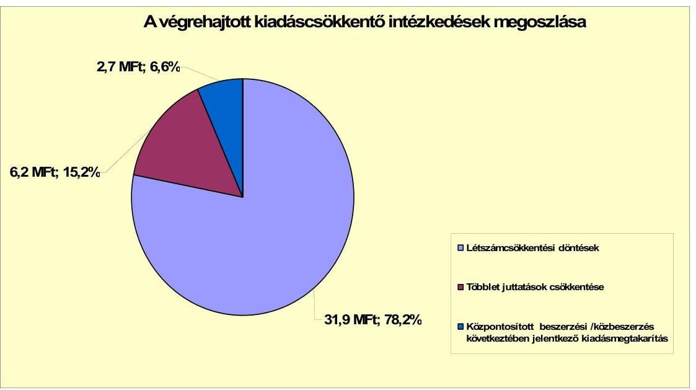

Kiadáscsökkentés és intézmény-racionalizálás keretén belül a vizsgált időszakban több alkalommal csökkentették az Önkormányzat álláshelyeit.

A 2007-2010. években történt álláshely- és létszámváltozásokat mutatja be a következő táblázat:

| Megnevezés (adatok fő-ben) | Közoktatás | Szociális és gyermekvédelem | Egészségügy | Polgármesteri hivatal | Egyéb | Összesen |
| :--: | :--: | :--: | :--: | :--: | :--: | :--: |
| 2007. január 1-jén jóváhagyoit álláshelyek száma | 162 | 17 | 0 | 39 | 7 | 225 |
| Megszüntetett álláshelyek száma | 24 | 5 | 0 | 1 | 0 | 30 |
| ebből: üres álláshelyek száma | 3 | 0 | 0 | 0 | 0 | 3 |
|  | szokmai álláshelyek száma | 19 | 3 | 0 | 1 | 0 | 20 |
|  | intézmény-üzemeltetéssel kapcsolatos álláshelyek száma | 5 | 2 | 0 | 0 | 0 | 7 |
| Átáshely növekedése |  | 29 | 8 | 0 | 4 | 1 | 42 |
| 2010. december 31-én záró álláshelyek száma |  | 167 | 20 | 0 | 42 | 8 | 237 |
| 2007. január 1-jén foglalkoztatott létszám |  | 158 | 17 | 0 | 38 | 7 | 220 |
| Létszámcsökkentés |  | 21 | 5 | 0 | 1 | 0 | 27 |
| Létszámnövekedés |  | 24 | 8 | 0 | 4 | 1 | 37 |
| 2010. december 31-én foglalkoztatott létszám |  | 161 | 20 | 0 | 41 | 8 | 230 |

A 2007. évben a Képviselő-testület döntött az Általános iskolában a 2007/2008. tanévben indítható osztályok és napközis csoportok számáról. Ezek hatására a 2007. évben a közoktatási ágazatban tízzel csökkent az álláshelyek száma. Az álláshelyek csökkentése három üres álláshelyet érintettek.

Az Általános iskola konyhájának korszerűsítését követően a 2007. évben további kettő fő konyhai dolgozói álláshelyét szüntettek meg és ezzel párhuzamosan ket-

---

tő fő létszámcsökkentést hajtottak végre a „prémiumévek" jogszabályi feltételeinek megfelelően.

A 2007. évben a közoktatási területen történt álláshely csökkentésekkel párhuzamosan a szociális ágazatban nyolc fővel növelték az álláshelyek számát. Az álláshelyek növekedésének oka az volt, hogy a Gondozási központ ellátási területét kibővítették Alsónána, Alsónyék, Báta, Pörböly, Sárpilis, Várdomb községekkel.

A 2008. évben a közoktatási ágazatban négy fő létszámcsökkenéssel párhuzamosan megszüntettek négy álláshelyet. Az intézményátszervezés előkészítése során még a 2008. évben az álláshelyek számát négy fővel megemelték.

A 2009. évben a Mikrotérségi oktatási központ létrehozásának hatására a közoktatási ágazat álláshelyeinek száma 19 fővel növekedett. Az intézményátszervezés hatására a bölcsődei álláshelyek (négy fő) a szociális ágazatból átkerültek a közoktatási ágazat álláshelyei közé.

A 2010. évben a közoktatási ágazatban további kettő fővel csökkentették az álláshelyek számát.

A létszámcsökkentési döntéseinek következtében - az Önkormányzat adatszolgáltatása szerint - a vizsgált időszakban összesen 31,9 millió Ft kiadáscsökkentést tudtak elérni.

A megvalósított létszámcsökkentésekhez kapcsolódóan az Önkormányzat négy alkalommal igényelt támogatást. A létszámcsökkentési pályázatok eredményeképpen az Önkormányzat hat fő tartósan leépített álláshely után 4,4 millió Ft támogatásban részesült.

A többletjuttatások (cafetéria) csökkentésével a 2011. év I. félévében összesen 6,2 millió Ft megtakarítást értek el. A számítások szerint önkormányzati szinten a 2010. évi 39,1 millió Ft összegű cafeteria kiadásokat a 2011. évben $31,9 \%$-kal csökkentik.

Az Általános iskola által kiírt közbeszerzési eljárás eredményeképpen a vizsgált időszakban az élelmiszer beszerzések terén 2,7 millió Ft kiadás megtakarítás realizálódott.

A kiadáscsökkentő intézkedések mellett a bevételek növelése érdekében az Önkormányzatnál helyi adókkal kapcsolatos, eszközök hasznosításával, intézményi térítési díjakkal összefüggő intézkedéseket tettek, amelyeknek következtében a 2007-2011. év I. félévében 294,8 millió Ft többletbevételt ért el az Önkormányzat.

---

A bevételnövelő intézkedések - az Önkormányzat adatszolgáltatása alapján az alábbi számszerúsített hatásokat eredményezték:

Az Önkormányzatnak az intenzívebb behajtás eredményeként a 2007. évben 7,3 millió Ft-tal, 2008. évben 8,5 millió Ft-tal a 2009. évben 158,1 millió Ft-tal, 2010. évben 34,0 millió Ft-tal a 2011. év I. félévben 3,7 millió Ft-tal több bevétele származott.

A helyi adó mértékének emeléséből és a kedvezmények csökkentéséből a 2007. évben 7,6 millió Ft-tal, a 2009. évben 15,6 millió Ft-tal, a 2011. év I. félévben 6,7 millió Ft többletbevétel keletkezett. A vizsgált időszakban a helyi adókkal kapcsolatos intézkedésekből összesen 241,5 millió Ft növekmény származott, amely az önkormányzati szinten realizált 294,9 millió Ft többletbevétel $81,9 \%$-át teszi ki.

A Képviselő-testület döntött ingatlanok bérbeadásáról és értékesítéséről a bevételek növelése érdekében. A 2007-2011. év I. félévben ennek hatására 7,0 millió Ft, 7,3 millió Ft, 21,5 millió Ft, 2,5 millió Ft, illetve 0,3 millió Ft többletbevétel származott. A vizsgált időszakban keletkezett 38,7 millió Ft növekmény a bevételnövelő intézkedések 13,1\%-át teszi ki.

Az intézményi térítési díjak emelése az Önkormányzat számára a vizsgált időszakban évente 1,4 millió Ft, 3,7 millió Ft, 3,7 millió Ft, 3,7 millió Ft, illetve 2,3 millió Ft többletbevételt eredményezett. A vizsgált időszakban ebből származó 14,7 millió Ft többletbevétel 5,0\% részarányt képvisel.

A 2007-2011. év I. félév között tett intézkedések hatására keletkezett többletbevételeket mutatja a következő diagram:
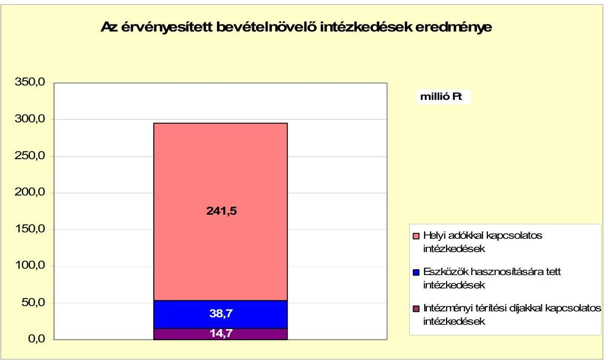

Az Önkormányzatnál a vizsgált időszakban a központi támogatások a 2008. évben 5,5 millió Ft-tal nőttek a 2007. évhez viszonyítva, ezt követően évente 126,1 millió Ft, 102,9 millió Ft, 88,5 millió Ft összeggel csökkentek. A ki-

---

adáscsökkentő és bevételnövelő intézkedések az Önkormányzat pénzügyi egyensúlyát javították, együttes hatásuk eredményeképp 335,7 millió Ft-tal ellensúlyozni tudta a központi támogatások vizsgált időszakban bekövetkezett 312,0 millió Ft összegű csökkenését.

# 5. Az ÁSZ Által a korábBi ÉVEKben a PÉNZÜGYi EGYENSÚLY JAVÍTÁSÁRA TETT SZABÁLYSZERŰSÉGI ÉS CÉLSZERŰSÉGI JAVASLATOK HASZNOSULÁSA 

Az ÁSZ az Önkormányzat gazdálkodási rendszerét a 2007. évben ellenőrizte átfogó jelleggel. A gazdálkodási rendszer korábbi ellenőrzése során tett javaslatok közül a pénzügyi egyensúly javítására három szabályszerűségi javaslat vonatkozott. A javaslatok megvalósítása érdekében a Képviselő-testület a 3/2008 (I. 29.) számú határozatával fogadta el az ÁSZ jelentésben foglaltak végrehajtására készített, felelősöket és határidőket tartalmazó intézkedési tervet.

Az ellenőrzés során tett, a pénzügyi egyensúly javítására vonatkozó szabályszerűségi javaslatok realizálódtak.

A szabályszerűségi javaslatokra megtett intézkedések eredményeképpen az Önkormányzat gondoskodott arról, hogy a költségvetési rendelettervezetek költségvetési kiadásainak és bevételeinek főösszegei ne tartalmazzanak finanszírozási célú kiadási és bevételi előirányzatokat. A jegyző biztosította, hogy az Ámr-ben előírtak alapján az éves beszámoló szöveges indoklását, valamint a költséghatékonyság javítása érdekében a tárgyévben tett intézkedések felsorolását, rövid leírását, elemzését az Önkormányzat honlapján közzétegyék.

A jegyző gondoskodott arról, hogy a kötelezettségvállalásokat megelőzően az Áht ${ }_{1}$-ben előírtak alapján minden esetben megvizsgálják, hogy a kifizetések teljesítéséhez az Önkormányzat bevételei biztosítják-e a pénzügyi fedezetet.

Az ÁSZ a 2008. évben a PPP konstrukcióban megvalósult bátaszéki tanuszoda projekt előkészítését és megvalósítását ellenőrizte. A számvevői jelentés kettő szabályszerűségi és négy célszerűségi javaslatot tartalmazott. A javaslatok megvalósítása érdekében a Képviselő-testület a 8/2009 (I. 27.) számú határozatával fogadta el az ÁSZ jelentésben foglaltak végrehajtására készített, felelősöket és határidőket tartalmazó intézkedési tervet.

Az ellenőrzés során tett szabályszerűségi és célszerűségi javaslatok realizálódtak.

A szabályszerűségi javaslatokra megtett intézkedések hatására a jegyző gondoskodott arról, hogy a Kbt. előírásainak megfelelően eleget tegyenek a szerződésmódosításokkal összefüggő tájékoztató készítési és közzétételi kötelezettségeknek. Intézkedett, hogy az Áhsz-ben rögzítettek szerint nyilvántartásba vegyék a PPP konstrukcióban megvalósult létesítmény tárgyi és forgóeszközeit. A célszerűségi javaslatoknak megfelelően a polgármester kezdeményezte, hogy a felmerülő kockázatok kezelésére kockázatmenedzselési terv készüljön, intézkedéseket tett az uszodai kapacitás kihasználtság növelése érdekében és kezde-

---

ményezte, hogy a Képviselő-testületnek évente beszámoljanak a tanuszoda üzemeltetésének tapasztalatairól. A jegyző gondoskodott arról, hogy a beruházások előkészítésekor a projekttel kapcsolatos kötelezettségvállalások hatásaira, a kiadások alakulására és a pénzügyi egyensúlyi helyzetre vonatkozó pénzügyi számítások készüljenek.

Budapest, 2012. április " 16 "

Melléklet: $\quad 6 \mathrm{db}$
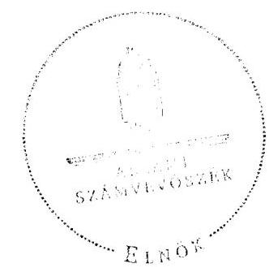

Domokos László $\%$

---

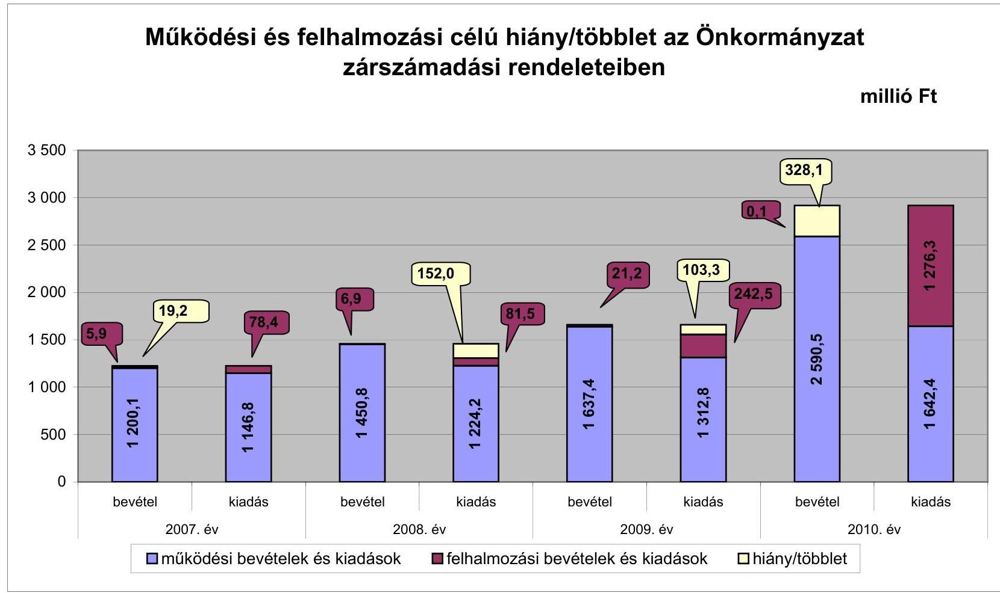

# Működési és felhalmozási célú hiány/többlet az Önkormányzat zárszámadási rendeleteiben

|  Müködési és felhalmozási célú hiány/többlet | 2007. év | 2008. év | 2009. év | 2010. év  |
| --- | --- | --- | --- | --- |
|  müködési bevételek és kiadások | 146.8 | 152.0 | 153.4 | 156.8  |
|  felhalmozási bevételek és kiadások | 145.8 | 152.0 | 153.4 | 156.8  |
|  felhalmozási bevételek és kiadások | 144.8 | 152.0 | 153.4 | 156.8  |
|  müködési bevételek és kiadások | 145.8 | 152.0 | 153.4 | 156.8  |
|  felhalmozási bevételek és kiadások | 145.8 | 152.0 | 153.4 | 156.8  |
|  müködési bevételek és kiadások | 144.8 | 152.0 | 153.4 | 156.8  |
|  felhalmozási bevételek és kiadások | 144.8 | 152.0 | 153.4 | 156.8  |
|  müködési bevételek és kiadások | 145.8 | 152.0 | 153.4 | 156.8  |
|  felhalmozási bevételek és kiadások | 145.8 | 152.0 | 153.4 | 156.8  |
|  müködési bevételek és kiadások | 145.8 | 152.0 | 153.4 | 156.8  |
|  felhalmozási bevételek és kiadások | 145.8 | 152.0 | 153.4 | 156.8  |
|  müködési bevételek és kiadások | 145.8 | 152.0 | 153.4 | 156.8  |
|  felhalmozási bevételek és kiadások | 145.8 | 152.0 | 153.4 | 156.8  |
|  müködési bevételek és kiadások | 145.8 | 152.0 | 153.4 | 156.8  |
|  felhalmozási bevételek és kiadások | 145.8 | 152.0 | 153.4 | 156.8  |
|  müködési bevételek és kiadások | 145.8 | 152.0 | 153.4 | 156.8  |
|  felhalmozási bevételek és kiadások | 145.8 | 152.0 | 153.4 | 156.8  |
|  müködési bevételek és kiadások | 145.8 | 152.0 | 153.4 | 156.8  |
|  felhalmozási bevételek és kiadások | 145.8 | 152.0 | 153.4 | 156.8  |
|  müködési bevételek és kiadások | 145.8 | 152.0 | 153.4 | 156.8  |
|  felhalmozási bevételek és kiadások | 145.8 | 152.0 | 153.4 | 156.8  |
|  müködési bevételek és kiadások | 145.8 | 152.0 | 153.4 | 156.8  |
|  felhalmozási bevételek és kiadások | 145.8 | 152.0 | 153.4 | 156.8  |
|  müködési bevételek és kiadások | 145.8 | 152.0 | 153.4 | 156.8  |
|  felhalmozási bevételek és kiadások | 145.8 | 152.0 | 153.4 | 156.8  |
|  müködési bevételek és kiadások | 145.8 | 152.0 | 153.4 | 156.8  |
|  felhalmozási bevételek és kiadások | 145.8 | 152.0 | 153.4 | 156.8  |
|  müködési bevételek és kiadások | 145.8 | 152.0 | 153.4 | 156.8  |
|  felhalmozási bevételek és kiadások | 145.8 | 152.0 | 153.4 | 156.8  |
|  müködési bevételek és kiadások | 145.8 | 152.0 | 153.4 | 156.8  |
|  felhalmozási bevételek és kiadások | 145.8 | 152.0 | 153.4 | 156.8  |
|  müködési bevételek és kiadások | 145.8 | 152.0 | 153.4 | 156.8  |
|  felhalmozási bevételek és kiadások | 145.8 | 152.0 | 153.4 | 156.8  |
|  müködési bevételek és kiadások | 145.8 | 152.0 | 153.4 | 156.8  |
|  felhalmozási bevételek és kiadások | 145.8 | 152.0 | 153.4 | 156.8  |
|  müködési bevételek és kiadások | 145.8 | 152.0 | 153.4 | 156.8  |
|  felhalmozási bevételek és kiadások | 145.8 | 152.0 | 153.4 | 156.8  |
|  müködési bevételek és kiadások | 145.8 | 152.0 | 153.4 | 156.8  |
|  felhalmozási bevételek és kiadások | 145.8 | 152.0 | 153.4 | 156.8  |
|  müködési bevételek és kiadások | 145.8 | 152.0 | 153.4 | 156.8  |
|  felhalmozási bevételek és kiadások | 145.8 | 152.0 | 153.4 | 156.8  |
|  müködési bevételek és kiadások | 145.8 | 152.0 | 153.4 | 156.8  |
|  felhalmozási bevételek és kiadások | 145.8 | 152.0 | 153.4 | 156.8  |
|  müködési bevételek és kiadások | 145.8 | 152.0 | 153.4 | 156.8  |
|  felhalmozási bevételek és kiadások | 145.8 | 152.0 | 153.4 | 156.8  |
|  müködési bevételek és kiadások | 145.8 | 152.0 | 153.4 | 156.8  |
|  felhalmozási bevételek és kiadások | 145.8 | 152.0 | 153.4 | 156.8  |
|  müködési bevételek és kiadások | 145.8 | 152.0 | 153.4 | 156.8  |
|  felhalmozási bevételek és kiadások | 145.8 | 152.0 | 153.4 | 156.8  |
|  müködési bevételek és kiadások | 145.8 | 152.0 | 153.4 | 156.8  |
|  felhalmozási bevételek és kiadások | 145.8 | 152.0 | 153.4 | 156.8  |
|  müködési bevételek és kiadások | 145.8 | 152.0 | 153.4 | 156.8  |
|  felhalmozási bevételek és kiadások | 145.8 | 152.0 | 153.4 | 156.8  |
|  müködési bevételek és kiadások | 145.8 | 152.0 | 153.4 | 156.8  |
|  felhalmozási bevételek és kiadások | 145.8 | 152.0 | 153.4 | 156.8  |
|  müködési bevételek és kiadások | 145.8 | 152.0 | 153.4 | 156.8  |
|  felhalmozási bevételek és kiadások | 145.8 | 152.0 | 153.4 | 156.8  |
|  müködési bevételek és kiadások | 145.8 | 152.0 | 153.4 | 156.8  |
|  felhalmozási bevételek és kiadások | 145.8 | 152.0 | 153.4 | 156.8  |
|  müködési bevételek és kiadások | 145.8 | 152.0 | 153.4 | 156.8  |
|  felhalmozási bevételek és kiadások | 145.8 | 152.0 | 153.4 | 156.8  |
|  müködési bevételek és kiadások | 145.8 | 152.0 | 153.4 | 156.8  |
|  felhalmozási bevételek és kiadások | 145.8 | 152.0 | 153.4 | 156.8  |
|  müködési bevételek és kiadások | 145.8 | 152.0 | 153.4 | 156.8  |
|  felhalmozási bevételek és kiadások | 145.8 | 152.0 | 153.4 | 156.8  |
|  müködési bevételek és kiadások | 145.8 | 152.0 | 153.4 | 156.8  |
|  felhalmozási bevételek és kiadások | 145.8 | 152.0 | 153.4 | 156.8  |
|  müködési bevételek és kiadások | 145.8 | 152.0 | 153.4 | 156.8  |
|  felhalmozási bevételek és kiadások | 145.8 | 152.0 | 153.4 | 156.8  |
|  müködési bevételek és kiadások | 145.8 | 152.0 | 153.4 | 156.8  |
|  felhalmozási bevételek és kiadások | 145.8 | 152.0 | 153.4 | 156.8  |
|  müködési bevételek és kiadások | 145.8 | 152.0 | 153.4 | 156.8  |
|  felhalmozási bevételek és kiadások | 145.8 | 152.0 | 153.4 | 156.8  |
|  müködési bevételek és kiadások | 145.8 | 152.0 | 153.4 | 156.8  |
|  felhalmozási bevételek és kiadások | 145.8 | 152.0 | 153.4 | 156.8  |
|  müködési bevételek és kiadások | 145.8 | 152.0 | 153.4 | 156.8  |
|  felhalmozási bevételek és kiadások | 145.8 | 152.0 | 153.4 | 156.8  |
|  müködési bevételek és kiadások | 145.8 | 152.0 | 153.4 | 156.8  |
|  felhalmozási bevételek és kiadások | 145.8 | 152.0 | 153.4 | 156.8  |
|  müködési bevételek és kiadások | 145.8 | 152.0 | 153.4 | 156.8  |
|  felhalmozási bevételek és kiadások | 145.8 | 152.0 | 153.4 | 156.8  |
|  müködési bevételek és kiadások | 145.8 | 152.0 | 153.4 | 156.8  |
|  felhalmozási bevételek és kiadások | 145.8 | 152.0 | 153.4 | 156.8  |
|  müködési bevételek és kiadások | 145.8 | 152.0 | 153.4 | 156.8  |
|  felhalmozási bevételek és kiadások | 145.8 | 152.0 | 153.4 | 156.8  |
|  müködési bevételek és kiadások | 145.8 | 152.0 | 153.4 | 156.8  |
|  felhalmozási bevételek és kiadások | 145.8 | 152.0 | 153.4 | 156.8  |
|  müködési bevételek és kiadások | 145.8 | 152.0 | 153.4 | 156.8  |
|  felhalmozási bevételek és kiadások | 145.8 | 152.0 | 153.4 | 156.8  |
|  müködési bevételek és kiadások | 145.8 | 152.0 | 153.4 | 156.8  |
|  felhalmozási bevételek és kiadások | 145.8 | 152.0 | 153.4 | 156.8  |
|  müködési bevételek és kiadások | 145.8 | 152.0 | 153.4 | 156.8  |
|  felhalmozási bevételek és kiadások | 145.8 | 152.0 | 153.4 | 156.8  |
|  müködési bevételek és kiadások | 145.8 | 152.0 | 153.4 | 156.8  |
|  felhalmozási bevételek és kiadások | 145.8 | 152.0 | 153.4 | 156.8  |
|  müködési bevételek és kiadások | 145.8 | 152.0 | 153.4 | 156.8  |
|  felhalmozási bevételek és kiadások | 145.8 | 152.0 | 153.4 | 156.8  |
|  müködési bevételek és kiadások | 145.8 | 152.0 | 153.4 | 156.8  |
|  felhalmozási bevételek és kiadások | 145.8 | 152.0 | 153.4 | 156.8  |
|  müködési bevételek és kiadások | 145.8 | 152.0 | 153.4 | 156.8  |
|  felhalmozási bevételek és kiadások | 145.8 | 152.0 | 153.4 | 156.8  |
|  müködési bevételek és kiadások | 145.8 | 152.0 | 153.4 | 156.8  |
|  felhalmozási bevételek és kiadások | 145.8 | 152.0 | 153.4 | 156.8  |
|  müködési bevételek és kiadások | 145.8 | 152.0 | 153.4 | 156.8  |
|  felhalmozási bevételek és kiadások | 145.8 | 152.0 | 153.4 | 156.8  |
|  müködési bevételek és kiadások | 145.8 | 152.0 | 153.4 | 156.8  |
|  felhalmozási bevételek és kiadások | 145.8 | 152.0 | 153.4 | 156.8  |
|  müködési bevételek és kiadások | 145.8 | 152.0 | 153.4 | 156.8  |
|  felhalmozási bevételek és kiadások | 145.8 | 152.0 | 153.4 | 156.8  |
|  müködési bevételek és kiadások | 145.8 | 152.0 | 153.4 | 156.8  |
|  felhalmozási bevételek és kiadások | 145.8 | 152.0 | 153.4 | 156.8  |
|  müködési bevételek és kiadások | 145.8 | 152.0 | 153.4 | 156.8  |
|  felhalmozási bevételek és kiadások | 145.8 | 152.0 | 153.4 | 156.8  |
|  müködési bevételek és kiadások | 145.8 | 152.0 | 153.4 | 156.8  |
|  felhalmozási bevételek és kiadások | 145.8 | 152.0 | 153.4 | 156.8  |
|  müködési bevételek és kiadások | 145.8 | 152.0 | 153.4 | 156.8  |
|  felhalmozási bevételek és kiadások | 145.8 | 152.0 | 153.4 | 156.8  |
|  müködési bevételek és kiadások | 145.8 | 152.0 | 153.4 | 156.8  |
|  felhalmozási bevételek és kiadások | 145.8 | 152.0 | 153.4 | 156.8  |
|  müködési bevételek és kiadások | 145.8 | 152.0 | 153.4 | 156.8  |
|  felhalmozási bevételek és kiadások | 145.8 | 152.0 | 153.4 | 156.8  |
|  müködési bevételek és kiadások | 145.8 | 152.0 | 153.4 | 156.8  |
|  felhalmozási bevételek és kiadások | 145.8 | 152.0 | 153.4 | 156.8  |
|  müködési bevételek és kiadások | 145.8 | 152.0 | 153.4 | 156.8  |
|  felhalmozási bevételek és kiadások | 145.8 | 152.0 | 153.4 | 156.8  |
|  müködési bevételek és kiadások | 145.8 | 152.0 | 153.4 | 156.8  |
|  felhalmozási bevételek és kiadások | 145.8 | 152.0 | 153.4 | 156.8  |
|  müködési bevételek és kiadások | 145.8 | 152.0 | 153.4 | 156.8  |
|  felhalmozási bevételek és kiadások | 145.8 | 152.0 | 153.4 | 156.8  |
|  müködési bevételek és kiadások | 145.8 | 152.0 | 153.4 | 156.8  |
|  felhalmozási bevételek és kiadások | 145.8 | 152.0 | 153.4 | 156.8  |
|  müködési bevételek és kiadások | 145.8 | 152.0 | 153.4 | 156.8  |
|  felhalmozási bevételek és kiadások | 145.8 | 152.0 | 153.4 | 156.8  |
|  müködési bevételek és kiadások | 145.8 | 152.0 | 153.4 | 156.8  |
|  felhalmozási bevételek és kiadások | 145.8 | 152.0 | 153.4 | 156.8  |
|  müködési bevételek és kiadások | 145.8 | 152.0 | 153.4 | 156.8  |
|  felhalmozási bevételek és kiadások | 145.8 | 152.0 | 153.4 | 156.8  |
|  müködési bevételek és kiadások | 145.8 | 152.0 | 153.4 | 156.8  |
|  felhalmozási bevételek és kiadások | 145.8 | 152.0 | 153.4 | 156.8  |
|  müködési bevételek és kiadások | 145.8 | 152.0 | 153.4 | 156.8  |
|  felhalmozási bevételek és kiadások | 145.8 | 152.0 | 153.4 | 156.8  |
|  müködési bevételek és kiadások | 145.8 | 152.0 | 153.4 | 156.8  |
|  felhalmozási bevételek és kiadások | 145.8 | 152.0 | 153.4 | 156.8  |
|  müködési bevételek és kiadások | 145.8 | 152.0 | 153.4 | 156.8  |
|  felhalmozási bevételek és kiadások | 145.8 | 152.0 | 153.4 | 156.8  |
|  müködési bevételek és kiadások | 145.8 | 152.0 | 153.4 | 156.8  |
|  felhalmozási bevételek és kiadások | 145.8 | 152.0 | 153.4 | 156.8  |
|  müködési bevételek és kiadások | 145.8 | 152.0 | 153.4 | 156.8  |
|  felhalmozási bevételek és kiadások | 145.8 | 152.0 | 153.4 | 156.8  |
|  müködési bevételek és kiadások | 145.8 | 152.0 | 153.4 | 156.8  |
|  felhalmozási bevételek és kiadások | 145.8 | 152.0 | 153.4 | 156.8  |
|  müködési bevételek és kiadások | 145.8 | 152.0 | 153.4 | 156.8  |
|  felhalmozási bevételek és kiadások | 145.8 | 152.0 | 153.4 | 156.8  |
|  müködési bevételek és kiadások | 145.8 | 152.0 | 153.4 | 156.8  |
|  felhalmozási bevételek és kiadások | 145.8 | 152.0 | 153.4 | 156.8  |
|  müködési bevételek és kiadások | 145.8 | 152.0 | 153.4 | 156.8  |
|  felhalmozási bevételek és kiadások | 145.8 | 152.0 | 153.4 | 156.8  |
|  müködési bevételek és kiadások | 145.8 | 152.0 | 153.4 | 156.8  |
|  felhalmozási bevételek és kiadások | 145.8 | 152.0 | 153.4 | 156.8  |
|  müködési bevételek és kiadások | 145.8 | 152.0 | 153.4 | 156.8  |
|  felhalmozási bevételek és kiadások | 145.8 | 152.0 | 153.4 | 156.8  |
|  müködési bevételek és kiadások | 145.8 | 152.0 | 153.4 | 156.8  |
|  felhalmozási bevételek és kiadások | 145.8 | 152.0 | 153.4 | 156.8  |
|  müködési bevételek és kiadások | 145.8 | 152.0 | 153.4 | 156.8  |
|  felhalmozási bevételek és kiadások | 145.8 | 152.0 | 153.4 | 156.8  |
|  müködési bevételek és kiadások | 145.8 | 152.0 | 153.4 | 156.8  |
|  felhalmozási bevételek és kiadások | 145.8 | 152.0 | 153.4 | 156.8  |
|  müködési bevételek és kiadások | 145.8 | 152.0 | 153.4 | 156.8  |
|  felhalmozási bevételek és kiadások | 145.8 | 152.0 | 153.4 | 156.8  |
|  müködési bevételek és kiadások | 145.8 | 152.0 | 153.4 | 156.8  |
|  felhalmozási bevételek és kiadások | 145.8 | 152.0 | 153.4 | 156.8  |
|  felhalmozási bevételek és kiadások | 145.8 | 152.0 | 153.4 | 156.8  |
|  felhalmozási bevételek és kiadások | 145.8 | 152.0 | 153.4 | 156.8  |
|  felhalmozási bevételek és kiadások | 145.8 | 152.0 | 153.4 | 156.8  |
|  felhalmozási bevételek és kiadások | 145.8 | 152.0 | 153.4 | 156.8  |
|  felhalmozási bevételek és kiadások | 145.8 | 152.0 | 153.4 | 156.8  |
|  felhalmozási bevételek és kiadások | 145.8 | 152.0 | 153.4 | 156.8  |
|  felhalmozási bevételek és kiadások | 145.8 | 152.0 | 153.4 | 156.8  |
|  felhalmozási bevételek és kiadások | 145.8 | 152.0 | 153.4 | 156.8  |
|  felhalmozási bevételek és kiadások | 145.8 | 152.0 | 153.4 | 156.8  |
|  felhalmozási bevételek és kiadások | 145.8 | 152.0 | 153.4 | 156.8  |
|  felhalmozási bevételek és kiadások | 145.8 | 152.0 | 153.4 | 156.8  |
|  felhalmozási bevételek és kiadások | 145.8 | 152.0 | 153.4 | 156.8  |
|  felhalmozási bevételek és kiadások | 145.8 | 152.0 | 153.4 | 156.8  |
|  felhalmozási bevételek és kiadások | 145.8 | 152.0 | 153.4 | 156.8  |
|  felhalmozási bevételek és kiadások | 145.8 | 152.0 | 153.4 | 156.8  |
|  felhalmozási bevételek és kiadások | 145.8 | 152.0 | 153.4 | 156.8  |
|  felhalmozási bevételek és kiadások | 145.8 | 152.0 | 153.4 | 156.8  |
|  felhalmozási bevételek és kiadások | 145.8 | 152.0 | 153.4 | 156.8  |
|  felhalmozási bevételek és kiadások | 145.8 | 152.0 | 153.4 | 156.8  |
|  felhalmozási bevételek és kiadások | 145.8 | 152.0 | 153.4 | 156.8  |
|  felhalmozási bevételek és kiadások | 145.8 | 152.0 | 153.4 | 156.8  |
|  felhalmozási bevételek és kiadások | 145.8 | 152.0 | 153.4 | 156.8  |
|  felhalmozási bevételek és kiadások | 145.8 | 152.0 | 153.4 | 156.8  |
|  felhalmozási bevételek és kiadások | 145.8 | 152.0 | 153.4 | 156.8  |
|  felhalmozási bevételek és kiadások | 145.8 | 152.0 | 153.4 | 156.8  |
|  felhalmozási bevételek és kiadások | 145.8 | 152.0 | 153.4 | 156.8  |
|  felhalmozási bevételek és kiadások | 145.8 | 152.0 | 153.4 | 156.8  |
|  felhalmozási bevételek és kiadások | 145.8 | 152.0 | 153.4 | 156.8  |
|  felhalmozási bevételek és kiadások | 145.8 | 152.0 | 153.4 | 156.8  |
|  felhalmozási bevételek és kiadások | 145.8 | 152.0 | 153.4 | 156.8  |

---

Az Önkormányzat bevételei és kiadásai, valamint adósságszolgálata 2007-2010 közötti időszakban

|  1. FOLYÓ KÖLTSÉGVETÉS | 2007. év | 2008. év | 2009. év | 2010. év  |
| --- | --- | --- | --- | --- |
|  1.1.1. Saját müködési bevételek | 224,9 | 398,2 | 751,7 | 547,1  |
|  1.1.2. Költségvetési támogatás | 387,7 | 537,8 | 547,9 | 498,2  |
|  1.1.3. Átengolett bevételek | 370,4 | 230,0 | 88,0 | 167,8  |
|  1.1.4. Állambáztartáson belülről kapott támogatások | 78,3 | 145,9 | 146,4 | 272,6  |
|  1.1.5. EU-tól és külföldről kapott bevételek | 6,4 | 0,0 | 0,0 | 0,1  |
|  1.1.6. Állambáztartáson kívülről kapott bevételek | 50,4 | 86,5 | 62,6 | 7,9  |
|  1.1.7. Előző évi pénzmaradvány átvétel | 0,0 | 0,0 | 0,9 | 0,0  |
|  1.1. Folyó bevételek $=1.1 .1 .+1.1 .2 .+1.1 .3 .+1.1 .4 .+1.1 .5 .+1.1 .6 .+1.1 .7$. | 1118,1 | 1398,4 | 1597,5 | 1493,7  |
|  1.2.1. Müködési kiadások kamatkiadások nélkül | 1013,8 | 1111,4 | 1187,4 | 1509,5  |
|  1.2.2. Állambáztartáson belülre átadott pénzeszközök | 21,8 | 1,7 | 17,8 | 4,9  |
|  1.2.3.1. vállalkozásoknak | 0,7 | 2,0 | 0,9 | 0,2  |
|  1.2.3.2. EU-nak, illetve külföldre | 0,0 | 0,0 | 0,0 | 0,0  |
|  1.2.3.3. magánszzemélyeknek | 80,9 | 89,4 | 87,2 | 103,7  |
|  1.2.3.4. nonprofit szervezeteknek | 18,6 | 9,4 | 16,2 | 14,8  |
|  1.2.3. Transferkiadások ( $=1.2 .3 .1+1.2 .3 .2+1.2 .3 .3+1.2 .3 .4$ ) | 100,2 | 100,8 | 104,3 | 118,7  |
|  1.2.4 Kamatkiadások | 11,0 | 10,3 | 10,4 | 10,7  |
|  1.2.5. Előző évi pénzmaradvány átadás | 0,0 | 0,0 | 0,0 | 0,0  |
|  1.2. Folyó kiadások $=1.2 .1 .+1.2 .2 .+1.2 .3 .+1.2 .4 .+1.2 .5$. | 1146,8 | 1224,2 | 1319,9 | 1643,8  |
|  1.3. Folyó költségvetés egyenlege MÚKÖDÉSI JÖVEDELEM (1.1. - 1.2.) | $-28,8$ | 174,2 | 277,6 | $-150,1$  |
|  2. FELHALMOZÁSI KÖLTSÉGVETÉS |  |  |  |   |
|  2.1.1. Saját tökebevételek | 6,7 | 13,3 | 22,2 | 8,0  |
|  2.1.2. Állambáztartáson belülről kapott támogatások | 13,3 | 5,6 | 16,5 | 1000,5  |
|  2.1.3. EU-tól és külföldről kapott támogatások | 0,0 | 0,0 | 0,0 | 0,0  |
|  2.1.4. Állambáztartáson kívülről kapott támogatások | 43,4 | 40,4 | 23,2 | 88,4  |
|  2.1. Felhalmozási bevételek ( $=2.1 .1 .+2.1 .2+2.1 .3+2.1 .4$.) | 63,4 | 59,3 | 61,9 | 1096,9  |
|  2.2.1. Saját beruházási kiadás áfával | 24,4 | 27,5 | 163,6 | 935,9  |
|  2.2.2. Saját felújítási kiadás áfával | 50,5 | 33,6 | 53,0 | 319,3  |
|  2.2.3. Állambáztartáson belülre átadott pénzeszköz | 0,0 | 12,7 | 9,1 | 5,6  |
|  2.2.4. EU-nak és külföldnek adott pénzeszközök | 0,0 | 0,0 | 0,0 | 0,0  |
|  2.2.5. Állambáztartáson kívülre adott pénzeszközök | 3,5 | 7,7 | 8,4 | 14,1  |
|  2.2.6. Befektetési célú részesedések vásárlása | 0,0 | 0,0 | 1,2 | 0,0  |
|  2.2. Felhalmozási kiadások ( $=2.2 .1 .+2.2 .2 .+2.2 .3 .+2.2 .4 .+2.2 .5 .+2.2 .6$.) | 78,4 | 81,5 | 235,3 | 1274,9  |
|  2.3. Felhalmozási költségvetés egyenlege (2.1. - 2.2.) | $-15,0$ | $-22,3$ | $-173,4$ | $-178,0$  |
|  3. Finanszírozási műveletek nélküli (GFS) pozíció(1.3.+2.3.) | $-43,8$ | 152,0 | 104,2 | $-328,1$  |
|  4. Finanszírozási műveletek |  |  |  |   |
|  4.1. Hitelfelvétel | 34,8 | 1,8 | 35,0 | 218,3  |
|  4.2. Hiteltörlesztés | 41,6 | 33,0 | 14,6 | 17,3  |
|  4.3. Forgatási és befektetési célú értékpapírok kibocsátása | 0,0 | 0,0 | 0,0 | 0,0  |
|  4.4. Forgatási és befektetési célú értékpapírok beváltása | 0,0 | 0,0 | 0,0 | 0,0  |
|  4.5. Forgatási és befektetési célú értékpapírok értékesítése | 0,0 | 0,0 | 0,0 | 0,0  |
|  4.6. Forgatási és befektetési célú értékpapírok vásárlása | 0,0 | 0,0 | 0,0 | 0,0  |
|  4.7. Egyéb finanszírozási bevételek (függő, átfutó, kiegyenlítő) | 3,7 | 0,7 | $-11,1$ | $-22,4$  |
|  4.8. Egyéb finanszírozási kiadások (függő, átfutó, kiegyenlítő) | $-21,5$ | 24,8 | $-22,4$ | 4,4  |
|  4.9.Finanszírozási műveletek egyenlege (4.1. - 4.2.+4.3.-4.4+4.5.-4.6.+4.7.-4.8.) | 18,3 | $-55,3$ | 31,7 | 174,1  |
|  5. Tárgyévi pénzügyi pozíció (1.3.+ 2.3.+4.9.) | $-25,5$ | 96,6 | 135,9 | $-154,0$  |
|  6. Nettó müködési jövedelem =müködési jövedelem (1.3.) - tőketörlesztés (4.2+4.4) | $-70,4$ | 141,2 | 263,0 | $-167,5$  |
|  TÁJÉKOZTATÓ ÁBÁTOK |  |  |  |   |
|  Összes kötelezettség | 252,0 | 379,6 | 384,3 | 710,0  |
|  ebből rövid lejáratú | 57,0 | 197,7 | 182,8 | 416,8  |
|  Összes szállítói kötelezettség | 11,8 | 21,6 | 115,6 | 112,0  |
|  ebből lejárt (tanúsítványból) | 8,8 | 16,4 | 18,3 | 95,9  |
|  Pénz és tőkepiaci kötelezettség (adósság) | 227,7 | 196,5 | 216,9 | 417,8  |
|  ebből rövid lejáratú | 32,8 | 14,6 | 15,3 | 124,2  |
|  PPP szerződéses állomány jövőbeni értéken (tanúsítványból) | 1080,8 | 1050,3 | 995,7 | 940,8  |
|  ebből lejárt szolgáltatási díj miatti kötelezettség | 0,0 | 0,0 | 0,0 | 0,0  |
|  Folyószámlahtitel napi átlagos állománya (tanúsítványból) | 10,4 | 15,5 | 3,1 | 15,5  |
|  Likvidhittel napi átlagos állománya (tanúsítványból) | 0,0 | 0,0 | 0,0 | 0,0  |
|  Munkabérhittel napi átlagos állománya (tanúsítványból) | 0,0 | 0,0 | 0,0 | 0,0  |
|  Kezesség és garanciavállalások (tanúsítványból) | 4,0 | 4,0 | 4,0 | 4,0  |
|  Jogerős bírósági ítéletekből adódó kötelezettségek (tanúsítványból) | 0,0 | 0,0 | 0,0 | 0,0  |
|  Finanszírozásba bevonható eszközök: | 12,9 | 109,5 | 245,4 | 91,4  |
|  Tartós hitelviszonyt megtestesítő értékpapírok év végi állománya | 0,0 | 0,0 | 0,0 | 0,0  |
|  Hosszú lejáratú bankbetétek év végi állománya | 0,0 | 0,0 | 0,0 | 0,0  |
|  Értékpapírok év végi állománya | 0,0 | 0,0 | 0,0 | 0,0  |
|  Pénzeszközök (idegen pénzeszközök nélkül) év végi állománya | 12,9 | 109,5 | 245,4 | 91,4  |

---

## **Az Önkormányzat 2007-2010. években megvalósított, 2010. december 31-ig befejezett fejlesztései és annak forrásösszetsítete**

|   |  |  |  |  |  |  |  |  |  |  |  |  |  |  |  |  |  |  |  |  |  |  |  |  |  |  |  |  |  |  |  |  |  |  |  |  |  |  |  |  |  |  |  |  |  |  |  |  |  |  |  |  |  |  |  |  |  |  |  |  |  |  |  |  |  |  |  |  |  |  |  |  |  |  |  |  |  |  |  |  |  |  |  |  |  |  |  |  |  |  |  |  |  |  |  |  |  |  |  | 

---

## **Az Önkormányzat 2010. december 31-én folyamatban lévő fejlesztési feladataira 2010. december 31-ig teljesített kifizetések és annak forrásösszetétele**

|   |  |  |  |  |  |  |  |  |  |  |  |  |  |  |  |  |  |  |  |  |  |  |  |  |  |  |  |  |  |  |  |  |  |  |  |  |  |  |  |  |  |  |  |  |  |  |  |  |  |  |  |   |
| --- | --- | --- | --- | --- | --- | --- | --- | --- | --- | --- | --- | --- | --- | --- | --- | --- | --- | --- | --- | --- | --- | --- | --- | --- | --- | --- | --- | --- | --- | --- | --- | --- | --- | --- | --- | --- | --- | --- | --- | --- | --- | --- | --- | --- | --- | --- | --- | --- | --- | --- | --- | --- | --- |
|   |  |  |  |  |  |  |  |  |  |  |  |  |  |  |  |  |  |  |  |  |  |  |  |  |  |  |  |  |  |  |  |  |  |  |  |  |  |  |  |  |  |  |  |  |  |  |  |  |  |  |  |   |
|   |  |  |  |  |  |  |  |  |  |  |  |  |  |  |  |  |  |  |  |  |  |  |  |  |  |  |  |  |  |  |  |  |  |  |  |  |  |  |  |  |  |  |  |  |  |  |  |  |  |  |   |
|   |  | Fejlesztési feladat (beruházás, felújítás) |  |  |  |  |  |  |  |  |  |  |  |  |  |  |  |  |  |  |  |  |  |  |  |  |  |  |  |  |  |  |  |  |  |  |  |  |  |  |  |  |  |  |  |  |  |  |  |  |   |
|   |  |  |  |  |  |  |  |  |  |  |  |  |  |  |  |  |  |  |  |  |  |  |  |  |  |  |  |  |  |  |  |  |  |  |  |  |  |  |  |  |  |  |  |  |  |  |  |  |  |  |   |
|   |  |  |  |  |  |  |  |  |  |  |  |  |  |  |  |  |  |  |  |  |  |  |  |  |  |  |  |  |  |  |  |  |  |  |  |  |  |  |  |  |  |  |  |  |  |  |  |  |  |  |   |
|   |  |  |  |  |  |  |  |  |  |  |  |  |  |  |  |  |  |  |  |  |  |  |  |  |  |  |  |  |  |  |  |  |  |  |  |  |  |  |  |  |  |  |  |  |  |  |  |  |  |  |   |
|   |  |  |  |  |  |  |  |  |  |  |  |  |  |  |  |  |  |  |  |  |  |  |  |  |  |  |  |  |  |  |  |  |  |  |  |  |  |  |  |  |  |  |  |  |  |  |  |  |  |  |   |
|   |  |  |  |  |  |  |  |  |  |  |  |  |  |  |  |  |  |  |  |  |  |  |  |  |  |  |  |  |  |  |  |  |  |  |  |  |  |  |  |  |  |  |  |  |  |  |  |  |  |  |   |
|   |  |  |  |  |  |  |  |  |  |  |  |  |  |  |  |  |  |  |  |  |  |  |  |  |  |  |  |  |  |  |  |  |  |  |  |  |  |  |  |  |  |  |  |  |  |  |  |  |  |  |   |
|   |  |  |  |  |  |  |  |  |  |  |  |  |  |  |  |  |  |  |  |  |  |  |  |  |  |  |  |  |  |  |  |  |  |  |  |  |  |  |  |  |  |  |  |  |  |  |  |  |  |  |   |
|   |  |  |  |  |  |  |  |  |  |  |  |  |  |  |  |  |  |  |  |  |  |  |  |  |  |  |  |  |  |  |  |  |  |  |  |  |  |  |  |  |  |  |  |  |  |  |  |  |  |  |   |
|   |  |  |  |  |  |  |  |  |  |  |  |  |  |  |  |  |  |  |  |  |  |  |  |  |  |  |  |  |  |  |  |  |  |  |  |  |  |  |  |  |  |  |  |  |  |  |  |  |  |  |   |
|   |  |  |  |  |  |  |  |  |  |  |  |  |  |  |  |  |  |  |  |  |  |  |  |  |  |  |  |  |  |  |  |  |  |  |  |  |  |  |  |  |  |  |  |  |  |  |  |  |  |  |   |
|   |  |  |  |  |  |  |  |  |  |  |  |  |  |  |  |  |  |  |  |  |  |  |  |  |  |  |  |  |  |  |  |  |  |  |  |  |  |  |  |  |  |  |  |  |  |  |  |  |  |  |   |
|   |  |  |  |  |  |  |  |  |  |  |  |  |  |  |  |  |  |  |  |  |  |  |  |  |  |  |  |  |  |  |  |  |  |  |  |  |  |  |  |  |  |  |  |  |  |  |  |  |  |  |   |
|   |  |  |  |  |  |  |  |  |  |  |  |  |  |  |  |  |  |  |  |  |  |  |  |  |  |  |  |  |  |  |  |  |  |  |  |  |  |  |  |  |  |  |  |  |  |  |  |  |  |  |   |
|   |  |  |  |  |  |  |  |  |  |  |  |  |  |  |  |  |  |  |  |  |  |  |  |  |  |  |  |  |  |  |  |  |  |  |  |  |  |  |  |  |  |  |  |  |  |  |  |  |  |  |   |
|   |  |  |  |  |  |  |  |  |  |  |  |  |  |  |  |  |  |  |  |  |  |  |  |  |  |  |  |  |  |  |  |  |  |  |  |  |  |  |  |  |  |  |  |  |  |  |  |  |  |  |   |
|   |  |  |  |  |  |  |  |  |  |  |  |  |  |  |  |  |  |  |  |  |  |  |  |  |  |  |  |  |  |  |  |  |  |  |  |  |  |  |  |  |  |  |  |  |  |  |  |  |  |  |   |
|   |  |  |  |  |  |  |  |  |  |  |  |  |  |  |  |  |  |  |  |  |  |  |  |  |  |  |  |  |  |  |  |  |  |  |  |  |  |  |  |  |  |  |  |  |  |  |  |  |  |  |   |
|   |  |  |  |  |  |  |  |  |  |  |  |  |  |  |  |  |  |  |  |  |  |  |  |  |  |  |  |  |  |  |  |  |  |  |  |  |  |  |  |  |  |  |  |  |  |  |  |  |  |  |   |
|   |  |  |  |  |  |  |  |  |  |  |  |  |  |  |  |  |  |  |  |  |  |  |  |  |  |  |  |  |  |  |  |  |  |  |  |  |  |  |  |  |  |  |  |  |  |  |  |  |  |  |   |
|   |  |  |  |  |  |  |  |  |  |  |  |  |  |  |  |  |  |  |  |  |  |  |  |  |  |  |  |  |  |  |  |  |  |  |  |  |  |  |  |  |  |  |  |  |  |  |  |  |  |  |   |
|   |  |  |  |  |  |  |  |  |  |  |  |  |  |  |  |  |  |  |  |  |  |  |  |  |  |  |  |  |  |  |  |  |  |  |  |  |  |  |  |  |  |  |  |  |  |  |  |  |  |  |   |
|   |  |  |  |  |  |  |  |  |  |  |  |  |  |  |  |  |  |  |  |  |  |  |  |  |  |  |  |  |  |  |  |  |  |  |  |  |  |  |  |  |  |  |  |  |  |  |  |  |  |  |   |
|   |  |  |  |  |  |  |  |  |  |  |  |  |  |  |  |  |  |  |  |  |  |  |  |  |  |  |  |  |  |  |  |  |  |  |  |  |  |  |  |  |  |  |  |  |  |  |  |  |  |  |   |
|   |  |  |  |  |  |  |  |  |  |  |  |  |  |  |  |  |  |  |  |  |  |  |  |  |  |  |  |  |  |  |  |  |  |  |  |  |  |  |  |  |  |  |  |  |  |  |  |  |  |  |   |
|   |  |  |  |  |  |  |  |  |  |  |  |  |  |  |  |  |  |  |  |  |  |  |  |  |  |  |  |  |  |  |  |  |  |  |  |  |  |  |  |  |  |  |  |  |  |  |  |  |  |  |   |
|   |  |  |  |  |  |  |  |  |  |  |  |  |  |  |  |  |  |  |  |  |  |  |  |  |  |  |  |  |  |  |  |  |  |  |  |  |  |  |  |  |  |  |  |  |  |  |  |  |  |  |   |
|   |  |  |  |  |  |  |  |  |  |  |  |  |  |  |  |  |  |  |  |  |  |  |  |  |  |  |  |  |  |  |  |  |  |  |  |  |  |  |  |  |  |  |  |  |  |  |  |  |  |  |   |
|   |  |  |  |  |  |  |  |  |  |  |  |  |  |  |  |  |  |  |  |  |  |  |  |  |  |  |  |  |  |  |  |  |  |  |  |  |  |  |  |  |  |  |  |  |  |  |  |  |  |  |   |
|   |  |  |  |  |  |  |  |  |  |  |  |  |  |  |  |  |  |  |  |  |  |  |  |  |  |  |  |  |  |  |  |  |  |  |  |  |  |  |  |  |  |  |  |  |  |  |  |  |  |  |   |
|   |  |  |  |  |  |  |  |  |  |  |  |  |  |  |  |  |  |  |  |  |  |  |  |  |  |  |  |  |  |  |  |  |  |  |  |  |  |  |  |  |  |  |  |  |  |  |  |  |  |  |   |
|   |  |  |  |  |  |  |  |  |  |  |  |  |  |  |  |  |  |  |  |  |  |  |  |  |  |  |  |  |  |  |  |  |  |  |  |  |  |  |  |  |  |  |  |  |  |  |  |  |  |  |   |
|   |

---

Bálaszék Vánsi Önkormányzata

Az Önkormányzat 2010. december 31-én folyamatban lévő fejlesztési feladataira 2010. december 31. utáni időszakra vonatkozó kötelezettségvállalásai és forrásösszetétele

mibió Ft

|   | Fejlesztési feladat (beruházás, felújítás) |  | Beruházás, felújítás |  |  |  |  |  |  |  |  |  |  |  |  |  |  |  |  |  |  |  |  |  |  |  |  |  |  |  |  |  |  |  |  |  |  |  |  |  |  |  |  |  |   |
| --- | --- | --- | --- | --- | --- | --- | --- | --- | --- | --- | --- | --- | --- | --- | --- | --- | --- | --- | --- | --- | --- | --- | --- | --- | --- | --- | --- | --- | --- | --- | --- | --- | --- | --- | --- | --- | --- | --- | --- | --- | --- | --- | --- | --- | --- |
|   |  |  |  |  |  |  |  |  |  |  |  |  |  |  |  |  |  |  |  |  |  |  |  |  |  |  |  |  |  |  |  |  |  |  |  |  |  |  |  |  |  |  |  |   |
|   |  | Fejlesztési feladat (beruházás, felújítás) |  |  |  |  |  |  |  |  |  |  |  |  |  |  |  |  |  |  |  |  |  |  |  |  |  |  |  |  |  |  |  |  |  |  |  |  |  |  |  |  |  |   |
|   |  | Megnevezése |  |  |  |  |  |  |  |  |  |  |  |  |  |  |  |  |  |  |  |  |  |  |  |  |  |  |  |  |  |  |  |  |  |  |  |  |  |  |  |  |   |
|   |  |  |  |  |  |  |  |  |  |  |  |  |  |  |  |  |  |  |  |  |  |  |  |  |  |  |  |  |  |  |  |  |  |  |  |  |  |  |  |  |  |  |   |
|   |  |  |  |  |  |  |  |  |  |  |  |  |  |  |  |  |  |  |  |  |  |  |  |  |  |  |  |  |  |  |  |  |  |  |  |  |  |  |  |  |  |  |   |
|   |  |  |  |  |  |  |  |  |  |  |  |  |  |  |  |  |  |  |  |  |  |  |  |  |  |  |  |  |  |  |  |  |  |  |  |  |  |  |  |  |  |  |   |
|   |  |  |  |  |  |  |  |  |  |  |  |  |  |  |  |  |  |  |  |  |  |  |  |  |  |  |  |  |  |  |  |  |  |  |  |  |  |  |  |  |  |  |   |
|   |  |  |  |  |  |  |  |  |  |  |  |  |  |  |  |  |  |  |  |  |  |  |  |  |  |  |  |  |  |  |  |  |  |  |  |  |  |  |  |  |  |  |   |
|   |  |  |  |  |  |  |  |  |  |  |  |  |  |  |  |  |  |  |  |  |  |  |  |  |  |  |  |  |  |  |  |  |  |  |  |  |  |  |  |  |  |  |   |
|   |  |  |  |  |  |  |  |  |  |  |  |  |  |  |  |  |  |  |  |  |  |  |  |  |  |  |  |  |  |  |  |  |  |  |  |  |  |  |  |  |  |  |   |
|   |  |  |  |  |  |  |  |  |  |  |  |  |  |  |  |  |  |  |  |  |  |  |  |  |  |  |  |  |  |  |  |  |  |  |  |  |  |  |  |  |  |  |   |
|   |  |  |  |  |  |  |  |  |  |  |  |  |  |  |  |  |  |  |  |  |  |  |  |  |  |  |  |  |  |  |  |  |  |  |  |  |  |  |  |  |  |  |   |
|   |  |  |  |  |  |  |  |  |  |  |  |  |  |  |  |  |  |  |  |  |  |  |  |  |  |  |  |  |  |  |  |  |  |  |  |  |  |  |  |  |  |  |   |
|   |  |  |  |  |  |  |  |  |  |  |  |  |  |  |  |  |  |  |  |  |  |  |  |  |  |  |  |  |  |  |  |  |  |  |  |  |  |  |  |  |  |  |   |
|   |  |  |  |  |  |  |  |  |  |  |  |  |  |  |  |  |  |  |  |  |  |  |  |  |  |  |  |  |  |  |  |  |  |  |  |  |  |  |  |  |  |  |   |
|   |  |  |  |  |  |  |  |  |  |  |  |  |  |  |  |  |  |  |  |  |  |  |  |  |  |  |  |  |  |  |  |  |  |  |  |  |  |  |  |  |  |  |   |
|   |  |  |  |  |  |  |  |  |  |  |  |  |  |  |  |  |  |  |  |  |  |  |  |  |  |  |  |  |  |  |  |  |  |  |  |  |  |  |  |  |  |  |   |
|   |  |  |  |  |  |  |  |  |  |  |  |  |  |  |  |  |  |  |  |  |  |  |  |  |  |  |  |  |  |  |  |  |  |  |  |  |  |  |  |  |  |  |   |
|   |  |  |  |  |  |  |  |  |  |  |  |  |  |  |  |  |  |  |  |  |  |  |  |  |  |  |  |  |  |  |  |  |  |  |  |  |  |  |  |  |  |  |   |
|   |  |  |  |  |  |  |  |  |  |  |  |  |  |  |  |  |  |  |  |  |  |  |  |  |  |  |  |  |  |  |  |  |  |  |  |  |  |  |  |  |  |  |   |
|   |  |  |  |  |  |  |  |  |  |  |  |  |  |  |  |  |  |  |  |  |  |  |  |  |  |  |  |  |  |  |  |  |  |  |  |  |  |  |  |  |  |  |   |
|   |  |  |  |  |  |  |  |  |  |  |  |  |  |  |  |  |  |  |  |  |  |  |  |  |  |  |  |  |  |  |  |  |  |  |  |  |  |  |  |  |  |  |   |
|   |  |  |  |  |  |  |  |  |  |  |  |  |  |  |  |  |  |  |  |  |  |  |  |  |  |  |  |  |  |  |  |  |  |  |  |  |  |  |  |  |  |  |   |
|   |  |  |  |  |  |  |  |  |  |  |  |  |  |  |  |  |  |  |  |  |  |  |  |  |  |  |  |  |  |  |  |  |  |  |  |  |  |  |  |  |  |  |   |
|   |  |  |  |  |  |  |  |  |  |  |  |  |  |  |  |  |  |  |  |  |  |  |  |  |  |  |  |  |  |  |  |  |  |  |  |  |  |  |  |  |  |  |   |
|   |  |  |  |  |  |  |  |  |  |  |  |  |  |  |  |  |  |  |  |  |  |  |  |  |  |  |  |  |  |  |  |  |  |  |  |  |  |  |  |  |  |  |   |
|   |  |  |  |  |  |  |  |  |  |  |  |  |  |  |  |  |  |  |  |  |  |  |  |  |  |  |  |  |  |  |  |  |  |  |  |  |  |  |  |  |  |  |   |
|   |  |  |  |  |  |  |  |  |  |  |  |  |  |  |  |  |  |  |  |  |  |  |  |  |  |  |  |  |  |  |  |  |  |  |  |  |  |  |  |  |  |  |   |
|   |  |  |  |  |  |  |  |  |  |  |  |  |  |  |  |  |  |  |  |  |  |  |  |  |  |  |  |  |  |  |  |  |  |  |  |  |  |  |  |  |  |  |   |
|   |  |  |  |  |  |  |  |  |  |  |  |  |  |  |  |  |  |  |  |  |  |  |  |  |  |  |  |  |  |  |  |  |  |  |  |  |  |  |  |  |  |  |   |
|   |  |  |  |  |  |  |  |  |  |  |  |  |  |  |  |  |  |  |  |  |  |  |  |  |  |  |  |  |  |  |  |  |  |  |  |  |  |  |  |  |  |  |   |
|   |  |  |  |  |  |  |  |  |  |  |  |  |  |  |  |  |  |  |  |  |  |  |  |  |  |  |  |  |  |  |  |  |  |  |  |  |  |  |  |  |  |  |   |
|   |  |  |  |  |  |  |  |  |  |  |  |  |  |  |  |  |  |  |  |  |  |  |  |  |  |  |  |  |  |  |  |  |  |  |  |  |  |  |  |  |  |  |   |
|   |  |  |  |  |  |  |  |  |  |  |  |  |  |  |  |  |  |  |  |  |  |  |  |  |  |  |  |  |  |  |  |  |  |  |  |  |  |  |  |  |  |  |   |

---

## **Az önkormányzati feladatok ellátásában résztvevő gazdasági társaságok**

|  Gazdasági társaság
megnevezése |  |  |  |  |  |  |  |  |  |  |  |  |  |  |  |  |  |  |  |  |  |  |  |  |  |  |  |  |  |  |  |  |  |  |  |  |  |  |  |  |  |  |  |  |  |  |  |  |  |  |  |  |  |  |  |  |  |  |  |  |  |  |  |  |  |  |  |  |  |  |  |  |  |  |  |  |  |  |  |  |  |  |  |  |  |  |  |  |  |  |  |  |  |  |  |  |  |  |  | 