# ÁLLAMI   SZÁMVEVŐSZÉK 

## JELENTÉS

Bátonyterenye Város Önkormányzata pénzügyi helyzetének ellenőrzéséről (43/4)

---

# Állami Számvevőszék 

Iktatószám: V-3106-022/2012.
Témaszám: 1015
Vizsgálat-azonosító szám: V0560137

## Az ellenőrzést felügyelte:

Dr. Varga Sándor
számvevő igazgatóhelyettes
Az ellenőrzést vezette:
Renkó Zsuzsanna
számvevő tanácsos
Ellenőrzési csoportvezető:
Puchy Márta
számvevő tanácsos
Az ellenőrzést végezték:
Kozma Gábor
számvevő tanácsos

Nagy László Csaba
számvevő tanácsos

---

# TARTALOMJEGYZÉK 

BEVEZETÉS ..... 9
I. ÖSSZEGZŐ MEGÁLLAPÍTÁSOK, KÖVETKEZTETÉSEK, JAVASLATOK ..... 13
II. RÉSZLETES MEGÁLLAPÍTÁSOK ..... 25

1. Az Önkormányzat kötelező és önként vállalt feladatai, a feladatellátás szervezeti keretei és annak változásai ..... 25
2. Az Önkormányzat pénzügyi egyensúlyi helyzetét befolyásoló tényezők ..... 30
2.1. A működési és a felhalmozási egyensúly változása ..... 32
2.2. Az Önkormányzat bevételeinek változása ..... 36
2.3. Az Önkormányzat folyó és a felhalmozási célú kiadásainak változása ..... 39
3. Az Önkormányzat kötelezettségei ..... 44
3.1. Az Önkormányzat pénzintézetekkel szembeni kötelezettségeinek változása ..... 44
3.2. A szállítói kötelezettségek változása ..... 49
3.3. Egyéb kötelezettségek változása ..... 49
4. A pénzügyi egyensúly megteremtése érdekében hozott intézkedések eredménye ..... 52
5. Az ÁSZ által a korábbi években a pénzügyi egyensúly javítására tett szabályszerűségi és célszerűségi javaslatok hasznosulása ..... 54

---

# MELLÉKLETEK 

1. számú Működési és felhalmozási célú többlet a 2007-2010 közötti időszakban az Önkormányzat zárszámadási rendeleteiben (1 oldal)
2. számú Az Önkormányzat bevételei és kiadásai, valamint adósságszolgálata 2007-2010 között (1 oldal)
3/a. számú Az Önkormányzat 2007-2010. években megvalósított, 2010. december 31-ig befejezett fejlesztései és azok forrásösszetétele (1 oldal)
3/b. számú Az Önkormányzat 2010. december 31-én folyamatban lévő fejlesztési feladataira 2010. december 31-ig teljesített kifizetések és azok forrásösszetétele (1 oldal)
3/c. számú Az Önkormányzat 2010. december 31-én folyamatban lévő fejlesztési feladataira 2010. december 31-én fennálló kötelezettségek és azok forrásösszetétele (1 oldal)
3. számú Az önkormányzati feladatok ellátásában résztvevő gazdasági társaságok (1 oldal)

---

# RÖVIDÍTÉSEK JEGYZÉKE 

## Törvények

Áht $_{1}$
Áht $_{2}$
ÁSz tv.
Gt.
Ötv.
Ptk.
Stabilitási törvény
Számv. tv.

## Rendeletek

Áhsz.

Ámr.
SzMSz

## Szórövidítések

áfa
ÁSZ
Bátonyrehab Kft.
BÁVÜ Kft.
BESZ
BIPESZ
Bölcsőde
EU
jegyző
Képviselő-testület
Kormány
Kórház
ÖNHIKI
Önkormányzat
polgármester
Polgármesteri hivatal

SNA
szja
az államháztartásról szóló 1992. évi XXXVIII. törvény az államháztartásról szóló 2011. évi CXCV. törvény az Állami Számvevőszékről szóló 2011. évi LXVI. törvény a gazdasági társaságokról szóló 2006. évi IV. törvény a helyi önkormányzatokról szóló 1990. évi LXV. törvény a Polgári Törvénykönyvről szóló 1959. évi IV. törvény Magyarország gazdasági stabilitásáról szóló 2011. évi CXCIV. törvény
a számvitelről szóló 2000. évi C. törvény
az államháztartás szervezetei beszámolási és könyvvezetési kötelezettségének sajátosságairól szóló 249/2000. (XII. 24.) Korm. rendelet
az államháztartás működési rendjéről szóló 292/2009. (XII. 19.) Korm. rendelet

Bátonyterenye Város Önkormányzata Képviselőtestületének 4/1999. (III.31.) számú rendelete az Önkormányzat és Szervei Szervezeti és Működési Szabályzatáról
általános forgalmi adó
Állami Számvevőszék
Bátonyrehab Rehabilitációs Nonprofit Korlátolt Felelősségű Társaság
Bátonyterenyei Városüzemeltetési Nonprofit Korlátolt Felelősségű Társaság
Bátonyterenye Egészségügyi Szolgálat
Bátonyterenye Intézmények Pénzügyi Ellátó Szolgálata
Bátonyterenye Városi Bölcsőde
Európai Unió
Bátonyterenye Város Önkormányzatának Jegyzője
Bátonyterenye Város Képviselő-testülete
Magyarország Kormánya
Nógrád Megyei Önkormányzat Szent Lázár Kórháza
Önhibájukon kívül hátrányos helyzetben lévő települési önkormányzatok támogatása
Bátonyterenye Város Önkormányzata
Bátonyterenye Város Önkormányzatának Polgármestere
Bátonyterenye Város Önkormányzatának Polgármesteri Hivatala
System of National Account, azaz a Nemzeti Számlák Rendszere
személyi jövedelemadó

---

| Tanuszoda Kft. | Bátonyterenyei Tanuszoda Létesítményüzemeltető Nonprofit Korlátolt Felelősségű Társaság |
| :--: | :--: |
| Többcélú társulás | Bátonyterenye Kistérség Önkormányzatainak Többcélú Társulása |
| Víz- és Csatornamű Kft. | Bátonyterenye és Környéke Víz- és Csatornamű Korlátolt Felelősségű Társaság |
| Víziközmű társulat | Bátonyterenye és Térsége Csatornamű Víziközmű Társulat |

---

# ÉRTELMEZŐ SZÓTÁR 

BUBOR

CLF módszer

EURIBOR

GDP - bruttó hazai termék
használhatósági fok
kamatkockázat
kötelező közszolgáltatás
közfeladat
önkormányzat többségi tulajdonában lévő gazdasági társaságok

Budapesti Bankközi Forint Hitelkamatláb. Irányadó, referencia jellegű kamatláb. Mértékét az MNB naponta állapítja meg a banki kamatok figyelembevételével. Közzététele naponta történik.
Az önkormányzatok költségvetése elemzésének eszköze. A módszer következetesen elkülöníti a folyó és a felhalmozási költségvetés bevételeit és kiadásait, azok költségvetési egyenlegeit. Bizonyos mértékig a vállalati gazdálkodás logikai elemeit érvényesíti az önkormányzatok pénzügyi, jövedelmi helyzetének vizsgálata során. Az értékelés a pénzügyi kapacitás fogalmát helyezi a középpontba.
A frankfurti bankközi piacon jegyzett, az Európai Központi Bank szabályainak megfelelően megállapított kínálati kamatláb. Az EURIBOR értékét a legfontosabb európai bankok hitelkínálatának kamatlábai alapján a Reuters ügynökség számolja ki és teszi közzé naponta. A magyar pénzintézetek is ezt használják viszonyítási alapnak EUR hitelek esetén.
A gazdaság által az adott időszakban előállított, végső felhasználásra szánt termékek és szolgáltatások piaci áron meghatározott értéke.
Az eszközgazdálkodás vizsgálatának elemzése során használt mutató. Számításakor a tárgyi eszköz könyv szerinti (nettó) értékét viszonyítják a tárgyi eszköz bruttó (beszerzési/létesítési) értékéhez. A mutató százalékban kifejezett csökkenése az eszköz állagának romlására, avulására utal, ami maga után vonja az üzemeltetési és fenntartási költségek növekedését is.
A változó kamatozású forint-, vagy a devizahitelek futamideje alatt a kamat emelkedése miatt fennálló kamatkockázat, melynek növekedése miatt nő a hitel törlesztő részlete.
A helyi önkormányzati feladatkörbe tartozó, a köztisztasággal és a településtisztasággal, valamint az élet- és vagyonbiztonsággal összefüggő egyes - közszolgáltatás útján megvalósuló - közfeladatok ellátása, amelynek kötelező igénybevételét külön jogszabály (törvény, helyi önkormányzati rendelet) határoz meg.
Állami, helyi, illetve kisebbségi önkormányzati feladat, amelynek ellátásáról az államnak, illetve az önkormányzatoknak kell gondoskodni. A hatályos szabályozás szerint közfeladatot törvény és önkormányzati rendelet állapíthat meg. Az önkormányzatok által ellátandó feladatok keretszerű meghatározását az Ötv. tartalmazza.
Az önkormányzat a gazdasági társaságban a szavazatok több mint ötven százalékával vagy a Ptk. 685/B. § (2)-(3) bekezdéseiben rögzített meghatározó befolyással rendelkezik. A befolyással rendelkező akkor rendelkezik egy jogi

---

pénzügyi kapacitás
pénzügyi kockázat

SNA
szállítói kitettség:
személyben meghatározó befolyással, ha annak tagja, illetve részvényese és jogosult e jogi személy vezető tisztségviselői vagy felügyelőbizottsága tagjainak többségének megválasztására, illetve visszahívására, vagy a jogi személy más tagjaival, illetve részvényeseivel kötött megállapodás alapján egyedül rendelkezik a szavazatok több mint ötven százalékával (Ptk. 685/B. § (2) bekezdés). A meghatározó befolyás akkor is fennáll, ha a befolyással rendelkező számára e jogosultságok közvetett módon (köztes vállalkozásain keresztül, a Ptk. 685/B. § (3)-(4) bekezdései szerint) biztosítottak.
A helyi önkormányzat és az önkormányzat irányítása alá tartozó költségvetési szerv többségi tulajdonában, illetve többségi befolyása alatt álló gazdálkodó szervezet esetében hitelfelvétel, kölcsönfelvétel, garancia- vagy kezességvállalás, tartozásátvállalás, tartozás-elengedés, értékpapír kibocsátás, vásárlás, pénzügyi lízing, tartós bérleti szerződés, ingyenes vagyonjuttatás (így különösen: ajándékozás, ingyenes engedményezés), vagy követelésvásárlás, követelésengedményezés végrehajtására vonatkozóan az Áht. 100/M. § (4) bekezdése alapján az önkormányzat rendelkezik döntési jogosultsággal.
A pénzügyi kapacitás (financial capacity) az adósok hitelfelvételi képességének azon mértéke, ahol még anélkül tudják növelni az adósságot, hogy csökkenteniük kellene akár a jelenbeli, akár a jövőben esedékes kiadásaikat a fizetésképtelenség elkerülése érdekében. (Forrás: Az önkormányzati rendszer pénzügyi helyzete, ÁSZKUT tanulmány 2010.)
A működési kockázat egyik eleme. Megmutatkozhat a költségvetés nagyságrendjének, szerkezetének nem megalapozott módosításaiban, a bevételi, és a kiadási előirányzatoktól lényegesen eltérő teljesítésekben, a nem megfelelő belső kontrollrendszer működésében, a tudatos károkozásokban, a biztosítások elmaradásában, a hibás fejlesztési döntésekben, a nem a terveknek megfelelő forrásfelhasználásokban. Jelentkezhet továbbá a bevételek és kiadások ütemkülönbsége miatt felvett folyószámla- és likvidhitelek költségvetési év végén fennálló egyenlege miatt, amely az önkormányzat költségvetésébe - akár tartósan - beépülő forráshiányt jelzi.
System of National Account azaz a Nemzeti Számlák Rendszere, amely a gazdasági szektorok által létrehozott valamennyi terméket és szolgáltatást figyelembe veszi.
Az önkormányzat pénzügyi helyzete olyan külső körülmények hatására is módosulhat, amelyekre az önkormányzatnak nincs hatása, emiatt szállítói kitettsége keletkezik. Pl. a lejárt szállítói tartozások rendezése függhet attól, hogy a szállító milyen intézkedéseket foganatosít az önkormányzattal szemben.

---

törlesztési kockázat

Annak a kockázata, hogy a megfelelő időben és mértékben a hitelt felvevőnél rendelkezésre állnak-e a pénzintézetek és egyéb szervek felé fennálló kötelezettségek visszafizetéséhez, a hitelek és kölcsönök törlesztéséhez szükséges pénzügyi források.
A törlesztési kockázatot növeli a kamat- és árfolyam növekedése, mivel ezekben az esetekben az adósságszolgálat nőhet. Törlesztési kockázatot okozhat a visszafizetésre tervezett forrás elérésének, teljesítésének bizonytalansága (pl. a visszafizetéshez tervezett tartalékolás elmaradt, a tervezettnél alacsonyabb a saját bevétel, a helyi adóból származó bevétel az adóalanyok, adóalapok csökkenése miatt nem teljesül).

---

.

---

# JELENTÉS 

## Bátonyterenye Város Önkormányzata pénzügyi helyzetének ellenőrzéséről

## BEVEZETÉS

Az Állami Számvevőszék 2011. évtől érvényes stratégiája új irányt szabott a helyi önkormányzatok gazdálkodásának ellenőrzésében is. Az ÁSZ - küldetése és jövőképe szerint - szilárd szakmai alapokra támaszkodva értékteremtő ellenőrzéseivel és helyzetelemzéseivel az államháztartás egészében, így a helyi önkormányzati alrendszerben is elő kívánja segíteni a közpénzek és a közvagyon szabályos, gazdaságos, hatékony és eredményes felhasználását. E folyamat részeként - az államháztartási hiány alakulásának összetevőire is figyelemmel - végezzük az önkormányzati alrendszer pénzügyi helyzetelemzését.

Az államháztartás helyi szintjén a 304 városnak ${ }^{1}$ az általuk ellátott közszolgáltatások volumenére is tekintettel a közfeladatok ellátásában kiemelt szerepe van. E települések 2011. január 1-jei népessége 3169 ezer fő volt.

Feladataik és hatásköreik az Ötv. mellett különböző ágazati törvények által meghatározottak, miközben a feladatellátás szervezeti kereteit - ezen belül a gazdasági társaságok közszolgáltatások ellátásában betöltött szerepét - saját maguk határozzák meg. A gazdasági társaságok által ellátott feladatok esetén a gazdálkodás, továbbá az önkormányzatok pénzügyi egyensúlyi helyzetére ható közvetlen kockázatok egy része kikerült az önkormányzati alrendszerből. A többségi önkormányzati tulajdonban lévő társaságok gazdálkodásának körülményei befolyásolhatják a városok pénzügyi egyensúlyi helyzetének megítélésében rejlő kockázatokat.

Az áttekintett időszakban az önkormányzati forrásszabályozás elvei lényegesen nem változtak. Az önkormányzatok gazdasági mozgásterét a központi költségvetéstől való függőség mellett jelentősen befolyásolja a helyi adókivetési jog gyakorlása. A városok gazdálkodási szabadságának lényeges eleme, hogy anyagi lehetőségeik függvényében dönthettek arról, hogy feladataik közül azokat, amelyek megoldására az Ötv. szerint a települési önkormányzat nem kötelezhető, a megyei önkormányzat fenntartásába adhatták. E döntések differenciáltan érintették a városok pénzügyi helyzetét.

A városi önkormányzatok 2007-2010 között teljesített bevételeit és összetételét a következő ábra szemlélteti:

[^0]
[^0]:    ${ }^{1}$ A megyei jogú városok nélkül figyelembe vett városok száma 304 városi önkormányzatot jelent.

---

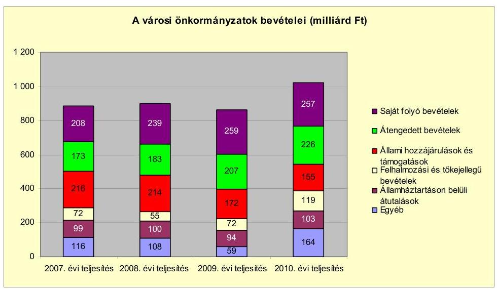

Az önkormányzati alrendszer pénzügyi helyzetértékelése során új elemzési módszereket alkalmazott az ellenőrzés. A költségvetési beszámoló adatok elemzése helyett az önkormányzat pénzügyi helyzetét a CLF módszerrel értékeljük, amelynek lényegét és számításának módszerét a jelentés 2. pontjában, és a jelentés 2. számú mellékletében ismertetjük részletesen.

Az új módszereken alapuló helyzetértékelés fontosságát az adja, hogy a helyi önkormányzatok bruttó adósságállománya ${ }^{2}$ a 2010. évi költségvetési beszámolók alapján 1248 milliárd Ft-ot tett ki. Ezen belül a 304 város adóssága 383 milliárd Ft volt, amely az önkormányzati alrendszer teljes adósságállományának 30,7 %-át jelentette ${ }^{3}$.

A mérlegben kimutatott bruttó adósságállomány mellett az önkormányzatok számára az eszközállomány műszaki állapotának megőrzése is előbb-utóbb pénzügyi kötelezettséget jelent. Az elhasználódott eszközök pótlására forrást biztosító amortizációs (felújítási) alap képzésének ${ }^{4}$ elmaradása maga után vonhatja a feladatellátást kiszolgáló tárgyi eszközök állagának erőteljes romlását. Emellett a 2007-2013-as időszakra meghirdetett, vissza nem térítendő EU-s fejlesztési forrásokhoz való hozzájutás lehetősége felerősítette az önkormányzati alrendszer fejlesztési igényeit, amelyek a felhalmozási költségvetési hiány fo-

[^0]
[^0]:    ${ }^{2}$ Az önkormányzati mérlegbeszámolókból számított bruttó adósságállomány 2010. év végi összege

 magában foglalja a fejlesztési és a működési célú kötvénykibocsátások, a beruházási és fejlesztési hitelek, a működési célú hosszú lejáratú hitelek, a rövid lejáratú hitelek, váltótartozások miatti kötelezettségek teljes (2011-ben, illetve az azt követő években esedékes) állományát. Az önkormányzatok 2007. év végi mérleg szerinti adósságállománya 692 milliárd Ft volt.
    ${ }^{3}$ A fővárosi és a kerületi önkormányzatok adósságának figyelmen kívül hagyásával számított 977 milliárd Ft összegű bruttó adósságállományból a városok 39,2\%-kal részesedtek.
    ${ }^{4}$ Erre a jelenlegi szabályozási környezetben nem kötelezi előírás az önkormányzatokat.

---

lyamatos emelkedésén túl - az előírt jövőbeni fenntartási kötelezettség miatt tovább terhelhetik az önkormányzatok költségvetését ${ }^{5}$.

Az ÁSZ a 2011. évi ellenőrzési tervében 43. számú, az Önkormányzatok gazdálkodási rendszerének ellenőrzése részeként áttekinti, és elemzi az önkormányzatok pénzügyi helyzetét. A gazdálkodás szabályszerűségét az ÁSZ az előző évek során ebben az önkormányzati körben is ellenőrizte. Jelen vizsgálatunk a tett javaslataink pénzügyi helyzetet érintő pontjainak hasznosítására utóellenőrzés jelleggel tér ki.

Az ellenőrzés megállapításait az Önkormányzat által kitöltött - teljességi nyilatkozattal megerősített - 27 tanúsítványon szolgáltatott adatokra alapoztuk. Ellenőrzési bizonyítékként használtuk fel továbbá:

- a képviselő-testületi és bizottsági előterjesztéseket, a döntés-előkészítés során készített dokumentumokat;
- a kötelezettségvállalások dokumentumait;
- a pénzügyi-számviteli nyilvántartásokat;
- az éves költségvetési beszámolókat;
- a költségvetési és zárszámadási rendeleteket.

Az ellenőrzés a 2007. január 1. - 2011. június 30. közötti időszakot öleli fel. A pénzintézeti kötelezettségek állományának vizsgálatakor az ellenőrzött időszak 2006. december 31. - 2011. június 30. közötti időszakra terjedt ki.

Az ellenőrzés során vizsgáltunk minden olyan körülményt és adatot, amely a program végrehajtásához kapcsolódott és a pénzügyi helyzet alakulására hatást gyakorló releváns tények és folyamatok feltárásához szükségessé vált.

# Az ellenőrzés célja annak értékelése volt, hogy: 

- a vizsgált időszakban a kötelező- és önként vállalt feladatok ellátását biztosító szervezeti keretekben, a feladatellátás módjában bekövetkezett változások milyen hatást gyakoroltak az Önkormányzat pénzügyi helyzetének alakulására;
- az Önkormányzat pénzügyi - ezen belül működési és felhalmozási - egyensúlya mely tényezők hatására miként változott, és az Önkormányzat milyen intézkedéseket tett a pénzügyi egyensúly javítása érdekében;

[^0]
[^0]:    ${ }^{5}$ Az Állami Számvevőszék 2011. júniusában közzétett 1108. számú, a helyi önkormányzatok fejlesztési célú támogatási rendszerének ellenőrzéséről szóló jelentésében feltárta a fejlesztési folyamatok problémáit. A helyi önkormányzatok elsősorban azokat a fejlesztéseket valósították meg, amelyekhez támogatást lehetett igényelni. A fejlesztési célok közül a magasabb támogatás intenzitású pályázatokat részesítették előnyben. A fejlesztéssel megvalósuló létesítmények jövőbeli üzemeltetésének várható ráfordításait az önkormányzatok 71,9\%-a nem mérte fel.

---

- a költségvetési kiadások finanszírozása érdekében vállalt pénzintézeti kötelezettségek hogyan alakultak, továbbá milyen kötelezettségek fennállása befolyásolja az Önkormányzat jövőbeli pénzügyi helyzetét;
- hasznosultak-e a gazdálkodási rendszer korábbi ellenőrzése során a pénzügyi egyensúly javítására az ÁSZ által tett szabályszerűségi és célszerűségi javaslatok.

Az ellenőrzés típusa: szabályszerűségi vizsgálat.
A vizsgálat jogszabályi alapját az Állami Számvevőszékről szóló 2011. évi LXVI. törvény 1. §. (3), 5. § (2)-(6) bekezdései, továbbá az Áht. 120/A. § (1) bekezdése előírásai képezik.

Bátonyterenye város Nógrád megye keleti részén található, az észak-magyarországi régióban. A város a bátonyterenyei statisztikai kistérség központja, egyben legnépesebb települése, lakosainak száma 2011. január 1-jén 12826 fő volt.

Az Önkormányzat a 2010. évben 3068 millió Ft költségvetési bevételt és 3031 millió Ft költségvetési kiadást teljesített. A 2011. évi költségvetésének bevételi főösszege 3190 millió Ft, kiadási főösszege 3597 millió Ft volt.

A 2010. évi gazdálkodásról készített beszámoló ingatlanvagyon kimutatása alapján 5851,0 millió Ft nettó értékű törzsvagyonnal és 673,0 millió Ft forgalomképes vagyonnal rendelkezett.

---

# I. ÖSSZEGZŐ MEGÁLLAPÍTÁSOK, KÖVETKEZTETÉSEK, JAVASLATOK 

Az Önkormányzat - adatszolgáltatása szerint - a 2010. évi működési kiadásaiból ${ }^{6}$ (1287,0 millió Ft-ból) 1139,8 millió Ft-ot (88,6\%-ot) a kötelező, 147,2 millió Ft-ot (11,4\%-ot) az önként vállalt feladatok ellátására fordított. A kötelező és önként vállalt feladatokról az Önkormányzat az SzMSz-ében rendelkezett. Önként vállalt feladatnak sorolta be a sportlétesítmények fenntartásának és fejlesztésének támogatását, önkéntes tűzoltóság működtetését, a városi piac üzemeltetését, a helyi közszolgáltatási műsorszolgáltatás támogatását, valamint az önkormányzati tulajdonú lakások, nem lakás célú helyiségek bérbeadását, civil szervezetek támogatását.
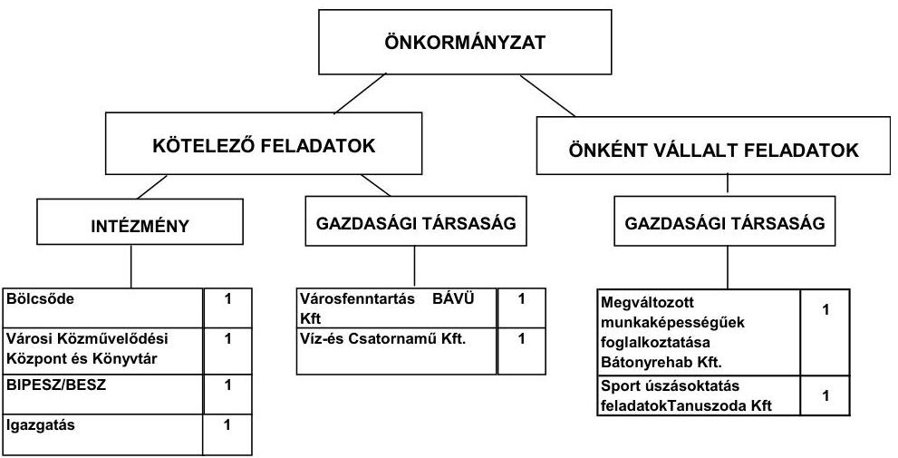

Az Önkormányzat feladatait négy költségvetési szerv és kettő kizárólagos, valamint kettő többségi önkormányzati tulajdonú gazdasági társaság, továbbá vállalkozó háziorvosok, valamint a Többcélú társulás útján látta el. A 2008-2011. év I. féléve között a Képviselő-testület feladatok átadásáról, továbbá intézmény-átszervezésekről döntött. A feladatátadások és az intézményátszervezések következtében a költségvetési intézmények száma hárommal, a feladatellátás telephelyeinek száma a 2006. december 31-ei 22-ről a 2011. év I. félév végére 10-re csökkent. A 2008. évben a Többcélú társulásnak két önállóan működő közoktatási intézményt, valamint a szociális ellátás feladatait átadta. A feladatátadás miatt a 2008. évben megszüntette az önállóan működő szociális intézményt. A közoktatási intézmények és a szociális feladatok átadásának, valamint a szociális intézmény megszüntetésének nem volt hatása a pénzügyi egyensúlyra, 62,4 millió Ft bevételnövekedést és 57,6 millió Ft kiadásnövekedést jelentett az Önkormányzat adatszolgáltatása

[^0]
[^0]:    ${ }^{6}$ Az Önkormányzat 2010. évi működési kiadása 1189,6 millió Ft-tal alacsonyabb a jelentés 2. számú mellékletében szerepelő folyó kiadásoknál (2057,1 millió Ft-nál). Az eltérést az államháztartáson belülre átadott 277,5 millió Ft, a transzferkiadások 864,0 millió Ft és a kamatkiadások 48,1 millió Ft összege okozza.

---

szerint. Az Önkormányzatnál a 2009. évben az orvosi ügyeleti ellátás gazdasági társaságnak, valamint az egészségügyi laboratórium működtetése kórház részére történő átadásának pénzügyi hatása - az Önkormányzat adatszolgáltatása szerint - 24,3 millió Ft kiadáscsökkenés és 19,4 millió Ft bevételcsökkenés volt. Az intézményi gazdálkodási feladatok átszervezése a vizsgált időszakban összességében 95,4 millió Ft kiadási megtakarítást és 95,4 millió Ft bevételcsökkenést eredményezett az Önkormányzat adatszolgáltatása szerint.

A gazdasági társaságok az Önkormányzat önként vállalt feladatainak ellátásában a megváltozott munkaképességűek foglalkoztatása és a sportlétesítmény működtetése területén kaptak szerepet. Az Önkormányzat kötelező feladatainak ellátásában részt vett kettő többségi tulajdonú önkormányzati gazdasági társaság is, amelyek víz-, csatorna-szolgáltatási, valamint városfenntartási, és hulladékkezelési közszolgáltatást nyújtottak. Egyikük a városgazdálkodás mellett végezte az Önkormányzat önként vállalt lakás- és helyiséggazdálkodási feladatát is. A 2008-2010. években az Önkormányzat kizárólagos önkormányzati tulajdonú gazdasági társaságainak átszervezéséről döntött. A 2008. évben összevonta két - a lakásgazdálkodási és a városgazdálkodási feladatokat ellátó - kizárólagos tulajdonú gazdasági társaságát. Megszüntette - feladatainak átadása nélkül - 2009-ben egy építőipari gazdasági társaságát és 2010-ben egy foglalkoztatási célú gazdasági társaságát. Az Önkormányzat feladatainak ellátásában részt vett további egy - nem az Önkormányzat tulajdonában lévő - gazdasági társaság, amelynek a helyi tömegközlekedés közszolgáltatójaként 2007-2010 között az Önkormányzat 15,9 millió Ft működési célú pénzeszközt adott át. Az önkormányzati feladatok ellátásában résztvevő gazdasági társaságok az ellenőrzött időszakban összesen 185,6 millió Ft működési célú pénzeszközátadásban részesültek az Önkormányzattól. A kizárólagos önkormányzati tulajdonú gazdasági társaságoknak, így a Tanuszoda Kft. sportlétesítmény fenntartásához 159,7 millió Ft és a 2008. január 1-jétől felszámolt Bátonyterenyei Foglalkoztatási Kht. megváltozott munkaképességűek foglalkoztatásához 10,0 millió Ft működési célú pénzeszközt adott át az Önkormányzat. A gazdasági társaságok részére az Önkormányzat szerződésben meghatározott feladatokra adta át a pénzeszközöket, amelyek célszerinti felhasználását ellenőrizte. A két kizárólagos önkormányzati tulajdonban lévő társaság közül a Tanuszoda Kft., valamint egy többségi tulajdonú gazdasági társaság - a BÁVÜ Kft. - pénzügyi egyensúlyi helyzete a vizsgált időszakban nem volt stabil. A sportlétesítményt üzemeltető Tanuszoda Kft. a 2007-2010. években veszteséggel gazdálkodott, a városüzemeltetést végző BÁVÜ Kft. mérleg szerinti kötelezettségei a 2008-2010. években meghaladták a saját tőke tízszeresét.

---

Az egyes közfeladatok a 2007. és a 2010. évi működési kiadásai finanszírozási forrásait ágazatonként az alábbi ábra szemlélteti:
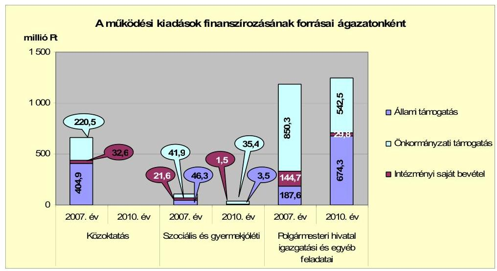

A közoktatási ágazat kettő - egy óvodai és egy általános iskolai - intézményének fenntartását a 2008. évben az Önkormányzat átadta a Többcélú társulásnak, ezért finanszírozása 2009-től a Polgármesteri hivatal feladatai között szerepelt. A szociális és gyermekjóléti ágazat a 2007. évben működő két intézménye - a bölcsőde és az Időskorúak Gondozóháza - közül az Időskorúak Gondozóházának működtetését az Önkormányzat 2009. január 1-jétől átadta a Többcélú társulásnak. A szociális és gyermekjóléti ágazat kiadásait a 2009. évtől a bölcsőde fenntartása jelentette.

A Polgármesteri hivatal igazgatási és egyéb feladatainak működési kiadásai a 2010. évben (1246,6 millió Ft) az intézményi átszervezések következtében 0,6\%-kal (7,8 millió Ft-tal) alacsonyabbak voltak a 2007-2009. évek 1254,4 millió Ft átlagánál. A feladatok kiadásainak finanszírozásán belül a feladatellátás módjának változása következtében több mint háromszorosára (486,7 millió Ft-tal) növekedett az állami támogatás összege a 2007. év értékéhez képest. Az önkormányzati támogatás összege az intézményátszervezések következményeként a 2010. évre 307,8 millió Ft-tal (136,8\%-kal) csökkent a 2007. évhez viszonyítva. Az intézményi saját bevételek 114,9 millió Ft-tal (79,4\%-kal) maradtak el a 2007. évi összegtől az átadott feladatok bevételeinek elmaradása miatt.

Az Önkormányzatnál a 2008-2009. években a kötelező és önként vállalt feladatok ellátását biztosító szervezeti keretekben, a feladatellátás módjában bekövetkezett változások összességében 1028,7 millió Ft kiadási megtakarítást és 1023,8 millió Ft bevételkiesést jelentettek, amely a pénzügyi egyensúlyi helyzet alakulását jelentősen nem befolyásolta. A gazdasági társaságok összevonása, illetve megszüntetése az Önkormányzat pénzügyi egyensúlyi helyzetét nem befolyásolta, mivel a lakásgazdálkodási tevékenység veszteségét a gazdasági társaságok összevonása nem szüntette meg. A Bátonyterenyei Lakásgazdálkodási Nonprofit Kft. az összevonást megelőzően a 2007. évben 14,7 millió Ft veszteséggel gazdálkodott.

---

A működési jövedelem a 2007. évben - a 154,8 millió Ft ÖNHIKI és az Önkormányzat működőképességének megőrzését szolgáló kiegészítő támogatás hatására - pozitív, 2008-2010 között csökkent, negatív értékű volt. Az Önkormányzat működési jövedelmét, pénzügyi kapacitását és tőketörlesztését a 2007-2010. években az alábbi ábra mutatja be:
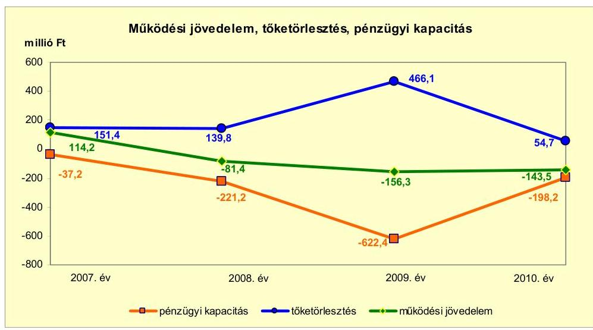

A működési jövedelem a 2007. évi 114,2 millió Ft-ról a 2008. évi -81,4 millió Ft-ra történt 195,6 millió Ft összegű csökkenésének oka, hogy a költségvetési támogatás 355,2 millió Ft-os növekedése nem ellensúlyozta az átengedett bevételek 438,1 millió Ft-os és a saját bevételek 265,5 millió Ft-os csökkenését. A 2007. évről a 2008. évre az állami támogatási rendszer átalakulása miatt a költségvetési támogatás emelkedett, az átengedett szja mérséklődött, míg a saját bevételek közül az áfa visszatérülések csökkenése volt a jelentős. A 2009. évben - a központi forráskivonás és a közoktatási és szociális feladatátadások következtében - 321,0 millió Ft-tal csökkent a költségvetési támogatás az előző évhez képest. A folyó bevételek 2010-ben (1913,6 millió Ft) az előző évhez viszonyítva 115,9 millió Ft-tal emelkedtek, a saját bevételek 30,4 millió Ft-os csökkenése és a költségvetési támogatás 150,6 millió Ft, valamint az átengedett bevételek 10,5 millió Ft összegű növekedése mellett. A 2010. évi folyó kiadások (2057,1 millió Ft) előző
 évhez viszonyított 103,1 millió Ft-os - a transzferkiadások növekedéséből adódó - emelkedése mellett a működési jövedelem értéke negatív maradt. Az Önkormányzat pénzügyi kapacitása a 2007-2010. években negatív volt. A nettó működési jövedelem a 2007. évről a 2008. évre történő 184,0 millió Ft értékű csökkenését a működési jövedelem 195,6 millió Ft-os és a tőketörlesztés 11,6 millió Ft-os mérséklődése okozta. A működési jövedelem 2008-ról 2009-re 74,9 millió Ft-tal tovább esett, a tőketörlesztés 326,3 millió Ft-tal emelkedett, a nettó működési jövedelem 401,2 millió Ft-tal csökkent. A 2010. évre a nettó működési jövedelem 424,2 millió Ft-tal emelkedett a tőketörlesztés 411,4 millió Ft-os mérséklődése és a működési jövedelem 12,8 millió Ft-os emelkedése miatt.

A felhalmozási költségvetés egyenlege a vizsgált időszakban - a 2007. év kivételével - pozitív volt, az összege az egyes beruházások készültségi fokának és az utólagos finanszírozás ütemének függvényében változott. A felhalmozási költségvetés bevételei (537,3 millió Ft) és kiadásai (829,8 millió Ft) a 2007. évben - a szennyvízelvezetés-építés és a városrehabilitációs programok megvalósítása következtében - kiemelkedőek voltak. A vizsgált időszakban keletkezett 199,8 millió Ft felhalmozási forráshiányra az egyes EU-s projektek finanszírozásához felvett támogatásmegelőlegezési hitelek 2007. elején meglévő állománya (100,0 millió Ft) és a 2007. évi nyitó pénzkészlet (142,0 millió Ft) nyújtott fedezetet.

Az Önkormányzat folyó bevétele a 2008-2009. években - a költségvetési támogatás és az egyéb saját bevételek csökkenése következtében - alacsonyabb volt az előző évinél. Az Önkormányzat folyó bevétele 2010-ben (1913,6 millió Ft) - a költségvetési támogatás, a helyben maradó szja, a helyi adóbevételek és az egyéb saját bevételek alacsonyabb összegei következtében -9,9%-kal (209,4 millió Ft-tal) volt kevesebb, mint a 2007-2009. évek átlaga (2123,0 millió Ft). Az Önkormányzat a működési forráshiány mérséklésére a 2007. évben 54,8 millió Ft ÖNHIKI, valamint a vizsgált időszak minden évében összesen 417,6 millió Ft a működésképtelen helyi önkormányzatok egyéb támogatásában részesült. A vizsgált időszakban az Önkormányzat helyi iparűzési adót és idegenforgalmi adót vetett ki. A helyi adók mértéke a vizsgált időszakban nem változott. Az Önkormányzat saját folyó bevételének a 2010. évben 10,3%-át (197,6 millió Ft-ot) tették ki a helyi adók és hozzá kapcsolódó bírságok. A helyi adóbevétele a 2007-2009. évek (278,0 millió Ft) átlagához képest 40,2 millió Ft-tal csökkent a 2010. évre (237,8 millió Ft-ra) a vállalkozások számának és eredményének visszaesése miatt.

Az Önkormányzat felhalmozási bevételeiből az egyéb saját tőkebevételek az önkormányzati lakások, helyiségek értékesítéséből, a támogatási kölcsönök visszatérüléséből származó bevételt tartalmazták. A 2008-ban realizált 111,0 millió Ft kétszerese volt a 2007. évi (49,7 millió Ft) teljesített bevételeknek. A növekedés fő oka, hogy a 2008. évben földterületek eladásából és az önkormányzati lakások értékesítése során 37,4 millió Ft, a támogatási kölcsönök visszatérüléséből 72,6 millió Ft bevételt realizáltak. A 2009. évben 203,3 millió Ft bevétel realizálódott, amelynek több mint fele (124,0 millió Ft) az önkormányzati lakások értékesítéséből származott.

Az Önkormányzat teljesített folyó kiadása a 2010. évben (2057,1 millió Ft) a közoktatási és szociális feladatátadások és kiadáscsökkentő intézkedések következtében - 4,9%-kal (107,1 millió Ft-tal) volt alacsonyabb a 2007-2009. évek átlagánál (2164,2 millió Ft-nál). A folyó kiadások a 2011. év I. félévi adatokat figyelembe véve a 2007-2009. évek átlagához mért 47,3%-os (341,1 millió Ft időarányos) csökkenést mutattak. A személyi juttatások teljesített kiadásai a 2010. évben 45,8%-kal (310,0 millió Ft-tal) maradtak el a 2007-2009. évek átlagos 676,8 millió Ft-os kiadásához viszonyítva. A dologi és egyéb folyó kiadások a vizsgált időszakban évente csökkentek, a 2010. évben - a feladatátadások és kiadáscsökkentő intézkedések következtében - 149,7 millió Ft-tal (27,3%-kal) voltak alacsonyabbak az előző évek (547,6 millió Ft-os) átlagánál.

A pénzügyi egyensúlyi helyzet alakulását jelentősen befolyásolta az Önkormányzat elmúlt időszaki fejlesztési tevékenysége. A 2007-2010. években megvalósított, 2010. december 31-ig befejezett felújítások és beruházások 2007-2010. évek között teljesített költségvetési kiadása 1260,6 millió Ft, a befejezett fejlesztések teljes bekerülési költsége (3231,6 millió Ft) 39,0%-a volt. A befejezett felújításokra és beruházásokra 2006. december 31-ig 1971,0 millió Ft kiadást teljesítettek. A befejezett fejlesztések teljes bekerülési költségének (3231,6 millió Ft-nak) forrásmegoszlása 969,2 millió Ft (30,0%) EU-s és 1486,0 millió Ft (46,0%) hazai támogatás, 776,4 millió Ft (24,0%) saját bevétel volt. Az Önkormányzat 2010. december 31-én folyamatban lévő felújítási és beruházási feladatainak várható teljes bekerülési költsége 1428,4 millió Ft, a 2010. december 31-éig teljesített kiadás 446,5 millió Ft volt. A kiadások finanszírozását 2010. december 31-ig teljes egészében EU-s támogatás biztosította. Az EU-s támogatással megvalósult fejlesztésekhez a 2007. év elején a támogatásmegelőlegezési hitelállomány összege 100,0 millió Ft volt. A 2007. évben 51,4 millió Ft, 2008-ban 30,0 millió Ft és 2010-ben 48,7 millió Ft támogatásmegelőlegezési hitelt vettek igénybe a fejlesztési feladatok megvalósításához. Az igénybevett támogatásmegelőlegezési hiteleket minden évben a hitelfelvételeket követő negyedév során visszafizették.

A 2010. december 31-én fennálló, 2010. évet követő felhalmozási kötelezettségvállalásokat és azok forrásösszetételét az alábbi ábra mutatja be:
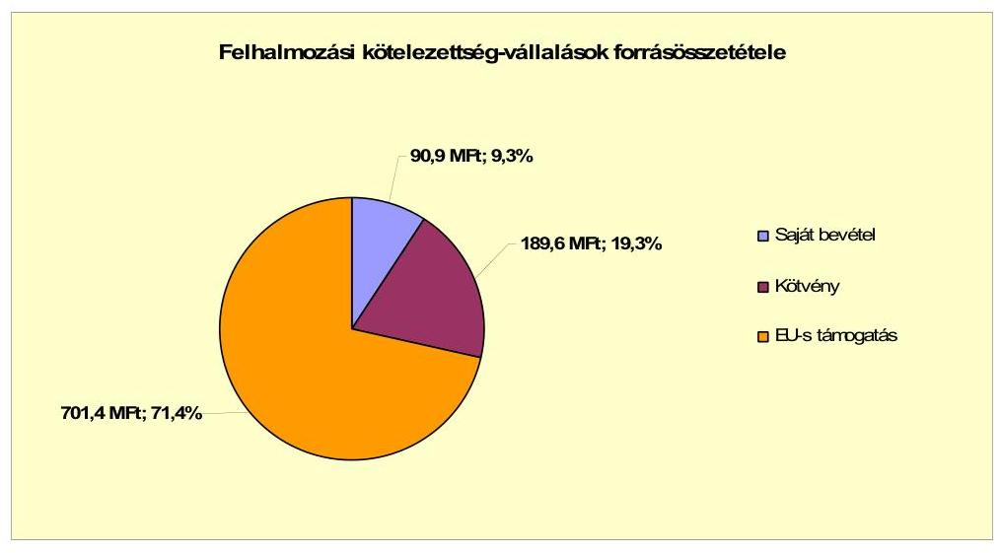

Az Önkormányzatnak a 2011. év I. félévének végéig elbírálás alatt lévő, pályázati forrásból tervezett fejlesztési feladata nem volt.

Az Önkormányzat könyvviteli mérleg szerinti pénzintézeti kötelezettsége a 2006. december 31-ről a 2011. év I. félév végére - az esedékes kamatfizetési kötelezettség nélkül - 202,7 millió Ft-ról 1095,9 millió Ft-ra nőtt. A fennálló pénzintézetekkel szembeni kötelezettségek az önkormányzati működéshez forrást biztosító változó, növekvő összegű, rövid lejáratú hitelek felvételéből és kötvénykibocsátásból keletkeztek. Az Önkormányzat nem vett fel hosszú lejáratú hitelt, azonban fejlesztési célokra 2011-ben euro alapú kötvényt bocsátott ki. A fejlesztési célú kötvényt 2011. február 3-án, 1571,8 ezer euro (kibocsátáskori árfolyamon 431,0 millió Ft) összegben 20 éves futamidővel, másfél év türelmi idővel bocsátották ki. A tőketörlesztés a 2012. év III. negyedévében 7,3 ezer euró összeggel kezdődik. A kötelezettségvállalásból származó forrás felhasználási céljait a Képviselő-testület döntésében meghatározta, azonban az előterjesztések a visszafizetés forrását, valamint a teljes futamidőre szóló kamat- és tőkefizetési kötelezettségeket, továbbá az árfolyam-, valamint a kamatkockázat értékelését nem tartalmazták. A kibocsátásból származó pénzeszközöket a pénzintézet által vezetett óvadéki számlán helyezték el, amelyről a pénzintézet jóváhagyása nélkül kifizetés nem teljesíthető. A kötvény kibocsátásából származó forrás korlátozottan, a kibocsátási tájékoztatóban meghatározott fejlesztési célokra használható fel. A kötvénykibocsátásból származó bevételből a 2011. év I. félévében összesen 157,2 millió Ft összeget használtak fel. A kötvényből származó bevételnek 2011. június 30-án 273,8 millió Ft összegű maradványa volt, amit a 2011-es költségvetés fejlesztési feladataira szerződéssel, illetve képviselő-testületi döntéssel megterheltek.

Az Önkormányzat 2007-2011. június 30. közötti időszakban gazdálkodásának likviditása, fizetőképességének megőrzése érdekében folyamatosan növekvő mértékben folyószámlahitelt, valamint munkabér-megelőlegezési hitelt, továbbá a támogatások megelőlegezésére szolgáló hitelt vett igénybe. Az Önkormányzat által igénybevett folyószámla- és munkabér-megelőlegezési hitel jellemző adatait 2007-2011. év első félévében az alábbi táblázat foglalja össze:

| Megnevezés | 2007. év | 2008. év | 2009. év | 2010. év* | 2011. év I.   félév* |
| :-- | :--: | :--: | :--: | :--: | :--: |
| Folyószámlahitel |  |  |  |  |  |
| Keretösszeg január 1-án (millió Ft-ban) | 200,0 | 350,0 | 400,0 | 480,0 | 480,0 |
| Átlagos napi állomány (millió Ft-ban) | 255,6 | 346,0 | 429,4 | 474,4 | 475,0 |
| Folyószámlahitellel zárt napok száma (nap) | 365 | 366 | 365 | 365 | 181 |
| Egyenleg (állomány) | 345,9 | 336,1 | 470,6 | 490,2 | 457,9 |
| Munkabér-megelőlegezési hitel |  |  |  |  |  |
| Keretösszeg január 1-án (millió Ft-ban) | 130,0 | 130,0 | 110,0 | 110,0 | 110,0 |
| Átlagos napi állomány (millió Ft-ban) | 104,1 | 130,0 | 119,3 | 110,0 | 110,0 |
| Munkabér-megelőlegezési hitellel zárt napok száma (nap) | 252 | 366 | 365 | 365 | 181 |
| Egyenleg (állomány) | 0,0 | 130,0 | 110,0 | 110,0 | 110,0 |

* A folyószámlahitel-keretet 2010. április 2-től 250 millió Ft-ra, majd 2011. március 1-jétől 300 millió Ft-ra emelték.

Az Önkormányzat a 2007-2011. év I. félév közötti időszakban költségvetési elszámolási számláját az év minden napján folyószámlahitellel zárta. A folyószámlahitel átlagos napi állománya folyamatosan növekedett, 2007-ben 255,6 millió Ft, 2008-ban 346,0 millió Ft, 2009-ben 429,4 millió Ft, 2010-ben 474,4 millió Ft, a 2011. év I. félévben 475,0 millió Ft volt. Az Önkormányzatnak a 2007-2011. év I. félév közötti időszakban a folyószámlahitel 174,2 millió Ft, a munkabér-megelőlegezési hitel 47,5 millió Ft, a támogatásmegelőlegezési hitel 15,3 millió Ft kamatkiadást jelentett.

Az Önkormányzat szállítói tartozásállománya 2011. június 30-án 186,3 millió Ft volt. A lejárt állomány 2011. június 30-án 95,9 millió Ft, a teljes szállítói állomány 51,5%-a volt. A 90 napon túli 46,9 millió Ft összegű szállítói tartozások a lejárt állomány 49,9%-át jelentették. A 61-90 nap közötti 17,5 millió Ft állomány a lejárt állomány 9,4%-át tette ki. Egyéb kiadáselmaradások a vizsgált időszakban minden évben, összesen 331,8 millió Ft összegben fordultak elő. Az Önkormányzatnak 2011. június 30-án egyéb kiadáselmaradásból fennálló tartozása nem volt.

Az Önkormányzat a 2007-2011. év I. féléve közötti időszakban hat esetben vállalt készfizető kezességet, összesen 516,0 millió Ft összegben. A kezességvállalások a kizárólagos önkormányzati tulajdonú Tanuszoda Kft. és a többségi önkormányzati tulajdonú BÁVÜ Kft. összesen hat pénzintézeti kötelezettségvállalásához kapcsolódtak. Az Önkormányzat által vállalt kezességek állománya - az ellenőrzött időszak előtt vállalt kezességek állományával együtt - 2011. június 30-án 622,5 millió Ft összegben állt fenn, teljesített fizetési kötelezettsége ezekből a helyszíni ellenőrzés lezárásáig nem keletkezett. Az Önkormányzat az áttekintett időszakban a vállalt kezességek tekintetében az adósságot keletkeztető kötelezettségvállalás Ötv. szerinti felső határát nem lépte túl. Az Önkormányzat egy kizárólagos, nonprofit gazdasági társasága számára - Tanuszoda Kft. - a 2008. évben összesen 52,0 millió Ft tagi kölcsönt nyújtott. Az Önkormányzat a 2007-2008. években összesen nyolc egyéni vállalkozó számára együttesen 3,5 millió Ft vállalkozásfejlesztési kölcsönt nyújtott, a vállalkozók közül heten a kölcsönöket 2011. év II. negyedév végéig visszafizették, egy 0,5 millió Ft-os kölcsön visszafizetési határideje 2012. január 1-jén jár le.

Az Önkormányzat kötelezettségeinek 2010. december 31-i, valamint 2011. június 30-ai állományát és várható alakulását a kötelezettségek lejáratáig az alábbi táblázat szemlélteti:

| Megnevezés | Állomány 2010. december 31-én |  | Állomány 2011. június 30-án |  | Várható kötelezettség a 2011-2013. években |  | Várható kötelezettség a 2014. évtől |

 |
| :--: | :--: | :--: | :--: | :--: | :--: | :--: | :--: | :--: |
|  | HUF-ban (millió Ft-ban) |  | HUF-ban (millió Ftban) | Dávszában (összegy, ezer, aurában) | Dávszában (összegy, ezer, aurában) | HUF-ban (millió Ftban) | Dávszában (összegy, ezer, aurában) | HUF-ban (millió Ftban) | Dávszában (összegy, ezer, aurában) |
| Pénzintézeti kötelezettségek (tőke+kamat) |  |  |  |  |  |  |  |  |
| Polószámlhitel |  | 505,7 | 467,8 |  |  | 467,8 |  |  |  |
| Murex-hitel |  | 122,8 | 71,0 |  |  | 71,0 |  |  |  |
| Átmeneti megállapodás hitel |  | 51,1 | 0,0 |  |  | 0,0 |  |  |  |
| Támogatásmegelőlegezési hitel (Öndi út jántai) |  | 12,0 | 0,0 |  |  | 0,0 |  |  |  |
| Támogatásmegelőlegezési hitel (Egészséghöz) |  | 0,0 | 139,8 |  |  | 139,8 |  |  |  |
| Pénzintézeti kötelezettségek összesen HUF-ban: |  | 686,4 | 678,6 |  |  | 678,6 |  |  |  |
| Átvételi jegy |  |  |  |  |  |  |  |  |  |
| Tőkefizetési kötelezettség |  |  |  | 1571,8 | EUR |  | 56,4 |  | 1513,5 |
| Kamatfizetési kötelezettség |  |  |  | 62,7 | EUR |  | 262,4 |  | 824,8 |
| Pénzintézeti kötelezettségek összesen EUR-ban: |  |  |  | 1634,5 | EUR |  | 318,8 |  | 2338,2 |
| Biztosítékok |  |  |  |  |  |  |  |  |  |
| Részvétel |  | 594,5 | 622,5 |  |  |  |  |  |  |
| Biztosítékok összesen: |  | 594,5 | 622,5 |  |  |  |  |  |  |
| Lízing kötelezettségek |  |  | 1,9 |  |  | 1,8 |  | 0,1 |  |
| Szállítói tartozás |  | 303,1 | 186,3 |  |  | 186,3 |  |  |  |
| Egyéb kiadás elmaradás |  | 101,4 | 0,0 |  |  | 0,0 |  |  |  |
| Egyéb kötelezettségek |  | 21,0 | 60,0 |  |  | 60,0 |  |  |  |

A várható pénzintézeti kötelezettségek teljesítésére figyelembe vehető 101,2 millió Ft mérlegben kimutatott követelésállomány és 276,2 millió Ft értékű befektetett pénzügyi eszközállomány (részesedések), valamint a forgalomképes ingatlanvagyon. Az eszközállomány értékesítésének (illetve a követelések behajtásának) lehetőségei, valamint az eszközök egyedileg megállapítható forgalmi értéke a könyvszerinti értékhez viszonyítva - a piaci környezet változásától függően - módosulhatnak, ezért az értékesítésből származó bevételek mértéke bizonytalan. Az Önkormányzat pénzintézeti kötelezettségeinek finanszírozására a negatív működési jövedelem nem biztosít fedezetet.

Az Önkormányzat kizárólagos és többségi tulajdonú gazdasági társaságai kötelezettségeinek 2010. december 31-én és 2011. június 30-án fennálló állományát és várható alakulását a kötelezettségek lejáratáig a következő táblázat mutatja be:

---

| Megnevezés | Állomány   2010. december 31-án | Állomány   2011. június 30-án | Várható kötelezettség a 2011-2013. években | Várható kötelezettség a 2014. évtől |
| :--: | :--: | :--: | :--: | :--: |
|  | HUF-ban (millió Ft-ban) | HUF-ban (millió Ft-ban) | HUF-ban (millió Ftban) | HUF-ban (millió Ftban) |
| Polószámlhitel (hasonló társaság összesen) |  |  |  |  |
| Fennálló tőketartozás | 142,0 | 144,0 | 144,0 |  |
| Esedékes kamatfizetési kötelezettség | 1,0 | 3,0 | 3,0 |  |
| Városgazdálkodási Kft. forgóeszközhitel |  |  |  |  |
| Fennálló tőketartozás | 29,5 | 26,5 | 18,0 | 11,5 |
| Esedékes kamatfizetési kötelezettség | 0,4 | 0,4 | 10,3 | 2,6 |
| Tanuszoda MFB fejlesztési hitel |  |  |  |  |
| Fennálló tőketartozás | 295,8 | 295,8 | 0,0 | 295,8 |
| -abból lejárt tőketartozás | 36,0 | 55,0 | 0,0 | 0,0 |
| Esedékes kamatfizetési kötelezettség | 0,0 | 0,0 | 71,7 | 48,9 |
| Elmaradt kamatfizetés | 11,8 | 23,8 | 0,0 | 0,0 |
| Késedelmi kamat | 0,0 | 3,0 | 0,0 | 0,0 |
| Pénzintézeti kötelezettségek összesen: | 480,5 | 496,5 | 247,0 | 359,0 |
| Szállítói tartozás | 61,0 | 95,0 | 95,0 |  |

A kizárólagos és többségi tulajdonú gazdasági társaságoknak a 2011. június 30-án fennálló pénzintézetekkel szembeni kötelezettsége 496,5 millió Ft, szállítói tartozása 95,0 millió Ft, amelyből a gazdasági társaságok adatszolgáltatása szerint 0,5 millió Ft volt 90 napon túl lejárt szállítói állomány. A gazdasági társaságok pénzintézetekkel szembeni kötelezettségei pénzügyi kockázatot jelentenek az Önkormányzat számára.

Az Önkormányzat pénzügyi lehetőségének függvényében, hazai és EU-s pályázati források, továbbá fejlesztési célú kötvény kibocsátásával jelentős fejlesztéseket hajtott végre. Az Önkormányzat a 2007-2010. években a tárgyi eszközök után 892,9 millió Ft összegű értékcsökkenést mutatott ki. Felújításra és beruházásra 1394,4 millió Ft-ot fordított. Az Önkormányzat immateriális javainak és tárgyi eszközeinek összesített használhatósági foka a 2007. évi 87,0%-ról a 2010. évre 79,1%-ra csökkent. A tárgyi eszközök valamennyi csoportjában (ingatlanok, járművek, gépek, berendezések, felszerelések, üzemeltetésre átadott eszközök) csökkent az év végi nettó értéknek a bruttó értékhez viszonyított aránya.

Az Önkormányzat az ellenőrzött időszakban kiadási megtakarítást eredményező és bevételt növelő intézkedéseket tett. A 2007-2010. évek közötti intézkedések hatására 356,7 millió Ft bevételi többletet, továbbá 79,2 millió Ft kiadási megtakarítást mutatott ki az Önkormányzat. A 2011. évben 6,3 millió Ft bevételnövelést és 30,2 millió Ft kiadási megtakarítást terveztek. A kiadási megtakarítások teljes egésze az elrendelt álláshelyek megszüntetésének eredménye volt. A feladatátadásokkal összefüggő álláshely-csökkentő intézkedések 2007-2010 között önkormányzati szinten összesen 249 álláshely (valamennyi betöltött álláshely) megszüntetését jelentették. Az Önkormányzat 2008-ban közoktatási intézményeinek fenntartását átadta a kistérségi társulás részére. Az átadás 2008-ban 166 fővel csökkentette az Önkormányzat közoktatási ágazat álláshelyeinek számát, valamint a közalkalmazotti létszámot. A Polgármesteri hivatal engedélyezett létszáma, valamint az egyéb feladatok elvégzésére engedélyezett álláshelyek száma a közmunkaprogramok szervezésére létrehozott álláshelyekkel, illetve az alkalmazotti létszámmal, összesen kilenc fővel nőtt. Az Önkormányzat 2007. január 1-jei 367 fő létszámkerete 2010. december 31-re összességében 127 főre csökkent az önkormányzati feladatok mó-

---

dosulása miatt. A bevételnövelő intézkedések ingatlanok, eszközök értékesítéséhez, a helyi adóbevételek növeléséhez, valamint az intézményi térítési díjak emeléséhez kapcsolódtak. Az ingatlanok, eszközök értékesítése 354,0 millió Ft-tal (99,3%-kal), a helyi adóbevételek növelése (2009-től az idegenforgalmi adó bevezetése) 1,2 millió Ft-tal (0,3%-kal), az intézményi térítési díjak emelése 1,5 millió Ft-tal (0,4%-kal) járult hozzá a költségvetési bevételek növeléséhez az Önkormányzat adatszolgáltatása szerint. A Képviselő-testület 2011. október 5-én a 2012. költségvetési év bevételnövelő és kiadáscsökkentő intézkedéseinek előkészítése érdekében intézkedési terv kidolgozásáról döntött.

Az Önkormányzat gazdálkodási rendszerének 2007. évi ellenőrzése során az ÁSZ egy - a pénzügyi helyzet javításával összefüggő - célszerűségi javaslatot tett. A javaslat az Önkormányzat egy gazdasági társasága részére nyújtott kezességvállalás felülvizsgálatára vonatkozott. A javaslatot az intézkedési tervben, a felelős és a határidő meghatározásával szerepeltették. Az intézkedési tervben előírt határidőre a gazdasági társaság tevékenységének felülvizsgálatát nem végezték el.

# Az Önkormányzat pénzügyi egyensúlyi helyzetét összegezve a következők emelhetők ki: 

Bátonyterenye Város Önkormányzatának pénzügyi egyensúlyi helyzete rövid távon veszélyeztetett.

A folyó bevételek nem nyújtottak fedezetet a folyó kiadásokra és az adósságszolgálatra. Az Önkormányzat minden évben ÖNHIKI és az önkormányzatok működőképességének megőrzését szolgáló kiegészítő támogatásban részesült, és emellett önként vállalt feladatokat, valamint jelentős mértékű fejlesztéseket végzett. Működését az állandósult és növekvő összegű folyószámla-, valamint munkabérhitel igénybevételével tudta biztosítani.

Kockázatot jelent a hazai és EU-s támogatással megvalósuló beruházások előfinanszírozása, likviditási gondjai miatt támogatásmegelőlegezési hitelek időszakos igénybevételére szorul.

A lejárt szállítói állomány állandósult. Folyamatosan emelkedett a 60, illetve 90 napon túl lejárt szállítói tartozások állománya.

A két kizárólagos önkormányzati tulajdonban lévő társaság közül a Tanuszoda Kft., valamint egy többségi tulajdonú gazdasági társaság - a BÁVÚ Kft. - pénzügyi egyensúlyi helyzete a vizsgált időszakban nem volt stabil. A gazdasági társaságok szállítói- és hiteltartozásai az Önkormányzat számára helytállási kötelezettséget jelenthetnek.

Az Állami Számvevőszékről szóló 2011. évi LXVI. törvény 33. § (1) bekezdésében foglaltak értelmében a jelentésben foglalt megállapításokhoz kapcsolódó intézkedési tervet köteles az ellenőrzött szervezet vezetője összeállítani és azt a jelentés kézhezvételétől számított harminc napon belül az ÁSZ részére megküldeni. Amennyiben az intézkedési tervet határidőben nem küldi meg a szervezet, vagy az továbbra sem elfogadható, az ÁSZ elnöke a hivatkozott törvény 33. § (3) bekezdés a)-b) pontjaiban foglaltakat érvényesítheti.

---

# A 2011. június 30-i pénzügyi egyensúlyi helyzet alapján az ellenőrzés intézkedést igénylő megállapításai és javaslatai a következők: 

## a Polgármesternek

1. Az Önkormányzat pénzügyi egyensúlyi helyzete rövid távon veszélyeztetett. A működési jövedelem a 2007. évben - a 154,8 millió Ft ÖNHIKI és az önkormányzatok működőképességének megőrzését szolgáló kiegészítő támogatások összegei hatására - pozitív, 2008-2010 között csökkent, negatív értékű volt. A 2010. évben az Önkormányzat működési kiadásából 147,2 millió Ft-ot (11,4%-ot) az önként vállalt feladatok ellátására fordított. Működését az állandósult folyószámlahitel, valamint munkabérhitel igénybevételével tudta biztosítani.

Javaslat:
Az Önkormányzat pénzügyi egyensúlyának gyors helyreállítása és hosszú távú fenntarthatósága érdekében:
a) Tárja fel a további bevételszerző és kiadáscsökkentő lehetőségeket. Intézkedjen a bevételek növelésére, a kintlévőségek behajtására, a kiadások csökkentésére;
b) Terjesszen a Képviselő-testület elé reorganizációs programot a kedvezőtlen pénzügyi folyamatok megállítására, a pénzügyi egyensúlyi helyzet gyors stabilizálására;
c) Képezzen egyensúlyi tartalékot az adósságszolgálat teljesítése érdekében;
d) Tekintse át az önként vállalt feladatok finanszírozhatóságát a kötelező feladatellátás elsődlegességének biztosítása érdekében, mutassa be a Képviselő-testületnek a megoldás lehetőségeit, és szükség esetén a gazdasági program módosításának igényét;
e) Mutassa be a Képviselő-testületnek havonta legalább három évre kitekintően kötelezettségeinek finanszírozási forrásait.
2. A kötelezettségvállalásból származó forrás felhasználási céljait a Képviselő-testület döntésében meghatározta, azonban az előterjesztések a visszafizetés forrását, valamint a teljes futamidőre szóló kamat- és tőkefizetési kötelezettségeket, továbbá az árfolyam-, valamint a kamatkockázat értékelését nem tartalmazták.

Javaslat:
Az adósságot
 keletkeztető kötelezettségvállalásról szóló döntéskor:
a) Gondoskodjon, hogy a jövőben az adósságot keletkeztető kötelezettségvállalásokról szóló képviselő-testületi előterjesztések tételesen tartalmazzák a visszafizetés forrásait;
b) Mutassa be a Képviselő-testületnek a teljes futamidőre szóló kamat- és tőkefizetési kötelezettségeket, a jövőben várható árfolyam-, kamatkockázatot.

---

3. A 2007-2011. június 30. közötti időszakban az Önkormányzat folyamatosan növekvő mértékben vette igénybe a számlavezető bank által rendelkezésére bocsátott folyószámlahitel-keretet, amely állandósult, csökkenő mértékben a munkabérmegelőlegezésére szolgáló hitelkeretet, valamint esetenként, változó összegben a támogatások megelőlegezésére megnyitott hitelkeretet.

Javaslat:
Vizsgálja meg az állandósult folyószámla- és likvidhitel hosszú távú kötelezettséggé történő átalakításának jogi lehetőségét, és a Stabilitási törvény 10. §-ában előírt feltételek fennállása esetén kezdeményezze a Kormánynál ennek engedélyezését.
4. Az Önkormányzat szállítói tartozásállománya 2011. június 30-án 186,3 millió Ft volt. A lejárt állomány 2011. június 30-án 95,9 millió Ft (51,5\%) volt. A 90 napon túli 46,9 millió Ft összegű szállítói tartozások a lejárt állomány 49,9\%-át jelentették.

Javaslat:
Kezelje az Önkormányzat lejárt szállítói állományát, a szállítói kitettség és a jogszabályi következmények elkerülése érdekében.
5. A két kizárólagos önkormányzati tulajdonban lévő társaság közül a Tanuszoda Kft., valamint egy többségi tulajdonú gazdasági társaság - a BÁVÚ Kft. - pénzügyi egyensúlyi helyzete a vizsgált időszakban nem volt stabil. A sportlétesítményt üzemeltető Tanuszoda Kft. a 2007-2010. évek során veszteséggel gazdálkodott, a városüzemeltetést végző BÁVÚ Kft. mérleg szerinti kötelezettségei a 2008-2010. években meghaladták a saját tőke tízszeresét. Az Önkormányzat kizárólagos és többségi tulajdonú gazdasági társaságainak a 2011. június 30-án fennálló pénzintézeti kötelezettsége 496,5 millió Ft, szállítói tartozása 95,0 millió Ft, amelyből a gazdasági társaságok adatszolgáltatása szerint 0,5 millió Ft volt 90 napon túli.

Javaslat:
Terjesszen intézkedési tervet a Képviselő-testület elé a kizárólagos, valamint a minősített többségi tulajdonú gazdasági társaságok pénzügyi egyensúlyi helyzetének stabilizálása érdekében.
6. Az Önkormányzat gazdálkodási rendszerének a 2007. évi ellenőrzése során az ÁSZ egy gazdasági társasága részére nyújtott kezességvállalás felülvizsgálatára célszerűségi javaslatot tett. Az intézkedési tervben előírt határidőre a gazdasági társaság tevékenységének felülvizsgálatát nem végezték el.

Javaslat:
Gondoskodjon az Önkormányzat gazdálkodási rendszerét érintő előző ellenőrzés nem hasznosult javaslatainak végrehajtásáról.

---

# II. RÉSZLETES MEGÁLLAPÍTÁSOK 

## 1. Az ÖNKORMÁNYZAT KÖTELEZŐ ÉS ÖNKÉNT VÁLLALT FELADATAI, A FELADATELLÁTÁS SZERVEZETI KERETEI ÉS ANNAK VÁLTOZÁSAI

Az Önkormányzat kötelező és önként vállalt feladatairól az SzMSz-ében rendelkezett. Az Önkormányzat - adatszolgáltatása szerint - a 2010. év 1287,0 millió Ft működési kiadásaiból 1139,8 millió Ft-ot (88,6%-ot) a kötelező, 147,2 millió Ft-ot (11,4%-ot) az önként vállalt feladatok ellátására fordított. Önként vállalt feladatnak sorolta be a sportlétesítmények fenntartásának és fejlesztésének támogatását, önkéntes tűzoltóság, városi piac fenntartását, a helyi közszolgáltatási műsorszolgáltatás támogatását, az önkormányzati tulajdonú lakások, nem lakáscélú helyiségek bérbeadását, civil szervezetek támogatását. Az Önkormányzat SzMSz-e szerint "A Képviselő testület az önként vállalt (többlet) feladatok tárgyában az éves költségvetésében, a fedezet biztosításával egyidejűleg dönt."

Az Önkormányzat a 2010. évi 1287,0 millió Ft összegű működési célú kiadásából 425,1 millió Ft-ot (33,0%-ot) az intézmények működtetési, 861,9 millió Ft-ot (67,0%-ot) a Polgármesteri hivatalban ellátott feladatok működési-, és igazgatási kiadás képviselt. A 2010. évi működési kiadás a 2007-2009. évek átlagától (1697,9 millió Ft-tól) 410,9 millió Ft-tal (24,8%-kal) maradt el. A kiadások csökkenését a 2008. évben a közoktatási-, és a szociális intézményi feladatok a Többcélú társulásnak, a 2009. évben az egészségügyi vizsgálati laboratórium a kórháznak és az orvosi ügyelet a gazdasági társaságnak történő átadása, valamint a 2009. évi intézményátszervezés okozta.

A működési célú költségvetési bevételek 2010. évi (1287,0 millió Ft) összege - a feladatátadások és az intézményátszervezések következtében 410,9 millió Ft-tal (24,8%-kal) volt alacsonyabb a 2007-2009. évek átlagos értékénél (1697,9 millió Ft-tól). A 2010. évben az állami támogatás (677,8 millió Ft) részaránya 3,5%-kal (23,0 millió Ft-tal) maradt el a 2007-2009. évek átlagától (654,8 millió Ft-nál). Az intézményi saját bevételek (29,6 millió Ft) részaránya 2010-ben - az önkormányzati intézményekben ellátottak létszámának feladatátadást követő csökkenése miatt - 78,6%-kal (108,8 millió Ft-tal) alatta maradt a 2007-2009. évek átlagos értékének (138,2 millió Ft-nak). A 2010. évben 331,9 millió Ft-tal (36,7%-kal) csökkent az önkormányzati támogatás (572,9 millió Ft) részaránya a 2007-2009. évek átlagához (904,8 millió Ft) viszonyítva.

[^0]
[^0]:    ${ }^{7}$ Az Önkormányzat 2010. évi működési kiadása 1189,6 millió Ft-tal alacsonyabb a jelentés 2. számú mellékletében szereplő folyó kiadásoktól (2057,1 millió Ft-tól). Az eltérést az államháztartáson belülre átadott 277,5 millió Ft, a transzferkiadások 864,0 millió Ft és a kamatkiadások 48,1 millió Ft összege okozza.

---

Az Önkormányzat 2010. évi működési célú költségvetési kiadásai és bevételei kötelező feladatonkénti megoszlását és azok finanszírozási arányait - az Önkormányzat adatszolgáltatása alapján - az alábbi táblázat mutatja be:

| Ellátott feladat* | Működési   kiadás   összesen   (millió Ft) | Kötelező   feladatok   kiadásainak   részaránya   % | Működési   bevétel   összesen   (millió Ft) | Állami   támogatás   részaránya   % | Intézményi   saját bevétel   részaránya   % | Önkormányzati   támogatás   részaránya   % |
| :--: | :--: | :--: | :--: | :--: | :--: | :--: |
| Gyermekjóléti és   szociális intézmények | 40,3 | 100 | 40,3 | 8,6 | 3,6 | 87,8 |
| Közművelődési   intézmények | 66,2 | 100 | 66,2 | 12,5 | 11,0 | 76,5 |
| Igazgatási   intézmények | 312,1 | 100 | 312,1 | 4,1 | 3,6 | 92,3 |
| Egyéb intézmények | 6,5 | 100 | 6,5 | 0,0 | 2,9 | 97,1 |
| Polgármesteri   hivatalban ellátott   feladatok működési   kiadásai | 861,9 | 82,9 | 861,9 | 75,8 | 1,0 | 23,2 |
| Működési kiadá-   sok összesen | 1287,0 | 88,6 | 1287,0 | 52,9 | 2,3 | 44,8 |

Az Önkormányzatnál a közfeladatokra fordított működési kiadásokon belül a 2010. évben a legmagasabb (67,0%) részarányt - az intézményi feladatok központosítása következtében - a Polgármesteri hivatalban ellátott feladatok $^{8}$ képviseltek.

Az Önkormányzat szociális, gyermekjóléti intézményei működési kiadásai - az Időskorúak Gondozóháza működtetésének 2008. évi megszüntetése miatt - a 2010. évben 40,3 millió Ft-ra, 51,9%-kal (43,6 millió Ft-tal) csökkentek a 2007-2009. évek átlagos összegéhez (83,9 millió Ft-hoz) viszonyítva. A működés kiadásainak finanszírozásában az állami támogatás a 2007-2009. évek átlagához (27,0 millió Ft-hoz) képest 23,5 millió Ft-tal (87,2%-kal) 3,5 millió Ft-ra csökkent az ellátotti létszám csökkenése következtében. A kiadások finanszírozásában az önkormányzati támogatás 2010. évi 35,4 millió Ft összege a 2007-2009. évek 43,0 millió Ft összegű átlagánál 7,6 millió Ft-tal (17,7%-kal) volt alacsonyabb. Az intézményi saját bevételek a 2007-2009. évek átlagához mérten (13,8 millió Ft-ról) - térítésidíj-bevételekkel összefüggésben - 2010-re 1,5 millió Ft-ra csökkentek.

A közművelődési intézményi kiadás a 2010. évben 66,2 millió Ft volt, amely 15,1%-kal (11,7 millió Ft-tal) alacsonyabb volt - a civil szervezetek rendezvények szervezésében vállalt ingyenes szerepvállalása következtében -, mint a 2007-2009. évek átlaga (77,9 millió Ft). A kiadások finanszírozásában a 2007-2009. évek átlagáról (16,0 millió Ft-ról) a felére (8,0 millió Ft-ra) csökkent 2010-re az állami támogatás részaránya. Az intézményi bevételek 2010-ben (7,2 millió Ft) - a belépőjegyes rendezvények iránti igény csökkenése miatt - a

[^0]
[^0]:    ${ }^{8}$ utak, hidak fenntartása, belvízelvezetés, ivóvíz gazdálkodás, településfejlesztés működési kiadásai, közfoglalkoztatás, temetőfenntartás, közvilágítás, ösztöndíjak, köztisztaság, önkéntes tűzoltóság

---

2007-2009. évi átlaghoz (9,2 millió Ft) viszonyítva 2,0 millió Ft-tal (21,2%-kal) csökkentek. Az önkormányzati támogatás a 2010. évben (44,0 millió Ft) 9,0 millió Ft-tal, a 2007-2009. évek átlagának (53,0 millió Ft-nak) 83,0%-ára csökkent a rendezvények civil támogatásának eredményeként.

A Polgármesteri hivatal igazgatási kiadása a 2010. évben 312,1 millió Ft volt, amely - az intézményi átszervezések eredményeként - 35,1 millió Ft-tal (10,1%-kal) alatta maradt a 2007-2009. évek átlagának (347,2 millió Ft-nak). A kiadások finanszírozásában az állami támogatás 2010-ben 12,8 millió Ft volt, amely 6,8 millió Ft-tal (34,7%-kal) volt alacsonyabb a 2007-2009. évek átlagánál (19,6 millió Ft-nál). Az önkormányzati forrás a 2010. évben 27,7 millió Ft-tal (8,8%-kal) csökkent a 2007-2009. évek (315,8 millió Ft-hoz) átlagához viszonyítva. Az intézményi bevételek összege a 2010. évben az előző évekhez hasonlítva nem változott.

Az egyéb intézményi kiadások között elszámolt kiadások - az intézményi gazdálkodás lebonyolítását végző BIPESZ megszüntetése és annak egészségügyi ellátási részfeladatát átvevő BESZ megalakítása következtében - a 2010. évre 80,8 millió Ft-ról 92,0%-kal (74,3 millió Ft-tal) 6,5 millió Ft-ra csökkentek, ezzel kevesebb önkormányzati támogatás vált szükségessé.

A Polgármesteri hivatalban ellátott feladatok működési kiadásai 2010-ben (861,9 millió Ft) 113,4 millió Ft-tal (15,0%-kal) haladták meg a 2007-2009. évek átlagát (748,5 millió Ft-ot). A Polgármesteri hivatalban ellátott feladatok finanszírozásában az állami támogatás (653,3 millió Ft) a 2010. évben 278,2 millió Ft-tal (74,2%-kal) nőtt a 2007-2009. évek átlagához (375,1 millió Ft) viszonyítva. A növekedés okai között a meghatározó a szociális feladatok ellátásához kötött normatív támogatás 2010. évi összegének (648,0 millió Ft) előző évekhez viszonyított emelkedése (2007-ben 98,4 millió Ft, 2008-ban 357,0 millió Ft, 2009-ben 469,6 millió Ft) volt. A Polgármesteri hivatalban ellátott feladatok a 2010. évben a feladatátadások és intézményátszervezések következtében 38,2%-kal (122,9 millió Ft-tal) kevesebb önkormányzati támogatást (199,1 millió Ft-ot) igényeltek, mint a 2007-2009. évek átlagos (322,0 millió Ft) összege. Az intézményi saját bevételek (9,5 millió Ft) - a 2008. és a 2009. években átadott feladatok bevételeinek elmaradása miatt - a 2010. évben 41,9 millió Ft-tal (81,5%-kal) csökkentek a 2007-2009. évek átlagához (51,4 millió Ft) viszonyítva.

Az Önkormányzat feladatainak ellátását 2006. december 31-én kettő önállóan gazdálkodó-, öt részben önállóan gazdálkodó költségvetési szerv, és hét gazdasági társaság 22 telephelyen biztosította. Az önkormányzati feladatellátásban 2006. december 31-i állapothoz képest - a költségvetési intézmények (ezen belül az önállóan működő intézmények) száma hárommal, egyidejűleg a telephelyek száma 12-vel csökkent. A költségvetési szervek és a telephelyek számának változását a feladatátadások és egy intézmény (az Időskorúak Gondozóháza) 2008. augusztus 31-ei megszüntetése eredményezték. Az Önkormányzat kötelező és önként vállalt feladatait 2011. június 30-án négy költségvetési szerv - kettő önállóan működő és gazdálkodó, valamint kettő önállóan működő - részvételével tíz telephelyen látta el. A 2008. év augusztusától az óvodai nevelést, az
 alapfokú- és a zeneművészeti oktatást, a pedagógiai szakszolgálati

---

gálati, továbbá a nappali ellátást és a szociális étkeztetést, a gyermekjóléti feladatokat a Többcélú társulás útján biztosította.

A Képviselő-testület feladatátadásokról döntött a 2008-2011. év I. félév között:

- Az alapfokú oktatási-nevelési feladatokat - egy óvoda és egy általános iskola fenntartásának átadásával - 2008. augusztus 1-jétől a Többcélú társulás látja el. A feladatellátás kiterjed az óvodai nevelésre, az alapfokú- és a zeneművészeti oktatásra, a pedagógiai szakszolgálati feladatok elvégzésére. A feladatátadások 424 óvodai és 1175 általános iskolai ellátotti létszámmal történtek. A szociális intézményi feladatokban az idősek nappali ellátását és a szociális étkeztetés feladatait adták át 2008. augusztus 31-étől a Többcélú társulásnak. A feladatátadások - a jelzőrendszeres segítségnyújtás feladatának egyidejű elindítása következtében - 81,8 millió Ft bevételi- és ezzel egyező 81,8 millió Ft összegű kiadási többletet jelentettek az Önkormányzat számára.
- Az egészségügyi alapellátásban 2009. február 1-jétől az Önkormányzat a kórháznak átadta az - önként vállalt - egészségügyi vizsgálati laboratórium működtetését, amely 0,8 millió Ft-tal csökkentette a bevételeket és 0,8 millió Ft-tal a kiadásokat. Az alapellátás ügyeleti feladatait 2010. április 1-jétől egy gazdasági társaság - amelyben az Önkormányzat nem tulajdonos - végzi, ezzel egyidejűleg 23,5 millió Ft-tal csökkentek az Önkormányzat kiadásai és 18,6 millió Ft-tal csökkentek a bevételei, 4,9 millió Ft megtakarítást értek el.

A közoktatási intézmények és a szociális feladatok átadásának, valamint a szociális intézmény megszüntetésének pénzügyi hatása 57,6 millió Ft kiadás- és 62,4 millió Ft bevételtöbblet volt.

A Képviselő-testület a 2008. és a 2009. években - az intézményi feladatátadások figyelembevételével - intézményi átszervezésről és egy intézmény megszüntetéséről döntött. A BIPESZ tevékenysége 2008-ban a feladatátadások miatt folyamatosan szűkült és 2009. március 31-ével működését megszüntették. 2009. április 1-jén alakult meg a BESZ önálló intézményként, gazdálkodási feladatait a Polgármesteri hivatal látta el. Feladata az egészségügyi alapellátás szakmai irányítása, koordinálása volt. Az intézményi gazdálkodási feladatok átszervezése a vizsgált időszakban összességében 95,4 millió Ft kiadási megtakarítást és 95,4 millió Ft bevételcsökkenést eredményezett. Az Időskorúak Gondozóháza 2008. május 31-én megszűnt, az időskorúak nappali ellátását és a szociális étkeztetés feladatait 2008. augusztus 31-én átadták a Többcélú társulásnak.

Az önkormányzati feladatok ellátásában kettő kizárólagos önkormányzati tulajdonú gazdasági társasága is részt vett, amelyek székhelyükön kívül egy telephelyen működtek. A Tanuszoda Kft. - adatszolgáltatásuk alapján - a vizsgált időszakban, a 2009. év kivételével minden évben veszteséggel gazdálkodott, a saját tőke egyik évben sem érte el a jegyzett tőke összegét. 2010. december 31-én saját tőkéje 9,8 millió Ft, a jegyzett tőkéje 105,5 millió Ft, saját tőke/jegyzett tőke aránya 0,09 volt. A sportlétesítmények üzemeltetését végző gazdasági társaság a 2008. évben 25,0 millió Ft, 2009-ben 31,6 millió Ft

---

és 2010-ben 45,9 millió Ft tőkejuttatásban részesült, veszteség fedezetére adott tulajdonosi pótbefizetésként. A Tanuszoda Kft. részére az Önkormányzat a vizsgált időszakban összesen 159,7 millió Ft működési célú pénzeszközt adott át, és a 2008. évben 30,0 millió Ft működési célú - a 2009. évben elengedett - rövid lejáratú támogatási kölcsönben részesült a létesítményfenntartási feladatok ellátásához. A megváltozott munkaképességűek foglalkoztatását végző kizárólagos önkormányzati tulajdonban lévő Bátonyrehab Kft. saját tőke/jegyzett tőke aránya 4,69, saját tőkéje 25,8 millió Ft, a jegyzett tőkéje 5,5 millió Ft, adózott eredménye pozitív volt 2010. december 31-én.

A kettő többségi önkormányzati tulajdonú gazdasági társaságnál - a társaságok által nyújtott adatszolgáltatás alapján - az önkormányzati feladatokhoz rendelt 2010. év végi nettó vagyon összesen 2088,0 millió Ft volt.

A BÁVÚ Kft. az Önkormányzat kötelezően ellátandó feladatai közül a városfenntartást, erdőgazdálkodást, hulladékkezelési tevékenységet, az önként vállalt feladatokból a közérdekű és közmunka bonyolítását, valamint 2008-tól a lakás- és helyiséggazdálkodás feladatait végezte. A BÁVÚ Kft. 2010. évi saját tőke/jegyzett tőke aránya 2,55 volt, pénzügyi egyensúlyi helyzete nem volt stabil, mérleg szerinti kötelezettségei a vizsgált időszak 2008-2010. éveiben tízszeresen meghaladták a saját tőke értékét. A Víz- és Csatornamű Kft. az Önkormányzat kötelezően ellátandó feladatai közül a víz-, és csatorna-szolgáltatási feladatait látta el, 2010. évi saját tőke/jegyzett tőke aránya 8,73 volt.

# Az Önkormányzat a kizárólagos önkormányzati tulajdonú gazdasági társaságoknál a 2008. évben a feladatok átszervezéséről döntött. 

Megszüntette - feladatainak átadása nélkül - a Bátonyterenyei Építőipari és Szolgáltató Kft.-t és a Bátonyterenyei Foglalkoztatási Kht.-t és 2008. február 29-én összevonta a veszteséggel gazdálkodó Bátonyterenyei Lakásgazdálkodási Nonprofit Kft. feladatait a BÁVÚ Kft. városgazdálkodási feladataival. A gazdasági társaságok megszüntetése az Önkormányzat pénzügyi egyensúlyi helyzetét nem befolyásolta. A lakásgazdálkodási és a városgazdálkodási feladat végzésére létrehozott két kizárólagos önkormányzati tulajdonú gazdasági társaság összevonása az Önkormányzat pénzügyi egyensúlyi helyzetét nem javította. A lakásgazdálkodási tevékenység veszteségét, amely a 2007. évben 14,7 millió Ft volt, a feladatátadás és a gazdasági társaságok összevonása nem szüntette meg, a gazdasági társaság az összevonást követően is veszteséggel működött.

Az önkormányzati feladatok ellátásában résztvevő egyéb közfeladatot ellátó gazdasági társaságban az Önkormányzat tulajdoni részesedéssel 2010. december 31-én nem rendelkezett, a vizsgált időszakban összesen 15,9 millió Ft működési célú pénzeszközt adott át a helyi tömegközlekedési feladatok ellátása veszteségének fedezetéül.

Az önkormányzati feladatok ellátásában résztvevő gazdasági társaságok jellemző adatait a jelentés 4. számú melléklete mutatja be.

Az Önkormányzatnál a 2008-2009. években a kötelező és önként vállalt feladatok ellátását biztosító szervezeti keretekben, a feladatellátás módjában bekövetkezett változások összességében 1028,7 millió Ft kiadási megtakarítást és 1023,8 millió Ft bevételkiesést okoztak, amely a pénzügyi egyensúlyi helyzet alakulását jelentősen nem befolyásolta. A gazdasági társaságok összevonása,

---

illetve megszüntetése az Önkormányzat pénzügyi egyensúlyi helyzetét nem javította, mivel a lakásgazdálkodási tevékenység veszteségét a feladatátadás nem szüntette meg.

A kizárólagos önkormányzati tulajdonban lévő társaságok pénzügyi egyensúlyi helyzete nem volt stabil, a sportlétesítményt üzemeltető Tanuszoda Kft. veszteséggel gazdálkodott, a városüzemeltetést végző BÁVÚ Kft. mérleg szerinti kötelezettségei a vizsgált időszak minden évében meghaladták a saját tőke tízszeresét.

# 2. AZ ÖNKORMÁNYZAT PÉNZÜGYI EGYENSÚLYI HELYZETÉT BEFOLYÁSOLÓ TÉNYEZŐK 

A hagyományos költségvetési szerkezet helyett az Önkormányzat pénzügyi helyzetét a CLF módszerrel mutatjuk be, amelyben jobban elkülönülnek a vagyonnal kapcsolatos bevételek és kiadások az önkormányzati feladatokkal kapcsolatos közvetlen működtetési bevételektől és kiadásoktól. A módszer következetesen elkülöníti a folyó és a felhalmozási költségvetés bevételeit és kiadásait, azok költségvetési egyenlegeit. A saját folyó bevételek, valamint a saját felhalmozási bevételek nem tartalmazzák az előző évi pénzmaradványok felhasználásából származó pénzforgalom nélküli bevételeket ${ }^{9}$.

A folyó költségvetés egyenlege, a működési jövedelem megmutatja, hogy az Önkormányzat éves folyó bevétele fedezetet biztosít-e a kötelező és önként vállalt feladatellátáshoz kapcsolódó éves folyó kiadására. A működési jövedelem negatív értéke pénzügyileg fenntarthatatlan helyzetet jelez. A mutató pozitív értéke megtakarítást mutat, amely forrásul szolgálhat az önkormányzat fennálló kötelezettségei megfizetéséhez, valamint fejlesztéseihez.

A felhalmozási költségvetés pozitív értéke felhalmozási többletet mutat, amely a jövőbeni fejlesztések forrását biztosíthatja. Amennyiben a folyó költségvetési hiány finanszírozása a felhalmozási többletből történik, ez szűkebb értelemben vagyonfelélésnek tekinthető. Amennyiben a felhalmozási költségvetés megtakarítása fejlesztési célú hitelek, kötvények adósságszolgálatát finanszírozza, az változatlan vagyontömeg mellett, a korábban megelőlegezett tőkebevételek valós realizációjának tekinthető. A felhalmozási deficit által generált finanszírozási igény önmagában nem jár pénzügyi kockázattal, a pénzügyileg fenntartható beruházásokhoz kapcsolódó kötelezettségvállalás (adósságszolgálat) átlátható és szabályozott költségvetési gazdálkodással teljesíthető.

A módszer a pénzügyi kapacitás fogalmát helyezi a középpontba. Az adós hitelfelvételi képessége, hosszú távú fizetőképessége, vagy bonitása a pénzügyi kapacitással, ezen belül is a nettó működési jövedelemmel jellemezhető. A nettó működési jövedelem negatív értéke az egyes költségvetési években jelent-

[^0]
[^0]:    ${ }^{9}$ A költségvetési években kialakuló hiány finanszírozása az előző évi pénzmaradvány és a korábbi években képzett tartalékok felhasználásával is történhet.

---

kező adósságszolgálat túlzott mértékére utal ${ }^{10}$. A nettó működési jövedelem negatív értékének felhalmozási többletből, vagy további hitelből történő finanszírozása pénzügyileg nem fenntartható gazdálkodást vetít előre. A pozitív értéket mutató nettó működési jövedelem fejlesztési kiadások fedezetét biztosíthatja, illetve a folyamatosan, évenként képződő pozitív nettó működési jövedelemből meghatározható a jövőben vállalható, teljesíthető éves adósságszolgálat, ily módon az a hitelösszeg, amely - a többi tényezőt, feltételt adottnak tekintve visszafizetési kockázat nélkül felvehető.

A CLF módszer alapján a pénzügyi kapacitás mértéke az Önkormányzat összevont, nettósított, a központi információs rendszerbe a Magyar Államkincstáron keresztül leadott éves költségvetési beszámolójának 80-as űrlapjában szerepeltetett adatok alapján került meghatározásra.

A számítási leírás némileg eltér az ÁSZ módszertanában korábban alkalmazott gyakorlattól. A jelen besorolás általános közgazdasági meggondolásokon alapul, amely megjelenik az SNA statisztikai módszertanában is. Folyó tételek alatt értjük azokat a kiadásokat és bevételeket, amelyek a gazdálkodó szervezet helyzetét automatikusan nem változtatják. Bevételi oldalon ilyenek az adók, a tényezőjövedelmek, a transzferek, kiadási oldalon a transzferek ${ }^{11}$ és a szolgáltatás igénybevételével kapcsolatos működési kiadások. A folyó költségvetésben a bevételekben nem térül meg, a kiadásokban nem jelenik meg az amortizáció, a vagyoni helyzetet az egyenleg befolyásolja.

A folyó költségvetés egyenlege (működési jövedelem) tartalmazza a kamatbevételeket és a kamatkiadásokat is, mind a működési, mind a fejlesztési kamatot, valamint a visszatérülő és befizetendő áfa teljes összegét, mert ezek közgazdaságilag tényezőjövedelmek. Nem tartalmazzák viszont a követeléselengedés miatt könyvelt bevételi és kiadási pénzforgalmi tételeket, mert valójában technikai elszámolási műveletnek minősülnek, a bevétel soha nem realizálódott, és költségvetési kiadás sem történt.

A felhalmozási költségvetésben a bevételek között a vagyon megőrzésére és bővítésére fordítható források jelennek meg. A felhalmozási, vagy tőketételek módosítják a vagyon nagyságát. A privatizációs bevétel csökkenti a vagyont, a fizikai beruházás, pénzügyi befektetés növeli.

A nettó működési jövedelmet a tőketörlesztés levonásával a folyó költségvetés egyenlegéből származtatjuk.

[^0]
[^0]:    ${ }^{10}$ kivéve, ha annak finanszírozására a korábbi években képzett tartalékok fedezetet nyújtanak
    ${ }^{11}$ Transzferkiadásoknak nevezzük azokat a folyó és felhalmozási tételeket, amelyeket nem az adott önkormányzat használ fel szolgáltatásnyújtásra.

---

# 2.1. A működési és a felhalmozási egyensúly változása 

CLF módszer szerinti önkormányzati adatok

| Megnevezés | 2007. év | 2008. év | 2009. év | 2010. év |
| :--: | :--: | :--: | :--: | :--: |
| Folyó bevételek | 2421,4 | 2149,9 | 1797,7 | 1913,6 |
| Folyó kiadások | 2307,2 | 2231,3 | 1954,0 | 2057,1 |
| Működési jövedelem | 114,2 | $-81,4$ | $-156,3$ | $-143,5$ |
| Nettó működési jövedelem   =működési jövedelem - tőketörlesztés | $-37,2$ | $-221,2$ | $-622,4$ | $-198,2$ |
| Felhalmozási bevételek | 537,3 | 372,2 | 250,0 | 579,4 |
| Felhalmozási kiadások | 829,8 | 316,2 | 237,0 | 555,7 |
| Felhalmozási költségvetés egyenlege | $-292,5$ | 56,0 | 13,0 | 23,7 |
| Finanszírozási műveletek nélküli (GFS)   pozíció

 = működési jövedelem +   felhalmozási költségvetés egyenlege | $-178,3$ | $-25,4$ | $-143,3$ | $-119,8$ |
| Finanszírozási műveletek egyenlege | 253,0 | $-140,8$ | 182,3 | 67,2 |
| Tárgyévi pénzügyi pozíció | 74,7 | $-166,2$ | 39,0 | $-52,6$ |
| Egyéb tájékoztató adatok |  |  |  |  |
| Összes kötelezettség* | 920,6 | 605,8 | 682,1 | 1355,8 |
| -ebből rövid lejáratú | 920,6 | 605,8 | 682,1 | 1355,8 |
| Folyószámlahitel napi átlagos állománya | 255,6 | 346,1 | 429,4 | 474,4 |
| Likvidhitel állománya | 324,2 | 30,0 | 0,0 | 50,0 |
| Munkabérhitel napi átlagos állománya** | 104,1 | 130,0 | 118,3 | 110,0 |
| Finanszírozásba vonható eszközök: | 216,8 | 50,6 | 89,6 | 37,1 |
| Pénzeszközök (idegen pénzeszközök nélküli év végi állománya | 216,8 | 50,6 | 89,6 | 37,1 |

2.1. tábla-11-29

* Az összes kötelezettséget a passzív pénzügyi elszámolások nélkül vettük figyelembe, mert a passzívák a pénzmaradvány elszámolás tételei közé tartoznak.
** A folyószámla, a likvid- és a munkabérhitel átlagos állományát 365 nappal számítottuk.

Az Önkormányzat bevételeinek és kiadásainak, adósságszolgálatának 2007-2010 közötti részletes adatait a jelentés 2. számú melléklete mutatja be.

A vizsgált időszakban az Önkormányzat folyó költségvetési egyenlege, működési jövedelme - a 2007. év kivételével - negatív összegű volt, amelyet az alábbi ábra szemléltet:
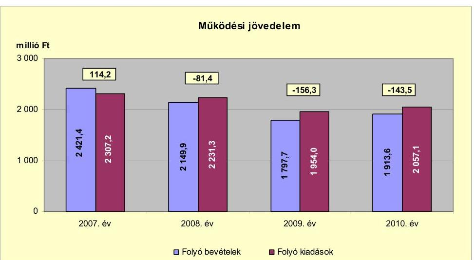

---

A működési jövedelem a 2010. évben -102,3 millió Ft-tal (16,2%-kal) volt alacsonyabb, mint a 2007-2009. évek átlaga ( $-41,2$ millió Ft).

A működési jövedelem 2008. évi 195,6 millió Ft-os - az előző évhez képest csökkenésének oka, hogy a költségvetési támogatás 355,2 millió Ft-os növekedése nem ellensúlyozta az átengedett bevételek 438,1 millió Ft-os és a saját bevételek 265,5 millió Ft-os csökkenését. A 2007. évről a 2008. évre az állami támogatási rendszer átalakulása miatt a költségvetési támogatás emelkedett, az átengedett szja mérséklődött, míg a saját bevételek közül az áfa visszatérülések csökkenése volt a legmagasabb. A 2009. évben - a központi forráskivonás és a közoktatási és szociális feladatátadások következtében - 321,0 millió Ft-tal volt alacsonyabb a költségvetési támogatás, mint az előző évben. A folyó bevételek a 2010. évben az előző évhez viszonyítva 115,9 millió Ft-tal emelkedtek. A saját bevételek a 2010. évben előző évhez képest 30,4 millió Ft-tal csökkentek a helyi adóbevételek mérséklődése miatt, míg a költségvetési támogatás 150,6 millió Ft-tal, az átengedett bevételek 10,5 millió Ft-tal növekedtek a szociális juttatások, az szja és a gépjárműadó emelkedésének hatására. A folyó kiadások 103,1 millió Ft-os - a transzferkiadások növekedéséből adódó - emelkedése miatt a működési jövedelem értéke a 2010. évben negatív maradt.

A működési jövedelem értékei azt mutatják, hogy az Önkormányzat folyó bevétele - a 2007. év kivételével - a vizsgált időszakban nem biztosított fedezetet a kötelező és önként vállalt feladatellátáshoz kapcsolódó éves folyó kiadásaira. A 2007. évi 114,2 millió Ft működési jövedelem megtakarítása forrásul szolgált az Önkormányzat fennálló kötelezettségei megfizetéséhez, azonban fejlesztéseihez nem volt elégséges. A pozitív előjelű 2007. évi folyó költségvetési egyenleg ellenére az Önkormányzat 51,4 millió Ft - majd a 2008. évben 30,0 millió Ft és 2010-ben 48,7 millió Ft - támogatásmegelőlegezési hitel felvételére kényszerült a fejlesztési feladatok megoldása érdekében.

Az Önkormányzat pénzügyi kapacitása a 2007-2010. években negatív volt, amely az egyes költségvetési években jelentkező adósságszolgálat túlzott mértékére utal. A nettó működési jövedelem értéke a folyó költségvetési pozíció mellett az adott költségvetési év adósságtörlesztésének hatását is tükrözi. A 2007-2010 között a nettó működési jövedelmet az alábbi ábra szemlélteti:
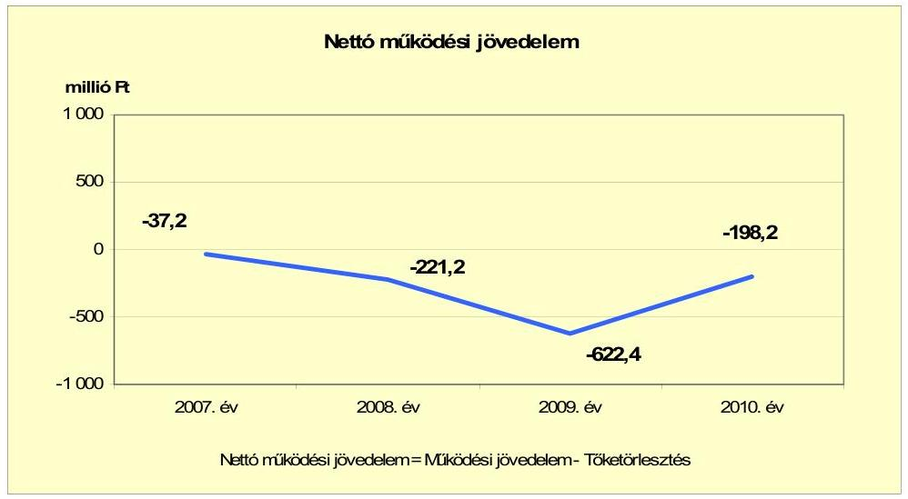

---

A nettó működési jövedelem csökkenését a folyó költségvetés egyenlegének 2007-2010 közötti romlása, továbbá a tőketörlesztés befolyásolta. A tőketörlesztés összege $^{12}$ 2007-2010 között változó tendenciát mutatott. A 2007. évben a működési jövedelem megtakarítása ( 114,2 millió Ft) nem fedezte az éves hiteltörlesztés 151,4 millió Ft-os összegét. A további években a hiteltörlesztés összegei a folyó költségvetés hiánya mellett gyengítették az Önkormányzat tárgyévi pénzügyi pozícióját. A nettó működési jövedelem 2009. évi (622,4 millió Ft) kiugróan alacsony összegét a tárgyévi negatív működési jövedelem (-156,3 millió Ft) mellett a magas (466,1 millió Ft) hiteltörlesztési összeg eredményezte.

A 2007-2010. években az Önkormányzat felhalmozási költségvetésének egyenlege - a 2007. év kivételével - pozitív összegű volt, amely körültekintő költségvetési gazdálkodás és pénzügyileg fenntartható $^{13}$ beruházások esetén nem jelent pénzügyi kockázatot.

A felhalmozási költségvetés egyenlegét 2007-2010 között évről évre az alábbi ábra szemlélteti:
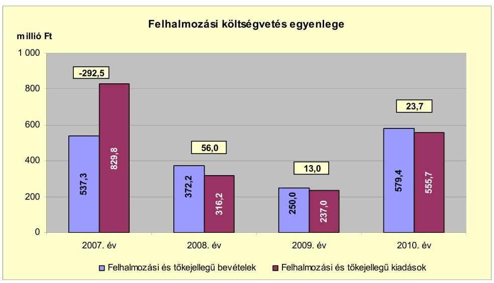

A felhalmozási költségvetés egyenlegének összege a 2007-2010 közötti években az egyes beruházások készültségi fokának és az utólagos finanszírozás ütemének függvényében változott. A felhalmozási költségvetés bevételei és kiadásai a 2007. évben kiemelkedőek voltak. A szennyvízelvezetés kiépítésére 173,3 millió Ft címzett- és fejlesztési "vis major" támogatást, a szennyvízprogramhoz 18,9 millió Ft, a városrehabilitációs programhoz 188,3 millió Ft támogatásértékű bevételt vettek igénybe, a szennyvízprogram megvalósításához 60,4 millió Ft EU-s támogatás, valamint 75,6 millió Ft átvett pénzeszköz járult hozzá a felhasznált saját forrás mellett. A 2007. évben a ravatalozó építése, a városköz-

[^0]
[^0]:    $^{12}$ Az Önkormányzat tőketörlesztési kötelezettsége 2007-ben 151,4 millió Ft, 2008-ban 139,8 millió Ft; 2009-ben 466,1 millió Ft; 2010-ben 54,7 millió Ft volt.
    $^{13}$ Az minősül pénzügyileg fenntartható beruházásnak, amelynek működtetésére az Önkormányzat nettó működési jövedelme a következő években is fedezetet nyújt az újként, vagy többletként jelentkező működési többletre.

---

pont-rehabilitáció és a szennyvízprogram valósult meg felhalmozási kiadásokból. A 2010. évben négy fejlesztés részesült felhalmozási célú támogatásban: az egészségház kialakítása ( 81,0 millió Ft), a Maconkai víztározók környezetvédelmi vízügyi fejlesztése ( 332,9 millió Ft), Kisterenyei bölcsőde felújítása (27,9 millió Ft), Köztársasági út átépítése (49,3 millió Ft).

A vizsgált időszakban keletkezett 199,8 millió Ft felhalmozási forráshiányra az egyes EU-s projektek finanszírozásához felvett 100,0 millió Ft támogatásmegelőlegezési hitel és a 2007. évi nyitó pénzkészlet 142,0 millió Ft (összesen 242,0 millió Ft) nyújtott fedezetet.

Az Önkormányzat évenkénti finanszírozási igénye $^{14}$ a CLF módszer szerint 2007-ben 329,7 millió Ft, 2008-ban 165,2 millió Ft, 2009-ben 609,4 millió Ft, 2010-ben 174,5 millió Ft volt, amelyre a finanszírozási célú bevételek és kiadások egyenlege $^{15}$ nyújtott fedezetet.

Az Önkormányzat finanszírozási műveletei a 2007-2010. évek közötti egyenlegét az alábbi ábra szemlélteti:
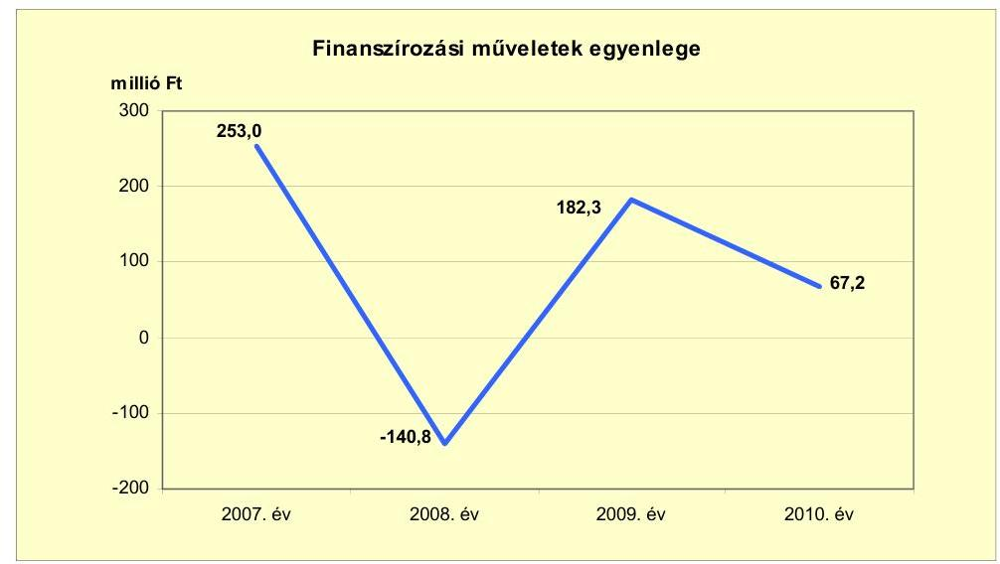

A finanszírozási műveletek pozitív értéke azt jelzi, hogy a 2007. és a 2009-2010. évi költségvetések végrehajtása során külső forrást is igénybe vettek. A támogatásmegelőlegezési hitelek igénybevétele az Önkormányzat pénzügyi egyensúlyi helyzetét hátrányosan befolyásolta, a 2008. évben 1,4 millió Ft, a 2010. évben 1,5 millió Ft kamatkiadást jelentett. A 2007. évben árokburkolási programhoz, három kisebb fejlesztési programhoz - a Gyürky-Solymossy kastély felújítása, a Maconkai ravatalozó, a Gyula-aknai csurgalék víztározó építése -, illetve a városrehabilitációs projekthez kapcsolódóan 51,4 millió Ft támogatásmegelőlegezési hitelt vettek fel és 151,4 millió Ft támogatásmegelőlegezési hitelt fizettek vissza. A 2008. évben az EU-s pályázatok utófinanszírozása miatt 30,0 millió Ft

[^0]
[^0]:    $^{14}$ a nettó működési jövedelem és a felhalmozási költségvetés eredője
    $^{15}$ A finanszírozási műveletek egyenlege 2007-ben 253,0 millió Ft, 2009-ben 182,3 millió Ft, 2010-ben 67,2 millió Ft többletet, 2008-ban 140,8 millió Ft hiányt mutatott.

---

támogatásmegelőlegezési hitelt vettek fel és fizettek vissza december végén. A 2008. évben fejlesztési célú hitelt nem vettek igénybe, a hitelállomány teljes egészében működési célú volt. A 2010. évben 48,7 millió Ft volt a felvett támogatásmegelőlegezési hitel összege. A finanszírozási műveleteket a vizsgált időszakban a jelentés 2. számú mellékletének 4.1-4.8 pontjai részletezik.

Az Önkormányzat a 2007-2010. évi zárszámadási rendeleteinek mellékleteiben mérlegszerűen bemutatott működési és fejlesztési célú többletet a jelentés 1. számú melléklete tartalmazza, amelynek adatai az elszámolási módszer különbözősége miatt eltérnek a CLF módszer alapján leírtaktól. A zárszámadási rendeletekben költségvetési többletet mutattak ki, 2007-ben 216,8 millió Ft, 2008-ban 50,6 millió Ft, 2009-ben 89,6 millió Ft és 2010-ben 37,1 millió Ft összegben. Ez a CLF módszer alapján számított működési jövedelem és felhalmozási költségvetés egyenlegét minden évben meghaladta alapvetően az igénybevett pénzmaradvány hatására.

Az Önkormányzat kamatbevételeit és kamatkiadásait 2007-2011. év I. féléve között a következő ábra mutatja:
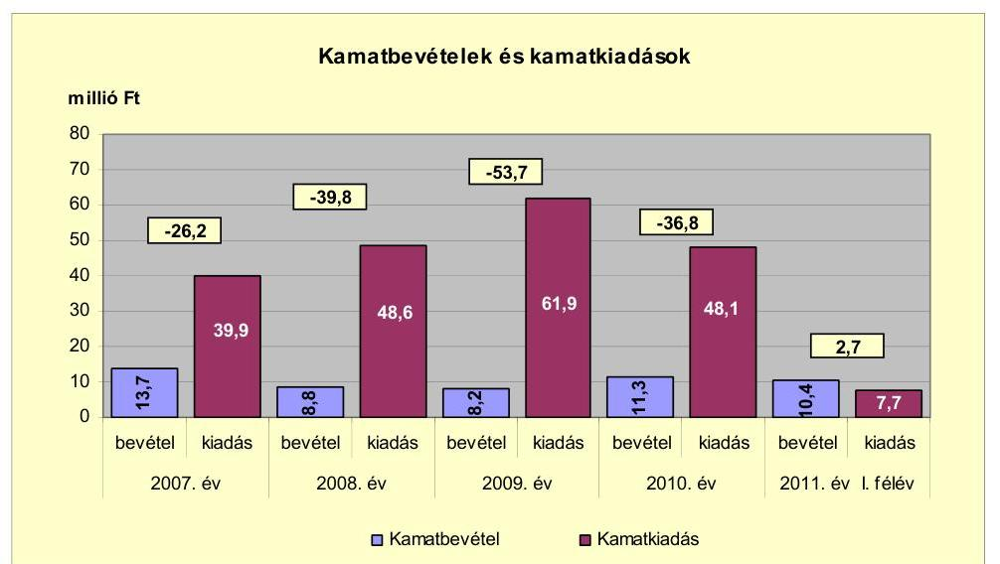

Az Önkormányzat szabad pénzeszközeinek lekötéséből, a bérlakás-értékesítési számlán lévő betétekből a 2007-2011. év I. féléve között 52,4 millió Ft kamatbevétele teljesült. Az Önkormányzat által felvett hitelekhez kapcsolódóan kamatfizetési kötelezettség is keletkezett a vizsgált időszakban, a teljes kamatráfordítás a realizált kamatbevétel 3,9 szeresét (206,2 millió Ft) tette ki. A piaci viszonyok változása (gazdasági válság) és a hitelek növekedése miatt a 2008-2009. években a kamatkiadások emelkedtek. A kamatbevételeket a 2007-2010. éveken elsősorban a hitelkamatok fizetésére és tőketörlesztésre fordították.

# 2.2. Az Önkormányzat bevételeinek változása 

Az Önkormányzat folyó bevétele 2010-ben (1913,6 millió Ft) - a költségvetési támogatás, a helyben maradó szja, a helyi adóbevételek és az egyéb saját bevételek alacsonyabb összege következtében - 9,9%-kal (209,4 millió Ft-tal) volt kevesebb, mint a 2007-2009. évek átlaga (2123,0 millió Ft).

---

Az Önkormányzat a 2007-2011. év I. félév között realizált főbb folyó bevételi jogcímeinek számszaki adatait a következő táblázat részletezi és grafikon mutatja be:
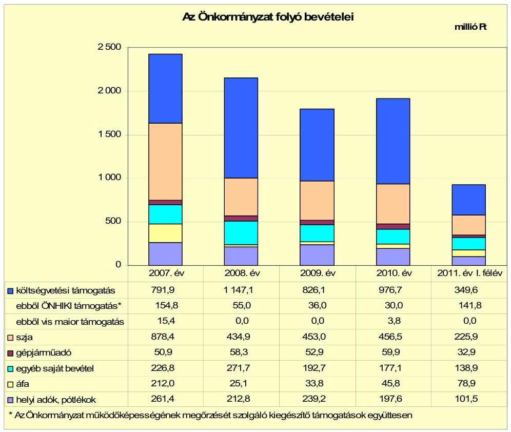

A 2010. évben a költségvetési támogatások és az szja értéke (1510,5 millió Ft) 77,3 millió Ft-tal ( $5,1 \%$-kal) volt alacsonyabb az előző évek 1587,8 millió Ft átlagánál. A 2007. évről a 2008. évre a költségvetési támogatás értéke növekedett, míg az szja értéke csökkent a támogatási rendszer átalakulása miatt. A költségvetési támogatás és az szja együttes értéke a központi forráskivonás és a közoktatási és szociális feladatok átadásának hatására az előző évhez viszonyítva együttesen a 2008. évben 88,3 millió Ft-tal (5,3%-kal), 2009-ben 302,9 millió Ft-tal ( $19,1 \%$-kal) csökkent. A 2010. évben a költségvetési támogatás és az szja együttes értéke 154,1 millió Ft-tal ( $10,8 \%$-kal) emelkedett a pénzbeli szociális ellátások emelkedése miatt. Az Önkormányzat a működési forráshiány mérséklése céljából a 2007. évben 54,8 millió Ft ÖNHIKI, valamint a vizsgált időszak minden évében összesen 417,6 millió Ft a működésképtelen helyi önkormányzatok egyéb támogatásában részesült.

A folyó bevételeken belül az egyéb saját bevételek a 2008. évben az előző évhez viszonyítottan - a víziközmű-vagyon üzemeltetőjétől származó bérletidíjbevétel (2007. évben 15,1 millió Ft, 2008-ban 60,0 millió Ft) emelkedése miatt növekedtek, a vizsgált időszak további éveiben csökkenő tendenciát mutattak. A 2010. évben a saját bevételek 53,3 millió Ft-tal ( $23,1 \%$-kal) voltak alacsonyabbak, mint az előző évek átlaga (230,4 millió Ft-nál). Az egyéb saját bevételek csökkenését a kamatbevételek változatlan (az egyes években átlagosan 8,2 millió Ft-os) szintje
 mellett a támogatásértékű működési bevételek

---

18,4 millió Ft összegű, az előző évek (123,0 millió Ft-hoz) átlagához mért csökkenése okozta.

Az áfabevételek alakulását az Önkormányzat beruházási kiadásainak nagysága határozta meg. A felhalmozási kiadásokhoz kapcsolódó fordított áfa a 2007. évben 154,2 millió Ft, a 2009. évben 24,7 millió Ft, a 2010. évben 33,0 millió Ft volt.

Az Önkormányzat folyó bevételének jelentős hányadát a helyi adó (helyi iparűzési adó és a 2009-től bevezetett idegenforgalmi adó) bevételek képezték, amelyek a 2010. évben 40,2 millió Ft-tal ( $16,9 \%$-kal) voltak alacsonyabbak, mint a 2007-2009. évek átlaga ( 278,0 millió Ft-nál). A helyi adó bevételek 2008-ban a gazdasági válság hatására - az előző évhez viszonyítva 48,6 millió Ft-tal ( $18,6 \%$-kal) visszaestek az iparűzési adóbevétel 48,0 millió Ft-os és a pótlékok 0,6 millió Ft-os mérséklődése miatt. Az adóbehajtási tevékenység erősödése következtében 2009-ben a 2008. évhez képest a helyi adóbevételek 26,4 millió Ft-tal ( $12,4 \%$-kal) emelkedtek, melyet az iparűzési adó 19,7 millió Ft-os, a pótlékok 6,1 millió Ft-os emelkedése és az idegenforgalmi adó 0,6 millió Ft-os összege okozott. A 2010. évre az iparűzési adó bevételek 33,9 millió Ft-tal, a pótlékok 41,6 millió Ft-tal csökkentek a vállalkozások számának és eredményének visszaesése miatt.

Az Önkormányzat felhalmozási bevételeinek szerkezete a vizsgált időszakban az alábbi volt:
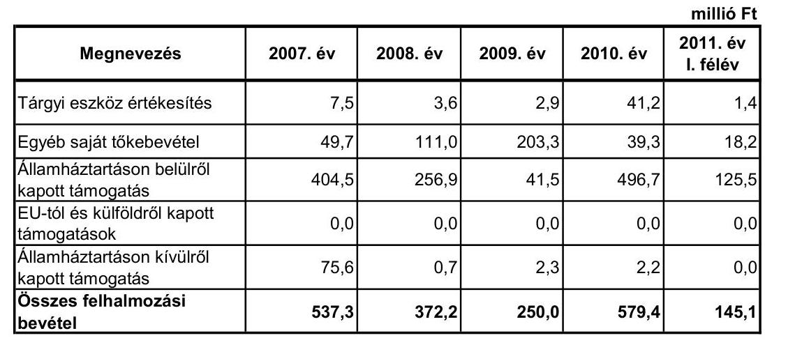

Az Önkormányzat felhalmozási bevétele a 2008. évben 165,1 millió Ft-tal ( $30,7 \%$-kal), 2009-ben 122,2 millió Ft-tal ( $32,8 \%$-kal) alacsonyabb volt, mint az előző évben. A 2010. évben 329,4 millió Ft-tal ( $131,8 \%$-kal) nőtt az előző évhez képest, a 2011. év I. félévében a 2009. év szintjén maradt. A változásokat a fejlesztésekhez államháztartáson belülről, illetve kívülről kapott - a folyamatban levő fejlesztésekhez érkező - támogatási összegek csökkenései okozták.

Az egyéb saját tőkebevételek az önkormányzati lakások, helyiségek értékesítéséből, a támogatási kölcsönök visszatérüléséből származó bevételt tartalmazták. A 2008-ban realizált 111,0 millió Ft kétszerese volt a 2007. évi (49,7 millió Ft) teljesített bevételeknek. Ennek fő oka, hogy a 2008. évben földterületek eladásából és az önkormányzati lakások értékesítése során 37,4 millió Ft, a támogatási kölcsönök visszatérüléséből 72,6 millió Ft bevételt realizáltak. A 2009. évben 203,3 millió Ft bevétel teljesült, amelynek több mint fele (124,0 millió Ft) az önkormányzati lakások értékesítéséből származott.

Az Önkormányzat államháztartáson belülről kapott támogatásként mutatta ki a fejlesztési feladatok végrehajtásához kapott felhalmozási célú állami támogatásokat. A 2007. évben a szennyvízberuházás címzett támogatása (193,3 millió Ft) a felhalmozási bevételek 36,0\%-át jelentette. A 2008. évben a városközpont rehabilitációjának támogatásértékű bevétele 255,0 millió Ft volt, mely a felhalmozási bevételek $68,5 \%$-át képezte. A 2010. évben négy fejlesztéshez ${ }^{16}$ igénybevett 490,2 millió Ft támogatás a felhalmozási bevételek 84,6\%-át jelentette.

Az államháztartáson kívülről kapott támogatások között a nonprofit szervezetektől, vállalkozásoktól átvett felhalmozási célú pénzeszközöket mutatták ki. A 2007. évben 75,6 millió Ft a szennyvízberuházáshoz átvett hozzájárulás tette ki a felhalmozási bevételek $14,1 \%$-át.

Az Önkormányzatnak tárgyi eszköz értékesítéséből 2010-ben 41,2 millió Ft bevétele származott, amely a földterületek eladásából (21,2 millió Ft), illetve a volt városháza épületének értékesítéséből (20,0 millió Ft) keletkezett. A tárgyi eszköz értékesítésből származó bevételeket a fejlesztések saját forrásaként használták fel.

# 2.3. Az Önkormányzat folyó és felhalmozási célú kiadásainak változása 

Az Önkormányzat folyó kiadásai főbb jogcímek szerinti bontásban 2007-2011. év I. féléve között az alábbiak voltak:

Múködési kiadások főbb jogcímek szerinti bontásban

| Megnevezés | 2007. év | 2008. év | 2009. év | 2010. év | 2011. év   I. félév |
| :--: | :--: | :--: | :--: | :--: | :--: |
| Folyó kiadások | 2307,2 | 2231,3 | 1954,0 | 2057,1 | 742,2 |
| Működési kiadások (kamatkiadás nélkül) | 1862,4 | 1543,5 | 919,4 | 867,5 | 379,8 |
| Államháztartáson belülre átadott pénzeszközök | 19,3 | 138,8 | 270,4 | 277,5 | 118,2 |
| Transzferkiadások | 385,6 | 434,2 | 693,0 | 864,0 | 205,3 |
| -ebből: vállalkozásoknak | 17,9 | 13,3 | 204,6 | 444,5 | 0,0 |
| EU-nak, illetve külföldre | 0,0 | 0,0 | 0,0 | 0,0 | 0,0 |
| magánszemélyeknek | 351,2 | 363,9 | 387,4 | 377,3 | 188,0 |
| nonprofit szervezeteknek | 16,5 | 57,0 | 101,0 | 42,2 | 17,3 |
| Kamatkiadások | 39,9 | 48,6 | 61,9 | 48,1 | 38,9 |
| Előző évi pénzmaradvány átadás | 0,0 | 66,2 | 9,3 | 0,0 | 0,0 |

Az Önkormányzat teljesített folyó kiadásai a 2010. évben (2057,1 millió Ft) 4,9\%-kal (107,1 millió Ft-tal) alacsonyabbak voltak a 2007-2009. évek átlagánál (2164,2 millió Ft) a működési kiadások csökkenése miatt. A folyó kiadásokon belül a működési kiadások a közoktatási- és szociális feladatátadások és kiadáscsökkentő intézkedések következtében a 2010. évben 574,3 millió Ft-tal (39,8\%-kal) voltak alacsonyabbak, mint a megelőző évek átlaga (1441,8 millió Ft).

Az Önkormányzat kamatkiadások nélküli működési kiadásai főbb kiadási jogcímek szerinti bontásban az alábbiak szerint alakultak:

| Megnevezés | 2007. év | 2008. év | 2009. év | 2010. év | 2011. év   I. félév |
| :--: | :--: | :--: | :--: | :--: | :--: |
| Személyi juttatások | 894,0 | 750,6 | 385,8 | 366,8 | 172,6 |
| Munkaadót terhelő járulékok | 289,3 | 241,1 | 121,8 | 102,8 | 46,3 |
| Dologi kiadások | 479,7 | 428,6 | 264,0 | 230,5 | 93,6 |
| Egyéb folyó kiadások | 199,4 | 123,2 | 147,8 | 167,4 | 67,1 |

A személyi juttatások teljesített kiadásai a 2010. évben 45,8\%-kal (310,0 millió Ft-tal) maradtak el a 2007-2009. évek átlagos 676,8 millió Ft-os kiadásához viszonyítva, amelyet a feladatátadás és a létszámcsökkentési intézkedések eredményeztek.

A dologi és egyéb folyó kiadások a vizsgált időszakban évente csökkentek, a 2010. évben - a feladatátadások és kiadáscsökkentő intézkedések következtében - 149,7 millió Ft-tal (27,3\%-kal) voltak alacsonyabbak az előző évek (547,6 millió Ft-os) átlagánál.

A folyó és felhalmozási kiadásokat a vizsgált időszakban az alábbi grafikon szemlélteti:
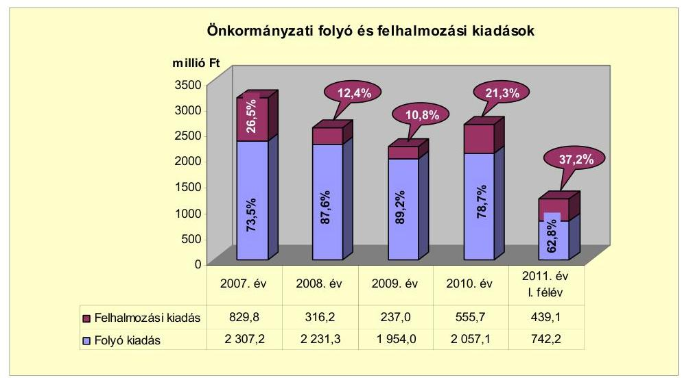

Az önkormányzati folyó és felhalmozási kiadásokon belül a felhalmozási kiadások részaránya a 2007-2009. évek 17,6\% átlagáról a 2010. évre 21,3\%ra emelkedett, a 2010. évben az előző évhez viszonyítva 10,5 százalékpontos emelkedés következett be az előző évhez képest. A részarány 2010. évi emelkedésének oka, hogy a jelentős beruházások egyes kivitelezési szakaszai lezárultak, a kivitelezői teljesítés ellenértékének kifizetése megtörtént. A szennyvízberuházás fejlesztési feladat kivitelezésére a 2007. évben 296,5 millió Ft kiadást

---

teljesítettek. A városközpont-rehabilitációra fordított kiadás a 2007. évben 409,0 millió Ft volt, 2008. évre 126,9 millió Ft volt az előző évről áthúzódó utolsó részletének rendezése. A 2010. évben egészségház kialakítására 3,9 millió Ft-ot, környezetvédelmi vízügyi fejlesztésre 316,4 millió Ft-ot, bölcsődefelújításra 26,0 millió Ft-ot, út átépítésére 58,2 millió Ft-ot, utcák, járdák építésére 42,6 millió Ft-ot fordítottak.

Az Önkormányzat által végzett felújítások és beruházások együttes kiadása a 2007. évi 829,8 millió Ft-ról a 2008. évre 316,2 millió Ft-ra, a 2009. évre 237,0 millió Ft-ra csökkent és a 2010. évre 555,7 millió Ft-ra, 2011. év I. félévében 439,1 millió Ft-ra növekedett. A 2007. évi magas részarány oka volt, hogy a jelentős bekerülési költségű szennyvízhálózat-fejlesztés feladatai 2007-ben folytak, ugyanúgy, mint a városközpont-rehabilitáció, melynek lezárása 2008-ra húzódott. Új beruházások kezdése - környezetvédelmi vízügyi fejlesztés - 2010. évre, lebonyolítása a 2010-2011. évekre ütemezett volt. A 2011. év I. félévében a felhalmozási kiadások emelkedését az egészségház-kialakítás fejlesztési kiadásai és az iparipark-fejlesztés előkészítésének kiadásai eredményezték.

Az Önkormányzat folyó és felhalmozási kiadásai tartalmazzák a Többcélú társulás ${ }^{17}$ kiadásait is. Ezeknek a kiadásoknak egy része nem az Önkormányzat, hanem a társult települések kiadása volt, amelyek azonban a gesztor önkormányzatnál jelentkeztek.

A vizsgált időszakban az önkormányzati folyó és felhalmozási kiadásokat beruházási társulások nélkül az alábbi grafikon szemlélteti:
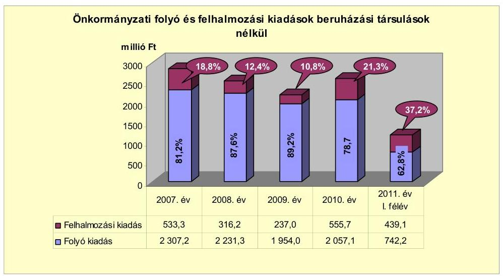

Az Önkormányzatnál a 2007-2010. években befejezett felújítási és beruházási feladatok összes - 2007-2010 között - teljesített költségvetési kiadása 1260,6 millió Ft, a teljes bekerülési költségek (3231,6 millió Ft) 39,0\%-a volt. A

[^0]
[^0]:    ${ }^{17}$ A Társulást 2004-ben hozták létre Bátonyterenye Város, Mátraverebély, Dorogháza, Nemti, Mátramindszent és Szuha községi önkormányzatok az agglomerációs szennyvízelvezetésének és tisztításának kiépítésére. A projekt vizsgált időszakra eső befejező, II. ütemének összköltsége 1803,9 millió Ft volt, a 2007. évben 296,5 millió Ft fejlesztési kiadást teljesítettek.

---

2006. december 31-éig teljesített kiadások összege 1971,0 millió Ft volt. A fejlesztések 1023,2 millió Ft ( $81,2 \%$ ) és a felújítások 237,4 millió Ft (18,8\%) összegűek voltak. A befejezett felújítások és beruházások (3231,6 millió Ft értékű) forrásmegoszlása 969,2 millió Ft EU-s támogatás (30,0\%), 1486,0 millió Ft hazai támogatás ( $46,0 \%$ ), 776,4 millió Ft saját bevétel ( $24,0 \%$ ) volt. Az Önkormányzat 2007-2010 között megvalósított fejlesztései között külterületi városrész felújítása, bölcsőde és iskola felújítása, fűtési rendszer korszerűsítése, út- és járdafelújítás, kastélyfelújítás, csurgalékvíz-tározó építése, 2 db lakás vásárlása, ravatalozó építése, városközpont-rehabilitáció és szennyvízcsatornázás megvalósítása szerepelt, melyek - a kastélyfelújítás és a lakásvásárlás kivételével - az Önkormányzat kötelező feladatainak ellátásához kapcsolódtak. A fejlesztések részletes adatait a jelentés 3/a. számú melléklete tartalmazza.

Az Önkormányzat folyamatban lévő felújítási és beruházási feladatainak - Ipari park tervezési feladatai, egészségház kialakítása, Maconkai vízügyi fejlesztés, városrehabilitáció II. szakasz előkészítés, Gyermekek úti bölcsőde felújítása - teljes bekerülési költsége 2010. december 31-ig 446,5 millió Ft. A 2006. december 31-ig teljesített kiadás 44,8 millió Ft volt. A kiadások finanszírozását 2010. december 31-éig teljes egészében EU-s támogatás biztosította ${ }^{18}$. A folyamatban lévő felújítási és beruházási feladatokra a 2007-2010. évek között teljesített kiadás 401,7 millió Ft - a teljes bekerülési költség 90,0\%-a - volt. A 2007-2010 között folyamatban lévő fejlesztésekre az ipari park útépítés engedélyezési terveire 15,0 millió Ft-ot, az ipari park megvalósításának tanulmánytervére 0,5 millió Ft-ot, az egészségház kialakítására 27,6 millió Ft-ot és a vízügyi fejlesztésre 322,1 millió Ft-ot, a városrehabilitáció II. szakaszára 7,8 millió Ft-ot, a Gyermekek úti bölcsőde felújítására 26,8 millió Ft kiadást teljesítettek. A fejlesztések részletes adatait a jelentés 3/b. számú melléklete tartalmazza.

A 2010. december 31-én folyamatban lévő felújítási és beruházási feladatokhoz kapcsolódó 2010. évet követő kötelezettségvállalások - Ipari park összekötőút, és tanulmányterv, egészségház, vízügyi fejlesztés, városrehabilitáció, bölcsődefelújítás - összege 981,9 millió Ft volt. A felújítások és beruházások tervezett forrása
 701,4 millió Ft EU-s támogatás (71,4%), 90,9 millió Ft megképződő saját forrás (9,3%), és 189,6 millió Ft kötvénykibocsátásból¹⁹ származó bevétel (19,3%). A fejlesztésekhez kapcsolódó kötelezettségvállalások részletes adatait a jelentés 3/c. számú melléklete tartalmazza.

Az Önkormányzat kiemelt infrastrukturális fejlesztései közül a három legmagasabb költségű beruházás a következő volt:

- A „Bátonyterenye és térsége szennyvízközmű beruházás II. üteme" megvalósításának célja volt Bátonyterenye város agglomerációban a szennyvizek közműves szennyvízelvezetésének és szennyvíztisztításának 2007. december 31-ig történő megvalósítása. A beruházás teljes bekerülési költsége 1803,9 millió Ft volt, melyből 2006. december 31-éig 1431,0 millió Ft, a vizsgált időszakban 372,9 millió Ft teljes bekerülési költségű projektrész valósult

[^0]
[^0]:    ¹⁸ A fejlesztés finanszírozásában 2010. december 31-éig 10,3 millió Ft 2011. év I. félévéig el nem számolt többlet jelentkezett.
    ¹⁹ Az Önkormányzat 2011. február 3-án kötvényt bocsátott ki 431,0 millió Ft értékben.

---

meg 353,8 millió Ft (95,0%) hazai címzett támogatásból és 19,1 millió Ft (5,0%) saját bevételből. A megvalósított beruházás miatt többlet működési kiadás nem terhelte az Önkormányzatot.

- Az "ECOCITY Városközpont rehabilitáció" beruházás megvalósításának célja a korszerű városközpont 2007. évi kialakítása volt. A beruházás teljes (1028,2 millió Ft) bekerülési költségét 73,1 millió Ft saját bevétel (7,1%), 886,2 millió Ft (86,2%) EU-s és 68,9 millió Ft (6,7%) hazai támogatás finanszírozta. A megvalósított beruházás miatt többlet működési kiadás nem terhelte az Önkormányzatot.
- A Maconka települési ravatalozó 2007. évi átépítésének célja a létesítmény állagának helyreállítása, korszerűsítése volt. A fejlesztés teljes bekerülési költsége 37,7 millió Ft volt, melynek forrása 18,0 millió Ft (47,7%) hazai támogatás és 19,7 millió Ft (52,3%) saját forrás volt. A projekt fenntartásával kapcsolatosan a létesítmény korszerűsége csökkenti a fajlagos üzemeltetési és fenntartási kiadásokat.

Az Önkormányzatnak 2011. év I. félévének végéig elbírálás alatt lévő, pályázati forrásból tervezett fejlesztési feladata nem volt.

A gazdasági társaságok részére 2007-2011. év I. féléve között átadott működési célú pénzeszközöket az alábbi grafikon mutatja be:
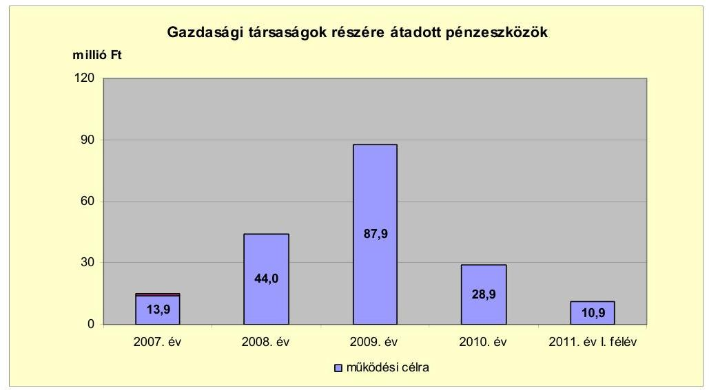

Az Önkormányzat a gazdasági társaságoknak a 2007-2011. év I. féléve közötti időszakban 185,6 millió Ft működési célú pénzeszközt adott át. A kizárólagos önkormányzati tulajdonban álló társaságok részére átadott pénzeszközből (169,7 millió Ft-ból) 10,0 millió Ft-ot a lakásvagyon fenntartást végző gazdasági társaság kapott 2007-ben. A sportlétesítményt működtető gazdasági társaság részére az Önkormányzat a vizsgált időszakban összesen 159,7 millió Ft pénzeszközt adott át. Az egyéb közfeladatot ellátó társaságok közül a helyi közlekedési közszolgáltató - a vizsgált időszakban - összesen 15,9 millió Ft működési célú pénzeszközátadásban részesült a helyi tömegközlekedés lebonyolításához.

---

Az Önkormányzat a gazdasági társaságoknak szerződésben meghatározott feladatokra adta át a pénzeszközöket és a célszerű felhasználást ellenőrizte. Az Önkormányzat minden évben értékelte a kizárólagos tulajdonában álló gazdasági társaságok működését, valamint gazdálkodásukról készített beszámolóikat, tudomásul vette, hogy a városgazdálkodási, illetve a tanuszoda-fenntartási feladatok ellátása a gazdasági társaságok bevételein felül működési célú önkormányzati pénzeszközátadást igényel. A helyi közlekedési közszolgáltató szerződéses kötelezettségének megfelelően - évente elkészítette beszámolóját, valamint számítását a szolgáltatás díjairól, amelynek előterjesztése alapján döntött a Képviselő-testület működési célú pénzeszközök átadásáról.

A gazdasági társaságok részére a 2007-2011. év I. féléve között átadott pénzeszközök részletes adatait a jelentés 4. számú melléklete tartalmazza.

# 3. Az ÖNKORMÁNYZAT KÖTELEZETTSÉGEI 

### 3.1. Az Önkormányzat pénzintézetekkel szembeni kötelezettségeinek változása

Az Önkormányzat pénzintézetekkel szembeni kötelezettségeinek állománya a 2006. december 31-i 202,7 millió Ft-ról 2011. június 30-ára 228,0%-kal, 664,9 millió Ft-ra nőtt, a rövid lejáratú hitelek állományának növekedése miatt. A pénzintézetekkel szembeni kötelezettségek állománya 2011. június 30-ára - a 2010. december 31-i állományhoz viszonyítva - további 63,1%-kal, 1095,9 millió Ft-ra növekedett a fejlesztési céllal, 2011. február 3-án lebonyolított euro alapú kötvénykibocsátás miatt.

A pénzintézetekkel szemben fennálló kötelezettségek állományát mutatja be az alábbi táblázat:
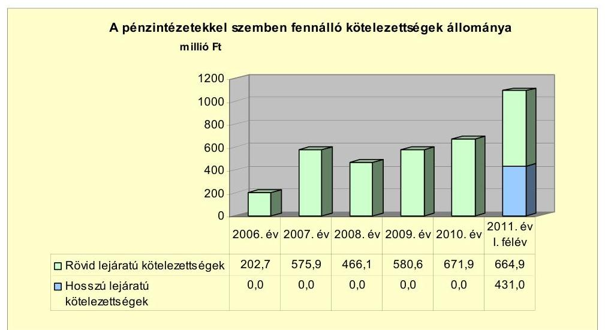

A 2010. december 31-én fennálló pénzintézetekkel szembeni kötelezettségek az önkormányzati működéshez forrást biztosító rövid lejáratú hitelek felvételéből keletkeztek. A 2007-2011. június 30. közötti időszakban az Önkormányzat növekvő mértékben vette igénybe a számlavezető bank által

---

rendelkezésére bocsátott folyószámlahitel-keretet, csökkenő mértékben a munkabér megelőlegezésére szolgáló hitelkeretet, valamint esetenként, változó összegben a fejlesztési és működési célokhoz kapcsolódó támogatások megelőlegezésére megnyitott hitelkeretet. Az Önkormányzat 2010-ben fejlesztési célú, kötvénykibocsátás-megelőlegezési hitelt vett igénybe a folyamatban lévő fejlesztések finanszírozására. Az Önkormányzat nem vett fel hosszú lejáratú hitelt, azonban fejlesztési célokra 2011-ben euro alapú kötvényt bocsátott ki.

A költségvetési rendeletekben meghatározták az adott évre vonatkozóan felvehető működési hitel összegét és bemutatásra kerültek a rövid lejáratú hitelfelvételekkel összefüggő kötelezettségek az adott költségvetési évre, valamint - a felhalmozódó működési célú hitelállomány következtében - a következő két évre.

Az Önkormányzat az áttekintett időszakban az adósságot keletkeztető kötelezettségvállalásának felső határát nem lépte túl. Az adósságot keletkeztető kötelezettségvállalás felső határa az elemi költségvetése szerint a 2007. évben 191,6 millió Ft, a 2008. évben 185,9 millió Ft, a 2009. évben 211,1 millió Ft és a 2010. évben 204,7 millió Ft volt.

Az Önkormányzat a pénzintézetekkel szembeni kötelezettségeinek teljesítéséhez biztosítékként - az Ötv. korlátozó előírásait a hitelszerződésekben rögzített módon figyelembe véve - felhatalmazta a pénzintézetet az inkasszójog érvényesítésére a mindenkori költségvetési elszámolási számláján. A pénzintézet által előírt fedezet - tekintettel a folyamatosan fennálló, az ellenőrzött időszakban fokozatosan növekvő folyószámlahitel-állományra - az Önkormányzat részéről további pénzügyi kockázatot jelentett.

A Képviselő-testület 2010. október 21-én döntött fejlesztési célú kötvény kibocsátásáról. Az Önkormányzat számlavezetője azonos a kötvénykibocsátást szervező pénzintézettel. A kötvényt 2011. február 3-án, 1571,8 ezer euro (kibocsátáskori árfolyamon 431,0 millió Ft) összegben 20 éves futamidővel, másfél év türelmi idővel bocsátották ki. A tőketörlesztés a 2012. év III. negyedévében 7,3 ezer euró összeggel kezdődik. A kötvény kamatozása változó, háromhavi EURIBOR referencia-kamatlábhoz kötött, a szervező pénzintézet 4,5% kamatfelárat határozott meg.

A kibocsátásból származó pénzeszközöket a pénzintézet által vezetett óvadéki számlán helyezték el, amelyről a pénzintézet jóváhagyása nélkül kifizetés nem teljesíthető. A kötvény kibocsátásából származó forrás korlátozottan, a kibocsátási tájékoztatóban meghatározott fejlesztési célokra használható fel. A kötvénykibocsátásból származó bevételből a 2011. év I. félévében összesen 157,2 millió Ft összeget használtak fel (intézményekkel összefüggő fejlesztésekre, környezetvédelmi-vízügyi fejlesztésre, az Önkormányzat kizárólagos gazdasági társaságának eszközbeszerzéseire). A kötvényből származó bevételnek 2011. június 30-án 273,8 millió Ft összegű maradványa volt, amit a 2011-

---

es költségvetés fejlesztési feladataira²⁰ szerződéssel, illetve képviselő-testületi döntéssel megterheltek. Az Önkormányzatnak az óvadéki számlára helyezett pénzeszközökből 9,8 millió Ft kamatbevétele származott, amelyet a kötvény kamatfizetési kötelezettségének teljesítésére fordítottak.

A kötvénykibocsátás előkészítési szakaszában vizsgálták, hogy az Önkormányzat milyen feltételekkel juthat fejlesztési forráshoz, vizsgálták továbbá az adósságot keletkeztető kötelezettségvállalás felső határát. A kötelezettségvállalásból származó forrás felhasználási céljait a Képviselő-testület döntésében meghatározta, azonban az előterjesztések a visszafizetés forrását, valamint a teljes futamidőre szóló kamat- és tőkefizetési kötelezettségeket, továbbá az árfolyam-, valamint a kamatkockázat értékelését nem tartalmazták.

Az árfolyam-, valamint a kamatváltozás hatása is befolyásolja a kötelezettségek alakulását, azonban annak mértéke előre pontosan nem határozható meg, csak várakozásokon alapuló tendenciák jelezhetők. Annak megítéléséről, hogy az euróban kibocsátott és lejegyzett kötvényért kapott forint ellenértékhez képest a kötvény tőke- és kamattörlesztésekor jelentkező forintkötelezettség többletkiadást (árfolyamveszteség, valamint emelkedő kamatfizetési kötelezettség), vagy megtakarítást (árfolyamnyereség, valamint csökkenő kamatfizetési kötelezettség) eredményez, a futamidő végén, a teljes tőke- és kamatfizetési kötelezettség rendezését követően lehet képet alkotni. Ugyanakkor a számviteli szabályok meghatározzák, hogy az árfolyam-különbözetet év végén a kötelezettségek vagy követelések között a könyvviteli mérlegben nyilván kell tartani, azonban az árfolyamkülönbözet valójában nem realizált.

Az Önkormányzat működésének pénzügyi egyensúlyát a vizsgált időszakban folyószámlahitel igénybevételével biztosította, valamint munkabérmegelőlegezési hitelt, továbbá a támogatások, és a kötvénykibocsátásból származó források megelőlegezésére szolgáló hitelt vett igénybe.

A vizsgált időszakban a folyószámla-, valamint a munkabérmegelőlegezési hitelek jellemző adatait az alábbi táblázat mutatja be:

| Megnevezés | 2007. év | 2008. év | 2009. év | 2010. év | 2011. év   I. félév |
| :--: | :--: | :--: | :--: | :--: | :--: |
| I. Folyószámlahitel |  |  |  |  |  |
| a folyószámlahitel keretösszege január 1-jén | 200,0 | 350,0 | 400,0 | 480,0 | 480,0 |
| Keretváltozás időpontja és összege | 2007.12.17 | 2008.05.21 | 2009.05.26 | - | - |
|  | 350,0 | 400,0 | 480,0 |  |  |
| teljesített kamat és egyéb költség | 25,4 | 36,1 | 50,6 | 40,4 | 21,7 |
| II. Munkabér megelőlegezési hitel |  |  |  |  |  |
| igénybevett hitel összesen | 1359,0 | 1560,0 | 1400,0 | 1210,0 | 660,0 |
| teljesített kamat és egyéb költség | 7,9 | 12,1 | 13,2 | 9,3 | 5,0 |

A folyószámla- és munkabér-megelőlegezési hitelek kamatkondíciói és egyéb költségei a következők voltak²¹:

[^0]
[^0]:    ²⁰ Bátonyterenyei Városi Bölcsődei Igazgatóság II. sz. tagintézményének kapacitásbővítése, felújítása, a Maconkai víztározó környezetvédelmi-vízügyi fejlesztése, valamint a Bátonyterenyei Egészségház Központ kialakítása
    ²¹ A 3 havi BUBOR éves átlagkamata 2007-ben 7,75%, 2008-ban 8,87%, 2009-ben 8,64%, 2010-ben 5,50%, 2011. év I. félévben 6,07% volt.

---

| Megnevezés | Kamat (referencia+ kamatfelár) | Egyéb költség |
| :--: | :--: | :--: |
| Folyószámlahitel |  |  |
| 2007.január 1-től   2008. május 20-ig | 3 havi BUBOR +0,7% | 0,2% kezelési ktg. |
| 2008. május 21-től   2009.május 26-ig | 3 havi BUBOR +1,25% | 0,25% kezelési ktg., 0,15% rend.tart.jutalék |
| 2009. május 26-től   2011. június 30. | 3 havi BUBOR +2,5% | 0,5% kezelési ktg., 0,15% rend.tart.jutalék |
| Munkabér megelőlegezési hitel |  |  |
| 2007.január 1-től   2008. május 20-ig | 3 havi BUBOR +0,7% | 0,2% kezelési ktg. |
| 2008. május 21-től   2009.május 26-ig | 3 havi BUBOR +1,25% | 0,25% kezelési ktg., 0,15% rend.tart.jutalék |
| 2009. május 26-től   2011. június 30. | 3 havi BUBOR +2,5% | 0,5% kezelési ktg., 0,15% rend.tart.jutalék |

Az Önkormányzatnak 2007-2011. év I. félév közötti időszakban az Önkormányzat költségvetési elszámolási számláját az év minden napján folyószámlahitellel zárta. A folyószámlahitel átlagos napi állománya folyamatosan növekedett, 2007-ben 255,6 millió Ft, 2008-ban 346,0 millió Ft, 2009-ben 429,4 millió Ft, 2010-ben 474,4 millió Ft, a 2011. év I. félévben 475,0 millió Ft volt. Az áttekintett időszakban az
 Önkormányzatnak összesen 174,2 millió Ft volt a teljesített kamat és egyéb költsége a folyószámlahitel igénybevételéből adódóan.

Az Önkormányzat a munkabér-megelőlegezési hitelkeretet a 2007-2011. év I. féléve között folyamatosan igénybe vette. Az átlagos napi állománya 2007-ben 104,1 millió Ft, 2008-ban 130,0 millió Ft, 2009-ben 118,3 millió Ft, 2010-ben és a 2011. év I. félévben 110 millió Ft volt. Az áttekintett időszakban az Önkormányzatnak összesen 47,5 millió Ft volt a teljesített kamatköltsége a munkabér-megelőlegezési hitel igénybevételéből adódóan.

A 2007-2011. év I. félév között az Önkormányzat ötször vett igénybe támogatások megelőlegezésére, valamint további egy alkalommal a kötvénykibocsátásból származó források megelőlegezésére, összesen 601,5 millió Ft összegű likvidhitelt, a folyószámlahitelen túl.

A városközpont fejlesztésére elnyert, központi, fejlesztési célú támogatás megelőlegezésére 2006. október 9-én 324,2 millió Ft áthidaló jellegű hitelt, további négy alkalommal központi támogatás megelőlegezésére 2008. november 28-án 30,0 millió Ft, 2010. január 4-én 48,7 millió Ft, 2010. október 29-én 11,7 millió Ft, valamint 2011. május 9-én 136,9 millió Ft hitelt vettek fel. A kötvénykibocsátás megelőlegezésére 2010. november 26-án 50 millió Ft hitelt vettek fel. A fennálló likvidhitelek állománya 2010. december 31-én 61,7 millió Ft volt, 2011. június 30-án 136,9 millió Ft. A 2007-2011. év I. félév között kifizetett kamatok összege 15,3 millió Ft volt.

Az Önkormányzat pénzintézetekkel szembeni kötelezettségeinek 2010. december 31-ei és 2011. június 30-ai állományát - kamat és egyéb kiadását -, valamint azok várható alakulását a kötelezettségek lejáratáig a következő táblázat mutatja be:

---

| Megnevezés | Állomány 2010. december 31-én | Állomány 2011. június 30-án |  |  | Várható kötelezettség a 2011-2013. években |  | Várható kötelezettség a 2014. évtől |  |
| :--: | :--: | :--: | :--: | :--: | :--: | :--: | :--: | :--: |
|  | HUF-ban (millió Ft-ban) | HUF-ban (millió Ft-ban) | Gevszában (összegy, ezer, zurdban) |  | HUF-ban (millió Ft-ban) | Gevszában (összegü, ezer, zurdban) | HUF-ban (millió Ft-ban) | Gevszában (összegü, ezer, zurdban) |
| Pénzintézeti kötelezettségek (löke+kamat) |  |  |  |  |  |  |  |  |
| Folyószámlahitel | 505,7 | 467,8 |  |  | 467,8 |  |  |  |
| Munkabérhitel | 122,8 | 71,5 |  |  | 71,5 |  |  |  |
| Kötvénymegelőlegezési hitel | 51,1 | 0,0 |  |  | 0,0 |  |  |  |
| Támogatásmegelőlegezési hitel (Özdt útjárás) | 12,9 | 0,0 |  |  | 0,0 |  |  |  |
| Támogatásmegelőlegezési hitel (Égészséghöz) | 0,0 | 126,8 |  |  | 126,8 |  |  |  |
| Pénzintézeti kötelezettségek összesen HUF-ban: | 686,4 | 696,1 |  |  | 696,1 |  |  |  |
| Kötvény: |  |  |  |  |  |  |  |  |
| Tőkefizetési kötelezettség |  |  | 1571,8 | EUR |  | 58,4 |  | 1513,5 |
| Kamatfizetési kötelezettség |  |  | 22,7 | EUR |  | 262,4 |  | 624,9 |
| Pénzintézeti kötelezettségek összesen zurdban: |  |  | 1594,5 | EUR |  | 320,8 |  | 2338,3 |
| Biztosítékok |  |  |  |  |  |  |  |  |
| Kezesség | 594,5 | 622,5 |  |  |  |  |  |  |
| Biztosítékok összesen: | 594,5 | 622,5 |  |  |  |  |  |  |
| Lízing kötelezettségek |  | 1,9 |  |  | 1,8 |  | 0,1 |  |
| Szállító tartozás | 303,1 | 186,3 |  |  | 186,3 |  |  |  |
| Egyéb kiadás elmaradás | 101,4 | 0,0 |  |  | 0,0 |  |  |  |
| Egyéb kötelezettségek | 21,0 | 60,0 |  |  | 60,0 |  |  |  |

Az Önkormányzat rövid lejáratú pénzintézetekkel szembeni kötelezettségeinek állománya - az esedékes kamatfizetési kötelezettség nélkül - 2010. december 31-én 674,4 millió Ft volt, amely 2011. június 30-ára 664,9 millió Ft-ra csökkent. A 2011. évi állománycsökkenés oka az 50 millió Ft összegű kötvénymegelőlegezési hitel 2011. április 15-i visszafizetése, továbbá a 2011. június 30-i folyószámlahitel-állomány 32,9 millió Ft, valamint a munkabérmegelőlegezési hitel igénybevételének 50 millió Ft csökkenése. Az Önkormányzat hosszú lejáratú pénzintézettel szembeni kötelezettséggel 2010. december 31-én nem rendelkezett, a 2011. év I. félévben lebonyolított kötvénykibocsátás következtében a hosszú lejáratú pénzintézeti kötelezettségek állománya (a kibocsátáskori árfolyamon) 431,0 millió Ft-ra nőtt. Az Önkormányzat szállítói kötelezettségének állománya 2010. december 31-én 303,1 millió Ft volt. Az állomány 2011. június 30-ára 186,3 millió Ft-ra csökkent. Az állománycsökkenés oka a folyamatban lévő fejlesztésekhez kapcsolódó, beruházási szállítói tartozások rendezése volt. Az Önkormányzat a 2007-2011. év I. féléve közötti időszakban hat esetben vállalt készfizető kezességet, összesen 516,0 millió Ft összegben. Az Önkormányzat által vállalt kezességek állománya - az ellenőrzött időszak előtt vállalt kezességek állományával együtt 2011. június 30-án 622,5 millió Ft összegben állt fenn. Egyéb kiadáselmaradások a vizsgált időszakban minden évben, összesen 331,8 millió Ft összegben fordultak elő. Az Önkormányzatnak 2011. június 30-án egyéb kiadáselmaradásból fennálló tartozása nem volt.

A várható pénzintézeti kötelezettségek teljesítésére figyelembe vehető 2010. december 31-én a könyvviteli mérlegben 101,2 millió Ft kimutatott követelésállomány és 276,2 millió Ft értékű befektetett pénzügyi eszközállomány (részesedés), valamint a forgalomképes ingatlanvagyon. A figyelembe vehető eszközállomány értékesítésének, illetve a követelésállomány behajtásának lehetősége, valamint forgalmi értéke a könyvszerinti értékhez viszonyítva - a piaci környezet változásától függően - módosulhat. Az Önkormányzat pénzintézetekkel szembeni kötelezettségeinek finanszírozására a saját bevételeiből, ezen belül a helyiadó-bevételekből képződő működési jövedelem nem biztosít fedezetet. Tekintettel az azonnali beavatkozás szükségességére, a Képvi-

---

selő-testület 2011. október 5-én a 2012. költségvetési év bevételnövelő és kiadáscsökkentő intézkedéseinek előkészítése érdekében intézkedési terv kidolgozásáról döntött.

# 3.2. A szállítói kötelezettségek változása 

Az Önkormányzat mérleg szerinti szállítói kötelezettsége a 2006. december 31-i 551,8 millió Ft-ról 2010. december 31-re 303,1 millió Ft-ra csökkent, ebből a lejárt szállítói tartozása 25,4 millió Ft-ról 292,7 millió Ft-ra növekedett. A 2007-2010. évek közötti időszakban a szállítói állomány változását a folyamatban levő fejlesztésekhez kapcsolódó beruházási szállító állományok növekedése és csökkenése, a lejárt állományok 2007. és 2010. évi átmeneti jellegű növekedését a fejlesztési támogatások utófinanszírozása miatt jelentkező likviditási gondok okozták.

A 2007. december 31-én a 214,2 millió Ft lejárt szállítói tartozásállományból 126,9 millió Ft (60,6%) haladta meg a 90 napot. A 77,3 millió Ft lejárt szállítói állomány egésze 2008-ban 30 napon belüli volt, 2009-ben a 18,0 millió Ft lejárt szállítói állomány 8%-a, 1,4 millió Ft volt 90 napnál hosszabb. A 2010. december 31-én a lejárt 292,7 millió Ft szállítói állományból a 90 napon túli 32,6 millió Ft (11,1%), továbbá a 61-90 nap közötti lejárt állomány 139,2 millió Ft (47,6%) volt.

A szállítói tartozásállomány 2011. június 30-án 186,3 millió Ft volt. A lejárt állomány 2011. június 30-án 95,9 millió Ft, a lejárt szállítói állomány 51,5%-át képezte. A 90 napon túli, 46,9 millió Ft összegű szállítói tartozások a lejárt állomány 49,9%-át jelentették. A lejárt 61-90 nap közötti 17,5 millió Ft állomány a lejárt állomány 9,4%-át tette ki. Az Önkormányzat a 2007-2010. években, valamint 2011. év I. félévében a lejárt szállítói kötelezettségek átütemezésével kapcsolatos előterjesztést nem tárgyalt.

Egyéb kiadáselmaradások a vizsgált időszakban minden évben, összesen 331,8 millió Ft összegben fordultak elő. Az Önkormányzatnak 2011. június 30-án egyéb kiadáselmaradásból fennálló tartozása nem volt. A kiadáselmaradások helyi adó-, illeték-, térítési díj, munkáltatói kölcsön túlfizetésből származó kötelezettségek, valamint egyéb kötelezettségek (cégautó adó, rehabilitációs hozzájárulás) teljesítésének elmaradásából tevődtek össze.

### 3.3. Egyéb kötelezettségek változása

A 2007-2011. június 30. közötti időszakban az Önkormányzatnak, garanciavállalásból és PPP konstrukcióban ${ }^{22}$ végzett beruházásból kötelezettsége nem keletkezett.

Az Önkormányzat 2011. február 4-én három év futamidejű, forint alapú lízingszerződést kötött egy darab, 3,4 millió Ft értékű személygépkocsira. A lízingdíj

[^0]
[^0]:    ${ }^{22}$ Public Private Partnership: partnerségi együttműködés közfeladatok ellátására a magánszektor bevonásával

---

számításának alapjául a szerződéskötés napján érvényes egy havi BUBOR referenciakamat szolgált, a teljes hiteldíj mutató 28,69% volt.

Az Önkormányzat a 2007-2011. év I. féléve közötti időszakban hat esetben vállalt készfizető kezességet, összesen 516,0 millió Ft összegben. A kezességvállalások kettő nonprofit kizárólagos önkormányzati tulajdonú gazdasági társaság összesen hat pénzintézeti kötelezettségvállalásához kapcsolódtak. Az Önkormányzat által vállalt kezességek állománya - az ellenőrzött időszak előtt vállalt kezességek állományával együtt - 2011. június 30-án 622,5 millió Ft összegben állt fenn, teljesített fizetési kötelezettsége a helyszíni ellenőrzés lezárásáig nem keletkezett. Az Önkormányzat az áttekintett időszakban a vállalt kezességek tekintetében az adósságot keletkeztető kötelezettségvállalás Ötv. szerinti felső határát nem lépte túl. A vállalt kezességek az Önkormányzat számára a jövőben pénzügyi kockázatot jelentenek.

Az Önkormányzat a vizsgált időszakban összesen 81,6 millió Ft összegű követeléséről mondott le a vagyongazdálkodási rendeletben - az Önkormányzat tulajdonáról és a vagyongazdálkodás szabályairól szóló 25/2003. (XII. 19.) számú rendeletében - meghatározott eljárási szabályok szerint, valamint az adóigazgatási eljárás keretében.

A Tanuszoda Kft.-nek nyújtott - 30,0 millió Ft és 40,0 millió Ft - tagi kölcsön elengedéséről a Képviselő-testület hozott döntést 2008-ban és 2009-ben. A Képviselő-testület Bátonyterenye-Maconkai Szabadidő Sporthorgász Egyesület visszatérítendő, 1,5 millió Ft összegű önkormányzati támogatását engedte el 2010-ben. A Képviselő-testület, valamint a polgármester 6,9 millió Ft behajthatatlannak minősített lakbérkövetelést, valamint 0,3 millió Ft bérlői jog kijelöléséből származó díjkövetelést engedett el 2011-ben. Az adókövetelések elengedéséről a jegyző döntött az ellenőrzött időszakban, összesen 2,9 millió Ft összegben, az eljárások a gépjárműadó és a helyi iparűzési adó adónemeket érintették.

Az ellenőrzött időszakban az Önkormányzat intézményeknek, civil szervezeteknek, egyéb államháztartáson belüli szervezeteknek nem adott kölcsönt. Az Önkormányzat a Tanuszoda Kft. számára a 2008. évben 52,0 millió Ft tagi kölcsönt nyújtott. Az Önkormányzat 2007-2008-ban összesen nyolc egyéni vállalkozó számára együttesen 3,5 millió Ft vállalkozásfejlesztési kölcsönt nyújtott, a vállalkozók közül heten a kölcsönöket 2011. év II. negyedév végéig visszafizették, egy kölcsön visszafizetési határideje 2012. január 1-jén jár le, a 2011.
 június 30-án fennálló tartozás összesen 0,5 millió Ft volt.

A 2003. évben, az Önkormányzat a Bátonyterenyei Tanuszoda Létesítményüzemeltető Nonprofit Kft. által felvett, 400,0 millió Ft összegű tanuszodafejlesztési hitel fedezetéül egy forgalomképes önkormányzati ingatlanra jelzálogjog került bejegyzésre. A hitelfelvételhez a Bátonyterenye, 2748/62. helyrajzi számú ingatlant ajánlották fel hitelbiztosítékként, amelyet a finanszírozó pénzintézet a hitelszerződés megkötésekor elfogadott.

Az önkormányzati forgalomképes ingatlanok számviteli nyilvántartásban szereplő nettó értéke 2010. december 31-én 673,0 millió Ft volt, amiből a pénzintézeti kötelezettséggel összefüggő jelzáloggal terhelt önkormányzati ingatlanok nettó értéke 8,0 millió Ft-ot, annak mindössze 1,0%-át tette ki. Az Önkormányzat tulajdonában egy további, 18,5 millió Ft értékű, jelzálog-

---

gal terhelt ingatlan volt, amelyet a nagybátonyi sportpálya felújítására 2006-ban igénybe vett 6,0 millió Ft támogatás igénybevételével összefüggésben terheltek meg.

Az Önkormányzat ellen az áttekintett időszakban egy olyan peres eljárás folyt, amely alapján az Önkormányzatot jövőbeni kötelezettségek terhelték. Az 1,5 millió Ft térítési díj megtérítésére irányuló peres eljárásban 2011. július 7-én született másodfokú, nem jogerős, a felperes követelésének helyt adó ítélet. Az Önkormányzat kizárólagos és többségi tulajdonú gazdasági társaságaitól nem vett fel kölcsönt, valamint társaságai irányában egyéb kötelezettségei sem álltak fenn az ellenőrzött időszakban.

Az Önkormányzat többségi, valamint kizárólagos tulajdonú gazdasági társaságai kötelezettségeinek 2010. december 31-ei állományát és annak várható alakulását a kötelezettségek lejártáig az alábbi táblázat részletezi:

| Megnevezés | $\begin{gathered} \text { Állomány } \\ \text { 2010. december 31-én } \end{gathered}$ | $\begin{gathered} \text { Állomány } \\ 2011 . \text { június } 30 \text {-én } \end{gathered}$ | Várható kötelezettség a 2011-2013. években | Várható kötelezettség a 2014. évtől |
| :--: | :--: | :--: | :--: | :--: |
|  | HUF-ban (millió Ft-ban) | HUF-ban (millió Ft-ban) | HUF-ban (millió Ftban) | HUF-ban (millió Ftban) |
| Polyószámtakilót (hánom társaság összesen) |  |  |  |  |
| Fennálló tőketartozás | 142.0 | 144.0 | 144.0 |  |
| Esedékes kamatfizetési kötelezettség | 1.0 | 3.0 | 3.0 |  |
| Városzámmeltetési Kft. forgóeszközhitele |  |  |  |  |
| Fennálló tőketartozás | 29.5 | 26.5 | 18.0 | 11.5 |
| Esedékes kamatfizetési kötelezettség | 0.4 | 0.4 | 10.3 | 2.8 |
| Tanuszoda kiftöl fejlesztése hitele |  |  |  |  |
| Fennálló tőketartozás | 295.8 | 295.8 | 0.0 | 295.8 |
| - ebből legért tőketartozás | 96.0 | 65.0 | 0.0 | 0.0 |
| Esedékes kamatfizetési kötelezettség | 0.0 | 0.0 | 71.7 | 48.9 |
| Elmaradt kamatfizetés | 11.8 | 23.8 | 0.0 | 0.0 |
| Köszedelmi kamat | 0.0 | 0.0 | 0.0 | 0.0 |
| Pénzintézeti kötelezettségek összesen: | 480.5 | 496.5 | 247.0 | 359.0 |
| Szállítási tartozás | 61.0 | 95.0 | 95.0 |  |

A gazdasági társaságoknak a 2010. december 31-én fennálló pénzintézetekkel szembeni kötelezettsége 480,5 millió Ft-ról 2011. június 30-ra 496,5 millió Ft-ra növekedett a Tanuszoda Kft. által felvett tanuszoda-fejlesztési hitel elmaradt kamatfizetéséből adódó hátralék növekedése miatt. A gazdasági társaságok pénzintézeti kötelezettségei pénzügyi kockázatot jelentenek az Önkormányzat számára.

Az Önkormányzat a Gt. 54. § (2) bekezdése alapján korlátlan felelősséggel tartozik azon gazdasági társaságának felszámolása esetében, amelyben az Önkormányzat az 52. § (2) bekezdése szerint a szavazatok legalább 75%-ával rendelkezik, így minősített befolyásszerzőnek minősül, továbbá a csődeljárásról és a felszámolási eljárásról szóló 1991. évi XLIX. törvény 63. § (2) bekezdése alapján a kizárólagos önkormányzati tulajdonú gazdasági társaságának minden olyan kötelezettségéért, amelynek kielégítését a felszámolási eljárás során az adós társaság vagyona nem fedez, ha a hitelezőinek a felszámolási eljárás során benyújtott keresete alapján a bíróság - az adós társaság felé érvényesített tartósan hátrányos üzletpolitikájára figyelemmel - megállapítja az önkormányzat korlátlan és teljes felelősségét.

Az eszközök használhatósága is hatást gyakorolt az Önkormányzat pénzügyi egyensúlyi helyzetére. Az Önkormányzat immateriális javainak és tárgyi eszközeinek összesített használhatósági foka a 2007. évi 87,0%-ról a 2010. évre

---

79,1%-ra csökkent. A tárgyi eszközök valamennyi csoportjának (ingatlanok, járművek, gépek, berendezések, felszerelések, üzemeltetésre átadott eszközök) csökkent az év végi nettó értéknek a bruttó értékhez viszonyított aránya.

A 2007. és a 2010. évi arány a járművek esetében 47,2%-ról 14,0%-ra, az ingatlanoknál 87,4%-ról 82,4%-ra, a gépek, berendezések, felszerelések esetében 33,3%-ról 18,6%-ra, az üzemeltetésre átadott eszközöknél 92,3%-ról 79,5%-ra csökkent.

Az Önkormányzat fejlesztési döntéseit a pótlási kötelezettség mértékének figyelembevételével hozta meg. Az Önkormányzat pénzügyi lehetőségének függvényében, hazai és EU-s pályázati források, továbbá fejlesztési célú kötvény kibocsátásával jelentős beruházásokat hajtott végre. Az Önkormányzat a 2007-2010. években a tárgyi eszközök után 892,9 millió Ft összegű értékcsökkenést számolt el, ezzel szemben felújításra és beruházásra az elszámolt értékcsökkenés másfélszeresét (156,2%-át, 1394,4 millió Ft) fordította.

# 4. A PÉNZÜGYI EGYENSÚLY MEGTEREMTÉSE ÉRDEKÉBEN HOZOTT INTÉZKEDÉSEK EREDMÉNYE 

A létszámgazdálkodással összefüggő intézkedések következtében 2007-2010 között az Önkormányzat intézményeinél a Képviselő-testület összesen 249 álláshely megszüntetéséről döntött. A megszüntetett álláshelyek ágazati szakmai feladatok ellátásához kapcsolódtak és 79,2 millió Ft kiadási megtakarítást jelentettek az Önkormányzat adatszolgáltatása szerint.

Az Önkormányzatnál 2007-2010 között végrehajtott létszámcsökkentések, létszámnövekedések, valamint az álláshelyek változását az alábbi táblázat foglalja össze:

| Megnevezés (adatok fő-ben) | Közoktatás | Szociális és gyermekvédelem | Egészségügy | Polgármesteri hivatal | Egyéb | Összesen |
| :--: | :--: | :--: | :--: | :--: | :--: | :--: |
| 2007. január 1-jén lévő álláshelyek száma | 166 | 35 | 27 | 77 | 60 | 367 |
| Megszüntetett álláshelyek száma | 166 | 17 | 4 | 15 | 47 | 249 |
| ebből: Üres álláshelyek száma |  |  |  |  |  |  |
| Szakmai álláshelyek száma | 160 | 15 | 4 | 14 | 26 | 220 |
| Intézmény-üzemeltetéssel kapcsolatos álláshelyek száma | 6 | 2 | 0 | 1 | 18 | 27 |
| Álláshely növekedése |  |  |  | 1 | 8 | 9 |
| 2010. december 31-én záró álláshelyek száma | 0 | 16 | 23 | 63 | 25 | 127 |
| 2007. január 1-jén foglalkoztatott létszám | 166 | 35 | 27 | 77 | 62 | 367 |
| Létszámcsökkenés | 166 | 17 | 4 | 15 | 47 | 249 |
| Létszámnövekedés |  |  |  | 1 | 8 | 9 |
| 2010. december 31-én foglalkoztatott létszám | 0 | 18 | 23 | 63 | 23 | 127 |

Az Önkormányzat 2007. január 1-jei 367 fő létszámkerete 2010. december 31-re összességében 127 főre (240 fővel, 65,4%-kal) csökkent az önkormányzati feladatok módosulása miatt.

Az Önkormányzat 2008-ban közoktatási intézményeinek fenntartását átadta a kistérségi társulás részére. Az átadás 2008-ban 166 fővel csökkentette az Önkormányzat közoktatási ágazat álláshelyeinek számát, valamint a közalkalmazotti létszámot. A Polgármesteri hivatal engedélyezett létszáma, valamint az egyéb feladatok elvégzésére engedélyezett álláshelyek száma a közmunkaprogramok szervezésére létrehozott álláshelyekkel, illetve az alkalmazotti létszámmal (összesen 9 fővel) nőtt a 2008-2010. évek között.

---

A 2007-2010. évek költségvetési rendeleteiben üres álláshelyeket nem szüntettek meg. Az Önkormányzat adatszolgáltatása alapján a szakmai álláshelyek átszervezésével, összevonásával - a feladatátadásokkal összefüggésben - az ellenőrzött időszakban 79,2 millió Ft kiadási megtakarítást értek el.

Az Önkormányzat adatszolgáltatása alapján a 2011. év I. félévében 30,2 millió Ft kiadási megtakarítást terveztek. A tervezés során a korábbi évek létszámleépítéseiből származó bérmegtakarítás, 2011. év I. félévében érvényesülő hatásával számoltak.

A helyi szervezési intézkedések létszámcsökkentésének végrehajtásához 2007-2010 között az Önkormányzat 23,4 millió Ft központosított támogatásban részesült. Az Önkormányzatnál - a létszámgazdálkodással kapcsolatos képviselő-testületi döntéseken felül - a központosított támogatásból 13 fő létszámcsökkentés valósult meg, amelyből 10 fő (76,9%) a Polgármesteri hivatal, három fő (23,1%) egyéb területen dolgozó közalkalmazott volt. A létszámcsökkentésekkel érintett közalkalmazottakat, köztisztviselőket gazdasági társaságokban nem foglalkoztatták tovább.

A tartós költségvetési egyensúlyt megteremtő intézkedések kiterjedtek a bevételnövelésre is. Ennek eredményeképpen - az Önkormányzat adatszolgáltatása szerint - 2007-2010 között 356,7 millió Ft volt a végrehajtott bevételnövelő intézkedések hatása. Az ingatlanok, eszközök értékesítése 354,0 millió Ft-tal (99,3%-kal), a helyi adóbevételek növelése (2009-től az idegenforgalmi adó bevezetése) 1,2 millió Ft-tal (0,3%-kal), az intézményi térítési díjak emelése 1,5 millió Ft-tal (0,4%-kal) járult hozzá a költségvetési bevételek növeléséhez.

A 2011. évre az Önkormányzat adatszolgáltatása szerint 6,3 millió Ft bevételnövelő intézkedést tervezett, amelyből 5,6 millió Ft (90,3%) eszközök értékesítéséből, 0,2 millió Ft (3,2%) a helyi adóbevételek növeléséből (az idegenforgalmi adó bevezetésének a 2011. évi hatása), 0,4 millió Ft (6,5%) az intézményi térítési díjak emeléséből származik.

A 2007-2011. év I. féléve közötti bevételnövelés intézkedéseinek számszerűsített eredményeit - az Önkormányzat adatszolgáltatása alapján - jogcímek szerint az alábbi diagram szemlélteti:

---

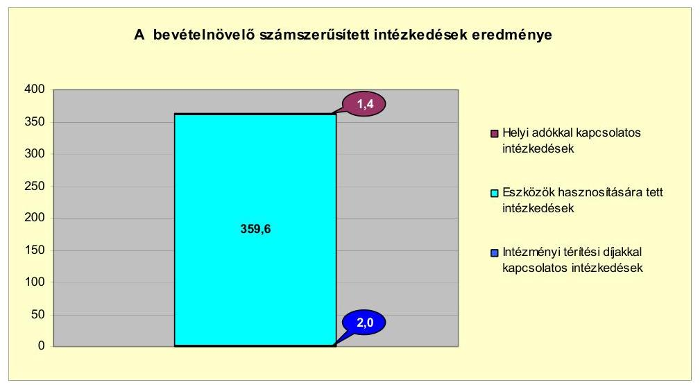

A kiadáscsökkentő és bevételnövelő intézkedések együttesen az Önkormányzat kimutatása szerint pénzügyi egyensúlyát 2007-2010 között 435,9 millió Ft-tal, 2011-ben várhatóan 36,5 millió Ft-tal javították. A központi támogatások és a helyben maradó szja a 2007-2011. év I. féléve között összesen 519,3 millió Ft-tal csökkent. A központi támogatások és a helyben maradó szja az előző évhez viszonyítva együttesen a 2008. évben 88,3 millió Ft-tal, 2009-ben 302,9 millió Ft-tal csökkent, 2010-ben 154,1 millió Ft-tal növekedett, 2011-ben várhatóan 282,2 millió Ft-tal csökken.

A Képviselő-testület 2011. október 5-én a 2012. költségvetési év bevételnövelő és kiadáscsökkentő intézkedéseinek előkészítése érdekében intézkedési terv kidolgozásáról döntött.

Az intézkedési terv előkészítése tekintetében - a számlavezető és a kötvénykibocsátást szervező pénzintézet javaslatainak, valamint az azokat alátámasztó szakértői vélemények figyelembevételével - az intézmények strukturális átalakítását, az önkormányzat gazdasági társaságainak fokozott ellenőrzését és bevételeik szoros elszámoltatását, két új helyi adónem (kommunális és építményadó) bevezetését, továbbá a pénzintézet folyamatos tájékoztatását határozták el.

# 5. Az ÁSZ ÁLTAL A KORÁBBBI ÉVEKBEN A PÉNZÜGYI EGYENSÚLY JAVÍTÁSÁRA TETT SZABÁLYSZERŰSÉGI ÉS CÉLSZERŰSÉGI JAVASLATOK HASZNOSULÁSA 

Az Önkormányzat gazdálkodási rendszerének 2007. évi ellenőrzése során az ÁSZ egy - a pénzügyi helyzet javításával összefüggő - célszerűségi javaslatot tett. A javaslat az Önkormányzat egy gazdasági társasága részére nyújtott kezességvállalás felülvizsgálatára vonatkozott. A javaslatot az intézkedési tervben, a felelős és a határidő meghatározásával szerepeltették. A javaslatot az elfogadott intézkedési terv szerinti határidőben nem valósították meg. Az intézkedési tervben előírt határidőre a gazdasági társaság tevékenységének felülvizsgálatát nem végezték el.

A korábbi polgármester, az intézkedési tervben előírt 2008. március 31-ei határidőhöz viszonyítva késedelmesen, 2008. november
 7-én kezdeményezte a gazda-

---

sági társaság szervezeti átalakítását és tevékenységének racionalizálását a pénzügyi kötelezettség csökkentése érdekében. A gazdasági társaság szervezeti átalakítása a Képviselő-testület döntése ellenére nem történt meg, az Önkormányzat kezességvállalása és az ebből eredő pénzügyi kockázat változatlanul fennáll.

Budapest, 2012. április " M . "
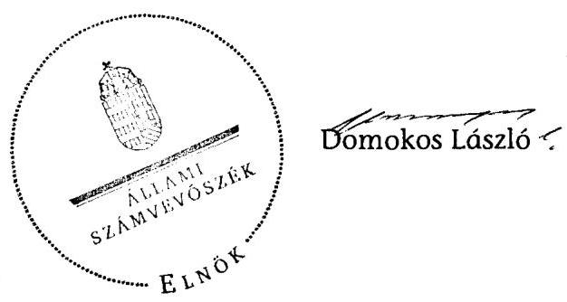

---

**Bátonyterenye Város Önkormányzata**

1. számú melléklet a V-3106-022/2012. számú Jelentéshez

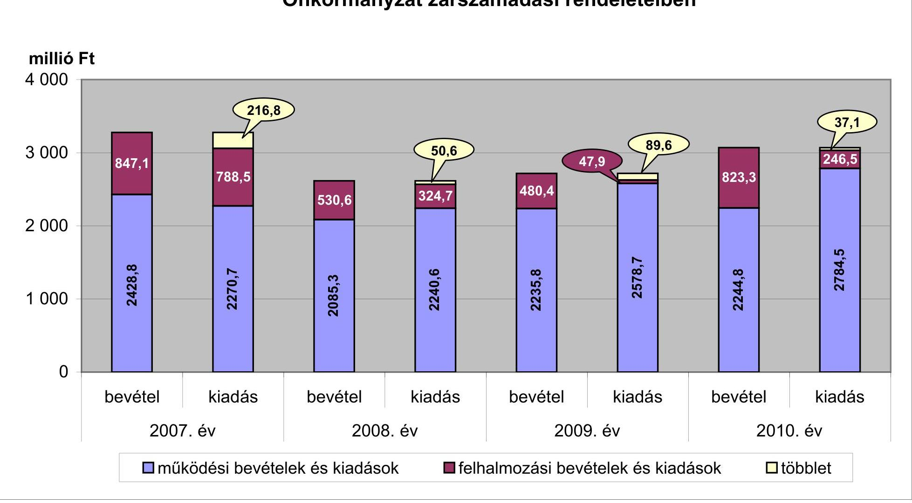

---

Az Önkormányzat bevételei és kiadásai, valamint adósságszolgálata 2007-2010 között

|  1. FOLYÓ KÖLTSÉGVETÉS* | 2007. év | 2008. év | 2009. év | 2010. év  |
| --- | --- | --- | --- | --- |
|  1.1.1. Saját működési bevételek | 580,9 | 315,4 | 333,8 | 303,4  |
|  1.1.2. Költségvetési támogatás | 791,9 | 1147,1 | 826,1 | 976,7  |
|  1.1.3. Átszájelt bevételek | 929,3 | 491,2 | 505,9 | 516,4  |
|  1.1.4. Államháztartáson belülről kapott támogatások | 113,4 | 128,3 | 121,2 | 116,4  |
|  1.1.5. EU-tól és külföldről kapott bevételek | 0,0 | 0,0 | 0,0 | 0,0  |
|  1.1.6. Államháztartáson kívülről kapott bevételek | 5,9 | 1,7 | 1,4 | 0,7  |
|  1.1.7. Előző évi pénzmaradvány átvétel | 0,0 | 66,2 | 9,3 | 0,0  |
|  1.1. Folyó bevételek $=1.1 .1 .+1.1 .2 .+1.1 .3 .+1.1 .4 .+1.1 .5 .+1.1 .6 .+1.1 .7$. | 2421,4 | 2149,9 | 1797,7 | 1913,6  |
|  1.2.1. Működési kiadások kamatkiadások nélkül | 1862,4 | 1543,5 | 919,4 | 867,9  |
|  1.2.2. Államháztartáson belülre átadott pénzeszközök | 19,3 | 138,8 | 270,4 | 277,5  |
|  1.2.3.1. vállalkozásoknak | 17,9 | 13,3 | 204,6 | 444,5  |
|  1.2.3.2. EU-nak, illetve külföldre | 0,0 | 0,0 | 0,0 | 0,0  |
|  1.2.3.3. magánszemélyeknek | 351,2 | 363,9 | 387,4 | 377,3  |
|  1.2.3.4. nonprofit szervezeteknek | 16,5 | 57,0 | 101,0 | 42,2  |
|  1.2.3. Transferkiadások ( $=1.2 .3 .1+1.2 .3 .3+1.2 .3 .3+1.2 .3 .4$ ) | 385,6 | 434,2 | 693,0 | 864,0  |
|  1.2.4 Kamatkiadások | 39,9 | 48,6 | 61,9 | 48,1  |
|  1.2.5. Előző évi pénzmaradvány átadás | 0,0 | 66,2 | 9,3 | 0,0  |
|  1.2. Folyó kiadások $=1.2 .1 .+1.2 .2 .+1.2 .3 .+1.2 .4 .+1.2 .5$. | 2307,2 | 2231,3 | 1954,0 | 2057,1  |
|  1.3. Folyó költségvetés egyenlege MÜKÖDÉSI JÖVEDELEM (1.1. - 1.2.) | 114,2 | -81,4 | -156,3 | -143,5  |
|  2. FELHALMOZÁSI KÖLTSÉGVETÉS** |  |  |  |   |
|  2.1.1. Saját tőkebevételek | 57,2 | 114,6 | 206,2 | 80,5  |
|  2.1.2. Államháztartáson belülről kapott támogatások | 404,5 | 256,9 | 41,5 | 496,7  |
|  2.1.3. EU-tól és külföldről kapott támogatások | 0,0 | 0,0 | 0,0 | 0,0  |
|  2.1.4. Államháztartáson kívülről kapott támogatások | 75,6 | 0,7 | 2,3 | 2,2  |
|  2.1. Felhalmozási bevételek ( $=2.1 .1 .+2.1 .2+2.1 .3+2.1 .4$ ) | 537,3 | 372,2 | 250,0 | 579,4  |
|  2.2.1. Saját beruházási kiadás állával | 783,1 | 149,6 | 102,3 | 321,6  |
|  2.2.2. Saját felújítási kiadás állával | 23,1 | 57,9 | 73,3 | 149,3  |
|  2.2.3. Államháztartáson belülre átadott pénzeszköz | 0,0 | 8,5 | 16,3 | 12,9  |
|  2.2.4. EU-nak és külföldnek adott pénzeszközök | 0,0 | 0,0 | 0,0 | 0,0  |
|  2.2.5. Államháztartáson kívülre adott pénzeszközök | 23,6 | 75,2 | 13,5 | 26,0  |
|  2.2.6. Befektetési célú részesedések vásárlása | 0,0 | 25,0 | 31,6 | 45,9  |
|  2.2. Felhalmozási kiadások ( $=2.2 .1 .+2.2 .2 .+2.2 .3 .+2.2 .4 .+2.2 .5 .+2.2 .6$ ) | 829,8 | 316,2 | 237,0 | 555,7  |
|  2.3. Felhalmozási költségvetés egyenlege (2.1. - 2.2.) | -292,5 | 56,0 | 13,0 | 23,7  |
|  3. Finanszírozási műveletek nélküli (GFS) pozíció(1.3.-2.3.) | -178,3 | -25,4 | -143,3 | -119,8  |
|  4. Finanszírozási műveletek |  |  |  |   |
|  4.1. Hitelfelvétel | 524,6 | 30,0 | 580,6 | 146,0  |
|  4.2. Hitelfeltörlesztés | 151,4 | 139,8 | 466,1 | 54,7  |
|  4.3. Forgatási és befektetési célú értékpapírok kibocsátása | 0,0 | 0,0 | 0,0 | 0,0  |
|  4.4. Forgatási és befektetési célú értékpapírok beváltása | 0,0 | 0,0 | 0,0 | 0,0  |
|  4.5. Forgatási és befektetési célú értékpapírok értékesítése | 0,0 | 0,0 | 0,0 | 0,0  |
|  4.6. Forgatási és befektetési célú értékpapírok vásárlása | 0,0 | 0,0 | 0,0 | 0,0  |
|  4.7. Egyéb finanszírozási bevételek (függő, átfutó, kiegyenlítő) | -238,8 | -38,1 | 76,9 | -44,7  |
|  4.8. Egyéb finanszírozási kiadások (függő, átfutó, kiegyenlítő) | -118,6 | -7,1 | 9,1 | -20,6  |
|  4.9.Finanszírozási műveletek egyenlege (4.1. - 4.2.+4.3.-4.4+4.5.-4.6.+4.7.-4.8.) | 253,0 | -140,8 | 182,3 | 67,2  |
|  5. Tárgyévi pénzügyi pozíció (1.3.+ 2.3.+4.9.) | 74,7 | -166,2 | 39,0 | -52,6  |
|  6. Nettó működési jövedelem =működési jövedelem (1.3.) - tőketörlesztés (4.2+4.4) | -37,2 | -221,2 | -622,4 | -198,2  |
|  TÁJÉKOZTATÓ ADATOK |  |  |  |   |
|  Összes kötelezettség | 920,6 | 605,8 | 682,1 | 1355,8  |
|  ebből rövid lejáratú | 920,6 | 605,8 | 682,1 | 1355,8  |
|  Összes szállítói kötelezettség | 235,8 | 90,7 | 18,6 | 303,1  |
|  ebből lejárt (tanúsítványból) | 0,0 | 0,0 | 0,0 | 0,0  |
|  Pénz és tőkepiaci kötelezettség (adósság) | 575,9 | 466,1 | 580,6 | 671,9  |
|  ebből rövid lejáratú | 575,9 | 466,1 | 580,6 | 671,9  |
|  PPP szerződéses állomány jelenértéken (tanúsítványból) | 0,0 | 0,0 | 0,0 | 0,0  |
|  ebből lejárt szolgáltatási díj miatti kötelezettség | 0,0 | 0,0 | 0,0 | 0,0  |
|  Folyószámlahitel napi átlagos állománya (tanúsítványból) | 255,6 | 346,0 | 429,4 | 474,4  |
|  Likviditási állománya (tanúsítványból) | 324,2 | 30,0 | 0,0 | 50,0  |
|  Munkabérhitel napi átlagos állománya (tanúsítványból) | 104,1 | 130,0 | 118,3 | 110,0  |
|  Kezesség és garanciavállalások (tanúsítványból) | 0,0 | 0,0 | 0,0 | 0,0  |
|  Jogerős bírósági ítéletekből adódó kötelezettségek (tanúsítványból): | 0,0 | 0,0 | 0,0 | 0,0  |
|  Finanszírozásba bevonható eszközök: | 216,8 | 50,6 | 89,6 | 37,1  |
|  Tartós hitelviszonyt megtestesítő értékpapírok év végi állománya | 0,0 | 0,0 | 0,0 | 0,0  |
|  Hosszú lejáratú bankbetétek év végi állománya | 0,0 | 0,0 | 0,0 | 0,0  |
|  Értékpapírok év végi állománya | 0,0 | 0,0 | 0,0 | 0,0  |
|  Pénzeszközök (idegen pénzeszközök nélküli) év végi állománya | 216,8 | 50,6 | 89,6 | 37,1  |

[^0] [^0]: * Bevételekben nem térül, a kiadásokban nem jelenik meg az amortizáció, a vagyoni helyzetet az egyenleg befolyásolja ** A költségvetési támogatásból a felhalmozási célú összeget az Önkormányzat adatszolgáltatása szerinti mértékben vettük figyelembe a 2.1.2 soron

---

### **Az Önkormányzat 2007-2010. években megvalósított, 2010. december 31-ig befejezett fejlesztései és azok forrásösszetétele**

|   | Fejlesztési feladat (beruházás, felújítás) |  |  |  |  |  |  |  |  |  |  |  |  |  |  |  |  |  |  |  |  |  |  |  |  |  |  |  |  |  |  |  |  |  |  |  |  |  |  |  |  |  |  |  |  |  |  |  |  |  |  |  |  |  |  |  |  |  |  |  |  |  |  |  |  |  |  |  |  |  |  |  |  |  |  |  |  |  |  |  |  |  |  |  |  |  |  |  |  |  |  |  |  |  |  |  |  |  |  |  | 

---

### **Az Önkormányzat 2010. december 31-én folyamatban lévő fejlesztési feladataira 2010. december 31-ig teljesített kifizetések és azok forrásösszetétele**

|  Fejlesztési feladat (beruházás, felújítás) |  | Beruházás, felújítás |  | Teljes bekerülési költség |  |  | 2006. dec. 31-ig teljesített kiadás | 2007-2010. évadban teljesített kiadás | 2007-2010. évadban teljesített kiadás | 2008. dec. 31-ig teljesített kiadás | 2010. december 31-ig pénzügyileg teljesített beruházás forrásösszetétele |  |  |  |  |  |  |  |  |  |  |  |  |  |  |  |  |  |  |  |  |  |  |  |  |  |  |  |  |  |  |  |  |  |  |  |  |  |  |  |  |  |  |  |  |  |  |  |  |  |  |  |  |  |  |  |  | 

 |  |  |  |  |  |  |  |  |  |  |  |  |  |  |  |  |  |  |  |  |  |  |  |  |  |  |  |  |  |  |  |  |  |  |  |  |  |  |  |  |  |  |  |  |  |  |  |  |  |  |  |  |  |  |  |  |  |  |  |  |  |  |  |  |  |  |  |  |  |  |  |  |  |  |  |  |  |  |  |  |  |  |  |  |  |  |  |  |  |  |  |  |  |  |  |  |  |  |  |  |  | 

---

### **Az Önkormányzat 2010. december 31-én folyamatban lévő fejlesztési feladataira 2010. december 31-én fennálló kötelezettségek és azok forrásösszetétele**

|   |  |  |  |  |  |  |  |  |  |  |  |  |  |  |  |  |  |  |  |  |  |  |  |  |  |  |  |  |  |  |  |  |  |  |  |  |  |  |  |  |  |  |  |  |  |  |  |  |  |  |  |  |  |  |  |  |  |  |  |  |  |  |  |  |  |  |  |  |  |  |  |  |  |  |  |  |  |  |  |  |  |  |  |  |  |  |  |  |  |  |  |  |  |  |  |  |  |  |  |  | 

---

## **Az önkormányzati feladatok ellátásában résztvevő gazdasági társaságok**

|  Gazdasági társaság
megnevezése |  |  |  |  |  |  |  |  |  |  |  |  |  |  |  |  |  |  |  |  |  |  |  |  |  |  |  |  |  |  |  |   |
| --- | --- | --- | --- | --- | --- | --- | --- | --- | --- | --- | --- | --- | --- | --- | --- | --- | --- | --- | --- | --- | --- | --- | --- | --- | --- | --- | --- | --- | --- | --- | --- | --- |
|   | Önkormányzat | Önkormányzat
gazdasági
társaságának | saját tőke,
jegyzett tőke
aránya | kötelező
feladathoz | önként vállalt
feladathoz | hosszú lejáratú
hitelből,
kötből | lízingből | lejárt szállító
állományból | működési célú pénzeszköz átadás | felhalmozási célú pénzeszköz átadás | felhalmozási célú pénzeszköz átadás |  |  |  |  |  |  |  |  |  |  |  |  |  |  |  |  |  |  |  |  |   |
|   | tulajdoni hányada |  |  |  |  |  |  |  |  |  |  |  |  |  |  |  |  |  |  |  |  |  |  |  |  |  |  |  |  |  |   |
|  2. 100%-os tulajdoni hányadú gazdasági társaságok: |  |  |  |  |  |  |  |  |  |  |  |  |  |  |  |  |  |  |  |  |  |  |  |  |  |  |  |  |  |  |   |
|  BÁTONYREHAB Kft. | 1 | 0 | 4,69 | 0 | 38,0 | 0 | 0 | 0,4 | 10,0 | 0 | 0 | 0 | 0 | 0 | 0 | 0 | 0 | 0 | 0 | 0 | 0 | 0 | 0 | 0 | 0 | 0 | 0 | 0 | 0 | 0 |   |
|  Tanuszoda Kft. | 1 | 0 | 0,09 | 0 | 455,2 | 383,1 | 0 | 7,2 | 0 | 40,0 | 84,0 | 24,8 | 10,9 | 0 | 0 | 0 | 0 | 0 | 0 | 0 | 0 | 0 | 0 | 0 | 0 | 0 | 0 | 0 | 0 | 0 |   |
|  100%-os tulajdoni hányadú
gazdasági társaságok
összesen | x | x | x | 0 | 493,2 | 383,1 | 0,0 | 7,6 | 10,0 | 40,0 | 84,0 | 24,8 | 10,9 | 0 | 0 | 0 | 0 | 0 | 0 | 0 | 0 | 0 | 0 | 0 | 0 | 0 | 0 | 0 | 0 | 0 |   |
|  0. 75-99%-os tulajdoni hányadú gazdasági társaságok: |  |  |  |  |  |  |  |  |  |  |  |  |  |  |  |  |  |  |  |  |  |  |  |  |  |  |  |  |  |  |   |
|  BÁVÚ Kft. | 89,57 | 0 | 2,55 | 33,3 | 0 | 58,2 | 0 | 38,1 | 0 | 0 | 0 | 0 | 0 | 0 | 0 | 0 | 0 | 0 | 0 | 0 | 0 | 0 | 0 | 0 | 0 | 0 | 0 | 0 | 0 | 0 |   |
|  Víz- és Csatornamű Kft. | 82,30 | 0 | 8,73 | 2054,7 | 0 | 0 | 0 | 11,1 | 0 | 0 | 0 | 0 | 0 | 0 | 0 | 0 | 0 | 0 | 0 | 0 | 0 | 0 | 0 | 0 | 0 | 0 | 0 | 0 | 0 | 0 |   |
|  75-99%-os tulajdoni
hányadú gazdasági
társaságok összesen | x | x | x | 2 088,0 | 0 | 58,2 | 0 | 49,2 | 0 | 0 | 0 | 0 | 0 | 0 | 0 | 0 | 0 | 0 | 0 | 0 | 0 | 0 | 0 | 0 | 0 | 0 | 0 | 0 | 0 | 0 |   |
|  75% feletti tulajdoni
hányadú gazdasági
társaságok
összesen | x | x | x | 2 088,0 | 493,2 | 441,3 | 0 | 56,8 | 10 | 40,0 | 84,0 | 24,8 | 10,9 | 0 | 0 | 0 | 0 | 0 | 0 | 0 | 0 | 0 | 0 | 0 | 0 | 0 | 0 | 0 | 0 | 0 |   |
|  0. 51-74%-os tulajdoni hányadú gazdasági társaságok: |  |  |  |  |  |  |  |  |  |  |  |  |  |  |  |  |  |  |  |  |  |  |  |  |  |  |  |  |  |  |   |
|  51-74%-os tulajdoni
hányadú gazdasági
társaságok összesen | x | x | x | 0 | 0 | 0 | 0 | 0 | 0 | 0 | 0 | 0 | 0 | 0 | 0 | 0 | 0 | 0 | 0 | 0 | 0 | 0 | 0 | 0 | 0 | 0 | 0 | 0 | 0 | 0 |   |
|  IV. egyéb, közfeladatot ellátó gazdasági társaságok: |  |  |  |  |  |  |  |  |  |  |  |  |  |  |  |  |  |  |  |  |  |  |  |  |  |  |  |  |  |  |   |
|  Nógrád Volán Zrt. | 0 | 0 | 1,05 | 0 | 0 | 0 | 0 | 0 | 3,9 | 4,0 | 3,9 | 4,1 | 0,0 | 0 | 0 | 0 | 0 | 0 | 0 | 0 | 0 | 0 | 0 | 0 | 0 | 0 | 0 | 0 | 0 |   |
|  egyéb, közfeladatot ellátó
gazdasági társaságok
összesen | x | x | x | 0 | 0 | 0 | 0 | 0 | 3,9 | 4,0 | 3,9 | 4,1 | 0 | 0 | 0 | 0 | 0 | 0 | 0 | 0 | 0 | 0 | 0 | 0 | 0 | 0 | 0 | 0 | 0 | 0 |   |
|  Összesen | x | x | x | 2 088,0 | 493,2 | 441,3 | 0 | 56,8 | 13,9 | 44,0 | 87,9 | 28,9 | 10,9 | 0 | 0

 | 0 | 0 | 0 | 0 | 0 | 0 | 0 | 0 | 0 | 0 | 0 | 0 | 0 | 0 | 0 |   |
