# ÁLLAMI   SZÁMVEVŐSZÉK 

## JELENTÉS

## Berettyóújfalu Város Önkormányzata pénzügyi helyzetének ellenőrzéséről (43/4)

---

# Állami Számvevőszék 

Iktatószám: V-3094-023/2012.
Témaszám: 1015
Vizsgálat-azonosító szám: V0560125

## Az ellenőrzést felügyelte:

Dr. Varga Sándor
számvevő igazgatóhelyettes
Az ellenőrzést vezette:
Renkó Zsuzsanna
számvevő tanácsos
Ellenőrzési csoportvezető:
Bíró Zsolt
számvevő tanácsos
Az ellenőrzést végezték:
Kersmájer Ágota dr. Győri Gabriella
számvevő tanácsos számvevő

---

# TARTALOMJEGYZÉK 

BEVEZETÉS ..... 9
I. ÖSSZEGZŐ MEGÁLLAPÍTÁSOK, KÖVETKEZTETÉSEK, JAVASLATOK ..... 13
II. RÉSZLETES MEGÁLLAPÍTÁSOK ..... 27

1. Az Önkormányzat kötelező és önként vállalt feladatai, a feladatellátás szervezeti keretei és annak változásai ..... 27
2. Az Önkormányzat pénzügyi egyensúlyi helyzetét befolyásoló tényezők ..... 33
2.1. A működési és a felhalmozási egyensúly változása ..... 35
2.2. Az Önkormányzat bevételeinek változása ..... 40
2.3. Az Önkormányzat múködési és felhalmozási célú kiadásainak változása ..... 43
3. Az Önkormányzat kötelezettségei ..... 50
3.1. Az Önkormányzat pénzintézetekkel szembeni kötelezettségeinek változása ..... 50
3.2. A szállítói kötelezettségek változása ..... 59
3.3. Egyéb kötelezettségek változása ..... 60
4. A pénzügyi egyensúly megteremtése érdekében hozott intézkedések eredménye ..... 64
5. Az ÁSZ által a korábbi években a pénzügyi egyensúly javítására tett szabályszerűségi és célszerűségi javaslatok hasznosulása ..... 67

---

# MELLÉKLETEK 

1. számú Múködési és felhalmozási célú hiány/többlet az Önkormányzat zárszámadási rendeleteiben (1 oldal)
2. számú Az Önkormányzat bevételei és kiadásai, valamint adósságszolgálata 20072010 között (1 oldal)
3/a. számú Az Önkormányzat 2007-2010. években megvalósított, 2010. december 31-ig befejezett fejlesztései és azok forrásösszetétele (3 oldal)
3/b. számú Az Önkormányzat 2010. december 31-én folyamatban lévő fejlesztési feladataira 2010. december 31-ig teljesített kifizetések és azok forrásösszetétele (1 oldal)
3/c. számú Az Önkormányzat 2010. december 31-én folyamatban lévő fejlesztési feladataira 2010. december 31-én fennálló kötelezettségek és azok forrásösszetétele (1 oldal)
3/d. számú Az Önkormányzat által beadott, elbírálás alatti pályázati forrásból megvalósítani tervezett fejlesztéseihez kapcsolódó kötelezettségvállalásai és az azok forrásösszetétele (1 oldal)
3. számú Az önkormányzati feladatok ellátásában résztvevő gazdasági társaságok (1 oldal)

---

# RÖVIDÍTÉSEK JEGYZÉKE 

## Törvények

Áht $_{1}$.
Áht $_{2}$.
Ötv.
Stabilitási tv.
Számv. tv.
Ptk.

## Rendeletek

Ámr.
Áhsz.

SzMSz

## Szórövidítések

áfa
ÁSZ
BERÉPÓ Nonprofit Kft.

BM
EU
GDP
Jegyző
Képviselő-testület
Kistérségi társulás
Kórház
Herpály-Team Kft.
Hulladéklerakó Társulás
NGM
OEP
ÖNHIKI
Önkormányzat
polgármester
Polgármesteri hivatal
PPP konstrukció
szja
Szolgáltató Iroda
az államháztartásról szóló 1992. évi XXXVIII. törvény az államháztartásról szóló 2011. évi CXCV. törvény a helyi önkormányzatokról szóló 1990. évi LXV. törvény a Magyarország gazdasági stabilitásáról szóló 2011. évi CXCIV. törvény
a számvitelről szóló 2000. évi C. törvény
a Polgári Törvénykönyvről szóló 1959. évi IV. törvény
az államháztartás múködési rendjéről szóló 292/2009. (XII. 19.) Korm. rendelet
az államháztartás szervezetei beszámolási és könyvvezetési kötelezettségének sajátosságairól szóló 249/2000. (XII. 24.) Korm. rendelet

Berettyóújfalu Város Önkormányzata Képviselőtestületének 8/2011. (II.25.) sz. rendelete a Szervezeti és Múködési Szabályzatról
általános forgalmi adó
Állami Számvevőszék
BERÉPÓ Berettyóújfalui Értelmi Fogyatékosok és Pszichiátriai Betegek Otthona Nonprofit Korlátolt Felelősségű Társaság
Belügyminisztérium
Európai Unió
Bruttó hazai termék
Berettyóújfalu Város Önkormányzatának jegyzője
Berettyóújfalu Város Önkormányzat Képviselő-testülete
Bihari Önkormányzatok Többcélú Kistérségi Társulása
Gróf Tisza István Kórház
Herpály-Team Építőipari és Szolgáltató Kft.
Bihari Szilárd Hulladéklerakó és Hasznosító Társulás
Nemzetgazdasági Minisztérium
Országos Egészségbiztosítási Pénztár
Önhibáján kívül hátrányos helyzetben lévő helyi önkormányzatok
Berettyóújfalu Város Önkormányzata
Berettyóújfalu Város Önkormányzatának polgármestere
Berettyóújfalu Város Önkormányzatának Polgármesteri hivatala
Public Private Partnership (Partnerségi együttmúködés közfeladatok ellátására a magánszektor bevonásával) személyi jövedelemadó
Közintézmények Szolgáltató Irodája

---

.

---

# ÉRTELMEZŐ SZÓTÁR 

| BUBOR | Budapesti Bankközi Forint Hitelkamatláb. Irányadó, refe-   rencia jellegú kamatláb. Mértékét az MNB naponta álla-   pitja meg a banki kamatok figyelembevételével. Közzété-   tele naponta történik. |
| :--: | :--: |
| CLF módszer | Az önkormányzatok költségvetése elemzésének eszköze. A   módszer következetesen elkülöníti a folyó és a felhalmo-   zási költségvetés bevételeit és kiadásait, azok költségvetési   egyenlegeit. Bizonyos mértékig a vállalati gazdálkodás   logikai elemeit érvényesíti az önkormányzatok pénzügyi,   jövedelmi helyzetének vizsgálata során. Az értékelés a   pénzügyi kapacitás fogalmát helyezi a középpontba. |
| EURIBOR | A frankfurti bankközi piacon jegyzett, az Európai Közpon-   ti Bank szabályainak megfelelően megállapított kínálati   kamatláb. Az EURIBOR értékét a legfontosabb európai   bankok hitelkínálatának kamatlábai alapján a Reuters   ügynökség számolja ki és teszi közzé naponta. A magyar   pénzintézetek is ezt használják viszonyítási alapnak EUR   hitelek esetén. |
| faktorálás | Lejárt és le nem járt követelések adásvétele. A jogosult   eladja a követelését egy pénzintézetnek, vagy egy ezzel   foglalkozó cégnek (faktor). A faktor rövid lejáratú követe-   léseket vásárol meg, és azok refinanszírozására, behajtá-   sára vállalkozik. A faktoring ügylet háromszereplős: száll-   lító, adós és a faktor. |
| használhatósági fok | Az eszközgazdálkodás vizsgálatának elemzése során hasz-   nált mutatató. Számításakor a tárgyi eszköz könyv szerin-   ti (nettó) értékét viszonyítják a tárgyi eszköz bruttó (be-   szerzési/létesítési) értékéhez. A \%-ban kifejezett mutató   csökkenése az eszköz állagának romlására, avulására   utal, ami maga után vonja az üzemeltetési és fenntartási   költségek növekedését is. |
| kamatkockázat | A változó kamatozású forint-, vagy a devizahitelek futam-   ideje alatt a kamat emelkedése miatt fennálló kamatkoc-   kázat, melynek növekedése miatt nő a hitel törlesztő rész-   lete. |
| kötelező közszolgáltatás | A helyi önkormányzati feladatkörbe tartozó, a köztiszta-   sággal és a településtisztasággal, valamint az élet- és va-   gyonbiztonsággal összefüggő egyes - közszolgáltatás út-   ján megvalósuló - közfeladatok ellátása, amelynek köte-   lező igénybevételét külön jogszabály (törvény, helyi ön-   kormányzati rendelet) határoz meg. |
| közfeladat | Állami, helyi, illetve kisebbségi önkormányzati feladat,   amelynek ellátásáról az államnak, illetve az önkormány-   zatoknak kell gondoskodni. A hatályos szabályozás sze-   rint közfeladatot törvény és önkormányzati rendelet álla-   píthat meg. Az önkormányzatok által ellátandó feladatok   keretszerú meghatározását az Ötv. tartalmazza. |

---

LIBOR
önkormányzat többségi tulajdonában lévő gazdasági társaságok
minősített többségi tulajdonban lévő gazdasági társaság
pénzügyi kapacitás
pénzügyi kockázat

Angol kifejezés, a London Interbank Offered Rate rövidítése. Jelentése: Londoni bankközi, referencia jellegű kínálati (hitel) kamatláb.
Az önkormányzat a gazdasági társaságban a szavazatok több mint ötven százalékával vagy a Ptk. 685/B. § (2)-(3) bekezdéseiben rögzített meghatározó befolyással rendelkezik. A befolyással rendelkező akkor rendelkezik egy jogi személyben meghatározó befolyással, ha annak tagja, illetve részvényese és jogosult e jogi személy vezető tisztségviselői vagy felügyelőbizottsága tagjai többségének megválasztására, illetve visszahívására, vagy a jogi személy más tagjaival, illetve részvényeseivel kötött megállapodás alapján egyedül rendelkezik a szavazatok több mint ötven százalékával (Ptk. 685/B. § (2) bek.). A meghatározó befolyás akkor is fennáll, ha a befolyással rendelkező számára e jogosultságok közvetett módon (köztes vállalkozásain keresztül, a Ptk. 685/B §. (3),(4) bek. szerint) biztosítottak.
A helyi önkormányzat és az önkormányzat irányítása alá tartozó költségvetési szerv többségi tulajdonában, illetve többségi befolyása alatt álló gazdálkodó szervezet esetében hitelfelvétel, kölcsönfelvétel, garancia- vagy kezességvállalás, tartozásátvállalás, tartozás-elengedés, értékpapír kibocsátás, vásárlás, pénzügyi lízing, tartós bérleti szerződés, ingyenes vagyonjuttatás (így különösen: ajándékozás, ingyenes engedményezés), vagy követelésvásárlás, követelésengedményezés végrehajtására vonatkozóan az Áht ${ }_{1}$. 100/M. § (4) bekezdése alapján az önkormányzat rendelkezik döntési jogosultsággal.
A gazdasági társaságokról szóló 2006. évi IV. törvény 52. § (2) bekezdése alapján minősített többséget biztosító befolyásnak számít, ha a minősített befolyásszerző az ellenőrzött gazdasági társaságban a szavazatok legalább 75\%ával rendelkezik.
A pénzügyi kapacitás (financial capacity) az adósok hitelfelvételi képességének azon mértéke, ahol még anélkül tudják növelni az adósságot, hogy csökkenteniük kellene akár a jelenbeli, akár a jövőben esedékes kiadásaikat a fizetésképtelenség elkerülése érdekében. (Forrás: Az önkormányzati rendszer pénzügyi helyzete, ÁSZKUT tanulmány 2010.)
A múködési kockázat egyik eleme. Megmutatkozhat a költségvetés nagyságrendjének, szerkezetének nem megalapozott módosításaiban, a bevételi, és a kiadási előirányzatoktól lényegesen eltérő teljesítésekben, a nem megfelelő belső kontrollrendszer múködésében, a tudatos károkozásokban, a biztosítások elmaradásában, a hibás fejlesztési döntésekben, a nem a terveknek megfelelő forrásfelhasználásokban. Jelentkezhet továbbá a bevételek és kiadások ütemkülönbsége miatt felvett folyószámla- és

---

törlesztési kockázat

SNA
szállítói kitettség
likvidhitelek költségvetési év végén fennálló egyenlege miatt, amely az önkormányzat költségvetésébe - akár tartósan - beépülő forráshiányt jelzi.
Annak a kockázata, hogy a megfelelő időben és mértékben a hitelt felvevőnél rendelkezésre állnak-e a pénzintézetek és egyéb szervek felé fennálló kötelezettségek visszafizetéséhez, a hitelek és kölcsönök törlesztéséhez szükséges pénzügyi források.
A törlesztési kockázatot növeli a kamat- és árfolyam növekedése, mivel ezekben az esetekben az adósságszolgálat nőhet. Törlesztési kockázatot okozhat a visszafizetésre tervezett forrás elérésének, teljesítésének bizonytalansága (pl. a visszafizetéshez tervezett tartalékolás elmaradt, a tervezettnél alacsonyabb a saját bevétel, a helyi adóból származó bevétel az adóalanyok, adóalapok csökkenése miatt nem teljesül).
System of National Account azaz a Nemzeti Számlák Rendszere, amely a gazdasági szektorok által létrehozott valamennyi terméket és szolgáltatást figyelembe veszi.
Az önkormányzat pénzügyi helyzete olyan külső körülmények hatására is módosulhat, amelyekre az önkormányzatnak nincs hatása, emiatt szállítói kitettsége keletkezik. Pl. a lejárt szállítói tartozások rendezése függhet attól, hogy a szállító milyen intézkedéseket foganatosít az önkormányzattal szemben.

---

.

---

# JELENTÉS 

## Berettyóújfalu Város Önkormányzata pénzügyi helyzetének ellenőrzéséről

## BEVEZETÉS

Az Állami Számvevőszék 2011. évtől érvényes stratégiája új irányt szabott a helyi önkormányzatok gazdálkodásának ellenőrzésében is. Az ÁSZ - küldetése és jövőképe szerint - szilárd szakmai alapokra támaszkodva értékteremtő ellenőrzéseivel és helyzetelemzéseivel az államháztartás egészében, így a helyi önkormányzati alrendszerben is elő kívánja segíteni a közpénzek és a közvagyon szabályos, gazdaságos, hatékony és eredményes felhasználását. E folyamat részeként - az államháztartási hiány alakulásának összetevőire is figyelemmel végezzük az önkormányzati alrendszer pénzügyi helyzetelemzését.

Az államháztartás helyi szintjén a 304 városnak ${ }^{1}$ az általuk ellátott közszolgáltatások volumenére is tekintettel a közfeladatok ellátásában kiemelt szerepe van. E települések 2011. január 1-jei népessége 3169 ezer fő volt.

Feladataik és hatásköreik az Ötv. mellett különböző ágazati törvények által meghatározottak, miközben a feladatellátás szervezeti kereteit - ezen belül a gazdasági társaságok közszolgáltatások ellátásában betöltött szerepét - saját maguk határozzák meg. A gazdasági társaságok által ellátott feladatok esetén a gazdálkodás, továbbá az önkormányzatok pénzügyi egyensúlyi helyzetére ható közvetlen kockázatok egy része kikerült az önkormányzati alrendszerből. A többségi önkormányzati tulajdonban lévő társaságok gazdálkodásának körülményei befolyásolhatják a városok pénzügyi egyensúlyi helyzetének megítélésében rejlő kockázatokat.

Az áttekintett időszakban az önkormányzati forrásszabályozás elvei lényegesen nem változtak. Az önkormányzatok gazdasági mozgásterét a központi költségvetéstől való függőség mellett jelentősen befolyásolja a helyi adókivetési jog gyakorlása. A városok gazdálkodási szabadságának lényeges eleme, hogy anyagi lehetőségeik függvényében dönthettek arról, hogy feladataik közül azokat, amelyek megoldására az Ötv. szerint a települési önkormányzat nem kötelezhető, a megyei önkormányzat fenntartásába adhatták. E döntések differenciáltan érintették a városok pénzügyi helyzetét.

[^0]
[^0]:    ${ }^{1}$ A megyei jogú városok nélkül figyelembe vett városok száma 304 városi önkormányzatot jelent.

---

A városi önkormányzatok 2007-2010 között teljesített bevételeinek alakulását és összetételét a következő ábra szemlélteti:

Az önkormányzati alrendszer pénzügyi helyzetértékelése során új elemzési módszereket alkalmazott az ellenőrzés. A költségvetési beszámoló adatok elemzése helyett az önkormányzat pénzügyi helyzetét a CLF módszerrel értékeljük, amelynek lényegét és számításának módszerét a jelentés 2. pontjában, és a jelentés 2 . számú mellékletében ismertetjük részletesen.

Az új módszereken alapuló helyzetértékelés fontosságát az adja, hogy a helyi önkormányzatok bruttó adósságállománya ${ }^{2}$ a 2010. évi költségvetési beszámolók alapján 1248 milliárd Ft-ot tett ki. Ezen belül a 304 város adóssága 383 milliárd Ft volt, amely az önkormányzati alrendszer teljes adósságállományának $30,7 \%$-át jelentette ${ }^{3}$.

A mérlegben kimutatott bruttó adósságállomány mellett az önkormányzatok számára az eszközállomány műszaki állapotának megőrzése is előbb-utóbb pénzügyi kötelezettséget jelent. Az elhasználódott eszközök pótlására forrást biztosító amortizációs (felújítási) alap képzésének ${ }^{4}$ elmaradása maga után vonhatja a feladatellátást kiszolgáló tárgyi eszközök állagának erőteljes romlását.

[^0]
[^0]:    ${ }^{2}$ Az önkormányzati mérlegbeszámolókból számított bruttó adósságállomány 2010. év végi összege magában foglalja a fejlesztési és a múködési célú kötvénykibocsátások, a beruházási és fejlesztési hitelek, a működési célú hosszú lejáratú hitelek, a rövid lejáratú hitelek, váltótartozások miatti kötelezettségek teljes (2011-ben, illetve az azt követő években esedékes) állományát. Az önkormányzatok 2007. év végi mérleg szerinti adósságállománya 692 milliárd Ft volt.
    ${ }^{3}$ A fővárosi és a kerületi önkormányzatok adósságának figyelmen kívül hagyásával számított 977 milliárd Ft összegű bruttó adósságállományból a városok 39,2\%-kal részesedtek.
    ${ }^{4}$ Erre a jelenlegi szabályozási környezetben nem kötelezi előírás az önkormányzatokat.

---

Emellett a 2007-2013-as időszakra meghirdetett, vissza nem térítendő EU-s fejlesztési forrásokhoz való hozzájutás lehetősége felerősítette az önkormányzati alrendszer fejlesztési igényeit, amelyek a felhalmozási költségvetési hiány folyamatos emelkedésén túl - az előírt jövőbeni fenntartási kötelezettség miatt tovább terhelhetik az önkormányzatok költségvetését ${ }^{5}$.

Az ÁSZ a 2011. évi ellenőrzési tervében 43. számú, az Önkormányzatok gazdálkodási rendszerének ellenőrzése részeként áttekinti, és elemzi az önkormányzatok pénzügyi helyzetét. A gazdálkodás szabályszerűségét az ÁSZ az előző évek során ebben az önkormányzati körben is ellenőrizte. Jelen vizsgálatunk a tett javaslataink pénzügyi helyzetet érintő pontjainak hasznosítására utóellenőrzés jelleggel tér ki.

Az ellenőrzés megállapításait az Önkormányzat által kitöltött - teljességi nyilatkozattal megerősített - 27 tanúsítványon szolgáltatott adatokra alapoztuk. Ellenőrzési bizonyítékként használtuk fel továbbá:

- a képviselő-testületi és bizottsági előterjesztéseket, a döntés-előkészítés során készített dokumentumokat;
- a kötelezettségvállalások dokumentumait;
- a pénzügyi-számviteli nyilvántartásokat;
- az éves költségvetési beszámolókat;
- a költségvetési és zárszámadási rendeleteket.

Az ellenőrzés a 2007. január 1. - 2011. június 30. közötti időszakot öleli fel. A pénzintézeti kötelezettségek állományának vizsgálatakor az ellenőrzött időszak 2006. december 31. - 2011. június 30. közötti időszakra terjedt ki.

Az ellenőrzés során vizsgáltunk minden olyan körülményt és adatot, amely a program végrehajtásához kapcsolódott és a pénzügyi helyzet alakulására hatást gyakorló releváns tények és folyamatok feltárásához szükségessé vált.

# Az ellenőrzés célja annak értékelése volt, hogy: 

- a vizsgált időszakban a kötelező- és önként vállalt feladatok ellátását biztosító szervezeti keretekben, a feladatellátás módjában bekövetkezett változások milyen hatást gyakoroltak az Önkormányzat pénzügyi helyzetének alakulására;

[^0]
[^0]:    ${ }^{5}$ Az Állami Számvevőszék 2011 júniusában közzétett 1108. számú, a helyi önkormányzatok fejlesztési célú támogatási rendszerének ellenőrzéséről szóló jelentésében feltárta a fejlesztési folyamatok problémáit. A helyi önkormányzatok elsősorban azokat a fejlesztéseket valósították meg, amelyekhez támogatást lehetett igényelni. A fejlesztési célok közül a magasabb támogatási intenzitású pályázatokat részesítették előnyben. A fejlesztéssel megvalósuló létesítmények jövőbeli üzemeltetésének várható ráfordításait az önkormányzatok $71,9 \%$-a nem mérte fel.

---

- az Önkormányzat pénzügyi - ezen belül múködési és felhalmozási - egyensúlya mely tényezők hatására miként változott, és az Önkormányzat milyen intézkedéseket tett a pénzügyi egyensúly javítása érdekében;
- a költségvetési kiadások finanszírozása érdekében vállalt pénzintézeti kötelezettségek hogyan alakultak, továbbá milyen kötelezettségek fennállása befolyásolja az Önkormányzat jövőbeli pénzügyi helyzetét;
- hasznosultak-e a gazdálkodási rendszer korábbi ellenőrzése során a pénzügyi egyensúly javítására az ÁSZ által tett szabályszerűségi és célszerűségi javaslatok.

Az ellenőrzés típusa: szabályszerűségi vizsgálat.
A vizsgálat jogszabályi alapját az Állami Számvevőszékről szóló 2011. évi LXVI. törvény 1. § (3), 5. § (2)-(6) bekezdései, továbbá az Áht ${ }_{1}$. 120/A. § (1) bekezdése ${ }^{6}$ előírásai képezik.

Berettyóújfalu város lakosainak száma 2011. január 1-jén 15317 fő volt. Az Önkormányzat feladatainak végrehajtása érdekében a Polgármesteri hivatalon felül kettő önállóan működő és gazdálkodó, nyolc önállóan működő költségvetési intézményt múködtetett. A feladatok ellátásában három gazdasági társasága vett részt. Az Önkormányzat folyó és felhalmozási bevételeinek együttes összege - az előző évi pénzmaradvány igénybevétele nélkül - 8728,3 millió Ftot, a folyó és felhalmozási kiadások együttes összege 9563,6 millió Ft-ot tett ki a 2010. évben. Az Önkormányzat 2010. december 31-én 15021,2 millió Ft értékű vagyonnal rendelkezett. A Polgármesteri hivatalban és az intézményekben foglalkoztatottak létszáma 2010. december 31-én 1447 fő volt.

[^0]
[^0]:    ${ }^{6}$ 2012. január 1-jétől Áht. 61. § (2) bekezdése

---

# I. ÖSSZEGZŐ MEGÁLLAPÍTÁSOK, KÖVETKEZTETÉSEK, JAVASLATOK 

Az Önkormányzat - adatszolgáltatása szerint - a 2010. év múködési költségvetési kiadásaiból ( 4154,2 millió Ft) 2684,5 millió Ft-ot (64,6\%) a kötelező feladatok, 1469,7 millió Ft-ot ( $35,4 \%$ ) az önként vállalt feladatok ellátására fordított ${ }^{7}$. A 2007. évi 3873,4 millió Ft múködési kiadás 56,8\%-át (2201,8 millió Ft-ot) kötelező feladatokra, 43,2\%-át (1671,6 millió Ft-ot) önként vállalt feladatokra költötték. A 2011. évben kötelező feladatokra a múködési kiadások 60,9\%-át (1918,3 millió Ft-ot), önként vállalt feladatokra 39,1\%-át (1232,1 millió Ft-ot) tervezték. Az önként vállalt feladatok a középfokú oktatást és a kollégiumi ellátást, az alapfokú művészeti oktatást, az enyhe fokban értelmi fogyatékosok oktatását, a pedagógiai szakszolgálati feladatellátást, az intézményi gondozást nyújtó fogyatékos ellátást, szociális szakosított ellátásokat, fekvőbeteg ellátást, távhőszolgáltatást, piac- és strandüzemeltetést, valamint a lapkiadást és a városi televízió üzemeltetését foglalták magukban. Az Önkormányzat pénzügyi egyensúlyának fenntarthatóságára hosszú távon kihatással lehet az önként vállalt feladatokra fordított múködési kiadások magas százalékos aránya.

Az Önkormányzat feladatellátásának szervezeti struktúráját az alábbi ábra mutatja be:
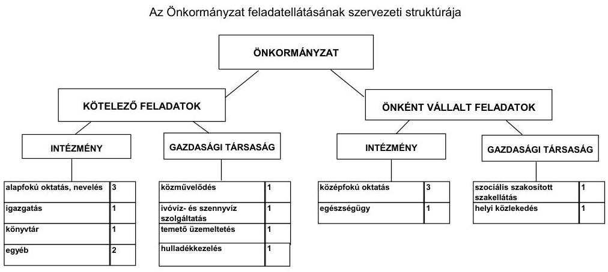

Az Önkormányzat feladatait 2011. június 30 -án (a Polgármesteri hivatallal együtt) 11 költségvetési szervvel és hat gazdasági társasággal látta el. A feladatellátásban résztvevő gazdasági társaságok közül három az Önkormányzat kizárólagos tulajdonában áll, három pedig közszolgáltatási szerződés alapján látja el a feladatot. Az intézményszervezeti átalakítások és intézményi összevonások következtében a feladatellátás telephelyeinek száma a 2007. évi

[^0]
[^0]:    ${ }^{7}$ A múködési kiadás összesen adata eltér az 1. számú melléklet adatától, mivel nem tartalmazza a Kórház, a kisebbségi önkormányzat, továbbá a felhalmozási kamatkiadások adatait.

---

56-ról 2011. év I. félév végére 42-re csökkent. Az Önkormányzat három gazdasági társaságban kizárólagos tulajdonnal, egy társaságban 50\% alatti tulajdoni hányaddal rendelkezik. A gazdasági társaságok a víz- és szennyvízkezelés, távhőszolgáltatás, közművelődési feladatellátás, szociális ellátás, temetkezés, hulladékkezelés, valamint a helyi tömegközlekedés biztosításában kaptak szerepet az Önkormányzat feladatellátásában. A gazdasági társaságok a működésükhöz az ellenőrzött időszakban összesen 141,1 millió Ft rendszeres működési és egy millió Ft fejlesztési célú pénzeszközátadásban részesültek. A pénzeszközátadásokra megállapodás alapján került sor. Az Áht ${ }_{1}$,-ben foglalt számadási kötelezettség a Hajdú Volán Zrt. részére történt pénzeszközátadás esetében megvalósult. A Herpály-Team Kft. esetében a pénzeszközátadásokról rendelkező megállapodások nem írták elő az Áht ${ }_{1}$,-ben meghatározott számadási kötelezettséget.

Az egyes közszolgáltatások feladatellátásában résztvevő költségvetési szervek működési kiadásainak finanszírozási összetételét a következő ábra szemlélteti:
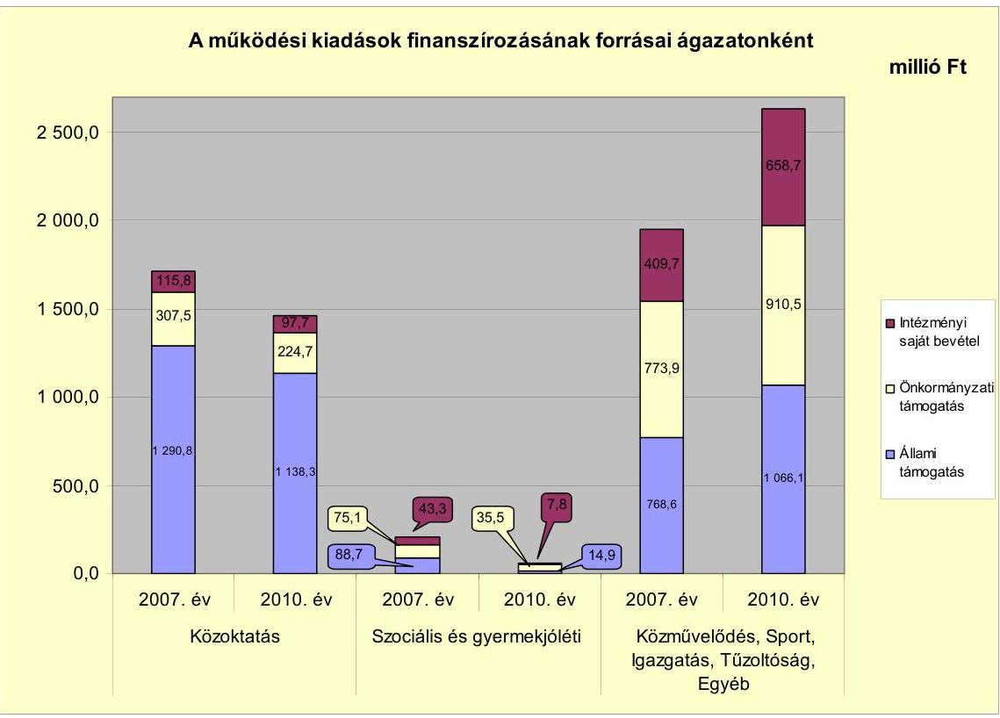

A közoktatási ágazatban az állami hozzájárulások mértéke 2007. évről 2010. évre 152,5 millió Ft-tal csökkent. Az Önkormányzat az intézményszerkezet átalakításába kezdett, mely döntések hatására az intézményi bevételek és az önkormányzati támogatás is csökkentek. A szociális és gyermekjóléti ágazatban bekövetkezett bevételi forrás csökkenés oka, hogy a feladat ellátásában változás történt. A bölcsődei ellátás kivételével a szociális ágazat feladatait Kistérségi társulás keretében látja el az Önkormányzat 2010. január 1-jétől. Az egyéb kategóriában a források a 2007. évi mértékhez képest növekedtek. Az állami hozzájárulások elsősorban a közfoglalkoztatáshoz kapcsolódó támogatások növekedése miatt emelkedtek. Az intézményi bevételek a hatékonyabb kapaci-

---

táskihasználás és a támogatásértékű működési bevételek növekedése miatt emelkedtek. Az önkormányzati támogatások emelkedését az egyéb ellátások területén is jelentkező egyenlőtlen állami forráselosztás indokolja. A vizsgált időszakban a kötelező és önként vállalt feladatok ellátását biztosító szervezeti keretekben, a feladatellátás módjában bekövetkezett változások összességében célszerűek voltak, az Önkormányzat pénzügyi egyensúlyi helyzetére pozitív hatást gyakoroltak, mivel - az önkormányzat kimutatásainak tanúsága szerint egyenlegükben 292,1 millió Ft-os többlet keletkezett.

Az Önkormányzat pénzügyi kapacitásának, működési jövedelmének, tőketörlesztésének alakulását a 2007-2010. években a következő ábra mutatja be:
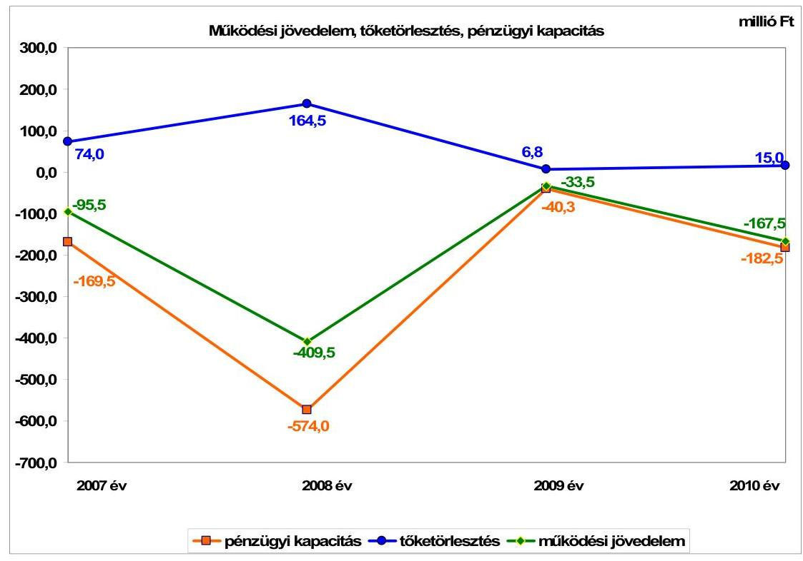

A folyó költségvetés hiánya a 2007. évben 95,5 millió Ft (1,4\%), a 2008. évben 409,5 millió Ft (5,3\%), a 2009. évben 33,5 millió Ft (0,4\%), a 2010. évben 167,5 millió Ft ( $2,1 \%$ ) volt. A 2008. évben a folyó kiadások 11,7\%-os növekedése mellett a folyó bevételek csak 7,3\%-kal növekedtek, aminek következtében a működési jövedelem 314,0 millió Ft-tal csökkent. A 2009. évben a működési jövedelem 376,0 millió Ft-tal növekedett a folyó kiadások 0,8\%-os csökkenésének és a folyó bevételek 4,2\%-os növekedésének a hatására, ami a 2007. és a 2008. évi létszámcsökkentések eredménye. A 2010. évben a működési jövedelem ismét csökkent 134,0 millió Ft-tal a folyó kiadások 1,6\%-os növekedése és a folyó bevételek $0,1 \%$-os csökkenése következtében, amit elsősorban a kamatkiadások 61,9 millió Ft-ról 168,1 millió Ft-ra történő növekedése okozott. A működési jövedelem ingadozásához hozzájárult az évek között áthúzódó szállítói tartozások rendezése is. Az Önkormányzat pénzügyi kapacitása (nettó működési jövedelme) a 2007-2010. évek között - elsősorban a működési jövedelem ingadozása miatt - alakult változóan. A 2008. évben elsősorban a működési jövedelem csökkenése ( 314,0 millió Ft) és a „Berettyóújfalu 2008" kötvénybevételből történő fejlesztési célú hitelkiváltás ( 81,9 millió Ft), valamint a faktorálási szer-

---

ződésből adódó kötelezettség teljesítése ( 78,4 millió Ft) rontotta a pénzügyi kapacitást a 2007. évhez képest.

A Polgármesteri hivatalban a 2008-2010. években költségvetési egyéb aktív és passzív pénzügyi elszámolásként az Áhsz-ben előírtak ellenére egyéb gazdasági eseményeket is kimutattak. Az egyéb finanszírozási kiadások/bevételek összege betétlekötést, értékpapír tranzakciókat, kötvénykibocsátást, az abból származó bevételek felhasználását stb. is tartalmazott.

A 2007-2010. években az Önkormányzat felhalmozási költségvetésének egyenlege folyamatosan negatív összegű volt. A felhalmozási forráshiánynak a felhalmozási és tőkejellegű kiadásokhoz viszonyított aránya 2007ben $25,8 \%$ (391,4 millió Ft), 2008-ban 41,6\% (320,7 millió Ft), 2009-ben 30,9\% ( 551,4 millió Ft), 2010-ben 39,0\% ( 667,8 millió Ft) volt. A 2007-2010. években képződött összesen 1931,3 millió Ft felhalmozási forráshiányt fejlesztési célú hitelből, a 2008. és 2010. évi kötvénykibocsátásból származó bevételből, valamint rövid lejáratú hitelből (faktorálási megállapodás miatti hitel, folyószámlahitel) finanszírozták.

Az Önkormányzat folyó és felhalmozási költségvetésének egyenlege a 2007. évben 486,9 millió Ft, a 2008. évben 730,2 millió Ft, a 2009. évben 584,9 millió Ft a 2010. évben 835,3 millió Ft hiányt mutatott.

Az Önkormányzat folyó bevételei a 2007. évi 6880,1 millió Ft-ról a 2010. évre 7681,6 millió Ft-ra, 11,6\%-kal növekedtek. Az Önkormányzat múködési célú költségvetési támogatása és az átengedett szja bevétel együttes összege a 2010. évben 2837,3 millió Ft volt, ami a 2007-2009. évek átlagához képest 319,7 millió Ft (10,1\%) csökkenést jelentett. A helyi adókból és pótlékokból származó bevételek összege 2007. évi 262,3 millió Ft-ról - a behajtási tevékenység eredményeként - 2010-re 54,2 millió Ft-tal, 20,7\%-kal növekedett. A felhalmozási célú bevételek ingadozását a fejlesztésekhez befolyt pályázati pénzek okozták. Az Önkormányzat felhalmozási célú bevétele összességében 3854,9 millió Ft volt a vizsgált időszakban ${ }^{8}$.

Az Önkormányzat folyó kiadásai a 2007-2009. évek átlagához (7495,8 millió Ft) viszonyítva a 2010. évben 353,1 millió Ft-tal növekedtek, elsősorban a dologi kiadások 17,1\%-os növekedésének (372,4 millió Ft) és a személyi juttatások 0,5\%-os csökkenésének ( 18,1 millió Ft) a hatására.

A kialakult pénzügyi egyensúlyi helyzetet befolyásolta az Önkormányzat elmúlt időszak fejlesztési tevékenysége. A 2007-2010. években megvalósított befejezett fejlesztéseinek teljes költsége 5830,5 millió Ft volt. A fejlesztési kiadások forrásából 559,4 millió Ft-ot ( $9,6 \%$ ) jelentett a saját bevétel, 188,5 millió Ft-ot (3,2\%) a hitel, 1411 millió Ft-ot (24,2\%) a kötvényekből származó bevétel, 2446,9 millió Ft-ot (42,0\%) az EU-s támogatás, míg 1224,7 millió Ft-ot (21\%) a hazai támogatás. A 2010. december 31-én folya-

[^0]
[^0]:    ${ }^{8}$ A 1. számú mellékleten és a CLF modellben kimutatott felhalmozási bevételek eltérését a felhalmozási célú pénzmaradvány igénybevétele, a felhalmozási célú áfa visszatérülése és a felhalmozási célú támogatások eltérő figyelembe vétele okozza.

---

matban lévő fejlesztési feladatok végrehajtására 2007-2010 között 356,8 millió Ft kiadást teljesítettek, amelynek forrása 7,7 millió Ft (2,2\%) saját bevétel, 110,5 millió Ft (31,0\%) kötvényekből származó bevétel, 193,2 millió Ft (54,1\%) EU-s támogatás, míg 45,4 millió Ft (12,7\%) hazai támogatás. Az Önkormányzat a folyamatban lévő fejlesztési feladataira 2010. év december 31-ig hitelt nem használt fel. Az EU-s támogatásból megvalósult fejlesztések - az utófinanszírozás miatt - likviditási gondot okoztak az Önkormányzatnál, ezért a 2011. év I. félévében 250,0 millió Ft rövid lejáratú hitel felvételére is szükség volt, melyből a támogatások megelőlegezésére 175,0 millió Ft használható fel.

Az Önkormányzatnál 2010. december 31-én folyamatban lévő fejlesztési feladatok 2010. évet követő kötelezettségvállalásainak összege 3903,9 millió Ft volt, amelyet 3,7 millió Ft ( $0,1 \%$ ) saját bevételből, 100 millió Ft (2,6\%) hitelből, 287,5 millió Ft (7,3\%) kötvényből származó bevételből, 3485,6 millió Ft (89,3\%) EU-s támogatásból, míg 27,1 millió Ft hazai támogatásból $(0,7 \%)$ terveznek biztosítani.
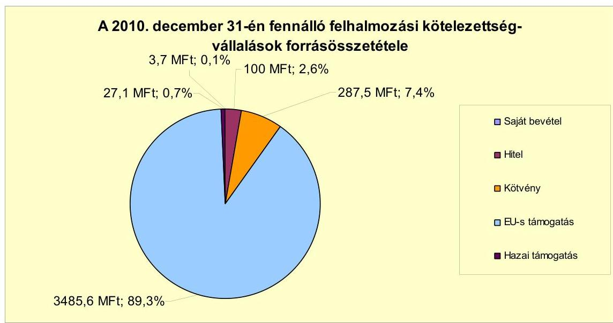

Az Önkormányzat által beadott, elbírálás alatt álló pályázatok tervezett teljes bekerülési költsége 369,3 millió Ft volt. Az Önkormányzat által a 20102013. évekre vállalt kötelezettségek összege 368,8 millió Ft volt, amelyből 344,3 millió Ft-ot ( $93,4 \%$ ) EU-s támogatásból, 9,7 millió Ft-ot (2,6\%) kötvényből, és 14,8 millió Ft-ot (4\%) saját bevételből terveznek biztosítani. A 2010. év december 31-ig teljesített kiadás 0,5 millió Ft volt.

A 2010. évet követő évekre vállalt kötelezettségek összege 4272,7 millió Ft, amelynek forrása várhatóan 18,5 millió Ft ( $0,4 \%$ ) saját bevétel, 100,0 millió Ft (2,3\%) hitel, 297,2 millió Ft (7\%) kötvényből származó bevétel, 3829,9 millió Ft (89,7\%) EU-s támogatás, míg 27,1 millió Ft (0,6\%) hazai támogatás.

Az Önkormányzat pénzintézetekkel szembeni kötelezettsége a 2006. év végéről a 2011. év I. félév végére több mint 20-szorosára, 198,3 millió Ft-ról 4246,9 millió Ft-ra nőtt, amelyből az árfolyamváltozás miatti különbözet 645,2 millió Ft volt. A fennálló pénzintézetekkel szembeni kötelezettségek há-

---

rom hosszú lejáratú hitelből, két kötvénykibocsátás miatti kötelezettségből, fo-lyószámla-, és munkabérhitelből, valamint egy rövid lejáratú hitel igénybevételéből keletkeztek. Az Önkormányzat az elfogadott 2011. évi költségvetési rendelete alapján 100 millió Ft fejlesztési hitel felvételét tervezte, a hitelből a helyszíni vizsgálat befejezésének időpontjáig 15,8 millió Ft-ot még nem vett fel. Az Önkormányzat kötelezettségvállalásaira képviselő-testületi döntés alapján került sor, az előterjesztésekben bemutatták a kamat-, és - a devizaalapú kötelezettség esetében - az árfolyamkockázatot. Az adósságot keletkeztető kötelezettségvállalás felső határát vizsgálták és bemutatták a Képviselő-testületnek. Az Ötv. szerinti adósságot keletkeztető kötelezettségvállalás felső határát a 20072011. év I. félév között nem lépték túl. A pénzintézetekkel szembeni kötelezettségek jogi biztosítékai voltak: jelzálogjog bejegyzés, saját bevételek engedményezése, beszámítás, a költségvetési elszámolási számlát érintő beszedési megbízás alkalmazásához történő felhatalmazás.

Az Önkormányzat a hiteleket, a kötvények kibocsátásából származó bevételeket a megjelölt céloknak megfelelően a Képviselő-testület által jóváhagyott, a költségvetésbe betervezett beruházásokhoz, hitelek visszafizetéséhez, és múködésre használta fel. Az Önkormányzat pénzügyi pozíciója a 2008. évben kibocsátott kötvény múködési célú felhasználásával a 2009. évben javult, majd a 2010. évben romlott az előző évhez képest. Az Önkormányzat 2011. év I. félévéig a CHF-ben fennálló, kötvénykibocsátásból származó pénzintézettel szembeni kötelezettségéből tőkét nem törlesztett, azonban 647,4 ezer CHF (119,1 millió Ft) kamatot fizetett. A 9633 ezer CHF névértéken kibocsátott „Berettyóújfalu 2008" kötvény tőketörlesztése 2012. április 30-án kezdődik 247 ezer CHF összegben, míg a 750 millió Ft névértékủ „Berettyóújfalu 2010" kötvényé 2012. szeptember 30-án 10,3 millió Ft összegben. A forintban fennálló pénzintézetekkel szembeni kötelezettségeiből 39,7 millió Ft tőkét törlesztett, és 130,8 millió Ft kamatot fizetett. Az integrált városfejlesztésre felvett hitel visszafizetését az Önkormányzat 2012. április 12-én fogja megkezdeni 2,4 millió Ft összegben. A vizsgált években ezen felül kilenc hitelét fizette vissza az Önkormányzat, ebből nyolcat a 2008. évi kötvénykibocsátás bevételéből. A 20072011. év I. féléve között átmenetileg szabad pénzeszközeiből 157,4 millió Ft kamatbevételt realizált.

Az Önkormányzat költségvetésének pénzügyi egyensúlyát a vizsgált időszakban folyószámlahitel, munkabér-megelőlegezési hitel igénybevételével tudta biztosítani, továbbá a 2011. évben már 250 millió Ft rövid lejáratú hitel felvétele is szükségessé vált.

A folyószámla- és munkabér-megelőlegezési hitelek igénybevétele a 2007-2011. év I. félévében az alábbiak szerint alakult:

---

| Megnevezés | 2007. év | 2008. év | 2009. év | 2010. év | 2011. év I.   félév |
| :-- | :--: | :--: | :--: | :--: | :--: |
| Folyószámlahitel |  |  |  |  |  |
| Keretösszeg január 1-jén (millió Ft-ban) | 120,0 | 200,0 | 200,0 | 350,0 | 550,0 |
| Állagos napi állomány (millió Ft-ban) | 101,5 | 121,3 | 249,3 | 459,5 | 661,0 |
| Folyószámla hitellel zárt napok száma (nap) | 354 | 343 | 365 | 365 | 181 |
| Egyenleg (állomány) | 52,6 | 105,7 | 285,7 | 527,5 | 486,8 |
| Munkabér-megelölegezési hitel |  |  |  |  |  |
| Keretösszeg január 1-jén (millió Ft-ban) | 130,0 | 130,0 | 130,0 | 130,0 | 130,0 |
| Állagos napi állomány (millió Ft-ban) | 117,5 | 90,5 | 117,9 | 128,4 | 128,7 |
| Munkabér-megelőlegezési hitellel zárt napok száma (nap) | 331 | 254 | 331 | 365 | 180 |
| Egyenleg (állomány) | 130,0 | 130,0 | 130,0 | 130,0 | 130,0 |

Az ellenőrzött időszakban 169,3 millió Ft kamatot és egyéb költséget fizettek ki. A Képviselő-testület a 2011. évi költségvetést megalapozó intézkedési terv elfogadásával egyidejűleg döntött a folyószámlahitel keretösszegének 800,0 millió Ft-ra történő emeléséről, melyet a pénzintézet a 2011. január 13án megkötött folyószámla hitelkeret szerződésben szigorú feltételek teljesítéséhez kötött.

Az Önkormányzat egy kizárólagos tulajdonú gazdasági társasága részére - fo-lyószámla- és fejlesztési hitel igénybevételéhez - készfizető kezességet vállalt, 190,0 millió Ft összegben. A Berettyóújfalui Csatornamú Társulat fejlesztési hiteleihez kapcsolódóan 190,6 millió Ft nagyságrendben vállalt kezességet. A 2010. év végére a kezességgel kapcsolatos kötelezettség nem változott. Az Önkormányzat a vizsgált időszakban nem nyújtott kölcsönt a gazdasági társaságai részére.

Az Önkormányzat a vizsgált időszakban osztalék előírásáról nem rendelkezett.

Az Önkormányzat egyes kötelezettségeinek 2010. december 31-i, valamint 2011. június 30-i állományát és várható alakulását a kötelezettségek lejáratáig a következő táblázat szemlélteti:

| Megnevezés | Állomány 2010. december 31   év |  |  |  |  |  |  |  |  |  |  |  |  |  |  |  |  |  |  |  |  |  |  |  |  |  |  |  |  |  |  |  |  |  |  |  |  |  |  |  |  |  |  |  |  |  |  |  |  |  |  |  |  |  |  |  |  |  |  |  |  |  |  |  |  |  |  |  |  |  |  |  |  |  |  |  |  |  |  |  |  |  |  |  |  |  |  |  |  |  |  |  |  |  |  |  |  |  |  |  |  |  |

---

Az Önkormányzatnak a 2011. évben szállítói tartozások és egyéb kiadás elmaradások következtében 1067,4 millió Ft fizetési kötelezettsége keletkezett.

A 2011-2013. évek kötelezettségeinek teljesítésére figyelembe vehető - a behajthatóságot és az eladhatóságot feltételezve - 102,2 millió Ft mérlegben kimutatott követelésállomány, továbbá a forgalomképes ingatlanvagyon. Az Önkormányzat tájékoztatása szerint figyelembe vehető további források „a mindenkori költségvetési rendeletekben megtervezett helyi iparúzési adó", azonban ennek növelésére 2011-ben nem tettek intézkedést. Az Önkormányzatnál a helyi iparúzési adó mértéke $(1,8 \%)$ nem éri el a maximális $2,0 \%$-os adómértéket.

A 2014. évet követően jelenleg ismert pénzintézetekkel szembeni kötelezettségei: 1634,2 millió Ft és 9421,5 ezer CHF. Az Önkormányzat adósságot keletkeztető kötelezettségvállalásaira vonatkozó képviselő-testületi előterjesztések nem tartalmazták a visszafizetés forrásait. A negatív múködési jövedelem miatt a következő évekre szóló jelenleg ismert pénzintézetekkel szembeni kötelezettségek teljesítése - további bevételnövelő és kiadáscsökkentő intézkedések megtételének hiányában - törlesztési kockázatot jelent az Önkormányzatnak.

Az Önkormányzat likviditása folyamatosan romlott 2011. év I. félévére a 2007. évhez képest, amit jól mutat a folyószámla-, és munkabérhitellel zárt napok számának és a napi átlagos folyószámlahitel-állománynak a több mint hatszoros növekedése.

A likviditási gondokat jelzi továbbá, hogy az Önkormányzat lejárt szállítói tartozása 2007-ről 2011. június 30-ra közel ötszörösére, 194,2 millió Ft-ról 931,2 millió Ft-ra növekedett, melynek EU-s támogatástartalma 333,4 millió Ft. A 2007-2009. években 90 napon túl lejárt szállítói tartozással nem rendelkezett az Önkormányzat, míg ez a 2010. évben 191,9 millió Ft, a 2011. évben 317,5 millió Ft volt. Az Önkormányzat intézményeinél a 90 napot meghaladó, szállítók felé fennálló kötelezettségek miatt - a helyi önkormányzatok adósságrendezési eljárásáról szóló 1996. évi XXV. törvényben foglaltak ellenére - a Polgármester nem kezdeményezte a Képviselő-testületnél az adósságrendezési eljárás megindítását. A 2012. évben tovább súlyosbítja a helyzetet, hogy megkezdődik a kötvények visszavásárlása, mely a legutolsó kamatfizetési kondícióval számított kamatokkal és egyéb díjakkal együtt - a devizakötvény esetében a 2010. december 31-i MNB Ft/CHF árfolyam figyelembe vételével 232,3 millió Ft adósságszolgálatot fog jelenteni.

Az Önkormányzat a helyszíni ellenőrzés ideje alatt tárgyalásokba kezdett a „Berettyóújfalu 2008" kötvényt lejegyző pénzintézettel a visszavásárlás 2012. április 30-i kezdő időpontja átütemezéséről.

Az önkormányzati kötelezettségek növekedése mellett az Önkormányzat minősített többségi befolyásával rendelkező gazdasági társaságok kötelezettségei is befolyásolhatják az Önkormányzat pénzügyi egyensúlyát, amelyeket a következő táblázat mutat be:

---

| Megnevezés | Allomány 2010. december 31-én |  |  | Allomány 2011. június 30. |  |  | Várható kötelezettség 2011-2013.   években |  | Várható kötelezettség 2014. évtől |  |
| :--: | :--: | :--: | :--: | :--: | :--: | :--: | :--: | :--: | :--: | :--: |
|  | HUF-   ban   (millió   Ft-ban) | Devizában (összege, ezer CHFben) | Deviza   nem | HUF-   ban   (millió   Ft-ban) | Devizában (összege, ezer CHFben) | Deviza   nem | HUF-   ban   (millió   Ft-ban) | Devizában (összege, ezer CHFben) | HUF-   ban   (millió   Ft-ban) | Devizában (összege, ezer CHFben) |
| folyószámla hitel | 14,3 | 0,0 | HUF | 15,3 | 0,0 | HUF | 15,3 | 0,0 | 0,0 | 0,0 |
| hufirozó hitel | 40,0 | 0,0 | HUF | 40,0 | 0,0 | HUF | 40,0 | 0,0 | 0,0 | 0,0 |
| egyéb hosszú lejáratú kötelezettség HUF-ban | 12,4 | 0,0 | HUF | 81,3 | 0,0 | HUF | 66,8 | 0,0 | 148,4 | 0,0 |
| egyéb hosszú lejáratú kötelezettség CHF-ben | 0,0 | 14,8 | CHF | 0,0 | 11,8 | CHF | 0,0 | 16,5 | 0,0 | 0,0 |
| Pénzintézeti kötelezettségek összesen HUF-ban | 66,7 | 0,0 | HUF | 136,6 | 0,0 | HUF | 122,1 | 0,0 | 148,4 | 0,0 |
| Pénzintézeti kötelezettségek összesen CHF-ben | 0,0 | 14,8 | CHF | 0,0 | 11,8 | CHF | 0,0 | 16,5 | 0,0 | 0,0 |

A társaságoknak a 2011. évtől 122,1 millió Ft, 16,5 ezer CHF pénzintézetekkel szembeni kötelezettséget kell rendezniük. Esetleges csőd, vagy felszámolási eljárás esetén a bíróság korlátlan és teljes felelősséget állapíthat meg az Önkormányzat terhére.

A Képviselő-testületnek előterjesztett éves zárszámadási rendeleteikben nem mutatták be az Önkormányzat eszközei után elszámolt értékcsökkenés összegét, az eszközpótlásra fordított tényleges kiadásokat, az eszközök elhasználódási fokának alakulását.

Az Önkormányzat az ellenőrzött időszakban kiadási megtakarítást eredményező és bevételt növelő intézkedéseket tett. A 2007-2011. év I. féléve között tett intézkedések hatására 159,7 millió Ft bevételi többletet, továbbá 1179,5 millió Ft kiadási megtakarítást mutattak ki. A kiadási megtakarítások 96,3\%-a az elrendelt álláshely-csökkentések eredménye. Az álláshely-csökkentő intézkedések 2007-2011. év I. féléve között önkormányzati szinten összesen 295 álláshely (üres álláshely nem került megszüntetésre) megszüntetését jelentették, melyek az intézményszerkezet átalakításával és a feladatkiszervezésekkel összefüggésben történtek. Az álláshely-csökkentésekből 105 a közoktatáshoz, 74 a szociális és gyermekvédelemhez, 82 az egészségügyhöz, három a Polgármesteri hivatalhoz és 31 az egyéb intézményekhez kapcsolódott. A megszüntetett álláshelyek 57,6\%-a (170) az ágazati szakmai, 42,4\%-a (125) az intézményüzemeltetéshez, fenntartáshoz kapcsolódó volt. Egyes közszolgáltatási területeken azonban feladatbővülések is voltak, amelyek álláshely- és egyben létszámnövekedéssel is jártak. A létszámbővülést a bölcsődei csoportok számának növekedése és a Közoktatási Intézményfenntartó Társulás létrejötte eredményezte. Ennek következtében az időszak álláshelyeinek száma 285 fővel csökkent. A bevételnövelő intézkedések adóbehajtáshoz, új adónem bevezetéséhez, bérleti díjak emeléséhez, nem használt eszközök értékesítéséhez kapcsolódtak. Az Önkormányzat a vizsgált időszakban intézményi integrációkról és feladatkiszervezésekről is döntött. Ezek eredményeként - kimutatásuk szerint -egyenlegükben 292,1 millió Ft-os nagyságrendben többlet keletkezett.

Az Önkormányzat költségvetési támogatásból, átengedett bevételekből származó bevételei a 2007. évi 3001,1 millió Ft-ról a 2008. évre 3396,8 millió Ft-ra növekedtek, majd a 2009. évre 3073 millió Ft-ra, a 2010. évre 2837,3 millió Ft-ra, 2011. év tervadatai szerint 2189,5 millió Ft-ra csökkentek. A bevételek csökkenése 2007-2011. év I. féléve között összességében 102,0 millió Ft-tal rontotta az Önkormányzat pénzügyi egyensúlyi helyzetét.

---

Az utóellenőrzés a pénzügyi egyensúly javítására tett öt szabályszerűségi javaslat hasznosítására terjedt ki. Az ellenőrzés során tett, a pénzügyi egyensúly javítására vonatkozó szabályszerűségi javaslatok közül négy határidőre, egy határidőn kívül realizálódott. Határidőn túl gondoskodtak arról, hogy a költségvetési rendelettervezet az európai uniós forrásokkal támogatott fejlesztések bevételi és kiadási előirányzatait elkülönítetten tartalmazza.

Az Önkormányzat pénzügyi egyensúlyi helyzetét összegezve a következők emelhetők ki:

Berettyóújfalu Város Önkormányzatának pénzügyi egyensúlyi helyzete rövid távon veszélyeztetett.

A pénzügyi egyensúlyi helyzetre kedvezőtlen befolyást gyakorolt az önként vállalt feladatok folyó kiadásokon belüli magas aránya.

A folyó bevételek a 2007-2010. években nem nyújtottak fedezetet a folyó kiadásokra.

Az adósságszolgálat teljesítése és a likviditás biztosítása a kibocsátott kötvények bevételéből hitel kiváltásával, folyószámla-, és munkabér-megelőlegezési hitel igénybevételével történt.

A pénzügyi egyensúlyi helyzetet veszélyezteti az adósságszolgálat további növekedése.

Az Önkormányzat kiadásainak finanszírozásában a folyószámla-, és munkabérhitel tartóssá vált.

Kockázatot jelent a támogatásokkal megvalósuló fejlesztések forrásainak előfinanszírozása.

A jelentős összegű lejárt szállítói tartozások finanszírozása további kockázatot jelent az Önkormányzatnak.

A következő évekre szóló jelenleg ismert pénzintézetekkel, valamint a szállítókkal szembeni kötelezettségek finanszírozása - további bevételnövelő és kiadáscsökkentő intézkedések megtételének hiányában - kockázatot jelent az Önkormányzatnak.

A 2007-2010. években az Önkormányzat felhalmozási költségvetése - a túlzott fejlesztések miatt - pénzügyi hiányt mutatott. Ennek forrása finanszírozási múveletekkel (kötvénykibocsátással, hitelfelvétellel) volt biztosított. A jövőbeni fejlesztési kötelezettségvállalások finanszírozására további külső források bevonására lesz szükség, mivel a kötvénykibocsátásból származó bevétel a 2012. évben felhasználásra kerül.

Az egyéb kötelezettségek közül a Herpály-Team Kft. folyószámla- és fejlesztési hiteleihez és a Berettyóújfalui Csatornamú Társulat fejlesztési hiteleihez vállalt készfizető kezesség beváltása esetén kedvezőtlenül befolyásolhatja az Önkormányzat pénzügyi egyensúlyát.

---

Az Állami Számvevőszékről szóló 2011. évi LXVI. törvény 33. § (1) bekezdésében foglaltak értelmében a jelentésben foglalt megállapításokhoz kapcsolódó intézkedési tervet köteles az ellenőrzött szervezet vezetője összeállítani és azt a jelentés kézhezvételétől számított harminc napon belül az ÁSZ részére megküldeni. Amennyiben az intézkedési tervet határidőben nem küldi meg a szervezet, vagy az továbbra sem elfogadható, az ÁSZ elnöke a hivatkozott törvény 33. § (3) bekezdés a)-b) pontjaiban foglaltakat érvényesítheti.

# A 2011. június 30-i pénzügyi egyensúlyi helyzet alapján az ellenőrzés intézkedést igénylő megállapításai és javaslatai a következők: 

## a Polgármesternek

1. A folyó bevételek a 2007-2010. években nem nyújtottak fedezetet a folyó kiadásokra. Az Önkormányzat - adatszolgáltatása szerint - a 2010. év működési költségvetési kiadásaiból $35,4 \%$-ot az önként vállalt feladatok ellátására fordított. A 2011. évben önként vállalt feladatokra a működési kiadások 39,1\%-át tervezték. A 2007-2010. években a felhalmozási bevételek nem fedezték a felhalmozási kiadásokat. A jövőbeni fejlesztési kötelezettségvállalások finanszírozására további külső források bevonására lesz szükség, mivel a kötvényből származó bevétel a 2012. évben várhatóan felhasználásra kerül. Az Önkormányzat kiadásainak finanszírozásában a folyószámla-, és munkabérhitel állandósult. Az Önkormányzat adósságot keletkeztető kötelezettségvállalásaira vonatkozó képviselő-testületi előterjesztések nem tartalmazták a visszafizetés forrásait. A likviditási gondokat jelzi továbbá, hogy az Önkormányzat lejárt szállítói tartozása 2007-ről 2011. június 30-ra közel ötszörösére, 931,2 millió Ft-ra növekedett, melynek EU-s támogatástartalma 333,4 millió Ft. A 2010. évben képződött negatív működési jövedelem miatt a következő évekre szóló jelenleg ismert pénzintézetekkel szembeni kötelezettségek teljesítése - további bevételnövelő és kiadáscsökkentő intézkedések megtételének hiányában - már rövid távon (20112013. években) veszélyezteti az Önkormányzat pénzügyi egyensúlyát. Az Önkormányzat a helyszíni ellenőrzés ideje alatt tárgyalásokba kezdett a „Berettyóúffalu 2008" kötvényt lejegyző pénzintézettel a visszavásárlás 2012. április 30-i kezdő időpontja átütemezéséről. Az Önkormányzat a vizsgált időszakban osztalék előírásáról nem rendelkezett. A jelentős összegű lejárt szállítói tartozások finanszírozása további kockázatot jelent az Önkormányzatnak.

Javaslat:
Az Önkormányzat pénzügyi egyensúlyának gyors helyreállítása és hosszú távú fenntarthatósága érdekében kezdeményezze - felelősök és határidők megjelölésével - az alábbi intézkedések megtételét:
a) Tárja fel a bevételszerző és kiadáscsökkentő lehetőségeket. Intézkedjen a bevételek növelésére, a kintlévőségek behajtására, a kiadások csökkentésére;
b) Terjesszen a Képviselő-testület elé reorganizációs programot a kedvezőtlen pénzügyi folyamatok megállítására, a pénzügyi egyensúlyi helyzet gyors stabilizálására;

---

c) Képezzen egyensúlyi (elkülönített) tartalékot - a megtett intézkedések eredményeként képződő forrásokból - az adósságszolgálat teljesítése érdekében;
d) Mérje fel a folyamatban lévő beruházásokkal kapcsolatos kötelezettségek átütemezésének pénzügyi és jogi lehetőségeit illetve hatásait. Szükség esetén kezdeményezze a támogatónál annak átütemezését;
e) Vizsgálja felül teljes körűen a tervezett beruházásokat és a megvalósuló létesítmények fenntartásának jövőbeni pénzügyi kihatásait. Szükség esetén tegyen javaslatot a Képviselő-testületnek a tervezett beruházásokkal kapcsolatos döntések módosítására, amelyben figyelembe veszik az Önkormányzat pénzügyi lehetőségeit, és a kötelező feladatellátás elsődlegességét;
f) Vizsgálja meg az állandósult folyószámlahitel hosszú távú kötelezettséggé történő átalakításának jogi lehetőségét, és a Stabilitási tv. 10. §-ában előírt feltételek fennállása esetén kezdeményezze a Kormánynál ennek engedélyezését;
g) Vizsgálja felül az önként vállalt feladatok finanszírozhatóságát, s hozzon intézkedéseket a kötelező feladatok ellátásának biztosítása érdekében;
h) Mutassa be havonta legalább három évre kitekintően kötelezettségeinek finanszírozási forrásait;
i) Gondoskodjon, hogy a jövőben az adósságot keletkeztető kötelezettségvállalásokról szóló képviselő-testületi előterjesztések tételesen tartalmazzák a visszafizetés forrásait;
j) Kezdeményezze, hogy kerüljön felvételre az Önkormányzat részére járó osztalék a pénzügyi egyensúlyi helyzetének javítása, adósságszolgálatának teljesítése érdekében;
k) Kezelje az Önkormányzat lejárt szállítói állományát a szállítói kitettség és a jogszabályi következmények elkerülése érdekében;
2. Az Önkormányzat 100\%-os tulajdonában álló Herpály-Team Kft. esetében a pénzeszközátadásokról rendelkező szerződések nem írtak elő számadási kötelezettséget.

Javaslat:
Írja elő a számadási kötelezettséget a kizárólagos tulajdonú gazdasági társasága részére nyújtott pénzeszközátadások felhasználásáról;
3. A Képviselő-testületnek előterjesztett éves zárszámadási rendeleteikben nem mutatták be az Önkormányzat eszközei után tárgyévben elszámolt értékcsökkenés összegét, az eszközpótlásra fordított tényleges kiadásokat, az eszközök elhasználódási fokának alakulását.

Javaslat:
Mutassa be a Képviselő-testületnek évente a zárszámadási rendelet előterjesztésében az értékcsökkenés összegét, és ezzel összevetve az elhasználódott eszközök pótlására fordított tényleges kiadásokat, az eszközök elhasználódási fokának alakulását;

---

# a Jegyzönek 

1. A Polgármesteri hivatalban a 2008-2010. években költségvetési egyéb aktív pénzügyi elszámolások között az Áhsz. 22. § (7)-(10) bekezdéseiben, és az Áhsz. 9. számú mellékletének számlaosztályok tartalmára vonatkozó előírások 3. g) pontjában meghatározottak ellenére egyéb gazdasági eseményeket is elszámoltak. Továbbá az Áhsz. 26. § (8)-(11) bekezdéseiben és az Áhsz. 9. számú mellékletének a számlaosztályok tartalmára vonatkozó előírások 4. h) pontjában előírtak ellenére költségvetési egyéb passzív pénzügyi elszámolásként egyéb gazdasági eseményeket is kimutattak. Az egyéb finanszírozási kiadások/bevételek összege betétlekötést, értékpapír tranzakciókat, kötvénykibocsátást, az abból származó bevételek felhasználását stb. is tartalmazott.

Javaslat:
Intézkedjen annak érdekében, hogy költségvetési egyéb aktív pénzügyi elszámolásként csak az Áhsz. 22. § (7)-(10) bekezdéseiben, és az Áhsz. 9. számú mellékletének a számlaosztályok tartalmára vonatkozó előírások 3. g) pontjában meghatározott gazdasági eseményeket mutassák ki.

Intézkedjen annak érdekében, hogy költségvetési egyéb passzív pénzügyi elszámolásként csak az Áhsz. 26. § (8)-(11) bekezdéseiben és az Áhsz. 9. számú mellékletének a számlaosztályok tartalmára vonatkozó előírások 4. h) pontjában meghatározott gazdasági eseményeket mutassák ki.

A polgármester a helyszíni ellenőrzés lezárása után tájékoztatta az Állami Számvevőszéket az Önkormányzat tervezett intézkedéseiről, amelyet az Állami Számvevőszék nem ellenőrzött, arra vonatkozóan véleményt vagy megállapítást nem fogalmaz meg. Az ellenőrzés lezárását követően elvégzett intézkedéseket az Állami Számvevőszék utóellenőrzés keretében vizsgálhatja.

A polgármester tájékoztatása szerint a következő intézkedéseket tervezi az Önkormányzat:

- a bevételek növelésének érdekében át kívánják tekinteni az önkormányzati tulajdonú bérlemények bérleti dijának emelési lehetőségeit, a követelések beszedési hatékonyságát fokozni kívánják, a parkolási bevételek növelése érdekében kívánnak intézkedni;
- a kiadások csökkentése érdekében az Önkormányzat intézményeit 2011. évi szinten kívánja támogatni, „a kiemelt csoportok részére támogatást 2012. évben nem ítélnek meg, csak az előző évek ki nem fizetett támogatásait folyósítják";
- a fejlesztéseket érintő feladatok tekintetében a folyamatban lévő beruházások fenntarthatóságának pénzügyi, gazdasági kihatásait 2012. június 30-ig át kívánják tekinteni;
- az Önkormányzat a tartós folyószámlahitel hosszú távú kötelezettséggé történő átalakításáról tárgyalásokat kíván kezdeményezni a pénzintézettel. Az Önkormányzat a 2008. évben kibocsátott kötvény tőketörlesztésének kezdetét a kibocsátó pénzintézetnél két évvel meg kívánja hosszabbítani, amelyről

---

tárgyalásokat kezdeményezett. A szállítói állomány csökkentésére fokozott figyelmet kíván fordítani;

- zárszámadási rendelet előterjesztésében be kívánja mutatni a befektetett eszközök értékcsökkenését, továbbá az elhasználódott eszközök pótlására fordított kiadások összegét és az eszközök használhatósági fokának alakulását.

---

# II. RÉSZLETES MEGÁLLAPÍTÁSOK 

## 1. Az ÖNKORMÁNYZAT KÖTELEZŐ ÉS ÖNKÉNT VÁLlALT FELADATAI, A FELADATELLÁTÁS SZERVEZETI KERETEI ÉS ANNAK VÁLTOZÁSAI

Az Önkormányzat - az Ötv-ben és az ágazati szakmai törvényekben meghatározott - kötelező feladatainak ellátásáról az intézmények és gazdasági társaságok alapító okirataiban, társulási megállapodásokban, gazdálkodó szervezetekkel feladatellátásra kötött megállapodásokban foglaltak szerint gondoskodott. Az Önkormányzat SzMSz-ének 5. számú mellékletében határozta meg önként vállalt feladatainak körét, amelyekkel kapcsolatban évente, költségvetési rendeleteiben döntött arról, hogy mely feladathoz mennyi forrást tud hozzárendelni. Az Önkormányzat önként vállalt feladatnak minősítette a középfokú oktatást és a kollégiumi ellátást, az alapfokú művészeti oktatást, az enyhe fokban értelmi fogyatékosok oktatását, a pedagógiai szakszolgálati feladatellátást, az intézményi gondozást nyújtó fogyatékos ellátást, szociális szakosított ellátásokat, fekvőbeteg ellátást, távhőszolgáltatást, piac- és strandüzemeltetést, valamint a lapkiadást és a városi televízió üzemeltetését.

Az Önkormányzat adatszolgáltatása szerint a 2010. évi 4154,2 millió Ft múködési célú költségvetési kiadásból 2684,5 millió Ft-ot (64,6\%-ot) a kötelező feladatok ellátására fordítottak. Önként vállalt feladatokra 1469,7 millió Ft-ot ( $35,4 \%$-ot) költött az Önkormányzat ${ }^{9}$. A 2007. évi 3873,4 millió Ft működési kiadás 56,8\%-át (2201,8 millió Ft-ot) kötelező feladatokra, 43,2\%-át (1671,6 millió Ft-ot) önként vállalt feladatokra költötték. 2011. évben kötelező feladatokra a múködési kiadások 60,9\%-át (1918,3 millió Ft-ot), önként vállalt feladatokra $39,1 \%$-át ( 1232,1 millió Ft-ot) tervezték. Az Önkormányzat pénzügyi egyensúlyának fenntarthatóságára hosszú távon kihatással lehet az önként vállalt feladatokra fordított müködési kiadások magas százalékos aránya.

A 2010. évi múködési kiadások feladatonkénti megoszlását és azok finanszírozási arányait a következő táblázat ${ }^{10}$ mutatja be:

[^0]
[^0]:    ${ }^{9}$ A kötelező és önként vállalt feladatok besorolása az Önkormányzat döntése alapján történt.
    ${ }^{10}$ A táblázat múködési kiadás összesen és bevételek összesen adata eltér a CLF modell azonos tartalmú adatától, mivel nem tartalmazza a Kórház, a kisebbségi önkormányzat, továbbá a felhalmozási kamatkiadások adatait.

---

| Ellátott feladat | Múködési   kiadás   összesen   (millió Ft) | Kötelezö   feladatok   kiadásainak   részaránya   \% | Múködési   bevétel   összesen   (millió Ft) | Állami   támogatás   részaránya   \% | Intézményi   saját bevétel   részaránya   \% | Önkormányzati   támogatás   részaránya   \% |
| :--: | :--: | :--: | :--: | :--: | :--: | :--: |
| Ovodák | 162,7 | 100 | 162,7 | 59,0 | 0,8 | 40,2 |
| Általános iskolák | 369,0 | 100 | 369,0 | 82,5 | 6,1 | 11,3 |
| Gimnáziumok | 196,3 | 0 | 196,3 | 55,8 | 5,9 | 38,3 |
| Szakközépiskolák,   szakképző intéz-   mények | 677,4 | 0 | 677,4 | 85,9 | 9,0 | 5,1 |
| Kollégiumok | 55,2 | 0 | 55,2 | 84,4 | 1,6 | 14,0 |
| Szociális   intézmények | 58,2 | 100 | 58,2 | 25,6 | 13,4 | 61,1 |
| Közművelődési   intézmények | 30,9 | 89,4 | 30,9 | 23,6 | 2,4 | 74,1 |
| Egyéb intézmények* | 643,5 | 72,5 | 643,5 | 56,3 | 31,7 | 12,0 |
| Polgármesteri hivatal   igazgatási kiadásai | 655,0 | 100 | 655,0 | 0,0 | 24,4 | 75,6 |
| Polgármesteri   hivatalban ellátott   egyéb feladatok   múködési kiadásai | 1306,0 | 72,4 | 1306,0 | 53,3 | 22,5 | 24,2 |
| Múködési kiadá-   sok összesen | 4154,2 | 64,6 | 4154,2 | 53,4 | 18,4 | 28,2 |

*A táblában az egyéb intézmények sor adata a Tűzoltóság adatait is tartalmazza.

Az ágazati - kötelezö - feladatok múködési kiadása 2010-ben 1083,9 millió Ft összegű volt, amely az összes múködési kiadás 26,1\%-át tette ki. A Polgármesteri hivatalban ellátott kötelező feladatok 1600,6 millió Ft-ot képviseltek, amely az összes múködési kiadás 38,5\%-a volt. A Polgármesteri hivatal kiadásai tartalmazzák a településüzemeltetés, a népjóléti igazgatás, körzeti igazgatás, az egészségügyi ellátás, a helyi közlekedés valamint a képviselőválasztások kiadásait. A kiadások a 2007. évi 791,2 millió Ftról 2010. évre 1306 millió Ft-ra emelkedtek, melynek okai között szerepel a közfoglalkoztatásra magánszemélyeknek teljesített pénzeszközátadások emelkedése és a dologi kiadások növekedése. A közfoglalkoztatás finanszírozásához kapcsolódóan az állami hozzájárulások is növekedtek. Az intézményi saját bevételek 2008. évről 2009. évre 130,2 millió Ft-os növekedést mutattak, melynek oka, a fordított áfa, valamint a múködési célú pénzeszközök átvételéből származó növekmény. A Polgármesterei Hivatalban kimutatott igazgatási feladatok kiadásai a Képviselő-testület és az egyes hivatali irodák múködéséhez kapcsolódó kiadásokat tartalmazzák. A 2008. és 2010. évben tapasztalható kiadásemelkedés a központi bérpolitikai intézkedések (13. havi illetmény, keresetkiegészítés), valamint a 2010. évben bevezetett cafetéria rendszer kiadásnövelő hatásával magyarázható. A saját bevételek területén 2008. évről 2009. évre mutatkozó 142,6 millió Ft bevételnövekedés oka a 2008. évben kibocsátott kötvény átmenetileg fel nem használt részének befektetéséből származó kamatbevétel realizálása, valamint a múködési célú pénzeszközök átvételéből származó növekmény.

A közoktatási ágazat múködési kiadásaira 2010. évben fordított 1460,6 millió Ft az összes múködési kiadás 35,2\%-át tette ki, a múködéshez az

---

Önkormányzat a feladatra kapott állami támogatáson felül további 224,7 millió Ft támogatást nyújtott, amely a közoktatási intézmények múködési kiadásának 15,4\%-a volt. Az óvodai feladatokhoz 65,4 millió Ft (40,2\%-os), az általános iskolai feladatokhoz 41,9 millió Ft, (11,3\%-os), a gimnáziumoknak 75,2 millió Ft (38,3\%-os), a szakközépiskoláknak, szakképző intézményeknek 34,5 millió Ft ( $5,1 \%$-os), a kollégiumoknak 7,7 millió Ft ( $14 \%$-os) múködési támogatást nyújtott az Önkormányzat. Az óvodák esetében 2007. évről 2008. évre csökkent az állami hozzájárulás mértéke. A változás oka, hogy a Magyar Államkincstár által feltárt normatíva túligénylést az intézmény a 2008. évi normatív támogatásokról történő lemondás során vette figyelembe és 63 főre vonatkozó támogatási igényről lemondott. Az óvodák múködési bevételei 2007. évről 2010. évre 56,7 millió Ft-tal csökkentek. Ennek oka a normatíva csökkenése 2007. évtől kezdődően. A csökkentés olyan mértékű volt, hogy 2009. évben a meglévő csoportokon felül indított új csoport létszám-növekedése sem tudta ezt kompenzálni. Az általános iskolák esetében a 2007. évi létszám 117 fővel emelkedett 2008. évre, melynek következtében az intézmények múködési bevételei 65,2 millió Ft-tal növekedtek. A létszámnövekedés oka nem a demográfiai hatások kedvező alakulása, hanem az időközben létrehozott Közoktatási Intézményfenntartó Társulás megalakulása volt. A 2008-2010. években az általános iskolák kiadásai 113,5 millió Ft-tal csökkentek. A változást az intézményszerkezet átalakításával elért kiadásmegtakarítás, az állami hozzájárulás csökkenése és az ellátotti létszámban bekövetkezett csökkenés együttes hatása okozta. A középfokú oktatási intézmények múködési kiadásibevételi szerkezetében 2007-2010. évek között szintén csökkenés figyelhető meg. A normatíva csökkenése a közoktatáson belül ezt a területet érintette legnagyobb mértékben. A szakközépiskolák és kollégiumok esetében 2007-2008. években nem volt szükség önkormányzati kiegészítésre, mert az állami hozzájárulás és az intézményi saját bevétel fedezte a kiadásokat. 2009-2010. években már nem csak a gimnázium, hanem a szakközépiskolák és a kollégiumok is önkormányzati kiegészítésre szorultak. A szakközépiskolák és kollégiumok esetében az állami hozzájárulás a vizsgált időszak alatt az önkormányzat adatszolgáltatása szerint összességében 136 millió Ft-tal csökkent. Az áttekintett időszakban az ellátotti létszám a középfokú oktatási intézményekben növekedett. A gimnáziumok 2007. évi létszáma 454 fő, 2010. évi létszáma 543 fő, a növekedés 19,6\%. A szakközépiskolák 2007. évi létszáma 2430 fő, 2010. évi létszáma 2641 fő, a növekedés $8,7 \%$. Ennek oka az intézmények által indított felsőfokú szakképesítést nyújtó képzés, melynek résztvevői az intézmények ellátotti létszámában jelennek meg. A létszámváltozás azonban ezeken a területeken sem tudta az állami hozzájárulás csökkenését ellensúlyozni.

A szociális és gyermekjóléti ágazat múködési kiadása 2010. évben 58,2 millió Ft volt, az összes múködési kiadás 1,4\%-a. Az ágazat múködési kiadása 2007. évben 207,2 millió Ft volt, 2008. évre 236,4 millió Ft-ra, majd 2009. évre 254,4 millió Ft-ra növekedett. A növekedés okai között szerepel, hogy a bölcsődei férőhelyek számát a vizsgált időszakban két alkalommal (2007. évben és 2009. évben) összesen két csoporttal bővítették, melynek hatása mind kiadási, mind bevételi oldalon jelentkezik. A növekedés másik oka volt, hogy a szociális feladatokat ellátó intézmény ellátási területét növelte, így a szolgáltatásai már nemcsak Berettyóújfalu településre terjedtek ki, hanem további négy településre. A 2010. évre bekövetkezett 196,2 millió Ft nagyságú kiadáscsökkenés oka, hogy az Önkormányzat 2010. január 1-jétől a szociális feladatellátást

---

átadta a Társulásnak, így ezen a jogcímen 2010. évtől már csak a bölcsőde feladatellátásának finanszírozása szerepel.

A közmúvelődési ágazat működési kiadása 2010. évben 30,9 millió Ft, az összes múködési kiadás $0,7 \%$-a volt. 2007. évben ebben az ágazatban a teljes közművelődési terület kiadásai szerepeltek. Az intézményszerkezetben bekövetkezett változások miatt 2009. évtől már csak a könyvtár szerepel ezen a jogcímen. A közművelődési feladatellátást 2008. év novemberében kiszervezték. Először a Herpály-Team Kft. látta el a feladatot, 2011. évtől az erre a feladatra létrehozott gazdasági társaság vette át a feladatellátást. A feladat kiszervezése miatt 2007. évről 2010. évre 58,9 millió Ft-tal csökkentek az ágazat működési kiadásai.

Az egyéb intézményi feladatellátásra a 2010. évben fordított 643,5 millió Ft az összes múködési kiadás 15,5\%-a, ezeknek a feladatoknak a kiadásait 77 millió Ft-tal, 12\%-ban az Önkormányzat fedezte. Az egyéb intézménytípusba a különböző években a Középfokú Oktatási Intézmények Gazdálkodó Irodája, a Szolgáltató Iroda, a Pedagógiai Szakszolgálat, a Tűzoltóság és a Zeneiskola volt besorolva. A kiadások 2007. évről 2008. évre bekövetkezett 100,4 millió Ft emelkedését, a 2008. évben megvalósult béremelés (illetménytábla törvényi változása), energiaár-emelkedések, valamint a korábbi időszak kifizetetlen számláinak 2008. évben történt pénzügyi rendezése okozta. 2009. január 1-jével megszűnt a Középfokú Oktatási Intézmények Gazdálkodó Irodája. A létszámcsökkentés pénzügyi vonzata, valamint a Tűzoltóság létszámának jogszabályon alapuló növekedése eredményezte az állami hozzájárulások 2008. évről 2009. évre 40,7 millió Ft-tal történt emelkedését. Az intézményi bevételek 2007. évi 99,2 millió Ft-ról 2009. évre 139,2 millió Ft-ra, 2010. évre 203,9 millió Ft-ra emelkedtek. A kiugró emelkedések oka, hogy az élelmezés térítési díjai 2009. és 2010. években emelkedtek. A 2010. évi emelkedés nagyobb arányú volt, célja a vendégétkeztetés külső igénylők (Társulásban fenntartott intézmények) számára történő biztosítása, a kapacitáskihasználás erejéig és ezzel az intézményi bevételek növelése volt. Az egyéb intézmények közül a Tűzoltóság múködéséhez az Önkormányzat nem nyújtott támogatást, az állami hozzájárulás és az intézményi saját bevétel fedezte a kiadásokat.

Az Önkormányzat adatszolgáltatása alapján a vizsgált évek során összességében csökkent az állami támogatások aránya a feladatellátás finanszírozásában. Amíg 2007. évben az intézmények (Polgármesteri Hivatallal együtt) bevételeiből 2148,1 millió Ft, 55,5\%-os részarány származott állami hozzájárulásból, addig ez az érték 2010. évre 2219,3 millió Ft-ra változott, részaránya azonban $53,4 \%$-ra csökkent, mely 2,1 százalékpontos csökkenést jelent. Az intézményrendszer múködtetésében gondot okoz az állami hozzájárulásokban megnyilvánuló egyenlőtlenség, mely akár azonos ágazaton belül is előfordul. Az óvodai ellátás éves átlagban 42,5\% önkormányzati támogatást igényelt, ezzel szemben a szakközépiskolai ellátás három éven át nem igényelt önkormányzati kiegészítést. Az önkormányzati támogatások aránya 1,7 százalékponttal csökkent. Az intézmények saját bevételeik növelésére voltak képesek, melynek következtében a 2007. évi 568,8 millió Ft-os 14,7\%-os részarányt (az összes múködési bevételből) 764,1 millió Ft-ra, 18,4\%-ra tudták növelni.

---

Az Önkormányzat kötelező és önként vállalt feladatait 2011. június 30 -án 11 költségvetési szervvel (Polgármesteri hivatallal együtt) és három többségi tulajdonában álló gazdasági társasággal látta el. A feladatellátásban közszolgáltatási szerződés alapján közremúködött további három gazdasági társaság. A költségvetési szervek közül három önállóan múködő és gazdálkodó, nyolc önállóan múködő költségvetési szerv, alapító okirataik szerint összesen 42 telephelyen múködtek.

Az Önkormányzatnak 2007. január 1-jén négy önállóan gazdálkodó és 13 részben önállóan gazdálkodó intézménye volt, melyek 56 telephelyen múködtek. A feladatellátást két gazdasági társaság segítette. A feladatkiszervezések, intézményi integrációk hatásaként az önkormányzati intézmények száma a vizsgált időszakban 17-ről 11-re, az intézmények telephelyeinek száma 56-ról 42-re csökkent, a gazdasági társaságok száma kettőről háromra nőtt.

Az Önkormányzat három gazdasági társaságban kizárólagos tulajdonos, valamint egy gazdasági társaságban 50\% alatti tulajdoni hányaddal rendelkezik. A vizsgált időszakban az Önkormányzat gazdasági társaságainál felszámolási eljárás, végelszámolás és csődeljárás nem volt.

Az Önkormányzat számára meghatározott kötelező és önként vállalt feladatok ellátását részben tulajdonában álló gazdasági társaságaival, részben közszolgáltatási szerződés keretében biztosítja az Önkormányzat. Múködési célú pénzeszközátadásban a Herpály-Team Kft. és a Nova Villa 2010 Nonprofit Kft. részesült. A pénzeszközátadásokra megállapodások alapján került sor. Az Áht ${ }_{1}$. 13/A § (2) bekezdésében foglalt, és a megállapodásokban előírt számadási kötelezettség teljesítése a Hajdú Volán Zrt. esetében megvalósult ${ }^{11}$. A Herpály-Team Kft. esetében a pénzeszközátadásokról rendelkező szerződések nem írták elő az Áht ${ }_{1}$. 13/A § (2) bekezdésében meghatározott számadási kötelezettséget.

Az Önkormányzat 100\%-os tulajdonában álló három gazdasági társaság a következő feladatok ellátásában vesz részt:

- A településen a víz- és szennyvíz-szolgáltatást, az önkormányzati ingatlanok üzemeltetését, a távhőszolgáltatás biztosítását, a piac- és strand üzemeltetését a Herpály-Team Kft. látja el.
- A helyi közmúvelődési tevékenységet, a Bihari Hírlap kiadását és a Berettyó Televízió múködtetését a Nova Villa 2010 Nonprofit Kft. biztosítja.
- Az értelmi fogyatékosok és pszichiátriai betegek tartós bentlakásos ellátásának biztosítása a BERÉPÓ Nonprofit Kft. feladata.

Az egyéb közszolgáltatási kötelező feladatokat szerződéses formában biztosítja a város. A hulladékkezelési közszolgáltatást a Bihari Hulladékgazdálkodási Kft., a helyi tömegközlekedést a Hajdú Volán Zrt., a köztemető fenntartást a Hajdú-Bihar Megyei Temetkezési Vállalat látja el. A feladat ellátásához a Hajdú Volán Zrt. részesült pénzeszközátadásban.

[^0]
[^0]:    ${ }^{11}$ A Nova Villa 2010 Nonprofit Kft. esetében a számadási kötelezettség teljesítésére vonatkozóan a vizsgálat időszakában még nincs adat, mert a társaság 2011 februárjában kezdte meg múködését.

---

Az önkormányzat 100\%-os tulajdonában álló három gazdasági társaság esetében a saját tőke minden esetben meghaladta a jegyzett tőke nagyságát, a részletes adatokat a 4. számú melléklet tartalmazza. Tőkeemelésre a Herpály-Team Kft. vonatkozásában került sor 2009. és 2010. években, összesen 47,8 millió Ft nagyságrendben. A társaság feladatellátáshoz rendelt nettó vagyona 202,4 millió Ft-ról 871,8 millió Ft-ra nőtt (2011. június 30-i állapot), melyben szerepet játszott a strandfürdő felújítása is. Az ivóvíz- és szennyvíz-szolgáltatás biztosításához rendelt vagyon üzemeltetésre átadása üzemeltetési szerződéssel történt. Az ingatlanok hasznosítása vagyonkezelési szerződés alapján történik.

A feladatátvételekre, -átadásokra és az intézményszerkezetet érintő változásokra, feladatkiszervezésekre az áttekintett időszakban több lépcsőben került sor. A feladatkiszervezések indoka volt, hogy más szervezeti formában gazdaságosabban lehet ellátni a feladatot, valamint a társulási forma lehetőséget teremt többlet normatíva lehívására és ezzel az önkormányzati kiegészítés csökkentésére. Az intézményszerkezetben bekövetkező változások a következő területeket érintették:

- A Képviselő-testület döntött intézményi integrációkról, mely intézkedései nyomán a vizsgált évek alatt - az Önkormányzat kimutatása szerint - összesen 67,7 millió Ft kiadásmegtakarítás keletkezett. 2007. évben két, részben önállóan gazdálkodó általános iskola, valamint a részben önállóan gazdálkodó nevelési tanácsadó egy intézménybe történő integrációja mellett döntöttek. Ugyanebben az évben született döntés további két, részben önállóan gazdálkodó általános iskola egy intézménybe történő integrációja mellett.
- Az Önkormányzat és Bakonszeg község önkormányzata 2008. január 1. napjával Közoktatási Intézményfenntartó Társulást hozott létre. A társulás célja az általános iskolai nevelés-oktatás feltételeinek jobb megalapozása, valamint racionálisabb és takarékosabb gazdálkodás megteremtése volt ${ }^{12}$. A Közoktatási Intézményfenntartó Társulás létrehozása növelte az intézmény kiadásait, de a feladathoz kapcsolódó többlet normatíva a kiadások növekedését 11,3 millió Ft-tal meghaladta.
- A takarítási és karbantartási feladatokat kiszervezték az intézményektől 2008. szeptember 1-jével a Herpály-Team Kft.-hez. Az intézkedés a kiadásokat 6,4 millió Ft-tal csökkentette, ám egy évvel később a takarítási feladat visszaszervezése mellett döntöttek ${ }^{13}$, mellyel további 8,4 millió Ft-os megtakarítást értek el.
- Az Önkormányzat 2008. november 1-jétől kiszervezte a közmúvelődési feladatellátást, melyet először a Herpály-Team Kft., majd 2011. február 15étől a Nova Villa 2010 Nonprofit Kft. lát el. Az intézkedés összességében 107,1 millió Ft kiadáscsökkentő megtakarítást eredményezett.
- A Városi Szociális Szolgáltató Központ és a Fényes-Ház Gondozószolgálat Kistérségi társulás részére történő átadására 2010. január 1-jével került sor. A két szociális ellátó szervezet feladatátadása nyomán a vizsgált évek

[^0]
[^0]:    ${ }^{12}$ A Társulást a felek 2011. augusztus 31. napjával megszüntették.
    ${ }^{13}$ A karbantartást jelenleg is a Herpály-Team Kft. látja el.

---

alatt - az Önkormányzat kimutatása szerint - egyenlegében 91,2 millió Ft kiadáscsökkentő megtakarítás keletkezett.

A vizsgált időszakban lebonyolított feladatátvételek, -átadások és az intézményszerkezetet érintő változtatások, feladatkiszervezések összességében célszerúek voltak, mivel - az önkormányzat kimutatásainak tanúsága szerint - egyenlegükben 292,1 millió Ft-os többlet keletkezett. Az Önkormányzat adatszolgáltatása alapján a végrehajtott szervezet-átalakítási döntések az Önkormányzat pénzügyi egyensúlyi helyzetére összességében pozitív hatást gyakoroltak.

Az intézményszerkezet átalakítása 2011. év II. félévében tovább folytatódott.
Az Önkormányzat keresi a takarékosabb feladatellátást biztosító szervezeti kereteket. Ennek keretében döntött úgy, hogy a szakosított szociális ellátások biztosítása 2011. szeptember 1-jétől a BERÉPÓ Nonprofit Kft. feladata. Összevonták a II. Rákóczi Ferenc Általános Iskolát a Bihari Alapfokú Művészetoktatási intézménynyel, 2011. szeptember 1. napjával. Megszüntették 2011. július 31-ével a Szabó Pál Kollégiumot. Az Eötvös József Szakképző Iskolát, a Bessenyei György Szakközépiskolát és az Arany János Kollégiumot egy intézménnyé vonták össze 2011. augusztus 1-jével. Közoktatási megállapodást kötöttek Mezősas önkormányzatával, mely 2011. szeptember 1-jén lépett életbe. A vizsgált időszakon túl végrehajtott döntések pénzügyi hatása később jelentkezik.

# 2. Az ÖNKORMÁNYZAT PÉNZÜGYI EGYENSÚLYI HELYZETÉT BEFOLYÁSOLÓ TÉNYEZŐK 

A hagyományos költségvetési szerkezet helyett az önkormányzat pénzügyi helyzetét a CLF módszerrel mutatjuk be, amelyben jobban elkülönülnek a vagyonnal kapcsolatos bevételek és kiadások az önkormányzati feladatokkal kapcsolatos közvetlen múködtetési bevételektől és kiadásoktól. A módszer következetesen elkülöníti a folyó és a felhalmozási költségvetés bevételeit és kiadásait, azok költségvetési egyenlegeit. A saját folyó bevételek, valamint a saját felhalmozási bevételek nem tartalmazzák az előző évi pénzmaradványok felhasználásából származó pénzforgalom nélküli bevételeket ${ }^{14}$.

A folyó költségvetés egyenlege, a múködési jövedelem megmutatja, hogy az önkormányzat éves folyó bevétele fedezetet biztosít-e a kötelező és önként vállalt feladatellátáshoz kapcsolódó éves folyó kiadására. A múködési jövedelem negatív értéke pénzügyileg fenntarthatatlan helyzetet jelez. A mutató pozitív értéke megtakarítást mutat, amely forrásul szolgálhat az önkormányzat fennálló kötelezettségei megfizetéséhez, valamint fejlesztéseihez.

A felhalmozási költségvetés pozitív értéke felhalmozási többletet mutat, amely a jövőbeni fejlesztések forrását biztosíthatja. Amennyiben a folyó költségvetési hiány finanszírozása a felhalmozási többletből történik, ez szűkebb értelemben vagyonfelélésnek tekinthető. Amennyiben a felhalmozási költség-

[^0]
[^0]:    ${ }^{14}$ A költségvetési években kialakuló hiány finanszírozása az előző évi pénzmaradvány és a korábbi években képzett tartalékok felhasználásával is történhet.

---

vetés megtakarítása fejlesztési célú hitelek, kötvények adósságszolgálatát finanszírozza, az változatlan vagyontömeg mellett, a korábban megelőlegezett tőkebevételek valós realizációjának tekinthető. A felhalmozási deficit által generált finanszírozási igény önmagában nem jár pénzügyi kockázattal, a pénzügyileg fenntartható beruházásokhoz kapcsolódó kötelezettségvállalás (adósságszolgálat) átlátható és szabályozott költségvetési gazdálkodással teljesíthető.

A módszer a pénzügyi kapacitás fogalmát helyezi a középpontba. Az adós hitelfelvételi képessége, hosszú távú fizetőképessége vagy bonitása a pénzügyi kapacitással, ezen belül is a nettó múködési jövedelemmel jellemezhető. A nettó múködési jövedelem negatív értéke az egyes költségvetési években jelentkező adósságszolgálat túlzott mértékére utal. ${ }^{15}$ A nettó múködési jövedelem negatív értékének felhalmozási többletből, vagy további hitelből történő finanszírozása pénzügyileg nem fenntartható gazdálkodást vetít előre. A pozitív értéket mutató nettó múködési jövedelem fejlesztési kiadások fedezetét biztosíthatja, illetve a folyamatosan, évenként képződő pozitív nettó múködési jövedelemből meghatározható a jövőben vállalható, teljesíthető éves adósságszolgálat, ily módon az a hitelösszeg, amely - a többi tényezőt, feltételt adottnak tekintve visszafizetési kockázat nélkül felvehető.

A CLF módszer alapján a pénzügyi kapacitás mértéke az önkormányzat összevont, nettósított, a központi információs rendszerbe a Magyar Államkincstáron keresztül leadott éves költségvetési beszámolójának 80-as űrlapjában szerepeltetett adatok alapján került meghatározásra.

A számítási leírás némileg eltér az ÁSZ módszertanában korábban alkalmazott gyakorlattól. A jelen besorolás általános közgazdasági meggondolásokon alapul, amely megjelenik az SNA statisztikai módszertanában is. Folyó tételek alatt értjük azokat a kiadásokat és bevételeket, amelyek a gazdálkodó szervezet helyzetét automatikusan nem változtatják. Bevételi oldalon ilyenek az adók, a tényezőjövedelmek, a transzferek ${ }^{16}$, kiadási oldalon a transzferek és a szolgáltatás igénybevételével kapcsolatos múködési kiadások. A folyó költségvetésben a bevételekben nem térül meg, a kiadásokban nem jelenik meg az amortizáció, a vagyoni helyzetet az egyenleg befolyásolja.

A folyó költségvetés egyenlege (múködési jövedelem) tartalmazza a kamatbevételeket és a kamatkiadásokat is, mind a múködési, mind a fejlesztési kamatot, valamint a visszatérülő és befizetendő áfa teljes összegét, mert ezek közgazdaságilag tényezőjövedelmek. Nem tartalmazzák viszont a követeléselengedés miatt könyvelt bevételi és kiadási pénzforgalmi tételeket, mert valójában technikai elszámolási múveletnek minősülnek, a bevétel soha nem realizálódott, és költségvetési kiadás sem történt.

A felhalmozási költségvetésben a bevételek között a vagyon megőrzésére és bővítésére fordítható források jelennek meg. A felhalmozási vagy tőketételek mó-

[^0]
[^0]:    ${ }^{15}$ kivéve, ha annak finanszírozására a korábbi években képzett tartalékok fedezetet nyújtanak
    ${ }^{16}$ Transzferkiadásoknak nevezzük azokat a folyó és felhalmozási tételeket, amelyeket nem az adott önkormányzat használ fel szolgáltatásnyújtásra.

---

dosítják a vagyon nagyságát. A privatizációs bevétel csökkenti a vagyont, a fizikai beruházás, pénzügyi befektetés növeli.

A nettó múködési jövedelmet a tőketörlesztés levonásával a folyó költségvetés egyenlegéből származtatjuk.

# 2.1. A múködési és a felhalmozási egyensúly változása 

CLF módszer szerinti önkormányzati adatok

| Megnevezés | 2007. év | 2008. év | 2009. év | 2010. év |
| :--: | :--: | :--: | :--: | :--: |
| Folyó bevételek | 6880,1 | 7379,2 | 7689,6 | 7681,6 |
| Folyó kiadások | 6975,6 | 7788,7 | 7723,1 | 7849,1 |
| Múködési jövedelem | $-95,5$ | $-409,5$ | $-33,5$ | $-167,5$ |
| Nettó múködési jövedelem =müködési jövedelem - tőketörlesztés | $-169,5$ | $-574,0$ | $-40,3$ | $-182,5$ |
| Felhalmozási bevételek | 1125,6 | 451,1 | 1231,5 | 1046,7 |
| Felhalmozási kiadások | 1517,0 | 771,8 | 1782,9 | 1714,5 |
| Felhalmozási költségvetés egyenlege | $-391,4$ | $-320,7$ | $-551,4$ | $-667,8$ |
| Finanszírozási múveletek nélküli (GFS) pozíció = múködési jövedelem + felhalmozási költségvetés egyenlege | $-486,9$ | $-730,2$ | $-584,9$ | $-835,3$ |
| Finanszírozási múveletek egyenlege ${ }^{1}$ | 366,9 | 1036,7 | 524,4 | 878,8 |
| Tárgyévi pénzügyi pozíció ${ }^{1}$ | $-120,0$ | 306,5 | $-60,5$ | 43,5 |
| Egyéb tájékoztató adatok |  |  |  |  |
| Összes kötelezettség* | 1065,7 | 2606,2 | 3270,1 | 4893,9 |
| -ebböl rövid lejáratú | 798,2 | 652,6 | 1305,2 | 1568,4 |
| Folyószámlahitel napi átlagos állománya ** | 101,5 | 121,3 | 249,3 | 459,5 |
| Likvidhitel napi átlagos állománya** | 0 | 0 | 0 | 0 |
| Munkabérhitel napi átlagos állománya** | 117,5 | 90,5 | 117,9 | 128,4 |
| Finanszírozásba vonható eszközök: | 99,0 | 788,6 | 204,5 | 745,4 |
| Tartós hitelviszonyt megtestesítő értékpapírok év végi állománya | 0,1 | 351,2 | 0,1 | 400,1 |
| Hosszú lejáratú bankbetétek év végi állománya | 0,0 | 0,0 | 0,0 | 0,0 |
| Értékpapírok év végi állománya | 0,0 | 0,0 | 0,0 | 0,0 |
| Pénzeszközök (idegen pénzeszközök nélkül) év végi állománya | 98,9 | 437,4 | 204,4 | 345,3 |

[^0]A bevételi és kiadási jogcímek részletes adatait a jelentés 2. számú melléklete mutatja be. Az ÁSZ ellenőrzés a 2007-2010. évi költségvetési beszámolókban feltárt hibák miatt a CLF tábla adatait módosította. A finanszírozási múveletek egyenlegének és a tárgyévi pénzügyi pozíciónak a meghatározása során az egyéb finanszírozási bevételeket és kiadásokat figyelmen kívül hagytuk, mivel a könyvvezetés magas kockázata miatt azok valódiságáról az ÁSZ ellenőrzés nem tudott kellő bizonyossággal meggyőződni.

[^0]:    ${ }^{1}$ A finanszírozási múveletek egyenlege, valamint a tárgyévi pénzügyi pozíció számítása során nem vettük figyelembe az egyéb finanszírozási (függő, átfutó, kiegyenlítő) bevételek és kiadások egyenlegét.

    * Az összes kötelezettséget a passzív pénzügyi elszámolások nélkül vettük figyelembe, mert a passzívák a pénzmaradvány elszámolás tételei közé tartoznak.
    ** A folyószámla, a likvid- és a munkabérhitel átlagos állományát 365 napos osztószámmal és nem a fennálló napok számával vettük figyelembe.

---

A CLF módszer szerint figyelembe vett folyó és felhalmozási bevételek és kiadások alakulását a 2007-2010. években befolyásolta, hogy azok az Önkormányzat gesztor szerepéből adódóan a Bihari Szilárd Hulladéklerakó és Hasznosító Társulás adatait is tartalmazzák ${ }^{17}$.

A vizsgált időszakban az Önkormányzat folyó költségvetési egyenlege, múködési jövedelme negatív összegú volt, melynek alakulását a következő ábra szemlélteti:
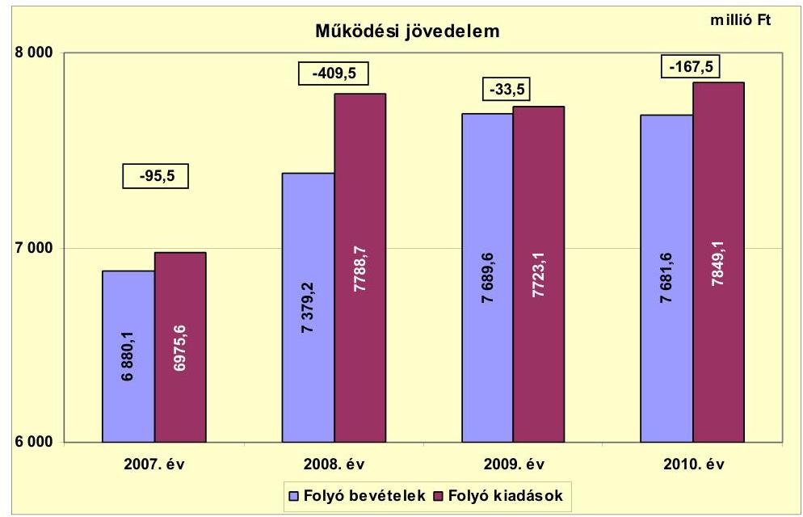

A folyó költségvetés hiánya a 2007. évben 95,5 millió Ft (1,4\%), a 2008. évben 409,5 millió Ft (5,3\%), a 2009. évben 33,5 millió Ft ( $0,4 \%$ ), a 2010. évben 167,5 millió Ft ( $2,1 \%$ ) volt. A múködési jövedelem 2008. évi 314,0 millió Ft-os csökkenésének oka, hogy a folyó kiadások 11,7\%-os növekedése mellett elmaradt a folyó bevételek növekedése ( $7,3 \%$ ). A 2009. évre a múködési jövedelem 376,0 millió Ft-tal növekedett a folyó kiadások 0,8\%-os csökkenésének és a folyó bevételek 4,2\%-os növekedésének hatására, ami a 2007. és a 2008. évi létszámcsökkentések eredménye. A 2010. évben a múködési jövedelem ismét csökkent 134,0 millió Ft-tal a folyó kiadások 1,6\%-os növekedése és a folyó bevételek $0,1 \%$-os csökkenése következtében, amit elsősorban a kamatkiadások növekedése okozott. A múködési jövedelem ingadozásához hozzájárult az évek között áthúzódó szállítói tartozások rendezése is.

Az Önkormányzat a 2007-2010. években képződött 706,0 millió Ft negatív múködési jövedelmet a 2008. évben kibocsátott kötvényből múködési célú felhaszn-

[^0]
[^0]:    17 A Hulladéklerakó Társulás teljesített felhalmozási célú bevétele a 2007-ben 239,5 millió Ft, a 2008-ban 55,3 millió Ft, a 2009-ben 335,3 millió Ft, a 2010-ben 1,6 millió Ft, a folyó bevétele az évek sorrendjében 26,5 millió Ft, 12,1 millió Ft, 18,0 millió Ft, 50,0 millió Ft volt. A Hulladéklerakó Társulás a 2007-ben 254,6 millió Ft, a 2008-ban 60,8 millió Ft, a 2009-ben 354,2 millió Ft, a 2010-ben 2,7 millió Ft-ot felhalmozási kiadást teljesített. Folyó kiadásainak összege a 2007-ben 5,8 millió Ft, a 2008-ban 9,2 millió Ft, a 2009-ben 5,3 millió Ft, a 2010-ben 21,0 millió Ft volt.

---

nálással, valamint rövid lejáratú hitelekkel (faktorálási megállapodáson alapuló hitellel, folyószámla-, és munkabérhitellel) finanszírozta. Az Önkormányzat pénzügyi pozíciója a 2008. évben kibocsátott kötvény múködési célú felhasználásával a 2009. évben javult, majd a 2010. évben romlott az előző́ évhez képest.

Az Önkormányzat a 2011. évi módosított költségvetési rendeletében tervezett 151,3 millió Ft múködési forráshiány csökkentésére ÖNHIKI támogatást igényelt. Az Önkormányzat részére 80,0 millió Ft vissza nem térítendő támogatás került jóváhagyásra: 20,5 millió Ft a 2011. február 28-án fennálló közüzemi és/vagy élelmiszerbeszállítói számlák kiegyenlítésére, 34,5 millió Ft az alapfokú nevelési, oktatási intézmények fenntartására, 25,0 millió Ft az egyéb kötelező feladatellátáshoz kapcsolódó múködési forráshiány mérséklésére. A támogatás cél szerinti felhasználásáról 2011. szeptember 9-én elszámoltak. Az elszámolással egyidejúleg az Önkormányzat igénylést nyújtott be az ÖNHIKI II. ütemére a 2011. évi módosított költségvetési rendeletben kimutatott 62,6 millió Ft múködési forráshiányra. Az Önkormányzat részére 2011. november 5-én 45,0 millió Ft ÖNHIKI támogatás került átutalásra. ${ }^{18}$

Az évenkénti tőketörlesztéssel csökkentett múködési jövedelem (nettó múködési jövedelem, pénzügyi kapacitás) a vizsgált időszakban negatív értéket mutatott. Az Önkormányzat tőketörlesztési kötelezettsége a 2007. évben 74,0 millió Ft, a 2008. évben 164,5 millió Ft, 2009. évben 6,8 millió Ft, a 2010. évben 15,0 millió Ft volt. A nettó múködési jövedelem 2008. évi csökkenését elsősorban a múködési jövedelem 314,0 millió Ft-os csökkenése, valamint a „Beretytyóújfalu 2008" kötvénybevételből hitelkiváltásra történő felhasználás ( 81,9 millió Ft) és a faktorálás miatti ( 78,4 millió Ft) kötelezettség teljesítése okozta. A nettó múködési jövedelem 2009-re a múködési jövedelem növekedésének és a tőketörlesztési kötelezettség csökkenésének hatására növekedett. A múködési jövedelem csökkenése és a tőketörlesztési kötelezettség növekedése rontotta a pénzügyi kapacitást 2009-ről 2010-re.

A nettó múködési jövedelem alakulását a 2007-2010. években a következő ábra szemlélteti:

[^0]
[^0]:    ${ }^{18}$ Értesítő levelet a támogatás megítéléséről, felhasználási céljairól még nem kapott az Önkormányzat.

---

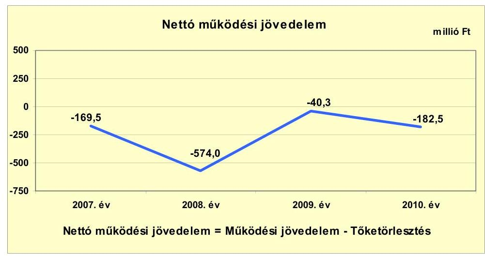

A 2007-2010. években az Önkormányzat felhalmozási költségvetésének egyenlege folyamatosan negatív összegű volt.

A felhalmozási költségvetés egyenlegének alakulását évről évre a következő ábra szemlélteti:
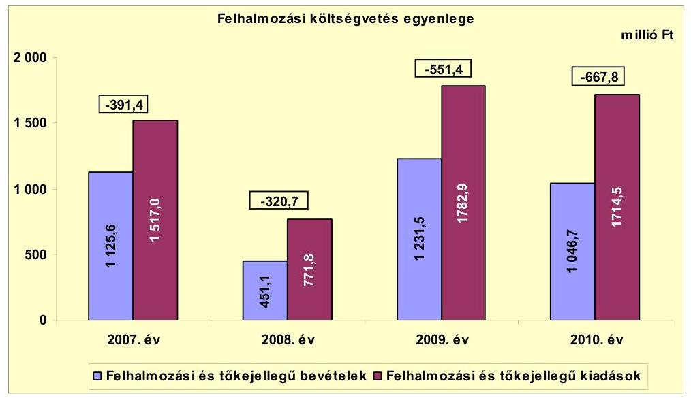

A felhalmozási forráshiánynak a felhalmozási és tőkejellegú kiadásokhoz viszonyított aránya 2007-ben 25,8\% (391,4 millió Ft), 2008-ban 41,6\% (320,7 millió Ft), 2009-ben 30,9\% (551,4 millió Ft), 2010-ben 39,0\% ( 667,8 millió Ft) volt.

A 2007-2010. években képződött összesen 1931,3 millió Ft felhalmozási forráshiányt a szennyvízcsatorna bővítéséhez 2007-ben felvett 188,5 millió Ft fejlesztési célú hitelfelvétel, a 2008. és 2010. években kibocsátott 1500 millió Ft és 1000 millió Ft kötvénybevételből származó fejlesztési célra felhasznált 1521,5 millió Ft, valamint 221,3 millió Ft rövid lejáratú hitel (faktorálási megállapodás miatti hitel, folyószámla-hitel) fedezett. A felhalmozási költségvetés 2010. évi negatív egyenlegének keletkezéséhez hozzájárult a felhalmozási célú EU-s projektekhez igényelt 147,1 millió Ft támogatás 2011-re áthúzódó kiutalá-

---

sa. A negatív egyenleget növelte a projektek támogatásának megelőlegezése, saját forrásának biztosítása belső finanszírozás útján, aminek következtében az Önkormányzat 2011. év I. félévben 250,0 millió Ft hitelkeret szerződést kötött, melyből 175,0 millió Ft támogatások megelőlegezésére, 75,0 millió Ft működési kiadások finanszírozására használható.

Az Önkormányzat évenkénti teljes finanszírozási igénye ${ }^{19}$ a CLF módszer szerint 2007-ben 560,9 millió Ft, 2008-ban 894,7 millió Ft, 2009-ben 591,7 millió Ft, 2010-ben 850,3 millió Ft, összesen 2897,6 millió Ft volt, amelynek finanszírozásához finanszírozási célú bevételeket (fejlesztési hitelt, folyó-számla-, és munkabérhitelt, kötvénykibocsátásból származó bevételt) vettek igénybe.
Az Önkormányzatnál a finanszírozási műveletek egyenlegének alakulását a 2007-2010. években a következő ábra szemlélteti:
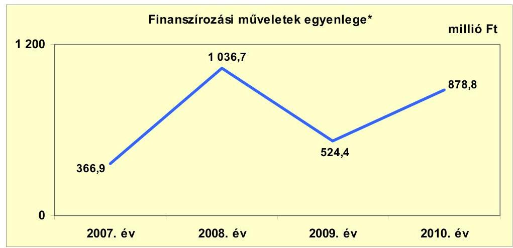

* egyéb finanszírozási (függő, átfutó és kiegyenlítő) bevételek és kiadások nélkül

A finanszírozási célú műveleteket a jelentés 2. számú mellékletének 4.1-4.8. pontjai részletezik. A 2008. és 2010. évi kiugró értékeket a 2008. évben 1499,9 millió Ft és a 2010. évben 1000,0 millió Ft összegben kibocsátott kötvényekből származó bevételek eredményezték.

A Polgármesteri hivatalban 2008-2010. években költségvetési egyéb aktív pénzügyi elszámolások között az Áhsz. 22. § (7)-(10) bekezdéseiben, és az Áhsz. 9. számú mellékletének számlaosztályok tartalmára vonatkozó előírások 3. g) pontjában meghatározottak ellenére egyéb gazdasági eseményeket is elszámoltak. Továbbá az Áhsz. 26. § (8)-(11) bekezdéseiben és az Áhsz. 9. számú mellékletének a számlaosztályok tartalmára vonatkozó előírások 4. h) pontjában előírtak ellenére költségvetési egyéb passzív pénzügyi elszámolásként egyéb gazdasági eseményeket is kimutattak. Az egyéb finanszírozási kiadások/bevételek összege betét lekötéseket, értékpapír tranzakciókat, kötvénykibocsátást, az abból származó bevételek felhasználását stb. is tartalmazott. A számviteli előírások megsértése az Önkormányzat pénzügyi helyzetére nem volt hatással.

[^0]
[^0]:    ${ }^{19}$ a nettó múködési jövedelem és a felhalmozási költségvetés eredője

---

Az Önkormányzat 2007-2010. évi zárszámadási rendeleteiben meghatározta a felhalmozási, illetve múködési bevételek és kiadások főösszegét ${ }^{20}$, amelyet a jelentés 1 . számú melléklete szemléltet.

Az Önkormányzat kamatbevételeinek és kamatkiadásainak alakulását a következő ábra mutatja:
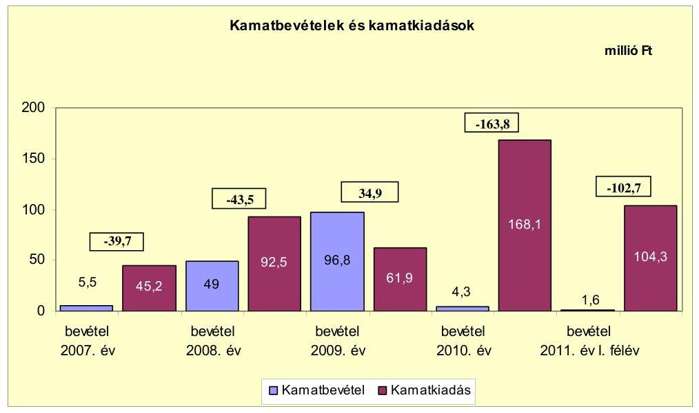

A kamatbevételek 2007-ről 2009-re tapasztalt emelkedését a 2008-ban kibocsátott 1499,9 millió Ft kötvényből származó bevétel kamata eredményezte. A kamatbevételek visszaesése az 1499,9 Ft-os kötvény kibocsátásából származó bevétel felhasználásával függött össze. A kamatkiadások 2007-ről 2008-ra közel duplájára növekedtek a 2008. évi kötvénykibocsátás miatt. A téves könyvelési tétellel korrigálva ${ }^{21}$ a kamatkiadások a 2009. évi 106,3 millió Ft-ról a 2010. évre 123,7 millió Ft-ra növekedtek az alapkamatok csökkenése és a 2010. évben kibocsátott 1000 millió Ft kötvény után fizetett kamatok együttes hatásaként.

# 2.2. Az Önkormányzat bevételeinek változása 

Az Önkormányzat folyó bevételei a 2007. évi 6880,1 millió Ft-ról a 2010. évre 7681,6 millió Ft-ra, 11,6\%-kal növekedtek, a 2011. év I. félévében teljesült folyó bevételek összege 3607,2 millió Ft volt. Az Önkormányzat 2007-2011. I. féléve között realizált főbb folyó bevételi jogcímeinek számszaki adatait a következő táblázat részletezi és grafikon mutatja be:

[^0]
[^0]:    ${ }^{20}$ Nincs kötelező előírás a működési és fejlesztési többlet, hiány megállapításának módjára.
    ${ }^{21}$ A 2007. évben kibocsátott kötvény 44,4 millió Ft kamatkiadását a 2009. évben a kiegyenlítő kiadások között könyveltek le, mely a 2010. évben került átvezetésre a kamatkiadások közé.

---

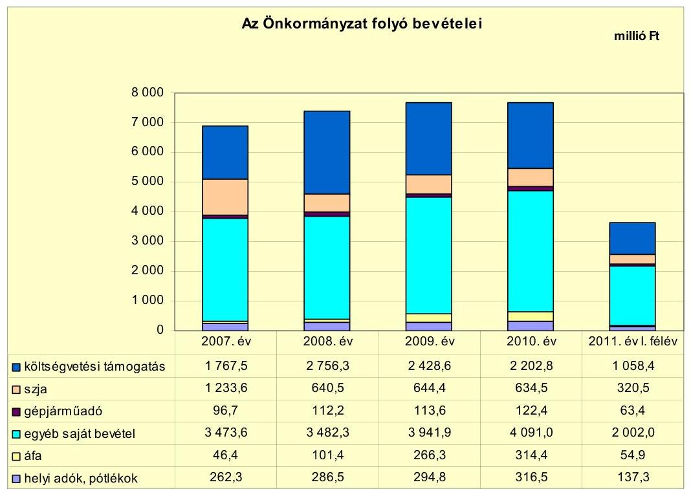

Az Önkormányzat múködési célú költségvetési támogatása és az átengedett szja bevétel együttes összege a 2010. évben 2837,3 millió Ft volt, ami a 2007-2009. évek átlagához képest 319,7 millió Ft (10,1\%) csökkenést jelentett. A 2008. évi növekedést az egyéb központi támogatások, valamint a szociális feladatok támogatása jogcímen kapott támogatások növekedése okozta. Az egyéb központi támogatások között meghatározóak voltak a 2007. év után járó 13. havi illetmény 2008. évi elszámolása és a helyi önkormányzatok által fenntartott költségvetési szerveknél foglalkoztatottak eseti kereset-kiegészítése jogcímen kapott támogatások. A 2009. és a 2010. évi csökkenést egyrészt az okozta, hogy létszámcsökkentés támogatására a 2007. évben 184,5 millió Ft, a 2008. évben 176,7 millió Ft központosított előirányzatú támogatásban részesültek, míg ez az összeg a 2009. évben 17,5 millió Ft, a 2010. évben 88,9 millió Ft volt. A költségvetési támogatás összegét csökkentette a 2010. évben, hogy a szociális és gyermekjóléti feladatokat ellátó intézmény 2010. január 1-jétől a Társulás fenntartásában múködik.

A helyi adókból és pótlékokból származó bevételek összege 2007. évi 262,3 millió Ft-ról - a behajtási tevékenység eredményeként - 2010-re 54,2 millió Ft-tal, 20,7\%-kal növekedett. Az Önkormányzat a 2007-2008. években három helyi adónemet, a helyi iparúzési adót, a vállalkozások kommunális adóját, és az idegenforgalmi adót alkalmazta, majd a 2009. évtől bevezette a telekadót. A vállalkozók kommunális adója adónemet a helyi adóról szóló 1990. évi C. törvény 2011. január 1-jétől megszüntette. A helyi adómértékeket a vizsgált időszakban nem módosították. A 2007-2011. év I. féléve között befolyt összes helyi adóbevétel 97,2\%-a az iparúzési adóból származott, s további bevételi lehetőséget jelent még az Önkormányzatnak, mivel mértéke (1,8\%) nem éri el a maximális $2,0 \%$-os adómértéket.

Az idegenforgalmi adó a vizsgált időszakban 150 Ft/vendégéjszaka, a vállalkozók kommunális adója - a statisztikai állományi létszám után - 2000 Ft/fő volt. A

---

2009. január 1-től bevezetett telekadó mértéke - a rendeletben meghatározott beépítetlen belterületi fölterületek után - $200 \mathrm{Ft} / \mathrm{m}^{2}$.

Az Önkormányzat egyéb saját bevételeinek ${ }^{22}$ a 2008-ról 2009-re történő 13,2\%-os ( 459,6 millió Ft) növekedését a támogatásértékű működési bevételek 5,6\%-os ( 168,4 millió Ft), valamint az intézményi múködési bevételek 51,8\%-os (195,9 millió Ft) emelkedése okozta. A támogatásértékű működési bevételek növekedését az OEP finanszírozás növekedése, EU-s pályázatokra kapott múködési támogatások, valamint más önkormányzatoktól átvett támogatások okozták. Az intézményi múködési bevételek a Kórháznál növekedtek jelentősen (173,3 millió Ft-tal) a továbbszámlázott (közvetített) szolgáltatások ellenértéke miatt. ${ }^{23}$

Az egyéb saját bevételeken belül a Kórház múködési célú OEP finanszírozási bevétele a 2007-2010. években átlagosan 76,6\% volt. Az OEP finanszírozási bevétel a 2007. évről 2010-re folyamatosan - 2746,4 millió Ft-ról 3155,2 millió Ft-ra - növekedett.

Az Önkormányzatnak 2007-2011. év I. féléve között osztalékbevétele nem keletkezett.

Az Önkormányzat felhalmozási bevételei a vizsgált időszakban a következőképpen alakultak:

| Megnevezés | 2007. év | 2008. év | 2009. év | 2010. év | 2011. év I.   félév |
| :-- | --: | --: | --: | --: | --: |
| Tárgyi eszköz értékesítés | 49,4 | 186,0 | 90,9 | 76,8 | 0,6 |
| Egyéb saját tőkebevétel | 22,2 | 3,4 | 1,8 | 1,7 | 0,6 |
| Államháztartáson belülről   kapott támogatás | 783,6 | 187,5 | 72,9 | 64,4 | 19,4 |
| EU-től és külföldről kapott   támogatások | 44,5 | 25,0 | 1065,1 | 896,9 | 143,5 |
| Államháztartáson kívülről   kapott támogatás | 225,9 | 49,2 | 0,8 | 6,9 | 1,7 |
| Összes felhalmozási bevétel | 1125,6 | 451,1 | 1231,5 | 1046,7 | 165,8 |

A felhalmozási célú bevételek ingadozását a fejlesztésekhez befolyt pályázati pénzek okozták. A felhalmozási célú bevételek 2008. évi csökkenését a fejlesztési célú költségvetési támogatások 321,8 millió Ft-os és a támogatásértékű felhalmozási bevételek 274,3 millió Ft-os csökkenése okozta. A tárgyi eszközök értékesítéséből származó bevétel ingatlanok értékesítéséből származott a 2008. évben. A 2008. évhez viszonyítva a felhalmozási célú bevételek 2009-2010. évi emelkedését az EU-s forrásokból megvalósult projektekhez kapcsolódóan be-

[^0]
[^0]:    ${ }^{22}$ Az egyéb saját bevételek részét képezték az intézményi múködési bevételek, a hozamés kamatbevételek, üzemeltetési díjak, a vagyoni értékű jog értékesítése, az államháztartáson belülről és kívülről átvett pénzeszközök, előző évi pénzmaradvány átvétele.
    ${ }^{23}$ A Kórház 2008 októberétől a gázszolgáltatótól megvásárolt földgázt továbbszámlázza, majd annak feldolgozását követően a keletkezett hőmennyiséget visszavásárolja.

---

folyt támogatások okozták. E támogatások közül a jelentősebb összegű támogatások a három közoktatási intézmény felújításához, valamint a Hulladéklerakó Társulás beruházásához kapcsolódtak.

A Kórháznak a vizsgált időszakban a 2007. évben volt jelentősebb, 71,4 millió Ft összegű felhalmozási célú pénzeszközátvétele, mely a sürgősségi betegellátás feltételeinek javítását, a krónikus ágyak számának növekedését eredményező struktúramódosításhoz kapcsolódó átalakítást támogatta.

# 2.3. Az Önkormányzat müködési és felhalmozási célú kiadásainak változása 

Az Önkormányzat folyó kiadásai főbb jogcímek szerinti bontásban a következők voltak:

| Megnevezés | 2007. év | 2008. év | 2009. év | 2010. év | 2011. év I.   félév |
| :--: | :--: | :--: | :--: | :--: | :--: |
| Folyó kiadások | 6975,6 | 7788,7 | 7723,1 | 7849,1 | 3640,2 |
| Müködési kiadások (kamatkiadás nélkül) | 6565,9 | 7140,7 | 7065,6 | 7116,4 | 3298,9 |
| Államháztartáson belülre átadott pénzeszközök | 12,9 | 29,3 | 39,4 | 157,5 | 0,7 |
| Transzferkiadások | 351,6 | 503,1 | 449,0 | 407,1 | 236,3 |
| -ebből: vállalkozásoknak | 15,9 | 92,9 | 60,3 | 22,8 | 29,6 |
| EU-nak, illetve külföldre | 0,0 | 0,0 | 0,0 | 0,0 | 0,0 |
| magánszemélyeknek | 325,8 | 389,8 | 368,8 | 371,9 | 186,7 |
| nonprofit szervezeteknek | 9,9 | 20,4 | 19,9 | 12,4 | 20,0 |
| Kamatkiadások | 45,2 | 92,5 | 61,9 | 168,1 | 104,3 |
| Előző évi pénzmaradvány átadás | 0,0 | 23,1 | 107,2 | 0,0 | 0,0 |

Az egyes kiemelt múködési előirányzatok teljesítési adatát a következő táblázat mutatja be:

|  |  |  |  |  |  |
| :-- | --: | --: | --: | --: | --: |
| Megnevezés | 2007. év | 2008. év | 2009. év | 2010. év | 2011. év I.   félév |
| Személyi juttatások | 3506,7 | 3699,7 | 3399,3 | 3517,1 | 1600,7 |
| Munkaadót terhelő járulékok | 1141,2 | 1196,2 | 1023,8 | 910,3 | 424,7 |
| Dologi kiadások | 1822,0 | 2201,2 | 2504,3 | 2548,2 | 1180,4 |
| Egyéb folyó kiadások | 42,1 | 34,8 | 27,0 | 63,1 | 47,4 |

Az Önkormányzat folyó kiadásai a 2010. évben a 2007-2009. évek átlagához képest ( 7495,8 millió Ft) 353,1 millió Ft-tal növekedtek. A folyó kiadásokon belül a személyi juttatások összege a 2010. évben 3517,1 millió Ft volt, ami a 2007-2009. évek átlagához képest 18,1 millió Ft ( $0,5 \%$ ) csökkenést jelentett. A végrehajtott létszámcsökkentések ellenére 2007-ről 2008-ra 5,5\%, 193,0 millió Ft növekedés tapasztalható a kifizetett végkielégítések miatt. A 2007. és a 2008. évi létszámcsökkentések, a takarítási és karbantartási feladatellátás kiszervezése, valamint a - Polgármesteri hivatalban kimutatott - közfoglalkoztatásban résztvevők létszámnövekedésének együttes hatásaként a 2009. évben a személyi juttatások összege $8,1 \%$-kal, 300,4 millió Ft-tal csökkent. A Kórház személyi juttatásainak csökkenése 189,6 millió Ft, a Szolgáltató Iroda és a hozzá tartozó önállóan múködő intézményeké 194,0 millió Ft volt, míg a Polgármesteri hivatal személyi juttatásai 83,3 millió Ft-tal növekedtek. A

---

2009-ről 2010-re a személyi juttatások 3,5\%-kal, 117,8 millió Ft-tal ismét növekedtek a közfoglalkoztatásban résztvevők személyi juttatásainak 50\%-os növekedése, a takarítási feladatok 2010. január 1-től történő visszaszervezése, valamint a szociális és gyermekjóléti feladatok Társulás részére történő átadásának együttes hatásaként.

Az Önkormányzat dologi kiadása a 2010. évben 2548,2 millió Ft volt, ami a 2007-2009. évek átlagához képest 372,4 millió Ft (17,1\%) növekedést jelentett. A 2008. évi 379,2 millió Ft (20,8\%) növekedést a fordított áfa elszámolás miatti áfanövekedés, valamint az előző évről áthúzódó, lejárt szállítói tartozások kifizetése eredményezte. A 2009. évi 303,1 millió Ft (13,8\%) növekedést a fordított áfa, a továbbszámlázott (közvetített) szolgáltatások növekedése, valamint a takarítási, karbantartási és kulturális feladatok kiszervezése okozta. A dologi kiadások a 2010. évben 43,9 millió Ft-tal (1,8\%) növekedtek. A Polgármesteri hivatalnál a 103,0 millió Ft (16,6\%) csökkenést az elszámolt fordított áfa csökkenése, valamint a takarítási feladatok visszaszervezése idézte elő. A Szolgáltató Iroda dologi kiadásai 172,8 millió Ft-tal, 30,8\%-kal csökkentek a szociális és gyermekjóléti feladatokat ellátó intézmény Társulás részére történő átadása, valamint annak következtében, hogy jelentős összegű szállítói tartozás ${ }^{24}$ húzódott át a 2011. évre. A 2010. évben 335,4 millió Ft (25,0\%) dologi kiadásnövekedést okozott a Kórháznál a konszolidációs támogatásból kifizetett lejárt fizetési határidejű számlák kiegyenlítése. Az Önkormányzatnál 2011. év I. félévében az előző évhez viszonyítva a személyi juttatások 45,5\%-ra, a járulékok $46,7 \%$-ra, a dologi kiadások $46,3 \%$-ra teljesültek.

Az Önkormányzat folyó kiadásai - a Kórház kiadásai nélkül - főbb jogcímek szerinti bontásban a következők voltak:

| Megnevezés | 2007. év | 2008. év | 2009. év | 2010. év | 2011. év I.   félév |
| :--: | :--: | :--: | :--: | :--: | :--: |
| Folyó kiadások | 3867,7 | 4581,1 | 4482,6 | 4265,6 | 1951,5 |
| Müködési kiadások (kamatkiadás nélkül) | 3460,8 | 3933,2 | 3825,1 | 3532,9 | 1610,9 |
| Kamatkiadás | 45,2 | 92,5 | 61,9 | 168,1 | 104,3 |
| Személyi juttatások | 1933,7 | 2076,9 | 1966,1 | 2040,3 | 853,2 |
| Munkaadót terhelő járulékok | 622,7 | 660,5 | 571,9 | 508,9 | 221,9 |
| Dologi kiadások | 825,3 | 1168,4 | 1161,7 | 870,1 | 465,5 |
| Egyéb folyó kiadások | 28,7 | 22,6 | 14,2 | 35,9 | 24,6 |

Az Önkormányzat - Kórház nélküli - folyó és múködési kiadásai a 2008. évben növekedtek, míg a 2009-2010. években csökkentek. A változásokra alapvetően a dologi kiadások és a személyi juttatások alakulása volt hatással.

A folyó és felhalmozási kiadások alakulását, a teljesített kiadások múködési és felhalmozási felhasználásának arányait a következő grafikon mutatja be:

[^0]
[^0]:    ${ }^{24}$ A Szolgáltató Iroda dologi kiadásainak 2010. évi módosított előirányzata 628,6 millió Ft, míg a teljesítés 388,1 millió Ft volt.

---

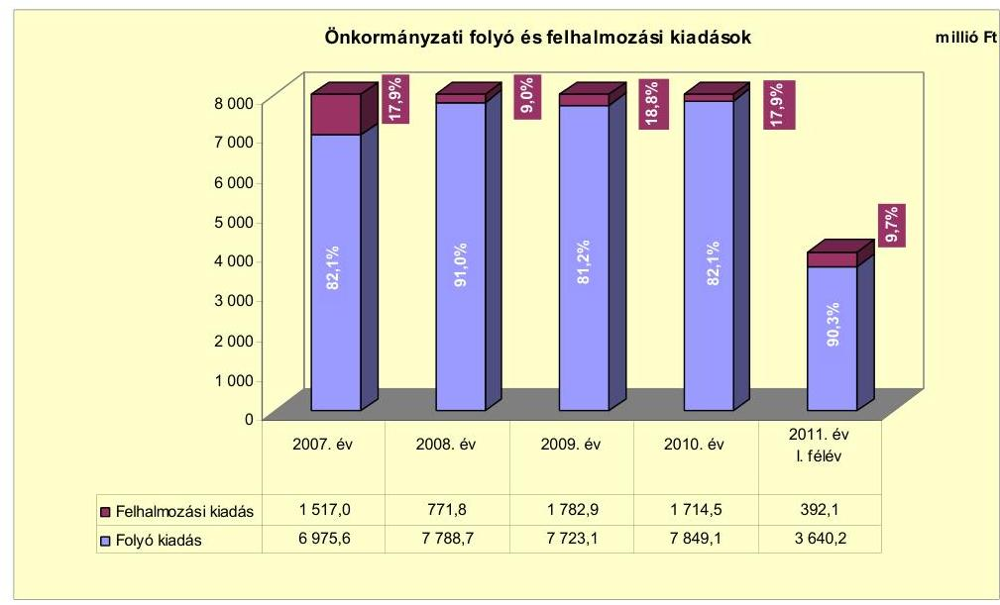

A folyó és felhalmozási kiadások arányainak változása a 2007-2010. évek között ingadozó volt. A 2010. évben a 2007-2009. évek átlagához képest a folyó kiadások aránya 2,7 százalékponttal csökkent, míg a felhalmozási kiadások aránya ugyanennyivel növekedett. Az arányok a 2007. évben, valamint a 2009-2010. években közel azonosak voltak. Az Önkormányzat folyó kiadása a 2010. évben 7849,1 millió Ft volt, ami a 2007-2009. évek átlagához képest 353,3 millió Ft (4,7\%) növekedést jelentett. A 2007. évről a 2008. évre a folyó kiadások aránya $82,1 \%$-ról $91,0 \%$-ra növekedett, mivel összegszerűen a folyó kiadások emelkedése mellett a felhalmozási kiadások csökkentek. A folyó kiadások 2008. évi $11,6 \%$-os ( 813,1 millió Ft) növekedésében a személyi juttatások és járulékainak 248 millió Ft-os, a dologi kiadások 379,2 millió Ft-os, valamint a szociális ellátások 75,3 millió Ft növekedése volt a meghatározó. Az Önkormányzat felhalmozási kiadása a 2010. évben 1714,5 millió Ft volt, ami a 2007-2009. évek átlagához képest 357,3 millió Ft (26,3\%) növekedést jelentett. A felhalmozási kiadások 2008. évi csökkenése annak a következménye, hogy a 2007. évben befejeződött a szennyvízcsatorna hálózat kiépítése, melynek teljesített kiadása a 2007. évben 772,4 millió Ft volt. A felhalmozási kiadások részaránya 2008-ról 2009-re 18,8\%-kal növekedett a felhalmozási kiadások összegének emelkedése miatt. A növekedést alapvetően három közoktatási intézmény - EU-s forrásból történő - felújítására teljesített 586,7 millió Ft kiadás, valamint a Hulladéklerakó Társulás által teljesített kiadások 293,4 millió Ft-os növekménye okozta. A felhalmozási kiadások 2011. év I. félévi aránya az előző évhez képest szintén csökkent, $9,7 \%$ volt.

A jelenleg 41 Hajdú-Bihar megyei önkormányzat részvételével múködő Hulladéklerakó Társulást hulladéklerakó és hasznosító telep létesítésére alapították. A Hulladéklerakó Társulás teljesített felhalmozási kiadása a 2007. és a 2009. évben befolyásolta jelentősebben az Önkormányzat felhalmozási kiadásának nagyságát. A Hulladéklerakó Társulás felhalmozási kiadásai a 2007. évben $16,8 \%$-os ( 254,6 millió Ft), a 2008. évben 7,9\%-os ( 60,8 millió Ft), a 2009. évben $19,9 \%$-os ( 354,2 millió Ft), a 2010. évben $0,2 \%$-os ( 2,7 millió Ft) részarányt képviseltek az Önkormányzat felhalmozási kiadásaiból.

---

A Hulladéklerakó Társulás nélküli folyó és felhalmozási kiadások alakulását, a teljesített kiadások múködési és felhalmozási felhasználásának arányait a következő grafikon mutatja be:
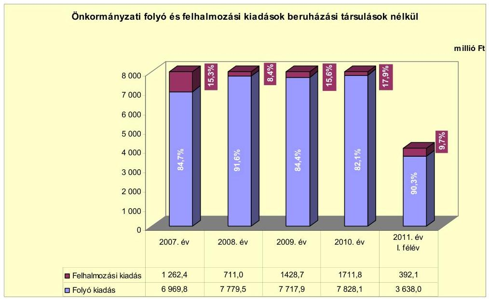

Az Önkormányzat által a 2007-2010. években megvalósított, 2010. december 31-ig befejezett 10 millió Ft feletti fejlesztéseinek száma 52 db, amelynek teljes költsége 5830,5 millió Ft volt. Ebből felújításokra 2470,8 millió Ft ( $42,4 \%$ ), a beruházásokra 3359,7 millió Ft (57,6\%) került felhasználásra. A fejlesztések teljesítési adatai ( 5830,5 millió Ft) 1737,5 millió Fttal alulmúlták a tervadatokat ( 7568 millió Ft), amely azt jelentette, hogy a fejlesztések az eredeti tervek 77\%-ában teljesültek. A fejlesztési kiadások forrásából 559,4 millió Ft-ot ( $9,6 \%$ ) jelentett a saját bevétel, 188,5 millió Ft-ot (3,2\%) a hitel, 1411 millió Ft-ot (24,2\%) a kötvényekből származó bevételek, 2446,9 millió Ft-ot ( $42 \%$ ) az EU-s támogatás, míg 1224,7 millió Ft-ot ( $21 \%$ ) a hazai támogatás. A 2007. és a 2010. évek között befejezett felújítások 82,2\%ban (2029,8 millió Ft), míg a beruházások 31,3\%-ban (1047,4 millió Ft) az elhasználódott eszközök pótlását szolgálták.

A 2007. és a 2010. évek között befejezett 10 millió Ft feletti fejlesztések - a három kiemeltet kivéve - a bölcsődék és óvodák, valamint az alap- és középfokú oktatási intézmények akadálymentesítésére, felújítására, a csatornahálózat rehabilitációjára, a túzoltóság épületének megvásárlására, a belterületi utak és kerékpárutak rekonstrukciójára, térfigyelő rendszer kiépítésére, továbbá eszközbeszerzésre irányultak. A 10 millió Ft alatti fejlesztésekből játszótér kialakítását és eszközbeszerzését, térkő- és útburkolat felújítást, piactéri parkoló kialakítását, számítástechnikai eszközbeszerzést, külterületi csatorna rehabilitációhoz kapcsolódó közcélú eszközbeszerzést, szoftver felhasználási jog beszerzését, kerékpárút előkészítő munkáit, valamint hivatali személygépkocsi vásárlását végezték el.

A folyamatban lévő fejlesztések (9 db) 2010. év december 31-ig teljesített 356,8 millió Ft bekerülési költség forrása 7,7 millió Ft ( $2,2 \%$ ) saját bevétel, 110,5 millió Ft (30,1\%) a kötvényekből származó bevételek, 193,2 millió Ft

---

(54,1\%) az EU-s támogatás, míg 45,4 millió Ft (12,7\%) a hazai támogatás. A tényleges bekerülési költségből ( 356,8 millió Ft) az elavult eszközök pótlására 323,7 millió Ft-ot $(90,7 \%)$ fordítottak.

Az Önkormányzat a folyamatban lévő fejlesztési feladataihoz kapcsolódó, a 2010. évet követő kötelezettségvállalásainak összege 3903,9 millió Ft. Ennek forrásaként az Önkormányzat 3,7 millió Ft saját bevételt ( $0,1 \%$ ), 100 millió Ft ( $2,6 \%$ ) hitelt, 287,5 millió Ft ( $7,3 \%$ ) kötvényből származó bevételt, 3485,6 millió Ft ( $89,3 \%$ ) EU-s támogatást, míg 27,1 millió Ft ( $0,7 \%$ ) hazai támogatást tervez felhasználni. A várható teljes bekerülési költség (4260,7 millió Ft) 88,1\%-át ( 3751,8 millió Ft) az elhasználódott eszközök pótlására tervezték fordítani. A 10 millió Ft alatti fejlesztések között megjelentek a herpályi apátsági templom helyreállításának, a Hajdú Könyvtári Kapuk TIOP nyertes pályázat önrészének, valamint a Berettyóújfalu-Nagyvárad kerékpárút megvalósíthatósági tanulmányának költségei is.

Az Önkormányzat beadott, elbírálás alatti pályázati forrásból három projektet tervez megvalósítani, melyeknek összköltsége 369,3 millió Ft. A 2010. év december 31-e után felmerülő fejlesztési költség 368,8 millió Ft, amelynek forrása 14,8 millió Ft (4\%) saját bevétel, 9,7 millió Ft (2,6\%) kötvényből származó bevétel, valamint 344,3 millió Ft ( $93,2 \%$ ) EU-s támogatás. Az Önkormányzat az elbírálás alatti pályázataihoz hitelt nem tervez felhasználni. A 2010. év december 31-ig teljesített fejlesztési kiadás 0,5 millió Ft ( $0,1 \%$ ) volt.

A 2007-2010. évek között befejezett és folyamatban lévő fejlesztések 2010. december 31-ig felmerült kiadása 6187,8 millió Ft volt, míg a 2010. év után tervezett fejlesztési kiadások összege 4272,7 millió Ft. (3/a., 3/b., 3/c., 3/d., mellékletek)

A 2007-2010. évek között befejezett és folyamatban lévő fejlesztések 2010. december 31-ig teljesített kiadásainak forrása 567,6 millió Ft ( $9,2 \%$ ) saját bevétel, 188,5 millió Ft (3\%) hitel, 1521,4 millió Ft (24,6\%) kötvényekből származó bevétel, 2640,1 millió Ft (42,7\%) EU-s támogatás, míg 1270,1 millió Ft (20,5\%) hazai támogatás volt.

A 2010. évet követő évekre tervezett 4272,7 millió Ft fejlesztési kiadásból várhatóan 18,5 millió Ft-ot ( $0,4 \%$ ) saját bevételből, 100 millió Ft-ot ( $2,3 \%$ ) hitelből, 297,2 millió Ft-ot (7\%) kötvényből származó bevételből, 3829,9 millió Ft-ot (89,7\%) EU-s támogatásból, míg 27,1 millió Ft-ot ( $0,6 \%$ ) hazai támogatásból tervez finanszírozni az Önkormányzat.

Az Önkormányzat fejlesztései közül a legnagyobb költségigényú az alábbi három beruházás volt:

- A „Berettyóújfalu keleti és Berettyószentmárton I. és II. ütem, Kossuth utca szennyvízelvezetése" tárgyú projekt kezdési időpontja 2005 októberére datálódik. A projekt összköltsége 727,7 millió Ft, amelyből 190,6 millió Ft (26,2\%) a saját forrás összege, 188,5 millió Ft (26\%) a hitel, míg 348,6 millió Ft (48\%) a hazai támogatás összege. A támogatási szerződés megkötésére 2007. január 3-án került sor. A projekt eredményeképpen megvalósult a teljes Kossuth utca szennyvízelvezetése, valamint a háztartások bekapcsolása az új ellátó

---

rendszerbe. A projekt a tervezett műszaki tartalommal valósult meg. A műszaki átadás-átvétel időpontja 2007. április 27-én történt meg.

- Berettyóújfalu Város Önkormányzata a „Gróf Tisza István Kórház korszerűsítése" című TIOP-2-2-4/09/1-2010-0018 azonosítószámú, folyamatban lévő pályázatát 2010. április 1-én nyújtotta be és 2010. szeptember 21-én a támogatási szerződést megkötötték. A projekt összköltsége 2444,7 millió Ft. A 2007-2010 évek között a beruházásra kifizetett 117 millió Ft forrásösszetétele 0,7 millió Ft $(0,6 \%)$ saját bevétel, 48,1 millió Ft $(41,1 \%)$ kötvényből származó bevétel, míg 68,2 millió Ft (58,3\%) EU-s támogatás volt. A 2010. december 31-e utánra vállalt 2327,7 millió Ft forrásösszetétele 195,7 millió Ft (8,4\%) kötvényből származó bevétel és 2132,0 millió Ft (91,6\%) EU-s támogatás. A fejlesztés legjelentősebb eredményei a kapacitás- és energiaracionalizálás, valamint a betegutak újraszervezése. A projekt kezdésére 2010. július 1-én került sor és tervezett befejezése 2012. június 30 -ára várható. A Kórház korszerűsítésének eredményeként megfogalmazható az ellátási terület népességének egészségügyi állapotjavulása, valamint az esélyegyenlőség és a fenntartható fejlődés feltételeinek javítása.
- A „Berettyóújfalu az egészséges város" ÉAOP-2007-5.1.1.D „Funkcióbővítő integrált települési fejlesztések támogatása" tárgyú projekt támogatási szerződését 2010. szeptember 29-én írták alá. A projekt pénzügyi elszámolása folyamatban van, az Önkormányzat építési beruházásai műszakilag átadásra kerültek. A 2007-2010 évek között teljesített 116,9 millió Ft forrásösszetétele 25,4 millió Ft (21,7\%) kötvényből származó bevétel, míg 91,5 millió Ft (78,3\%) EU-s támogatás. A 2010. december 31-e után vállalt kötelezettség 703,2 millió Ft, amelynek forrása 100,0 millió Ft (14,2\%) hitel, 50,2 millió Ft (7,1\%) kötvényből származó bevétel, míg 553,0 millió Ft (78,6\%) EU-s támogatás. A beruházás műszaki tartalma magában foglalta a Kálvin tér 5. sz. alatti volt Bank épület homlokzat felújítását, sétány kialakítását a Kálvin tér - Kossuth utca között, a Népliget rehabilitációját, valamint a Kossuth utca 6. sz. alatti volt Megyeháza átalakítását és a mögötte lévő területen parkoló kialakítását. Megvalósult a mozi épületének felújítása, átalakítása, a Szent István tér rendezvénytérré alakítása, új parkoló és járdaépítés, valamint a volt Tűzoltóság parancsnoki épületének felújítása, funkcióváltása rendezvényház céljára. A projekt műszaki befejezése 2011. június 30.

Az Önkormányzat a vizsgált időszakban osztalék előírásáról nem rendelkezett. A nyereséges társaságok adózás utáni eredményüket eredménytartalékba helyezték. A Herpály-Team Kft. adózott eredménye a 2007. évben 5,1 millió Ft, a 2008. évben 15,9 millió Ft, 2009. évben 16,1 millió Ft, 2010. évben 3,9 millió Ft volt. A BERÉPÓ Nonprofit Kft. adózott eredménye a következők szerint alakult: 2007. év 1,9 millió Ft, 2008. év 4,4 millió Ft, 2009. év 1,1 millió Ft, 2010. év 0,6 millió $\mathrm{Ft}^{25}$.

Az Önkormányzat a gazdasági társaságok részére a 2007-2011. év I. félévében összesen 142,1 millió Ft pénzeszközt adott át, melyből

[^0]
[^0]:    ${ }^{25}$ A Nova Villa 2010 Nonprofit Kft. 2011. évben kezdte meg múködését, így gazdálkodásának eredményességére vonatkozóan még nem áll rendelkezésre adat.

---

141,1 millió Ft-ot tett ki a múködési, 1,0 millió Ft-ot a fejlesztési célú pénzeszközátadás.

Az Önkormányzat 100\%-os tulajdonában álló Herpály-Team Kft. összesen 121,9 millió Ft ( $86,4 \%$ ) múködési célú pénzeszközátadásban részesült a vizsgált időszakban. A gazdasági társaságoknak nyújtott pénzeszközátadások részletes adatait a 4. számú melléklet tartalmazza.

A helyi közlekedést üzemeltető Hajdú Volán Zrt. feladatellátását az Önkormányzat - a normatív támogatáson felül - minden évben támogatta. A pénzeszközátadás indoka az, hogy a helyi közösségi közlekedéshez kapcsolódó normatíva abban az esetben igényelhető, ha az önkormányzat saját forrásból is kiegészíti a helyi közlekedés múködtetését.

Az Önkormányzat által a 2007-2011. év I. félévében a gazdasági társaságok részére átadott múködési és fejlesztési célú pénzeszközök alakulását az alábbi ábra mutatja be:
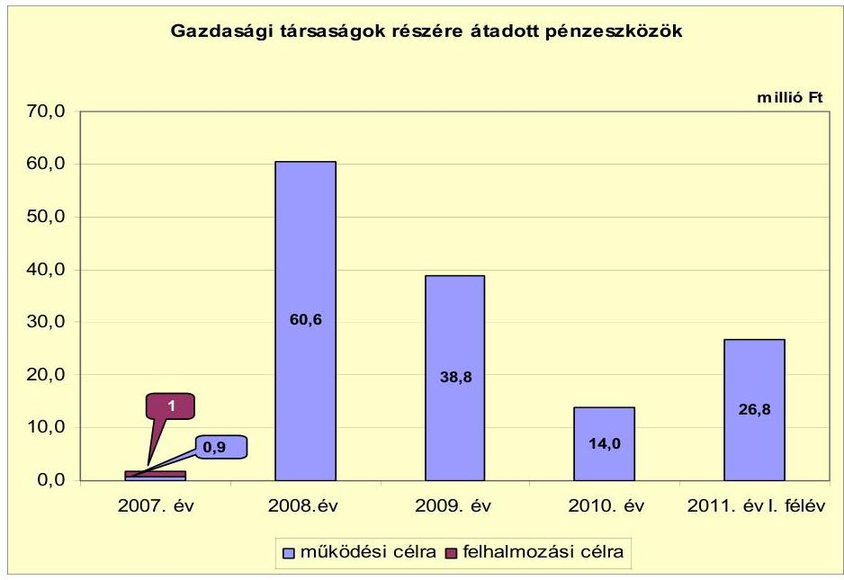

A pénzeszközátadások 2008. évben bekövetkezett emelkedése a Herpály-Team Kft. feladatainak növekedésével áll összefüggésben. 2008. évben a takarítási, karbantartási, valamint a közmúvelődési feladatok ellátása a Kft.-hez került. 2007. évben a társaság még nem részesült pénzeszközátadásban múködéséhez. A megnövekedett feladatok ellátását csak önkormányzati hozzájárulással tudta biztosítani, így 2008. évben 58,4 millió Ft pénzeszközátadásban részesült. A feladatellátásnak legmegfelelőbb szervezeti keretek keresése az önkormányzati pénzeszközátadás csökkenését eredményezte. 2009. évben a Herpály-Team Kft. önkormányzati pénzeszközátadása 34,6 millió Ft-ra csökkent. A 2011. év I. félévében jelentkező emelkedést a Nova Villa 2010 Nonprofit Kft. létrehozása és a múködéséhez kapcsolódó pénzeszközátadás biztosítása okozta.

---

A pénzeszközátadásokra megállapodások alapján került sor. Az Áht ${ }_{1}$. 13/A § (2) bekezdésében foglalt, és a megállapodásokban előírt számadási kötelezettség teljesítése a Hajdú Volán Zrt. esetében megvalósult ${ }^{26}$. A Herpály-Team Kft. esetében a pénzeszköz átadásokról rendelkező szerződések nem írták elő az Áht ${ }_{1}$. 13/A § (2) bekezdésében meghatározott számadási kötelezettséget.

# 3. Az ÖNKORMÁNYZAT KÖTELEZETTSÉGEI 

### 3.1. Az Önkormányzat pénzintézetekkel szembeni kötelezettségeinek változása

Az Önkormányzatnak 2006. december 31-én 198,3 millió Ft pénzintézetekkel szembeni kötelezettségállománya volt, a 2011. év I. félévben 4246,9 millió Ft. A fennálló pénzintézetekkel szembeni kötelezettségei három hosszú lejáratú hitel felvételéből, két kötvény kibocsátásából, egy rövid lejáratú hitel igénybevételéből, valamint a 2011. június 30 -án fennálló folyószámlahitel és munkabér-megelőlegezési hitel állományból keletkeztek. Az Önkormányzat a rövid lejáratú hitelek között mutatta ki a faktorálási megállapodással érintett szállítókkal szembeni tartozását. Ennek összege a 2007. évben 78,5 millió Ft, a 2008. évben 20,0 millió Ft, a 2009. évben 22,6 millió Ft, a 2010. évben 52 millió Ft, 2011. június 30-án 76,6 millió Ft volt.
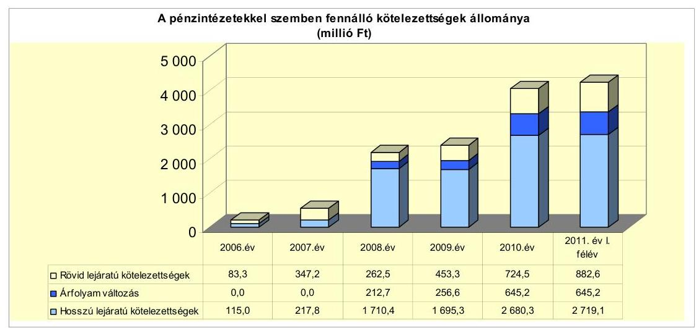

A pénzintézetekkel szembeni kötelezettségek mérleg szerinti állományának több mint 20-szoros, 4048,6 millió Ft összegű növekedését döntően befolyásolta, hogy 2007-2011. év I. féléve között az Önkormányzat

- a 2007. évben 188,5 millió Ft fejlesztési célú hitelt vett fel a szennyvízcsatorna beruházáshoz;

[^0]
[^0]:    ${ }^{26}$ A Nova Villa 2010 Nonprofit Kft. esetében a számadási kötelezettség teljesítésére vonatkozóan a vizsgálat időszakában még nincs adat, mert a társaság 2011 februárjában kezdte meg múködését.

---

- 2008. január 30-án 1499,9 millió Ft (9 633000 CHF), 2010. július 22-én 1000,0 millió Ft kötvényt bocsátott ki;
- az integrált városfejlesztés beruházás saját forrásának finanszírozására 100,0 millió Ft hitelkeretre kötött szerződést, melyből 2011. június 29-én 38,8 millió Ft-ot hívtak le;
- a támogatások előfinanszírozása, valamint a működési kiadások finanszírozása céljából 2011. március 16-án 250,0 millió Ft összegű hitelkeret szerződést kötött, melynek 2011. június 30-i állománya 179,6 millió Ft volt;
- folyószámlahitel 2006. év végi állománya 20,4 millió Ft-ról 2011. június 30ra 486,8 millió Ft-ra növekedett;
- 2011. június 30-án 130 millió Ft munkabér-megelőlegezési hitellel rendelkezett, míg a 2007. év végén nem volt igénybe vett munkabérhitele.

A Számv. tv. 15. § (3) bekezdésében előírt valódiság elvét, továbbá a Számv. tv. 60. § (2) bekezdésében foglalt előírást megsértve, az Áhsz. 33. § (1) bekezdésében foglaltak ellenére az Önkormányzat egy 2003. évben EUR-ban felvett hoszszú lejáratú hitel, és nem annak tőketörlesztésekkel csökkentett állománya után számolt el árfolyamnyereséget a 2006-2007. években. A főkönyvi és az analitikus nyilvántartások egyeztetése során megállapított eltéréssel együtt öszszesen a 2006. évben 1,8 millió Ft-tal, a 2007. évben 1,4 millió Ft-tal kevesebb hosszú lejáratú hitelt mutattak ki a mérlegben. E hitel a 2008. évben visszafizetésre került, de értékelését - szintén a 2003. évben felvett teljes hitelösszegre vonatkozóan - még a 2008. és a 2009. évben is elvégezték, így 2008-ban 0,3 millió Ft-tal, 2009-ben 1,1 millió Ft-tal több kötelezettséget mutattak ki a mérlegben.

A 2008. évben a Számv. tv. 60. § (2) bekezdésében foglalt előírást megsértve, az Áhsz. 33. § (1) bekezdésében foglaltak ellenére a devizában kibocsátott „Beretytyóújfalu 2008" kötvény év végi értékelését nem végezték el. A 2008. évben - az végi értékelés elmaradása miatt - a mérleg szerinti kötelezettségek állománya nem tartalmazta az árfolyamváltozás 212,7 millió Ft-os összegét. A 2009. évben az év végi értékelést elvégezték, azonban nem a Számv. tv. 60. §-a szerinti árfolyamon, ezért a mérleg szerinti kötelezettségek állománya 16,6 millió Ft-tal többet tartalmazott. Az Önkormányzat a 2010. évben a devizában kibocsátott kötvény esetében az árfolyamváltozás miatti év végi értékelést a Számv. tv. és az Áhsz. előírásainak megfelelően elvégezte.

Annak megítéléséről, hogy a devizában kibocsátott kötvényekért kapott forinthoz képest a kötvények visszavásárlásakor jelentkező forint kötelezettség többletkiadást (árfolyamveszteség) vagy megtakarítást (árfolyamnyereség) eredményez a futamidő végén, a teljes kötelezettség rendezését követően lehet képet alkotni. Mindaddig, amíg törlesztési kötelezettség nem áll fenn (türelmi idő, moratórium), a tőkére vonatkoztatva nem értelmezhető sem az árfolyamveszteség, sem az árfolyamnyereség. Ugyanakkor a számviteli szabályok meghatározzák, hogy az árfolyam különbözetet év végén a kötelezettségek vagy követelések között a könyvviteli mérlegben nyilván kell tartani, azonban az árfolyam különbözet valójában nem realizált.

---

A Számv. tv. 68. § (4) bekezdését megsértve a 2006. évi a mérlegben a 120,0 millió Ft folyószámla hitelkeret összegét és nem az igénybevett 20,4 millió Ft-ot mutatták ki kötelezettségként, ami a vizsgált időszak pénzügyi helyzetére közvetlenül nem volt hatással.

A CLF tábla és a jelentés a megállapított eltérésekkel korrigált pénzintézetekkel szembeni kötelezettségeket tartalmazza.

Az Önkormányzat a forráshiány, valamint az adósság kezelése érdekében a 2007-2011. évi költségvetési rendeletekben hitel felvételével, a 2008. és a 2010. években kötvény kibocsátásával számolt. Továbbá a 2009-2011. években a kötvényekből származó bevétel még fel nem használt összegéből is terveztek bevételt a forráshiány csökkentésére. ${ }^{27}$. A likviditás biztosítása érdekében minden évben folyószámla-, és munkabérhitel keretet hagyott jóvá a Képviselőtestület. A múködési hiány csökkentésére a 2007. és a 2011. évben ÖNHIKI pályázatot nyújtott be az Önkormányzat. A 2007. évi ÖNHIKI pályázat elutasításra került. Az egyensúly javítását szolgáló intézkedések voltak a létszámcsökkentések, az átszervezési, feladatracionalizálási döntések. A 2011. évi költségvetés tervezését megalapozó - bevételnövelő és kiadáscsökkentő - intézkedési tervet hagyott jóvá a Képviselő-testület.

Az adósságot keletkeztető kötelezettségvállalás felső határát vizsgálták és bemutatták a Képviselő-testületnek. Az Ötv. szerinti adósságot keletkeztető kötelezettségvállalás felső határát a 2007-2011. év I. félév között nem lépték túl, mivel a tárgyévi kötelezettségvállalásoknak - a hitelfelvételekből, a kötvénykibocsátásokból és a kezességvállalásból származó kötelezettség halasztott tőketörlesztése miatt - nem volt tárgyévet terhelő része.

Az adósságot keletkeztető kötelezettségvállalás számítása során, amennyiben előző években keletkezett tárgyévet terhelő fizetési kötelezettségként figyelembe kellett volna venni a folyószámlahitel és a munkabér-megelőlegezési hitel tárgyévet megelőző évi záró állományát is, az Önkormányzat 2010. évi teljesített, illetve 2011. évi tervezett saját bevétele a 2010. évben 24,6 millió Ft, a 2011. évben 376,6 millió Ft előző években keletkezett tárgyévet terhelő fizetési kötelezettséget már nem fedezett.

Az Önkormányzat pénzintézetekkel szembeni kötelezettségvállalásaira a 20072011. év I. féléve között a Képviselő-testület döntése alapján került sor. A kötvényeket jegyző pénzintézeteket versenyeztették, míg a három hitelszerződés ${ }^{28}$ megkötését megelőzően közbeszerzési eljárást folytattak le. Az előterjesztésekben a kötelezettségvállalások kamat- és árfolyamkockázatait bemutatták, továbbá a 2007-2011. évi költségvetési és a 2007-2010. évi zárszámadási rendeletek is tartalmazták az Önkormányzat hiteleinek és kötvényeinek évenkénti várható tőke-, és kamatfizetési kötelezettségeit a futamidők végéig. A Képviselőtestületi előterjesztésekben a visszafizetés forrásait nem számszerúsítették. A „Berettyóújfalu 2008" kötvény, az oktatási intézmények felújításához felvett

[^0]
[^0]:    ${ }^{27}$ A 2009-2011. évi költségvetési rendeletekben e bevételeket befektetési célú értékpapír kibocsátásként tervezték.
    ${ }^{28}$ A szennyvízcsatorna-hálózat bővítéséhez, az integrált városfejlesztéshez felvett hoszszú lejáratú hitelek, valamint a rövid lejáratú hitel.

---

hosszú lejáratú hitel, valamint a 250,0 millió Ft rövid lejáratú hitel esetében a finanszírozó pénzintézet nem azonos az Önkormányzat számlavezetőjével. A vizsgált időszakban az Önkormányzat nem váltott számlavezető pénzintézetet.

Az Önkormányzat 2011. június 30-án forintban fennálló hosszú lejáratú adósságot keletkeztető kötelezettségvállalásai a következők voltak:

| Megnevezés | Szerződéskötés/   Kibocsátás   időpontja | Összeg   millió Ft-ban | Kamat (referencia   kamat+ kamatfelár) | Felhasználás célja: |
| :-- | :--: | :--: | :--: | :--: |
| Hosszú lejáratú hitel | 2003.11 .13 | 41,2 | 6 havi BUBOR+1\% | "Beruházás a 21.századi iskolába" Oktatási   intézmények felújítása |
| Hosszú lejáratú hitel | 2007.01 .22 | 188,5 | 3 havi EURIBOR+1,15\% | Önkormányzati Fejlesztési Hitelprogram   Szennyvízcsatorna-hálózat bővítése |
| Hosszú lejáratú hitel | 2010.04 .19 | 100,0 | 3 havi EURIBOR+MFB   refinanszírozási   kamatfelár $+1,48 \%$ | "Sikeres Magyarországért" Önkormányzati   Infrastruktúrefejlesztési Hitelprogram   Integrált várostejlesztés |
| "Berettyóújfalu 2010" kötvény | 2010.07 .22 | 1000,0 | 3 havi BUBOR+3,5\% | A 2010. és az azt követő évek   fejlesztéseinek finanszírozása, fennálló   fejlesztési hitelek visszafizetése |

Az Önkormányzat 2011. június 30-án CHF-ben fennálló hosszú lejáratú adósságot keletkeztető kötelezettségvállalását az alábbi táblázat mutatja be:

| Megnevezés | Kibocsátás   időpontja | Összeg   ezer CHF-ben | Kibocsátási   árfolyam | Kamat (referencia kamat+   kamatfelár) | Felhasználás célja: |
| :-- | :--: | :--: | :--: | :--: | :--: |
| "Berettyóújfalu 2008" kötvény | 2008.01 .30 | 9633,0 | 155,7 | 6 havi CHF LIBOR+0,7\% | Fejlesztési feladatok finanszírozá-   sa, hitelszerkezet konszolidálása |

Az Önkormányzat a 2003. évben 41,2 millió Ft fejlesztési célú hitelt vett fel a négy oktatási intézmény felújításához. A 2015. december 31-én lejáró hitel tőketörlesztése 2006. június 30-tól évente, a kamatfizetés negyedévente esedékes. A 2011. év I. félévig 20,6 millió Ft hitelt törlesztettek, a 2007-2011. év I. féléve között 13,6 millió Ft kamatot fizettek. Az Önkormányzat a hitel és járulékai erejéig jelzálogjogot jegyeztetett be. A hitel felhasználása rendeltetésének megfelelően megtörtént.

Az Önkormányzat a 2007. évben 188,5 millió Ft fejlesztési célú hitelt vett fel a szennyvízcsatorna-hálózat bővítésére. A 20 éves futamidejú hitel tőketörlesztése 2009. év december 5-től negyedévente, a kamatok fizetése 2007. év március 31-től szintén negyedévente esedékes. 2011. június 30-ig összesen 19,1 millió Ft tőkét törlesztettek, és 29,7 millió Ft kamatot fizettek. Az Önkormányzat a hitel és járulékai erejéig - az állami támogatásokon, az szja-n és a támogatásértékű bevételein felüli - bevételeit a pénzintézetre engedményezte. A hitelt az Önkormányzat a megjelölt célnak megfelelően használta fel.

Az Önkormányzat fejlesztési feladatainak finanszírozására, valamint hitelszerkezetének konszolidálása érdekében 2008. január 30-án „Berettyóújfalu 2008" elnevezésű, összesen 9633 ezer CHF névértékủ kötvényt bocsátott ki. A 2031. január 30-i lejáratú kötvény kamatfizetése 2008. április 30-tól félévente, a tőketörlesztés négy év türelmi idő után, 2012. április 30-tól kezdődően félévente esedékes. Az Önkormányzat a kibocsátáskor 6 millió Ft jegyzési garanciavállalási díjat, 2011. június 30-ig 647,4 ezer CHF (119,1 millió Ft) kamatot fizetett a kötvény után. Jogi biztosítékként - a 2010. október 15-én megkötött kiegészítő megállapodás alapján - a pénzintézet a beszámítás és a költségvetési elszámolási számlát érintően a beszedési megbízás alkalmazásával élhet. A

---

pénzintézet a kötvényből származó bevétel befektetésére, illetve felhasználására vonatkozóan nem alkalmazott korlátozást. Az Önkormányzat 2011. június 30-ig a kötvényből származó bevételt - az oktatási intézmények felújítására felvett hitel kivételével - a fennálló fejlesztési, illetve a múködési hitelek törlesztésére, továbbá fejlesztési feladatokra felhasználta. A befektetéséből származó 112,3 millió Ft bevételt az Önkormányzat - adatszolgáltatása szerint - múködési célokra fordította. Az Önkormányzat a helyszíni ellenőrzés ideje alatt tárgyalásokba kezdett a pénzintézettel a visszavásárlás kezdő időpontjának átütemezése érdekében.

Az Önkormányzat 2010. április 19-én 100 millió Ft összegű hosszú lejáratú hitelszerződést kötött az EU-s forrásból megvalósuló integrált városfejlesztés saját erejének finanszírozására. A hitelszerződés módosítására a beruházás bekerülési költségének, ezzel a saját forrás csökkenése, valamint a rendelkezésre tartási idő egy évvel - 2011. október 20-ig - történő meghosszabbítása miatt került sor. Az Önkormányzat a hitelkeretből 38,8 millió Ft-ot hívott le 2011. június 30 -ig ${ }^{29}$. A 20 éves futamidejú hitel tőketörlesztése 2012. év április 19-től negyedévente, a kamatok fizetése a folyósítástól, 2011. év június 30 -tól szintén negyedévente esedékes. Az Önkormányzat kezdeményezte a pénzintézetnél a rendelkezésre tartási idő további meghosszabbítását. Az Önkormányzat a hitel és járulékai erejéig - az állami támogatásokon, az szja-n és a támogatásértékű bevételein felüli - bevételeit a pénzintézetre engedményezte. Az Önkormányzatnak negyedévente tájékoztatni kell a pénzintézetet a korosított vevő-, és szállítóállományáról ${ }^{30}$, továbbá negyedéves gazdálkodásáról.

Az Önkormányzat 2010. július 27-én „Berettyóújfalu 2010" kötvényt bocsátott ki 1000 millió Ft összegben, melyet zárolt óvadéki betétszámlán helyeztek el. A 20 év futamidejú kötvény utáni kamatfizetés 2010. szeptember 30-tól negyedévente, a tőketörlesztés 2012. szeptember 30-tól kezdődően félévente esedékes. Az Önkormányzat a kibocsátáskor 10 millió Ft egyszeri szervezési díjat fizetett. Az Önkormányzatot a kamaton felül, évente 0,2 millió Ft fizető ügynöki díj, valamint a Garantiqa Hitelgarancia Zrt. készfizető kezességének a díja terheli. A kezességi szerződés szerint a kezességi arány $80 \%$, a kezességvállalási díj 1,25\%. A 2010. évre 0,7 millió Ft, a 2011. évre 11,0 millió Ft kezességvállalási díj terhelte az Önkormányzatot. A 2011. év I. félévéig 87,5 millió Ft kamat és 11,9 millió Ft kezességvállalási és fizető ügynöki díj megfizetésére került sor. A Képviselő-testület 2011. augusztus 4-én döntött 250,0 millió Ft névértékű kötvény lejárat előtti, 2011. szeptember 30. napján történő visszaváltásáról. Az Önkormányzat a kötvény és járulékainak fedezeteként - az állami támogatásokon, az szja-n és a támogatásértékú bevételein felüli - bevételeit a pénzintézetre engedményezte. Az óvadéki számláról felhasználás kizárólag fejlesztési célokra történhetett. A felszabadítást megelőzően az Önkormányzat köteles volt bemutatni a költségvetésében tervezett fejlesztési célokat, az érintett beruházás forrásösszetételét, támogatási, vállalkozó szerződéseket és az eredeti számlát, valamint 2011-ben már a kifizetést igazoló bankkivonatot is. A pénzintézet előírta a kötvény futamideje alatt a számlavezetés fenntartását, valamint korlátozta a kötvénykibocsátásból származó bevétel befektetését. 2011.

[^0]
[^0]:    ${ }^{29}$ A helyszíni ellenőrzés befejezéséig összesen 84,2 millió Ft hitelt vettek igénybe.
    ${ }^{30}$ szállítói tartozások, vevői követelések lejárat szerint sorba rendezve

---

június 30-ig a 750,0 millió Ft-ból 569,5 millió Ft-ot használtak fel fejlesztési célokra. A befektetéséből származó 12,0 millió Ft bevételt is fejlesztési célra fordította az Önkormányzat.

Az Önkormányzat a múködésének pénzügyi egyensúlyát a 2007-2011. év I. félév időszakában folyószámlahitel, munkabér-megelőlegezési hitel, valamint rövid lejáratú hitel igénybevételével tudta biztosítani.

A folyószámlahitel-keret és az igénybevett munkabérhitel alakulását az alábbi táblázat mutatja be:

| Megnevezés | 2007. év | 2008. év | 2009. év | 2010. év | 2011. év I.   félév |
| :-- | --: | --: | --: | --: | --: |
| I. Folyószámlahitel |  |  |  |  |  |
| a folyószámlahitel keretösszege január 1-jén | 120,0 | 200,0 | 200,0 | 350,0 | 550,0 |
| teljesített kamat és egyéb költség | 8,7 | 12,4 | 27,1 | 39,8 | 29,8 |
| II. Munkabér megelőlegezési hitel |  |  |  |  |  |
| Igénybevett hitel összesen: | 130,0 | 130,0 | 130,0 | 130,0 | 130,0 |
| teljesített kamat és egyéb költség | 10,5 | 9,7 | 14,5 | 11,2 | 5,8 |

A folyószámlahitellel zárt napok száma a 2007-2010. években 343-365 nap, 2011. június 30 -ig 181 nap volt. A napi átlagos állomány a 2007. évi 101,5 millió Ft-ról 2011. év I. félévében több mint hatszorosára, 661,0 millió Ftra nőtt. ${ }^{31}$ A folyószámlahitel év végi állománya folyamatosan nőtt, a 2007. évben 52,6 millió Ft, a 2008. évben 105,7 millió Ft, a 2009. évben 285,7 millió Ft, a 2010. évben 527,5 millió Ft volt. A 2011. június 30 -án fennálló folyószámlahitel-állomány - a 250,0 millió Ft rövid lejáratú hitelkeretből igénybevett 179,6 millió Ft hitel miatt - 486,8 millió Ft-ra csökkent.

A 2006. december 31-én fennálló 120 millió Ft folyószámlahitel keret lejáratának napján, 2007. január 16-án az Önkormányzat 45,7 millió Ft folyószámlahitellel rendelkezett. A hitelszerződés változatlan keretösszeggel meghosszabbításra került 2008. január 15-ig. A 120 millió Ft keretet a lejárat előtt, 2007. június 15-én 180 millió Ft-ra emelték. A 2007. június 15-én fennálló folyószámlahitelállomány 56,2 millió Ft volt. A 2007. év október 16-án ismét emelésre került a fo-lyószámlahitel-keret, 200 millió Ft-ra. A módosítás napján 177,5 millió Ft volt az igénybevett folyószámlahitel. A lejárat (2008. január 15.) napján 117,5 millió Ft folyószámlahitellel rendelkezett az Önkormányzat. A hitelszerződés változatlan keretösszeggel meghosszabbításra került 2009. január 15-ig. A lejárat napján 158,4 millió Ft volt igénybevett folyószámlahitel. A hitelszerződés meghosszabbításával a keretet 2010. január 15-ig 250 millió Ft-ra emelték, melyet a lejárat előtt, 2009. augusztus 7-én 2010. június 30 -ig 350 millió Ft-ra emelték. A 2009. augusztus 7-én fennálló folyószámlahitel-állomány 241,0 millió Ft volt. E keretet is még a lejárat előtt, 2010. május 4-én 550 millió Ft-ra emelték 2011. március 1ei lejárattal. A módosítás napján 343,9 millió Ft volt az igénybevett folyószámlahitel. A hitelkeretet a lejárat előtt 2011. január 13-án 800 millió Ft-ra emelték. A 2011. január 13-án igénybevett folyószámlahitel 541,6 millió Ft volt.

A Képviselő-testület 2010. december 27-én - a 2011. évi költségvetést megalapozó intézkedési terv elfogadásával egyidejűleg - döntött a folyószámlahitel ke-

[^0]
[^0]:    ${ }^{31}$ A napi átlagos állományt a 2007-2010. években 365, a 2011. év I. félévben 181 napos nevezővel számítottuk ki.

---

retösszegének 800,0 millió Ft-ra történő emeléséről. A pénzintézet a támogatások előfinanszírozására és a szállítói tartozások kifizetésére felhasználható 250 millió Ft-os keretemelést és a lehívást szigorú feltételek teljesítéséhez kötötte a 2011. január 13-án megkötött folyószámla hitelkeret szerződésben.

Az Önkormányzatnak be kellett csatolni az intézkedési tervet, mely havi szinten 30,0 millió Ft pozíciójavulás határoz meg. Le kellett mondania a pénzintézet által lejegyzett kötvény óvadéki betétéből 250,0 millió Ft-ról, biztosítékként 300 millió Ft összegű keretbiztosítéki jelzálogjogot kellett alapítania és az adott projektekhez kapcsolódó támogatásokra, valamint a költségvetési bevételekre engedményezési szerződéseket kellett kötni. Az átutalásokat a szállítói lista pénzintézet általi jóváhagyását követő keretemeléssel egy időben el kellett indítani. Vállalnia kellett az Önkormányzatnak, hogy 2011. február 28-ig közbeszerzési pályázatot ír ki támogatás megelőlegezésére és a szállítók kifizetésére szolgáló rövid lejáratú hitel felvételére. Az intézkedési terv végrehajtásáról negyedévente szöveges és számszaki beszámolót kellett készíteni, havonta pedig be kellett mutatni a bevételnövelő, kiadáscsökkentő intézkedések hatását. A korosított vevő és szállítói állományról szintén havonta adatot kellett szolgáltatni. A parkolási díjak 2011. december 1-jei bevezetésétől a bevételek pénzintézetre történő engedményezését írta elő.

Az Önkormányzat a támogatások előfinanszírozása, valamint a múködési kiadások finanszírozása céljából 2011. március 16-án 250,0 millió Ft összegű, nem rulírozó hitelkeret szerződést kötött a közbeszerzési pályázaton nyertes pénzintézettel. A hitelkeretből 175,0 millió Ft támogatások előfinanszírozására, 75,0 millió Ft működési kiadások finanszírozására használható. A hitel lejárata 2012. február 28. napja. A hitelkeretből 224,1 millió Ft-ot hívtak le, 157,8 millió Ft-ot támogatások előfinanszírozására, 66,3 millió Ft-ot múködési célra. A 2011. június 30-i állomány 179,6 millió Ft volt. A hitelszerződés 2011. július 4-ei módosításával a keretből 175,0 millió Ft rulírozóvá vált, és kizárólag támogatások megelőlegezésére hívható le.

A 800,0 millió Ft folyószámla hitelkeret lejárata eredetileg 2011. szeptember 30. napja volt, de azt a pénzintézet - a szerződés alapján - az előfinanszírozott támogatások jóváírásakor, valamint egy előre meghatározott ütemben folyamatosan - 2011. május 12-re 550,0 millió Ft-ra - csökkentette. A Képviselő-testület 2011. szeptember 29-én döntött az 550,0 millió Ft folyószámla hitelkeret további meghosszabbításáról.

A munkabér-megelőlegezési hitel napi átlagos állománya a 2007. évi 117,5 millió Ft-ról 2011. év I. félévben 128,7 millió Ft-ra nőtt. A 2010. évben és a 2011. év I. félévében már minden napot munkabérhitellel zárt az Önkormányzat. Az Önkormányzat a 2007-2010. évek végén, valamint 2011. június 30-án 130 millió Ft munkabérhitellel rendelkezett.

A 2011. év I. félévét követően, a helyszíni ellenőrzés befejezéséig az Önkormányzat további kötvénykibocsátásról és hitelfelvételről szóló döntést nem készített elő.

---

A folyószámla-, és munkabérhitel, az egyéb rövid lejáratú hitel kondíciói a következők voltak ${ }^{32}$ :

| Megnevezés | Kamat (referencia+ kamatfelár) | Egyéb költség |
| :-- | :--: | :--: |
| Folyószámlahtel |  |  |
| 2007.01.01-2007.01.15. | 3 havi BUBOR $+0,6 \%$ | $0,2 \%$ kezelési dij |
| 2007.01.16-2009.01.15.. | 3 havi BUBOR $+0,5 \%$ | $0,2 \%$ kezelési dij |
| 2009.01.16-2009.08.06. | 3 havi BUBOR $+2,5 \%$ | $0,25 \%$ kezelési dij, $0,25 \%$ rend.tart.jutalék |
| 2009.08.07-tól | 3 havi BUBOR $+2,75 \%$ | $0,25 \%$ kezelési dij, $0,25 \%$ rend.tart.jutalék |
| Munkabér megelőlegezési hitel |  |  |
| 2007.01.01-2008.04.29. | 3 havi BUBOR $+1 \%$ | 0 |
| 2008.04.30-2009.01.15. | 3 havi BUBOR $+2,2 \%$ | 0 |
| 2009.01.16-2010.01.14. | 3 havi BUBOR $+2,75 \%$ | 0 |
| 2010.01.15-tól | 3 havi BUBOR $+3,0 \%$ | 0 |
| Egyéb rövid lejáratú hitel |  |  |
| 2011.05. 11-től | 3 havi BUBOR $+2,09 \%$ | 0 |

Az Önkormányzat a folyószámla-, és munkabérhitel, valamint a 250,0 millió Ft rövid lejáratú hitel kamatfizetésére és egyéb költségeire a 20072011. év I. féléve között 170,3 millió Ft-ot fordított.

Az Önkormányzat a 2011. június 30 -án fennálló fejlesztési célú hitelei és kötvényei után - a kamatfizetéskor érvényes devizanemtől függően 647,4 ezer CHF ( 119,1 millió Ft) és 130,8 millió Ft kamatot fizetett meg.

Az alapkamat mértékének alakulása jelentős hatással van az adott devizanemben kifejezett, a teljes futamidőre számított, várható kamatkötelezettség nagyságára. A jelenleg fennálló hosszú lejáratú fejlesztési hitelek és a kötvények esetében a kamatfizetési kötelezettségek alakulását jelentősen befolyásolja a referencia kamatok változása, melyet a következő táblázat szemléltet:

| Megnevezés | Kibocsátási, lehivási | Utolsó fizetéskori | Változás \% |
| :--: | :--: | :--: | :--: |
|  | kamat (referencia + kamatfelár) \% |  |  |
| 6 havi BUBOR (2003.11.13.-i szerződés) | 12,73 | 6,96 | $-45,3 \%$ |
| 3 havi EURIBOR (2007.01.22.-i szerződés) | 4,872 | 2,687 | $-44,8 \%$ |
| 6 havi CHF LIBOR (2008.01.30.-i kötvénykibocsátás) | 3,395 | 0,96 | $-71,7 \%$ |
| 3 havi EURIBOR (2010.04.19.-i szerződés) | 4,711 | 5,017 | 6,5\% |
| 3 havi BUBOR (2010.07.22.-i kötvénykibocsátás) | 8,83 | 9,6 | 8,7\% |

Az induló kamatlábbal számított kamathoz képest az Önkormányzatnak 2007. január 1.- 2011. június 30. között az oktatási intézmény felújításához felvett hitel után 5,9 millió Ft-tal, a szennyvízcsatorna-hálózat bővítésére felvett hitel után 8,6 millió Ft-tal kevesebb kamatfizetési kötelezettsége keletkezett. Az Önkormányzatnak a „Berettyóúffalu 2008" kötvény esetében az induló kamatkondícióval számolva a kibocsátástól 2011. június 30 -ig 1062,9 ezer CHF kamatfizetési kötelezettsége keletkezett volna. Az alapkamat csökkenése miatt azonban 415,5 ezer CHF-el kevesebb fizetési kötelezettséget kellett teljesítenie. A „Berettyóúffalu 2010" kötvény esetében az alapkamat növekedése miatt

[^0]
[^0]:    ${ }^{32}$ A referencia kamatok az alábbiak szerint alakultak:

    | MNB BUBOR fixing (állagkamat) \%-ban |  |  |  |  |
    | :-- | :-- | :-- | :-- | :-- |
    | 2007. évi | 2008. évi | 2009. évi | 2010. évi | 2011. év I.   félév |
    | 7,75 | 8,87 | 8,64 | 5,50 | 6,07 |

---

3,8 millió Ft-tal több fizetési kötelezettséget kellett teljesíteni 2011. június 30ig.

Az Önkormányzat egyes kötelezettségeinek állományát 2010. december 31-én és 2011. június 30-án, valamint várható alakulását a kötelezettségek lejáratáig a következő táblázat mutatja be:

| Megnevezés | Állomány 2010. december 31 én |  |  | Állomány 2011. június 30-án |  |  | Várható kötelezettség 2011-2013. években |  | Várható kötelezettség 2014. évtől |  |
| :--: | :--: | :--: | :--: | :--: | :--: | :--: | :--: | :--: | :--: | :--: |
|  | HUF-ban (mibb Ft-ban) | Devizitban (összege. ezer CHFban) | Devizit   nem | HUF-ban (mibb Ft. ban) | Devizitban (összege. ezer CHFban) | Devizit   nem | HUF-ban (mibb Ft. ban) | Devizitban (összege. ezer CHFban) | HUF-ban (mibb Ft. ban) | Devizitban (összege. ezer CHFban) |
| Pénzintézeti kötelezettségek |  |  |  |  |  |  |  |  |  |  |
| Hosszú lejáratú hitelek | 195,5 |  | HUF | 228,6 |  | HUF | 89,7 |  | 281,1 |  |
| "Berettyóújfalu 2008" kötvény |  | 9633,0 | CHF |  | 9633,0 | CHF |  | 1261,1 |  | 9421,5 |
| "Berettyóújfalu 2010" kötvény | 1000,0 |  | HUF | 1000,0 |  | HUF | 323,0 |  | 1353,1 |  |
| Folyószárnattitel | 527,0 |  | HUF | 486,8 |  | HUF | 486,8 |  |  |  |
| Munkabár megelölegezési hitel | 130,0 |  | HUF | 130,0 |  | HUF | 130,0 |  |  |  |
| Egyéb likvid hitel |  |  |  | 178,6 |  | HUF | 178,6 |  |  |  |
| Faktorálási megállapodáson alapuló kötelezettség | 52,0 |  | HUF | 76,6 |  | HUF | 76,6 |  |  |  |
| Pénzintézeti kötelezettségek összesen HUF-ban: | 1905,0 |  | HUF | 2101,8 |  | HUF | 1285,7 |  | 1634,2 |  |
| Pénzintézeti kötelezettségek összesen CHF-ben: |  | 9633,0 | CHF |  | 9633,0 | CHF |  | 1261,1 |  | 9421,5 |
| Biztosítékok |  |  |  |  |  |  |  |  |  |  |
| Kezesség |  |  |  | 380,6 |  | HUF |  |  |  |  |
| Biztosítékok összesen: |  |  |  | 380,6 |  | HUF |  |  |  |  |
| Szállitói tartozás | 752,3 |  | HUF | 1066,2 |  | HUF | 1066,2 |  |  |  |
| Egyéb kiadás elmaradás | 1,2 |  | HUF | 1,2 |  | HUF | 1,2 |  |  |  |
| Kötelezettségek összesen HUF-ben: | 2658,5 |  | HUF | 3548,6 |  | HUF | 2353,1 |  | 1634,2 |  |
| Kötelezettségek összesen CHF-ben: |  | 9633,0 | CHF |  | 9633,0 | CHF |  | 1261,1 |  | 9421,5 |

Az Önkormányzatnak a 2011-2013. években ${ }^{33}$ a pénzintézetekkel szemben forintban fennálló kötelezettsége után 1285,7 millió Ft, a CHF-ben kibocsátott kötvény után 1261,1 ezer CHF a várható kötelezettsége. A 2014. évet követően 1634,2 millió Ft, valamint 9421,5 ezer CHF összegű a várhatóan felmerülő pénzintézetekkel szembeni kötelezettség. ${ }^{34}$ A szállítókkal szemben 2011. június 30-án fennálló tartozások után 1066,2 millió Ft, az egyéb kiadáselmaradás miatt 1,2 millió Ft a várható kötelezettség. A kezességvállalásból adódóan 380,6 millió Ft kötelezettsége jelentkezhet az Önkormányzatnak. Egyéb kiadáselmaradása a Kórháznak volt két 2005. évben megkötött teljesítményvolumen átcsoportosítási megállapodásban rögzített kötelezettsége miatt.

A 2011-2013. évek kötelezettségeinek teljesítésére figyelembe vehető - a behajthatóságot és az eladhatóságot feltételezve - 102,2 millió Ft mérlegben kimutatott követelésállomány, továbbá a forgalomképes ingatlanvagyon. E források a 2011. június 30-án fennálló folyószámlahitel visszafizetésére sem nyújtanak fedezetet. A 2014. évet követően jelenleg ismert pénzintézetekkel szembeni kötelezettségei forrását az Önkormányzat nem mérte fel, nem számszerúsítette. Az ÁSZ ellenőrzés időszakában kezdtek tárgyalásokat a pénzintézettel a „Berettyóújfalu 2008" kötvény visszavásárlásának 2012. április 30-i kezdő időpontjának átütemezéséről.

[^0]
[^0]:    ${ }^{33}$ A 2011-2013. években várható kötelezettségek tartalmazzák a 2011. június 30-ig már teljesített tőketörlesztések, valamint kamatfizetések összegeit is.
    ${ }^{34}$ A hosszú lejáratú hitelek, illetve a kötvények utáni kötelezettségek tartalmazzák az utolsó kamatfizetési kondícióval számított várható kamatterheket, és egyéb díjakat is. (fizető ügynöki díj, Garantiqa Hitelgarancia Zrt. készfizető kezességének díja)

---

# 3.2. A szállítói kötelezettségek változása 

Az Önkormányzat - passzív pénzügyi elszámolások nélküli - összes kötelezettségének 2011. június 30-i állománya 5927,1 millió Ft, ezen belül a szállítói kötelezettségek nagysága 1066,2 millió Ft, ${ }^{35}$ az összes kötelezettség 19,6\%-a volt. A szállítókkal szemben fennálló kötelezettségek állománya a 2007. évi 325,8 millió Ft-ról 2011. június 30-ra több mint háromszorosára, ezen belül a Kórház szállítói kötelezettsége 132,6 millió Ft-ról 241,4 millió Ft-ra, közel kétszeresére emelkedett. A Polgármesteri hivatal 2007. évi könyvviteli mérlege az Áhsz. 26. § (5) bekezdése ellenére nem tartalmazott szállítói kötelezettségeket, ezért az Önkormányzat szállítói állományát - a Polgármesteri hivatalban vezetett analitikus nyilvántartás alapján - 82,5 millió Ft-tal megnövelve vettük figyelembe.
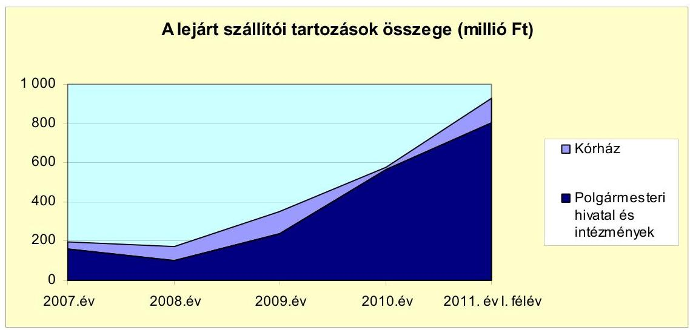

Az Önkormányzat lejárt szállítói tartozása 2007-ről 2011. június 30-ra közel ötszörösére, 194,2 millió Ft-ról 931,2 millió Ft-ra, aránya a szállítói kötelezettségen belül 59,6\%-ról 87,3\%-ra emelkedett. A lejárt szállítói tartozásokon belül folyamatosa növekedett a régebben lejárt szállítói tartozások aránya. A 2011. június 30-án kimutatott 931,2 millió Ft lejárt szállítói tartozás 13,36\%-a (124,3 millió Ft) 30 nap alatti, $34,9 \%$-a ( 325,0 millió Ft) 31 és 60 nap közötti, $17,64 \%$-a ( 164,3 millió Ft) 61 és 90 nap közötti, $34,08 \%$-a ( 317,4 millió Ft) 91 és 365 nap közötti, $0,02 \%$-a ( 0,2 millió Ft) éven túli tartozás volt. A 2011. június 30-án lejárt szállítói állományból 587,2 millió Ft a Polgármesteri hivatal, 216,8 millió Ft a Szolgáltató Iroda tartozása.

A Polgármesteri hivatal lejárt szállítói állományából 71,0\% (416,7 millió Ft) a beruházási szállítók állománya, melyből 91,3 millió Ft-ot tett ki szállítói finanszírozású számláknak a közreműködő szervezetek által még nem teljesített EU-s támogatásrésze. Az Önkormányzat e számláknak az önrészét már kiegyenlítette. A lejárt beruházási szállítók 2011. év I. félévi állományából 242,1 millió Ft-ot tett ki

[^0]
[^0]:    ${ }^{35}$ A 2011. I. félévi mérlegjelentésben 1162,0 millió Ft szállítói állományt mutatott ki az Önkormányzat, mivel a faktorálási megállapodással érintett - összesen 95,8 millió Ft összegű - szállítói számlák összegét a szállítók és a hitelek állományában is szerepeltették.

---

az utófinanszírozott számlák és azon szállítói finanszírozású számlák támogatástartalma, amelyeknek önrészét az Önkormányzat még nem utalta át a szállítónak. Ebből adódóan a lejárt beruházási szállítók állományából 333,4 millió Ft az EU-s támogatás, míg az Önkormányzat önrésze 83,3 millió Ft.

A Szolgáltató Iroda lejárt szállítói számlái közüzemi szolgáltatásokhoz, élelmiszer beszerzésekhez kapcsolódtak.

A 2007-2009. évek között folyamatosan növekedett a Kórház lejárt szállítói tartozásának összege 30,6 millió Ft-ról 110,0 millió Ft-ra, szállítói kötelezettségein belüli aránya pedig 23,1\%-ról 50,9\%-ra. A Kórház 2010-ben 152,8 millió Ft konszolidációs támogatást kapott a 2010. november 30-án fennálló szállítói tartozásának kiegyenlítésére, aminek következtében a szállítói kötelezettségek 2010. év végi állománya 14,9 millió Ft-ra csökkent. A 2011. év I. félévére a lejárt szállítói állomány 127,2 millió Ft-ra, a szállítói kötelezettségeken belüli aránya pedig 52,7\%-ra emelkedett. A 2011. június 30-án kimutatott lejárt szállítói tartozás $15,0 \%-a(9,1$ millió Ft) 60 napon túli.

A Kórház 2011. június 30-i lejárt szállítói állománya 216 ezer Ft kivételével szintén működési jellegű volt. (gyógyszerek, szakmai anyagok, élelmiszerek, szolgáltatások)

Az Önkormányzat intézményeinél a 90 napot meghaladó, szállítók felé fennálló kötelezettségek miatt - a helyi önkormányzatok adósságrendezési eljárásáról szóló 1996. évi XXV. törvény 5. § (2) bekezdésében foglaltak ellenére - a Polgármester nem kezdeményezte a Képviselő-testületnél az adósságrendezési eljárás megindítását.

Átütemezési megállapodással érintett, jelentősebb összegű szállítói tartozása a 2007. évi nyitó állományban és 2011. június 30-án volt az Önkormányzatnak. A 2007. évi nyitó átütemezett állomány ( 80,6 millió Ft) a Kórháznál, a 2011. június 30-i ( 54,8 millió Ft) pedig a Polgármesteri hivatalnál jelentkezett.

A Polgármesteri hivatal átütemezési megállapodással érintett szállítói állománya személyszállításhoz, üzletviteli tanácsadáshoz, közüzemi szolgáltatásokhoz kapcsolódtak.

Egyéb kiadás elmaradása a Kórháznak volt két 2005. évben megkötött teljesítményvolumen átcsoportosítási megállapodásban rögzített kötelezettség miatt, állománya a 2006. évi 20,8 millió Ft-ról a 2011. év I. félévére 1,2 millió Ft-ra csökkent.

# 3.3. Egyéb kötelezettségek változása 

Az Önkormányzat a vizsgált időszakban lízingszerződést nem kötött, PPP konstrukció keretében fejlesztést nem hajtott végre.

Garanciavállalásból adódó kötelezettsége 2011. június 30-án nem volt az Önkormányzatnak.

A vizsgált időszakban kezességet kilenc esetben vállalt az Önkormányzat 610,3 millió Ft nagyságrendben, a Herpály-Team Kft. folyószámla- és fejlesztési

---

hiteleihez és a Berettyóújfalui Csatornamú Társulat fejlesztési hiteleihez kapcsolódóan. A négy - 2011. június 30 -án fennálló - kezességvállalásból adódóan, 380,6 millió Ft kötelezettsége volt az Önkormányzatnak. A kezességvállalásokhoz kapcsolódóan az Önkormányzatnak fizetési kötelezettsége nem keletkezett.

A 2007-2011. év I. félév végéig az Önkormányzatnál az elengedett követelések bruttó összege 29,8 millió Ft. Az elengedett követelések a jegyzői hatáskörbe tartozó adóztatási tevékenységhez és a helyi lakáspolitikai intézkedésekhez kapcsolódnak. Ebből az összegből 11,9 millió Ft a késedelmi pótlék, mely az elengedett követelések 39,9\%-a.

Az Önkormányzat intézményei közül kizárólag a Kórháznak nyújtott kölcsönt 50 millió Ft értékben 2008. évben, a likviditási problémák megoldására. A folyósításra képviselő-testületi határozat alapján került sor, a kölcsönt a Kórház hat egyenlő részletben törlesztette 2008. év folyamán.

Az Önkormányzat tulajdoni részesedésével rendelkező gazdasági társaságnak tagi vagy egyéb kölcsönt nem nyújtott. Egyéb gazdasági társaság vagy szervezet részére kölcsön nyújtásra szintén nem került sor.

Az Önkormányzat többségi tulajdonú gazdasági társaságaitól kölcsönt nem vett igénybe.
2011. június 30 -án öt forgalomképes ingatlant terhelt jelzálogjog, egy forgalomképes ingatlan esetében a bejegyzés folyamatban volt. A terhelések a Széchenyi tervhez kapcsolódó fejlesztési hitelek („Beruházás a XXI. századi iskolába") és a folyószámlahitel biztosítékául szolgáltak. Ebből a programból valósult meg két iskola, egy kollégium és a zeneiskola fejlesztése, felújítása. A bejegyzések jogszerűek voltak, nem ütköztek az Ötv. 88.§ (1) bekezdésének b) pontjában foglalt korlátozásba.

A jelzáloggal terhelt forgalomképes ingatlanok számvitelben nyilvántartott 2010. év végi nettó értéke 36,2 millió Ft, mely az összes önkormányzati forgalomképes ingatlan nettó értékének (179,3 millió Ft) 20,2\%-a. Az ingatlanokra bejegyzett jelzálog nagysága 633,3 millió Ft. A jelzálogjog alapításoknál a pénzintézet az értékbecslő által megállapított forgalmi értéket tekintette irányadónak.

---

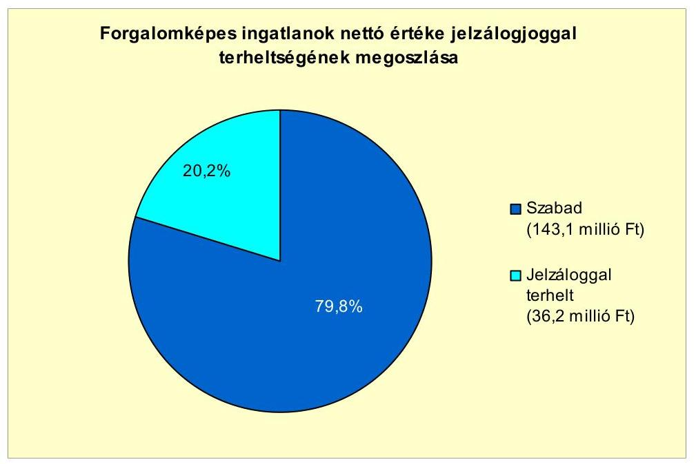

A vizsgálat idején kilenc peres eljárás volt folyamatban ${ }^{36}$, az Önkormányzat terhére kimutatott perérték 33,7 millió Ft és járulékai. Egy eljárás jogerős döntéssel lezárult, a bíróság azonban csak a jogalap tekintetében döntött, az öszszegszerúségben a felek peren kívül kívántak megegyezni, a perbeli követelés 10 millió Ft.

A Kórházzal szemben folyamatban lévő három múhiba perben, 28,3 millió Ft a perbeli követelés. Az egészségügyi szolgáltatás során okozott kár megtérítésére szóló kötelező felelősségbiztosítás fedezetet biztosít az esetlegesen megállapításra kerülő kártérítés összegére.

A gazdasági társaságok 2011. június 30 -án lejárt szállítói tartozásállománnyal nem rendelkeztek.

A gazdasági társaságok 2010. december 31-én fennálló hosszú lejáratú kötelezettségeinek állománya összesen 66,7 millió Ft és 14, 8 ezer CHF. Várható adósságszolgálata a 2011-2013. évek között 122,1 millió Ft és 16,5 ezer CHF, a 2014. évtől a futamidők végéig 148,4 millió $\mathrm{Ft}^{37}$.

A többségi tulajdonú gazdasági társaságok lízingszerződést nem kötöttek.
A gazdasági társaságok közül kizárólag a Herpály-Team Kft. rendelkezik hitelekkel.

A Herpály-Team Kft. komposztáló telep létesítéséhez 2006. évben 10 millió Ft hitelt vett fel, a lejárat időpontja 2013. Középiskola felújításához kapcsolódó gázberuházás lebonyolításához 2006. évben 6,5 millió Ft hitelt vett fel, amely 2013.

[^0]
[^0]:    ${ }^{36}$ A Túzoltóság hivatásos állománya által kezdeményezett, elmaradt túlszolgálati díjak megfizetésére irányuló per még nem zárult le, mivel az időközben megfizetett juttatás kiszámításának módját vitatják a túzoltók.
    ${ }^{37}$ A várható kötelezettségek tartalmazzák a kamatterheket is.

---

évben jár le. Szennyvítelepi beruházás céljára 2009. évben 7,8 millió Ft hitelt vett fel, a lejárat időpontja 2014. Az ivóvíz- és szennyvíz-szolgáltatás feladatok ellátását szolgáló gépjármú vásárlására 2008. évben 21070 CHF hitelt vett fel, mely 2013. évben jár le. A strandfejlesztés megvalósításához kapcsolódóan 130 millió Ft hitelt vett fel 2011. évben, mely 2021. évben jár le.

Az Önkormányzat minősített többségi tulajdonú gazdasági társaságai egyes kötelezettségeinek állományát 2010. december 31-én és várható alakulását a kötelezettségek lejáratáig az alábbi táblázat szemlélteti:
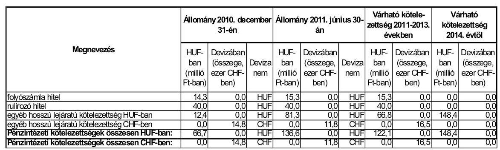

Az Önkormányzat többségi tulajdonában álló gazdasági társaságoknak a peres eljárásokból fizetési kötelezettsége nem származott, a folyamatban lévő eljárásokban sem érintettek.

Az Önkormányzat a gazdasági társaságokról szóló 2006. évi IV. törvény 54. § (2) bekezdése alapján korlátlan felelősséggel tartozik azon gazdasági társaságának felszámolás esetében, amelyben az Önkormányzat az 52. § (2) bekezdése szerint a szavazatok legalább 75\%-ával rendelkezik, így minősített befolyásszerzőnek minősül, továbbá a csődeljárásról és a felszámolási eljárásról szóló 1991. évi XLIX. törvény 63. § (2) bekezdése alapján a kizárólagos önkormányzati tulajdonú gazdasági társaságának minden olyan kötelezettségéért, amelynek kielégítését a felszámolási eljárás során az adós társaság vagyona nem fedez, ha a hitelezőinek a felszámolási eljárás során benyújtott keresete alapján a bíróság - az adós társaság felé érvényesített tartósan hátrányos üzletpolitikájára figyelemmel - megállapítja az önkormányzat korlátlan és teljes felelősségét.

Az Önkormányzat pénzügyi helyzetére hatást gyakorolhat az eszközállomány minősége, illetve pótlásának elmaradása. Az Önkormányzat a 2007-2010. években a tárgyi eszközök után együttesen 1857,9 millió Ft értékcsökkenést számolt el. A 2007. évben 347,3 millió Ft-ot, a 2008. évben 454,8 millió Ft-ot, a 2009. évben 586,8 millió Ft-ot, míg a 2010. évben 469,0 millió Ft-ot. A 2007. évben a tárgyévben elszámolt értékcsökkenés 32,4\%-ának (112,4 millió Ft), a 2008. évben 64,1\%-ának, (291,6 millió Ft), a 2009. évben 86,7\%-ának (508,5 millió Ft), míg a 2010. évben 184,9\%-ának (867,4 millió Ft) megfelelő összeget aktiváltak felújításként. Az Önkormányzat eszközállományának bruttó értéke a 2007. évi 12 770,5 millió Ft-ról 16 669,2 millió Ft-ra (23,4\%-kal), míg a nettó érték a 2007. évi 9364,9 millió Ft-ról 11 939,1 millió Ft-ra (21,6\%-kal) nőtt. Az önkormányzati szintű használhatósági fok a 2007. évi 73,3\%-ról négy év alatt 1,7 százalékponttal 71,6\%-ra csökkent az egyes eszközcsoportoknál különböző mértékkel elszámolt amortizáció hatására. A 2007-2010. évek között egyedül az átadott eszközökben figyelhető meg folyamatos bruttó érték növekedés. A használhatósági fok a járműveknél romlott a legnagyobb arányban a négy év

---

alatt 54,9\%-ról 12,8\%-ra. A mutató javulása az átadott eszközöknél figyelhető meg 74,3\%-ról 76,9\%-ra. A 2007-2010. évek között pénzügyileg teljesített felhalmozási kiadásokból eszközpótlásra 3400,9 millió Ft-ot fordított az Önkormányzat. A 2007-2010. években elszámolt 1857,9 millió Ft amortizációt, az eszközök avulását 83,1\%-kal (1543 millió Ft-tal) haladta meg az eszközpótlásra fordított összeg. A zárszámadási rendeletekben nem mutatták be az Önkormányzat eszközei után elszámolt értékcsökkenés összegét, az eszközpótlásra fordított tényleges kiadásokat, az eszközök elhasználódási fokának alakulását.

# 4. A PÉNZÜGYI EGYENSÚLY MEGTEREMTÉSE ÉrDEKÉBEN HOZOTT INTÉZKEDÉSEK EREDMÉNYE 

A vizsgált időszakban a költségvetési tervezés kapcsán - a központi források szűkülése következtében - az Önkormányzat kiadáscsökkentő, valamint bevételnövelő intézkedések megtételére kényszerült. A kiadáscsökkentő és bevételnövelő intézkedések a gazdálkodás átláthatóbbá tételét, az intézmények takarékosabb múködését, valamint a feladatellátás szakmai színvonalának javítását célozták.

A 2007-2011. év I. félévében a szervezési és takarékossági intézkedések hatásaként együttesen 1179,5 millió Ft kiadási megtakarítást mutatott ki az Önkormányzat. A kiadáscsökkentő intézkedésekből az önként vállalt feladatok ellátásához kapcsolódik 953 millió Ft megtakarítás, mely az összes megtakarítás $80,8 \%$-a.

A feladatmegszüntetéssel, -átszervezéssel járó létszámcsökkentési döntések önkormányzati szinten összesen 1135,8 millió Ft megtakarítást eredményeztek a személyi juttatások és járulékok vonatkozásában. További 43,7 millió Ft megtakarítás jelentkezett a helyettesítések miatti megtakarítások ( 2,4 millió Ft), képviselői tiszteletdíjak ( 4,5 millió Ft), illetve a polgármesteri, alpolgármesteri költségtérítések csökkentése ( 1,9 millió Ft), valamint az önként vállalt támogatások ( 14,1 millió Ft), méltányossági szociális ellátások ( 20,8 millió Ft) csökkentése területén.

A 2007-2011. év I. félév kiadáscsökkentő intézkedéseinek hatását főbb területenként a következő ábra szemlélteti:

---

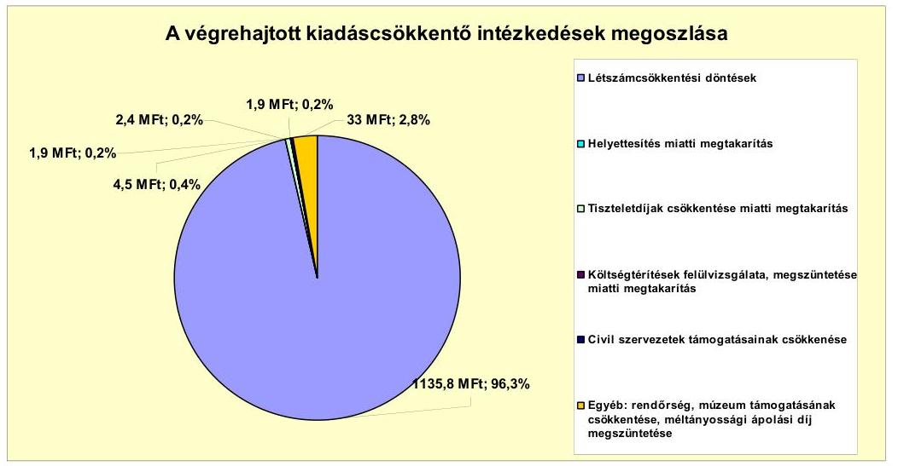

A létszámcsökkentő intézkedések következtében a 2007-2010. évek alatt a Polgármesteri hivatalban és az intézményeknél összesen 295 álláshelyet szüntettek meg. A közoktatásban 105 álláshelyet szüntettek meg, melyet a feladatellátás szervezeti kereteiben bekövetkezett változások indokoltak. Iskolákat vontak össze, kollégiumot és tálalókonyhákat szüntettek meg, mely mind a szakmai, mind az intézményüzemeltetési létszámra kihatással volt. A szakmai álláshelyek közül a legtöbb (74) a szociális és gyermekvédelem területén szűnt meg. Ennek oka, hogy az intézményt megszüntették és a feladatot 2010-től a Társulás látja el. Az egészségügy területén 82 álláshelyet szüntettek meg, melynek okai között szerepel a finanszírozási rendszerben bekövetkezett változás, mely a szakmai és üzemeltetési létszám csökkentésére egyaránt kihatással volt. A létszámcsökkentések közül három a Polgármesteri hivatalhoz és 31 az egyéb intézményekhez kapcsolódott. A megszüntetett álláshelyek 57,6\%-a (170) az ágazati szakmai, $42,4 \%$-a (125) az intézményüzemeltetéshez, fenntartáshoz kapcsolódó volt. Üres álláshely nem került megszüntetésre.

A 2007-2010. évek között végrehajtott létszámcsökkentés eredményét a következő táblázat szemlélteti:

| Megnevezés (adatok 61-ben) | Közoktatás | Szociális és gyermekvédelem | Egészségügy | Polgármesteri hivatal | Egyéb | Összesen |
| :--: | :--: | :--: | :--: | :--: | :--: | :--: |
| 2007. január 1-jén jóváhagyott álláshelyek száma | 525 | 69 | 873 | 96 | 169 | 1732 |
| Megszüntetett álláshelyek száma | 105 | 74 | 82 | 3 | 31 | 295 |
| e0000. üres álláshelyek száma | 0 | 0 | 0 | 0 | 0 | 0 |
|  | szakmai álláshelyek száma | 35 | 74 | 42 | 1 | 18 | 170 |
| intézmény-üzemeltetéssel kapcsolatos álláshelyek száma | 70 | 0 | 83 | 3 | 13 | 123 |
| Álláshely növekedése | 4 | 5 | 0 | 0 | 1 | 10 |
| 2010. december 31-én záró álláshelyek száma | 424 | 0 | 791 | 93 | 139 | 1447 |
| 2007. január 1-jén foglalkoztatott létszám | 525 | 69 | 873 | 96 | 169 | 1732 |
| Létszámcsökkentő | 105 | 74 | 82 | 3 | 31 | 295 |
| Létszámnövekedés | 4 | 5 | 0 | 0 | 1 | 10 |
| 2010. december 31-én foglalkoztatott létszám | 424 | 0 | 791 | 93 | 139 | 1447 |

Egyes közszolgáltatási területeken feladatbővülések is voltak, amelyek álláshely- és egyben létszámnövekedéssel is jártak. A létszámbővülést a bölcsődei csoportok számának növekedése és a Közoktatási Intézményfenntartó Társulás létrejötte eredményezte. Az Önkormányzatnál a 2007-2010. évek között a fog-

---

lalkoztatottak létszáma a 2007. január 1-jei 1732 fơről 2010. december 31-ére 1447 főre (285 fővel) csökkent.

A helyi szervezési intézkedések végrehajtásához az Önkormányzat az áttekintett időszak alatt 214,4 millió Ft központosított támogatást igényelt és kapott. A támogatás felhasználásával tartósan leépített létszám 118 fő volt, a létszámcsökkentés $60 \%$-ához ( 177 fő) központi támogatás nem kapcsolódott.

A bevételnövelő intézkedések - az Önkormányzat által - számszerúsített összegének ( 159,7 millió Ft) 86,8\%-át a helyi adóztatási tevékenységgel kapcsolatban mutatták ki. Az adóhátralékok behajtása a vizsgált időszak alatt folyamatosan egyre következetesebbé vált, így a beszedett 136,7 millió Ft, az összes bevételnövelő intézkedés $85,6 \%$-át tette ki. A telekadó, mint új adónem bevezetése 1,9 millió Ft bevételnövekedést eredményezett 2009-2011. év I. féléve alatt. Az intézmények saját bevételeinek (bérleti díjak bevezetése, emelése; nem használt eszközök értékesítése) a növekedése összesen 21,1 millió Ft bevételi többletet eredményezett.
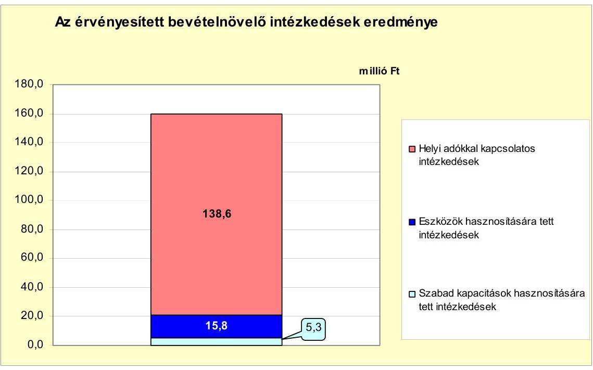

Összességében elmondható, hogy a 2007-2011. év I. féléve közötti időszakban az Önkormányzat kiadáscsökkentő, illetve bevételnövelő intézkedései - kimutatásuk szerint - mindösszesen 1339,2 millió Ft-ot eredményeztek, melyek javították az Önkormányzat pénzügyi egyensúlyi helyzetét.

---

# 5. Az ÁSZ Által a korábbi ÉVEKben a PÉNZÜGYi EGYENSÚLY JAVÍTÁSÁRA TETT SZABÁLYSZERŰSÉGI ÉS CÉLSZERŰSÉGI JAVASLATOK HASZNOSULÁSA 

Az ÁSZ az Önkormányzat gazdálkodási rendszerét a 2007. évben ellenőrizte átfogó jelleggel. A gazdálkodási rendszer korábbi ellenőrzése során tett javaslatok közül a pénzügyi egyensúly javítására öt szabályszerűségi javaslat vonatkozott. A javaslatok megvalósítása érdekében a Képviselő-testület a 238/2008 (V. 29.) számú határozatával fogadta el az ÁSZ jelentésben foglaltak végrehajtására készített, felelősöket és határidőket tartalmazó intézkedési tervet.

Az ellenőrzés során tett, a pénzügyi egyensúly javítására vonatkozó szabályszerűségi javaslatok közül négy határidőre, egy határidőn túl realizálódott.

A szabályszerűségi javaslatokra megtett intézkedések eredményeképpen gondoskodtak arról, hogy a költségvetési rendelettervezetek költségvetési kiadásainak és bevételeinek föösszegei ne tartalmazzanak finanszírozási célú kiadási és bevételi előirányzatokat. A jegyző gondoskodott a Vhr. 9. számú mellékletében a költségvetési szerkezeti rend betartásáról, valamint arról, hogy az EU-s támogatásokat átvett pénzeszközként szerepeltessék a költségvetési beszámolóban. Határidőn túl, de gondoskodtak arról, hogy a költségvetési rendelettervezet az európai uniós forrásokkal támogatott fejlesztések bevételi és kiadási előirányzatait elkülönítetten tartalmazza.

Budapest, 2012. április "f6"

Melléklet: $\quad 7 \mathrm{db}$
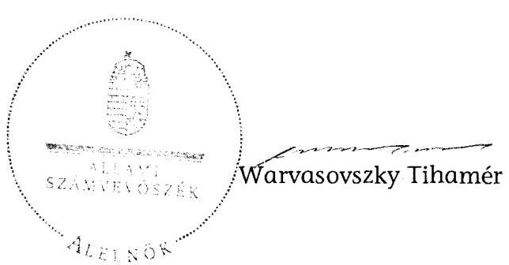

---

Berettyóújfalu Város Önkormányzata

1. számú melléklet
a V-3094-023/2012. számú jelentéshez

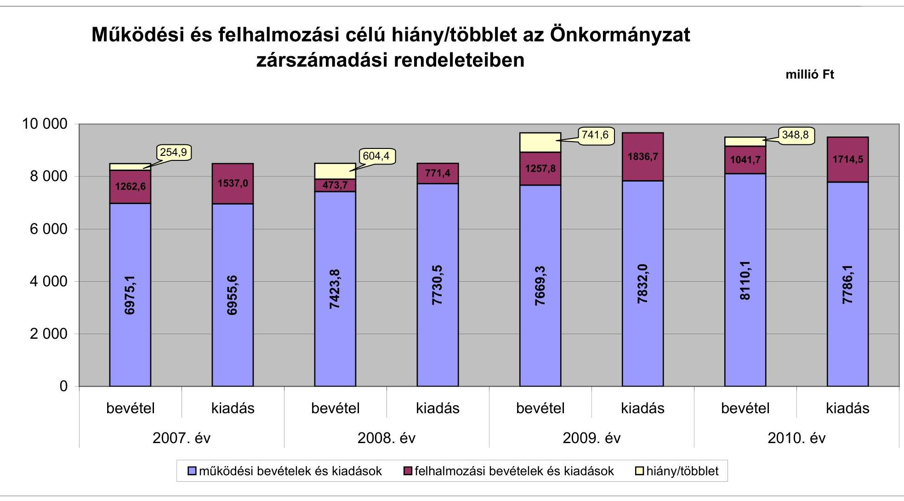

---

# Az Önkormányzat bevételei és kiadásai, valamint adósságszolgálata 2007-2010 között

|   |  |  |  | múlló Ft  |
| --- | --- | --- | --- | --- |
|  1. FOLYÓ KÖLTSÉGVETÉS* | 2007. év | 2008. év | 2009. év | 2010. év  |
|  1.1.1. Saját müködési bevételek | 701,2 | 839,7 | 1248,1 | 1228,5  |
|  1.1.2. Költségvetési támogatás** | 1767,5 | 2756,3 | 2428,6 | 2202,8  |
|  1.1.3. Átengedett bevételek | 1330,3 | 752,8 | 758,1 | 756,9  |
|  1.1.4. Állambáztartáson belülről kapott támogatások | 2917,3 | 2972,7 | 3064,8 | 3403,5  |
|  1.1.5. EU-tól és külföldről kapott bevételek | 153,4 | 14,9 | 91,2 | 65,5  |
|  1.1.6. Állambáztartáson kívülről kapott bevételek | 10,4 | 18,8 | 16,0 | 24,4  |
|  1.1.7. Előző évi pénzmaradvány átvétel | 0,0 | 24,0 | 82,8 | 0,0  |
|  1.1. Folyó bevételek =1.1.1.+1.1.2.+1.1.3.+1.1.4.+1.1.5.+1.1.6.+1.1.7. | 6880,1 | 7379,2 | 7689,6 | 7681,6  |
|  1.2.1. Müködési kiadások kamatkiadások nélkül | 6565,9 | 7140,7 | 7065,6 | 7116,4  |
|  1.2.2. Állambáztartáson belülre átadott pénzeszközök | 12,9 | 29,3 | 39,4 | 157,5  |
|  1.2.3.1. vállalkozásoknak | 15,9 | 92,9 | 60,3 | 22,8  |
|  1.2.3.2. EU-nak, illetve külföldre | 0,0 | 0,0 | 0,0 | 0,0  |
|  1.2.3.3. magánszemélyeknek | 325,8 | 389,8 | 368,8 | 371,9  |
|  1.2.3.4. nonprofit szervezeteknek | 9,9 | 20,4 | 19,9 | 12,4  |
|  1.2.3. Transferkiadások (=1.2.3.1+1.2.3.2+1.2.3.3+1.2.3.4) | 351,6 | 503,1 | 449,0 | 407,1  |
|  1.2.4 Kamatkiadások | 45,2 | 92,5 | 61,9 | 168,1  |
|  1.2.5. Előző évi pénzmaradvány átadás | 0,0 | 23,1 | 107,2 | 0,0  |
|  1.2. Folyó kiadások = 1.2.1.+1.2.2.+1.2.3.+1.2.4.+1.2.5. | 6975,6 | 7788,7 | 7723,1 | 7849,1  |
|  1.3. Folyó költségvetés egyenlege MÚKÖDÉSI JÓVEDELEM (1.1. - 1.2.) | $-95,5$ | $-409,5$ | $-33,5$ | $-167,5$  |
|  2. FELHALMOZÁSI KÖLTSÉGVETÉS*** |  |  |  |   |
|  2.1.1. Saját tökebevételek | 71,6 | 189,4 | 92,7 | 78,5  |
|  2.1.2. Állambáztartáson belülről kapott támogatások | 783,6 | 187,5 | 72,9 | 64,4  |
|  2.1.3. EU-tól és külföldről kapott támogatások | 44,5 | 25,0 | 1065,1 | 896,9  |
|  2.1.4. Állambáztartáson kívülről kapott támogatások | 225,9 | 49,2 | 0,8 | 6,9  |
|  2.1. Felhalmozási bevételek (=2.1.1.+2.1.2+2.1.3+2.1.4.) | 1125,6 | 451,1 | 1231,5 | 1046,7  |
|  2.2.1. Saját beruházási kiadás állva | 1361,6 | 357,6 | 978,0 | 462,4  |
|  2.2.2. Saját felújítási kiadás állva | 134,9 | 349,7 | 772,3 | 1174,6  |
|  2.2.3. Állambáztartáson belülre átadott pénzeszköz | 0,0 | 10,6 | 0,2 | 20,4  |
|  2.2.4. EU-nak és külföldnek adott pénzeszközök | 0,0 | 0,1 | 0,0 | 0,0  |
|  2.2.5. Állambáztartáson kívülre adott pénzeszközök | 20,5 | 53,8 | 32,4 | 57,1  |
|  2.2.6. Befektetési célú részesedések vásárlása | 0,0 | 0,0 | 0,0 | 0,0  |
|  2.2. Felhalmozási kiadások (=2.2.1.+2.2.2.+2.2.3.+2.2.4.+2.2.5.+2.2.6.) | 1517,0 | 771,8 | 1782,9 | 1714,5  |
|  2.3. Felhalmozási költségvetés egyenlege (2.1. - 2.2.) | $-391,4$ | $-320,7$ | $-551,4$ | $-667,8$  |
|  3. Finanszírozási műveletek nélküli (GFS) pozíció(1.3.+2.3.) | $-486,9$ | $-730,2$ | $-584,9$ | $-835,3$  |
|  4. Finanszírozási műveletek |  |  |  |   |
|  4.1. Hitelfelvétel | 440,9 | 52,5 | 180,0 | 293,8  |
|  4.2. Hiteltörlesztés | 74,0 | 164,5 | 6,8 | 15,0  |
|  4.3. Forgatási és befektetési célú értékpapírok kibocsátása | 0,0 | 1499,9 | 0,0 | 1000,0  |
|  4.4. Forgatási és befektetési célú értékpapírok beváltása | 0,0 | 0,0 | 0,0 | 0,0  |
|  4.5. Forgatási és befektetési célú értékpapírok értékesítése | 0,0 | 250,0 | 351,2 | 0,0  |
|  4.6. Forgatási és befektetési célú értékpapírok vásárlása | 0,0 | 601,2 | 0,0 | 400,0  |
|  4.7. Egyéb finanszírozási bevételek (függő, átfutó, kiegyenlítő) **** | X | X | X | X  |
|  4.8. Egyéb finanszírozási kiadások (függő, átfutó, kiegyenlítő) **** | X | X | X | X  |
|  4.9.Finanszírozási műveletek egyenlege (4.1. - 4.2.+4.3.-4.4+4.5.-4.6.+4.7.-4.8.) | 366,9 | 1036,7 | 524,4 | 878,8  |
|  5. Tárgyévi pénzügyi pozíció (1.3.+ 2.3.+4.9.) | $-120,0$ | 306,5 | $-60,5$ | 43,5  |
|  6. Nettó müködési jövedelem =müködési jövedelem (1.3.) - töketörlesztés (4.2+4.4) | $-169,5$ | $-574,0$ | $-40,3$ | $-182,5$  |
|  TÁJÉKOZTATÓ ADATOK |  |  |  |   |
|  Összes kötelezettség | 1065,7 | 2606,2 | 3270,1 | 4893,9  |
|  ebből rövid lejáratú | 798,2 | 652,6 | 1305,2 | 1568,4  |
|  Összes szállítói kötelezettség | 325,8 | 291,4 | 739,8 | 752,3  |
|  ebből lejárt (tanúsítványból) | 194,2 | 170,4 | 348,5 | 579,9  |
|  Pénz és tőkeplasi kötelezettség (adósság) | 565,0 | 2185,6 | 2405,2 | 4050,0  |
|  ebből rövid lejáratú | 347,2 | 262,5 | 453,3 | 724,5  |
|  PPP szerződéses állomány jelenértéken (tanúsítványból) | 0,0 | 0,0 | 0,0 | 0,0  |
|  ebből lejárt szolgáltatási díj miatt kötelezettség | 0,0 | 0,0 | 0,0 | 0,0  |
|  Folyószámbátitel napi átlagos állománya (tanúsítványból) | 101,5 | 121,3 | 249,3 | 459,5  |
|  Likvidhítel napi átlagos állománya (tanúsítványból) | 0,0 | 0,0 | 0,0 | 0,0  |
|  Munkabérhítel napi átlagos állománya (tanúsítványból) | 117,5 | 90,5 | 117,9 | 128,4  |
|  Kezesség és garanciavállalások (tanúsítványból) | 0,0 | 0,0 | 0,0 | 380,6  |
|  Jogerős bírósági ítéletekből adódó kötelezettségek (tanúsítványból) | 0,0 | 0,0 | 0,0 | 0,0  |
|  Finanszírozásba bevonható eszközök: | 99,0 | 788,6 | 204,5 | 745,4  |
|  Tartós hitelviszonyt megtestesítő értékpapírok év végi állománya | 0,1 | 351,2 | 0,1 | 400,1  |
|  Hosszú lejáratú bankhetétek év végi állománya | 0,0 | 0,0 | 0,0 | 0,0  |
|  Értékpapírok év végi állománya | 0,0 | 0,0 | 0,0 | 0,0  |
|  Pénzeszközök (idegen pénzeszközök nélkül) év végi állománya | 98,9 | 437,4 | 204,4 | 345,3  |

- Bevételekben nem térül, a kiadásokban nem jelenik meg az amortizáció, a vagyoni helyzetet az egyenleg befolyásolta ** A költségvetési támogatásból a felhalmozási célú összeget az Önkormányzat adatszolgáltatása szerinti mértékben vettük figyelembe a 2.1.2. soron *** Bevételekben vagyon megőrzésre és bővítésre fordítható források. **** A finanszírozási műveletek egyenlege, valamint a tárgyévi pénzügyi pozíció számítása során nem vettük figyelembe az egyéb finanszírozási (függő, átfutó, kiegyenlítő) bevételek és kiadások egyenlegét.

---

|   |  |  |  |  |  |  |  |  |  |  |  |  |  |  |  |  |  |  |  |  |  |  |  |  |  |  |  |  |  |  |  |  |  |  |  |  |  |  |  |  |  |  |  |  |   |
| --- | --- | --- | --- | --- | --- | --- | --- | --- | --- | --- | --- | --- | --- | --- | --- | --- | --- | --- | --- | --- | --- | --- | --- | --- | --- | --- | --- | --- | --- | --- | --- | --- | --- | --- | --- | --- | --- | --- | --- | --- | --- | --- | --- | --- | --- |
|   |  |  |  |  |  |  |  |  |  |  |  |  |  |  |  |  |  |  |  |  |  |  |  |  |  |  |  |  |  |  |  |  |  |  |  |  |  |  |  |  |  |  |  |  |   |
|   |  |  |  |  |  |  |  |  |  |  |  |  |  |  |  |  |  |  |  |  |  |  |  |  |  |  |  |  |  |  |  |  |  |  |  |  |  |  |  |  |  |  |  |  |   |
|   |  |  |  |  |  |  |  |  |  |  |  |  |  |  |  |  |  |  |  |  |  |  |  |  |  |  |  |  |  |  |  |  |  |  |  |  |  |  |  |  |  |  |  |  |   |
|   |  |  |  |  |  |  |  |  |  |  |  |  |  |  |  |  |  |  |  |  |  |  |  |  |  |  |  |  |  |  |  |  |  |  |  |  |  |  |  |  |  |  |  |  |   |
|   |  |  |  |  |  |  |  |  |  |  |  |  |  |  |  |  |  |  |  |  |  |  |  |  |  |  |  |  |  |  |  |  |  |  |  |  |  |  |  |  |  |  |  |  |   |
|   |  |  |  |  |  |  |  |  |  |  |  |  |  |  |  |  |  |  |  |  |  |  |  |  |  |  |  |  |  |  |  |  |  |  |  |  |  |  |  |  |  |  |  |  |   |
|   |  |  |  |  |  |  |  |  |  |  |  |  |  |  |  |  |  |  |  |  |  |  |  |  |  |  |  |  |  |  |  |  |  |  |  |  |  |  |  |  |  |  |  |  |   |
|   |  |  |  |  |  |  |  |  |  |  |  |  |  |  |  |  |  |  |  |  |  |  |  |  |  |  |  |  |  |  |  |  |  |  |  |  |  |  |  |  |  |  |  |  |   |
|   |  |  |  |  |  |  |  |  |  |  |  |  |  |  |  |  |  |  |  |  |  |  |  |  |  |  |  |  |  |  |  |  |  |  |  |  |  |  |  |  |  |  |  |  |   |
|   |  |  |  |  |  |  |  |  |  |  |  |  |  |  |  |  |  |  |  |  |  |  |  |  |  |  |  |  |  |  |  |  |  |  |  |  |  |  |  |  |  |  |  |  |   |
|   |  |  |  |  |  |  |  |  |  |  |  |  |  |  |  |  |  |  |  |  |  |  |  |  |  |  |  |  |  |  |  |  |  |  |  |  |  |  |  |  |  |  |  |  |   |
|   |  |  |  |  |  |  |  |  |  |  |  |  |  |  |  |  |  |  |  |  |  |  |  |  |  |  |  |  |  |  |  |  |  |  |  |  |  |  |  |  |  |  |  |  |   |
|   |  |  |  |  |  |  |  |  |  |  |  |  |  |  |  |  |  |  |  |  |  |  |  |  |  |  |  |  |  |  |  |  |  |  |  |  |  |  |  |  |  |  |  |  |   |
|   |  |  |  |  |  |  |  |  |  |  |  |  |  |  |  |  |  |  |  |  |  |  |  |  |  |  |  |  |  |  |  |  |  |  |  |  |  |  |  |  |  |  |  |  |   |
|   |  |  |  |  |  |  |  |  |  |  |  |  |  |  |  |  |  |  |  |  |  |  |  |  |  |  |  |  |  |  |  |  |  |  |  |  |  |  |  |  |  |  |  |  |   |
|   |  |  |  |  |  |  |  |  |  |  |  |  |  |  |  |  |  |  |  |  |  |  |  |  |  |  |  |  |  |  |  |  |  |  |  |  |  |  |  |  |  |  |  |  |   |
|   |  |  |  |  |  |  |  |  |  |  |  |  |  |  |  |  |  |  |  |  |  |  |  |  |  |  |  |  |  |  |  |  |  |  |  |  |  |  |  |  |  |  |  |  |   |
|   |  |  |  |  |  |  |  |  |  |  |  |  |  |  |  |  |  |  |  |  |  |  |  |  |  |  |  |  |  |  |  |  |  |  |  |  |  |  |  |  |  |  |  |  |   |
|   |  |  |  |  |  |  |  |  |  |  |  |  |  |  |  |  |  |  |  |  |  |  |  |  |  |  |  |  |  |  |  |  |  |  |  |  |  |  |  |  |  |  |  |  |   |
|   |  |  |  |  |  |  |  |  |  |  |  |  |  |  |  |  |  |  |  |  |  |  |  |  |  |  |  |  |  |  |  |  |  |  |  |  |  |  |  |  |  |  |  |  |   |
|   |  |  |  |  |  |  |  |  |  |  |  |  |  |  |  |  |  |  |  |  |  |  |  |  |  |  |  |  |  |  |  |  |  |  |  |  |  |  |  |  |  |  |  |  |   |
|   |  |  |  |  |  |  |  |  |  |  |  |  |  |  |  |  |  |  |  |  |  |  |  |  |  |  |  |  |  |  |  |  |  |  |  |  |  |  |  |  |  |  |  |  |   |
|   |  |  |  |  |  |  |  |  |  |  |  |  |  |  |  |  |  |  |  |  |  |  |  |  |  |  |  |  |  |  |  |  |  |  |  |  |  |  |  |  |  |  |  |  |   |
|   |  |  |  |  |  |  |  |  |  |  |  |  |  |  |  |  |  |  |  |  |  |  |  |  |  |  |  |  |  |  |  |  |  |  |  |  |  |  |  |  |  |  |  |  |   |
|   |  |  |  |  |  |  |  |  |  |  |  |  |  |  |  |  |  |  |  |  |  |  |  |  |  |  |  |  |  |  |  |  |  |  |  |  |  |  |  |  |  |  |  |  |   |
|   |  |  |  |  |  |  |  |  |  |  |  |  |  |  |  |  |  |  |  |  |  |  |  |  |  |  |  |  |  |  |  |  |  |  |  |  |  |  |  |  |  |  |  |  |   |
|   |  |  |  |  |  |  |  |  |  |  |  |  |  |  |  |  |  |  |  |  |  |  |  |  |  |  |  |  |  |  |  |  |  |  |  |  |  |  |  |  |  |  |  |  |   |
|   |  |  |  |  |  |  |  |  |  |  |  |  |  |  |  |  |  |  |  |  |  |  |  |  |  |  |  |  |  |  |  |  |  |  |  |  |  |  |  |  |  |  |  |  |   |
|   |  |  |  |  |  |  |  |  |  |  |  |  |  |  |  |  |  |  |  |  |  |  |  |  |  |  |  |  |  |  |  |  |  |  |  |  |  |  |  |  |  |  |  |  |   |
|   |  |  |  |  |  |  |  |  |  |  |  |  |  |  |  |  |  |  |  |  |  |  |  |  |  |  |  |  |  |  |  |  |  |  |  |  |  |  |  |  |  |  |  |  |   |
|   |  |  |  |  |  |  |  |  |  |  |  |  |  |  |  |  |  |  |  |  |  |  |  |  |  |  |  |  |  |  |  |  |  |  |  |  |  |  |  |  |  |  |  |  |   |

---

Berettyúglatu Várce Önkormányzata

|   |  |  |  |  |  |  |  |  |  |  |  |  |  |  |  |  |  |  |  |  |  |  |  |  |  |  |  |  |  |  |  |  |  |  |  |  |  |  |  |  |  |  |  |  |  |  |  |  |  |  |  |  |  |  |  |  |  |  |  |  |  |  |  |  |  |  |  |  |  |  |  |  |  |  |  |  |  |  |  |  |  |  |  |  |  |  |  |  |  |  |  |  |  |  |  |  |  |  |  | 

---

Berettyöajdatu Várce Önkormányzata

|  |   |   |   |   |   |   |   |   |   |   |   |   |   |   |   |   |   |   |   |   |   |   |   |   |   |   |   |   |   |   |   |   |   |   |   |   |   |   |   |   |   |   |   |   |   |   |   |   |   |   |   |   |   |   |   |   |   |   |   |   |   |   |   |   |   |   |   |   |   |   |   |   |   |   |   |   |   |   |   |   |   |   |   |   |   |   |   |   |   |   |   |   |   |   |   |   |   |   |   |   |  

---

Berettysűjtési Város Önkormányzata 35. számú melléklet a V-3094-023/2012. számú jelentéshez

Az Önkormányzat 2010. december 31-én folyamatban lévő fejlesztési feladataira 2010. december 31-ig teljesített kifizetések és azok forrásösszetétele

|  Fejlesztési feladat (beruházás, felújítás) |  |  | Beruházás, felújítás |  |  | Teljes bekerülési költség |  |  |  |  |  |  |  |  |  |  |  |  |  |  |  |  |  |  |  |  | 2010. december 31-ig pénzügylleg teljesített beruházás forrásösszetétele |  |  |  |  |  |  |  |  |  |  |  |  |  |  |  |  |  |  |  |  |  |  |  |  |  |  |  |  |  |  |  |  |  |  |  |  |  |  |  |  |  |  |  |  |  |  |  |  |  |  |  |  |  |  |  |  |  |  |  |  |  |  |  |  |  |  |  |  |  |  |  |  |  |  |  |  |  |  |  |  |  |  |  |  |  |  |  |  |  |  |  |  |  |  |  |  |  |  |  | 

---

Berettypüljévi Város Önkormányzata

Az Önkormányzat 2010. december 31-én folyamatban lévő fejlesztési feladatalra 2010. december 31-én fennálló kötelezettségek és azok forrásösszeletek

|  |   |   |   |   |   |   |   |   |   |   |   |   |   |   |   |   |   |   |   |   |   |   |   |   |   |   |   |   |   |   |   |   |   |   |   |   |   |   |   |   |   |   |   |   |   |   |   |   |   |   |   |   |   |   |   |   |   |   |   |   |   |   |   |   |   |   |   |   |   |   |   |   |   |   |   |   |   |   |   |   |   |   |   |   |   |   |   |   |   |   |   |   |   |   |   |   |   |   |   |   |  

---

### **Az Önkormányzat által beadott, elbírálás alatti pályázati forrásból megvalósítani tervezett fejlesztéseihez kapcsolódó kötelezettségvállalásai és azok forrásösszetétele**

|  Sorszám | Fejlesztési feladat (beruházás, felújítás) |  | Beruházás, felújítás |  | Teljes bekerülési költség (terv) |  | A teljes bekerülési költségből eszközpótlásra tervezett összeg | 2010. dec. 31-ig teljesített kiadás | 2010. utánra vállalt kötelezettség (9×10×12×14×16×18) | 2010. december 31-e utáni kötelezettség-vállalások forrásösszetétele |  |  |  |  |  |  |  |  |  | jogszabályban foglalt szakmai követelmény teljesítése (igen/nem)  |
| --- | --- | --- | --- | --- | --- | --- | --- | --- | --- | --- | --- | --- | --- | --- | --- | --- | --- | --- | --- | --- |
|   | Megnevezése | Képviselőtestületi határozat száma | kezdete | tervezett befejezése |  |  |  |  |  |  |  |  |  |  |  |  |  |  |  |   |
|  1 | 2 | 3 | 4 | 5 | 6 | 7 | 8 | 9 | 10 | 11 | 12 | 13 | 14 | 15 | 16 | 17 | 18 | 19 | 20 |   |
|  1. | Felújítások |  |  |  |  |  |  |  |  |  |  |  |  |  |  |  |  |  |  |   |
|   |  |  |  |  |  |  |  |  |  |  |  |  |  |  |  |  |  |  |  |   |
|  2. | Autóbusz állomás területének és a kapcsolódó infrastrukturális létesítmények fejlesztése (Autóbuszállomás területének fejlesztése) | 21/2010 (I.28) | 2011 | 2011 | 204,1 | 204,1 | 0,5 | 203,6 | 0,0 | - | 0,0 | - | 9,7 | A | 193,9 | B | 0,0 | - | nem |   |
|  3. | 10 millió Ft alatti felújítások |  |  |  |  |  |  |  |  |  |  |  |  |  |  |  |  |  |  |   |
|  4. | Fejújítások összesen |  |  |  | 204,1 | 204,1 | 0,5 | 203,6 | 0,0 |  | 0,0 |  | 9,7 |  | 193,9 |  | 0,0 |  |  |   |
|  5. | Fejlesztések |  |  |  |  |  |  |  |  |  |  |  |  |  |  |  |  |  |  |   |
|   | A fenntarthatóbb életmód terjedését elősegítő mintaprojekt megvalósítása Berettyóújfaluban (KEOP-6.2.0/B/09-11) | 231/2011 (VII.19) | 2012 | 2012 | 100,0 | 49,3 | 0,0 | 100,0 | 5,0 | C | 0,0 |  | 0,0 |  | 95,0 | C | 0,0 | 0 | nem |   |
|  6. | Napenergia alapú villamosenergia termelés a Gróf Tisza István Körházban | - | 2011 | 2011 | 65,2 | 0,0 | 0,0 | 65,2 | 9,8 | B | 0,0 |  | 0,0 |  | 55,4 |  | 0,0 | 0 | nem |   |
|  7. | 10 millió Ft alatti fejlesztések |  |  |  |  |  |  |  |  |  |  |  |  |  |  |  |  |  |  |   |
|  8. | Fejlesztések összesen: |  |  |  | 165,2 | 49,3 | 0,0 | 165,2 | 14,8 |  | 0,0 |  | 0,0 |  | 150,4 |  | 0,0 |  |  |   |
|  10. | Összesen |  |  |  | 369,3 | 253,4 | 0,5 | 368,8 | 14,8 |  | 0,0 |  | 9,7 | 0,0 | 344,3 |  | 0,0 |  |  |   |

*A= ha a forrás már rendelkezésre áll,

*B= ha a forrás közbeszerzési eljárása folyamatban van,

C= ha a forrás közbeszerzési eljárása még nem indult el, a forrás nem áll rendelkezésre.

---

Berettyóújfalu Város Önkormányzata 4.számú melléklet a V-3094-023/2012. számú jelentéshez

Az önkormányzati feladatok ellátásában résztvevő gazdasági társaságok

millió Ft-ban

|  Gazdasági társaság megnevezése |  |  |  |  |  |  |  |  |  |  |  |  |  |  |  |  |  |  |  |  |  |  |  |  |  |   |
| --- | --- | --- | --- | --- | --- | --- | --- | --- | --- | --- | --- | --- | --- | --- | --- | --- | --- | --- | --- | --- | --- | --- | --- | --- | --- | --- |
|   |  |  |  |  |  |  |  |  |  |  |  |  |  |  |  |  |  |  | a gazdasági társaságnak szerződéses kötelezettségre, feladat ellátási szerződésre alapozottan az önkormányzat költségvetéséből nyújtott |  |  |  |  |  |   |
|   | önkormányzat | önkormányzat gazdasági társaságának | saját tőke, | kötelező | önként vállalt | hossú lejáratú |  |  |  |  |  |  |  |  |  |  |  |  |  |  |  |  |  |  |  |   |
|   |  | tiszázó | feladathoz | feladathoz | feladathoz |  |  |  |  |  |  |  |  |  |  |  |  |  |  |  |  |  |  |  |  |   |
|   |  | tiszázó hányadó |  |  |  |  |  |  |  |  |  |  |  |  |  |  |  |  |  |  |  |  |  |  |  |   |
|   |  |  |  |  |  |  |  |  |  |  |  |  |  |  |  |  |  |  |  |  |  |  |  |  |  |   |
|  9. 100%-os tulajdoni hányadú gazdasági társaságok: |  |  |  |  |  |  |  |  |  |  |  |  |  |  |  |  |  |  |  |  |  |  |  |  |  |   |
|  Herpály-Team Kft. |  |  |  |  |  |  |  |  |  |  |  |  |  |  |  |  |  |  |  |  |  |  |  |  |  |   |
|   | 100 |  |  |  |  |  |  |  |  |  |  |  |  |  |  |  |  |  |  |  |  |  |  |  |  |   |
|  Nova Villa 2010 Nonprofit Kft. |  |  |  |  |  |  |  |  |  |  |  |  |  |  |  |  |  |  |  |  |  |  |  |  |  |   |
|   | 100 |  |  |  |  |  |  |  |  |  |  |  |  |  |  |  |  |  |  |  |  |  |  |  |  |   |
|  Berépő Nonprofit Kft. |  |  |  |  |  |  |  |  |  |  |  |  |  |  |  |  |  |  |  |  |  |  |  |  |  |   |
|   | 100 |  |  |  |  |  |  |  |  |  |  |  |  |  |  |  |  |  |  |  |  |  |  |  |  |   |
|  100%-os tulajdoni hányadú gazdasági társaságok összesen | x |  | x |  |  |  |  |  |  |  |  |  |  |  |  |  |  |  |  |  |  |  |  |  |  |   |
|  97.75-99%-os tulajdoni hányadú gazdasági társaságok: |  |  |  |  |  |  |  |  |  |  |  |  |  |  |  |  |  |  |  |  |  |  |  |  |  |   |
|  75-99%-os tulajdoni hányadú gazdasági társaságok összesen | x |  | x |  |  |  |  |  |  |  |  |  |  |  |  |  |  |  |  |  |  |  |  |  |  |   |
|  75% feletől tulajdoni hányadú gazdasági társaságok összesen | x |  | x |  |  |  |  |  |  |  |  |  |  |  |  |  |  |  |  |  |  |  |  |  |  |   |
|  80. 51-74%-os tulajdoni hányadú gazdasági társaságok: |  |  |  |  |  |  |  |  |  |  |  |  |  |  |  |  |  |  |  |  |  |  |  |  |  |   |
|  81-74%-os tulajdoni hányadú gazdasági társaságok összesen | x |  | x |  |  |  |  |  |  |  |  |  |  |  |  |  |  |  |  |  |  |  |  |  |  |   |
|  IV. egyéb, közfeladatot ellátó gazdasági társaságok: |  |  |  |  |  |  |  |  |  |  |  |  |  |  |  |  |  |  |  |  |  |  |  |  |  |   |
|  Hajdú Volán Zrt. |  |  |  |  |  |  |  |  |  |  |  |  |  |  |  |  |  |  |  |  |  |  |  |  |  |   |
|  Hajdú-Bihar Megyei Temetkezési Vállalat |  |  |  |  |  |  |  |  |  |  |  |  |  |  |  |  |  |  |  |  |  |  |  |  |  |   |
|  Bihari Hulladékgazdálkodási Kft. |  |  |  |  |  |  |  |  |  |  |  |  |  |  |  |  |  |  |  |  |  |  |  |  |  |   |
|  Egyéb, közfeladatot ellátó gazdasági társaságok összesen | x |  | x |  |  |  |  |  |  |  |  |  |  |  |  |  |  |  |  |  |  |  |  |  |  |   |
|  Összesen | x |  | x |  |  |  |  |  |  |  |  |  |  |  |  |  |  |  |  |  |  |  |  |  |  |   |