# ÁLLAMI   SZÁMVEVŐSZÉK 

## JELENTÉS

## Budaörs Város Önkormányzata pénzügyi helyzetének ellenőrzéséről (43/4)

---

# Állami Számvevőszék 

Iktatószám: V-3108-041/2012.
Témaszám: 1015
Vizsgálat-azonosító szám: V0560139

## Az ellenőrzést felügyelte:

Dr. Varga Sándor
számvevő igazgatóhelyettes
Az ellenőrzést vezette:
Renkó Zsuzsanna
számvevő tanácsos
Ellenőrzési csoportvezető:
Csepreginé Tancsik Erzsébet
számvevő tanácsos
Az ellenőrzést végezték:

Szeibel Gáborné
számvevő

## Pats Regina

számvevő

---

# TARTALOMJEGYZÉK 

BEVEZETÉS ..... 9
I. ÖSSZEGZŐ MEGÁLLAPÍTÁSOK, KÖVETKEZTETÉSEK, JAVASLATOK ..... 13
II. RÉSZLETES MEGÁLLAPÍTÁSOK ..... 28

1. Az Önkormányzat kötelező és önként vállalt feladatai, a feladatellátás szervezeti keretei és annak változásai ..... 28
2. Az Önkormányzat pénzügyi egyensúlyi helyzetét befolyásoló tényezők ..... 34
2.1. A működési és a felhalmozási egyensúly változása ..... 36
2.2. Az Önkormányzat bevételeinek változása ..... 42
2.3. Az Önkormányzat folyó és felhalmozási célú kiadásainak változása ..... 44
3. Az Önkormányzat kötelezettségei ..... 49
3.1. Az Önkormányzat pénzintézeti kötelezettségeinek változása ..... 49
3.2. A szállítói kötelezettségek változása ..... 57
3.3. Egyéb kötelezettségek változása ..... 57
4. A pénzügyi egyensúly megteremtése érdekében hozott intézkedések eredménye ..... 61
5. ÁSZ által a korábbi években a pénzügyi egyensúly javítására tett szabályszerűségi és célszerűségi javaslatok hasznosulása ..... 65

---

# MELLÉKLETEK 

1. számú Működési és felhalmozási célú hiány/többlet az Önkormányzat zárszámadási rendeleteiben (1 oldal)
2. számú Az Önkormányzat bevételei és kiadásai, valamint adósságszolgálata 20072010 között (1 oldal)
3/a. számú Az Önkormányzat 2007-2010. években megvalósított, 2010. december 31-ig befejezett fejlesztései és azok forrásösszetétele (4 oldal)
3/b. számú Az Önkormányzat 2010. december 31-én folyamatban lévő fejlesztési feladataira 2010. december 31-ig teljesített kifizetések és azok forrásösszetétele (3 oldal)
3/c. számú Az Önkormányzat 2010. december 31-én folyamatban lévő fejlesztési feladataira 2010. december 31-én fennálló kötelezettségek és azok forrásösszetétele (3 oldal)
3/d. számú Az Önkormányzat által beadott, elbírálás alatti pályázati forrásból megvalósítani tervezett fejlesztéseihez kapcsolódó kötelezettségvállalásai és azok forrásösszetétele (1 oldal)
3. számú Az önkormányzati feladatok ellátásában résztvevő gazdasági társaságok (1 oldal)
4. számú Budaörs Város Önkormányzat Polgármesterének észrevételei (2 oldal) melléklet
5. számú Budaörs Város Önkormányzat Polgármesterének észrevételeire adott válasz melléklet (1oldal)

---

# RÖVIDÍTÉSEK JEGYZÉKE 

## Törvények

Áht $_{1}$
Áht $_{2}$
Gt.
Gyvt.
Helyi adó tv.
Közokt. tv.
Ötv.
Ptk.
Stabilitási tv.
Számv. tv.
Szoc. tv.
Ttv.

## Rendeletek

önkormányzati SzMSz
2007. évi zárszámadási rendelet
2008. évi zárszámadási rendelet
2009. évi zárszámadási rendelet
2010. évi zárszámadási rendelet
vagyonrendelet

## Szórövidítések

áfa
ÁSZ
EU
GESZ
jegyző $_{1}$
az államháztartásról szóló 1992. évi XXXVIII. törvény
az államháztartásról szóló 2011. évi CXCV. törvény
a gazdasági társaságokról szóló 2006. évi IV. törvény
a gyermekek védelméről és a gyámügyi igazgatásról szóló 1997. évi XXXI. törvény
a helyi adókról szóló 1990. évi C. törvény
a közoktatásról szóló 1993. évi LXXIX. törvény
a helyi önkormányzatokról szóló 1990. évi LXV. törvény
a Polgári Törvénykönyvről szóló 1959. évi IV. törvény
a Magyarország gazdasági stabilitásáról szóló 2011. évi CXCIV. törvény
a számvitelről szóló 2000. évi C. törvény
a szociális igazgatásról és szociális ellátásokról szóló 1993. évi III. törvény
a helyi önkormányzatok társulásairól és együttműködéséről szóló 1997. évi CXXXV. törvény

Budaörs Város Önkormányzat Képviselő-testületének 36/2010. (XI.12.) számú rendelet az Önkormányzat szervezeti és működési szabályzatáról
Budaörs Város Önkormányzata Képviselő-testületének 30/2008. (V. 9.) számú rendelete az Önkormányzat 2007. évi zárszámadásáról
Budaörs Város Önkormányzata Képviselő-testületének 8/2009. (IV. 27.) számú rendelete az Önkormányzat 2008. évi zárszámadásáról
Budaörs Város Önkormányzata Képviselő-testületének 12/2010. (V. 3.) számú rendelete az Önkormányzat 2009. évi zárszámadásáról
Budaörs Város Önkormányzata Képviselő-testületének 15/2011. (IV. 27.) számú rendelete az Önkormányzat 2010. évi zárszámadásáról

Budaörs Város Önkormányzata Képviselő-testületének többször módosított 60/2004. (X. 20.) számú rendelete az Önkormányzat vagyonáról való rendelkezési jog gyakorlásának szabályairól
általános forgalmi adó
Állami Számvevőszék
Európai Unió
Budaörs Város Önkormányzat Gazdasági Ellátó Szervezet
Budaörs Város Önkormányzatának Jegyzője a 2003. március 14-től 2007. október 14-ig tartó időszakban

---

| jegyző2 | Budaörs Város Önkormányzatának Jegyzője a 2008. február 1-jétől |
| :-- | :-- |
| Képviselő-testület | Budaörs Város Önkormányzatának Képviselő-testülete |
| Kincstár | Magyar Államkincstár |
| Kistérségi társulás | Budaörsi Többcélú Kistérségi Társulás |
| MFB | Magyar Fejlesztési Bank |
| OEP | Országos Egészségbiztosítási Pénztár |
| Önkormányzat | Budaörs Város Önkormányzata |
| polgármester | Budaörs Város Önkormányzatának Polgármestere |
| Polgármesteri hivatal | Budaörs Város Önkormányzatának Polgármesteri hivatala |
| PPP konstrukció | Public Private Partnership (Partnerségi együttműködés köz- |
| szja | feladatok ellátására a magánszektor bevonásával)   személyi jövedelemadó |

---

# ÉRTELMEZŐ SZÓTÁR 

bevételi kitettség

BUBOR

CLF módszer

EURIBOR
használhatósági fok
iparűzési adóerőképesség
jövedelemkülönbség mérséklés

Az önkormányzat pénzügyi helyzete olyan külső körülmények hatására is módosulhat, amelyekre az önkormányzatnak nincs hatása, emiatt bevételi kitettsége keletkezik. Pl. az önkormányzat bevételeinek alakulása függhet néhány nagy adózó gazdasági helyzetének, tevékenységének alakulásától, illetve székhelyének, telephelyének változásától.
Budapesti Bankközi Forint Hitelkamatláb. Irányadó, referencia jellegű kamatláb. Mértékét az MNB naponta állapítja meg a banki kamatok figyelembevételével. Közzététele naponta történik.
Az önkormányzatok költségvetése elemzésének eszköze. A módszer következetesen elkülöníti a folyó és a felhalmozási költségvetés bevételeit és kiadásait, azok költségvetési egyenlegeit. Bizonyos mértékig a vállalati gazdálkodás logikai elemeit érvényesíti az önkormányzatok pénzügyi, jövedelmi helyzetének vizsgálata során. Az értékelés a pénzügyi kapacitás fogalmát helyezi a középpontba.
A frankfurti bankközi piacon jegyzett, az Európai Központi Bank szabályainak megfelelően megállapított kínálati kamatláb. Az EURIBOR értékét a legfontosabb európai bankok hitelkínálatának kamatlábai alapján a Reuters ügynökség számolja ki és teszi közzé naponta. A magyar pénzintézetek is ezt használják viszonyítási alapnak EUR hitelek esetén.
Az eszközgazdálkodás vizsgálatának elemzése során használt mutató. Számításakor a tárgyi eszköz könyv szerinti (nettó) értékét viszonyítják a tárgyi eszköz bruttó (beszerzési/létesítési) értékéhez. A %-ban kifejezett mutató csökkenése az eszköz állagának romlására, avulására utal, ami maga után vonja az üzemeltetési és fenntartási költségek növekedését is.
Egy potenciális, átlagos erőfeszítés mellett elérhető (a települési önkormányzat iparűzési adóelőlegét meghatározó adóalap 1,4\%-ának megfelelő számított) bevétel.
A települési önkormányzatoknál a lakóhelyen maradó szja (8\%) és iparűzési adóerő-képesség együttes összegének egy lakosra számított értékéből adódó eltérő kondíció mérséklése. Szabályai kétirányúak, a kiegészítés és a visszatartás feltételeit a mindenkori költségvetési törvény 4. számú melléklete egyaránt meghatározta.
Amennyiben az önkormányzatot közvetlenül megillető szja bevétel és a számított iparűzési adóerő-képesség együttesen számított, egy főre jutó összege nem éri el a település méretéhez kapcsolódóan az évenkénti szabályozás szerinti változó összeget, a költségvetés a részesedést település nagyság szerint eltérően meghatározott szintig -

---

kiegészítette. A kiegészítés fajlagos összege 2007-2010 között 37500 Ft-ról 48010 Ft-ra (10 510 Ft-tal, 28\%-kal) emelkedett. Az előzőeken túl a jövedelem differenciálódás szabályozása egyes térségi (középiskolai, szakiskolai, szakképző intézményi, kollégiumi) feladatok ellátásának függvényében további kiegészítő hozzájárulást biztosított.
Amennyiben az egy főre számított személyi jövedelemadó és az iparűzési adóerő-képesség együttes összege a település nagyságrendjéhez rendelt értékhatárt több mint 25%-kal (2010-től 20%-kal) meghaladta, az egy főre jutó összeg sávonként differenciált módon visszavonásra került az önkormányzatot megillető normatív állami hozzájárulás összegéből.
kötelező közszolgáltatás A helyi önkormányzati feladatkörbe tartozó, a köztisztasággal és a településtisztasággal, valamint az élet- és vagyonbiztonsággal összefüggő egyes - közszolgáltatás útján megvalósuló - közfeladatok ellátása, amelynek kötelező igénybevételét külön jogszabály (törvény, helyi önkormányzati rendelet) határoz meg.
közfeladat Állami, helyi, illetve kisebbségi önkormányzati feladat, amelynek ellátásáról az államnak, illetve az önkormányzatoknak kell gondoskodni. A hatályos szabályozás szerint közfeladatot törvény és önkormányzati rendelet állapíthat meg. Az önkormányzatok által ellátandó feladatok keretszerű meghatározását az Ötv. tartalmazza.
LIBOR Angol kifejezés, a London Interbank Offered Rate rövidítése. Jelentése: Londoni bankközi, referencia jellegű kínálati (hitel) kamatláb.
önkormányzat többségi Az önkormányzat a gazdasági társaságban a szavazatok tulajdonában lévő gaz- több mint ötven százalékával vagy a Ptk. 685/B. § (2)-(3) dasági társaságok bekezdéseiben rögzített meghatározó befolyással rendelkezik. A befolyással rendelkező akkor rendelkezik egy jogi személyben meghatározó befolyással, ha annak tagja, illetve részvényese és jogosult e jogi személy vezető tisztségviselői vagy felügyelőbizottsága tagjai többségének megválasztására, illetve visszahívására, vagy a jogi személy más tagjaival, illetve részvényeseivel kötött megállapodás alapján egyedül rendelkezik a szavazatok több mint ötven százalékával (Ptk. 685/B. § (2) bekezdés). A meghatározó befolyás akkor is fennáll, ha a befolyással rendelkező számára e jogosultságok közvetett módon (köztes vállalkozásain keresztül, a Ptk. 685/B §. (3), (4) bekezdés szerint) biztosítottak.
A helyi önkormányzat és az önkormányzat irányítása alá tartozó költségvetési szerv többségi tulajdonában, illetve többségi befolyása alatt álló gazdálkodó szervezet esetében hitelfelvétel, kölcsönfelvétel, garancia- vagy kezességvállalás, tartozásátvállalás, tartozás-elengedés, értékpapír kibocsátás, vásárlás, pénzügyi lízing, tartós bérleti szerződés, ingyenes vagyonjuttatás (így különösen: ajándéko-

---

pénzügyi kapacitás
pénzügyi kockázat

RKO

SNA
zás, ingyenes engedményezés), vagy követelésvásárlás, követelésengedményezés végrehajtására vonatkozóan az Áht $_{1}$. 100/M. § (4) bekezdése alapján az önkormányzat rendelkezik döntési jogosultsággal.
A pénzügyi kapacitás (financial capacity) az adósok hitelfelvételi képességének azon mértéke, ahol még anélkül tudják növelni az adósságot, hogy csökkenteniük kellene akár a jelenbeli, akár a jövőben esedékes kiadásaikat a fizetésképtelenség elkerülése érdekében. (Forrás: Az önkormányzati rendszer pénzügyi helyzete, ÁSZKUT tanulmány 2010.)
A működési kockázat egyik eleme. Megmutatkozhat a költségvetés nagyságrendjének, szerkezetének nem megalapozott módosításaiban, a bevételi és a kiadási előirányzatoktól lényegesen eltérő teljesítésekben, a nem megfelelő belső kontrollrendszer működésében, a tudatos károkozásokban, a biztosítások elmaradásában, a hibás fejlesztési döntésekben, a nem a terveknek megfelelő forrásfelhasználásokban. Jelentkezhet továbbá a bevételek és kiadások ütemkülönbsége miatt felvett folyószámla- és likvidhitelek költségvetési év végén fennálló egyenlege miatt, amely az önkormányzat költségvetésébe - akár tartósan - beépülő forráshiányt jelzi.
Az RKO1, RKO2 és RKO3 az MFB refinanszírozási kamatfelárak, amelyek mértéke évente változó a 2010. március 1-je után benyújtott refinanszírozási kölcsönkérelmek (és keret-előjegyzési kérelmek) vonatkozásában. Az RKO1 és az RKO2 2\%/év, az RKO3 1\%/év mértékű 2011. január 1jétől. A következő évekre a tárgyévet megelőző év november 30-ig hozza nyilvánosságra az MFB Zrt. a kamatfelárak mértéket. A 2010. március 1-je előtt benyújtott refinanszírozási kölcsönkérelmek (és keret-előjegyzési kérelmek) vonatkozásában az RKO1 fix évi 1\%, az RKO2 fix évi $1,5 \%$ a teljes futamidőre, míg az RKO3 fix évi $0 \%$ a türelmi időre.
System of National Account, azaz a Nemzeti Számlák Rendszere, amely a gazdasági szektorok által létrehozott valamennyi terméket és szolgáltatást figyelembe veszi.

---

.

---

# JELENTÉS 

## Budaörs Város Önkormányzata pénzügyi helyzetének ellenőrzéséről

## BEVEZETÉS

Az Állami Számvevőszék 2011. évtől érvényes stratégiája új irányt szabott a helyi önkormányzatok gazdálkodásának ellenőrzésében is. Az ÁSZ - küldetése és jövőképe szerint - szilárd szakmai alapokra támaszkodva értékteremtő ellenőrzéseivel és helyzetelemzéseivel az államháztartás egészében, így a helyi önkormányzati alrendszerben is elő kívánja segíteni a közpénzek és a közvagyon szabályos, gazdaságos, hatékony és eredményes felhasználását. E folyamat részeként - az államháztartási hiány alakulásának összetevőire is figyelemmel végezzük az önkormányzati alrendszer pénzügyi helyzetelemzését.

Az államháztartás helyi szintjén a 304 városnak ${ }^{1}$ az általuk ellátott közszolgáltatások volumenére is tekintettel a közfeladatok ellátásában kiemelt szerepe van. E települések 2011. január 1-jei népessége 3169 ezer fő volt.

Feladataik és hatásköreik az Ötv. mellett különböző ágazati törvények által meghatározottak, miközben a feladatellátás szervezeti kereteit - ezen belül a gazdasági társaságok közszolgáltatások ellátásában betöltött szerepét - saját maguk határozzák meg. A gazdasági társaságok által ellátott feladatok esetén a gazdálkodás, továbbá az önkormányzatok pénzügyi egyensúlyi helyzetére
 ható közvetlen kockázatok egy része kikerült az önkormányzati alrendszerből. A többségi önkormányzati tulajdonban lévő társaságok gazdálkodásának körülményei befolyásolhatják a városok pénzügyi egyensúlyi helyzetének megítélésében rejlő kockázatokat.

Az áttekintett időszakban az önkormányzati forrásszabályozás elvei lényegesen nem változtak. Az önkormányzatok gazdasági mozgásterét a központi költségvetéstől való függőség mellett jelentősen befolyásolja a helyi adókivetési jog gyakorlása. A városok gazdálkodási szabadságának lényeges eleme, hogy anyagi lehetőségeik függvényében dönthettek arról, hogy feladataik közül azokat, amelyek megoldására az Ötv. szerint a települési önkormányzat nem kötelezhető, a megyei önkormányzat fenntartásába adhatták. E döntések differenciáltan érintették a városok pénzügyi helyzetét.

[^0]
[^0]:    ${ }^{1}$ A megyei jogú városok nélkül figyelembe vett városok száma 304 városi önkormányzatot jelent.

---

A városi önkormányzatok 2007-2010 között teljesített bevételeinek alakulását és összetételét a következő ábra szemlélteti:

Az önkormányzati alrendszer pénzügyi helyzetértékelése során új elemzési módszereket alkalmazott az ellenőrzés. A költségvetési beszámoló adatok elemzése helyett az önkormányzat pénzügyi helyzetét a CLF módszerrel értékeltük, amelynek lényegét és számításának módszerét a jelentés 2. pontjában, és a jelentés 2. számú mellékletében ismertetjük részletesen.

Az új módszereken alapuló helyzetértékelés fontosságát az adja, hogy a helyi önkormányzatok bruttó adósságállománya ${ }^{2}$ a 2010. évi költségvetési beszámolók alapján 1248 milliárd Ft-ot tett ki. Ezen belül a 304 város adóssága 383 milliárd Ft volt, amely az önkormányzati alrendszer teljes adósságállományának 30,7%-át jelentette ${ }^{3}$.

A mérlegben kimutatott bruttó adósságállomány mellett az önkormányzatok számára az eszközállomány műszaki állapotának megőrzése is előbb-utóbb pénzügyi kötelezettséget jelent. Az elhasználódott eszközök pótlására forrást biztosító amortizációs (felújítási) alap képzésének ${ }^{4}$ elmaradása maga után vonhatja a feladatellátást kiszolgáló tárgyi eszközök állagának erőteljes romlá-

[^0]
[^0]:    ${ }^{2}$ Az önkormányzati mérlegbeszámolókból számított bruttó adósságállomány 2010. év végi összege magában foglalja a fejlesztési és a működési célú kötvénykibocsátások, a beruházási és fejlesztési hitelek, a működési célú hosszú lejáratú hitelek, a rövid lejáratú hitelek, váltótartozások miatti kötelezettségek teljes (2011-ben, illetve az azt követő években esedékes) állományát. Az önkormányzatok 2007. év végi mérleg szerinti adósságállománya 692 milliárd Ft volt.
    ${ }^{3}$ A fővárosi és a kerületi önkormányzatok adósságának figyelmen kívül hagyásával számított 977 milliárd Ft összegű bruttó adósságállományból a városok 39,2%-kal részesedtek.
    ${ }^{4}$ Erre a jelenlegi szabályozási környezetben nem kötelezi előírás az önkormányzatokat.

---

sát. Emellett a 2007-2013-as időszakra meghirdetett, vissza nem térítendő EU-s fejlesztési forrásokhoz való hozzájutás lehetősége felerősítette az önkormányzati alrendszer fejlesztési igényeit, amelyek a felhalmozási költségvetési hiány folyamatos emelkedésén túl - az előírt jövőbeni fenntartási kötelezettség miatt tovább terhelhetik az önkormányzatok költségvetését ${ }^{5}$.

Az ÁSZ a 2011. évi ellenőrzési tervében 43. számú, az Önkormányzatok gazdálkodási rendszerének ellenőrzése részeként áttekinti, és elemzi az önkormányzatok pénzügyi helyzetét. A gazdálkodás szabályszerűségét az ÁSZ az előző évek során ebben az önkormányzati körben is ellenőrizte. Jelen vizsgálatunk a tett javaslataink pénzügyi helyzetet érintő pontjainak hasznosítására utóellenőrzés jelleggel tér ki.

Az ellenőrzés megállapításait az Önkormányzat által kitöltött - teljességi nyilatkozattal megerősített - 27 tanúsítványon szolgáltatott adatokra alapoztuk. Ellenőrzési bizonyítékként használtuk fel továbbá:

- a képviselő-testületi és bizottsági előterjesztéseket, a döntés-előkészítés során készített dokumentumokat;
- a kötelezettségvállalások dokumentumait;
- a pénzügyi-számviteli nyilvántartásokat;
- az éves költségvetési beszámolókat;
- a költségvetési és zárszámadási rendeleteket.

Az ellenőrzés a 2007. január 1. - 2011. június 30. közötti időszakot öleli fel. A pénzintézeti kötelezettségek állományának vizsgálatakor az ellenőrzött időszak 2006. december 31. - 2011. június 30. közötti időszakra terjedt ki.

Az ellenőrzés során vizsgáltunk minden olyan körülményt és adatot, amely a program végrehajtásához kapcsolódott és a pénzügyi helyzet alakulására hatást gyakorló releváns tények és folyamatok feltárásához szükségessé vált.

# Az ellenőrzés célja annak értékelése volt, hogy: 

- a vizsgált időszakban a kötelező- és önként vállalt feladatok ellátását biztosító szervezeti keretekben, a feladatellátás módjában bekövetkezett változások milyen hatást gyakoroltak az Önkormányzat pénzügyi helyzetének alakulására;

[^0]
[^0]:    ${ }^{5}$ Az Állami Számvevőszék 2011 júniusában közzétett 1108. számú, a helyi önkormányzatok fejlesztési célú támogatási rendszerének ellenőrzéséről szóló jelentésében feltárta a fejlesztési folyamatok problémáit. A helyi önkormányzatok elsősorban azokat a fejlesztéseket valósították meg, amelyekhez támogatást lehetett igényelni. A fejlesztési célok közül a magasabb támogatási intenzitású pályázatokat részesítették előnyben. A fejlesztéssel megvalósuló létesítmények jövőbeli üzemeltetésének várható ráfordításait az önkormányzatok 71,9%-a nem mérte fel.

---

- az Önkormányzat pénzügyi - ezen belül működési és felhalmozási - egyensúlya mely tényezők hatására miként változott, és az Önkormányzat milyen intézkedéseket tett a pénzügyi egyensúly javítása érdekében;
- a költségvetési kiadások finanszírozása érdekében vállalt pénzintézeti kötelezettségek hogyan alakultak, továbbá milyen kötelezettségek fennállása befolyásolja az Önkormányzat jövőbeli pénzügyi helyzetét;
- hasznosultak-e a gazdálkodási rendszer korábbi ellenőrzése során a pénzügyi egyensúly javítására az ÁSZ által tett szabályszerűségi és célszerűségi javaslatok.

Az ellenőrzés típusa: szabályszerűségi vizsgálat.
A vizsgálat jogszabályi alapját az Állami Számvevőszékről szóló 2011. évi LXVI. törvény 1. § (3), 5. § (2)-(6) bekezdései, továbbá az Áht 120/A. § (1) bekezdése ${ }^{6}$ előírásai képezik.

Budaörs Város lakosságszáma 2010. január 1-jén 27958 fő volt. A 2010. évben 19 109,4 millió Ft bevételből gazdálkodott, 2010. december 31-én a könyvviteli mérleg szerint 42317,3 millió Ft értékű vagyonnal rendelkezett. Vagyona a beruházások, fejlesztések eredményeként a 2007. január 1-jei 30 957,6 millió Ft-ról 2010. december 31-re 36,7%-kal (11 359,7 millió Ft-tal) emelkedett.

A Képviselő-testület az Önkormányzat 2011. évi költségvetési rendeletét 9961,1 millió Ft bevételi, 13 893,9 millió Ft kiadási, 327,5 millió Ft finanszírozási kiadási főösszeggel és 4260,3 millió Ft hiánnyal hagyta jóvá. Az Önkormányzat a kötelező és önként vállalt feladatait 2011. június 30-án 21 költségvetési szervvel és 9 gazdasági társasággal, valamint önkormányzati társulások, gazdasági társaságok, egyéni vállalkozó, egyház, egyesületek és alapítványok útján látta el. A 2010. évi választások során a polgármester és jegyző személye nem változott.

[^0]
[^0]:    ${ }^{6}$ 2012. január 1-jétől az Áht 61. § (2) bekezdés

---

# I. ÖSSZEGZŐ MEGÁLLAPÍTÁSOK, KÖVETKEZTETÉSEK, JAVASLATOK 

Az Önkormányzat - adatszolgáltatása szerint - a 2010. évi működési költségvetési kiadásaiból ${ }^{7}$, 10669,8 millió Ft-ból 8010,5 millió Ft-ot (75,1%) a kötelező feladatok, 2659,3 millió Ft-ot (24,9%) az önként vállalt feladatok ellátására fordított. A kötelező feladatokra fordított kiadások a 2007-2009 közötti időszak 7014,0 millió Ft összegű átlagáról a 2010. évre 996,5 millió Ft-tal, 14,2%-kal emelkedtek. Ebben a beruházásokkal létrehozott új létesítmények működtetésének költségei is szerepet játszottak.

Az önként vállalt feladatok kiadásai a 2010. évben 645,2 millió Ft-tal (32,0%) haladták meg az előző három év átlagát, a 2014,1 millió Ft-ot. A kötelező és az önként vállalt feladatok működési kiadásainak részaránya a 20072009 közötti időszakról a 2010. évre 2,6 százalékponttal, 279,9 millió Ft-tal az önként vállalt feladatok irányába mozdult el. Ebben meghatározó szerepet játszott, hogy az Önkormányzat a településgazdálkodási feladatokat ellátó, valamint az uszodát és a sportcsarnokot üzemeltető gazdasági társaságnak a 2010. évben 342,3 millió Ft működési célú pénzeszközt adott át, az előző három év átlagos összegénél (104,6 millió Ft) 237,7 millió Ft-tal többet. Ebből 218,3 millió Ft-tal az - új beruházásként a 2010. évben átadott - uszoda működtetéséhez járult hozzá. Az önként vállalt feladatokra fordított kiadások részarányának és összegének növekedése az ellenőrzött időszakban nem veszélyeztette a kötelező feladatok ellátását. A folyó bevételek csökkenése és a folyó kiadások évről évre történt emelkedése miatt az önként vállalt feladatokra fordított kiadások összegének nagyságrendje és növekedése a kötelező feladatok ellátása szempontjából a későbbiekben működési kockázatot jelenthet.

Az önként vállalt feladatok - az Önkormányzat besorolása alapján - a településfejlesztéshez és -rendezéshez, a környezetvédelemhez, az alapfokú művészetoktatáshoz, a középfokú oktatáshoz, a pedagógiai szakszolgálathoz, valamint egyes szociális és egészségügyi ellátásokhoz kapcsolódtak. Ezen túlmenően hozzájárultak civil szervezetek működésének finanszírozásához.

[^0]
[^0]:    ${ }^{7}$ a kisebbségi önkormányzatok és az OEP-támogatott feladatok adatait nem tartalmazza

---

Az Önkormányzat feladatellátásának szervezeti struktúráját 2011. június 30-án a következő ábra szemlélteti:
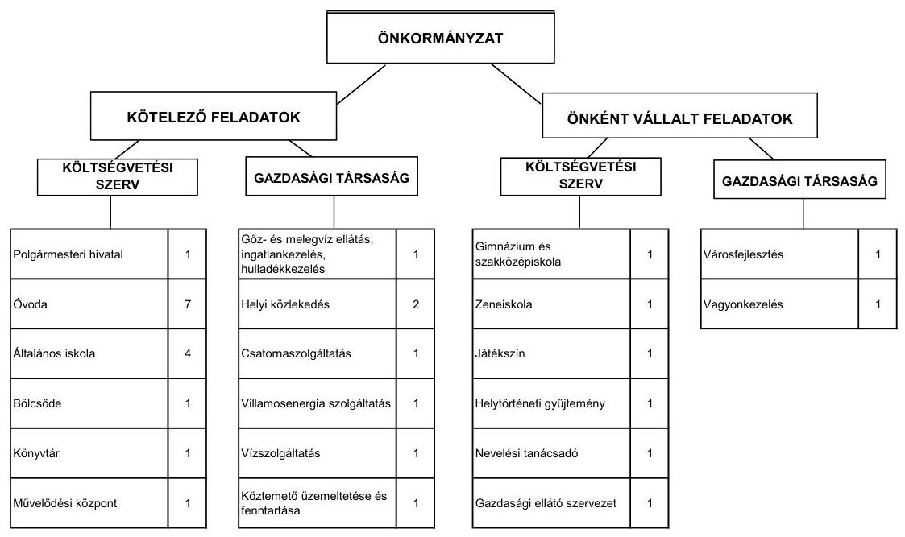

A kötelező és önként vállalt feladatait az Önkormányzat 2011. június 30-án (a Polgármesteri hivatallal együtt) 21 költségvetési szervvel, kilenc gazdasági társasággal, a Kistérségi társulás által fenntartott intézmény útján, a Ttv. szerinti három önkormányzati társulással (melyből egynek gesztora, kettőnek tagja), valamint egyéni vállalkozó, egyház, egyesületek és alapítványok által fenntartott intézményeken keresztül látta el. Az intézménylétesítések, intézményátadások és -átszervezések következtében 2007. január 1-jéről 2011. június 30-ára a költségvetési szervek száma 23-ról 21-re, a feladatellátás telephelyeinek száma 48-ról 46-ra változott.

Az Önkormányzat által fenntartott intézmények és a telephelyek számában bekövetkezett csökkenés ellenére az intézmények működési kiadásai a 2007-2009 közötti időszak évi átlagos értékéről (4419,4 millió Ft) a 2010. évre 490,9 millió Ft-tal (11,1%) emelkedtek, az ellátottak és a foglalkoztatottak létszámának, valamint a dologi kiadások növekedése folytán. Az intézmények működési kiadásai a 2007-2009 közötti időszak évi átlagos értékéről (4419,4 millió Ft) a 2010. évre 490,9 millió Ft-tal (11,1%) emelkedtek, melynek meghatározó részét (90,1%, 442,5 millió Ft) önkormányzati támogatásból finanszírozták. A kiadások növekedése az áttekintett időszakban az Önkormányzat pénzügyi egyensúlyi helyzetére nem volt kedvezőtlen hatással. A folyó bevételek a 2007-2009 közötti időszak 14 082,3 millió Ft összegéről a 2010. évre 1750,6 millió Ft-tal, 12,4%-kal csökkentek, emiatt az intézményi működési kiadások emelkedése a későbbiekben kockázatot jelenthet.

Az Önkormányzat két gazdasági társaságban kizárólagos tulajdonnal, egy-egy társaságban 51,0%, illetőleg 0,6% tulajdoni hányaddal rendelkezik. A 100,0%-os önkormányzati tulajdonban lévő gazdasági társaságok városfejlesztési, park- és közterület gondozási, nem veszélyes hulladékkezelési, gőz- és me-

---

legvíz ellátási, ingatlankezelési, valamint sportcsarnok és uszoda üzemeltetési feladatokat látnak el. Az 51,0%-os önkormányzati tulajdonosi részesedésű társaság vagyonkezelési, a 0,6%-os tulajdoni hányadú társaság vízszolgáltatási teendőket végez. A kötelező közszolgáltatások ellátásában öt önkormányzati tulajdoni részesedéssel nem rendelkező gazdasági társaság is részt vesz (személyszállítás, közösségi közlekedés, csatornaszolgáltatás, közvilágítás, köztemető fenntartása).

Az Önkormányzat működési kiadásokra 2010-ben 10669,8 millió Ft-ot fordított, amely 1641,7 millió Ft-tal, 18,2%-kal haladta meg a 2007-2009. évek 9028,1 millió Ft-os kiadását. Ezen összegek a helyi kisebbségi önkormányzatok és az OEP-támogatott feladatok működési kiadásait nem tartalmazzák. A működési kiadások finanszírozási forrásösszetételét ágazatonként a 2007. és a 2010. évben a következő ábra mutatja be:
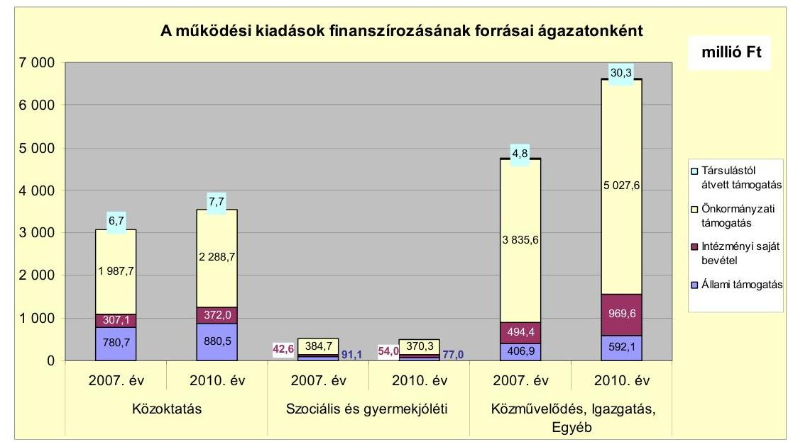

Kórházat és sportlétesítményt a vizsgált időszakban az Önkormányzat nem tartott fenn, a sport feladatokat gazdasági társaság útján látták el.

Az állami támogatás a 2010. évben 1549,6 millió Ft-ot tett ki, a 2007-2009. évi átlaggal, 1551,8 millió Ft-tal közel azonos összegű bevételi forrást jelentett. Bár a közoktatásban a gyermek/tanuló létszám a 2007-2009 közötti időszakról a 2010. évre 179 fővel, 4,6\%-kal emelkedett, a szociális, gyermekjóléti intézmények átadása, valamint a jövedelemkülönbség mérséklés szabályozásában bekövetkezett változások miatt az állami támogatás összege nem módosult. Az intézményi saját bevételek a 2007-2009. években átlagosan 1537,8 millió Ft forrást jelentettek. Az Önkormányzat a 2008. (445,4 millió Ft) és a 2009. (667,2 millió Ft) években magas összegű kamatbevételt realizált. A saját bevételek összege a 2010. évben 1395,6 millió Ft-ot tett ki, mely az előző három év átlagának $90,8 \%$-a. A feladatok ellátásához biztosított önkormányzati hozzájárulás a 2010. évben 1770,6 millió Ft-tal (29,6\%) haladta meg a 2007-2009 időszak átlagát (5915,9 millió Ft). Ebben az önként vállalt feladatokra fordított kiadások összegének (645,2 millió Ft-tal, 32,0\%-kal) és a fog-

---

lalkoztatottak statisztikai átlaglétszámának (90 fővel, 9,5\%-kal) emelkedése játszott meghatározó szerepet.

A társult önkormányzatoktól átvett támogatás 2010. évi összege (38,1 millió Ft) 15,5 millió Ft-tal (68,6\%) haladta meg az előző három év átlagát. A 2007-2010. időszakban a Nevelési tanácsadó működtetéséhez a Kistérségi társulástól és a feladatellátással érintett önkormányzatoktól kapott támogatásértékű működési bevétel (105,9 millió Ft) az összes működési kiadás (37 754,0 millió Ft) 0,3\%-át finanszírozta. A bevételi forrás az Önkormányzat pénzügyi egyensúlyi helyzetére kedvező hatással volt, de nem játszott meghatározó szerepet.

A gazdasági társaságok közül az ellenőrzött időszakban egy 100,0\% önkormányzati tulajdonosi részesedéssel rendelkező, a településgazdálkodási feladatokat ellátó, valamint az uszodát és a sportcsarnokot üzemeltető társaság összesen 755,6 millió Ft működési célú pénzeszközt kapott. Az Önkormányzat az uszoda és sportcsarnok üzemeltetésére 2015-ig kötött szerződést a társasággal. A társaság részére átadott pénzeszköz a 2007-2009. évi átlagos 104,6 millió Ft-ról 2010-re az - új beruházásként a 2010. évben átadott - uszoda miatt több mint háromszorosára (342,3 millió Ft-ra) emelkedett. Ez a nettó működési jövedelem visszaesése miatt az Önkormányzat szempontjából a későbbiekben kockázatot jelenthet.

Az Önkormányzat 2008. január 31. napjával a családsegítés, gyermekjóléti szolgálat és támogató szolgálat feladatokat ellátó intézményét átadta a Kistérségi társulásnak. 2010. október 1-jétől egy egyesületnek adta át a szociális étkeztetés, házi segítségnyújtás, jelzőrendszeres házi segítségnyújtás, idősek nappali ellátása és a fogyatékos személyek nappali ellátása feladatokat ellátó intézményét. Az Önkormányzat adatszolgáltatása szerint a két intézmény átadása az átadástól 2011. június 30-áig terjedő időszakban 169,6 millió Ft-tal csökkentette a kiadások, 112,1 millió Ft-tal a bevételek szintjét. A kötelező és az önként vállalt feladatok ellátását biztosító szervezeti keretekben, a feladatellátás módjában bekövetkezett, előzőekben bemutatott változások - az intézményátadások folytán - 57,5 millió Ft kiadási megtakarítást eredményeztek, kedvező hatást gyakoroltak az Önkormányzat pénzügyi egyensúlyi helyzetére.

---

Az Önkormányzatnál a folyó költségvetés egyenlege (működési jövedelme) 2007-2010 között működési forrástöbbletet mutatott, ezt az alábbi ábra szemlélteti:
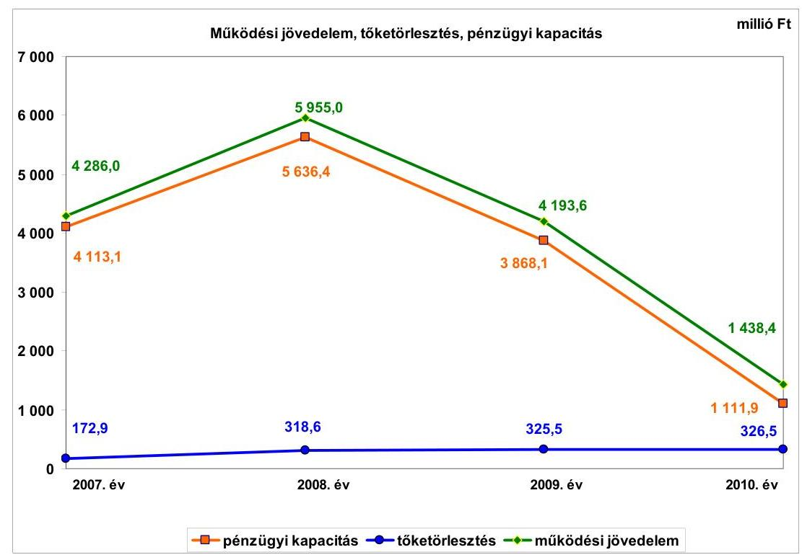

A működési jövedelem 2007-2010 között összességében 15 873,0 millió Ft megtakarítást mutatott, mely forrásul szolgálhatott a fejlesztések finanszírozásához, valamint az Önkormányzat fennálló tőketörlesztési kötelezettségeinek teljesítéséhez. Összege a 2007-2009 közötti időszak 4811,5 millió Ft összegű átlagáról a 2010. évre 3373,1 millió Ft-tal, 70,1\%-kal esett vissza, ami az Önkormányzat működése szempontjából a későbbiekben kockázatot jelenthet.

A működési jövedelem alakulását a folyó kiadások egyenletes növekedése mellett a folyó bevételek összegének ingadozása határozta meg. A folyó kiadások a 2010. évben 1622,6 millió Ft-tal, 17,5\%-kal haladták meg az előző három év 9270,7 millió Ft-os átlagos összegét. A folyó bevételeknél a helyi iparűzési adóbevétel összegének ingadozása játszott meghatározó szerepet. Helyi iparűzési adóból az Önkormányzat a 2007. évben 8730,1 millió Ft, a 2008. évben 9229,0 millió Ft, a 2009. évben 8396,7 millió Ft, a 2010. évben - az egyik legnagyobb adóalany elköltözése miatt - 6934,9 millió Ft-ot realizált.

A pénzügyi kapacitás (nettó működési jövedelem) a folyó költségvetési pozíció (működési jövedelem) mellett az adott költségvetési év adósságtörlesztésének hatását is tükrözi. Pozitív egyenlege azt jelenti, hogy a működési jövedelem meghaladta az adósságszolgálat összegét. A tőketörlesztés összege a vizsgált időszakban növekedést mutatott, de az Önkormányzat költségvetéséhez mérten csekély arányt képviselt. A 2007-2010 közötti időszakban összesen 1143,5 millió Ft-ot jelentett, a működési jövedelem (15 873,0 millió Ft) 7,2\%-át.

---

A felhalmozási költségvetés bevételeit, kiadásait és egyenlegét az alábbi ábra mutatja be:
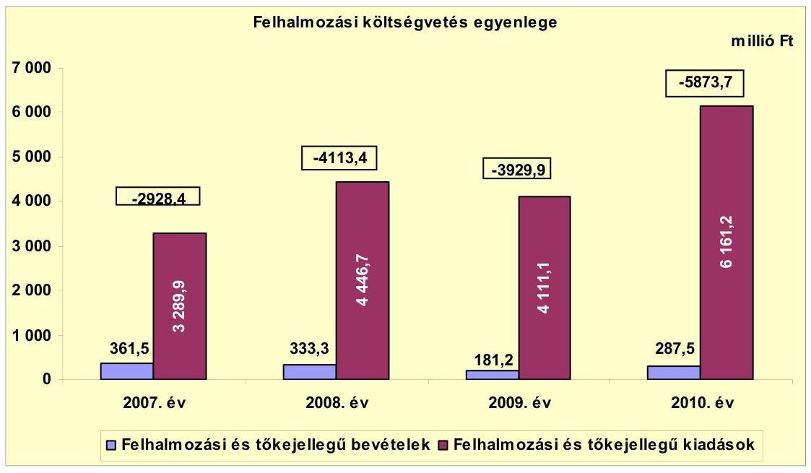

A 2007-2010 közötti időszakban a felhalmozási költségvetés egyenlege összességében 16845,4 millió Ft forráshiányt mutatott. A felhalmozási kiadásoknak mindössze 6,5\%-át, 1163,5 millió Ft-ot fedezte felhalmozási bevétel. A nettó működési jövedelemből fedezték a beruházási és felújítási kiadások meghatározó részét, (87,4\%, 14729,5 millió Ft). A kiadások további részét 1575,9 millió Ft (9,4\%) hitelfelvétellel, 292,1 millió Ft (1,7\%) értékpapír (államkötvény 72,4 millió Ft, kincstárjegy 31,4 millió Ft összegben) értékesítésből származó bevétellel, a fennmaradó összeget (247,9 millió Ft) az előző évek pénzmaradványának felhasználásával biztosították. A 2007-2009. évi működési megtakarításból finanszírozott felhalmozási feladatok kiadásainak egy része a 2010. évben jelentkezett.

Az Önkormányzat folyó és felhalmozási kiadásainak együttes összegéből (a 2007-2011. év I. félév közötti időszakban 62 480,1 millió Ft) magas a felhalmozási kiadások aránya (30,8\%) és összege (19267,4 millió Ft). A létrehozott vagyontárgyak, eszközök miatt emelkedik a működési kiadási szint és a későbbiekben megnövekedhet a felújítási szükséglet is, ami a nettó működési jövedelem visszaesése és a felhalmozási bevételek alacsony szintje miatt a későbbiekben felhalmozási kockázatot jelenthet.

Az Önkormányzat folyó bevétele a 2010. évben 12 331,7 millió Ft-ot tett ki, 1750,6 millió Ft-tal (12,4\%) maradt el az előző három év átlagától (14 082,3 millió Ft). A bevétel alakulásában a helyi iparűzési adó ingadozása játszott meghatározó szerepet.

A vizsgált időszakban az Önkormányzatnak a helyi adók közül az iparűzési adóból, a telekadóból és az építményadóból származott bevétele. A 2007-2010 közötti időszakban a helyi adó bevételek 89,3\%-a, 33 290,7 millió Ft iparűzési adóból, 8,9\%-a, 3302,0 millió Ft építményadóból, 1,8\%-a, 664,4 millió Ft

---

telekadóból keletkezett. A helyi adókból, pótlékokból és bírságokból származó bevételek aránya 2007-ről 2010-re 10,0 százalékponttal csökkent, 2010-ben 65,4\%-ot tett ki a folyó bevételekből. A pótlékkal, bírsággal növelt helyi adó bevétel a 2007. évi 9728,1 millió Ft-ról a 2010. évre 8067,2 millió Ft-ra (1660,9 millió Ft-tal, 17,1\%-kal) csökkent. A 2007-2010 közötti időszakban a helyi adó bevételek 89,3\%-a iparűzési adóból, 8,9\%-a építményadóból, 1,8\%-a telekadóból keletkezett.

A helyi iparűzési adó mértéke - a Helyi adó tv. szerinti 2,0\%-os maximális mértéken belül - 2011. január 1-jétől a korábbi 1,8\%-ról 1,9\%-ra módosult. A befolyt adó összege a 2007. évről a 2008. évre az adóalanyok számának bővülése folytán 498,9 millió Ft-tal (5,7\%) emelkedett. A 2008. évről a 2009. évre 832,3 millió Ft-tal, a 2009. évről a 2010. évre 1461,8 millió Ft-tal csökkent. 2009. július 1-jétől az egyik legnagyobb adózó áthelyezte székhelyét egy másik településre. A gazdasági válság miatt a vállalkozások megrendelései visszaestek, árbevételük és a helyi iparűzési adó alapjuk csökkent. A helyi iparűzési adóbevétel összegének az egyik legnagyobb adózó elköltözése miatti tartós csökkenése az Önkormányzat működése szempontjából a későbbiekben kockázatot jelenthet. A vezetékes távközlési tevékenységet végző vállalkozások adóalap megosztásának 2011. január 1-jétől történt változása miatt további közel 250,0 millió Ft évi bevételkiesés várható.

A telekadó mértéke $170 \mathrm{Ft} / \mathrm{m}^{2}$ volt, mely a vizsgált időszakban nem változott. A befolyt adó összege a 2007-2009. évi átlagos 157,4 millió Ft-tal szemben a 2010. évben 192,1 millió Ft-ot tett ki.

Az építményadó esetében az ellenőrzött időszakban hat kategóriát alkalmaztak, az adó mértékét több ízben is (2007., 2009. és 2011. január 1-jei hatállyal) emelték. A 2010. évben a 2007-2009. évi átlagos 810,2 millió Ft összegnél 61,2 millió Ft-tal több bevételt, 871,4 millió Ft-ot realizáltak.

A helyi adókkal kapcsolatos pótlékokból, bírságokból származó bevétel összege a 2007. évben kiemelkedően magas, 92,0 millió Ft volt. A 2007. évtől kezdődően a korábbi években alkalmazott többszöri felszólítás helyett, a bevallási határidőt követő 30 napos türelmi idő leteltével mulasztási bírság kiszabására került sor a kötelezettségüket nem teljesítő vállalkozások terhére. Ennek következtében javult az adózási fegyelem.

A felhalmozási bevételek összege a 2007-2011. év I. félév időszakban összesen 1241,9 millió Ft-ot tett ki. Ebből 455,2 millió Ft, 36,7\% államháztartáson kívülről kapott támogatás, 378,1 millió Ft, 30,4\% egyéb saját tőkebevétel, 215,9 millió Ft, 17,4\% államháztartáson belülről kapott támogatás, 192,7 millió Ft, 15,5\% tárgyi eszköz értékesítés címen realizálódott.

A folyó kiadások az előző három év átlagáról (9270,7 millió Ft) a 2010. évre 1622,6 millió Ft-tal (17,5\%) emelkedtek. A működési kiadások (kamatkiadások nélkül) a 2007-2009 közötti időszak évi átlagos értékéről (8036,4 millió Ft) a 2010. évre 1192,3 millió Ft-tal (14,8\%) emelkedtek. Ebből 490,9 millió Ft-ot tett ki az intézmények, 383,4 millió Ft-ot az igazgatási feladatok, 318,0 millió Ft-ot a Polgármesteri hivatalban ellátott feladatok működési kiadási többlete. Az államháztartáson belülre átadott pénzeszközök összege a 2007-2009. évi átlagos

---

51,5 millió Ft-ról 2010-re 90,4 millió Ft-ra emelkedett a Kistérségi társulásnak adott támogatás miatt. A transzferkiadások ${ }^{8} 2010$. évi összege 1361,7 millió Ft volt, az előző három év átlagát (837,0 millió Ft) 524,7 millió Ft-tal haladta meg. Növekedését a kiszervezett és a civil szervezetek által ellátott feladatokhoz adott támogatások összegének változása és a 2010-ben átadott uszoda működési költségeihez való hozzájárulás idézte elő. Kamatkiadásokra a 2010. évben a 2007-2009 időszak átlagos összegének (228,2 millió Ft) kevesebb, mint a felét, 112,4 millió Ft-ot fordítottak a hosszú lejáratú, fejlesztési célú hitelek tőkeösszegének csökkenése következtében. Az előző évi pénzmaradvány átadás a 2010. évben 100,1 millió Ft kiadást jelentett, az előző három év átlagánál (117,6 millió Ft) 17,5 millió Ft-tal (14,9\%) nagyobb összeget.

A folyó kiadások folyamatos emelkedése, valamint a folyó bevételek visszaesése az Önkormányzatnak a későbbiekben működési kockázatot jelenthet.

A pénzügyi egyensúlyi helyzetet jelentősen befolyásolta az Önkormányzat felhalmozási tevékenysége. A 2007 és 2010 között befejezett fejlesztések 98,5\%-át (9033,7 millió Ft) saját forrásból fedezték. A 2007-2010 közötti időszakban megvalósított 9178,1 millió Ft összegű beruházás és felújítás forrása az előzőekben említett saját erő és a 66,9 millió Ft összegű hazai támogatás mellett 77,5 millió Ft hitel (0,8\%) volt. A 2010. december 31-én folyamatban lévő fejlesztési feladatok végrehajtására 2010. december 31-ével bezárólag 9511,5 millió Ft kiadást teljesítettek, amelyre saját forrásból 7915,2 millió Ft-ot (83,2\%), hitelből 1467,3 millió Ft-ot (15,4\%), EU-s támogatásból 129,0 millió Ft-ot (1,4\%) fordítottak. Az EU-s támogatásból megvalósult fejlesztések előfinanszírozása likviditási gondot nem okozott. Az Önkormányzatnál 2010. december 31-én folyamatban lévő fejlesztési feladatok 2010. évet követő kötelezettségvállalásainak összege 2553,5 millió Ft volt. A finanszírozási forrásként megjelölt 666,3 millió Ft hitelt érintően az Önkormányzat megkötött hitelkeret szerződésekkel rendelkezik.

A 2010. évet követően a felhalmozási kötelezettségvállalások forrásösszetételét a következő ábra mutatja be:

[^0]
[^0]:    ${ }^{8}$ Transzferkiadásoknak nevezzük azokat a folyó és felhalmozási tételeket, amelyeket nem az adott önkormányzat használ fel szolgáltatásnyújtásra.

---

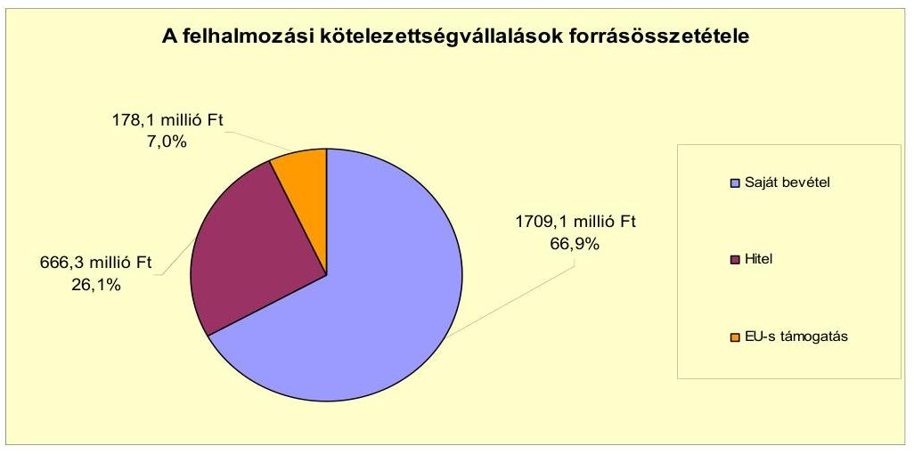

Az Önkormányzat 2011. év I. félévében indított beruházásainak és felújításainak várható bekerülési költsége 448,5 millió Ft. Ennek tervezett forrása saját bevétel (352,8 millió Ft), valamint hazai és EU-s támogatás (95,7 millió Ft).

Az Önkormányzat által beadott, elbírálás alatt álló két pályázat tervezett teljes bekerülési költsége 157,3 millió Ft. Ebből 87,2 millió Ft-ot EU-s támogatásból, 70,1 millió Ft-ot saját bevételből terveznek finanszírozni.

Az Önkormányzat mérleg szerinti pénzintézeti és tőkepiaci kötelezettsége a 2006. év végéről a 2011. év I. félév végére 3887,5 millió Ft-ról 5693,8 millió Ft-ra nőtt, amelyből az árfolyamváltozás miatti különbözet 474,3 millió Ft volt. A fennálló pénzintézeti kötelezettségek hat víziközmű hitel átvállalásából, hat hosszú lejáratú hitel igénybevételéből keletkeztek. A hosszú lejáratú hitelek közül egy deviza alapú, öt forint alapú, fejlesztési célú. A devizában fennálló pénzintézeti kötelezettség (2222,7 ezer EUR és 11 429,4 ezer CHF) a 2006. évben, a forintban fennálló pénzintézeti kötelezettségek közül egy (1750,0 millió Ft) a 2004. évben, négy (3100,0 millió Ft) a 2010. évben keletkezett.

Az Önkormányzat kötelezettségvállalásaira képviselő-testületi döntés alapján került sor, az előterjesztésekben bemutatták a kamatkockázatot. A 2006. évben a devizaalapú kötelezettségvállalás előtt az árfolyamkockázat képviselőtestületi bemutatása nem történt meg. Az Önkormányzat a 2007-2010. évek végén a Számv. tv. előírásának megfelelően elvégezte a devizaalapú hitelének az év végi értékelését. A hosszú lejáratú adósságot keletkeztető kötelezettségvállalás során betartották az Ötv. előírását, nem lépték túl annak felső határát.

Az Önkormányzat 2010. évben kötött hitelszerződései alapján a 3100,0 millió Ft összegű hitelkeretből (négy hitelből összeálló) a 2010. évben 875,9 millió Ft-ot, a 2011. év I. félévben 849,8 millió Ft-ot használt fel. Egy hitelt még nem vett igénybe (700,0 millió Ft összegű). A 2011. június 30-án fel nem használt hitelkeret összege 1374,3 millió Ft volt. Az igénybevett hiteleket a hitelcélnak megfelelően a Képviselő-testület által jóváhagyott, a költségvetésbe betervezett beruházásokhoz használták fel.

---

A 2004. évi forintban felvett hitel esetében a tőketörlesztés 2007 decemberében 170,8 millió Ft/év összeggel, a 2006. évben felvett, devizában fennálló hitel tőketörlesztése 2008 decemberében 134,8 millió Ft/év összegben megkezdődött.

A 2010. évben kötött, 3100,0 millió forint összegű hitelszerződésekből három hitel esetében a kamatfizetés 2010 decemberében, egy hitel esetében 2011. év II. félévében kezdődött meg. A tőketörlesztés kezdete valamennyi hitel esetében 2013. szeptember hónap. A tőketörlesztések összege hitelenként változó, 8,0 millió Ft/év, 103,6 millió Ft/év, 27,5 millió Ft/év, az igénybe nem vett 700,0 millió Ft összegű hitel felhasználása esetében 57,1 millió Ft/év lesz. A víziközmű (6 db) hitelek fennálló tőkeállománya 2010. december 31-én és 2011. június 30-án is 62,9 millió Ft volt. A víziközmű hitelek tőketörlesztésének összege 21,9 millió Ft/év.

Az Önkormányzat 2007-2011. év I. félév közötti időszakban a devizában fennálló pénzintézeti kötelezettségei után 1209,7 ezer EUR, 148,8 ezer CHF, a HUF-ban fennálló pénzintézeti kötelezettségeiből 925,6 millió Ft tőkét törlesztett. A HUF-ra átszámított összes tőketörlesztés 1296,3 millió Ft volt. Az összes pénzintézeti kötelezettség (devizában és Ft-ban fennálló) után 873,2 millió Ft kamatot fizetett meg. A 2007-2011. év I. félév között a referencia kamatok változása kedvezőtlenül érintette az Önkormányzatot, mivel a megfizetett kamat helyett csak 769,4 millió Ft kamatot fizetett volna az eredeti hitelkamatok alapján. A vizsgált időszakban a kamatok megfizetésével kapcsolatos árfolyamveszteség 9,3 millió Ft volt. A vizsgált években egy hitelét, valamint a váltóból fennálló kötelezettségét az ütemezés szerint visszafizette. Az Önkormányzat a 20072011. év I. féléve között költségvetésének pénzügyi egyensúlyát rövid lejáratú hitelek igénybevétele nélkül tudta biztosítani. A 2007-2011. év I. féléve között átmenetileg szabad pénzeszközeiből 2229,8 millió Ft kamatbevételt realizált, amely kedvező hatással volt a pénzügyi egyensúlyi helyzet alakulására.

Az Önkormányzat 2011. év I. félév végi szállítói tartozása 60,2 millió Ft, a lejárt szállítói állomány 40,1 millió Ft volt. Az Önkormányzatnak átütemezett szállítói tartozása egyik évben sem volt. Az Önkormányzat gazdasági társasága részére a fejlesztési hitel igénybevételéhez készfizető kezességet vállalt 200,0 millió Ft összegben. A 2010. év végére a gazdasági társasága kezességével kapcsolatos kötelezettsége 87,5 millió Ft-ra csökkent.

Az Önkormányzat egy alkalommal a határon kívüli önkormányzatnak, kettő esetben pedig államháztartáson kívüli szervezetnek (közhasznú társaságnak) nyújtott kölcsönt. Az Önkormányzat gazdasági társaságok részére három alkalommal, összesen 40,9 millió Ft tagi kölcsönt nyújtott. A fennálló tagi kölcsönállomány összege 2010. december 31-én 6,9 millió Ft, 2011. június 30-án 5,9 millió Ft volt.

Az Önkormányzat kötelezettségeinek 2010. december 31-i, valamint 2011. június 30-i állományát és várható alakulását a kötelezettségek lejáratáig a következő táblázat szemlélteti:

---

| Megnevezés | Állomány 2010. december 31-én |  |  | Állomány 2011. június 30-án |  |  | Várható kötelezettség   2011-2013. években |  | Várható kötelezettség   2014. évtől |  |
| :--: | :--: | :--: | :--: | :--: | :--: | :--: | :--: | :--: | :--: | :--: |
|  | HUF-ban   (millió Ft-ban) | Devizában (összege,   ezer   EUR/CHF-ban) | Deviza   nem | HUF-ban   (millió Ft-ban) | Devizában (összege,   ezer   EUR/CHF-ban) | Deviza   nem | HUF-ban   (millió Ft-ban) | Devizában (összege,   ezer   EUR/CHF-ban) | HUF-ban   (millió Ft-ban) | Devizában (összege,   ezer   EUR/CHF-ban) |
| Pénzintézeti kötelezettségek |  |  |  |  |  |  |  |  |  |  |
| Pénzügyi maradvány hóseje | 2133,8 | 0 | HUF | 2898,1 | 0 | HUF | 1152,1 | 0 | 4694,3 | 0 |
| Pénzügyi maradvány hitel része CHF-ban | 0 | 11280,7 | CHF | 0 | 11280,7 | CHF | 0 | 324,2 | 0 | 11401,4 |
| Pénzügyi maradvány hitel része EUR-ban | 0 | 1259,7 | EUR | 0 | 1013,1 | EUR | 0 | 1277,9 | 0 | 0 |
| Pénzintézeti kötelezettségek összesen HUF-ban | 2133,8 | 0 | HUF | 2898,1 | 0 | HUF | 1152,1 | 0 | 4694,3 | 0 |
| Pénzintézeti kötelezettségek összesen CHF-ban | 0 | 11280,7 | CHF | 0 | 11280,7 | CHF | 0 | 324,2 | 0 | 11401,4 |
| Pénzintézeti kötelezettségek összesen EUR-ban | 0 | 1259,7 | EUR | 0 | 1013,1 | EUR | 0 | 1277,9 | 0 | 0 |
| Biztosítékok |  |  |  |  |  |  |  |  |  |  |
| Kezesség | 93,5 | 0 | HUF | 93,5 | 0 | HUF | 0 | 0 | 0 | 0 |
| Biztosítékok összesen | 93,5 | 0 | HUF | 93,5 | 0 | HUF | 0 | 0 | 0 | 0 |
| Eszköztől tartozás | 224,4 | 0 | HUF | 93,2 | 0 | HUF | 90,2 | 0 | 0 | 0 |
| Egyéb kiadás elmaradás | 779,6 | 0 | HUF | 779,6 | 0 | HUF | 779,6 | 0 | 0 | 0 |
| Jogerős végzéssel lezárt, de nem fizetett kötelezettségek | 0,4 | 0 | HUF | 0,4 | 0 | HUF | 0,4 | 0 | 0 | 0 |
| Összes HUF-ban fennálló kötelezettség | 3341,7 | 0 | HUF | 3831,8 | 0 | HUF | 1992,3 | 0 | 4694,3 | 0 |

Az Önkormányzatnak pénzintézetekkel szemben fennálló kötelezettsége a 2011. év I. félév végén 2898,1 millió HUF, 11 280,7 ezer CHF és 1013,1 ezer EUR. A Polgármesteri hivatal 2011. június 30-án kiadáselmaradásból (peres eljárásból) fennálló kötelezettsége 779,6 millió Ft volt. A fennálló szállítói állomány 2010. december 31-én 334,4 millió Ft, 2011. június 30-án 60,2 millió Ft volt. Az Önkormányzatnak a 91 és 365 nap közötti lejárt tartozása - a 2011. év kivételével - a vizsgált időszak minden évében volt. Ennek összege a 2007. évben 0,1 millió Ft, a 2008. évben 1,2 millió Ft, a 2009. évben 8,0 millió Ft, a 2010. évben 0,9 millió Ft volt. A vizsgált időszakban az Önkormányzatnak éven túli lejárt tartozása a 2010. év december 31-én volt, amelynek összege 14,0 millió Ft.

Az Önkormányzatnak a 2011-2013. években várható pénzintézeti kötelezettsége (tőke, kamat és egyéb költség) a legutóbbi kamatfizetés feltételei alapján 1152,1 millió HUF, 324,2 ezer CHF, továbbá 1277,9 ezer EUR. Az Önkormányzatnak a 2011. évben szállítói tartozások és egyéb kiadás elmaradások rendezése, valamint jogerős végzéssel lezárt, de ki nem fizetett kötelezettségek címén 840,2 millió Ft fizetési kötelezettsége keletkezett.

A 2011-2013. évek kötelezettségeinek teljesítésére figyelembe vehető a 207,5 millió Ft szabad pénzmaradvány, a 122,5 millió mérlegben kimutatott behajtható követelésállomány, 23,6 millió Ft rövid lejáratú kölcsön, valamint a forgalomképes ingatlanvagyon. A 2014. évet követően jelenleg ismert pénzintézeti kötelezettségei: 4694,3 millió Ft és 11 401,4 ezer CHF. Az Önkormányzat tájékoztatása szerint - a jelenlegi állami finanszírozási rendszer változatlansága, valamint a jövőben várhatóan megképződő működési jövedelem emelkedése (a befolyt helyi adó összegének, adóalanyok számának növekedése) esetén - az eddig vállalt kötelezettségeit a jövőben teljesíteni tudja. Az éves költségvetési rendeletekben bemutatták a több éves kihatással járó döntésekből származó pénzintézeti kötelezettségeket, azonban nem számszerűsítették azok visszafizetésének forrását.

Az Önkormányzat pénzügyi egyensúlyát befolyásolhatják - kötelezettségeinek növekedése mellett - az Önkormányzat minősített többségi tulajdonú gazdasági társaságainak kötelezettségei is.

---

| Megnevezés | Állomány 2010. december 31-én |  |  | Állomány 2011. június 30-án |  |  | Várható kötelezettség   2011-2013. években |  | Várható kötelezettség   2014. évtől |  |
| :--: | :--: | :--: | :--: | :--: | :--: | :--: | :--: | :--: | :--: | :--: |
|  | HUF-ban   (millió Ft-ban) | Devizában   (összege,   ezer   EURO/UF-ban) | Deviza   nam | HUF-ban   (millió Ft-ban) | Devizában (összege, ezer EUR/CHF-ban) | Deviza   nam | HUF-ban
(millió Ft-
ban) | Devizában
(összege,
ezer
EURO/UF-
ban) | HUF-ban
(millió Ft-
ban) | Devizában (összege,
ezer
EURO/UF-
ban) |
| Minősítető többségü gazdasági társaság
tiszészámlatkáza | 30,0 | 0 | HUF | 21,3 | 0 | HUF | 21,3 | 0 | 0 | 0 |
| Minősített többségü gazdasági társaság
tiszészió lejáratú hitére | 87,5 | 0 | HUF | 75,0 | 0 | HUF | 59,0 | 0 | 62,3 | 0 |
| Pénzintézeti kötelezettségek összesen
HUF-ban | 117,5 | 0 | HUF | 96,3 | 0 | HUF | 80,3 | 0 | 62,3 | 0 |
| Szállítás tartozás | 7,1 | 0 | HUF | 101,5 | 0 | HUF | 101,5 | 0 | 0 | 0 |
| Lizing kötelezettségek | 10,1 | 0 | HUF | 9,0 | 0 | HUF | 10,0 | 0 | 1,9 | 0 |
| Minősített többségü gazdasági társaságok
összes HUF-ban fennálló kötelezettsége: | 134,7 | 0 | HUF | 206,8 | 0 | HUF | 191,8 | 0 | 64,2 | 0 |

Az Önkormányzat minősített többségi tulajdonú gazdasági társaságának 2011. június 30-án fennálló, mérleg szerinti összes kötelezettsége 248,2 millió Ft volt, amelyből pénzintézeti és lízing kötelezettsége, valamint szállítói tartozása 206,8 millió Ft. A kötelezettségek nem teljesítése hatással lehet az Önkormányzat likviditására, pénzügyi egyensúlyi helyzetére.

A társaságoknak a 2011-2013. évek között 191,8 millió HUF-ban fennálló kötelezettséget kell teljesíteni, amelyből 80,3 millió Ft pénzintézetek, 101,5 millió Ft szállítók felé fennálló, valamint 10,0 millió Ft lízing kötelezettség. A 2014. évtől várható kötelezettségek összege 64,2 millió Ft, amely 62,3 millió Ft pénzintézeti és 1,9 millió Ft lízing kötelezettségből áll.

A pénzügyi egyensúlyi helyzetet befolyásolhatja az önkormányzat eszközeinek állapota, használhatósági foka, az eszközök pótlására fordítandó pénzeszközök nagysága. Az Önkormányzat 2007-2010 között eszközállománya után 2650,5 millió Ft összegű értékcsökkenést mutatott ki, miközben az elhasznált eszközök pótlására felújításból és beruházásból 3014,4 millió Ft-ot fordított. A Képviselőtestületnek előterjesztett éves zárszámadási rendeleteikben nem mutatták be az Önkormányzat eszközei után tárgyévben elszámolt értékcsökkenés összegét, az eszközpótlásra fordított tényleges kiadásokat, az eszközök elhasználódási fokának alakulását.

Az Önkormányzat az ellenőrzött időszakban kiadási megtakarítást eredményező és bevételt növelő intézkedéseket tett.

A 2007-2011. év I. féléve között tett intézkedések hatására - az Önkormányzat kimutatása alapján - 106,0 millió Ft bevételi többletet, továbbá 167,0 millió Ft kiadási megtakarítást ért el. Az elért többletbevétel a helyi adók mértékének növelésével kapcsolatosan keletkezett. A kintlévőségek csökkentése érdekében tett intézkedések eredményeképpen, az adóhátralékok behajtásából 1207,0 millió Ft, a lejárt tartozások beszedéséből 17,2 millió Ft bevételt realizált. Az Önkormányzat jelentősebb összegű kiadás megtakarítást a közalkalmazottak és köztisztviselők részére nyújtott többletjuttatások csökkentéséből (108,1 millió Ft), a villamos energia közbeszereztetéséből ( 1,4 millió Ft), valamint a szociális intézmények Kistérségi társulás, valamint egyesület fenntartásába való átadásából ért el (57,5 millió Ft). A 2007-2011. év I. félév között a költségvetési támogatások és az átengedett szja bevételek együttes összege nem csökkent. A 20072011. év I. félév időszakában a kiadáscsökkentő és bevételnövelő intézkedések

---

meghozatalára a pénzügyi egyensúly megtartása, valamint javítása érdekében volt szükség, amely összességében 273,0 millió Ft többletforrást eredményezett. A 2007-2010. évek között az álláshelycsökkentő intézkedések intézmény átadása miatt történtek. Az álláshelyek száma 44-gyel csökkent, amelyből az üres álláshelyek száma 8 volt. Feladatbővülés miatt az álláshelyek száma 119-cel, a foglalkoztatottak száma 110-zel nőtt. A 2010. év december 31-én az üres álláshelyek száma 12 volt.

Az utóellenőrzés a pénzügyi egyensúly javítására tett egy szabályszerűségi javaslat hasznosítására terjedt ki. A javaslatot az intézkedési terv szerinti határidőben megvalósították.

Az Önkormányzat pénzügyi egyensúlyi helyzetét összegezve a következők emelhetők ki:

Budaörs Város Önkormányzatának pénzügyi egyensúlyi helyzete rövid és középtávon biztosított. A pénzügyi egyensúly hosszú távú megőrzésére az Önkormányzatnak fel kell készülnie.

A folyó bevételek csökkenő arányban nyújtottak fedezetet a folyó kiadásokra és az adósságszolgálatra.

A folyó bevételek több mint fele a helyi iparűzési adóból származik, az Önkormányzat bevételi kitettsége miatt hosszú távon kockázat jelentkezhet.

Az önként vállalt feladatok ellátására fordított kiadások aránya és mértéke magas, folyamatosan emelkedik.

A fejlesztések során kialakított létesítmények jövőbeni működtetésének várható kiadásait nem számszerűsítették, a fejlesztések korlátozott mértékben teremtenek bevételi lehetőséget az Önkormányzatnak.

A szállítói és pénzintézeti kötelezettségek a pénzügyi egyensúlyi helyzetre nem voltak hatással. Az Önkormányzatnak a hosszú lejáratú pénzintézeti kötelezettsége a 2010. évtől a hitelek felvétele miatt növekedett.

A többségi tulajdonú gazdasági társaságok pénzügyi helyzete egy társaság kivételével stabil.

Az Állami Számvevőszékről szóló 2011. évi LXVI. törvény 33. § (1) bekezdésében foglaltak értelmében a jelentésben foglalt megállapításokhoz kapcsolódó intézkedési tervet köteles az ellenőrzött szervezet vezetője összeállítani és azt a jelentés kézhezvételétől számított harminc napon belül az ÁSZ részére megküldeni. Amennyiben az intézkedési tervet határidőben nem küldi meg a szervezet, vagy az továbbra sem elfogadható, az ÁSZ elnöke a hivatkozott törvény 33. § (3) bekezdés a)-b) pontjaiban foglaltakat érvényesítheti.

---

# A 2011. június 30-i pénzügyi egyensúlyi helyzet alapján az ellenőrzés intézkedést igénylő megállapításai és javaslatai a következők:

## a Polgármesternek

1.  Az Önkormányzat pénzügyi egyensúlyi helyzete rövid és középtávon biztosított. A pénzügyi egyensúly hosszú távú megőrzésére az Önkormányzatnak fel kell készülnie. A pénzintézeti kötelezettségek állománya emelkedett, az önként vállalt feladatokra fordított kiadások aránya és mértéke magas, folyamatosan emelkedik.

Javaslat:
Folyamatosan tájékoztassa a Képviselő-testületet az Önkormányzat pénzügyi egyensúlyi helyzetéről. Szükség esetén kezdeményezzen intézkedéseket a pénzügyi egyensúly hosszú távú fenntarthatósága érdekében.
a) Képezzen elkülönített tartalékot az adósságszolgálat jövőbeni teljesítése érdekében.
b) Tekintse át az önként vállalt feladatok finanszírozhatóságát a kötelező feladatellátás elsődlegességének biztosítása érdekében.
2.  Az Önkormányzat településgazdálkodási feladatokat ellátó, valamint az uszodát és a sportcsarnokot üzemeltető, minősített többségi tulajdonú gazdasági társaságának mérleg szerinti összes kötelezettsége 2011. június 30-án 248,2 millió Ft volt, amely kötelezettség - nem teljesítés esetén - hatással lehet az Önkormányzat likviditására, pénzügyi egyensúlyi helyzetére.

Javaslat:
Továbbra is kísérje folyamatosan figyelemmel - a tulajdonosi jogkört gyakorlók közreműködésével - a kizárólagos tulajdonú gazdasági társaságok kötelezettségeinek alakulását, az Önkormányzat likviditására, pénzügyi-egyensúlyi helyzetére gyakorolt hatását. Tegye meg a szükséges és lehetséges intézkedéseket a tulajdonosi érdekek védelme érdekében.
3.  A Képviselő-testületnek az éves zárszámadási rendeleteik előterjesztésekor nem mutatták be az Önkormányzat eszközei után a tárgyévben elszámolt értékcsökkenés összegét, az eszközpótlásra fordított tényleges kiadásokat, az eszközök elhasználódási fokának alakulását.

Javaslat:
Mutassa be a Képviselő-testületnek évente a zárszámadási rendelet előterjesztésekor az értékcsökkenés összegét, az eszközpótlásra fordított tényleges kiadásokat, az eszközök elhasználódási fokának alakulását.

---

4.  Az éves költségvetési rendeletekben bemutatták a több éves kihatással járó döntésekből származó pénzintézeti kötelezettségeket, azonban nem számszerűsítették azok visszafizetésének forrását.

Javaslat:
Végezzenek számításokat a jövőre nézve arra vonatkozóan, hogy a pénzintézeti kötelezettségek visszafizetéseinek forrásai miből fognak összeállni.

# a Jegyzőnek:

1.  A 2006. évben a devizaalapú kötelezettségvállalás előtt nem történt meg a Képviselő-testület döntését megelőzően az árfolyamkockázat bemutatása.

Javaslat:
Mutassa be a jövőben a Képviselő-testületnek a devizában fennálló kötelezettségvállalás esetén az árfolyamkockázatot.

A polgármester a helyszíni ellenőrzés lezárása után tájékoztatta az Állami Számvevőszéket az Önkormányzat megtett intézkedéseiről, amelyet az Állami Számvevőszék nem ellenőrzött, arra vonatkozóan véleményt vagy megállapítást nem fogalmaz meg. Az ellenőrzés lezárását követően elvégzett intézkedéseket az Állami Számvevőszék utóellenőrzés keretében vizsgálhatja.

A polgármester tájékoztatása szerint a következő intézkedéseket tette az Önkormányzat:

-   a kötelező és az önként vállalt feladatok felülvizsgálatára munkacsoportot alakított;
-   az önkormányzati tulajdonú gazdasági társaságok pénzügyi egyensúlyi helyzetének és részükre biztosított pénzeszközök felülvizsgálatát beépíttette a belső ellenőrzési stratégiai tervébe;
-   előírta a tulajdonában lévő eszközök után a tárgyévben elszámolt értékcsökkenés összegének bemutatását a 2012. évi zárszámadási rendeletben.

---

# II. RÉSZLETES MEGÁLLAPÍTÁSOK

## 1.  AZ ÖNKORMÁNYZAT KÖTELEZŐ ÉS ÖNKÉNT VÁLLALT FELADATAI, A FELADATELLÁTÁS SZERVEZETI KERETEI ÉS ANNAK VÁLTOZÁSAI

A Képviselő-testület az önkormányzati SzMSz 1. számú mellékletében ágazatonkénti bontásban részletesen felsorolta a kötelező, és meghatározta az önként vállalt feladatait. Az önként vállalt feladatok - az Önkormányzat besorolása alapján - a településfejlesztéshez és -rendezéshez, a környezetvédelemhez, az alapfokú művészetoktatáshoz, a középfokú oktatáshoz, a pedagógiai szakszolgálathoz, valamint egyes szociális és egészségügyi ellátásokhoz kapcsolódtak. Ezen túlmenően hozzájárultak civil szervezetek működésének finanszírozásához.

A 2010. évi működési kiadások feladat-csoportonkénti megoszlását, azok forrásait, valamint a kötelező feladatok kiadásainak részarányát az alábbi táblázat ${ }^{9}$ mutatja be:

| Ellátott feladat | Működési   kiadás   összesen   (millió Ft) | Kötelező   feladatok   kiadásainak   részaránya   $\%$ | Működési   bevétel   összesen   (millió Ft) | Állami   támogatás   részaránya   $\%$ | Intézményi   saját bevétel   részaránya   $\%$ | Önkormányzati   támogatás   részaránya   $\%$ | Társulástól   átvett   támogatás   részaránye   $\%$ |
| :----------------- | :----------------------------------------------------: | :-----------------------------------------------------------------: | :----------------------------------------------------: | :-------------------------------------------------: | :-------------------------------------------------------: | :----------------------------------------------------: | :--------------------------------------------------------: |
| Óvodák            |                                                950,4 |                                                              100,0 |                                                950,4 |                                               22,3 |                                                     10,4 |                                               67,3 |                                                      0,0 |
| Általános iskolák  |                                               2049,3 |                                                              100,0 |                                               2049,3 |                                               26,7 |                                                     11,5 |                                               61,4 |                                                      0,4 |
| Gimnázium          |                                                355,5 |                                                                0,0 |                                                355,5 |                                               32,2 |                                                      6,7 |                                               61,1 |                                                      0,0 |
| Szakközépiskola    |                                                193,6 |                                                                0,0 |                                                193,6 |                                                3,6 |                                                      6,7 |                                               89,7 |                                                      0,0 |
| Szociális intézmény |                                                449,8 |                                                               70,0 |                                                449,8 |                                               17,1 |                                                     12,0 |                                               70,9 |                                                      0,0 |
| Gyermekjóléti intézmény |                                                 51,5 |                                                              100,0 |                                                 51,5 |                                                0,0 |                                                      0,0 |                                              100,0 |                                                      0,0 |
| Közművelődési intézmények |                                                485,8 |                                                               20,0 |                                                485,8 |                                               27,2 |                                                     14,6 |                                               58,2 |                                                      0,0 |
| Egyéb intézmények  |                                                374,3 |                                                               24,0 |                                                374,3 |                                               13,5 |                                                      4,6 |                                               73,8 |                                                      8,1 |
| Polgármesteri hivatal   igazgatási kiadásai |                                               2929,1 |                                                              100,0 |                                               2929,1 |                                                5,4 |                                                     18,4 |                                               76,2 |                                                      0,0 |
| Polgármesteri hivatalban ellátott   egyéb feladatok működési kiadásai |                                               2830,3 |                                                               54,0 |                                               2830,3 |                                                8,9 |                                                     12,1 |                                               79,0 |                                                      0,0 |
| Működési kiadások összesen |                                              10669,8 |                                                               75,1 |                                              10669,8 |                                               14,5 |                                                     13,1 |                                               72,0 |                                                      0,4 |

Az Önkormányzat -adatszolgáltatása szerint - a 2010. évi működési költségvetési kiadásaiból, 10669,8 millió Ft-ból 8010,5 millió Ft-ot (75,1\%) a kötelező feladatok, 2659,3 millió Ft-ot (24,9\%) az önként vállalt feladatok ellátására fordított. A kötelező feladatokra fordított kiadások a 2007-2009 közötti időszak 7014,0 millió Ft összegű átlagáról a 2010. évre 996,5 millió Ft-tal, 14,2%-kal emelkedtek. Ebben a beruházásokkal létrehozott új létesítmények is szerepet játszottak. Az önként vállalt
 feladatok kiadásai a 2010. évben 645,2 millió Ft-tal (32,0\%-kal) haladták meg az előző három év átlagát, 2014,1 millió Ft-ot. A kötelező és az önként vállalt feladatok működési kiadásainak részaránya a 2007-2009 közötti időszakról a 2010. évre 2,6 százalékpont-

[^0]
[^0]:    ${ }^{9}$ A táblázat a kisebbségi önkormányzatok és az OEP-támogatott feladatok adatait nem tartalmazza.

---

tal, 279,9 millió Ft-tal az önként vállalt feladatok irányába mozdult el. Ebben meghatározó szerepet játszott, hogy az Önkormányzat a településgazdálkodási feladatokat ellátó, valamint az uszodát és a sportcsarnokot üzemeltető gazdasági társaságnak a 2010. évben 342,3 millió Ft működési célú pénzeszközt adott át, az előző három év átlagos összegénél (104,6 millió Ft) 237,7 millió Ft-tal többet. Ebből 218,3 millió Ft-tal az - új beruházásként a 2010. évben átadott uszoda működtetéséhez járult hozzá. Az önként vállalt feladatokra fordított kiadások részarányának és összegének növekedése az áttekintett időszakban nem veszélyeztette a kötelező feladatok ellátását. A folyó bevételek csökkenése és a folyó kiadások évről évre történt emelkedése miatt az önként vállalt feladatokra fordított kiadások összegének nagyságrendje és növekedése a kötelező feladatok ellátása szempontjából a későbbiekben kockázatot jelenthet.

Az állami támogatás a 2010. évben 1549,6 millió Ft-ot tett ki, a 2007-2009. évi átlaggal, 1551,8 millió Ft-tal közel azonos összegű bevételi forrást jelentett. Bár a közoktatásban a gyermek/tanuló létszám a 2007-2009 közötti időszakról a 2010. évre 179 fővel, 4,6\%-kal emelkedett, a szociális, gyermekjóléti intézmények átadása, valamint a jövedelemkülönbség mérséklés szabályozásában bekövetkezett változások miatt az állami támogatás összege nem módosult.

Az Önkormányzat az évenkénti költségvetési törvényekben meghatározott feladatok ellátásához kapcsolódó normatív hozzájárulásoknak a 2007-2009. években a 20,0\%-át, 2010-ben már csak a 10,0\%-át kapta meg, mivel az szja-ból való részesedés, valamint a helyi iparűzési adóerő képesség együttes összegének egy lakosra számított mértéke (jövedelemkülönbség mérséklés önkormányzati szintje) meghaladta a költségvetési törvény szerinti legmagasabb értékhatárt. A 2009. évben megszűnt a véglegezett beszámítási (elvonási) összeg negyedének, de legfeljebb az Önkormányzat saját forrásaiból beruházásra felhasznált összeg visszaigénylésének lehetősége.

Az intézményi saját bevételek a 2007-2009. években átlagosan 1537,8 millió Ft forrást jelentettek. Az Önkormányzat a 2008. (445,4 millió Ft) és a 2009. (667,2 millió Ft) években magas összegű kamatbevételt realizált. A saját bevételek összege a 2010. évben 1395,6 millió Ft-ot tett ki, mely az előző három év átlagának 90,8\%-a.

A feladatok ellátásához biztosított önkormányzati hozzájárulás a 2010. évben 1770,6 millió Ft-tal (29,6\%-kal) haladta meg a 2007-2009 közötti időszak átlagát (5915,9 millió Ft). Ebben az önként vállalt feladatokra fordított kiadások összegének (645,2 millió Ft-tal, 32,0\%-kal) és a foglalkoztatottak statisztikai átlaglétszámának (90 fővel, 9,5\%-kal) emelkedése játszott meghatározó szerepet.

A társult önkormányzatoktól átvett támogatás 2010. évi összege (38,1 millió Ft) 15,5 millió Ft-tal (68,6\%-kal) haladta meg az előző három év átlagát. A 2007-2010 közötti időszakban befolyt bevétel (105,9 millió Ft) az összes működési kiadás (37754,0 millió Ft) 0,3\%-át finanszírozta. A bevételi forrás az Önkormányzat pénzügyi helyzetére kedvező hatással volt, de nem játszott meghatározó szerepet.

A közoktatási ágazatban a gyermekek/tanulók száma a 2010. évben 179 fővel (4,6\%-kal) haladta meg a 2007-2009. évi átlagos 3868 fős létszámot,

---

az elvonás következtében az állami támogatás a 2007-2009. évi átlagos 918,1 millió Ft-ról a 2010. évre 37,6 millió Ft-tal (4,1\%-kal) csökkent. A bérleti és a térítési díjak, az áfa bevételek emelkedésének és a szabad kapacitások hasznosításának hatására az intézményi saját bevételek a 2010. évben az előző három év átlagát (329,6 millió Ft) 42,4 millió Ft-tal (12,9\%-kal) haladták meg, 372,0 millió Ft-ban teljesültek. Az önkormányzati támogatás - a kapacitásbővülés folytán - a 2007-2009. évi átlagos 1971,3 millió Ft-ról a 2010. évre 2288,7 millió Ft-ra, 317,4 millió Ft-tal (16,1\%-kal) emelkedett. A társult önkormányzatoktól átvett támogatás a 2007-2010 közötti időszakban 25,6 millió Ft-ot tett ki, a működési kiadások (13 224,0 millió Ft) 0,2\%-ára nyújtott fedezetet.

A közművelődési intézmények saját bevétele a 2007-2009. évi átlagos 88,0 millió Ft-ról 2010-re 17,3 millió Ft-tal, 19,7 százalékponttal, 70,7 millió Ft-ra mérséklődött a jegyeladásból származó bevételek csökkenése következtében. Ezt az állami és az önkormányzati támogatás emelkedése ellensúlyozta. Az állami támogatás 2007-2009. évi átlagos összege (125,4 millió Ft) a 2010. évre 6,9 millió Ft-tal (5,5\%-kal) emelkedett. Az önkormányzati támogatás 2010. évi összege (282,7 millió Ft) 20,5 millió Ft-tal (7,3\%-kal) haladta meg az előző három év átlagát (262,2 millió Ft).

Az egyéb intézmények (zeneiskola, GESZ, Nevelési tanácsadó, Polgárok háza) állami támogatása a 2010. évben 4,0 millió Ft-tal volt kevesebb az előző három év átlagánál (54,6 millió Ft). Az intézményi saját bevétel 7,1 millió Ft-tal (68,9\%-kal) haladta meg a 2007-2009 közötti időszak átlagát (10,3 millió Ft), melyben az áfa visszatérülés játszott meghatározó szerepet. Az önkormányzati támogatás 84,3 millió Ft-tal (44,0\%-kal) haladta meg az előző három év átlagát (191,7 millió Ft). Az Önkormányzat a Nevelési tanácsadó működtetéséhez a Kistérségi társulástól és a feladatellátással érintett önkormányzatoktól évente hozzájárulást kapott, mely a 2007-2010 közötti időszakban összesen 77,3 millió Ft forrást jelentett, az Önkormányzat adatszolgáltatása alapján a kiadások (330,6 millió Ft) 23,4\%-ára nyújtott fedezetet.

Az igazgatási és a polgármesteri hivatalban ellátott feladatok állami támogatása az áttekintett időszakban nem változott jelentős mértékben, a 2007-2009. évek átlagában 408,0 millió Ft, a 2010. évben 409,2 millió Ft bevételt jelentett. A 2010. évben 881,5 millió Ft saját bevételt realizáltak, az előző három év átlagánál (1060,0 millió Ft) 178,5 millió Ft-tal (16,8\%-kal) kisebb összeget. A 2007-2009 közötti időszak átlagos értékét a 2008. és a 2009. évben befolyt kiemelkedően magas összegű kamat emelte meg. Az önkormányzati támogatás 2010. évi összege (4468,8 millió Ft) 1327,9 millió Ft-tal (42,3\%-kal) haladta meg az előző három év átlagát. A kiszervezett és a civil szervezetek által ellátott feladatok miatt a magánszemélyeknek és nonprofit szervezeteknek teljesített transzferkiadások ${ }^{10}$ összege a 2007-2009. évi átlagos 695,5 millió Ft-ról 2010-re 244,4 millió Ft-tal emelkedett. A fennmaradó összeggel (845,8 millió Ft) a saját bevételek visszaesését és a kiadások volumenének növekedését finanszírozták.

[^0]
[^0]:    ${ }^{10}$ Transzferkiadásoknak nevezzük azokat a folyó és felhalmozási tételeket, amelyeket nem az adott önkormányzat használ fel szolgáltatásnyújtásra.

---

Az Önkormányzat a Polgármesteri hivatal útján, vagy szerződéssel látta el a városüzemeltetési, tömegközlekedési, közvilágítási, vízkárelhárítási, szennyvízelvezetési és -kezelési, környezetvédelmi, köztisztasági, szemétszállítási, közbiztonsági, közút karbantartási, szociális segélyezési, temető üzemeltetési, választási, népszavazási, polgárvédelmi, egyes egészségügyi, közművelődési és sport, valamint az üdültetési feladatokat.

Kórházat és sportlétesítményt a vizsgált időszakban az Önkormányzat nem tartott fenn, a sport feladatokat gazdasági társaság útján látták el.

Az Önkormányzat kötelező és önként vállalt feladatait 2011. június 30-án (a Polgármesteri hivatallal együtt) 21 költségvetési szervvel, 9 gazdasági társasággal, a Kistérségi társulás által fenntartott intézmény útján, a Ttv. szerinti 3 önkormányzati társulással (melyből egynek gesztora, kettőnek tagja), valamint egyéni vállalkozó, egyház, egyesületek és alapítványok által fenntartott intézményeken keresztül látta el. Az intézménylétesítések, intézményátadások és -átszervezések következtében 2007. január 1-jéről 2011. június 30-ára a költségvetési szervek száma 23-ról 21-re, a feladatellátás telephelyeinek száma 48-ról 46-ra változott. Az intézmények és a telephelyek száma az áttekintett időszakban csökkent, az ellátottak és a foglalkoztatottak létszáma emelkedett. Az intézmények működési kiadásai a 2007-2009 közötti időszak évi átlagos értékéről (4419,4 millió Ft) a 2010. évre 490,9 millió Ft-tal (11,1\%) emelkedtek, melynek meghatározó részét (90,1\%, 442,5 millió Ft) önkormányzati támogatásból finanszírozták. A kiadások növekedése az áttekintett időszakban az Önkormányzat pénzügyi egyensúlyi helyzetére nem volt kedvezőtlen hatással. A folyó bevételek a 2007-2009 közötti időszak 14082,3 millió Ft összegéről a 2010. évre 1750,6 millió Ft-tal, 12,4\%-kal csökkentek, emiatt az intézményi működési kiadások emelkedése a későbbiekben kockázatot jelenthet.

Az Önkormányzat 2011. június 30-án az intézményei által a következő feladatokat látta el:

- A közoktatási feladatokat hét óvoda 10 telephelyen, négy általános iskola 19 telephelyen és egy középiskola egy telephelyen, továbbá egy-egy telephelyen a zeneiskola és a Nevelési tanácsadó látta el.

A telephelyek száma 2007. január 1-jén 28 volt. A gyermek/tanuló létszám változásának hatására az óvodai és az általános iskolai ellátás telephelyeinek száma a 2008. és a 2010. évben is egy-egy telephellyel, összesen négy telephellyel bővült, a zeneiskola telephelyeinek száma eggyel csökkent, így a telephelyek száma 2011. június 30-ára 32-re emelkedett.

- A szociális és gyermekvédelmi feladatok közül a bölcsődei ellátást egy intézményben két telephelyen biztosították.

2007. január 1-jén 7 telephely működött. A 2008. évben az intézmények száma eggyel, a telephelyek száma hárommal csökkent a családsegítés, gyermekjóléti szolgálat és támogató szolgálat feladatokat ellátó intézmény Kistérségi társulásnak történt átadásával. A 2010. évben a szociális alapszolgáltatási feladatokat ellátó intézményt adták át egy egyesületnek, ezáltal az intézmények száma további eggyel, a telephelyek száma további kettővel csökkent.

- A kulturális és közművelődési feladatok ellátásában négy intézmény - a könyvtár, a művelődési központ, játékszín és a helytörténeti gyűjtemény -

---

vett részt, összesen nyolc telephellyel. Az intézmények és a telephelyek számában nem történt változás.

- Az Önkormányzat önállóan működő intézményeinek gazdálkodását és feladatellátását segítő teendőket a GESZ keretében látták el, egy telephelyen.
- Az igazgatási feladatokat a Polgármesteri hivatal végezte.

Az Önkormányzat két gazdasági társaságban kizárólagos tulajdonnal, egy-egy társaságban 51,0\%, illetőleg 0,6\% tulajdoni hányaddal rendelkezik. A 100,0%-os önkormányzati tulajdonban lévő gazdasági társaságok városfejlesztési, park- és közterület gondozási, nem veszélyes hulladékkezelési, gőz- és melegvíz ellátási, ingatlankezelési, valamint sportcsarnok és uszodaüzemeltetési feladatokat látnak el. Az 51,0%-os önkormányzati tulajdonosi részesedésű társaság vagyonkezelési, a 0,6%-os tulajdoni hányadú társaság vízszolgáltatási teendőket végez. A kötelező közszolgáltatások ellátásában öt önkormányzati tulajdoni részesedéssel nem rendelkező gazdasági társaság is részt vett (személyszállítás, közösségi közlekedés, csatornaszolgáltatás, közvilágítás, köztemető fenntartása).

# Az Önkormányzat 2011. június 30-án: 

- a Ttv. szerinti önkormányzati társulással az integrált szilárdhulladék gazdálkodási, valamint a környezeti zaj értékelésével és kezelésével kapcsolatos feladatokat egy-egy társulás tagjaként, a közterület-felügyeleti szolgáltatást gesztoraként biztosította;
- a Közokt. tv. 4. § (6) bekezdése szerinti közoktatási megállapodással egyház útján látott el óvodai nevelési és általános iskolai oktatási feladatokat, alapítványon keresztül közoktatási szolgáltatásokat (felzárkóztatás, tehetséggondozás, informatikai és idegen nyelvi képzés, nyári táboroztatás, drogprevenció, családterápia). A 2007-2011. év I. félév időszakában a feladatokat ellátó szervezeteknek összesen 233,9 millió Ft támogatást nyújtottak;
- szociális, gyermekjóléti, illetőleg egészségügyi feladatokat (hajléktalan személyek nappali ellátása, utcai szociális munka, éjjeli menedékhely, mozgó orvosi rendelő, nappali melegedő, idősek átmeneti otthona és ápológondozó otthoni ellátása, családok és gyermekek átmeneti gondozása, pszichiátriai és szenvedélybetegek ellátása) a Szoc. tv. 120-122. §-ai, illetőleg a Gyvt. 96-97. §-ai szerinti ellátási szerződéssel látott el. Az egyesületeknek, egyháznak, nonprofit közhasznú társaságnak a feladatok ellátásához a 2007-2011. év I. félév időszakában összesen 191,9 millió Ft hozzájárulást adtak;
- államháztartáson kívülre történő kiszervezéssel egyéni vállalkozó, egyesületek és alapítvány útján biztosították a családi napközi szolgáltatást, valamint egyesület által a gyepmesteri feladatok ellátását. A családi napköziket ellátó szervezeteknek az áttekintett időszakban 53,3 millió Ft, a gyepmesteri feladatot ellátó egyesületnek 10,9 millió Ft forrást biztosítottak.

A vizsgált időszakban intézmény-, illetőleg feladatátvétel nem történt.

---

Az Önkormányzat 2008. január 31. napjával a családsegítés, gyermekjóléti szolgálat és támogató szolgálat feladatokat ellátó intézményét átadta a Kistérségi társulásnak. 2010. október 1-jétől egy egyesületnek adta át a szociális étkeztetés, házi segítségnyújtás, jelzőrendszeres házi segítségnyújtás, idősek nappali ellátása és a fogyatékos személyek nappali ellátása feladatokat ellátó intézményét. Az Önkormányzat adatszolgáltatása szerint a két intézmény átadása az átadástól 2011. június 30-áig terjedő időszakban 169,6 millió Ft-tal csökkentette a kiadások, 112,1 millió Ft-tal a bevételek szintjét.

A Kistérségi társulásnak történt intézményátadás a 2008. január 31. - 2011. június 30. időszakban 57,2 millió Ft kiadási megtakarítást jelentett a bevételek 86,7 millió Ft-tal és a kiadások 143,9 millió Ft-tal történt csökkenése következtében. Az Önkormányzat a 2008. január 31. - 2011. június 30. időszakban 228,8 millió Ft támogatást biztosított a feladatok ellátásához.
Az egyesületnek átadott intézmény folytán a 2010. október 1. - 2011. június 30. időszakban a kiadások 25,6 millió Ft-tal, a bevételek 25,3 millió Ft-tal csökkentek. Ez az Önkormányzat számára - a kifizetett végkielégítés és szabadságmegváltás miatt - mindössze 0,3 millió Ft kiadási megtakarítással járt. A 2012. évtől kezdődően az intézményátadás évente várhatóan 33,7 millió Ft megtakarítást eredményez. Az Önkormányzat a 2010. október 1. - 2011. június 30. időszakban 36,0 millió Ft-tal járult hozzá a feladatellátáshoz.

Az Önkormányzat 2011. szeptember 1-jétől a fenntartásában lévő óvodákat és általános iskolákat átadta a Kistérségi társulásnak.

A döntésben szerepet játszott, hogy az intézmények Budaörs város közigazgatási területén túlmenően is látnak el feladatokat. 2011. június 30-án a 3526 gyermek/tanuló $17,9 \%$-a (632 fő) járt be más településről. Az intézmények a Kistérségi társulás útján hozzájuthatnak a bejáró gyermekek, tanulók után járó kiegészítő támogatásokhoz, valamint a normatív hozzájárulások teljes összegéhez, mivel - az Önkormányzattal ellentétben - a Kistérségi társulást nem érinti a jövedelemkülönbség mérséklés miatti beszámítás (elvonás).

Az Önkormányzat többségi tulajdonában lévő gazdasági társaságoknál csőd-, illetve felszámolási eljárás nem indult és átalakulásra, átszervezésre sem került sor. A társaságok gazdálkodását, illetve működését érintő egyes adatokat a jelentés 4. számú melléklete mutatja be ${ }^{11}$.

A kötelező és az önként vállalt feladatok ellátását biztosító szervezeti keretekben, a feladatellátás módjában bekövetkezett, előzőekben bemutatott változások - az intézményátadások folytán - 57,5 millió Ft kiadási megtakarítást eredményeztek. A döntések kedvező hatást gyakoroltak az Önkormányzat pénzügyi helyzetére.

[^0]
[^0]:    ${ }^{11}$ Öt kötelező közszolgáltatást nyújtó gazdasági társaság nem szolgáltatott adatokat. A melléklet esetükben az Önkormányzatnál rendelkezésre álló adatokat tartalmazza.

---

# 2. AZ ÖNKORMÁNYZAT PÉNZÜGYI EGYENSÚLYI HELYZETÉT BEFOLYÁSOLÓ TÉNYEZŐK

A hagyományos költségvetési szerkezet helyett az önkormányzat pénzügyi helyzetét a CLF módszerrel mutatjuk be, amelyben jobban elkülönülnek a vagyonnal kapcsolatos bevételek és kiadások az önkormányzati feladatokkal kapcsolatos közvetlen működtetési bevételektől és kiadásoktól. A módszer következetesen elkülöníti a folyó és a felhalmozási költségvetés bevételeit és kiadásait, azok költségvetési egyenlegeit. A saját folyó bevételek, valamint a saját felhalmozási bevételek nem tartalmazzák az előző évi pénzmaradványok felhasználásából származó pénzforgalom nélküli bevételeket ${ }^{12}$.

A folyó költségvetés egyenlege, a működési jövedelem megmutatja, hogy az önkormányzat éves folyó bevétele fedezetet biztosít-e a kötelező és önként vállalt feladatellátáshoz kapcsolódó éves folyó kiadására. A működési jövedelem negatív értéke pénzügyileg fenntarthatatlan helyzetet jelez. A mutató pozitív értéke megtakarítást mutat, amely forrásul szolgálhat az önkormányzat fennálló kötelezettségei megfizetéséhez, valamint fejlesztéseihez.

A felhalmozási költségvetés pozitív értéke felhalmozási többletet mutat, amely a jövőbeni fejlesztések forrását biztosíthatja. Amennyiben a folyó költségvetési hiány finanszírozása a felhalmozási többletből történik, ez szűkebb értelemben vagyonfelélésnek tekinthető. Amennyiben a felhalmozási költségvetés megtakarítása fejlesztési célú hitelek, kötvények adósságszolgálatát finanszírozza, az változatlan vagyontömeg mellett, a korábban megelőlegezett tőkebevételek valós realizációjának tekinthető. A felhalmozási deficit által generált finanszírozási igény önmagában nem jár pénzügyi kockázattal, a pénzügyileg fenntartható beruházásokhoz kapcsolódó kötelezettségvállalás (adósságszolgálat) átlátható és szabályozott költségvetési gazdálkodással teljesíthető.

A módszer a pénzügyi kapacitás fogalmát helyezi a középpontba. Az adós hitelfelvételi képessége, hosszú távú fizetőképessége vagy bonitása a pénzügyi kapacitással, ezen belül is a nettó működési jövedelemmel jellemezhető. A nettó működési jövedelem negatív értéke az egyes költségvetési években jelentkező adósságszolgálat túlzott mértékére utal. ${ }^{13}$ A nettó működési jövedelem negatív értékének felhalmozási többletből, vagy további hitelből történő finanszírozása pénzügyileg nem fenntartható gazdálkodást vetít előre. A pozitív értéket mutató nettó működési jövedelem fejlesztési kiadások fedezetét biztosíthatja, illetve a folyamatosan, évenként képződő pozitív nettó működési jövedelemből meghatározható a jövőben vállalható, teljesíthető éves adósságszolgálat, ily módon az a hitelösszeg, amely - a többi tényezőt, feltételt adottnak tekintve - visszafizetési kockázat nélkül felvehető.

[^0]
[^0]:    ${ }^{12}$ A költségvetési években kialakuló hiány finanszírozása az előző évi pénzmaradvány és a korábbi években képzett tartalékok felhasználásával is történhet.
    ${ }^{13}$ kivéve, ha annak finanszírozására a korábbi években képzett tartalékok fedezetet nyújtanak

---

A CLF módszer alapján a pénzügyi kapacitás mértéke az önkormányzat összevont, nettósított, a központi információs rendszerbe a Magyar Államkincstáron keresztül leadott éves költségvetési beszámolójának 80-as űrlapjában szerepeltetett adatok alapján került meghatározásra.

A számítási leírás némileg eltér az ÁSZ módszertanában korábban alkalmazott gyakorlattól. A jelen besorolás általános közgazdasági meggondolásokon alapul, amely megjelenik az SNA statisztikai módszertanában is. Folyó tételek alatt értjük azokat a kiadásokat és bevételeket, amelyek a gazdálkodó szervezet helyzetét automatikusan nem változtatják. Bevételi oldalon ilyenek az adók, a tényezőjövedelmek, a transzferek ${ }^{14}$, kiadási oldalon a transzferek és a szolgáltatás igénybevételével kapcsolatos működési kiadások. A folyó költségvetésben a bevételekben nem térül meg, a kiadásokban nem jelenik meg az amortizáció, a vagyoni helyzetet az egyenleg befolyásolja.

A folyó költségvetés egyenlege (működési jövedelem) tartalmazza a kamatbevételeket és a kamatkiadásokat is, mind a működési, mind a fejlesztési kamatot, valamint a visszatérülő és befizetendő áfa teljes összegét, mert ezek közgazdaságilag tényezőjövedelmek. Nem tartalmazzák viszont a követeléselengedés miatt könyvelt bevételi és kiadási pénzforgalmi tételeket, mert valójában technikai elszámolási műveletnek minősülnek, a bevétel soha nem realizálódott, és költségvetési kiadás sem történt.

A felhalmozási költségvetésben a bevételek között a vagyon megőrzésére és bővítésére fordítható források jelennek meg. A felhalmozási vagy tőketételek módosítják a vagyon nagyságát. A privatizációs bevétel csökkenti a vagyont, a fizikai beruházás, pénzügyi befektetés növeli.

A nettó működési jövedelmet a tőketörlesztés levonásával a folyó költségvetés egyenlegéből származtatjuk.

[^0]
[^0]:    ${ }^{14}$ Transzferkiadásoknak nevezzük azokat a folyó és felhalmozási tételeket, amelyeket nem az adott önkormányzat használ fel szolgáltatásnyújtásra.

---

# 2.1. A működési és a felhalmozási egyensúly változása

CLF módszer szerinti önkormányzati adatok

| Megnevezés | 2007. év | 2008. év | 2009. év | 2010. év |
| :--: | :--: | :--: | :--: | :--: |
| Folyó bevételek | 12898,1 | 14972,0 | 14376,7 | 12331,7 |
| Folyó kiadások | 8612,1 | 9017,0 | 10183,1 | 10893,3 |
| Működési jövedelem | 4286,0 | 5955,0 | 4193,6 | 1438,4 |
| Nettó működési jövedelem *működési jövedelem - tőketörlesztés | 4113,1 | 5636,4 | 3868,1 | 1111,9 |
| Felhalmozási bevételek | 361,5 | 333,3 | 181,2 | 287,5 |
| Felhalmozási kiadások | 3289,9 | 4446,7 | 4111,1 | 6161,2 |
| Felhalmozási költségvetés egyenlege | $-2928,4$ | $-4113,4$ | $-3929,9$ | $-5873,7$ |
| Finanszírozási műveletek nélküli (GFS) pozíció = működési jövedelem + felhalmozási költségvetés egyenlege | 1357,6 | 1841,6 | 263,7 | $-4435,3$ |
| Finanszírozási műveletek egyenlege | 692,4 | $-371,8$ | $-278,6$ | 364,8 |
| Tárgyévi pénzügyi pozíció | 2050,0 | 1469,8 | $-14,9$ | $-4070,5$ |
| Egyéb tájékoztató adatok |  |  |  |  |
| Összes kötelezettség* | 6167,0 | 6835,6 | 7124,9 | 5743,4 |
| -ebből rövid lejáratú | 2185,2 | 2891,7 | 3477,7 | 1074,1 |
| Finanszírozásba vonható eszközök: | 5840,2 | 7237,6 | 7191,3 | 3087,5 |
| Tartós hitelviszonyt megtestesítő értékpapírok év végi állománya | 254,0 | 222,6 | 191,3 | 158,0 |
| Értékpapírok év végi állománya | 41,1 | 0,0 | 0,0 | 0,0 |
| Pénzeszközök (idegen pénzeszközök nélkül) év végi állománya | 5545,2 | 7015,0 | 7000,1 | 2929,5 |

* Az összes kötelezettséget a passzív pénzügyi elszámolások nélkül vettük figyelembe, mert a passzívák a pénzmaradvány elszámolás tételei közé tartoznak.

Az Önkormányzat 2007-2010. évek közötti bevételeinek és kiadásainak főbb jogcímeit, valamint az adósságszolgálat adatait a jelentés 2. számú melléklete tartalmazza.

---

Az Önkormányzat folyó bevételeit és folyó kiadásait az alábbi diagram mutatja be:
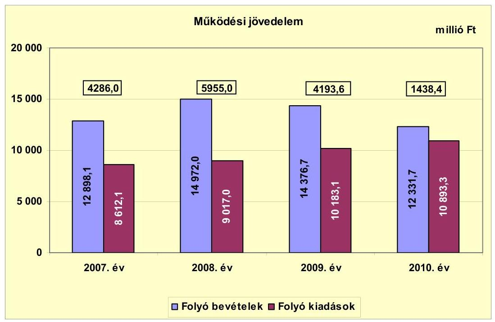

Az Önkormányzat folyó költségvetésének egyenlege ${ }^{15}$ (működési jövedelem) 2007-2010 között minden évben működési forrástöbbletet, összességében 15873,0 millió Ft megtakarítást mutatott, mely forrásul szolgálhatott a fejlesztések finanszírozásához, valamint az Önkormányzat fennálló tőketörlesztési kötelezettségeinek teljesítéséhez. Összege a 2007-2009 közötti időszak 4811,5 millió Ft-os átlagáról a 2010. évre 3373,1 millió Ft-tal, 70,1\%-kal esett vissza, ami az Önkormányzat működése szempontjából a későbbiekben kockázatot jelenthet. A pénzügyi egyensúly hosszú távú megőrzésére az Önkormányzatnak fel kell készülnie. A működési jövedelem alakulását a folyó kiadások egyenletes növekedése mellett a folyó bevételek összegének ingadozása határozta meg.

A folyó kiadások a 2010. évben 1622,6 millió Ft-tal, 17,5\%-kal haladták meg az előző három év 9270,7 millió Ft-os átlagos összegét. A 2010. évben a 20072009 közötti időszakhoz viszonyítva 1192,3 millió Ft-tal, 14,8\%-kal nagyobb összeget fordítottak működési, 524,7 millió Ft-tal, 62,7\%-kal transzferkiadásokra. A kamatkiadások összege a 2010. évre az előző három év 228,2 millió Ft-os átlagáról 115,8 millió Ft-tal, közel a felére mérséklődött, a tőketörlesztés következtében.

A folyó bevételeknél a 2008. és a 2009. évi kiugróan magas összegben a helyi adókból, pótlékokból befolyt bevétel növekedése és az áfa bevétel (fordított áfa) megjelenése játszott meghatározó szerepet. A helyi adókból és pótlékokból

[^0]
[^0]:    ${ }^{15}$ Az Önkormányzat adatszolgáltatása szerint a költségvetési támogatásból a 2007. évben 246,6 millió Ft, a 2008. évben 259,5 millió Ft, a 2009. évben 234,8 millió Ft, a 2010. évben 35,1 millió Ft felhalmozási célú támogatás volt.

---

származó forrás a 2010. évben 8067,2 millió Ft-ot tett ki, az előző három év átlagáról 1763,1 millió Ft-tal, 17,9\%-kal esett vissza. A költségvetési támogatás és az szja 2010-ben 1479,3 millió Ft összegű bevételt jelentett, az előző három év átlagánál 227,5 millió Ft-tal, 13,3\%-kal kevesebbet. A 2007-2010 közötti időszakban a folyó bevételek több mint $90 \%$-át a helyi adók, pótlékok (37 558,0 millió Ft, 68,8\%), a költségvetési támogatás (6993,0 millió Ft, 12,8\%) és az egyéb saját bevétel ( 6027,1 millió Ft, 11,0\%) jelentette.

A helyi adókból, pótlékokból, bírságokból származó bevétel a 2007. évben a folyó bevételek $75,5 \%$-át ( 9740,4 millió Ft), a 2008. évben $68,7 \%$-át (10 288,2 millió Ft), a 2009. évben 66,0\%-át (9490,2 millió Ft), a 2010. évben $65,5 \%$-át ( 8073,1 millió Ft) tette ki.

A nettó működési jövedelem (pénzügyi kapacitás) alakulását az alábbi ábra mutatja be:
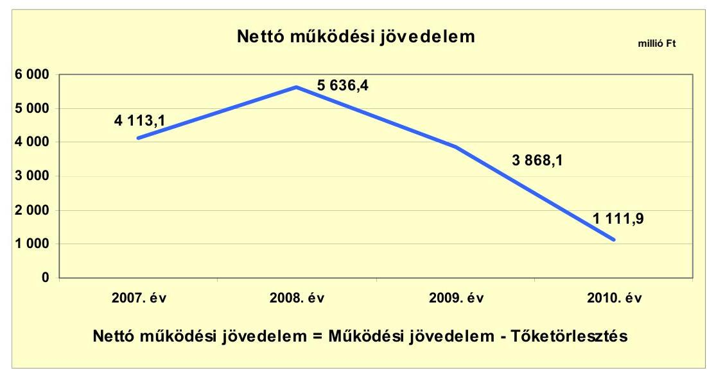

A nettó működési jövedelem (pénzügyi kapacitás) a folyó költségvetési pozíció (működési jövedelem) mellett az adott költségvetési év adósságtörlesztésének hatását is tükrözi. Pozitív egyenlege azt jelenti, hogy a működési jövedelem meghaladta az adósságszolgálat összegét. A 2008. évi emelkedésben, majd a 2009. évtől kezdődően a visszaesésben a folyó bevételek változása, ezen belül a helyi iparűzési adóbevétel összegének ingadozása játszott meghatározó szerepet. Helyi iparűzési adóból az Önkormányzat a 2007. évben 8730,1 millió Ft, a 2008. évben 9229,0 millió Ft, a 2009. évben 8396,7 millió Ft, a 2010. évben 6934,9 millió Ft bevételt realizált. A tőketörlesztés összege a vizsgált időszakban növekedést mutatott, de az Önkormányzat költségvetéséhez mérten csekély arányt képviselt. A 2007-2010 közötti időszakban összesen 1143,5 millió Ft-ot jelentett, a működési jövedelem (15 873,0 millió Ft) 7,2\%-át.

---

A felhalmozási költségvetés bevételeit, kiadásait és egyenlegét az alábbi ábra szemlélteti:
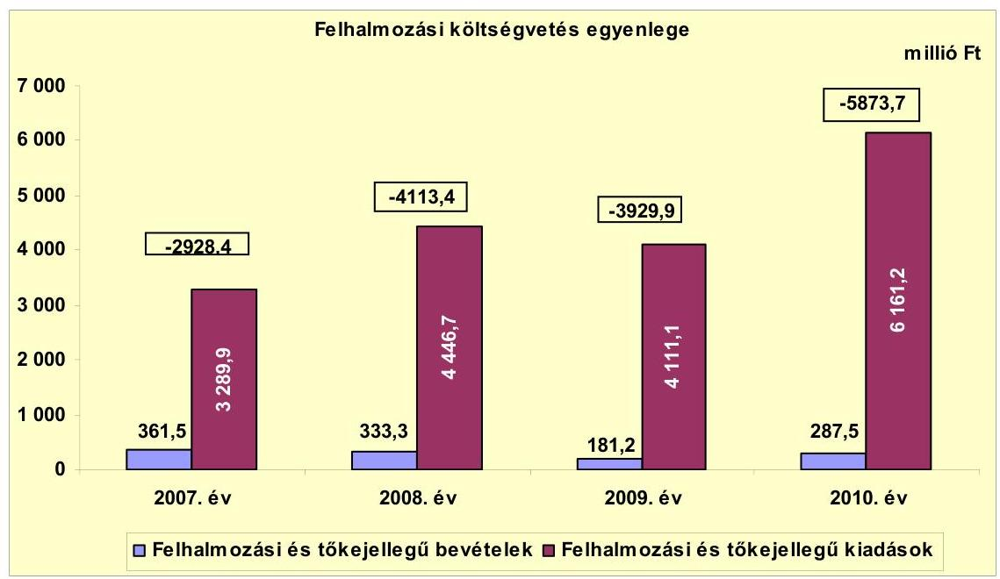

A vizsgált időszakban a felhalmozási kiadásoknak mindössze 6,5\%-át, 1163,5 millió Ft-ot fedezett felhalmozási bevétel. A 2007 és 2010 között képződött 16845,4 millió Ft felhalmozási forráshiány 87,4\%-át (14 729,5 millió Ft) a nettó működési jövedelemből finanszírozták. A kiadások további részét 1575,9 millió Ft-ot ( $9,4 \%$ ) hitelfelvétellel, 292,1 millió Ft-ot (1,7\%) értékpapír (államkötvény 72,4 millió Ft, kincstárjegy 31,4 millió Ft) értékesítésből származó bevétellel, a fennmaradó 247,9 millió Ft-ot az előző évek pénzmaradványának felhasználásával biztosították. A részletes adatokat a jelentés 3/a. és 3/b. számú mellékletei tartalmazzák.

A létrehozott vagyontárgyak, eszközök miatt emelkedik a működési kiadási szint és a későbbiekben megnövekedhet a felújítási szükséglet is, ami a nettó működési jövedelem visszaesése és a felhalmozási bevételek alacsony szintje miatt a későbbiekben felhalmozási kockázatot jelenthet.

Az Önkormányzat CLF módszer szerinti teljes finanszírozási igénye ${ }^{16}$ a 2009. évben -61,8 millió Ft, 2010-ben -4761,8 millió Ft volt. A finanszírozási többlet 2007-ben 1184,7 millió Ft-ot, 2008-ban 1523,0 millió Ft-ot tett ki. Az ellenőrzött időszak egészét nézve a teljes finanszírozási igény -2015,9 millió Ft volt. Ennek fedezetét az előző évek pénzmaradványa, hitelfelvétel és értékpapír (államkötvény 72,4 millió Ft, kincstárjegy 31,4 millió Ft összegben) értékesítés biztosította.

[^0]
[^0]:    ${ }^{16}$ A teljes finanszírozási igény a nettó működési jövedelem és a felhalmozási költségvetés egyenlegének összege.

---

Az Önkormányzat finanszírozási műveleteinek egyenlegét a következő ábra szemlélteti:
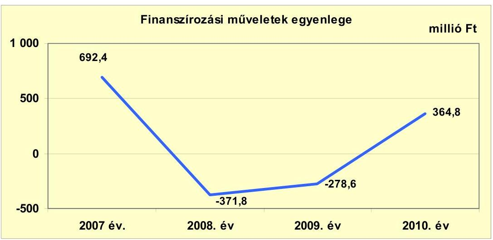

A finanszírozási műveletek egyenlege a 2007. és a 2010. években a hitelfelvétel ( 700,0 millió Ft, 875,9 millió Ft) következtében pozitív, a 2008-2009. években a hiteltörlesztés ( 318,6 millió Ft, és 325,5 millió Ft összegben) és az értékpapír értékesítés (államkötvény 72,4 millió Ft, kincstárjegy 31,4 millió Ft összegben) következtében negatív lett.

A finanszírozási célú műveleteket a jelentés 2. számú mellékletének 4.1.-4.8. pontjai részletezik.

Az Önkormányzat a 2007-2010. évi zárszámadási rendeleteiben meghatározta a felhalmozási, illetve működési bevételek és kiadások főösszegét ${ }^{17}$, amelyet a jelentés 1. számú melléklete szemléltet. Az Önkormányzat a 2007. évre 5552,6 millió Ft, a 2008. évre 5555,5 millió Ft, a 2009. évre 6296,8 millió Ft, a 2010. évre 1728,0 millió Ft többletet mutatott ki. Ez a CLF módszer alapján számított működési jövedelem és felhalmozási költségvetés egyenlegét minden évben meghaladta, alapvetően az igénybevett pénzmaradvány hatására.

[^0]
[^0]:    ${ }^{17}$ Nincs kötelező előírás a működési és felhalmozási többlet, hiány megállapításának módjára.

---

Az Önkormányzat kamatbevételeinek és kamatkiadásainak alakulását a következő ábra szemlélteti:
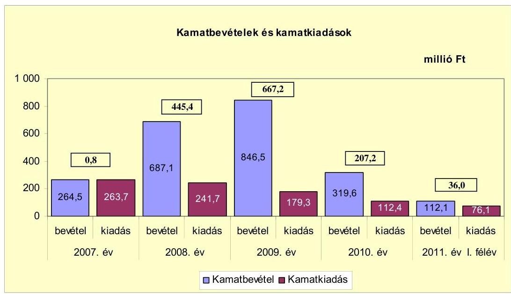

Az Önkormányzat a kamatbevételek és kamatkiadások egyenlegeként a 20072011. év I. félév időszakában 1356,6 millió Ft többletforrást realizált, ami kedvezően hatott az Önkormányzat pénzügyi helyzetére. A 2008. és a 2009. évi kiugróan magas összegű kamatbevétel elérését az tette lehetővé, hogy a 20072009. évi működési megtakarításból finanszírozott felhalmozási feladatok kiadásainak egy része a 2010. évben jelentkezett. A kiadások felmerüléséig az Önkormányzatnak lehetősége volt az átmenetileg szabad pénzeszközök lekötésére. Az Önkormányzat információszolgáltatása alapján a befolyó bevételekből (működési, fejlesztési) a likviditási terv figyelembe vételével történik az átmenetileg szabad pénzeszközök lekötése, a beruházások időbeli eltolódásából származó kamat összege külön nem számszerűsíthető.

---

# 2.2. Az Önkormányzat bevételeinek változása 

A folyó bevételek alakulását az alábbi diagram mutatja be:
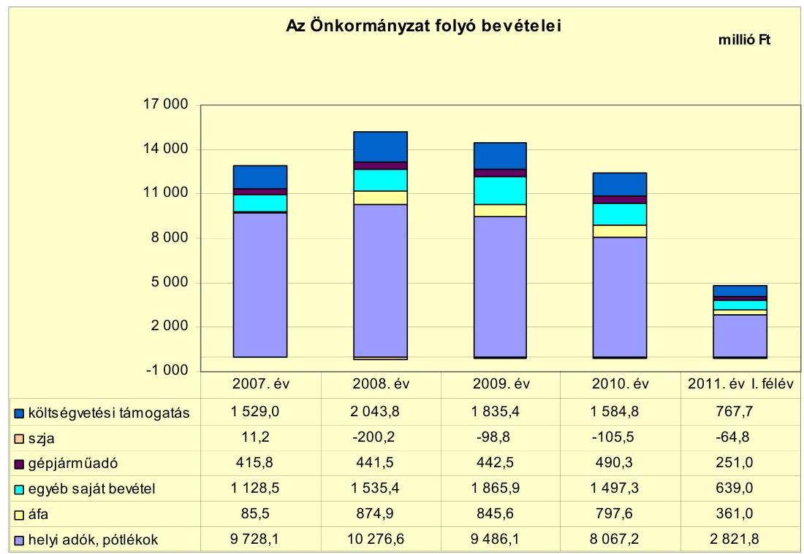

Az Önkormányzat folyó bevétele a 2007. évben 12 898,1 millió Ft, a 2008. évben 14 972,0 millió Ft, a 2009. évben 14 376,7 millió Ft, a 2010. évben 12 331,7 millió Ft, a 2011. év I. félévében 4775,7 millió Ft volt. A 2008. és a 2009. évi kiugróan magas bevételében a helyi adókból, pótlékokból befolyt bevétel növekedése és az áfa bevétel (fordított áfa) megjelenése játszott meghatározó szerepet.

A költségvetési támogatás és az szja bevétel együttes összege a 2007. évről a 2008. évre 303,3 millió Ft-tal (19,7\%-kal) emelkedett. Az Önkormányzat a 2008. évben - a 2007. évi 2,8 millió Ft-tal szemben - 164,6 millió Ft egyéb központi támogatásban részesült. Az szja helyben maradó része 68,8 millió Ft-tal emelkedett. A jövedelemkülönbség mérséklés címen az elvonás összege 59,4 millió Ft-tal csökkent, mert a támogató szolgálat 2008. január 1-jétől a Kistérségi társulásnak történt átadása folytán csökkent a beszámítás (elvonás) alapját képező normatív hozzájárulás összege, valamint 2008. évtől kezdődően a körzeti igazgatási feladatokhoz kapcsolódó normatív hozzájárulást jogszabályi változás miatt nem érintette az elvonás.

Az Önkormányzat a 2008. évi egyéb központi támogatást az alábbi feladatokra kapta:

- 2007. évi 13. havi illetmény 2008. évi részlete: 100,9 millió Ft;
- kereset kiegészítés: 41,1 millió Ft;
- köztisztviselők felmentéséhez kapcsolódó kifizetések: 22,6 millió Ft.

---

A vizsgált időszakban az Önkormányzatnak a helyi adók közül az iparűzési adóból, a telekadóból és az építményadóból származott bevétele. A helyi adókból, pótlékokból és bírságokból származó bevételek aránya 2007-ről 2010-re 10,0 százalékponttal csökkent, 2010-ben 65,4\%-ot tett ki a folyó bevételekből. A pótlékkal, bírsággal növelt helyi adó bevétel a 2007. évi 9728,1 millió Ft-ról a 2010. évre 8067,2 millió Ft-ra (1660,9 millió Ft-tal, 17,1\%-kal) csökkent. A 2007-2010 időszakban a helyi adó bevételek 89,3\%-a, 33 290,7 millió Ft iparűzési adóból, 8,9\%-a, 3302,0 millió Ft építményadóból, $1,8 \%$-a, 664,4 millió Ft telekadóból keletkezett.

A helyi iparűzési adó mértéke - a Helyi adó tv. szerinti 2,0\%-os maximális mértéken belül - 2011. január 1-jétől a korábbi 1,8\%-ról 1,9\%-ra módosult. A befolyt adó összege a 2007. évről a 2008. évre az adóalanyok számának bővülése folytán 498,9 millió Ft-tal (5,7\%) 9229,0 millió Ft-ra emelkedett. A 2008. évről a 2009. évre 832,3 millió Ft-tal, a 2009. évről a 2010. évre 1461,8 millió Ft-tal, 6932,5 millió Ft-ra csökkent. 2009. június 1-jétől az egyik legnagyobb adózó áthelyezte székhelyét egy másik településre. A gazdasági válság miatt a vállalkozások megrendelései visszaestek, árbevételük és a helyi iparűzési adó alapjuk csökkent.

A vezetékes távközlési tevékenységet végző vállalkozások adóalap megosztásának 2011. január 1-jétől történt változása miatt további közel 250,0 millió Ft évi bevételkiesés várható.

A helyi iparűzési adóbevétel összegének az egyik legnagyobb adózó elköltözése miatti tartós csökkenése az Önkormányzat működése szempontjából a későbbiekben kockázatot jelenthet.

A telekadó mértéke $170 \mathrm{Ft} / \mathrm{m}^{2}$ volt, mely a vizsgált időszakban nem változott. A befolyt adó összege a 2007-2009. évi átlagos 157,4 millió Ft-tal szemben a 2010. évben 192,1 millió Ft-ot tett ki.

Az építményadó esetében az áttekintett időszakban hat kategóriát alkalmaztak, az adó mértékét több ízben is (2007., 2009. és 2011. január 1-jei hatállyal) emelték. A 2010. évben a 2007-2009. évi átlagos 810,2 millió Ft összegnél 61,2 millió Ft-tal több bevételt, 871,4 millió Ft-ot realizáltak.

A helyi adókkal kapcsolatos pótlékokból, bírságokból származó bevétel összege a 2007. évben 92,0 millió Ft volt. A 2007. évtől kezdődően a korábbi években alkalmazott többszöri felszólítás helyett, a bevallási határidőt követő 30 napos türelmi idő leteltével mulasztási bírság kiszabására került sor a kötelezettségüket nem teljesítő vállalkozások terhére. Ennek következtében javult az adózási fegyelem.

Az Önkormányzatnak a tulajdonosi részesedése után a vizsgált időszakban 32,2 millió Ft osztalékbevétele származott. A 2007-2011. év I. félév időszakában osztalékról nem mondtak le.

Az Önkormányzat felhalmozási bevételei az alábbiak szerint alakultak:

---

| Megnevezés | 2007. év | 2008. év | 2009. év | 2010. év | 2011. év   I. félév |
| :-- | --: | --: | --: | --: | --: |
| Tárgyi eszköz értékesítés | 60,1 | 77,2 | 35,7 | 4,8 | 14,9 |
| Egyéb saját tőkebevétel | 131,6 | 98,7 | 58,6 | 67,0 | 22,2 |
| Államháztartáson belülről   kapott támogatás | 12,3 | 19,8 | 23,7 | 148,8 | 11,3 |
| Államháztartáson kívülről   kapott támogatás | 157,5 | 137,6 | 63,2 | 66,9 | 30,0 |
| Összes felhalmozási bevétel | 361,5 | 333,3 | 181,2 | 287,5 | 78,4 |

Az egyéb saját tőkebevétel folyamatos csökkenését az önkormányzati lakások értékesítéséből, valamint a kölcsönök visszatérüléséből származó források mérséklődése idézte elő. Az államháztartáson belülről kapott támogatás 2010. évi összegében meghatározó szerepet játszott, hogy az Önkormányzat az általa fenntartott Pitypang Bölcsőde fejlesztéséhez és bővítéséhez 128,0 millió Ft, a Kamaraerdei Óvoda energiaigénye egy részének napelemekkel történő biztosítására 7,5 millió Ft EU-s támogatásban részesült. Az államháztartáson kívülről kapott támogatás címen a 2007. és 2008. évben a közműfejlesztési hozzájárulások magasabbak voltak, több volt az utólagos csatornarákötés, út- és közvilágítás fejlesztésre jelentősebb összegeket kaptak, továbbá 2007-ben egy helyi vállalkozástól 50,0 millió Ft támogatásban részesültek a 100 férőhelyes óvoda építéséhez.

# 2.3. Az Önkormányzat folyó és felhalmozási célú kiadásainak változása 

Az Önkormányzat folyó kiadása 2007-2011. június 30. között az alábbiak szerint alakult:

|  |  |  |  |  | millió Ft |
| :-- | --: | --: | --: | --: | --: |
| Megnevezés | 2007. év | 2008. év | 2009. év | 2010. év | 2011. év   I. félév |
| Folyó kiadások | 8612,1 | 9017,0 | 10183,1 | 10893,3 | 4507,2 |
| Működési kiadások (kamatkiadás nélkül) | 7406,1 | 7817,7 | 8885,5 | 9228,7 | 3743,2 |
| Államháztartáson belülre átadott   pénzeszközök | 0,0 | 62,5 | 92,1 | 90,4 | 33,6 |
| Transzferkiadások | 750,6 | 807,9 | 952,4 | 1361,7 | 595,5 |
| -ebből: vállalkozásoknak | 126,3 | 144,3 | 151,1 | 421,3 | 156,4 |
| EU-nak, illetve külföldre | 0,0 | 0,0 | 2,8 | 0,5 | 0,0 |
| magánszemélyeknek | 323,2 | 344,8 | 397,2 | 474,5 | 186,6 |
| nonprofit szervezeteknek | 301,1 | 318,8 | 401,3 | 465,4 | 252,5 |
| Kamatkiadások | 263,7 | 241,7 | 179,3 | 112,4 | 76,1 |
| Előző évi pénzmaradvány átadás | 191,7 | 87,2 | 73,8 | 100,1 | 58,8 |

A folyó kiadások az előző három év átlagáról (9270,7 millió Ft) a 2010. évre 1622,6 millió Ft-tal (17,5\%) bővültek. A működési kiadások (kamatkiadások nélkül) a 2007-2009 közötti időszak évi átlagos értékéről (8036,4 millió Ft) a 2010. évre 1192,3 millió Ft-tal (14,8\%) emelkedtek. Ebből 490,9 millió Ft-ot tett ki az intézmények, 383,4 millió Ft-ot az igazgatási feladatok, 318,0 millió Ft-ot a Polgármesteri hivatalban ellátott feladatok működési kiadási többlete. Az államháztartáson belülre átadott pénzeszközök összege a 2007-2009. évi átlagos

---

51,5 millió Ft-ról 2010-re 90,4 millió Ft-ra emelkedett a Kistérségi társulásnak adott támogatás miatt. A transzferkiadások 2010. évi összege 1361,7 millió Ft volt, az előző három év átlagát ( 837,0 millió Ft) 524,7 millió Ft-tal haladta meg. Növekedését a kiszervezett és a civil szervezetek által ellátott feladatokhoz adott támogatások összegének változása és a 2010-ben átadott uszoda működési költségeihez való hozzájárulás idézte elő. Kamatkiadásokra a 2010. évben a 2007-2009 időszak átlagos összegének (228,2 millió Ft) kevesebb, mint a felét, 112,4 millió Ft-ot fordítottak. Az előző évi pénzmaradvány átadás a 2010. évben 100,1 millió Ft kiadást jelentett, amely az előző három év átlagánál (117,6 millió Ft) 17,5 millió Ft-tal (14,9\%) kevesebb.

A folyó kiadások folyamatos emelkedése a folyó bevételek visszaesése miatt az Önkormányzat működése szempontjából a későbbiekben működési kockázatot jelenthet.

Az egyes kiemelt működési előirányzatok kiadásainak alakulását az alábbi táblázat mutatja be:

| Megnevezés | 2007. év | 2008. év | 2009. év | 2010. év | 2011. év   I. félév |
| :-- | --: | --: | --: | --: | --: |
| Személyi juttatások | 3465,6 | 3612,6 | 3878,0 | 3949,8 | 1580,2 |
| Munkaadót terhelő járulékok | 1060,4 | 1104,6 | 1095,5 | 943,4 | 437,9 |
| Dologi kiadások | 2806,2 | 2987,5 | 3816,6 | 4096,5 | 1634,1 |
| Egyéb folyó kiadások | 337,6 | 355,4 | 276,5 | 351,8 | 167,2 |

Személyi juttatásokra a 2010. évben a 2007-2009. időszak átlagánál ( 3652,1 millió Ft) 297,7 millió Ft-tal nagyobb összeget fordítottak. Annak ellenére, hogy a költségvetési szervek és a telephelyek száma kettővel csökkent, az éves átlagos statisztikai létszám a 2010. évben az előző három év átlagához ( 948 fő) képest 90 fővel több, 1038 fő volt. Rendszeres személyi juttatásokra a 2010. évben a 2007-2009. évi átlagos összegnél (2199,2 millió Ft) 20,1 millió Ft-tal kevesebb kiadást teljesítettek. A 2009. évtől a 13. havi illetmény már nem jelentkezett kiadásként, azonban nőtt a statisztikai átlaglétszám és a hatályos jogszabályok szerinti - a kötelező és egyéb feltételtől függő pótlékokat is magukba foglaló - besorolási bérek is emelkedtek. Helyettesítés és túlóra díjazására 2010-ben 65,0 millió Ft-ot fizettek ki, az előző három év átlagánál (54,7 millió Ft) 10,3 millió Ft-tal többet. A 2009. évtől a Képviselő-testület hagyta jóvá az oktatási-nevelési intézményeknél a tantárgyfelosztás miatt jelentkező túlórával ellátott státuszok számát. A feladat túlmunkával történő ellátása kedvezően hatott az Önkormányzat pénzügyi helyzetére. Az egyéb munkavégzéshez kapcsolódó juttatások 2007-2009 évi átlagos összege 185,1 millió Ft volt, 2010-ben több mint a két és félszerese ( 480,9 millió Ft). Ennek az volt az oka, hogy a 2009. évtől egyes juttatások (önkormányzati kereset kiegészítés, egy havi külön juttatás) ezen a jogcímen kerültek elszámolásra. További növekedést eredményezett, hogy a 2010. évtől az adóbehajtási jutalékot és a céljutalmakat ezen a jogcímen mutatták ki. A személyi juttatások összegére ez nem volt hatással, mert csak jogcímek közötti átcsoportosításra került sor. Biztosítási díjakra (önkéntes nyugdíjpénztár, egészségbiztosítási pénztár) a 2010. évben a 20072009. évi átlagnak ( 74,1 millió Ft) több mint másfélszeresét, 117,9 millió Ft-ot fordítottak. A korábbi 300 ezer Ft/fő/év átlagos béren kívüli juttatással szemben a Képviselő-testület döntése alapján a közalkalmazottaknál a cafetéria keret a

---

2009. évben 400 ezer Ft/fő/év, a 2010. évben nettó 400 ezer Ft/fő/év volt. A cafetéria rendszer bevezetése lehetőséget teremtett az egyes juttatások közül történő választásra.

A dologi kiadások 2010. évi összege 893,1 millió Ft-tal (27,9\%) haladta meg az előző három év átlagát ( 3203,4 millió Ft). A vásárolt közszolgáltatások összege 485,8 millió Ft-tal emelkedett, melynek az volt az oka, hogy az Önkormányzat a 2009. évtől kezdődően a településgazdálkodási feladatokat ellátó kft. által végzett közszolgáltatásokra történt kifizetéseket - a jogszabályi előírásoknak megfelelően - ezen a címen, míg az előző években az egyéb üzemeltetési és fenntartási kiadások között szerepeltette. A kiszámlázott termékek és szolgáltatások áfa befizetése 554,1 millió Ft-tal emelkedett, a kiadások nettó összegének emelkedése, az áfa kulcs 2009 júliusától történt emelése, valamint a fordított áfa befizetési kötelezettség 2008 áprilisában történt bevezetése miatt. A szolgáltatási kiadások közül:

- A közmű szolgáltatások összege 51,6 millió Ft-tal növekedett. A szolgáltatások díjának emelkedése, valamint az újonnan épített Holdfény utcai Óvoda és 1. számú Általános iskola megnyitása többlet közmű kiadást jelentett.
- A tömegközlekedés területén 61,9 millió Ft többletkiadás keletkezett, mivel az uszoda és az 1. számú Általános iskola kiszolgálásához külön buszjáratokat indítottak.
- A hulladékgyűjtés és -kezelés területén 46,8 millió Ft többletkiadás keletkezett. Jelentősen emelkedett a szelektív hulladékgyűjtés és a zöldhulladék gyűjtés kiadása. Ezek a szolgáltatások az elmúlt években a város egész területén kiépültek és mindenki számára elérhetővé váltak.
- A köztisztasági szolgáltatásoknál 44,6 millió Ft volt a többlet. Itt szerepel a hóeltakarítás, síkosságmentesítés is, amelynél jelentős a növekedés, mivel sok az újonnan épült út, utca, amelyeket télen folyamatosan kezelni kell.
- A 2009. évtől a dologi kiadások között új feladatként jelent meg a városi uszoda üzemeltetése, amely a 2010. évben 53,3 millió Ft kiadást jelentett.
- Átlagon felüli mértékben növekedett a vásárolt élelmezés (15,9 millió Ft), valamint a továbbszámlázott szolgáltatás (40,2 millió Ft) címen teljesített kiadás összege.

Az egyéb folyó kiadások 2007-2009. évi átlagos összegét (323,2 millió Ft) a 2010. évi kifizetés ( 351,8 millió Ft) 28,6 millió Ft-tal ( $8,8 \%$ ) haladta meg. Az előző évi maradvány visszafizetése a 2010. évben az előző három év átlagának (6,6 millió Ft) több mint két és félszeresét, 16,8 millió Ft-ot jelentett. A munkáltató által fizetett szja összege a 2007-2009 időszak átlagával ( 28,7 millió Ft) szemben 2010-ben 49,2 millió Ft-tal (171,4\%) nagyobb összeget tett ki. A teljesített kamatkiadások a 2007-2009. évek átlagáról (228,2 millió Ft) a 2010. évre felére, 115,8 millió Ft-ra csökkentek.

---

A folyó és a felhalmozási kiadások alakulását az alábbi ábra szemlélteti:
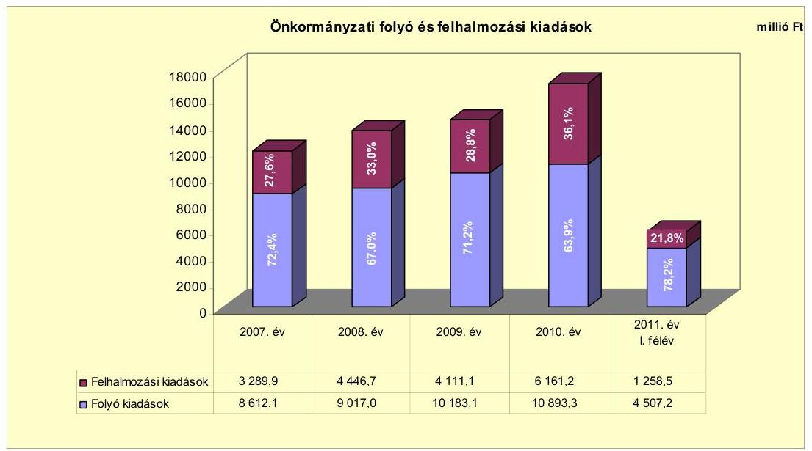

A folyó és a felhalmozási célú kiadások felhasználásának arányai a 2007. évről a 2010. évre a felhalmozási kiadások irányába tolódtak el. A 2007. évi $72,4 \%-27,6 \%$-os arány ( 8612,1 millió Ft - 3289,9 millió Ft) a 2010. évre $63,9 \%-36,1 \%$-ra ( $10893,3$ millió Ft - 6161,2 millió Ft) változott. A folyó kiadások évről évre emelkedtek, a felhalmozási kiadások évente eltérő ütemben jelentkeztek. Az Önkormányzat korábbi évekbeli folyó költségvetési többletéből finanszírozott felhalmozási kiadásainak egy része áthúzódott a 2010. évre.

Az Önkormányzat által 2007-2010 között megvalósított, 2010. december 31-éig befejezett felújítások (17) és beruházások (131) száma 148 volt. A teljes bekerülési költség 9178,1 millió Ft-ot tett ki, melynek 98,5\%-át ( 9033,7 millió Ft) saját forrásból finanszírozták. A kiadások további fedezetét $0,8 \%$-ban ( 77,5 millió Ft) hitel, $0,7 \%$-ban ( 66,9 millió Ft) hazai támogatás biztosította. ${ }^{18}$

Az Önkormányzatnál 2010. december 31-én hét felújítás és 45 beruházás volt folyamatban. A felújítások és beruházások várható bekerülési költsége 12065,0 millió Ft, ebből 2010. december 31-ével bezárólag 9511,5 millió Ft kiadást teljesítettek, amelyre saját forrásból 7915,2 millió Ft-ot ( $83,2 \%$ ), hitelből 1467,3 millió Ft-ot ( $15,4 \%$ ), EU-s támogatásból 129,0 millió Ft-ot ( $1,4 \%$ ) fordítottak. A 2010 utáni kötelezettségvállalások összege 2553,5 millió Ft volt, mely a várható teljes bekerülési költség $21,2 \%$-át teszi ki. Az EU-s támogatásból megvalósult fejlesztések előfinanszírozása likvidítási gondot nem okozott.

Az Önkormányzat a 2011. év I. félévében öt felújítást és három beruházást indított saját forrás terhére. A felújítások várható teljes bekerülési költsége 266,9 millió Ft, a beruházásoké 181,6 millió Ft. A tervezett forrás saját bevétel ( 352,8 millió Ft), valamint hazai és EU-s támogatás ( 95,7 millió Ft).

[^0]
[^0]:    ${ }^{18}$ A részletes adatokat a jelentés 3/a. számú melléklete tartalmazza.

---

Az Önkormányzat beadott, elbírálás alatti pályázati forrásból kettő projektet tervez megvalósítani. A tervezett összköltség 157,3 millió Ft, melynek 44,6\%-át (70,1 millió Ft) saját forrásból, $55,4 \%$-át ( 87,2 millió Ft) EU-s támogatásból tervezik finanszírozni. Ebből egy pályázatot a 2011. év I. félévében nyújtottak be, a Polgármesteri hivatal további akadálymentesítésére. A beruházás megvalósítása a helyszíni vizsgálat alkalmával folyamatban volt. Az akadálymentesítés várható bekerülési költsége 8,8 millió Ft. A tervek szerint 8,0 millió Ft-ot EU-s támogatásból, 0,8 millió Ft-ot saját bevételből fedeznek.

A 2007-2010 közötti időszakban az Önkormányzat három legmagasabb egyedi bekerülési költségű beruházása az alábbi volt:

- A 24 tantermes általános iskola $11042 \mathrm{~m}^{2}$ bruttó hasznos alapterülettel 2009. december hónapban készült el. A megvalósítás költsége 2 834,3 millió Ft volt, melyet az Önkormányzat teljes egészében saját forrásból finanszírozott. A tantermek mellett szaktantermeket és korszerű nyelvi és informatikai tantermeket is kialakítottak. A korábbi épületek nem feleltek meg az oktatási környezetre vonatkozó jelenlegi követelményeknek, gazdaságos felújításukra nem volt lehetőség. A tanulói létszám változása következtében felmerült igényeket ki tudták elégíteni, a 2010/2011-es, valamint
 a 2011/2012-es tanévben az épület kapacitása egy-egy többlet első osztály indítását tette lehetővé.
- A Holdfény utcai 100 férőhelyes óvoda $1323 \mathrm{~m}^{2}$ hasznos alapterülettel 2008. szeptember hónapban készült el. A megvalósítás költsége 406,7 millió Ft-ot tett ki, melyet az Önkormányzat teljes egészében saját forrásból finanszírozott.
- A Szervizút 2009. szeptember hónapban készült el. A megvalósítás 479,9 millió Ft kiadást jelentett, melyet az Önkormányzat teljes egészében saját forrásból finanszírozott. Az út a forgalmi terheléseket megosztva jelentősen javítja a városon belüli és a városon áthaladó közlekedést. A helyi tömegközlekedési járatok útvonala is ezen halad.

---

A gazdasági társaság részére átadott pénzeszközöket az alábbi ábra mutatja:
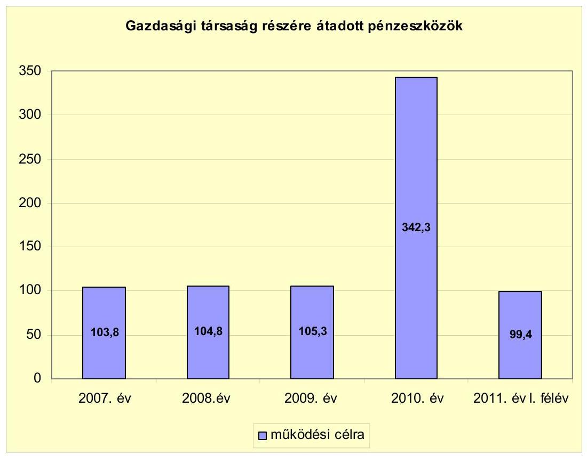

A gazdasági társaságok közül az ellenőrzött időszakban egy 100,0\% önkormányzati tulajdonosi részesedéssel rendelkező, a településgazdálkodási feladatokat ellátó, valamint az uszodát és a sportcsarnokot üzemeltető társaság kapott működési célra pénzeszközöket, összesen 755,6 millió Ft összegben. A pénzeszközátadás szerződés alapján történt, a szolgáltatásokat a társaság teljesítette. A 2010. évtől kezdődően a 2010-ben átadott uszoda fenntartásához átadott pénzeszköz növelte meg jelentősen a kiadásokat. Az Önkormányzat az uszoda és sportcsarnok üzemeltetésére 2015-ig kötött szerződést a társasággal. A társaságnak működési célra átadott pénzeszközök összege a 2007-2009. évi átlagos 104,6 millió Ft-ról 2010-re több mint háromszorosára (342,3 millió Ft-ra) emelkedett. Ez a nettó működési jövedelem visszaesése miatt az Önkormányzat szempontjából a későbbiekben kockázatot jelenthet.

# 3. Az ÖNKORMÁNYZAT KÖTELEZETTSÉGEI 

### 3.1. Az Önkormányzat pénzintézeti kötelezettségeinek változása

Az Önkormányzat rövid- és hosszú lejáratú kötelezettségeinek állománya 2006. év végi 6353,2 millió Ft-ról 2010. december 31-re 5743,4 millió Ft-ra, 2011. június 30-ra 6152,7 millió Ft-ra változott. A rövid- és hosszú lejáratú kötelezettségekből a pénzintézeti- és tőkepiaci kötelezettség 2006. december 31-én 3887,5 millió Ft, 2010. december 31-én 4996,9 millió Ft, 2011. június 30-án 5693,8 millió Ft volt. A növekedés összege a 2006. év végéről a 2010. évre

---

1109,4 millió Ft, a 2011. év június 30-ra 1806,3 millió Ft volt, amely hosszú lejáratú fejlesztési (beruházási) célú hitelek felvétele, valamint a devizában felvett hitel év végi értékelése miatt következett be.

A 2007-2011. év I. félév időszakában kötvénykibocsátásról nem döntött a Képviselő-testület. Az Önkormányzat a 2011. év I. félévét követően a helyszíni ellenőrzés befejezéséig kötvénykibocsátásról és hitelfelvételről szóló döntést nem készített elő.

Az Önkormányzat hitelállománya a 2007-2011. év I. félév közötti időszakban 13 hosszú lejáratú, fejlesztési célú hitelből tevődött össze, melyből hármat 2007. év előtt vett fel, hatot a víziközmű-társulásoktól ${ }^{19}$ vett át, melyek 2010. december 31-ei állománya 62,9 millió Ft. A 2007. előtt felvett hitelekből egy hitelt 2008. évben visszafizetett.

Az Önkormányzat mérlegében kimutatott, pénzintézeteknél fennálló kötelezettség-állományát a 2006-2011. év I. félév közötti időszakban az alábbi ábra szemlélteti:
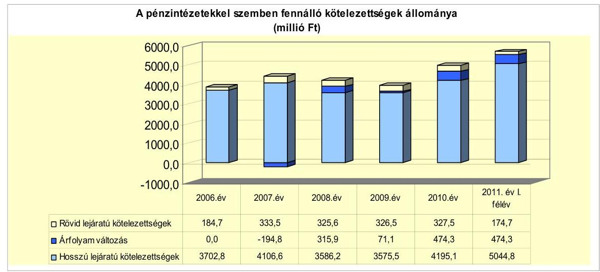

Az Önkormányzat a deviza alapú, a 2006. évben felvett beruházási hitelének év végi értékelését a - 2006. év kivételével - a 2007-2010. évek december 31-én elvégezte. Az év végi értékelés Áhsz. 5. § 7/d. pontjában foglaltaknak megfelelően, a Számv. tv. 60. § (2) bekezdésében előírtak szerint történt. A 2007. év december 31-én a devizaárfolyam csökkenésének megfelelően alacsonyabb, a 2008-2010. évek december 31-én az árfolyam növekedésének megfelelően magasabb lett a Ft-ban kifejezett, devizában fennálló követelésállomány (beruházási hitel).

Annak megítéléséről, hogy a devizában fennálló hitel vagy kötvény visszafizetése, illetve visszavásárlása az Önkormányzat számára forintban összességében

[^0]
[^0]:    ${ }^{19}$ A víziközmű-társulásoktól (kettő) átvállalt hitelek közül egyet a 2002., egyet a 2003. évben, négyet a 2006. évben kötöttek. A hitelek célja ivóvíz- és szennyvízcsatorna közművek építése volt. A beruházások befejezését, a víziközmű-társulások megszűnését követően az Önkormányzat a hiteleket átvállalta.

---

többletkiadást (árfolyamveszteség) vagy kiadási megtakarítást (árfolyamnyereség) eredményez, a futamidő végén, a teljes kötelezettség rendezését követően lehet képet alkotni. Mindaddig, amíg törlesztési kötelezettség nem áll fenn (türelmi idő, moratórium), a tőkére vonatkoztatva nem értelmezhető sem az árfolyamveszteség, sem az árfolyamnyereség. Ugyanakkor a számviteli szabályok meghatározzák, hogy az árfolyam különbözetet év végén a kötelezettségek vagy követelések között a könyvviteli mérlegben nyilván kell tartani, azonban árfolyam különbözet ebben az esetben ténylegesen nem képződött.

A devizában fennálló hitel esetében megkezdődött a tőketörlesztés, az eddigi 303,3 millió Ft-os tőkefizetés után az Önkormányzatnak 39,0 millió Ft árfolyamvesztesége keletkezett, ami a visszafizetett tőke 12,9\%-a volt.

Az Önkormányzat 2007-2009. évek időszakában új hosszú lejáratú hitelszerződést nem kötött. A 2006. évben rendelkezésére álló devizaalapú hitel (2302,9 millió Ft millió Ft) igénybe nem vett részét 700,0 millió Ft-ot a 2007. évben használták fel. A 2010. évtől mutatkozó felhalmozási forráshiánya finanszírozása érdekében négy hitelszerződéssel, 3100,0 millió Ft hosszú lejáratú, forint alapú hitel felvételére kötött szerződést, melyből 2010. évben 875,9 millió Ft-ot vett igénybe. A hosszú lejáratú adósságot keletkeztető kötelezettségvállalás során betartották az Ötv. előírását ${ }^{20}$. Nem lépték túl az adósságot keletkeztető kötelezettségvállalás felső határát. Az Önkormányzat pénzintézeti kötelezettségvállalására minden esetben a Képviselő-testület döntését követően került sor, az előterjesztésekben bemutatták a kamatkockázatot. A 2006. évben a devizaalapú kötelezettségvállalás előtt az árfolyamkockázat képviselő-testületi bemutatása nem történt meg. A pénzintézeti versenyeztetés (közbeszerzés) a hitelek felvétele előtt - az átvállalt víziközmű hitelek kivételével - megtörtént. A számlavezető bank a 2007-2011. év I. félév időszakában nem változott. A hosszú lejáratú hitelek esetében hét hitelnél azonos volt a számlavezető és a finanszírozó pénzintézet. A további hitelek esetében három különböző pénzintézet ajánlatát fogadták el, kötöttek velük szerződést.

[^0]
[^0]:    ${ }^{20}$ 2012. január 1-jétől a Stabilitási tv. 10. § (3) bekezdés

---

Az Önkormányzat 2011. június 30-án HUF-ban fennálló adósságot keletkeztető kötelezettségvállalásai az alábbiak:

| Megnevezés | Szerződéskötés időpontja | Szerződött összeg millió Ft-ban | Kamat (referencia kamat+ kamatfelár) | Felhasználás célja: |
| :--: | :--: | :--: | :--: | :--: |
| Hosszú lejáratú hitel | 2004.05.20 | 1750,0 | 1 havi BUBOR $+0,3 \%$ | Városháza építése |
| Hosszú lejáratú hitel | 2010.09.30 | 138,0 | 3 havi   EURIBOR+RKO1 $+0,34 \%$ | Ivóvíz javítással, szennyvíz tisztítással, csapadékvíz elvezetéssel kapcsolatos beruházások |
| Hosszú lejáratú hitel | 2010.09.30 | 1787,0 | 3 havi   EURIBOR+RKO2 $+0,34 \%$ | Közútépítés, és egyéb infrastrukturális beruházások |
| Hosszú lejáratú hitel | 2010.09.30 | 475,0 | 3 havi   EURIBOR+RKO1 $+0,34 \%$ | Intézmények felújítása, akadálymentesítés |
| Hosszú lejáratú hitel | 2010.09.30 | 700,0 | 3 havi EURIBOR $+1,34 \%$ | Panelprogram megvalósítása |
| Hosszú lejáratú   víziközmű-hitel | 2003.11.18 | 132,5 | 3 havi BUBORkamattámogatás | Szennyvíz csatorna kiépítés |
| Hosszú lejáratú   víziközmű-hitel | 2002.10.15 | 27,9 | prima rate-70\%   kamatkedvezmény | Szennyvíz csatorna kiépítés |
| Hosszú lejáratú   víziközmű-hitel | 2006.10.19 | 7,4 | 1 havi BUBORKamattámogatás | Szennyvíz csatorna kiépítés |
| Hosszú lejáratú   víziközmű-hitel | 2006.10.19 | 9,03 | 1 havi BUBOR-0,25\%kamattámogatás | Szennyvíz csatorna kiépítés |
| Hosszú lejáratú   víziközmű-hitel | 2006.10.19 | 5,4 | 1 havi BUBOR+025\%$70 \%$ kamattámogatás | Szennyvíz csatorna kiépítés |
| Hosszú lejáratú   víziközmű-hitel | 2006.10.19 | 7,5 | 1 havi BUBOR-8,08\% kamattámogatás $+0,25 \%$ kamatfelár | Szennyvíz csatorna kiépítés |

A pénzintézeti kötelezettségek közül, valamennyi változó kamatozású volt. Egy hitelt teljes egészében felhasználtak, egyből még nem történt meg az igénybevétel ( 700,0 millió Ft-os), három esetében még nem vették igénybe a teljes keretet, hat az Önkormányzat által átvállalt víziközmű hitel volt. A felvett hitelek a felhalmozási bevételeket növelték. A hiteleket a városháza építéséhez, az ivóvíz-hálózat-korszerűsítéssel, a szennyvíztisztítással, a csapadékvíz-elvezetéssel kapcsolatos beruházásokhoz, közútépítéshez és egyéb infrastrukturális beruházásokhoz használták fel, illetve fogják felhasználni. Folyamatban volt az intézmények felújítása, az akadálymentesítések elvégzése, valamint a lakossági panelprogram beruházás.

A 2010. évi négy hitelszerződést a „Sikeres Magyarországért" hitelprogram keretén belül kötötték, amelyek összege 3100,0 millió Ft volt. A 2010. év december 31-ig 875,9 millió Ft-ot, a 2011. év I. félévében 849,8 millió Ft hitelt vettek igénybe és használtak fel. A 2010. évben kötött, 3100,0 millió forint összegű hitelszerződésekből három hitel esetében a kamatfizetés 2010 decemberében, egy hitel esetében 2011. év II. félévében kezdődött meg.

- A Budaörs területén megvalósuló ivóvízminőség javítással, szennyvízelvezetéssel, illetve szennyvíztisztítással, valamint csapadékvíz elvezetéssel kapcsolatos önkormányzati beruházási célra felvett 138,0 millió Ft-os hitelből 2010. december 31-ig 50,3 millió Ft-ot használtak fel. A 2011. év I. félévében a hitelből 60,2 millió Ft-ot használtak fel. A kamatfizetés 2010. decembertől kezdődött, a hitel tőketörlesztése 2013. szeptembertől fog megkezdődni. A tőketörlesztés összege 8,0 millió Ft/év lesz.
- A Budaörs területén közútépítéssel, illetve egyéb infrastrukturális fejlesztéssel kapcsolatos önkormányzati beruházási cél megvalósításához felvett 1787,0 millió Ft-os hitelből 404,1 millió Ft-ot használtak fel 2010. december 31-ig. A 2011. év I. félévében a hitelből 788,2 millió Ft-ot használtak fel. A

---

kamatfizetés 2010. decembertől kezdődött, a hitel tőketörlesztése 2013. szeptembertől fog megkezdődni. A tőketörlesztés összege 103,6 millió Ft/év lesz.

- Az Önkormányzat intézményeinek felújításához, akadálymentesítésének megoldását célzó beruházási célra felvett 475,0 millió Ft-os hitelből 421,5 millió Ft-ot használtak fel 2010. december 31-ig. A 2011. év I. félévében a hitelből 1,4 millió Ft-ot használtak fel. A kamatfizetés 2010. decembertől kezdődött, a hitel tőketörlesztése 2013. szeptembertől fog megkezdődni. A tőketörlesztés összege 27,5 millió Ft/év lesz.
- A 700,0 millió Ft-os, „Panelprogram" megvalósítási hitelt még nem vették igénybe. A hitel kamatfizetése 2011. II. félévétől, a tőketörlesztés 2013. szeptembertől lesz esedékes. A tőketörlesztés összege 57,1 millió Ft/év lesz.

Az Önkormányzat 2011. június 30-án devizában fennálló adósságot keletkeztető kötelezettségvállalásai az alábbiak voltak:

| Megnevezés | Szerződéskötés   időpontja | Összeg   (ezer EUR/CHF) | Igénybevételi árfolyam | Kamat (referencia kamat+   kamatfelár) | Felhasználás célja: |
| :-- | :--: | :--: | :--: | :--: | :--: |
| Hosszú lejáratú hitel   EUR-ban igénybevett   része | 2006.02.24 | 2222,7 | 250,9 Ft/EUR | 1 havi EURIBOR+0,133\% | 2006. évi költségvetésben szereplő   beruházások, uszoda építés |
| Hosszú lejáratú hitel   CHF-ben igénybevett   része | 2006.02.24 | 11429,4 | 152,7 Ft/CHF | 1 havi LIBOR+0,183\% | 2006. évi költségvetésben szereplő   beruházások, uszoda építés |

A 2006. évben 20 év futamidőre felvett 2302,9 millió Ft, 2222,7 ezer EUR és 11429,4 ezer CHF értékű hitel a felhalmozási bevételeket növelte. A hitel felvételének a célja a 2006. évi költségvetésben szerepeltetett beruházásokon túl az uszodaépítés beruházásának finanszírozása volt. A hitel egyik része EUR alapú, másik része CHF alapú volt. Az Önkormányzatnál a hitel főkönyvi nyilvántartása forintban történik.

A 2006. évben kötött devizaalapú szerződés hitelösszegének (2302,9 millió Ft) igénybe nem vett részét 700,0 millió Ft-ot a
 2007. évben használták fel. A hitelt az Önkormányzat fejlesztési céljainak megfelelően a 2006-2007. évi beruházások finanszírozására, valamint a 2007. évben az uszoda építésére fordította (700,0 millió Ft).

A hosszú lejáratú (20 év lejáratra kötött) hitelszerződést 2006. február 24-én írták alá. A hitel a szerződésnek megfelelően deviza alapú volt, amelynek egy részét az Önkormányzat EUR-ban (581,3 millió Ft, 2247,8 ezer EUR), másik részét CHF-ben (1918,7 millió Ft, 11 285,3 ezer CHF) vette igénybe. Az Önkormányzat a hitelszerződés módosításának megfelelően a hitelt 2006. március 20-án visszafizette, majd ugyanazon a napon devizában újra felvette. A pénzügyi művelet eredményeképpen 197,1 millió Ft árfolyamnyereség keletkezett, a hitel összege 2500,0 millió Ft-ról - 2302,9 millió Ft-ra (2222,7 ezer EUR, 11 429,4 ezer CHF) változott.

A forint CHF-hez és EUR-hoz viszonyított árfolyamváltozása, valamint a változó kamatmérték miatt az Önkormányzat számára a devizában fennálló hosszú lejáratú hitelből származó pénzintézeti kötelezettség teljesítési kockázatot okozhat.

A 2004. évi forintban felvett hitel esetében a tőketörlesztés 2007 decemberében 170,8 millió Ft/év összeggel, a 2006. évben felvett, devizában fennálló hitel tőketörlesztése 2008 decemberében 134,8 millió Ft/év összegben megkezdődött.

---

Az Önkormányzat a 2010. évben kötött hitelszerződéseiből 2011. év június 30-ig 1725,7 millió Ft hitelt vett igénybe.

A 2007-2011. év I. félév időszakában a forintban fennálló pénzintézeti kötelezettségeiből 925,6 millió, a devizában fennálló kötelezettségei közül 370,7 millió Ft, 1209,7 ezer EUR és 148,8 ezer CHF tőketörlesztést teljesített. Az összes pénzintézeti kötelezettség (forint és deviza alapú) után a 2007-2011. év I. félév időszakában megfizetett kamat 873,2 millió Ft volt. A forintra átszámított összes tőketörlesztés 1296,3 millió Ft volt. A megfizetett tőketörlesztések és kamatok összegei nem voltak jelentős hatással az Önkormányzat pénzügyi egyensúlyára, mivel azok a teljesített költségvetési bevételek töredékét jelentették.

Az Önkormányzat a 2007-2011. év I. félév időszakában folyószámlahitelkerettel rendelkezett. A fennálló folyószámlahitel-keret összege a 2007. év január 1-jén 300,0 millió Ft, a 2011. év január 1-jén 500,0 millió Ft, a 2011. év június 30-án 800,0 millió Ft volt. Az Önkormányzat a működése egyensúlyának biztosításához a 2007-2011. év I. félév időszakában nem vett igénybe rövid lejáratú hiteleket (sem folyószámla, sem munkabér-megelőlegezési hitelt).

Az Önkormányzat 2010. december 31-én fennálló adósságot keletkeztető kötelezettségvállalások esetében a kötelezettségek alakulását jelentősen befolyásolja a lehívási és az utolsó fizetéskori kamat (referencia kamat+kamatfelár) alakulása, melyet az alábbi táblázat mutat be.

| Megnevezés | Lehívási | Utolsó fizetéskori | Változás \% |
| :--: | :--: | :--: | :--: |
|  | kamat (referencia + kamatfelár) \% |  |  |
| 1 havi CHF EURIBOR (2006.02.24.-i szerződés CHF-ben igénybevett része, 2302,9 millió Ft) | 2,765 | 0,936 | $-66,1 \%$ |
| 1 havi EUR LIBOR (2006.02.24.-i szerződés EUR-ban igénybevett része, 2302,9 millió Ft) | 1,46517 | 0,3255 | $-77,8 \%$ |
| 1 havi BUBOR (2004. 05.20.-i szerződés, 1750,0 millió Ft) | 6,31 | 7,25 | $14,9 \%$ |
| 3 havi EURIBOR (2010.09.30.-i szerződés, 138,0 millió Ft) | 2,726 | 3,353 | $23,0 \%$ |
| 3 havi EURIBOR (2010.09.30.-i szerződés, 1787,0 millió Ft) | 3,226 | 3,353 | $3,9 \%$ |
| 3 havi EURIBOR (2010.09.30.-i szerződés, 479,0 millió Ft) | 2,726 | 3,353 | $23,0 \%$ |
| 3 havi BUBOR (2003.11.18.-i szerződés, 132,5 millió Ft) | 2,397 | 6,5183 | $171,9 \%$ |
| prime rate - 70\%kamatkedvezmény (2002.10.15.-i szerződés, 27,9 millió Ft) | 3,675 | 12,8883 | 250,7\% |
| 1 havi BUBOR (2006.10.19.-i szerződés 7,4 millió Ft) | 2,499 | 4,0766 | $63,1 \%$ |
| 1 havi BUBOR (2006.10.19.-i szerződés, 9,03 millió Ft) | 8,33 | 9,3 | $11,6 \%$ |
| 1 havi BUBOR (2006.10.19.-i szerződés, 5,4 millió Ft) | 2,499 | 4,0766 | $63,1 \%$ |
| 1 havi BUBOR (2006.10.19.-i szerződés, 7,5 millió Ft) | 8,33 | 9,3 | $11,6 \%$ |

Az Önkormányzat fennálló hitelei közül a devizában felvett hitel referenciakamata csökkent. A kamatcsökkenés a CHF-ben fennálló hitelrész esetében 66,1\%-os (2,765\%-ról 0,936\%-ra), az EUR-ban felvett hitelrész esetében 77,8\%-os ( $1,46517 \%$-ról $0,3255 \%$-ra) volt. Az árfolyam azonban változott, a hitel EUR-ban felvett részének induló árfolyama 258,6 Ft/EUR-ról 279,8 Ft/EUR-ra nőtt 2010. december 31-re. A hitel CHF-ben felvett részének induló árfolyama 170,02 Ft/CHF-ről 226,5 Ft/CHF-re nőtt 2010. december 31-re. A hosszú lejáratú felhalmozási hitelek (Ft alapú), valamint a víziközmű hitelek esetében kamatnövekedés volt a jellemző. A panelprogram végrehajtásához 2011. június 30-án még nem vette igénybe az Önkormányzat a hitelt, így kamatfizetése sem keletkezett, a referencia kamat mértéke sem változott. A referencia kamatok

---

lehívási és utolsó fizetéskori kamatok változása eltérő mértéket mutat, a szórás 3,9-250,7\% között mozog.

Az Önkormányzat a 2007-2011. év I. félév időszakában 873,2 millió Ft kamatot fizetett meg. A 2007-2011. év I. félév között a referencia kamatok változása kedvezőtlenül érintette az Önkormányzatot, mivel a megfizetett kamat helyett csak 769,4 millió Ft kamatot fizetett volna az eredeti hitelkamatok alapján. Az átszámításnak megfelelően 103,8 millió Ft-tal kevesebb kamatot kellett volna megfizetni, abban az esetben, ha a felvett hitelek (egy kivételével) kamata nem nőtt volna. A vizsgált időszakban a kamatok megfizetésével kapcsolatos árfolyamveszteség 9,3 millió Ft volt. Csak egy hitelnél volt jellemző a referencia kamat csökkenése, a többi hitelnél növekedés történt. A legnagyobb összegű fennálló hitel kamata csökkent, a devizaárfolyamok (CHF és EUR) nőttek, ennek ellenére a többi 11 kisebb összegű hitel kamatának változását (növekedését) nem tudta ellensúlyozni.

Az Önkormányzat 2010. december 31-én, 2011. június 30-án fennálló, a 20112013. évekre, valamint a 2014. évet követően várható kötelezettségeit az alábbi táblázat mutatja:

| Megnevezés | Állomány 2010. december 31-én |  |  | Állomány 2011. június 30-án |  |  | Várható kötelezettség 2011-2013. években |  | Várható kötelezettség 2014. évtől |  |
| :--: | :--: | :--: | :--: | :--: | :--: | :--: | :--: | :--: | :--: | :--: |
|  | HUF-ban   (millió: Ft-   ban) | Devizában   (összeg   ezer   EUR/CHF-   ban) | Devizanem | HUF-ban   (millió: Ft-   ban) | Devizában   (összeg   ezer   EUR/CHF-   ban) | Devizanem | HUF-ban   (millió: Ft-   ban) | Devizában   (összeg   ezer   EUR/CHF-   ban) | HUF-ban   (millió: Ft-   ban) | Devizában   (összeg   ezer   EUR/CHF-   ban) |
| Pénzintézeti kötelezettségek |  |  |  |  |  |  |  |  |  |  |
| Hosszú lejáratú hitelek (11 db) | 2133,8 | 0 | HUF | 2886,1 | 0 | HUF | 1152,1 | 0 | 4694,3 | 0 |
| Hosszú lejáratú hitel részes CHF-ben | 0 | 11280,7 | CHF | 0 | 11280,7 | CHF | 0 | 329,2 | 0 | 11401,8 |
| Hosszú lejáratú hitel részes EUR-ban | 0 | 1259,7 | EUR | 0 | 1513,1 | EUR | 0 | 1277,9 | 0 | 0 |
| Pénzintézeti kötelezettségek összesen HUF-ben | 2133,8 | 0 | HUF | 2886,1 | 0 | HUF | 1152,1 | 0 | 4694,3 | 0 |
| Pénzintézeti kötelezettségek összesen CHF-ben | 0 | 11280,7 | CHF | 0 | 11280,7 | CHF | 0 | 329,2 | 0 | 11401,8 |
| Pénzintézeti kötelezettségek összesen EUR-ben | 0 | 1259,7 | EUR | 0 | 1513,1 | EUR | 0 | 1277,9 | 0 | 0 |
| Biztosítékok |  |  |  |  |  |  |  |  |  |  |
| Kezességvállalás | 93,5 | 0 | HUF | 93,5 | 0 | HUF | 0 | 0 | 0 | 0 |
| Biztosítékok összesen | 93,5 | 0 | HUF | 93,5 | 0 | HUF | 0 | 0 | 0 | 0 |
| Szállító tartozás | 254,4 | 0 | HUF | 60,2 | 0 | HUF | 60,2 | 0 | 0 | 0 |
| Egyéb kiadás elmaradás | 779,6 | 0 | HUF | 779,6 | 0 | HUF | 779,6 | 0 | 0 | 0 |
| Jogerős végzéssel lezárt de ki nem fizetett kötelezettségeit | 0,4 | 0 | HUF | 0,4 | 0 | HUF | 0,4 | 0 | 0 | 0 |
| Összes HUF-ban fennálló kötelezettség | 3261,7 | 0 | HUF | 3831,8 | 0 | HUF | 1992,3 | 0 | 4694,3 | 0 |

Az Önkormányzat összes kötelezettségállománya 2010. december 31-én 3341,7 millió forint, 11 280,7 ezer CHF és 1259,7 ezer EUR. A 2011. június 30-án fennálló kötelezettségállomány 3831,8 millió forint, 11 280,7 ezer CHF és 1513,1 ezer EUR. A fennálló követelésállomány pénzintézeti kötelezettségekből (hosszú lejáratú hitelekből, forintban, CHF-ben, EUR-ban fennálló), kezességvállalásból, szállítói tartozásból, egyéb kiadáselmaradásból, peres eljárásból származó fizetési kötelezettségekből állt. A pénzintézeti kötelezettségek állománya 2010. december 31-én 2133,8 millió forint, 11280,7 ezer CHF és 1259,7 ezer EUR. A 2011. június 30-án fennálló pénzintézeti kötelezettségek állománya 2898,1 millió forint, 11 280,7 ezer CHF és 1513,1 ezer EUR.

Az átvállalt víziközmű hitelek állománya 2010. december 31-én és 2011. június 30-án is 62,9 millió Ft volt. A víziközmű hitelek átvállalásáról minden esetben képviselő-testületi határozattal döntöttek. Ezen hitelek tőke- és kamatkiadásainak teljesítéséhez a lakosságtól is folyamatosan érkeznek a befizetések, amelyek-

---

kel az Önkormányzat kiadásai csökkenthetők. A víziközmű hitelek tőketörlesztésének összege 21,9 millió Ft/év.

Az Önkormányzat 2011-2013. évek között várható pénzintézeti kötelezettségei (tőke és kamat) 1152,1 millió forint, 329,2 ezer CHF és 1277,9 ezer EUR. A 2011-2013. évek kötelezettségeinek teljesítésére a jövőben várhatóan megképződő működési jövedelmen túl, figyelembe vehető még 122,5 millió Ft behajtható vevői követelésállomány, 23,6 millió Ft rövid lejáratú kölcsön, valamint a forgalomképes ingatlanvagyon állomány. Az Önkormányzat 2010. december 31-én 2831,3 millió Ft pénzmaradvánnyal rendelkezett, amelyből a kötelezettségvállalással terhelt pénzmaradvány 2623,8 millió Ft, a szabad pénzmaradvány 207,5 millió Ft volt. A szabad pénzmaradvány is felhasználható a pénzintézeti kötelezettségek teljesítésére. Az éves költségvetési rendeletekben bemutatták a több éves kihatással járó döntésekből származó kötelezettségeket, azonban nem számszerűsítették a visszafizetés forrását.

Az Önkormányzat 2014. évtől várható pénzintézeti kötelezettségei (tőke és kamat) 4694,3 millió forint és 11 401,4 ezer CHF. Az Önkormányzat tájékoztatása alapján a várható kötelezettségeit a megképződött működési jövedelemből (elsősorban saját bevételek, helyi adók) tervezi visszafizetni. A kötelezettségek fedezete lehet még a pénzügyi egyensúlyt javító további bevételnövelő és kiadáscsökkentő intézkedésből, valamint a forgalomképes ingatlanvagyon értékesítéséből származó bevétel. Az Önkormányzat tájékoztatása szerint - a jelenlegi állami finanszírozási rendszer változatlansága, valamint a jövőben várhatóan megképződő működési jövedelem emelkedése (a befolyt helyi adó összegének, adóalanyok számának növekedése) esetén - az eddig vállalt kötelezettségeit a jövőben teljesíteni tudja. Azonban a 2014. évtől várható - a vizsgált időszak végén ismert - kötelezettségei teljesítésére az Önkormányzat a forrásokat nem számszerűsítette.

Az adósságszolgálat teljesítése érdekében, a pénzintézeti kötelezettségek visszafizetési forrásainak számszerűsítését, valamint erre a célra elkülönített tartalék képzését - a 2010. évben kötött 3,1 milliárd Ft összegű hitelszerződés, valamint a csökkenő működési jövedelem következtében - továbbra is indokoltnak tartjuk ${ }^{21}$. Mind a korábban hatályban lévő, mind pedig a 2012 januárjában hatályba lépett jogszabályok előírják az önkormányzatok számára az előrelátó tervezést és gazdálkodást. A jövőre nézve az alábbi jogszabály az iránymutató:

Az államháztartásról szóló 2011. évi CXCV. törvény 29. § (3) bekezdése előírja, hogy „a helyi önkormányzat ... évente, legkésőbb a költségvetési rendelet elfogadásáig határozatban állapítja meg a Stabilitási tv. 45. § (1) bekezdés a) pontja felhatalmazása alapján kiadott jogszabályban meghatározottak szerinti saját bevételeinek, valamint a

[^0]
[^0]:    ${ }^{21}$ A polgármester észrevételei a következők voltak:
    1/b „Észrevételezem, hogy az adósságszolgálat 2013. utáni teljesítése érdekében elkülönített tartalék képzését jelenleg hipotetikusnak tartom, a bevételek tervezhetetlensége és a forrásszerkezet bizonytalansága miatt".
    4. „A javaslattal kapcsolatban a következő észrevételt teszem. A pénzintézeti kötelezettségek visszafizetési forrásait a jelentős bevételi kitettség és a gazdasági környezetben jelenlévő elháríthatatlan külső kockázati tényezők magas bekövetkezési valószínűsége miatt szakszerűen és felelősségteljesen számszerűsíteni nem lehet".

---

Stabilitási tv. 3. § (1) bekezdése szerinti adósságot keletkeztető ügyleteiből eredő fizetési kötelezettségeinek a költségvetési évet követő három évre várható összegét".

# 3.2. A szállítói kötelezettségek változása 

Az Önkormányzat szállítói állománya 2007. január 1-jén 326,9 millió Ft, 2007. december 31-én 247,4 millió Ft, 2008. december 31-én 1228,9 millió Ft, 2009. december 31-én 2143,8 millió Ft, 2010. december 31-én 334,4 millió Ft, 2011. június 30-án 60,2 millió Ft volt. A lejárt szállítói tartozás a 2007. év január 1-jén 214,8 millió Ft, a 2007. év december 31-én 37,0 millió Ft, a 2008. év december 31-én 63,5 millió Ft, a 2009. év december 31-én 65,4 millió Ft, a 2010. év december 31-én 40,8 millió Ft, a 2011. év június 30-án 40,1 millió Ft volt. A lejárt szállítói állomány a 2007. év január 1-jéről a 2010. év december 31-re 81,0\%-kal, a 2011. év június 30-ra 81,3\%-kal csökkent. A 2008. és 2009. év végi magas szállítói állomány oka a fizetési határidő hosszabb távra való megállapítása (számla kiállítását, teljesítését követő 30, 60, 90 napon túli fizetési haladék) volt. A lejárt szállítói kötelezettségek esetében a 2007-2010. évek között a 30 nap alatti tartozások voltak a jellemzőek.

A lejárt szállítói tartozásokon belül a 30 napon belüliek a 2007. évben 93,8\%, a 2008. évben 64,9\%, a 2009. évben 81,2\%, a 2010. évben 51,7\%, 2011. június 30-án 44,1\% volt. A 2011. év június 30-án a lejárt szállítói tartozások között a legmagasabb arányt a 31 és 60 nap közötti tartozások mutatták, amely 56,0\% volt. Az Önkormányzatnak a 91 és 365 nap közötti lejárt tartozás a 2011. év kivételével a vizsgált időszak minden évében volt. Ennek összege a 2007. évben 0,1 millió Ft, a 2008. évben 1,2 millió Ft, a 2009. évben 8,0 millió Ft, a 2010. évben 0,9 millió Ft volt. A vizsgált időszakban az Önkormányzatnak éven túli lejárt tartozása a 2010. év december 31-én volt, amelynek összege 14,0 millió Ft. Az Önkormányzat tájékoztatása alapján a 90 napon túli tartozások oka az, hogy a szerződés szerint a számla bizonyos \%-ának kifizetését visszatartják (pl. terv zsűri általi végleges elfogadásáig). A 365 napon túli tartozások oka az építéssel járó felújítások, fejlesztések esetén a kivitelező által nyújtott „jóteljesítési" garancia. Amely miatt előfordul, hogy a garancia összegét a kivitelező utolsó számlájából csak akkor fizetik ki, amikor az előírt garanciális időszak lejárt, és már nincsen semmi javítanivaló.

A 2007. január 1. és 2011. június 30. közötti időszakban nem volt az Önkormányzatnak átütemezési megállapodással érintett szállítói állománya.

Az Önkormányzatnak a 2009. évtől volt egyéb kiadáselmaradása, amelynek összege a 2009., 2010. évek december 31-én, valamint 2011. június 30-án is 779,6 millió Ft. Az egyéb kiadáselmaradás peres eljárásból fennálló függő kötelezettségből adódott.

### 3.3. Egyéb kötelezettségek változása

Az Önkormányzat a 2007-2011. év június 30. közötti időszakban lízingszerződésből adódó kötelezettséggel nem rendelkezett. PPP konstrukciókban nem vett részt.

---

Az Önkormányzatnak garancia és kezességvállalásból a 2007-2011. év I. félév közötti időszakában összesen 206,0 millió Ft kötelezettségvállalása volt. A 2011. június 30-án fennálló kezességvállalás összege 93,5 millió Ft, amelyből 87,5 millió Ft 100\%-os önkormányzati gazdasági társasághoz, 6,0 millió Ft víziközmű társulati hitelfelvételhez kapcsolódott. A kezességvállalásból beváltás nem történt a vizsgált időszakban.

Az Önkormányzat 2011. június 30-án fennálló garancia- és kezességvállalásai egy víziközmű társulati hitelfelvételhez (6,0 millió Ft), valamint egy többségi tulajdonú gazdasági társasághoz (87,5 millió Ft) kapcsolódtak. Az Önkormányzat 2000. évben a többségi tulajdonú (100\%) gazdasági társasága 200,0 millió Ft összegű, távhőszolgáltatás korszerűsítéshez felvett hosszú lejáratú hiteléhez nyújtott kezességet. A kezességvállalás adott évre jutó összege a 2007-2009. évek december 31-én 100,0 millió Ft (évente), 2010. december 31-én, valamint 2011. június 30-án is 87,5 millió Ft volt.

Az önkormányzat a 2007-2011. év I. félév időszakában 259,1 millió Ft követelést engedett el. A 2007. évről 13,5 millió Ft-ról a 2010. év december 31-re 136,6 millió Ft-ra, a 2011. év június 30-ra 22,7 millió Ft-ra nőtt az elengedett követelések összege. A követelések elengedését az Önkormányzat vagyonrendeletében szabályozták, alkalmazása során betartották a helyi szabályozásban előírtakat.

Az elengedett követelések a vizsgálat minden évében az építményadóhoz (54,7 millió Ft), a telekadóhoz (2,5 millió Ft), a helyi iparűzési adóhoz (55,9 millió Ft), a gépjárműadóhoz (23,8 millió Ft), a késedelmi pótlékhoz (54,1 millió Ft), a bírságokhoz (23,5 millió Ft) kapcsolódtak. Talajterhelési díjhoz kapcsolódó követeléselengedés a 2010. és 2011. év I. félévében történt, amelynek összege 0,2 millió Ft volt. A változó kamatozású lakásvásárlási kölcsönből származó követeléselengedés a 2011. év I. félévén kívül valamennyi vizsgált évben történt, amely összesen 3,0 millió Ft volt. A 3\%-os kamatozású lakásvásárlási kölcsön elegedésére a 2010. éven kívül valamennyi vizsgált évben sor került, összesen 0,4 millió Ft összegben. Követeléselengedés telekeladásból a 2008. évben (0,3 millió Ft), ingatlanértékesítésből a 2009. évben (0,1 millió Ft) történt. Jogosulatlanul igénybe vett segélyből származó követelés elengedésre a 2011. évben (0,1 millió Ft), bérleti díjból származó követelés elengedésre a 2008. évben (0,6 millió Ft) került sor.

Az Önkormányzat pénzügyi egyensúlyára a 2007-2011. év I. félév időszakában az elengedett követelések nem voltak jelentős hatással.

Az Önkormányzat intézményeknek nem, határon kívüli önkormányzatnak egy alkalommal, államháztartáson kívüli szervezetnek (közhasznú társaságnak) pedig kettő esetben nyújtott kölcsönt.

Az Önkormányzat a szlovákiai testvérvárosának adott kölcsönt. A kölcsön nyújtásáról képviselő-testületi határozattal döntöttek. A kölcsön célja európai uniós pályázat sikeres befejezése volt. A kölcsönről támogatási szerződést írtak alá, 2010. március 10-én. A kölcsön lejárata 2011. december 31-e. A kölcsön teljes összegben fennállt 2010. december 31-én és 2011. év június 30-án is.

A közhasznú társaságnak a 2007. évben 4,5 millió Ft, a 2009. évben 22,0 millió Ft kölcsönt nyújtottak. A kölcsönnyújtás célja mindkét esetben pályázati forrás megelőlegezése volt. A kölcsönök nyújtásáról képviselő-testületi határozattal döntöttek mindkettő alkalommal. A 4,5 millió Ft kölcsönt teljes egészében visszafizet-

---

te a közhasznú társaság, a második alkalommal nyújtott kölcsönből 2010. december 31-én és 2011. június 30-án 7,7 millió Ft összegű tartozás állt fenn.

Gazdasági társaságoknak három alkalommal nyújtott tagi kölcsönt az Önkormányzat, kettő többségi tulajdonú gazdasági társasága részére.

A nyújtott tagi kölcsönök összege összesen 40,9 millió Ft volt (30,6 millió Ft, 0,3 millió Ft, 10,0 millió Ft). A tagi kölcsönöket az Önkormányzat pénzügyi kötelezettségek teljesítésére, működési költségek fedezetére, valamint likviditási célra nyújtotta. A tagi kölcsönök nyújtásáról képviselő-testületi határozattal döntöttek. A fennálló tagi kölcsönállomány összege 2010. december 31-én 6,9 millió Ft, 2011. június 30-án 5,9 millió Ft volt.

A 2007-2011. év I. félév időszakában az Önkormányzat nyilatkozata alapján nem kapcsolódott jelzálogjog alapítása, bejegyzése az adósságot keletkeztető kötelezettségvállalásaihoz.

Az Önkormányzat és az 50\%-ot meghaladó önkormányzati tulajdoni hányadú gazdasági társaságai kötelezettséget keletkeztető peres eljárásban 1,1 millió Ft összegben érintett a vizsgált időszakban. Az Önkormányzat peres eljárásban érintett kötelezettsége 1593,3 millió Ft.

A peres eljárás összegéből vállalkozói díj és kártérítés összege 717,0 millió Ft, 779,6 millió Ft szerződés teljesítése (kiadáselmaradás), értéknövelő beruházás és járulékai 79,1 millió Ft, valamint a kisebb tételek összege 17,6 millió Ft. A peres eljárások első, másod fokon, „ellentmondás beadva", fellebbezéssel érintetten szakaszban voltak a 2011. év június 30-án. A kiadáselmaradásból (peres eljárás) fennálló (779,6 millió Ft) kötelezettségre a szükséges fedezetet elkülönítették, amely a kifizetés teljesítésére a peres eljárás bármikor történő befejezését követően rendelkezésre áll.

A 2007-2011. év I. félév időszakában az Önkormányzat három többségi tulajdoni hányaddal rendelkező gazdasági társasága volt, amelyek közül kettő 100\%-os, egy 51\%-os tulajdoni részarányú volt.

---

Az Önkormányzat többségi tulajdonosi hányaddal rendelkező gazdasági társaságai kötelezettségeinek állománya 2010. december 31-én és 2011. június 30-án, valamint várható alakulása a kötelezettségek lejáratáig:

| Megnevezés | Állomány 2010. december 31-én |  |  | Állomány 2011. június 30-án |  |  | Várható   kötelezettség 2011-   2013. években |  | Várható   kötelezettség 2014.   évtől |  |
| :--: | :--: | :--: | :--: | :--: | :--: | :--: | :--: | :--: | :--: | :--: |
|  | HUF-ban   (millió Ft-   ban) | Devizában   (összege-   ezer   EUR/CHF-   ban) | Devizs-   nem | HUF-ban   (millió Ft-   ban) | Devizában   (összege-   ezer   EUR/CHF-   ban) | Devizs-   nem | HUF-ban   (millió Ft-   ban) | Devizában   (összege-   ezer   EUR/CHF-   ban) | HUF-ban   (millió Ft-ban) | Devizában (összege-ezer EUR/CHF-ban) |
| Minősített többségű gazdasági társaság folyószámlahitása | 30,0 | 0 | HUF | 21,3 | 0 | HUF | 21,3 | 0 | 0 | 0 |
| Minősített többségű gazdasági társaság hosszú lejáratú hitele | 87,5 | 0 | HUF | 75,0 | 0 | HUF | 59,0 | 0 | 62,3 | 0 |
| Pénzintézeti kötelezettségek összesen: | 117,5 | 0 | HUF | 96,3 | 0 | HUF | 80,3 | 0 | 62,3 | 0 |
| Szállító tartozás | 7,5 | 0 | HUF | 101,8 | 0 | HUF | 101,8 | 0 | 0 | 0 |
| Lízing kötelezettség | 10,1 | 0 | HUF | 9,0 | 0 | HUF | 10,0 | 0 | 1,9 | 0 |
| Többségi önkormányzati tulajdonú gazdasági társaságok   összes HUF-ban fennálló kötelezettségei: | 135,1 | 0 | HUF | 207,1 | 0 | HUF | 192,1 | 0 | 64,2 | 0 |

A gazdasági társaságok által közölt adatok alapján a pénzintézeti (folyószámlahitel, hosszú lejáratú hitel) és lízing kötelezettség egy 100\%-os önkormányzati tulajdonú gazdasági társasághoz kapcsolódott. A többségi önkormányzati tulajdonú gazdasági társaságok forintban fennálló kötelezettségei 2010. december 31-én 135,1 millió Ft, 2011. június 30-án 207,1 millió Ft volt. A várható kötelezettség a 2011-2013. években 192,1 millió Ft, a 2014. évet követően 64,2 millió Ft. A fennálló szállítói állomány összege 2010. december 31-én 7,5 millió Ft, 2011. június 30-án 101,8 millió Ft volt. A minősített többségű gazdasági társaság szállítói állományának növekedése (7,1 millió Ft-ról 101,5 millió Ft-ra) 2010. december 31-ről 2011. június 30-ra jelentős, 94,4 millió Ft (mintegy 14,3 szorosára nőtt).

Az Önkormányzat minősített többségi tulajdonú gazdasági társaságának 2011. június 30-án fennálló, mérleg szerinti összes kötelezettsége 248,2 millió Ft, amelyből pénzintézeti és lízing kötelezettsége, valamint szállítói tartozása 206,8 millió Ft volt. A kizárólagos önkormányzati tulajdonú gazdasági társaságoknak az Önkormányzat költségvetési egyensúlyára gyakorolt hatása jelentős, a gazdasági társaság kizárólagos befolyással összefüggő korlátlan felelőssége miatt.

Az Önkormányzat a gazdasági társaságokról szóló 2006. évi IV. törvény 54. § (2) bekezdése alapján korlátlan felelősséggel tartozik azon gazdasági társaságának felszámolása esetében, amelyben az Önkormányzat az 52. § (2) bekezdése szerint a szavazatok legalább 75\%-ával rendelkezik, így minősített befolyásszerzőnek minősül, továbbá a csődeljárásról és a felszámolási eljárásról szóló 1991. évi XLIX. törvény 63. § (2) bekezdése alapján a kizárólagos önkormányzati tulajdonú gazdasági társaságának minden olyan kötelezettségéért, amelynek kielégítését a felszámolási eljárás során az adós társaság vagyona nem fedez, ha a hitelezőinek a felszámolási eljárás során ${ }^{22}$ benyújtott keresete alapján a bíróság - az adós társaság felé érvényesített tartósan hátrányos üzletpolitikájára figyelemmel - megállapítja az önkormányzat korlátlan és teljes felelősségét.

[^0]
[^0]: ${ }^{22}$ A törvény 2012. január 1-jétől kiegészült: „vagy annak jogerős lezárását követő 90 napos jogvesztő határidőn belül".

---

A 2007-2011. év I. félév között az Önkormányzat többségi tulajdonú gazdasági társaságai közül folyószámlahitellel az egyik 100\%-os tulajdonú gazdasági társasága rendelkezett a 2007-2011. év I. félév között. A folyószámlahitel fennálló összege 2010. december 31-én 30,0 millió Ft, 2011. június 30-án 21,3 millió Ft volt. A gazdasági társaság a 2000. évben 200,0 millió Ft összegű távhőszolgáltatás korszerűsítési hitelt vett igénybe. A hitel a 2017. évben fog lejárni. Az Önkormányzat a hitel felvételekor kezességet vállalt, a kezesség beváltására nem került sor. A gazdasági társaság az Önkormányzat részére kötelező (park- és közterület gondozás, hulladékkezelés) és önként vállalt feladatot (uszoda- és sportcsarnok üzemeltetés a 2010. évtől) is ellát.

A pénzügyi helyzetet befolyásolhatja az önkormányzat eszközeinek állapota, használhatósági foka, az eszközök pótlására fordítandó pénzeszközök nagysága. Az Önkormányzat a 2007-2010. években együttesen 2650,5 millió Ft értékcsökkenést számolt el. A 2007. évben 598,1 millió Ft, a 2008. évben 590,9 millió Ft, a 2009. évben 672,3 millió Ft, a 2010. évben 789,2 millió Ft volt az elszámolt értékcsökkenés. Az Önkormányzat a 2007-2010. év időszakában az elavult eszközök pótlását 2514,0 millió Ft összegben felújítással és 500,4 millió beruházással biztosította. A felújítások teljes összege 2514,0 millió Ft volt, amely tartalmazta a megvalósított felújítások 2010. december 31-ig teljesített kiadásait (793,8 millió Ft), valamint a folyamatban lévő felújítások 2010. december 31-ig kifizetett összegét (1720,2 millió Ft). A felújítások főként ingatlanokhoz (út, utca, járda, szennyvízcsatorna) kapcsolódtak. Az eszközök használhatósági foka a 2007. évben 89,6\%, a 2008. évben 88,5\%, a 2009. évben 87,6\%, a 2010. évben 87,9\% volt. A bruttó eszközállományból a legnagyobb arányt minden évben az ingatlanok képviselik. Az ingatlanok aránya a 2007. évben 77,3\%, a 2008. évben 77,2\%, a 2009. évben 77,9\%, a 2010. évben 71,8\% volt. Ezek nettó értéke az alacsony leírási kulcs (2-3\%) miatt magas, ennek eredményeképpen a használhatósági fok átlag feletti.

Az Önkormányzat befektetett eszközállományán belül az üzemeltetésre átadott eszközök állománya a 2007. év január 1-jéről 4686,0 millió Ft-ról a 2010. év december 31-re 100,1\%-kal (kétszeresére), 4692,4 millió Ft-tal nőtt. Az üzemeltetésre átadott eszközök használhatósági foka a 2007. évben 88,3\%, a 2008. évben 85,2\%, a 2009. évben 83,1\%, a 2010. évben 88,0\% volt.

Az Önkormányzat a 2007-2010. években összesen 17 863,4 millió Ft-ot fordított felújításokra és fejlesztésekre. A felújítások összege 2514,0 millió Ft, a fejlesztések összege 16 175,6 millió Ft volt. A Képviselő-testületnek az éves zárszámadási rendeleteik előterjesztésekor nem mutatták be az Önkormányzat eszközei után a tárgyévben elszámolt értékcsökkenés összegét, az eszközpótlásra fordított tényleges kiadásokat, az eszközök elhasználódási fokának alakulását.

# 4. A PÉNZÜGYI EGYENSÚLY MEGTEREMTÉSE ÉRDEKÉBEN HOZOTT INTÉZKEDÉSEK EREDMÉNYE

Az Önkormányzat kiadáscsökkentő és bevételnövelő intézkedései a 2007-2011. év I. félévben a pénzügyi egyensúlyi helyzet javítására irányultak. Az Önkormányzat jelentősebb összegű kiadásmegtakarítást a közalkalmazottak és köztisztviselők részére nyújtott többletjuttatások csökkentéséből, a villamos energia

---

közbeszereztetéséből, valamint a szociális intézmények Kistérségi társulás, valamint egyesület fenntartásába való átadásából ért el.

A 2007-2011. év I. félév kiadáscsökkentő intézkedéseinek hatását az Önkormányzat kimutatása alapján beavatkozási területenként az alábbi diagram mutatja:
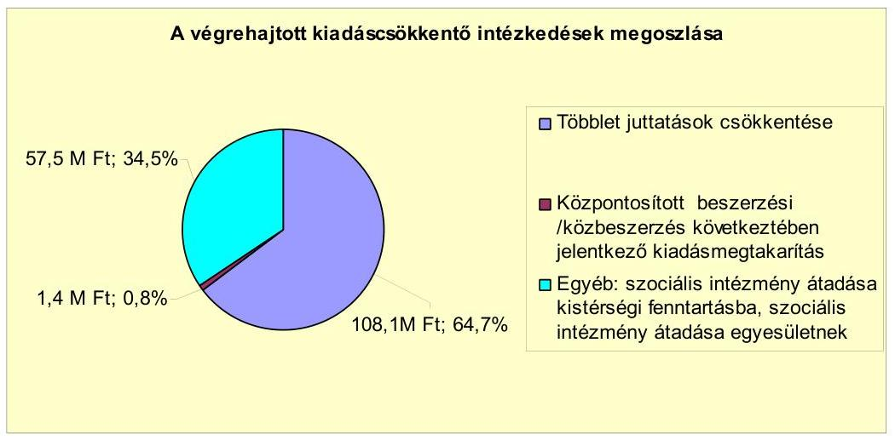

A 2007-2011. év I. félév időszakában hozott kiadáscsökkentő intézkedések eredményeképpen az Önkormányzat kimutatása szerint 167,0 millió Ft-tal - a 2007. évben 14,9 millió Ft-tal, a 2008. évben 12,7 millió Ft-tal, a 2010. évben 18,1 millió Ft-tal, a 2011. évben 121,3 millió Ft-tal - csökkentek a kiadások.

Az intézkedések eredményeképpen az Önkormányzat az alábbi területeken mutatott ki kiadáscsökkentést:

- Képviselő-testület a 2011. évi költségvetési rendeletében a költségvetési szerveknél köztisztviselői és közalkalmazotti jogviszonyban állók esetében a korábbi években kifizetett egyhavi kereset kiegészítést csökkentette félhavi összegre. A 2011. évi költségvetésbe betervezett bérjellegű kiadások és azok járulékai a csökkentés alapján 108,1 millió Ft-tal kisebb összegben kerültek betervezésre. Az intézkedés eredményeképpen önkormányzati szinten 108,1 millió Ft bérjellegű kiadás- és járulékai csökkenés mutatható ki, amely az összes kiadás megtakarítás 64,7\%-a;
- Az Önkormányzat közbeszerzési eljárást írt ki a 2010. évben a villamos energia beszerzésére. A nyertes ajánlattevő ajánlata alapján a 2011. év I. félévben 1,4 millió Ft megtakarítás keletkezett;
- A Képviselő-testület határozatban döntött arról, hogy 2 szociális intézményét a Kistérségi társulás, valamint egyesület fenntartásába adja. A 2008. év február 1. napjával az Esély Szociális és Gyermekjóléti Szolgálat intézményét a Kistérségi társulás fenntartásába adta. A kimutatott kiadásmegtakarítás a 2008-2011. év I. féléve között 57,2 millió Ft volt - a 2008. évben 14,9 millió Ft, a 2009. évben 12,7 millió Ft, a 2010. évben 18,1 millió Ft, a 2011. év I. félévében 11,5 millió Ft. A Támasz Szociális intézményét 2010. október 1. napjával egyesület fenntartásába adta. Kiadásmegtakarítás a 2001. év I. félévében keletkezett, amely 0,3 millió Ft volt. Az Önkormányzat a kettő in-

---

tézmény fenntartásba való átadásával 57,5 millió kiadáscsökkenést ért el, amely az összes kiadás megtakarítás 34,5\%-a.

Abban az esetben, hogyha az Önkormányzat kiadáscsökkentő intézkedéseket nem hozott volna, a 2007-2011. év I. féléve között a kiadások 167,0 millió Ft-tal magasabbak lettek volna.

A 2007-2010. évek között az álláshelyek, valamint a foglalkoztatottak létszámát, a létszám változását az alábbi táblázat mutatja:

| Megnevezés (adatok fő-ben) | Közoktatás | Szociális és gyermekvédelem | Egészségügy | Polgármesteri hivatal | Egyéb | Összesen |
| :--: | :--: | :--: | :--: | :--: | :--: | :--: |
| 2007. január 1-jén jóváhagyott álláshelyek száma | 591 | 108 | 10 | 174 | 61 | 944 |
| Megszüntetett álláshelyek száma | 5 | 39 | 0 | 0 | 0 | 44 |
| 2009. üres álláshelyek száma | 5 | 3 | 0 | 0 | 0 | 8 |
| szakmai álláshelyek száma | 0 | 36 | 0 | 0 | 0 | 36 |
| intézmény-üzemeltetéssel kapcsolatos álláshelyek száma | 0 | 0 | 0 | 0 | 0 | 0 |
| Álláshely növekedése | 93 | 8 | 2 | 14 | 2 | 119 |
| 2010. december 21-én záró álláshelyek száma | 679 | 77 | 12 | 188 | 63 | 1019 |
| 2007. január 1-jén foglalkoztatott létszám | 585 | 105 | 10 | 174 | 58 | 933 |
| Létszámcsökkenés | 0 | 36 | 0 | 0 | 0 | 36 |
| Létszámnövekedés | 85 | 8 | 1 | 14 | 2 | 110 |
| 2010. december 21-én foglalkoztatott létszám | 670 | 77 | 11 | 188 | 61 | 1007 |

Az önkormányzati álláshelyek száma 2007. január 1-jéről 944-ről 2010. december 31-re 1019-re nőtt. A 2007-2010. évek között 44 álláshelyet szüntettek meg, amelyből nyolc üres álláshely volt. Az álláshelyek megszüntetéséből öt a közoktatásban, 39 a szociális- és gyermekvédelmi ágazatban történt. Az álláshelyek megszüntetésének oka feladat átadása (társulás útján és egyesülettel történő ellátása) a Kistérségi társulásnak, valamint egyesületnek. A 2010. év végéig 12 üres álláshellyel rendelkeztek, amelyből kilenc a közoktatásban, egy az egészségügyben, kettő az egyéb kategóriában volt.

A 2007. évben az oktatási ágazatban öt, a szociális- és gyermekvédelmi ágazatban három üres álláshelyet szüntettek meg. Az Önkormányzat a családsegítés, gyermekjóléti szolgálat és támogató szolgálat feladatokat ellátó intézményét átadta a Kistérségi társulásnak 2008. január 31. napjával (21 álláshely csökkenés). Az egyesületnek 2010. október 1-jével a szociális étkeztetés, a házi segítségnyújtás, a jelzőrendszeres házi segítségnyújtás, az idősek nappali ellátása és a fogyatékos személyek nappali ellátása feladatokat ellátó intézményét adta át (15 álláshely csökkenés). A feladatellátással együtt - az Önkormányzatnál korábban közalkalmazotti jogviszonyban lévő - dolgozókat is átvette a Kistérségi társulás, valamint az egyesület, továbbfoglalkoztatással. A 2007-2010. évek között az álláshelyek száma feladatbővülés miatt 119-cel nőtt. A feladatbővülés miatti álláshely emelkedés nem volt azonos a megszüntetett álláshelyekkel. Álláshely növekedés történt a közoktatásban (93 fő), a szociális- és gyermekvédelmi ágazatban (8 fő), az egészségügyben (2 fő), a polgármesteri hivatalban (14 fő), a GESZ szervezeténél 1 fő), valamint a helytörténeti gyűjteményt felügyelő intézménynél (1 fő). A közoktatásban az üres álláshelyeket megpályáztatták, de nem volt rá a kiírásnak megfelelő pályázó. Az egészségügyi üres álláshely oka, hogy egy fő gyermekgondozási segélyen volt, és a helyét nem töltötték be. Az egyéb ágazat-

[^0]
[^0]:    ${ }^{23}$ Az Önkormányzat költségvetési és zárszámadási rendeletei mellékletében az engedélyezett álláshelyek számát egy tizedes jegyig tizedes törtszámban tartják nyilván (a részmunkaidőben való foglalkoztatás miatt).

---

ban jelentkező üres álláshely gazdaságvezetői álláshely, valamint egy fő tartós betegállományban volt, és a helye nem került betöltésre.

A 2007-2010. évek között a feladatátadások és a feladatok bővülése miatt összességében 74 fővel nőtt a létszám.

A foglalkoztatottak létszáma - szociális ágazatban a feladat átadásával egyidejűleg - 36 fővel csökkent, feladatbővülés miatt 110 fővel nőtt. A közoktatási ágazatban feladatbővülés (új óvodai tagintézmények 37 fős, zeneiskola hét fős, általános iskola 20 fős, nevelési tanácsadó létszám 10 fős, óvodai nemzetiségi oktatás miatt 11 fős létszámnövekedése) miatt 85 fővel, a szociális és gyermekvédelmi ágazatban (bölcsőde kialakítása) nyolc fővel, az egészségügyi ágazatban egy fővel (védőnői státusz), a Polgármesteri hivatalban 14 (okmányirodai létszám négy fő, közterület-felügyelő négy fő, telephely ügyintéző egy fő, vagyongazdálkodási ügyintéző egy fő, városépítési ügyintéző egy fő, pályázatíró ügyintéző egy fő, fizikai létszám kettő fő), a GESZ szervezeténél egy fővel, valamint a helytörténeti gyűjteményt felügyelő intézménynél egy fővel nőtt a foglalkoztatottak létszáma.

Az Önkormányzat a 2007-2011. év I. félév időszakában nem igényelt létszámcsökkentéshez kapcsolódóan támogatást.

A 2007-2011. év I. félév között a kiadáscsökkentő intézkedések mellet az Önkormányzat az alábbiakban számszerűsített bevételnövelő intézkedéseket tette:
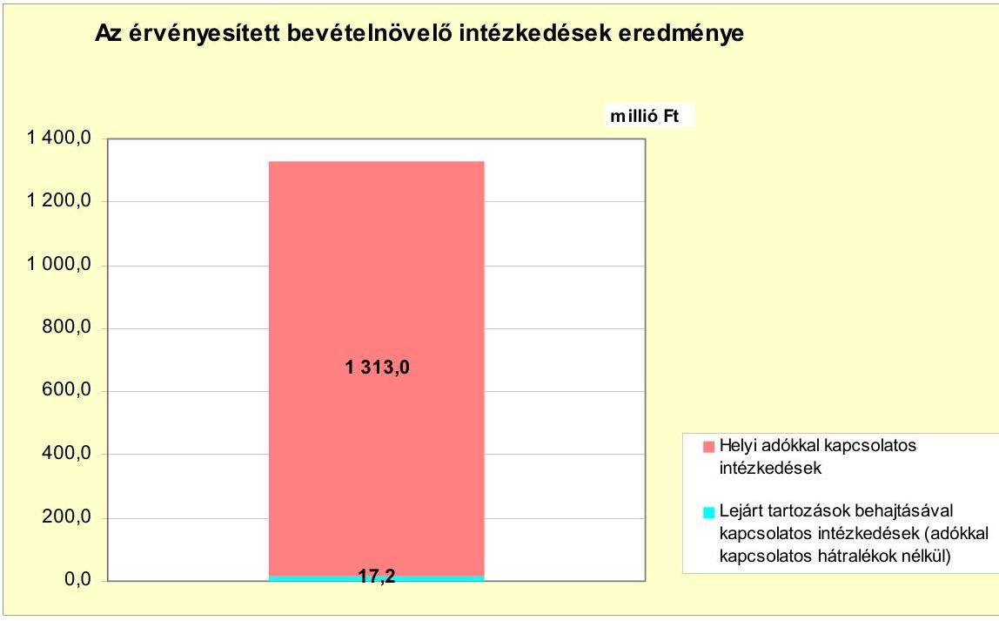

A 2007-2011. év I. félév időszakában az Önkormányzat kimutatása szerint a bevételnövelő intézkedéseinek számszerűsített összege 1330,2 millió Ft volt. A bevételnövelő intézkedések a helyi adókkal, valamint a lejárt tartozások behajtásával kapcsolatos intézkedések voltak. A helyi adókkal kapcsolatos intézkedések a helyi iparűzési adó emelésére, valamint az adóhátralékok behajtására irányultak. A helyi iparűzési adó mértéke a 2007-2010. évek között változatlanul 1,8\% volt. A Képviselő-testület a 2010. évben rendelettel döntött a helyi iparűzési adó mértékének 1,9\%-ra való emeléséről. Az Önkormányzatnak -

---

kimutatása alapján - a helyi iparűzési adó mértékének emeléséből a 2011. év I. félévében 106,0 millió Ft bevételi többlete keletkezett. A kintlévőségek csökkentése érdekében tett intézkedések eredményeképpen, az adóhátralékok behajtásából 1207,0 millió Ft, a lejárt tartozások beszedéséből 17,2 millió Ft bevételt realizált.

Az adóhátralékok behajtását többletmunkával érték el. A nem fizető ügyfeleket több alkalommal írásban szólították fel. Azon adózó ügyfelek irányában, akik az év végi helyi adóbevallásaikban nem közöltek bankszámlaszámot, korábban nem tudtak bankszámláról való letiltást alkalmazni. A bankszámlák megismerését követően mód nyílt a hátralékos ügyfelek bankszámláinak megterhelésére is. Azokban az esetekben, amikor a gépjárműadót az ügyfelek nem fizették meg, írásban felszólítással éltek feléjük, hogy amennyiben nem fizetik meg a kötelezettségüket, kivonatják a gépjárművüket a forgalomból. A felszólításokat követően megérkeztek a korábban meg nem fizetett tételek. Az Önkormányzatnak az adóhátralékok behajtásából a 2007. évben 143,6 millió Ft, a 2008. évben 302,1 millió Ft, a 2009. évben 282,9 millió Ft, a 2010. évben 351,5 millió Ft, a 2011. év I. félévében 126,9 millió Ft bevételi többlete keletkezett. A behajtott adóhátralék összege az esedékes adóhátralékok összegének 2007. évben 42,0\%-a, a 2008. évben a $82,7 \%$-a, a 2009. évben $59,2 \%$-a, a 2010. évben a $62,6 \%$-a, a 2011. év I. félévében 52,5\%-a volt. A 2007-2011. év I. félév időszakában a behajtott adóhátralék, valamint az esedékes adóhátralék aránya 52,5\%-os szinten alakult. A behajtott adóhátralék, valamint az esedékes adóhátralék évenkénti \%-os mértéke a 2008. évben volt a legmagasabb, a 2011. év I. félévében a legalacsonyabb (a törtévi teljesítés miatt). A behajtott adóhátralékok, valamint az esedékes adóhátralékok \%-os arányának alakulását nézve elmondható, hogy az Önkormányzat adóbehajtási tevékenysége eredményes volt a 2007-2011. év I. félév időszakában. A lejárt tartozásokból származó többletbevételekből a 2007. évben 0,8 millió Ft, a 2008. évben 4,8 millió Ft, a 2009. évben 5,8 millió Ft, a 2010. évben 4,0 millió Ft, a 2011. év I. félévében 1,8 millió Ft bevétele keletkezett.

A 2007-2011. év I. félév között a költségvetési támogatások és az átengedett szja bevételek együttes összege nem csökkent (nőtt 371,3 millió Ft-tal). A 2007. évi 1540,3 millió Ft-ról a 2008. évre 303,3 millió Ft-tal (19,7\%-kal), a 2009. évre 196,3 millió Ft-tal ( $12,7 \%$-kal) növekedett, a 2010. évre 61,0 millió Ft-tal (4,0\%kal), a 2011. év I. félévére 67,3 millió Ft-tal ( $8,7 \%$-kal, figyelembe véve a törtévi teljesítést) csökkent a költségvetési támogatásokból és az átengedett szja-ból származó bevételek összege. A 2007-2011. év I. félév időszakában a kiadáscsökkentő (167,0 millió Ft) és bevételnövelő (106,0 millió Ft) intézkedések meghozatalára a pénzügyi egyensúly megtartása, valamint javítása érdekében volt szükség, amely összességében 273,0 millió Ft többletforrást eredményezett.

# 5. ÁSZ ÁLTAL A KORÁBBI ÉVEKBEN A PÉNZÜGYI EGYENSÚLY JAVÍTÁSÁRA TETT SZABÁLYSZERŰSÉGI ÉS CÉLSZERŰSÉGI JAVASLATOK HASZNOSULÁSA 

Az ÁSZ az Önkormányzat gazdálkodási rendszerét a 2009. évben ellenőrizte, amely során a pénzügyi egyensúlyi helyzetre vonatkozóan a jegyző részére egy szabályszerűségi javaslatot tett. A javaslat az előző évi kötelezettséggel terhelt pénzmaradvány következő évi tervezésére vonatkozott. A javaslatban megfogalmazottakat a 2010. évi költségvetés tervezése során végrehajtották, mivel a bevételek közé betervezték az előző évi, a tervezés időszakában ismert szabad

---

pénzmaradvány 97,1\%-át, valamint az előző évi kötelezettséggel terhelt pénzmaradvány $91,3 \%$-át. A Képviselő-testület határozattal fogadta el a jegyző által készített intézkedési tervet. Az intézkedési terv tartalmazta a felelősöket és az azok végrehajtására megszabott határidőket.

Budapest, 2012. április "16"

Melléklet: $\quad 9 \mathrm{db}$
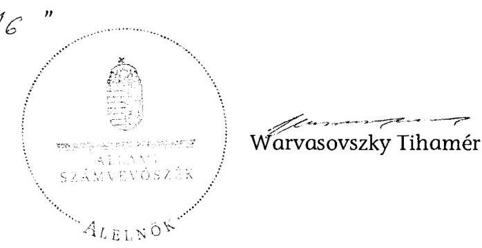

---

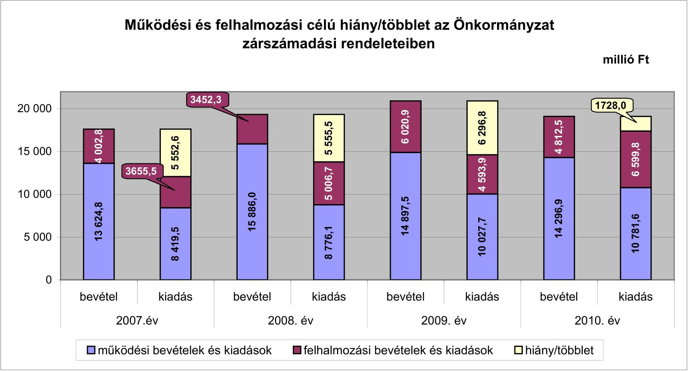

# Működési és felhalmozási célú hiány/többlet az Önkormányzat zárszámadási rendeleteiben

## millió Ft

---

Az Önkormányzat bevételei és kiadásai, valamint adósságszolgálata 2007-2010 között

|  1. FOLYÓ KÖLTSÉGVETÉS* | 2007. év | 2008. év | 2009. év  |
| --- | --- | --- | --- |
|  1.1.1. Saját működési bevételek | 10623,3 | 12464,0 | 11992,9  |
|  1.1.2. Költségvetési támogatás** | 1529,0 | 2043,8 | 1835,4  |
|  1.1.3. Átengedett bevételek | 426,9 | 241,3 | 343,7  |
|  1.1.4. Állambáztartáson belülről kapott támogatások | 79,3 | 114,9 | 118,0  |
|  1.1.5. EU-tól és külföldről kapott bevételek | 9,8 | 0,0 | 2,0  |
|  1.1.6. Állambáztartáson kívülről kapott bevételek | 38,1 | 20,8 | 10,9  |
|  1.1.7. Előző évi pénzmaradvány átvétel | 191,7 | 87,2 | 73,8  |
|  1.1. Folyó bevételek =1.1.1.+1.1.2.+1.1.3.+1.1.4.+1.1.5.+1.1.6.+1.1.7. | 12898,1 | 14972,0 | 14376,7  |
|  1.2.1. Működési kiadások kamatkiadások nélkül | 7406,1 | 7817,7 | 8885,5  |
|  1.2.2. Állambáztartáson belülre átadott pénzeszközök | 0,0 | 62,5 | 92,1  |
|  1.2.3.1. vállalkozásoknak | 126,3 | 144,3 | 151,1  |
|  1.2.3.2. EU-nak, illetve külföldre | 0,0 | 0,0 | 2,8  |
|  1.2.3.3. magánszemélyeknek | 323,2 | 344,8 | 397,2  |
|  1.2.3.4. nonprofit szervezeteknek | 301,1 | 318,8 | 401,3  |
|  1.2.3. Transferkiadások (=1.2.3.1+1.2.3.2+1.2.3.3+1.2.3.4) | 750,6 | 807,9 | 952,4  |
|  1.2.4 Kamatkiadások | 263,7 | 241,7 | 179,3  |
|  1.2.5. Előző évi pénzmaradvány átadás | 191,7 | 87,2 | 73,8  |
|  1.2. Folyó kiadások = 1.2.1.+1.2.2.+1.2.3.+1.2.4.+1.2.5. | 8612,1 | 9017,0 | 10183,1  |
|  1.3. Folyó költségvetés egyenlege MŰKÖDÉSI JÖVEDELEM (1.1. - 1.2.) | 4286,0 | 5955,0 | 4193,6  |
|  2. FELHALMOZÁSI KÖLTSÉGVETÉS*** |  |  |   |
|  2.1.1. Saját tőkebevételek | 191,7 | 175,5 | 94,3  |
|  2.1.2. Állambáztartáson belülről kapott támogatások | 12,3 | 19,8 | 23,7  |
|  2.1.3. EU-tól és külföldről kapott támogatások | 0,0 | 0,4 | 0,0  |
|  2.1.4. Állambáztartáson kívülről kapott támogatások | 157,5 | 137,6 | 63,2  |
|  2.1. Felhalmozási bevételek (=2.1.1.+2.1.2+2.1.3+2.1.4.) | 361,5 | 333,3 | 181,2  |
|  2.2.1. Saját beruházási kiadás állvaí | 2332,9 | 3855,1 | 3919,3  |
|  2.2.2. Saját felújítási kiadás állvaí | 586,3 | 422,0 | 760,5  |
|  2.2.3. Állambáztartáson belülre átadott pénzeszköz | 11,9 | 5,4 | 3,0  |
|  2.2.4. EU-nak és külföldnek adott pénzeszközök | 0,0 | 0,0 | 0,0  |
|  2.2.5. Állambáztartáson kívülre adott pénzeszközök | 358,8 | 164,0 | 328,1  |
|  2.2.6. Befektetési célú részesedések vásárlása | 0,0 | 0,2 | 0,2  |
|  2.2. Felhalmozási kiadások (=2.2.1.+2.2.2.+2.2.3.+2.2.4.+2.2.5.+2.2.6.) | 3289,9 | 4446,7 | 4111,1  |
|  2.3. Felhalmozási költségvetés egyenlege (2.1. - 2.2.) | $-2928,4$ | $-4113,4$ | $-3929,9$  |
|  3. Finanszírozási műveletek nélküli (GFS) pozíció(1.3.+2.3.) | 1357,6 | 1841,6 | 263,7  |
|  4. Finanszírozási műveletek |  |  |   |
|  4.1. Hitelfelvétel | 700,0 | 0,0 | 0,0  |
|  4.2. Hiteltörlesztés | 172,0 | 318,6 | 325,5  |
|  4.3. Forgatási és befektetési célú értékpapírok kibocsátása | 0,0 | 0,0 | 0,0  |
|  4.4. Forgatási és befektetési célú értékpapírok beváltása | 0,0 | 0,0 | 0,0  |
|  4.5. Forgatási és befektetési célú értékpapírok értékesítése | 156,9 | 72,4 | 31,4  |
|  4.6. Forgatási és befektetési célú értékpapírok vásárlása | 0,0 | 0,0 | 0,0  |
|  4.7. Egyéb finanszírozási bevételek (függő, átfutó, kiegyenlítő) | 57,3 | $-80,4$ | 24,7  |
|  4.8. Egyéb finanszírozási kiadások (függő, átfutó, kiegyenlítő) | 48,9 | 45,2 | 9,2  |
|  4.9.Finanszírozási műveletek egyenlege (4.1. - 4.2.+4.3.-4.4+4.5.-4.6.+4.7.-4.8.) | 692,4 | $-371,8$ | $-278,6$  |
|  5. Tárgyévi pénzügyi pozíció(1.3.+ 2.3.+4.9.) | 2050,0 | 1469,8 | $-14,9$
 |
|  6. Nettó működési jövedelem = működési jövedelem (1.3.) - tőketörlesztés (4.2+4.4) | 4113,1 | 5636,4 | 3868,1  |
|  TÁJÉKOZTATÓ ADATOK |  |  |   |
|  Összes kötelezettség | 6167,0 | 6835,6 | 7124,9  |
|  ebből rövid lejáratú | 2105,2 | 2891,7 | 3477,7  |
|  Összes szállítói kötelezettség | 247,4 | 1228,9 | 2143,8  |
|  ebből lejárt | 37,0 | 63,5 | 65,4  |
|  Pénz és tőkepiaci kötelezettség (adósság) | 4245,3 | 4227,7 | 3973,1  |
|  ebből rövid lejáratú | 333,6 | 325,6 | 326,5  |
|  PPP szerződéses állomány jelenértéken | 0,0 | 0,0 | 0,0  |
|  ebből lejárt szolgáltatási díj miatti kötelezettség | 0,0 | 0,0 | 0,0  |
|  Folyószámlahitel napi átlagos állománya | 0,0 | 0,0 | 0,0  |
|  Lihvátlítési napi átlagos állománya | 0,0 | 0,0 | 0,0  |
|  Munkabérhitel napi átlagos állománya | 0,0 | 0,0 | 0,0  |
|  Kezesség és garanciavállalások | 100,0 | 100,0 | 100,0  |
|  Jogcím bírósági ítéletekből adódó kötelezettségek | 0,0 | 0,0 | 0,0  |
|  Finanszírozásba bevonható eszközök: | 5840,2 | 7237,6 | 7191,3  |
|  Tartós hitelviszonyt megtestesítő értékpapírok év végi állománya | 254,0 | 222,6 | 191,2  |
|  Hosszú lejáratú bankbetétek év végi állománya | 0,0 | 0,0 | 0,0  |
|  Értékpapírok év végi állománya | 41,1 | 0,0 | 0,0  |
|  Pénzeszközök (idegen pénzeszközök nélküli) év végi állománya | 5545,2 | 7015,0 | 7000,1  |

- Bevételekben nem üti el, a kiadásokban nem jelenik meg az amortizáció, a vagyoni helyzetet az egyenleg befolyásolja. ** Az Önkormányzat adatszolgáltatása szerint a költségvetési támogatásból a 2007. évben 246,6 millió Ft, a 2008. évben 259,5 millió Ft, a 2009. évben 234,8 millió Ft, a 2010. évben / felhalmozási célú támogatás volt. *** Bevételekben vagyon megőrzésre és bővítésre fordítható források.

---

Budaörs Város Önkormányzata

Az Önkormányzat 2007-2010 években megvalósított, 2010. december 31-ig befejezett fejlesztései és azok forrásösszeleteis

Az Önkormányzat 2007-2010 években megvalósított, 2010. december 31-ig befejezett fejlesztései és azok forrásösszeleteis

száz-nyolc

|  Sorszám | Megnevezése | Képviselő-testületi határozat száma | kezdetei (év) | befejezése (év) |  |  |  |  |  |  |  |  |  |  |  |  |  |  |  |  |  |  |  |  |  |  |  |  |  |  |  |  |  |  |  |  |  |  |  |  |  |  |   |
| --- | --- | --- | --- | --- | --- | --- | --- | --- | --- | --- | --- | --- | --- | --- | --- | --- | --- | --- | --- | --- | --- | --- | --- | --- | --- | --- | --- | --- | --- | --- | --- | --- | --- | --- | --- | --- | --- | --- | --- | --- | --- | --- | --- |
|   |  |  |  |  |  |  |  |  |  |  |  |  |  |  |  |  |  |  |  |  |  |  |  |  |  |  |  |  |  |  |  |  |  |  |  |  |  |  |  |  |  |   |
|   |  |  |  |  |  |  |  |  |  |  |  |  |  |  |  |  |  |  |  |  |  |  |  |  |  |  |  |  |  |  |  |  |  |  |  |  |  |  |  |  |  |   |
|   |  |  |  |  |  |  |  |  |  |  |  |  |  |  |  |  |  |  |  |  |  |  |  |  |  |  |  |  |  |  |  |  |  |  |  |  |  |  |  |  |  |   |
|   |  |  |  |  |  |  |  |  |  |  |  |  |  |  |  |  |  |  |  |  |  |  |  |  |  |  |  |  |  |  |  |  |  |  |  |  |  |  |  |  |  |   |
|   |  |  |  |  |  |  |  |  |  |  |  |  |  |  |  |  |  |  |  |  |  |  |  |  |  |  |  |  |  |  |  |  |  |  |  |  |  |  |  |  |  |   |
|   |  |  |  |  |  |  |  |  |  |  |  |  |  |  |  |  |  |  |  |  |  |  |  |  |  |  |  |  |  |  |  |  |  |  |  |  |  |  |  |  |  |   |
|   |  |  |  |  |  |  |  |  |  |  |  |  |  |  |  |  |  |  |  |  |  |  |  |  |  |  |  |  |  |  |  |  |  |  |  |  |  |  |  |  |  |   |
|   |  |  |  |  |  |  |  |  |  |  |  |  |  |  |  |  |  |  |  |  |  |  |  |  |  |  |  |  |  |  |  |  |  |  |  |  |  |  |  |  |  |   |
|   |  |  |  |  |  |  |  |  |  |  |  |  |  |  |  |  |  |  |  |  |  |  |  |  |  |  |  |  |  |  |  |  |  |  |  |  |  |  |  |  |  |   |
|   |  |  |  |  |  |  |  |  |  |  |  |  |  |  |  |  |  |  |  |  |  |  |  |  |  |  |  |  |  |  |  |  |  |  |  |  |  |  |  |  |  |   |
|   |  |  |  |  |  |  |  |  |  |  |  |  |  |  |  |  |  |  |  |  |  |  |  |  |  |  |  |  |  |  |  |  |  |  |  |  |  |  |  |  |  |   |
|   |  |  |  | | | | | | | | | | | | | | | | | | | | | | | | | | | | | | | | | | | | | | | | |
| | | | | | | | | | | | | | | | | | | | | | | | | | | | | | | | | | | | | | | | | | |
| | | | | | | | | | | | | | | | | | | | | | | | | | | | | | | | | | | | | | | | | | |
| | | | | | | | | | | | | | | | | | | | | | | | | | | | | | | | | | | | | | | | | | |
| | | | | | | | | | | | | | | | | | | | | | | | | | | | | | | | | | | | | | | | | | |
| | | | | | | | | | | | | | | | | | | | | | | | | | | | | | | | | | | | | | | | | | |
| | | | | | | | | | | | | | | | | | | | | | | | | | | | | | | | | | | | | | | | | | |
| | | | | | | | | | | | | | | | | | | | | | | | | | | | | | | | | | | | | | | | | | |
| | | | | | | | | | | | | | | | | | | | | | | | | | | | | | | | | | | | | | | | | | |
| | | | | | | | | | | | | | | | | | | | | | | | | | | | | | | | | | | | | | | | | | |
| | | | | | | | | | | | | | | | | | | | | | | | | | | | | | | | | | | | | | | | | | |
| | | | | | | | | | | | | | | | | | | | | | | | | | | | | | | | | | | | | | | | | | |
| | | | | | | | | | | | | | | | | | | | | | | | | | | | | | | | | | | | | | | | | | |
| | | | | | | | | | | | | | | | | | | | | | | | | | | | | | | | | | | | | | | | | | |
| | | | | | | | | | | | | | | | | | | | | | | | | | | | | | | | | | | | | | | | | | |
| | | | | | | | | | | | | | | | | | | | | | | | | | | | | | | | | | | | | | | | | | |
| | | | | | | | | | | | | | | | | | | | | | | | | | | | | | | | | | | | | | | | | | |
| | | | | | | | | | | | | | | | | | | | | | | | | | | | | | | | | | | | | | | | | | |
| | | | | | | | | | | | | | | Budaiörs Város Önkormányzata

Az Önkormányzat 2007-2010 években megvalósított, 2010. december 31-ig befejezett fejlesztései és azok forrásösszetétele

Az Önkormányzat 2007-2010 években megvalósított, 2010. december 31-ig befejezett fejlesztései és azok forrásösszetétele

|  |   |   |   |   |   |   |   |   |   |   |   |   |   |   |   |   |   |   |   |   |   |   |   |   |   |   |   |   |   |   |   |   |   |   |   |   |   |   |   |   |   |   |   |   |   |   |   |   |   |   |   |   |   |   |   |   |   |   |   |   |   |   |   |   |   |   |   |   |   |   |   |   |   |   |   |   |   |   |   |   |   |   |   |   |   |   |   |   |   |   |   |   |   |   |   |   |   |   |   |   |   |   |  

---

Budaiörs Város Önkormányzata

Az Önkormányzat 2007-2010 években megvalósított, 2010. december 31-ig befejezett fejlesztései és azok forrásösszetétele

száza 71

|  Sorszám | Megnevezése | Képviselő-testületi határozat száma | Befejezése (év) | Tárgy (tartó) bekezdési idő | Tárgy (tartó) bekezdési idő | Előző (év, 21. év) bekezdési idő | Előző (év, 21. év) bekezdési idő | Előző (év, 21. év) bekezdési idő | Előző (év, 21. év) bekezdési idő | Előző (év, 21. év) bekezdési idő | Előző (év, 21. év) bekezdési idő | Előző (év, 21. év) bekezdési idő | Előző (év, 21. év) bekezdési idő | Előző (év, 21. év) bekezdési idő | Előző (év, 21. év) bekezdési idő | Előző (év, 21. év) bekezdési idő | Előző (év, 21. év) bekezdési idő | Előző (év, 21. év) bekezdési idő | Előző (év, 21. év) bekezdési idő | Előző (év, 21. év) bekezdési idő | Előző (év, 21. év) bekezdési idő | Előző (év, 21. év) bekezdési idő | Előző (év, 21. év) bekezdési idő | Előző (év, 21. év) bekezdési idő | Előző (év, 21. év) bekezdési idő | Előző (év, 21. év) bekezdési idő | Előző (év, 21. év) bekezdési idő | Előző (év, 21. év) bekezdési idő | Előző (év, 21. év) bekezdési idő | Előző (év, 21. év) bekezdési idő | Előző (év, 21. év) bekezdési idő | Előző (év, 21. év) bekezdési idő | Előző (év, 21. év) bekezdési idő | Előző (év, 21. év) bekezdési idő | Előző (év, 21. év) bekezdési idő | Előző (év, 21. év) bekezdési idő | Előző (év, 21. év) bekezdési idő | Előző (év, 21. év) bekezdési idő | Előző (év, 21. év) bekezdési idő | Előző (év, 21. év) bekezdési idő | Előző (év, 21. év) bekezdési idő | Előző (év, 21. év) bekezdési idő | Előző (év, 21. év) bekezdési idő | Előző (év, 21. év) bekezdési idő | Előző (év, 21. év) bekezdési idő | Előző (év, 21. év) bekezdési idő | Előző (év, 21. év) bekezdési idő | Előző (év, 21. év) bekezdési idő | Előző (év, 21. év) bekezdési idő | Előző (év, 21. év) bekezdési idő | Előző (év, 21. év) bekezdési idő | Előző (év, 21. év) bekezdési idő | Előző (év, 21. év) bekezdési idő | Előző (év, 21. év) bekezdési idő | Előző (év, 21. év) bekezdési idő | Előző (év, 21. év)
 bekezdési idő | Előző (év, 21. év) bekezdési idő | Előző (év, 21. év) bekezdési idő | Előző (év, 21. év) bekezdési idő | Előző (év, 21. év) bekezdési idő | Előző (év, 21. év) bekezdési idő | Előző (év, 21. év) bekezdési idő | Előző (év, 21. év) bekezdési idő | Előző (év, 21. év) bekezdési idő | Előző (év, 21. év) bekezdési idő | Előző (év, 21. év) bekezdési idő | Előző (év, 21. év) bekezdési idő | Előző (év, 21. év) bekezdési idő | Előző (év, 21. év) bekezdési idő | Előző (év, 21. év) bekezdési idő | Előző (év, 21. év) bekezdési idő | Előző (év, 21. év) bekezdési idő | Előző (év, 21. év) bekezdési idő | Előző (év, 21. év) bekezdési idő | Előző (év, 21. év) bekezdési idő | Előző (év, 21. év) bekezdési idő | Előző (év, 21. év) bekezdési idő | Előző (év, 21. év) bekezdési idő | Előző (év, 21. év) bekezdési idő | Előző (év, 21. év) bekezdési idő | Előző (év, 21. év) bekezdési idő | Előző (év, 21. év) bekezdési idő | Előző (év, 21. év) bekezdési idő | Előző (év, 21. év) bekezdési idő | Előző (év, 21. év) bekezdési idő | Előző (év, 21. év) bekezdési idő | Előző (év, 21. év) bekezdési idő | Előző (év, 21. év) bekezdési idő | Előző (év, 21. év) bekezdési idő | Előző (év, 21. év) bekezdési idő | Előző (év, 21. év) bekezdési idő | Előző (év, 21. év) bekezdési idő | Előző (év, 21. év) bekezdési idő | Előző (év, 21. év) bekezdési idő | Előző (év, 21. év) bekezdési idő | Előző (év, 21. év) bekezdési idő | Előző (év, 21. év) bekezdési idő | Előző (év, 21. év) bekezdési idő | Előző (év, 21. év) bekezdési idő | Előző (év, 21. év) bekezdési idő | Előző (év, 21. év) bekezdési idő | Előző (év, 21. év) bekezdési idő | Előző (év, 21. év) bekezdési idő | Előző (év, 21. év) bekezdési idő | Előző (év, 21. év) bekezdési idő | Előző (év, 21. év) bekezdési idő | Előző (év, 21. év) bekezdési idő | Előző (év, 21. év) bekezdési idő | Előző (év, 21. év) bekezdési idő | Előző (év, 21. év) bekezdési idő | Előző (év, 21. év) bekezdési idő | Előző (év, 21. év) bekezdési idő | Előző (év, 21. év) bekezdési idő | Előző (év, 21. év) bekezdési idő | Előző (év, 21. év) bekezdési idő | Előző (év, 21. év) bekezdési idő | Előző (év, 21. év) bekezdési idő | Előző (év, 21. év) bekezdési idő | Előző (év, 21. év) bekezdési idő | Előző (év, 21. év) bekezdési idő | Előző (év, 21. év) bekezdési idő | Előző (év, 21. év) bekezdési idő | Előző (év, 21. év) bekezdési idő | Előző (év, 21. év) bekezdési idő | Előző (év, 21. év) bekezdési idő | Előző (év, 21. év) bekezdési idő | Előző (év, 21. év) bekezdési idő | Előző (év, 21. év) bekezdési idő | Előző (év, 21. év) bekezdési idő | Előző (év, 21. év) bekezdési idő | Előző (év, 21. év) bekezdési idő | Előző (év, 21. év) bekezdési idő | Előző (év, 21. év) bekezdési idő | Előző (év, 21. év) bekezdési idő | Előző (év, 21. év) bekezdési idő | Előző (év, 21. év) bekezdési idő | Előző (év, 21. év) bekezdési idő | Előző (év, 21. év) bekezdési idő | Előző (év, 21. év) bekezdési idő | Előző (év, 21. év) bekezdési idő | Előző (év, 21. év) bekezdési idő | Előző (év, 21. év) bekezdési idő | Előző (év, 21. év) bekezdési idő | Előző (év, 21. év) bekezdési idő | Előző (év, 21. év) bekezdési idő | Előző (év, 21. év) bekezdési idő | Előző (év, 21. év) bekezdési idő | Előző (év, 21. év) bekezdési idő | Előző (év, 21. év) bekezdési idő | Előző (év, 21. év) bekezdési idő | Előző (év, 21. év) bekezdési idő | Előző (év, 21. év) bekezdési idő | Előző (év, 21. év) bekezdési idő | Előző (év, 21. év) bekezdési idő | Előző (év, 21. év) bekezdési idő | Előző (év, 21. év) bekezdési idő | Előző (év, 21. év) bekezdési idő | Előző (év, 21. év) bekezdési idő | Előző (év, 21. év) bekezdési idő | Előző (év, 21. év) bekezdési idő | Előző (év, 21. év) bekezdési idő | Előző (év, 21. év) bekezdési idő | Előző (év, 21. év) bekezdési idő | Előző (év, 21. év) bekezdési idő | Előző (év, 21. év) bekezdési idő | Előző (év, 21. év) bekezdési idő | Előző (év, 21. év) bekezdési idő | Előző (év, 21. év) bekezdési idő | Előző (év, 21. év) bekezdési idő | Előző (év, 21. év) bekezdési idő | Előző (év, 21. év) bekezdési idő | Előző (év, 21. év) bekezdési idő | Előző (év, 21. év) bekezdési idő | Előző (év, 21. év) bekezdési idő | Előző (év, 21. év) bekezdési idő | Előző (év, 21. év) bekezdési idő | Előző (év, 21. év) bekezdési idő | Előző (év, 21. év) bekezdési idő | Előző (év, 21. év) bekezdési idő | Előző (év, 21. év) bekezdési idő | Előző (év, 21. év) bekezdési idő | Előző (év, 21. év) bekezdési idő | Előző (év, 21. év) bekezdési idő | Előző (év, 21. év) bekezdési idő | Előző (év, 21. év) bekezdési idő | Előző (év, 21. év) bekezdési idő | Előző (év, 21. év) bekezdési idő | Előző (év, 21. év) bekezdési idő | Előző (év, 21. év) bekezdési idő | Előző (év, 21. év) bekezdési idő | Előző (év, 21. év) bekezdési idő | Előző (év, 21. év) bekezdési idő | Előző (év, 21. év) bekezdési idő | Előző (év, 21. év) bekezdési idő | Előző (év, 21. év) bekezdési idő | Előző (év, 21. év) bekezdési idő | Előző (év, 21. év) bekezdési idő | Előző (év, 21. év) bekezdési idő | Előző (év, 21. év) bekezdési idő | Előző (év, 21. év) bekezdési idő | Előző (év, 21. év) bekezdési idő | Előző (év, 21. év) bekezdési idő | Előző (év, 21. év) bekezdési idő | Előző (év, 21. év) bekezdési idő | Előző (év, 21. év) bekezdési idő | Előző (év, 21. év) bekezdési idő | Előző (év, 21. év) bekezdési idő | Előző (év, 21. év) bekezdési idő | Előző (év, 21. év) bekezdési idő | Előző (év, 21. év) bekezdési idő | Előző (év, 21. év) bekezdési idő | Előző (év, 21. év) bekezdési idő | Előző (év, 21. év) bekezdési idő | Előző (év, 21. év) bekezdési idő | Előző (év, 21. év) bekezdési idő |
 Előző (év, 21. év) bekezdési idő | Előző (év, 21. év) bekezdési idő | Előző (év, 21. év) bekezdési idő | Előző (év, 21. év) bekezdési idő | Előző (év, 21. év) bekezdési idő | Előző (év, 21. év) bekezdési idő | Előző (év, 21. év) bekezdési idő | Előző (év, 21. év) bekezdési idő | Előző (év, 21. év) bekezdési idő | Előző (év, 21. év) bekezdési idő | Előző (év, 21. év) bekezdési idő | Előző (év, 21. év) bekezdési idő | Előző (év, 21. év) bekezdési idő | Előző (év, 21. év) bekezdési idő | Előző (év, 21. év) bekezdési idő | Előző (év, 21. év) bekezdési idő | Előző (év, 21. év) bekezdési idő | Előző (év, 21. év) bekezdési idő | Előző (év, 21. év) bekezdési idő | Előző (év, 21. év) bekezdési idő | Előző (év, 21. év) bekezdési idő | Előző (év, 21. év) bekezdési idő | Előző (év, 21. év) bekezdési idő | Előző (év, 21. év) bekezdési idő | Előző (év, 21. év) bekezdési idő | Előző (év, 21. év) bekezdési idő | Előző (év, 21. év) bekezdési idő | Előző (év, 21. év) bekezdési idő | Előző (év, 21. év) bekezdési idő | Előző (év, 21. év) bekezdési idő | Előző (év, 21. év) bekezdési idő | Előző (év, 21. év) bekezdési idő | Előző (év, 21. év) bekezdési idő | Előző (év, 21. év) bekezdési idő | Előző (év, 21. év) bekezdési idő | Előző (év, 21. év) bekezdési idő | Előző (év, 21. év) bekezdési idő | Előző (év, 21. év) bekezdési idő | Előző (év, 21. év) bekezdési idő | Előző (év, 21. év) bekezdési idő | Előző (év, 21. év) bekezdési idő | Előző (év, 21. év) bekezdési idő | Előző (év, 21. év) bekezdési idő | Előző (év, 21. év) bekezdési idő | Előző (év, 21. év) bekezdési idő | Előző (év, 21. év) bekezdési idő | Előző (év, 21. év) bekezdési idő | Előző (év, 21. év) bekezdési idő | Előző (év, 21. év) bekezdési idő | Előző (év, 21. év) bekezdési idő | Előző (év, 21. év) bekezdési idő | Előző (év, 21. év) bekezdési idő | Előző (év, 21. év) bekezdési idő | Előző (év, 21. év) bekezdési idő | Előző (év, 21. év) bekezdési idő | Előző (év, 21. év) bekezdési idő | Előző (év, 21. év) bekezdési idő | Előző (év, 21. év) bekezdési idő | Előző (év, 21. év) bekezdési idő | Előző (év, 21. év) bekezdési idő | Előző (év, 21. év) bekezdési idő | Előző (év, 21. év) bekezdési idő | Előző (év, 21. év) bekezdési idő | Előző (év, 21. év) bekezdési idő | Előző (év, 21. év) bekezdési idő | Előző (év, 21. év) bekezdési idő | Előző (év, 21. év) bekezdési idő | Előző (év, 21. év) bekezdési idő | Előző (év, 21. év) bekezdési idő | Előző (év, 21. év) bekezdési idő | Előző (év, 21. év) bekezdési idő | Előző (év, 21. év) bekezdési idő | Előző (év, 21. év) bekezdési idő | Előző (év, 21. év) bekezdési idő | Előző (év, 21. év) bekezdési idő | Előző (év, 21. év) bekezdési idő | Előző (év, 21. év) bekezdési idő | Előző (év, 21. év) bekezdési idő | Előző (év, 21. év) bekezdési idő | Előző (év, 21. év) bekezdési idő | Előző (év, 21. év) bekezdési idő | Előző (év, 21. év) bekezdési idő | Előző (év, 21. év) bekezdési idő | Előző (év, 21. év) bekezdési idő | Előző (év, 21. év) bekezdési idő | Előző (év, 21. év) bekezdési idő | Előző (év, 21. év) bekezdési idő | Előző (év, 21. év) bekezdési idő | Előző (év, 21. év) bekezdési idő | Előző (év, 21. év) bekezdési idő | Előző (év, 21. év) bekezdési idő | Előző (év, 21. év) bekezdési idő | Előző (év, 21. év) bekezdési idő | Előző (év, 21. év) bekezdési idő | Előző (év, 21. év) bekezdési idő | Előző (év, 21. év) bekezdési idő | Előző (év, 21. év) bekezdési idő | Előző (év, 21. év) bekezdési idő | Előző (év, 21. év) bekezdési idő | Előző (év, 21. év) bekezdési idő | Előző (év, 21. év) bekezdési idő | Előző (év, 21. év) bekezdési idő | Előző (év, 21. év) bekezdési idő | Előző (év, 21. év) bekezdési idő | Előző (év, 21. év) bekezdési idő | Előző (év, 21. év) bekezdési idő | Előző (év, 21. év) bekezdési idő | Előző (év, 21. év) bekezdési idő | Előző (év, 21. év) bekezdési idő | Előző (év, 21. év) bekezdési idő | Előző (év, 21. év) bekezdési idő | Előző (év, 21. év) bekezdési idő | Előző (év, 21. év) bekezdési idő | Előző (év,
 21. év) bekezdési idő | Előző (év, 21. év) bekezdési idő | Előző (év, 21. év) bekezdési idő | Előző (év, 21. év) bekezdési idő | Előző (év, 21. év) bekezdési idő | Előző (év, 21. év) bekezdési idő | Előző (év, 21. év) bekezdési idő | Előző (év, 21. év) bekezdési idő | Előző (év, 21. év) bekezdési idő | Előző (év, 21. év) bekezdési idő | Előző (év, 21. év) bekezdési idő | Előző (év, 21. év) bekezdési idő | Előző (év, 21. év) bekezdési idő | Előző (év, 21. év) bekezdési idő | Előző (év, 21. év) bekezdési idő | Előző (év, 21. év) bekezdési idő | Előző (év, 21. év) bekezdési idő | Előző (év, 21. év) bekezdési idő | Előző (év, 21. év) bekezdési idő | Előző (év, 21. év) bekezdési idő | Előző (év, 21. év) bekezdési idő | Előző (év, 21. év) bekezdési idő | Előző (év, 21. év) bekezdési idő | Előző (év, 21. év) bekezdési idő | Előző (év, 21. év) bekezdési idő | Előző (év, 21. év) bekezdési idő | Előző (év, 21. év) bekezdési idő | Előző (év, 21. év) bekezdési idő | Előző (év, 21. év) bekezdési idő | Előző (év, 21. év) bekezdési idő | Előző (év, 21. év) bekezdési idő | Előző (év, 21. év) bekezdési idő | Előző (év, 21. év) bekezdési idő | Előző (év, 21. év) bekezdési idő | Előző (év, 21. év) bekezdési idő | Előző (év, 21. év) bekezdési idő | Előző (év, 21. év) bekezdési idő | Előző (év, 21. év) bekezdési idő | Előző (év, 21. év) bekezdési idő | Előző (év, 21. év) bekezdési idő | Előző (év, 21. év) bekezdési idő | Előző (év, 21. év) bekezdési idő | Előző (év, 21. év) bekezdési idő | Előző (év, 21. év) bekezdési idő | Előző (év, 21. év) bekezdési idő | Előző (év, 21. év) bekezdési idő | Előző (év, 21. év) bekezdési idő | Előző (év, 21. év) bekezdési idő | Előző (év, 21. év) bekezdési idő | Előző (év, 21. év) bekezdési idő | Előző (év, 21. év) bekezdési idő | Előző (év, 21. év) bekezdési idő | Előző (év, 21. év) bekezdési idő | Előző (év, 21. év) bekezdési idő | Előző (év, 21. év) bekezdési idő | Előző (év, 21. év) bekezdési idő | Előző (év, 21. év) bekezdési idő | Előző (év, 21.
 év) bekezdési idő | Előző (év, 21. év) bekezdési idő | Előző (év, 21. év) bekezdési idő | Előző (év, 21. év) bekezdési idő | Előző (év, 21. év) bekezdési idő | Előző (év, 21. év) bekezdési idő | Előző (év, 21. év) bekezdési idő | Előző (év, 21. év) bekezdési idő | Előző (év, 21. év) bekezdési idő | Előző (év, 21. év) bekezdési idő | Előző (év, 21. év) bekezdési idő | Előző (év, 21. év) bekezdési idő | Előző (év, 21. év) bekezdési idő | Előző (év, 21. év) bekezdési idő | Előző (év, 21. év) bekezdési idő | Előző (év, 21. év) bekezdési idő | Előző (év, 21. év) bekezdési idő | Előző (év, 21. év) bekezdési idő | Előző (év, 21. év) bekezdési idő | Előző (év, 21. év) bekezdési idő | Előző (év, 21. év) bekezdési idő | Előző (év, 21. év) bekezdési idő | Előző (év, 21. év) bekezdési idő | Előző (év, 21. év) bekezdési idő | Előző (év, 21. év) bekezdési idő | Előző (év, 21. év) bekezdési idő | Előző (év, 21. év) bekezdési idő | Előző (év, 21. év) bekezdési idő | Előző (év, 21. év) bekezdési idő | Előző (év, 21. év) bekezdési idő | Előző (év, 21. év) bekezdési idő | Előző (év, 21. év) bekezdési idő | Előző (év, 21. év) bekezdési idő | Előző (év, 21. év) bekezdési idő | Előző (év, 21. év) bekezdési idő | Előző (év, 21. év) bekezdési idő | Előző (év, 21. év) bekezdési idő | Előző (év, 21. év) bekezdési idő | Előző (év, 21. év) bekezdési idő | Előző (év, 21. év) bekezdési idő | Előző (év, 21. év) bekezdési idő | Előző (év, 21. év) bekezdési idő | Előző (év, 21. év) bekezdési idő | Előző (év, 21. év) bekezdési idő | Előző (év, 21. év) bekezdési idő | Előző (év, 21. év) bekezdési idő | Előző (év, 21. év) bekezdési idő | Előző (év, 21. év) bekezdési idő | Előző (év, 21. év) bekezdési idő | Előző (év, 21. év) bekezdési idő | Előző (év, 21. év) bekezdési idő | Előző (év, 21. év) bekezdési idő | Előző (év, 21. év) bekezdési idő | Előző (év, 21. év) bekezdési idő | Előző (év, 21. év) bekezdési idő | Előző (év, 21. év) bekezdési idő | Előző (év, 21. év)
 bekezdési idő | Előző (év, 21. év) bekezdési idő | Előző (év, 21. év) bekezdési idő | Előző (év, 21. év) bekezdési idő | Előző (év, 21. év) bekezdési idő | Előző (év, 21. év) bekezdési idő | Előző (év, 21. év) bekezdési idő | Előző (év, 21. év) bekezdési idő | Előző (év, 21. év) bekezdési idő | Előző (év, 21. év) bekezdési idő | Előző (év, 21. év) bekezdési idő | Előző (év, 21. év) bekezdési idő | Előző (év, 21. év) bekezdési idő | Előző (év, 21. év) bekezdési idő | Előző (év, 21. év) bekezdési idő | Előző (év, 21. év) bekezdési idő | Előző (év, 21. év) bekezdési idő | Előző (év, 21. év) bekezdési idő | Előző (év, 21. év) bekezdési idő | Előző (év, 21. év) bekezdési idő | Előző (év, 21. év) bekezdési idő | Előző (év, 21. év) bekezdési idő | Előző (év, 21. év) bekezdési idő | Előző (év, 21. év) bekezdési idő | Előző (év, 21. év) bekezdési idő | Előző (év, 21. év) bekezdési idő | Előző (év, 21. év) bekezdési idő | Előző (év, 21. év) bekezdési idő | Előző (év, 21. év) bekezdési idő | Előző (év, 21. év) bekezdési idő | Előző (év, 21. év) bekezdési idő | Előző (év, 21. év) bekezdési idő | Előző (év, 21. év) bekezdési idő | Előző (év, 21. év) bekezdési idő | Előző (év, 21. év) bekezdési idő | Előző (év, 21. év) bekezdési idő | Előző (év, 21. év) bekezdési idő | Előző (év, 21. év) bekezdési idő | Előző (év, 21. év) bekezdési idő | Előző (év, 21. év) bekezdési idő | Előző (év, 21. év) bekezdési idő | Előző (év, 21. év) bekezdési idő | Előző (év, 21. év) bekezdési idő | Előző (év, 21. év) bekezdési idő | Előző (év, 21. év) bekezdési idő | Előző (év, 21. év) bekezdési idő | Előző (év, 21. év) bekezdési idő | Előző (év, 21. év) bekezdési idő | Előző (év, 21. év) bekezdési idő | Előző (év, 21. év) bekezdési idő | Előző (év, 21. év) bekezdési idő | Előző (év, 21. év) bekezdési idő | Előző (év, 21. év) bekezdési idő | Előző (év, 21. év) bekezdési idő | Előző (év, 21. év) bekezdési idő | Előző (év, 21. év) bekezdési idő | Előző (év, 21. év) bekezdési idő
 idő | Előző (év, 21. év) bekezdési idő | Előző (év, 21. év) bekezdési idő | Előző (év, 21. év) bekezdési idő | Előző (év, 21. év) bekezdési idő | Előző (év, 21. év) bekezdési idő | Előző (év, 21. év) bekezdési idő | Előző (év, 21. év) bekezdési idő | Előző (év, 21. év) bekezdési idő | Előző (év, 21. év) bekezdési idő | Előző (év, 21. év) bekezdési idő | Előző (év, 21. év) bekezdési idő | Előző (év, 21. év) bekezdési idő | Előző (év, 21. év) bekezdési idő | Előző (év, 21. év) bekezdési idő | Előző (év, 21. év) bekezdési idő | Előző (év, 21. év) bekezdési idő | Előző (év, 21. év) bekezdési idő | Előző (év, 21. év) bekezdési idő | Előző (év, 21. év) bekezdési idő | Előző (év, 21. év) bekezdési idő | Előző (év, 21. év) bekezdési idő | Előző (év, 21. év) bekezdési idő | Előző (év, 21. év) bekezdési idő | Előző (év, 21. év) bekezdési idő | Előző (év, 21. év) bekezdési idő | Előző (év, 21. év) bekezdési idő | Előző (év, 21. év) bekezdési idő | Előző (év, 21. év) bekezdési idő | Előző (év, 21. év) bekezdési idő | Előző (év, 21. év) bekezdési idő | Előző (év, 21. év) bekezdési idő | Előző (év, 21. év) bekezdési idő | Előző (év, 21. év) bekezdési idő | Előző (év, 21. év) bekezdési idő | Előző (év, 21. év) bekezdési idő | Előző (év, 21. év) bekezdési idő | Előző (év, 21. év) bekezdési idő | Előző (év, 21. év) bekezdési idő | Előző (év, 21. év) bekezdési idő | Előző (év, 21. év) bekezdési idő | Előző (év, 21. év) bekezdési idő | Előző (év, 21. év) bekezdési idő | Előző (év, 21. év) bekezdési idő | Előző (év, 21. év) bekezdési idő | Előző (év, 21. év) bekezdési idő | Előző (év, 21. év) bekezdési idő | Előző (év, 21. év) bekezdési idő | Előző (év, 21. év) bekezdési idő | Előző (év, 21. év) bekezdési idő | Előző (év, 21. év) bekezdési idő | Előző (év, 21. év) bekezdési idő | Előző (év, 21. év) bekezdési idő | Előző (év, 21. év) bekezdési idő | Előző (év, 21. év) bekezdési idő | Előző (év, 21. év) bekezdési idő | Előző (év, 21. év) bekezdési idő | Előző (év, 21. év) bekezdési idő | Előző (év, 21. év) bekezdési idő | Előző (év, 21. év) bekezdési idő | Előző (év, 21. év) bekezdési idő | Előző (év, 21. év) bekezdési idő | Előző (év, 21. év) bekezdési idő | Előző (év, 21. év) bekezdési idő | Előző (év, 21. év) bekezdési idő | Előző (év, 21. év) bekezdési idő | Előző (év, 21. év) bekezdési idő | Előző (év, 21. év) bekezdési idő | Előző (év, 21. év) bekezdési idő | Előző (év, 21. év) bekezdési idő | Előző (év, 21. év) bekezdési idő | Előző (év, 21. év) bekezdési idő | Előző (év, 21. év) bekezdési idő | Előző (év, 21. év) bekezdési idő | Előző (év, 21. év) bekezdési idő | Előző (év, 21. év) bekezdési idő | Előző (év, 21. év) bekezdési idő | Előző (év, 21. év) bekezdési idő | Előző (év, 21. év) bekezdési idő | Előző (év, 21. év) bekezdési idő | Előző (év, 21. év) bekezdési idő | Előző (év, 21. év) bekezdési idő | Előző (év, 21. év) bekezdési idő | Előző (év, 21. év) bekezdési idő | Előző (év, 21. év) bekezdési idő | Előző (év, 21. év) bekezdési idő | Előző (év, 21. év) bekezdési idő | Előző (év, 21. év) bekezdési idő | Előző (év, 21. év) bekezdési idő | Előző (év, 21. év) bekezdési idő | Előző (év, 21. év) bekezdési idő | Előző (év, 21. év) bekezdési idő | Előző (év, 21. év) bekezdési idő | Előző (év, 21. év) bekezdési idő | Előző (év, 21. év) bekezdési idő | Előző (év, 21. év) bekezdési idő | Előző (év, 21. év) bekezdési idő | Előző (év, 21. év) bekezdési idő | Előző (év, 21. év) bekezdési idő | Előző (év, 21. év) bekezdési idő | Előző (év, 21. év) bekezdési idő | Előző (év, 21. év) bekezdési idő |
 Előző (év, 21. év) bekezdési idő | Előző (év, 21. év) bekezdési idő | Előző (év, 21. év) bekezdési idő | Előző (év, 21. év) bekezdési idő | Előző (év, 21. év) bekezdési idő | Előző (év, 21. év) bekezdési idő | Előző (év, 21. év) bekezdési idő | Előző (év, 21. év) bekezdési idő | Előző (év, 21. év) bekezdési idő | Előző (év, 21. év) bekezdési idő | Előző (év, 21. év) bekezdési idő | Előző (év, 21. év) bekezdési idő | Előző (év, 21. év) bekezdési idő | Előző (év, 21. év) bekezdési idő | Előző (év, 21. év) bekezdési idő | Előző (év, 21. év) bekezdési idő | Előző (év, 21. év) bekezdési idő | Előző (év, 21. év) bekezdési idő | Előző (év, 21. év) bekezdési idő | Előző (év, 21. év) bekezdési idő | Előző (év, 21. év) bekezdési idő | Előző (év, 21. év) bekezdési idő | Előző (év, 21. év) bekezdési idő | Előző (év, 21. év) bekezdési idő | Előző (év, 21. év) bekezdési idő | Előző (év, 21. év) bekezdési idő | Előző (év, 21. év) bekezdési idő | Előző (év, 21. év) bekezdési idő | Előző (év, 21. év) bekezdési idő | Előző (év, 21. év) bekezdési idő | Előző (év, 21. év) bekezdési idő | Előző (év, 21. év) bekezdési idő | Előző (év, 21. év) bekezdési idő | Előző (év, 21. év) bekezdési idő | Előző (év, 21. év) bekezdési idő | Előző (év, 21. év) bekezdési idő | Előző (év, 21. év) bekezdési idő | Előző (év, 21. év) bekezdési idő | Előző (év, 21. év) bekezdési idő | Előző (év, 21. év) bekezdési idő | Előző (év, 21. év) bekezdési idő | Előző (év, 21. év) bekezdési idő | Előző (év, 21. év) bekezdési idő | Előző (év, 21. év) bekezdési idő | Előző (év, 21. év) bekezdési idő | Előző (év, 21. év) bekezdési idő | Előző (év, 21. év) bekezdési idő | Előző (év, 21. év) bekezdési idő | Előző (év, 21. év) bekezdési idő | Előző (év, 21. év) bekezdési idő | Előző (év, 21. év) bekezdési idő | Előző (év, 21. év) bekezdési idő | Előző (év, 21. év) bekezdési idő | Előző (év, 21. év) bekezdési idő | Előző (év, 21. év) bekezdési idő | Előző (év, 21. év) bekezdési idő | Előző (év, 21. év) bekezdési idő | Előző (év, 21. év) bekezdési idő | Előző (év, 21. év) bekezdési idő | Előző (év, 21. év) bekezdési idő | Előző (év, 21. év) bekezdési idő | Előző (év, 21. év) bekezdési idő | Előző (év, 21. év) bekezdési idő | Előző (év, 21. év) bekezdési idő | Előző (év, 21. év) bekezdési idő | Előző (év, 21. év) bekezdési idő | Előző (év, 21. év) bekezdési idő | Előző (év, 21. év) bekezdési idő | Előző (év, 21. év) bekezdési idő | Előző (év, 21. év) bekezdési idő | Előző (év, 21. év) bekezdési idő | Előző (év, 21. év) bekezdési idő | Előző (év, 21. év) bekezdési idő | Előző (év, 21. év) bekezdési idő | Előző (év, 21. év) bekezdési idő | Előző (év, 21. év) bekezdési idő | Előző (év, 21. év) bekezdési idő | Előző (év, 21. év) bekezdési idő | Előző (év, 21. év) bekezdési idő | Előző (év, 21. év) bekezdési idő | Előző (év, 21. év) bekezdési idő | Előző (év, 21. év) bekezdési idő | Előző (év, 21. év) bekezdési idő | Előző (év, 21. év) bekezdési idő | Előző (év, 21. év) bekezdési idő | Előző (év, 21. év) bekezdési idő | Előző (év, 21. év) bekezdési idő | Előző (év, 21. év) bekezdési idő | Előző (év, 21. év) bekezdési idő | Előző (év, 21. év) bekezdési idő | Előző (év, 21. év) bekezdési idő | Előző (év, 21. év) bekezdési idő | Előző (év, 21. év) bekezdési idő | Előző (év, 21. év) bekezdési idő | Előző (év, 21. év) bekezdési idő | Előző (év, 21. év) bekezdési idő | Előző (év, 21. év) bekezdési idő | Előző (év, 21. év) bekezdési idő | Előző (év, 21. év) bekezdési idő | Előző (év, 21. év) bekezdési idő | Előző (év, 21. év) bekezdési idő | Előző (év, 21. év) bekezdési idő | Előző (év, 21. év) bekezdési idő | Előző (év, 21. év) bekezdési idő | Előző (év, 21. év) bekezdési idő | Előző (év, 21. év) bekezdési idő | Előző (év, 21. év) bekezdési idő | Előző (év, 21. év) bekezdési idő | Előző (év, 21. év) bekezdési idő | Előző (év, 21. év) bekezdési idő | Előző (év, 21. év) bekezdési idő | Előző (év, 21. év) bekezdési idő | Előző (év, 21. év) bekezdési idő | Előző (év, 21. év) bekezdési idő | Előző (év, 21. év) bekezdési idő | Előző (év, 21. év) bekezdési idő | Előző (év, 21. év) bekezdési idő | Előző (év, 21. év) bekezdési idő | Előző (év, 21. év) bekezdési idő | Elő

---

### 2010. december 31-ig befejezett fejlesztései és azok forrásösszetétele

|   |  |  |  |  |  |  |  |  |  |  |  |  |  |  |  |  |  |  |  |  |  |  |  |  |  |  |  |  |  |  |  |  |  |  |  |  |  |  |  |  |  |  |  |  |  |  |  |  |  |  |  |  |   |
| --- | --- | --- | --- | --- | --- | --- | --- | --- | --- | --- | --- | --- | --- | --- | --- | --- | --- | --- | --- | --- | --- | --- | --- | --- | --- | --- | --- | --- | --- | --- | --- | --- | --- | --- | --- | --- | --- | --- | --- | --- | --- | --- | --- | --- | --- | --- | --- | --- | --- | --- | --- | --- | --- | --- |
|   |  |  |  |  |  |  |  |  |  |  |  |  |  |  |  |  |  |  |  |  |  |  |  |  |  |  |  |  |  |  |  |  |  |  |  |  |  |  |  |  |  |  |  |  |  |  |  |  |  |  |   |
|   |  |  |  |  |  |  |  |  |  |  |  |  |  |  |  |  |  |  |  |  |  |  |  |  |  |  |  |  |  |  |  |  |  |  |  |  |  |  |  |  |  |  |  |  |  |  |  |  |  |  |   |
|   |  |  |  |  |  |  |  |  |  |  |  |  |  |  |  |  |  |  |  |  |  |  |  |  |  |  |  |  |  |  |  |  |  |  |  |  |  |  |  |  |  |  |  |  |  |  |  |  |  |  |   |
|   |  |  |  |  |  |  |  |  |  |  |  |  |  |  |  |  |  |  |  |  |  |  |  |  |  |  |  |  |  |  |  |  |  |  |  |  |  |  |  |  |  |  |  |  |  |  |  |  |  |  |   |
|   |  |  |  |  |  |  |  |  |  |  |  |  |  |  |  |  |  |  |  | | | | | | | | | | | | | | | | | | | | | | | | | | | | | | | | | |
| | | | | | | | | | | | | | | | | | | | | | | | | | | | | | | | | | | | | | | | | | | | | | | | | | | |
| | | | | | | | | | | | | | | | | | | | | | | | | | | | | | | | | | | | | | | | | | | | | | | | | | | |
| | | | | | | | | | | | | | | | | | | | | | | | | | | | | | | | | | | | | | | | | | | | | | | | | | | |
| | | | | | | | | | | | | | | | | | | | | | | | | | | | | | | | | | | | | | | | | | | | | | | | | | | |
| | | | | | | | | | | | | | | | | | | | | | | | | | | | | | | | | | | | | | | | | | | | | | | | | | | |
| | | | | | | | | | | | | | | | | | | | | | | | | | | | | | | | | | | | | | | | | | | | | | | | | | | |
| | | | | | | | | | | | | | | | | | | | | | | | | | | | | | | | | | | | | | | | | | | | | | | | | | | |
| | | | | | | | | | | | | | | | | | | | | | | | | | | | | | | | | | | | | | | | | | | | | | | | | | | |
| | | | | | | | | | | | | | | | | | | | | | | | | | | | | | | | | | | | | | | | | | | | | | | | | | | |
| | | | | | | | | | | | | | | | | | | | | | | | | | | | | | | | | | | | | | | | | | | | | | | | | | | |
| | | | | | | | | | | | | | | | | | | | | | | | | | | | | | | | | | | | | | | | | | | | | | | | | | | |
| | | | | | | | | | | | | | | | | | | | | | | | | | | | | | | | | | | | | | | | | | | | | | | | | | | |
| | | | | | | | | | | | | | | | | | | | | | | | | | | | | | | | | | | | | | | | | | | | | | | | | | | |
| | | | | | | | | | | | | | | | | | | | | | | | | | | | | | | | | | | | | | | | | | | | | | | | | | | |
| | | | | | | | | | | | | | | | | | | | | | | | | | | | | | | | | | | | | | | | | | | | | | | | | | | | | | | | | | | | | | | | | | | | | | | | | | | | | | | | | |
| | | | | | | | | | | | | | | | | | | | | | | | | | | | | | | | | | | | | | | | | | | | | | | | | | | | |
| | | | | | | | | | | | | | | | | | | | | | | | | | | | | | | | | | | | | | | | | | | | | | | | | | | | |
| | | | | | | | | | | | | | | | | | | | | | | | | | | | | | | | | | | | | | | | | | | | | | | | | | | | |
| | | | | | | | | | | | | | | | | | | | | | | | | | | | | | | | | | | | | | | | | | | | | | | | | | | | |
| | | | | | | | | | | | | | | | | | | | | | | | | | | | | | | |
| | | | | | | | | | | | | | | | | | | | | | | | | | | | | | | |
| | | | | | | | | | | | | | | | | | | | | | | | | | | | | | | |
| | | | | | | | | | | | | | | | | | | | | | | | | | | | | | | |
| | | | | | | | | | | | | | | | | | | | | | | | | | | | | | | |
| | | | | | | | | | | | | | | | | | | | | | | | | | | | | | | |
| | | | | | | | | | | | | | | | | | | | | | | | | | | | | | | |
| | | | | | | | | | | | | | | | | | | | | | | | | | | | | | | |
| | | | | | | | | | | | | | | | | | | | | | | | | | | | | | | |
| | | |
 | | | | | | | | | | | | | | | | | | | | | | | | | | | | | | | | | | | | | | | | | | | | | | | | | | | |
| | | | | | | | | | | | | | | | | | | | | | | | | | | | | | | | | | | | | | | | | | | | | | | | | | | | | |
| | | | | | | | | | | | | | | | | | | | | | | | | | | | | | | | | | | | | | | | | | | | | | | | | | | | | |
| | | | | | | | | | | | | | | | | | | | | | | | | | | | | | | | | | | | | | | | | | | | | | | | | | | | | |
| | | | | | | | | | | | | | | | | | | | | | | | | | | | | | | | | | | | | | | | | | | | | | | | | | | | | |
| | | | | | | | | | | | | | | | | | | | | | | | | | | | | | | | | | | | | | | | | | | | | | | | | | | | | |
| | | | | | | | | | | | | | | | | | | | | | | | | | | | | | | | | | | | | | | | | | | | | | | | | | | | | |
| | | | | | | | | | | | | | | | | | | | | | | | | | | | | | | | | | | | | | | | | | | | | | | | | | | | | |
| | | | | | | | | | | | | | | | | | | | | | | | | | | | | | | | | | | | | | | | | | | | | | | | | | | | | |
| | | | | | | | | | | | | | | | | | | | | | | | | | | | | | | | | | | | | | | | | | | | | | | | | | | | | |
| | | | | | | | | | | | | | | | | | | | | | | | | | | | | | | | | | | | | | | | | | | | | | | | | | | | | |
| | | | | | | | | | | | | | | | | | | | | | | | | | | | | | | | | | | | | | | | | | | | | | | | | | | | | |
| | | | | | | | | | | | | | | | | | | | | | | | | | | | | | | | | | | | | | | | | | | | | | | | | | | | |
| | | | | | | | | | | | | | | | | | | | | | | | | | | | | | | | | | | | | | | | | | | | | | | | | | | | |
| | | | | | | | | | | | | | | | | | | | | | | | | | | | | | | | | | | | | | | | | | | | | | | | | | | | |
 | | | | | | | | | | | | | | | | | | | | | | | | | | | | | | | | |
| | | | | | | | | | | | | | | | | | | | | | | | | | | | | | | | | | | | | | | | | | | | | | | | | | | | | | | | | | |
| | | | | | | | | | | | | | | | | | | | | | | | | | | | | | | | | | | | | | | | | | | | | | | | | | | | | | | | | | |
| | | | | | | | | | | | | | | | | | | | | | | | | | | | | | | | | | | | | | | | | | | | | | | | | | | | | | | | | | |
| | | | | | | | | | | | | | | | | | | | | | | | | | | | | | | | | | | | | | | | | | | | | | | | | | | | | | | | | | |
| | | | | | | | | | | | | | | | | | | | | | | | | | | | | | | | | | | | | | | | | | | | | | | | | | | | | | | | | | |
| | | | | | | | | | | | | | | | | | | | | | | | | | | | | | | | | | | | | | | | | | | | | | | | | | | | | | | | | | | |
| | | | | | | | | | | | | | | | | | | | | | | | | | | | | | | | | | | | | | | | | | | | | | | | | | | | | | | | | | | |
| | | | | | | | | | | | | | | | | | | | | | | | | | | | | | | | | | | | | | | | | | | | | | | | | | | | | | | | | | | |
| | | | | | | | | | | | | | | | | | | | | | | | | | | | | | | | | | | | | | | | | | | | | | | | | | | | | | | | | | | | |
| | | | | | | | | | | | | | | | | | | | | | | | | | | | | | | | | | | | | | | | | | | | | | | | | | | | | | | | | | | | |
| | | | | | | | | | | | | | | | | | | | | | | | | | | | | | | | | | | | | | | | | | | | | | | | | | | | | | | | | | | | |
| | | | | | | | | | | | | | | | | | | | | | | | | | | | | | | | | | | | | | | | | | | | | | | | | | | | | | | | | | | | |
| | | | | | | | | | | | | | | | | | | | | | | | | | | | | | | | | | | | | | | | | | | | | | | | | | | | | | | | | | | |
| | | | | | | | | | | | | | | | | | | | | | | | | | | | | | | | | | | | | | | | | | | | | | | | | | | | | | | | | | |
| | | | | | | | | | | | | | | | | | | | | | | | | | | | | | | | | | | | | | | | | | | | | | | | | | | | | | | | | | | | | | |
| | | | | | | | | | | | | | | | | | | | | | | | | | | | | | | | | | | | | | | | | | | | | | | | | | | | | | | | | | | | | | |
| | | | | | | | | | | | | | | | | | | | | | | | | | | | | | | | | | | | | | | | | | | | | | | | | | | | | | | | | | | | | | | |
| | | | | | | | | | | | | | | | | | | | | | | | | | | | | | | | | | | | | | | | | | | | | | | | | | | | | | | | | | | | | | | | |
| | | | | | | | | | | | | | | | | | | | | | | | | | | | | | | | | | | | | | | | | | | | | | | | | | | | | | | | | | | | | | | | | |
| | | | | | | | | | | | | | | | | | | | | | | | | | | | | | | | | | | | | | | | | | | | | | | | | | | | | | | | | | | | | | | | | | | |
| | | | | | | | | | | | | | | | | | | | | | | | | | | | | | | | | | | | | | | | | | | | | | | | | | | | | | | | | | | | | | | | | | | | | |
| | | | | | | | | | | | | | | | | | | | | | | | | | | | | | | | | | | | | | | | | | | | | | | | | | | | | | | | | | | | | | | | | | | | | | |
| | | | | | | | | | | | | | | | | | | | | | | | | | | | | | | | | | | | | | | | | | | | | | | | | | | | | | | | | | | | | | | | | | | | | | | |
| | | | | | | | | | | | | | | | | | | | | | | | | | | | | | | | | | | | | | | | | | | | | | | | | | | | | | | | | | | | | | | | | | | | | | | | |
| | | | | | | | | | | | | | |
 |  |  |  |  |  |  |  |  |  |  |  |  |  |  |  |  |  |  |  |  |  |  |  |  |  |  |  |  |  |  |  |  |  |  |  |  |  |  |  |  |  |  |  |  |  |  |  |  |  |  |  |  |  |  |  |  |  |  |  |  |  |  |  |  |  |  |  |  |  |  |  |  |  |  |  |  |  |   |
|   |  |  |  |  |  |  |  |  |  |  |  |  |  |  |  |  |  |  |  |  |  |  |  |  |  |  |  |  |  |  |  |  |  |  |  |  |  |  |  |  |  |  |  |  |  |  |  |  |  |  |  |  |  |  |  |  |  |  |  |  |  |  |  |  |  |  |  |  |  |  |  |  |  |  |  |  |  |  |  |  |  |  |  |  |  |  |  |  |  |  |  |  |  |  |  |  |  |  |  | 

---

|   |  |  |  |  |  |  |  |  |  |  |  |  |  |  |  |  |  |  |  |  |  |  |  |  |  |  |  |  |  |  |  |  |  |  |  |  |  |  |  |  |  |   |
| --- | --- | --- | --- | --- | --- | --- | --- | --- | --- | --- | --- | --- | --- | --- | --- | --- | --- | --- | --- | --- | --- | --- | --- | --- | --- | --- | --- | --- | --- | --- | --- | --- | --- | --- | --- | --- | --- | --- | --- | --- | --- | --- |
|   |  |  |  |  |  |  |  |  |  |  |  |  |  |  |  |  |  |  |  |  |  |  |  |  |  |  |  |  |  |  |  |  |  |  |  |  |  |  |  |  |  |   |
|   |  |  |  |  |  |  |  |  |  |  |  |  |  |  |  |  |  |  |  |  |  |  |  |  |  |  |  |  |  |  |  |  |  |  |  |  |  |  |  |  |  |   |
|   |  |  |  |  |  |  |  |  |  |  |  |  |  |  |  |  |  |  |  |  |  |  |  |  |  |  |  |  |  |  |  |  |  |  |  |  |  |  |  |  |  |   |
|   |  |  |  |  |  |  |  |  |  |  |  |  |  |  |  |  |  |  |  |  |  |  |  |  |  |  |  |  |  |  |  |  |  |  |  |  |  |  |  |  |  |   |
|   |  |  |  |  |  |  |  |  |  |  |  |  |  |  |  |  |  |  |  |  |  |  |  |  |  |  |  |  |  |  |  |  |  |  |  |  |  |  |  |  |  |   |
|   |  |  |  |  |  |  |  |  |  |  |  |  |  |  |  |  |  |  |  |  |  |  |  |  |  |  |  |  |  |  |  |  |  |  |  |  |  |  |  |  |  |   |
|   |  |  |  |  |  |  |  |  |  |  |  |  |  |  |  |  |  |  |  |  |  |  |  |  |  |  |  |  |  |  |  |  |  |  |  |  |  |  |  |  |  |   |
|   |  |  |  |  |  |  |  |  |  |  |  |  |  |  |  |  |  |  |  |  |  |  |  |  |  |  |  |  |  |  |  |  |  |  |  |  |  |  |  |  |  |   |
|   |  |  |  |  |  |  |  |  |  |  |  |  |  |  |  |  |  |  |  |  |  |  |  |  |  |  |  |  |  |  |  |  |  |  |  |  |  |  |  |  |  |   |
|   |  |  |  |  |  |  |  |  |  |  |  |  |  |  |  |  |  |  |  |  |  |  |  |  |  |  |  |  |  |  |  |  |  |  |  |  |  |  |  |  |  |   |
|   |  |  |  |  |  |  |  |  |  |  |  |  |  |  |  |  |  |  |  |  |  |  |  |  |  |  |  |  |  |  |  |  |  |  |  |  |  |  |  |  |  |   |
|   |  |  |  |  |  |  |  |  |  |  |  |  |  |  |  |  |  |  |  |  |  |  |  |  |  |  |  |  |  |  |  |  |  |  |  |  |  |  |  |  |  |   |
|   |  |  |  | | | | | | | | | | | | | | | | | | | | | | | | | | | | | | | | | | | | | | | | |
| | | | | | | | | | | | | | | | | | | | | | | | | | | | | | | | | | | | | | | | | | |
| | | | | | | | | | | | | | | | | | | | | | | | | | | | | | | | | | | | | | | | | | |
| | | | | | | | | | | | | | | | | | | | | | | | | | | | | | | | | | | | | | | | | | |
| | | | | | | | | | | | | | | | | | | | | | | | | | | | | | | | | | | | | | | | | | |
| | | | | | | | | | | | | | | | | | | | | | | | | | | | | | | | | | | | | | | | | | |
| | | | | | | | | | | | | | | | | | | | | | | | | | | | | | | | | | | | | | | | | | |
| | | | | | | | | | | | | | | | | | | | | | | | | | | | | | | | | | | | | | | | | | |
| | | | | | | | | | | | | | | | | | | | | | | | | | | | | | | | | | | | | | | | | | |
| | | | | | | | | | | | | | | | | | | | | | | | | | | | | | | | | | | | | | | | | | |
| | | | | | | | | | | | | | | | | | | | | | | | | | | | | | | | | | | | | | | | | | |
| | | | | | | | | | | | | | | | | | | | | | | | | | | | | | | | | | | | | | | | | | |
| | | | | | | | | | | | | | | | | | | | | | | | | | | | | | | | | | | | | | | | | | |
| | | | | | | | | | | | | | | | | | | | | | | | | | | | | | | | | | | | | | | | | | |
| | | | | | | | | | | | | | | | | | | | | | | | | | | | | | | | | | | | | | | | | | |
| | | | | | | | | | | | | | | | | | | | | | | | | | | | | | | | | | | | | | | | | | |
| | | | | | | | | | | | | | | | | | | | | | | | | | | | | | | | | | | | | | | | | | |
| | | | | | | | | | | | | | | | | | | | | | | | | | | | | | | | | | | | | | | | | | |
| | | | | | | | | | | | | | | | | | | | | | | | | | | | | | | | | | | | | | | | | | | | | | |
|---|

---

| | | | | | | | | | | | | | | | | | | | | | | | | | | | | | | | | | | | | | | | | | | | | | | |
|---|---|---|---|---|---|---|---|---|---|---|---|---|---|---|---|---|---|---|---|---|---|---|---|---|---|---|---|---|---|---|---|---|---|---|---|---|---|---|---|---|---|---|---|---|---|
| | | | | | | | | | | | | | | | | | | | | | | | | | | | | | | | | | | | | | | | | | | | | | |
| | | | | | | | | | | | | | | | | | | | | | | | | | | | | | | | | | | | | | | | | | | | | | |
| | | | | | | | | | | | | | | | | | | | | | | | | | | | | | | | | | | | | | | | | | | | | | |
| | | | | | | | | | | | | | | | | | | | | | | | | | | | | | | | | | | | | | | | | | | | | | |
| | | | | | | | | | | | | | | | | | | | | | | | | | | | | | | | | | | | | | | | | | | | | | |
| | | | | | | | | | | | | | | | | | | | | | | | | | | | | | | | | | | | | | | | | | | | | | |
| | | | | | | | | | | | | | | | | | | | | | | | | | | | | | | | | | | | | | | | | | | | | | |
| | | | | | | | | | | | | | | | | | | | | | | | | | | | | | | | | | | | | | | | | | | | | | |
| | | | | | | | | | | | | | | | | | | | | | | | | | | | | | | | | | | | | | | | | | | | | | |
| | | | | | | | | | | | | | | | | | | | | | | | | | | | | | | | | | | | | | | | | | | | | | |
| | | | | | | | | | | | | | | | | | | | | | | | | | | | | | | | | | | | | | | | | | | | | | |
| | | | | | | | | | | | | | | | | | | | | | | | | | | | | | | | | | | | | | | | | | | | | | |
| | | | | | | | | | | | | | | | | | | | | | | | | | | | | | | | | | | | | | | | | | | | | | |
| | | | | | | | | | | | | | | | | | | | | | | | | | | | | | | | | | | | | | | | | | | | | | |
| | | | | | | | | | | | | | | | | | | | | | | | | | | | | | | | | | | | | | | | | | | | | | | ### 39. számú melléklet a V-3108-041/2012. számú jelentéshez
 Budavári Önkormányzata

Az Önkormányzat 2010. december 31-én folyamatban lévő fejlesztési feladataira 2010. december 31-én fennálló kötelezettségek és azok forrásösszetétele

Adó 21

|   |  |  |  |  |  |  |  |  |  |  |  |  |  |  |  |  |  |  |  |  |  |  |  |  |  |  |  |  |  |  |  |  |  |  |  |  |  |  |  |  |  |  |  |  |  |  |   |
| --- | --- | --- | --- | --- | --- | --- | --- | --- | --- | --- | --- | --- | --- | --- | --- | --- | --- | --- | --- | --- | --- | --- | --- | --- | --- | --- | --- | --- | --- | --- | --- | --- | --- | --- | --- | --- | --- | --- | --- | --- | --- | --- | --- | --- | --- | --- |
|   |  |  |  |  |  |  |  |  |  |  |  |  |  |  |  |  |  |  |  |  |  |  |  |  |  |  |  |  |  |  |  |  |  |  |  |  |  |  |  |  |  |  |  |  |   |
|   |  | Fejlesztési feladat (beruházás, felújítás) |  |  |  |  |  |  |  |  |  |  |  |  |  |  |  |  |  |  |  |  |  |  |  |  |  |  |  |  |  |  |  |  |  |  |  |  |  |  |  |  |  |  |   |
|   |  |  |  |  |  |  |  |  |  |  |  |  |  |  |  |  |  |  |  |  |  |  |  |  |  |  |  |  |  |  |  |  |  |  |  |  |  |  |  |  |  |  |  |  |   |
|   |  |  |  |  |  |  |  |  |  |  |  |  |  |  |  |  |  |  |  |  |  |  |  |  |  |  |  |  |  |  |  |  |  |  |  |  |  |  |  |  |  |  |  |  |   |
|   |  | Megnevezése |  |  |  |  |  |  |  |  |  |  |  |  |  |  |  |  |  |  |  |  |  |  |  |  |  |  |  |  |  |  |  |  |  |  |  |  |  |  |  |  |  |  |   |
|   |  |  |  |  |  |  |  |  |  |  |  |  |  |  |  |  |  |  |  |  |  |  |  |  |  |  |  |  |  |  |  |  |  |  |  |  |  |  |  |  |  |  |  |  |   |
|   |  |  |  |  |  |  |  |  |  |  |  |  |  |  |  |  |  |  |  |  |  |  |  |  |  |  |  |  |  |  |  |  |  |  |  |  |  |  |  |  |  |  |  |  |   |
|   |  |  |  |  |  |  |  |  |  |  |  |  |  |  |  |  |  |  |  |  |  |  |  |  |  |  |  |  |  |  |  |  |  |  |  |  |  |  |  |  |  |  |  |  |   |
|   |  |  |  |  |  |  |  |  |  |  |  |  |  |  |  |  |  |  |  |  |  |  |  |  |  |  |  |  |  |  |  |  |  |  |  |  |  |  |  |  |  |  |  |  |   |
|   |  |  |  |  |  |  |  |  |  |  |  |  |  |  |  |  |  |  |  |  |  |  |  |  |  |  |  |  |  |  |  |  |  |  |  |  |  |  |  |  |  |  |  |  |   |
|   |  |  |  |  |  |  |  |  |  |  |  |  |  |  |  |  |  |  |  |  |  |  |  |  |  |  |  |  |  |  |  |  |  |  |  |  |  |  | | | | | | | |
| | | | | | | | | | | | | | | | | | | | | | | | | | | | | | | | | | | | | | | | | | | | | | |
| | | | | | | | | | | | | | | | | | | | | | | | | | | | | | | | | | | | | | | | | | | | | | | |
| | | | | | | | | | | | | | | | | | | | | | | | | | | | | | | | | | | | | | | | | | | | | | | |
| | | | | | | | | | | | | | | | | | | | | | | | | | | | | | | | | | | | | | | | | | | | | | | |
| | | | | | | | | | | | | | | | | | | | | | | | | | | | | | | | | | | | | | | | | | | | | | | |
| | | | | | | | | | | | | | | | | | | | | | | | | | | | | | | | | | | | | | | | | | | | | | | |
| | | | | | | | | | | | | | | | | | | | | | | | | | | | | | | | | | | | | | | | | | | | | | | |
| | | | | | | | | | | | | | | | | | | | | | | | | | | | | | | | | | | | | | | | | | | | | | | |
| | | | | | | | | | | | | | | | | | | | | | | | | | | | | | | | | | | | | | | | | | | | | | | |
| | | | | | | | | | | | | | | | | | | | | | | | | | | | | | | | | | | | | | | | | | | | | | | |
| | | | | | | | | | | | | | | | | | | | | | | | | | | | | | | | | | | | | | | | | | | | | | | |
| | | | | | | | | | | | | | | | | | | | | | | | | | | | | | | | | | | | | | | | | | | | | | | |
| | | | | | | | | | | | | | | | | | | | | | | | | | | | | | | | | | | | | | | | | | | | | | | |
| | | | | | | | | | | | | | | | | | | | | | | | | | | | | | | | | | | | | | | | | | | | | | | |
| | | | | | | | | | | | | | | | | | | | | | | | | | | | | | | | | | | | | | | | | | | | | | | |
| | | | | | | | | | | | | | | | | | | | | | | | | | | | | | | | | | | | | | | | | | | | | | | |
| | | | | | | | | | | | | | | | | | | | | | | | | | | | | | | | | | | | | | | | | | | | | | | |
| | | | | | | | | | | | | | | | | | | | | | | | | | | | | | | | | | | | | | | | | | | | | | | | |  |  |  |  |  |   |
|   |  |  |  |  |  |  |  |  |  |  |  |  |  |  |  |  |  |  |  |  |  |  |  |  |  |  |  |  |  |  |  |  |  |  |  |  |  |  |  |  |  |  |  |  |   |
|   |  |  |  |  |  |  |  |  |  |  |  |  |  |  |  |  |  |  |  |  |  |  |  |  |  |  |  |  |  |  |  |  |  |  |  |  |  |  |  |  |  |  |  |  |   |
|   |  |  |  |  |  |  |  |  |  |  |  |  |  |  |  |  |  |  |  |  |  |  |  |  |  |  |  |  |  |  |  |  |  |  |  |  |  |  |  |  |  |  |  |  |   |
|   |  |  |  |  |  |  |  |  |  |  |  |  |  |  |  |  |  |  |  |  |  |  |  |  |  |  |  |  |  |  |  |  |  |  |  |  |  |  |  |  |  |  |  |  |   |
|   |  |  |  |  |  |  |  |  |  |  |  |  |  |  |  |  |  |  |  |  |  |  |  |  |  |  |  |  |  |  |  |  |  |  |  |  |  |  |  |  |  |  |  |  |   |
|   |  |  |  |  |  |  |  |  |  |  |  |  |  |  |  |  |  |  |  |  |  |  |  |  |  |  |  |  |  |  |  |  |  |  |  |  |  |  |  |  |  |  |  |  |   |

---

|   |  |  |  |  |  |  |  |  |  |  |  |  |  |  |  |  |  |  |  |  |  |  |  |  |  |  |  |  |  |  |  |  |  |  |  |  |  |  |  |  |  |  |  |  |  |  |  |  |  |  |  |  |  |  |  |  |  |  |  |  |  |  |  |  |  |  |  |  |  |  |  |  |  |  |  |  |  |  |  |  |  |  |  |  |  |  |  |  |  |  |  |  |  |  |  |  |  |  |  |  |  | 

---

Budaörs Városi Önkormányzata

Az Önkormányzat 2015. december 31-én folyamatban lévő fejlesztési feladataira 2010. december 31-én fennálló kötelezettségek és azok forrásösszesítése

|   |  |  |  |  |  |  |  |  |  |  |  |  |  |  |  |  |  |  |  |  |  |  |  |  |  |  |  |  |  |  |  |  |  |  |  |  |  |  |  |  |  |  |  |  |  |   |
| --- | --- | --- | --- | --- | --- | --- | --- | --- | --- | --- | --- | --- | --- | --- | --- | --- | --- | --- | --- | --- | --- | --- | --- | --- | --- | --- | --- | --- | --- | --- | --- | --- | --- | --- | --- | --- | --- | --- | --- | --- | --- | --- | --- | --- | --- |
|   |  |  |  |  |  |  |  |  |  |  |  |  |  |  |  |  |  |  |  |  |  |  |  |  |  |  |  |  |  |  |  |  |  |  |  |  |  |  |  |  |  |  |  |  |   |
|   |  | Fejlesztési feladat (beruházás, felújítás) |  | Beruházás, |  |  |  |  |  |  |  |  |  |  |  |  |  |  |  |  |  |  |  |  |  |  |  |  |  |  |  |  |  |  |  |  |  |  |  |  |  |  |  |   |
|   |  |  |  |  |  |  |  |  |  |  |  |  |  |  |  |  |  |  |  |  |  |  |  |  |  |  |  |  |  |  |  |  |  |  |  |  |  |  |  |  |  |  |  |   |
|   |  |  |  |  |  |  |  |  |  |  |  |  |  |  |  |  |  |  |  |  |  |  |  |  |  |  |  |  |  |  |  |  |  |  |  |  |  |  |  |  |  |  |  |   |
|   |  |  |  |  |  |  |  |  |  |  |  |  |  |  |  |  |  |  |  |  |  |  |  |  |  |  |  |  |  |  |  |  |  |  |  |  |  |  |  |  |  |  |  |   |
|   |  |  |  |  |  |  |  |  |  |  |  |  |  |  |  |  |  |  |  |  |  |  |  |  |  |
 | | | | | | | | | | | | | | | | | | | |
| | | | | | | | | | | | | | | | | | | | | | | | | | | | | | | | | | | | | | | | | | | | | |
| | | | | | | | | | | | | | | | | | | | | | | | | | | | | | | | | | | | | | | | | | | | | |
| | | | | | | | | | | | | | | | | | | | | | | | | | | | | | | | | | | | | | | | | | | | | |
| | | | | | | | | | | | | | | | | | | | | | | | | | | | | | | | | | | | | | | | | | | | | |
| | | | | | | | | | | | | | | | | | | | | | | | | | | | | | | | | | | | | | | | | | | | | |
| | | | | | | | | | | | | | | | | | | | | | | | | | | | | | | | | | | | | | | | | | | | | |
| | | | | | | | | | | | | | | | | | | | | | | | | | | | | | | | | | | | | | | | | | | | | |
| | | | | | | | | | | | | | | | | | | | | | | | | | | | | | | | | | | | | | | | | | | | | |
| | | | | | | | | | | | | | | | | | | | | | | | | | | | | | | | | | | | | | | | | | | | | |
| | | | | | | | | | | | | | | | | | | | | | | | | | | | | | | | | | | | | | | | | | | | | |
| | | | | | | | | | | | | | | | | | | | | | | | | | | | | | | | | | | | | | | | | | | | | |
| | | | | | | | | | | | | | | | | | | | | | | | | | | | | | | | | | | | | | | | | | | | | |
| | | | | | | | | | | | | | | | | | | | | | | | | | | | | | | | | | | | | | | | | | | | | |
| | | | | | | | | | | | | | | | | | | | | | | | | | | | | | | | | | | | | | | | | | | | | |
| | | | | | | | | | | | | | | | | | | | | | | | | | | | | | | | | | | | | | | | | | | | | |
| | | | | | | | | | | | | | | | | | | | | | | | | | | | | | | | | | | | | | | | | | | | | | |
| | | | | | | | | | | | | | | | | | | | | | | | | | | | | | | | | | | | | | | | | | | | | | |
| | | | | | | | | | | | | | | | | | | | | | | | | | | | | | | | | | | | | | | | | | | | | | |
| | | | | | | | | | | | | | | | | | | | | | | | | | | | | | | | | | | | | | | | | | | | | | |
| | | | | | | | | | | | | | | | | | | | | | | | | | | | | | | | | | | | | | | | | | | | | | |
| | | | | | | | | | | | | | | | | | | | | | | | | | | | | | | | | | | | | | | | | | | | | | |
| | | | | | | | | | | | | | | | | | | | | | | | | | | | | | | | | | | | | | | | | | | | | | |
| | | | | | | | | | | | | | | | | | | | | | | | | | | | | | | | | | | | | | | | | | | | | | |
| | | | | | | | | | | | | | | | | | | | | | | | | | | | | | | | | | | | | | | | | | | | | | |
| | | | | | | | | | | | | | | | | | | | | | | | | | | | | | | | | | | | | | | | | | | | | | |
| | | | | | | | | | | | | | | | | | | | | | | | | | | | | | | | | | | | | | | | | | | | | | |
| | | | | | | | | | | | | | | | | | | | | | | | | | | | | | | | | | | | | | | | | | | | | | |
| | | | | | | | | | | | | | | | | | | | | | | | | | | | | | | | | | | | | | | | | | | | | | |
| | | | | | | | | | | | | | | | | | | | | | | | | | | | | | | | | | | | | | | | | | | | | | |
| | | | | | | | | | | | | | | | | | | | | | | | | | | | | | | | | | | | | | | | | | | | | | |
| | | | | | | | | | | | | | | | | | | | | | | | | | | | | | | | | | | | | | | | | | | | | | |
| | | | | | | | | | | | | | | | | | | | | | | | | | | | | | | | | | | | | | | | | | | | | | | |  |  |  |  |  |  |  |  |  |  |   |
|   |  |  |  |  |  |  |  |  |  |  |  |  |  |  |  |  |  |  |  |  |  |  |  |  |  |  |  |  |  |  |  |  |  |  |  |  |  |  |  |  |  |  |  |  |   |
|   |  |  |  |  |  |  |  |  |  |  |  |  |  |  |  |  |  |  |  |  |  |  |  |  |  |  |  |  |  |  |  |  |  |  |  |  |  |  |  |  |  |  |  |  |   |

---

### **Az Önkormányzat által beadott, elbírálás alatti pályázati forrásból megvalósítani tervezett fejlesztéseihez kapcsolódó kötelezettségvállalásai és azok forrásösszetétele**

|  Fejlesztési feladat (beruházás, felújítás) |  | Beruházás, felújítás |  |  |  |  |  |  |  |  |  |  |  |  |  |  |  |  |  |  |  |  |  |  |  |   |
| --- | --- | --- | --- | --- | --- | --- | --- | --- | --- | --- | --- | --- | --- | --- | --- | --- | --- | --- | --- | --- | --- | --- | --- | --- | --- | --- |
|   |  |  |  |  |  |  |  |  |  |  |  |  |  |  |  |  |  |  |  |  |  |  |  |  |  |   |
|  Fejlesztési feladat (beruházás, felújítás) |  |  | Beruházás, felújítás |  |  |  |  |  |  |  |  |  |  |  |  |  |  |  |  |  |  |  |  |  |  |   |
|  Száma | Megnevezése |  |  |  |  |  |  |  |  |  |  |  |  |  |  |  |  |  |  |  |  |  |  |  |  |   |
|  1 | 2 | 3 | 4 | 5 | 6 | 7 | 8 | 9 | 10 | 11 | 12 | 13 | 14 | 15 | 16 | 17 | 18 | 19 | 20 |  |  |  |  |  |  |   |
|  1. | Fejlesztések |  |  |  |  |  |  |  |  |  |  |  |  |  |  |  |  |  |  |  |  |  |  |  |  |   |
|   | BKMOP-3.3.1/B-10-2010-0012 A budaörsi csapadékvíz mellékág B1-101 jelű közút-vasút kereszteződése alatti átereszének átépítése |  | 314/2010.(VIII.04.) ÖKT sz. | 2011.07.01 | 2013.06.30 | 148,5 | 0,0 | 0,0 | 148,5 | 69,3 | A | 0,0 |  | 0,0 |  | 79,2 | A | 0,0 |  | igen |  |  |  |  |  |   |
|  2 | 10 millió Ft alatti fejlesztések (2011. év I. félévében benyújtott pályázat) | 1 db | 2011.09.01 | 2012.08.31 | 8,8 | 0,0 | 0,0 | 8,8 | 0,8 | A | 0,0 |  | 0,0 |  | 8,0 | A | 0,0 |  | igen |  |  |  |  |  |   |
|  3. | Fejlesztések összesen: |  |  |  |  | 157,3 | 0,0 | 0,0 | 157,3 | 70,1 |  | 0,0 |  | 0,0 |  | 87,2 |  | 0,0 |  |  |  |  |  |  |   |
|  5. | Összesen |  |  |  |  | 157,3 | 0,0 | 0,0 | 157,3 | 70,1 |  | 0,0 | 0,0 | 0,0 |  | 87,2 | 0,0 | 0,0 |  |  |  |  |  |  |   |

*A= ha a forrás már rendelkezésre áll,

*B= ha a forrás közbeszerzési eljárása folyamatban van,

C= ha a forrás közbeszerzési eljárása még nem indult el, a forrás nem áll rendelkezésre.

---

# Az önkormányzati feladatok ellátásában résztvevő gazdasági társaságok

|  Gazdasági társaság megnevezése | 2010. december 31-én |  |  |  |  |  |  |  |  |  |  |  |  |  |  |  |  |  | A gazdasági társaságnak szerződéses kötelezettségre, feladat ellátási szerződésre alapozottan az önkormányzat költségvetéséből nyújtott |  |  |   |
| --- | --- | --- | --- | --- | --- | --- | --- | --- | --- | --- | --- | --- | --- | --- | --- | --- | --- | --- | --- | --- | --- | --- |
|   | önkormányzat | önkormányzat gazdasági társaságának | saját tőke, jegyzett tőke | kötelező feladathoz | önként vállalt feladathoz | hosszú lejáratú hitelből, kötvényből | lízingből | lejáró szállító állományból | működési célra átadott pénzeszköz |  |  |  |  |  |  |  |  |  |  |  |  | felhalmozás célra átadott pénzeszköz  |
|   | tulajdoni hányada |  |  |  |  |  |  |  |  |  |  |  |  |  |  |  |  |  |  |  |  |   |
|   | (%) |  |  |  |  |  |  |  | rendelt nettó vagyon |  | fennálló kötelezettség |  | 2007. | 2008. | 2009. | 2010. | 2011. év 1. | 2007. | 2008. | 2009. | 2010. | 2011. év 1. |   |
|  1. 100%-os tulajdoni hányadú gazdasági társaságok: |  |  |  |  |  |  |  |  |  |  |  |  |  |  |  |  |  |  |  |  |  |   |
|  Budaörsi Városfejlesztő Kft. | 100,0 | 0,0 | 0,9 | 0,0 | 150,0 | 5,0 | 0,0 | 0,0 | 0,0 | 0,0 | 0,0 | 0,0 | 0,0 | 0,0 | 0,0 | 0,0 | 0,0 | 0,0 | 0,0 | 0,0 | 0,0 |   |
|  Budaörsi Településgazdálkodási Kft. | 100,0 | 0,0 | 3,0 | 2 608,1 | 3 411,1 | 89,5 | 10,1 | 0,0 | 103,8 | 104,8 | 105,3 | 342,3 | 99,4 | 0,0 | 0,0 | 0,0 | 0,0 | 0,0 | 0,0 | 0,0 | 0,0 |   |
|  100%-os tulajdoni hányadú gazdasági társaságnak összesen | x | x | x | 2 608,1 | 3 561,1 | 94,5 | 10,1 | 0,0 | 103,8 | 104,8 | 105,3 | 342,3 | 99,4 | 0,0 | 0,0 | 0,0 | 0,0 | 0,0 | 0,0 | 0,0 | 0,0 |   |
|  0. 75-99%-os tulajdoni hányadú gazdasági társaság: |  |  |  |  |  |  |  |  |  |  |  |  |  |  |  |  |  |  |  |  |  |   |
|   | x | x | x | 0,0 | 0,0 | 0,0 | 0,0 | 0,0 | 0,0 | 0,0 | 0,0 | 0,0 | 0,0 | 0,0 | 0,0 | 0,0 | 0,0 | 0,0 | 0,0 | 0,0 | 0,0 |   |
|  III. 51-74%-os tulajdoni hányadú gazdasági társaság: |  |  |  |  |  |  |  |  |  |  |  |  |  |  |  |  |  |  |  |  |  |   |
|  Törs Csatornamű Kft. | 51,8 | 0,0 | 92,6 | 0,0 | 119,4 | 0,0 | 0,0 | 0,4 | 0,0 | 0,0 | 0,0 | 0,0 | 0,0 | 0,0 | 0,0 | 0,0 | 0,0 | 0,0 | 0,0 | 0,0 | 0,0 |   | |
|  IV. Egyéb, kötelező közfeladatot ellátó gazdasági társaságok: |  |  |  |  |  |  |  |  |  |  |  |  |  |  |  |  |  |  |  |  |  |   |
|  VT-Transman Kft. | 0,0 | 0,0 | 11,1 | 0,0 | 0,0 | 0,0 | 0,0 | 0,0 | 0,0 | 0,0 | 0,0 | 0,0 | 0,0 | 0,0 | 0,0 | 0,0 | 0,0 | 0,0 | 0,0 | 0,0 | 0,0 |   |
|  Törsvíz Csatornamű Üzemeltető és Szolgáltató Kft. | 0,0 | 0,0 | 1,7 | 1 855,2 | 0,0 | * | * | * | 0,0 | 0,0 | 0,0 | 0,0 | 0,0 | 0,0 | 0,0 | 0,0 | 0,0 | 0,0 | 0,0 | 0,0 | 0,0 |   |
|  Budapesti Elektromos Művek Nyrt.* | 0,0 | 0,0 | 2,0 | 0,0 | 0,0 | * | * | * | 0,0 | 0,0 | 0,0 | 0,0 | 0,0 | 0,0 | 0,0 | 0,0 | 0,0 | 0,0 | 0,0 | 0,0 | 0,0 |   |
|  Rex-Salus Kereskedelmi és Szolgáltató Kft.* | 0,0 | 0,0 | 2,5 | 0,0 | 0,0 | * | * | * | 0,0 | 0,0 | 0,0 | 0,0 | 0,0 | 0,0 | 0,0 | 0,0 | 0,0 | 0,0 | 0,0 | 0,0 | 0,0 |   |
|  Fővárosi Vízművek Zrt.* | 0,8 | 0,0 | 1,2 | 256,3 | 0,0 | * | * | * | 0,0 | 0,0 | 0,0 | 0,0 | 0,0 | 0,0 | 0,0 | 0,0 | 0,0 | 0,0 | 0,0 | 0,0 | 0,0 |   |
|  Budapesti Közlekedési Vállalat Zrt.* | 0,0 | 0,0 | 0,9 | 0,0 | 0,0 | * | * | * | 0,0 | 0,0 | 0,0 | 0,0 | 0,0 | 0,0 | 0,0 | 0,0 | 0,0 | 0,0 | 0,0 | 0,0 | 0,0 |   |
|  Egyéb, kötelező közfeladatot ellátó gazdasági társaságok összesen | x | x | x | 2 111,5 | 0,0 | 0,0 | 0,0 | 0,0 | 0,0 | 0,0 | 0,0 | 0,0 | 0,0 | 0,0 | 0,0 | 0,0 | 0,0 | 0,0 | 0,0 | 0,0 | 0,0 |   |
|  Összesen | x | x | x | 4 719,6 | 3 880,5 | 94,5 | 10,1 | 0,4 | 103,8 | 104,8 | 105,3 | 342,3 | 99,4 | 0,0 | 0,0 | 0,0 | 0,0 | 0,0 | 0,0 | 0,0 | 0,0 |   |

*Az Önkormányzatnál rendelkezésre álló adatokat tartalmazza. A társaságok nem szolgáltattak adatot.

---

BUDAÖRS VÁROS POLGÁRMESTERE
2040 Budaörs, Szabadság út 134.
Telefon: 06/23 447817
FAX: 06/23 447819
E-mail: polgtit@budaors.hu
www.budaors.hu
Ügyiratszám: XX/10-3/2012.

# Warvasovszky Tihamér úr alelnök 

Állami Számvevőszék

## Budapest

## Tisztelt Alelnök Úr!

A Budaörs Város Önkormányzat pénzügyi helyzetének ellenőrzéséről szóló jelentés tervezetét tanulmányoztuk. Önkormányzatunk financiális és likviditási kondícióit a CLF módszerrel készített elemzésük összességében reálisan értékelte.

Az összefoglaló értékekés azon megállapításával, hogy Budaörs Város Önkormányzat pénzügyi egyensúlyi helyzete rövid és középtávon biztosított egyetértek, és az is evidencia számunkra hogy az egyensúly hosszútávú megőrzésére fel kell készülnünk. A működési jövedelem, a tőketörlesztés és a pénzügyi kapacitás összehasonlító értékelése során magunk is úgy ítéljük meg, hogy önkormányzatunk bevételi kitettsége hosszú távon kockázati tényezőként jelentkezhet.

Az Állami Számvevőszékről szóló 2011. évi LXVI. tv. 29.§ (2) bekezdése alapján néhány kiegészítő észrevételt kívánok tenni, amelyek véleményem szerint hozzájárulhatnak a végleges jelentés komplexitásához.

## A Polgármesternek tett javaslatokra a következő észrevételeket teszem.

1/b. Észrevételezem, hogy az adósságszolgálat 2013. utáni teljesítése érdekében elkülönített tartalék képzését jelenleg hipotetikusnak tartom, a bevételek tervezhetetlensége és a forrásszerkezet bizonytalansága miatt.

1/c. Az itt megfogalmazott javaslattal egyetértek, és saját hatáskörben 10 napon belül intézkedést teszek az önként vállalt feladatok finanszírozhatóságának áttekintésére.
2. A javaslat tartalmával azonosulni tudok, sőt ezek végrehajtására már meg is tettük a szükséges intézkedéseket. Az önkormányzati tulajdonú gazdasági társaságok pénzügyi egyensúlyi helyzetének és támogatásának felülvizsgálata szerepel önkormányzatunk stratégiai belső ellenőrzési tervében.

---

3. A javaslatra 10 napon belül intézkedést készítek, nevezetesen a jövőben a zárszámadási rendeletekben kimutatásra kerül az önkormányzat eszközei után, a tárgyévben elszámolt értékcsökkenés összege.
4. A javaslattal kapcsolatban a következő észrevételt teszem. A pénzintézeti kötelezettségek visszafizetési forrásait a jelentős bevételi kitettség és a gazdasági környezetben jelenlévő elháríthatatlan külső kockázati tényezők magas bekövetkezési valószínűsége miatt szakszerűen és felelősségteljesen számszerűsíteni nem lehet.

Megjegyezni kívánom, hogy a jelentés 14. oldalán található táblázat önként vállalt feladatai között szerepel a könyvtár és a művelődési központ, melyek valójában kötelező önkormányzati feladatokat látnak el.

Befejezésül szeretném kifejezni azt a véleményemet, hogy a jelentésben alkalmazott CLF módszer eredményeinek gyakorlati alkalmazása segítséget nyújtott önkormányzatunk pénzügyi és működési kockázatainak azonosításában, s megkönnyíti a felkészülést a kockázatok negatív hatásainak mérséklésére.

Budaörs, 2012. február 17.

Tisztelettel:
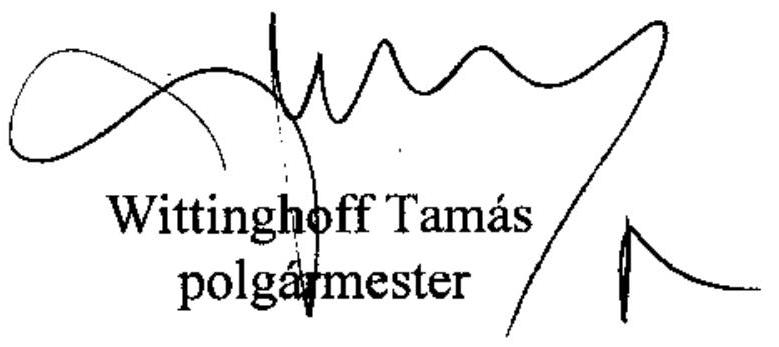

---

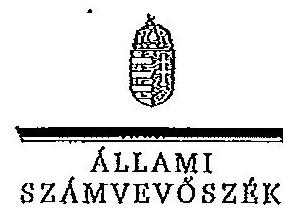

A L E L H O R

Jkt.szám: V-3108-038/2012.

Wittinghoff Tamás úr
polgármester
Budaörs Város Önkormányzata

Budaörs

Tisztelt Polgármester Úr!

Köszönettel vettem Budaörs Város Önkormányzata pénzügyi helyzetének ellenőrzéséről
készült jelentéstervezethez kapcsolódó észrevételekről és tervezett intézkedésekről szóló
tájékoztatását.

Az adósságszolgálat teljesítése érdekében a pénzintézeti kötelezettségek visszafizetési
forrásainak számszerűsítését, valamint az erre a célra elkülönített tartalék képzését – a 2010.
évben kötött 3,1 milliárd Ft összegű hitelszerződés, valamint a csökkenő működési jövedelem
következtében – továbbra is indokoltnak tartom.

Az „I. Összegző megállapítások, következtetések, javaslatok” első szövegközi ábrájában lévő
elfírásra vonatkozó észrevételét elfogadtam az ábrában a könyvtárat és a művelődési központot
a kötelező feladatok közé áthelyeztem.

Örömmel értesültem arról, hogy pénzügyi egyensúlyi helyzetük javítása érdekében
intézkedéseket tett az Önkormányzat.

Tájékoztatom, hogy a megküldött intézkedéseiről szóló levele nem tekinthető az Állami
Számvevőszékről szóló 2011. évi LXVI. törvény 33. § (1) bekezdése szerinti intézkedési
tervnek, ezért kérem, hogy azt a jelentés kézhezvételét követően, a törvényi határidőn belül az
Állami Számvevőszék részére megküldeni szíveskedjen.

Végül megköszönöm Polgármester úrnak és munkatársainak az ellenőrzés során tanúsított
hozzáállását, amellyel az Önkormányzatról szóló pénzügyi helyzetelemzés elkészítését
segítették.

Budapest, 2012. március "JE ".

Tisztelettel:

Warvasovszky Tihamér

1052 BUDAPEST, APÁGYAI CSERE JÁNOS UTCA 10. 1364 Budapest 4. Pf. 54 telefon: 484 0102 fzn: 484 0202
