# ÁLLAMI   SZÁMVEVŐSZÉK 

## JELENTÉS

Cigánd Város Önkormányzata pénzügyi helyzetének ellenőrzéséről (43/4)

---

# Állami Számvevőszék 

Iktatószám: V-3082-023/2012.
Témaszám: 1015
Vizsgálat-azonosító szám: V0560113

## Az ellenőrzést felügyelte:

Dr. Varga Sándor
számvevő igazgató-helyettes
Az ellenőrzést vezette:
Renkó Zsuzsanna
számvevő tanácsos
Ellenőrzési csoportvezető:
Bialkó Zsolt Gyula
számvevő tanácsos
Az ellenőrzést végezték:
Puskás Balázs Hadházy Sándor
számvevő számvevő tanácsos

---

# TARTALOMJEGYZÉK 

BEVEZETÉS ..... 9
I. ÖSSZEGZŐ MEGÁLLAPÍTÁSOK, KÖVETKEZTETÉSEK, JAVASLATOK ..... 13
II. RÉSZLETES MEGÁLLAPÍTÁSOK ..... 25

1. Az Önkormányzat kötelező és önként vállalt feladatai, a feladatellátás szervezeti keretei és annak változásai ..... 25
2. Az Önkormányzat pénzügyi egyensúlyi helyzetét befolyásoló tényezők ..... 28
2.1. A működési és a felhalmozási egyensúly változása ..... 30
2.2. Az Önkormányzat bevételeinek változása ..... 35
2.3. Az Önkormányzat működési és felhalmozási célú kiadásainak változása ..... 38
3. Az Önkormányzat kötelezettségei ..... 43
3.1. Az Önkormányzat pénzintézeti kötelezettségeinek változása ..... 43
3.2. A szállítói kötelezettségek változása ..... 48
3.3. Egyéb kötelezettségek változása ..... 48
4. A pénzügyi egyensúly megteremtése érdekében hozott intézkedések eredménye ..... 51
5. A helyi önkormányzatok gazdálkodási rendszerének ellenőrzése során a pénzügyi egyensúly javítására tett szabályszerűségi és célszerűségi javaslatok hasznosulása ..... 54

---

# MELLÉKLETEK 

1. számú Működési és felhalmozási célú hiány/többlet a 2007-2010 közötti időszakban az Önkormányzat zárszámadási rendeleteiben (1 oldal)
2. számú Az Önkormányzat bevételei és kiadásai, valamint adósságszolgálata 2007-2010 között (1 oldal)
3/a. számú Az Önkormányzat 2007-2010. években megvalósított, 2010. december 31-ig befejezett fejlesztései és azok forrásösszetétele (1 oldal)
3/b. számú Az Önkormányzat 2010. december 31-én folyamatban lévő fejlesztési feladataira 2010. december 31-ig teljesített kifizetések és azok forrásösszetétele (1 oldal)
3/c. számú Az Önkormányzat 2010. december 31-én folyamatban lévő fejlesztési feladataira 2010. december 31-én fennálló kötelezettségek és azok forrásösszetétele (1 oldal)
3/d. számú Az Önkormányzat által beadott, elbírálás alatti pályázati forrásból megvalósítani tervezett fejlesztéseihez kapcsolódó kötelezettségvállalásai és azok forrásösszetétele (1 oldal)
3. számú Az önkormányzati feladatok ellátásában résztvevő gazdasági társaságok (1 oldal)

---

# RÖVIDÍTÉSEK JEGYZÉKE 

## Törvények

Adósságrendezési tv.
Áht $_{1}$.
Áht $_{2}$.
Ötv.

## Rendeletek

Ámr.
2011. évi költségvetési rendelet
SzMSz

## Szórövidítések

áfa
ÁSZ
ÁMK
CHF
EU
Gazdasági Társaság
GDP
jegyző
Képviselő-testület
OEP
ÖKIF hitel
ÖNHIKI
Önkormányzat
polgármester
Polgármesteri hivatal
PPP konstrukció
szja
a helyi önkormányzatok adósságrendezési eljárásáról szóló 1996. évi XXV. törvény
az államháztartásról szóló 1992. évi XXXVIII. törvény, hatályos 2011. december 31-ig
az államháztartásról szóló 2011. évi CXCV. törvény
a helyi önkormányzatokról szóló 1990. évi LXV. törvény, hatályos 2011. december 31-ig
az államháztartás működési rendjéről szóló 292/2009. (XII. 19.) Korm. rendelet

Cigánd Város Önkormányzatának 5/2011. (III. 1.) számú rendelete az Önkormányzat 2011. évi költségvetéséről
Cigánd Város Önkormányzatának 5/2007. (IV. 26.) számú rendelete a Képviselő-testület Szervezeti és Működési Szabályzatáról
általános forgalmi adó
Állami Számvevőszék
Általános Művelődési Központ
Svájci frank
Európai Unió
Cigánd Településüzemeltetési Nonprofit Kft.
Bruttó hazai termék
Cigánd Város Önkormányzatának jegyzője
Cigánd Város Önkormányzat Képviselő-testülete
Országos Egészségbiztosítási Pénztár
Önkormányzati Fejlesztési Hitelprogram keretében nyújtott hitel
Önhibáján kívül hátrányos helyzetben lévő helyi önkormányzatok támogatása
Cigánd Város Önkormányzata
Cigánd Város Önkormányzatának polgármestere
Cigánd Város Önkormányzatának Polgármesteri Hivatala Public Private Partnership (Partnerségi együttműködés közfeladatok ellátására a magánszektor bevonásával) személyi jövedelemadó

---

.

---

# ÉRTELMEZŐ SZÓTÁR 

| BUBOR | Budapesti Bankközi Forint Hitelkamatláb. Irányadó, refe-   rencia jellegű kamatláb. Mértékét az MNB naponta álla-   pítja meg a banki kamatok figyelembevételével. Közzété-   tele naponta történik. |
| :--: | :--: |
| CLF módszer | Az önkormányzatok költségvetése elemzésének eszköze. A   módszer következetesen elkülöníti a folyó és a felhalmo-   zási költségvetés bevételeit és kiadásait, azok költségvetési   egyenlegeit. A bevételek és kiadások, működés és fejlesztés   elkülönítése. Bizonyos mértékig a vállalati gazdálkodás   logikai elemeit érvényesíti az önkormányzatok pénzügyi,   jövedelmi helyzetének vizsgálata során. Az értékelés a   pénzügyi kapacitás fogalmát helyezi a középpontba. |
| EURIBOR | A frankfurti bankközi piacon jegyzett, az Európai Közpon-   ti Bank szabályainak megfelelően megállapított kínálati   kamatláb. Az EURIBOR értékét a legfontosabb európai   bankok hitelkínálatának kamatlábai alapján a Reuters   ügynökség számolja ki és teszi közzé naponta. A magyar   pénzintézetek is ezt használják viszonyítási alapnak EUR   hitelek esetén. |
| használhatósági fok | Az eszközgazdálkodás vizsgálatának elemzése során   használt mutató. Számításakor a tárgyi eszköz könyv szer-   inti (nettó) értékét viszonyítják a tárgyi eszköz bruttó (be-   szerzési/létesítési) értékéhez. A %-ban kifejezett mutató   csökkenése az eszköz állagának romlására, avulására   utal, ami maga után vonja az üzemeltetési és fenntartási   költségek növekedését is. |
| kamatkockázat | A változó kamatozású forint- vagy a devizahitelek futam-   ideje alatt a kamat emelkedése miatt fennálló kamatkocká-   zat, melynek növekedése miatt nő a hitel törlesztőrész-   lete. |
| kötelező közszolgáltatás | A helyi önkormányzati feladatkörbe tartozó, a köztiszta-   sággal és a településtisztasággal, valamint az élet- és va-   gyonbiztonsággal összefüggő egyes - közszolgáltatás út-   ján megvalósuló - közfeladatok ellátása, amelynek köte-   lező igénybevételét külön jogszabály (törvény, helyi ön-   kormányzati rendelet) határoz meg. |
| közfeladat | Állami, helyi, illetve kisebbségi önkormányzati feladat,   amelynek ellátásáról az államnak, illetve az önkormán-   zatoknak kell gondoskodni. A hatályos szabályozás sze-   rint közfeladatot törvény és önkormányzati rendelet álla-   píthat meg. Az önkormányzatok által ellátandó feladatok   keretszerű meghatározását az Ötv. tartalmazza. |
| LIBOR | Angol kifejezés, a London Interbank Offered Rate rövidíté-   se. Jelentése: Londoni bankközi, referencia jellegű kínálati   (hitel) kamatláb. |

---

önkormányzat többségi tulajdonában lévő gazdasági társaságok
pénzügyi kapacitás
pénzügyi kockázat

Az önkormányzat a gazdasági társaságban a szavazatok több mint ötven százalékával vagy a Ptk. 685/B. § (2)-(3) bekezdéseiben rögzített meghatározó befolyással rendelkezik. A befolyással rendelkező akkor rendelkezik egy jogi személyben meghatározó befolyással, ha annak tagja, illetve részvényese, és jogosult e jogi személy vezető tisztségviselői vagy felügyelőbizottsága tagjainak többségének megválasztására, illetve visszahívására, vagy a jogi személy más tagjaival, illetve részvényeseivel kötött megállapodás alapján egyedül rendelkezik a szavazatok több mint ötven százalékával (Ptk. 685/B. § (2) bek.). A meghatározó befolyás akkor is fennáll, ha a befolyással rendelkező számára e jogosultságok közvetett módon (köztes vállalkozásain keresztül, a Ptk. 685/B §. (3),(4) bek. szerint) biztosítottak.
A helyi önkormányzat és az önkormányzat irányítása alá tartozó költségvetési szerv többségi tulajdonában, illetve többségi befolyása alatt álló gazdálkodó szervezet esetében hitelfelvétel, kölcsönfelvétel, garancia- vagy kezességvállalás, tartozásátvállalás, tartozáselengedés, értékpapírkibocsátás, -vásárlás, pénzügyi lízing, tartós bérleti szerződés, ingyenes vagyonjuttatás (így különösen: ajándékozás, ingyenes engedményezés), vagy követelésvásárlás, követelésengedményezés végrehajtására vonatkozóan az Áht. 100/M. § (4) bekezdése alapján az önkormányzat rendelkezik döntési jogosultsággal.
A pénzügyi kapacitás (financial capacity) az adósok hitelfelvételi képességének azon mértéke, ahol még anélkül tudják növelni az adósságot, hogy csökkenteniük kellene akár a jelenbeli, akár a jövőben esedékes kiadásaikat a fizetésképtelenség elkerülése érdekében. (Forrás: Az önkormányzati rendszer pénzügyi helyzete, ÁSZKUT tanulmány 2010.
A működési kockázat egyik eleme. Megmutatkozhat a költségvetés nagyságrendjének, szerkezetének nem megalapozott módosításaiban, a bevételi, és a kiadási előirányzatoktól lényegesen eltérő teljesítésekben, a nem megfelelő belső kontrollrendszer működésében, a tudatos károkozásokban, a biztosítások elmaradásában, a hibás fejlesztési döntésekben, a nem a terveknek megfelelő forrásfelhasználásokban. Jelentkezhet továbbá a bevételek és kiadások ütemkülönbsége miatt felvett folyószámla- és likvidhitelek költségvetési év végén fennálló egyenlege miatt, amely az önkormányzat költségvetésébe - akár tartósan - beépülő forráshiányt jelzi.

---

szállítói kitettség

Tornaterem
törlesztési kockázat

SNA

Az önkormányzat pénzügyi helyzete olyan külső körülmények hatására is módosulhat, amelyekre az önkormányzatnak nincs hatása, emiatt szállítói kitettsége keletkezik. Pl. a lejárt szállítói tartozások rendezése függhet attól, hogy a szállító milyen intézkedéseket foganatosít az önkormányzattal szemben.
Az Önkormányzat a Sport XXI. Létesítményfejlesztési Program részelemeként a „Korszerű tornatermet mindenhol" alprogram keretében PPP finanszírozás során a köz és a magánszféra együttműködésében történő megvalósításban egy új, korszerű „D2" jelű tornaterem használatához jutott. Az állam támogatását az elkészült létesítmény használatakor, a 15 éves futamidőben fizetendő szolgáltatási díjfizetés során történő tehervállalás formájában nyújtja. A tornaterem sport és közösségi, szabadidő, művelődési célra egyaránt alkalmas. Rendelkezik 400 fős lelátóval, három térrészre osztható csarnoktérrel, mesterséges szellőztetéssel, valamint közönségforgalmi terekkel (előcsarnok, ruhatár, büfé, vizesblokk, öltöző).
Annak a kockázata, hogy a megfelelő időben és mértékben a hitelt felvevőnél rendelkezésre állnak-e a pénzintézetek és egyéb szervek felé fennálló kötelezettségek visszafizetéséhez, a hitelek és kölcsönök törlesztéséhez szükséges pénzügyi források.
A törlesztési kockázatot növeli a kamat- és árfolyam növekedése, mivel ezekben az esetekben az adósságszolgálat nőhet. Törlesztési kockázatot okozhat a visszafizetésre tervezett forrás elérésének, teljesítésének bizonytalansága (pl. a visszafizetéshez tervezett tartalékolás elmaradt, a tervezettnél alacsonyabb a saját bevétel, a helyi adóból származó bevétel az adóalanyok, adóalapok csökkenése miatt nem teljesül).
System of National Account, azaz a Nemzeti Számlák Rendszere, amely a gazdasági szektorok által létrehozott valamennyi terméket és szolgáltatást figyelembe veszi.

---

.

---

# JELENTÉS 

## Cigánd Város Önkormányzata pénzügyi helyzetének ellenőrzéséről

## BEVEZETÉS

Az Állami Számvevőszék 2011. évtől érvényes stratégiája új irányt szabott a helyi önkormányzatok gazdálkodásának ellenőrzésében is. Az ÁSZ – küldetése és jövőképe szerint – szilárd szakmai alapokra támaszkodva értékteremtő ellenőrzéseivel és helyzetelemzéseivel az államháztartás egészében, így a helyi önkormányzati alrendszerben is elő kívánja segíteni a közpénzek és a közvagyon szabályos, gazdaságos, hatékony és eredményes felhasználását. E folyamat részeként – az államháztartási hiány alakulásának összetevőire is figyelemmel – végezzük az önkormányzati alrendszer pénzügyi helyzetelemzését.

Az államháztartás helyi szintjén a 304 városnak ${ }^{1}$ az általuk ellátott közszolgáltatások volumenére is tekintettel a közfeladatok ellátásában kiemelt szerepe van. E települések 2011. január 1-jei népessége 3169 ezer fő volt.

Feladataik és hatásköreik az Ötv. mellett különböző ágazati törvények által meghatározottak, miközben a feladatellátás szervezeti kereteit – ezen belül a gazdasági társaságok közszolgáltatások ellátásában betöltött szerepét – saját maguk határozzák meg. A gazdasági társaságok által ellátott feladatok esetén a gazdálkodás, továbbá az önkormányzatok pénzügyi egyensúlyi helyzetére ható közvetlen kockázatok egy része kikerült az önkormányzati alrendszerből. A többségi önkormányzati tulajdonban lévő társaságok gazdálkodásának körülményei befolyásolhatják a városok pénzügyi egyensúlyi helyzetének megítélésében rejlő kockázatokat.

Az áttekintett időszakban az önkormányzati forrásszabályozás elvei lényegesen nem változtak. Az önkormányzatok gazdasági mozgásterét a központi költségvetéstől való függőség mellett jelentősen befolyásolja a helyi adókivetési jog gyakorlása. A városok gazdálkodási szabadságának lényeges eleme, hogy anyagi lehetőségeik függvényében dönthettek arról, hogy feladataik közül azokat, amelyek megoldására az Ötv. szerint a települési önkormányzat nem kötelezhető, a megyei önkormányzat fenntartásába adhatták. E döntések differenciáltan érintették a városok pénzügyi helyzetét.

[^0]
[^0]:    ${ }^{1}$ A megyei jogú városok nélkül figyelembe vett városok száma 304 városi önkormányzatot jelent.

---

A városi önkormányzatok 2007-2010 között teljesített bevételeinek alakulását és összetételét a következő ábra szemlélteti:

Az önkormányzati alrendszer pénzügyi helyzetértékelése során új elemzési módszereket alkalmazott az ellenőrzés. A költségvetési beszámoló adatok elemzése helyett az önkormányzat pénzügyi helyzetét a CLF módszerrel értékeltük, amelynek lényegét és számításának módszerét a jelentés 2. pontjában, és a jelentés 2. számú mellékletében ismertetjük részletesen.

Az új módszereken alapuló helyzetértékelés fontosságát az adja, hogy a helyi önkormányzatok bruttó adósságállománya ${ }^{2}$ a
 2010. évi költségvetési beszámolók alapján 1248 milliárd Ft-ot tett ki. Ezen belül a 304 város adóssága 383 milliárd Ft volt, amely az önkormányzati alrendszer teljes adósságállományának 30,7%-át jelentette ${ }^{3}$.

A mérlegben kimutatott bruttó adósságállomány mellett az önkormányzatok számára az eszközállomány műszaki állapotának megőrzése is előbb-utóbb pénzügyi kötelezettséget jelent. Az elhasználódott eszközök pótlására forrást biztosító amortizációs (felújítási) alap képzésének ${ }^{4}$ elmaradása maga után vonhatja a feladatellátást kiszolgáló tárgyi eszközök állagának erőteljes romlását.

[^0]
[^0]:    ${ }^{2}$ Az önkormányzati mérlegbeszámolókból számított bruttó adósságállomány 2010. év végi összege magában foglalja a fejlesztési és a működési célú kötvénykibocsátások, a beruházási és fejlesztési hitelek, a működési célú hosszú lejáratú hitelek, a rövid lejáratú hitelek, váltótartozások miatti kötelezettségek teljes (2011-ben, illetve az azt követő években esedékes) állományát. Az önkormányzatok 2007. év végi mérleg szerinti adósságállománya 692 milliárd Ft volt.
    ${ }^{3}$ A fővárosi és a kerületi önkormányzatok adósságának figyelmen kívül hagyásával számított 977 milliárd Ft összegű bruttó adósságállományból a városok 39,2%-kal részesedtek.
    ${ }^{4}$ Erre a jelenlegi szabályozási környezetben nem kötelezi előírás az önkormányzatokat.

---

Emellett a 2007-2013-as időszakra meghirdetett, vissza nem térítendő EU-s fejlesztési forrásokhoz való hozzájutás lehetősége felerősítette az önkormányzati alrendszer fejlesztési igényeit, amelyek a felhalmozási költségvetési hiány folyamatos emelkedésén túl - az előírt jövőbeni fenntartási kötelezettség miatt tovább terhelhetik az önkormányzatok költségvetését ${ }^{5}$.

Az ÁSZ a 2011. évi ellenőrzési tervében 43. számú, az önkormányzatok gazdálkodási rendszerének ellenőrzése részeként áttekinti, és elemzi az önkormányzatok pénzügyi helyzetét. A gazdálkodás szabályszerűségét az ÁSZ az előző évek során ebben az önkormányzati körben is ellenőrizte. Jelen vizsgálatunk a tett javaslataink pénzügyi helyzetet érintő pontjainak hasznosítására utóellenőrzés jelleggel tér ki.

Az ellenőrzés megállapításait az Önkormányzat által kitöltött - teljességi nyilatkozattal megerősített - 27 tanúsítványon szolgáltatott adatokra alapoztuk. Ellenőrzési bizonyítékként használtuk fel továbbá:

- a képviselő-testületi és bizottsági előterjesztéseket, a döntés-előkészítés során készített dokumentumokat;
- a kötelezettségvállalások dokumentumait;
- a pénzügyi-számviteli nyilvántartásokat;
- az éves költségvetési beszámolókat;
- a költségvetési és zárszámadási rendeleteket.

Az ellenőrzés a 2007. január 1. - 2011. június 30. közötti időszakot ölelte fel. A pénzintézeti kötelezettségek állományának vizsgálatakor az ellenőrzött időszak 2006. december 31. - 2011. június 30. közötti időszakra terjedt ki.

Az ellenőrzés során vizsgáltunk minden olyan körülményt és adatot, amely a program végrehajtásához kapcsolódott és a pénzügyi helyzet alakulására hatást gyakorló releváns tények és folyamatok feltárásához szükségessé vált.

# Az ellenőrzés célja annak értékelése volt, hogy: 

- a vizsgált időszakban a kötelező és önként vállalt feladatok ellátását biztosító szervezeti keretekben, a feladatellátás módjában bekövetkezett változások milyen hatást gyakoroltak az Önkormányzat pénzügyi helyzetének alakulására;

[^0]
[^0]:    ${ }^{5}$ Az Állami Számvevőszék 2011. júniusában közzétett 1108. számú, a helyi önkormányzatok fejlesztési célú támogatási rendszerének ellenőrzéséről szóló jelentésében feltárta a fejlesztési folyamatok problémáit. A helyi önkormányzatok elsősorban azokat a fejlesztéseket valósították meg, amelyekhez támogatást lehetett igényelni. A fejlesztési célok közül a magasabb támogatási intenzitású pályázatokat részesítették előnyben. A fejlesztéssel megvalósuló létesítmények jövőbeli üzemeltetésének várható ráfordításait az önkormányzatok 71,9%-a nem mérte fel.

---

- az Önkormányzat pénzügyi - ezen belül működési és felhalmozási - egyensúlya mely tényezők hatására miként változott, és az Önkormányzat milyen intézkedéseket tett a pénzügyi egyensúly javítása érdekében;
- a költségvetési kiadások finanszírozása érdekében vállalt pénzintézeti kötelezettségek hogyan alakultak, továbbá milyen kötelezettségek fennállása befolyásolja az Önkormányzat jövőbeli pénzügyi helyzetét;
- hasznosultak-e a gazdálkodási rendszer korábbi ellenőrzése során a pénzügyi egyensúly javítására az ÁSZ által tett szabályszerűségi és célszerűségi javaslatok.

Az ellenőrzés típusa: szabályszerűségi vizsgálat.
A vizsgálat jogszabályi alapját az Állami Számvevőszékről szóló 2011. évi LXVI. törvény 1. § (3), 5. § (2)-(6) bekezdései, továbbá az Áht$_{1.}$ 120/A. § (1) bekezdése ${ }^{6}$ előírásai képezték.

Cigánd a Bodrogköz központja, 2004-ben várossá nyilvánították. Lakosainak száma 2011. január 1-jén 2681 fő volt. Az Önkormányzat a feladatait 3 költségvetési szervvel és 3 gazdasági társasággal látja el. 2010-ben zárszámadási rendelete szerint 1131,5 millió Ft költségvetési bevételt ért el, és 1017,1 millió Ft kiadást teljesített. A könyvviteli mérleg szerint az Önkormányzat 2010. december 31-én 5430,5 millió Ft értékű vagyonnal rendelkezett.

Cigándon, mint városi funkció gyámhivatal, okmányiroda, építésügyi hatóság, több mint 30 fős rendőrőrs, oktatási társulás működik. Integrált feladatokat fog ellátni a Cigándon hamarosan megnyíló Bodrogközi Járóbeteg Szakellátó Intézet. A Bodrogközi Kistérség 2005-ben történt megalakulása óta a fejlesztések következtében Cigánd térségi szerepe folyamatosan nő. A Bodrogközi Kistérség jelenlegi központja és az egyetlen városi rangú települése, mely a Bodrogköz egyetlen településétől sincs 30 km-nél messzebb, a lakosság döntő többsége 20 km-en belül lakik.

[^0]
[^0]:    ${ }^{6}$ 2012. január 1-jétől Áht$_{2}$. 61. § (2) bekezdése

---

# I. ÖSSZEGZŐ MEGÁLLAPÍTÁSOK, KÖVETKEZTETÉSEK, JAVASLATOK 

Az Önkormányzat - adatszolgáltatása szerint, mely nem tartalmazta a fejlesztési célú kamatkiadások összegét, de szerepeltette a működési célra nyújtott kölcsönök összegét - a 2010. év működési költségvetési kiadásaiból (825,1 millió Ft) 697,2 millió Ft-ot (84,5%) a kötelező feladatok, 127,9 millió Ft-ot (15,5%) az önként vállalt feladatok ellátására fordított. Az Önkormányzat önként vállalt feladatai közé sorolta a lakosság önszerveződő közösségei támogatását, a méltányossági szempontok alapján fizetett szociális juttatások és támogatások folyósítását, a Tornaterem fenntartásának támogatását, valamint a közterületfelügyeleti tevékenységet. Az Önkormányzat 2007-ben az önként vállalt feladatokra 75,0 millió Ft (12,1%) működési kiadást teljesített. A 2008-2010 közötti időszakban az előző évhez képest - a Tornaterem működtetése, a közfoglalkoztatás, valamint a sportlétesítmények növekvő támogatásai miatt - folyamatosan emelkedett az önként vállalt feladatokra fordított működési kiadások aránya, 2008-ban 9,5% (76,0 millió Ft), 2009-ben 13,8% (119,1 millió Ft), és 2010-ben 15,5% (127,9 millió Ft) volt.

Az Önkormányzat feladatellátásának szervezeti struktúráját a következő ábra szemlélteti:
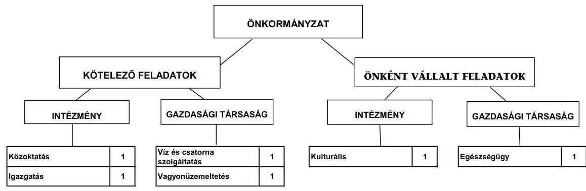

Az Önkormányzat feladatait 2011. június 30-án (a Polgármesteri hivatallal együtt) három költségvetési szervvel, kettő 50% feletti tulajdonosi részesedésű és egy kisebbségi részesedésű gazdasági társasággal látta el. A vizsgált időszakban az intézményszervezeti átalakítások következtében - az Önkormányzat két önkormányzattal intézményfenntartói társulást hozott létre az óvodai és általános iskolai feladatok ellátására, a szociális és gyermekvédelmi feladatokat többcélú kistérségi társulásnak adta át - a feladatellátás telephelyeinek száma a 2007. évi 13-ról 2011. év I. félév végére 16-ra emelkedett. Az Önkormányzat a szociális feladatok ellátásához a vizsgált időszakban 2010-ben 1,6 millió Ft-tal járult hozzá. Az Önkormányzat kimutatása szerint a 2007-2010. években az önkormányzati közszolgáltatások körében végrehajtott szervezeti változások összességében a kiadásokat 104,0 millió Ft-tal, a bevételeket 131,2 millió Ft-tal növelték, 27,2 millió Ft összegű megtakarítást eredményezve, mely hozzájárult a pénzügyi egyensúly fenntartásához.

---

Az Önkormányzat kizárólagos tulajdonában levő gazdasági társaság látta el a kötelező feladatok közül a temető fenntartását, a köztisztasági feladatokat, csapadékvíz-elvezetést, valamint a közoktatási, a kulturális és sport intézmények takarítási feladatait. A kizárólagos tulajdonban lévő gazdasági társaság helyzete stabil, 2010-ben a saját tőke kétszerese volt a jegyzett tőkének. Az Önkormányzat minősített többségi tulajdonában levő gazdasági társaság 2008. évben történt megalapításától kezdve a leendő tevékenységét, a járóbetegszakellátást nem kezdte meg a helyszíni vizsgálat lezárásáig. A járóbetegszakellátás ellátására létrehozott minősített többségi tulajdonú társaság jelenleg nem működik rendeltetésszerűen, minimális, a projekt lebonyolítási feladatait látja el, a jegyzett tőke és a saját tőke aránya 2010-ben 1,04 volt. Működési célú pénzeszközátadást az Önkormányzat a vizsgált időszakban településüzemeltetést végző gazdasági társaságának nyújtott 45,3 millió Ft összegben.

A működési kiadások fedezetéül szolgáló bevételi források ágazatonkénti összegeit a 2007. és a 2010. években a következő ábra szemlélteti:
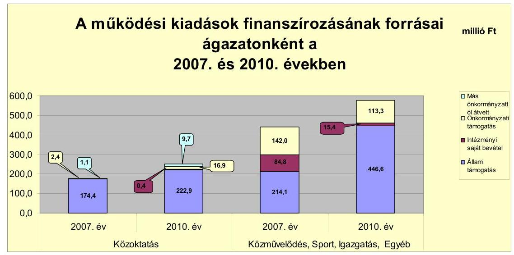

Az Önkormányzat működési kiadásai a közoktatási feladatok bővülése miatt a 2007-2009. évek közötti folyamatos emelkedés után, 2010-ben a feladatváltozás, valamint a szállítókkal szembeni kötelezettségek nem teljesítése miatt 4,4%-kal mérséklődött. A 2010. évi 825,1 millió Ft teljesített működési kiadást 2010-ben 81,1%-ban állami támogatás, 1,9%-ban intézményi saját bevétel, 15,8%-ban önkormányzati támogatás, illetve 1,2%-ban más önkormányzattól átvett pénzeszköz finanszírozta. A működési kiadások finanszírozásában az állami támogatás aránya volt a meghatározó, a 2007. évi 62,8%-ról (388,5 millió Ft) folyamatosan emelkedett a 2010. évi 81,1%-ra (608,2 millió Ft-ra).

A feladatok ellátására biztosított állami támogatások emelkedésének mértéke meghaladta az önkormányzati feladatok működési kiadásainak növekedési ütemét, ezáltal pozitív hatást gyakorolt az Önkormányzat pénzügyi egyensúlyi helyzetére. Az állami támogatás emelkedését többek között az okozta, hogy a közoktatási intézményekben a szolgáltatást igénybevevők száma az óvodák és az általános iskolák vonatkozásában is emelkedett, valamint a társulásban történő működés esetében magasabb állami támogatást tudtak igénybe venni. Továbbá az állami támogatás arányának emelkedésére a központi források átrendezése, valamint az igazgatási, a közfoglalkoztatási feladatokra kapott többlettámogatás és az ÖNHIKI pályázaton elnyert (2009-ben 35,9 millió Ft, 2010-ben 20,7 millió Ft) összegek voltak hatással. Ezzel párhuzamosan az intézményi saját bevételek aránya a csökkenő helyi adóbevételek miatt a 2007. évi 13,7%-ról, és az önkormányzati támogatás aránya a 2007. évi 23,3%-ról folyamatosan mérséklődött.

Az Önkormányzat folyó költségvetési egyenlege (működési jövedelem) a 2008. évben működési forráshiányt, 2007-ben és 2009-2010-ben működési többletet mutatott.
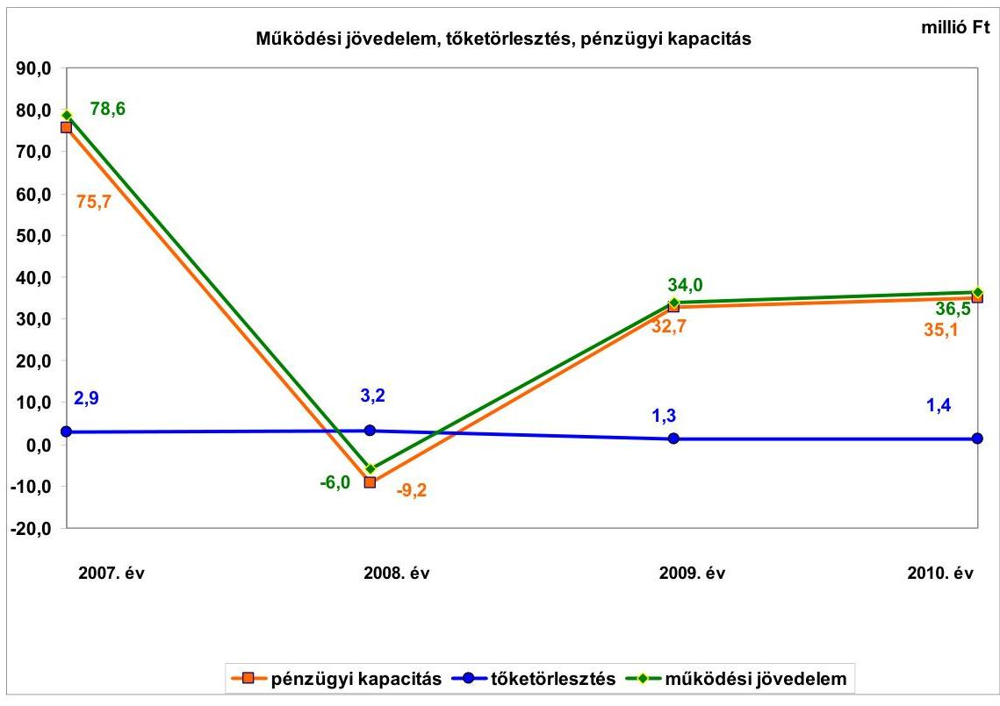

A működési jövedelem a 2007. évben kiugróan magas (78,6 millió Ft) volt, mert a Vásárhelyi-terv keretében megvalósuló árapasztó tározó építése miatt megemelkedett 82,8 millió Ft iparűzési adó növelte a működési bevételeket. A pozitív működési jövedelem kialakulásában szerepe volt annak, hogy 9,6 millió Ft-tal nőtt a működéshez kapcsolódó szállítói tartozásállomány. A 2008. évben a működési jövedelem negatív lett, 84,6 millió Ft-tal csökkent az előző évhez képest. A mérséklődés többek között azért következett be, mert a befolyt iparűzési adó összege 44,8 millió Ft-tal csökkent, a PPP beruházásban megvalósított Tornaterem 2008. április 1-jétől történő üzemeltetése során a tárgyévi működési kiadások 15,5 millió Ft-tal haladták meg a tárgyévi működési bevételeket. A negatív működési jövedelemhez hozzájárult még, hogy a kamatkiadások 10,4 millió Ft-tal növekedtek, valamint a szállítói kötelezettségek 9,6 millió Ft-tal csökkentek az előző év végi állományhoz képest. A működési jövedelem előjele 2009-ben pozitívra fordult, értéke 34,0 millió Ft lett. A működési többlet 34,4 millió Ft ÖNHIKI támogatás és 1,5 millió Ft működésképtelen helyi önkormányzatok egyéb támogatása segítségével képződött, emellett még a szállítói tartozásállomány is 14,1 millió Ft-tal emelkedett az előző év végi állomány-

---

hoz képest. A 2010. évben a működési jövedelem a 2009. évhez hasonló nagyságrendben újra többletet mutatott. Itt is szerepet játszott a pozitív működési jövedelem kialakulásában az elnyert 15,7 millió Ft ÖNHIKI és 5,0 millió Ft működésképtelen helyi önkormányzatok egyéb támogatása, valamint az, hogy a szállítói tartozásállomány 29,2 millió Ft-tal nőtt előző évhez képest.

A vizsgált időszakban a működési jövedelem
 összességében 143,1 millió Ft többletet mutatott. Az Önkormányzat csak úgy tudott a 2009-2010. években pozitív működési jövedelmet elérni, hogy a központi költségvetésből egyszeri működési támogatásban részesült, és nőtt a ki nem fizetett szállítói állomány. A 2008-2010. években a támogatásokkal és a szállítói tartozásállománnyal figyelembe vett működési jövedelem összességében negatív értéket venne fel. Ez a számított negatív működési jövedelem jelzi, hogy az Önkormányzat gazdálkodása rövid távon is kockázatos. A 2011. évtől megkezdődött a kötvény tőketörlesztése, mely várhatóan 2027-ig évi 24,0 millió Ft-os többletkiadást, tőketörlesztést jelent. A törlesztések fedezete csak akkor biztosított, ha a működési jövedelem a jövőben is hasonló nagyságrendet képvisel, mint amekkora 2010-ben volt.

A nettó működési jövedelem - az évről évre hasonló nagyságrendű, nem jelentős összegű tőketörlesztés miatt - a vizsgált időszakban a működési jövedelemmel azonosan irányban változott. A 2007-2010. években összesen létrejött 143,1 millió Ft működési jövedelemhez mindössze 8,8 millió Ft hiteltörlesztés kapcsolódott, amelynek teljesítését követően 134,3 millió Ft pozitív nettó működési jövedelme keletkezett az Önkormányzatnak. Mindez azt jelzi, hogy az Önkormányzat költségvetési megtakarításai a vizsgált időszakban elégségesek voltak az alacsony nagyságrendet képviselő adósságszolgálati kiadásokra.

Az összes folyó bevétel a 2007. évi 697,4 millió Ft-ról a közoktatási intézmények átvétele miatt 2009-re folyamatosan emelkedve 901,9 millió Ft-ra nőtt (204,5 millió Ft-tal 29,3%-kal), majd ezt követően az ellátotti létszám csökkenése, valamint a költségvetési támogatás, a hozambevételek, és a helyi adóbevételek együttes csökkenése miatt mérséklődött, 2010-ben 864,0 millió Ft volt.

Az Önkormányzat folyó kiadásai a közoktatási intézmények átvételének hatása miatt 2007-2009 között folyamatosan növekedtek, majd 2010-re a Központi Orvosi Ügyelet - a Bodrogközi Többcélú Kistérségi Társulásnak történt átadása, valamint a szállítói kötelezettségek nem teljesítése következtében mérséklődtek.

A 2007-2010. években az Önkormányzat felhalmozási költségvetésének egyenlege folyamatosan negatív összegű volt. A felhalmozási forráshiánynak a felhalmozási és tőke jellegű kiadásokhoz viszonyított aránya 2009-ben (66,3%) és 2010-ben (24,6%) az előző évekhez képest magas volt. Az ezekben az években végrehajtott beruházásoknál alacsonyabb volt a támogatási arány, mint 2007-2008-ban. A felhalmozási forráshiány 2007-2010. között 301,0 millió Ft-ot tett ki, amelyre részben az időszakban képződő 134,3 millió Ft nettó működési megtakarítás (nettó működési jövedelem), valamint a rendelkezésre álló 19,8 millió Ft 2006. évi pénzmaradvány szolgált fedezetül. A forráshiány finanszírozásához szükséges további pénzeszközöket külső forrásból,

---

13,0 millió Ft hitel felvételével, valamint 250,0 millió Ft értékű kötvény kibocsátásával teremtették meg.

A pénzügyi egyensúlyi helyzet alakulását jelentősen befolyásolta az Önkormányzat elmúlt időszaki fejlesztési tevékenysége. A 2007-2010. évek időszakában befejezett fejlesztések esetében 3963,7 millió Ft értékű kiadást teljesített fejlesztésekre és felújításokra. Ezek teljes bekerülési költsége 4738,7 millió Ft volt. A fejlesztések forrását döntő részben hazai támogatásból (94,6%-ban) fedezték. A saját forrás, a hazai és EU-s támogatások mellett 13,0 millió Ft hitelfelvétel (0,3%) is történt a fejlesztések finanszírozása érdekében. A 2010. december 31-én folyamatban lévő fejlesztési feladatok végrehajtására 2007-2010. között 17,0 millió Ft kiadást teljesítettek, amelyet EU-s támogatásból finanszíroztak. A projektek döntő többsége utófinanszírozású volt, mely likviditási gondot nem okozott. A 2007-ben kibocsátott kötvény bevételéből a folyamatos finanszírozást lehetővé tevő pénzeszközök rendelkezésre álltak. A Képviselő-testületnek nem mutatták be a beruházásokkal létrehozott létesítmények működtetése és fenntarthatósága érdekében várhatóan felmerülő költségvetési kiadásokat.

Az Önkormányzat 2010. december 31-én folyamatban lévő fejlesztési feladatok 2010. évet követő kötelezettségvállalásainak összege 449,2 millió Ft volt, amelynek finanszírozását 423,5 millió Ft-ot EU-s támogatásból, 13,3 millió Ft-ot hazai támogatásból és 12,4 millió Ft-ot a 2007-ben kibocsátott kötvényből terveznek biztosítani. Saját forrással a fejlesztések megvalósításához nem számoltak. A vállalt fejlesztések jövőbeni finanszírozhatóságának kockázatát az Önkormányzat a megvalósításhoz szükséges források biztosításával csökkentette.
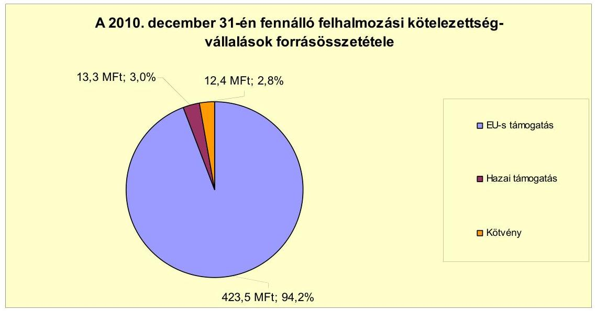

Az Önkormányzat által beadott, elbírálás alatt álló pályázatok tervezett teljes bekerülési költsége 7,7 millió Ft volt, melynek 81,8%-át (6,3 millió Ft) EU-s támogatásból, míg 18,2%-át (1,4 millió Ft) hazai támogatásból kívánják finanszírozni. Az Önkormányzat azért nem tervezett saját forrást a beruházásai megvalósításához, mert a leghátrányosabb helyzetű kistérségek közé tartozik, ahol a támogatás mértéke 100%-os is lehet.

---

Az Önkormányzat mérleg szerinti pénzintézeti kötelezettsége a 2006. év végéről a 2011. év I. félév végére 5,4 millió Ft-ról 376,3 millió Ft-ra nőtt, amelyből az árfolyamváltozás miatti különbözet 110,5 millió Ft volt. A fennálló pénzintézeti kötelezettségek egy 2007-ben felvett 13,0 millió Ft értékű hosszú lejáratú hitelből, valamint egy 250 millió Ft értékben 2007-ben CHF-ben kibocsátott kötvényből keletkeztek. Az Önkormányzat a 2011. évi költségvetési rendelete alapján 69,7 millió Ft működési célú és további 10,9 millió Ft felhalmozási célú hitel igénybevételét tervezte, melyet a helyszíni ellenőrzés alatt nem vett igénybe.

Az Önkormányzat kötelezettségvállalásaira képviselő-testületi döntés alapján került sor, azonban az előterjesztésekben nem mutatták be a kamat- és - a devizaalapú kötelezettséget érintő - árfolyamkockázatot.

Az Önkormányzat a hosszú lejáratú ÖKIF hitelből, valamint a kötvénykibocsátásból befolyt pénzeszközöket a hitelszerződésben foglaltaknak megfelelően és a kötvénykibocsátáskor megjelölt célra fordította 2007 és 2011. év I. félév között.

Az Önkormányzat a CHF-ben fennálló pénzintézeti kötvény kötelezettségéből a szerződésben foglaltaknak megfelelően 2011. június 30-ig 48620 CHF (7,4 millió Ft) tőkét törlesztett, valamint 121947 CHF (22,0 millió Ft) kamatot és 2,7 millió Ft egyéb költséget fizetett. Az Önkormányzat a tőke törlesztését 2011. március 31-én kezdte meg, mely során a vizsgált időszakban 0,7 millió Ft árfolyamveszteséget realizált. Az ÖKIF hitellel kapcsolatosan a szerződés előírásait betartva az Önkormányzat 2007-2011. év I. félév között 4,7 millió Ft tőkét törlesztett és 2,0 millió Ft kamatot teljesített.

Az Önkormányzat pénzügyi egyensúlyát a vizsgált időszakban folyószámlahitelek igénybevételével tudta biztosítani.

A folyószámlahitel igénybevétele a 2007-2011. év I. félévében a következők szerint alakult:

| Megnevezés | 2007. év | 2008. év | 2009. év | 2010. év | 2011. I. félév |
| :-- | --: | --: | --: | --: | --: |
| Keretösszeg január 1-jén (millió Ft-ban) |  | 20,0 | 20,0 | 20,0 | 20,0 |
| Átlagos napi állomány (millió Ft-ban) | 5,6 | 8,7 | 3,9 | 7,0 | 8,4 |
| Folyószámla hitellel zárt napok száma (nap) | 164,0 | 178,0 | 109,0 | 241,0 | 134,0 |
| Egyenleg (állomány) | x | x | x | x | 11,3 |

Az Önkormányzatnak a vizsgált időszakban a hitel fordulónapjain, illetve a 2007-2010. évek végén folyószámlahitel-állománya nem volt. A likviditás biztosítása az Önkormányzatnak 3,2 millió Ft kamatkiadás és egyéb költség fizetésének kötelezettségét okozta.

Az Önkormányzat 2011. év I. félév végi szállítói tartozása 92,0 millió Ft, melyből lejárt tartozása 77,8 millió Ft volt. Az Önkormányzat 2011. év I. félév végén fennálló lejárt szállítói tartozásállományának 47,2%-a (36,7 millió Ft) 91 és 365 nap közötti volt. Ebből 19,7 millió Ft a PPP konstrukcióval, 10,2 millió Ft fejlesztési projektekkel, 4,6 millió Ft az étkeztetéssel volt kapcsolatos. A fennálló tartozásokról a Képviselő-testületet rendszeresen tájékoztatták, azonban az adósságrendezési eljárás megindításáról döntés nem született. Szállítói tartozást nem ütemezett át az Önkormányzat.

---

Az Önkormányzat gazdasági társaságai részére a fejlesztési és egyéb hitelek igénybevételéhez készfizető kezességet nem vállalt. A gazdasági társaságai részére az Önkormányzat 112,5 millió Ft összegben nyújtott tagi kölcsönt a vizsgált időszakban. A legnagyobb összegű tagi kölcsönt az Önkormányzat a minősített többségi tulajdonában lévő, a járóbeteg-szakellátás biztosítására létrehozott Kft.-nek nyújtotta fejlesztési célra 108,0 millió Ft értékben. A nyújtott tagi kölcsönből a gazdasági társaság 2011. év IV. negyedévében már 80,0 millió Ft-ot visszafizetett.

Az Önkormányzat kötelezettségeinek 2010. december 31-i, valamint 2011. június 30-i állományát és várható alakulását (a kamatokkal együtt) a kötelezettségek lejáratáig a következő táblázat szemlélteti:

| Megnevezés | Állomány 2010. december 31   én |  |  | Állomány 2011. június 30-án |  |  | Várható kötelezettség   2011-2013. években | Várható kötelezettség   2014. évtől |  |  |
| :--: | :--: | :--: | :--: | :--: | :--: | :--: | :--: | :--: | :--: | :--: |
|  | HUF-ben   (millió Ft-   ban) | Devizában   (összegy.   ezer CHF-   ben) | Deviza   nem | HUF-ben   (millió Ft-   ban) | Devizában   (összegy.   ezer CHF-   ben) | Deviza   nem | HUF-ben   (millió Ft-   ban) | Devizában   (összegy.   ezer CHF-   ben) | HUF-ben   (millió Ft-   ban) | Devizában   (összegy.   ezer CHF-   ben) |
| 1000 réde | 9,0 | - | - | 8,3 | - | - | 4,6 | - | 5,4 | - |
| Végény 2021 kötelezi | - | 1653,1 | CHF | - | 1604,5 | CHF | - | 352,9 | - | 1499,1 |
| Folyószámlahitel | - | - | - | 11,3 | - | - | 11,3 | - | - | - |
| Fővállalati kötelezettségei összesen HUF-ben | 9,0 | - | - | 19,6 | - | - | 16,1 | - | 5,4 | - |
| Fővállalati kötelezettségei összesen CHF-ben | - | 1653,1 | CHF | - | 1604,5 | CHF | - | 352,9 | - | 1499,1 |
| 1000 | 202,5 | - | - | 202,9 | - | - | 202,5 | - | 201,6 | - |
| Szállítói tartozás | 97,5 | - | - | 92,5 | - | - | 92,5 | - | - | - |

Az Önkormányzat összes kötelezettségének állománya pénzintézeti kötelezettségekből, a PPP konstrukció miatt fennálló szolgáltatási díj kötelező fizetéséből és a szállítói tartozásból tevődik össze. A 2011-2013. évek kötelezettségeinek teljesítésére figyelembe vehető a mérlegében kimutatott követelésállomány. A kötelezettségek teljesítése egyéb külső forrás bevonásával és további bevételnövelő, valamint kiadáscsökkentő intézkedések megtételével biztosítható. A 130 millió Ft-os követelésállomány tartalmazta a gazdasági társaságok részére folyósított 112,5 millió Ft tagi kölcsönt, melyből 2011. év IV. negyedévében már 80,0 millió Ft visszafizetésre került. Az Önkormányzat 2010. december 31-én 120,8 millió Ft pénzmaradvánnyal rendelkezett, mely kötelezettséggel terhelt volt. A negatív működési jövedelem (az ÖNHIKI, valamint a szállítói tartozás állományának növekedése) mellett a kötelezettségek fedezete már rövid távon sem biztosított. A vállalt kötelezettségekre a rendelkezésre álló források csak akkor nyújtanak fedezetet, ha a működési jövedelem a jövőben is hasonló nagyságrendet képvisel, mint amekkora 2010-ben volt.

A 2014. évtől várható - a vizsgált időszak végén ismert - kötelezettsége teljesítésére az Önkormányzat a forrásokat nem számszerűsítette. A
 kötelezettségek teljesítéséhez az Önkormányzat által meghozott kiadáscsökkentő és bevételnövelő intézkedések nem biztosítanak elegendő többletforrást, ezek teljesítése csak további kiadáscsökkentő és bevételnövelő intézkedések útján elért megtakarítások, valamint egyéb külső források bevonásával lehetséges.

A Tornaterem PPP konstrukciójához kötött szolgáltatási szerződés alapján az Önkormányzati és Területfejlesztési Minisztérium az éves szolgáltatási díj 50%-át fizeti meg. Ez alapján a Magyar Állam az Önkormányzathoz hasonlóan 15 évre, várhatóan 1045,5 millió Ft-os kötelezettséget vállalt. Az Önkormányzatot a PPP konstrukcióból adódóan 2011. június 30-án még 905,8 millió Ft kötelezettség terheli. E kötelezettségből várhatóan a 2011-2013.

---

években 204,0 millió Ft-ot, míg a 2014. évet követően további 701,8 millió Ft kötelezettséget kell teljesítenie. Az Önkormányzat a szerződésben előírt fizetési kötelezettségének a vizsgált időszakban nem teljes egészében tett eleget, a 139,7 millió Ft teljesített kiadása mellett 34,9 millió Ft hátraléka és 20,7 millió Ft követelése keletkezett 2011. június 30-án. Az Önkormányzat az üzemeltetési kötelezettséget átvállalta a magánbefektetőtől, ezért a befektető a megkötött üzemeltetési szerződés szerint 3,0 millió Ft-ot köteles havonta az Önkormányzat részére megfizetni. A 2008. április 1-jei működtetéstől számítva a vizsgált időszakban az Önkormányzatnak a PPP konstrukcióval kapcsolatosan - a hasznosítás során keletkező saját bevételből (11,3 millió Ft) és a magánpartner felé számlázott üzemeltetési díjból (84,2 millió Ft) - összesen 95,5 millió Ft bevétele realizálódott, melyhez 159,1 millió Ft teljesített kiadás (a magánpartner felé fizetett 139,7 millió Ft és a felmerült 19,4 millió Ft működtetési költség) társult. A fennálló hátralék, valamint a működtetéshez szükséges pénzeszközök hiánya miatt a Tornaterem PPP konstrukcióban történő működtetése a pénzügyi egyensúlyt kedvezőtlenül érinti.

Az Önkormányzat kettő minősített többségi tulajdonú gazdasági társasága kötelezettségeinek állományát és várható alakulását a kötelezettségek lejáratáig a következő táblázat mutatja:

| Megnevezés | Állomány 2010. december 31   én | Állomány 2011. június 30-én | Várható kötelezettség   2011-2013. években | Várható kötelezettség   2014. évtől |
| :-- | :--: | :--: | :--: | :--: |
|  | HUF-ban (millió Ft-ban) | HUF-ban (millió Ft-ban) | HUF-ban (millió Ft-ban) | HUF-ban (millió Ft-ban) |
|  |  |  |  |  |

A minősített többségi tulajdonú társaság jelenleg nem működik rendeltetésszerűen, minimális, projekt lebonyolítási feladatot lát el. A kizárólagos tulajdonban lévő gazdasági társaság helyzete stabil, a saját tőke kétszerese a jegyzett tőkének. Az Önkormányzat kötelezettségeinek növekedése mellett a minősített többségi befolyású gazdasági társaságai kötelezettségei is kedvezőtlenül befolyásolhatják a pénzügyi egyensúlyt. A gazdasági társaságok szállítói tartozása 2010. december 31-én 149,5 millió Ft volt, mely 2011. június 30-ára 81,9 millió Ft-ra csökkent.

Az erőltetett fejlesztések következtében hosszú távon az Önkormányzat eladósodott, holott a működési költségvetés egyensúlya biztosított volt a vizsgált időszakban. A kötvény tőketörlesztésénél kockázatot jelent a CHF árfolyam alakulása. A PPP konstrukcióból adódóan az Önkormányzatot a 2008. évtől a 2023. évig többletkiadás terheli. A többletköltség 2010-ben 25,3 millió Ft volt, mely az indexálás miatt évről-évre nő. A kötvény és a PPP konstrukció finanszírozása miatt a lejárt szállítói kötelezettségek felhalmozódtak. Az Önkormányzat nettó működési jövedelme 2008-ban nem nyújtott fedezetet a folyó kiadásokra és az adósságszolgálatra. A nettó működési jövedelem 2009-2010-ben pozitív volt, de ezt csak ÖNHIKI támogatással, valamint a szállítói tartozásállomány növekedése mellett érték el. Az Önkormányzat által megjelölt önként vállalt feladatok közül elsősorban a Tornaterem fenntartásának, működésének költségei rontják a működési egyenleget.

---

Az Önkormányzat a 2007-2010. években a tárgyi eszközök után együttesen 532,3 millió Ft összegű értékcsökkenést számolt el. A felhalmozásokra a térségi szennyvízberuházás következtében az elszámolt értékcsökkenés hatszorosát fordították. A Képviselő-testületnek előterjesztett éves zárszámadási rendeleteikben nem mutatták be az Önkormányzat eszközei után tárgyévben elszámolt értékcsökkenés összegét, az eszközpótlásra fordított tényleges kiadásokat, az eszközök elhasználódási fokának alakulását.

Az Önkormányzat kimutatása szerint az általa tett intézkedésekkel 2007-2011. év I. féléve között 111,8 millió Ft kiadási megtakarítást, továbbá 20,0 millió Ft bevételi többletet értek el. Az elért kiadási megtakarítások 81,7%-a az álláshely csökkentések eredménye volt a vizsgált időszakban. Az álláshely-csökkentő intézkedések 2007-2011. I. féléve között önkormányzati szinten összesen 10 álláshely (ebből nem volt üres álláshely) megszüntetését jelentették. A bevételnövelő intézkedések a helyi adókhoz, eszközök hasznosítására tett intézkedésekhez, intézményi térítési díjakhoz kapcsolódtak.

Az Önkormányzatnál 2007. január 1-jén 74 fő volt az engedélyezett álláshelyek száma és az induló létszám, 2010 végére a záró álláshelyek száma és a záró létszám is 83 főre növekedett. A közoktatás területén a közoktatási intézmények átvételével 16 fős, a Polgármesteri hivatalban feladatbővülés hatására 3 fős létszámfejlesztés valósult meg. A szociális és gyermekjóléti feladatok esetében feladatátadás következtében 10 fő álláshelye szűnt meg.

Az utóellenőrzés a pénzügyi egyensúly javítására tett három szabályszerűségi és egy célszerűségi javaslat hasznosítására terjedt ki. A javaslatokat az intézkedési terv szerinti határidőben hasznosították.

Az Önkormányzat pénzügyi egyensúlyi helyzetét összegezve a következők emelhetők ki:

Cigánd Város Önkormányzatának pénzügyi egyensúlyi helyzete rövid távon veszélyeztetett.

A folyó bevételek 2008-ban nem nyújtottak fedezetet a folyó kiadásokra és az adósságszolgálatra. A működési jövedelem 2009-2010-ben pozitív volt, de ezt csak ÖNHIKI támogatással, valamint a szállítói tartozásállomány növekedése mellett érték el.

A szállítói tartozásállomány, ezen belül a lejárt szállítói tartozásállomány az ellenőrzött időszakban folyamatosan növekedett. Ebben döntő szerepe van a Tornaterem létrehozásának, mely PPP konstrukcióban való megvalósításának és működtetésének költségeit az Önkormányzat csak részben tudta a folyó bevételeiből finanszírozni.

Az önként vállalt feladatok aránya és mértéke folyamatosan növekedett.
Pénzügyi kockázattal járhat továbbá a járóbeteg-szakellátás tervezett feladatellátása, valamint az oktatási feladatokat biztosító intézményfenntartó társulás fenntartása.

---

Kockázatot jelenthet, hogy az Önkormányzat a pénzügyi egyensúly megbomlása ellenére nem kezdeményezte az intézményei előirányzat-felhasználásának szoros kontrollját.

Az Önkormányzat fejlesztései finanszírozását devizában kibocsátott kötvényből biztosította. Ez hosszú távú eladósodással járt. A pénzintézeti és egyéb kötelezettségek teljesítésének forrását nem mutatták be.

Az Állami Számvevőszékről szóló 2011. évi LXVI. törvény 33. § (1) bekezdésében foglaltak értelmében a jelentésben foglalt megállapításokhoz kapcsolódó intézkedési tervet köteles az ellenőrzött szervezet vezetője összeállítani, és azt a jelentés kézhezvételétől számított harminc napon belül az ÁSZ részére megküldeni. Amennyiben az intézkedési tervet határidőben nem küldi meg a szervezet, vagy az továbbra sem elfogadható, az ÁSZ elnöke a hivatkozott törvény 33. § (3) bekezdés a)-b) pontjaiban foglaltakat érvényesítheti.

# A 2011. június 30-i pénzügyi egyensúlyi helyzet alapján az ellenőrzés intézkedést igénylő megállapításai és javaslatai a következők: 

## a polgármesternek

1. Az Önkormányzat nettó működési jövedelme 2008-ban nem nyújtott fedezetet a folyó kiadásokra és az adósságszolgálatra. A nettó működési jövedelem 2009-2010-ben pozitív volt, de ezt csak ÖNHIKI támogatással, valamint a szállítói tartozásállomány növekedése mellett érték el. A Képviselő-testületnek nem mutatták be a beruházásokkal létrehozott létesítmények működtetése és fenntarthatósága érdekében várhatóan felmerülő költségvetési kiadásokat. Az Önkormányzat lejárt szállítói kötelezettségeinek állománya, ezen belül a 90 napon túl lejárt szállítói tartozások összege jelentősen emelkedett. A kibocsátott kötvény tőketörlesztése 2011-ben megkezdődött. Nem biztosított a pénzintézeti és egyéb kötelezettségek fedezete. Az Önkormányzat által tett intézmény-szervezeti átalakítások, kiadáscsökkentő és bevételnövelő intézkedések nem biztosítanak elegendő forrást a pénzügyi egyensúly helyreállításához. Az önként vállalt feladatokra fordított működési kiadásokon belüli aránya és összege folyamatosan nőtt. A Képviselő-testület részére nem készítettek a kötvénykibocsátáshoz kapcsolódóan teljes körű tájékoztatást a döntés jövőbeni kötelezettségeit befolyásoló tényezők (árfolyam / kamat / visszafizetési) kockázatairól. Az Önkormányzat nem kezdeményezte az intézményei előirányzat-felhasználásának szoros kontrollját.

Javaslat:
Az Önkormányzat pénzügyi egyensúlyának gyors helyreállítása és hosszú távú fenntarthatósága érdekében kezdeményezze - felelősök és határidők megjelölésével - az alábbi intézkedések megtételét:
a) Tárja fel a bevételszerző és kiadáscsökkentő lehetőségeket.
b) Intézkedjen a bevételek növelésére, a kiadások csökkentésére.

---

c) Terjesszen a Képviselő-testület elé reorganizációs programot a kedvezőtlen pénzügyi folyamatok megállítására, a pénzügyi egyensúlyi helyzet gyors stabilizálására.
d) Kezdeményezze az intézmények finanszírozásának napi kontrollját. Szűkítse a jóváhagyott előirányzatok felhasználásának lehetőségeit.
e) Vizsgálja felül az önként vállalt feladatok finanszírozhatóságát, s hozzon intézkedéseket a kötelező feladatok ellátásának biztosítása érdekében.
f) Mutassa be havonta a fél éven belül esedékes kötelezettségeinek finanszírozási forrásait.
g) Képezzen egyensúlyi (elkülönített) tartalékot az adósságszolgálat teljesítése érdekében.
h) Gondoskodjon, hogy a jövőben az adósságot keletkeztető kötelezettségvállalásokról szóló képviselő-testületi előterjesztések tételesen tartalmazzák a visszafizetés forrásait, valamint mutassa be a jövőben várható - árfolyam-, kamat- és törlesztési - kockázatot.
2. Az Önkormányzat lejárt szállítói tartozásának rendezése nem történt meg a helyszíni ellenőrzés lezárásáig.

Javaslat:
Kezelje az Önkormányzat lejárt szállítói állományát, a szállítói kitettség és a jogszabályi következmények elkerülése érdekében.
3. A PPP konstrukcióban épített tornateremhez kapcsolódó szolgáltatási szerződésből adódóan 2023-ig terheli kötelezettség az Önkormányzatot. A kiadás összege 2010-ben 25,3 millió Ft volt, mely az indexálás miatt nő. A növekvő szolgáltatási díjra a forrásbiztosítása kockázatot jelent az Önkormányzat számára.

Javaslat:
Vizsgálja meg a PPP konstrukcióból adódó kötelezettség csökkentésének lehetőségét, tárja fel a bevételi forrásokat a szolgáltatási díj fizetéséhez szükséges fedezet megteremtéséhez, szükséges esetben kérjen segítséget a PPP szerződésben érintett minisztériumtól.

A polgármester a helyszíni ellenőrzés lezárása után tájékoztatta az Állami Számvevőszéket az Önkormányzat megtett intézkedéseiről, amelyet az Állami Számvevőszék nem ellenőrzött, arra vonatkozóan véleményt vagy megállapítást nem fogalmaz meg. Az ellenőrzés lezárását követően elvégzett intézkedéseket az Állami Számvevőszék utóellenőrzés keretében vizsgálhatja.

---

A polgármester tájékoztatása szerint a következő intézkedéseket tette az Önkormányzat:

- a szállítói tartozásokat a 2011. június 30-ai 92,0 millió Ft-ról 2011 végére 26,3 millió Ft-ra csökkentették,
- a PPP konstrukcióval kapcsolatos szállítói tartozásaikat kiegyenlítették,
- a bevételek növelése érdekében a Tornaterem üzemeltetésének díját 2012. január 1-jével nettó 2370 ezer Ft/hóról 2600 ezer Ft/hóra megemelték.

---

# II. RÉSZLETES MEGÁLLAPÍTÁSOK 

## 1. Az ÖNKORMÁNYZAT KÖTELEZŐ ÉS ÖNKÉNT VÁLLALT FELADATAI, A FELADATELLÁTÁS SZERVEZETI KERETEI ÉS ANNAK VÁLTOZÁSAI

Az Önkormányzat az Ötv.-ben és egyéb jogszabályokban meghatározott kötelező feladatait az intézmények és gazdasági társaságok alapító okirataiban, illetve társasági szerződéseiben, a társulási megállapodásban ${ }^{7}$ foglaltak szerint látta el. Az SZMSZ is tartalmazta - annak ellenére, hogy erre már jogszabályi előírás nem kötelezi - a kötelező és az önként vállalt feladatokat. Az Önkormányzat önként vállalt feladatai közé sorolta a lakosság önszerveződő közösségei támogatását, a méltányossági szempontok alapján fizetett szociális juttatások és támogatások folyósítását, a Tornaterem fenntartásának támogatását, valamint a közterület-felügyeleti tevékenységet.

Az Önkormányzat - az adatszolgáltatása alapján - a 2007. évi teljesített működési kiadásain (618,8 millió Ft) belül 543,8 millió Ft-ot (87,9%) fordított kötelező feladatainak ellátására, az önként vállalt feladatokra teljesített működési kiadások összege 75,0 millió Ft (12,1%) volt. A 2008-2010 közötti időszakban az előző évhez képest - a Tornaterem működtetése, valamint a sportlétesítmények növekvő támogatásai miatt - folyamatosan emelkedett az önként vállalt feladatokra fordított működési kiadások aránya, 2008-ban 9,5% (76,0 millió Ft), 2009-ben 13,8% (119,1 millió Ft), és
 2010-ben 15,5% (127,9 millió Ft) volt. A 2010. évi működési költségvetési kiadásaiból (825,1 millió Ft) 697,2 millió Ft-ot (84,5%) fordított az Önkormányzat a kötelező feladatok ellátására, melynek feladatonkénti megoszlását és finanszírozását a következő táblázat szemlélteti:

| Ellátott feladat | Működési kiadás összesen (millió Ft) | Kötelező feladatok kiadásainak részaránya % | Működési bevétel összesen (millió Ft) | Állami támogatás részaránya % | Intézményi saját bevétel részaránya % | Önkormányzati támogatás részaránya % | Társult önkormányzattól átvett támogatás részaránya % |
| :--: | :--: | :--: | :--: | :--: | :--: | :--: | :--: |
| Óvodák | 56,2 | 100,0 | 56,2 | 93,6 | 0,4 | 5,3 | 0,7 |
| Általános iskolák | 193,6 | 100,0 | 193,6 | 87,9 | 0,1 | 7,2 | 4,8 |
| Közművelődési intézmények | 15,9 | 0,0 | 15,9 | 8,4 | 0,5 | 91,1 | 0,0 |
| Sportlétesítmények | 8,9 | 0,0 | 8,9 | 0,0 | 0,0 | 100,0 | 0,0 |
| Egyéb intézmények | 416,9 | 75,2 | 416,9 | 97,7 | 2,3 | 0,0 | 0,0 |
| Polgármesteri hivatal igazgatásfeladatai | 123,4 | 100,0 | 123,4 | 27,2 | 4,7 | 68,1 | 0,0 |
| Polgármesteri hivatalban ellátott egyéb feladatok működési kiadásai | 10,2 | 100,0 | 10,2 | 42,2 | 0,0 | 57,8 | 0,0 |
| Működési kiadások összesen | 825,1 | 84,5 | 825,1 | 81,1 | 1,9 | 15,8 | 1,2 |

[^0]
[^0]:    ${ }^{7}$ A Bodrogközi Többcélú Kistérségi Társulás 2008. augusztus 1-jén kötött Társulási Megállapodása.

---

Az Önkormányzat működési kiadásai a közoktatási feladatok bővülése miatt a 2007-2009. évek közötti folyamatos emelkedés után, 2010-ben a feladatváltozás, valamint a szállítókkal szembeni kötelezettségek nem teljesítése miatt 4,4%-kal mérséklődött. A 2010. évi 825,1 millió Ft teljesített működési kiadást 2010-ben 81,1%-ban állami támogatás, 1,9%-ban intézményi saját bevétel, 15,8%-ban önkormányzati támogatás, illetve 1,2%-ban más önkormányzattól átvett pénzeszköz finanszírozta. A működési kiadások finanszírozásában az állami támogatás aránya volt a meghatározó, a 2007. évi 62,8%-ról (388,5 millió Ft) folyamatosan emelkedett a 2010. évi 81,1%-ra (608,2 millió Ft-ra). A feladatok ellátására biztosított állami támogatások emelkedésének mértéke meghaladta az önkormányzati feladatok működési kiadásainak növekedési ütemét, ezáltal pozitív hatást gyakorolt az Önkormányzat pénzügyi helyzetére. Ezzel párhuzamosan az intézményi saját bevételek aránya a helyi adóbevételek mérséklése miatt a 2007. évi 13,7%-ról, és az önkormányzati támogatás aránya a 2007. évi 23,3%-ról folyamatosan csökkent.

A közoktatási intézményekben a szolgáltatást igénybevevők száma az óvodák és az általános iskolák vonatkozásában is emelkedett. A 2007. évi óvodai ellátottak száma 124 főről, a 2010. évi 157 főre emelkedett. Ugyanezen időszak alatt az általános iskolások száma 457 főről, 2010. évi 517 főre nőtt. Az oktatási intézményekben ellátottak számának növekedését az Önkormányzat működtetésével létrehozott intézményi társulás okozta. A feladatellátás állami támogatásának aránya a vizsgált időszakban folyamatosan csökkent - 2007. évben az arány 98,0% volt, mely 2010. évre 89,2%-ra mérséklődött - a központi szabályozás következményeként. A központi támogatás csökkenését csak az önkormányzati támogatás (2,4 millió Ft-ról 16,9 millió Ft-ra) emelésével, valamint a feladatellátásra társult önkormányzatoktól átvett támogatás (1,1 millió Ft-ról 9,7 millió Ft-ra) növelésével tudták ellensúlyozni.

Az igazgatási, közművelődési, sport-, valamint az egyéb kimutatott feladatok átlagos működési kiadása a 2007. évi 440,9 millió Ft-ról 2010-re 575,4 millió Ft-ra folyamatosan emelkedett. A 2010. évi működési kiadás 77,6%-ára nyújtott fedezetet az állami támogatás, amely 29,0 százalékponttal volt magasabb a 2007. évi 48,6% részaránynál. Az állami támogatás arányának emelkedésére a központi források átrendezése, valamint az igazgatási, a közfoglalkoztatási feladatokra kapott többlettámogatás és az ÖNHIKI pályázaton elnyert (2009-ben 35,9 millió Ft, 2010-ben 20,7 millió Ft) összegek voltak hatással. Az állami támogatás emelkedésével párhuzamosan a saját intézményi bevételek a csökkenő helyi adóbevételek miatt 84,8 millió Ft-ról (19,2%) 15,4 millió Ft-ra (2,7%) mérséklődtek.

Az Önkormányzat kötelező és önként vállalt feladatait 2010. december 31-én a Polgármesteri hivatal, valamint két önállóan működő költségvetési szerv, és két minősített többségi önkormányzati tulajdonban lévő gazdasági társaság látta el. Az intézmények és a feladatellátásban résztvevő gazdasági társaságok - alapító okirataik és társasági szerződéseik szerint - 16 telephelyen működtek. A 2006. december 31-én a telephelyek száma 13 volt, az intézményfenntartói társulás létrejöttét követően a telephelyek száma néggyel megemelkedett a más településeken lévő tagintézmények miatt, míg a szociális és gyermekvédelmi feladatok átadása következtében eggyel csökkent.

---

Az Önkormányzat 2007. február 1-jével a kötelezően ellátandó önkormányzati feladatok közül a szociális ellátást, valamint a gyermek- és ifjúsági feladatok ellátását a Bodrogközi Többcélú Kistérségi Társulás segítségével biztosítja. A szociális feladatok átadása következtében az Önkormányzatnak a vizsgált időszakban 2010-ben 29,5 millió Ft megtakarítása keletkezett. Az Önkormányzat a szociális feladatok ellátásához a vizsgált időszakban 1,6 millió Ft-tal járult hozzá.

Az Önkormányzat által a kötelezően ellátandó közoktatási feladatokat 2006. december 31-én egy részben önállóan működő költségvetési szerv három telephellyel látta el, az ellátott feladatai közé tartozott az óvodai nevelés, az általános iskolai és a napközi otthonos oktatás. A közoktatási feladatokat 2007. szeptember 1-től intézményi társulás formájában működő ÁMK biztosította. Az Önkormányzat 2010. augusztus 1-jei hatállyal az ÁMK-t átszervezte, döntése alapján létrejött a Kántor Mihály Általános Iskola, Óvoda és Alapfokú Művészetoktatási Intézmény, mely kizárólag közoktatási feladatokat lát el.

Az intézményi társulásban az Önkormányzat mellett Révleányvár Község Önkormányzata és Zemplénagárd Község Önkormányzata vett részt. A községi önkormányzatoktól 44 óvodás gyermek nevelése és 147 általános iskolai tanuló oktatása került át az Önkormányzathoz.

A kulturális tevékenység körébe tartozó szolgáltatásokat 2007-2010. év I. félévben az ÁMK keretében látták el. Azt követően e feladatokat az önállóan működő Nagy Dezső Művelődési Ház és Könyvtár Cigánd nevű intézmény biztosította. Az igazgatási, valamint a sportfeladatokat a Polgármesteri hivatal végezte.

Az Önkormányzat kizárólagos tulajdonában levő gazdasági társaság ${ }^{8}$ látta el a kötelező feladatok közül a temető fenntartását, a köztisztasági feladatokat, csapadékvíz-elvezetést, valamint a közoktatási, a kulturális és sport intézmények takarítási feladatait. A kizárólagos tulajdonban lévő gazdasági társaság helyzete stabil, 2010-ben a saját tőke (6,0 millió Ft) kétszerese volt a jegyzett tőkének.

Az Önkormányzat minősített többségi tulajdonában levő gazdasági társaság ${ }^{9}$ 2008. évben történt megalapításától kezdve a leendő tevékenységét, a járóbeteg-szakellátást nem kezdte meg a helyszíni vizsgálat lezárásáig. A Kft. alapítástól eltelt időszakban a feladatellátáshoz szükséges infrastruktúrát létrehozták, azt követően viszont a működési engedélyek nem álltak rendelkezésre. A minősített többségi tulajdonú társaság jelenleg nem működik rendeltetésszerűen, minimális, a projekt lebonyolítási feladatait látja el, a jegyzett tőke és a saját tőke (51,0 millió Ft) aránya 2010-ben 1,04 volt.

[^0]
[^0]:    ${ }^{8}$ a Cigánd Településüzemeltetési Nonprofit Kft.
    ${ }^{9}$ a Bodrogközi Járóbeteg Kft., melyben az önkormányzat saját tulajdoni részaránya 99,25%.

---

Az Önkormányzat a kizárólagos tulajdonú Gazdasági Társasága ${ }^{10}$ tevékenységét rendszeres működési célú pénzeszközátadással, - 2007-ben 4,7 millió Ft, 2008-ban 13,9 millió Ft, 2009-ben 12,9 millió Ft, 2010-ben 10,4 millió Ft, 2011-ben 3,4 millió Ft - összesen 45,3 millió Ft-tal támogatta. A Gazdasági Társaság városüzemeltetési, temetőfenntartási feladatokat lát el. A Gazdasági Társaság részére a pénzeszköz-átadások megfelelő kontroll mellett történtek, az Önkormányzat részére a szolgáltatást szerződés szerint teljesítették.

A 2007-2010. években az önkormányzati közszolgáltatások körében végrehajtott szervezeti változások összességében a kiadásokat 104,0 millió Ft-tal, a bevételeket 131,2 millió Ft-tal növelték, 27,2 millió Ft összegű megtakarítást eredményezve.

A gazdasági társaságok gazdálkodását, illetve működését érintő adatokat (saját tőke, jegyzett tőke aránya, a feladatellátáshoz biztosított vagyon, a fennálló kötelezettségek, önkormányzati támogatás) a jelentés 3. sz. melléklete mutatja be.

# 2. AZ ÖNKORMÁNYZAT PÉNZÜGYI EGYENSÚLYI HELYZETÉT BEFOLYÁSOLÓ TÉNYEZŐK 

A hagyományos költségvetési szerkezet helyett az Önkormányzat pénzügyi helyzetét a CLF módszerrel mutatjuk be, amelyben jobban elkülönülnek a vagyonnal kapcsolatos bevételek és kiadások az önkormányzati feladatokkal kapcsolatos közvetlen működtetési bevételektől és kiadásoktól. A módszer következetesen elkülöníti a folyó és a felhalmozási költségvetés bevételeit és kiadásait, azok költségvetési egyenlegeit. A saját folyó bevételek, valamint a saját felhalmozási bevételek nem tartalmazzák az előző évi pénzmaradványok felhasználásából származó pénzforgalom nélküli bevételeket ${ }^{11}$.

A folyó költségvetés egyenlege, a működési jövedelem megmutatja, hogy az Önkormányzat éves folyó bevétele fedezetet biztosít-e a kötelező és önként vállalt feladatellátáshoz kapcsolódó éves folyó kiadására. A működési jövedelem negatív értéke pénzügyileg fenntarthatatlan helyzetet jelez. A mutató pozitív értéke megtakarítást mutat, amely forrásul szolgálhat az Önkormányzat fennálló kötelezettségei megfizetéséhez, valamint fejlesztéseihez.

A felhalmozási költségvetés pozitív értéke felhalmozási többletet mutat, amely a jövőbeni fejlesztések forrását biztosíthatja. Amennyiben a folyó költségvetési hiány finanszírozása a felhalmozási többletből történik, ez szűkebb értelemben vagyonfelélésnek tekinthető. Amennyiben a felhalmozási költségvetés megtakarítása fejlesztési célú hitelek, kötvények adósságszolgálatát finanszírozza, az változatlan vagyon tömeg mellett, a korábban megelőlegezett tőkebevételek valós realizációjának tekinthető. A felhalmozási deficit által ge-

[^0]
[^0]:    ${ }^{10}$ Az Önkormányzat kizárólagos tulajdonában lévő gazdasági társaság esetében 2009. évben a cégformában történt változás, a Kht. átalakult Kft.-vé.
    ${ }^{11}$ A költségvetési években kialakuló hiány finanszírozása az előző évi pénzmaradvány és a korábbi években képzett tartalékok felhasználásával is történhet.

---

nerált finanszírozási igény önmagában nem jár pénzügyi kockázattal, a pénzügyileg fenntartható beruházásokhoz kapcsolódó kötelezettségvállalás (adósságszolgálat) átlátható és szabályozott költségvetési gazdálkodással teljesíthető.

A módszer a pénzügyi kapacitás fogalmát helyezi a középpontba. Az adós hitelfelvételi képessége, hosszú távú fizetőképessége vagy bonitása a pénzügyi kapacitással, ezen belül is a nettó működési jövedelemmel jellemezhető. A nettó működési jövedelem negatív értéke az egyes költségvetési években jelentkező adósságszolgálat túlzott mértékére utal. ${ }^{12}$ A nettó működési jövedelem negatív értékének felhalmozási többletből, vagy további hitelből történő finanszírozása pénzügyileg nem fenntartható gazdálkodást vetít előre. A pozitív értéket mutató nettó működési jövedelem fejlesztési kiadások fedezetét biztosíthatja, illetve a folyamatosan, évenként képződő pozitív nettó működési jövedelemből meghatározható a jövőben vállalható, teljesíthető éves adósságszolgálat, ily módon az a hitelösszeg, amely - a többi tényezőt, feltételt adottnak tekintve - visszafizetési kockázat nélkül felvehető.

A CLF módszer alapján a pénzügyi kapacitás mértéke az Önkormányzat összevont, nettósított, a központi információs rendszerbe a Magyar Államkincstáron keresztül leadott éves költségvetési beszámolójának 80-as űrlapjában szerepeltetett adatok alapján került meghatározásra.

A számítási leírás némileg eltér az ÁSZ módszertanában korábban alkalmazott gyakorlattól. A jelen besorolás általános közgazdasági meggondolásokon alapul, amely megjelenik az SNA statisztikai módszertanában is. Folyó tételek alatt értjük azokat a kiadásokat és bevételeket, amelyek a gazdálkodó szervezet
 helyzetét automatikusan nem változtatják. Bevételi oldalon ilyenek az adók, a tényező jövedelmek, a transzferek ${ }^{13}$, kiadási oldalon a transzferek és a szolgáltatás igénybevételével kapcsolatos működési kiadások. A folyó költségvetésben a bevételekben nem térül meg, a kiadásokban nem jelenik meg az amortizáció, a vagyoni helyzetet az egyenleg befolyásolja.

A folyó költségvetés egyenlege (működési jövedelem) tartalmazza a kamatbevételeket és a kamatkiadásokat is, mind a működési, mind a fejlesztési kamatot, valamint a visszatérülő és befizetendő áfa teljes összegét, mert ezek közgazdaságilag tényező jövedelmek. Nem tartalmazzák viszont a követelés elengedés miatt könyvelt bevételi és kiadási pénzforgalmi tételeket, mert valójában technikai elszámolási műveletnek minősülnek, a bevétel soha nem realizálódott, és költségvetési kiadás sem történt.

A felhalmozási költségvetésben a bevételek között a vagyon megőrzésére és bővítésére fordítható források jelennek meg. A felhalmozási vagy tőketételek módosítják a vagyon nagyságát. A privatizációs bevétel csökkenti a vagyont, a fizikai beruházás, pénzügyi befektetés növeli.

[^0]
[^0]:    ${ }^{12}$ kivéve, ha annak finanszírozására a korábbi években képzett tartalékok fedezetet nyújtanak
    ${ }^{13}$ Transzfer kiadásoknak nevezzük azokat a folyó és felhalmozási tételeket, amelyeket nem az adott önkormányzat használ fel szolgáltatásnyújtásra.

---

A nettó működési jövedelmet a tőketörlesztés levonásával a folyó költségvetés egyenlegéből származtatjuk.

# 2.1. A működési és a felhalmozási egyensúly változása 

CLF módszer szerinti önkormányzati adatok

| Megnevezés | 2007. év | 2008. év | 2009. év | 2010. év |
| :--: | :--: | :--: | :--: | :--: |
| Folyó bevételek | 697,4 | 802,2 | 901,9 | 864,0 |
| Folyó kiadások | 618,8 | 808,2 | 867,9 | 827,5 |
| Működési jövedelem | 78,6 | $-6,0$ | 34,0 | 36,5 |
| Nettó működési jövedelem =működési jövedelem - tőketörlesztés | 75,7 | $-9,2$ | 32,7 | 35,1 |
| Felhalmozási bevételek | 2827,7 | 815,4 | 34,2 | 141,9 |
| Felhalmozási kiadások | 2930,8 | 899,6 | 101,5 | 188,3 |
| Felhalmozási költségvetés egyenlege | $-103,1$ | $-84,2$ | $-67,3$ | $-46,4$ |
| Finanszírozási műveletek nélküli (GFS) pozíció = működési jövedelem + felhalmozási költségvetés egyenlege | $-24,5$ | $-90,2$ | $-33,3$ | $-9,9$ |
| Finanszírozási műveletek egyenlege | 22,5 | 138,4 | 101,7 | $-6,7$ |
| Tárgyévi pénzügyi pozíció | $-2,0$ | 48,2 | 68,4 | $-16,6$ |
| Egyéb tájékoztató adatok |  |  |  |  |
| Összes kötelezettség* | 299,6 | 344,1 | 2355,7 | 2364,2 |
| -ebből rövid lejáratú | 35,6 | 39,5 | 63,2 | 116,5 |
| Folyószámlahitel napi átlagos állománya ** | 5,6 | 6,7 | 3,9 | 7,0 |
| Likvidhitel napi átlagos állománya** | 0,0 | 0,0 | 0,0 | 0,0 |
| Munkabérhitel napi átlagos állománya** | 0,0 | 0,0 | 0,0 | 0,0 |
| Finanszírozásba vonható eszközök: | 270,1 | 168,3 | 136,6 | 120,1 |
| Tartós hitelviszonyt megtestesítő értékpapírok év végi állománya | 250,0 | 100,0 | 0,0 | 0,0 |
| Hosszú lejáratú bankbetétek év végi állománya | 0,0 | 0,0 | 0,0 | 0,0 |
| Értékpapírok év végi állománya | 0,0 | 0,0 | 0,0 | 0,0 |
| Pénzeszközök (idegen pénzeszközök nélkül) év végi állománya | 20,1 | 68,3 | 136,6 | 120,1 |

* Az összes kötelezettséget a passzív pénzügyi elszámolások nélkül vettük figyelembe, mert a passzívák a pénzmaradvány elszámolás tételei közé tartoznak.
** A folyószámla, a likvid- és a munkabérhitel átlagos állományát 365 napos osztószámmal és nem a fennálló napok számával vettük figyelembe.

A 2007-2010 között az Önkormányzat kiadásainak és bevételeinek főbb jogcímeit, valamint adósságszolgálatának adatait részletesen a jelentés 2. számú melléklete tartalmazza.

---

A vizsgált időszakban az Önkormányzat folyó költségvetési egyenlegét, működési jövedelmét a következő ábra szemlélteti:
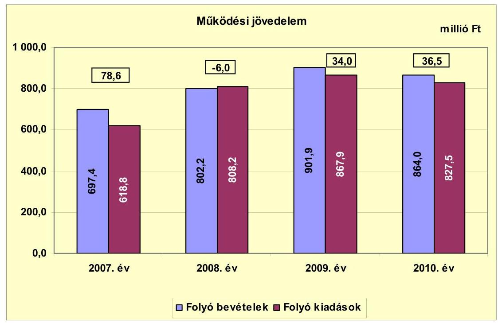

Az Önkormányzat folyó költségvetési egyenlege (működési jövedelem) a 2008. évben működési forráshiányt, 2007-ben és 2009-2010-ben működési többletet mutatott.

A működési jövedelem a 2007. évben kiugróan magas ( 78,6 millió Ft) volt, mert a Vásárhelyi-terv keretében megvalósuló árapasztó tározó építése miatt megemelkedett 82,8 millió Ft iparűzési adó növelte a működési bevételeket. A pozitív működési jövedelem kialakulásában szerepe volt annak, hogy 9,6 millió Ft-tal nőtt a működéshez kapcsolódó szállítói tartozásállomány. A 2006. december 31-ei 37,9 millió Ft 91 napot meghaladó szállítói tartozásállomány fejlesztéshez, a belterületi vízrendezés projekthez kapcsolódott.

A 2008. évben a működési jövedelem negatív lett, 84,6 millió Ft-tal csökkent az előző évhez képest, mert többek között a befolyt iparűzési adó összege 44,8 millió Ft-tal csökkent, az új kötelezettségként jelentkező, a PPP konstrukcióban megvalósult Tornaterem 2008. április 1-jétől történő üzemeltetése során a tárgyévi működési kiadások 15,5 millió Ft-tal haladták meg a tárgyévi működési bevételeket. A működési jövedelem mérséklődött továbbá, mert a kamatkiadások 10,4 millió Ft-tal növekedtek, valamint a szállítói kötelezettségek 9,6 millió Ft-tal csökkentek az előző év végi állományhoz képest.

A működési jövedelem előjele 2009-ben pozitívra fordult, értéke 34,0 millió Ft lett. A működési többlet 34,4 millió Ft ÖNHIKI támogatás és 1,5 millió Ft működésképtelen helyi önkormányzatok egyéb támogatása segítségével képződött, emellett még a szállítói tartozásállomány is 14,1 millió Ft-tal emelkedett az előző év végi állományhoz képest.

---

A 2010. évben a működési jövedelem a 2009. évhez hasonló nagyságrendben újra többletet mutatott. Itt is szerepet játszott a pozitív működési jövedelem kialakulásában az elnyert 15,7 millió Ft ÖNHIKI és 5,0 millió Ft működésképtelen helyi önkormányzatok egyéb támogatása, valamint az, hogy a szállítói tartozásállomány 29,2 millió Ft-tal nőtt előző évhez képest.

A vizsgált időszakban a működési jövedelem összességében 143,1 millió Ft többletet mutatott. Az Önkormányzat csak úgy tudott a 2009-2010. években pozitív működési jövedelmet elérni, hogy a központi költségvetésből egyszeri működési támogatásokban részesült és nőtt a ki nem fizetett szállítói állomány. A 2008-2010. években a támogatásokkal és a szállítói tartozásállománnyal figyelembe vett működési jövedelem összességében negatív értéket venne fel. Ez a számított negatív működési jövedelem jelzi, hogy az Önkormányzat gazdálkodása rövid távon is kockázatos. A 2011. évtől megkezdődött a kötvény tőke törlesztése, mely várhatóan 2027-ig évi 24,0 millió Ft-os többletkiadást, tőketörlesztést jelent. A törlesztések fedezete csak akkor biztosított, ha a működési jövedelem a jövőben is hasonló nagyságrendet képvisel, mint amekkora 2010-ben volt. A kockázat ellenére az Önkormányzat nem kezdeményezte az intézményei előirányzat-felhasználásának szoros kontrollját.

Az Önkormányzat működésének biztosítása érdekében ÖNHIKI-re és a működésképtelen helyi önkormányzatok egyéb támogatására nyújtott be igényt 2009-2010 között. ÖNHIKI-s támogatásban részesült az Önkormányzat, melynek összege 2009-ben 34,4 millió Ft, 2010-ben 15,7 millió Ft volt. A kapott 50,1 millió Ft támogatásból bérre és járulékaira összesen 20,5 millió Ft-ot (2009-ben 14,0 millió Ft, 2010-ben 6,5 millió Ft), dologi kiadásokra 29,6 millió Ft-ot (2009-ben 20,4 millió Ft, 2010-ben 9,2 millió Ft) fordítottak. A működésképtelen helyi önkormányzatok egyéb támogatása jogcímen 2009-ben 1,5 millió Ft, 2010-ben 5,0 millió Ft vissza nem térítendő, feladathoz nem kötött állami hozzájárulásban részesültek, melyet a szállítói tartozások rendezésére használtak fel.

A 2011. évben ÖNHIKI-s pályázatot nyújtott be az Önkormányzat, melyen 16,1 millió Ft támogatást nyert. Az állami támogatás átutalása megtörtént, melyből a helyszíni vizsgálat idején 13,1 millió Ft-ot bérre és járulékaira, 3,0 millió Ft-ot dologi kiadásra használtak fel. Az elnyert és a működésre fordított pénzeszközök javították az Önkormányzat pénzügyi helyzetét.

A nettó működési jövedelem - az évről évre hasonló nagyságrendű, nem jelentős összegű tőketörlesztés miatt - a vizsgált időszakban a működési jövedelemmel azonosan irányban változott. A 2007-2010. években összesen létrejött 143,1 millió Ft működési jövedelemhez mindössze 8,8 millió Ft hiteltörlesztés kapcsolódott, amelynek teljesítését követően 134,3 millió Ft pozitív nettó működési jövedelme keletkezett az Önkormányzatnak. Mindez azt jelzi, hogy az Önkormányzat költségvetési megtakarításai a vizsgált időszakban elégségesek voltak az alacsony nagyságrendet képviselő adósságszolgálati kiadásokra.

Az Önkormányzatnak (a CLF módszer alapján) a fejlesztésekhez kapcsolódóan 2010. december 31-ig vállalt kötelezettségek teljesítésének fedezete - a 2010. évihez viszonyítva, változatlan nettó működési jövedelem képződése mellett -

---

belső forrásból nem biztosított. A nettó jövedelem alakulása információul szolgál a jövőben vállalható, és külső forrás bevonása nélkül teljesíthető adósságszolgálat mértékéről.
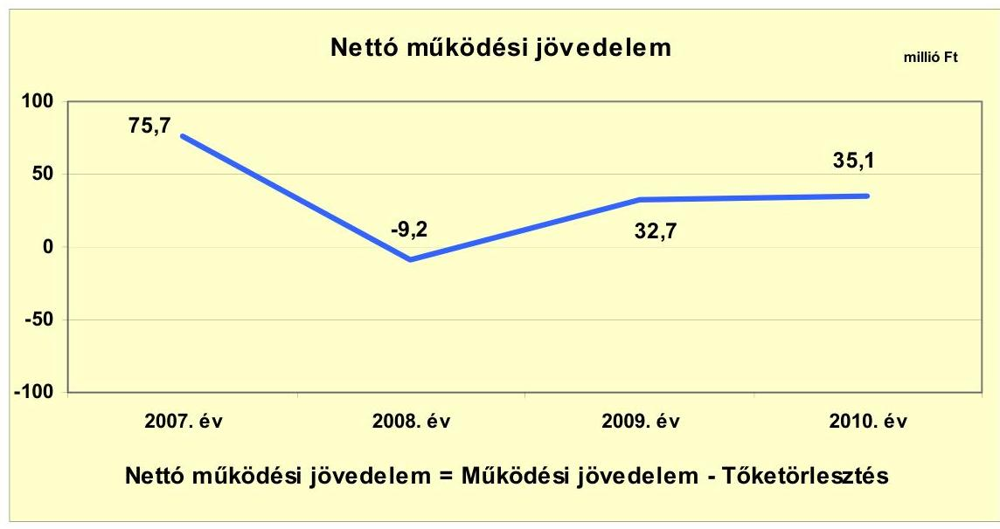

A felhalmozási költségvetés egyenlegét évről évre a következő ábra szemlélteti:
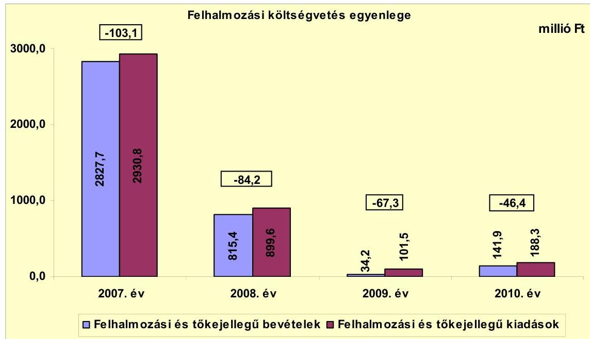

A 2007-2010. években az Önkormányzat felhalmozási költségvetésének egyenlege folyamatosan negatív összegű volt. A felhalmozási forráshiánynak a felhalmozási és tőke jellegű kiadásokhoz viszonyított aránya 2009-ben ( $66,3 \%$ ) és 2010-ben ( $24,6 \%$ ) az előző évekhez képest magas volt. Az ezekben az években végrehajtott beruházásoknál alacsonyabb volt a támogatási arány, mint 2007-2008-ban. A felhalmozási forráshiány 2007-2010. között 301,0 millió Ft-ot tett ki, amelyre részben az időszakban képződő 134,3 millió Ft nettó működési megtakarítás (nettó működési jövedelem), valamint a rendelkezésre álló 19,8 millió Ft 2006. évi pénzmaradvány szolgált fedezetül. A for-

---

ráshiány finanszírozásához szükséges további pénzeszközöket külső forrásból, 13,0 millió Ft hitel felvételével, valamint 250,0 millió Ft értékű kötvény kibocsátásával teremtették meg. Az Önkormányzat gesztorságával 2007-2008-ban valósult meg a térségi szennyvízberuházás, emiatt a 2007. évben a felhalmozási bevételek és kiadások kiugróan magasak voltak.

Az Önkormányzat évenkénti teljes finanszírozási igénye ${ }^{14}$ a CLF módszer szerint 2007-ben 27,4 millió Ft, 2008-ban 93,4 millió Ft, 2009-ben 34,6 millió Ft, 2010-ben 11,3 millió Ft volt, amelynek finanszírozását a finanszírozási célú bevételek és kiadások egyenlege, valamint az előző évek pénzmaradványának igénybevétele biztosította.

Az Önkormányzat finanszírozási műveletei 2007-2010. évekbeli egyenlegének alakulását a következő ábra szemlélteti:
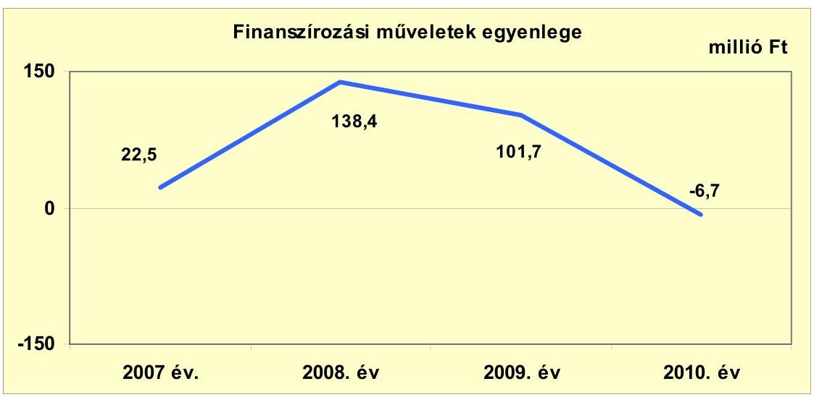

A finanszírozási többlet azt jelzi, hogy az éves költségvetések végrehajtása során szükség volt az előző években keletkezett pénzmaradvány igénybevételén túl külső forrás igénybevételére is. A finanszírozási célú műveleteket a vizsgált időszakban a jelentés 2. számú mellékletének 4.1-4.8 pontjai részletezik.

Az Önkormányzat a 2007-2010. évi zárszámadási rendeleteiben a működési és fejlesztési hiányt a hagyományos költségvetési szerkezet alapján mutatta be ${ }^{15}$, amelyről a jelentés 1. számú melléklete nyújt tájékoztatást. A zárszámadási rendeletekben a finanszírozási műveletek figyelembevételével minden évben pénzügyi többletet mutattak ki. Ezzel szemben a folyó és felhalmozási költségvetés összevont egyenlege a CLF módszer szerint minden évben forráshiányt állapított meg.

[^0]
[^0]:    ${ }^{14}$ a nettó működési jövedelem és a felhalmozási költségvetés eredője
    ${ }^{15}$ Nincs kötelező előírás a működési és fejlesztési hiány megállapításának módjára.

---

Az Önkormányzat kamatbevételeinek és kamatkiadásainak alakulását évenként a következő ábra mutatja:
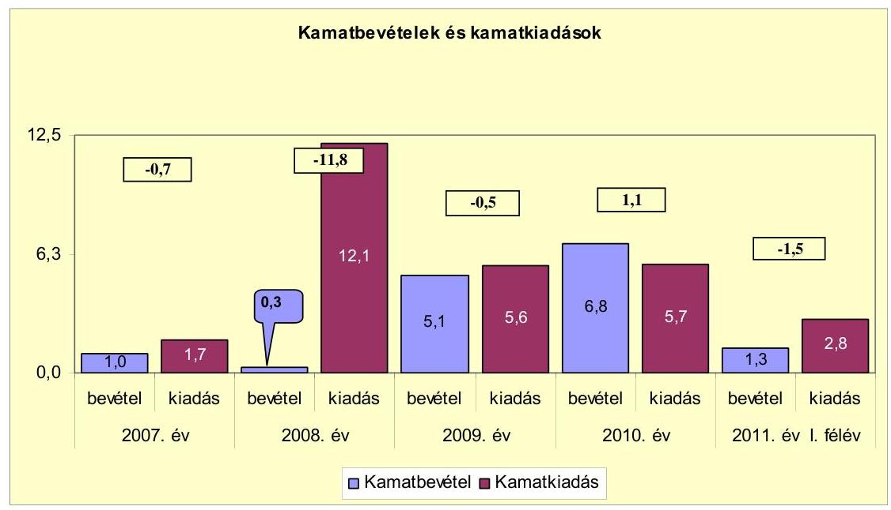

A vizsgált időszakban a 2007-ben kibocsátott kötvény éves kamatfizetési kötelezettsége a 2008. évi 63258 CHF-ről 2010-re 21636 CHF-re csökkent, amely a kamatkiadások csökkenését eredményezte.

A 2007-2011. év I. féléve között az Önkormányzat összesen 27,9 millió Ft kamatot fizetett meg. Az átmenetileg szabad pénzeszközein realizált kamatbevétel, a
 teljes kamatráfordítás 52,0%-ának (14,5 millió Ft) megfelelő összeget tett ki.

# 2.2. Az Önkormányzat bevételeinek változása 

Az összes folyó bevétel a 2007. évi 697,4 millió Ft-ról a közoktatási intézmények átvétele miatt 2009-re folyamatosan emelkedve 901,9 millió Ft-ra nőtt (204,5 millió Ft-tal, 29,3%-kal), majd ezt követően az ellátotti létszám csökkenése, valamint az ÖNHIKI-s támogatás, a hozambevételek, és a helyi adóbevételek együttes csökkenése miatt mérséklődött, 2010-ben 864,0 millió Ft volt.

---

Az Önkormányzat 2007-2010 között realizált főbb bevételi jogcímeinek számszaki adatait a következő grafikon mutatja be:
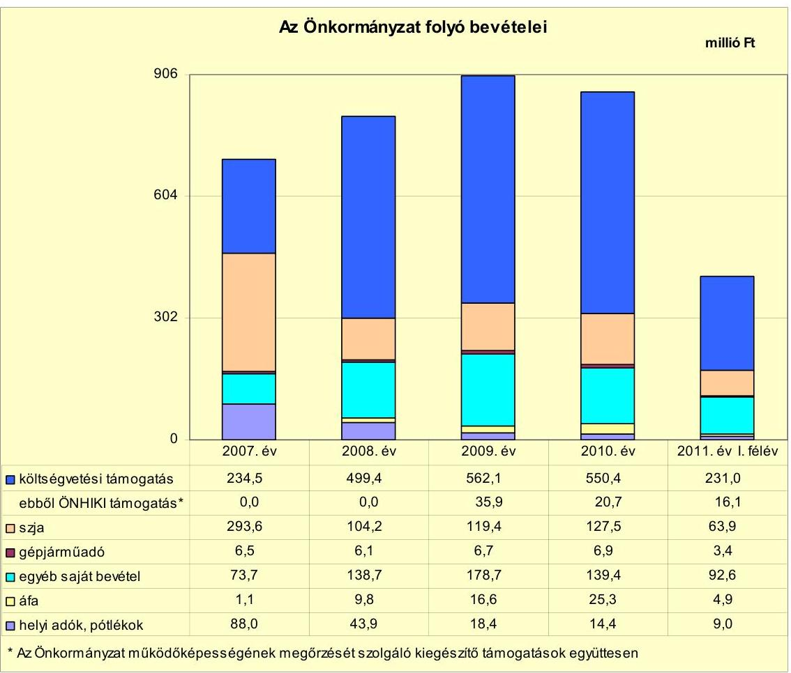

Az átengedett szja és a költségvetési támogatások jogcímeken az Önkormányzat az előző évihez képest 2008-ban 14,3%-kal (75,5 millió Ft-tal), 2009-ben 12,9%-kal (77,9 millió Ft-tal) több, míg 2010-ben 0,5%-kal (3,6 millió Ft-tal) kevesebb forrást kapott az államtól. Az állami támogatásokban bekövetkezett növekedéseket a közoktatási feladatok bővülése, a mérséklődést az ellátotti létszám csökkenése, valamint a forrásszabályozásban bekövetkezett változás idézte elő. A 2010. évben az átengedett szja és a költségvetési támogatások együttes összege a folyó bevételek 78,5%-át tette ki.

A gépjárműadó bevételek az Önkormányzat bevételi szerkezetében jelentéktelen arányt képviselnek. Az egyéb saját bevételek a közoktatási intézmények bővülése miatt 2009-ig folyamatosan emelkedtek, majd a Központi Orvosi Ügyelet kistérségnek történő átadása következtében 2010-ben csökkent. A 2010. évben az egyéb saját bevételek a folyó bevételek 16,1%-át (139,4 millió Ft) tették ki, mely arány 2007-hez képest 5,5 százalékponttal nőtt.

Az áfa bevételek összege a vizsgált időszakban folyamatosan emelkedett, mert az áfa visszaigényléssel megvalósuló beruházási kiadások növekedtek, valamint 2010-ben a 2007-2009. évi gyermekétkeztetéshez kapcsolódó önrevízióból 15,1 millió Ft bevétele keletkezett az Önkormányzatnak. Az áfa részesedése

---

az Önkormányzat saját folyó bevételein belül 2007-hez képest 2,7 százalékponttal nőtt, 2010-ben 2,9%-ot tett ki.

A vizsgált időszakban az Önkormányzat a helyi iparűzési adót, a magánszemélyek kommunális adóját, vendégéjszakák utáni idegenforgalmi adót (érdemleges bevétele nem származott belőle) alkalmazta az adónemek közül. A helyi adókból és pótlékokból származó bevételek aránya 2007-hez képest 10,9 százalékponttal csökkent, 2010-ben mindössze 1,7%-át tette ki a folyó bevételekből. A pótlékkal, bírsággal növelt helyi adó bevétel a vizsgált időszakban folyamatosan mérséklődött, 2010-re az Önkormányzat bevételi szerkezetében jelentéktelen arányt képviselt. A helyi adóbevételek csökkenését elsősorban a megszorító intézkedések és a gazdasági válság miatt az iparűzési adóbevételek elmaradásai okozták.

A különböző adónemekből származó bevételt tekintve legnagyobb súlya az iparűzési adónak volt, mely a helyi adó bevételnek 2007-ben 94,1%-át (82,8 millió Ft), 2010-ben 65,3%-át (9,4 millió Ft) tette ki. Az iparűzési adóbevétel csökkenéséhez hozzájárult, hogy Cigándon és környékén a szennyvízberuházás 2008-ban befejeződött. A tevékenységek végzése után a 2007-2011. év I. féléve között a helyi adókról szóló 1990. évi C. törvényben meghatározott maximális (2%-os) mértékkel adóztak a vállalkozások. A 2011. év első félében 6,3 millió Ft iparűzési adó folyt be az Önkormányzathoz.

Az iparűzési adón kívül a legjelentősebb bevételt eredményező helyi adónem a magánszemélyek kommunális adója, amelynek bevétele a 2010. évi helyi adóbevétel 30,6%-át (4,4 millió Ft-ot) tette ki. A magánszemélyek kommunális adójának mértéke 2007-2010 között nem változott, mértéke 5 ezer Ft/háztartás volt. A 2011. évtől az Önkormányzat kiemelt övezetében az adó mértéke 6 ezer Ft/háztartásra emelkedett.

Az Önkormányzat részesedései után osztalék- és hozambevételt nem realizált 2007-2011. év I. féléve között. Az Önkormányzat Gazdasági Társasága a közszolgáltatási feladat ellátása mellett az építőipari vállalkozási tevékenysége során ért el árbevételt. A Gazdasági Társaság árbevétele a gazdasági válság és a szennyvízberuházás befejezése miatt 2009-ig folyamatosan csökkent, a 2007. évi 83,8 millió Ft-ról 2008-ra 56,2 millió Ft-ra (32,9%-kal), 2009-re 32,5 millió Ft-ra (42,2%-kal), míg 2010-re 35,9 millió Ft-ra növekedett (10,5%-kal). A gazdasági társaság árbevétele 2011. I. félévében 31,1 millió Ft volt.

---

Az Önkormányzat felhalmozási bevételei a vizsgált időszakban a következők voltak:

| Megnevezés | 2007. év | 2008. év | 2009. év | 2010. év | 2011. év I.   félév |
| :-- | :--: | :--: | :--: | :--: | :--: |
| Tárgyi eszköz értékesítés | 0,9 | 0,6 | 0,0 | 0,3 | 0,0 |
| Egyéb saját tőkebevétel | 0,0 | 0,3 | 7,8 | 2,4 | 0,4 |
| Államháztartáson belülről   kapott támogatás | 2826,8 | 814,5 | 25,5 | 139,2 | 13,6 |
| Államháztartáson kívülről   kapott támogatás | 0,0 | 0,0 | 0,9 | 0,0 | 0,0 |
| Összes felhalmozási bevétel | 2827,7 | 815,4 | 34,2 | 141,9 | 14,0 |

A felhalmozási bevételekben meghatározóak voltak az államháztartáson belülről kapott támogatások (3819,6 millió Ft), melyek a vizsgált időszakban az összes felhalmozási bevétel 99,6%-át tették ki. Az Önkormányzat a Cigánd és térsége szennyvízközmű beruházására (2007-2008 között 3549,4 millió Ft), a belterületi vízrendezésre (2006. december 31. után 33,4 millió Ft), útburkolat felújítására (15,6 millió Ft), valamint hat kisebb és 10 millió Ft alatti fejlesztés kapcsán kapott támogatást, melyek megvalósítása és pénzügyi rendezése a 2007-2010. éveket érintette. Az államháztartáson belülről kapott támogatások 95,3%-a (3641,3 millió Ft) 2007-2008-ban realizálódott.

# 2.3. Az Önkormányzat működési és felhalmozási célú kiadásainak változása 

Az Önkormányzat működési kiadásai főbb jogcímek szerinti bontásban az alábbiak voltak:

|  |  |  |  |  | millió Ft |
| :-- | --: | --: | --: | --: | --: |
| Megnevezés | 2007. év | 2008. év | 2009. év | 2010. év | 2011. év I.   félév |
| Folyó kiadások | 618,8 | 808,2 | 867,9 | 827,5 | 371,2 |
| Működési kiadások (kamatkiadás nélkül) | 444,6 | 587,8 | 660,8 | 642,8 | 269,8 |
| Államháztartáson belülre átadott   pénzeszközök | 0,0 | 0,0 | 3,5 | 7,2 | 5,3 |
| Transzferkiadások | 172,5 | 208,3 | 198,0 | 172,0 | 93,3 |
| -ebből: vállalkozásoknak | 0,2 | 0,0 | 12,5 | 10,2 | 4,5 |
| magánszemélyeknek | 164,0 | 192,0 | 184,4 | 161,7 | 85,9 |
| nonprofit szervezeteknek | 8,3 | 16,3 | 1,1 | 0,1 | 2,9 |
| Kamatkiadások | 1,7 | 12,1 | 5,6 | 5,7 | 2,8 |

|  |  |  |  |  | millió Ft |
| :-- | --: | --: | --: | --: | --: |
| Megnevezés | 2007. év | 2008. év | 2009. év | 2010. év | 2011. év I.   félév |
| Személyi juttatások | 194,1 | 251,3 | 286,9 | 320,6 | 141,1 |
| Munkaadót terhelő járulékok | 62,7 | 79,3 | 79,2 | 77,5 | 35,5 |
| Dologi kiadások | 175,7 | 250,2 | 288,8 | 234,9 | 88,2 |
| Egyéb folyó kiadások | 177,7 | 211,0 | 199,4 | 184,1 | 99,0 |

---

Az Önkormányzat folyó kiadásai a közoktatási intézmények átvételének hatása miatt 2007-2009 között folyamatosan növekedtek, majd 2010-re a Központi Orvosi Ügyelet - a Bodrogközi Többcélú Kistérségi Társulásnak történt átadása, valamint a szállítói kötelezettségek nem teljesítése következtében mérséklődtek. Az Önkormányzat 2010-ben a működési kiadások 61,9%-át (398,1 millió Ft) személyi juttatásokra és a munkaadókat terhelő járulékokra fordította, mely 4,1 százalékponttal emelkedett 2007-hez képest. A működési kiadásokon belül a személyi juttatások és járulékok aránya a vizsgált időszakban a közoktatási intézmények átvétele miatt emelkedő tendenciát mutatott. A növekedést 2010-ben a közfoglalkoztatás bővülése okozta, melynek teljesített kiadási összege 2010-ben 98,3 millió Ft volt, a 2009. évi 65,3 millió Ft-tal szemben.

A személyi juttatások kiadásai az előző évhez képest 2008-ban 29,5%-kal (57,2 millió Ft-tal), 2009-ben 14,2%-kal (35,6 millió Ft-tal) a közoktatási feladatok bővülése, 2010-ben 11,7%-kal (33,7 millió Ft-tal) emelkedtek az előző évhez képest a Polgármesteri hivatalban kezelt hatósági feladatok és a közfoglalkoztatás növekedése miatt.

A munkaadókat terhelő járulékok kiadásainál az előző évhez képest a foglalkoztatottak létszámának bővülése miatt 2008-ban növekedés, utána folyamatos mérséklődés figyelhető meg a 2009. évtől a foglalkoztatókat terhelő társadalombiztosítási járulékmérték csökkenés, illetve tételes egészségügyi hozzájárulás megszűnés hatása miatt.

A dologi kiadások az előző évhez képest 2009-ig minden évben az inflációt meghaladó mértékben - a feladatbővülés miatt $^{16}$- a 2008. évben 42,4%-kal (74,5 millió Ft-tal), a 2009. évben 15,4%-kal (38,6 millió Ft-tal) nőttek. A Központi Orvosi Ügyelet kistérségnek történő átadása, valamint a szállítói állomány növekedése következtében a dologi kiadás 2010-re 234,9 millió Ft-ra (18,7%-kal, 53,9 millió Ft-tal) csökkent. Az Önkormányzat az üzemeltetést, intézményfenntartást biztosító dologi kiadásokra 2010-ben 36,6%-ot (234,9 millió Ft-ot) teljesített, ami 2,9 százalékponttal marad el a 2007. évi aránytól.

Az egyéb folyó kiadások az előzőévhez képest 2008-ban 18,7%-kal (33,3 millió Ft-tal) növekedtek, majd folyamatosan mérséklődtek. Az egyéb folyó kiadások 2010-ben a működési kiadások 28,6%-át tették ki. A családi segélyezés rendszerének 2008-tól történő bevezetése miatt a nem foglalkoztatott személyek rendszeres szociális segélye emelkedett 2008-ban, majd a rá következő években a közfoglalkoztatás növekedésével párhuzamosan a segélyezettek száma csökkent.

[^0]
[^0]:    $^{16}$ A Tornaterem 2008. április 1-jétől történő üzemeltetése 34,1 millió Ft-tal, az étkeztetés a tagintézmény átvétele miatt 20,0 millió Ft-tal növelte a dologi kiadásokat 2008-ban az előző évhez képest.

---

A kiadások összetételének változását (a működési és fejlesztési célú kamatkiadásokat is figyelembe véve) a következő grafikon szemlélteti:
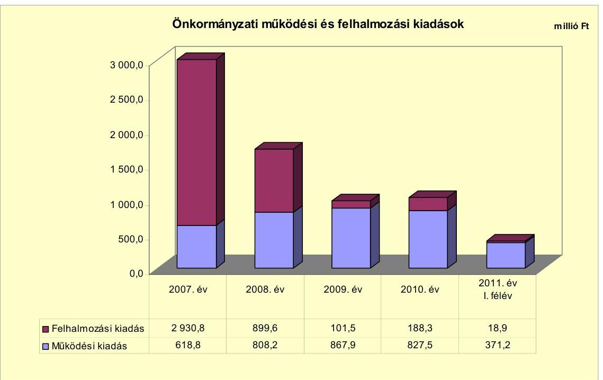

A működési kiadásról szól, az adatok a folyó kiadás adatait jelzi.
A felhalmozási kiadások volumenét és arányát befolyásolta, hogy a Cigánd és környéke szennyvízberuházás az Önkormányzat gesztorságával valósult meg. A felhalmozási kiadások összes kiadáson belüli aránya a társult önkormányzatok adatainak figyelembevétele nélkül csökkent, 2007-ben 68,1%, 2008-ban 34,8% volt. Az Önkormányzat társulás nélküli működési és a felhalmozási kiadásait a következő ábra mutatja be:
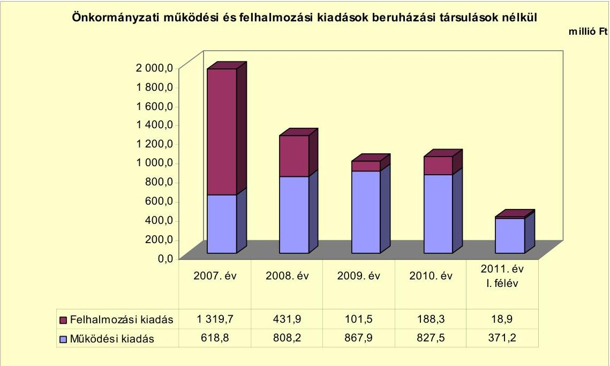

---

A vizsgált időszakban az Önkormányzat befejezett fejlesztéseinek - felújítások és fejlesztések - együttesen tervezett összege 4731,4 millió Ft volt. Az Önkormányzat gesztorságával megvalósult Cigánd és térsége szennyvízközmű beruházás esetében a 2007-2008. évek között teljesített kiadás 3552,5 millió Ft volt. E fejlesztésből Pácin Önkormányzatot 1050,0 millió Ft, míg 1029,0 millió Ft Tiszakarád Önkormányzatot érintette.

Az Önkormányzat 2007-2010. években megvalósított fejlesztései között szennyvízközmű megvalósítása, belterületi vízrendezés, kerékpárút építése, óvoda magas-tető építése, városi térfigyelő-kamerarendszer kiépítése, iskolakonyha felszerelésének korszerűsítése, műfüves pálya építése, valamint infrastrukturális és informatikai fejlesztések szerepeltek. A Képviselő-testületnek nem mutatták be a beruházásokkal létrehozott létesítmények működtetése és fenntarthatósága érdekében várhatóan felmerülő költségvetési kiadásokat.

A 2010. december 31-ig a megvalósult fejlesztésekre, felújításokra a vizsgált időszakban 3963,7 millió Ft kiadást teljesített az Önkormányzat, ezek teljes bekerülési költsége 4738,7 millió Ft volt. A fejlesztési kiadásokból a beruházások összege 4665,7 millió Ft (98,4%) és a felújítások összege
 73,0 millió Ft (1,6%) volt. A projektek döntő többsége utófinanszírozású volt, mely likviditási gondot nem okozott. A 2007-ben kibocsátott kötvény bevételéből a folyamatos finanszírozást lehetővé tevő pénzeszközök rendelkezésre álltak. A 4738,7 millió Ft beruházási összköltségből a saját bevétel 1,7%-ot (81,5 millió Ft), a felvett hitel 0,3%-ot (13,0 millió Ft), a kibocsátott kötvény 2,9%-ot (136,7 millió Ft), az EU-s támogatás 0,5%-ot (26,3 millió Ft) és a hazai támogatás 94,6%-ot (4481,2 millió Ft) tett ki. A 2007-2010. évek között a 10 millió Ft teljes bekerülési költség feletti befejezett fejlesztések és felújítások száma 13, valamint a 10 millió Ft teljes bekerülési költség alatti felújítások és fejlesztések száma 16, illetve 40 volt. Az Önkormányzat 2007-2010. években megvalósított, 2010. december 31-ig befejezett fejlesztéseit és azok forrásösszetételét a jelentés 3/a. számú melléklete mutatja be.

A 2010. december 31-én a folyamatban lévő négy fejlesztési feladat tervezett bekerülési költsége 466,1 millió Ft volt, melyre 2010. december 31-ig 17,0 millió Ft kiadást teljesítettek. A folyamatban lévő beruházások 2010. december 31-ig teljesített kiadásainak forrása EU-s támogatás volt. A 2010. december 31-én folyamatban lévő fejlesztési feladatokra 2010. december 31-ig teljesített kifizetéseket és azok forrásösszetételét a jelentés 3/b. számú melléklete tartalmazza.

A 2010. december 31-én folyamatban lévő fejlesztések 2010. évet követő kötelezettségvállalásainak összege 449,2 millió Ft, amelynek forrása 423,5 millió Ft EU-s támogatás (94,2%), 13,3 millió Ft hazai támogatás (3,0%) és 12,4 millió Ft kötvény (2,8%). Az Önkormányzat a folyamatban lévő fejlesztéseit a 2007. évben kibocsátott kötvényből tervezi megvalósítani. Jelenleg a tagi kölcsön visszafizetés következtében a kötvényforrásból 85,3 millió Ft áll az Önkormányzat rendelkezésére. Az Önkormányzat 2010. december 31-én folyamatban lévő fejlesztési feladataira 2010. december 31-én fennálló kötelezettségvállalásait és azok forrásösszetételét a jelentés 3/c. számú melléklete mutatja be.

---

Az Önkormányzat által beadott három, elbírálás alatti pályázati forrásból megvalósuló fejlesztésének tervezett bekerülési költsége összesen 7,7 millió Ft. A beruházások kiadásait 81,8%, 6,3 millió Ft EU-s támogatásból és 18,2%, 1,4 millió Ft hazai támogatásból tervezik finanszírozni. A pályázatokat a helyszíni ellenőrzés befejezéséig elbírálták, eredményesnek minősítették. Az Önkormányzatnak azért nem tervezett saját forrást a beruházásai megvalósításához, mert a leghátrányosabb helyzetű kistérségek közé tartozik, ahol a támogatás mértéke 100%-os is lehet. Az elbírálás alatti, pályázati forrásból megvalósítani tervezett fejlesztésekhez kapcsolódó kötelezettségvállalásokat és azok forrásösszetételét a jelentés 3/d. számú melléklete mutatja be.

A 2007-2010. évben befejezett fejlesztések közül a három legmagasabb bekerülési költségű beruházás a következő volt:

- Cigánd és térségének szennyvízközmű-hálózat kialakításának $^{17}$ bekerülési költsége 3552,5 millió Ft volt, amelyből a hazai támogatás 3549,5 millió Ft (99,9%), a saját forrás 3,0 millió Ft (0,1%) volt. A projekt aktiválása az Önkormányzatnál - a gesztor szerepből adódóan - történt meg. A megvalósított beruházás vagyoni megosztása a településeket illetően még nem történt meg. A beruházásból Pácin Község Önkormányzatra eső beruházási költség 1050 millió Ft, mely után 2010. december 31-ig elszámolt értékcsökkenés összege 95,6 millió Ft. Tiszakarád Község Önkormányzatra jutó beruházási költség 1029 millió Ft, mely után 2010. december 31-ig elszámolt értékcsökkenés összege 88,8 millió Ft. Az elszámolt értékcsökkenési leírásokat figyelembe véve 2010. december 31-én Cigánd Pácin Község Önkormányzattal szemben 954 millió Ft, míg Tiszakarád Község Önkormányzattal szemben 939 millió Ft kötelezettséget tart nyilván a mérlegében. E kötelezettség a vagyonmegosztás elmaradásának a következménye, az Önkormányzat pénzügyi egyensúlyát nem érinti;
- a belterületi vízrendezés projekt megvalósítása 2005-2007. években történt. A fejlesztés tervezett bekerülési költsége 829,6 millió Ft, a ténylegesen felmerült kiadások összege 819,5 millió Ft volt. A felmerült kiadások fedezetét 24,7 millió Ft saját bevétel (3,0%) és 794,8 millió Ft hazai támogatás (97,0%) jelentette;
- a 2007. évben megépített kerékpárút teljes bekerülési költsége 48,6 millió Ft volt, amelynek fedezetét 28,0%-ban (13,6 millió Ft-ban) saját bevétel és 72,0%-ban (35,0 millió Ft-ban) hazai támogatásból biztosították.

Az Önkormányzat pénzügyi helyzetére hatással voltak a Gazdasági Társaság részére átadott működési célú pénzeszközök, mellyel a városüzemeltetési feladatok ellátását finanszírozták. A Gazdasági Társaság kiadásainak fedezéséhez a vizsgált időszakban 45,3 millió Ft működési célú pénzeszköz átadással járult hozzá az Önkormányzat.

A feladatellátásban résztvevő Gazdasági Társaság részére átadott működési célú pénzeszközök a 2007. évi 4,7 millió Ft-ról 2008-ra 13,9 millió Ft-ra növekedett, majd 2008-2011 között az előző évihez képest folyamatosan csökkent, a 2008. évi 13,9 millió Ft-ról 2009-re 12,9 millió Ft-ra (7,2%-kal, 1 millió Ft-tal), 2010-re 10,4 millió Ft-ra (19,4%-kal, 2,5 millió Ft-tal). A Gazdasági Társaság a szennyvízhálózat kiépítésében részt vett, melynek során 2007-ben 40,0 millió Ft, 2008-ban 12,5 millió Ft árbevétele keletkezett. Az árbevétel csökkenése miatt 2008-ban az előző évhez képest háromszorosára emelkedett az Önkormányzat által átadott működési célú pénzeszköz, mely a pénzügyi egyensúlyt kedvezőtlenül érintette. Az Önkormányzat 2011. év I. félévében 3,4 millió Ft működési célú pénzeszközt adott át a Gazdasági Társaság részére. A gazdasági társaságoknak nyújtott pénzeszközátadásokat a 4. számú melléklet mutatja be.

# 3. Az ÖNKORMÁNYZAT KÖTELEZETTSÉGEI 

### 3.1. Az Önkormányzat pénzintézeti kötelezettségeinek változása

Az Önkormányzat pénzintézeti kötelezettségeinek állománya 2006. december 31-ről 2010. december 31-re 5,4 millió Ft-ról 376,4 millió Ft-ra nőtt. A pénzintézeti kötelezettség állománya 2011. június 30-án 376,3 millió Ft volt.
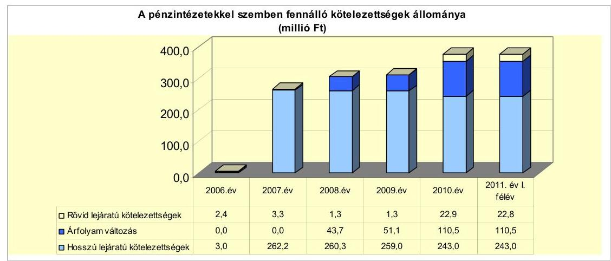

Az ellenőrzött időszakban az Önkormányzat 2007-ben 13,0 millió Ft összegben egy hosszú lejáratú hitelt vett fel, valamint 2007-ben 250,0 millió Ft értékben CHF-ben bocsátott ki kötvényt, ezen kívül még - a 2004-ben felvett - egy hosszú lejáratú hitel visszafizetési kötelezettsége terhelte ezt az időszakot. A 2008. évben a korábban felvett hosszú lejáratú hitel törlesztése befejeződött, így az Önkormányzatnak a 2010. év végén egy hosszú lejáratú hitele volt. A rövid lejáratú kötelezettségek állományát a hosszú lejáratú kötelezettségek tárgyévet követő fizetési kötelezettségei jelentették 2010. december 31-én. Az Önkormányzat igénybe vett folyószámlahitele 11,3 millió Ft volt 2011. június 30-án.

A CHF-ben kibocsátott kötvénynél az - árfolyamváltozás miatti - év végi értékelést a 2008-2010. évek között elvégezték.

Az árfolyamváltozás hatása is befolyásolja a kötelezettségek alakulását, azonban annak mértéke előre pontosan nem határozható meg, csak várakozásokon alapuló tendenciák jelezhetők. Annak megítéléséről, hogy a devizában felvett hitelekért kapott forinthoz képest a hitelek visszafizetésekor jelentkező forint kötelezettség többletkiadást (árfolyamveszteség), vagy megtakarítást (árfolyamnyereség) eredményez a futamidő végén, a teljes kötelezettség rendezését követően lehet képet alkotni. Mindaddig, amíg törlesztési kötelezettség nem áll fenn (türelmi idő, moratórium), a tőkére vonatkoztatva nem értelmezhető sem az árfolyamveszteség, sem az árfolyamnyereség. Ugyanakkor a számviteli szabályok meghatározzák, hogy az árfolyam különbözetet év végén a kötelezettségek vagy követelések között a könyvviteli mérlegben nyilván kell tartani, azonban az árfolyamkülönbözet valójában nem realizált.

Az Önkormányzat az éves költségvetési rendeleteiben meghatározta a tervezett kiadásaihoz szükséges források összegét, és a Képviselő-testület döntött a hiányzó források pótlásáról. Az Önkormányzat a forráshiány kezelése érdekében a 2007-2011. évi költségvetési rendeleteiben működési és felhalmozási célú hitelfelvételekkel számolt. A költségvetési rendeletekben meghatározták az adott évre vonatkozóan felvehető hitel összegét és bemutatásra kerültek a hitelfelvételekkel összefüggő terhek az adott költségvetési évre, valamint az azt követő két évre. A pénzmaradvány elszámolása után, valamint év közben az igénybe vehető forrás összegével korrigálták az adott évre tervezett hitel összegét. Az ellenőrzött időszakban működési célú hitelfelvételre nem került sor.

A pénzintézeti kötelezettségvállalások minden esetben képviselő-testületi döntésen alapultak, a kötelezettségvállalásból származó források felhasználási céljait meghatározták, azonban a kötvény felvételekor a visszafizetés forrását, valamint a kamat- és - a deviza alapú kötelezettségeket érintő - árfolyamkockázatot az előterjesztésekben nem mutatták be. Az adósságot keletkeztető kötelezettségvállalással megvalósított fejlesztések esetleges bevételnövelő, illetve kiadáscsökkentő vonzatát nem vizsgálták a fejlesztések jellegéből adódóan. A Képviselő-testület döntéseiben kötelezettséget vállalt a felvett hitel és járulékainak megfizetésére, amit az adott évi költségvetésébe betervezett és jóváhagyott. Az Önkormányzat az áttekintett időszakban az adósságot keletkeztető kötelezettségvállalásának felső határát vizsgálta, azt nem lépte túl.

A számlavezető pénzintézettől 2007-ben 13,0 millió Ft kedvezményes kamatozású forinthitel felvételére került sor az Önkormányzati Fejlesztési Hitelprogram keretében, futsal pálya kialakítására. A Képviselő-testület a hitel biztosítékaként a helyi adó bevételét ajánlotta fel.

Az Önkormányzat a számlavezető pénzintézet ajánlata alapján 250 millió Ft-nak megfelelő névértékű CHF alapú, zártkörű, 20 éves futamidőre - három éves türelmi idővel - kötvényt bocsátott ki. A 2007. november 29-én megtartott zárt ülés jegyzőkönyve szerint - a versenyeztetés mellőzésével - a számlavezető pénzintézet ajánlatát ismertették, a kötvényt a fejlesztési feladatokhoz kapcsolódó saját forrás biztosítására, valamint a valós körzetközponti szerepkör kiépítésére bocsátják ki, melyet a Pénzügyi Bizottság elfogadásra javasolt.

---

Az Önkormányzat 2011. június 30-án CHF-ben fennálló hosszú lejáratú kötvényéhez kapcsolódó adósságot keletkeztető pénzintézeti kötelezettségvállalása az alábbi volt:

| Megnevezés | Szerződéskötés/   Kibocsátás   időpontja | Összeg   szer CHF-ben | Kibocsátás//lehivási   árfolyam | Kamat (referencia kamat+   kamatfelár) | Felhasználás célja: |
| :--: | :--: | :--: | :--: | :--: | :--: |
| Cigánd 2007 Kötvény | 2007.12.17 | 1653,1 | 151,23 | 3,81 | A Nemzeti Fejlesztési Terv   pályázati lehetőségek   kihasználása érdekében - a   város településfejlesztési   stratégiai koncepciójában   megfogalmazottakkal   egyezően - fejlesztési   programokhoz a saját erő   biztosítása |

Az Önkormányzat 2011. június 30-án forintban fennálló hosszú lejáratú hiteléhez kapcsolódó adósságot keletkeztető pénzintézeti kötelezettségvállalása az alábbiak szerint alakult:

| Megnevezés | Szerződéskötés/   Kibocsátás   időpontja | Összeg   millió Ft-ban | Kamat   (referencia   kamat+   kamatfelár) | Felhasználás célja: |
| :--: | :--: | :--: | :--: | :--: |
| ÖKIF hitel | 2007.12.05 | 13,0 | 7,29 | Futsal pálya   kialakítása |

Az Önkormányzat a hosszú lejáratú ÖKIF hitelből, valamint a kötvénykibocsátásból befolyt pénzeszközöket a hitelszerződésben foglaltaknak megfelelően és a kötvénykibocsátáskor megjelölt célra fordította 2007 és 2011. év I. félév között.

Megvalósult a hitelszerződésben rögzített futsal pálya kialakítása, amelyhez a hitel teljes egészében felhasználásra került. A kötvénykibocsátásból a Képviselőtestület elképzeléseinek megfelelően (útfelújítások, járóbeteg-ellátó központ, Mercedes busz vásárlás, térfigyelőkamera-rendszer, óvoda magas-tető építés, iskolakonyha felszerelésének korszerűsítése) a fejlesztések saját forrását biztosították 136,7 millió Ft értékben. Az Önkormányzat 108 millió Ft tagi kölcsönt adott a minősített többségi tulajdonában lévő gazdasági társaságának a „Kistérségi járóbeteg-szakellátó központ fejlesztése a Bodrogközi Kistérségben" című projekt lebonyolítása érdekében. A gazdasági társaság a helyszíni vizsgálat
 ideje alatt 2011. október 6-án 80,0 millió Ft-ot visszafizetett az Önkormányzatnak. A kötvény kibocsátásából származó pénzeszköz maradványa 2011. június 30-án az 5,3 millió Ft, 2011. október 6-án a tagi kölcsönből visszafizetett összeggel 85,3 millió Ft volt. Az Önkormányzat és a pénzintézet között 2007. december 12-én létrejött megbízási szerződés 2.3.4. pontja alapján a kötvénykibocsátásból származó bevételt az Önkormányzat köteles a pénzintézetnél elhelyezni. A befektetésből az Önkormányzat a pénzintézet előzetes engedélyével használhat fel. Ezen engedély kiadásához be kell mutatni a felhasználás célját, valamint a felhasználáshoz kapcsolódó dokumentumokat.

Az Önkormányzat a kötvénykibocsátásból származó forrást nem egyszerre használta fel, azt befektette. A számlavezető pénzintézetnél a szabadpénzeszközök betétben, államkötvényben, diszkont kincstárjegyben lekötésre kerültek, mely után 2008-ban 14,5 millió Ft, 2009-ben 11,9 millió Ft, 2010-ben 6,6 millió Ft kamat, illetve hozam bevétele származott az Önkormányzatnak. A pénz-

---

eszközöket nem különítették el, a 2008-2010. évi költségvetések végrehajtása során működésre fordították.

Az Önkormányzat a CHF-ben fennálló pénzintézeti kötvény kötelezettségéből a szerződésben foglaltaknak megfelelően 2011. június 30-ig 48620 CHF (7,4 millió Ft) tőkét törlesztett, valamint 121947 CHF (22,0 millió Ft) kamatot és 2,7 millió Ft egyéb költséget fizetett. Az Önkormányzat a tőke törlesztését 2011. március 31-én kezdte meg, mely során a vizsgált időszakban 0,7 millió Ft árfolyamveszteséget realizált. Az ÖKIF hitellel kapcsolatosan a kölcsönszerződés előírásait betartva az Önkormányzat 2007-2011. év I. félév között 4,7 millió Ft tőkét törlesztett és 2,0 millió Ft kamatkiadást teljesített.

Az Önkormányzat pénzügyi egyensúlyát a vizsgált időszakban folyószámlahitelek felvételével biztosította, működési célú, valamint munkabérmegelőlegezési hitele nem volt.

A vizsgált időszakban a folyószámlahitel alakulását az alábbi táblázat mutatja be millió Ft-ban:

| Megnevezés | 2007. év | 2008. év | 2009. év | 2010. év | 2011. év I.   félév |
| :-- | --: | --: | --: | --: | --: |
| a folyószámlahitel keretösszege január 1-jén | 0 | 20 | 20 | 20 | 20 |
| teljesített kamat és egyéb költség | 0,7 | 0,8 | 0,4 | 0,9 | 0,4 |

A folyószámlahitelek kondíciói és egyéb költségei a következők voltak ${ }^{18}$ :

| Megnevezés | Kamat (referencia+ kamatfelár) | Egyéb költség |
| :--: | :--: | :--: |
| 2007-2008. év | 3 havi BUBOR $+3,0 \%$ | $0,5 \%$ kezelési költség, 1\% rendelkezésre tartási jutalék |
| 2009. év | 3 havi BUBOR $+3,5 \%$ | $0,5 \%$ kezelési költség, 1\% rendelkezésre tartási jutalék |
| 2010-2011. év | 1 havi BUBOR $+4,25 \%$ | $0,5 \%$ kezelési költség, 3\% rendelkezésre tartási jutalék |

Az Önkormányzat folyószámla hitelkerettel 2007. június 1-jétől rendelkezett 20,0 millió Ft értékben, melynek összege a vizsgált időszakban nem változott. A folyószámlahitellel zárt napok száma a 2007. évi 164 napról 2010-re 241 napra, annak átlagos napi állománya a 2007. évi 5,6 millió Ft-ról 2010. évre 7,0 millió Ft-ra nőtt. Az áttekintett időszakban a likviditási problémák finanszírozása az Önkormányzatnak 2007-től 2011-ig összesen 3,2 millió Ft kamatkiadást és egyéb költséget okozott. Az Önkormányzatnak a vizsgált időszakban a hitel fordulónapjain, illetve a 2007-2010. évek végén folyószámlahitelállománya nem volt, azonban 2011. június 30-án 11,3 millió Ft folyószámlahitel-állománnyal rendelkezett. A folyószámlahitelt az Önkormányzat rendeltetésének megfelelően a bevételek és kiadások ütemkülönbségének finanszírozására használta fel.

| MNB BUBOR fixing (átlagkamat) \%-ban |  |  |  |  |  |
| :--: | :--: | :--: | :--: | :--: | :--: |
| Referencia kamat | 2007. évi | 2008. évi | 2009. évi | 2010. év | 2011. év I.   félév |
| 1 havi BUBOR | 7,83 | 8,75 | 8,66 | 5,47 | 6,00 |
| 18 havi BUBOR | 7,75 | 8,87 | 8,64 | 5,50 | 6,07 |

---

A kötvényhez, valamint a hosszú lejáratú hitelhez kapcsolódó kamatfizetési kötelezettségek alakulását jelentősen befolyásolja a kibocsátáskori és az utolsó kamatfizetéskori referenciakamatok alakulása, melyet az alábbi táblázat mutat be:

| Megnevezés | Kibocsátási, lehívási | Utolsó fizetéskori | Változás \% |
| :--: | :--: | :--: | :--: |
|  | kamat (referencia + kamatfelár) \% |  |  |
| 3 havi CHF LIBOR (2007.12.17-i szerződés) | 3,81 | 1,33 | $-65,1 \%$ |
| 3 havi EURIBOR (2007. 10. 30.-ai szerződés) | 7,29 | 3,73 | $-48,8 \%$ |

A kamat mértékének alakulása jelentős hatással van az adott devizanemben kifejezett, a teljes futamidőre számított, várható kamatkötelezettség mértékére. Az Önkormányzat fizetési kötelezettségét a referencia kamatok csökkenése kedvezően, a CHF árfolyam emelkedése viszont kedvezőtlenül befolyásolta.

A számlavezető pénzintézet számára a 3 havi CHF LIBOR jelentős csökkenése veszteséget okozott, ezért kezdeményezte - a szerződésben foglaltak ellenére - az 1\%-os kamatfelár megemelését 3,95\%-ra. A Képviselő-testület a 14/2010. (II. 25.) számú határozatában a kamatfelár 1,15\%-ra történő emeléséhez járult hozzá. Az Önkormányzat annak ellenére döntött így, hogy ez kedvezőtlen számára, és emellett még az árfolyamváltozás okozta kötelezettségnövekedés is terhelte.

Az Önkormányzat kötelezettségeinek 2010. december 31-i, valamint 2011. június 30-i állományát és várható alakulását (kamatkiadásokkal együtt) a következő táblázat mutatja be:

| Megnevezés | Állomány 2010. december 31   én |  |  | Állomány 2011. június 30-én |  |  | Várható kötelezettség   2011-2013. evekben | Várható kötelezettség   2014. évtől |  |
| :--: | :--: | :--: | :--: | :--: | :--: | :--: | :--: | :--: | :--: |
|  | HUF-ben   (millió. Ft-   ben) | Devizében   (összege,   ezer CHF-   ben) | Deviza   nem | HUF-ben   (millió. Ft-   ben) | Devizében   (összege,   ezer CHF-   ben) | Deviza   nem | HUF-ben   (millió Ft-   ben) | Devizében   (összege,   ezer CHF-   ben) | HUF-ben   (millió Ft-   ben) |
| CHF LIBOR | 9,0 | - | - | 8,2 | - | - | 4,8 | - | 5,4 |
| Lágena (HUF) kötvény | - | 1653,1 | CHF | - | 1604,5 | CHF | - | 352,9 | - | 1499,1 |
| Polynozársta HUF | - | - | - | 11,0 | - | - | 11,3 | - | - | - |
| Pénzintézet kötelezettségek összesen HUF-ben | 9,0 | - | - | 19,6 | - | - | 16,1 | - | 5,4 | - |
| Pénzintézet kötelezettségek összesen CHF-ben | - | 1653,1 | CHF | - | 1604,5 | CHF | - | 352,9 | - | 1499,1 |
| CHF | 352,0 | - | - | 352,9 | - | - | 352,0 | - | 721,6 | - |
| Kizárólagos tartozás | 47,2 | - | - | 92,5 | - | - | 92,0 | - | - | - |

Az Önkormányzat összes kötelezettségének állománya pénzintézeti kötelezettségekből, a PPP konstrukció miatt fennálló szolgáltatási díj kötelező fizetéséből és a szállítói tartozásból tevődik össze. A 2011-2013. évek kötelezettségeinek teljesítésére figyelembe vehető a mérlegében kimutatott követelésállomány. A kötelezettségek teljesítése további egyéb külső forrás bevonása és bevételnövelő, valamint kiadáscsökkentő intézkedések megtételével biztosítható. A 130 millió Ft-os követelésállomány tartalmazta a gazdasági társaságok részére folyósított 112,5 millió Ft tagi kölcsönt, melyből 2011. év IV. negyedévében már 80,0 millió Ft visszafizetésre került. Az Önkormányzat 2010. december 31-én 120,8 millió Ft pénzmaradvánnyal rendelkezett, melyből mind kötelezettséggel terhelt volt. A negatív működési jövedelem (az ÖNHIKI, valamint a szállítói tartozás állományának növekedésével számolt) mellett a kötelezettségek fedezete már rövid távon sem biztosított. A vállalt kötelezettségekre a rendelkezésre álló források csak akkor nyújtanak fedezetet, ha a működési jövedelem a jövőben is hasonló nagyságrendet képvisel, mint amekkora 2010-ben volt.

---

A 2014. évtől várható - a vizsgált időszak végén ismert - kötelezettségek teljesítésére az Önkormányzat a forrásokat nem számszerűsítette. A kötelezettségek teljesítéséhez az Önkormányzat által meghozott kiadáscsökkentő és bevételnövelő intézkedések nem biztosítanak elegendő többletforrást, ezek teljesítése csak további kiadáscsökkentő és bevételnövelő intézkedések útján elért megtakarítások, valamint egyéb külső források bevonásával lehetséges.

# 3.2. A szállítói kötelezettségek változása 

Az Önkormányzat szállítói tartozása 2007-ről 2008-ra harmadára esett (13,7 millió Ft-ról 4,1 millió Ft-ra csökkent), majd az előző évhez képest 2009-re négy és félszeresére 18,1 millió Ft-ra, 2010-re két és félszeresére 47,3 millió Ft-ra növekedett. A 2011. június 30-i állomány 92,0 millió Ft volt. A szállítói állomány az összes kötelezettségen belül 2007-ben 4,6%-ot, 2011. június 30-án 2,0%-ot tett ki. A szállítói állomány összes kötelezettséghez viszonyított arányának csökkenése azért következett be, mert a támogatásokból megvalósult szennyvízberuházás kapcsán a kötelezettségek között bemutatásra került az idegen szennyvízvagyon is. A szállítói tartozás megemelkedésének oka, hogy az Önkormányzatnak - a 2008. évtől kezdődően - a PPP konstrukcióval kapcsolatos fizetési kötelezettségek (2008. év vége 8,8 millió Ft, 2009. év vége 4,7 millió Ft, 2010. év vége 21,6 millió Ft, 2011. év I. félév 34,9 millió Ft) jelentős terheket okoztak.

Az Önkormányzat lejárt szállítói tartozása együtt mozgott a szállítói tartozásokkal. A 2007. december 31-ei lejárt szállítói tartozása 11,7 millió Ft-ról 2011. június 30-ra több mint hat és félszeresére, 77,8 millió Ft-ra nőtt. Ebből a Tornaterem szolgáltatási díja fizetésének elmaradása 34,9 millió Ft-ot tett ki. Az Önkormányzat 2011. június 30-án fennálló lejárt szállítói tartozásállományának 18,3%-a (14,3 millió Ft) 30 nap alatti, 21,0%-a (16,3 millió Ft) 31 és 60 nap közötti, 13,5%-a (10,5 millió Ft) 61 és 90 nap közötti, 47,2%-a (36,7 millió Ft) 91 és 365 nap közötti volt. A 91 napot meghaladó szállítói tartozásállományból 19,7 millió Ft a PPP konstrukcióval, 10,2 millió Ft fejlesztési projektekkel, 4,6 millió Ft az étkeztetéssel volt kapcsolatos.

A 90 napot meghaladó lejárt tartozás miatt az Adósságrendezési tv. 5. § (2) bekezdésében foglaltak szerint a polgármester - a Képviselő-testület döntése alapján - nyolc napon belül köteles az adósságrendezési eljárást kezdeményezni.

A lejárt tartozásról a Képviselő-testületet a jegyző tájékoztatta, azonban az adósságrendezési eljárás megindításáról döntés nem született.

### 3.3. Egyéb kötelezettségek változása

Az Önkormányzat a vizsgált időszakban PPP konstrukció keretében egy fejlesztést hajtott végre, a „D2" típusú Tornaterem építése kapcsán 2007. június 27-én 15 évre, 1045,5 millió Ft-os kötelezettséget vállalva. E kötelezettségből 2011. június 30-án 905,8 millió Ft még fennállt, mely az Önkormányzatot még 12 évig
 terheli. E kötelezettségből az Önkormányzatnak várhatóan 2011-2013. években 204,0 millió Ft-ot, míg 2014. évet követően további 701,8 millió Ft kötelezettséget kell teljesítenie. Az Önkormányzat a szerződésben előírt fizetési kötelezettségének a vizsgált időszakban nem teljes egészében tett eleget, a

---

139,7 millió Ft teljesített fizetési kötelezettsége mellett 2011. június 30-án 34,9 millió Ft hátraléka és 20,7 millió Ft követelése keletkezett. Az Önkormányzat az üzemeltetési kötelezettséget átvállalta a magánbefektetőtől, ezért a befektető a megkötött üzemeltetési szerződés szerint 3,0 millió Ft-ot köteles havonta az Önkormányzat részére megfizetni.

A 2007. június 22-én kelt szolgáltatási szerződés 10. 3. 3. pontja alapján az Önkormányzati és Területfejlesztési Minisztérium az éves szolgáltatási díj 50%-át fizeti meg. Ez alapján a Magyar Állam az Önkormányzathoz hasonlóan 15 évre, várhatóan 1045,5 millió Ft-os kötelezettséget vállalt.

A szolgáltatási szerződés alapján az üzemeltetéssel kapcsolatos jogok és kötelezettségek a magánbefektetőt (Zemplénkő Kft.-t) illetik meg, illetve terhelik. Az Önkormányzat a Tornaterem üzemeltetését - a 2008. április 28-án megkötött üzemeltetési szerződésben - 2008. május 1-jétől számítva öt évre átvállalta 3,0 millió Ft/hó üzemeltetési díj ellenében.

A Képviselő-testületnek a döntés előtt bemutatásra került a projekt pályázati vagy PPP konstrukcióban történő megvalósításának és üzemeltetésének összehasonlítása. A bemutatott munkaanyag szerint a PPP konstrukció előnyösebb volt az Önkormányzat számára.

A működtetés kezdetétől, 2008. április 1-jétől számítva a vizsgált időszakban az Önkormányzatnak a PPP konstrukcióval kapcsolatosan - a hasznosítás során keletkező saját bevételből (11,3 millió Ft) és a magánpartner felé számlázott üzemeltetési díjból (84,2 millió Ft) - összesen 95,5 millió Ft bevétele realizálódott, melyhez 159,1 millió Ft teljesített kiadás (a magánpartner felé fizetett 139,7 millió Ft és a felmerült 19,4 millió Ft működtetési költség) társult. A PPP konstrukcióból adódóan az Önkormányzatot a 2008. évtől a 2023. évig többletkiadás terheli. A többletköltség 2010-ben 25,3 millió Ft volt, mely az indexálás miatt évről-évre nő. A fennálló hátralék, valamint a működtetéshez szükséges pénzeszközök hiánya miatt a Tornaterem PPP konstrukcióban történő működtetése magas működési kockázattal jár, a pénzügyi egyensúlyt kedvezőtlenül érinti.

Az Önkormányzatnál az elengedett követelések bruttó összege 0,2 millió Ft volt, s valamennyi követeléselengedés a helyi adó behajtásához kapcsolódó adópótlékkal függött össze. Esetenként a jegyző - mint adóhatóság - határozatban döntött az elengedésről.

A 2007. január 1. és 2010. december 31. között az Önkormányzat 50%-ot meghaladó tulajdonosi részesedésű gazdasági társaságai részére együttesen 112,5 millió Ft kölcsönt folyósított. A kölcsönök célja feladatellátás biztosítása, illetve fejlesztés megvalósítása volt. A legnagyobb összegű kölcsönt az Önkormányzat a minősített többségi tulajdonában lévő, a járóbetegszakellátás biztosítására létrehozott Kft.-nek nyújtotta 108,0 millió Ft értékben. A nyújtott kölcsönökből a gazdasági társaságok 2011. június 30-ig visszafizetést nem teljesítettek, azonban 2011. év IV. negyedévében már 80,0 millió Ft fizetésre került.

Az Önkormányzat jelzálogjoggal, elidegenítési és terhelési tilalommal terhelt kettő forgalomképes ingatlanjára összesen 22,8 millió Ft összegű jelzálog-

---

jog került bejegyzésre pénzintézetekkel szembeni kötelezettségekhez kapcsolódóan. A 2010. évi leltárösszesítő alapján a forgalomképes ingatlanok számvitelben kimutatott nettó értéke 76,5 millió Ft volt, melynek 3,2%-a (nettó 2,5 millió Ft) volt jelzáloggal terhelt. A szabad forgalomképes ingatlanok értéke 2010. év végén nettó 74,0 millió Ft volt, ezt a következő ábra szemlélteti.
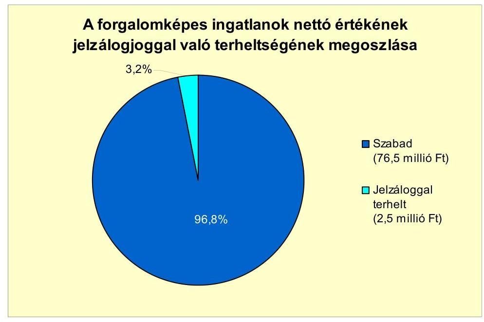

Az Önkormányzat és az 50%-ot meghaladó önkormányzati tulajdoni hányadú gazdasági társaságai kötelezettséget keletkeztető peres eljárásban nem volt érintett a vizsgált időszakban.

Az Önkormányzatnak két gazdasági társaságában van 50%-ot elérő tulajdonosi részesedése, mindkettőben minősített többségű a befolyása, az egyik 99,2%-os, a másik kizárólagos tulajdonában van. A gazdasági társaságok kötelezettségeinek állományát és várható alakulását az alábbi táblázat mutatja:

| Megnevezés | Állomány 2010. december 31   én | Állomány 2011. június 30-án | Várható kötelezettség   2011-2013. években | Várható kötelezettség   2014. évtől |
| :--: | :--: | :--: | :--: | :--: |
|  | HUF-ban (millió Ft-ban) | HUF-ban (millió Ft-ban) | HUF-ban (millió Ft-ban) | HUF-ban (millió Ft-ban) |
| Polyószámla hitel | - | 2,0 | 2,0 | - |
| Pénzintézeti kötelezettségek összesen: | - | 2,0 | 2,0 | - |
| Szállítás tartozás | 149,5 | 51,9 | 51,9 | - |

A minősített többségi tulajdonú társaság jelenleg nem működik rendeltetésszerűen, minimális, a projekt lebonyolítási feladatait látja el. A kizárólagos tulajdonban lévő gazdasági társaság helyzete stabil, a saját tőke kétszerese a jegyzett tőkének. A gazdasági társaságok év végi szállítói állománya 2010. december 31-én összesen 149,5 millió Ft volt, melynek 96,0%-a -143,5 millió Ft - a járóbeteg ellátást biztosítására létrehozott gazdasági társaságnál jelentkezett. A 2011. év I. félév végére a szállítói tartozás a 2010. december 31-i állományhoz képest 45,2%-kal 81,9 millió Ft-ra csökkent. A 100%-ban önkormányzati tulajdonban lévő gazdasági társaság 2011. június 30-án 2,0 millió Ft folyószámlahitel-állománnyal rendelkezett. Az Önkormányzat gazdasági társaságának peres eljárásból adódó kötelezettsége nem volt. Növelheti a működés kockázatát

---

a járóbeteg-szakellátás tervezett feladatellátása is. Ha az OEP által a feladatellátásra nyújtott támogatások nem fedezik a felmerülő működési kiadásokat, azt az Önkormányzatnak szükséges kiegészítenie a vállalt működés biztosítása érdekében. Ezt jelzi, hogy az Önkormányzat erre a célra a 2011. évi költségvetésében 10,0 millió Ft-ot tartalékként különített el.

#### Abstract

„Az Önkormányzat a gazdasági társaságokról szóló 2006. évi IV. törvény 54. § (2) bekezdése alapján korlátlan felelősséggel tartozik azon gazdasági társaságának felszámolása esetében, amelyben az Önkormányzat az 52. § (2) bekezdése szerint a szavazatok legalább 75%-ával rendelkezik, így minősített befolyásszerzőnek minősül, továbbá a csődeljárásról és a felszámolási eljárásról szóló 1991. évi XLIX. törvény 63. § (2) bekezdése alapján a kizárólagos önkormányzati tulajdonú gazdasági társaságának minden olyan kötelezettségéért, amelynek kielégítését a felszámolási eljárás során az adós társaság vagyona nem fedez, ha a hitelezőinek a felszámolási eljárás során benyújtott keresete alapján a bíróság - az adós társaság felé érvényesített tartósan hátrányos üzletpolitikájára figyelemmel - megállapítja az önkormányzat korlátlan és teljes felelősségét."

Az Önkormányzat a 2007-2010. években a tárgyi eszközök után együttesen 532,3 millió Ft összegű értékcsökkenést számolt el, míg ezen időszak alatt felújításra 67,8 millió Ft-ot, beruházásra 3251,2 millió Ft-ot fordítottak a számviteli nyilvántartásuk szerint. A felhalmozások a térségi szennyvízberuházás következtében az elszámolt értékcsökkenés hatszorosát tették ki. A felújításokra, az eszközök pótlására az Önkormányzat pénzügyi lehetőségének a függvényében, elsősorban az intézmények működőképességének biztosításának figyelembevételével került sor. A Képviselő-testületnek előterjesztett éves zárszámadási rendeleteikben nem mutatták be az Önkormányzat eszközei után tárgyévben elszámolt értékcsökkenés összegét, az eszközpótlásra fordított tényleges kiadásokat, az eszközök elhasználódási fokának alakulását.

Az Önkormányzat immateriális javainak és tárgyi eszközeinek összesített használhatósági foka a 2007. évi 91,1%-ról a 2010. évre 88,2%-ra csökkent. A tárgyi eszközök ingatlanok, vagyoni értékű jogok, járművek, átadott eszközök mindegyik csoportjaiban egyaránt csökkent az év végi nettó értéknek a bruttó értékhez viszonyított aránya 2010-ben 2007-hez képest. A gépek, berendezések, felszerelések esetében a használhatósági fok mutató a 2007. évi 31,7%-ról a 2010. évre 44,6%-ra emelkedett a térfigyelőkamera-rendszer kiépítése miatt.

# 4. A PÉNZÜGYI EGYENSÚLY MEGTEREMTÉSE ÉRDEKÉBEN HOZOTT INTÉZKEDÉSEK EREDMÉNYE 

Az Önkormányzatnál a 2008. évben működési és felhalmozási, a 2007-2010. években felhalmozási hiány alakult ki, aminek kezelése érdekében bevételnövelő, illetve kiadáscsökkentő intézkedéseket hoztak. Az Önkormányzat adatszolgáltatása szerint a kiadáscsökkentő intézkedések 2007-2011. év I. féléve között, összesen 111,8 millió Ft megtakarítást eredményeztek.

A létszámcsökkentési döntések következtében 91,3 millió Ft megtakarítása keletkezett az Önkormányzatnak, ami 81,7%-a a végrehajtott kiadáscsökkentő intézkedésekből adódó megtakarításnak.

---

A beszerzési szerződések felülvizsgálatára 2009-2010-ben három alkalommal került sor. A gázszolgáltatás, a telekommunikációs szolgáltatás, valamint az ételbeszerzések kapcsán a kiadás 15,2 millió Ft-tal csökkent.

A 2011. évi költségvetési rendeletben a közalkalmazottak cafetériájának csökkentését rendelték el, az ebből adódó megtakarítás 0,6 millió Ft volt. A 2011. évben megszüntették a sport szakmai tevékenység ellátására kötött megbízási szerződést, mely 1,3 millió Ft megtakarítást eredményezett.

A 2011. évi költségvetési rendelet rendelkezett a civil szervezetek támogatásainak, valamint a vásárolt közszolgáltatások csökkentéséről is. Ezáltal a 2011. év I. félévében az Önkormányzat kiadása 1,9 millió Ft-tal, illetve 1,5 millió Ft-tal lett kevesebb.

A következő diagram az Önkormányzat kiadáscsökkentő intézkedéseinek területeit és azok megoszlását mutatja:
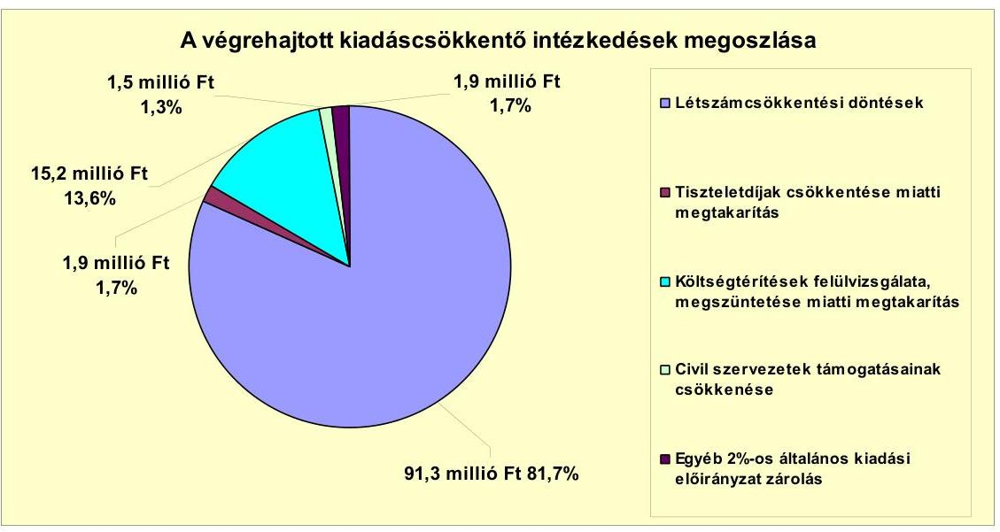

Az Önkormányzatnál 2007. január 1-jén 74 fő volt az engedélyezett álláshelyek száma és az induló létszám, 2010 végére a záró álláshelyek száma és a záró létszám is 83 főre növekedett. A közoktatás területén a közoktatási intézmények átvételével 16 fős, a Polgármesteri hivatalban feladatbővülés hatására 3 fős létszámfejlesztés valósult meg. A szociális és gyermekjóléti feladatok esetében feladatátadás következtében 10 fő álláshelye szűnt meg.

A szociális, gyermekjóléti-, ifjúsági feladatok ellátása 2007. évben a Bodrogközi Többcélú Kistérségi Társuláshoz kerültek át, s ekkor 10 fő álláshely megszűnt. Ugyanebben az évben az oktatási feladatok ellátása két önkormányzat részvételével társulás keretében valósult meg, mely 16 fő létszámemelkedést okozott. A Polgármesteri hivatalnál a vizsgált időszakban a körzetközponti szerepkör erősítése érdekében 6 fős létszámnövekedés volt, azonban 3 üres álláshelyet megszüntettek.

[^0]
[^0]:    ${ }^{19}$ A közalkalmazottaknál az egy főre jutó éves keretösszeg 100 ezer Ft-ról 71 ezer Ft-ra csökkent.

---

Az Önkormányzat 2007-2010. éveket érintő létszámcsökkentő döntéseinek hatását szemlélteti a következő tábla:

| Megnevezés (adatok fő-ben) |  | Közoktatás | Szociális és gyermekvédelem | Egészségügy | Polgármesteri hivatal | Összesen |
| :--: | :--: | :--: | :--: | :--: | :--: | :--: |
| 2007. január 1-jén jóváhagyott álláshelyek száma |  | 38 | 10 | 4 | 22 | 74 |
| Megszüntetett álláshelyek száma |  | 0 | 10 | 0 | 0 | 10 |
| ebből üres álláshelyek száma |  | 0 | 0 | 0 | 0 | 0 |
|  | szakmai álláshelyek száma | 0 | 10 | 0 | 0 | 10 |
|  | intézmény-üzemeltetéssel kapcsolatos   álláshelyek száma | 0 | 0 | 0 | 0 | 0 |
| Álláshely növekedése |  | 16 | 0 | 0 | 3 | 19 |
| 2010. december 31-én záró álláshelyek száma |  | 54 | 0 | 4 | 25 | 83 |
| 2007. január 1-jén foglalkoztatott létszám |  | 38 | 10 | 4 | 22 | 74 |
| Létszámcsökkentés |  | 0 | 10 | 0 | 0 | 10 |
| Létszámnövekedés |  | 16 | 0 | 0 | 0 | 19 |
| 2010. december 31-én foglalkoztatott létszám |  | 54 | 0 | 4 | 25 | 83 |

A 2007-2008. években meglévő üres állások a 2009-2010. évekre megszűntek
 a költségvetési rendeletekben engedélyezett nyitó álláshelyek csökkenése következtében. Az üres álláshelyek megszüntetésének kiadáscsökkentő hatását nem számszerűsítették, erről külön döntéseket nem hoztak.

A helyi szervezési intézkedések végrehajtásához az Önkormányzat központosított költségvetési támogatást nem vett igénybe. A kiadáscsökkentő intézkedésből az önként vállalt feladatok ellátásához kizárólag 2011. évben kapcsolódott csökkentés, ennek mértéke 3,8 millió Ft volt.

Az Önkormányzat adatszolgáltatása szerint 2007-2011. év I. félévében három területet érintően tettek bevételnövelő intézkedéseket, melyek eredményeként 20,0 millió Ft többletbevételt értek el. A vizsgált időszakban érvényesített bevételnövelő intézkedések részletezését a következő ábra mutatja:
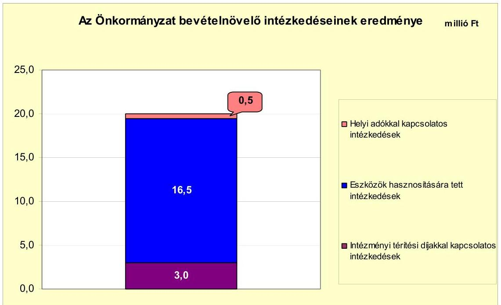

A helyi adókkal kapcsolatos intézkedések összesen 0,5 millió Ft többletbevételt eredményeztek. Az eszközök hasznosításából 2009-2010. években 16,5 millió Ft többletbevétele származott az Önkormányzatnak. Az intézményi térítési díjakkal kapcsolatos intézkedésekből adódóan 2010. évben 3,0 millió Ft bevételnövekedés realizálódott.

A magánszemélyek kommunális adó mértékének emelése 0,2 millió Ft, a mentességek csökkentése 0,3 millió Ft bevételtöbbletet jelentett az Önkormányzatnak. Az eszközök hasznosítása során a Mercedes busz, valamint a szennyvízvagyon bérbeadásából realizálódott bevétel. Az Önkormányzat rendelete alapján az óvodai, a napközi-otthoni és a családi napközi térítési díj bevezetésére került sor.

Az Önkormányzatnál a vizsgált időszakban az átengedett szja és az állami támogatások együttes összege a 2007. évről a 2010. évre nem csökkent. A kiadáscsökkentő és bevételnövelő intézkedések meghozatalára a költségvetési és pénzügyi egyensúly megteremtése érdekében volt szükség, mely összességében 157,0 millió Ft többletforrást eredményezett. A jövőbeni kötelezettségek teljesítése érdekében további intézkedések válnak szükségessé.

# 5. A HELYI ÖNKORMÁNYZATOK GAZDÁLKODÁSI RENDSZERÉNEK ELLENŐRZÉSE SORÁN A PÉNZÜGYI EGYENSÚLY JAVÍTÁSÁRA TETT SZABÁLYSZERŰSÉGI ÉS CÉLSZERŰSÉGI JAVASLATOK HASZNOSULÁSA 

Az ÁSZ az Önkormányzat gazdálkodási rendszerét a 2009. évben ellenőrizte átfogó jelleggel és a pénzügyi egyensúly javítására három szabályszerűségi javaslatot tett. A javaslatok hasznosulása érdekében készített intézkedési tervet a Képviselő-testület jóváhagyta, a feladatok végrehajtásáért felelős személyeket és a feladatok végrehajtásának határidejét meghatározta.

Az intézkedési tervben foglaltaknak megfelelően a költségvetési rendeletben az előző évi pénzmaradványból tervezett kiadásokat eredeti előirányzatként mutatják ki. Az EU-s támogatással megvalósuló fejlesztési feladatok kiadásait feladatonként mutatják be, a projektek kiadásai és bevételeit elkülönítetten szerepeltetik. A saját bevételek előirányzatai és a költségvetést megalapozó helyi rendeletek összhangjának ellenőrzését biztosítják.

Budapest, 2012. április
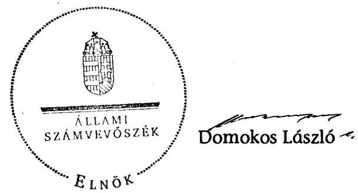

Melléklet: $\quad 7 \mathrm{db}$

---

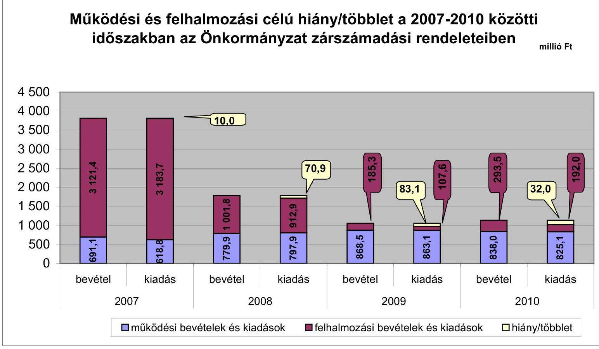

# Működési és felhalmozási célú hiány/többlet a 2007-2010 közötti időszakban az Önkormányzat zárszámadási rendeleteiben

|  I. számú melléklet | II. számú melléklet | III. számú felhalmozásai felhalmozásai felhalmozásai felhalmozásai felhalmozásai felhalmozásai felhalmozásai felhalmozásai felhalmozásai felhalmozásai felhalmozásai felhalmozásai felhalmozásai felhalmozásai felhalmozásai felhalmozásai felhalmozásai felhalmozásai felhalmozásai felhalmozásai felhalmozásai felhalmozásai felhalmozásai felhalmozásai felhalmozásai felhalmozásai felhalmozásai felhalmozásai felhalmozásai felhalmozásai felhalmozásai felhalmozásai felhalmozásai felhalmozásai felhalmozásai fel

Az Önkormányzat bevételei és kiadásai, valamint adósságszolgálata 2007-2010 között

|   |  |  |  |  | millió Ft  |
| --- | --- | --- | --- | --- | --- |
|  1. FOLYÓ KÖLTSÉGVETÉS* | 2007. | 2008. | 2009. | 2010. |   |
|  1.1.1. Saját működési bevételek | 108,2 | 103,0 | 107,9 | 98,3 |   |
|  1.1.2. Költségvetési támogatás | 234,5 | 499,4 | 562,1 | 550,4 |   |
|  1.1.3. Átengedett bevételek | 300,0 | 110,4 | 126,2 | 134,4 |   |
|  1.1.4. Állambáztartáson belülről kapott támogatások | 52,1 | 89,0 | 105,7 | 80,9 |   |
|  1.1.5. EU-tól és külföldről kapott bevételek | 0,0 | 0,0 | 0,0 | 0,0 |   |
|  1.1.6. Állambáztartáson kívülről kapott bevételek | 2,5 | 0,3 | 0,1 | 0,0 |   |
|  1.1.7. Előző évt pénzmaradvány átvétel | 0,0 | 0,0 | 0,0 | 0,0 |   |
|  1.1. Folyó bevételek =1.1.1.+1.1.2.+1.1.3.+1.1.4.+1.1.5.+1.1.6.+1.1.7. | 697,4 | 803,3 | 901,9 | 864,0 |   |
|  1.2.1. Működési kiadások kamatkiadások nélkül | 444,6 | 587,8 | 660,8 | 642,6 |   |
|  1.2.2. Állambáztartáson belülre átadott pénzeszközök | 0,0 | 0,0 | 3,5 | 7,2 |   |
|  1.2.3.1. vállalkozásoknak | 0,2 | 0,0 | 12,5 | 10,2 |   |
|  1.2.3.2. EU-nak, illetve külföldre | 0,0 | 0,0 | 0,0 | 0,0 |   |
|  1.2.3.3. magáncymélyeknek | 164,0 | 192,0 | 184,4 | 161,7 |   |
|  1.2.3.4. nonprofit (c)rveczeteknek | 8,4 | 16,3 | 1,1 | 0,1 |   |
|  1.2.3. Trameferkiadások (=1.2.3.1+1.2.3.2+1.2.3.3+1.2.3.4) | 172,5 | 208,4 | 198,0 | 172,1 |   |
|  1.2.4 Kamatkiadások | 1,7 | 12,1 | 5,6 | 5,7 |   |
|  1.2.5. Előző évt pénzmaradvány átadás | 0,0 | 0,0 | 0,0 | 0,0 |   |
|  1.2. Folyó kiadások = 1.2.1.+1.2.2.+1.2.3.+1.2.4.+1.2.5. | 618,0 | 808,2 | 867,9 | 827,5 |   |
|  1.3. Folyó költségvetés egyenlege MÜKÖDÉSI JÖVEDELEM (1.1. - 1.2.) | 78,6 | -6,0 | 34,0 | 36,5 |   |
|  2. FELHALMOZÁSI KÖLTSÉGVETÉS** | 0,0 | 0,0 | 0,0 | 0,0 |   |
|  2.1.1. Saját tökébevételek | 0,9 | 0,9 | 7,8 | 2,8 |   |
|  2.1.2. Állambáztartáson belülről kapott támogatások | 2 826,8 | 814,5 | 25,5 | 139,2 |   |
|  2.1.3. EU-tól és külföldről kapott támogatások | 0,0 | 0,0 | 0,0 | 0,0 |   |
|  2.1.4. Állambáztartáson kívülről kapott támogatások | 0,0 | 0,0 | 0,9 | 0,0 |   |
|  2.1. Felhalmozási bevételek (=2.1.1.+2.1.2+2.1.3+2.1.4.) | 2 827,7 | 815,4 | 34,2 | 141,9 |   |
|  2.2.1. Saját beruházási kiadás áfával | 2 896,9 | 856,3 | 91,8 | 34,7 |   |
|  2.2.2. Saját felújítási kiadás áfával | 25,6 | 21,0 | 6,2 | 41,0 |   |
|  2.2.3. Állambáztartáson belülre átadott pénzeszköz | 0,1 | 0,4 | 0,0 | 0,0 |   |
|  2.2.4. EU-nak és külföldnek adott pénzeszközök | 0,0 | 0,0 | 0,0 | 0,0 |   |
|  2.2.5. Állambáztartáson kívülre adott pénzeszközök | 6,0 | 6,8 | 1,2 | 110,6 |   |
|  2.2.6. Befektetési célú részesedések vásárlása | 2,2 | 15,1 | 2,4 | 2,1 |   |
|  2.2. Felhalmozási kiadások (=2.2.1.+2.2.2.+2.2.3.+2.2.4.+2.2.5.+2.2.6.) | 2 930,8 | 899,6 | 101,5 | 188,3 |   |
|  2.3. Felhalmozási költségvetés egyenlege (2.1. - 2.2.) | -103,1 | -84,2 | -67,3 | -46,4 |   |
|  3. Finanszírozási műveletek nélküli (GFS) pozíció(1.3.+2.3.) | -24,5 | -90,2 | -33,2 | -9,9 |   |
|  4. Finanszírozási műveletek | 0,0 | 0,0 | 0,0 | 0,0 |   |
|  4.1. Hitelletvétel | 13,0 | 0,0 | 0,0 | 0,0 |   |
|  4.2. Hiteltörlesztés | 2,9 | 3,2 | 1,3 | 1,4 |   |
|  4.3. Forgatási és befektetési célú értékpapírok kibocsátása | 250,0 | 0,0 | 0,0 | 0,0 |   |
|  4.4. Forgatási és befektetési célú értékpapírok beváltása | 0,0 | 0,0 | 0,0 | 0,0 |   |
|  4.5. Forgatási és befektetési célú értékpapírok értékesítése | 0,0 | 150,0 | 100,0 | 0,0 |   |
|  4.6. Forgatási és befektetési célú értékpapírok vásárlása | 250,0 | 0,0 | 0,0 | 0,0 |   |
|  4.7. Egyéb finanszírozási bevételek (függő, átfutó, kiegyenlítő) | 4,1 | 1,3 | -2,3 | -23,7 |   |
|  4.8. Egyéb finanszírozási kiadások (függő, átfutó, kiegyenlítő) | -8,3 | 9,7 | -5,2 | -18,4 |   |
|  4.9.Finanszírozási műveletek egyenlege (4.1. - 4.2.+4.3.-4.4+4.5.-4.6.+4.7.- | 22,5 | 138,4 | 101,7 | -6,7 |   |
|  4.8.) |  |  |  |  |   |
|  5. Tárgyévi pénzügyi pozíció változás (1.3.+ 2.3.+4.9.) | -2,0 | 48,2 | 68,4 | -16,6 |   |
|  6. Nettó működési jövedelem =müködési jövedelem (1.3.) - töketörlesztés | 75,7 | -9,2 | 32,7 | 35,1 |   |
|  (4.2+4.4) |  |  |  |  |   |
|  TÁJÉKOZTATÓ ADATOK |  |  |  |  |   |
|  Összes kötelezettség | 299,6 | 344,1 | 2 355,7 | 2 364,2 |   |
|  ebből rövid lejáratú | 35,6 | 39,5 | 63,2 | 116,5 |   |
|  Összes szállítói kötelezettség | 13,7 | 4,1 | 18,1 | 47,3 |   |
|  ebből lejárt (tanúsítványból) | 11,7 | 4,0 | 18,1 | 45,6 |   |
|  Pénz és tőkepiaci kötelezettség (adósság) | 265,5 | 305,3 | 311,4 | 376,3 |   |
|  ebből rövid lejáratú | 3,3 | 1,3 | 1,3 | 22,9 |   |
|  PPP szerződéses állomány jelenértéken (tanúsítványból) | 0,0 | 1 013,5 | 971,5 | 929,5 |   |
|  ebből lejárt szolgáltatási díj miatti kötelezettség | 0,0 | 0,0 | 0,0 | 0,0 |   |
|  Folyószámbaltitel napi átlagos állománya (tanúsítványból) | 5,6 | 6,7 | 3,9 | 7,0 |   |
|  Likvidititel napi átlagos állománya (tanúsítványból) | 0,0 | 0,0 | 0,0 | 0,0 |   |
|  Munkabérhítel napi átlagos állománya (tanúsítványból) | 0,0 | 0,0 | 0,0 | 0,0 |   |
|  Kezesség és garanciavállalások (tanúsítványból) | 0,0 | 0,0 | 0,0 | 0,0 |   |
|  Jogerős bírósági ítéletekből adódó kötelezettségek (tanúsítványból) | 0,0 | 0,0 | 0,0 | 0,0 |   |
|  Finanszírozásba bevonható eszközök: | 270,1 | 168,3 | 136,6 | 120,1 |   |
|  Tartós hitelviszonyt megtestesítő értékpapírok év végi állománya | 250,0 | 100,0 | 0,0 | 0,0 |   |
|  Hosszú lejáratú bankbetétek év végi állománya | 0,0 | 0,0 | 0,0 | 0,0 |   |

  Értékpapírok év végi állománya | 0,0 | 0,0 | 0,0 | 0,0 |   |
|  Pénzeszközök (idegen pénzeszközök nélküli) év végi állománya | 20,1 | 68,3 | 136,6 | 120,1 |   |

- Bevételekben nem térül, a kiadásokban nem jelenik meg az amortizáció, a vagyoni helyzetet az egyenleg befolyásolja. Bevételekben vagyon megőrzésre és bővítésre fordítható források.

---

## **Az Önkormányzat 2007-2010 években megvalósított, 2010. december 31-ig befejezett fejlesztései és azok forrásösszetétele**

|  Fejlesztési feladat (beruházás, felújítás) |  |  | Beruházás, felújítás |  |  | Teljes bekerülési költség |  |  |  |  |  |  |  |  |  |  |  |  |  |  |  |  |  |  |  |  |  |  |  |  |  |  |  |  |  |  |  |  |  |  |  |  |  |  |  |  |  |  |  |  |  |  |  |  |  |  |  |  |  |  |  |  |  |  |  |  |  |  |  |  |  |  |  |  |  |  |  |  |  |  |  |  |  |  |  |  |  |  |  |  |  |  |  |  |  |  |  |  |  |  |  |  |  |  |  | 

---

### **Az Önkormányzat 2010. december 31-én folyamatban lévő fejlesztési feladataira 2010. december 31-ig teljesített kifizetések és azok forrásösszetétele**

|   | Fejlesztési feladat (beruházás, felújítás) |  | Beruházás, felújítás |  | Teljes bekerülési költség |  |  | 2006. dec. 31-ig teljesített kiadás | 2007. 2010. években teljesített kiadás | A teljes bekerülési költség százalékos arányban fordított összeg |  |  |  |  |  |  |  |  |  |  |  |  |  |  |  |  |  |  |  |  |  |  |  |  |  |  |  |  |  |  |  |  |  |  |  |  |  |  |  |  |  |  |  |  |  |  |  |  |  |  |  |  |  |  |  |  |  |  |  |  |  |  |  |  |  |  |  |  |  |  |  |  |  |  |  |  |  |  |  |  |  |  |  |  |  |  |  |  |  |  |  |  |  |  |  |  |  |  |  |  |  |  |  | 

---

Cígárd Város Önkormányzata

Az Önkormányzat 2010. december 31-én folyamatban lévő fejlesztési feladataira 2010. december 31-én fennálló kötelezettségek és azok forrásösszetétele

millió Ft-ban

|  Fejlesztési feladat (beruházás, felújítás) | Beruházás, felújítás | Teljes bekerülési költség (2010. dec. 31-én) | 2006. dec. 31-ig teljesített kiadás | 2007-2010. évek között teljesített kiadás | Várható többlet (teljes bekerülési költség) (1+3+12+2) | 2010. utánra halasztott kötelezettség (12+10+20+27+27+31) | A várható többlet (teljes bekerülési költség) százalékos arányban fordított összeg | 2010. december 31-e utáni kötelezettség-vállalások forrásösszetétele | Kötvény | EU-s támogatás | Hazai támogatás | jogszabályban foglalt szakmai követelmény teljesítése (igen/nem)  |
| --- | --- | --- | --- | --- | --- | --- | --- | --- | --- | --- | --- | --- | --- | --- | --- | --- | --- | --- | --- | --- | --- | --- | --- | --- | --- |
|  Megnevezése |  |  |  |  |  |  |  |  |  |  |  |  |  |  |  |  |  |  |  |  |  |  |  |  |   |
|  Megnevezése |  |  |  |  |  |  |  |  |  |  |  |  |  |  |  |  |  |  |  |  |  |  |  |  |   |
|  1 | 2 | 3 | 4 | 5 | 6 | 7 | 8 | 9 | 10 | 11 | 12 | 13 | 14 | 15 | 16 | 17 | 18 | 19 | 20 | 21 | 22 | 23 | 24 | 25 | 26  |
|  1. Felújítások |  |  |  |  |  |  |  |  |  |  |  |  |  |  |  |  |  |  |  |  |  |  |  |  |   |
|  2. Óvoda bővítése (Ogándon) |  |  |  |  |  |  |  |  |  |  |  |  |  |  |  |  |  |  |  |  |  |  |  |  |   |
|  3. Óvoda bővítése (Ogándon) |  |  |  |  |  |  |  |  |  |  |  |  |  |  |  |  |  |  |  |  |  |  |  |  |   |
|  3.0 (Várható bővítése) |  |  |  |  |  |  |  |  |  |  |  |  |  |  |  |  |  |  |  |  |  |  |  |  |   |
|  3.0 (Várható bővítése) |  |  |  |  |  |  |  |  |  |  |  |  |  |  |  |  |  |  |  |  |  |  |  |  |   |
|  4. 10 millió Ft alatt felújítások |  |  |  |  |  |  |  |  |  |  |  |  |  |  |  |  |  |  |  |  |  |  |  |  |   |
|  5. Felújítások összesen |  |  |  |  |  |  |  |  |  |  |  |  |  |  |  |  |  |  |  |  |  |  |  |  |   |
|  6. Fejlesztések összesen |  |  |  |  |  |  |  |  |  |  |  |  |  |  |  |  |  |  |  |  |  |  |  |  |   |
|  7. A Cígárd Káritor Mihály Általános Művelődési Központ informatikai infrastruktúrájának fejlesztése (Összesítő eszközök összesen) |  |  |  |  |  |  |  |  |  |  |  |  |  |  |  |  |  |  |  |  |  |  |  |  |  |   |
|  8. Bölcsőde kialakítása |  |  |  |  |  |  |  |  |  |  |  |  |  |  |  |  |  |  |  |  |  |  |  |  |   |
|  9. 10 millió Ft alatt fejlesztések |  |  |  |  |  |  |  |  |  |  |  |  |  |  |  |  |  |  |  |  |  |  |  |  |   |
|  10. Fejlesztések összesen |  |  |  |  |  |  |  |  |  |  |  |  |  |  |  |  |  |  |  |  |  |  |  |  |   |
|  11. Összesen |  |  |  |  |  |  |  |  |  |  |  |  |  |  |  |  |  |  |  |  |  |  |

  |  |   |

A= ha a forrás már rendelkezésre áll,

B= ha a forrás közbeszerzési eljárása folyamában van,

C= ha a forrás közbeszerzési eljárása még nem indult el, a forrás nem áll rendelkezésre.

---

### **Az Önkormányzat által beadott, elbírálás alatti pályázati forrásból megvalósítani tervezett fejlesztéseihez kapcsolódó kötelezettségvállalásai és azok forrásösszetétele**

|  Fejlesztési feladat (beruházás, felújítás) |  | Beruházás, felújítás |  |  |  |  |  |  |  |  |  |  |  |  |  |  |  |  |  |  |  |  |  |  |  |  |  |  |  |  |  |  |  |  |  |  |  |  |  |  |  |  |  |  |  |  |  |  |  |  |  |  |  |  |  |  |  |  |  |  |  |  |  |  |  |  |  |  |  |  |  |  |  |  |  |  |  |  |  |  |  |  |  |  |  |  |  |  |  |  |  |  |  |  |  |  |  |  |  |  |  | 

---

# Az önkormányzati feladatok ellátásában résztvevő gazdasági társaságok

|  Gazdasági társaság megnevezése | 2010. december 31-én | a gazdasági társaságnak szerződéses kötelezettségre, feladatellátási szerződésre alapozottan az önkormányzat költségvetéséből nyújtott  |
| --- | --- | --- |
|   | önkormányzati | önkormányzati gazdasági társaságának  |
|   |  |   |
|  |   |   |
|  |   |   |
|  |   |   |
|  |   |   |
|  |   |   |
|  |   |   |
|  |   |   |
|  |   |   |
|  |   |   |
|  |   |   |
|  |   |   |
|  |   |   |
|  |   |   |
|  |   |   |
|  |   |   |
|  |   |   |
|  |   |   |
|  |   |   |
|  |   |   |
|  |   |   |
|  |   |   |
|  |   |   |
|  |   |   |
|  |   |   |
|  |   |   |
|  |   |   |
|  |   |   |
|  |   |   |
|  |   |   |
|  |   |   |

