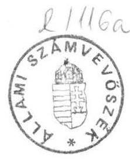

6571. szám

# Allami Számưutóósek 

## MEGJEGYZÉSEK

a Magyar Köztársaság Kormánya által az Állami Számvevőszéknek a Magyar Köztársaság 1991. évi költségvetése végrehajtásának ellenőrzéséről szóló jelentéséhez tett észrevételeire

---

A nyomonkövethetőség érdekében - a Kormány észrevételeinek szerkezeti felépitéséhez hasonlóan - a Számvevőszék Jelentése és a Részletes Megállapítások szerkezetéhez igazódóan tárgyaljuk megjegyzéseinket.

A bevezetéshez (1-2. oldal)
A 6085. számon az Országgyűlésnek benyújtott dokumentumban a számszaki összefüggések ellenőrzésére, azoknak a szöveges indoklással és a hatályos jogszabályokkal történő összevetésére 1992. június 16 -át követően kerülhetett sor. A zárszámadásban szereplő adatok helyszíni ellenőrzése valóban korábban kezdődött el.

A Számvevőszék a zárszámadási prezentációban mutatkozó ellentmondásokra azért hívta fel a figyelmet, hogy az 1991. évi költségvetési törvény átmeneti jellege miatt törvényeröre emelkedett ellentmondások a későbbiekben elkerülhetők legyenek.

Az ellenőrzésnél, a megállapítások megfogalmazásánál abból indultunk ki, hogy csak a törvényjavaslat és mellékletei emelkednek törvényerőre. Ezért több évre visszatekintve csak ezek az adatok lesznek valóban nyilvánosak, minden állampolgár számára hozzáférhetők. A törvényjavaslatban elfogadásra kerülő elszámolásoknak véleményünk szerint tehát a valós, a tényleges felhasználást tükrözỏ adatokat kell tartalmaznia.

A zárszámadás alapvetően az Országgyűlésnek, a képviselőknek készül. Ezért az 1991. évtől kialakuló parlamenti prezentáció továbbfejlesztésénél célszerű arra törekedni, hogy az a képviselők tájékoztatását minél követhetőbb módon segitse, s a zárszámadásban közölt elszámolások ellenőrizhetőségének lehetősége bármely képviselö számára adott legyen, annak ellenére, hogy ezt az ellenőrzést a Számvevőszék törvényi kötelezettsége alapján elvégzi, s arról jelentést készít.

---

1. A Magyar Köztársaság 1991. évi költségvetését meghatározó 1990. évi CIV. törvény végrehajtása
1., A zárszámadás szerkezete (3-5. oldal)

Az Állami Számvevőszék az 1991. évi költségvetési folyamatok alakulásáról készített, 2325. szám alatt benyújtott véleményében valóban megállapította, hogy a költségvetési szerveknél keletkező pénzmaradvány a valós hiány összegét lefelé eltéríti. A "Vélemény" azonban azt is tartalmazta, hogy a pénzmaradvány aggregált módon történő levezetése az éves zárszámadásban nem fogadható el. Felhívtuk a figyelmet arra is, hogy a költségvetési szervekre vonatkozó jogszabályok és a költségvetés bruttó rendszerú jóváhagyási rendje ellentmondásos, mert az állami költségvetés bevételei és kiadásai automatikusan "követik" a költségvetési szervek saját hatáskörben végrehajtott előirányzat módosulásait. Ezért rögzítettük, hogy az 1991. évi zárszámadás elkészítéséhez a költségvetési törvény olyan módosítását - kiegészítését - tartjuk indokoltnak, amely a központi költségvetés hiányának kimutatását "hitelesíthető" módon teszi lehetővé.

A költségvetési szervek pénzügyi pozíciójának változását semlegesítő megoldási alternatívákról szakértői szinten - nem hivatalos formában - valóban voltak információink. A megvitatástól az Állami Számvevőszék nem zárkózott el, sőt szóban jeleztük (színten szakértői szinten) az el1envéleményünket.

Az "elszámolástechnikai okokból" kimutatott pénzforgalom levonásával kapcsolatban - a részletes megállapítások 1.1.3. pontjában foglaltak szerint - a követhetőség és ellenőrizhetőség miatt emeltünk kifogást. Ezt a pénzügyminiszternek 1992. július 17-én írásban jeleztük, s 1992. július 24-én a két szervezet vezetőinek megbeszélésén ezt a kifogásunkat tudomásul vették, s jelezték, hogy a zárszámadást kiegészítik. A kiegészítés 1992. augusztus 17-éig, jelentésünk benyújtásának napjáig nem készült el.

---

Az "Észrevételek" 1.sz. melléklete tekinthető olyan kiegészítésnek, amely a zárszámadás I. és V. kötetei között a számszaki kapcsolatot megteremti. A hivatkozott melléklet 7. oszlopában szereplő adatok ugyanis a zárszámadásban nem találhatók meg.

Az I. kötet 213. oldalán az állami költségvetés végrehajtásának mérlegében a központi költségvetési szervek támogatása egy összegben szerepel, amely tartalmazza a pártok, társadalmi szervezetek támogatását, valamint a családi pótlékban részesülők egyszeri kiegészítő támogatását is.
2., Pótkö1tségvetés-készítési kötelezettség (6. oldal)

A Számvevőszék jelentésében az szerepel, hogy a tervezett hiány jelentős túllépése június hónapban látható volt. Ez az időpont vitatható, azonban a költségvetési törvény alapján a pótköltségvetés készítési kötelezettség megállapítható.
3., Az 1991. évi költségvetési hiány finanszírozása (6-7 oldal)

Az éven belüli, átmeneti finanszírozást szolgáló kincstárjegy forgalomra törvényességi észrevételt nem tettünk. Az viszont ténykérdés, hogy a kincstárjegy évvégi állománya jelentősen meghaladta a CIV. törvényben rögzített mértéket.
4., Az Országgyülés kizárólagos hatáskörében módosítható előirányzatok (7. oldal)

A megállapításban alapvetően azt kifogásoltuk, hogy a felsőoktatási intézmények nappali tagozatos hallgatói pénzbeli juttatásainak és a centralizált alárendeltségủ szervezetek előirányzatainak teljesítése a törvényjavaslat mellékleteiból nem állapítható meg. Az előirányzat módosítás törvényességét nem vitattuk.

---

5., Az elöirányzat-módosítások törvényessége
(7-8. oldal)

A költségvetési törvényben elfogadott elöirányzatok megváltoztatásának hatásköri és eljárási rendjét törvény szabályozza. Ezért a végrehajtott elöirányzat-módosítások zárszámadási törvényben történő elismerését nem indokolt "teljesen felesleges"-nek tekintetni. A módosítások számszaki levezetése és tartalmi indoklása elsősorban a törvényhozás igényeinek kielégítésére és csak másodsorban a számvevőszéki ellenőrzés lehetőségére kell, hogy szolgáljon. A képviselők a módosított elöirányzatokhoz viszonyítottan értékelhetik a valódi teljesítést. (Pl. Ha elöirányzat átcsoportosítás miatt a módosított elöirányzat "O", akkor mindenki számára nyilvánvaló, hogy a teljesítés másik költségvetési címen található meg, s nem a kifizetés elhalasztásáról van szó.)
5.1. Az Országgyúlés hatáskörében végrehajtott elöirányzat módosítások (8-10. oldal)

A költségvetés pénzforgalmi rendjében a bruttó elvet nem lehet csak az elszámolásra leszűkítetten értelmezni, a pénzmozgásra pedig nem, különösen, ha a kedvezményezettek és a kötelezettek nem esnek egybe. A Kormány indoklása nem a tárgyra vonatkozik, ráadásul megkérdőjelezi a hivatkozott törvények jogszerűségét. /A törvények az 1990. évi költ sségvetést érintő kérdéseket rendezték 1991-ben./
5.2. A Kormány hatáskörében végrehajtott elöirányzat módosítások (10-11. oldal)

A decemberi 10\%-os támogatás zárolás elöirányzati levezetése a költségvetési gazdálkodás hatályos szabályai szerint csak abban az esetben tekinthető törvényesnek, ha a költségvetés pozícióját /előirányzati szinten/ nem befolyásolja. A kifogásolt esetben a Kormány úgy módosított kiadási elöirányzatot, hogy nem intézkedett annak ellentételéről. Ezzel megváltoztatta /az észrevételekben foglaltakkal szemben nem növelte, hanem csökkentette/ a költségvetés elöirányzott hiányát. Más megfo-

---

galmazásban az elöirányzat-módosítások /nem a teljesítések/ egyenlegeként a törvénytöl eltérő hiányszint alakult ki. A tényleges teljesités alapján a hiány mértéke ettöl nyilvánvalóan eltér.

# 5.3. Az elöirányzat átcsoportosítások dokumentálása (11-12. oldal) 

Ellenőrzési tapasztalataink szerint a PM az intézményi szintet meghaladó elöirányzatok aktuális, címrend szerinti adataival sem rendelkezik.
6. A költségvetés pénzforgalma (13-14. oldal)

Jelentésünkben nem 46 milliárd Ft kincstárjegy állomány ról, hanem annak - "a CIV. törvény által biztosított forgóalapfeltöltési és hiányfinanszirozási források igénybevételén túl" - további, mintegy 46 milliárd Ft összegủ növeléséről számolunk be.

### 6.3. Letéti számlák (13-14. oldal)

Az "Észrevételek" megállapításainkat nem vitatják. Megjegyezzük, hogy a Hungarocamion Vállalattal kapcsolatos letéti számlának nem a megszüntetését, hanem a letéti kezelés indokoltságának a felülvizsgálatát javasoltuk.
II. A költségvetési elöirányzatok teljesítése

1. A bevételi elöirányzatok teljesítése
1.1.-1.2. A vállalkozások nyereségadó befizetései és kedvezményei (14. oldal)

Az Észrevétel megállapításainkat nem vitatja, az Állami Számvevőszék jelentése is ezt tartalmazza.

---

# 2. A kiadási elöirányzatok teljesitése 

2.1. Az állami nagyberuházások elszámolása (16. oldal)

Az 1990. évről áthúzódott 933 millió Ft maradvány a zárszámadásban nem szerepel. A visszafizetést az "Egyéb bevételek" nem tartalmazzák.

A megállapítás további része arra vonatkozik, hogy a zárszámadásban nem tesznek említést az eredeti elöirányzatok módosításáról.

### 2.2. A társadalmi közkiadások teljesítése (16-18. oldal)

A hivatkozott bekezdés két egymás mellett élő megállapítást tartalmaz: szabálytalannak minösíti a fejezetek szabad pénzeszközeinek értékpapírba fektetését; a fejezetek vállalkozásokban való részvételét, alapítványokhoz való hozzájárulását törvényesnek ítéli. Nincs szó tehát ellentmondásról.

A 4/1991. (II.13.) PM számú rendelet a költségvetési szervek pénz-elhelyezésével, illetve felhasználásával kapcsolatban két szabályt rögzít: a 8. paragrafus (4.) bekezdés kimondja, hogy a szabad pénzeszközt a számlavezető pénzintézetnél tartós betétként lehet elhelyezni; a 10. paragrafus (1.) bekezdés kizárólag a költségvetési számlával kapcsolatos megengedő, illetve tiltó rendelkezéseket tartalmaz.

Figyelembe véve, hogy a 4/1991-es PM rendelet hatályon kívül helyezte a 71/1988. (XII.27.) PM számú rendeletet és azon belül a szabad pénzeszközök szinte korlátlan befektetését lehetővé tevő 10 . paragrafus (3.) bekezdését, tiltás hiányában is egyértelmú, hogy jelenleg kizárólag a MNB-nál helyezhetik el szabad pénzeszközeiket a központi költségvetési szervek.

Megjegyezni kívánjuk, hogy az 54/1986. (XII.10.) MT számú rendelettel módosított és megállapított szövegủ és jelenleg is hatályban lévő 39/1984. (XI.5.) MT számú rendelet 3. paragrafus (1.) bekezdése értelmében a

---

költségvetési fejezetek és intézményeik szám1avezetö bankja az MNB. Mindezt figyelembe véve az Észrevételek érvelése nem fogadható el.

# 2.3. A TB Alap és a költségvetés kapcsolata (18-19. oldal) 

Az észrevétel nem fogadható el, mert az Állami Számvevöszék a Társadalombiztositási Alap 1991. évi zárszámadásának ellenörzési tapasztalatairól szóló és 6406. számon az Országgyülésnek benyújtott jelentésében ismételten jelezte a törvényi ellentmondást (melléklet 8. oldal 3. bekezdés).

### 2.4. Elkülönített állami alapok

2.4.1. Elszámolás az 1991. évben megszünt alapokról (19-20. oldal)

Az Észrevételek elismerik, hogy a Lakásalap megszüntetése határidöre nem fejeződött be, illetve "igaznak látszik", hogy a megszüntetésre kitüzött 3-5 hónap kevés volt. Ezek után nem világos, hogy mi a pontat1anság Jelentésünkben.
2.4.2. A központi költségvetésben bruttó módon szereplő elkülönített állami alapok (20. oldal)

A megállapítás szerint indokolt a költségvetési szerv kiadásain belül elkülöniteni az általuk kezelt alap bevételeit és kiadásait. Ellenkező esetben az alapok pénzeszközei a szervezet fenntartására is fordíthatók.
3. Önkormányzatok támogatása (20-21. oldal)

Az "Észrevétel" nem cáfolja az Állami Számvevőszék jelentésében tett megállapításokat, hanem indokolja a Kormány, illetve a Pénzügyminisztérium magatartását.

---

Az észrevétel azon része pontatlanságot tartalmaz, ahol a címzett és céltámogatásokkal kapcsolatban azt írja a Kormány, hogy "A Belügyminisztérium az Állami Számvevőszék megállapításait eddig nem fogadta el."

A belügyminiszter 1992. május 25-én kelt realizáló levelében a céltámogatási jelentésünk megállapításaival és javaslataival egyetértett, a jelentést korrektnek és hasznosnak minösítette. A céltámogatási rendszer továbbfejlesztésére tett javaslatai ráépülnek az Állami Számvevőszék e témában tett ajánlásaíra.

A jogtalanul igénybe vett támogatások visszavonására tett javaslatunkat ugyancsak támogatta a Belügyminisztérium és ajánlotta a PM-nek annak lebonyolítását.

A címzett támogatással kapcsolatos jelentésünk megállapításainak többségével ugyancsak egyetértett a belügyminiszter, a rendszer továbbfejlesztésének az iránya egyezik a javaslatainkban foglaltakkal.

A jogtalanul igénybe vett normatív támogatás visszafizetésével a Kormány egyetért, ez azért is kedvező, mert korábban (a vizsgálat időszakában június, július hó) a PM ezzel nem értett egyet, hivatkozva arra, hogy az ÁSZ nem teljeskörűen vizsgálta az önkormányzatok normatív támogatását.
III. Az állami költségvetés adósságállománya

1. Az állami költségvetés adósságállománya (23. oldal)

Az Észrevétel nem cáfolja az Állami Számvevőszék megállapítását.
2. A költségvetés végrehajtásával összefüggő hitelfelvételek ellenjegyzése (24. oldal)

Az észrevételek nem az Állami Számvevőszék jelentésében foglaltakra vonatkoznak. A jelentésben csak annyit állapítunk meg, hogy a részletekben felvett hitelek kamatai "az előirányzathoz képest 2823 millió Ft megtakarítást jelentettek".

---

3. A korábban keletkezett belföldi államadósság szerződéseire vonatkozó ellenjegyzés (24. oldal)

Az Állami Számvevőszék jelentése a tényleges helyzetet mutatja be, vagyis azt, hogy milyen megjegyzéssel ellenjegyezte a hitelszerződést az Állami Számvevőszék elnöke. A Kormány észrevételei nem erre vonatkoznak.
4. Nemzetközi elszámolások (24-25. oldal)

Egyetértünk a Hitelfedezeti Alappal kapcsolatban tett észrevétellel. Jelentés-tervezetünk egyeztetése során már felmerült ugyanez az észrevétel, melynek alapján töröltük a kifogásolt szövegrészt. Technikai hiba miatt az Országgyülés részére beterjesztett anyagban mégis szerepel.
IV. Az állami vagyon privatizációjából befolyt bevételek

Változatlanul szükségesnek tartjuk az 1991. évi XCI. törvény 17. paragrafus (1) bekezdésének módosítását. Az idézett törvényhely költségvetésen kivül1i forrás igénybevételéről intézkedik, igy az 1991-ben megvalósult átutalással a törvényben szereplő összeg 1992-ben már nem teljesíthető.
V. Az államháztartás gazdálkodási rendszerének további - az Országgyülés elszámoltatási jogát korlátozó - problémái a zárszámadás tükrében (25-28. oldal)

Az Állami Számvevőszék jelentésének e fejezete arra világít rá, hogy a pénzmaradvány nem csupán elszámolástechnikai kérdés, hanem valamely feladat teljesítésével függ össze. Az elszámolásokban nemcsak a pénzügyi teljesítések mérlegelése indokolt, hanem az is, hogy a megtervezett feladatok teljesitése miként valósult meg, s a teljesítéssel összefüggésben keletkezett-e a pénzmaradvány. Ha a feladat teljesült, nem indokolt a maradvány visszajuttatása.

---

Az "Észrevételek" e pontjának utolsó bekezdése bizonyítja, hogy az 1992. évi feladatokra tervezett összegekböl 1991. évi kötelezettségeket kivánnak teljesíteni. Ez a megoldás csak akkor fogadható el, ha az elszámolások egyértelmú elkülönítése megtörténik.

# Ajánlásokhoz (29-32. oldal) 

## I. Az Országgyülésnek

A Kormány az 1., 2., 3-4., 6., 8. pontokban leirtak szerint ajánlásainkat elfogadja.

## II. A Kormánynak

Az 1., 4., 5., 6., 7., 10. pontokban foglalt ajánlásainkat elfogadják.

A 2., 8., 9. pontokban foglalt javaslatokkal kapcsolatban az Országgyülés döntheti el, hogy a zárszámadásban szereplő elszámolásokat elfogadja-e, illetve igénye1-e kiegészítő elszámolásokat.

A 3. javaslat a 2295,6 millió Ft befizetés pénzủ gyi teljesítésének bemutatására vonatkozik. A zárszámadásban csak 1852 millió Ft-ról történt meg az elszámolás.

## III. A Pénzügyminisztériumnak

1., 4., 8. A Pénzügyminisztériumnak a központi költségvetéssel kapcsolatban megkülönböztetett szerepe van. Ezért nevesítettük ajánlásainkban, ami természetesen nem azt jelenti, hogy az Észrevételekben említett szervezeteknek ne lennének ugyancsak feladatai. Annyi pontositással azonban, hogy az Állami Számvevőszék jogállásánál és feladatkörénél fogva nem vesz (vehet) részt az államigazgatás feladatkörébe tartozó nyilvántartási rendszer kidolgozásában.

---

Egyetértünk viszont azzal, hogy a Pénzügyminisztérium nem vállalhatja fel a fejezeti és az intézményi hatáskörü elö-irányzat-módosítások vezetését.
2. A javaslat a módosított elöirányzatok bemutatásával egyidejüleg megoldható. Az eredetileg tervezett ágazati feladaton a módosított elöirányzat csökkenne, a költségvetési szerv címén belül új soron megjelenne az ágazati feladat intézményre jutó része. Ez a megoldás egyfajta, a program költségvetési rendszer részleges megvalósítása lehetne. Ennek alapján a feladat végrehajtása és az ezzel kapcsolatos pénzügyi teljesités számonkérhető lenne.
6. Ajánlásunkat a Kormány elfogadta.
9. A költségvetési kiadási elöirányzatok több címnél az előző évi várható pénzforgalmi áthúzódásra is fedezetet tartalmaz. A zárszámadásban szereplő tényleges teljesitések alapján az elöirányzatokat később sem módosítják. A javasolt megoldás valóban egy új gyakorlat bevezetését jelentené, ame1y elsősorban a kormányzati beruházások, ágazati feladatok pénzügyi teljesítésének ellenőrzési lehetőségét teremtené meg.

# RÉSZLETES MEGÁLLAPÍTÁSOK 

## 1. A költségvetési mérleg valódisága

### 1.1. A zárszámadási törvényjavaslat fő összegei (1-3. oldal)

1.1.3. A megállapítás alapvetően azt kifogásolja, hogy a zárszámadásban közölt adatokból nem állapítható meg a tárgyévi tényleges bevétel és kiadás, azaz a zárszámadás nem tartalmaz olyan áttekinthető kimutatást, ame1y a levonásokat és a tényleges bevételeket és kiadásokat kimutatja. Ezt a hiányt pótolja az "Észrevételek" 1.sz. melléklete.

---

1.2. Az állami forgóalap pénzforgalmához kapcsolódó zárszámadási adatok valódisága (3-4. oldal)
1.2.2. Jelentésünk a tényleges helyzetet rögzíti, míg az Észrevételek annak okát világítják meg.
1.2.3. A "megelölegezett kiadások forrásainak visszapótlása" kifejezés számunkra értelmezhetetlen. Forrással nem fedezett kiadás a fejezeteknél és intézményeiknél nem fordulhat elő, mert hiány nem keletkezhet és hitelt sem vehetnek fel. Más feladatok terhére teljesített kiadások előfordulása azt jelenti, hogy a források átcsoportosítása miatt az érintett feladatok teljesítése szenvedett - a tervezetthez képest - sérelmet. /Ez a CIV. törvény 54. paragrafusa alapján pénzmaradvány elvonással jár./Hasonló ellentmondás érzékelhető az ÁSZ jelentés 5.1. pontjára tett észrevétellel kapcsolatban is /11. oldal/.
1.3. Az állami forgóalap szabályozása (5-10. oldal)
1.3.1. Az Észrevételek magyarázzák és nem cáfol ják megállapításainkat.
1.4. A költségvetési elölrányzatok átcsoportosításának dokumentálása a zárszámadásban (10-16. oldal)

A "technikai hiba" kiigazításának hatásaként jelentkező támogatási növekményt az Észrevétel megerősíti, de nem tér ki annak fedezetére. (Nem is térhetett ki, hiszen az országgyűlési határozat a fedezetről nem intézkedett és azt a Kormány sem biztosította.)
1.4.1. A Kormány a hibákat elismeri.
1.4.2. Lásd I/4. pontban foglaltakat.
1.4.3. Minden eddigi tapasztalatunk azt igazolja, hogy a bevételeket - függetlenül az előző évi teljesítéstől - azok egyszeri jellegére hivatkozással alacsonyan tervezik. Hasonlóak a tapasztalataink az elöirányzatok évközi módosításainál is.

---

Egyes esetekben az elöirányzatok fejezethez rendelése "csak technikai jellegú" volt minösités nem a jelentésben felsorolt példákra vonatkozik. A megállapítást alátámasztó példa (a MEH fejezetnél az általános és céltartalék, valamint a rendkívüli kiadások fedezete) sajnálatos módon technikai okokból a jelentésböl kimaradt. (A példa a MEH fejezet ellenörzéséről készült jelentésben és a PM-mel egyeztetett zárszámadási részjelentésben egyaránt szerepe1t és azt nem kifogásolták.)

# 1.6. Az állami költségvetés garanciavállalásai (18-20. oldal) 

A Miniszterelnöki Hivatalnál a tartalék elöirányzat felhasználását a CIV. törvény 10. paragrafusának (1) bekezdése alapján lehet minösiteni. A hivatkozott törvényhely kimondja, hogy "Dologi és más elöirányzatból a béralapokba történő átcsoportosításnak nincs helye." Ezen általános tiltó szabály alóli kivételt tartalmazza a 9. paragrafus (10) bekezdése, amely szerint "Állóesz-köz-felújításra (nagyjavításra) szolgáló elöirányzat a béralapból akkor növelhető, ha azt saját kivitelezésben végzik." A Miniszterelnöki Hivatal fejezet esetében nem erröl van szó, így a tartalék elöirányzat béralapba csoportosítása törvénysértést jelentett.

### 1.6.1. Korábban vállalt kormánygaranciák esedékessége

A garanciavállalásokról szóló tételes beszámolást a CIV. törvény 20. paragrafus (4.) bekezdése írta elő.
2. Az adó-, vám- és illetékbevételek alakulása (25-26. oldal)
2.1.3. Az észrevételek elismerik a törvény és a végrehajtási rendelet közötti ellentmondást.

---

# 2.2. Vám- és illetékbevételek (27-31. oldal) 

Technikai okok következtében a Jelentés szövege hiányos, igy a vám- és illetékbevételek alakulására vonatkozó megállapítás helyesen: "-forgalomnövekedés és vámtarifa csökkenés hatására-".

A továbbiakban az észrevételek megállapításainkat nem vitatják, azokhoz különböző magyarázatokat fúznek. Megjegyezzük, hogy az 1991. évi kötelezettségekkel kapcsolatos megállapításunkat a jelentés 2.2.1. pontja tartalmazza. A jelentő́s idöbeni eltérés nem a vámkivetés és a befizetés között, hanem a vámkezelés és a vámkivetés között is fennáll.
2.2.3. Az Észrevételek megerősítik megállapításunkat, azaz, hogy az ÁFA visszatérités hatáskörileg megoszlik a VPOP és az APEH között. (Az áruimportot terhelő ÁFA-ra korlátozódik a VPOP hatásköre.)
2.2.5. Az Észrevételek első része nem kapcsolódik a jelentésben leirtakhoz.

### 5.6. bekezdéshez

A számlabejelentési kötelezettség elöírását véleményünk szerint az eddigiekben kialakult számottevó vámadós állomány indokolttá teszi.

Megnyugtatónak tartjuk, hogy az import ÁFA tekintetében a kiszabásban és a visszaigénylésben érintett VPOP és az APEH között 1992. évben együttmüködési megállapodás született, csökkentve ezzel a visszaélések - részletes megállapításainkban jelzett - lehetöségét.
2.3.2. A tényleges nyereséghez viszonyított $40 \%$-nál magasabb adóterhelést - az észrevételekben jelzettel ellentétben - a vállalkozási nyereségadóról szóló, többszörösen módosított 1988. évi IX. törvény 10. szakaszában foglaltak teszik lehetővé. Ennek értelmében a nyereséget az adóalap megállapítása során különböző jogcímeken növelni (pl. bérnövekmény), illetve csökkenteni kell.

---

6. A központi költségvetési szervek költségvetési kapcsolatai
6.1. A központi költségvetési szervek költségvetésének végrehajtása (53-58. oldal)

Az Észrevételek megállapításunkat elfogadja. Megjegyezzük, hogy a helytelen adatok szerepeltetése nem zárja ki a téves következtetések levonásának lehetőségét.
6.4. A fejezetek pénzmaradványának alakulása (63-64. oldal)

A fejezetenként kimutatott pénzmaradványok támogatáshoz viszonyított aránya elgondolkoztató, annak ellenére, hogy a PM által felsorolt indokok valósak, és a probléma összetett voltára utalnak.
6.5. Normatív támogatások (64-65. oldal)

Az Állami Számvevőszék véleménye szerint a normatív támogatásokkal történő elszámolás jóváhagyását az Országgyűlés hatáskörébe indokolt utalni, tekintettel arra, hogy a igénybevétel miatti esetleges többletet viszont automatikusan fedezhetik. Indokolt, hogy a normatív támogatások maradványa a központi költségvetés maradványát képezze.
6.6. A költségvetési szervek pénze1látása (65-66. oldal)

A példákkal azt kívántuk illusztrálni, hogy milyen esetekben élt a PM a CIV. törvényben kapott felhatalmazással. Egy esetben utalunk arra is, hogy a fejezeti igény megalapozottsága nem volt megállapítható.
7. Családi pótlék (71.72. oldal)

A Számvevőszék jelentése a tényleges helyzetet rögzíti, kifogást nem emel.

---

# 8. Önkormányzatok gazdálkodása

## 8.2.1. Elszámolás a zárszámadási törvényjavaslathoz (73-74. oldal)

Az Állami Számvevőszék véleménye szerint az elszámolások pontosítását eredményezné, ha a zárszámadási törvényjavaslat párhuzamosan módosítaná a következő évi költségvetési törvényt. Ez nem jelenti azt, hogy a végleges felhasználásról is ekkor kell rendelkezni, a kiadási oldalon a tartalék előirányzat is növelhető.

"Észrevételek" összefoglaló gondolataiban az fogalmazódik meg, hogy a könnyen áttekinthető elszámolások kialakítása a Számvevőszék igénye. Amint azt a bevezető gondolatokban rögzítettük, véleményünk kialakításánál abból indultunk ki, hogy a zárszámadás az Országgyűlés, a képviselők számára készül. A bemutatott adatok alapján gyakorolhatja az Országgyűlés a költségvetés ellenőrzési jogát.

Jelentésünkben ezért - mint az Országgyűlés ellenőrző szervezete - arra törekedtünk, hogy rávilágítsunk azokra a pontokra, ahol a bemutatott elszámolások alapján a képviselők a költségvetés végrehajtásáról nem kapnak megfelelő, a valóságot tükröző információt.

Budapest, 1992. szeptember 15.

