# ÁLLAMI   SZÁMVEVŐSZÉK 

## JELENTÉS

## Csenger Város Önkormányzata pénzügyi helyzetének ellenőrzéséről (43/4)

---

# Állami Számvevőszék 

Iktatószám: V-3118-018/2012.
Témaszám: 1015
Vizsgálat-azonosító szám: V0560149

## Az ellenőrzést felügyelte:

Dr. Varga Sándor
számvevő igazgató-helyettes
Az ellenőrzést vezette:
Renkó Zsuzsanna
számvevő tanácsos
Ellenőrzési csoportvezető:
Bíró Zsolt
számvevő tanácsos
Az ellenőrzést végezték:
Hegyes Mária Szabóné László Mária
számvevő tanácsos számvevő

---

# TARTALOMJEGYZÉK 

BEVEZETÉS ..... 9
I. ÖSSZEGZŐ MEGÁLLAPÍTÁSOK, KÖVETKEZTETÉSEK, JAVASLATOK ..... 13
II. RÉSZLETES MEGÁLLAPÍTÁSOK ..... 25

1. Az Önkormányzat kötelező és önként vállalt feladatai, a feladatellátás szervezeti keretei és annak változásai ..... 25
2. Az Önkormányzat pénzügyi egyensúlyi helyzetét befolyásoló tényezők ..... 29
2.1. A múködési és a felhalmozási egyensúly változása ..... 31
2.2. Az Önkormányzat bevételeinek változása ..... 36
2.3. Az Önkormányzat múködési és a felhalmozási célú kiadásainak változása ..... 39
3. Az Önkormányzat kötelezettségei ..... 43
3.1. Az Önkormányzat pénzintézeti kötelezettségeinek változása ..... 43
3.2. A szállítói kötelezettségek változása ..... 49
3.3. Egyéb kötelezettségek változása ..... 50
4. A pénzügyi egyensúly megteremtése érdekében hozott intézkedések eredménye ..... 53
5. Az ÁSZ által a korábbi években a pénzügyi egyensúly javítására tett szabályszerűségi és célszerűségi javaslatok hasznosulása ..... 55

---

# MELLÉKLETEK 

1. számú Múködési és felhalmozási célú hiány/többlet az Önkormányzat zárszámadási rendeleteiben (1 oldal)
2. számú Az Önkormányzat bevételei és kiadásai, valamint adósságszolgálata 2007-2010 között (1 oldal)
3/a. számú Az Önkormányzat 2007-2010. években megvalósított, 2010. december 31ig befejezett fejlesztései és azok forrásösszetétele (1 oldal)
3/b. számú Az Önkormányzat 2010. december 31-én folyamatban lévő fejlesztési feladataira 2010. december 31-ig teljesített kifizetések és azok forrásösszetétele (1 oldal)
3/c. számú Az Önkormányzat 2010. december 31-én folyamatban lévő fejlesztési feladataira 2010. december 31-én fennálló kötelezettségek és azok forrásöszszetétele (1 oldal)
3. számú Az önkormányzati feladatok ellátásában résztvevő gazdasági társaságok (1 oldal)

---

# RÖVIDÍTÉSEK JEGYZÉKE 

## Törvények

adósságrendezési tv.
Áht $_{1}$.
Áht $_{2}$.
Csődtv.
Gt.
Ötv.
Ptk.
Számv. tv.

## Rendeletek

$\mathrm{SzMSz}_{1}$
$\mathrm{SzMSz}_{2}$
2007. évi költségvetési rendelet
2008. évi költségvetési rendelet
2009. évi költségvetési rendelet
2010. évi költségvetési rendelet
2011 évi költségvetési rendelet
2007. évi zárszámadási rendelet
2008. évi zárszámadási rendelet
2009. évi zárszámadási rendelet
2010. évi zárszámadási rendelet

## Szórövidítések

áfa
ÁMK
ÁSZ
ÁSZKUT
CHF
EU
a helyi önkormányzatok adósságrendezési eljárásáról szóló 1996. évi XXV. törvény
az államháztartásról szóló 1992. évi XXXVIII. törvény
az államháztartásról szóló 2011. évi CXCV. törvény
a csődeljárásról és a felszámolási eljárásról szóló 1991. évi XLIX. törvény
a gazdasági társaságokról szóló 2006. évi IV. törvény
a helyi önkormányzatokról szóló 1990. évi LXV. törvény
a Polgári Törvénykönyvről szóló 1959.évi IV. törvény
a számvitelről szóló 2000. évi C. törvény

Csenger Város Önkormányzatának Szervezeti és Múködési Szabályzatáról szóló 8/2007. (IV. 30.) számú rendelete
Csenger Város Önkormányzatának Szervezeti és Múködési Szabályzatáról szóló 11/2011. (IV. 22.) számú rendelete
Csenger Város Önkormányzat Képviselő-testületének 4/2007. (II. 23.) számú rendelete

Csenger Város Önkormányzat Képviselő-testületének 2/2008. (II. 26.) számú rendelete

Csenger Város Önkormányzat Képviselő-testületének 1/2009. (II. 25.) számú rendelete

Csenger Város Önkormányzat Képviselő-testületének 3/2010. (II. 23.) számú rendelete

Csenger Város Önkormányzat Képviselő-testületének 6/2011. (III. 18.) számú rendelete

Csenger Város Önkormányzat Képviselő-testületének 4/2008. (IV. 25.) számú rendelete

Csenger Város Önkormányzat Képviselő-testületének 6/2009. (IV. 30.) számú rendelete

Csenger Város Önkormányzat Képviselő-testületének 7/2010. (V. 3.) számú rendelete

Csenger Város Önkormányzat Képviselő-testületének 10/2011. (IV. 25.) számú rendelete
általános forgalmi adó
Petőfi Sándor Általános Művelődési Központ és Könyvtár, Pedagógiai Szakszolgálat
Állami Számvevőszék
Állami Számvevőszék Kutató Intézete (megszűnt: 2011. december 31-én)
Svájci frank
Európai Unió

---

| EUR | Euro |
| :--: | :--: |
| GESZ | Csengeri Önkormányzati Intézmények Gazdasági Ellátó   Szervezete |
| jegyző | Csenger Város Önkormányzatának jegyzője |
| JPY | Japán jen |
| Képviselő-testület | Csenger Város Képviselő-testülete |
| közoktatási társulás | Csenger Mikrotérségi Közoktatási Intézményfenntartó Társulás |
| OEP | Országos Egészségbiztosítási Pénztár |
| ÖNHIKI támogatás | Önhibájukon kívül hátrányos helyzetben levő települési önkormányzatok támogatása |
| Önkormányzat polgármester | Csenger Város Önkormányzata   Csenger Város Önkormányzatának polgármestere |
| Polgármesteri hivatal | Csenger Város Önkormányzatának Polgármesteri hivatala |
| PPP konstrukció | Public Private Partnership (Partnerségi együttmúködés közfeladatok ellátására a magánszektor bevonásával) |
| szja | személyi jövedelemadó |
| Szociális Alapszolgáltatási Központ | Csenger Város Önkormányzata Népjóléti és Szociális Alapszolgáltatási Központ |
| szociális társulás | Csenger mikro-körzeti intézményfenntartói társulás szociális alapellátások, szociális és gyermekjóléti szolgáltatás, szolgálat alapellátás biztosítására |
| TÁMOP | Társadalmi Megújulás Operatív Program |
| Városüzemeltetési Kft. | Csengeri Városüzemeltetési Nonprofit Korlátolt Felelősségű Társaság (2009. június 29-ig Csenger Térségi Közhasznú Társaság) |

---

# ÉRTELMEZŐ SZÓTÁR 

bevételi kitettség

BUBOR

CLF módszer

EURIBOR
használhatósági fok
kamatkockázat
kötelező közszolgáltatás

Az önkormányzat pénzügyi helyzete olyan külső körülmények hatására is módosulhat, amelyekre az önkormányzatnak nincs hatása, emiatt bevételi kitettsége keletkezik. Pl. az önkormányzat bevételeinek alakulása függhet néhány nagy adózó gazdasági helyzetének, tevékenységének alakulásától, illetve székhelyének, telephelyének változásától.
Budapesti Bankközi Forint Hitelkamatláb. Irányadó, referencia jellegű kamatláb. Mértékét az MNB naponta állapítja meg a banki kamatok figyelembevételével. Közzététele naponta történik.
Az önkormányzatok költségvetése elemzésének eszköze. A módszer következetesen elkülöníti a folyó és a felhalmozási költségvetés bevételeit és kiadásait, azok költségvetési egyenlegeit. Bizonyos mértékig a vállalati gazdálkodás logikai elemeit érvényesíti az önkormányzatok pénzügyi, jövedelmi helyzetének vizsgálata során. Az értékelés a pénzügyi kapacitás fogalmát helyezi a középpontba.
A frankfurti bankközi piacon jegyzett, az Európai Központi Bank szabályainak megfelelően megállapított kínálati kamatláb. Az EURIBOR értékét a legfontosabb európai bankok hitelkínálatának kamatlábai alapján a Reuters ügynökség számolja ki és teszi közzé naponta. A magyar pénzintézetek is ezt használják viszonyítási alapnak EUR hitelek esetén.
Az eszközgazdálkodás vizsgálatának elemzése során használt mutató. Számításakor a tárgyi eszköz könyv szerinti (nettó) értékét viszonyítják a tárgyi eszköz bruttó (beszerzési/létesítési) értékéhez. A \%-ban kifejezett mutató csökkenése az eszköz állagának romlására, avulására utal, ami maga után vonja az üzemeltetési és fenntartási költségek növekedését is.
A változó kamatozású forint-, vagy a devizahitelek futamideje alatt a kamat emelkedése miatt fennálló kamatkockázat, melynek növekedése miatt nő a hitel törlesztő részlete.
A helyi önkormányzati feladatkörbe tartozó, a köztisztasággal és a településtisztasággal, valamint az élet- és vagyonbiztonsággal összefüggő egyes - közszolgáltatás útján megvalósuló - közfeladatok ellátása, amelynek kötelező igénybevételét külön jogszabály (törvény, helyi önkormányzati rendelet) határoz meg.

---

közfeladat

LIBOR
önkormányzat többségi tulajdonában lévő gazdasági társaságok
pénzügyi kapacitás
pénzügyi kockázat

Állami, helyi, illetve kisebbségi önkormányzati feladat, amelynek ellátásáról az államnak, illetve az önkormányzatoknak kell gondoskodni. A hatályos szabályozás szerint közfeladatot törvény és önkormányzati rendelet állapíthat meg. Az önkormányzatok által ellátandó feladatok keretszerú meghatározását az Ötv. tartalmazza.
Angol kifejezés, a London Interbank Offered Rate rövidítése. Jelentése: Londoni bankközi, referencia jellegű kínálati (hitel) kamatláb.
Az önkormányzat a gazdasági társaságban a szavazatok több mint ötven százalékával vagy a Ptk. 685/B. § (2)-(3) bekezdéseiben rögzített meghatározó befolyással rendelkezik. A befolyással rendelkező akkor rendelkezik egy jogi személyben meghatározó befolyással, ha annak tagja, illetve részvényese és jogosult e jogi személy vezető tisztségviselői vagy felügyelőbizottsága tagjai többségének megválasztására, illetve visszahívására, vagy a jogi személy más tagjaival, illetve részvényeseivel kötött megállapodás alapján egyedül rendelkezik a szavazatok több mint ötven százalékával (Ptk. 685/B. § (2) bekezdés). A meghatározó befolyás akkor is fennáll, ha a befolyással rendelkező számára e jogosultságok közvetett módon (köztes vállalkozásain keresztül, a Ptk. 685/B. §. (3), (4) bekezdés szerint) biztosítottak.
A helyi önkormányzat és az önkormányzat irányítása alá tartozó költségvetési szerv többségi tulajdonában, illetve többségi befolyása alatt álló gazdálkodó szervezet esetében hitelfelvétel, kölcsönfelvétel, garancia- vagy kezességvállalás, tartozásátvállalás, tartozás-elengedés, értékpapír kibocsátás, vásárlás, pénzügyi lízing, tartós bérleti szerződés, ingyenes vagyonjuttatás (így különösen: ajándékozás, ingyenes engedményezés), vagy követelésvásárlás, követelésengedményezés végrehajtására vonatkozóan az Áht ${ }_{1}$. 100/M. § (4) bekezdése alapján az önkormányzat rendelkezik döntési jogosultsággal.
A pénzügyi kapacitás (financial capacity) az adósok hitelfelvételi képességének azon mértéke, ahol még anélkül tudják növelni az adósságot, hogy csökkenteniük kellene akár a jelenbeli, akár a jövőben esedékes kiadásaikat a fizetésképtelenség elkerülése érdekében. (Forrás: Az önkormányzati rendszer pénzügyi helyzete, ÁSZKUT tanulmány 2010.)
A múködési kockázat egyik eleme. Megmutatkozhat a költségvetés nagyságrendjének, szerkezetének nem megalapozott módosításaiban, a bevételi és a kiadási előirányzatoktól lényegesen eltérő teljesítésekben, a nem megfelelő belső kontrollrendszer múködésében, a tudatos károkozásokban, a biztosítások elmaradásában, a hibás fejlesztési döntésekben, a nem a terveknek megfelelő forrásfelhasználásokban. Jelentkezhet továbbá a bevételek és kiadások

---

ütemkülönbsége miatt felvett folyószámla- és likvidhitelek költségvetési év végén fennálló egyenlege miatt, amely az önkormányzat költségvetésébe - akár tartósan - beépülő forráshiányt jelzi.
SNA
törlesztési kockázat

System of National Accounts, azaz a Nemzeti Számlák Rendszere, amely a gazdasági szektorok által létrehozott valamennyi terméket és szolgáltatást figyelembe veszi.
Annak a kockázata, hogy a megfelelő időben és mértékben a hitelt felvevőnél rendelkezésre állnak-e a pénzintézetek és egyéb szervek felé fennálló kötelezettségek visszafizetéséhez, a hitelek és kölcsönök törlesztéséhez szükséges pénzügyi források.
A törlesztési kockázatot növeli a kamat- és árfolyam növekedése, mivel ezekben az esetekben az adósságszolgálat nőhet. Törlesztési kockázatot okozhat a visszafizetésre tervezett forrás elérésének, teljesítésének bizonytalansága (pl. a visszafizetéshez tervezett tartalékolás elmaradt, a tervezettnél alacsonyabb a saját bevétel, a helyi adóból származó bevétel az adóalanyok, adóalapok csökkenése miatt nem teljesül).

---

.

---

# JELENTÉS 

## Csenger Város Önkormányzata pénzügyi helyzetének ellenőrzéséről

## BEVEZETÉS

Az Állami Számvevőszék 2011. évtől érvényes stratégiája új irányt szabott a helyi önkormányzatok gazdálkodásának ellenőrzésében is. Az ÁSZ - küldetése és jövőképe szerint - szilárd szakmai alapokra támaszkodva értékteremtő ellenőrzéseivel és helyzetelemzéseivel az államháztartás egészében, így a helyi önkormányzati alrendszerben is elő kívánja segíteni a közpénzek és a közvagyon szabályos, gazdaságos, hatékony és eredményes felhasználását. E folyamat részeként - az államháztartási hiány alakulásának összetevőire is figyelemmel végezzük az önkormányzati alrendszer pénzügyi helyzetelemzését.

Az államháztartás helyi szintjén a 304 városnak ${ }^{1}$ az általuk ellátott közszolgáltatások volumenére is tekintettel a közfeladatok ellátásában kiemelt szerepe van. E települések 2011. január 1-jei népessége 3169 ezer fő volt.

Feladataik és hatásköreik az Ötv. mellett különböző ágazati törvények által meghatározottak, miközben a feladatellátás szervezeti kereteit - ezen belül a gazdasági társaságok közszolgáltatások ellátásában betöltött szerepét - saját maguk határozzák meg. A gazdasági társaságok által ellátott feladatok esetén a gazdálkodás, továbbá az önkormányzatok pénzügyi egyensúlyi helyzetére ható közvetlen kockázatok egy része kikerült az önkormányzati alrendszerből. A többségi önkormányzati tulajdonban lévő társaságok gazdálkodásának körülményei befolyásolhatják a városok pénzügyi egyensúlyi helyzetének megítélésében rejlő kockázatokat.

Az áttekintett időszakban az önkormányzati forrásszabályozás elvei lényegesen nem változtak. Az önkormányzatok gazdasági mozgásterét a központi költségvetéstől való függőség mellett jelentősen befolyásolja a helyi adókivetési jog gyakorlása. A városok gazdálkodási szabadságának lényeges eleme, hogy anyagi lehetőségeik függvényében dönthettek arról, hogy feladataik közül azokat, amelyek megoldására az Ötv. szerint a települési önkormányzat nem kötelezhető, a megyei önkormányzat fenntartásába adhatták. E döntések differenciáltan érintették a városok pénzügyi helyzetét.

[^0]
[^0]:    ${ }^{1}$ A megyei jogú városok nélkül figyelembe vett városok száma 304 városi önkormányzatot jelent.

---

A városi önkormányzatok 2007-2010 között teljesített bevételeinek alakulását és összetételét a következő ábra szemlélteti:

Az önkormányzati alrendszer pénzügyi helyzetértékelése során új elemzési módszereket alkalmazott az ellenőrzés. A költségvetési beszámoló adatok elemzése helyett az önkormányzat pénzügyi helyzetét a CLF módszerrel értékeljük, amelynek lényegét és számításának módszerét a jelentés 2. pontjában, és a jelentés 2 . számú mellékletében ismertetjük részletesen.

Az új módszereken alapuló helyzetértékelés fontosságát az adja, hogy a helyi önkormányzatok bruttó adósságállománya ${ }^{2}$ a 2010. évi költségvetési beszámolók alapján 1248 milliárd Ft-ot tett ki. Ezen belül a 304 város adóssága 383 milliárd Ft volt, amely az önkormányzati alrendszer teljes adósságállományának $30,7 \%$-át jelentette ${ }^{3}$.

A mérlegben kimutatott bruttó adósságállomány mellett az önkormányzatok számára az eszközállomány műszaki állapotának megőrzése is előbb-utóbb pénzügyi kötelezettséget jelent. Az elhasználódott eszközök pótlására forrást biztosító amortizációs (felújítási) alap képzésének ${ }^{4}$ elmaradása maga után vonhatja a feladatellátást kiszolgáló tárgyi eszközök állagának erőteljes romlását.

[^0]
[^0]:    ${ }^{2}$ Az önkormányzati mérlegbeszámolókból számított bruttó adósságállomány 2010. év végi összege magában foglalja a fejlesztési és a működési célú kötvénykibocsátások, a beruházási és fejlesztési hitelek, a működési célú hosszú lejáratú hitelek, a rövid lejáratú hitelek, váltótartozások miatti kötelezettségek teljes (2011-ben, illetve az azt követő években esedékes) állományát. Az önkormányzatok 2007. év végi mérleg szerinti adósságállománya 692 milliárd Ft volt.
    ${ }^{3}$ A fővárosi és a kerületi önkormányzatok adósságának figyelmen kívül hagyásával számított 977 milliárd Ft összegű bruttó adósságállományból a városok 39,2\%-kal részesedtek.
    ${ }^{4}$ Erre a jelenlegi szabályozási környezetben nem kötelezi előírás az önkormányzatokat.

---

Emellett a 2007-2013-as időszakra meghirdetett, vissza nem térítendő EU-s fejlesztési forrásokhoz való hozzájutás lehetősége felerősítette az önkormányzati alrendszer fejlesztési igényeit, amelyek a felhalmozási költségvetési hiány folyamatos emelkedésén túl - az előírt jövőbeni fenntartási kötelezettség miatt tovább terhelhetik az önkormányzatok költségvetését ${ }^{5}$.

Az ÁSZ a 2011. évi ellenőrzési tervében 43. számú, az Önkormányzatok gazdálkodási rendszerének ellenőrzése részeként áttekinti, és elemzi az önkormányzatok pénzügyi helyzetét. A gazdálkodás szabályszerűségét az ÁSZ az előző évek során ebben az önkormányzati körben is ellenőrizte. Jelen vizsgálatunk a tett javaslataink pénzügyi helyzetet érintő pontjainak hasznosítására utóellenőrzés jelleggel tér ki.

Az ellenőrzés megállapításait az Önkormányzat által kitöltött - teljességi nyilatkozattal megerősített - 27 tanúsítványban szolgáltatott adatokra alapoztuk. Az ellenőrzés megállapításait alátámasztó dokumentumként használtuk fel továbbá:

- a képviselő-testületi és bizottsági előterjesztéseket, a döntés-előkészítés során készített dokumentumokat;
- a kötelezettségvállalások dokumentumait;
- a pénzügyi-számviteli nyilvántartásokat;
- az éves költségvetési beszámolókat;
- a költségvetési és zárszámadási rendeleteket.

Az ellenőrzés a 2007. január 1. - 2011. június 30. közötti időszakot öleli fel. A pénzintézeti kötelezettségek állományának vizsgálatakor az ellenőrzött időszak 2006. december 31. - 2011. június 30. közötti időszakra terjedt ki.

Az ellenőrzés során vizsgáltunk minden olyan körülményt és adatot, amely a program végrehajtásához kapcsolódott és a pénzügyi helyzet alakulására hatást gyakorló releváns tények és folyamatok feltárásához szükségessé vált.

# Az ellenőrzés célja annak értékelése volt, hogy: 

- a vizsgált időszakban a kötelező- és önként vállalt feladatok ellátását biztosító szervezeti keretekben, a feladatellátás módjában bekövetkezett változások milyen hatást gyakoroltak az Önkormányzat pénzügyi helyzetének alakulására;

[^0]
[^0]:    ${ }^{5}$ Az Állami Számvevőszék 2011 júniusában közzétett 1108. számú, a helyi önkormányzatok fejlesztési célú támogatási rendszerének ellenőrzéséről szóló jelentésében feltárta a fejlesztési folyamatok problémáit. A helyi önkormányzatok elsősorban azokat a fejlesztéseket valósították meg, amelyekhez támogatást lehetett igényelni. A fejlesztési célok közül a magasabb támogatás intenzitású pályázatokat részesítették előnyben. A fejlesztéssel megvalósuló létesítmények jövőbeli üzemeltetésének várható ráfordításait az önkormányzatok $71,9 \%$-a nem mérte fel.

---

- az Önkormányzat pénzügyi - ezen belül múködési és felhalmozási - egyensúlya mely tényezők hatására miként változott, és az Önkormányzat milyen intézkedéseket tett a pénzügyi egyensúly javítása érdekében;
- a költségvetési kiadások finanszírozása érdekében vállalt pénzintézeti kötelezettségek hogyan alakultak, továbbá milyen kötelezettségek fennállása befolyásolja az Önkormányzat jövőbeli pénzügyi helyzetét;
- hasznosultak-e a gazdálkodási rendszer korábbi ellenőrzése során a pénzügyi egyensúly javítására az ÁSZ által tett szabályszerűségi és célszerűségi javaslatok.

Az ellenőrzés típusa: szabályszerűségi vizsgálat.
A vizsgálat jogszabályi alapját az Állami Számvevőszékről szóló 2011. évi LXVI. törvény 1. § (3), 5. § (2)-(6) bekezdései, továbbá az Áht ${ }_{1}$. 120/A. § (1) bekezdése ${ }^{6}$ előírásai képezik.

Csenger Szabolcs-Szatmár-Bereg Megye keleti részén, a Szamos folyó bal partján fekszik. Állandó lakosainak száma 2010. január 1-jén 4753 fő volt. A közszolgáltatások magas színvonalú biztosítása, valamint a közfeladatok ellátása integrációjának eredményeként a kistérség központja.

A Képviselő-testületet a Polgármesterrel együtt kilenc fő alkotja. A Képviselőtestület munkáját négy bizottság segíti. A polgármester a 2010. évi önkormányzati választások óta tölti be tisztségét, a jegyző személye az Önkormányzat megalakulása óta változatlan.

Az Önkormányzat folyó és felhalmozási bevételeinek együttes összege - az előző évi pénzmaradvány igénybevétele nélkül - a 2010. évben 1707,9 millió Ftot, a folyó és felhalmozási kiadások együttes összege 1801,8 millió Ft-ot tett ki. Vagyona 4,2 milliárd forintos értéket képvisel.

[^0]
[^0]:    ${ }^{6}$ 2012. január 1-jétől az Áht ${ }_{2}$. 61. § (2) bekezdése szabályozza.

---

# I. ÖSSZEGZŐ MEGÁLLAPÍTÁSOK, KÖVETKEZTETÉSEK, JAVASLATOK 

Az Önkormányzat - adatszolgáltatása szerint - a múködési kiadások 2010. évi összegéből ( 878,9 millió $\mathrm{Ft}^{7}$ ) $91,8 \%$-ot ( 806,8 millió Ft-ot) a kötelezö feladatok, $8,2 \%$-ot ( 72,1 millió Ft-ot) az önként vállalt feladatok ellátására fordított. A 2007-2009 közötti időszakban a múködési kiadások kötelező feladatokra fordított aránya átlagosan $92,4 \%$ ( 928,5 millió Ft), az önként vállaltaké $7,6 \%$ ( 76,3 millió Ft) volt. A vizsgált időszakban a múködési kiadások kötelező és önként vállalt feladatok közötti megoszlását tekintve jelentős változás nem történt. Az önként vállalt feladatok az Idősek Otthona, a Bölcsőde fenntartásához, az alapfokú művészetoktatási tevékenység és a pedagógiai szakszolgálat ellátásához kapcsolódtak. Az Önkormányzat SzMSz-ében a kötelező és önként vállalt feladatok köre nem került meghatározásra. Kötelező feladatainak az Ötv-ben és más ágazati törvényekben meghatározottakat tekintette.

Az Önkormányzat feladatellátásának szervezeti kereteit az alábbi ábra szemlélteti:
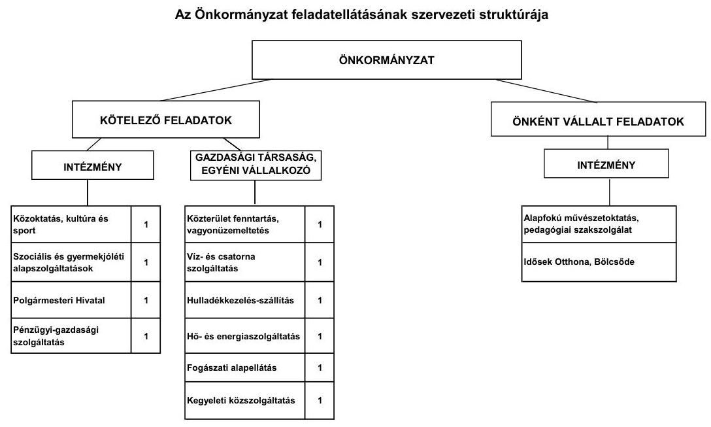

Az Önkormányzat feladatait 2011. június 30-án (a Polgármesteri hivatallal együtt) négy költségvetési szervvel, egy kizárólagos tulajdonában álló gazdasági társaságával, valamint négy, közszolgáltatási szerződés keretében megbízott gazdasági társaság és egy egyéni vállalkozó közremúködésével látta el. Az intézményszervezeti átalakítások, valamint a közoktatási és szociális feladatok társulás keretében történő ellátása következtében a

[^0]
[^0]:    ${ }^{7}$ A kiadások összege nem tartalmazza az egészségügyi ellátást biztosító intézmények és a kisebbségi önkormányzat kiadásait.

---

telephelyek száma a 2007. évi 18-ról a 2011. év I. félévének végére 25-re nőtt. A közoktatási társulás 2007-ben, a szociális társulás 2008-ban jött létre. Az Önkormányzat gesztorként vesz részt a társulásokban. A társulások keretében történő feladatellátás eredményeként a közoktatási ágazatban hárommal, a szociális ellátás területén szintén hárommal nőtt a telephelyek száma. A GESZ létrehozásával egy telephely növekedés valósult meg.

Feladat átadásra a 2010. évben került sor. A fogászati alapellátás biztosításával 2010. január 1-jétől egy gazdasági társaságot bíztak meg.

Az Önkormányzat egy gazdasági társaságban kizárólagos tulajdonnal rendelkezett. A Városüzemeltetési Kft. a vagyonüzemeltetés, valamint a közterület fenntartás területén kapott szerepet az önkormányzati feladatellátásban. Múködéséhez az ellenőrzött időszakban 17,3 millió Ft rendszeres, 34,9 millió Ft eseti, összesen 52,2 millió Ft múködési és 35,0 millió Ft összegű fejlesztési célra átadott pénzeszközt kapott az Önkormányzattól. A pénzeszköz átadása szerződés alapján történt, és a felhasználásról a gazdasági társaságot beszámoltatták.

Az egyes közszolgáltatások feladatellátásában résztvevő intézmények működési kiadásai finanszírozásának forrásait ágazatonként a következő ábra szemlélteti:
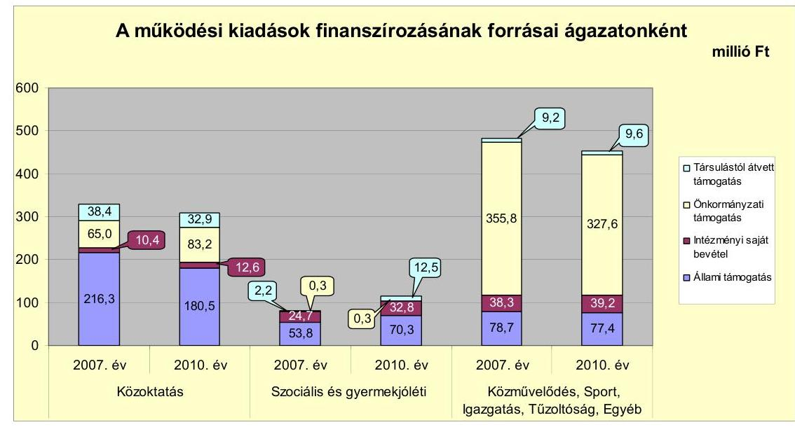

A közoktatási ágazatban az ellátotti létszám 7,3\%-os (81 fő) csökkenése és a létszámcsökkentési intézkedések eredményeként 20,9 millió Ft-tal (6,3\%-kal) csökkent a működési kiadások összege. Az ellátottak számában bekövetkezett negatív irányú változás hatására az állami támogatás finanszírozási aránya 65,5\%-ról (216,3 millió Ft-ról) 58,4\%-ra (180,5 millió Ft-ra) mérséklődött. E finanszírozási forrásból származó bevétel csökkenését az önkormányzati támogatás és az intézményi saját bevétel arányának növekedése ellensúlyozta.

A szociális és gyermekjóléti ágazatban a feladatok társulás keretében történő ellátása miatt 34,9 millió Ft-os (43,1\%-os) kiadás-növekedés figyelhető meg. A kiadások finanszírozása tekintetében az állami támogatás összege 16,5 millió Ft-tal, a társulástól átvett támogatás 10,3 millió Ft-tal, az intézmé-

---

nyi saját bevétel 8,1 millió Ft-tal emelkedett. A bevételek növekedését az ellátotti létszám növekedése eredményezte.

A közművelődés, sport, igazgatás és egyéb területeken a kiadások 28,2 millió Ft-os ( $5,9 \%$-os) csökkenését az önkormányzati támogatás 1,6 százalékpontos (28,2 millió Ft-os) mérséklődése eredményezte. Az önkormányzati támogatás csökkenő mértéke a szűkös pénzügyi forrásokkal magyarázható.

A feladat átvételek és átadások kiadásokra és bevételekre gyakorolt hatása a vizsgált időszakban azonos mértékú volt. Azok eredményeként az Önkormányzat kiadásai és bevételei egyaránt 216,8 millió Ft-tal emelkedtek.

A vizsgált időszakban a kötelező és önként vállalt feladatok ellátását biztosító szervezeti keretekben, a feladatellátás módjában bekövetkezett változások nem veszélyeztették az Önkormányzat pénzügyi egyensúlyi helyzetét.

Az Önkormányzat múködési jövedelmének, tőketörlesztésének, pénzügyi kapacitásának alakulását a 2007-2010. években a következő ábra mutatja be:
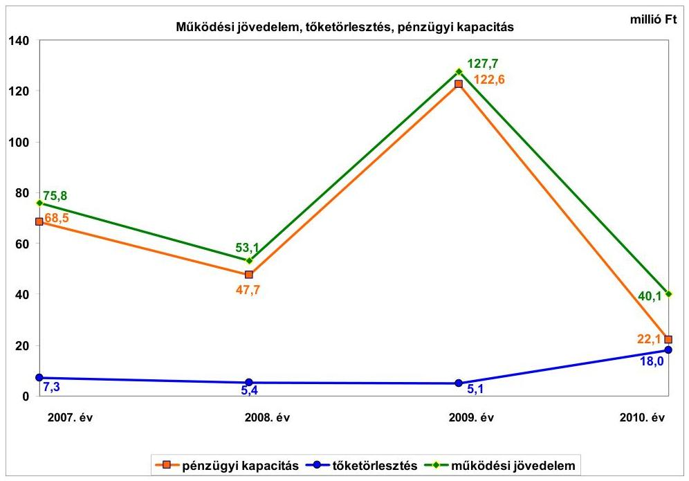

Az Önkormányzat folyó költségvetési egyenlege 2007-2010 között 296,7 millió Ft múködési forrástöbbletet mutatott. Az Önkormányzat múködőképességének megőrzésére 2007-ben 49,6 millió Ft, 2008-ban 85,8 millió Ft, 2009-ben 92,2 millió Ft, 2010-ben 65,1millió Ft, összesen 292,7 millió Ft vissza nem térítendő kiegészítő támogatásban részesült, amelyből 267,7 millió Ft-ot ÖNHIKI támogatásként, 25,0 millió Ft-ot a múködésképtelen helyi önkormányzatok egyéb támogatása jogcímen kapott. Az Önkormányzat múködési jövedelme a működőképességének megőrzésére juttatott költségvetési támogatások nélkül 2007-ben 26,2 millió Ft, 2008-ban -32,7 millió Ft, 2009-ben 35,5 millió Ft, 2010-ben -25,0 millió Ft lett volna.

---

A múködési jövedelem 2008-ban 22,7 millió Ft-tal csökkent a folyó kiadások (a múködési kiadások körében a személyi juttatások és járulékaik, valamint a dologi kiadások) folyó bevételek növekedésénél nagyobb összegű emelkedése miatt. A múködési jövedelem 2009. évi 74,6 millió Ft növekedését az okozta, hogy a folyó bevételek (költségvetési támogatások, helyi adóbevételek, egyéb saját bevételek) nagyobb mértékben emelkedtek, mint a folyó kiadások. Utóbbiak körében számottevő emelkedés a dologi kiadásokban, valamint a magánszemélyek felé teljesített társadalom- és szociálpolitikai juttatásokban, az ellátottak pénzbeli juttatásaiban következett be. 2010-ben a múködési jövedelem azért csökkent 87,6 millió Ft-tal, mert az előző évhez viszonyítva a folyó bevételek (költségvetési támogatások, helyi adóbevételek) csökkenése ellenére a folyó kiadások (a dologi és az egyéb folyó kiadások) növekedtek, az előző évi pénz-maradvány-átadás csökkent. Az (ÖNHIKI-vel együtt számított) múködési forrástöbblet a folyó kiadásokon belül 2007-ben 6,0\% (75,8 millió Ft), 2008-ban 3,6\% (53,1 millió Ft), 2009-ben 8,3\% (127,7 millió Ft), 2010-ben 2,6\% (40,1 millió Ft) arányt képviselt.

A tőketörlesztés 2010-ben két hitelfelvétel következtében az előző évekhez viszonyítva jelentősen emelkedett. Míg 2007-2009 között az évenkénti tőketörlesztés 5,1 millió Ft-7,3 millió Ft közötti volt, 2010-ben 18,0 millió Ft-ra nőtt. A pénzügyi kapacitás a folyó költségvetési pozíció mellett az adott költségvetési év tőketörlesztésének hatását is tükrözi. A pénzügyi kapacitás változásait 2008-ban és 2009-ben a múködési jövedelem 22,7 millió Ft-os csökkenése, illetve 74,6 millió Ft-os növekedése határozta meg, de a 2010. évi csökkenésben a múködési jövedelem 87,6 millió Ft-os visszaesése mellett az adósságszolgálat tárgyévi (előző évhez viszonyítva 12,9 millió Ft-os) növekedése is szerepet játszott.

A pénzügyi helyzet alakulását jelentősen befolyásolta az Önkormányzat fejlesztési tevékenysége, amelyet az Önkormányzat csak pályázatokon nyert támogatásokkal tudott megvalósítani. A felhalmozási költségvetés egyenlege 2007-2010 között minden évben negatív volt.

A felhalmozási költségvetés bevételeit, kiadásait és egyenlegét a következő ábra szemlélteti:
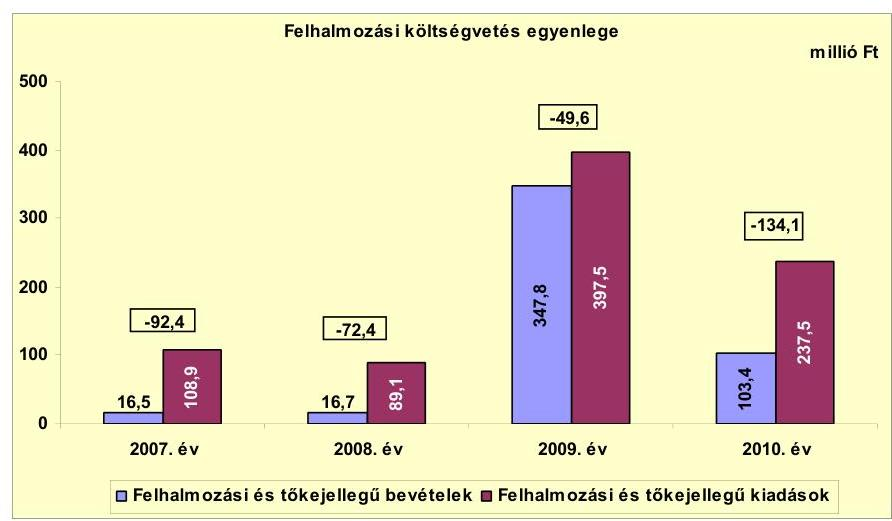

---

A 2007. évi -92,4 millió Ft-os felhalmozási hiány két évig tartó csökkenést követően 2010. év végére -134,1 millió Ft-ra emelkedett. Az egyes években a működési jövedelemből a fejlesztési és felújítási forrásigénynek csak minimális hányada képződött, ezért az Önkormányzat fejlesztési tevékenysége erősen függött a pályázati forrásszerzés eredményességétől. A felhalmozási költségvetés egyenlege 2007-2010 között összesen 348,5 millió Ft felhalmozási forráshiányt mutatott. EU-s támogatásokból 308,9 millió Ft-os rekonstrukció, illetve óvodabővítés, valamint kisebb fejlesztés (TÁMOP projekt) valósult meg. 2009től a korábbi évekhez képest három-négyszeresére nőtt a felhalmozási kiadások összes költségvetési kiadásokon belüli részaránya. Az EU-s támogatások egy részéhez azonban csak utólag, a kifizetést követő évben jutott hozzá az Önkormányzat. A TÁMOP projektek a teljes utólagos finanszírozás miatt okoztak likviditási gondot az Önkormányzatnak. A felhalmozási forráshiányt a 2007-ben kibocsátott 6608,1 ezer CHF (1000,0 millió Ft) értékű kötvényből megvalósított pénz- és tőkepiaci befektetések hozamából, 2007-ben és 2010-ben négy hosszú lejáratú hitel igénybe vételéből fedezte az Önkormányzat.

Az adósságszolgálat, továbbá a felhalmozási forráshiány 2007-2010 között 384,3 millió Ft-ot tett ki, amelyre az időszakban képződő 296,7 millió Ft múködési megtakarítás (múködési jövedelem) és a 2006. december 31-én rendelkezésre álló 47,7 millió Ft pénzkészlet nem teljes mértékben szolgált fedezetül. A pénzügyi egyensúly biztosításához szükséges további forrásokat a 2007-ben kibocsátott, 6608,1 ezer CHF összegű kötvény pénz- és tőkepiaci befektetésének hozamaiból, továbbá 2007-ben és 2010-ben összesen négy hosszú lejáratú hitel (16,2 millió Ft) felvételével teremtették meg. Az Önkormányzat 2009-től a folyószámlahitelt felhasználta az utófinanszírozású TÁMOP projektek esedékes felhalmozási célú kiadásainak teljesítéséhez. Az Önkormányzat 2007. és 2011. június 30. között az igénybe vett hosszú lejáratú hitelekből, a folyószámlahitelből, valamint a kötvényből fennállt kötelezettségeire összesen 99,5 millió Ft kamatot fizetett meg. A kamatbevételek azonban minden évben meghaladták a kamatkiadásokat. A CHF kötvény pénz- és tőkepiaci befektetéseiből realizált kamatbevétel 340,1 millió Ft volt, ami a kamatráfordítások közel három és félszeresének felelt meg.

Az Önkormányzat folyó bevétele a 2007-2009. évek átlagos bevételeihez képest 2010-ben 92,6 millió Ft-tal (6,1\%-kal) nőtt. A 2011. év I. félévében - a 2010. év azonos időszakának adatához viszonyítva - 57,9 millió Ft-os ( $7,2 \%$-os) volt a bevétel elmaradás. A vizsgált időszakban az Önkormányzat összességében 29,7 millió Ft-tal kevesebb központi támogatásban részesült. A 2010. évi helyi adóbevételek összege 127,1 millió Ft volt, ami 64,1 millió Ft-tal haladta meg a 2007-2009. évi átlagos évenkénti adóbevételek ( 63,0 millió Ft) értékét. A helyi adókból származó bevétel összességében 50,2 millió Ft-tal nőtt. A pénzügyi helyzetre hatást gyakorló kockázati tényező, hogy a helyi iparúzési adóbevétel $80 \%$-a egy gazdasági társaságtól származik.

Az Önkormányzat folyó kiadásai, azon belül múködési kiadásai folyamatosan emelkedtek az ellenőrzött időszakban. A személyi juttatások 2009-ig minden évben emelkedtek az előző évhez viszonyítva, a társulási formában való feladatellátás (2007-től közoktatási, illetve 2008-tól szociális és gyermekvédelmi feladatok) bővülése miatt. Az előző évhez viszonyítva 2010-ben azért következett be 15,4 millió Ft csökkenés, mert a létszámcsökkentő intézkedések hatása

---

mellett szűkítették az adható személyi juttatások (pótlékok, cafetéria) körét. A munkaadókat terhelő járulékok 2009-től csökkentek, emiatt a járulékfizetések 2010. évi összege 13,6\%-kal (23,5 millió Ft-tal) alacsonyabb volt a 20072009. évek átlagánál. A dologi kiadások az Önkormányzatnál az előző évhez viszonyítva minden évben az inflációt meghaladó mértékben nőttek, 2010ben a 2007-2009. évek átlagánál 95,4 millió Ft-tal (24,6\%-kal) voltak magasabbak. A növekedésben a társulási feladatellátás folyamatos bővülése játszott szerepet, amit bevételi oldalon azonban kompenzált a feladatellátáshoz nyert ösztönző hozzájárulás. Az egyéb folyó kiadások 2010-ben 8,6 millió Ft-tal emelkedtek (megduplázódtak).

A pályázati források hiánya miatt 2007-2008-ban nem nyílt lehetőség jelentős összegű fejlesztésekre. 2009-ben a felhalmozási bevételek jelentősen növekedtek, mivel 315,3 millió Ft összegű EU-s támogatást nyert az Önkormányzat.

A 2007-2010. évek között négy, 10 millió Ft feletti bekerülési költségű beruházás befejeződött, és egy felújítás történt, az egyenként 10 millió Ft bekerülési költség alatti 59 beruházáson és a 6 felújításon túl. A befejezett beruházásokra és felújításokra 2010. december 31-ig az Önkormányzat összesen 609,0 millió Ft kiadást teljesített. A fejlesztések forrása 53,7\%-ban (327,2 millió Ft) EU-s támogatás, 21,4\%-ban (130,3 millió Ft) saját bevétel, 11,4\%-ban (69,4 millió Ft) CHF kötvényforrás befektetéséből származó bevétel, 8,8\%-ban (53,7 millió Ft) hazai támogatás, 4,7\%-ban (28,4 millió Ft) hitel igénybevétele volt.

A 2010. december 31-én folyamatban lévő fejlesztési feladatok végrehajtására 2007-2010 között 100,8 millió Ft kiadást teljesítettek, amelyre EU-s támogatásból 55,2 millió Ft-ot (54,8\%), a CHF kötvényforrás befektetésének hozamaiból 40,7 millió Ft-ot (40,4\%), hazai támogatásból 4,8 millió Ft-ot (4,7\%), saját bevételből 0,1 millió Ft-ot ( $0,1 \%$ ) fordítottak. A 2010. december 31-én folyamatban lévő fejlesztési feladatok 2010. évet követő kötelezettségvállalásainak összege 2541,8 millió Ft.

A 2010. december 31-én fennállt felhalmozási kötelezettségvállalások forrásösszetételét a következő ábra mutatja be:
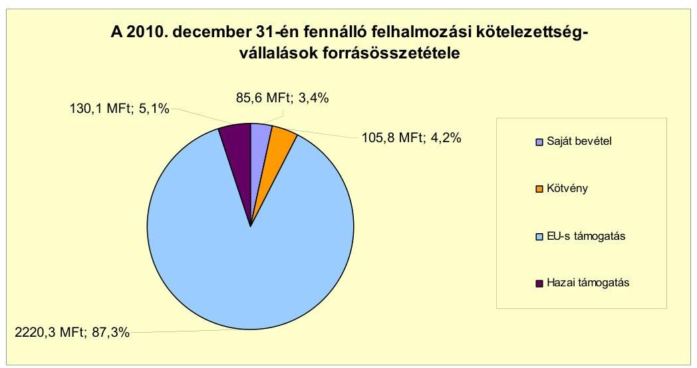

---

Az Önkormányzat mérleg szerinti pénzintézeti kötelezettsége a 2007. év elejéről a 2011. év I. félév végére 21,3 millió Ft-ról 1506,7 millió Ft-ra nőtt, amelyből a CHF árfolyamváltozás miatti árfolyam-különbözet 475,3 millió Ft volt. A fennálló pénzintézeti kötelezettségek egy 6608,1 ezer CHF-ben történt (1000,0 millió Ft) kötvénykibocsátásból, négy hosszú lejáratú hitel (összesen 16,2 millió Ft), illetve folyószámlahitel igénybevételéből keletkeztek. Az Önkormányzat az elfogadott 2011. évi költségvetési rendeletében likvid hitel (folyószámlahitel) felvételét tervezte, az 50,0 millió Ft-os keretösszeget a 2011. év első felében - az átlagos naponkénti állományt figyelembe véve - 38,1\%-os mértékben (19,0 millió Ft), folyamatosan igénybe vette. A 2011. évi pénzügyi hiány kezelését 37,8 millió Ft ÖNHIKI támogatással, valamint a 2007-ben CHFben kibocsátott kötvényből 105,8 millió Ft forrás bevonásával, illetve a CHF kötvényből megvalósított pénzügyi befektetések hozamának igénybevételével tervezte az Önkormányzat ${ }^{8}$.

Az Önkormányzat kötelezettségvállalásaira a Képviselő-testület döntései alapján került sor, azonban a Képviselő-testület részére nem készítettek a CHF kötvénykibocsátáshoz kapcsolódóan tájékoztatást a kötvény teljes futamidejére vonatkozóan a keletkezett kötelezettségek jövőbeni árfolyam-, kamat- és törlesztési kockázatairól. A CHF kötvénykibocsátási döntést megelőző képviselőtestületi előterjesztés nem tartalmazta tételesen a visszafizetés forrásait.

Az Önkormányzat pénzügyi helyzetét alapvetően meghatározta, hogy 2007ben 6608,1 ezer CHF (1000,0 millió Ft) értékben 20 éves lejáratú, CHF kötvényt bocsátott ki, amelynek visszafizetését 2020-ban kell megkezdenie. 2020tól évente 330,4 ezer CHF, 2027-ben 4295,2 ezer CHF lesz a törlesztendő összeg. Az Önkormányzat a CHF kötvényt a tervezett céloknak megfelelően, a Képvise-lő-testület által jóváhagyott módon, pénz- és tőkepiaci befektetésekre használta fel, amelynek hozamait a költségvetési rendeletekben megtervezett beruházásokra, felújításokra, valamint a CHF kötvény és a fejlesztési hitelek kamatainak fizetésére fordította. A CHF kötvény kibocsátáskori összegének 60\%-át a hitelfelvételi korláttal összhangban - az Önkormányzat óvadéki betétben köteles tartani, azonban azzal pénz- és tőkepiaci befektetéseket valósíthat meg. 2007-2011. év I. féléve között a pénz- és tőkepiaci befektetésekből realizált ho-zam- és kamatbevétel 340,1 millió Ft volt. Az Önkormányzat a CHF kötvénykibocsátásból származó kötelezettségéből eredően 2011. június 30 -ig 520,1 ezer CHF ( 89,6 millió Ft) kamatot fizetett. A CHF árfolyamának emelkedése miatt folyamatosan növekszik az óvadéki számlán kötelezően tartandó összeg ${ }^{9}$, ezáltal csökken a jövőbeni fejlesztések finanszírozására fordítható forrás, ami finanszírozási kockázatot jelent az Önkormányzat részére.

A vizsgált időszakban az Önkormányzat a korábbi években (2002-2006 között) felvett hat hosszú lejáratú hiteléből négyet teljesen visszafizetett, kettőt az ütemezésnek megfelelően törlesztett. 2007-ben további kettő (JPY alapú) hosszú le-

[^0]
[^0]:    ${ }^{8}$ A kibocsátott CHF kötvényből 2011. június 30-ig az Önkormányzat az óvadéki betétet meghaladó összegből nem használt fel.
    ${ }^{9} 600,0$ millió Ft, illetve a kötvény kibocsátáskori, CHF-ben meghatározott névértéke legalább 60\%-ának megfelelő összeg, a kettő közül a nagyobb

---

járatú, 2010-ben további kettő hosszú lejáratú (forint alapú) hitelt vett fel, amelyeket szintén az ütemezésnek megfelelően törlesztett.

Az Önkormányzat múködésének pénzügyi egyensúlyát a vizsgált időszakban folyószámlahitel igénybevételével tudta biztosítani. A likviditás biztosítása az Önkormányzatnak 5,5 millió Ft kamatkiadás és egyéb költség megfizetését eredményezte.

A folyószámlahitel igénybevétele a 2007-2011. év I. félévében az alábbiak szerint alakult:

| Megnevezés | 2007. év | 2008. év | 2009. év | 2010. év | 2011. év   I. félév |
| :-- | :--: | :--: | :--: | :--: | :--: |
| Folyószámlahitel |  |  |  |  |  |
| Keretősszeg járulár 1-án (millió Ft-ban) | 50,0 | 50,0 | 50,0 | 50,0 | 50,0 |
| Állagos napj állomány (millió Ft-ban) | 8,2 | 10,6 | 1,7 | 11,8 | 19,0 |
| Folyószámla hitellel zárt napok száma (nap) | 116,0 | 258,0 | 61,0 | 223,0 | 106,0 |
| Egyetlég (állomány) | - | - | 12,4 | 38,0 | 18,3 |

Az Önkormányzat kötelezettségeinek 2010. december 31-i, valamint 2011. június 30-i állományát és várható alakulását a kötelezettségek lejáratáig a következő táblázat szemlélteti:

| Megnevezés | Állomány 2010. december 31-én |  |  | Állomány 2011. június 30-án |  |  | Várható kötelezettség 2011-2013. években |  | Várható kötelezettség 2014. évtől |  |
| :--: | :--: | :--: | :--: | :--: | :--: | :--: | :--: | :--: | :--: | :--: |
|  | HUF-ban (millió Ftban) | Devizitban (összegy. ezer ...ban) | Deviza   nem | HUF-ban (millió Ftban) | Devizitban (összegy. ezer ...ban) | Deviza   nem | HUF-ban (millió Ftban) | Devizitban (összegy. ezer ...ban) | HUF-ban (millió Ftban) | Devizitban (összegy. ezer ...ban) |
| Pénzintézeti kötelezettségek |  |  |  |  |  |  |  |  |  |  |
| Csereger 2027* kilmény |  | 6606,1 | CHF |  | 6608,1 | CHF |  | 145,9 |  | 7068,2 |
| Hosszú lejáratú hitellel | 14,2 |  |  | 12,3 |  |  | 12,4 |  | 8,0 |  |
| Hosszú lejáratú hitellel |  | 946,8 | JPY |  | 473,4 | JPY |  | 992,5 |  |  |
| Folyószámlahitel | 38,0 |  |  | 16,3 |  |  | 18,3 |  |  |  |
| Pénzintézeti kötelezettségét összesen HUF-ban | 52,2 |  |  | 30,6 |  |  | 30,7 |  | 8,0 |  |
| Pénzintézeti kötelezettségét összesen CHF-ben |  | 6606,1 |  |  | 6608,1 |  |  | 145,9 |  | 7068,2 |
| Pénzintézeti kötelezettségét fény JPY-ben |  | 946,8 |  |  | 473,4 |  |  | 992,5 |  |  |
| Szállítói tartozás | 30,6 |  |  | 42,1 |  |  | 13,5 |  |  |  |

Az Önkormányzatnak pénzintézetekkel szemben fennálló kötelezettsége a 2011. év I. félév végén 30,6 millió Ft, 6608,1 ezer CHF és 473,4 ezer JPY volt. A várható kötelezettség (tőke, kamat és egyéb költség) a legutóbbi kamatfizetés feltételei alapján a 2011-2013. években 30,7 millió Ft, 145,9 ezer CHF és 992,5 ezer JPY. Az Önkormányzatnak a 2011. évben szállítói tartozásokból 42,1 millió Ft fizetési kötelezettsége keletkezett, amelyből lejárt tartozása 19,3 millió Ft volt (ebből 15,8 millió Ft 30 nap alatti, 3,5 millió Ft 31-60 nap közötti), illetve 13,5 millió Ft átütemezésre került. A 2011-2013. évek kötelezettségeinek teljesítésére figyelembe vehető 24,8 millió Ft kötelezettséggel nem terhelt pénzmaradvány ${ }^{10}$ és 28,6 millió Ft mérlegben kimutatott követelésállomány.

A 2014. évet követően az Önkormányzat jelenleg ismert pénzintézeti kötelezettsége 7068,2 ezer CHF. Az Önkormányzat tájékoztatása szerint figyelembe vehető további források a mindenkori költségvetési rendeletekben megtervezett önkormányzati helyi adóbevételek, azonban új adónem bevezetésére, illetve az adómértékek növelésére 2011-ben nem került sor. A 2014 után

[^0]
[^0]:    ${ }^{10}$ A 2010. évi kötelezettséggel terhelt pénzmaradvány 864,7 millió Ft volt.

---

esedékes, jelenleg ismert pénzintézeti kötelezettségek teljesítése nem minősíthető biztosítottnak, mivel az Önkormányzatnál az évente képződő működési jövedelem alacsony összegű ${ }^{11}$. A CHF kötvényből kötelezően óvadéki számlán tartandó tőkehányad pénzpiaci befektetése fedezetet biztosíthat a 2020-tól évente esedékes 5,0\%-os (330,4 ezer CHF) tőketörlesztésre. A 2027-ben esedékes $65 \%$ (4295,2 ezer CHF) egyösszegű végtörlesztés, illetve annak forrása elérésének, teljesítésének részbeni bizonytalansága az Önkormányzat számára törlesztési kockázatot jelent.

Az önkormányzati kötelezettségek növekedése mellett az Önkormányzat kizárólagos tulajdonában álló gazdasági társasága kötelezettségei is kedvezőtlenül befolyásolhatják az Önkormányzat pénzügyi egyensúlyát. Az Önkormányzat részére tőkepótlási kötelezettség merült fel, mert a Városüzemeltetési Kft. saját tőkéje az előző évek veszteséges gazdálkodása következtében 2010ben a jegyzett tőke egyhatodára csökkent. Az ügyvezető - figyelmen kívül hagyva a Gt. előírásait - elmulasztotta a taggyúlés összehívását, ahol a tulajdonosnak a szükséges intézkedések megtételéről döntenie kellett volna (határozathozatal pótbefizetésről, a törzstőke más módon való biztosításáról, más gazdasági társasági formára való átalakulásról, illetve jogutód nélküli megszűnésről). Emiatt elmaradt az Önkormányzat részéről a Gt.-ben foglalt tulajdonosi kötelezettségek teljesítése (társaság vagyoni helyzetének rendezése).

Az Önkormányzatnál nem történt meg annak felmérése, hogy az elhasználódott eszközök pótlása milyen kötelezettséget jelent az Önkormányzat számára, erre tartalékot nem képeztek, külön alapot nem hoztak létre. Az Önkormányzat 2007-2010 között az eszközállománya után összesen 285,2 millió Ft értékcsökkenést számolt el. A Képviselő-testületnek előterjesztett éves zárszámadási rendeletekben bemutatták az Önkormányzat eszközei után tárgyévben elszámolt értékcsökkenés összegét, de nem mutatták be az eszközpótlásra fordított tényleges kiadásokat, az eszközök elhasználódási fokának alakulását. Az Önkormányzat 2007-2010 között 351,5 millió Ft összegű felújítást, továbbá 257,5 millió Ft összegű beruházást valósított meg.

Az Önkormányzat az ellenőrzött időszakban kiadási megtakarítást eredményező intézkedéseket tett. A 2007-2011. év I. féléve között tett intézkedések hatására elért - az Önkormányzat adatszolgáltatása szerinti - kiadási megtakarítás összege 174,8 millió Ft volt. A kiadási megtakarítások 57,0\%-a ( 99,7 millió Ft) az elrendelt álláshely csökkentések eredménye. Az álláshelycsökkentő intézkedések 2007-2011. év I. féléve között önkormányzati szinten összesen 70 álláshely (ebből egy üres álláshely) megszüntetését jelentették. Egyes közszolgáltatási területeken azonban feladatbővülések is voltak, amelyek álláshely- és egyben létszámnövekedéssel is jártak. A közoktatási, a szociális és gyermekjóléti területeken megvalósult, társulásos formában történő feladatellátás, valamint az intézményi struktúra átszervezése kapcsán 84 fővel nőtt az

[^0]
[^0]:    ${ }^{11}$ 2020-tól évente (a kamatok nélkül) 330,4 ezer CHF kötvény visszafizetési kötelezettsége lesz az Önkormányzatnak, ami $222 \mathrm{Ft} / \mathrm{CHF}$ árfolyamon számolva 73,3 millió Ft. Ennyi működési jövedelem egyik évben sem képződött az Önkormányzatnál, ha az ÖNHIKI-t is figyelembe vesszük.

---

időszak álláshelyeinek száma. A vizsgált időszakban összességében 14 fő létszámnövekedés valósult meg az Önkormányzatnál.

Az utóellenőrzés a pénzügyi egyensúly javítására tett egy szabályszerűségi és kettő célszerűségi javaslat hasznosítására terjedt ki. A szabályszerűségi javaslat a finanszírozási célú pénzügyi műveletek költségvetésben történő kimutatásának szabályszerűségére vonatkozott. Célszerűségi javaslatként a számvevőszéki jelentés megtárgyalása, valamint a saját bevételek előirányzatai és a költségvetés megalapozását szolgáló helyi rendeletek összhangjának ellenőrzése fogalmazódott meg. Valamennyi javaslat az intézkedési terv szerinti határidőben megvalósításra került.

Az Önkormányzat pénzügyi helyzetét összegezve a következők emelhetők ki:

Csenger Város Önkormányzatának pénzügyi egyensúlyi helyzete közép távon veszélyeztetett.

A folyó bevételek 2008-ban és 2010-ben csak az ÖNHIKI támogatással együtt nyújtottak fedezetet a folyó kiadásokra és az adósságszolgálatra.

Múködését a folyószámlahitel növekvő igénybevételével tudta biztosítani.
A helyi adóbevétel jelentős része egy adózótól származik, amely kockázatot jelent a bevételi kitettség miatt.

A Városüzemeltetési Kft. saját tőkéje az előző évek veszteséges gazdálkodása következtében 2010-ben a jegyzett tőke egyhatodára csökkent.

A folyamatban lévő fejlesztésekhez vállalt önerő biztosítását a CHF kötvényből rendelkezésre álló, szabadon felhasználható forrásból tervezi az Önkormányzat, amely kockázatot jelent az óvadéki betétszámlán kötelezően tartandó öszszeg folyamatos emelkedése miatt ${ }^{12}$.

Az Önkormányzat pénzügyi helyzetét alapvetően meghatározta az 1000 millió Ft CHF-ben kibocsátott kötvény, amelynek 2020-ban kezdődő törlesztésére nem biztosít fedezetet a múködési jövedelem, és - az óvadéki betétszámlán lévő összeget leszámítva - az egyéb források sem számszerűsítettek.

Az Állami Számvevőszékről szóló 2011. évi LXVI. törvény 33. § (1) bekezdésében foglaltak értelmében a jelentésben foglalt megállapításokhoz kapcsolódó intézkedési tervet köteles az ellenőrzött szervezet vezetője összeállítani és azt a jelentés kézhezvételétől számított harminc napon belül az ÁSZ részére megküldeni. Amennyiben az intézkedési tervet határidőben nem küldi meg a szervezet, vagy az továbbra sem elfogadható, az ÁSZ elnöke a hivatkozott törvény 33. § (3) bekezdés a)-b) pontjaiban foglaltakat érvényesítheti.

[^0]
[^0]:    ${ }^{12}$ Az óvadéki számlán tartandó összeg a CHF árfolyamának folyamatos emelkedése miatt növekszik.

---

# A 2011. június 30-i pénzügyi egyensúlyi helyzet alapján az ellenőrzés intézkedést igénylő megállapításai és javaslatai a következők: 

## a Polgármesternek

1. A folyó bevételek 2008-ban és 2010-ben csak az ÖNHIKI támogatással együtt nyújtottak fedezetet a folyó kiadásokra és az adósságszolgálatra. Az Önkormányzat müködését a folyószámlahitel növekvő igénybevételével tudta biztosítani. A folyamatban lévő fejlesztésekhez vállalt önerő biztosítását a még meglevő, szabadon felhasználható CHF kötvényforrásból tervezi az Önkormányzat, amely kockázatot jelent az óvadéki betétszámlán kötelezően tartandó összeg CHF árfolyamváltozás miatti folyamatos emelkedése következtében. A 2027-ben esedékes 65\% (4295,2 ezer CHF) egyösszegű végtörlesztés, illetve annak forrása elérésének, teljesítésének bizonytalansága az Önkormányzat számára törlesztési kockázatot jelent.

Javaslat:
Az Önkormányzat pénzügyi egyensúlyának közép távon történő biztosítása és hoszszú távú fenntarthatósága érdekében kezdeményezze - felelősök és határidők megjelölésével - az alábbi intézkedések megtételét:
a) Tárja fel a bevételszerző és kiadáscsökkentő lehetőségeket. Ütemezze a bevételek beszedését a jövőben jelentkező fizetési kötelezettségeihez.
b) Terjesszen a Képviselő-testület elé kibontakozási programot a pénzügyi helyzet javítása és hosszú távú megőrzése érdekében.
c) Képezzen egyensúlyi (elkülönített) tartalékot az adósságszolgálat teljesítése érdekében.
d) Vizsgálja felül teljes körűen a folyamatban lévő beruházásokat, és az Önkormányzat pénzügyi helyzete szempontjából kedvező támogatás finanszírozási lehetőségeket vegye igénybe.
e) Mutassa be a Képviselő-testületnek félévente legalább három évre kitekintően a kötelezettségek teljes körére szóló finanszírozási tervet, a források számszerűsített megjelölésével.
2. A Képviselő-testület részére nem készítettek a CHF kötvénykibocsátáshoz kapcsolódóan tájékoztatást a teljes futamidőre vonatkozóan a keletkezett kötelezettségek jövőbeni (árfolyam/kamat/visszafizetési) kockázatairól.

Javaslat:
Az adósságot keletkeztető kötelezettségvállalásról szóló döntéskor mutassa be a Képviselő-testületnek a jövőben várható - árfolyam-, kamat- és törlesztési - kockázatot.
3. A kötvénykibocsátási döntést megelőző képviselő-testületi előterjesztés nem tartalmazta tételesen a visszafizetés forrásait.

---

Javaslat:
Gondoskodjon, hogy a jövőben az adósságot keletkeztető kötelezettségvállalásokról szóló képviselő-testületi előterjesztések tételesen tartalmazzák a visszafizetés forrásait.
4. A Városüzemeltetési Kft. saját tőkéje az előző évek veszteséges gazdálkodása következtében 2010-ben a jegyzett tőke egyhatodára csökkent. Az ügyvezető - figyelmen kívül hagyva a Gt. előírásait - elmulasztotta a taggyűlés összehívását, ahol a tulajdonosnak a szükséges intézkedések megtételéről döntenie kellett volna (határozathozatal pótbefizetésről, a törzstőke más módon való biztosításáról, más gazdasági társasági formára való átalakulásról, illetve jogutód nélküli megszűnésről). Emiatt elmaradt az Önkormányzat részéről a Gt.-ben foglalt tulajdonosi kötelezettségek teljesítése (társaság vagyoni helyzetének rendezése).

Javaslat:
Mutassa be félévente a Képviselő-testületnek a kizárólagos tulajdonú gazdasági társasága aktuális pénzügyi egyensúlyi helyzetét. Tegye meg a szükséges és lehetséges intézkedéseket a tulajdonosi érdekek védelme érdekében. Gondoskodjon a Gt. 143. § (2) bekezdés a) pontjában és a (3) bekezdésében előírtak alapján a szükséges intézkedések megtételéről (taggyűlés összehívása, határozathozatal pótbefizetésről, a törzstőke más módon való biztosításáról, más gazdasági társasági formára való átalakulásról, illetve jogutód nélküli megszűnésről).
5. A Képviselő-testületnek előterjesztett éves zárszámadási rendeleteikben bemutatták az Önkormányzat eszközei után tárgyévben elszámolt értékcsökkenés összegét, de nem mutatták be az eszközpótlásra fordított tényleges kiadásokat, az eszközök elhasználódási fokának alakulását.

Javaslat:
Mutassa be a Képviselő-testületnek évente a zárszámadási rendelet előterjesztésében az elszámolt értékcsökkenés összegét, és ezzel összevetve az elhasználódott eszközök pótlására fordított tényleges kiadásokat, valamint az eszközök elhasználódási fokának alakulását.

---

# II. RÉSZLETES MEGÁLLAPÍTÁSOK 

## 1. Az ÖNKORMÁNYZAT KÖTELEZŐ ÉS ÖNKÉNT VÁLlALT FELADATAI, A FELADATELLÁTÁS SZERVEZETI KERETEI ÉS ANNAK VÁLTOZÁSAI

Az Önkormányzat 2010. december 31-én hatályos SzMSz-ében a kötelező és önként vállalt feladatok köre nem került meghatározásra. Kötelező feladatainak az Ötv-ben és más ágazati törvényekben meghatározottakat tekintette. A kötelező és önként vállalt feladatok ellátásáról az intézmények és az Önkormányzat kizárólagos tulajdonában álló gazdasági társasága alapító okirataiban, illetve társasági szerződésében, valamint a gazdálkodó szervezetekkel kötött közszolgáltatási szerződésekben foglaltak szerint gondoskodott. Önként vállalt feladatai a szociális és gyermekjóléti szolgáltatásokhoz, az alapfokú művészetoktatási intézmény és pedagógiai szakszolgálat fenntartásához kapcsolódtak. A szociális és gyermekjóléti szolgáltatások területén önként vállalt feladatként gondoskodott az Idősek Otthona, valamint a bölcsőde működtetéséről.

Az Önkormányzat 2010. évben múködési kiadásai 91,8\%-át (806,8 millió Ft-ot) a kötelező, $8,2 \%$-át ( 72,1 millió Ft-ot) az önként vállalt feladatok finanszírozására fordította. A 2007-2009 közötti évek átlagában a működési kiadások kötelező feladatokra fordított aránya $92,4 \%$ ( 928,5 millió Ft), az önként vállaltaké 7,6\% ( 76,3 millió Ft) volt. A múködési kiadások kötelező és önként vállalt feladatok közötti megoszlását tekintve jelentős mértékű változás nem történt a vizsgált időszakban. Az ellátott feladatok kötelező és önként vállalt jelleg szerinti besorolását az Önkormányzat az Ötv. alapján végezte el.

A múködési kiadások összege 2007-ben 893,1 millió Ft, 2008-ban 1063,5 millió Ft, 2009-ben 1057,7 millió Ft, 2010-ben 878,9 millió Ft volt. A múködési kiadások 2008. és 2009. évi emelkedését a társulás keretében történő feladatellátás, a CHF kötvénykibocsátás járulékos költségeinek esedékessé válása, a közhasznú és közcélú foglalkoztatás megnövekedett mértéke és a személyi jellegú kifizetések növekedése (gyes utáni ismételt munkába állás, jubileumi jutalmak kifizetése) okozták.

A múködési kiadások évenkénti összegei nem tartalmazták az egészségügyi ellátást biztosító intézmények és a kisebbségi önkormányzat kiadásait.

A 2010. évi múködési kiadások ágazatonkénti megoszlását és azok finanszírozását - az Önkormányzat adatszolgáltatása alapján - a következő táblázat mutatja be:

---

| Ellátott feladat | Múködési   kiadás   összesen   (millió Ft) | Kötelező   feladatok   kiadásainak   részaránya   $\%$ | Múködési   bevétel   összesen   (millió Ft) | Állami   támogatás   részaránya   $\%$ | Intézményi   saját bevétel   részaránya   $\%$ | Önkormányzati   támogatás   részaránya   $\%$ | Társulástól átvett   támogatás   részaránya |
| :--: | :--: | :--: | :--: | :--: | :--: | :--: | :--: |
| Övodák | 73,9 | 100,0 | 73,9 | 60,9 | 1,2 | 30,8 | 7,1 |
| Általános iskolák | 235,3 | 100,0 | 235,3 | 57,6 | 5,0 | 25,7 | 11,7 |
| Szociális   intézmények | 104,8 | 56,1 | 104,8 | 58,3 | 30,9 | 0,0 | 10,8 |
| Gyermekjóléti   intézmények | 11,1 | 49,3 | 11,1 | 82,6 | 4,9 | 2,4 | 10,1 |
| Közművelődési   intézmények | 24,5 | 100,0 | 24,5 | 0,0 | 32,2 | 60,1 | 7,7 |
| Sportlétesítmények | 12,1 | 100,0 | 12,1 | 0,0 | 16,7 | 83,3 | 0,0 |
| Egyéb intézmények | 170,4 | 88,1 | 170,4 |  |  |  |  |
| Polgármesteri hivatal   igazgatási kiadásai | 196,4 | 100,0 | 196,4 | 12,8 | 3,6 | 83,8 | 0,0 |
| Polgármesteri   hivatalban ellátott   egyéb feladatok   múködési kiadásai | 50,4 | 100,0 | 50,4 | 21,5 | 3,8 | 74,7 | 0,0 |
| Múködési kiadá-   sok összesen | 878,9 | 91,8 | 878,9 | 37,3 | 9,6 | 46,8 | 6,3 |

A 2010. évi múködési kiadások 71,9\%-a (632,1 millió Ft) az intézmények, 28,1\%-a (246,8 millió Ft) a Polgármesteri hivatal költségvetésében jelent meg. Az intézményi kiadások 48,9\%-át (309,2 millió Ft-ot) oktatási, 18,3\%-át (115,9 millió Ft-ot) szociális és gyermekjóléti, 5,8\%-át (36,6 millió Ft-ot) közművelődési és sport, 27,0\%-át (170,4 millió Ft-ot) az egyéb feladatok finanszírozására fordították. Egyéb feladatként az alapfokú művészetoktatási intézmény, a pedagógiai szakszolgálat, valamint a GESZ tevékenysége került kimutatásra.

A közoktatási ágazat kiadásai a vizsgált időszakban összességében 4,9\%-kal (20,9 millió Ft-tal) csökkentek, 330,1 millió Ft-ról 309,2 millió Ft-ra változtak. Csenger székhellyel - Szamostatárfalva, Szamosbecs, Komlódtótfalu, Csengerújfalu és Ura községek közreműködésével - közös intézményfenntartó közoktatási társulás létrehozására került sor 2007. július 1-jén. A közoktatási társulás célja a nevelés-oktatás minőségének javítása, az önkormányzati gazdálkodás hatékonyságának növelése, eredményességének fokozása, valamint a költséghatékony múködtetés és fenntartás volt. A települések az általános iskolai 1-8. évfolyamos oktatás, az iskolaotthoni, napközi otthoni, tanulószobai ellátás, valamint a művészet oktatás biztosítása és a pedagógiai szakszolgáltatások területén társultak. 2007. szeptember 1-jétől az óvodai nevelés közoktatási társulás keretein belüli ellátásával bővült a feladatok köre. A közoktatási társulás keretében történő feladatellátás eredményeként a kiadások 2008-ban 11,8\%-kal (39,0 millió Ft-tal) emelkedtek, majd az ellátotti létszám fokozatos csökkenése és a kiadáscsökkentő intézkedések hatására 2009-ben 3,7\%-kal (13,5 millió Ft-tal), 2010-ben 13,0\%-kal (46,4 millió Ft-tal) csökkentek az előző év adataihoz képest. Az állami támogatás finanszírozási aránya 65,5\%-ról (216,3 millió Ft-ról) 58,4\%-ra (180,5 millió Ft-ra) csökkent. Ezt az ellátotti létszám 7,3\%-os ( 81 fő) csökkenése mellett, a forrásszabályozás változása eredményezte. A finanszírozás alapja 2008. szeptember 1-jétől a gyermek/tanuló létszám helyett a teljesítménymutató lett. A csökkenő állami támogatást az önkormányzati támogatás növelésével ellensúlyozták. Az önkormányzati támogatás finanszírozási aránya az ellenőrzött időszakban 19,7\%-ról (65,1 millió Ft-ról) 26,9\%-ra (83,2 millió Ft-ra) emelkedett.

---

A szociális és gyermekjóléti intézmények kiadásai az ellenőrzött időszakban összességében 48,1\%-kal (34,9 millió Ft-tal) nőttek, 81,0 millió Ft-ról 115,9 millió Ft-ra emelkedtek. A kiadások növekedését a szociális társulás keretében történő feladatellátás okozta. Családsegítés szociális alapszolgáltatás ellátására 2007. február 15-én - Csenger város gesztorságával - intézményfenntartó szociális társulás létrehozására került sor. A szociális társulás keretein belül ellátott feladatok köre 2008. január 1-jétől szociális alap- és szakosított ellátások, szociális és gyermekjóléti szolgáltatások, családsegittés alapellátás biztosítására változott. A feladatot ellátó intézmény a Népjóléti és Szociális Alapszolgáltatási Központ lett. A szociális társulás keretében történő feladatellátás eredményeként a 2008. évi ágazati kiadás 57,4\%-kal (46,5 millió Ft-tal) haladta meg a 2007. évi kiadás összegét. Az ellátotti létszám csökkenése miatt 2009ben 3,1\%-kal (4,0 millió Ft-tal), 2010-ben 6,2\%-kal (7,6 millió Ft-tal) mérséklődött az előző év adataihoz képest. A kiadások forrásmegoszlását tekintve az állami támogatás finanszírozási arányának 5,7 százalékpontos csökkenése ellenére az Önkormányzat 16,6 millió Ft-tal több állami támogatásban részesült. A társult önkormányzattól átvett támogatás finanszírozási aránya 8,1 százalékponttal ( 10,3 millió Ft-tal) emelkedett.

A közmúvelődési és sport intézmények 2010. évi kiadásai (36,6 millió Ft) 16,0 millió Ft-tal voltak kevesebbek, mint a 2007-2009. évek átlagos évenkénti kiadásai (52,6 millió Ft). Az állami támogatás összege 6,0 millió Ft-tal, az önkormányzati támogatásé 13,6 millió Ft-tal csökkent a vizsgált időszakban. Az állami támogatás a 2010. évtől megszűnt. A Magyar Köztársaság 2010. évi költségvetéséről szóló 2009. évi CXXX. törvény már nem tartalmaz normatív hozzájárulást a helyi közművelődési és közgyűjteményi feladatok támogatására. Az intézményi saját bevétel 2,5 millió Ft-tal emelkedett, a társult önkormányzattól átvett támogatás 1,4 millió Ft-tal csökkent az ellenőrzött időszakban.

Az egyéb feladatok (művészetoktatási tevékenység, pedagógiai szakszolgálat, GESZ ${ }^{13}$, város- és községgazdálkodás) kiadásai a 2007. évről a 2008. évre 15,0\%-kal (32,7 millió Ft-tal), 2009-re további 9,2\%-kal (23,1 millió Ft-tal) emelkedtek, 2010-ben 37,9\%-kal (103,9 millió Ft-tal) csökkentek. A kiadások 2008. évi növekedésének oka, hogy a GESZ és a társulások létrejöttével megnövekedett a technikai, karbantartói létszám. A társulás bővítésével egyidejűleg átvett dolgozók egy része leépítésre került, így a végkielégítések összegei is megnövelték a 2008. évi költségeket. Mindezek kiadásvonzata 2008-ban 34,1 millió Ft volt. A kiadások 2010. évi csökkenése a közhasznú és közcélú foglalkoztatás kiadásainak változásával magyarázható. A közhasznú, illetőleg közcélú foglalkoztatás a 2009. évben 107 főt érintett. A 2010. évtől - az új szakfeladatrend előírásainak megfelelően - a közhasznú és közcélú foglalkoztatás kiadásai nem a város- és községgazdálkodás szakfeladaton, hanem önálló szakfeladaton kerültek könyvelésre. Nagyságrendje a két év viszonylatában 93,6 millió Ft bér, 16,1 millió Ft járulék, összesen 109,7 millió Ft volt. Az állami támogatás finanszírozási aránya - a közcélú foglalkoztatás kedvező finanszírozása végett - 14,1\%-ról (30,9 millió Ft-ról) 24,4\%-ra (41,6 millió Ft-ra) emelke-

[^0]
[^0]:    ${ }^{13}$ Csengeri Önkormányzati Intézmények Gazdasági Ellátó Szervezete

---

dett. Az önkormányzati támogatás finanszírozási aránya 70,8\%-ról (154,8 millió Ft-ról) 59,1\%-ra (100,8 millió Ft-ra) csökkent.

A Polgármesteri hivatalban kimutatott feladatok és az igazgatási feladatok 2010. évi kiadásai a 2007-2009. évek átlagos évenkénti kiadásaihoz (241,9 millió Ft) képest 2,0\%-kal (4,9 millió Ft-tal) emelkedtek. A kiadásnövekedést két dolgozó gyes utáni ismételt munkába állása eredményezte. Fizetés nélküli szabadságuk idején (2007-2009.) helyettesítésüket belső átcsoportosítással, illetve munkaerő piaci támogatás igénybevételével, alacsonyabb kiadás mellett oldották meg.

Az Önkormányzat a kötelező és az önként vállalt feladatait 2011. június 30-án (a Polgármesteri hivatallal együtt) négy költségvetési szervvel, egy kizárólagos tulajdonában álló gazdasági társaságával, valamint közszolgáltatási szerződés keretében négy gazdasági társaság és egy egyéni vállalkozó közreműködésével látta el. A négy költségvetési szerv közül kettő önállóan működő és gazdálkodó, kettő pedig önállóan működő. Az intézmények összesen 25 telephelyen múködtek. Az intézmények száma kettővel több, a telephelyek száma héttel kevesebb volt 2007. január 1-jén. Az intézmények számának csökkenését a költséghatékonyabb múködés érdekében alkalmazott intézményszerkezeti átalakítások eredményezték. Az óvoda és a kulturális intézmény 2007-ben az ÁMK ${ }^{14}$-ba integrálódott. A telephelyek számának növekedését a társulás keretében történő feladatellátás és a GESZ 2007. július 1-jétől történt létrehozása generálta. A vizsgált időszakban az Önkormányzat gazdasági társaságainak számában változás nem történt. Az Önkormányzat egy kötelező közfeladatot ellátó gazdasági társaságban kizárólagos tulajdonnal rendelkezik.

Az Önkormányzat feladatait 2010-ben az alábbi intézményi struktúrában látta el:

- közoktatási feladatot egy intézmény (ÁMK) hét telephelyen látott el (három óvoda, négy általános iskola). A 2007. január 1-jei állapothoz viszonyítva, az óvodai nevelés és általános iskolai oktatás társulási formában történő megvalósulása miatt a telephelyek száma hárommal nőtt. Az intézmény egyéb feladatként az alapfokú művészetoktatási tevékenységet, a pedagógiai szakszolgálatot, valamint a közművelődési és sport feladatokat látta el hat telephelyen. A telephelyek száma 2007. január 1-jéhez viszonyítva eggyel növekedett;
- egészségügyi, szociális és gyermekvédelmi feladatokat egy intézmény (Szociális Alapszolgáltatási Központ) nyolc telephelyen végzett. A vizsgált időszak alatt az intézmények integrációja eredményeképp az intézmények száma eggyel csökkent, a telephelyek száma kettővel nőtt;
- az önkormányzati intézmények gazdasági feladatait a GESZ, mint önállóan múködő és gazdálkodó költségvetési szerv végezte, két telephelyen;
- az igazgatási feladatokat a Polgármesteri hivatal látta el.

[^0]
[^0]:    ${ }^{14}$ Petőfi Sándor Általános Művelődési Központ és Könyvtár, Pedagógiai Szakszolgálat

---

Az Önkormányzat feladatellátásában a gazdasági társaságok és az egyéni vállalkozó az alábbiak szerint vettek részt:

- a vagyonüzemeltetéssel, közterület fenntartással kapcsolatos feladatok ellátását az Önkormányzat kizárólagos tulajdonában álló Városüzemeltetési Kft. biztosította; Az Önkormányzat kizárólagos tulajdonában álló Városüzemeltetési Kft-nél a vizsgált időszakban egy esetben került sor átalakulásra. A Gt. 365. § (3) bekezdésére, valamint az Ötv. 80. § (1) bekezdésére tekintettel - a törvényben rögzített átalakulási kötelezettségüknek eleget téve - az Önkormányzat Képviselő-testülete, 97/2009. (VI. 29.) számú határozatában 2009. június 29-én a Közhasznú Társaságot Csengeri Városüzemeltetési Nonprofit Korlátolt Felelősségű Társasággá alakította át;
- a hulladékkezelést-szállítást a NYÍR-FLOP Generálkivitelező Szállítási és Szolgáltató Kft. látta el, közszolgáltatási szerződés alapján;
- a köztemető fenntartásáról egy temetkezési vállalkozó gondoskodott, a kegyeleti közszolgáltatási szerződésben foglaltak szerint;
- a víz- és csatornaszolgáltatási feladatokat a NYÍRSÉGVÍZ ZRT. végezte a közszolgáltatási szerződésben rögzített feltételek szerint;
- a távhőszolgáltatást a Dalkia Energia Zrt. biztosította;
- a fogászati alapellátást 2010. január 1-jétől a KRISTADANTA Kft. végezte.

A vizsgált időszakban a gazdasági társaságok feladatellátásában a víz- és szennyvíz szolgáltatás területén történt változás. A víz- és csatornaszolgáltatáshoz kapcsolódó feladatokat 2009. április 1-jéig a Vagyonüzemeltetési Kft. látta el.

A vizsgált időszakban intézmény átvétel, illetve átadás nem történt.
Feladat átadásra 2010-ben került sor. A Képviselő-testület 139/2009. (IX. 14.) számú határozatában Csenger I. és II. számú fogorvosi körzet területi ellátási kötelezettségű feladatainak ellátásával a KRISTADANTA Fogászati Korlátolt Felelősségű Társaságot bízta meg.

Egyéb intézkedések (intézményi átszervezés, feladatátrendezés) a közoktatás és a szociális ellátás területén valósultak meg.

A feladat átvételek és átadások kiadásokra és bevételekre gyakorolt pénzügyi hatása kiegyenlített volt. Azok eredményeként az Önkormányzat kiadásai és bevételei egyaránt 216,8 millió Ft-tal emelkedtek.

# 2. AZ ÖNKORMÁNYZAT PÉNZÜGYI EGYENSÚLYI HELYZETÉT BEFOLYÁSOLÓ TÉNYEZŐK 

A hagyományos költségvetési szerkezet helyett az önkormányzat pénzügyi helyzetét a CLF módszerrel mutatjuk be, amelyben jobban elkülönülnek a vagyonnal kapcsolatos bevételek és kiadások az önkormányzati feladatokkal kapcsolatos közvetlen múködtetési bevételektől és kiadásoktól. A módszer kö-

---

vetkezetesen elkülöníti a folyó és a felhalmozási költségvetés bevételeit és kiadásait, azok költségvetési egyenlegeit. A saját folyó bevételek, valamint a saját felhalmozási bevételek nem tartalmazzák az előző évi pénzmaradványok felhasználásából származó pénzforgalom nélküli bevételeket ${ }^{15}$.

A folyó költségvetés egyenlege, a múködési jövedelem megmutatja, hogy az önkormányzat éves folyó bevétele fedezetet biztosít-e a kötelező és önként vállalt feladatellátáshoz kapcsolódó éves folyó kiadására. A múködési jövedelem negatív értéke pénzügyileg fenntarthatatlan helyzetet jelez. A mutató pozitív értéke megtakarítást mutat, amely forrásul szolgálhat az önkormányzat fennálló kötelezettségei megfizetéséhez, valamint fejlesztéseihez.

A felhalmozási költségvetés pozitív értéke felhalmozási többletet mutat, amely a jövőbeni fejlesztések forrását biztosíthatja. Amennyiben a folyó költségvetési hiány finanszírozása a felhalmozási többletből történik, ez szűkebb értelemben vagyonfelélésnek tekinthető. Amennyiben a felhalmozási költségvetés megtakarítása fejlesztési célú hitelek, kötvények adósságszolgálatát finanszírozza, az változatlan vagyontömeg mellett, a korábban megelőlegezett tőkebevételek valós realizációjának tekinthető. A felhalmozási deficit által generált finanszírozási igény önmagában nem jár pénzügyi kockázattal, a pénzügyileg fenntartható beruházásokhoz kapcsolódó kötelezettségvállalás (adósságszolgálat) átlátható és szabályozott költségvetési gazdálkodással teljesíthető.

A módszer a pénzügyi kapacitás fogalmát helyezi a középpontba. Az adós hitelfelvételi képessége, hosszú távú fizetőképessége vagy bonitása a pénzügyi kapacitással, ezen belül is a nettó múködési jövedelemmel jellemezhető. A nettó múködési jövedelem negatív értéke az egyes költségvetési években jelentkező adósságszolgálat túlzott mértékére utal ${ }^{16}$. A nettó múködési jövedelem negatív értékének felhalmozási többletből, vagy további hitelből történő finanszírozása pénzügyileg nem fenntartható gazdálkodást vetít előre. A pozitív értéket mutató nettó múködési jövedelem fejlesztési kiadások fedezetét biztosíthatja, illetve a folyamatosan, évenként képződő pozitív nettó múködési jövedelemből meghatározható a jövőben vállalható, teljesíthető éves adósságszolgálat, ily módon az a hitelösszeg, amely - a többi tényezőt, feltételt adottnak tekintve visszafizetési kockázat nélkül felvehető.

A CLF módszer alapján a pénzügyi kapacitás mértéke az önkormányzat összevont, nettósított, a központi információs rendszerbe a Magyar Államkincstáron keresztül leadott éves költségvetési beszámolójának 80-as űrlapjában szerepeltetett adatok alapján került meghatározásra.

A számítási leírás némileg eltér az ÁSZ módszertanában korábban alkalmazott gyakorlattól. A jelen besorolás általános közgazdasági meggondolásokon alapul, amely megjelenik az SNA statisztikai módszertanában is. Folyó tételek alatt értjük azokat a kiadásokat és bevételeket, amelyek a gazdálkodó szervezet

[^0]
[^0]:    ${ }^{15}$ A költségvetési években kialakuló hiány finanszírozása az előző évi pénzmaradvány és a korábbi években képzett tartalékok felhasználásával is történhet.
    ${ }^{16}$ kivéve, ha annak finanszírozására a korábbi években képzett tartalékok fedezetet nyújtanak

---

helyzetét automatikusan nem változtatják. Bevételi oldalon ilyenek az adók, a tényező jövedelmek, a transzferek ${ }^{17}$, kiadási oldalon a transzferek és a szolgáltatás igénybevételével kapcsolatos múködési kiadások. A folyó költségvetésben a bevételekben nem térül meg, a kiadásokban nem jelenik meg az amortizáció, a vagyoni helyzetet az egyenleg befolyásolja.

A folyó költségvetés egyenlege (működési jövedelem) tartalmazza a kamatbevételeket és a kamatkiadásokat is, mind a múködési, mind a fejlesztési kamatot, valamint a visszatérülő és befizetendő áfa teljes összegét, mert ezek közgazdaságilag tényező jövedelmek. Nem tartalmazzák viszont a követelés elengedés miatt könyvelt bevételi és kiadási pénzforgalmi tételeket, mert valójában technikai elszámolási múveletnek minősülnek, a bevétel soha nem realizálódott, és költségvetési kiadás sem történt.

A felhalmozási költségvetésben a bevételek között a vagyon megőrzésére és bővítésére fordítható források jelennek meg. A felhalmozási vagy tőketételek módosítják a vagyon nagyságát. A privatizációs bevétel csökkenti a vagyont, a fizikai beruházás, pénzügyi befektetés növeli.

A nettó múködési jövedelmet a tőketörlesztés levonásával a folyó költségvetés egyenlegéből származtatjuk.

# 2.1. A múködési és a felhalmozási egyensúly változása 

CLF módszer szerinti önkormányzati adatok

| Megnevezés | 2007. év | 2008. év | 2009. év | 2010. év |
| :--: | :--: | :--: | :--: | :--: |
| Folyó bevételek | 1329,8 | 1538,3 | 1667,5 | 1604,5 |
| Folyó kiadások | 1254,0 | 1485,2 | 1539,9 | 1564,3 |
| Múködési jövedelem | 75,8 | 53,1 | 127,7 | 40,1 |
| Nettó múködési jövedelem   =müködési jövedelem - tőketörlesztés | 68,5 | 47,7 | 122,6 | 22,1 |
| Felhalmozási bevételek | 16,5 | 16,7 | 347,8 | 103,4 |
| Felhalmozási kiadások | $-108,9$ | 89,1 | 397,5 | 237,5 |
| Felhalmozási költségvetés egyenlege | $-92,4$ | $-72,4$ | $-49,6$ | $-134,1$ |
| Finanszírozási múveletek nélküli (GFS) pozíció = múködési jövedelem + felhalmozási költségvetés egyenlege | $-16,6$ | $-19,3$ | 78,0 | $-93,9$ |
| Finanszírozási múveletek egyenlege | 1023,5 | $-400,1$ | 416,1 | $-145,8$ |
| Tárgyévi pénzügyi pozíció | 1006,9 | $-419,4$ | 494,1 | $-239,8$ |
| Egyéb tájékoztató adatok |  |  |  |  |
| Összes kötelezettség* | 1055,3 | 1228,0 | 1338,4 | 1565,5 |
| -ebből rövid lejáratú | 28,7 | 32,4 | 123,5 | 79,8 |
| Folyószámlahitel napi átlagos állománya ** | 6,2 | 10,6 | 1,7 | 11,8 |
| Likvidhitel napi átlagos állománya** |  |  |  |  |
| Munkabérhitel napi átlagos állománya** | 0,0 | 0,0 | 0,0 | 0,0 |
| Finanszírozásba vonható eszközök: | 1123,0 | 1122,4 | 1179,1 | 1139,3 |
| Tartós hitelviszonyt megtestesítő értékpapírok év végi állománya | 68,5 | 487,3 | 49,8 | 249,8 |
| Hosszú lejáratú bankbetétek év végi állománya | 0,0 | 0,0 | 0,0 | 0,0 |
| Értékpapírok év végi állománya | 0,0 | 0,0 | 0,0 | 0,0 |
| Pénzeszközök (idegen pénzeszközök nélkül) év végi állománya | 1054,6 | 635,1 | 1129,3 | 889,5 |

* Az összes kötelezettséget a passzív pénzügyi elszámolások nélkül vettük figyelembe, mert a passzívák a pénzmaradvány elszámolás tételei közé tartoznak.
** A folyószámla, a likvid- és a munkabérhitel átlagos állományát 365 napos osztószámmal és nem a fennálló napok számával vettük figyelembe.

[^0]
[^0]:    ${ }^{17}$ Transzfer kiadásoknak nevezzük azokat a folyó és felhalmozási tételeket, amelyeket nem az adott önkormányzat használ fel szolgáltatásnyújtásra.

---

Az Önkormányzat 2007-2010. évek közötti bevételeinek és kiadásainak főbb jogcímeit, valamint az adósságszolgálat adatait a jelentés 2 . számú melléklete tartalmazza.

A vizsgált időszakban az Önkormányzat mindegyik év végén jelentős összegű pénzeszköz-állománnyal rendelkezett, mivel 2007-ben 6608,1 ezer CHF (1000,0 millió Ft) értékű kötvényt bocsátott ki, és abból legalább 600,0 millió Ft-nak, illetve a kötvény kibocsátáskori, CHF-ben meghatározott névértéke legalább 60\%-ának megfelelő óvadéki betétet folyamatos fenn kell tartania.

Az Önkormányzat múködési jövedelmének 2007-2010 közötti alakulását az alábbi ábra mutatja be:
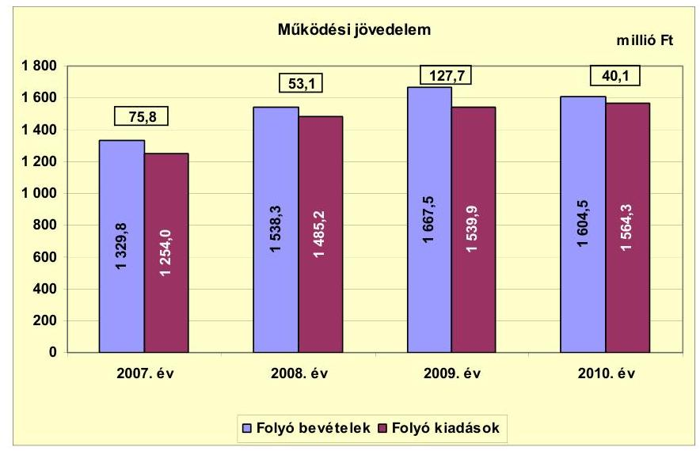

Az Önkormányzat folyó költségvetési egyenlege, múködési jövedelme a vizsgált időszakban pozitív előjelű volt, 2008-ban csökkent a folyó kiadások 231,2 millió Ft-os (a múködési kiadások körében a személyi juttatások 91,2 millió Ft-os és járulékaik 27,9 millió Ft-os, valamint a dologi kiadások 57,7 millió Ft-os), a folyó bevételek növekedésénél nagyobb összegű emelkedése miatt. A múködési jövedelem 2009. évi növekedését az okozta, hogy a folyó bevételek nagyobb mértékben ( 129,2 millió Ft-tal) emelkedtek, mint a folyó kiadások. A folyó bevételek között a költségvetési támogatások 36,3 millió Ft-tal, a helyi adóbevételek 16,5 millió Ft-tal, az előző évi pénzmaradvány átvétel 31,3 millió Ft-tal, az egyéb saját bevételek 69,8 millió Ft-tal növekedtek. A folyó kiadások között számottevő emelkedés a dologi kiadásokban (58,3 millió Ft) és a magánszemélyek felé teljesített transzferkiadásokban (21,3 millió Ft) következett be. 2010-ben a múködési jövedelem azért csökkent, mert az előző évhez viszonyítva a folyó bevételek 63,0 millió Ft-os csökkenése mellett a folyó kiadások 24,4 millió Ft-tal növekedtek. A folyó bevételek között a költségvetési támogatások 71,8 millió Ft-tal, az előző évi pénzmaradvány átvétel 28,8 millió Ft-tal, az egyéb saját bevételek 63,4 millió Ft-tal csökkentek. A folyó kiadások között a dologi kiadások 37,3 millió Ft-tal emelkedtek.

A folyó költségvetés egyenlege (a múködési forrástöbblet) a folyó kiadásokon belül 2007-ben 6,0\% (75,8 millió Ft), 2008-ban 3,6\% (53,1 millió Ft), 2009-ben

---

8,3\% (127,7 millió Ft), 2010-ben 2,6\% (40,1 millió Ft) arányt képviselt. A vizsgált időszakban a múködési jövedelem összesen 296,7 millió Ft többletet mutatott, amely forrásul szolgált az Önkormányzat fennálló tőketörlesztési kötelezettségeinek teljesítéséhez, valamint fejlesztéseinek finanszírozásához.

Az Önkormányzat 2007-2010-ben működőképességének megőrzésére összesen 292,7 millió Ft vissza nem térítendő kiegészítő támogatásban részesült, amelyből 267,7 millió Ft-ot ÖNHIKI támogatásként, 25,0 millió Ft-ot a működésképtelen helyi önkormányzatok egyéb támogatása jogcímen kapott. Mindkét támogatást a múködéshez szükséges bér- és dologi kiadásokra használta fel az Önkormányzat. A 2011. év I. félévi 37,7 millió Ft ÖNHIKI támogatást 2011. július 1-jén kapta meg az Önkormányzat, az összeget szintén a bérés a dologi kiadásokra fordították. Ennek eredményeként az Önkormányzat nem kényszerült munkabér megelőlegezési hitel igénybevételére. Az Önkormányzat múködési jövedelme a múködőképességének megőrzésére juttatott költségvetési támogatások nélkül 2007-ben 26,2 millió Ft, 2008-ban -32,7 millió Ft, 2009-ben 35,5 millió Ft, 2010-ben - 25 millió Ft lett volna.

A nettó múködési jövedelem értéke a folyó költségvetési pozíció mellett az adott költségvetési év adósságtörlesztésének hatását tükrözi.

Az Önkormányzat nettó múködési jövedelmének (pénzügyi kapacitásának) 2007-2010 közötti alakulását az alábbi ábra mutatja:
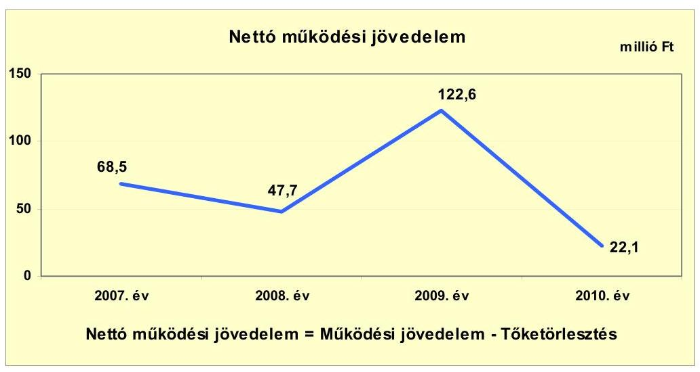

A pénzügyi kapacitás változásait alapvetően a múködési jövedelem alakulása határozta meg. A múködési jövedelem 2009. évi növekedését az okozta, hogy a folyó bevételek (költségvetési támogatások, helyi adóbevételek, egyéb saját bevételek) nagyobb mértékben emelkedtek, mint a folyó kiadások. Utóbbiak körében számottevő emelkedés a dologi kiadásokban és a magánszemélyek felé teljesített transzferkiadásokban következett be. A 2010. évi pénzügyi kapacitáscsökkenésben az adósságszolgálat előző évhez viszonyított (5,1 millió Ft-ról 18,0 millió Ft-ra való) növekedése is szerepet játszott. A többi évben a tőketörlesztés nagyságrendje 5,1 millió Ft-7,3 millió Ft közötti volt.

---

Az Önkormányzat felhalmozási költségvetési egyenlegének változását a következő ábra mutatja:
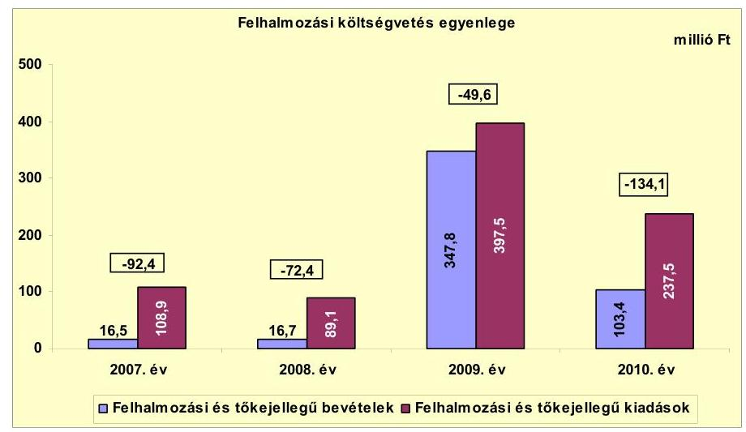

Az Önkormányzat felhalmozási költségvetésének egyenlege a vizsgált időszakban minden évben negatív elójelú volt. A 2007. évi 92,4 millió Ft-os felhalmozási hiány két évig tartó csökkenést követően 2010. év végére 134,1 millió Ft-ra emelkedett. Az egyes évek múködési jövedelméből a fejlesztési és felújítási forrásigénynek csak minimális hányada képződött meg, ezért az Önkormányzat fejlesztési tevékenysége erősen függött a pályázati forrásszerzés eredményességétől. A pályázati források hiánya miatt 2007-2008-ban nem nyílt lehetőség jelentős összegű fejlesztésekre. EU-s támogatásból kezdődött meg 2009ben az alapfokú oktatási intézmény 308,9 millió Ft-os rekonstrukciója, illetve ugyanazon projekt részeként a 24,0 millió Ft-os óvodabővítés. Az EU-s támogatások egy részéhez azonban csak utólag, a kifizetést követő évben jutott hozzá az Önkormányzat. A TÁMOP projektek a teljes utólagos finanszírozás miatt okoztak likviditási gondot az Önkormányzatnak ${ }^{18}$. A felhalmozási forráshiányt a 2007-ben kibocsátott 6608,1 ezer CHF (1000,0 millió Ft) kötvényből megvalósított pénz- és tőkepiaci befektetések hozamából, 2007-ben és 2010-ben négy hosszú lejáratú hitel igénybevételéből fedezte az Önkormányzat, de 2009-től a folyószámlahitelt is felhasználták az utófinanszírozású TÁMOP projektek esedékes felhalmozási célú kiadásainak teljesítéséhez.

[^0]
[^0]:    ${ }^{18}$ A TÁMOP projektek 2009-ben és 2010-ben a kompetenciaalapú oktatáshoz kapcsolódó eszközbeszerzések, az esélynövelő tehetséggondozás, valamint a közoktatási esélyegyenlőségi intézkedési terv megvalósítása voltak.

---

Az Önkormányzat CLF módszer szerinti évenkénti teljes finanszírozási igényét ${ }^{19}$ az alábbi ábra mutatja:
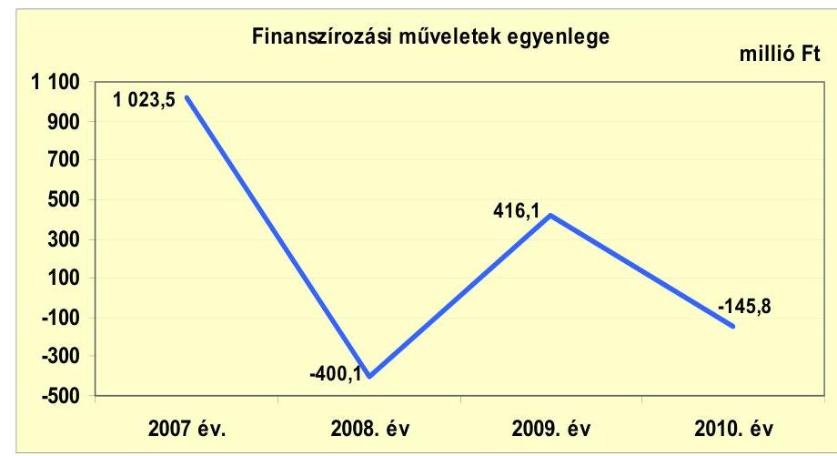

A finanszírozási célú pénzügyi műveletek pozitív értéke 2007-re és 2009-re vonatkozóan azt jelentette, hogy az éves költségvetés végrehajtása során az Önkormányzat finanszírozási bevételei meghaladták a finanszírozási célú kiadásokat. 2007-ben az Önkormányzat 6608,1 ezer CHF (1000,0 millió Ft) értékben kötvényt bocsátott ki, 2009-ben pedig értékesített 449,1 millió Ft értékű forgatási és befektetési célú értékpapírt. A finanszírozási múveletek 2008. évi negatív egyenlege elsősorban 457,5 millió Ft értékű forgatási és befektetési célú értékpapír vásárlása miatt következett be. A finanszírozási célú múveleteket a jelentés 2. számú mellékletének 4.1-4.8. pontjai részletezik.

Az Önkormányzat a zárszámadási rendeleteiben a múködési és a felhalmozási hiányt a CLF módszertől eltérő szerkezetben mutatta be, amiről a jelentés 1. számú melléklete ad tájékoztatást ${ }^{20}$. Az Önkormányzat 2007-2010 között a költségvetést három évben hiánnyal teljesítette, a költségvetési kiadások 2007ben 16,6 millió Ft-tal, 2008-ban 19,3 millió Ft-tal, 2010-ben 93,9 millió Ft-tal haladták meg a teljesített költségvetési bevételeket. A költségvetési bevételek 2009-ben 77,9 millió Ft-tal voltak magasabbak a teljesített költségvetési kiadásoknál. A zárszámadási rendeletek szerint a 2009. évi költségvetési többlet öszszege 0,2 millió Ft-tal alacsonyabb, a 2010-ben kimutatott költségvetési hiány 0,1 millió Ft-tal kevesebb volt a CLF módszer alapján számított múködési jövedelem és felhalmozási költségvetés egyenlegénél.

[^0]
[^0]:    ${ }^{19}$ A teljes finanszírozási igény a nettó múködési jövedelem és a beruházási költségvetés eredője.
    ${ }^{20}$ Nincs kötelező előírás a múködési és fejlesztési többlet, hiány megállapításának módjára.

---

Az Önkormányzat 2007-2011. év I. félév közötti kamatbevételeinek és kamatkiadásainak évenkénti alakulását az alábbi ábra mutatja:
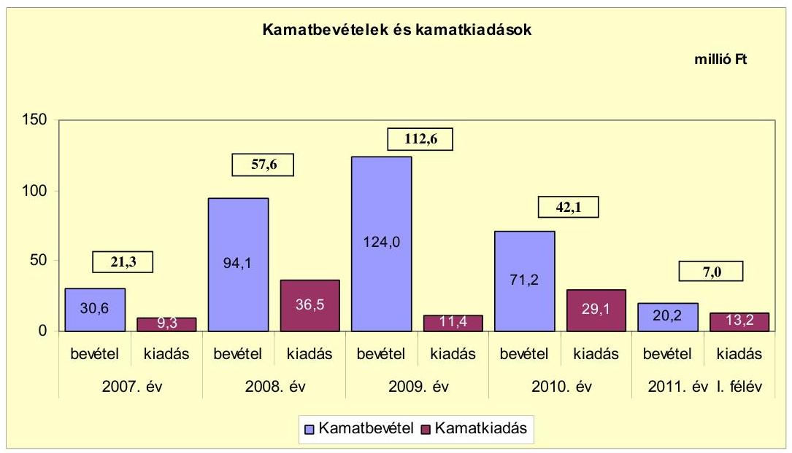

Az Önkormányzat felhalmozási kiadásainak fedezetére 2007 előtt hat, 2007-2010 között további négy hosszú lejáratú fejlesztési hitelt vett fel, továbbá 2007-ben 6608,1 ezer CHF (1000,0 millió Ft) értékű kötvényt bocsátott ki. A pozitív előjelű folyó költségvetési egyenleg mellett a működési célú kiadások teljesítése során is felmerültek likviditási problémák, amelyek megoldására az Önkormányzat 2007-2010 között folyamatosan folyószámlahitelt vett igénybe. Az Önkormányzat pénzintézettel szemben fennálló kötelezettségének növekedése 2008-ban és 2010-ben az előző évhez viszonyítva a kamatkiadások emelkedését eredményezte. 2007. és 2011. június 30. között az Önkormányzat összesen 99,5 millió Ft kamatot fizetett meg. A kamatbevételek azonban minden évben meghaladták a kamatkiadásokat. A CHF kötvényforrás pénz- és tőkepiaci befektetéseiből realizált kamatbevétel az ellenőrzött időszakban 340,1 millió Ft volt, ami a kamatráfordítások közel három és félszeresének felelt meg. 2011-ben - a félévi adatok alapján - a kamatbevételek várhatóan meghaladják a kamatkiadásokat.

Az Önkormányzat pénzügyi egyensúlya közép távon veszélyeztetett, ami intézkedések megtételét igényli.

# 2.2. Az Önkormányzat bevételeinek változása 

Az összes folyó bevétel a 2007-2009. évek átlagos bevételéhez képest 2010-ben 92,6 millió Ft-tal (6,1\%-kal) nőtt. A 2007. évi 1329,8 millió Ft-ról 2008-ra 1538,3 millió Ft-ra nőtt (208,5 millió Ft-tal; 15,7\%-kal). Ezt követően 2009-ben 129,2 millió Ft-tal ( $8,4 \%$-kal) emelkedett. 2010-ben (az előző évi adathoz képest) 63,0 millió Ft-tal (3,8\%-kal) csökkent. A 2011. év I. félévében - a 2010. év azonos időszakának adatához viszonyítva - 57,9 millió Ft-os ( $7,2 \%$-os) bevétel elmaradás történt.

---

Az Önkormányzat 2007-2011. év I. félévi folyó bevételeinek főbb bevételi jogcímek szerinti alakulását az alábbi grafikon mutatja be:
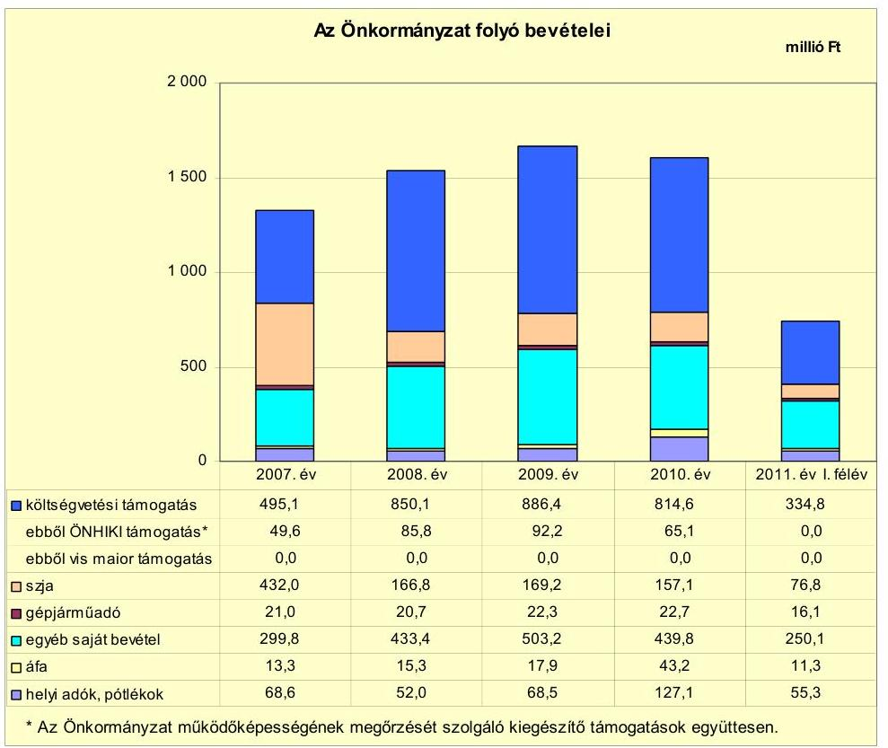

Az Önkormányzat központi költségvetési kapcsolatokból származó két forrása (költségvetési támogatás és átengedett szja) 2007-2009 közötti évenkénti átlagos összege 999,9 millió Ft volt. A központi források 2010-ben az előző évek átlagát tekintve - 28,2 millió Ft-tal ( $2,8 \%$-kal) csökkentek. A vizsgált években az előző évhez viszonyítva a 2008. évben 9,7\%-kal (89,8 millió Fttal), a 2009. évben 3,8\%-kal (38,7 millió Ft-tal) több forrást kapott az Önkormányzat az államtól ezeken a jogcímeken. A központi források összegének 2008. és 2009. évi növekedése a szociális területen megvalósult, társulás keretében történő feladatellátáshoz és az Önkormányzat részére folyósított kiegészítő támogatásokhoz kapcsolódott. A 2010. évi csökkenés az ellátotti létszám 2007-2009. évek átlagához viszonyított 7,3\%-os ( 81 fő) negatív irányú változásához köthető. Az Önkormányzat összes folyó működési bevételén belül a költségvetési támogatás és átengedett szja összege a 2007-2009. években átlagosan 66,1\%-ot (999,9 millió Ft-ot), 2010-ben 60,6\%-ot (971,7 millió Ft-ot) képviselt. A 2011. év I. félévében a költségvetési támogatások és átengedett szja összes folyó múködési bevételen belüli aránya 55,3\% (411,6 millió Ft) volt. A támogatások összege 74,3 millió Ft-tal ( $15,3 \%$-kal) csökkent az előző év azonos időszakának adataihoz képest. A támogatás csökkenés okai egyrészt, hogy a pénzbeli szociális juttatások támogatása 20,0 millió Ft-tal, a települési önkormányzatok jövedelemdifferenciálódása mérséklésének támogatása 9,0 millió Ft-tal, a közoktatás állami hozzájárulása 7,6 millió Ft-tal mérséklődött. Másrészt a tárgyévi ÖNHIKI támogatás folyósítására (37,7 millió Ft) 2011. június 30 -át követően került sor.

---

Az Önkormányzat 2007-2011. év I. félév közötti időszakban ÖNHIKI támogatásban és múködésképtelen helyi önkormányzatok egyéb támogatásában részesült. Az ÖNHIKI támogatás 2007. évi összege 45,6 millió Ft, 2008. évi összege 77,8 millió Ft, 2009. évi összege 87,2 millió Ft, 2010. évi összege 57,1 millió Ft volt. Célhoz/feladathoz nem kötött (vissza nem térítendő) egyéb támogatásként 2007-ben 4,0 millió Ft-ot, 2008-ban 8,0 millió Ft-ot, 2009-ben 5,0 millió Ft-ot, 2010-ben 8,0 millió Ft-ot kapott. A célhoz/feladathoz nem kötött támogatásokat minden évben bér- és dologi jellegű kiadások finanszírozására fordították. A 2007-2010. években összesen 292,7 millió Ft összegü kiegészítő támogatást kaptak. A 2011. év I. félévében ÖNHIKI támogatás, illetőleg egyéb támogatás folyósítására nem került sor.

A 2010. évi helyi adóbevételek összege 127,1 millió Ft volt, ami 64,1 millió Ft-tal haladta meg a 2007-2009. évi átlagos évenkénti adóbevételek (63,0 millió Ft) értékét. Az adóbevételek 2007-ről 2008-ra 24,2\%-kal (16,6 millió Ft-tal) csökkentek, ezt követően 2009-ben 31,7\%-kal (16,5 millió Ft-tal), 2010-ben 85,5\%-kal (58,6 millió Ft-tal) nőttek az előző év adatához képest. A 2008. évi adóbevétel csökkenés, majd a 2009. évi közel azonos mértékű növekedés egy, az Önkormányzat illetékességi területén székhellyel rendelkező vállalkozáshoz kapcsolható. A 2008. évben a gazdasági-társadalmi környezetben bekövetkezett változások, árfolyam ingadozások hatására csökkent a társaság árbevétele, így adófizetési kötelezettsége is. A 2010. évben bekövetkezett helyi adóbevétel növekedést is a gazdasági társaság adóalap növekedése (50,0\%) okozta. A pénzügyi helyzetre hatást gyakorló kockázati tényező, hogy a helyi iparűzési adóbevétel $80,0 \%$-a egy gazdasági társasághoz köthető. A helyi adóbevételek 2007-ben a folyó évi múködési bevétel 5,2\%-át (68,6 millió Ft), 2008ban 3,4\%-át (52,0 millió Ft), 2009-ben 4,1\%-át (68,5 millió Ft), 2010-ben 7,9\%át (127,1 millió Ft) adták. A 2007-2010 közötti időszakban a helyi adóbevételek összességében 93,0\%-kal (58,5 millió Ft-tal) emelkedtek. Helyi adókból és azokhoz kapcsolódó pótlékokból a 2011. év I. félévében 55,3 millió Ft folyt be. Az előző év azonos időszakának bevételeit tekintve ez 8,3 millió Ft-os ( $13,1 \%$-os) bevétel csökkenést jelent.

A vizsgált időszakban az Önkormányzat illetékességi területén magánszemélyek kommunális adója ( $3000 \mathrm{Ft} /$ adótárgy/év), vállalkozók kommunális adója ( $1500 \mathrm{Ft} /$ fő/év) és helyi iparűzési adó ( $2 \% ; 500 \mathrm{Ft} /$ nap) volt bevezetve. Új adónem bevezetésére, az adó mértékének növelésére nem került sor.

Az egyéb saját bevételek 2010. évi összege 439,8 millió Ft volt, ami 27,7 millió Ft-tal ( $6,7 \%$-kal) haladta meg a korábbi évek (2007-2009.) átlagos évenkénti bevételeinek összegét. A vizsgált éveket tekintve az egyéb saját bevételek 2008-ban 133,6 millió Ft-tal ( $44,6 \%$-kal), 2009-ben 69,8 millió Ft-tal ( $16,1 \%$ kal) emelkedtek az előző év adatához képest. Az egyéb saját bevételek 2008. évi emelkedését a hozam- és kamatbevételek ( 63,5 millió Ft-os), valamint a támogatásértékű működési bevételek ( 56,7 millió Ft-os) növekedése eredményezte. A 2009. évi bevétel-növekedés a hozam- és kamatbevételek 29,9 millió Ft-os, az EU-tól kapott múködési célú pénzeszközbevételek 27,1 millió Ft-os és az előző évi pénzmaradvány átvétel 31,3 millió Ft-os emelkedésének következménye. A hozam- és kamatbevételek emelkedését a CHF kötvénykibocsátásból származó fejlesztési pénz befektetésével elért bevétel generálta.

---

Az Önkormányzat egészségügyi intézményt nem tartott fenn, költségvetéseiben OEP bevétel nem szerepelt.

Az Önkormányzatnak tulajdonosi részesedése után osztalékbevétele nem származott.

Az Önkormányzat felhalmozási bevételei a vizsgált időszakban a következők voltak:

| Megnevezés | 2007. év | 2008. év | 2009. év | 2010. év | 2011. év   I. félév |
| :-- | --: | --: | --: | --: | --: |
| Tárgyi eszköz értékesítés | 1,7 | 2,4 | 6,6 | 1,3 | 0,3 |
| Egyéb saját tőkebevétel | 7,8 | 3,5 | 2,9 | 4,2 | 2,1 |
| Államháztartáson belülről   kapott támogatás | 6,7 | 5,0 | 51,7 | 15,1 | 30,9 |
| EU-tól és külföldről kapott   támogatások | 0,3 | 5,8 | 285,9 | 80,2 | 113,4 |
| Államháztartáson kívülről   kapott támogatás | $-0,3$ | 0,0 | 0,7 | 2,6 | 0,0 |
| Összes felhalmozási bevétel | 16,2 | 16,7 | 347,8 | 103,4 | 146,7 |

A felhalmozási bevételek 2008-ban 0,5 millió Ft-tal, 2009-ben 331,1 millió Fttal növekedtek, 2010-ben 244,4 millió Ft-tal csökkentek az előző évhez viszonyítva. A 2011. év I. félévében 95,0 millió Ft-os bevétel növekedés történt az előző év azonos időszakához képest. A növekedés az államháztartáson belülről és az EU-tól kapott támogatások emelkedéséhez kapcsolódott.

Az Önkormányzatnak a vizsgált időszakban tárgyi eszköz értékesítésből 12,3 millió Ft bevétele keletkezett.

Az egyéb saját tőkebevételek (20,5 millió Ft) az önkormányzati lakások, egyéb helyiségek értékesítéséhez, valamint a támogatási kölcsönök visszatérüléséhez kapcsolódtak.

Az államháztartáson belülről, illetve az EU-tól kapott támogatások a felújítási és fejlesztési feladatok végrehajtásához kapcsolódtak. A kapott támogatások 2009. évi jelentős növekedését ( 327,5 millió Ft) az integrált oktatás fejlesztéséhez kapcsolódó elnyert pályázat eredményezte. Államháztartáson kívülről kapott támogatásként a háztartásoktól és vállalkozásoktól származó felhalmozási célú pénzeszközöket mutatták ki.

# 2.3. Az Önkormányzat múködési és a felhalmozási célú kiadásainak változása 

Az Önkormányzat folyó kiadásai 2007-2011. június 30. között a következő táblázat szerint alakultak:

---

|  |  |  |  |  | millió Ft |
| :--: | :--: | :--: | :--: | :--: | :--: |
| Megnevezés | 2007. év | 2008. év | 2009. év | 2010. év | 2011. év   I. félév |
| Folyó kiadások | 1254,0 | 1485,2 | 1539,9 | 1564,3 | 711,7 |
| Müködési kiadások (kamatkiadás nélkül) | 1005,9 | 1183,9 | 1237,3 | 1263,4 | 556,7 |
| Államháztartáson belülre átadott pénzeszközök | 11,0 | 27,7 | 5,3 | 12,1 | 1,5 |
| Transzferkiadások | 225,8 | 236,9 | 253,9 | 256,5 | 131,9 |
| -ebből: vállalkozásoknak | 0,5 | 2,7 | 1,6 | 9,0 | 3,1 |
| EU-nak, illetve külföldre | 0,0 | 0,0 | 0,0 | 0,0 | 0,0 |
| magánszemélyeknek | 213,8 | 221,2 | 242,5 | 240,2 | 125,3 |
| nonprofit szervezeteknek | 11,5 | 13,0 | 9,8 | 7,3 | 3,5 |
| Kamatkiadások | 9,3 | 36,5 | 11,4 | 29,1 | 13,2 |
| Előző évi pénzmaradvány átadás | 1,9 | 0,2 | 32,0 | 3,2 | 9,9 |

Az Önkormányzat múködési kiadásai 2007-2011. június 30. között a főbb kiadási jogcímek szempontjából az alábbiak szerint alakultak:

|  |  |  |  |  | millió Ft |
| :-- | --: | --: | --: | --: | --: |
| Megnevezés | 2007. év | 2008. év | 2009. év | 2010. év | 2011. év   I. félév |
| Személyi juttatások | 507,2 | 598,4 | 612,4 | 597,0 | 273,9 |
| Munkaadót terhelő járulékok | 159,7 | 187,6 | 169,3 | 148,7 | 69,1 |
| Dologi kiadások | 329,4 | 387,1 | 445,4 | 482,7 | 200,2 |
| Egyéb folyó kiadások | 9,3 | 8,1 | 8,4 | 17,0 | 13,5 |

A személyi juttatások 2009-ig minden évben emelkedtek az előző évhez viszonyítva, a társulási formában való feladatellátás (2007-től közoktatási, illetve szociális és gyermekvédelmi feladatok) bővülése miatt ${ }^{21}$. A 2010. évi személyi juttatásokra fordított összeg 4,2\%-kal (24,3 millió Ft-tal) volt magasabb a 2007-2009. évek átlagánál. Az előző évhez viszonyítva 2010-ben azért következett be 15,4 millió Ft csökkenés, mert a létszámcsökkentő intézkedések hatása mellett szűkítették az adható személyi juttatások (pótlékok, cafetéria) körét.

A munkaadókat terhelő járulékok 2009-től csökkentek, emiatt a járulékfizetések 2010. évi összege 13,6\%-kal (23,5 millió Ft-tal) volt alacsonyabb a 2007-2009. évek átlagánál.

A dologi kiadások az Önkormányzatnál az előző évhez viszonyítva minden évben az inflációt meghaladó mértékben nőttek, 2010-ben a 2007-2009. évek átlagánál 95,4 millió Ft-tal ( $24,6 \%$-kal) voltak magasabbak. A növekedésben a társulási feladatellátás folyamatos bővülése játszott szerepet, amit bevételi oldalon azonban kompenzált a feladatellátáshoz nyert ösztönző hozzájárulás. Az egyéb folyó kiadások 2010-ben 8,6 millió Ft-tal emelkedtek (megduplázódtak), elsősorban a biztosítási díjak emelkedése és a biztosított vagyontárgyak körének bővülése miatt. Az Önkormányzatnak kórháza nincs.

Az Önkormányzatnál a teljesített múködési és a felhalmozási célú kiadások arányai a következő ábra szerint alakultak:

[^0]
[^0]:    ${ }^{21}$ Az intézményi társulások székhely települése az Önkormányzat.

---

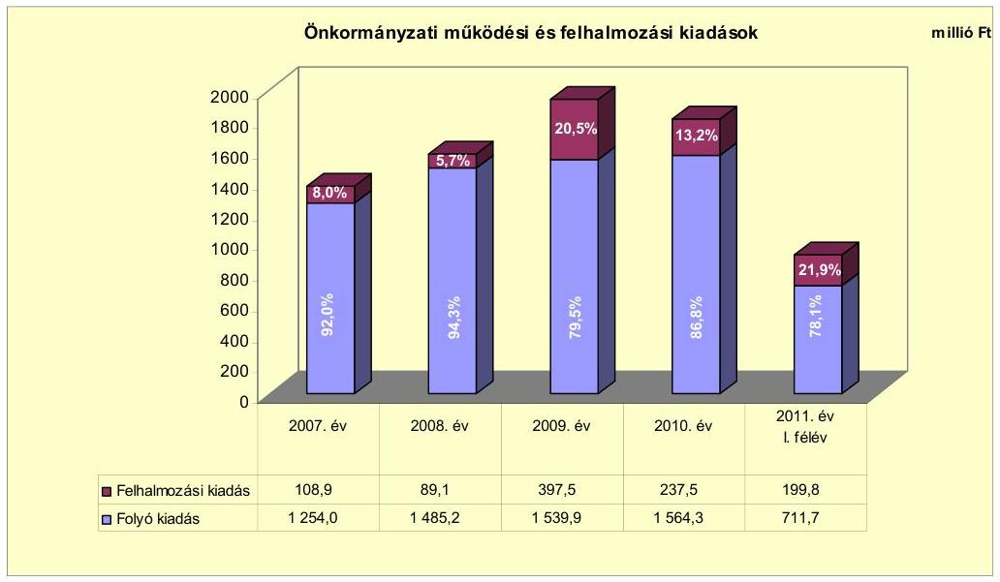

Az Önkormányzat fejlesztési tevékenysége erőteljesen függött a pályázatokon elnyerhető EU-s támogatásoktól, amelyek 2009-től tettek lehetővé nagyobb öszszegű beruházásokat, felújításokat. Ennek következtében 2009-től a korábbi évek három-négyszeresére nőtt a felhalmozási kiadások összes költségvetési kiadásokon belüli részaránya. A 2007-2010. évek között négy befejezett, 10 millió Ft feletti bekerülési költségú beruházás és egy felújítás valósult meg. A 10 millió Ft alatti 59 beruházásra 147,2 millió Ft, a szintén 10 millió Ft alatti 6 felújításra 42,6 millió Ft-ot fordítottak. A befejezett beruházásokra és felújításokra 2010. december 31-ig az Önkormányzat összesen 609,0 millió Ft kiadást teljesített. A fejlesztések forrása 53,7\%-ban (327,2 millió Ft) EU-s támogatás, $21,4 \%$-ban ( 130,3 millió Ft) saját bevétel, $11,4 \%$-ban ( 69,4 millió Ft) CHF kötvényforrás befektetéséből származó bevétel, 8,8\%-ban (53,7 millió Ft) hazai támogatás, $4,7 \%$-ban ( 28,4 millió Ft) hitel igénybevétele volt.

Az Önkormányzatnál 2010. december 31-én a járóbeteg-ellátó központ kialakítása, a szennyvízberuházás előkészítése, szociális szolgáltatóház kialakítása, az oktatási infrastruktúra fejlesztése volt folyamatban. A fejlesztések várható bekerülési költségéből a 2010. év végéig teljesített kifizetés 100,8 millió Ft volt. A járóbeteg-ellátó központra fordított 35,9 millió Ft forrása a CHF kötvényből megvalósított pénzügyi befektetések hozama volt. A szennyvízberuházás előkészítésének költségeit ( 64,1 millió Ft) 85,0\%-ban EU-s támogatásból, a fennmaradó összeget egyenlő arányban hazai támogatásból és a CHF kötvényből megvalósított pénzügyi befektetések hozamaiból fedezték.

A 2010 utáni kötelezettségvállalások összege 2541,8 millió Ft. A fejlesztések forrása $87,3 \%$-ban ( 2220,3 millió Ft) EU-s támogatás, $5,1 \%$-ban hazai támogatás ( 130,1 millió Ft), $4,2 \%$-ban CHF kötvényforrásból származó bevétel ( 105,8 millió Ft) és 3,4\%-ban saját bevétel ( 85,6 millió Ft) lesz. Az Önkormányzatnak beadott, elbírálás alatt levő pályázata a helyszíni ellenőrzés időpontjában nem volt. A fejlesztésekre teljesített kiadások adatait részletesen a jelentés 3/a., 3/b. és 3/c. számú mellékletei tartalmazzák.

A három legmagasabb bekerülési költségű beruházás a vizsgált időszakban az alapfokú oktatási intézmény óvodabővítéssel már végrehajtott rekonstrukciója,

---

a járóbeteg-szakrendelő folyamatban lévő bővítése, valamint az előkészítési szakaszban levő szennyvízhálózat-építés és szennyvíztisztító-létesítés volt.

A már befejeződött óvodabővítés az alapfokú oktatási intézmény rekonstrukciójához kapcsolódva (2009.) 25 férőhellyel való bővítést jelentett. A főként EU-s támogatásból megvalósított projekt összköltsége 333,0 millió Ft, ebből a bővítés költsége 24,0 millió Ft volt. A 22,5 millió Ft (93,8\%) EU-s támogatás mellett még hazai támogatásból, illetve a CHF kötvény befektetésének hozamaiból származó forrást használt fel az Önkormányzat a beruházáshoz.

A járóbeteg-szakrendelő bővítése 2010-ben kezdődött, és a tervezett ütemezés szerint 2011 végén fejeződik be. A 609,5 millió Ft értékűre tervezett fejlesztés célja a meglevő intézmény továbbfejlesztése az ellátási körzetben élő lakosok színvonalasabb egészségügyi ellátása érdekében. A létesítmény $1645 \mathrm{~m}^{2}$-es bővítésével lehetővé válik a jelenlegi orvosi szakterületek bővítése és a szakorvosi óraszámok háromszorosára való növelése. (A lakossági szükségleteknek megfelelően, új szakellátásként a sebészet, traumatológia, endokrinológia, ortopédia, szemészet, bőrgyógyászat, neurológia, pszichiátria és reumatológia, valamint a röntgen diagnosztika beindítását tervezik). A bővítés mellett a már meglevő épület akadálymentesítése és felújítása is szerepel a projektben, a fenntartási költségek csökkentése érdekében. Az összesen 609,5 millió Ft összegű fejlesztés forrása 537,5 millió Ft ( $88,2 \%$ ) EU-s támogatás, 28,0 millió Ft (4,6\%) hazai támogatás, 38,5 millió Ft (6,3\%) CHF kötvény befektetésének hozamaiból származó bevétel és 5,5 millió Ft $(0,9 \%)$ saját bevétel.

A településen a szennyvízelvezetés és -kezelés még nem megoldott. A szennyvízhálózat $22,3 \mathrm{~km}$-es bővítését és a $700 \mathrm{~m}^{3} /$ nap kapacitású szennyvíztisztító létesítését célzó projekt előkészítése 2011-ben befejeződött, a megvalósítás várhatóan 2013-ban fejeződik be. Az összesen 1882,1 millió Ft összegű fejlesztés forrása 1598,1 millió Ft ( $84,9 \%$ ) EU-s támogatás, 101,0 millió Ft (5,4\%) hazai támogatás, 103,0 millió Ft (5,5\%) CHF kötvényforrásból származó bevétel és 80,0 millió Ft $(4,2 \%)$ saját bevétel.

Az Önkormányzat a gazdasági társasága részére a következő ábra szerinti pénzeszközöket adta át az ellenőrzött időszakban:
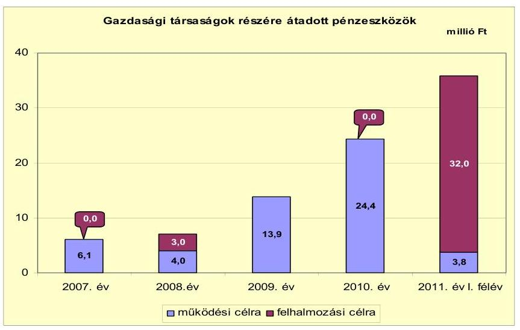

Az Önkormányzat egy gazdasági társaságban kizárólagos tulajdonnal rendelkezik, más gazdasági társasága nincs. A Városüzemeltetési Kft. közhasznú és

---

vállalkozási tevékenységet végzett, az önkormányzati ingatlanok (bérlakások) üzemeltetése, a közterület-fenntartás, valamint (2009 áprilisáig) az ivóvíz- és csatornaszolgáltatás területén kapott szerepet az önkormányzati feladatellátásban. A Városüzemeltetési Kft. részére az ellenőrzött időszakban az Önkormányzat összesen 52,2 millió Ft múködési és 35,0 millió Ft fejlesztési célú pénzeszközt adott át. A pénzeszköz átadása szerződés alapján történt, és a felhasználásról a gazdasági társaságot beszámoltatták. A Városüzemeltetési Kft. részére nyújtott pénzeszköz átadást a jelentés 4 . számú melléklete mutatja be.

# 3. Az ÖNKORMÁNYZAT KÖTELEZETTSÉGEI 

### 3.1. Az Önkormányzat pénzintézeti kötelezettségeinek változása

Az Önkormányzat pénzintézeti kötelezettségeinek összege 2006. december 31én 21,3 millió Ft, 2010. december 31-én 1529,3 millió Ft, 2011. június 30 -án 1506,7 millió Ft volt.

Az Önkormányzat pénzintézetekkel szemben fennálló kötelezettség állományát 2006. december 31. és 2011. június 30. között az alábbi ábra szemlélteti ${ }^{22}$ :
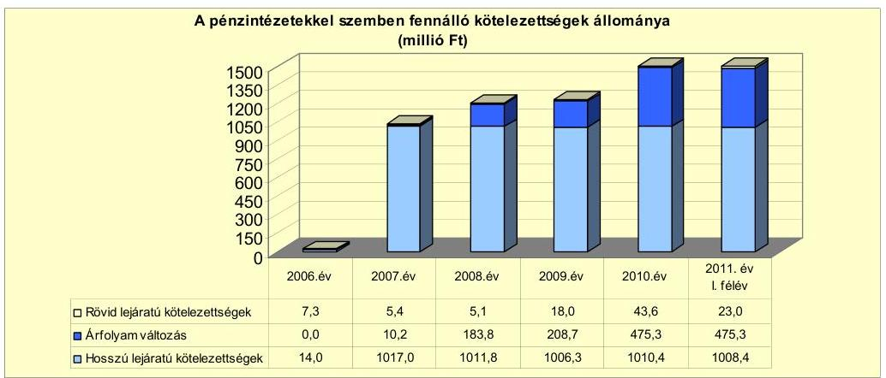

A fennálló pénzintézeti kötelezettség 2006. év végén hat, 2002. és 2006. között felvett hosszú lejáratú fejlesztési célú hitelből állt ${ }^{23}$, amely hitelekből négyet az ellenőrzött időszakban az Önkormányzat teljesen visszafizetett, kettőt az ütemezésnek megfelelően törlesztett. A hat hitelből hármat az Önkormányzat számlavezető bankja, hármat más pénzintézet nyújtott. Az Önkormányzat 2007-ben 6608,1 ezer CHF (1000,0 millió Ft) értékú kötvényt bocsátott ki, és kettő hosszú lejáratú hitelt vett fel beruházási céllal (IPY alapú, 8,3 millió Ft), majd 2010-ben további két hosszú lejáratú fejlesztési célú hitelt vett igénybe ( 10,0 millió Ft). A 2007-ben és 2010-ben felvett beruházási hiteleket nem az Önkormányzat számlavezető bankja, hanem a beszerzési célok (gépjármú) fi-

[^0]
[^0]:    ${ }^{22}$ A diagramban a hosszú lejáratú kötelezettségek mérlegértékét nem csökkentettük az árfolyamváltozás összegével.
    ${ }^{23}$ A rövid lejáratú pénzintézeti kötelezettségeket 2006. december 31-én a beruházási és fejlesztési hitelek következő évben esedékes törlesztő részletei jelentették.

---

nanszírozására specializálódott pénzintézetek nyújtották. A rövid lejáratú kötelezettségek között 2009-től a folyószámlahitel év végi egyenlege is megjelent ${ }^{24}$.

A 2007. november 30-án kötött két hitelszerződés alapján az Önkormányzat 2 darab személygépkocsi vásárlására 5,9 millió Ft, illetve 2,4 millió Ft összegű, JPY alapú, fix kamatozású, négy év futamidejű hitelt vett fel. A tőketörlesztést egy hónap múlva kellett megkezdeni.

A 2010-ben kötött két hitelszerződés alapján az Önkormányzat 2 darab személygépkocsi vásárlására 3,2 millió Ft, illetve 6,8 millió Ft összegű forint alapú, fix kamatozású, öt, illetve nyolc év futamidejű hitelt vett fel. A törlesztés megkezdésére egy év türelmi időt kapott.

Az Önkormányzat pénzintézeti kötelezettségvállalásaira 2007-2010 között minden esetben (CHF kötvény, hitelfelvételek) a Képviselö-testület döntése alapján került sor.

Az Önkormányzat pénzügyi helyzetét legnagyobb mértékben a vizsgált időszakban egy alkalommal, 2007. szeptember 27-én történt 6608,1 ezer CHF (1000,0 millió Ft) összegű kötvénykibocsátás befolyásolta. A „Csenger 2027 Kötvény" kibocsátásának célja a költségvetési bevételek és kiadások egyensúlyának biztosítása, pénz- és tőkepiaci befektetések révén hozam realizálása, illetve az Önkormányzat által megvalósítandó beruházásokhoz szükséges forrás biztosítása volt. A pénzintézetek közötti versenyeztetés biztosított volt, a legkedvezőbb ajánlatot nem az Önkormányzat számláját vezető pénzintézet adta. A CHF kötvénytörlesztés futamideje 20 év, 12 év türelmi időt követően, 2020-tól évenkénti 5\% (330,4 ezer CHF) tőketörlesztéssel és a 20. évben (2027-ben) 65\% (4295,2 ezer CHF) végtörlesztéssel. A kibocsátáskori árfolyam 151,3 Ft/CHF, az induló kamat 3 havi CHF LIBOR $+0,37 \%$ volt. A kamatfizetési kötelezettség negyedévente esedékes.

Az Önkormányzat adósságot keletkeztető kötelezettségvállalásának felső határát a CHF kötvénykibocsátáskor és a hitelek felvételekor vizsgálták, azt 400 millió Ft-ban határozták meg, és a CHF kötvény kamatfizetési kötelezettségét, valamint a hitelek futamidejét és kamatterheit tekintve nem lépték túl. A CHF kötvénykibocsátási döntést megelőző képviselő-testületi előterjesztés nem tartalmazta tételesen a visszafizetés forrásait, a kötelezettségvállalás visszafizetési forrásaként az Önkormányzat saját folyó bevételeit (helyi adók, illetékek, gépjármúadó, kamatbevételek) jelölte meg. Biztosítékként vállalta továbbá legalább 600 millió Ft, illetve a kötvény kibocsátáskori, CHF-ben meghatározott névértéke legalább 60\%-ának ${ }^{25}$ megfelelő óvadéki betét folyamatos fenntartását, elkülönített óvadéki számlán. Az óvadéki számlán elhelyezett összeghez az Önkormányzat nem férhet hozzá, de abból pénz- és tőkepiaci befektetéseket valósíthat meg, és azok hozamából teljesíthet kifizetéseket.

A CHF kötvény kibocsátásakor az Önkormányzat az óvadéki számlán levő öszszegnek 1, 3, 6 vagy 12 hónapos futamidőre, forintban vagy CHF-ben való lekö-

[^0]
[^0]:    ${ }^{24}$ Az Önkormányzatnak 2009 előtt év végén vissza nem fizetett folyószámla-hitele nem volt.
    ${ }^{25}$ a kettő közül a nagyobb összegnek

---

tésére, valamint a CHF kötvénykibocsátást lebonyolító CIB Bank értékpapírjaiba való befektetésre kapott lehetőséget. A CHF-ben való lekötéssel a lekötés időtartamával megegyező CHF LIBOR $-0,25 \%$, a forintban való lekötéssel a lekötés időtartamával megegyező BUBOR $-0,25 \%$ kamatbevételt realizált az Önkormányzat.

A CHF kötvénykibocsátást megelőzően, illetve a pénzügyi befektetések negyedévenkénti értékeléséhez kapcsolódóan készítettek számításokat a várható kötelezettségek teljesítésére, de a teljes futamidő alatt várható kamat- és tőkefizetési kötelezettséget, valamint a teljes kamat- és árfolyamkockázatot nem mutatták be. A Képviselő-testület részére nem készítettek a CHF kötvénykibocsátáshoz kapcsolódóan tájékoztatást a kötelezettségek teljes futamidejére vonatkozóan a keletkezett kötelezettségek jövőbeni árfolyam-, kamat- és törlesztési kockázatairól.

A CHF kötvénykibocsátásra megkötött megbízási szerződést 2011. június 30ig egy alkalommal módosították, a bank kezdeményezésére, a Képviselőtestület hozzájárulásával, 2010. április 1-jétől egy évig tartó időtartamra a kamatfelárat $0,37 \%$-ról $2,5 \%$-ra emelték. 2011. április 1-jétől visszaállt az eredeti, $0,37 \%$ kamatfelár-fizetési kötelezettség. A szerződésmódosítással bővítették az óvadéki számlán elhelyezett összeg befektetési lehetőségeit annak figyelembevételével, hogy az Önkormányzat szempontjából csak alacsony kockázatú befektetések történjenek.

Az óvadéki számlán elhelyezett betét lehetséges befektetési formái között az EUR betét, a magyar állampapírok, a TOP 10 magyar vállalat kötvényei, valamint a kizárólag árfolyam fedezeti céllal kötött opciós ügyletek, utóbbiak aránya azonban nem haladhatta meg az $5 \%$-ot.

A CHF kötvénykibocsátásból származó forrást az Önkormányzat 2011. június 30 -ig nem használta fel. 2007-2011. év I. féléve között a pénz- és tőkepiaci befektetésekből realizált bevétel 366,5 millió Ft volt. A hozambevételeket az Önkormányzat kizárólag a Képviselő-testület által jóváhagyott fejlesztési célokra fordította, illetve a 2011. június 30 -ig esedékes, a kötvénytartozásból eredő 520,1 ezer CHF (89,6 millió Ft) kamatot és a befektetési tanácsadás díját fizette meg.

A fejlesztési célok között az alapfokú oktatási intézmény infrastruktúrafejlesztéséhez 8,7 millió Ft, ingatlan megvásárlásához 32,0 millió Ft, 10 millió Ft alatti fejlesztésekhez 23,3 millió Ft, a szennyvízberuházás előkészítéséhez és indításához 40,7 millió Ft, a járóbeteg szakellátó központhoz 35,9 millió Ft összeget használtak fel a CHF kötvény hozamából.

Az árfolyamváltozás hatása befolyásolja a kötelezettségek alakulását, azonban annak mértéke előre pontosan nem határozható meg. Annak megítéléséről, hogy a devizában fennálló hitel vagy kötvény visszafizetése, illetve visszavásárlása az Önkormányzat számára forintban összességében többletkiadást (árfolyamveszteség) vagy kiadási megtakarítást (árfolyamnyereség) eredményez, csak a futamidő végén, a teljes kötelezettség rendezését követően lehet képet alkotni. Mindaddig, amíg törlesztési kötelezettség nem áll fenn (türelmi idő, moratórium), a tőkére vonatkoztatva nem értelmezhető sem az árfolyamveszteség, sem az árfolyamnyereség. Ugyanakkor a Számv. tv. 60. § (4) bekezdése meghatározza, hogy az árfolyam különbözetet év végén a kötelezettségek vagy követelések között a könyvvi-

---

teli mérlegben nyilván kell tartani, azonban az árfolyam különbözet ebben az esetben ténylegesen nem képződött.

Az Önkormányzat a CHF kötvényből és hitelekből eredő árfolyamváltozás miatti év végi értékelést a 2007. évtől minden évben elvégezte, az árfolyamveszteség miatti kötelezettség-növekedést a mérlegben kimutatta.

Az Önkormányzatnak 2011. június 30-án CHF-ben fennálló hosszú lejáratú, adósságot keletkeztető kötelezettségvállalása az alábbi volt:

| Megnevezés | Szerződéskötés/   időocsátás   időpontja | Összeg   ezer CHF-ben | Kibocsátási árfolyam | Kamat (referencia kamat+   kamatfelár) | Felhasználás célja: |
| :-- | :--: | :--: | :--: | :--: | :--: |
| "csenger 2027" kötvény | 2007.09 .27 | 8608,1 | 151,3 | 3 havi CHF LIBOR+0,37\% | fejlesztések finanszírozása |

A CHF kötvényből származó kötelezettség alapvetően befolyásolja az Önkormányzat pénzügyi helyzetét. A CHF kötvényből származó kamatfizetési kötelezettség 2011. június 30-ig nem okozott problémát, mivel a pénzügyi befektetésekből realizált hozam azt folyamatosan meghaladta. A CHF árfolyamának emelkedése azonban állandó kockázatot jelent az Önkormányzat számára, mivel az óvadéki számlán kötelezően tartandó összeg egyre magasabb, ezáltal folyamatosan csökken a fejlesztések közvetlen finanszírozására fordítható forrás. A 2007. évi 600,0 millió Ft-tal szemben az óvadéki számlán tartandó öszszeg 2011. június 30-án már 885,2 millió Ft-ot jelentett. A 2020-ban kezdődő évenkénti 5\% tőketörlesztés forrása az óvadéki számlán tartandó összeg pénzügyi befektetéseiből biztosítható. A 2027-ben esedékes $65 \%$ egyösszegű végtörlesztés, illetve annak forrása elérésének, teljesítésének részbeni bizonytalansága az Önkormányzat számára törlesztési kockázatot jelent.

Az Önkormányzatnak 2011. június 30-án HUF-ban fennálló hosszú lejáratú, adósságot keletkeztető kötelezettségvállalásai az alábbiak voltak:

| Megnevezés | Szerződéskötés   időpontja | Összeg   millió HUF-ban | Kamat (referencia   kamat+ kamatfelár) | Felhasználás célja: |
| :-- | :--: | :--: | :--: | :--: |
| Bérlakásépítés hitel | 2002.07 .10 | 8,0 | (állampapírhozam+4\%) | bérlakások építése |
| Fejlesztési hitel | 2006.09 .11 | 10,0 | 3 havi EURIBOR+2\% | csapadékvíz elvezetés   megvalósítása |
| Beruházási hitel | 2010.03 .16 | 3,2 | 13,4 (fix) | személygépkocsi vásárlás |
| Beruházási hitel | 2010.09 .17 | 6,8 | 12,29 (fix) | személygépkocsi vásárlás |

Az Önkormányzatnak 2011. június 30-án JPY-ben fennálló hosszú lejáratú, adósságot keletkeztető kötelezettségvállalása az alábbi volt:

| Megnevezés | Szerződéskötés   időpontja | Összeg   ezer JPY-ben | Lehivási árfolyam | Kamat (referencia kamat+   kamatfelár) | Felhasználás célja: |
| :-- | :--: | :--: | :--: | :--: | :--: |
| Beruházási hitel | 2007.11 .30 | 3787,2 | 1,57 | 7,792 (fix) | személygépkocsi vásárlás |

A forintban, illetve JPY-ben fennálló kötelezettségek összegükre, illetve lejáratukra való tekintettel alacsony kockázatot jelentenek az Önkormányzat számára ${ }^{26}$. A kamatváltozásból eredő kockázatot az Önkormányzat megszüntette azáltal, hogy 2007 óta felvett négy hitele fix kamatozású. A 2007. és 2010.

[^0]
[^0]:    ${ }^{26}$ Az árfolyamkockázat azért nem számottevő, mivel az egyik JPY hitel már visszafizetésre került, a másik 2011. utolsó negyedévben jár le.

---

között megkötött, illetve a korábbi években kötött és 2010. december 31-ig még vissza nem fizetett hitelszerződéseket futamidejük alatt nem módosították, a szerződéskötéskor meghatározott kamatfeltételekben nem történt változás.

Az Önkormányzat 2011. június 30 -át követően, a helyszíni vizsgálat időpontjáig újabb hitelszerződést vagy hitelkeret-szerződést nem kötött, új kötvény kibocsátására megbízást nem adott.

Az Önkormányzat múködésének pénzügyi egyensúlyát a vizsgált időszakban csak folyószámlahitel igénybevételével tudta biztosítani, amelynek alakulását az alábbi táblázat mutatja be:

|  |  |  |  |  |  | millió Ft-ban |
| :--: | :--: | :--: | :--: | :--: | :--: | :--: |
| Megnevezés | 2007. év | 2008. év | 2009. év | 2010. év | 2011. év   t. félév |  |
| I. Folyószámlahitel |  |  |  |  |  |  |
| a folyószámlahitel keretösszege január 1-jén | 50,0 | 50,0 | 50,0 | 50,0 | 50,0 |  |
| teljesített kamat és egyéb költség | 0,8 | 1,4 | 0,8 | 1,3 | 1,2 |  |

A folyószámlahitel kamatkondícióinak és egyéb költségeinek alakulását az alábbi táblázat szemlélteti ${ }^{27}$ :

| Megnevezés | Kamat (referencia+ kamatfelár) | Egyéb költség |
| :--: | :--: | :--: |
| Folyószámlahitel |  |  |
| 2007-2008. év | 3 havi BUBOR $+0,5 \%$ | 1,8\% rend.tart.jutalék |
| 2009-2011. év | 3 havi BUBOR $+3,25 \%$ | 2,0\% rend.tart.jutalék |

A folyószámlahitelt az Önkormányzat minden évben igénybe vette, a fizetési kötelezettségeinek felmerülése, illetve bevételeinek realizálódása közötti ütemezési különbség függvényében. A folyószámlahitel keretösszege a teljes vizsgált időszakban 50,0 millió Ft, átlagos napi állománya 2007-2010 között 1,7 millió Ft és 11,8 millió Ft közötti volt. 2008-ig a folyószámlahitelnek év végén, illetve újrakötéskor nem volt állománya.

A folyószámlahitel igénybevétel 2009. év második felétől - a fejlesztési kiadások emelkedése következtében - nőtt meg. A folyószámlahitel év végi állománya 2009-ben 12,4 millió Ft, 2010-ben 38,0 millió Ft volt ${ }^{28}$. A 2011. év I. felében 19,0 millió Ft-ra (az előző évhez viszonyítva 61,0\%-kal) emelkedett a naponkénti igénybe vett átlagos folyószámlahitel-állomány, ami rontotta az Önkormányzat pénzügyi egyensúlyát.

[^0]
[^0]:    ${ }^{27}$ A referencia kamat az alábbiak szerint alakult:

    | MNB BUBOR fixing (átlagkamat) \%-ban |  |  |  |  |  |
    | :-- | :-- | :-- | :-- | :-- | :-- |
    | Referencia kamat | 2007. évl | 2008. évl | 2009. évl | 2010. évl | 2011. év   t. félév |
    2 havi BUBOR | 7,75 | 8,87 | 8,64 | 5,50 | 6,07 |  |

    28 A folyószámlahitel lejárata 2007-ben december 24., 2008-ban december 23., 2009ben december 22., 2010-ben december 21. volt. A hitelkeret újbóli megnyitása minden évben a következő banki munkanapon volt. Mivel a folyószámlahitel lejáratának napja minden évben időben közel volt az év utolsó napjához, a lejáratkori állomány a tárgyév december 31-itől lényeges eltérést nem mutatott.

---

Az áttekintett időszakban (2007-től 2011. június 30-ig) a likviditási problémák finanszírozása a folyószámlahitel vonatkozásában az Önkormányzatnak öszszesen 3,1 millió Ft kamatráfordítást és 2,4 millió Ft egyéb banki költséget (rendelkezésre tartási jutalék) jelentett. Munkabér megelőlegezési, egyéb likvid vagy rövid lejáratú hitelt az Önkormányzat nem vett igénybe. Az Önkormányzat az ellenőrzött időszakban számlavezető pénzintézetet nem váltott.

A CHF kötvényhez, illetve a hosszú lejáratú, változó kamatozású hitelekhez kapcsolódó kamatfizetési kötelezettségek alakulását befolyásolta a kibocsátáskori, lehíváskori és az utolsó kamatfizetéskori referenciakamat alakulása, melyet az alábbi táblázat mutat be:

| Megnevezés | Kibocsátási, lehívási | Utolsó fizetéskori | Változás \% |
| :--: | :--: | :--: | :--: |
|  | kamat (referencia + kamatfelár) \% |  |  |
| 3 havi CHF LIBOR | 3,12 | 0,74 | $-76,3 \%$ |
| 3 havi EURIBOR+2\% (2006.09.11.-i szerződés) | 5,91 | 3,73 | $-36,9 \%$ |
| (állampapírhozam+4\%)   (támogatás=állampapírhozam-2\%) (2002. 07.10-i szerződés) | 7,43 | 5,0 | $-32,7 \%$ |

Az alapkamat mértékének alakulása jelentős hatással van az adott devizanemben kifejezett, a teljes futamidőre számított, várható kamatkötelezettség mértékére. Az Önkormányzat fizetési kötelezettségét a referencia kamatok csökkenése kedvezően, a CHF, illetve EUR árfolyam emelkedése viszont kedvezőtlenül befolyásolta. Amennyiben a referencia kamat nem változott volna, az Önkormányzatnak a kibocsátáskori referencia kamattal számolva 2011. év I. félévig 260,9 ezer CHF és 1,3 millió Ft-tal magasabb összegű kamatot kellett volna fizetnie.

Az Önkormányzat kötelezettségeinek állományát és várható alakulását a következő táblázat mutatja be:

| Megnevezés | $\begin{gathered} \text { Állomány } \\ \text { 2010. december 31-én } \end{gathered}$ |  |  | $\begin{gathered} \text { Állomány } \\ \text { 2011. június 30-án } \end{gathered}$ |  | Várható kötelezettség 2011-2013. években |  | Várható kötelezettség 2014. évtől |  |
| :--: | :--: | :--: | :--: | :--: | :--: | :--: | :--: | :--: | :--: |
|  | HUF-ban (millió Ftban) | Devizában (összege. ezer. ben) | Devize. nem | HUF-ban (millió Ftban) | Devizában (összege. ezer. ben) | Devize. nem | HUF-ban (millió Ftban) | Devizában (összege. ezer ...-ben) | HUF-ban (millió Ftban) | Devizában (összege. ezer ...-ben) |
| Pénzintézeti kötelezettségek |  |  |  |  |  |  |  |  |  |
| Állomány 2010. december |  | 6808,1 | CHF |  | 6808,1 | CHF |  | 145,9 |  | 7066,2 |
| Hosszú lejáratú hitelek | 14,2 |  |  | 12,3 |  |  | 12,4 |  | 8,0 |  |
| Hosszú lejáratú hitelek |  | 946,8 | JPY |  | 473,4 | JPY |  | 992,5 |  |  |
| Polyószámlahitel | 38,0 |  |  | 18,3 |  |  | 18,3 |  |  |  |
| Pénzintézeti kötelezettségek összesen HUF-ben | 52,2 |  |  | 30,8 |  |  | 30,7 |  | 8,0 |  |
| Pénzintézeti kötelezettségek összesen CHF-ben |  | 6808,1 |  |  | 6808,1 |  |  | 145,9 |  | 7066,2 |
| Pénzintézeti kötelezettségek (osz. JPY-ben |  | 946,8 |  |  | 473,4 |  |  | 992,5 |  |  |
| Kivététel leírására | 30,8 |  |  | 22,1 |  |  | 12,5 |  |  |  |

A vállalt pénzintézeti kötelezettségek 2011. június 30-i állománya 6608,1 ezer CHF kötvénykibocsátásból származó kötelezettség, amellyel kapcsolatban az Önkormányzatnak a 2011-2013. években tőketörlesztési kötelezettsége nem lesz, 145,9 ezer CHF kamatfizetési kötelezettsége áll fenn. Hosszú lejáratú hitelekből az Önkormányzatnak 12,3 millió Ft és 473,4 millió JPY kötelezettsége volt, utóbbi törlesztése a 2011. év végén esedékes. A 2011-2013. évi kötelezettségek teljesítésére figyelembe

---

vehető 24,8 millió Ft kötelezettséggel nem terhelt pénzmaradvány ${ }^{29}$ és 28,6 millió Ft mérlegben kimutatott követelésállomány.

Az Önkormányzat 2014 utáni jelenleg ismert pénzintézeti kötelezettsége 6608,1 ezer CHF kötvénytartozás és a hozzá kapcsolódó 460,1 ezer CHF kamatfizetési kötelezettség, továbbá 8,0 millió Ft hosszú lejáratú hitel és a hozzá kapcsolódó kamat. Az Önkormányzat tájékoztatása szerint figyelembe vehető további források az éves költségvetési rendeletekben megtervezett helyi adóbevételek, azonban új adónem bevezetésére, illetve az adómértékek növelésére 2011-ben nem került sor. A 2014 után esedékes, jelenleg ismert pénzintézeti kötelezettségek teljesítése nem minősíthető biztosítottnak, mivel a visszafizetés forrásához a képőződő működési jövedelem jelenleg alacsony. Az Önkormányzat tájékoztatása szerint a 2020-tól esedékes évenkénti 5\% tőketörlesztés az óvadéki számlán levő összeg pénz- és tőkepiaci befektetéseinek hozamaiból biztosítható. A 2027-ben esedékes 65\% (4295,2 ezer CHF) egyöszszegű végtörlesztés, illetve annak forrása elérésének, teljesítésének részbeni bizonytalansága az Önkormányzat számára törlesztési kockázatot jelent. Az óvadéki betétszámlán lévő összeget leszámítva a visszafizetés forrásai nem számszerűsítettek.

# 3.2. A szállítói kötelezettségek változása 

A szállítókkal szemben fennálló kötelezettségek állománya az Önkormányzat pénzügyi helyzetére nézve kedvezőtlenül változott. Míg 2007. év végén 4,9 millió Ft, 2009. év végén ennek közel húszszorosa, 94,0 millió Ft volt a szállítók felé fennálló tartozás. 2010. év végére 30,8 millió Ft-ra csökkentek a szállítói kötelezettségek, de a 2011. év I. félévében ismételten nőttek, 11,3 millió Ft-tal (36,7\%-kal), 42,1 millió Ft-ra. A szállítói tartozások összes fennálló kötelezettségeken belüli aránya 2007-ben 0,4\%, 2009-ben $6,7 \%$, 2010-ben $1,9 \%$ volt.

Az Önkormányzat év végi lejárt szállítói tartozásainak állománya a vizsgált években 2009. év végén volt a legmagasabb, 42,6 millió Ft (az összes szállítói tartozás $45,3 \%$-a). A 2010. év végi 5,1 millió Ft lejárt szállítóállomány a 2011. év I. félévében ismét emelkedett, közel négyszeresére (2011. június 30án 19,3 millió Ft volt). A lejárt szállítói tartozások többnyire 30 napon belüliek voltak, de 2009. év végén a lejárt szállítói tartozásokból 6,5 millió Ft (15,3\%), 2011. június 30 -án 3,5 millió Ft ( $18,1 \%$ ) volt 31-60 nap közötti. 90 napon túli lejárt tartozása az Önkormányzatnak 2007. év vége óta nem volt. A lejárt szállítói tartozások a közüzemi szolgáltatók és élelmiszer beszállítók felé álltak fenn. Az EU-s támogatásból megvalósult fejlesztések közül a TÁMOP projektek az utólagos finanszírozás miatt okoztak likviditási gondot az Önkormányzatnak. 2009-től a folyószámlahitelt is felhasználták az utófinanszírozású TÁMOP projektek esedékes felhalmozási célú kiadásainak teljesítéséhez. Vitatott, el nem ismert szállítói tartozás az Önkormányzatnál nem állt fenn.

A szállítók felé fennálló tartozások átütemezésre irányuló szerződést az Önkormányzat négy szállítóval (három közüzemi szolgáltatóval és egy élel-

[^0]
[^0]:    ${ }^{29}$ A 2010. évi kötelezettséggel terhelt pénzmaradvány 864,7 millió Ft volt.

---

miszer-beszállítóval) kötött 2011-ben. Az átütemezés 12,5 millió Ft tartozás rendezésének 60 nappal, 1,0 millió Ft pénzügyi teljesítésének 180-210 nappal való pótlék- és késedelmi kamatmentes meghosszabbítását tette lehetővé az Önkormányzat számára. Az átütemezett fizetési kötelezettségeinek az Önkormányzat a helyszíni ellenőrzés időpontjáig eleget tett, ezért az adósságrendezési tv. alapján adósságrendezési eljárás megindítása nem indokolt.

A kiegyenlítetlen tartozások után a szállítók által felszámított késedelmi kamatfizetési kötelezettség az Önkormányzatnál 2007. év végén 0,6 millió Ft, 2010-ben azonban már 2,5 millió Ft összegű volt. Más kiadási elmaradása az Önkormányzatnak nem volt.
2011. év I. félévben a fizetendő késedelmi kamatokból eredő kötelezettség ( 1,8 millió Ft) időarányosan $44 \%$-kal haladta meg a 2010. évi összeget, ami az Önkormányzat pénzügyi helyzetére negatív hatással volt.

# 3.3. Egyéb kötelezettségek változása 

Az Önkormányzat lízingszerződést nem kötött, PPP konstrukcióból, garanciaés kezességvállalásból származó kötelezettségvállalása nem volt. Kölcsönt egy esetben nyújtott, egy kiemelkedően közhasznú egyesület részére 2007-ben, 0,3 millió Ft-ot. A kölcsön visszafizetésének határideje 2010. október 27. volt, 2010. december 31-ig 0,2 millió Ft került visszafizetésre.

A kizárólagos önkormányzati tulajdonú gazdasági társaság részére 2008ban adott át 2,2 millió Ft visszatérítendő felhalmozási célú pénzeszközt, amelyet a gazdasági társaság a benyújtott tárgyieszköz-beszerzési támogatási pályázathoz önrészként használt fel. A visszafizetés 2010. december 31-ei határidejét a felek egy évvel meghosszabbították, a meghosszabbított határidő a helyszíni ellenőrzés időpontjáig még nem járt le, a visszafizetés még nem történt meg. Az Önkormányzat saját gazdasági társaságának nem tartozozik, tőle kölcsönt nem vett igénybe.

A jegyző a vizsgált időszakban, méltányossági jogkörében eljárva, összesen 5,4 millió Ft magánszemélyek kommunális adója, gépjárműadó, bírság és késedelmi pótlék követelés elengedéséről döntött, ami az Önkormányzat pénzügyi helyzetét számottevően nem befolyásolta.

Az Önkormányzatnak a vizsgált időszakban 13 ingatlana volt jelzáloggal, elidegenítési és terhelési tilalommal terhelt, amelyeknek a számvitelben 2010. december 31-én nyilvántartott könyv szerinti nettó értéke 73,6 millió Ft, a bejegyzett jelzálog összege a bérlakások építésére 2002-ben felvett hitellel azonos, 8,0 millió Ft volt. Az ingatlanok nem tartoznak a törzsvagyon körébe.

A forgalomképes ingatlanok könyv szerinti értékének százalékos megoszlását a jelzáloggal terhelt és nem terhelt ingatlanok között a következő ábra szemlélteti:

---

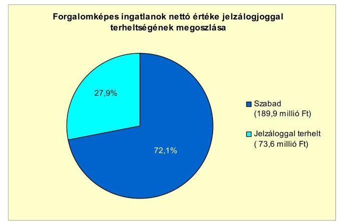

Az Önkormányzat összes forgalomképes ingatlanának könyv szerinti nettó értéke 263,5 millió Ft, ebből a jelzáloggal terhelt ingatlanok könyv szerinti nettó értéke 73,6 millió Ft (27,9\%) volt 2010. december 31-én. A 2011. évben újabb jelzálogjog-bejegyzés nem történt.

Az Önkormányzat ellen peres eljárás - mely jövőbeni fizetési kötelezettséget jelenthet -, nem volt folyamatban 2011. június 30 -án. Jogerős határozattal lezárt, de ki nem fizetett peres eljárások alapján az Önkormányzatnak 2011. június 30 -án követelése, illetve kötelezettsége nem állt fenn.

Az Önkormányzat 2009. december 31-ig 96,3\%-ban, 2010-től 100\%-ban ${ }^{30}$ volt tulajdonosa a Városüzemeltetési Kft.-nek, amely közhasznú és vállalkozási tevékenységet folytat, közterület-fenntartási, építőipari, vagyonüzemeltetési feladatot lát el. Más gazdasági társasága az Önkormányzatnak nincs.

A Városüzemeltetési Kft. 2009. áprilisig biztosította a víz-és csatornaszolgáltatást, azonban a szennyvízhálózat fejlesztése és a szennyvíztisztító létesítése miatt ezt a tevékenységet - az üzemeltetésre átadott önkormányzati vagyontárgyakkal együtt - az Önkormányzatnak át kellett adnia a Nyírségvíz Zrt. részére. A fe-ladat-átadás a gazdasági társaságra nézve hátrányos következménnyel járt: árbevétele lecsökkent, gazdálkodása veszteségessé vált.

A Városüzemeltetési Kft. saját tőkéje a három év veszteséges gazdálkodás következtében 2010 végére a jegyzett tőke ( 3 millió Ft) 16\%-ára, ( 478 ezer Ft-ra) csökkent. A Gt. 143. § (2) bekezdés a) pontja alapján az ügyvezető a 2010. évi beszámoló elfogadását követően haladéktalanul köteles lett volna a szükséges intézkedések megtétele céljából összehívni a taggyűlést, mivel tudomására jutott, hogy a társaság saját tőkéje veszteség folytán a jegyzett tőke felénél alacsonyabbra csökkent, illetve az Önkormányzatnak a Gt. 143. § (3) bekezdésében foglalt rendelkezés értelmében határoznia kellett volna a pótbefizetés előírásáról, vagy - ha ennek lehetőségét a társasági szerződés nem tartalmazza -

[^0]
[^0]:    ${ }^{30}$ Egy másik települési önkormányzat tulajdonrészének megvásárlása eredményeképpen.

---

a törzstőke más módon való biztosításáról, illetve a társaságnak más gazdasági társasággá való átalakulásáról, vagy jogutód nélküli megszűnéséről ${ }^{31}$.

A Városüzemeltetési Kft. helyzetének stabilizálása érdekében új tevékenységi területet, a közfoglalkoztatás szervezését célozta meg, amelyhez az Önkormányzat 2011-ben (ingatlan megvásárlására) 32 millió Ft felhalmozási célú pénzeszközt adott át a gazdasági társaság részére.

A Városüzemeltetési Kft. az ellenőrzött években kötvényt nem bocsátott ki, hitelt nem vett fel, lizingszerződést nem kötött, kötelezettségei között 2010. december 31 -én és 2011. június 30 -án pénzintézetek felé fennálló kötelezettsége nem volt. A szállítókkal szemben fennálló kötelezettségeinek állománya 2007. év végén 1,0 millió Ft, 2010. év végén 2,7 millió Ft volt, amelyből határidőn túl fennálló tartozás nem volt. A szállítói tartozások fennálló kötelezettségeken belüli aránya 2007-ben 20,1\%, 2010-ben 41,0\% volt. A szállítók felé fennálló kötelezettség 2011. június 30 -ra 1,2 millió Ft-ra csökkent, amelyből határidőn túli tartozás nem volt.

Az Önkormányzat a Gt. 54. § (2) bekezdése alapján korlátlan felelősséggel tartozik azon gazdasági társaságának felszámolás esetén, amelyben az Önkormányzat az 52. § (2) bekezdése szerint a szavazatok legalább 75\%-ával rendelkezik, így minősített befolyásszerzőnek minősül, továbbá a Csődtv. 63. § (2) bekezdése alapján a Városüzemeltetési Kft.-nek minden olyan kötelezettségéért, amelynek kielégítését a felszámolási eljárás során az adós társaság vagyona nem fedez, ha a hitelezőinek a felszámolási eljárás során benyújtott keresete alapján a bíróság - az adós társaság felé érvényesített tartósan hátrányos üzletpolitikájára figyelemmel - megállapítja az Önkormányzat korlátlan és teljes felelősségét. Felszámolás esetén a hitelezők által benyújtott kereset alapján a bíróság összességében 1,2 millió Ft összegű korlátlan és teljes felelősséget állapíthat meg a lejárt kötelezettségekkel érintett Városüzemeltetési Kft. után.

A Városüzemeltetési Kft. ellen indított, illetve általa kezdeményezett peres eljárás a helyszíni ellenőrzés időpontjában nem volt folyamatban. Jogerős határozattal lezárt, de ki nem fizetett peres eljárások alapján a Városüzemeltetési Kft.-nek 2011. június 30 -án követelése, illetve kötelezettsége nem állt fenn.

Az Önkormányzat pénzügyi helyzetét befolyásolja a tárgyi eszközeinek állapota, használhatósági foka, az eszközök pótlására fordítandó pénzeszközök nagysága. Az Önkormányzat 2007-2010 között a befektetett eszközök után összesen 285,2 millió Ft értékcsökkenést számolt el. A vizsgált időszakban az Önkormányzatnál nem történt meg annak felmérése, hogy az eszközök elhasználódása, amortizációja fedezetének biztosítása mekkora forrásokat

[^0]
[^0]:    ${ }^{31}$ Gt. 143. § (2) bekezdés: „... az ügyvezető haladéktalanul köteles, a szükséges intézkedések megtétele céljából, összehívni a taggyűlést, ha tudomására jut, hogy a) a társaság saját tőkéje veszteség folytán a törzstőke felére csökkent". A Gt. 143. § (3) bekezdés: „A (2) bekezdésben megjelölt esetekben a tagoknak határozniuk kell különösen a pótbefizetés előírásáról vagy - ha ennek lehetőségét a társasági szerződés nem tartalmazza - a törzstőke más módon való biztosításáról, ... mindezek hiányában a társaságnak más társasággá történő átalakulásáról, illetve jogutód nélküli megszüntetéséről. A határozatokat legkésőbb három hónapon belül végre kell hajtani."

---

igényel, erre tartalékot nem képeztek, külön alapot nem hoztak létre ${ }^{32}$. A felújításokra, az eszközök pótlására - az Önkormányzat kimutatásai szerint - a pénzügyi lehetőségek függvényében került sor.

A felújításokra, az eszközök pótlására elsősorban az intézmények működőképességének biztosítása, illetve a szakhatósági előírások figyelembevételével került sor. A felhalmozási kiadásokból rekonstrukcióra, felújításra 351,5 millió Ft-ot, beruházásra 257,5 millió Ft-ot fordított 2010. december 31-ig az Önkormányzat, amelyhez a szükséges forrást főként felhalmozási célú EU-s és hazai támogatásokból, továbbá CHF kötvénykibocsátásból, hitelfelvételből és a megképződött múködési jövedelemből biztosította. A Képvise-lő-testületnek előterjesztett éves zárszámadási rendeletekben bemutatták az Önkormányzat eszközei után tárgyévben elszámolt értékcsökkenés összegét, de nem mutatták be az eszközpótlásra fordított tényleges kiadásokat, az eszközök elhasználódási fokának alakulását. Az Önkormányzat összes eszközének (immateriális javak, ingatlanok, gépek, járművek, üzemeltetésre átadott eszközök) használhatósági foka 2007-2010 között a beruházásokból és felújításokból származó 587,7 millió Ft bruttó értéknövekedés ellenére 3,0 százalékponttal ( $80,7 \%$-ról $77,7 \%$-ra) csökkent az amortizáció növekedése miatt.

# 4. A PÉNZÜGYI EGYENSÚLY MEGTEREMTÉSE ÉrDEKÉBEN HOZOTT INTÉZKEDÉSEK EREDMÉNYE 

A vizsgált időszakban az Önkormányzat pénzügyi egyensúlya javítása érdekében kiadáscsökkentő intézkedéseket tett.

A kiadáscsökkentő intézkedések a létszámcsökkentés, a többletjuttatások csökkentése, a civil szervezetek támogatásainak csökkentése, valamint az egyéb (szociális kiadások csökkentése) területeken valósultak meg.

A 2007-2011. év I. félév kiadáscsökkentő intézkedéseinek megoszlását az alábbi grafikon mutatja be:

[^0]
[^0]:    ${ }^{32}$ Erre a jelenlegi szabályozási környezetben nem kötelezi előírás az Önkormányzatot.

---

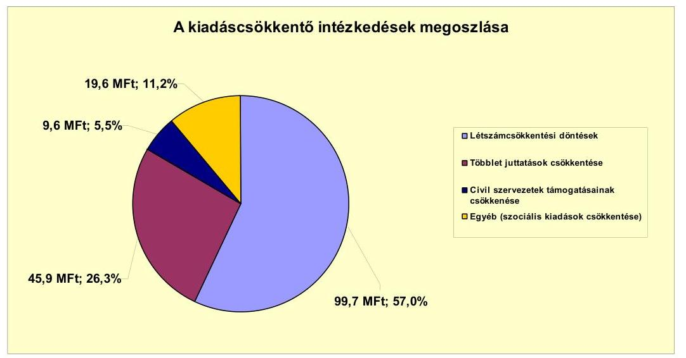

Az Önkormányzat adatszolgáltatása alapján, az ellenőrzött időszakban a kiadáscsökkentő intézkedések eredményeként 174,8 millió Ft megtakarítást értek el. Az összes kiadáscsökkentő intézkedésből 5,4\% (9,5 millió Ft) az önként vállalt feladatok ellátását érintette.

A többletjuttatások csökkentése területén elért megtakarítás 11,5\%-át (5,3 millió Ft-ot) a kereset-kiegészítés zárolása, 77,0\%-át (35,3 millió Ft-ot) a cafetéria elemek csökkentése, megszüntetése, 11,5\%-át (5,3 millió Ft-ot) a teljesítményfüggő kereset-kiegészítés megszüntetése jelentették.

A legjelentősebb megtakarítást a létszámcsökkentés területén realizálták. A megtakarítás teljes egészében a feladatmegszüntetéssel, átszervezéssel járó létszámcsökkentési döntésekhez kapcsolódott.

A 2007-2010. években végrehajtott létszámcsökkentéseket a következő táblázat mutatja be:

| Megnevezés (adatok tő-ben) | Közoktatás | Szociális és gyermekvédelem | Egészségügy | Polgármesteri hivatal | Egyéb | Összesen |
| :--: | :--: | :--: | :--: | :--: | :--: | :--: |
| 2007. január 1-jén jóváhagyott álláshelyek száma | 114 | 23 | 20 | 39 | 0 | 196 |
| Megszüntetett álláshelyek száma | 53 | 8 | 5 | 4 | 0 | 70 |
| adath. üres álláshelyek száma | 0 | 0 | 0 | 1 | 0 | 1 |
| szokmai álláshelyek száma | 12 | 4 | 4 | 3 | 0 | 23 |
| intézmény-cizemetletéssel kapcsolatos |  |  |  |  |  |  |
| 2007. január 1-jén foglalkoztatott létszám | 113 | 23 | 20 | 38 | 0 | 194 |
| Létszámcsökkentés | 63 | 6 | 5 | 4 | 0 | 75 |
| Létszámcövekedés | 27 | 16 | 2 | 1 | 36 | 84 |
| 2010. december 31-én 2010. 2007. január 1-jén foglalkoztatott létszám | 86 | 33 | 17 | 36 | 36 | 210 |
| Létszámcsökkentés | 113 | 23 | 20 | 38 | 0 | 194 |
| Létszámcsökkentés | 63 | 6 | 5 | 4 | 0 | 75 |
| Létszámcövekedés | 27 | 16 | 2 | 1 | 36 | 84 |
| 2010. december 31-én foglalkoztatott létszám | 87 | 33 | 17 | 36 | 36 | 209 |

A vizsgált időszakban a feladatellátás racionalizálása, az intézménystruktúra átalakítása, a társulás keretében ellátott feladatokban bekövetkezett változások, valamint a pénzügyi egyensúly javítása érdekében a Képviselő-testület hat alkalommal döntött létszámcsökkentésről. A létszámcsökkentési döntések hatására 70 álláshely megszüntetésére került sor. A megszüntetett álláshelyekből 38 a Gazdasági Ellátó Szolgálat megalakításához kapcsolódott. Csengerújfalu társulásból történő kiválása miatt négy, évközi létszámcsökken-

---

tések hatására 23, feladatátszervezés miatt egy, fogászati alapellátás vállalkozásba adása végett négy fő létszámleépítés valósult meg.

A létszámcsökkentések mellett a közoktatási, a szociális és gyermekjóléti területeken megvalósult, társulásos formában történő feladatellátás, valamint az intézményi struktúra átszervezése kapcsán nőtt az időszak álláshelyeinek száma. A feladatellátás módjában bekövetkezett változás és az intézmények közötti feladat átszervezések miatti létszámnövekedés a vizsgált időszakban 84 fő volt. A közoktatási feladatok társulás keretében történő ellátása okán 27 fővel nőtt a dolgozói létszám. A GESZ megalakításával 36 fő létszámnövekedés valósult meg. (Ez az intézményeknél létszámcsökkenésként jelentkezett.) A Népjóléti Intézménynél megvalósult feladatátrendezés egy fő, a szociális alapellátás biztosítására létrehozott társulás 17 fő létszámnövekedést jelentett az Önkormányzat számára. A fogorvosi körzet ellátása miatt további két fő, az évközi feladatátvételek hatására egy fő létszámbővülés történt.

Az önkormányzati létszám és álláshelyek száma a 2007. és 2010. közötti időszakban a közoktatási, valamint a szociális és gyermekjóléti szolgáltatások társulásos formában történő ellátása miatt összességében 14 fővel nőtt.

Üres álláshely megszüntetésére a 2007. évben került sor. Az egy üres álláshely megszüntetése eredményeként az Önkormányzat 8,9 millió Ft összegű megtakarítást realizált.

Az Önkormányzat a létszámcsökkentésekhez kapcsolódóan 2007-2010 között 43,4 millió Ft összegű központosított támogatást igényelt, amelyből 42,9 millió Ft-ot kapott meg. A támogatás felhasználásával tartósan leépített álláshelyek száma összesen 16 fő volt.

Az Önkormányzat a vizsgált időszakban pénzügyi helyzete javítása érdekében bevételnövelő intézkedéseket nem tett.

Az Önkormányzat központi támogatásainak kumulált csökkenése a vizsgált időszakban 29,7 millió Ft volt. A kiadáscsökkentő intézkedések az Önkormányzat pénzügyi helyzetét javították. Azok eredményeként a 20072011. év I. félévi időszakban 174,8 millió Ft kiadási megtakarítást értek el.

# 5. Az ÁSZ Által a korÁbbi ÉVEKben a PÉNZÜGYI EGYENSÚLY JAVÍTÁSÁRA TETT SZABÁLYSZERŰSÉGI ÉS CÉLSZERŰSÉGI JAVASLATOK HASZNOSULÁSA 

Az ÁSZ az Önkormányzat gazdálkodási rendszerét 2007-ben ellenőrizte. Jelentésében a pénzügyi egyensúly megteremtésének elősegítésére egy szabályszerűségi és kettő célszerűségi javaslatot tett. A jelentést a Képviselő-testület megismerte. A javaslatok megvalósítására intézkedési tervet készítettek, amely teljes körűen tartalmazta a javaslatokat, a tervezett intézkedéseket, meghatározta a feladatok elvégzéséért felelősöket és a feladatok elvégzésének határidejét.

---

A pénzügyi egyensúly javítása érdekében javasoltuk a polgármesternek, hogy a számvevői jelentésben foglaltakat a Képviselő-testület tárgyalja meg és készíttessen intézkedési tervet a határidők és felelősök megjelölésével. A számvevői jelentésben foglaltakat a Képviselő-testület 2007. szeptember 19-én megtárgyalta, a hiányosságok megszüntetése érdekében készített intézkedési tervet elfogadta.

Javasoltuk a jegyzőnek, hogy az Áht. 8/A. § (7) bekezdése alapján a költségvetési rendelettervezetek költségvetési bevételi és kiadási főösszegei ne tartalmazzanak finanszírozási célú bevételeket, illetve kiadásokat. Határidőként a következő (2008. évi) költségvetési rendelet megalkotásának időpontját írták elő. A 2008. február 26-án elfogadott költségvetési rendelet a jogszabályi előírásoknak megfelelően lett elkészítve.

A munka színvonalának javítása érdekében javasoltuk a jegyzőnek, hogy a saját bevételek előirányzatai és a költségvetés megalapozását szolgáló helyi rendeletek összhangja biztosított legyen. A költségvetés készítése, tervezési folyamata során a saját bevételek előirányzatait egyeztették a költségvetés megalapozását szolgáló helyi rendeletekkel. Az egyeztetésről minden esetben jegyzőkönyvet készítettek.

Az intézkedési tervben előírtakat folyamatosan betartották, az intézkedések megvalósulását figyelemmel kísérték.

Budapest, 2012. április " 5 "

Melléklet: $\quad 6 \mathrm{db}$
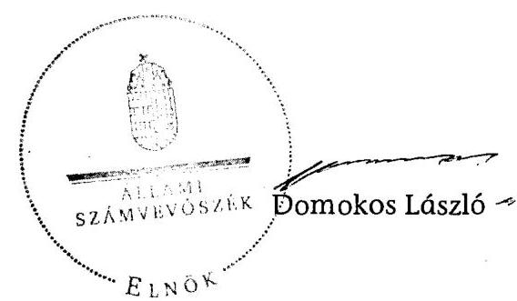

---

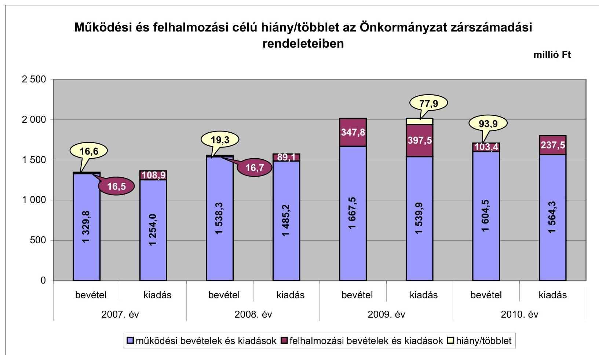

# CSENGER Város Önkormányzata

## 1. számú melléklet

### a V-3118-018/2012. számú Jelentéshez

|  Müködési és felhalmozási célú hiány/többlet az Önkormányzat zárszámadási rendeleteiben | millió Ft  |
| --- | --- |
|  2 500 | 16,6  |
|  1 229,6 | 12,9  |
|  1 168,9 | 19,3  |
|  1 485,2 | 16,7  |
|  1 667,5 | 16,7  |
|  1 539,9 | 16,7  |
|  1 664,5 | 16,7  |
|  1 564,3 | 16,7  |

☐ működési bevételek és kiadások ☐ felhalmozási bevételek és kiadások ☐ hiány/többlet

---

Az Önkormányzat bevételei és kiadásai, valamint adósságszolgálata 2007-2010 között

|   |  |  |  |  | mithit Ft  |
| --- | --- | --- | --- | --- | --- |
|  1. FOLYÓ KÖLTSÉGVETÉS* | 2007. év | 2008. év | 2009. év | 2010. év |   |
|  1.1.1. Saját működési bevételek | 208,6 | 272,8 | 319,2 | 365,7 |   |
|  1.1.2. Költségvetési támogatás | 495,1 | 850,1 | 886,4 | 814,6 |   |
|  1.1.3. Atengedett bevételek | 453,0 | 187,5 | 191,5 | 179,8 |   |
|  1.1.4. Állambártartáson belülről kapott támogatások | 165,3 | 220,4 | 205,2 | 200,7 |   |
|  1.1.5. EU-tól és külföldről kapott bevételek | 2,1 | 5,7 | 32,8 | 39,8 |   |
|  1.1.6. Állambáztartáson kívülről kapott bevételek | 3,8 | 1,2 | 0,4 | 0,6 |   |
|  1.1.7. Elúző évi pénzmaradvány átvétel | 1,9 | 0,7 | 32,0 | 3,2 |   |
|  1.1. Folyó bevételek $=1.1 .1 .+1.1 .2 .+1.1 .3 .+1.1 .4 .+1.1 .5 .+1.1 .6 .+1.1 .7$. | 1329,8 | 1538,3 | 1667,5 | 1604,5 |   |
|  1.2.1. Müködési kiadások kamatkiadások nélkül | 1005,9 | 1183,9 | 1237,3 | 1263,4 |   |
|  1.2.2. Állambáztartáson belülre átadott pénzeszközök | 11,0 | 27,7 | 5,3 | 12,1 |   |
|  1.2.3.1. vállalkozásoknak | 0,5 | 2,7 | 1,5 | 9,0 |   |
|  1.2.3.2. EU-nak, illetve külföldre | 0,0 | 0,0 | 0,0 | 0,0 |   |
|  1.2.3.3. magánszemélyeknek | 213,8 | 221,2 | 242,5 | 240,2 |   |
|  1.2.3.4. nonprofit szervezeteknek | 11,6 | 13,0 | 9,8 | 7,3 |   |
|  1.2.3. Transferkiadások ( $=1.2 .3 .1+1.2 .3 .2+1.2 .3 .3+1.2 .3 .4$ ) | 225,8 | 236,9 | 253,9 | 256,5 |   |
|  1.2.4 Kamatkiadások | 9,3 | 36,5 | 11,4 | 29,1 |   |
|  1.2.5. Elúző évi pénzmaradvány átadás | 1,9 | 0,2 | 32,0 | 3,2 |   |
|  1.2. Folyó kiadások $=1.2 .1 .+1.2 .2 .+1.2 .3 .+1.2 .4 .+1.2 .5$. | 1254,0 | 1485,2 | 1539,9 | 1564,3 |   |
|  1.3. Folyó költségvetés egyenlege MÜKÖDÉSI JÓVEDELEM (1.1. - 1.2.) | 75,8 | 53,1 | 127,7 | 40,1 |   |
|  2. FELHALMOZÁSI KÖLTSÉGVETÉS** | 0,0 | 0,0 | 0,0 | 0,0 |   |
|  2.1.1. Saját tökebevételek | 9,5 | 5,9 | 9,5 | 5,5 |   |
|  2.1.2. Állambáztartáson belülről kapott támogatások | 6,7 | 5,0 | 51,7 | 15,1 |   |
|  2.1.3. EU-tól és külföldről kapott támogatások | 0,3 | 5,8 | 285,9 | 80,3 |   |
|  2.1.4. Állambáztartáson kívülről kapott támogatások | 0,0 | 0,0 | 0,7 | 2,6 |   |
|  2.1. Felhalmozási bevételek ( $=2.1 .1 .+2.1 .2+2.1 .3+2.1 .4$.) | 16,5 | 16,7 | 347,8 | 103,4 |   |
|  2.2.1. Saját beruházási kiadás áfával | 80,3 | 52,1 | 52,4 | 172,6 |   |
|  2.2.2. Saját felújítási kiadás áfával | 15,1 | 5,9 | 331,3 | 18,1 |   |
|  2.2.3. Állambáztartáson belülre átadott pénzeszköz | 0,0 | 17,5 | 2,8 | 37,7 |   |
|  2.2.4. EU-nak és külföldnek adott pénzeszközök | 0,0 | 0,0 | 0,1 | 0,0 |   |
|  2.2.5. Állambáztartáson kívülre adott pénzeszközök | 13,1 | 13,6 | 10,8 | 8,1 |   |
|  2.2.6. Befektetési célú részesedések vásárlása | 0,5 | 0,0 | 0,1 | 1,0 |   |
|  2.2. Felhalmozási kiadások ( $=2.2 .1 .+2.2 .2 .+2.2 .3 .+2.2 .4 .+2.2 .5 .+2.2 .6$.) | 108,9 | 89,1 | 397,5 | 237,5 |   |
|  2.3. Felhalmozási költségvetés egyenlege (2.1. - 2.2.) | $-92,4$ | $-72,4$ | $-49,6$ | $-134,1$ |   |
|  3. Finanszírozási műveletek nélküli (GFS) pozíció(1.3.+2.3.) | $-16,6$ | $-19,3$ | 78,0 | $-93,9$ |   |
|  4. Finanszírozási műveletek | 0,0 | 0,0 | 0,0 | 0,0 |   |
|  4.1. Hitelfelvétel | 8,3 | 0,0 | 12,0 | 48,0 |   |
|  4.2. Hiteltörlesztés | 7,3 | 5,4 | 5,1 | 18,0 |   |
|  4.3. Forgatási és befektetési célú értékpapírok kibocsátása | 1000,0 | 0,0 | 0,0 | 0,0 |   |
|  4.4. Forgatási és befektetési célú értékpapírok beváltása | 0,0 | 0,0 | 0,0 | 0,0 |   |
|  4.5. Forgatási és befektetési célú értékpapírok értékesítése | 72,5 | 61,0 | 449,1 | 0,0 |   |
|  4.6. Forgatási és befektetési célú értékpapírok vásárlása | 44,5 | 457,5 | 0,0 | 200,0 |   |
|  4.7. Egyéb finanszírozási bevételek (függő, átfutó, kiegyenlítő) | 9,2 | 4,5 | 26,3 | $-45,7$ |   |
|  4.8. Egyéb finanszírozási kiadások (függő, átfutó, kiegyenlítő) | 14,8 | 2,7 | 66,2 | $-69,9$ |   |
|  4.9.Finanszírozási műveletek egyenlege (4.1. - 4.2.+4.3.-4.4+4.5.-4.6.+4.7.-4.8.) | 1023,5 | $-400,1$ | 416,1 | $-145,8$ |   |
|  5. Tárgyévi pénzügyi pozíció (1.3.+ 2.3.+4.9.) | 1006,9 | $-419,4$ | 494,1 | $-239,8$ |   |
|  6. Nettó müködési jövedelem =müködési jövedelem (1.3.) - töketörlesztés (4.2+4.4) | 68,5 | 47,7 | 122,6 | 22,1 |   |
|  TÁJÉKOZTATÓ ADATOK |  |  |  |  |   |
|  Összes kötelezettség | 1055,9 | 1228,0 | 1338,4 | 1565,5 |   |
|  ebből rövid lejáratú | 28,7 | 32,4 | 123,5 | 79,8 |   |
|  Összes szállítói kötelezettség | 4,9 | 8,1 | 94,0 | 30,8 |   |
|  ebből lejárt (tanúsítványból) | 0,3 | 0,0 | 42,6 | 5,1 |   |
|  Pénz és tókepiaci kötelezettség (adósság) | 1032,6 | 1200,7 | 1233,0 | 1529,3 |   |
|  ebből rövid lejáratú | 5,4 | 5,1 | 18,0 | 43,6 |   |
|  PPP szerződéses állomány jelenértéken (tanúsítványból) | 0,0 | 0,0 | 0,0 | 0,0 |   |
|  ebből lejárt szolgáltatási díj miatti kötelezettség | 0,0 | 0,0 | 0,0 | 0,0 |   |
|  Folyószámlatétel napi átlagos állománya (tanúsítványból) | 6,2 | 10,6 | 1,7 | 11,8 |   |
|  Likvidítétel napi átlagos állománya (tanúsítványból) | 0,0 | 0,0 | 0,0 | 0,0 |   |
|  Munkabérítétel napi átlagos állománya (tanúsítványból) | 0,0 | 0,0 | 0,0 | 0,0 |   |
|  Kezesség és garanciavállalások (tanúsítványból) | 0,0 | 0,0 | 0,0 | 0,0 |   |
|  Jogerős bírósági ítéletekből adódó kötelezettségek (tanúsítványból) | 0,0 | 0,0 | 0,0 | 0,0 |   |
|  Finanszírozásba bevonható eszközök: | 1123,0 | 1122,4 | 1179,1 | 1139,3 |   |
|  Tartós hitelviszonyt megtestesítő értékpapírok év végi állománya | 68,5 | 487,3 | 49,8 | 249,8 |   |
|  Hosszú lejáratú bankbetétek év végi állománya | 0,0 | 0,0 | 0,0 | 0,0 |   |
|  Értékpapírok év végi állománya | 0,0 | 0,0 | 0,0 | 0,0 |   |
|  Pénzeszközök (idegen pénzeszközök nélkül) év végi állománya | 1054,6 | 635,1 | 1129,3 | 889,5 |   |

[^0] [^0]: * Bevételekben nem térül, a kiadásokban nem jelenik meg az amortizáció, a vagyoni helyzetet az egyenleg befolyásolja ** Bevételekben vagyon megőrzésre és bővítésre fordítható források.

---

### Az Önkormányzat 2007-2010. években megvalósított, 2010. december 31-ig befejezett fejlesztései és azok forrásösszetétele

|  Fejlesztési feladat (beruházás, felújítás) |  | Beruházás, felújítás |  |  |  |  |  |  |  |  |  |  |  |  |  |  |  |  |  |  |  |  |  |  |  |  |  |  |  |  |  |  |  |  |  |  |  |  |  |  |  |  |  |  |  |  |  |  |  |  |  |  |  |  |  |  |  |  |  |  |  |  |  |  |  |  |  |  |  |  |  |  |  |  |  |  |  |  |  |  |  |  |  |  |  |  |  |  |  |  |  |  |  |  |  |  |  |  |  |  |  |  |

---

### Az Önkormányzat 2010. december 31-én folyamatban lévő fejlesztési feladataira 2010. december 31-ig teljesített kifizetések és azok forrásösszetétele

|   | Fejlesztési feladat (beruházás, felújítás) |  | Beruházás, felújítás |  |  |  |  |  |  |  |  |  |  |  |  |  |  |  |  |  |  |  |  |  |  |  |  |  |  |  |  |  |  |  |  |  |  |  |  |  |  |  |  |  |  |  |  |  |  |  |  |  |  |  |  |  |  |  |  |  |  |  |  |  |  |  |  |  |  |  |  |  |  |  |  |  |  |  |  |  |  |  |  |  |  |  |  |  |  |  |  |  |  |  |  |  |  |  |  |  |  |  | 

---

### **Az Önkormányzat 2010. december 31-én folyamatban lévő fejlesztési feladataira 2010. december 31-én fennálló kötelezettségek és azok forrásösszetétele**

|  Fejlesztési feladat (beruházás, felújítás) |  | Beruházás, felújítás |  |  |  |  |  |  |  |  |  |  |  |  |  |  |  |  |  |  |  |  |  |  |  |  |  |  |  |  |  |  |  |  |  |  |  |  |  |  |  |  |  |  |  |  |  |  |  |  |  |  |  |  |  |  |  |  |  |  |  |  |  |  |  |  |  |  |  |  |  |  |  |  |  |  |  |  |  |  |  |  |  |  |  |  |  |  |  |  |  |  |  |  |  |  |  |  |  |  |  |  | 

---

4. számú melléklet a 3118-018/2012. számú Jelentéshez

#### **Az önkormányzati feladatok ellátásában résztvevő gazdasági társaságok**

|  Gazdasági társaság megnevezése |  |  |  |  |  |  |  |  |  |  |  |  |  |  |  |  |  |  |  |  |  |  |   |
| --- | --- | --- | --- | --- | --- | --- | --- | --- | --- | --- | --- | --- | --- | --- | --- | --- | --- | --- | --- | --- | --- | --- | --- |
|   |  |  |  |  |  |  |  |  |  |  |  |  |  |  |  |  | a gazdasági társaságnak szerződéses kötelezettségre, feladat ellátási szerződésre |  |  |  |  |  |   |
|   |  |  |  |  |  |  |  |  |  |  |  |  |  |  |  |  | alapozottan az önkormányzat költségvetéséből nyújtott |  |  |  |  |  |   |
|   | önkormányzat | önkormányzat gazdasági társaságának | saját tőke, | kötelező | önként vállalt | hosszu lejáratú | lizingből | lejárt szállító | működési célra átadott pénzeszköz |  |  |  |  |  |  |  |  |  |  |  |  |  |   |
|   |  |  | aránya | feladathoz | feladathoz | feladathoz |  | állományból |  |  |  |  |  |  |  |  |  |  |  |  |  |  |   |
|   |  |  |  |  |  |  |  |  |  |  |  |  |  |  |  |  |  |  |  |  |  |  |   |
|   |  |  |  |  |  |  |  |  |  |  |  |  |  |  |  |  |  |  |  |  |  |  |   |
|   |  |  |  |  |  |  |  |  |  |  |  |  |  |  |  |  |  |  |  |  |  |  |   |
|   |  |  |  |  |  |  |  |  |  |  |  |  |  |  |  |  |  |  |  |  |  |  |   |
|   |  |  |  |  |  |  |  |  |  |  |  |  |  |  |  |  |  |  |  |  |  |  |   |
|   |  |  |  |  |  |  |  |  |  |  |  |  |  |  |  |  |  |  |  |  |  |  |   |
|  1. 100%-os tulajdoni hányadó gazdasági társaságok: |  |  |  |  |  |  |  |  |  |  |  |  |  |  |  |  |  |  |  |  |  |  |   |
|  |   |   |   |   |   |   |   |   |   |   |   |   |   |   |   |   |   |   |   |   |   |   |   |
|  Csengen Városüzemeltetési |  |  |  |  |  |  |  |  |  |  |  |  |  |  |  |  |  |  |  |  |  |  |   |
|  Nonprofit Kft. | 100,0 | 0,0 | 0,16 | 8,4 | 0,0 | 0,0 | 0,0 | 0,0 | 6,1 | 4,0 | 13,9 | 24,4 | 3,8 | 0,0 | 3,0 | 0,0 | 0,0 | 32,0 |  |  |  |  |   |
|  100%-os tulajdoni hányadó gazdasági társaságok |  |  |  |  |  |  |  |  |  |  |  |  |  |  |  |  |  |  |  |  |  |  |   |
|  összesen |  |  |  |  |  |  |  |  |  |  |  |  |  |  |  |  |  |  |  |  |  |  |   |
|  II. 75-99%-os tulajdoni hányadó gazdasági társaságok: |  |  |  |  |  |  |  |  |  |  |  |  |  |  |  |  |  |  |  |  |  |  |   |
|  |   |   |   |   |   |   |   |   |   |   |   |   |   |   |   |   |   |   |   |   |   |   |   |
|  75-99%-os tulajdoni hányadó gazdasági társaságok összesen |  |  |  |  |  |  |  |  |  |  |  |  |  |  |  |  |  |  |  |  |  |  |   |
|  75% feletti tulajdoni hányadó gazdasági társaságozás összesen |  |  |  |  |  |  |  |  |  |  |  |  |  |  |  |  |  |  |  |  |  |  |   |
|  III. 51-74%-os tulajdoni hányadó gazdasági társaságok: |  |  |  |  |  |  |  |  |  |  |  |  |  |  |  |  |  |  |  |  |  |  |   |
|  |   |   |   |   |   |   |   |   |   |   |   |   |   |   |   |   |   |   |   |   |   |   |   |
|  51-74%-os tulajdoni hányadó gazdasági társaságok összesen |  |  |  |  |  |  |  |  |  |  |  |  |  |  |  |  |  |  |  |  |  |  |   |
|  IV. egyéb, közfeladatot ellátó gazdasági társaságok: |  |  |  |  |  |  |  |  |  |  |  |  |  |  |  |  |  |  |  |  |  |  |   |
|  |   |   |   |   |   |   |   |   |   |   |   |   |   |   |   |   |   |   |   |   |   |   |   |
|  Dalkia Zrt. |  |  |  |  |  |  |  |  |  |  |  |  |  |  |  |  |  |  |  |  |  |  |   |
|  Nyír-Flop Kft. |  |  |  |  |  |  |  |  |  |  |  |  |  |  |  |  |  |  |  |  |  |  |   |
|  Nyírségvíz Zrt. |  |  |  |  |  |  |  |  |  |  |  |  |  |  |  |  |  |  |  |  |  |  |   |
|  Kristadanta Kft. |  |  |  |  |  |  |  |  |  |  |  |  |  |  |  |  |  |  |  |  |  |  |   |
|  egyéb, közfeladatot ellátó gazdasági társaságok összesen |  |  |  |  |  |  |  |  |  |  |  |  |  |  |  |  |  |  |  |  |  |  |   |
|  |   |   |   |   |   |   |   |   |   |   |   |   |   |   |   |   |   |   |   |   |   |   |   |
|  Összesen |  |  |  |  |  |  |  |  |  |  |  |  |  |  |  |  |  |  |  |  |  |  |   |
|  |   |   |   |   |   |   |   |   |   |   |   |   |   |   |   |   |   |   |   |   |   |   |   |