# ÁLLAMI   SZÁMVEVŐSZÉK 

## JELENTÉS

Demecser Város Önkormányzata pénzügyi helyzetének ellenőrzéséről (43/4)

---

# Állami Számvevőszék 

Iktatószám: V-3119-021/2012.
Témaszám: 1015
Vizsgálat-azonosító szám: V0560150

## Az ellenőrzést felügyelte:

Dr. Varga Sándor
számvevő igazgató-helyettes
Az ellenőrzést vezette:
Renkó Zsuzsanna
számvevő tanácsos
Ellenőrzési csoportvezető:
Lingné Rajz Borbála
számvevő tanácsos
Az ellenőrzést végezték:
Hegyes Mária Szabóné László Mária
számvevő tanácsos számvevő

---

# TARTALOMJEGYZÉK 

BEVEZETÉS ..... 9
I. ÖSSZEGZŐ MEGÁLLAPÍTÁSOK, KÖVETKEZTETÉSEK, JAVASLATOK ..... 13
II. RÉSZLETES MEGÁLLAPÍTÁSOK ..... 25

1. Az Önkormányzat kötelező és önként vállalt feladatai, a feladatellátás szervezeti keretei és annak változásai ..... 25
2. Az Önkormányzat pénzügyi egyensúlyi helyzetét befolyásoló tényezők ..... 29
2.1. A működési és a felhalmozási egyensúly változása ..... 31
2.2. Az Önkormányzat bevételeinek változása ..... 36
2.3. Az Önkormányzat működési és a felhalmozási célú kiadásainak változása ..... 40
3. Az Önkormányzat kötelezettségei ..... 43
3.1. Az Önkormányzat pénzintézetekkel szembeni kötelezettségeinek változása ..... 43
3.2. A szállítói kötelezettségek változása ..... 49
3.3. Egyéb kötelezettségek változása ..... 49
4. A pénzügyi egyensúly megteremtése érdekében hozott intézkedések eredménye ..... 52
5. Az ÁSZ által a korábbi években a pénzügyi egyensúly javítására tett szabályszerűségi és célszerűségi javaslatok hasznosulása ..... 55

---

# MELLÉKLETEK 

1. számú Működési és felhalmozási célú hiány/többlet a 2007-2010 közötti időszakban az Önkormányzat zárszámadási rendeleteiben (1 oldal)
2. számú Az Önkormányzat bevételei és kiadásai, valamint adósságszolgálata 2007-2010 között (1 oldal)
3/a. számú Az Önkormányzat 2007-2010. években megvalósított, 2010. december 31-ig befejezett fejlesztései és azok forrásösszetétele (1 oldal)
3/b. számú Az Önkormányzat 2010. december 31-én folyamatban lévő fejlesztési feladataira 2010. december 31-ig teljesített kifizetések és azok forrásösszetétele (1 oldal)
3/c. számú Az Önkormányzat 2010. december 31-én folyamatban lévő fejlesztési feladataira 2010. december 31-én fennálló kötelezettségek és azok forrásösszetétele (1 oldal)
3. számú Az önkormányzati feladatok ellátásában résztvevő gazdasági társaságok (1 oldal)
4. számú Demecser Város polgármesterének észrevétele (4 oldal)
5. számú Demecser Város polgármesterének észrevételére adott válasz (3 oldal)

---

# RÖVIDÍTÉSEK JEGYZÉKE 

## Törvények

Áht.
Art.
Gt.
Ötv.
Ptk.
Stabilitási törvény
Számv. tv.

## Rendeletek

Ámr.
$\mathrm{SzMSz}_{1}$
$\mathrm{SzMSz}_{2}$

## Szórövidítések

ÁSZ
CHF
DOC
EU
gazdasági társaság
GDP
jegyző
Képviselő-testület
OEP
ÖNHIKI támogatás
Önkormányzat
polgármester
Polgármesteri hivatal
PPP konstrukció
szja
az államháztartásról szóló 1992. évi XXXVIII. törvény
a 2003. évi XCII. törvény az adózás rendjéről
a gazdasági társaságokról szóló 2006. évi IV. törvény
a helyi önkormányzatokról szóló 1990. évi LXV. törvény
a Polgári Törvénykönyvről szóló 1959.évi IV. törvény
Magyarország gazdasági stabilitásáról szóló 2011. évi CXCIV. törvény
a számvitelről szóló 2000. évi C. törvény
az államháztartás működési rendjéről szóló 292/2009. (XII. 19.) Korm. rendelet

Demecser Város Önkormányzatának Szervezeti és Működési Szabályzatáról szóló 5/2008. (II. 15.) számú rendelete
Demecser Város Önkormányzatának Szervezeti és Működési Szabályzatáról szóló 17/2010. (XI. 4.) számú rendelete

Állami Számvevőszék
svájci frank
Demecseri Oktatási Centrum
Európai Unió
Demecseri Városgazda Szolgáltató Közhasznú Nonprofit Korlátolt Felelősségű Társaság
bruttó hazai termék
Demecser Város Önkormányzatának jegyzője
Demecser Város Képviselő-testülete
Országos Egészségbiztosítási Pénztár
Önhibájukon kívül hátrányos helyzetben levő települési önkormányzatok támogatása
Demecser Város Önkormányzata
Demecser Város Önkormányzatának polgármestere
Demecser Város Önkormányzatának Polgármesteri Hivatala Public Private Partnership (Partnerségi együttműködés közfeladatok ellátására a magánszektor bevonásával) személyi jövedelemadó

---

.

---

# ÉRTELMEZŐ SZÓTÁR 

banki kitettség
bevételi kitettség

BUBOR

CLF módszer

EURIBOR

GDP- Bruttó hazai termék
használhatósági fok
közfeladat

Az önkormányzat pénzügyi helyzete olyan külső körülmények hatására is módosulhat, amelyekre az önkormányzatnak nincs hatása, emiatt banki kitettsége keletkezik. Pl. rövid távú kötelezettségek fennállása esetén kizárólag a bank egyoldalú döntésén múlik, hogy továbbra is biztosít-e hitelt az önkormányzatnak, valamint azt milyen feltételekkel bocsátja az önkormányzat rendelkezésére.
Az önkormányzat pénzügyi helyzete olyan külső körülmények hatására is módosulhat, amelyekre az önkormányzatnak nincs hatása, emiatt bevételi kitettsége keletkezik. Pl. az önkormányzat bevételeinek alakulása függhet néhány nagy adózó gazdasági helyzetének, tevékenységének alakulásától, illetve székhelyének, telephelyének változásától.
Budapesti Bankközi Forint Hitelkamatláb. Mértékét az MNB naponta állapítja meg a banki kamatok figyelembevételével. Közzététele naponta történik.
Az önkormányzatok költségvetése elemzésének eszköze, a bevételek és kiadások, működés és fejlesztés elkülönítése. Bizonyos mértékig a vállalati gazdálkodás logikai elemeit érvényesíti az önkormányzatok pénzügyi jövedelmi helyzetének vizsgálata során. Következetesen elkülöníti a folyó és a felhalmozási költségvetés bevételeit és kiadásait, azok költségvetési egyenlegeit. A módszer a pénzügyi kapacitás fogalmát helyezi a középpontba.
A frankfurti bankközi piacon jegyzett, az Európai Központi Bank szabályainak megfelelően megállapított kínálati kamatláb. Az EURIBOR értékét a legfontosabb európai bankok hitelkínálatának kamatlábai alapján a Reuters ügynökség számolja ki és teszi közzé naponta. A magyar pénzintézetek is ezt használják viszonyítási alapnak EUR hitelek esetén.
A gazdaság által az adott időszakban előállított, végső felhasználásra szánt termékek és szolgáltatások piaci áron meghatározott értéke.
Az eszközgazdálkodás vizsgálatának elemzése során használt mutató. Számításakor a tárgyi eszköz könyv szerinti (nettó) értékét viszonyítják a tárgyi eszköz bruttó (beszerzési/létesítési) értékéhez. A %-ban kifejezett mutató csökkenése az eszköz állagának romlására, avulására utal, ami maga után vonja az üzemeltetési és fenntartási költségek növekedését is.
Állami, helyi, illetve kisebbségi önkormányzati feladat, amelynek ellátásáról az államnak, illetve az önkormányzatoknak kell gondoskodni. A hatályos szabályozás szerint közfeladatot törvény és önkormányzati rendelet állapíthat meg. Az önkormányzatok által ellátandó feladatok keretszerű meghatározását az Ötv. tartalmazza.

---

LIBOR
önkormányzat többségi tulajdonában lévő gazdasági társaságok
pénzügyi kockázat
visszafizetési kockázat

Angol kifejezés, a London Interbank Offered Rate rövidítése. Jelentése: Londoni bankközi, referencia jellegű kínálati (hitel) kamatláb.
Az önkormányzat a gazdasági társaságban a szavazatok több, mint ötven százalékával vagy a Ptk. 685/B. § (2)-(3) bekezdéseiben rögzített meghatározó befolyással rendelkezik. A helyi önkormányzat és az önkormányzat irányítása alá tartozó költségvetési szerv többségi tulajdonában, illetve többségi befolyása alatt álló gazdálkodó szervezet esetében hitelfelvétel, kölcsönfelvétel, garancia- vagy kezességvállalás, tartozásátvállalás, tartozáselengedés, értékpapír-kibocsátás, vásárlás, pénzügyi lízing, tartós bérleti szerződés, ingyenes vagyonjuttatás (így különösen: ajándékozás, ingyenes engedményezés), vagy követelésvásárlás, követelésengedményezés végrehajtására vonatkozóan az Áht. 100/M. § (4) bekezdése alapján az önkormányzat rendelkezik döntési jogosultsággal.
A belső működési kockázat egyik eleme. A költségvetési szerv működésének, tevékenységének, rövid távon ható velejáróinak része a tevékenységi, és emberi erőforrás kockázatokkal együtt. Megmutatkozhat a költségvetés nagyságrendjének, szerkezetének módosulásaiban, a bevételi, kiadási előirányzatok változásaiban, a nem megfelelő belső kontrollrendszer működése során, a tudatos károkozásokban, a biztosítások elmaradásában, a hibás fejlesztési döntésekben, a nem megfelelő forrásfelhasználásokban. A bevételek és kiadások ütemkülönbsége miatt is jelentkezhet.
Annak a kockázata, hogy a hitelt felvevőnél rendelkezésre állnak-e a visszafizetéshez, a hitel törlesztéséhez szükséges pénzügyi források. A visszafizetési kockázatot növeli a kamat- és árfolyamkockázat növekedése, mivel ezekben az esetekben az adósságszolgálat nőhet. Egy adott kötelezettség keletkezését megelőzően, illetve azt követően olyan pénzügyi helyzet állhat fenn, amely a kötelezettség visszafizetését korlátozhatja, meggátolhatja, ellehetetlenítheti. Visszafizetési kockázatot okozhat:

- a kötelezettségvállaláskor a visszafizetési forrás megjelölésének, tervezésének elmaradása;
- a visszafizetésre tervezett forrás elérésének, teljesítésének bizonytalansága (pl. a visszafizetéshez tervezett tartalékolás elmaradt, a tervezettnél alacsonyabb a saját bevétel, a helyi adóból származó bevétel az adóalanyok, adóalapok csökkenése miatt nem teljesül).

---

SNA
szállítói kitettség

System of National Accounts, azaz a Nemzeti Számlák Rendszere, amely a gazdasági szektorok által létrehozott valamennyi terméket és szolgáltatást figyelembe veszi.
Az önkormányzat pénzügyi helyzete olyan külső körülmények hatására is módosulhat, amelyekre az önkormányzatnak nincs hatása, emiatt szállítói kitettsége keletkezik. Pl. a lejárt szállítói tartozások rendezése függhet attól, hogy a szállító milyen intézkedéseket foganatosít az önkormányzattal szemben.

---

.

---

# JELENTÉS 

## Demecser Város Önkormányzata pénzügyi helyzetének ellenőrzéséről

## BEVEZETÉS

Az Állami Számvevőszék 2011. évtől érvényes stratégiája új irányt szabott a helyi önkormányzatok gazdálkodásának ellenőrzésében is. Az ÁSZ - küldetése és jövőképe szerint - szilárd szakmai alapokra támaszkodva értékteremtő ellenőrzéseivel és helyzetelemzéseivel az államháztartás egészében, így a helyi önkormányzati alrendszerben is elő kívánja segíteni a közpénzek és a közvagyon szabályos, gazdaságos, hatékony és eredményes felhasználását. E folyamat részeként - az államháztartási hiány alakulásának összetevőire is figyelemmel végezzük az önkormányzati alrendszer pénzügyi helyzetelemzését.

Az államháztartás helyi szintjén a 304 városnak ${ }^{1}$ az általuk ellátott közszolgáltatások volumenére is tekintettel a közfeladatok ellátásában kiemelt szerepe van. E települések 2011. január 1-jei népessége 3169 ezer fő volt.

Feladataik és hatásköreik az Ötv. mellett különböző ágazati törvények által meghatározottak, miközben a feladatellátás szervezeti kereteit - ezen belül a gazdasági társaságok közszolgáltatások ellátásában betöltött szerepét - saját maguk határozzák meg. A gazdasági társaságok által ellátott feladatok esetén a gazdálkodás, továbbá az önkormányzatok pénzügyi egyensúlyi helyzetére ható közvetlen kockázatok egy része kikerült az önkormányzati alrendszerből. A többségi önkormányzati tulajdonban lévő társaságok gazdálkodásának körülményei befolyásolhatják a városok pénzügyi egyensúlyi helyzetének megítélésében rejlő kockázatokat.

Az áttekintett időszakban az önkormányzati forrásszabályozás elvei lényegesen nem változtak. Az önkormányzatok gazdasági mozgásterét a központi költségvetéstől való függőség mellett jelentősen befolyásolja a helyi adókivetési jog gyakorlása. A városok gazdálkodási szabadságának lényeges eleme, hogy anyagi lehetőségeik függvényében dönthettek arról, hogy feladataik közül azokat, amelyek megoldására az Ötv. szerint a települési önkormányzat nem kötelezhető, a megyei önkormányzat fenntartásába adhatták. E döntések differenciáltan érintették a városok pénzügyi helyzetét.

[^0]
[^0]:    ${ }^{1}$ A megyei jogú városok nélkül figyelembe vett városok száma 304 városi önkormányzatot jelent.

---

A városi önkormányzatok 2007-2010 között teljesített bevételeinek alakulását és összetételét a következő ábra szemlélteti:

Az önkormányzati alrendszer pénzügyi helyzetértékelése során új elemzési módszereket alkalmazott az ellenőrzés. A költségvetési beszámoló adatok elemzése helyett az Önkormányzat pénzügyi helyzetét a CLF módszerrel értékeljük, amelynek lényegét és számításának módszerét a jelentés 2. pontjában, és a jelentés 2. számú mellékletében ismertetjük részletesen.

Az új módszereken alapuló helyzetértékelés fontosságát az adja, hogy a helyi önkormányzatok bruttó adósságállománya ${ }^{2}$ a 2010. évi költségvetési beszámolók alapján 1248 milliárd Ft-ot tett ki. Ezen belül a 304 város adóssága 383 milliárd Ft volt, amely az önkormányzati alrendszer teljes adósságállományának 30,7%-át jelentette ${ }^{3}$.

A mérlegben kimutatott bruttó adósságállomány mellett az önkormányzatok számára az eszközállomány műszaki állapotának megőrzése is előbb-utóbb pénzügyi kötelezettséget jelent. Az elhasználódott eszközök pótlására forrást biztosító amortizációs (felújítási) alap képzésének ${ }^{4}$ elmaradása maga után vonhatja a feladatellátást kiszolgáló tárgyi eszközök állagának erőteljes romlását.

[^0]
[^0]:    ${ }^{2}$ Az önkormányzati mérlegbeszámolókból számított bruttó adósságállomány 2010. év végi összege magában foglalja a fejlesztési és a működési célú kötvénykibocsátások, a beruházási és fejlesztési hitelek, a működési célú hosszú lejáratú hitelek, a rövid lejáratú hitelek, váltótartozások miatti kötelezettségek teljes (2011-ben, illetve az azt követő években esedékes) állományát. Az önkormányzatok 2007. év végi mérleg szerinti adósságállománya 692 milliárd Ft volt.
    ${ }^{3}$ A fővárosi és a kerületi önkormányzatok adósságának figyelmen kívül hagyásával számított 977 milliárd Ft összegű bruttó adósságállományból a városok 39,2%-kal részesedtek.
    ${ }^{4}$ Erre a jelenlegi szabályozási környezetben nem kötelezi előírás az önkormányzatokat.

---

Emellett a 2007-2013-as időszakra meghirdetett, vissza nem térítendő EU-s fejlesztési forrásokhoz való hozzájutás lehetősége felerősítette az önkormányzati alrendszer fejlesztési igényeit, amelyek a felhalmozási költségvetési hiány folyamatos emelkedésén túl - az előírt jövőbeni fenntartási kötelezettség miatt tovább terhelhetik az önkormányzatok költségvetését ${ }^{5}$.

Az ÁSZ a 2011. évi ellenőrzési tervében 43. számú, az önkormányzatok gazdálkodási rendszerének ellenőrzése részeként áttekinti, és elemzi az önkormányzatok pénzügyi helyzetét. A gazdálkodás szabályszerűségét az ÁSZ az előző évek során ebben az önkormányzati körben is ellenőrizte. Jelen vizsgálatunk a tett javaslataink pénzügyi helyzetet érintő pontjainak hasznosítására utóellenőrzés jelleggel tér ki.

Az ellenőrzés megállapításait az Önkormányzat által kitöltött - teljességi nyilatkozattal megerősített - 27 tanúsítványon szolgáltatott adatokra alapoztuk. Ellenőrzési bizonyítékként használtuk fel továbbá:

- a képviselő-testületi és bizottsági előterjesztéseket, a döntés-előkészítés során készített dokumentumokat;
- a kötelezettségvállalások dokumentumait;
- a pénzügyi-számviteli nyilvántartásokat;
- az éves költségvetési beszámolókat;
- a költségvetési és zárszámadási rendeleteket.

Az ellenőrzés a 2007. január 1 - 2011. június 30. közötti időszakot öleli fel. A pénzintézetekkel szembeni kötelezettségek állományának vizsgálatakor az ellenőrzött időszak 2006. december 31 - 2011. június 30. közötti időszakra terjedt ki.

Az ellenőrzés során vizsgáltunk minden olyan körülményt és adatot, amely a program végrehajtásához kapcsolódott és a pénzügyi helyzet alakulására hatást gyakorló releváns tények és folyamatok feltárásához szükségessé vált.

# Az ellenőrzés célja annak értékelése volt, hogy: 

- a vizsgált időszakban a kötelező- és önként vállalt feladatok ellátását biztosító szervezeti keretekben, a feladatellátás módjában bekövetkezett változások milyen hatást gyakoroltak az Önkormányzat pénzügyi helyzetének alakulására;

[^0]
[^0]:    ${ }^{5}$ Az Állami Számvevőszék 2011 júniusában közzétett 1108. számú, a helyi önkormányzatok fejlesztési célú támogatási rendszerének ellenőrzéséről szóló jelentésében feltárta a fejlesztési folyamatok problémáit. A helyi önkormányzatok elsősorban azokat a fejlesztéseket valósították meg, amelyekhez támogatást lehetett igényelni. A fejlesztési célok közül a magasabb támogatási intenzitású pályázatokat részesítették előnyben. A fejlesztéssel megvalósuló létesítmények jövőbeli üzemeltetésének várható ráfordításait az önkormányzatok $71,9 \%$-a nem mérte fel.

---

- az Önkormányzat pénzügyi - ezen belül működési és felhalmozási - egyensúlya mely tényezők hatására miként változott, és az Önkormányzat milyen intézkedéseket tett a pénzügyi egyensúly javítása érdekében;
- a költségvetési kiadások finanszírozása érdekében vállalt pénzintézetekkel szembeni kötelezettségek hogyan alakultak, továbbá milyen kötelezettségek fennállása befolyásolja az Önkormányzat jövőbeli pénzügyi helyzetét;
- hasznosultak-e a gazdálkodási rendszer korábbi ellenőrzése során a pénzügyi egyensúly javítására az ÁSZ által tett szabályszerűségi és célszerűségi javaslatok.

Az ellenőrzés típusa: szabályszerűségi vizsgálat.
A vizsgálat jogszabályi alapját az Állami Számvevőszékről szóló 2011. évi LXVI. törvény 1. § (3), 5. § (2)-(6) bekezdései, továbbá az Áht. 120/A. § (1) bekezdése előírásai képezik.

Demecser település Szabolcs-Szatmár-Bereg megyében, a Lónyai csatorna északi oldalán fekszik. Adottságai folytán a Rétköz természetes központja. Állandó lakosainak száma 2010. január 1-jén 4304 fő volt.

A Képviselő-testületet a polgármesterrel együtt hét fő alkotja. A Képviselőtestület munkáját három bizottság segíti. A polgármester a 2003. november 16-i helyi időközi választások óta tölti be tisztségét, a jegyző 2011. január 1-jétől lépett hivatalba.

A város alapellátó intézményekkel teljes körűen ellátott. Középfokú tanintézménnyel rendelkezik, 20 községből fogad tanulókat. Területi feladatot lát el gimnáziuma, orvosi rendelője, gyógyszertára, rendőrőrse, szennyvíztisztító műve, hulladéklerakó telepe.

Az Önkormányzat közel 2 milliárd forintos nagyságrendű költségvetéssel rendelkezik. Vagyona 6,5 milliárd forintos értéket képvisel.

---

# I. ÖSSZEGZŐ MEGÁLLAPÍTÁSOK, KÖVETKEZTETÉSEK, JAVASLATOK 

Az Önkormányzat - adatszolgáltatása szerint - a 2010. év működési költségvetési kiadásaiból ( 1480,5 millió Ft) 1276,2 millió Ft-ot ( $86,2 \%$ ) a kötelező feladatok, 204,3 millió Ft-ot ( $13,8 \%$ ) az önként vállalt feladatok ellátására fordított. Az önként vállalt feladatok a gimnáziumi, szakközépiskolai, szakiskolai oktatáshoz, valamint a közművelődési intézmény, az alapfokú művészetoktatási intézmény és pedagógiai szakszolgálat fenntartásához kapcsolódtak. Az Önkormányzat SzMSz-ében a kötelező és önként vállalt feladatok köre meghatározásra került. A feladatok kötelező és önként vállalt jellege szerinti besorolást az Önkormányzat maga végezte el.

Az Önkormányzat feladatellátásának szervezeti kereteit az alábbi ábra szemlélteti:
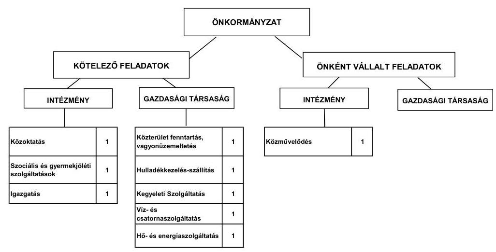

Az Önkormányzat feladatait 2011. június 30-án (a Polgármesteri hivatallal együtt) négy költségvetési szervvel, egy kizárólagos tulajdonában álló gazdasági társaságával, valamint négy, közszolgáltatási szerződés keretében megbízott gazdasági társaság közreműködésével látta el. A közoktatás területén 2007. július 15-től, valamint a szociális területen 2008. május 30-tól megvalósult intézményfenntartó társulás keretében történő feladatellátás eredményeként a telephelyek száma a 2007. évi kilencről a 2011. év I. félévének végére 16-ra nőtt. Az Önkormányzat gesztorként vesz részt a társulásokban.

A feladatátvételek hatására az Önkormányzat kiadásai és bevételei egyaránt 469,1 millió Ft-tal növekedtek.

Feladatátadásra a 2007. és 2011. június 30. közötti időszakban nem került sor, egyéb intézkedések (intézményi átszervezés, feladatátrendezés, kiszervezés, kiszerződés) nem történtek.

---

A vizsgált időszakban a kötelező és önként vállalt feladatok ellátását biztosító szervezeti keretekben, a feladatellátás módjában bekövetkezett változások nem veszélyeztették az Önkormányzat pénzügyi egyensúlyi helyzetét.

Az Önkormányzat egy gazdasági társaságban kizárólagos tulajdonnal rendelkezett. A gazdasági társaság az önkormányzati ingatlanok üzemeltetése, a köz-terület-fenntartás, valamint a hulladékkezelés és -szállítás területén kapott szerepet az önkormányzati feladatellátásban. A gazdasági társaság működéséhez az ellenőrzött időszakban összesen 100,9 millió Ft rendszeres működési célú pénzeszközt adott át az Önkormányzat.

Az Önkormányzat által 2010-ben működési kiadásokra fordított 1480,5 millió Ft 39,9\%-a intézményi körben, 60,1\%-a a Polgármesteri hivatalnál merült fel.

Az egyes közszolgáltatások feladatellátásában résztvevő intézmények működési kiadásai finanszírozásának forrásait ágazatonként a következő ábra szemlélteti:
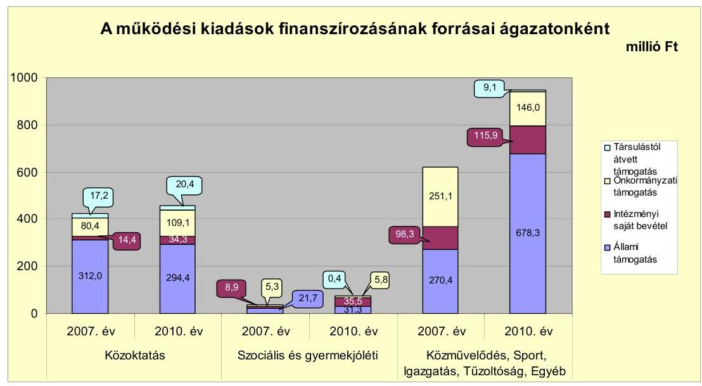

A közoktatási ágazatban az ellátotti létszám 10,7\%-os (120 fő) emelkedése eredményeként 34,2 millió Ft-tal nőtt az ágazati kiadások összege. A központi forrásszabályozás változása miatt - a létszámnövekedés ellenére - 9,3 százalékponttal csökkent az állami támogatás finanszírozási aránya. Az állami támogatás arányának csökkenését az intézményi saját bevételek és az önkormányzati támogatások növekvő mértéke ellensúlyozta.

A szociális és gyermekjóléti ágazat működési kiadásai - a 2008. május 30-tól megvalósult társulás keretében történő feladatellátás eredményeként 37,1 millió Ft-tal emelkedtek. A kiadások finanszírozását tekintve az állami támogatásból történő finanszírozás arányának 17,5 százalékpontos csökkenése mellett 23,8 százalékponttal nőtt az intézményi saját bevételből történő finanszírozás aránya. Az intézményi saját bevétel emelkedését az ellátotti létszám növekedése idézte elő.

---

A közművelődés, sport, igazgatás és egyéb feladatok kiadásai 329,5 millió Ft-tal (53,2\%-kal) emelkedtek. A kiadások növekedéséhez a közel 400 főt érintő közcélú foglalkoztatás költségei is hozzájárultak. A foglalkoztatáshoz kapcsolódóan az Önkormányzat a központi költségvetésből 401,0 millió Ft összegű támogatásban részesült.

Az Önkormányzat folyó költségvetés egyenlegét, működési jövedelmét, tőketörlesztését, pénzügyi kapacitását az alábbi ábra mutatja:
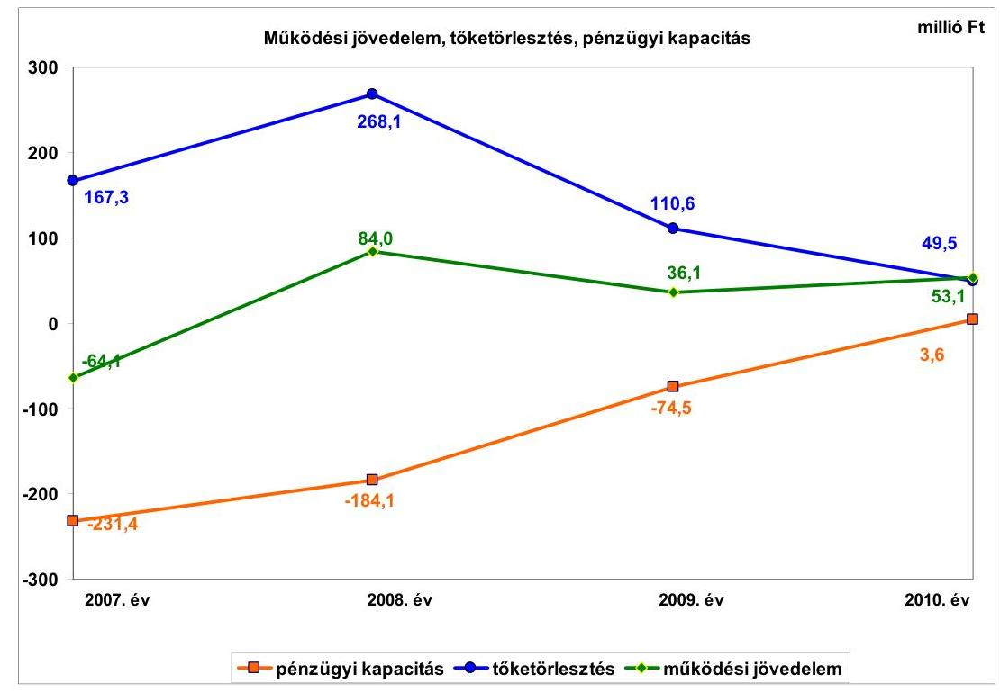

Az Önkormányzat folyó költségvetési egyenlege, működési jövedelme 2007-ben negatív előjelű volt, az előző évhez viszonyítva 2008-ban 148,1 millió Ft-tal emelkedett, 2009-ben 47,9 millió Ft-tal csökkent, 2010-ben 17,0 millió Ft-tal nőtt. A folyó költségvetés egyenlege 2007-ben -64,1 millió Ft volt, a folyó kiadások 5,6\%-ára a folyó bevételek nem biztosítottak fedezetet. A működési forrástöbblet a folyó kiadásokon belül 2008-ban 6,7\% (84,0 millió Ft), 2009-ben 2,4\% (36,1 millió Ft), 2010-ben 3,5\% (53,1 millió Ft) arányt képviselt. A vizsgált időszakban a működési jövedelem összesen 109,1 millió Ft többletet mutatott.

Az Önkormányzat 2007-2010-ben működőképességének megőrzésére összesen 201,6 millió Ft vissza nem térítendő, kiegészítő támogatásban részesült, amelyből 73,8 millió Ft-ot ÖNHIKI támogatásként, 127,8 millió Ft-ot a működésképtelen helyi önkormányzatok egyéb támogatása jogcímen kapott. Az Önkormányzat működési jövedelme a működőképességének megőrzésére juttatott költségvetési támogatások nélkül 2007-ben -109,9 millió Ft, 2008-ban 29,0 millió Ft, 2009-ben - 20,3 millió Ft, 2010-ben 8,7 millió Ft, a vizsgált időszakban az összes működési hiány -92,5 millió Ft lett volna.

Az Önkormányzat pénzügyi kapacitása (nettó működési jövedelem) a vizsgált időszakban emelkedő tendenciát mutatott, de csak 2010-ben ért el pozitív értéket. A nettó működési jövedelem értéke 2007-ben -231,4 millió Ft,

---

2008-ban -184,1 millió Ft, 2009-ben -74,5 millió Ft, 2010-ben 3,6 millió Ft volt. 2007-ben és 2008-ban a korábbi évek hiteleiből eredő adósságszolgálat, 2009-ben és 2010-ben a csökkenő működési jövedelem okozta a pénzügyi kapacitás negatív, illetve nulla közeli értékét. Az Önkormányzat pénzügyi kapacitása a működőképességének megőrzésére juttatott költségvetési támogatások nélkül 2007-ben -277,2 millió Ft, 2008-ban -239,1 millió Ft, 2009-ben -130,9 millió Ft, 2010-ben -40,8 millió Ft lett volna. Az Önkormányzatnál (a CLF módszer alapján) a vizsgált időszakban nem képződött elegendő működési jövedelem az adósságszolgálat teljesítésére, valamint a fejlesztési kiadások fedezetére, és - változatlan nettó működési jövedelem képződése mellett - nem biztosít fedezetet a jövőbeni adósságszolgálat teljesítésére és a jövőbeni fejlesztési kiadásokra sem.

Az Önkormányzat felhalmozási költségvetésének egyenlege 2007-ben -438,2 millió Ft-os, 2010-ben -104,6 millió Ft-os - a 2008. és 2009. évi minimális többlettel számolva -, 2007-2010 között összesen 534,2 millió Ft felhalmozási forráshiányt mutatott. Az adósságszolgálat, továbbá a felhalmozási forráshiány 2007-2010 között 1129,7 millió Ft-ot tett ki, amelyre a 2006. december 31-én rendelkezésre álló 7,1 millió Ft pénzkészlet és a 2007 előtt felvett fejlesztési hitelek még fel nem használt része, továbbá a 2007-ben kibocsátott 600,0 millió Ft CHF kötvény szolgált fedezetül. A fejlesztések megvalósításába az Önkormányzat átmenetileg az igénybe vett folyószámlahitelt is bevonta.

A pénzügyi egyensúly fenntartása külső források bevonásával volt biztosítható. A 2007-2010. években 595,5 millió Ft hitelt törlesztettek, ebből 23,9 millió Ft volt a kötvény visszavásárlása miatt fizetendő kötelezettség. A kötvényből eredően 42,2 millió Ft kamatfizetési kötelezettség és 8,4 millió Ft egyéb költség terhelte az Önkormányzatot.

Az Önkormányzat pénzintézetekkel szemben fennálló kötelezettségeinek növekedése következtében 2007. és 2011. június 30. között összesen (a kötvény kamataival együtt) 92,0 millió Ft kamatot fizetett meg. A kamatkiadások a 2009. év kivételével minden évben meghaladták a kamatbevételeket. A kötvényből származó, átmenetileg szabad pénzeszközök pénzügyi befektetéséből realizált kamatbevétel 60,8 millió Ft volt, ami a kamatráfordítások 66,1\%-ának felelt meg.

Az Önkormányzat 2010. évi folyó bevételei a 2007-2009. évek átlagos évenkénti bevételeihez képest 258,7 millió Ft-tal (19,5\%-kal) nőttek. A 2011. év I. félévében - a 2010. év azonos időszakának adataihoz viszonyítva 171,2 millió Ft-os ( $21,6 \%$-os) bevétel elmaradás valósult meg. A bevételek összetételét tekintve - a társulás keretében történő feladatellátás és az Önkormányzat kiegészítő támogatásai hatására - a központi források (költségvetési támogatás és átengedett szja) folyamatosan emelkedtek. A két forrás együttes alakulását tekintve 2007-2011. év I. féléve között 225,6 millió Ft-os központi támogatás- növekedés történt. A központi támogatások összegének emelkedése mellett a helyi adókból származó bevétel is növekedett. E bevételi forrásból 2010-ben - a megelőző három év átlagához képest - 14,7 millió Ft-tal több folyt be. Helyi adókból és azokhoz kapcsolódó pótlékokból a 2011. év I. félévében 24,2 millió Ft volt a bevétel. Az előző év azonos időszakának bevételeit tekintve ez 7,8 millió Ft-os ( $24,4 \%$-os) bevétel elmaradást jelent. A pénzügyi

---

egyensúlyi helyzetre hatást gyakorló kockázati tényező, hogy a helyi iparűzési adóbevétel jelentős része egy adózótól származik.

Az Önkormányzat 2010. évi folyó kiadásainak összege a 2007-2009. évek átlagához viszonyítva 224,2 millió Ft-tal ( $17,2 \%$-kal) volt magasabb. A növekedés oka a (kamatkiadás nélküli) működési kiadások 48,3\%-os ( 929,5 millió Ft-ról 1378,9 millió Ft-ra) növekedése volt. Az Önkormányzat 2010-ben a működési kiadások 76,9\%-át (1059,7 millió Ft) személyi juttatásokra és a munkaadókat terhelő járulékokra fordította, a dologi kiadások 22,0\%-kal (302,7 millió Ft) részesedtek a működési kiadásokból.

A személyi juttatások minden évben emelkedtek az előző évhez viszonyítva, a 2010. évi összegük 76,5\%-kal (379,4 millió Ft-tal) volt magasabb a 2007. évinél. A munkaadókat terhelő járulékok a személyi juttatásoknál alacsonyabb arányban nőttek, mivel 2009-től a foglalkoztatókat terhelő járulékok mértéke csökkent. A dologi kiadások az Önkormányzatnál a 2010. év kivételével az előző évhez viszonyítva minden évben az inflációt meghaladó mértékben nőttek, 2010-ben a 2007-2009. évek átlagánál 28,5 millió Ft-tal (10,4\%-kal) voltak magasabbak. A növekedésben a társulásos feladatellátás bővülése játszott szerepet, amit bevételi oldalon kompenzált a feladatellátáshoz nyert ösztönző hozzájárulás, illetve a körjegyzőség működéséhez biztosított normatív támogatás.

Az Önkormányzat 2007-ben - két, korábbi években elindított beruházás következtében - kiemelkedően nagy összegű, 1049,9 millió Ft felhalmozási célú költségvetési kiadást teljesített, amelynek finanszírozása a további évekre nézve is nagymértékben megterhelte költségvetését. Ennek következményeként az Önkormányzat felhalmozási kiadásai 2008 és 2010 között jelentősen csökkentek, arányuk az összes költségvetési kiadásokhoz viszonyítva 6,7\% és 10,9\% közötti volt.

A befejezett fejlesztéseket 25,2\%-ban (345,6 millió Ft) pénzintézeti forrásokból fedezték. A 2007-2010. évek időszakában az 1373,7 millió Ft értékű fejlesztés és felújítás forrása a saját erő, a hazai és EU-s támogatások mellett 2007. előtt felvett 56,0 millió Ft fejlesztési hitel (4,1\% ), illetve 289,6 millió Ft kötvénykibocsátásból származó forrás (21,1\% ) volt. A 2010. december 31-én folyamatban lévő fejlesztési feladatok végrehajtására 2007-2010 között 88,0 millió Ft kiadást teljesítettek, amelyre a kötvényforrásból 29,1 millió Ft-ot (33,1\%) fordítottak. A támogatásokból megvalósult fejlesztések finanszírozása likviditási gondokat okozott, amelynek megoldására az Önkormányzat 2007-ben összesen 143,6 millió Ft összegű támogatás-megelőző (rövid lejáratú) hiteleket vett igénybe.

A 2010. december 31-én folyamatban lévő fejlesztési feladatok 2010. évet követő kötelezettségvállalásainak összege 10,0 millió Ft volt, amelyet kizárólag saját forrásból tervezett biztosítani az Önkormányzat. 2011-ben az Önkormányzat új fejlesztés indítását nem tervezte.

Az Önkormányzat mérleg szerinti pénzintézetekkel szembeni kötelezettsége a 2006. év végéről a 2011. év I. félév végére közel nyolcszorosára, 111,8 millió Ft-ról 870,7 millió Ft-ra nőtt, amelyből a CHF árfolyamváltozás

---

miatti árfolyam-különbözet 252,1 millió Ft volt. A fennálló pénzintézetekkel szembeni kötelezettségek egy kötvénykibocsátásból (CHF), illetve folyószámlahitel és munkabér-megelőlegezési hitel igénybevételéből keletkeztek. Az Önkormányzat az elfogadott 2011. évi költségvetési rendelete alapján csak folyószámlahitel és munkabér-megelőlegezési hitel felvételét tervezte 100,0 millió Ft keretösszeggel, amelyeket június 30-ig folyamatosan igénybe vett.

Az Önkormányzat kötelezettségvállalásaira a Képviselő-testület döntései alapján került sor, azonban a döntéseket előkészítő előterjesztésekben nem mutatták be a teljes időszakra vonatkozóan a kamat- és - a devizaalapú kötelezettségeket érintő - árfolyamkockázatot.

Az Önkormányzat 2007-ben 600,0 millió Ft értékben 20 éves lejáratú, CHF kötvényt bocsátott ki, amelynek visszafizetését 2010-ben kezdte meg. 2027-ig az évenkénti visszafizetési kötelezettség összege 219,2 ezer CHF. Az Önkormányzat a kötvényt a tervezett céloknak megfelelően, a Képviselő-testület által jóváhagyott, a költségvetési rendeletekben megtervezett beruházásokhoz, felújításokhoz, valamint a korábban felvett, a kötvényforrástól magasabb kamatozású hitelek futamidő lejárata előtti visszafizetésére használta fel. Az Önkormányzat a kötvénykibocsátásból származó - CHF-ben fennálló - kötelezettségéből 2011. június 30-ig 219,2 ezer CHF (47,4 millió Ft) tőkét törlesztett, és 259,8 ezer CHF (46,1 millió Ft) kamatot fizetett. A vizsgált években öt hosszú lejáratú, forint alapú hitelét fizette vissza az Önkormányzat, a 2007-2011. év I. féléve között átmenetileg szabad pénzeszközeiből 60,8 millió Ft kamatbevételt realizált.

Az Önkormányzat az árfolyamváltozás miatti év végi értékelést a 2008. és 2009. évi mérlegkészítéskor nem végezte el, a tartós (éven túli) és jelentős árfolyamveszteség miatti kötelezettség-növekedést nem mutatta ki. A 2010. évi mérlegben az év végi értékelést elvégezték, a kibocsátáskori és a 2010. december 31-i CHF árfolyam-különbözet összegével az Önkormányzat kötvénykibocsátásból származó tartozását növelték. A kötvénytartozás 2011-ben esedékes törlesztő részleteinek összegét nem sorolták át a rövid lejáratú kötelezettségék közé, ezáltal az Önkormányzat nem tett eleget a Számv. tv. 42. § (2) és (3) bekezdése rendelkezéseinek.

Az Önkormányzat fizetőképessége megőrzését a vizsgált időszakban folyószámlahitel, munkabér-megelőlegezési hitel és öt alkalommal, összesen 143,6 millió Ft rövid lejáratú támogatásmegelőző hitel igénybevételével tudta biztosítani. Utóbbiakat 2007-ben vette fel, és 2007-ben, illetve 2008-ban fizette vissza.

A folyószámlahitel és munkabér-megelőlegezési hitel igénybevétele a 2007-2011. év I. félévében az alábbiak szerint alakult:

| Megnevezés | 2007. év | 2008. év | 2009. év | 2010. év | 2011. év   I. félév |
| :-- | :--: | :--: | :--: | :--: | :--: |
| Folyószámlahitel |  |  |  |  |  |
| Keretösszeg január 1-jén (millió Ft-ban) | 50,0 | 50,0 | 50,0 | 50,0 | 70,0 |
| Átlagos napi állomány (millió Ft-ban) | 35,1 | 43,3 | 35,2 | 37,2 | 63,6 |
| Folyószámla hitellel zárt napok száma (nap) | 384 | 385 | 382 | 385 | 181 |
| Egyenleg (állomány) | 6,3 | 24,1 | 36,0 | 42,5 | 57,8 |
| Munkabér-megelőlegezési hitel |  |  |  |  |  |
| Keretösszeg január 1-jén (millió Ft-ban) | 27,0 | 30,0 | 30,0 | 30,0 | 30,0 |
| Átlagos napi állomány (millió Ft-ban) | 27,0 | 29,8 | 28,1 | 28,2 | 28,0 |
| Munkabér-megelőlegezési hitellel zárt napok száma (nap) | 350 | 382 | 342 | 319 | 169 |
| Egyenleg (állomány) | x | x | x | 0,0 | 30,0 |

---

A likviditás biztosítása az Önkormányzatnak 22,8 millió Ft kamatkiadás és egyéb költség megfizetését eredményezte. Az Önkormányzat 2011. év I. félév végi szállítói tartozása 91,1 millió Ft, melyből lejárt tartozása 84,0 millió Ft volt.

A Képviselő-testület a folyószámlahitel biztosítékaként 30,5 millió Ft - számviteli nyilvántartás szerinti nettó értékű - jelzálogjog alapításához és bejegyzéséhez járult hozzá. A jelzálogszerződéssel érintett ingatlanok a forgalomképes ingatlanok 34,6\%-át tették ki. 2011. június 30-án jelzálog az Önkormányzat 11 ingatlanára volt bejegyezve.

Az Önkormányzat kötelezettségeinek 2010. december 31-ei, valamint 2011. június 30-ai állományát és a további években várható alakulását a kötelezettségek lejáratáig a következő táblázat szemlélteti:

| Megnevezés | $\begin{gathered} \text { Állomány } \\ \text { 2010. december 31-én } \end{gathered}$ |  | $\begin{gathered} \text { Állomány } \\ \text { 2011. június 30-án } \end{gathered}$ |  | Várható kötelezettség 2011-2013. években |  | Várható kötelezettség 2014. évtól |  |
| :--: | :--: | :--: | :--: | :--: | :--: | :--: | :--: | :--: |
|  | HUF-ban (millió. Ft-ban) | Devizában (összegy. ezer CHF-ban) | HUF-ban (millió Ft-ban) | Devizában (összegy. ezer CHF-ban) | HUF-ban (millió Ft-ban) | Devizában (összegy. ezer CHF-ban) | HUF-ban (millió Ft-ban) | Devizában (összegy. ezer CHF-ban) |
| Pénzintézet kötelezettségeit |  |  |  |  |  |  |  |  |
| Nemecszei 2027 Kóházig |  | 3726,9 |  | 3617,3 |  | 633,6 |  | 3302,6 |
| Pénzintézetekkel | 42,5 |  | 67,8 |  | 67,8 |  |  |  |
| Munkabér megelőlegeziké Hitel |  |  | 30,0 |  | 30,0 |  |  |  |
| Pénzintézet kötelezettségeit összesen HUF-ban | 42,5 |  | 67,8 |  | 67,8 |  |  |  |
| Pénzintézet kötelezettségeit összesen CHF-ben |  | 3726,9 |  | 3617,3 |  | 633,6 |  | 3302,6 |
| Szállítói tartozás | 152,0 |  | 91,1 |  | 91,1 |  |  |  |
| Összesen: | 174,5 | 3726,9 | 178,9 | 3617,3 | 178,9 | 633,6 |  | 3302,6 |

Az Önkormányzatnak pénzintézetekkel szemben fennálló kötelezettsége a 2011. év I. félév végén 87,8 millió Ft és 3617,3 ezer CHF volt. A kötelezettségekből a 2011-2013. években fizetendő (tőke, kamat és egyéb költség) a legutóbbi kamatfizetés feltételei alapján 633,6 ezer CHF, illetve 87,8 millió Ft. Az Önkormányzatnak 2011. június 30-án szállítói tartozásokból 91,1 millió Ft fizetési kötelezettsége volt. A 2011-2013. évek kötelezettségeinek teljesítésére figyelembe vehető 116,4 millió Ft mérlegben kimutatott, vevők által elismert követelésállomány. A 2014. évet követően az Önkormányzat jelenleg ismert pénzintézetekkel szembeni kötelezettsége 3302,6 ezer CHF. Az Önkormányzat tájékoztatása szerint figyelembe vehető további források a mindenkori költségvetési rendeletekben megtervezett önkormányzati helyi adóbevételek, azonban új adónem bevezetésére, illetve az adómértékek növelésére 2011-ben nem került sor. A 2014. után esedékes, jelenleg ismert pénzintézetekkel szembeni kötelezettségek (3302,6 ezer CHF) teljesítése nem minősíthető biztosítottnak, mivel az Önkormányzatnál nem képződik számottevő működési jövedelem.

Az Önkormányzat lejárt szállítói állománya 2011. június 30-án 84,0 millió Ft volt, melyből a 90 napot meghaladó állomány 43,8 millió Ft volt. A helyi önkormányzatok adósságrendezéséről szóló törvény szerint a polgármester kötelezettsége, hogy kezdeményezze a döntést a Képviselő-testületnél az adósságrendezési eljárás megindításáról.

Az önkormányzati kötelezettségek növekedése mellett az Önkormányzat minősített többségi befolyásával rendelkező gazdasági társasága kötelezettségei is befolyásolhatják az Önkormányzat jövőbeni pénzügyi egyensúlyát. Az Ön-

---

kormányzat kizárólagos tulajdonában álló gazdasági társasága kötelezettségeinek 2011. június 30-ai állománya 1,6 millió Ft lízingtartozás és 4,6 millió Ft szállítók felé fennálló kötelezettség (ebből 2,2 millió Ft lejárt tartozás) volt. A gazdasági társaság pénzügyi egyensúlyi helyzete a 2010. évi saját tőke/jegyzett tőke aránya alapján összességében stabil, azonban az utóbbi két év veszteséges gazdálkodása (2009. évben -2,8 millió Ft, 2010-ben -4,5 millió Ft) és a szállítói állomány emelkedése kedvezőtlen folyamatokat jelez.

A gazdasági társaságnak a 2011. évtől 1,6 millió Ft pénzintézetekkel szembeni kötelezettséget (ebből 0,6 millió Ft 2014-ben esedékes) és 4,6 millió Ft (ebből 2,2 millió Ft lejárt) szállítói tartozást kell rendeznie. Esetleges csőd, vagy felszámolási eljárás esetén a bíróság 6,2 millió Ft tőke és kamatai vonatkozásában teljes felelősséget állapíthat meg az Önkormányzat terhére.

A vizsgált időszakban az Önkormányzatnál nem történt meg annak felmérése, hogy az eszközök elhasználódása, amortizációja fedezetének biztosítása mekkora forrásokat igényel. A felújításokra, az eszközök pótlására elsősorban az intézmények működőképességének biztosítása, illetve a szakhatósági előírások figyelembevételével került sor. Az önkormányzati adatszolgáltatás alapján a felhalmozási kiadásokból eszközpótlásra (rekonstrukcióra, felújításra) 246,0 millió Ft-ot, beruházásra 925,4 millió Ft-ot fordított 2010. december 31-ig az Önkormányzat, amelyhez a szükséges forrást főként felhalmozási célú hazai támogatásokból, illetve kötvénykibocsátásból biztosította.

Az Önkormányzat összes eszközeinek (immateriális javak, ingatlanok, gépek, járművek, üzemeltetésre átadott eszközök) használhatósági foka 2007-2010 között a beruházásokból és felújításokból származó 1171,4
 millió Ft bruttó értéknövekedés ellenére 5,9 százalékponttal ( $90,5 \%$-ról $84,6 \%$-ra) csökkent az amortizáció növekedése miatt.

Az Önkormányzat az ellenőrzött időszakban kiadási megtakarítást eredményező és bevételt növelő intézkedéseket tett. A 2007-2011. év I. féléve között tett intézkedések hatására - az Önkormányzat adatszolgáltatása szerint - 77,2 millió Ft bevételi többletet, továbbá 236,3 millió Ft kiadási megtakarítást értek el. A kiadási megtakarítások 37,9\%-a az elrendelt álláshelycsökkentések eredménye. Az álláshely-csökkentő intézkedések 2007-2011. év I. féléve között önkormányzati szinten összesen 31 álláshely (ebből három üres álláshely) megszüntetését jelentették. Egyes közszolgáltatási területeken azonban feladatbővülések is voltak, amelyek álláshely- és egyben létszámnövekedéssel is jártak. Ennek következtében a vizsgált időszak álláshelyeinek száma 47 fővel növekedett. A bevételnövelő intézkedések a helyi adókkal kapcsolatos kedvezmények, mentességek csökkentéséhez, az adóhátralékok behajtásához, valamint eszközök értékesítéséhez kapcsolódtak. A bevételnövelő intézkedések hatására - az Önkormányzat számításai alapján - befolyt 77,2 millió Ft 94,8\%-át ( 73,2 millió Ft-ot) a helyi adókkal, $5,2 \%$-át ( 4,0 millió Ft-ot) az eszközök hasznosításával kapcsolatos bevételek jelentették.

Az utóellenőrzés a pénzügyi egyensúly javítására tett kettő szabályszerűségi és kettő célszerűségi javaslat hasznosítására terjedt ki. A szabályszerűségi javaslatok a finanszírozási célú pénzügyi műveletek költségvetésben történő kimuta-

---

tásának szabályszerűségére és az intézmények pénzmaradvány megállapítása ellenőrzésének szabályozására vonatkoztak. Célszerűségi javaslatként a számvevőszéki jelentés megtárgyalása, valamint a felhalmozási célú bevételek és kiadások megalapozott tervezése fogalmazódott meg. Valamennyi javaslat az intézkedési terv szerinti határidőben megvalósításra került.

Az Önkormányzat pénzügyi egyensúlyi helyzetét összegezve a következők emelhetők ki:

# Az Önkormányzat pénzügyi egyensúlya rövid távon veszélyeztetett. 

A folyó bevételek - 2010. kivételével - nem biztosították a folyó kiadások és az adósságszolgálat fedezetét, annak ellenére, hogy a vizsgált időszak valamennyi évében nyert az Önkormányzat ÖNHIKI támogatást. A finanszírozásban a folyószámlahitel és munkabér-megelőlegezési hitel állandósult, a szállítói kötelezettségeinek állománya, ezen belül a lejárt szállítói tartozások összege emelkedett.

Az Önkormányzat felhalmozási költségvetésében 2007-ben és 2010-ben a kiadások meghaladták a bevételeket. A fejlesztésekhez a hiányzó forrást 2007 előtt felvett hitelek igénybevételével, illetve kötvénykibocsátással biztosították. A 2010. évről áthúzódó felújítás befejezését saját forrásból biztosította az Önkormányzat, míg szükséges források hiányában 2011-ben új induló fejlesztést nem terveztek.

A pénzintézetekkel szembeni és egyéb kötelezettségek teljesítése a 2011-2013. években a rendelkezésre álló fedezet ismeretében csak részben biztosított. A további évekre szóló jelenleg ismert pénzintézetekkel szembeni kötelezettségek visszafizetését az Önkormányzat a helyi adóbevételekből tervezi, azonban ennek növeléséről 2011-ben nem intézkedtek.

Az Önkormányzat kizárólagos tulajdonában álló gazdasági társaság veszteséges gazdálkodása és a szállítói állomány emelkedése kedvezőtlen folyamatokat jelez.

Az Állami Számvevőszékről szóló 2011. évi LXVI. törvény 33. § (1) bekezdésében foglaltak értelmében a jelentésben foglalt megállapításokhoz kapcsolódó intézkedési tervet köteles az ellenőrzött szervezet vezetője összeállítani és azt a jelentés kézhezvételétől számított harminc napon belül az ÁSZ részére megküldeni. Amennyiben az intézkedési tervet határidőben nem küldi meg a szervezet, vagy az továbbra sem elfogadható, az ÁSZ elnöke a hivatkozott törvény 33. § (3) bekezdés a)-b) pontjaiban foglaltakat érvényesítheti.

## A 2011. június 30-i pénzügyi egyensúlyi helyzet alapján az ellenőrzés intézkedést igénylő megállapításai és javaslatai a következők:

## a polgármesternek

1.  Az Önkormányzat pénzügyi egyensúlya rövid távon veszélyeztetett. Az Önkormányzat nettó működési jövedelme az elmúlt időszakban negatív volt. A finanszírozásban

---

a folyószámlahitel és a munkabér-megelőlegezési hitel állandósult. Az Önkormányzat szállítói kötelezettségeinek állománya, ezen belül a lejárt szállítói tartozások összege jelentősen emelkedett.

Az Önkormányzat által tett intézményszervezeti átalakítások, kiadáscsökkentő és bevételnövelő intézkedések nem biztosítanak elegendő forrást a pénzügyi egyensúly helyreállításhoz. A vállalt pénzintézetekkel szembeni és egyéb kötelezettségek fedezete nem biztosított.

Javaslat:
Az Önkormányzat pénzügyi egyensúlyának gyors helyreállítása és hosszú távú fenntarthatósága érdekében kezdeményezze - felelősök és határidők megjelölésével - az alábbi intézkedések megtételét:
a) Tárja fel a bevételszerző és kiadáscsökkentő lehetőségeket. Tegyen intézkedéseket a bevételek növelésére, a kintlévőségek behajtására, a kiadások csökkentésére.
b) Terjesszen a Képviselő-testület elé reorganizációs programot a további bevételnövelő és kiadáscsökkentő lehetőségek, valamint az Önkormányzat gazdálkodásában rejlő kockázatok feltárására.
c) Képezzen egyensúlyi (elkülönített) tartalékot az adósságszolgálat teljesítése érdekében.
d) Mutassa be havonta legalább három évre kitekintően kötelezettségeinek finanszírozási forrásait.
2. A vizsgált időszakban az Önkormányzat működési kiadásainak 14\%-a az önként vállalt feladatok finanszírozásához kapcsolódott.

Javaslat:
Tekintse át az önként vállalt feladatok finanszírozhatóságát a kötelező feladatellátás elsődlegességének biztosítása érdekében, mutassa be a Képviselő-testületnek a megoldás lehetőségeit, és szükség esetén a gazdasági program módosításának igényét.
3. Az Önkormányzat a vizsgált időszakban működését ÖNHIKI támogatással és a működésképtelen helyi önkormányzatok egyéb támogatása jogcímen kapott támogatással, továbbá folyószámlahitelből, munkabér-megelőlegezési hitelből, illetve a fejlesztések megvalósítását rövid lejáratú támogatás megelőző hitelek igénybevételével biztosította.

Javaslat:
Vizsgálja meg az állandósult folyószámla- és likvidhitel hosszú távú kötelezettséggé történő átalakításának jogi lehetőségét, és a Stabilitási törvény 10. §-ában előírt feltételek fennállása esetén kezdeményezze a Kormánynál ennek engedélyezését.

---

4. A pénzintézetekkel szembeni kötelezettségvállalásról való döntéskor a képviselőtestületi előterjesztések nem tartalmazták a teljes futamidő várható kamat- és tőkefizetési kötelezettségeit, a kamat- és árfolyamkockázatokat nem mutatták be, a visszafizetés forrásait nem számszerűsítették.

Javaslat:
a) Az adósságot keletkeztető kötelezettségvállalásról szóló döntéskor mutassa be a Képviselő-testületnek a jövőben várható - árfolyam-, kamat- és törlesztési - kockázatot. Kezességvállalás, garancia és helytállási kötelezettségvállalásról szóló döntésnél mutassa be a Képviselő-testületnek azok pénzügyi kockázatait és a mögöttes ügyletek fedezeti hátterét.
b) Gondoskodjon, hogy a jövőben az adósságot keletkeztető kötelezettségvállalásokról szóló képviselő-testületi előterjesztések tételesen tartalmazzák a visszafizetés forrásait.
5. Az Önkormányzat tulajdonában álló gazdasági társaság pénzügyi egyensúlyi helyzete összességében stabil, azonban az utóbbi két év veszteséges gazdálkodása és a szállítói állomány emelkedése kedvezőtlen folyamatokat jelez.

Javaslat:
a) Intézkedjen, hogy az önkormányzati tulajdonú gazdasági társaság félévente számoljon be a pénzügyi egyensúlyi helyzetéről.
b) Terjesszen intézkedési tervet a Képviselő-testület elé a minősített többségi tulajdonú gazdasági társaság pénzügyi egyensúlyi helyzetének stabilizálása érdekében.
6. A Képviselő-testületnek előterjesztett éves zárszámadási rendeleteikben bemutatták az Önkormányzat eszközei után tárgyévben elszámolt értékcsökkenés összegét, de nem mutatták be az eszközpótlásra fordított tényleges kiadásokat, az eszközök elhasználódási fokának alakulását.

Javaslat:
Mutassa be a Képviselő-testületnek évente a zárszámadási rendelet előterjesztésében az értékcsökkenés összegét, és ezzel összevetve az elhasználódott eszközök pótlására fordított tényleges kiadásokat, az eszközök elhasználódási fokának alakulását.
7. Az Önkormányzat lejárt szállítói állománya 2011. június 30-án 84,0 millió Ft volt, melyből a 90 napot meghaladó összeg 43,8 millió Ft volt.

Javaslat:
Folyamatosan kezelje az Önkormányzat lejárt szállítói állományát, a szállítói kitettség és a jogszabályi következmények elkerülése érdekében. Gondoskodjon az okok feltárásáról, intézkedések megtételéről.

---

# a jegyzőnek 

A 2010. évi mérlegben a kötvénytartozás 2011-ben esedékes törlesztésének összegét nem sorolták át a rövid lejáratú kötelezettségek közé, ezáltal az Önkormányzat nem tett eleget a Számv. tv. 42. § (2) és (3) bekezdése rendelkezéseinek.

Javaslat:
Gondoskodjon arról, hogy a kötvénykibocsátásból fennálló hosszú lejáratú kötelezettségeknek a mérleg fordulónapját követő egy éven belül esedékes törlesztését a Számv. tv. 42. § (2) és (3) bekezdései alapján a mérlegben a rövid lejáratú kötelezettségek között mutassák ki.

A polgármester a helyszíni ellenőrzés lezárása után tájékoztatta az Állami Számvevőszéket az Önkormányzat megtett intézkedéseiről, amelyet az Állami Számvevőszék nem ellenőrzött, arra vonatkozóan véleményt vagy megállapítást nem fogalmaz meg. Az ellenőrzés lezárását követően elvégzett intézkedéseket az Állami Számvevőszék utóellenőrzés keretében vizsgálhatja.

A polgármester tájékoztatása szerint a következő intézkedéseket tette az Önkormányzat:

- A bevételek növelése érdekében elrendelte az adóbehajtási tevékenység személyi feltételeinek erősítését, az adókintlévőségek fokozott behajtását, a szociális-gyermekétkeztetési intézményi térítési díjak felülvizsgálatát, a társulási kintlévőségek behajtását, az önkormányzati ingatlanhasznosítás és bérbeadás bővítését.
- A kiadások csökkentése érdekében szűkítette a helyettesítéseket, a cafetéria juttatásban részesülők körét, elrendelte az energiagazdálkodás felülvizsgálatát, a szociális juttatások áttekintését, az önként vállalt feladatok visszafogását a kötelező feladatok finanszírozhatósága érdekében, a folyószámlahitel állomány csökkentését.
- Az Önkormányzat pénzügyi helyzete javult azáltal, hogy a lejárt szállítói tartozás állomány 2012. január hónapban kiegyenlítésre került. A 2011. év végére a folyószámla-hitel összege csökkent, munkabér-megelőlegezési hitelre az Önkormányzatnak már nem volt szüksége.
- Az Önkormányzat a 2011. évi mérlegjelentés összeállításakor a kötvénytartozásból eredő hosszú és rövid lejáratú kötelezettségeket a Számv. tv. előírásának megfelelően mutatta ki.

---

# II. RÉSZLETES MEGÁLLAPÍTÁSOK 

## 1. AZ ÖNKORMÁNYZAT KÖTELEZŐ ÉS ÖNKÉNT VÁLLALT FELADATAI, A FELADATELLÁTÁS SZERVEZETI KERETEI ÉS ANNAK VÁLTOZÁSAI

Az Önkormányzat 2010. december 31-én hatályos $\mathrm{SzMSz}_{3}$-ében a kötelező és önként vállalt feladatok köre meghatározásra került. A kötelező és önként vállalt feladatok ellátásáról az intézmények és gazdasági társasága alapító okirataiban, illetve társasági szerződésében, valamint a gazdálkodó szervezetekkel kötött közszolgáltatási szerződésekben foglaltak szerint gondoskodott. Önként vállalt feladatai a gimnáziumi, szakközépiskolai, szakiskolai oktatáshoz, a közművelődési intézmény, az alapfokú művészetoktatási intézmény és pedagógiai szakszolgálat fenntartásához kapcsolódtak.

Az Önkormányzat a 2007. évben költségvetési kiadásai 82,9\%-át (895,1 millió Ft-ot) fordította a kötelező, 17,1\%-át (184,6 millió Ft-ot) az önként vállalt feladatai ellátására. 2008-ban a költségvetési kiadások kötelező feladatokra fordított aránya 82,0\% (986,0 millió Ft), az önként vállaltaké 18,0\% (216,5 millió Ft) volt. A 2009. és 2010. években az Önkormányzat összes költségvetési kiadásán belül kis mértékben növekedett a kötelezően ellátandó feladatok finanszírozására fordított összeg. 2009-ben az összes működési kiadás 83,9\%-át (1224,4 millió Ft-ot) a kötelező, 16,1\%-át (235,0 millió Ft-ot) az önként vállalt feladatok ellátására fordították. A 2010. évben a működési kiadások 86,2\%-át (1276,2 millió Ft-ot) a kötelező, 13,8\%-át (204,3 millió Ft-ot) az önként vállalt feladatok finanszírozása jelentette. A kötelezően ellátandó feladatokra fordított kiadások arányának növekedését a szociális- és gyermekvédelem területén megvalósult, társulásos formában történő feladatellátás eredményezte. Az ellátott feladatok kötelező és önként vállalt jelleg szerinti besorolását az Önkormányzat maga végezte el.

---

A 2010. évi működési kiadások ágazatonkénti megoszlását és azok finanszírozását - az Önkormányzat adatszolgáltatása alapján - a következő táblázat mutatja be ${ }^{6}$:

| Ellátott feladat | Működési kiadás összesen (millió Ft) | Kötelező feladatok kiadásainak részaránya \% | Működési bevétel összesen (millió Ft) | Állami támogatás részaránya \% | Intézményi saját bevétel részaránya \% | Önkormányzati támogatás részaránya \% | Társulástól átvett támogatás részaránya \% |
| :--: | :--: | :--: | :--: | :--: | :--: | :--: | :--: |
| Óvodák | 80,1 | 100,0 | 80,1 | 67,6 | 6,9 | 17,7 | 7,8 |
| Általános iskolák | 255,3 | 100,0 | 255,3 | 60,8 | 10,7 | 22,9 | 5,6 |
| Gimnáziumok | 103,2 | 0,0 | 103,2 | 63,9 | 0,7 | 35,4 | 0,0 |
| Szakközépiskolák, szakképző intézmények | 19,6 | 0,0 | 19,6 | 96,6 | 3,4 | 0,0 | 0,0 |
| Szociális intézmények | 61,9 | 100,0 | 61,9 | 44,3 | 54,9 | 0,0 | 0,8 |
| Gyermekjóléti intézmények | 11,1 | 100,0 | 11,1 | 34,4 | 13,2 | 52,4 | 0,0 | | 0,0 |
| Közművelődési intézmények | 18,9 | 0,0 | 18,9 | 0,2 | 7,1 | 92,7 | 0,0 |
| Sportlétesítmények | 1,6 | 100,0 | 1,6 | 100,0 | 0,0 | 0,0 | 0,0 |
| Egyéb intézmények | 39,4 | 0,0 | 39,4 | 80,6 | 19,4 | 0,0 | 0,0 |
| Polgármesteri hivatal igazgatási kiadásai | 123,4 | 100,0 | 123,4 | 5,6 | 3,0 | 84,0 | 7,4 |
| Polgármesteri hivatalban ellátott egyéb feladatok működési kiadásai | 766,0 | 97,0 | 766,0 | 83,3 | 13,5 | 3,2 | 0,0 |
| Működési kiadások összesen | 1480,9 | 86,2 | 1480,9 | 67,8 | 12,5 | 17,6 | 2,1 |

A 2010. évi működési kiadások 39,9\%-a (591,1 millió Ft) az intézmények, 60,1\%-a (889,4 millió Ft) a Polgármesteri hivatal költségvetésében jelent meg. Az intézményi kiadások 77,5\%-át (458,2 millió Ft-ot) oktatási, 12,3\%-át (73,0 millió Ft-ot) szociális és gyermekjóléti, 3,5\%-át (20,5 millió Ft-ot) közművelődési és sport, 6,7\%-át (39,4 millió Ft-ot) az egyéb feladatok finanszírozására fordították.

Az önkormányzati kiadások ágazati megoszlása tekintetében - a vizsgált időszakban - az oktatási ágazatban 8,4 százalékpontos, a közművelődési, sport és igazgatási feladatok ellátásában 4,1 százalékpontos csökkenés figyelhető meg. A szociális és gyermekjóléti feladatok esetében 1,6 százalékpontos, az egyéb feladatokra fordított kiadások tekintetében 1,2 százalékpontos, a Polgármesteri hivatalban kimutatott feladatoknál 9,7 százalékpontos növekedés valósult meg. Az oktatási, valamint a közművelődési, sport és igazgatási területen bekövetkezett csökkenést a központi forráselosztás változása, valamint a pénzügyi egyensúly fenntartása érdekében hozott kiadáscsökkentő intézkedések eredményezték. A szociális és gyermekjóléti feladatoknál, az egyéb területeken, valamint a Polgármesteri hivatalban kimutatott feladatoknál bekövetkezett növekedés a feladatbővülésekhez kapcsolódott.

[^0]
[^0]:    ${ }^{6}$ A táblázat nem tartalmazza az egészségügyi ellátást biztosító intézmények 33,8 millió Ft-os, a kisebbségi önkormányzatok 1,8 millió Ft-os és a kamatkiadások 13,7 millió Ft-os összegeit.

---

Az Önkormányzat 2010. évi összes működési kiadásának 67,8\%-át (1003,9 millió Ft) az állami támogatás, 12,5\%-át (185,7 millió Ft) a saját bevétel, 17,6\%-át (260,9 millió Ft) az önkormányzati támogatás, 2,1\%-át (30,0 millió Ft) pedig a társult önkormányzattól átvett támogatás finanszírozta. A vizsgálattal érintett időszakban az állami támogatás finanszírozási aránya 11,9 százalékponttal, a saját bevétel finanszírozási aránya 1,2 százalékponttal, a társult önkormányzattól átvett támogatás finanszírozási aránya 0,5 százalékponttal emelkedett. Emellett az önkormányzati támogatás finanszírozási aránya 13,6 százalékponttal csökkent. Az állami támogatás finanszírozási arányának növekedését és ennek okán az önkormányzati támogatás finanszírozási arányának csökkenését a 2010. évben megvalósult közcélú foglalkoztatás eredményezte. A közcélú foglalkoztatáshoz kapcsolódóan 2010-ben felmerült kiadás 419,3 millió Ft volt. A kiadás finanszírozásához a központi költségvetés az egyes jövedelempótló támogatási keretből 401,0 millió Ft-ot biztosított. A közel 400 főt érintő foglalkoztatás $95,6 \%$-os támogatottságú volt.

A közoktatási feladatok kiadásait 2010-ben 64,3\%-ban az állami támogatás, $7,5 \%$-ban a saját bevétel, $23,8 \%$-ban az önkormányzati támogatás, $4,4 \%$ -ban az átvett támogatás fedezte. A közoktatás területén az állami támogatás finanszírozási arányának 9,3 százalékpontos csökkenése figyelhető meg. A saját bevétel finanszírozási aránya 4,1 százalékponttal, az önkormányzati támogatásé 4,8 százalékponttal, a társult önkormányzattól átvett támogatásé 0,4 százalékponttal emelkedett. Az állami támogatás finanszírozási arányának csökkenését az ellátottak számának 10,2\%-os növekedése mellett a forrásszabályozás változása eredményezte.

A szociális és gyermekjóléti intézmények kiadásaiban 2010-ben az állami támogatás $42,9 \%$-ot, a saját bevétel $48,6 \%$-ot, az önkormányzati támogatás $7,9 \%$-ot, az átvett támogatás $0,6 \%$-ot képviselt. A vizsgálattal érintett időszakban a saját bevétel finanszírozási aránya 23,9 százalékponttal, a társult önkormányzattól átvett támogatás finanszírozási aránya 0,6 százalékponttal növekedett. A saját bevétel finanszírozási arányának emelkedését az okozta, hogy a szociális és gyermekjóléti feladatok ellátása területén három település (Kék, Gégény és Székely) csatlakozott az Önkormányzathoz, így bővült az ellátottak köre.

A közművelődési, sport-, igazgatási és egyéb intézmények kiadásaihoz 2010-ben az állami támogatás $22,0 \%$-ban, a saját bevétel $6,9 \%$-ban, az önkormányzati támogatás $66,1 \%$-ban, a társult önkormányzattól átvett támogatás $5,0 \%$-ban járult hozzá. Ebben az ágazatban az állami támogatás arányának 4,4 százalékpontos, a saját bevétel arányának 2,0 százalékpontos és a társult önkormányzattól átvett támogatás arányának 5,0 százalékpontos emelkedése mellett az önkormányzati támogatás 11,4 százalékpontos csökkenése valósult meg.

A Polgármesteri hivatalban kimutatott feladatok 2010. évi kiadásait 83,3\%-ban az állami támogatás, 13,5\%-ban a saját bevétel, 3,2\%-ban az önkormányzati támogatás fedezte. A vizsgált időszakban az állami támogatás finanszírozási aránya 30,2 százalékponttal nőtt. A saját bevétel finanszírozási aránya 6,4 százalékponttal, az önkormányzati támogatásé 23,8 százalékponttal csökkent.

---

Az Önkormányzat a kötelező és az önként vállalt feladatait 2010. december 31-én (a Polgármesteri hivatallal együtt) négy költségvetési szervvel, egy kizárólagos tulajdonában álló gazdasági társaságával, valamint közszolgáltatási szerződés keretében négy gazdasági társaság közreműködésével látta el. A négy költségvetési szerv közül egy önállóan működő és gazdálkodó, három pedig önállóan működő. Az intézmények összesen 16 telephelyen működtek. 2006. december 31-én az intézmények száma eggyel több, a telephelyek száma héttel kevesebb volt. A vizsgált időszakban az Önkormányzat gazdasági társaságainak számában változás nem történt. Az Önkormányzat egy kötelező közfeladatot ellátó gazdasági társaságban kizárólagos tulajdonnal rendelkezik. 2011. június 30 -ig a feladatellátást biztosító szervezeti keretekben változás nem történt.

Az Önkormányzat feladatait 2010. december 31-én az alábbi intézményi struktúrában látta el:

- közoktatási feladatot egy intézmény (Demecseri Oktatási Centrum), hét telephelyen látott el (három óvoda, három általános iskola, egy középiskola). A 2006. december 31-i állapothoz viszonyítva, az óvodai nevelés és általános iskolai oktatás társulási formában történő megvalósulása miatt a telephelyek száma hárommal nőtt. Az intézmény egyéb feladatként az alapfokú művészetoktatási tevékenységet, valamint a pedagógiai szakszolgálatot látta el hat telephelyen. A telephelyek száma 2007. január 1-jéhez viszonyítva öttel növekedett;
- szociális és gyermekvédelmi feladatokat egy intézmény (Szociális Alapszolgáltatási Központ) egy telephelyen végzett. A vizsgált időszak alatt az intézmények integrációja eredményeképp az intézmények és telephelyek száma egyaránt eggyel csökkent;
- közművelődési feladatokat egy intézmény (Erkel Ferenc Művelődési Ház és Könyvtár) egy telephelyen látott el. A vizsgált időszak alatt a feladatellátást biztosító szervezeti felépítésben változás nem történt;
- az igazgatási feladatokat a Polgármesteri hivatal végezte.

Az Önkormányzat kötelező és önként vállalt feladatai ellátásában részt vett az Önkormányzat kizárólagos tulajdonában álló gazdasági társasága (Demecseri Városgazda Szolgáltató Nonprofit Kft.), valamint négy gazdasági társaság, amelyekben az Önkormányzat tulajdonosi részesedéssel nem rendelkezett.

Az Önkormányzat feladatellátásában a gazdasági társaságok az alábbiak szerint vettek részt:

- a vagyonüzemeltetéssel, közterület-fenntartással kapcsolatos feladatok ellátását az Önkormányzat kizárólagos tulajdonában álló Demecseri Városgazda Szolgáltató Nonprofit Kft. biztosította;
- a hulladékkezelést, -szállítást a NYÍR-FLOP Generálkivitelező Szállítási és Szolgáltató Kft. látta el, közszolgáltatási szerződés alapján;
- a köztemető fenntartásáról a Részvét Plusz Kegyelet Temetkezési Szolgáltató Kft. gondoskodott, a kegyeleti közszolgáltatási szerződésben foglaltak szerint;

---

- a víz- és csatornaszolgáltatási feladatokat a NYÍRSÉGVÍZ Zrt. végezte szerződésben rögzített feltételek szerint;
- a távhőszolgáltatást az E-Star Alternatív Energiaszolgáltató Nyrt. biztosította.

A vizsgált időszakban a gazdasági társaságok feladatellátásában változás nem történt.

A vizsgált időszakban intézmény átvétel, illetve átadás nem történt.
Berkesz és Székely települések 2007. július 15-től Demecser székhellyel közös intézményfenntartó társulást (Demecseri Oktatási Centrum) hoztak létre, gazdaságossági szempontok figyelembe vételével. Az önkormányzatok az óvodai nevelés és az általános iskolai oktatás területén társultak.
2008. január 1-jétől az Önkormányzat körjegyzőségként működik, Berkesz település csatlakozási kötelezettsége - 1000 fő alatti lakosság - okán.

A szociális feladatok ellátása terén 2008. május 30-tól társulás létrehozására került sor. Az Önkormányzathoz csatlakozott Kék, Gégény és Székely település, a családsegítéshez, gyermekjóléti szolgáltatásokhoz, szociális étkeztetéshez, házi segítségnyújtáshoz kapcsolódó feladatok biztosítása érdekében.

A közoktatási és szociális területen megvalósult feladatátvételek hatására az Önkormányzat adatszolgáltatása alapján - a kiadások és a bevételek egyaránt 469,1 millió Ft-tal növekedtek.

Feladatátadásra a 2007. és 2011. június 30. közötti időszakban nem került sor, egyéb intézkedések (intézményi átszervezés, feladatátrendezés, kiszervezés, kiszerződés) nem történtek.

Az Önkormányzat kizárólagos tulajdonában álló gazdasági társaságnál a vizsgált időszakban egy esetben került sor átalakulásra. 2008. november 6-án a Gt. 365. § (3) bekezdése, valamint az Ötv. 80. § (1) bekezdése értelmében - a jogszabályban rögzített átalakulási kötelezettségüknek eleget téve - az Önkormányzat Képviselő-testülete, 129/2008. (XI. 6.) számú alapítói határozatában a Közhasznú Társaságot Nonprofit Kft.-vé alakította át.

A vizsgált időszakban a kötelező- és önként vállalt feladatok ellátását biztosító szervezeti keretekben, a feladatellátás módjában bekövetkezett változások nem veszélyeztették az Önkormányzat pénzügyi egyensúlyi helyzetét.

# 2. AZ ÖNKORMÁNYZAT PÉNZÜGYI EGYENSÚLYI HELYZETÉT BEFOLYÁSOLÓ TÉNYEZŐK 

A hagyományos költségvetési szerkezet helyett az Önkormányzat pénzügyi helyzetét a CLF módszerrel mutatjuk be, amelyben jobban elkülönülnek a vagyonnal kapcsolatos bevételek és kiadások az önkormányzati feladatokkal kapcsolatos közvetlen működtetési bevételektől és kiadásoktól. A módszer következetesen elkülöníti a folyó és a felhalmozási költségvetés bevételeit és ki-

---

adásait, azok költségvetési egyenlegeit. A saját folyó bevételek, valamint a saját felhalmozási bevételek nem tartalmazzák az előző évi pénzmaradványok felhasználásából származó pénzforgalom nélküli bevételeket ${ }^{7}$.

A folyó költségvetés egyenlege, a működési jövedelem megmutatja, hogy az Önkormányzat éves folyó bevétele fedezetet biztosít-e a kötelező és önként vállalt feladatellátáshoz kapcsolódó éves folyó kiadására. A működési jövedelem negatív értéke pénzügyileg fenntarthatatlan helyzetet jelez. A mutató pozitív értéke megtakarítást mutat, amely forrásul szolgálhat az Önkormányzat fennálló kötelezettségei megfizetéséhez, valamint fejlesztéseihez.

A felhalmozási költségvetés pozitív értéke felhalmozási többletet mutat, amely a jövőbeni fejlesztések forrását biztosíthatja. Amennyiben a folyó költségvetési hiány finanszírozása a felhalmozási többletből történik, ez szűkebb értelemben vagyonfelélésnek tekinthető. Amennyiben a felhalmozási költségvetés megtakarítása fejlesztési célú hitelek, kötvények adósságszolgálatát finanszírozza, az változatlan vagyontömeg mellett, a korábban megelőlegezett tőkebevételek valós realizációjának tekinthető. A felhalmozási deficit által generált finanszírozási igény önmagában nem jár pénzügyi kockázattal, a pénzügyileg fenntartható beruházásokhoz kapcsolódó kötelezettségvállalás (adósságszolgálat) átlátható és szabályozott költségvetési gazdálkodással teljesíthető.

A módszer a pénzügyi kapacitás fogalmát helyezi a középpontba. Az adós hitelfelvételi képessége, hosszú távú fizetőképessége vagy bonitása a pénzügyi kapacitással, ezen belül is a nettó működési jövedelemmel jellemezhető. A nettó működési jövedelem negatív értéke az egyes költségvetési években jelentkező adósságszolgálat túlzott mértékére utal ${ }^{8}$. A nettó működési jövedelem negatív értékének felhalmozási többletből, vagy további hitelből történő finanszírozása pénzügyileg nem fenntartható gazdálkodást vetít előre. A pozitív értéket mutató nettó működési jövedelem fejlesztési kiadások fedezetét biztosíthatja, illetve a folyamatosan, évenként képződő pozitív nettó működési jövedelemből meghatározható a jövőben vállalható, teljesíthető éves adósságszolgálat, ily módon az a hitelösszeg, amely - a többi tényezőt, feltételt adottnak tekintve - visszafizetési kockázat nélkül felvehető.

A CLF módszer alapján a pénzügyi kapacitás mértéke az Önkormányzat összevont, nettósított, a központi információs rendszerbe a Magyar Államkincstáron keresztül leadott éves költségvetési beszámolójának 80-as űrlapjában szerepeltetett adatok alapján került meghatározásra.

A számítási leírás némileg
 eltér az ÁSZ módszertanában korábban alkalmazott gyakorlattól. A jelen besorolás általános közgazdasági meggondolásokon alapul, amely megjelenik az SNA statisztikai módszertanában is. Folyó tételek alatt értjük azokat a kiadásokat és bevételeket, amelyek a gazdálkodó szervezet helyzetét automatikusan nem változtatják. Bevételi oldalon ilyenek az adók, a

[^0]
[^0]:    ${ }^{7}$ A költségvetési években kialakuló hiány finanszírozása az előző évi pénzmaradvány és a korábbi években képzett tartalékok felhasználásával is történhet.
    ${ }^{8}$ kivéve, ha annak finanszírozására a korábbi években képzett tartalékok fedezetet nyújtanak

---

tényező jövedelmek, a transzferek ${ }^{9}$, kiadási oldalon a transzferek és a szolgáltatás igénybevételével kapcsolatos működési kiadások. A folyó költségvetésben a bevételekben nem térül meg, a kiadásokban nem jelenik meg az amortizáció, a vagyoni helyzetet az egyenleg befolyásolja.

A folyó költségvetés egyenlege (működési jövedelem) tartalmazza a kamatbevételeket és a kamatkiadásokat is, mind a működési, mind a fejlesztési kamatot, valamint a visszatérülő és befizetendő áfa teljes összegét, mert ezek közgazdaságilag tényező jövedelmek. Nem tartalmazzák viszont a követelés elengedés miatt könyvelt bevételi és kiadási pénzforgalmi tételeket, mert valójában technikai elszámolási műveletnek minősülnek, a bevétel soha nem realizálódott, és költségvetési kiadás sem történt.

A felhalmozási költségvetésben a bevételek között a vagyon megőrzésére és bővítésére fordítható források jelennek meg. A felhalmozási vagy tőketételek módosítják a vagyon nagyságát. A privatizációs bevétel csökkenti a vagyont, a fizikai beruházás, pénzügyi befektetés növeli.

A nettó működési jövedelmet a tőketörlesztés levonásával a folyó költségvetés egyenlegéből származtatjuk.

# 2.1. A működési és a felhalmozási egyensúly változása 

CLF módszer szerinti önkormányzati adatok

| Megnevezés | 2007. év | 2008. év | 2009. év | 2010. év |
| :--: | :--: | :--: | :--: | :--: |
| Folyó bevételek | 1086,7 | 1345,2 | 1540,8 | 1582,9 |
| Folyó kiadások | 1150,8 | 1261,2 | 1504,7 | 1529,8 |
| Működési jövedelem | $-64,1$ | 84,0 | 36,1 | 53,1 |
| Nettó működési jövedelem   *müködési jövedelem - tőketörlesztés | $-231,4$ | $-184,1$ | $-74,5$ | 3,6 |
| Felhalmozási bevételek | 611,7 | 156,1 | 114,4 | 28,4 |
| Felhalmozási kiadások | 1049,8 | 153,8 | 108,1 | 132,4 |
| Felhalmozási költségvetés egyenlege | $-438,2$ | 2,3 | 6,3 | $-104,6$ |
| Finanszírozási műveletek nélküli (GFS) pozíció + múködési jövedelem + felhalmozási költségvetés egyenlege | $-502,3$ | 86,3 | 42,3 | $-51,5$ |
| Finanszírozási műveletek egyenlege | 909,7 | $-265,9$ | $-92,2$ | $-70,7$ |
| Tárgyévi pénzügyi pozíció | 407,3 | $-179,6$ | $-49,9$ | $-122,2$ |
| Egyéb tájékoztató adatok |  |  |  |  |
| Összes kötelezettség* | 1081,1 | 840,2 | 796,7 | 1034,3 |
| -abból rövid lejáratú | 481,1 | 240,2 | 196,7 | 204,3 |
| Folyószámlahitel napi átlagos állománya ** | 35,1 | 43,3 | 35,2 | 37,2 |
| Likvidhitel napi átlagos állománya** | 0,3 | 0,1 | 0,0 | 0,0 |
| Munkabérhitel napi átlagos állománya** | 27,0 | 29,8 | 28,1 | 26,2 |
| Finanszírozásba vonható eszközök: | 414,3 | 234,7 | 184,8 | 62,7 |
| Tartós hitelviszonyt megtestesítő értékpapírok év végi állománya | 600,0 | 600,0 | 600,0 | 828,2 |
| Hosszú lejáratú bankbetétek év végi állománya | 0,0 | 0,0 | 0,0 | 0,0 |
| Értékpapírok év végi állománya | 0,0 | 0,0 | 0,0 | 0,0 |
| Pénzeszközök (idegen pénzeszközök nélkül) év végi állománya | 414,3 | 234,7 | 184,8 | 62,7 |

* Az összes kötelezettséget a passzív pénzügyi elszámolások nélkül vettük figyelembe, mert a passzívák a pénzmaradvány elszámolás tételei közé tartoznak.
** A folyószámla, a likvid- és a munkabérhitel átlagos állományát 365 napos osztószámmal és nem a fennálló napok számával vettük figyelembe.

[^0]
[^0]:    ${ }^{9}$ Transzfer kiadásoknak nevezzük azokat a folyó és felhalmozási tételeket, amelyeket nem az adott önkormányzat használ fel szolgáltatásnyújtásra.

---

Az Önkormányzat 2007-2010 közötti kiadásainak és bevételeinek főbb jogcímeit, valamint adósságszolgálatának adatait részletesen a jelentés 2. számú melléklete tartalmazza.

Az Önkormányzat működési jövedelmének 2007-2010 közötti alakulását az alábbi ábra mutatja:
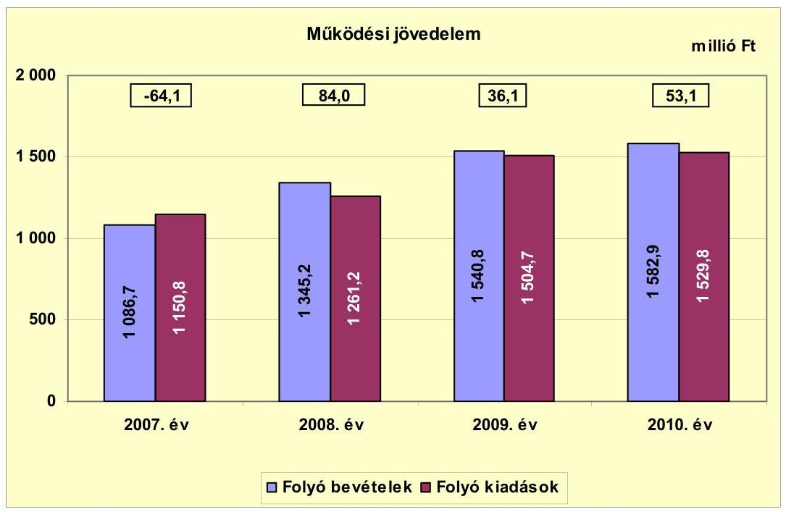

Az Önkormányzat folyó költségvetési egyenlege, működési jövedelme 2007-ben negatív előjelű volt, mert a folyó bevételek elmaradtak a folyó kiadásoktól, főként az alacsony saját működési bevételek miatt. A folyó költségvetési egyenleg 2008-ban az előző évhez viszonyítva 148,1 millió Ft-tal emelkedett, a folyó bevételeknek a folyó kiadások növekedését ( 110,4 millió Ft) meghaladó összegű, (258,5 millió Ft-os) emelkedése miatt. A folyó bevételeken belül az előző évhez viszonyítva a saját működési bevételek 53,1 millió Ft-tal (47,6\%-kal), a folyó bevételek között elszámolt költségvetési támogatások összesen 338,5 millió Ft-tal ( $68,0 \%$-kal) emelkedtek. A folyó költségvetési egyenleg 2009-ben csökkent, a folyó kiadásoknak a folyó bevételek növekedését ( 186,8 millió Ft) meghaladó emelkedése ( 243,5 millió Ft) miatt. A folyó kiadások növekedését a működési kiadásokon belül a személyi juttatások és a hozzájuk kapcsolódó járulékok 242,5 millió Ft-os, valamint a dologi kiadások 52,1 millió Ft-os emelkedése okozta. A folyó költségvetési egyenleg 2010-ben nőtt, a folyó bevételeknek a folyó kiadások növekedését ( 25,1 millió Ft) meghaladó összegű, (42,1 millió Ft-os) emelkedése miatt.

A folyó költségvetés egyenlege 2007-ben -64,1 millió Ft volt, a folyó kiadások 5,6\%-ára a folyó bevételek nem biztosítottak fedezetet. A működési forrástöbblet a folyó kiadásokon belül 2008-ban 6,7\% ( 84,0 millió Ft), 2009-ben 2,4\% (36,1 millió Ft), 2010-ben 3,5\% (53,1 millió Ft) arányt képviselt. A vizsgált időszakban a működési jövedelem összesen 109,1 millió Ft többletet mutatott, amely forrásul szolgált az Önkormányzat fennálló tőketörlesztési kötelezettségeinek teljesítéséhez.

---

Az Önkormányzat 2007-2010-ben működőképességének megőrzésére összesen 201,6 millió Ft vissza nem térítendő kiegészítő támogatásban részesült, amelyből 73,8 millió Ft-ot ÖNHIKI támogatásként, 127,8 millió Ft-ot a működésképtelen helyi önkormányzatok egyéb támogatása jogcímen kapott. Az ÖNHIKI támogatást a működéshez szükséges dologi kiadásokra használta fel az Önkormányzat, a működésképtelen helyi önkormányzatok egyéb támogatását 89,2\%-át (114,0 millió Ft-ot) célhoz, feladathoz nem kötötten, a szállítói tartozások kiegyenlítésére, 10,8\%-át (13,8 millió Ft-ot) célhoz kötötten, 2009. évi viharkár utáni helyreállításra és lakossági kárenyhítésre. A 2011. év I. félévében kapott 29,8 millió Ft ÖNHIKI támogatást a 60 napon túli lejárt szállítói tartozások (közüzemi díjak, élelmiszer-beszállítók) kiegyenlítésére fordították. Az Önkormányzat működési jövedelme a működőképességének megőrzésére juttatott költségvetési támogatások nélkül 2007-ben -109,9 millió Ft, 2008-ban 29,0 millió Ft, 2009-ben -20,3 millió Ft, 2010-ben 8,7 millió Ft, a vizsgált időszakban az összes működési hiány -92,5 millió Ft lett volna.

A nettó működési jövedelem értéke a folyó költségvetési pozíció mellett az adott költségvetési év adósságtörlesztésének hatását tükrözi. Az Önkormányzat nettó működési jövedelmének (pénzügyi kapacitásának) 2007-2010 közötti alakulását az alábbi ábra mutatja:
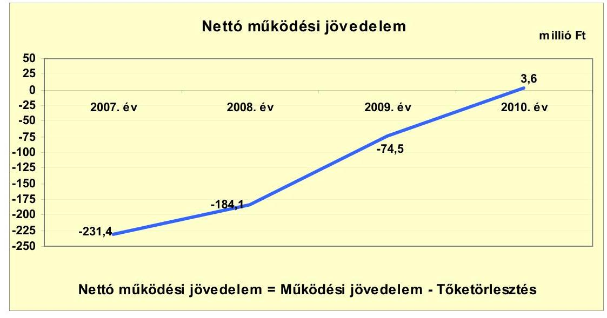

Az Önkormányzat pénzügyi kapacitása a vizsgált időszakban emelkedő tendenciát mutatott, de csak 2010-ben ért el (az ÖNHIKI-vel) pozitív értéket. A nettó működési jövedelem értéke 2007-ben -231,4 millió Ft, 2010-ben 3,6 millió Ft volt. 2007-ben a negatív összegű folyó költségvetési egyenleg mellett az Önkormányzatot még 167,3 millió Ft adósságszolgálat terhelte, amelynek a 600,0 millió Ft kötvénykibocsátásból származó forrás felhasználásával tudott eleget tenni. Hasonló tendencia folytatódott 2008-ban és 2009-ben is, amikor a megképződött működési jövedelem nem biztosított elegendő forrást a 268,1 millió Ft-os, illetve 110,6 millió Ft-os adósságszolgálat teljesítésére. A folyószámlahitel év végi (fordulónapi) állománya folyamatosan emelkedett, 2007-ben 6,3 millió Ft, 2008-ban 24,2 millió Ft, 2009-ben 36,0 millió Ft, 2010-ben 42,5 millió Ft volt, ami azt mutatja, hogy az Önkormányzat a 2007. évi

---

kötvénykibocsátásból származó forrás mellett esetenként az elsődlegesen a likviditást biztosító forrást is bevonta az adósságszolgálat teljesítésébe. Az Önkormányzatnál (a CLF módszer alapján) a vizsgált időszakban nem képződött működési jövedelem fejlesztési kiadások fedezetére, és - változatlan nettó működési jövedelem képződése mellett - nem biztosított a jövőbeni adósságszolgálat teljesítése és fejlesztési kiadások fedezete sem.

Az Önkormányzat felhalmozási költségvetési egyenlegének 2007-2010 közötti változását az alábbi ábra mutatja:
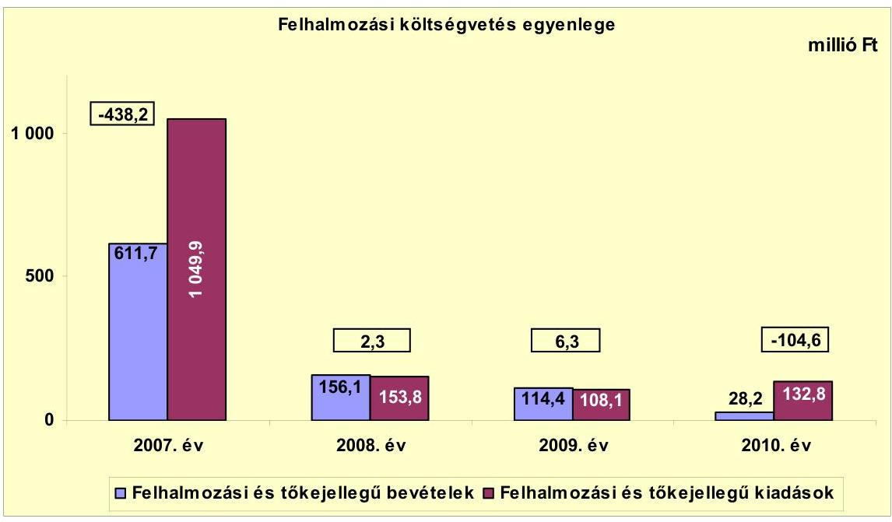

Az Önkormányzat felhalmozási költségvetésének egyenlege 2007-ben -438,2 millió Ft-os felhalmozási hiányt mutatott. Az Önkormányzat összesen 275,3 millió Ft céltámogatás és 279,0 millió Ft címzett támogatás felhasználásával valósított meg két nagy beruházást (szennyvíztisztító, DOC bővítése), de a költségvetési támogatásokhoz a kiadások felmerülésétől eltérő időpontban jutott hozzá. Az Önkormányzat a 2007-ben képződött felhalmozási forráshiányt kötvény kibocsátásából fedezte, illetve a már folyamatban levő fejlesztéseket 2007. előtt felvett hitelekkel is finanszírozta. 2008-tól az Önkormányzat pénzügyi lehetőségei nem tették lehetővé nagy fejlesztések megvalósítását. 2010-ben az Önkormányzat a felhalmozási célú bevételek és kiadások különbözetét a pénzmaradvány felhalmozási célú igénybevételével fedezte.

---

Az Önkormányzatnál a finanszírozási műveletek CLF módszer szerinti évenkénti egyenlegét az alábbi ábra mutatja:
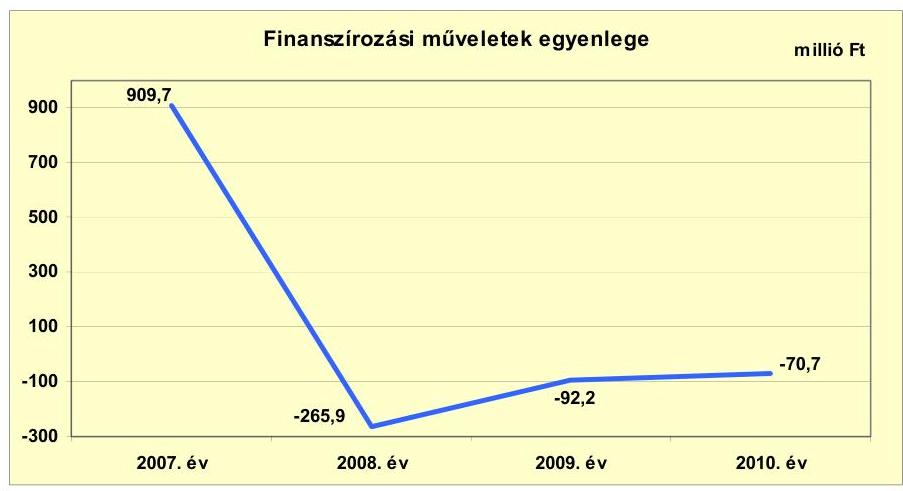

A finanszírozási célú pénzügyi műveletek kiugró értéke 2007-re vonatkozóan azt jelentette, hogy az éves költségvetés végrehajtása során az Önkormányzat a finanszírozási bevételekkel (600,0 millió Ft CHF kötvény kibocsátásával) biztosította a hiányzó forrást a (felhalmozási célú) költségvetési kiadások teljesítésére. A finanszírozási célú műveleteket a jelentés 2 . számú mellékletének 4.1-4.8. pontjai részletezik.

Az Önkormányzat a zárszámadási rendeleteiben a működési és a felhalmozási hiányt a CLF módszertől eltérő szerkezetben mutatta be, amiről a jelentés 1. számú melléklete ad tájékoztatást. A 2007. évi költségvetést 502,4 millió Ft, a 2010. évi költségvetést 51,4 millió Ft hiánnyal teljesítette az Önkormányzat, míg 2008-ban (86,3 millió Ft-tal), 2009-ben (42,4 millió Ft-tal) a teljesített költségvetési bevételek összességében meghaladták a költségvetési kiadásokat.

Az Önkormányzat 2007-2011. év I. félév közötti kamatbevételeit és kamatkiadásait évenként a következő ábra mutatja:
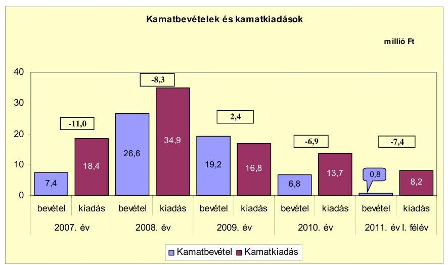

Az Önkormányzat kamatbevételei és -kiadásai 2008-ban voltak a legmagasabbak. 2008-ban azért nőttek meg a kamatkiadások, mert az Önkormányzat

---

párhuzamosan fizette a felhalmozási kiadásainak fedezetére 2007. előtt felvett, még fennálló hosszú lejáratú fejlesztési hitelek kamatait, továbbá a likviditási problémák kezelésére igénybe vett folyószámla- és munkabérmegelőlegezési, valamint a felhalmozási célú kiadások megelőlegezéséhez 2007-ben felvett likvid (támogatás-megelőlegező) hitelek, illetve az előző évben kibocsátott kötvény kamatait. A 2007-ben kibocsátott 600,0 millió Ft értékű CHF kötvényből meglévő szabad pénzeszközök pénzügyi befektetései viszont kamatbevételt biztosítottak az Önkormányzatnak.

Az Önkormányzat pénzintézetekkel szemben fennálló kötelezettségeinek növekedése következtében 2007 és 2011. június 30. között összesen 92,0 millió Ft kamatot fizetett meg. A kamatkiadások a 2009. év kivételével minden évben meghaladták a kamatbevételeket. Az átmenetileg szabad pénzeszközök pénzügyi befektetéséből realizált kamatbevétel 60,8 millió Ft volt, ami a kamatráfordítások 66,1\%-ának felelt meg. A kamatbevételek 2008. és 2009. évben voltak számottevőek, amikor a kibocsátott kötvényből még fel nem használt, befektethető pénzösszeg magas volt.

2011-ben - a félévi adatok alapján - számottevő kamatbevétel nem volt várható, viszont a megemelt és folyamatosan igénybe vett folyószámlahitel-keret, valamint a folyószámlahitel és a munkabér-megelőlegezési hitel kamatának emelkedése miatt az Önkormányzat kamatkiadásainak emelkedése várható.

# 2.2. Az Önkormányzat bevételeinek változása 

Az Önkormányzat folyó bevétele a 2007-2010 közötti időszakban 496,2 millió Ft-tal (41,0\%-kal) nőtt. A 2007. évi 1086,7 millió Ft-ról 2008-ra 1345,2 millió Ft-ra (258,5 millió Ft-tal; 23,8\%-kal), 2009-ben 1540,8 millió Ft-ra (195,6 millió Ft-tal; 14,5\%-kal), 2010-ben 1582,9 millió Ft-ra (42,1 millió Ft-tal; 2,7\%-kal) emelkedett. A 2011. év I. félévében - a 2010. év azonos időszakának adataihoz viszonyítva 171,2 millió Ft-os ( $21,6 \%$-os) bevétel-elmaradás valósult meg.

---

Az Önkormányzat 2007-2011. év I. félévi folyó bevételeinek főbb bevételi jogcímek szerinti alakulását az alábbi grafikon mutatja be:
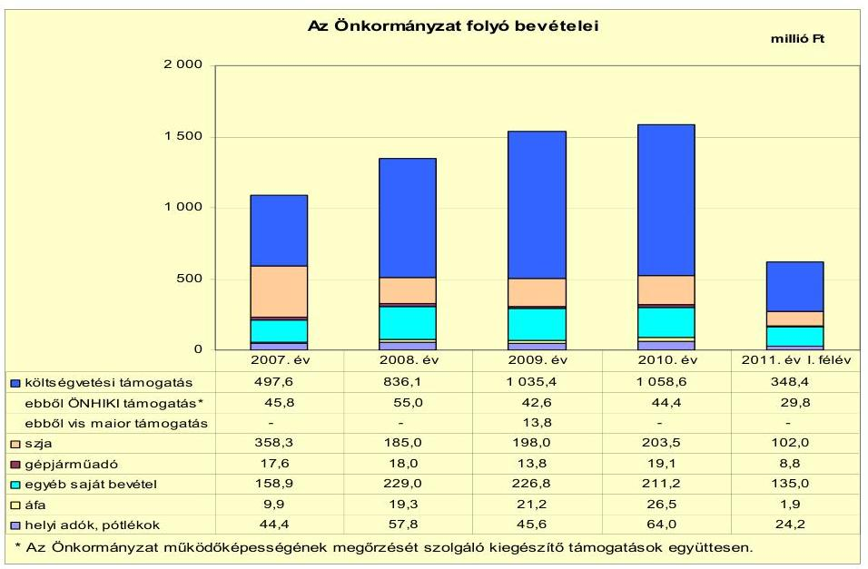

Az Önkormányzat központi költségvetési kapcsolatokból származó két forrása (költségvetési támogatás és átengedett szja) az összes folyó működési bevételen belül 2007-ben 855,9 millió Ft-ot ( $78,8 \%$-ot), 2008-ban 1021,1 millió Ft-ot ( $75,9 \%$-ot), 2009-ben 1233,4 millió Ft-ot ( $80,0 \%$-ot), 2010-ben 1262,1 millió Ft-ot ( $79,7 \%$-ot) képviselt. A központi források a vizsgált időszakban - a társulás keretében történő feladatellátás és az Önkormányzat kiegészítő támogatásai hatására - folyamatosan emelkedtek. A 2008. évben 165,2 millió Ft-tal (19,3\%-kal), 2009-ben 212,3 millió Ft-tal (20,8\%-kal), 2010-ben 28,7 millió Ft-tal ( $2,3 \%$-kal) haladták meg az előző év központi támogatásának összegét. Az Önkormányzat 2010-ben 225,6 millió Ft-tal több központi támogatásban részesült a 2007-2009 közötti időszak átlagához képest. A 2011. év I. félévében a költségvetési támogatások és átengedett szja összege 450,4 millió Ft volt, a működési bevételeken belüli aránya 72,6\%. A központi források összege - a közoktatás ellátotti létszámának és a közcélú foglalkoztatás mértékének csökkenése miatt - 180,6 millió Ft-tal ( $28,6 \%$-kal) elmaradt az előző év azonos időszakának adatához képest.

Az Önkormányzat 2007-2011. év I. félév közötti időszakban ÖNHIKI támogatásban és működésképtelen helyi önkormányzatok egyéb támogatásában részesült. Az ÖNHIKI támogatás 2007. évi összege 34,8 millió Ft, 2009. évi összege 19,6 millió Ft, 2010. évi összege 19,4 millió Ft volt. Célhoz/feladathoz nem kötött egyéb támogatásként 2007-ben 11,0 millió Ft-ot, 2008-ban 55,0 millió Ft-ot, 2009-ben 23,0 millió Ft-ot, 2010-ben 25,0 millió Ft-ot kapott. A célhoz/feladathoz nem kötött támogatásokat minden évben a szállítói tartozások kiegyenlítésére fordították. Viharkár helyreállítás és lakossági kárenyhítés címén 2009-ben 13,8 millió Ft összegű célhoz/feladathoz kötött támogatást folyósítottak az Önkormányzat számára. A 2007-2010. években összesen 201,6 millió Ft összegű kiegészítő támogatást kaptak. A 2011. év I. félévében további 29,8 millió Ft összegű ÖNHIKI támogatás folyósí-

---

tására került sor. A támogatást a lejárt szállítói tartozások rendezésére fordították.

A központi költségvetési kapcsolatokból származó két forrás (költségvetési támogatás és átengedett szja) együttes alakulását tekintve 2007. és 2011. év I. féléve között 225,6 millió Ft-os központi támogatás-növekedés valósult meg.

A helyi adóbevételek tekintetében 2007-ről 2008-ra 13,4 millió Ft-os (30,2\%-os) bevétel-növekedés realizálódott. Ezt követően 2009-ben a 2008. évi adatokhoz viszonyítva 12,2 millió Ft-os ( $21,1 \%$-os) adóbevétel csökkenés figyelhető meg. A 2010. évi önkormányzati helyi adóbevétel 18,4 millió Ft-tal (40,4\%-kal) haladta meg a 2009. évit. A 2008. évi adóbevétel növekedést egy, az Önkormányzat illetékességi területén székhellyel rendelkező gazdasági társaság adómentességének megszűnése okozta. Az adóbevételek 2009. évi csökkenése a gazdasági-társadalmi környezet változásaival (árfolyam-változások, fogyasztás mértékének csökkenése, vállalkozói árbevételek elmaradása) magyarázható. A 2010. évben bekövetkezett helyi adóbevétel növekedést a már említett, jelentős adófizetési kötelezettséggel rendelkező gazdasági társaság fejlesztése következtében jelentkező árbevétel növekedése eredményezte. A helyi adóbevételek 2007-ben a folyó évi működési bevétel 4,1\%-át (44,4 millió Ft), 2008-ban 4,3\%-át (57,8 millió Ft), 2009-ben 3,0\%-át (45,6 millió Ft), 2010-ben 4,0\%-át (64,0 millió Ft) adták. A 2007-2010 közötti időszakban a helyi adóbevételek összességében 19,6 millió Ft-tal ( $49,5 \%$-kal) emelkedtek. Helyi adókból és azokhoz kapcsolódó pótlékokból a 2011. év I. félévében 24,2 millió Ft folyt be. Az előző év azonos időszakának bevételeit tekintve ez 7,8 millió Ft-os ( $24,4 \%$-os) bevétel elmaradást jelent. Az Önkormányzat számára bevételi kitettséget jelent, hogy a helyi iparűzési adóbevétel jelentős része egy adózótól származik. A vizsgált időszakban új adónem bevezetésére, az adó mértékének növelésére - az adóalanyok adóteher viselési képességére tekintettel - nem került sor.

Az Önkormányzat egészségügyi intézményt nem tartott fenn, költségvetéseiben OEP bevétel nem szerepelt.

Az Önkormányzatnak tulajdonosi részesedése után osztalékbevétele nem származott.

---

Az Önkormányzat felhalmozási bevételei a vizsgált időszakban a következők voltak:

| Megnevezés | 2007. év | 2008. év | 2009. év | 2010. év | 2011. év   I. félév |
| :-- | --: | --: | --: | --: | --: |
| Tárgyi eszköz értékesítés | 0,1 | 0,0 | 2,2 | 1,1 | 0,0 |
| Egyéb saját tőkebevétel | 0,0 | 0,0 | 0,0 | 2,9 | 0,8 |
| Államháztartáson belülről   kapott támogatás | 511,6 | 99,9 | 71,8 | 2,6 | 42,4 |
| EU-tól és külföldről kapott   támogatások | 73,3 | 16,6 | 32,7 | 21,3 | 0,0 |
| Államháztartáson kívülről   kapott támogatás | 26,7 | 39,6 | 7,7 | 0,4 | 1,0 |
| Összes felhalmozási bevétel | 611,7 | 156,1 | 114,4 | 28,3 | 44,2 |

A felhalmozási bevételek 2008-ban 455,6 millió Ft-tal (74,5\%-kal), 2009-ben 41,7 millió Ft-tal ( $26,7 \%$-kal), 2010-ben 86,1 millió Ft-tal ( $75,3 \%$-kal) csökkentek az előző évhez viszonyítva. A 2011. év I. félévében 30,1 millió Ft-os bevétel növekedés történt az előző év azonos időszakának adataihoz képest. A felhalmozási bevételek 2008. évi jelentős csökkenését a címzett és céltámogatások összegében bekövetkezett változás idézte elő. A címzett és céltámogatások 2007. évi összege 509,5 millió Ft, 2008. évi összege 44,8 millió Ft volt. A címzett támogatás a DOC bővítéséhez, a céltámogatás a szennyvízberuházáshoz kapcsolódott. A 2010. évi felhalmozási bevétel csökkenés oka a szennyvíztisztító telep bővítésének 2009. évben megvalósult pénzügyi befejezése.

Az Önkormányzatnak a vizsgált időszakban tárgyi eszköz értékesítéséből számottevő bevétele nem keletkezett.

A felhalmozási bevételek jelentős hányadát a kapott támogatások (államháztartáson belülről-, államháztartáson kívülről-, EU-tól kapott támogatások) tették ki. 2007-ben az összes felhalmozási bevétel 99,9\%-a (611,6 millió Ft), 2008-ban $100 \%$-a ( 156,1 millió Ft), 2009-ben $98,1 \%$-a ( 112,2 millió Ft), 2010-ben $85,9 \%$-a ( 24,3 millió Ft) és 2011. év I. félévében $98,2 \%$-a ( 43,4 millió Ft) realizálódott ezekből a jogcímekből. Az államháztartáson belülről, illetve az EU-tól kapott támogatások a felújítási és fejlesztési feladatok végrehajtásához kapcsolódtak. Államháztartáson kívülről kapott támogatásként a háztartásoktól és vállalkozásoktól származó felhalmozási célú pénzeszközöket mutatták ki.

Az Önkormányzat a 2007-2010 közötti időszakban a kistelepülési iskolák fejlesztése, a külterületi csatorna, az Arany János út, a Fő út, a Nagy út és Földvári út, valamint a 10,0 millió Ft alatti felújítások kapcsán kapott hazai- és EU-s támogatást. Ugyanebben az időszakban a DOC bővítése, a szennyvíztisztító telep bővítése, a Széchenyi út építése, a Jókai és Móricz Zsigmond út építése, illetőleg a 10,0 millió Ft alatti fejlesztések kapcsán részesült állami- és EU-s támogatásban.

---

# 2.3. Az Önkormányzat működési és a felhalmozási célú kiadásainak változása 

Az Önkormányzat működési kiadásai 2007-2011. június 30. között az alábbiak szerint alakultak:

|  |  |  |  |  | millió Ft |
| :--: | :--: | :--: | :--: | :--: | :--: |
| Megnevezés | 2007. év | 2008. év | 2009. év | 2010. év | 2011. év   I. félév |
| Folyó kiadások | 1150,8 | 1261,2 | 1504,7 | 1529,8 | 567,8 |
| Működési kiadások (kamatkiadás nélkül) | 929,5 | 1030,0 | 1313,8 | 1378,9 | 559,6 |
| Államháztartáson belülre átadott pénzeszközök | 0,2 | 0,4 | 0,2 | 1,9 | 1,6 |
| Transzferkiadások | 202,7 | 195,9 | 174,1 | 135,3 | 83,6 |
| -ebből: vállalkozásoknak | 28,6 | 23,3 | 21,4 | 20,7 | 8,7 |
| EU-nak, illetve külföldre | 0,0 | 0,0 | 0,0 | 0,0 | 0,0 |
| magánszemélyeknek | 160,7 | 159,7 | 143,6 | 112,8 | 74,4 |
| nonprofit szervezeteknek | 13,4 | 12,9 | 9,1 | 1,8 | 0,5 |
| Kamatkiadások | 18,4 | 34,9 | 16,8 | 13,7 | 8,2 |
| Előző évi pénzmaradvány átadás | 0,0 | 0,0 | 0,0 | 0,0 | 0,0 |

Az Önkormányzat folyó kiadásai 2007. december 31-ről 2010. december 31-re 32,9\%-kal növekedtek ( 1150,8 millió Ft-ról 1529,8 millió Ft-ra). A növekedés oka a (kamatkiadás nélküli) működési kiadások 48,3\%-os ( 929,5 millió Ft-ról 1378,9 millió Ft-ra) növekedése volt.

Az Önkormányzat 2010-ben a működési kiadások 76,9\%-át (1059,7 millió Ft) személyi juttatásokra és a munkaadókat terhelő járulékokra fordította. Az üzemeltetést, intézményfenntartást biztosító dologi kiadások 22,0\%-kal (302,7 millió Ft) részesedtek a működési kiadásokból. A működési kiadásokon belül a személyi juttatások és járulékok részaránya a vizsgált időszakban folyamatosan emelkedett, 2010. évi arányuk 4,9 százalékponttal haladta meg a 2007-2009. évek átlagát.

Az Önkormányzat működési kiadásai 2007-2011. június 30. között a főbb kiadási jogcímek szempontjából az alábbiak szerint alakultak:

|  |  |  |  |  | millió Ft |
| :-- | :--: | :--: | :--: | :--: | :--: |
| Megnevezés | 2007. év | 2008. év | 2009. év | 2010. év | 2011. év   I. félév |
| Személyi juttatások | 495,7 | 564,8 | 786,9 | 875,1 | 278,2 |
| Munkaadót terhelő járulékok | 151,2 | 173,3 | 193,7 | 184,6 | 66,8 |
| Dologi kiadások | 232,0 | 269,2 | 321,3 | 302,7 | 203,8 |
| Egyéb folyó kiadások | 49,2 | 22,7 | 11,8 | 16,6 | 0,0 |

A személyi juttatások minden évben emelkedtek az előző évhez viszonyítva, a körjegyzőség 2008. évi megszervezése, illetve a társulásos formában való feladatellátás folyamatos (2007. júliustól közoktatási, 2008-tól szociális és gyermekvédelmi feladatok) bővülése miatt ${ }^{10}$. A 2010. évi személyi juttatásokra fordított összeg 76,5\%-kal (379,4 millió Ft-tal) volt magasabb a 2007. évinél. A növekedésben a társulásos feladatellátás bővülése játszott szerepet, amit bevételi oldalon kompenzált a feladatellátáshoz nyert ösztönző hozzájárulás.

[^0]
[^0]:    ${ }^{10}$ Az intézményi társulások székhely települése az Önkormányzat.

---

A munkaadókat terhelő járulékok a személyi juttatásoknál alacsonyabb arányban nőttek, a 2010. évi összeg 6,9\%-kal (11,9 millió Ft-tal) volt magasabb a 2007-2009. évek átlagánál, mivel 2009-től a foglalkoztatókat terhelő járulékok mértéke csökkent.

A dologi kiadások az Önkormányzatnál a 2010. év kivételével az előző évhez viszonyítva minden évben az inflációt meghaladó mértékben
 nőttek, 2010-ben a 2007-2009. évek átlagánál 28,5 millió Ft-tal (10,4\%-kal) voltak magasabbak. A növekedésben a társulásos feladatellátás bővülése játszott szerepet, amit bevételi oldalon kompenzált a feladatellátáshoz nyert ösztönző hozzájárulás, illetve a körjegyzőség működéséhez biztosított normatív támogatás. Az Önkormányzatnak kórháza nincs.

Az Önkormányzatnál a teljesített működési és felhalmozási kiadások felhasználásának arányai a következő ábra szerint alakultak:
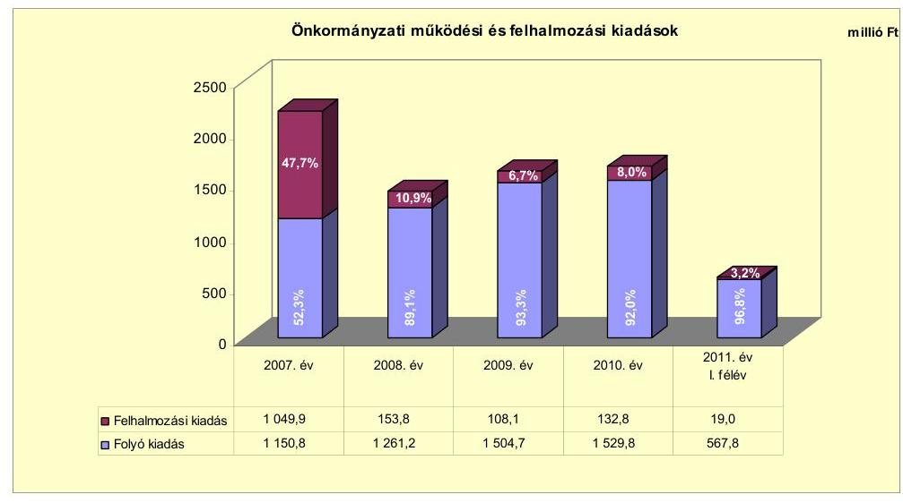

Az Önkormányzat 2007-ben - két, korábbi években elindított beruházás (a szennyvíztisztító építése és a DOC bővítése) következtében - kiemelkedően nagy összegű, 1049,9 millió Ft felhalmozási célú költségvetési kiadást teljesített, amelynek finanszírozása a további évekre nézve is nagymértékben megterhelte költségvetését. Ennek következményeként az Önkormányzat felhalmozási kiadásai 2008. és 2010. között lecsökkentek, arányuk az összes költségvetési kiadásokhoz viszonyítva 6,7\% és 10,9\% közötti volt. A 2011. évre új fejlesztés indítását nem tervezte az Önkormányzat.

A 2007-2010. évek között négy befejezett, 10,0 millió Ft feletti bekerülési költségű beruházás és öt felújítás valósult meg. A 10,0 millió Ft alatti 62 beruházásra 66,5 millió Ft, a szintén 10,0 millió Ft alatti tíz felújításra 30,5 millió Ft-ot fordítottak. A befejezett beruházásokra és felújításokra 2010. december 31-ig az Önkormányzat összesen 1373,7 millió Ft kiadást teljesített, amit 48,1\%-ban (660,2 millió Ft) hazai támogatás, 21,1\%-ban (289,6 millió Ft) kötvénykibocsátásból származó forrás, 17,9\%-ban (247,1 millió Ft) saját forrás, 8,8\%-ban (120,8 millió Ft) EU-s támogatás, 4,1\%-ban (56 millió Ft) előfinanszírozási hitel igénybevétele fedezett. A fejlesztési célok mindegyike pályázati források felhasználásával valósult meg. A ha-

---

zai és az EU-s támogatásból megvalósult fejlesztések finanszírozása likviditási gondokat okozott, emiatt az Önkormányzat támogatás-megelőlegező (likvid) hiteleket vett igénybe.

A három legmagasabb bekerülési költségű beruházás a vizsgált időszakban a DOC bővítése, a szennyvíztisztító telep bővítése és a Széchenyi út építése volt.

A Demecseri Oktatási Centrum bővítése 2006-ban kezdődött és 2007-ben fejeződött be. Az 518,5 millió Ft bekerülési költségből 279,0 millió Ft (53,8\%) hazai támogatás, 172,2 millió Ft (33,2\%) kötvényből származó forrás, 67,3 millió Ft (13,0\%) saját bevétel volt.

A szennyvíztisztító telep bővítése 2005-ben kezdődött, és 2008-ban fejeződött be. A 459,0 millió Ft teljes bekerülési költségből 275,3 millió Ft-ot (60,0\%) hazai támogatásból, 127,7 millió Ft-ot (27,8\%) saját bevételből, 56,0 millió Ft-ot (12,2\%) hitelből finanszírozott az Önkormányzat.

A Széchenyi út építése 47,2 millió Ft teljes bekerülési költség mellett valósult meg, amelynek 72,9\%-a (34,4 millió Ft) hazai támogatás, 15,9\%-a (7,5 millió Ft) kötvényből származó forrás, 11,2\%-a (5,3 millió Ft) saját forrás volt.

Az Önkormányzatnál 2010. december 31-én egy felújítás (egészségház) volt folyamatban, ami 2011. év első félévében befejeződött. A felújítás várható bekerülési költségét 83,6 millió Ft-ra tervezték, amelytől a tényleges bekerülési költség 4,7\%-kal (3,9 millió Ft-tal) maradt el. A felújításra 2010. december 31-ig 69,7 millió Ft-ot fizetett ki az Önkormányzat. A tényleges forrásösszetétel ${ }^{11}$ a tervezettől azért tért el, mert az Önkormányzat a kifizetések tervezettnél nagyobb részét előlegezte meg kötvényből származó forrásból, és utólag kapta meg az EU-s támogatást ${ }^{12}$. 2011-ben a fejlesztés befejezéséhez még szükséges 10,0 millió Ft-ot az Önkormányzat a megképződött működési jövedelemből biztosította. A fejlesztésekre teljesített kiadások adatait részletesen a jelentés 3/a., 3/b. és 3/c. számú mellékletei tartalmazzák.

Az Önkormányzatnak beadott, elbírálás alatt levő pályázata a helyszíni ellenőrzés időpontjában nem volt. Az Önkormányzat 2011-ben pályázatot nem nyújtott be, költségvetési rendeletében új fejlesztés indítását nem tervezte, mivel pénzügyi helyzete minimális önerő biztosítását sem tette lehetővé.

[^0]
[^0]:    ${ }^{11}$ Az adatokat a jelentés 3/b. számú melléklete tartalmazza.
    ${ }^{12}$ Az utólag megkapott EU támogatást az Önkormányzat visszatette a kötvényforráshoz.

---

Az Önkormányzat a közhasznú tevékenységet folytató és közfeladatot ellátó gazdasági társaság részére, annak működéséhez az alábbi ábra szerinti pénzeszközt adta át az ellenőrzött időszakban:
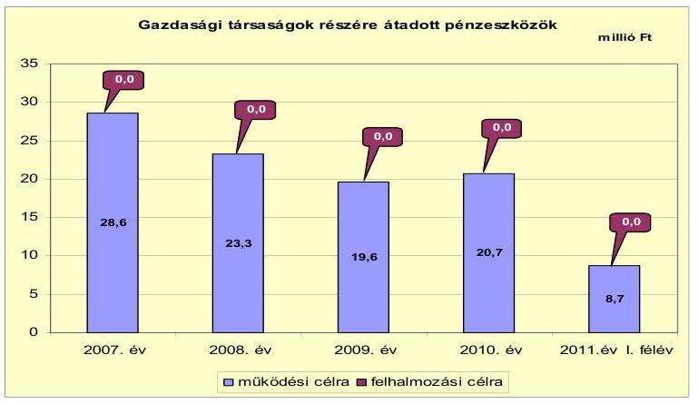

Az Önkormányzat egy gazdasági társaságban kizárólagos tulajdonnal rendelkezik, más gazdasági társasága nincs. A gazdasági társaság közhasznú és vállalkozási tevékenységet végzett, az önkormányzati ingatlanok üzemeltetése, a közterület-fenntartás, valamint (alvállalkozóként) a hulladékkezelés és -szállítás területén kapott szerepet az önkormányzati feladatellátásában. A gazdasági társaságnak az ellenőrzött időszakban összesen 100,9 millió Ft rendszeres működési célú pénzeszközt adott át az Önkormányzat, fejlesztési célú pénzeszközt nem. A gazdasági társaság pénzügyi helyzete a 2010. évi saját tőke/jegyzett tőke aránya alapján összességében stabil, azonban az utóbbi két év veszteséges gazdálkodása (2009. évben -2,8 millió Ft, 2010-ben -4,5 millió Ft mérleg szerinti eredmény) és a szállítói állomány emelkedése kedvezőtlen folyamatokat jelez. A kizárólagos önkormányzati tulajdonú gazdasági társaság részére átadott pénzeszközt a jelentés 4. számú melléklete mutatja be.

# 3. Az ÖNKORMÁNYZAT KÖTELEZETTSÉGEI 

### 3.1. Az Önkormányzat pénzintézetekkel szembeni kötelezettségeinek változása

Az Önkormányzat pénzintézetekkel szembeni kötelezettségeinek állománya 2006. december 31-től 2010. december 31-ig közel nyolcszorosára nőtt, 111,8 millió Ft-ról 870,7 millió Ft-ra. A pénzintézetekkel szembeni kötelezettségek kötvénykibocsátásból, a CHF kötvény árfolyamváltozása miatt kötelezettség-növekedésből (amelyet 2010. előtt az Önkormányzat nem mutatott ki), és rövid lejáratú (likvid) hitelek igénybevételéből keletkeztek.

---

Az Önkormányzat pénzintézetekkel szemben fennálló kötelezettség állományát 2006. december 31. és 2011. június 30. között az alábbi ábra szemlélteti:
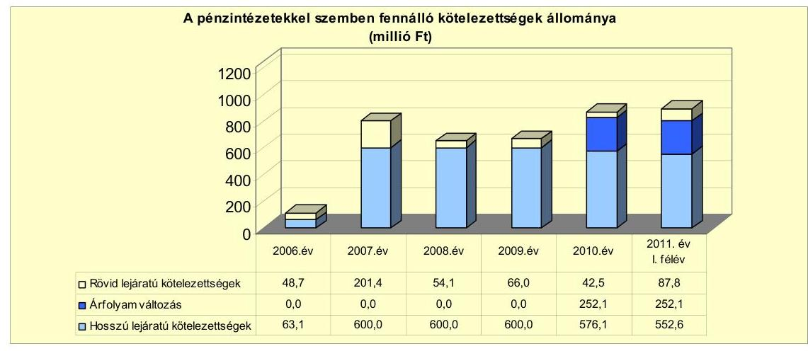

Az Önkormányzat 2007. és 2011. június 30. között hosszú lejáratú hitelszerződést nem kötött, beruházási hiteltartozásai a korábbi években (1998-2005 között) megkötött öt hitelszerződésből voltak. A hitelnyújtó három esetben az Önkormányzat számlavezető bankja, kettő esetben másik pénzintézet volt.

Az Önkormányzat a 2007. évi kötvénykibocsátás által teremtett forrásból 2007-ben és 2008-ban a fenti hitelekből fennálló valamennyi tartozását visszafizette. A megkötött hitelszerződéseket futamidejük alatt nem módosították, a szerződéskötéskor meghatározott kamatfeltételekben nem történt változás. A kötvényforrásból teljesített hitel-visszafizetéssel az Önkormányzat javítani kívánta pénzügyi helyzetét, mivel azok kamatterhei a kötvényhez viszonyítva kedvezőtlenebbek voltak.

A víziközmű-társulat megszűnését követően annak 1998-ban felvett 100,0 millió Ft hiteléből az Önkormányzatnál 2006. december 31-én még meglevő állománya 12,5 millió Ft volt. A hitel fix kamatozású volt (26\% kamat, 70\%-os kamattámogatással), az Önkormányzat a tőketörlesztés utolsó részletét (12,5 millió Ft) 2007. utolsó negyedévében fizette meg. A 2002-ben bérlakásépítésre felvett 39,9 millió Ft összegű hitelből (kamat 5\%) 2006. december 31-én még fennálló 23,9 millió Ft tőketartozását az Önkormányzat 2007-ben, a lejárat előtt visszafizette.

A 2005-ben kötött hitelszerződés alapján öt évre 10,4 millió Ft útépítésre felvett hitel tőketörlesztésére három év türelmi időt kapott az Önkormányzat. A 2008-ban esedékes első tőketörlesztés előtt, 2007. október 1-jén az Önkormányzat a hitelt (a kibocsátott kötvényből) egy összegben visszafizette. Az útépítésre, illetve a DOC bővítésére igényelt 50,0 millió Ft hitelkeretet az Önkormányzat folyamatosan, a beruházási szállítók számláinak kiegyenlítése függvényében vette igénybe. A felhasznált tőkét (42,4 millió Ft) az Önkormányzat 2008-ban egy összegben visszafizette. A 2005-ben szennyvíztisztító bővítésére igényelt 59,0 millió Ft hitelkeretből a több részletben igénybe vett 58,8 millió Ft-ot az Önkormányzat 2008. évben szintén visszafizette. A hitelek kamata 7\%-9\% között volt.

Az Önkormányzat a 2007-2009. évi mérlegeiben a rövid lejáratú kötelezettségek között szerepeltetett beruházási, fejlesztési hitelek következő évet terhelő törlesztő

---

részleteiként 2007-ben 361,7 millió Ft-ot, 2008-ban 90,1 millió Ft-ot, 2009-ben 3,8 millió Ft-ot. Az Önkormányzat hosszú lejáratú beruházási hiteleinek állománya 2006. év végén 63,1 millió Ft volt, ebből és a beruházási hitelkeretből a 2007. év folyamán igénybe vett összegekből 2007. év végén 58,8 millió Ft állt fenn, amely összeget az Önkormányzat 2008. évben visszafizetett. 2008. és 2009. év végén indokolatlan volt a beruházási, fejlesztési hitelek következő évet terhelő törlesztő részletei mérlegsoron kötelezettséget kimutatni. Az Önkormányzat ezzel megsértette a Számv. tv. 15. § (3) és (5) bekezdése értelmében a valódiság és a következetesség alapelvét.

Az Önkormányzat a vizsgált időszakban egy alkalommal kötvényt bocsátott ki. A pénzintézetek közötti versenyeztetés biztosított volt, a „Demecser 2027 Kötvényt" 2007. november 29-én bocsátották ki, kettő pénzintézet ajánlata közül választva ${ }^{13}$. Az Önkormányzat számláját vezető pénzintézet adta a kedvezőbb ajánlatot. A kötvény névértéke 600,0 millió Ft, összege 3836,6 ezer CHF volt. A törlesztés futamideje 20 év, 3 év türelmi időt követően negyedévenkénti törlesztés és negyedéves kamatperiódus mellett. Az évenkénti törlesztés összege 219,2 ezer CHF. A kibocsátáskori árfolyam 158 Ft/CHF, az induló kamat 3 havi CHF LIBOR + 0,83\% volt. A kötvénykibocsátás céljaként a 2007-2010. évre tervezett fejlesztési tervek megvalósítását, illetve a fennálló, kedvezőtlen kamatozású hitelek kiváltását jelölte meg az Önkormányzat.

Az Önkormányzat adósságot keletkeztető kötelezettségvállalásának felső határát a 2007. évi kötvénykibocsátáskor vizsgálták, azt nem lépték túl. A kötelezettségvállalás visszafizetési forrásaként az Önkormányzat saját bevételeit jelölte meg. A teljes futamidő várható kamat- és tőkefizetési kötelezettséget, valamint a kamat- és árfolyamkockázatot nem mutatták be.

Az Önkormányzat pénzintézetekkel szembeni kötelezettségvállalásaira minden esetben a Képviselő-testület döntése alapján került sor.

A 2011. év I. félévében a hosszú lejáratú kötelezettségek csökkentek 23,5 millió Ft kötvénytartozás-visszafizetés miatt, viszont a 2010. év végéhez képest 45,3 millió Ft-tal emelkedett a folyószámla- és munkabérmegelőlegezési hitelek állománya. Az Önkormányzat az ellenőrzött időszakban számlavezető pénzintézetet nem váltott.

Az árfolyamváltozás hatása befolyásolja a kötelezettségek alakulását, azonban annak mértéke előre pontosan nem határozható meg, csak várakozásokon alapuló tendenciák jelezhetők. Annak megítéléséről, hogy a devizában kibocsátott kötvény ellenértékeként kapott forinthoz képest a tartozás visszafizetésekor jelentkező forint kötelezettség többletkiadást (árfolyamveszteség) vagy megtakarítást (árfolyamnyereség) eredményez a futamidő végén, csak a teljes kötelezettség rendezését követően lehet képet alkotni. Mindaddig, amíg törlesztési kötelezettség nem áll fenn (türelmi idő, moratórium), a tőkére vonatkoztatva nem értelmezhető sem az árfolyamveszteség, sem az árfolyamnyereség. Ugyanakkor a Számv. tv. 60. § (4) bekezdése meghatározza, hogy az árfolyam különbözetet év végén a kötelezettségek vagy követelések között a könyvviteli mérlegben nyilván kell tartani, azonban az árfolyam különbözet valójában nem realizált.

[^0]
[^0]:    ${ }^{13}$ Ajánlattételre négy pénzintézetet kért fel az Önkormányzat, közülük kettő adott ajánlatot.

---

Az Önkormányzat az árfolyamváltozás miatti év végi értékelést a 2008. és 2009. évi mérlegkészítéskor nem végezte el, a tartós (egy éven túli) és jelentős árfolyamveszteség miatti kötelezettség-növekedést nem mutatta ki. A 2010. évi mérlegben az év végi értékelést elvégezték, a kibocsátáskori és a 2010. december 31-i CHF árfolyam-különbözet összegével az Önkormányzat kötvénykibocsátásból származó tartozását növelték. A kötvénytartozás 2011-ben esedékes törlesztő részleteinek összegét nem sorolták át a rövid lejáratú kötelezettségek közé, ezáltal az Önkormányzat nem tett eleget a Számv. tv. 42. § (2) és (3) bekezdése rendelkezéseinek.

Az Önkormányzat az egyes évek költségvetési rendeleteiben a forráshiány kezelése érdekében finanszírozási célú bevételek igénybevételét, ÖNHIKI támogatás igénylését, illetve a kiadások csökkentését tervezte. Hitelfelvétel helyett azonban a 2007. évi kötvénykibocsátással teremtett pótlólagos forrást.

Az Önkormányzatnak 2011. június 30-án CHF-ben fennálló hosszú lejáratú, adósságot keletkeztető kötelezettségvállalása az alábbi volt:

| Megnevezés | Szerződéskötés/   kibocsátás   időpontja | Összeg   ezer CHF-ben | Kibocsátás/lehívási   árfolyam | Kamat (referencia kamat+   kamatfelár) | Felhasználás célja: |
| :--: | :--: | :--: | :--: | :--: | :--: |
| Demecser 2027 Kötvény | 2007.11.29. | 3.617,3 | 158,0 | 3 havi CHF LIBOR+0,83\% | fejlesztések finanszírozása,   korábbi hitelek visszafizetése |

Az Önkormányzat 2011. június 30-át követően, a helyszíni vizsgálat időpontjáig újabb hitelszerződést nem kötött, újabb kötvény kibocsátására megbízást nem adott, illetve olyan hitelkeret-szerződéssel, amelynek igénybevétele még nem történt meg, nem rendelkezett.

Az Önkormányzat a 2007. évi kötvénykibocsátás CHF-ben fennálló kötelezettségéből 2011. június 30-ig 219,2 ezer CHF (47,4 millió Ft) tőkét törlesztett, a fennálló tőketartozásra 259,8 ezer CHF (46,1 millió Ft) kamatot fizetett.

A kötvénykibocsátásból származó forrást az Önkormányzat kizárólag a Képviselő-testület által jóváhagyott fejlesztési célokra fordította.

Saját forrás biztosítására a DOC bővítéséhez 172,2 millió Ft, az egészségház fejlesztéséhez 29,1 millió Ft, útépítésekhez 11,3 millió Ft, 10,0 millió Ft alatti beruházásokhoz összesen 23,9 millió Ft, felújításokhoz összesen 82,1 millió Ft összeget használtak fel a kötvényből. Ezen túlmenően az Önkormányzat 2007-2008-ban visszafizette korábban felvett beruházási hiteleiből még fennálló 148,0 millió Ft tartozásait.

Az Önkormányzatnak a kötvény szabad forrása befektetéséből összesen 50,4 millió Ft bevétele származott, amit a kötvény kamatainak fizetésére használt fel. A kötvény 2010-ben megkezdett tőketörlesztését is figyelembe véve az Önkormányzat 2011. június 30-án a kötvénykibocsátásból még 67,3 millió Ft fel nem használt maradvánnyal rendelkezett, amelyet banki jóváhagyással használhat fel, a kötvény tőketartozás esedékes törlesztésére. A CHF árfolyamváltozása miatti (nem realizált) árfolyamveszteség 252,1 millió Ft volt.

Az Önkormányzat 2007-ben öt rövid lejáratú hitelt vett fel hazai és EU fejlesztési támogatások megelőlegezésére, összesen 143,6 millió Ft összeget. A hitele-

---

ket 30-270 napra, 3 havi BUBOR $+0,55 \%$, illetve 3 havi BUBOR $+1 \%$ kamattal vette igénybe az Önkormányzat. A kifizetett kamat összege 2,8 millió Ft volt, továbbá 0,3 millió Ft egyéb (kezelési) költség merült fel.

Az Önkormányzat fizetőképessége megőrzését a vizsgált időszakban csak folyószámlahitel és munkabér-megelőlegezési hitel igénybevételével tudta biztosítani, amelyek alakulását az alábbi táblázat mutatja be:

| Megnevezés | 2007. év | 2008. év | 2009. év | 2010. év | 2011. év   I. félév |
| :--: | :--: | :--: | :--: | :--: | :--: |
| I. Folyószámlahitel |  |  |  |  |  |
| a folyószámlahitel keretösszege január 1-jén | 50,0 | 50,0 | 50,0 | 50,0 | 70,0 |
| teljesített kamat és egyéb költség | 2,8 | 3,4 | 2,5 | 1,9 | 3,2 |
| II. Munkabér-megelőlegezési hitel |  |  |  |  |  |
| igénybevett hitel összesen: | 27,0 | 30,0 | 30,0 | 30,0 | 30,0 |
| teljesített kamat és egyéb költség | 1,7 | 2,1 | 2,4 | 1,5 | 1,3 |

A folyószámlahitel és a munkabér-megelőlegezési hitelek kamatkondícióinak és egyéb költségeinek alakulását az alábbi táblázat szemlélteti ${ }^{14}$:

| Megnevezés | Kamat (referencia+ kamatfelár) | Egyéb költség |
| :--: | :--: | :--: |
| Folyószámlahitel |  |  |
| 2007-2010. év | 3 havi BUBOR $+1,01 \%$ | 0,00\% |
| 2011. év | 3 havi BUBOR $+3,5 \%$ | 1,25\% |
| Munkabér-megelőlegezési hitel |  |  |
| 2007-2010. év | 3 havi BUBOR $+1,01 \%$ | 0,0 |
| 2011. év | 3 havi BUBOR $+4,0 \%$ | 0,0 |

A folyószámlahitelt az Önkormányzat minden évben folyamatosan igénybe vette. A folyószámlahitel átlagos napi állománya a vizsgált időszakban 35,1 millió Ft és 43,3 millió Ft közötti volt. Az Önkormányzat növekvő likviditási problémái (elsősorban a szállítói tartozások) miatt a folyószámlahitelkeretet 2011. január 1-jétől 70 millió Ft-ra emelték fel. A 2011. év I. felében 63,6 millió Ft-ra (az előző évhez viszonyítva 70,1\%-kal) emelkedett a naponkénti igénybe vett átlagos folyószámlahitel-állomány. A 2011. évi megnövekedett átlagos naponkénti igénybevétel mellett tovább rontotta az Önkormányzat pénzügyi egyensúlyát a kamat 2,5 százalékponttal való emelkedése, illetve az egyéb költség (rendelkezésre tartási jutalék) megjelenése. Az áttekintett időszakban (2007-től 2011. június 30-ig) a likviditási problémák finanszírozása a folyószámlahitel vonatkozásában az Önkormányzatnak összesen 13,5 millió Ft kamatkiadást és 0,2 millió Ft egyéb banki költséget (rendelkezésre tartási jutalék) jelentett. A likvid hiteleket az Önkormányzat számláját vezető pénzintézet nyújtotta.

Az Önkormányzat likviditási problémái miatt 2007-2011. év I. félévében a munkabérek kifizetéséhez munkabér-megelőlegezési hitelt vett igénybe. A munkabér-megelőlegezési hitellel zárt napok száma a 2007-2010. években 319 és 362 nap közötti, a 2011. év I. félévében 169 nap volt, a hitel napi átlagos állománya 26,2 millió Ft és 29,8 millió Ft közötti, 2011. év I. félévében

[^0]
[^0]:    ${ }^{14}$ A referencia kamat (3 havi BUBOR) 2007-ben 7,75\%, 2008-ban 8,87\%, 2009-ben $8,64 \%, 2010$-ben $5,5 \%, 2011$. év I. félévben $6,07 \%$ volt.

---

28,0 millió Ft volt. A munkabér-megelőlegezési hitel kamatai az ellenőrzött időszakban 9,0 millió Ft-tal növelték az Önkormányzat költségvetési kiadásait, egyéb költségek nem merültek fel.

A kötvényhez kapcsolódó kamatfizetési kötelezettségek alakulását befolyásolta a kibocsátáskori és az utolsó kamatfizetéskori referenciakamat alakulása, melyet az alábbi táblázat mutat be:

| Megnevezés | Kibocsátási, lehívási | Utolsó fizetéskori | Változás \% |
| :--: | :--: | :--: | :--: |
|  | kamat (referencia + kamatfelár) \% |  |  |
| 3 havi CHF LIBOR | 3,58 | 1,01 | $-71,8 \%$ |

Az alapkamat mértékének alakulása jelentős hatással van az adott devizanemben kifejezett, a teljes futamidőre számított, három havonként fizetendő várható kamatkötelezettség mértékére. Az Önkormányzat fizetési kötelezettségét a referenciakamatok csökkenése kedvezően, a CHF árfolyam emelkedése viszont kedvezőtlenül befolyásolta. A referenciakamatok csökkenése 44,1 millió Ft-tal javította az Önkormányzat pénzügyi helyzetét.

Az Önkormányzat kötelezettségeinek állományát és várható alakulását a következő táblázat mutatja be:

| Megnevezés | $\begin{gathered} \text { Állomány } \\ 2010 . \text { december 31-én } \end{gathered}$ |  | $\begin{gathered} \text { Állomány } \\ 2011 . \text { június } 30 \text {-án } \end{gathered}$ |  | Várható kötelezettség 2011-2013. években |  | Várható kötelezettség 2014. évtől |  |
| :--: | :--: | :--: | :--: | :--: | :--: | :--: | :--: | :--: |
|  | HUF-ban   (millió Ft-ban) | Devizában (összeg, ezer CHF-ben) | HUF-ban (millió Ft-ban) | Devizában (összeg, ezer CHF-ben) | HUF-ban (millió Ft-ban) | Devizában (összeg, ezer CHF-ben) | HUF-ban (millió Ft-ban) | Devizában (összeg, ezer CHF-ben) |
| Pénzintézeti kötelezettséget |  |  |  |  |  |  |  |  |
| Demecser 2021 Kötvény |  | 2726,8 |  | 2817,2 |  | 603,6 |  | 2902,6 |
| Vízfolyószámlahitel | 42,5 |  | 57,6 |  | 57,6 |  |  |  |
| Munkabér-megelőlegezési hitel |  |  | 30,0 |  | 30,0 |  |  |  |
| Pénzintézeti kötelezettséget összesen HUF-ban | 42,5 |  | 57,6 |  | 57,6 |  |  |  |
| Pénzintézeti kötelezettséget összesen CHF-ben |  | 3726,9 |  | 3817,3 |  | 603,6 |  | 3902,6 |
| Szállítói tartozás | 132,2 |  | 91,1 |  | 91,1 |  |  |  |
| Összesen: | 174,4 | 2726,9 | 178,8 | 2817,3 | 178,8 | 603,6 |  | 2902,6 |

A vállalt pénzintézetekkel szembeni kötelezettségek 2011. június 30-i állománya 3617,3 ezer CHF kötvénykibocsátásból származó kötelezettség, amellyel kapcsolatban az Önkormányzatnak a 2011-2013. években 548,1 ezer CHF tőketörlesztési és várhatóan 85,5 ezer CHF kamatfizetési kötelezettsége áll fenn. A 2011-2013. évi kötelezettségek teljesítésére figyelembe vehető 116,4 millió Ft mérlegben kimutatott, vevők által elismert követelésállomány. Az Önkormányzat 2014. utáni jelenleg ismert pénzintézetekkel szembeni kötelezettsége 3069,2 ezer CHF kötvénytartozás és a hozzá kapcsolódó 233,4 ezer CHF kamatfizetési kötelezettség. Az Önkormányzat tájékoztatása szerint figyelembe vehető további források az éves költségvetési rendeletekben megtervezett helyi adóbevételek, azonban új adónem bevezetésére, illetve az adómértékek növelésére 2011-ben nem került sor. A 2014. után esedékes, jelenleg ismert pénzintézetekkel szembeni kötelezettségek teljesítése nem minősíthető biztosítottnak, mivel a visszafizetés forrásairól a Képviselő-testület döntést nem hozott, és arra vonatkozó számítások sem készültek.

---

# 3.2. A szállítói kötelezettségek változása 

Az Önkormányzat pénzügyi, likviditási helyzetének kedvezőtlen változása a szállítókkal szemben fennálló kötelezettségeinek állományán is látható, ami a vizsgált években megháromszorozódott. A szállítók felé fennálló kötelezettségek összes kötelezettségeken belüli aránya szintén emelkedő tendenciát mutatott, a vizsgált években $4,1 \%$ és $12,8 \%$ közötti volt. A 2010. év végi 132,0 millió Ft szállítói tartozást az Önkormányzat a 2011. év I. félévében 91,1 millió Ft-ra csökkentette, a 2011. január 1-jétől 20 millió Ft-tal megemelt folyószámlahitelkeretet elsősorban erre a célra használta fel.

Az Önkormányzat év végi lejárt szállítói tartozásainak állománya 2007-2010 között közel háromszorosára emelkedett, összege 2010. év végén 128,5 millió Ft volt, 2011. június 30-ára 84,0 millió Ft-ra csökkent. A szállítók felé fennálló tartozások átütemezésére irányuló szerződést az Önkormányzat nem kötött. A lejárt szállítói tartozásokon belül legnagyobb mértékben a 91-365 nap lejáratú kötelezettségek összege és aránya emelkedett, 2010. év végére 57,3 millió Ft-ra (44,6\%). Hasonló tendencia jellemezte az éven túl lejárt szállítói állományt is: 2010. év végén már 19,4 millió Ft (15,1\%) volt az Önkormányzat egy évnél régebben fennálló kötelezettsége. Az adósságrendezési eljárás elkerülése érdekében a Képviselő-testület a szállítói tartozásállomány csökkentésére intézkedési tervet fogadott el, és annak megvalósítását 2011-ben figyelemmel kísérte.
2011. év I. félévben a 91-365 napja lejárt szállítói állomány összege 25,6 millió Ft-tal, az összes lejárt szállítói állományon belüli aránya 44,6\%-ról 37,8\%-ra csökkent. Az éven túli lejárt szállítói állomány összege 19,4 millió Ft-ról 12,1 millió Ft-ra, aránya a lejárt szállítói tartozásokon belül 15,1\%-ról 14,3\%-ra csökkent. Számottevően csökkent a szállítóknak fizetendő késedelmi kamatokból eredő kötelezettség is.

Az Önkormányzat lejárt szállítói állománya 2011. június 30-án 84,0 millió Ft volt, melyből a 90 napot meghaladó 43,8 millió Ft volt. A szállítói tartozások az energiaszolgáltatók, élelmiszer- és irodaszer-beszállítók felé állnak fenn. A helyi önkormányzatok adósságrendezéséről szóló 1996. évi XXV. törvény 5. §-ának (2) bekezdése alapján a polgármester kötelezettsége, hogy kezdeményezze a Képviselő-testület döntését az adósságrendezési eljárás megindításáról.

A kiegyenlítetlen tartozások után a szállítók által felszámított késedelmi kamatfizetési kötelezettség 2008-ban és 2009-ben 1,1 millió Ft összeggel rontotta az Önkormányzat pénzügyi helyzetét. Más kiadási elmaradása az Önkormányzatnak nem volt.

### 3.3. Egyéb kötelezettségek változása

Az Önkormányzat lízingszerződést nem kötött, garancia- és kezességvállalásból, PPP konstrukcióból származó kötelezettségvállalása nem volt, intézményeknek, más önkormányzatoknak, civil szervezeteknek, egyéb államháztartáson belüli és kívüli szervezeteknek kölcsönt nem nyújtott. Gazdasági társasága részére tagi vagy egyéb kölcsönt nem adott. Az Önkormányzat saját gazdasági társaságának nem tartozik, tőle kölcsönt nem vett igénybe.

---

2007. és 2011. június 30. között a jegyző, méltányossági jogkörében eljárva ${ }^{15}$, 174 adózó részére összesen 6,9 millió Ft késedelmi pótlék követelés elengedéséről döntött, amelyek korábban a magánszemélyek kommunális adója, a helyi iparűzési adó és a gépjárműadó adónemekben fennállt adótartozások után kerültek felszámításra. A követelés-elengedések az Önkormányzat pénzügyi helyzetét számottevően nem befolyásolták.

Az Önkormányzatnak a vizsgált időszakban 10 ingatlana volt jelzáloggal terhelt, amelyeknek a számvitelben 2010. december 31-én nyilvántartott könyv szerinti nettó értéke 30,5 millió Ft, a bejegyzett jelzálog összege az érintett ingatlanok nettó értékével azonos, összesen 30,5 millió Ft volt. A tíz beépítetlen területre a folyószámlahitel biztosítékaként jegyezték be a jelzálogot.

A forgalomképes ingatlanok könyv szerinti értékének százalékos megoszlását a jelzáloggal terhelt és nem terhelt ingatlanok között az alábbi ábra szemlélteti:
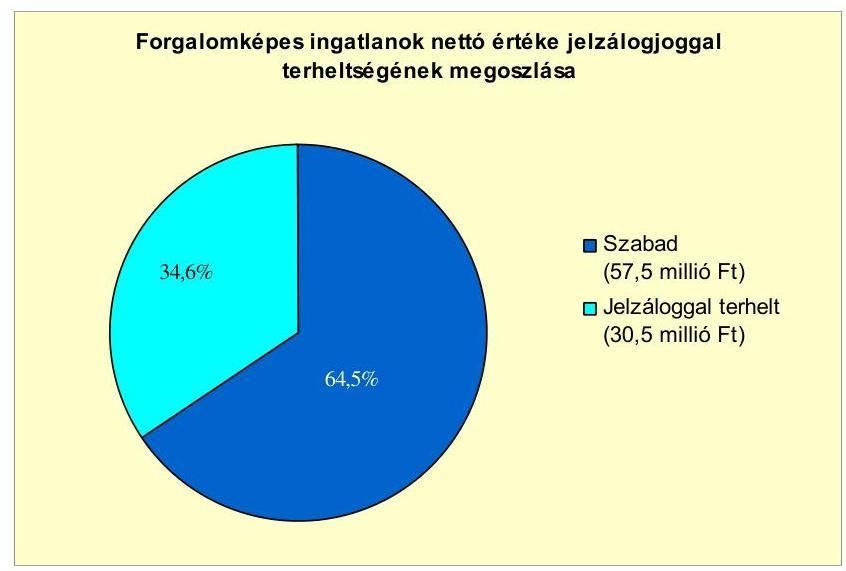

Az Önkormányzat ellen indított, illetve az Önkormányzat által kezdeményezett peres eljárás a helyszíni ellenőrzés időpontjában nem volt folyamatban. Jogerős határozattal lezárt, de ki nem fizetett peres eljárások alapján az Önkormányzatnak 2011. június 30-án követelése, illetve kötelezettsége nem állt fenn.

Az Önkormányzat 100\%-ban tulajdonosa a Demecseri Városgazda Szolgáltató Közhasznú Nonprofit Korlátolt Felelősségű Társaságnak, amely 2002. és 2008. között közhasznú társaságként működött. A gazdasági társaság közhasznú és vállalkozási tevékenységet folytat, településtisztasági feladatokat lát el (hulladékgyűjtés, parkfenntartás), üzemelteti a városi piacot és egyéb létesítményeket. Tevékenységéhez az Önkormányzattól 2011. június 30-ig eszközöket nem vett át. Más gazdasági társasága az Önkormányzatnak nincs.

A gazdasági társaság az ellenőrzött években kötvényt nem bocsátott ki, 2005-ben gépjármű beszerzésére felvett 3,6 millió Ft hosszú lejáratú hitelét

[^0]
[^0]:    ${ }^{15}$ az Art. 134. § (1)-(3) bekezdései alapján

---

2010-ben az eredeti ütemezés szerint visszafizette, ezáltal 2010. június 30-án hosszú lejáratú hitele nem volt. Rövid lejáratú hiteleket a gazdasági társaság 2007. és 2011. június 30. között nem vett igénybe.

A gazdasági társaság 2009-ben kötött lízingszerződést haszongépjármű (traktor) beszerzésére, amelyből fennálló kötelezettsége 2011. június 30-án 1,6 millió Ft volt. Az utolsó lízingrészlet megfizetésének határideje 2014. szeptember.

A gazdasági társaság szállítókkal szemben fennálló kötelezettségeinek állománya 2008. év végétől folyamatosan emelkedett, és 2010. év végén a 6,0 millió Ft szállítói követelés 96,4\%-a, 5,8 millió Ft határidőn túl fennálló tartozás volt. A szállítói tartozások fennálló kötelezettségeken belüli aránya szintén emelkedő tendenciát mutatott, 2010-ben már 56,2\% volt. A szállítók felé fennálló tartozások átütemezésére irányuló szerződést a gazdasági társaság nem kötött. A lejárt szállítói állományt a gazdasági társaság 2011. év I. félévében a 2010. év végi 5,8 millió Ft-ról 2,2 millió Ft-ra (62,1\%-kal) csökkentette. A gazdasági társaság pénzügyi helyzete a 2010. évi saját tőke/jegyzett tőke aránya alapján összességében stabil, azonban az utóbbi két év veszteséges gazdálkodása (2009. évben -2,8 millió Ft, 2010-ben -4,5 millió Ft mérleg szerinti eredmény) és a szállítói állomány emelkedése kedvezőtlen folyamatokat jelez.

Az Önkormányzat a gazdasági társaságokról szóló 2006. évi IV. törvény 54. § (2) bekezdése alapján korlátlan felelősséggel tartozik azon gazdasági társaságának felszámolása esetében, amelyben az Önkormányzat az 52. § (2) bekezdése szerint a szavazatok legalább 75\%-ával rendelkezik, így minősített befolyásszerzőnek minősül, továbbá a csődeljárásról és a felszámolási eljárásról szóló 1991. évi XLIX. törvény 63. § (2) bekezdése alapján a kizárólagos önkormányzati tulajdonú gazdasági társaságának minden olyan kötelezettségéért, amelynek kielégítését a felszámolási eljárás során az adós társaság vagyona nem fedez, ha a hitelezőinek a felszámolási eljárás során benyújtott keresete alapján a bíróság - az adós társaság felé érvényesített tartósan hátrányos üzletpolitikájára figyelemmel - megállapítja az Önkormányzat korlátlan és teljes felelősségét.

Az Önkormányzat tulajdonában álló gazdasági társaság ellen indított, illetve általa kezdeményezett peres eljárás a helyszíni ellenőrzés időpontjában nem volt folyamatban. Jogerős határozattal lezárt, de ki nem fizetett peres eljárások alapján a gazdasági társaságnak 2011. június 30-án követelése, illetve kötelezettsége nem állt fenn.

Az Önkormányzat 2007-2010 között a befektetett eszközök után összesen 556,9 millió Ft értékcsökkenést számolt el. A vizsgált időszakban az Önkormányzatnál nem történt meg annak felmérése, hogy az eszközök elhasználódása, amortizációja fedezetének biztosítása mekkora forrásokat igényel. A felújításokra, az eszközök pótlására - az Önkormányzat kimutatásai szerint - a pénzügyi lehetőségek függvényében került sor.

A felújításokra, az eszközök pótlására elsősorban az intézmények működőképességének biztosítása, illetve a szakhatósági előírások figyelembevételével került sor. Az önkormányzati adatszolgáltatás alapján a felhalmozási kiadásokból eszközpótlásra (rekonstrukcióra, felújításra) 246,0 millió Ft-ot, beruházásra 925,4 millió Ft-ot fordított 2010. december 31-ig az Önkormányzat, amelyhez a

---

szükséges forrást főként felhalmozási célú hazai támogatásokból, illetve kötvénykibocsátásból biztosította.

Az Önkormányzat összes eszközeinek (immateriális javak, ingatlanok, gépek, járművek, üzemeltetésre átadott eszközök) használhatósági foka 2007-2010 között a beruházásokból és felújításokból származó 1171,4 millió Ft bruttó értéknövekedés ellenére 5,9 százalékponttal (90,5\%-ról 84,6\%-ra) csökkent az amortizáció növekedése miatt.

# 4. A PÉNZÜGYI EGYENSÚLY MEGTEREMTÉSE ÉRDEKÉBEN HOZOTT INTÉZKEDÉSEK EREDMÉNYE

A vizsgált időszakban az Önkormányzat pénzügyi egyensúlya javítása érdekében bevételnövelő és kiadáscsökkentő intézkedéseket tett.

A kiadáscsökkentő és bevételnövelő intézkedések a gazdálkodás átláthatóbbá tételét, valamint a feladatellátás szakmai színvonalának, és kiemelten a pénzügyi helyzet javítását célozták.

Kiadáscsökkentő intézkedések végrehajtására - a vizsgált időszakban - 2008., 2009., 2010. és 2011. években került sor. A kiadáscsökkentő intézkedések a létszámcsökkentés, a többletjuttatások csökkentése, a helyettesítések miatti megtakarítások, a beszerzési szerződések felülvizsgálata miatti megtakarítások, a vásárolt közszolgáltatásokhoz kapcsolódó kiadások csökkentése, valamint a civil szervezetek támogatásainak csökkentése területein valósultak meg.

A 2007-2011. év I. félév kiadáscsökkentő intézkedéseinek megoszlását az alábbi grafikon mutatja be:
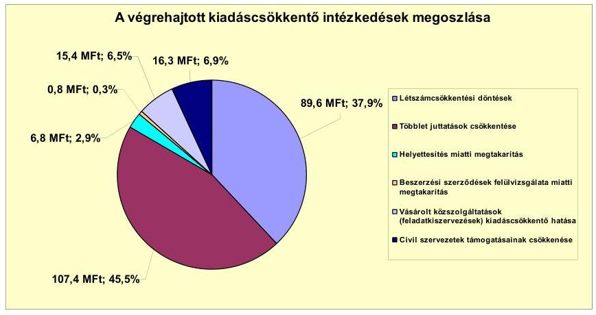

Az Önkormányzat adatszolgáltatása alapján, az ellenőrzött időszakban a kiadáscsökkentő intézkedések eredményeként 236,3 millió Ft megtakarítást értek el. A megtakarítások 37,9\%-a (89,6 millió Ft) a létszámcsökkentéshez, 45,5\%-a (107,4 millió Ft) a többletjuttatások csökkentéséhez, 2,9\%-a (6,8 millió Ft) a helyettesítés miatti megtakarításhoz, 0,3\%-a (0,8 millió Ft) a beszerzési szerződések felülvizsgálatához, 6,5\%-a (15,4 millió Ft) a vásárolt közszolgáltatások kiadásainak csökkentéséhez, 6,9\%-a (16,3 millió Ft) a civil szervezetek támogatásainak csökkentéséhez kapcsolódott. Az összes kiadáscsökken-

---

tő intézkedésből 13,4\% (31,7 millió Ft) az önként vállalt feladatok ellátását érintette.

A legjelentősebb megtakarítást a többletjuttatások csökkentése területén realizálták. Ez a cafetéria elemek csökkentése, megszüntetése (78,0\%, 83,8 millió Ft), a közalkalmazotti bértáblán felüli bérek és pótlékok elvonása (17,1\%, 18,4 millió Ft) és az egyéb intézkedések (túlórák számának csökkentése a DOC-nál; 4,9\%, 5,2 millió Ft) területén valósult meg.

A létszámcsökkentési döntések hatására elért megtakarítás 77,6\%-át (69,5 millió Ft-ot) a feladatmegszüntetéssel, átszervezéssel járó létszámcsökkentési döntések, 16,4\%-át (14,7 millió Ft-ot) 3 üres álláshely zárolása, 6,0\%-át (5,4 millió Ft-ot) a határozott idejű alkalmazások megszüntetése jelentették.

A 2007-2010. években végrehajtott létszámcsökkentéseket az alábbi táblázat mutatja be:

| Megnevezés (aöbok fő-ben) |  | Közoktatás | Szociális és gyermekvédelem | Egészségügy | Polgármesteri hivatal | Egyéb | Összesen |
| :--: | :--: | :--: | :--: | :--: | :--: | :--: | :--: |
| 2007. január 1-jén jóváhagyott álláshelyek száma |  | 116 | 9 | 3 | 46 | 6 | 183 |
| Megszüntetett álláshelyek száma |  | 20 | 0 | 1 | 4 | 1 | 27 |
| 66600. | Üres álláshelyek száma | 3 | 0 | 0 | 0 | 0 | 3 |
|  | Szűrme álláshelyek száma | 16 | 0 | 0 | 3 | 0 | 16 |
|  | Intézmény-csiemelleléssel kapcsolatos |  |  |  |  |  |  |
|  | Iéláshelyek száma | 6 | 0 | 1 | 1 | 1 | 9 |
| Álláshely növekedése |  | 29 | 9 | 0 | 4 | 6 | 47 |
| 2010. december 31-én záró álláshelyek száma |  | 120 | 17 | 2 | 46 | 13 | 199 |
| 2007. január 1-jén foglalkoztatott létszám |  | 116 | 9 | 3 | 46 | 6 | 183 |
| Létszámcsökkentés |  | 20 | 0 | 1 | 4 | 1 | 27 |
| Létszámnövekedés |  | 29 | 9 | 0 | 4 | 6 | 47 |
| 2010. december 31-én foglalkoztatott létszám |  | 120 | 17 | 2 | 46 | 13 | 199 |

2007-ben az induló álláshelyek száma 183 fő volt. 2007. július 15-től Berkesz és Székely települések Demecser székhellyel közös intézményfenntartó társulást hoztak létre. A települések önkormányzatai az óvodai nevelés és az általános iskolai oktatás területén társultak az Önkormányzathoz. Az Önkormányzat 2008. január 1-jétől körjegyzőségként működik, hozzá tartozik Berkesz település. A szociális feladatok (családsegítés, gyermekjóléti feladatok, szociális étkeztetés, házi segítségnyújtás) társulási formában történő ellátásához csatlakozott 2008. május 1-jétől Kék, Gégény és Székely település. A feladatbővülések miatti létszámnövekedés a vizsgált időszakban 47 fő volt.

A létszámbővítések mellett, a működés racionalizálása érdekében a Képviselőtestület 9 esetben döntött létszámleépítésről is.

A polgármesteri hivatali feladatok tekintetében (élelmezési szakfeladaton) egy fő létszámcsökkentés valósult meg.

Egy óvodai csoport és az általános iskolai iskolaotthonos oktatás megszűnése miatt az óvodáknál kettő óvónői státusz és egy technikai dolgozói státusz megszüntetésére, három álláshely zárolására került sor. Az általános iskolai intézmény-egységben a pedagógus létszámot kettő fővel csökkentették, kettő álláshelyet zároltak. Ugyancsak megszüntetésre került egy fő takarítói státusz. Rendelkezett továbbá egy dajka státusz megszüntetéséről, egy álláshely zárolásáról és kettő fő óvodai státusz megszüntetéséről. Az általános iskolai oktatás területén további három álláshely megszüntetése valósult meg.

---

A házi segítségnyújtás szakfeladaton a székelyi telephelyen csökkent egy fővel a létszám.
2010. január 1-jén az induló létszám 216 fő volt. Ebben az évben megszüntetésre került 13 közoktatási, három önkormányzati igazgatási és egy közművelődési álláshely.

# A vizsgált időszakban 31 álláshelyet szüntettek meg.

Az önkormányzati létszám és álláshelyek száma a 2007 és 2010 közötti időszakban a körjegyzőség megalakítása, valamint a szociális és gyermekjóléti szolgáltatások társulásos formában történő ellátása miatt összességében 16 fővel nőtt.

Üres állások megszüntetésére 2010. évben került sor. A három üres álláshely megszüntetése eredményeként az Önkormányzat 6,5 millió Ft összegű megtakarítást realizált.

Az Önkormányzat a létszámcsökkentésekhez kapcsolódóan 2007-2010 között 19,4 millió Ft összegű központosított támogatást igényelt és kapott meg. A támogatás felhasználásával tartósan leépített álláshelyek száma összesen 19 fő volt.

Az Önkormányzat a kiadáscsökkentő intézkedések mellett bevételnövelő intézkedéseket is megvalósított a pénzügyi stabilitás fokozása érdekében. A bevételnövelő intézkedések a helyi adókkal kapcsolatban, a kedvezmények, mentességek megszüntetéséhez és az adóhátralékok behajtásához kapcsolódtak. Az eszközök hasznosítására tett intézkedéseken belül az eszközök értékesítése területén valósultak meg.

A bevételnövelő intézkedések főbb bevételi jogcímek szerinti számszerűsített hatását az alábbi grafikon mutatja be:
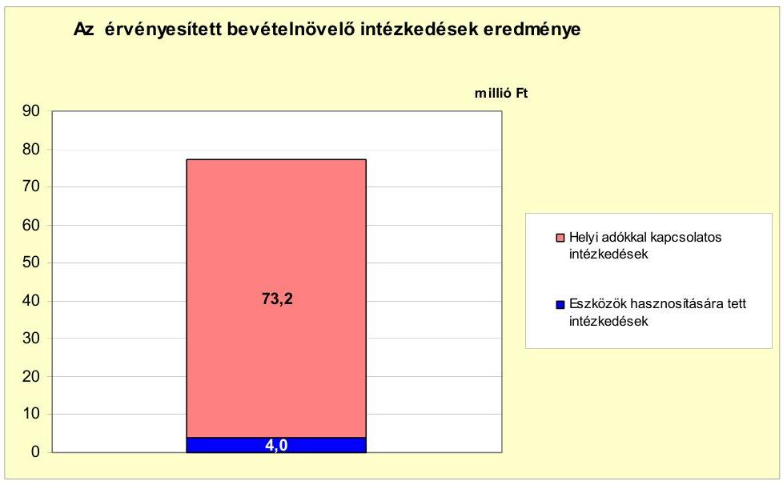

---

Az Önkormányzat bevételnövelésre irányuló intézkedései számszerűsített összegéből, ami 77,2 millió Ft volt, 73,2 millió Ft-ot $(94,8 \%)$ jelentettek a helyi adókkal kapcsolatos, 4,0 millió Ft-ot $(5,2 \%)$ az eszközök hasznosításával kapcsolatos bevételek. A helyi adókkal kapcsolatos bevételnövelő intézkedéseken belül 61,3 millió Ft $(83,7 \%)$ bevétel származott a kedvezmények, mentességek megszüntetéséből, 11,9 millió Ft ( $16,3 \%$ ) az adóbehajtási tevékenység hatékonyságának fokozásából. Az eszközök hasznosításából származó bevétel 100\%-ban tárgyi eszköz értékesítéséből származott.

A kiadáscsökkentő és bevételnövelő intézkedések az Önkormányzat pénzügyi helyzetét javították. Azok eredményeként a 2007-2011. év I. félévi időszakban 313,5 millió Ft bevételi többletet értek el. A központi támogatás kumulált növekedése ugyanezen időszakban 225,6 millió Ft volt.

# 5. Az ÁSZ Által a korábbi években a pénzügyi egyensúly javítására tett szabályszerűségi és célszerűségi javaslatok hasznosulása 

Az ÁSZ az Önkormányzat gazdálkodási rendszerét 2009-ben ellenőrizte. Jelentésében a pénzügyi egyensúly megteremtésének elősegítésére kettő szabályszerűségi és kettő célszerűségi javaslatot tett. A jelentést a Képviselő-testület megismerte. A javaslatok megvalósítására intézkedési tervet készítettek, amely teljes körűen tartalmazta a javaslatokat, a tervezett intézkedéseket, meghatározta a feladatok elvégzéséért felelősöket és a feladatok elvégzésének határidejét.

A pénzügyi egyensúly javítása érdekében javasoltuk a polgármesternek, hogy „kezdeményezze, hogy a számvevői jelentésben foglaltakat a Képviselő-testület tárgyalja meg és a feltárt hiányosságok megszüntetése érdekében készíttessen intézkedési tervet a határidők és felelősök megjelölésével. Az intézkedési tervet, az elfogadását követő 30 napon belül küldje meg az ÁSZ Szabolcs-Szatmár-Bereg Megyei Ellenőrzési Irodája részére". A számvevői jelentésben foglaltakat a Képviselő-testület 2009. április 9-én megtárgyalta, a hiányosságok megszüntetése érdekében készített intézkedési tervet elfogadta.

Javasoltuk a jegyzőnek: „gondoskodjon arról, hogy a költségvetési rendeletben a költségvetés bevételi és kiadási főösszegének megállapításakor az Áht. 8/A. § (7) bekezdésében foglaltaknak megfelelően finanszírozási célú pénzügyi műveleteket ne mutassanak ki". Határidőként a következő költségvetési rendelet megalkotásának időpontját írták elő. A 2010. február 19-én kelt költségvetési rendeletben az általunk tett javaslat, valamint az Áht. 8/A. § (7) bekezdésében foglaltak ellenére finanszírozási célú pénzügyi művelet kimutatására került sor. A 2011. évre vonatkozó, 2011. február 11-én elfogadott költségvetési rendelet már a jogszabályi előírásoknak megfelelő volt.

Javasoltuk továbbá, hogy a jegyző „írja elő az Ámr. 145/A. § (1)-(2) bekezdésében és 145/B. § (1) bekezdésében foglaltak alapján az intézmények pénzmaradvány megállapítása szabályszerűségének ellenőrzését és gondoskodjon ezen ellenőrzés elvégeztetéséről annak érdekében, hogy azzal megalapozzák az intézményi pénzmaradvány Ámr. 66. § (4) bekezdésében foglalt előírás alapján történő képviselő-testületi felülvizsgálatát és jóváhagyását". A munkaköri leírások felülvizsgálatát és a javaslat-

---

ban foglaltaknak megfelelő aktualizálását 2009. december 31-ig elvégezték. Az ellenőrzés végrehajtása megvalósult.

A munka színvonalának javítása érdekében javasoltuk a jegyzőnek, hogy „tegye meg a szükséges intézkedéseket a tervezés megalapozottságának biztosítása érdekében, hogy a felhalmozási célú bevételek és kiadások tervezése során kizárólag a már elnyert pályázatok alapján kerüljenek a költségvetési bevételek és a költségvetési kiadások megtervezésre". A javaslat megvalósításának határidejét a következő költségvetési rendelet elkészítésének időpontjában határozták meg. A 2010. február 19-én kelt költségvetési rendeletet már a javaslatban foglaltaknak megfelelően alkották meg.

Az intézkedési tervben előírt intézkedések megvalósulását figyelemmel kísérték.

Budapest, 2012. április " " 7

Melléklet: $\quad 8 \mathrm{db}$
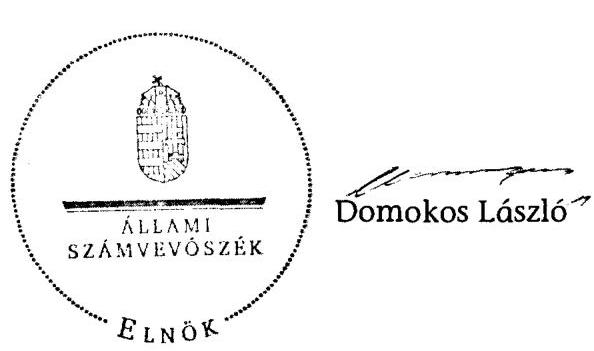

---

DEMECSER Város Önkormányzata

1.  számú melléklet
a V-3119-021/2012. számú Jelentéshez

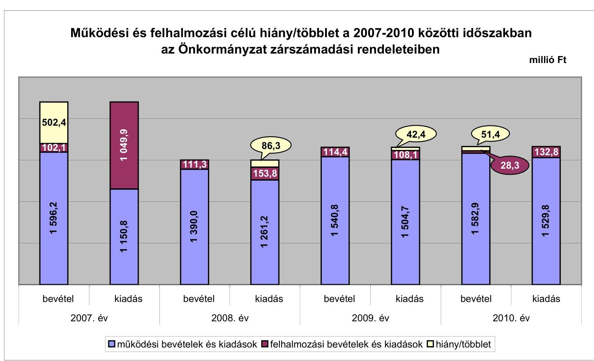

---

Az Önkormányzat bevételei és kiadásai, valamint adósságszolgálata 2007-2010 között

|  1. FOLYÓ KÖLTSÉGVETÉS* | 2007. év | 2008. év | 2009. év | 2010. év  |
| --- | --- | --- | --- | --- |
|  1.1.1. Saját működési bevételek | 131,6 | 164,7 | 149,6 | 156,1  |
|  1.1.2. Költségvetési támogatás *** | 497,6 | 836,1 | 1035,4 | 1058,6  |
|  1.1.3. Átengedett bevételek | 375,9 | 203,0 | 211,8 | 222,6  |
|  1.1.4. Állambáztartáson belülről kapott támogatások | 71,6 | 132,2 | 124,6 | 134,9  |
|  1.1.5. EU-nő és külföldről kapott bevételek | 6,4 | 0,5 | 4,3 | 0,0  |
|  1.1.6. Állambáztartáson kívülről kapott bevételek | 23,6 | 8,7 | 15,0 | 10,7  |
|  1.1.7. Előző évi pénzmaradvány átvétel | 0,0 | 0,0 | 0,0 | 0,0  |
|  1.1. Folyó bevételek $=1.1 .1 .+1.1 .2 .+1.1 .3 .+1.1 .4 .+1.1 .5 .+1.1 .6 .+1.1 .7$. | 1086,7 | 1345,2 | 1540,6 | 1582,6  |
|  1.2.1. Működési kiadások kamatkiadások nélkül | 929,5 | 1030,0 | 1313,8 | 1378,9  |
|  1.2.2. Állambáztartáson belülre átadott pénzeszközök | 0,2 | 0,4 | 0,2 | 1,9  |
|  1.2.3.1. vállalkozásoknak | 28,6 | 23,3 | 21,4 | 20,7  |
|  1.2.3.2. EU-nak, illetve külföldre | 0,0 | 0,0 | 0,0 | 0,0  |
|  1.2.3.3. magánszemélyeknek | 160,7 | 159,7 | 143,6 | 112,8  |
|  1.2.3.4. nonprofit szervezeteknek | 13,4 | 12,9 | 9,1 | 1,8  |
|  1.2.5. Transferkiadások ( $=1.2 .3 .1+1.2 .3 .2+1.2 .3 .3+1.2 .3 .4$ ) | 202,7 | 195,9 | 174,1 | 135,3  |
|  1.2.4 Kamatkiadások | 18,4 | 34,9 | 16,8 | 13,7  |
|  1.2.5. Előző évi pénzmaradvány átadás | 0,0 | 0,0 | 0,0 | 0,0  |
|  1.2. Folyó kiadások $=1.2 .1 .+1.2 .2 .+1.2 .3 .+1.2 .4 .+1.2 .5$. | 1150,8 | 1261,2 | 1504,7 | 1529,6  |
|  1.3. Folyó költségvetés egyenlege MŰKÖDÉSI JÖVEDELEM (1.1. - 1.2.) | $-64,1$ | 84,0 | 36,1 | 53,1  |
|  2. FELHALMOZÁSI KÖLTSÉGVETÉS** | 0,0 | 0,0 | 0,0 | 0,0  |
|  2.1.1. Saját tőkebevételek | 0,1 | 0,0 | 2,2 | 4,0  |
|  2.1.2. Állambáztartáson belülről kapott támogatások | 511,5 | 100,0 | 71,8 | 2,6  |
|  2.1.3. EU-nő és külföldről kapott támogatások | 73,3 | 16,6 | 32,7 | 21,3  |
|  2.1.4. Állambáztartáson kívülről kapott támogatások | 26,7 | 39,6 | 7,7 | 0,4  |
|  2.1. Felhalmozási bevételek ( $=2.1 .1 .+2.1 .2+2.1 .3+2.1 .4$ ) | 611,7 | 156,1 | 114,4 | 28,2  |
|  2.2.1. Saját beruházási kiadás áfával | 895,7 | 131,4 | 34,8 | 18,3  |
|  2.2.2. Saját felújítási kiadás áfával | 145,1 | 15,7 | 71,0 | 113,9  |
|  2.2.3. Állambáztartáson belülre átadott pénzeszköz | 0,0 | 0,0 | 0,0 | 0,0  |
|  2.2.4. EU-nak és külföldnek adott pénzeszközök | 0,0 | 0,0 | 0,0 | 0,0  |
|  2.2.5. Állambáztartáson kívülre adott pénzeszközök | 9,1 | 6,1 | 1,7 | 0,4  |
|  2.2.6. Befektetési célú részesedések vásárlása | 0,0 | 0,5 | 0,5 | 0,0  |
|  2.2. Felhalmozási kiadások ( $=2.2 .1 .+2.2 .2 .+2.2 .3 .+2.2 .4 .+2.2 .5 .+2.2 .6$ ) | 1049,9 | 153,8 | 108,1 | 132,8  |
|  2.3. Felhalmozási költségvetés egyenlege (2.1. - 2.2.) | $-438,2$ | 2,3 | 6,3 | $-104,6$  |
|  3. Finanszírozási műveletek nélküli (GFS) pozíció(1.3.+2.3.) | $-502,4$ | 86,3 | 42,3 | $-51,5$  |
|  4. Finanszírozási műveletek | 0,0 | 0,0 | 0,0 | 0,0  |
|  4.1. Hitelfelvétel | 447,6 | 24,2 | 36,0 | 0,0  |
|  4.2. Hiteltörlesztés | 167,3 | 268,1 | 110,6 | 49,5  |
|  4.3. Forgatási és befektetési célú értékpapírok kibocsátása | 600,0 | 0,0 | 0,0 | 0,0  |
|  4.4. Forgatási és befektetési célú értékpapírok beváltása | 0,0 | 0,0 | 0,0 | 0,0  |
|  4.5. Forgatási és befektetési célú értékpapírok értékesítése | 0,0 | 0,0 | 0,0 | 0,0  |
|  4.6. Forgatási és befektetési célú értékpapírok vásárlása | 0,0 | 0,0 | 0,0 | 0,0  |
|  4.7. Egyéb finanszírozási bevételek (függő, átfoló, kiegyenlítő) | 1,4 | 5,1 | 5,0 | $-58,9$  |
|  4.8. Egyéb finanszírozási kiadások (függő, átfoló, kiegyenlítő) | $-27,7$ | 27,1 | 22,7 | $-37,7$  |
|  4.9.Finanszírozási műveletek egyenlege (4.1. - 4.2.+4.3.-4.4+4.5.-4.6.+4.7.-4.8.) | 909,7 | $-265,9$ | $-92,2$ | $-70,7$  |
|  5. Tárgyévi pénzügyi pozíció (1.3.+ 2.3.+4.9.) | 407,3 | $-179,6$ | $-49,9$ | $-122,2$  |
|  6. Nettó működési jövedelem =működési jövedelem (1.3.) - tőketörlesztés (4.2+4.4) | $-231,4$ | $-184,1$ | $-74,5$ | 3,6  |
|  TÁJÉKOZTATÓ ADATOK |  |  |  |   |
|  Összes kötelezettség | 1081,1 | 840,2 | 796,7 | 1034,3  |
|  ebből rövid lejáratú | 481,1 | 240,2 | 196,7 | 204,3  |
|  Összes szállítói kötelezettség | 44,8 | 59,3 | 98,6 | 132,0  |
|  ebből lejárt (tanúsítványból) | 41,7 | 57,6 | 92,8 | 128,5  |
|  Pénz és tőkepiaci kötelezettség (adósság) | 801,4 | 654,1 | 666,0 | 870,7  |
|  ebből rövid lejáratú | 201,4 | 54,1 | 66,0 | 42,5  |
|  PPP szerződéses állomány jelenértéken (tanúsítványból) | 0,0 | 0,0 | 0,0 | 0,0  |
|  ebből lejárt szolgáltatási díj miatti kötelezettség | 0,0 | 0,0 | 0,0 | 0,0  |
|  Folyószámlahitel napi átlagos állománya (tanúsítványból) | 35,1 | 43,3 | 35,2 | 37,2  |
|  Likvidhitel napi átlagos állománya (tanúsítványból) | 0,3 | 0,1 | 0,0 | 0,0  |
|  Munkabérhitel napi átlagos állománya (tanúsítványból) | 27,0 | 29,8 | 28,1 | 26,2  |
|  Kezesség és garanciavállalások (tanúsítványból) | 0,0 | 0,0 | 0,0 | 0,0  |
|  Jogerős bírósági ítéletekből adódó kötelezettségek (tanúsítványból) | 0,0 | 0,0 | 0,0 | 0,0  | 0,0  |
|  Finanszírozásba bevonható eszközök: | 414,3 | 234,7 | 184,8 | 62,7  |
|  Tartós hitelviszonyt megtestesítő értékpapírok év végi állománya | 600,0 | 600,0 | 600,0 | 804,3  |
|  Hosszú lejáratú bankbetétek év végi állománya | 0,0 | 0,0 | 0,0 | 0,0  |
|  Értékpapírok év végi állománya | 0,0 | 0,0 | 0,0 | 0,0  |
|  Pénzeszközök (idegen pénzeszközök nélkül) év végi állománya | 414,3 | 234,7 | 184,8 | 62,7  |

- Bevételekben nem térül, a kiadásokban nem jelenik meg az amortizáció, a vagyoni helyzetet az egyenleg befolyásolja. ** Bevételekben vagyon megőrzésre és bővítései fordítható források. *** A költségvetési támogatásból a felhalmozási célú összeget az Önkormányzat adatszolgáltatása szerinti mértékben vettük figyelembe.

---

DEMECSER Város Önkormányzata

Az Önkormányzat 2007-2010. években megvalósított, 2010. december 31-ig befejezett fejlesztései és azok forrásösszetétele

M Ft-ban

|  Fejlesztési feladat (beruházás, felújítás) |  |  | Beruházás, felújítás |  |  | Teljes bekerülési költség |  |  |  |  |  |  |  |  |  |  |  |  |  |  |  |  |  |  |  |  |  |  |  |  |  |  |  |  |  |  |  |  |  |  |  |  |   |
| --- | --- | --- | --- | --- | --- | --- | --- | --- | --- | --- | --- | --- | --- | --- | --- | --- | --- | --- | --- | --- | --- | --- | --- | --- | --- | --- | --- | --- | --- | --- | --- | --- | --- | --- | --- | --- | --- | --- | --- | --- | --- | --- | --- | --- |
|   |  |  |  |  |  |  |  |  |  |  |  |  |  |  |  |  |  |  |  |  |  |  |  |  |  |  |  |  |  |  |  |  |  |  |  |  |  |  |  |  |  |  |   |
|  Ft |  |  |  |  |  |  |  |  |  |  |  |  |  |  |  |  |  |  |  |  |  |  |  |  |  |  |  |  |  |  |  |  |  |  |  |  |  |  |  |  |  |  |   |
|  1 | 2 | 3 | 4 | 5 | 6 | 7 | 8 | 9 | 10 | 11 | 12 | 13 | 14 | 15 | 16 | 17 | 18 | 19 | 20 | 21 | 22 | 23 | 24 | 25 | 26 | 27 | 28 | 29 | 30 | 31 | 32 |  |  |  |  |  |  |  |  |  |   |
|  1. | Felújítások |  |  |  |  |  |  |  |  |  |  |  |  |  |  |  |  |  |  |  |  |  |  |  |  |  |  |  |  |  |  |  |  |  |  |  |  |  |  |  |  |   |
|  2. |  |  |  |  |  |  |  |  |  |  |  |  |  |  |  |  |  |  |  |  |  |  |  |  |  |  |  |  |  |  |  |  |  |  |  |  |  |  |  |  |  |   |
|  3. | Külterületi csatorna felújítás |  | 43/2005.(III.14.) | 2006. | 2008. | 94,1 | 94,1 | 0,0 | 0,0 | 94,1 | 5,7 | 5,7 | 0,0 | 0,0 | 0,0 | 0,0 | 0,0 | 0,0 | 0,0 | 80,0 | 80,0 | 0,0 | 8,5 | 8,5 | 0,0 | 0,0 |  |  |  |  |  |  |  |  |  |  |  |  |  |  |   |
|  4. | Arany János út felújítás |  | 18/2006.(II.02.) | 2006. | 2007. | 28,8 | 28,2 | -0,4 | 1,2 | 28,2 | 0,0 | 0,0 | 0,0 | 0,0 | 0,0 | 0,0 | 21,5 | 21,5 | 0,0 | 0,0 | 0,0 | 0,0 | 6,8 | 6,8 | 0,0 | 0,0 |  |  |  |  |  |  |  |  |  |  |  |  |  |   |
|  5. | Kistelepülési iskolák fejlesztése |  | 49/2008.(IV.29.) | 2008. | 2009. | 20,9 | 20,9 | 0,0 | 0,0 | 20,9 | 6,0 | 6,0 | 0,0 | 0,0 | 0,0 | 0,0 | 0,0 | 0,0 | 0,0 | 0,0 | 14,9 | 14,9 | 0,0 | 0,0 |  |  |  |  |  |  |  |  |  |  |  |  |  |  |  |   |
|  6. | Fő út felújítása |  | 105/2008.(IX.15.) | 2008. | 2009. | 34,8 | 34,6 | 0,0 | 0,0 | 34,6 | 0,0 | 0,0 | 0,0 | 0,0 | 0,0 | 0,0 | 24,3 | 24,4 | 0,1 | 0,0 | 0,0 | 0,0 | 10,3 | 10,3 | 0,0 | 0,0 |  |  |  |  |  |  |  |  |  |  |  |  |  |   |
|  7. | Nagy út és Főshuir út |  | 129/2009.(X.16.) | 2009. | 2010. | 35,5 | 42,7 | 7,2 | 0,0 | 42,7 | 0,0 | 0,0 | 0,0 | 0,0 | 0,0 | 0,0 | 17,9 | 26,2 | 8,4 | 0,0 | 0,0 | 0,0 | 17,8 | 16,5 | -1,3 | 0,0 |  |  |  |  |  |  |  |  |  |  |  |  |  |   |
|  8. | 10 millió Ft alatt felújítások |  | 10 |  |  | 0,0 | 30,5 | 30,5 | 0,0 | 30,5 | 9,5 | 9,5 | 0,0 | 0,0 | 0,0 | 0,0 | 10,1 | 10,1 | 0,0 | 0,0 | 0,0 | 0,0 | 10,9 | 10,9 | 0,0 | 0,0 |  |  |  |  |  |  |  |  |  |  |  |  |  |   |
|  9. | Felújítások összesen: |  |  |  | 213,7 | 251,0 | 37,3 | 1,2 | 251,0 | 21,2 | 21,2 | 0,0 | 0,0 | 0,0 | 0,0 | 73,7 | 82,2 | 8,5 | 80,0 | 80,0 | 0,0 | 69,2 | 67,9 | -1,3 | 0,0 |  |  |  |  |  |  |  |  |  |  |  |  |  |  |   |
|  10. | Fejlesztések |  |  |  |  |  |  |  |  |  |  |  |  |  |  |  |  |  |  |  |  |  |  |  |  |  |  |  |  |  |  |  |  |  |  |  |  |  |  |  |   |
|  11. | DOC bővítés |  | 75/2005.(VII.29.) | 2006. | 2007. | 407,3 | 518,5 | 111,2 | 52,2 | 518,5 | 0,0 | 67,3 | 67,3 | 42,0 | 0,0 | -42,0 | 0,0 | 172,2 | 172,2 | 0,0 | 0,0 | 0,0 | 365,3 | 279,0 | -86,3 | 0,0 |  |  |  |  |  |  |  |  |  |  |  |  |  |   |
|  12. | Széchenyi út építése |  | 113/2005.(IX.26.) | 2005. | 2006. | 497,9 | 459,0 | -38,9 | 0,0 | 459,0 | 143,3 | 127,7 | -15,6 | 55,8 | 56,0 | 0,2 | 0,0 | 0,0 | 0,0 | 0,0 | 0,0 | 298,7 | 275,3 | -23,4 | 0,0 |  |  |  |  |  |  |  |  |  |  |  |  |  | |  |  |  |  |  |  |  |  |  |  |  |  |  |  |   |
|  13. | Szénhervi út építése |  | 44/2007.(V.2.) | 2008. | 2008. | 39,0 | 47,2 | 8,2 | 0,0 | 47,2 | 4,6 | 5,3 | 0,7 | 0,0 | 0,0 | 0,0 | 0,0 | 7,5 | 7,5 | 0,0 | 0,0 | 0,0 | 34,4 | 34,4 | 0,0 | 0,0 |  |  |  |  |  |  |  |  |  |  |  |  |   |
|  14. | Jókai és Móricz Zsigmond út építés |  | 121/2008.(XI.16.) | 2009. | 2009. | 31,7 | 31,4 | -0,3 | 0,0 | 31,4 | 3,8 | 3,8 | 0,0 | 0,0 | 0,0 | 0,0 | 3,8 | 3,8 | 0,0 | 23,8 | 23,6 | 0,0 | 0,0 | 0,0 | 0,0 | 0,0 |  |  |  |  |  |  |  |  |  |  |  |  |   |
|  15. | 10 millió Ft alatt fejlesztések |  | 62 |  |  | 66,5 | 66,5 | 0,0 | 0,0 | 66,5 | 21,8 | 21,8 | 0,0 | 0,0 | 0,0 | 23,9 | 23,9 | 0,0 | 17,2 | 17,2 | 0,0 | 3,6 | 3,6 | 0,0 | 0,0 |  |  |  |  |  |  |  |  |  |  |  |  |  |   |
|  16. | Fejlesztések összesen: |  |  |  | 1042,4 | 1122,6 | 80,2 | 52,2 | 1122,6 | 173,5 | 225,9 | 52,4 | 97,8 | 56,0 | -41,8 | 27,7 | 207,4 | 179,7 | 40,9 | 40,9 | 0,0 | 702,0 | 592,3 | -109,7 | 0,0 |  |  |  |  |  |  |  |  |  |  |  |  |  |   |
|  17. | Mindösszesen: |  |  |  | 1256,1 | 1373,7 | 117,5 | 53,4 | 1373,7 | 194,7 | 247,1 | 52,4 | 97,8 | 56,5 | -41,8 | 101,4 | 209,6 | 188,2 | 120,8 | 120,8 | 0,0 | 771,3 | 660,2 | -111,9 | 0,0 |  |  |  |  |  |  |  |  |  |  |  |  |  |  |   |

millió Ft-ban

Jogszabályban foglalt szakmai követelmény teljesítése (igen/nem)

---

## **Az Önkormányzat 2010. december 31-én folyamatban lévő fejlesztési feladataira 2010. december 31-ig teljesített kifizetések és azok forrásösszetétele**

|  Fejlesztési feladat (beruházás, felújítás) |  | Beruházás, felújítás |  | Teljes bekerülési költség |  |  |  |  |  |  |  |  |  |  |  |  |  |  |  |  |  |  |  |  |  |  |  |  |  |  |  |  |  |  |  |  |  |  |  |  |   |
| --- | --- | --- | --- | --- | --- | --- | --- | --- | --- | --- | --- | --- | --- | --- | --- | --- | --- | --- | --- | --- | --- | --- | --- | --- | --- | --- | --- | --- | --- | --- | --- | --- | --- | --- | --- | --- | --- | --- | --- | --- | --- | --- |
|   |  |  |  |  |  |  |  |  |  |  |  |  |  |  |  |  |  |  |  |  |  |  |  |  |  |  |  |  |  |  |  |  |  |  |  |  |  |  |  |  |   |
|   |  |  |  |  |  |  |  |  |  |  |  |  |  |  |  |  |  |  |  |  |  |  |  |  |  |  |  |  |  |  |  |  |  |  |  |  |  |  |  |  |   |
|   |  |  |  |  |  |  |  |  |  |  |  |  |  |  |  |  |  |  |  |  |  |  |  |  |  |  |  |  |  |  |  |  |  |  |  |  |  |  |  |  |   |
|   |  |  |  |  |  |  |  |  |  |  |  |  |  |  |  |  |  |  |  |  |  |  |  |  |  |  |  |  |  |  |  |  |  |  |  |  |  |  |  |  |   |
|   |  |  |  |  |  |  |  |  |  |  |  |  |  |  |  |  |  |  |  |  |  |  |  |  |  |  |  |  |  |  |  |  |  |  |  |  |  |  |  |  |   |
|   |  |  |  |  |  |  |  |  |  |  |  |  |  |  |  |  |  |  |  |  |  |  |  |  |  |  |  |  |  |  |  |  |  |  |  |  |  |  |  |  |   |
|   |  |  |  |  |  |  |  |  |  |  |  |  |  |  |  |  |  |  |  |  |  |  |  |  |  |  |  |  |  |  |  |  |  |  |  |  |  |  |  |  |   |
|   |  |  |  |  |  |  |  |  |  |  |  |  |  |  |  |  |  |  |  |  |  |  |  |  |  |  |  |  |  |  |  |  |  |  |  |  |  |  |  |  |   |
|   |  |  |  |  |  |  |  |  |  |  |  |  |  |  |  |  |  |  |  |  |  |  |  |  |  |  |  |  |  |  |  |  |  |  |  |  |  |  |  |  |   |
|   |  |  |  |  |  |  |  |  |  |  |  |  |  |  |  |  |  |  |  |  |  |  |  |  |  |  |  |  |  |  |  |  |  |  |  |  |  |  |  |  | |
|   |  |  |  |  |  |  |  |  |  |  |  |  |  |  |  |  |  |  |  |  |  |  |  |  |  |  |  |  |  |  |  |  |  |  |  |  |  |  |  |  |   |
|   |  |  |  |  |  |  |  |  |  |  |  |  |  |  |  |  |  |  |  |  |  |  |  |  |  |  |  |  |  |  |  |  |  |  |  |  |  |  |  |  |   |
|   |  |  |  |  |  |  |  |  |  |  |  |  |  |  |  |  |  |  |  |  |  |  |  |  |  |  |  |  |  |  |  |  |  |  |  |  |  |  |  |  |   |
|   |  |  |  |  |  |  |  |  |  |  |  |  |  |  |  |  |  |  |  |  |  |  |  |  |  |  |  |  |  |  |  |  |  |  |  |  |  |  |  |  |   |
|   |  |  |  |  |  |  |  |  |  |  |  |  |  |  |  |  |  |  |  |  |  |  |  |  |  |  |  |  |  |  |  |  |  |  |  |  |  |  |  |  |   |
|   |  |  |  |  |  |  |  |  |  |  |  |  |  |  |  |  |  |  |  |  |  |  |  |  |  |  |  |  |  |  |  |  |  |  |  |  |  |  |  |  |   |
|   |  |  |  |  |  |  |  |  |  |  |  |  |  |  |  |  |  |  |  |  |  |  |  |  |  |  |  |  |  |  |  |  |  |  |  |  |  |  |  |  |   |
|   |  |  |  |  |  |  |  |  |  |  |  |  |  |  |  |  |  |  |  |  |  |  |  |  |  |  |  |  |  |  |  |  |  |  |  |  |  |  |  |  |   |
|   |  |  |  |  |  |  |  |  |  |  |  |  |  |  |  |  |  |  |  |  |  |  |  |  |  |  |  |  |  |  |  |  |  |  |  |  |  |  |  |  |   |
|   |  |  |  |  |  |  |  |  |  |  |  |  |  |  |  |  |  |  |  |  |  |  |  |  |  |  |  |  |  |  |  |  |  |  |  |  |  |  |  |  |   |
|   |  |  |  |  |  |  |  |  |  |  |  |  |  |  |  |  |  |  |  |  |  |  |  |  |  |  |  |  |  |  |  |  |  |  |  |  |  |  |  |  |   |
|   |  |  |  |  |  |  |  |  |  |  |  |  |  |  |  |  |  |  |  |  |  |  |  |  |  |  |  |  |  |  |  |  |  |  |  |  |  |  |  |  |   |
|   |  |  |  |  |  |  |  |  |  |  |  |  |  |  |  |  |  |  |  |  |  |  |  |  |  |  |  |  |  |  |  |  |  |  |  |  |  |  |  |  |   |
|   |  |  |  |  |  |  |  |  |  |  |  |  |  |  |  |  |  |  |  |  |  |  |  |  |  |  |  |  |  |  |  |  |  |  |  |  |  |  |  |  |   |
|   |  |  |  |  |  |  |  |  |  |  |  |  |  |  |  |  |  |  |  |  |  |  |  |  |  |  |  |  |  |  |  |  |  |  |  |  |  |  |  |  |   |
|   |  |  |  |  |  |  |  |  |  |  |  |  |  |  |  |  |  |  |  |  |  |  |  |  |  |  |  |  |  |  |  |  |  |  |  |  |  |  |  |  |   |
|   |  |  |  |  |  |  |  |  |  |  |  |  |  |  |  |  |  |  |  |  |  |  |  | |  |  |  |  |  |  |  |  |  |  |  |  |  |  |  |  |   |
|   |  |  |  |  |  |  |  |  |  |  |  |  |  |  |  |  |  |  |  |  |  |  |  |  |  |  |  |  |  |  |  |  |  |  |  |  |  |  |  |  |   |
|   |

---

DEMECSER Város Önkormányzata

Az Önkormányzat 2010. december 31-én folyamatban lévő fejlesztési feladataira 2010. december 31-én fennálló kötelezettségek és azok forrásösszetétele

millel Ft-ban

|  |   |   |   |   |   |   |   |   |   |   |   |   |   |   |   |   |   |   |   |   |   |   |   |   |   |   |   |   |   |   |   |   |   |   |   |   |   |   |   |   |   |   |   |   |   |   |   |   |   |   |   |   |   |   |   |   |   |   |   |   |   |   |   |   |   |   |   |   |   |   |   |   |   |   |   |   |   |   |   |   |   |   |   |   |   |   |   |   |   |   |   |   |   |   |   |   |   |   |   |   |  

---

# Az önkormányzati feladatok ellátásában résztvevő gazdasági társaságok

|  Gazdasági társaság megnevezése | 2010. december 31-én |  |  |  |  |  |  |  | a gazdasági társaságnak szerződéses kötelezettségre, feladat ellátási szerződésre alapozottan az önkormányzat költségvetéséből nyújtott |  |  |  |  |  |  |  |  |  |   |
| --- | --- | --- | --- | --- | --- | --- | --- | --- | --- | --- | --- | --- | --- | --- | --- | --- | --- | --- | --- |
|   | önkormányzat | önkormányzat gazdasági társaságának | saját tőke, jegyzett tőke aránya | kötelező feladathoz | önként vállalt feladathoz | hosszú lejáratú hiteltől, kötvényből | lízingből | lejárt szállító állományból | működési célra átadott pénzeszköz |  |  |  |  |  |  |  |  |  |   |
|   | tulajdoni hányada |  |  |  | rendelt nettó vagyon |  | fennálló kötelezettség |  |  | felhalmozású célra átadott pénzeszköz |  |  |  |  |  |  |  |  |  |   |
|   |  |  |  |  |  |  |  |  |  | 2007. | 2008. | 2009. | 2010. | 2011. év
I. félév | 2007. | 2008. | 2009. | 2010. | 2011. év
I. félév  |
|  I. 100\%-os tulajdoni hányadú gazdasági társaságok: |  |  |  |  |  |  |  |  |  |  |  |  |  |  |  |  |  |  |   |
|  Demecser Városgazda Szolgáltató Közhasznú Nonprofit Korlátolt | 100,0 | 0,0 | 34,2 | 0,0 | 0,0 | 0,0 | 2,1 | 5,8 | 28,6 | 23,3 | 19,6 | 20,7 | 8,7 | 0,0 | 0,0 | 0,0 | 0,0 | 0,0 |   |
|  Felelősségű Társaság |  |  |  |  |  |  |  |  |  |  |  |  |  |  |  |  |  |  |   |
|  100\%-os tulajdoni hányadú gazdasági társaságok | $x$ | $x$ | $x$ | 0,0 | 0,0 | 0,0 | 2,1 | 5,8 | 28,6 | 23,3 | 19,6 | 20,7 | 8,7 | 0,0 | 0,0 | 0,0 | 0,0 | 0,0 |   |
|  15-99\%-os tulajdoni hányadú gazdasági társaságok | $x$ | $x$ | $x$ | 0 | 0 | 0 | 0 | 0 | 0 | 0 | 0 | 0 | 0 | 0 | 0 | 0 | 0 | 0 |   |
|  75-99\%-os tulajdoni hányadú gazdasági társaságok összesen | $x$ | $x$ | $x$ | 0 | 0 | 0 | 0 | 2 | 6 | 29 | 23 | 20 | 21 | 9 | 0 | 0 | 0 | 0 |   |
|  75\% feletti tulajdoni hányadú gazdasági társaságok összesen | $x$ | $x$ | $x$ | 0 | 0 | 0 | 2 | 6 | 29 | 23 | 20 | 21 | 9 | 0 | 0 | 0 | 0 | 0 |   |
|  III. 51-74\%-os tulajdoni hányadú gazdasági társaságok: |  |  |  |  |  |  |  |  |  |  |  |  |  |  |  |  |  |  |   |
|  51-74\%-os tulajdoni hányadú gazdasági társaságok összesen | $x$ | $x$ | $x$ | 0 | 0 | 0 | 0 | 0 | 0 | 0 | 0 | 0 | 0 | 0 | 0 | 0 | 0 | 0 |   |
|  IV. egyéb, közfeladatot ellátó gazdasági társaságok: |  |  |  |  |  |  |  |  |  |  |  |  |  |  |  |  |  |  |   |
|  egyéb, közfeladatot ellátó gazdasági társaságok összesen | $x$ | $x$ | $x$ | 0 | 0 | 0 | 0 | 0 | 0 | 0 | 0 | 0 | 0 | 0 | 0 | 0 | 0 | 0 |   |
|  összesen | $x$ | $x$ | $x$ | 0,0 | 0,0 | 0,0 | 2,1 | 5,8 | 28,6 | 23,3 | 19,6 | 20,7 | 8,7 | 0,0 | 0,0 | 0,0 | 0,0 | 0,0 |   |

---

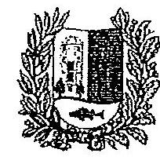

# Demecser Város   Polgármestere 

4516. Demecser, Kétezer-egy tér 1.sz.

Száma: 2533-2/2012.
Tárgy: Észrevétel V-3119-17/2012.
Ügyintéző: Kovácsné Elek Irén
jelentéshez
Tel.: (42) 533-507

Állami Számvevőszék
Domokos László Elnök
Budapest
Apáczai Csere János utca 10. 1052
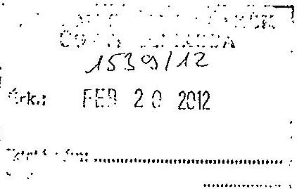

## Tisztelt Elnök Úr!

A V-3119-17/2012. iktatószámú jelentéshez az alábbi észrevételeket teszem:
Az ellenőrzés intézkedést igénylő megállapításai és javaslatai polgármesternek:

1) Demecser Város Önkormányzatának pénzügyi egyensúlya rövidtávon konszolidálódott, mely megteremti a hosszú távú fenntarthatóságot. Az önkormányzatnak és intézményeinek 2011. december 31-ei lejárt szállítói tartozása 30.804 eFt volt és a tárgyévet követő évet terhelő szállítói kötelezettség 3.233 eFt-ban teljesült. 2012. január hónapjában a lejárt szállítói tartozások teljes mértékben kiegyenlítésre kerültek, az észrevételhez csatolom 2012. február 14-ei szállítói tartozás kimutatását, mely szerint önkormányzatunknak lejárt esedékességű számlája nincs. 2011. december 31-én önkormányzatunk munkabér hitellel nem rendelkezett, a folyószámlahitel állományát 34.298 eFt-ra sikerült leszorítani.
a) Önkormányzatunk a bevételek növelése érdekében szabad kapacitásait teljes mértékben kihasználja, pl.: konyha, és a kinnlevőségek behajtására megtette a szükséges intézkedéseket. A bérlakásoknál az új szerződéseknél módosítottuk a feltételeket, amennyiben a bérlő nem tesz eleget közüzemi fizetési kötelezettségének a bérleményt elhagyni köteles. A képviselőtestület a Polgármesteri Hivatalnál gyesen lévő köztisztviselők személyi juttatását és járulékát zárolta, az álláshelyek helyettesítéssel történő betöltését sem engedélyezi. A köztisztviselőknél illetménykiegészítés és pótlék nincs. A köztisztviselők cafetéria juttatása 2011. és 2012. évben is

[^0]
[^0]:    Polgármesteri Hivatal 4516. Demecser, Kétezer-egy tér 1.sz.
    Tel.: (42) 533-500; Fax.: (42) 533-509 e-mail.: pm.hlv.demecser@gmail.hu
    Honlap.: www.demecser.hu
    Ügyfél fogadás rendje: Hétfő 8-12-ig, Kedd 8-12-ig, Szerda: 8-12 és 13-17; Csütörtök: nincs ügyfélfogadás Péntek: 8-12-ig.

---

zárolásra került. A közalkalmazottaknál a személyi juttatásoknál csak a kötelező pótlék és az is az alsó mértékkel került biztosításra. A Polgármesteri Hivatalnál 2012 márciusában 1 fő visszajön gyesről és a jelenleg 1 fő helyi adós kolléga munkáját megerősítjük és a behajtási tevékenység fokozottan előtérbe fog kerülni. Önkormányzatunk 2012. évre a közüzemi szolgáltatások 4,2\%-os növekedéséhez és az Áfa $2 \%$-os pontos emeléséhez biztosította a fedezetet. A dolgozói létszám a feladatellátáshoz szükséges további csökkentése a feladatellátást és a normatíva igénylést veszélyeztetné. Lejárt szállítói tartozásainkat megszüntettük, elértünk arra a pontra, hogy árajánlatokat kértünk be és mi választjuk ki azon szállítókat,
 akik olcsóbban biztosítják a kért termékeket. A korábbi időszakban a hosszú fizetési határidő miatt szállítóinkat megválasztani nem állt módunkban és így a fizetési határidő nem teljesítése miatt természetesen drágábban szállították a megrendelt árukat. Önkormányzatunk pénzügyi egyensúlya helyreállt és a hosszú távú fenntarthatósága érdekében a szükséges lépéseket önkormányzatunk meg fogja tenni.
b) Demecser Város Önkormányzata és intézményeinek pénzügyi helyzetének stabilizálása megtörtént, és így a reorganizációs program megalkotása nem indokolt.
c) Az adósságszolgálat teljesítése érdekében elkülönített tartalék képzése 2013. évtől lenne indokolt a helyi adókból, saját bevételekből és az átengedett adókból.
d) Három évre kitekintően kötelezettségeink finanszírozási forrásait a jelenlegi információk alapján lehet elkészíteni. 2013. január 1. napjától az állam az alapfokú oktatást és középfokú oktatást az önkormányzatoktól átveszi, és ettől az időponttól a forrásmegosztás még nem szabályozott. A három évre vonatkozó források nevesítése így csak a jelenlegi szabályozást figyelembe véve lehetséges, melynek megalapozottsága nem teljes körű.
2) Önkormányzatunknál az önként vállalt feladataink középfokú oktatás, művészetoktatás és pedagógiai szakszolgálat. A működési kiadások $14 \%$-a kapcsolódik ezen feladatokhoz. 2012. évben a feladatok bevétele 181.416 eFt, kiadása 170.715 eFt, így ezen feladatok forrást nem vonnak el az alaptevékenységtől sőt, 10.701 eFt-al az alaptevékenység ellátását finanszírozzák. A vizsgálat során az 1. tanúsítványban a feladatok kiadásait és bevételeit kellett bemutatni. A bevételek között a költségvetési törvény 3,5,8. mellékleteiben szereplő központi költségvetési támogatásokat kellett megjeleníteni, azonban mind a művészetoktatáshoz, mind a középfokú oktatáshoz önkormányzatunk az szja jövedelemkülönbség

Polgármesteri Hivatal 4616. Demecser, Kétezer-egy tér 1.sz.
Tel.: (42) 533-500; Fax.: (42) 533-509 e-mail.: pm.hiv.demecser@gmali.hu
Honlap.: www.demecser.hu
Ügyfél fogadás rendje: Hétfő 8-12-ig, Kedd 8-12-ig, Szerda: 8-12 és 13-17; Csütörtök: nincs ügyfélfogadás Péntek: 8-12-ig.

---

mérséklésből ellátottanként további támogatásban részesül. Az önként vállalt térségi feladatok támogatása a feladat forrásai között meg kell, hogy jelenjen.
3) Az állandósult folyószámlahitel hosszú távú kötelezettségé történő átalakításának jogi feltételei nem biztosítottak. A folyószámlahitel állományának leszorítását jelzi a 2011. december 31-i 34.298 eFt-os záró állomány.

4/a) Az adósságot keletkeztető kötelezettség vállalásról a képviselőtestület döntött, új kötelezettség vállalásra nem kerül sor, azonban szeretném jelezni a döntéskor a kiadások között a tőketörlesztést kell megjeleníteni, a kamat nem képezi részét a döntésnek. A képviselőtestületet az Önök által kért kockázatokról tájékoztatni fogom.

4/b) A jövőben az adósságot keletkeztető kötelezettség vállalásokról szóló képviselő-testületi döntések előterjesztései tételesen fogják tartalmazni a visszafizetés forrásait. Az 50\%-os korlát 2012. január 1. napját követő kötelezettség vállalásokra vonatkozik, így önkormányzatunknál a helyi adó és egyéb bevételeken túl az átengedett adók is forrását képezik a visszafizetésnek.

5/a) Az önkormányzati tulajdonú gazdasági társaság az Önök kérésének megfelelően félévente be fog számolni a pénzügyi helyzetéről, melyet képviselő-testület elé terjesztek.

5/b) A minősített többségi tulajdonú gazdasági társaság pénzügyi helyzete is stabilizálódott. 2010. december 31-én fennálló szállítói tartozására részben fedezetet biztosít az 1.050 eFt összegű tőketartalék és a 4.726 eFt összegű eredménytartalék is. 2012. február 16-án fennálló lejárt kötelezettsége 2099 eFt és a fennálló követelései 4226. eFt. Az intézkedési tervet a képviselő-testület elé terjesztem, melyben a követelések behajtását is meg kell gyorsítani.
6) A zárszámadási rendeletekben az Önök javaslatát be fogjuk építeni (jogszabály ezt nem írja elő) a képviselő-testület még teljesebb tájékoztatása érdekében.
7) Önkormányzatunk jelenleg lejárt szállítói tartozással nem rendelkezik, fizetési kötelezettségének folyamatosan eleget tesz.

# Az ellenőrzésintézkedést igénylő megállapításai és javaslatai a 

jegyzőnek:

1) A kötvénykibocsátásból fennálló hosszú lejáratú kötelezettségnek a mérleg fordulónapját követő 1 éven belül esedékes törlesztését a

---

számviteli törvény előírásának megfelelően a mérlegben a rövid lejáratú kötelezettségek között mutattuk ki az előzetes mérlegjelentésben is.

# Tisztelt Elnök Úr! 

Kérem észrevételeimet és önkormányzatunk által megtett intézkedések hatásait a jelentés véglegezésénél vegyék figyelembe.

Demecser 2012. február 16.
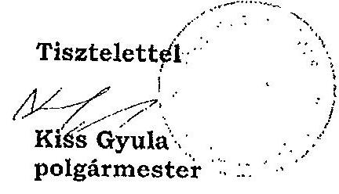

---

# Kiss Gyula úr   polgármester 

Demecser Város Önkormányzata

## Demecser

## Tisztelt Polgármester Úr!

Köszönettel vettem a Demecser Város Önkormányzata pénzügyi helyzetének ellenőrzéséről készített jelentéstervezethez kapcsolódó észrevételéről és tervezett intézkedésekről szóló tájékoztatását.

Örömmel értesültem arról, hogy pénzügyi egyensúlyi helyzetük javítása érdekében intézkedéseket tett az Önkormányzat. A lejárt szállítói tartozások kiegyenlítése, a folyószámlahitel csökkentése és a munkabér megelőlegezési hitel igénybevétele nélküli gazdálkodás pozitív változásokat jelez. A levele mellékletét képező dokumentum szerint az Önkormányzatnak 2012. január 31-én lejárt szállítói tartozása nem volt. Az ellenőrzés befejezése után történt változások azonban a jelentéstervezetben megfogalmazott megállapításokat nem befolyásolják.

A bevételek növelésére és a kiadások csökkentésére irányuló további intézkedések megtételét, a költségvetés végrehajtási folyamatába történő beépítését és a lehetőségek további keresését javaslom annak érdekében, hogy az elindult kedvező folyamatok hosszabb távon is eredményeket hozzanak. Az intézkedések révén képződő bevételi többlet és kiadási megtakarítás a továbbiakban lehetőséget teremt tartalék képzésére, amelynek segítségével javul a gazdálkodás biztonsága. Polgármester úr észrevételében foglalt tájékoztatást tudomásul véve, miszerint „Demecser Város Önkormányzata és intézményeinek pénzügyi helyzetének stabilizálása megtörtént, és így a reorganizációs program megalkotása nem indokolt", továbbra is javaslom reorganizációs terv készítését, amely feltárja az Önkormányzat gazdálkodásában lévő kockázatokat és az esetleges tartalékokat.

A kötelezettségek teljes körére szóló - három évre kitekintő -- finanszírozási terv készítését szükségesnek tartom annak érdekében, hogy az Önkormányzat fel tudja mérni a kötelezettségei

---

visszafizetésének forrásait. Mind a korábban hatályban lévő, mind pedig a 2012 januárjában hatályba lépett jogszabályok előírják az önkormányzatok számára az előrelátó tervezést és gazdálkodást. A finanszírozási terv indokoltságát - a jövőre nézve - az alábbi jogszabályok támasztják alá:
— Az államháztartásról szóló 2011. évi CXCV. törvény 29. § (3) bekezdése előírja, hogy ,, a helyi önkormányzat ... évente, legkésőbb a költségvetési rendelet ... elfogadásáig határozatban állapítja meg a Stabilitási tv. 45. § (1) bekezdés a) pontja felhatalmazása alapján kiadott jogszabályban meghatározottak szerinti saját bevételeinek, valamint a Stabilitási tv. 3. § (1) bekezdése szerinti adósságot keletkeztető ügyleteiből eredő fizetési kötelezettségeinek a költségvetési évet követő három évre várható összegét".

- A Magyarország gazdasági stabilitásáról szóló 2011. évi CXCIV. törvény 10. § (3) bekezdése értelmében ,,az adósságot keletkeztető ügyletből származó tárgyévi összes fizetési kötelezettsége az adósságot keletkeztető ügylet futamidejének végéig egyik évben sem haladhatja meg az önkormányzat adott évi saját bevételeinek 50\%-át".

Az önként vállalt feladatokhoz kapcsolódó javaslatunk célja, hogy felhívja az Önkormányzat figyelmét a feladatellátásban rejlő esetleges tartalékokra. Az elvégzett felülvizsgálat eredményeként kell bemutatni a Képviselő-testületnek a megoldási lehetőségeket, amelyek egyike lehet a jelen helyzet további fenntartása.

Az adósságot keletkeztető kötelezettségvállalásokról szóló döntés meghozatalakor a Képviselőtestületet tájékoztatni kell a kockázatokról, illetve a visszafizetés forrásairól. A döntés során az adósságot keletkeztető ügyletből eredő fizetési kötelezettségek a tőketörlesztés mellett tartalmazzák annak kamatterheit is, mivel ennek teljesítésére is kötelezettséget vállal az Önkormányzat.

A jelentés-tervezetben a kizárólagos önkormányzati tulajdonú gazdasági társaság 2009-2010. években keletkezett vesztesége kapcsán a kedvezőtlen folyamatokra kívánta felhívni a figyelmet az ellenőrzés. Örömmel vettem, hogy javulás következett be a társaság pénzügyi helyzetében. Ennek figyelemmel kísérése folyamatos feladatot jelent a tulajdonos számára.

Köszönöm Polgármester úr tájékoztatását arra vonatkozóan, hogy a jegyzőnek tett javaslat már a 2011. évről készült előzetes mérlegjelentésben realizálódott. Ezáltal a kötvénytartozásból eredő 2012. évi kötelezettséget az Önkormányzat a mérlegben a rövid lejáratú kötelezettségek között mutatta ki. Meg kívánom jegyezni azonban, hogy az ellenőrzött időszakban a hiányosság fennállt, ezért a jelentésben szereplő javaslatot továbbra is fenntartom.

Kérem Polgármester urat, hogy fogadja el az észrevételekhez, intézkedésekhez fűzött válaszaimat.

Tájékoztatom, hogy a megküldött intézkedéseiről szóló levele nem tekinthető az Állami Számvevőszékről szóló 2011. évi LXVI. törvény 33. § (1) bekezdése szerinti intézkedési tervnek, ezért kérem, hogy azt a jelentés kézhezvételét követően, törvényi határidőn belül az Állami Számvevőszék részére megküldeni szíveskedjen.

---

Végül megköszönöm Polgármester úrnak és kollegáinak az ellenőrzés során tanúsított hozzáállását, amellyel az Önkormányzatról szóló pénzügyi helyzetelemzés elkészítését segítette.

Budapest, 2012. március " 5 ".

Tisztelettel:
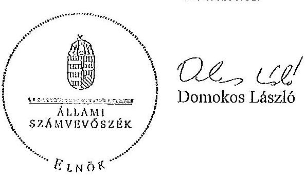
