# ÁLLAMI   SZÁMVEVŐSZÉK 

## JELENTÉS

Devecser Város Önkormányzata pénzügyi helyzetének ellenőrzéséről

---

# Állami Számvevőszék 

Iktatószám: V-3131-018/2012.
Témaszám: 1015
Vizsgálat-azonosító szám: V0560162

## Az ellenőrzést felügyelte:

Dr. Varga Sándor
számvevő igazgatóhelyettes
Az ellenőrzést vezette:
Renkó Zsuzsanna
számvevő tanácsos
Ellenőrzési csoportvezető:
Dér Lívia
számvevő tanácsos
Az ellenőrzést végezték:
Buús Zoltánné Kiss Rita
Hütter Erzsébet
számvevő tanácsos
számvevő tanácsos

---

# TARTALOMJEGYZÉK 

BEVEZETÉS ..... 7
I. ÖSSZEGZŐ MEGÁLLAPÍTÁSOK, KÖVETKEZTETÉSEK, JAVASLATOK ..... 11
II. RÉSZLETES MEGÁLLAPÍTÁSOK ..... 21

1. Az Önkormányzat kötelező és önként vállalt feladatai, a feladatellátás szervezeti keretei és annak változásai ..... 21
2. Az Önkormányzat pénzügyi egyensúlyi helyzetét befolyásoló tényezők ..... 24
2.1. A működési és a felhalmozási egyensúly változása ..... 26
2.2. Az Önkormányzat bevételeinek változása ..... 32
2.3. Az Önkormányzat folyó és felhalmozási célú kiadásainak változása ..... 35
3. Az Önkormányzat kötelezettségei ..... 37
3.1. Az Önkormányzat pénzintézeti kötelezettségeinek változása ..... 37
3.2. A szállítói kötelezettségek változása ..... 43
3.3. Egyéb kötelezettségek változása ..... 43
4. A pénzügyi egyensúly megteremtése érdekében hozott intézkedések eredménye ..... 45
5. Az ÁSZ által a korábbi években a pénzügyi egyensúly javítására tett szabályszerűségi és célszerűségi javaslatok hasznosulása ..... 48
MELLÉKLETEK
6. számú Múködési és felhalmozási célú hiány/többlet 2007-2010 közötti időszak- ban az Önkormányzat zárszámadási rendeleteiben (1 oldal)
7. számú Az Önkormányzat bevételei és kiadásai, valamint adósságszolgálata 2007-2010 között (1 oldal)
8. számú Az Önkormányzat 2007-2010. években megvalósított, 2010. december 31- ig befejezett fejlesztései és annak forrásösszetétele (1 oldal)
9. számú Az önkormányzati feladatok ellátásában résztvevő gazdasági társaságok (1 oldal)

---

.

---

# RÖVIDÍTÉSEK JEGYZÉKE 

## Törvények

Áht $_{1}$
Áht $_{2}$
Csődtv.
Gt.
Ötv.
Stabilitási tv.

## Rendeletek

Ámr.

## Szórövidítések

általános iskola
áfa
ÁSZ
CHF
EU
jegyzó
Képviselő-testület óvoda
Önkormányzat
polgármester
Polgármesteri hivatal
PPP konstrukció
SzMSz
szja
az államháztartásról szóló 1992. évi XXXVIII. törvény
az államháztartásról szóló 2011. évi CXCV. törvény
a csődeljárásról és a felszámolási eljárásról szóló 1991. évi XLIX. törvény
a gazdasági társaságokról szóló 2006. évi IV. törvény
a helyi önkormányzatokról szóló 1990. évi LXV. törvény
Magyarország gazdasági stabilitásáról szóló 2011. évi CXCIV. törvény
az államháztartás múködési rendjéről szóló 217/1998. (XII. 30.) Korm. rendelet

Általános Iskola és Óvoda Alapfokú Művészetoktatási Intézmény
általános forgalmi adó
Állami Számvevőszék
svájci frank
Európai Unió
Devecser Város Önkormányzatának jegyzője
Devecser Város Önkormányzatának Képviselő-testülete
Közös Fenntartású Napköziotthonos Óvoda
Devecser Város Önkormányzata
Devecser Város Önkormányzatának polgármestere
Város Önkormányzatának Polgármesteri hivatala
Public Private Partnership (Partnerségi együttmúködés
közfeladatok ellátására a magánszektor bevonásával)
14/2007. (III. 31.) számú rendelet az Önkormányzat Szer-
vezeti és Múködési Szabályzatáról
személyi jövedelemadó

---

.

---

# ÉRTELMEZŐ SZÓTÁR 

| BUBOR | Budapesti Bankközi Forint Hitelkamatláb. Mértékét az MNB naponta állapítja meg a banki kamatok figyelembevételével. Közzététele naponta történik. |
| :--: | :--: |
| CLF módszer | Az önkormányzatok költségvetése elemzésének eszköze, a bevételek és kiadások, múködés és fejlesztés elkülönítése. Bizonyos mértékig a vállalati gazdálkodás logikai elemeit érvényesíti az önkormányzatok pénzügyi jövedelmi helyzetének vizsgálat során. Következetesen elkülöníti a folyó és a felhalmozási költségvetés bevételeit és kiadásait, azok költségvetési egyenlegeit. A módszer a pénzügyi kapacitás fogalmát helyezi a középpontba. |
| deviza opciós ügylet | Olyan szerződés, amely az egyik félnek vételi/eladási jogot/kötelezettséget biztosít valamely mögöttes termékre (például deviza, értékpapír) vonatkozóan. |
| EURIBOR | A frankfurti bankközi piacon jegyzett, az Európai Központi Bank szabályainak megfelelően megállapított kínálati kamatláb. Az EURIBOR értékét a legfontosabb európai bankok hitelkínálatának kamatlábai alapján a Reuters ügynökség számolja ki és teszi közzé naponta. A magyar pénzintézetek is ezt használják viszonyítási alapnak EUR hitelek esetén. |
| használhatósági fok | Az eszközgazdálkodás vizsgálatának elemzése során használt mutató. Számításakor a tárgyi eszköz könyv szerinti (nettó) értékét viszonyítják a tárgyi eszköz bruttó (beszerzési/létesítési) értékéhez. A \%-ban kifejezett mutató csökkenése az eszköz állagának romlására, avulására utal, ami maga után vonja az üzemeltetési és fenntartási költségek növekedését is. |
| kamatkockázat | A változó kamatozású forint-, vagy a devizahitelek futamideje alatt a kamat emelkedése miatt fennálló kamatkockázat, melynek növekedése miatt nő a hitel törlesztő részlete. |
| LIBOR | Angol kifejezés, a London Interbank Offered Rate rövidítése. Jelentése: Londoni bankközi, referencia jellegú kínálati (hitel) kamatláb. |
| pénzügyi kapacitás | A pénzügyi kapacitás (financial capacity) az adósok hitelfelvételi képességének azon mértéke, ahol még anélkül tudják növelni az adósságot, hogy csökkenteniük kellene akár a jelenbeli, akár a jövőben esedékes kiadásaikat a fizetésképtelenség elkerülése érdekében. (Forrás: Az önkormányzati rendszer pénzügyi helyzete, ÁSZKUT tanulmány 2010. |
| pénzügyi kockázat | A múködési kockázat egyik eleme. Megmutatkozhat a költségvetés nagyságrendjének, szerkezetének nem megalapozott módosításaiban, a bevételi, és a kiadási előirányzatoktól lényegesen eltérő teljesítésekben, a nem megfelelő belső kontrollrendszer múködésében, a tudatos |

---

törlesztési kockázat

SNA
károkozásokban, a biztosítások elmaradásában, a hibás fejlesztési döntésekben, a nem a terveknek megfelelő forrásfelhasználásokban. Jelentkezhet továbbá a bevételek és kiadások ütemkülönbsége miatt felvett folyószámla- és likvidhitelek költségvetési év végén fennálló egyenlege miatt, amely az önkormányzat költségvetésébe - akár tartósan - beépülő forráshiányt jelzi.
Annak a kockázata, hogy a megfelelő időben és mértékben a hitelt felvevőnél rendelkezésre állnak-e a pénzintézetek és egyéb szervek felé fennálló kötelezettségek visszafizetéséhez, a hitelek és kölcsönök törlesztéséhez szükséges pénzügyi források.
A törlesztési kockázatot növeli a kamat- és árfolyam növekedése, mivel ezekben az esetekben az adósságszolgálat nőhet. Törlesztési kockázatot okozhat a visszafizetésre tervezett forrás elérésének, teljesítésének bizonytalansága (pl. a visszafizetéshez tervezett tartalékolás elmaradt, a tervezettnél alacsonyabb a saját bevétel, a helyi adóból származó bevétel az adóalanyok, adóalapok csökkenése miatt nem teljesül).
System of National Account azaz a Nemzeti Számlák Rendszere, amely a gazdasági szektorok által létrehozott valamennyi terméket és szolgáltatást figyelembe veszi.

---

# JELENTÉS 

## Devecser Város Önkormányzata pénzügyi helyzetének ellenőrzéséről

## BEVEZETÉS

Az Állami Számvevőszék 2011. évtől érvényes stratégiája új irányt szabott a helyi önkormányzatok gazdálkodásának ellenőrzésében is. Az ÁSZ - küldetése és jövőképe szerint - szilárd szakmai alapokra támaszkodva értékteremtő ellenőrzéseivel és helyzetelemzéseivel az államháztartás egészében, így a helyi önkormányzati alrendszerben is elő kívánja segíteni a közpénzek és a közvagyon szabályos, gazdaságos, hatékony és eredményes felhasználását. E folyamat részeként - az államháztartási hiány alakulásának összetevőire is figyelemmel végezzük az önkormányzati alrendszer pénzügyi helyzetelemzését.

Az államháztartás helyi szintjén a 304 városnak ${ }^{1}$ az általuk ellátott közszolgáltatások volumenére is tekintettel a közfeladatok ellátásában kiemelt szerepe van. E települések 2011. január 1-jei népessége 3169 ezer fő volt.

Feladataik és hatásköreik az Ötv. mellett különböző ágazati törvények által meghatározottak, miközben a feladatellátás szervezeti kereteit - ezen belül a gazdasági társaságok közszolgáltatások ellátásában betöltött szerepét - saját maguk határozzák meg. A gazdasági társaságok által ellátott feladatok esetén a gazdálkodás, továbbá az önkormányzatok pénzügyi egyensúlyi helyzetére ható közvetlen kockázatok egy része kikerült az önkormányzati alrendszerből. A többségi önkormányzati tulajdonban lévő társaságok gazdálkodásának körülményei befolyásolhatják a városok pénzügyi egyensúlyi helyzetének megítélésében rejlő kockázatokat.

Az áttekintett időszakban az önkormányzati forrásszabályozás elvei lényegesen nem változtak. Az önkormányzatok gazdasági mozgásterét a központi költségvetéstől való függőség mellett jelentősen befolyásolja a helyi adókivetési jog gyakorlása. A városok gazdálkodási szabadságának lényeges eleme, hogy anyagi lehetőségeik függvényében dönthettek arról, hogy feladataik közül azokat, amelyek megoldására az Ötv. szerint a települési önkormányzat nem kötelezhető, a megyei önkormányzat fenntartásába adhatták. E döntések differenciáltan érintették a városok pénzügyi helyzetét.

[^0]
[^0]:    ${ }^{1}$ A megyei jogú városok nélkül figyelembe vett városok száma 304 városi önkormányzatot jelent.

---

A városi önkormányzatok 2007-2010 között teljesített bevételeinek alakulását és összetételét a következő ábra szemlélteti:
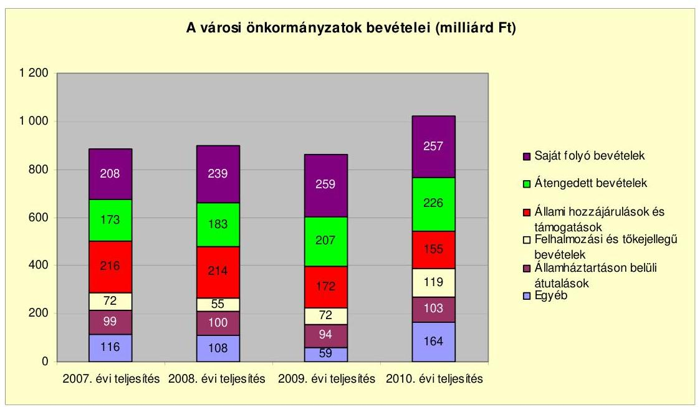

Az önkormányzati alrendszer pénzügyi helyzetértékelése során új elemzési módszereket alkalmazott az ellenőrzés. A költségvetési beszámoló adatok elemzése helyett az önkormányzat pénzügyi helyzetét a CLF módszerrel értékeljük, amelynek lényegét és számításának módszerét a jelentés 2. pontjában, és a jelentés 2 . számú mellékletében ismertetjük részletesen.

Az új módszereken alapuló helyzetértékelés fontosságát az adja, hogy a helyi önkormányzatok bruttó adósságállománya ${ }^{2}$ a 2010. évi költségvetési beszámolók alapján 1248 milliárd Ft-ot tett ki. Ezen belül a 304 város adóssága 383 milliárd Ft volt, amely az önkormányzati alrendszer teljes adósságállományának $30,7 \%$-át jelentette ${ }^{3}$.

A mérlegben kimutatott bruttó adósságállomány mellett az önkormányzatok számára az eszközállomány műszaki állapotának megőrzése is előbb-utóbb pénzügyi kötelezettséget jelent. Az elhasználódott eszközök pótlására forrást biztosító amortizációs (felújítási) alap képzésének ${ }^{4}$ elmaradása maga után vonhatja a feladatellátást kiszolgáló tárgyi eszközök állagának erőteljes romlá-

[^0]
[^0]:    ${ }^{2}$ Az önkormányzati mérlegbeszámolókból számított bruttó adósságállomány 2010. év végi összege magában foglalja a fejlesztési és a múködési célú kötvénykibocsátások, a beruházási és fejlesztési hitelek, a múködési célú hosszú lejáratú hitelek, a rövid lejáratú hitelek, váltótartozások miatti kötelezettségek teljes (2011-ben, illetve az azt követő években esedékes) állományát. Az önkormányzatok 2007. év végi mérleg szerinti adósságállománya 692 milliárd Ft volt.
    ${ }^{3}$ A fővárosi és a kerületi önkormányzatok adósságának figyelmen kívül hagyásával számított 977 milliárd Ft összegű bruttó adósságállományból a városok 39,2\%-kal részesedtek.
    ${ }^{4}$ Erre a jelenlegi szabályozási környezetben nem kötelezi előírás az önkormányzatokat.

---

sát. Emellett a 2007-2013-as időszakra meghirdetett, vissza nem térítendő EU-s fejlesztési forrásokhoz való hozzájutás lehetősége felerősítette az önkormányzati alrendszer fejlesztési igényeit, amelyek a felhalmozási költségvetési hiány folyamatos emelkedésén túl - az előírt jövőbeni fenntartási kötelezettség miatt tovább terhelhetik az önkormányzatok költségvetését ${ }^{5}$.

Az ÁSZ a 2011. évi ellenőrzési tervében 43. számú, az Önkormányzatok gazdálkodási rendszerének ellenőrzése részeként áttekinti, és elemzi az önkormányzatok pénzügyi helyzetét. A gazdálkodás szabályszerűségét az ÁSZ az előző évek során ebben az önkormányzati körben is ellenőrizte. Jelen vizsgálatunk a tett javaslataink pénzügyi helyzetet érintő pontjainak hasznosítására utóellenőrzés jelleggel tér ki.

Az ellenőrzés megállapításait az Önkormányzat által kitöltött - teljességi nyilatkozattal megerősített - 27 tanúsítványon szolgáltatott adatokra alapoztuk. Ellenőrzési bizonyítékként használtuk fel továbbá:

- a képviselő-testületi és bizottsági előterjesztéseket, a döntés-előkészítés során készített dokumentumokat;
- a kötelezettségvállalások dokumentumait;
- a pénzügyi-számviteli nyilvántartásokat;
- az éves költségvetési beszámolókat;
- a költségvetési és zárszámadási rendeleteket.

Az ellenőrzés a 2007. január 1. - 2011. június 30. közötti időszakot öleli fel. A pénzintézeti kötelezettségek állományának vizsgálatakor az ellenőrzött időszak 2006. december 31. - 2011. június 30. közötti időszakra terjedt ki.

Az ellenőrzés során vizsgáltunk minden olyan körülményt és adatot, amely a program végrehajtásához kapcsolódott és a pénzügyi helyzet alakulására hatást gyakorló releváns tények és folyamatok feltárásához szükségessé vált.

# Az ellenőrzés célja annak értékelése volt, hogy: 

- a vizsgált időszakban a kötelező- és önként vállalt feladatok ellátását biztosító szervezeti keretekben, a feladatellátás módjában bekövetkezett változások milyen hatást gyakoroltak az Önkormányzat pénzügyi helyzetének alakulására;

[^0]
[^0]:    ${ }^{5}$ Az Állami Számvevőszék 2011 júniusában közzétett 1108. számú, a helyi önkormányzatok fejlesztési célú támogatási rendszerének ellenőrzéséről szóló jelentésében feltárta a fejlesztési folyamatok problémáit. A helyi önkormányzatok elsősorban azokat a fejlesztéseket valósították meg, amelyekhez támogatást lehetett igényelni. A fejlesztési célok közül a magasabb támogatási intenzitású pályázatokat részesítették előnyben. A fejlesztéssel megvalósuló létesítmények jövőbeli üzemeltetésének várható ráfordításait az önkormányzatok $71,9 \%$-a nem mérte fel.

---

- az Önkormányzat pénzügyi - ezen belül múködési és felhalmozási - egyensúlya mely tényezők hatására miként változott, és az Önkormányzat milyen intézkedéseket tett a pénzügyi egyensúly javítása érdekében;
- a költségvetési kiadások finanszírozása érdekében vállalt pénzintézeti kötelezettségek hogyan alakultak, továbbá milyen kötelezettségek fennállása befolyásolja az Önkormányzat jövőbeli pénzügyi helyzetét;
- hasznosultak-e a gazdálkodási rendszer korábbi ellenőrzése során a pénzügyi egyensúly javítására az ÁSZ által tett szabályszerűségi és célszerűségi javaslatok.

Az ellenőrzés típusa: szabályszerűségi vizsgálat.
A vizsgálat jogszabályi alapját az Állami Számvevőszékről szóló 2011. évi LXVI. törvény 1. § (3), 5. § (2)-(6) bekezdései, továbbá az Áht ${ }_{1} 120 /$ A. § (1) bekezdése ${ }^{6}$ előírásai képezik.

Devecser város lakosainak száma 2011. január 1-jén 4551 fő volt. Az Önkormányzat helyzetét, gazdálkodását alapvetően meghatározta a 2010. évben bekövetkezett vörösiszap-katasztrófa. Az Önkormányzat az éves költségvetési beszámolója szerint a 2010. évben 2523,0 millió Ft költségvetési bevételt ért el, és 1619,4 millió Ft költségvetési kiadást teljesített. A teljesített költségvetési bevételek 157,3\%-kal, a költségvetési kiadások 64,5\%-kal haladták meg a 2007. évben teljesített költségvetési bevételeket és kiadásokat. Az emelkedés elsődlegesen a múködési célú költségvetési bevételek és kiadások növekedéséből adódott, amely döntő részben a vörösiszap-katasztrófával kapcsolatos feladatok miatt következett be.

Az Önkormányzat 2010. december 31-én a könyvviteli mérleg szerint 3371,0 millió Ft értékű vagyonnal rendelkezett, amely a 2007. év végi állományhoz viszonyítva 75,7\%-kal emelkedett. Ezen belül meghatározó volt a pénzeszközök növekménye ( 1030 millió Ft), amely elsődlegesen a vörösiszap-katasztrófa miatti támogatásokból származott. További, 342 millió Ft vagyonnövekedés következett be a tárgyi eszközökön belül a fejlesztések hatására.

[^0]
[^0]:    ${ }^{6}$ 2012. január 1-jétől az Áht ${ }_{2}$ 61. § (2) bekezdés

---

# I. ÖSSZEGZŐ MEGÁLLAPÍTÁSOK, KÖVETKEZTETÉSEK, JAVASLATOK 

Az Önkormányzat - adatszolgáltatása szerint - a 2010. év múködési költségvetési kiadásaiból (891,2 millió Ft) 846,7 millió Ft-ot ( $95,0 \%$ ) a kötelező feladatok, 44,6 millió Ft-ot (5,0\%) az önként vállalt feladatok ellátására fordított. Az önként vállalt feladatok a zeneiskola fenntartásához, családi rendezvények szervezéséhez, lapkiadási tevékenységekhez, valamint civil szervezetek támogatásához kapcsolódtak. Az önként vállalt feladatokat a kötelező feladatokat ellátó intézmények végezték. Az önként vállalt feladatokra fordított kiadások a 2010. évben az előző három év átlagához (61,5 millió Ft-hoz) viszonyítva 27,5\%-kal (16,9 millió Ft-tal) csökkentek. A csökkenés összege azonban a pénzügyi egyensúlyi helyzet alakulását jelentősen nem befolyásolta.

Az Önkormányzat feladatellátásának szervezeti struktúráját a következő ábra szemlélteti:
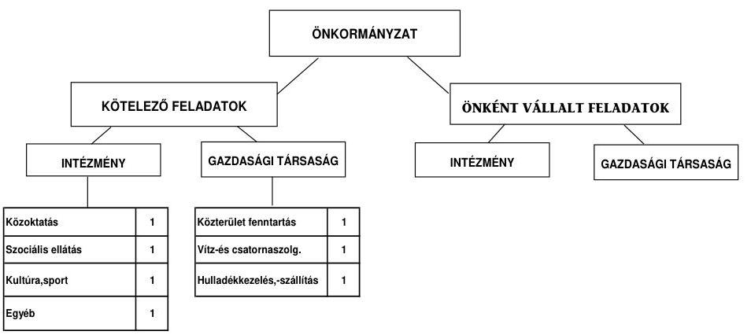

Az Önkormányzat feladatait 2011. június 30 -án (a Polgármesteri hivatallal együtt) négy költségvetési szervvel, és három gazdasági társaság keretében látta el. Az intézményi összevonások következtében a költségvetési szervek száma a 2007. évi hatról 2011. év I. félév végére négyre csökkent, a 13 telephely változatlanul hagyásával. Az Önkormányzat egy gazdasági társaságban kizárólagos tulajdonnal, egy társaságban 50\% alatti tulajdoni hányaddal rendelkezett, amelyek közterület-zöldterület fenntartás, víz- és szennyvízkezelés területén kaptak szerepet az Önkormányzat feladatellátásában. A hulladékkezelés-szállítási feladatot egy olyan gazdasági társasággal látták el, amelyben az Önkormányzat nem tulajdonos. Az Önkormányzat a kizárólagos önkormányzati tulajdonú gazdasági társaság részére múködési célra - megállapodás alapján - az ellenőrzött időszakban összesen 77,9 millió Ft pénzeszközt adott át. A gazdasági társaság pénzügyi helyzete a 2010. évi saját tőke/jegyzett tőke aránya alapján összességében stabil, tőkepótlásra nem volt szükség.

---

Az Önkormányzat múködési kiadásokra 2010-ben 891,2 millió Ft-ot fordított, amely 30,9 millió Ft-tal ( $3,4 \%$-kal) maradt alatta az előző három év átlagos kiadásainak. A vizsgált időszakban a múködési kiadások a közoktatási ágazatban 31,4 millió Ft-tal ( $7,7 \%$-kal), a közművelődési ágazatnál 7,4 millió Ft-tal ( $11,2 \%$-kal) csökkentek. A kiadáscsökkenés főként az Önkormányzat által végrehajtott takarékossági intézkedések következménye. A szociális ágazat kiadásai az ellátotti kör bővüléséből adódóan 20,9 millió Ft-tal ( $50,2 \%$-kal) növekedtek. Az egyéb ágazat kiadásai minimális mértékben 10,3 millió Ft-tal ( $5,0 \%$ kal) emelkedtek.

Az egyes közszolgáltatások feladatellátásában résztvevő intézmények működési kiadásainak finanszírozási összetételét ágazatonként a következő ábra szemlélteti:
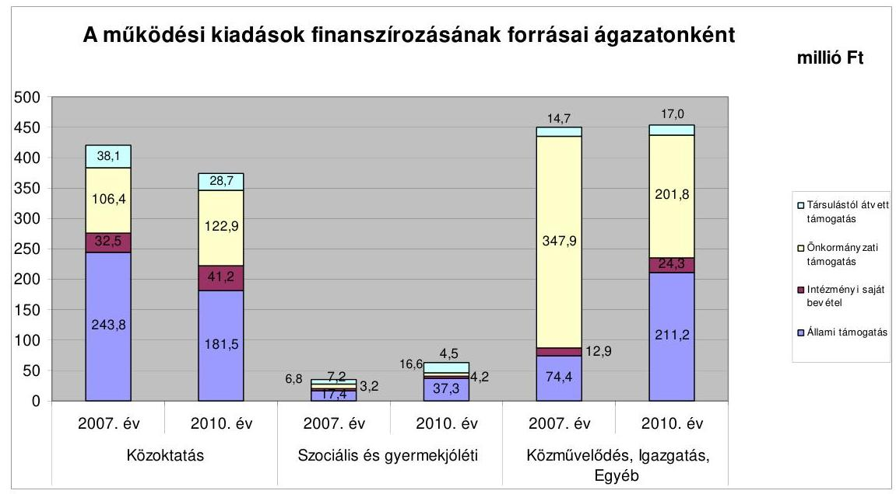

Az állami támogatás összege - a gyermek- és tanulólétszám csökkenéséből adódóan - a közoktatási ágazatban folyamatosan, (243,8 millió Ft-ról 181,5 millió Ft-ra) csökkent. Aránya a 2007. évben 57,9\%, a 2008. és a 2009. években $45,9 \%$, a 2010 . évben $48,5 \%$ volt. A szociális ágazatban az állami támogatás összege folyamatosan (a 2007. évi 17,4 millió Ft-ról a 2010. évre 37,3 millió Ft-ra) nőtt, aránya is növekedett 50,3\%-ról 59,6\%-ra az ellátottak számának emelkedése miatt. Az egyéb ágazatokban is folyamatosan nőtt az állami támogatás összege és aránya a 2007. évi 74,4 millió Ft-ról (16,5\%-ról) a 2010. évre 211,2 millió Ft-ra ( $46,5 \%$-ra) főként a központosított támogatások nagyobb mértékű igénybevétele miatt.

---

Az Önkormányzat múködési jövedelmének, tőketörlesztésének, pénzügyi kapacitásának évenkénti alakulását a következő ábra szemlélteti:
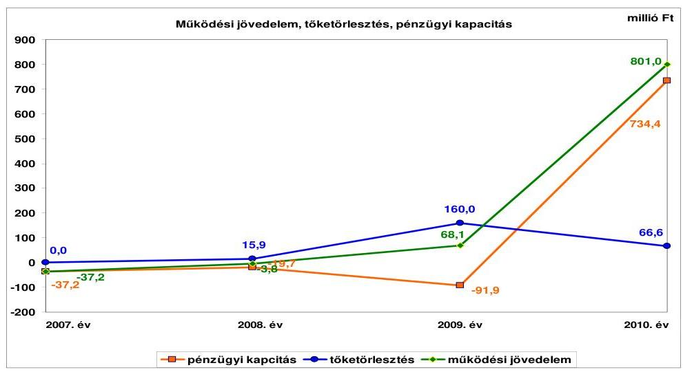

Az Önkormányzat folyó költségvetési egyenlege (múködési jövedelem) 2007-2008 között forráshiányt, 2009-2010 között múködési többletet mutatott. Az Önkormányzat pénzügyi egyensúlyi helyzetének alakulását azonban döntően befolyásolta a 2010. évi vörösiszap-katasztrófa, amellyel kapcsolatban az Önkormányzat a 2010. évben 1361,7 millió Ft folyó bevételt és 547,0 millió Ft folyó kiadást teljesített. A vörösiszap-katasztrófával kapcsolatos a 2010. évi folyó költségvetés egyenlegének (814,7 millió Ft) figyelmen kívül hagyásával (a továbbiakban tisztított adat) az Önkormányzat 2010. évi múködési jövedelme is negatív egyenlegű (-13,7 millió Ft), a folyó kiadások $1,4 \%$-át tette ki.

A 2010. évi tisztított adatokkal az Önkormányzat múködési jövedelmének, tőketörlesztésének, pénzügyi kapacitásának évenkénti alakulását a következő ábra mutatja be:
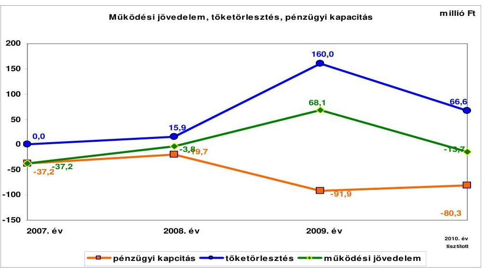

A 2009. évi pozitív múködési jövedelemben (68,1 millió Ft) meghatározó szerepe volt - a központosított támogatások nagyobb mértékű igénybevétele mellett

---

- az előző években végrehajtott létszámcsökkentések hatásának (az Önkormányzat adatszolgáltatása szerint 43,4 millió Ft). Az Önkormányzat pénzügyi egyensúlyi helyzetét javította, hogy a 2007. évben 33,3 millió Ft önhibájukon kívül hátrányos helyzetű önkormányzatok támogatásában részesült. Továbbá múködésképtelen helyi önkormányzatok támogatása jogcímen a 2007. évben 8,0 millió Ft, a 2008. évben 26,0 millió Ft, a 2009. évben 14,5 millió Ft, a 2010. évben 27,5 millió Ft feladathoz nem kötött, vissza nem térítendő támogatást kapott, amelyet a hiány (múködési célú hitel) csökkentéséhez használtak fel. Ennek ellenére - a 2009. év kivételével - múködési jövedelme továbbra is negatív összegű maradt.

Az Önkormányzat pénzügyi kapacitását jelentősen meghatározta a teljesített tőketörlesztés. A legmagasabb összegű törlesztés a 2009. évben volt. Ekkor törlesztették a 2006. évben megszűnt csatornatársulattól átvett hitelt ( 160 millió Ft) a lakossági takarékpénztári befizetésekből. Hiteltörlesztésként jelent meg továbbá a folyószámlahitel év végi állományának a 2008. és a 2010. évi csökkenése ( 15,9 millió Ft és 53,7 millió Ft), valamint a 2010. évben a mun-kabér-megelőlegezési hitel előző évről áthúzódó ( 12,9 millió Ft) törlesztése.

A tisztított nettó múködési jövedelem (pénzügyi kapacitás) minden évben negatív egyenleget mutatott. A 2009. évi jelentős negatív egyenleg ( 91,9 millió Ft) indoka a csatornatársulattól átvett hitel ( 160 millió Ft) azévi törlesztése. A 2010. évi negatív nettó múködési jövedelem összege is jelentős ( 80,3 millió Ft). A negatív érték azt mutatja, hogy az Önkormányzat adósságszolgálatát csak újabb hitelből tudja teljesíteni, ezáltal megindulhat az adósságspirál. A jövőben teljesítendő adósságszolgálat csak pozitív nettó jövedelmet eredményező gazdálkodás mellett teszi elkerülhetővé további külső források bevonását, az eladósodást.

Az Önkormányzat felhalmozási költségvetésének egyenlege a 2008. és a 2009. évben pozitív összegű volt ( 12,9 millió Ft, illetve 84,9 millió Ft) a 2007. és a 2010. évi tisztított felhalmozási hiánnyal ( 0,4 millió Ft, -16,9 millió Ft) szemben. A vörösiszap-katasztrófával kapcsolatban a 2010. évben 55,9 millió Ft felhalmozási kiadást teljesítettek. A 2007. és a 2010. évi felhalmozási forráshiány finanszírozására egyik évben sem nyújtott fedezetet a nettó múködési jövedelem, mivel az minden évben - a vörösiszap-katasztrófa korrekciójával a 2010. évben is - negatív összegű volt. A felhalmozási hiány fedezetére a vizsgált időszakban az Önkormányzat a 2010. évben vett igénybe fejlesztési hitelt 44,2 millió Ft értékben. A 2007. évi felhalmozási hiány finanszírozására fedezetet nyújtott a rendelkezésre álló nyitó pénzkészlet ( 71,3 millió Ft).

Az Önkormányzat évenkénti teljes finanszírozási hiánya a CLF módszer szerint 2007-ben 37,6 millió Ft, 2008-ban 6,8 millió Ft, 2009-ben 7,0 millió Ft volt, a 2010. évben a tisztított adatok alapján 97,2 millió Ft. Az Önkormányzat teljes finanszírozási igényéhez ( 148,6 millió Ft) a vizsgált időszakban képződő 13,4 millió Ft tényleges, a vörösiszap-katasztrófa nélküli működési megtakarítás (működési jövedelem) nem biztosított elegendő forrást.

Az Önkormányzat folyó bevétele folyamatosan emelkedett. Az előző három év átlagához ( 982,0 millió Ft) viszonyítva 2010-re 2312,8 millió Ft-ra (135,5\%$\mathrm{kal}, 1330,8$ millió Ft-tal) nőtt. A vörösiszap-katasztrófával kapcsolatos bevéte-

---

lek (1361,7 millió Ft) figyelmen kívül hagyásával 30,9 millió Ft (3,1\%-os) a csökkenés. A 2011. év I. félévi folyó bevétel 1359,4 millió Ft volt, melyből a vörösiszap-katasztrófával kapcsolatos bevétel 900,0 millió Ft. A központi költségvetésből származó bevételek összege a vörösiszap-katasztrófával kapcsolatos összegek nélkül - a 2009. évit kivéve - csökkenő tendenciájú. A visszaesés elsődlegesen a tanulólétszám csökkenésének a következménye. A 2009. évi növekedés a központosított előirányzatok (lakossági közmúfejlesztés támogatása, közoktatási infrastruktúra-fejlesztés) nagyobb mértékű igénybevétele miatt következett be. A vizsgált időszakban az Önkormányzatnál helyi iparúzési adó, építményadó volt megállapítva. Az építményadó 2007-ben került bevezetésre, mértékét 2009-ben $500 \mathrm{Ft} / \mathrm{m}^{2}$-ről $600 \mathrm{Ft} / \mathrm{m}^{2}$-re emelték. Az építményadóból származó bevétel a vizsgált időszakban 132,5 millió Ft volt, amely az Önkormányzat pénzügyi egyensúlyi helyzetét kedvezően befolyásolta. A helyi adókból és pótlékokból származó bevételek aránya a 2007-2010. évek között 1,4 százalékponttal csökkent, 2010-ben 11,4\%-ot tett ki a folyó bevételekből. A pótlékkal, bírsággal növelt helyi adóbevétel a 2007. évi 119,9 millió Ft-ról a 2010. évben 108,5 millió Ft-ra ( $9,5 \%$-kal, 11,4 millió Ft-tal) csökkent. A vörösiszap-katasztrófa következtében a vállalkozók adóalapját képező nettó árbevétel visszaesett, amely bevételkieséshez vezetett. A helyi adóbevételek 70-80\%-át (75,5-108,7 millió Ft) az iparúzési adó tette ki, amelyet a helyi adókról szóló törvényben rögzített maximális mértékben állapították meg.

Az Önkormányzat a 2010. évben 1511,8 millió Ft folyó kiadást teljesített, amely az előző három év átlagához képest több mint másfélszeres, 55,4\%-os (538,8 millió Ft) növekedést jelentett. A növekedést torzítja a 2010. évi vörösiszap-katasztrófával kapcsolatosan felmerült folyó kiadás összege (547,0 millió Ft). Ennek figyelmen kívül hagyásával a 2010. év végére ténylegesen minimális ( $0,8 \%$-os) csökkenés ( 8,2 millió Ft) történt. A folyó kiadások évenként 5,0\% alatti eltéréssel változtak. A költségcsökkentő intézkedések következtében a kiadásokat (a 2010. évben tisztított adatokkal számolva) - az infláció ellenére - a 2007. évi szinten tudták tartani. A 2011. évben június 30-ig 1804,6 millió Ft folyó kiadást teljesítettek, amelyből 1084,1 millió Ft dologi kiadás a vörösiszap-katasztrófa miatt keletkezett (ingatlanok kármentesítése, útjavítás, ügyvédi munkadíjak, bérleti díjak).

A folyó és felhalmozási kiadások aránya évenként változó volt. A 2009. évben figyelhető meg nagyobb elmozdulás a felhalmozási kiadások irányába ( $22,0 \%, 271,0$ millió Ft) a megvalósított fejlesztések hatására. A vizsgált időszak egyéb éveiben a felhalmozási kiadások alacsony szintje - a 2007. évben 0,6\% (15,4 millió Ft), 2008. évben 0,6\% (5,6 millió Ft), a 2010. évben 5,1\% ( 51,7 millió Ft) - annak következménye, hogy az Önkormányzat kedvezőtlen pénzügyi egyensúlyi helyzete miatt nem tudott fejleszteni. Ez azonban múszaki avultsághoz vezet, amely a jövőben pénzügyi kockázatot jelenthet. Az Önkormányzatnál a befejezett fejlesztésekre fordított kiadások összege a 20072010. években 357,3 millió Ft volt. Ennek jelentős részét EU-s és hazai támogatásból fedezték, amelynek összege 282,5 millió Ft. A saját erő 30,6 millió Ft, a hitelfelvétel 44,2 millió Ft (12,4\%) volt. A támogatásból megvalósult fejlesztés finanszírozása az utófinanszírozás miatt likviditási gondot okozott, amelyet a folyószámlahitel igénybevételével hidaltak át. A folyószámlahitel előfinanszírozásra való felhasználása kockázatot jelent. Az Önkormányzatnak folyamatban lévő fejlesztése, beadott, elbírálás alatt álló pályázata nem volt.

---

Az Önkormányzat mérleg szerinti pénzintézeti kötelezettsége a 2006. év végéről a 2011. év I. félév végére 307,7 millió Ft-ról 609,3 millió Ft-ra nőtt, amelyből a deviza alapú kötvény árfolyam növekedése miatti különbözet 117,5 millió Ft volt. A 2010. december 31-én fennálló pénzintézeti kötelezettségek kettő hosszú lejáratú hitelből (a két hitelszerződés szerint 44,2 millió Ft), egy kötvénykibocsátásból (kibocsátáskori érték 300 millió Ft), valamint egy rövid lejáratú hitel (folyószámlahitel év végi - tartós - állománya 153,6 millió Ft) igénybevételéből keletkeztek. Az Önkormányzat az elfogadott 2011. évi költségvetési rendelete alapján 23,7 millió Ft hitel felvételét tervezte, a hitelt a helyszíni vizsgálat befejezésének időpontjáig még nem vette fel.

Az Önkormányzat pénzintézeti kötelezettségvállalásaira képviselő-testületi döntés alapján került sor. Az előterjesztésekben bemutatták a kamat- és - a deviza alapú kötelezettséget érintő - árfolyamkockázatot, de nem tértek ki tételesen a teljes futamidőre várható tőke- és kamatfizetési kötelezettségekre. Az adósságot keletkeztető kötelezettségvállalások felső határát a 2007-2009. években túllépték, ezzel megsértették az Ötv. 88. § (2) bekezdését. A 2010. évben túllépés nem történt. A 2008. évben engedélyeztetett és kibocsátott kötvény törlesztése a 2013. évben kezdődik, amelynek éves tőke-törlesztő részlete 120 ezer CHF. Állománya 2011. június 30-án 1875 ezer CHF volt. A felhalmozási célú fejlesztésekre kibocsátott kötvénybevételből felhasználás még nem történt. Az Önkormányzat tájékoztatása szerint a kötvény kibocsátásából származó pénzeszközöket tudatosan tartalékolták jövőbeni fejlesztési lehetőségekre. A kötvénykibocsátásból befolyt 300 millió Ft bevételből 100,0 millió Ft-ot az Önkormányzat óvadékként lekötött. Ezt az összeget betétként lekötötték, mely a pénzintézet hozzájárulásával szabadítható fel. Az Önkormányzat a további 200 millió Ft összeget is bankbetétben helyezte el.

A két hosszúlejáratú beruházási hitelszerződés alapján összesen 44,2 millió Ft fejlesztési hitelt a 2010. évben mind lehívták. Azokat a hitelcélnak megfelelően a Képviselő-testület által jóváhagyott, a költségvetésbe betervezett beruházásokhoz felhasználták. A beruházási hitelek törlesztése a 2011. évben kezdődött, az I. félév végéig 6,0 millió Ft tőkét, valamint 2,0 millió Ft kamatot és egyéb költséget fizettek ki. Az Önkormányzat CHF-ben fennálló pénzintézeti kötelezettségéből 185 ezer CHF ( 34,7 millió Ft) kamatfizetési kötelezettsége volt. A vizsgált években egy csatornamú társulattól átvállalt hitelt fizetett vissza az Önkormányzat 160,0 millió Ft összegben. A 2007-2011. év I. féléve között átmenetileg szabad pénzeszközeiből 90,2 millió Ft kamatbevételt realizált. Ebből meghatározó volt a kötvénykibocsátásból származó pénzeszközök lekötéséből származó 82,6 millió Ft bevétel.

Az Önkormányzat költségvetésének pénzügyi egyensúlyát a vizsgált időszakban folyamatosan folyószámla-, és munkabér-megelőlegezési hitel igénybevételével tudta biztosítani. A hitelkeretek évenkénti megújítása és módosítása tartósan fennálló forráshiányra utal, amely elsődlegesen a vizsgált időszakot megelőzően - az Önkormányzattól kapott információk alapján a csatorna-beruházás következtében - keletkezett. A 2007-2011. év I. félév időszakában hozott bevételnövelő és kiadáscsökkentő intézkedések révén a forráshiány növekedését sikerült megállítani, de annak nagyságát csökkenteni nem, ezért a pénzügyi egyensúly biztosításához továbbra is szükség volt a folyószám-la- és munkabér-megelőlegezési hitelekre.

---

A folyószámla- és a munkabér-megelőlegezési hitel igénybevétele a 2007-2011. év I. féléve közötti időszakban az alábbiak szerint alakult:

| Megnevezés | 2007. év | 2008. év | 2009. év | 2010. év | 2011. év I.   félév |
| :-- | :--: | :--: | :--: | :--: | :--: |
| Folyószámlahitel |  |  |  |  |  |
| Keretősszeg január 1-jén (millió Ft-ban) | 150,0 | 190,0 | 180,0 | 206,0 | 170,0 |
| Állapos napi állomány (millió Ft-ban) | 172,0 | 175,0 | 163,8 | 171,6 | 143,6 |
| Folyószámla hiteller zárt napok száma (nap) | 365 | 365 | 365 | 365 | 193 |
| Egyenleg időszak végén (állomány) | 176,3 | 160,4 | 202,6 | 148,9 | 153,6 |
| Munkabér-megelőlegezési hitel |  |  |  |  |  |
| Keretősszeg január 1-jén (millió Ft-ban) | 13,0 | 13,0 | 13,0 | 13,0 | 13,0 |
| Állapos napi állomány (millió Ft-ban) | 12,6 | 12,6 | 12,6 | 12,6 | 12,6 |
| Munkabér-megelőlegezési hitellel zárt napok száma (nap) | 353 | 353 | 353 | 353 | 174 |
| Egyenleg időszak végén (állomány) | - | - | - | - | - |

A folyószámlahitel keret 2009. év júliusától volt a legmagasabb 206,0 millió Fttal. A keret növekedését az általános iskola felújítása indokolta, ugyanis a döntő részben támogatásból megvalósult fejlesztés utófinanszírozású volt. A legkisebb folyószámlahitel keret 170,0 millió Ft volt, 2010. év novemberétől. A keret csökkentése azért vált szükségessé, mert az Önkormányzat fejlesztési hitelt is igénybe vett ebben az évben, és a folyószámlahitel keret csökkentése nélkül az adósságot keletkeztető kötelezettségvállalások felső határát túllépték volna.

A likviditás biztosítása az Önkormányzatnak 85,7 millió Ft kamatkiadást, és 3,9 millió Ft egyéb költség fizetésének kötelezettségét okozta. Az Önkormányzat 2010. december 31-i szállítói - egyben lejárt - tartozása 406,8 millió Ft, 2011. év I. félév végi 172,8 millió Ft volt. A tartozások alapvetően a vörösiszapkatasztrófa utáni helyreállítással kapcsolatban keletkeztek. A számlákat az Önkormányzat rendezte, 2011. szeptember végén lejárt tartozásuk nem volt.

Az Önkormányzat kötelezettségeinek állományát 2010. december 31-én, és 2011. június 30-án, valamint azok várható alakulását (tőke, kamat és egyéb költség) a kötelezettségek lejáratáig a következő táblázat mutatja:

| Megnevezés | Állomány 2010. december 31én |  |  | Állomány 2011. június 30-án |  |  | Várható kötelezettség 2011-2013. években |  | Várható kötelezetts ég 2014. évtöl |
| :--: | :--: | :--: | :--: | :--: | :--: | :--: | :--: | :--: | :--: |
|  | HUF-ban (millió Ftban) | Devizában (összegeszer CHFben) | Deviza nem | HUF-ban (millió Ftban) | Devizában (összegeszer CHFben) | Deviza nem | HUF-ban (millió Ftban) | Devizában (összegeszer CHFben) | Devizában (összegeszer CHFben) |
| Pénzintézeti kötelezettségek |  |  |  |  |  |  |  |  |  |
| Pénzintézeti hitellel | 44,1 |  | HUF | 38,1 |  | HUF | 50,4 |  |  |
| Kötvény |  | 1875,0 | CHF |  | 1875,0 | CHF |  | 196,8 | 1943,6 |
| Folyószámla hitel | 148,9 |  | HUF | 153,6 |  | HUF | 153,6 |  |  |
| Pénzintézeti kötelezettségok összesen HUF-til | 193,0 |  | HUF | 191,7 |  | HUF | 254,0 |  |  |
| Pénzintézeti kötelezettségok összesen CHF-ben |  | 1875,0 | CHF |  | 1875,0 | CHF |  | 196,8 | 1943,6 |
| Szállítói tartozás | 406,6 |  | HUF | 172,8 |  | HUF | 172,8 |  |  |
| Összes kötelezettség HUF-ban | 599,6 |  | HUF | 364,5 |  | HUF | 376,8 |  |  |
| Összes kötelezettség CHF-ben |  | 1875,0 | CHF |  | 1875,0 | CHF |  | 196,8 | 1943,6 |

A 2011-2013. években várható pénzintézeti kötelezettség teljesítésére figyelembe vehető a 2010. december 31-én kimutatott le nem járt határidejű 107,7 millió Ft követelésállomány, valamint a jelzálogbejegyzéssel nem érintett forgalomképes besorolású ingatlanok értékesítéséből a helyi viszonyok alapján elérhető bevétel. A döntően a vörösiszap-katasztrófa miatt keletkezett szállító tartozásállomány kifizetésére pedig fedezetet biztosított az e célra elkülönített számlákon rendelkezésre álló 586,1 millió Ft pénzkészlet. A 2014. évtől a pénzintézeti kötelezettség visszafizetését az Önkor-

---

mányzat megképződött múködési jövedelméből tervezte. Ennek összege azonban a 2007-2008. években, valamint a 2010. évben negatív volt (a 2010. évi tisztított érték: -13,7 millió Ft). Változatlan tendencia esetén a múködési jövedelem nem nyújt fedezetet a visszafizetésre. A pénzintézeti kötelezettségek teljesítését így nem látjuk biztosítottnak. A visszafizetés kockázatát ugyanakkor csökkenti, hogy a kötelezettség visszafizetésére figyelembe vehető a jelenlegi ismeretek alapján a kötvény forrásából származó 300,0 millió Ft-os pénzmaradvány, valamint a jelzálogbejegyzéssel nem érintett forgalomképes besorolású ingatlanok értékesítéséből a helyi viszonyok alapján elérhető bevétel.

Az Önkormányzat minősített többségi befolyásával rendelkező gazdasági társaságának az általa szolgáltatott adatok alapján a 2011. évben 1,2 millió Ft szállítói tartozást, illetve 3,8 millió Ft egyéb kötelezettséget kell rendeznie, amely az Önkormányzat számára kockázatot nem jelent.

A Képviselő-testületet az értékcsökkenés összegéről, az eszközök pótlására fordított kiadásokról nem tájékoztatták. Az Önkormányzat 2007-2010 között eszközállománya után 376,7 millió Ft összegű értékcsökkenést mutatott ki. Fejlesztésre 357,3 millió Ft-ot, ezen belül felújításra 287,2 millió Ft-ot fordított, kimutatása szerint eszközpótlás nem volt.

Az Önkormányzat az ellenőrzött időszakban kiadási megtakarítást eredményező és bevételt növelő intézkedéseket tett. A 2007-2011. év I. féléve között tett intézkedések hatására - az Önkormányzat adatszolgáltatása alapján - 210,1 millió Ft bevételi többletet, továbbá 126,4 millió Ft kiadási megtakarítást mutattak ki. A kiadási megtakarítások 92,9\%-a az elrendelt álláshelycsökkentések eredménye. Az egyes években bekövetkezett változások azonosan érintették a létszámadatokat, valamint az álláshelyek számának alakulását. Az álláshelycsökkentő intézkedések 2007-2011. év I. féléve között önkormányzati szinten összesen 29 álláshely megszüntetését jelentették. Egyes közszolgáltatási területeken azonban feladatbővülések is voltak, amelyek 14 fő álláshely- és egyben létszámnövekedéssel is jártak. A bevételnövelő intézkedések új adónem bevezetéséhez, mértékének növeléséhez, lejárt tartozások behajtásához, eszköz értékesítéséhez, átmenetileg szabad pénzeszközök lekötéséhez kapcsolódtak.

Az utóellenőrzés a pénzügyi egyensúly javítására tett négy szabályszerűségi és egy célszerűségi javaslat hasznosítására terjedt ki. Az öt javaslatot - finanszírozási célú műveletek Áht ${ }_{1}$ szerinti figyelembevétele, likviditási terv készítése, folyószámlahitel számviteli törvény szerinti kimutatása, európai uniós beruházásoknak a költségvetési rendelet-tervezetben történő elkülönített bemutatása, a pénzintézeti kötelezettségekről a Képviselő-testület tájékoztatása - az intézkedési terv szerinti határidőben megvalósították.

Az Önkormányzat pénzügyi egyensúlyi helyzetét összegezve a következők emelhetők ki:

Devecser Város Önkormányzatának pénzügyi egyensúlyi helyzete rövid távon nem biztosított.

---

A folyó bevételek nem nyújtottak elegendő forrást a folyó kiadásokra és az adósságszolgálatra, annak ellenére, hogy az Önkormányzat a 2007. évben önhibájukon kívül hátrányos helyzetű, valamint minden évben múködésképtelen önkormányzatok támogatásában részesült.

A likviditást az állandósult folyószámla- és munkabér-megelőlegezési hitellel tudta biztosítani. A folyószámlahitelnek az évek minden napján volt záró állománya.

A 2008. évben kibocsátott deviza alapú kötvényéből 2011. év I. félév végéig felhasználás nem történt.

Az Önkormányzatnak 2010. december 31-én folyamatban lévő fejlesztése nem volt, benyújtott pályázatokkal nem rendelkezett.

Az önként vállalt feladatok működési kiadásokhoz viszonyított aránya alacsony, a kizárólagos tulajdoni hányadú gazdasági társaság pénzügyi helyzete stabil, így ezen tényezők kockázatot nem jelentettek.

Az Állami Számvevőszékről szóló 2011. évi LXVI. törvény 33. § (1) bekezdésében foglaltak értelmében a jelentésben foglalt megállapításokhoz kapcsolódó intézkedési tervet köteles az ellenőrzött szervezet vezetője összeállítani és azt a jelentés kézhezvételétől számított harminc napon belül az ÁSZ részére megküldeni. Amennyiben az intézkedési tervet határidőben nem küldi meg a szervezet, vagy az továbbra sem elfogadható, az ÁSZ elnöke a hivatkozott törvény 33. § (3) bekezdés a)-b) pontjaiban foglaltakat érvényesítheti.

# A 2011. június 30-i pénzügyi egyensúlyi helyzet alapján az ellenőrzés intézkedést igénylő megállapításai és javaslatai a következők: 

## a Polgármesternek

1. Az Önkormányzat nettó múködési jövedelme a 2007-2010 közötti időszakban negatív volt, pénzügyi egyensúlyi helyzete rövid távon nem biztosított. Finanszírozásában a folyószámla és munkabér-megelőlegezési hitel állandósult. A kiadáscsökkentő és bevételnövelő intézkedések nem biztosítottak elegendő forrást a pénzügyi egyensúly helyreállításához. A deviza alapú kötvény árfolyama folyamatosan emelkedett.

Javaslat:
Az Önkormányzat pénzügyi egyensúlyának gyors helyreállítása és hosszú távú fenntarthatósága érdekében kezdeményezze - felelősök és határidők megjelölésével - az alábbi intézkedések megtételét:
a) Tárja fel a bevételszerző és kiadáscsökkentő lehetőségeket. Intézkedjen a bevételek növelésére, a kintlévőségek behajtására, a kiadások csökkentésére.
b) Vizsgálja meg az állandósult folyószámlahitel hosszú távú kötelezettséggé történő átalakításának jogi lehetőségét, és a Stabilitási tv. 10. §-ában előírt jogszabályi feltételek fennállása esetén kezdeményezze a Kormánynál ennek engedélyezését.

---

c) Képezzen egyensúlyi (elkülönített) tartalékot az adósságszolgálat teljesítése érdekében.
d) Mutassa be a Képviselő-testületnek félévente, legalább három évre kitekintően a kötelezettségek teljes körére szóló finanszírozási tervet, a források számszerúsített megjelölésével.
2. A Képviselő-testületnek előterjesztett éves zárszámadási rendeleteikben nem mutatták be az Önkormányzat eszközei után a tárgyévben elszámolt értékcsökkenés öszszegét, az eszközpótlásra fordított tényleges kiadásokat, az eszközök elhasználódási fokának alakulását.

Javaslat:
Mutassa be a Képviselő-testületnek évente a zárszámadási rendelet előterjesztésében az értékcsökkenés összegét, és ezzel összevetve az elhasználódott eszközök pótlására fordított tényleges kiadásokat, az eszközök elhasználódási fokának alakulását.
3. Az Önkormányzat adósságot keletkeztető kötelezettségvállalásaira vonatkozó képvi-selő-testületi előterjesztések tételesen nem tartalmazták a kötelezettségvállalásnak a teljes futamidőre várható kamat- és tőkefizetési kötelezettségeit.

Javaslat:
Gondoskodjon arról, hogy a jövőben az adósságot keletkeztető kötelezettségvállalásokról szóló képviselő-testületi előterjesztések tételesen tartalmazzák a kötelezettségvállalásnak a teljes futamidőre várható kamat- és tőkefizetési kötelezettségeit.

---

# II. RÉSZLETES MEGÁLLAPÍTÁSOK 

## 1. AZ ÖNKORMÁNYZAT KÖTELEZŐ ÉS ÖNKÉNT VÁLLALT FELADATAI, A FELADATELLÁTÁS SZERVEZETI KERETEI ÉS ANNAK VÁLTOZÁSAI

Az Önkormányzat kötelező és önként vállalt feladatait az SzMSz-ben részletezte. Önként vállalt feladatai a zeneiskola fenntartásához, családi rendezvények szervezéséhez, lapkiadási tevékenységekhez, valamint civil szervezetek támogatásához kapcsolódtak. Az önként vállalt feladatokat a kötelező feladatokat ellátó intézmények végezték.

Az Önkormányzat - adatszolgáltatása szerint - 2010. évi múködési költségvetési kiadásainak ${ }^{7}$ ( 891,2 millió Ft) 95,0\%-át ( 846,6 millió Ft-ot) a kötelező, 5,0\%át ( 44,6 millió Ft-ot) az önként vállalt feladatok ellátására fordította. Az önként vállalt feladatokra fordított kiadások a 2010. évben az előző három év átlagához (61,5 millió Ft-hoz) viszonyítva 27,5\%-kal (16,9 millió Ft-tal) csökkentek. A csökkenés összege azonban a pénzügyi helyzet alakulását jelentősen nem befolyásolta. A kötelező és önként vállalt feladatok részarányának megállapítása az Önkormányzat adatszolgáltatásán alapult, amely a feladatellátás SzMSz szerinti besorolásának megfelelően készült.

Az Önkormányzat a 2010. évi múködési kiadásait és azok finanszírozási arányait szemlélteti a következő - önkormányzati adatszolgáltatáson alapuló táblázat főbb feladatonként:

| Ellátott feladat | Múködési   kiadás   összesen   (millio Ft) | Kötelező   feladatok   kiadásainak   részaránya   \% | Múködési   bevétel   összesen   (millio Ft) | Állami   támogatás   részaránya   \% | Intézményi   saját bevétel   részaránya   \% | Önkormányzati   támogatás   részaránya   \% | Társulástól átvett   támogatás   részaránya |
| :--: | :--: | :--: | :--: | :--: | :--: | :--: | :--: |
| Övodák | 101,7 | 100,0 | 101,7 | 45,0 | 2,0 | 40,7 | 12,3 |
| Általános iskolák | 272,6 | 94,0 | 272,6 | 49,8 | 14,4 | 29,9 | 5,9 |
| Szociális   intézmények | 62,6 | 100,0 | 62,6 | 59,6 | 6,6 | 7,3 | 26,5 |
| Közművelődési   intézmények | 58,4 | 94,0 | 58,4 | 0,0 | 4,5 | 66,4 | 29,1 |
| Polgármesteri hivatal   igazgatási kiadása | 78,8 | 100,0 | 78,8 | 3,8 | 0,8 | 95,4 | 0,0 |
| Polgármesteri   hivatalban ellátott   egyéb feladatok   múködési kiadása | 317,1 | 90,0 | 317,2 | 65,6 | 6,6 | 27,8 | 0,0 |
| Múködési kiadá-   sok összesen | 891,2 | 95,0 | 891,3 | 48,2 | 7,8 | 37,0 | 7,0 |

[^0]
[^0]:    ${ }^{7}$ A kiadások nem tartalmazzák az egészségügyi és kisebbségi önkormányzattal kapcsolatos feladatokat, valamint a vörösiszap-katasztrófával kapcsolatos pénzügyi múveleteket.

---

Az Önkormányzat a vizsgált időszakban kiadásainak 42-47\%-át fordította közoktatási feladatokra. Az arány az évek folyamán mérséklődött. A 2007. évi múködési kiadásainak ( 905,3 millió Ft) 46,5\%-át ( 420,8 millió Ft-ot), a 2010. évben $42,0 \%$-át ( 374,3 millió Ft-ot) tettek ki a közoktatási feladatok. A szociális és gyermekjóléti feladatok részaránya folyamatosan nőtt. A 2007. évben 3,8\% (34,6 millió Ft) volt, a 2010. évben 7,0\%-ra (62,6 millió Ft) növekedett az ellátotti kör bővüléséből adódóan. Az egyéb feladatok az Önkormányzat kiadásaiból 50\% körüli arányt képviseltek. Részarányuk a 2007. évben $49,7 \%$ ( 449,9 millió Ft), a 2010. évben $51,0 \%$ ( 454,3 millió Ft) volt.

Az Önkormányzat múködési kiadásainál a vizsgált időszakban a 2008. évi növekedés után csökkenés volt tapasztalható. A múködési kiadások a 20072009. évek átlagához viszonyítva 2010. évre 30,9 millió Ft-tal, 3,4\%-kal csökkentek. A közoktatási intézmények kiadásainál 7,7\%-os ( 31,4 millió Ft) volt a csökkenés. Az óvodai kiadások 20,8 millió Ft-tal ( $17,0 \%$ ), az általános iskolai kiadások - az alapfokú múvészetoktatás kiadásaival együtt - 11,0 millió Ft-tal (3,9\%) csökkentek. A kiadáscsökkenés főként a takarékossági intézkedések következménye. A szociális intézmények kiadásai, 20,9 millió Ft-tal ( $50,2 \%$-kal) nőttek az ellátotti kör bővülése következtében. A közmúvelődési intézmények kiadásai a kiadáscsökkentő intézkedések hatására 7,4 millió Ft-tal ( $11,2 \%$-kal) csökkentek. A Polgármester hivatal igazgatási kiadásainál 21,0 millió Ft volt a csökkenés, a Polgármesteri hivatalban ellátott egyéb feladatok ${ }^{8}$ múködési kiadásainál 8,6 millió Ft volt a növekedés. A Polgármesteri hivatal múködési kiadásainak együttes növekedése 10,3 millió Ft (5,0\%). Az évek folyamán a 2008. évben növekedés, azt követően folyamatos csökkenés mutatkozott.

Az Önkormányzat összes múködési kiadásainak fedezetét tekintve az állami támogatás aránya 2007. évben 37,0\% (335,5 millió Ft), a 2008. évben $48,1 \%$ ( 455,8 millió Ft), a 2009. évben 48,6\%, (444,4 millió Ft), a 2010. évben $48,2 \%$ ( 429,9 millió Ft) volt. Az intézményi saját bevételek aránya évente változott, a 2007. évben 5,4\% ( 48,7 millió Ft), a 2008. évben 7,9\% ( 74,9 millió Ft), a 2009. évben 8,6\%, ( 78,3 millió Ft), a 2010. évben 7,8\% ( 69,7 millió Ft) volt. Az intézményi társulásoktól közoktatási, közmúvelődési és szociális feladatokhoz átvett támogatások aránya folyamatosan, 6,6\%-ról (59,6 millió Ft) 7,0\%-ra ( 76,5 millió Ft) emelkedett. Az önkormányzati támogatás aránya 51,0\%-ról (461,6 millió Ft-ról) 37,0\%-ra (329,4 millió Ft) csökkent.

Ágazatonként tekintve az állami támogatás összege - a gyermek- és tanulólétszám csökkenéséből adódóan - a közoktatási ágazatban folyamatosan, 243,8 millió Ft-ról 181,5 millió Ft-ra csökkent. Aránya a 2007. évben 57,9\%, a 2008. és a 2009. években $45,9 \%$, a 2010. évben $48,5 \%$ volt. A szociális ágazatban az állami támogatás összege folyamatosan, a 2007. évi 17,4 millió Ft-ról (50,3\%-ról) a 2010. évre 37,3 millió Ft-ra (59,6\%-ra) nőtt az ellátottak számának emelkedése miatt. Az egyéb ágazatban ${ }^{9}$ is folyamatosan nőtt az állami

[^0]
[^0]:    ${ }^{8}$ városgazdálkodás, közvilágítás, út-, hídfenntartás, bérbeadás, köztemető fenntartás, szociális segélyezés
    ${ }^{9}$ A Polgármesteri hivatalban kimutatott feladatoknál a lakosságszámhoz kötött normatív hozzájárulásokat és egyéb központosított előirányzatokat is figyelembe véve.

---

támogatás összege és aránya, a 2007. évi 74,4 millió Ft-ról (16,5\%-ról) a 2010. évre 211,2 millió Ft-ra ( $46,5 \%$-ra) főként a központosított támogatások nagyobb mértékű igénybevétele miatt. Az intézményi saját bevételek összege és aránya évente változóan alakult. A közoktatási és az egyéb területen 2,4-3,3\%os (8,7-11,4 millió Ft) a növekedés. A szociális területen arányában 2,5\%-os csökkenés, összegében 0,9 millió Ft növekedés volt tapasztalható. A társulásoktól átvett támogatások aránya a közoktatási ágazatban 1,4\%-kal ( 9,4 millió Ft) csökkent, a szociális ágazatban 6,8\%-kal ( 9,8 millió Ft), az egyéb ágazatban $0,4 \%$-kal ( 2,3 millió Ft) nőtt.

Az önkormányzati intézményekben 2007-2010 között az ellátottak száma a gyermek- és tanulólétszám csökkenése miatt - a közoktatási területen ${ }^{10}$ 20,9\%-kal (156 fővel) csökkent, a szociális intézménynél - az ellátotti terület bővülése miatt $165 \%$-kal ( 99 fővel) növekedett. Az egy ellátottra jutó fajlagos kiadások az óvodánál - az óvodai létszám csökkenése ellenére - nem növekedtek, az általános iskola esetében viszont jelentősen emelkedtek.

A fajlagos kiadások az óvodánál 601 ezer Ft/főről 565 ezer Ft/főre (6,0\%-kal) csökkentek, az általános iskolánál 548 ezer Ft/főről 665 Ft/ főre (21,4\%-kal) nőttek. A szociális intézménynél a fajlagos kiadások 577 ezer Ft/főről 394 ezer Ft/főre csökkentek.

Az Önkormányzat a kötelező és az önként vállalt feladatait 2011. június 30-án - a Polgármesteri hivatallal együtt - négy költségvetési szervvel, és három gazdasági társaság keretében látta el. Az Önkormányzati feladatellátásban részt vett továbbá még egy olyan gazdasági társaság is, amelyben az Önkormányzat nem tulajdonos. Az áttekintett időszakban az önállóan múködő intézmények száma összevonás miatt kettővel csökkent ${ }^{11}$. A telephelyek számában és a gazdasági társaságoknál nem történt változás. Az Önkormányzat 2006-ban kettő önállóan, négy részben önállóan gazdálkodó intézményt tartott fenn, az átszervezések eredményeként 2011. június 30-án két önállóan működő és gazdálkodó, továbbá két önállóan működő költségvetési szervvel rendelkezett, amelyek 13 telephelyen múködtek.

Az Önkormányzat feladatait 2011. június 30-án a következő intézménystruktúrával látta el:

- közoktatási feladatot végzett a közös fenntartású általános iskola, amely óvodai ellátást, iskolai oktatást és alapfokú művészetoktatást biztosított;
- szociális és gyermekjóléti feladatokat végzett a közös fenntartású Családsegítő és Gyermekjóléti Szolgálat;
- a kulturális feladatokat (könyvtár, közművelődés) egy összevont intézmény látta el;
- igazgatási feladatot látott el a Polgármesteri hivatal.

[^0]
[^0]:    ${ }^{10}$ Az óvodánál 18,6\%-os (41 fő), az általános iskolánál 21,9\%-os (115 fő) a csökkenés.
    ${ }^{11}$ 2008. július 1-jétől az óvodát összevonták az általános iskolával, 2008. október 1jétől pedig a Városi Könyvtárat a Városi Művelődési Házzal.

---

Az Önkormányzat egy kizárólagos tulajdonú gazdasági társasággal rendelkezett, amely a közterület- és zöldterület kezelési, városüzemeltetési, temetőfenntartási feladatokat látta el. Az Önkormányzat egy gazdasági társaságban rendelkezett 50\% alatti ( $1,2 \%$-os) tulajdoni hányaddal, mely az ivóvízszolgáltatási, szennyvízelvezetési feladatokat végezte. A hulladékkezelésszállítási feladatokat egy olyan gazdasági társaság látta el közszolgálati szerződés alapján, amelyben az Önkormányzat nem tulajdonos. A gazdasági társaságoknál a vizsgált időszakban nem történt változás.

Az Önkormányzatnál a vizsgált időszakban feladatátvétel és -átadás nem történt.

Az Önkormányzat kizárólagos tulajdonában levő gazdasági társaságának pénzügyi helyzete a 2010. évi saját tőke/jegyzett tőke aránya $(4,7)$ alapján öszszességében stabil. Tőkeemelésre nem volt szükség, ellene nem indult csőd-, illetve felszámolási eljárás. A feladatellátásban résztvevő másik gazdasági társaságnál - amelyben az Önkormányzat 50\% alatti tulajdoni hányaddal rendelkezett - a saját tőke/jegyzett tőke aránya 11,0 volt.

A gazdasági társaságok gazdálkodását, illetve múködését érintő adatokat (saját tőke, jegyzett tőke aránya stb.) a jelentés 4. sz. melléklete mutatja be.

# 2. AZ ÖNKORMÁNYZAT PÉNZÜGYI EGYENSÚLYI HELYZETÉT BEFOLYÁSOLÓ TÉNYEZŐK 

A hagyományos költségvetési szerkezet helyett az Önkormányzat pénzügyi helyzetét a CLF módszerrel mutatjuk be, amelyben jobban elkülönülnek a vagyonnal kapcsolatos bevételek és kiadások az önkormányzati feladatokkal kapcsolatos közvetlen múködtetési bevételektől és kiadásoktól. A módszer következetesen elkülöníti a folyó és a felhalmozási költségvetés bevételeit és kiadásait, azok költségvetési egyenlegeit. A saját folyó bevételek, valamint a saját felhalmozási bevételek nem tartalmazzák az előző évi pénzmaradványok felhasználásából származó pénzforgalom nélküli bevételeket ${ }^{12}$.

A folyó költségvetés egyenlege, a múködési jövedelem megmutatja, hogy az Önkormányzat éves folyó bevétele fedezetet biztosít-e a kötelező és önként vállalt feladatellátáshoz kapcsolódó éves folyó kiadására. A múködési jövedelem negatív értéke pénzügyileg fenntarthatatlan helyzetet jelez. A mutató pozitív értéke megtakarítást mutat, amely forrásul szolgálhat az Önkormányzat fennálló kötelezettségei megfizetéséhez, valamint fejlesztéseihez.

A felhalmozási költségvetés pozitív értéke felhalmozási többletet mutat, amely a jövőbeni fejlesztések forrását biztosíthatja. Amennyiben a folyó költségvetési hiány finanszírozása a felhalmozási többletből történik, ez szűkebb értelemben vagyonfelélésnek tekinthető. Amennyiben a felhalmozási költségvetés megtakarítása fejlesztési célú hitelek, kötvények adósságszolgálatát finanszírozza, az változatlan vagyontömeg mellett, a korábban megelőlegezett

[^0]
[^0]:    ${ }^{12}$ A költségvetési években kialakuló hiány finanszírozása az előző évi pénzmaradvány és a korábbi években képzett tartalékok felhasználásával is történhet.

---

tőkebevételek valós realizációjának tekinthető. A felhalmozási deficit által generált finanszírozási igény önmagában nem jár pénzügyi kockázattal, a pénzügyileg fenntartható beruházásokhoz kapcsolódó kötelezettségvállalás (adósságszolgálat) átlátható és szabályozott költségvetési gazdálkodással teljesíthető.

A módszer a pénzügyi kapacitás fogalmát helyezi a középpontba. Az adós hitelfelvételi képessége, hosszú távú fizetőképessége vagy bonitása a pénzügyi kapacitással, ezen belül is a nettó működési jövedelemmel jellemezhető. A nettó múködési jövedelem negatív értéke az egyes költségvetési években jelentkező adósságszolgálat túlzott mértékére utal. ${ }^{13}$ A nettó múködési jövedelem negatív értékének felhalmozási többletből, vagy további hitelből történő finanszírozása pénzügyileg nem fenntartható gazdálkodást vetít előre. A pozitív értéket mutató nettó múködési jövedelem fejlesztési kiadások fedezetét biztosíthatja, illetve a folyamatosan, évenként képződő pozitív nettó múködési jövedelemből meghatározható a jövőben vállalható, teljesíthető éves adósságszolgálat, ily módon az a hitelösszeg, amely - a többi tényezőt, feltételt adottnak tekintve visszafizetési kockázat nélkül felvehető.

A CLF módszer alapján a pénzügyi kapacitás mértéke az Önkormányzat összevont, nettósított, a központi információs rendszerbe a Magyar Államkincstáron keresztül leadott éves költségvetési beszámolójának 80-as űrlapjában szerepeltetett adatok alapján került meghatározásra.

A számítási leírás némileg eltér az ÁSZ módszertanában korábban alkalmazott gyakorlattól. A jelen besorolás általános közgazdasági meggondolásokon alapul, amely megjelenik az SNA statisztikai módszertanában is. Folyó tételek alatt értjük azokat a kiadásokat és bevételeket, amelyek a gazdálkodó szervezet helyzetét automatikusan nem változtatják. Bevételi oldalon ilyenek az adók, a tényező jövedelmek, a transzferek ${ }^{14}$, kiadási oldalon a transzferek és a szolgáltatás igénybevételével kapcsolatos múködési kiadások. A folyó költségvetésben a bevételekben nem térül meg, a kiadásokban nem jelenik meg az amortizáció, a vagyoni helyzetet az egyenleg befolyásolja.

A folyó költségvetés egyenlege (múködési jövedelem) tartalmazza a kamatbevételeket és a kamatkiadásokat is, mind a múködési, mind a fejlesztési kamatot, valamint a visszatérülő és befizetendő áfa teljes összegét, mert ezek közgazdaságilag tényező jövedelmek. Nem tartalmazzák viszont a követelés-elengedés miatt könyvelt bevételi és kiadási pénzforgalmi tételeket, mert valójában technikai elszámolási múveletnek minősülnek, a bevétel soha nem realizálódott, és költségvetési kiadás sem történt.

A felhalmozási költségvetésben a bevételek között a vagyon megőrzésére és bővítésére fordítható források jelennek meg. A felhalmozási vagy tőketételek módosítják a vagyon nagyságát. A privatizációs bevétel csökkenti a vagyont, a fizikai beruházás, pénzügyi befektetés növeli.

[^0]
[^0]:    ${ }^{13}$ kivéve, ha annak finanszírozására a korábbi években képzett tartalékok fedezetet nyújtanak
    ${ }^{14}$ Transzferkiadásoknak nevezzük azokat a folyó és felhalmozási tételeket, amelyeket nem az adott önkormányzat használ fel szolgáltatásnyújtásra.

---

A nettó múködési jövedelmet a tőketörlesztés levonásával a folyó költségvetés egyenlegéből származtatjuk.

# 2.1. A müködési és a felhalmozási egyensúly változása 

CLF módszer szerinti önkormányzati adatok

| Megnevezés | 2007. év | 2008. év | 2009. év | 2010. év | 2010. évi tisztított*** |
| :--: | :--: | :--: | :--: | :--: | :--: |
| Folyó bevételek | 931,9 | 986,4 | 1027,7 | 2312,8 | 951,1 |
| Folyó kiadások | 969,1 | 990,2 | 959,6 | 1511,8 | 964,8 |
| Müködési jövedelem | $-37,2$ | $-3,8$ | 68,1 | 801,0 | $-13,7$ |
| Nettó müködési jövedelem   «müködési jövedelem - tőketörlesztés | $-37,2$ | $-19,7$ | $-91,9$ | 734,4 | $-80,3$ |
| Felhalmozási bevételek | 15,0 | 18,5 | 355,9 | 34,8 | 34,8 |
| Felhalmozási kiadások | 15,4 | 5,6 | 271,0 | 107,6 | 51,7 |
| Felhalmozási költségvetés egyenlege | $-0,4$ | 12,9 | 84,9 | $-72,8$ | $-16,9$ |
| Finanszírozási műveletek nélküli (GFS) pozíció « müködési jövedelem + felhalmozási költségvetés egyenlege | $-37,5$ | 9,1 | 153,1 | 728,2 | $-30,6$ |
| Finanszírozási műveletek egyenlege | 24,3 | 268,2 | $-134,3$ | $-7,6$ | $-7,6$ |
| Tárgyévi pénzügyi pozíció | $-13,3$ | 284,9 | 18,7 | 720,6 | $-38,2$ |
| Egyéb tájékoztató adatok |  |  |  |  |  |
| Összes kötelezettség* | 379,6 | 693,9 | 596,4 | 1039,9 | 1039,9 |
| -ebből rövid lejáratú | 219,6 | 360,6 | 254,5 | 578,2 | 578,2 |
| Folyószámlahítel napi átlagos állománya ** | 172,0 | 175,0 | 163,8 | 171,6 | 171,6 |
| Munkabérhítel napi átlagos állománya** | 12,6 | 12,6 | 12,6 | 12,6 | 12,6 |
| Finanszírozásba vonható eszközök: | 58,1 | 348,4 | 367,1 | 1087,7 | 1087,7 |
| Tartós hitelviszonyt megtestesítő értékpapírok év végi állománya | 0,0 | 0,0 | 0,0 | 0,0 | 0,0 |
| Hosszú lejáratú bankbetétek év végi állománya | 0,0 | 0,0 | 0,0 | 0,0 | 0,0 |
| Értékpapírok év végi állománya | 0,0 | 0,0 | 0,0 | 0,0 | 0,0 |
| Pénzeszközök (idegen pénzeszközök nélkül) év végi állománya | 58,1 | 348,4 | 367,1 | 1087,7 | 1087,7 |

* Az összes kötelezettséget a passzív pénzügyi elszámolások nélkül vettük figyelembe, mert a passzívák a pénzmaradvány elszámolás tételei közé tartoznak.
** A folyószámla és a munkabérhítel átlagos állományát 365 napos osztószámmal és nem a fennálló napok számával vettük figyelembe.
*** A 2010. évi tisztított adat (a továbbiakban is) a vörösiszap-katasztrófával kapcsolatos bevételek és kiadások figyelmen kívül hagyásával tartalmazza az adatokat.

A 2007-2010 közötti időszakban az Önkormányzat kiadásainak és bevételeinek főbb jogcímek szerinti alakulását, valamint adósságszolgálatának adatait részletesen a jelentés 2 . számú melléklete ${ }^{15}$ tartalmazza.

[^0]
[^0]:    ${ }^{15}$ A melléklet egyes sorainak adatai (hitelfelvétel, hiteltörlesztés, kamatkiadások, adósságállomány) módosításra került az Önkormányzat téves könyvelése miatt. A tábla a helyes adatot tartalmazza.

---

Az Önkormányzat múködési jövedelmének (folyó költségvetési egyenleg) évenkénti alakulását a következő ábra szemlélteti:
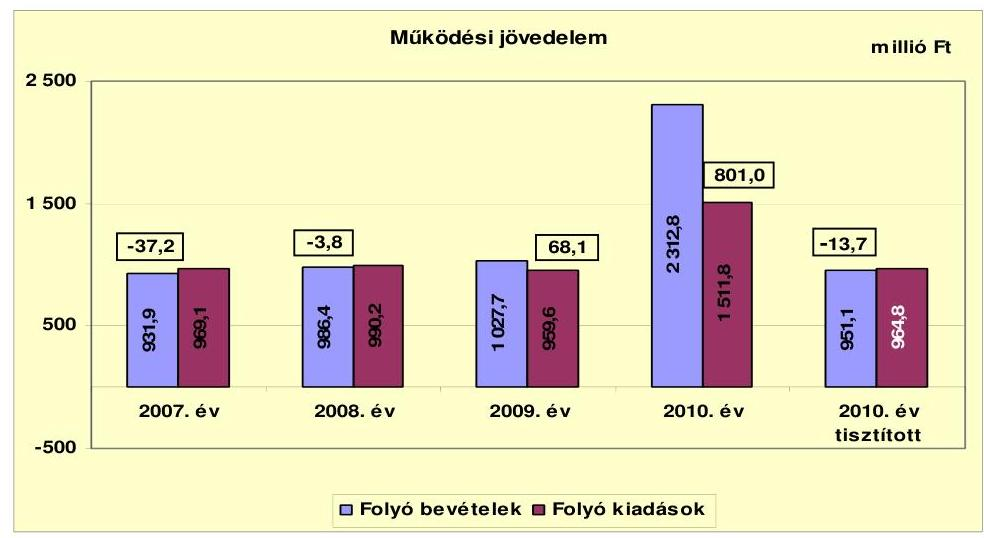

A vizsgált időszakban az Önkormányzat folyó költségvetési egyenlege, múködési jövedelme emelkedő tendenciát mutatott. 2007-ben és 2008-ban negatív előjelű, 2009-ben és 2010-ben pozitív összegű volt. A folyó költségvetés negatív egyenlege, (a múködési forráshiány) 2007-ben a folyó kiadások 3,8\%át (37,2 millió Ft-ot), 2008-ban 0,4\%-át ( 3,8 millió Ft-ot) jelentette. A folyó költségvetés pozitív egyenlege, (a múködési forrástöbblet), 2009-ben a folyó kiadások 7,1\%-át ( 68,1 millió Ft-ot), 2010-ben $52 \%$-át ( 801,0 millió Ft) tette ki. A vörösiszap-katasztrófával kapcsolatos 2010. évi folyó költségvetés egyenlegének ( 814,7 millió Ft) figyelmen kívül hagyásával azonban az Önkormányzat 2010. évi tisztított múködési jövedelme is negatív egyenlegű, -13,7 millió Ft, a folyó kiadások 1,4\%-át tette ki.

A 2007. évi negatív egyenleg 60,5\%-a (22,5 millió Ft) abból adódott, hogy a korábbi évek csatorna-beruházásához a kivitelező jóteljesítési garancia címén utalta át ezen összeget 2006-ban az Önkormányzat részére. Ennek felhasználására nem volt szükség, ezért azt az Önkormányzat 2007-ben utalta vissza a vállalkozás részére és a múködési kiadások között számolta el. A 2010. évi pozitív egyenleget lefelé térítette el egy 25,5 millió Ft összegű jóteljesítési garancia visszautalásának múködési kiadások között történő elszámolása. A 2010. évben az Önkormányzat múködését leginkább befolyásoló tényező a vörösiszap-katasztrófa volt, amellyel kapcsolatban a múködési bevételek között 1361,7 millió Ft, a múködési kiadások között 547,0 millió Ft-ot számoltak el.

A múködési jövedelem egyenlege csak 2009-ben mutatott tényleges megtakarítást ( 68,1 millió Ft). A pozitív múködési jövedelemben meghatározó szerepe volt - a központosított támogatások nagyobb mértékű igénybevétele mellett az előző években végrehajtott létszámcsökkentések hatásának (43,4 millió Ft). A negatív múködési jövedelem viszont pénzügyileg nem fenntartható helyzetet okoz, amely felelős, előrelátó gazdálkodással kezelhető.

Az Önkormányzat múködtetetése biztosítása érdekében a 2007-2010 közötti időszakban minden évben nyújtott be igénylést múködésképtelen helyi önkormányzatok támogatására, emellett a 2007. és a 2011. évben önhibájukon kívül hátrányos helyzetű önkormányzatok támogatására is. Utóbbi jogcímen az Ön-

---

kormányzat a 2007. évben 33,3 millió Ft támogatásban részesült, melyet dologi kiadások fedezetére fordítottak. Múködésképtelen helyi önkormányzatok támogatása jogcímen az Önkormányzat 2007. évben 8,0 millió Ft, a 2008. évben 26,0 millió Ft, a 2009. évben 14,5 millió Ft, a 2010. évben 27,5 millió Ft feladathoz nem kötött, vissza nem térítendő támogatást kapott, melyet a hiány (múködési célú hitel) csökkentéséhez használtak fel. A támogatások hatására az Önkormányzat pénzügyi helyzete javult. Ennek ellenére - a 2009. év kivételével - múködési jövedelme továbbra is negatív összegű maradt ${ }^{16}$.

Az Önkormányzat pénzügyi kapacitását jelentősen meghatározta a teljesített tőketörlesztés. A legmagasabb összegű törlesztés a 2009. évben volt. Ekkor törlesztették a 2006. évben megszűnt csatornatársulattól átvett hitelt ( 160 millió Ft) a lakossági takarékpénztári befizetésekből. Hiteltörlesztésként jelent meg továbbá a folyószámlahitel év végi állományának 2008. évi és 2010. évi csökkenése ( 15,9 millió Ft és 53,7 millió Ft), valamint a 2010. évben a mun-kabér-megelőlegezési hitel előző évről áthúzódó (12,9 millió Ft) törlesztése.

Az Önkormányzat nettó múködési jövedelmének (pénzügyi kapacitásának) évenkénti alakulását az alábbi ábra szemlélteti:
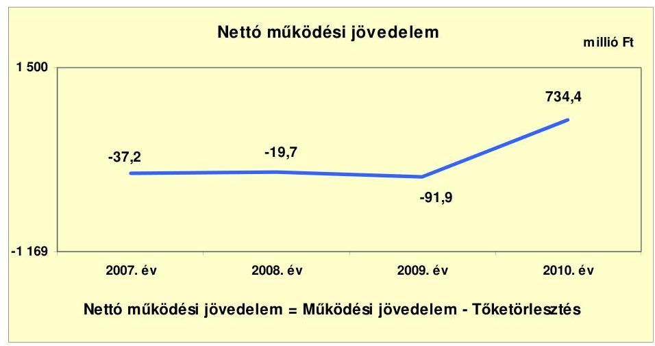

Az Önkormányzat pénzügyi kapacitása 2007-2009. év között negatív értéket mutatott, 2010-ben viszont pozitív egyenlegű volt. A 2009. évi jelentős negatív egyenleg ( 91,9 millió Ft) indoka a csatornatársulattól átvett hitel azévi törlesztése. A 2010. évi kiugróan kedvező pozitív nettó múködési jövedelmet a vörösiszap-katasztrófával kapcsolatos folyó költségvetés egyenlege ( 814,7 millió Ft) torzítja.

[^0]
[^0]:    ${ }^{16}$ Az Önkormányzat múködési jövedelme a múködésképtelen helyi önkormányzatok, illetve önhibájukon kívül hátrányos helyzetű önkormányzatok támogatása nélkül a 2007. évben -78,2 millió Ft, a 2008. évben -29,8 millió Ft, a 2009. évben 53,6 millió Ft, a 2010. évi tisztított adat -41,2 millió Ft.

---

A vörösiszap-katasztrófával kapcsolatos bevételek és kiadások nélkül számított (tisztított) adatokat a következő ábra szemlélteti:
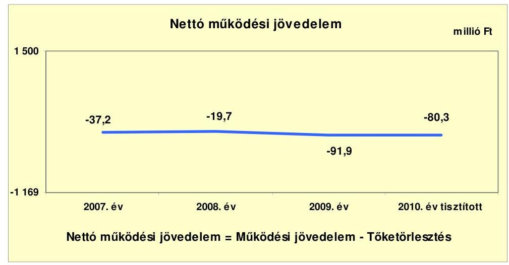

A vörösiszap-katasztrófával kapcsolatos folyó költségvetési egyenleg figyelmen kívül hagyásával a 2010. évben is jelentős összegű (-80,3 millió Ft) a negatív nettó múködési jövedelem. A negatív érték azt mutatja, hogy az Önkormányzat adósságszolgálatát csak újabb hitelből tudja teljesíteni, ezáltal megindulhat az adósságspirál. A jövőben teljesítendő adósságszolgálat csak pozitív nettó jövedelmet eredményező gazdálkodás mellett teszi elkerülhetővé további külső források bevonását, az eladósodást.

A felhalmozási költségvetés egyenlegének alakulását 2007-2010 közötti években a következő ábra szemlélteti:
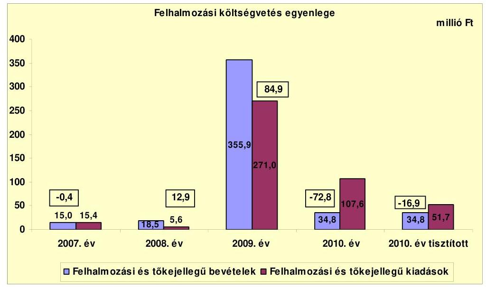

---

Az Önkormányzat felhalmozási költségvetésének egyenlege a 2008. és a 2009. évben pozitív összegű volt a 2007. és a 2010. évi felhalmozási hiánnyal szemben. A felhalmozási forráshiánynak a felhalmozási és tőke jellegű kiadásokhoz viszonyított aránya 2007-ben 2,6\% (-0,4 millió Ft), 2010-ben 67,7\% (-72,8 millió Ft) volt. A felhalmozási forrástöbblet a 2008. évben a felhalmozási és tőke-jellegű kiadások 230,4\%-át (12,9 millió Ft), 2009-ben annak 31,3\%-át ( 84,9 millió Ft) jelentette. A vörösiszap-katasztrófával kapcsolatos bevételek és kiadások figyelmen kívül hagyásával a 2010. évi tisztított felhalmozási költségvetés egyenlege -16,9 millió Ft, 15,7\%-a a felhalmozási és tőke jellegű kiadásoknak.

A vörösiszap-katasztrófa kapcsán a 2010. évben 55,9 millió Ft felhalmozási kiadása merült fel az Önkormányzatnak. Ennek fedezete a katasztrófavédelmi célelőirányzat ( 61,1 millió Ft), amely a CLF táblában a múködési bevételek között szerepelt. Ezáltal a múködési jövedelmet pozitív irányba mozdította el.

Az Önkormányzat összesített felhalmozási egyenlege a 2007-2010. években 24,6 millió Ft (forrástöbblet). A vörösiszap-katasztrófával kapcsolatos pénzmozgások nélküli összesített egyenleg 80,5 millió Ft forrástöbblet.

A felhalmozási költségvetés nagyságrendje a 2009. évben tért el a többi évtől. Ekkor valósított meg az Önkormányzat két jelentősebb felújítást, a Polgármesteri hivatal és a Várkert utcai általános iskola épületénél, melyekhez pályázati támogatások kapcsolódtak. A 2009. évi pozitív egyenlegben szerepet játszott továbbá, hogy ebben az évben folyt be az Önkormányzathoz a csatornamú társulattól átvett hitel fedezeteként a lakossági takarékpénztári szerződésekhez kapcsolódó támogatás.

A 2007. és 2010. évi felhalmozási forráshiány finanszírozására egyik évben sem nyújtott fedezetet a nettó működési jövedelem, mivel az minden évben - a vörösiszap-katasztrófa korrekciójával a 2010. évben is - negatív összegű volt. A felhalmozási hiány fedezetére a vizsgált időszakban az Önkormányzat a 2010. évben vett igénybe fejlesztési hitelt 44,2 millió Ft értékben. A 2007. évi felhalmozási hiány finanszírozására fedezetet nyújtott a rendelkezésre álló nyitó pénzkészlet ( 71,3 millió Ft ).

---

Az Önkormányzat finanszírozási múveletei 2007-2010. évekbeli egyenlegének alakulását a következő ábra szemlélteti:
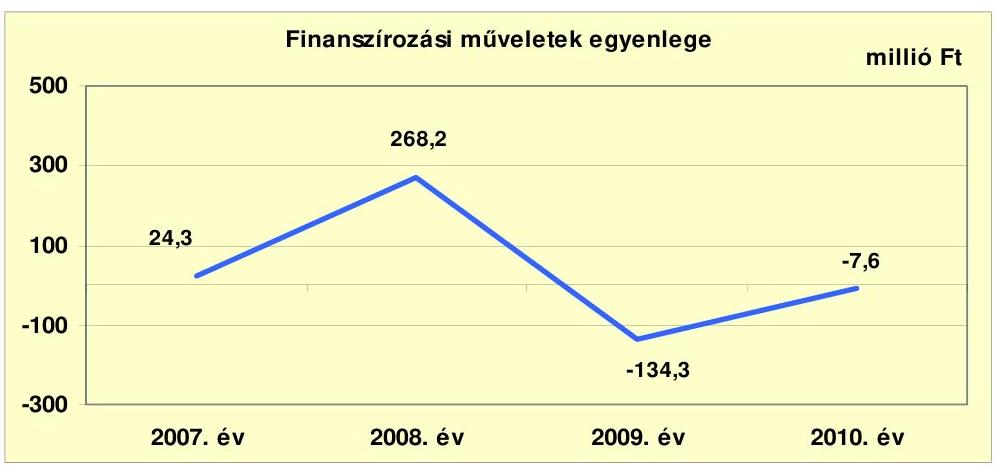

A finanszírozási célú pénzügyi műveletek pozitív értéke azt jelzi, hogy az éves költségvetések végrehajtása során szükség volt a pénzkészlet felhasználásán túl külső finanszírozás igénybevételére is. A finanszírozási célú pénzügyi műveletek 2008. évi növekedését elsősorban a 300 millió Ft összegű kötvénykibocsátásból származó finanszírozási célú bevétel okozta. Emellett az Önkormányzat folyamatosan folyószámla- és munkabér-megelőlegezési hitel igénybevételére kényszerült, melynek év végi állományváltozása befolyásolta a finanszírozási műveletek egyenlegét. Az Önkormányzat folyószámlahitel év végi állományának ${ }^{17}$ 2007. és 2009. évi növekedése 28,6 millió Ft, illetve 42,2 millió Ft, a hiteltörlesztésként kimutatott 2008. és 2010. évi csökkenés 15,9 millió Ft és 66,6 millió Ft (folyószámlahitel 53,7 millió Ft, munkabér-megelőlegezési hitel 12,9 millió Ft) volt. A 2009. évi csökkenés a csatornamú társulattól átvett hitel törlesztése miatt következett be. A finanszírozási célú műveleteket a vizsgált időszakban a jelentés 2 . számú mellékletének 4.1-4.8 pontjai részletezik.

Az Önkormányzat évenkénti teljes finanszírozási hiánya ${ }^{18}$ a CLF módszer szerint 2007-ben 37,6 millió Ft, 2008-ban 6,8 millió Ft, 2009-ben 7,0 millió Ft volt, míg 2010-ben 661,6 millió Ft volt a teljes finanszírozási többlet. A vörösiszapkatasztrófával kapcsolatos pénzügyi műveletek figyelmen kívül hagyásával azonban a 2010. évben 97,2 millió Ft a teljes finanszírozási hiány. Az Önkormányzat teljes finanszírozási igényéhez a vizsgált időszakban a képződő 13,4 millió Ft tényleges, a vörösiszap-katasztrófa nélküli múködési megtakarítás (múködési jövedelem) nem biztosított elegendő forrást.

Az Önkormányzat zárszámadási rendeletében a múködési és fejlesztési hiányt/többletet a hagyományos költségvetési szerkezet alapján mutatta be ${ }^{19}$, amelyről a jelentés 1. számú melléklete nyújt tájékoztatást. A zárszámadási rendeletben kimutatott múködési és felhalmozási bevételek tartalmazták a

[^0]
[^0]:    ${ }^{17}$ A folyószámlahitel év végi állománya a 2007. évben 176,3 millió Ft, a 2008. évben 160,4 millió Ft, a 2009. évben 202,6 millió Ft, a 2010. évben 148,9 millió Ft volt.
    ${ }^{18}$ A nettó múködési jövedelem és a felhalmozási költségvetés egyenlegeinek összege.
    ${ }^{19}$ Nincs kötelező előírás a múködési és fejlesztési hiány megállapításának módjára.

---

pénzmaradvány összegét is. A zárszámadási rendeletekben az Önkormányzat a 2007. évben 3,9 millió Ft hiányt, a 2008. évben 47,2 millió Ft, a 2009. évben 9,4 millió Ft, a 2010. évben 903,6 millió Ft többletet mutatott ki.

A 2007-2011. június 30. közötti időszakban az Önkormányzat összesen 131,6 millió Ft kamatot fizetett. Az átmenetileg szabad pénzeszközein realizált kamatbevétel ( 90,2 millió Ft) a teljes kamatráfordítás 68,5\%-át tette ki. A folyószámlahitel és a kötvénykibocsátás miatt jelentkező kamatot nem tudták ellensúlyozni.

Az Önkormányzat kamatbevételeinek és kamatkiadásainak alakulását 20072011. év I. félév közötti időszakban a következő ábra mutatja:
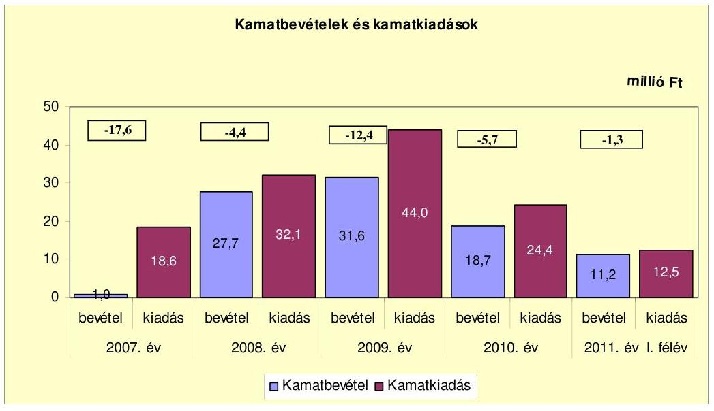

# 2.2. Az Önkormányzat bevételeinek változása 

Az Önkormányzat folyó bevétele folyamatosan emelkedett. Az előző három év átlagához ( 982,0 millió Ft) viszonyítva 2010-re 2312,8 millió Ft-ra (135,5\%-kal, 1330,8 millió Ft-tal) nőtt. A 2010. évi bevételből 1361,7 millió Ft a vörösiszap-katasztrófával volt kapcsolatos. Ennek figyelmen kívül hagyásával 30,9 millió Ft ( $3,1 \%$-os) a csökkenés. A 2011. év I. félévi folyó bevétel 1359,4 millió Ft volt, melyből a vörösiszap-katasztrófával kapcsolatos bevétel 900,0 millió Ft.

---

Az Önkormányzat 2007-2011. június 30. között realizált, főbb folyó bevételi jogcímeinek számszaki adatait az alábbi grafikon mutatja be:
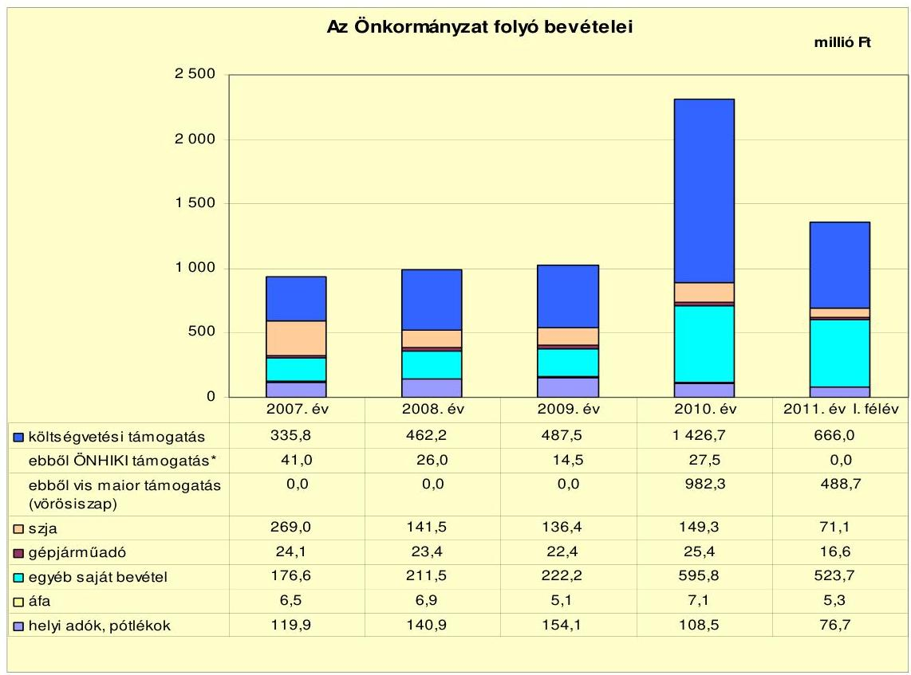

A költségvetési támogatások és az átengedett szja együttes összege a 2007. évben 604,8 millió Ft, a 2010. évben 1576,0 millió Ft volt. A költségvetési támogatásokból a 2007. évben 3,6 millió Ft, a 2008. évben 5,5 millió Ft, a 2009. évben 42,4 millió Ft, a 2010. évben 996,8 millió Ft volt felhalmozási jellegú. A 2010. évi költségvetési támogatásokból a vörösiszap-katasztrófával kapcsolatban 982,3 millió Ft volt a vis maior tartalékból származó bevétel összege. A központi költségvetésből származó bevételek összege - a 2009. évit kivéve - csökkenő tendenciájú. A visszaesés elsődlegesen a tanulólétszám csökkenésének a következménye. A 2009. évi növekedés a központosított előirányzatok (lakossági közműfejlesztés támogatása, közoktatási infrastruktú-ra-fejlesztés) nagyobb mértékű igénybevétele miatt következett be. A 2011. év I. félévi központi támogatások együttes összege 737,1 millió Ft volt, amelyből 488,7 millió Ft a vörösiszap-katasztrófával kapcsolatos vis maior tartalékból származott. Az Önkormányzat pénzügyi helyzetét javította, hogy évenként működésképtelen helyi önkormányzatok támogatásában, illetve 2007. évben önhibájukon kívül hátrányos helyzetű önkormányzatok támogatásában részesült. E jogcímeken a 2007-2010 közötti években együttesen 109,0 millió Ft támogatást kaptak.

A 2007-2010 közötti időszakban az Önkormányzat múködési bevételének 1115\% körüli arányát (108,5-154,1 millió Ft) alkották a helyi adóbevételek. Az Önkormányzat a vizsgált időszakban vezette be az építményadót, az iparűzési adót ezt megelőzően is maximális mértéken vetette ki. Az építményadóból a

---

vizsgált időszakban 132,5 millió Ft bevétele származott, amely a pénzügyi helyzetét kedvezően befolyásolta.

Az építményadót 2007-ben vezették be $600 \mathrm{Ft} / \mathrm{m}^{2}$ mértékkel a nem lakás és garázs céljára szolgáló építmények után. A lakosság teherbíró képességre tekintettel a mértéket év közben csökkentették $500 \mathrm{Ft} / \mathrm{m}^{2}$-re, majd 2009. januárjától alkalmazták a $600 \mathrm{Ft} / \mathrm{m}^{2}$-es mértéket.

A pótlékkal, bírsággal növelt helyi adóbevételnél tendenciájában 2009-ig növekedés, majd 2010-ben visszaesés volt tapasztalható. A visszaesés a vörösiszap-katasztrófával hozható összefüggésbe ${ }^{20}$. A helyi adóbevételek 70-80\%-át (75,5-108,7 millió Ft) az iparűzési adó tette ki, amelyből a vizsgált időszakban összesen 430,0 millió Ft bevétel származott.

Az Önkormányzat nem realizált osztalékbevételt a tulajdonosi részesedései után.

Az Önkormányzat 2007-2011. június 30. között realizált, főbb felhalmozási bevételeit az alábbi táblázat mutatja be:

| Megnevezés | 2007. év | 2008. év | 2009. év | 2010. év | 2011. év I.   félév |
| :-- | --: | --: | --: | --: | --: |
| Tárgyi eszköz értékesítés | 13,3 | 15,9 | 3,8 | 1,4 | 2,0 |
| Egyéb saját tőkebevétel | 1,7 | 2,2 | 1,6 | 1,6 | 0,5 |
| Államháztartáson belülről   kapott támogatás | 0,0 | 0,4 | 0,2 | 13,1 | 0,0 |
| EU-tól és külföldről kapott   támogatások | 0,0 | 0,0 | 172,1 | 2,3 | 0,0 |
| Államháztartáson kívülről   kapott támogatás | 0,0 | 0,0 | 178,2 | 16,4 | 1,4 |
| Összes felhalmozási bevétel | 15,0 | 18,5 | 355.9 | 34,8 | 3,9 |

Az Önkormányzatnak az áttekintett időszakban számottevő felhalmozási bevétele csupán a 2009. évben volt ( 355,9 millió Ft).

A 2009. évi kiugróan magas bevétel indoka, hogy az OTP ebben az évben utalta át a lakossági takarékpénztári szerződésekre a támogatást (178,2 millió Ft), valamint a Várkert utcai általános iskola épületének felújításhoz realizálódott 172,1 millió Ft-os EU-tól származó támogatás.

[^0]
[^0]:    ${ }^{20}$ A vörösiszap-katasztrófa következtében a vállalkozók adóalapját képező nettó árbevétel csökkent.

---

# 2.3. Az Önkormányzat folyó és felhalmozási célú kiadásainak változása 

Az Önkormányzat folyó kiadásai főbb jogcímek szerinti bontásban az alábbiak voltak:

| Megnevezés | 2007. év | 2008. év | 2009. év | 2010. év | 2010. év tiszititott | 2011. év I. fólev | 2011. év I. fólev tiszititott |
| :--: | :--: | :--: | :--: | :--: | :--: | :--: | :--: |
| Folyó kiadások | 969,1 | 990,2 | 959,6 | 1511,8 | 964,8 | 1804,6 | 475,8 |
| Mókolási kiadások (kamalkiadás nélkül) | 819,6 | 837,8 | 783,4 | 1251,9 | 792,2 | 1492,6 | 394,2 |
| Államháztartáson belöre átadott pénzeszközök | 0,7 | 7,4 | 5,1 | 0,7 | 0,7 | 0,6 | 0,6 |
| Transzfarkiadások | 130,2 | 104,1 | 120,1 | 234,8 | 147,5 | 298,9 | 68,4 |
| Abbott vállalkozásoknak | 41,3 | 16,8 | 17,0 | 56,3 | 44,3 | 19,3 | 12,2 |
| EU-nak. illetve külföldre | 0,0 | 0,0 | 0,0 | 0,0 | 0,0 |  |  |
| magánszemélyeknek | 83,0 | 81,7 | 97,1 | 173,9 | 98,9 | 258,1 | 54,7 |
| nonprofit szervezeteknek | 5,9 | 5,6 | 6,0 | 4,6 | 4,6 | 21,5 | 1,5 |
| Kamalkiadások | 18,6 | 32,1 | 44,0 | 24,4 | 24,4 | 12,5 | 12,5 |
| Előző évi pénzmaradvány átadás | 0,0 | 8,8 | 7,0 | 0,0 | 0,0 | 0,0 | 0,0 |

Az Önkormányzat folyó kiadásai a 2010. évben az előző három év átlagához (973,0 millió Ft-hoz) képest több mint másfélszeresére, 55,4\%-kal (538,8 millió Ft-tal) nőttek. A növekedést torzítja a 2010. évi vörösiszapkatasztrófával kapcsolatosan felmerült folyó kiadás összege (547,0 millió Ft). Ennek figyelmen kívül hagyásával a 2010. év végére ténylegesen minimális ( $0,8 \%$-os) csökkenés ( 8,2 millió Ft) történt. A folyó kiadások évenként 5,0\% alatti eltéréssel változtak. A költségcsökkentő intézkedések következtében a kiadásokat - az infláció ellenére - a 2007. évi szinten tudták tartani. A 2011. június 30 -ig teljesített vörösiszap-katasztrófával korrigált folyó kiadás (475,8 millió Ft) időarányosan teljesült az előző évhez képest.

Az Önkormányzat folyó kiadásai főbb kiadásnemek szerinti bontásban az alábbiak voltak:

|  |  |  |  |  |  |  | millió Ft |
| :-- | --: | --: | --: | --: | --: | --: | --: |
| Megnevezés | 2007. év | 2008. év | 2009. év | 2010. év | 2010. év   tiszititott | 2011. év I.   fólev | 2011. év I.   fólev   tiszititott |
| Személyi juttatások | 460,7 | 460,8 | 436,3 | 457,8 | 457,8 | 226,2 | 214,9 |
| Munkaadót terhelő járulékok | 142,3 | 145,2 | 123,9 | 116,1 | 116,1 | 57,7 | 54,8 |
| Dologi kiadások | 197,5 | 198,5 | 201,9 | 652,7 | 193,0 | 1200,0 | 115,9 |
| Egyéb folyó kiadások | 19,1 | 33,3 | 21,3 | 25,3 | 25,3 | 8,7 | 6,7 |

A kiemelt előirányzatok közül a személyi, valamint a dologi kiadásokat az Önkormányzat - a vörösiszap-katasztrófa miatti 2010. évi 459,6 millió Ft dologi kiadás figyelmen kívül hagyásával - a vizsgált időszakban a 2007. évi kiadási szinten teljesítette. A munkaadót terhelő járulékoknál központi csökkentés történt. A 2011. év I. félévi dologi kiadásokból 1084,1 millió Ft a vörösiszap-katasztrófa (ingatlanok kármentesítése, útjavítás, ügyvédi munkadíjak, bérleti díjak) miatt keletkezett.

---

A folyó és felhalmozási kiadások évenkénti alakulását, a teljesített kiadások múködési és felhalmozási felhasználásának arányait az alábbi ábra mutatja be:
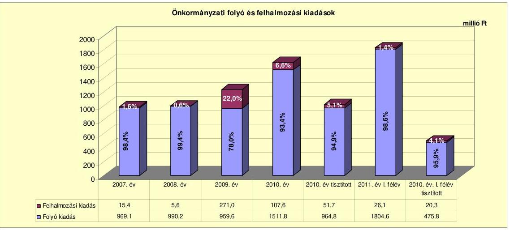

A folyó és felhalmozási kiadások aránya évenként változó volt. A 2009. évben figyelhető meg nagyobb elmozdulás a felhalmozási kiadások irányába a jelentés további részében részletezett fejlesztések hatására. A felhalmozási kiadások alacsony szintje annak következménye, hogy az Önkormányzat kedvezőtlen pénzügyi helyzete miatt nem tudott fejleszteni, azonban ez műszaki avultsághoz vezethet, amely a jövőben pénzügyi kockázatot jelenthet. Az Önkormányzat tájékoztatása szerint a kötvény kibocsátásából származó pénzeszközöket tudatosan tartalékolták jövőbeni fejlesztési lehetőségekre.

Az Önkormányzatnál a 2007-2010. évek között befejezett fejlesztések tervezett bekerülési költsége 313,2 millió Ft volt. A fejlesztéseket döntő részben EU-s és hazai támogatásokból tervezték megvalósítani. A tervezett költségek $75,3 \%$-át, 235,9 millió Ft-ot (EU-s: 60,7\%, hazai: 14,6\%) e két forrás biztosította. A hitel részaránya $14,1 \%$, ( 44,2 millió Ft ) a saját forrásé $10,6 \%$ ( 33,1 millió Ft) volt. Az öt db 10 millió Ft feletti, és az 56 db 10 millió Ft alatti fejlesztés döntően önkormányzati épületek, intézmények felújításából, korszerűsítéséből tevődött össze. A fejlesztések tényleges bekerülési költsége 357,3 millió Ft volt. Ez a tervezett költségekhez képest $14,1 \%$-os növekedést jelentett. A befejezett fejlesztések forrásmegoszlása: 190,2 millió Ft EU-s támogatás (53,2\%), 92,3 millió Ft hazai támogatás ( $25,8 \%$ ), 44,2 millió Ft hitel ( $12,4 \%$ ), és 30,6 millió Ft saját erő ( $8,6 \%$ ) volt. A tervezett fejlesztésekhez képest a növekedést alapvetően a vörösiszap-katasztrófa miatti telekvásárlás okozta. Ezt a beruházást támogatásból fedezték, melynek hatására a hazai támogatás részaránya megnőtt. Az Önkormányzatnak folyamatban lévő fejlesztése, felújítása nem volt. Beadott, elbírálás alatt lévő pályázattal nem rendelkezett.

Az Önkormányzat három legmagasabb bekerülési költségú fejlesztése az általános iskola Várkert utcai épületének felújításához, telekvásárláshoz, valamint a Polgármesteri hivatal rekonstrukciójához kapcsolódott:

- A Várkert utcai általános iskola épületének rekonstrukciója a 2009. évben kezdődött, múszaki befejezése a 2009. évben megtörtént. A támogatás

---

elszámolása a 2010. évre húzódott át. A beruházás tervezett költsége 207,7 millió Ft volt. A forrás megosztás a következő volt: EU-s támogatás 190,2 millió Ft ( $91,6 \%$ ), hazai támogatás 6,8 millió Ft (3,3\%), hitel 19,8 millió Ft ( $9,5 \%$ ), valamint a támogatások megelőlegezése következtében -9,1 millió Ft (-4,4\%) saját forrás. A fejlesztés az utófinanszírozás miatt likviditási gondot okozott, amelyet a folyószámlahitel igénybevételével hidaltak át. A folyószámlahitel előfinanszírozásra való felhasználása kockázatot jelentett. A tényleges bekerülési költség 214,0 millió Ft volt. A tervezetthez képest 6,3 millió Ft növekedést pótmunkák okozták, amelyet saját forrásból fedeztek. Így a saját forrás összege nőtt. Az egyéb források (hazai és EU-s támogatás, valamint a hitel) összege tervszinten alakult. A fejlesztés eredményeként az iskola teljes külső és belső felújítása megtörtént, kicserélték a fütési és világítási rendszert, az épületet négy új szakteremmel bővítették, kiépült az informatikai hálózat is.

- A vörösiszap-katasztrófában megsemmisült lakások újbóli felépítése érdekében az Önkormányzat összesen 23 ha $2995 \mathrm{~m}^{2}$ területet vásárolt a 2010. évben katasztrófavédelmi célelőirányzatból kapott támogatással. A beruházás tervezett, illetve tényleges költsége - 46,6 millió Ft - azonos volt.
- A Polgármesteri hivatal belső tereinek felújítása a 2008. évben kezdődött. A felújítás megvalósítását 23,1 millió Ft-ból tervezték, 7,2 millió Ft hitel ( $31,2 \%$ ) és 15,9 millió Ft hazai támogatás ( $68,8 \%$ ) igénybevételével. A fejlesztés a 2009. évben fejeződött be, költsége és forrásmegoszlása tervszinten alakult. A beruházás keretében kicserélték a nyílászárókat, új vizesblokkot alakítottak ki, a helyiségeket parkettázták.

A 2007-2011. év I. félévében az Önkormányzat kizárólagos tulajdonában lévő gazdasági társasága részére - megállapodás alapján - 77,9 millió Ft működési célú pénzeszközt adott át. A gazdasági társaság a pénzeszközt a városüzemeltetési feladatok ellátására fordította.

A gazdasági társaság részére átadott pénzeszközök évenkénti alakulását a jelentés 4. sz. melléklete részletezi.

# 3. Az ÖNKORMÁNYZAT KÖTELEZETTSÉGEI 

### 3.1. Az Önkormányzat pénzintézeti kötelezettségeinek változása

Az Önkormányzat pénzintézeti kötelezettségeinek állománya 2006. december 31-én 307,7 millió Ft, 2010. december 31-én 610,7 millió Ft volt. Az év végi pénzintézeti kötelezettségállomány 19,2\%-a (117,5 millió Ft) az árfolyam növekedés miatt keletkezett. A 2011. június 30-i állomány 609,3 millió Ft-ra csökkent.

---

A 2006. évi záró állományt 160,0 millió Ft csatornamú társulattól ${ }^{21}$ átvett - a 2009. évben letörlesztett - hosszú lejáratú és 147,7 millió Ft rövid lejáratú folyó-számlahitel-állomány képezte. A vizsgált időszakban az Önkormányzat éven túli fejlesztési hitelt két alkalommal vett igénybe a 2010. évben 44,2 millió Ft értékben. Növelte a hosszú lejáratú kötelezettség állományát a 2008. évben kibocsátott 300,0 millió Ft összegű CHF kötvény. A pénzintézeti kötelezettségek állományán belül a kötvény kibocsátása, illetve annak árfolyam- növekedése, valamint a fejlesztési hitelek felvétele miatt a hosszú lejáratú kötelezettségek aránya folyamatosan emelkedett a 2007. évi 52,0\%-ról 2011. június végére 73,6\%-ra. Így a pénzintézeti kötelezettségek 2011. év I. félév végén a két beruházási hitelből, a kötvényből, valamint a rövid lejáratú folyószámlahitelből tevődtek össze. Az Önkormányzat az elfogadott 2011. évi költségvetési rendelete alapján 23,7 millió Ft hitel felvételét tervezte, a hitelt a helyszíni vizsgálat befejezésének időpontjáig még nem vette fel.

A pénzintézeti kötelezettségek állományát a 2007-2011. év I. félév időszakában a következő ábra szemlélteti:
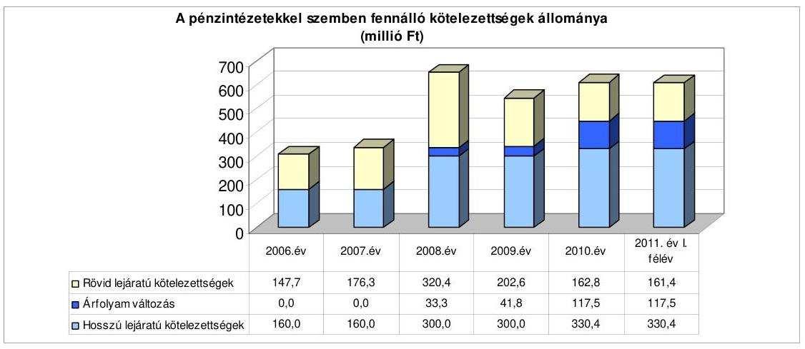

Az Önkormányzat a forráshiány, valamint az adósság kezelése érdekében a 2007-2011. évi költségvetési rendeletekben hitel felvételével, a 2008. évben kötvény kibocsátásával, a 2009-2011. években pénzmaradvány igénybevételével számolt. Az egyensúly javítását szolgáló intézkedés volt az építményadó 2007. áprilisi elsejei bevezetése, valamint a létszámcsökkentés is. Az adósságot keletkeztető kötelezettségvállalások felső határát a 2007-2009. években túllépték, ezzel megsértették az Ötv. 88. § (2) bekezdését. A 2010. évben túllépés nem történt. A vizsgált időszakban számlavezető bankot nem váltottak.

A pénzintézeti kötelezettségvállalásokra minden esetben a Képviselő-testület döntése alapján került sor. A pénzintézeti döntéseket megalapozó előterjesztések tételesen nem tartalmazták a kötelezettségvállalásnak a teljes futamidőre

[^0]
[^0]:    ${ }^{21}$ A mérlegadatokhoz képest a CLF táblában módosítás történt, mert a 2007. évi pénzintézeti kötelezettség a mérlegben 160,0 millió Ft-tal kevesebb volt, mivel a csatorna-mú-társulattól átvett hitelt nem hosszú lejáratú hitelként, hanem egyéb hosszúlejáratú kötelezettségként vették figyelembe. A 2010. évi eltérés 13,8 millió Ft volt, mert a mérlegben a beruházási hitelek következő évi törlesztő részlete kétszeresen szerepelt.

---

várható kamat- és tőkefizetési kötelezettségeit, de kitértek a kamat, valamint a kötvény esetében az árfolyamkockázat veszélyeire.

A Képviselő-testület döntött 300 millió Ft névértékben, svájci frank alapú, zártkörú fejlesztési célú kötvény kibocsátásáról. A kibocsátót versenyeztetést követően választották ki, a nyertes nem azonos az Önkormányzat számlavezető bankjával. Az „Élhetőbb városért" elnevezésű, 2008. február 7-én kibocsátott kötvény futamideje 20 év, névértéke összesen 1875 ezer CHF, változó kamatlábát hat havi CHF LIBOR + évi 1,1\%-ban rögzítették. A kamatokat félévente, valamint a lejárat napján kell az Önkormányzatnak megfizetnie. A tőketörlesztési kötelezettség kezdete 2013. március 31., az éves törlesztő részlet 120 ezer CHF. A kötvény lejárata 2028. február 7. A pénzintézet a 2009. évre ügynöki szolgáltatások díjának felszámítását kezdeményezte. Az átalánydíjat a kötvény névértékének 2,2\%-ban határozták ${ }^{22}$ meg. A fizetési időpontokat a kamatfizetési napokhoz kötötték.

A kötvénykibocsátásból befolyt 300 millió Ft bevételből 100,0 millió Ft-ot az Önkormányzat óvadékként lekötött. Ez a betétként elhelyezett összeg a pénzintézet hozzájárulásával szabadítható fel. A további 200 millió Ft-ot is bankbetétben helyezték el, illetve a 2008. évben deviza opciós ügyletet ${ }^{23}$ hajtottak végre. A kötvénykibocsátásból származó pénzeszközből felhasználás még nem történt.

Az Önkormányzatnak a 2011. év I. félév végén devizában fennálló pénzintézeti kötelezettsége a kötvénykibocsátásból keletkezett, melynek adatait a következő táblázat szemlélteti:

| Megnevezés | Szerződéskötés/   Kibocsátás   időpontja | Összeg   ezer CHF-ben | Kibocsátási/lehivási   árfolyam | Kamat (referencia kamat+   kamatfelár) | Felhasználás célja: |
| :-- | :--: | :--: | :--: | :--: | :--: |
| Kötvény | 2008.02 .07 | 1875 | 160 | 8 havi CHF LIBOR+1,1\% | önkormányzati fejlesztések |

A kötvény tőketörlesztési kötelezettsége a 2011. év I. félévében még nem kezdődött meg, kamatokra eddig 185 ezer CHF-et ( 34,7 millió Ft) fordítottak. Egyéb költség a 4,0 millió Ft jegyzési díj volt.

A 2011. év I. félév végén forintban fennálló hosszú lejáratú pénzintézeti kötelezettségek az alábbiak voltak:

| Megnevezés | Szerződéskötés/   Kibocsátás | Összeg   ezer HUF-ban | Kamat (referencia   kamat+ kamatfelár) | Felhasználás célja: |
| :-- | :--: | :--: | :--: | :--: |
| Beruházási hitel | 2010.09 .15 | 8191 | 3 havi   Euribor+MNB+OTP   kamatfelár | Általános iskola felújításához |
| Beruházási hitel | 2010.09 .15 | 36000 | 1 havi bubor+3,5\% | Általános iskola és   Polgármesteri hivatal   felújításához |

[^0]
[^0]:    ${ }^{22}$ A forgalmazói szerződés módosítását a Képviselő-testület a pénzintézet kezdeményezése alapján jóváhagyta. A jutalék összege 41193 CHF volt.
    ${ }^{23}$ A deviza opciós ügyleten a 2008. évben 1,9 millió Ft bevételt realizáltak.

---

A 44,2 millió Ft éven túli hitelből ${ }^{24}$ az Önkormányzat 2011. június 30-ig 6,0 millió Ft tőkét törlesztett, valamint 1,6 millió Ft kamatot és 0,4 millió Ft egyéb költséget fizetett.

Az Önkormányzat a beruházási hiteleket a céloknak megfelelően az általános iskola, a Polgármesteri hivatal felújítására fordította 44,2 millió Ft értékben. A kötvénykibocsátásból származó 300,0 millió Ft-ból felhasználás még nem történt. A kötvény forrásából származó összeg befektetése a kibocsátástól 2011. június 30-ig 82,6 millió Ft kamatbevételt eredményezett az Önkormányzatnak. A kamatbevételekből fizették az elmúlt években a kötvény kamatait. A fennmaradó részt a Képviselő-testület döntésének megfelelően a 2008-2010. évek végén a müködési kiadások fedezetére vezették át. Ez a három év alatt 38,1 millió Ft volt.

Az Önkormányzat költségvetésének pénzügyi egyensúlyát a vizsgált időszakban folyamatosan folyószámla- és munkabér-megelőlegezési hitel igénybevételével tudta biztosítani. A hitelkeretek évenkénti megújítása és módosítása tartósan fennálló forráshiányra utal, amely elsődlegesen a vizsgált időszakot megelőzően - az Önkormányzattól kapott információk alapján a csatorna-beruházás következtében - keletkezett. A 2007-2011. év I. félév időszakában hozott bevételnövelő, kiadáscsökkentő intézkedések révén a forráshiány növekedését sikerült megállítani, de annak nagyságát csökkenteni nem, ezért a pénzügyi egyensúly biztosításához továbbra is szükség volt a folyószám-la- és munkabér-megelőlegezési hitelekre. A hitelek alakulását az alábbi táblázat mutatja be:

| Megnevezés | 2007. év | 2008. év | 2009. év | 2010. év | 2011. év. I.   félév |
| :-- | :--: | :--: | :--: | :--: | :--: |
| I. Folyószámlahitel |  |  |  |  |  |
| a folyószámlahitel keretösszege január 1-jén | 150,0 | 190,0 | 180,0 | 206,0 | 170,0 |
| teljesített kamat és egyéb költség | 16,2 | 19,6 | 22,6 | 17,1 | 7,3 |
| II. Munkabér megelőlegezési hitel |  |  |  |  |  |
| Igénybevett hitel összesen: | 13,0 | 13,0 | 13,0 | 13,0 | 13,0 |
| teljesített kamat és egyéb költség | 1,3 | 1,2 | 1,9 | 1,7 | 0,7 |

A folyószámlahitel kondícióinak és egyéb költségeinek alakulását az alábbi lábjegyzetben lévő táblázat szemlélteti ${ }^{25}$ :

[^0]
[^0]:    ${ }^{24}$ A hitelek törlesztése a 2011. évben kezdődött, az éves törlesztő részlet 10,8 millió Ft.
    ${ }^{25}$ A referenciakamat az alábbiak szerint alakult:

    | MNB BUBOR fieng (állagkamat) \%-ban |  |  |  |  |
    | :--: | :--: | :--: | :--: | :--: |
    | 2007. évi | 2008. évi | 2009. évi | 2010. évi | 2011.év I.   félév |
    1 havi BUBOR | 7,83 | 8,75 | 8,66 | 5,47 | 6,00 |
    3 havi BUBOR | 7,75 | 8,87 | 8,64 | 5,50 | 6,07 |

---

| Megnevezés | Kamat (referencia+ kamatfelár) | Egyéb költség |
| :--: | :--: | :--: |
| Folyószámlahitel |  |  |
| 2008.11.04-ig | 3 havi BUBOR $+1 \%$ | $0,5 \%$ kez. Költség |
| 2008.11.05-től | 3 havi BUBOR $+2,8 \%, 57$ millió Ft felett $3 \%$ | $0,5 \%$ rend.tartási jutalék, $0,5 \%$   kez. Költség |
| 2009.07.07-től | 1 havi BUBOR $+3,75 \%$ | $0,5 \%$ rend.tartási jutalék, $0,5 \%$   kez. Költség |
| 2009.11.06-től | 1 havi BUBOR $+3,75 \%$ | $1 \%$ rend.tartási jutalék, $0,5 \%$   kez. Költség |
| Munkabér megelőlegezési hitel |  |  |
| 2007.,2009-2011. I. félév | Prime Rate $+0,7 \%$ | 0 |
| 2008. év | Referencia kamat | 0 |

A folyószámlahitel keret 2009. év júliusától volt a legmagasabb 206,0 millió Fttal. A keret növekedését az általános iskola felújítása indokolta, ugyanis a döntő részben támogatásból megvalósult fejlesztés utófinanszírozású volt. A legkisebb folyószámlahitel keret 170,0 millió Ft volt, 2010. év novemberétől. A keret csökkentése azért vált szükségessé, mert az Önkormányzat fejlesztési hitelt is igénybe vett ebben az évben, és a folyószámlahitel keret csökkentése nélkül az adósságot keletkeztető kötelezettségvállalások felső határát túllépték volna. Az Önkormányzat a vizsgált időszak minden napján igénybevett folyószámlahitelt, így minden év végén rendelkezett állománnyal. Ennek összege a legmagasabb 2009. évi 202,6 millió Ft és a legalacsonyabb 2010. évi 148,9 millió Ft között változott. A folyószámlahitel évenkénti lejáratakor a hitelt törleszteni nem kellett, mert új szerződés alapján azt a bank tovább folyósította. A szerződések megújításakor a folyószámlahitel kihasználtsága 90\% körül alakult.

Az új szerződés kötésekor a folyószámlahitel állománya az alábbi volt: 2007. évben 159,5 millió Ft, 2008. évben 174,1 millió Ft, 2009. évben 196,3 millió Ft, 2010. évben 9,6 millió Ft. A 2010. évi módosítás időpontjában a folyószámlahitel kihasználtsága átmenetileg - a vörösiszap-katasztrófa miatt kapott pénzeszközök hatására - nem érte el a 10\%-ot. A folyószámlahitel átlagos állománya a 2008. évi 175,0 millió Ft és a 2011. év I. félévi 143,6 millió Ft között mozgott. A likviditási problémák finanszírozása az Önkormányzatnak 82,8 millió Ft kamat- és egyéb költségkiadást okozott. A folyószámlahitel folyamatos kihasználtsága, annak állománya magas pénzügyi kockázatot jelent.

Az Önkormányzat 2007-2011. év I. félévben a munkabérek kifizetéséhez minden hónapban 13 millió Ft munkabér-megelőlegezési hitelt vett igénybe. A hitel átlagos állománya ${ }^{26} 12,6$ millió Ft volt. A munkabér-megelőlegezési hitel után a vizsgált időszakban 6,8 millió Ft kamatfizetési kötelezettség keletkezett. Egyéb likviditási hitel felvételére nem került sor.

A kamatfizetési kötelezettségek alakulását jelentősen befolyásolhatja a kibocsátáskor és az utolsó kamatfizetéskor érvényes referenciaamat alakulása. Ez az Önkormányzat adatszolgáltatása alapján a devizában fennálló kötvény esetében volt jelentősebb hatással a kamatfizetési kötelezettségek alakulására, amelyet az alábbi táblázat mutat be:

| Megnevezés | Kibocsátási, lehívási | Utolsó fizetéskori | Változás \% |
| :--: | :--: | :--: | :--: |
|  | kamat (referencia + kamatfelár) \% |  |  |
| 6 havi CHF LIBOR | 3,81 | 1,355 | $-64,4 \%$ |

[^0]
[^0]:    ${ }^{26} 365$ nappal számolva, a hitellel zárt napok alapján az átlagos állomány 13,0 millió Ft

---

A kötvénykibocsátáskor érvényes referenciakamattal számolva az Önkormányzatnak 2011. júniusáig 242791 CHF kamatfizetést kellett volna teljesítenie. A referencia kamat csökkenése miatt ennél 57297 CHF összeggel kevesebb fizetési kötelezettsége keletkezett. Az Önkormányzatnál az ellenőrzött időszakban a devizában fennálló kötelezettség Számviteli törvény szerinti értékelése megtörtént.

Az Önkormányzat kötelezettségeinek állományát 2010. december 31-én, és 2011. június 30-án, valamint azok várható alakulását (tőke, kamat és egyéb költség) a kötelezettségek lejáratáig a következő táblázat mutatja:

| Megnevezés | Állomány 2010. december 31-én |  |  | Állomány 2011. június 30-án |  |  | Várható kötelezettség 2011. 2013. években |  | Várható kötelezetts ég 2014. évtól |
| :--: | :--: | :--: | :--: | :--: | :--: | :--: | :--: | :--: | :--: |
|  | HUF-ban   (millió Ftban) | Devizában (összegy, ezer CHFben) | Deviza nem | HUF-ban (millió Ftban) | Devizában (összegy, ezer CHFben) | Deviza   nem | HUF-ban (millió Ftban) | Devizában (összegy, ezer CHFben) | Devizában (összegy, ezer CHFben) |
| Pénzintézeti kötelezettségek |  |  |  |  |  |  |  |  |  |
| Hosszúlejárati hírelek | 44,1 |  | HUF | 38,1 |  | HUF | 50,4 |  |  |
| Kötvény |  | 1875,0 | CHF |  | 1875,0 | CHF |  | 196,8 | 1943,6 |
| Folyhazámla hitel | 148,9 |  | HUF | 153,6 |  | HUF | 153,6 |  |  |
| Pénzintézeti kötelezettségek összesen HUF-ban: | 183,0 |  | HUF | 191,7 |  | HUF | 204,0 |  |  |
| Pénzintézeti kötelezettségek összesen CHF-ben: |  | 1875,0 | CHF |  | 1875,0 | CHF |  | 196,8 | 1943,6 |
| Szállító tartozás | 406,6 |  | HUF | 172,8 |  | HUF | 172,8 |  |  |
| Összes kötelezettség HUF-ban: | 599,6 |  | HUF | 364,5 |  | HUF | 376,8 |  |  |
| Összes kötelezettség CHF-ben: |  | 1875,0 | CHF |  | 1875,0 | CHF |  | 196,8 | 1943,6 |

A 2011-2013. években várható pénzintézeti kötelezettség teljesítésére figyelembe vehető a 2010. december 31-én kimutatott le nem járt határidejű 107,7 millió Ft követelésállomány, valamint a jelzálogbejegyzéssel nem érintett forgalomképes besorolású ingatlanok értékesítéséből a helyi viszonyok alapján elérhető bevétel. A döntően a vörösiszap-katasztrófa miatt keletkezett szállító tartozásállomány kifizetésére pedig fedezetet biztosított az e célra elkülönített számlákon rendelkezésre álló 586,1 millió Ft pénzkészlet. A 2014. évtől a pénzintézeti kötelezettség visszafizetését az Önkormányzat megképződött múködési jövedelméből tervezte. Ennek összege azonban a 2007-2008. években, valamint a 2010. évben negatív volt (a 2010. évi tisztított érték: -13,7 millió Ft). Változatlan tendencia esetén a múködési jövedelem nem nyújt fedezetet a visszafizetésre. A pénzintézeti kötelezettségek teljesítését így nem látjuk biztosítottnak. A visszafizetés kockázatát ugyanakkor csökkenti, hogy a kötelezettség visszafizetésére figyelembe vehető a jelenlegi ismeretek alapján a kötvény forrásából származó 300,0 millió Ft-os pénzmaradvány, valamint a jelzálogbejegyzéssel nem érintett forgalomképes besorolású ingatlanok értékesítéséből a helyi viszonyok alapján elérhető bevétel.

---

# 3.2. A szállítói kötelezettségek változása 

Az Önkormányzat mérlegben kimutatott szállító tartozásállományának egyben lejárt ${ }^{27}$ tartozásállományának - aránya a 2007-2009. években nem érte el a kötelezettségek 10\%-át. Ez az arány a 2010. évben 38,4\%-ra nőtt, majd 2011. év I. félévében $21,2 \%$-ra csökkent.

A szállítói állomány a 2007-2011. év I. félévében az alábbi szerint alakult:

|  |  |  |  |  | millió Ft   2011. év I.   félév |
| :--: | :--: | :--: | :--: | :--: | :--: |
|  | 2007. év | 2008. év | 2009. év | 2010. év |  |
| Polgármesteri hivatal és intézmények | 4,3 | 4,1 | 33,8 | 406,8 | 172,8 |

A szállítókkal szemben fennálló tartozás a 2007-2008. években 10 millió Ft alatt maradt. Jelentős növekedés a 2010. évben történt. Ekkor a 406,8 millió Ft tartozás $95,6 \%$-a ( 388,7 millió Ft ) 30 nap alatti, $3,5 \%$-a ( 14,4 millió Ft) 31-60 nap közötti, $05 \%$ és $0,4 \%$-a ( $1,9-1,8$ millió Ft) pedig 61-90, illetve 91-365 nap közti elmaradás volt. A tartozásállomány drasztikus növekedése a vörösiszap-katasztófával kapcsolatos kiadások miatt következett be. Ennek hatása a 2011. év I. félévi adatokban is megmutatkozott. A 2011. év I. félév végén a 172,8 millió Ft tartozásból a legjelentősebb a 61-90 nap közötti 115,8 millió Ft (67,0\%) összegű elmaradás, amelyből 103,3 millió Ft egy számlához kapcsolódott. A helyreállítással kapcsolatos számla kifizetése azért húzódott el 2011. szeptemberére, mert a helyreállításban résztvevő vállalkozás nem küldte vissza az aláírt szerződést. A 91-365 nap közti lejárt tartozás 0,2 millió Ft ( $0,1 \%$ ) volt. A 2011. június végén kimutatott tartozásállományt az Önkormányzat 2011. szeptember végéig, döntő részben a katasztrófa miatt kapott központi forrásokból rendezte. Az Önkormányzatnak átütemezett lejárt szállítói kötelezettsége, egyéb kiadáselmaradása nem volt.

### 3.3. Egyéb kötelezettségek változása

A Képviselő-testület határozata alapján a vizsgált időszakban összesen 8,8 millió Ft összegű behejthatatlannak minősült követelést engedtek el. A 2009. évben vállalkozók felszámolása miatt 1,3 millió Ft gépjármúadóval összefüggő követelést töröltek. A 2010. évben hagyatéki igénnyel ${ }^{28}$ kapcsolatos követelés-elengedés történt 7,2 millió Ft értékben. További 0,3 millió Ft összegű bérleti díjat szintén felszámolás miatt kellett törölni.

[^0]
[^0]:    ${ }^{27}$ A lejárt szállítói állomány azért alakult ki, mert a 2007-2009. években a folyószámlahitel keret kihasználtsága miatt nem tudták a tartozást rendezni. A 2010. évben pedig a vörösiszap-katasztrófa a Polgármesteri hivatal munkájára is kihatással volt az egyéb mentési feladatok elsődlegessége miatt. Ennek következményeként a szállítói tartozások rendezése is késve történt.
    ${ }^{28}$ Az Önkormányzat hagyatéki igénye az 1998-2003. évek között, az egyes szociális rászorultságtól függő pénzbeli ellátásokkal kapcsolatban keletkezett.

---

Az Önkormányzat a vizsgált időszakban lízingszerződéssel nem rendelkezett, garanciát, kezességet nem vállalt. Az intézményeknek, más önkormányzatoknak, civil szervezeteknek, egyéb államháztartáson belüli és kívüli szervezeteknek kölcsönt nem nyújtott. Gazdasági társaságának tagi, illetve egyéb kölcsönt nem folyósított, PPP konstrukcióban beruházást nem végzett.

Az Önkormányzat a folyószámla és a két beruházási hitel biztosítékaként egy forgalomképes besorolású földterületen járult hozzá jelzálogjog alapításához 254,0 millió Ft összegben. A jelzáloggal terhelt ingatlan - mely a feladatellátásban nem vett részt - számviteli nyilvántartási értéke 535,0 millió Ft. Az összes forgalomképes ingatlan vagyonnyilvántartás szerinti értéke 2010. december 31 -én 658,9 millió Ft. A forgalomképes ingatlanok nettó értékének jelzálogjoggal való terheltségének megoszlását a következő diagram szemlélteti:
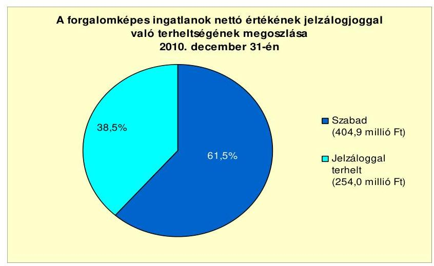

Az Önkormányzat alperesként peres eljárásban nem volt érintett. Jogerős határozattal lezárt, illetve nem lezárt peres eljárásból kifolyólag fizetési kötelezettsége nem volt. Saját gazdasági társaságától kölcsönt nem vett igénybe, feléje egyéb fizetési kötelezettség sem állt fenn.

Az Önkormányzat egy kizárólagos tulajdoni hányadú gazdasági társasággal rendelkezik. Kötelezettségeinek állományát 2010. december 31-én, és 2011. június 30 -án, valamint azok várható alakulását a kötelezettségek lejáratáig a következő táblázat mutatja:

| Megnevezés | Állomány 2010.   december 31-én |  | Állomány 2011.   június 30-án |  | Várható   kötelezetts-   ég 2011-   2013.   években |
| :-- | :--: | :--: | :--: | :--: | :--: |
|  | HUF-ban   (millió Ft-   ban) | Deviza nem | HUF-ban   (millió Ft-   ban) | Deviza nem | HUF-ban   (millió Ft-   ban) |
| Szállítói tartozás | 0,4 | HUF | 1,2 | HUF | 1,2 |
| Egyéb kötelezettség | 3,6 | HUF | 3,8 | HUF | 3,8 |
| Összes kötelezettség | 4,0 | HUF | 5,0 | HUF | 5,0 |

---

A gazdasági társaságnak - az általa kitöltött tanúsítvány alapján - pénzintézeti kötelezettsége nem volt. Szállítói kötelezettsége 2010. december 31-én 0,4 millió Ft, illetve 2011. június 30 -án 1,2 millió Ft volt. Az egyéb kötelezettségként kimutatott 3,8 millió Ft-ból 0,9 millió Ft a munkavállalókkal szembeni tartozás. További 2,9 millió Ft a központi költségvetéssel szembeni kötelezettség. A kimutatott kötelezettségek, valamint szállítói tartozásállomány nem tartozott a lejárt kötelezettségek közé.

A vizsgált időszakban nem történt meg annak felmérése, hogy az eszközök elhasználódásának pótlása mekkora forrásokat igényel az Önkormányzattól. A felújításokra, az eszközök pótlására a pénzügyi lehetőségek függvényében, elsősorban az intézmények működőképességének biztosítása, illetve a szakhatósági előírások figyelembevételével került sor.

A 2007-2010. években a tárgyi eszközök után 376,7 millió Ft összegű értékcsökkenést számoltak el. Felújításra a négy év alatt 287,2 millió Ft-ot fordítottak. Ebből meghatározó volt a pályázati támogatásból végrehajtott általános iskolai rekonstrukció. A beruházási kiadások összege 70,1 millió Ft volt. Kimutatásuk szerint a vizsgált időszakban eszközpótlásra pénzeszközt nem fordítottak.

A fejlesztések ellenére az eszközök használhatósági foka az egyes eszközcsoportokban különböző mértékkel elszámolt amortizáció elsődleges hatására önkormányzati szinten a 2007. évi 69,6\%-ról a 2010. évre 65,5\%-ra csökkent. A használhatósági fok alakulását befolyásolta a beruházások alacsony szintje is. A legkisebb mértékű elhasználódást az ingatlanok mutatták. A 2009-2010. években végzett felújítások hatására használhatósági fokuk csak két százalékponttal csökkent a 2010. évre a 2007. évi 74,3\%-ról. Legjobban elhasználódtak az üzemeltetésre átadott eszközök ( $40,8 \%$-ról $18,8 \%$-ra), ezt követik a gépek, berendezések és felszerelések ( $45,1 \%$-ról $21,8 \%$-ra). A jármúvek elhasználódása csökkent, használhatósági fokuk 17,6\%-ról 40,3\%-ra emelkedett.

# 4. A PÉNZÜGYI EGYENSÚLY MEGTEREMTÉSE ÉrDEKÉBEN HOZOTT INTÉZKEDÉSEK EREDMÉNYE 

Az Önkormányzatnál a kiadáscsökkentő és bevételnövelő intézkedések a gazdálkodás átláthatóvá tételét, a feladatellátás szakmai színvonalának, valamint a pénzügyi helyzetnek a javítását célozták. A legjelentősebb mértékű kiadási megtakarítást a létszámleépítésekkel érték el, az intézkedésekkel egyben sikerült megőrizni az intézmények stabilitását is.

A Képviselő-testület a 2007-2010. évek között két alkalommal döntött intéz-mény-átszervezésről:

- A feladatok színvonalasabb ellátása, a gyermek, illetve tanulólétszám csökkenése miatt határoztak a részben önálló költségvetési szervként működő óvoda megszüntetéséről egyben az általános iskolával történő összevonásáról.
- A feladatok hatékonyabb, költségtakarékosabb ellátása érdekében összevonták a Városi Könyvtárat és a Városi Művelődési Házat.

---

A 2007-2011. év I. félév időszakában kimutatott kiadáscsökkentő intézkedések az Önkormányzat adatszolgáltatása alapján 126,4 millió Ft megtakarítást eredményeztek.

A 2007-2011. év I. félévében végrehajtott kiadáscsökkentő intézkedések összegét és területi megoszlását az alábbi ábra szemlélteti:
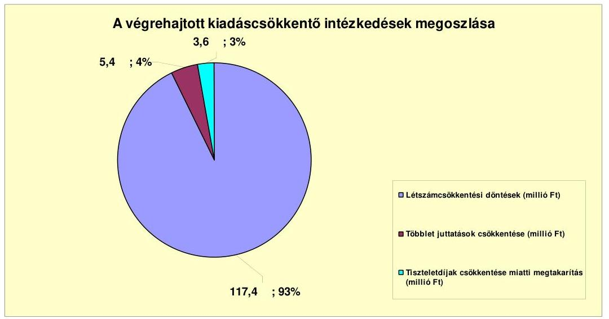

A kiadási megtakarítások 92,9\%-a (117,4 millió Ft) a létszámcsökkentéssel kapcsolatban keletkezett. A köztisztviselők és közalkalmazottak részére nyújtott cafetéria elemek csökkentése 5,4 millió Ft-os megtakarítást jelentett. A Képvise-lő-testület a 2010. október-december hónapokra járó tiszteletdíjáról lemondott, amely 2,8 millió Ft megtakarítást eredményezett. A 2011. évben csökkentették a Képviselő-testület, valamint a bizottságok külső tagjainak tiszteletdíját, ezzel 0,8 millió Ft megtakarítást terveztek.

Az Önkormányzat a 2007-2010. években a kiadások csökkentése érdekében létszámleépítéseket hajtott végre. A feladatok bővülése ugyanakkor létszámbővítést is igényelt.

AZ Önkormányzat 2007-2010. éveket érintő összesített létszám változását az alábbi táblázat szemlélteti:

| Megnevezés   (adatok fő-ben) | Közoktatás | Szociális és   gyermekvédelmi | Egészségügy | Polgármesteri   hivatal | Egyéb | Összesen |
| :--: | :--: | :--: | :--: | :--: | :--: | :--: |
| 2007. január 1.an jóváhagyott álláshelyek száma | 120 | 12 | 7 | 37 | 22 | 198 |
| Megszüntetett álláshelyek száma | 18 |  |  | 7 | 4 | 20 |
| eladó | üres álláshelyek száma |  |  |  |  | 9 |
|  | szakmai álláshelyek száma | 10 |  |  | 7 |  | 17 |
|  | intézmény üzemeltetéssel kapcsolatos   álláshelyek száma | 8 |  |  |  | 4 | 12 |
| Álláshely növekedése |  |  | 11 | 0 |  |  | 14 |
| 2010. december 31.én záró álláshelyek száma |  | 102 | 22 | 10 | 30 | 18 | 183 |
| 2007. január 1.an foglalkoztatott létszám |  | 120 | 12 | 7 | 37 | 22 | 198 |
| Létszámcsökkentés |  | 18 |  |  | 7 | 4 | 20 |
| Létszámnövekedés |  |  | 11 | 0 |  |  | 14 |
| 2010. december 31.én foglalkoztatott létszám |  | 102 | 23 | 10 | 30 | 18 | 183 |

Az Önkormányzat által foglalkoztatottak létszáma a 2007. évi nyitó 198 fơről 2010. december 31-ére 183 főre csökkent. Ezen időszakban az álláshelyek száma a létszámmal megegyezett. Az egyes években bekövetkezett változások azonosan érintették a létszámadatokat, valamint az álláshelyek számának

---

alakulását. Üres álláshely megszüntetés nem volt. A 2007-2010. években megszüntetett álláshelyek száma 29 fő volt. Ebből 18 fő ( $62,1 \%$ ) a közoktatási, 7 fő $(24,1 \%)$ a polgármesteri hivatali, 4 fő ( $13,8 \%$ ) egyéb területet érintett. A csökkentés közel $60 \%$-át a szakmai álláshelyek számának csökkentése, $40 \%$-át pedig az intézmény-üzemeltetéssel kapcsolatos megszűnések okozták. A csökkenés mellett a bővülő feladatok miatt az álláshelyek számának 14 fős növelésére is szükség volt. A szociális területen 11 fős bővítést igényelt a Családsegítő és Gyermekjóléti Szolgálat által nyújtott szolgáltatásokat igénybevevő települések számának növekedése. Az egészségügyi ellátás 3 fős bővítése a háziorvosi ügyeleti ellátás miatt vált szükségessé.

A 2010. évi záró állományhoz viszonyítva a 29 fős csökkenés 15,8\%-os leépítést mutat, ha figyelembe vesszük a létszámbővülést is, akkor 15 fős tényleges csökkenés következett be, ami a 2010. december 31-i létszám 8,2\%-a.

A helyi szervezési intézkedésekhez kapcsolódóan az Önkormányzat a 2007. és a 2008. évben igényelt központosított támogatást. A 2007. évben 5 fő tartósan leépített álláshely (három fő közoktatási, egy fő polgármesteri hivatali, egy fő közművelődési) után 4,4 millió Ft támogatást kaptak. A 2008. évben egy a közoktatási területről tartósan leépített létszám után részesültek 2,5 millió Ft támogatásban.

A bevételek növelése érdekében végrehajtott intézkedések közül legjelentősebb volt az építményadó - a jelentés 2.2. pontjában részletezettek szerinti - 2007. április elsejei bevezetése, illetve az adó mértékének 2009. január elsejétől történő növelése. Ezen kívül kamatbevételek növelésére, hátralékok behajtására, eszköz értékesítésére tettek intézkedéseket.

Az Önkormányzat 2007-2011. év I. félévében érvényesített bevételnövelő intézkedéseinek összegeit az alábbi ábra szemlélteti:
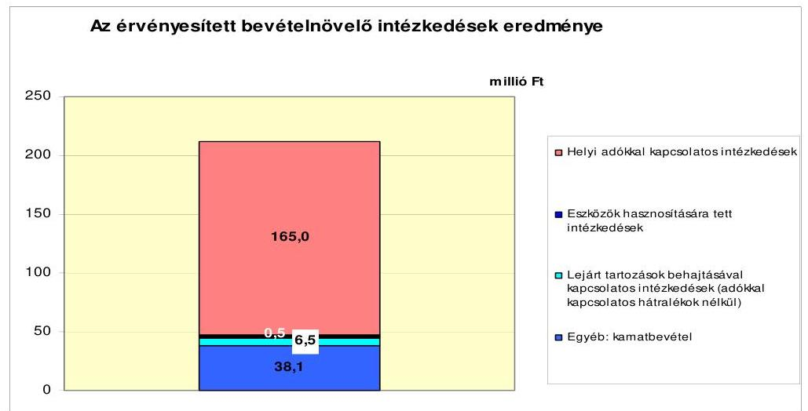

A bevétel növelésére irányuló intézkedések számszerűsített összege az Önkormányzat kimutatása szerint a 2007-2011. év I. félévben 210,1 millió Ft volt. Ebből 165,0 millió Ft-ot ( $78,6 \%$ ) jelentett az építményadó bevezetése, mértékének 2009. évi emelése, továbbá az adóhátralékok eredményesebb behajtása. A vörösiszap-katasztrófában megsérült jármű értékesítéséből 0,5 millió Ft

---

( $0,2 \%$ ) bevétel származott. A bírságok behajtása 6,5 millió Ft (3,1\%), a kötvény befektetése 38,1 millió Ft $(18,1 \%)$ bevételt eredményezett.

Az Önkormányzat kiadáscsökkentő és bevételnövelő intézkedései eredményeként 2007-2011. év I. félév között összesen 336,5 millió Ft megtakarítást és többletbevételt mutatott ki. Ezzel ellensúlyozta a költségvetési támogatások és az szja-bevételek 2007. évhez viszonyított, együttesen 143,3 millió Ft-os csökkenését.

# 5. Az ÁSZ Által a KORÁbbi ÉVEKBEN a PÉNZÜGYI EGYENSÚLY JAVÍTÁSÁRA TETT SZABÁLYSZERŰSÉGI ÉS CÉLSZERŰSÉGI JAVASLATOK HASZNOSULÁSA 

Az ÁSZ az Önkormányzat gazdálkodásának 2009. évi ellenőrzése során a pénzügyi egyensúly javítására négy szabályszerűségi és egy célszerűségi javaslatot tett. A jelentést a Képviselö-testület megismerte és a feltárt hiányosságok megszüntetése érdekében határozatban elfogadta a felelősök és a határidők megjelölésével elkészített intézkedési tervet.

A jegyzőnek tett szabályszerűségi javaslatok teljesültek:

- a 2010. évi költségvetési rendelettervezetben az Áht ${ }_{1}$ 8/A. § (7) bekezdésének megfelelően a költségvetés bevételi és kiadási főösszegét a finanszírozási célú műveletek bevétele és kiadása nélkül határozta meg,
- likvid hitelként csak az éven belül felvett és visszafizetett hitelt mutatta ki,
- a 2010. évi költségvetési rendelettervezet elkülönítetten tartalmazta az európai uniós forrással megvalósuló beruházások bevételeit és kiadásait,
- a 2010. évi költségvetési rendelettervezetnek az Ámr. 139. § (1) bekezdésében előírtak alapján része volt a likviditási terv.

A célszerűségi javaslatnak megfelelően a Képviselő-testület a 2010. év április 28-i ülésén tájékoztatást kapott az Önkormányzat rövid és hosszú lejáratú adósságot keletkeztető kötelezettségvállalásaiból adódó tőke és kamatfizetési kötelezettségek alakulásáról, azok teljesítéséről.

Budapest, 2012. április " 16 "

Melléklet: 4 db
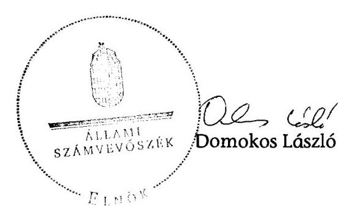

---

# Működési és felhalmozási célú hiány/többlet 2007-2010 közötti időszakban az Önkormányzat zárszámadási rendeleteiben

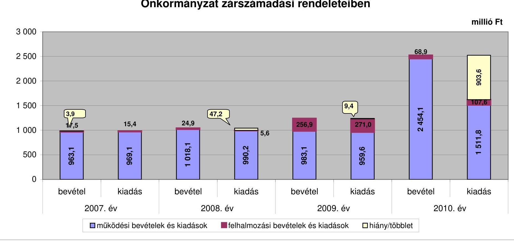

---

Az Önkormányzat bevételei és kiadásai, valamint adósságszolgálata 2007-2010 között

|  1. FOLYÓ KÖLTSÉGVETÉS* | 2007. év | 2008. év | 2009. év | 2010. év | 2010. év tisztított***  |
| --- | --- | --- | --- | --- | --- |
|  1.1.1. Saját müködési bevételek | 169,0 | 218,7 | 234,5 | 199,9 | 199,9  |
|  1.1.2. Költségvetési támogatás | 335,8 | 462,2 | 487,5 | 1426,7 | 444,4  |
|  1.1.3. Átengedett bevételek | 293,1 | 164,9 | 159,0 | 175,0 | 175,0  |
|  1.1.4. Állambáztartáson belülről kapott támogatások | 132,5 | 131,2 | 130,0 | 379,2 | 131,8  |
|  1.1.5. EU-tól és külföldről kapott bevételek | 0,0 | 0,0 | 0,0 | 7,6 | 0,0  |
|  1.1.6. Állambáztartáson kívülről kapott bevételek | 1,5 | 0,7 | 9,7 | 124,5 | 0,0  |
|  1.1.7. Előző évi pénzmaradvány átvétel | 0,0 | 8,7 | 7,0 | 0,0 | 0,0  |
|  1.1. Folyó bevételek |  |  |  |  |   |
|  $=1.1 .1 .+1.1 .2 .+1.1 .3 .+1.1 .4 .+1.1 .5 .+1.1 .6 .+1.1 .7$. | 931,9 | 986,4 | 1027,7 | 2312,8 | 951,1  |
|  1.2.1. Müködési kiadások kamatkiadások nélkül | 819,6 | 837,8 | 783,4 | 1251,9 | 792,2  |
|  1.2.2. Állambáztartáson belülre átadott pénzeszközök | 0,7 | 7,4 | 5,1 | 0,7 | 0,7  |
|  1.2.3.1. vállalkozásoknak | 41,3 | 16,8 | 17,0 | 56,3 | 44,0  |
|  1.2.3.2. EU-nak, illetve külföldre | 0,0 | 0,0 | 0,0 | 0,0 | 0,0  |
|  1.2.3.3. magáncismélyeknek | 83,0 | 81,7 | 97,1 | 173,9 | 98,9  |
|  1.2.3.4. nonprofit szervezeteknek | 5,9 | 5,6 | 6,0 | 4,6 | 4,6  |
|  1.2.3. Transzferkiadások ( $=1.2 .3 .1+1.2 .3 .2+1.2 .3 .3+1.2 .3 .4$ ) | 130,2 | 104,1 | 120,1 | 234,8 | 147,5  |
|  1.2.4 Kamatkiadások | 18,6 | 32,1 | 44,0 | 24,4 | 24,4  |
|  1.2.5. Előző évi pénzmaradvány átadás | 0,0 | 8,8 | 7,0 | 0,0 | 0,0  |
|  1.2. Folyó kiadások $=1.2 .1 .+1.2 .2 .+1.2 .3 .+1.2 .4 .+1.2 .5$. | 969,1 | 990,2 | 959,6 | 1511,8 | 964,8  |
|  1.3. Folyó költségvetés egyenlege MÜKÖDÉSI JÖVÉDELEM (1.1.-1.2.) | $-37,2$ | $-3,8$ | 68,1 | 801,0 | $-13,7$  |
|  2. FELHALMOZÁSI KÖLTSÉGVETÉS** | 0,0 | 0,0 | 0,0 | 0,0 | 0,0  |
|  2.1.1. Saját tökebevételek | 15,0 | 18,1 | 5,4 | 3,0 | 3,0  |
|  2.1.2. Állambáztartáson belülről kapott támogatások | 0,0 | 0,4 | 0,2 | 13,1 | 13,1  |
|  2.1.3. EU-tól és külföldről kapott támogatások | 0,0 | 0,0 | 172,1 | 2,3 | 2,3  |
|  2.1.4. Állambáztartáson kívülről kapott támogatások | 0,0 | 0,0 | 178,2 | 16,4 | 16,4  |
|  2.1. Felhalmozási bevételek ( $=2.1 .1 .+2.1 .2+2.1 .3+2.1 .4$.) | 15,0 | 18,5 | 355,9 | 34,8 | 34,8  |
|  2.2.1. Saját beruházási kiadás állíval | 9,2 | 0,4 | 3,0 | 58,8 | 2,8  |
|  2.2.2. Saját felújítási kiadás állíval | 3,0 | 1,3 | 242,0 | 42,2 | 42,2  |
|  2.2.3. Állambáztartáson belülre átadott pénzeszköz | 0,0 | 0,0 | 1,6 | 2,3 | 2,3  |
|  2.2.4. EU-nak és külföldnek adott pénzeszközök | 0,0 | 0,0 | 0,0 | 0,0 | 0,0  |
|  2.2.5. Állambáztartáson kívülre adott pénzeszközök | 3,2 | 3,9 | 24,5 | 4,4 | 4,4  |
|  2.2.6. Befektetési célú részesedések vásárlása | 0,0 | 0,0 | 0,0 | 0,0 | 0,0  |
|  2.2. Felhalmozási kiadások
( $=2.2 .1 .+2.2 .2 .+2.2 .3 .+2.2 .4 .+2.2 .5 .+2.2 .6$.) | 15,4 | 5,6 | 271,0 | 107,6 | 51,7  |
|  2.3. Felhalmozási költségvetés egyenlege (2.1. - 2.2.) | $-0,4$ | 12,9 | 84,9 | $-72,8$ | $-16,9$  |
|  3. Finanszírozási műveletek nélküli (GFS) pozíció(1.3.+2.3.) | $-37,5$ | 9,1 | 153,1 | 728,2 | $-30,6$  |
|  4. Finanszírozási műveletek | 0,0 | 0,0 | 0,0 | 0,0 | 0,0  |
|  4.1. Hitelfelvétel | 28,6 | 0,0 | 42,2 | 44,2 | 44,2  |
|  4.2. Hiteltörlesztés | 0,0 | 15,9 | 160,0 | 66,6 | 66,6  |
|  4.3. Forgatási és befektetési célú értékpapírok kibocsátása | 0,0 | 300,0 | 0,0 | 0,0 | 0,0  |
|  4.4. Forgatási és befektetési célú értékpapírok beváltása | 0,0 | 0,0 | 0,0 | 0,0 | 0,0  |
|  4.5. Forgatási és befektetési célú értékpapírok értékeistése | 0,0 | 0,0 | 0,0 | 0,0 | 0,0  |
|  4.6. Forgatási és befektetési célú értékpapírok vásárlása | 0,0 | 0,0 | 0,0 | 0,0 | 0,0  |
|  4.7. Egyéb finanszírozási bevételek (függő, átfutó, kiegyenlítő) | 0,8 | 9,9 | $-1,4$ | $-21,4$ | $-21,4$  |
|  4.8. Egyéb finanszírozási kiadások (függő, átfutó, kiegyenlítő) | 5,1 | 25,8 | 15,1 | $-36,2$ | $-36,2$  |
|  4.9.Finanszírozási műveletek egyenlege (4.1. - 4.2.+4.3.-
4.4+4.5.-4.6.+4.7.-4.8.) | 24,3 | 268,2 | $-134,3$ | $-7,6$ | $-7,6$  |
|  5. Tárgyévi pénzügyi pozíció változás (1.3.+ 2.3.+4.9.) | $-13,3$ | 284,9 | 18,7 | 720,6 | $-38,2$  |
|  6. Nettó müködési jövedelem =müködési jövedelem (1.3.) -
tökeltörlesztés (4.2+4.4) | $-37,2$ | $-19,7$ | $-91,9$ | 734,4 | $-80,3$  |
|  TÁJÉKOZTATÓ ADATOK |  |  |  |  |   |
|  Összes kötelezettség | 379,6 | 693,9 | 596,4 | 1039,9 | 1039,9  |
|  ebből rövid lejáratú | 219,6 | 360,6 | 254,5 | 578,2 | 578,2  |
|  Összes szállítói kötelezettség | 4,3 | 4,1 | 33,8 | 406,8 | 406,8  |
|  ebből lejárt (tanúsítványból) | 4,3 | 4,1 | 33,8 | 406,8 | 406,8  |
|  Pénz és tőkeplaci kötelezettség (adósság) | 336,3 | 653,7 | 544,4 | 610,7 | 610,7  |
|  ebből rövid lejáratú | 176,3 | 320,4 | 202,6 | 162,8 | 162,8  |
|  PPP szerződéses állomány jelenértéken (tanúsítványból) | 0,0 | 0,0 | 0,0 | 0,0 | 0,0  |
|  ebből lejárt szolgáltatási díj miatti kötelezettség | 0,0 | 0,0 | 0,0 | 0,0 | 0,0  |
|  Folyószámlahtel napi átlagos állománya (tanúsítványból) | 172,0 | 175,0 | 163,8 | 171,6 | 171,6  |
|  Látvidhittel napi átlagos állománya (tanúsítványból) | 0,0 | 0,0 | 0,0 | 0,0 | 0,0  |
|  Munkabérhittel napi átlagos állománya (tanúsítványból) | 12,6 | 12,6 | 12,6 | 12,6 | 12,6  |
|  Kezesség és garanciavállalások (tanúsítványból) | 0,0 | 0,0 | 0,0 | 0,0 | 0,0  |
|  Jogerős bírósági ítéletekből adódó kötelezettségek (tanúsítványból) | 0,0 | 0,0 | 0,0 | 0,0 | 0,0  |
|  Finanszírozásba bevonható eszközök | 58,1 | 348,4 | 367,1 | 1087,7 | 1087,7  |
|  Tartós hitelviszonyt megtestesítő értékpapírok év végi állománya | 0,0 | 0,0 | 0,0 | 0,0 | 0,0  |
|  Hosszú lejáratú bankbetétek év végi állománya | 0,0 | 0,0 | 0,0 | 0,0 | 0,0  |
|  Értékpapírok év végi állománya | 0,0 | 0,0 | 0,0 | 0,0 | 0,0  |
|  Pénzeszközök (idegen pénzeszközök nélküli) év végi állománya | 58,1 | 348,4 | 367,1 | 1087,7 | 1087,7  |

[^0] [^0]: * Bevételekben nem térül, a kiadásokban nem jelenik meg az amortizáció, a vagyoni helyzetet az egyenleg ** Bevételekben vagyon megőrzése és bővítése fordítható források. ** A 2010. évi tisztított adat a vörösiszap-katasztófával kapcsolatos bevételek és kiadások figyelmen kívül hagyásával tartalmazza az adatokat.

---

## **az Önkormányzat 2007-2010 években megvalósított, 2010. december 31-ig befejezett fejlesztései és annak forrásösszetéte**

|   |  |  |  |  |  |  |  |  |  |  |  |  |  |  |  |  |  |  |  |  |  |  |  |  |  |  |  |  |  |  |  |  |  |  |  |  |  |  |  |  |  |  |  |  |  |  |  |  |  |  |  |  |  |  |  |  |  |  |  |  |  |  |  |  |  |  |  |  |  |  |  |  |  |  |  |  |  |  |  |  |  |  |  |  |  |  |  |  |  |  |  |  |  |  |  |  |  |  |  | 

---

Devecser Város Önkormányzata 4. számú melléklet a V-3131-018/2012. számú jelentéshez

Az önkormányzati feladatok ellátásában résztvevő gazdasági társaságok

milliú Ft-ban

|  Gazdasági társaság megnevezése | önkormányzat | önkormányzat gazdasági társaságának aránya | saját tőke, jégyzett tőke aránya | kötelező feladathoz | önként vállalt feladathoz | hosszú lejáratú hiteltből, kötvényből | Szingből | lejárt szállító állományból | működési célú pénzeszköz átadás | felhámozási célú pénzeszköz átadás  |
| --- | --- | --- | --- | --- | --- | --- | --- | --- | --- | --- |
|   |  |  |  |  |  |  |  | 2007. | 2008. | 2009. | 2010.  |
|   |  |  |  |  |  |  |  | 2007. | 2008. | 2009. | 2010.  |
|  5. 100%-os tulajdoni hányadu gazdasági társaságok: |  |  |  |  |  |  |  |  |  |  |   |
|  Devecseri Városgazdálkodási | 100,0 | 0,0 | 467,3 | 0,0 | 0,0 | 0,0 | 0,0 | 0,0 | 17,6 | 16,8 | 17,0  |
|  100%-os tulajdoni hányadu gazdasági társaságok összeset | x | x | x | 0 | 0 | 0 | 0 | 0 | 17,6 | 16,8 | 17,0  |
|  5. 75-99%-os tulajdoni hányadu gazdasági társaságok: |  |  |  |  |  |  |  |  |  |  |   |
|  75-99%-os tulajdoni hányadu gazdasági társaságok összeset | x | x | x | 0 | 0 | 0 | 0 | 0 | 0 | 0 | 0  |
|  75%-felett: tulajdoni hányadu gazdasági társaságok összeset | x | x | x | 0 | 0 | 0 | 0 | 0 | 17,6 | 16,8 | 17,0  |
|  8. 51-74%-os tulajdoni hányadu gazdasági társaságok: |  |  |  |  |  |  |  |  |  |  |   |
|  51-74%-os tulajdoni hányadu gazdasági társaságok összeset | x | x | x | 0 | 0 | 0 | 0 | 0 | 0 | 0 | 0  |
|  IV. egyéb, közfeladatot ellátó gazdasági társaságok: |  |  |  |  |  |  |  |  |  |  |   |
|  Balonykarszt Zrt. | 1,2 | 0,0 | 1102,5 | 149,7 | 0,0 | 0,0 | 0,0 | 0,0 | 0,0 | 0,0 | 0,0  |
|  AVAR AJKA Városgazdálkodási Kft. | 0,0 | 0,0 | 547,7 | 0,0 | 0,0 | 0,0 | 102,9 | 46,6 | 0,0 | 0,0 | 0,0  |
|  egyéb, közfeladatot ellátó gazdasági társaságok összeset | x | x | x | 149,7 | 0,0 | 0,0 | 102,9 | 46,6 | 0 | 0 | 0  |
|  Devecseri Város Önkormányzata |  |  |  |  |  |  |  |  |  |  |   |

Az önkormányzati feladatok ellátásában résztvevő gazdasági társaságok

milliú Ft-ban