# ÁLLAMI   SZÁMVEVŐSZÉK 

## JELENTÉS

Dunavecse Város Önkormányzata pénzügyi helyzetének ellenőrzéséről (43/4)

---

# Állami Számvevőszék 

Iktatószám: V-3070-023/2012.
Témaszám: 1015
Vizsgálat-azonosító szám: V0560101

## Az ellenőrzést felügyelte:

Dr. Varga Sándor
számvevő igazgató-helyettes
Az ellenőrzést vezette:
Renkó Zsuzsanna
számvevő tanácsos
Ellenőrzési csoportvezető:
Puchy Márta
számvevő tanácsos
Az ellenőrzést végezték:
Ébner Vilmosné Pályi Katalin
számvevő tanácsos számvevő

---

# TARTALOMJEGYZÉK 

BEVEZETÉS ..... 9
I. ÖSSZEGZŐ MEGÁLLAPÍTÁSOK, KÖVETKEZTETÉSEK, JAVASLATOK ..... 13
II. RÉSZLETES MEGÁLLAPÍTÁSOK ..... 23

1. Az Önkormányzat kötelező és önként vállalt feladatai, a feladatellátás szervezeti keretei és annak változásai ..... 23
2. Az Önkormányzat pénzügyi egyensúlyi helyzetét befolyásoló tényezők ..... 26
2.1. A működési és a felhalmozási egyensúly változása ..... 29
2.2. Az Önkormányzat bevételeinek változása ..... 34
2.3. Az Önkormányzat működési és a felhalmozási célú kiadásainak változása ..... 37
3. Az Önkormányzat kötelezettségei ..... 40
3.1. Az Önkormányzat pénzintézetekkel szembeni kötelezettségeinek változása ..... 40
3.2. A szállítói kötelezettségek változása ..... 45
3.3. Egyéb kötelezettségek változása ..... 45
4. A pénzügyi egyensúly megteremtése érdekében hozott intézkedések eredménye ..... 46
5. Az ÁSZ által a korábbi években a pénzügyi egyensúly javítására tett szabályszerűségi és célszerűségi javaslatok hasznosulása ..... 49

---

# MELLÉKLETEK 

1. számú Működési és felhalmozási célú hiány/többlet a 2007-2010 közötti időszakban az Önkormányzat zárszámadási rendeleteiben (1 oldal)
2. számú Az Önkormányzat bevételei és kiadásai, valamint adósságszolgálata 2007-2010 között (1 oldal)
3/a. számú Az Önkormányzat 2007-2010. években megvalósított, 2010. december 31-ig befejezett fejlesztései és azok forrásösszetétele (1 oldal)
3/b. számú Az Önkormányzat 2010. december 31-én folyamatban lévő fejlesztési feladataira 2010. december 31-ig teljesített kifizetések és azok forrásösszetétele (1 oldal)
3/c. számú Az Önkormányzat 2010. december 31-én folyamatban lévő fejlesztési feladataira 2010. december 31-én fennálló kötelezettségek és azok forrásösszetétele (1 oldal)
3. számú Az önkormányzati feladatok ellátásában résztvevő gazdasági társaságok (1 oldal)

---

# RÖVIDÍTÉSEK JEGYZÉKE 

## Törvények

Áht $_{1}$
Áht $_{2}$
helyi adókról szóló törvény
Gt.
Ötv.
Ptk.
Stabilitási tv.
Számv. tv.

## Rendeletek

Áhsz.

Ámr.
SzMSz

Vagyongazdálkodási rendelet
2007. évi zárszámadási rendelet
2010. évi zárszámadási rendelet

## Szórövidítések

Ambulancia Kft.
áfa
ÁSZ
ÁSZKUT
Bácsvíz Zrt.
DAOP
Dunanett Kft.
EU
GKM
Járóbeteg Szakrendelő
az államháztartásról szóló 1992. évi XXXVIII. törvény az államháztartásról szóló 2011. évi CXCV. törvény a helyi adókról szóló 1990. évi C. törvény
a gazdasági társaságokról szóló 2006. évi IV. törvény a helyi önkormányzatokról szóló 1990. évi LXV. törvény a Polgári Törvénykönyvről szóló 1959. évi IV. törvény Magyarország gazdasági stabilitásáról szóló 2011. évi CXCIV. törvény
a számvitelről szóló 2000. évi C. törvény
az államháztartás szervezetei beszámolási és könyvvezetési kötelezettségének sajátosságairól szóló 249/2000. (XII. 24.) Korm. rendelet
az államháztartás működési rendjéről szóló 292/2009. (XII. 19.) Korm. rendelet

Dunavecse Város Önkormányzatának 9/2006. (III. 29.) számú rendelete a Képviselő-testület és Szervei Szervezeti és Működési Szabályzatáról
Dunavecse Város Önkormányzatának 6/2006. (II. 22.) számú rendelete az Önkormányzat vagyonáról és a vagyongazdálkodás szabályairól
Dunavecse Város Önkormányzatának 6/2008. (IV. 30.) számú rendelete az Önkormányzat 2007. évi zárszámadásáról
Dunavecse Város Önkormányzatának 8/2011. (III. 21.) számú rendelete az Önkormányzat 2010. évi zárszámadásáról

International Ambulance Service Korlátolt Felelősségű Társaság
Általános forgalmi adó
Állami Számvevőszék
Állami Számvevőszék Kutató Intézete
Bácsvíz Észak-Bács-Kiskun Megyei Vízművek Zártkörűen Működő Gazdasági Társaság
Dél-Alföldi Regionális Operatív Program
Dunanett Dunaújvárosi Regionális Köztisztasági és Hulladékkezelő és Szolgáltató. Korlátolt Felelősségű Társaság
Európai Unió
Gazdasági és Közlekedési Minisztérium
Összevont Egészségügyi és Szociális Intézmény

---

| jegyző | Dunavecse Város Önkormányzatának Jegyzője |
| :-- | :-- |
| KESZI | Kistérségi Egyesített Szociális Intézmény |
| Képviselő-testület | Dunavecse Város Képviselő-testülete |
| Kistérségi társulás | Felső-Kunsági és Dunamelléki Többcélú Kistérségi Társulás |
| Önkormányzat | Dunavecse Város Önkormányzata |
| Polgármester | Dunavecse Város Önkormányzatának Polgármestere |
| Polgármesteri hivatal | Dunavecse Város Önkormányzatának Polgármesteri Hivatala |
| SNA | System of National Account, azaz a Nemzeti Számlák |
|  | Rendszere, amely a gazdasági szektorok által létrehozott |
| szja | valamennyi terméket és szolgáltatást figyelembe veszi |
| Szociális és Gyermekjó- | személyi jövedelemadó |
| léti Intézmény | Alapszolgáltatási Központ |

---

# ÉRTELMEZŐ SZÓTÁR 

banki kitettség

BUBOR

CLF módszer

EURIBOR
használhatósági fok
kamatkockázat

Kötelező közszolgáltatás
közfeladat

Az önkormányzat pénzügyi helyzete olyan külső körülmények hatására is módosulhat, amelyekre az önkormányzatnak nincs hatása, emiatt banki kitettsége keletkezik. Pl: rövid távú kötelezettségek fennállása esetén kizárólag a bank egyoldalú döntésén múlik, hogy továbbra is biztosít-e hitelt az önkormányzatnak, valamint azt milyen feltételekkel bocsátja az önkormányzat rendelkezésére.
Budapesti Bankközi Forint Hitelkamatláb. Irányadó, referencia jellegű kamatláb. Mértékét az MNB naponta állapítja meg a banki kamatok figyelembevételével. Közzététele naponta történik.
Az önkormányzatok költségvetése elemzésének eszköze. A módszer következetesen elkülöníti a folyó és a felhalmozási költségvetés bevételeit és kiadásait, azok költségvetési egyenlegeit. Bizonyos mértékig a vállalati gazdálkodás logikai elemeit érvényesíti az önkormányzatok pénzügyi, jövedelmi helyzetének vizsgálata során. Az értékelés a pénzügyi kapacitás fogalmát helyezi a középpontba.
A frankfurti bankközi piacon jegyzett, az Európai Központi Bank szabályainak megfelelően megállapított kínálati kamatláb. Az EURIBOR értékét a legfontosabb európai bankok hitelkínálatának kamatlábai alapján a Reuters ügynökség számolja ki és teszi közzé naponta. A magyar pénzintézetek is ezt használják viszonyítási alapnak EUR hitelek esetén.
Az eszközgazdálkodás vizsgálatának elemzése során használt mutató. Számításakor a tárgyi eszköz könyv szerinti (nettó) értékét viszonyítják a tárgyi eszköz bruttó (beszerzési/létesítési) értékéhez. A mutató százalékban kifejezett értékének csökkenése az eszköz állagának romlására, avulására utal, ami maga után vonja az üzemeltetési és fenntartási költségek növekedését is.
A változó kamatozású forint-, vagy a devizahitelek futamideje alatt a kamat emelkedése miatt fennálló kamatkockázat, melynek növekedése miatt nő a hitel törlesztő részlete.
A helyi önkormányzati feladatkörbe tartozó, a köztisztasággal és a településtisztasággal, valamint az élet- és vagyonbiztonsággal összefüggő egyes - közszolgáltatás útján megvalósuló - közfeladatok ellátása, amelynek kötelező igénybevételét külön jogszabály (törvény, helyi önkormányzati rendelet) határozza meg.
Állami, helyi, illetve kisebbségi önkormányzati feladat, amelynek ellátásáról az államnak, illetve az önkormányzatoknak kell gondoskodni. A hatályos szabályozás szerint közfeladatot törvény és önkormányzati rendelet álla-

---

önkormányzat többségi tulajdonában lévő gazdasági társaságok
pénzügyi kapacitás
pénzügyi kockázat
píthat meg. Az önkormányzatok által ellátandó feladatok keretszerű meghatározását az Ötv. tartalmazza.
Az önkormányzat a gazdasági társaságban a szavazatok több mint ötven százalékával vagy a Ptk. 685/B. § (2)-(3) bekezdéseiben rögzített meghatározó befolyással rendelkezik. A befolyással rendelkező akkor rendelkezik egy jogi személyben meghatározó befolyással, ha annak tagja, illetve részvényese és jogosult e jogi személy vezető tisztségviselői vagy felügyelőbizottsága tagjai többségének megválasztására, illetve visszahívására, vagy a jogi személy más tagjaival, illetve részvényeseivel kötött megállapodás alapján egyedül rendelkezik a szavazatok több mint ötven százalékával (Ptk. 685/B. § (2) bek.). A meghatározó befolyás akkor is fennáll, ha a befolyással rendelkező számára e jogosultságok közvetett módon (köztes vállalkozásain keresztül, a Ptk. 685/B. § (3)-(4) bek. szerint) biztosítottak.
A helyi önkormányzat és az önkormányzat irányítása alá tartozó költségvetési szerv többségi tulajdonában, illetve többségi befolyása alatt álló gazdálkodó szervezet esetében hitelfelvétel, kölcsönfelvétel, garancia- vagy kezességvállalás, tartozásátvállalás, tartozás-elengedés, értékpapír kibocsátás, vásárlás, pénzügyi lízing, tartós bérleti szerződés, ingyenes vagyonjuttatás (így különösen: ajándékozás, ingyenes engedményezés), vagy követelésvásárlás, követelésengedményezés végrehajtására vonatkozóan az Áht.; 100/M. § (4) bekezdése alapján az önkormányzat rendelkezik döntési jogosultsággal.
A pénzügyi kapacitás (financial capacity) az adósok hitelfelvételi képességének azon mértéke, ahol még anélkül tudják növelni az adósságot, hogy csökkenteniük kellene akár a jelenbeli, akár a jövőben esedékes kiadásaikat a fizetésképtelenség elkerülése érdekében. (Forrás: Az önkormányzati rendszer pénzügyi helyzete, ÁSZKUT tanulmány 2010.)
A működési kockázat egyik eleme. Megmutatkozhat a költségvetés nagyságrendjének, szerkezetének nem megalapozott módosításaiban, a bevételi, és a kiadási előirányzatoktól lényegesen eltérő teljesítésekben, a nem megfelelő belső kontrollrendszer működésében, a tudatos károkozásokban, a biztosítások elmaradásában, a hibás fejlesztési döntésekben, a nem a terveknek megfelelő forrásfelhasználásokban. Jelentkezhet továbbá a bevételek és kiadások ütemkülönbsége miatt felvett folyószámla- és likvidhitelek költségvetési év végén fennálló egyenlege miatt, amely az önkormányzat költségvetésébe - akár tartósan - beépülő forráshiányt jelzi.
SNA System of National Account azaz a Nemzeti Számlák Rendszere, amely a gazdasági szektorok által létrehozott valamennyi terméket és szolgáltatást figyelembe veszi.

---

törlesztési kockázat

Annak a kockázata, hogy a megfelelő időben és mértékben a hitelt felvevőnél rendelkezésre állnak-e a pénzintézetek és egyéb szervek felé fennálló kötelezettségek visszafizetéséhez, a hitelek és kölcsönök törlesztéséhez szükséges pénzügyi források.
A törlesztési kockázatot növeli a kamat- és árfolyam növekedése, mivel ezekben az esetekben az adósságszolgálat nőhet. Törlesztési kockázatot okozhat a visszafizetésre tervezett forrás elérésének, teljesítésének bizonytalansága (pl. a visszafizetéshez tervezett tartalékolás elmaradt, a tervezettnél alacsonyabb a saját bevétel, a helyi adóból származó bevétel az adóalanyok, adóalapok csökkenése miatt nem teljesül).

---

.

---

# JELENTÉS 

## Dunavecse Város Önkormányzata pénzügyi helyzetének ellenőrzéséről

## BEVEZETÉS

Az Állami Számvevőszék 2011. évtől érvényes stratégiája új irányt szabott a helyi önkormányzatok gazdálkodásának ellenőrzésében is. Az ÁSZ - küldetése és jövőképe szerint - szilárd szakmai alapokra támaszkodva értékteremtő ellenőrzéseivel és helyzetelemzéseivel az államháztartás egészében, így a helyi önkormányzati alrendszerben is elő kívánja segíteni a közpénzek és a közvagyon szabályos, gazdaságos, hatékony és eredményes felhasználását. E folyamat részeként - az államháztartási hiány alakulásának összetevőire is figyelemmel végezzük az önkormányzati alrendszer pénzügyi helyzetelemzését.

Az államháztartás helyi szintjén a 304 városnak ${ }^{1}$ az általuk ellátott közszolgáltatások volumenére is tekintettel a közfeladatok ellátásában kiemelt szerepe van. E települések 2011. január 1-jei népessége 3169 ezer fő volt.

Feladataik és hatásköreik az Ötv. mellett különböző ágazati törvények által meghatározottak, miközben a feladatellátás szervezeti kereteit - ezen belül a gazdasági társaságok közszolgáltatások ellátásában betöltött szerepét - saját maguk határozzák meg. A gazdasági társaságok által ellátott feladatok esetén a gazdálkodás, továbbá az önkormányzatok pénzügyi egyensúlyi helyzetére ható közvetlen kockázatok egy része kikerült az önkormányzati alrendszerből. A többségi önkormányzati tulajdonban lévő társaságok gazdálkodásának körülményei befolyásolhatják a városok pénzügyi egyensúlyi helyzetének megítélésében rejlő kockázatokat.

Az áttekintett időszakban az önkormányzati forrásszabályozás elvei lényegesen nem változtak. Az önkormányzatok gazdasági mozgásterét a központi költségvetéstől való függőség mellett jelentősen befolyásolja a helyi adókivetési jog gyakorlása. A városok gazdálkodási szabadságának lényeges eleme, hogy anyagi lehetőségeik függvényében dönthettek arról, hogy feladataik közül azokat, amelyek megoldására az Ötv. szerint a települési önkormányzat nem kötelezhető, a megyei önkormányzat fenntartásába adhatták. E döntések differenciáltan érintették a városok pénzügyi helyzetét.

[^0]
[^0]:    ${ }^{1}$ A megyei jogú városok nélkül figyelembe vett városok száma 304 városi önkormányzatot jelent.

---

A városi önkormányzatok 2007-2010 között teljesített bevételeit és összetételét az alábbi ábra szemlélteti:
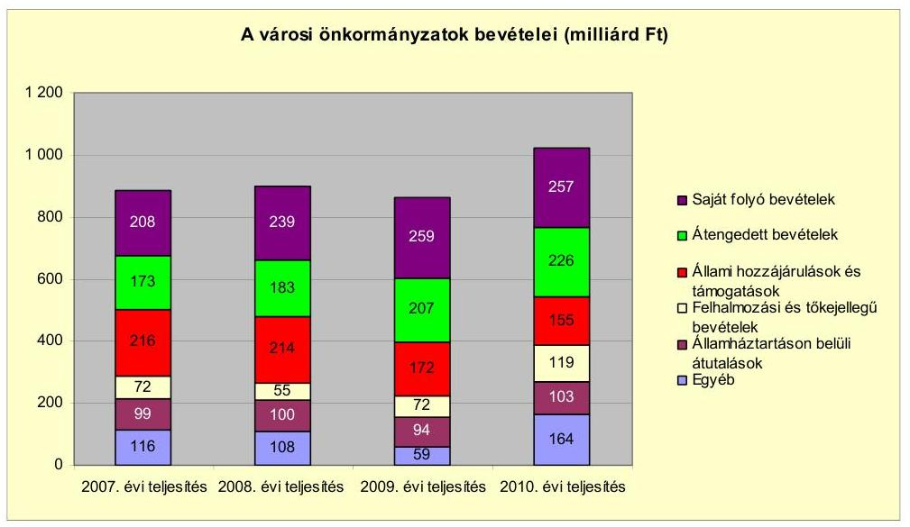

Az önkormányzati alrendszer pénzügyi helyzetértékelése során új elemzési módszereket alkalmazott az ellenőrzés. A költségvetési beszámoló adatok elemzése helyett az önkormányzat pénzügyi helyzetét a CLF módszerrel értékeljük, amelynek lényegét és számításának módszerét a jelentés 2. pontjában, és a jelentés 2. számú mellékletében ismertetjük részletesen.

Az új módszereken alapuló helyzetértékelés fontosságát az adja, hogy a helyi önkormányzatok bruttó adósságállománya ${ }^{2}$ a 2010. évi költségvetési beszámolók alapján 1248 milliárd Ft-ot tett ki. Ezen belül a 304 város adóssága 383 milliárd Ft volt, amely az önkormányzati alrendszer teljes adósságállományának $30,7 \%$-át jelentette ${ }^{3}$.

A mérlegben kimutatott bruttó adósságállomány mellett az önkormányzatok számára az eszközállomány műszaki állapotának megőrzése is előbb-utóbb pénzügyi kötelezettséget jelent. Az elhasználódott eszközök pótlására forrást biztosító amortizációs (felújítási) alap képzésének ${ }^{4}$ elmaradása maga után vonhatja a feladatellátást kiszolgáló tárgyi eszközök állagának erőteljes romlását. Emellett a 2007-2013-as időszakra meghirdetett, vissza nem térítendő EU-s fejlesztési forrásokhoz való hozzájutás lehetősége felerősítette az önkormányzati alrendszer fejlesztési igényeit, amelyek a felhalmozási költségvetési hiány fo-

[^0]
[^0]:    ${ }^{2}$ Az önkormányzati mérlegbeszámolókból számított bruttó adósságállomány 2010. év végi összege magában foglalja a fejlesztési és a működési célú kötvénykibocsátások, a beruházási és fejlesztési hitelek, a működési célú hosszú lejáratú hitelek, a rövid lejáratú hitelek, váltótartozások miatti kötelezettségek teljes (2011-ben, illetve az azt követő években esedékes) állományát. Az önkormányzatok 2007. év végi mérleg szerinti adósságállománya 692 milliárd Ft volt.
    ${ }^{3}$ A fővárosi és a kerületi önkormányzatok adósságának figyelmen kívül hagyásával számított 977 milliárd Ft összegű bruttó adósságállományból a városok 39,2\%-kal részesedtek.
    ${ }^{4}$ Erre a jelenlegi szabályozási környezetben nem kötelező előírás az önkormányzatokat.

---

lyamatos emelkedésén túl - az előírt jövőbeni fenntartási kötelezettség miatt tovább terhelhetik az önkormányzatok költségvetését ${ }^{5}$.

Az ÁSZ a 2011. évi ellenőrzési tervében 43. számú, az Önkormányzatok gazdálkodási rendszerének ellenőrzése részeként áttekinti, és elemzi az önkormányzatok pénzügyi helyzetét. A gazdálkodás szabályszerűségét az ÁSZ az előző évek során ebben az önkormányzati körben is ellenőrizte. Jelen vizsgálatunk a tett javaslataink pénzügyi helyzetet érintő pontjainak hasznosítására utóellenőrzés jelleggel tér ki.

Az ellenőrzés megállapításait az Önkormányzat által kitöltött - teljességi nyilatkozattal megerősített - 27 tanúsítványon szolgáltatott adatokra alapoztuk. Ellenőrzési bizonyítékként használtuk fel továbbá:

- a képviselő-testületi és bizottsági előterjesztéseket, a döntés-előkészítés során készített dokumentumokat;
- a kötelezettségvállalások dokumentumait;
- a pénzügyi-számviteli nyilvántartásokat;
- az éves költségvetési beszámolókat;
- a költségvetési és zárszámadási rendeleteket.

Az ellenőrzés a 2007. január 1. - 2011. június 30. közötti időszakot öleli fel. A pénzintézeti kötelezettségek állományának vizsgálatakor az ellenőrzött időszak 2006. december 31. - 2011. június 30. közötti időszakra terjedt ki.

Az ellenőrzés során vizsgáltunk minden olyan körülményt és adatot, amely a program végrehajtásához kapcsolódott és a pénzügyi helyzet alakulására hatást gyakorló releváns tények és folyamatok feltárásához szükségessé vált.

# Az ellenőrzés célja annak értékelése volt, hogy: 

- a vizsgált időszakban a kötelező- és önként vállalt feladatok ellátását biztosító szervezeti keretekben, a feladatellátás módjában bekövetkezett változások milyen hatást gyakoroltak az Önkormányzat pénzügyi helyzetének alakulására;
- az Önkormányzat pénzügyi - ezen belül működési és felhalmozási - egyensúlya mely tényezők hatására miként változott, és az Önkormányzat milyen intézkedéseket tett a pénzügyi egyensúly javítása érdekében;

[^0]
[^0]:    ${ }^{5}$ Az Állami Számvevőszék 2011 júniusában közzétett 1108. számú, a helyi önkormányzatok fejlesztési célú támogatási rendszerének ellenőrzéséről szóló jelentésében feltárta a fejlesztési folyamatok problémáit. A helyi önkormányzatok elsősorban azokat a fejlesztéseket valósították meg, amelyekhez támogatást lehetett igényelni. A fejlesztési célok közül a magasabb támogatás intenzitású pályázatokat részesítették előnyben. A fejlesztéssel megvalósuló létesítmények jövőbeli üzemeltetésének várható ráfordításait az önkormányzatok 71,9\%-a nem mérte fel.

---

- a költségvetési kiadások finanszírozása érdekében vállalt pénzintézeti kötelezettségek hogyan alakultak, továbbá milyen kötelezettségek fennállása befolyásolja az Önkormányzat jövőbeli pénzügyi helyzetét;
- hasznosultak-e a gazdálkodási rendszer korábbi ellenőrzése során a pénzügyi egyensúly javítására az ÁSZ által tett szabályszerűségi és célszerűségi javaslatok.

Az ellenőrzés típusa: szabályszerűségi vizsgálat.
A vizsgálat jogszabályi alapját az Állami Számvevőszékről szóló 2011. évi LXVI. törvény 1. § (3) bekezdése, 5. § (2)-(6) bekezdései, továbbá az Áht. ${ }^{1}$ 120/A. § (1) bekezdése előírásai képezték. ${ }^{6}$

Dunavecse város Bács-Kiskun megyében, az 51. számú főút mentén a Duna keleti partján helyezkedik el. A város belterülete 300 hektár, külterülete 6400 hektár, 2011. január 1-jén lakosságszáma 3970 fő volt.

Az Önkormányzat 2011. évi módosított költségvetésének bevételi főösszege 1116 millió Ft, kiadási főösszege 1132 millió Ft. Az Önkormányzat 2010. december 31-én 1,9 milliárd Ft vagyonnal rendelkezett.

[^0]
[^0]:    ${ }^{6}$ 2012. január 1-jétől az Áht. 61. § (2) bekezdése

---

# I. ÖSSZEGZŐ MEGÁLLAPÍTÁSOK, KÖVETKEZTETÉSEK, JAVASLATOK 

Az Önkormányzat - adatszolgáltatása szerint - a 2010. év működési költségvetési kiadásaiból (472,3 millió Ft-ból) ${ }^{7}$ 451,0 millió Ft-ot (95,5%-ot) a kötelező feladatok, 21,3 millió Ft-ot (4,5%-ot) az önként vállalt feladatok ellátására fordított. A 2007-2009. évek átlagában 581,5 millió Ft (96,5\%) a kötelező és 21,4 millió Ft (3,5%) az önként vállalt feladatok ellátását szolgálta. Az Önkormányzat a kötelező, valamint az önként vállalt feladatok körét az SzMSz-ében rögzítette. Az Önkormányzat önként vállalt feladatként sorolta be a járóbetegszakellátást, a bölcsőde működtetését ${ }^{8}$, a kunszentmiklósi okmányiroda kihelyezett irodájának fenntartását, valamint a civil szervezetek támogatását.

Az Önkormányzat feladatellátásának szervezeti struktúráját 2011. június 30-án az alábbi ábra szemlélteti:
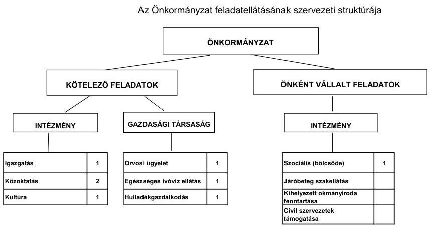

Az Önkormányzat feladatait 2011. június 30-án (a Polgármesteri hivatallal együtt) öt költségvetési szervvel négy telephelyen látta el. A Képviselőtestület a 2009. évtől a Szociális és Gyermekjóléti Intézmény feladatait átadta a Kistérségi társulásnak. Az Önkormányzati feladatellátásban részt vett három gazdasági társaság, amelyből egy gazdasági társaságban - a Bácsvíz Zrt.-ben - volt az Önkormányzatnak 0,5\%-os tulajdoni hányada. A gazdasági társaságok hulladékkezelést, -szállítást, egészséges ivóvíz- és szennyvízkezelést, valamint egészségügyi szolgáltatást nyújtottak. A gazdasági társaságok közül a

[^0]
[^0]:    ${ }^{7}$ A működési kiadások nem tartalmazták az egészségügyi ellátásokra (járóbeteg szakellátás, védőnői szolgálat, ügyeleti ellátás) fordított kiadásokat, ezért 130,0 millió Ft-tal eltér a jelentés 1. számú mellékletében szereplő működési kiadások összegétől.
    ${ }^{8}$ A Gyermekek védelméről és a gyámügyi igazgatásról szóló 1997. évi XXXI. törvény. 94. § (3) bekezdés a) pontja alapján a tízezer főnél magasabb állandó lakosságszámmal rendelkező települési önkormányzat (fővárosban kerületi önkormányzat) köteles bölcsőde működtetéséről gondoskodni. Az Önkormányzat - a lakosságszám alapján - a bölcsőde működtetését az önként vállalt feladatok közé sorolta.

---

Bácsvíz Zrt.-nek a vizsgált időszakban 20,0 millió Ft fejlesztési célú pénzeszközt adott át az Önkormányzat.

Az Önkormányzat működési kiadásokra 2010-ben 472,3 millió Ft-ot ${ }^{9}$ fordított, amely 130,6 millió Ft-tal (21,7%-kal) maradt el a 2007-2009. évek 602,9 millió Ft összegű átlagától.

Az egyes közfeladatok működési kiadásainak finanszírozási forrásait ágazatonként a 2007. és a 2010. évben az alábbi ábra szemlélteti:
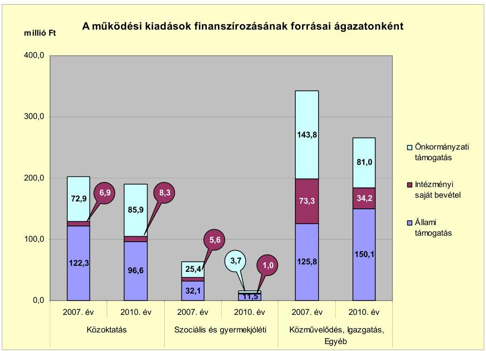

A közoktatásra az Önkormányzat a 2010. évben 190,8 millió Ft-ot fordított, amely 11,0 millió Ft (5,5%) csökkenést jelentett a 2007-2009. évek 201,8 millió Ft átlagához képest. A működési kiadások csökkenését az ellátottak létszámának és a közalkalmazotti létszám csökkenése eredményezte. A finanszírozás összetétele ezzel párhuzamosan eltolódott az intézményi saját bevételek és az önkormányzati támogatás irányába. A szociális feladatok ellátására fordított kiadások a 2010. évben 16,2 millió Ft-ot tettek ki, amely a 2007-2009 évek átlagától (47,1 millió Ft-tól) 30,9 millió Ft-tal (65,5%-kal) maradt el. Hátterében a Szociális és Gyermekjóléti Intézmény Kistérségi társulásnak történő átadása állt. A kiadások finanszírozásában a 2007-2009. évek 55,4%-os arányához képest a 2010. évre 71,0%-ra emelkedett az állami támogatás aránya. A közművelődésre és a Polgármesteri hivatal igazgatási és egyéb feladataira fordított ki-

[^0]
[^0]:    ${ }^{9}$ Az Önkormányzat adatszolgáltatása nem tartalmazza az egészségügyi ellátásra fordított (járóbeteg szakellátás, védőnői szolgálat, ügyeleti ellátás) működési kiadásokat, azonban tartalmazza a transzferkiadásokat (magánszemélyeknek, nonprofit szervezeteknek) és az államháztartáson belülre átadott pénzeszközöket, ezért 121,0 millió Ft-tal alacsonyabb összegű a jelentés 2. számú mellékletének működési kiadások kamatkiadások nélküli összegétől.

---

adások a 2010. évben összesen 265,3 millió Ft-ot tettek ki, amely 88,7 millió Ft (25,1%) csökkenést jelentett a 2007-2009. évek 354,0 millió Ft összegű átlagához képest. Hátterében elsősorban a rendezvények számának, valamint a foglalkoztatott létszámmal együtt járó személyi juttatás és járulékai, valamint a dologi kiadások csökkenése állt. A finanszírozás összetételében az állami támogatás összege és részaránya megnőtt, összege a 2010. évben 150,1 millió Ft volt, amely 7,3 millió Ft-os (5,1%-os) növekedést jelentett az előző három év 142,8 millió Ft-os átlagához képest.

Az Önkormányzatnál a vizsgált időszakban a kötelező és önként vállalt feladatok ellátását biztosító szervezeti keretekben, a feladatellátás módjában bekövetkezett változások hatása - az Önkormányzat adatszolgáltatása szerinti kumulált összege - 145,3 millió Ft kiadási megtakarítást és 144,1 millió Ft bevételi elmaradást eredményezett, amely a pénzügyi egyensúlyi helyzet alakulását jelentősen nem befolyásolta.

Az Önkormányzat folyó költségvetésének egyenlege (működési jövedelem) 2007-2010 között - a 2007. év kivételével - működési forrástöbbletet mutatott.

Az Önkormányzat működési jövedelmét, pénzügyi kapacitását és tőketörlesztését a 2007-2010. években az alábbi ábra mutatja be:
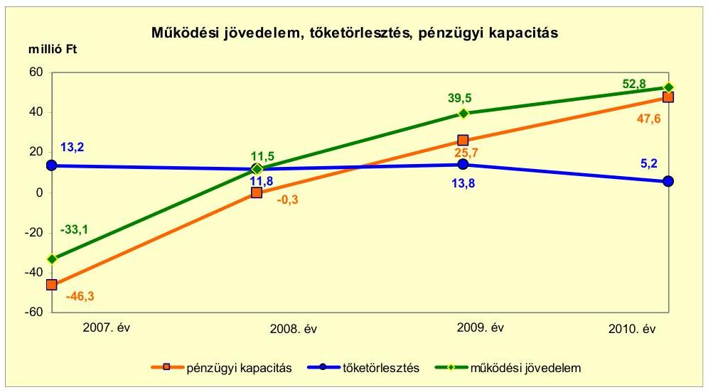

A folyó költségvetés egyenlege 2008-tól pozitív, amelyet elsősorban a költségvetési támogatások növekedése eredményezett. Az áttekintett időszakban az Önkormányzat működésképtelen önkormányzatok egyéb támogatása jogcímen összesen 46,0 millió Ft összegű támogatásban részesült. A 2008-2010. évi pozitív előjelű folyó költségvetési egyenleg ellenére az Önkormányzat az átmeneti likviditási problémák kezelése, valamint a felhalmozási kiadások finanszírozása miatt folyószámla-, likvid- és munkabér-megelőlegezési hitel felvételére kényszerült. A vizsgált időszakban a működési jövedelem összesen 70,7 millió Ft többletet mutatott. Az Önkormányzat pénzügyi kapacitása (a tőketörlesztés összegével csökkentett működési jövedelem) növekedett, 2009-től fedezetet nyújtott az adósságszolgálat teljesítésére. A vizsgált időszakban az Önkormányzat pénzügyi kapacitása 26,7 millió Ft többletet mutatott. A pénzügyi kapacitás kedvező alakulásában szerepet játszott a működési jövedelem folyama-

---

tos növekedése, továbbá a beruházásokhoz felvett hosszú lejáratú hitelekre érvényes halasztott tőketörlesztés.

Az Önkormányzat felhalmozási költségvetésének egyenlege a 2007-2008. és a 2010. években forráshiányt, 2009-ben forrástöbbletet mutatott. A felhalmozási forráshiányt az EU-s és a hazai támogatással megvalósuló - kerékpárút és Járóbeteg Szakrendelő - beruházások felhalmozási kiadásai okozták. Az Önkormányzat által a 2009. évben elért felhalmozási forrástöbbletet (28,7 millió Ft) a 2008. évben befejezett beruházásokhoz kapcsolódó támogatások folyósítása eredményezte. Az Önkormányzat felhalmozási bevétele a 2007-2009. években átlagosan 68,0 millió Ft volt, a 2010. évben 120,7 millió Ft-ra nőtt, a 2011. év I. félévében 243,7 millió Ft volt. A felhalmozási bevételekből a 2007-2011. év I. féléve között 547,8 millió Ft származott államháztartáson belülről kapott támogatásból. Az Önkormányzatnál 2007-2010 között a felhalmozási kiadások 462,1 millió Ft-ot tettek ki. Az Önkormányzat folyó és felhalmozási kiadásai összegéből a felhalmozási kiadások részaránya a 20072009. évek átlagában 11,4\% (86,8 millió Ft) volt, amelyhez képest a 2010. évben 25,2\%-ra (201,7 millió Ft-ra) nőtt a Járóbeteg Szakrendelő beruházás következtében.

A folyó bevétel a 2008. évben 9,2%-kal (62,0 millió Ft-tal) haladta meg a 2007. évit. Az emelkedésben meghatározó volt az Önkormányzat kötött felhasználású normatív, és a működésképtelen önkormányzatok részére juttatott 46,0 millió Ft egyéb állami támogatás. A 2009. évben realizált folyó bevétel - a Szociális és Gyermekjóléti Intézmény átadása miatt - 111,2 millió Ft-tal ( $15,1 \%$-kal) elmaradt az előző évitől. A folyó bevételek a 2010. évben - alapvetően a felújításokhoz és a beruházásokhoz kapcsolódó áfa visszatérülések, valamint a helyi adók összetételének és mértékének változása miatt - az előző évhez viszonyítva 23,8 millió Ft-tal (3,8\%-kal) emelkedtek. A helyi adókból és pótlékokból a 2007-2009. években átlagosan 72,8 millió Ft bevétel származott, amely a 2010. évben 88,4 millió Ft-ra nőtt. Az emelkedést a 2009. évtől a helyi iparűzési adó mértékének 1,9\%-ról 2,0\%-ra való emelése, továbbá a 2008. évtől kivetett új adónem, a magánszemélyek kommunális adója eredményezte.

Az Önkormányzat teljesített folyó kiadásai a 2007-2009. évek átlagához (675,1 millió Ft-hoz) képest a 2010. évre 11,3\%-kal (76,5 millió Ft-tal) csökkentek. A folyó kiadások a 2009. évben az előző évhez viszonyítva 139,2 millió Ft-tal alacsonyabban teljesültek, a Szociális és Gyermekjóléti Intézmény megszűnésével összefüggő működési kiadások és az államháztartáson belülre átadott pénzeszközök csökkenése miatt. A személyi juttatások és járulékok együttes összege a 2007-2009. években átlagosan 374,5 millió Ft, a 2010. évben 299,4 millió Ft volt. A csökkenés hátterében a Szociális és Gyermekjóléti Intézmény megszűnése, valamint az ügyeleti ellátás gazdasági társaság részére történő átadása állt. A dologi kiadások a 2010. évi 240,3 millió Ft összege a 2007-2009. évek átlagához (219,4 millió Ft) viszonyítva 20,9 millió Ft-tal ( $9,5 \%$-kal) növekedett, jellemzően az igénybevett többlet állami támogatás visszafizetése, valamint a dologi kiadások emelkedése következtében.

A 2007-2010. évek időszakában 242,5 millió Ft értékű befejezett fejlesztés forrása a saját bevétel ( 72,2 millió Ft), a hazai- és EU-s támogatások (30,3 millió Ft és 110,0 millió Ft) mellett mindössze 30,0 millió Ft hitelfelvétel

---

volt. A 2010. december 31-én folyamatban lévő fejlesztési feladatok végrehajtására 2007-2010 között 187,0 millió Ft kiadást teljesítettek, amelyhez kapcsolódóan a 2010. évben hitel lehívására nem került sor. Az EU-s támogatásból megvalósult fejlesztések finanszírozása a támogatásból folyósított előleg (183,0 millió Ft) és a szükséges saját bevétel (4,0 millió Ft) következtében likviditási gondot nem okozott.

Az Önkormányzat 2010. december 31-én folyamatban lévő fejlesztési feladatai 2010. évet követő kötelezettségvállalásainak összege 527,0 millió Ft volt, amelyből 76,6 millió Ft-ot hitel felvételéből, 367,5 millió Ft-ot EU-s és 74,8 millió Ft-ot hazai támogatásból, valamint 8,1 millió Ft-ot saját forrásból terveznek biztosítani. A hitel felvétele a vállalt fejlesztések jövőbeni finanszírozhatósága szempontjából nem jelent kockázatot, mivel a hitel aránya a teljes bekerülési költséghez ( 714,0 millió Ft) viszonyítva 10,7\%. Kockázatot jelent azonban, hogy a hitelfelvétel teljes költsége a Képviselő-testület előtt nem volt ismert, emiatt a jövőbeni visszafizetés fedezetéről határozatban nem döntött. Az Önkormányzat a Járóbeteg Szakrendelő felújításával és bővítésével összefüggő jövőbeni működtetési-üzemeltetési többletkiadásokra vonatkozóan pontos adatokkal nem rendelkezett.

A 2010. december 31-én fennállt felhalmozási kötelezettségvállalásait és azok forrásösszetételét az alábbi ábra mutatja be:
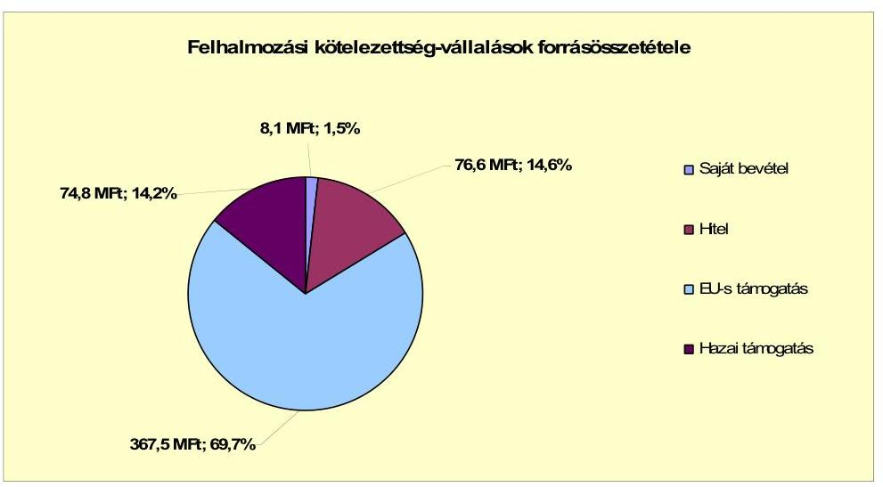

Az Önkormányzatnak beadott, elbírálás alatt álló pályázata a vizsgált időszakban nem volt.

Az Önkormányzatnak a vizsgált időszakot megelőzően nem volt pénzintézettel szemben fennálló kötelezettsége, a 2007. december 31-én fennálló 39,3 millió Ft kötelezettségállomány a 2011. év I. félév végére 85,6 millió Ft-ra nőtt. A fennálló pénzintézettel szembeni kötelezettségek kettő hosszú lejáratú forint alapú hitel, valamint folyószámlahitel igénybevételéből keletkeztek. Az Önkormányzat a 2007. évben igénybevett rövid lejáratú hitelt, valamint a 2008. évben felvett hosszú lejáratú hitelt a hitelcélnak megfelelően használta fel. A 2011. évben jóváhagyott 76,6 millió Ft hosszú lejáratú hitelből a 2011. év I. félévéig 43,5 millió Ft lehívás történt. Az Önkormányzat a 2011. év I. félév

---

végéig a pénzintézettel szembeni kötelezettségeiből eredően összesen 25,0 millió Ft tőkét törlesztett és 5,8 millió Ft kamatot fizetett. A vizsgált években egy alkalommal rövid lejáratú hitelt vett igénybe. Az igénybevett többlet állami támogatás visszafizetése céljából 2007. április 27-én felvett 25,0 millió Ft összegű hitelt 2008. március 28-án fizette vissza az Önkormányzat. A 2007-2011. év I. féléve között átmenetileg szabad pénzeszközeiből 2,1 millió Ft kamatbevételt realizált. Az Önkormányzat a hiteleket a számlavezető pénzintézetétől vette fel.

Az Önkormányzat kötelezettségvállalásaira képviselő-testületi döntés alapján került sor. Az előterjesztések nem tartalmazták az adósságszolgálati korlát, a teljes futamidő várható kamat- és tőkefizetési kötelezettségeinek bemutatását, a visszafizetés forrásszükségletét és annak évenkénti bontását.

Az Önkormányzat költségvetésének pénzügyi egyensúlyát a vizsgált időszakban folyószámla-, munkabér-megelőlegezési és 25,0 millió Ft összegű rövid lejáratú hitel igénybevételével tudta biztosítani. A folyószámla- és a munkabérmegelőlegezési hitel igénybevétele a 2007-2011. év I. féléve között az alábbiak szerint alakult:

| Megnevezés | 2007. év | 2008. év | 2009. év | 2010. év | 2011. év   I. félév |
| :--: | :--: | :--: | :--: | :--: | :--: |
| Folyószámlahitel |  |  |  |  |  |
| Keretösszeg január 1-jén (millió Ft-ban) | 15,0 | 26,0 | 30,0 | 45,0 | 30,0 |
| Átlagos napi állomány (millió Ft-ban) | 11,7 | 18,3 | 30,8 | 22,2 | 22,0 |
| Folyószámla hitellel zárt napok száma (nap) | 282 | 364 | 363 | 365 | 181 |
| Egyenleg (állomány december 31.) | 19,9 | 28,9 | 26,5 | 21,3 | 12,1 |
| Munkabér-megelőlegezési hitel |  |  |  |  |  |
| Keretösszeg január 1-jén (millió Ft-ban) | 13,2 | 14,0 | 14,8 | 14,9 | 12,1 |
| Átlagos napi állomány (millió Ft-ban) | 9,9 | 11,8 | 11,3 | 11,0 | 10,9 |
| Munkabér-megelőlegezési hitellel zárt napok száma (nap) | 334 | 366 | 365 | 334 | 181 |
| Egyenleg (állomány december 31.) | 7,7 | 11,4 | 0,0 | 0,0 | 0,0 |

A folyószámlahitel igénybevétele a 2008-2010. években tartóssá vált, a visszafizetést csak könyveléstechnikailag rendezték. A folyószámlahitel napi átlagos állománya a 2009. évben volt a legmagasabb, ennek oka, hogy az Önkormányzat a Járóbeteg Szakrendelő beruházás tervezési és egyéb előkészítési költségeit a folyószámlahitelből finanszírozta. Az Önkormányzat munkabérmegelőlegezési hitelből eredő kötelezettsége a 2008. és a 2010. években az év minden napján, a 2007. és a 2009. években is az év nagy részében fennállt, mivel a hitelek visszafizetése jellemzően az újabb felvételt megelőző napokban történt. A likviditás biztosítása az Önkormányzatnak 20,9 millió Ft kamatkiadást, és 1,0 millió Ft egyéb költséget okozott. Az Önkormányzat szállítói tartozása a 2011. év I. félév végén 11,1 millió Ft, amelyből átütemezett, illetve lejárt tartozása nem volt.

Az Önkormányzat kötelezettségeinek 2010. december 31-i, valamint 2011. június 30-i állományát és várható alakulását a kötelezettségek lejáratáig az alábbi táblázat szemlélteti:

| Megnevezés | Állomány   2010. december   31-én | Állomány   2011. június 30-én | Várható   kötelezettség   a 2011-2013.   években | Várható   kötelezettség   a 2014. évtől |
| :--: | :--: | :--: | :--: | :--: |
|  | HUF-ban   (millió Ft-ban) | HUF-ban   (millió Ft-ban) | HUF-ban   (millió Ft-ban) | HUF-ban   (millió Ft-ban) |
| Pénzintézeti kötelezettségek |  |  |  |  |
| Folyószámlahitel | 21,3 | 12,1 | 12,1 | - |
| Hosszú lejáratú kötelezettségek | 30,0 | 73,5 | 19,4 | 144,6 |
| Pénzintézeti kötelezettségek összesen HUF-ban | 51,3 | 85,6 | 31,5 | 144,6 |
| Szállítási tartozás | 11,6 | 11,1 | - | - |

---

A 2010. december 31-én fennálló összes (pénzintézet- és szállítói) kötelezettség állománya 62,9 millió Ft, amely 2011. év I. félévében 96,7 millió Ft-ra nőtt. Az Önkormányzatnak pénzintézettel szemben fennálló kötelezettsége a 2011. év I. félév végén 85,6 millió Ft volt. Ebből keletkező kötelezettsége (tőke, kamat és egyéb költség) - a legutóbbi kamatfizetés feltételei alapján - a 2011-2013. években 31,5 millió Ft. A 2014. évet követően jelenleg ismert pénzintézeti kötelezettségei: 144,6 millió Ft. Az Önkormányzatnak a 2011. évben egyéb kiadás elmaradások rendezése, valamint jogerős végzéssel lezárt, de ki nem fizetett kötelezettségek címén fizetési kötelezettsége nem keletkezett. A 2011-2013. évek kötelezettségeinek teljesítésére figyelembe vehető 21,0 millió Ft mérlegben kimutatott követelésállomány, és a jelzáloggal nem terhelt forgalomképes nettó ingatlanvagyon. A további évekre szóló, jelenleg ismert pénzintézeti kötelezettségek visszafizetésének forrását nem számszerűsítették.

Az eszközök használhatósága is hatást gyakorol az Önkormányzat pénzügyi egyensúlyi helyzetére. Az Önkormányzat a 2007-2010. években a tárgyi eszközök után 154,6 millió Ft összegű értékcsökkenést mutatott ki. Az Önkormányzat a vizsgált időszakban 154,3 millió Ft-ot fordított felújításra. Az elhasználódott eszközök pótlását költségvetési előirányzatból, hazai és EU-s támogatásból, illetőleg a beruházásokhoz kapcsolódó hosszú lejáratú hitelfelvételből biztosította. Az eszközök avultsága növekedett, mivel az eszközök önkormányzati szintű használhatósági fok mutató aránya 4,9 százalékponttal - a 2007. évi 80,5\%-ról a 2010. évre 75,6\%-ra - csökkent.

Az Önkormányzat az ellenőrzött időszakban kiadási megtakarítást eredményező és bevételt növelő intézkedéseket tett. Az Önkormányzat a 2007-2011. év I. féléve között tett intézkedések hatására 54,1 millió Ft bevételi többletet, továbbá 41,7 millió Ft kiadási megtakarítást mutatott ki. A kiadási megtakarítások 49,9\%-a az elrendelt álláshely csökkentések eredménye volt. Önkormányzati szinten a 2007-2011. év I. féléve között összesen 36 álláshelyet (ebből üres álláshely nem volt) szüntettek meg. Az egészségügy területén, valamint a Polgármesteri hivatalnál az álláshelyek számát egy-egy fővel növelték. Ennek következtében az időszak álláshelyeinek száma 34 fővel csökkent. A bevételnövelő intézkedések ingatlanok és eszközök hasznosításához, valamint a helyi adókkal összefüggő intézkedésekhez kapcsolódtak az Önkormányzat adatszolgáltatása szerint.

Az utóellenőrzés a pénzügyi egyensúly javítására tett egy szabályszerűségi javaslat hasznosítására terjedt ki, amely a költségvetési hiány/többlet költségvetési rendeletekben történő - finanszírozási célú pénzügyi műveletek nélküli bemutatására vonatkozott. A polgármester - a javaslatban foglaltaknak eleget téve - a 2009. évtől az éves költségvetési rendeletekben a költségvetési bevételek és kiadások főösszegét finanszírozási célú pénzügyi műveletek nélkül terjesztette a Képviselő-testület elé.

Az Önkormányzat pénzügyi egyensúlyi helyzetét összegezve a következők emelhetők ki:

A Dunavecse Város Önkormányzata pénzügyi egyensúlyi helyzete középtávon veszélyeztetett.

---

A 2008-2010. évi a folyó költségvetési egyenleg többlete és a működésképtelen önkormányzatok egyéb támogatása ellenére működését, valamint a felhalmozási kiadások finanszírozását folyamatosan növekvő és állandósult folyószámla-, likvid- valamint munkabér-megelőlegezési hitel igénybevételével tudta biztosítani.

A pénzintézetekkel szemben fennálló fizetési kötelezettsége nőtt. A folyamatban lévő fejlesztésekhez igénybevett hosszú lejáratú hitelek visszafizetésének forrásai nem ismertek, arról képviselő-testületi döntés nem született.

Kockázatot jelent a Járóbeteg Szakrendelő felújításával és bővítésével összefüggő, a beüzemelést követően felmerülő és önkormányzati forrásból finanszírozandó jövőbeni működtetési-üzemeltetési többletkiadás.

Gazdasági társaságok miatti kockázat nem áll fenn, mivel az Önkormányzat kizárólagos tulajdonú gazdasági társasággal nem rendelkezik.

Az Állami Számvevőszékről szóló 2011. évi
 LXVI. törvény 33. § (1) bekezdésében foglaltak értelmében a jelentésben foglalt megállapításokhoz kapcsolódó intézkedési tervet köteles az ellenőrzött szervezet vezetője összeállítani és azt a jelentés kézhezvételétől számított harminc napon belül az ÁSZ részére megküldeni. Amennyiben az intézkedési tervet határidőben nem küldi meg a szervezet, vagy az továbbra sem elfogadható, az ÁSZ elnöke a hivatkozott törvény 33. § (3) bekezdés a)-b) pontjaiban foglaltakat érvényesítheti.

# A 2011. június 30-i pénzügyi egyensúlyi helyzet alapján az ellenőrzés intézkedést igénylő megállapítása és javaslatai a következők: 

## a Polgármesternek

1. Az Önkormányzat pénzügyi egyensúlya közép távon veszélyeztetett. A 2008-2010. évi pozitív előjelű folyó költségvetési egyenleg és a működésképtelen önkormányzatok egyéb támogatása ellenére az Önkormányzat az átmeneti likviditási problémák kezelése, valamint a felhalmozási kiadások finanszírozása érdekében folyószámla-, likvid- és munkabér-megelőlegezési hitel felvételére kényszerült.

Javaslat:
Az Önkormányzat pénzügyi egyensúlyának közép távú biztosítása és hosszú távú fenntarthatósága érdekében kezdeményezze - felelősök és határidők megjelölésével - az alábbi intézkedések megtételét:
a) Tárja fel a bevételszerző és kiadáscsökkentő lehetőségeket. Ütemezze a bevételek beszedését a jövőben jelentkező fizetési kötelezettségeihez;
b) Terjesszen a Képviselő-testület elé kibontakozási programot a pénzügyi egyensúlyi helyzet javítása, és hosszú távú megőrzése érdekében;
c) Képezzen egyensúlyi (elkülönített) tartalékot az adósságszolgálat teljesítése érdekében;

---

d) Mutassa be a Képviselő-testületnek félévente legalább három évre kitekintően a kötelezettségek teljes körére szóló finanszírozási tervet, a források számszerűsített megjelölésével.
2. A folyószámlahitel igénybevétele a 2008-2010. években tartóssá vált. Az Önkormányzat munkabér-megelőlegezési hitelből eredő kötelezettsége a 2008. és a 2010. években az év minden napján, a 2007. és a 2009. években is az év nagy részében fennállt, mivel a hitelek visszafizetése jellemzően az újabb felvételt megelőző napokban történt.

Javaslat:
Vizsgálja meg az állandósult folyószámla és likvid hitel hosszú távú kötelezettséggé történő átalakításának jogi lehetőségét, és a Stabilitási törvény 10. §-ában előírt feltételek fennállása esetén kezdeményezze a Kormánynál ennek engedélyezését.
3. Az Önkormányzat kötelezettségvállalásaira képviselő-testületi döntés alapján került sor. Az előterjesztések nem tartalmazták az adósságszolgálati korlát bemutatását, a teljes futamidő várható kamat- és tőkefizetési kötelezettségeinek bemutatását, a visszafizetés forrásszükségletét.

Javaslat:
Az adósságot keletkeztető kötelezettségvállalásról szóló döntéskor mutassa be a Képviselő-testületnek az adósságszolgálati korlátot, a jövőben várható - kamat- és törlesztési - kockázatot. Gondoskodjon, hogy a jövőben az adósságot keletkeztető kötelezettségvállalásokról szóló képviselő-testületi előterjesztések tételesen tartalmazzák a visszafizetés forrásait.
4. Az Önkormányzat a Járóbeteg Szakrendelő felújításával és bővítésével összefüggő, a beüzemelést követően felmerülő, önkormányzati forrást igénylő jövőbeni működtetési-üzemeltetési többletkiadásokra vonatkozóan pontos adatokkal nem rendelkezett.

Javaslat:
Mutassa be a Képviselő-testületnek a megvalósuló létesítmény működtetésiüzemeltetési feladatai ellátásának pénzügyi hatásait.

A polgármester a helyszíni ellenőrzés lezárása után tájékoztatta az Állami Számvevőszéket az Önkormányzat megtett és tervezett intézkedéseiről, amelyet az Állami Számvevőszék nem ellenőrzött, arra vonatkozóan véleményt, vagy megállapítást nem fogalmaz meg. Az ellenőrzés lezárását követően elvégzett intézkedéseket az Állami Számvevőszék utóellenőrzés keretében vizsgálhatja.

A polgármester tájékoztatása szerint a következő intézkedéseket tette meg és tervezi az Önkormányzat:

- A 2012. évi költségvetési rendelettervezetben bemutatták a Képviselő-testület részére az adósságszolgálati korlátot, a jövőben várható kamat- és törlesztési kockázatokat, a visszafizetés forrásait, továbbá a Járóbeteg Szakrendelő be-

---

üzemeltetését követően működtetésének kiadás-forrásigényét számszerűsítették.

- Az Önkormányzat közép- és hosszú távú pénzügyi egyensúlyának megőrzése érdekében feltárja a bevételszerző és kiadáscsökkentő lehetőségeket. A polgármester a Képviselő-testület elé terjeszti a kibontakozási programot. Az Önkormányzat elkülönített tartalékot képez az adósságszolgálat teljesítésére. A Képviselő-testület részére három évre kiterjedően a polgármester bemutatja a finanszírozási tervet a kötelezettségek teljes körére vonatkoztatva, a források számszerűsítésével.
- Az Önkormányzat a folyószámlahitel mértékének folyamatos csökkentését tervezi, amelynek érdekében táblázatban összegezték a hitel visszafizetésének számszerűsített ütemezését.

---

# II. RÉSZLETES MEGÁLLAPÍTÁSOK 

## 1. Az ÖNKORMÁNYZAT KÖTELEZŐ ÉS ÖNKÉNT VÁLLALT FELADATAI, A FELADATELLÁTÁS SZERVEZETI KERETEI ÉS ANNAK VÁLTOZÁSAI

Az Önkormányzat a kötelező és önként vállalt feladatok körét az SzMSz-ében rögzítette. Az Önkormányzat önként vállalt feladatnak sorolta be a járóbeteg-szakellátást, a bölcsőde működtetését ${ }^{10}$, a kunszentmiklósi okmányiroda kihelyezett irodájának fenntartását, valamint a civil szervezetek támogatását. Az Önkormányzat a működési kiadások 95,5\%-át (451,0 millió Ft-ot) a kötelező, 4,5\%-át (21,3 millió Ft-ot) az önként vállalt feladatok ellátására fordította a 2010. évben. A 2007-2009. évek átlagában 581,5 millió Ft (96,5\%) a kötelező és 21,4 millió Ft (3,5\%) az önként vállalt feladatok ellátását szolgálta.

Az Önkormányzat a 2010. évi működési kiadásait feladatonként és azok finanszírozását az alábbi táblázat mutatja be:

| Ellátott feladat | Működési   kiadás   összesen   (millió Ft) | Kötelező   feladatok   kiadásainak   részaránya   $\%$ | Működési   bevétel   összesen   (millió Ft) | Állami   támogatás   részaránya   $\%$ | Intézményi   saját bevétel   részránya   $\%$ | Önkormányzati   támogatás   részránya   $\%$ |
| :--: | :--: | :--: | :--: | :--: | :--: | :--: |
| Óvoda | 76,8 | 100,0 | 76,8 | 46,3 | 6,9 | 46,8 |
| Általános iskola | 114,0 | 100,0 | 114,0 | 53,5 | 2,7 | 43,8 |
| Szociális intézmény | 16,2 | 0,0 | 16,2 | 71,0 | 6,2 | 22,8 |
| Közművelődési   intézmény | 15,7 | 100,0 | 15,7 | 26,8 | 8,4 | 64,8 |
| Polgármesteri hivatal   igazgatási kiadásai | 119,4 | 100,0 | 119,4 | 24,8 | 15,9 | 59,3 |
| Polgármesteri   hivatalban ellátott   egyéb feladatok   működési kiadásai | 130,2 | 96,0 | 130,2 | 89,3 | 10,7 | 0,0 |
| Működési kiadá-   sok összesen | 472,3 | 95,5 | 472,3 | 54,7 | 9,2 | 36,1 |

[^0]
[^0]:    ${ }^{10}$ A Gyermekek védelméről és a gyámügyi igazgatásról szóló 1997. évi XXXI. törvény. 94.§ (3) bekezdés a) pontja alapján a tízezer főnél magasabb állandó lakosságszámmal rendelkező települési önkormányzat (fővárosban kerületi önkormányzat) köteles bölcsőde működtetéséről gondoskodni. Az Önkormányzat - a lakosságszám alapján - a bölcsőde működtetését az önként vállalt feladatok közé sorolta.

---

Az Önkormányzat adatszolgáltatása szerint a működési kiadása a 20072009. évek 602,9 millió Ft-os átlagához képest a 2010. évben 130,6 millió Ft-tal (21,7\%-kal) alacsonyabb összegben, 472,3 millió Ft-ban ${ }^{11}$ teljesült. A szociális és gyermekjóléti feladatok kiadásai a 2009. évtől a Kistérségi társulás részére történő átadása miatt csökkentek. A működési kiadásból 72,4\%-ot (342,1 millió Ft-ot) tett ki a közoktatási, szociális és gyermekvédelmi, közművelődési, igazgatási feladatok ellátása, míg a kiadások 27,6\%-át (130,2 millió Ft-ot) a Polgármesteri hivatalban kimutatott egyéb feladatokra (településüzemeltetés, ingatlan, út- és parkfenntartás, közvilágítás, mezőőri feladatok, és közcélú foglalkoztatás) fordították.

A vizsgált időszakban a működési bevételek a Szociális és Gyermekjóléti Intézmény átadása következtében a 2007-2009. évek átlagához (602,9 millió Ft-hoz) képest 2010-re 130,6 millió Ft-tal (21,7\%-kal) csökkentek. A kiadások finanszírozásában az állami támogatás a 2010. évben 21,1 millió Ft-tal (8,5\%-kal) maradt el a 2007-2009. évek 282,2 millió Ft átlagától. Az intézményi saját bevételek az előző három év 106,1 millió Ft összegű átlagához képest 62,6 millió Ft-tal (59,0\%-kal) csökkentek. Ezzel párhuzamosan az önkormányzati támogatás összege 44,0 millió Ft-tal (20,5\%-kal) volt alacsonyabb a 2007-2009. évek átlagánál (214,6 millió Ft-nál).

Az Önkormányzat kötelező feladatainak működési kiadása és azok finanszírozása 2007-2010 között az alábbiak voltak:

- A közoktatási feladatokra a 2010. évben az összes működési kiadás 40,4\%-át (190,8 millió Ft-ot) fordította az Önkormányzat, amely 11,0 millió Ft-tal (5,5\%-kal) maradt el a 2007-2009. évek 201,8 millió Ft-os átlagától. A kiadások alacsonyabb összegét az ellátotti és a közalkalmazotti létszám csökkenése eredményezte. A közoktatás kiadásainak finanszírozását 85,9 millió Ft-ban (45,0\%-ban) az önkormányzati támogatás, 96,5 millió Ftban (50,6\%-ban) az állami támogatás, és 8,4 millió Ft-ban (4,4\%-ban) az intézményi saját bevétel fedezte. Az állami támogatás összege a 2007-2009 évek átlagához (113,4 millió Ft-hoz) képest 16,8 millió Ft-tal (4,8\%-kal) csökkent, ugyanakkor az intézményi saját bevételek 1,4 millió Ft-tal (19,8\% ) növekedtek az előző három év 7,0 millió Ft átlagához képest. Az önkormányzati támogatás a 2010. évben 4,4 millió Ft-tal (5,4\%-kal) haladta meg a 20072009. évek átlagát (81,5 millió Ft-ot).
- Szociális feladatok ellátására a 2010. évben az összes működési kiadás 3,4\%-át (16,2 millió Ft-ot) fordította az Önkormányzat, amely 30,9 millió Ft-tal (65,5\%-kal) maradt el a 2007-2009. évek 47,1 millió Ft-os átlagától. A Szociális és Gyermekjóléti Intézmény Kistérségi társulásnak történő átadását követően a 2009. évtől a szociális feladatok működési kiadásai között csak a

[^0]
[^0]:    ${ }^{11}$ Az Önkormányzat adatszolgáltatása nem tartalmazza az egészségügyi ellátásra fordított (járóbeteg szakellátás, védőnői szolgálat, ügyeleti ellátás) működési kiadásokat, azonban tartalmazza a transzferkiadásokat (magánszemélyeknek, nonprofit szervezeteknek) és az államháztartáson belülre átadott pénzeszközöket, ezért 121,0 millió Ft-tal alacsonyabb összegű a jelentés 2 . számú mellékletének működési kiadások kamatkiadások nélküli összegétől.

---

bölcsőde fenntartása szerepelt. A szociális feladatok kiadásait 3,7 millió Ftban (22,8\%-ban) az önkormányzati támogatás, 11,5 millió Ft-ban (71,0\% ban) az állami támogatás, és 1,0 millió Ft-ban (6,2\%-ban) az intézményi saját bevétel fedezte a 2010. évben. Az állami támogatás összege 14,6 millió Ft-tal (55,8\%-kal) csökkent a 2007-2009. évek 26,1 millió Ft-os átlagához viszonyítva. Az intézményi saját bevételekből befolyt összeg 3,5 millió Ft-tal (77,8\%-kal) maradt el az előző három év 4,5 millió Ft átlagától. Az önkormányzati támogatás összege ezzel párhuzamosan 12,8 millió Ft-tal (77,6% kal) csökkent a 2007-2009. évek 16,5 millió Ft-os átlagához képest.

- Az összes működési kiadás 3,3\%-át (15,7 millió Ft-ot) a közművelődési intézmény működéséhez nyújtotta az Önkormányzat a 2010. évben, amely a 2007-2009. évek 18,2 millió Ft-os átlagához képest 2,5 millió Ft-os (15,9\%-os) csökkentést jelentett. Hátterében az intézmény által szervezett programok, valamint a foglalkoztatottak létszámának csökkentése állt. A működési kiadások finanszírozását 26,8\%-ban (4,2 millió Ft-ban) az állami támogatás, 8,4\%-ban (1,3 millió Ft-ban) az intézményi saját bevétel és 64,8\%-ban (10,2 millió Ft-ban) az önkormányzati támogatás biztosította. Az állami támogatás összege 0,4 millió Ft-tal (8,7\%-kal) maradt el a 2007-2009. évek 4,6 millió Ft átlagához képest. Az intézményi saját bevételek az előző három év átlagához (3,3 millió Ft-hoz) viszonyítva 2,0 millió Ft-tal (59,9\%-kal) csökkentek. Az önkormányzati támogatás összege 0,1 millió Ft-tal (1,4\%-kal) maradt el a 2007-2009. évek 10,3 millió Ft összegű átlagától.
- Az Önkormányzat a 2010. évben a Polgármesteri hivatal igazgatási feladatainak ellátására 119,4 millió Ft-ot, a működési kiadások 25,3\%-át fordította, amely 45,5 millió Ft-os ( $27,6 \%$-os) csökkentést jelentett az előző három év 164,9 millió Ft-os átlagához. A Polgármesteri hivatal kiadásai a 2007-2010 között a képviselők tiszteletdíjának, a többletjuttatások, valamint a dologi kiadások csökkentése miatt alacsonyabb összegben teljesültek. A működési kiadásokat a 2010. évben $24,8 \%$-ban ( 29,6 millió Ft-ban) az állami támogatás, $15,9 \%$-ban ( 18,9 millió Ft-ban) az intézményi saját bevétel és $59,3 \%$-ban ( 70,9 millió Ft-ban) önkormányzati támogatás finanszírozta. Az állami támogatás összege 0,4 millió Ft-tal ( $1,2 \%$-kal) nőtt az előző három év 29,3 millió Ft összegű átlagához viszonyítva. Ugyanakkor az intézményi saját bevételek 10,4 millió Ft-tal ( $35,4 \%$-kal) maradtak el a 2007-2009. évek 29,3 millió Ft összegű átlagától. Az önkormányzati támogatás ezzel párhuzamosan 35,4 millió Ft-tal ( $33,3 \%$-kal) csökkent az előző három év átlagához (106,3 millió Ft-hoz) képest.
- A Polgármesteri hivatalban kimutatott egyéb feladatok támogatására 130,2 millió Ft-ot biztosított az Önkormányzat a 2010. évben, amely 40,7 millió Ft-tal ( $23,8 \%$-kal) alacsonyabb volt a 2007-2009. évek 170,9 millió Ft-os átlagától, a vizsgált időszakban végrehajtott létszámcsökkentéssel összefüggésben. Az állami támogatás összege a 2010. évben 7,3 millió Ft-tal ( $6,7 \%$-kal) haladta meg az előző három év 108,9 millió Ft-os átlagát. Az intézményi saját bevételek ugyanakkor 48,1 millió Ft-tal ( $77,5 \%$-kal) csökkentek a 2007-2009. évek átlagához ( 62,0 millió Ft) képest.

Az Önkormányzat kötelező és önként vállalt feladatait (a Polgármesteri hivatallal együtt) 2011. június 30-án öt költségvetési szerv - egy önállóan működő és gazdálkodó és négy önállóan működő - részvételével, négy telep-

---

helyen látta el. A vizsgált időszakban az önállóan működő költségvetési szervek és a telephelyek száma - 2006. december 31-ei állapothoz képest - egyaránt eggyel csökkent.

A Képviselő-testület a 2008. évben döntött az intézményhálózat átszervezéséről. A Szociális és Gyermekjóléti Intézmény által ellátott feladatot az Önkormányzat - a kedvezőbb támogatási rendszer kihasználása érdekében - 2009. január 1-jei hatállyal átadta a kilenc önkormányzatból ${ }^{12}$ álló Kistérségi társulás által létrehozott KESZI-nek. A KESZI biztosította a házi és a jelzőrendszeres házi segítségnyújtás, családsegítés, időskorúak nappali ellátása, szociális étkeztetés, ápolást és gondozást nyújtó ellátás - idősek bentlakásos és fogyatékos személyek otthona -, valamint a gyermekjóléti feladatok közös ellátását. A szociális és gyermekjóléti feladatok Kistérségi társulásnak való átadása 20092011. június 30. között - az Önkormányzat adatszolgáltatása szerint 52,3 millió Ft kiadási megtakarítást eredményezett.

Az Önkormányzat 2007-2010 között települési önkormányzattól, önkormányzati társulástól, egyháztól, gazdasági társaságtól, illetve egyéb szervezettől nem vett át feladatot.

A kötelező közszolgáltatási feladatok ellátásában a 2007-2010. években három gazdasági társaság vett részt. Az egészséges ivóvízellátást és csatornaszolgáltatást a Bácsvíz Zrt. látta el, amelyben az Önkormányzat 0,5\% tulajdoni részesedéssel rendelkezik. A hulladékgazdálkodással összefüggő feladatokat a Dunanett Kft., az orvosi ügyelet biztosítását - 2008. évtől - az Ambulancia Kft. végzi, amelyekben az Önkormányzat nem tulajdonos.

Az Önkormányzat feladatellátásában résztvevő gazdasági társaságok jellemző adatait a jelentés 4. sz. melléklete tartalmazza.

Az Önkormányzat adatszolgáltatása szerint a vizsgált időszakban a kötelező és önként vállalt feladatok ellátását biztosító szervezeti keretekben, a feladatellátás módjában bekövetkezett változások hatása - az Önkormányzat adatszolgáltatása szerinti kumulált összege - 145,3 millió Ft kiadási megtakarítást és 144,1 millió Ft bevételi elmaradást eredményezett, amely a pénzügyi egyensúlyi helyzet alakulását jelentősen nem befolyásolta.

# 2. AZ ÖNKORMÁNYZAT PÉNZÜGYI EGYENSÚLYI HELYZETÉT BEFOLYÁSOLÓ TÉNYEZŐK

A hagyományos költségvetési szerkezet helyett az Önkormányzat pénzügyi helyzetét a CLF módszerrel mutatjuk be, amelyben jobban elkülönülnek a vagyonnal kapcsolatos bevételek és kiadások az önkormányzati feladatokkal kapcsolatos közvetlen működtetési bevételektől és kiadásoktól. A módszer következetesen elkülöníti a folyó és a felhalmozási költségvetés bevételeit és kiadásait, azok költségvetési egyenlegeit. A saját folyó bevételek, valamint a sa-

[^0]
[^0]:    12 Apostag, Dunaegyháza, Dunavecse, Kunadacs, Kunpeszér, Kunszentmiklós, Szalkszentmárton, Tass, Újsolt települési önkormányzatok

---

ját felhalmozási bevételek nem tartalmazzák az előző évi pénzmaradványok felhasználásából származó pénzforgalom nélküli bevételeket ${ }^{13}$.

A folyó költségvetés egyenlege, a működési jövedelem megmutatja, hogy az Önkormányzat éves folyó bevétele fedezetet biztosít-e a kötelező és önként vállalt feladatellátáshoz kapcsolódó éves folyó kiadására. A működési jövedelem negatív értéke pénzügyileg fenntarthatatlan helyzetet jelez. A mutató pozitív értéke megtakarítást mutat, amely forrásul szolgálhat az Önkormányzat fennálló kötelezettségei megfizetéséhez, valamint fejlesztéseihez.

A felhalmozási költségvetés pozitív értéke felhalmozási többletet mutat, amely a jövőbeni fejlesztések forrását biztosíthatja. Amennyiben a folyó költségvetési hiány finanszírozása a felhalmozási többletből történik, ez szűkebb értelemben vagyonfelélésnek tekinthető. Amennyiben a felhalmozási költségvetés megtakarítása fejlesztési célú hitelek, kötvények adósságszolgálatát finanszírozza, az változatlan vagyontömeg mellett, a korábban megelőlegezett tőkebevételek valós realizációjának tekinthető. A felhalmozási deficit által generált finanszírozási igény önmagában nem jár pénzügyi kockázattal, a pénzügyileg fenntartható beruházásokhoz kapcsolódó kötelezettségvállalás (adósságszolgálat) átlátható és szabályozott költségvetési gazdálkodással teljesíthető.

A módszer a pénzügyi kapacitás fogalmát helyezi a középpontba. Az adós hitelfelvételi képessége, hosszú távú fizetőképessége, vagy bonitása a pénzügyi kapacitással, ezen belül is a nettó működési jövedelemmel jellemezhető. A nettó működési jövedelem negatív értéke az egyes költségvetési években jelentkező adósságszolgálat túlzott mértékére utal. ${ }^{14}$ A nettó működési jövedelem negatív értékének felhalmozási többletből, vagy további hitelből történő finanszírozása pénzügyileg nem fenntartható gazdálkodást vetít előre. A pozitív értéket mutató nettó működési jövedelem fejlesztési kiadások fedezetét biztosíthatja, illetve a folyamatosan, évenként képződő pozitív nettó működési jövedelemből meghatározható a jövőben vállalható, teljesíthető éves adósságszolgálat, ily módon az a hitelösszeg, amely - a többi tényezőt, feltételt adottnak tekintve visszafizetési kockázat nélkül felvehető.

A CLF módszer alapján a pénzügyi kapacitás mértéke az Önkormányzat összevont, nettósított, a központi információs rendszerbe a Magyar Államkincstáron keresztül leadott éves költségvetési beszámolójának 80-as űrlapjában szerepeltetett adatok alapján került meghatározásra.

A számítási leírás némileg eltér az ÁSZ módszertanában korábban alkalmazott gyakorlattól. A jelen besorolás általános közgazdasági meggondolásokon alapul, amely megjelenik az SNA statisztikai módszertanában is. Folyó tételek alatt értjük azokat a kiadásokat és bevételeket, amelyek a gazdálkodó szervezet helyzetét automatikusan nem változtatják. Bevételi oldalon ilyenek az adók, a

[^0]
[^0]:    ${ }^{13}$ A költségvetési években kialakuló hiány finanszírozása az előző évi pénzmaradvány és a korábbi években képzett tartalékok felhasználásával is történhet.
    ${ }^{14}$ Kivéve, ha annak finanszírozására a korábbi években képzett tartalékok fedezetet nyújtanak.

---

tényező jövedelmek, a transzferek, kiadási oldalon a transzferek ${ }^{15}$ és a szolgáltatás igénybevételével kapcsolatos működési kiadások. A folyó költségvetésben a bevételekben nem térül meg, a kiadásokban nem jelenik meg az amortizáció, a vagyoni helyzetet az egyenleg befolyásolja.

A folyó költségvetés egyenlege (működési jövedelem) tartalmazza a kamatbevételeket és a kamatkiadásokat is, mind a működési, mind a fejlesztési kamatot, valamint a visszatérülő és befizetendő áfa teljes összegét, mert ezek közgazdaságilag tényező jövedelmek. Nem tartalmazzák viszont a követelés elengedés miatt könyvelt bevételi és kiadási pénzforgalmi tételeket, mert valójában technikai elszámolási műveletnek minősülnek, a bevétel soha nem realizálódott, és költségvetési kiadás sem történt.

A felhalmozási költségvetésben a bevételek között a vagyon megőrzésére és bővítésére fordítható források jelennek meg. A felhalmozási vagy tőketételek módosítják a vagyon nagyságát. A privatizációs bevétel csökkenti a vagyont, a fizikai beruházás, pénzügyi befektetés növeli.

A nettó működési jövedelmet a tőketörlesztés levonásával a folyó költségvetés egyenlegéből származtatjuk.

[^0]
[^0]:    ${ }^{15}$ Transzferkiadásoknak nevezzük azokat a folyó és felhalmozási tételeket, amelyeket nem az adott önkormányzat használ fel szolgáltatásnyújtásra.

---

# 2.1. A működési és a felhalmozási egyensúly változása

CLF módszer szerinti önkormányzati adatok

| Megnevezés | 2007. év | 2008. év | 2009. év | 2010. év |
| :--: | :--: | :--: | :--: | :--: |
| Folyó bevételek | 676,8 | 738,8 | 627,6 | 651,4 |
| Folyó kiadások | 709,9 | 727,3 | 588,1 | 598,6 |
| Működési jövedelem | $-33,1$ | 11,5 | 39,5 | 52,8 |
| Nettó működési jövedelem   =működési jövedelem - töketörlesztés | $-46,3$ | $-0,3$ | 25,7 | 47,6 |
| Felhalmozási bevételek | 17,2 | 113,9 | 73,0 | 120,7 |
| Felhalmozási kiadások | 52,9 | 163,2 | 44,3 | 201,7 |
| Felhalmozási költségvetés egyenlege | $-35,7$ | $-49,3$ | 28,6 | $-81,0$ |
| Finanszírozási műveletek nélküli (GFS) pozíció = működési jövedelem + felhalmozási költségvetés egyenlege | $-68,8$ | $-37,9$ | 68,2 | $-28,2$ |
| Finanszírozási műveletek egyenlege | 43,2 | 26,4 | $-13,2$ | $-22,6$ |
| Tárgyévi pénzügyi pozíció | $-25,6$ | $-11,5$ | 54,9 | $-50,7$ |
| Egyéb tájékoztató adatok |  |  |  |  |
| Összes kötelezettség* | 79,4 | 107,7 | 82,4 | 68,9 |
| -ebből rövid lejáratú | 73,9 | 74,8 | 52,2 | 39,8 |
| Folyószámlahitel napi átlagos állománya ** | 11,7 | 18,3 | 30,8 | 22,2 |
| Likvidhitel napi átlagos állománya** | 12,0 | 1,6 | 0,0 | 0,0 |
| Munkabérhitel napi átlagos állománya** | 9,9 | 11,8 | 11,3 | 11,0 |
| Finanszírozásba vonható eszközök: | 25,4 | 13,9 | 68,8 | 18,1 |
| Pénzeszközök (idegen pénzeszközök nélkül) év végi állománya | 25,4 | 13,9 | 68,8 | 18,1 |

* Az összes kötelezettséget a passzív pénzügyi elszámolások nélkül vettük figyelembe, mert a passzívák a pénzmaradvány elszámolás tételei közé tartoznak.
** A folyószámla, a likvid- és a munkabérhitel átlagos állományát 365 napos osztószámmal, és nem a hitel igénybevételi napok számával vettük figyelembe.

A 2007-2010. évek között az Önkormányzat kiadásainak és bevételeinek főbb jogcímeit, valamint adósságszolgálatának adatait részletesen a jelentés 2. számú melléklete tartalmazza.

---

Az Önkormányzat működési jövedelmének változását a 2007-2010. évek közötti időszakban az alábbi ábra szemlélteti:
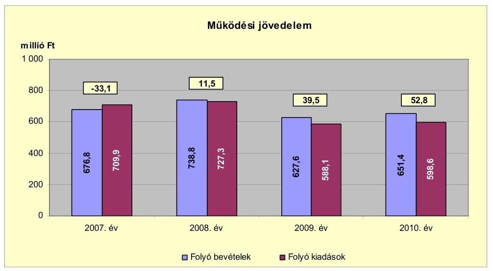

A folyó költségvetés egyenlege a 2007. évről a 2008. évre pozitívra fordult, amit elsősorban a költségvetési támogatásokból befolyt bevételek mintegy 59,8\%-os emelkedése eredményezett. Működésképtelen önkormányzatok egyéb támogatása jogcímen az Önkormányzat a vizsgált időszakban három alkalommal - a 2008-2010. években - összesen 46,0 millió Ft összegben részesült. A 2008. évben kapott 35,0 millió Ft vissza nem térítendő támogatást az Önkormányzat az igénylésnek megfelelően a 2007. évben többletként igénybe vett állami támogatás visszafizetésére és a forráshiány mérséklésére használta fel. A 2009. évben 8,0 millió Ft és a 2010. évben 3,0 millió Ft folyósított támogatást szállítói tartozások rendezésére fordította az Önkormányzat. A Szociális és Gyermekjóléti Intézmény 2009. január 1-jétől történő átadása kiadási megtakarítást eredményezett, így a működési jövedelem ez évben elérte a 39,5 millió Ft-ot. A vizsgált időszakban a működési jövedelem összesen 70,7 millió Ft megtakarítást mutatott, amely forrásul szolgált az Önkormányzat fennálló hiteltörlesztési kötelezettségeinek teljesítéséhez, valamint fejlesztéseinek finanszírozásához.

A 2008-2010. évi pozitív előjelű folyó költségvetési egyenleg ellenére az Önkormányzat folyószámla- likvid ${ }^{16}$ - és munkabérhitel felvételére kényszerült, egyrészt az átmeneti likviditási problémák kezelése, másrészt a felhalmozási kiadások finanszírozása miatt. A folyószámlahitel napi átlagos állománya 2007-2010 között közel kétszeresére (a 2007. évi 11,7 millió Ft-ról 2010-re 22,2 millió Ft-ra), illetve a 2007-2009. évek átlagához (20,3 millió Ft-hoz) viszonyítva 9,5\%-kal (1,9 millió Ft-tal) nőtt. Az átlagos állomány 2009. évben volt a legmagasabb 30,8 millió Ft összegben, amely 10,5 millió Ft-tal (52\%-kal) haladta meg a 2007-2009. évek átlagát. Ennek oka, hogy az Önkormányzat a 2009. évben folyószámlahitelből finanszírozta a Járóbeteg Szakrendelő beruházás tervezési és egyéb előkészítési költségeit. A munkabérhitel napi átlagos ál-

[^0]
[^0]:    ${ }^{16}$ Az Önkormányzat likvidhitelének napi állománya 2007-ben 12,0 millió Ft, 2008-ban 1,6 millió Ft volt.

---

lománya a vizsgált időszakban 11,1\%-kal (a 2007. évi 9,9 millió Ft-ról a 2010. évre 11,0 millió Ft-ra) nőtt. Az Önkormányzat munkabér-megelőlegezési hitelből eredő kötelezettsége a 2008. és a 2010. években az év minden napján, a 2007. és a 2009. években is jelentős részben (334 nap) fennállt, mivel a hitelek visszafizetése jellemzően az újabb felvételt megelőző napokban történt.

Az Önkormányzat pénzügyi kapacitása (nettó működési jövedelem) a vizsgált időszakban növekvő tendenciát mutatott, a 2007. évi -46,3 millió Ft-ról 2010. évre 47,6 millió Ft-ra nőtt. A nettó működési jövedelem értéke a folyó költségvetési pozíció mellett az adott költségvetési év adósságtörlesztésének (tőketörlesztési moratórium) hatását tükrözi.

A nettó működési jövedelmet a 2007-2010. években az alábbi ábra szemlélteti:
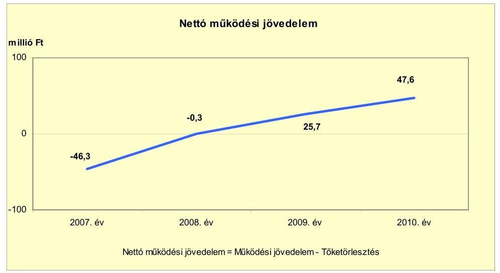

A negatív nettó működési jövedelem a 2007-2008. években azt mutatja, hogy a tőketörlesztési kötelezettségeinek az Önkormányzat csak újabb hitel felvételével tudott eleget tenni. Az adósságszolgálat teljesítéséhez a folyószámlahitel bevonása is szükségessé vált. A nettó működési jövedelem a 2007-2009. években közel azonos évenkénti tőketörlesztés ${ }^{17}$ mellett a 2009. évtől pozitívra fordult, majd a 2010. évben a jelentősen alacsonyabb törlesztés hatására 47,6 millió Ft-ra nőtt. A képződő működési jövedelem 2009-2010-ben már elegendő fedezetet nyújtott az adósságszolgálat teljesítésére. A visszafizetendő előző évi hitelek 2007-2009 időszakban meghaladták a nettó működési jövedelmet, azonban 2010. december 31-én fennálló 21,3 millió Ft folyószámlahitel állomány a 47,6 millió Ft nettó működési jövedelemmel szemben nem jelentett kockázatot a pénzügyi egyensúlyi helyzetre. Az Önkormányzat pénzügyi kapacitásának kedvező alakulásában szerepet játszott az is, hogy az Áhsz. 9. számú mellékletének 3. bekezdés b) és 4. bekezdés e) pontjaiban foglalt számviteli előírások alapján a tárgyévi adósságtörlesztések között nem kellett kimutatni a folyószámlahitel visszafizetési kötelezettséget.

[^0]
[^0]:    ${ }^{17}$ Az Önkormányzat tőketörlesztési kötelezettsége a 2007. évben 13,2 millió Ft, a 2008. évben 11,8 millió Ft, a 2009. évben 13,8 millió Ft, a 2010. évben 5,2 millió Ft volt.

---

A vizsgált időszakban az Önkormányzat felhalmozási költségvetésének egyenlege - a 2009. év kivételével - negatív összegű volt, amely körültekintő költségvetési gazdálkodás és pénzügyileg fenntartható ${ }^{18}$ beruházások esetén nem jár magas pénzügyi kockázattal, amennyiben a működési jövedelem képződése változatlan feltételekkel a jövőben is biztosított lesz.

A felhalmozási költségvetés egyenlegét a 2007-2010. évek között az alábbi ábra szemlélteti:
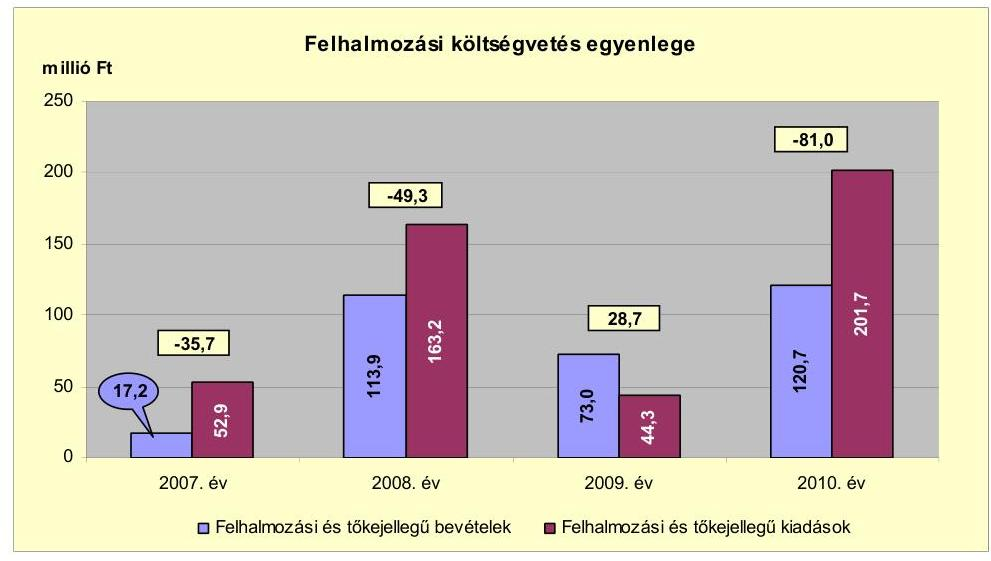

A felhalmozási forráshiánynak a felhalmozási és tőke jellegű kiadásokhoz viszonyított aránya 2007-ben 67,5\% (-35,7 millió Ft), 2008-ban 30,2\% (-49,3 millió Ft), 2010-ben 40,2\% (-81 millió Ft) volt. A 2008. és a 2010. években jelentkező kiugróan magas forráshiányt az EU-s és hazai támogatással megvalósuló - kerékpárút és Járóbeteg Szakrendelő - beruházások felhalmozási kiadásai okozták. Az Önkormányzat által a 2009. évben elért felhalmozási forrástöbbletet ( 28,7 millió Ft) - amely a felhalmozási és tőke jellegű kiadások 64,8\%-át tette ki - a 2007-2008. években befejezett beruházásokhoz kapcsolódó támogatások folyósítása eredményezte.

A 2007-2010 között keletkezett 137,3 millió Ft felhalmozási forráshiányra a 2007. évi 51,0 millió Ft nyitó pénzkészlet, valamint a felvett 25,0 millió Ft likvid hitel és 30,0 millió Ft összegű fejlesztési hitel, továbbá a folyószámlahitel állománynövekedéséből ${ }^{19}$ igénybevett 31,3 millió Ft nyújtott fedezetet.

Az Önkormányzat évenkénti teljes finanszírozási igénye ${ }^{20}$ a CLF módszer szerint a 2007. évben -82,0 millió Ft, a 2008. évben -49,6 millió Ft, a 2010. év-

[^0]
[^0]:    ${ }^{18}$ Az minősül pénzügyileg fenntartható beruházásnak, amelynek többletként jelentkező működtetési költségeire az Önkormányzat nettó működési jövedelme a következő években is fedezetet nyújt.
    ${ }^{19}$ A folyószámlahitel keretösszege a 2007. évi 15,0 millió Ft-ról folyamatosan emelkedett, a 2010. évben 45 millió Ft volt, majd, a 2010. szeptember 30.-i szerződéskötés értelmében a hitelkeret 30 millió Ft-ra csökkent.
    ${ }^{20}$ a nettó működési jövedelem és a felhalmozási költségvetés eredője

---

ben -33,4 millió Ft volt. Ezzel szemben a 2009. évben 54,4 millió Ft finanszírozási többlet keletkezett.

Az Önkormányzat finanszírozási célú műveleteinek egyenlegét a vizsgált időszakban az alábbi ábra szemlélteti:
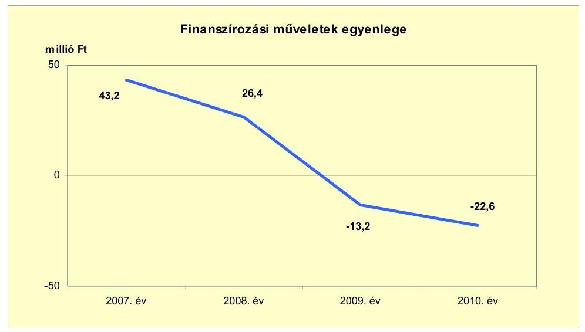

A finanszírozási célú műveletek pozitív egyenlege a 2007-2008. években azt mutatja, hogy az éves költségvetések végrehajtása során szükség volt az előző években keletkezett pénzmaradvány igénybevételén túl külső finanszírozás igénybevételére is ${ }^{21}$. Ezt követően 2009-2010. években újabb hitel felvételére nem került sor, a finanszírozási műveletek negatív egyenlege az adott évi adósságtörlesztésből, valamint az egyéb finanszírozási műveletekből adódott. A finanszírozási célú műveleteket a jelentés 2. számú. mellékletének 4.1.-4.8. pontjai részletezik.

Az Önkormányzat zárszámadási rendeleteiben a működési és felhalmozási hiányt a CLF módszertől eltérő szerkezetben mutatta be ${ }^{22}$, amelyről a jelentés 1. számú melléklete nyújt tájékoztatást. Az Önkormányzat a 2007. évi zárszámadási rendeletében működési és felhalmozási célú hiányt nem mutatott ki. A Képviselő-testület a 2008-2009. évek zárszámadási rendeleteit bevételi többlettel fogadta el. Azonban a 2010. évben realizált 59,9 millió Ft működési többlet már nem kompenzálta a beruházások miatt kialakult 65,0 millió Ft felhalmozási hiányt, így az Önkormányzat összesen 5,1 millió Ft forráshiánnyal zárta az évet.

Az Önkormányzat kamatbevételeit és kamatkiadásait a 2007-2010. év I. féléve között a következő ábra mutatja be:

[^0]
[^0]:    ${ }^{21}$ A CLF táblában hitelfelvétel és hiteltörlesztés sorok adataiban a folyószámla- és munkabér-megelőlegezési hitelek nettó módon szerepelnek, mert év végén a hitelek egyenlegét kell a számviteli nyilvántartásokban rögzíteni. Az éves költségvetési beszámoló összeállításánál a kitöltési útmutató szabályai szerint jártak el.
    ${ }^{22}$ Nincs kötelező előírás a működési és felhalmozási hiány megállapításának módjára.

---

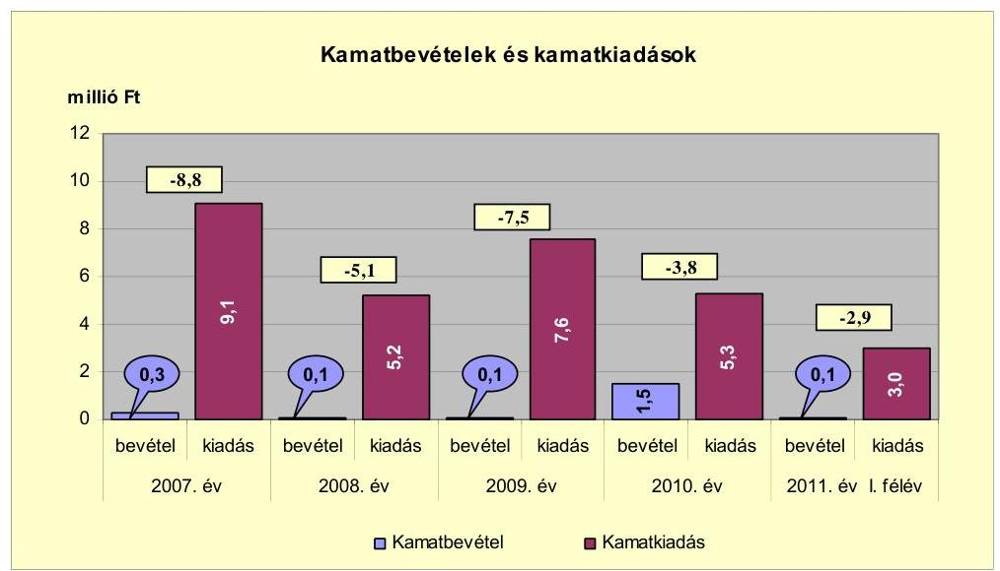

A 2007-2010 között az Önkormányzat által felvett hitelekhez kapcsolódóan kamatfizetési kötelezettség keletkezett, a teljes kamatráfordítás összesen 27,2 millió Ft volt. Az átmenetileg szabad pénzeszközei lekötése után kapott kamatbevétel a teljes kamatkiadás 7,4\%-át, 2,0 millió Ft-ot tett ki, amelyet az Önkormányzat a kamatkiadások finanszírozására fordított. A 2011. évre az Önkormányzat a kamatkiadások további emelkedésével számolt, a költségvetési rendeletben tervezett 6,5 millió Ft kamatkiadás 22,7\%-kal, 1,2 millió Ft-tal haladta meg a 2010. évit.

# 2.2. Az Önkormányzat bevételeinek változása 

A folyó bevétel a 2008. évben 9,2\%-kal (62,0 millió Ft-tal) haladta meg a 2007. évit, a költségvetési támogatás emelkedésének és a saját bevételek - elsősorban a helyi iparűzési adóbevétel elmaradása miatti - csökkenésének együttes hatására. A 2009. évben realizált folyó bevétel 111,2 millió Ft-tal (15,1\%kal) maradt el az előző évitől ${ }^{23}$ a Szociális és Gyermekjóléti Intézmény átadásával összefüggésben. Ezt követően a folyó bevételek a 2010. évben 3,8\%-kal (23,8 millió Ft-tal) magasabbak voltak a 2009. évinél ${ }^{24}$. A folyó bevételek a 2010. évben alapvetően a felújításokhoz és beruházásokhoz kapcsolódó áfa visszatérülések, valamint a helyi adók összetételének és mértékének változása miatt, továbbá a gépjárműadó bevételek miatt emelkedtek az előző évhez viszonyítva.

[^0]
[^0]:    ${ }^{23}$ A folyó bevétel 2007-ben 676,8 millió Ft, 2008-ban 738,8 millió Ft volt.
    ${ }^{24}$ A 2009. évben a folyó bevétel 627,6 millió Ft volt.

---

Az Önkormányzat a 2007-2011. év I. féléve között realizált folyó bevételeinek számszaki adatait az alábbi ábra mutatja be:
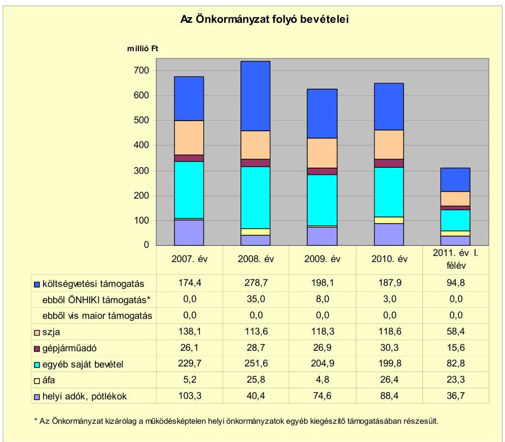

A költségvetési támogatás és az átengedett szja együttes összege a 20072010. évek között összesen 77,7 millió Ft bevételi többletet eredményezett. Az átengedett bevételek esetében - az elszámolási szabályok változása miatt a vizsgált időszakban összesen 63,8 millió Ft szja bevételkiesés keletkezett. Az szja miatti bevételkiesést azonban ellensúlyozta költségvetési támogatás növekedése. A 2008. évben az előző évhez képest a költségvetési támogatás 104,3 millió Ft-tal emelkedett, amelyből összesen 52,5 millió Ft-ot a kötött felhasználású normatív, és a működésképtelen önkormányzatok részére juttatott egyéb állami támogatás jelentett. A 2009. évben a költségvetési támogatás 25,0 millió Ft-tal csökkent, a szociális és gyermekvédelmi feladatok ellátásához kapcsolódó normatív támogatás megszűnésével összefüggésben.

Az Önkormányzat a 2007-2011. év I. féléve között két helyi adót, - a magánszemélyek kommunális adóját és az iparűzési adót - vetett ki. A helyi adóbevételek az Önkormányzat saját folyó bevételének 13,6\%-át (88,4 millió Ft-ot) tették ki, 15,6 millió Ft-tal (21,5\%-kal) haladták meg a 2007-2009. évek átlagos bevételét ( 72,8 millió Ft-ot). A helyi adó bevételek a 2007. évről a 2008. évre - a helyi iparűzési adóval összefüggésben - 62,9 millió Ft-tal csökkentek ${ }^{25}$. A helyi adóbevételek a 2009. évben az előző évhez képest 34,4 millió Ft-tal

[^0]
[^0]:    ${ }^{25}$ A 2007. évben állami beruházás keretében a Pentele híd megvalósult és az építési vállalkozások telephelyei a városban megszűntek.

---

emelkedtek, a helyi iparűzési adó mértékének - 1,9\%-ról 2,0\%-ra való - emelése, valamint a 2008. évtől új adónemként a magánszemélyek kommunális adójának kivetése miatt. A helyi adóbevételek a 2007-2010. évek között összesen 106,5 millió Ft, míg a 2007-2011. év I. félév időszak tekintetében összesen 139,8 millió Ft forráskiesést eredményeztek.

Az Önkormányzat a Bácsvíz Zrt. 2010. évi adózott eredményéből - a 0,5\% tulajdoni részesedése alapján - 1,3 millió Ft összegű osztalékban részesült.

Az Önkormányzat felhalmozási bevételei a vizsgált időszakban:

| Megnevezés | 2007. év | 2008. év | 2009. év | 2010. év | 2011. év   I. félév |
| :-- | :--: | :--: | :--: | :--: | :--: |
| Tárgyi eszköz értékesítés | 0,0 | 0,0 | 0,4 | 0,3 | 0,2 |
| Egyéb saját tőkebevétel | 8,2 | 0,8 | 0,0 | 2,7 | 3,7 |
| Államháztartáson belülről   kapott támogatás | 9,0 | 110,3 | 72,3 | 116,4 | 239,8 |
| EU-tól és külföldről kapott   támogatások | 0,0 | 0,0 | 0,0 | 0,0 | 0,0 |
| Államháztartáson kívülről   kapott támogatás | 0,0 | 2,8 | 0,2 | 1,3 | 0,0 |
| Összes felhalmozási   bevétel |
 | $\mathbf{17 , 2}$ | $\mathbf{1 13 , 9}$ | $\mathbf{73 , 0}$ | $\mathbf{1 2 0 , 7}$ | $\mathbf{243 , 7}$ |

Az Önkormányzat összes felhalmozási célú bevétele a vizsgált időszakban az előző évhez képest - a 2009. év kivételével - növekvő tendenciát mutatott. A felhalmozási bevételeken belül az államháztartáson belülről kapott támogatások képviselik a legmagasabb - a vizsgált időszak átlagában mintegy 88,7\%-os - részarányt. A 2008. évben az államháztartáson belülről kapott támogatások - a kerékpárút, valamint a Járóbeteg Szakrendelő beruházások megvalósítása miatt - az összes felhalmozási bevétel 96,8\%-át képezték. A 2010. évben az összes felhalmozási bevételnek 96,4\%-át, 2011-ben 98,4\%-át az államháztartáson belülről, - EU-s programokra és azok hazai társfinanszírozására - kapott támogatás jelentette. A vizsgálattal érintett időszakban befolyt összes felhalmozási bevételből 62,7\%-os arányt képviseltek az államháztartáson belülről kapott (2010-2011. években összesen 356,2 millió Ft) támogatások ${ }^{26}$.

[^0]
[^0]:    ${ }^{26}$ A 2009. évtől érvényes számviteli szabályok szerint az EU-s forrásokból a közvetlenül kapott pénzeszközöket kellett elkülönítetten bemutatni, az EU-ból közvetett módon származó támogatások 2009-ben és 2010-ben - a korábbi évekkel ellentétben - az államháztartáson belülről kapott támogatások között szerepeltek.

---

# 2.3. Az Önkormányzat működési és a felhalmozási célú kiadásainak változása 

A 2007-2011. év I. félévében az Önkormányzat folyó kiadásai főbb jogcímek szerinti bontásban az alábbiak voltak:

| Megnevezés | 2007. év | 2008. év | 2009. év | 2010. év | 2011. év   I. félév |
| :--: | :--: | :--: | :--: | :--: | :--: |
| Folyó kiadások | 709,9 | 727,3 | 588,1 | 598,6 | 315,4 |
| Működési kiadások (kamatkiadás nélkül) | 638,6 | 664,8 | 545,6 | 547,9 | 312,9 |
| Államháztartáson belülre átadott pénzeszközök | 33,6 | 30,9 | 6,4 | 2,0 | 0,0 |
| Transzferkiadások | 28,6 | 26,4 | 28,6 | 43,4 | 2,4 |
| -ebből: vállalkozásoknak | 0,0 | 0,4 | 0,0 | 0,0 | 0,0 |
| EU-nak. illetve külföldre | 0,0 | 0,0 | 0,0 | 0,0 | 0,0 |
| magánszemélyeknek | 25,2 | 22,7 | 25,8 | 39,6 | 0,1 |
| nonprofit szervezeteknek | 3,4 | 3,3 | 2,8 | 3,8 | 2,3 |
| Kamatkiadások | 9,1 | 5,2 | 7,6 | 5,3 | 2,5 |
| Előző évi pénzmaradvány átadás | 0,0 | 0,0 | 0,0 | 0,0 | 0,0 |

Az Önkormányzat teljesített folyó kiadásai a 2007-2009. évek átlagához (675,1 millió Ft-hoz) képest a 2010. évre 11,3\%-kal (76,5 millió Ft-tal) csökkentek. A folyó kiadások a 2009. évben az előző évhez viszonyítva 139,2 millió Ft-tal alacsonyabb összegben teljesültek, a Szociális és Gyermekjóléti Intézmény megszűnésével összefüggő működési kiadások és az államháztartáson belülre átadott pénzeszközök csökkenése ${ }^{27}$ miatt. Az államháztartáson belülre átadott pénzeszközök magasabb arányát a 2007-2008. években az okozta, hogy ezen időszakban az Önkormányzathoz folytak be az orvosi ügyelet ellátásához kapcsolódó kistérségi szintű Országos Egészségbiztosítási Pénztár bevételek, amelyek továbbutalásra kerültek az érintett önkormányzatok számára. Az ügyeleti ellátás kiszervezése következtében a finanszírozás módja változott, az Önkormányzat a 2009. évtől nem vesz részt a kistérségi szintű finanszírozásban. A vizsgálattal érintett időszakban a magánszemélyeknek juttatott transzfer kiadások - 2008. év kivételével - növekvő tendenciát mutattak. A legmagasabb összege a 2010. évben volt, amikor a munkanélküliek számának növekedéséhez kapcsolódóan az Önkormányzat 39,6 millió Ft segélyt utalt ki.

Az Önkormányzat működési kiadásait kiemelt jogcímek szerint a 20072011. év I. féléve között az alábbi táblázat foglalja össze:

|  |  |  |  |  | millió Ft |
| :-- | --: | --: | --: | --: | --: |
| Megnevezés | 2007. év | 2008. év | 2009. év | 2010. év | 2011. év   I. félév |
| Személyi juttatások | 298,4 | 311,0 | 243,0 | 236,2 | 116,4 |
| Munkaadót terhelő járulékok | 94,5 | 100,9 | 75,6 | 63,2 | 30,0 |
| Dologi kiadások | 199,6 | 242,6 | 216,1 | 240,3 | 115,6 |
| Egyéb folyó kiadások | 4,9 | 4,3 | 5,3 | 8,0 | 4,1 |

A személyi juttatások és járulékok működési kiadásokon belüli aránya a 2007-2009. évek átlagához 46,1\%-hoz (374,5 millió Ft-hoz) képest 2010-re 54,7\%-ra (299,4 millió Ft-ra) nőtt, összegében azonban csökkent. A személyi

[^0]
[^0]:    ${ }^{27}$ az államháztartáson belülre átadott pénzeszközök

---

juttatások és járulékaik teljesített kiadásai a 2008. évi 411,9 millió Ft-ról a 2009. évre 93,3 millió Ft-tal, 318,6 millió Ft-ra csökkent, a Szociális és Gyermekjóléti Intézmény megszűnése, valamint az ügyeleti ellátás gazdasági társaság részére történő átadásának következtében.

Az Önkormányzatnál a dologi kiadások a 2007. évi 199,6 millió Ft-ról a 2008. évre 242,6 millió Ft-ra nőttek, amelynek oka a 2007. évben igénybevett többlet állami támogatás visszafizetése a központi költségvetésbe. Ezt követően a 2009. évben a dologi kiadások 216,1 millió Ft-ra csökkentek a 2008. év végén bekövetkezett feladat átadás ${ }^{28}$ következtében. A 2010. évben az előző év teljesítését, valamint az áthúzódó kötelezettségeket figyelembe véve az éves költségvetésben magasabb összegű dologi kiadás tervezése vált szükségessé az áremelkedés következtében, amely végül 240,3 millió Ft összegben teljesült.

A folyó és a felhalmozási kiadásokat a 2007-2011. év I. félévében az alábbi ábra szemlélteti:
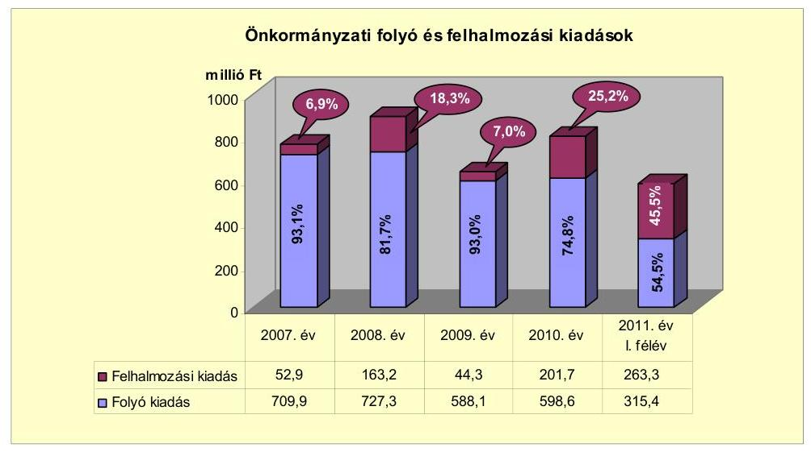

A 2007-2010. években az Önkormányzat felhalmozási kiadásai a megvalósított felújítások és beruházások következtében növekedtek. A 2010. évben a felhalmozási kiadások összege 201,7 millió Ft volt, amely elérte az összes kiadás 25,2\%-át. A folyamatban lévő Járóbeteg Szakrendelő beruházás eredményeként a 2011. év I. félévében a felhalmozási kiadások részaránya tovább nőtt, elérte az összes kiadás $45,5 \%$-át.

Az Önkormányzat a 2007-2010. évek között bruttó 242,5 millió Ft teljes bekerülési költségű felújítást és beruházást valósított meg, amelyből a vizsgált időszakra eső pénzügyi teljesítés 230,6 millió Ft volt. Az önkormányzati fejlesztések döntően középületek és közterületek felújításából, intézmények korszerűsítéséből, kerékpárút hálózat fejlesztésből, valamint gépek, berendezések beszerzéséből tevődtek össze. A fejlesztések forrása a saját bevétel ( 72,2 millió Ft), a hazai és EU-s támogatások (30,3 millió Ft és 110,0 millió Ft) mellett mindössze

[^0]
[^0]:    ${ }^{28}$ Szociális és Gyermekjóléti Intézmény megszüntetése, és a feladat átadása a KESZI részére

---

30,0 millió Ft hitelfelvétel volt. A befejezett fejlesztések kiadásait és finanszírozási forrásait részletesen a jelentés 3/a. számú melléklete tartalmazza. A 2010. december 31-ig befejezett, egyenként 10,0 millió Ft feletti bekerülési költségű önálló felújítás, illetve beruházás az alábbi volt:

- A ravatalozó felújítása 2005-ben kezdődött, és a 2007. évben fejeződött be. A 14,6 millió Ft teljes bekerülési költségű beruházás forrása 6,1 millió Ft saját bevétel $(41,8 \%)$ és 8,5 millió Ft hazai támogatás $(58,2 \%)$ volt.
- Az Önkormányzat a 2008. évben megvalósított kiemelt fejlesztése volt az EuroVelo kerékpárút nyomvonal dunavecsei szakaszának megépítése. A 153,3 millió Ft teljes bekerülési költségű beruházás forrása 110,0 millió Ft (71,7\%) EU-s támogatás, amelyhez az Önkormányzat 13,3 millió Ft (8,7\%) saját bevételt biztosított, illetőleg a hiányzó saját forrást 30,0 millió Ft összegben (19,6\%) hitelfelvétellel finanszírozta.

Az Önkormányzat legnagyobb bekerülési költségű beruházása 714,0 millió Ft - folyamatban van, a Járóbeteg Szakrendelő felújításával és bővítésével megvalósul annak komplex kistérségi ellátási rendszerré történő fejlesztése. A beruházás forrása 550,5 millió Ft (77,1\%) EU-s és 74,8 millió Ft (10,5\%) hazai támogatás, 12,1 millió Ft ( $1,7 \%$ ) saját bevétel és 76,6 millió Ft (10,7\%) hosszú lejáratú hitel. A teljesített kiadások összege a 2007-2010. évek között 187,0 millió Ft volt, amelyhez kapcsolódóan hitel lehívására ezen időszakban nem került sor. Az EU-s támogatással megvalósuló fejlesztés finanszírozása a támogatásból folyósított előleg (183,0 millió Ft) és a szükséges saját bevétel ( 4,0 millió Ft) következtében likvidítási gondot nem okozott. A folyamatban lévő fejlesztés kiadását és finanszírozását részletesen a jelentés 3/b. számú melléklete mutatja be.

A Járóbeteg Szakrendelő beruházáshoz kapcsolódó a 2010. évet követő kötelezettségvállalások összege 527,0 millió Ft, amelynek forrása 367,5 millió Ft EU-s és (69,8\%), 74,8 millió Ft hazai támogatás (14,2\%), 8,1 millió Ft saját bevétel ( $1,5 \%$ ) és 76,6 millió Ft hitel ( $14,5 \%$ ) volt. A hitel felvétele a vállalt fejlesztések jövőbeni finanszírozhatósága szempontjából nem jelent kockázatot, mivel a hitel aránya a teljes bekerülési költséghez ( 714,0 millió Ft) viszonyítva 10,7\%. Kockázatot jelent azonban, hogy a hitelfelvétel teljes költsége a Képviselő-testület előtt nem volt ismert, emiatt a jövőbeni visszafizetés fedezetéről határozatban nem döntött. Az Önkormányzat a Járóbeteg Szakrendelő felújításával és bővítésével összefüggő működtetési-üzemeltetési többletkiadásokat nem számszerűsítette. A fejlesztésről részletes tájékoztatást a jelentés 3/c. számú melléklete nyújt.

Az Önkormányzatnak beadott, elbírálás alatt álló pályázati forrásból tervezett fejlesztéshez kapcsolódó kötelezettségvállalása a 2011. év I. félév végéig nem volt.

Az Önkormányzat által gazdasági társaság részére átadott pénzeszközök összegeit a 2007-2011. év I. félév között a következő ábra szemlélteti:

---

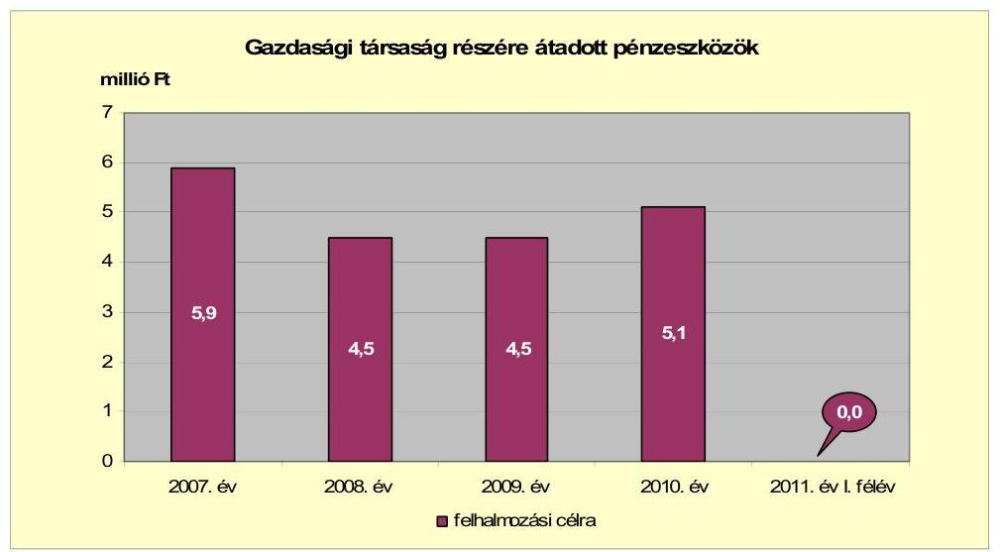

A vizsgált időszakban az Önkormányzat kizárólag az ivóvíz és csatornaszolgáltatást ellátó Bácsvíz Zrt. részére összesen 20,0 millió Ft összegű felhalmozási célú pénzeszközt adott át ${ }^{29}$, amelynek adatait részletesen a jelentés 4 . számú melléklete tartalmazza.

# 3. Az ÖNKORMÁNYZAT KÖTELEZETTSÉGEI 

### 3.1. Az Önkormányzat pénzintézetekkel szembeni kötelezettségeinek változása

Az Önkormányzatnak a vizsgált időszakot megelőzően pénzintézettel szembeni kötelezettsége nem volt. A pénzintézettel szembeni kötelezettségállomány a 2007. december 31-i 39,3 millió Ft-ról 2010. december 31-ére -30,5\%-kal - 51,3 millió Ft-ra nőtt. A 2010. év végén fennálló kötelezettség állomány hosszú lejáratú hitel igénybevételéből, folyószámla- és munkabérmegelőlegezési hitel, valamint egyéb rövid lejáratú hitel igénybevételéből keletkezett.

Az Önkormányzat könyvviteli mérlegében kimutatott pénzintézettel szemben fennálló kötelezettségének állományát a 2007-2011. év I. féléve közötti a következő grafikon szemlélteti:

[^0]
[^0]:    ${ }^{29}$ A 2004. február 1-jén kelt bérüzemeltetési szerződés alapján a tulajdonosok rekonstrukciós célra minden év december 15-ig meghatározott, a bérleti díjjal megegyező összeget - melyet $25 \%$-os áfa terhel - fizetnek végleges pénzeszközátadás formájában.

---

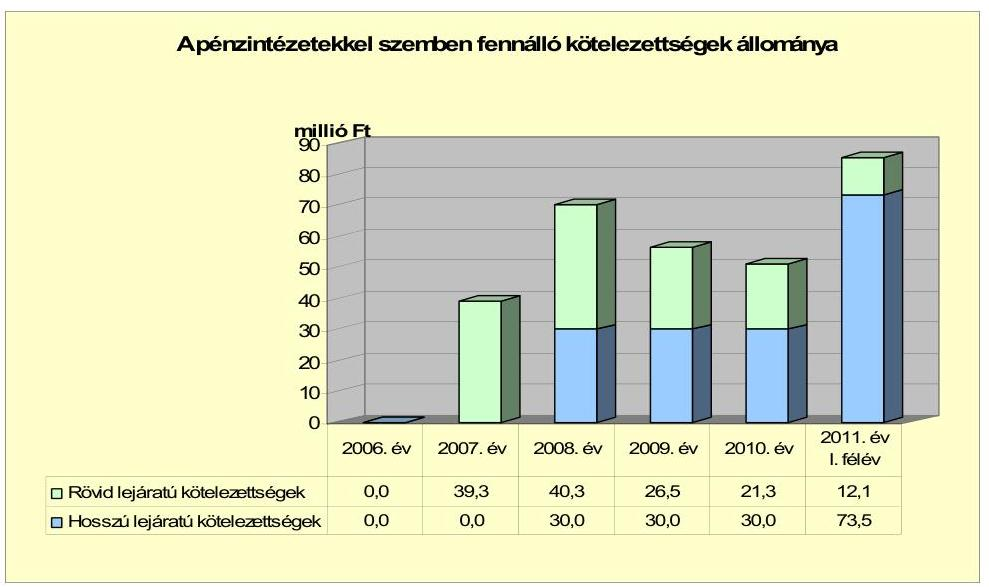

Az Önkormányzat pénzintézettel szemben fennálló kötelezettsége a 2008. évben 70,3 millió Ft volt, a kerékpárút beruházáshoz kapcsolódó hosszú lejáratú hitel felvétele, valamint a folyószámlahitel állományának emelkedése miatt, majd a 2010. év végére 51,3 millió Ft-ra csökkent. A Járóbeteg Szakrendelő beruházáshoz felvett újabb hitel következtében a kötelezettség állomány a 2011. év I. félév végére 85,6 millió Ft-ra nőtt. A pénzintézetekkel szemben fennálló kötelezettség állomány összetétele 2007-2010 között fokozatosan eltolódott a hosszú lejáratú hitelek felé. A hosszú lejáratú hitelek aránya az összes fennálló pénzintézeti kötelezettségen belül 2010. december 31-én 58,5\%, míg 2011. június 30-án $85,9 \%$ volt. A folyószámla- és munkabérmegelőlegezési hitelből, valamint az egyéb likvid hitelből álló rövid lejáratú kötelezettségek állományának aránya ezzel párhuzamosan csökkent, 2010. december 31-én $41,5 \%$ volt, majd 2011. június 30-ára $14,1 \%$-ra esett vissza.

Az Önkormányzat pénzintézettel szembeni kötelezettségvállalásaira minden esetben képviselő-testületi döntés alapján, a pénzintézeti szolgáltatások versenyeztetésével került sor. A Képviselő-testület döntéseit megalapozó előterjesztésekben meghatározták a hitelfelvételek célját, azonban nem tartalmazták az előterjesztések a kötelezettségvállalás visszafizetésének forrásszükségletét és annak évenkénti bontását, illetve a teljes futamidő várható kamat- és tőkefizetési kötelezettségeinek a bemutatását. A képviselő-testületi előterjesztésekben nem tértek ki az adósságszolgálati korlát bemutatására. Az Önkormányzat az adósságot keletkeztető kötelezettségvállalás felső határát a 2008-2010. években nem lépte túl. Az Ötv. 88. § (2) bekezdése alapján meghatározott felső határ a 2007. évben 55,7 millió Ft, a 2008. évben 37,9 millió Ft, a 2009. évben 66,6 millió Ft, majd a 2010. évben 82,7 millió Ft volt ${ }^{30}$. Az Önkormányzat a hiteleket a számlavezető pénzintézettől vette fel.

A vizsgált időszakban az Önkormányzat kötvénykibocsátásról nem döntött. A 2007-2010. évekre vonatkozó gazdasági programban szereplő fejleszté-

[^0]
[^0]:    ${ }^{30}$ Az Ötv. 88. § (2) bekezdését 2012. január 1-jétől a Magyarország helyi önkormányzatairól szóló 2011. évi CLXXXIX. törvény hatályon kívül helyezte.

---

sek megvalósításához kettő alkalommal vett igénybe fejlesztési célú hosszú lejáratú hitelt. Az Önkormányzat 2011. június 30-án forintban fennálló adósságot keletkeztető pénzintézettel szembeni kötelezettségvállalásai a következők voltak:

| Megnevezés | Szerződéskötés/   Kibocsátás   időpontja | Összeg   millió HUF-ban | Kamat (referencia   kamat+ kamatfelár) | Felhasználás célja: |
| :-- | :--: | :--: | :--: | :--: |
| Járóbeteg Szakrendelő Központ   "Sikeres Magyarországért" ÖKIF   Hitelprogram keretében | 2011.02.17 | 43,5 | 3 havi EURIBOR +   MFB kamatfelár + OTP   kamatfelár 1,5\% | Dunavecse Városi Járóbeteg Szakrendelő   Központ komplex kistérségi járóbeteg ellátási   rendszerré fejlesztése c. projekthez szükséges   önrész biztosítása |
| EuroVelo Kerékpárút nyomvonal   dunavecsei szakaszának   építése a "Sikeres   Magyarországért" ÖKIF   Hitelprogram keretében | 2008.09.18 | 30,0 | 3 havi EURIBOR +   $3,5 \%$ | EuroVelo Kerékpárút nyomvonal dunavecsei   szakaszának építése |

A forintban fennálló hosszú lejáratú kötelezettségeiből az Önkormányzat a 2011. év I. félév végéig 4,4 millió Ft összegű kamatot fizetett meg, egyéb költsége nem merült fel. A 2011. június 30-ig tőketörlesztési kötelezettsége nem jelentkezett. Az Önkormányzat a hiteleket - a hitelcéloknak megfelelően - az alábbi fejlesztési feladatai finanszírozására használja fel:

- A Képviselő-testület döntése alapján a 2008. évben - GKM által meghirdetett pályázaton - az Önkormányzat 100,0 millió Ft támogatásban részesült, az EuroVelo kerékpárút dunavecsei szakaszának kiépítéséhez. Az Önkormányzat a beruházás saját forrás szükségletének biztosítására 30,0 millió Ft összegű hosszú lejáratú fejlesztési hitelt - három éves fizetési moratórium mellett - 20 év futamidőre vette igénybe. A tőketörlesztés a 2011. év III. negyedévtől vált esedékessé (negyedévente 0,5 millió Ft összegben) 2028-ig bezárólag.
- A Képviselő-testület döntése alapján a 2011. évben folyósításra kerülő 76,6 millió Ft összegű hosszú lejáratú fejlesztési hitelt a Járóbeteg Szakrendelő beruházásra vonatkozó DAOP-4.1.1/B-2008-0002 azonosítószámú projekt megvalósítására fordítja. A hitelt az Önkormányzat kettő éves fizetési moratórium mellett 19 év futamidőre vette igénybe. A hitelből a 2011. év I. félév végéig 43,5 millió Ft lehívás történt. A tőketörlesztés 2013-tól jelent kötelezettséget az Önkormányzat számára (negyedévente 1,1 millió Ft összegben) 2030-ig.

Az Önkormányzat működésének pénzügyi egyensúlyát, valamint felhalmozási forráshiányának fedezetét a vizsgált időszakban folyószámla-, munkabér-megelőlegezési- és egyéb likvid hitelek igénybevételével tudta biztosítani, amelyek azonban nem kifejezetten felhalmozási célú kiadások finanszírozását biztosító pénzintézeti eszközök. A folyószámla- és a munkabérmegelőlegezési hitelek jellemző adatait évenként az alábbi táblázat mutatja be:

|  |  |  |  |  |  |
| :-- | --: | --: | --: | --: | --: |
| Megnevezés | 2007. év | 2008. év | 2009. év | 2010. év | 2011. év   I. félév |
| I. Folyószámlatétel |  |  |  |  |  |
| a folyószámlatétel keretösszege január 1-jén | 15,0 | 20,0 | 30,0 | 45,0 | 30,0 |
| teljesített kamat és egyéb költség | 1,4 | 3,9 | 6,4 | 3,4 | 2,0 |
| II. Munkabér megelőlegezési hitel |  |  |  |  |  |
| igénybevett hitel összesen | 109,2 | 141,1 | 135,7 | 131,7 | 65,4 |
| teljesített kamat és egyéb költség | 1,0 | 1,2 | 1,2 | 0,9 | 0,5 |

---

A folyószámlahitel keretösszege a 2007-2010. évek között folyamatosan emelkedett. Az Önkormányzat 2007. január 1-jén fennálló 15,0 millió Ft összegű folyószámla hitelkeretét számlavezető bankjánál 2007. december 3-tól 20,0 millió Ft-ra emelte változatlan kondíciók mellett. A hitelkeretet ezt követően ismét növelte, a 2008. év végén 30,0 millió Ft-ra, majd a 2009. évben 45,0 millió Ft-ra, amely 1,7\%-os kamatemelkedéssel járt. Az Önkormányzat a 2010. évben a hitelkeretet változatlan kamatkondíció mellett 30,0 millió Ft-ra csökkentette, majd ezt követően a 2010. szeptember 30-i szerződéskötés értelmében a kamatkondíció kettő százalékponttal csökkent. Mindemellett a tárgyévi pénzforgalmi kiadások finanszírozásához szükséges további forrás nagyságát mutató év végi folyószámlahitel állomány a 2007. évben 19,9 millió Ft, a 2008. évben 28,7 millió Ft volt, majd ezt követően a 2009. évben 26,5 millió Ft-ra, illetve a 2010. évben 21,3 millió Ft-ra csökkent. A folyószámlahitel fordulónapja évközi időpontra esett, az Önkormányzatnak a 2007. évben a fordulónapon nem állt fent tartozása, míg a 2008-2010. években a folyószámlahitel igénybevétele tartóssá vált ${ }^{31}$, a visszafizetést csak könyveléstechnikailag rendezték.

A folyószámla-, munkabér-megelőlegezési- valamint a rövid lejáratú hitelek kamatkondíciói és egyéb költségei az alábbiak voltak ${ }^{32}$:

| Megnevezés | Kamat (referencia+ kamatfelár) | Egyéb költség |
| :--: | :--: | :--: |
| Folyószámlahitel |  |  |
| 2007-2008. év | 3 havi BUBOR $+2 \%$ | hitel kezelési díj $0,5 \%$; rend.tart. jutalék 1\% |
| 2008-2009. év | 3 havi BUBOR $+3,7 \%$ | hitel kezelési díj $0,5 \%$; rend.tart. jutalék 1\% |
| 2009-2010. év | 1 havi BUBOR $+3,7 \%$ | hitel kezelési díj $0,5 \%$; rend.tart. jutalék 1\% |
| 2010-2011. év | 1 havi BUBOR $+3,5 \%$ | hitel kezelési díj $0,5 \%$; rend.tart. jutalék 1\% |
| Munkabér megelőlegezési hitel |  |  |
| 2007. év | 3 havi BUBOR $+2 \%$ | 0 |
| 2008. év | 3 havi BUBOR $+3,7 \%$ | 0 |
| 2009. év | 1 havi BUBOR $+3,7 \%$ | 0 |
| 2010. év | 1 havi BUBOR $+3,5 \%$ | 0 |
| 2011. év | 1 havi BUBOR $+3,5 \%$ | 0 |
| Rövid lejáratú hitel |  |  |
| 2007-2008. év | 3 havi BUBOR $+2 \%$ | hitel kezelési díj $0,5 \%$ |

A folyamatos és tartós likviditási problémák miatt az Önkormányzat 2007-től a munkabérek kifizetéséhez havonta munkabér-megelőlegezési hitelt vett igénybe, amelynek kerete 2007-ben 13,2 millió Ft volt, amely a 2010. évre 14,9 millió Ft-ra növekedett, majd a 2011. évben 12,1 millió Ft-ra csökkent. Az Önkormányzat a 2008-2009. években valamint a 2011. év I. félévében az év minden napján rendelkezett munkabér-megelőlegezési hitellel, míg a 2007. és a 2010. években 334 nap volt a munkabér megelőlegezési hitellel zárt napok száma. Az Önkormányzat a 2007. évben átlagosan napi 9,9 millió Ft, a 2008. évben 11,8 millió Ft, 2009-ben 11,3 millió Ft, majd 2010-ben átlagosan napi

[^0]
[^0]:    ${ }^{31}$ A fordulónapon fennálló tartozás a 2008. évben 19,8 millió Ft, a 2009. évben 44,8 millió Ft, a 2010. évben 16,7 millió Ft volt.
    ${ }^{32}$ A referencia kamatok az alábbiak voltak:

    | MNB BUBOR (bázis (alap)kamat) \%-ben |  |  |  |  |
    | :--: | :--: | :--: | :--: | :--: |
    | Referencia kamat | 2007. év | 2008. év | 2009. év | 2010. év | 2011. év   8 - 10 - 11 - 12 - 13 - 14 - 15 - 16 |
    | 1 havi BUBOR | 7,83 | 8,75 | 8,66 | 5,47 | 6,00 |  |
    | 3 havi BUBOR | 7,75 | 8,87 | 8,64 | 5,50 | 6,07 |

---

11,0 millió Ft munkabér megelőlegezési hitelt vett igénybe. A hitellel zárt napok alapján számított átlagos napi állomány, a 2007. évben 10,8 millió Ft, a 2008. évben 11,8 millió Ft, a 2009. évben 11,3 millió Ft és a 2010. évben 12,0 millió Ft volt. Kamat címén a munkabér megelőlegezési hitel után 2007-2010 között összesen 4,8 millió Ft-ot fizetett ki.

Az Önkormányzat a 2006. évi állami támogatás elszámolásából adódó visszafizetési kötelezettségét a 2007. évben felvett éven belüli rövid lejáratú 25,0 millió Ft összegű hitellel teljesítette, amelynek törlesztésére 2008. március 28-ig három havonta, négy egyenlő részletben került sor. Kamat és egyéb költség címén összesen 1,4 millió Ft kötelezettség keletkezett.

Az Önkormányzat által a vizsgált időszakban igénybevett hitelek közül valamennyi esetében módosult a kamatfizetési kötelezettség, melyet az alábbi táblázat mutat be:

| Megnevezés | Kibocsátási, lehívási \| Utolsó fizetéskori   kamat (referencia + kamatfelár) $\%$ | Változás $\%$ |
| :-- | :--: | :--: |
| Rövid lejáratú hitel |  |  |
| 2 havi bubor + 2 \% (2007. április 26-i szerződéskötés) | 9,82 | 10,17 |
| Hosszú lejáratú hitel |  |  |
| 3 havi EURIBOR (2008. 09. 18-i szerződéskötés; kerékpárút) | 4,991 | 3,6\% |
| 3 havi EURIBOR (2011. 02. 17-i szerződéskötés; szakrendelő) | 1,86 | 1,531 |

A hosszú lejáratú hitelek esetében a 2008. évben felvett hitel kamata 5\%-ról -$69,3 \%$-kal - a 2011. évre $1,5 \%$-ra csökkent, a 2011. évben felvett hitel kamatcsökkenése $16,8 \%$-os volt. A kedvező kamatváltozás következtében az Önkormányzat fizetési kötelezettsége várhatóan az eredeti szerződésben rögzített feltételekhez képest csökken.

Az Önkormányzat kötelezettségeinek 2010. december 31-i és 2011. június 30-i állományát és várható alakulását az alábbi táblázat szemlélteti:

| Megnevezés | Állomány   2010. december   31-én | Állomány  
 2011. június 30-án | Várható   kötelezettség   a 2011-2013.   években | Várható   kötelezettség   a 2014. évtől |
| :--: | :--: | :--: | :--: | :--: |
|  | HUF-ban   (millió Ft-ban) | HUF-ban   (millió Ft-ban) | HUF-ban   (millió Ft-ban) | HUF-ban   (millió Ft-ban) |
| Pénzintézeti kötelezettségek |  |  |  |  |
| Folyószámlatétel | 21,3 | 12,1 | 12,1 |  |
| Hosszú lejáratú hitel | 30,0 | 73,5 | 19,4 | 144,8 |
| Pénzintézeti kötelezettségek összesen HUF-ban. | 51,3 | 65,6 | 31,5 | 144,8 |
| Szállítói tartozás | 11,6 | 11,1 | - |  |

A 2010. december 31-én fennálló összes (pénzintézeti és szállítói) kötelezettség állomány nagysága 62,9 millió Ft, amely a 2011. év I. félévében 96,7 millió Ft-ra nőtt. Az Önkormányzatnak 2011-2013. években 31,5 millió Ft, illetve a 2014. évtől kezdődő időszakban 144,6 millió Ft tőketörlesztési és kamatfizetési kötelezettsége keletkezik. A 2011-2013. években várható kötelezettség teljesítésére figyelembe vehető 21,0 millió Ft mérlegben kimutatott követelésállomány, továbbá a jelzáloggal nem terhelt forgalomképes ingatlanvagyon. A jelenlegi ismeretek szerint a 2014. évtől követően várható pénzintézeti kötelezettség 144,6 millió Ft, amelynek forrás szükségletét nem számszerűsítette az Önkormányzat. A vizsgálattal érintett években csak az aktuális, az adott költségvetési évben teljesítendő adósságszolgálattal számoltak.

---

# 3.2. A szállítói kötelezettségek változása 

Az Önkormányzat szállítókkal szemben fennálló kötelezettségeinek állománya a könyvviteli mérleg adatai alapján 2007-2010 között - a 2008. év kivételével - folyamatosan csökkent, a 2007. év végi 19,1 millió Ft-ról a 2010. év végére 11,6 millió Ft-ra. A szállítókkal szemben fennálló kötelezettségekből a lejárt szállítói tartozás a 2007. évben még 8,0 millió Ft, a 2010. év végén 0,1 millió Ft volt. A szállítókkal szemben fennálló kötelezettség állomány 2011. június 30-án 11,1 millió Ft volt, amelyből átütemezett, illetve lejárt szállítói tartozása nem volt. Az Önkormányzatnak a 2009. évtől kezdődően csak 30 nap alatti lejárt szállítói tartozása volt. A lejárt szállítói állomány a 2008. évben volt a legmagasabb ( 5,6 millió Ft), amelyből 65,7\%-os részarányt ( 3,7 millió Ft-ot) képviselt a 30 nap alatti, $25,7 \%$-os részarányt ( 1,4 millió Ft-ot) a 31 és 60 nap közötti, $3,4 \%$-os részarányt ( 0,2 millió Ft-ot) a 61 és 90 nap közötti, illetőleg $5,2 \%$-os részarányt ( 0,3 millió Ft-ot) a 90 és 365 nap közötti lejárt szállítói tartozás. A vizsgált időszakban egyéb kiadási elmaradás az Önkormányzatnál nem jelentkezett.

### 3.3. Egyéb kötelezettségek változása

Az Önkormányzatnak a vizsgált időszakban lízingszerződésből, garancia- és kezességvállalásból eredő kötelezettsége nem volt. Az Önkormányzat PPP konstrukció ${ }^{33}$ keretében nem végzett beruházást. Az Önkormányzat 2007-2010 között bérleti díjból, bírságból, helyi adókból és pótlékokból, étkezési térítési díjakból, gondozási díjakból, lakbérekből és továbbszámlázott szolgáltatásokból eredő követeléseket nem engedett el. A Képviselő-testület a vagyongazdálkodási rendeletben nem döntött a behajthatatlan követelések elengedéséről, valamint az elengedett követelésekkel kapcsolatos eljárási rendet a jegyző számviteli politikában nem szabályozta. Az Önkormányzat a vizsgált időszakban intézménynek, más önkormányzatnak, civil szervezetnek, egyéb államháztartáson belüli és kívüli szervezetnek nem nyújtott kölcsönt. A gazdasági társaságok részére tagi és egyéb kölcsönt nem adott, illetőleg gazdasági társágoktól kölcsönt nem kapott.

Az Önkormányzat tulajdonában lévő forgalomképes ingatlanok közül a 2. és 801. helyrajzi számú belterületi ingatlanokra a 2011. évben történt jelzálogjog bejegyzés összesen 150,0 millió Ft értékben, amely a Járóbeteg Szakrendelő beruházáshoz felvett hitel fedezetéül szolgált.

A jelzálogjoggal terhelt ingatlanok nyilvántartott nettó értéke 2010. december 31-én 7,2 millió Ft, becsült értéke 130,0 millió Ft volt. Az Önkormányzat összes forgalomképes ingatlanainak könyvszerinti nettó értéke 33,1 millió Ft, a korlátozottan forgalomképes ingatlanoké 355,7 millió Ft volt 2010. december 31-én.

A forgalomképes ingatlanok nettó értékének megoszlását a jelzáloggal terhelt és nem terhelt ingatlanok között a 2010. december 31-i állapot szerint a következő ábra szemlélteti:

[^0]
[^0]:    ${ }^{33}$ Public Private Partnership (Partnerségi együttműködés közfeladatok ellátására a magánszektor bevonásával)

---

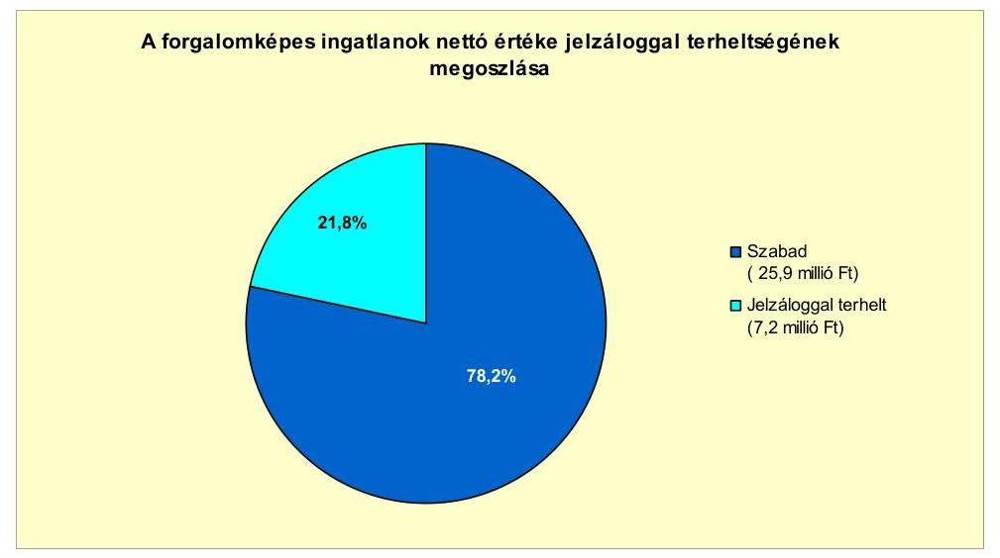

Az Önkormányzat jelenleg egy folyamatban lévő peres eljárásban érintett alperesként. Az Önkormányzat terhére kimutatott perérték 4,7 millió Ft, amely egy a kunszentmiklósi Okmányiroda dunavecsei kihelyezett alirodájában dolgozó köztisztviselő jogviszonyának megszüntetésével kapcsolatos munkaügyi perből ered. A peres eljáráshoz kapcsolódó kötelezettség az Önkormányzat pénzügyi egyensúlyi helyzetének alakulására nem jelent kockázatot.

Az eszközök használhatósága is hatást gyakorol az Önkormányzat pénzügyi egyensúlyi helyzetére. Az Önkormányzat a 2007-2010. években a tárgyi eszközök után 154,6 millió Ft összegű értékcsökkenést mutatott ki. Az Önkormányzat 154,3 millió Ft-ot fordított felújításra. Az elhasználódott eszközök pótlását költségvetési előirányzatból, hazai és EU-s támogatásból, illetőleg a beruházásokhoz kapcsolódó hosszú lejáratú hitelfelvételből biztosította. Az eszközök avultsága növekedett, mivel az önkormányzati szintű használhatósági fok mutató aránya 4,9 százalékponttal - a 2007. évi 80,5\%-ról a 2010. évre 75,6\%-ra - csökkent. Az eszközökön belül az ingatlanok használhatósági foka az átlagnál kedvezőbb, $83,3 \%$-os volt, míg az immateriális javak ( $7,1 \%$ ), gépek berendezések (65\%), járművek ( $12,1 \%$ ) és az üzemeltetésre, vagyonkezelésre átadott eszközök használhatósági foka (28\%) elmaradt az átlagtól.

# 4. A PÉNZÜGYI EGYENSÚLY MEGTEREMTÉSE ÉRDEKÉBEN HOZOTT INTÉZKEDÉSEK EREDMÉNYE 

A Képviselő-testület 2007-2010 között a gazdasági programban, valamint az éves költségvetési koncepciókban jelölte meg a kiadáscsökkentést és bevételnövelést szolgáló feladatokat. A beavatkozás területeire szóló intézkedések hatását azonban nem számszerűsítették. Az intézkedésekről hozott döntések célja a gazdálkodás - a feladatellátás szakmai színvonalának megőrzése mellett - átláthatóbbá tétele és a pénzügyi egyensúlyi helyzet javítása volt.

Az Önkormányzat a 2007. év és 2011. június 30. között - az Önkormányzat adatszolgáltatása alapján - 41,7 millió Ft kiadáscsökkentő intézkedést hozott, amelyből 6,7 millió Ft (16,1\%) az önként vállalt feladatokhoz kapcsolódott. A vizsgált időszakban megvalósított létszámcsökkentés összesen 20,8 mil-

---

lió Ft-tal, a többletjuttatások (cafetéria elemek) 8,2 millió Ft-tal és a képviselői tiszteletdíjak csökkentése 1,0 millió Ft-tal, míg az étkeztetés közbeszerzése 2,8 millió Ft-tal járult hozzá a kiadási megtakarításhoz. További 8,9 millió Ft-os kiadási megtakarítást értek el a vizsgált időszakban a vásárolt közszolgáltatások kiszervezésével. A karbantartási feladatok külső vállalkozással való ellátása 2,6 millió Ft, a belterületi utak pormentesítése és útalappal történő ellátása, valamint a térfigyelő rendszer beszerzéséhez kapcsolódó közbeszerzés és az ügyeleti ellátás kiszervezése együttesen 6,3 millió Ft kiadási megtakarítást eredményezett.

A 2007. év és a 2011. év I. félév közötti időszak kiadáscsökkentő intézkedéseinek számszerűsített eredményeit az Önkormányzat kimutatása alapján beavatkozási területenként - az alábbi grafikon mutatja:
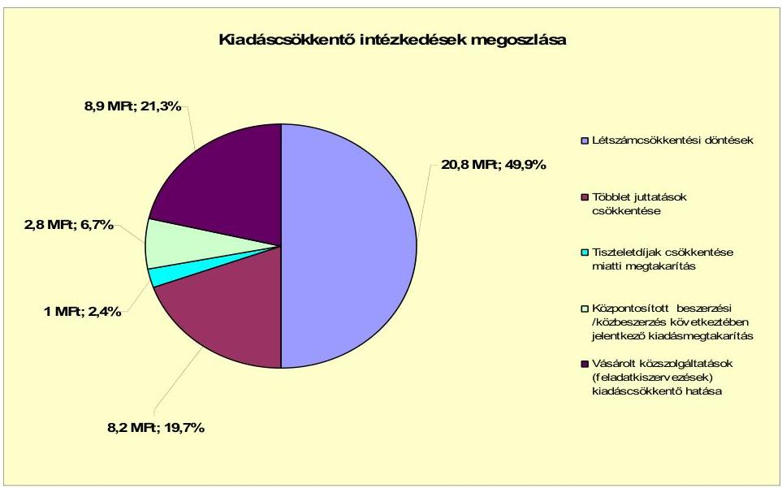

A létszámgazdálkodással összefüggő intézkedések következtében 2007-2010 között az Önkormányzat intézményeinél és a Polgármesteri hivatalban a Képviselő-testület összesen 36 álláshely megszüntetésétől döntött. Valamennyi megszüntetett álláshely ágazati, szakmai feladatok ellátásához kapcsolódott. A 2007-2010. években az álláshely- és létszámváltozás adatait az alábbi táblázat szemlélteti:

| Megnevezés (adatok fő-ben) |  | Közoktatás | Szociális és gyermekvédelem | Egészségügy | Polgármesteri hivatal | Egyéb | Összesen |
| :--: | :--: | :--: | :--: | :--: | :--: | :--: | :--: |
| 2007. január 1-án jóváhagyott álláshelyek száma |  | 55 | 20 | 37 | 18 | 17 | 147 |
| Megszüntetett álláshelyek száma |  | 5 | 20 | 6 | 0 | 5 | 36 |
| ebből üres álláshelyek száma |  | 0 | 0 | 0 | 0 | 0 | 0 |
|  | szakmai álláshelyek száma | 5 | 20 | 6 | 0 | 5 | 36 |
|  | intézmény-üzemeltetéssel kapcsolatos álláshelyek száma | 0 | 0 | 0 | 0 | 0 | 0 |
| Álláshely növekedése |  |  |  | 1 | 1 |  | 2 |
| 2010. december 31-én záró álláshelyek száma |  | 50 | 0 | 32 | 19 | 12 | 113 |
| 2007. január 1-án foglalkoztatott létszám |  | 55 | 20 | 33 | 19 | 17 | 144 |
| Létszámcsökkentés |  | 5 | 20 | 6 | 0 | 5 | 36 |
| Létszámnövekedés |  | 0 | 0 | 0 | 0 | 0 | 0 |
| 2010. december 31-én foglalkoztatott létszám |  | 50 | 0 | 27 | 19 | 12 | 108 |

A feladatmegszüntetéssel és átszervezéssel járó létszámcsökkentés a 2007-2010. évek között 18,4 millió Ft megtakarítást eredményezett. A létszámcsökkentés a közoktatás, a szociális- és gyermekvédelem, az egészségügy valamint az egyéb,

---

nem igazgatási területeket érintette. Az Önkormányzat a létszámcsökkentés végrehajtásához központosított támogatást nem vett igénybe. A létszámcsökkentést a nyugdíjba vonuló közalkalmazottak álláshelyeinek megszüntetésével valósították meg, illetőleg 17 álláshely megszüntetése a 2008. év végén Kistérségi társulás működtetésébe kerülő Szociális és Gyermekjóléti Intézmény átadásához kapcsolódott. További 2,4 millió Ft-os megtakarítást értek el a 2011. év I. félévében a Polgármesteri hivatalnál nyugdíjba vonuló köztisztviselők és közalkalmazottak álláshelyeinek zárolásával. Az egészségügy területén és a Polgármesteri hivatalnál az álláshelyek számának egy-egy fővel történő növeléséről döntöttek.

A Képviselő-testület 2007-2011. június 30. között - az Önkormányzat adatszolgáltatása alapján - 54,1 millió Ft bevételnövelő intézkedést hozott. Az intézkedések 80,4\%-a a helyi adó bevételek növeléséhez, 19,6\%-a az eszközök hasznosításához kapcsolódott. A helyi adók növelése érdekében a Képviselőtestület a magánszemélyek kommunális adójának 2009. január 1-jétől történő kivetéséről döntött. A helyi iparűzési adót a korábbi 1,9\%-ról a törvényi maximális mértékre emelték. A vizsgált időszakban az Önkormányzat hét ingatlan, kettő gépjármű, valamint 0,4 millió Ft értékben nyilvántartott berendezések és egyéb eszközök értékesítéséről határozott.

Az Önkormányzat adatszolgáltatása alapján a bevételnövelésre irányuló intézkedéseinek eredményét a 2007. év és a 2011. év I. félév között eltelt időszak alatt az alábbi ábra szemlélteti:
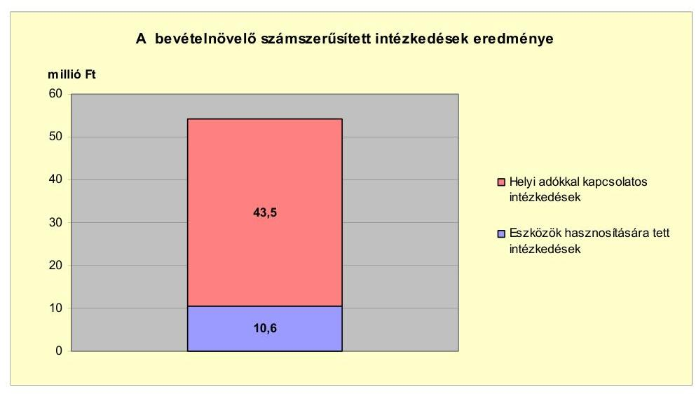

A kiadáscsökkentő és bevételnövelő intézkedések a vizsgált időszakban az Önkormányzat adatszolgáltatása szerint pénzügyi egyensúlyi helyzetét 95,8 millió Ft-tal javították, együttes hatásukkal szemben a központi támogatásokból eredő - ugyanazon időszakra vonatkozó - 2,0 millió Ft összegű bevételkiesés nem volt számottevő. Az Önkormányzat pénzügyi lehetőségei ezáltal javultak, azonban a megtakarítással a helyi adóbevételek a 2007. év és a 2011. év I. félév között bekövetkezett kiesését kellett kompenzálniuk.

---

# 5. Az ÁSZ által a korábbi években a PÉNZÜGYI EGYENSÚLY JAVÍTÁSÁRA TETT SZABÁLYSZERŰSÉGI ÉS CÉLSZERŰSÉGI JAVASLATOK HASZNOSULÁSA 

Az ÁSZ az Önkormányzat gazdálkodási rendszerét a 2008. évben ellenőrizte, amely során a pénzügyi egyensúlyi helyzetre vonatkozóan a jegyző részére egy szabályszerűségi javaslatot tett. A javaslat megvalósítására felelős és határidő megjelölésével a Képviselő-testület által elfogadott intézkedési tervet készítettek. A javaslatban foglaltaknak eleget téve és az intézkedési tervben előírtaknak megfelelően a polgármester - a 2009. évtől - az éves költségvetési rendeletekben a költségvetési bevételek és kiadások főösszegét finanszírozási célú pénzügyi műveletek nélkül terjesztette a Képviselő-testület elé.

Budapest, 2012. április 05.

Melléklet: $\quad 6 \mathrm{db}$
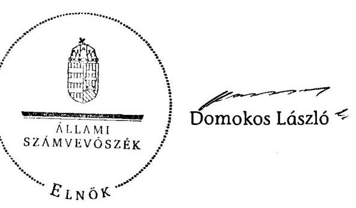

---

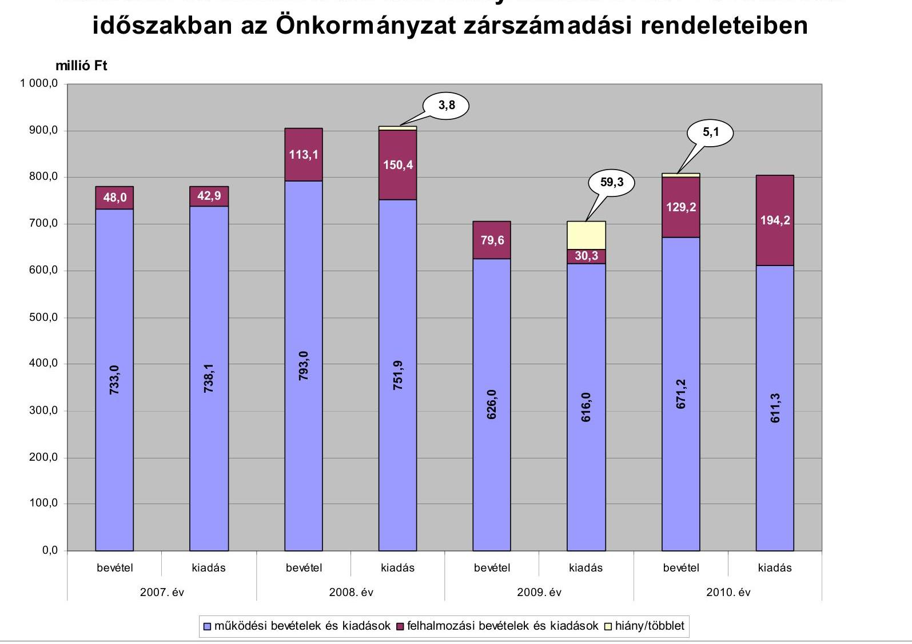

# **Működési és felhalmozási célú hiány/többlet a 2007-2010 közötti időszakban az Önkormányzat zárszámadási rendeleteiben**

|  Ellapít | 2007. év | 2008. év | 2009. év | 2010. év  |
| --- | --- | --- | --- | --- |
|  működési bevételek és kiadások | 46,9 | 42,9 | 73,0 | 75,0  |
|  felhalmozási bevételek és kiadások | 42,9 | 42,9 | 73,0 | 75,0  |
|  felhalmozási bevételek és kiadások | 42,9 | 42,9 | 73,0 | 75,0  |
|  működési bevételek és kiadások | 42,9 | 42,9 | 73,0 | 75,0  |
|  felhalmozási bevételek és kiadások | 42,9 | 42,9 | 73,0 | 75,0  |
|  működési bevételek és kiadások | 42,9 | 42,9 | 73,0 | 75,0  |
|  felhalmozási bevételek és kiadások | 42,9 | 42,9 | 73,0 | 75,0  |
|  működési bevételek és kiadások | 42,9 | 42,9 | 73,0 | 75,0  |
|  felhalmozási bevételek és kiadások | 42,9 | 42,9 | 73,0 | 75,0  |
|  működési bevételek és kiadások | 42,9 | 42,9 | 73,0 | 75,0  |
|  felhalmozási bevételek és kiadások | 42,9 | 42,9 | 73,0 | 75,0  |
|  működési bevételek és kiadások | 42,9 | 42,9 | 73,0 | 75,0  |
|  felhalmozási bevételek és kiadások | 42,9 | 42,9 | 73,0 | 75,0  |
|  működési bevételek és kiadások | 42,9 | 42,9 | 73,0 | 75,0  |
|  felhalmozási bevételek és kiadások | 42,9 | 42,9 | 73,0 | 75,0  |
|  működési bevételek és kiadások | 42,9 | 42,9 | 73,0 | 75,0  |
|  felhalmozási bevételek és kiadások | 42,9 | 42,9 | 73,0 | 75,0  |
|  működési bevételek és kiadások | 42,9 | 42,9 | 73,0 | 75,0  |
|  felhalmozási bevételek és kiadások | 42,9 | 42,9 | 73,0 | 75,0  |
|  működési bevételek és kiadások | 42,9 | 42,9 | 73,0 | 75,0  |
|  felhalmozási bevételek és kiadások | 42,9 | 42,9 | 73,0 | 75,0  |
|  működési bevételek és kiadások | 42,9 | 42,9 | 73,0 | 75,0  |
|  felhalmozási bevételek és kiadások | 42,9 | 42,9 | 73,0 | 75,0  |
|  működési bevételek és kiadások | 42,9 | 42,9 | 73,0 | 75,0  |
|  felhalmozási bevételek és kiadások | 42,9 | 42,9 | 73,0 | 75,0  |
|  működési bevételek és kiadások | 42,9 | 42,9 | 73,0 | 75,0  |
|  felhalmozási bevételek és kiadások | 42,9 | 42,9 | 73,0 | 75,0  |
|  működési bevételek és kiadások | 42,9 | 42,9 | 73,0 | 75,0  |
|  felhalmozási bevételek és kiadások | 42,9 | 42,9 | 73,0 | 75,0  |
|  működési bevételek és kiadások | 42,9 | 42,9 | 73,0 | 75,0  |
|  felhalmozási bevételek és kiadások | 42,9 | 42,9 | 73,0 | 75,0  |
|  működési bevételek és kiadások | 42,9 | 42,9 | 73,0 | 75,0  |
|  felhalmozási bevételek és kiadások | 42,9 | 42,9 | 73,0 | 75,0  |
|  működési bevételek és kiadások | 42,9 | 42,9 | 73,0 | 75,0  |
|  felhalmozási bevételek és kiadások | 42,9 | 42,9 | 73,0 | 75,0  |
|  működési bevételek és kiadások | 42,9 | 42,9 | 73,0 | 75,0  |
|  felhalmozási bevételek és kiadások | 42,9 | 42,9 | 73,0 | 75,0  |
|  működési bevételek és kiadások | 42,9 | 42,9 | 73,0 | 75,0  |
|  felhalmozási bevételek és kiadások | 42,9 | 42,9 | 73,0 | 75,0  |
|  működési bevételek és kiadások | 42,9 | 42,9 | 73,0 | 75,0  |
|  felhalmozási bevételek és kiadások | 42,9 | 42,9 | 73,0 | 75,0  |
|  működési bevételek és kiadások | 42,9 | 42,9 | 73,0 | 75,0  |
|  felhalmozási bevételek és kiadások | 42,9 | 42,9 | 73,0 | 75,0  |
|  működési bevételek és kiadások | 42,9 | 42,9 | 73,0 | 75,0  |
|  felhalmozási bevételek és kiadások | 42,9 | 42,9 | 73,0 | 75,0  |
|  működési bevételek és kiadások | 42,9 | 42,9 | 73,0 | 75,0  |
|  felhalmozási bevételek és kiadások | 42,9 | 42,9 | 73,0 | 75,0  |
|  működési bevételek és kiadások | 42,9 | 42,9 | 73,0 | 75,0  |
|  felhalmozási bevételek és kiadások | 42,9 | 42,9 | 73,0 | 75,0  |
|  működési bevételek és kiadások | 42,9 | 42,9 | 73,0 | 75,0  |
|  felhalmozási bevételek és kiadások | 42,9 | 42,9 | 73,0 | 75,0  |
|  működési bevételek és kiadások | 42,9 | 42,9 | 73,0 | 75,0  |
|  felhalmozási bevételek és kiadások | 42,9 | 42,9 | 73,0 | 75,0  |
|  működési bevételek és kiadások | 42,9 | 42,9 | 73,0 | 75,0  |
|  felhalmozási bevételek és kiadások | 42,9 | 42,9 | 73,0 | 75,0  |
|  működési bevételek és kiadások | 42,9 | 42,9 | 73,0 | 75,0  |
|  felhalmozási bevételek és kiadások | 42,9 | 42,9 | 73,0 | 75,0  |
|  működési bevételek és kiadások | 42,9 | 42,9 | 73,0 | 75,0  |
|  felhalmozási bevételek és kiadások | 42,9 | 42,9 | 73,0 | 75,0  |
|  működési bevételek és kiadások | 42,9 | 42,9 | 73,0 | 75,0  |
|  felhalmozási bevételek és kiadások | 42,9 | 42,9 | 73,0 | 75,0  |
|  működési bevételek és kiadások | 42,9 | 42,9 | 73,0 | 75,0  |
|  felhalmozási bevételek és kiadások | 42,9 | 42,9 | 73,0 | 75,0  |
|  működési bevételek és kiadások | 42,9 | 42,9 | 73,0 | 75,0  |
|  felhalmozási bevételek és kiadások | 42,9 | 42,9 | 73,0 | 75,0  |
|  működési bevételek és kiadások | 42,9 | 42,9 | 73,0 | 75,0  |
|  felhalmozási bevételek és kiadások | 42,9 | 42,9 | 73,0 | 75,0  |
|  működési bevételek és kiadások | 42,9 | 42,9 | 73,0 | 75,0  |
|  felhalmozási bevételek és kiadások | 42,9 | 42,9 | 73,0 | 75,0  |
|  működési bevételek és kiadások | 42,9 | 42,9 | 73,0 | 75,0  |
|  felhalmozási bevételek és kiadások | 42,9 | 42,9 | 73,0 | 75,0  |
|  működési bevételek és kiadások | 42,9 | 42,9 | 73,0 | 75,0  |
|  felhalmozási bevételek és kiadások | 42,9 | 42,9 | 73,0 | 75,0  |
|  működési bevételek és kiadások | 42,9 | 42,9 | 73,0 | 75,0  |
|  felhalmozási bevételek és kiadások | 42,9 | 42,9 | 73,0 | 75,0  |
|  működési bevételek és kiadások | 42,9 | 42,9 | 73,0 | 75,0  |
|  felhalmozási bevételek és kiadások | 42,9 | 42,9 | 73,0 | 75,0  |
|  működési bevételek és kiadások | 42,9 | 42,9 | 73,0 | 75,0  |
|  felhalmozási bevételek és kiadások | 42,9 | 42,9 | 73,0 | 75,0  |
|  működési bevételek és kiadások | 42,9 | 42,9 | 73,0 | 75,0  |
|  felhalmozási bevételek és kiadások | 42,9 | 42,9 | 73,0 | 75,0  |
|  működési bevételek és kiadások | 42,9 | | 42,9 | 73,0 | 75,0 |
| felhalmozási bevételek és kiadások | 42,9 | 42,9 | 73,0 | 75,0 |
| működési bevételek és kiadások | 42,9 | 42,9 | 73,0 | 75,0 |
| felhalmozási bevételek és kiadások | 42,9 | 42,9 | 73,0 | 75,0 |
| működési bevételek és kiadások | 42,9 | 42,9 | 73,0 | 75,0 |
| felhalmozási bevételek és kiadások | 42,9 | 42,9 | 73,0 | 75,0 |
| működési bevételek és kiadások | 42,9 | 42,9 | 73,0 | 75,0 |
| felhalmozási bevételek és kiadások | 42,9 | 42,9 | 73,0 | 75,0 |
| működési bevételek és kiadások | 42,9 | 42,9 | 73,0 | 75,0 |
| felhalmozási bevételek és kiadások | 42,9 | 42,9 | 73,0 | 75,0 |
| működési bevételek és kiadások | 42,9 | 42,9 | 73,0 | 75,0 |
| felhalmozási bevételek és kiadások | 42,9 | 42,9 | 73,0 | 75,0 |
| működési bevételek és kiadások | 42,9 | 42,9 | 73,0 | 75,0 |
| felhalmozási bevételek és kiadások | 42,9 | 42,9 | 73,0 | 75,0 |
| működési bevételek és kiadások | 42,9 | 42,9 | 73,0 | 75,0 |
| felhalmozási bevételek és kiadások | 42,9 | 42,9 | 73,0 | 75,0 |
| működési bevételek és kiadások | 42,9 | 42,9 | 73,0 | 75,0 |
| felhalmozási bevételek és kiadások | 42,9 | 42,9 | 73,0 | 75,0 |
| működési bevételek és kiadások | 42,9 | 42,9 | 73,0 | 75,0 |
| felhalmozási bevételek és kiadások | 42,9 | 42,9 | 73,0 | 75,0 |
| működési bevételek és kiadások | 42,9 | 42,9 | 73,0 | 75,0 |
| felhalmozási bevételek és kiadások | 42,9 | 42,9 | 73,0 | 75,0 |
| működési bevételek és kiadások | 42,9 | 42,9 | 73,0 | 75,0 |
| felhalmozási bevételek és kiadások | 42,9 | 42,9 | 73,0 | 75,0 |
| működési bevételek és kiadások | 42,9 | 42,9 | 73,0 | 75,0 |
| felhalmozási bevételek és kiadások | 42,9 | 42,9 | 73,0 | 75,0 |
| működési bevételek és kiadások | 42,9 | 42,9 | 73,0 | 75,0 |
| felhalmozási bevételek és kiadások | 42,9 | 42,9 | 73,0 | 75,0 |
| működési bevételek és kiadások | 42,9 | 42,9 | 73,0 | 75,0 |
| felhalmozási bevételek és kiadások | 42,9 | 42,9 | 73,0 | 75,0 |
| működési bevételek és kiadások | 42,9 | 42,9 | 73,0 | 75,0 |
| felhalmozási bevételek és kiadások | 42,9 | 42,9 | 73,0 | 75,0 |
| működési bevételek és kiadások | 42,9 | 42,9 | 73,0 | 75,0 |
| felhalmozási bevételek és kiadások | 42,9 | 42,9 | 73,0 | 75,0 |
| működési bevételek és kiadások | 42,9 | 42,9 | 73,0 | 75,0 |
| felhalmozási bevételek és kiadások | 42,9 | 42,9 | 73,0 | 75,0 |
| működési bevételek és kiadások | 42,9 | 42,9 | 73,0 | 75,0 |
| felhalmozási bevételek és kiadások | 42,9 | 42,9 | 73,0 | 75,0 |
| működési bevételek és kiadások | 42,9 | 42,9 | 73,0 | 75,0 |
| felhalmozási bevételek és kiadások | 42,9 | 42,9 | 73,0 | 75,0 |
| működési bevételek és kiadások | 42,9 | 42,9 | 73,0 | 75,0 |
| felhalmozási bevételek és kiadások | 42,9 | 42,9 | 73,0 | 75,0 |
| működési bevételek és kiadások | 42,9 | 42,9 | 73,0 | 75,0 |
| felhalmozási bevételek és kiadások | 42,9 | 42,9 | 73,0 | 75,0 |
| működési bevételek és kiadások | 42,9 | 42,9 | 73,0 | 75,0 |
| felhalmozási bevételek és kiadások | 42,9 | 42,9 | 73,0 | 75,0 |
| működési bevételek és kiadások | 42,9 | 42,9 | 73,0 | 75,0 |
| felhalmozási bevételek és kiadások | 42,9 | 42,9 | 73,0 | 75,0 |
| működési bevételek és kiadások | 42,9 | 42,9 | 73,0 | 75,0 |
| felhalmozási bevételek és kiadások | 42,9 | 42,9 | 73,0 | 75,0 |
| működési bevételek és kiadások | 42,9 | 42,9 | 73,0 | 75,0 |
| felhalmozási bevételek és kiadások | 42,9 | 42,9 | 73,0 | 75,0 |
| működési bevételek és kiadások | 42,9 | 42,9 | 73,0 | 75,0 |
| felhalmozási bevételek és kiadások | 42,9 | 42,9 | 73,0 | 75,0 |
| működési bevételek és kiadások | 42,9 | 42,9 | 73,0 | 75,0 |
| felhalmozási bevételek és kiadások | 42,9 | 42,9 | 73,0 | 75,0 |
| működési bevételek és kiadások | 42,9 | 42,9 | 73,0 | 75,0 |
| felhalmozási bevételek és kiadások | 42,9 | 42,9 | 73,0 | 75,0 |
| működési bevételek és kiadások | 42,9 | 42,9 | 73,0 | 75,0 |
| felhalmozási bevételek és kiadások | 42,9 | 42,9 | 73,0 | 75,0 |
| működési bevételek és kiadások | 42,9 | 42,9 | 73,0 | 75,0 |
| felhalmozási bevételek és kiadások | 42,9 | 42,9 | 73,0 | 75,0 |
| működési bevételek és kiadások | 42,9 | 42,9 | 73,0 | 75,0 |
| felhalmozási bevételek és kiadások | 42,9 | 42,9 | 73,0 | 75,0 |
| működési bevételek és kiadások | 42,9 | 42,9 | 73,0 | 75,0 |
| felhalmozási bevételek és kiadások | 42,9 | 42,9 | 73,0 | 75,0 |
| működési bevételek és kiadások | 42,9 | 42,9 | 73,0 | 75,0 |
| felhalmozási bevételek és kiadások | 42,9 | 42,9 | 73,0 | 75,0 |
| működési bevételek és kiadások | 42,9 | 42,9 | 73,0 | 75,0 |
| felhalmozási bevételek és kiadások | 42,9 | 42,9 | 73,0 | 75,0 |
| működési bevételek és kiadások | 42,9 | 42,9 | 73,0 | 75,0 |
| felhalmozási bevételek és kiadások | 42,9 | 42,9 | 73,0 | 75,0 |
| működési bevételek és kiadások | 42,9 | 42,9 | 73,0 | 75,0 |
| felhalmozási bevételek és kiadások | 42,9 | 42,9 | 73,0 | 75,0 |
| működési bevételek és kiadások | 42,9 | 42,9 | 73,0 | 75,0 |
| felhalmozási bevételek és kiadások | 42,9 | 42,9 | 73,0 | 75,0 |
| működési bevételek és kiadások | 42,9 | 42,9 | 73,0 | 75,0 |
| felhalmozási bevételek és kiadások | 42,9 | 42,9 | 73,0 | 75,0 |
| működési bevételek és kiadások | 42,9 | 42,9 | 73,0 | 75,0 |
| felhalmozási bevételek és kiadások | 42,9 | 42,9 | 73,0 | 75,0 |
| működési bevételek és kiadások | 42,9 | 42,9 | 73,0 | 75,0 |
| felhalmozási bevételek és kiadások | 42,9 | 42,9 | 73,0 | 75,0 |
| működési bevételek és kiadások | 42,9 | 42,9 | 73,0 | 75,0 |
| felhalmozási bevételek és kiadások | 42,9 | 42,9 | 73,0 | 75,0 |
| működési bevételek és kiadások | 42,9 | 42,9 | 73,0 | 75,0 |
| felhalmozási bevételek és kiadások | 42,9 | 42,9 | 73,0 | 75,0 |
| működési bevételek és kiadások | 42,9 | 42,9 | 73,0 | 75,0 |
| felhalmozási bevételek és kiadások | 42,9 | 42,9 | 73,0 | 75,0 |
| működési bevételek és kiadások | 42,9 | 42,9 | 73,0 | 75,0 |
| működési bevételek és kiadások | 42,9 | 42,9 | 73,0 | 75,0 |
| felhalmozási bevételek és kiadások | 42,9 | 42,9 | 73,0 | 75,0 |
| működési bevételek és kiadások | 42,9 | 42,9 | 73,0 | 75,0 |
| működési bevételek és kiadások | 42,9 | 42,9 | 73,0 | 75,0 |
| működési bevételek és kiadások | 42,9 | 42,9 | 73,0 | 75,0 |
| működési bevételek és kiadások | 42,9 | 42,9 | 73,0 | 75,0 |
| felhalmozási bevételek és kiadások | 42,9 | 42,9 | 73,0 | 75,0 |
| működési bevételek és kiadások | 42,9 | 42,9 | 73,0 | 75,0 |
| működési bevételek és kiadások | 42,9 | 42,9 | 73,0 | 75,0 |
| működési bevételek és kiadások | 42,9 | 42,9 | 73,0 | 75,0 |
| működési bevételek és kiadások | 42,9 | 42,9 | 73,0 | 75,0 |
| működési bevételek és kiadások | 42,9 | 42,9 | 73,0 | 75,0 |
| működési bevételek és kiadások | 42,9 | 42,9 | 73,0 | 75,0 |
| működési bevételek és kiadások | 42,9 | 42,9 | 73,0 | 75,0 |
| működési bevételek és kiadások | 42,9 | 42,9 | 73,0 | 75,0 |
| működési bevételek és kiadások | 42,9 | 42,9 | 73,0 | 75,0 |
| működési bevételek és kiadások | 42,9 | 42,9 | 73,0 | 75,0 |
| működési bevételek és kiadások | 42,9 | 42,9 | 73,0 | 75,0 |
| működési bevételek és kiadások | 42,9 | 42,9 | 73,0 | 75,0 |
| működési bevételek és kiadások | 42,9 | 42,9 | 73,0 | 75,0 |
| működési bevételek és kiadások | 42,9 | 42,9 | 73,0 | 75,0 |
| működési bevételek és kiadások | 42,9 | 42,9 | 73,0 | 75,0 |
| működési bevételek és kiadások | 42,9 | 42,9 | 73,0 | 75,0 |
| működési bevételek és kiadások | 42,9 | 42,9 | 73,0 | 75,0 |
| működési bevételek és kiadások | 42,9 | 42,9 | 73,0 | 75,0 |
| működési bevételek és kiadások | 42,9 | 42,9 | 73,0 | 75,0 |
| működési bevételek és kiadások | 42,9 | 42,9 | 73,0 | 75,0 |
| működési bevételek és kiadások | 42,9 | 42,9 | 73,0 | 75,0 |
| működési bevételek és kiadások | 42,9 | 42,9 | 73,0 | 75,0 |
| működési bevételek és kiadások | 42,9 | 42,9 | 73,0 | 75,0 |
| működési bevételek és kiadások | 42,9 | 42,9 | 73,0 | 75,0 |
| működési bevételek és kiadások | 42,9 | 42,9 | 73,0 | 75,0 |
| működési bevételek és kiadások | 42,9 | 42,9 | 73,0 | 75,0 |
| működési bevételek és kiadások | 42,9 | 42,9 | 73,0 | 75,0 |
| működési bevételek és kiadások | 42,9 | 42,9 | 73,0 | 75,0 | | | | | | | |

---

Az Önkormányzat bevételei és kiadásai, valamint adósságszolgálata 2007-2010 között

| | | | | millió Ft |
| --- | --- | --- | --- | --- |
| 1. FOLYÓ KÖLTSÉGVETÉS* | 2007. | 2008. | 2009. | 2010. |
| 1.1.1. Saját működési bevételek | 156,4 | 115,2 | 122,8 | 162,4 |
| 1.1.2. Költségvetési támogatás | 174,4 | 278,7 | 198,1 | 187,9 |
| 1.1.3. Átengedett bevételek | 164,2 | 142,4 | 145,1 | 148,9 |
| 1.1.4. Állambáztartáson belülről kapott támogatások | 178,7 | 201,9 | 160,8 | 152,0 |
| 1.1.5. EU-tól és külföldről kapott bevételek | 0,0 | 0,0 | 0,0 | 0,0 |
| 1.1.6. Állambáztartáson kívülről kapott bevételek | 3,1 | 0,7 | 0,9 | 0,2 |
| 1.1.7. Előző évi pénzmaradvány átvétel | 0,0 | 0,0 | 0,0 | 0,0 |
| 1.1. Folyó bevételek $=1.1 .1 .+1.1 .2 .+1.1 .3 .+1.1 .4 .+1.1 .5 .+1.1 .6 .+1.1 .7$. | 676,8 | 738,8 | 627,6 | 651,4 |
| 1.2.1. Működési kiadások kamatkiadások nélkül | 638,6 | 664,8 | 545,6 | 547,9 |
| 1.2.2. Állambáztartáson belülre átadott pénzeszközök | 33,6 | 30,9 | 6,4 | 2,0 |
| 1.2.3.1. vállalkozásoknak | 0,0 | 0,4 | 0,0 | 0,0 |
| 1.2.3.2. EU-nak, illetve külföldre | 0,0 | 0,0 | 0,0 | 0,0 |
| 1.2.3.3. magánszemélyeknek | 25,2 | 22,7 | 25,8 | 39,6 |
| 1.2.3.4. nonprofit szervezeteknek | 3,4 | 3,3 | 2,8 | 3,8 |
| 1.2.3. Transzferkiadások ( $=1.2 .3 .1+1.2 .3 .2+1.2 .3 .3+1.2 .3 .4$ ) | 28,6 | 26,4 | 28,6 | 43,4 |
| 1.2.4 Kamatkiadások | 9,1 | 5,2 | 7,6 | 5,3 |
| 1.2.5. Előző évi pénzmaradvány átadás | 0,0 | 0,0 | 0,0 | 0,0 |
| 1.2. Folyó kiadások $=1.2 .1 .+1.2 .2 .+1.2 .3 .+1.2 .4 .+1.2 .5$. | 709,9 | 727,3 | 588,1 | 598,6 |
| 1.3. Folyó költségvetés egyenlege MŰKÖDÉSI JÖVEDELEM (1.1. - 1.2.) | $-33,1$ | 11,5 | 39,5 | 52,8 |
| 2. FELHALMOZÁSI KÖLTSÉGVETÉS** | 0,0 | 0,0 | 0,0 | 0,0 |
| 2.1.1. Saját tőkebevételek | 8,2 | 0,8 | 0,4 | 3,0 |
| 2.1.2. Állambáztartáson belülről kapott támogatások | 9,0 | 110,3 | 72,3 | 116,4 |
| 2.1.3. EU-tól és külföldről kapott támogatások | 0,0 | 0,0 | 0,0 | 0,0 |
| 2.1.4. Állambáztartáson kívülről kapott támogatások | 0,0 | 2,8 | 0,2 | 1,3 |
| 2.1. Felhalmozási bevételek ( $=2.1 .1 .+2.1 .2+2.1 .3+2.1 .4$.) | 17,2 | 113,9 | 73,0 | 120,7 |
| 2.2.1. Saját beruházási kiadás áfával | 25,4 | 149,8 | 8,6 | 34,4 |
| 2.2.2. Saját felújítási kiadás áfával | 17,5 | 0,6 | 21,5 | 159,8 |
| 2.2.3. Állambáztartáson belülre átadott pénzeszköz | 0,0 | 0,0 | 5,4 | 0,0 |
| 2.2.4. EU-nak és külföldnek adott pénzeszközök | 0,0 | 0,0 | 0,0 | 0,0 |
| 2.2.5. Állambáztartáson kívülre adott pénzeszközök | 10,0 | 12,8 | 8,7 | 7,5 |
| 2.2.6. Befektetési célú részesedések vásárlása | 0,0 | 0,1 | 0,2 | 0,0 |
| 2.2. Felhalmozási kiadások ( $=2.2 .1 .+2.2 .2 .+2.2 .3 .+2.2 .4 .+2.2 .5 .+2.2 .6$.) | 52,9 | 163,2 | 44,3 | 201,7 |
| 2.3. Felhalmozási költségvetés egyenlege (2.1. - 2.2.) | $-35,7$ | $-49,3$ | 28,6 | $-81,0$ |
| 3. Finanszírozási műveletek nélküli (GFS) pozíció(1.3.+2.3.) | $-68,8$ | $-37,9$ | 68,2 | $-28,2$ |
| 4. Finanszírozási műveletek | 0,0 | 0,0 | 0,0 | 0,0 |
| 4.1. Hitelfelvétel | 52,6 | 42,7 | 0,0 | 0,0 |
| 4.2. Hiteltörlesztés | 13,2 | 11,8 | 13,8 | 5,2 |
| 4.3. Forgatási és befektetési célú értékpapírok kibocsátása | 0,0 | 0,0 | 0,0 | 0,0 |
| 4.4. Forgatási és befektetési célú értékpapírok beváltása | 0,0 | 0,0 | 0,0 | 0,0 |
| 4.5. Forgatási és befektetési célú értékpapírok értékesítése | 0,0 | 0,0 | 0,0 | 0,0 |
| 4.6. Forgatási és befektetési célú értékpapírok vásárlása | 0,0 | 0,0 | 0,0 | 0,0 |
| 4.7. Egyéb finanszírozási bevételek (függő, átfutó, kiegyenlítő) | 4,3 | $-4,1$ | $-1,0$ | $-16,7$ |
| 4.8. Egyéb finanszírozási kiadások (függő, átfutó, kiegyenlítő) | 0,4 | 0,5 | $-1,6$ | 0,6 |
| 4.9.Finanszírozási műveletek egyenlege (4.1. - 4.2.+4.3.-4.4+4.5.-4.6.+4.7.-4.8.) | 43,2 | 26,4 | $-13,2$ | $-22,6$ |
| 5. Tárgyévi pénzügyi pozíció (1.3.+ 2.3.+4.9.) | $-25,6$ | $-11,5$ | 54,9 | $-50,7$ |
| 6. Nettó működési jövedelem =működési jövedelem (1.3.) - tőketörlesztés (4.2+4.4) | $-46,3$ | $-0,3$ | 25,7 | 47,6 |
| TÁJÉKOZTATÓ ADATOK | | | | |
| Összes kötelezettség | 79,4 | 107,7 | 82,4 | 68,9 |
| ebből rövid lejáratú | 73,9 | 74,8 | 52,2 | 39,8 |
| Összes szállítói kötelezettség | 19,1 | 20,2 | 12,7 | 11,6 |
| ebből lejárt (tanúsítványból) | 8,0 | 5,6 | 0,1 | 0,1 |
| Pénz és tőkepiaci kötelezettség (adósság) | 39,3 | 70,3 | 56,5 | 51,3 |
| ebből rövid lejáratú | 39,3 | 40,3 | 26,5 | 22,2 |
| PPP szerződéses állomány jelenértéken (tanúsítványból) | 0,0 | 0,0 | 0,0 | 0,0 |
| ebből lejárt szolgáltatási díj miatti kötelezettség | 0,0 | 0,0 | 0,0 | 0,0 |
| Folyószámlatétel napi átlagos állománya (tanúsítványból) | 11,7 | 18,3 | 30,8 | 22,2 |
| Likvidhitel napi átlagos állománya (tanúsítványból) | 12,0 | 1,6 | 0,0 | 0,0 |
| Munkabérhitel napi átlagos állománya (tanúsítványból) | 9,9 | 11,8 | 11,3 | 11,0 |
 | Kezesség és garanciavállalások (tanúsítványból) | 0,0 | 0,0 | 0,0 | 0,0 |
| Jogerős bírósági ítéletekből adódó kötelezettségek (tanúsítványból) | 0,0 | 0,0 | 0,0 | 0,0 |
| Finanszírozásba bevonható eszközök: | 25,4 | 13,9 | 68,8 | 18,1 |
| Tartós hitelviszonyt megtestesítő értékpapírok év végi állománya | 0,0 | 0,0 | 0,0 | 0,0 |
| Hosszú lejáratú bankbetétek év végi állománya | 0,0 | 0,0 | 0,0 | 0,0 |
| Értékpapírok év végi állománya | 0,0 | 0,0 | 0,0 | 0,0 |
| Pénzeszközök (idegen pénzeszközök nélkül) év végi állománya | 25,4 | 13,9 | 68,8 | 18,1 |

[^0] [^0]: * Bevételekben nem térül, a kiadásokban nem jelenik meg az amortizáció, a vagyoni helyzetet az egyenleg befolyásolja ** Bevételekben vagyon megőrzésre és bővítésre fordítható források.

---

**Az Önkormányzat a 2007-2010. években megvalósított, 2010. december 31-ig befejezett fejlesztései és azok forrásösszetétele**

| Fejlesztési feladat (beruházás, felújítás) | | Beruházás, felújítás | | Teljes bekerülési költség | | | | | | | | | | | | | | | | | | | | | | | | | | | | | | | | | | | | | | | | | | | | | | | | | | | | | | | | | | | | | | | | | | | | | | | | | | | | | | | | | | | | | | | | | | | | | | | | | | | | |

---

### **Az Önkormányzat 2010. december 31-én folyamatban lévő fejlesztési feladataira**

### **2010. december 31-ig teljesített kifizetések és azok forrásösszetétele**

| Fejlesztési feladat (beruházás, felújítás) | | Beruházás, felújítás | | | | | | | | | | | | | | | | | | | | | | | | | | | | | | | | | | | | | | | | | | | | | | | | | | | | | | | | | | | | | | | | | | | | | | | | | | | | | | | | | | | | | | | | | | | | | | | | | | | | | |

---

### **Az Önkormányzat 2010. december 31-én folyamatban lévő fejlesztési feladataira**

**2010. december 31-én fennálló kötelezettségek és azok forrásösszetétele**

| Fejlesztési feladat (beruházás, felújítás) | | Beruházás, felújítás | | | | | | | | | | | | | | | | | | | | | | | | | | | | | | | | | | | | | | | | | | | | | | | | | | | | | | | | | | | | | | | | | | | | | | | | | | | | | | | | | | | | | | | | | | | | | | | | | | | | | |

---

# Az önkormányzati feladatok ellátásában résztvevő gazdasági társaságok

| Gazdasági társaság megnevezése | 2010. december 31-én | | | | | | | | a gazdasági társaságnak szerződéses kötelezettségre, feladatellátási szerződésre alapozottan az Önkormányzat költségvetéséből | | | | | | | | | |
| --- | --- | --- | --- | --- | --- | --- | --- | --- | --- | --- | --- | --- | --- | --- | --- | --- | --- | --- |
| | önkormányzat | önkormányzat gazdasági társaságának | saját tőke, jegyzett tőke aránya | kötelező feladathoz | önként vállalt feladathoz | hosszú lejáratú hitelből, kötvényből | lízingból | lejárt szállítói állományból | működési célú pénzeszköz átadás | | | | | | | | | |
| | tulajdoni hányada | | | | | | | | | | | | | | | | | |
| I. 100\%-os tulajdoni hányadú gazdasági társaságok: | | | | | | | | | | | | | | | | | | |
| 100\%-os tulajdoni hányadú gazdasági társaságok összeses | $x$ | $x$ | $x$ | 0,0 | 0,0 | 0,0 | 0,0 | 0,0 | 0,0 | 0,0 | 0,0 | 0,0 | 0,0 | 0,0 | 0,0 | 0,0 | 0,0 | 0,0 |
| II. 75-99\%-os tulajdoni hányadú gazdasági társaságok: | | | | | | | | | | | | | | | | | | |
| 75-99\%-os tulajdoni hányadú gazdasági társaságok összeses | $x$ | $x$ | $x$ | 0,0 | 0,0 | 0,0 | 0,0 | 0,0 | 0,0 | 0,0 | 0,0 | 0,0 | 0,0 | 0,0 | 0,0 | 0,0 | 0,0 | 0,0 |
| 75\% feletti tulajdoni hányadú gazdasági társaságok összeses | $x$ | $x$ | $x$ | 0,0 | 0,0 | 0,0 | 0,0 | 0,0 | 0,0 | 0,0 | 0,0 | 0,0 | 0,0 | 0,0 | 0,0 | 0,0 | 0,0 | 0,0 |
| III. 51-74\%-os tulajdoni hányadú gazdasági társaságok: | | | | | | | | | | | | | | | | | | |
| 51-74\%-os tulajdoni hányadú gazdasági társaságok összeses | $x$ | $x$ | $x$ | 0,0 | 0,0 | 0,0 | 0,0 | 0,0 | 0,0 | 0,0 | 0,0 | 0,0 | 0,0 | 0,0 | 0,0 | 0,0 | 0,0 | 0,0 |
| IV. egyéb, közfeladatot ellátó gazdasági társaságok: | | | | | | | | | | | | | | | | | | |
| International Ambulance Service Kft. | 0,0 | 0,0 | 2,8 | 0,0 | 0,0 | 47,3 | 41,3 | 0,0 | 0,0 | 0,0 | 0,0 | 0,0 | 0,0 | 0,0 | 0,0 | 0,0 | 0,0 | 0,0 |
| Bácsvíz Zrt. | 0,5 | 0,0 | 66,9 | 711,5 | 0,0 | 5,0 | 0,0 | 0,0 | 0,0 | 0,0 | 0,0 | 0,0 | 0,0 | 5,9 | 4,5 | 4,5 | 5,1 | 0,0 |
| Dunanett Kft. | 0,0 | 0,0 | 24,0 | 0,0 | 0,0 | 2,6 | 9,6 | 389,9 | 0,0 | 0,0 | 0,0 | 0,0 | 0,0 | 0,0 | 0,0 | 0,0 | 0,0 | 0,0 |
| egyéb, közfeladatot ellátó gazdasági társaságok összeses | $x$ | $x$ | $x$ | 711,5 | 0,0 | 54,9 | 50,9 | 389,9 | 0,0 | 0,0 | 0,0 | 0,0 | 0,0 | 5,9 | 4,5 | 4,5 | 5,1 | 0,0 |
| Összesen | $x$ | $x$ | $x$ | 711,5 | 0,0 | 54,9 | 50,9 | 389,9 | 0,0 | 0,0 | 0,0 | 0,0 | 0,0 | 5,9 | 4,5 | 4,5 | 5,1 | 0,0 |