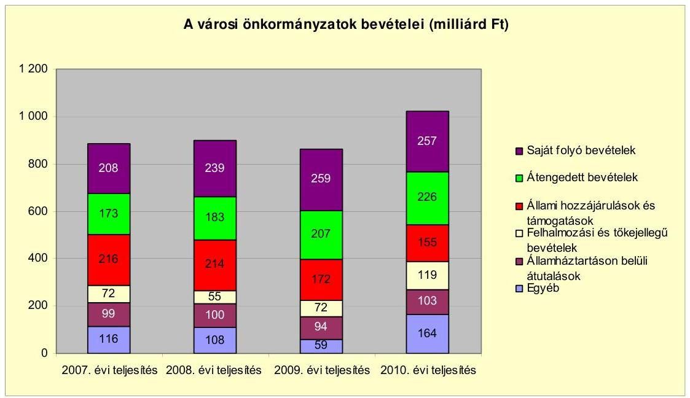
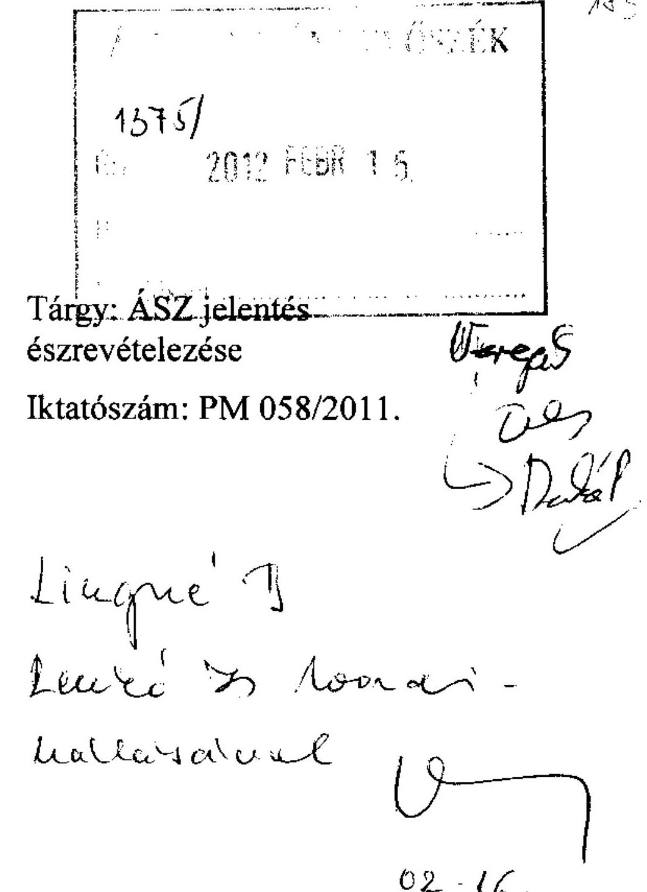
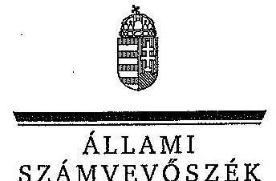
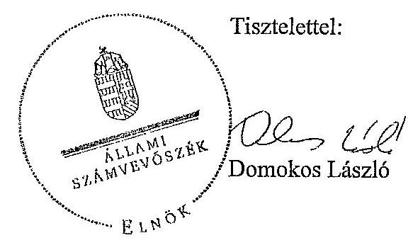

# ÁLLAMI   SZÁMVEVŐSZÉK 

## JELENTÉS

Esztergom Város Önkormányzata pénzügyi helyzetének ellenőrzéséről (43/4)

---

# Állami Számvevőszék 

Iktatószám: V-3103-017/2012.
Témaszám: 1015
Vizsgálat-azonosító szám: V0560128

## Az ellenőrzést felügyelte:

Dr. Varga Sándor
számvevő igazgató-helyettes
Az ellenőrzést vezette:
Renkó Zsuzsanna
számvevő tanácsos
Ellenőrzési csoportvezető:
Lingné Rajz Borbála
számvevő tanácsos
Az ellenőrzést végezték:
Dr. Fátrainé Zsebedics Katalin
Dr. Lacó Bálintné
számvevő tanácsos
számvevő tanácsos

---

# TARTALOMJEGYZÉK 

BEVEZETÉS ..... 3
I. RÉSZLETES MEGÁLLAPÍTÁSOK ..... 7
MELLÉKLETEK

1. számú Esztergom város polgármesterének 2012. február 3-án kelt levele a jelentéstervezetben foglalt megállapításokra tett észrevételéről
2. számú Válaszlevél Esztergom város polgármestere által tett észrevételre

---

.

---

# JELENTÉS 

## Esztergom Város Önkormányzata pénzügyi helyzetének ellenőrzéséről

## BEVEZETÉS

Az Állami Számvevőszék 2011. évtől érvényes stratégiája új irányt szabott a helyi önkormányzatok gazdálkodásának ellenőrzésében is. Az ÁSZ – küldetése és jövőképe szerint – szilárd szakmai alapokra támaszkodva értékteremtő ellenőrzéseivel és helyzetelemzéseivel az államháztartás egészében, így a helyi önkormányzati alrendszerben is elő kívánja segíteni a közpénzek és a közvagyon szabályos, gazdaságos, hatékony és eredményes felhasználását. E folyamat részeként – az államháztartási hiány alakulásának összetevőire is figyelemmel – végezzük az önkormányzati alrendszer pénzügyi helyzetelemzését.

Az államháztartás helyi szintjén a 304 városnak ${ }^{1}$ az általuk ellátott közszolgáltatások volumenére is tekintettel a közfeladatok ellátásában kiemelt szerepe van. E települések 2011. január 1-jei népessége 3169 ezer fő volt.

Feladataik és hatásköreik az Ötv. mellett különböző ágazati törvények által meghatározottak, miközben a feladatellátás szervezeti kereteit – ezen belül a gazdasági társaságok közszolgáltatások ellátásában betöltött szerepét – saját maguk határozzák meg. A gazdasági társaságok által ellátott feladatok esetén a gazdálkodás, továbbá az önkormányzatok pénzügyi helyzetére ható kockázatok egy része kikerült az önkormányzati alrendszerből. A többségi önkormányzati tulajdonban lévő társaságok önkormányzati ellenőrzésének és gazdálkodása figyelemmel kísérésének hiánya növeli a városok pénzügyi helyzetének megítélésében rejlő kockázatokat.

Az áttekintett időszakban az önkormányzati forrásszabályozás elvei lényegesen nem változtak. Az önkormányzatok gazdasági mozgásterét a központi költségvetéstől való függőség mellett jelentősen befolyásolja a helyi adókivetési jog gyakorlása. A városok gazdálkodási szabadságának lényeges eleme, hogy anyagi lehetőségeik függvényében dönthettek arról, hogy feladataik közül azokat, amelyek megoldására az Ötv. szerint a települési önkormányzat nem kötelezhető, a megyei önkormányzat fenntartásába adhatták. E döntések differenciáltan érintették a városok pénzügyi helyzetét.

[^0]
[^0]:    ${ }^{1}$ A megyei jogú városok nélkül figyelembe vett városok száma 304 városi önkormányzatot jelent.

---

A városok önkormányzatainak 2007-2010 között rendelkezésre álló bevételeinek alakulását a következő ábra szemlélteti:

Az önkormányzati alrendszer pénzügyi helyzetértékelése során új elemzési módszereket alkalmazott az ellenőrzés. A költségvetési beszámolók szerkezetének adatainak elemzése helyett az önkormányzat pénzügyi helyzetét a CLF módszerrel értékeltük, amelynek lényegét és számításának módszerét a jelentés 2. pontjában, és a jelentés 2. számú mellékletében ismertetjük részletesen.

Az új módszereken alapuló helyzetértékelés fontosságát az adja, hogy a helyi önkormányzatok bruttó adósságállománya ${ }^{2} 2007$-től vált jelentőssé, a 2010. évi költségvetési beszámolók alapján 1248 milliárd Ft-ot tett ki. Ezen belül a 304 város adóssága 383 milliárd Ft, amely az önkormányzati alrendszer teljes adósságállományának 30,7\%-át jelentette ${ }^{3}$.

A mérlegben kimutatott bruttó adósságállomány mellett az önkormányzatok számára az eszközállomány műszaki állapotának megőrzése is előbb-utóbb pénzügyi kötelezettséget jelent. Az elhasználódott eszközök pótlására forrást biztosító amortizációs (felújítási) alap képzésének ${ }^{4}$ elmaradása maga után vonhatja a feladatellátást kiszolgáló tárgyi eszközök állagának erőteljes romlását. Emellett a 2007-2013-as időszakra meghirdetett, vissza nem térítendő EU-s fejlesztési forrásokhoz való hozzájutás lehetősége felerősítette az önkormányzati alrendszer fejlesztési igényeit, amelyek a felhalmozási költségvetési hiány folyamatos emelkedésén túl – az előírt jövőbeni fenntartási kötelezettség miatt – tovább terhelhetik az önkormányzatok költségvetését ${ }^{5}$.

Az ÁSZ a 2011. évi ellenőrzési tervében 43. számú, az Önkormányzatok gazdálkodási rendszerének ellenőrzése részeként áttekinti, és elemzi az önkormányzatok pénzügyi helyzetét. A gazdálkodás szabályszerűségét az ÁSZ az előző évek során ebben az önkormányzati körben is ellenőrizte. Jelen vizsgálatunk a tett javaslataink pénzügyi helyzetet érintő pontjainak hasznosítására utóellenőrzés jelleggel tér ki.

Az ellenőrzés megállapításait az Önkormányzat által kitöltött – teljességi nyilatkozattal megerősített – 27 tanúsítványon szolgáltatott adatokra alapoztuk. Ellenőrzési bizonyítékként használtuk fel továbbá:

- a képviselő-testületi és bizottsági előterjesztéseket, a döntés-előkészítés során készített dokumentumokat;
- a kötelezettségvállalások dokumentumait;
- a pénzügyi-számviteli nyilvántartásokat;
- az éves költségvetési beszámolókat;
- a költségvetési és zárszámadási rendeleteket.

Az ellenőrzés a 2007. január 1. – 2011. június 30. közötti időszakot öleli fel. A pénzintézeti kötelezettségek állományának vizsgálatakor az ellenőrzött időszak 2006. december 31 – 2011. június 30. közötti időszakra terjed ki.

Az ellenőrzés során vizsgáltunk minden olyan körülményt és adatot, amely a program végrehajtásához kapcsolódott és a pénzügyi helyzet alakulására hatást gyakorló releváns tények és folyamatok feltárásához szükségessé vált.

# Az ellenőrzés célja annak értékelése volt, hogy: 

- a vizsgált időszakban a kötelező- és önként vállalt feladatok ellátását biztosító szervezeti keretekben, a feladatellátás módjában bekövetkezett változások milyen hatást gyakoroltak az Önkormányzat pénzügyi helyzetének alakulására;

[^0]
[^0]:    ${ }^{2}$ A bruttó adósságállomány a 2010. év végi összege magában foglalja a fejlesztési és a működési célú kötvénykibocsátások, a beruházási és fejlesztési hitelek, a működési célú hosszú lejáratú hitelek, a rövid lejáratú hitelek, váltótartozások miatti kötelezettségek teljes (2011-ben, illetve az azt követő években esedékes) állományát.
    ${ }^{3}$ A fővárosi és a kerületi önkormányzatok adósságának figyelmen kívül hagyásával számított 977 milliárd Ft összegű bruttó adósságállományból a városok 39,2\%-kal részesedtek.
    ${ }^{4}$ Erre a jelenlegi szabályozási környezetben nem kötelezi előírás az önkormányzatokat.
    ${ }^{5}$ Az Állami Számvevőszék 2011 júniusában közzétett 1108. számú, a helyi önkormányzatok fejlesztési célú támogatási rendszerének ellenőrzéséről szóló jelentésében feltárta a fejlesztési folyamatok problémáit. A helyi önkormányzatok elsősorban azokat a fejlesztéseket valósították meg, amelyekhez támogatást lehetett igényelni. A fejlesztési célok közül a magasabb támogatás intenzitású pályázatokat részesítették előnyben. A fejlesztéssel megvalósuló létesítmények jövőbeli üzemeltetésének várható ráfordításait az önkormányzatok 71,9%-a nem mérte fel.

---

- az Önkormányzat pénzügyi – ezen belül működési és felhalmozási – egyensúlya mely tényezők hatására miként változott, és az Önkormányzat milyen intézkedéseket tett a pénzügyi egyensúly javítása érdekében;
- a költségvetési kiadások finanszírozása érdekében vállalt pénzintézeti kötelezettségek hogyan alakultak, továbbá milyen kötelezettségek fennállása befolyásolja az Önkormányzat jövőbeli pénzügyi helyzetét;
- hasznosultak-e a gazdálkodási rendszer korábbi ellenőrzése során a pénzügyi egyensúly javítására az ÁSZ által tett szabályszerűségi és célszerűségi javaslatok.

Az ellenőrzés típusa: szabályszerűségi vizsgálat.
A vizsgálat jogszabályi alapját az Állami Számvevőszékről szóló 2011. évi LXVI. törvény 1. § (3), 5. § (2)-(6) bekezdései, továbbá az Államháztartásról szóló 1992. évi XXXVIII. törvény 120/A. § (1) bekezdése előírásai képezik.

Esztergom város lakosainak száma 2010. január 1-jén 30463 fő volt.
A 2010. évi beszámoló adatai alapján az Önkormányzat mérlegében 55248,9 millió Ft eszközállományt mutatott ki, melyből a befektetett eszközök állománya 52519,4 millió Ft volt. A kötelezettségek állománya 25871,7 millió Ft, ezen belül a rövid lejáratú kötelezettségek állománya 25539,9 millió Ft-ot tett ki 2010. évben.

A 2011. évi válságköltségvetést 9307,6 millió Ft bevételi és kiadási főösszeggel fogadta el a Képviselő-testület. A 2010. évben a költségvetés módosított főösszege 22 132,6 millió Ft volt. Az Önkormányzatnál 2010. november 25-én adósságrendezési eljárás indult.

---

# I. RÉSZLETES MEGÁLLAPÍTÁSOK 

A városi önkormányzatok pénzügyi egyensúlyi helyzetének ellenőrzése során Esztergom Város Önkormányzata a tanúsítványokat a kért határidőre nem küldte meg az Állami Számvevőszék részére. A kitöltött tanúsítványok visszaküldési határideje 2011. szeptember 30-a volt. Az ÁSZ a 2011. október 18-án kelt, V-3004-44-20/2011. számú levelében ismételten felhívta a polgármestert az Állami Számvevőszékről szóló 2011. évi LXVI. törvény 28. §-ában foglalt közreműködési (adatszolgáltatási) kötelezettsége teljesítésére az adatszolgáltatás legkésőbbi időpontját 2011. október 31-én megjelölve. Az Önkormányzat adatszolgáltatási kötelezettségét a módosított határidőre sem teljesítette.

Az ÁSZ tv-ben biztosított észrevételezési jog alapján a polgármester annak rögzítését kérte, hogy milyen adatokat nem szolgáltatott az önkormányzat. Az észrevétel szerint „az 5. tábla adatai hiányoztak csak, amelyek az önkormányzat érdekeltségébe tartozó gazdasági társaságokra vonatkoztak.”

Az észrevételt nem fogadjuk el, mivel a módosított határidőre sem érkeztek meg a kitöltött tanúsítványok. A 2011. november 14–22. között több részletben beküldött tanúsítványok hiányosak, tartalmilag hibásak voltak. Az önkormányzati feladatellátásban résztvevő gazdasági társaságok tanúsítványai (az 5. számú tanúsítványok) nem készültek el, ezen túlmenően további öt tanúsítványról hiányoztak az 50%-ot meghaladó tulajdoni hányaddal rendelkező gazdasági társaságok adatai.

A fent leírtak alapján a helyszíni ellenőrzést nem lehetett elvégezni.

Budapest, 2012. április „t”

Melléklet:  2 db

---

# Esztergom Város Polgármestere

1575/

Tárgy: ÁSZ jelentés észrevételezése

Iktatószám: PM 058/2011.

Domunkos László

Budapest

Apáczai Csere János utca 10. 1052

Tisztelt Elnök Úr!

Az Állami Számvevőszék tavalyi vizsgálata során Esztergom Város Önkormányzata pénzügyi helyzetének ellenőrzésére is sor került. A 2011. évi LXVI. törvény 29. § (2) bekezdése szerint az ellenőrzés megállapításaira észrevételt tehetek. A 2012. február másodikán kézhez vett jelentéstervezetet átolvastam. Sajnálatos módon az esztergomi adatszolgáltatás nem volt teljes körű, ezért eljárás van folyamatban. Kérem, hogy a részletes megállapításoknál jelezzék, hogy milyen adatokat nem szolgáltatott az Önkormányzat. Tudomásom szerint az 5. tábla adatai hiányoztak csak, amelyek az önkormányzat érdekeltségébe tartozó gazdasági társaságokra vonatkoztak. Ennek rögzítését kérem.

Köszönöm segítő együttműködésüket.

Esztergom, 2012. február 3.

Üdvözlettel:

Tétényi Éva
Esztergom, Esztergom-Kertváros és Pilisszentlélek polgármestere

Esztergom Város Polgármestere

Postafiók: 92. 2501 Esztergom, Széchenyi tér 1. tel.: (33) 542-003 fax: (33) 413-808

---

#  

Ikt.szám: V-3103-016/2012.

Tétényi Éva úrhölgy polgármester Esztergom Város Önkormányzata

## Esztergom

## Tisztelt Polgármester Úrhölgy!

Tájékoztatom, hogy az Esztergom Város Önkormányzata pénzügyi helyzetének ellenőrzéséről készített jelentéstervezetre küldött észrevételét az alábbi indokok alapján nem fogadom el.

A városi önkormányzatok pénzügyi egyensúlyi helyzete ellenőrzésének alapját az adatgyűjtés képezte. Az erre szolgáló tanúsítványokat 2011. szeptember 30-ig kértük kitöltve a hivatali kapun keresztül visszaküldeni.

A statisztikai mintavétellel kiválasztott 63 város – köztük Esztergom Város Önkormányzata –, helyszíni ellenőrzése 2011. október 4-én indult. Esztergom Város Önkormányzatának ellenőrzését november hónapra terveztük.

A felügyeleti vezető a V-3004-44-20/2011. számú levelében 2011. október 18-án ismételten felhívta Önt az adatszolgáltatási kötelezettség teljesítésére és az adatszolgáltatás legkésőbbi időpontját október 31-én határozta meg. Az Önkormányzat az adatszolgáltatási kötelezettségét a módosított határidőre sem teljesítette, ennek hiányában a helyszíni ellenőrzést a kitűzött határidőre nem lehetett elvégezni. Polgármester úrhölgy 2011. október 25-én telefonon jelezte a vizsgálatot végző számvevőkkel, hogy a Polgármesteri hivatalban nincsenek meg a személyi feltételek az adatszolgáltatás elvégzéséhez.

Az adatszolgáltatás elmulasztása és a rendezetlen szervezeti viszonyok miatt a helyszíni ellenőrzés megszüntetéséről döntöttem, amelyről a felügyeleti vezető a V-3004-44-22/2011. számú, 2011. november 5-én kelt levelében Polgármester úrhölgyet tájékoztatta.

A levelében jelzett, az adatszolgáltatás hiányosságát érintő észrevétele nem megalapozott, mivel a módosított határidőig a hivatali kapun keresztül nem érkezett kitöltött tanúsítvány. Az adatszolgáltatást az önkormányzat a határidő letelte után, 2011. november 14–22. között több

---

részletben és akkor is csak részben teljesítette. Az adatszolgáltatás teljes körű teljesítéséhez az 5. számú tanúsítványokon túl további
 öt tanúsítványról hiányoztak az 50%-ot meghaladó tulajdoni hányaddal rendelkező gazdasági társaságok adatai.

Kérem Polgármester úr hölgyet válaszom elfogadására.
Budapest, 2012. március 30.

