# ÁLLAMI   SZÁMVEVŐSZÉK 

## JELENTÉS

Fertőd Város Önkormányzata pénzügyi helyzetének ellenőrzéséről (43/4)

---

# Állami Számvevőszék 

Iktatószám: V-3092-014/2012.
Témaszám: 1015
Vizsgálat-azonosító szám: V0560123

## Az ellenőrzést felügyelte:

Dr. Varga Sándor
számvevő igazgatóhelyettes
Az ellenőrzést vezette:
Renkó Zsuzsanna
számvevő tanácsos
Ellenőrzési csoportvezető:
Dér Lívia
számvevő tanácsos
Az ellenőrzést végezték:
Humli Tamásné Molnár Istvánné
számvevő tanácsos számvevő tanácsos

---

# TARTALOMJEGYZÉK 

BEVEZETÉS ..... 9
I. ÖSSZEGZŐ MEGÁLLAPÍTÁSOK, KÖVETKEZTETÉSEK, JAVASLATOK ..... 13
II. RÉSZLETES MEGÁLLAPÍTÁSOK ..... 22

1. Az Önkormányzat kötelező és önként vállalt feladatai, a feladatellátás szervezeti keretei és annak változásai ..... 22
2. Az Önkormányzat pénzügyi egyensúlyi helyzetét befolyásoló tényezők ..... 25
2.1. A működési és a felhalmozási egyensúly változása ..... 27
2.2. Az Önkormányzat bevételeinek változása ..... 33
2.3. Az Önkormányzat múködési és felhalmozási célú kiadásainak változása ..... 36
3. Az Önkormányzat kötelezettségei ..... 40
3.1. Az Önkormányzat pénzintézetekkel szembeni kötelezettségeinek változása ..... 40
3.2. A szállítói kötelezettségek változása ..... 45
3.3. Egyéb kötelezettségek változása ..... 46
4. A pénzügyi egyensúly megteremtése érdekében hozott intézkedések eredménye ..... 47
5. Az Ász által a korábbi években a pénzügyi egyensúly javítására tett szabályszerűségi és célszerűségi javaslatok hasznosulása ..... 49

---

# MELLÉKLETEK 

1. számú Múködési és felhalmozási célú hiány/többlet a 2007-2010 közötti időszakban az Önkormányzat zárszámadási rendeleteiben (1 oldal)
2. számú Az Önkormányzat bevételei és kiadásai, valamint adósságszolgálata 2007-2010 között (1 oldal)
3/a. számú Az Önkormányzat 2007-2010. években megvalósított, 2010. december 31-ig befejezett fejlesztései és azok forrásösszetétele (1 oldal)
3/b. számú Az Önkormányzat 2010. december 31-én folyamatban lévő fejlesztési feladataira 2010. december 31-én fennálló kötelezettségek és azok forrásösszetétele (1 oldal)
3/c. számú Az Önkormányzat által beadott, elbírálás alatti pályázati forrásból megvalósítani tervezett fejlesztéseihez kapcsolódó kötelezettségvállalásai és azok forrásösszetétele (1 oldal)
3. számú Az önkormányzati feladatok ellátásában résztvevő gazdasági társaságok (1 oldal)

---

# RÖVIDÍTÉSEK JEGYZÉKE 

## Törvények

Áht $_{1}$
Áht $_{2}$
Ötv.
Számv. tv.

## Rendeletek

Ámr.
Áhsz.

## Szórövidítések

áfa
ÁSZ
EU
GDP
Iskola
jegyző
Képviselő-testület
Könyvtár
NGM
OEP
Óvoda
ÖNHIKI támogatás
Önkormányzat
polgármester
Polgármesteri hivatal
PPP konstrukció
szja
Szociális Központ
Településkarbantartó Kft.
Víz- Csatornamú Zrt.
Zeneiskola
az államháztartásról szóló 1992. évi XXXVIII. törvény az államháztartásról szóló 2011. évi CXCV. törvény a helyi önkormányzatokról szóló 1990. évi LXV. törvény a számvitelről szóló 2000. évi C. törvény
az államháztartás múködési rendjéről szóló 292/2009. (XII. 19.) Korm. rendelet
az államháztartás szervezetei beszámolási és könyvvezetési kötelezettségének sajátosságairól szóló 249/2000. (XII. 24.) Korm. rendelet
általános forgalmi adó
Állami Számvevőszék
Európai Unió
Bruttó hazai termék
Babos József Térségi Általános Iskola Fertőd
Fertőd Város Önkormányzatának jegyzője
Fertőd Város Képviselő-testülete
Fertőd Városi Könyvtár
Nemzetgazdasági Minisztérium
Országos Egészségbiztosítási Pénztár
Fertődi Napközi Otthonos Óvoda és Bölcsőde
Önhibájukon kívül hátrányos helyzetbe került önkormányzatok támogatása
Fertőd Város Önkormányzata
Fertőd Város Önkormányzatának polgármestere
Fertőd Város Önkormányzatának Polgármesteri hivatala
Public Private Partnership (Partnerségi együttmúködés közfeladatok ellátására a magánszektor bevonásával) személyi jövedelemadó
Fertőd Mikro-térségi Szociális Szolgáltató Központ
Fertőd Önkormányzati Településkarbantartó és Múködtető Kft.
Sopron és Környéke Víz- Csatornamú Zártkörűen Múködő Részvénytársaság
J. Haydn Zeneiskola, Alapfokú Művészetoktatási Intézmény

---

.

---

# ÉRTELMEZŐ SZÓTÁR 

| BUBOR | Budapesti Bankközi Forint Hitelkamatláb. Irányadó, refe-   rencia jellegú kamatláb. Mértékét az MNB naponta álla-   pitja meg a banki kamatok figyelembevételével. Közzété-   tele naponta történik. |
| :--: | :--: |
| CLF módszer | Az önkormányzatok költségvetése elemzésének eszköze. A   módszer következetesen elkülöníti a folyó és a felhalmo-   zási költségvetés bevételeit és kiadásait, azok költségvetési   egyenlegeit. Bizonyos mértékig a vállalati gazdálkodás   logikai elemeit érvényesíti az önkormányzatok pénzügyi,   jövedelmi helyzetének vizsgálata során. Az értékelés a   pénzügyi kapacitás fogalmát helyezi a középpontba. |
| EURIBOR | A frankfurti bankközi piacon jegyzett, az Európai Közpon-   ti Bank szabályainak megfelelően megállapított kínálati   kamatláb. Az EURIBOR értékét a legfontosabb európai   bankok hitelkínálatának kamatlábai alapján a Reuters   ügynökség számolja ki és teszi közzé naponta. A magyar   pénzintézetek is ezt használják viszonyítási alapnak EUR   hitelek esetén. |
| használhatósági fok | Az eszközgazdálkodás vizsgálatának elemzése során   használt mutató. Számításakor a tárgyi eszköz könyv sze-   rinti (nettó) értékét viszonyítják a tárgyi eszköz bruttó (be-   szerzési/létesítési) értékéhez. A \%-ban kifejezett mutató   értéke annál kedvezőbb, minél közelebb áll a 100\%-hoz.   Csökkenése az eszköz állagának romlására, avulására   utal, ami maga után vonja az üzemeltetési és fenntartási   költségek növekedését is. |
| kamatkockázat | A változó kamatozású forint-, vagy a devizahitelek futam-   ideje alatt a kamat emelkedése miatt fennálló kamatkoc-   kázat, melynek növekedése miatt nő a hitel törlesztő rész-   lete. |
| kötelező közszolgáltatás | A helyi önkormányzati feladatkörbe tartozó, a köztiszta-   sággal és a településtisztasággal, valamint az élet- és va-   gyonbiztonsággal összefüggő egyes - közszolgáltatás út-   ján megvalósuló - közfeladatok ellátása, amelynek köte-   lező igénybevételét külön jogszabály (törvény, helyi ön-   kormányzati rendelet) határoz meg. |
| közfeladat | Állami, helyi, illetve kisebbségi önkormányzati feladat,   amelynek ellátásáról az államnak, illetve az önkormán-   zatoknak kell gondoskodni. A hatályos szabályozás sze-   rint közfeladatot törvény és önkormányzati rendelet álla-   píthat meg. Az önkormányzatok által ellátandó feladatok   keretszerú meghatározását az Ötv. tartalmazza. |
| LIBOR | Angol kifejezés, a London Interbank Offered Rate rövidíté-   se. Jelentése: Londoni bankközi, referencia jellegú kínálati   (hitel) kamatláb. |

---

önkormányzat többségi tulajdonában lévő gazdasági társaságok
pénzügyi kapacitás
pénzügyi kockázat

Az önkormányzat a gazdasági társaságban a szavazatok több mint ötven százalékával vagy a Ptk. 685/B. § (2)-(3) bekezdéseiben rögzített meghatározó befolyással rendelkezik. A befolyással rendelkező akkor rendelkezik egy jogi személyben meghatározó befolyással, ha annak tagja, illetve részvényese és jogosult e jogi személy vezető tisztségviselői vagy felügyelőbizottsága tagjai többségének megválasztására, illetve visszahívására, vagy a jogi személy más tagjaival, illetve részvényeseivel kötött megállapodás alapján egyedül rendelkezik a szavazatok több mint ötven százalékával (Ptk. 685/B. § (2) bek.). A meghatározó befolyás akkor is fennáll, ha a befolyással rendelkező számára e jogosultságok közvetett módon (köztes vállalkozásain keresztül, a Ptk. 685/B §. (3),(4) bek. szerint) biztosítottak.
A helyi önkormányzat és az önkormányzat irányítása alá tartozó költségvetési szerv többségi tulajdonában, illetve többségi befolyása alatt álló gazdálkodó szervezet esetében hitelfelvétel, kölcsönfelvétel, garancia- vagy kezességvállalás, tartozásátvállalás, tartozás-elengedés, értékpapír kibocsátás, vásárlás, pénzügyi lízing, tartós bérleti szerződés, ingyenes vagyonjuttatás (így különösen: ajándékozás, ingyenes engedményezés), vagy követelésvásárlás, követelésengedményezés végrehajtására vonatkozóan az Áht ${ }_{1}$ 100/M. § (4) bekezdése alapján az önkormányzat rendelkezik döntési jogosultsággal.
A pénzügyi kapacitás (financial capacity) az adósok hitelfelvételi képességének azon mértéke, ahol még anélkül tudják növelni az adósságot, hogy csökkenteniük kellene akár a jelenbeli, akár a jövőben esedékes kiadásaikat a fizetésképtelenség elkerülése érdekében. (Forrás: Az önkormányzati rendszer pénzügyi helyzete, ÁSZKUT tanulmány 2010.)
A múködési kockázat egyik eleme. Megmutatkozhat a költségvetés nagyságrendjének, szerkezetének nem megalapozott módosításaiban, a bevételi és a kiadási előirányzatoktól lényegesen eltérő teljesítésekben, a nem megfelelő belső kontrollrendszer múködésében, a tudatos károkozásokban, a biztosítások elmaradásában, a hibás fejlesztési döntésekben, a nem a terveknek megfelelő forrásfelhasználásokban. Jelentkezhet továbbá a bevételek és kiadások ütemkülönbsége miatt felvett folyószámla- és likvidhitelek költségvetési év végén fennálló egyenlege miatt, amely az önkormányzat költségvetésébe - akár tartósan - beépülő forráshiányt jelzi.

---

törlesztési kockázat

SNA

Annak a kockázata, hogy a megfelelő időben és mértékben a hitelt felvevőnél rendelkezésre állnak-e a pénzintézetek és egyéb szervek felé fennálló kötelezettségek visszafizetéséhez, a hitelek és kölcsönök törlesztéséhez szükséges pénzügyi források.
A törlesztési kockázatot növeli a kamat- és árfolyam növekedése, mivel ezekben az esetekben az adósságszolgálat nőhet. Törlesztési kockázatot okozhat a visszafizetésre tervezett forrás elérésének, teljesítésének bizonytalansága (pl. a visszafizetéshez tervezett tartalékolás elmaradt, a tervezettnél alacsonyabb a saját bevétel, a helyi adóból származó bevétel az adóalanyok, adóalapok csökkenése miatt nem teljesül).
System of National Account azaz a Nemzeti Számlák Rendszere, amely a gazdasági szektorok által létrehozott valamennyi terméket és szolgáltatást figyelembe veszi.

---

.

---

# JELENTÉS 

## Fertőd Város Önkormányzata pénzügyi helyzetének ellenőrzéséről

## BEVEZETÉS

Az Állami Számvevőszék 2011. évtől érvényes stratégiája új irányt szabott a helyi önkormányzatok gazdálkodásának ellenőrzésében is. Az ÁSZ - küldetése és jövőképe szerint - szilárd szakmai alapokra támaszkodva értékteremtő ellenőrzéseivel és helyzetelemzéseivel az államháztartás egészében, így a helyi önkormányzati alrendszerben is elő kívánja segíteni a közpénzek és a közvagyon szabályos, gazdaságos, hatékony és eredményes felhasználását. E folyamat részeként - az államháztartási hiány alakulásának összetevőire is figyelemmel végezzük az önkormányzati alrendszer pénzügyi helyzetelemzését.

Az államháztartás helyi szintjén a 304 városnak ${ }^{1}$ az általuk ellátott közszolgáltatások volumenére is tekintettel a közfeladatok ellátásában kiemelt szerepe van. E települések 2011. január 1-jei népessége 3169 ezer fő volt.

Feladataik és hatásköreik az Ötv. mellett különböző ágazati törvények által meghatározottak, miközben a feladatellátás szervezeti kereteit - ezen belül a gazdasági társaságok közszolgáltatások ellátásában betöltött szerepét - saját maguk határozzák meg. A gazdasági társaságok által ellátott feladatok esetén a gazdálkodás, továbbá az önkormányzatok pénzügyi egyensúlyi helyzetére ható közvetlen kockázatok egy része kikerült az önkormányzati alrendszerből. A többségi önkormányzati tulajdonban lévő társaságok gazdálkodásának körülményei befolyásolhatják a városok pénzügyi egyensúlyi helyzetének megítélésében rejlő kockázatokat.

Az áttekintett időszakban az önkormányzati forrásszabályozás elvei lényegesen nem változtak. Az önkormányzatok gazdasági mozgásterét a központi költségvetéstől való függőség mellett jelentősen befolyásolja a helyi adókivetési jog gyakorlása. A városok gazdálkodási szabadságának lényeges eleme, hogy anyagi lehetőségeik függvényében dönthettek arról, hogy feladataik közül azokat, amelyek megoldására az Ötv. szerint a települési önkormányzat nem kötelezhető, a megyei önkormányzat fenntartásába adhatták. E döntések differenciáltan érintették a városok pénzügyi helyzetét.

A városi önkormányzatok 2007-2010 között teljesített bevételeinek alakulását és összetételét a következő ábra szemlélteti:

[^0]
[^0]:    ${ }^{1}$ A megyei jogú városok nélkül figyelembe vett városok száma 304 városi önkormányzatot jelent.

---

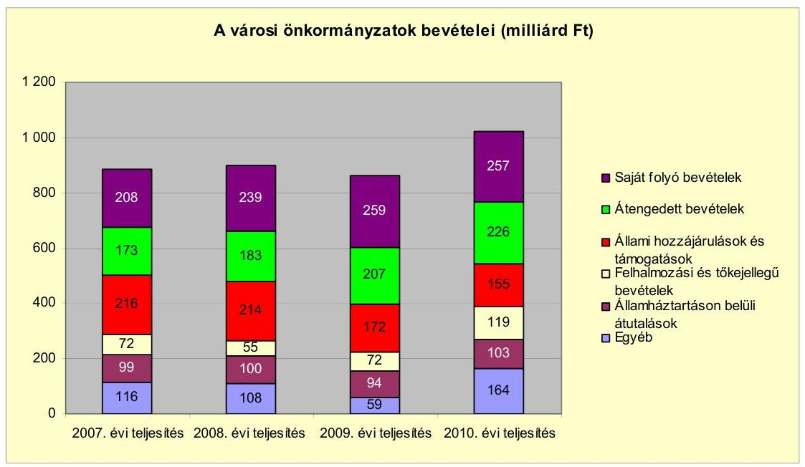

Az önkormányzati alrendszer pénzügyi helyzetértékelése során új elemzési módszereket alkalmazott az ellenőrzés. A költségvetési beszámoló adatok elemzése helyett az önkormányzat pénzügyi helyzetét a CLF módszerrel értékeljük, amelynek lényegét és számításának módszerét a jelentés 2. pontjában, és a jelentés 2 . számú mellékletében ismertetjük részletesen.

Az új módszereken alapuló helyzetértékelés fontosságát az adja, hogy a helyi önkormányzatok bruttó adósságállománya ${ }^{2}$ a 2010. évi költségvetési beszámolók alapján 1248 milliárd Ft-ot tett ki. Ezen belül a 304 város adóssága 383 milliárd Ft volt, amely az önkormányzati alrendszer teljes adósságállományának $30,7 \%$-át jelentette ${ }^{3}$.

A mérlegben kimutatott bruttó adósságállomány mellett az önkormányzatok számára az eszközállomány műszaki állapotának megőrzése is előbb-utóbb pénzügyi kötelezettséget jelent. Az elhasználódott eszközök pótlására forrást biztosító amortizációs (felújítási) alap képzésének ${ }^{4}$ elmaradása maga után vonhatja a feladatellátást kiszolgáló tárgyi eszközök állagának erőteljes romlását. Emellett a 2007-2013-as időszakra meghirdetett, vissza nem térítendő EU-s fejlesztési forrásokhoz való hozzájutás lehetősége felerősítette az önkormányzati alrendszer fejlesztési igényeit, amelyek a felhalmozási költségvetési hiány fo-

[^0]
[^0]:    ${ }^{2}$ Az önkormányzati mérlegbeszámolókból számított bruttó adósságállomány 2010. év végi összege magában foglalja a fejlesztési és a múködési célú kötvénykibocsátások, a beruházási és fejlesztési hitelek, a múködési célú hosszú lejáratú hitelek, a rövid lejáratú hitelek, váltótartozások miatti kötelezettségek teljes (2011-ben, illetve az azt követő években esedékes) állományát. Az önkormányzatok 2007. év végi mérleg szerinti adósságállománya 692 milliárd Ft volt.
    ${ }^{3}$ A fővárosi és a kerületi önkormányzatok adósságának figyelmen kívül hagyásával számított 977 milliárd Ft összegű bruttó adósságállományból a városok 39,2\%-kal részesedtek.
    ${ }^{4}$ Erre a jelenlegi szabályozási környezetben nem kötelezi előírás az önkormányzatokat.

---

lyamatos emelkedésén túl - az előírt jövőbeni fenntartási kötelezettség miatt tovább terhelhetik az önkormányzatok költségvetését ${ }^{5}$.

Az ÁSZ a 2011. évi ellenőrzési tervében 43. számú, az Önkormányzatok gazdálkodási rendszerének ellenőrzése részeként áttekinti, és elemzi az önkormányzatok pénzügyi helyzetét. A gazdálkodás szabályszerűségét az ÁSZ az előző évek során ebben az önkormányzati körben is ellenőrizte. Jelen vizsgálatunk a tett javaslataink pénzügyi helyzetet érintő pontjainak hasznosítására utóellenőrzés jelleggel tér ki.

Az ellenőrzés megállapításait az Önkormányzat által kitöltött - teljességi nyilatkozattal megerősített - 27 tanúsítványon szolgáltatott adatokra alapoztuk. Ellenőrzési bizonyítékként használtuk fel továbbá:

- a képviselő-testületi és bizottsági előterjesztéseket, a döntés-előkészítés során készített dokumentumokat;
- a kötelezettségvállalások dokumentumait;
- a pénzügyi-számviteli nyilvántartásokat;
- az éves költségvetési beszámolókat;
- a költségvetési és zárszámadási rendeleteket.

Az ellenőrzés a 2007. január 1. - 2011. június 30. közötti időszakot öleli fel. A pénzintézeti kötelezettségek állományának vizsgálatakor az ellenőrzött időszak 2006. december 31. - 2011. június 30. közötti időszakra terjedt ki.

Az ellenőrzés során vizsgáltunk minden olyan körülményt és adatot, amely a program végrehajtásához kapcsolódott és a pénzügyi helyzet alakulására hatást gyakorló releváns tények és folyamatok feltárásához szükségessé vált.

# Az ellenőrzés célja annak értékelése volt, hogy: 

- a vizsgált időszakban a kötelező és önként vállalt feladatok ellátását biztosító szervezeti keretekben, a feladatellátás módjában bekövetkezett változások milyen hatást gyakoroltak az Önkormányzat pénzügyi helyzetének alakulására;
- az Önkormányzat pénzügyi - ezen belül működési és felhalmozási - egyensúlya mely tényezők hatására miként változott, és az Önkormányzat milyen intézkedéseket tett a pénzügyi egyensúly javítása érdekében;

[^0]
[^0]:    ${ }^{5}$ Az Állami Számvevőszék 2011 júniusában közzétett 1108. számú, a helyi önkormányzatok fejlesztési célú támogatási rendszerének ellenőrzéséről szóló jelentésében feltárta a fejlesztési folyamatok problémáit. A helyi önkormányzatok elsősorban azokat a fejlesztéseket valósították meg, amelyekhez támogatást lehetett igényelni. A fejlesztési célok közül a magasabb támogatási intenzitású pályázatokat részesítették előnyben. A fejlesztéssel megvalósuló létesítmények jövőbeli üzemeltetésének várható ráfordításait az önkormányzatok $71,9 \%$-a nem mérte fel.

---

- a költségvetési kiadások finanszírozása érdekében vállalt pénzintézeti kötelezettségek hogyan alakultak, továbbá milyen kötelezettségek fennállása befolyásolja az Önkormányzat jövőbeli pénzügyi helyzetét;
- hasznosultak-e a gazdálkodási rendszer korábbi ellenőrzése során a pénzügyi egyensúly javítására az ÁSZ által tett szabályszerűségi és célszerűségi javaslatok.

Az ellenőrzés típusa: szabályszerűségi vizsgálat.
A vizsgálat jogszabályi alapját az Állami Számvevőszékről szóló 2011. évi LXVI. törvény 1. §. (3), 5. § (2)-(6) bekezdései, továbbá az Áht ${ }_{1} .120 / \mathrm{A}$. § (1) bekezdése ${ }^{6}$ előírásai képezik.

Fertőd város lakosainak száma 2011. január 1-jén 3417 fő volt.
Az Önkormányzat a 2007. évi zárszámadási rendelete szerint 1115,1 millió Ft bevételt ért el, amely a 2010. évre 16,8\%-kal 927,6 millió Ft-ra csökkent. A 2007. évi teljesített kiadások összege 644,7 millió Ft volt, amely a 2010. évre 880,0 millió Ft lett, a növekedés $36,5 \%$-os mértékű volt.

Az Önkormányzat 2010. december 31-én a könyvviteli mérleg szerint 3072 millió Ft értékű vagyonnal rendelkezett. Az Önkormányzat vagyona a 2007. év végi állományhoz viszonyítva 4,3\%-kal emelkedett, ezen belül 46,1\%kal nőtt a hosszú lejáratú kötelezettségek állománya a 2007. évben kibocsátott 500 millió Ft-os kötvény árfolyamváltozásának hatására.

A költségvetési bevétel $26,7 \%$-át a saját bevétel, $10,2 \%$-át a helyi adóbevétel biztosította a 2010. évben. Az összes kiadásból a felhalmozási célú kiadás részaránya a 2010. évben $29,6 \%$ volt.

[^0]
[^0]:    ${ }^{6}$ 2012. január 1-jétől az Áht ${ }_{2}$ 61. § (2) bekezdés

---

# I. ÖSSZEGZŐ MEGÁLLAPÍTÁSOK, KÖVETKEZTETÉSEK, JAVASLATOK 

Az Önkormányzat - adatszolgáltatása szerint - a 2010. évi múködési költségvetési kiadásaiból 554,6 millió Ft-ot ( $93,9 \%$ ) a kötelező feladatok, 36 millió Ft-ot $(6,1 \%)$ az önként vállalt feladatok ellátására fordított. Az önként vállalt feladatok - az Önkormányzat által elvégzett besorolás alapján - az óvodában múködtetett bölcsődei ellátáshoz és a zeneiskolai oktatáshoz kapcsolódtak. Kötelező feladatait az Önkormányzat az Ötv. és az ágazati törvények által meghatározottnak tekinti, az önként vállalt feladatok terjedelmét nem határozták meg, az önkormányzati feladatokról az SzMSz-ben nem rendelkeztek. Az Önkormányzatnál a kötelező és az önként vállalt feladatokra fordított kiadások aránya nem változott.

Az Önkormányzat feladatellátásának szervezeti struktúrája
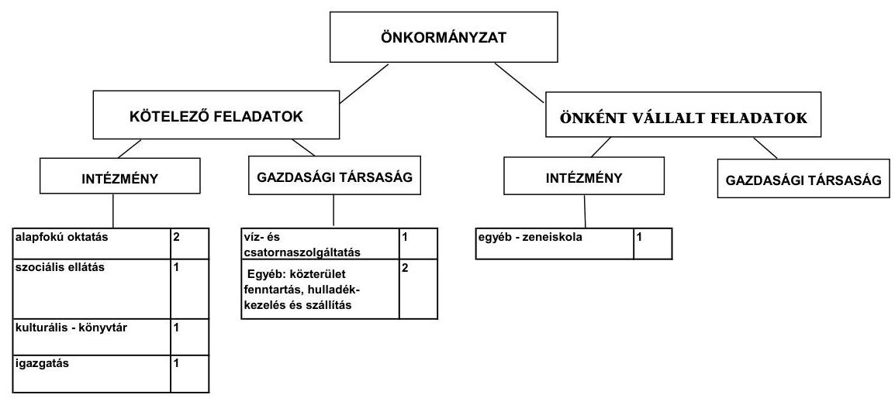

Az Önkormányzat feladatait 2011. június 30 -án (a Polgármesteri hivatallal együtt) hat költségvetési szervvel és három gazdasági társaság keretében látta el. Az intézményszervezeti átalakítások - intézményi átvételek - következtében a költségvetési szervek száma nem változott, de a feladatellátás telephelyeinek száma a 2007. évi nyolcról 2011. év I. félév végére 15 -re nőtt. A szomszédos önkormányzatok közoktatási intézményei 2007-ben tagintézményként az Önkormányzathoz csatlakoztak. Az Önkormányzat pénzügyi egyensúlyi helyzetére az intézményátvételek nem voltak jelentős hatással annak ellenére sem, hogy az intézményátvételekkel összefüggő kiadások 3,2 millió Ft-tal meghaladták a bevételeket. Az Önkormányzat gazdasági társaságban kizárólagos tulajdonnal nem, egy társaságban 10\% alatti tulajdoni részesedéssel rendelkezik. A feladatellátásban részt vesz két olyan gazdasági társaság is, amelyben az Önkormányzat nem rendelkezik részesedéssel. Gazdasági társaságok a hulladékkezelés és szállítás, a víz- és szennyvízkezelés, a közterület-fenntartás területén kaptak szerepet az Önkormányzat feladatellátásában. A gazdasági társaságok a múködésükhöz az ellenőrzött időszakban összesen 47,1 millió Ft múködési és 4,0 millió Ft fejlesztési célú pénzeszközátadásban részesültek az Önkormányzattól.

---

Az Önkormányzat múködési kiadásokra 2010-ben 590,6 millió Ft-ot fordított, amely 99,7 millió Ft-tal (20,3\%-kal) haladta meg a 2007. évi ráfordításokat. A múködési kiadások a 2007-2009. években folyamatosan emelkedtek, az átlagos emelkedés $15,0 \%$ ( 76,5 millió Ft) volt. A 2010. évben az előző három év átlagához viszonyítva 1,3\%-os ( 7,3 millió Ft-os) növekedés következett be. A múködési kiadások a közoktatási-, a szociális és gyermekjóléti kiadásoknál az ellátotti kör bővüléséből adódóan növekedtek.

Az egyes közszolgáltatások feladatellátásában résztvevő intézmények müködési kiadásainak finanszírozási forrásait ágazatonként a 2007. és a 2010. években a következő ábra szemlélteti:
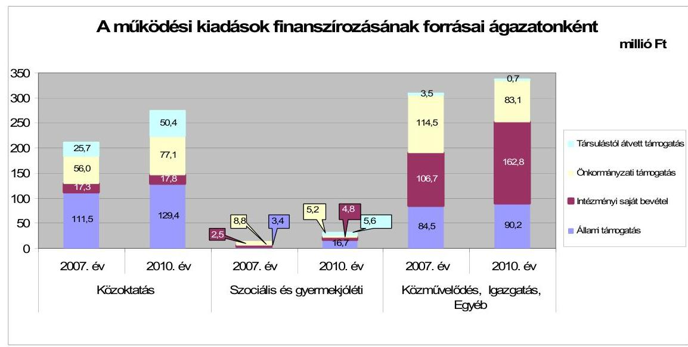

A közoktatási ágazatban a tagintézmények 2007. évi átvételével 177 fővel nőtt az ellátottak száma. A közoktatási ágazatban a 2007. évről 2010. évre az állami támogatás 17,9 millió Ft-tal ( $16,1 \%$-kal), az önkormányzati támogatás 21,1 millió Ft-tal ( $37,7 \%$-kal) és a társulástól átvett támogatás 24,7 millió Ft-tal ( $96,1 \%$-kal) emelkedett. Közmúvelődés, igazgatás és az egyéb ágazatoknál az intézményi saját bevétel 56,1 millió Ft-os ( $52,6 \%$-os) növekedése a kamatbevétel és az áfa-bevétel, áfa-visszatérülés növekedésének következménye.

---

Az Önkormányzat pénzügyi kapacitásának, múködési jövedelmének, tőketörlesztésének alakulását a 2007-2010. években az alábbi ábra mutatja be:
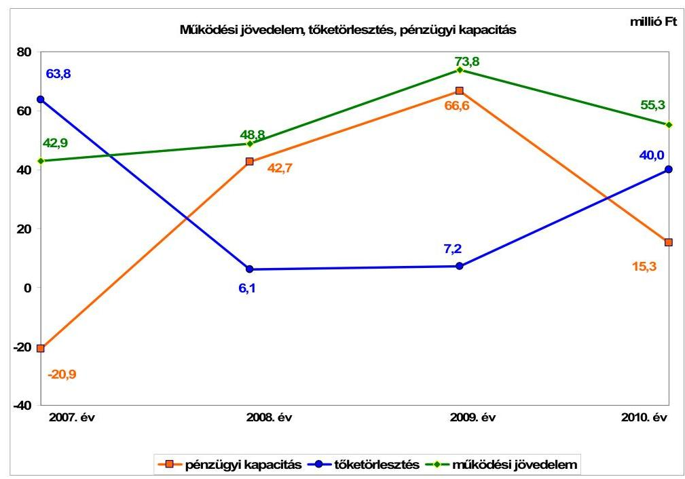

Az Önkormányzat folyó költségvetési egyenlege (múködési jövedelem) 2007-2010 között múködési forrástöbbletet mutatott. A folyó költségvetési egyenlege 2007-ben a folyó kiadások 8,3\%-át (42,9 millió Ft-ot), 2008-ban 7,6\%-át (48,8 millió Ft-ot), 2009-ben 10,9\%-át (73,8 millió Ft-ot), 2010-ben 8,9\%-át (55,3 millió Ft-ot) jelentette. Az Önkormányzat pénzügyi kapacitása - nettó múködési jövedelme - a vizsgált időszakban (a 2007. év kivételével) pozitív értéket mutatott, összesen 103,7 millió Ft volt. Az Önkormányzat megtakarításai a 2008-2010. években az adósságszolgálati kiadások fedezetét biztosították. A 2007. évi negatív nettó múködési jövedelem oka a 63,8 millió Ft öszszegű kötvénybevételből történő hiteltörlesztés. Az Önkormányzat pénzügyi egyensúlyi helyzetét 2007. évben javította a 22,6 millió Ft összegű önhibájukon kívül hátrányos helyzetű önkormányzatok támogatása.

A 2007-2010. években az Önkormányzat felhalmozási költségvetésének egyenlege folyamatosan negatív összegű volt, így a 2007-2010 között összesen 420,9 millió Ft felhalmozási forráshiányt mutatott.

A pénzügyi egyensúly fenntartása külső források bevonásával volt biztosítható. A 2007-2010. években 117,1 millió Ft hitelt törlesztettek. A hiteltörlesztés, továbbá a felhalmozási forráshiány 2007-2010 között 538,0 millió Ft-ot tett ki, amelyre az időszakban képződő 220,8 millió Ft múködési megtakarítás (működési jövedelem), valamint a 2007. január 1-jén rendelkezésre álló 22,9 millió Ft pénzkészlet szolgált fedezetül. A további pénzeszközöket 146,9 millió Ft hitel felvételével és 147,4 millió Ft kötvénykibocsátásból származó bevétellel teremtették meg. A kialakult pénzügyi egyensúlyi helyzet a pozitív nettó múködési jövedelmet eredményező gazdálkodás mellett teszi elkerülhetővé a 2010. évet követően további külső források bevonását, az eladósodás növekedését.

---

Az Önkormányzat a 2007. évben 561,4 millió Ft, a 2008. évben 691,4 millió Ft, a 2009. évben 749,1 millió Ft, a 2010. évben 673,6 millió Ft folyó bevételt realizált. Az Önkormányzat 2011. év I. félévi folyó bevétele 284,6 millió Ft volt. A folyó bevételek a 2007. évhez viszonyítva a 2009. évre 33,4\%-kal (187,7 millió Ft-tal) emelkedtek, ezt követően 2010-re 10,1\%-os (75,5 millió Ftos) csökkenés következett be. A folyó bevételek összege a 2007-2009. évek átlagos 667,3 millió Ft-os állományához viszonyítva a 2010. évre 0,9\%-kal (6,3 millió Ft-tal) 673,6 millió Ft-ra emelkedett. A folyó bevételek 2007-2009. évek közötti folyamatos emelkedésének leginkább meghatározó oka a 2007. évben létrehozott intézményfenntartó társulások miatti ellátotti létszámnövekmény volt.

A vizsgált időszakban az Önkormányzatnál helyi iparűzési adót, építményadót, 2007. július 1-jétől pedig ezeken kívül magánszemélyek kommunális adóját, vendégéjszakák utáni idegenforgalmi adót állapítottak meg, melyek mértéke a vizsgált időszakban nem változott. A helyi adókból és pótlékokból származó bevételek a 2007-2009. évek között a folyó bevételek átlagosan 11,7\%-át ( 78,2 millió Ft-ot) tették ki. Az előző három év átlagához viszonyítva a 2010. évre 2,3\%-os ( 1,8 millió Ft-os) csökkenés következett be. A pótlékkal, bírsággal növelt helyi adóbevétel a 2007. évi 61,9 millió Ft-ról 2010. évben 76,4 millió Ft-ra ( $23,4 \%$-kal, 14,5 millió Ft-tal) emelkedett. A helyi adóbevételek átlagosan $85,6 \%$-át az iparűzési adó tette ki. Az iparűzési adó mértékét a helyi adókról szóló törvényben rögzített maximális mértéken állapították meg.

Az Önkormányzat pénzügyi egyensúlyi helyzetének alakulását befolyásolta a vizsgált időszakban végzett fejlesztési tevékenység. A 2007-2010. évek időszakában 669,7 millió Ft értékű befejezett fejlesztés és felújítás forrása a saját erő és a hazai- és EU-s támogatások mellett 83,0 millió Ft (12,4\%) kötvénybevételből származott. A 2010. december 31-én - a „Városközpont megújítása Fertődön" projekt kivételével - folyamatban lévő fejlesztési feladatok végrehajtására 2007-2010. évek között kiadást nem teljesítettek. Az EU-s támogatásból megvalósult fejlesztések finanszírozása a 2010. évi 18,7 millió Ft összegű informatikai eszközbeszerzés kivételével likviditási gondot nem okozott.

Az Önkormányzat 2010. december 31-én - a „Városközpont megújítása Fertődön" projekt kivételével - folyamatban lévő fejlesztési feladatai 2010. évet követő kötelezettségvállalásainak összege 23,8 millió Ft volt, amelyből 22,6 millió Ft-ot EU-s támogatásból terveznek biztosítani. A fejlesztések megvalósításához 1,2 millió Ft saját forrással számoltak.

---

A 2010. december 31-én fennállt felhalmozási kötelezettségvállalásokat és azok forrásösszetételét a következő ábra mutatja be:
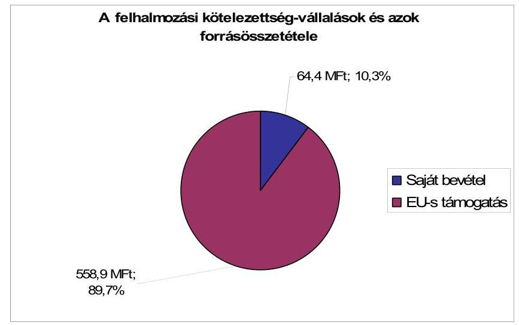

Az Önkormányzat által beadott, elbírált, támogatási szerződéssel nem rendelkező „A városközpont megújítása Fertődön" kétfordulós pályázat tervezett teljes bekerülési költsége 675,2 millió Ft volt. A projektre 2010. december 31-ig 75,7 millió Ft kifizetés történt, amelynek 67,8\%-át (51,3 millió Ft-ot) kötvénybevételből, 32,2\%-át (24,4 millió Ft-ot) saját bevételből biztosították. A projekt 2010. december 31-e utáni kötelezettségvállalásának összege 599,5 millió Ft volt, amelyből 536,3 millió Ft-ot EU-s támogatásból és 63,2 millió Ft-ot saját bevételből tervez az Önkormányzat biztosítani.

Az Önkormányzat 2010. december 31-e utáni fejlesztési kötelezettségvállalásának összege összesen 623,3 millió Ft, amelyből 558,9 millió Ft-ot EU-s támogatásból, 64,4 millió Ft-ot pedig saját forrásból - helyi adóbevételből - kívánnak finanszírozni. A saját forrásként felhasználni tervezett helyi adóbevétel - amely az előző időszakban a működési kiadások fedezetét képezte - fejlesztési célra történő felhasználása forrást von el a működési kiadásoktól, amely működési hitel felvételét vetíti előre, ez az Önkormányzat pénzügyi egyensúlyára kedvezőtlenül hat.

Az Önkormányzat mérleg szerinti, pénzintézetekkel szembeni kötelezettsége a 2006. év végéről a 2011. év I. félév végére 60,2 millió Ft-ról 746,0 millió Ft-ra ( 12,4 szeresére) nőtt, amelyből az árfolyamváltozás miatti különbözet 233,4 millió Ft volt. A 2011. június 30 -án fennálló pénzintézeti kötelezettség kötvénykibocsátásból keletkezett.

Az Önkormányzat kötelezettségvállalásaira képviselő-testületi döntés alapján került sor. A képviselő-testületi előterjesztésekben nem mutatták be a kötelezettségvállalás visszafizetési forrásait, a kamat- és - a devizaalapú kötelezettségeket érintő - árfolyamkockázatot. A 2007. évben 500 millió Ft keretösszegű kötvény kibocsátásáról döntött az Önkormányzat.

Az Önkormányzat a 2007. év előtt megkötött kölcsönszerződésekben rögzített hiteleket lehívta - 2007-2008. években visszafizette - és a hitelcélnak megfelelően a Képviselő-testület által jóváhagyott, a költségvetésbe betervezett beruhá-

---

zásokhoz használta fel. Az Önkormányzat a CHF-ben fennálló pénzintézeti kötelezettségeiből (kötvénytartozásból) tőkét nem törlesztett, az első tőketörlesztés esedékessége 2012. szeptember 30-a, összege 105,0 ezer CHF. A vizsgált időszakban az Önkormányzat 321,6 ezer CHF (59,1 millió Ft) kamatot fizetett a kötvénybefektetésből realizált bevételből. A 2007-2011. év I. féléve között átmenetileg szabad pénzeszközeiből 81,4 millió Ft kamatbevételt realizált.

Az Önkormányzat múködésének pénzügyi egyensúlyát a vizsgált időszakban folyószámlahitellel és - két alkalommal összesen 130 millió Ft - további rövid lejáratú hitel igénybevételével tudta biztosítani, melyek visszafizetése megtörtént.

A folyószámlahitel igénybevétele a 2007-2011. év I. félév között az alábbiak szerint alakult:

| Megnevezés | 2007. év | 2008. év | 2009. év | 2010. év | 2011.év I.   félév |
| :-- | --: | --: | --: | --: | --: |
| Folyószámlahitel |  |  |  |  |  |
| Keretösszeg január 1-jén (millió Ft-ban) | 37,0 | 37,0 | 37,0 | 15,0 | 15,0 |
| Átagos napi állomány (millió Ft-ban) | 18,7 | 15,4 | 0,7 | 0,5 | 0,2 |
| Folyószámla hitellel zárt napok száma (nap) | 348 | 299 | 75 | 75 | 25 |
| Egyenleg (állomány az időszak végén) | - | 7,2 | - | - |  |

A folyószámlahitel évenkénti lejáratakor 2007. és a 2008. évben 17,6 millió Ft, illetve 28,9 millió Ft folyószámlahitel-állománnyal rendelkezett az Önkormányzat. A lejáratkor az Önkormányzatnak nem kellett a folyószámlahitelét törlesztenie, a bank a hitelt új szerződés megkötésével tovább folyósította. A 2009-2011. év I. féléve közötti időszakban a lejáratkor nem állt fenn folyószámlahitel. A vizsgált időszakban - a 2008. év kivételével - év végén nem volt folyószámlahitele az Önkormányzatnak. A vizsgált időszakban az átlagos napi állomány fokozatos csökkenése a likviditási helyzet kedvező alakulását mutatta. A likviditás biztosítása az Önkormányzatnak a vizsgált időszakban 5,0 millió Ft kamatkiadást okozott. A 2011. év I. félév végi szállítói tartozása 5,0 millió Ft, melyből lejárt tartozása 1,7 millió Ft volt. A lejárt szállítói tartozás a követelésbeszámítás miatti számlák összegét ( 1,8 millió Ft-ot) nem tartalmazta. Az Önkormányzat a 2011. év I. félévében rendezte a 2010. év végi lejárt tartozásait. Átütemezett szállítói tartozás nem volt.

Az Önkormányzat kötelezettségeinek 2010. december 31-i, valamint 2011. június 30-i állományát, valamint várható alakulását a kötelezettségek lejáratáig a következő táblázat szemlélteti:

| Megnevezés | Állomány 2010. december 31-én |  |  | Állomány 2011. június 30-   án |  |  | Várható kötelezettség 2011-2013. években |  | Várható kötelezettség 2014. évtől |  |
| :--: | :--: | :--: | :--: | :--: | :--: | :--: | :--: | :--: | :--: | :--: |
|  | HUF-ban   (millió Ftban) | Devizában (összege, ezer CHFben) | Deviza nem | HUF-ban (millió Ftban) | Devizában (összege, ezer CHFben) | Deviza   nem | HUF-ban (millió Ftban) | Devizában (összege, ezer CHF-ben) | HUF-ban (millió Ftban) | Devizában (összege, ezer CHFben) |
| Pénzintézeti kötelezettségek |  |  |  |  |  |  |  |  |  |  |
| "Feltől ,ővője" kötvény |  | 3350,0 | CHF |  | 3350,0 | CHF |  | 408,1 |  | 3447,5 |
| Pénzintézeti kötelezettségek összesen CHF-ben |  | 3350,0 |  |  | 3350,0 |  |  | 408,1 |  | 3447,5 |
| Szállítás tartozás | 26,7 |  | HUF | 5,0 |  | HUF | 5,0 |  |  |  |

---

Az Önkormányzatnak pénzintézetekkel szemben fennálló kötelezettsége a 2011. év I. félév végén 3 350,0 ezer CHF volt. Ennek várható kötelezettsége (tőke, kamat és egyéb költség) a legutóbbi kamatfizetés feltételei alapján a 2011-2013. években 488,1 ezer CHF. A 2011-2013. évek kötelezettségeinek teljesítésére figyelembe vehető a víziközmű-vagyon bérleti dijából elkülönített pénzeszköz, valamint a képződő működési jövedelem. A 2014. évet követően esedékes, 2011. június 30 -án ismert pénzintézeti kötelezettség 3 447,5 ezer CHF. Az Önkormányzat tájékoztatása szerint figyelembe vehető források „a mindenkori költségvetési rendeletekben megtervezett önkormányzati saját bevételek". A további évekre szóló 2011. június 30 -án fennálló pénzintézeti kötelezettségek teljesítését az ellenőrzés nem látja biztosítottnak, mivel fedezetként a pénzóvadékként elhelyezett kötvénybevételből származó maradvány ismert, továbbá fedezet lehet a 2014. évtől képződő működési jövedelem, azonban ennek nagysága előre nem meghatározható.

Az Önkormányzatnak minősített többségi tulajdonú gazdasági társasága nem volt 2011. június 30 -án.

A vizsgált időszakban az Önkormányzatnál nem történt meg annak felmérése, hogy az eszközök elhasználódása, amortizációja fedezetének biztosítása mekkora forrást igényel.

Az Önkormányzat az ellenőrzött időszakban kiadási megtakarítást eredményező és bevételt növelő intézkedéseket tett. A 2007-2011. év I. féléve között tett intézkedések - az Önkormányzat adatszolgáltatása szerint 43,5 millió Ft bevételi többletet, továbbá 98,0 millió Ft kiadási megtakarítást eredményeztek, ezáltal az Önkormányzat pénzügyi egyensúlyi helyzetét javították. A kiadási megtakarítások 100\%-a az elrendelt álláshelycsökkentések eredménye. Az álláshelycsökkentő intézkedések 2007-2011. év I. féléve között önkormányzati szinten összesen 23 álláshely megszüntetését jelentették. Egyes közszolgáltatási területeken azonban feladatbővülések is voltak, amelyek ál-láshely- és egyben létszámnövekedéssel is jártak. Ennek következtében az időszak álláshelyeinek száma nyolc fővel emelkedett. A bevételnövelő intézkedések kettő új adónem bevezetéséhez kapcsolódtak.

Az utóellenőrzés a pénzügyi egyensúly javítására tett kettő szabályszerűségi és egy célszerűségi javaslat hasznosítására terjedt ki. A kettő szabályszerűségi javaslatot az intézkedési terv szerinti határidőben végrehajtották, egy célszerűségi javaslat nem teljesült.

Az Önkormányzat pénzügyi egyensúlyi helyzetét összegezve a következők emelhetők ki.

Fertőd Város Önkormányzatának pénzügyi egyensúlyi helyzete rövid távon veszélyeztetett.

Az Önkormányzat múködését a 2007-2010. években a pozitív folyó költségvetési egyenleg biztosította. A folyó bevételek - 2007. év kivétel - biztosították a múködési kiadások és az adósságszolgálat finanszírozását.

---

Az önként vállalt feladatokra fordított kiadások az Önkormányzat múködésének biztonságát nem befolyásolták.

Felhalmozási kockázatot jelent a felhalmozási költségvetés folyamatos forráshiánya, valamint a „A városközpont megújítása Fertődön" projekt megvalósítása.

Az Önkormányzat „A városközpont megújítása Fertődön" projekt 2011-2013. évi saját forrás igényét helyi adóbevételből tervezi biztosítani, amely működési hiány kialakulását vetíti előre.

A képviselő-testületi előterjesztésekben nem mutatták be a kötelezettségvállalás visszafizetési forrásait, a kamat- és árfolyamkockázatot. A pénzintézeti kötelezettségek teljesítése kockázatot hordoz, mivel a 2011. június 30 -án fennálló kötelezettség visszafizetésének forrása csak részben biztosított a rendelkezésre álló óvadéki betétben elhelyezett kötvénymaradványból.

A vizsgált időszakban az Önkormányzatnál nem történt meg annak felmérése, hogy az eszközök elhasználódása, amortizációja fedezetének biztosítása mekkora forrást igényel.

Az Állami Számvevőszékről szóló 2011. évi LXVI. törvény 33. § (1) bekezdésében foglaltak értelmében a jelentésben foglalt megállapításokhoz kapcsolódó intézkedési tervet köteles az ellenőrzött szervezet vezetője összeállítani és azt a jelentés kézhezvételétől számított harminc napon belül az ÁSZ részére megküldeni. Amennyiben az intézkedési tervet határidőben nem küldi meg a szervezet, vagy az továbbra sem elfogadható, az ÁSZ elnöke a hivatkozott törvény 33. § (3) bekezdés a)-b) pontjaiban foglaltakat érvényesítheti.

# A 2011. június 30-i pénzügyi egyensúlyi helyzet alapján az ellenőrzés intézkedést igénylő megállapításai és javaslatai a következők: 

## a Polgármesternek

1. Az Önkormányzat felhalmozási egyenlege az elmúlt időszakban felhalmozási forráshiányt mutatott. Az Önkormányzat által vállalt jövőbeni fejlesztési kiadások saját forrásának fedezetét helyi adóból tervezik finanszírozni, amely a müködésben rövid távon forráshiányt eredményezhet, ezáltal az Önkormányzat pénzügyi egyensúlya rövid távon veszélyeztetett. Az Önkormányzat által tett bevételnövelő és kiadáscsökkentő intézkedések nem biztosítottak elegendő forrást a pénzügyi egyensúly helyreállításához. A pénzintézeti kötelezettségek forrása csak részben biztosított.

Javaslat:
Az Önkormányzat pénzügyi egyensúlyának gyors helyreállítása és hosszú távú fenntarthatósága érdekében kezdeményezze - felelősök és határidők megjelölésével - az alábbi intézkedések megtételét:
a) Vizsgálja felül teljes körűen a tervezett beruházásokat és a megvalósuló létesítmények fenntartásának jövőbeni pénzügyi kihatásait. Szükség esetén tegyen javaslatot a Képviselő-testületnek a tervezett beruházásokkal kapcsolatos döntések

---

módosítására, amelyben figyelembe veszik az Önkormányzat pénzügyi lehetőségeit és a kötelező feladatellátás elsődlegességét.
b) Mutassa be a Képviselő-testületnek a tervezett beruházás finanszírozását, különösen a saját erő biztosítását szolgáló helyi adó megosztását, annak múködési és felhalmozási bevételként történő tételes és számszerúsített megjelölésével.
c) Tárja fel a bevételszerző és kiadáscsökkentő lehetőségeket. Intézkedjen a bevételek növelésére, a kintlévőségek behajtására, a kiadások csökkentésére.
d) Képezzen egyensúlyi tartalékot az adósságszolgálat teljesítése érdekében.
e) Mutassa be havonta a fél éven belül esedékes kötelezettségeinek finanszírozási forrásait.
f) Az adósságot keletkeztető kötelezettségvállalásról szóló döntéskor mutassa be a Képviselő-testületnek a jövőben várható - árfolyam-, kamat- és tőketörlesztési kockázatot.
g) Gondoskodjon, hogy a jövőben az adósságot keletkeztető kötelezettségvállalásokról szóló képviselő-testületi előterjesztések tételesen tartalmazzák a visszafizetés forrásait.
2. A vizsgált időszakban az Önkormányzatnál nem történt meg annak felmérése, hogy az eszközök elhasználódása, amortizációja fedezetének biztosítása mekkora forrást igényel.

Javaslat
Mutassa be a Képviselő-testületnek évente a zárszámadási rendelet előterjesztésében az értékcsökkenés összegét, és ezzel összevetve az elhasználódott eszközök pótlására fordított tényleges kiadásokat, az eszközök elhasználódási fokának alakulását.
3. Az Önkormányzat a gazdálkodási rendszerét érintő 2009. évi ÁSZ ellenőrzése során a pénzügyi egyensúly javítására tett egy célszerűségi javaslatot nem teljesítette.

Javaslat
Gondoskodjon az Önkormányzat gazdálkodási rendszerét érintő korábbi ellenőrzés nem hasznosult célszerűségi javaslatának végrehajtásáról.

---

# II. RÉSZLETES MEGÁLLAPÍTÁSOK 

## 1. Az ÖNKORMÁNYZAT KÖTELEZŐ ÉS ÖNKÉNT VÁLlALT FELADATAI, A FELADATELLÁTÁS SZERVEZETI KERETEI ÉS ANNAK VÁLTOZÁSAI

Az Önkormányzat a kötelező feladatait az Ötv. és az ágazati törvények által meghatározottnak tekinti. Az önként vállalt feladatok terjedelmét nem határozták meg, az önkormányzati feladatokról az SzMSz-ben nem rendelkeztek ${ }^{7}$. Önként vállalt feladatnak - az Önkormányzat által elvégzett besorolás alapján - a bölcsődei ellátást és a zeneiskolai oktatást tekintették.

Az Önkormányzatnál - adatszolgáltatása szerint - a múködési kiadásokon belül a kötelezöen ellátott feladatokra fordított kiadások aránya a 20072009. években átlagosan 93,9\% (547,9 millió Ft), a 2010. évben szintén 93,9\% (554,6 millió Ft) volt. Önként vállalt feladatra fordították a 2007-2009. években a kiadások átlagosan $6,1 \%$-át ( 35,4 millió Ft-ot), a 2010. évben szintén 6,1\%-át ( 36,0 millió Ft-ot).

Az Önkormányzat múködési kiadásaiból a 2007-2009. években átlagosan 253,4 millió Ft-ot ( $43,5 \%$ ), a 2010. évben 274,7 millió Ft-ot ( $46,5 \%$ ) közoktatási feladatok ellátására fordítottak. A növekedés annak ellenére mérsékelt volt, hogy 2007. évben az Óvoda négy-, az Iskola kettő tagintézménnyel bővült, 2010. évben egy tagintézménnyel csökkent. A 2007. évi tagintézményi átvétellel 177 fővel nőtt az ellátottak száma.

A szociális és gyermekvédelmi feladatokra fordított intézményi múködési kiadás a 2007-2009. években átlagosan 22,3 millió Ft (3,8\%) volt, a 2010. évben 32,3 millió Ft-ra (5,5\%) nőtt. A növekedés összefügg az ellátotti kör bővülésével. A 2007. és a 2009. években a telephelyek száma egyaránt eggyel nőtt.

A közmúvelődés, igazgatás és egyéb önkormányzati feladatokra csökkenő mértékű és arányú kiadás jutott. A 2007-2009. években átlagosan 307,6 millió Ft-ot (52,7\%), a 2010. évben 283,6 millió Ft-ot (48,0\%) fordított az Önkormányzat.

Az egyes közszolgáltatási feladatok forrásösszetétele változott. A 2007-2009. évek átlagához ( 639,2 millió Ft) viszonyítva a 2010. évben a bevételi források $0,7 \%$-os ( 4,6 millió Ft-os) növekedése az egyes bevételi források eltérő változása mellett történt. Az állami támogatás összege a 2007-2009. években átlagosan 247,9 millió Ft, a 2010. évben 236,3 millió Ft volt, az átlaghoz viszonyítva 4,7\%-kal csökkent. A csökkenésben szerepet játszott a feladatellátás központi szerepvállalásának mérséklődése. Az önkormányzati támogatás 2007-2009. évi átlaga 176,5 millió Ft, amely a 2010. évben 165,3 millió Ft, a csökkenés 6,4\%. Az önkormányzati támogatás csökkenését a beszűkülő önkormányzati források

[^0]
[^0]:    ${ }^{7}$ Erre jogszabályi előírás jelenleg nem kötelezi az önkormányzatokat.

---

okozták. Az intézményi saját bevételek 2007-2009. évek átlaga 167,8 millió Ft, a 2010. évre 10,5\%-kal (17,6 millió Ft-tal) 185,4 millió Ft-ra emelkedett, amelyet a kamatbevételek és az áfa-visszatérülések növekedése eredményezett. Az intézményi társulás társult önkormányzataitól átvett támogatás 2007-2009. évek átlagos 47,0 millió Ft összege a 2010. évre 20,9\%-kal ( 9,8 millió Ft-tal) 56,8 millió Ft-ra növekedett. A tagintézmények átvétele és az ellátotti létszámemelkedés járult hozzá az átvett támogatás összegének növekedéséhez.

A 2010. évi múködési kiadások kötelező feladatonkénti megoszlását és azok finanszírozási arányait az Önkormányzat adatszolgáltatása alapján ${ }^{8}$ az alábbi táblázat mutatja be:

| Ellátott feladat | Múködési   kiadás   összesen   (millió Ft) | Kötelező   feladatok   kiadásainak   részaránya   $\%$ | Múködési   bevétel   összesen   (millió Ft) | Állami   támogatás   részaránya   $\%$ | Intézményi   saját bevétel   részaránya   $\%$ | Önkormány-   zati támogatás   részaránya   $\%$ | Társulástól átvett   támogatás   részaránya   $\%$ |
| :--: | :--: | :--: | :--: | :--: | :--: | :--: | :--: |
| Ovodák | 113,2 | 95,1 | 113,2 | 43,6 | 8,3 | 27,3 | 20,8 |
| Általános iskolák | 161,5 | 100,0 | 161,5 | 49,5 | 4,6 | 28,7 | 17,2 |
| Szociális   intézmények | 32,3 | 100,0 | 32,3 | 51,7 | 14,8 | 16,0 | 17,5 |
| Közmúvelődési   intézmények | 5,2 | 100,0 | 5,2 | 0,0 | 0,8 | 99,2 | 0,0 |
| Egyéb intézmények | 30,5 | 0,0 | 30,5 | 37,6 | 20,2 | 42,2 | 0,0 |
| Polgármesteri hivatal   igazgatási kiadásai | 107,4 | 100,0 | 107,4 | 6,2 | 33,3 | 60,5 | 0,0 |
| Polgármesteri   hivatalban ellátott   egyéb feladatok   múködési kiadásai | 140,5 | 100,0 | 193,7 | 37,2 | 62,8 | 0,0 | 0,0 |
| Múködési kiadá-   sok összesen | 590,6 | 93,9 | 643,8 | 38,7 | 28,8 | 25,7 | 8,8 |

A költségvetési kiadások 60,8\%-át (375,9 millió Ft-ot) a járulékokkal növelt személyi juttatások, $33,4 \%$-át ( 206,3 millió Ft-ot) a dologi kiadások jelentették. A bevételi források megoszlása 2010. évben a következő volt: állami hozzájárulás $36,7 \%$ ( 236,3 millió Ft), saját bevétel $28,8 \%$ ( 185,4 millió Ft), önkormányzati támogatás $25,7 \%$ ( 165,3 millió Ft), társulástól átvett támogatás $8,8 \%$ ( 56,8 millió Ft).

A 2010. évi múködési kiadások ágazatonkénti finanszírozása az alábbi:

- A közoktatási feladatok kiadását 47,1\%-ban (129,4 millió Ft) állami támogatás, $6,5 \%$-ban ( 17,8 millió Ft) saját bevétel, $28,1 \%$-ban ( 77,1 millió Ft) önkormányzati támogatás, $18,3 \%$-ban ( 50,4 millió Ft) társulástól átvett támogatás finanszírozta.
- A szociális feladatok kiadását 51,7\%-ban (16,7 millió Ft) állami támogatás, $14,8 \%$-ban ( 4,8 millió Ft) saját bevétel, $16,0 \%$-ban ( 5,2 millió Ft) önkor-

[^0]
[^0]:    ${ }^{8}$ A tanúsítvány nem tartalmazza az egészségügyi ellátás kiadásait - háziorvosi-, ügyeleti szolgálat, iskola-egészségügyi-, védőnői-, családsegítő szolgálat - melyek költségeinek finanszírozása az OEP által történik, továbbá a német kisebbségi önkormányzat adatait.

---

mányzati támogatás, 17,5\%-ban (5,6 millió Ft) társulástól átvett támogatás finanszírozta.

- Az Önkormányzat közművelődési, igazgatási és egyéb feladatai kiadását 26,8\%-ban ( 90,2 millió Ft) állami támogatás, 48,3\%-ban ( 162,8 millió Ft) saját bevétel, $24,7 \%$-ban ( 83,1 millió Ft ) önkormányzati támogatás, $0,2 \%$-ban ( 0,7 millió Ft) társulástól átvett támogatás finanszírozta.

Az Önkormányzat kötelező és önként vállalt feladatait 2011. június 30-án - a Polgármesteri hivatallal együtt - hat költségvetési szervvel és három gazdasági társaság keretében látta el. A költségvetési szervek közül öt önállóan működő, és egy önállóan működő és gazdálkodó. A költségvetési szervek száma a vizsgált időszakban nem változott, a telephelyek száma nyolcról 15 -re nőtt. A fertődi székhelyű intézményhez a 2007. évben átvételre került négy óvoda és kettő általános iskola. Egy tagiskolát a 2011. évben megszüntettek. A szociális és gyermekvédelmi feladatoknál a 2007. és a 2009. években a telephelyek száma egy-egy növekedést mutatott. Az Önkormányzat feladatait az alábbi intézménystruktúrával látja el:

- közoktatási feladatait kettő intézmény biztosítja: egy óvoda és egy iskola,
- szociális és gyermekvédelmi feladatait szociális szolgáltató központ látja el,
- közművelődési tevékenységet végez a könyvtár,
- művészeti oktatás folyik a zeneiskolában.
- igazgatási feladatokat látott el a Polgármesteri hivatal.

Az Önkormányzat 2011. június 30-án 50\%-ot meghaladó tulajdoni részesedésű gazdasági társasággal nem rendelkezett, egy gazdasági társaságban volt 10\% alatti részesedése.

Az Önkormányzat egy gazdasági társaságban rendelkezett 3,8\%-os tulajdoni részesedéssel, amely az ivóvíz-szolgáltatási és szennyvízelvezetési és -tisztítási feladatokat végezte. A köztisztasági és településtisztasági feladatokat, valamint a közterületek fenntartását két olyan gazdasági társaság látta el közszolgáltatási szerződés alapján, amelyben az Önkormányzatnak tulajdoni részesedése nincs.

Az Önkormányzat a vizsgált időszakban négy óvodát (68 fővel) és kettő iskolát (109 fővel) vett át 2007-ben, egy tagiskola megszüntetéséről határozott 2010ben. A szomszédos önkormányzatok a gyermeklétszám csökkenése miatt veszélyben érezték az önálló intézményként való működtetést, ezért új formaként a tagintézményt, illetve telephelyet választották és így a fertődi székhelyintézményhez csatlakoztak. Az átvételt követően az intézményszám nem változott, de a telephelyek száma héttel nőtt, nyolcról 15 -re emelkedett, ebből öt volt a közoktatásban és kettő a szociális és gyermekvédelmi feladatoknál. A pénzügyi szabályozók a mikro-térségi társulási formában történő feladatellátást többletforrások juttatásával ösztönözték. A társulási forma a társulásban résztvevő önkormányzatok érdekeit szolgálta.

---

A települési önkormányzatoktól átvett feladatok hatására a személyi kiadások 223,8 millió Ft-tal, a dologi kiadások 54,7 millió Ft-tal nőttek. Az intézkedéshez 295,0 millió Ft összegű bevételi növekedés is kapcsolódott, melynek öszszetevői 51,6\% (152,1 millió Ft) állami támogatás, 21,1\% (62,4 millió Ft) az intézményi saját bevétel, $27,3 \%$ ( 80,5 millió Ft) az önkormányzati támogatás.

Az Önkormányzat 1997-ben alapította a Településkarbantartó Kft.-t, amelyben a tulajdoni hányada 100\%-os volt. Az Önkormányzat a létrehozott Kft. 2008. szeptember 30. napjával - jogutód nélkül - történő megszüntetéséről hozott döntést. A Kft. taggyúléséről készült jegyzőkönyv szerint a Kft. múködtetése már nem szükséges, a Kft. által végzett tevékenységeket más módon kívánják megoldani. A Kft.-ből három dolgozót vett át az Önkormányzat, ennek következtében a személyi juttatások kiadása 19,7 millió Ft-tal növekedett. A feladatellátásban részt vevő gazdasági társaságok gazdálkodását, illetve múködését érintő adatokat a jelentés 4 . sz. melléklete mutatja be.

Az Önkormányzatnál a vizsgált időszakban feladatátadások, egyéb a feladatellátás szervezeti kereteivel kapcsolatos intézkedések nem történtek.

Az Önkormányzat pénzügyi egyensúlyi helyzetére nem voltak jelentős hatással a 2007-2011. év I. félév közötti feladatátvételek. Az önkormányzati kiadások 298,2 millió Ft-os emelkedése a bevételek 295,0 millió Ft-os növekedése mellett történt, amely 3,2 millió Ft többletkiadást jelentett.

# 2. AZ ÖNKORMÁNYZAT PÉNZÜGYI EGYENSÚLYI HELYZETÉT BEFOLYÁSOLÓ TÉNYEZŐK 

A hagyományos költségvetési szerkezet helyett az Önkormányzat pénzügyi helyzetét a CLF módszerrel mutatjuk be, amelyben jobban elkülönülnek a vagyonnal kapcsolatos bevételek és kiadások az önkormányzati feladatokkal kapcsolatos közvetlen múködtetési bevételektől és kiadásoktól. A módszer következetesen elkülöníti a folyó és a felhalmozási költségvetés bevételeit és kiadásait, azok költségvetési egyenlegeit. A saját folyó bevételek, valamint a saját felhalmozási bevételek nem tartalmazzák az előző évi pénzmaradványok felhasználásából származó pénzforgalom nélküli bevételeket ${ }^{9}$.

A folyó költségvetés egyenlege, a múködési jövedelem megmutatja, hogy az Önkormányzat éves folyó bevétele fedezetet biztosít-e a kötelező és önként vállalt feladatellátáshoz kapcsolódó éves folyó kiadására. A múködési jövedelem negatív értéke pénzügyileg fenntarthatatlan helyzetet jelez. A mutató pozitív értéke megtakarítást mutat, amely forrásul szolgálhat az Önkormányzat fennálló kötelezettségei megfizetéséhez, valamint fejlesztéseihez.

A felhalmozási költségvetés pozitív értéke felhalmozási többletet mutat, amely a jövőbeni fejlesztések forrását biztosíthatja. Amennyiben a folyó költségvetési hiány finanszírozása a felhalmozási többletből történik, ez szűkebb értelemben vagyonfelélésnek tekinthető. Amennyiben a felhalmozási költség-

[^0]
[^0]:    ${ }^{9}$ A költségvetési években kialakuló hiány finanszírozása az előző évi pénzmaradvány és a korábbi években képzett tartalékok felhasználásával is történhet.

---

vetés megtakarítása fejlesztési célú hitelek, kötvények adósságszolgálatát finanszírozza, az változatlan vagyontömeg mellett, a korábban megelőlegezett tőkebevételek valós realizációjának tekinthető. A felhalmozási deficit által generált finanszírozási igény önmagában nem jár pénzügyi kockázattal, a pénzügyileg fenntartható beruházásokhoz kapcsolódó kötelezettségvállalás (adósságszolgálat) átlátható és szabályozott költségvetési gazdálkodással teljesíthető.

A módszer a pénzügyi kapacitás fogalmát helyezi a középpontba. Az adós hitelfelvételi képessége, hosszú távú fizetőképessége vagy bonitása a pénzügyi kapacitással, ezen belül is a nettó múködési jövedelemmel jellemezhető. A nettó múködési jövedelem negatív értéke az egyes költségvetési években jelentkező adósságszolgálat túlzott mértékére utal. ${ }^{10}$ A nettó múködési jövedelem negatív értékének felhalmozási többletből, vagy további hitelből történő finanszírozása pénzügyileg nem fenntartható gazdálkodást vetít előre. A pozitív értéket mutató nettó múködési jövedelem fejlesztési kiadások fedezetét biztosíthatja, illetve a folyamatosan, évenként képződő pozitív nettó múködési jövedelemből meghatározható a jövőben vállalható, teljesíthető éves adósságszolgálat, ily módon az a hitelösszeg, amely - a többi tényezőt, feltételt adottnak tekintve visszafizetési kockázat nélkül felvehető.

A CLF módszer alapján a pénzügyi kapacitás mértéke az Önkormányzat összevont, nettósított, a központi információs rendszerbe a Magyar Államkincstáron keresztül leadott éves költségvetési beszámolójának 80-as űrlapjában szerepeltetett adatok alapján került meghatározásra.

A számítási leírás némileg eltér az ÁSZ módszertanában korábban alkalmazott gyakorlattól. A jelen besorolás általános közgazdasági meggondolásokon alapul, amely megjelenik az SNA statisztikai módszertanában is. Folyó tételek alatt értjük azokat a kiadásokat és bevételeket, amelyek a gazdálkodó szervezet helyzetét automatikusan nem változtatják. Bevételi oldalon ilyenek az adók, a tényezőjövedelmek, a transzferek ${ }^{11}$, kiadási oldalon a transzferek és a szolgáltatás igénybevételével kapcsolatos múködési kiadások. A folyó költségvetésben a bevételekben nem térül meg, a kiadásokban nem jelenik meg az amortizáció, a vagyoni helyzetet az egyenleg befolyásolja.

A folyó költségvetés egyenlege (múködési jövedelem) tartalmazza a kamatbevételeket és a kamatkiadásokat is, mind a múködési, mind a fejlesztési kamatot, valamint a visszatérülő és befizetendő áfa teljes összegét, mert ezek közgazdaságilag tényezőjövedelmek. Nem tartalmazzák viszont a követeléselengedés miatt könyvelt bevételi és kiadási pénzforgalmi tételeket, mert valójában technikai elszámolási múveletnek minősülnek, a bevétel soha nem realizálódott, és költségvetési kiadás sem történt.

A felhalmozási költségvetésben a bevételek között a vagyon megőrzésére és bővítésére fordítható források jelennek meg. A felhalmozási vagy tőketételek mó-

[^0]
[^0]:    ${ }^{10}$ kivéve, ha annak finanszírozására a korábbi években képzett tartalékok fedezetet nyújtanak
    ${ }^{11}$ Transzferkiadásoknak nevezzük azokat a folyó és felhalmozási tételeket, amelyeket nem az adott önkormányzat használ fel szolgáltatásnyújtásra.

---

dosítják a vagyon nagyságát. A privatizációs bevétel csökkenti a vagyont, a fizikai beruházás, pénzügyi befektetés növeli.

A nettó múködési jövedelmet a tőketörlesztés levonásával a folyó költségvetés egyenlegéből származtatjuk.

# 2.1. A múködési és a felhalmozási egyensúly változása 

Az Önkormányzat kiadásait, bevételeit, kötelezettségeit, finanszírozásba vonható eszközeit a 2007-2010. évek vonatkozásában az alábbi táblázat mutatja be:

CLF módszer szerinti önkormányzati adatok

| Megnevezés | 2007. év | 2008. év | 2009. év | 2010. év |
| :--: | :--: | :--: | :--: | :--: |
| Folyó bevételek | 561,4 | 691,4 | 749,1 | 673,6 |
| Folyó kiadások | 518,5 | 642,6 | 675,3 | 618,3 |
| Múködési jövedelem | 42,9 | 48,8 | 73,8 | 55,3 |
| Nettó múködési jövedelem   =müködési jövedelem - tőketörlesztés | $-20,9$ | 42,7 | 66,6 | 15,3 |
| Felhalmozási bevételek | 6,9 | 9,8 | 248,7 | 64,1 |
| Felhalmozási kiadások | 62,4 | 63,3 | 403,0 | 221,7 |
| Felhalmozási költségvetés egyenlege | $-55,5$ | $-53,5$ | $-154,3$ | $-157,6$ |
| Finanszírozási múveletek nélküli (GFS) pozíció = múködési jövedelem + felhalmozási költségvetés egyenlege | $-12,5$ | $-4,7$ | $-80,5$ | $-102,3$ |
| Finanszírozási műveletek egyenlege | 448,4 | $-5,3$ | 25,0 | 17,6 |
| Tárgyévi pénzügyi pozíció | 435,8 | $-10,0$ | $-55,5$ | $-84,7$ |
| Egyéb tájékoztató adatok |  |  |  |  |
| Összes kötelezettség* | 550,1 | 624,5 | 668,5 | 867,8 |
| -ebből rövid lejáratú | 39,5 | 28,9 | 57,6 | 121,8 |
| Folyószámlahitel napi átlagos állománya ** | 18,7 | 15,4 | 0,7 | 0,5 |
| Finanszírozásba vonható eszközök: | 458,7 | 448,6 | 393,0 | 308,3 |
| Pénzeszközök (idegen pénzeszközök nélkül) év végi állománya | 458,7 | 448,6 | 393,0 | 308,3 |

* Az összes kötelezettséget a passzív pénzügyi elszámolások nélkül vettük figyelembe, mert a passzívák a pénzmaradvány elszámolás tételei közé tartoznak.
** A folyószámlahitel átlagos állományát 365 nappal számítottuk.

A 2007-2010. közötti időszakban az Önkormányzat kiadásainak és bevételeinek főbb jogcímek szerinti alakulását, valamint adósságszolgálatának adatait részletesen a jelentés 2. számú melléklete tartalmazza.

---

Az Önkormányzat 2007-2010 közötti múködési jövedelmének (folyó költségvetési egyenlegének) alakulását a következő ábra szemlélteti:
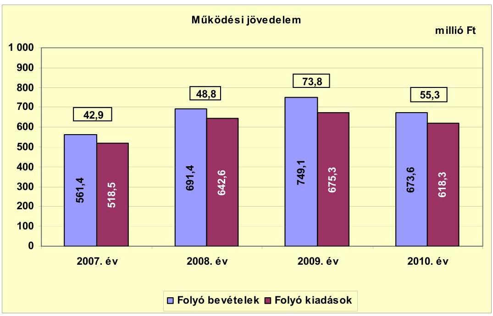

A 2007-2010. években az Önkormányzat folyó költségvetési egyenlege, múködési jövedelme pozitív összegű volt. A folyó költségvetés egyenlege (a múködési forrástöbblet) 2007-ben a folyó kiadások 8,3\%-át (42,9 millió Ft-ot), 2008-ban 7,6\%-át (48,8 millió Ft-ot), 2009-ben 10,9\%-át (73,8 millió Ft-ot), 2010-ben $8,9 \%$-át ( 55,3 millió Ft-ot) jelentette.

A múködési jövedelem 2007-ről 2008-ra 13,8\%-kal (5,9 millió Ft-tal) emelkedett, a 2009. évben a növekedés az előző évihez viszonyítva 51,2\% (25,0 millió Ft) volt. A 2010. évben a múködési jövedelem az előző évihez viszonyítva 25,1\%-os (18,5 millió Ft-os) csökkenést mutatott. A 2009. évi jelentős emelkedést a saját múködési bevételeken belül az áfa-bevételek, visszatérülések előző évhez viszonyított közel négy és félszeres ( 47,2 millió Ft-os), valamint az államháztartáson belülről kapott támogatások 17,9\%-os ( 16,8 millió Ft-os) növekedése okozta. A 2007. évi 42,9 millió Ft múködési jövedelem tartalmazott 14,9 millió Ft belterületi útfelújítási támogatást és 22,6 millió Ft ÖNHIKI támogatást, amelyek figyelembevétele nélkül a múködési jövedelem 5,4 millió Ft. A 2009. évi 73,8 millió Ft múködési jövedelem 19,1 millió Ft fejlesztési és 5,0 millió Ft útfelújítási támogatást is tartalmazott, amelyek nélkül a múködési jövedelem 49,7 millió Ft.

Az áfa-bevételek, visszatérülések 2009. évi növekedését a „Biztonságos és fenntartható kerékpáros közlekedésért a Fertü/Neusiedler See kultúrtájon" projekt keretében megvalósított kerékpárút építés 2009. évi 47,4 millió Ft összegű fordított áfa-bevételei okozták. Az államháztartáson belülről kapott támogatások 2009. évi növekedését a süttöri Óvoda-Iskola épület felújítására kapott 15,0 millió Ft-os CÉDE támogatás eredményezte.

A vizsgált időszakban a (felhalmozási támogatás nélkül számított) múködési jövedelem 181,8 millió Ft megtakarítást mutatott, amely forrásul szolgált az

---

Önkormányzat fennálló tőketörlesztési kötelezettségeinek teljesítéséhez, valamint fejlesztéseinek részbeni finanszírozásához.

Az Önkormányzat múködtetése biztosítása érdekében a 2007. évben nyújtott be igénylést ÖNHIKI támogatásra. Az elnyert támogatás összege 22,6 millió Ft volt, amelynek $66,8 \%$-át ( 15,1 millió Ft-ot) bérre, $25,2 \%$-át ( 5,7 millió Ft-ot) dologi kiadásokra, $8,0 \%$-át ( 1,8 millió Ft-ot) pedig egyéb kiadásra (támogatások, pénzeszközátadások, szociális juttatások) fordították. Az Önkormányzat a 2007-2011. év I. félév végéig egyéb, múködőképességének megőrzését szolgáló kiegészítő támogatásban nem részesült.

Az Önkormányzat nettó múködési jövedelmének (pénzügyi kapacitásának) 2007-2010 közötti alakulását az alábbi grafikon szemlélteti:
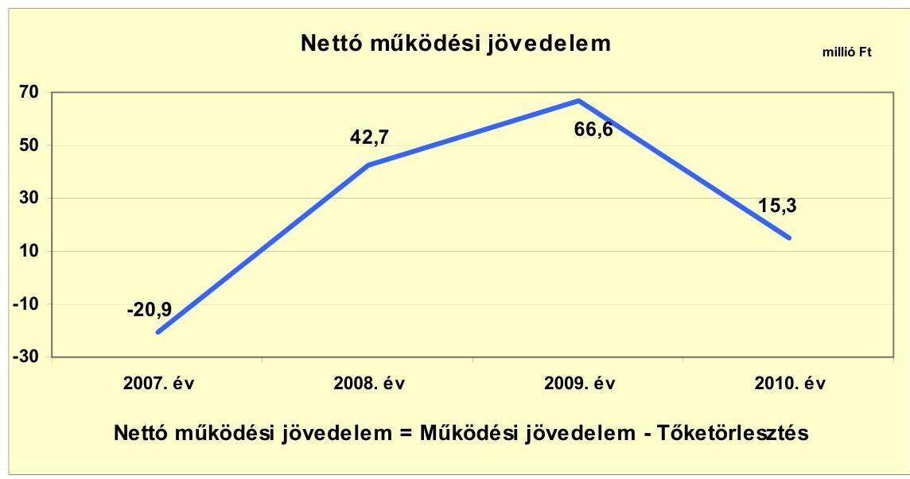

A nettó működési jövedelem értéke a működési jövedelem mellett az adott költségvetési év adósságtörlesztésének hatását is tükrözi. Az Önkormányzat - a CLF módszer alapján számított - pénzügyi kapacitása a 2007-2009. években folyamatosan emelkedett, -20,9 millió Ft-ról 66,6 millió Ft-ra nőtt. A nettó működési jövedelem a 2009. évről a 2010. évre 77,0\%-kal, 15,3 millió Ft-ra csökkent. Az Önkormányzat költségvetési megtakarításai a 2007. évben nem voltak elegendőek az adósságszolgálati kiadásokra, mert a 42,9 millió Ft múködési jövedelmet a 63,8 millió Ft hiteltörlesztés $48,7 \%$-kal meghaladta, amelynek teljesítését követően 20,9 millió Ft negatív nettó működési jövedelem keletkezett. A 2008-2010. években az Önkormányzat pénzügyi kapacitása pozitív értéket mutatott. A 2008-2010. évek összesen 177,9 millió Ft múködési jövedelmének 30,0\%-át (53,3 millió Ft-ot) tette ki a fejlesztési célú hitelekhez kapcsolódó hiteltörlesztés, amelynek kifizetését követően 124,6 millió Ft nettó működési jövedelme maradt az Önkormányzatnak. Ez a nettó működési jövedelem maradvány részbeni forrásául szolgált a 2008-2010. évi felhalmozási hiánynak. A nettó múködési jövedelem a 2008. évről a 2009. évre 56,0\%-kal (23,9 millió Fttal) emelkedett, majd a 2010. évre 77,0\%-kal (51,3 millió Ft-tal) csökkent. A 2008-ról a 2009. évre a nettó múködési jövedelem emelkedését a múködési jövedelem $51,2 \%$-os ( 25,0 millió Ft-os) növekedése okozta. A 2010. évre a nettó múködési jövedelem a 2009. évhez viszonyítva 77,0\%-kal (51,3 millió Ft-tal)

---

csökkent, amelyet részben a múködési jövedelem 25,1\%-os (18,5 millió Ft-os) csökkenése, részben pedig a hiteltörlesztés öt és félszeresére történő (7,2 millió Ft-ról 40,0 millió Ft-ra) emelkedése okozott. A 2009. évi nettó múködési jövedelem alakulásában szerepet játszott a kerékpárút építés 2009. évi 47,4 millió Ft összegű fordított áfa-bevétele, valamint a Süttöri Óvoda-Iskola épület felújítására kapott 15,0 millió Ft-os CÉDE támogatás.

A 2007-2010. évek felhalmozási költségvetési bevételeit, kiadásait, egyenlegét a következő ábra szemlélteti:
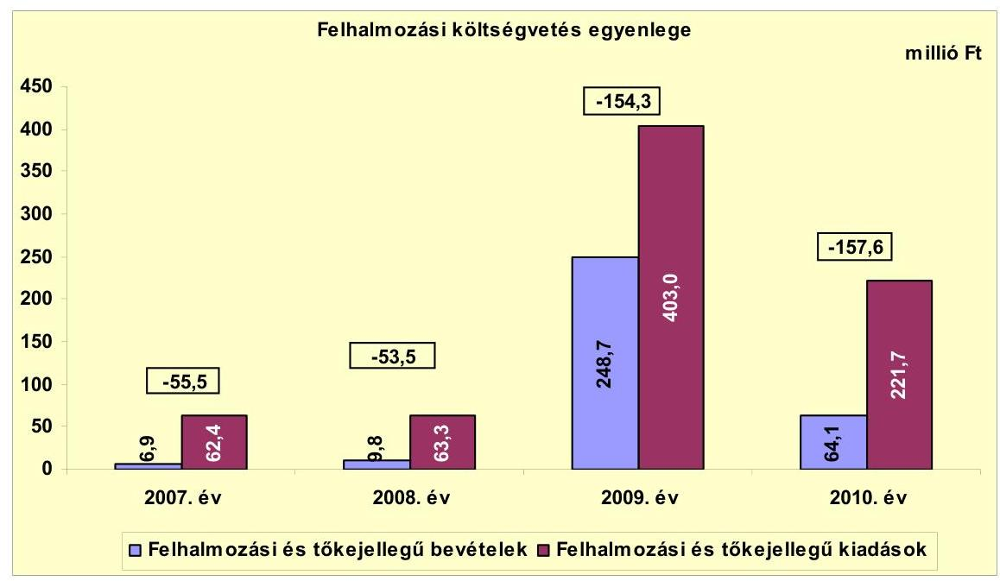

A 2007-2010. években az Önkormányzat felhalmozási költségvetésének egyenlege folyamatosan negatív előjelű volt, amely körültekintő költségvetési gazdálkodás és pénzügyileg fenntartható beruházások ${ }^{12}$ esetén is pénzügyi kockázatot jelent. A felhalmozási hiány a 2007-2008. évi átlagos 54,5 millió Ft-ról a 2009. évre 183,1\%-kal ( 99,8 millió Ft-tal) 154,3 millió Ft-ra emelkedett. A 2010. évre további 2,1\%-kal 3,3 millió Ft-tal nőtt. A költségvetési támogatások között került elszámolásra a 2007. évben 14,9 millió Ft útfelújítási támogatás, a 2009. évben 19,1 millió Ft fejlesztési célú és 5,0 millió Ft útfelújítási támogatás, amelyek figyelembevétele a felhalmozási költségvetés hiányát csökkenti. A felhalmozási célú költségvetési támogatások figyelembevételével a 2007. évi felhalmozási hiány 40,6 millió Ft-ra, a 2009. évi felhalmozási hiány 130,2 millió Ftra mérséklődik. A 2009. évi felhalmozási bevételek a kerékpárút építésre kapott 192,3 millió Ft, a Haydn sétány kialakítására kapott 50,0 millió Ft EU-s támogatásból, valamint az önkormányzati ingatlanértékesítésből származó 6,4 millió Ft-ból tevődtek össze. A 2009. évi felhalmozási kiadásokban szerepelt a kerékpárút építés 248,9 millió Ft, a Süttöri Óvoda-Iskola 36,6 millió Ft-os fel-

[^0]
[^0]:    ${ }^{12}$ Pénzügyileg akkor fenntartható a beruházás, ha a beruházás újként megjelenő, vagy többletként jelentkező múködtetésére az Önkormányzat nettó múködési jövedelme a következő években is fedezetet nyújt.

---

újítása, a 21,0 millió Ft közművagyon beruházás, valamint több út- és épületfelújítás kiadása.

A felhalmozási forráshiány a felhalmozási és tőke jellegű kiadásokon belül 2007-ben 88,9\%-ot (55,5 millió Ft-ot), 2008-ban 84,5\%-ot (53,5 millió Ft-ot), 2009-ben 38,3\%-ot (154,3 millió Ft-ot), 2010-ben 71,1\%-ot (157,6 millió Ft-ot) képviselt. A felhalmozási forráshiány a 2007-2008. években közel azonos mértékű volt, amely a 2009-2010. évekre háromszorosára emelkedett, mivel a 2009-2010. évi beruházásokra az Önkormányzat saját tőkebevételei, és az államháztartáson belülről kapott támogatások nem nyújtottak fedezetet. A vizsgált időszakban jelentkező összes felhalmozási forráshiány 420,9 millió Ft volt.

A 2007. évi felhalmozási forráshiányra a negatív nettó működési jövedelem nem nyújtott fedezetet, de a további vizsgált években a pozitív nettó múködési jövedelem részben fedezetet nyújtott a felhalmozási forráshiányra. A nettó múködési jövedelem 2008-ban a felhalmozási hiány 79,8\%-ára (42,7 millió Ft-ra), 2009-ben a 43,2\%-ára ( 66,6 millió Ft-ra), 2010-ben pedig a 9,7\%-ára ( 15,3 millió Ft-ra) nyújtott fedezetet. A felhalmozási forráshiány további finanszírozása a 2007-2010. években az előző évek pénzmaradványából, és a „Fertőd Jövője" fejlesztési célú kötvénykibocsátásból történt.

A pénzmaradvány igénybevétele révén keletkezett felhalmozási célú forrásbevonás a 2007. évben 16,8 millió Ft, a 2008. évben 29,0 millió Ft, a 2009. évben 60,1 millió Ft, a 2010. évben 97,8 millió Ft volt.

A fejlesztési célú kötvénykibocsátás a 2007. évben 512,5 millió Ft-tal szerepelt a finanszírozási bevételek között.

Az Önkormányzat évenkénti teljes finanszírozási igénye - a CLF módszer szerint számolva - 2007-ben -76,4 millió Ft, 2008-ban -10,8 millió Ft, 2009-ben -87,7 millió Ft, 2010-ben -142,3 millió Ft volt. A vizsgált időszakban a teljes finanszírozási hiány összege 317,2 millió Ft volt. A hiányzó forrásokat a finanszírozási célú bevételek és kiadások egyenlege a 2008-2010. években nem biztosította, a költségvetés hiánya a 2008. évben 16,1 millió Ft, a 2009. évben 62,7 millió Ft a 2010. évben 124,7 millió Ft volt. A 2007. évi 448,4 millió Ft finanszírozási többlet a vizsgált időszak egészét tekintve fedezetet nyújtott a teljes finanszírozási hiányra.

---

Az Önkormányzat finanszírozási múveletei 2007-2010. évekbeli egyenlegének alakulását a következő ábra szemlélteti:
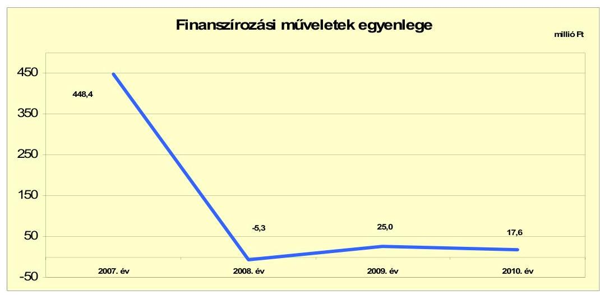

A 2007., 2009-2010. években a finanszírozási célú pénzügyi műveletek pozitív értéke jelzi, hogy az éves költségvetések végrehajtása során szükség volt az előző években képződött pénzmaradvány igénybevételén túl külső - hitelből, kötvénykibocsátásból - finanszírozásra. A 2007. évi 448,4 millió Ft-ról a 2008. évre a finanszírozási célú pénzügyi műveletek egyenlege -5,3 millió Ft-ra csökkent, amelynek kialakulását az év végén fennálló 7,2 millió Ft folyószámlahitel, a 6,1 millió Ft összegű szennyvízcsatorna beruházásra felvett hitel törlesztése, valamint a függő-átfutó, kiegyenlítő kiadások és bevételek alakították. A finanszírozási műveletek egyenlege a 2009. évben 25,0 millió Ft, a 2010. évben 17,6 millió Ft volt. A 2009-2010. évek finanszírozási műveleteinek egyenlegeit döntően a felvett rövid lejáratú hitelek - a 2009. évben 40,0 millió Ft, a 2010. évben 90,0 millió Ft - illetve a hiteltörlesztések - a 2009. évben 7,2 millió Ft folyószámlahitel, a 2010. évben 40,0 millió Ft rövid lejáratú hitel - befolyásolták. A finanszírozási műveleteket a jelentés 2. számú mellékletének 4.1-4.8. pontjai részletezik.

Az Önkormányzat éves zárszámadási rendeleteiben a hagyományos költségvetési szerkezetben mutatta be a hiányt és a többletet ${ }^{13}$. A megállapított múködési és felhalmozási kiadásokat, a keletkezett pénzügyi többleteket a jelentés 1. számú melléklete tartalmazza. A zárszámadási rendeletben kimutatott múködési és felhalmozási bevételek tartalmazták a pénzmaradvány összegét is.

[^0]
[^0]:    ${ }^{13}$ Az önkormányzatok részére nincs kötelező előírás a múködési és fejlesztési hiány/többlet megállapításának módjára.

---

Az Önkormányzat 2007-2011. év I. félév között teljesített kamatbevételeinek és kamatkiadásainak alakulását a következő ábra mutatja be:
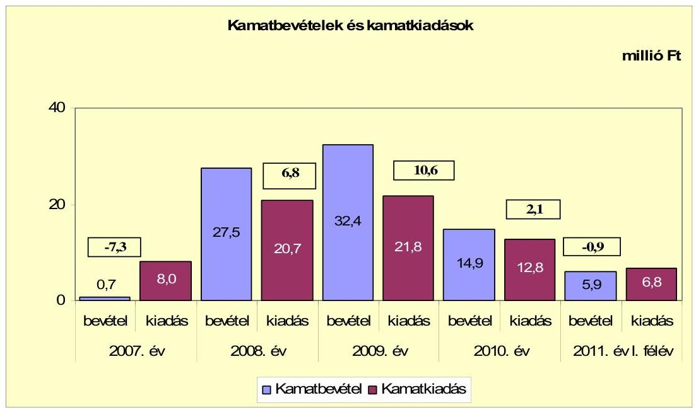

Az Önkormányzat pénzügyi kapacitása kedvező alakulásának eredményeként a 2008-2010. években a realizált kamatok meghaladták a fizetett kamatokat. A 2007-2011. június 30-a között az Önkormányzat összesen 70,2 millió Ft kamatot fizetett meg. Az átmenetileg szabad pénzeszközein realizált kamatbevétel összege 81,4 millió Ft volt, amely $16,0 \%$-kal (11,2 millió Ft-tal) haladta meg a fizetett kamatok összegét. A realizált kamatbevétel a kötvényből származó forrás befektetése óta ért el kimagasló értéket, a 2008. évben 27,5 millió Ft, a 2009. évben 32,4 millió Ft volt. Az Önkormányzat kamatbevétele döntően ( $97,7 \%$ ) a kötvény után kapott kamatbevételből származott. 2011. év I. félévben viszont a szabad pénzeszközállomány csökkenése következtében az elért kamatbevétel nem nyújtott fedezetet a kamatkiadásokra, attól 13,2\%-kal ( 0,9 millió Ft-tal) elmaradt.

# 2.2. Az Önkormányzat bevételeinek változása 

Az Önkormányzat a 2007. évben 561,4 millió Ft, a 2008. évben 691,4 millió Ft, a 2009. évben 749,1 millió Ft, a 2010. évben 673,6 millió Ft folyó bevételt realizált. Az Önkormányzat 2011. év I. félévi folyó bevétele 284,6 millió Ft volt. A folyó bevételek a 2007-2009. években 33,4\%-kal (187,7 millió Ft-tal) emelkedtek, ezt követően a 2010-re 10,1\%-os ( 75,5 millió Ft-os) csökkenés következett be. A folyó bevételek összege a 2007-2009. évek átlagos 667,3 millió Ft-hoz viszonyítva a 2010. évre 0,9\%-kal (6,3 millió Ft-tal) 673,6 millió Ft-ra emelkedett. A folyó bevételek 2007-2009. évek közötti folyamatos emelkedésének leginkább meghatározó oka a 2007. évben létrehozott intézményfenntartó társulások miatti ellátotti létszámnövekmény volt. A folyó bevételek körében meghatározó volt a költségvetési támogatás és az átengedett bevételek együttes összege, amelyek átlagosan 56,3\%-ot ( 376,7 millió Ft-ot) tettek ki. A folyó bevételek között a második legnagyobb súllyal az egyéb saját bevétel szerepelt, amelynek átlagos költségvetési súlya 27,7\% (185,2 millió Ft) volt a 2007-2010. években.

---

Az Önkormányzat a 2007-2011. év I. félév közötti időszakban realizált főbb folyó bevételi jogcímeinek számszaki adatait az alábbi grafikon mutatja be:
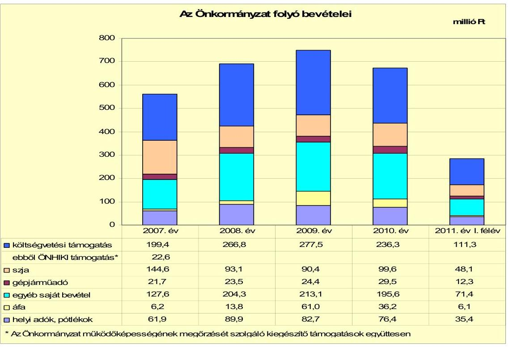

A költségvetési támogatások és az szja együttes összege a 2007-2009. években átlagosan 357,3 millió Ft, a 2010. évben az előző évek átlagához viszonyítva 6,0\%-kal (21,4 millió Ft-tal) kevesebb, 335,9 millió Ft folyó bevételt jelentett. A 2007. évi 199,4 millió Ft költségvetési támogatásból 11,3\%-ot a 22,6 millió Ft ÖNHIKI támogatás tett ki. A 2011. év I. félévében a költségvetési támogatás és az szja együttes összege 159,4 millió Ft (a 2010. évi teljesített bevétel $47,5 \%$-a) volt. A költségvetési támogatás és az átengedett szja összegében a 2008-2009. évekre bekövetkezett 39,8 millió Ft összegű növekedést a 2007. szeptember 1-jétől megalakult intézményfenntartó társulások miatti ellátotti létszámnövekedés okozta. A 2010. évi 8,1 millió Ft-os csökkenésben szerepet játszott a 2010. szeptember 1-jétől megszüntetett egy-egy óvodai és napközis csoport miatt bekövetkezett változás.

Az Önkormányzatnál az egyéb saját bevételek a 2007-2009. években átlagosan 181,7 millió Ft-ot (a folyó bevételek 27,2\%-át) tettek ki. A 2010. évben alapvetően az intézményi ellátotti létszámokból eredően befolyt térítési díjak növekedésének eredményeként 13,9 millió Ft-tal ( $7,6 \%$-kal) meghaladták a 2007-2009. évek átlagát.

Az Önkormányzat helyi adókból, pótlékokból származó bevétele a folyó bevételeken belül a 2007-2009. években átlagosan 11,7\% (78,2 millió Ft) volt, majd a 2010. évre 2,3\%-kal (1,8 millió Ft-tal) 76,4 millió Ft-ra csökkent. Az Önkormányzatnak a vizsgált időszakban iparűzési adóból, építményadóból, magánszemélyek kommunális adójából és idegenforgalmi adóból származott bevétele. Az Önkormányzat az idegenforgalmi adót és a magánszemélyek kom-

---

munális adóját 2007. július 1-jétől vezette be, a helyi adók mértéke a vizsgált időszakban nem változott.

Az Önkormányzat 2007-2011. június 30-a között a tulajdonosi részesedése után a Sopron és Környéke Víz- és Csatornamú Zrt.-től összesen 8,3 millió Ft osztalékbevételhez jutott. Az osztalékbevétel átlagos értéke 2007-2010 között 1,6 millió Ft volt. A 2007. évi bevétel összege volt a legkisebb 1,4 millió Ft, a 2008. évi a legmagasabb 2,1 millió Ft.

Az Önkormányzat 2007-2011. év I. félév között teljesített felhalmozási bevételei az alábbiak voltak:

| Megnevezés | 2007. év | 2008. év | 2009. év | 2010. év | 2011. év I.   félév |
| :-- | --: | --: | --: | --: | --: |
| Tárgyi eszköz értékesítés | 0,4 | 4,6 | 6,4 | 1,3 | 0,0 |
| Államháztartáson belülről   kapott támogatás | 1,1 | 0,4 | 242,1 | 62,4 | 18,5 |
| EU-tól és külföldről kapott   támogatások | 0,9 | 0,0 | 0,0 | 0,0 | 0,0 |
| Államháztartáson kívülről   kapott támogatás | 4,5 | 4,8 | 0,2 | 0,4 | 0,2 |
| Összes felhalmozási bevétel | 6,9 | 9,8 | 248,7 | 64,1 | 18,7 |

Az Önkormányzatnál a felhalmozási költségvetés egyenlege mindig negatív volt, amely összefügg a felhalmozási bevételek alacsony összegével. Az összes felhalmozási bevétel 348,2 millió Ft, amelynek legjelentősebb bevételi forrása az államháztartáson belülről és kívülről kapott felhalmozási célú támogatás (335,5 millió Ft). E támogatások a pályázati forrásokból megvalósuló - „Biztonságos és fenntartható kerékpáros közlekedésért a Fertő/Neusiedler See kultúrtájon", „A fertődi Haydn-sétány kialakítása" - projektekhez kapcsolódtak, így ezek évenkénti összege nagyon változó volt. A 2007. évi 6,5 millió Ft bevétel 2008. évre 5,2 millió Ft-ra csökkent, majd 2009. évben 242,3 millió Ft-ra nőtt, és 2010. évre 62,8 millió Ft lett. A tárgyieszköz-értékesítés aránya 3,6\%, amely ingatlanértékesítésből származott.

---

# 2.3. Az Önkormányzat múködési és felhalmozási célú kiadásainak változása 

Az Önkormányzat folyó kiadásai főbb jogcímek szerinti bontásban a 20072011. év I. félév közötti időszakban az alábbiak voltak:

| Megnevezés | 2007. év | 2008. év | 2009. év | 2010. év | $\begin{gathered} \text { millió Ft } \\ 2011 . \text { év I. } \\ \text { félév } \end{gathered}$ |
| :--: | :--: | :--: | :--: | :--: | :--: |
| Folyó kiadások | 518,5 | 642,6 | 675,3 | 618,3 | 293,0 |
| Müködési kiadások (kamatkiadás nélkül) | 467,5 | 581,6 | 615,5 | 590,8 | 275,2 |
| Államháztartáson belülre átadott pénzeszközök | 1,5 | 1,0 | 9,6 | 2,4 | 3,6 |
| Transzferkiadások | 41,5 | 39,3 | 28,4 | 12,3 | 7,4 |
| -ebből: vállalkozásoknak | 18,8 | 15,7 | 12,6 | 0,0 | 0,0 |
| magánszemélyeknek | 17,6 | 18,0 | 9,6 | 8,2 | 2,8 |
| nonprofit szervezeteknek | 5,1 | 5,6 | 6,2 | 4,1 | 4,6 |
| Kamatkiadások | 8,0 | 20,7 | 21,8 | 12,8 | 6,8 |

Az Önkormányzat folyó kiadásai a 2007-2009. években évente átlagosan 14,5\%-kal (78,4 millió Ft-tal) emelkedtek, a 2010. évben 1,0\%-kal (6,2 millió Fttal) haladták meg azt. A 2011. év I. félévében a folyó kiadások 293,0 millió Ftot, a 2007. évi folyó kiadások 56,6\%-át tették ki. A folyó kiadásokon belül a múködési kiadások átlagos növekedési üteme a 2007-2009. években 15,1\% ( 74,0 millió Ft) volt, amelyet a 2010. évben 6,5\%-kal ( 35,9 millió Ft-tal) teljesítettek túl. A múködési kiadások 2007-2009. évek közötti emelkedését, majd a 2010. évre történt mérsékelt csökkenését a feladatellátás változásai határozták meg.

Az Önkormányzat folyó kiadásai főbb kiadásnemek szerinti bontásban a 20072011. év I. félév közötti időszakban az alábbiak voltak:

|  |  |  |  |  | millió Ft |
| :-- | --: | --: | --: | --: | --: |
| Megnevezés | 2007. év | 2008. év | 2009. év | 2010. év | 2011. év I.   félév |
| Személyi juttatások | 253,6 | 311,8 | 296,1 | 298,2 | 137,0 |
| Munkaadót terhelő járulékok | 80,3 | 97,0 | 86,9 | 77,7 | 35,3 |
| Dologi kiadások | 123,3 | 152,2 | 230,0 | 206,3 | 94,0 |
| Egyéb folyó kiadások | 10,3 | 20,6 | 2,5 | 8,6 | 8,9 |

Az Önkormányzat a 2010. évben a folyó kiadásokból 375,9 millió Ft-ot (60,8\%) személyi juttatásokra és a munkaadókat terhelő járulékokra fordított, az üzemeltetést, intézményfenntartást biztosító dologi kiadásokra 206,3 millió Ft $(33,4 \%)$ jutott.

A személyi juttatások címen kifizetett összeg 2008-ban 58,2 millió Ft-tal (22,9\%-kal) nőtt az előző évhez viszonyítva, 2009-ben csökkent (15,7 millió Fttal), majd a 2010. évben ismét nőtt 2,1 millió Ft-tal. A vizsgált időszakban a munkaadókat terhelő járulékösszeget egyrészt a kifizetett személyi juttatások, másrészt a járulékok mértékének a csökkenése határozta meg.

Az Önkormányzat dologi kiadásainak az összege 2007-2009. évek között folyamatosan nőtt. A 2009. évhez viszonyítva a dologi kiadás összege a 2010. évre $10,3 \%$-kal ( 23,7 millió Ft-tal) csökkent.

---

Az Önkormányzat folyó és felhalmozási kiadásainak alakulását, a teljesített kiadások folyó és felhalmozási felhasználásának arányait a 2007-2011. év I. félév közötti időszakban a következő grafikon szemlélteti:
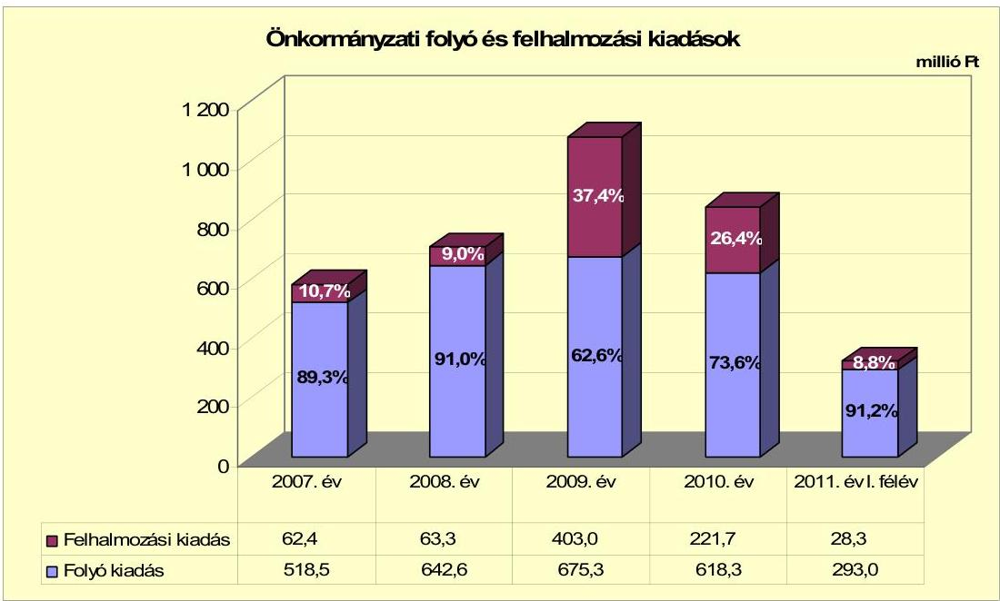

A kiadásokon belül a 2007-2011. év. I. félév közötti időszakban a felhalmozási kiadások aránya változó volt. A 2007. évben 10,7\% (62,4 millió Ft), a 2008. évben 9,0\% (63,3 millió Ft), a 2009. évben 37,4\% (403,0 millió Ft), a 2010. évben 26,4\% (221,7 millió Ft), a 2011. év I. félévében 8,8\% (28,3 millió Ft) volt az összkiadáson belüli felhalmozási kiadások aránya. A 2009. évi kimagasló felhalmozási kiadás a pályázati forrásokból megvalósuló - „Biztonságos és fenntartható kerékpáros közlekedésért a Fertő/Neusiedler See kultúrtájon", „A fertődi Haydn-sétány kialakítása", Süttöri Óvoda-Iskola épület felújítása - projektekkel volt kapcsolatos. A fejlesztések egy része áthúzódott a 2010. évre.

Az Önkormányzatnál a 2007-2010. években összesen 97 felújítás és 56 fejlesztés fejeződött be, amelyek tervezett bekerülési költsége 820,1 millió Ft, a tényleges bekerülési költsége pedig ennél 18,3\%-kal kevesebb, 669,7 millió Ft volt. A felújítási, fejlesztési feladatokat 54,7\%-ban (448,9 millió Ft) saját forrásból, 9,4\%ban (76,9 millió Ft) kötvényből, 32,0\%-ban (262,3 millió Ft) EU-s támogatásból és 3,9\%-ban ( 32,0 millió Ft) hazai támogatásból kívánták megvalósítani. A vizsgált időszakban befejezett felújítások és fejlesztések tényleges bekerülési költségeinek 43,8\%-át (293,6 millió Ft-ot) saját bevételből, 12,4\%-át (83,0 millió Ft-ot) kötvénybevételből, 39,0\%-át (261,1 millió Ft-ot) EU-s támogatásból, 4,8\%-át ( 32,0 millió Ft-ot) pedig hazai támogatásból biztosították. A befejezett felújítások között két utca burkolatának felújítása, közművagyon felújítás, járdafelújítások, fűtéskorszerűsítések, épületfelújítások szerepeltek. A befejezett fejlesztések között szerepelt a Polgármesteri hivatal szervezetfejlesztése amelynek keretében új, integrált könyvelési rendszer került kiépítésre és bevezetésre -, út és kerékpárút építése, iskolaépület átalakítása, sétány kialakítása.

Az Önkormányzatnál 2010. december 31-én - a „Városközpont megújítása Fertődön" projekt kivételével - kettő fejlesztési projekt volt folyamatban, egyik az Is-

---

kola informatikai infrastruktúra fejlesztésére, a másik pedig a közintézmények fútési rendszerének megújuló energiahasznosítással történő fejlesztési koncepciójának kidolgozására irányult. A projektek tervezett bekerülési költsége 23,8 millió Ft, melynek 95,0\%-át (22,6 millió Ft-ot) EU-s támogatásból, 5,0\%-át (1,2 millió Ft-ot) saját bevételből terveznek finanszírozni. Az Iskola infrastrukturális fejlesztési projektje 100,0\%-os EU támogatásban részesül. Ezen projektekre 2010. december 31-ig tényleges kifizetés nem történt. Az Önkormányzat 2011. év I. félévében nem indított saját forrásból felújítási, fejlesztési feladatot.

Az Önkormányzatnak a 2011. év I. félévében beadott, elbírálás alatti pályázata nem volt. A vizsgált időszakban egy olyan pályázata van, amelyre a támogatásról az értesítést 2011. augusztus 22-én kapta meg, de a támogatási szerződés megkötésére még nem került sor. Ez a „Városközpont megújítása Fertődön" című kétfordulós pályázat, amelynek a tervezett bekerülési költsége 675,2 millió Ft, amely 79,4\%-át (536,3 millió Ft-ot) EU-s támogatásból, 7,6\%-át (51,3 millió Ft-ot) kötvénybevételből, 13,0\%-át (87,6 millió Ft-ot) saját forrásból - helyi adóbevételből - terveznek biztosítani. A projekt első fordulóra benyújtott pályázatának kedvező elbírálásáról az értesítést az Önkormányzat 2010. február 24-én megkapta, ettől az időponttól kezdődött a projektfejlesztés időszaka. A projekt előkészítésére 2010. december 31-ig 75,7 millió Ft kifizetés történt, amelynek 67,8\%-át (51,3 millió Ft-ot) kötvénybevételből, 32,2\%-át (24,4 millió Ft-ot) saját bevételből biztosították.

Az Önkormányzat három legmagasabb bekerülési költségű beruházása „A városközpont megújítása Fertődön", a „Biztonságos és fenntartható kerékpáros közlekedésért a Fertő/Neusiedler See kultúrtájon", és a „A fertődi Haydn-sétány kialakítása" elnevezésű feladatokhoz kapcsolódott.

- „A városközpont megújítása Fertődön" projekt megvalósítása folyamatban van. A pályázatot az első fordulóra 2009-ben, a második fordulóra 2010-ben nyújtották be. A pályázathoz Akcióterületi Tervet fogadott el az Önkormányzat, amely tartalmazta a projekt keretében megvalósuló Kulturális és Szolgáltató Központ tervezett múködési költségeit és bevételeit. A tervezett fejlesztés öt projektelemet tartalmaz, amelyből 2010. december 31-ig a parkolók kialakítása és a Haydn sétány II. ütemének kivitelezése megtörtént. A kerékpárút építése, a Süttöri templom környéke térburkolatának elkészítése, valamint a volt szovjet laktanya épületének Kulturális és Szolgáltató Központtá való átalakítása jelenti a további fejlesztési feladatot.

A saját forrásként felhasználni tervezett helyi adóbevétel - amely az előző időszakban a működési kiadások fedezetét képezte - fejlesztési célra történő felhasználása forrást von el a működési kiadásoktól. A működési jövedelem prognosztizált alakulása múködési hitel felvételt vetít előre, ez az Önkormányzat pénzügyi egyensúlyára kedvezőtlenül hat.

- A „Biztonságos és fenntartható kerékpáros közlekedésért a Fertő/Neusiedler See kultúrtájon" elnevezésű projekt hét települési önkormányzat együttműködésével, az Önkormányzat gesztorságával valósult meg. A projekt kivitelezése a 2007. évben kezdődött meg és 2010. évben fejeződött be. A projekt tervezett teljes bekerülési költsége 240,4 millió Ft volt, melynek 80,0\%-át (192,3 millió Ft-ot) EU-s támogatásból 20,0\%-át (48,1 millió Ft-ot) saját forrásból tervezték megvalósítani. A projekt tényleges bekerülési költsége

---

253,2 millió Ft volt, ebből az elszámolható költség összege 240,4 millió Ft ( $94,9 \%$ ), az el nem számolható költség összege 12,8 millió Ft (5,1\%) volt. A tényleges bekerülési költség 76,0\%-át (192,3 millió Ft-ot) EU-s támogatásból, 24,0\%-át ( 60,9 millió Ft) saját bevételből biztosították. A projekt eredményeképpen $6,1 \mathrm{~km}$ hosszúságú kerékpárutat építettek meg.

- „A fertődi Haydn-sétány kialakítása" 2009. évben indult projekt tervezett bekerülési költsége 62,1 millió Ft volt, amelynek 80,5\%-át (50,0 millió Ft-ot) EU-s támogatásból 19,5\%-át ( 12,1 millió Ft-ot) saját bevételből kívántak biztosítani. A fejlesztés pályázatát a 2009. évben nyújtották be, a kivitelezés a 2010. évben befejeződött. A projekt tényleges bekerülési költsége 98,6 millió Ft lett, amelynek forrását $50,7 \%$-ban ( 50,0 millió Ft) EU-s támogatásból, $49,3 \%$-ban ( 48,6 millió Ft) saját forrásból biztosították. A projekt tényleges bekerülési költsége 58,7\%-kal (36,5 millió Ft-tal) meghaladta a tervezett bekerülési költség összegét, amelyet a jegyző a tanúsítványhoz mellékelt nyilatkozata alapján a kivitelezés során felmerült többletmunkák elvégzése okozott. A többletköltséget - a jegyző nyilatkozata alapján - saját bevételből egyenlítették ki.

Az Önkormányzat gazdasági társaságai részére nyújtott pénzeszközeinek összetételét, annak változását a 2007-2011. év I. félévében az alábbi ábra szemlélteti:
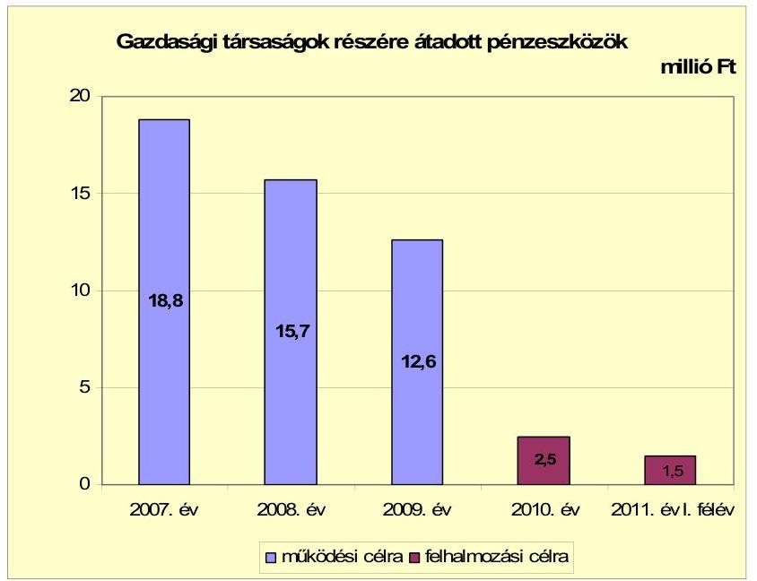

A gazdasági társaságok a múködésükhöz az ellenőrzött időszakban összesen 47,1 millió Ft múködési és 4,0 millió Ft fejlesztési célú pénzeszközátadásban részesültek az Önkormányzattól. A múködési célú pénzeszközátadás 32,9\%-át ( 15,5 millió Ft-ot) a Településkarbantartó Kft. kapta a 2007-2008. évben. Fejlesztési célú pénzeszközátadás történt azon vállalkozók részére, akik idegenfor-

---

galmi adóbefizetésük teljes összegét pályázattal visszakérik ${ }^{14}$. A pályázat 50\%os önerő mellett a teljes összegnek vállalkozásfejlesztési célra történő felhasználását írta elő.

# 3. Az ÖNKORMÁNYZAT KÖTELEZETTSÉGEI 

### 3.1. Az Önkormányzat pénzintézetekkel szembeni kötelezettségeinek változása

Az Önkormányzat pénzintézeti kötelezettségeinek állománya 2006. december 31-től 2010. december 31-ig 13,9-szeresére, 60,2 millió Ft-ról 836,0 millió Ft-ra, 2011. június 30 -ára 12,4-szeresére 746,0 millió Ft-ra nőtt. A fennálló pénzintézeti kötelezettségei 2010. év végén kötvény kibocsátásából, az Önkormányzat „Fertőd jövője" elnevezésű kötvényt bocsátott ki 2007. december 17-én - rövid lejáratú hitel igénybevételéből, 2011. június 30 -án kötvénykibocsátásból származtak.
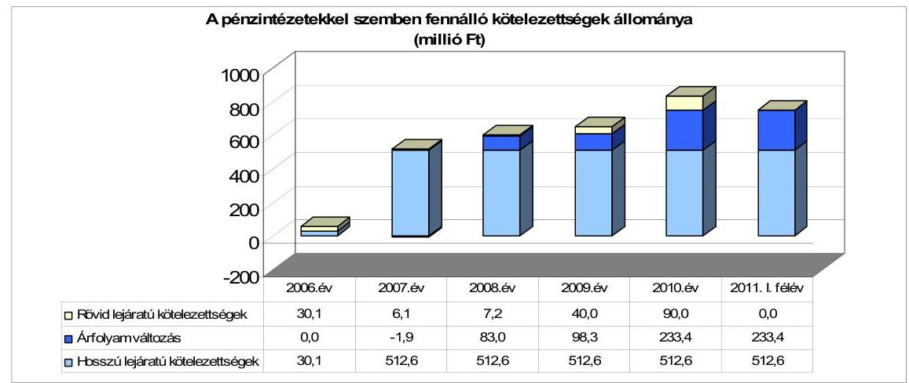

A 2006. évi kötelezettség állományát a szennyvízelvezetés és -tisztítás, az infrastruktúra fejlesztés céljára 2002-2006 évek között felvett - 2007-2008 években visszafizetett - hitelek alkották. A hosszú lejáratú kötelezettségek állományát jelentősen megnövelte a 2007. évben kibocsátott kötvény, melynek kibocsátáskori értéke 512,6 millió Ft. A pénzintézeti kötelezettségek állományán belül a kötvény kibocsátása, illetve annak árfolyamnövekedése miatt a hosszú lejáratú kötelezettségek aránya magas volt, a 2010. évben 89,2\%. A 2011. év I. félévi kötvényállomány $45,5 \%$-a (233,4 millió Ft) az árfolyamnövekedés miatt keletkezett.

Az árfolyamváltozás hatása is befolyásolja a kötelezettségek alakulását, azonban annak mértéke előre pontosan nem határozható meg, csak várakozásokon alapuló tendenciák jelezhetők. Annak megítéléséről, hogy a felvett devizás kötvényért kapott forinthoz képest a hitelek visszafizetésekor jelentkező forint kötelezettség többletkiadást (árfolyamveszteség) vagy megtakarítást (árfolyamnyere-

[^0]
[^0]:    ${ }^{14}$ A Képviselő-testület 2007. június 22-én döntött arról, hogy a vállalkozók által befizetett idegenforgalmi adó teljes összegét pályázat formájában visszajuttatja.

---

ség) eredményez a futamidő végén, a teljes kötelezettség rendezését követően lehet képet alkotni. Mindaddig, amíg törlesztési kötelezettség nem áll fenn (türelmi idő, moratórium), a tőkére vonatkoztatva nem realizálható sem az árfolyamveszteség, sem az árfolyamnyereség. A Számv. tv. 60. § (4) bek. meghatározza, hogy az árfolyam-különbözetet év végén a kötelezettségek vagy követelések között a könyvviteli mérlegben nyilván kell tartani, azonban az árfolyam-különbözet valójában nem realizálódott.

Az Önkormányzat a 2007-2011. év I. félévben hosszú lejáratú hitel felvételéről nem, viszont kötvénykibocsátásról egy alkalommal - 2007. évben - döntött. A pénzintézeti kötelezettségvállalásra képviselő-testületi döntés alapján került sor. A jövőbeni fejlesztések forrásának biztosításához fejlesztési célú, 20 éves futamidejű, 500,0 millió Ft keretösszegű „multicurrency" ${ }^{15}$ kötvényt bocsátott ki. Az Önkormányzat a kötvénykibocsátáskor a pénzintézeteket nem versenyeztette, számlavezetője azonos volt a finanszírozó pénzintézettel. A kötelezettségvállalásból származó forrás felhasználási céljait meghatározták. A Képviselő-testület döntését megalapozó előterjesztés nem tartalmazta a kötelezettségvállalás visszafizetési forrásainak, a teljes futamidő alatt várható kamat és tőkefizetési kötelezettségeknek, az árfolyam- és kamatkockázatnak a bemutatását. Az előterjesztésekben nem tértek ki az adósságvállalási korlát bemutatására, a Képviselő-testület döntéseit ennek figyelembevétele nélkül hozta meg. Az Önkormányzat a kötelezettségvállalás során az adósságot keletkeztető kötelezettségvállalásának felső határát nem lépte túl. Az adósságot keletkeztető kötelezettségvállalással megvalósított felhalmozási kiadások esetleges bevételt növelő, illetve kiadást csökkentő vonzatát, illetve ennek a fejlesztéshez, felújításhoz vállalt kötelezettségek visszafizetési forrásként való számbavételét nem vizsgálták.

Az Önkormányzat 2011. év I. félév végén devizában fennálló adósságot keletkeztető kötelezettségvállalása az alábbi volt:

| Megnevezés | Szerződéskötés/   Kibocsátás   időpontja | Összeg   ezer CHF-ben | Kibocsátásifehivási   árfolyam | Kamat (referencia kamat»   kamatfelár) | Felhasználás célja: |
| :--: | :--: | :--: | :--: | :--: | :--: |
| "Pertőd Jövője" kötvény | 2007 december 5   /2007 december   17. | 3350,0 | 153,0 | 6 havi CHF LIBOR+évi 1,5\% | A költségvetési rendeletben   meghatározott célú   kiadásainak finanszírozása,   valamint feltételek   visszafizetése és EU   pályázatok önerejének   biztosítása |

Az Önkormányzat 2007-2011. év I. félév között a CHF-ben fennálló pénzintézeti kötelezettségére tőkét nem törlesztett. A tőketörlesztés 2012. szeptember 30-tól a futamidő végéig (2027. december 17.) félévenként lesz esedékes. Az első tőketörlesztés összege 105,0 ezer CHF. Az Önkormányzat 2011. év I. félév végéig 321,6 ezer CHF ( 59,1 millió Ft) kamatot, valamint a kötelezettséghez kapcsolódóan 9,0 millió Ft egyéb díjat (jegyzési garanciavállalási díj), továbbá 76,8 ezer CHF ( 14,0 millió Ft) egyéb költséget fizetett.

[^0]
[^0]:    ${ }^{15}$ A kötvény forgalmazói szerződése szerint „amennyiben a Kibocsátó a Kötvény devizanemétől eltérő devizában kívánja teljesíteni a kamat és tőketörlesztéseket a kamatfizetések és tőketörlesztő részletek konverziója a forgalmazó által biztosított egyedi devizaárfolyamon történik".

---

A forgalmazói szerződés 2009. március 3-án kiegészítésre került, a forgalmazó bank a 2009. évre 2,3\%-os átalánydíjat határozott meg kifizető és kamatszámító ügynöki szolgáltatásokért.

Az Önkormányzat a „Fertőd Jövője" kötvényből 312,6 millió Ft-ot használt fel 2011. év I. félév végéig. A fel nem használt kötvénybevétel maradványa azonos a pénzóvadékban elhelyezett összeggel. A rendelkezésre bocsátott forrás felhasználásának szabályairól szóló 2007. december 7-én kötött megállapodásban a pénzóvadék összegét 200,0 millió Ft-ban rögzítették. A megállapodás szerint a pénzóvadék a bank felé fennálló vagy beálló fizetési kötelezettségeire szolgáló biztosíték. A pénzóvadék felett „sem Önkormányzat, sem felszámolója Önkormányzat fizetési kötelezettségei fennállásának idején nem jogosult rendelkezni, azt a számláról nem jogosult felvenni, azonban tőketörlesztésre adhat megbizást a forintbetét óvadék terhére a fedezeti arány fennmaradása mellett".

A kötvénykibocsátásból származó bevételnek - a pénzóvadék figyelembevételével - csak 61,0\%-a képezhette döntés tárgyát a felhasználást illetően. A felhasznált 312,6 millió Ft 15,5\%-át a fennálló hitelek visszafizetésére, 39,1\%-át a fejlesztési pályázatok önerejéhez, 3,8\%-át Iskola-, Muzsikaház-, járdafelújításra, 41,6\%-át működési hitel átmeneti kiváltására fordították.

Az Önkormányzat 2007-2008. években a vizsgált időszakot megelőzően felvett hosszú lejáratú hiteleit teljes mértékben visszafizette. Ez az intézkedés az Önkormányzat pénzügyi helyzetét kedvezően befolyásolta, mivel a pénzintézeti kötelezettség állománya csökkent. A 2007-2008. években a hitelek tőketörlesztésére és kamat fizetésére 76,2 millió Ft-ot fordítottak, ebből 70,7 millió Ft volt a tőketörlesztés és 5,4 millió Ft a kamatfizetés. A tőketörlesztés tartalmazza az Önkormányzat által szabálytalanul lehívott 10,8 millió Ft hitelrész visszautalását is.

Szennyvízelvezetés célját szolgáló létesítmények létrehozása céljából a lakossági érdekeltségi hozzájárulások megelőlegezésére a Fertődi Szennyvízelvezető Víziközmű Társulás 54,5 millió Ft összegű kölcsönszerződést kötött 1998. november 30-án. A Szennyvízelvezető Vízi-közmú Társulás megszűnése miatt a 36,4 millió Ft összegű tőketartozás átvételéről az Önkormányzat 2002. augusztus 5-én megállapodást írt alá. E kötelezettség teljesítésére 2007-2008-ban 13,2 millió Ft-ot fizetett az Önkormányzat.

A szennyvíztisztító beruházás kivitelezéséhez 2003. december 19-én kötött 19,4 millió Ft összegű kölcsönszerződést az Önkormányzat. Tőke és kamatfizetési kötelezettségre 5,5 millió Ft-ot teljesített 2007. december 29-én.

Az Önkormányzat 2005. december 13-án kötött kölcsönszerződés szerint „Beruházás céljára 9,0 millió Ft összegű" kölcsönt igényelt. A tartozást 2007. december 29én visszafizette. A teljesítés összege 10,0 millió Ft volt.
„Sikeres Magyarországért Önkormányzati Infrastruktúra Fejlesztési Program" keretében:

- Város- és településrehabilitáció céljából 60,0 millió Ft összegű kölcsönszerződést kötött az Önkormányzat 2006. május 8-án. A szerződést 2007. szeptember 5-én módosították szabálytalan hitel lehívása miatt. Az Önkormányzat az útfelújításokra felhasznált hitelből az ugyanezen célra elnyert állami támogatás

---

miatt a számlák összegének csak 50,0\%-át hívhatta volna le. A 2007. február 8-án lehívott 20,5 millió Ft hitelből nem volt jogosult 10,8 millió Ft összeg felvételére. A folyósított 41,1 millió Ft összegű hitelt 2007-ben visszafizette, a fizetett kamat összege 2,5 millió Ft volt.

- Könyvtári épület létrehozására, felújítására 3,6 millió Ft összegű hitelre 2006. szeptember 18-án kötött szerződést az Önkormányzat. 2007-ben a tartozást visszafizették 3,9 millió Ft összegben.

Az Önkormányzat 2007-2010. december 31. között az átmenetileg szabad pénzeszközein 81,4 millió Ft kamatbevételt realizált, melyből 79,5 millió Ft származott kötvényforrás befektetéséből és 1,9 millió Ft a Polgármesteri hivatal elkülönített bankszámláin rendelkezésre állt forrás befektetéséből ${ }^{16}$.

A kötvényforrás befektetéséből származó kamatbevételt az Önkormányzat a kötvény utáni kamatfizetésre ( 59,1 millió Ft), jegyzési garanciavállalási díjra, a kötvény utáni ügynöki szolgáltatások díjára és fejlesztési célú hitel visszafizetésére használta fel. A kamatbevétel ( 79,5 millió Ft) a kötvény teljesített (59,1 millió Ft) kamatfizetésnek a 134,5\%-át tette ki.

Az Önkormányzat múködésének pénzügyi egyensúlyához a vizsgált időszakban folyószámlahitelt és egyéb rövid lejáratú hitelt kellett igénybe venni, munkabér-megelőlegezési hitel igénybevételére nem került sor.

A folyószámlahitel alakulását a következő táblázat mutatja be:

| Megnevezés | 2007. év | 2008. év | 2009. év | 2010. év | 2011. év I.   félév |
| :--: | :--: | :--: | :--: | :--: | :--: |
| I. Folyószámlahitel |  |  |  |  |  |
| a folyószámlahitel keretösszege január 1-jén | 37,0 | 37,0 | 37,0 | 15,0 | 15,0 |
| teljesített kamat és egyéb költség | 2,3 | 2,0 | 0,9 | 0,4 | 0,2 |

A folyószámlahitel kondíciói és egyéb költségei a következők voltak ${ }^{17}$ :

| Megnevezés | Kamat (referencia+ kamatfelár) | Egyéb költség |
| :--: | :--: | :--: |
| Folyószámlahitel |  |  |
| 2007. év | 1 havi BUBOR $+3 \%$ | egyszeri kezelési költség   75 ezer Ft |
| 2008. év | 1 havi BUBOR $+3 \%$ | $1 \%$ rend.tart.jutalék |
| 2009. év | 1 havi BUBOR $+4 \%$ | $5 \%$ rend.tart.jutalék |
| 2010-2011. év | 1 havi BUBOR $+3,5 \%$ | $1,5 \%$ rend.tart.jutalék   +szerz.hossz.0,5\% |

Az Önkormányzat az átmeneti likviditási problémák kezelésére minden évben megújította a folyószámlahitel-szerződését. A folyószámlahitel évenkénti lejáratakor a bank - új szerződés megkötésével - a hitelt mindig tovább folyósítot-

[^0]
[^0]:    ${ }^{16}$ Felhasználása múködési kiadásokra történt.
    ${ }^{17}$ A referencia kamat az alábbiak szerint alakult:

    | MNB BUBOR fixing (állagkamat) \%-ban |  |  |  |  |  |
    | :--: | :--: | :--: | :--: | :--: |
    | Referencia kamat | 2007. év | 2008. év | 2009. év | 2010. év | 2011. év I.   félév |
    | 1 havi BUBOR | 7,83 | 8,75 | 8,66 | 5,47 | 6,00 |

---

ta, így az Önkormányzatnak a lejáratkor nem kellett a hitelt visszafizetnie. A folyószámlahitel keret a 2010. február 4-i folyószámlahitel-szerződés megkötésekor az előző évekhez viszonyítva 22,0 millió Ft-tal (59,5\%) csökkent. Az Önkormányzat a 2007. évben 348 napon át vett igénybe folyószámlahitelt, a hitel átlagos napi állománya 18,7 millió Ft. A 2008. évben a folyószámlahitellel zárt napok száma 299 nap volt, a hitel átlagos napi állománya 15,4 millió Ft. Jelentős változást mutat a 2009. év és a 2010. év, amikor csupán 75 napon át vette igénybe folyószámlahitel-keretét az Önkormányzat. A hitel átlagos napi állománya a 2009. évi 0,7 millió Ft-ról a 2010. évre 0,5 millió Ft-ra csökkent. A folyószámlahitel napi átlagos állományának fokozatos csökkenése a pénzügyi helyzetet kedvezően befolyásolta. A folyószámlahitel lejáratkori állománya is kedvezően alakult. A 2007-2008. évi lejáratkori hitelállomány 17,6 millió Ft, illetve 28,9 millió Ft volt, a 2009-2011. évben a lejárati napon nem állt fenn folyószámlahitel. A vizsgált időszakban - 2007. év kivételével - év végén nem volt folyószámlahitel-állomány.

Az Önkormányzat múködésének pénzügyi egyensúlyához 2009-ben illetve 2010-ben rövid lejáratú hitelt vett igénybe. A 2009. december 31-én felvett 40,0 millió Ft-ot 2010. január 19-én, a 2010. december 31-én felvett 90,0 millió Ft-ot 2011. január 31-én fizette vissza. A rövid lejáratú hitel kondíciói és egyéb költségei a következők voltak:

| Megnevezés | Kamat (referencia+ kamatfelár) | Egyéb költség |
| :--: | :--: | :--: |
| Rövid lejáratú hitel |  |  |
| 2009. év | 1 havi BUBOR $+2 \%$ | egyszeri kezelési költség   75 ezer Ft |
| 2010. év | 1 havi BUBOR $+2,5 \%$ | egyszeri kezelési költség   100 ezer Ft |

A likviditás biztosítása az Önkormányzatnak 5,0 millió Ft kamatkiadást jelentett a vizsgált időszakban. Ebből 4,2 millió Ft a folyószámlahitel, 0,8 millió Ft a rövid lejáratú hitel igénybevételhez kapcsolódott.

A kamat mértékének alakulása jelentős hatással van az adott devizanemben kifejezett, a teljes futamidőre számított, várható kamatköltség nagyságára. Az Önkormányzat 2011. június 30-án fennálló kötvénye esetében a kamatfizetési kötelezettségek alakulását is jelentősen befolyásolta a referenciakamat változása, melyet az alábbi táblázat mutat be:

| Megnevezés | Kibocsátási, lehivási | Utolsó fizetéskori | Változás \% |
| :--: | :--: | :--: | :--: |
| 6 havi CHF LIBOR (2007.12.5.-i szerződés) | 4,3683 | 1,74 | $-60,2 \%$ |

Az Önkormányzat utolsó kamatfizetési kötelezettsége a kötvény után 2011. március 31-én volt.

Amennyiben a referenciakamat nem változott volna, az Önkormányzatnak kibocsátáskori referenciakamattal számolva 2011. június 30-ig 512,2 ezer CHF kamatfizetési kötelezettsége jelentkezett volna. A kamatváltozások miatt az Önkormányzatnak 190,6 ezer CHF-el kisebb fizetési kötelezettséget kellett teljesítenie, mint amivel a szerződés megkötésekor számolnia kellett.

---

Az Önkormányzat kötelezettségeinek állományát, valamint várható alakulását a következő táblázat mutatja:

| Megnevezés | Állomány 2010. december 31   én |  |  | Állomány 2011. június 30-án |  |  | Várható kötelezettség 20112013. években |  | Várható kötelezettség 2014. évtől |
| :--: | :--: | :--: | :--: | :--: | :--: | :--: | :--: | :--: | :--: |
|  | HUF-ban   (millió Ftban) | Devizában (összege, ezer CHFben) | Deviza nem | HUF-ban (millió Ftban) | Devizában (összege, ezer CHFben) | Deviza   nem | HUF-ban (millió Ftban) | Devizában (összege, ezer CHFben) | HUF-ban (millió Ftban) | Devizában (összege, ezer CHFben) |
| Pénzintézeti kötelezettségek |  |  |  |  |  |  |  |  |  |  |
| "Fertőd Jövője" kötvény |  | 3350,0 | CHF |  | 3350,0 | CHF |  | 488,1 |  | 3447,5 |
| Pénzintézet kötelezettségek összesen CHF-ben |  | 3350,0 |  |  | 3350,0 |  |  | 488,1 |  | 3447,5 |
| Szállítói tartozás | 26,7 |  | HUF | 5,0 |  | HUF | 5,0 |  |  |  |
| Összes kötelezettség | 26,7 | 3350,0 |  | 5,0 | 3350,0 |  | 5,0 | 488,1 |  | 3447,5 |

Az Önkormányzatnak pénzintézetekkel szemben fennálló kötelezettsége 2011. június 30-án 3 350,0 ezer CHF, amely a kötvény kibocsátása miatti kötelezettség. A kötvényállomány várható kötelezettsége a tőke törlesztését és annak kamatfizetési kötelezettségét jelenti. A 2010. december 31-én fennálló tőketartozás 3350,0 ezer CHF kötelezettségét 2012-ben kezdi törleszteni az Önkormányzat. A tőke és kamatfizetés 2011-2013-ban esedékes összege 488,1 ezer CHF, a 2014-től várható kötelezettség 3447,5 ezer CHF. Ennek a kötelezettségnek a figyelembe vehető forrását az Önkormányzat nem jelölte meg. A 2011-2013 közötti kötelezettség teljesítésére figyelembe vehető a víziközművagyon bérleti díjából elkülönített pénzeszköz, valamint a megképződő működési jövedelem. A 2014. évet követő kötelezettségekre figyelembe vehető források az Önkormányzat tájékoztatása szerint a kamatokkal felnövelt kötvénybevétel maradványa, valamint a jövőben képződő működési jövedelem.

A helyszíni vizsgálat alatt további hitel-igénybevételről, illetve kötvénykibocsátásról szóló döntést nem készítettek elő.

# 3.2. A szállítói kötelezettségek változása 

Az Önkormányzat adatszolgáltatása szerint a szállítói kötelezettség és a lejárt szállítói tartozás az alábbiak szerint alakult:

|  |  |  |  |  |  |  | millió Ft |
| :-- | :--: | :--: | :--: | :--: | :--: | :--: | :--: |
|  | 2007. év | 2008. év | 2009. év | 2010. év | 2011. év I.   félév |  |  |
| Polgármesteri hivatal   és intézmények szállítói   kötelezettsége | 13,6 | 7,6 | 11,0 | 26,7 | 5,0 |  |  |
| Polgármesteri hivatal   és intézmények lejárt   szállítói tartozása | 9,8 | 4,5 | 2,5 | 22,1 | 1,7 |  |  |

A 2007-2010. évek között a szállítói kötelezettség változatos képet mutatott. A 2010. évben volt a legmagasabb a szállítói kötelezettség ( 26,7 millió Ft) is és a lejárt szállítói tartozás ( 22,1 millió Ft) is. A szállítói kötelezettség összege a 2008. évi csökkenés mellett a többi évben nőtt, de nem csak az összege, hanem a kötelezettségeken belüli aránya is nőtt, a 2007. évben 2,4\%, a 2010. évben

---

2,9\% volt. A 2010. év végén kimutatott szállítói állomány 86,1\%-a (19,0 millió Ft) 30-60 nap közötti, amely két szállítóhoz kapcsolódott, telefonszolgáltatást illetve informatikai eszközök beszerzését érintően. Az informatikai eszközök beszerzéséhez tartozó szállítói állomány 98,3\%-át egy szállítótól érkezett kettő számla ${ }^{18}$ alkotta. A lejárt szállítói állomány 6,2\%-a (1,4 millió Ft) 91 napon túli, $7,7 \%$-a ( 1,7 millió Ft) 30 nap alatti volt. A 2010. év végén fennálló szállítói tartozását az Önkormányzat a 2011. év I. félévében kiegyenlítette. A 2011. június 30-ra a szállítói állomány $81,3 \%$-kal ( 21,7 millió Ft-tal) 5,0 millió Ft-ra csökkent. A szállítói tartozás a követelésbeszámítás miatti számlák összegét nem tartalmazta. Az Önkormányzatnak a vizsgált időszakban egyéb kiadáselmaradása nem volt.

# 3.3. Egyéb kötelezettségek változása 

Az Önkormányzatnak a vizsgált időszakban nem volt lizingszerződése, garancia- és kezességvállalással kapcsolatos hosszú távú kötelezettsége, PPP konstrukcióban az Önkormányzat nem vett részt. Elengedett követelés nem volt. Intézményeknek, más önkormányzatoknak, civil szervezeteknek, gazdasági társaságoknak kölcsönt nem nyújtott.

Az Önkormányzatnál jelzálogjoggal terhelt ingatlanvagyon nem volt.
Az Önkormányzat és intézményei a helyszíni ellenőrzés időszakában folyamatban lévő peres eljárásban nem érintettek. Az Önkormányzat intézményénél 2008. évben volt jogerős határozattal lezárt peres eljárás. A Napköziotthonos Óvodában közalkalmazotti jogviszony jogellenes megszüntetése miatt indított perben a kimutatott perérték 1,8 millió Ft volt. Az Önkormányzat kártérítési kötelezettségét teljesítette.

Az Önkormányzat többségi tulajdoni hányaddal rendelkező gazdasági társasággal nem rendelkezett.

Az Önkormányzat a 2007-2010. években a tárgyi eszközök után 193,1 millió Ft összegű értékcsökkenést számolt el. Felújításra 121,2 millió Ft-ot fordított. A vizsgált időszakban nem történt meg annak felmérése, hogy az elhasználódott eszközök pótlása milyen kötelezettséget jelent az Önkormányzat számára. A felújításokra, az eszközök pótlására elsősorban az intézmények működőképességének biztosítása, illetve a szakhatósági előírások figyelembevételével került sor.

Az Önkormányzat 2010. december 31-i eszközállományának bruttó értéke 3 142,9 millió Ft volt, amely a 2007-2009. évek 2879,0 millió Ft átlagos értékéhez viszonyítva 9,2\%-kal (263,9 millió Ft-tal) nőtt. Az eszközállomány átlagos használhatósági foka a 2007-2009. évek között 83,9\% volt. A 2010. évi használhatósági fok 1,9 százalékponttal csökkent. Az eszközök használhatósági foka annak ellenére csökkent, hogy az Önkormányzat felújításra és fejlesztésre együtt 612,6 millió Ft-ot fordított. Az eszközök használhatósági foka részletesen: legrosszabb a mutató a gépek, berendezések, felszerelések eszközcso-

[^0]
[^0]:    ${ }^{18}$ A számlák kiegyenlítésére a pályázati forrás késve érkezett meg.

---

portban, a mutató értéke 16,6\% volt a 2010. évben, ez a 2007-2009. évi 18,2\%hoz képest 1,6 százalékpontos csökkenést mutatott. A járműveknél a bruttó érték nem változott, a nettó érték viszont nulla volt végig a vizsgált időszakban. Az ingatlanok állományának állaga és az üzemeltetésre átadott eszközök állományának állaga folyamatosan romlik. Az ingatlanok állományának állagát mutató használhatósági fok a 2007-2009. évi átlagos 91,8\%-ról a 2010. évre $91,7 \%$-ra, az üzemeltetésre átadott eszközök állományának állagát mutató használhatósági fok a 2007-2009. évi átlagos 68,4\%-ról a 2010. évre 61,9\%-ra csökkent.

# 4. A PÉNZÜGYI EGYENSÚLY MEGTEREMTÉSE ÉrDEKÉBEN HOZOTT INTÉZKEDÉSEK EREDMÉNYE 

Az Önkormányzat a vizsgált időszakban kiadáscsökkentő és bevételnövelő intézkedéseket tett. Az Önkormányzat kimutatásai szerint a 2007-2010. években kiadási megtakarítást a közoktatási, valamint a Polgármesteri hivatali feladatainak átszervezéséhez kapcsolódó álláshely-csökkentésekből ért el, megőrizve az intézmények gazdálkodásának stabilitását. A Képviselő-testület a 2007. évben, valamint a 2009-2010. években hozott létszámcsökkentési döntéseket, egyéb kiadáscsökkentő intézkedésre nem került sor.

Az Önkormányzat adatszolgáltatása szerint a vizsgált időszakban a kiadáscsökkentő intézkedések hatásaként összesen 98,0 millió Ft megtakarítást ért el, amely teljes egészében a feladatok átszervezésével együtt járó létszámcsökkentésekből adódó személyi juttatás és azok járulékai, valamint ezen foglalkoztatottakhoz kapcsolódó étkezési hozzájárulások megtakarításainak összege volt.

Az Önkormányzat feladatellátásához a 2007-2010. években egyaránt kapcsolódott létszámnövekedés, illetve létszámcsökkentés.

A 2007-2010. években végrehajtott létszámcsökkentések

| Megnevezés (adatok tő-ben) | Közoktatás | Szociális és gyermekvédelem | Egészségügyi | Polgármesteri hivatal | Egyéb | Összesen |
| :--: | :--: | :--: | :--: | :--: | :--: | :--: |
| 2007. január 1-jén induló létszám | 66 | 8 | 4 | 29 | 1 | 108 |
| Megszüntetett álláshelyek száma | 20 | 0 | 0 | 3 | 0 | 23 |
| 2008. üres álláshelyek száma | 0 | 0 | 0 | 0 | 0 | 0 |
| szakmai álláshelyek száma | 13 | 0 | 0 | 3 | 0 | 16 |
| intézmény-üzemeltetéssel kapcsolatos álláshelyek száma | 7 | 0 | 0 | 0 | 0 | 7 |
| Létszám növekedés | 24 | 3 | 0 | 4 |  | 31 |
| 2010. december 31-én záró létszám | 70 | 11 | 4 | 30 | 1 | 116 |

Az engedélyezett álláshelyek száma a 2007. január 1-jei 108 fơről 2010. december 31-ére 116 főre emelkedett. Az Önkormányzat a feladatellátás átszervezése miatt a vizsgált időszakban 23 álláshelyet megszüntetett, azonban a közoktatási feladatoknál a tagintézmények belépése, a szociális és gyermekjóléti feladatellátásnál a társulás által ellátott feladatok növekedése, valamint a városgondnoksági feladatok visszavétele miatt 31 fővel nőtt is az álláshelyek száma. A foglalkoztatottak száma a 2007. január 1-jei 108 fôről 2010. december 31-ére 116 fôre emelkedett. Az Önkormányzat kimutatásaiban üres álláshelyeket nem mutatott ki.

---

Az Önkormányzat gazdasági helyzetét javító kiadáscsökkentő intézkedései során, az oktatási intézmények kiadásainak csökkentése érdekében a 2007/2008-as tanévtől összesen hét fő - az Iskolában három fő pedagógusi és egy fő egyéb alkalmazotti, az Óvodában egy fő dajka, a Zeneiskolában pedig egy fő zenepedagógus és egy fő egyéb alkalmazott - közalkalmazotti jogviszonyának megszüntetéséről határozott. A Képviselő-testület az intézményei létszámhelyzetének áttekintése és az intézmények közötti tervezhető létszám és álláshely átcsoportosítási lehetősége felülvizsgálatát követően a 2009/2010. tanévtől a fertőendrédi tagiskola vonatkozásában egy fő pedagógus álláshely megszüntetéséről döntött. A 2010. évi intézményátszervezés - egy iskolai napközis csoport és egy óvodai csoport megszüntetés - következtében az Iskola fertődi tagiskolájában három fő, egy fő pedagógusi és kettő technikai alkalmazott, az Óvoda fertődi tagóvodájában egy fő óvodapedagógus és egy fő dajka, valamint a fertődi székhelyiskolában, az agyagosszergényi és a fertőendrédi tagiskolában egy-egy fő, összesen három fő létszámleépítésről döntöttek. A 2010. évben nyugdíjazással és közös megegyezéssel megszűnt négy fő álláshelye is.

Az Önkormányzat az oktatási feladatait 2007. szeptember 1-jétől kettő intézményi társulással látta el. A közoktatási feladatat ellátására létrehozták a Fertőd-Agyagosszergény-Ebergőc-Fertőendréd-Röjtökmuzsaj-Sarród Közoktatási Intézményfenntartó Társulást, amely a fertődi iskolán kívül kettő tagiskolával működött, amelyhez kapcsolódóan a foglalkoztatottak száma 10 fővel nőtt. A bölcsődei ellátással kiegészített óvodai nevelési feladatokat a Fertőd-Agyagosszergény-Ebergőc-Fertőendréd-Röjtökmuzsaj-Sarród Óvoda és Bölcsőde Intézményfenntartó Társulás látta el. A társult intézmény a fertődi óvodával és négy tagóvodával látta el a feladatokat, ami a foglalkoztatottak számában 12 fős növekedést eredményezett.

A szociális feladatok ellátására a 2007. évben létrehozták a Fertőd és Térsége Szociális és Gyermekjóléti Szolgáltató Társulást, melyhez a 2007. évben egy álláshely bővítés történt, továbbá 2009. január 1-jétől két családgondozói álláshelyet alakítottak ki.

A Polgármesteri hivatali feladatok engedélyezett álláshelyeiben és a foglalkoztatottak létszámában a 2007-2010. években három fő létszámcsökkentés és a feladatok bővülése miatt négy fő létszámnövekedés következett be. A Képviselőtestület döntött az Önkormányzat gazdasági helyzetét javító költségcsökkentő intézkedésekről. A létszámleépítés érintette a gazdaságtalan múködés miatt megszüntetett Turinform Irodában foglalkoztatott kettő fő és a Polgármesteri hivatalban feladatászervezés miatt megszüntetett egy fő szociális ügyintéző köztisztviselői jogviszonyát. A Képviselő-testület 2008. szeptember 30-i hatállyal megszüntette a 100\%-os önkormányzati tulajdonban lévő Településkarbantartó Kft.-t, a Kft. dolgozói közül három fő a Polgármesteri hivatal létszámába került át. A 2009. évben a megnövekedett feladatok miatt egy fő pénzügyi előadói álláshely növeléséről döntöttek.

Az Önkormányzat a helyi szervezési intézkedések keretében a 2007-2010. években 17 álláshely tartós leépítéséhez 23,8 millió Ft központi költségvetési támogatást igényelt és 22,4 millió Ft támogatásban részesült. Az igényelt és a folyósított támogatás közötti eltérést az igénylésben keletkezett számítási hiba okozta. A létszámcsökkentés 26,1\%-ához (hat fő) központi támogatás nem kapcsolódott. Az Önkormányzat tájékoztatása szerint a létszámcsökkentéssel érintett dolgozókat a Polgármesteri hivatalban és intézményeinél nem foglalkoztatták tovább.

---

Az Önkormányzat a bevételei növelése érdekében a 2007. évben két új adónem - magánszemélyek kommunális adója, idegenforgalmi adó - bevezetéséről döntött, valamint nagyobb hangsúlyt fektetett az adóhátralékok behajtására.

Az Önkormányzat a bevételnövelő intézkedései eredményeként a 20072011. év I. félév között 43,5 millió Ft bevételt mutatott ki. A magánszemélyek kommunális adójából 24,5 millió Ft, az idegenforgalmi adó bevezetéséből 10,8 millió Ft realizálódott. Az adóhátralékokból keletkezett kintlévőségek csökkentésére végrehajtót alkalmaztak, amely eredményeként - az Önkormányzat kimutatása szerint - 8,2 millió Ft többletbevétel keletkezett.

Az Önkormányzat kiadáscsökkentő és bevételnövelő intézkedései eredményeként 2007-2011. év I. félév között összesen 141,5 millió Ft megtakarítást és többletbevételt számolt el. Az Önkormányzat költségvetési támogatásból, átengedett bevételekből származó bevételei a 2007. évhez viszonyítva, az időszak egészét tekintve összességében 5,1 millió Ft-tal emelkedtek.

# 5. AZ ÁSZ ÁLTAL A KORÁBBI ÉVEKBEN A PÉNZÜGYI EGYENSÚLY JAVÍTÁSÁRA TETT SZABÁLYSZERŰSÉGI ÉS CÉLSZERŰSÉGI JAVASLATOK HASZNOSULÁSA 

Az ÁSZ az Önkormányzat gazdálkodási rendszerét a 2009. évben ellenőrizte. Az ellenőrzésről készült jelentés megállapításairól a polgármester a Képviselőtestületet a 2010. június 23-i képviselő-testületi ülésen tájékoztatta. Az ellenőrzés által megfogalmazott javaslatokra a Képviselő-testület intézkedési tervet fogadott el határidők és felelősök megjelölésével. A jelentés az Önkormányzat pénzügyi egyensúlyi helyzetének javítására kettő szabályszerűségi és egy célszerúségi javaslatot fogalmazott meg, amelyből a kettő szabályszerűségi javaslat maradéktalanul megvalósult, a célszerűségi javaslat nem teljesült.

Javasoltuk a jegyzőnek: „gondoskodjon arról, hogy a költségvetési rendeletekben a költségvetési bevételi és kiadási föösszegek az Áht. 8/A. § (7) bekezdésében előirtak alapján finanszírozási célú pénzügyi múveleteket ne tartalmazzanak", továbbá biztosítsa, hogy „a költségvetési rendeletekben az Ámr. 29. § (1) bekezdés k) pontjában előirtak alapján, önkormányzati szinten elkülönítetten mutassák be az európai uniós forrással támogatott projektek bevételi és kiadási előirányzatát". Az Önkormányzat 2010-2011. évi költségvetési rendeletei a jogszabályi előírásoknak megfelelően készültek.

A pénzügyi egyensúly javítására egy célszerűségi javaslat vonatkozott, mely szerint a jegyző „tájékoztassa - évente végzett számítások alapján - a Képviselőtestületet az Önkormányzat eladósodásának növekedésére figyelemmel arról, hogy a hosszú lejáratú, adósságot keletkeztető kötelezettségvállalásokból adódó tőke- és kamatfizetési kötelezettségét az Önkormányzat milyen feltételek biztosítása mellett tudja teljesíteni".

---

A Képviselő-testület 2011. január 1-je és szeptember 30-a között előterjesztés hiányában nem tárgyalta az Önkormányzat eladósodásának helyzetét, a hoszszú lejáratú kötelezettségvállalásokból keletkezett fizetési kötelezettségek teljesítésének feltételrendszerére vonatkozó számítási anyag nem készült. A jegyző 2011. október 12-i nyilatkozata alapján a hosszú lejáratú, adósságot keletkeztető kötelezettségek biztosításának módját a 2012. évi költségvetési koncepció megtárgyalásakor, valamint a 2012. évi költségvetési rendelet előterjesztésekor kívánja részletesen bemutatni.

Budapest, 2012. április 46

Melléklet: $\quad 6 \mathrm{db}$
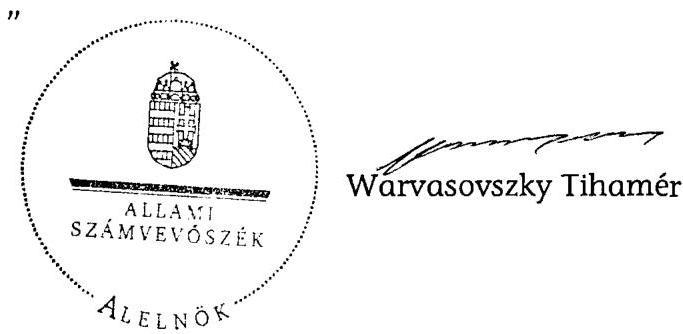

---

Fertőd Város Önkormányzata

1. számú melléklet
a V-3092-014/2012. számú Jelentéshez

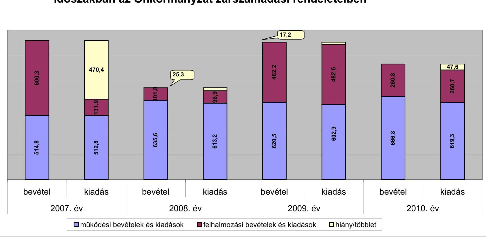

---

Az Önkormányzat bevételei és kiadásai, valamint adósságszolgálata 2007-2010 között

|  1. FOLYÓ KÖLTSÉGVETÉS* | 2007. év | 2008. év | 2009. év | 2010. év  |
| --- | --- | --- | --- | --- |
|  1.1.1. Saját müködési bevételek | 128,4 | 208,8 | 241,9 | 195,4  |
|  1.1.2. Költségvetési támogatás * | 199,4 | 266,8 | 277,5 | 236,3  |
|  1.1.3. Átengedett bevételek | 166,3 | 116,6 | 114,8 | 129,1  |
|  1.1.4. Állambáztartáson belülről kapott támogatások | 66,1 | 93,8 | 110,6 | 109,0  |
|  1.1.5. EU-tól és külföldről kapott bevételek | 0,0 | 0,5 | 0,0 | 0,9  |
|  1.1.6. Állambáztartáson kívülről kapott bevételek | 1,2 | 4,9 | 4,3 | 2,9  |
|  1.1.7. Előző évi pénzmaradvány átvétel | 0,0 | 0,0 | 0,0 | 0,0  |
|  1.1. Folyó bevételek $=1.1 .1 .+1.1 .2 .+1.1 .3 .+1.1 .4 .+1.1 .5 .+1.1 .6 .+1.1 .7$. | 561,4 | 691,4 | 749,1 | 673,6  |
|  1.2.1. Müködési kiadások kamatkiadások nélkül | 467,5 | 581,6 | 615,5 | 590,8  |
|  1.2.2. Állambáztartáson belülre átadott pénzeszközök | 1,5 | 1,0 | 9,6 | 2,4  |
|  1.2.3.1. vállalkozásoknak | 18,8 | 15,7 | 12,6 | 0,0  |
|  1.2.3.2. EU-nak, illetve külföldre | 0,0 | 0,0 | 0,0 | 0,0  |
|  1.2.3.3. magánszemélyeknek | 17,6 | 18,0 | 9,6 | 8,2  |
|  1.2.3.4. nonprofit szervezeteknek | 5,1 | 5,6 | 6,2 | 4,1  |
|  1.2.3. Transferkiadások ( $=1.2 .3 .1+1.2 .3 .2+1.2 .3 .3+1.2 .3 .4$ ) | 41,5 | 39,3 | 28,4 | 12,3  |
|  1.2.4 Kamatkiadások | 8,0 | 20,7 | 21,8 | 12,8  |
|  1.2.5. Előző évi pénzmaradvány átadás | 0,0 | 0,0 | 0,0 | 0,0  |
|  1.2. Folyó kiadások $=1.2 .1 .+1.2 .2 .+1.2 .3 .+1.2 .4 .+1.2 .5$. | 518,5 | 642,6 | 675,3 | 618,3  |
|  1.3. Folyó költségvetés egyenlege MÜKÖDÉSI JÖVEDELEM (1.1. - 1.2.) | 42,9 | 48,8 | 73,8 | 55,3  |
|  2. FELHALMOZÁSI KÖLTSÉGVETÉS | 0,0 | 0,0 | 0,0 | 0,0  |
|  2.1.1. Saját tökebevételek | 0,4 | 4,6 | 6,4 | 1,3  |
|  2.1.2. Állambáztartáson belülről kapott támogatások | 1,1 | 0,4 | 242,1 | 62,4  |
|  2.1.3. EU-tól és külföldről kapott támogatások | 0,9 | 0,0 | 0,0 | 0,0  |
|  2.1.4. Állambáztartáson kívülről kapott támogatások | 4,5 | 4,8 | 0,2 | 0,4  |
|  2.1. Felhalmozási bevételek ( $=2.1 .1 .+2.1 .2+2.1 .3+2.1 .4$.) | 6,9 | 9,8 | 248,7 | 64,1  |
|  2.2.1. Saját beruházási kiadás áfával | 26,2 | 50,6 | 300,7 | 198,9  |
|  2.2.2. Saját felújítási kiadás áfával | 34,9 | 11,6 | 102,2 | 20,3  |
|  2.2.3. Állambáztartáson belülre átadott pénzeszköz | 0,6 | 0,3 | 0,0 | 0,0  |
|  2.2.4. EU-nak és külföldnek adott pénzeszközök | 0,0 | 0,0 | 0,0 | 0,0  |
|  2.2.5. Állambáztartáson kívülre adott pénzeszközök | 0,7 | 0,7 | 0,1 | 2,5  |
|  2.2.6. Befektetési célú részesedések vásárlása | 0,0 | 0,0 | 0,0 | 0,0  |
|  2.2. Felhalmozási kiadások ( $=2.2 .1 .+2.2 .2 .+2.2 .3 .+2.2 .4 .+2.2 .5 .+2.2 .6$.) | 62,4 | 63,3 | 403,0 | 221,7  |
|  2.3. Felhalmozási költségvetés egyenlege (2.1. - 2.2.) | $-55,5$ | $-53,5$ | $-154,3$ | $-157,6$  |
|  3. Finanszírozási műveletek nélküli (GFS) pozíció(1.3.+2.3.) | $-12,5$ | $-4,7$ | $-80,5$ | $-102,3$  |
|  4. Finanszírozási műveletek | 0,0 | 0,0 | 0,0 | 0,0  |
|  4.1. Hitelfelvétel | 9,7 | 7,2 | 40,0 | 90,0  |
|  4.2. Hiteltörlesztés | 63,8 | 6,1 | 7,2 | 40,0  |
|  4.3. Forgatási és befektetési célú értékpapírok kibocsátása | 512,6 | 0,0 | 0,0 | 0,0  |
|  4.4. Forgatási és befektetési célú értékpapírok beváltása | 0,0 | 0,0 | 0,0 | 0,0  |
|  4.5. Forgatási és befektetési célú értékpapírok értékesítése | 0,0 | 0,0 | 0,0 | 0,0  |
|  4.6. Forgatási és befektetési célú értékpapírok vásárlása | 0,0 | 0,0 | 0,0 | 0,0  |
|  4.7. Egyéb finanszírozási bevételek (függő, átfutó, kiegyenlítő) | 8,1 | $-3,2$ | $-0,9$ | $-18,7$  |
|  4.8. Egyéb finanszírozási kiadások (függő, átfutó, kiegyenlítő) | 18,2 | 3,2 | 6,9 | 13,7  |
|  4.9.Finanszírozási műveletek egyenlege (4.1. - 4.2.+4.3.-4.4+4.5.-4.6.+4.7.-4.8.) | 448,4 | $-5,3$ | 25,0 | 17,6  |
|  5. Tárgyévi pénzügyi pozíció (1.3.+ 2.3.+4.9.) | 435,8 | $-10,0$ | $-55,5$ | $-84,7$  |
|  6. Nettó müködési jövedelem =müködési jövedelem (1.3.) - tőketörlesztés (4.2+4.4) | $-20,9$ | 42,7 | 66,6 | 15,3  |
|  TÁJÉKOZTATÓ ADATOK | 0,0 | 0,0 | 0,0 | 0,0  |
|  Összes kötelezettség | 550,1 | 624,5 | 668,5 | 867,8  |
|  ebből rövid lejáratú | 39,5 | 28,9 | 57,6 | 121,8  |
|  Összes szállító kötelezettség | 13,6 | 7,4 | 10,5 | 25,1  |
|  ebből lejárt (tanúsítványból) | 9,8 | 4,5 | 2,5 | 22,1  |
|  Pénz és tőkaplaci kötelezettség (adósság) | 516,7 | 602,8 | 650,8 | 836,0  |
|  ebből rövid lejáratú | 6,1 | 7,2 | 40,0 | 90,0  |
|  Folyószámfahitel napi átlagos állománya (tanúsítványból) | 18,7 | 15,4 | 0,7 | 0,5  |
|  Finanszírozásha bevonható eszközök: | 458,7 | 448,6 | 393,0 | 308,3  |
|  Pénzeszközök (idegen pénzeszközök nélkül) év végi állománya | 458,7 | 448,6 | 393,0 | 308,3  |

- Az 1.1.2. Költségvetési támogatás sor összege tartalmaz a 2007. évben 14,9 millió Ft, a 2009. évben 24,1 millió Ft felhalmozási célú támogatást is

---

## **Az Önkormányzat 2007-2010. években megvalósított, 2010. december 31-ig befejezett fejlesztései és azok forrásösszetétele**

|  Fejlesztési feladat (beruházás, felújítás) |  |  | Beruházás,
felújítás |  | Teljes bekerülési költség |  |  | 2006. |  |  | 2007. |  |  | 2010. december 31-ig megvalósított beruházás forrásösszetétele |  |  |  |  |  |  |  |  |  |  |  |  |  |  |  |  |  |  |  |  |  |  |  |  |  |  |  |  |  |  |  |  |  |  |  |  |  |  |  |  |  |  |  |  |  |  |  |  |  |  |  |  |  |  |  |  |  |  |  |  |  |  |  |  |  |  |  |  |  |  |  |  |  |  |  |  |  |  |  |  |  |  |  |  |  |  |  |  |  |  |  |  |  |  |  |  |  |  |  | 

---

### **Az Önkormányzat 2010. december 31-én folyamatban lévő fejlesztési feladataira 2010. december 31-én fennálló kötelezettségek és azok forrásösszetéte!**

|   |  |  |  |  |  |  |  |  |  |  |  |  |  |  |  |  |  |  |  |  |  |  |  |  |  |  |  |  |  |  |  |  |  |  |  |  |  |  |  |  |  |  |  |  |  |   |
| --- | --- | --- | --- | --- | --- | --- | --- | --- | --- | --- | --- | --- | --- | --- | --- | --- | --- | --- | --- | --- | --- | --- | --- | --- | --- | --- | --- | --- | --- | --- | --- | --- | --- | --- | --- | --- | --- | --- | --- | --- | --- | --- | --- | --- | --- |
|   |  |  |  |  |  |  |  |  |  |  |  |  |  |  |  |  |  |  |  |  |  |  |  |  |  |  |  |  |  |  |  |  |  |  |  |  |  |  |  |  |  |  |  |  |   |
|   | Fejlesztési feladat (beruházás, felújítás) |  |  |  |  |  |  |  |  |  |  |  |  |  |  |  |  |  |  |  |  |  |  |  |  |  |  |  |  |  |  |  |  |  |  |  |  |  |  |  |  |  |  |  |   |
|   |  |  |  |  |  |  |  |  |  |  |  |  |  |  |  |  |  |  |  |  |  |  |  |  |  |  |  |  |  |  |  |  |  |  |  |  |  |  |  |  |  |  |  |   |
|   |  |  |  |  |  |  |  |  |  |  |  |  |  |  |  |  |  |  |  |  |  |  |  |  |  |  |  |  |  |  |  |  |  |  |  |  |  |  |  |  |  |  |  |   |
|   |  |  |  |  |  |  |  |  |  |  |  |  |  |  |  |  |  |  |  |  |  |  |  |  |  |  |  |  |  |  |  |  |  |  |  |  |  |  |  |  |  |  |  |   |
|   |  |  |  |  |  |  |  |  |  |  |  |  |  |  |  |  |  |  |  |  |  |  |  |  |  |  |  |  |  |  |  |  |  |  |  |  |  |  |  |  |  |  |  |   |
|   |  |  |  |  |  |  |  |  |  |  |  |  |  |  |  |  |  |  |  |  |  |  |  |  |  |  |  |  |  |  |  |  |  |  |  |  |  |  |  |  |  |  |  |   |
|   |  |  |  |  |  |  |  |  |  |  |  |  |  |  |  |  |  |  |  |  |  |  |  |  |  |  |  |  |  |  |  |  |  |  |  |  |  |  |  |  |  |  |  |   |
|   |  |  |  |  |  |  |  |  |  |  |  |  |  |  |  |  |  |  |  |  |  |  |  |  |  |  |  |  |  |  |  |  |  |  |  |  |  |  |  |  |  |  |  |   |
|   |  |  |  |  |  |  |  |  |  |  |  |  |  |  |  |  |  |  |  |  |  |  |  |  |  |  |  |  |  |  |  |  |  |  |  |  |  |  |  |  |  |  |  |   |
|   |  |  |  |  |  |  |  |  |  |  |  |  |  |  |  |  |  |  |  |  |  |  |  |  |  |  |  |  |  |  |  |  |  |  |  |  |  |  |  |  |  |  |  |   |
|   |  |  |  |  |  |  |  |  |  |  |  |  |  |  |  |  |  |  |  |  |  |  |  |  |  |  |  |  |  |  |  |  |  |  |  |  |  |  |  |  |  |  |  |   |
|   |  |  |  |  |  |  |  |  |  |  |  |  |  |  |  |  |  |  |  |  |  |  |  |  |  |  |  |  |  |  |  |  |  |  |  |  |  |  |  |  |  |  |  |   |
|   |  |  |  |  |  |  |  |  |  |  |  |  |  |  |  |  |  |  |  |  |  |  |  |  |  |  |  |  |  |  |  |  |  |  |  |  |  |  |  |  |  |  |  |   |
|   |  |  |  |  |  |  |  |  |  |  |  |  |  |  |  |  |  |  |  |  |  |  |  |  |  |  |  |  |  |  |  |  |  |  |  |  |  |  |  |  |  |  |  |   |
|   |  |  |  |  |  |  |  |  |  |  |  |  |  |  |  |  |  |  |  |  |  |  |  |  |  |  |  |  |  |  |  |  |  |  |  |  |  |  |  |  |  |  |  |   |
|   |  |  |  |  |  |  |  |  |  |  |  |  |  |  |  |  |  |  |  |  |  |  |  |  |  |  |  |  |  |  |  |  |  |  |  |  |  |  |  |  |  |  |  |   |
|   |  |  |  |  |  |  |  |  |  |  |  |  |  |  |  |  |  |  |  |  |  |  |  |  |  |  |  |  |  |  |  |  |  |  |  |  |  |  |  |  |  |  |  |   |
|   |  |  |  |  |  |  |  |  |  |  |  |  |  |  |  |  |  |  |  |  |  |  |  |  |  |  |  |  |  |  |  |  |  |  |  |  |  |  |  |  |  |  |  |   |
|   |  |  |  |  |  |  |  |  |  |  |  |  |  |  |  |  |  |  |  |  |  |  |  |  |  |  |  |  |  |  |  |  |  |  |  |  |  |  |  |  |  |  |  |   |
|   |  |  |  |  |  |  |  |  |  |  |  |  |  |  |  |  |  |  |  |  |  |  |  |  |  |  |  |  |  |  |  |  |  |  |  |  |  |  |  |  |  |  |  |   |
|   |  |  |  |  |  |  |  |  |  |  |  |  |  |  |  |  |  |  |  |  |  |  |  |  |  |  |  |  |  |  |  |  |  |  |  |  |  |  |  |  |  |  |  |   |
|   |  |  |  |  |  |  |  |  |  |  |  |  |  |  |  |  |  |  |  |  |  |  |  |  |  |  |  |  |  |  |  |  |  |  |  |  |  |  |  |  |  |  |  |   |
|   |  |  |  |  |  |  |  |  |  |  |  |  |  |  |  |  |  |  |  |  |  |  |  |  |  |  |  |  |  |  |  |  |  |  |  |  |  |  |  |  |  |  |  |   |
|   |  |  |  |  |  |  |  |  |  |  |  |  |  |  |  |  |  |  |  |  |  |  |  |  |  |  |  |  |  |  |  |  |  |  |  |  |  |  |  |  |  |  |  |   |
|   |  |  |  |  |  |  |  |  |  |  |  |  |  |  |  |  |  |  |  |  |  |  |  |  |  |  |  |  |  |  |  |  |  |  |  |  |  |  |  |  |  |  |  |   |
|   |  |  |  |  |  |  |  |  |  |  |  |  |  |  |  |  |  |  |  |  |  |  |  |  |  |  |  |  |  |  |  |  |  |  |  |  |  |  |  |  |  |  |  |   |
|   |  |  |  |  |  |  |  |  |  |  |  |  |  |  |  |  |  |  |  |  |  |  |  |  |  |  |  |  |  |  |  |  |  |  |  |  |  |  |  |  |  |  |  |   |
|   |  |  |  |  |  |  |  |  |  |  |  |  |  |  |  |  |  |  |  |  |  |  |  |  |  |  |  |  |  |  |  |  |  |  |  |  |  |  |  |  |  |  |  |   |
|   |  |  |  |  |  |  |  |  |  |  |  |  |  |  |  |  |  |  |  |  |  |  |  |  |  |  |  |  |  |  |  |  |  |  |  |  |  |  |  |  |  |  |  |   |
|   |  |  |  |  |  |  |  |  |  |  |  |  |  |  |  |  |  |  |  |  |  |  |  |  |  |  |  |  |  |  |  |  |  |  |  |  |  |  |  |  |  |  |  |   |
|   |  |  |  |  |  |  |  |  |  |  |  |  |  |  |  |  |  |  |  |  |  |  |  |  |  |  |  |  |  |  |  |  |  |  |  |  |  |  |  |  |  |  |  |   |
|   |  |  |  |  |  |  |  |  |  |  |  |  |  |  |  |  |  |  |  |  |  |  |  |  |  |  |  |  |  |  |  |  |  |  |  |  |  |  |  |  |  |  |  |   |
|   |

---

### **Az Önkormányzat által beadott, elbírálás alatti pályázati forrásból megvalósítani tervezett fejlesztéseihez kapcsolódó kötelezettségvállalásai és azok forrásösszetétele**

|  5. | Fejlesztési feladat (beruházás, felújítás) |  | Beruházás, felújítás |  |  |  |  |  |  |  |  |  |  |  |  |  |  |  |  |  |  |  |  |  |  |  |  |  |  |  |  |  |  |  |  |  |  |  |  |  |  |  |  |  |  |  |  |  |  |  |  |  |  |  |  |  |  |  |  |  |  |  |  |  |  |  |  |  |  |  |  |  |  |  |  |  |  |  |  |  |  |  |  |  |  |  |  |  |  |  |  |  |  |  |  |  |  |  |  |  |  |  | 

---

## **Az önkormányzati feladatok ellátásában résztvevő gazdasági társaságok**

|  Gazdasági társaság
megnevezése | 2010. december 31-én | a gazdasági társaságnak szerződéses kötelezettséges, feladat ellátási szerződésre alapozottan
az Önkormányzat költségvetéséből nyújtott  |
| --- | --- | --- |
|   | önkormányzat | önkormányzat
gazdasági
társaságának  |
|   |  | tulajdoni hányada  |
|  1. 100%-os tulajdoni hányadó gazdasági társaságok: |  |   |
|  109%-os tulajdoni hányadó
gazdasági társaságok
összesen | x | x  |
|  II. 75-88%-os tulajdoni hányadó gazdasági társaságok: |  |   |
|  75-88%-os tulajdoni
hányadó gazdasági
társasások összesen | x | x  |
|  75% felettí tulajdoni
hányadó gazdasági
társasások összesen | x | x  |
|  III. 51-74%-os tulajdoni hányadó gazdasági társaságok: |  |   |
|  51-74%-os tulajdoni
hányadó gazdasági
társaságok összesen | x | x  |
|  IV. egyéb, közfeladatot ellátó gazdasági társaságok: |  |   |
|  Sojron és környéke Viz- és
Cselornenü Zrt. | 3,8% |   |
|  Segítő Köz Közhasznú
Szociális Szövetkezet | 0,0% |   |
|  Rekultív Kömyezetvédelmi és
Hulladékhasznosító Kft. | 0,0% |   |
|  Egyéb, közfeladatot ellátó
gazdasági társaságok
összesen | x | x  |
|  Összesen | x | x  |