# ÁLLAMI   SZÁMVEVŐSZÉK 

## JELENTÉS

Fonyód Város Önkormányzata pénzügyi helyzetének ellenőrzéséről (43/4)

---

# Állami Számvevőszék 

Iktatószám: V-3113-018/2012.
Témaszám: 1015
Vizsgálat-azonosító szám: V0560144

## Az ellenőrzést felügyelte:

Dr. Varga Sándor
számvevő igazgatóhelyettes
Az ellenőrzést vezette:
Renkó Zsuzsanna
számvevő tanácsos
Ellenőrzési csoportvezető:
Dér Lívia
számvevő tanácsos
Az ellenőrzést végezték:
Iszakné Dóczé Katalin
számvevő tanácsos

Pálfiné Pusztai Magdolna
számvevő tanácsos

---

# TARTALOMJEGYZÉK 

BEVEZETÉS ..... 9
I. ÖSSZEGZŐ MEGÁLLAPÍTÁSOK, KÖVETKEZTETÉSEK, JAVASLATOK ..... 13
II. RÉSZLETES MEGÁLLAPÍTÁSOK ..... 26

1. Az Önkormányzat kötelező és önként vállalt feladatai, a feladatellátás szervezeti keretei és annak változásai ..... 26
2. Az Önkormányzat pénzügyi egyensúlyi helyzetét befolyásoló tényezők ..... 31
2.1. A működési és a felhalmozási egyensúly változása ..... 33
2.2. Az Önkormányzat bevételeinek változása ..... 38
2.3. Az Önkormányzat működési és a felhalmozási célú kiadásainak változása ..... 41
3. Az Önkormányzat kötelezettségei ..... 46
3.1. Az Önkormányzat pénzintézeti kötelezettségeinek változása ..... 46
3.2. A szállítói kötelezettségek változása ..... 51
3.3. Egyéb kötelezettségek változása ..... 53
4. A pénzügyi egyensúly megteremtése érdekében hozott intézkedések ..... 57
5. Az ÁSZ által a korábbi években a pénzügyi egyensúly javítására tett szabályszerűségi és célszerűségi javaslatok hasznosulása ..... 60

---

# MELLÉKLETEK 

1. számú Működési és felhalmozási célú hiány/többlet a 2007-2010 közötti időszakban az Önkormányzat zárszámadási rendeleteiben (1 oldal)
2. számú Az Önkormányzat bevételei és kiadásai, valamint adósságszolgálata 2007-2010 között (1 oldal)
3/a. számú Az Önkormányzat 2007-2010. években megvalósított, 2010. december 31-ig befejezett fejlesztései és azok forrásösszetétele (1 oldal)
3/b. számú Az Önkormányzat 2010. december 31-én folyamatban lévő fejlesztési feladataira 2010. december 31-ig teljesített kifizetések és azok forrásösszetétele (1 oldal)
3/c. számú Az Önkormányzat 2010. december 31-én folyamatban lévő fejlesztési feladataira 2010. december 31-én fennálló kötelezettségek és azok forrásösszetétele (1 oldal)
3/d. számú Az Önkormányzat által beadott, elbírálás alatti pályázati forrásból megvalósítani tervezett fejlesztéseihez kapcsolódó kötelezettségvállalásai és azok forrásösszetétele (1 oldal)
3. számú Az önkormányzati feladatok ellátásában résztvevő gazdasági társaságok (1 oldal)

---

# RÖVIDÍTÉSEK JEGYZÉKE 

## Törvények

Art.
Áht $_{1}$
Áht $_{2}$
ÁSZ tv.
Ötv.
Ptk.
Stabilitási törvény
Számv. tv.

## Rendeletek

Áhsz.

## Szórövidítések

áfa
ÁSZ
EDP hiány/egyenleg
ELMIB Zrt.
EU
GDP
jegyző
KEOP
Képviselő-testület
KÖZVIL Zrt.
Lakásépítő Kft.
Média Kft.
Önkormányzat
polgármester
Polgármesteri hivatal
PPP konstrukció
szja
Víziközmű Társulat
az adózás rendjéről szóló 2003. évi XCII. törvény
az államháztartásról szóló 1992. évi XXXVIII. törvény
az államháztartásról szóló 2011. évi CXCV. törvény
az Állami Számvevőszékről szóló 2011. évi LXVI. törvény
a helyi önkormányzatokról szóló 1990. évi LXV. törvény
a Polgári Törvénykönyvről szóló 1959. évi IV. törvény
a 2011. évi CXCIV. törvény Magyarország gazdasági stabilitásáról
a számvitelről szóló 2000. évi C. törvény
az államháztartás szervezetei beszámolási és könyvvezetési kötelezettségének sajátosságairól szóló 249/2000. (XII. 24.) Korm. rendelet
általános forgalmi adó
Állami Számvevőszék
Uniós módszertan szerinti maastrichti kritériumoknak megfelelő számítás szerinti hiány/egyenleg
Első Magyar Infrastruktúra Befektetési Zártkörűen Működő Részvénytársaság
Európai Unió
Bruttó hazai termék
Fonyód Város Önkormányzatának jegyzője
Környezeti és Energia Operatív Program
Fonyód Város Önkormányzatának Képviselő-testülete
Első Magyar Közvilágítási Zártkörűen Működő Részvénytársaság
Fonyódi Lakásépítő Kft
Fonyód Média Közhasznú Nonprofit Kft.
Fonyód Város Önkormányzata
Fonyód Város Önkormányzatának polgármestere
Fonyód Város Önkormányzatának Polgármesteri hivatala
Public Private Partnership (Partnerségi együttműködés közfeladatok ellátására a magánszektor bevonásával)
személyi jövedelemadó
Fonyód-Balatonfenyves Víziközmű Társulat

---

.

---

# ÉRTELMEZŐ SZÓTÁR 

banki kitettség

BUBOR

CLF módszer

EURIBOR
használhatósági fok
kamatkockázat
kötelező közszolgáltatás
közfeladat

Az önkormányzat pénzügyi helyzete olyan külső körülmények hatására is módosulhat, amelyekre az önkormányzatnak nincs hatása, emiatt banki kitettsége keletkezik. Pl: rövid távú kötelezettségek fennállása esetén kizárólag a bank egyoldalú döntésén múlik, hogy továbbra is biztosít-e hitelt az, valamint azt milyen feltételekkel bocsátja az önkormányzat rendelkezésére.
Budapesti Bankközi Forint Hitelkamatláb. Irányadó, referencia jellegű kamatláb. Mértékét az MNB naponta állapítja meg a banki kamatok figyelembevételével. Közzététele naponta történik.
Az önkormányzatok költségvetése elemzésének eszköze. A módszer következetesen elkülöníti a folyó és a felhalmozási költségvetés bevételeit és kiadásait, azok költségvetési egyenlegeit. Bizonyos mértékig a vállalati gazdálkodás logikai elemeit érvényesíti az önkormányzatok pénzügyi, jövedelmi helyzetének vizsgálata során. Az értékelés a pénzügyi kapacitás fogalmát helyezi a középpontba.
A frankfurti bankközi piacon jegyzett, az Európai Központi Bank szabályainak megfelelően megállapított kínálati kamatláb. Az EURIBOR értékét a legfontosabb európai bankok hitelkínálatának kamatlábai alapján a Reuters ügynökség számolja ki és teszi közzé naponta. A magyar pénzintézetek is ezt használják viszonyítási alapnak EUR hitelek esetén.
Az eszközgazdálkodás vizsgálatának elemzése során használt mutató. Számításakor a tárgyi eszköz könyv szerinti (nettó) értékét viszonyítják a tárgyi eszköz bruttó (beszerzési/létesítési) értékéhez. A %-ban kifejezett mutató értéke annál kedvezőbb, minél közelebb áll a 100%-hoz. Csökkenése az eszköz állagának romlására, avulására utal, ami maga után vonja az üzemeltetési és fenntartási költségek növekedését is.
A változó kamatozású forint-, vagy a devizahitelek futamideje alatt a kamat emelkedése miatt fennálló kamatkockázat, melynek növekedése miatt nő a hitel törlesztő részlete.
A helyi önkormányzati feladatkörbe tartozó, a köztisztasággal és a településtisztasággal, valamint az élet- és vagyonbiztonsággal összefüggő egyes - közszolgáltatás útján megvalósuló - közfeladatok ellátása, amelynek kötelező igénybevételét külön jogszabály (törvény, helyi önkormányzati rendelet) határoz meg.
Állami, helyi, illetve kisebbségi önkormányzati feladat, amelynek ellátásáról az államnak, illetve az önkormányzatoknak kell gondoskodni. A hatályos szabályozás szerint közfeladatot törvény és önkormányzati rendelet álla-

---

LIBOR
önkormányzat többségi tulajdonában lévő gazdasági társaságok
pénzügyi kapacitás
pénzügyi kockázat
píthat meg. Az önkormányzatok által ellátandó feladatok keretszerű meghatározását az Ötv. tartalmazza.
Angol kifejezés, a London Interbank Offered Rate rövidítése. Jelentése: Londoni bankközi, referencia jellegű kínálati (hitel) kamatláb.
Az önkormányzat a gazdasági társaságban a szavazatok több mint ötven százalékával vagy a Ptk. 685/B. § (2)-(3) bekezdéseiben rögzített meghatározó befolyással rendelkezik. A befolyással rendelkező akkor rendelkezik egy jogi személyben meghatározó befolyással, ha annak tagja, illetve részvényese és jogosult e jogi személy vezető tisztségviselői vagy felügyelőbizottsága tagjainak többségének megválasztására, illetve visszahívására, vagy a jogi személy más tagjaival, illetve részvényeseivel kötött megállapodás alapján egyedül rendelkezik a szavazatok több mint ötven százalékával (Ptk. 685/B. § (2) bek.). A meghatározó befolyás akkor is fennáll, ha a befolyással rendelkező számára e jogosultságok közvetett módon (köztes vállalkozásain keresztül, a Ptk. 685/B. § (3)-(4) bek. szerint) biztosítottak.
A helyi önkormányzat és az önkormányzat irányítása alá tartozó költségvetési szerv többségi tulajdonában, illetve többségi befolyása alatt álló gazdálkodó szervezet esetében hitelfelvétel, kölcsönfelvétel, garancia- vagy kezességvállalás, tartozásátvállalás, tartozás-elengedés, értékpapír kibocsátás, vásárlás, pénzügyi lízing, tartós bérleti szerződés, ingyenes vagyonjuttatás (így különösen: ajándékozás, ingyenes engedményezés), vagy követelésvásárlás, követelésengedményezés végrehajtására vonatkozóan az Áht; 100/M. § (4) bekezdése alapján az önkormányzat rendelkezik döntési jogosultsággal.
A pénzügyi kapacitás (financial capacity) az adósok hitelfelvételi képességének azon mértéke, ahol még anélkül tudják növelni az adósságot, hogy csökkenteniük kellene akár a jelenbeli, akár a jövőben esedékes kiadásaikat a fizetésképtelenség elkerülése érdekében. (Forrás: Az önkormányzati rendszer pénzügyi helyzete, ÁSZKUT tanulmány 2010).
A működési kockázat egyik eleme. Megmutatkozhat a költségvetés nagyságrendjének, szerkezetének nem megalapozott módosításaiban, a bevételi, és a kiadási előirányzatoktól lényegesen eltérő teljesítésekben, a nem megfelelő belső kontrollrendszer működésében, a tudatos károkozásokban, a biztosítások elmaradásában, a hibás fejlesztési döntésekben, a nem a terveknek megfelelő forrásfelhasználásokban. Jelentkezhet továbbá a bevételek és kiadások ütemkülönbsége miatt felvett folyószámla- és likvidhitelek költségvetési év végén fennálló egyenlege miatt, amely az önkormányzat költségvetésébe - akár tartósan - beépülő forráshiányt jelzi.

---

törlesztési kockázat

SNA
szállítói kitettség

Annak a kockázata, hogy a megfelelő időben és mértékben a hitelt felvevőnél rendelkezésre állnak-e a pénzintézetek és egyéb szervek felé fennálló kötelezettségek visszafizetéséhez, a hitelek és kölcsönök törlesztéséhez szükséges pénzügyi források.
A törlesztési kockázatot növeli a kamat- és árfolyam növekedése, mivel ezekben az esetekben az adósságszolgálat nőhet. Törlesztési kockázatot okozhat a visszafizetésre tervezett forrás elérésének, teljesítésének bizonytalansága (pl. a visszafizetéshez tervezett tartalékolás elmaradt, a tervezettnél alacsonyabb a saját bevétel, a helyi adóból származó bevétel az adóalanyok, adóalapok csökkenése miatt nem teljesül).
System of National Account azaz a Nemzeti Számlák Rendszere, amely a gazdasági szektorok által létrehozott valamennyi terméket és szolgáltatást figyelembe veszi.
Az önkormányzat pénzügyi helyzete olyan külső körülmények hatására is módosulhat, amelyekre az önkormányzatnak nincs hatása, emiatt szállítói kitettsége keletkezik. Pl: a lejárt szállítói tartozások rendezése függhet attól, hogy a szállító milyen intézkedéseket foganatosít az önkormányzattal szemben.

---

.

---

# JELENTÉS 

## Fonyód Város Önkormányzata pénzügyi helyzetének ellenőrzéséről

## BEVEZETÉS

Az Állami Számvevőszék 2011. évtől érvényes stratégiája új irányt szabott a helyi önkormányzatok gazdálkodásának ellenőrzésében is. Az ÁSZ - küldetése és jövőképe szerint - szilárd szakmai alapokra támaszkodva értékteremtő ellenőrzéseivel és helyzetelemzéseivel az államháztartás egészében, így a helyi önkormányzati alrendszerben is elő kívánja segíteni a közpénzek és a közvagyon szabályos, gazdaságos, hatékony és eredményes felhasználását. E folyamat részeként - az államháztartási hiány alakulásának összetevőire is figyelemmel - végezzük az önkormányzati alrendszer pénzügyi helyzetelemzését.

Az államháztartás helyi szintjén a 304 városnak ${ }^{1}$ az általuk ellátott közszolgáltatások volumenére is tekintettel a közfeladatok ellátásában kiemelt szerepe van. E települések 2011. január 1-jei népessége 3169 ezer fő volt.

Feladataik és hatásköreik az Ötv. mellett különböző ágazati törvények által meghatározottak, miközben a feladatellátás szervezeti kereteit - ezen belül a gazdasági társaságok közszolgáltatások ellátásában betöltött szerepét - saját maguk határozzák meg. A gazdasági társaságok által ellátott feladatok esetén a gazdálkodás, továbbá az önkormányzatok pénzügyi egyensúlyi helyzetére ható közvetlen kockázatok egy része kikerült az önkormányzati alrendszerből. A többségi önkormányzati tulajdonban lévő társaságok gazdálkodásának körülményei befolyásolhatják a városok pénzügyi egyensúlyi helyzetének megítélésében rejlő kockázatokat.

Az áttekintett időszakban az önkormányzati forrásszabályozás elvei lényegesen nem változtak. Az önkormányzatok gazdasági mozgásterét a központi költségvetéstől való függőség mellett jelentősen befolyásolja a helyi adókivetési jog gyakorlása. A városok gazdálkodási szabadságának lényeges eleme, hogy anyagi lehetőségeik függvényében dönthettek arról, hogy feladataik közül azokat, amelyek megoldására az Ötv. szerint a települési önkormányzat nem kötelezhető, a megyei önkormányzat fenntartásába adhatták. E döntések differenciáltan érintették a városok pénzügyi helyzetét.

[^0]
[^0]:    ${ }^{1}$ A megyei jogú városok nélkül figyelembe vett városok száma 304 városi önkormányzatot jelent.

---

A városi önkormányzatok 2007-2010 között teljesített bevételeinek alakulását és összetételét a következő ábra szemlélteti:
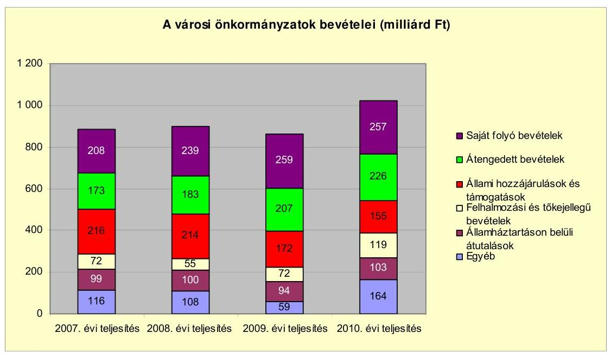

Az önkormányzati alrendszer pénzügyi helyzetértékelése során új elemzési módszereket alkalmazott az ellenőrzés. A költségvetési beszámoló adatok elemzése helyett az önkormányzat pénzügyi helyzetét a CLF módszerrel értékeljük, amelynek lényegét és számításának módszerét a jelentés 2. pontjában, és a jelentés 2. számú mellékletében ismertetjük részletesen.

Az új módszereken alapuló helyzetértékelés fontosságát az adja, hogy a helyi önkormányzatok bruttó adósságállománya ${ }^{2}$ a 2010. évi költségvetési beszámolók alapján 1248 milliárd Ft-ot tett ki. Ezen belül a 304 város adóssága 383 milliárd Ft volt, amely az önkormányzati alrendszer teljes adósságállományának 30,7%-át jelentette ${ }^{3}$.

A mérlegben kimutatott bruttó adósságállomány mellett az önkormányzatok számára az eszközállomány műszaki állapotának megőrzése is előbb-utóbb pénzügyi kötelezettséget jelent. Az elhasználódott eszközök pótlására forrást biztosító amortizációs (felújítási) alap képzésének ${ }^{4}$ elmaradása maga után vonhatja a feladatellátást kiszolgáló tárgyi eszközök állagának erőteljes romlását.

[^0]
[^0]:    ${ }^{2}$ Az önkormányzati mérlegbeszámolókból számított bruttó adósságállomány 2010. év végi összege magában foglalja a fejlesztési és a működési célú kötvénykibocsátások, a beruházási és fejlesztési hitelek, a működési célú hosszú lejáratú hitelek, a rövid

 lejáratú hitelek, váltótartozások miatti kötelezettségek teljes (2011-ben, illetve az azt követő években esedékes) állományát. Az önkormányzatok 2007. év végi mérleg szerinti adósságállománya 692 milliárd Ft volt.
    ${ }^{3}$ A fővárosi és a kerületi önkormányzatok adósságának figyelmen kívül hagyásával számított 977 milliárd Ft összegű bruttó adósságállományból a városok 39,2\%-kal részesedtek.
    ${ }^{4}$ Erre a jelenlegi szabályozási környezetben nem kötelezi előírás az önkormányzatokat.

---

Emellett a 2007-2013-as időszakra meghirdetett, vissza nem térítendő EU-s fejlesztési forrásokhoz való hozzájutás lehetősége felerősítette az önkormányzati alrendszer fejlesztési igényeit, amelyek a felhalmozási költségvetési hiány folyamatos emelkedésén túl - az előírt jövőbeni fenntartási kötelezettség miatt tovább terhelhetik az önkormányzatok költségvetését ${ }^{5}$.

Az ÁSZ a 2011. évi ellenőrzési tervében 43. számú, az Önkormányzatok gazdálkodási rendszerének ellenőrzése részeként áttekinti, és elemzi az önkormányzatok pénzügyi helyzetét. A gazdálkodás szabályszerűségét az ÁSZ az előző évek során ebben az önkormányzati körben is ellenőrizte. Jelen vizsgálatunk a tett javaslataink pénzügyi helyzetet érintő pontjainak hasznosítására utóellenőrzés jelleggel tér ki.

Az ellenőrzés megállapításait az Önkormányzat által kitöltött - teljességi nyilatkozattal megerősített - 27 tanúsítványon szolgáltatott adatokra alapoztuk. Ellenőrzési bizonyítékként használtuk fel továbbá:

- a képviselő-testületi és bizottsági előterjesztéseket, a döntés-előkészítés során készített dokumentumokat;
- a kötelezettségvállalások dokumentumait;
- a pénzügyi-számviteli nyilvántartásokat;
- az éves költségvetési beszámolókat;
- a költségvetési és zárszámadási rendeleteket.

Az ellenőrzés a 2007. január 1. - 2011. június 30. közötti időszakot öleli fel. A pénzintézeti kötelezettségek állományának vizsgálatakor az ellenőrzött időszak 2006. december 31. - 2011. június 30. közötti időszakra terjedt ki.

Az ellenőrzés során vizsgáltunk minden olyan körülményt és adatot, amely a program végrehajtásához kapcsolódott és a pénzügyi helyzet alakulására hatást gyakorló releváns tények és folyamatok feltárásához szükségessé vált.

[^0]
[^0]:    ${ }^{5}$ Az Állami Számvevőszék 2011. júniusában közzétett 1108. számú, a helyi önkormányzatok fejlesztési célú támogatási rendszerének ellenőrzéséről szóló jelentésében feltárta a fejlesztési folyamatok problémáit. A helyi önkormányzatok elsősorban azokat a fejlesztéseket valósították meg, amelyekhez támogatást lehetett igényelni. A fejlesztési célok közül a magasabb támogatási intenzitású pályázatokat részesítették előnyben. A fejlesztéssel megvalósuló létesítmények jövőbeli üzemeltetésének várható ráfordításait az önkormányzatok 71,9%-a nem mérte fel.

---

# Az ellenőrzés célja annak értékelése volt, hogy: 

- a vizsgált időszakban a kötelező- és önként vállalt feladatok ellátását biztosító szervezeti keretekben, a feladatellátás módjában bekövetkezett változások milyen hatást gyakoroltak az Önkormányzat pénzügyi helyzetének alakulására;
- az Önkormányzat pénzügyi - ezen belül működési és felhalmozási - egyensúlya mely tényezők hatására miként változott, és az Önkormányzat milyen intézkedéseket tett a pénzügyi egyensúly javítása érdekében;
- a költségvetési kiadások finanszírozása érdekében vállalt pénzintézeti kötelezettségek hogyan alakultak, továbbá milyen kötelezettségek fennállása befolyásolja az Önkormányzat jövőbeli pénzügyi helyzetét;
- hasznosultak-e a gazdálkodási rendszer korábbi ellenőrzése során a pénzügyi egyensúly javítására az ÁSZ által tett szabályszerűségi és célszerűségi javaslatok.

Az ellenőrzés típusa: szabályszerűségi vizsgálat.
A vizsgálat jogszabályi alapját az Állami Számvevőszékről szóló 2011. évi LXVI. törvény 1. § (3), 5. § (2)-(6) bekezdései, továbbá az Áht ${ }_{1}$ 120/A. § (1) bekezdése ${ }^{6}$ előírásai képezik.

Fonyód város a Balaton déli partján, Somogy megyében helyezkedik el. Lakosainak száma 2011. január 1-jén 4777 fő volt, amely az idegenforgalmi szezonban jelentősen emelkedik.

Az Önkormányzat 2010. évi költségvetési beszámolója szerint 1438,8 millió Ft költségvetési bevételt ért el és 1418,5 millió Ft költségvetési kiadást teljesített, amely a 2007. évi költségvetési beszámolója szerinti 1047,6 millió Ft költségvetési bevétel 137,3%-a, míg a 1136,1 millió Ft teljesített költségvetési kiadás 124,9%-a volt. 2010. december 31-én a könyvviteli mérleg szerint 20091,0 millió Ft értékű vagyonnal rendelkezett.

Az Önkormányzat vagyona a 2006. év végi állományhoz viszonyítva szinten maradt, 0,4%-kal nőtt, a tárgyi eszközök állományának 2,5%-os (438,6 millió Ft-os) emelkedésének, illetve a tartósan adott kölcsön állományának 47,2%-os (314,7 millió Ft-os) csökkenésének következtében.

[^0]
[^0]:    ${ }^{6}$ 2012. január 1-jétől az Áht ${ }_{2}$ 61. § (2) bekezdés

---

# I. ÖSSZEGZŐ MEGÁLLAPÍTÁSOK, KÖVETKEZTETÉSEK, JAVASLATOK 

Az Önkormányzat - adatszolgáltatása szerint - a 2010. év működési költségvetési kiadásaiból (1091,1 millió Ft${ }^{7}$ ) 1050,4 millió Ft-ot (96,3%) a kötelező feladatok, 40,7 millió Ft-ot (3,7%) az önként vállalt feladatok ellátására fordított. Az önként vállalt önkormányzati feladatok ellátására fordított kiadások a vizsgált időszak alatt a 2007-2009. évek átlagában 47,5 millió Ft-ról, (részaránya 4,7%-ról) 1,0 százalékponttal (6,8 millió Ft-tal) csökkentek. Önként vállalt feladatai bölcsőde és zeneiskola fenntartásához, működtetéséhez, Bursa Hungarica ösztöndíjrendszer támogatásához, civil és egyéb szervezetek támogatásához kapcsolódtak.

Az Önkormányzat feladatellátásának szervezeti struktúrája 2011. június 30-án a következő volt:
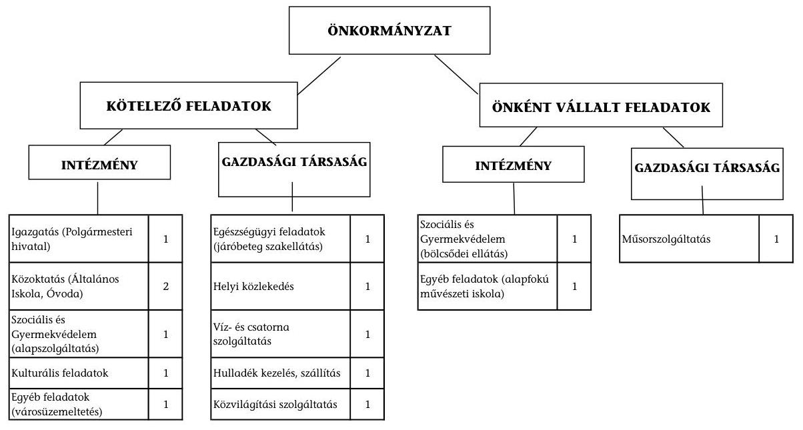

Az Önkormányzat feladatait 2011. év június 30-án (a Polgármesteri hivatallal együtt) nyolc költségvetési szervvel és hat gazdasági társasággal látta el. A feladatellátás telephelyeinek száma a 2007. évben 11 volt, amely a 2011. év I. félév végére nem változott. Az Önkormányzat két gazdasági társaságban kizárólagos tulajdonnal, három társaságban 1% alatti tulajdoni részesedéssel rendelkezett. A helyi tömegközlekedést biztosító gazdasági társaságban részesedése nem volt. A gazdasági társaságok közül kizárólagos tulajdonú társaságai az egészségügyi ellátás, a műsorszolgáltatás (önként vállalt) feladatát látták el. Az 1% alatti önkormányzati tulajdoni részesedésű gazdasági társaságok

[^0]
[^0]:    ${ }^{7}$ A jelentés 2. számú mellékletében bemutatott folyó kiadások a felhalmozási kamatkiadások 59,7 millió Ft-os összegével tértek el az adatszolgáltatás működési kiadási értékétől.

---

a hulladékkezelés-szállítás, víz- és szennyvízkezelés és a közvilágítás területén kaptak szerepet az Önkormányzat feladatellátásában. A gazdasági társaságok az ellenőrzött időszakban összesen 92,3 millió Ft rendszeres működési- és 14,8 millió Ft fejlesztési célú átadott pénzeszközben részesültek az Önkormányzattól. A többségi tulajdonban lévő két társaság pénzügyi helyzete a 2010. évi saját tőke/jegyzett tőke aránya alapján stabil volt. Az Önkormányzat az ingatlan (üzlethelyiségek) építésre létrehozott Lakásépítő Kft.-vel szemben 2010. decemberében megindította a felszámolási eljárást, hogy az építési beruházás finanszírozásához biztosított tagi kölcsön követelését érvényesítse. 2011. januárjában 894,9 millió Ft összegű (tőke, kamat és egyéb költségre) hitelezői igénybejelentést tett, amelyet a felszámoló 2011. november hónapban igazolt vissza. Az Önkormányzatnál a tagi kölcsön nyújtásának közvetlen és meghatározó szerepe volt a pénzügyi egyensúlyi helyzete kedvezőtlen alakulásában.

Az Önkormányzat - adatszolgáltatása szerint - működési kiadásokra 2010-ben 1091,1 millió Ft-ot fordított, amely a 2007. évi ráfordítások szintjén teljesült (3,5 millió Ft-tal haladta meg azt). A 2007-2010. évek átlagában a működési kiadások 52,3%-át intézményi körben realizálták. A fennmaradó kiadások a Polgármesteri hivatal működése során keletkeztek.

Az egyes közszolgáltatások feladatellátásában részvevő intézmények ágazati bontású működési kiadásainak finanszírozási összetételét a következő ábra szemlélteti:
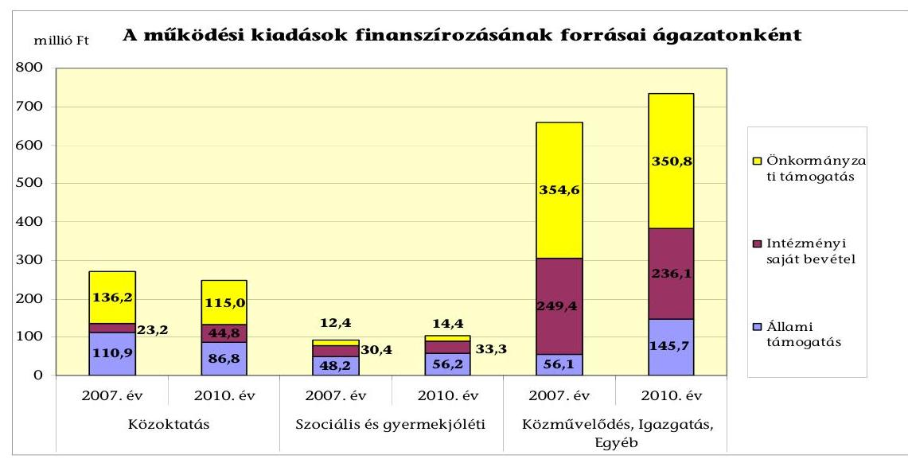

A 2007. évben és a 2010. évben a működési kiadások meghatározó részének (49,3% és 44,4%) finanszírozása önkormányzati támogatásból történt. A közoktatási ágazat működési kiadásai a vizsgált időszak alatt 20,3 millió Ft-tal (7,6%-kal) csökkentek. Az ellátotti létszámcsökkenés és a normatívák központi mérséklése miatt csökkent az állami támogatás 24,1 millió Ft-tal (21,7%-kal), továbbá az önkormányzati hozzájárulás (15,6%-kal 21,2 millió Ft-tal) is. Az ágazatban a térítési díjbevételek emelkedése miatt az intézményi saját bevétel (11,2 millió Ft-tal, 33,3%-kal) nőtt. A szociális ágazatban az állami támogatás növekedését az ellátotti létszám növekedése miatti állami támogatás növekedése (8,0 millió Ft, 16,6%) okozta 2007-2010. év között. A közművelődés, igazgatás és egyéb feladatokat magában foglaló ágazat működési kiadásait részben

---

finanszírozó állami támogatás 2007-ről 2010-re közel háromszorosára (89,6 millió Ft-tal, 159,7%-kal) növekedett. Ennek indoka, hogy csak a 2007. évben az intézményi feladatellátást a normatív állami hozzájáruláson túl a normatív módon átengedett szja-bevétel is finanszírozta, amely az intézményi saját bevételek között szerepelt a számviteli előírások szerint az önkormányzati adatszolgáltatásban, nem pedig az állami támogatások között.

Az Önkormányzat folyó költségvetési egyenlege (működési jövedelem) 2007-2010 között a 2008. évet kivéve működési forráshiányt mutatott.
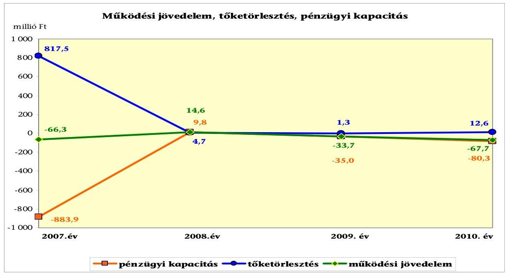

Az ellenőrzött időszak pénzügyi kapacitása a 2008. évet kivéve negatív volt. A teljesített tőketörlesztésre - 2008-at kivéve - a negatív működési jövedelem nem biztosított fedezetet. A 2007-2010. években keletkezett 153,1 millió Ft működési hiány mellett az Önkormányzat 836,1 millió Ft tőkét (hitelt) törlesztett ${ }^{8}$. A 2007. évben 817,5 millió Ft hiteltörlesztés kapcsolódott a hosszú lejáratú hitelek refinanszírozásához. A hitelkiváltásnak a 900,0 millió Ft összegű kötvény volt a forrása. Az Önkormányzat e kötvénybevétele 8,2%-át működésre fordította. Emiatt a 2008. évben 14,6 millió Ft működési jövedelme keletkezett, pénzügyi kapacitása pedig 9,8 millió Ft volt. A 2009-2010. években a pénzügyi kapacitás együtt -115,3 millió Ft volt, kedvezőtlenül alakult. A pénzügyi kapacitás csökkenését meghatározó mértékben a folyó bevételek és kiadások különbségéből származó működési hiány (a 2007-2009. évek átlagában a -28,5 millió Ft-ról 2010-re 137,5%-os, míg a 2009. évi -33,7 millió Ft-ról 2010-re 34,0 millió Ft-os 100,9%-os) növekedése adta, amelyet a működési bevétel növekedését meghaladó ütemű és mértékű működési kiadásemelkedés eredményezett. A teljesített tőketörlesztés, továbbá a működési forráshiány 2007-2010 között összesen 1003,8 millió Ft volt, amelynek egy részére a 2008. évi 14,6 millió Ft működési többlet, az időszakban képződő 88,6 millió Ft felhalmozási

[^0]
[^0]:    ${ }^{8}$ A likvidhitel jogszabályban előírt számviteli elszámolása miatt a hiteltörlesztés nem tartalmazta az év végén fennálló folyószámlahitel kötelezettséget, amely a vizsgált négy évben összesen 655,8 millió Ft volt.

---

megtakarítás (felhalmozási többlet), valamint a 2007. január 1-jén rendelkezésre álló 25,6 millió Ft pénzkészlet biztosított fedezetet. A további szükséges pénzeszközöket kötvény kibocsátásával, rövid lejáratú hitelek felvételével teremtették meg.

Az Önkormányzat felhalmozási költségvetésének egyenlege 2007-2008. években negatív, míg 2009. és 2010. években pozitív volt, a vizsgált időszakban összesen 88,6 millió Ft felhalmozási forrástöbblete keletkezett. A 2007. évi felhalmozási forráshiány (-22,2 millió Ft) finanszírozása - negatív működési jövedelem mellett - kötvénykibocsátásból történt. A 2008. évi felhalmozási forráshiányt (-3,2 millió Ft) fedezte a pozitív nettó-működési jövedelem. A 2009. évi 26,0 millió Ft-os felhalmozási többletet alapvetően az egyéb felhalmozási bevételként megjelenő, hajózási társaságban lévő részesedésértékesítés eredményezte. A 2010. évi felhalmozási többlet (88,0 millió Ft) kialakulásában az előző évhez viszonyított jelentős realizált tárgyi eszköz értékesítésének bevétele (növekedés 78,8 millió Ft) játszott meghatározó szerepet.

Az Önkormányzat a vizsgált 2007-2010. évek alatt realizált bevételeinek 86,4%-át működési célú, míg 13,6%-át fejlesztési célú bevételként számolta el. A vizsgált időszak első három évében a bevételek 39,9%-át (466,0 millió Ft-ot) a költségvetési támogatás és az szja-bevétel jelentette, amely 2010. évre 29,3 millió Ft-tal (6,3%-kal) csökkent. A helyi adóbevételek az összes bevételeken belüli 30,1%-os részaránya 6,2 százalékponttal (7,5 millió Ft-tal) csökkent 2010-re az előző három év átlagáról.

A vizsgált időszakban az Önkormányzat a helyi iparűzési adót, építményadót, telekadót, vendégéjszakák utáni idegenforgalmi adót alkalmazta. Az
 iparűzési adó és a telekadó adómértéke a vizsgált időszakban nem változott. (Az iparűzési adót 1,8%-os mértékben állapították meg.) Az idegenforgalmi adó mértéke 2008. január 1-jétől $300 \mathrm{Ft} /$ fő/éj volt. Az építményadó mértéke 2008. január 1-jétől az ingatlan elhelyezkedésétől függően 560 és $700 \mathrm{Ft} / \mathrm{m}^{2} /$ év mértékű lett, az emelés 16,6%-os volt. A 2007-2009. évek átlagában a folyó bevételek 33,1%-át adó helyi adókból és pótlékokból származó bevételek, 351,5 millió Ft-ot jelentettek. A 2010. évben ilyen címen 344,0 millió Ft bevételt realizált az Önkormányzat, az összes folyó bevétel 31,8%-át. A helyi adóbevételek 31,4%-át az iparűzési adó tette ki, további 55,9%-át az építményadó, 7,8%-át az idegenforgalmi adó, 4,9%-át pedig a telekadó és a pótlékok. Új helyi adónemet a vizsgált időszakban az Önkormányzat nem vezetett be.

Az Önkormányzat a vizsgált 2007-2010. évek alatt teljesített kiadásai 88,4%-át működési célokra, a fennmaradó 11,6%-át fejlesztésre fordította. A működési kiadások 43,8%-át személyi juttatásokra és járulékaira fordította, amely az időszak alatt folyamatosan csökkent a 2007. évi 603,0 millió Ft-ról (részaránya 53,1%) a 2010. évre 512,5 millió Ft-ra (részaránya 36,1%). A dologi és egyéb folyó kiadások a 2007-2009. évek átlagáról 124,1 millió Ft-tal (34,6%-kal) nőttek, a 2010. évben 482,9 millió Ft-ra teljesültek. A fejlesztési kiadások esetében is jelentős növekedés történt. A 2007-2009. évek átlagáról (104,5 millió Ft) 163,2 millió Ft-tal (két és félszeresére) emelkedtek a 2010. évben. A 2010. évi felhalmozási kiadásnövekedést alapvetően a tagi kölcsönkövetelés törlesztését jelentő ingatlanvagyon 182,8 millió Ft-os, számviteli előírásoknak megfelelően elszámolt értéke eredményezte.

---

A befejezett fejlesztések jelentős részét saját bevételi forrásokból fedezték. A 2007-2010. évek időszakában 408,1 millió Ft értékű fejlesztés és felújítás forrása a 79,3 millió Ft (19,4%) értékű hazai- és EU-s támogatások mellett 323,5 millió Ft saját bevétel (79,3%) és 5,3 millió Ft (1,3%) hosszú lejáratú hitel volt. A 2010. december 31-én folyamatban lévő fejlesztési feladatok végrehajtására 2007-2010 között 48,8 millió Ft kiadást teljesítettek, amelyre 38,4 millió Ft (78,7%) EU-s forrást és 10,4 millió Ft (21,3%) saját bevételt fordítottak. Az éves költségvetési rendeletekben elkülönítetten nem mutatták be a beruházásokkal létrehozott létesítmények működtetése és fenntarthatósága érdekében várhatóan felmerülő költségvetési kiadásokat.

Az Önkormányzat 2010. december 31-én folyamatban lévő fejlesztési feladatai 2010. évet követő kötelezettségvállalásainak összege 567,0 millió Ft volt, amelyből 161,3 millió Ft-ot tervezett hitelfelvételből, 359,7 millió Ft-ot már elnyert EU-s támogatásból és 46,0 millió Ft-ot saját bevételből kívánnak biztosítani.
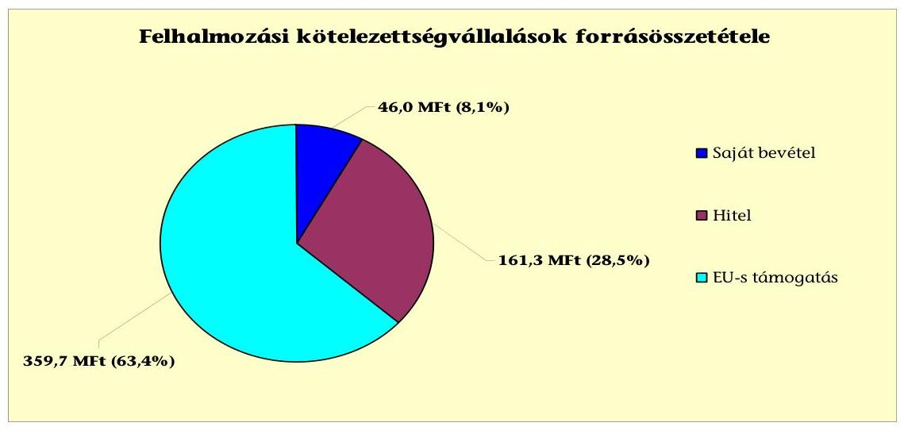

Az Önkormányzat által beadott, elbírálás alatt álló pályázatok tervezett teljes bekerülési költsége 25,8 millió Ft volt. Az Önkormányzat által a 2012. évre vállalt kötelezettséget 20,0 millió Ft hazai támogatásból és 5,8 millió Ft saját bevételből terveznek finanszírozni.

Az Önkormányzat mérleg szerinti pénzintézeti kötelezettsége a 2006. év végéről a 2011. év I. félév végére 1007,5 millió Ft-ról 1062,1 millió Ft-ra nőtt, árfolyamváltozás miatti különbözetet a Számv. tv. 60. § (1)-(2) bekezdéseiben előírtak ellenére nem számoltak el. A 2011. év I. félévében fennálló pénzintézeti kötelezettségek két hosszú lejáratú hitelből (3,7 millió Ft) egy kötvénykibocsátásból (860,9 millió Ft), valamint két rövid lejáratú hitel (197,5 millió Ft) igénybevételéből keletkeztek. Az Önkormányzat az elfogadott 2011. évi költségvetési rendelete alapján 193,4 millió Ft hitel felvételét tervezte, a hitelt a helyszíni vizsgálat befejezésének időpontjáig nem vette fel.

Az Önkormányzat kötelezettségvállalásaira képviselő-testületi döntés alapján került sor. A képviselő-testületi döntést megalapozó előterjesztésekben meghatározták a hitelfelvétel célját, azonban nem tartalmazták a kötelezettségvállalás visszafizetési forrásait, a deviza alapú kötelezettségeket érintő kamat- és árfolyamkockázatot. Nem tartalmazták továbbá a teljes futamidőre várható kamat- és tőkefizetési kötelezettségnek, az adósságszolgálat törvényi előírásoknak megfelelő bemutatását. Az Önkormányzat a 2007. évben a korábbi években felvett fejlesztési hitelek visszafizetésére kibocsátott egy forint alapú kötvényt 900,0 millió Ft összegben, a kötvény tartozás törlesztését 2011. év I. félévében kezdte meg, amelynek összege 39,1 millió Ft volt. A kötvény lejegyzője az Önkormányzat számlavezető bankja volt. A vizsgált időszakban fennálló pénzintézeti kötelezettségvállalásainak 99%-át a számlavezető pénzintézete finanszírozta, amely egyoldalú függősége miatt pénzügyi kockázatot jelent az Önkormányzat számára. A refinanszírozást követően az Önkormányzat pénzügyi pozíciója nem javult, folytatódott a hiány termelése.

Az Önkormányzat a hiteleket a hitelcélnak megfelelően a Képviselő-testület által jóváhagyott, a költségvetésbe betervezett fejlesztésekre használta fel. A CHF-ben fennálló két hosszú lejáratú hitelekhez kapcsolódó pénzintézeti kötelezettségéből 2011. év I. félévig 22 ezer CHF (3,9 millió Ft) tőkét törlesztett, és 7 ezer CHF (1,7 millió Ft) kamatot fizetett. A 2007-2010. évek között továbbá összesen 2,6 millió Ft összegben - gépkocsi vásárlásra - felvett két hitelét fizette vissza.

Az Önkormányzat működésének pénzügyi egyensúlyát a vizsgált időszakban folyószámlahitel, munkabér-megelőlegezési hitel igénybevételével tudta biztosítani. A működési hiány a korábbi években is fennállt, az Önkormányzat tartós forráshiánya miatt alakult ki, amit az évek során nem tudtak csökkenteni.

A folyószámlahitel és munkabér-megelőlegezési hitel igénybevétele a 2007-2011. év I. félévében az alábbiak szerint alakult:

| Megnevezés | 2007. év | 2008. év | 2009. év | 2010. év | 2011. év I.   félév |
| :-- | :--: | :--: | :--: | :--: | :--: |
| Folyószámlahitel |  |  |  |  |  |
| Keretösszeg január 1-jén (millió Ft-ban) | 180,0 | 180,0 | 180,0 | 180,0 | 180,0 |
| Átlagos napi állomány (millió Ft-ban) | 167,4 | 165,7 | 166,1 | 170,3 | 165,9 |
| Folyószámla hitellel zárt napok száma (nap) | 365 | 366 | 365 | 365 | 181 |
| Időszak végi egyenleg (állomány) | 167,4 | 163,4 | 168,1 | 156,9 | 177,5 |
| Munkabér-megelőlegezési hitel |  |  |  |  |  |
| Keretösszeg január 1-jén (millió Ft-ban) | 20,0 | 20,0 | 20,0 | 20,0 | 20,0 |
| Átlagos napi állomány (millió Ft-ban) | 20,0 | 20,0 | 5,0 | 20,0 | 20,0 |
| Munkabér-megelőlegezési hitellel zárt napok száma   (nap) | 365 | 365 | 365 | 365 | 181 |
| Időszak végi egyenleg (állomány) | 20,0 | 20,0 | 20,0 | 20,0 | 20,0 |

A tartós hiány finanszírozására a vizsgált időszakban átlagosan 166,7 millió Ft folyószámlahitelt vett igénybe az Önkormányzat, amely 78,0 millió Ft kamatkiadást, és 4,3 millió Ft egyéb költség megfizetését okozta. A folyamatos és tartós likviditási problémák miatt a munkabérek kifizetéséhez 20,0 millió Ft munkabér-megelőlegezési hitellel rendelkezett a vizsgált időszakban. A hitel igénybevétele 2007-2011. június 30-ig összesen 8,7 millió Ft kamatkiadást eredményezett az Önkormányzatnak. A 2010. év végén a folyószámlahitel záró állománya 156,9 millió Ft, a munkabér-megelőlegezési hitel záró állománya 20,0 millió Ft volt.

A pénzügyi egyensúlyi helyzet kedvezőtlen alakulására hatással volt a kötvényhez kapcsolódóan 2011. június 30-ig kifizetett magas kamat (288,4 millió

---

Ft) összege és a folyószámlahitel kamatfelárának 1,5%-ról 4,25%-ra történő növekedése.

Az Önkormányzat 2011. év I. félév végi szállítói tartozása 218,6 millió Ft, melyből lejárt tartozása 154,8 millió Ft volt. Kockázatot jelent a lejárt tartozásokon belül a 60-90 nap közötti 15,7 millió Ft összegű (10,1%) és a 90 napot meghaladó 93,0 millió Ft összegű (60,1%-os) tartozások magas aránya, amely alapján a hitelezők, az adósságrendezési törvényben foglaltak szerint adósságrendezési eljárást kezdeményezhetnek az Önkormányzat ellen. Az Önkormányzatnál 53,7 millió Ft lejárt szállítói tartozást érintő peres eljárás van folyamatban, amely a lejárt szállítói tartozások 34,7%-át jelentette. Az egyéb kiadás elmaradás 2011. június 30-án a KÖZVIL Zrt. részvényvételár tartozása miatt 45,9 millió Ft, ami szintén - az Önkormányzat által indított - peres eljárás részét képezi. A peres eljárások kimenete bizonytalan, így e kötelezettségek - amelynek rendezésére a követeléseit kívánja beszámítani az Önkormányzat - törlése is bizonytalan. A vizsgált időszakban átütemezett szállítói tartozása nem volt, a tartozások kiegyenlítése - szóbeli megállapodások, írásbeli kérelmek alapján - részletfizetések teljesítésével, fizetési határidő módosítással történtek. Az Önkormányzat, valamint az önkormányzati intézmények energiaszolgáltatói több alkalommal jelezték, hogy adósságrendezési eljárást kezdeményeznek, azonban a tárgyalások és a részteljesítések miatt az eljárás megindítására a helyszíni ellenőrzés ideje alatt nem került sor.

Az Önkormányzat gazdasági társaságai részére a fejlesztési és egyéb hitelek igénybevételéhez készfizető kezességet vállalt 92,3 millió Ft összegben. Az Önkormányzat egy 100%-os és egy 51%-os tulajdoni részesedésű gazdasági társasága részére nyújtott tagi kölcsönt. A 2011. év I. félévében a gazdasági társaságai felé fennálló követelése 351,8 millió Ft, ebből az Önkormányzat 51%-os tulajdoni részesedésű gazdasági társaságának a tartozása 347,0 millió Ft volt, amelynek megtérülése a Lakásépítő Kft. ellen indított felszámolási eljárás miatt bizonytalan és magas pénzügyi kockázatot jelent az Önkormányzat számára.

A Lakásépítő Kft.-vel a kölcsönszerződés megkötésére 2004. július 5-én került sor, 695,0 millió Ft volt a lehívható kölcsönkeret összege. A kölcsönt a kikötői üzletsor megépítésére nyújtotta az Önkormányzat, törlesztését a Kft.-nek az üzletek értékesítéséből befolyó vételárakból kellett teljesítenie. A Kft. a kölcsönszerződésben vállalt kötelezettségét nem teljesítette, ezért a 2009. évben fizetési meghagyást bocsátottak ki. A kölcsönből a 2010. évben 214,4 millió Ft megtérült. A Lakásépítő Kft. felszámolási eljárása az Önkormányzat kezdeményezésére 2010. december 8-án kezdődött el, a felszámoló felé 894,9 millió Ft összegben tett hitelezői igénybejelentést az Önkormányzat. A követelés a tőke-, kamat és adótartozás, valamint a megelőlegezett árverési költségeket tartalmazta.

A Képviselő-testület a fejlesztési hitelek és a kötvény biztosítékaként 1795,5 millió Ft - számviteli nyilvántartás szerinti nettó értékű - jelzálogjog alapításához és bejegyzéséhez járult hozzá. A jelzálogszerződésekkel érintett ingatlanok 2011. június 30-án a forgalomképes besorolású nettó értékű ingatlanok 62,8%-át jelentették.

---

Az Önkormányzat kötelezettségeinek 2010. december 31-i, valamint 2011. június 30-i állományát és várható alakulását a kötelezettségek lejáratáig a következő táblázat szemlélteti:

| Megnevezés | Állomány 2010. december 31-én |  |  | Állomány 2011. június 30-   án |  |  | Várható kötelezettség 2011-2013. években |  | Várható kötelezettség 2014. évtől |  |
| :--: | :--: | :--: | :--: | :--: | :--: | :--: | :--: | :--: | :--: | :--: |
|  | HUF-ban   (millió Ftban) | Devizában (összcge, ezer CHFben) | Deviza   nem | HUF-ban (millió Ftban) | Devizában (összcge, ezer CHFben) | Deviza   nem | HUF-ban (millió Ftban) | Devizában (összcge, ezer CHFben) | HUF-ban (millió Ftban) | Devizában (összcge, ezer CHF-ben) |
| Pénzintézeti kötelezettségek |  |

 |  |  |  |  |  |  |  |  |
| Kétvény | 900,0 |  | HUF | 860,9 |  | HUF | 401,1 |  | 864,3 |  |
| Hosszú lejáratú hitelek |  | 24 | CHF |  | 20 | CHF |  | 13 |  | 7 |
| Munkabér-megelőlegezési hitel | 20,0 |  | HUF | 20,0 |  | HUF | 20,0 |  |  |  |
| Folyószámlahitel | 156,9 |  | HUF | 177,5 |  | HUF | 177,5 |  |  |  |
| Pénzintézeti kötelezettségek összesen HUFban: | 1076,9 |  | HUF | 1058,4 |  | HUF | 598,6 |  | 864,3 |  |
| Pénzintézeti kötelezettségek összesen CHFben: |  | 24 | CHF |  | 20 | CHF |  | 13 |  | 7 |
| Biztosítékok |  |  |  |  |  |  |  |  |  |  |
| Kezeség |  |  | HUF | 92,4 |  | HUF |  |  |  |  |
| Biztosítékok összesen: |  |  | HUF | 92,4 |  | HUF |  |  |  |  |
| Szállítói tartozás | 132,3 |  | HUF | 218,6 |  | HUF | 218,6 |  |  |  |
| Egyéb kiadás elmaradás | 39,3 |  |  | 45,9 |  | HUF | 55,6 |  |  |  |
| Mindösszesen | 1248,7 |  | HUF | 1415,3 |  | HUF | 872,8 |  | 864,3 |  |
| Mindösszesen |  | 24 | CHF |  | 20 | CHF |  | 13 |  | 7 |

Az Önkormányzatnak pénzintézetekkel szemben fennálló tőkefizetési kötelezettsége a 2011. év I. félév végén 1058,4 millió Ft, továbbá 20 ezer CHF volt. Ezek várható kötelezettsége (tőke és kamat) a legutóbbi kamatfizetés feltételei alapján a 2011-2013. években 598,6 millió Ft továbbá 13 ezer CHF. Az Önkormányzatnak a 2011-2013 évekre vonatkozóan szállítói tartozások és egyéb kiadás elmaradások rendezése címén 274,2 millió Ft fizetési kötelezettsége keletkezett. A 2011-2013. évek kötelezettségeinek teljesítését nem látjuk megfelelően biztosítottnak, mivel a felszámolás alatt álló társaságától a követelés megtérülése és a jelzáloggal nem terhelt forgalomképes nettó ingatlanvagyon értékesítése kockázatot hordoz. A mérlegben a forgóeszközök között kimutatott követelésállomány 61,2 millió Ft nagy része tartós kintlévőség, így a megtérülése ugyancsak bizonytalan. A 2014. évet követően jelenleg ismert pénzintézeti kötelezettségei 864,5 millió Ft és 7 ezer CHF visszafizetését a jelenlegihez változatlan működési jövedelemtermelő képességet feltételezve nem látjuk biztosítottnak. Az Önkormányzat tájékoztatása szerint figyelembe vehető források a kintlévőségek behajtása, helyi adóbevételek, a többségi tulajdonú gazdasági társaság felszámolásából a tagi kölcsön egy részének a megtérülése, valamint a peres eljárásból származó bevételek jelenthetik, amelyek a megtérülésük bizonytalansága miatt magas kockázatot hordoznak.

A két kizárólagos önkormányzati tulajdonú (100%-os) gazdasági társaságoknak 2010. december 31-én 10,6 millió Ft szállítói tartozása állt fenn. Pénzintézeti kötelezettsége a 2011. év I. félévben az egyik 100%-os tulajdoni részesedésű társaságának volt 14,8 millió Ft összegű folyószámlahitel igénybevételével. A kizárólagos tulajdonú gazdasági társaságok kötelezettségei nem voltak jelentős hatással az Önkormányzat pénzügyi egyensúlyi helyzetére.

A pénzügyi egyensúlyi helyzet kedvezőtlen alakulását jelentősen befolyásolta a Lakásépítő Kft., amely ellen 2010. évben az Önkormányzat felszámolási eljá-

rást kezdeményezett. A Kft.-vel szemben az Önkormányzat a felszámoló felé 2011. január hónapban 894,9 millió Ft összegben tett hitelezői igénybejelentést, amelynek visszaigazolása 2011. november 15-én történt meg.

Az Önkormányzat 2007-2010. évek között eszközállománya után 511,5 millió Ft összegű értékcsökkenést mutatott ki a számviteli nyilvántartásában, miközben felújításra 93,0 millió Ft-ot (18,2%-át) fordított. Az elhasználódott eszközök pótlására az Önkormányzat tartalékot nem képzett, külön alapot nem hozott létre. Az éves zárszámadási rendeleteiben nem mutatták be az Önkormányzat eszközei után tárgyévben elszámolt értékcsökkenés összegét, és ezzel összevetve az eszközpótlásra fordított tényleges kiadásokat, az eszközök elhasználódási fokának alakulását.

Az Önkormányzat költségvetési támogatásból, átengedett bevételekből származó bevételei a 2007. évhez képest a 2010. év végéig összességében 28,9 millió Fttal csökkentek. Ennek ellensúlyozására az Önkormányzat folytatta az előző években elkezdett - kiadási megtakarítást eredményező és bevételt növelő - intézkedéseit. Az Önkormányzat kimutatása szerint a 2007-2011. év I. féléve között tett intézkedések hatására 167,8 millió Ft bevételi többletet, továbbá 57,3 millió Ft kiadási megtakarítást ért el. Az intézkedések az Önkormányzat pénzügyi egyensúlyi helyzetét javították, azonban a zavartalan működését nem biztosították, továbbá a forráshiányát nem csökkentették. Az ellenőrzés megállapítása szerint a bevételnövelő intézkedések között kimutatott adóhátralékok és lejárt bérleti díjak behajtása (152,3 millió Ft) az Önkormányzat kötelező feladata, ezeket figyelmen kívül hagyva 72,8 millió Ft volt a megtakarítás és többletbevétel egyenlege. A kiadási megtakarítások 89,2%-a az elrendelt álláshely-csökkentések eredménye volt. Az álláshely-csökkentő intézkedések 2007-2010. évek között önkormányzati szinten összesen 44 álláshely (ebből 2 üres álláshely) megszüntetését jelentették. Egyes közszolgáltatási területeken azonban feladatbővülések is voltak, amelyek álláshely- és egyben 9 fő létszámnövekedéssel is jártak, a közoktatás és egyéb területet érintően. Az intézkedések következtében az időszak álláshelyeinek száma 35 fővel csökkent. A bevételnövelő intézkedések - az Önkormányzat kimutatása szerint - eszközök értékesítéséhez, bérbeadásához, bérleti díjak emeléséhez, helyi adó mértékének növeléséhez, a kedvezmények, mentességek csökkentéséhez, a lejárt bérleti díjak, adóhátralékok eredményesebb behajtásához, a szolgáltatások és az intézményi térítési díjak emeléséhez kapcsolódtak.

Az utóellenőrzés a pénzügyi egyensúly javítására tett két szabályszerűségi és egy célszerűségi javaslat hasznosítására terjedt ki. A két szabályszerűségi javaslatot az intézkedési terv szerinti határidőben megvalósították. A 2010. évtől a költségvetési kiadások főösszege nem tartalmazta a finanszírozási célú pénzügyi műveletek kiadásait, a költségvetés eredeti előirányzata az Áht-ban előírtaknak megfelelően mutatta be a várható pénzmaradvány igénybevételét. A célszerűségi javaslatot részben teljesítették, a polgármester tájékoztatta a Képviselő-testületet az Önkormányzat pénzügyi helyzetének alakulásáról, a havonta készített pénzügyi kimutatásokban részletezte a követelések és kötelezettségek - ezen belül a lejárt tartozások - nagyságát. Nem készült azonban kimutatás az Önkormányzat eladósodására figyelemmel arról, hogy a hosszú lejáratú, adósságot keletkeztető kötelezettségvállalásokból adódó tőke és kamatfizetési

kötelezettségét az Önkormányzat milyen feltételek biztosítása mellett tudja teljesíteni.

Az Önkormányzat pénzügyi egyensúlyi helyzetét összegezve a következők emelhetők ki:

Fonyód Város Önkormányzatának pénzügyi egyensúlyi helyzete rövid távon veszélyeztetett.

A 2007-2011. év I. félév időszakában a folyó bevételek - a 2008. év kivételével nem nyújtottak fedezetet a folyó kiadásokra és az adósságszolgálatra, növekvő összegű működési hiány volt kimutatható.

Az Önkormányzat működését állandósult folyószámla és munkabér-megelőlegezési hitel igénybevételével tudta biztosítani, magas lejárt szállítói kötelezettségállomány mellett.

A fejlesztések során kialakított létesítmények jövőbeni működtetésének várható kiadásait nem számszerűsítették, a fejlesztések korlátozott mértékben teremtenek bevételi lehetőséget az Önkormányzat számára. A fejlesztéseit úgy valósította meg, hogy amellett a 2007. és 2010. évben működőképessége megőrzését szolgáló kiegészítő támogatásban részesült.

A nettó működési jövedelem hiányának növekedése és a magas kötelezettségállomány a fejlesztési célú kötelezettségvállalások jövőben teljesítendő kifizetései finanszírozási kockázatát vetíti előre.

A Képviselő-testület adósságot keletkeztető kötelezettségvállalásról szóló döntését megalapozó előterjesztések nem tartalmazták a hitelfelvételhez, a kötvénykibocsátáshoz és a kezességvállaláshoz a teljes futamidő alatt várható kamat és tőkefizetési kötelezettségnek és az árfolyamkockázatnak a bemutatását és nem tartalmazták a visszafizetés forrásait.

A pénzintézeti kötelezettségek refinanszírozása érdekében történt kötvénykibocsátás eredményeként nem javult az Önkormányzat pénzügyi pozíciója, folytatódott a hiány termelése. Az Önkormányzat kötelezettségeinek teljesítését rövid távon sem látjuk kellően biztosítottnak.

Az Önkormányzat pénzügyi egyensúlyi helyzetét kedvezőtlenül befolyásolta az önként vállalt önkormányzati feladatokat ellátó - gazdasági társasága részére a vizsgált időszak előtt nyújtott jelentős összegű tagi kölcsön, amely megtérülése a folyamatban lévő felszámolási eljárás miatt bizonytalan.

A lejárt szállítói kötelezettségállomány, a hosszú és rövid lejáratú pénzintézeti kötelezettségekből eredő tőke- és kamatfizetési kötelezettségek és a napi működtetési költségek együttes nagyságrendje napi finanszírozási problémát okozott. Az Önkormányzatnál forráshiány állandósult, amely a működés biztonságát veszélyezteti.

Az Állami Számvevőszékről szóló 2011. évi LXVI. törvény 33. § (1) bekezdésében foglaltak értelmében a jelentésben foglalt megállapításokhoz kapcsolódó

intézkedési tervet köteles az ellenőrzött szervezet vezetője összeállítani és azt a jelentés kézhezvételétől számított harminc napon belül az ÁSZ részére megküldeni. Amennyiben az intézkedési tervet határidőben nem küldi meg a szervezet, vagy az továbbra sem elfogadható, az ÁSZ elnöke a hivatkozott törvény 33. § (3) bekezdés a)-b) pontjaiban foglaltakat érvényesítheti.

# A 2011. június 30-i pénzügyi egyensúlyi helyzet alapján az ellenőrzés intézkedést igénylő megállapításai és javaslatai a következők: 

## a Polgármesternek

1. Az Önkormányzat nettó működési jövedelme az elmúlt időszakban - a 2008. év kivételével, amikor pozitív egyenleget mutatott - negatív volt. A finanszírozás a vizsgált időszakban állandósult folyószámla és munkabér-megelőlegezési hitel (átlagos napi állománya 187,4 millió Ft) igénybevételével volt biztosítható. Az Önkormányzat működési célra kötvényből származó bevételt vett igénybe. Az Önkormányzat által tett intézményszervezeti átalakítások, kiadáscsökkentő és bevételnövelő intézkedések nem biztosítanak elegendő forrást a pénzügyi egyensúly helyreállításához. A vállalt pénzintézeti és egyéb kötelezettségek fedezete nem biztosított rövid távon (2011-2013. években) és hosszú távon sem.

Javaslat:
Az Önkormányzat pénzügyi egyensúlyának gyors helyreállítása és hosszú távú fenntarthatósága érdekében kezdeményezze - felelősök és határidők megjelölésével - az alábbi intézkedések megtételét:
a) Tárja fel a bevételszerző és kiadáscsökkentő lehetőségeket. Intézkedjen a bevételek növelésére, a kintlévőségek behajtására, a kiadások csökkentésére.
b) Terjesszen a Képviselő-testület elé reorganizációs programot a kedvezőtlen pénzügyi folyamatok megállítására, a pénzügyi egyensúlyi helyzet gyors stabilizálására.
c) Vizsgálja meg az állandósult folyószámla és likvidhitel hosszú távú kötelezettséggé történő átalakításának jogi lehetőségét, és a Stabilitási törvény 10. §-ában előírt feltételek fennállása esetén kezdeményezze a Kormánynál ennek engedélyezését.
d) Képezzen egyensúlyi (elkülönített) tartalékot a jövőbeni adósságszolgálat teljesítése érdekében.
e) Mérje fel a folyamatban lévő beruházásokkal kapcsolatos kötelezettségek átütemezésének pénzügyi és jogi lehetőségeit, illetve hatásait. Szükség esetén kezdeményezze az EU-s forrást biztosító szervezetnél annak átütemezését.
f) Mutassa be havonta legalább három évre kitekintően a kötelezettségeinek finanszírozási forrásait.

2. A Képviselő-testület adósságot keletkeztető kötelezettségvállalásról szóló döntését megalapozó előterjesztések nem tartalmazták a hitelfelvételhez, a kötvénykibocsátáshoz és a kezességvállaláshoz a teljes futamidő alatt várható kamat és tőkefizetési kötelezettségnek és az árfolyamkockázatnak a bemutatását. Ezt az előző ÁSZ vizsgálat is hiányosságként állapította meg.

Javaslat:
Az adósságot keletkeztető kötelezettségvállalásról szóló döntéskor mutassa be a Képviselő-testületnek a jövőben várható - kamat- és tőketörlesztési - kötelezettségeit és az árfolyamkockázatot. Kezességvállalás, garancia és
 helytállási kötelezettségvállalásról szóló döntésnél mutassa be a Képviselő-testületnek azok pénzügyi kockázatait.
3. Az Önkormányzat adósságot keletkeztető kötelezettségvállalásaira vonatkozó képviselő-testületi előterjesztések nem tartalmazták a visszafizetés forrásait.

Javaslat:
Gondoskodjon, hogy a jövőben az adósságot keletkeztető kötelezettségvállalásokról szóló képviselő-testületi előterjesztések tartalmazzák a visszafizetés forrásait.
4. A Képviselő-testületnek előterjesztett éves zárszámadási rendelettervezeteikben nem mutatatták be az Önkormányzat eszközei után tárgyévben elszámolt értékcsökkenés összegét, az eszközpótlásra fordított tényleges kiadásokat, az eszközök elhasználódási fokának alakulását.

Javaslat:
Mutassa be a Képviselő-testületnek évente a zárszámadási rendelet előterjesztésében az értékcsökkenés összegét és ezzel összevetve az elhasználódott eszközök pótlására fordított tényleges kiadásokat, az eszközök elhasználódási fokának alakulását.
5. A Képviselő-testületnek előterjesztett éves költségvetési rendeletekben nem mutatták be a beruházásokkal létrehozott létesítmények működtetésé és fenntarthatósága érdekében várhatóan felmerülő költségvetési kiadásokat.

Javaslat:
Vizsgálja felül teljes körűen a tervezett beruházásokat és a megvalósuló létesítmények fenntartásának jövőbeni pénzügyi kihatásait. Szükség esetén tegyen javaslatot a Képviselő-testületnek a tervezett beruházásokkal kapcsolatos döntések módosítására, amelyben figyelembe veszik az Önkormányzat pénzügyi lehetőségeit, és a kötelező feladatellátás elsődlegességét.
6. Az Önkormányzatnak a 2011. év I. félév végi lejárt szállítói tartozása 154,8 millió Ft volt, ebből a 60-90 nap közötti tartozások 10,1%-ot (15,7 millió Ft-ot) és a 90 napot meghaladó tartozások 60,1%-ot (93,0 millió Ft-ot) képviseltek.

---

Javaslat:
Kezelje az Önkormányzat lejárt szállítói állományát, a szállítói kitettség és a jogszabályi következmények elkerülése érdekében.

# a Jegyzéknek

Az Önkormányzat a CHF-alapú hosszú lejáratú kötelezettségeiből a 2011. június 30-ig 22 ezer CHF tőkét, 7 ezer CHF kamatot fizetett. Árfolyam különbözetet a Számv. tv. 60. § (1)-(2) bekezdésében előírtak ellenére nem mutattak ki a vizsgált időszakban.

Javaslat:
Gondoskodjon arról, hogy a devizában fennálló kötelezettségeket a Számv. tv. 60. § (2) bekezdésének és az Áhsz. 33. § (1) bekezdésének előírásai alapján, év végén értékeljék és a változásokat a számviteli nyilvántartásokban rögzítsék.

A polgármester a helyszíni ellenőrzés lezárása után tájékoztatta az Állami Számvevőszéket az Önkormányzat megtett intézkedéseiről, amelyet az Állami Számvevőszék nem ellenőrzött, arra vonatkozóan véleményt vagy megállapítást nem fogalmaz meg. Az ellenőrzés lezárását követően elvégzett intézkedéseket az Állami Számvevőszék utóellenőrzés keretében vizsgálhatja.

A polgármester tájékoztatása szerint a következő intézkedéseket tette az Önkormányzat:

- a bevételek növelése érdekében 2012. január 1-jétől az építményadó és az idegenforgalmi adó mértékének emeléséről döntött a Képviselő-testület, melynek hatásaként 30,0 millió Ft többletbevételt várnak 2012. évtől kezdődően. További 1,5 millió Ft többletbevételt terveznek a szociális alapszolgáltatások térítési díj emeléséből;
- a kintlévőségek behajtását kiemelten kezelik, és fokozott hangsúlyt helyeznek a végrehajtásra;
- a kiadások csökkentése érdekében vizsgálják a bankszámlavezetéssel kapcsolatos költségek csökkentésének lehetőségét;
- a Képviselő-testület a folyamatban lévő Városközpont Funkcióbővítő Integrált Fejlesztése projekt műszaki tartalmának csökkentéséről döntött, melynek hatásaként 25,0 millió Ft megtakarítással számolnak.

---

# II. RÉSZLETES MEGÁLLAPÍTÁSOK

## 1. Az ÖNKORMÁNYZAT KÖTELEZŐ ÉS ÖNKÉNT VÁLLALT FELADATAI, A FELADATELLÁTÁS SZERVEZETI KERETEI ÉS ANNAK VÁLTOZÁSAI

Az Önkormányzat a kötelező feladatait az Ötv. és az ágazati törvények által meghatározottnak tekinti, míg az önként vállalt feladatok körét és terjedelmét a Képviselő-testület az éves költségvetés elfogadásakor, a fedezet biztosításával egyidejűleg ${ }^{9}$ határozza meg ${ }^{10}$.

Az Önkormányzat adatszolgáltatása szerint a működési célú költségvetési kiadásainak a 2010. évben 96,3%-át, 1050,4 millió Ft-ot a kötelező ${ }^{11}$, 3,7%-át, 40,7 millió Ft-ot önként vállalt feladatai ellátására fordította. Az önként vállalt önkormányzati feladatok ellátására fordított kiadások nagyságrendje és súlya a vizsgált időszak alatt a 2007-2009. évek átlagában 47,5 millió Ft-ról, 4,7% részarányról 1,0 százalékponttal csökkent. Önként vállalt feladatai között bölcsőde és zeneiskola fenntartása, működtetése, Bursa Hungarica ösztöndíjrendszer támogatása, civil és egyéb szervezetek támogatása szerepelt.

Az önként vállalt önkormányzati feladatok közül 2007-2009. évek átlagához képest a csökkenés a zeneiskola kiadásaiban volt a legnagyobb 6,0 millió Ft (18,7%-os) mértékű. Emellett a bölcsőde kiadáscsökkenése 0,8 millió Ft (5,3%-os) volt.

A 2010. évi működési célú költségvetési kiadások és bevételek feladatonkénti megoszlását és azok finanszírozási arányait az Önkormányzat adatszolgáltatása szerint a következő táblázat mutatja be:

| Ellátott feladat | Működési   kiadás   összesen   (millió Ft) | Kötelező   feladatok   kiadásainak   részaránya   % | Működési   bevétel   összesen   (millió   Ft) | Állami   támogatás   részaránya   % | Intézményi   saját bevétel   részaránya   % | Önkormányzati   támogatás   részaránya   % |
| :--: | :--: | :--: | :--: | :--: | :--: | :--: |
| Óvodák | 104,7 | 100,0 | 104,7 | 22,9 | 29,4 | 47,7 |
| Általános iskolák | 141,0 | 100,0 | 141,9 | 44,2 | 9,9 | 43,9 |
| Szociális   intézmények | 100,5 | 85,4 | 104,0 | 54,0 | 32,1 | 13,9 |
| Közművelődési   intézmények | 30,7 | 0,0 | 33,5 | 0,0 | 24,3 | 75,7 |
| Egyéb intézmények | 166,8 | 84,8 | 171,0 | 7,3 | 8,3 | 84,4 |
| Polgármesteri   hivatal igazgatási   kiadásai | 181,1 | 100,0 | 181,1 | 0,0 | 0,0 | 100,0 |
| Polgármesteri   hivatalban ellátott   feladatok működési   kiadásai | 366,3 | 100,0 | 346,9 | 38,4 | 61,6 | 0,0 |
| Működési kiadá-   sok összesen | 1091,1 | 96,3 | 1083,1 | 26,6 | 29,0 | 44,4 |

[^0]
[^0]:    ${ }^{9}$ A többször módosított, egységes szerkezetű 2/2007. (II. 1.) számú rendelet a Képviselőtestület Szervezeti és Működési Szabályzatáról (SzMSz) 6. § (2) bekezdése értelmében.
    ${ }^{10}$ Az Önkormányzat az Ötv. 1. § (4) és (6) bekezdései, a 9. § (1)-(2) bekezdései és a 18. § (1) bekezdése alapján jogosult eljárni feladatvállalása során.
    ${ }^{11}$ Az előző három év átlagában 937,5 millió Ft, 93,2% volt a kötelező önkormányzati feladatokra elszámolt működési kiadás.

---

Az Önkormányzat adatszolgáltatása szerint a működési célú kiadásának összege a 2010. évben 8,4%-kal (84,9 millió Ft-tal) magasabb a 2007-2009. évek átlagos működési kiadásainál ${ }^{12}$. A működési kiadások forrását jelentő működési célú bevételek 2010. évben realizált értéke ${ }^{13}$ 10,1%-kal (99,1 millió Ft-tal) volt magasabb a 2007-2009. évek átlagos működési bevételénél. A 2010. évben és a vizsgált időszak első évében is a működési bevételek mellett felhalmozási bevételeket és finanszírozási célú bevételeket is be kellett vonni a jelentkező működési kiadások finanszírozásába.

Az Önkormányzat közoktatási feladatokra ${ }^{14}$ 2010. évben az előző három év átlagos kiadásának a 93,9%-át fordította, amely 16,1 millió Ft-os csökkenést jelentett. A közoktatási feladatok ellátását 2010-ben 115,0 millió Ft-tal támogatta az Önkormányzat, amely az összes ágazati kiadása 46,8%-a volt. A 2007-2009. évek átlagához viszonyítva a közoktatás önkormányzati támogatása 6,4%-kal, 7,9 millió Ft-tal csökkent. Az állami támogatás részaránya 2007-2009. évek átlagáról a 2010-re jelentősen, 40,6%-ról 35,2%-ra (20,0 millió Ft-tal) mérséklődött, amelyet a normatívák központi csökkentése, valamint a közoktatási ágazat ellátotti létszámának visszaesése idézett elő.

A közoktatási területen az ellátottak száma a vizsgált időszakban az óvoda esetén a 2008. évi 7 fős csökkenést követően folyamatos emelkedést mutatott (4 fő, majd 9 fő) összességében 6 fő, azaz 5,7%-os növekedés történt. Az általános iskolában a vizsgált időszakban 27 fővel (8,3%-kal) csökkent a tanulólétszám. A fajlagos kiadások az óvoda esetén 820,7 ezer Ft/főről 15%-kal, 943,5 ezer Ft/főre emelkedtek. Az általános iskolai ellátás esetén az 553,2 ezer Ft/főről 473,1 ezer Ft/főre, 14,5%-kal csökkentek a fajlagos kiadások.

A közoktatási ágazatban az intézményi saját bevételek a 2007-2009. évek átlagos 33,6 millió Ft-os értékéről 2010-re 44,8 millió Ft-ra nőttek, jellemzően a térítési díjbevételek növekedése miatt.

A 2010. évben a szociális intézményi feladatokra ${ }^{15}$ fordított működési kiadások 15,3%-kal (13,3 millió Ft-tal) nőttek a 2007-2009. évek átlagos kiadásáról. A többi ágazattól eltérően itt az állami támogatás volt a meghatározóbb bevételi forrás, amely 2007-2009. évek átlagáról a 2010. évre arányában 10,6 százalékponttal (0,2 millió Ft-tal) csökkent. Az intézményi saját bevételek növekvő részaránya - a 2007-2009. évek átlagában 25,3%-ról, a 2010. évben 32,1%-ra - 11,2 millió Ft plusz forrást jelentett ${ }^{16}$. Az összes működési célú ki-

[^0]
[^0]:    ${ }^{12}$ Az ellátott feladatokban, intézményrendszerben változás a 2007. év eleji átszervezés után nem történt. Az időszakban a működési kiadások jelentős részét adó dologi kiadások - inflációs hatások miatti - növekedését a személyi juttatások és járulékaik csökkenése nem tudta ellensúlyozni.
    ${ }^{13}$ Az Önkormányzat a 2010. évben a zárszámadási rendeletében helytelenül működési bevételként mutatott ki 214,4 millió Ft felhalmozási célú bevételt, amely viszont adatszolgáltatásában helyesen szerepelt.
    ${ }^{14}$ Az intézményeket önállóan tartotta fenn.
    ${ }^{15}$ Szociális alapellátás és a bölcsődei ellátás.
    ${ }^{16}$ Jellemzően a szociális étkeztetésben résztvevők számának emelkedése miatt jelentkező térítési díjbevétel növekedés volt.

---

adás csökkenő részarányát - a 2007-2009. évek átlagában 3,3%-át, majd 2010-ben 2,8%-át - a közművelődési intézmények fenntartására fordította az Önkormányzat, amelyet az első három év átlagában 26,1 millió Ft-tal (77,8%), majd 2010-ben 25,4 millió Ft-tal (75,7%) támogatott.

Az egyéb feladatok ${ }^{17}$ működési kiadásai a vizsgált időszakban kismértékben ugyan, de folyamatosan emelkedtek, részarányuk az összes működési kiadásból a 2007-2009. évek átlagában 15,0%-ról 2010-re 15,3%-ra nőtt. A működési kiadásokat meghatározó részben önkormányzati támogatás finanszírozta, részaránya 6,5 százalékponttal emelkedett, értéke a 2007-2009. évek átlagában 117,8 millió Ft-ról 144,2 millió Ft-ra (22,4%-kal) nőtt. E feladatoknál a 2010. év végére - a 2007-2009. évek átlagos 23,0 millió Ft-járól - csökkent az állami támogatás részaránya (7,9 százalékponttal) és értéke is (10,4 millió Ft-tal).

A 2007. évben és a 2010. évben is az összes önkormányzati kiadás 50,3% és 50,2%-át (mindkét évben 547,4 millió Ft-ot) a Polgármesteri hivatal igazgatási és egyéb feladatainak ${ }^{18}$ kiadásaira fordították. A működési kiadások részbeni fedezetét biztosító állami támogatások a 2007. évi 22,9 millió Ft-ról a 2010. évre 133,1 millió Ft-ra, közel hatszorosára (110,2 millió Ft-tal) emelkedtek. A jelentős növekedés indoka, hogy a 2007. évben az intézményi feladatellátást a normatív állami hozzájáruláson túl normatív módon átengedett szja bevétel is finanszírozta, amely az intézményi saját bevételek között szerepelt az önkormányzati adatszolgáltatásban. A működési kiadások további forrását jelentő intézményi bevételek értéke 58,2 millió Ft-tal csökkent a vizsgált időszak kezdő évéről (453,1 millió Ft) a 2010-re, amikor értéke 394,9 millió Ft volt.

Az Önkormányzat kötelező és önként vállalt feladatait ${ }^{19}$ 2011. június 30-án nyolc költségvetési szervvel, 11 telephelyen és hat gazdasági társaság közreműködésével látta el. Az
 Önkormányzat 2006. december 31-én öt önállóan, három részben önállóan gazdálkodó intézményt tartott fenn. Az intézményrendszer 2007. évben átszervezték.

A 2007. január 1-jei hatállyal a Magyar Bálint Általános Iskola, a Napközi Otthonos Óvoda, a Fonyód-Balatonfenyves Alapszolgáltatási Központ és Bölcsőde gazdasági szervezetét a Polgármesteri hivatal szervezetébe integrálta, az intézményeket részben önállóan gazdálkodó szervezetté alakította. A 2007. augusztus óta a bölcsőde az alapszolgáltatási központtól a közoktatási feladatokat ellátó egyesített intézményhez került. Az intézményi átszervezések és a létszámleépítések hatására a személyi juttatások és járulékok tekintetében 51,1 millió Ft kiadásmegtakarítást értek el a 2008-2009. években, amely kedvezően hatott az Önkormányzat pénzügyi helyzetére.

Az átszervezések eredményeként 2011. június 30-án egy önállóan működő és gazdálkodó, továbbá hét önállóan működő költségvetési szervvel rendelkezett

[^0]
[^0]:    ${ }^{17}$ A városüzemeltetési feladatok és az önként vállalt zeneiskola fenntartása.
    ${ }^{18}$ Jellemzően költségvetési- pénzügyi feladatok, város- és községgazdálkodás, köztemető fenntartás, állategészségügyi ellátás, közvilágítás, szociális segélyezési feladatokhoz kapcsolódott.
    ${ }^{19}$ A kötelező és önként vállalt feladatok megbontása az Önkormányzat saját besorolása alapján történt.

---

az Önkormányzat. A telephelyek számában az alapító okiratok szerint a vizsgált időszakban változás nem történt, a feladatokat 11 telephelyen biztosították.

Az Önkormányzat feladatait 2011. június 30-án a következő intézménystruktúrával látta el:

- közoktatási feladatot végzett az önállóan működő egyesített intézmény, amely óvodai ellátást, általános iskolai oktatást és önként vállalt feladatként bölcsődei ellátást (gyermekjóléti feladatként) biztosított három telephelyen;
- önként vállalt feladatként Alapfokú Művészeti Iskolájában három telephelyen zeneiskolai képzést nyújtottak;
- szociális feladatokat végzett két telephelyen a közös fenntartású Alapszolgáltatási Központ;
- a kulturális feladatokat (könyvtár, közművelődés) egy intézmény látta el egy telephelyen;
- egyéb feladatok közül a helyi közutak és a közterületek fenntartását, a köz- és településtisztaság biztosítását, a parkfenntartást a Város Üzemeltetési Szervezet egy telephellyel végezte;
- igazgatási feladatot látott el a Polgármesteri hivatal.

Az Önkormányzat feladatainak ellátásában 2011. június 30-án részt vett hat gazdasági társaság, amelyek közül az egészségügyi alapellátást végzőnek és a műsorszolgáltatónak kizárólagos tulajdonosa volt, háromban ${ }^{20}$ 1%-os tulajdoni hányad alatti tulajdonnal rendelkezett. A helyi tömegközlekedési feladatát szerződés alapján végző gazdasági társaságban nem volt tulajdonrésze. Az önkormányzati feladatellátásban közreműködő gazdasági társaságok számában a vizsgált időszakban a következő változások történtek:

Az Önkormányzat 2009. február 27-i hatállyal, 0,5 millió Ft jegyzett tőkével alapította a helyi műsorszolgáltatást nyújtó kizárólagos tulajdonú gazdasági társaságát (Média Kft.), amely önként vállalt önkormányzati feladatokat látott el a vizsgált időszakban.

Az Önkormányzat a 2001. november 1-jei hatállyal alapított Lakásépítő Kft.-ben 51%-os tulajdonrészt (1,53 millió Ft pénzbeli hozzájárulással) szerzett. A 49%-os tulajdonos a VÁKISZ Rt. volt. A társaság ingatlan fejlesztési, hasznosítási feladatokat látott el, amely önkormányzati önként vállalt feladat volt. A Lakásépítő Kft. működése során, így a vizsgált időszakban is veszteségesen gazdálkodott, saját tőkéje 2007-2009 között -47,6 millió Ft, -89,5 millió Ft és -204,5 millió Ft volt. Az Önkormányzat, mint többségi tulajdonos a Kft. veszteségeinek csökkentése és a hatékonyabb vagyonkezelés érdekében 2010. február 5-i hatállyal ajándékozással átadta 51%-os tulajdonrészét a 100%-os tulajdonú Média Kft.-jének.

[^0]
[^0]:    ${ }^{20}$ A víz- és csatornaszolgáltatást végző gazdasági társaságban 0,002%-os, a hulladékkezelést, szállítást végző társaságban 0,003%-os és a közvilágítást biztosító társaságban 0,9%-os tulajdoni hányaddal rendelkezett az Önkormányzat.

---

A két kizárólagos önkormányzati tulajdonú gazdasági társaság közül az egészségügyi ellátást végző gazdasági társaság saját tőkéje 185,8 millió Ft, jegyzett tőkéje 113,9 millió Ft volt a 2010. év végén. A 2010. december 31-én a műsorszolgáltató gazdasági társaság saját tőkéje 1,8 millió Ft, a jegyzett tőkéje 0,5 millió Ft volt. A gazdasági társaságok esetén a saját tőke/jegyzett tőke aránya ${ }^{21}$ 2010-ben a két kizárólagos tulajdonú társaságnál 1,6 és 3,6 volt. Az 1% alatti tulajdoni hányadú társaságoknál 1,8 és 7,1 között változott. A közvilágítást biztosító társaságnál a mutató értéke 0,9 volt, a saját tőke nem nyújtott fedezetet a jegyzett tőkére.

Az Önkormányzat a kizárólagos tulajdonú gazdasági társaságai esetén a korábbi évek veszteségei miatt a saját tőke biztosítása érdekében pótbefizetést nem rendelt el, tőkeemelést nem hajtottak végre, csőd, illetve felszámolási eljárás esetükben nem indult. Az egészségügyi ellátást biztosító társaságának 2009. évben 4,8 millió Ft kamatmentes tagi kölcsönt - egészségügyi fejlesztési pályázatok önrészének fedezetéhez - adott az Önkormányzat.

Az Önkormányzat a veszteségesen gazdálkodó Lakásépítő Kft.-vel szemben 2010. december 8-án megindította a felszámolási eljárást. A Lakásépítő Kft.-nek fő feladata - amelyre létrehozták - a fonyódi hajóállomáson üzlethelyiségek építése volt. Az Önkormányzat a 2002. évtől 2005. májusáig a beruházás finanszírozásához 765,6 millió Ft tagi kölcsönt nyújtott (657,3 millió Ft hitel és 108,3 millió Ft saját forrásból) kimutatásai szerint. A tagi kölcsönből a gazdasági társaság 2004 és 2006 között 103,8 millió Ft-ot törlesztett az Önkormányzatnak. A 2008. évben az Önkormányzat az adott tagi kölcsön ellentételezéseként - az 50/2004. (III. 4.) számú képviselő-testületi határozat alapján 42,0 millió Ft értékű, üzlethelyiség tulajdonjogát szerezte meg. A 2010. év végén - a felszámolási eljárásban - az Önkormányzat tagi kölcsön követelése fejében újabb üzlethelyiségek tulajdonjogát szerezte meg, 182,8 millió Ft értékben, továbbá bírósági végrehajtással 31,6 millió Ft bevételt realizált ${ }^{22}$. A vizsgált időszakban tartósan adott kölcsön esetén 58,4 millió Ft értékvesztést számolt el az Önkormányzat. Így a tartósan adott kölcsönállomány 2010. december 31-én 347,0 millió Ft volt mérlegében. 2011. január 12-én a felszámolás alá került gazdasági társasággal szemben az Önkormányzat összesen 894,9 millió Ft összegű hitelezői igénybejelentést tett. A hitelezői igény 526,2 millió Ft tőkekövetelés, 339,5 millió Ft kamatkövetelés, 2,1 millió Ft adótartozás és 27,1 millió Ft megelőlegezett árverési költség volt. A felszámoló 2011. november hónapban igazolta vissza a hitelezői igényt. Az Önkormányzatnál a tagi kölcsön nyújtásának közvetlen és meghatározó szerepe volt a pénzügyi helyzete kedvezőtlen alakulásában.

A társaságok gazdálkodását, működését jellemző adatokat (tulajdoni hányad, saját tőke/jegyzett tőke arány stb.) a jelentés 4. számú melléklete mutatja be.

[^0]
[^0]:    ${ }^{21}$ Ezt az arányszámot a gazdasági társaságok az adatszolgáltatás során helytelenül állapították meg.
    ${ }^{22}$ Az Önkormányzat 2010. évi zárszámadási rendeletében tagi kölcsön visszatérülés címen 214,4 millió Ft-ot mutatott ki.

---

A vizsgált - 2007 és 2011. június 30-a közötti - időszakban intézményi- és feladatátvétel nem történt.

Az Önkormányzat államháztartáson kívüli szervezetek, egyházak, egyéb civil szervezetek részére egy esetben adott át feladatot. A 2007. májusban feladatátvállalási szerződést kötött a Fonyódi Múzeumi és Helytörténeti Egyesülettel, melynek értelmében 2007. június 1-jétől határozatlan időre átadta a fonyódi Múzeum tevékenységi körét, valamint teljes körű üzemeltetését. Az Egyesület vállalta az Önkormányzat egyes közművelődési feladatainak, rendezvényeinek, kiállításainak megszervezését és ellátását. Az intézkedés nyomán az Önkormányzat a 2007. évre a közművelődés kötelező feladataira tervezett 4,9 millió Ft helyett a Helytörténeti Egyesület számára mindösszesen 2,5 millió Ft működési támogatást utalt át, melynek hatására 2,4 millió Ft megtakarítása keletkezett.

# 2. Az ÖNKORMÁNYZAT PÉNZÜGYI EGYENSÚLYI HELYZETÉT BEFOLYÁSOLÓ TÉNYEZŐK 

A hagyományos költségvetési szerkezet helyett az Önkormányzat pénzügyi helyzetét a CLF módszerrel mutatjuk be, amelyben jobban elkülönülnek a vagyonnal kapcsolatos bevételek és kiadások az önkormányzati feladatokkal kapcsolatos közvetlen működtetési bevételektől és kiadásoktól. A módszer következetesen elkülöníti a folyó és a felhalmozási költségvetés bevételeit és kiadásait, azok költségvetési egyenlegeit. A saját folyó bevételek, valamint a saját felhalmozási bevételek nem tartalmazzák az előző évi pénzmaradványok felhasználásából származó pénzforgalom nélküli bevételeket ${ }^{23}$.

A folyó költségvetés egyenlege, a működési jövedelem megmutatja, hogy az Önkormányzat éves folyó bevétele fedezetet biztosít-e a kötelező és önként vállalt feladatellátáshoz kapcsolódó éves folyó kiadásaira. A működési jövedelem negatív értéke pénzügyileg fenntarthatatlan helyzetet jelez. A mutató pozitív értéke megtakarítást mutat, amely forrásul szolgálhat az önkormányzat fennálló kötelezettségei megfizetéséhez, valamint fejlesztéseihez.

A felhalmozási költségvetés pozitív értéke felhalmozási többletet mutat, amely a jövőbeni fejlesztések forrását biztosíthatja. Amennyiben a folyó költségvetési hiány finanszírozása a felhalmozási többletből történik, ez szűkebb értelemben vagyonfelélésnek tekinthető. Amennyiben a felhalmozási költségvetés megtakarítása fejlesztési célú hitelek, kötvények adósságszolgálatát finanszírozza, az változatlan vagyontömeg mellett, a korábban megelőlegezett tőkebevételek valós realizációjának tekinthető. A felhalmozási deficit által generált finanszírozási igény önmagában nem jár pénzügyi kockázattal, a pénzügyileg fenntartható beruházásokhoz kapcsolódó kötelezettségvállalás (adósságszolgálat) átlátható és szabályozott költségvetési gazdálkodással teljesíthető.

[^0]
[^0]:    ${ }^{23}$ A költségvetési években kialakuló hiány finanszírozása az előző évi pénzmaradvány és a korábbi években képzett tartalékok felhasználásával is történhet.

---

A módszer a pénzügyi kapacitás fogalmát helyezi a középpontba. Az adós hitelfelvételi képessége, hosszú távú fizetőképessége vagy bonitása a pénzügyi kapacitással, ezen belül is a nettó működési jövedelemmel jellemezhető. A nettó működési jövedelem negatív értéke az egyes költségvetési években jelentkező adósságszolgálat túlzott mértékére utal. ${ }^{24}$ A nettó működési jövedelem negatív értékének felhalmozási többletből, vagy további hitelből történő finanszírozása pénzügyileg nem fenntartható gazdálkodást vetít előre. A pozitív értéket mutató nettó működési jövedelem fejlesztési kiadások fedezetét biztosíthatja, illetve a folyamatosan, évenként képződő pozitív nettó működési jövedelemből meghatározható a jövőben vállalható, teljesíthető éves adósságszolgálat, ily módon az a hitelösszeg, amely - a többi tényezőt, feltételt adottnak tekintve - visszafizetési kockázat nélkül felvehető.

A CLF módszer alapján a pénzügyi kapacitás mértéke az Önkormányzat összevont, nettósított, a központi információs rendszerbe a Magyar Államkincstáron keresztül leadott éves költségvetési beszámolójának 80-as űrlapjában szerepeltetett adatok alapján került meghatározásra.

A számítási leírás némileg eltér az ÁSZ módszertanában korábban alkalmazott gyakorlattól. A jelen besorolás általános közgazdasági meggondolásokon alapul, amely megjelenik az SNA statisztikai módszertanában is. Folyó tételek alatt értjük azokat a kiadásokat és bevételeket, amelyek a gazdálkodó szervezet helyzetét automatikusan nem változtatják. Bevételi oldalon ilyenek az adók, a tényezőjövedelmek, a transzferek ${ }^{25}$, kiadási oldalon a transzferek és a szolgáltatás igénybevételével kapcsolatos működési kiadások. A folyó költségvetésben a bevételekben nem térül meg, a kiadásokban nem jelenik meg az amortizáció, a vagyoni helyzetet az egyenleg befolyásolja.

A folyó költségvetés egyenlege (működési jövedelem) tartalmazza a kamatbevételeket és a kamatkiadásokat is, mind a működési, mind a fejlesztési kamatot, valamint a visszatérülő és befizetendő áfa teljes összegét, mert ezek közgazdaságilag tényezőjövedelmek. Nem tartalmazzák viszont a követelés elengedés miatt könyvelt bevételi és kiadási pénzforgalmi tételeket, mert valójában technikai elszámolási műveletnek minősülnek, a bevétel soha nem realizálódott, és költségvetési kiadás sem történt.

A felhalmozási költségvetésben a bevételek között a vagyon megőrzésére és bővítésére fordítható források jelennek meg. A felhalmozási vagy tőketételek módosítják a vagyon nagyságát. A privatizációs bevétel csökkenti a vagyont, a fizikai beruházás, pénzügyi befektetés növeli.

A nettó működési jövedelmet a tőketörlesztés
 levonásával a folyó költségvetés egyenlegéből származtatjuk.

[^0]
[^0]:    ${ }^{24}$ kivéve, ha annak finanszírozására a korábbi években képzett tartalékok fedezetet nyújtanak
    ${ }^{25}$ Transzferkiadásoknak nevezzük azokat a folyó és felhalmozási tételeket, amelyeket nem az adott önkormányzat használ fel szolgáltatásnyújtásra.

---

# 2.1. A működési és a felhalmozási egyensúly változása 

## CLF módszer szerinti önkormányzati adatok

| Megnevezés | 2007. év | 2008. év | 2009. év | 2010. év |
| :--: | :--: | :--: | :--: | :--: |
| Folyó bevételek | 1021,3 | 1100,2 | 1066,1 | 1083,1 |
| Folyó kiadások | 1087,6 | 1085,6 | 1099,8 | 1150,8 |
| Működési jövedelem | $-66,3$ | 14,6 | $-33,7$ | $-67,7$ |
| Nettó működési jövedelem   =működési jövedelem - tőketörlesztés | $-883,9$ | 9,8 | $-35,0$ | $-80,3$ |
| Felhalmozási bevételek | 26,3 | 95,6 | 192,2 | 355,7 |
| Felhalmozási kiadások | 48,5 | 98,8 | 166,2 | 267,7 |
| Felhalmozási költségvetés egyenlege | $-22,2$ | $-3,2$ | 26,0 | 88,0 |
| Finanszírozási műveletek nélküli (GFS) pozíció = működési jövedelem + felhalmozási költségvetés egyenlege | $-88,5$ | 11,4 | $-7,7$ | 20,3 |
| Finanszírozási műveletek egyenlege | 92,8 | $-5,6$ | 2,5 | $-11,7$ |
| Tárgyévi pénzügyi pozíció | 4,3 | 5,8 | $-5,2$ | 8,6 |
| Egyéb tájékoztató adatok |  |  |  |  |
| Összes kötelezettség* | 1284,6 | 1308,5 | 1326,7 | 1244,2 |
| ebből rövid lejáratú | 382,9 | 407,5 | 422,3 | 427,2 |
| Folyószámlahitel napi átlagos állománya ** | 167,4 | 165,7 | 166,1 | 170,3 |
| Likvidhitel napi átlagos állománya** | 0,0 | 0,0 | 0,0 | 0,0 |
| Munkabérhitel napi átlagos állománya** | 20,0 | 20,0 | 20,0 | 20,0 |
| Finanszírozásba vonható eszközök: | 29,9 | 35,7 | 30,5 | 39,2 |
| Tartós hitelviszonyt megtestesítő értékpapírok év végi állománya | 0,0 | 0,0 | 0,0 | 0,0 |
| Hosszú lejáratú bankbetétek év végi állománya | 0,0 | 0,0 | 0,0 | 0,0 |
| Értékpapírok év végi állománya | 0,0 | 0,0 | 0,0 | 0,0 |
| Pénzeszközök (idegen pénzeszközök nélkül) év végi állománya | 29,9 | 35,7 | 30,5 | 39,2 |

* Az összes kötelezettséget a passzív pénzügyi elszámolások nélkül vettük figyelembe, mert a passzívák a pénzmaradvány elszámolás tételei közé tartoznak.
** A folyószámla, a likvid- és munkabérhitel átlagos állományát 365 nappal számítottuk, és nem a fennálló napok számával vettük figyelembe.

A 2007-2010 közötti időszakban az Önkormányzat CLF módszer szerint besorolt kiadásainak és bevételeinek főbb jogcímek szerinti alakulását a jelentés 2. számú melléklete tartalmazza.

A folyó bevételek részét képező költségvetési támogatások jellemzően kötött normatív támogatás formájában tartalmaznak felhalmozási támogatásokat, amelyek értéke 2007-ben 2,3 millió Ft, 2008-ban 12,9 millió Ft, 2009-ben 5,8 millió Ft és 2010-ben 22,8 millió Ft volt az Önkormányzatnál. A folyó bevételeken belüli arányuk nem jelentős $0,2-2,1 \%$ közötti volt. Amennyiben nem vennénk figyelembe a felhalmozási támogatásokat a folyó bevételek között a működési jövedelem 2007-ben -68,6 millió Ft, 2008-ban 1,7 millió Ft, 2009-ben -39,5 millió Ft és 2010-ben -90,5 millió Ft lett volna. A felhalmozási célú költségvetési támogatás a működési jövedelem előjelét nem változtatja meg, nem torzítja el a pénzügyi helyzetet bemutató adatokat, mutatókat, emiatt nem korrigáltuk a folyó bevételek értékét.

A vizsgált időszakban az Önkormányzat folyó költségvetési egyenlegének (működési jövedelmének) alakulását a következő ábra szemlélteti:

---

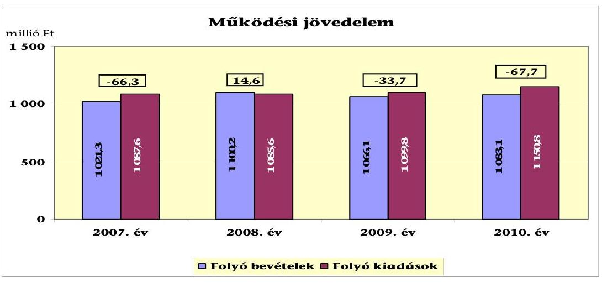

A vizsgált időszakban az Önkormányzat folyó költségvetésének egyenlege - a 2008. évet kivéve - működési forráshiány ${ }^{26}$ volt. A működési jövedelem csak 2008-ban mutatott tényleges megtakarítást ( 14,6 millió $\mathrm{Ft}^{27}$ ), amely forrásul szolgálhatott az Önkormányzat fennálló tőketörlesztési kötelezettségeinek teljesítéséhez, valamint fejlesztéseinek finanszírozásához. A negatív működési jövedelem viszont pénzügyileg nem fenntartható helyzetet okoz.

Az Önkormányzat működési jövedelmének alakulásában szerepet játszott, hogy a működőképessége megőrzését szolgáló kiegészítő támogatásra pályázott a 2007. és a 2010. években. A 2007. évben az elnyert, vissza nem térítendő támogatás összege 17,0 millió Ft volt, amelyet a közüzemi díjtartozásai rendezésére, illetve az év végi forráshiánya fedezetére fordított. A 2010. évben számára megítélt vissza nem térítendő 2,3 millió Ft támogatási összeg célhoz, feladathoz nem kötött volt. Ezt az Önkormányzat az év végi forráshiánya fedezetére fordította. A kiegészítő támogatások nélkül a 2007. évi működési forráshiánya 83,3 millió Ft, míg 2010-ben 70,0 millió Ft lett volna.

A 2011. évben az önhibájukon kívül hátrányos helyzetben lévő önkormányzatok (ÖNHIKI) támogatására pályázott. A pályázaton dologi kiadásainak forrásához 25,9 millió Ft támogatásban részesült.

A 2008. évre képződő pozitív működési jövedelmet egyrészt a működési kiadásokban - jellemzően a 2007. évi intézményátszervezés eredményeként - jelentkező 5,3\%-os (50,3 millió Ft-os) megtakarítás eredményezte. A pozitív működési jövedelem kialakulásához az állami szabályozórendszer változása miatt az átengedett bevételek és a költségvetési támogatások együttes összegének 7,9\%-os (39,6 millió Ft-os) emelkedése is hozzájárult. A 2008-ról 2009-re a működési kiadások (jellemzően a dologi kiadások) 1,3\%-kal (14,2 millió Ft-tal) emelkedtek. A 2010. évre az előző évről a növekedés 51,0 millió Ft (4,6\%) volt. A működési kiadások forrását jelentő működési bevételek 2008-ról 2009-re csökkentek 34,1 millió Ft-tal (3,1\%-kal), míg 2010. évre az előző évről 1,6\%-kal (17,0 mil-

[^0]
[^0]:    ${ }^{26}$ A működési forráshiány 2007-ben a folyó kiadások 6,1\%-át (-66,3 millió Ft-ot), a 2009-ban 3,1\%-át (-33,7 millió Ft-ot), a 2010-ben 5,9\%-át (-67,7 millió Ft-ot) jelentette.
    ${ }^{27}$ A 2008. évben a folyó költségvetés pozitív egyenlege (működési forrástöbblet), a folyó kiadások $1,3 \%$-át tette ki.

---

lió Ft-tal) emelkedtek. A 2009-2010. évek 65,2 millió Ft-os működési kiadásnövekményével szemben a működési bevételek 17,1 millió Ft-os csökkenése eredményezte a működési forráshiány kialakulását és emelkedését.

A működési forráshiány finanszírozása folyószámlahitelből, felhalmozási többlet és finanszírozási bevételek felhasználásából történt.

A folyószámlahitel napi átlagos állománya a 2007-2010. évek között 1,7\%-kal (167,4 millió Ft-ról 170,3 millió Ft-ra) nőtt és beépült a működési kiadások állandó forrásai közé. Az Önkormányzatnak a 2007. év végére képződött 22,8 millió Ft tartaléka teljes egészében kötelezettséggel terhelt volt. A tartalékállomány 2009. évig 30,6 millió Ft-ra emelkedett, majd 2010-re veszteség (negatív pénzmaradvány, -118,6 millió Ft) alakult ki. Emiatt nem volt bevonható a működési forráshiány finanszírozásába. A 2007. évben kibocsátott kötvényből a hosszú lejáratú hitelek refinanszírozása és annak kapcsolódó költségei után fennmaradó 73,9 millió Ft is a működési forráshiány fedezetét szolgálta.

Az Önkormányzat nettó működési jövedelmének évenkénti alakulását az alábbi ábra szemlélteti:
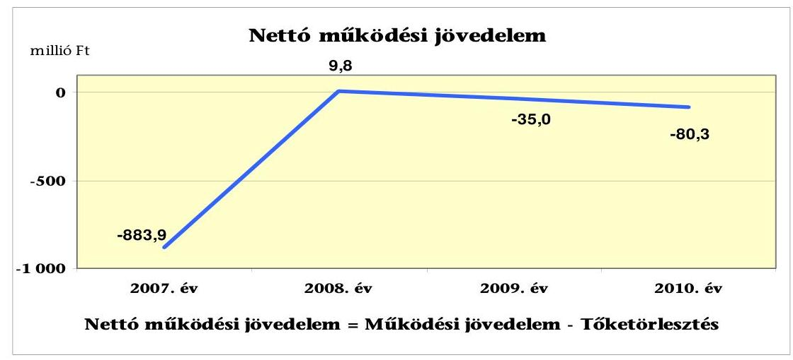

A nettó működési jövedelem ${ }^{28}$ értéke a folyó költségvetési pozíció mellett az adott költségvetési év adósságtörlesztésének hatását is tükrözi. Az Önkormányzat pénzügyi kapacitása a 2007. és 2009-2010. években negatív értéket mutatott. A folyó költségvetés egyenlegének és a tőketörlesztésre (hiteltörlesztésre) fordított összegeknek különbözeteként megállapítható pénzügyi kapacitás 2007. évi jelentős negatív értéke a 817,5 millió Ft-os hiteltörlesztés (refinanszírozás) következménye volt. Ezt az Önkormányzat részben a 900,0 millió Ft összegű kötvénye forrásából fedezte. A 2008. évben az Önkormányzat folyó bevételei 14,6 millió Ft-tal meghaladták folyó kiadásait, a teljesített tőketörlesztés után, pénzügyi kapacitása 9,8 millió Ft volt. A pénzügyi kapacitás 2009-2010-es romlását a folyó bevételek és kiadások különbségéből származó működési jövedelem csökkenése okozta. A működési jövedelem 2008-ról a 2009. évre 48,3 millió Ft-tal, majd 2009-ről a 2010. évre 34,0 millió Ft-tal csökkent. Az Önkormányzat tőketörlesztési kötelezettsége emellett a 2009. évi 1,3 millió Ft-ról, a 2010. évre közel tízszeresére ( 11,3 millió Ft-tal, $869,2 \%$-kal) nőtt, 12,6 millió Ft

[^0]
[^0]:    ${ }^{28}$ Pénzügyi kapacitás

---

volt. A vizsgált időszakban a folyószámlahitel év végi záró állománya állandósult, átlagosan 164,0 millió Ft volt. A likvidhitel visszafizetés tovább rontotta volna a nettó-működési jövedelmet, mivel jelentősen emelné a tőketörlesztés értékét.

A nettó működési jövedelem negatív értéke azt mutatja, hogy a jövőben teljesítendő adósságszolgálat csak pozitív működési jövedelmet eredményező gazdálkodás mellett teszi elkerülhetővé további külső források bevonását, az eladósodást.

Az Önkormányzat felhalmozási költségvetésének egyenlege alakulását a következő ábra szemlélteti:
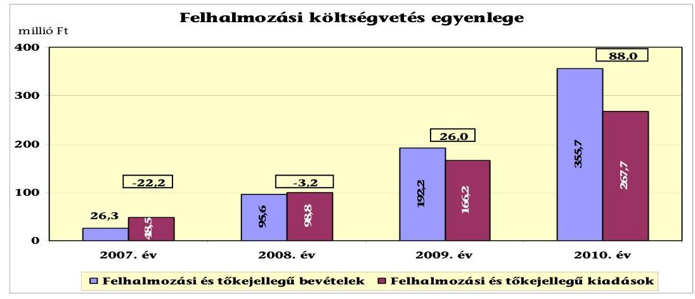

A felhalmozási költségvetés egyenlege az első két évben forráshiány, a 2009-2010. években forrástöbblet volt. A 2007. évi felhalmozási forráshiány (22,2 millió Ft) finanszírozása - negatív működési jövedelem mellett - kötvénykibocsátásból történt ${ }^{29}$. A 2008. évi felhalmozási forráshiányt ( 3,2 millió Ft) fedezte a pozitív nettó működési jövedelem. A 2009. évi 26,0 millió Ft-os felhalmozási többletet a felhalmozási bevételek $82,9 \%$-át adó részesedésértékesítés ${ }^{30}$ eredményezte. A 88,0 millió Ft 2010. évi felhalmozási többlet kialakulásában a 80,1 millió Ft-ban realizált tárgyi eszköz értékesítéséből származó bevétel, illetve az 53,5 millió Ft összegű elnyert EU-s forrás játszott szerepet.

A folyó bevételek részét képező költségvetési támogatások jellemzően kötött normatív támogatás formájában a vizsgált időszak négy évében összesen 43,8 millió Ft összegben tartalmaztak felhalmozási támogatásokat. Amennyiben a felhalmozási támogatásokat a felhalmozási bevételek között vennénk figyelembe a felhalmozási költségvetés egyenlege 2007-ben -19,9 millió Ft lenne. A 2008. évben a központi felhalmozási forrás ( 12,9 millió Ft) a felhalmozási költségvetés egyenlegét megfordítaná pozitív irányba 9,7 millió Ft-ra. A felhalmozási költségvetés egyenlege a központi felhalmozási forrás figyelembevételével 2009-ben 31,8 millió Ft-ra, 2010-ben 110,8 millió Ft-ra növekedne.

[^0]
[^0]:    ${ }^{29}$ Az Önkormányzat a 2007. évben kibocsátott kötvényből származó 900,0 millió Ft-os bevételének $91,3 \%$-át még a tárgyévben meglévő felhalmozási hitelei kiváltására használta fel.
    ${ }^{30}$ Amely a balatoni hajózási társaságban lévő önkormányzati részesedés értékesítése volt.

---

Az Önkormányzat folyó és a felhalmozási költségvetése együtt ${ }^{31}$ a 2007. évben 88,5 millió Ft, a 2009-ben 7,7 millió Ft finanszírozási hiány volt. A 2008. évben 11,4 millió Ft, a 2010. évben 20,3 millió Ft többlet jelentkezett. A nettó működési jövedelem és a felhalmozási költségvetés egyenlegének eredője mutatja az Önkormányzat évenkénti teljes finanszírozási igényét.

Az Önkormányzat finanszírozási műveletei 2007-2010. évekbeli egyenlegének alakulását a következő ábra szemlélteti:
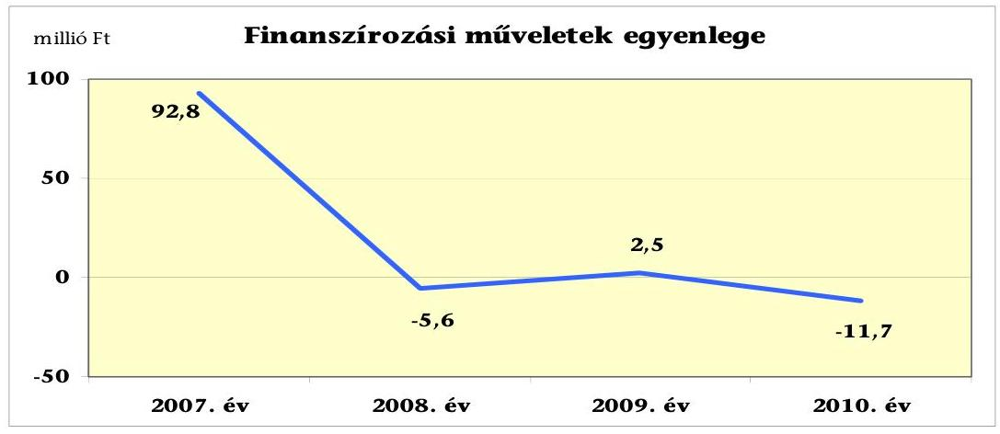

A finanszírozási műveletek forgalma az Önkormányzat teljesített költségvetési kiadásaihoz és realizált bevételeihez viszonyítva - 2007-et kivéve - nem jelentős ( $0,2-0,8 \%$ között változott). A vizsgált időszakban együttesen jelentkező finanszírozási célú pénzügyi műveletek pozitív értéke ( 78,0 millió Ft) azt jelzi, hogy az éves költségvetések végrehajtása során a pénzkészlet felhasználásán túl szükség volt külső finanszírozási forrás igénybevételére.

A finanszírozási célú pénzügyi műveletek 2007. évi 92,8 millió Ft pozitív egyenlege a felhalmozási hitelek kötvénybevételből történő refinanszírozásának következménye. A 2009. évi 2,5 millió Ft pozitív egyenleget az egyéb finanszírozási műveletek egyenlegével korrigált hitelfelvétel jelentette. A 2008.
 és 2010. évi negatív egyenleget az egyéb finanszírozási műveletek egyenlegével korrigált hiteltörlesztések idézték elő. (A finanszírozási célú műveleteket a vizsgált időszakban a jelentés 2. számú mellékletének 4.1-4.8 pontjai részletezik.)

A likvidhitel záró állománya 2007. évben 167,4 millió Ft, a 2008. évben 163,4 millió Ft, a 2009. évben 168,1 millió Ft, a 2010. évben 156,9 millió Ft volt. A folyószámlahitel, mint külső forrás beépült az Önkormányzat költségvetésébe és jelentős kockázatot hordoz a pénzintézeti kötelezettségek terén.

Az Önkormányzat zárszámadási rendeleteiben a működési és fejlesztési hiányt/többletet a hagyományos költségvetési szerkezet alapján - amely figyelembe vette a pénzforgalmi bevételeken és kiadásokon túl a pénzforgalom nélküli bevételeket és kiadásokat is - mutatta be ${ }^{32}$, amelyről a jelentés 1. számú

[^0]
[^0]:    ${ }^{31}$ Finanszírozási műveletek nélküli (GFS) pozíció, amely figyelmen kívül hagyja a pénzforgalom nélküli bevételeket és kiadásokat.
    ${ }^{32}$ Nincs kötelező előírás a működési és fejlesztési hiány megállapításának módjára.

---

melléklete nyújt tájékoztatást. Az Önkormányzat minden évben többletet mutatott be (2007. évben 31,5 millió Ft, 2008-ban 33,1 millió Ft, 2009-ben 29,5 millió Ft, míg 2010. évben már 66,1 millió Ft összegben) a zárszámadási rendeleteiben.

Az Önkormányzat a működési- és a felhalmozási bevételeit és kiadásait a zárszámadási rendeleteiben helytelenül állapította meg. Az Áht. 8/A. § előírása ellenére a 2007. évben finanszírozási célú pénzügyi bevételeit és kiadásait a felhalmozási célú bevételek és kiadások között szerepeltette, nem mutatta be a valós fejlesztési hiányt/többletet. A 2010. évben pedig a fejlesztési célú támogatási kölcsön bevételét a működési célú bevételei között szerepeltette, és nem a felhalmozási bevételei között, így nem a valós működési, illetve fejlesztési hiányt/többletet mutatta be zárszámadási rendelete mellékletében.

Az Önkormányzat kamatbevételeinek és kamatkiadásainak alakulását a következő ábra mutatja:
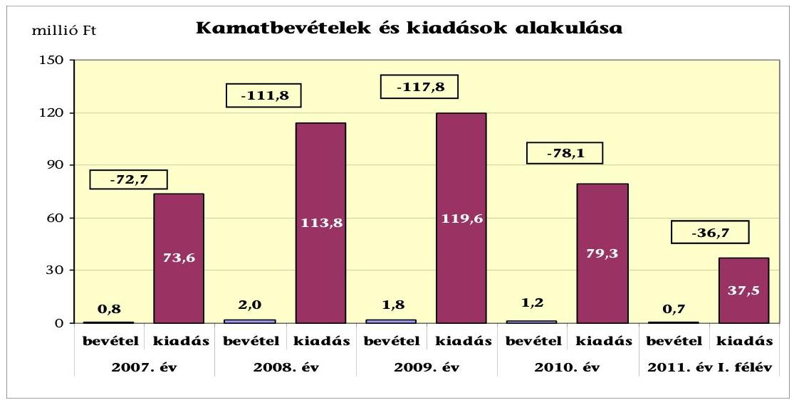

Az Önkormányzat szabad pénzeszközökkel nem rendelkezett, így befektetései sem voltak. A költségvetési bankszámlájukon lévő pénzeszközök után kapott kamatok folyamatosan csökkentek és jóval a fizetett kamatok összegei alatt maradtak. 2007-2010 között az Önkormányzat összesen 5,8 millió Ft kamatbevételt számolt el, amely a teljes kamatráfordításnak (386,3 millió Ft) mindössze 1,5%-át tette ki.

# 2.2. Az Önkormányzat bevételeinek változása 

Az Önkormányzat folyó bevétele a 2007. évi 1021,3 millió Ft-ról a 2008. évi (7,7%-os, 78,9 millió Ft-os) növekedést, majd 2008-ról a 2009. évi (3,1%-os, 34,1 millió Ft-os) csökkenést követően 2010-re 1083,1 millió Ft-ra teljesült. A vizsgált időszak első három évének átlagához (1062,6 millió Ft) képest a változás minimális 20,5 millió Ft-os (1,9%-os) növekedés volt. A 2011. év I. félévi folyó bevétel 494,8 millió Ft volt.

Az Önkormányzat 2007. és 2011. június 30. között realizált, főbb folyó bevételi jogcímeinek számszaki adatait a következő ábra szemlélteti:

---

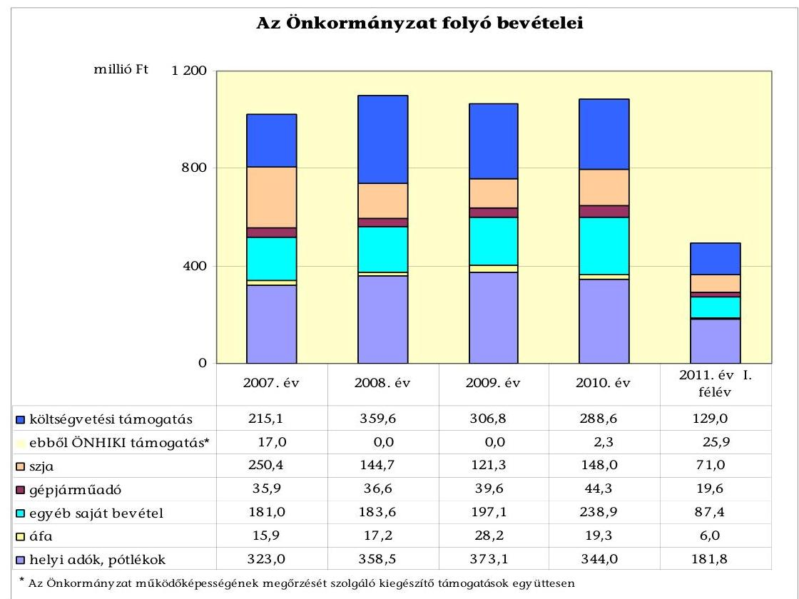

Az Önkormányzat folyó bevételéből a költségvetési támogatás és az szja-bevételek együttes összegének részaránya 43,9% volt a vizsgált időszak első három évében átlagosan, amely részarány a 2010. évben 3,6 százalékpontot csökkent. A központi költségvetésből kapott költségvetési támogatások és az szja bevétel a 2010. évi együttes összege 436,6 millió Ft volt, amely 29,4 millió Ft-tal (6,3%-kal) maradt el a megelőző három év átlagától.

A költségvetési támogatások összege a 2008. évi 67,2%-os (144,5 millió Ft) növekedést követően a központi forráskivonás hatására ${ }^{33}$ folyamatosan csökkent. Az előző évihez képest 2009-ben 14,7%-kal (52,8 millió Ft-tal), 2010-ben 5,9%-kal (18,2 millió Ft${ }^{34}$) volt kevesebb. A központi támogatás részét képező normatív támogatások 2008-2009. évek között 12,7 millió Ft-tal, 2009-2010. évek között ennél erőteljesebben 42,5 millió Ft-tal csökkentek, amit a normatívák központi csökkentése, valamint a közoktatási ágazat ellátotti létszámának visszaesése ${ }^{35}$ idézett elő. Az Önkormányzat személyi jövedelemadó bevétele csökkent a központi szabályozás változása és a visszaosztás alapját jelentő önkormányzati adóerő-képességének növekedése miatt (iparűzési adóerő-képessége 2007-ben 22,1 ezer Ft/fő, 2010. évben 26,6 ezer Ft/fő volt).

Az Önkormányzat folyó bevételéből a helyi adóbevétel a vizsgált időszakban a 2007. évi 31,6%-os részarányról (323,0 millió Ft) a 2008. évre 32,6%-os rész-

[^0]
[^0]:    ${ }^{33}$ a 2007. évi bázishoz képest
    ${ }^{34}$ Amennyiben a működőképesség megőrzésére szolgáló, 2010. évben elnyert 2,3 millió Ft összegű támogatást is figyelembe vesszük a csökkenés 15,9 millió Ft, 5,2% lenne.
    ${ }^{35}$ Összességében 21 fő.

---

arányra és 358,5 millió Ft-ra emelkedett (35,5 millió Ft-tal, 11,0%-kal). A 2009-re az előző évhez viszonyítva 2,4 százalékponttal (14,6 millió Ft-tal) nőtt.

#### Abstract

A Képviselő-testület a helyi adók közül ${ }^{36}$ az építményadót, a telekadót, a helyi iparűzési adót és az idegenforgalmi adót alkalmazta. A vizsgált időszakban új adónem bevezetésére nem került sor. Az építményadót a helyi adótörvényben meghatározott kivételekkel minden építményre kivettették, mértéke 2008. évtől az ingatlan elhelyezkedésétől függően 560 és 700 Ft/m²/év mértékű lett a 2007. évben alkalmazott 480 és 600 Ft/m²/év mértékről. A telekadó mértéke a vizsgált időszakban nem változott 40 és 50 Ft/m²/év volt. A helyi iparűzési adó mértéke 2007-2010. években nem változott. Az állandó jelleggel végzett tevékenység után fizetendő iparűzési adót a bevezethető adómérték 90%-ában, 1,8%-ban határozták meg. A személyenként és vendégéjszakánként fizetendő idegenforgalmi adó összege 2008. évtől egységesen 300 Ft (2007. évben a szálláshely-ingatlan elhelyezkedésétől függően 160 és 200 Ft) volt.

Az alkalmazott adónemek esetén megfigyelhető 2007. évhez képest a 2009. évig tartó folyamatos növekedés az adómértékek 2008. évre történő emelésének eredménye volt.

Az építményadó mértékében 16,7%-os emelés történt 2008. évben. Emiatt ebből az adónemből az Önkormányzat 2008-ban 21,1 millió Ft-tal (11,7%-kal) több bevételt realizált, míg 2009-ben 7,8 millió Ft-tal (3,9%-kal) nőtt a bevétele. A személyenként és vendégéjszakánként fizetendő idegenforgalmi adó mértéke 2008. évtől megduplázódott, illetve 150%-kal emelkedett. Emiatt a realizált idegenforgalmi adóbevétel 2008-ban 13,6 millió Ft-tal (82,2%-kal), míg az előző évről 2009-ben 5,2 millió Ft-tal (17,8%-kal) nőtt.

A 2010. évre a helyi adóbevétel részaránya 31,8%, értékük 344,0 millió Ft lett, a csökkenés az előző évről 7,8%-os (29,1 millió Ft-os) volt. A csökkenés az iparűzési adóbevételnél 20,9%-os (24,9 millió Ft-os), az idegenforgalmi adóbevétel esetében 26,5%-os (9,5 millió Ft-os), amely a kedvezőtlen idegenforgalmi szezon eredménye volt mindkét adónem esetében.

Az állami támogatások csökkenése miatti bevételkiesést az Önkormányzat egyéb saját bevételeinek növelésével pótolta. Az Önkormányzat egyéb saját bevételei a vizsgált időszakban folyamatosan emelkedtek a 2007-2009. évek 187,2 millió Ft-os átlagos értékéről a 2010-re 27,6%-kal (51,7 millió Ft-tal), amelyet a térítési díjbevételek, a piac és az egyéb ingatlanok bérbeadásából származó bevételek növekedése eredményezett. Az Önkormányzat a tulajdonosi részesedései után a 2007-2010 között 0,8 millió Ft osztalékot vett fel ${ }^{37}$.
Az Önkormányzat felhalmozási bevételei a vizsgált időszakban a következők voltak:

[^0]
[^0]:    ${ }^{36}$ Az Önkormányzat többször módosított egységes szerkezetű, 23/2007. (XII. 14.) számú rendelete a helyi adókról.
    ${ }^{37}$ A hulladékkezelést végző gazdasági társaságától a vizsgált időszakban összesen 0,008 millió Ft, a balatoni hajózást végző társaságtól pedig 0,745 millió Ft osztalékot kaptak.

---

| Megnevezés | 2007. év | 2008. év | 2009. év | 2010. év | 2011. év I.   félév |
| :-- | --: | --: | --: | --: | --: |
| Tárgyi eszköz értékesítés | 3,0 | 25,2 | 1,3 | 80,1 | 0,1 |
| Egyéb saját tőkebevétel | 1,3 | 57,1 | 177,4 | 214,6 | 15,6 |
| Államháztartáson belülről   kapott támogatás | 13,7 | 2,3 | 0,7 | 1,6 | 0,1 |
| EU-tól és külföldről kapott   támogatások | 0,0 | 0,0 | 10,4 | 53,5 | 0,5 |
| Államháztartáson kívülről   kapott támogatás | 8,3 | 11,0 | 2,4 | 6,0 | 0,0 |
| Összes felhalmozási   bevétel | $\mathbf{26,3}$ | $\mathbf{95,6}$ | $\mathbf{192,2}$ | $\mathbf{355,7}$ | $\mathbf{16,3}$ |

A felhalmozási bevételek a 2007-2010. években folyamatosan emelkedtek, a vizsgált időszak kezdő és záró éve között 329,4 millió Ft-tal. Értékük a 2010. évben kiugró 355,7 millió Ft, amely az előző három év átlagának (104,7 millió Ft) több mint háromszorosa volt.

A 2007-2010. években realizált felhalmozási bevételek 16,4%-át a tárgyi eszköz értékesítéséből keletkező 109,6 millió Ft bevétele adta, amelyből 105,2 millió Ft-ot önkormányzati ingatlanok eladásából értek el. A legjelentősebb ingatlanértékesítésre a 2010. évben került sor 80,0 millió Ft összegben, amely során egy 3334 m² belterületi lakóházas ingatlant értékesítettek. Az Önkormányzat 2009. évtől összesen 64,4 millió Ft EU-s támogatást realizált öt pályázata keretében. Az Önkormányzat államháztartáson belülről és kívülről kapott támogatásként mutatta ki a fejlesztési feladatok végrehajtásához kapott felhalmozási célú állami támogatásokat, a nonprofit szervezetektől, vállalkozásoktól átvett felhalmozási célú pénzeszközöket, melyek értéke és részaránya is folyamatosan csökkent. Az egyéb saját tőkebevételek értéke a 2007-2010. években 450,4 millió Ft volt.

Az egyéb saját tőkebevételek a 2007-ről 2008-ra 55,8 millió Ft-tal nőttek, amely felhalmozási bevételi többletet a Lakásépítő Kft.-nek tartósan adott kölcsön visszatérülése címen jóváírt 42,0 millió Ft jelentette. A 2009. évben az előző évhez képest e bevétel több mint háromszorosára emelkedett, 120,3 millió Ft-tal nőtt. A 2009-es felhalmozási bevételből 159,4 millió Ft-ot a balatoni hajózási társaságban lévő Önkormányzati részesedés értékesítése adta. Az előző évről 2010-re 37,2 millió Ft (21,0%)-os egyéb saját tőkebevétel növekedés volt kimutatható, amely a tagi kölcsön megtérülése 214,4 millió Ft összegű felhalmozási bevételként történő - számviteli előírásoknak ${ }^{38}$ megfelelő - elszámolása volt. A 2007-2010. években realizált egyéb saját tőkebevétel 7,7%-a (34,7 millió Ft) jellemzően önkormányzati lakások, egyéb helyiségek értékesítéséből, cseréjéből származó bevétel volt.

# 2.3. Az Önkormányzat működési és a felhalmozási célú kiadásainak változása 

Az Önkormányzat folyó kiadása 2007. és 2011. június 30-a között főbb jogcímek szerinti bontásban a következők szerint alakult:

[^0]
[^0]:    ${ }^{38}$ A Számv. tv. 15. § (9) bekezdése és az Áhsz. 9. § (6) bekezdésében megfogalmazott bruttó elszámolás számviteli alapelve miatt.

---

| Megnevezés | 2007. év | 2008. év | 2009. év | 2010. év | $\begin{gathered} \text { 2011. év } \mathbf{1 .} \\ \text { félév } \end{gathered}$ |
| :--: | :--: | :--: | :--: | :--: | :--: |
| Folyó kiadások | 1087,6 | 1085,6 | 1099,8 | 1150,8 | 464,3 |
| Működési kiadások (kamatkiadás nélkül) | 948,1 | 897,8 | 908,1 |

 | 995,5 | 399,3 |
| Államháztartáson belülre átadott pénzeszközök | 7,7 | 4,9 | 7,3 | 11,7 | 0,6 |
| Transzferkiadások | 58,3 | 69,1 | 64,7 | 64,4 | 26,9 |
| -ebből: vállalkozásoknak | 31,0 | 37,5 | 33,0 | 21,7 | 6,7 |
| magánszemélyeknek | 21,6 | 25,1 | 25,9 | 24,9 | 12,8 |
| nonprofit szervezeteknek | 5,7 | 6,5 | 5,8 | 17,8 | 7,4 |
| Kamatkiadások | 73,6 | 113,8 | 119,6 | 79,3 | 37,5 |

Az Önkormányzat összes folyó kiadása a 2007-2009. évek átlagában 1091,0 millió Ft volt, amely 2010-ben 5,5%-kal (59,8 millió Ft-tal) emelkedett. Az Önkormányzat által teljesített kamatkiadások a vizsgált időszak első három évének 102,3 millió Ft átlagos értékéről a 2010. évre 22,5%-kal (23,0 millió Ft-tal) csökkentek. Az államháztartáson belülre átadott működési célú pénzeszközök a folyó kiadásokon belül a 2007-2010. évben 0,7% részarányt képviseltek. Az államháztartáson kívülre történő működési célú pénzeszközátadások ${ }^{39}$ (transzferkiadások) összege 2007-ről 2008-ra 10,8 millió Ft-tal (18,5%-kal) emelkedett, majd a 2009-2010 közötti időszakban 64,7 és 64,4 millió Ft-ban állandósult.

Az Önkormányzat kamatkiadások nélküli működési kiadásai főbb kiadásnemek szerinti bontásban az alábbiak szerint alakultak:

| Megnevezés | 2007. év | 2008. év | 2009. év | 2010. év | $\begin{gathered} \text { 2011. év 1. } \\ \text { félév } \end{gathered}$ |
| :--: | :--: | :--: | :--: | :--: | :--: |
| Személyi juttatások | 459,5 | 427,5 | 396,8 | 406,9 | 189,7 |
| Munkaadót terhelő járulékok | 143,5 | 132,7 | 117,9 | 105,6 | 48,1 |
| Dologi kiadások | 325,3 | 313,2 | 376,0 | 420,7 | 153,1 |
| Egyéb folyó kiadások | 19,8 | 24,5 | 17,5 | 62,2 | 8,4 |

A működési kiadásokon belül a személyi juttatások teljesített kiadásai minden évben csökkentek a 2007. évhez viszonyítva. A 2007. évhez képest 2008-ban 7,0%-kal (32,0 millió Ft), a 2009. évben 13,6%-kal (62,8 millió Ft) kevesebb személyi juttatást teljesítettek. A 2010. évben megfordult az addig csökkenő tendencia, az előző év kiadását 10,1 millió Ft-tal (2,5%-kal) haladták meg a személyi juttatások. A munkaadókat terhelő járulékok címén elszámolt kiadások összege a központi intézkedések hatására a vizsgált időszakban folyamatosan csökkent az időszak első évében elszámolt 143,5 millió Ft-ról 105,6 millió Ft-ra. A dologi kiadások és egyéb folyó kiadások az Önkormányzatnál folyamatosan emelkedtek, 2010-ben 34,6%-kal (124,2 millió Ft-tal) voltak magasabbak a 2007-2009. évek átlagos 358,8 millió Ft-os értékénél. A dologi kiadások és egyéb folyó kiadások alakulására hatást gyakorolt a szállítói állomány változása. A dologi kiadások és egyéb folyó kiadások összege az előző évhez

[^0]
[^0]:    ${ }^{39}$ Az Önkormányzat az Áhsz. előírásai ellenére a 2007-2009. években a non-profit szervezeteknek átadott működési célú pénzeszközöket a vállalkozásoknak átadott működési célú pénzeszközök között szerepeltette. A transzferkiadások összege nem változik emiatt, csak a megbontása. A vállalkozásoknak átadott működési célú pénzeszközök 2007-ben 15,6 millió Ft, 2008-ban 24,8 millió Ft, míg 2009-ben 23,5 millió Ft volt helyesen. A non-profit szervezeteknek átadott működési célú pénzeszközök 2007-ben 21,1 millió Ft, 2008-ban 19,2 millió Ft, míg 2009-ben 15,3 millió Ft volt ténylegesen.

---

képest 2008-ra 7,4 millió Ft-tal (2,1%-kal) csökkent úgy, hogy a szállítói állomány 26,1 millió Ft-tal (16,5%-kal) nőtt. A 2008-ról 2009-re a dologi kiadások és egyéb folyó kiadásokban 55,8 millió Ft (16,6%) növekedés volt kimutatható a szállítói állomány párhuzamos növekedésével (5,5%-os, 10,3 millió Ft-os). A 2010. évre 2009-ről 89,4 millió Ft-os (22,7%) dologi kiadások és egyéb folyó kiadások növekedése történt, a szállítói állomány 62,0 millió Ft-os (31,9%-os) csökkentése hatására. A dologi kiadások és egyéb folyó kiadások a vizsgált időszakban az inflációt meghaladó mértékben nőttek úgy, hogy az önkormányzati feladatellátásban változás nem történt.

Az Önkormányzat folyó és felhalmozási kiadások vizsgált időszakbeli alakulását ${ }^{40}$, a teljesített kiadások folyó és felhalmozási célú felhasználásának arányait a következő grafikon szemlélteti:
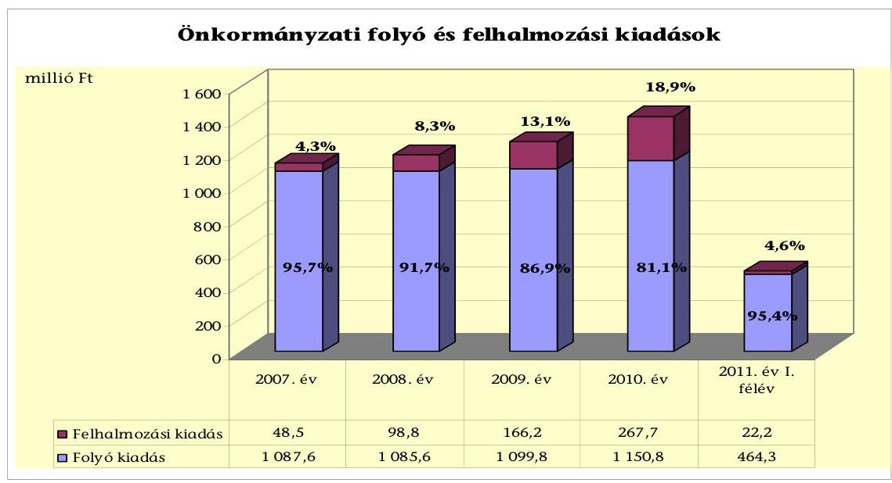

A folyó és felhalmozási kiadások 2010. évi aránya a 2007. évihez képest jelentősen változott, a felhalmozási kiadások aránya 14,6 százalékponttal (219,2 millió Ft-tal) növekedett. Az Önkormányzat a vizsgált időszakban összesen 603,4 millió Ft felhalmozási kiadást számolt el.

A felhalmozási kiadás 2008. évben a 2007. évhez viszonyítva megduplázódott a Lakásépítő Kft.-nek adott tagi kölcsön törlesztéseként 42,0 millió Ft értékű üzlethelyiség - számviteli előírásoknak megfelelő ${ }^{41}$ - felhalmozási kiadások közötti elszámolása miatt. Az Önkormányzat a 2009. évben a balatoni hajózást végző gazdasági társaságban 27,0 millió Ft tőkeemelést hajtott végre, továbbá 35,6 millió Ft-ért részvényt vásárolt a közvilágítást szolgáltató gazdasági társaságban, illetve 0,5 millió Ft-tal megalapította a műsorszolgáltató Kft.-jét. Az előző évhez képest a 2010. évben jelentkező fejlesztési kiadásnövekmény a Lakásépítő Kft.-nek adott tagi kölcsönkövetelés törlesztésének fejében elszámolt ingatlan

[^0]
[^0]:    ${ }^{40}$ Az adatok a 2. számú mellékletből, az elemi beszámolóval egyezően szerepelnek az ábrában. Az adatsor eltér az Önkormányzat zárszámadási rendeleteiben szereplő adatoktól.
    ${ }^{41}$ Számv. tv. 15. § (9) bekezdése és az Áhsz. 9. § (6) bekezdése.

---

vagyon ${ }^{42}$ 182,8 millió Ft-os értéke volt. A 2007-2011. év első féléve közötti időszakban további 154,1 millió Ft összegű felhalmozást, beruházást és 99,9 millió Ft értékű felújítást végzett az Önkormányzat. Államháztartáson kívülre 50,1 millió Ft-ot adott át, míg 2008-ban 11,4 millió Ft-ot részesedés vásárlásra fordított.

Az Önkormányzatnál 2007-2010. években a befejezett fejlesztési feladatok összes költségvetési kiadása 408,1 millió Ft volt, amelyből a beruházások összege 315,1 millió Ft-ra (77,2%) és a felújítások összege 93,0 millió Ft-ra (22,8%) teljesült. A 10 millió Ft bekerülési költség feletti beruházások és felújítások száma 2007-2010. között hat darab, amelyek teljes bekerülési költsége 290,1 millió Ft, az összes fejlesztés 71,1%-a volt. A 2007 és 2010 között kezdett és befejezett 408,1 millió Ft értékű fejlesztések forrásmegoszlása 25,5 millió Ft EU-s támogatás (6,2%), 53,8 millió Ft hazai támogatás (13,2%), 323,5 millió Ft saját bevétel (79,3%) és 5,3 millió Ft hitel (1,3%) volt. Az itt bemutatott adatokat a jelentés 3/a. számú melléklete tartalmazza.

Az Önkormányzat 2010. december 31-én folyamatban lévő fejlesztési feladatainak 2010. december 31-ig teljesített kiadása 48,8 millió Ft volt, amelynek forrása 38,4 millió Ft EU-s támogatás (78,7%) 10,4 millió Ft saját bevétel (21,3%) volt. Az itt bemutatott adatokat a jelentés 3/b. számú melléklete tartalmazza.

Az Önkormányzat 2010. december 31-én folyamatban lévő fejlesztéseihez kapcsolódó 2010. évet követő kötelezettségvállalásainak várható összege 567,0 millió Ft. A tervezett forrásösszetétel 359,7 millió Ft EU-s támogatás (63,4%) - a már megkapott 8,7 millió Ft-os támogatási előleg figyelmen kívül hagyásával -, 46,0 millió Ft saját bevétel (8,1%) és 161,3 millió Ft hitel (28,5%) volt. Az itt bemutatott adatokat a jelentés 3/c. számú melléklete tartalmazza.

Az EU támogatással megvalósuló városközpont funkcióbővítés integrált fejlesztéséhez kapcsolódott szállítói finanszírozási szerződés, az Önkormányzatnak csak a saját erőt kell kiegyenlíteni. Az Önkormányzat szabad pénzeszközökkel nem rendelkezett, a folyószámlahitel-keret teljes egészében kimerült 2010. december 31-ig. A tervezett hitelforrásra vonatkozó szerződést nem kötött a helyszíni vizsgálat befejezéséig. Ezek miatt a folyamatban lévő fejlesztés megvalósítása bizonytalan.

Az Önkormányzat 2010. december 31-ig megvalósult fejlesztései közül a három legmagasabb összegű beruházás a következő volt:

- A József A. utca útburkolat felújítás II. üteme 2009. évben valósult meg 20,5 millió Ft-ból, amelynek saját bevétel volt a forrása teljes egészében. A felújítás során 470 fm hosszú útszakasz kapott aszfaltburkolatot a további romlás megakadályozása, a teherbírás javítása miatt.
- A 13,4 millió Ft bekerülési értékkel tervezett Polgármesteri hivatal akadálymentesítése projekthez DDOP pályázaton 10,0 millió Ft EU-s forrást nyertek

[^0]
[^0]:    ${ }^{42}$ A Számv. tv. 15. § (9) bekezdése és az Áhsz. 9. § (6) bekezdésében megfogalmazott bruttó elszámolás számviteli alapelve miatt a követelés törlesztéseként - felhalmozási bevétel - felajánlott ingatlan értékét felhalmozási kiadásként el kellett számolni.

---

el és használtak fel. Ezt 1,5 millió Ft saját forrással kiegészítve 11,5 millió Ft-os beruházást hajtottak végre 2010-ben. A fejlesztés során a Polgármesteri hivatal akadálymentes megközelítését lehetővé tevő műszaki és építési beruházások (rámpa járdaszakasszal, parkoló kialakítása, bejárat szélesítése, akadálymentes mellékhelységek kialakítása stb.) valósultak meg.

- A bölcsőde felújítását 2010-ben végezték el, amelynek bekerülési költsége 15,3 millió Ft volt. Ehhez KEOP pályázaton nyert 11,9 millió Ft hazai forrást és 3,4 millió Ft saját bevételt használtak fel. A felújítás során a fűtési rendszer korszerűsítése, vízvezeték rekonstrukció, az épület utólagos hőszigetelése, a belső terek festése, mázolása és a játszóudvar felújítása valósult meg.

Az Önkormányzatnak 25,8 millió Ft tervezett bekerülési költségű, elbírálás alatt lévő, pályázati forrásból megvalósuló fejlesztése volt 2010. december 31-én. A beadott pályázat sikeres elbírálása esetén a 20,0 millió Ft hazai támogatás segítségével a Zákányi Sportcsarnok felújítása valósulna meg. A fennmaradó 5,8 millió Ft-ot saját bevételéből szeretné biztosítani az Önkormányzat. Az itt bemutatott adatokat a jelentés 3/d. számú melléklete tartalmazza.

Az Önkormányzat az éves költségvetési rendeletekben elkülönítetten nem mutatta be a beruházásokkal létrehozott létesítmények működtetése és fenntarthatósága érdekében várhatóan felmerülő költségvetési kiadásokat.
A gazdasági társaságok részére átadott pénzeszközök alakulását az alábbi grafikon mutatja be:
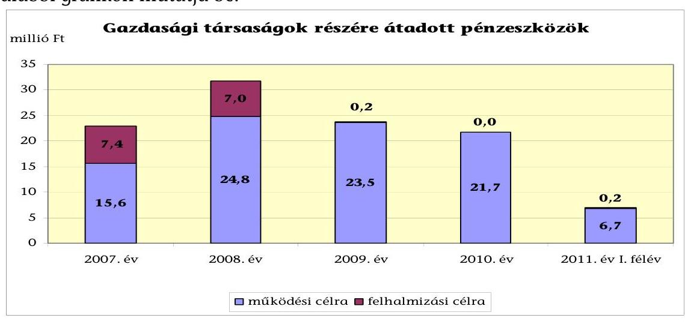

Az önkormányzati kötelező és önként vállalt feladatellátásban résztvevő gazdasági társaságoknak működési célra átadott pénzeszközök állománya a 2007-2009. évek átlagos 21,3 millió Ft-os értékéről 2010-re 1,9%-kal magasabb, 21,7 millió Ft volt. A 2011. év I. félévében 6,7 millió Ft működési célú pénzeszközt adott át az Önkormányzat. A 2007-2011. év első féléve között fejlesztési célra átadott pénzeszközök az összes támogatás mindössze 13,8%-át tették ki a 14,8 millió Ft-tal.

A 2007-2011. év I. féléve közötti időszakban nyújtott 92,3 millió Ft működési célú önkormányzati pénzeszközátadás 69,3%-át, 64,0 millió Ft-ot és a fejlesztési célú pénzeszközátadás 47,3%-át (7,0 millió Ft-ot) az egészségügyi feladatokat ellátó kizárólagos tulajdonú gazdasági társaság kapta. Az Önkormányzat ön-

---

ként vállalt feladatát a műsorszolgáltatást végző kizárólagos tulajdonú gazdasági társasága működéséhez a vizsgált időszakban 20,6 millió Ft átadott pénzeszközt biztosított. A gazdasági társaságok által kapott pénzeszközöknek az összes bevételükhöz viszonyított aránya 6,2% és 9,4% között változott. A helyi tömegközlekedést biztosító Kft. pedig 6,8 millió Ft működési célú átadott pénzeszközben részesült a vizsgált időszak alatt. A gazdasági társaságok adatait a jelentés 4. számú melléklete tartalmazza.

# 3. Az ÖNKORMÁNYZAT KÖTELEZETTSÉGEI 

###
 3.1. Az Önkormányzat pénzintézeti kötelezettségeinek változása

Az Önkormányzat pénzintézeti kötelezettségeinek állománya 2006. december 31-től 2010. december 31-ig 7,3%-kal nőtt 1007,5 millió Ft-ról 1081,3 millió Ft-ra, 2011. június 30-ra 5,4%-kal 1062,1 millió Ft-ra.

A pénzintézeti kötelezettségek állományának alakulását a 2006-2011. év I. félév között az alábbi ábra szemlélteti:
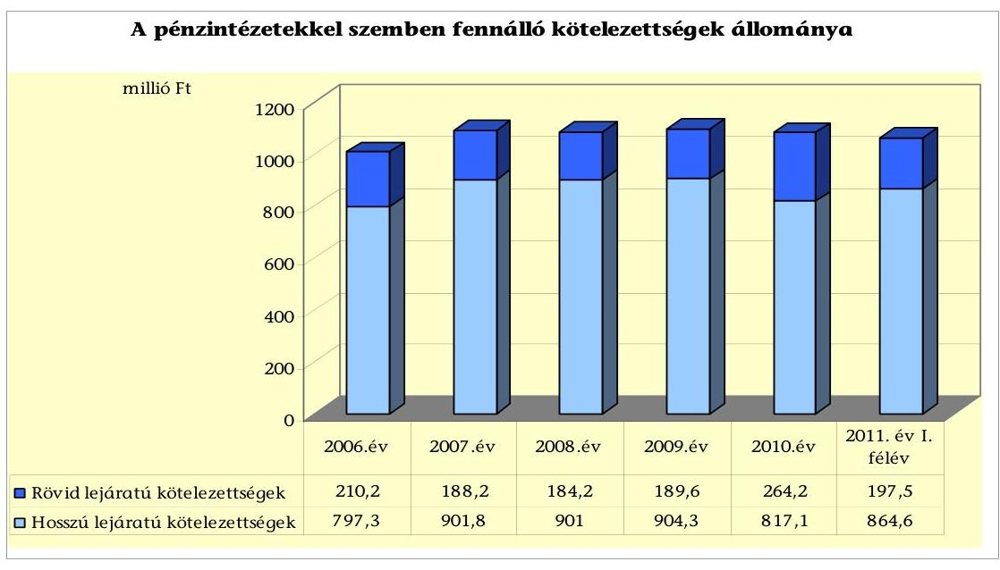

Az Önkormányzat a CHF-alapú hosszú lejáratú kötelezettségeiből 2011. június 30-ig 22 ezer CHF tőkét, 7 ezer CHF kamatot fizetett. A Számv. tv. 60. § (1) bekezdésében foglaltak ellenére, a főkönyvekben a deviza alapú hitelek törlesztései után árfolyamkülönbözetet nem számoltak el. A 2010. évi beszámoló készítésekor a deviza alapú hitelek értékelését nem végezték el, árfolyamveszteséget a Számv. tv. 60. § (2) bekezdésében előírtak ellenére nem mutattak ki. Az ellenőrzés ideje alatt kigyűjtött adatok alapján a gépjárművásárlásokhoz kapcsolódóan 2011. június 30-ig 0,6 millió Ft árfolyamveszteség keletkezett.

---

A 2011. június 30-án fennálló pénzintézeti kötelezettségek gépjárművásárlásokhoz forrást biztosító hosszú lejáratú hitelekből${ }^{43}$, egy forint alapú kötvény kibocsátásából, folyószámlahitelek, valamint munkabérmegelőlegezési hitelek igénybevételéből keletkeztek. A 2006. évhez képest a pénzintézeti kötelezettségvállalás összetételében változás következett be, mivel a korábbi években felvett fejlesztési hitelek (821,5 millió Ft)${ }^{44}$ refinanszírozása érdekében a 2007. évben kötvényt bocsátottak ki 900,0 millió Ft összegben. A pénzintézeti kötelezettség növekedését döntően a kötvénykibocsátás és a fejlesztési célhitel refinanszírozása közti 78,5 millió Ft különbözet okozta, amiből 73,9 millió Ft-ot működési célra fordítottak. A gépjárművásárlásra felhasznált hosszú lejáratú hitelek közül kettő lejárt a 2007. és a 2010. évben (2,6 millió Ft összegben), majd a 2009. évben újabb hosszú lejáratú hitel felvételére került sor 28 ezer CHF (5,3 millió Ft) összegben. A rövid lejáratú kötelezettségek állományát az év végén fennálló folyószámla és munkabér-megelőlegezési hitelek valamint a hosszú lejáratú hitelek tárgyévet követő fizetési kötelezettségei jelentették. A kötelezettségek összetétele a 2010. évtől kedvezőtlen irányba változott, nőttek a rövid lejáratú kötelezettségek, amelynek növekedését a kötvénykibocsátásból származó tartozás következő évi törlesztő részlete okozta. A refinanszírozást követően az Önkormányzat pénzügyi pozíciója nem javult, folytatódott a hiány termelődése.

Az Önkormányzat nem rendelkezett a felvett hitelek és a kötvény visszafizetésének forrásairól. A kötelezettségvállalásból származó források felhasználási céljait meghatározták. A kötvénykibocsátás előterjesztésében bemutatták az adósságot keletkeztető kötelezettségvállalás felső határát, de megalapozó számítások nem képezték az előterjesztés részét.

Az Önkormányzat pénzintézeti kötelezettségvállalásaira minden esetben a Képviselő-testület döntése alapján került sor. A hosszú lejáratú hiteleknél két ajánlatot nyújtó pénzintézet közül történt a legkedvezőbb ajánlat kiválasztása, a folyószámlahitel felvételéről, a kötvénykibocsátásról a pénzintézetek versenyeztetése nélkül döntött a Képviselő-testület. A döntéseket megalapozó előterjesztések a teljes futamidő várható kamat- és tőkefizetési kötelezettségeknek a részletezését, a kamat- és árfolyamkockázatok bemutatását nem tartalmazták. A kötvény lejegyzője az Önkormányzat számlavezető bankja volt. A vizsgált időszakban fennálló pénzintézeti kötelezettségvállalásainak 99%-át a számlavezető pénzintézete finanszírozta, amely az egyoldalú függőség miatt pénzügyi kockázatot jelent az Önkormányzat számára. Az Önkormányzat az elfogadott 2011. évi költségvetési rendelete alapján 193,4 millió Ft hitel felvételét tervezte, a hitelt a helyszíni vizsgálat befejezésének időpontjáig nem vette fel.

[^0]
[^0]:    ${ }^{43}$ A vizsgált időszakot megelőzően felvett (2,3 millió Ft) a 2007. évi refinanszírozáskor ki nem egyenlített hosszú lejáratú gépjárművásárlási hitel, valamint a 2009. évben a gépjárművásárlására felvett (5,3 millió Ft) hitel képezte.
    ${ }^{44}$ A célhitel tőketörlesztésére 804,8 millió Ft-ot, a kamatokra 16,7 millió Ft-ot fordítottak.

---

Az Önkormányzat 2011. június 30-án CHF-ben fennálló adósságot keletkeztető pénzintézeti kötelezettségvállalásai az alábbiak voltak:

| Megnevezés | Szerződés-   kötés/   időpontja | Összeg   ezer CHF-   ben | Lehívási   árfolyam | Kamat   (referencia   kamat+   kamatfelár) | Felhasználás célja: |
| :-- | :--: | :--: | :--: | :--: | :--: |
| Hosszú lejáratú hitel   (2005.év) | 2005.10.19 | 14 | 161,18 | 9,73 | Gépjárművásárlás |
| Hosszú lejáratú hitel   (2009.év) | 2009.10.19 | 28 | 189,94 | 7,43 | Gépjárművásárlás |

Az Önkormányzat 2011. június 30-án HUF-ban fennálló adósságot keletkeztető kötelezettségvállalása az alábbi volt:

| Megnevezés | Kötvény-   kibocsátás   időpontja | Összeg   millió Ft-ban | Kamat   (referencia   kamat+   kamatfelár) | Felhasználás célja: |
| :-- | :--: | :--: | :--: | :-- |
| "Fonyód 2022"   Kötvény | 2007.06.30 | 900,0 | 3 havi   BUBOR +0,5% | költségvetés stabilizálása, a   fejlesztési célhitel   visszatörlesztése |

A kötvény kibocsátásából származó forrást az Önkormányzat 100%-ban felhasználta, a bevétel 91,3%-át (821,5 millió Ft) a fejlesztési célhitel tőke és kamattörlesztésére, 0,5%-át (4,6 millió Ft) bankköltségekre, 8,2%-át (73,9 millió Ft-ot) működési kiadások finanszírozására fordították. Az Önkormányzat a kötvényhez kapcsolódóan 2011. június 30-ig 39,1 millió Ft tőkét törlesztett, 288,4 millió Ft kamatot és 4,6 millió Ft egyéb költséget fizetett meg.

Az Önkormányzat működésének pénzügyi egyensúlyát, a vizsgált időszakban csak folyószámlahitel és munkabér-megelőlegezési hitel igénybevételével tudta biztosítani.

A folyószámlahitel és a munkabér-megelőlegezési hitel alakulását az alábbi táblázat mutatja be:

|  |  |  |  |  | millió Ft-ban |
| :--: | :--: | :--: | :--: | :--: | :--: |
| Megnevezés | 2007. év | 2008. év | 2009. év | 2010. év | 2011. év I.   félév |
| I. Folyószámlahitel |  |  |  |  |  |
| a folyószámlahitel keretösszege január 1-jén | 180,0 | 180,0 | 180,0 | 180,0 | 180,0 |
| teljesített kamat és egyéb költség | 14,1 | 15,7 | 24,1 | 18,9 | 18,2 |
| II. Munkabér megelőlegezési hitel |  |  |  |  |  |
| Igénybevett hitel összesen: | 20,0 | 20,0 | 20,0 | 20,0 | 20,0 |
| teljesített kamat és egyéb költség | 1,4 | 1,7 | 2,5 | 2,0 | 1,0 |

---

A folyószámlahitel és munkabér-megelőlegezési hitelek kondíciói és egyéb költségei az alábbiak voltak${ }^{45}$:

| Megnevezés | Kamat (referencia+ kamatfelár) | Egyéb költség |
| :--: | :--: | :--: |
| Folyószámlahitel |  |  |
| 2007-2008. év | 3 havi BUBOR +0,2%, 2008.08.31-ig,  3 havi BUBOR +1,5%, küszöbös  kamatfelár 0,5%, 2009.08.31-ig, | 2008.09.01-től, 0,5%   rend.tart.jutalék, 0,5%   kezelési díj |
| 2009-2011. év | 3 havi BUBOR +4,25%, küszöbös  kamatfelár 0,25%, 2012.április 30-ig | 0,5% rend.tart.  jutalék, 0,5% kezelési díj |
| Munkabér megelőlegezési hitel |  |  |
| 2007. év | 3 havi BUBOR +0,1% | 0 |
| 2008. év | 3 havi BUBOR +0,2% | 0 |
| 2009-2011. év | 3 havi BUBOR +1,5%, 2009.12.31-ig,  3 havi BUBOR +4,25% | 0 |

A vizsgált időszakban a folyószámla hitelkeret összege nem változott, igénybevétele állandósult, minden év végén egyenleggel zárt. Az Önkormányzat a 2007-2011. június 30. közötti időszak valamennyi napján igénybe vette a folyószámlahitelt. A tartósan fennálló hiányt folyószámlahitellel finanszírozták, amelynek év végi záró állománya 2007. évben 167,4 millió Ft, a 2008. évben 163,4 millió Ft, a 2009. évben 168,1 millió Ft, a 2010. évben 156,9 millió Ft, a 2011. év I. félévben 177,5 millió Ft volt. Az átlagos napi állomány a 2010. évben volt a legmagasabb, 170,3 millió Ft${ }^{46}$. Az Önkormányzat folyószámlahitelét kedvezőtlenebb kamatkondíciók mellett tudta igénybe venni a 2009. évtől a kamatfelár mértéke 1,5%-ról 4,25%-ra növekedett.

A folyamatos likviditási problémák folyószámlahitellel történt finanszírozása miatt az Önkormányzatnak a 2007. évtől 2011. június 30-ig összesen 82,3 millió Ft kamatkiadást és kapcsolódó egyéb költséget kellett megfizetnie. Az Önkormányzatnál pénzügyi kockázatot jelent, hogy a folyószámlahitelét nem tudta rendezni, minden évben a hitelkeret lejáratát megelőzően kérte a 180,0 millió Ft összegű folyószámla-hitelkeret szerződés meghosszabbítását.

A folyamatos és tartós likviditási problémák miatt az Önkormányzat a vizsgált időszakban a munkabérek kifizetéséhez munkabér-megelőlegezési hitelt vett igénybe. A 2007-2011. június 30. közötti időszak valamennyi napján igénybe vette a munkabér megelőlegezési hitelt. Az átlagos napi állomány${ }^{47}$ és a 2010. december 31-i záró állomány 20,0 millió Ft volt. A hitel folyamatos igénybevétele az Önkormányzatnak 2007-2011. június 30-ig összesen 8,7 millió Ft kamatkiadást eredményezett.

A jelenleg fennálló hosszú lejáratú fejlesztési hitelek és a kötvény esetében a kamatfizetési kötelezettségek alakulását jelentősen befolyásolta és

[^0][^1]
[^0]:    ${ }^{45}$ A referencia kamat az alábbiak szerint alakult

[^1]:    ${ }^{45}$ A referencia kamat az alábbiak szerint alakult

    | MNB. BUBOR fixing (átlagkamat) %-ban |  |  |  |  |
    | :--: | :--: | :--: | :--: | :--: |
    | 2007. évi | 2008. évi | 2009. évi | 2010. évi | $\begin{gathered} 2011. \text{ év I.} \\ \text{ félév } \end{gathered}$ |
    | 3 havi BUBOR | 7,75 | 8,87 | 8,64 | 5,50 | 6,07 |

    ${ }^{46}$ A folyószámlahitellel zárt napok száma 365 nap/év.
    ${ }^{47}$ A munkabérhitellel zárt napok száma 365 nap/év.

---

jelenleg is befolyásolja a hitelfelvételkor, kötvénykibocsátáskor és az utolsó kamatfizetéskor alkalmazott referenciakamatok változása. Ezt a kötvényre a következő táblázat mutatja be:

| Megnevezés | Kibocsátási, lehivási | Utolsó fizetéskori | Változás % |
| :--: | :--: | :--: | :--: |
|  | kamat (referencia + kamatfelár) % |  |  |
| 3 havi BUBOR (2007. június 28) | 8,16 | 6,59 | -19,2 |

A kamat mértékének alakulása jelentős hatással volt a teljes futamidőre számított, várható kamatkötelezettség nagyságára. A kamatok 2007. június 28-tól tekintve a 2011. év I. félévére a kibocsátáskori árfolyamhoz képest 19,2%-os mértékben csökkentek. Az eredeti szerződésben rögzített feltételekhez képest a kamatok kedvezően változtak, - és amennyiben a változás iránya megmarad kedvezően befolyásolhatják az Önkormányzat jövőbeni fizetési kötelezettségeinek alakulását.

Az Önkormányzat hosszú lejáratú hiteleinél a vizsgált időszakban a referenciakamatot a szerződésben nem rögzítették, az induló ügyleti kamat mértékét és a havonta esedékes törlesztő részlet összegét szerepeltették. Az alapkamat változásának hatása nem számszerűsíthető, mivel a fizetési értesítő a havonta fizetendő összeget, az aktuális árfolyamot, továbbá a tőke és a kamat összegét tartalmazta, a kamat % mértékét nem mutatta be.

Az Önkormányzat
 kötelezettségeinek állományát 2010. december 31-én és 2011. június 30-án, valamint várható alakulását a kötelezettségek lejáratáig a következő táblázat szemlélteti:

| Megnevezés | $\begin{gathered} \text { Állomány } 2010 . \\ \text { december } 31 \text {-én } \end{gathered}$ |  |  | $\begin{gathered} \text { Állomány } 2011 . \\ \text { június } 30 \text {-án } \end{gathered}$ |  | június 30-án |  | Várható kötelezettség 2011-2013.   években |  | Várható kötelezettség 2014. évtől |  |
| :--: | :--: | :--: | :--: | :--: | :--: | :--: | :--: | :--: | :--: | :--: | :--: |
|  | HUF-ban   (millió   Ft-ban) | Devizában (összege, ezer CHFben) | Deviza   nem | HUF.   ban   (millió   Ft-ban) | Devizában (összege, ezer CHFben) | Deviza   nem | HUF-ban   (millió   Ft-ban) | Devizában (összege, ezer CHFben) | HUF-ban   (millió   Ft-ban) | Devizában (összege, ezer CHFben) |  |
| Pénzintézeti kötelezettségek |  |  |  |  |  |  |  |  |  |  |  |
| Kötvény | 900,0 |  | HUF | 860,9 |  | HUF | 401,1 |  |  | 864,5 |  |
| Hosszú lejáratú hitelek |  | 24 | CHF |  | 20 | CHF |  | 13 |  |  | 7 |
| Munkabér-megelőlegezési hitel | 20,0 |  | HUF | 20,0 |  | HUF | 20,0 |  |  |  |  |
| Előleg/számlahitel | 156,9 |  | HUF | 177,5 |  | HUF | 177,5 |  |  |  |  |
| Pénzintézeti kötelezettségek összesen HUF-ban: | 1076,9 |  | HUF | 1058,4 |  | HUF | 598,6 |  |  | 864,5 |  |
| Pénzintézeti kötelezettségek összesen CHF-ben: |  | 24 | CHF |  | 20 | CHF |  | 13 |  |  | 7 |
| Biztosítékok |  |  |  |  |  |  |  |  |  |  |  |
| Kezesség |  |  | HUF | 92,4 |  | HUF |  |  |  |  |  |
| Biztosítékok összesen: |  |  | HUF | 92,4 |  | HUF |  |  |  |  |  |
| Szállítói tartozás | 132,3 |  | HUF | 218,6 |  | HUF | 218,6 |  |  |  |  |
| Egyéb kiadás elmaradás | 39,5 |  |  | 45,9 |  | HUF | 55,6 |  |  |  |  |
| Összes kötelezettség HUF-ban | 1248,7 |  | HUF | 1415,3 |  | HUF | 872,8 |  |  | 864,5 |  |
| Összes kötelezettség CHF-ben |  | 24 | CHF |  | 20 | CHF |  | 13 |  |  | 7 |

Az Önkormányzatnak 2011. június 30-án fennálló összes pénzintézeti kötelezettsége 1058,4 millió Ft és 20 ezer CHF volt. Ezek várható kötelezettsége (tőke, kamat) a legutóbbi kamatfizetés feltételei alapján a 2011-2013. években 598,6 millió Ft és 13 ezer CHF. A szállítói tartozások és a KÖZVIL Zrt. részvényvételár ki nem fizetett kötelezettségek címén 274,2 millió Ft-ot kell

---

megfizetnie. A kezességvállalásaiból adódóan 92,4 millió Ft összegű terhe jelentkezhet, amennyiben egy társasága és a Víziközmű Társulat kötelezettségeit nem rendezik.

A várható összes kötelezettség teljesítését nem látjuk megfelelően biztosítottnak, mivel a felszámolás alatt álló társaságától a követelésének megtérülése és a jelzáloggal nem terhelt forgalomképes besorolású nettó ingatlanvagyon értékesítése kockázatot hordoz. A mérlegben kimutatott követelésállomány 61,2 millió Ft nagy része tartós kintlévőség, így a megtérülése bizonytalan. Az Önkormányzatnál a kötelezettségek finanszírozását a vizsgált időszak alatt képződött negatív működési jövedelem miatt már rövid távon sem látjuk biztosítottnak. Az Önkormányzat tájékoztatása szerint figyelembe vehető források a kintlévőségek behajtása, helyi adóbevételek, a többségi tulajdonú gazdasági társaság felszámolási eljárásából a követelés egy részének megtérülése, valamint a peres eljárásokból származó bevételek jelenthetik, amelyek bizonytalan bevételi forrást és magas pénzügyi kockázatot hordoznak az Önkormányzat számára. A 2010. december 31-én fennálló kötelezettségek szerint 864,5 millió Ft és 7 ezer CHF a 2014. évtől esedékes pénzintézeti kötelezettsége az Önkormányzatnak, amelynek forrásszükségletét nem számszerűsítették. A 2014. évtől a pénzintézeti kötelezettségek visszafizetését a jelenlegihez képest változatlan működési jövedelemtermelő képességet feltételezve nem látjuk biztosítva.

Az Önkormányzat gazdasági társaságtól és egyéb szervezettől kölcsönt nem kapott, a gazdasági társaságai veszteségrendezésére 2010. december 31-én nem volt kötelezettségvállalása.

# 3.2. A szállítói kötelezettségek változása 

Az Önkormányzat könyvviteli mérleg szerinti összes szállítói kötelezettségén belül a lejárt szállítói állomány aránya a vizsgált időszakban magas értéket (100%-70% közötti megoszlást) mutatott. Mindegyik év végén jelentős nagyságrendű (a 2007. évben 157,9 millió Ft, a 2008. évben 184,0 millió Ft, a 2009. évben 189,2 millió Ft, a 2010. évben 122,4 millió Ft, 2011. június 30-ig 154,8 millió Ft) lejárt szállítói tartozás állt fenn. Az egyéb kiadás elmaradás$^{48}$ miatti kötelezettsége a 2007-2010. év átlagához viszonyítva a 2011. év I. félévre 55,6%-kal (16,4 millió Ft-tal) növekedett.

A 2010. év végén kimutatott lejárt szállítói kötelezettségből a 30 nap alatti 20,8%-ot (25,3 millió Ft-ot), a 31-60 nap közötti 12,0%-ot (14,7 millió Ft-ot), a 61-90 nap közötti 10,0%-ot (12,3 millió Ft-ot), a 91 és 365 nap közötti tartozásállomány 18,9%-ot (23,1 millió Ft-ot), az éven túli 38,3%-ot (46,9 millió Ft-ot) képviselt. A lejárt tartozások magas kockázatot jelentenek, mivel bármelyik hitelező adósságrendezési eljárást kezdeményezhet az Önkormányzat ellen. A kedvezőtlen tendencia folytatódott, így a 2011. június 30-án fennálló lejárt szállítói tartozás 35,7%-a (55,3 millió Ft) éven túli lejáratú, 34,6%-a (53,5 millió Ft) a 61 és 365 nap közötti volt. A lejárt tartozásokon belül a 60-90 nap közötti 15,7 millió Ft összegű (10,1%) és a 90 napot meghaladó 93,0 millió Ft összegű (60,1%) volt. Az éven túli tartozások közül 37,9 millió Ft (68,5%) a 61 napot meghaladó tartozások közül 15,8 millió Ft (29,5%) az ELMIB Zrt. energiaszolgáltatással kapcsolatos díjtartozása. Az Önkormányzat a tartozását azért nem fizeti ki az ELMIB Zrt. részére, mivel követelése van a szállítóval szemben, amibe a tartozását be kívánja számítani$^{49}$. Az éven túli lejáratú tartozások közül 5 millió Ft (9,0%) az Etalon Építő és Szerelőipari Kft. követelése, 22,5%-a (12,4 millió Ft) többek között internet szolgáltatás, tagdíjak, érdekeltségi hozzájárulás díjtételeihez, valamint kaszálás, kátyúzás, vasúti pályatisztítás munkáihoz kapcsolódtak. A 61-365 nap közötti tartozások többek között ügyeleti támogatás, közvilágítás, hulladékszállítás, gáz és áramdíj, iskolai étkezés, irodaszer vásárlás kiegyenlítetlen számlái voltak. A lejárt szállítói állományt az évek során a folyamatos és tartós likviditási problémák miatt nem tudták csökkenteni.

A lejárt szállítói kötelezettségállomány, a hosszú és rövid lejáratú pénzintézeti kötelezettségekből eredő tőke- és kamatfizetési kötelezettségek és a napi működtetési költségek együttes nagyságrendje napi finanszírozási problémát okozott. A reálisan számba vehető források mellett a működés biztonsága veszélybe kerülhet. A Képviselő-testület a lejárt szállítói kötelezettségek alakulásáról folyamatos tájékoztatást kapott, a polgármester tárgyalásokat folytatott a cég vezetőivel a fizetési határidők módosításáról, a részletfizetési lehetőségekről. Az Önkormányzat, valamint az önkormányzati intézmények energiaszolgáltatói több alkalommal jelezték, hogy adósságrendezési eljárást kezdeményeznek, azonban a tárgyalások és a részteljesítések miatt az eljárás megindítására a helyszíni ellenőrzés ideje alatt nem került sor.

Az ELMIB Zrt. a 2009. évben adósságrendezési eljárást indítását kezdeményezte az Önkormányzattal szemben, és az eljárás visszavonásának feltétele volt az Önkormányzat közokiratba foglalt tartozáselismerő nyilatkozatának aláírása, külön az ELMIB Zrt. és külön a cégcsoporthoz tartozó KÖZVIL Zrt. (áram és gázszolgáltatás) tartozásait érintően. Az eljárás visszavonása megtörtént.

Az Önkormányzat intézményeinél és a Polgármesteri hivatalnál a 2007-2011. év I. félévben a folyamatosan növekvő lejárt szállítói tartozások miatt - a helyi önkormányzatok adósságrendezési eljárásáról szóló 1996. évi XXV. törvény 5. § (2) bekezdésében foglaltak ellenére - a polgármester nem kezdeményezett adósságrendezési eljárást. A Polgármesteri hivatalban írásos megállapodást nem tudtak bemutatni a szállítókkal történt fizetések átütemezéséről, a szállítók részére küldött levelekben kérte a polgármester a fizetési halasztás és a részletfizetés engedélyezését.

[^0]
[^0]:    $^{48}$ Egyéb kiadáselmaradás között mutatta ki az Önkormányzat többek között az iskola rehabilitációs hozzájárulását, a KÖZVIL részvényvásárláshoz kapcsolódó tartozását, amelynél a bírósági eljárás folyamatban van.

---

tú, 34,6%-a (53,5 millió Ft) a 61 és 365 nap közötti volt. A lejárt tartozásokon belül a 60-90 nap közötti 15,7 millió Ft összegű (10,1%) és a 90 napot meghaladó 93,0 millió Ft összegű (60,1%) volt. Az éven túli tartozások közül 37,9 millió Ft (68,5%) a 61 napot meghaladó tartozások közül 15,8 millió Ft (29,5%) az ELMIB Zrt. energiaszolgáltatással kapcsolatos díjtartozása. Az Önkormányzat a tartozását azért nem fizeti ki az ELMIB Zrt. részére, mivel követelése van a szállítóval szemben, amibe a tartozását be kívánja számítani$^{49}$. Az éven túli lejáratú tartozások közül 5 millió Ft (9,0%) az Etalon Építő és Szerelőipari Kft. követelése, 22,5%-a (12,4 millió Ft) többek között internet szolgáltatás, tagdíjak, érdekeltségi hozzájárulás díjtételeihez, valamint kaszálás, kátyúzás, vasúti pályatisztítás munkáihoz kapcsolódtak. A 61-365 nap közötti tartozások, többek között ügyeleti támogatás, közvilágítás, hulladékszállítás, gáz és áramdíj, iskolai étkezés, irodaszer vásárlás kiegyenlítetlen számlái voltak. A lejárt szállítói állományt az évek során a folyamatos és tartós likviditási problémák miatt nem tudták csökkenteni.

A lejárt szállítói kötelezettségállomány, a hosszú és rövid lejáratú pénzintézeti kötelezettségekből eredő tőke- és kamatfizetési kötelezettségek és a napi működtetési költségek együttes nagyságrendje napi finanszírozási problémát okozott. A reálisan számba vehető források mellett a működés biztonsága veszélybe kerülhet. A Képviselő-testület a lejárt szállítói kötelezettségek alakulásáról folyamatos tájékoztatást kapott, a polgármester tárgyalásokat folytatott a cég vezetőivel a fizetési határidők módosításáról, a részletfizetési lehetőségekről. Az Önkormányzat, valamint az önkormányzati intézmények energiaszolgáltatói több alkalommal jelezték, hogy adósságrendezési eljárást kezdeményeznek, azonban a tárgyalások és a részteljesítések miatt az eljárás megindítására a helyszíni ellenőrzés ideje alatt nem került sor.

Az ELMIB Zrt. a 2009. évben adósságrendezési eljárás indítását kezdeményezte az Önkormányzattal szemben, és az eljárás visszavonásának feltétele volt, az Önkormányzat közokiratba foglalt tartozáselismerő nyilatkozatának aláírása, külön az ELMIB Zrt. és külön a cégcsoporthoz tartozó KÖZVIL Zrt. (áram és gázszolgáltatás) tartozásait érintően. Az eljárás visszavonása megtörtént.

Az Önkormányzat intézményeinél és a Polgármesteri hivatalnál a 2007-2011. év I. félévben a folyamatosan növekvő lejárt szállítói tartozások miatt - a helyi önkormányzatok adósságrendezési eljárásáról szóló 1996. évi XXV. törvény. 5. § (2) bekezdésében foglaltak ellenére - a polgármester nem kezdeményezett adósságrendezési eljárást. A Polgármesteri hivatalban írásos megállapodást nem tudtak bemutatni a szállítókkal történt fizetések átütemezéséről, a szállítók részére küldött levelekben kérte a polgármester a fizetési halasztás és a részletfizetés engedélyezését.

[^0]
[^0]:    $^{49}$ Az Önkormányzat kezdeményezte a kártérítés megfizetése iránt indított peres eljárást, az energiaköltség megtakarítás elmaradása és a fűtési hibaelhárítás, rendszeres karbantartás elmulasztása miatt, a perérték 123 millió Ft.

---

Egyéb kiadás elmaradás$^{50}$ a KÖZVIL Zrt. 2005. február 24-én létrejött részvényátruházási szerződéséhez kapcsolódott, amely alapján az Önkormányzatnak 2010. december 31-én 36,2 millió Ft, 2011. június 30-án 45,9 millió Ft részvényvételár tartozása állt fenn. A részvényvételár fizetési kötelezettség - a szerződésben rögzítettek szerint - 2011. december 31-én jár le, az Önkormányzat tartozása pedig 55,6 millió Ft-ra emelkedik.

# 3.3. Egyéb kötelezettségek változása 

Az Önkormányzat a vizsgált időszakban összesen két esetben tett garancia- és kezességvállalást, amelynek 2010. év végi nyilvántartott összege 92,3 millió Ft. Ebből 2,2 millió Ft a kizárólagos tulajdonú gazdasági társasága eszközbeszerzéséhez vállalt készfizető kezesség volt. A 90,1 millió Ft-ot a Víziközmű Társulat részére a kölcsönszerződés biztosítékaként nyújtották. A kölcsön célja a települések még ellátatlan részeinek szennyvízcsatornázásával kapcsolatos beruházás megvalósítása volt.

Lízing és PPP konstrukció keretében fejlesztést nem valósítottak meg, intézményeinek, civil szervezeteknek kölcsönt nem nyújtottak a vizsgált időszakban.

Az Önkormányzatnál a 2007-2011. év I. féléve között követelés elengedés 4,5 millió Ft összegben történt. Az elengedés 33,3%-ban (1,5 millió Ft) terület használati díj, 55,6%-ban (2,5 millió Ft) építmény, telek és gépjárműadó, 11,1%-ban (0,5 millió Ft) lakbér és áramdíj elengedéséhez kapcsolódott. A követelések elengedésére a Képviselő-testület jóváhagyásával, az Art. 164. § (6) bekezdése alapján került sor, az adózók kérelmére.

A 2007-2011. június 30. közötti időszakban egy
 gazdasági társaság részére nyújtottak tagi kölcsönt 4,8 millió Ft összegben. Az Egészségügyi Kft. a nyújtott kölcsönt az „Egészségügyi szolgáltatások fejlesztése/járó beteg szakellátó központok fejlesztése" című pályázat önrészéhez használta fel. A vizsgált időszakot megelőzően 2004. július 5-én tagi kölcsönszerződést kötött az Önkormányzat a Lakásépítő Kft.-vel, amelyben 695,0 millió Ft volt a lehívható hitelkeret összege. A kölcsönt az Önkormányzat a többségi tulajdoni részesedésű (51%) és jelenleg felszámolás alatt álló Lakásépítő Kft. részére nyújtotta. A fejlesztési, kivitelezési feladatok ellátásához nyújtott kölcsönből fennálló tartozása 2011. év I. félévben 347,0 millió Ft volt a számviteli nyilvántartásában.

A vizsgálat ideje alatt a Képviselő-testület nem döntött újabb pénzintézeti kötelezettségvállalásról, a gazdasági társaságok részére történő tőkejuttatásokról.

Az Önkormányzatnak 2010. december 31-én a könyv szerinti nettó értékű ingatlanjai nagy részét érintően, 1795,5 millió Ft összegben volt jelzálogjog valamint elidegenítési és terhelési tilalom bejegyezve. Az ingatlanok piaci értéke alapján a jelzálog nagysága 2000,0 millió Ft volt. Ebből forgalomképes ingatlanok a vagyongazdálkodási rendelet szerint 1240,4 millió Ft nettó értékben

[^0]
[^0]:    ${ }^{50}$ A részvényvásárlásból eredő tartozás a peres eljárás része, az Önkormányzat beszámítással szeretné érvényesíteni kötelezettségét, a cégcsoporttal szemben fennálló követelése fejében.

---

lakóház, üzlet, beépítetlen területek, fürdő, bolt ingatlanok voltak. Az ingatlanokra 1000,0 millió Ft értékben 2007-ben jegyeztek be keretbiztosítéki jelzálogjogot a 900,0 millió Ft összegű kötvénykibocsátáshoz, 2005. évben a célhitelhez 680,0 millió Ft keretjelzálogjogot és 2003. évben a szennyvízberuházáshoz 320,0 millió Ft-ot ${ }^{51}$. A fedezeti körbe tartozó ingatlanok közül négy ingatlant a helyi döntés alapján átminősítettek, ebből két ingatlan 126,7 millió Ft nettó értékben a korlátozottan forgalomképes, a 428,4 millió Ft értékű ingatlanok a forgalomképtelen kategóriába kerültek besorolásra ${ }^{52}$. Az Önkormányzatnál az ingatlanok átminősítését megelőzően nem szüntették meg a jelzálogjogot, így a 2010. év végén a korlátozottan forgalomképes és a forgalomképtelen ingatlanokon pénzintézethez kapcsolódó jelzálogjog bejegyzések voltak. Megsértették ezzel az Ötv. 88. § (1) bekezdés b) pontjában előírtakat, mivel önkormányzati törzsvagyon nem használható fel a hitel és kötvény fedezeteként ${ }^{53}$. Az Önkormányzat a helyszíni vizsgálatot megelőzően, a Képviselő-testület a 141/2011. (VI. 30.) számú határozatában kezdeményezte a fedezet cserét a pénzintézetnél, jelenleg a tárgyalások folyamatban vannak. A fedezetcserét ${ }^{54}$ követően - a kapott tájékoztatás alapján - a forgalomképes ingatlanok nettó értékének 62,8%-át, 1477,9 millió Ft-ot tesz ki a jelzáloggal terhelt forgalomképes ingatlanok nettó értéke. A jelzálogjog bejegyzések korlátozzák az Önkormányzat rendelkezési jogát a forgalomképes ingatlanjai felett, azok igénybevételét, értékesítését az Önkormányzat pénzügyi helyzetének javításához.

[^0]
[^0]:    ${ }^{51}$ A keretjelzálog szerződések (680 millió Ft és a 320 millió Ft) 2022. július 22-én járnak le.
    ${ }^{52}$ A 16/2010. (VI. 25.) számú önkormányzati rendelet alapján sorolták át a forgalomképes kategóriából.
    ${ }^{53}$ A 2011. december 31-én hatályba lépett nemzeti vagyonról szóló 2011. évi CXCVI. törvény 6. § (6) bekezdése alapján az önkormányzat a korlátozottan forgalomképes törzsvagyonával rendelkezhet, amennyiben ezt helyi rendeletében szabályozza.
    ${ }^{54}$ Megállapodás született és a fedezeti körbe bekerült 184,9 millió Ft értékű forgalomképes ingatlan, további tárgyalások folynak 52,6 millió Ft nettó értékű ingatlanokat érintően.

---

A forgalomképes ingatlanok jelzálogjoggal való terheltségének megoszlását 2011. június 30-án az alábbi ábra mutatja:
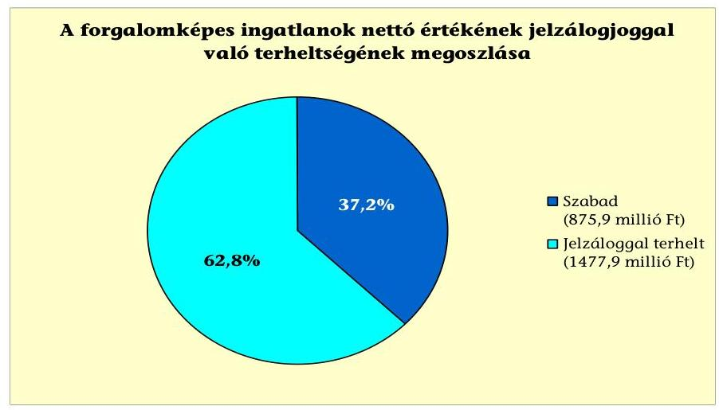

Az Önkormányzat 2011. június 30-án egy folyamatban lévő kártérítési perhez kapcsolódó peres eljárásban érintett alperesként. A kereseti kérelmet 2011. június 1-jén nyújtották be a Városi bíróság részére, ebben az Önkormányzat terhére kimutatott perérték 1,6 millió Ft volt. Az adatszolgáltatás alapján a kizárólagos tulajdonú gazdasági társaságok folyamatban lévő vagy lezárt peres eljárásban alperesként nem voltak érintettek.
Az Önkormányzat legalább 50% vagy azt meghaladó tulajdonosi részesedéssel rendelkező gazdasági társaságai kötelezettségeinek állománya az alábbiak szerint alakult:

| Megnevezés | Állomány 2010.   december 31-én | Állomány 2011.   június 30-án | Várható   kötelezettség   2011-2013.   években | Várható   kötelezettség   2014. évtől |
| :--: | :--: | :--: | :--: | :--: |
|  | HUF-ban (millió Ft-ban) | HUF-ban (millió Ft-ban) |  | HUF-   ban   (millió   Ft-ban) | Devizában   (összege,   ezer Ft-   ban) |
| Folyószámlahitel | 0 | 14,8 | 14,8 | X |
| Pénzintézeti kötelezettségek   összesen: | 0 | 14,8 | 14,8 | X |
| Szállítói tartozás | 11,1 | 10,6 | 10,6 | X |

A két kizárólagos önkormányzati tulajdonú (100%-os) gazdasági társaságnak 2010. december 31-én 10,6 millió Ft szállítói tartozása állt fenn. Pénzintézeti kötelezettsége a 2011. év I. félévben az egyik 100%-os tulajdoni részesedésű társaságának volt 14,8 millió Ft összegű folyószámlahitel igénybevételével. A kizárólagos tulajdonú (100%) gazdasági társaságok kötelezettségei nem voltak jelentős hatással az Önkormányzat pénzügyi helyzetére.

Az Önkormányzat, a Lakásépítő Kft. ellen indított felszámolási eljárást a 2010. évben, amely az ellenőrzés ideje alatt folyamatban volt. A Kft.-vel szemben az Önkormányzat a felszámoló felé 2011. január 12-én 894,9 millió Ft összegben tett hitelezői igénybejelentést, amelynek visszaigazolása 2011. november hónapban történt meg. A követelésből 478,7 millió Ft-ot a B) kategóriába, 2,0 millió Ft-ot az E2) kategóriába 74,7 millió Ft-ot az F) kategóriába és 339,1 millió Ft-

---

ot G) kategóriába soroltak be. Az Önkormányzat, a felszámolás alatt álló Kft. pénzügyi adatairól tanúsítványt nem tudott kitölteni, mivel a számviteli nyilvántartásokat átadták a felszámoló részére. Az ellenőrzés ideje alatt a zárómérleget és felszámolói költségvetést nem küldték meg az Önkormányzat részére.

Az Önkormányzat a gazdasági társaságokról szóló 2006. évi IV. törvény 54. § (2) bekezdése alapján korlátlan felelősséggel tartozik azon gazdasági társaságának felszámolása esetében, amelyben az Önkormányzat az 52. § (2) bekezdése szerint a szavazatok legalább 75%-ával rendelkezik, így minősített befolyásszerzőnek minősül, továbbá a csődeljárásról és a felszámolási eljárásról szóló 1991. évi XLIX. törvény 63. § (2) bekezdése alapján a kizárólagos önkormányzati tulajdonú gazdasági társaságának minden olyan kötelezettségéért, amelynek kielégítését a felszámolási eljárás során az adós társaság vagyona nem fedez, ha a hitelezőinek a felszámolási eljárás során benyújtott keresete alapján a bíróság - az adós társaság felé érvényesített tartósan hátrányos üzletpolitikájára figyelemmel - megállapítja az önkormányzat korlátlan és teljes felelősségét.

A Lakásépítő Kft.-t 2001. évben alapították a fonyódi kikötői üzletsor megépítése céljából, 3 millió Ft törzstőkével. Az Önkormányzat 2004. július 5-én kötött kölcsönszerződést a Kft.-vel, amelyben 695 millió Ft volt a lehívható hitelkeret összege. A kölcsön nyújtás célja a kikötői üzletsor megépítése volt, törlesztését az üzletek értékesítéséből befolyó vételárakból tervezték megoldani. A Kft. a kölcsönszerződésben vállalt kötelezettségét nem teljesítette ezért, összesen 623,8 millió Ft kölcsön és járulékai visszafizetése iránt 2009. november 4-én fizetési meghagyást bocsátottak ki. A kölcsönből a 2010. évben 214,4 millió Ft megtérült ${ }^{55}$. A Lakásépítő Kft. felszámolási eljárása az Önkormányzat kezdeményezésére 2010. december 8-án kezdődött el.

Az Önkormányzat a 2007-2010. években a tárgyi eszközök után együttesen 511,5 millió Ft összegű értékcsökkenést számolt el. A vizsgált időszakban nem történt meg annak felmérése, hogy az eszközök elhasználódása, amortizációja fedezetének biztosítása mekkora forrásokat igényel. A felújításokra, az Önkormányzat pénzügyi lehetőségének a függvényében, elsősorban az intézmények működőképességének biztosítása érdekében, illetve a szakhatósági előírások alapján került sor.

Az Önkormányzatnál a 2007-2010. években felújításra - a kimutatása alapján - az elszámolt értékcsökkenés 18,2%-át (93,0 millió Ft) fordították. Az elhasználódott eszközök pótlására az Önkormányzat tartalékot nem képzett, külön alapot ${ }^{56}$ nem hozott létre. Az éves zárszámadási rendeleteiben nem mutatták be az Önkormányzat eszközei után tárgyévben elszámolt értékcsökkenés összegét, és ezzel összevetve az eszközpótlásra fordított tényleges kiadásokat, az eszközök elhasználódási fokának alakulását.

A fejlesztések ellenére az eszközök használhatósági foka az egyes eszközcsoportokban különböző mértékkel elszámolt amortizáció elsődleges hatására önkormányzati szinten a 2007. évi 95,0%-ról a 2010. évre 93,0%-ra csökkent. A legkisebb mértékű elhasználódást az ingatlanok mutatták, a beruházások és a

[^0]
[^0]:    ${ }^{55}$ Vagyonban térült meg 182,8 millió Ft és pénzben 31,6 millió Ft.
    ${ }^{56}$ Az Önkormányzat a jogszabályi előírások szerint erre nincs kötelezve.

---

2010. évi ingatlanfejlesztések - kikötői ingatlanok megvásárlásának - hatására használhatósági fokuk 96,0%-os, az átlagnál 3,0%-kal kedvezőbb mértékű volt. A gépek, berendezések és felszerelések (47,0%), az immateriális javak (28,0%) járművek (29,0%) és az üzemeltetésre átadott eszközök (69,0%), használhatósági foka elmaradt az átlagtól.

# 4. A PÉNZÜGYI EGYENSÚLY MEGTEREMTÉSE ÉRDEKÉBEN HOZOTT INTÉZKEDÉSEK 

Az Önkormányzatnál a kiadáscsökkentő és bevételnövelő intézkedések a pénzügyi helyzetnek a javítását célozták. A legjelentősebb mértékű kiadási megtakarítást feladatászervezéssel járó létszámcsökkentési döntésekkel érték el.
A 2007-2011. év I. félévben végrehajtott kiadáscsökkentő intézkedések megoszlását az alábbi ábra szemlélteti:
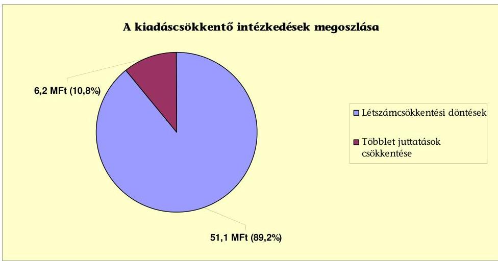

Az Önkormányzat - adatszolgáltatása szerint - a 2007-2011. év I. félévben kiadáscsökkentő intézkedések eredményeként csupán 57,3 millió Ft megtakarítást tudott realizálni.

Az intézményeknél és a Polgármesteri hivatalban a feladatászervezéssel ${ }^{57}$ járó létszámcsökkentéssel 51,1 millió Ft (89,2%) megtakarítást számszerűsítettek a kiadáscsökkentő intézkedések eredményeként. További kiadási megtakarítást 6,2 millió Ft-ot (10,8%) a többletjuttatások csökkentésével - cafetéria egyes elemeinek megszűnése, csökkenése - miatti megtakarításból érte el az Önkormányzat.

[^0]
[^0]:    ${ }^{57}$ Az intézmények részben önálló gazdálkodó szervezetté alakításához kapcsolódott.

---

Az Önkormányzat 2007-2010. éveket érintő létszámcsökkenésének alakulását az alábbi táblázat szemlélteti:

| Megnevezés (adatok fő-ben) |  |  |  |  |  |  |
| :--: | :--: | :--: | :--: | :--: | :--: | :--: |
|  |  |  | Szociális és gyermekvédelem | Egészségügy | Polgármesteri hivatal | Egyéb | Összesen |
| 2007. január 1-jén jóváhagyott álláshelyek száma |  | 85 | 27 | 0 | 52 | 23 | 187 |
| Megszüntetett álláshelyek száma |  | 17 | 6 |  | 13 | 8 | 44 |
| ebből: | üres álláshelyek száma | 0 | 0 | 0 | 1 | 1 | 2 |
|  | szakmai álláshelyek száma | 4 | 0 | 0 | 12 | 1 | 17 |
|  | intézmény-üzemeltetéssel kapcsolatos álláshelyek száma | 13 | 6 | 0 | 0 | 6 | 25 |
| Álláshely növekedése |  | 5 | 0 | 0 | 0 | 4 | 9 |
| 2010. december 31-én záró álláshelyek száma |  | 73 | 21 | 0 | 39 | 19 | 152 |
| 2007. január 1-jén foglalkoztatott létszám |  | 85 | 25 |

 0 | 49 | 23 | 182 |
| Létszámcsökkenés |  | 17 | 6 | 0 | 8 | 8 | 39 |
| Létszámnövekedés |  | 5 | 0 | 0 | 0 | 4 | 9 |
| 2010. december 31-én foglalkoztatott létszám |  | 72 | 21 | 0 | 35 | 19 | 147 |

A létszámcsökkentő intézkedések következtében 2007-2010. évek között a Polgármesteri hivatalnál és intézményeknél összesen 44 álláshelyet, ebből 2 üres álláshelyet szüntettek meg, a 2007. január 1-jei 182 fő induló létszám 24,2%-át. Az álláshely-csökkenésből 17 (38,6%) a szakmai álláshely, 25 (56,8%) intézmény-üzemeltetéssel kapcsolatos álláshely volt.

A létszámcsökkentés eredményeként az Önkormányzat 2007. január 1-jei foglalkoztatotti létszáma 182 főről 2010. december 31-re 147 főre, 19,2%-kal csökkent. A 2010. december 31-én betöltetlen álláshelyek száma 5 fő volt, ebből egy fő az óvodánál, négy fő a Polgármesteri hivatalnál jelentkezett. Egyes közszolgáltatási területeken azonban feladatbővülések is voltak, amelyek álláshely- és egyben 9 fő létszámnövekedéssel is jártak, a közoktatás és egyéb területet érintően.

A helyi szervezési intézkedésekhez kapcsolódóan a 2007-2010. években 32,0 millió Ft központosított támogatást igényelt, és az igényelt összegnek megfelelő támogatásban részesült az Önkormányzat. A támogatás felhasználásával tartósan leépített létszám a 2007-2010. években 21 fő volt. A közoktatásban 8 fő (38,1%), a szociális és gyermekjóléti ellátásban 4 fő (19,0%), a Polgármesteri hivatalban 5 fő (23,9%) az egyéb ágazatban 4 fő (19,0%) létszám leépítésre került sor.

---

A 2007-2011. év I. félévben érvényesített bevételnövelő intézkedések eredményét az alábbi ábra mutatja:
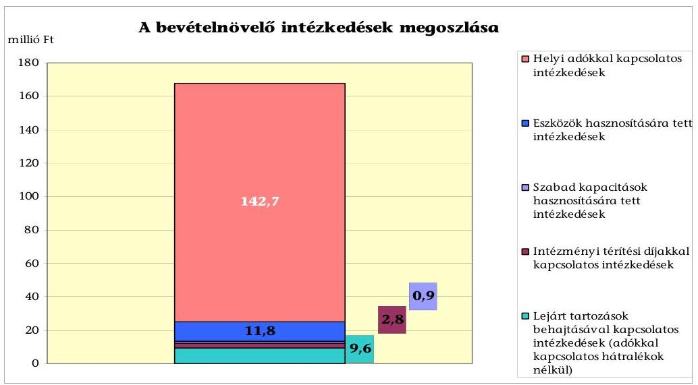

A bevételnövelésre irányuló intézkedések eredményét az Önkormányzat 167,8 millió Ft összegben mutatta ki. Az Önkormányzat adatszolgáltatása szerint az eszközök értékesítése, bérbeadása 11,8 millió Ft-tal (7,0%-kal), a helyi adó mértékének növelése, valamint a kedvezmények, mentesség csökkenése, adóhátralékok 142,7 millió Ft-tal (85,0%-kal), és a lejárt bérleti díjak eredményesebb behajtása miatti növekmény 9,6 millió Ft-tal (5,8%-kal), a szolgáltatások többletbevétele 0,9 millió Ft-tal (0,5%-kal), az intézményi térítési díjak emelése 2,8 millió Ft-tal (1,7%-kal) járult hozzá a költségvetési bevételek növeléséhez.

Az Önkormányzat kiadáscsökkentő és bevételnövelő intézkedései eredményeként 2007-2010. évek között összesen 225,1 millió Ft megtakarítást és többletbevételt mutatott ki. Az ellenőrzés megállapítása szerint a bevételnövelő intézkedések között kimutatott adóhátralékok és lejárt bérleti díjak behajtása (152,3 millió Ft) az Önkormányzat kötelező feladata, ezeket figyelmen kívül hagyva 72,8 millió Ft volt a megtakarítás és többletbevétel egyenlege. Az intézkedésekkel ellensúlyozni tudta a költségvetési támogatások és az szja bevételek 28,9 millió Ft-os, 2007. évhez viszonyított évenkénti együttes csökkenését $^{58}$, ugyanakkor a napi likviditási gondok ezek hatására nem oldódtak meg.

[^0]
[^0]:    $^{58}$ A költségvetési támogatásokból és az átengedett szja-ból származó bevételek változását minden évben a 2007. évhez viszonyítottuk, majd azokat összegeztük. Ezeket a kumulált összegeket viszonyítottuk a vizsgált időszakban elért kiadási megtakarítások és bevételi többletek szintén kumulált összegéhez.

---

# 5. Az ÁSZ Által a korábbi években a pénzügyi egyensúly javítására tett szabályszerűségi és célszerűségi javaslatok hasznosulása

Az ÁSZ az Önkormányzat gazdálkodási rendszerét a 2009. évben ellenőrizte. A jelentésében hat szabályszerűségi és öt célszerűségi javaslatot tett. A javaslatok közül a pénzügyi egyensúly javítására két szabályszerűségi és egy célszerűségi javaslat vonatkozott.

A javaslatok megvalósítására intézkedési tervet készítettek. A jelentést a Képviselő-testület a 2010. február 25-én tartott ülésén megismerte, továbbá elfogadta az ÁSZ jelentésben foglaltak végrehajtására készített, felelősöket és határidőket is tartalmazó intézkedési tervet.

A pénzügyi egyensúly javítására vonatkozó szabályszerűségi javaslatokat megvalósították, a célszerűségi javaslatot részben teljesítették. A hiányosságok megszüntetése érdekében készített intézkedési tervben foglaltak alapján 2010. évtől a költségvetési kiadások főösszege nem tartalmazta a finanszírozási célú pénzügyi műveletek kiadásait az Áht$_{1}$ előírásai szerint. A 2010. évtől a költségvetés eredeti előirányzata az Áht$_{1}$-ben előírtaknak megfelelően tartalmazta a várható pénzmaradvány igénybevételét. A célszerűségi javaslatot részben teljesítették, a polgármester tájékoztatta a Képviselő-testületet az Önkormányzat pénzügyi helyzetének alakulásáról, a havonta készített pénzügyi kimutatásokban részletezte a követelések és kötelezettségek - ezen belül a lejárt tartozások nagyságát. Nem készült továbbra sem kimutatás az Önkormányzat eladósodására figyelemmel arról, hogy a hosszú lejáratú, adósságot keletkeztető kötelezettségvállalásokból adódó tőke és kamatfizetési kötelezettségét az Önkormányzat milyen feltételek biztosítása mellett tudja teljesíteni.

Budapest, 2012. április 16.
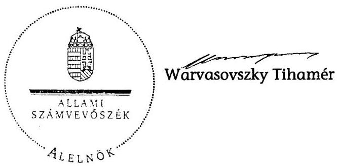

Melléklet: 7 db

---

Fonyód Város Önkormányzata
1. számú melléklet
a V-3113-014/2012. számú jelentéshez

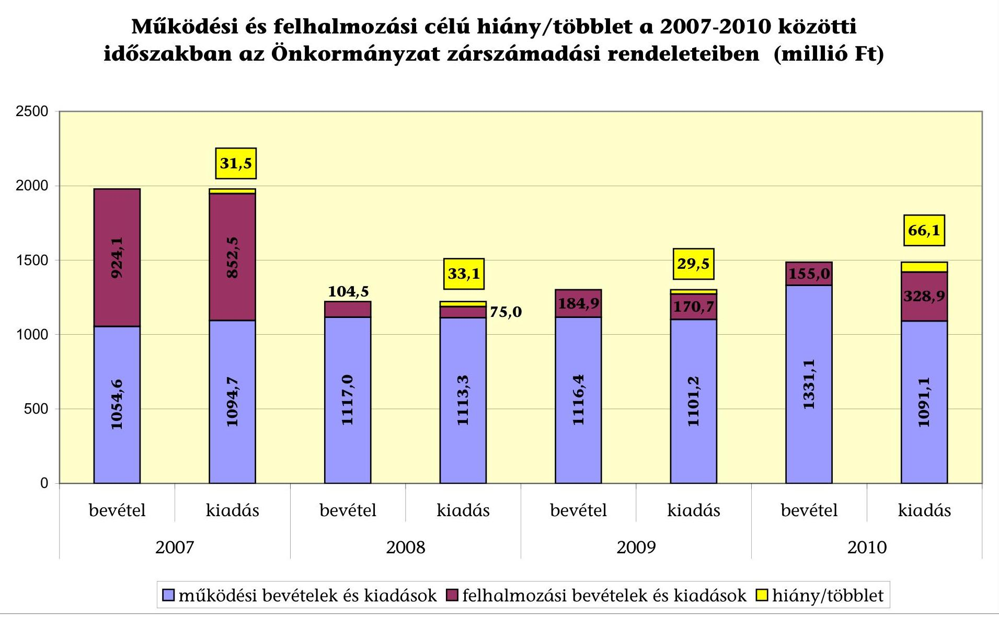

---

Az Önkormányzat bevételei és kiadásai, valamint adósságszolgálata 2007-2010 között

|  1. FOLYÓ KÖLTSÉGVETÉS | 2007. év | 2008. év | 2009. év | 2010. év  |
| --- | --- | --- | --- | --- |
|  1.1.1. Saját működési bevételek | 496,4 | 534,4 | 566,0 | 527,5  |
|  1.1.2. Költségvetési támogatás | 215,1 | 359,6 | 306,8 | 288,6  |
|  1.1.3. Átengedett bevételek | 286,3 | 181,4 | 160,9 | 192,3  |
|  1.1.4. Állambáztartáson belülről kapott támogatások | 22,1 | 24,3 | 29,2 | 66,6  |
|  1.1.5. EU-tól és külföldről kapott bevételek | 1,0 | 0,0 | 0,0 | 7,3  |
|  1.1.6. Állambáztartáson kívülről kapott bevételek | 0,4 | 0,5 | 3,3 | 0,9  |
|  1.1.7. Előző évi pénzmaradvány átvétel | 0,0 | 0,0 | 0,0 | 0,0  |
|  1.1. Folyó bevételek $=1.1.1.+1.1.2.+1.1.3.+1.1.4.+1.1.5.+1.1.6.+1.1.7.$ | 1021,3 | 1100,2 | 1066,1 | 1083,1  |
|  1.2.1. Működési kiadások kamatkiadások nélkül | 948,1 | 897,8 | 908,1 | 995,5  |
|  1.2.2. Állambáztartáson belülre átadott pénzeszközök | 7,7 | 4,9 | 7,3 | 11,7  |
|  1.2.3.1. vállalkozásoknak | 31,0 | 37,5 | 33,0 | 21,7  |
|  1.2.3.2. EU-nak, illetve külföldre | 0,0 | 0,0 | 0,0 | 0,0  |
|  1.2.3.3. magánszemélyeknek | 21,6 | 25,1 | 25,9 | 24,9  |
|  1.2.3.4. nonprofit szervezeteknek | 5,7 | 6,5 | 5,8 | 17,8  |
|  1.2.3. Transzferkiadások ( $=1.2.3.1+1.2.3.2+1.2.3.3+1.2.3.4$ ) | 58,3 | 69,1 | 64,7 | 64,4  |
|  1.2.4 Kamatkiadások | 73,6 | 113,8 | 119,6 | 79,3  |
|  1.2.5. Előző évi pénzmaradvány átadás | 0,0 | 0,0 | 0,0 | 0,0  |
|  1.2. Folyó kiadások $=1.2.1.+1.2.2.+1.2.3.+1.2.4.+1.2.5.$ | 1087,6 | 1085,6 | 1099,8 | 1150,8  |
|  1.3. Folyó költségvetés egyenlege MŰKÖDÉSI JÖVEDELEM (1.1. - 1.2.) | $-66,3$ | 14,6 | $-33,7$ | $-67,7$  |
|  2. FELHALMOZÁSI KÖLTSÉGVETÉS | 0,0 | 0,0 | 0,0 | 0,0  |
|  2.1.1. Saját tőkebevételek | 4,3 | 82,3 | 178,7 | 294,6  |
|  2.1.2. Állambáztartáson belülről kapott támogatások | 13,7 | 2,3 | 0,7 | 1,6  |
|  2.1.3. EU-tól és külföldről kapott támogatások | 0,0 | 0,0 | 10,4 | 53,5  |
|  2.1.4. Állambáztartáson kívülről kapott támogatások | 8,3 | 11,0 | 2,4 | 6,0  |
|  2.1. Felhalmozási bevételek ( $=2.1.1.+2.1.2+2.1.3+2.1.4$.) | 26,3 | 95,6 | 192,2 | 355,7  |
|  2.2.1. Saját beruházási kiadás állíval | 6,7 | 64,3 | 43,1 | 243,1  |
|  2.2.2. Saját felújítási kiadás állíval | 30,7 | 2,3 | 42,5 | 24,0  |
|  2.2.3. Állambáztartáson belülre átadott pénzeszköz | 0,0 | 0,0 | 0,0 | 0,0  |
|  2.2.4. EU-nak és külföldnek adott pénzeszközök | 0,0 | 0,0 | 0,0 | 0,0  |
|  2.2.5. Állambáztartáson kívülre adott pénzeszközök | 11,1 | 20,8 | 17,5 | 0,5  |
|  2.2.6. Befektetési célú részesedések vásárlása | 0,0 | 11,4 | 63,1 | 0,0  |
|  2.2. Felhalmozási kiadások ( $=2.2.1.+2.2.2.+2.2.3.+2.2.4.+2.2.5.+2.2.6$.) | 48,5 | 98,8 | 166,2 | 267,7  |
|  2.3. Felhalmozási költségvetés egyenlege (2.1. - 2.2.) | $-22,2$ | $-3,2$ | 26,0 | 88,0  |
|  3. Finanszírozási műveletek nélküli (GFS) pozíció(1.3.+2.3.) | $-88,5$ | 11,4 | $-7,7$ | 20,3  |
|  4. Finanszírozási műveletek | 0,0 | 0,0 | 0,0 | 0,0  |
|  4.1. Hiteltelvétel | 0,0 | 0,0 | 10,0 | 0,0  |
|  4.2. Hiteltörlesztés | 817,5 | 4,7 | 1,3 | 12,6  |
|  4.3. Forgatási és befektetési célú értékpapírok kibocsátása | 900,0 | 0,0 | 0,0 | 0,0  |
|  4.4. Forgatási és befektetési célú értékpapírok beváltása | 0,0 | 0,0 | 0,0 | 0,0  |
|  4.5. Forgatási és befektetési célú értékpapírok értékesítése | 0,0 | 0,0 | 0,0 | 0,0  |
|  4.6. Forgatási és befektetési célú értékpapírok vásárlása | 0,0 | 0,0 | 0,0 | 0,0  |
|  4.7. Egyéb finanszírozási bevételek (függő, átfutó, kiegyenlítő) | 3,8 | $-1,7$ | $-2,1$ | $-10,2$  |
|  4.8. Egyéb finanszírozási kiadások (függő, átfutó, kiegyenlítő) | $-6,5$ | $-0,8$ | 4,1 | $-11,1$  |
|  4.9.Finanszírozási műveletek egyenlege (4.1. - 4.2.+4.3.-4.4+4.5.-4.6.+4.7.-4.8.) | 92,8 | $-5,6$ | 2,5 | $-11,7$  |
|  5. Tárgyévi pénzügyi pozíció (1.3.+ 2.3.+4.9.) | 4,3 | 5,8 | $-5,2$ | 8,6  |
|  6. Nettó működési jövedelem =működési jövedelem (1.3.) - tőketörlesztés (4.2+4.4) | $-883,9$ | 9,8 | $-35,0$ | $-80,3$  |
|  TÁJÉKOZTATÓ ADATOK |  |  |  |   |
|  Összes kötelezettség | 1284,6 | 1308,5 | 1326,7 | 1244,2  |
|  ebből rövid lejáratú | 382,9 | 407,5 | 422,3 | 427,2  |
|  Összes szállítói kötelezettség | 157,9 | 184,0 | 194,3 | 132,3  |
|  ebből lejárt (tanúsítványból) | 154,9 | 184,0 | 189,2 | 122,3  |
|  Pénz és tőkepiaci kötelezettség (adósság) | 1089,9 | 1085,2 | 1093,9 | 1081,3  |
|  ebből rövid lejáratú | 188,2 | 184,2 | 189,6 | 264,2  |
|  PPP szerződéses állomány jelenértéken (tanúsítványból) | 0,0 | 0,0 | 0,0 | 0,0  |
|  ebből

 lejárt szolgáltatási díj miatti kötelezettség | 0,0 | 0,0 | 0,0 | 0,0  |
|  Folyószámlahitel napi átlagos állománya (tanúsítványból) | 167,4 | 165,7 | 166,1 | 170,3  |
|  Likvidhitel napi átlagos állománya (tanúsítványból) | 0,0 | 0,0 | 0,0 | 0,0  |
|  Munkabérhitel napi átlagos állománya (tanúsítványból) | 20,0 | 20,0 | 20,0 | 20,0  |
|  Kezesség és garanciavállalások (tanúsítványból) | 92,4 | 92,4 | 92,4 | 92,4  |
|  Jogerős bírósági ítéletekből adódó kötelezettségek (tanúsítványból) | 0,0 | 0,0 | 0,0 | 0,0  |
|  Finanszírozásba bevonható eszközök: | 29,9 | 35,7 | 30,5 | 39,2  |
|  Tartós hitelviszonyt megtestesítő értékpapírok év végi állománya | 0,0 | 0,0 | 0,0 | 0,0  |
|  Hosszú lejáratú bankbetétek év végi állománya | 0,0 | 0,0 | 0,0 | 0,0  |
|  Értékpapírok év végi állománya | 0,0 | 0,0 | 0,0 | 0,0  |
|  Pénzeszközök (idegen pénzeszközök nélkül) év végi állománya | 29,9 | 35,7 | 30,5 | 39,2  |

---

### Az Önkormányzat 2007-2010. években megvalósított, 2010. december 31-ig befejezett fejlesztései és azok forrásösszetétele

|  Fejlesztési feladat (beruházás, felújítás) |  | Beruházás, felújítás |  | Teljes bekerülési költség |  |  |  |  |  |  |  |  |  |  |  |  |  |  |  |  |  |  |  |  |  |  |  |  |  |  |  |  |  |  |  |  |  |  |  |  |  |  |  |  |  |  |  |  |  |  |  |  |  |  |  |  |  |  |  |  |  |  |  |  |  |  |  |  |  |  |  |  |  |  |  |  |  |  |  |  |  |  |  |  |  |  |  |  |  |  |  |  |  |  |  |  |  |  |  |  |  |  |  |  |

---

### **Az Önkormányzat 2010. december 31-én folyamatban lévő fejlesztési feladataira 2010. december 31-ig teljesített kifizetések és azok forrásösszetétele**

|   | Fejlesztési feladat (beruházás, felújítás) |  | Beruházás, felújítás |  |  | Teljes bekerülési költség |  |  |  |  |  |  |  |  |  |  |  |  |  |  |  |  |  |  |  |  |  |  |  |  |  |  |  |  |  |  |  |  |  |  |  |  |  |  |  |  |  |  |  |  |  |  |  |  |  |  |  |  |  |  |  |  |  |  |  |  |  |  |  |  |  |  |  |  |  |  |  |  |  |  |  |  |  |  |  |  |  |  |  |  |  |  |  |  |  |  |  |  |  |  |  |  |  |  |  |

---

## **Az Önkormányzat 2010. december 31-én folyamatban lévő fejlesztési feladataira 2010. december 31-én fennálló kötelezettségek és azok forrásösszetétele**

|   |  |  |  |  |  |  |  |  |  |  |  |  |  |  |  |  |  |  |  |  |  |  |  |  |  |  |  |  |  |  |  |  |  |  |  |  |  |  |  |  |  |  |  |  |  |   |
| --- | --- | --- | --- | --- | --- | --- | --- | --- | --- | --- | --- | --- | --- | --- | --- | --- | --- | --- | --- | --- | --- | --- | --- | --- | --- | --- | --- | --- | --- | --- | --- | --- | --- | --- | --- | --- | --- | --- | --- | --- | --- | --- | --- | --- | --- | --- |
|   |  |  |  |  |  |  |  |  |  |  |  |  |  |  |  |  |  |  |  |  |  |  |  |  |  |  |  |  |  |  |  |  |  |  |  |  |  |  |  |  |  |  |  |  |   |
|   |  |  |  |  |  |  |  |  |  |  |  |  |  |  |  |  |  |  |  |  |  |  |  |  |  |  |  |  |  |  |  |  |  |  |  |  |  |  |  |  |  |  |  |  |   |
|   |  |  |  |  |  |  |  |  |  |  |  |  |  |  |  |  |  |  |  |  |  |  |  |  |  |  |  |  |  |  |  |  |  |  |  |  |  |  |  |  |  |  |  |  |   |
|   |  |  |  |  |  |  |  |  |  |  |  |  |  |  |  |  |  |  |  |  |  |  |  |  |  |  |  |  |  |  |  |  |  |  |  |  |  |  |  |  |  |  |  |  |   |
|   |  |  |  |  |  |  |  |  |  |  |  |  |  |  |  |  |  |  |  |  |  |  |  |  |  |  |  |  |  |  |  |  |  |  |  |  |  |  |  |  |  |  |  |  |   |
|   |  |  |  |  |  |  |  |  |  |  |  |  |  |  |  |  |  |  |  |  |  |  |  |  |  |  |  |  |  |  |  |  |  |  |  |  |  |  |  |  |  |  |  |  |   |
|   |  |  |  |  |  |  |  |  |  |  |  |  |  |  |  |  |  |  |  |  |  |  |  |  |  |  |  |  |  |  |  |  |  |  |  |  |  |  |  |  |  |  |  |  |   |
|   |  |  |  |  |  |  |  |  |  |  |  |  |  |  |  |  |  |  |  |  |  |  |  |  |  |  |  |  |  |  |  |  |  |  |  |  |  |  |  |  |  |  |  |  |

 |   |  |  |  |  |  |  |  |  |  |  |  |  |  |  |  |  |  |  |  |  |  |  |  |  |  |  |  |  |  |  |  |  |  |  |  |  |  |  |  |  |  |  |  |  |   |
|   |  |  |  |  |  |  |  |  |  |  |  |  |  |  |  |  |  |  |  |  |  |  |  |  |  |  |  |  |  |  |  |  |  |  |  |  |  |  |  |  |  |  |  |  |   |
|   |  |  |  |  |  |  |  |  |  |  |  |  |  |  |  |  |  |  |  |  |  |  |  |  |  |  |  |  |  |  |  |  |  |  |  |  |  |  |  |  |  |  |  |  |   |
|   |  |  |  |  |  |  |  |  |  |  |  |  |  |  |  |  |  |  |  |  |  |  |  |  |  |  |  |  |  |  |  |  |  |  |  |  |  |  |  |  |  |  |  |  |   |
|   |  |  |  |  |  |  |  |  |  |  |  |  |  |  |  |  |  |  |  |  |  |  |  |  |  |  |  |  |  |  |  |  |  |  |  |  |  |  |  |  |  |  |  |  |   |
|   |  |  |  |  |  |  |  |  |  |  |  |  |  |  |  |  |  |  |  |  |  |  |  |  |  |  |  |  |  |  |  |  |  |  |  |  |  |  |  |  |  |  |  |  |   |
|   |  |  |  |  |  |  |  |  |  |  |  |  |  |  |  |  |  |  |  |  |  |  |  |  |  |  |  |  |  |  |  |  |  |  |  |  |  |  |  |  |  |  |  |  |   |
|   |  |  |  |  |  |  |  |  |  |  |  |  |  |  |  |  |  |  |  |  |  |  |  |  |  |  |  |  |  |  |  |  |  |  |  |  |  |  |  |  |  |  |  |  |   |
|   |  |  |  |  |  |  |  |  |  |  |  |  |  |  |  |  |  |  |  |  |  |  |  |  |  |  |  |  |  |  |  |  |  |  |  |  |  |  |  |  |  |  |  |  |   |
|   |  |  |  |  |  |  |  |  |  |  |  |  |  |  |  |  |  |  |  |  |  |  |  |  |  |  |  |  |  |  |  |  |  |  |  |  |  |  |  |  |  |  |  |  |   |
|   |  |  |  |  |  |  |  |  |  |  |  |  |  |  |  |  |  |  |  |  |  |  |  |  |  |  |  |  |  |  |  |  |  |  |  |  |  |  |  |  |  |  |  |  |   |
|   |  |  |  |  |  |  |  |  |  |  |  |  |  |  |  |  |  |  |  |  |  |  |  |  |  |  |  |  |  |  |  |  |  |  |  |  |  |  |  |  |  |  |  |  |   |
|   |  |  |  |  |  |  |  |  |  |  |  |  |  |  |  |  |  |  |  |  |  |  |  |  |  |  |  |  |  |  |  |  |  |  |  |  |  |  |  |  |  |  |  |  |   |
|   |  |  |  |  |  |  |  |  |  |  |  |  |  |  |  |  |  |  |  |  |  |  |  |  |  |  |  |  |  |  |  |  |  |  |  |  |  |  |  |  |  |  |  |  |   |
|   |  |  |  |  |  |  |  |  |  |  |  |  |  |  |  |  |  |  |  |  |  |  |  |  |  |  |  |  |  |  |  |  |  |  |  |  |  |  |  |  |  |  |  |  |   |
|   |  |  |  |  |  |  |  |  |  |  |  |  |  |  |  |  |  |  |  |  |  |  |  |  |  |  |  |  |  |  |  |  |  |  |  |  |  |  |  |  |  |  |  |  |   |
|   |  |  |  |  |  |  |  |  |  |  |  |  |  |  |  |  |  |  |  |  |  |  |  |  |  |  |  |  |  |  |  |  |  |  |  |  |  |  |  |  |  |  |  |  |  

 |
|   |  |  |  |  |  |  |  |  |  |  |  |  |  |  |  |  |  |  |  |  |  |  |  |  |  |  |  |  |  |  |  |  |  |  |  |  |  |  |  |  |  |  |  |  |   |
|   |  |  |  |  |  |  |  |  |  |  |  |  |  |  |  |  |  |  |  |  |  |  |  |  |  |  |  |  |  |  |  |  |  |  |  |  |  |  |  |  |  |  |  |  |   |
|   |  |  |  |  |  |  |  |  |  |  |  |  |  |  |  |  |  |  |  |  |  |  |  |  |  |  |  |  |  |  |  |  |  |  |  |  |  |  |  |  |  |  |  |  |   |
|   |  |  |  |  |  |  |  |  |  |  |  |  |  |  |  |  |  |  |  |  |  |  |  |  |  |  |  |  |  |  |  |  |  |  |  |  |  |  |  |  |  |  |  |  |   |
|   |  |  |  |  |  |  |  |  |  |  |  |  |  |  |  |  |  |  |  |  |  |  |  |  |  |  |  |  |  |  |  |  |  |  |  |  |  |  |  |  |  |  |  |  |   |
|   |  |  |  |  |  |  |  |  |  |  |  |  |  |  |  |  |  |  |  |  |  |  |  |  |  |  |  |  |  |  |  |  |  |  |  |  |  |  |  |  |  |  |  |  |   |
|   |

---

### **Az Önkormányzat által beadott, elbírálás alatti pályázati forrásból megvalósítani tervezett fejlesztéseihez kapcsolódó kötelezettségvállalásai és azok forrásösszetétele**

|  6. | Fejlesztési feladat (beruházás, felújítás) |  | Beruházás, felújítás |  |  |  |  |  |  |  |  |  |  |  |  |  |  |  |  |  |  |  |  |  |  |  |  |  |  |  |  |  |  |  |  |  |  |  |  |  |  |  |  |  |  |  |  |  |  |  |  |  |  |  |  |  |  |  |  |  |  |  |  |  |  |  |  |  |  |  |  |  |  |  |  |  |  |  |  |  |  |  |  |  |  |  |  |  |  |  |  |  |  |  |  |  |  |  |  |  |  |  | 

---

### 4. számú melléklet a V-3113-018/2012. számú jelentéshez

### **Az önkormányzati feladatok ellátásában résztvevő gazdasági társaságok**

|  Gazdasági társaság
neve |  |  |  |  |  |  |  |  |  |  |  |  |  |  |  |  |  |  |  |  |  |   |
| --- | --- | --- | --- | --- | --- | --- | --- | --- | --- | --- | --- | --- | --- | --- | --- | --- | --- | --- | --- | --- | --- | --- |
|   | Önkormányzat | Önkormányzat
gazdasági
társaságának | saját tőke,
jegyzett tőke
aránya | kötelező
feladathoz | önként vállalt
feladathoz | hosszú lejáratú
hitelből,
kötvényből | lózogból | lejáró szállító
állományból | működési célú pénzeszközátadás | felhalmozási célú pénzeszközátadás |  |  |  |  |  |  |  |  |  |  |  |   |
|   | tulajdoni hányada |  |  |  |  |  |  |  |  |  |  |  |  |  |  |  |  |  |  |  |  |   |
|   |  |  |  |  |  | rendelt nettó vagyon |  | fennálló kötelezettség |  | 2007. | 2008. | 2009. | 2010. | 2011. t.
Növekmény | 2007. | 2008. | 2009. | 2010. | 2011. t.
Növekmény |  |  |   |
|  I. 100%-os tulajdoni hányadú gazdasági társaságok: |  |  |  |  |  |  |  |  |  |  |  |  |  |  |  |  |  |  |  |  |  |   |
|  Egészségügyi Ellátást
Szervező és Működtető
Nonprofit Kiemelten
Közhasznú Kft. | 100,0% |  | 1,6 | 13,5% |  |  |  |  | 14,7 | 22,6 | 16,0 | 10,7 | 0,0 | 0,0 | 7,0 | 0,0 | 0,0 | 0,0 |  |  |  |   |
|  Fonyód Media Közhasznú
Nonprofit Kft. | 100,0% |  | 3,6 |  |  |  |  |  |  |  | 6,3 | 9,3 | 5,0 | 0,0 | 0,0 | 0,0 | 0,0 | 0,0 |  |  |  |   |
|  100%-os tulajdoni hányadú
gazdasági társaságok
összesen | x | x | x | 0 | 0 | 0 | 0 | 0 | 14,7 | 22,6 | 22,3 | 20,0 | 5,0 | 0 | 7 | 0 | 0 | 0 |  |  |  |   |
|   |  |  |  |  |  |  |  |  |  | II. 75-99%-os tulajdoni hányadú gazdasági társaságok: |  |  |  |  |  |  |  |  |  |  |  |   |
|  75-99%-os tulajdoni
hányadú gazdasági
társaságok összesen | x | x | x | 0 | 0 | 0 | 0 | 0 | 0 | 0 | 0 | 0 | 0 | 0 | 0 | 0 | 0 | 0 |  |  |  |   |
|  75%-feletti tulajdoni
hányadú gazdasági
társaságok összesen | x | x | x | 0 | 0 | 0 | 0 | 0 | 15 | 23 | 22 | 20 | 5 | 0 | 7 | 0 | 0 | 0 |  |  |  |   |
|  III. 51-74%-os tulajdoni hányadú gazdasági társaságok: |  |  |  |  |  |  |  |  |  |  |  |  |  |  |  |  |  |  |  |  |  |   |
|  51-74%-os tulajdoni
hányadú gazdasági
társaságok összesen | x | x | x | 0 | 0 | 0 | 0 | 0 | 0 | 0 | 0 | 0 | 0 | 0 | 0 | 0 | 0 | 0 |  |  |  |   |
|  IV. egyéb, közfeladatot ellátó gazdasági társaságok: |  |  |  |  |  |  |  |  |  |  |  |  |  |  |  |  |  |  |  |  |  |   |
|  Kapos VOLÁN Autóbusz-
közlekedési Zrt. | 0 | 0 | 1,8 | 0,0 | 0,0 |

 0,0 | 0 | 0 | 0,5 | 1,9 | 1,2 | 1,7 | 1,5 | 0,0 | 0,0 | 0,0 | 0,0 | 0,0 |  |  |  |   |
|  Dunántúli Regionális Vízmű
Zrt. | 0 | 0 | 1,8 | 537,7 | 0,0 | 542,1 | 0 | 0 | 0,0 | 0,0 | 0,0 | 0,0 | 0,0 | 3,3 | 0,0 | 0,0 | 0,0 | 0,0 |  |  |  |   |
|  AVE Zöldfok Zrt. | 0,0% | 0 | 7,1 |  | 0,0 | 835,6 | 0 | 0 | 0,0 | 0,0 | 0,0 | 0,0 | 0,0 | 0,0 | 0,0 | 0,0 | 0,0 | 0,0 |  |  |  |   |
|  Közép Zrt. | 0,9% | 0 | 0,9 | 2 741,9 | 0,0 | 344,7 | 0 | 0 | 0,0 | 0,0 | 0,0 | 0,0 | 0,0 | 0,0 | 0,0 | 0,0 | 0,0 | 0,0 |  |  |  |   |
|  Egyéb, közfeladatot ellátó
gazdasági társaságok
összesen | x | x | x | 537,7 | 0,0 | 1 377,7 | 0 | 0 | 0,5 | 1,9 | 1,2 | 1,7 | 1,5 | 3,3 | 0,0 | 0,0 | 0,0 | 0,0 |  |  |  |   |
|  Összesen | x | x | x | 537,9 | 0,0 | 1 377,7 | 0 | 0 | 15,2 | 24,5 | 23,5 | 21,7 | 8,5 | 3,3 | 7,0 | 0,0 | 0,0 | 0,0 |  |  |  |   |

