# ÁLLAMI   SZÁMVEVŐSZÉK 

## JELENTÉS

## Göd Város Önkormányzata pénzügyi helyzetének ellenőrzéséről (43/4)

---

# Állami Számvevőszék 

Iktatószám: V-3109-021/2012.
Témaszám: 1015
Vizsgálat-azonosító szám: V0560140

## Az ellenőrzést felügyelte:

Dr. Varga Sándor
számvevő igazgatóhelyettes
Az ellenőrzést vezette:
Renkó Zsuzsanna
számvevő tanácsos
Ellenőrzési csoportvezető:
Csepreginé Tancsik Erzsébet
számvevő tanácsos
Az ellenőrzést végezték:
Dr. Lajos Béla Lakatos József Szilágyi Nándorné
számvevő főtanácsos számvevő számvevő

---

# TARTALOMJEGYZÉK 

BEVEZETÉS ..... 9
I. ÖSSZEGZŐ MEGÁLLAPÍTÁSOK, KÖVETKEZTETÉSEK, JAVASLATOK ..... 13
II. RÉSZLETES MEGÁLLAPÍTÁSOK ..... 26

1. Az Önkormányzat kötelező és önként vállalt feladatai, a feladatellátás szervezeti keretei és annak változásai ..... 26
2. Az Önkormányzat pénzügyi egyensúlyi helyzetét befolyásoló tényezők ..... 31
2.1. A működési és a felhalmozási egyensúly változása ..... 33
2.2. Az Önkormányzat bevételeinek változása ..... 39
2.3. Az Önkormányzat működési és felhalmozási célú kiadásainak változása ..... 42
3. Az Önkormányzat kötelezettségei ..... 45
3.1. Az Önkormányzat pénzintézeti kötelezettségeinek változása ..... 45
3.2. A szállítói kötelezettségek változása ..... 52
3.3. Egyéb kötelezettségek változása ..... 53
4. A pénzügyi egyensúly megteremtése érdekében hozott intézkedések eredménye ..... 55
5. Az ÁSZ által a korábbi években a pénzügyi egyensúly javítására tett szabályszerűségi és célszerűségi javaslatok hasznosulása ..... 57

---

# MELLÉKLETEK 

1. számú Működési és felhalmozási célú hiány/többlet az Önkormányzat zárszámadási rendeleteiben (1 oldal)
2. számú Az Önkormányzat bevételei és kiadásai, valamint adósságszolgálata 2007-2010 között (1 oldal)
3/a. számú Az Önkormányzat 2007-2010. években megvalósított, 2010. december 31-ig befejezett fejlesztései és azok forrásösszetétele (2 oldal)
3/b. számú Az Önkormányzat 2010. december 31-én folyamatban lévő fejlesztési feladataira 2010. december 31-ig teljesített kifizetések és azok forrásösszetétele (1 oldal)
3/c. számú Az Önkormányzat 2010. december 31-én folyamatban lévő fejlesztési feladataira 2010. december 31-én fennálló kötelezettségek és azok forrásösszetétele (1 oldal)
3. számú Az önkormányzati feladatok ellátásában résztvevő gazdasági társaságok (1 oldal)

---

# RÖVIDÍTÉSEK JEGYZÉKE 

## Törvények

Áht $_{1}$
Áht $_{2}$
Ötv.
Stabilitási tv.
Ptk.

## Rendeletek

$\mathrm{Amr}_{1}$
$\mathrm{Amr}_{2}$
Áhsz.

Ávr.

## Szórövidítések

áfa
ÁSZ
EDP hiány/egyenleg
EU
GDP
Gödbusz Kft.
HEFOP
jegyző
Képviselő-testület
Kistérségi társulás
KMOP
Kommunikációs Kft.
Közlekedési Kft.
OEP
Önkormányzat
polgármester
Polgármesteri hivatal
PPP konstrukció
szja
TESZ
az államháztartásról szóló 1992. évi XXXVIII. törvény
az államháztartásról szóló 2011. évi CXCV. törvény
a helyi önkormányzatokról szóló 1990. évi LXV. törvény
a Magyarország gazdasági stabilitásáról szóló 2011. évi CXCIV. törvény
a Polgári Törvénykönyvről szóló 1959. évi IV. törvény
az államháztartás működési rendjéről szóló 217/1998. (XII.30.) Korm. rendelet
az államháztartás működési rendjéről szóló 292/2009. (XII. 19.) Korm. rendelet
az államháztartás szervezetei beszámolási és könyvvezetési kötelezettségének sajátosságairól szóló 249/2000. (XII. 24.) Korm. rendelet
az államháztartási törvény végrehajtásáról szóló 368/2011. (XII. 31.) Korm. rendelet
általános forgalmi adó
Állami Számvevőszék
Uniós módszertan szerinti maastrichti kritériumoknak megfelelő számítás szerinti hiány/egyenleg
Európai Unió
Bruttó hazai termék
Gödbusz Buszközlekedési Korlátolt Felelősségű Társaság
Humán Erőforrás Operatív Program
Göd Város Önkormányzatának jegyzője
Göd Város Képviselő-testülete
Dunakeszi Kistérség Többcélú Társulása
Közép-magyarországi Operatív Program
Göd Városi Kommunikációs Nonprofit Korlátolt Felelősségű Társaság
Városi Közlekedési Vállalat Korlátolt Felelősségű Társaság
Országos Egészségbiztosítási Pénztár
Göd Város Önkormányzata
Göd Város Önkormányzatának polgármestere
Göd Város Önkormányzatának Polgármesteri hivatala
Public Private Partnership (Partnerségi együttműködés közfeladatok ellátására a magánszektor bevonásával) személyi jövedelemadó
Göd Város Önkormányzatának Településellátó Szervezete

---

.

---

# ÉRTELMEZŐ SZÓTÁR 

bevételi kitettség

BUBOR

CLF módszer

EURIBOR
kamatkockázat
kötelező közszolgáltatás
közfeladat

LIBOR

Az önkormányzat pénzügyi helyzete olyan külső körülmények hatására is módosulhat, amelyekre az önkormányzatnak nincs hatása, emiatt bevételi kitettsége keletkezik. Pl. az önkormányzat bevételeinek alakulása függhet néhány nagy adózó gazdasági helyzetének, tevékenységének alakulásától, illetve székhelyének, telephelyének változásától.
Budapesti Bankközi Forint Hitelkamatláb. Irányadó, referencia jellegű kamatláb. Mértékét az MNB naponta állapítja meg a banki kamatok figyelembevételével. Közzététele naponta történik.
Az önkormányzatok költségvetése elemzésének eszköze. A módszer következetesen elkülöníti a folyó és a felhalmozási költségvetés bevételeit és kiadásait, azok költségvetési egyenlegeit. Bizonyos mértékig a vállalati gazdálkodás logikai elemeit érvényesíti az önkormányzatok pénzügyi, jövedelmi helyzetének vizsgálata során. Az értékelés a pénzügyi kapacitás fogalmát helyezi a középpontba.
A frankfurti bankközi piacon jegyzett, az Európai Központi Bank szabályainak megfelelően megállapított kínálati kamatláb. Az EURIBOR értékét a legfontosabb európai bankok hitelkínálatának kamatlábai alapján a Reuters ügynökség számolja ki és teszi közzé naponta. A magyar pénzintézetek is ezt használják viszonyítási alapnak EUR hitelek esetén.
A változó kamatozású forint-, vagy a devizahitelek futamideje alatt a kamat emelkedése miatt fennálló kamatkockázat, melynek növekedése miatt nő a hitel törlesztő részlete.
A helyi önkormányzati feladatkörbe tartozó, a köztisztasággal és a településtisztasággal, valamint az élet- és vagyonbiztonsággal összefüggő egyes - közszolgáltatás útján megvalósuló - közfeladatok ellátása, amelynek kötelező igénybevételét külön jogszabály (törvény, helyi önkormányzati rendelet) határoz meg.
Állami, helyi, illetve kisebbségi önkormányzati feladat, amelynek ellátásáról az államnak, illetve az önkormányzatoknak kell gondoskodni. A hatályos szabályozás szerint közfeladatot törvény és önkormányzati rendelet állapíthat meg. Az önkormányzatok által ellátandó feladatok keretszerű meghatározását az Ötv. tartalmazza.
Angol kifejezés, a London Interbank Offered Rate rövidítése. Jelentése: Londoni bankközi, referencia jellegű kínálati (hitel) kamatláb.

---

önkormányzat többségi tulajdonában lévő gazdasági társaságok
pénzügyi kapacitás
pénzügyi kockázat
törlesztési kockázat

Az önkormányzat a gazdasági társaságban a szavazatok több mint ötven százalékával vagy a Ptk. 685/B. § (2)-(3) bekezdéseiben rögzített meghatározó befolyással rendelkezik. A befolyással rendelkező akkor rendelkezik egy jogi személyben meghatározó befolyással, ha annak tagja, illetve részvényese, és jogosult e jogi személy vezető tisztségviselői vagy felügyelőbizottsága tagjainak többségének megválasztására, illetve visszahívására, vagy a jogi személy más tagjaival, illetve részvényeseivel kötött megállapodás alapján egyedül rendelkezik a szavazatok több mint ötven százalékával (Ptk. 685/B. § (2) bek.). A meghatározó befolyás akkor is fennáll, ha a befolyással rendelkező számára e jogosultságok közvetett módon (köztes vállalkozásain keresztül, a Ptk. 685/B. § (3), (4) bek. szerint) biztosítottak.
A helyi önkormányzat és az önkormányzat irányítása alá tartozó költségvetési szerv többségi tulajdonában, illetve többségi befolyása alatt álló gazdálkodó szervezet esetében hitelfelvétel, kölcsönfelvétel, garancia- vagy kezességvállalás, tartozásátvállalás, tartozáselengedés, értékpapírkibocsátás, vásárlás, pénzügyi lízing, tartós bérleti szerződés, ingyenes vagyonjuttatás (így különösen: ajándékozás, ingyenes engedményezés), vagy követelésvásárlás, követelésengedményezés végrehajtására vonatkozóan az Áht. 100/M. § (4) bekezdése alapján az önkormányzat rendelkezik döntési jogosultsággal.
A pénzügyi kapacitás (financial capacity) az adósok hitelfelvételi képességének azon mértéke, ahol még anélkül tudják növelni az adósságot, hogy csökkenteniük kellene akár a jelenbeli, akár a jövőben esedékes kiadásaikat a fizetésképtelenség elkerülése érdekében. (Forrás: Az önkormányzati rendszer pénzügyi helyzete, ÁSZKUT tanulmány 2010.)
A működési kockázat egyik eleme. Megmutatkozhat a költségvetés nagyságrendjének, szerkezetének nem megalapozott módosításaiban, a bevételi és a kiadási előirányzatoktól lényegesen eltérő teljesítésekben, a nem megfelelő belső kontrollrendszer működésében, a tudatos károkozásokban, a biztosítások elmaradásában, a hibás fejlesztési döntésekben, a nem a terveknek megfelelő forrásfelhasználásokban. Jelentkezhet továbbá a bevételek és kiadások ütemkülönbsége miatt felvett folyószámla- és likvid hitelek költségvetési év végén fennálló egyenlege miatt, amely az önkormányzat költségvetésébe - akár tartósan - beépülő forráshiányt jelzi.
Annak a kockázata, hogy a megfelelő időben és mértékben a hitelt felvevőnél rendelkezésre állnak-e a pénzintézetek és egyéb szervek felé fennálló kötelezettségek visszafizetéséhez, a hitelek és kölcsönök törlesztéséhez szükséges pénzügyi források.

---

A törlesztési kockázatot növeli a kamat- és árfolyam növekedése, mivel ezekben az esetekben az adósságszolgálat nőhet. Törlesztési kockázatot okozhat a visszafizetésre tervezett forrás elérésének, teljesítésének bizonytalansága (pl. a visszafizetéshez tervezett tartalékolás elmaradt, a tervezettnél alacsonyabb a saját bevétel, a helyi adóból származó bevétel az adóalanyok, adóalapok csökkenése miatt nem teljesül).
SNA System of National Account azaz a Nemzeti Számlák Rendszere, amely a gazdasági szektorok által létrehozott valamennyi terméket és szolgáltatást figyelembe veszi.

---

.

---

# JELENTÉS 

## Göd Város Önkormányzata pénzügyi helyzetének ellenőrzéséről

## BEVEZETÉS

Az Állami Számvevőszék 2011. évtől érvényes stratégiája új irányt szabott a helyi önkormányzatok gazdálkodásának ellenőrzésében is. Az ÁSZ - küldetése és jövőképe szerint - szilárd szakmai alapokra támaszkodva értékteremtő ellenőrzéseivel és helyzetelemzéseivel az államháztartás egészében, így a helyi önkormányzati alrendszerben is elő kívánja segíteni a közpénzek és a közvagyon szabályos, gazdaságos, hatékony és eredményes felhasználását. E folyamat részeként - az államháztartási hiány alakulásának összetevőire is figyelemmel - végezzük az önkormányzati alrendszer pénzügyi helyzetelemzését.

Az államháztartás helyi szintjén a 304 városnak ${ }^{1}$ az általuk ellátott közszolgáltatások volumenére is tekintettel a közfeladatok ellátásában kiemelt szerepe van. E települések 2011. január 1-jei népessége 3169 ezer fő volt.

Feladataik és hatásköreik az Ötv. mellett különböző ágazati törvények által meghatározottak, miközben a feladatellátás szervezeti kereteit - ezen belül a gazdasági társaságok közszolgáltatások ellátásában betöltött szerepét - saját maguk határozzák meg. A gazdasági társaságok által ellátott feladatok esetén a gazdálkodás, továbbá az önkormányzatok pénzügyi egyensúlyi helyzetére ható közvetlen kockázatok egy része kikerült az önkormányzati alrendszerből. A többségi önkormányzati tulajdonban lévő társaságok gazdálkodásának körülményei befolyásolhatják a városok pénzügyi egyensúlyi helyzetének megítélésében rejlő kockázatokat.

Az áttekintett időszakban az önkormányzati forrásszabályozás elvei lényegesen nem változtak. Az önkormányzatok gazdasági mozgásterét a központi költségvetéstől való függőség mellett jelentősen befolyásolja a helyi adókivetési jog gyakorlása. A városok gazdálkodási szabadságának lényeges eleme, hogy anyagi lehetőségeik függvényében dönthettek arról, hogy feladataik közül azokat, amelyek megoldására az Ötv. szerint a települési önkormányzat nem kötelezhető, a megyei önkormányzat fenntartásába adhatták. E döntések differenciáltan érintették a városok pénzügyi helyzetét.

[^0]
[^0]:    ${ }^{1}$ A megyei jogú városok nélkül figyelembe vett városok száma 304 városi önkormányzatot jelent.

---

A városi önkormányzatok 2007-2010 között teljesített bevételeinek alakulását és összetételét az alábbi ábra szemlélteti:

Az önkormányzati alrendszer pénzügyi helyzetértékelése során új elemzési módszereket alkalmazott az ellenőrzés. A költségvetési beszámoló adatok elemzése helyett az Önkormányzat pénzügyi helyzetét a CLF módszerrel értékeltük, amelynek lényegét és számításának módszerét a jelentés 2. pontjában, és a jelentés 2. számú mellékletében ismertetjük részletesen.

Az új módszereken alapuló helyzetértékelés fontosságát az adja, hogy a helyi önkormányzatok bruttó adósságállománya ${ }^{2}$ a 2010. évi költségvetési beszámolók alapján 1248 milliárd Ft-ot tett ki. Ezen belül a 304 város adóssága 383 milliárd Ft volt, amely az önkormányzati alrendszer teljes adósságállományának 30,7 %-át jelentette ${ }^{3}$.

A mérlegben kimutatott bruttó adósságállomány mellett az önkormányzatok számára az eszközállomány műszaki állapotának megőrzése is előbb-utóbb pénzügyi kötelezettséget jelent. Az elhasználódott eszközök pótlására forrást biztosító amortizációs (felújítási) alap képzésének ${ }^{4}$ elmaradása maga után vonhatja a feladatellátást kiszolgáló tárgyi eszközök állagának erőteljes romlását. Emellett a 2007-2013-as időszakra meghirdetett, vissza nem térítendő EU-s fejlesztési forrásokhoz való hozzájutás lehetősége felerősítette az önkormányzati alrendszer fejlesztési igényeit, amelyek a felhalmozási költségvetési hiány folyamatos emelkedésén túl - az előírt jövőbeni fenntartási kötelezettség miatt - tovább terhelhetik az önkormányzatok költségvetését ${ }^{5}$.

Az
 ÁSZ a 2011. évi ellenőrzési tervében 43. számú, az Önkormányzatok gazdálkodási rendszerének ellenőrzése részeként áttekinti, és elemzi az önkormányzatok pénzügyi helyzetét. A gazdálkodás szabályszerűségét az ÁSZ az előző évek során ebben az önkormányzati körben is ellenőrizte. Jelen vizsgálatunk a tett javaslataink pénzügyi helyzetet érintő pontjainak hasznosítására utóellenőrzés jelleggel tér ki.

Az ellenőrzés megállapításait az Önkormányzat által kitöltött - teljességi nyilatkozattal megerősített - 27 tanúsítványon szolgáltatott adatokra alapoztuk. Ellenőrzési bizonyítékként használtuk fel továbbá:

- a képviselő-testületi és bizottsági előterjesztéseket, a döntés-előkészítés során készített dokumentumokat;
- a kötelezettségvállalások dokumentumait;
- a pénzügyi-számviteli nyilvántartásokat;
- az éves költségvetési beszámolókat;
- a költségvetési és zárszámadási rendeleteket.

Az ellenőrzés a 2007. január 1. - 2011. június 30. közötti időszakot öleli fel. A pénzintézeti kötelezettségek állományának vizsgálatakor az ellenőrzött időszak 2006. december 31. - 2011. június 30. közötti időszakra terjedt ki.

Az ellenőrzés során vizsgáltunk minden olyan körülményt és adatot, amely a program végrehajtásához kapcsolódott és a pénzügyi helyzet alakulására hatást gyakorló releváns tények és folyamatok feltárásához szükségessé vált.

# Az ellenőrzés célja annak értékelése volt, hogy: 

- a vizsgált időszakban a kötelező és önként vállalt feladatok ellátását biztosító szervezeti keretekben, a feladatellátás módjában bekövetkezett változások milyen hatást gyakoroltak az Önkormányzat pénzügyi helyzetének alakulására;

[^0]
[^0]:    ${ }^{5}$ Az Állami Számvevőszék 2011 júniusában közzétett 1108. számú, a helyi önkormányzatok fejlesztési célú támogatási rendszerének ellenőrzéséről szóló jelentésében feltárta a fejlesztési folyamatok problémáit. A helyi önkormányzatok elsősorban azokat a fejlesztéseket valósították meg, amelyekhez támogatást lehetett igényelni. A fejlesztési célok közül a magasabb támogatási intenzitású pályázatokat részesítették előnyben. A fejlesztéssel megvalósuló létesítmények jövőbeli üzemeltetésének várható ráfordításait az önkormányzatok 71,9 %-a nem mérte fel.

---

- az Önkormányzat pénzügyi - ezen belül működési és felhalmozási - egyensúlya mely tényezők hatására miként változott, és az Önkormányzat milyen intézkedéseket tett a pénzügyi egyensúly javítása érdekében;
- a költségvetési kiadások finanszírozása érdekében vállalt pénzintézeti kötelezettségek hogyan alakultak, továbbá milyen kötelezettségek fennállása befolyásolja az Önkormányzat jövőbeli pénzügyi helyzetét;
- hasznosultak-e a gazdálkodási rendszer korábbi ellenőrzése során a pénzügyi egyensúly javítására az ÁSZ által tett szabályszerűségi és célszerűségi javaslatok.

Az ellenőrzés típusa: szabályszerűségi vizsgálat.
A vizsgálat jogszabályi alapját az Állami Számvevőszékről szóló 2011. évi LXVI. törvény 1. § (3), 5. § (2)-(6) bekezdései, továbbá az Áht ${ }_{1}$ 120/A. § (1) bekezdése ${ }^{6}$ előírásai képezték.

Göd város lakosainak száma 2011. január 1-jén 18020 fő volt, 1301 fővel több, mint 2007. január 1-jén. Az Önkormányzat feladatainak végrehajtása érdekében a vizsgált időszakban 11 költségvetési intézményt működtetett. Egy kizárólagos tulajdonú gazdasági társasága helyi médiaszolgáltatási feladatok megvalósításában vett részt.

Az Önkormányzat a 2010. évi költségvetési beszámolója szerint 3480,0 millió Ft költségvetési bevételt ért el és 3314,4 millió Ft költségvetési kiadást teljesített. A 2010. évi 3121,2 millió Ft folyó bevétel 35,4 %-a (1105,3 millió Ft) a helyi adó bevételekből származott.
2010. december 31-én a könyvviteli mérlege szerint 20886,2 millió Ft értékű vagyonnal rendelkezett, amely a 2007. év végi állományhoz képest 3,4%-kal (686,5 millió Ft-tal) növekedett.

[^0]
[^0]:    ${ }^{6}$ 2012. január 1-jétől az Áht ${ }_{2}$ 61. § (2) bekezdése

---

# I. ÖSSZEGZŐ MEGÁLLAPÍTÁSOK, KÖVETKEZTETÉSEK, JAVASLATOK 

Az Önkormányzat a gazdasági programjaiban megfogalmazottak alapján kötelező és önként vállalt feladatait az SzMSz-ben rögzítette. Az Önkormányzat - adatszolgáltatása szerint - a tárgyév működési költségvetési kiadásaiból ${ }^{7}$ (2896,5 millió Ft) 2441,7 millió Ft-ot ( 84,3 % ) a kötelező feladatok, 454,8 millió Ft-ot ( 15,7 % ) az önként vállalt feladatok ellátására fordított. Az Önkormányzat besorolása alapján az önként vállalt feladatok a művészetoktatás, pedagógiai szakszolgálat ellátása, ingatlankezelés, strandüzemeltetés, üdültetés biztosításához és egyes egészségügyi, szociális, parkfenntartási és helyi médiaszolgáltatásokhoz, civil szervezetek részére történő pénzeszközátadásokhoz kapcsolódtak. Az önként vállalt feladatok kiadásainak részaránya az Önkormányzat működési biztonságát befolyásolhatja.

Az Önkormányzat feladatellátásának szervezeti struktúráját az alábbi ábra szemlélteti:
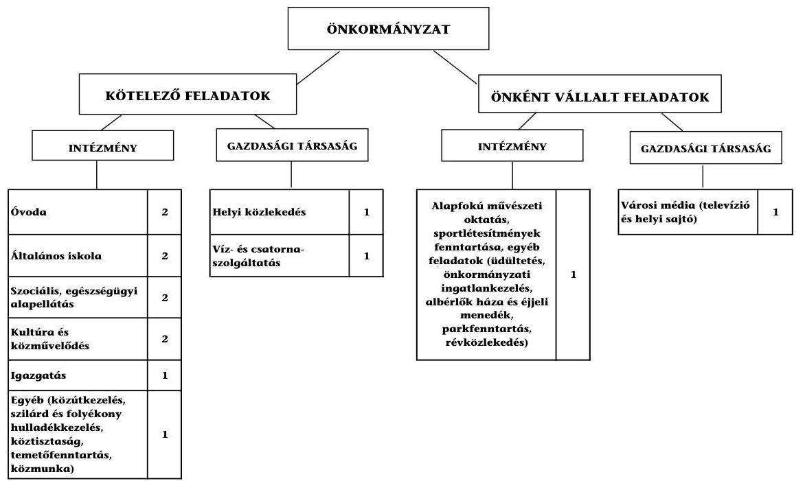

Az Önkormányzat feladatait 2011. június 30 -án (a Polgármesteri hivatallal együtt) 11 költségvetési szerv és három gazdasági társaság keretében, valamint a Kistérségi társulás társult tagjaként látta el. Az intézményszerveze-

[^0]
[^0]:    ${ }^{7}$ Az összes működési kiadás 14,0 millió Ft-tal eltér a 2. számú mellékletben szereplő 2010. évi folyó kiadások összegétől, mivel nem tartalmazza a szerb kisebbségi önkormányzat működési kiadásait, valamint az egészségügyi szakfeladaton elszámolt, OEP által finanszírozott kiadásokat.

---

ti átalakítások és feladatvállalások következtében a feladatellátás telephelyeinek száma a 2007. évi 20-ról 2011. év I. félévének végére 28-ra növekedett. A feladatellátás szervezeti kereteinek változása a működési kiadások növekedésével járt. Az Önkormányzat egy gazdasági társaságban rendelkezett kizárólagos tulajdonnal, amelyet 2011. évben a helyi média működtetésére alapítottak, de 2011. év I. félévében tevékenységet még nem végzett. Egy gazdasági társaság, melyben az Önkormányzat tulajdonnal nem rendelkezett, a helyi tömegközlekedés biztosításával vett részt az Önkormányzat feladatellátásában. A társaság részére - közszolgáltatási szerződés alapján - az ellenőrzött időszakban összesen 43,4 millió Ft rendszeres működési célú pénzeszközt adott át. Egy további, önkormányzati tulajdonnal nem érintett gazdasági társaság a víz és csatornaszolgáltatást biztosította.

Az Önkormányzat által 2010-ben működési kiadásokra fordított 2896,5 millió Ft 115,6 millió Ft-tal ( 4,1 %-kal) haladta meg a 2007-2009. évi átlagos működési kiadásokat. A 2010. évi működési kiadásokat 20,1%-ban (583,2 millió Ft) állami támogatás, 19,9%-ban (574,9 millió Ft) az intézmények saját bevétele, 59,4%-ban (1721,2 millió Ft) önkormányzati támogatás és 0,6%-ban (17,2 millió Ft) társulástól átvett forrás finanszírozta. Az Önkormányzat adatszolgáltatása szerint a 2010. évi működési költségvetési kiadásaiból 2441,7 millió Ft-ot (84,3%) a kötelező, 454,8 millió Ft-ot (15,7%) az önként vállalt feladatok ellátására fordított. Az önként vállalt feladatokhoz kapcsolódó kiadások részaránya 2010-ben a 2007-2009. évek átlagához képest 0,8 százalékponttal (értékben 4,3 millió Ft) csökkent. Az egyes ágazati közszolgáltatások feladatellátásában résztvevő intézmények működési kiadásainak finanszírozási forrásösszetételét az alábbi ábra szemlélteti:
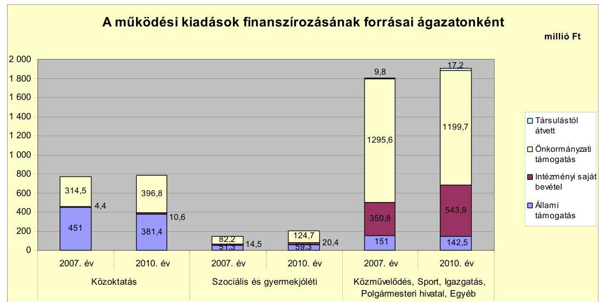

Az Önkormányzat működési kiadásait finanszírozó forrásokon belül 2010-ben a 2007-2009 évek átlagához képest az állami támogatás 12,7%-kal (84,8 millió Ft) csökkent, az intézményi saját bevételek 15,8%-os ( 78,4 millió Ft), az önkormányzati támogatás 7,1 %-os ( 114,7 millió Ft ) és a társulástól átvett forrás 73,7 %-os ( 7,3 millió Ft) növekedése mellett. A saját bevételek növekedésén belül Göd Város Önkormányzata Településellátó Szervezetének (TESZ) intézményei 2010-ben 19,1%-kal (60,7 millió Ft) növelték saját bevételeiket a 2007-2009 évek átlagához képest a szolgáltatási bevételek növelésének ered-

---

ményeként. A közoktatásra fordított kiadások 2010-ben a 2007-2009 évek átlagához képest összességében nem változtak, a szociális és gyermekjóléti ágazatban 10,1 %-kal ( 20,3 millió Ft), a többi ágazatnál összesen 5,2%-kal ( 94,9 millió Ft) növekedtek.

Az Önkormányzat működési jövedelmét, tőketörlesztését és pénzügyi kapacitását az alábbi ábra mutatja:
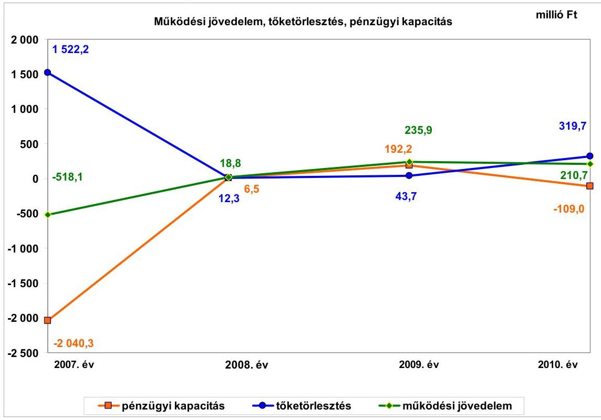

Az Önkormányzat folyó költségvetési egyenlege (működési jövedelem) 2007-ben működési forráshiányt, 2008-2010. évek között működési forrástöbbletet mutatott. A működési jövedelem alakulását a folyó bevételek - ezen belül a helyi adóbevételek - növekedésének a folyó kiadások növekedési ütemét meghaladó emelkedése befolyásolta. A működési jövedelem 2007-ben 518,1 millió Ft hiányt mutatott az előző évi állami támogatás visszafizetési kötelezettség teljesítése, valamint a társadalom- és szociálpolitikai juttatások növekedése miatt. Az Önkormányzatnak 2008-2010 között összesen 465,4 millió Ft megtakarítása keletkezett, melyben meghatározó szerepe volt a saját bevételek, ezen belül a helyi adókból származó bevételek növekedésének. A saját működési bevételek 2010-ben 369,2 millió Ft-tal (29,2%) haladták meg a 2007-2009. évek átlagát, ezen belül a legnagyobb növekedés a helyi adóbevételeknél jelentkezett, amely 39,5 % növekedést ( 312,9 millió Ft) mutatott.

A pénzügyi kapacitás (tőketörlesztéssel csökkentett működési jövedelem) a 2007-2009. évek között emelkedett, 2010. évben csökkent, értéke a vizsgált időszak kezdetén és végén negatív értéket mutatott. A 2007. évi nettó működési jövedelem kialakulását a folyó bevételeket 518,1 millió Ft-tal meghaladó folyó kiadások, valamint az év során kibocsátott kötvény forrásából teljesített, a korábbi fejlesztésekre és működésre igénybe vett hitelek törlesztésének 1522,2 millió Ft-os értéke határozták meg. A 2010. évi negatív pénzügyi kapacitást a

---

tárgyévi működési jövedelem értékét 51,7%-kal (109,0 millió Ft) meghaladó hiteltörlesztés alakította ki. Refinanszírozás nélkül 2007. évben a nettó működési jövedelem 564,7 millió Ft-tal kedvezőbben alakult volna, amennyiben a 2007. évi költségvetési rendeletben tervezett hitelfelvétel 1158,2 millió Ft, a hiteltörlesztés 957,4 millió Ft összegben teljesül. Ez esetben a nettó működési jövedelem -1475,6 millió Ft-ban realizálódott volna.

Az Önkormányzat felhalmozási költségvetésének egyenlege 2007-2010 között folyamatosan hiányt mutatott, amely összesen 1018,4 millió Ft volt. A vizsgált időszak során keletkezett 1024,7 millió Ft felhalmozási bevétellel szemben 2043,1 millió Ft felhalmozási kiadást teljesítettek. A felhalmozási hiány fedezetének egy részét 2007-2010 között a kibocsátott kötvény forrás fejlesztési célú felhasználásával (összesen 515,6 millió Ft) biztosította. További forrást jelentett a 2006-ban megkötött hitelszerződés alapján 2007-ben lehívott 103,1 millió Ft hosszú lejáratú fejlesztési célú hitel, 2009. évben a pályázati eszközök lehívásig igénybe vett 301,8 millió Ft folyószámlahitel, valamint a 2007-2009. években 97,9 millió Ft előző évi pénzmaradvány.

Az Önkormányzat 2007-ben a kötvénykibocsátásból származó bevétele átmenetileg fel nem használt forrásából 870,0 millió Ft-ot (2008-ban 1000,0 millió Ft-ot) betétben helyezett el, de azt nem a jogszabályi előírások szerint könyvelte. A 2007-2008. években az Önkormányzat az Áhsz. 9. számú melléklete 3. pontjában foglaltak ellenére a betétlekötések állományba vétele a lekötött betétszámlán nem történt meg, ezért a könyvviteli mérlegben a pénzeszközök helyett a kiegyenlítő elszámolások között jelent meg. A betétlekötések könyvviteli elszámolása a 2009. évtől az Áhsz-ben előírtaknak megfelelően történt. A betétlekötések a kötvénykibocsátásból származó bevétel maradványából és egyéb pályázati forrásból - előlegekből - származtak.

A kialakult pénzügyi egyensúlyi helyzet alakulására kihatott az Önkormányzat vizsgált időszakban kifejtett fejlesztési tevékenysége. A nettó működési jövedelem 2007. és 2010. években nem nyújtott fedezetet a felhalmozási költségvetés hiányára. A fejlesztési hiány fedezetét 2008. évben 55,5%-ban (6,5 millió Ft), 2009. évben 30,2%-ban (192,2 millió Ft) fedezte a nettó működési jövedelem.

---

A felhalmozási költségvetés bevételeit, kiadásait és egyenlegét az alábbi ábra szemlélteti:
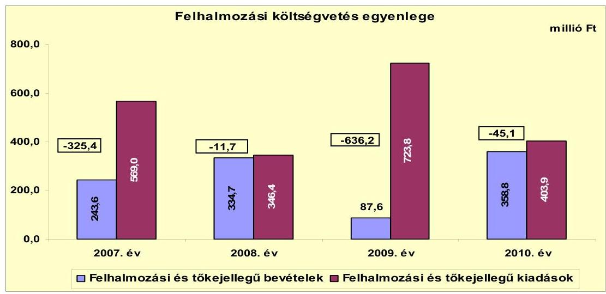

Az Önkormányzat felhalmozási költségvetésének egyenlege 2007-2010 között folyamatosan hiányt mutatott, mely a 2007. és a 2009. években végrehajtott beruházások felhalmozási forráshiánya miatt kiugró értékű volt. A 2007. és 2009. években megvalósult fejlesztésekre a kötvényforrásból származó bevétel biztosított fedezetet, mert a felhalmozási bevételek közül a pályázati források alacsonyabb mértékben realizálódtak.

Az Önkormányzat 2010. évi 3121,2 millió Ft összegű folyó bevétele 15,7%-kal (422,5 millió Ft-tal) haladta meg a 2007-2009. évek átlagát. Az Önkormányzat folyó bevételeinek jelentős hányadát a helyi adók és pótlékok biztosították, melyek beszedéséből a 2007-2010. évek között összesen 3482,5 millió Ft saját bevétel keletkezett. A 2010-ben beszedett helyi adóbevételek 67,4 %-a (745,2 millió Ft) az iparűzési adóból származott. Az
 iparűzési adóbevételek koncentrációja, az éves adóbevétel felének egy vállalkozás éves teljesítményétől való függése az Önkormányzat bevételeinek tervezésénél a jövőben működési kockázatot jelenthet.

Az Önkormányzatnak 2007-2010 között összesen 1024,7 millió Ft felhalmozási bevétele keletkezett. A felhalmozási bevételeken belül 60,0% (615,0 millió Ft) az államháztartáson belülről kapott támogatások részaránya.

Az Önkormányzat folyó kiadásai 2010-ben 4,5%-kal (124 millió Ft-tal) növekedtek a 2007-2009. évek átlagához képest. A transzferkiadások 2010-ben az előző három év átlagához képest 31,3% növekedést mutattak a magánszemélyek részére teljesített kifizetések növekedése miatt. Az Önkormányzat által 2010. évben kifizetett kamatok összege 45,2%-kal (64,2 millió Ft-tal) mérséklődött az előző évhez képest a hosszú lejáratú hitel állomány és a kötvény utáni kamatfizetési kötelezettség csökkenésének eredményeként.

A felhalmozási kiadások összege 2007-2010. évek között összesen 2043,1 millió Ft volt. A felhalmozási kiadások alakulása az időszak során hullámzó értéket mutatott, összefüggésben a 2007. és 2009. években végrehajtott kiugró mértékű beruházási és felújítási feladatokkal. A felhalmozási kiadások a bölcsődeépítés,

---

belterületi útépítések és csapadékvíz-elvezetés, valamint a meleg vizű strand fejlesztése, a 100 fős óvoda és melegítőkonyha, a kerékpárút-építés és csapadékvíz elvezetés, valamint az idősek otthona fejlesztése és a szemétszállítás eszközbővítése feladatokkal kapcsolatban merültek fel.

Az Önkormányzat által a 2007-2010 között megvalósított, 2010. december 31-ig műszakilag és pénzügyileg is befejezett fejlesztések bekerülési értéke 2375,4 millió Ft volt. A fejlesztések 25,9%-ára 614,6 millió Ft-ot 2006. december 31-ig, a 74,1%-ára 1760,8 millió Ft-ot pedig a 2007-2010. években fizettek ki. A fejlesztések forrásának 43,6%-át (1036,0 millió Ft-ot) pénzintézeti forrásokból fedezték, melyből 21,3% (505,0 millió Ft) származott kötvényforrásból, a többi 2007. év előtt megkötött hitellehívásokból. További forrást 644,0 millió Ft-ot a saját felhalmozási és tőkejellegű bevételek, 695,4 millió Ft-ot a hazai- és EU-s támogatások jelentettek. A 2010. december 31-én folyamatban lévő fejlesztési feladatok végrehajtására 2007-2010. között 45,4 millió Ft kiadást teljesítettek, amelyre kötvénybevételből 10,6 millió Ft-ot (23,3%), EU-s forrásból 34,8 millió Ft-ot (76,7%) fordítottak. Az EU-s támogatásból megvalósult fejlesztések utófinanszírozása az Önkormányzatnak likviditási gondot okozott, ezért folyószámlahitelt vettek igénybe a fizetési kötelezettségek teljesítésére. A folyószámlahitel - mint likvid hitel - fejlesztési célú igénybevétele nem volt összhangban Ötv. 88. § (3) bekezdés d) pontjában $^{8}$ foglaltakkal, mely szerint "likvid hitel: a közszolgáltatási és államigazgatási feladatok folyamatos működtetéséhez felvett hitel".

Az Önkormányzatnál 2010. december 31-én folyamatban lévő fejlesztési feladatok 2010. évet követő kötelezettségvállalásainak összege 130,7 millió Ft volt, amelyből 71,0 millió Ft-ot a már kibocsátott kötvényforrásból, 59,7 millió Ft-ot EU-s támogatásból terveznek biztosítani. Saját forrással a fejlesztések megvalósításához nem számoltak.
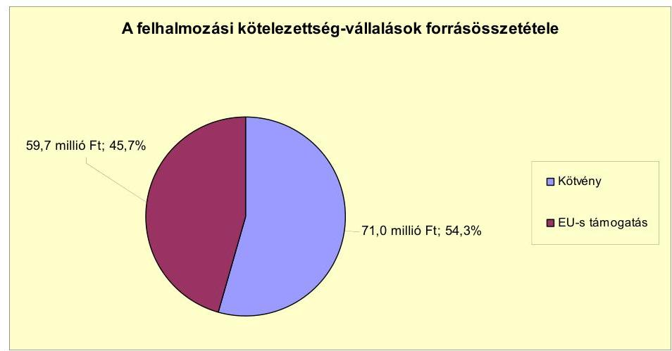

Az Önkormányzatnak beadott, elbírálás alatt álló pályázata a helyszíni ellenőrzés ideje alatt nem volt.

[^0]
[^0]:    $^{8}$ 2011. december 31-től a Stabilitási tv. 10. § 4) bekezdése

---

Az Önkormányzat mérleg szerinti pénzintézeti kötelezettsége a 2007. év elejétől a 2011. év I. félév végére 1657,9 millió Ft-ról 4565,8 millió Ft-ra nőtt, amelyből az árfolyamváltozás miatti különbözet 1278,8 millió Ft volt. A pénzintézeti kötelezettségek kilenc hosszú lejáratú és egy likvid hitelből, folyószámlahitel igénybevételéből, valamint kötvénykibocsátásból keletkeztek, amelynek 66,1%-át a CHF-ben, 2007. szeptember 20-án kibocsátott önkormányzati kötvény teszi ki. A Képviselő-testület 2007. évben döntött „FIDUCIA” elnevezésű zártkörű fejlesztési célú svájci frank alapú kötvény kibocsátásáról 18 093,0 ezer CHF, 2750,1 millió Ft értékben. A hitelszerkezet konszolidációja keretében visszafizették a 2007. évben a működési kiadások finanszírozására felvett 50,0 millió Ft rövid lejáratú hitelt és a 2007. évben megnövekedett 985,7 millió Ft folyószámlahitelt. A 2007 előtt felvett hat hosszú lejáratú fejlesztési célú forint hiteleket még a türelmi időn belül törlesztették 553,3 millió Ft összegben, további három fennmaradó fejlesztési célú hitelére a Képviselőtestület döntése alapján 91,8 millió Ft tőke- és kamatfizetési kötelezettséget teljesítettek. A visszafizetett hitelek 2007. évi kamatát (34,6 millió Ft) a folyó bevételekből finanszírozták. A kötvény tőketörlesztési kötelezettsége 2011. évben április 15-én megkezdődött 540,1 ezer CHF összegben. 2011. évtől a kötvény tőketörlesztése évenként 1080,0 ezer CHF fizetési kötelezettséget jelent. A kötvény maradvány 2011. év június 30-án 132,8 millió Ft. A kötvény kibocsátásból származó átmenetileg szabad forrásokról az Önkormányzat szabadon, a pénzintézet korlátozása nélkül rendelkezik. A kötvényvel kapcsolatos kamat- és árfolyamkiadásainak növekedése - annak kamat- és visszafizetési kockázata miatt - hosszabb távon további eladósodáshoz és vagyonfeléléshez vezethet, pénzügyi kockázatot jelent.

A vizsgált időszakban fejlesztési célú hitellehívás négy beruházáshoz történt 2007 előtt megkötött hitelszerződések alapján, melyből egy hitelt a kötvényforrásból 2007-ben vissza is fizetett az Önkormányzat. A hiteleket a Képviselőtestület által jóváhagyott, a költségvetésbe betervezett beruházásokhoz használták fel.

Az Önkormányzat kötelezettségvállalásaira képviselő-testületi döntés alapján került sor, az előterjesztésekben bemutatták a kamat- és - a deviza alapú kötelezettségeket érintő - árfolyamkockázatot.

A kötvénykibocsátásból származó 18093 ezer CHF-ben fennálló pénzintézeti kötelezettségeiből 2007-2011. év I. félévében 540,1 ezer CHF (112,8 millió Ft) tőkét törlesztett, és 1526,2 ezer CHF (274,4 millió Ft) kamatot fizetett. A kötvénykibocsátás során 10,0 millió Ft jegyzési díjat és a 2011. évi I. félévi teljesítéskor 30,7 millió Ft árfolyamveszteséget fizettek meg. Az Önkormányzatnál a kötvény után megfizetett kamatból 42,5 millió Ft volt az árfolyam-növekedés hatása. A 2007-2011. év I. féléve között átmenetileg szabad pénzeszközeiből 270,5 millió Ft kamatbevételt realizált.

Az Önkormányzat számlavezető bankot a vizsgált időszakban 2007. február 1-jével váltott. A közbeszerzéssel kiválasztott pénzintézet kondíciói előnyt jelentettek az Önkormányzatnak a kedvezőbb, 0,35%-kal kevesebb kamatmérték miatt.

---

Az Önkormányzat költségvetésének pénzügyi egyensúlyát a vizsgált időszakban folyószámlahitel, likvid- és munkabér-megelőlegezési hitel igénybevételével tudta biztosítani. A folyószámla- és munkabér-megelőlegezési hitel igénybevétele a 2007-2011. év I. félévében az alábbi táblázat szerint alakult:

| Megnevezés | 2007. év | 2008. év | 2009. év | 2010. év | 2011. év   I. félév |
| :-- | :--: | :--: | :--: | :--: | :--: |
| Folyószámlahitel |  |  |  |  |  |
| Kereklésszeg január 1-jén (millió Ft-ban) | 350,0 | 1000,0 | 1000,0 | 1000,0 | 1000,0 |
| Állagos napi állomány (millió Ft-ban) | 421,1 | 19,8 | 230,5 | 319,2 | 94,0 |
| Folyószámla hitettel zárt napok száma (nap) | 268 | 181 | 348 | 365 | 85 |
| Egyenteg (állomány) | - | 74,3 | 362,5 | 86,8 | 25,2 |
| Munkabér-megelőlegezési hitel |  |  |  |  |  |
| Kereklésszeg január 1-jén (millió Ft-ban) | 60,0 | 60,0 | 60,0 | 60,0 | 60,0 |
| Állagos napi állomány (millió Ft-ban) | 4,0 | - | - | - | - |
| Munkabér-megelőlegezési hitettel zárt napok száma (nap) | 94 | - | - | - | - |
| Egyenteg (állomány) | x | x | x | - | - |

A folyószámlahitel szerződés lejáratkori kötelezettségállománya 2008. évben 86,2 millió Ft, 2009. évben 490,8 millió Ft, 2010. évben 283,3 millió Ft, míg 2011. március 14-én 371,4 millió Ft volt. A folyószámlahitel igénybevétele a vizsgált időszakban szinte rendszeresen történt, döntően a pályázati források megelőlegezése céljából. A likviditás biztosítása az Önkormányzatnak 105,1 millió Ft kamatkiadást jelentett. Az Önkormányzat 2011. év I. félév végi szállítói tartozása 43,3 millió Ft, mely 30 napon belüli lejárt tartozás volt.

Az Önkormányzat kötelezettségeinek 2010. december 31-i, valamint 2011. június 30-i állományát és várható alakulását a kötelezettségek lejáratáig az alábbi táblázat szemlélteti:

| Megnevezés | Állomány 2010. december 31-én |  |  | Állomány 2011. június 30-án |  |  | Várható kötelezettség 2011-2013. években | Várható kötelezettség 2014. évtől |  |
| :--: | :--: | :--: | :--: | :--: | :--: | :--: | :--: | :--: | :--: |
|  | HUF-ban (millió Ftban) | Devizában (összege, ezer, ... ben) | Deviza nem | HUF-ban (millió Ftban) | Devizában (összege, ezer, ... ben) | Deviza nem | HUF-ban (millió Ftban) | Devizában (összege, ezer CHF, ben) | HUF-ban (millió Ftban) |
| Pénzintézeti kötelezettségek |  |  |  |  |  |  |  |  |  |
| FIDUCIA kötelezettség |  | 18093,0 | CHF |  | 17552,9 | CHF |  | 3779,8 | 16037,2 |
| Hosszú lejáratú kötelezettségek | 541,6 |  | HUF | 511,7 |  | HUF | 180,5 |  | 489,6 |
| Rövid lejáratú hitel (folyószámla) | 98,8 |  | HUF | 25,2 |  | HUF |  |  |  |
| Pénzintézeti kötelezettségek összesen HUF-ban: | 628,6 |  | HUF | 536,0 |  | HUF | 180,5 |  | 489,6 |
| Pénzintézeti kötelezettségek összesen CHF-ben: |  | 18093,0 | CHF |  | 17552,9 | CHF |  | 3779,8 | 16037,2 |
| Blokkhitelek |  |  |  |  |  |  |  |  |  |
| Kezesség | 841,7 |  | HUF | 841,7 |  | HUF |  |  |  |
| Blokkhitelek összesen: | 841,7 |  | HUF | 841,7 |  | HUF |  |  |  |
| Szállítói tartozás | 75,4 |  | HUF | 43,3 |  | HUF | 43,3 |  |  |
| Jogerős végzéssel lezárt de ki nem fizetett kötelezettségek | 1,0 |  | HUF | 1,0 |  | HUF | 1,0 |  |  |
| Kötelezettségek összesen HUF-ban: | 1546,7 |  | HUF | 1422,9 |  | HUF | 224,8 |  | 489,6 |
| Kötelezettségek összesen CHF-ben: |  | 18093,0 | CHF |  | 17552,9 | CHF |  | 3779,8 | 16037,2 |

Az Önkormányzatnak pénzintézetekkel szemben fennálló kötelezettsége a 2011. év I. félév végén 536,9 millió Ft, és 17552,9 ezer CHF volt. Ezek várható kötelezettsége (tőke, kamat) a legutóbbi kamatfizetés feltételei alapján a 2011-2013. években 180,5 millió Ft és 3779,8 ezer CHF. Az Önkormányzatnak a 2011. évben szállítói tartozások, valamint jogerős végzéssel lezárt, de ki nem fizetett kötelezettségek címén 44,3 millió Ft fizetési kötelezettsége keletkezett. 2011. június 30-án kezességből fennálló - víziközmű társulásoknak - kötelezettségvállalás összege 841,7 millió Ft volt. A 2011-2013. évek kötelezettségeinek teljesítésére figyelembe vehető - a Képviselő-testület döntése alapján - 246,0 millió Ft kötvénybevételből származó pénzmaradvány, a megképződött működési jövedelem, valamint
 a forgalomképes ingatlan vagyon. Szabad pénzmaradvánnyal az Önkormányzat nem rendelkezett. A 2014. évet követően

---

jelenleg ismert pénzintézeti tőke- és kamatfizetési kötelezettségei 489,6 millió Ft és 16037,2 ezer CHF. Az Önkormányzat tájékoztatása szerint figyelembe vehető források a megképződő működési jövedelem, azonban 2011-ben a helyi iparűzési adómérték 0,1 százalékponttal történt csökkentése kockázatot jelent többletforrás elérésére. A további évekre vonatkozó, jelenleg ismert pénzintézeti kötelezettségek teljesítését nem látjuk biztosítottnak, mivel a működési jövedelem mellett még felhalmozási hiányt is finanszírozni kell, ezért nem képződik annyi szabad forrása, ami a kötelezettségek fedezetét biztosíthatná. Hosszú távon azonban az ingatlanértékesítés sokkal inkább fedezet lehet, mint rövidtávon. Az iparűzési adóbevétel több mint 50,0\%-a egy vállalkozástól származik, az adóbevételi kitettség további kockázatot jelent.

Az önkormányzati pénzügyi egyensúlyát nem befolyásolta a 2011. évben alapított kizárólagos tulajdonában lévő gazdasági társasága.

Az Önkormányzat négy esetben készfizető kezességet vállalt két víziközmű társulat javára 844,1 millió Ft értékben szennyvízberuházásokkal kapcsolatban, melyből 2009-2011. év I. féléve között 10,9 millió Ft-ot teljesített. A tartozás jogi úton történő behajtására nem intézkedtek, annak ellenére, hogy a Ptk. visszkereseti jogot biztosít ilyen esetekre. Az Önkormányzat intézménye - a TESZ - által 2006-ban kötött lízingszerződésnél nem vették figyelembe az Áht ${ }_{1}$ előírását, amely 2006. január 1-jétől a Polgármesteri hivatalon kívül nem engedi meg költségvetési szervek számára pénzügyi lízingszerződés kötését.

A Képviselő-testület a vizsgált időszakban 1,4 millió Ft követeléselengedésről döntött, azonban nem szabályozta rendeletben a követeléselengedés és az ingyenes vagyonátruházás lehetséges eseteit és módjait. A polgári jogi szerződésekben nem alkalmazott olyan mellékkötelezettségeket (zálogjog, kezesség, kötbér stb.), amelyek biztosítékot jelentenek a szerződő fél nemfizetése esetére. Az Önkormányzat nem rendelkezett ${ }^{9}$ vagyonhasznosítási koncepcióval, ezért a polgári jogi szerződések megkötése nem egységes szempontok szerint történt.

Az Önkormányzat 2007-2010 között eszközállománya után 662,4 millió Ft összegű értékcsökkenést mutatott ki, miközben az elhasznált eszközök pótlására 236,9 millió Ft-ot fordított. A 2007-2010. évek között aktivált felújítások, beruházások értéke 1500,0 millió Ft volt.

Az Önkormányzat költségvetési támogatásból és átengedett bevételekből (szjaból) származó bevételei a 2007. évhez képest az időszak egészét tekintve összességében nem csökkentek. Az Önkormányzat - adatszolgáltatása szerint - az ellenőrzött időszakban kiadási megtakarítást eredményező és bevételt növelő intézkedéseket tett. A bevételt növelő intézkedések a helyi adók mértékének emeléséhez és az adóbehajtási tevékenység fokozásához, valamint ingatlanok és eszközök hasznosításához kapcsolódtak. A 2007-2011. év I. féléve között tett intézkedések hatására - az Önkormányzat adatszolgáltatása alapján - 1315,2 millió Ft bevételi többletet, továbbá 8,4 millió Ft kiadási megtakarítást mutattak ki. Az Önkormányzat nem mérte fel az önkormányzati törzsva-

[^0]
[^0]:    ${ }^{9}$ Jogszabály nem is kötelezi erre az Önkormányzatot.

---

gyonon felüli forgalomképes vagyonban (vállalkozói vagyonban) rejlő bevételt növelő lehetőségeket.

A vizsgált időszakban feladatátszervezés következtében négy álláshely szűnt meg és a bölcsődei és óvodai, valamint az intézményüzemeltetési fejlesztések eredményeként 28 új álláshely jött létre, ezáltal a foglalkoztatott létszám 508-ról 532-re nőtt.

Az utóellenőrzés a pénzügyi egyensúly javítására tett négy szabályszerűségi javaslat hasznosítására terjedt ki. Az Önkormányzat az ÁSZ 2009. évi ellenőrzésének javaslatai közül kettő szabályszerűségi javaslatot nem hasznosított. A finanszírozási célú pénzügyi műveletekre vonatkozó javaslat nem teljesült. A jegyző nem gondoskodott arról, hogy az Áht ${ }_{1}$ 8/A. § (7) bekezdésében előírtak alapján a költségvetési tervezet elkészítésekor a finanszírozási célú pénzügyi műveletek ne szerepeljenek költségvetési hiányt, illetve többletet módosító költségvetési bevételként, valamint költségvetési kiadásként. Nem teljesült az a javaslat sem, amely az intézményi eredeti, a módosított előirányzatok és a teljesítések eltérése indokoltságának, valamint az intézményi számszaki beszámoló belső, illetve a Képviselő-testület által meghatározott adatszolgáltatással való összhangjának az Ámr 149. § (3) bekezdés c) és d) pontjában foglaltak szerinti ellenőrzésére vonatkozott. Ez utóbbinak a szabályozása is elmaradt.

Az Önkormányzat pénzügyi egyensúlyi helyzetét összegezve a következők emelhetők ki:

Göd Város Önkormányzata pénzügyi egyensúlya rövid és középtávon biztosított. A pénzügyi egyensúly hosszú távú fenntartására az Önkormányzatnak fel kell készülnie.

A folyó bevételek 2008-tól fedezetet nyújtanak a folyó kiadásokra és a hosszúlejáratú hitelek adósságszolgálatára. A folyószámlahitellel zárt napok száma és napi állománya csökkenő tendenciát mutat.

A helyi adóbevétel meghatározó része egy adóalanytól származik, emiatt a jövőben működési kockázat jelentkezhet.

Az önként vállalt feladatok magas részaránya a kötelező feladatok ellátását kedvezőtlenül befolyásolhatja.

Szállítói kötelezettségek a pénzügyi egyensúlyi helyzetre nem voltak hatással.
Felhalmozási kockázat nem jelentkezik. A fejlesztésekkel kapcsolatos kötelezettségvállalások forrása a kibocsátott kötvényből és EU-s forrásokból biztosítható.

A változó kamatozású hitelek és a deviza alapú kötvény árfolyamváltozása, valamint az Önkormányzat által vállalt készfizető kezesség kedvezőtlen hatással lehet a pénzügyi egyensúlyi helyzetre.

Az Önkormányzat gazdasági társaságának működése nem jelent működési kockázatot.

---

Az Állami Számvevőszékről szóló 2011. évi LXVI. törvény 33. § (1) bekezdésében foglaltak értelmében a jelentésben foglalt megállapításokhoz kapcsolódó intézkedési tervet köteles az ellenőrzött szervezet vezetője összeállítani és azt a jelentés kézhezvételétől számított harminc napon belül az ÁSZ részére megküldeni. Amennyiben az intézkedési tervet határidőben nem küldi meg a szervezet, vagy az továbbra sem elfogadható, az ÁSZ elnöke a hivatkozott törvény 33. § (3) bekezdés a)-b) pontjaiban foglaltakat érvényesítheti.

# A 2011. június 30-i pénzügyi egyensúlyi helyzet alapján az ellenőrzés intézkedést igénylő megállapításai és javaslatai a következők: 

## a Polgármesternek

1. Az Önkormányzat pénzügyi egyensúlya rövid és középtávon biztosított. A pénzügyi egyensúly hosszú távú megőrzésére az Önkormányzatnak fel kell készülnie. Az Önkormányzatnak pénzintézetekkel szemben fennálló kötelezettsége a 2011. év I. félév végén 536,9 millió Ft, és 17552,9 ezer CHF.

Javaslat:
Folyamatosan tájékoztassa a Képviselő-testületet az Önkormányzat pénzügyi egyensúlyi helyzetéről. Kezdeményezzen szükség esetén intézkedéseket a pénzügyi egyensúly hosszú távú fenntarthatósága céljából. Képezzen elkülönített tartalékot az adósságszolgálat teljesítése érdekében.
2. Az önként vállalt feladatok kiadásainak részaránya az Önkormányzat működési biztonságát befolyásolhatja.

Javaslat:
Indítványozza a Képviselő-testületnek az önként vállalt feladatok körének és részarányának felülvizsgálatát a működési kockázat csökkentése érdekében.
3. A polgári jogi szerződésekben nem alkalmaztak olyan mellékkötelezettségeket (zálogjog, kezesség, kötbér stb.), amelyek biztosítékot jelentenek a szerződő fél nemfizetése esetére.

Javaslat:
Vizsgálja felül az Önkormányzat által kötött polgári jogi szerződések olyan mellékkötelezettségekkel való ellátását, amelyek biztosítékot jelentenek a szerződő fél nemfizetése esetére.
4. Az Önkormányzat nem rendelkezett vagyonhasznosítási koncepcióval, nem mérte fel az önkormányzati törzsvagyonon felüli forgalomképes vagyonban (vállalkozói vagyonban) rejlő bevételt növelő lehetőségeket.

Javaslat:
Tekintse át a hasznosítható vagyon bevételnövelő lehetőségeit és dolgozzon ki középtávú koncepciót az önkormányzati vagyon hasznosítására.

---

5. Az Önkormányzat az ÁSZ 2009. évi ellenőrzésének javaslatai közül kettő szabályszerűségi javaslatot nem hasznosított. A finanszírozási célú pénzügyi műveletekre vonatkozó javaslat nem teljesült. A finanszírozási célú pénzügyi műveleteket továbbra is szerepeltették költségvetési hiányt, illetve többletet módosító költségvetési tételként. Nem szabályozták az intézményi eredeti, a módosított előirányzatok és a teljesítések eltérése indokoltságának, valamint az intézményi számszaki beszámoló belső, illetve a Képviselő-testület által meghatározott adatszolgáltatással való összhangjának ellenőrzését az Ámr ${ }_{1,2}$-ben előírtaknak megfelelően.

Javaslat:
Intézkedjen - az Önkormányzat gazdálkodási rendszerét érintő előző ellenőrzés nem hasznosult szabályszerűségi javaslataival kapcsolatban - a fegyelmi felelősség kivizsgálása iránt.

# a jegyzőnek 

1. Az Önkormányzat - az Áht ${ }_{1}$ 8/A. § (7) bekezdésében foglaltak ellenére - éves költségvetési rendeletében finanszírozási célú pénzügyi műveleteket is tervezett költségvetési bevételként - pénzmaradvány, hitelfelvétel -, emiatt a korábbi számvevőszéki javaslat nem teljesült.

Javaslat:
Gondoskodjon az Áht ${ }_{2}$ 23. § (2) bekezdés d)-e) pontjaiban előírtaknak megfelelően a költségvetési tervezet elkészítésekor a finanszírozási célú pénzügyi műveletek szabályszerű tervezéséről.
2. Nem történt meg az intézményi eredeti, a módosított előirányzatok és a teljesítések eltérése indokoltságának, valamint az intézményi beszámoló összhangjának vizsgálatára vonatkozó szabályozás. Az előirányzatok teljesülése kapcsán nem folytattak le vizsgálatot a tervezett és tényleges előirányzatok közötti különbség okainak feltárásáról, az erre vonatkozó korábbi számvevőszéki javaslat nem teljesült.

Javaslat:
Gondoskodjon az intézményi eredeti, a módosított előirányzatok és a teljesítések eltérése indokoltságának, valamint az intézményi számszaki beszámoló belső, illetve a Képviselő-testület által meghatározott adatszolgáltatással való összhangjának az Ávr. 149. § (1) bekezdés szerinti ellenőrzéséről; és az ellenőrzés eredménye Képviselő-testület általi megtárgyalásáról.
3. Az Önkormányzat készfizető kezesi felelőssége alapján több részletben összesen 10 926,0 ezer Ft-ot fizetett ki a Gödi Lakópark Víziközmű Társulat helyett, visszkereseti igényét azonban eddig nem érvényesítette.

Javaslat:
Intézkedjen a Ptk. 276. § (1) bekezdése alapján, hogy az Önkormányzat a Gödi Lakópark Víziközmű társulat helyett kifizetett 10 926,0 ezer Ft-ot kamataival együtt jogi úton hajtsa be.

---

4. Az Önkormányzat rendeletében nem szabályozta a követelésről történő lemondás, illetve az ingyenes vagyonátruházás eseteit és módjait.

Javaslat:
Kezdeményezze az Önkormányzat vagyonrendeletének módosítását, melynek értelmében a Képviselő-testület az Áht ${ }_{2}$ 97. § (2) bekezdésében foglaltaknak eleget téve dönt a követelés-elengedés lehetséges eseteiről és módjairól.
5. A TESZ 2006-ban pénzügyi lízingszerződést kötött, annak ellenére, hogy azt az Áht ${ }_{1}$ 100/G. § (1) bekezdés f) pontja - a Polgármesteri hivatalon kívüli más költségvetési szerv számára - nem tette lehetővé.

Javaslat:
Gondoskodjon arról, hogy pénzügyi lízingszerződés megkötése esetében az Áht ${ }_{2}$ 41. § (4) bekezdés b) pontja szerint járjanak el.

A polgármester a helyszíni ellenőrzés lezárása után tájékoztatta az Állami Számvevőszéket az Önkormányzat tervezett és megtett intézkedéseiről, amelyet az Állami Számvevőszék nem ellenőrzött, arra vonatkozóan véleményt vagy megállapítást nem fogalmaz meg. Az ellenőrzés lezárását követően elvégzett intézkedéseket az Állami Számvevőszék utóellenőrzés keretében vizsgálhatja.

A polgármester tájékoztatása szerint a következő intézkedéseket tervezi és tette meg az Önkormányzat:

- Polgármesteri utasításban előírják az Önkormányzat likviditási helyzetének bemutatását és a Képviselő-testület rendszeres tájékoztatását a bevételek alakulásáról.
- Munkacsoportot hoznak létre a pénzügyi adatok folyamatos elemzésére, a kiadási és bevételi előirányzatok alakulásának figyelemmel kísérésére és módosítására.
- Munkacsoportot alakítanak az önként vállalt és kötelezően ellátandó feladatok körének meghatározására, az önként vállalt feladatok elemzésére, esetleges elhagyására vonatkozó javaslat megtételére.
- Előírják az Önkormányzat szerződéseinek áttekintését, valamint a tulajdonában lévő vagyontárgyak teljes körű felülvizsgálatát, a hasznosítható vagyontárgyak körének meghatározását.
- Elrendelik a korábbi ÁSZ vizsgálatok során nem teljesült javaslatok hasznosítása érdekében a szükséges szabályzatok kidolgozását, és gyakorlati alkalmazásukat.
- Kezdeményezik az érdekeltségi hozzájárulások behajtását.
- A Képviselő-testület napirendjére tűzték a vagyongazdálkodási rendelet módosítását, melyben meghatározzák a követelés elengedés módját és eseteit.
- Felhívták az intézményvezetők figyelmét az Államháztartásról szóló törvény előírásainak betartására.

---

# II. RÉSZLETES MEGÁLLAPÍTÁSOK 

## 1. Az ÖNKORMÁNYZAT KÖTELEZŐ ÉS ÖNKÉNT VÁLLALT FELADATAI, A FELADATELLÁTÁS SZERVEZETI KERETEI ÉS ANNAK VÁLTOZÁSAI

Az Önkormányzat a gazdasági programjaiban megfogalmazottak alapján kötelező és önként vállalt feladatait az SzMSz-ben rögzítette. Az Önkormányzat besorolása alapján önként vállalt feladatként határozták meg a művészetoktatási, pedagógiai szakszolgálati, hajléktalanok ellátása, egyes egészségügyi, ingatlankezelési, üdültetési, strandüzemeltetési, szociális, helyi média működtetési és parkfenntartási feladatok ellátását és a civil szervezetek részére történő pénzeszközátadásokat. Az önként vállalt feladatok terjedelméről az éves költségvetési rendeletekben
 döntöttek.

Az Önkormányzat adatszolgáltatása szerint 2010. évi működési költségvetési kiadásainak 2896,5 millió Ft összegéből 2441,7 millió Ft-ot (84,3\%) a kötelező, 454,8 millió Ft-ot (15,7\%) az önként vállalt feladatok ellátására fordított. Az önként vállalt feladatokhoz kapcsolódó kiadások részaránya 2010-ben a 2007-2009. évek átlagához képest 0,8 százalékponttal (értékben 4,3 millió Ft) csökkent. Az Önkormányzat 2011. évben 2010. évhez képest az önként vállalt feladatainak ellátására 24,2 millió Ft-tal kisebb összeget tervezett, részarányának 0,2 százalékpontos csökkenése mellett. Az önként vállalt feladatok terjedelme és a működési kiadásokon belül képviselt részaránya az Önkormányzat működési biztonságát befolyásolhatja.

---

Az Önkormányzat 2010. évi működési kiadásait és azok főbb feladatonkénti finanszírozási arányait a következő - az Önkormányzat adatszolgáltatásán alapuló - táblázat ${ }^{10}$ mutatja be:

| Ellátott feladat | Működési kiadás összesen (millió Ft) | Kötelező feladatok kiadásainak részaránya \% | Működési bevétel összesen (millió Ft) | Állami támogatás részaránya \% | Intézményi saját bevétel részaránya \% | Önkormányzati támogatás részaránya \% | Társulástól átvett támogatás részaránya \% |
| :--: | :--: | :--: | :--: | :--: | :--: | :--: | :--: |
| Óvodák | 240,9 | 100,0 | 240,9 | 49,7 | 0,3 | 50,0 | 0,0 |
| Általános iskolák | 547,9 | 100,0 | 547,9 | 47,7 | 1,8 | 50,5 | 0,0 |
| Szociális intézmények | 181,1 | 98,4 | 181,1 | 28,9 | 11,1 | 60,0 | 0,0 |
| Gyermekjóléti intézmények | 23,4 | 100,0 | 23,4 | 29,5 | 1,6 | 68,9 | 0,0 |
| Közművelődési intézmények | 54,2 | 100,0 | 54,2 | 0,0 | 10,7 | 89,3 | 0,0 |
| Sportlétesítmények | 14,4 | 100,0 | 14,4 | 0,0 | 71,7 | 28,3 | 0,0 |
| Egyéb intézmények | 818,1 | 58,1 | 818,1 | 0,0 | 46,3 | 51,6 | 2,1 |
| Polgármesteri hivatal igazgatási kiadásai | 307,6 | 100,0 | 307,6 | 11,0 | 4,1 | 84,9 | 0,0 |
| Polgármesteri hivatallal ellátott feladatok működési kiadásai | 709,0 | 84,6 | 709,0 | 15,3 | 19,3 | 65,4 | 0,0 |
| Működési kiadások összesen | 2896,5 | 84,3 | 2896,5 | 20,1\% | 19,9\% | 59,4\% | 0,6\% |

Az Önkormányzat adatszolgáltatása szerint a 2010. évi 2896,5 millió Ft működési kiadásából 788,8 millió Ft-ot (27,2\%) a közoktatási feladatok ellátására fordított. A közoktatási feladatok kiadásai 2007-2009 között átlagosan 788,5 millió Ft-ot tettek ki. A közoktatási feladatokon belül az általános iskoláknál volt jelentősebb működési kiadásnövekedés (47,2 millió Ft) 2007-2008 között, melyből 25,4 millió Ft-ot bér- és járuléknövekedés, a további a dologi kiadások növekedése okozott. A gyermeklétszám a 2007-2010. évek között folyamatosan emelkedett, az óvodáknál 50 fővel, az általános iskolákban 120 fővel nőtt. Az intézményi saját bevételek részaránya 2010-ben volt a legnagyobb (9,8 millió Ft) egy oktatási pályázat eredményeként. A közoktatási ágazatban foglalkoztatottak száma 2007-2010 között nem változott, a 2011. évben az általános iskoláknál négy fő (2,9\%) létszámbővülést terveztek. A közoktatási feladatok ellátása az Önkormányzat működési biztonságát nem befolyásolta.

A szociális és gyermekjóléti ágazat 2010. évi működési kiadása 204,5 millió Ft volt, amely 20,5 millió Ft-tal (11,1\%) volt magasabb a 2007-2009. évek átlagos 184 millió Ft-os kiadásánál. A növekedés a 2008. évben, a szociális és gyermekjóléti intézmények kiadásainál a 2007. évben megvalósult új 60 fős bölcsőde működtetésének megkezdése kapcsán jelentkezett, az előző évhez képest 36,7\% (48,4 millió Ft) mértékben. Kiadásnövekedést okozott továbbá az étkeztetéssel kapcsolatos kiadások emelkedése, valamint a gyermekvédelmi támogatások emelkedése. Az ágazat működési költségeit 2007-2009 között évente átlagosan 33,1\%-ban (61,0 millió Ft) állami hozzájá-

[^0]
[^0]:    ${ }^{10}$ A táblázatban szereplő összes működési kiadás 14,0 millió Ft-tal eltér a 2. számú mellékletben szereplő 2010. évi folyó kiadások összegétől, mivel nem tartalmazza a szerb kisebbségi önkormányzat működési kiadásait, valamint az egészségügyi szakfeladaton elszámolt, OEP által finanszírozott kiadásokat.

---

rulás, 56,9\%-ban (104,7 millió Ft) önkormányzati támogatás, 10,0\%-ban (18,3 millió Ft) az intézményi saját bevétel finanszírozta. A 2010. évben az állami hozzájárulás részaránya 29,0\% (59,3 millió Ft), az önkormányzati támogatás 61,0\% (124,8 millió Ft) volt a finanszírozáson belül, az intézményi saját bevételek részaránya lényegében változatlan (10,0\%, illetve 20,4 millió Ft) maradt.

A szociális és gyermekjóléti ágazatban foglalkoztatottak létszáma 2007-ben 50 fő volt, ami 2008-ban 57 főre, 2009-ben pedig 61 főre emelkedett a feladatellátási és telephelyek növekedésével - 2009-ben került telephelyként bejegyzésre két konyha és a bölcsőde - és ezen a szinten maradt 2010-2011-ben is.

Közművelődési, sport és egyéb kiadásokra 2010. évben 886,7 millió Ft-ot fordított az Önkormányzat, amely az éves működési kiadások 30,6\%-a volt. Az ágazat kiadásai 2007-2009 között átlagosan 778,0 millió Ft-ot, a működési kiadások 28,0\%-át tették ki. Az egyéb intézményi kiadásokon belül 2007-2010. évek között összesen 27,4\% (2008. évben 91,9 millió Ft, 2009. évben 26,7 millió Ft, 2010. évben 57,4 millió Ft) működési kiadásnövekedés következett be. A működési kiadások növekedése a TESZ által működtetett intézmények működési kiadásainak növekedésével, a létszám 36 fővel történt emelkedésével függött össze. További kiadásnövekedést okozott a szilárd hulladék szállításának és lerakóban történő elhelyezésének költségnövekedése. A helyi közművelődési feladatok normatív hozzájárulásának 2010-től történt megszűnése miatt kieső évi átlagos 18,6 millió Ft támogatást kisebb részben az intézményi saját bevételek, döntően az önkormányzati támogatás növekedése ellensúlyozta. Az ágazatban foglalkoztatottak száma 2007-ben 156 fő volt, ami a telephelyek számának bővülésével 2009-re három, 2010-ben további kilenc fővel 168 főre emelkedett.

A Polgármesteri hivatal igazgatási kiadásai 2010-ben 307,6 millió Ft-ot, az éves működési kiadások 10,6\%-át tették ki. Az igazgatási kiadások 2007-2009. évek között folyamatosan növekedtek, a három év alatt átlagosan 383,1 millió Ft-ot tettek ki. Az igazgatási kiadások területén 2010. évben az előző három év átlagához képest 19,7\% (az átlaghoz képest 75,5 millió Ft) csökkenés következett be. A Polgármesteri hivatalban ellátott feladatok 2010. évi működési kiadásai 709,0 millió Ft-ot, az évi működési kiadások 24,5\%-át tették ki. A 2007-2009. évek között ezekre a kiadásokra fordított átlagosan 647,2 millió Ft-hoz képest 2010-ben 9,5\% (61,8 millió Ft) növekedés volt. A növekedést részben a magánszemélyek részére történt segélyek és közfoglalkoztatási kifizetések növekedése okozta. Az Önkormányzat tájékoztatása szerint az igazgatási kiadások 2009. évről 2010. évre történt 108,1 millió Ft csökkenése, illetve ugyanezekben az években a Polgármesteri hivatalban kimutatott feladatoknál mutatkozó 113,5 millió Ft növekedése a szakfeladatrend 2010. évi változása, valamint a kiadások tevékenységek közötti megosztásának megváltoztatása miatt következett be. Feladatbővülés, illetve -csökkenés nem volt ebben az időszakban.

Az igazgatási kiadások és a Polgármesteri hivatalban kimutatott feladatok működési kiadásai együttesen 2008. évben 976,3 millió Ft-ot, 2009. évben 1011,2 millió Ft-ot, 2010. évben 1016,6 millió Ft-ot tettek ki. A 2011. évben ezeken a feladatokon tervezett kiadás összege 1065,2 millió Ft.

A Polgármesteri hivatal által ellátott feladatok közé a városgazdálkodás, közutak fenntartása, közvilágítás, segélyezés, civil szervezetek támogatása, válasz-

---

tási feladatok ellátása, városi televízió működtetése és helyi újság kiadása, városi ünnepségek szervezése és testvérvárosi kapcsolatok fenntartása tartoztak.

Az Önkormányzat kötelező és önként vállalt feladatainak ellátását 2010. évben 583,1 millió Ft (20,1\%) állami támogatásból, 575,0 millió Ft (19,9\%) intézményi saját bevételből, 1721,2 millió Ft (59,4\%) önkormányzati saját forrásból és 17,2 millió Ft (0,6\%) társult önkormányzatoktól átvett pénzeszközökből finanszírozta.

Az Önkormányzat kötelező és önként vállalt feladatait 2006. december 31-én két önállóan gazdálkodó és kilenc részben önállóan gazdálkodó intézmény biztosította. A feladatok ellátását ${ }^{11}$ 2011. június 30-án két önállóan működő és gazdálkodó költségvetési szerv, a Polgármesteri hivatal és a TESZ ${ }^{12}$, továbbá három gazdasági társaság és a Kistérségi társulás közreműködésével látta el. A helyi közlekedési feladatot ellátó Közlekedési Kft.-ben és az ivóvízellátást és csatornaszolgáltatást biztosító gazdasági társaságban ${ }^{13}$ az Önkormányzat tulajdoni hányaddal nem rendelkezett. A városi média - kábeltelevízió szolgáltatás és városi újság kiadása - fenntartását 2011-től a kizárólagos önkormányzati tulajdonú Kommunikációs Kft. keretében tervezték megoldani. Az Önkormányzat területén távhőszolgáltatás nem működött. Az iskolai és óvodai étkeztetési, önkormányzati ingatlankezelési, szilárd hulladékszállítási, gondnoksági és temető fenntartási feladatokat a TESZ végezte el. Igazgatási feladatokat a Polgármesteri hivatal látta el, a TESZ alá tartoztak a közoktatási, egészségügyi, szociális és gyermekvédelmi, kulturális és sportfeladatokat ellátó intézmények és telephelyeik. A TESZ keretében működő Pedagógiai Szakszolgálat a Kistérségi társulás önkormányzatai számára is nyújtott szolgáltatást. Az Önkormányzat feladatai közül az orvosi ügyeleti szolgálat, valamint a gyepmesteri feladatok elvégzésében 2007-2011. év I. féléve során a Kistérségi társulás vett részt, melynek működéséhez az Önkormányzat 2007-2009 között évente átlagosan 17,0 millió Ft-tal, 2010-ben 17,5 millió Ft-tal járult hozzá. Az Önkormányzat középfokú oktatási és fekvőbeteg ellátó intézményt, valamint kollégiumot nem tartott fenn. Az Önkormányzat által fenntartott pedagógiai szakszolgálat 2010. évi 55,1 millió Ft kiadásával szemben a más önkormányzatok részére végzett tevékenységéért 17,2 millió Ft bevételre tett szert.

A telephelyek száma 2011. június 30-ra 2007. január 1-jéhez képest - az óvodai, szociális, gyermekvédelmi és egyéb feladat ellátási helyek számának növekedése miatt - 20-ról 28-ra emelkedett.

A város lakosságának száma 2007. január 1-jén 16719 fő, 2011. január 1-jén 18020 fő volt. A lakosság száma a vizsgált időszakban 7,8\%-kal (1301 fővel) növekedett, ami együtt járt a közoktatási, szociális és gyermekvédelmi, valamint egészségügyi feladatok növekedésével (bölcsődei és óvodai férőhelyek számának növelése) és az ellátási helyek bővítési igényével is.

[^0]
[^0]:    ${ }^{11}$ A kötelező és önként vállalt feladatok megbontása az Önkormányzat besorolása alapján történt.
    ${ }^{12}$ A TESZ-hez kilenc önállóan működő intézmény tartozik.
    ${ }^{13}$ Dunamenti Regionális Vízmű Zrt.

---

Az Önkormányzat feladatait 2011. június 30-án a következő intézményekkel látta el:

- közoktatási feladatot két általános iskola (egyikük alapfokú művészetoktatást is biztosítva) három telephelyen és két óvoda négy telephelyen látott el;
- iskola-egészségügyi ellátást és védőnői szolgálatot két telephelyen biztosítottak;
- szociális és gyermekjóléti feladatokat egy alapellátási központ és egy bölcsőde keretében, öt telephelyen láttak el;
- kulturális, közművelődési feladatok ellátásában egy könyvtár és egy művelődési központ vett részt, két-két telephelyen;
- a sportfeladatok ellátását két tornacsarnok működtetésével biztosították;
- egyéb feladatokat (szilárdhulladék szállítás, köztisztaság, temetőfenntartás, strandüzemeltetés, intézményekhez nem tartozó konyhák működtetése) a TESZ keretében hét telephelyen láttak el;
- az igazgatási feladatokat a Polgármesteri hivatal végezte.

Az Önkormányzatnál 2007-2010 között intézmény, illetve feladat átadására, átvételére nem került sor. Szolgáltatási szerződéssel kiszervezett, kiszerződött intézményi ellátásokat nem működtettek.

Az Önkormányzat 2007-2010. években többségi
 (51\%-os) részesedéssel rendelkezett egy gazdasági társaságban (Gödbusz Kft.), azonban a cég ebben az időszakban tevékenységet nem végzett. A társaság ellen felszámolási eljárás indult 2008. május 6-án, mely a Pest Megyei Bíróság 4.Fpk.13-2007-2170/9 számú végzése alapján 2009. szeptember 9-én a cég megszüntetésével és cégbírósági nyilvántartásból való törlésével befejeződött. Az Önkormányzat a társaság működésének ellehetetlenülése miatt a részesedésre teljes egészében 1,5 millió Ft értékvesztést számolt el a 2008. évben. Az Önkormányzat beszámolóiban a társasággal kapcsolatos adatok csak a 2008. évben jelentek meg.

Az Önkormányzat 2007-ben egy éves időtartamra közszolgáltatási szerződést kötött a Közlekedési Kft.-vel menetrend szerinti helyi személyszállításra, melyet 2008-ban nyolc évre meghosszabbítottak.

Az Önkormányzat a 167/2010. (XII. 22.) számú határozatával döntött a Kommunikációs Kft. alapításáról. Az alapító okirat kelte 2011. január 19-e, a társaság jegyzett tőkéje 500,0 ezer Ft, amely teljes egészében önkormányzati tulajdon. A cég főtevékenysége televízió műsor összeállítása, szolgáltatása és helyi sajtótermék előállítása, mely az Önkormányzat önként vállalt feladata. A társaság a 2011. év I. félévében még nem kezdte meg működését.

Az Önkormányzat feladatellátásában részt vevő gazdasági társaságok jellemző adatait a jelentés 4. számú melléklete tartalmazza.

---

# 2. Az ÖNKORMÁNYZAT PÉNZÜGYI EGYENSÚLYI HELYZETÉT BEFOLYÁSOLÓ TÉNYEZŐK 

A hagyományos költségvetési szerkezet helyett az Önkormányzat pénzügyi helyzetét a CLF módszerrel mutatjuk be, amelyben jobban elkülönülnek a vagyonnal kapcsolatos bevételek és kiadások az önkormányzati feladatokkal kapcsolatos közvetlen működtetési bevételektől és kiadásoktól. A módszer következetesen elkülöníti a folyó és a felhalmozási költségvetés bevételeit és kiadásait, azok költségvetési egyenlegeit. A saját folyó bevételek, valamint a saját felhalmozási bevételek nem tartalmazzák az előző évi pénzmaradványok felhasználásából származó pénzforgalom nélküli bevételeket ${ }^{14}$.

A folyó költségvetés egyenlege, a működési jövedelem megmutatja, hogy az Önkormányzat éves folyó bevétele fedezetet biztosít-e a kötelező és önként vállalt feladatellátáshoz kapcsolódó éves folyó kiadására. A működési jövedelem negatív értéke pénzügyileg fenntarthatatlan helyzetet jelez. A mutató pozitív értéke megtakarítást mutat, amely forrásul szolgálhat az önkormányzat fennálló kötelezettségei megfizetéséhez, valamint fejlesztéseihez.

A felhalmozási költségvetés pozitív értéke felhalmozási többletet mutat, amely a jövőbeni fejlesztések forrását biztosíthatja. Amennyiben a folyó költségvetési hiány finanszírozása a felhalmozási többletből történik, ez szűkebb értelemben vagyonfelélésnek tekinthető. Amennyiben a felhalmozási költségvetés megtakarítása fejlesztési célú hitelek, kötvények adósságszolgálatát finanszírozza, az változatlan vagyontömeg mellett, a korábban megelőlegezett tőkebevételek valós realizációjának tekinthető. A felhalmozási deficit által generált finanszírozási igény önmagában nem jár pénzügyi kockázattal, a pénzügyileg fenntartható beruházásokhoz kapcsolódó kötelezettségvállalás (adósságszolgálat) átlátható és szabályozott költségvetési gazdálkodással teljesíthető.

A módszer a pénzügyi kapacitás fogalmát helyezi a középpontba. Az adós hitelfelvételi képessége, hosszú távú fizetőképessége vagy bonitása a pénzügyi kapacitással, ezen belül is a nettó működési jövedelemmel jellemezhető. A nettó működési jövedelem negatív értéke az egyes költségvetési években jelentkező adósságszolgálat túlzott mértékére utal. ${ }^{15}$ A nettó működési jövedelem negatív értékének felhalmozási többletből, vagy további hitelből történő finanszírozása pénzügyileg nem fenntartható gazdálkodást vetít előre. A pozitív értéket mutató nettó működési jövedelem fejlesztési kiadások fedezetét biztosíthatja, illetve a folyamatosan, évenként képződő pozitív nettó működési jövedelemből meghatározható a jövőben vállalható, teljesíthető éves adósságszolgálat, ily módon az a hitelösszeg, amely - a többi tényezőt, feltételt adottnak tekintve - visszafizetési kockázat nélkül felvehető.

A CLF módszer alapján a pénzügyi kapacitás mértéke az Önkormányzat összevont, nettósított, a központi információs rendszerbe a Magyar Államkincstáron

[^0]
[^0]:    ${ }^{14}$ A költségvetési években kialakuló hiány finanszírozása az előző évi pénzmaradvány és a korábbi években képzett tartalékok felhasználásával is történhet.
    ${ }^{15}$ kivéve, ha annak finanszírozására a korábbi években képzett tartalékok fedezetet nyújtanak

---

keresztül leadott éves költségvetési beszámolójának 80-as űrlapjában szerepeltetett adatok alapján került meghatározásra ${ }^{16}$.

A számítási leírás némileg eltér az ÁSZ módszertanában korábban alkalmazott gyakorlattól. A jelen besorolás általános közgazdasági meggondolásokon alapul, amely megjelenik az SNA statisztikai módszertanában is. Folyó tételek alatt értjük azokat a kiadásokat és bevételeket, amelyek a gazdálkodó szervezet helyzetét automatikusan nem változtatják. Bevételi oldalon ilyenek az adók, a tényező jövedelmek, a transzferek ${ }^{17}$, kiadási oldalon a transzferek és a szolgáltatás igénybevételével kapcsolatos működési kiadások. A folyó költségvetésben a bevételekben nem térül meg, a kiadásokban nem jelenik meg az amortizáció, a vagyoni helyzetet az egyenleg befolyásolja.

A folyó költségvetés egyenlege (működési jövedelem) tartalmazza a kamatbevételeket és a kamatkiadásokat is, mind a működési, mind a fejlesztési kamatot, valamint a visszatérülő és befizetendő áfa teljes összegét, mert ezek közgazdaságilag tényező jövedelmek. Nem tartalmazzák viszont a követelés elengedés miatt könyvelt bevételi és kiadási pénzforgalmi tételeket, mert valójában technikai elszámolási műveletnek minősülnek, a bevétel soha nem realizálódott, és költségvetési kiadás sem történt.

A felhalmozási költségvetésben a bevételek között a vagyon megőrzésére és bővítésére fordítható források jelennek meg. A felhalmozási vagy tőketételek módosítják a vagyon nagyságát. A privatizációs bevétel csökkenti a vagyont, a fizikai beruházás, pénzügyi befektetés növeli.

A nettó működési jövedelmet a tőketörlesztés levonásával a folyó költségvetés egyenlegéből származtatjuk.

[^0]
[^0]:    ${ }^{16}$ A költségvetési támogatásokból az Önkormányzat adatszolgáltatása alapján 2007-ben 22,0 millió Ft, 2008-ban 15,4 millió Ft, 2009-ben 18,7 millió Ft, 2010-ben 13,2 millió Ft összeget a felhalmozási célú támogatások között vettük figyelembe.
    ${ }^{17}$ Transzferkiadásoknak nevezzük azokat a folyó és felhalmozási tételeket, amelyeket nem az adott önkormányzat használ fel szolgáltatásnyújtásra.

---

# 2.1. A működési és a felhalmozási egyensúly változása 

Az Önkormányzat CLF módszer szerint számított főbb adatait az alábbi táblázat mutatja be:

|  |  |  |  | millió Ft |
| :--: | :--: | :--: | :--: | :--: |
| Megnevezés | 2007. év | 2008. év | 2009. év | 2010. év |
| Folyó bevételek | 2212,6 | 2824,0 | 3059,4 | 3121,2 |
| Folyó kiadások | 2730,7 | 2805,2 | 2823,5 | 2910,5 |
| Működési jövedelem | $-518,1$ | 18,8 | 235,9 | 210,7 |
| Nettó működési jövedelem   =működési jövedelem - tőketörlesztés | $-2040,3$ | 6,5 | 192,2 | $-109,0$ |
| Felhalmozási bevételek | 243,6 | 334,7 | 87,6 | 358,8 |
| Felhalmozási kiadások | 569,0 | 346,4 | 723,8 | 403,9 |
| Felhalmozási költségvetés egyenlege | $-325,4$ | $-11,7$ | $-636,2$ | $-45,1$ |
| Finanszírozási műveletek nélküli (GFS)   pozíció = működési jövedelem + felhalmozási   költségvetés egyenlege | $-843,5$ | 7,1 | $-400,3$ | 165,6 |
| Finanszírozási műveletek egyenlege * | 1746,8 | 865,2 | 239,2 | $-359,3$ |
| Tárgyévi pénzügyi pozíció * | 903,3 | 872,3 | $-161,1$ | $-193,7$ |
| Egyéb tájékoztató adatok |  |  |  |  |
| Összes kötelezettség** | 3550,3 | 4329,7 | 4685,2 | 4782,7 |
| -ebből rövid lejáratú | 163,2 | 527,5 | 844,2 | 496,0 |
| Folyószámlahitel napi átlagos állománya *** | 421,1 | 19,8 | 230,5 | 319,2 |
| Likvidhitel napi átlagos állománya*** | 43,8 | 0,0 | 0,0 | 0,0 |
| Munkabérhitel napi átlagos állománya*** | 4,0 | 0,0 | 0,0 | 0,0 |
| Finanszírozásba vonható eszközök: | 1015,2 | 1017,6 | 856,5 | 662,8 |
| Tartós hitelviszonyt megtestesítő   értékpapírok év végi állománya | 0,0 | 0,0 | 0,0 | 0,0 |
| Hosszú lejáratú bankbetétek év végi   állománya | 0,0 | 0,0 | 0,0 | 0,0 |
| Értékpapírok év végi állománya | 0,0 | 0,0 | 0,0 | 0,0 |
| Pénzeszközök (idegen pénzeszközök nélkül)   év végi állománya * | 1015,2 | 1017,6 | 856,5 | 662,8 |

* A 2007-2008 években a betétlekötések könyvelése miatt korrigálásra került az egyéb finanszírozási kiadások forgalma és a pénzeszközök év végi állománya.
** Az összes kötelezettséget a passzív pénzügyi elszámolások nélkül vettük figyelembe, mert a passzívák a pénzmaradvány elszámolás tételei közé tartoznak.
*** A folyószámla, a likvid- és a munkabérhitel átlagos állományát 365 napos osztószámmal és nem a fennálló napok számával vettük figyelembe.

Az Önkormányzat CLF módszer szerint számított részletes adatait a jelentés 2. számú melléklete tartalmazza.

---

A folyó költségvetési egyenleg 2007-2010. évek közötti alakulását az alábbi ábra szemlélteti:
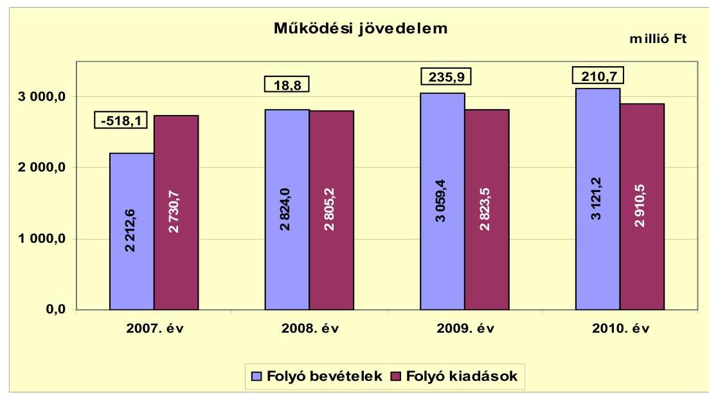

Az Önkormányzat működési jövedelmének egyenlege 2007-ben negatív volt az előző évi maradvány visszafizetési kötelezettség teljesítése, valamint a társadalom- és szociálpolitikai juttatások kiadásainak növekedése miatt. A működési jövedelem a 2008-2010. években pozitív előjelű volt, annak következtében, hogy a folyó bevételek meghaladták a folyó kiadásokat.

A 2007. évi folyó bevételek nem nyújtottak fedezetet a folyó kiadásokra, emiatt az Önkormányzat külső finanszírozást vett igénybe. A folyó bevételek 2008. évi növekedésében meghatározó szerepe volt a saját működési bevételek - ezen belül pedig a helyi adókból és pótlékokból származó bevételek - emelkedésének. A folyó bevételek 2008-ban az előző évhez képest 27,6\%-kal (611,4 millió Ft-tal) növekedtek döntően a helyi adóbevételek 58,6\%-os (324,4 millió Ft) növekedése, egy új, az iparűzési adóbevétel felét teljesítő adózó belépése miatt. A saját bevételek ilyen mértékű függése egy vállalkozás éves teljesítményétől az Önkormányzat számára működési kockázatot jelent. A forrásszabályozás 2008. évi változása miatt a költségvetési támogatások és átengedett bevételek együttesen 116,0 millió Ft-tal növelték a 2008. évi folyó bevételeket az előző évhez képest. A 2009-2010. években a helyi adóbevételek további növekedése emelte a folyó bevételek értékét a költségvetési támogatások és átengedett bevételek érdemben változatlan szintje mellett. A folyó kiadások növekedése 2010-ben meghaladta a folyó bevételekét, emiatt a működési jövedelem 10,7\%-kal (25,2 millió Ft) csökkent 2009-hez képest.

Az Önkormányzat 2007. évi működési jövedelme -518,1 millió Ft volt, a hiteltörlesztés alapjául az év során kibocsátott kötvény forrása szolgált. A 2008-2010. évek között elért összes működési jövedelem 465,4 millió Ft megtakarítást mutatott, ami forrásul szolgálhatott a fejlesztésekhez és hiteltörlesztéshez.

Az Önkormányzat a 2007-2010. években a helyi önkormányzatok működőképességének megőrzését szolgáló kiegészítő támogatásban nem részesült.

---

Az Önkormányzat nettó működési jövedelmi pozíciójának 2007-2010. évek közötti alakulását az alábbi ábra mutatja:
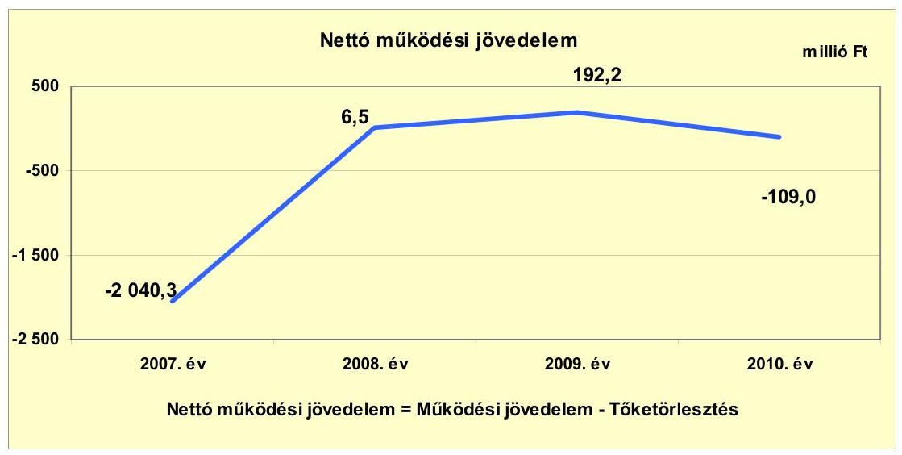

Az Önkormányzat pénzügyi kapacitása (tőketörlesztéssel csökkentett működési jövedelme) 2007-2009. évek között növekedett, majd 2010-ben csökkent. Értéke mind az időszak elején, mind a végén negatív értéket mutatott.

Az Önkormányzat 2007. évi nettó működési jövedelmét a folyó bevételeit 518,1 millió Ft-tal meghaladó folyó kiadásai, valamint a tárgyévben a kötvényforrásból teljesített hiteltörlesztés 1522,2 millió Ft értéke határozta meg. Refinanszírozás nélkül 2007. évben a nettó működési jövedelem 564,7 millió Ft-tal kedvezőbben alakult volna, amennyiben a 2007. évi költségvetési rendeletben tervezett hitelfelvétel 1158,2 millió Ft, a hiteltörlesztés 957,4 millió Ft összegben teljesül. Ez esetben a nettó működési jövedelem -1475,6 millió Ft-ban realizálódott volna.

A hiteltörlesztésekre a korábbi években megkezdett fejlesztésekhez (két iskola
 bővítése, útépítések, strandfejlesztés) igénybe vett fejlesztési célú hiteleknek (590,2 millió Ft), a folyószámla- és likvidhiteleknek (369,4 millió Ft és 562,6 millió Ft) az év során kibocsátott 2750,1 millió Ft összegű kötvényből rendelkezésre álló forrás részleges igénybevételével került sor.

A 2008. évben elért működési megtakarítás eredményeként a törlesztési kötelezettségek teljesítése után is pozitív volt a nettó működési jövedelem. Értéke 2009-ben az előző évhez képest a helyi adóbevételek növekedése, valamint a lekötött kötvényforrás kamatbevétele eredményeként az áttekintett időszak legmagasabb értékét mutatta.

A 2008. és a 2009. évben keletkezett folyó költségvetési egyenleg többlete fedezte az Önkormányzat által felvett hitelek tárgyévi törlesztési kötelezettségeit. A 2008-2010. években elért működési jövedelem összességében 89,7 millió Ft-tal haladta meg az időszak tőketörlesztését.

---

Az Önkormányzat felhalmozási költségvetési egyenlegének 2007-2010. évek közötti alakulását az alábbi ábra mutatja:

A 2007-2010. évek során az Önkormányzat felhalmozási költségvetésének egyenlege folyamatosan negatív előjelű volt, hiányt mutatott. A felhalmozási költségvetés hiányát a beruházási és felújítási kiadások - 2007. és 2009. években kiugró mértékben - a saját tőkebevételeket és kapott támogatásokat meghaladó összege okozta, melynek finanszírozásához a kötvényforrás bevételét vették igénybe. A felhalmozási költségvetés negatív előjele körültekintő költségvetési gazdálkodás és pénzügyileg fenntartható ${ }^{18}$ beruházások esetében elvileg nem jár magas pénzügyi kockázattal. A nettó működési jövedelem 2007. és 2010. években nem nyújtott fedezetet a felhalmozási költségvetés hiányára. A fejlesztési hiány fedezetét 2008. évben 55,5%-ban (6,5 millió Ft), 2009. évben 30,2%-ban (192,2 millió Ft) fedezte a nettó működési jövedelem.

Az Önkormányzat összes felhalmozási kiadása a 2007-2010. évek között 2043,1 millió Ft volt, amelyből beruházásokra és felújításokra összesen 1806,3 millió Ft kiadást teljesítettek. Az időszak során összesen 1024,7 millió Ft felhalmozási bevétel keletkezett.
2007. évben a saját tőkebevételek és államháztartáson belüli támogatások együttesen 224,9 millió Ft bevételével szemben beruházásokra és felújításokra 518,9 millió Ft kiadást teljesítettek. A 2007. évi felhalmozási hiány kialakulását a tárgyévben megvalósított útépítés és csapadékvíz-elvezetési beruházáshoz, valamint a bölcsőde építéséhez kapcsolódó forráshiány okozta, melynek kezelésére hitelt vettek fel.

[^0]
[^0]:    ${ }^{18}$ Pénzügyileg fenntartható beruházásnak minősül az, amelynek újként megjelenő, illetve többletként mutatkozó működtetési költségeire az Önkormányzat nettó működési jövedelme a következő években is fedezetet nyújt.

---

A 2009. évi kiugró arányú felhalmozási hiány az előző éveket meghaladó, 670,1 millió Ft összegű tárgyévi beruházási és felújítási kiadásokhoz - belterületi utak építése, kerékpárutak fejlesztése, csapadékvíz elvezetési beruházás - szükséges források hiánya okozta. 2010. évben a felhalmozási költségvetés hiánya a felhalmozási kiadások 11,2%-a ( 45,1 millió Ft) volt.

A 2010. évi hiány a 2009-ben megkezdődött és a tárgyévben befejeződött fejlesztések, valamint a pályázatokkal megvalósított beruházások kiadásaihoz szükséges források hiánya nyomán alakult ki, melyet a kötvényforrás bevonásával pótoltak. A 2007. és 2009. években a felhalmozási bevételek közül a pályázati források alacsonyabb mértékben realizálódtak.

Az Önkormányzatnál 2007-2010. évek között összesen 1018,4 millió Ft felhalmozási hiány keletkezett. A felhalmozási hiány fedezetét a 2007. évre áthúzódó 103,2 millió Ft hosszú lejáratú hitel lehívása, a kötvénykibocsátásból származó 453,3 millió Ft összegben bevont forrás, valamint folyószámlahitel igénybevételével biztosította.

Az Önkormányzat évenkénti teljes finanszírozási igénye ${ }^{19}$ a CLF módszer szerinti számítások alapján 2007-ben -2365,7 millió Ft, 2008-ban - 5,2 millió Ft, 2009-ben -444,0 millió Ft, 2010-ben -154,1 millió Ft volt. A teljes finanszírozási igény fedezetét 2007. évben a kötvénykibocsátás, likvid- és folyószámlahitel, a 2008-2010. években a működési jövedelem megtakarítása és folyószámlahitel biztosította. Az Önkormányzat finanszírozási műveletei egyenlegének alakulását 2007-2010 között az alábbi ábra szemlélteti:
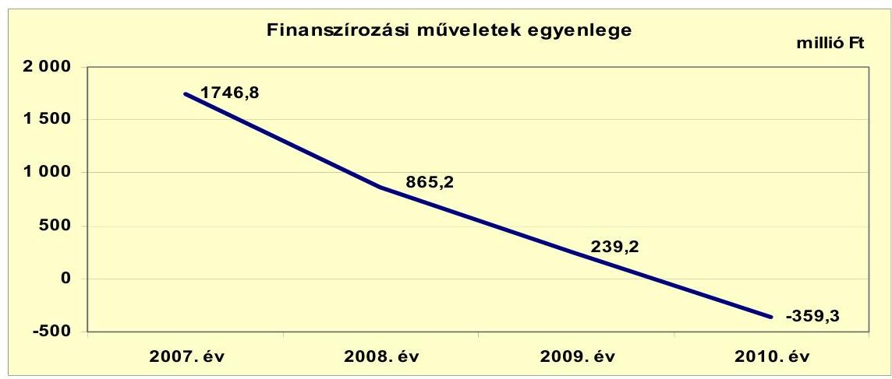

A finanszírozási műveletek egyenlegét a kötvénykibocsátásból származó bevétel, a folyószámlahitel igénybevételek, továbbá a hiteltörlesztésre fordított kiadások határozták meg. Az Önkormányzat 2007. évben kötvényt bocsátott ki, amely bevételből korábban felvett hiteleket törlesztett és az átmenetileg fel nem használt forrást betétben helyezte el. A kötvényforrásból származó bevétel 2007-2010. években történt folyamatos felhasználása és a 2008. évtől ismétel-

[^0]
[^0]:    ${ }^{19}$ A CLF módszer szerinti teljes finanszírozási igény a nettó működési jövedelem és a felhalmozási költségvetés eredője.

---

ten igénybevett folyószámlahitel miatt a finanszírozási műveletek egyenlege folyamatosan csökkent. 2010. évben ez az egyenleg negatív lett, a folyószámlahitel állománya 276,0 millió Ft és a három fejlesztési célú hitel törlesztése - 43,7 millió Ft - eredményeként. A finanszírozási célú műveleteket a jelentés 2. számú mellékletének 4.1.-4.8. pontjai részletezik.

A 2007-2008. években a betételhelyezések ${ }^{20}$ - szabálytalanul - a kiegyenlítő kiadások között jelentek meg, - értékük 2007. évben 870 millió Ft, 2008. évben 1000 millió Ft volt - mely csökkentette a finanszírozási műveletek egyenlegét. A 2009. évben a lekötések szabályos könyvelése eredményeként a kiegyenlítő kiadások korrekciója megtörtént, amely változások hatásai átvezetésre kerültek a 2. számú mellékletben. A 2007-2008. években az Önkormányzat az Áhsz. 9. számú melléklete 3. pontjában foglaltak ellenére a betétlekötések miatti számlák közötti pénzmozgásokat csak kiegyenlítő bevételként és kiegyenlítő kiadásként számolták el, a lekötött betétek állományba vétele lekötött betétszámlán nem történt meg. A betétlekötések könyvviteli elszámolása a 2009. évtől az Áhsz-ben előírtaknak megfelelően történik.

Az Önkormányzat a 2007-2010. évi zárszámadási rendeleteiben működési és felhalmozási kiadását a CLF módszertől eltérő módon ${ }^{21}$ mutatta be, amelyet a jelentés 1. számú melléklete tartalmaz. Az Önkormányzat 2007. évben 426,8 millió Ft működési és 416,7 millió Ft felhalmozási hiányt, 2008. évben 108,5 millió Ft működési többletet és 101,4 millió Ft felhalmozási hiányt mutatott ki. 2009. évben a zárszámadási rendeletekben rögzített működési többlet 204,0 millió Ft, a felhalmozási hiány 604,3 millió Ft volt. 2010-ben 228,2 millió Ft működési többletet és 62,6 millió Ft felhalmozási hiányt mutattak be.

Az Önkormányzat kamatbevételeinek és kamatkiadásainak évenkénti értékét az alábbi ábra mutatja:
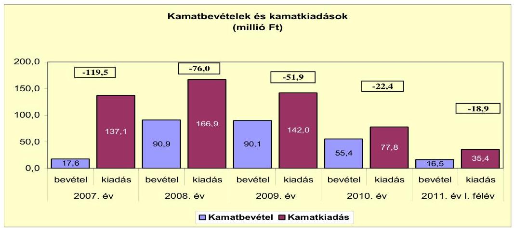

[^0]
[^0]:    ${ }^{20}$ A betétek összege nemcsak a kötvénykibocsátásból származó bevétel maradványát tartalmazta. 2007. évben a 199,3 millió Ft kötvénybevétel egy részét átmenetileg bevonták a fejlesztési feladatok finanszírozásába a pályázati források megelőlegezése céljából, másik része pedig a pénzeszközök között maradt, ami 2007. december 31-én 144,5 millió Ft volt. 2008. évtől a betétlekötések során egyéb pályázati forrást - előlegeket - is lekötöttek átmenetileg.
    ${ }^{21}$ Nincs kötelező előírás a működési és fejlesztési hiány megállapításának módjára.

---

Az Önkormányzat 2007-2011. év I. féléve között összesen 559,1 millió Ft kamatot fizetett meg. A 2010. évben kifizetett kamatok összege 45,2%-kal (64,2 millió Ft-tal) mérséklődött az előző évhez viszonyítva, melyet a hosszú lejáratú hitel állomány csökkenése mellett a kedvezőbb referencia ${ }^{22}$ kamatok eredményeztek. A 2010. évi kamatkiadás a 2007-2009. évek átlagához képest közel a felére, 52,3%-ra (148,7 millió Ft-ról 77,8 millió Ft-ra) csökkent. Az Önkormányzat átmenetileg szabad pénzeszközein realizált kamatbevétele a vizsgált időszakban 270,5 millió Ft volt, döntően a fel nem használt kötvényforrás betéti lekötéséből származott.

A 2011. év I. félévi költségvetési beszámoló alapján az Önkormányzatnak 35,4 millió Ft kamatkiadása keletkezett és 16,5 millió Ft kamatbevételt realizált. A 2011. év I. félévi kamatráfordítás időarányos teljesítése közel azonos szintű a 2010. évivel, a kamatbevétel azonban 40,0%-kal (11,2 millió Ft-tal) elmaradt a 2010. évi időarányos kamatbevételtől.

# 2.2. Az Önkormányzat bevételeinek változása 

Az Önkormányzat 2010. évi 3121,2 millió Ft összegű folyó bevétele 15,7%-kal (417,0 millió Ft-tal) haladta meg a 2007-2009. évek átlagát.

Az Önkormányzat folyó bevételeinek 2007-2011. év I. féléve közötti alakulását az alábbi ábra szemlélteti:
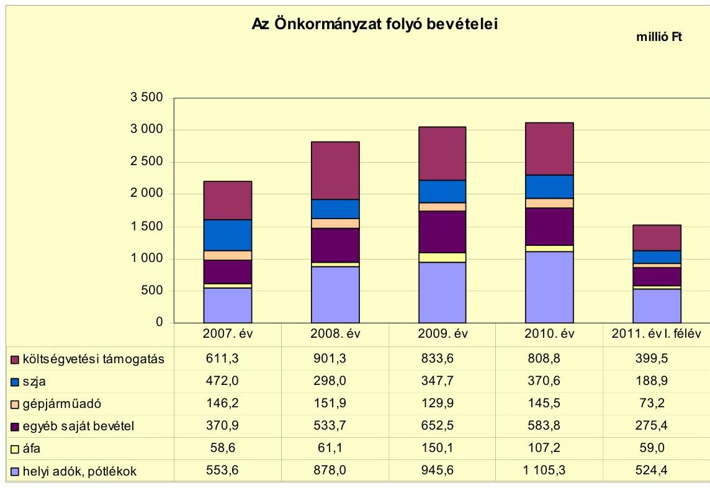

[^0]
[^0]:    ${ }^{22}$ Az utolsó lehíváskori referencia és kamatfelárak a kibocsátáskorihoz képest 27,2%-70,9% közötti arányokkal csökkentek.

---

A 2007-2009. évek során a helyi adóbevételek átlagosan 29,4%-ot, az szja és költségvetési támogatás 42,8%-ot, az áfa, gépjárműadó és egyéb bevételek 27,8%-ot tettek ki a folyó bevételekből. Az arányok megváltozásával a 2010. évi folyó bevételek 35,4%-át adták a helyi adóbevételek, 37,8%-át az szja és a költségvetési támogatás együttese, míg a további 26,8%-át az áfa és a gépjárműadó tette ki, valamint egyéb bevételekből származott.

A költségvetési támogatás és az szja együttes bevétele a 2008. évben az előző évhez képest 10,7%-kal ( 116,0 millió Ft ) növekedett a 13. havi illetmények központi elszámolása, valamint az óvodai és általános iskolai ellátottak számának növekedése miatt. A 2009. évtől 2011. év I. félévéig a költségvetési támogatás és a helyben maradó szja értéke közel azonos szintet mutatott. A 2007-2009. évek átlagához képest a 2010. évben az szja bevételek és költségvetési támogatások növekedése 2,2% ( 24,8 millió Ft ) volt.

A gépjárműadó bevételének hullámzását a fizetésre kötelezettek és az adótárgyakként szereplő gépjárművek számának emelkedése indokolta. A 2010. évben mutatkozó növekedés a fokozott behajtási tevékenység eredménye.

A helyi adók és pótlékok beszedéséből az Önkormányzatnak 2007-2010. évek között összesen 3482,5 millió Ft saját bevétele keletkezett. A 2007-2009. évek átlagához képest 2010. évben a helyi adóbevételek 39,5%-kal (312,9 millió Ft) növekedtek. A 2007-2010. évek között a helyi adóbevételek évente emelkedtek egy nagy adóalapú vállalkozás adókedvezményének 2008. évi megszűnése és az iparűzési adó mértékének növelése, az építményadó alapjának kiterjesztése és a hátralék behajtási tevékenység eredményeként.

Az Önkormányzat 2007-ben építményadót, telekadót, magánszemélyek kommunális adóját, idegenforgalmi adót (épület után), valamint iparűzési adót alkalmazott a lakosság, illetve a vállalkozások, mint adóalanyok körében. A kivetett helyi adók közül a magánszemélyek kommunális adóját és az épületek utáni idegenforgalmi adót - az ezekből származó együttes adóbevétel 2007-ben nem érte el az ötmillió Ft-ot, a helyi adóbevételek egy százalékát - 2009-ben megszüntették. Az építményadó kötelezettséget 2007-ben a nem lakáscélú ingatlanokon túl kiterjesztették a lakáscélú ingatlanokra is.

A helyi adóbevételek meghatározó részét 2007-2011. évek között az iparűzési adó bevétele jelentette. Mértékét az Önkormányzat rendeletében 2007. évben 1,8%-ban határozták meg, amit 2008. évtől 2010. évi 2,0%-ra emeltek. 2011. évtől az iparűzési adó mértékét 1,9%-ra csökkentették annak érdekében, hogy a városba települt cégek számára kedvezőbb vállalkozási környezetet biztosítsanak.

A 2010-ben beszedett helyi adóbevételek 67,4%-a (745,2 millió Ft) az iparűzési adóból, 23,8%-a (263,3 millió Ft) az építményadóból, 6,7%-a ( 74,1 millió Ft) a telekadóból származott. További 2,1%-ot (22,9 millió Ft) tettek ki a magánszemélyek kommunális adójából, idegenforgalmi adóból és pótlékokból, bírságokból eredő bevételek. Az iparűzési adóbevétel 2008. évben az előző évhez képest közel kétszeresére - 278,6 millió Ft-ról 531,8 millió Ft-ra - emelkedett. A növekedést a korábban biztosított, időhatárhoz kötött adókedvezmények lejárta eredményezte. 2009-ben 2008-hoz képest a növekedés 5,9% (31,5 millió Ft) volt. Az iparűzési adóbevétel 2010. évben az előző évhez képest további 32,3% növekedést ( 181,9 millió Ft) mutatott, a növekedés mögött az adóbevétel meg-

---

határozó hányadát teljesítő gazdasági társaság üzleti évében elért
 kiugró árbevétele állt.

Az iparűzési adóbevételben meghatározó súlyt képviselő vállalkozás 2007-ben adómentességet élvezett, 2008-ban az összes iparűzési adóbevétel harmadát, 2010-ben már felét fizette meg.

Az iparűzési adóbevételek koncentrációja, az éves adóbevétel felének egy vállalkozás éves teljesítményétől való függése az Önkormányzat bevételeinek tervezésénél a jövőben működési kockázatot jelenthet.

Az egyéb saját bevételek 2010. évben az előző évek átlagához képest 12,5%-kal (65,0 millió Ft) emelkedtek. Az áfa bevételek 2009. évben a megnövekedett beruházási kiadások következtében mutattak két és félszeres növekedést az előző évhez képest.

Az Önkormányzatnak a 2007-2011. év I. féléve közötti időszakban a tulajdonosi részesedései ${ }^{23}$ alapján osztalékbevétele nem keletkezett.

Az Önkormányzat felhalmozási és tőkejellegű bevételeinek 2007-2011. év I. féléve közötti alakulását az alábbi adatok szemléltetik:

| Megnevezés | 2007. év | 2008. év | 2009. év | 2010. év | 2011. év I. félévi |
| :--: | :--: | :--: | :--: | :--: | :--: |
| Tárgyi eszköz értékesítés | 59,9 | 251,6 | 15,9 | 34,1 | 7,5 |
| Egyéb saját tőkebevétel | 1,2 | 0,3 | 0,2 | 0,2 | 0,0 |
| Államháztartáson belülről kapott támogatás | 163,8 | 64,4 | 63,4 | 323,4 | 99,1 |
| EU-tól és külföldről kapott támogatások | 0,0 | 0,0 | 0,0 | 0,0 | 0,0 |
| Államháztartáson kívülről kapott támogatás | 18,7 | 18,4 | 8,1 | 1,1 | 6,5 |
| Összes felhalmozási bevétel | 243,6 | 334,7 | 87,6 | 358,8 | 113,1 |

Az Önkormányzatnak a 2007-2011. év I. féléve között összesen 1137,8 millió Ft felhalmozási bevétele keletkezett. A felhalmozási bevételeken belül 62,8% (714,1 millió Ft) az államháztartáson belülről kapott támogatások részaránya volt. Az államháztartáson belülről kapott támogatások 2007. és 2010. években a pályázati forrásból megvalósított bölcsőde- és útépítés, valamint kerékpárútépítéshez és belterületi utak fejlesztéséhez, csapadékvíz elvezetéshez kapott támogatásokat tartalmazták. A tárgyi eszközök értékesítése 32,4% részarányt (369,0 millió Ft) képviselt, mely ingatlanok, építési telkek és egy nem használt iskolaépület 2008. évi értékesítésének eredménye (210,0 millió Ft) volt. Az egyéb saját tőkebevételek és államháztartáson kívülről kapott támogatások együttesen 4,8% részarányt (54,7 millió Ft) képviseltek.

[^0]
[^0]:    ${ }^{23}$ A Gödbusz Kft. (2008-tól 2009-ig "F.a.") 2009-ig, a Göd Városi Kommunikációs Nonprofit Kft. 2011-től szerepel az Önkormányzat vagyonelemei között.

---

# 2.3. Az Önkormányzat működési és felhalmozási célú kiadásainak változása 

Az Önkormányzat folyó (működési) kiadásainak 2007-2011. év I. féléve közötti alakulását az alábbi táblázat mutatja be:

| Megnevezés | 2007. év | 2008. év | 2009. év | 2010. év | 2011. év   félév |
| :--: | :--: | :--: | :--: | :--: | :--: |
| Folyó kiadások | 2730,7 | 2805,2 | 2823,5 | 2910,5 | 1386,0 |
| Működési kiadások (kamatkiadás nélkül) | 2422,6 | 2414,6 | 2469,2 | 2595,8 | 1227,8 |
| Államháztartáson belülre átadott pénzeszközök | 16,3 | 30,0 | 20,7 | 42,8 | 21,3 |
| Transzferkiadások | 134,5 | 137,6 | 171,2 | 194,1 | 87,7 |
| -ebből: vállalkozásoknak | 21,7 | 13,0 | 14,8 | 26,3 | 7,0 |
| EU-nak, illetve külföldre | 0,0 | 0,1 | 0,0 | 0,0 | 0,3 |
| magánszemélyeknek | 83,5 | 97,3 | 126,7 | 133,4 | 50,2 |
| nonprofit szervezeteknek | 29,3 | 27,2 | 29,7 | 34,4 | 30,2 |
| Kamatkiadások | 137,1 | 166,9 | 142,0 | 77,8 | 35,4 |
| Előző évi pénzmaradvány átadás | 20,2 | 56,1 | 20,4 | 0,0 | 13,8 |

Az Önkormányzat folyó kiadásai 2010-ben 4,5%-kal (124,0 millió Ft-tal) növekedtek a 2007-2009. évek átlagához képest. Az államháztartáson belülre átadott pénzeszközöknél 2007-ben a kistérségi hozzájárulás, valamint a szerb kisebbségi önkormányzatnak történt átadás szerepelt. 2008-ban a kistérségi hozzájárulás emelkedése, 2010-ben a TESZ részére átadott 17,9 millió Ft pályázati pénzeszköz miatt volt növekedés. A transzferkiadások 2010-ben az előző három év átlagához képest 31,3% növekedést mutattak a magánszemélyek részére teljesített kifizetések 30,1%-os (30,9 millió Ft) növekedése miatt. 2009-ben a magánszemélyeknek történt kifizetések 30,2%-kal (29,4 millió Ft), 2010-ben további 5,3%-kal (6,7 millió Ft) növekedtek az előző évhez képest a közfoglalkoztatással kapcsolatos kifizetések, a méltányossági közgyógyellátás bevezetése és a segélykérelmezők számának megnövekedése következtében. Az Önkormányzat által 2010. évben kifizetett kamatok összege 45,2%-kal (64,2 millió Ft-tal) mérséklődött az előző évhez képest a hosszú lejáratú hitel állomány és a kötvény utáni kamatfizetési kötelezettség csökkenésének eredményeként.

Az Önkormányzat kiemelt működési előirányzatainak vizsgált időszaki teljesítését az alábbi táblázat szemlélteti:

|  |  |  |  |  | millió Ft |
| :-- | --: | --: | --: | --: | --: |
| Megnevezés | 2007. év | 2008. év | 2009. év | 2010. év | 2011. év   félév |
| Személyi juttatások | 1153,1 | 1244,6 | 1211,5 | 1285,0 | 597,6 |
| Munkaadót terhelő járulékok | 360,5 | 386,3 | 355,5 | 332,1 | 157,7 |
| Dologi kiadások | 631,9 | 756,2 | 859,0 | 940,4 | 439,0 |
| Egyéb folyó kiadások | 63,5 | 27,5 | 43,2 | 38,3 | 33,8 |

Az Önkormányzat járulékokkal növelt személyi juttatás kiadásai 2008. évben az előző évhez képest 7,7%-kal (117,3 millió Ft) növekedtek az oktatási és szociális ágazatban foglalkoztatottak létszámának növekedése miatt. 2010-ben a 2007-2009. évek átlagához képest 3,0% (46,6 millió Ft) volt a növekedés. A dologi kiadások 2007-2010. évek között évente átlagosan 12,2%-os (102,8 millió Ft), de csökkenő ütemű növekedést mutattak, összefüggésben a telephelyek számának 2009. évben öttel (a TESZ-hez tartozó, korábban telephelyként nem

---

szereplő géptelep, a strand és két konyha, valamint egy bölcsőde) és 2010-ben kettővel (egy óvodai és egy szociális telephely) történt bővülésével. A 2011. év I. félévében ez a kiadásnem is az előző évi időarányos érték alatt maradt 6,6%-kal (31,2 millió Ft).

Az Önkormányzat 2007-2011. év I. féléve alatti folyó és felhalmozási kiadásainak alakulását az alábbi ábra mutatja:
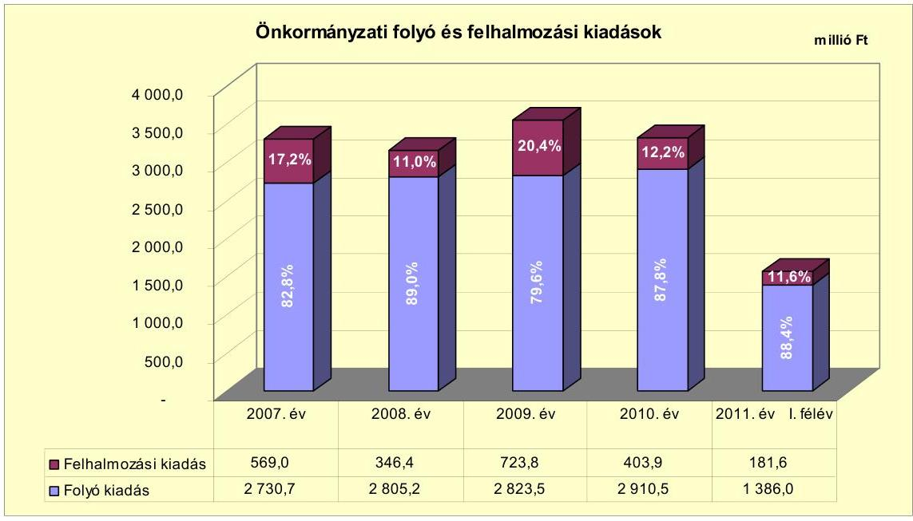

A folyó kiadások 2008-ban 2,7% (74,5 millió Ft), 2009-ben 0,7% (18,3 millió Ft), 2010-ben 3,1% (87 millió Ft) növekedést mutattak az előző évhez képest.

A felhalmozási kiadások összege 2007-2010. évek között összesen 2043,1 millió Ft volt. A felhalmozási kiadások alakulása az időszak során hullámzó értéket mutatott, összefüggésben a 2007. és 2009. években végrehajtott kiugró mértékű beruházási és felújítási feladatokkal. A 2007. évi beruházási és felújítási kiadások 518,9 millió Ft-ot tettek ki a bölcsődeépítés, belterületi útépítések és csapadékvíz elvezetés, valamint a meleg vizű strand fejlesztése miatt. 2008. évben a beruházási és felújítási kiadás 283,9 millió Ft volt. A 2009. évben teljesült 670,1 millió Ft beruházási és felújítási kiadás 136,0% növekedést mutat az előző évhez képest a 100 fős óvoda és melegítőkonyha, a kerékpárút-építés és csapadékvíz-elvezetés, valamint az idősek otthona fejlesztése és a szemétszállítás eszközbővítése miatt. A 2010. évben megvalósult fejlesztés 333,4 millió Ft-ra, az előző évi felére csökkent.

Az Önkormányzat által a 2007-2010 között megvalósított, 2010. december 31-éig befejezett fejlesztések bekerülési értéke 2375,4 millió Ft volt. A fejlesztések 25,9%-át, 614,6 millió Ft-ot 2006. december 31-ig, 74,1%-át, 1760,8 millió Ft-ot pedig 2007-2010. években fizettek ki. A 2007-2010. évi kifizetések arányát a pályázati előírásoknak való megfelelés, az évközi döntéssel megvalósított 10 millió Ft alatti fejlesztési feladatok és a közbeszerzés - a vállalkozók versenyeztetése - eredményei befolyásolták. A 10 millió Ft teljes bekerülési költség felett 21 fejlesztési feladat, 10 millió Ft alatt pedig összesen 466 fejlesztési feladat valósult meg. A fejlesztések forrásainak 27,1%-át (644,0 millió Ft-ot) saját felhalmozási és tőkebevételből biztosították. A pénzintézeti forrás részaránya 43,6% (1036,0 millió Ft) volt, melyből 21,3% (505,0 millió Ft) a kötvényből, 78,7% (531,0 millió Ft) hitel igénybevételből származott. A hitel igénybevétele a 2007 előtti kifizetéshez kapcsolódott.

A fejlesztések megvalósításához 29,3% (695,4 millió Ft) támogatást realizáltak, melyből hazai, településfejlesztési forrás 2,3% (54,8 millió Ft), a többi EU-s támogatás volt. A pályázati források megelőlegezése likviditási gondot okozott, ezért átmeneti jelleggel a folyószámlahitelt vették igénybe a fejlesztések finanszírozására. A folyószámlahitel - mint likvid hitel - fejlesztési célú igénybevétele nem volt összhangban Ötv. 88. § (3) bekezdés d) pontjában ${ }^{24}$ foglaltakkal, mely szerint "likvid hitel: a közszolgáltatási és államigazgatási feladatok folyamatos működtetéséhez felvett hitel". A megvalósított fejlesztések döntően önkormányzati épületek, intézmények felújításából, útépítésekből, csapadékvíz-elvezetés kivitelezéséből, ingatlanvásárlásokból tevődtek össze. Az Önkormányzat 2007-2010. években megvalósított, 2010. december 31-ig befejezett fejlesztéseit és azok forrásösszetételét a jelentés 3/a. számú melléklete tartalmazza.

Az Önkormányzatnál 2010. december 31-én egy fejlesztési feladat megvalósítása volt folyamatban, melynek várható bekerülési költsége 176,1 millió Ft. A Kastély Központi Óvoda kapacitás bővítése forrásának 46,3%-át (81,6 millió Ft-ot) a kibocsátott kötvény fel nem használt bevételéből, 53,7%-át (94,5 millió Ft-ot) pedig EU-s támogatásból tervezték biztosítani. E beruházásra 2010. december 31-ig 45,4 millió Ft-ot fizettek ki, melynek 76,7%-át (34,8 millió Ft-ot) EU-s támogatásból finanszíroztak. Az Önkormányzat 2011. év I. félévében nem indított önerőből fejlesztést. Az Önkormányzat 2010. december 31-én folyamatban lévő fejlesztési feladatait és kifizetéseinek forrásösszetételét a jelentés 3/b. számú, a fejlesztések fennálló kötelezettségeit és forrásösszetételét a jelentés 3/c. számú melléklete tartalmazza.

Az Önkormányzat adatszolgáltatása szerint beadott, elbírálás alatt lévő pályázattal nem rendelkezett.

Az Önkormányzat három legmagasabb bekerülési költségű fejlesztése útépítéshez és csapadékvíz-elvezetéshez, egy 60 férőhelyes bölcsőde építéséhez, valamint kerékpárút fejlesztéshez kapcsolódott.

- Az Önkormányzat tulajdonában és kezelésében lévő közutak (földút szilárd burkolattal való ellátása) építése, valamint a megépített utakhoz kapcsolódó vízelvezetés megvalósítása 2006. évben kezdődött, műszaki befejezése a 2007. évben megtörtént. A beruházás 2007. évben teljesített költsége 120 millió Ft volt. A beruházást az „Önkormányzati Infrastruktúra Fejlesztési Hitelprogram" keretében kedvezményes kamatozású forinthitel igénybevételével valósították meg. A beruházás 654,3 millió Ft bekerülési költségét 531,0 millió Ft hitelből és 123,3 millió Ft saját bevételből finanszírozták. A fejlesztés eredményeként megvalósult $3390 \mathrm{~m}^{2}$ útépítés és az ezekhez tartozó csapadékvíz-elvezetés, valamint 35 db hordalékfogó telepítése.

[^0]
[^0]:    ${ }^{24}$ 2011. december 31-től a Stabilitási tv. 10. § 4) bekezdése

---

- A „Társadalmi befogadást támogató szolgáltatások infrastrukturális fejlesztése" HEFOP pályázat keretén belül 60 férőhelyes bölcsőde építése beruházást a 2006-2007. években valósították meg. A beruházás 2007. évben kifizetett költsége 221,5 millió Ft volt, a 2006. december 31-ig teljesített kiadás pedig 77,7 millió Ft. A fejlesztés forrását 80%-ban (239,2 millió Ft) EU-s támogatás biztosította. További 6,3% forrást (18,9 millió Ft) a kötvénybevétel, míg 13,7%-ot (41,1 millió Ft) a saját
 bevételek jelentettek. A beruházás eredményeként megvalósult a 60 férőhelyes bővítés, valamint a rugalmas napközbeni ellátások feltételeinek megteremtése.
- A Képviselő-testület 2007. évi döntései alapján 2009-2010. években megvalósult a „Kerékpárutak fejlesztése, Göd: Alsógöd- Felsőgöd-Újtelep (Bócsa) közötti hivatásforgalmi kerékpárút létesítése" 241,2 millió Ft költséggel. A kerékpárút megépítése a KMOP keretében történt, 151,1 millió Ft EU-s támogatással, 78,4 millió Ft saját bevétel és 11,7 millió Ft kötvény forrás felhasználásával.

A vizsgált időszakban az önkormányzati feladatellátáshoz kapcsolódóan a menetrend szerinti helyi személyközlekedés üzemeltetéséhez egy gazdasági társaság, a Közlekedési Kft. részesült működési támogatásban. A támogatás összege 2007-ben 7,7 millió Ft, 2008-ban 10,0 millió Ft, 2009-ben 10,3 millió Ft, 2010-ben 9,6 millió Ft, 2011. év I. félévében 5,8 millió Ft volt. Az Önkormányzat által a Közlekedési Kft. részére közszolgáltatási szerződés alapján nyújtott működési célú pénzeszköz átadás 2007-2011. év I. féléve között összesen 43,4 millió Ft-ot tett ki. Felhalmozási célú támogatást gazdasági társaságok részére nem nyújtottak. Az önkormányzati feladatok ellátásában részt vevő gazdasági társaságokkal kapcsolatos adatokat a jelentés 4. számú melléklete tartalmazza.

# 3. Az ÖNKORMÁNYZAT KÖTELEZETTSÉGEI 

### 3.1. Az Önkormányzat pénzintézeti kötelezettségeinek változása

Az Önkormányzat rövid és hosszú lejáratú kötelezettségeinek állománya 2006. december 31-i 1930,4 millió Ft-ról 2010. december 31-re 4782,7 millió Ft-ra emelkedett, amely 2011. június 30-ra 149,9 millió Ft-tal csökkent (4632,8 millió Ft-ra). A rövid és hosszú lejáratú kötelezettségből a pénzintézeti kötelezettség 2006. december 31-én 1657,9 millió Ft, 2010. december 31-én 4657,5 millió Ft, 2011. június 30-án 4565,8 millió Ft volt.

A vizsgált időszakot tekintve a fennálló pénzintézeti kötelezettség 2006. december 31-én fejlesztési, likvid- és folyószámlahítelekből állt. A 2007-2010. évek végén, valamint 2011. június 30-án meglévő pénzintézeti kötelezettség több mint 66,1 %-a (18 093,0 ezer CHF) kötvénykibocsátásból keletkezett. A fejlesztési hitel 2007. év végi 641,5 millió Ft-ról 2011. év I. félév végére 19,9%-kal csökkent 513,9 millió Ft-ra a szerződés szerinti tőketörlesztések eredményeként. Az Önkormányzatnak 2007-2011. év I. félév között a folyószámlahitel állománya át-

---

lagosan 109,8 millió Ft volt. Likvid hitel ${ }^{25}$ állománya 160,0 millió Ft 2006. év végéről származott, annak kifizetése a 2007. évben megtörtént. 2007. január 1. és 2011. év I. félév között a rövid lejáratú kötelezettségek állományának ingadozását a folyószámlahitel év végi állományának nagysága befolyásolta, a 2009. évben 362,4 millió Ft volt, míg 2011. év I. félév végén 25,2 millió Ft. A 2008. évtől a három hosszú lejáratú fejlesztési hitelből származó rövid lejáratú kötelezettség 43,7 millió Ft volt.

Az Önkormányzat pénzintézeteknél fennálló kötelezettség-állományát ${ }^{26}$ a 2007-2010. években és a 2011. év I. félévben az alábbi ábra szemlélteti:
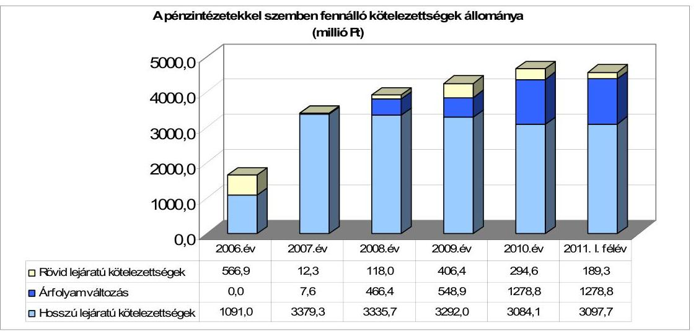

A deviza alapú kötvény kötelezettség év végi könyvviteli mérleg szerinti értékének meghatározásakor az árfolyamváltozás miatti év végi értékelést a 2007-2010. években elvégezték. Az árfolyamváltozás nagysága, valamint annak folyamatos emelkedése az Önkormányzat számára növekvő visszafizetési kockázatot jelent, mert a 2007. évi 7,6 millió Ft-ról 2011. év I. félév végére 1278,8 millió Ft-ra nőtt az árfolyamváltozás miatti kötelezettség.

Annak megítéléséről, hogy a devizában fennálló hitel vagy kötvény visszafizetése, illetve visszavásárlása az Önkormányzat számára forintban összességében többletkiadást (árfolyamveszteség) vagy kiadási megtakarítást (árfolyamnyereség) eredményez, a futamidő végén, a teljes kötelezettség rendezését követően lehet képet alkotni. Mindaddig, amíg törlesztési kötelezettség nem áll fenn (türelmi idő, moratórium), a tőkére vonatkoztatva nem értelmezhető sem az árfolyamveszteség, sem az árfolyamnyereség. Ugyanakkor a számviteli szabályok meghatározzák, hogy az árfolyam-különbözetet év végén a kötelezettségek vagy köve-

[^0]
[^0]:    ${ }^{25}$ A hitelszerződés szerint öt hónapig állt rendelkezésre a 2006. december 31-én igénybevett likvid hitel, azonban azt az önkormányzat 2007. március 29-én visszafizette.
    ${ }^{26}$ A 2. számú mellékletben a 2010. évi rövid lejáratú pénzintézeti kötelezettség 370,9 millió Ft, amely 76,3 millió Ft-tal (az árfolyamváltozás összegével) tér el az ábra adatától, 294,6 millió Ft-tól. Az eltérés abból adódik, hogy 2011-ben már van kötvény miatt tőketörlesztési kötelezettség, amelynek árfolyammal növelt értéke a rövid lejáratú kötelezettségek között szerepel a mérlegben. Az árfolyamváltozás számított összege 76,3 millió Ft volt a 2010. december 31-én fennálló állomány után.

---

lések között a könyvviteli mérlegben nyilván kell tartani, azonban árfolyamkülönbözet ebben az esetben ténylegesen nem képződött.

A Képviselő-testület a forráshiány, továbbá a korábbi években keletkezett adósság kezelése érdekében a 2007. évi és a 2010-2011. évi költségvetési rendeletekben hitel felvételével számolt, s felhatalmazta a polgármestert folyószámla- és munkabér-megelőlegezési hitel szükség szerinti igénybevételére. Ezek végrehajtása során a 2007. évben likvid- és munkabér-megelőlegezési hitel, a 2007-2011. év I. félév években további folyószámlahitel igénybevételére került sor. A 2007. évben kötvénykibocsátásról döntöttek, 2007. szeptember 20-án a kötvényt kibocsátották. A 2011. évi költségvetési rendeletben az Önkormányzat további 100,0 millió Ft beruházási célú hitelfelvételt tervezett. A költségvetés végrehajtása során a Képviselő-testület a hitelfelvétel elkerülése érdekében a tervezett beruházásai és dologi kiadásai átütemezéséről döntött ${ }^{27}$.

A pénzintézeti kötelezettségvállalás döntéseit megalapozó előterjesztésekben kitértek az adósságszolgálati korlát bemutatására. A 2008-2011. év I. félév során a döntések során nem lépték túl az adósságot keletkeztető kötelezettségvállalás felső határát. A 2007. évben a hitelek refinanszírozása miatt túllépte a kötelezettségvállalás felső határát, amely azonban nem jelent valós túllépést, mert hitelcsere történt.

Az Önkormányzat pénzintézeti kötelezettségvállalásaira minden esetben a Képviselő-testület döntése alapján került sor. A kötelezettségvállalásból származó források felhasználási céljait meghatározták. A döntéseket megalapozó előterjesztések tartalmazták a kötelezettségvállalás teljes futamidőre várható kamat- és tőkefizetési kötelezettségeit az akkor ismert kondíciókkal. A kötvény kibocsátásáról szóló döntés előtt az árfolyam- és kamatkockázatokat bemutatták, azoknak az Önkormányzat pénzügyi helyzetére való kihatására felhívták a figyelmet. A kötelezettségvállalás visszafizetési forrásait a mindenkori költségvetés megképződő működési bevételei terhére határozták meg, azonban a 2007. évben a negatív működési jövedelem erre fedezetet nem nyújtott. Hiteleket más pénzintézetektől is vettek igénybe a közbeszerzési eljárások eredményeként.

---

Az Önkormányzat 2011. június 30-án HUF-ban fennálló hosszú lejáratú fejlesztési célú hitelszerződései a következők voltak:

| Megnevezés | Szerződéskötés   idöpontja | Összeg   millió Ft-ban | Kamat (referencia   kamat+ kamatfelár) | Felhasználás célja: |
| :-- | :--: | :--: | :--: | :-- |
| Beruházási kölcsön "Beruházás   a XXI. századi iskolába"   pályázat megvalósítására | 2004.06.04 | 135 | 6 havi BUBOR $+1,0 \%$ | Németh László Általános   Iskola tornaterem és a   kapcsolódó kiszolgáló   egységek építésére |
| Kedvezményes kamatozású   kölcsön a Sikeres   Magyarországért Önkormányzati   Fejlesztési Hitelprogram "2." cél | 2006.03.16 | 504 | 3 havi EURIBOR   $+1,4863 \%$ | kőzutak építése |
| Kedvezményes kamatozású   kölcsön a Sikeres   Magyarországért Önkormányzati   Fejlesztési Hitelprogram "1." cél | 2006.03.16 | 27 | 3 havi EURIBOR   $+1,107 \%$ | csapadékvíz elvezetés   szolgáló beruházás |

A hosszú lejáratú hitelét az Önkormányzat a kölcsönszerződésben meghatározott fejlesztési feladatok finanszírozására használta fel. Az Önkormányzat 2007-2011. év I. félév között forintban fennálló pénzintézeti kötelezettségeire 717,8 millió Ft tőkét törlesztett és 170,5 millió Ft kamatot fizetett, melyből a 2007. évben végrehajtott hitelkonszolidáció után megmaradt három hitel esetében az Önkormányzat 139,9 millió Ft tőkét törlesztett és 135,6 millió Ft kamatot fizetett. Az Önkormányzatnak a hosszú lejáratú fejlesztési célú hiteleivel kapcsolatban - a jelenleg ismert kondíciókkal számolva - a 2011-2013. években 205,7 millió Ft, a 2014. évtől kezdődő időszakban 489,6 millió Ft tőke- és kamatfizetési kötelezettsége keletkezik.

Az Önkormányzat 2011. június 30-án CHF-ben fennálló adósságot keletkeztető kötelezettségvállalása az alábbi volt:

| Megnevezés | Kibocsátás   idöpontja | Összeg   ezer CHF-ben | Kibocsátási árfolyam | Kamat (referencia kamat+   kamatfelár) | Felhasználás célja: |
| :--: | :--: | :--: | :--: | :--: | :--: |
| "FIDUCIA" kötvény | 2007.09.20 | 18093 | 152,0 | 6 havi CHF LIBOR $+0,80 \%$ | a kibocsátó beruházás   finanszírozási igényének   biztosítása és   hitelszerkezetének   konszolidálása |

A Képviselő-testület 2007. évben döntött „FIDUCIA" elnevezésű zártkörű, fejlesztési célú, svájci frank alapú kötvény kibocsátásáról 18093,0 ezer CHF, 2750,1 millió Ft értékben. A kötvénykibocsátás célja az Önkormányzat beruházás finanszírozási igényeinek biztosítása és hitelszerkezetének konszolidálása volt. Az Önkormányzat 2007-2011. év I. félév között devizában fennálló pénzintézeti kötelezettségeire 540,1 ezer CHF (112,8 millió Ft) tőkét ${ }^{28}$ törlesztett és 1526,2 ezer CHF (274,4 millió Ft) kamatot fizetett. A kötvényhez kapcsolódóan az Önkormányzatnak a jelenlegi kondíciókkal számítva a 2011-2013. években 3779,8 ezer CHF, illetve a 2014. évtől kezdődő időszakban 16037,2 ezer CHF tőke- és kamatfizetési kötelezettsége várható.

[^0]
[^0]:    ${ }^{28}$ A kötvény tőketörlesztésére türelmi idő volt, a kamatfizetési kötelezettség teljesítése azonban a kötvénykibocsátás után megkezdődött. Első tőketörlesztésre 2011. április 15-én került sor.

---

A fejlesztési célú hiteleket a kölcsönszerződésekben meghatározottak alapján használták fel, a kötvénykibocsátásból származó bevételt a vizsgált időszakban a kibocsátási célokra fordították.

A kötvénykibocsátásból származó bevételből a 2011. év I. félévig a hitelek konszolidálására és a hosszú lejáratú fejlesztési célú hitelek tőketörlesztésére összesen 1814,5 millió Ft-ot fizettek ki, a fejlesztési feladatokhoz kapcsolódóan pedig 802,9 millió Ft felhasználásáról döntött ${ }^{29}$ a Képviselő-testület. A Képviselőtestület döntése alapján a 2011. év I. félévében 90,0 millió Ft-ot a kötvény 2011. év I. félévi tőketörlesztésére is felhasználtak.
2007. évben - a kötvénykibocsátáskor - a hitelszerkezet konszolidációja keretében visszafizették a működési kiadások finanszírozására felvett 50,0 millió Ft rövid lejáratú hitelt és a 2007. év közben megnövekedett 985,7 millió Ft folyószámlahitelt. A 2007 előtt felvett hosszú lejáratú fejlesztési célú forint hiteleket - a Termál strandfürdő öltöző épülete és közutak építésére, a csapadékvíz elvezetést szolgáló beruházás V. ütemére valamint a 2005-2006. évi szállítói tartozások finanszírozására - még a türelmi időn belül teljesen kifizették 553,3 millió Ft összegben. További három fennmaradó fejlesztési célú hitelére a Képviselő-testület döntése alapján 91,8 millió Ft tőke- és kamatfizetési kötelezettséget teljesítettek. A visszafizetett hitelek 2007. évi kamatát (34,6 millió Ft) a folyó bevételekből finanszírozták.

Az Önkormányzat a kötvényből származó pénzmaradványt a 2009-2011. évek költségvetési rendeleteiben részben megjelenítette, a 2008. évben azonban nem. A kötvénykibocsátásból származó bevétel tervezett felhasználását megelőzően 2700 millió Ft-ot lekötött betétként helyeztek el hét napra, amelyből 3,9 millió Ft kamatbevételt realizáltak. A Képviselő-testület döntött arról, hogy a fel nem használt bevétel a kamatfeltételek függvényében lekötésre kerüljön. Nem született külön döntés a realizált kamatbevételek felhasználásáról, az éves költségvetési rendeletekben felhalmozási célú bevételként számoltak vele.

Az Önkormányzat átmenetileg szabad pénzeszközein realizált kamatbevétele a vizsgált időszakban 270,5 millió Ft volt, amely döntően a fel nem használt kötvényforrás betéti lekötéseiből
 származott. A kötvénykibocsátásból származó bevétel befektetéséből 262,0 millió Ft-ot realizáltak, a pénzintézeti kamatterhe azonban 274,4 millió Ft volt. Az Önkormányzatnak a kötvényhez kapcsolódóan - 2007. évben - 10,0 millió Ft jegyzési díjat kellett fizetnie a kibocsátó bank részére. A kötvénykibocsátás lebonyolítása céljából 2007 augusztusában 50,0 millió Ft likvid hitelt vettek igénybe, melyet 2007. szeptemberben vissza is fizettek. A 2011. év I. félévben teljesített tőketörlesztés után 30,7 millió Ft fizetési kötelezettségük keletkezett árfolyamveszteség címén. A kötvénykibocsátásból származó átmenetileg szabad forrásokról az Önkormányzat szabadon, a pénzintézet korlátozása nélkül rendelkezhet.

[^0]
[^0]:    ${ }^{29}$ A 2010. évi áthúzódó Kastély Központi Óvoda fejlesztési feladathoz és a 2011. évi fejlesztésekhez kapcsolódó döntések esetében nem teljes körű a pénzügyi teljesítés, de a kötelezettségvállalás megtörtént.

---

Az adósságkezelést a 2007. évi számlavezető pénzintézet váltása ${ }^{30}$ is kedvező irányban befolyásolta. A közbeszerzéssel kiválasztott pénzintézet kondíciói előnyt jelentettek az Önkormányzatnak a kedvezőbb, 0,35%-kal kevesebb kamatmérték miatt. A számlazáráshoz 2007. január 31-én 410,0 millió Ft áthidaló hitelkeret terhére egy napra 352,6 millió Ft likvid hitelt vettek igénybe.

Az Önkormányzat működésének pénzügyi egyensúlyát (fizetőképessége megőrzését) a vizsgált időszakban elsősorban folyószámlahitel igénybevételével, a 2007. évben további munkabér-megelőlegezési- és a 2006-ban felvett likvid hitellel biztosította. A folyószámlahitel keretösszege 2007. év január 1-jén 350,0 millió Ft volt, 2007. február 1-jétől azonban ezt 1000,0 millió Ft-ra emelték, a munkabér-megelőlegezési hitelkeret a vizsgált időszakban 60,0 millió Ft volt. A folyószámlahitel-keretet 2007. évben a kötvénykibocsátásig szinte maximálisan igénybe vették, 2008-2010. évek között az igénybevétel hullámzó volt, 2011. év I. félévben az állomány pedig már csekély mértékűre csökkent (25,2 millió Ft). Az Önkormányzat folyószámlahitelt 2007-ben 268 napon, 2008-ban 181 napon keresztül vett igénybe, míg a 2009-2010. években szinte folyamatosan ${ }^{31}$. 2011. év I. félévben 85 napon volt folyószámlahitel igénybevétel az Önkormányzatnál. Az átlagos napi állomány 2007. évben volt a legmagasabb - a hitelkonszolidáció előtt -, 421,1 millió Ft, 2008. évben a legalacsonyabb 19,8 millió Ft, míg 2011. év I. félévben 94,0 millió Ft. A folyószámlahitel szerződés lejártakori kötelezettségállománya 2008. évben 86,2 millió Ft, 2009. évben 490,8 millió Ft, 2010. évben 283,3 millió Ft, míg 2011. március 14-én 371,4 millió Ft volt. A folyószámlahitel igénybevétel a vizsgált időszakban szinte rendszeresen történt, döntően a pályázati forrást is felhasználó feladatok utólagos finanszírozása - összességében a vizsgált időszak egészére 651,2 millió $\mathrm{Ft}^{32}$ - miatt. Munkabér-megelőlegezési hitelt az Önkormányzat 2007. évben vett igénybe 94 napra, éves átlagban napi 4,0 millió Ft-ot. Az áttekintett időszakban csak 2007. évben vett fel két alkalommal likvid hitelt, melyek napi átlaga 43,8 millió Ft volt. A folyószámla-, a munkabér-megelőlegezési- és a likvid hitelek igénybevétele az Önkormányzat számára 2007-től 2011. június 30-ig összesen 105,1 millió Ft kamatráfordítással járt, és a likvid hitel esetében 1,2 millió Ft egyéb költség fizetését vonta maga után.

[^0]
[^0]:    ${ }^{30}$ Az Önkormányzat számlavezető pénzintézete 2007. február 1-jétől négy évre került megbízásra.
    ${ }^{31}$ 2009. évben 348 napon, 2010. évben 365 napon keresztül volt az Önkormányzatnak folyószámlahitele.
    ${ }^{32}$ Az Önkormányzat 2007-2010. években megvalósított és 2010. december 31-ig befejezett fejlesztéseihez 651,2 millió Ft EU-s támogatásban részesült. A 2009. év végén az előfinanszírozás miatt 301,8 millió Ft volt a folyószámlahitel állomány pályázati megelőlegezés része.

---

A folyószámla- és a munkabér-megelőlegezési hitelek alakulását az alábbi táblázat mutatja be:

| Megnevezés | 2007. év | 2008. év | 2009. év | 2010. év | $\begin{gathered} \text { millió Ft-ban } \\ 2011 . \text { év } \\ \text { I. félév } \end{gathered}$ |
| :--: | :--: | :--: | :--: | :--: | :--: |
| I. Folyószámlahitel |  |  |  |  |  |
| a folyószámlahitel keretösszege január 1-jén | 350,0 | 1000,0 | 1000,0 | 1000,0 | 1000,0 |
| teljesített kamat és egyéb költség | 45,8 | 3,9 | 23,3 | 19,8 | 6,6 |
| II. Munkabér megelőlegezési hitel |  |  |  |  |  |
| igénybevett hitel összesen | 60,0 | 0,0 | 0,0 | 0,0 | 0,0 |
| teljesített kamat és egyéb költség | 1,3 | 0,0 | 0,0 | 0,0 | 0,0 |

A folyószámla- és a munkabér megelőlegezési hitelek ${ }^{33}$ kondíciói és egyéb költségei a következők voltak:

| Megnevezés | Kamat (referencia+ kamatfelár) | Egyéb költség |
| :--: | :--: | :--: |
| Folyószámlahitel |  |  |
| 2007. év (február 1-ig) | 3 havi BUBOR + 0,8% | 0 |
| (február 1-től) | 3 havi BUBOR + 0,45% |  |
| 2008-2011. évek | 3 havi BUBOR + 0,45% | 0 |
| Munkabér megelőlegezési hitel |  |  |
| 2007. év | 3 havi BUBOR + 0,45% | 0 |

A jelenleg fennálló kötvény és hosszú lejáratú hitelek esetében a kamatfizetési kötelezettségek alakulását jelentősen befolyásolta és jelenleg is befolyásolja a kibocsátáskor és az utolsó kamatfizetéskor alkalmazott referencia kamatok változása, melyet az alábbi táblázat mutat be:

| Megnevezés | Kibocsátási, lehívási | Utolsó fizetéskori | Változás % |
| :--: | :--: | :--: | :--: |
|  | kamat (referencia + kamatfelár) % |  |  |
| 3 havi EURIBOR (2006.03.16.-i szerződés "1") | 3,773 | 2,644 | -29,9% |
| 3 havi EURIBOR (2006.03.16.-i szerződés "2") | 4,1523 | 3,0233 | -27,2% |
| 6 havi BUBOR (2004.06.04-i szerződés) | 12,16 | 6,96 | -42,8% |
| 6 havi CHF LIBOR (FIDUCIA kötvény) | 3,661 | 1,065 | -70,9% |

A kedvező kamatváltozás következtében az Önkormányzat fizetési kötelezettsége várhatóan az eredeti szerződésben rögzített feltételekhez képest csökken. A vizsgált időszakban a kamatfelár mértékei nem változtak a hosszú lejáratú fejlesztési célú hiteleknél, azonban a referencia kamatok csökkenése kedvezőbb pozíciót eredményezett. A kötvény kamatának (referencia+kamatfelár) csökkenése kedvezően érintette az Önkormányzatot, mivel ennek hatásaként a 2010. év végi kamatkötelezettség 71,4 millió Ft-tal kedvezőbben alakult a kibocsátáskorihoz képest. Az árfolyamváltozás miatt az Önkormányzat 2010. december 31-ei kötvényállomány után a pénzintézeti kötelezettsége 13,6 millió Ft-tal növekedett.

Az Önkormányzat 2007-2010. években a kötvény után 254,6 millió Ft kamatot fizetett meg, melyből 37,1 millió Ft volt az árfolyamváltozás - növekedés hatása.

[^0]
[^0]:    ${ }^{33}$ A folyószámla referencia kamat az alábbiak szerint alakult:

    | MNB BUBOR fixing (átlagkamat) %-ban |  |  |  |  |
    | :-- | :-- | :-- | :-- | :-- |
    | Referencia kamat | 2007. évi | 2008. évi | 2009. évi | 2010. évi | 2011. év   I. félév |
    | 3 havi BUBOR | 7,75 | 8,87 | 8,64 | 5,50 | 6,07 |

---

Az Önkormányzat pénzintézeti és egyéb kötelezettségeinek 2010. december 31-i, valamint 2011. június 30-i állományát és várható alakulását a kötelezettségek lejáratáig az alábbi táblázat szemlélteti:

| Megnevezés | Állomány 2010. december 31-én |  |  | Állomány 2011. június 30-án |  |  | Várható kötelezettség 2011-2013. években |  | Várható kötelezettség 2014. évtől |  |
| :--: | :--: | :--: | :--: | :--: | :--: | :--: | :--: | :--: | :--: | :--: |
|  | HUF-ban   (millió Ft-ban) | Devizában (összegy, ezer CHFben) | Devizsnem | HUF-ban   (millió Ft-ban) | Devizában (összegy, ezer CHFben) | Devizsnem | HUF-ban   (millió Ft-ban) | Devizában (összegy, ezer CHFben) | HUF-ban   (millió Ft-ban) | Devizában (összegy, ezer CHFben) |
| Pénzintézeti kötelezettségek |  |  |  |  |  |  |  |  |  |  |
| FELICIA kötvényből |  | 18093,0 | CHF |  | 17552,9 | CHF |  | 3779,8 |  | 18037,2 |
| hosszú lejáratú kötelezettségek | 541,9 |  | HUF | 511,7 |  | HUF | 180,5 |  | 489,6 |  |
| törlesztendő hitel (hiteltörlesztés) | 86,9 |  | HUF | 25,2 |  | HUF |  |  |  |  |
| Pénzintézeti kötelezettségek összesen HUF-ban: | 629,6 |  | HUF | 536,8 |  | HUF | 180,5 |  | 489,6 |  |
| Pénzintézeti kötelezettségek összesen CHF-ben: |  | 18093,0 | CHF |  | 17552,9 | CHF |  | 3779,8 |  | 18037,2 |
| Biztosítékok |  |  |  |  |  |  |  |  |  |  |
| Szoboszló | 841,7 |  | HUF | 841,7 |  | HUF |  |  |  |  |
| Biztosítékok összesen: | 841,7 |  | HUF | 841,7 |  | HUF |  |  |  |  |
| Szállító tartozás | 75,4 |  | HUF | 43,3 |  | HUF | 43,3 |  |  |  |
| Jogerős végzéssel lezárt de ki nem fizetett kötelezettségek | 1,0 |  | HUF | 1,0 |  | HUF | 1,0 |  |  |  |
| Kötelezettségek összesen HUF-ban: | 1546,7 |  | HUF | 1422,9 |  | HUF | 224,8 |  | 489,6 |  |
| Kötelezettségek összesen CHF-ben: |  | 18093,0 | CHF |  | 17552,9 | CHF |  | 3779,8 |  | 18037,2 |

Az Önkormányzat 2010. december 31-én fennálló összes (pénzintézeti, kezesség és szállítói) kötelezettsége 1546,7 millió Ft, valamint 18 093,0 ezer CHF, amelyből a 2011-2013. években 224,8 millió Ft és 3779,8 ezer CHF kötelezettsége keletkezik. A 2011-2013. évek kötelezettségeinek teljesítésére figyelembe vehető - a Képviselő-testület döntése alapján - 246,0 millió Ft kötvénybevételből származó pénzmaradvány, a megképződött működési jövedelem, valamint a forgalomképes ingatlan vagyon. Szabad pénzmaradvánnyal az Önkormányzat nem rendelkezett. Az Önkormányzat 662,8 millió Ft 2010. évi számlamaradványából 553,8 millió Ft a kötvénykibocsátásból származó bevétel maradványa, amelyből 246,0 millió Ft a Képviselő-testület döntése alapján fordítható pénzintézeti kötelezettségek törlesztésére. 2014. évtől esedékes pénzintézeti kötelezettség
 a jelenleg ismert adatok és kondíciók figyelembevétele alapján 489,6 millió Ft és 16 037,2 ezer CHF, amelynek forrásszükségletét az Önkormányzat az éves költségvetési rendeletében fogja figyelembe venni, fedezetül a megképződő működési jövedelmeit nevezi meg.

# 3.2. A szállítói kötelezettségek változása 

Az Önkormányzat mérlegben kimutatott szállítói tartozás állományának aránya a 2007-2010. években nem érte el a kötelezettségeken belül a kettő százalékot. A 2007. évben 1,9% (66,1 millió Ft), a 2008. évben 0,7% (30,3 millió Ft), a 2009. évben 1,5% (71,1 millió Ft), míg 2010. évben 1,6% (75,4 millió Ft) volt az összes kötelezettségekhez viszonyítva. A 2011. év I. félévében a szállítói kötelezettségek a 2010. év végéhez képest 42,6%-kal, 32,1 millió Ft-tal csökkentek a pénzmaradványból teljesített kifizetések és a likviditás javulása hatására.

Az Önkormányzat 2010. december 31-i mérlegben kimutatott szállítói kötelezettsége 75,4 millió Ft volt, amely lejárt tartozásállomány volt. A 2007-2009. években az Önkormányzat lejárt szállítói tartozásai 30 nap alattiak voltak és megegyeztek az év végi szállítói kötelezettségekkel. 2010. december 31-én a lejárt szállítói tartozások 91,9%-a (69,3 millió Ft) 30 nap alatti volt, 6,1 millió Ft pedig 30-90 nap közötti. A lejárt szállítói tartozások elsősorban közüzemi

---

szolgáltatáshoz, valamint élelmezéshez kapcsolódtak. Kockázatot az esetben jelenthetnek, ha az önkormányzatokra vonatkozó, adósságrendezési eljárásról szóló törvény szerint a hitelezők eljárást kezdeményeznek a 60 napot meghaladó lejárt tartozások esetén. A 90 napot meghaladó tartozások esetén pedig az Önkormányzatnak magának is kérnie kell az eljárás megindítását, amelyről a lakosságot is köteles tájékoztatni. Egyéb kiadáselmaradás nem volt a vizsgált időszakban.

# 3.3. Egyéb kötelezettségek változása 

Az Önkormányzat 2007. január 1-jei állománya lízingszerződések kötelezettségeiből 3,3 millió Ft volt, melyet a 2007-2008. években kifizetett. Újabb lízingszerződést nem kötöttek.

A TESZ 2006-ban a szociális étkeztetés kiszolgálására kötött pénzügyi lízingszerződést egy „Ford Tranzit Connect" típusú többcélú gépjármű bérletére, futamidő után maradványértéken történő megvásárlására 3,1 millió Ft értékben. A lízingügyletben történő megállapodásnál nem vették figyelembe az Áht ${ }_{1}$ 100. § (1) bekezdés f) pontját (2012. január 1-jétől Áht ${ }_{2}$ 41. § (4) bekezdés b) pontja), amely a polgármesteri hivatalon kívül - 2006. január 1-től már nem engedi meg a költségvetési szervek számára pénzügyi lízingszerződés kötését.

Az Önkormányzat a Dunakeszi Térségi Beruházó Víziközmű társulat javára három esetben, míg a Gödi Lakópark Víziközmű Társulat javára egy esetben vállalt készfizető kezességet összesen 844,1 millió Ft összegben. A Gödi Lakópark Víziközmű Társulat javára a Képviselő-testület a 81/2004. (IX. 30.) számú határozatával vállalt 105,4 millió Ft készfizető kezességet „tőkeösszeg és járulékai" erejéig nyolc évre, államilag kamattámogatott beruházási hitelek biztosítékául, melyből 2011. év I. félévig összesen 10,9 millió Ft-ot teljesített.

A Gödi Lakópark Víziközmű Társulatnak 2009 októberére fizetési nehézségei támadtak a bank felé, ezért a készfizető kezességvállalás alapján először 2009. október 15-én teljesített az Önkormányzat a Víziközmű Társulat helyett. Az Önkormányzat ezt követően több alkalommal, utoljára 2011. május 26-án fizetett. Az első helytállás óta több alkalommal megpróbálta az Önkormányzat vezetése rendezni az adóssal a helyette teljesített fizetési kötelezettségét, levelezést folytattak, s az Önkormányzat „polgári és büntető felelősségre vonást" helyezett kilátásba - a helyszíni vizsgálat idejéig - eredménytelenül. A tárgyalás meghiúsulásában szerepet játszott, hogy a Víziközmű Társulat korábbi vezetősége időközben kicserélődött. A tartozás jogi úton történő behajtásával, biztosítási intézkedés foganatosításával azonban nem éltek, annak ellenére, hogy a Ptk. 276. § (1) bekezdése a visszkereseti jogot az ilyen esetekre biztosítja.

Az Önkormányzat nevében a Képviselő-testület két esetben követelés elengedéséről döntött, 1,4 millió Ft összegben. A követelés elengedésének nem volt meg a jogszabályi alapja, mert az Önkormányzat az Áht ${ }_{1}$ 108. § (2) bekezdésben ${ }^{34}$ foglaltak ellenére azt rendeletileg nem szabályozta.

Az egyik esetben egy Kft. két reklámfelületre kapott közterülethasználati engedélyt 2011-ben. A Kft. 2011. február 17-én kérelmezte a megállapított

[^0]
[^0]:    ${ }^{34}$ 2012. január 1-jétől az Áht ${ }_{2}$ 97. § (2) bekezdése

---

közterülethasználati díj csökkentését, melyet a Képviselő-testület 49/2011. (III. 22.) számú határozatával csökkentett, ezáltal elengedett számára 0,2 millió Ft esedékes közterülethasználati díjat. A másik esetben egy egyesület a fennálló bérleti szerződés keretében 2006-2010 között 1,8 millió Ft bérleti díjtartozást halmozott fel. A bérleti szerződés Önkormányzat által történt felmondása után ehhez még 0,3 millió Ft használati díjtartozás járult. A bérleti díjtartozás behajtása miatt indított pert az Önkormányzat kérésére a bíróság megszüntette, mert peren kívül háromoldalú megállapodás keretében megegyeztek arról, hogy a csökkentett 1,0 millió forint tartozást az új bérlő átvállalja. Az Önkormányzat ezáltal a fennálló 2,1 millió Ft tartozásból 1,2 millió Ft-ot a 75/2011. (V. 25.) számú határozatával elengedett.

A polgári jogi szerződésekben nem alkalmazott olyan mellékkötelezettségeket (zálogjog, kezesség, kötbér stb.), amelyek biztosítékot jelentenek a szerződő fél nemfizetése esetére. Az Önkormányzat nem rendelkezett ${ }^{35}$ vagyonhasznosítási koncepcióval, ezért a polgári jogi szerződések megkötése nem egységes szempontok szerint történt.

Az Önkormányzatnak a vizsgált időszakra vonatkozóan PPP konstrukciói, intézményeknek, más önkormányzatoknak, civil szervezeteknek, egyéb államháztartáson belüli és kívüli szervezeteknek nyújtott kölcsönei, gazdasági társaságoknak adott tagi és egyéb kölcsönei nem voltak.

Az Önkormányzat a Németh László Általános Iskola tornaterem és a kapcsolódó kiszolgáló egységek építése beruházás biztosítékaként hozzájárult egy forgalomképes ingatlanon jelzálogjog alapításához és bejegyzéséhez. Az ingatlanon összességében 135 millió Ft értékű kölcsön és járulékai erejéig jelzálogjog bejegyzése történt. A jelzálogjoggal terhelt ingatlan számviteli nyilvántartás szerinti nettó értéke 2010. december 31-én 151,5 millió Ft. Az Önkormányzat összes forgalomképes ingatlanának könyvszerinti nettó értéke 1087,9 millió Ft volt.

A forgalomképes ingatlanok - számviteli nyilvántartásban rögzített - 2010. december 31-i nettó értékének százalékos megoszlását a jelzáloggal terhelt és a nem terhelt ingatlanok között az alábbi ábra szemlélteti:
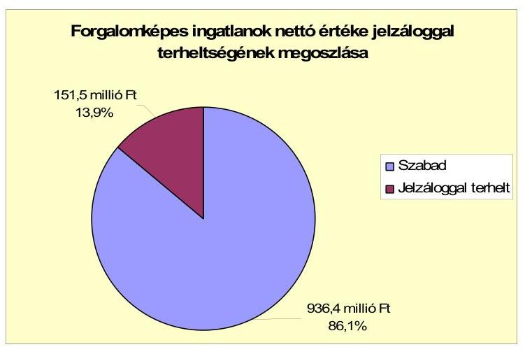

[^0]
[^0]:    ${ }^{35}$ Jogszabály nem is kötelezi erre az Önkormányzatot.

---

Az Önkormányzat részvételével zajló (alperesi és felperesi pozícióban egyaránt) peres eljárások - jogerős befejezés esetén - várhatóan legfeljebb 25,6 millió Ft fizetési kötelezettséget jelenthetnek az Önkormányzat számára. Jelentősebb perértékű gazdasági perben, vagy más jogvitában nem áll az Önkormányzat. Az egyetlen kizárólagos önkormányzati tulajdonú, 0,5 millió Ft törzstőkéjű Kommunikációs Kft-nek kölcsönt nem adott az Önkormányzat, tőle kölcsönt sem vett fel. Kisebbségi tulajdonrésszel gazdasági társaságban az Önkormányzat nem rendelkezik.

Az Önkormányzat a 2007-2010. években a befektetett eszközök után együttesen 622,4 millió Ft értékcsökkenést számolt el. Az elszámolt értékcsökkenés a 2007. évben 136,7 millió Ft, a 2008. évben 164,8 millió Ft, a 2009. évben 157,5 millió Ft, míg a 2010. évben 163,3 millió Ft volt. A vizsgált években a befejezett beruházások bekerülési költsége 1334,7 millió Ft, az aktivált felújításoké 165,3 millió Ft, összesen 1500,0 millió Ft volt. A fejlesztések 15,8%-a, 236,9 millió Ft szolgálta a tényleges bekerülési költségből az eszközpótlásra fordított összeget. Az elhasználódott eszközök pótlását kötvény bevételből, hazai támogatásból biztosították.

Az eszközök avultsága növekedett, mivel az önkormányzati szintű használhatósági fok mutató aránya 2,3 százalékponttal - a 2007. évi 95,6%-ról 2010. évre 93,3%-ra - csökkent. A fejlesztések eredményeként az eszközökön belül 2010 év végén az ingatlanok használhatósági foka (96,2%) meghaladta az összes eszközre vonatkozó használhatósági fok mutatót. Az immateriális javak (41,1%), gépek berendezések (20,5%), járművek (56,8%) és üzemeltetésre átadott eszközök használhatósági foka (82,9%) elmaradt az összes eszköz használhatósági fokának arányától.

# 4. A PÉNZÜGYI EGYENSÚLY MEGTEREMTÉSE ÉRDEKÉBEN HOZOTT INTÉZKEDÉSEK EREDMÉNYE 

Az Önkormányzat adatszolgáltatása alapján 2010-ben kiadáscsökkentő intézkedést hoztak az intézményi portaszolgálat átszervezése kapcsán. Az intézkedés eredményeként a tervezett megtakarítás az Önkormányzat adatszolgáltatása alapján 2011. évtől évi 8,4 millió Ft.

Az „E-randy" Őrző-védő Kft-vel fennálló korábbi megbízási szerződést nem hosszabbították meg, 2011-től riasztó-jelző berendezések alkalmazásával, egy fő foglalkoztatása mellett oldják meg az intézményi beléptetési-biztonsági feladatokat.

A vizsgált időszak kezdetétől a végéig az önkormányzati létszám és álláshelyek száma 508-ról 532-re növekedett. Üres álláshely nem volt, mert a gyes, gyed, tartós betegállomány miatti, átmenetileg megüresedett álláshelyeket helyettesítéssel betöltötték. A létszámnövekedés új bölcsőde létesítéséből, illetve a megnövekedett kapacitásigény miatti létszámfejlesztésből adódott (közoktatás, egészségügy, egyéb). A Polgármesteri hivatal mellett másik önállóan gazdálkodó költségvetési szerv, a TESZ-nél lévő önállóan működő intézmények kereté-

---

ben volt kisebb létszámmozgás, amely összességében létszámbővülést eredményezett. ${ }^{36}$

Az Önkormányzat létszámának 2007-2010 közötti alakulását az alábbi táblázat mutatja be:

| Megnevezés (adatok fő-ben) |  | Közoktatás | Szociális és gyermekvédelem | Egészségügy | Polgármesteri hivatal | Egyéb | Összesen |
| :--: | :--: | :--: | :--: | :--: | :--: | :--: | :--: |
| 2007. január 1-án jóváhagyott álláshelyek száma |  | 254 | 50 | 11 | 69 | 124 | 508 |
| Megszüntetett álláshelyek száma |  | 0 | 0 | 0 | 0 | 4 | 4 |
| ebből: |  |  |  |  |  |  |  |
|  | szakmai álláshelyek száma |  |  |  | 0 |  | 0 |
|  | intézmény-üzemeltetéssel kapcsolatos álláshelyek száma |  | 0 | 0 | 0 | 4 | 4 |
| Álláshely növekedése |  | 5 | 11 | 1 | 0 | 11 | 28 |
| 2010. december 31-én záró álláshelyek száma |  | 259 | 61 | 12 | 69 | 131 | 532 |
| 2007. január 1-án foglalkoztatott létszám |  | 254 | 50 | 11 | 69 | 124 | 508 |
| Létszámcsökkentés |  | 0 | 0 | 0 | 0 | 4 | 4 |
| Létszámnövekedés |  | 5 | 11 | 1 | 0 | 11 | 28 |
| 2010. december 31-én foglalkoztatott létszám |  | 259 | 61 | 12 | 69 | 131 | 532 |

A vizsgált időszakban feladatátszervezés következtében négy álláshely szűnt meg, miközben 28 új álláshely jött létre, ezáltal a foglalkoztatott létszám 508-ról 532-re nőtt. Az Önkormányzat létszámcsökkentéshez kapcsolódóan központi támogatást nem igényelt és tartósan álláshelyeket nem épített le.

Az Önkormányzat - tájékoztatása szerint - a bevételnövelő intézkedések hatására 2007-től a 2011. év I. félév végéig 1315,2 millió Ft bevételt realizált. Az Önkormányzat a helyi adókkal kapcsolatosan 943,1 millió Ft (71,7%) és eszközök hasznosításával kapcsolatosan 372,1 millió Ft (28,3%) erejéig hozott bevételnövelő intézkedéseket. Figyelemmel az intézményi kihasználtságra, szabad kapacitások nem szabadultak fel, inkább kapacitásbővítés igényével kellett számolniuk. Az intézményi térítési díjakat a felmerült költségekkel arányosan növelték. Az Önkormányzat nem mérte fel az önkormányzati
 törzsvagyonon felüli forgalomképes vagyonban (vállalkozói vagyonban) rejlő bevételt növelő lehetőségeket.

[^0]
[^0]:    ${ }^{36}$ A Szociális Bizottság 317/2009. (IX. 15.) számú határozatával hagyta jóvá az új, „Szivárvány" Bölcsőde Szervezeti és Működési Szabályzatát, mellyel összhangban a Bölcsőde eredeti 2008-as hét fős létszáma 2009-ben újabb kettő fővel bővült.

---

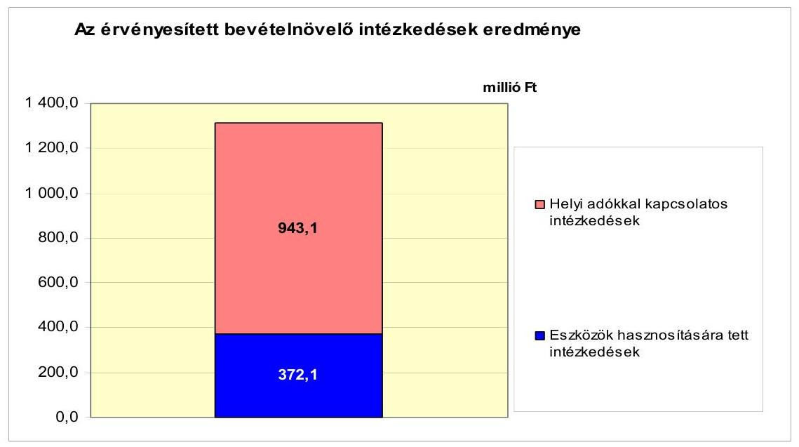

Az Önkormányzat tájékoztatása szerint a vizsgálattal áttekintett időszakban új adónemet nem vezettek be, de az építményadót kiterjesztették a nem lakás céljára szolgáló építmények mellett a lakáscélú ingatlanokra is. Ezáltal az ilyen címen beszedett adók mértéke nagyságrenddel megemelkedett (2006-ban 31,4 millió Ft, 2007-ben 214,7 millió Ft). Ezzel egyidejűleg megszüntették a magánszemélyek kommunális adóját. Az építményadót, a telekadót és az idegenforgalmi adót érintően növelték az adó mértékét, melyből kifolyólag 629,4 millió Ft-ot realizáltak. Kedvezményeket, mentességeket nem szüntettek meg.

A 2008-as „válságévvel" áll összefüggésben, hogy magasabb lett az adóhátralék összege, melyet a hátralék hatékonyabb behajtásával próbáltak ellensúlyozni. A hátralékok beszedéséből - 2008-at követően - csökkenő összegek folytak be, melynek eredményeképpen a vizsgált időszakban 202,3 millió Ft-ot (15,4%) realizáltak.

Hét ingatlan bérbeadásával összesen 3,1 millió Ft (0,2%) bevételre tett szert az Önkormányzat. Felesleges tárgyi eszközök értékesítéséből 2007-2011. év I. félévében 1,9 millió Ft (0,1%) míg ingatlanok eladásból 367,0 millió Ft (27,9%) folyt be. Az Önkormányzat költségvetési támogatásból és szja-ból származó bevételei a vizsgált időszakban kumuláltan növekedtek, ami a bevételnövelő és kiadásmegtakarító intézkedésekkel együtt hozzájárult pénzügyi helyzetének javításához.

# 5. Az ÁSZ Által a korábbi években a pénzügyi egyensúly javítására tett szabályszerűségi és célszerűségi javaslatok hasznosulása

Az ÁSZ az Önkormányzat legutóbbi, 2009. évi ellenőrzése során a polgármesternek kettő, a jegyzőnek 18 - szabályszerűséggel kapcsolatos - javaslatot tett, melyből négy vonatkozott a pénzügyi egyensúly javítására. A hiányosságok megszüntetése érdekében a Képviselő-testület intézkedési tervet fogadott el, amely tartalmazta a határidőket és a felelősöket.

---

Az ellenőrzés megállapította, hogy a likviditási terv a költségvetéssel összhangban elkészült, azok aktualizálása folyamatos volt. A Képviselő-testület a 2011. évi költségvetési rendeletében jóváhagyta az intézmények pénzmaradvány megállapításának felülvizsgálatáról szóló szabályokat.

A finanszírozási célú pénzügyi műveletekre vonatkozó javaslat azonban nem teljesült. A jegyző nem gondoskodott arról, hogy az Áht$_{1}$ 8/A. § (7) bekezdésében ${ }^{37}$ előírtak alapján a költségvetési tervezet elkészítésekor a finanszírozási célú pénzügyi műveletek ne szerepeljenek költségvetési hiányt, illetve többletet módosító költségvetési bevételként, valamint költségvetési kiadásként.

Nem teljesült az a javaslat sem, amely az intézményi eredeti, a módosított előirányzatok és a teljesítések eltérése indokoltságának, valamint az intézményi számszaki beszámoló belső, illetve a Képviselő-testület által meghatározott adatszolgáltatással való összhangjának az Ámr 149. § (3) bekezdés c)-d) pontjaiban ${ }^{38}$ foglaltak szerinti ellenőrzésére vonatkozott. A Képviselő-testület szabályozásról nem döntött, az ellenőrzés dokumentálása nem történt meg.

Budapest, 2012. április 7.
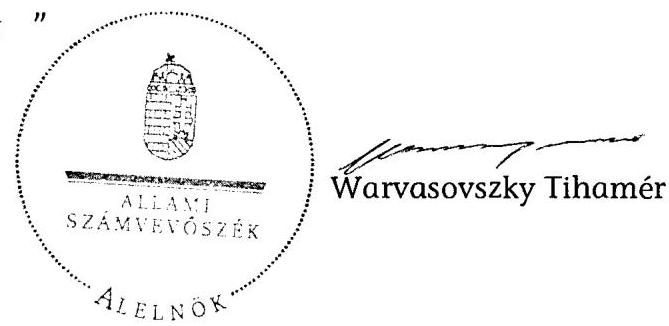

Melléklet: $\quad 6 \mathrm{db}$

[^0]
[^0]:    ${ }^{37}$ 2012. január 1-től az Áht$_{2}$ 23. § (2) bekezdés d)-e) pontjai
    ${ }^{38}$ 2012. január 1-től az Ávr. 149. § (1) bekezdése

---

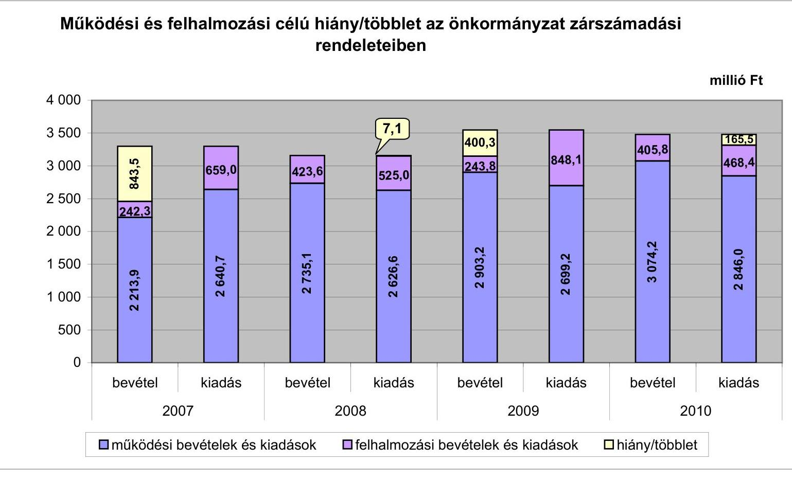

# Működési és felhalmozási célú hiány/többlet az önkormányzat zárszámadási rendeleteiben

|  év | működési bevételek és kiadások | felhalmozási bevételek és kiadások | hiány/többlet  |
| --- | --- | --- | --- |
|  2007 | 4 | 7 | 1  |
|  2008 | 2 | 1 | 2  |
|  2009 | 7 | 1 | 1  |
|  2010 | 1 | 1 | 1  |

|  év | működési bevételek és kiadások | felhalmozási bevételek és kiadások | hiány/többlet  |
| --- | --- | --- | --- |
|  2007 | 4 | 7 | 1  |
|  2008 | 2 | 1 | 2  |
|  2009 | 1 | 1 | 1  |
|  2010 | 1 | 1 | 1  |

|  év | működési bevételek és kiadások | felhalmozási bevételek és kiadások | hiány/többlet  |
| --- | --- | --- | --- |
|  2007 | 4 | 7 | 1  |
|  2008 | 2 | 1 | 2  |
|  2009 | 1 | 1 | 1  |
|  2010 | 1 | 1 | 1  |

|  év | működési bevételek és kiadások | felhalmozási bevételek és kiadások | hiány/többlet  |
| --- | --- | --- | --- |
|  2007 | 4 | 7 | 1  |
|  2008 | 2 | 1 | 2  |
|  2009 | 1 | 1 | 1  |
|  2010 | 1 | 1 | 1  |

|  év | működési bevételek és kiadások | felhalmozási bevételek és kiadások | hiány/többlet  |
| --- | --- | --- | --- |
|  2007 | 4 | 7 | 1  |
|  2008 | 2 | 1 | 2  |
|  2009 | 1 | 1 | 1  |
|  2010 | 1 | 1 | 1  |

|  év | működési bevételek és kiadások | felhalmozási bevételek és kiadások | hiány/többlet  |
| --- | --- | --- | --- |
|  2007 | 4 | 7 | 1  |
|  2008 | 2 | 1 | 2  |
|  2009 | 1 | 1 | 1  |
|  2010 | 1 | 1 | 1  |

|  év | működési bevételek és kiadások | felhalmozási bevételek és kiadások | hiány/többlet  |
| --- | --- | --- | --- |
|  2007 | 4 | 7 | 1  |
|  2008 | 2 | 1 | 2  |
|  2009 | 1 | 1 | 1  |
|  2010 | 1 | 1 | 1  |

|  év | működési bevételek és kiadások | felhalmozási bevételek és kiadások | hiány/többlet  |
| --- | --- | --- | --- |
|  2007 | 4 | 7 | 1  |
|  2008 | 2 | 1 | 2  |
|  2009 | 1 | 1 | 1  |
|  2010 | 1 | 1 | 1  |

|  év | működési bevételek és kiadások | felhalmozási bevételek és kiadások | hiány/többlet  |
| --- | --- | --- | --- |
|  2007 | 4 | 7 | 1  |
|  2008 | 2 | 1 | 2  |
|  2009 | 1 | 1 | 1  |
|  2010 | 1 | 1 | 1  |

|  év | működési bevételek és kiadások | felhalmozási bevételek és kiadások | hiány/többlet  |
| --- | --- | --- | --- |
|  2007 | 4 | 7 | 1  |
|  2008 | 2 | 1 | 2  |
|  2009 | 1 | 1 | 1  |
|  2010 | 1 | 1 | 1  |

|  év | működési bevételek és kiadások | felhalmozási bevételek és kiadások | hiány/többlet  |
| --- | --- | --- | --- |
|  2007 | 4 | 7 | 1  |
|  2008 | 2 | 1 | 2  |
|  2009 | 1 | 1 | 1  |
|  2010 | 1 | 1 | 1  |

|  év | működési bevételek és kiadások | felhalmozási bevételek és kiadások | hiány/többlet  |
| --- | --- | --- | --- |
|  2007 | 4 | 7 | 1  |
|  2008 | 2 | 1 | 2  |
|  2009 | 1 | 1 | 1  |
|  2010 | 1 | 1 | 1  |

|  év | működési bevételek és kiadások | felhalmozási bevételek és kiadások | hiány/többlet  |
| --- | --- | --- | --- |
|  2007 | 4 | 7 | 1  |
|  2008 | 2 | 1 | 2  |
|  2009 | 1 | 1 | 1  |
|  2010 | 1 | 1 | 1  |

|  év | működési bevételek és kiadások | felhalmozási bevételek és kiadások | hiány/többlet  |
| --- | --- | --- | --- |
|  2007 | 4 | 7 | 1  |
|  2008 | 2 | 1 | 2  |
|  2009 | 1 | 1 | 1  |
|  2010 | 1 | 1 | 1  |

|  év | működési bevételek és kiadások | felhalmozási bevételek és kiadások | hiány/többlet  |
| --- | --- | --- | --- |
|  2007 | 4 | 7 | 1  |
|  2008 | 2 | 1 | 2 
 |
|  2009 | 1 | 1 | 1  |
|  2010 | 1 | 1 | 1  |

|  év | működési bevételek és kiadások | felhalmozási bevételek és kiadások | hiány/többlet  |
| --- | --- | --- | --- |
|  2007 | 4 | 7 | 1  |
|  2008 | 2 | 1 | 2  |
|  2009 | 1 | 1 | 1  |
|  2010 | 1 | 1 | 1  |

|  év | működési bevételek és kiadások | felhalmozási bevételek és kiadások | hiány/többlet  |
| --- | --- | --- | --- |
|  2007 | 4 | 7 | 1  |
|  2008 | 2 | 1 | 2  |
|  2009 | 1 | 1 | 1  |
|  2010 | 1 | 1 | 1  |

|  év | működési bevételek és kiadások | felhalmozási bevételek és kiadások | hiány/többlet  |
| --- | --- | --- | --- |
|  2007 | 4 | 7 | 1  |
|  2008 | 2 | 1 | 2  |
|  2009 | 1 | 1 | 1  |
|  2010 | 1 | 1 | 1  |

|  év | működési bevételek és kiadások | felhalmozási bevételek és kiadások | hiány/többlet  |
| --- | --- | --- | --- |
|  2007 | 4 | 7 | 1  |
|  2008 | 2 | 1 | 2  |
|  2009 | 1 | 1 | 1  |
|  2010 | 1 | 1 | 1  |

|  év | működési bevételek és kiadások | felhalmozási bevételek és kiadások | hiány/többlet  |
| --- | --- | --- | --- |
|  2007 | 4 | 7 | 1  |
|  2008 | 2 | 1 | 2  |
|  2009 | 1 | 1 | 1  |
|  2010 | 1 | 1 | 1  |

|  év | működési bevételek és kiadások | felhalmozási bevételek és kiadások | hiány/többlet  |
| --- | --- | --- | --- |
|  2007 | 4 | 7 | 1  |
|  2008 | 2 | 1 | 2  |
|  2009 | 1 | 1 | 1  |
|  2010 | 1 | 1 | 1  |

|  év | működési bevételek és kiadások | felhalmozási bevételek és kiadások | hiány/többlet  |
| --- | --- | --- | --- |
|  2007 | 4 | 7 | 1  |
|  2008 | 2 | 1 | 2  |
|  2009 | 1 | 1 | 1  |
|  2010 | 1 | 1 | 1  |

|  év | működési bevételek és kiadások | felhalmozási bevételek és kiadások | hiány/többlet  |
| --- | --- | --- | --- |
|  2007 | 4 | 7 | 1  |
|  2008 | 2 | 1 | 2  |
|  2009 | 1 | 1 | 1  |
|  2010 | 1 | 1 | 1  |

|  év | működési bevételek és kiadások | felhalmozási bevételek és kiadások | hiány/többlet  |
| --- | --- | --- | --- |
|  2007 | 4 | 7 | 1  |
|  2008 | 2 | 1 | 2  |
|  2009 | 1 | 1 | 1  |
|  2010 | 1 | 1 | 1  |

|  év | működési bevételek és kiadások | felhalmozási bevételek és kiadások | hiány/többlet  |
| --- | --- | --- | --- |
|  2007 | 4 | 7 | 1  |
|  2008 | 2 | 1 | 2  |
|  2009 | 1 | 1 | 1  |
|  2010 | 1 | 1 | 1  |

|  év | működési bevételek és kiadások | felhalmozási bevételek és kiadások | hiány/többlet  |
| --- | --- | --- | --- |
|  2007 | 4 | 7 | 1  |
|  2008 | 2 | 1 | 2  |
|  2009 | 1 | 1 | 1  |
|  2010 | 1 | 1 | 1  |
|  2011 | 1 | 1 | 1  |

|  év | működési bevételek és kiadások | felhalmozási bevételek és kiadások | hiány/többlet  |
| --- | --- | --- | --- |
|  2007 | 4 | 7 | 1  |
|  2008 | 2 | 1 | 2  |
|  2009 | 1 | 1 | 1  |
|  2010 | 1 | 1 | 1  |
|  2011 | 1 | 1 | 1  |
|  2012 | 1 | 1 | 1  |
|  2013 | 1 | 1 | 1  |
|  2014 | 1 | 1 | 1  |
|  2015 | 1 | 1 | 1  |
|  2016 | 1 | 1 | 1  |
|  2017 | 1 | 1 | 1  |
|  2018 | 1 | 1 | 1  |
|  2019 | 1 | 1 | 1  |
|  2020 | 1 | 1 | 1  |

|  év | működési bevételek és kiadások | felhalmozási bevételek és kiadások | hiány/többlet  |

---

Az Önkormányzat bevételei és kiadásai, valamint adósságszolgálata 2007-2010 között

|  1. FOLYÓ KÖLTSÉGVETÉS* | 2007. év | 2008. év | 2009. év | 2010. év  |
| --- | --- | --- | --- | --- |
|  1.1.1. Saját működési bevételek | 913,4 | 1344,9 | 1529,8 | 1631,9  |
|  1.1.2. Költségvetési támogatás ** | 611,3 | 901,3 | 833,6 | 808,8  |
|  1.1.3. Átengedett bevételek | 618,2 | 449,9 | 477,6 | 516,1  |
|  1.1.4. Államháztartáson belülről kapott támogatások | 43,6 | 65,8 | 188,0 | 158,1  |
|  1.1.5. EU-tól és külföldről kapott bevételek | 0,0 | 0,0 | 0,0 | 0,0  |
|  1.1.6. Államháztartáson kívülről kapott bevételek | 5,9 | 6,0 | 6,1 | 6,3  |
|  1.1.7. Előző évi pénzmaradvány átvétel | 20,2 | 56,1 | 24,3 | 0,0  |
|  1.1. Folyó bevételek $=1.1 .1 .+1.1 .2 .+1.1 .3 .+1.1 .4 .+1.1 .5 .+1.1 .6 .+1.1 .7$. | 2212,6 | 2824,0 | 3059,4 | 3121,2  |
|  1.2.1. Működési kiadások kamatkiadások nélkül | 2422,6 | 2414,6 | 2469,2 | 2595,8  |
|  1.2.2. Államháztartáson belülre átadott pénzeszközök | 16,3 | 30,0 | 20,7 | 42,8  |
|  1.2.3.1. vállalkozásoknak | 21,7 | 13,0 | 14,8 | 26,3  |
|  1.2.3.2. EU-nak, illetve külföldre | 0,0 | 0,1 | 0,0 | 0,0  |
|  1.2.3.3. magáncélményeknek | 83,5 | 97,3 | 126,7 | 133,4  |
|  1.2.3.4. nonprofit szervezeteknek | 29,3 | 27,2 | 29,7 | 34,4  |
|  1.2.3. Transzferkiadások ( $=1.2 .3 .1+1.2 .3 .2+1.2 .3 .3+1.2 .3 .4)$ | 134,5 | 137,6 | 171,2 | 194,1  |
|  1.2.4 Kamatkiadások | 137,1 | 166,9 | 142,0 | 77,8  |
|  1.2.5. Előző évi pénzmaradvány átadás | 20,2 | 56,1 | 20,4 | 0,0  |
|  1.2. Folyó kiadások $=1.2 .1 .+1.2 .2 .+1.2 .3 .+1.2 .4 .+1.2 .5$. | 2730,7 | 2805,2 | 2823,5 | 2910,5  |
|  1.3. Folyó költségvetés egyenlege MÜKÖDÉSI JÖVEDELEM (1.1. - 1.2.) | $-518,1$ | 18,8 | 235,9 | 210,7  |
|  2. FELHALMOZÁSI KÖLTSÉGVETÉS** |  |  |  |   |
|  2.1.1. Saját tökebevételek | 61,1 | 251,9 | 16,1 | 34,3  |
|  2.1.2. Államháztartáson belülről kapott támogatások | 163,8 | 64,4 | 63,4 | 323,4  |
|  2.1.3. EU-tól és külföldről kapott támogatások | 0,0 | 0,0 | 0,0 | 0,0  |
|  2.1.4. Államháztartáson kívülről kapott támogatások | 18,7 | 18,4 | 8,1 | 1,1  |
|  2.1. Felhalmozási bevételek ( $=2.1 .1 .+2.1 .2+2.1 .3+2.1 .4$.) | 243,6 | 334,7 | 87,6 | 358,8  |
|  2.2.1. Saját beruházási kiadás áfával | 471,4 | 215,5 | 647,0 | 273,6  |
|  2.2.2. Saját felújítási kiadás áfával | 47,5 | 68,4 | 23,1 | 59,8  |
|  2.2.3. Államháztartáson belülre átadott pénzeszköz | 3,8 | 0,0 | 0,0 | 2,1  |
|  2.2.4. EU-nak és külföldnek adott pénzeszközök | 0,0 | 0,0 | 0,0 | 0,0  |
|  2.2.5. Államháztartáson kívülre adott pénzeszközök | 46,3 | 62,5 | 53,7 | 68,4  |
|  2.2.6. Befektetési célú részesedések vásárlása | 0,0 | 0,0 | 0,0 | 0,0  |
|  2.2. Felhalmozási kiadások ( $=2.2 .1 .+2.2 .2 .+2.2 .3 .+2.2 .4 .+2.2 .5 .+2.2 .6$.) | 569,0 | 346,4 | 723,8 | 403,9  |
|  2.3. Felhalmozási költségvetés egyenlege (2.1. - 2.2.) | $-325,4$ | $-11,7$ | $-636,2$ | $-45,1$  |
|  3. Finanszírozási műveletek nélküli (GFS) pozíció(1.3.+2.3.) | $-843,5$ | 7,1 | $-400,3$ | 165,6  |
|  4. Finanszírozási műveletek |  |  |  |   |
|  4.1. Hitelfelvétel | 505,7 | 74,3 | 288,4 | 0,0  |
|  4.2. Hiteltőrlesztés | 1522,2 | 12,3 | 43,7 | 319,7  |
|  4.3. Forgatási és befektetési célú értékpapírok kibocsátása | 2730,1 | 0,0 | 0,0 | 0,0  |
|  4.4. Forgatási és befektetési célú értékpapírok beváltása | 0,0 | 0,0 | 0,0 | 0,0  |

 | 0,0  |
|  4.5. Forgatási és befektetési célú értékpapírok értékesítése | 0,0 | 0,0 | 0,0 | 0,0  |
|  4.6. Forgatási és befektetési célú értékpapírok vásárlása | 0,0 | 0,0 | 0,0 | 0,0  |
|  4.7. Egyéb finanszírozási bevételek (függő, átfutó, kiegyenlítő) | 87,2 | $-11,1$ | 28,5 | $-62,6$  |
|  4.8. Egyéb finanszírozási kiadások (függő, átfutó, kiegyenlítő) | 944,0 | 185,7 | $-966,0$ | $-23,0$  |
|  4.9. Finanszírozási műveletek egyenlege (4.1. - 4.2.+4.3.-4.4+4.5.-4.6.+4.7.-4.8.) | 876,8 | $-134,8$ | 1239,2 | $-359,3$  |
|  5. Tárgyévi pénzügyi pozíció (1.3.+ 2.3.+4.9.) | 33,3 | $-127,7$ | 838,9 | $-193,7$  |
|  6. Nettó működési jövedelem =működési jövedelem (1.3.) - tőketörlesztés (4.2+4.4) | $-2040,3$ | 6,5 | 192,2 | $-109,0$  |
|  TAJÉKOZTATÓ ADATOK |  |  |  |   |
|  Összes kötelezettség * | 3550,3 | 4329,7 | 4685,2 | 4782,7  |
|  ebből rövid lejáratú | 163,2 | 527,5 | 844,2 | 496,0  |
|  Összes szállítói kötelezettség | 66,1 | 30,3 | 71,1 | 75,4  |
|  ebből lejárt (tanúsítványból) | 66,1 | 30,3 | 71,1 | 75,4  |
|  Pénz és tőkepiaci kötelezettség (adósság) | 3399,2 | 3920,1 | 4247,3 | 4657,5  |
|  ebből rövid lejáratú | 12,3 | 118,0 | 406,4 | 370,9  |
|  PPP szerződéses állomány jelenértéken (tanúsítványból) | 0,0 | 0,0 | 0,0 | 0,0  |
|  ebből lejárt szolgáltatási díj miatti kötelezettség | 0,0 | 0,0 | 0,0 | 0,0  |
|  Folyószámlahitel napi átlagos állománya (tanúsítványból) *** | 421,1 | 19,8 | 230,5 | 319,2  |
|  Likvidhitel napi átlagos állománya (tanúsítványból)*** | 43,8 | 0,0 | 0,0 | 0,0  |
|  Munkabérhitel napi átlagos állománya (tanúsítványból)*** | 4,0 | 0,0 | 0,0 | 0,0  |
|  Kezesség és garanciavállalások (tanúsítványból) | 844,1 | 844,1 | 844,1 | 844,1  |
|  Jogerős bírósági tételekbol adódó kötelezettségek (tanúsítványból) | 0,0 | 0,0 | 0,0 | 0,0  |
|  Finanszírozásba bevonható eszközök: | 145,2 | 17,6 | 856,6 | 662,8  |
|  Tartós hitelviszonyt megtestesítő értékpapírok év végi állománya | 0,0 | 0,0 | 0,0 | 0,0  |
|  Hosszú lejáratú bankhitelek év végi állománya | 0,0 | 0,0 | 0,0 | 0,0  |
|  Értékpapírok év végi állománya | 0,0 | 0,0 | 0,0 | 0,0  |
|  Pénzeszközök (idegen pénzeszközök nélkül) év végi állománya | 145,2 | 17,6 | 856,5 | 662,8  |

- Az összes kötelezettséget a passzív pénzügyi elszámolások nélkül vettük figyelembe, mert a passzívák a pénzmaradvány elszámolás tételei közé tartoznak. ** A költségvetési támogatásból a felhalmozási célú összeget az Önkormányzat adatszolgáltatása szerinti mértékben vettük figyelembe, a 2.1.2. soron. *** A folyószámlá, a likvid- és a munkabérhitel átlagos állományát 365 napos osztószámmal és nem a fennálló napok számával vettük figyelembe.

---

## **Az Önkormányzat 2007-2010. években megvalósított, 2010. december 31-ig befejezett fejlesztései és azok forrásösszetétele**

|   |  |  |  |  |  |  |  |  |  |  |  |  |  |  |  |  |  |  |  |  |  |  |  |  |  |  |  |  |  |  |  |  |  |  |  |  |  |  |  |  |  |  |  |  |  |  |  |  |  |  |  |  |  |  |  |  |  |  |  |  |  |  |  |  |  |  |  |  |  |  |  |  |  |  |  |  |  |  |  |  |  |  |  |  |  |  |  |  |  |  |  |  |  |  |  |  |  |  |  |  |  |  |  |  |  |  |  |  |  | 

---

|   |  |  |  |  |  |  |  |  |  |  |  |  |  |  |  |  |  |  |  |  |  |  |  |  |  |  |  |  |  |  |  |  |  |  |  |  |  |  |  |  |  |  |  |  |  |  |  |  |  |  |  |  |  |  |  |  |  |  |  |  |  |  |  |  |  |  |  |  |  |  |  |  |  |  |  |  |  |  |  |  |  |  |  |  |  |  |  |  |  |  |  |  |  |  |  |  |  |  |  |  |  | 

---

Az Önkormányzat 2010. december 31-én folyamatban lévő fejlesztési feladataira 2010. december 31-ig teljesített kifizetések és azok forrásösszetétele

|  |   |   |   |   |   |   |   |   |   |   |   |   |   |   |   |   |   |   |   |   |   |   |   |   |   |   |   |   |   |   |   |
| --- | --- | --- | --- | --- | --- | --- | --- | --- | --- | --- | --- | --- | --- | --- | --- | --- | --- | --- | --- | --- | --- | --- | --- | --- | --- | --- | --- | --- | --- | --- | --- |
|   | Fejlesztési feladat (beruházás, felújítás) |  | Beruházás, felújítás |  |  |  |  |  |  |  |  |  |  |  |  |  |  |  |  |  |  |  |  |  |  |  |  |  |  |  |   |
|   |  |  |  |  |  |  |  |  |  |  |  |  |  |  |  |  |  |  |  |  |  |  |  |  |  |  |  |  |  |  |   |
|   |  |  |  |  |  |  |  |  |  |  |  |  |  |  |  |  |  |  |  |  |  |  |  |  |  |  |  |  |  |  |   |
|  Sorszám |  |  |  |  |  |  |  |  |  |  |  |  |  |  |  |  |  |  |  |  |  |  |  |  |  |  |  |  |  |  |   |
|   |  |  |  |  |  |  |  |  |  |  |  |  |  |  |  |  |  |  |  |  |  |  |  |  |  |  |  |  |  |  |   |
|   |  |  |  |  |  |  |  |  |  |  |  |  |  |  |  |  |  |  |  |  |  |  |  |  |  |  |  |  |  |  |   |
|  Sorszám | Megnevezése |  | Képviselő- testületi határozat száma |  |  |  |  |  |  |  |  |  |  |  |  |  |  |  |  |  |  |  |  |  |  |  |  |  |  |  |   |
|   |  |  | kezdete |  |  |  |  |  |  |  |  |  |  |  |  |  |  |  |  |  |  |  |  |  |  |  |  |  |  |  |   |

  |  |  |  |  |  |   |
|  1 | 2 | 3 | 4 | 5 | 6 | 7 | 8 | 9 | 10 | 11 | 12 | 13 | 14 | 15 | 16 | 17 | 18 | 19 | 20 | 21 | 22 | 23 | 24 | 25 | 26 | 27 | 28 | 29 | 30 | 31  |
|  1. | Felújítások |  |  |  |  |  |  |  |  |  |  |  |  |  |  |  |  |  |  |  |  |  |  |  |  |  |  |  |  |  |   |
|  2. | 10 millió Ft alatti felújítások |  |  |  |  |  |  |  |  |  |  |  |  |  |  |  |  |  |  |  |  |  |  |  |  |  |  |  |  |  |   |
|  3. | Felújítások összesen |  |  |  | 0,0 | 0,0 | 0,0 | 0 | 0,0 | 0,0 | 0,0 | 0,0 | 0,0 | 0,0 | 0,0 | 0,0 | 0,0 | 0,0 | 0,0 | 0,0 | 0,0 | 0,0 | 0,0 | 0,0 | 0,0 | 0,0 | 0,0 | 0,0 | 0,0 | 0,0  |
|  4. | Fejlesztések |  |  |  |  |  |  |  |  |  |  |  |  |  |  |  |  |  |  |  |  |  |  |  |  |  |  |  |  |  |   |
|  5. | Kastély Központi Óvoda kapacitás bővítése KMOP-4-6-1/B-09 |  |  |  |  |  |  |  |  |  |  |  |  |  |  |  |  |  |  |  |  |  |  |  |  |  |  |  |  |  |   |
|  6. | 10 millió Ft alatti fejlesztések |  |  |  |  |  |  |  |  |  |  |  |  |  |  |  |  |  |  |  |  |  |  |  |  |  |  |  |  |  |   |
|  7. | Fejlesztések összesen: |  |  |  | 185,2 | 45,4 | -139,8 | 0 | 45,4 | 0,0 | 6,1 | 0,0 | -6,1 | 0,0 | 0,0 | 0,0 | 45,4 | 10,6 | -34,8 | 34,8 | 34,8 | 0,0 | 0,0 | 0,0 | 0,0 | 0,0 | 0,0 | 0,0 | 0,0  |
|  8. | Mindösszesen |  |  |  | 185,2 | 45,4 | -139,8 | 0 | 45,4 | 0,0 | 6,1 | 0,0 | -6,1 | 0,0 | 0,0 | 0,0 | 45,4 | 10,6 | -34,8 | 34,8 | 34,8 | 0,0 | 0,0 | 0,0 | 0,0 | 0,0 | 0,0 | 0,0 | 0,0  |

---

## Az Önkormányzat 2010. december 31-én folyamatban lévő fejlesztési feladataira 2010. december 31-én fennálló kötelezettségek és azok forrásösszetétele

|   |  |  |  |  |  |  |  |  |  |  |  |  |  |  |  |  |  |  |  |  |  |  |  |  |  |  |  |  |  |  |  |  |  |  |  |  |  |  |  |  |  |  |  |  |  |  |  |  |  |  |  |  |  |  |  |  |  |  |  |  |  |  |  |  |  |  |  |  |  |  |  |  |  |  |  |  |  |  |  |  |  |  |  |  |  |  |  |  |  |  |  |  |  |  |  |  |  |  |  | 

---

## **Az önkormányzati feladatok ellátásában résztvevő gazdasági társaságok**

|  Gazdasági társaság
megnevezése | 2010. december 31-én | a gazdasági társaságnak szerződéses kötelezettségre, feladatellátási szerződésre alapozottan
az önkormányzat költségvetéséből nyújtott  |
| --- | --- | --- |
|   | önkormányzat | önkormányzat
gazdasági
társaságának
tulajdoni
hányada  |
|  1. 100%-os tulajdoni hányadú gazdasági társaságok: |  |   |
|  Göd Városi Kommunikációs
Nárgyofló Kft. * |  |   |
|  100%-os tulajdoni hányadú gazdasági társaságok | x | x  |
|  összesen |  |   |
|  II. 75-90%-os tulajdoni hányadú gazdasági társaságok: |  |   |
|  75-90%-os tulajdoni hányadú gazdasági társaságok összesen | x | x  |
|  75% feletti tulajdoni hányadú gazdasági társaságok összesen | x | x  |
|  III. 51-74%-os tulajdoni hányadú gazdasági társaságok: |  |   |
|  51-74%-os tulajdoni hányadú gazdasági társaságok összesen | x | x  |
|  IV. egyéb, közfeladatot ellátó gazdasági társaságok: |  |   |
|  Városi Közlekedési Vállalat
Kft. | - | -  |
|  Duna Menti Regionális Vízmű
Kft. | - | -  |
|  egyéb, közfeladatot ellátó
gazdasági társaságok | x | x  |
|  összesen | x | x  |

- a társaságot 2011. január 19-én alapította az Önkormányzat

