# ÁLLAMI   SZÁMVEVŐSZÉK 

## JELENTÉS

Gyomaendrőd Városi Önkormányzat pénzügyi helyzetének ellenőrzéséről (43/4)

---

# Állami Számvevőszék 

Iktatószám: V-3079-025/2012.
Témaszám: 1015
Vizsgálat-azonosító szám: V0560110

## Az ellenőrzést felügyelte:

Dr. Varga Sándor
számvevő igazgatóhelyettes
Az ellenőrzést vezette:
Renkó Zsuzsanna
számvevő tanácsos
Ellenőrzési csoportvezető:
Bíró Zsolt
számvevő tanácsos
Az ellenőrzést végezték:

| Szudi Ferencné | Molnár Antal Lászlóné | Dr. Káplár Emese |
| :-- | :-- | :-- |
| számvevő | számvevő | számvevő gyakornok |

---

# TARTALOMJEGYZÉK 

BEVEZETÉS ..... 7
I. ÖSSZEGZŐ MEGÁLLAPÍTÁSOK, KÖVETKEZTETÉSEK, JAVASLATOK ..... 11
II. RÉSZLETES MEGÁLLAPÍTÁSOK ..... 21

1. Az Önkormányzat kötelező és önként vállalt feladatai, a feladatellátás szervezeti keretei és annak változásai ..... 21
2. Az Önkormányzat pénzügyi egyensúlyi helyzetét befolyásoló tényezők ..... 25
2.1. A működési és a felhalmozási egyensúly változása ..... 27
2.2. Az Önkormányzat bevételeinek változása ..... 31
2.3. Az Önkormányzat működési és a felhalmozási célú kiadásainak változása ..... 34
3. Az Önkormányzat kötelezettségei ..... 38
3.1. Az Önkormányzat pénzintézeti kötelezettségeinek változása ..... 38
3.2. A szállítói kötelezettségek változása ..... 42
3.3. Egyéb kötelezettségek változása ..... 42
4. A pénzügyi egyensúly megteremtése érdekében hozott intézkedések eredménye ..... 45
5. Az ÁSZ által a korábbi években a pénzügyi egyensúly javítására tett szabályszerűségi és célszerűségi javaslatok hasznosulása ..... 48

---

# MELLÉKLETEK 

1. számú Működési és felhalmozási célú hiány/többlet az Önkormányzat zárszámadási rendeleteiben (1 oldal)
2. számú Az Önkormányzat bevételei és kiadásai, valamint adósságszolgálata 2007-2010 között (1 oldal)
3/a. számú Az Önkormányzat 2007-2010. években megvalósított, 2010. december 31-ig befejezett fejlesztései és azok forrásösszetétele (1 oldal)
3/b. számú Az Önkormányzat 2010. december 31-én folyamatban lévő fejlesztési feladataira 2010. december 31-ig teljesített kifizetések és azok forrásösszetétele (1 oldal)
3/c. számú Az Önkormányzat 2010. december 31-én folyamatban lévő fejlesztési feladataira 2010. december 31-én fennálló kötelezettségek és azok forrásösszetétele (1 oldal)
3. számú Az önkormányzati feladatok ellátásában résztvevő gazdasági társaságok (1 oldal)

---

# RÖVIDÍTÉSEK JEGYZÉKE 

## Törvények

Áht $_{1}$.
Áht $_{2}$.
Ötv.
Ptk.

## Rendeletek

Áhsz.
az államháztartásról szóló 1992. évi XXXVIII. törvény
az államháztartásról szóló 2011. évi CXCV. törvény
a helyi önkormányzatokról szóló 1990. évi LXV. törvény
a Polgári Törvénykönyvről szóló 1959. évi IV. törvény
az államháztartás szervezetei beszámolási és könyvvezetési kötelezettségének sajátosságairól szóló 249/2000. (XII. 24.) Korm. rendelet

Számsz
Gyomaendrőd Város Képviselő-testületének 9/2011. (III. 31.) számú rendelete a Képviselő-testület és Szervei Szervezeti és Működési Szabályairól

## Szórövidítések

áfa
ÁSZ
EU
Gyomaszolg Ipari Park Kft.
Gyomaközszolg Kft.
Jegyző
Képviselő-testület
Liget Fürdő Kft.
Önkormányzat
polgármester
Polgármesteri hivatal
PPP konstrukció
szja
Zöldpark Kft.
általános forgalmi adó
Állami Számvevőszék
Európai Unió
Gyomaszolg Ipari Park Építő és Szolgáltató Korlátolt Felelősségű Társaság
Gyomaközszolg Kommunális Közszolgáltató Korlátolt Felelősségű Társaság
Gyomaendrőd Város Önkormányzatának jegyzője
Gyomaendrőd Város Képviselő-testülete
Gyomaendrődi Liget Fürdő Szolgáltató Korlátolt Felelősségű Társaság
Gyomaendrőd Város Önkormányzata
Gyomaendrőd Város Önkormányzatának polgármestere
Gyomaendrőd Város Önkormányzatának Polgármesteri hivatala
Public Private Partnership (Partnerségi együttműködés közfeladatok ellátására a magánszektor bevonásával) személyi jövedelemadó
Zöldpark Gyomaendrőd Nonprofit Korlátolt Felelősségű Társaság

---

.

---

# ÉRTELMEZŐ SZÓTÁR 

CLF módszer
használhatósági fok
kamatkockázat
közfeladat

LIBOR
önkormányzat többségi tulajdonában lévő gazdasági társaságok

Az önkormányzatok költségvetése elemzésének eszköze. A módszer következetesen elkülöníti a folyó és a felhalmozási költségvetés bevételeit és kiadásait, azok költségvetési egyenlegeit. Bizonyos mértékig a vállalati gazdálkodás logikai elemeit érvényesíti az önkormányzatok pénzügyi, jövedelmi helyzetének vizsgálata során. Az értékelés a pénzügyi kapacitás fogalmát helyezi a középpontba.
Az eszközgazdálkodás vizsgálatának elemzése során használt mutató. Számításakor a tárgyi eszköz könyv szerinti (nettó) értékét viszonyítják a tárgyi eszköz bruttó (beszerzési/létesítési) értékéhez. A %-ban kifejezett mutató csökkenése az eszköz állagának romlására, avulására utal, ami maga után vonja az üzemeltetési és fenntartási költségek növekedését is.
A változó kamatozású forint-, vagy a devizahitelek futamideje alatt a kamat emelkedése miatt fennálló kamatkockázat, melynek növekedése miatt nő a hitel törlesztő részlete.
Állami, helyi, illetve kisebbségi önkormányzati feladat, amelynek ellátásáról az államnak, illetve az önkormányzatoknak kell gondoskodni. A hatályos szabályozás szerint közfeladatot törvény és önkormányzati rendelet állapíthat meg. Az önkormányzatok által ellátandó feladatok keretszerű meghatározását az Ötv. tartalmazza.
Angol kifejezés, a London Interbank Offered Rate rövidítése. Jelentése: Londoni bankközi, referencia jellegű kínálati (hitel) kamatláb.
Az önkormányzat a gazdasági társaságban a szavazatok több mint ötven százalékával vagy a Ptk. 685/B. § (2)-(3) bekezdéseiben rögzített meghatározó befolyással rendelkezik. A befolyással rendelkező akkor rendelkezik egy jogi személyben meghatározó befolyással, ha annak tagja, illetve részvényese és jogosult e jogi személy vezető tisztségviselői vagy felügyelőbizottsága tagjainak többségének megválasztására, illetve visszahívására, vagy a jogi személy más tagjaival, illetve részvényeseivel kötött megállapodás alapján egyedül rendelkezik a szavazatok több mint ötven százalékával (Ptk. 685/B. § (2) bek.). A meghatározó befolyás akkor is fennáll, ha a befolyással rendelkező számára e jogosultságok közvetett módon (köztes vállalkozásain keresztül, a Ptk. 685/B §. (3),(4) bek. szerint) biztosítottak.
A helyi önkormányzat és az önkormányzat irányítása alá tartozó költségvetési szerv többségi tulajdonában, illetve többségi befolyása alatt álló gazdálkodó szervezet esetében hitelfelvétel, kölcsönfelvétel, garancia- vagy kezességvállalás, tartozásátvállalás, tartozás-elengedés, értékpapír

---

pénzügyi kapacitás
pénzügyi kockázat
törlesztési kockázat

SNA
kibocsátás, vásárlás, pénzügyi lízing, tartós bérleti szerződés, ingyenes vagyonjuttatás (így különösen: ajándékozás, ingyenes engedményezés), vagy követelésvásárlás, követelésengedményezés végrehajtására vonatkozóan az Áht ${ }_{1} .100 / \mathrm{M} . \S$ (4) bekezdése alapján az önkormányzat rendelkezik döntési jogosultsággal.
A pénzügyi kapacitás (financial capacity) az adósok hitelfelvételi képességének azon mértéke, ahol még anélkül tudják növelni az adósságot, hogy csökkenteniük kellene akár a jelenbeli, akár a jövőben esedékes kiadásaikat a fizetésképtelenség elkerülése érdekében. (Forrás: Az önkormányzati rendszer pénzügyi helyzete, ÁSZKUT tanulmány 2010.
A működési kockázat egyik eleme. Megmutatkozhat a költségvetés nagyságrendjének, szerkezetének nem megalapozott módosításaiban a bevételi, és a kiadási előirányzatoktól lényegesen eltérő teljesítésekben, a nem megfelelő belső kontrollrendszer működésében, a tudatos károkozásokban, a biztosítások elmaradásában, a hibás fejlesztési döntésekben, a nem a terveknek megfelelő forrásfelhasználásokban. Jelentkezhet továbbá a bevételek és kiadások ütemkülönbsége miatt felvett folyószámla- és likvidhitelek költségvetési év végén fennálló egyenlege miatt, amely az önkormányzat költségvetésébe - akár tartósan - beépülő forráshiányt jelzi.
Annak a kockázata, hogy a megfelelő időben és mértékben a hitelt felvevőnél rendelkezésre állnak-e a pénzintézetek és egyéb szervek felé fennálló kötelezettségek visszafizetéséhez, a hitelek és kölcsönök törlesztéséhez szükséges pénzügyi források.
A törlesztési kockázatot növeli a kamat- és árfolyam növekedése, mivel ezekben az esetekben az adósságszolgálat nőhet. Törlesztési kockázatot okozhat a visszafizetésre tervezett forrás elérésének, teljesítésének bizonytalansága (pl. a visszafizetéshez tervezett tartalékolás elmaradt, a tervezettnél alacsonyabb a saját bevétel, a helyi adóból származó bevétel az adóalanyok, adóalapok csökkenése miatt nem teljesül).
System of National Account azaz a Nemzeti Számlák Rendszere, amely a gazdasági szektorok által létrehozott valamennyi terméket és szolgáltatást figyelembe veszi.

---

# JELENTÉS 

## Gyomaendrőd Város Önkormányzata pénzügyi helyzetének ellenőrzéséről

## BEVEZETÉS

Az Állami Számvevőszék 2011. évtől érvényes stratégiája új irányt szabott a helyi önkormányzatok gazdálkodásának ellenőrzésében is. Az ÁSZ - küldetése és jövőképe szerint - szilárd szakmai alapokra támaszkodva értékteremtő ellenőrzéseivel és helyzetelemzéseivel az államháztartás egészében, így a helyi önkormányzati alrendszerben is elő kívánja segíteni a közpénzek és a közvagyon szabályos, gazdaságos, hatékony és eredményes felhasználását. E folyamat részeként - az államháztartási hiány alakulásának összetevőire is figyelemmel - végezzük az önkormányzati alrendszer pénzügyi helyzetelemzését.

Az államháztartás helyi szintjén a 304 városnak ${ }^{1}$ az általuk ellátott közszolgáltatások volumenére is tekintettel a közfeladatok ellátásában kiemelt szerepe van. E települések 2011. január 1-jei népessége 3169 ezer fő volt.

Feladataik és hatásköreik az Ötv. mellett különböző ágazati törvények által meghatározottak, miközben a feladatellátás szervezeti kereteit - ezen belül a gazdasági társaságok közszolgáltatások ellátásában betöltött szerepét - saját maguk határozzák meg. A gazdasági társaságok által ellátott feladatok esetén a gazdálkodás, továbbá az önkormányzatok pénzügyi egyensúlyi helyzetére ható közvetlen kockázatok egy része kikerült az önkormányzati alrendszerből. A többségi önkormányzati tulajdonban lévő társaságok gazdálkodásának körülményei befolyásolhatják a városok pénzügyi egyensúlyi helyzetének megítélésében rejlő kockázatokat.

Az áttekintett időszakban az önkormányzati forrásszabályozás elvei lényegesen nem változtak. Az önkormányzatok gazdasági mozgásterét a központi költségvetéstől való függőség mellett jelentősen befolyásolja a helyi adókivetési jog gyakorlása. A városok gazdálkodási szabadságának lényeges eleme, hogy anyagi lehetőségeik függvényében dönthettek arról, hogy feladataik közül azokat, amelyek megoldására az Ötv. szerint a települési önkormányzat nem kötelezhető, a megyei önkormányzat fenntartásába adhatták. E döntések differenciáltan érintették a városok pénzügyi helyzetét.

[^0]
[^0]:    ${ }^{1}$ A megyei jogú városok nélkül figyelembe vett városok száma 304 városi önkormányzatot jelent.

---

A városi önkormányzatok 2007-2010 között teljesített bevételeinek alakulását és összetételét a következő ábra szemlélteti:

Az önkormányzati alrendszer pénzügyi helyzetértékelése során új elemzési módszereket alkalmazott az ellenőrzés. A költségvetési beszámoló adatok elemzése helyett az önkormányzat pénzügyi helyzetét a CLF módszerrel értékeltük, amelynek lényegét és számításának módszerét a jelentés 2. pontjában, és a jelentés 2. számú mellékletében ismertetjük részletesen.

Az új módszereken alapuló helyzetértékelés fontosságát az adja, hogy a helyi önkormányzatok bruttó adósságállománya ${ }^{2}$ a 2010. évi költségvetési beszámolók alapján 1248 milliárd Ft-ot tett ki. Ezen belül a 304 város adóssága 383 milliárd Ft volt, amely az önkormányzati alrendszer teljes adósságállományának 30,7 %-át jelentette ${ }^{3}$.

A mérlegben kimutatott bruttó adósságállomány mellett az önkormányzatok számára az eszközállomány műszaki állapotának megőrzése is előbb-utóbb pénzügyi kötelezettséget jelent. Az elhasználódott eszközök pótlására forrást biztosító amortizációs (felújítási) alap képzésének ${ }^{4}$ elmaradása maga után vonhatja a feladatellátást kiszolgáló tárgyi eszközök állagának erőteljes romlását.

[^0]
[^0]:    ${ }^{2}$ Az önkormányzati mérlegbeszámolókból számított bruttó adósságállomány 2010. év végi összege magában foglalja a fejlesztési és a működési célú kötvénykibocsátások, a beruházási és fejlesztési hitelek, a működési célú hosszú lejáratú hitelek, a rövid lejáratú hitelek, váltótartozások miatti kötelezettségek teljes (2011-ben, illetve az azt követő években esedékes) állományát. Az önkormányzatok 2007. év végi mérleg szerinti adósságállománya 692 milliárd Ft volt.
    ${ }^{3}$ A fővárosi és a kerületi önkormányzatok adósságának figyelmen kívül hagyásával számított 977 milliárd Ft összegű bruttó adósságállományból a városok 39,2\%-kal részesedtek.
    ${ }^{4}$ Erre a jelenlegi szabályozási környezetben nem kötelezi előírás az önkormányzatokat.

---

Emellett a 2007-2013-as időszakra meghirdetett, vissza nem térítendő EU-s fejlesztési forrásokhoz való hozzájutás lehetősége felerősítette az önkormányzati alrendszer fejlesztési igényeit, amelyek a felhalmozási költségvetési hiány folyamatos emelkedésén túl - az előírt jövőbeni fenntartási kötelezettség miatt - tovább terhelhetik az önkormányzatok költségvetését ${ }^{5}$.

Az ÁSZ a 2011. évi ellenőrzési tervében 43. számú, az önkormányzatok gazdálkodási rendszerének ellenőrzése részeként áttekinti, és elemzi az önkormányzatok pénzügyi helyzetét. A gazdálkodás szabályszerűségét az ÁSZ az előző évek során ebben az önkormányzati körben is ellenőrizte. Jelen vizsgálatunk a tett javaslataink pénzügyi helyzetet érintő pontjainak hasznosítására utóellenőrzés jelleggel tér ki.

Az ellenőrzés megállapításait az Önkormányzat által kitöltött - teljességi nyilatkozattal megerősített - 27 tanúsítványon szolgáltatott adatokra alapoztuk. Ellenőrzési bizonyítékként használtuk fel továbbá:

- a képviselő-testületi és bizottsági előterjesztéseket, a döntés-előkészítés során készített dokumentumokat;
- a kötelezettségvállalások dokumentumait;
- a pénzügyi-számviteli nyilvántartásokat;
- az éves költségvetési beszámolókat;
- a költségvetési és zárszámadási rendeleteket.

Az ellenőrzés a 2007. január 1. - 2011. június 30. közötti időszakot öleli fel.
 fel. A pénzintézeti kötelezettségek állományának vizsgálatakor az ellenőrzött időszak 2006. december 31. – 2011. június 30. közötti időszakra terjedt ki.

Az ellenőrzés során vizsgáltunk minden olyan körülményt és adatot, amely a program végrehajtásához kapcsolódott és a pénzügyi helyzet alakulására hatást gyakorló releváns tények és folyamatok feltárásához szükségessé vált.

# Az ellenőrzés célja annak értékelése volt, hogy: 

- a vizsgált időszakban a kötelező- és önként vállalt feladatok ellátását biztosító szervezeti keretekben, a feladatellátás módjában bekövetkezett változások milyen hatást gyakoroltak az Önkormányzat pénzügyi helyzetének alakulására;

[^0]
[^0]:    ${ }^{5}$ Az Állami Számvevőszék 2011. júniusában közzétett 1108. számú, a helyi önkormányzatok fejlesztési célú támogatási rendszerének ellenőrzéséről szóló jelentésében feltárta a fejlesztési folyamatok problémáit. A helyi önkormányzatok elsősorban azokat a fejlesztéseket valósították meg, amelyekhez támogatást lehetett igényelni. A fejlesztési célok közül a magasabb támogatási intenzitású pályázatokat részesítették előnyben. A fejlesztéssel megvalósuló létesítmények jövőbeli üzemeltetésének várható ráfordításait az önkormányzatok 71,9%-a nem mérte fel.

---

- az Önkormányzat pénzügyi – ezen belül működési és felhalmozási – egyensúlya mely tényezők hatására miként változott, és az Önkormányzat milyen intézkedéseket tett a pénzügyi egyensúly javítása érdekében;
- a költségvetési kiadások finanszírozása érdekében vállalt pénzintézeti kötelezettségek hogyan alakultak, továbbá milyen kötelezettségek fennállása befolyásolja az Önkormányzat jövőbeli pénzügyi helyzetét;
- hasznosultak-e a gazdálkodási rendszer korábbi ellenőrzése során a pénzügyi egyensúly javítására az ÁSZ által tett szabályszerűségi és célszerűségi javaslatok.

Az ellenőrzés típusa: szabályszerűségi vizsgálat.
A vizsgálat jogszabályi alapját az Állami Számvevőszékről szóló 2011. évi LXVI. törvény 1. §. (3), 5. § (2)–(6) bekezdései, továbbá az Áht${ }_{1}$. 120/A. § (1) bekezdése ${ }^{6}$ előírásai képezik.

Gyomaendrőd város lakosainak száma 2011. január 1-jén 13 894 fő volt. Az Önkormányzat 2010. december 31-én a könyvviteli mérleg szerint 12,9 milliárd Ft értékű vagyonnal rendelkezett, amelynek több mint a fele (6,8 milliárd Ft) ingatlanvagyon. A vagyont terhelő kötelezettségek állománya a 2010. év végén 1,9 milliárd Ft volt, amelyből a fejlesztési célú kötvényállomány értéke 1,4 milliárd Ft-ot tett ki. Az Önkormányzat 2010. évi költségvetési beszámolója szerint – a finanszírozási műveletek és a pénzmaradvány igénybevétele nélkül – 3,2 milliárd Ft költségvetési bevételt és 3,5 milliárd Ft költségvetési kiadást teljesített. Fejlesztési kiadásokra 0,6 milliárd Ft-ot fordított.

[^0]
[^0]:    ${ }^{6}$ 2012. január 1-jétől az Áht${ }_{2}$. 61. § (2) bekezdése szabályozza.

---

# I. ÖSSZEGZŐ MEGÁLLAPÍTÁSOK, KÖVETKEZTETÉSEK, JAVASLATOK 

Az Önkormányzat – adatszolgáltatása szerint – a 2010. évi működési költségvetési kiadásaiból (2687,6 millió Ft) 1943,1 millió Ft-ot (72,3%-ot) a kötelező feladatok, 744,5 millió Ft-ot (27,7%-ot) az önként vállalt feladatok ellátására fordított. Az önként vállalt feladatokra fordított kiadások nagysága a működési célú költségvetési kiadásokon belül a 2007–2009. évek átlagához viszonyítva 82,1 millió Ft-tal emelkedtek 2010-ben. Az önként vállalt feladatok – az Önkormányzat besorolása alapján – az oktatás területén a középiskolai oktatáshoz, kollégiumi neveléshez, művészetoktatáshoz, gyermekjóléti szolgálathoz, nevelési tanácsadáshoz, kultúra területén a tájház üzemeltetéshez és turisztikai feladatokhoz kapcsolódtak. A szociális ágazathoz kapcsolódóan önként vállalt feladatok: falu- és tanyagondnoki feladatok, támogató szolgálat, átmeneti elhelyezést nyújtó ellátás, időskorúak ápoló-gondozó otthoni ellátása és a fogyatékosok nappali ellátása. Polgármesteri hivatal önként vállalt feladatai közé sorolta a rendezvényszervezést, lapkiadást, túraútvonal-szervezést, testvérvárosi kapcsolatok ápolását, valamint a fürdőszolgáltatás támogatását.

Az Önkormányzat feladatellátásának szervezeti struktúráját a következő ábra szemlélteti:
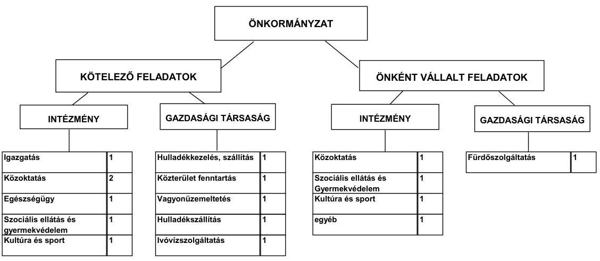

Az Önkormányzat feladatait 2011. június 30-án (a Polgármesteri hivatallal együtt) tíz költségvetési szervvel és hat gazdasági társasággal látta el. Az intézményszervezeti átalakítások következtében a feladatellátás telephelyeinek száma a 2007. évi 41-ről 2011. év I. félév végére 43-ra nőtt. Az Önkormányzat adatszolgáltatása alapján a feladatellátás módjában bekövetkezett változások hatása összesen 2007–2011. év I. féléve között 30,2 millió Ft többletkiadást jelentettek. Az Önkormányzat négy gazdasági társaságban kizárólagos tulajdonnal, kettő társaságban 50% alatti tulajdoni hányaddal rendelkezik. A gazdasági társaságok közterület fenntartás, hulladékszállítás, városüzemeltetés, építőipari tevékenység, terület-bérbeadás, értékesítés, fürdőszolgáltatás, valamint víz- és hulladékkezelés területén kaptak szerepet. Az Önkormányzat feladatellátási szerződés alapján további hat vállalkozás köz-

---

reműködésével látta el a kötelező óvodai nevelés feladatát, valamint egy alapítvány részvételével biztosította a bölcsődei gondozást, továbbá egy vállalkozás az iskolások szállításában közreműködött. A feladatellátásban résztvevő vállalkozásokban az Önkormányzat tulajdoni hányaddal nem rendelkezett. Az önkormányzati tulajdonú gazdasági társaságok a működésükhöz az ellenőrzött időszakban összesen 215,5 millió Ft működési és 3,3 millió Ft fejlesztési célú pénzeszköz átadásban részesültek az Önkormányzattól. A működési célú pénzeszköz átadás 97,2%-át (209,5 millió Ft-ot) a Liget Fürdő Kft. kapta. Az Önkormányzat által folyósított pénzeszközök rendeltetésszerű felhasználásáról szóló számadási kötelezettséget az Áht${ }_{1}$. 13/A. § (2) bekezdése ${ }^{7}$ ellenére a Liget Fürdő Kft. részére nem írtak elő, viszont a gazdasági társaság éves beszámolóját a Képviselő-testület minden évben tárgyalta és elfogadta.

A többségi tulajdonban lévő társaságok pénzügyi egyensúlyi helyzete a 2010. évi saját tőke/jegyzett tőke aránya alapján a Liget Fürdő Kft. kivételével összességében stabil. A fürdőszolgáltatási tevékenységet ellátó társaság veszteséges, a működés biztosításához 2010-ben tőkepótlást kapott 19,3 millió Ft összegben.

Az Önkormányzat pénzügyi egyensúlyi helyzetére befolyást gyakorolhat az önként vállalt feladatok működési célú költségvetési kiadásokon belüli növekvő összege és az önkormányzati kizárólagos tulajdonnal rendelkező gazdasági társaságainak 69,7 millió Ft-os kötelezettség állománya.

Az egyes közszolgáltatások feladatellátásában résztvevő költségvetési szervek működési kiadásainak finanszírozási forrásösszetételét a következő ábra szemlélteti a 2007. és a 2010. években:
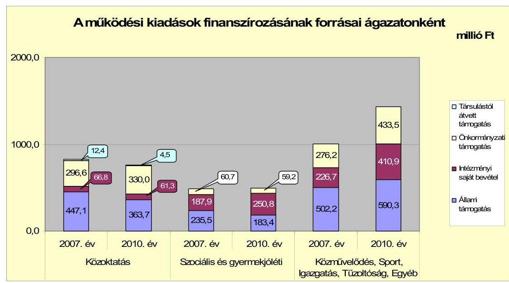

A közoktatási ágazat finanszírozásában az állami támogatás részaránya a 2007. évben 54,3% (447,1 millió Ft), a 2010. évben 47,9%-ra (363,7 millió Ft-ra) csökkent. A változást egy óvoda átvétele ellenére a közoktatási normatívák

[^0]
[^0]:    ${ }^{7}$ 2012. január 1-jétől az Áht${ }_{2}$. nem tartalmaz erre vonatkozóan rendelkezést.

---

számítási rendszerének módosulása és az ellátottak számának csökkenése okozta. A szociális és gyermekjóléti feladatokra 2010-ben teljesített kiadások 9,3 millió Ft-tal nőttek 2007-hez képest, jellemzően a tanyagondnoki szolgálat bevezetése miatt. A közművelődési, a Polgármesteri hivatal igazgatási és egyéb feladatainak kiadásaira fordította az Önkormányzat a működési kiadásainak legnagyobb arányát: a 2007. évben 43,5%-ot (1005,1 millió Ft-ot), a 2010. évben 53,4%-ot (1434,7 millió Ft-ot). A működési kiadások növekedését a fordított áfa befizetési kötelezettség, valamint a vállalkozásoktól visszavett művelődési ház és sportcsarnok kiadásai okozták.

Az Önkormányzatnál a folyó költségvetés egyenlege, működési jövedelme 2007–2010 között működési forrástöbbletet mutatott. A folyó bevételek fedezetet nyújtottak a folyó kiadásokra, a működési egyensúly biztosított volt.
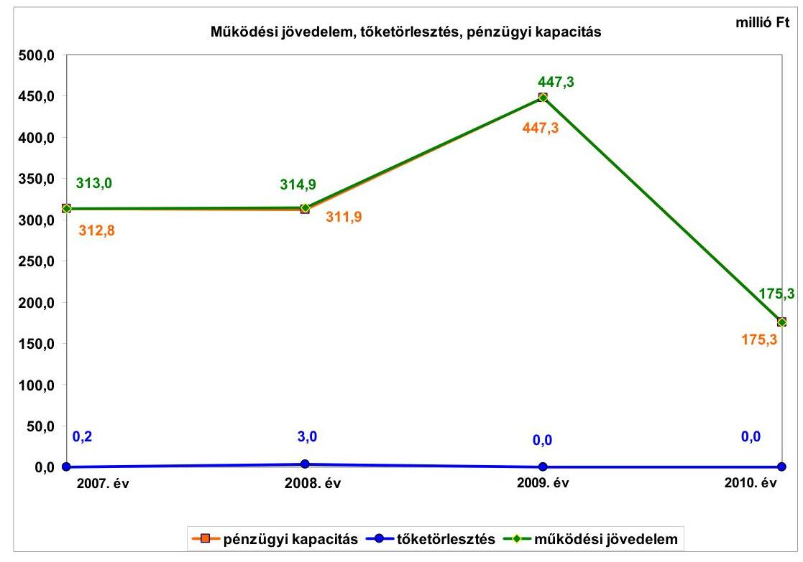

A működési jövedelem az előző évhez képest 2009-re 132,4 millió Ft-tal (42%-kal) emelkedett a folyó bevételek 109,9 millió Ft-os (elsősorban a helyi adóbevételek és a költségvetési támogatások) növekedése, valamint a folyó kiadások (ezen belül is az államháztartáson kívülre átadott pénzeszközök) 22,5 millió Ft-os csökkenése miatt. A működési jövedelem azonban 2009-ről 2010-re 447,3 millió Ft-ról 175,3 millió Ft-ra esett vissza a helyi adók és pótlékok, továbbá a költségvetési támogatás csökkenése következtében. Összességében a működési jövedelem 1250,5 millió Ft forrástöbbletet eredményezett, amely hozzájárult az Önkormányzat fejlesztéseinek finanszírozásához.

Az Önkormányzat pénzügyi kapacitása (nettó működési jövedelme) pozitív értékű volt, mert a működési megtakarítások fedezni tudták a 2007. és 2008. években jelentkező 3,2 millió Ft törlesztési kötelezettségeket. A nettó működési jövedelem összege 2009–2010. években megegyezett a működési jövede-

---

lem összegével, mert ezekben az években nem volt adósságszolgálat miatt fizetési kötelezettsége az Önkormányzatnak.

Az összes folyó bevétel a 2010. évre a 2007–2009. évek átlagához képest 37,4 millió Ft-tal (1,2%-kal) emelkedett, 3039,9 millió Ft volt. A változást a helyi adóbevételek és pótlékok, az áfa- és gépjárműadó bevételek növekedése okozta. A költségvetési támogatás és az szja bevétel együttes összege 2007–2009. évek átlagához viszonyítva 2010-ben 27,7 millió Ft-tal (1,7%-kal) kevesebb, 1641,9 millió Ft volt.

Az Önkormányzatnál a folyó kiadások folyamatosan nőttek, a 2010. évben a 2007–2009. évek átlagához képest 220,5 millió Ft-tal (8,3%-kal) növekedtek, 2864,6 millió Ft volt. Ennek oka, hogy a személyi juttatások járulékkal együtt 42,2 millió Ft-tal, a dologi kiadások 131,2 millió Ft-tal, a transzfer kiadások 30,5 millió Ft-tal, az államháztartáson belülre adott pénzeszközök 20,2 millió Ft-tal növekedtek a 2007–2009. évek átlagához képest. A víziközmű-társulati hitel és a kötvénykibocsátás után fizetett kamatkiadás az előző évhez képest a 2008. évben több mint háromszorosára (30,2 millió Ft-ra), a 2009. évben 10,1 millió Ft-tal (33,4%-kal) nőtt, illetve a 2010. évben 16,5 millió Ft-tal (40,9%-kal) csökkent.

Az Önkormányzat felhalmozási költségvetésének egyenlege folyamatosan negatív összegű volt, így az 2007–2010 között összesen 1290 millió Ft felhalmozási forráshiányt mutatott. A forráshiányra a 2007–2010. években képződött 1247,3 millió Ft nettó működési jövedelem, valamint a 2007. január 1-jén rendelkezésre álló 453 millió Ft pénzkészlet fedezetet nyújtott.

A befejezett fejlesztések közel felét (49,2%-át, 742,4 millió Ft-ot) saját bevételből fedezték. A 2007–2010. évek időszakában 1390 millió Ft értékű fejlesztések és felújítások forrása az előzőekben említett saját erőn kívül, 638,6 millió Ft hazai- és EU-s támogatások mellett 9,0 millió Ft kötvénykibocsátásból származó bevétel volt. A fejlesztések során kialakított létesítmények jövőbeni üzemeltetésének várható kiadásait a Térségi Szociális Gondozási Központ konyha fejlesztésénél nem számszerűsítették. A befejezett fejlesztések korlátozott mértékben teremtenek bevételi lehetőséget az Önkormányzatnak. Az EU-s támogatásból megvalósult fejlesztések finanszírozása likviditási gondot nem okozott.

Az Önkormányzat 2010. december 31-én folyamatban lévő fejlesztési feladatok 2010. évet követő kötelezettség-vállalásainak összege 1074,7 millió Ft volt, amelyből 127,6 millió Ft-ot saját forrásból, 490,3 millió Ft-ot EU-s támogatásból és 214,1 millió Ft-ot hazai támogatásból, valamint 242,7 millió Ft-ot kötvényből terveznek biztosítani. Az EU-s és hazai támogatásból megvalósuló fejlesztéseknél a támogatás előfinanszírozása nem okoz finanszírozási gondot. Az Önkormányzatnál a vállalt fejlesztések fedezeteként megjelölték a saját bevételeket, ezek növeléséből várható többletbevételt. A folyamatban lévő fejlesztési kötelezettségek teljesítéséhez a saját bevétel biztosított. A 2011-ben induló 142,3 millió Ft fejlesztésből I. félévig 73,5 millió Ft kiadást teljesítettek saját forrásból.

---

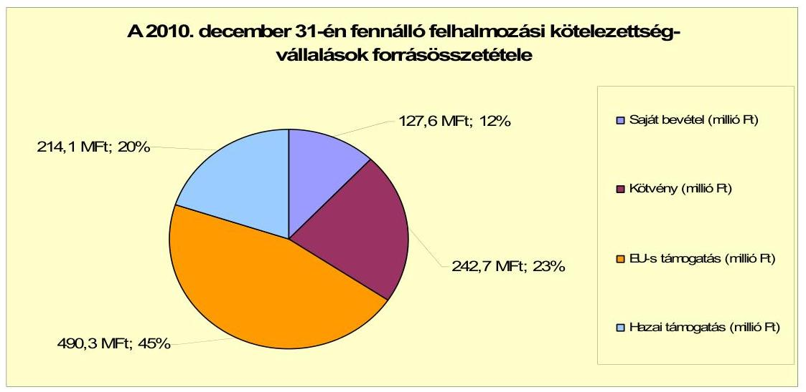

Az Önkormányzat mérleg szerinti pénzintézeti kötelezettsége a 2006. év végéről a 2011. év I. félév végére 226,5 millió Ft-ról 1542,3 millió Ft-ra nőtt, amelyből az árfolyamváltozás miatti különbözet 385,4 millió Ft volt. A fennálló pénzintézeti kötelezettségek a víziközmű-társulat megszűnése miatt átvállalt hitelből és egy fejlesztési célú kötvénykibocsátásból keletkeztek.

Az Önkormányzat pénzintézeti kötelezettségvállalásaira képviselő-testületi döntés alapján került sor, azonban a kötvénykibocsátás előterjesztésében nem mutatták be tételesen a visszafizetés forrásait. A kamat- és – a devizaalapú kötelezettségeket érintő – árfolyamkockázatot bemutatták.

Az Önkormányzat a fejlesztések önerejének biztosítására 2008. évben kibocsátott kötvényét (6 316 ezer CHF) a 2011. évtől kezdte el törleszteni, így – kimutatása szerint – a 2011. év I. félévben kötvényállománya 1406,4 millió Ft-ról 1318,8 millió Ft-ra csökkent.

Az Önkormányzat a kötvényforrásból
 a Képviselő-testület által jóváhagyott fejlesztésekre 2011. év I. félévig 184,4 millió Ft-ot, a kötvény befektetéséből realizált kamatbevételből 276,6 millió Ft-ot használt fel. A CHF-ben fennálló kötvényből 421 ezer CHF (87,6 millió Ft) tőkét törlesztett, és 392,4 ezer CHF (73 millió Ft) kamatot fizetett. A 2007-2011. év I. féléve között a kötvénykibocsátás átmenetileg szabad pénzeszközeiből 280 millió Ft kamatbevételt realizált. Az Önkormányzat kimutatása szerint a 2011. június 30-ig fel nem használt kötvény maradványa 800 millió Ft, amely bankbetétben állt rendelkezésére. A kibocsátásból származó források - annak cél szerinti felhasználásáig szabadon, a pénzintézet korlátozása nélkül befektethetőek. A kötvény kibocsátásából származó bevétel maradványa az Önkormányzat fejlesztéseinek finanszírozásához használható fel. A kibocsátásból származó források felhasználásához bejelentési, adatszolgáltatási kötelezettséget a pénzintézet nem írt elő.

A kötvény visszafizetési kötelezettség törlesztési kockázatot jelenthet, mert a kötelezettségvállaláskor a visszafizetési forrást nem jelölték meg. A kockázat emelkedhet a működési jövedelemtermelő képesség csökkenése, valamint a fennálló kötelezettséget érintő kamat- és árfolyam emelkedés hatására.

---

Az Önkormányzatnak a vizsgált időszakban nem volt szüksége a működés pénzügyi egyensúlyának biztosításához folyószámlahitel, munkabér megelőlegezési hitel vagy egyéb likviditási célú rövid lejáratú hitel felvételére.

Az Önkormányzat 2011. év I. félév végi szállítói tartozása 83,1 millió Ft, melyből lejárt tartozása 65,9 millió Ft volt. Ez utóbbi összegből 60,9 millió Ft 90 napon túli tartozás volt, amely a kerékpárút beruházás végszámlájához kapcsolódó pályázati támogatás fedezetkezelői számlára történő utalásának - a kivitelező hibájából adódó - elhúzódása miatt történt. Átütemezett szállítói tartozás nem volt.

Az Önkormányzat a vizsgált időszakban gazdasági társaságok és egyéb szervezetek részére 144,6 millió Ft kölcsönt nyújtott. Az Önkormányzatnál a jövőbeni pénzügyi egyensúlyi helyzetet befolyásolják és ezért kockázatot jelentenek az összességében 91,3 millió Ft kölcsön nyújtásából származó követelések és a 78,7 millió Ft peres eljárásból származó kötelezettségek.

A Képviselő-testület hitel biztosítékaként jelzálogjog alapításhoz és bejegyzéshez nem járult hozzá a vizsgált időszakban.

Az Önkormányzat kötelezettségeinek 2010. december 31-i, valamint 2011. június 30-i állományát és várható alakulását a kötelezettségek lejáratáig a következő táblázat szemlélteti:

| Megnevezés | Állomány 2010. december 31-én |  |  | Állomány 2011. június 30-án |  |  | Várható kötelezettség 2011-2013. években |  | Várható kötelezettség 2014. évtől |  |
| :--: | :--: | :--: | :--: | :--: | :--: | :--: | :--: | :--: | :--: | :--: |
|  | HUF-ban (millió Ft-ban) | Devizában (összege, ezer CHF-ben) | Deviza nem | HUF-ban (millió Ft-ban) | Devizában (összege, ezer CHF-ben) | Deviza   nem | HUF-   ban   (millió Ft   ban) | Devizában (összege, ezer CHF-ben) | HUF-   ban   (millió   Ft-ban) | Devizában (összege, ezer CHF-ben) |
| Pénzintézeti kötelezettségek |  |  |  |  |  |  |  |  |  |  |
| Víziközmű - társulati hitel | 223,5 |  |  | 223,5 |  |  | 228,6 |  |  |  |
| "Székesfehérvár Önkormányzat" kölcsön |  | 6316,0 | CHF |  | 5894,9 | CHF |  | 2676,5 |  | 3888,0 |
| Pénzintézeti kötelezettségek összesen HUF-ban: | 223,5 |  |  | 223,5 |  |  | 228,6 |  |  |  |
| Pénzintézeti kötelezettségek összesen CHF-ben: |  | 6316,0 | CHF |  | 5894,9 | CHF |  | 2676,5 |  | 3888,0 |
| Szállítói tartozás | 152,1 |  |  | 83,1 |  |  | 83,1 |  |  |  |
| Jogerős végzéssel lezárt de ki nem fizetett kötelezettségek | 78,7 |  |  | 78,7 |  |  | 78,7 |  |  |  |

Az Önkormányzatnak pénzintézetekkel szemben fennálló kötelezettsége a 2011. év I. félév végén 223,5 millió Ft és 5894,9 ezer CHF volt. Ezek várható kötelezettsége (tőke, kamat és egyéb költség) a legutóbbi kamatfizetés feltételei alapján a 2011-2013. években 228,6 millió Ft és 2676,5 ezer CHF. Az Önkormányzatnak a 2011. évben szállítói tartozások rendezése, valamint jogerős végzéssel lezárt, de ki nem fizetett kötelezettségek címén 161,8 millió Ft fizetési kötelezettsége keletkezett. A 2011-2013. évek kötelezettségeinek teljesítésére figyelembe vehető 8,6 millió Ft szabad pénzmaradvány, valamint - az eladhatóságot és behajthatóságot feltételezve - a forgalomképes ingatlanvagyon és 143,6 millió Ft mérlegben kimutatott követelésállomány. A 223,5 millió Ft víziközmű-társulati hitel visszafizetésének fedezete - elkülönített betétben - biztosított. Az Önkormányzat 2014. évet követően jelenleg ismert pénzintézeti kötelezettsége: 3888,0 ezer CHF, amelyet 2018-ig kell visszafizetnie. A további évekre szóló jelenleg ismert pénzintézeti kötelezettség

---

teljesítése hosszú távon kockázatot jelenthet a működési jövedelemtermelő képesség csökkenése miatt.

Az Önkormányzat minősített többségi tulajdonú társaságai kötelezettségeinek 2010. december 31-i, valamint 2011. június 30-i állományát és várható alakulását a kötelezettségek lejáratáig a következő táblázat mutatja be:

| Megnevezés | Állomány 2010. december 31   án | Állomány 2011. június 30-án | Várható kötelezettség   2011-2013. években | Várható kötelezettség   2014. évtől |
| :--: | :--: | :--: | :--: | :--: |
|  | HUF-ban (millió Ft-ban) | HUF-ban (millió Ft-ban) | HUF-ban (millió Ft-ban) | HUF-ban (millió Ft-ban) |
| Várható kötelezettségei fejlesztési célra |  | 18,0 | 7,0 | 22,1 |
| Pénzintézeti kötelezettségek összesen: |  | 18,0 | 7,0 | 22,1 |
| Szállítói tartozás | 93,8 | 31,7 | 31,7 |  |

Az Önkormányzat minősített többségi tulajdonú gazdasági társaságainak kötelezettsége 2011. június 30-án 69,7 millió Ft volt. A társaságoknak a 2011. évtől 29,1 millió Ft pénzintézeti kötelezettséget és 51,7 millió Ft szállítói tartozást kell rendezniük, amely kötelezettségek nem teljesítése hatással lehet az Önkormányzat likviditására, pénzügyi egyensúlyi helyzetére.

Az Önkormányzat 2007-2010 között az eszközállománya után 1344,5 millió Ft összegű értékcsökkenést mutatott ki, miközben az elhasznált eszközök pótlására 374,6 millió Ft-ot fordított. Az Önkormányzatnál a Képviselő-testületnek előterjesztett éves zárszámadási rendeletekben nem mutatták be az Önkormányzat eszközei után tárgyévben elszámolt értékcsökkenés összegét, az eszközpótlásra fordított tényleges kiadásokat, az eszközök használhatósági fokának alakulását.

Az Önkormányzat az ellenőrzött időszakban kiadási megtakarítást eredményező és bevételt növelő intézkedéseket tett. A 2007-2011. év I. féléve között - az Önkormányzat adatszolgáltatása szerint - tett intézkedések hatására 587,5 millió Ft bevételi többletet, továbbá 368,9 millió Ft kiadási megtakarítást mutattak ki. A kiadási megtakarítások 49,7%-a az elrendelt létszámcsökkentések eredménye. Az intézkedések 2007-2011. év I. féléve között önkormányzati szinten összesen 51 álláshely (ebből üres álláshely nem volt) megszüntetését jelentették. Egyes közszolgáltatási területeken azonban feladatbővülések (az óvodai feladatok, művelődési ház visszavétele, valamint a mezőőri tevékenység ellátása) is voltak, amelyek 46 fő létszámnövekedéssel jártak. Ennek következtében az időszak létszáma 5 fővel csökkent. A bevételnövelő intézkedések helyi adók mértékének növekedéséhez, szociális önköltségalapú térítési díj bevezetéséhez, szabad kapacitások hasznosításához kapcsolódtak.

Az utóellenőrzés a pénzügyi egyensúly javítására tett három szabályszerűségi javaslat hasznosítására terjedt ki. Mindhárom javaslatot az intézkedési terv szerinti határidőben megvalósították.

Az Önkormányzat pénzügyi egyensúlya rövid és középtávon biztosított. A pénzügyi egyensúly hosszú távú megőrzésére az Önkormányzatnak fel kell készülnie.

A folyó bevételek fedezetet nyújtottak a folyó- és adósságszolgálattal összefüggő kiadásokra, azonban a 2010. évben a működési jövedelemtermelő képesség

---

csökkent. Az Önkormányzat likvidhitelt a vizsgált időszakban nem vett igénybe.

Az önként vállalt feladatokra fordított kiadások összege növekedett.
A fejlesztések során kialakított létesítmények jövőbeni üzemeltetésének várható kiadásait a Térségi Szociális Gondozási Központ konyha fejlesztésénél nem számszerűsítették. Az EU-s és hazai támogatásból megvalósuló fejlesztéseknél a támogatás előfinanszírozása nem okoz finanszírozási gondot. A folyamatban lévő fejlesztési kötelezettségek teljesítéséhez a saját bevétel biztosított.

A pénzintézeti kötelezettségek teljesítése az Önkormányzat pénzügyi egyensúlyi helyzetét nem veszélyeztették. A fejlesztési célra kibocsátott kötvény tőketörlesztése 2011-től elkezdődött, amelynek visszafizetési forrásait nem számszerűsítették. Az egyéb kötelezettségek közül a jogerős peres eljárás fizetési kötelezettsége kedvezőtlenül befolyásolhatja az Önkormányzat pénzügyi egyensúlyát.

Az Önkormányzat gazdasági társaságainak pénzügyi egyensúlyi helyzete - egy kivétellel - a 2010. évi saját tőke/jegyzett tőke arány alapján stabil. A gazdasági társaságok szállítói és hiteltartozása az Önkormányzat számára helytállási kötelezettséget jelenthetnek. Az Önkormányzat által folyósított pénzeszközök rendeltetésszerű felhasználásáról szóló számadási kötelezettséget a Liget Fürdő Kft. részére nem írtak elő.

Az Állami Számvevőszékről szóló 2011. évi LXVI. törvény 33. § (1) bekezdésében foglaltak értelmében a jelentésben foglalt megállapításokhoz kapcsolódó intézkedési tervet köteles az ellenőrzött szervezet vezetője összeállítani és azt a jelentés kézhezvételétől számított harminc napon belül az ÁSZ részére megküldeni. Amennyiben az intézkedési tervet határidőben nem küldi meg a szervezet, vagy az továbbra sem elfogadható, az ÁSZ elnöke a hivatkozott törvény 33. § (3) bekezdés a)-b) pontjaiban foglaltakat érvényesítheti.

# A 2011. június 30-i pénzügyi egyensúlyi helyzet alapján az ellenőrzés intézkedést igénylő megállapításai és javaslatai a következők: 

## a Polgármesternek

1. Az Önkormányzat pénzügyi egyensúlyi helyzete rövid és középtávon biztosított. A pénzügyi egyensúly hosszú távú megőrzésére az Önkormányzatnak fel kell készülnie. A pénzintézeti kötelezettség állománya a 2008. évtől megemelkedett.

Javaslat:
Folyamatosan tájékoztassa a Képviselő-testületet az Önkormányzat pénzügyi egyensúlyi helyzetéről. Kezdeményezzen szükség esetén intézkedéseket a pénzügyi egyensúly hosszú távú fenntarthatósága érdekében.

Képezzen egyensúlyi (elkülönített) tartalékot az adósságszolgálat jövőbeni teljesítése érdekében.

---

2. Az Önkormányzat minősített többségi tulajdonú gazdasági társaságainak kötelezettsége 2011. június 30-án 69,7 millió Ft volt, amely kötelezettségek nem teljesítése hatással lehet az Önkormányzat likviditására, pénzügyi egyensúlyi helyzetére.

Javaslat:
Továbbra is kísérje folyamatosan figyelemmel - a tulajdonosi jogkört gyakorlók közreműködésével - a minősített többségi tulajdonú gazdasági társaságok kötelezettségeinek alakulását, az Önkormányzat likviditására, pénzügyi egyensúlyi helyzetére gyakorolt hatását. Tegye meg a szükséges és lehetséges intézkedéseket a tulajdonosi érdekek védelme érdekében.
3. A Képviselő-testületnek előterjesztett éves zárszámadási rendeletekben nem mutatták be az Önkormányzat eszközei után tárgyévben elszámolt értékcsökkenés összegét, az eszközpótlásra fordított tényleges kiadásokat, az eszközök használhatósági fokának alakulását.

Javaslat:
Mutassa be a Képviselő-testületnek évente a zárszámadási rendelet előterjesztésében az értékcsökkenés összegét, és ezzel összevetve az elhasználódott eszközök pótlására fordított tényleges kiadásokat, az eszközök használhatósági fokának alakulását.
4. Az Önkormányzat adósságot keletkeztető kötelezettségvállalására (kötvénykibocsátás) vonatkozó képviselő-testületi előterjesztés nem tartalmazta a visszafizetés forrásait.

Javaslat:
Gondoskodjon, hogy a jövőben az adósságot keletkeztető kötelezettségvállalásokról szóló képviselő-testületi előterjesztések tételesen tartalmazzák a visszafizetés forrásait.
5. Az Önkormányzat 100%-os tulajdonában álló Liget Fürdő Kft. működési célú pénzeszköz átadásban részesült, azonban a folyósított pénzeszközök rendeltetésszerű felhasználásáról szóló számadási kötelezettséget nem írtak elő részére.

Javaslat:
Írja elő a számadási kötelezettséget a kizárólagos tulajdonú gazdasági társasága részére nyújtott pénzeszköz átadások felhasználásáról.

A polgármester a helyszíni ellenőrzés
 lezárása után tájékoztatta az Állami Számvevőszéket az Önkormányzat tervezett intézkedéseiről, amelyet az Állami Számvevőszék nem ellenőrzött, arra vonatkozóan véleményt vagy megállapítást nem fogalmaz meg. Az ellenőrzés lezárását követően elvégzett intézkedéseket az Állami Számvevőszék utóellenőrzés keretében vizsgálhatja.

---

A polgármester tájékoztatása szerint a következő intézkedéseket tervezi az Önkormányzat:

- a 2011. évi zárszámadási rendelet előterjesztésében be kívánja mutatni a befektetett eszközök értékcsökkenését, továbbá az elhasználódott eszközök pótlására fordított kiadások összegét és az eszközök használhatósági fokának alakulását;
- 2011. évre vonatkozóan és azt követően minden évre az önkormányzati támogatásban részesített kizárólagos tulajdonú gazdasági társaságok részére elő kívánja írni az éves beszámolási kötelezettséggel egyidejűleg az Önkormányzat által folyósított pénzeszközök rendeltetésszerű felhasználásáról szóló számadási kötelezettséget.

---

# II. RÉSZLETES MEGÁLLAPÍTÁSOK 

## 1. Az ÖNKORMÁNYZAT KÖTELEZŐ ÉS ÖNKÉNT VÁLLALT FELADATAI, A FELADATELLÁTÁS SZERVEZETI KERETEI ÉS ANNAK VÁLTOZÁSAI

Az önkormányzati feladatok körét az önkormányzati SzMSz 2. számú függeléke tartalmazta. A 2007. évtől a zárszámadási rendeletek 14. számú mellékletében mutatták be a kötelező és az önként vállalt feladatokra teljesített működési kiadásokat és bevételeket. Az önként vállalt feladatok - az Önkormányzat besorolása alapján - az oktatás területén a középiskolai oktatáshoz, kollégiumi neveléshez, művészetoktatáshoz, gyermekjóléti szolgálathoz, nevelési tanácsadáshoz, kultúra területén a tájház üzemeltetéshez és turisztikai feladatokhoz kapcsolódtak. A szociális ágazathoz kapcsolódóan önként vállalt feladat: falu és tanyagondnoki feladatok, támogató szolgálat, átmeneti elhelyezést nyújtó ellátás, időskorúak ápoló-gondozó otthoni ellátása és a fogyatékosok nappali ellátása. Polgármesteri hivatal önként vállalt feladatai közé sorolta a rendezvényszervezést, lapkiadást, túraútvonal-szervezést, testvérvárosi kapcsolatok ápolását, valamint a fürdőszolgáltatás támogatását. Az önként vállalt feladatok körében a vizsgált időszakban nem történt változás, azonban az önként vállalt feladatok működési célú költségvetési kiadásokon belüli összege növekedett.

A 2010. évi működési kiadások kötelező feladatonkénti megoszlását és azok finanszírozási arányait a következő táblázat mutatja be:

| Ellátott feladat | Működési   kiadás   összesen   (millió Ft) | Kötelező   feladatok   kiadásainak   részaránya   % | Működési   bevétel   összesen   (millió Ft) | Állami   támogatás   részaránya   % | Intézményi   saját bevétel   részaránya   % | Önkormányzati   támogatás   részaránya   % | Társulástól átvett   támogatás   részaránya |
| :--: | :--: | :--: | :--: | :--: | :--: | :--: | :--: |
| Övodák | 86,8 | 100 | 86,8 | 26,8 | 3,0 | 70,2 | 0 |
| Általános iskolák | 480,8 | 100 | 480,8 | 49,8 | 8,3 | 41,0 | 0,9 |
| Gimnáziumok | 142,5 | 0 | 142,5 | 53,6 | 10,5 | 35,9 | 0 |
| Szakközépiskolák,   szakképző intéz-   mények | 12,2 | 0 | 12,2 | 54,6 | 10,5 | 34,9 | 0 |
| Kollégiumok | 37,2 | 0 | 37,2 | 48,8 | 6,5 | 44,7 | 0 |
| Szociális   intézmények | 445,7 | 21,6 | 445,7 | 38,0 | 51,7 | 10,3 | 0 |
| Gyermekjóléti   intézmények | 47,7 | 59,0 | 47,7 | 29,4 | 42,3 | 28,3 | 0 |
| Közművelődési   intézmények | 90,7 | 72,0 | 90,7 | 1,9 | 20,6 | 77,5 | 0 |
| Sportlétesítmények | 24,7 | 100 | 24,7 | 0 | 10,5 | 89,5 | 0 |
| Egyéb intézmények | 51,2 | 0 | 51,2 | 58,2 | 7,2 | 34,6 | 0 |
| Polgármesteri hivatal   igazgatási kiadásai | 386,1 | 100 | 386,1 | 7,3 | 63,1 | 29,6 | 0 |
| Polgármesteri   hivatalban ellátott   egyéb feladatok   működési kiadása | 882,0 | 88,0 | 882,0 | 60,2 | 16,1 | 23,7 | 0 |
| Működési kiadá-   sok összesen | 2687,6 | 72,3 | 2687,6 | 42,3 | 26,9 | 30,6 | 0,2 |

---

Az Önkormányzat - adatszolgáltatása szerint - a 2010. évi 2687,6 millió Ft költségvetési kiadásból 1943,1 millió Ft-ot (72,3%-ot) a kötelező feladatok, 744,5 millió Ft-ot (27,7%-ot) az önként vállalt feladatok ellátására fordított. Az önként vállalt feladatokra fordított kiadások nagysága a működési célú költségvetési kiadásokon belül a 2007-2009. évek átlagához$^8$ viszonyítva 82,1 millió Ft-tal emelkedtek 2010-ben. Az Önkormányzat pénzügyi helyzetére befolyást gyakorolhat az önként vállalt feladatok működési célú költségvetési kiadásokon belüli növekvő összege.

Az Önkormányzat működési kiadásaiból 759,5 millió Ft-ot (28,3%-ot) közoktatási, 493,4 millió Ft-ot (18,3%-ot) szociális és gyermekjóléti, 1434,7 millió Ft-ot (53,4%-ot) közművelődési, sport, igazgatás és egyéb intézmények fenntartására fordított a 2010. évben.

A közoktatási ágazat finanszírozásában az állami támogatás részaránya a 2007. évben 54,3% (447,1 millió Ft), a 2010. évben 47,9%-ra (363,7 millió Ftra) csökkent. A változást egy óvoda átvétele ellenére a közoktatási normatívák számítási rendszerének módosulása és az ellátottak számának csökkenése okozta. Az intézményi saját bevételek ágazaton belüli aránya a vizsgált időszakban 8,1-9,3% (66,8 millió Ft-75,7 millió Ft)$^9$ között mozgott. A vizsgált időszakban az állami támogatások 83,4 millió Ft összegű csökkenését az önkormányzati támogatás összegének folyamatos emelésével$^{10}$ kompenzálták. A társulástól átvett támogatások összességében 34,2 millió Ft-tal járultak hozzá a kiadásokhoz.

Az Önkormányzat a szociális és a gyermekjóléti feladatainak működési kiadásaira a 2007-2009. években átlagosan 489 millió Ft-ot (az összes működési kiadás 19,7%-át), a 2010. évben 493,4 millió Ft-ot (18,4%-át) fordított. Az időszakban a működési kiadások csökkenését az ellátottak száma befolyásolta. A szociális és gyermekjóléti feladatok állami támogatása a 2007-2009. évek 234,9 millió Ft-os (48%-os) átlagához képest a 2010. évre arányában és értékében is csökkent, 183,4 millió Ft-ra (37,2%-ra) az állami normatív támogatások rendszerének változása miatt. Az önkormányzati támogatás részarányát - az állami támogatás csökkenése miatt - a 2007-2009. évek 44,9 millió Ft-os (9,2%-os) átlagáról a 2010. évre 59,2 millió Ft-ra (12%-ra) emelte az Önkormányzat.

A közművelődési, a Polgármesteri hivatal igazgatási és egyéb feladatainak kiadásaira fordította az Önkormányzat a működési kiadásainak legnagyobb arányát: a 2007. évben 43,5%-ot (1005,1 millió Ft-ot), a 2010. évben 53,4%-ot (1434,7 millió Ft-ot). A működési kiadások növekedését a fordított áfa befizetési kötelezettség, valamint a vállalkozásoktól visszavett művelődési ház és sportcsarnok kiadásai okozták. Az egyéb önkormányzati feladatok működési kiadásai tartalmazták többek között a városüzemeltetési feladatokat, a

[^0]
[^0]:    $^8$ Az önként vállalt feladatokra 2007-ben 582,2 millió Ft-ot, 2008-ban 663,8 millió Ft-ot, 2009-ben 741,3 millió Ft-ot fordítottak. A három év átlaga 662,4 millió Ft.
    $^9$ A saját bevételek ágazaton belül 2007-ben 66,8 millió Ft (8,1%), 2008-ban 76,7 millió Ft (9,2%), 2009-ben 75,7 millió Ft (9,3%), 2010-ben 61,3 millió Ft (8,1%) volt.
    $^{10}$ Az önkormányzati támogatás 2007-ben 296,6 millió Ft, 2008-ban 310,5 millió Ft, 2009-ben 315,4 millió Ft, 2010-ben 330 millió Ft volt.

---

helyi újság működtetését, a sportegyesületek, civil szervezetek, a fürdőszolgáltatás, és helyi kisebbségi önkormányzatok támogatását. Az Önkormányzat közművelődési, a Polgármesteri hivatal igazgatási és egyéb feladatai állami támogatásának részaránya az ágazati összes bevételen belül a 2007-2009. évek 44,6%-os (519,9 millió Ft-os) átlagáról a 2010. évre 41,1%-ra (590,3 millió Ftra) csökkent, abszolút értékben azonban emelkedett, mert az állami támogatások növekedése nem érte el a feladatellátás kiadásai emelkedésének a mértékét. Az állami támogatások változása miatt az intézményi saját bevételek és az önkormányzati támogatás együttes összege a 2007. évi 502,9 millió Ft-ról (50%-ról) a 2010. évben 844,4 millió Ft-ra (58,9%-ra) emelkedett.

Az Önkormányzat kötelező és önként vállalt feladatait 2011. év I. félév végén (a Polgármesteri hivatallal együtt) tíz költségvetési szervvel látta el, az intézmények száma a 2007. év január 1-jei nyolcról a 2011. év I. félévre kilencre nőtt. Az Önkormányzat költségvetési szervei feladatukat 2006. év végén 41 telephelyen, 2011. év I. félév végén 43 telephelyen látták el. Az Önkormányzat költségvetési intézményei közül három közoktatási, kettő közművelődési, kettő szociális, egy egészségügyi, egy egyéb$^{11}$ feladatokat látott el a 2011. év I. félév végén. Az Önkormányzat intézményei közül öt$^{12}$ önállóan működő és gazdálkodó, négy önállóan működő volt 2011. év I. félévben. Igazgatási feladatokat a Polgármesteri hivatal két telephelyen$^{13}$ látta el.

Az Önkormányzat intézményfenntartó társulási$^{14}$ formában működtetett három intézményt: egy - óvodai feladatokat is ellátó - általános iskolát, a családsegítő és gyermekjóléti szolgálatra, nevelési tanácsadásra alapított intézményét, továbbá a szociális gondozási központot. Az állami támogatás és a társult önkormányzatok támogatása biztosította a működtetéshez szükséges forrásokat.

Az Önkormányzat kötelező és önként vállalt feladatainak ellátásában 2011. év I. félévben részt vett hat gazdasági társaság, amelyek közül négy az Önkormányzat kizárólagos tulajdona. A Gyomaszolg Ipari Park Kft. a korábbi építési és szolgáltató üzem megszűnése után, 1991-ben lett alapítva, tevékenységi köre kibővült a városüzemeltetési feladatokkal, majd 1999-től az Ipari Park cím elnyerése után, annak létrehozásával és működtetésével. A Zöldpark Kft.-t 2008-ban alapította az Önkormányzat közterület-fenntartási, zöldterület kezelési feladatokra. A Liget Fürdő Kft. fürdőszolgáltatást, a Gyomaközszolg Kft. - a Gyomaszolg Ipari Park Kft.-ből történő kiválással - 2007-től hulladékkezelés-, szállítás, gyepmesteri feladatokat látott el. A Regionális Hulladékkezelő Kft.-ben az Önkormányzat tulajdoni részesedése 33,85%, a Békés Megyei Vízművek

[^0]
[^0]:    $^{11}$ Városi Alapfokú Művészetoktatási Intézmény
    $^{12}$ Az öt önállóan működő és gazdálkodó intézményből három közoktatási, egy egészségügyi, egy szociális feladatot látott el.
    $^{13}$ A Polgármesteri hivatalnak egy kirendeltsége volt, amely a helyi adottságok miatt alakult ki. A kirendeltség helyi ügyfélszolgálatot, anyakönyvi nyilvántartást, mezőőri feladatokat lát el kettő fő alkalmazottal.
    $^{14}$ A három intézményfenntartó társulásban Hunya és Csárdaszállás települések is részt vesznek.

---

Zrt.-ben 3,95%. A kizárólagos tulajdonú négy gazdasági társaságnál a vizsgált időszakban átszervezés nem történt.

A többségi tulajdonban lévő társaságok pénzügyi helyzete a 2010. évi saját tőke/jegyzett tőke aránya alapján a Liget Fürdő Kft. kivételével összességében stabil. A fürdőszolgáltatási tevékenységet ellátó társaság veszteséges, a működés biztosításához 2010-ben tőkepótlást kapott 19,3 millió Ft összegben és 0,1 millió Ft-tal tőkeemelés történt. A Gyomaközszolg Kft. 2009-ben részesült 4,9 millió Ft tőkeemelésben. Az Önkormányzat piaci alapú befektetés címén a Gyomaszolg Ipari Park Kft.-nek 70 millió Ft tőkepótlást adott az inkubátorház fejlesztése miatt. A pénzügyi helyzetet negatívan befolyásolja a Liget Fürdő Kft. veszteséges gazdálkodása.

Az Önkormányzat kizárólagos tulajdonába lévő
 gazdasági társaságok közül legnagyobb saját tőkével a Gyomászolg Ipari Park Kft. rendelkezett 331,4 millió Ft összegben, jegyzett tőkéje 139,6 millió Ft volt a 2010. év végén. A 2010-ben a gazdasági társaságok saját tőke-jegyzett tőke aránya a Liget Fürdő Kft.-nél csupán 0,2\%, a Gyomáközszolg Kft.-nél 1,1\%, a Gyomászolg Ipari Park Kft.-nél 2,4\%, a Zöldpark Kft.-nél 3,5\% volt.

A négy kizárólagos tulajdonú gazdasági társaságnál - a társaságok által nyújtott adatszolgáltatás alapján - az önkormányzati kötelező és önként vállalt feladatokhoz rendelt 2010. év végi nettó vagyona összesen 5621,7 millió Ft volt. Ebből 4677,7 millió Ft (83,2\%) a kötelező feladatokhoz és 944 millió Ft (16,8\%) az önként vállalt fürdőszolgáltatási feladatokhoz kapcsolódott. A Gyomászolg Ipari Park Kft. 2001-től megállapodás alapján a közutak, kerékpárutak és járdák kezelői jogát átvette az Önkormányzattól. Ezek nettó értéke 2010. év végén 4623,7 millió Ft. Az Önkormányzat a társaságok tulajdonába vagyont nem adott.

Az Önkormányzat feladatellátási szerződés alapján, vállalkozások közreműködésével látta el a kötelező óvodai nevelés feladatát, valamint bölcsődei gondozást. Vállalkozási szerződés keretében biztosította továbbá a közművelődési és sport feladatokat. A feladatellátásban résztvevő vállalkozásokban az Önkormányzat tulajdoni hányaddal nem rendelkezett. 2011. év I. félév végén hat vállalkozás végzett óvodai, egy alapítvány bölcsődei feladatokat. A feladatátvételt megelőzően, 2007. augusztus 31-ig az óvodai feladatokat hét nonprofit és kiemelten nonprofit gazdasági társaság, bölcsődei gondozás feladatait egy magánalapítvány végezte, a Sportcsarnok és a Művelődési Központ üzemeltetését helyi vállalkozó biztosította.

Az Önkormányzatnál 2007. és 2011. év I. félév közötti időszakban három esetben - eddig vállalkozás által ellátott - feladatátvételre került sor:

- A 2007. évben visszavételre került egy óvodai egység, mely az általános iskolai feladatot ellátó önállóan gazdálkodó és működő költségvetési szervhez került;
- A közművelődési feladatok ellátása 2009-ben visszakerült az Önkormányzathoz;
- A városi sportcsarnok működtetése 2010. március 1-jétől egy oktatást végző intézményhez került.

---

Az Önkormányzat adatszolgáltatása szerint 2011. augusztus 1-jétől visszavett egy újabb óvodai egységet.

Az Önkormányzat adatszolgáltatása alapján a feladatellátás módjában bekövetkezett változások összesen 2007-2011. év I. féléve között 30,2 millió Ft többletkiadást jelentettek.

Az Önkormányzat a zöldterület parkgondozási feladatainak ellátását a 2009. évtől saját gazdasági társaságával látja el. A feladatátadás következtében a kiadások 20,6 millió Ft-tal csökkentek a 2009-2011. év I. félévben.

A szociális feladatok ellátásához kapcsolódóan tanyagondnoki szolgálatot vezetett be az Önkormányzat kettő körzetben, a 2009-2010. években. Az új feladat kiadása összesen 9,1 millió Ft volt, amelyre 83,0\%-ban (7,5 millió Ft) állami támogatás nyújtott fedezetet. Az új feladat ellátása miatti többletkiadás 1,5 millió Ft volt a 2009-2011. év I. félév között.

Az önkormányzati feladatellátásban résztvevő gazdasági társaságokat a 4. számú melléklet mutatja.

# 2. Az ÖNKORMÁNYZAT PÉNZÜGYI EGYENSÚLYI HELYZETÉT BEFOLYÁSOLÓ TÉNYEZŐK 

A hagyományos költségvetési szerkezet helyett az Önkormányzat pénzügyi helyzetét a CLF módszerrel mutatjuk be, amelyben jobban elkülönülnek a vagyonnal kapcsolatos bevételek és kiadások az önkormányzati feladatokkal kapcsolatos közvetlen működtetési bevételektől és kiadásoktól. A módszer következetesen elkülöníti a folyó és a felhalmozási költségvetés bevételeit és kiadásait, azok költségvetési egyenlegeit. A saját folyó bevételek, valamint a saját felhalmozási bevételek nem tartalmazzák az előző évi pénzmaradványok felhasználásából származó pénzforgalom nélküli bevételeket ${ }^{15}$.

A folyó költségvetés egyenlege, a működési jövedelem megmutatja, hogy az Önkormányzat éves folyó bevétele fedezetet biztosít-e a kötelező és önként vállalt feladatellátáshoz kapcsolódó éves folyó kiadására. A működési jövedelem negatív értéke pénzügyileg fenntarthatatlan helyzetet jelez. A mutató pozitív értéke megtakarítást mutat, amely forrásul szolgálhat az Önkormányzat fennálló kötelezettségei megfizetéséhez, valamint fejlesztéseihez.

A felhalmozási költségvetés pozitív értéke felhalmozási többletet mutat, amely a jövőbeni fejlesztések forrását biztosíthatja. Amennyiben a folyó költségvetési hiány finanszírozása a felhalmozási többletből történik, ez szűkebb értelemben vagyonfelélésnek tekinthető. Amennyiben a felhalmozási költségvetés megtakarítása fejlesztési célú hitelek, kötvények adósságszolgálatát finanszírozza, az változatlan vagyontömeg mellett, a korábban megelőlegezett tőkebevételek valós realizációjának tekinthető. A felhalmozási deficit által generált finanszírozási igény önmagában nem jár pénzügyi kockázattal, a pénz-

[^0]
[^0]:    ${ }^{15}$ A költségvetési években kialakuló hiány finanszírozása az előző évi pénzmaradvány és a korábbi években képzett tartalékok felhasználásával is történhet.

---

ügyileg fenntartható beruházásokhoz kapcsolódó kötelezettségvállalás (adósságszolgálat) átlátható és szabályozott költségvetési gazdálkodással teljesíthető.

A módszer a pénzügyi kapacitás fogalmát helyezi a középpontba. Az adós hitelfelvételi képessége, hosszú távú fizetőképessége vagy bonitása a pénzügyi kapacitással, ezen belül is a nettó működési jövedelemmel jellemezhető. A nettó működési jövedelem negatív értéke az egyes költségvetési években jelentkező adósságszolgálat túlzott mértékére utal. ${ }^{16}$ A nettó működési jövedelem negatív értékének felhalmozási többletből, vagy további hitelből történő finanszírozása pénzügyileg nem fenntartható gazdálkodást vetít előre. A pozitív értéket mutató nettó működési jövedelem fejlesztési kiadások fedezetét biztosíthatja, illetve a folyamatosan, évenként képződő pozitív nettó működési jövedelemből meghatározható a jövőben vállalható, teljesíthető éves adósságszolgálat, ily módon az a hitelösszeg, amely - a többi tényezőt, feltételt adottnak tekintve visszafizetési kockázat nélkül felvehető.

A CLF módszer alapján a pénzügyi kapacitás mértéke az Önkormányzat összevont, nettósított, a központi információs rendszerbe a Magyar Államkincstáron keresztül leadott éves költségvetési beszámolójának 80-as űrlapjában szerepeltetett adatok alapján került meghatározásra.

A számítási leírás némileg eltér az ÁSZ módszertanában korábban alkalmazott gyakorlattól. A jelen besorolás általános közgazdasági meggondolásokon alapul, amely megjelenik az SNA statisztikai módszertanában is. Folyó tételek alatt értjük azokat a kiadásokat és bevételeket, amelyek a gazdálkodó szervezet helyzetét automatikusan nem változtatják. Bevételi oldalon ilyenek az adók, a tényező jövedelmek, a transzferek ${ }^{17}$, kiadási oldalon a transzferek és a szolgáltatás igénybevételével kapcsolatos működési kiadások. A folyó költségvetésben a bevételekben nem térül meg, a kiadásokban nem jelenik meg az amortizáció, a vagyoni helyzetet az egyenleg befolyásolja.

A folyó költségvetés egyenlege (működési jövedelem) tartalmazza a kamatbevételeket és a kamatkiadásokat is, mind a működési, mind a fejlesztési kamatot, valamint a visszatérülő és befizetendő áfa teljes összegét, mert ezek közgazdaságilag tényező jövedelmek. Nem tartalmazzák viszont a követelés elengedés miatt könyvelt bevételi és kiadási pénzforgalmi tételeket, mert valójában technikai elszámolási műveletnek minősülnek, a bevétel soha nem realizálódott, és költségvetési kiadás sem történt.

A felhalmozási költségvetésben a bevételek között a vagyon megőrzésére és bővítésére fordítható források jelennek meg. A felhalmozási vagy tőketételek módosítják a vagyon nagyságát. A privatizációs bevétel csökkenti a vagyont, a fizikai beruházás, pénzügyi befektetés növeli.

[^0]
[^0]:    ${ }^{16}$ kivéve, ha annak finanszírozására a korábbi években képzett tartalékok fedezetet nyújtanak
    ${ }^{17}$ Transzfer kiadásoknak nevezzük azokat a folyó és felhalmozási tételeket, amelyeket nem az adott önkormányzat használ fel szolgáltatásnyújtásra.

---

A nettó működési jövedelmet a tőketörlesztés levonásával a folyó költségvetés egyenlegéből származtatjuk.

# 2.1. A működési és a felhalmozási egyensúly változása 

CLF módszer szerinti önkormányzati adatok

| Megnevezés | 2007. év | 2008. év | 2009. év | 2010. év |
| :--: | :--: | :--: | :--: | :--: |
| Folyó bevételek | 2786,7 | 3055,4 | 3165,3 | 3039,9 |
| Folyó kiadások | 2473,7 | 2740,5 | 2718,0 | 2864,6 |
| Működési jövedelem | 313,0 | 314,9 | 447,3 | 175,3 |
| Nettó működési jövedelem =működési jövedelem - tőketörlesztés | 312,8 | 311,9 | 447,3 | 175,3 |
| Felhalmozási bevételek | 108,5 | 133,1 | 152,6 | 174,9 |
| Felhalmozási kiadások | 242,4 | 573,1 | 424,6 | 619,3 |
| Felhalmozási költségvetés egyenlege | $-133,9$ | $-440,0$ | $-272,0$ | $-444,4$ |
| Finanszírozási műveletek nélküli (GFS) pozíció = működési jövedelem + felhalmozási költségvetés egyenlege | 179,1 | $-125,1$ | 175,3 | $-269,1$ |
| Finanszírozási műveletek egyenlege | $-0,5$ | 193,2 | 795,9 | $-33,3$ |
| Tárgyévi pénzügyi pozíció | 178,6 | 68,1 | 971,2 | $-302,4$ |
| Egyéb tájékoztató adatok |  |  |  |  |
| Összes kötelezettség* | 288,0 | 1333,8 | 1609,1 | 1829,4 |
| -ebből rövid lejáratú | 64,5 | 110,3 | 234,0 | 610,5 |
| Folyószámlahitel napi átlagos állománya ** | 0,0 | 0,0 | 0,0 | 0,0 |
| Likvidhitel napi átlagos állománya** | 0,0 | 0,0 | 0,0 | 0,0 |
| Munkabérhitel napi átlagos állománya** | 0,0 | 0,0 | 0,0 | 0,0 |
| Finanszírozásba vonható eszközök: | 631,6 | 1494,6 | 1670,8 | 1368,4 |
| Tartós hitelviszonyt megtestesítő értékpapírok év végi állománya | 0,0 | 270,0 | 0,0 | 0,0 |
| Hosszú lejáratú bankbetétek év végi állománya | 0,0 | 0,0 | 0,0 | 0,0 |
| Értékpapírok év végi állománya | 0,0 | 525,0 | 0,0 | 0,0 |
| Pénzeszközök (idegen pénzeszközök nélkül) év végi állománya | 631,6 | 699,6 | 1670,8 | 1368,4 |

* Az összes kötelezettséget a passzív pénzügyi elszámolások nélkül vettük figyelembe, mert a passzívák a pénzmaradvány elszámolás tételei közé tartoznak.
** A folyószámla, a likvid- és a munkabérhitel átlagos állományát 365 napos osztószámmal és nem a fennálló napok számával vettük figyelembe.

A részletes pénzügyi adatokat a jelentés 2. számú melléklete mutatja be.
A vizsgált időszakban a működési jövedelmet a következő ábra szemlélteti:

---

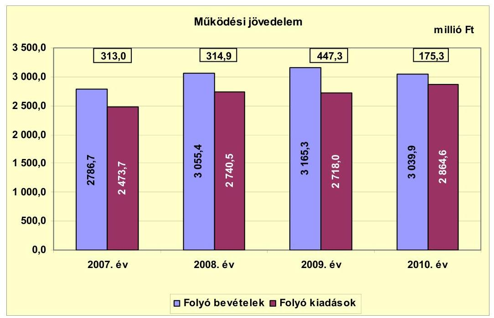

Az Önkormányzat folyó költségvetési egyenlege, működési jövedelme a 2007-2010. évek között pozitív összegű volt. A folyó bevételek fedezetet nyújtottak a folyó kiadásokra, a működési egyensúly biztosított volt. A működési jövedelem az előző évhez képest 2009-re 132,4 millió Ft-tal (42\%-kal) emelkedett a folyó bevételek 109,9 millió Ft-os (elsősorban a helyi adóbevételek és a költségvetési támogatások) növekedése, valamint a folyó kiadások (ezen belül is az államháztartáson kívülre átadott pénzeszközök) 22,5 millió Ft-os csökkenése miatt. A működési jövedelem azonban 2009-ről 2010-re 447,3 millió Ft-ról 175,3 millió Ft-ra esett vissza, mert a folyó bevételek az előző évhez képest 125,4 millió Ft csökkentek a működési bevételek és a központi támogatások változása miatt, miközben a folyó kiadások 146,6 millió Ft-tal nőttek a működési kiadások és átadott pénzeszközök emelkedése következtében. Összességében a működési jövedelem 1250,5 millió Ft forrástöbbletet eredményezett, amely forrásául szolgálhatott az Önkormányzat fejlesztéseinek finanszírozásához.

Az Önkormányzat pénzügyi kapacitása a vizsgált időszakban pozitív értéket mutatott, amelyet a következő ábra szemléltet:

---

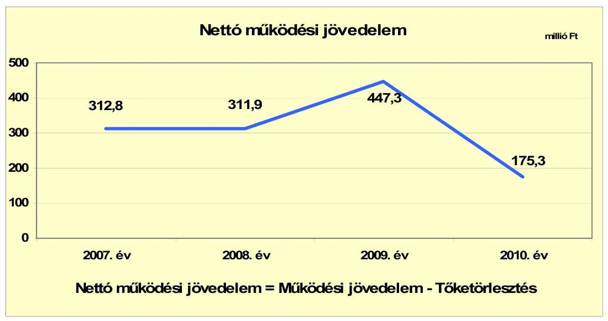

A nettó működési jövedelem ${ }^{18}$ értéke a folyó költségvetési pozíció mellett az adott költségvetési év adósságtörlesztésének hatását is tükrözi. A 2007. évi 313 millió Ft működési jövedelemnek 0,06\%-át, 0,2 millió Ft-ot, a 2008. évi 314,9 millió Ft működési jövedelemnek 0,9\%-át, 3,0 millió Ft-ot tett ki a 2007 előtt felvett fejlesztési célú hitelhez kapcsolódó tőketörlesztés. A nettó működési jövedelem összege 2009-2010. években megegyezett a működési jövedelem összegével, mert ezekben az években nem volt adósságszolgálata az Önkormányzatnak.

A 2007-2010. években az Önkormányzat felhalmozási
 költségvetésének egyenlege negatív összegű volt, amelyet a következő ábra szemléltet:
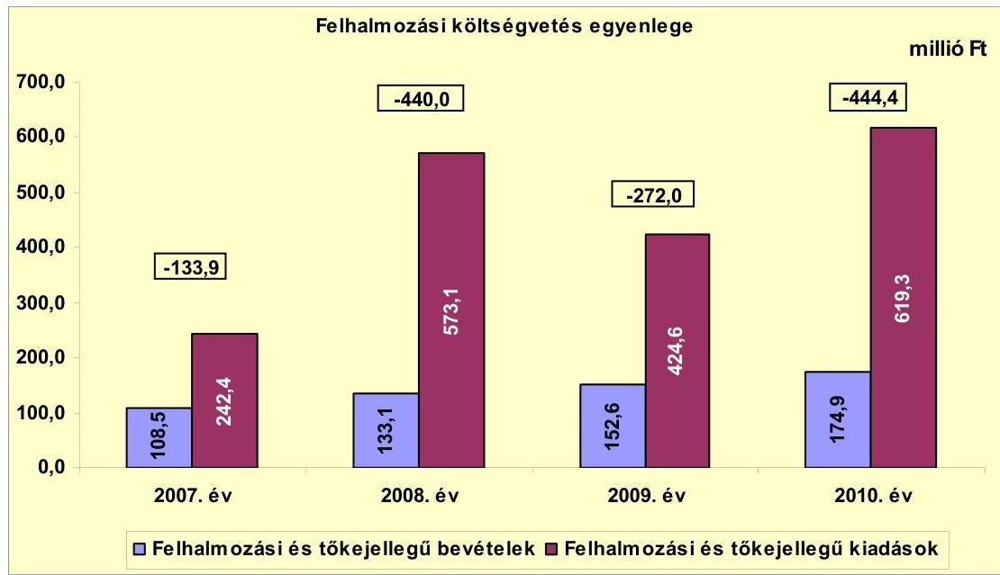

[^0]
[^0]:    ${ }^{18}$ pénzügyi kapacitás

---

A felhalmozási forráshiány keletkezésének oka, hogy a vizsgált években a saját tőkebevételek, valamint az államháztartáson belülről és kívülről kapott felhalmozási célú támogatások nem nyújtottak fedezetet a felhalmozási kiadásokra. A vizsgált időszakban jelentkező, a CLF módszer alapján számított összes felhalmozási forráshiány 1290,3 millió Ft volt, a forráshiányra a 2007-2010. években képződött 1247,3 millió Ft nettó működési jövedelem, valamint a 2007. január 1-jén rendelkezésre álló 453 millió Ft pénzkészlet nyújtott fedezetet.

Az Önkormányzat teljes finanszírozási hiánya ${ }^{19}$ a CLF módszer szerint 2008-ban 125,1 millió Ft, 2010-ben 269,1 millió Ft volt. A 2007-ben 179,1 millió Ft, a 2009-ben 175,3 millió Ft finanszírozási többletet realizált. A teljes finanszírozási igényt a 2008. évben a finanszírozási műveletek egyenlege, a 2010. évben ezen túlmenően az előző évben keletkezett pénzmaradvány igénybevételével biztosította. A finanszírozási műveletek egyenlegét 2007-2010 között a következő ábra mutatja:
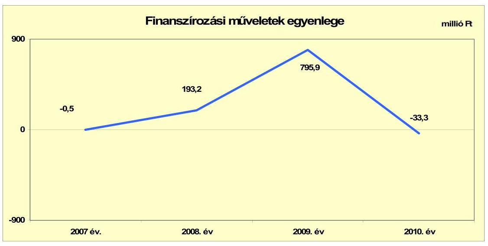

A finanszírozási műveletek pozitív egyenlegét 2008-ban a kötvénykibocsátás, 2009-ben a kötvénykibocsátásból vásárolt értékpapírok értékesítése eredményezte. A finanszírozási műveleteket a jelentés 2. számú mellékletének 4.1-4.8 pontjai részletezik.

Az Önkormányzat zárszámadási rendeletében a működési és fejlesztési többletet/hiányt a hagyományos költségvetési szerkezet alapján mutatta be, amelyet a jelentés 1. számú melléklete szemléltet. A zárszámadási rendeletekben 2007-ben 414,7 millió Ft, 2008-ban 478,1 millió Ft, 2009-ben 1197,3 millió Ft, 2010-ben 91,5 millió Ft többletet mutattak ki.

Az Önkormányzat kamatbevételeit és kamatkiadásait a 2007-2011. év I. félév között a következő ábra mutatja:

[^0]
[^0]:    ${ }^{19}$ A működési jövedelem és a beruházási költségvetés összevont egyenlege.

---

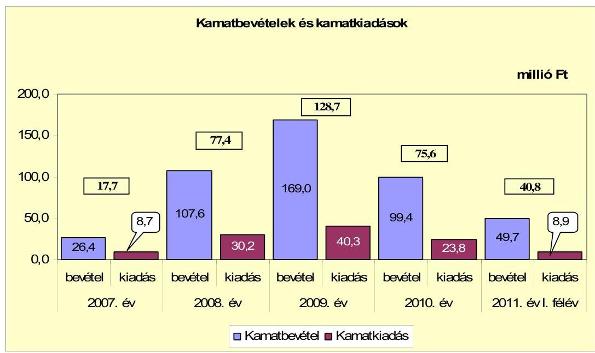

A 2007-2011. év I. félév között az Önkormányzat összesen 111,9 millió Ft kamatot fizetett meg. A 2008. évben történt kötvénykibocsátás miatt a kamatbevételek 81,2 millió Ft-tal, a kamatkiadások 21,5 millió Ft-tal emelkedtek az előző évhez képest. Az Önkormányzat a kibocsátott kötvény egy részét betétben, értékpapírban helyezte el, illetve pénzpiaci műveleteket végzett, amelynek következtében 280 millió Ft kamatot realizált. Az átmenetileg szabad pénzeszközein realizált kamatbevétel, a teljes kamatráfordítást 204,1%-kal (340,2 millió Ft) haladta meg.

# 2.2. Az Önkormányzat bevételeinek változása 

Az összes folyó bevétel 2007-2009 között ${ }^{20}$ folyamatosan növekedett, majd 2010-re az előző évhez képest 125,4 millió Ft-tal (4%-kal) csökkent alapvetően a központi támogatások és a helyi adóbevétel miatt. A 2011. év I. félévi teljesített folyó bevétel 1338 millió Ft, a 2010. évinek 44%-a.

Az Önkormányzat 2007-2011. év I. félév között realizált bevételi jogcímeinek számszaki adatait a következő grafikon mutatja be:

[^0]
[^0]:    ${ }^{20}$ Az összes folyó bevétel 2007-ben 2786,7 millió Ft, 2008-ban 3055,4 millió Ft, 2009-ben 3165,3 millió Ft, 2010-ben 3039,9 millió Ft volt.

---

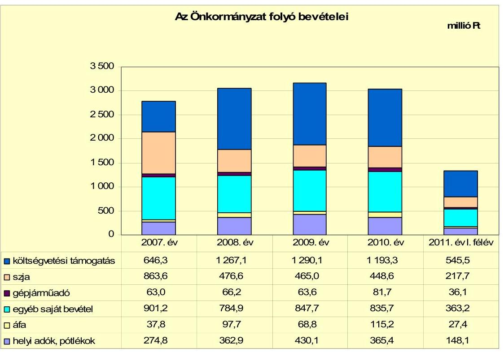

Az Önkormányzat költségvetési támogatása és az szja bevétel együttes összege a 2007. évben 1509,9 millió Ft volt. A központi támogatáselosztás változása következtében a 2007-2009. évek átlagához viszonyítva 2010-ben 27,7 millió Ft-tal (1,7%-kal) kevesebb, 1641,9 millió Ft bevételt realizáltak ezeken a jogcímeken. A költségvetési támogatás összege a 2007. évről 2008. évre 620,8 millió Ft-tal (96,1%-kal) nőtt. A változást a forráselosztásban történt változás és az ellátotti létszám növekedése okozta egy óvoda vállalkozástól történő visszavétele miatt. Az átengedett szja nagyságát az szja helyben maradó része és az adóerőképesség alapján számított jövedelemkülönbség mérséklésére kapott támogatás befolyásolta.

Az szja helyben maradó része folyamatosan növekedett, 2007-ről 2010-re 33,8 millió Ft-tal (48,6%-kal) emelkedett. A jövedelemkülönbség mérséklésére címén 2007-ben 361,6 millió Ft-ot, 2008-ban 398,4 millió Ft-ot, 2009-ben 367,6 millió Ft-ot, 2010-ben 345,2 millió Ft-ot kaptak.

A költségvetési támogatások összegében 2007-2010 között összesen 54 millió Ft fejlesztési és vis maior támogatás szerepelt (általános iskola tetőhéjazat cseréje, településfejlesztési koncepciókészítés, kirendeltség felújítás).

Az Önkormányzatnál a helyi adókból és pótlékokból származó bevételek összege a 2007-2010. években 274,8-430,1 millió Ft, a folyó bevételeken belüli aránya 9,9-13,6% között ${ }^{21}$ alakult. A helyi adóbevételek a 2007. évről a 2008. évre 32,1%-kal (88,1 millió Ft-tal) növekedtek, mert az építményadónál az adóellenőrzés során adózatlan építmények lettek feltárva, valamint az ipar-

[^0]
[^0]:    ${ }^{21}$ A helyi adók működési bevételeken belüli aránya 2007-ben 9,9%, 2008-ban 11,9%, 2009-ben 13,6%, 2010-ben 12% volt.

---

űzési adónál az elindult nagyberuházásokhoz (vasút és hídépítés) kapcsolódóan egy olajkutató vállalkozás több adót fizetett. A helyi adókból és pótlékokból 2009. évben az előző évhez képest 67,2 millió Ft-tal (18,5%-kal) több adó folyt be az adónemek mértékének 2009. január 1-jei emelkedése és a behajtási tevékenység eredményessége következtében. A helyi adókból és pótlékokból származó bevétel az előző évhez képest 2010. évre 15%-kal (64,7 millió Ft-tal) csökkent, mert az iparűzési adónál az olajkutató vállalkozás megosztási aránya 14%-ról 2%-ra csökkent. A helyi adóbevételek közel 75%-át az iparűzési adó tette ki 2010-ben.

Az Önkormányzat a vizsgált években öt helyi adónemet, a helyi iparűzési adót, az építményadót, a telekadót, a magánszemélyek kommunális adóját és a tartózkodás utáni idegenforgalmi adót alkalmazta. Az iparűzési adónál az adó mértéke 2007-2011 között 1,9% volt, az ideiglenes jellegű piaci és vásározó kiskereskedelem iparűzési adóját 2009-től 600 Ft/napról 700 Ft/napra módosították. Az építményadó mértékét az üdülőterületek besorolási övezete és alapterülete befolyásolta, 2009-től átlagosan 9,9%-os emelés volt. A telekadót a beépítetlen belterületi földrészlet után vetették ki, amelynek mértéke 2009-től átlagosan 64,6%-kal emelkedett. Az idegenforgalmi adó mértéke 2007-2008 között 300 Ft/éj/fő, 2009-től 350 Ft/éj/fő volt. A magánszemélyek kommunális adójánál 2009-től átlagosan 7,2% volt az adó mértékének emelése, amely mérték az adótárgy elhelyezkedésétől és hasznos alapterületétől függött.

Az Önkormányzatnak osztalékbevétel címén 2010-ben 4 millió Ft bevétele származott, amelyet a Gyomaszolg Ipari Park Kft. fizetett részére.

Az Önkormányzat felhalmozási bevételei a vizsgált időszakban a következők voltak:

| Megnevezés | 2007. év | 2008. év | 2009. év | 2010. év | 2011. év I.   félév |
| :-- | --: | --: | --: | --: | --: |
| Tárgyi eszköz értékesítés | 8,9 | 31,2 | 2,4 | 2,0 | 38,2 |
| Egyéb saját tőkebevétel | 37,1 | 52,7 | 19,7 | 28,1 | 10,1 |
| Államháztartáson belülről   kapott támogatás | 4,5 | 10,5 | 104,2 | 125,8 | 53,6 |
| EU-tól és külföldről kapott   támogatások | 1,9 | 0,0 | 0,0 | 0,0 | 0,0 |
| Államháztartáson kívülről   kapott támogatás | 56,1 | 38,7 | 26,3 | 19,0 | 13,4 |
| Összes felhalmozási bevétel | 108,5 | 133,1 | 152,6 | 174,9 | 115,3 |

Az Önkormányzatnak tárgyi eszköz értékesítéséből nem származott számottevő bevétele, a 2008. évi kiugró 31,2 millió Ft bevétele földterület, ingatlan és tervdokumentáció értékesítéshez kapcsolódott. Az egyéb saját tőkebevétel 2008. évi kiugró összegének oka, hogy Gyomaközszolg Kft. a 13 millió Ft-os és a Békési Kistérségi Társulás a 19 millió Ft-os kölcsönt visszafizette az Önkormányzatnak. Az államháztartáson belülről kapott támogatás összege 2009-ben az előző évhez képest 93,7 millió Ft-tal növekedett, mert központi költségvetési szervtől összességében 30,8 millió Ft támogatást kapott gépjármű beszerzésre, épület felújításra, tanulmányterv készítésére, valamint 73,4 millió Ft-ot fejezettől EU-s

---

programokra (útépítések, akadálymentesítés, szervezetfejlesztés). Az EU-tól és külföldről kapott támogatás - a 2007. év kivételével - nem járult hozzá az Önkormányzat felhalmozási bevételeihez, mert az uniós támogatásból megvalósuló fejlesztései pénzügyileg még nem fejeződtek be. Az államháztartáson kívülről kapott támogatás 2007-2010 között folyamatosan csökkent a lakosság által fizetett út- és csatornaérdekeltségi hozzájárulások miatt.

# 2.3. Az Önkormányzat működési és a felhalmozási célú kiadásainak változása 

Az Önkormányzatnál 2010-ben a folyó kiadások a 2007-2009. évek átlagához képest 220,5 millió Ft-tal (8,3%-kal) nőttek, 2864,6 millió Ft-ot tettek ki. Az Önkormányzat folyó kiadásai 2007-2011. év I. félév között az alábbiak voltak:

| Megnevezés | 2007. év | 2008. év | 2009. év | 2010. év | 2011. év I.   félév |
| :--: | :--: | :--: | :--: | :--: | :--: |
| Folyó kiadások | 2473,7 | 2740,5 | 2718,0 | 2864,6 | 1315,1 |
| Működési kiadások (kamatkiadás nélkül) | 2077,1 | 2271,6 | 2269,0 | 2378,6 | 1107,7 |
| Államháztartáson belülre átadott pénzeszközök | 20,5 | 34,5 | 21,7 | 45,8 | 3,1 |
| Transzferkiadások | 366,4 | 404,2 | 387,0 | 416,4 | 195,4 |
| -ebből: vállalkozásoknak | 73,5 | 87,2 | 66,7 | 83,9 | 43,6 |
| EU-nak, illetve külföldre | 0,0 | 0,5 | 0,5 | 0,0 | 0,0 |
| magánszemélyeknek | 206,7 | 231,1 | 247,0 | 263,1 | 124,6 |
| nonprofit szervezeteknek | 86,2 | 85,4 | 72,8 | 69,4 | 27,2 |
| Kamatkiadások | 8,7 | 30,2 | 40,3 | 23,8 | 8,9 |
| Előző évi pénzmaradvány átadás | 1,0 | 0,0 | 0,0 | 0,0 | 0,0 |

Az Önkormányzatnál a működési kiadások kamatkiadások nélkül folyamatosan nőttek, a 2010. évben a 2007-2009. évek átlagához képest 172,7 millió Ft-tal (7,8%-kal) növekedtek. A magánszemélyeknek a 2010. évben teljesített transzferkiadás az ellátottak pénzbeli juttatása, 15,2%-kal, 34,8 millió Ft-tal növekedett a 2007-2009. évek átlagához képest. A nonprofit szervezeteknek átadott pénzeszközök nagyságrendje a 2010. évben a 2007-2009. évek átlagához képest 12,1 millió Ft-tal (14,9%-kal) csökkent. A víziközmű-társulati hitel és a kötvénykibocsátás után fizetett kamatkiadás az előző évhez képest a 2008. évben több mint háromszorosára, a 2009. évben 10,1 millió Ft-tal (33,4%-kal) nőtt, illetve a 2010. évben 16,5 millió Ft-tal (40,9%-kal) csökkent.

A működési kiadások főbb kiadásnemei a következők voltak:

|  |  |  |  |  | millió Ft |
| :-- | --: | --: | --: | --: | --: |
| Megnevezés | 2007. év | 2008. év | 2009. év | 2010. év | 2011. év I.   félév |
| Személyi juttatások | 1072,2 | 1121,1 | 1127,3 | 1193,8 | 497,2 |
| Munkaadót terhelő járulékok | 342,8 | 355,3 | 325,0 | 296,3 | 128,5 |
| Dologi kiadások | 635,6 | 739,4 | 753,0 | 840,5 | 410,1 |
| Egyéb folyó kiadások | 36,2 | 86,0 | 103,9 | 71,8 | 80,9 |

Az Önkormányzat 2010-ben a működési kiadások 62,6%-át - 1490,1 millió Ft-ot - személyi juttatásokra és a munkaadókat terhelő járulékokra fordította. A személyi juttatások és járulékok 2007-ről 2008-ra 61,4 millió Ft-tal (4,3%-kal) emelkedtek az óvoda átvétel következtében. A személyi
 juttatások és járulékok

---

2009. évről 2010-re 37,8 millió Ft-tal (2,6%-kal) növekedtek a közcélú foglalkoztatással kapcsolatos kifizetések miatt. Az üzemeltetést, intézményfenntartást biztosító dologi kiadásokra 35,3% (840,5 millió Ft) jutott. A működési kiadásokon belül a dologi kiadások az előző évhez viszonyítva 2008. évben 103,6 millió Ft-tal (16,3%-kal), 2009. évben 13,6 millió Ft-tal (1,8%-kal), a 2010. évben 87,5 millió Ft-tal (11,6%-kal) emelkedtek. A változást 2010-ben a közcélú foglalkoztatással, valamint az oktatási intézmények pályázataival kapcsolatos kiadások, továbbá a fordított áfa befizetési kötelezettség emelkedése okozta.

Az egyéb folyó kiadások 2007-ről 2008. évre 49,8 millió Ft-tal nőttek, az emelkedést a kamatkiadások növekedése okozta a kötvénykibocsátás miatt.

A működési és felhalmozási kiadások 2007-2011. év I. félév közötti alakulását a következő grafikon szemlélteti:
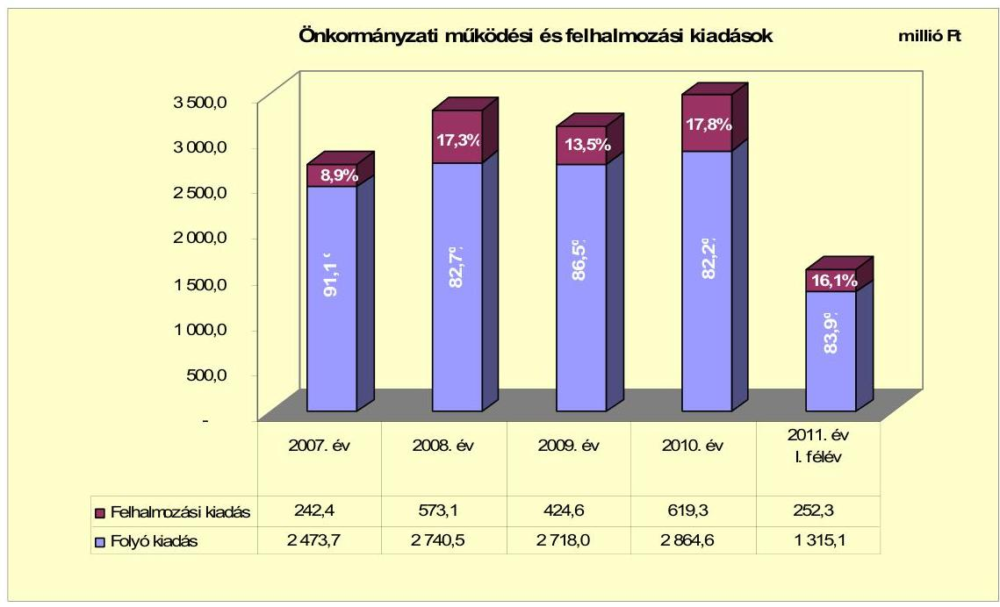

Az Önkormányzat működési és felhalmozási kiadásainak aránya 2007-2010. években eltérően változott. A felhalmozási kiadások 2008. évben 330,7 millió Ft-tal (136,4%) haladták meg a 2007. évi kiadásokat, melyből a belvízrendezés I-V. ütemére 228 millió Ft-ot, ingatlan vásárlásra 23,2 millió Ft-ot, a tanyagondnoki szolgálat bevezetéséhez gépkocsi beszerzésére 8,2 millió Ft-ot fordítottak. A 2008. évben a fürdő medence fejlesztésére 5,2 millió Ft-tal, a belterületi utak és járda beruházásra 56,6 millió Ft-tal költött többet az Önkormányzat. A felhalmozási kiadások legnagyobb aránya és összege a 2010. évben volt, mivel a kötvény bevételéből tőkeemelésre és részvényvásárlásra 120,4 millió Ft-ot fordítottak.

A kötvénybevételből számolták el az 50,4 millió Ft-os vízmű részvény és a Gyomaszolg Ipari Park Kft. 70 millió Ft törzstőke emelését.

---

Az Önkormányzat 2007-2010 között megvalósított, 2010. december 31-ig befejezett felújításainak és fejlesztéseinek teljes bekerülési költsége 1390 millió Ft volt.

A fejlesztésekből tíz tízmillió Ft feletti - útfelújítások, szociális és közoktatási feladatokat ellátó épületek felújítása - és több (62 db) tízmillió Ft egyedi érték alatti egyéb felújítások voltak. Ezen időszak alatt 16 db tízmillió feletti - belterületi útépítések, közoktatási, szociális, igazgatási feladatokat ellátó és egyéb épületek, beruházásai - és 169 db tízmillió Ft alatti bekerülési értékű egyéb fejlesztések kerültek megvalósításra.

A befejezett fejlesztések forrásmegoszlása: 742,4 millió Ft saját bevétel (53,4%), 9,0 millió Ft kötvénykibocsátásból származó bevétel (0,6%), 188,3 millió Ft EU-s támogatás (13,5%), 450,3 millió Ft hazai támogatás (32,5%). A tényleges bekerülési értékből eszközpótlásra 299,5 millió Ft-ot fordítottak. A fejlesztések során kialakított létesítmények jövőbeni üzemeltetésének várható kiadásait a Térségi Szociális Gondozási Központ konyha fejlesztésénél nem számszerűsítették. A befejezett fejlesztések korlátozott mértékben teremtenek bevételi lehetőséget az Önkormányzatnak.

A folyamatban lévő fejlesztések többek között járda-, valamint útépítési, útfelújítási célokhoz, ivóvíz és szennyvízhálózat rekonstrukció, szennyvíztisztító telep kapacitás bővítése, települési szeméttelep rekultivációja, belvízrendezés, ipari parkban inkubátorház építése programokhoz kapcsolódnak.

A folyamatban lévő fejlesztési feladatok várható bekerülési költsége 1256,2 millió Ft, amelyből a 2010 utánra vállalt kötelezettség 1074,7 millió Ft. A folyamatban lévő fejlesztések finanszírozását 127,6 millió Ft saját bevételből (11,9%), 242,7 millió Ft kötvénybevételből (22,6%), 490,3 millió Ft európai uniós (45,6%) és 214,1 millió Ft hazai forrásokból (19,9%) tervezik megvalósítani. Az EU-s és hazai támogatásból megvalósuló fejlesztéseknél a támogatás előfinanszírozása nem okoz finanszírozási gondot. A folyamatban lévő fejlesztési kötelezettségek teljesítéséhez a saját bevétel biztosított. A 2011-ben induló 142,3 millió Ft fejlesztésből I. félévig 73,5 millió Ft (51,7%) kiadást teljesítettek, 71,5 millió Ft-ot (97,3%-ot) a saját bevételből, 2 millió Ft-ot (2,7%-ot) a kötvény bevételből.

Az Önkormányzat kimutatásai alapján ezen időszakban a három legmagasabb bekerülési költségű beruházás a következő volt:

- Belvízrendezés II. ütem keretében a belterületi csapadékvíz hálózat (5795 fm) és a szivattyútelep fejlesztése 226,2 millió Ft összegben valósult meg 182,5 millió Ft (80,7%) hazai támogatással, valamint 43,7 millió Ft saját bevétellel;
- A 146,9 millió Ft bekerülési költségű belterületi belvízrendezés V. üteme 2008-ban kezdődött és 2009. évben fejeződött be, amely 126,1 millió Ft (85,8%-os) hazai támogatással valósult meg;
- A belvízrendezés III. ütemének beruházása konzorcium keretében fog megvalósulni 16 önkormányzat részvételével. A gesztori feladatot Szarvas Város Önkormányzata látja el. Az Önkormányzatra eső beruházási költség 251,9 millió Ft, a tervezett befejezés ideje 2012. A fejlesztést 37,8 millió Ft

---

kötvénykibocsátásból származó bevételből és 214,1 millió Ft hazai támogatásból tervezik megvalósítani. A beruházással kapcsolatosan az Önkormányzatnak még nem volt kiadása.

Az Önkormányzat 2007-2010. években megvalósított fejlesztéseinek, illetve 2010. december 31-én fennálló kötelezettségeinek összegzését a jelentés 3/a-c számú mellékletei tartalmazzák.

Az Önkormányzat a feladatok ellátásában részvevő gazdasági társaságai részére működési célra 2007-2011. év I. félév között 215,5 millió Ft-ot, fejlesztési célra összesen 3,3 millió Ft pénzeszközt adott át. A Liget Fürdő Kft. kapta a működési célú pénzeszköz átadások 97,2%-át (209,5 millió Ft-ot). A fennmaradó 2,8%-ot (6,0 millió Ft-ot) a Gyomaszolg Ipari Park Kft. kapta 2008-ban, akkor még tulajdonosi kölcsönként, amelyet 2011-ben átminősítettek működési célú pénzeszköz átadássá. Az átminősítés - a kölcsön összegéig - osztalékfizetési kötelezettséget írt elő a Kft. részére, amelyből 4,0 millió Ft-ot 2010-ben teljesítettek.

Fejlesztési célú pénzeszköz átadást 2009-ben tárgyi eszköz beszerzésre (1,3 millió Ft-ot) a Zöldpark Kft., 2010-ben szoftver beszerzésére (2,0 millió Ft-ot) a Liget Fürdő Kft. kapott.

Az Önkormányzat a feladatellátásban résztvevő gazdasági társaságai részére nyújtott működési és felhalmozási pénzeszköz átadások alakulását a következő diagram mutatja be a 2007-2011. év I. félévben:
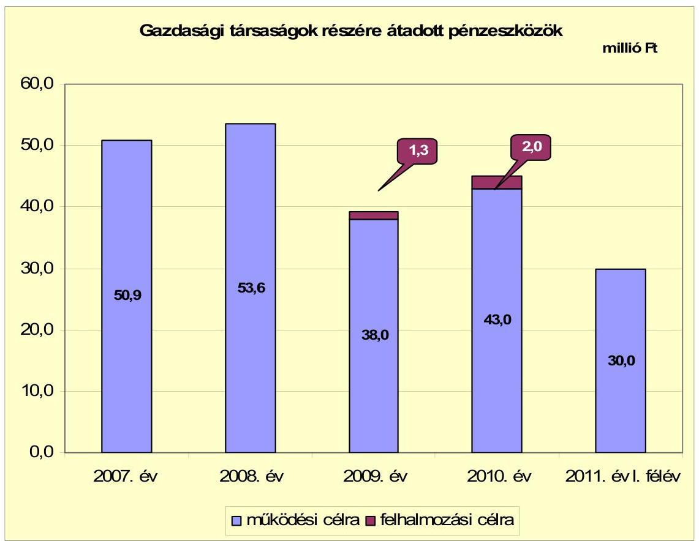

---

A feladatok ellátásában részvevő gazdasági társaságok részére átadott pénzeszközöket a mindenkori költségvetési rendelet tartalmazta. Az Önkormányzat által folyósított pénzeszközök rendeltetésszerű felhasználásáról szóló számadási kötelezettséget az Áht₁. 13/A. § (2) bekezdése²² ellenére a Liget Fürdő Kft. részére nem írtak elő, viszont a gazdasági társaság éves beszámolóját a Képviselőtestület minden évben tárgyalta és elfogadta.

# 3. Az ÖNKORMÁNYZAT KÖTELEZETTSÉGEI 

### 3.1. Az Önkormányzat pénzintézeti kötelezettségeinek változása

Az Önkormányzat pénzintézeti kötelezettségeinek állománya 2006. december 31-ről 2010. december 31-re több mint hétszeresére, 226,5 millió Ft-ról 1629,9 millió Ft-ra nőtt. Fennálló pénzintézeti kötelezettségei kötvénykibocsátásból és víziközmű-társulati hiteltartozásból keletkeztek. A 2011. június 30-án fennálló pénzintézeti kötelezettsége 1542,3 millió Ft-ra csökkent, mert az első negyedévben a kötvény tőketörlesztésére 87,6 millió Ft-ot teljesítettek. A tőketörlesztésre jutó árfolyam különbözet²³ 20,9 millió Ft.

A pénzintézeti kötelezettségek 2006. december 31-i állománya tartalmazta a Cigány Kisebbségi Önkormányzat hárommillió Ft-os hitelét is, amelyet 2008-ban visszafizettek.

Az Önkormányzat pénzintézetekkel szemben fennálló kötelezettségállományát a 2007-2011. év I. félévben a következő ábra szemlélteti:
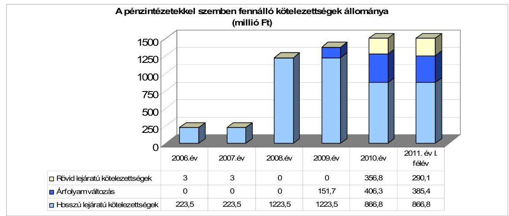

Az adósságot keletkeztető kötelezettségvállalásnál vizsgálták az adósságszolgálati korlátot, annak felső határát 2007-2011. év I. félévben nem lépték túl. A pénzintézeti kötelezettségvállalására képviselő-testületi döntés alapján került sor. Az Önkormányzat a 2008. évben 1000 millió Ft értékben fejlesztési célú

[^0]
[^0]:    ²² 2012. január 1-jétől az Áht₂. nem tartalmaz erre vonatkozóan rendelkezést.
    ²³ A 2010. december 31-i árfolyamhoz kalkulált árfolyam különbözet, amely változhat a 2011. év végi értékeléskor.

---

kötvényt bocsátott ki, amely olyan fejlesztések finanszírozására használható fel, amelyek az Önkormányzatot többletbevételhez juttatják, illetve működési kiadásait csökkentik. A kötvénykibocsátásból származó források felhasználási célját meghatározták, azonban az előterjesztésben nem mutatták be tételesen a visszafizetés forrásait. A kamat- és - a deviza alapú kötelezettségeket érintő - árfolyamkockázatot bemutatták. A kötvénykibocsátás előkészítésekor hat pénzintézettől kértek és kaptak ajánlatot, és a beérkezett ajánlatokat összehasonlítva terjesztették a Képviselő-testület elé. A kötvénykibocsátás nem a számlavezető pénzintézetnél történt.

Az Önkormányzat 2011. június 30-án forintban fennálló hosszú lejáratú adósságot keletkeztető kötelezettségvállalása:

| Megnevezés | Lehívás időpontja | Összeg   millió Ft-ban | Kamat (egyéves   futamidejú   állampapír   referenciahozama   tárgyév január 1-jét   megelőző féléves   átlagának 1,3-   szerese)² | Felhasználás célja: |
| :-- | :--: | :--: | :--: | :--: |
| Víziközmű-társulati beruházási hitel | 2001.12.07 | 223,5 | 14,17% | Gyomaendrőd város   területén szennyvízcsatorna   hálózat kiépítésének   részleges finanszírozása |

² A hitel kamattámogatásban részesül, amelynek mértéke a kamat 70%-a.
A pénzintézetek felé fennálló kettő kötelezettség közül a 223,5 millió Ft összegű víziközmű-társulati hitel - amelyre az Önkormányzat 2001-ben készfizető kezességet vállalt - a 2006. évben megszűnt közműtársulat kötelezettségének átvállalásából származott. A hitelt 2011. december hónapban kell az Önkormányzatnak visszafizetnie, ezért a rövid lejáratú kötelezettségek közé átsorolták 2010. év végén. A visszafizetés fedezete elkülönített számlán²⁴ rendelkezésre áll. A forintban fennálló kötelezettség után 2011. év I. félévig összesen 38,7 millió Ft kamatot fizettek.

Az Önkormányzat 2011. június 30-án CHF-ben fennálló hosszú lejáratú adósságot keletkeztető kötelezettségvállalása:

| Megnevezés | Kibocsátás   időpontja | Összeg   ezer CHF-ben | Kibocsátási árfolyam | Kamat (referencia kamat+   kamatfelár) | Felhasználás célja: |
| :--: | :--: | :--: | :--: | :--: | :--: |
| "Szép városunk Gyomaendrőd"   kötvény | 2008.02.27 | 6316 | 158,35 | 6 havi CHF LIBOR +0,7% | Pályázati saját erő biztosítása   olyan fejlesztésekhez,   amelyek az önkormányzatot   többletbevételhez juttatják,   illetve működési kiadásait   csökkentik. |

A kötvényből 2011. június 30-ig 184,4 millió Ft-ot használtak fel fejlesztési feladatokra, melyből a 100%-os önkormányzati tulajdonú Gyomaszolg Ipari Park Kft.-nél tőkeemelésre 70 millió Ft-ot, területvásárlásra 50 millió Ft-ot fordítottak.

[^0]
[^0]:    ²⁴ Az Önkormányzat a számlavezető pénzintézete felé 2011. szeptember 30-án betétlekötési megbízást adott 223,5 millió Ft összegben, 81 nap futamidőre.

---

Az Önkormányzat kimutatása szerint 2007-2011. év I. félév között a kötvénybevétel átmenetileg szabad pénzeszközeinek befektetésével összesen 280 millió Ft nettó hozamot realizált. A befektetésből származó többletbevételből 276,6 millió Ft-ot használtak fel. A kötvény tőke- és kamattörlesztésére 160,6 millió Ft-ot, fejlesztési feladatokra 116 millió Ft-ot. Az Önkormányzat kimutatása szerint a 2011. június 30-ig fel nem használt kötvény maradványa 800 millió Ft, amely bankbetétben állt rendelkezésére. A kibocsátásból származó források - annak cél szerinti felhasználásáig - szabadon, a pénzintézet korlátozása nélkül befektethetőek. A kötvény kibocsátásából származó bevétel maradványa az Önkormányzat fejlesztéseinek finanszírozásához használható fel. A kibocsátásból származó források felhasználásához bejelentési, adatszolgáltatási kötelezettséget a pénzintézet nem írt elő.

A CHF-ben fennálló, kötvénykibocsátásból származó kötelezettség után 2011. I. félévig összesen 87,6 millió Ft tőkét, 73 millió Ft kamatot, 4,5 millió Ft jegyzési garanciavállalási díjat fizettek.

Az Önkormányzatnak a vizsgált időszakban nem volt szüksége a működés pénzügyi egyensúlyának biztosításához folyószámlahitel, munkabér megelőlegezési hitel vagy egyéb likviditási célú rövid lejáratú hitel felvételére.

Az alapkamat mértékének alakulása jelentős hatással van az adott devizanemben kifejezett, a teljes futamidőre számított, várható kamatkötelezettség nagyságára. Az Önkormányzat által kibocsátott kötvény esetében a kamat
 kötelezettségek alakulását jelentősen befolyásolta a kibocsátáskori és az utolsó kamatfizetési referencia kamatok változása, amelyet az alábbi táblázat mutat be:

| Megnevezés | Kibocsátási, lehívási | Utolsó fizetéskori | Változás \% |
| :--: | :--: | :--: | :--: |
|  | kamat (referencia + kamatfelár) \% |  |  |
| 6 havi CHF LIBOR | $2,8083+0,7$ | $0,24+0,7$ | $-91,5 \%$ |

Amennyiben a referencia kamat nem változott volna, az Önkormányzatnak kibocsátáskori referencia kamattal számolva 2011. év I. félévig 694,3 ezer CHF (133,4 millió $\mathrm{Ft}^{25}$ ) kamatfizetési kötelezettsége jelentkezett volna. A referenciakamatok változása miatt az Önkormányzatnak 301,8 ezer CHF-el (60,4 millió Ft-tal ${ }^{25}$ ) kevesebb fizetési kötelezettséget kellett teljesítenie.

Az Önkormányzatnál 2008-2010 között a kötvénykötelezettség számviteli törvény szerinti év végi értékelése megtörtént. A kötvénykötelezettség esetében az árfolyamváltozás miatt elszámolt árfolyam különbözet (még nem realizált árfolyamveszteség) 406,3 millió Ft volt 2010. év végén.

A kötelezettségek év végi alakulását az árfolyamváltozás hatása befolyásolja, azonban annak mértéke előre pontosan nem határozható meg, csak várakozásokon alapuló tendenciák jelezhetők.

Arról, hogy a devizában kibocsátott kötvényekért és felvett hitelekért kapott forinthoz képest a kötvények visszavásárlásakor, illetve a hitelek visszafizetésekor

[^0]
[^0]:    ${ }^{25}$ A kibocsátáskori referencia kamattal és a negyedévente kimutatott tényleges árfolyammal számítva.

---

jelentkező forintkötelezettség többletkiadást (árfolyamveszteség) vagy megtakarítást (árfolyamnyereség) eredményez-e a futamidő végén, a teljes kötelezettség rendezését követően lehet képet alkotni. Mindaddig, amíg törlesztési kötelezettség nem áll fenn (türelmi idő, moratórium), a tőkére vonatkoztatva nem értelmezhető sem az árfolyamveszteség, sem az árfolyamnyereség. Ugyanakkor az Áhsz. 33. § (2) bekezdés c) pontja meghatározza, hogy az árfolyam különbözetet év végén a saját tőkével szemben kell elszámolni.

A víziközmű-társulati hitel esetében a kamat mértékét negyedévente az egyéves állampapírok referenciahozamából számította a pénzintézet, amelynek 30\%-át fizette az Önkormányzat, 70\%-a kamattámogatás.

Az Önkormányzat kimutatása szerint a fizetendő kamat mértéke átlagosan a 2007. évben 3,06408\%, 2008-ban 2,94208\%, 2009-ben 3,86857\%, 2010-ben $3,14411 \%$ volt.

Az Önkormányzatnál a helyszíni vizsgálat alatt további hitel igénybevételéről, illetve kötvénykibocsátásról szóló döntést nem készítettek elő.

Az Önkormányzat kötelezettségeinek állománya 2010. december 31-én és 2011. június 30-án, valamint várható alakulása a kötelezettség lejáratáig:
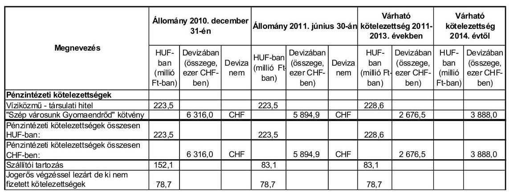

Az Önkormányzat pénzintézeti kötelezettségeinek állománya 2010. december 31-én 223,5 millió Ft-ból és 6316 ezer CHF-ből tevődött össze. Ebből a 2011-2013. években esedékes tőke- és kamatkötelezettségeiből ${ }^{26}$ várhatóan 228,6 millió Ft-ot és 2676,5 ezer CHF-et kell teljesítenie. Az Önkormányzatnak 2014-től az utolsó törlesztéskor ismert feltételekkel számított, várható kötelezettsége 3888,0 ezer CHF, amelyet 2018-ig kell visszafizetnie. A 2011-2013. évek kötelezettségeinek teljesítésére figyelembe vehető 8,6 millió Ft szabad pénzmaradvány, valamint az eladhatóságot és a behajthatóságot feltételezve a forgalomképes ingatlanvagyon és 143,6 millió Ft mérlegben kimutatott követelésállomány. A 223,5 millió Ft víziközmű-társulati hitel visszafizetésének fedezete elkülönített betétben - biztosított. A további évekre szóló jelenleg ismert pénzintézeti kötelezettség teljesítése hosszú távon kockázatot jelenthet a működési jövedelemtermelő képesség csökkenése miatt.

[^0]
[^0]:    ${ }^{26}$ A várható kamatkötelezettségeket a devizában fennálló kötelezettségeknél az utolsó kamatkondícióval számoltuk.

---

# 3.2. A szállítói kötelezettségek változása 

Az Önkormányzat szállítókkal szemben fennálló kötelezettségeinek állománya 2007. január 1-jéről 2010. december 31-re több mint háromszorosára, 44,1 millió Ft-ról 152,1 millió Ft-ra nőtt, miközben kötelezettségeken belüli aránya 10,3\%-ról 8,2\%-ra csökkent. A szállító kötelezettségek növekedését a fejlesztésekre (pl. kerékpárút, útfelújítások) benyújtott számlák következő évi teljesítése okozta. A 2011. június 30-án fennálló szállítói kötelezettsége 83 millió Ft-ra csökkent, a kötelezettségeken ${ }^{27}$ belüli aránya $4,4 \%$ volt.

Az Önkormányzatnak 2007-ben 0,5 millió Ft, 2008. évben 1,3 millió Ft, 2009-ben 1,3 millió Ft lejárt szállítói tartozása volt, amely mind 30 nap alatti tartozás. A 2010. évi lejárt szállítói állomány 14,2 millió Ft összegéből 8,6 millió Ft 30 nap alatti, 5,5 millió Ft 91-365 nap közötti volt. Ez utóbbiból a sportcsarnok padlóburkolat cseréjének 4,5 millió Ft összegű számlája minőségi kifogás miatt, a csúszásmentesítés egy millió Ft-os összege a szakmai teljesítés igazolás elhúzódása miatt nem került kifizetésre 2010-ben. A 2011. év I. félévben a lejárt szállítói állomány 65,9 millió Ft-ra nőtt, amelyből 2,3 millió Ft 30 nap alatti, 2,6 millió Ft 31-60 napos, 60,9 millió Ft 91-365 nap közötti. Ez utóbbi a kerékpárút beruházás végszámlájához kapcsolódó pályázati támogatás fedezetkezelői számlára történő utalásának elhúzódása miatt történt.

A kerékpárút végszámlájához kapcsolódó támogatás lehívásához benyújtott kifizetési igénylés elbírálása folyamatban volt, mert a kifizetéshez szükséges dokumentumot (részletes műszaki megbontást) a kivitelező nem készítette el időben.

Egyéb kiadáselmaradása, átütemezett szállítói tartozása a vizsgált időszakban nem volt az Önkormányzatnak.

### 3.3. Egyéb kötelezettségek változása

Az Önkormányzat a vizsgált időszak alatt nem végzett PPP konstrukcióban beruházást, valamint pénzügyi lízinggel nem bérelt eszközt és nem kötött garancia és kezességvállalással kapcsolatban szerződést.

Az Önkormányzat készfizető kezességi szerződést a víziközmű-társulat által 2001-ben felvett hitel miatt vállalt, amely társulat 2006-ban megszűnt és a hitel visszafizetési kötelezettsége az Önkormányzat mérlegében megjelent.

Az Önkormányzat 2007-2011. év I. félév között összesen 6,2 millió Ft adó és 13 ezer Ft szociális térítési díj követeléséről méltányossági jogkörét gyakorolva ${ }^{28}$ mondott le.

Az Önkormányzat 2007-2011. június 30. között intézményeinek, más önkormányzatnak kölcsönt nem nyújtott. A vizsgált időszakban az óvodai feladatok ellátásában részt vevő három gazdasági társaságnak összesen 4,1 millió Ft köl-

[^0]
[^0]:    ${ }^{27}$ Az összes kötelezettség 2011. június 30-án 1895,4 millió Ft volt.
    ${ }^{28}$ Szociális térítési díjnál kettő esetben nem volt letiltható jövedelem, egy esetben az elhalt adósnak nem voltak örökösei.

---

csönt nyújtott likviditási problémáik megoldása és pályázati pénzeszköz megelőlegezése céljából. A kölcsönt - egy kivétellel ${ }^{29}$ - az óvodai feladatokat ellátó kft.-k visszafizették. Vállalkozói alapjából munkahelyteremtésre négy vállalkozás részesült kölcsönben összesen 24 millió Ft összegben, amelyeknek 2012-2014 közötti a visszafizetési határideje. Egyéb szervezetek részére 70,3 millió Ft kölcsönt nyújtott, amelyből pályázati pénzeszköz megelőlegezésére nyújtott 50,9 millió Ft kölcsönt 2015-ben kell visszafizetnie a Rózsahegyi Iskola alapítványnak. A 100\%-os önkormányzati tulajdonban lévő négy gazdasági társaság összesen 46,2 millió Ft kölcsönt kapott, amelyből a Liget Fürdő Kft. működési célra kapott 12,5 millió Ft-os és a Gyomaszolg Ipari Park Kft. infrastruktúrafejlesztéshez kapott 3,4 millió Ft-os kölcsönét még nem fizette vissza az Önkormányzatnak.

A Képviselő-testület hitel biztosítékaként jelzálogjog alapításhoz és bejegyzéshez nem járult hozzá a vizsgált időszakban.

A Képviselő-testület 2005-ben egy támogatás biztosítékaként 40,1 millió Ft számviteli nyilvántartás szerinti nettó értékű - jelzálogjog alapításához és bejegyzéséhez járult hozzá. Jelzálog az Önkormányzat 204,9 milliós becsült értékű, korlátozottan forgalomképes sportcsarnok ingatlanára van bejegyezve, 163,9 millió Ft összegben, mely jelzálogjog bejegyzés törlésére már 2005. évben az Önkormányzatnak intézkednie kellett volna ${ }^{30}$.

Az Önkormányzat jogerős határozattal lezárt, de ki nem fizetett peres eljárásból adódó kötelezettsége 78,7 millió Ft, amely a hulladéklerakó létesítésével összefüggésben keletkezett perből származott.

Az Önkormányzat volt a gesztora annak a kilenc településből álló társulásnak, amely a hulladéklerakót megépítette és a perben alperesek voltak a védelmi övezet ingatlantulajdonosaival szemben. Az Önkormányzat és két település teljesítette a rájuk eső részt, azonban figyelembe kell venni, hogy felelősségük a károsultakkal szemben egyetemleges.

Az Önkormányzatnál a pénzügyi helyzetet befolyásolják és ezért kockázatot jelentenek az összességében 91,3 millió Ft kölcsön nyújtásából származó követelések és a 78,7 millió Ft peres eljárásból származó kötelezettségek.

A legalább 50\% vagy azt meghaladó tulajdoni hányadba tartozó négy gazdasági társaság kizárólagos tulajdonosa az Önkormányzat. A társaságok kötelezettségeinek állománya 2010. december 31-én és 2011. június 30-án, valamint várható alakulása a kötelezettségek lejáratáig a következő:

| Megnevezés | Állomány 2010.   december 31-én | Állomány 2011. június   30-án | Várható kötelezettség   2011-2013. években | Várható kötelezettség   2014. évtől |
| :-- | :--: | :--: | :--: | :--: |
|  | HUF-ban (millió Ft-ban) | HUF-ban (millió Ft-ban) | HUF-ban (millió Ft-ban) | HUF-ban (millió Ft-ban) |
| Inkubátorház létesítéséhez fejlesztési hitel |  | 18,0 | 7,0 | 22,1 |
| Pénzintézeti kötelezettségek összesen: |  | 18,0 | 7,0 | 22,1 |
| Szállítási tartozás | 93,6 | 51,7 | 51,7 |  |

[^0]
[^0]:    ${ }^{29}$ Egy óvodai kft. 450 ezer Ft-ot nem fizetett vissza 2011. év I. félévig.
    ${ }^{30}$ A helyszíni vizsgálat idején folyamatban volt a jelzálog törlése.

---

A Gyomaszolg Ipari Park Kft. 2011. év I. félévben 18 millió Ft hitelt vett fel, amely az inkubátorház létesítése EU-s pályázathoz kapcsolódott. A pénzintézet a hitel fedezeteként a Kft. egy ingatlanára jelzálogot jegyeztetett be. A 100\% önkormányzati tulajdonú gazdasági társaságok 2010. év végi szállítói tartozásállományából 69,8 millió Ft-ot a Gyomaszolg Ipari Park Kft. mutatott ki. A 100\%-ban önkormányzati tulajdonú gazdasági társaságok lízingből adódó pénzintézeti kötelezettséget és jogerős határozattal lezárt peres eljárásból adódó kötelezettséget nem mutattak ki.

A Gyomaszolg Ipari Park Kft. mutatott ki jogerős határozattal nem lezárt peres eljárásból adódó követelést 13,4 millió Ft összegben, amely eljárás szünetel, a felek próbálnak egyezséget kötni. Ha a bíróság az alperes esetleges viszontkeresetének adna helyt a vételár visszafizetése miatt, a Képviselő-testület 456/2011. (VIII. 25.) számú határozatában vállalta, hogy az Önkormányzat kezességet vállal és teljesíti a kötelezettséget. Erre vonatkozóan szerződést a vizsgálat ideje alatt nem írtak alá.

Az önkormányzati kötelezettségek növekedése mellett az Önkormányzat minősített többségi befolyásával rendelkező gazdasági társaságok kötelezettségei is befolyásolhatják az Önkormányzat pénzügyi egyensúlyát. A társaságoknak a 2011. évtől 29 millió Ft pénzintézeti kötelezettséget és 51,7 millió Ft szállítói tartozást kell rendezniük. Esetleges csőd, vagy felszámolási eljárás esetén a bíróság korlátlan és teljes felelősséget állapíthat meg az Önkormányzat terhére.

Az Önkormányzat a gazdasági társaságokról szóló 2006. évi IV. törvény 54. § (2) bekezdése alapján korlátlan felelősséggel tartozik azon gazdasági társaságának felszámolása esetében, amelyben az Önkormányzat az 52. § (2) bekezdése szerint a szavazatok legalább 75\%-ával rendelkezik, így minősített befolyásszerzőnek minősül, továbbá a csődeljárásról és a felszámolási eljárásról szóló 1991. évi XLIX. törvény 63. § (2) bekezdése alapján a kizárólagos önkormányzati tulajdonú gazdasági társaságának minden olyan kötelezettségéért, amelynek kielégítését a felszámolási eljárás során az adós társaság vagyona nem fedez, ha a hitelezőinek a felszámolási eljárás során benyújtott keresete alapján a bíróság - az adós társaság felé érvényesített tartósan hátrányos üzletpolitikájára figyelemmel - megállapítja az önkormányzat korlátlan és teljes felelősségét.

Az Önkormányzat a 2007-2010. években a befektetett eszközei után 1344,5 millió Ft összegű értékcsökkenést mutatott ki, ugyanakkor felújításra az elszámolt értékcsökkenés 22,5\%-át, 303,0 millió Ft-ot, beruházásokra 71,2\%-át, 957,6 millió Ft-ot fordítottak.

Az Önkormányzat költségvetési beszámolókban kimutatott összes eszközének (immateriális javak, ingatlanok,
 gépek, járművek, átadott eszközök) bruttó értéke 2007-2010 között összességében 969,6 millió Ft-tal, 7,8%-kal, az elszámolt értékcsökkenése 987,4 millió Ft-tal, 48,6%-kal emelkedett. Az eszközök után elszámolt értékcsökkenés nagyobb arányú emelkedése miatt, az eszközök elhasználódási szintje 16,4%-ról 22,6%-ra emelkedett, az eszközök használhatósági foka 6,2 százalékponttal (83,5%-ról 77,3%-ra) csökkent. Az Önkormányzat kimutatása szerint a fejlesztések, felújítások bekerülési összegéből 374,6 millió Ft-ot fordított eszközpótlásra.

A felújításokra, az eszközök pótlására az Önkormányzat - a pályázati lehetőségeket kihasználva - a pénzügyi lehetőségeinek függvényében, elsősorban az

---

intézmények működőképességének biztosítása, illetve a szakhatósági előírások figyelembevételével került sor. Az Önkormányzatnál a Képviselő-testületnek előterjesztett éves zárszámadási rendeletekben nem mutatták be az Önkormányzat eszközei után tárgyévben elszámolt értékcsökkenés összegét, az eszközpótlásra fordított tényleges kiadásokat, az eszközök használhatósági fokának alakulását.

# 4. A PÉNZÜGYI EGYENSÚLY MEGTEREMTÉSE ÉRDEKÉBEN HOZOTT INTÉZKEDÉSEK EREDMÉNYE 

Az Önkormányzat a pénzügyi egyensúly megteremtése érdekében kiadáscsökkentő intézkedéseket tett, amelynek megtakarítási területeit a következő ábra mutatja 2007-2011. év I. félévben:
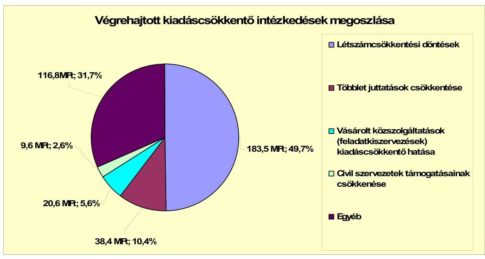

A 2007-2011. év I. félév kiadáscsökkentő intézkedéseinek hatása következtében - az Önkormányzat kimutatása szerint - a kiadások 368,9 millió Ft megtakarítást jelentettek. Az intézkedések közül a többletjuttatások, a cafetéria elemek, a vásárolt közszolgáltatások, a parkfenntartási kiadások ${ }^{31}$ (20,6 millió Ft), az egyéb, a hulladékszállítás ${ }^{32}$ (116,8 millió Ft) csökkenésével függött össze.

Az Önkormányzat létszámcsökkentő intézkedéseit ágazatonként 2007-2011. év I. félév között a következő táblázat mutatja:

[^0]
[^0]:    ${ }^{31}$ A parkfenntartási feladatokat kevesebb költséggel oldotta meg az erre a feladatra alapított gazdasági társaság.
    ${ }^{32}$ Az Önkormányzat 2008-tól bevezette a lakossági hulladékszállítási díjat, amelyet a feladatot ellátó gazdasági társaságnak fizetnek a lakosok. Emiatt az eddigi önkormányzati kiadások csökkentek.

---

| Megnevezés (adatok fő-ben) |  | Közoktatás | Szociális és gyermekvédelem | Egészségügy | Polgármesteri Hivatal | Egyéb | Összesen |
| :--: | :--: | :--: | :--: | :--: | :--: | :--: | :--: |
| 2007. január 1-jén jóváhagyott álláshelyek száma |  | 232 | 151 | 29 | 60 | 10 | 482 |
| Megszüntetett álláshelyek száma |  | 40 | 6 | 1 | 2 | 2 | 51 |
| ebből: | üres álláshelyek száma |  |  |  |  |  | 0 |
|  | szakmai álláshelyek száma | 37 | 6 | 1 | 2 | 2 | 48 |
|  | intézmény-üzemeltetéssel kapcsolatos   álláshelyek száma | 3 | 0 | 0 | 0 | 0 | 3 |
| Álláshely növekedése |  | 26 | 5 | 0 | 2 | 13 | 46 |
| 2010. december 31-én záró álláshelyek száma |  | 218 | 150 | 28 | 60 | 21 | 477 |
| 2007. január 1-jén foglalkoztatott létszám |  | 232 | 151 | 29 | 60 | 10 | 482 |
| Létszámcsökkenés |  | 40 | 6 | 1 | 2 | 2 | 51 |
| Létszámnövekedés |  | 26 | 5 | 0 | 2 | 13 | 46 |
| 2010. december 31-én foglalkoztatott létszám |  | 218 | 150 | 28 | 60 | 21 | 477 |

A létszámcsökkentő intézkedések hatására az Önkormányzat 2007. január 1-jei átlaglétszáma 482 főről, 2010. december 31-re 477 főre csökkent. Az 5 fő létszámcsökkenést az időszak alatt végrehajtott 51 fő létszámcsökkentés és 46 fő létszámnövekedés eredményezte. A 2007-2010. évek között az önkormányzati intézményeknél összesen 51 fő létszám - 2007. évben 40 fő, 2008. évben 5 fő, 2009. évben 4 fő és 2010. évben 2 fő - megszüntetésre került. A 2007-2010. évek között 46 fő létszám - 2007. évben 24 fő, 2008. évben 14 fő, 2009. évben 8 fő - bővítése valósult meg az óvodai feladatok, művelődési ház visszavétele, valamint a mezőőri tevékenység ellátása miatt.

Az Önkormányzatnak a vizsgált időszakban nem volt betöltetlen üres álláshely miatti létszámcsökkentése.

A helyi szervezési intézkedések végrehajtásához az Önkormányzat az áttekintett időszak alatt 41,1 millió Ft központi költségvetési támogatásban részesült, amelynek felhasználásával 20 fő létszámot tartósan leépített.

Az Önkormányzat kimutatása szerint 2007-2011. év I. féléve közötti időszakban érvényesített bevételnövelő intézkedések következtében összességében 587,5 millió Ft többletbevételt realizált.

Az Önkormányzat a 2007-2011. év I. félév között a következőekben számszerűsített bevételnövelő intézkedéseket tette:

---

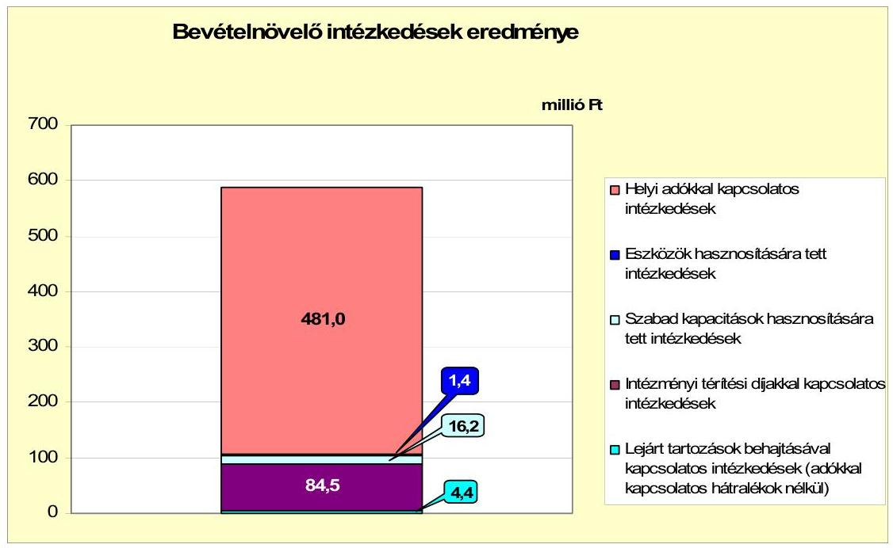

A helyi adókkal kapcsolatosan a vizsgált időszakban új adónemet nem vezetett be, azonban az adók mértékét két évben - 2007. és 2009. évektől kezdődően - növelte. Az adó mértékének növeléséből a vizsgált időszakban 152,6 millió Ft volt a többletbevétel. Az adókedvezmények, mentességek megszüntetésének és csökkentésének hatására a bevételi többlet 82,7 millió Ft volt. Az adóhátralékok behajtásából a vizsgált időszakban 245,7 millió Ft folyt be. Összességében a helyi adókkal kapcsolatos intézkedésekből 481,0 millió Ft bevételt realizált az Önkormányzat a vizsgált időszak alatt, mely az összes intézkedésnek 81,9%-át jelentette.

Eszközök hasznosításából (jármű értékesítése) 1,4 millió Ft bevétele származott az Önkormányzatnak. A szabad kapacitások kihasználása érdekében hozott döntés hatásaként 16,2 millió Ft-ot mutatott ki az Önkormányzat.

Az Önkormányzat kimutatása szerint a saját konyha 2010-2011. év I. féléve között 73821 adaggal több ételt állított elő, amely 15 millió Ft többletet eredményezett. Terem-bérbeadásból 1,2 millió Ft többletbevétele származott.

A szociális intézményi térítési díjakkal kapcsolatos intézkedések hatására az Önkormányzat bevétele a vizsgált időszakban 84,5 millió Ft-tal növekedett a 2008. évtől bevezetett önköltség alapú térítési díj számítás miatt. A lejárt tartozások (út-, belvíz-érdekeltségi hozzájárulás stb.) behajtásával kapcsolatos intézkedések hatására 4,4 millió Ft-tal több bevétele származott.

A 2007. évhez viszonyítva a 2008-2011. év I. félév között az Önkormányzat költségvetési támogatása és az átengedett szja ${ }^{33}$ összege 418,7 millió Ft-tal növekedett, amely nem okozott a központi támogatásokban forráskiesést. A ki-

[^0]
[^0]:    ${ }^{33}$ A költségvetési támogatás 1842,9 millió Ft-tal növekedett, az szja 1424,2 millió Ft-tal csökkent a 2007. évhez viszonyítva.

---

adáscsökkentő és bevételnövelő intézkedések összességében 956,4 millió Ft-tal javították az Önkormányzat pénzügyi helyzetét.

# 5. AZ ÁSZ ÁLTAL A KORÁBBBI ÉVEKBEN A PÉNZÜGYI EGYENSÚLY JAVÍTÁSÁRA TETT SZABÁLYSZERŰSÉGI ÉS CÉLSZERŰSÉGI JAVASLATOK HASZNOSULÁSA 

Az ÁSZ az Önkormányzat gazdálkodási rendszerét a 2007. évben ellenőrizte, amelyről készített jelentésben 6 szabályszerűségi és 7 célszerűségi javaslatot tett. A jelentést a Képviselő-testület megtárgyalta és a 353/2007. (XI. 29.) számú határozatával a feltárt hiányosságok megszüntetésére intézkedési tervet fogadott el, amely tartalmazta a feladatok elvégzéséért felelős személyeket és a feladatok elvégzésének határidejét. A jegyző az intézkedési tervben foglaltak végrehajtásáról 2008. április hónapban beszámolt a Képviselő-testületnek.

A pénzügyi egyensúly javítására három szabályszerűségi javaslat vonatkozott, amelyet mind megvalósítottak. Az ÁSZ javaslatának megfelelően a költségvetési rendeletekben a finanszírozási célú bevételek és kiadások külön kerültek bemutatásra, ezen összegeket a költségvetési bevételek és kiadások nem tartalmazták. Likviditási tervet készítettek, amelyet a költségvetési rendeletben és módosításaiban bemutattak. A tervezett fejlesztésekhez készültek megvalósíthatóságot megalapozó döntés-előkészítő dokumentumok.

Budapest, 2012. április 46.

Melléklet: 6 db
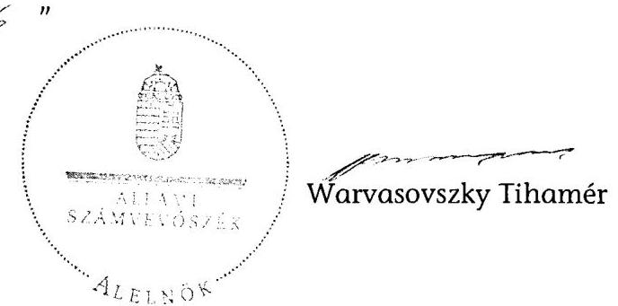

---

Gyomaendrőd Város Önkormányzata

1. számú melléklet
a V-3079-025/2012. számú Jelentéshez

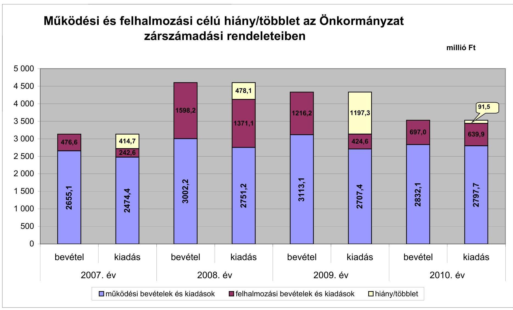

---

Az Önkormányzat bevételei és kiadásai, valamint adósságszolgálata 2007-2010 között

|   |  |  |  | millió Ft  |
| --- | --- | --- | --- | --- |
|  1. FOLYÓ KÖLTSÉGVETÉS | 2007. év | 2008. év | 2009. év | 2010. év  |
|  1.1.1. Saját működési bevételek | 634,0 | 887,1 | 1013,4 | 946,5  |
|  1.1.2. Költségvetési támogatás | 946,3 | 1267,1 | 1290,1 | 1193,3  |
|  1.1.3. Átengedett bevételek | 926,7 | 543,0 | 528,8 | 530,4  |
|  1.1.4. Állambáztartáson belülről kapott támogatások | 262,3 | 311,5 | 293,0 | 335,3  |
|  1.1.5. EU-tól és külföldről kapott bevételek | 11,0 | 11,2 | 9,7 | 6,5  |
|  1.1.6. Állambáztartáson kívülről kapott bevételek | 2,4 | 5,0 | 1,7 | 16,9  |
|  1.1.7. Előző évi pénzmaradvány átvétel | 4,0 | 30,5 | 28,6 | 11,0  |
|  1.1. Folyó bevételek $=1.1 .1 .+1.1 .2 .+1.1 .3 .+1.1 .4 .+1.1 .5 .+1.1 .6 .+1.1 .7$. | 2786,7 | 3055,4 | 3165,3 | 3039,9  |
|  1.2.1. Működési kiadások kamatkiadások nélkül | 2077,1 | 2271,6 | 2269,0 | 2378,6  |
|  1.2.2. Állambáztartáson belülre átadott pénzeszközök | 20,5 | 34,5 | 21,7 | 45,8  |
|  1.2.3.1. vállalkozásoknak | 73,5 | 87,2 | 66,7 | 83,9  |
|  1.2.3.2. EU-nak, illetve külföldre | 0,0 | 0,5 | 0,5 | 0,0  |
|  1.2.3.3. magánszemélyeknek | 206,7 | 231,1 | 247,0 | 263,1  |
|  1.2.3.4. non-profit szervezeteknek | 86,2 | 85,4 | 72,8 | 69,4  |
|  1.2.3. Transferkiadások ( $+1.2 .3 .1+1.2 .3 .2+1.2 .3 .3+1.2 .3 .4$ ) | 386,9 | 404,2 | 387,0 | 416,4  |
|  1.2.4 Kamatkiadások | 8,7 | 30,2 | 40,3 | 23,8  |
|  1.2.5. Előző évi pénzmaradvány átadás | 1,0 | 0,0 | 0,0 | 0,0  |
|  1.2. Folyó kiadások $=1.2 .1 .+1.2 .2 .+1.2 .3 .+1.2 .4 .+1.2 .5$. | 2473,7 | 2740,5 | 2718,0 | 2864,6  |
|  1.3. Folyó költségvetés egyenlege MŰKÖDÉSI JÖVEDELEM (1.1. - 1.2.) | 313,0 | 314,9 | 447,3 | 175,3  |
|  2. FELHALMOZÁSI KÖLTSÉGVETÉS |  |  |  |   |
|  2.1.1. Saját tökebevételek | 46,0 | 83,9 | 22,1 | 30,1  |
|  2.1.2. Állambáztartáson belülről kapott támogatások | 4,5 | 10,5 | 104,2 | 125,8  |
|  2.1.3. EU-tól és külföldről kapott támogatások | 1,9 | 0,0 | 0,0 | 0,0  |
|  2.1.4. Állambáztartáson kívülről kapott támogatások | 56,1 | 38,7 | 26,3 | 19,0  |
|  2.1. Felhalmozási bevételek ( $=2.1 .1 .+2.1 .2+2.1 .3+2.1 .4$.) | 108,5 | 133,1 | 152,6 | 174,9  |
|  2.2.1. Saját beruházási kiadás áfával | 148,9 | 454,0 | 225,1 | 277,8  |
|  2.2.2. Saját felújítási kiadás áfával | 30,5 | 54,1 | 147,0 | 194,0  |
|  2.2.3. Állambáztartáson belülre átadott pénzeszköz | 11,9 | 25,4 | 0,7 | 2,7  |
|  2.2.4. EU-nak és külföldnek adott pénzeszközök | 0,0 | 0,0 | 0,0 | 0,0

  |
|  2.2.5. Állambáztartáson kívülre adott pénzeszközök | 51,1 | 39,6 | 51,8 | 21,7  |
|  2.2.6. Befektetési célú részesedések vásárlása | 0,0 | 0,0 | 0,0 | 123,1  |
|  2.2. Felhalmozási kiadások ( $=2.2 .1 .+2.2 .2 .+2.2 .3 .+2.2 .4 .+2.2 .5 .+2.2 .6$.) | 242,4 | 573,1 | 424,6 | 619,3  |
|  2.3. Felhalmozási költségvetés egyenlege (2.1. - 2.2.) | $-133,9$ | $-440,0$ | $-272,0$ | $-444,4$  |
|  3. Finanszírozási műveletek nélküli (GFS) pozíció(1.3.+2.3.) | 179,1 | $-125,1$ | 175,3 | $-269,1$  |
|  4. Finanszírozási műveletek |  |  |  |   |
|  4.1. Hitelfelvétel | 0,0 | 0,0 | 0,0 | 0,0  |
|  4.2. Hiteltörlesztés | 0,2 | 3,0 | 0,0 | 0,0  |
|  4.3. Forgatási és befektetési célú értékpapírok kibocsátása | 0,0 | 1000,0 | 0,0 | 0,0  |
|  4.4. Forgatási és befektetési célú értékpapírok beváltása | 0,0 | 0,0 | 0,0 | 0,0  |
|  4.5. Forgatási és befektetési célú értékpapírok értékesítése | 0,0 | 0,0 | 795,0 | 0,0  |
|  4.6. Forgatási és befektetési célú értékpapírok vásárlása | 0,0 | 795,0 | 0,0 | 0,0  |
|  4.7. Egyéb finanszírozási bevételek (függő, átfutó, kiegyenlítő) | 0,4 | 1,9 | $-9,7$ | $-79,7$  |
|  4.8. Egyéb finanszírozási kiadások (függő, átfutó, kiegyenlítő) | 0,8 | 10,7 | $-10,6$ | $-46,4$  |
|  4.9.Finanszírozási műveletek egyenlege (4.1. - 4.2.+4.3.-4.4+4.5.-4.6.+4.7.-4.8.) | $-0,5$ | 193,2 | 795,9 | $-33,3$  |
|  5. Tárgyévi pénzügyi pozíció (1.3.+ 2.3.+4.9.) | 178,6 | 68,1 | 971,2 | $-302,4$  |
|  6. Nettó működési jövedelem =működési jövedelem (1.3.) - tőketörlesztés (4.2+4.4 | 312,8 | 311,9 | 447,3 | 175,3  |
|  TÁJÉKOZTATÓ ADATOK |  |  |  |   |
|  Összes kötelezettség | 288,0 | 1333,8 | 1609,1 | 1829,4  |
|  ebből rövid lejáratú | 64,5 | 110,3 | 234,0 | 610,5  |
|  Összes szállítói kötelezettség | 21,5 | 41,8 | 116,8 | 152,1  |
|  ebből lejárt (tanúsítványból) | 0,5 | 1,3 | 1,3 | 14,2  |
|  Pénz és tőkepiaci kötelezettség (adósság) | 226,5 | 1223,5 | 1375,2 | 1629,9*  |
|  ebből rövid lejáratú | 3,0 | 0,0 | 0,0 | 411*  |
|  PPP szerződéses állomány jelenértéken (tanúsítványból) | 0,0 | 0,0 | 0,0 | 0,0  |
|  ebből lejárt szolgáltatási díj miatti kötelezettség | 0,0 | 0,0 | 0,0 | 0,0  |
|  Folyószámlahitel napi átlagos állománya (tanúsítványból) | 0,0 | 0,0 | 0,0 | 0,0  |
|  Likvidhitel napi átlagos állománya (tanúsítványból) | 0,0 | 0,0 | 0,0 | 0,0  |
|  Munkabérhitel napi átlagos állománya (tanúsítványból) | 0,0 | 0,0 | 0,0 | 0,0  |
|  Kezesség és garanciavállalások (tanúsítványból) | 223,5 | 223,5 | 223,5 | 223,5  |
|  Jogerős bírósági ítéletekből adódó kötelezettségek (tanúsítványból) | 0,0 | 0,0 | 0,0 | 0,0  |
|  Finanszírozásba bevonható eszközök: | 631,6 | 1494,6 | 1670,8 | 1368,4  |
|  Tartós hitelviszonyt megtestesítő értékpapírok év végi állománya | 0,0 | 270,0 | 0,0 | 0,0  |
|  Hosszú lejáratú bankbetétek év végi állománya | 0,0 | 0,0 | 0,0 | 0,0  |
|  Értékpapírok év végi állománya | 0,0 | 525,0 | 0,0 | 0,0  |
|  Pénzeszközök (idegen pénzeszközök nélkül) év végi állománya | 631,6 | 699,6 | 1670,8 | 1368,4  |

- Az Önkormányzat 2010. évi mérlegében a 223,5 millió Ft víziközmű hitel összege tévesen a kölcsönök között szerepelt.

---

Gyönaerobidi Város Önkormányzata

Az Önkormányzat 2007-2010. években megvalósított, 2010. december 31-ig befejezett fejlesztései és azok forrásösszetevői

nálói Ft-ban

|  |   |   |   |   |   |   |   |   |   |   |   |   |   |   |   |   |   |   |   |   |   |   |   |   |   |   |   |   |   |   |   |   |   |   |   |   |   |   |   |   |   |   |   |   |   |   |   |   |   |   |   |   |   |   |   |   |   |   |   |   |   |   |   |   |   |   |   |   |   |   |   |   |   |   |   |   |   |   |   |   |   |   |   |   |   |   |   |   |   |   |   |   |   |   |   |   |   |   |   |  

---

# Az Önkormányzat 2010. december 31-én folyamatban lévő fejlesztési feladataira 2010. december 31-ig teljesített kifizetések és azok forrásösszetétele

|  Fejlesztési feladat (beruházás, felújítás) | Beruházás, felújítás | Teljes bekerülési költség | 2008. dec. 31-ig teljesített kiadás | 2007-2010. évek között teljesített kiadás | A teljes bekerülési költségből szükségtől útszámlálás | Saját bevétel | Hitel | Kötvény | EU-e támogatás | Hazai támogatás  |
| --- | --- | --- | --- | --- | --- | --- | --- | --- | --- | --- |
|  Megnevezése | Képviselő-testületi határozat száma | Kezdete | Tervezett befejezése | Terv (műv/műmét +08) | Tény (műv/műv +08) | Eltérés (+/-) (műv+0+08+00 -100) | Eltérés (+/-) (műv+0+0+00 -100) | Terv | Tény  |
|  1 | 2 | 3 | 4 | 5 | 6 | 7 | 8 | 9 | 10  |
|  Felújítások |  |  |  |  |  |  |  |  |   |
|  1. | Betonerületi utak felújítása | 194/2010 (IV.29.) | 2010 | 2010 | 15,1 | 0,0 | -15,1 | 0,0 | 0,0  |
|  2. | Sportcsarnok padlóburkolat felújítása | 6/2010 (II.15.) önk rendelet | 2010 | 2010 | 24,0 | 19,1 | -4,9 | 0,0 | 19,1  |
|  3. | Városi örökség megőrzése és konzerválása | 381/2009 (X.1.) | 2009 | 2011 | 58,8 | 56,0 | -2,9 | 0,0 | 56,0  |
|  4. | 10 millió Ft alatti felújítások |  |  |  | 0,0 | 0,0 | 0,0 | 0,0 | 0,0  |
|  Felújítások összesen |  |  |  |  | 97,9 | 75,1 | -22,9 | 0,0 | 75,1  |
|  Fejlesztések |  |  |  |  |  |  |  |  |   |
|  5. | Betonerületi utak építése | 194/2010 (IV.29.) | 2010 | 2010 | 23,1 | 0,6 | -22,6 | 0,0 | 0,6  |
|  6. | Magtárlaposi lakásvásárlás | 408/2010 (XI.4.) | 2010 | 2011 | 30,0 | 3,8 | -26,2 | 0,0 | 3,8  |
|  7. | Ipari Park inkubátorház beruházási saját erő tőke területűs | 10/2010 (I.28.) | 2010 | 2011 | 65,7 | 20,0 | -45,7 | 0,0 | 20,0  |
|  8. | IKSZT beruházás (Integrált Közösségi Szolgáltató Terek | 371/2008 (IX.25.) | 2009 | 2015 | 51,9 | 5,5 | -46,3 | 0,0 | 5,5  |
|  9. | Belvíz VII. ütem | 383/2009 (X.1.) | 2009 | 2011 | 91,6 | 7,9 | -83,7 | 0,0 | 7,9  |
|  10. | Fő út Bajcsy úti kerékpárút építés | 244/2009 (VI.11.) | 2009 | 2011 | 158,1 | 65,1 | -93,0 | 0,0 | 65,1  |
|  11. | Belvíz III.ütem megyei ber.önerő | 142/2007 (V.16) | 2007 | 2012 | 251,9 | 0,0 | -251,9 | 0,0 | 0,0  |
|  12. | Közösségi közlekedés fejl.önerő | 421/2009 (X.29) | 2010 | 2011 | 72,8 | 0,0 | -72,8 | 0,0 | 0,0  |
|  13. | Települési szeméttelep rekultív.pr.a Közös szögben | 87/2008 (II.28) | 2008 |  | 240,0 | 3,1 | -236,8 | 0,0 | 3,1  |
|  14. | Települési szilárdhulladék gazd.i fejl. Ködésség | 17/2008 (I.31) | 2008 |  | 54,0 | 0,6 | -53,5 | 0,0 | 0,6  |
|  15. | 10 millió Ft alatti fejlesztések |  |  |  | 0,0 | 0,0 | 0,0 | 0,0 | 0,0  |
|  Fejlesztések összesen: |  |  |  |  | 1 039,1 | 106,6 | -932,5 | 0,0 | 106,6  |
|  Mindösszesen |  |  |  |  | 1 137,0 | 181,7 | -955,4 | 0,0 | 181,7  |

- A= ha a forrás már rendelkezésre áll.

B= ha a forrás közbeszerzési eljárása folyamatban van.

C= ha a forrás közbeszerzési eljárása még nem indult el,

 a forrás nem áll rendelkezésre.

---

Gyűjtőnyilvántartási feladat (beruházás, felújítás) |  |  |  |  |  |  |  |  |  |  |  |  |  |  |  |  |  |  |  |  |  |  |  |  |  |  |  |  |  |  |  |  |  |  |  |  |  |  |  |  |  |  |  |  |  |  |  |  |  |  |  |  |  |  |  |  |  |  |  |  |  |  |  |  |  |  |  |  |  |  |  |  |  |  |  |  |  |  |  |  |  |  |  |  |  |  |  |  |  |  |  |  |  |  |  |  |  |  |  |  |  |  |  |  |  |  

---

Gyomaendrőd Város Önkormányzata

Az önkormányzati feladatok ellátásában résztvevő gazdasági társaságok

|  |   |   |   |   |   |   |   |   |   |   |   |   |   |   |   |   |   |   |   |   |   |   |   |   |   |   |   |   |   |   |   |   |   |   |   |   |   |   |   |   |   |   |   |   |   |   |   |   |   |   |   |   |   |   |   |   |   |   |   |   |   |   |   |   |   |   |   |   |   |   |   |   |   |   |   |   |   |   |   |   |   |   |   |   |   |   |   |   |   |   |   |   |   |   |   |   |   |   |   |  
