# ÁLLAMI   SZÁMVEVŐSZÉK 

## JELENTÉS

Harkány Város Önkormányzata pénzügyi helyzetének ellenőrzéséről (43/4)

---

# Állami Számvevőszék 

Iktatószám: V-3074-017/2012.
Témaszám: 1015
Vizsgálat-azonosító szám: V0560105

## Az ellenőrzést felügyelte:

Dr. Varga Sándor
számvevő igazgatóhelyettes
Az ellenőrzést vezette:
Renkó Zsuzsanna
számvevő tanácsos
Ellenőrzési csoportvezető:
Bíró Zsolt
számvevő tanácsos
Az ellenőrzést végezték:
Dr. Hegedűs György Preller Zsuzsanna
számvevő tanácsos számvevő tanácsos

---

# TARTALOMJEGYZÉK 

BEVEZETÉS ..... 9
I. ÖSSZEGZŐ MEGÁLLAPÍTÁSOK, KÖVETKEZTETÉSEK JAVASLATOK ..... 13
II. RÉSZLETES MEGÁLLAPÍTÁSOK ..... 26

1. Az Önkormányzat kötelező és önként vállalt feladatai, a feladatellátás szervezeti keretei és annak változásai ..... 26
2. Az Önkormányzat pénzügyi egyensúlyi helyzetét befolyásoló tényezők ..... 30
2.1. A működési és a felhalmozási egyensúly változása ..... 33
2.2. Az Önkormányzat bevételeinek változása ..... 38
2.3. Az Önkormányzat múködési és a felhalmozási célú kiadásainak változása. ..... 41
3. Az Önkormányzat kötelezettségei ..... 44
3.1. Az Önkormányzat pénzintézetekkel szembeni kötelezettségeinek változása. ..... 44
3.2. A szállítói kötelezettségek változása ..... 50
3.3. Egyéb kötelezettségek változása ..... 51
4. A pénzügyi egyensúly megteremtése érdekében hozott intézkedések eredménye ..... 53
5. Az ÁSZ által a korábbi években a pénzügyi egyensúly javítására tett szabályszerűségi és célszerűségi javaslatok hasznosulása ..... 56

---

# MELLÉKLETEK 

| 1. számú | Múködési és felhalmozási célú hiány/többlet az Önkormányzat zárszámadási rendeleteiben (1 oldal) |
| :--: | :--: |
| 2. számú | Az Önkormányzat bevételei és kiadásai, valamint adósságszolgálata 2007-2010 között (1 oldal) |
| 3/a. számú | Az Önkormányzat 2007-2010. években megvalósított, 2010. december 31-ig befejezett fejlesztései és azok forrásösszetétele (1 oldal) |
| 3/b. számú | Az Önkormányzat 2010. december 31-én folyamatban lévő fejlesztési feladataira 2010. december 31-ig teljesített kifizetések és azok forrásösszetétele ( 1 oldal) |
| 3/c. számú | Az Önkormányzat 2010. december 31-én folyamatban lévő fejlesztési feladataira 2010. december 31-én fennálló kötelezettségek és azok forrásösszetétele ( 1 oldal) |
| 4. számú | Az önkormányzati feladatok ellátásában résztvevő gazdasági társaságok (1 oldal) |

---

# RÖVIDÍTÉSEK JEGYZÉKE 

## Törvények

Adósságrendezési tv.
Áht $_{1}$.
Áht $_{2}$.
Csődtv.
Ötv.
Ptk.
Stabilitási tv.
Számv. tv.

## Rendeletek

$\mathrm{SzMSz}_{1}$
$\mathrm{SzMSz}_{2}$

## Szórövidítések

áfa
Általános iskola
ÁSZ
Családsegítő szolgálat
Dekor Kft.
EU
Gazdasági program $_{1}$

Gazdasági program $_{2}$
Gyógyfürdő Zrt.
Gyógyotthon
jegyzó
Képviselő-testület
Kistérségi társulás
Könyvtár
Kulturcenter Kft.
Óvoda
Önkormányzat
polgármester

A helyi önkormányzatok adósságrendezési eljárásáról szóló 1996. évi XXV. törvény
az államháztartásról szóló 1992. évi XXXVIII. törvény
az államháztartásról szóló 2011. évi CXCV. törvény
A csődeljárásról és a felszámolási eljárásról szóló 1991. évi XLIX. törvény
A helyi önkormányzatokról szóló 1990. évi LXV. törvény
a Polgári Törvénykönyvről szóló 1959. évi IV. törvény
A Magyarország gazdasági stabilitásáról szóló 2011. évi CXCIV. törvény
a számvitelről szóló 2000. évi C. törvény
Harkány Város Önkormányzatának 4/2007.(III.27.) számú rendelete a Szervezeti és Múködési Szabályzatról.
Harkány Város Önkormányzatának 8/2011.(IV.13.) számú rendelete a Szervezeti és Múködési Szabályzatról.
általános forgalmi adó
Kitaibel Pál Általános Iskola, Gimnázium és Alapfokú Múvészetoktatási Intézmény
Állami Számvevőszék
Harkány Kistérségi Családsegítő Gyermekjóléti és Házigondozó Szolgálat
Tenkes Dekor Kft.
Európai Unió
Harkány Város Önkormányzatának Gazdasági programja 2007-2010. évre, amelyet a Képviselő-testület nem fogadott el
Harkány Város Önkormányzatának 67/2011. (IV.12.) önkormányzati határozattal elfogadott Gazdasági programja 2011-2014. évre
Harkányi Gyógyfürdő Zrt.
Harkányi Szociális Gyógyotthon
Harkány Város Önkormányzatának jegyzője
Harkány Város Önkormányzatának Képviselő-testülete
Siklós Kistérségi Többcélú Önkormányzati Társulás
Harkány Városi Könyvtár
Tenkes Kulturcenter Nonprofit Kft.
Harkányi Óvoda
Harkány Város Önkormányzata
Harkány Város Önkormányzatának polgármestere

---

| Polgármesteri hivatal | Harkány Város Önkormányzatának Polgármesteri hivatala |
| :-- | :-- |
| PPP konstrukció | Public Private Partnership (Partnerségi együttmúködés |
|  | közfeladatok ellátására a magánszektor bevonásával) |
| ROP | Regionális Operatív Program |
| Sport Központ | Harkány Kulturális- és Sport Központ |
| Tenkesvíz Kft. | Tenkesvíz Kft. Siklós |
| Tourinform iroda | Tourinform Iroda Harkány |
| szja | személyi jövedelemadó |

---

# ÉRTELMEZŐ SZÓTÁR 

| BUBOR | Budapesti Bankközi Forint Hitelkamatláb. Irányadó, refe-   rencia jellegú kamatláb. Mértékét az MNB naponta állapítja meg a banki kamatok figyelembevételével. Közzététele naponta történik. |
| :--: | :--: |
| CLF módszer | Az önkormányzatok költségvetése elemzésének eszköze. A módszer következetesen elkülöníti a folyó és a felhalmozási költségvetés bevételeit és kiadásait, azok költségvetési egyenlegeit. A bevételek és kiadások, múködés és fejlesztés elkülönítése. Bizonyos mértékig a vállalati gazdálkodás logikai elemeit érvényesíti az önkormányzatok pénzügyi, jövedelmi helyzetének vizsgálata során. Az értékelés a pénzügyi kapacitás fogalmát helyezi a középpontba. |
| használhatósági fok | Az eszközgazdálkodás vizsgálatának elemzése során használt mutató. Számításakor a tárgyi eszköz könyv szerinti (nettó) értékét viszonyítják a tárgyi eszköz bruttó (beszerzési/létesítési) értékéhez. A \%-ban kifejezett mutató értéke annál kedvezőbb, minél közelebb áll a 100\%-hoz. Csökkenése az eszköz állagának romlására, avulására utal, ami maga után vonja az üzemeltetési és fenntartási költségek növekedését is. |
| kamatkockázat | A változó kamatozású forint-, vagy a devizahitelek futamideje alatt a kamat emelkedése miatt fennálló kamatkockázat, melynek növekedése miatt nő a hitel törlesztő részlete. |
| kötelező közszolgáltatás | A helyi önkormányzati feladatkörbe tartozó, a köztisztasággal és a településtisztasággal, valamint az élet- és vagyonbiztonsággal összefüggő egyes - közszolgáltatás útján megvalósuló - közfeladatok ellátása, amelynek kötelező igénybevételét külön jogszabály (törvény, helyi önkormányzati rendelet) határoz meg. |
| közfeladat | Állami, helyi, illetve kisebbségi önkormányzati feladat, amelynek ellátásáról az államnak, illetve az önkormányzatoknak kell gondoskodni. A hatályos szabályozás szerint közfeladatot törvény és önkormányzati rendelet állapíthat meg. Az önkormányzatok által ellátandó feladatok keretszerú meghatározását az Ötv. tartalmazza. |
| LIBOR | Angol kifejezés, a London Interbank Offered Rate rövidítése. Jelentése: Londoni bankközi, referencia jellegú kínálati (hitel) kamatláb. |
| önkormányzat többségi tulajdonában lévő gazdasági társaságok | Az önkormányzat a gazdasági társaságban a szavazatok több mint ötven százalékával vagy a Ptk. 685/B. § (2)-(3) bekezdéseiben rögzített meghatározó befolyással rendelkezik. A befolyással rendelkező akkor rendelkezik egy jogi személyben meghatározó befolyással, ha annak tagja, illetve részvényese, és jogosult e jogi személy vezető tisztségviselői vagy felügyelőbizottsága tagjai többségének megválasztására, illetve visszahívására, vagy a jogi személy más tag- |

---

jaival, illetve részvényeseivel kötött megállapodás alapján egyedül rendelkezik a szavazatok több mint ötven százalékával (Ptk. 685/B. § (2) bek.). A meghatározó befolyás akkor is fennáll, ha a befolyással rendelkező számára e jogosultságok közvetett módon (köztes vállalkozásain keresztül, a Ptk. 685/B §. (3),(4) bek. szerint) biztosítottak.

A helyi önkormányzat és az önkormányzat irányítása alá tartozó költségvetési szerv többségi tulajdonában, illetve többségi befolyása alatt álló gazdálkodó szervezet esetében hitelfelvétel, kölcsönfelvétel, garancia- vagy kezességvállalás, tartozásátvállalás, tartozáselengedés, értékpapírkibocsátás, vásárlás, pénzügyi lízing, tartós bérleti szerződés, ingyenes vagyonjuttatás (így különösen: ajándékozás, ingyenes engedményezés), vagy követelésvásárlás, követelésengedményezés végrehajtására vonatkozóan az Áht ${ }_{1}$. 100/M. § (4) bekezdése alapján az önkormányzat rendelkezik döntési jogosultsággal.
minősített többséget Minősített többséget biztosító befolyásnak számít, ha az biztosító befolyás önkormányzat a gazdasági társaságban közvetlenül, vagy a Ptk. 685/B. § (3) bekezdésében előírtaknak megfelelően megállapított módon - közvetve a szavazatok legalább hetvenöt százalékával rendelkezik.
pénzügyi kapacitás
pénzügyi kockázat
prolongáció
törlesztési kockázat

A pénzügyi kapacitás (financial capacity) az adósok hitelfelvételi képességének azon mértéke, ahol még anélkül tudják növelni az adósságot, hogy csökkenteniük kellene akár a jelenbeli, akár a jövőben esedékes kiadásaikat a fizetésképtelenség elkerülése érdekében. (Forrás: Az önkormányzati rendszer pénzügyi helyzete, ÁSZKUT tanulmány 2010.)
A múködési kockázat egyik eleme. Megmutatkozhat a költségvetés nagyságrendjének, szerkezetének nem megalapozott módosításaiban, a bevételi, és a kiadási előirányzatoktól lényegesen eltérő teljesítésekben, a nem megfelelő belső kontrollrendszer múködésében, a tudatos károkozásokban, a biztosítások elmaradásában, a hibás fejlesztési döntésekben, a nem a terveknek megfelelő forrásfelhasználásokban. Jelentkezhet továbbá a bevételek és kiadások ütemkülönbsége miatt felvett folyószámla- és likvidhitelek költségvetési év végén fennálló egyenlege miatt, amely az önkormányzat költségvetésébe - akár tartósan - beépülő forráshiányt jelzi.
Olyan szerződésmódosítás, melynek során az ügyfél előzetes kérésére a pénzintézet és az ügyfél közötti szerződés alapján a futamidő módosításra kerül. A bankok általában ezért a módosításért díjat számolnak fel, melyet a mindenkor hatályos hirdetmények tartalmaznak.
Annak a kockázata, hogy a megfelelő időben és mértékben a hitelt felvevőnél rendelkezésre állnak-e a pénzintézetek és egyéb szervek felé fennálló kötelezettségek visszafizetéséhez, a hitelek és kölcsönök törlesztéséhez szükséges pénzügyi források.

---

A törlesztési kockázatot növeli a kamat- és árfolyam növekedése, mivel ezekben az esetekben az adósságszolgálat nőhet. Törlesztési kockázatot okozhat a visszafizetésre tervezett forrás elérésének, teljesítésének bizonytalansága (pl. a viszszafizetéshez tervezett tartalékolás elmaradt, a tervezettnél alacsonyabb a saját bevétel, a helyi adóból származó bevétel az adóalanyok, adóalapok csökkenése miatt nem teljesül).
SNA
szállítói kitettség

System of National Account azaz a Nemzeti Számlák Rendszere, amely a gazdasági szektorok által létrehozott valamennyi terméket és szolgáltatást figyelembe veszi.
Az önkormányzat pénzügyi helyzete olyan külső körülmények hatására is módosulhat, amelyekre az önkormányzatnak nincs hatása, emiatt szállítói kitettsége keletkezik. Pl. a lejárt szállítói tartozások rendezése függhet attól, hogy a szállító milyen intézkedéseket foganatosít az önkormányzattal szemben.

---

.

---

# JELENTÉS 

## Harkány Város Önkormányzata pénzügyi helyzetének ellenőrzéséről

## BEVEZETÉS

Az Állami Számvevőszék 2011. évtől érvényes stratégiája új irányt szabott a helyi önkormányzatok gazdálkodásának ellenőrzésében is. Az ÁSZ - küldetése és jövőképe szerint - szilárd szakmai alapokra támaszkodva értékteremtő ellenőrzéseivel és helyzetelemzéseivel az államháztartás egészében, így a helyi önkormányzati alrendszerben is elő kívánja segíteni a közpénzek és a közvagyon szabályos, gazdaságos, hatékony és eredményes felhasználását. E folyamat részeként - az államháztartási hiány alakulásának összetevőire is figyelemmel végezzük az önkormányzati alrendszer pénzügyi helyzetelemzését.

Az államháztartás helyi szintjén a 304 városnak ${ }^{1}$ az általuk ellátott közszolgáltatások volumenére is tekintettel a közfeladatok ellátásában kiemelt szerepe van. E települések 2011. január 1-jei népessége 3169 ezer fő volt.

Feladataik és hatásköreik az Ötv. ${ }^{2}$ mellett különböző ágazati törvények által meghatározottak, miközben a feladatellátás szervezeti kereteit - ezen belül a gazdasági társaságok közszolgáltatások ellátásában betöltött szerepét - saját maguk határozzák meg. A gazdasági társaságok által ellátott feladatok esetén a gazdálkodás, továbbá az önkormányzatok pénzügyi egyensúlyi helyzetére ható közvetlen kockázatok egy része kikerült az önkormányzati alrendszerből. A többségi önkormányzati tulajdonban lévő társaságok gazdálkodásának körülményei befolyásolhatják a városok pénzügyi egyensúlyi helyzetének megítélésében rejlő kockázatokat.

Az áttekintett időszakban az önkormányzati forrásszabályozás elvei lényegesen nem változtak. Az önkormányzatok gazdasági mozgásterét a központi költségvetéstől való függőség mellett jelentősen befolyásolja a helyi adókivetési jog gyakorlása. A városok gazdálkodási szabadságának lényeges eleme, hogy anyagi lehetőségeik függvényében dönthettek arról, hogy feladataik közül azokat, amelyek megoldására az Ötv. szerint a települési önkormányzat nem kötelezhető, a megyei önkormányzat fenntartásába adhatták. E döntések differenciáltan érintették a városok pénzügyi helyzetét.

[^0]
[^0]:    ${ }^{1}$ A megyei jogú városok nélkül figyelembe vett városok száma 304 városi önkormányzatot jelent.
    ${ }^{2}$ 2012. év január 1-től a Magyarország helyi önkormányzatairól szóló 2011. évi CLXXXIX. törvény lépett hatályba.

---

A városi önkormányzatok 2007-2010 között teljesített bevételeinek alakulását és összetételét a következő ábra szemlélteti:

Az önkormányzati alrendszer pénzügyi helyzetértékelése során új elemzési módszereket alkalmaz az ellenőrzés. Az eddig alkalmazott költségvetési beszámoló adatok elemzése helyett az Önkormányzat pénzügyi helyzetét a CLF módszerrel értékeljük, amelynek lényegét és számításának módszerét a jelentés 2. pontjában, és a jelentés 2 . számú mellékletében ismertetjük részletesen.

Az új módszereken alapuló helyzetértékelés fontosságát az adja, hogy a helyi önkormányzatok bruttó adósságállománya ${ }^{3}$ a 2010. évi költségvetési beszámolók alapján 1248 milliárd Ft-ot tett ki. Ezen belül a 304 város adóssága 383 milliárd Ft volt, amely az önkormányzati alrendszer teljes adósságállományának $30,7 \%$-át jelentette. ${ }^{4}$

A mérlegben kimutatott bruttó adósságállomány mellett az önkormányzatok számára az eszközállomány műszaki állapotának megőrzése is előbb-utóbb pénzügyi kötelezettséget jelent. Az elhasználódott eszközök pótlására forrást biztosító amortizációs (felújítási) alap képzésének ${ }^{5}$ elmaradása maga után von-

[^0]
[^0]:    ${ }^{3}$ Az önkormányzati mérlegbeszámolókból számított bruttó adósságállomány 2010. év végi összege magában foglalja a fejlesztési és a múködési célú kötvénykibocsátások, a beruházási és fejlesztési hitelek, a múködési célú hosszú lejáratú hitelek, a rövid lejáratú hitelek, váltótartozások miatti kötelezettségek teljes (2011-ben, illetve az azt követő években esedékes) állományát. Az önkormányzatok 2007. év végi mérleg szerinti adósságállománya 692 milliárd Ft volt.
    ${ }^{4}$ A fővárosi és a kerületi önkormányzatok adósságának figyelmen kívül hagyásával számított 977 milliárd Ft összegű bruttó adósságállományból a városok 39,2\%-kal részesedtek.
    ${ }^{5}$ Erre a jelenlegi szabályozási környezetben nem kötelezi előírás az önkormányzatokat.

---

hatja a feladatellátást kiszolgáló tárgyi eszközök állagának erőteljes romlását. Emellett a 2007-2013-as időszakra meghirdetett, vissza nem térítendő EU-s fejlesztési forrásokhoz való hozzájutás lehetősége felerősítette az önkormányzati alrendszer fejlesztési igényeit, amelyek a felhalmozási költségvetési hiány folyamatos emelkedésén túl - az előírt jövőbeni fenntartási kötelezettség miatt tovább terhelhetik az önkormányzatok költségvetését. ${ }^{6}$

Az ÁSZ a 2011. évi ellenőrzési tervében 43. számú, az Önkormányzatok gazdálkodási rendszerének ellenőrzése részeként áttekinti, és elemzi az önkormányzatok pénzügyi helyzetét. A gazdálkodás szabályszerűségét az ÁSZ az előző évek során ebben az önkormányzati körben is ellenőrizte. Jelen vizsgálatunk a tett javaslataink pénzügyi helyzetet érintő pontjainak hasznosítására utóellenőrzés jelleggel tér ki.

Az ellenőrzés megállapításait az Önkormányzat által kitöltött - teljességi nyilatkozattal megerősített - 27 tanúsítványon szolgáltatott adatokra alapoztuk. Ellenőrzési bizonyítékként használtuk fel továbbá:

- a képviselő-testületi és bizottsági előterjesztéseket, a döntés-előkészítés során készített dokumentumokat;
- a kötelezettségvállalások dokumentumait;
- a pénzügyi-számviteli nyilvántartásokat;
- az éves költségvetési beszámolókat;
- a költségvetési és zárszámadási rendeleteket.

Az ellenőrzés a 2007. január 1. - 2011. június 30. közötti időszakot öleli fel. A pénzintézeti kötelezettségek állományának vizsgálatakor az ellenőrzött időszak 2006. december 31. - 2011. június 30. közötti időszakra terjedt ki.

Az ellenőrzés során vizsgáltunk minden olyan körülményt és adatot, amely a program végrehajtásához kapcsolódott és a pénzügyi helyzet alakulására hatást gyakorló releváns tények és folyamatok feltárásához szükségessé vált.

# Az ellenőrzés célja annak értékelése, hogy: 

- a vizsgált időszakban a kötelező és önként vállalt feladatok ellátását biztosító szervezeti keretekben, a feladatellátás módjában bekövetkezett változások milyen hatást gyakoroltak az Önkormányzat pénzügyi helyzetének alakulására;

[^0]
[^0]:    ${ }^{6}$ Az Állami Számvevőszék 2011 júniusában közzétett 1108. számú, a helyi önkormányzatok fejlesztési célú támogatási rendszerének ellenőrzéséről szóló jelentésében feltárta a fejlesztési folyamatok problémáit. A helyi önkormányzatok elsősorban azokat a fejlesztéseket valósították meg, amelyekhez támogatást lehetett igényelni. A fejlesztési célok közül a magasabb támogatási intenzitású pályázatokat részesítették előnyben. A fejlesztéssel megvalósuló létesítmények jövőbeli üzemeltetésének várható ráfordításait az önkormányzatok $71,9 \%$-a nem mérte fel.

---

- az Önkormányzat pénzügyi - ezen belül múködési és felhalmozási - egyensúlya mely tényezők hatására miként változott, és az Önkormányzat milyen intézkedéseket tett a pénzügyi egyensúly javítása érdekében;
- a költségvetési kiadások finanszírozása érdekében vállalt pénzintézeti kötelezettségek hogyan alakultak, továbbá milyen kötelezettségek fennállása befolyásolja az Önkormányzat jövőbeli pénzügyi helyzetét;
- hasznosultak-e a gazdálkodási rendszer korábbi ellenőrzése során a pénzügyi egyensúly javítására az ÁSZ által tett szabályszerűségi és célszerűségi javaslatok.

Az ellenőrzés típusa: szabályszerűségi vizsgálat.
A vizsgálat jogszabályi alapját az Állami Számvevőszékről szóló 2011. évi LXVI. törvény 1. § (3), 5. § (2)-(6) bekezdései, továbbá az Áht ${ }_{1}$. 120/A. § (1) ${ }^{7}$ bekezdése előírásai képezik.

A Baranyai megyei üdülőváros állandó lakosainak a száma 2011. január 1-jén 4052 fő volt. A Polgármesteri hivatal mellett hat költségvetési szervet fenntartó Önkormányzat 2011. évi költségvetésének bevételi főösszege 2104,4 millió Ft, a 2010. évi mérlegfőösszege 7793,3 millió Ft volt. Az Önkormányzat folyó bevételeinek 31,4\%-a a helyi adókból származott, ezen belül is meghatározó szerepe volt az építményadó-bevételeknek.

[^0]
[^0]:    ${ }^{7}$ 2012. január 1-jétől Áht ${ }_{2}$. 61. § (2) bekezdés szabályozza.

---

# I. ÖSSZEGZŐ MEGÁLLAPÍTÁSOK, KÖVETKEZTETÉSEK JAVASLATOK 

Az Önkormányzat - adatszolgáltatása szerint - a 2010. év 990,8 millió Ft múködési költségvetési kiadásából 863,9 millió Ft-ot ( $87,2 \%$ ) a kötelező feladatok, 126,9 millió Ft-ot ( $12,8 \%$ ) az önként vállalt feladatok ellátására fordított. Az önként vállalt feladatok a társadalmi szervezeteknek, vállalkozásoknak átadott pénzeszközökhöz, nemzetközi kapcsolatok létesítéséhez, turizmus városi szervezéséhez, koordinálásához, szociális otthon fenntartásához és piaccsarnok múködtetéséhez kapcsolódtak. Gazdasági társaságok útján látta el a gyógyfürdő üzemeltetési, kulturális rendezvények szervezési és a nyomdai tevékenységi önként vállalt feladatokat.

Az Önkormányzat a kötelező és az önként vállalt feladatainak körét az SzMSzekben és a gazdasági programokban szabályozta. Az Önkormányzat besorolása szerint a sportfeladatok ellátása és a Sportcsarnok múködtetése kötelező feladat. Az Önkormányzat 2011. évi költségvetésében azonban az önként vállalt feladatok között mutatták ki. A lakásgazdálkodást a gazdasági program ${ }_{2}$ kötelezőnek tartja, de sem az $\mathrm{SzMSz}_{1}$-ben, sem az $\mathrm{SzMSz}_{2}$-ben nem szerepel a kötelező feladatok között. Az Önkormányzat vagyoni és pénzügyi egyensúlyi helyzetét befolyásoló, meghatározó gyógyfürdő üzemeltetés feladatot sem az SzMSzek, sem a gazdasági programok nem nevesítik a kötelező és önként vállalt feladatok között. Ugyanakkor a gazdasági programok az egyik legfontosabb fejlesztendő területnek tartják.

Az önkormányzat feladatellátásának szervezeti struktúráját az alábbi ábra mutatja be:
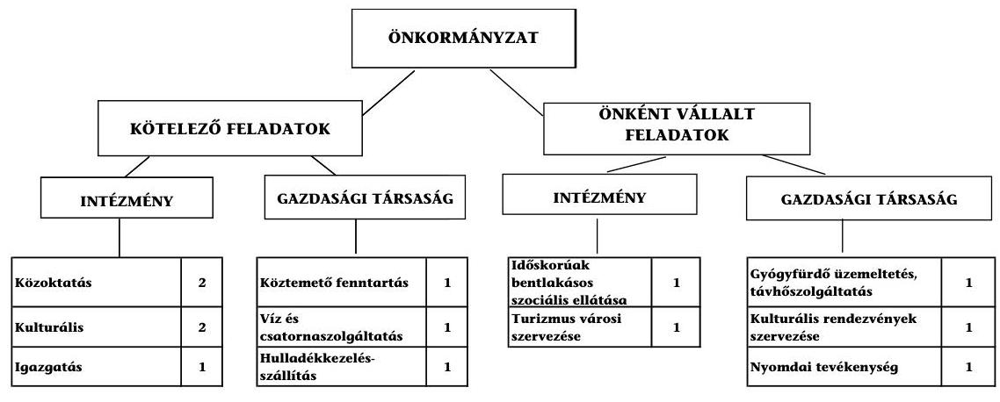

Az Önkormányzat feladatait 2011. június 30 -án (a Polgármesteri hivatallal együtt) hét költségvetési szervvel és hat gazdasági társaság keretében látta el. Egy intézmény megszüntetése, feladatátadása miatt költségvetési szerveinek száma a 2007. évi nyolcról 2011. év I. félév végére hétre csökkent. Telephelyek száma nyolcról tíze nőtt a feladatátvételek, az alapfokú múvészetoktatás kihelyezett tagozatának létrehozása, a városi székhelyú körjegyzőség létesítése (Harkány, Szava és Márfa települések önkormányzatainak részvételével),

---

illetve a Családsegítő szolgálat megszüntetése következtében. Az Önkormányzat egy gazdasági társaságában (gyógyfürdő üzemeltetés, távhőszolgáltatás) 75\% feletti, kettő gazdasági társaságban (kulturális rendezvényszervezés, nyomdai tevékenység) 51-75\% közötti tulajdoni hányaddal rendelkezik, amelyek az önként vállalt feladatok ellátásában vesznek részt. A kötelező feladatok ellátásában egy $50 \%$ alatti tulajdoni hányaddal rendelkező társasága (víz- és csatornaszolgáltatás) vesz részt, továbbá kettő gazdasági társaság közszolgáltatási szerződés keretében hulladékkezelés-szállítás, köztemető fenntartás feladatokat lát el. A gazdasági társaságok közül egy társaság múködéséhez az ellenőrzött időszakban összesen 13,1 millió Ft pénzeszközt adott át megállapodás alapján és a felhasználásról történő elszámoltatás mellett. A vizsgált időszakban a kötelező és önként vállalt feladatok szervezeti kereteinek változása nem gyakorolt hatást az Önkormányzat pénzügyi egyensúlyi helyzetének alakulására.

Az egyes közszolgáltatások feladatellátásában résztvevő költségvetési szervek 2007. és 2010. évek közötti múködési kiadásainak ágazatonkénti finanszírozási összetételét az alábbi ábra szemlélteti:
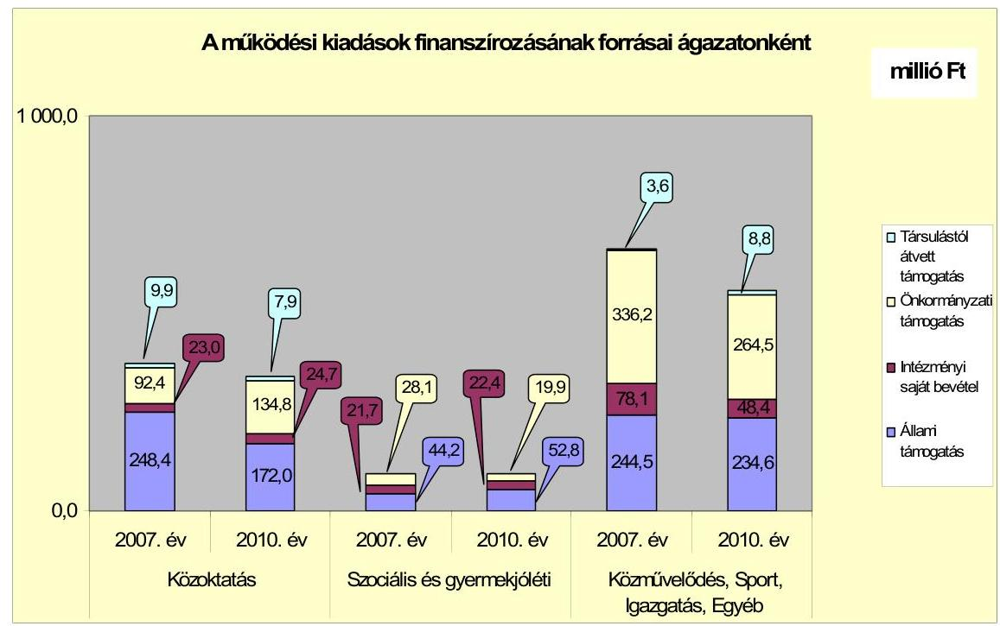

A 2007. évről a 2010. évre 34,3 millió Ft-tal ( $9,2 \%$-kal) csökkentették a közoktatási ágazat múködési kiadását az állami normatíva fajlagos mértékének csökkenése miatt, amely 76,4 millió Ft bevétel kiesést okozott. Ennek következtében a közoktatási intézmények önkormányzati támogatását 42,4 millió Ft-tal növelték. A Polgármesteri hivatal múködési kiadásainak csökkenését a 2010. évben ki nem fizetett 63,1 millió Ft dologi szállítói állomány növekedés okozta.

Az önként vállalt feladatok kiadása 7,0 millió Ft-tal (5,2\%-kal) kevesebb az előző három év átlagánál (557,3 millió Ft). Az Önkormányzat pénzügyi egyensúlyának fenntarthatóságára hosszú távon nincs számottevő kihatással.

---

Az Önkormányzat folyó költségvetés egyenlege (múködési jövedelem) a 2007. és a 2010. évben pozitív, az időszak középső két évében negatív értéket mutatott.
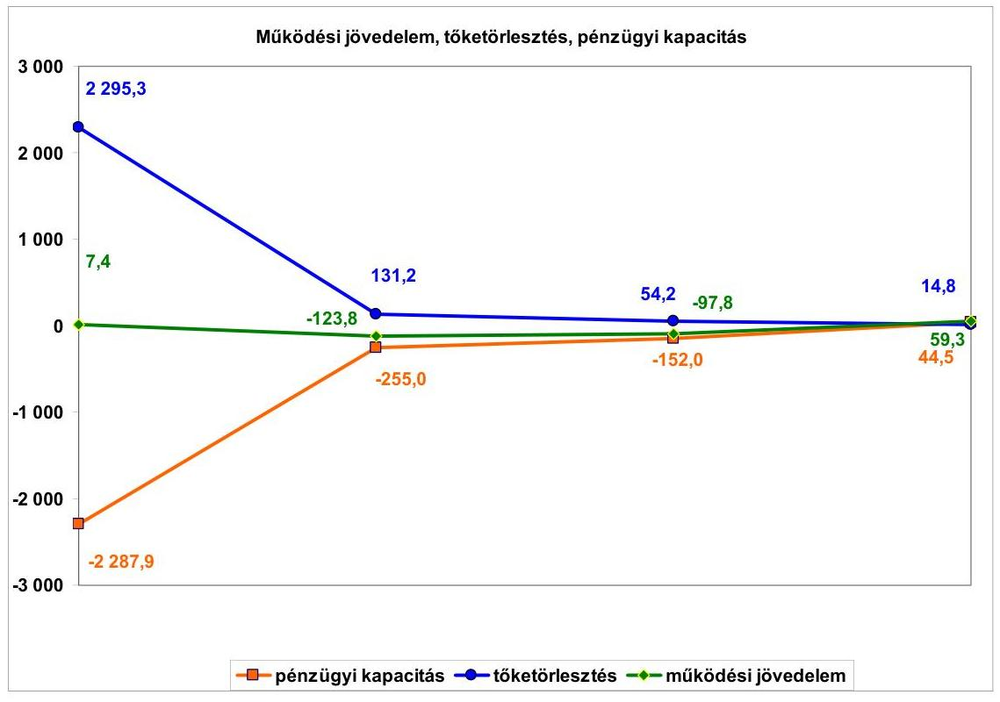

A 2007. évben a minimális pozitív összegű működési jövedelem mellett a kötvénykibocsátásból képződött forrásokból korábbi fennálló 2295,3 millió Ft öszszegű hiteleit visszafizette az Önkormányzat, ezért a tőketörlesztés kiugróan magas összegű volt, ami a pénzügyi kapacitás jelentős romlását idézte elő. Az időszak további éveiben a hiteltörlesztés összege nagymértékben csökkent mert a kötvény tőketörlesztése az időszakban nem kezdődött meg - de a 2008. évben a megszűnő egyszeri 2007. évi kamatbevételek miatt csökkentek a folyó bevételek, ami negatív múködési jövedelmet eredményezett. A 2009. évben a működési hiány összege mérséklődött a múködési kiadások kismértékű csökkenésének hatására. A 2010. évben a dologi kiadások, az államháztartáson kívülre átadott pénzeszközök és a kamatkiadások csökkenése miatt keletkezett pozitív működési jövedelem fedezetet biztosított a tőketörlesztésre, a pénzügyi kapacitás pozitív irányba változott.

---

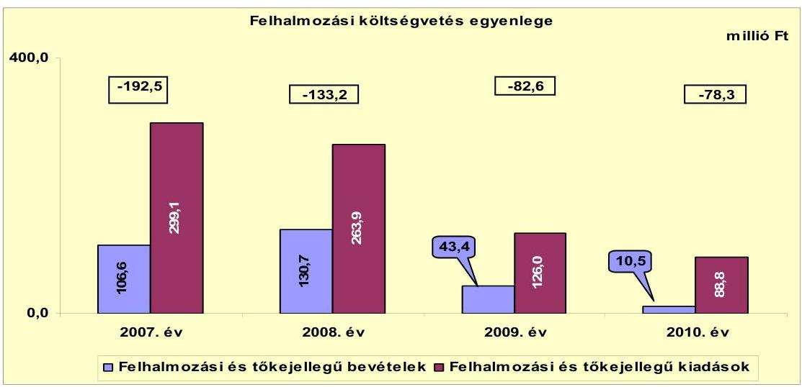

A 2007-2010. években az Önkormányzat felhalmozási költségvetésének egyenlege negatív összegű volt, így az a 2007-2010. év között összesen 486,6 millió Ft felhalmozási forráshiányt mutatott. A deficitet a kötvénykibocsátásból származó forrásokból finanszírozták. A 2007-2008. évek magas felhalmozási kiadását a két EU-s támogatással megvalósított beruházás eredményezte, a 2009-2010. évben forráshiány miatt csak kisebb beruházásokat és felújításokat valósítottak meg.

A pénzügyi egyensúlyt külső források bevonásával biztosították. A 2007-2010. években 2495,5 millió Ft hitelt törlesztettek. Az adósságszolgálat, továbbá a felhalmozási forráshiány 2007-2010 között 2982,1 millió Ft-ot tett ki, amelyre a 2007. január 1-jén rendelkezésre álló 156,3 millió Ft pénzkészlet nem szolgált fedezetül. A további pénzeszközöket 225,8 millió Ft hitel felvételével, valamint 2600,0 millió Ft kötvénykibocsátással teremtették meg. A kialakult pénzügyi egyensúlyi helyzet pozitív nettó múködési jövedelmet eredményező gazdálkodás mellett teszi elkerülhetővé további külső források bevonását, az eladósodás növekedését.

Az Önkormányzat pénzügyi egyensúlyi helyzetének 2008-2009. évi romlását a folyó bevételek 2008. évi 121,3 millió Ft-os csökkenése okozta. Ez a 2007. évben a devizában felvett hitel miatt elszámolt 203,3 millió Ft-os rendkívüli árfolyamnyereség kiesésének következménye volt, amit részben ellensúlyozott a költségvetési támogatások és az szja bevételek együttes összegének növekedése. Az időszak további éveiben a folyó bevétel számottevően nem változott, de a 2010. évben a költségvetési támogatás összege 85,7 millió Ft-tal csökkent az üdülőhelyi feladatok normatív állami hozzájárulásának mértékváltozása miatt. A bevétel kiesést a saját múködési bevételek és az államháztartáson belülről kapott támogatások kiegyenlítették.

A helyi adó bevételek a vizsgált időszakban folyamatosan növekedtek, részarányuk a folyó bevételeken belül 23,2\%-ról 31,8\%-ra nőtt. A vizsgált időszakban az adómértékek valamennyi adónemben emelkedtek. Jelentősen, 39,4 millió Ft-tal növekedett a beszedett építményadó összege a 2009. évben a megszüntetett adókedvezmény miatt.

---

Az Önkormányzat folyó kiadásai összességében 2007-2009 között minimális mértékben változtak, a 2010. évben 183,0 millió Ft-tal csökkentek. A csökkenésben meghatározó volt a dologi kiadások 85,8 millió Ft-os csökkenése, ami nem valós kiadáscsökkenést tükrözött, mert a 2010. év végi 75,5 millió Ft-os, a dologi kiadásokat érintő szállítói állománynövekedés okozta. Ezenkívül a 2010. évre 30,1\%-kal csökkentek a kamatkiadások a kötvény kamatkondícióinak kedvező változása miatt, valamint a járulékcsökkentés hatására 21,9 millió Fttal a munkaadókat terhelő járulékok is mérséklődtek.

A pénzügyi egyensúlyi helyzet alakulását befolyásolta a vizsgált időszakban az Önkormányzat fejlesztési tevékenysége. A befejezett fejlesztések jelentős részét saját bevételből, a kötvénykibocsátásból származó bevételből és EU-s támogatásból fedezték. A 2007-2010. évek időszakában 883,9 millió Ft értékű fejlesztés és felújítás forrása a saját erő, a hazai és EU-s támogatások mellett 339,1 millió Ft (38,4\%) kötvénykibocsátásból származó bevétel volt. A 2010. december 31-én folyamatban lévő fejlesztési feladatok végrehajtására 2007-2010. között 31,1 millió Ft kiadást teljesítettek, amelyre kötvénykibocsátásból 13,5 millió Ft-ot (43,4\%) fordítottak. Az EU-s támogatásból megvalósult fejlesztések finanszírozásában likviditási gondot okozott az utófinanszírozott támogatások megelőlegezése, ami pénzügyi kockázatot jelentett.

Az Önkormányzatnál 2010. december 31-én folyamatban lévő fejlesztési feladatok 2010. évet követő kötelezettségvállalásainak összege 172,5 millió Ft volt, amelyből 141,7 millió Ft-ot hazai támogatásból, 30,8 millió Ft-ot saját bevételből terveznek biztosítani. A 2010. utáni kötelezettségvállaláshoz szükséges saját forrás nem áll rendelkezésre. A hazai támogatással megvalósuló utófinanszírozott beruházások esetében likviditási problémát okozhat a támogatás megelőlegezése, melynek finanszírozásához nem rendelkeznek forrásokkal, ami pénzügyi kockázatot jelent.
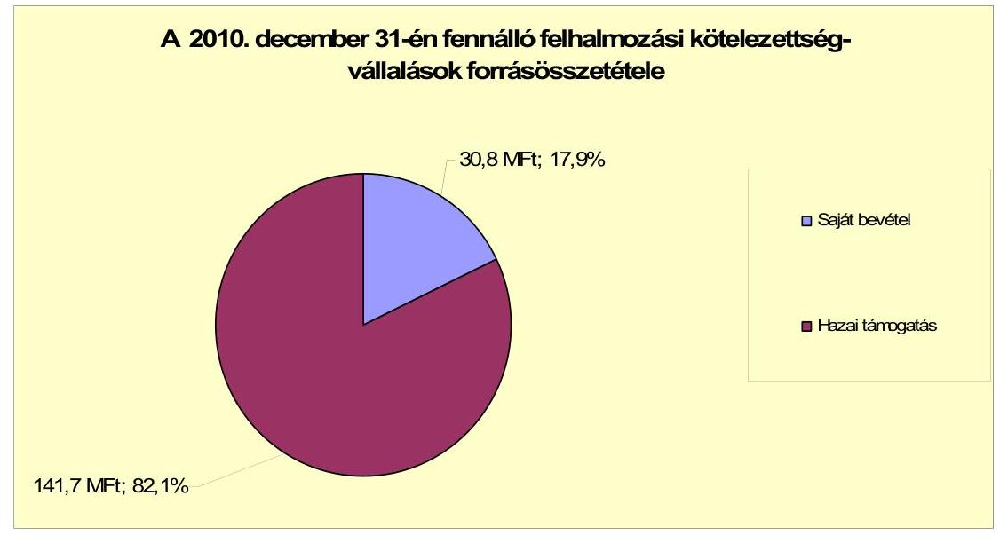

A vizsgálat időszakában az Önkormányzatnak elbírálás alatt álló pályázatai nem voltak.

---

Az Önkormányzat mérleg szerinti pénzintézetekkel szembeni kötelezettségeinek állománya a 2007. év eleji 2702,9 millió Ft-ról 2011. év I. félév végére 4270,6 millió Ft-ra növekedett a 180,0 millió Ft hosszúlejáratú múködési célú hitelfelvétel, a kötvény 1131,3 millió Ft-os árfolyamváltozása és a likvidhitelek 256,4 millió Ft-os állománynövekedésének hatására.

Az Önkormányzat kötelezettségvállalásaira Képviselő-testületi döntés alapján került sor. Az adósságot keletkeztető kötelezettségvállalásokra vonatkozó képvi-selő-testületi előterjesztések nem tartalmazták a visszafizetés forrásait, az adósságot keletkeztető kötelezettségvállalásról szóló döntéskor nem mutatták be a Képviselő-testületnek a jövőben várható - árfolyam-, kamat- és törlesztési kockázatot. Kezességvállalás, garancia és helytállási kötelezettségvállalásról szóló döntésnél nem mutatták be a Képviselő-testületnek azok pénzügyi kockázatait.

A vizsgált időszakot megelőzően felvett hiteleit az Önkormányzat a 2007. évben a CHF-ben történt kötvénykibocsátásból származó forrásból visszafizette, így a 2010. december 31-én fennálló hosszú lejáratú pénzintézeti kötelezettsége a 3574,7 millió Ft árfolyamváltozással növelt összegű kötvényből és 120,0 millió Ft hosszú lejáratú múködési célú hitelből keletkezett. ${ }^{8}$ A hitelek refinanszírozásához reorganizációs terv nem kapcsolódott, ezt követően a hitelszerkezet nem változott, az Önkormányzat pénzügyi pozíciója nem javult. A rövid lejáratú hitelállományát a 293,0 millió Ft múködési célú likvidhitel és a két hosszú lejáratú kötelezettség következő évi 288,6 millió Ft törlesztő részletei alkották.

Az Önkormányzat a kötvénykibocsátásból származó forrásokat a meghatározott céloknak megfelelően használta fel, a fel nem használt maradvány 2011. június 30-án 1,5 millió Ft volt, amit óvadéki betétszámlán helyeztek el. Az Önkormányzat a 17070,0 ezer CHF összegű fennálló pénzintézeti kötelezettségéből tőkét nem törlesztett, a tőketörlesztési kötelezettség 2011. március 30-ától kezdődött, és a 2011. évre vonatkozóan 1035,0 ezer CHF volt, de az Önkormányzat a kötvény prolongálását kérte. A kötvénykibocsátás miatt az időszakban 2314,7 ezer CHF ( 410,4 millió Ft) kamatot és 1,7 millió Ft egyéb költséget fizetett. A kötvényforrás befektetéséből 2007-2011. év I. féléve között 15,1 millió Ft kamatbevételt realizált. A HUF-ban fennálló hosszú lejáratú pénzintézeti kötelezettségéből 2011. június 30-ig tőketörlesztés nem történt, a kamatokra és egyéb költségekre 9,6 millió Ft kifizetést teljesítettek.

Az Önkormányzat költségvetésének pénzügyi egyensúlyát a vizsgált időszakban folyószámlahitel, és folyamatosan évente 293 millió Ft és 510 millió Ft közötti összegű likvidhitel igénybevételével tudta biztosítani. A változó összegű likvidhitel állományból 280,0 millió Ft összegű 2006. decemberétől a vizsgált időszakban folyamatosan, az év minden napján fennállt és a folyószámlahitelhez hasonlóan funkcionált, további 180,0 millió Ft összegű likvidhitelt vettek igénybe 2009. november 9-étől egy évre terjedő időszakra, ami az időszak min-

[^0]
[^0]:    ${ }^{8}$ A kötvény és a hosszú lejáratú hitel tőketartozásából 2010. december 31-én a következő évben esedékes tőketörlesztés összege átvezetésre került a rövid lejáratú kötelezettségek közé

---

den napján fennállt. További kisebb összegű likvidhiteleket a likviditási helyzet függvényében több alkalommal és változó összegben vettek igénybe a vizsgált időszakban. A likvidhitelek átlagos állománya 2007-ben 327,1 millió Ft, 2008ban 280,0 millió Ft, 2009-ben 347,6 millió Ft, 2010-ben 443,6 millió Ft, 2011. év I. félévében 290,1 millió Ft volt.

A folyószámla- és likvidhitel igénybevétele a 2007-2011. év I. félévéig az alábbiak szerint alakult:

| Megnevezés | 2007. év | 2008. év | 2009. év | 2010. év | 2011. év I.   félév |
| :--: | :--: | :--: | :--: | :--: | :--: |
| Folyószámlahitel |  |  |  |  |  |
| Kerekösszeg január 1-jén (millió Ft-ban) | 150,0 | 150,0 |  |  |  |
| Állagos napi állomány (millió Ft-ban) | 145,9 | 25,6 |  |  |  |
| Folyószámla hitellet zárt napok száma (nap) | 300 | 73 |  |  |  |
| Egyeréeg (állomány) | 127,6 | - |  |  |  |
| Likvidhitel |  |  |  |  |  |
| Állagos napi állomány (millió Ft-ban) | 327,1 | 280,0 | 347,6 | 443,6 | 290,1 |
| Likvidhitelet zárt napok száma (nap) | 365 | 365 | 365 | 365 | 180 |
| Egyeréeg (állomány) | 280,0 | 330,0 | 460,0 | 293,0 | 288,0 |

A pénzintézeti hiteleken kívül az Önkormányzat saját társaságától a Gyógyfürdő Zrt.-től a likviditás biztosításához a 2008-2010. években több alkalommal, változó összegű rövid lejáratú múködési célú kölcsönöket vett igénybe. A kölcsönök törlesztésére a vizsgált időszakban nem került sor, a lejárati idő a többszöri módosítás után 2012. március 31-e, a tartozásállomány 189,8 millió Ft. A számviteli nyilvántartásokban az Önkormányzat a Gyógyfürdő Zrt.-től igénybe vett kölcsönöket pénzintézetekkel szemben fennálló kötelezettségként tüntette fel, ellentétesen a Számv.tv. előírásaival. A Gyógyfürdő Zrt. és az Önkormányzat közötti kölcsönügyletek szabálytalansága felvethető, mert az ilyen jogügyletekre többek között a hitelintézetekről és a pénzügyi vállalkozásokról szóló 1996. évi CXII. törvény és a gazdasági társaságokról szóló 2006. évi IV. törvény is tartalmazhat korlátozásokat.

A likviditás biztosítása az Önkormányzatnak 163,4 millió Ft kamatkiadást ${ }^{9}$ és egyéb költség fizetésének kötelezettségét okozta.

Az Önkormányzat szállítói állománya az időszakban folyamatosan növekedett. A 2006. december 31-ei lejárt szállítói állomány a 2010. év végére több mint kétszeresére növekedett ( 169,4 millió Ft-ról 368,5 millió Ft-ra), 2011. június 30-án 329,8 millió Ft volt, melyből a 90 napot meghaladó 303,9 millió Ft, az átütemezett szállítói kötelezettség összege 34,0 millió Ft, a vitatott szállítói kötelezettség 40,8 millió Ft volt. A polgármester nem tett eleget az Adósságrendezési tv. 5. § (2) bekezdése előírásának, mert a 90 napon túli lejárt szállítói kötelezettség esetében nem kezdeményezte a Képviselő-testület döntését az adósságrendezési eljárás megindításáról.

Az Önkormányzat gazdasági társaságai részére a fejlesztési és egyéb hitelek igénybevételéhez készfizető kezességet vállalt. A 2010. év végére a kezességgel kapcsolatos kötelezettség 1144,5 millió Ft volt, ami 97,7\%-ban a Gyógyfürdő Zrt. hiteleire vonatkozott. Egy társaságának az utófinanszírozott pályázati támogatás megelőlegezéséhez 5,5 millió Ft kölcsönt nyújtott. A Polgármesteri hi-

[^0]
[^0]:    ${ }^{9}$ A folyószámlahitel és likvidhitel kamatai együtt.

---

vatal 2011. június 30-án fennálló kötelezettsége peres eljárásból 14,2 millió Ft, egyéb kiadáselmaradásból 6,3 millió Ft volt, ami kedvezőtlenül befolyásolhatja az Önkormányzat pénzügyi egyensúlyát.

Az Önkormányzat kötelezettségeinek 2010. december 31-i, valamint 2011. június 30-i állományát és várható alakulását a kötelezettségek lejáratáig a következő táblázat szemlélteti:

| Megnevezés | Állomány 2010. december 31   én |  |  | Állomány 2011. június 30-án |  |  | Várható kötelezettség 2011. 2013. években |  | Várható kötelezettség 2014. évtől |  |
| :--: | :--: | :--: | :--: | :--: | :--: | :--: | :--: | :--: | :--: | :--: |
|  | HUF-ban   (mibió Ft-   ban) | Devizában (összegy, ezer CHFban) | Devize   nem | HUF-ban (mibió Ftban) | Devizában (összegy, ezer ... ban) | Devize   nem | HUF-ban (mibió Ftban) | Devizában (összegy, ezer ... ban) | HUF-ban (mibió Ftban) | Devizában (összegy, ezer ... ban) |
| Pénzintézeti kötelezettségek |  |  |  |  |  |  |  |  |  |  |
| Herkány I. Kölvény |  | 17070,0 | CHF |  | 17070,0 | CHF |  | 4456,5 |  | 14979,2 |
| Hosszo lejáratú mük hitel 2010-11-10.szere. | 180,0 |  | HUF | 180,0 |  | HUF | 213,8 |  | 0,0 |  |
| Lévrel hitel | 255,0 |  | HUF | 266,0 |  | HUF | 316,2 |  | 0,0 |  |
| Pénzintézeti kötelezettségek összesen HUF-ban | 473,0 |  |  | 468,0 |  |  | 530,0 |  |  |  |
| Pénzintézeti kötelezettségek összesen CHF-ban |  | 17070,0 |  |  | 17070,0 |  |  | 4456,5 |  | 14979,2 |
| Biztosítékok |  |  |  |  |  |  |  |  |  |  |
| Összesség | 1144,5 |  |  | 1144,5 |  |  |  |  |  |  |
| Biztosítékok összesen | 1144,5 |  |  |  |  |  |  |  |  |  |
| Szállítási tartozás | 370,6 |  |  | 332,1 |  |  | 332,1 |  |  |  |
| Egyéb kiadás elmaradás | 8,8 |  |  | 8,2 |  |  | 4,3 |  |  |  |
| Egyéb kötelezetts Gyógyfürdő Zrt-től felvett kölcsön | 189,8 |  |  | 189,8 |  |  | 248,3 |  |  |  |
| Jegerős végzéssel lezárt de ki nem fizetett kötelezettségek |  |  |  | 14,2 |  |  | 14,2 |  |  |  |

Az Önkormányzatnak pénzintézetekkel szemben fennálló kötelezettsége a 2011. év I. félévének végén 468,0 millió Ft, 17 070,0 ezer CHF. Ezek várható kötelezettsége (tőke, kamat és egyéb költség) a legutóbbi kamatfizetés feltételei alapján a 2011-2013. években 530,0 millió Ft és 4456,5 ezer CHF. A pénzintézeti kötelezettségeken felül az Önkormányzat a minősített többségi tulajdonú Gyógyfürdő Zrt.-től igénybe vett kölcsönökből a 2012. évben esedékes kötelezettsége kamatokkal 248,3 millió Ft. Az Önkormányzatnak a 2011. évben a szállítók felé 332,1 millió Ft-ot kell teljesítenie. A 2011-2013. évek kötelezettségeinek teljesítésére figyelembe vehető 180,7 millió Ft mérlegben kimutatott követelésállomány és a tehermentes forgalomképes ingatlanvagyon. A 2014. évet követően jelenleg ismert pénzintézeti kötelezettsége 14 979,2 ezer CHF. Az Önkormányzat a kötelezettségek visszafizetésének forrásait a költségvetési rendeletekben nem számszerúsítette. A vállalt pénzintézeti és egyéb kötelezettségek fedezete rövid távon (2011-13. években) és közép távon (2013. év után) nem biztosított, mert az alacsony múködési jövedelem mellett az Önkormányzat nem rendelkezik további mobilizálható forrásokkal, a likvidhitel állandó forrásként van jelen az Önkormányzat költségvetésében, e forrás nélkül a múködőképesség nem biztosított. Az adósság kezelése érdekében egyéb intézkedést nem tett, adósságkezelési koncepciót, cselekvési tervet nem terjesztett a Képviselő-testület elé.

Az önkormányzati kötelezettségek növekedése mellett az Önkormányzat minősített többségi befolyásával rendelkező gazdasági társaság kötelezettségei is befolyásolhatják az Önkormányzat pénzügyi egyensúlyát. Az Önkormányzat minősített többségi tulajdoni hányaddal rendelkező gazdasági társaságainak fennálló pénzintézeti és szállítói kötelezettségei az alábbiak szerint alakultak:

---

| Megnevezés | Állomány 2010. december 31   án |  |  | Állomány 2011. június 30-án |  |  | Várható kötelezettség 2011-   2013. ávadban |  | Várható kötelezettség 2014.   ávóli |  |
| :--: | :--: | :--: | :--: | :--: | :--: | :--: | :--: | :--: | :--: | :--: |
|  | HUF-ban   (millió Ft-   ban) | Devicólban   (összegy,   azer ...   ban) | Devica   van! | HUF-ban   (millió Ft-   ban) | Devicólban   (összegy,   azer ...   ban) | Devica   van! | HUF-ban   (millió Ft-   ban) | Devicólban   (összegy,   azer ...   ban) | HUF-ban   (millió Ft-   ban) | Devicólban   (összegy,   azer ...   ban) |
| Gyógyfiztői 201. huzausi tejáretü hibáia | 637,4 |  | HUF | 626,2 |  | HUF | 511,0 |  | 386,1 |  |
| Gyógyfiztői 201. lévét hibáia | 220,0 |  | HUF | 250,0 |  | HUF | 210,5 |  |  |  |
| Páncérítékeit kötelezettségeik összesen | 657,4 |  |  | 656,2 |  |  | 721,0 |  | 386,1 |  |
| Szállítói tartozás | 186,1 |  |  | 160,3 |  |  | 160,3 |  |  |  |

Az Önkormányzat minősített többségi tulajdonú gazdasági társaságának kötelezettsége ${ }^{10}$ 2011. június 30-án 986,5 millió Ft volt, a többségi tulajdonú gazdasági társaságok pénzügyi egyensúlyi helyzete nem stabil, a lejárt szállítói állomány figyelemmel kísérése nem volt biztosított, az Önkormányzat kezességet vállalt a minősített többségi tulajdonú társasága hiteleiért, mindezek hatással lehetnek az Önkormányzat likviditására. Esetleges csőd- vagy felszámolási eljárás esetén a bíróság korlátlan és teljes felelősséget állapíthat meg az Önkormányzat terhére.

Az Önkormányzat eszközállományának elhasználódása és pótlása hatással lehet a pénzügyi egyensúlyi helyzet alakulására. Az Önkormányzat 2007-2010 között eszközállománya után 450,3 millió Ft összegű értékcsökkenést mutatott ki, az elhasznált eszközök pótlására 465,4 millió Ft-ot fordított. Ugyanebben az időszakban az aktivált felújítások és beruházások értéke 634,3 millió Ft volt. Az Önkormányzat eszközpótlási kötelezettségének eleget tett. A Képviselőtestületnek előterjesztett éves zárszámadási rendeletekben nem mutatták be az Önkormányzat eszközei után tárgyévben elszámolt értékcsökkenés összegét, az eszközpótlásra fordított tényleges kiadásokat, az eszközök elhasználódási fokának alakulását.

Az Önkormányzat kimutatása szerint az ellenőrzött időszakban kiadási megtakarítást eredményező és bevételt növelő intézkedéseket tett. A 2007 - 2011. év 1. félév között tett intézkedések hatására 73,6 millió Ft kiadási megtakarítást, továbbá 231,5 millió Ft bevételi többletet mutattak ki. A kiadási megtakarítások 36,5\%-a az elrendelt álláshelycsökkentések eredménye. Az álláshely-csökkentő intézkedések 2007-2011. év 1. félév között önkormányzati szinten összesen hat álláshely megszüntetését jelentették. Egyes közszolgáltatási területeken azonban feladatbővülés is volt, amely 18 álláshely növekedéssel járt. Ennek következtében az időszak álláshelyeinek száma 12 fővel nőtt. A bevételnövelő intézkedések eszközök értékesítéséhez, adó mértékek növeléséhez és térítési díjak beszedéséhez kapcsolódtak. Az intézményszervezeti átalakítások, kiadáscsökkentő és bevételnövelő intézkedések nem biztosítottak elegendő forrást a pénzügyi egyensúly helyreállításhoz.

Az utóellenőrzés a pénzügyi egyensúly javítására tett kettő szabályszerűségi és egy célszerűségi javaslat hasznosítására terjedt ki. A szabályszerűségi javaslatokat az intézkedési terv szerinti határidőben megvalósították. A célszerűségi javaslat megvalósítása - a határideje még nem járt le - folyamatban van.

[^0]
[^0]:    ${ }^{10}$ A kötelezettségek mellett a társaságnak a tulajdonossal szemben 248,3 millió Ft követelése áll fenn.

---

Az Önkormányzat pénzügyi egyensúlyi helyzetét összegezve a következők emelhetők ki:

# Az Önkormányzat pénzügyi egyensúlyi helyzete rövid távon veszélyeztetett. 

Múködési jövedelme a vizsgált időszak több évében negatív volt. A növekvő adósságszolgálat finanszírozását és a likviditás biztosítását folyamatosan növekvő és állandósult likvidhitel és kölcsönök igénybevételével teremtette meg.

Az Önkormányzat pénzintézetekkel szemben fennálló kötelezettségállománya és a lejárt szállítói kötelezettségállománya növekedett. A fennálló hitelei refinanszírozására és a felhalmozási forráshiány fedezetére kötvényforrást vett igénybe.

A várható kötelezettségeinek teljesítéséhez az Önkormányzatnak nincs szabad pénzeszköze, vagy szabad pénzmaradványa, a jelentkező kötelezettségekre nem nyújt fedezetet a képződő nettó múködési jövedelem. Az intézményszervezeti átalakítások, kiadáscsökkentő és bevételnövelő intézkedések nem biztosítottak elegendő forrást a pénzügyi egyensúly helyreállításhoz. Az Önkormányzat a kötvénykibocsátásból keletkező hosszú lejáratú kötelezettségéből a törlesztési moratórium lejárta után esedékes 2011. évi tőketörlesztési kötelezettségének nem tett eleget, a tőketörlesztés átütemezését kérte.

A minősített többségi tulajdonú társaságától felvett rövid lejáratú kölcsönök visszafizetésére a vizsgált időszakban nem került sor, a kölcsönök lejárati idejét több esetben átütemezték. Az egyéb kötelezettségek közül a jogerős peres eljárás fizetési kötelezettsége kedvezőtlenül befolyásolhatja az Önkormányzat pénzügyi egyensúlyát.

A 2010. évet követő felhalmozási kötelezettségvállalásainak saját forrása nem áll rendelkezésre, a rendelkezésre álló kötvény maradvány nem elegendő a fejlesztés során vállalt saját forrás biztosítására. A folyamatban lévő beruházások előfinanszírozásához szabad pénzeszközökkel nem rendelkeznek.

Az Önkormányzat a minősített többségi tulajdonában levő gazdasági társasága pénzintézeti kötelezettségéért kezességet vállalt, amelynek beváltása kedvezőtlenül befolyásolhatja az Önkormányzat pénzügyi egyensúlyát. A többségi tulajdonú gazdasági társaságok pénzügyi egyensúlyi helyzete nem stabil.

Az Állami Számvevőszékről szóló 2011. évi LXVI. törvény 33. § (1) bekezdésében foglaltak értelmében a jelentésben foglalt megállapításokhoz kapcsolódó intézkedési tervet köteles az ellenőrzött szervezet vezetője összeállítani és azt a jelentés kézhezvételétől számított harminc napon belül az ÁSZ részére megküldeni. Amennyiben az intézkedési tervet határidőben nem küldi meg a szervezet, vagy az továbbra sem elfogadható, az ÁSZ elnöke a hivatkozott törvény 33. § (3) bekezdés a)-b) pontjaiban foglaltakat érvényesítheti.

---

# A 2011. június 30-i pénzügyi egyensúlyi helyzet alapján az ellenőrzés intézkedést igénylő megállapításai és javaslatai a következők: 

## a Polgármesternek

1. Az Önkormányzat nettó müködési jövedelme a 2007-2009. években negatív volt. Az Önkormányzat finanszírozása a vizsgált időszakban folyószámla- és likvidhitel igénybevételével volt biztosítható, finanszírozásában a likvidhitel állandósult. Az intézményszervezeti átalakítások, kiadáscsökkentő és bevételnövelő intézkedések nem biztosítanak elegendő forrást a pénzügyi egyensúly helyreállításhoz. A 2010. utáni felhalmozási kötelezettségvállaláshoz szükséges saját forrás nem áll rendelkezésre, a folyamatban lévő beruházások előfinanszírozásához szabad pénzeszközökkel nem rendelkeznek. Az Önkormányzat - adatszolgáltatása szerint - a 2010. év 990,8 millió Ft müködési költségvetési kiadásából 863,9 millió Ft-ot ( $87,2 \%$ ) a kötelező feladatok, 126,9 millió Ft-ot ( $12,8 \%$ ) az önként vállalt feladatok ellátására fordított. A vállalt pénzintézeti és egyéb kötelezettségek fedezete rövid távon (2011-13. években) és közép távon (2013. év után) nem biztosított. Az Önkormányzat pénzügyi egyensúlya rövid távon veszélyeztetett.

Javaslat:
Az Önkormányzat pénzügyi egyensúlyának gyors helyreállítása és hosszú távú fenntarthatósága érdekében kezdeményezze - felelősök és határidők megjelölésével - az alábbi intézkedések megtételét:
a) Tárja fel a bevételszerző és kiadás csökkentő lehetőségeket. Intézkedjen a bevételek növelésére, a kintlévőségek behajtására a kiadások csökkentésére.
b) Terjesszen a Képviselő-testület elé reorganizációs programot a kedvezőtlen pénzügyi folyamatok megállítására, a pénzügyi egyensúlyi helyzet gyors stabilizálására.
c) Képezzen egyensúlyi (elkülönített) tartalékot az adósságszolgálat teljesítése érdekében.
d) Mérje fel a folyamatban lévő beruházásokkal kapcsolatos kötelezettségek átütemezésének pénzügyi és jogi lehetőségeit, illetve hatásait. Szükség esetén kezdeményezze a támogatóknál és a Képviselő-testületnél annak átütemezését.
e) Vizsgálja meg a likvidhitel hosszú távú kötelezettséggé történő átalakításának jogi lehetőségét, és a Stabilitási törvény 10. §-ában előírt feltételek fennállása esetén kezdeményezze a Kormánynál ennek engedélyezését.
f) Tekintse át az önként vállalt feladatok finanszírozhatóságát a kötelező feladatellátás elsődlegességének biztosítása érdekében, mutassa be a Képviselőtestületnek a megoldás lehetőségeit, és szükség esetén a gazdasági program módosításának igényét.
g) Mutassa be havonta legalább három évre kitekintően kötelezettségeinek finanszírozási forrásait.

---

2. Az adósságot keletkeztető kötelezettségvállalásokra vonatkozó képviselő-testületi előterjesztések nem tartalmazták a visszafizetés forrásait, az adósságot keletkeztető kötelezettségvállalásról szóló döntéskor nem mutatták be a Képviselő-testületnek a jövőben várható - árfolyam-, kamat- és törlesztési - kockázatot. Kezességvállalás, garancia és helytállási kötelezettségvállalásról szóló döntésnél nem mutatták be a Kép-viselő-testületnek azok pénzügyi kockázatait.

Javaslat:
a) Az adósságot keletkeztető kötelezettségvállalásról szóló döntéskor mutassa be a Képviselő-testületnek a jövőben várható - árfolyam-, kamat- és törlesztési - kockázatot. Kezességvállalás, garancia és helytállási kötelezettségvállalásról szóló döntésnél mutassa be a Képviselő-testületnek azok pénzügyi kockázatait;
b) Gondoskodjon, hogy a jövőben az adósságot keletkeztető kötelezettségvállalásokról szóló képviselő-testületi előterjesztések tételesen tartalmazzák a visszafizetés forrásait.
3. A Képviselő-testületnek előterjesztett éves zárszámadási rendeleteikben nem mutatatták be az Önkormányzat eszközei után tárgyévben elszámolt értékcsökkenés öszszegét, az eszközpótlásra fordított tényleges kiadásokat, az eszközök elhasználódási fokának alakulását.

Javaslat:
Mutassa be a Képviselő-testületnek évente a zárszámadási rendelet előterjesztésében az értékcsökkenés összegét, és ezzel összevetve az elhasználódott eszközök pótlására fordított tényleges kiadásokat, az eszközök elhasználódási fokának alakulását.
4. Az Önkormányzat minősített többségi tulajdonú gazdasági társaságának kötelezettsége 2011. június 30 -án 1267,9 millió Ft volt, a többségi tulajdonú gazdasági társaságok pénzügyi egyensúlyi helyzete nem stabil, a lejárt szállítói állomány figyelemmel kísérése nem volt biztosított, az Önkormányzat kezességet vállalt a minősített többségi tulajdonú társasága hiteleiért, mindezek hatással lehetnek az Önkormányzat likviditására.

Javaslat:
Terjesszen intézkedési tervet a Képviselő-testület elé a minősített többségi tulajdonú gazdasági társaságok pénzügyi egyensúlyi helyzetének stabilizálása érdekében.
5. A 2006. december 31-ei lejárt szállítói kötelezettség állomány a 2010. év végére több mint kétszeresére növekedett, 2011. június 30 -án 329,8 millió Ft volt, melyből a 90 napot meghaladó 303,9 millió Ft.

Javaslat:
Kezelje az Önkormányzat lejárt szállítói állományát, a szállítói kitettség és a jogszabályi következmények elkerülése érdekében.

---

6. A Polgármesteri hivatal 2011. június 30-án peres eljárásból és kiadáselmaradásból fennálló kötelezettsége 20,5 millió Ft volt, ami kedvezőtlenül befolyásolhatja az Önkormányzat pénzügyi egyensúlyát.

Javaslat:
Intézkedjen a peres eljárásokból és egyéb kiadás elmaradásból adódó kötelezettségeinek teljesítése érdekében a szükséges fedezet elkülönítéséről.
7. A kötelező és önként vállalt önkormányzati feladatok szabályozása és gyakorlati alkalmazása ellentmondásos. A lakásgazdálkodást a gazdasági program kötelezőnek jelöli, az SzMSz meg sem említi. A sportfeladatok ellátását, a sportcsarnok müködtetését az SzMSz kötelező feladatnak tartja, az Önkormányzat 2011. évi költségvetésében az önként vállalt feladatok közé sorolja. Az Önkormányzat vagyoni, pénzügyi egyensúlyi helyzetében meghatározó jelentőségű gyógyfürdő üzemeltetés nevesítve nem szerepel az Önkormányzat szabályozásaiban.

Javaslat:
Gondoskodjon arról, hogy a kötelező és önként vállalt feladatok számbavételét, besorolását egyértelműen meghatározzák, azok összhangban legyenek a költségvetési gazdálkodás gyakorlatával.

# a Jegyzönek 

1. A számviteli nyilvántartásokban az Önkormányzat a Gyógyfürdő Zrt.-től igénybe vett kölcsönöket a Számv. tv. előírásaival ellentétesen pénzintézetekkel szemben fennálló kötelezettségként tüntette fel.

Javaslat:
Gondoskodjon arról, hogy a kölcsönök számviteli elszámolása során a Számv. tv. 16.§ (3) bekezdésének előírásait betartsák.
2. A Gyógyfürdő Zrt. és az Önkormányzat közötti kölcsönügyletek szabálytalansága felvethető, mert az ilyen jogügyletekre többek között a hitelintézetekről és a pénzügyi vállalkozásokról szóló 1996. évi CXII. törvény és a gazdasági társaságokról szóló 2006. évi IV. törvény is tartalmazhat korlátozásokat.

Javaslat:
Vizsgálja felül a kölcsönszerződések szabályszerűségét.

---

# II. RÉSZLETES MEGÁLLAPÍTÁSOK 

## 1. Az ÖNKORMÁNYZAT KÖTELEZŐ ÉS ÖNKÉNT VÁLLALT FELADATAI, A FELADATELLÁTÁS SZERVEZETI KERETEI ÉS ANNAK VÁLTOZÁSAI

Az Önkormányzat kötelezö és önként vállalt feladatainak körét az $\mathrm{SzMSz}_{1}$-ben és az $\mathrm{SzMSz}_{2}$-ben szabályozta. A gazdasági programok az egyes közszolgáltatások biztosítására, színvonalának javítására vonatkozó megoldások körében a közszolgáltatások között sorrendet állapított meg. Kötelező és önként vállalt feladatokat sorolt fel. Ezek között szerepel a lakásgazdálkodás, amelyet az $\mathrm{SzMSz}_{1}$ és az $\mathrm{SzMSz}_{2}$ nem tartalmaz. Az önkormányzati tulajdonú gyógyfürdő üzemeltetés feladatellátás az SzMSz-ekben és a gazdasági programokban sem szerepel. Annak ellenére, hogy jelentősége meghatározó az Önkormányzat vagyoni és pénzügyi helyzetében.

Az Önkormányzat önként vállalt közszolgáltatási feladatai az Önkormányzat besorolása alapján az SzMSz ${ }_{1}$ és $\mathrm{SzMSz}_{2}$ 8. §. (3) bekezdés szerint: zeneiskola fenntartása; mezőőri szolgálat fenntartása; helyi közszolgálati tv, a havonta megjelenő önkormányzati lap és az idegenforgalom fejlesztése; társadalmi szervezetek, vállalkozások részére pénzeszközátadás; nemzetközi kapcsolatok létesítése; turizmus városi szervezése, koordinálása; szociális otthon fenntartása; piaccsarnok múködtetése.

Az SzMSz ${ }_{1}$ és az $\mathrm{SzMSz}_{2}$ 8. §. (2) bekezdés rendelkezése szerint a sportfeladatok ellátásáról gondoskodás kötelező önkormányzati feladat. A gazdasági program $_{2}$ a kötelező feladatok között nevesíti a sportfeladatok ellátását. A sportcsarnok működtetését azonban az önként vállalt feladatok közé sorolja.

Az SzMSz 2 2011. október 22-től hatályos szabályozása (25/2011. számú rendelet 4. §) törölte a 8. § (3) bekezdést. Az önként vállalt feladatokról az $\mathrm{SzMSz}_{2}$ már nem rendelkezik. Az önként vállalt feladatok tárgyában az éves költségvetés elfogadásakor kell állást foglalni az SzMSz 8. §. (4) bekezdés alapján. Az Önkormányzat 2011. évi költségvetésében a sportfeladatok ellátása és a sportcsarnok üzemeltetése önként vállalt feladat.

A 2010. évi múködési kiadások (990,8 millió Ft) kötelező feladatonkénti megoszlását és azok finanszírozási arányait a következő táblázat ${ }^{11}$ mutatja be:

[^0]
[^0]:    ${ }^{11}$ A táblázat az egészségügyi feladatok, a kisebbségi önkormányzatok és a Tenkes Vidéke Önkormányzati Területfejlesztési Társulás adatait nem tartalmazza.

---

| Ellátott feladat | Müködési   kiadás   összesen   (millió Ft) | Kötelezö   feladatok   kiadásainak   részaránya   $\%$ | Müködési   bevétel   összesen   (millió Ft) | Állami   támogatás   részaránya   $\%$ | Intézményi   saját bevétel   részaránya   $\%$ | Önkormányzati   támogatás   részaránya   $\%$ | Társulástól   átvett   támogatás   részaránya \% |
| :--: | :--: | :--: | :--: | :--: | :--: | :--: | :--: |
| Ovodák | 89,1 | 95,6 | 89,1 | 50,8 | 9,4 | 37,0 | 2,8 |
| Általános iskolák | 250,3 | 85,3 | 250,3 | 50,6 | 6,5 | 40,7 | 2,2 |
| Szociális   intézmények | 79,2 | 20,6 | 79,2 | 53,9 | 28,2 | 17,9 | 0,0 |
| Gyermekjöléti   intézmények | 15,9 | 100,0 | 15,9 | 63,6 | 0,2 | 36,2 | 0,0 |
| Közművelődési   intézmények | 5,4 | 100,0 | 5,4 | 6,8 | 5,7 | 87,5 | 0,0 |
| Sportlétes/imények | 9,4 | 100,0 | 9,4 | 3,0 | 27,9 | 69,1 | 0,0 |
| Egyéb intézmények | 22,6 | 87,6 | 22,6 | 10,2 | 10,8 | 79,0 | 0,0 |
| Polgármesteri hivatal   igazgatási kiadásai | 241,8 | 100,0 | 241,8 | 1,9 | 0,7 | 97,4 | 0,0 |
| Polgármesteri   hivatalban ellátott   egyéb feladatok   múködési kiadásai | 277,1 | 92,6 | 277,1 | 81,9 | 14,9 | 0,0 | 3,2 |
| Müködési kiadá-   sok összesen | 990,8 | 87,2 | 990,8 | 46,4 | 9,6 | 42,3 | 1,7 |

Az Önkormányzat 2010. évben múködési kiadásokból 863,9 millió Ft-ot (87,2\%) a kötelező feladatokra fordította. Az Önkormányzat - adatszolgáltatása szerint - a 2007. évben 987,4 millió rt-ot (87,4\%), 2008. évben 1004,3 millió rt-ot (89,2\%), 2009. évben 977,9 millió rt-ot ( $87,7 \%$ ) fordított kötelező feladatokra. A vizsgált időszakban az Önkormányzatnál az önként vállalt feladatok aránya 12,6\%-ról (142,6 millió Ft-ról) - 0,2 százalékponttal - 12,8\%-ra (126,9 millió Ft-ra) nőtt.

A 2010. évi múködési kiadásra fordított összeg 133,0 millió Ft-tal (11,8\%-kal) alacsonyabb az előző három év átlagához (1123,8 millió Ft) képest. A müködési kiadások csökkenésének a ki nem fizetett 63,1 millió Ft dologi szállítói állomány összege, a 22,7 millió Ft dologi megtakarítás, a 27,6 millió Ft bér- és járulékcsökkenés és a folyó kiadások 11,1 millió Ft-os racionalizálása az oka.

A teljesített 2010. évi múködési kiadások finanszírozása 46,4\%-ban (459,7 millió Ft) állami támogatásból (amely a kötelező feladatok 53,2\%-ára nyújtott fedezetet) származott. Továbbá 9,6\%-ban ( 95,4 millió Ft) intézményi saját bevételből, 42,3\%-ban (419,1 millió Ft) önkormányzati támogatásból, valamint $1,7 \%$-ban ( 16,6 millió Ft) a feladatok közös ellátására társult önkormányzatok hozzájárulásából történt. A finanszírozási forrásokon belül 2007. évhez képest az önkormányzati támogatás részaránya 1,9 százalékponttal emelkedett annak ellenére, hogy összegében 37,5 millió Ft-tal csökkent. ${ }^{12}$ Az állami hozzájárulás részaránya 1,1 százalékponttal, 77,6 millió Ft-tal csökkent. A társult önkormányzatoktól átvett támogatás részaránya 0,5 százalékponttal, 3,1 millió Ft-tal nőtt. Az intézményi saját bevétel részaránya 1,3 százalékponttal, 27,3 millió Ft-tal csökkent.

[^0]
[^0]:    ${ }^{12}$ A 2007. évben folyósított állami támogatás összege 537,0 millió Ft, az önkormányzati hozzájárulás összege 456,8 millió Ft, az intézményi saját bevétel 122,8 millió Ft és a társult önkormányzatoktól kapott hozzájárulás 13,5 millió Ft volt.

---

A közoktatási feladatokra fordított 339,4 millió Ft az összes múködési kiadás $34,3 \%$-át tette ki, amely 34,3 millió Ft-tal ( $9,2 \%$-kal) alacsonyabb volt a 2007. évinél. A 2010. évi múködés kiadásaira fordított összeg 32,6 millió Ft-tal ( $8,8 \%$-kal) alacsonyabb az előző három év átlagához ( 372,0 millió Ft) képest. A 2010. évi múködési kiadáscsökkenés két pedagógus létszámcsökkentéséből adódó 10,9 millió Ft személyi juttatások és járulékok csökkenéséből, az intézmények 19,2 millió dologi kiadásának csökkentéséből és az étkeztetési költségek 4,2 millió Ft-os csökkentéséből tevődött össze. 2010. évben a közoktatás kiadásainak finanszírozását 172,0 millió Ft-ban ( $50,7 \%$-ban) az állami támogatás, 134,8 millió Ft-ban ( $39,7 \%$-ban) az önkormányzati támogatás, 7,9 millió Ft-ban ( $2,3 \%$-ban) a társulástól átvett támogatás, és 24,7 millió Ft-ban ( $7,3 \%$ ban) az intézményi bevétel fedezte. 2007. évről 2010. évre 34,3 millió Ft-tal ( $9,2 \%$-kal) csökkentették a közoktatási ágazat múködési kiadását az állami normatíva fajlagos mértékének csökkenése miatt, amely 76,4 millió Ft bevétel kiesést okozott. Ennek következtében a közoktatási intézmények önkormányzati támogatását 42,4 millió Ft-tal növelték.

A 2010. évben szociális és gyermekjóléti feladatokra fordított 95,1 millió Ft múködési kiadásból 52,8 millió Ft-ot ( $55,5 \%$-ot) az állami támogatásból, 22,4 millió Ft-ot ( $23,5 \%$-ot) az intézményi saját bevételből és 19,9 millió Ft-ot ( $21,0 \%$-ot) önkormányzati támogatásból finanszíroztak. A 2007. évről a 2010. évre az állami hozzájárulás összege 8,6 millió Ft-tal ( $19,5 \%$-kal) nőtt, aminek következtében az önkormányzat 8,2 millió Ft-tal ( $29,2 \%$-kal) kevesebbel támogatta az intézményeit. A vizsgált időszak első évéhez képest 1,2\%-kal (1,1 millió Ft) nőtt a szociális és gyermekjóléti feladatokra fordított múködési kiadás. A gyermekjóléti feladatok kiadásának $86,1 \%$-os ( 7,3 millió Ft) növekedése négy fő alkalmazott felvételének 8,9 millió Ft-os bérnövekedéséből és a dologi kiadások 1,6 millió Ft-os csökkentéséből tevődött össze. A szociális feladatok 7,3\%-os (6,2 millió Ft) csökkenése öt fő alkalmazott felvételének - 9,1 millió Ft személyi juttatások és járulékaik növekedése - ellenére, a dolgi kiadások 54,4\%-os (15,3 millió Ft) csökkentéséből adódott. A létszámbővítéseket az új szakmai követelményeknek való megfelelés és a feladatok bővülése miatt hajtották végre.

A sport és közmúvelődési feladatokra fordított 14,7 millió Ft múködési kiadásra az önkormányzati támogatás 11,2 millió Ft összege $75,8 \%$-ban, az intézményi saját bevétel 2,9 millió Ft összege $19,8 \%$-ban és az állami támogatás 0,6 millió Ft összege $4,4 \%$-ban biztosított fedezetet. 2007. évről 2010. évre az önkormányzati támogatás 3,5 millió Ft-tal ( $23,7 \%$-kal) csökkent, az állami hozzájárulás és az intézményi saját bevétel pedig 0,9 millió Ft-tal nőtt. Az ágazat összes múködési kiadása 2007. évhez képest $15,2 \%$-kal ( 2,6 millió Ft-tal) csökkent. A 2010. évi múködés kiadásaira fordított összeg 3,7 millió Ft-tal ( $25,1 \%$-kal) alacsonyabb az előző három év átlagához (18,4 millió Ft) képest. A sportcsarnok dologi kiadásai 3,3 millió Ft-tal csökkentették, miközben a személyi juttatások és járulékait 1,1 millióval növelték. A könyvtár múködésének dologi kiadása 0,4 millióval csökkent.

Az egyéb intézményi feladatokra a 2010. évben 22,7 millió Ft múködési kiadás a bázisévhez képest $35,8 \%$-kal ( 12,6 millió Ft-tal) csökkent. A 2010. évi múködés kiadásaira fordított összeg 7,9 millió Ft-tal ( $25,9 \%$-kal) alacsonyabb az előző három év átlagához ( 30,6 millió Ft) képest. Az Önkormányzat 17,9 millió Ft támogatást nyújtott, amely a múködési kiadás 79,0\%-a volt. Az

---

állam a költségekhez 10,2\%-ban (2,3 millió Ft-tal) járult hozzá, illetve az intézmények saját bevételükkel 10,8\%-ban ( 2,5 millió Ft-tal) finanszírozták a múködést. A Tourinform iroda tevékenységének fokozatos leépítése következtében a dologi kiadásokat $44 \%$-kal ( 13,3 millió Ft-tal) csökkentették a 2007. évről a 2010. évre.

A múködési kiadásokon belül a legnagyobb arányt, 52,4\%-ot (518,9 millió Ft) a Polgármesteri hivatalban ellátott feladatok (igazgatási szakfeladatok, lakóingatlanok bérbeadása, városgazdálkodás, köztemető-fenntartás és múködtetés, szennyvízelvezetés, lapkiadás) múködési kiadásai jelentették. A Polgármesteri hivatal múködési kiadásából 231,6 millió Ft-ot ( $44,6 \%$-ot) állami támogatásból, 43,1 millió Ft-ot ( $8,3 \%$-ot) saját bevételből, 235,4 millió Ft-ot ( $45,4 \%$-ot) önkormányzati támogatásból és 8,8 millió Ft-ot ( $1,7 \%$-ot) társult önkormányzatoktól kapott támogatásból finanszíroztak. A 2007. évről a 2010. évre a feladatok múködési kiadása 90,8 millió Ft-tal ( $14,9 \%$-kal) csökkent. A 2010. évi múködés kiadásaira fordított összeg 87,7 millió Ft-tal ( $14,5 \%$-kal) alacsonyabb az előző három év átlagához (606,6 millió Ft) képest. A 2009. évről a 2010. évre a feladatok múködési kiadása 90,8 millió Ft-tal ( $14,9 \%$-kal) csökkent. A múködési kiadások csökkenésének a ki nem fizetett 63,1 millió Ft dologi szállítói állomány összege, a 22,7 millió Ft dologi megtakarítás, a 27,6 millió Ft bér és járulék csökkenés és a folyó kiadások 11,1 millió Ft-os racionalizálása az oka.

Az Önkormányzat a kötelező feladatainak ellátását előírta az intézmények és gazdasági társaságok alapító okirataiban és a társasági szerződéseiben. Ezekben a dokumentumokban rögzítették az önként vállalt feladatok ellátására vonatkozó rendelkezéseket is.

Az Önkormányzat kötelező és önként vállalt feladatait 2011. június 30án hét költségvetési szervvel és hat gazdasági társasággal látta el.

Az Önkormányzat által fenntartott költségvetési szervek közül egy (Polgármesteri hivatal) önállóan múködő és gazdálkodó, hat önállóan múködő ${ }^{13}$, feladataikat - az alapító okirataik szerint - tíz telephelyen folytatták. A költségvetési szervek feladatai az általános iskolai tanulók nappali oktatásához, óvodai neveléshez, könyvtári tevékenységhez, kulturális músorok szervezéséhez, sportképzéshez, turizmus városi szervezéséhez, időskorúak tartós bentlakásos szociális ellátásához kapcsolódtak. A feladatok hatékonyabb, ésszerübb ellátása érdekében - a gazdasági programok kiadási megtakarításokat írtak elő - végrehajtott kiszervezés következtében az intézmények száma a vizsgált időszakban nyolcról hétre, 12,5\%-kal csökkent a Családsegítő szolgálat intézményének megszüntetése, a feladatok Kistérségi társulás útján való ellátása miatt.

A Tourinform irodát 2011. július 22-én a Képviselő-testület megszüntette. A feladatát - megállapodás alapján - a Harkányi Turisztikai Egyesület által fenntartott Turisztikai Desztinációs Menedzsment szervezete végzi közfeladat ellátási és továbbfoglalkoztatási kötelezettséggel.

[^0]
[^0]:    ${ }^{13}$ Általános iskola, Óvoda, Könyvtár, Sport Központ, Tourinform iroda, Gyógyotthon.

---

A telephelyek száma nyolcról tízre nőtt, 2007. év szeptemberétől a Drávaszabolcs Községi Önkormányzat általános iskolájában az Általános iskola alapfokú művészetoktatási kihelyezett tagozatának létrehozása, a városi székhelyű körjegyzőség körjegyzői feladatainak ellátása és a Családsegítő szolgálat 2011. február 1-jei megszűntetése miatt. Az Önkormányzat és Szava Község Önkormányzata 2008. január 1-jei hatállyal Harkány székhellyel körjegyzőséget hoztak létre és tartanak fenn. A körjegyzőséget 2010. január 1-jével Márfa Község Önkormányzata csatlakozása miatt bővítették.

A kötelező feladatok (hulladékkezelés-szállítás, víz- és szennyvízkezelés, köztemető fenntartás) ellátásában három gazdasági társaság vesz részt. Egyben 18\%-os tulajdoni hányaddal rendelkezik, kettőben nincs tulajdonosi részesedése. Az önként vállalt feladatokat (távhőszolgáltatás, kulturális rendezvények szervezése, nyomdai tevékenység) három gazdasági társasága végzi, közülük egynek minősített többségi és kettőnek többségi tulajdonosa. Az önkormányzati feladatok ellátásában résztvevő gazdasági társaságok adatait a 4. számú melléklet tartalmazza.

A gazdasági társaságok közül az ellenőrzött időszakban az Önkormányzat egyedül a Kulturcenter Kft.-nek megállapodás alapján és elszámoltatás mellett 13,1 millió Ft működési célú pénzeszközt adott át. A vizsgált időszakban az Önkormányzat gazdasági társaságainál csődeljárás és felszámolási eljárás nem volt.

A feladatátvétel 2008-2011. június 30 között 20,7 millió Ft többletkiadást és bevételt eredményezett. A körjegyzői feladatellátáshoz a résztvevő társult önkormányzatok 10,8 millió Ft-tal járultak hozzá. Az Önkormányzat 2008. január 1-jével Szava Község Önkormányzatával, 2010. január 1-jével Márfa Község Önkormányzatával kötött megállapodást körjegyzőségi feladatok ellátására. A feladatátvétel többletkiadását fedezte a 9,9 millió Ft állami hozzájárulás és a 10,8 millió Ft társult önkormányzatok támogatása. A feladat átvételben szerepet játszott a körjegyzői feladatellátás többlet normatívája.

A feladat átadása 2011. január 1. és 2011. június 30. között 11,6 millió Ft kiadás és bevétel csökkenést eredményezett. Az Önkormányzat 2011. február 1jével - Családsegítő szolgálat egyidejű megszüntetésével - a családsegítés, a házi segítségnyújtás és a gyermekjóléti feladatok ellátását átadta a Kistérségi társulásnak. A feladatot a Siklósi Kistérségi Szociális Szolgáltató Központ vette át.

A feladat átvétel és átadás együttes hatásaként a kiadások és a bevételek 9,1 millió Ft-tal nőttek. A 7,2 millió Ft személyi juttatásokat és járulékaikat, az 1,9 millió Ft dologi többletkiadásokat az 1,4 millió Ft állami támogatás és a 7,7 millió Ft önkormányzati támogatás ellensúlyozta. A feladat átvétel és átadás összege az Önkormányzat pénzügyi egyensúlyát nem befolyásolta.

# 2. AZ ÖNKORMÁNYZAT PÉNZÜGYI EGYENSÚLYI HELYZETÉT BEFOLYÁSOLÓ TÉNYEZŐK 

A hagyományos költségvetési szerkezet helyett az önkormányzat pénzügyi helyzetét a CLF módszerrel mutatjuk be, amelyben jobban elkülönülnek a va-

---

gyonnal kapcsolatos bevételek és kiadások az önkormányzati feladatokkal kapcsolatos közvetlen múködtetési bevételektől és kiadásoktól. A módszer következetesen elkülöníti a folyó és a felhalmozási költségvetés bevételeit és kiadásait, azok költségvetési egyenlegeit. A saját folyó bevételek, valamint a saját felhalmozási bevételek nem tartalmazzák az előző évi pénzmaradványok felhasználásából származó pénzforgalom nélküli bevételeket. ${ }^{14}$

A folyó költségvetés egyenlege, a múködési jövedelem megmutatja, hogy az önkormányzat éves folyó bevétele fedezetet biztosít-e a kötelező és önként vállalt feladatellátáshoz kapcsolódó éves folyó kiadására. A múködési jövedelem negatív értéke pénzügyileg fenntarthatatlan helyzetet jelez. A mutató pozitív értéke megtakarítást mutat, amely forrásul szolgálhat az önkormányzat fennálló kötelezettségei megfizetéséhez, valamint fejlesztéseihez.

A felhalmozási költségvetés pozitív értéke felhalmozási többletet mutat, amely a jövőbeni fejlesztések forrását biztosíthatja. Amennyiben a folyó költségvetési hiány finanszírozása a felhalmozási többletből történik, ez szűkebb értelemben vagyonfelélésnek tekinthető. Amennyiben a felhalmozási költségvetés megtakarítása fejlesztési célú hitelek, kötvények adósságszolgálatát finanszírozza, az változatlan vagyontömeg mellett, a korábban megelőlegezett tőkebevételek valós realizációjának tekinthető. A felhalmozási deficit által generált finanszírozási igény önmagában nem jár pénzügyi kockázattal, a pénzügyileg fenntartható beruházásokhoz kapcsolódó kötelezettségvállalás (adósságszolgálat) átlátható és szabályozott költségvetési gazdálkodással teljesíthető.

A módszer a pénzügyi kapacitás fogalmát helyezi a középpontba. Az adós hitelfelvételi képessége, hosszú távú fizetőképessége vagy bonitása a pénzügyi kapacitással, ezen belül is a nettó múködési jövedelemmel jellemezhető. A nettó múködési jövedelem negatív értéke az egyes költségvetési években jelentkező adósságszolgálat túlzott mértékére utal. ${ }^{15}$ A nettó múködési jövedelem negatív értékének felhalmozási többletből, vagy további hitelből történő finanszírozása pénzügyileg nem fenntartható gazdálkodást vetít előre. A pozitív értéket mutató nettó múködési jövedelem fejlesztési kiadások fedezetét biztosíthatja, illetve a folyamatosan, évenként képződő pozitív nettó múködési jövedelemből meghatározható a jövőben vállalható, teljesíthető éves adósságszolgálat, ily módon az a hitelösszeg, amely - a többi tényezőt, feltételt adottnak tekintve visszafizetési kockázat nélkül felvehető.

A CLF módszer alapján a pénzügyi kapacitás mértéke az Önkormányzat összevont, nettósított, a központi információs rendszerbe a Magyar Államkincstáron keresztül leadott éves költségvetési beszámolójának 80-as űrlapjában szerepeltetett adatok alapján került meghatározásra.

A számítási leírás némileg eltér az ÁSZ módszertanában korábban alkalmazott gyakorlattól. A jelen besorolás általános közgazdasági meggondolásokon ala-

[^0]
[^0]:    ${ }^{14}$ A költségvetési években kialakuló hiány finanszírozása az előző évi pénzmaradvány és a korábbi években képzett tartalékok felhasználásával is történhet.
    ${ }^{15}$ kivéve, ha annak finanszírozására a korábbi években képzett tartalékok fedezetet nyújtanak

---

pul, amely megjelenik az SNA statisztikai módszertanában is. Folyó tételek alatt értjük azokat a kiadásokat és bevételeket, amelyek a gazdálkodó szervezet helyzetét automatikusan nem változtatják. Bevételi oldalon ilyenek az adók, a tényező jövedelmek, a transzferek, ${ }^{16}$ kiadási oldalon a transzferek és a szolgáltatás igénybevételével kapcsolatos múködési kiadások. A folyó költségvetésben a bevételekben nem térül meg, a kiadásokban nem jelenik meg az amortizáció, a vagyoni helyzetet az egyenleg befolyásolja.

A folyó költségvetés egyenlege (múködési jövedelem) tartalmazza a kamatbevételeket és a kamatkiadásokat is, mind a múködési, mind a fejlesztési kamatot, valamint a visszatérülő és befizetendő áfa teljes összegét, mert ezek közgazdaságilag tényező jövedelmek. Nem tartalmazzák viszont a követelés elengedés miatt könyvelt bevételi és kiadási pénzforgalmi tételeket, mert valójában technikai elszámolási múveletnek minősülnek, a bevétel soha nem realizálódott, és költségvetési kiadás sem történt.

A felhalmozási költségvetésben a bevételek között a vagyon megőrzésére és bővítésére fordítható források jelennek meg. A felhalmozási vagy tőketételek módosítják a vagyon nagyságát. A privatizációs bevétel csökkenti a vagyont, a fizikai beruházás, pénzügyi befektetés növeli.

A nettó múködési jövedelmet a tőketörlesztés levonásával a folyó költségvetés egyenlegéből származtatjuk.

[^0]
[^0]:    ${ }^{16}$ Transzferkiadásoknak nevezzük azokat a folyó és felhalmozási tételeket, amelyeket nem az adott önkormányzat használ fel szolgáltatásnyújtásra.

---

# 2.1. A múködési és a felhalmozási egyensúly változása 

CLF módszer szerinti önkormányzati adatok

| Megnevezés | 2007.év | 2008.év | 2009.év | 2010.év |
| :--: | :--: | :--: | :--: | :--: |
| Folyó bevételek | 1341,5 | 1220,2 | 1218,0 | 1192,1 |
| Folyó kiadások | 1334,1 | 1344,0 | 1315,8 | 1132,8 |
| Múködési jövedelem | 7,4 | $-123,8$ | $-97,8$ | 59,3 |
| Nettó múködési jövedelem   =müködési jövedelem - tóketörlesztés | $-2287,9$ | $-255,0$ | $-152,0$ | 44,5 |
| Felhalmozási bevételek | 106,6 | 130,7 | 43,4 | 10,5 |
| Felhalmozási kiadások | 299,1 | 263,9 | 126,0 | 88,8 |
| Felhalmozási költségvetés egyenlege | $-192,5$ | $-133,2$ | $-82,6$ | $-78,3$ |
| Finanszirozási múveletek nélküli (GFS) pozíció = múködési jövedelem + felhalmozási költségvetés egyenlege | $-185,1$ | $-257,0$ | $-180,4$ | $-19,0$ |
| Finanszirozási múveletek egyenlege | 281,9 | $-93,2$ | 109,0 | 8,4 |
| Tárgyévi pénzügyi pozíció | 96,7 | $-350,2$ | $-71,4$ | $-10,6$ |
| Egyéb tájékoztató adatok |  |  |  |  |
| Összes kötelezettség* | 3220,3 | 3367,5 | 4064,4 | 4866,9 |
| -ebből rövid lejáratú | 609,4 | 763,5 | 950,6 | 1172,1 |
| Folyószámlahitel napi átlagos állománya ** | 150,0 | 25,6 |  |  |
| Likvidhitel napi átlagos állománya** | 327,1 | 280,0 | 347,6 | 443,6 |
| Munkabérhitel napi átlagos állománya** | 0,0 | 0,0 | 0,0 | 0,0 |
| Finanszirozásba vonható eszközök: | 253,0 | 48,2 | 16,7 | 10,5 |
| Tartós hitelviszonyt megtestesítő értékpapírok év végi állománya |  |  |  |  |
| Hosszú lejáratú bankbetétek év végi állománya |  |  |  |  |
| Értékpapírok év végi állománya |  |  |  |  |
| Pénzeszközök (idegen pénzeszközök nélkül) év végi állománya | 253,0 | 48,2 | 16,7 | 10,5 |

*Az összes kötelezettséget a passzív pénzügyi elszámolások nélkül vettük figyelembe, mert a passzívák a pénzmaradvány elszámolás tételei közé tartoznak.
** A folyószámla, a likvid- és a munkabérhitel átlagos állományát 365 napos osztószámmal és nem a fennálló napok számával vettük figyelembe.

A 2007-2010 közötti időszakban az Önkormányzat kiadásainak és bevételeinek főbb jogcímek szerinti alakulását a jelentés 2. számú melléklete tartalmazza.

A vizsgált időszakban az önkormányzat folyó költségvetési egyenlege, múködési jövedelme a 2007. és a 2010. évben pozitív az időszak középső két évében negatív értéket mutatott. A múködési jövedelem évenkénti alakulását a következő ábra szemlélteti.

---

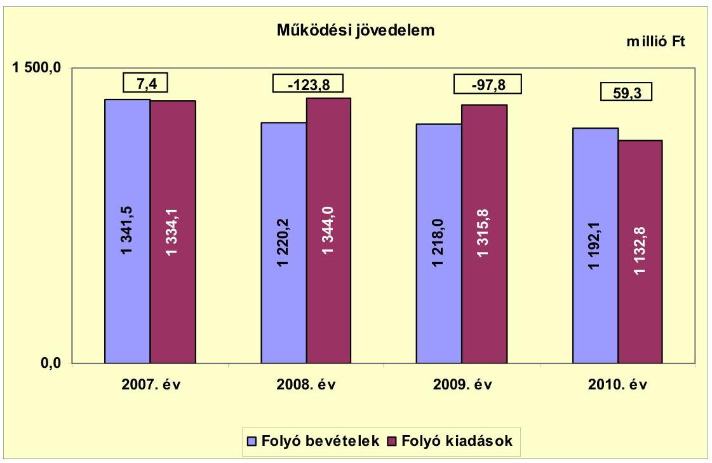

Az Önkormányzat folyó bevételei a 2007. évben fedezték a folyó kiadásokat, a 2008. évben azonban a minimálisan ( $0,7 \%$-kal) növekvő kiadásszint mellett a folyó bevételek 121,3 millió Ft-os ( $9,0 \%$-os) csökkenése 123,8 millió Ft múködési forráshiányt okozott. A folyó bevételek változását a kamat- és hozambevételek 206,5 millió Ft-os ( $97,1 \%$-os) csökkenése határozta meg, amit részben ellensúlyozott a költségvetési támogatások és az szja bevételek együttes összegének 41,8 millió Ft-os ( $7,3 \%$-os) és a tárgyi eszköz értékesítés miatti 27,3 millió Ft áfabevétel növekedés. A 2007. évi egyszeri, kiemelkedően magas kamat- és hozambevétel az 1650,0 millió Ft összegű CHF-ben felvett fejlesztési célú hitel viszszafizetése során keletkezett 203,3 millió Ft összegű árfolyamnyereségből adódott. A 2009. évre a múködési forráshiány mérséklődött a múködési kiadások kismértékű $1,3 \%$-os ( 14,8 millió Ft-os) csökkenésének hatására. A 2010. évben a múködési kiadások további 10,8\%-os (119,9 millió Ft), az államháztartáson kívülre átadott pénzeszközök 34,6\%-os ( 15,0 millió Ft-os) és a kamatkiadások 30,1\%-os ( 48,1 millió Ft-os) csökkenésének hatására 59,3 millió Ft pozitív múködési jövedelem keletkezett az Önkormányzatnál. A vizsgált időszak egészét tekintve a múködési jövedelem 154,9 millió Ft forráshiányt mutatott. A múködési forráshiány finanszírozását folyószámlahitelből és éven belüli likvidhitelből biztosította az Önkormányzat.

Az Önkormányzat pénzügyi kapacitása (nettó múködési jövedelem) a 20072009. évek között javult, negatív értéke -2287,9 millió Ft-ról -152,0 millió Ft-ra csökkent, azonban a képződött múködési jövedelem nem nyújtott fedezetet a tőketörlesztésre, míg a 2010. évben pozitív nettó múködési jövedelem keletkezett. A nettó múködési jövedelem értéke a folyó költségvetési egyenleg mellett az adott költségvetési év tőketörlesztésének hatását is tükrözi.

Az Önkormányzat nettó múködési jövedelmének évenkénti alakulását a következő ábra szemlélteti:

---

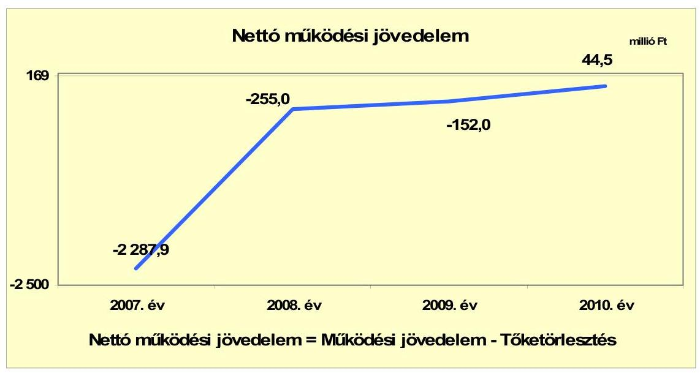

A nettó működési jövedelem 2007. évi nagyon magas negatív egyenlegét (-2287,9 millió Ft) az okozta, hogy az Önkormányzat a 2007. évi 2600,0 millió Ft összegű kötvénykibocsátásból korábbi fennálló hiteleit visszafizette, ezért a hiteltörlesztés összege az évben 2295,3 millió Ft volt. A hiteltörlesztés összege az előző évihez képest folyamatosan 2008-ban 94,3\%-kal (2164,1 millió Ft-tal), 2009-ben 58,7\%-kal (77,0 millió Ft-tal) és 2010-ben 72,7\%-kal (39,4 millió Fttal) csökkent, ami a növekvő múködési jövedelem mellett a pénzügyi kapacitás javulását eredményezte. A hiteltörlesztések összegének nagymértékű csökkenését az okozta, hogy a kötvénykibocsátással a korábbi hitelállomány megszűnt, de a kötvény tőketörlesztése a vizsgált időszakban nem kezdődött meg, mert a kötvény prolongációját kérte az Önkormányzat. Az Önkormányzat nettó múködési jövedelme a 2008-2009. években negatív volt. A 2010. évben a pozitív működési jövedelem és a likvidhitelek 14,8 millió Ft törlesztése pozitív nettó múködési jövedelmet eredményezett.

Az Önkormányzat az önhibáján kívül hátrányos helyzetű önkormányzatok támogatására nem nyújtott be igénylést.

A felhalmozási költségvetés a vizsgált időszakban minden évben deficites volt. Ez a 2008. és 2009. évben fennálló negatív nettó múködési jövedelem mellett jelentős pénzügyi kockázattal járt, mivel a gazdálkodás során nem képződött fedezet a fejlesztési hiány finanszírozására.

A felhalmozási költségvetés egyenlegének alakulását a következő ábra szemlélteti:

---

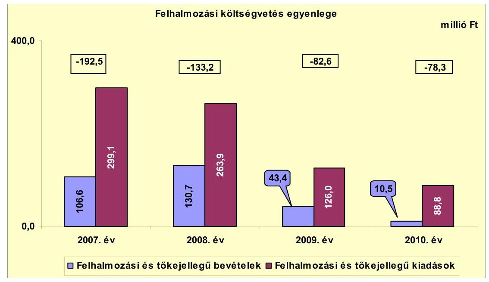

A 2007-2010. években az Önkormányzat felhalmozási költségvetésének egyenlege negatív összegű volt, így a 2007-2010 között összesen 486,6 millió Ft felhalmozási forráshiányt mutatott. A felhalmozási forráshiánynak a felhalmozási kiadásokhoz viszonyított aránya magas, 2007-ben $64,4 \%$, 2008-ban $50,6 \%$, 2009-ben $65,6 \%$, 2010-ben $88,2 \%$ volt. A 2007-2008. évek magas felhalmozási kiadását a két EU-s támogatással megvalósított beruházás eredményezte, a 2009-2010. évben forráshiány miatt csak kisebb beruházásokat és felújításokat valósítottak meg. A felhalmozási deficitet a kötvénykibocsátásból finanszírozta az Önkormányzat.

Az Önkormányzat évenkénti teljes finanszírozási hiánya ${ }^{17}$ a CLF módszer szerint 2007-ben 2480,4 millió Ft, 2008-ban 388,2 millió Ft, 2009-ben 234,6 millió Ft, 2010-ben 33,8 millió Ft volt. A képződött hiány fedezetét a finanszírozási célú bevételek és a finanszírozásba vonható pénzeszközök biztosították.

Az önkormányzat finanszírozási múveletei egyenlegének alakulását a következő ábra szemlélteti:

[^0]
[^0]:    ${ }^{17}$ nettó múködési jövedelem és a beruházási költségvetés egyenlege

---

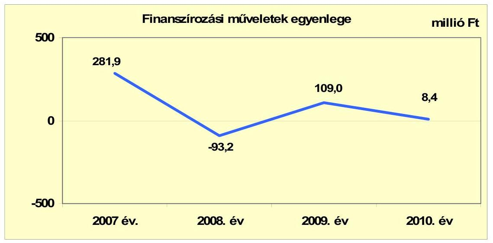

A 2007. évben a kötvénykibocsátás és a hitelek visszafizetésének különbözetéből adódott a 281,9 millió Ft pozitív egyenleg. A 2008. évben az 58,9 millió Ft rövid lejáratú hitelfelvételének és a 131,2 millió Ft folyószámlahitel visszafizetésének egyenlegeként ${ }^{18}$ mutatkozik az 52,2 millió Ft rövid lejáratú likvidhitel egyenleg, a 2009. évben a 180,0 millió Ft likvidhitel felvétel és a kisebb összegű likvidhitel törlesztések alakították az egyenleget. A 2010. évben összesen 25 millió Ft összegű felvételre és ennek részbeni törlesztésére került sor. A 2010. évben felvett 180,0 millió Ft összegű hosszúlejáratú hitel nem jelenik meg a pénzforgalomban hitelfelvételként, mert a lejáró azonos összegű likvidhitel szerződésmódosítására került csak sor. A finanszírozási célú műveleteket a vizsgált időszakban a jelentés 2. számú mellékletének 4.1-4.8 pontjai részletezik.

Az Önkormányzat zárszámadási rendeleteiben a hiány összegét a hagyományos költségvetési szerkezet alapján mutatta be, ${ }^{19}$ amiről a jelentés 1. számú melléklete ad tájékoztatást. A 2008. évi zárszámadási rendelet 55,6 millió Ft összegű bevételi többletet, a 2007. évi rendelet 96,7 millió Ft, 2009. évi rendelet 154,6 millió Ft, a 2010. évi rendelet 4,7 millió Ft forráshiányt jelzett, ami jelentősen eltér az elemi költségvetési beszámolóban szereplő adatok alapján a CLF módszerrel kimutatott hiány összegétől.

Az Önkormányzat kamatbevételeinek és kamatkiadásainak alakulását a következő ábra mutatja:

[^0]
[^0]:    ${ }^{18}$ Korrigálva a függő bevételekkel és kiadásokkal.
    ${ }^{19}$ Nincs kötelező előírás a múködési és fejlesztési hiány megállapításának módjára.

---

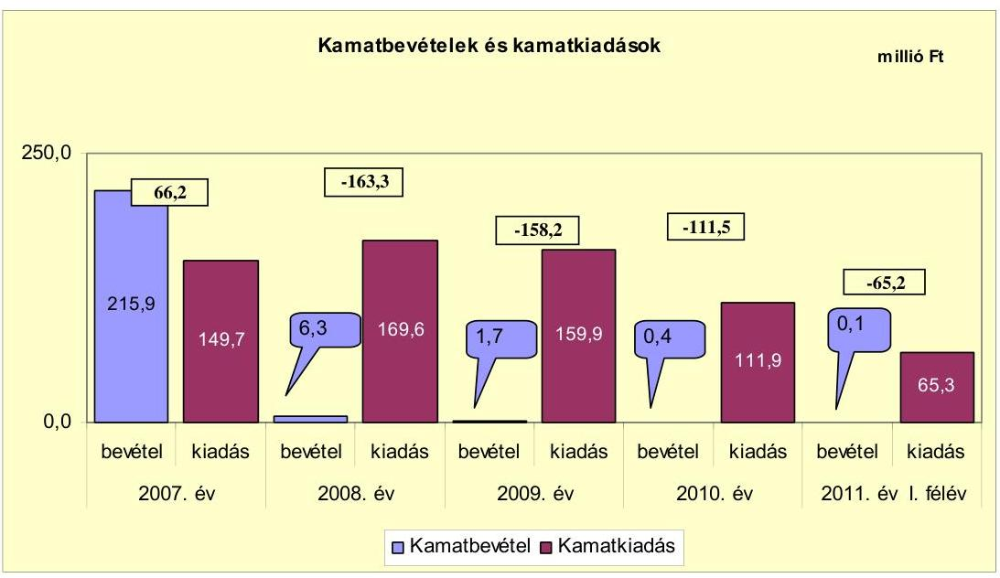

A vizsgált időszakban a kamatkiadások a 2007. év kivételével minden évben meghaladták a kamatbevételeket. A 2007. évben a kiugróan magas bevétel a 1650 ezer CHF összegű hitel visszafizetése során a kamatbevételek között elszámolt 203,3 millió Ft-os árfolyamnyereség volt. A 2010. évben a kamatkiadások 30,1\%-os ( 48,1 millió Ft-os) csökkenését a kötvény kamatterheinek - az alapkamat/referencia kamat kedvező változása miatti - csökkenése okozta. A 2007-2011. év I. féléve között fennálló hitelei és a kötvénykibocsátás miatt öszszesen 656,4 millió Ft kamatot fizetett meg. Átmenetileg szabad pénzeszközei lekötéséből realizált kamatbevétele és árfolyamnyeresége ugyanebben az időszakban 224,4 millió Ft volt, ami a kamatráfordítások 34,2 \%-át jelentette.

# 2.2. Az Önkormányzat bevételeinek változása 

Az Önkormányzat folyó bevétele a 2007. évi 1341,5 millió Ft-ról, a 2008. évre 1220,2 millió Ft-ra, 9,0\%-kal (121,3 millió Ft-tal) csökkent. A folyó bevételek változását a kamat és hozambevételek 206,5 millió Ft-os ( $97,1 \%$-os) csökkenése határozta meg, amit részben ellensúlyozott a költségvetési támogatások és az szja bevételek együttes összegének 41,8 millió Ft-os ( $7,3 \%$-os) és a tárgyi eszköz értékesítés miatti 27,3 millió Ft áfabevétel növekedés. Az időszak további éveiben a folyó bevételek jelentősen nem változtak, 2009-ben 0,2\%-os (2,2 millió Ft-os), 2010-ben 2,1\%-os ( 25,9 millió Ft-os) volt a csökkenés az előző évhez képest.

---

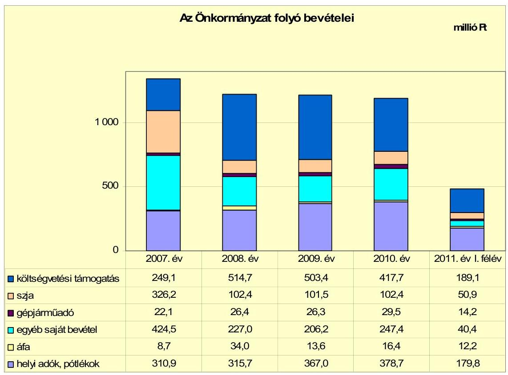

A költségvetési támogatás és az szja bevétel együttes összege meghatározta a folyó bevételek alakulását, mert ennek 2007-ben 42,9\%-át, 2008ban $50,6 \%$-át, 2009-ben $49,7 \%$-át és 200 -ben $43,6 \%$-át tette ki. Az időszakban jelentősebb változás a 2008. évben következett be, amikor az együttes összeg az előző évihez képest 7,2\%-kal (41,8 millió Ft-tal) növekedett. Ezt az egyéb központi támogatás címen kapott 32,3 millió Ft-os központi bérkiegészítés, valamint a központosított és a normatív kötött támogatások kismértékű növekedése okozta. A 2010. évben a költségvetési támogatás és az szja együttes összege az előző évek átlagához képest 79,0 millió Ft-tal ( $13,2 \%$-kal) csökkent a feladatmutatóhoz kötött normatív hozzájárulások 146,4 millió Ft-os csökkenése, valamint az üdülőhelyi feladatok kiegészítésére kapott 37,6 millió Ft-os egyéb központi támogatás és a központosított és a normatív kötött felhasználású támogatások 24,0 millió Ft-os növekedésének eredményeként. A feladatmutatóhoz kötött normatív támogatás változása az idegenforgalmi adó normatív hozzájárulásának két forintról egy forintra történő csökkentése miatti 85,0 millió Ft-os bevételkiesésből, valamint az általános iskolai létszámok, az oktatási és a bentlakásos szociális ellátás normatíváinak csökkenéséből adódott.

A helyi adók, pótlékok 2007-2010 között évente átlagosan 6,9\%-kal növekedtek, a folyó bevételeken belüli részarányuk 23,2\%-ról 31,8\%-ra nőtt. Jelentősebb változást a 2009. évben a beszedett építményadó 39,4 millió Ft-os ( $26,4 \%$-os) növekedése jelentett. A többletbevételt az okozta, hogy a 2009. évtől

---

megszüntették az Önkormányzat rendeletében korábbiakban szereplő építményadó kedvezményt. ${ }^{20}$

Az Önkormányzat a 2007. évet megelőzően építményadót, helyi iparűzési adót, idegenforgalmi adót és telekadót vezetett be. Az időszakban új adónemként 2011. január 1-jétől a magánszemélyek kommunális adóját vetette ki, ennek mértéke 10000 Ft /ingatlan/év volt. Az iparűzési adónál a 2007-2010. közötti időszakban 1,6\%-os, a 2011. évben a maximális $2 \%$-os adómértéket alkalmazta. Az építményadó mértékét az ingatlanok elhelyezkedése, hasznosítása, tulajdonosa szerint öt kategóriában határozta meg $600 \mathrm{Ft} / \mathrm{m}^{2}$-től $1200 \mathrm{Ft} / \mathrm{m}^{2}$-ig, az adómértékek a 2007-2010 közötti időszakban folyamatosan, átlagosan 13\%-kal növekedtek. Az idegenforgalmi adót $330 \mathrm{Ft} /$ éj/fő-ről a 2009. évben $340 \mathrm{Ft} /$ éj/fő-re, a 2010. évben $390 \mathrm{Ft} /$ éj/fő-re emelte. A telekadó mértéke a vizsgált időszakban folyamatosan emelkedett az övezet és a teleknagyság függvényében $140-220 \mathrm{Ft} / \mathrm{m}^{2} /$ év öszszegről $240-260 \mathrm{Ft} / \mathrm{m}^{2} /$ évre.

Az egyéb saját bevételek 2008. évi 197,5 millió Ft-os (46,5\%-os) csökkenését a 2007. évben realizált egyszeri árfolyamnyereségből származó 203,3 millió Ftos bevételkiesés okozta. A 2010. évben az intézményi múködési bevételek 33,8\%-os (25,6 millió Ft-os) és a támogatásértékủ bevételek 16,9\%-os (13,8 millió Ft-os) növekedése határozta meg az egyéb bevételek alakulását.

A vizsgált időszakban az Önkormányzat tulajdonosi részesedései után osztalékbevételt nem realizált. Az $50 \%$ feletti ${ }^{21}$ önkormányzati tulajdonosi részesedésű gazdasági társaságai egyik évben sem fizettek osztalékot. A Gyógyfürdő Zrt. 2008-2010. évek között, a Kulturcenter Kft. a 2007. és a 2010. évben veszteséges volt, a Dekor Kft. kisebb nyereséget realizált az időszakban.

Az Önkormányzat felhalmozási bevételei a vizsgált időszakban a következők szerint alakultak:
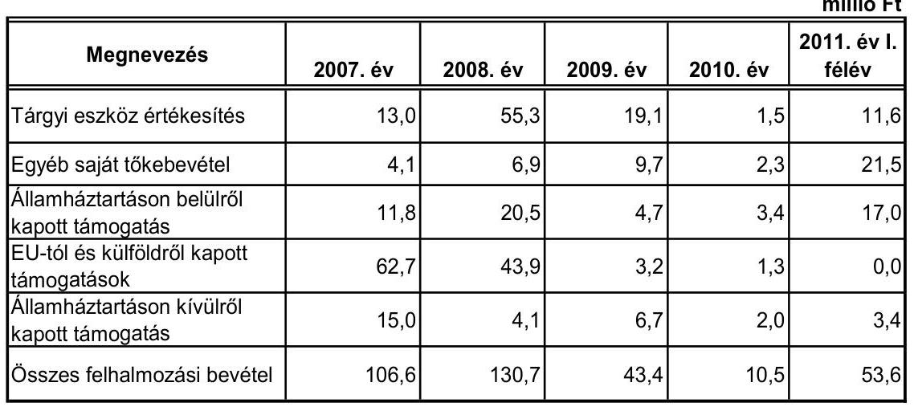

[^0]
[^0]:    ${ }^{20}$ A helyi adókról szóló 14/2007. (XII.17.) számú önkormányzati rendelet 7.§-a kedvezményben részesítette az építményadó fizetését azon ingatlanok esetében, ahol az ingatlan hasznosításából származó, az adóévet követő január 15. napjáig befizetett idegenforgalmi adó együttes összege eléri az építményadó rendeletben meghatározott mértékeit. Az így számított kedvezmény akár az adó 100\%-át is elérhette.
    ${ }^{21}$ Gyógyfürdő Zrt., Kulturcenter Kft., Dekor Kft.

---

A felhalmozási bevételek alakulását meghatározta a 2007. évben az iskolaépület felújításához kapott 62,7 millió Ft EU támogatás, ami a felhalmozási bevételeknek az 58,8\%-át jelentette. A 2008. évben a Dráva Projekt megvalósításához igénybevett 43,9 millió Ft EU-tól kapott támogatás a felhalmozási bevételek $33,6 \%$-át, az 55,3 millió Ft összegű tárgyi eszköz értékesítésből ${ }^{22}$ származó bevétel $42,3 \%$-át tette ki. A 2009. évben $66,8 \%$-kal ( 87,3 millió Ft-tal), a 2010. évben további $75,8 \%$-kal ( 32,9 millió Ft-tal) csökkentek a felhalmozási bevételek, mivel ezekben az években megvalósított kisebb beruházásokhoz és felújításokhoz csak minimális összegű pályázati forrásokhoz jutott az Önkormányzat, saját felhalmozási források nem álltak rendelkezésre. 2010. december 31-én 59,8 millió Ft volt, ami a felhalmozási kockázatot növelte.

# 2.3. Az Önkormányzat múködési és a felhalmozási célú kiadásainak változása. 

Az önkormányzat folyó kiadása 2007-2011. június 30. között a következő volt:

|  |  |  |  |  | millió Ft |
| :-- | --: | --: | --: | --: | --: |
| Megnevezés | 2007. év | 2008. év | 2009. év | 2010. év | 2011. év I.   félév |
| Folyó kiadások | 1334,1 | 1344,0 | 1315,8 | 1132,8 | 551,3 |
| Müködési kiadások (kamatkiadás nélkül) | 1131,6 | 1127,3 | 1112,5 | 992,6 | 474,3 |
| Államháztartáson belülre átadott   pénzeszközök | 0,0 | 0,0 | 0,0 | 0,0 | 0,1 |
| Transzferkiadások | 105,6 | 47,1 | 43,3 | 28,3 | 1,9 |
| -ebből: vállalkozásoknak | 52,8 | 0,6 | 0,7 | 1,0 |  |
| EU-nak, illetve külföldre | 0,0 | 0,0 | 0,0 | 0,0 | 0,0 |
| magánszemélyeknek | 27,3 | 25,7 | 22,3 | 19,6 | 0,0 |
| nonprofit szervezeteknek | 25,5 | 20,8 | 20,3 | 7,7 | 1,9 |
| Kamatkiadások | 149,7 | 169,6 | 160,0 | 111,9 | 65,3 |
| Előző évi pénzmaradvány átadás | 0,0 | 0,0 | 0,0 | 0,0 | 0,0 |

Az Önkormányzat folyó kiadásai közül a kiemelt kiadás nemek teljesítési adatai a következők szerint alakultak a vizsgált időszakban:

|  |  |  |  |  |  |
| :-- | --: | --: | --: | --: | --: |
| Megnevezés | 2007. év | 2008. év | 2009. év | 2010. év | 2011. év I.   félév |
| Személyi juttatások | 493,7 | 537,0 | 530,1 | 524,3 | 233,2 |
| Munkaadót terhelő járulékok | 158,5 | 171,0 | 161,6 | 139,7 | 63,0 |
| Dologi kiadások | 415,0 | 373,7 | 368,3 | 282,5 | 172,0 |
| Egyéb folyó kiadások | 214,1 | 215,9 | 217,2 | 158,5 | 71,5 |

A személyi juttatások a 2007. és 2008. évek között 8,8\%-kal (43,3 millió Fttal) növekedtek. A változás a központi bérintézkedések hatását mutatja, melynek fedezetére a 2008. évben egyéb központi támogatás címen 32,3 millió Ft

[^0]
[^0]:    ${ }^{22}$ Az Önkormányzat kilenc darab telek és egy lakóingatlan eladásából 54,6 millió Ft, használt hivatali gépjármú értékesítéséből 0,6 millió Ft, fűnyíró traktor és egyéb eszközértékesítésből 0,1 millió Ft bevételt realizált.

---

bérkiegészítést kapott az Önkormányzat. Az időszak további éveiben jelentősen nem változtak a személyi juttatások kifizetései. A munkaadókat terhelő járulékok az időszakban a személyi juttatások változását követték, nagyobb 13,6\%-os (21,9 millió Ft-os) csökkenés a 2010. évi járulékcsökkentés hatására következett be. A 2007. évben a folyó kiadások 48,9\%-át személyi juttatásokra és a munkaadókat terhelő járulékokra fordította az Önkormányzat, ez az arány a fenti változások miatt 2010. évre 58,6\%-ra növekedett.

A dologi kiadások az időszak egészét tekintve folyamatosan csökkentek. Jelentősebb változás volt az előző évhez képest a 2008. évben bekövetkezett 9,9\%os (41,3 millió Ft-os), valamint a 2010. évi 23,3\%-os ( 85,8 millió Ft-os) csökkenés, ami azonban nem volt valós kiadáscsökkenés, mivel a pénzügyi fedezethiány miatt ki nem egyenlített kiadási számlák a következő évi költségvetést terhelték.

A 2008. évben a dologi kiadások növekedésével ellentétes hatása volt az év végi 80,0 millió Ft-os dologi kiadásokat érintő szállítói állománynövekedésnek, így a kiadás csökkenés 41,3 millió Ft volt. A 2010. évben szinte teljes egészében az év végi 75,5 millió Ft-os a dologi kiadásokat érintő szállítói állomány növekedés okozta a dologi kiadások csökkenését.

A folyó és felhalmozási kiadásokat évenként a következő grafikon szemlélteti:
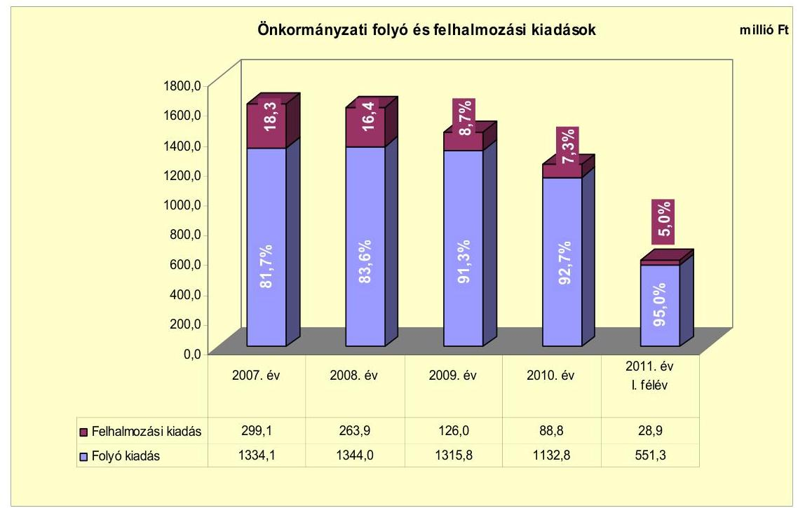

A 2007-2010. években a folyó és felhalmozási kiadások arányának változásában a felhalmozási kiadások arányának 11 százalékpontos csökkenése tapasztalható. Az időszak első két évében EU-s támogatás igénybevételével valósították meg az iskolaépület felújítását 102,7 millió Ft-os tényleges bekerülési költséggel és a Dráva Projekt keretében a turistaközpont kialakítását 62,3 millió Ft-os összköltséggel. A 2009-2010. években nem valósítottak meg jelentősebb beruházásokat és felújításokat ezért jelentősen csökkent a felhalmozási kiadások összege és aránya is.

---

Az Önkormányzatnál a 2007-2010. években befejezett beruházás és felújítás összértéke 883,9 millió Ft volt. A megvalósított felújítások és beruházások közül 19 db meghaladta a 10 millió Ft teljes bekerülési költséget, a 10 millió Ft alatti felújítások és beruházások összértéke 263,8 millió Ft volt. A 2010. december 31-éig befejezett fejlesztések forrását 255,3 millió Ft (28,9\%) önkormányzati saját bevétel, 8,9 millió Ft ( $1,0 \%$ ) hitel, 339,1 millió Ft ( $38,4 \%$ ) kötvény kibocsátásból származó bevétel, 211,8 millió Ft (23,9\%) EU-s támogatás, valamint 68,8 millió Ft $(7,8 \%)$ hazai támogatás képezte.

A folyamatban levő felújítások és beruházások várható teljes bekerülési költsége 228,5 millió Ft. A 2010. december 31-ig teljesített kiadás 56,0 millió Ft volt. A fejlesztés forrása 37,4 millió Ft ( $66,9 \%$ ) önkormányzati saját bevétel, 5,0 millió Ft $(8,9 \%)$ hazai támogatás 13,6 millió Ft $(24,2 \%)$ kötvénykibocsátásból származó bevétel volt. A folyamatban levő fejlesztések 2010. utáni kötelezettségvállalásainak összege 172,5 millió Ft, ennek forrásmegosztása 30,8 millió Ft ( $17,8 \%$ ) saját bevétel, 141,7 millió Ft ( $82,2 \%$ ) hazai támogatás. A 2010. utáni kötelezettségvállaláshoz szükséges saját forrás jelenleg teljes körűen nem áll rendelkezésre. A hazai támogatással megvalósuló utófinanszírozott beruházások esetében problémát okoz a támogatás megelőlegezése, melynek finanszírozásához nem rendelkeznek forrásokkal, ami növeli a felhalmozási kockázatot. Az időszakban megvalósuló fejlesztési feladatokat és azok forrásösszetételét a jelentés 3. a), b), és c) mellékletei tartalmazzák.

Az Önkormányzat három legmagasabb bekerülési költségű fejlesztései a következők voltak:

- A ROP 2.3.1. pályázati forrásból az iskolaépület felújítása a 2004. évben kezdődött, a 2007. évben fejeződött be. Tényleges bekerülési költsége 102,8 millió Ft volt. Forrása 94,6 millió Ft (92,0\%) EU-s támogatás, 8,2 millió Ft $(8,0 \%)$ saját bevétel.
- A Zsigmondy sétány burkolása a 2004. évben kezdődött, a tervezett befejezés időpontja 2013, várható teljes bekerülési költsége 128,0 millió Ft, 2010. december 31-ig teljesített kiadás 2,2 millió Ft, amit saját bevételből finanszíroztak. A 2010. december 31-e után fennálló kötelezettségvállalás összege 125,8 millió Ft, melynek forrása 23,4 millió Ft (18,6\%) saját bevétel, 102,4 millió Ft ( $81,4 \%$ ) hazai támogatás. A beruházás elhúzódását az okozta, hogy a megvalósításra beadott első pályázat nem nyert, ezért csak a tervek elkészítése történt meg.
- Dráva Projekt Turistaközpont beruházás EU-s támogatással a 20042007. években valósult meg. Tényleges bekerülési költsége 62,3 millió Ft volt. Forrása 1,3 millió Ft ( $2,1 \%$ ) saját bevétel és 13,8 millió Ft ( $22,1 \%$ ) kötvénykibocsátásból származó bevétel és 47,2 millió Ft (75,8\%) EU-s támogatás volt.

Az Önkormányzatnak a vizsgálat időszakában nem volt elbírálás alatti fejlesztési pályázata.

Az Önkormányzat fejlesztési feladatait csak a pályázati pénzeszközök, EU-s vagy hazai támogatások igénybevételével tudja megvalósítani.

---

A gazdasági társaságok részére átadott pénzeszközöket évenként a következő grafikon mutatja:
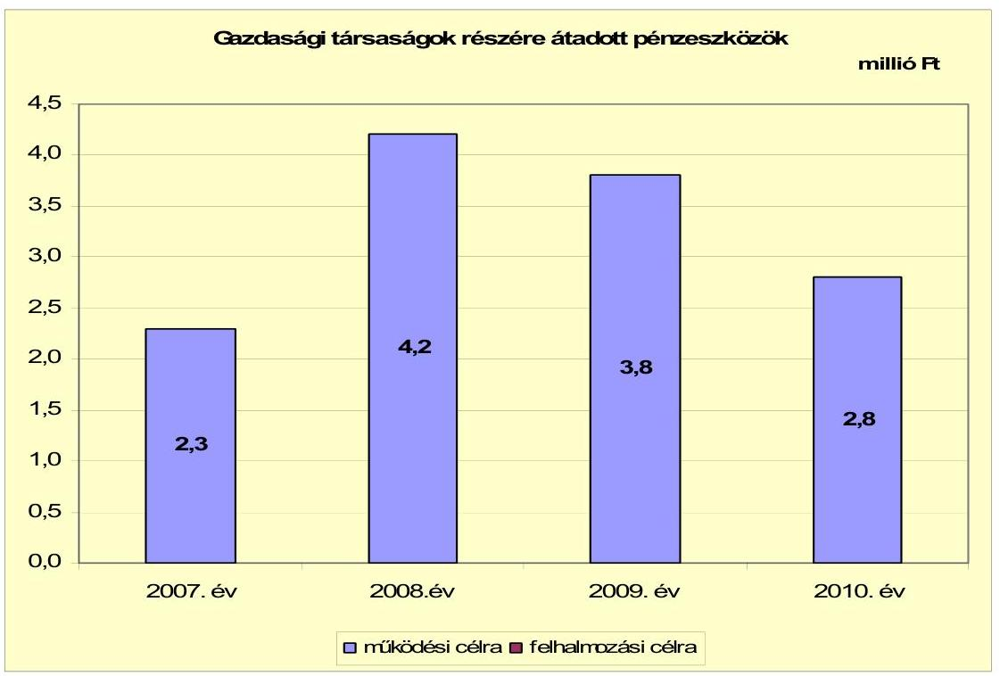

Az Önkormányzat a 60\%-os tulajdonosi részesedésű Kulturcenter Kft. részére a 2007-2010. években rendszeresen pénzeszközt adott át működési célra, összesen 13,1 millió Ft összegben.

A gazdasági társaságok számára átadott pénzeszközök összegét részletesen a 4. számú melléklet tartalmazza.

# 3. Az ÖNKORMÁNYZAT KÖTELEZETTSÉGEI 

### 3.1. Az Önkormányzat pénzintézetekkel szembeni kötelezettségeinek változása.

Az Önkormányzat pénzintézetekkel szembeni kötelezettségeinek állománya a vizsgált időszakban folyamatosan növekedett, 2006. december 31-én 2702,9 millió Ft, 2010. december 31-én 4276,3 millió Ft, 2011. június 30-án 4270,6 millió Ft volt. A kötvénykibocsátás hatására a pénzintézetekkel szemben fennálló kötelezettségek összetételében növekedett az árfolyamváltozással megnövelt összegű hosszú lejáratú kötelezettségek aránya. A 2007-2010. év végi, valamint 2011. június 30-án meglévő a pénzintézetekkel szemben fennálló kötelezettség 59,9\%-88,6\%-ban a 17070 ezer CHF összegű kötvénykibocsátásból keletkezett.

---

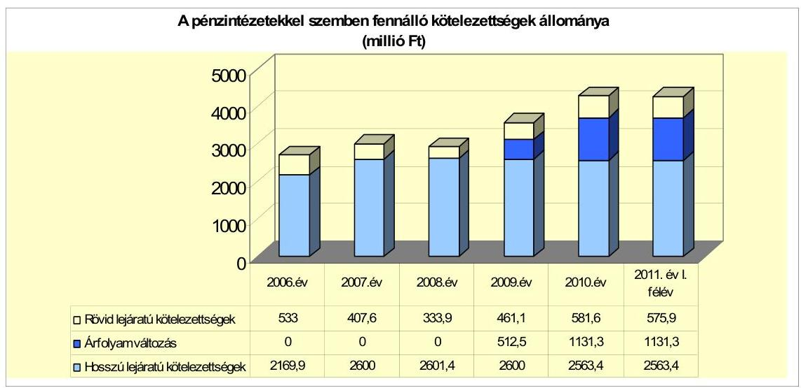

A 2007. évben a kötvénykibocsátás 11,2\%-kal (304,7 millió Ft-tal) növelte a pénzintézeti kötelezettségek állományát. Jelentősebb növekedés 21,7\%-os (638,3 millió Ft-os) a 2009. évben és 19,7\%-os (702,7 millió Ft-os) a 2010. évben történt, ami a likvidhitel állomány növekedéséből és a CHF-ben kibocsátott kötvény árfolyamváltozásából adódott.

Az árfolyamváltozás hatása a 2009. évtől jelentősen befolyásolta a pénzintézetekkel fennálló kötelezettségek alakulását, azonban ennek mértéke előre pontosan nem határozható meg. A jelenlegi tendenciák alapulvételével a devizában kibocsátott kötvény árfolyamváltozása miatti várható árfolyamveszteség jelentős törlesztési kockázatot jelent az Önkormányzat gazdálkodásában. A kötvény tőketörlesztése a vizsgálat időpontjáig nem kezdődött meg, ezért árfolyamveszteséget nem realizáltak.

Az adósság kezelése érdekében egyéb intézkedést nem tett, adósságkezelési koncepciót, cselekvési tervet nem terjesztett a Képviselő-testület elé. A költségvetési és zárszámadási rendeletek mellékletében bemutatták a lejáratig fizetendő tőketörlesztés összegeit, de a visszafizetés forrásait a rendeletekben nem számszerúsítették. Az adósságot keletkeztető kötelezettségvállalás felső határát betartották.

Az adósságot keletkeztető kötelezettségvállalások felső határát az Ötv. 88. § (3) c) ${ }^{23}$ pontjának figyelembevételével számolva - mely szerint a likvidhiteleket nem kell a rövid lejáratú kötelezettségek között számba venni - nem lépték túl, azonban az állandósult és folyamatosan fennálló 280,0 millió Ft összegű likvidhitel figyelembe vételével már nem felelnének meg az adósságkorlátnak.

Az Önkormányzat pénzintézetekkel szembeni kötelezettségvállalásaira minden esetben a Képviselő-testület döntése alapján került sor. Az adósságot keletkeztető kötelezettségvállalásokra vonatkozó képviselő-testületi előterjesztések nem tartalmazták a visszafizetés forrásait, az adósságot keletkeztető kötelezettségvállalásról szóló döntéskor nem mutatták be a Képviselő-testületnek a jövőben várható - árfolyam-, kamat- és törlesztési - kockázatot. Kezességvállalás, ga-

[^0]
[^0]:    ${ }^{23}$ 2012. évtől a Stabilitási tv 10. §-a szabályozza.

---

rancia és helytállási kötelezettségvállalásról szóló döntésnél nem mutatták be a Képviselő-testületnek azok pénzügyi kockázatait.

Az Önkormányzat a 2007. évben 17070 ezer CHF névértékű, 2600 millió Ft összegű „Harkány I." kötvény kibocsátásáról, a 2010. évben 180 millió Ft öszszegű hosszúlejáratú működési célú hitel felvételéről, valamint a 2007-2008. évben folyószámla- és az időszak minden évében működési célú likvidhitel felvételéről döntött. A 2007. évben a kötvény kibocsátására a számlavezető bankkal kötöttek megbízási szerződést. A kötvény kibocsátást megelőzően a Képvise-lő-testületet nem tájékoztatták a kötelezettségvállalás kamat- és árfolyamkockázatáról. A számlavezető bank által biztosított 280,0 millió Ft működési célú likvidhitelek mellett 2008-ben 50,0 millió Ft, 2009-ban 130,0 millió Ft, 2010ben 33,0 millió Ft likvidhitel felvételére kötöttek szerződést más pénzintézetekkel.

Az Önkormányzat számlavezető pénzintézete 2007. január 1-én változott. A változtatásra a tervezett kötvénykibocsátás miatt került sor, mert a jelenlegi számlavezető pénzintézettől vették igénybe a 2006. évben 1650,0 millió Ft fejlesztési célú deviza alapú hitelt, melynek kiváltására számlavezetőként kedvezőbb feltételekkel adott ajánlatot a kötvénykibocsátásra, mint a korábbi számlavezető.

Az Önkormányzat 2011. június 30-án CHF-ben fennálló hosszúlejáratú adósságot keletkeztető kötelezettségvállalásai az alábbiak voltak.

| Megnevezés | Szerződéskötési   Kibocsátás   időpontja | Összeg   ezer CHF-ben | Kibocsátásifehivási   árfolyam | Kamat (referencia kamat^   kamatfelár) | Felhasználás célja: |
| :--: | :--: | :--: | :--: | :--: | :--: |
| HARKÁNY I. kötvény | 2007.03 .30 | 17070,0 | 152,31 | 8 havi LIBOR $+1.75 \%$ | A fennálló hitelállomány   refinanszírozása, fejlesztések   forrásának biztosítása |

A kötvény kibocsátás célja az Önkormányzat fennálló hiteleinek refinanszírozása és a megvalósítandó fejlesztések saját erejének biztosítása volt. A refinanszírozáshoz reorganizációs terv nem kapcsolódott, a hitelek refinanszírozását követően az Önkormányzat pénzügyi pozíciója nem javult.

A kötvénykibocsátásból származó forrásból a meghatározott céloknak megfelelően 2011. június 30-ig 2598,5 millió Ft-ot használtak fel. A fel nem használt kötvényforrás 1,5 millió Ft volt, ami óvadéki betétszámlán került elhelyezésre. Az óvadéki betétszámlán levő összeg kamatozik.

A felhasználás során 1879,7 millió Ft-ot a fennálló fejlesztési célú, 336,4 millió Ftot a működési célú hitelek refinanszírozására fordítottak. A fejlesztési feladatok finanszírozására 380,8 millió Ft-ot használtak fel, 1,6 millió Ft a kötvénykibocsátással kapcsolatos költségek fedezete volt.

A kötvénykibocsátásból származó források befektetéséből 15,1 millió Ft bevétele származott az Önkormányzatnak, amit a hitelek kamatainak kifizetésére fordítottak. A kötvénykibocsátáshoz kapcsolódóan 2011. június 30 -áig 410,4 millió Ft (2314,7 ezer CHF) kamatfizetési kötelezettséget és 1,6 millió Ft egyéb költséget teljesített. A kötvény tőketörlesztése - a 2011. évre 1035,0 ezer CHF - nem kezdődött meg, annak ellenére, hogy a türelmi idő 2011. március 30 -áig tar-

---

tott, mivel az Önkormányzat a pénzintézettől prolongációt kért további két évre.

Az Önkormányzat a 2007-2008. évben a mérlegben nem mutatta ki a kötelezettségek között a kötvény árfolyam különbözetét, ezért nem tett eleget a Számv. tv. 60. §.(1), (2) bekezdésében foglalt kötelezettségnek. A 2009. és 2010. évben az árfolyam különbözet elszámolása a számviteli szabályoknak megfelelően megtörtént.

Az Önkormányzat 2010 novemberében a lejáró likviditási hitelének kiváltására ugyanazzal a pénzintézettel, ugyanolyan, 180,0 millió Ft összegű hosszú lejáratú múködési célú hitel felvételére kötött szerződést. A hitel lejárata a 2013. év októbere, célja a működési célú forráshiány fedezetének biztosítása.

Az Önkormányzat 2011. június 30-án HUF-ban fennálló hosszú lejáratú pénzintézettel szembeni kötelezettségvállalásai a következők voltak:

| Megnevezés | Szerződéskötés/   Kibocsátás   időpontja | Összeg   millió HUF-ban | Kamat (referencia kamat+   kamatfelár) | Felhasználás célja: |
| :--: | :--: | :--: | :--: | :--: |
| Müködési célú hitel | 2010.11 .10 | 180,0 | 3 havi BUBOR $+4 \%$ | müködési célú hiány   finanszírozása |

Az Önkormányzat a vizsgált időszakban működésének egyensúlyát folyószámlahitel és működési célú likvidhitel igénybevételével tudta biztosítani. A folyószámlahitelek keretösszegét és az egyéb likvidhitel igénybevételének alakulását az alábbi táblázat tartalmazza:

| Megnevezés | 2007. év | 2008. év | 2009. év | 2010. év | 2011. év I.   félév |
| :-- | :--: | :--: | :--: | :--: | :--: |
| I. Folyószámlahitel |  |  |  |  |  |
| a folyószámlahitel keretösszege január 1-jén | 150,0 | 150,0 | 0 | 0 | 0 |
| teljesített kamat és egyéb költség | 11,3 | 2,4 | 0 | 0 | 0 |
| II. Egyéb likvidhitel |  |  |  |  |  |
| Igénybevett hitel összesen: | 473,0 | 330,0 | 510,0 | 493,0 | 293,0 |
| teljesített kamat és egyéb költség | 29,0 | 28,2 | 38,5 | 42,4 | 11,6 |

A folyószámlahitel-keret 2007. január 1-jétől-2008. március 15-éig állt fenn a korábbi számlavezető pénzintézetnél, ezt követően nem vettek igénybe folyószámlahitelt. Átlagos állománya a 2007. évben 145,9 millió Ft, a 2008. évben 25,6 millió Ft volt, a 2007. év végi záró állománya 127,6 millió Ft volt. A 2007. évtől az új számlavezető pénzintézettel folyószámlahitelkeret-szerződést nem kötöttek, helyette a kedvezőbb kamatkondíciók miatt folyamatosan működési célú rulírozó jellegű hitelt vettek igénybe. Ezenkívül más pénzintézettel is kötöttek több alkalommal éven belüli futamidejű likvidhitel felvételére szerződést.

A pénzintézetektől igénybevett likvidhitel összege az ellenőrzött időszakban évi 330,0 millió Ft és 510,0 millió Ft között változott. Átlagos állománya az évek sorrendjében 327,1 millió Ft, 280,0 millió Ft, 347,6 millió Ft, 443,6 millió Ft, a 2011. év I. félévében 290,1 millió Ft volt. Záró állománya a 2010. december 31-én 293,0 millió Ft, 2011. június 30-án 288,0 millió Ft volt. A likvidhitelek

---

közül a számlavezető banktól felvett 280,0 millió Ft összegű hitel 2006. december 5-étől folyamatosan fennállt az év minden napján a vizsgált időszakban, a hitelszerződések lejártakor és újrakötésekor a hitelállomány megegyezett az igénybevett hitel összegével. Emellett más pénzintézettől a 2009. november 9étől 2010. november 9-ig terjedő időszakra 180,0 millió Ft összegű likvidhitelt vettek fel, amit a lejárat napján szerződésmódosítással átalakítottak hosszú lejáratú múködési célú hitellé. További kisebb összegű hiteleket a likviditási helyzet függvényében több alkalommal és változó összegben vettek igénybe. ${ }^{24}$ A fo-lyószámla- és a pénzintézeti likvidhitelek kamata és egyéb költsége 2007-2011. év I. féléve között 163,4 millió Ft volt.

A növekvő összegű és folyamatosan fennálló likvidhitel állomány az Önkormányzat eladósodásának növekedését jelzi és magas pénzintézeti kockázatot jelent.

Az Önkormányzat pénzintézetekkel szemben fennálló kötelezettségeihez kapcsolódóan 2007-2011. év I. féléve közötti időszakban 582,1 millió Ft kamatfizetést és 2,9 millió Ft egyéb költséget teljesített.

A kamatkiadások emelkedését a vizsgált időszakban a likvidhitelek állományának növekedése okozta. A likvidhitelek kamatainak kedvező változása ellenére a teljesített kamatkiadások a 2007-2010. között 46\%-kal (13,2 millió Fttal) növekedtek. A növekedést a nem számlavezető pénzintézettől igénybe vett likvidhitel állomány növekedése okozta, ami 2007-ben 50,0 millió Ft, 2008-ban 130,0 millió Ft, 2010. évben 213,0 millió Ft volt.

A folyószámla- és a likvidhitel kamatainak és egyéb költségeinek alakulását a következő táblázat tartalmazza: ${ }^{25}$

[^0][^1]
[^0]:    ${ }^{24}$ Nem a számlavezető pénzintézettől vettek igénybe a 2008-2009. évben 50,0 millió Ft, a 2010. évben 20 millió Ft, 8,0 millió Ft és 5,0 millió Ft összegben. Az utóbbi két hitel állománya 2011. június 30 -án is fennállt.
    ${ }^{25}$ A referencia kamatok az alábbiak szerint alakultak:

[^1]:    ${ }^{24}$ Nem a számlavezető pénzintézettől vettek igénybe a 2008-2009. évben 50,0 millió Ft, a 2010. évben 20 millió Ft, 8,0 millió Ft és 5,0 millió Ft összegben. Az utóbbi két hitel állománya 2011. június 30 -án is fennállt.
    ${ }^{25}$ A referencia kamatok az alábbiak szerint alakultak:

    | MNB BUBOR fixing (átlagkamat) \%-ban |  |  |  |  |
    | :-- | :-- | :-- | :-- | :-- |
    | Referencia kamat | 2007. évi | 2008. évi | 2009. évi | 2010. évi | 2011. év I.   félév |
    | 1 havi BUBOR | 7,83 | 8,75 | 8,66 | 5,47 | 6,00 |
    | 3 havi BUBOR | 7,75 | 8,87 | 8,64 | 5,50 | 6,07 |

---

| Megnevezés | Kamat (referencia+ kamatfelár) | Egyéb költség |
| :--: | :--: | :--: |
| Folyószámlahitel |  |  |
| 2007-2008. év | 3 havi BUBOR $+0,75 \%$ | $0,00 \%$ |
| Likvid hitel |  |  |
| 2007. év 280 millió Ft | 3 havi BUBOR $+1 \%^{*}$ | nincs |
| 2008. év 280 millió Ft | 3 havi BUBOR $+1,3 \%^{*}$ | nincs |
| 50 millió Ft | 1 havi BUBOR $+4, \%$ | rendelkk.áll.dij: $1 \%$ |
| 2009. év 180 és 50 millió Ft | 1 havi BUBOR $+4, \%$ | rendelkk.áll.dij: $1 \%$ |
| 280 millió Ft | 1 havi BUBOR $+2,2, \%^{*}$ | szerződésm.egysz 100 eFt |
| 2010. év 280 millió Ft | 1 havi BUBOR $+2,2, \%^{*}$ | szerződésm.egysz 100 eFt |
| 20 millió Ft | 1 havi BUBOR $+5 \%$ | kezelési ktg |
| 180 és 5 millió Ft | 1 havi BUBOR $+4 \%$ | kezelési ktg egysz. $0,5 \%$ |
| 8 millió Ft | 3 havi BUBOR $+4 \%$ | egyszeri 100 eFt kezelési ktg |
| 2011. év 280 millió Ft | 1 havi BUBOR $+2,2 \%^{*}$ | szerződésm.egysz 100 eFt |
| 5 millió Ft | 1 havi BUBOR $+4 \%$ | nincs |
| 8 millió Ft | 3 havi BUBOR $+4 \%$ | nincs |

A 2007. évet megelőzően a korábbi számlavezető pénzintézettel kötött folyószámlahitelkeret-szerződések alapján nyújtott, 2007-2008. évben is fennálló folyószámlahitel kamatai nem változtak.

Az új számlavezető pénzintézet által nyújtott likvidhitelek kamatai (alapkamat+kamatfelár) ${ }^{26}$ a 2007-2009. évek között növekedtek, míg ezt követően csökkentek. A kamatkondíciók alakulását - a kamatfelár folyamatos növekedése mellett - a referencia kamatok változása határozta meg. A nem számlavezető pénzintézettől kedvezőtlenebb kamatfeltételekkel vettek fel likvidhitelt a 2008-2011. év I. féléve közötti időszakban.

Az időszakban a kötvénykibocsátás kamatterhei csökkentek a kamatkondíciók kedvező változása miatt. A kötvény kamatkondícióinak alakulását az alábbi táblázat szemlélteti:

| Megnevezés | Kibocsátási, lehívási | Utolsó fizetéskori | Változás \% |
| :--: | :--: | :--: | :--: |
|  | kamat (referencia + kamatfelár) \% |  |  |
| 6 havi CHF LIBOR (2007.03.30.-i szerződés) | 4,14 |  | $-51,7 \%$ |

Az ellenőrzött időszakban a szerződés szerinti referencia kamat jelentősen csökkent, ${ }^{27}$ ennek megfelelően évenként folyamatosan csökkenő összegű kamatfizetést teljesítettek.

Hogyha a kötvény kibocsátáskori kamatának mértéke és az árfolyam nem változott volna, a 2011. június 30 -áig megfizetett 410,4 millió Ft kamat helyett 430,5 millió Ft fizetési kötelezettsége lett volna az Önkormányzatnak, így az alapkamat csökkenése 20,1 millió Ft-os megtakarítást eredményezett.

Az Önkormányzat vállalt kötelezettségeinek állományát és a további években várható kötelezettségek alakulását az alábbi táblázat tartalmazza:

[^0]
[^0]:    ${ }^{26}$ A táblázatban *-gal jelölt kamatfeltételekkel a számlavezető pénzintézet nyújtott hitelt.
    ${ }^{27} 6$ havi CHF LIBOR a kibocsátáskor 2,39\% az utolsó kamatfizetéskor 0,25\% volt.

---

| Megnevezés | Allomány 2010. december 31   én |  |  | Allomány 2011. június 30 -én |  |  | Várható kötelezettség 2011-   2013. években |  | Várható kötelezettség 2014. évtől |
| :--: | :--: | :--: | :--: | :--: | :--: | :--: | :--: | :--: | :--: |
|  | HUF-ban   (millió Ft -   ban) | Devizában   (összege,   ezer CHF-   ban) | Deviza   nem | HUF-ban   (millió Ft -   ban) | Devizában (összege, ezer ... ban) | Deviza   nem | HUF-ban   (millió Ft -   ban) | Devizában (összege, ezer ... ban) | HUF-ban (millió Ft ban) | Devizában (összege, ezer ... ban) |
| Pénzintézeti kötelezettségek |  |  |  |  |  |  |  |  |  |  |
| Nyilvány I. Közvény |  | 17070,0 | CHF |  | 17070,0 | CHF |  | 4456,5 |  | 14979,2 |
| Hosszú lejáratú mük-hitet 2010-11-10.szerz. | 180,0 |  | HUF | 180,0 |  | HUF | 213,8 |  | 0,0 |  |
| Lávat hitel | 293,0 |  | HUF | 288,0 |  | HUF | 316,3 |  | 0,0 |  |
| Pénzintézeti kötelezettségek összesen HUF-ban |  | 473,0 |  |  | 468,0 |  |  | 330,0 |  |  |
| Pénzintézeti kötelezettségek összesen CHF-ban |  | 17070,0 |  |  | 17070,0 |  |  | 4456,5 |  | 14979,2 |
| Biztoslékok |  |  |  |  |  |  |  |  |  |  |
| Gyotszolg | 1144,5 |  |  | 1144,5 |  |  |  |  |  |  |
| Biztoslékok összesen | 1144,5 |  |  |  |  |  |  |  |  |  |
| Szállitói tartozás | 378,8 |  |  | 332,1 |  |  | 332,1 |  |  |  |
| Egyéb kiadás elmaradás | 8,8 |  |  | 8,3 |  |  | 8,3 |  |  |  |
| Egyéb kötelezetts Gyógyfürdő Zrt-től felvett kölcsön | 189,8 |  |  | 189,8 |  |  | 248,3 |  |  |  |
| Jógerős végzéssel lezárt de ki nem fizetett kötelezettségek |  |  |  | 14,2 |  |  | 14,2 |  |  |  |

A fennálló pénzintézettel szembeni kötelezettségekből (tőke és kamat) a 20112013. években 530,0 millió Ft, valamint 4456,5 ezer CHF fizetési kötelezettség várható. Ezen kívül jelentős további kötelezettség a Gyógyfürdő Zrt.-től felvett kölcsönök visszafizetése, ami a várható kamataival együtt 248,3 millió Ft. Ezek teljesítésére a 2010. december 31-én fennálló 180,7 millió Ft mérleg szerinti követelésállomány, valamint a jelzáloggal nem terhelt forgalomképes ingatlanvagyon vehető figyelembe.

Az Önkormányzat 2014. évtől várható jelenleg ismert pénzintézettel szembeni kötelezettsége (tőke és kamat) 14979,2 ezer CHF, melynek finanszírozása az alacsony múködési jövedelem és a további mobilizálható források hiánya miatt magas törlesztési kockázatot jelent. A vállalt pénzintézeti és egyéb kötelezettségek fedezete rövid távon (2011-13. években) és középtávon (2013. év után) nem biztosított.

# 3.2. A szállítói kötelezettségek változása 

Az Önkormányzat 2010. december 31-én 370,8 millió Ft, 2011. június 30-án 332,1 millió Ft szállítói állománnyal rendelkezett, ami a kötelezettségek 7,6\%-a és $6,8 \%$-a volt. A szállítói kötelezettségállományon belül növekedett a lejárt szállítói kötelezettségek aránya. Ez a 2010. december 31-i állomány 72,4\%-a (368,5 millió Ft) 2011. június 30-án 99,3\% (329,8 millió Ft) volt, amiből 34,0 millió Ft átütemezési megállapodással érintett.

Az Önkormányzat 2011. június 30-án lejárt szállítói kötelezettségállományból 8,0 millió Ft (2,4\%) 30 nap alatti, 8,9 millió Ft (2,7\%) 31 és 60 nap közötti, 9,0 millió Ft (2,8\%) 61 és 90 nap közötti, 303,9 millió Ft (92,1\%) 90 napon túli tartozás volt. A 90 napon túli tartozásból 227,5 millió Ft ( $74,9 \%$-a) éven túli tartozás. A Polgármester a 90 napon túli szállítói kötelezettségek esetében nem kezdeményezte a Képviselő-testület döntését az adósságrendezési eljárás megindításáról, ezért nem tett eleget az Adósságrendezési tv. 5. § (2) bekezdése előírásának, mely szerint, ha a 4. § (2) bekezdés a)-b) pontjában megjelölt helyzet az esedékességet követő 90. napon is fennáll a polgármester - a Képviselő-testület döntése alapján - 8 napon belül köteles az adósságrendezési eljárást kezdeményezni. Az egyéb kiadáselmaradás összege 2011. június 30-án 6,3 millió Ft volt,

---

ami ki nem fizetett esedékes személyi jellegű juttatásokból (jubileumi jutalmak, volt polgármester végkielégítése) és azok járulékaiból állt. A szállítói tartozásállományok, ezen belül a lejárt tartozások arányának növekedése az Önkormányzat fizetőképességének csökkenését, a pénzügyi kockázat növekedését jelzi. A felhalmozási kockázatot növelte, hogy az időszakban az év végi beruházási szállítói tartozásállomány a 2007. év végi 27,9 millió Ft-ról folyamatosan növekedett.

# 3.3. Egyéb kötelezettségek változása 

Az Önkormányzat jelentős egyéb kötelezettsége, hogy a pénzintézeteken kívül saját társaságától, a Gyógyfürdő Zrt.-től vett igénybe rövid lejáratú múködési célú kölcsönöket a vizsgált időszakban. A likviditás biztosításához a 2008. évben hat alkalommal összesen 145,4 millió Ft, a 2009. évben további két alkalommal összesen 40,0 millió Ft, a 2010. évben egy alkalommal 4,4 millió Ft összegben vett fel rövid lejáratú múködési célú kölcsönt a társaságától az Önkormányzat. A kölcsön kamata a mindenkori jegybanki alapkamat+ 0,5\% volt. A kölcsön törlesztésére és kamatfizetésre a vizsgált időszakban nem került sor, a kölcsön 2011. június 30 -ai állománya 189,8 millió Ft. A kölcsönszerződések lejárati határidejét több esetben módosították, legutóbb a kötelezettség határidejét 2012. március 31-éig hosszabbították meg, ami magas törlesztési kockázatot jelent az Önkormányzat gazdálkodásában. Az Önkormányzat a kölcsönök számviteli nyilvántartásokban történő elszámolása során nem a Számv.tv. 16. § (3) bekezdésének előírásai szerint járt el, mert a kölcsönöket pénzintézetekkel szemben fennálló hitelként mutatta ki. A Gyógyfürdő Zrt. és az Önkormányzat közötti kölcsönügyletek szabálytalansága felvethető, mert az ilyen jogügyletekre többek között a hitelintézetekről és a pénzügyi vállalkozásokról szóló 1996. évi CXII. törvény és a gazdasági társaságokról szóló 2006. évi IV. törvény is tartalmazhat korlátozásokat.

Az Önkormányzatnak lízingszerződésből eredő és PPP konstrukció miatti kötelezettsége nem volt. Az Önkormányzat garancia- és kezességvállalásból 2011. június 30 -án fennálló kötelezettsége 1144,5 millió Ft, melyből 1118,0 millió Ft a Gyógyfürdő Zrt. hitelfelvételeivel volt kapcsolatos. Ezenkívül az Önkormányzat megbízásából végzett közvilágítás korszerűsítési beruházáshoz a kivitelező Kft. által felvett 26,5 millió Ft hitelre történt kezességvállalás, aminek fejében az Önkormányzat a beruházás ellenértékét részletekben fizeti meg a kivitelezőnek. Garancia és kezességvállalásból eredően fizetési kötelezettség tejesítésére nem került sor a vizsgált időszakban.

A vizsgált időszakban az Önkormányzat 9,1 millió Ft követelést engedett el. Ennek $45,3 \%$-a egy 4,1 millió Ft-os kamat elengedés volt, egy részletre történő ingatlan vásárlás miatt felszámított magas késedelmi kamat egy részének elengedése. Az elengedett követelések 31,7\%-a ( 2,9 millió Ft) a helyi adó, pótlék és bírság, 9,9\%-a ( 0,9 millió Ft) a gyermekétkeztetés térítési díjának méltányosságból történő elengedése. A fennmaradó 1,2 millió Ft (13,1\%) több kisebb öszszegű bérleti díj elengedéséből származott.

Az Önkormányzat a 2006. évben a 60\%-os tulajdonosi részesedésű Kulturcenter Kft.-nek az utófinanszírozott pályázati támogatás megelőlegezésére 5,5 millió

---

Ft kölcsönt nyújtott. A kölcsön lejárata 2010. június 30 -án volt, a visszafizetése megtörtént.

Az önkormányzati ingatlanok jelzáloggal való terhelése a következők szerint alakult:
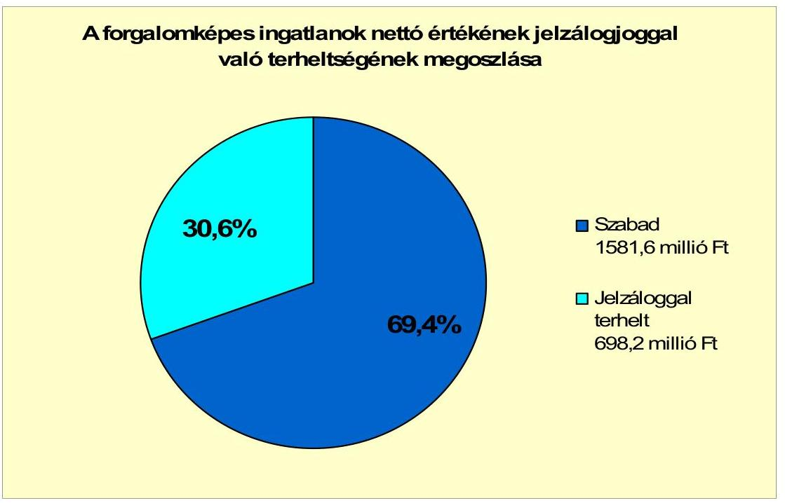

A forgalomképes ingatlanok közül a kötvénykibocsátás és a felvett hitelek fedezetéül 66 db ingatlanra történt jelzálogjog bejegyzés, ami a törzsvagyoni kört nem érintette. A jelzálogjoggal terhelt ingatlanok számvitelben nyilvántartott 2010. december 31-i nettó értéke 698,2 millió Ft volt, ami az összes forgalomképes ingatlan nettó értékének 30,6\%-a.

Az Önkormányzatnál és a Gyógyfürdő Zrt.-nél egy-egy esetben volt folyamatban kötelezettséget keletkeztető peres eljárás. Az egyik esetben az ítélet részben lett jogerős, ennek alapján az Önkormányzatot 14,2 millió Ft fizetési kötelezettség terheli, ami kedvezőtlenül befolyásolhatja az Önkormányzat pénzügyi egyensúlyát.

Az Önkormányzat és a Kaposvári Városgazdálkodási Zrt. között közüzemi díjtartozás megfizetésére irányuló peres eljárás zajlik, a perérték 40,8 millió Ft. A Baranya Megyei Bíróság 16. számú ítélete 14,2 millió Ft felperesi követelés jogosságát állapította meg, a további követelés esetében az eljárás folytatódik. A Gyógyfürdő Zrt. és a Zalai Ált. Építési Vállalkozás Zrt. ügyében 56,2 millió Ft vállalkozási díj megfizetése képezi a per tárgyát. Az eljárás folyamatban van, jogerős ítélet nem született.

Az Önkormányzat legalább 50\% vagy azt meghaladó tulajdoni hányaddal rendelkező gazdasági társarságainak fennálló pénzintézeti, szállítói és lízing kötelezettségei az alábbiak szerint alakultak:

---

| Megnevezés | Állomány 2010. december 31-   én |  |  | Állomány 2011. június 30-án |  |  | Várható kötelezettség   2011-2013. években | Várható kötelezettség   2014. évtől |  |
| :--: | :--: | :--: | :--: | :--: | :--: | :--: | :--: | :--: | :--: |
|  | HUF-ban   (mibió Ft-   ban) | Devizában   (összege.   ezer   ban) | Densze   nem | HUF-ban   (mibió Ft-   ban) | Devizában   (összege.   ezer   ban) | Densze   nem | HUF-ban   (mibió Ft-   ban) | Devizában   (összege.   ezer   ban) | HUF-ban   (mibió Ft-   ban) | Devizában   (összege.   ezer   ban) |
| Gyógyfürdő Zrt. hosszú lejáratú hitelei | 637,4 |  | HUF | 626,2 |  | HUF | 511,0 |  | 386,1 |  |
| Gyógyfürdő Zrt. likvid hitelei | 220,0 |  | HUF | 200,0 |  | HUF | 210,5 |  |  |  |
| Pénzintézeti kötelezettségek összesen: | 857,4 |  | HUF | 826,2 |  | HUF | 721,5 |  | 386,1 |  |
| Szállítás tartozás | 156,5 |  | HUF | 160,3 |  | HUF | 160,3 |  |  |  |

A társaságok kötelezettségei közül a minősített többségú gazdasági társaságának pénzintézetekkel szembeni kötelezettsége 2011. június 30-án 826,2 millió Ft volt. Ebből adódóan a várható kötelezettség (tőke, kamat és egyéb költség) a 2011-2013. években 721,5 millió Ft, a 2014. évtől 386,1 millió Ft. A szállítóí tartozásállomány 160,3 millió Ft, amiből 144,2 millió Ft volt a lejárt szállítóí tartozás. A többségi tulajdonú gazdasági társaságok pénzügyi helyzete nem stabil, a saját tőke/jegyzett tőke mutatója kedvezőtlen irányba mozdult el, a lejárt szállítóí állomány figyelemmel kísérése nem volt biztosított. A kötelezettségek nem teljesítése hatással lehet az Önkormányzat likviditására, pénzügyi egyensúlyi helyzetére, ezért a minősített többségi tulajdonú társaság kötelezettségállománya jelentősen növelte az Önkormányzat pénzügyi kockázatát.

Az Önkormányzat a gazdasági társaságokról szóló 2006. évi IV. törvény 54. § (2) bekezdése alapján korlátlan felelősséggel tartozik azon gazdasági társaságának felszámolás esetén, amelyben az Önkormányzat az 52. § (2) bekezdése szerint a szavazatok legalább 75\%-ával rendelkezik, így minősített befolyásszerzőnek minősül, továbbá a Csődtv. 63. § (2) bekezdése alapján a kizárólagos önkormányzati tulajdonú gazdasági társaságának minden olyan kötelezettségéért, amelynek kielégítését a felszámolási eljárás során az adós társaság vagyona nem fedez, ha a hitelezőinek a felszámolási eljárás során benyújtott keresete alapján a bíróság az adós társaság felé érvényesített tartósan hátrányos üzletpolitikájára figyelemmel - megállapítja az önkormányzat korlátlan és teljes felelősségét.

Az Önkormányzat kimutatása szerint a 2007-2010. években a tárgyi eszközök után együttesen 450,3 millió Ft értékcsökkenést számolt el. Ugyanebben az időszakban az elszámolt értékcsökkenés 37,8\%-ának megfelelő összegű, 170,4 millió Ft felújítást, valamint 463,9 millió Ft beruházást aktiváltak. Ebből az Önkormányzat kimutatása szerint eszközpótlásra 465,4 millió Ft-ot fordítottak. A Képviselő-testületnek előterjesztett éves zárszámadási rendeletekben nem mutatták be az Önkormányzat eszközei után tárgyévben elszámolt értékcsökkenés összegét, az eszközpótlásra fordított tényleges kiadásokat, az eszközök elhasználódási fokának alakulását. Az önkormányzati szintű használhatósági fok mutató a vizsgált időszakban a 2007. évben 15,6\%, a 2008. évben 16,8\%, a 2009. évben 18,6\%, 2010. évben 19,3\% volt az elszámolt felújítások és beruházások hatására folyamatosan javult. Az Önkormányzat eszközpótlási kötelezettségének eleget tett.

# 4. A PÉNZÜGYI EGYENSÚLY MEGTEREMTÉSE ÉrDEKÉBEN HOZOTT INTÉZKEDÉSEK EREDMÉNYE 

Az Önkormányzatnál a kiadáscsökkentő és bevételnövelő intézkedések a feladatellátás szakmai színvonalának, a pénzügyi egyensúlyi helyzet javítását, valamint a költségvetési megtakarítások elérését célozták.

---

Az Önkormányzat kimutatása szerint a 2007-2011. év I. félév időszakában kiadáscsökkentő intézkedések megoszlását az alábbi ábra szemlélteti:
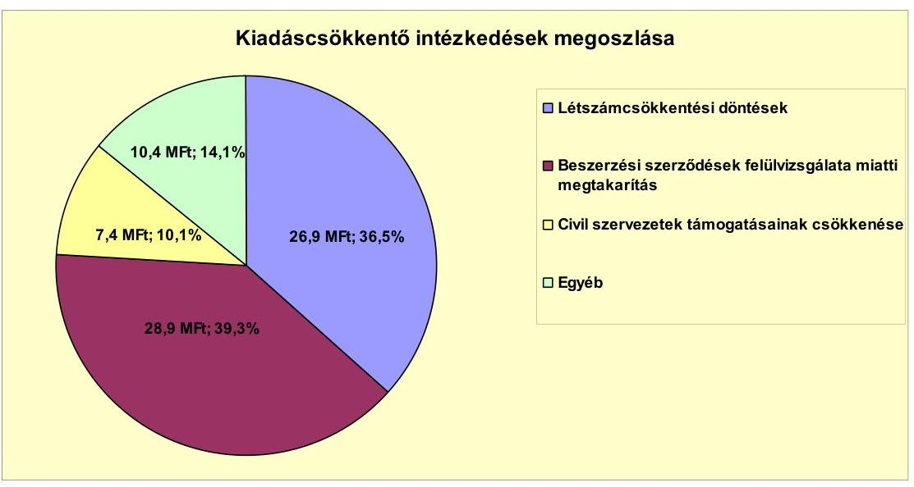

Az önkormányzati szinten kimutatott 73,6 millió Ft kiadáscsökkentő megtakarítási intézkedésekből 26,9 millió Ft-ot (36,5\%) létszámcsökkentési döntések körében érvényesítették. Költség és létszám racionalizálás keretében a 2007. évi költségvetésben a közoktatási ágazatban két pedagógust, a 2010. évi költségvetésben a Polgármesteri hivatalban négy főt építettek le (egy köztisztviselőt és három fő városgondnoksági alkalmazottat).

Az áttekintett időszakban hozott kiadást csökkentő intézkedésekből 28,9 millió Ft (39,3\%) a beszerzési szerződések felülvizsgálata miatti megtakarításhoz kapcsolódik. A Gyógyotthon étkeztetését 2009. évtől a Zsigmondy Vilmos Harkányi Gyógykórház külső szolgáltató helyett Óvodájával látta el.

A helyi újság 2010 novemberében történt megszüntetéséből összesen 10,4 millió Ft (14,1\%) kiadási megtakarítást értek el.

A 2011. év I. félévben a civil szervezetek támogatásának csökkentése 7,4 millió Ft (10,1\%) kiadáscsökkentést eredményezett az Önkormányzat adatszolgáltatása szerint.

Az összes kiadáscsökkentő intézkedésből 17,8 millió Ft (24,2\%) megtakarítás az önként vállalt feladatok ellátásához kapcsolódott.

Az intézményeket érintő feladat- és tevékenységbővülés következtében a 2007. évi induló 268 foglalkoztatotti létszám 12 fővel (4,5\%) nőtt 280 főre 2010. év végén. Az Önkormányzat 2007-2010. éveket érintő összesített létszám változását az alábbi táblázat szemlélteti:

---

| Megnevezés (adatok fő-ben) | Közoktatás | Szociális és gyermekvédelem | Egészségügy | Polgármesteri hivatal | Egyéb | Összesen |
| :--: | :--: | :--: | :--: | :--: | :--: | :--: |
| 2007. január 1-jén jóváhagyott álláshelyek száma | 103 | 35 | 4 | 45 | 81 | 268 |
| Megszüntetett álláshelyek száma | 2 |  |  | 1 | 3 | 6 |
| ebből: Üres álláshelyek száma |  |  |  |  |  | 3 |
|  | Szakmai álláshelyek száma | 2 |  |  | 1 | 3 | 6 |
| intézmény-üzemeltetéssel kapcsolatos álláshelyek száma |  |  |  |  |  |  | 3 |
| Álláshely növekedése | 3 | 8 |  |  | 4 | 3 | 16 |
| 2010. december 31-én záró álláshelyek száma | 104 | 43 | 4 | 48 | 81 | 280 |
| 2007. január 1-jén foglalkoztatott létszám | 103 | 35 | 4 | 45 | 81 | 268 |
| Létszámcsökkentés | 2 |  |  |  | 3 | 6 |
| Létszámnövekedés | 3 | 8 |  |  | 4 | 3 | 16 |
| 2010. december 31-én foglalkoztatott létszám | 104 | 43 | 4 | 48 | 81 | 280 |

Üres álláshely megszüntetés nem volt. A létszámcsökkentő intézkedések következtében 2007-2010. között összesen hat álláshelyet szüntettek meg, ebből kettőt közoktatási, hármat városgondnokság-városüzemeltetés területen és egyet az igazgatási ágazatban. Az álláshelyek megszüntetéséhez központi támogatás nem kapcsolódott.

Az álláshely megszűnések mellett az Önkormányzat kimutatása szerint a bővülő feladatok miatt az álláshelyek számának 18 fős növelésére is szükség volt.

A drávaszabolcsi telephely létesítése következtében közoktatási területen három fővel nőtt a létszám. A szociális és gyermekvédelmi feladatbővülés miatt nyolc fővel növelték a foglalkoztatotti létszámot. A Polgármesteri hivatalban a növekvő igazgatási és a szakmai feladatok ellátása érdekében négy fővel emelték a létszámot. A városgondnokság-városüzemeltetés területen új feladatok miatt három fővel bővítették a foglalkoztatottak számát.

A kiadáscsökkentő intézkedések mellet az Önkormányzat kimutatása szerint a következőkben számszerűsített bevételnövelő intézkedéseket tett 20072011. év I. félév időszakában, amelynek összege 231,5 millió Ft volt:
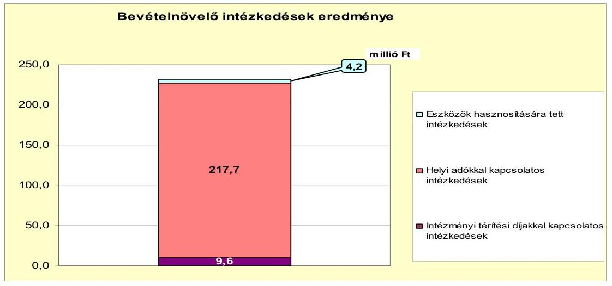

Az Önkormányzat a bevételek növelése érdekében végrehajtott intézkedései közül a legjelentősebb összeg, 217,7 millió Ft ( $94,0 \%$ ) a helyi adókkal kapcsolatos intézkedésekből származott.

- Az Önkormányzat a jogszabály adta lehetőségével élve az adó mértékek emelésével 212,4 millió Ft többletbevételt ért el.

---

Az építményadó, a telekadó és az idegenforgalmi adó mértékét évente növelték. Az építményadó adótárgyankénti különböző mértékek emelésének átlagos növekménye 2007. évről 2011. évre $22,1 \%$, amellyel összesen 93,8 millió Ft bevétel növekedést értek el. A telekadó mértékének átlagos növekménye $47,6 \%$, amellyel 38,6 millió Ft többlet bevételt mutattak ki. Az idegenforgalmi adó mértékének $15,4 \%$ emelése 74,3 millió Ft bevételt eredményezett. Az iparűzési adó mértékének a helyi adókról szóló 1990 . évi C. törvény 40 . § (1) bekezdés c) pontja által meghatározott mérték felső határára való emelése 5,7 millió Ft bevételt eredményezett.

- A kommunális adó bevezetésének hatására 5,3 millió Ft bevételt értek el.

Az eszközök hasznosítására, értékesítésére tett intézkedések 4,2 millió Ft-tal ( $1,8 \%$-kal) növelték a bevételeket. Az intézményi térítési díjak emelésével 9,6 millió Ft (4,2\%) többletbevétel realizálódott.

Az Önkormányzat kiadáscsökkentő és bevételnövelő intézkedései eredményeként összesen 305,1 millió Ft megtakarítást és többletbevételt mutatott ki az ellenőrzött időszakban. A költségvetési támogatások és az átengedett szja 2007. évhez viszonyított együttes csökkenése 31,5 millió Ft volt. Az intézményszervezeti átalakítások, a kiadáscsökkentő és bevételnövelő intézkedések ellensúlyozni tudták a költségvetési támogatások és átengedett adók csökkenését és 273,6 millió Ft-tal ellensúlyozni tudták, de nem biztosítottak elegendő forrást a pénzügyi egyensúly helyreállításhoz.

# 5. Az ÁSZ Által a korábBi ÉVEKBEN a PÉNZÜGYI EGYENSÚLY JAVÍTÁSÁRA TETT SZABÁLYSZERŰSÉGI ÉS CÉLSZERŰSÉGI JAVASLATOK HASZNOSULÁSA 

Az ÁSZ az Önkormányzat gazdálkodását a 2010. évben ellenőrizte átfogó jelleggel. A pénzügyi egyensúly javítás érdekében a jegyzőnek kettő szabályszerűségi és egy célszerűségi javaslatot tett. A javaslatok a likviditási terv készítésére, a költségvetési bevételek és kiadások különbözeteként kialakult többlet vagy hiány összegének bemutatására, valamint a hosszúlejáratú kötelezettségek teljesítésének feltételeire vonatkozott.

A költségvetési bevételeket és kiadásokat, azok különbözetét a 2011. évi költségvetési rendeletben bemutatták. Likviditási terv a 2011. évben elkészült. A hosszú lejáratú kötelezettségek teljesítés feltételeinek bemutatására - az intézkedési tervben foglaltak szerint - 2011. december 31-ig van lehetőség. A javaslatok megvalósítására intézkedési tervet készítettek, amely tartalmazta a felelősöket és határidőket. A Képviselő-testület az intézkedési tervet 2010. október 6án jóváhagyta.

Budapest, 2012. április" 16

Melléklet: $\quad 6 \mathrm{db}$
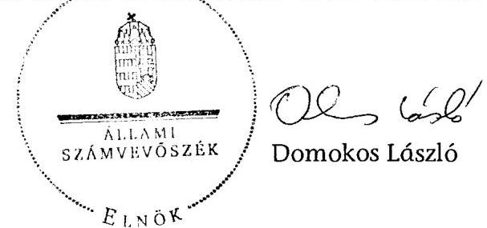

---

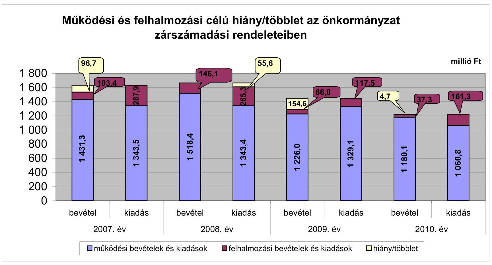

# Müködési és felhalmozási célú hiány/többlet az önkormányzat zárszámadási rendeleteiben

|  Müködési és felhalmozási célú hiány/többlet | 2007. év | 2008. év | 2009. év | 2010. év  |
| --- | --- | --- | --- | --- |
|  müködési bevételek és kiadások | felhalmozási bevételek és kiadások | hiány/többlet |  |   |

---

Az Önkormányzat bevételei és kiadásai, valamint adósságszolgálata 2007-2010 között

|  1. FOLYÓ KÖLTSÉGVETÉS* | 2007. év | 2008. év | 2009. év | 2010. év  |
| --- | --- | --- | --- | --- |
|  1.1.1. Saját müködési bevételek | 655,2 | 478,7 | 502,8 | 537,8  |
|  1.1.2. Költségvetési támogatás | 249,1 | 514,7 | 503,4 | 417,7  |
|  1.1.3. Átengedett bevételek | 348,3 | 128,8 | 127,8 | 131,9  |
|  1.1.4. Államháztartáson belülről kapott támogatások | 88,6 | 96,0 | 82,5 | 95,1  |
|  1.1.5. EU-tól és külföldről kapott bevételek | 0,0 | 0,0 | 0,0 | 0,0  |
|  1.1.6. Államháztartáson kívülről kapott bevételek | 0,3 | 2,0 | 1,5 | 0,0  |
|  1.1.7. Előző évi pénzmaradvány átvétel | 0,0 | 0,0 | 0,0 | 0,0  |
|  1.1. Folyó bevételek $=1.1 .1 .+1.1 .2 .+1.1 .3 .+1.1 .4 .+1.1 .5 .+1.1 .6 .+1.1 .7$. | 1341,5 | 1220,2 | 1218,0 | 1192,1  |
|  1.2.1. Müködési kiadások kamatkiadások nélkül | 1131,6 | 1127,3 | 1112,5 | 992,6  |
|  1.2.2. Államháztartáson belülre átadott pénzeszközök | 0,0 | 0,0 | 0,0 | 0,0  |
|  1.2.3.1. vállalkozásoknak | 0,0 | 0,6 | 0,7 | 1,0  |
|  1.2.3.2. EU-nak, illetve külföldre | 0,0 | 0,0 | 0,0 | 0,0  |
|  1.2.3.3. magánszemélyeknek | 27,3 | 25,7 | 22,3 | 19,6  |
|  1.2.3.4. nonprofit szervezeteknek | 25,5 | 20,8 | 20,3 | 7,7  |
|  1.2.3. Transzferkiadások ( $=1.2 .3 .1+1.2 .3 .2+1.2 .3 .3+1.2 .3 .4$ ) | 52,8 | 47,1 | 43,3 | 28,3  |
|  1.2.4 Kamatkiadások | 149,7 | 169,6 | 160,0 | 111,9  |
|  1.2.5. Előző évi pénzmaradvány átadás | 0,0 | 0,0 | 0,0 | 0,0  |
|  1.2. Folyó kiadások $=1.2 .1 .+1.2 .2 .+1.2 .3 .+1.2 .4 .+1.2 .5$. | 1334,1 | 1344,0 | 1315,8 | 1132,8  |
|  1.3. Folyó költségvetés egyenlege MÚKÖDÉSI JÖVEDELEM (1.1. - 1.2.) | 7,4 | $-123,8$ | $-97,8$ | 59,3  |
|  2. FELHALMOZÁSI KÖLTSÉGVETÉS** | 0,0 | 0,0 | 0,0 | 0,0  |
|  2.1.1. Saját tökebevételek | 17,1 | 62,2 | 28,8 | 3,8  |
|  2.1.2. Államháztartáson belülről kapott támogatások | 11,8 | 20,5 | 4,7 | 3,4  |
|  2.1.3. EU-tól és külföldről kapott támogatások | 62,7 | 43,9 | 3,2 | 1,3  |
|  2.1.4. Államháztartáson kívülről kapott támogatások | 15,0 | 4,1 | 6,7 | 2,0  |
|  2.1. Felhalmozási bevételek ( $=2.1 .1 .+2.1 .2+2.1 .3+2.1 .4$.) | 106,6 | 130,7 | 43,4 | 10,5  |
|  2.2.1. Saját beruházási kiadás átával | 235,0 | 186,2 | 64,7 | 28,4  |
|  2.2.2. Saját felújítási kiadás átával | 53,2 | 77,1 | 52,8 | 45,0  |
|  2.2.3. Államháztartáson belülre átadott pénzeszköz | 0,0 | 0,0 | 7,9 | 15,0  |
|  2.2.4. EU-nak és külföldnek adott pénzeszközök | 0,0 | 0,0 | 0,0 | 0,0  |
|  2.2.5. Államháztartáson kívülre adott pénzeszközök | 2,9 | 0,2 | 0,6 | 0,4  |
|  2.2.6. Befektetési célú részesedések vásárlása | 8,0 | 0,4 | 0,0 | 0,0  |
|  2.2. Felhalmozási kiadások ( $=2.2 .1 .+2.2 .2 .+2.2 .3 .+2.2 .4 .+2.2 .5 .+2.2 .6$.) | 299,1 | 263,9 | 126,0 | 88,8  |
|  2.3. Felhalmozási költségvetés egyenlege (2.1. - 2.2.) | $-192,5$ | $-133,2$ | $-82,6$ | $-78,3$  |
|  3. Finanszírozási műveletek nélküli (GFS) pozíció(1.3.+2.3.) | $-185,1$ | $-257,0$ | $-180,4$ | $-19,0$  |
|  4. Finanszírozási műveletek | 0,0 | 0,0 | 0,0 | 0,0  |
|  4.1. Hitelfelvétel *** | 0,0 | 58,9 | 180,0 | 25,0  |
|  4.2. Hiteltörlesztés | 2295,3 | 131,2 | 54,2 | 14,8  |
|  4.3. Forgatási és befektetési célú értékpapírok kibocsátása | 2600,0 | 0,0 | 0,0 | 0,0  |
|  4.4. Forgatási és befektetési célú értékpapírok beváltása | 0,0 | 0,0 | 0,0 | 0,0  |
|  4.5. Forgatási és befektetési célú értékpapírok értékesítése | 0,0 | 0,0 | 0,0 | 0,0  |
|  4.6. Forgatási és befektetési célú értékpapírok vásárlása | 0,0 | 0,0 | 0,0 | 0,0  |
|  4.7. Egyéb finanszírozási bevételek (függő, átfutó, kiegyenlítő) | $-25,2$ | $-0,5$ | $-8,3$ | $-30,4$  |
|  4.8. Egyéb finanszírozási kiadások (függő, átfutó, kiegyenlítő) | $-2,4$ | 20,4 | 8,5 | $-28,6$  |
|  4.9.Finanszírozási műveletek egyenlege*** (4.1. - 4.2.+4.3.-4.4+4.5.-4.6.+4.7.4.8.) | 281,9 | $-93,2$ | 109,0 | 8,4  |
|  5. Tárgyévi pénzügyi pozíció változás*** (1.3.+ 2.3.+4.9.) | 96,7 | $-350,2$ | $-71,4$ | $-10,6$  |
|  6. Nettó müködési jövedelem =müködési jövedelem (1.3.) - tőketörlesztés $(4.2+4.4)$ | $-2287,9$ | $-255,0$ | $-152,0$ | 44,5  |
|  TÁJÉKOZTATÓ ADATOK |  |  |  |   |
|  Összes kötelezettség | 3220,3 | 3367,5 | 4064,4 | 4866,9  |
|  ebből rövid lejáratú | 609,4 | 763,5 | 950,6 | 1172,1  |
|  Összes szállítói kötelezettség | 167,7 | 249,5 | 280,7 | 370,8  |
|  ebből lejárt (tanúsítványból) | 164,4 | 238,7 | 270,9 | 368,5  |
|  Pénz és tőkepiaci kötelezettség (adósság) *** | 3007,6 | 2935,3 | 3573,6 | 4276,3  |
|  ebből rövid lejáratú *** | 407,6 | 333,9 | 461,1 | 581,6  |
|  PPP szerződéses állomány jelenértéken (tanúsítványból) | 0,0 | 0,0 | 0,0 | 0,0  |
|  ebből lejárt szolgáltatási díj miatti kötelezettség | 0,0 | 0,0 | 0,0 | 0,0  |
|  Folyószámlahitel napi átlagos állománya (tanúsítványból) | 145,9 | 25,6 | 0,0 | 0,0  |
|  Likvidhitel napi átlagos állománya (tanúsítványból) | 327,1 | 280,0 | 347,6 | 443,6  |
|  Mankahérhitel napi átlagos állománya (tanúsítványból) | 0,0 | 0,0 | 0,0 | 0,0  |
|  Kezesség és garanciavállalások (tanúsítványból) | 874,5 | 874,5 | 1294,5 | 1144,4  |
|  Jogerős bírósági ítéletekből adódó kötelezettségek (tanúsítványból) | 0,0 | 0,0 | 0,0 | 14,2  |
|  Finanszírozásba bevonható eszközök: | 253,0 | 48,2 | 16,7 | 10,5  |
|  Tartós hitelviszonyt megtestesítő értékpapírok év végi állománya | 0,0 | 0,0 | 0,0 | 0,0  |
|  Hosszú lejáratú bankhetétek év végi állománya | 0,0 | 0,0 | 0,0 | 0,0  |
|  Értekpapírok év végi állománya | 0,0 | 0,0 | 0,0 | 0,0  |
|  Pénzeszközök (idegen pénzeszközök nélkül) év végi állománya | 253,0 | 48,2 | 16,7 | 10,5  |

- Bevételekben nem törül, a kiadásokban nem jelenik meg az amortizáció, a vagyoni helyzetet az egyenleg befolyásolja ** Bevételekben vagyon megőrzésre és bővítésre fordítható források *** Az adatok módosításra kerültek a téves elszámolás miatt pénzintézeti hitelek között kimutatott Gyógyfűnői Zrt.-től igénybevett kölcsönök összegével

---

|   |  |  |  |  |  |  |  |  |  |  |  |  |  |  |  |  |  |  |  |  |  |  |  |  |  |  |  |  |  |  |  |  |  |  |  |  |  |  |  |  |  |  |  |  |   |
| --- | --- | --- | --- | --- | --- | --- | --- | --- | --- | --- | --- | --- | --- | --- | --- | --- | --- | --- | --- | --- | --- | --- | --- | --- | --- | --- | --- | --- | --- | --- | --- | --- | --- | --- | --- | --- | --- | --- | --- | --- | --- | --- | --- | --- | --- |
|   |  |  |  |  |  |  |  |  |  |  |  |  |  |  |  |  |  |  |  |  |  |  |  |  |  |  |  |  |  |  |  |  |  |  |  |  |  |  |  |  |  |  |  |   |
|   |  |  |  |  |  |  |  |  |  |  |  |  |  |  |  |  |  |  |  |  |  |  |  |  |  |  |  |  |  |  |  |  |  |  |  |  |  |  |  |  |  |  |  |   |
|   |  |  |  |  |  |  |  |  |  |  |  |  |  |  |  |  |  |  |  |  |  |  |  |  |  |  |  |  |  |  |  |  |  |  |  |  |  |  |  |  |  |  |  |   |
|   |  |  |  |  |  |  |  |  |  |  |  |  |  |  |  |  |  |  |  |  |  |  |  |  |  |  |  |  |  |  |  |  |  |  |  |  |  |  |  |  |  |  |  |   |
|   |  |  |  |  |  |  |  |  |  |  |  |  |  |  |  |  |  |  |  |  |  |  |  |  |  |  |  |  |  |  |  |  |  |  |  |  |  |  |  |  |  |  |  |   |
|   |  |  |  |  |  |  |  |  |  |  |  |  |  |  |  |  |  |  |  |  |  |  |  |  |  |  |  |  |  |  |  |  |  |  |  |  |  |  |  |  |  |  |  |   |
|   |  |  |  |  |  |  |  |  |  |  |  |  |  |  |  |  |  |  |  |  |  |  |  |  |  |  |  |  |  |  |  |  |  |  |  |  |  |  |  |  |  |  |  |   |
|   |  |  |  |  |  |  |  |  |  |  |  |  |  |  |  |  |  |  |  |  |  |  |  |  |  |  |  |  |  |  |  |  |  |  |  |  |  |  |  |  |  |  |  |   |
|   |  |  |  |  |  |  |  |  |  |  |  |  |  |  |  |  |  |  |  |  |  |  |  |  |  |  |  |  |  |  |  |  |  |  |  |  |  |  |  |  |  |  |  |   |
|   |  |  |  |  |  |  |  |  |  |  |  |  |  |  |  |  |  |  |  |  |  |  |  |  |  |  |  |  |  |  |  |  |  |  |  |  |  |  |  |  |  |  |  |   |
|   |  |  |  |  |  |  |  |  |  |  |  |  |  |  |  |  |  |  |  |  |  |  |  |  |  |  |  |  |  |  |  |  |  |  |  |  |  |  |  |  |  |  |  |   |
|   |  |  |  |  |  |  |  |  |  |  |  |  |  |  |  |  |  |  |  |  |  |  |  |  |  |  |  |  |  |  |  |  |  |  |  |  |  |  |  |  |  |  |  |   |
|   |  |  |  |  |  |  |  |  |  |  |  |  |  |  |  |  |  |  |  |  |  |  |  |  |  |  |  |  |  |  |  |  |  |  |  |  |  |  |  |  |  |  |  |   |
|   |  |  |  |  |  |  |  |  |  |  |  |  |  |  |  |  |  |  |  |  |  |  |  |  |  |  |  |  |  |  |  |  |  |  |  |  |  |  |  |  |  |  |  |   |
|   |  |  |  |  |  |  |  |  |  |  |  |  |  |  |  |  |  |  |  |  |  |  |  |  |  |  |  |  |  |  |  |  |  |  |  |  |  |  |  |  |  |  |  |   |
|   |  |  |  |  |  |  |  |  |  |  |  |  |  |  |  |  |  |  |  |  |  |  |  |  |  |  |  |  |  |  |  |  |  |  |  |  |  |  |  |  |  |  |  |   |
|   |  |  |  |  |  |  |  |  |  |  |  |  |  |  |  |  |  |  |  |  |  |  |  |  |  |  |  |  |  |  |  |  |  |  |  |  |  |  |  |  |  |  |  |   |
|   |  |  |  |  |  |  |  |  |  |  |  |  |  |  |  |  |  |  |  |  |  |  |  |  |  |  |  |  |  |  |  |  |  |  |  |  |  |  |  |  |  |  |  |   |
|   |  |  |  |  |  |  |  |  |  |  |  |  |  |  |  |  |  |  |  |  |  |  |  |  |  |  |  |  |  |  |  |  |  |  |  |  |  |  |  |  |  |  |  |   |
|   |  |  |  |  |  |  |  |  |  |  |  |  |  |  |  |  |  |  |  |  |  |  |  |  |  |  |  |  |  |  |  |  |  |  |  |  |  |  |  |  |  |  |  |   |
|   |  |  |  |  |  |  |  |  |  |  |  |  |  |  |  |  |  |  |  |  |  |  |  |  |  |  |  |  |  |  |  |  |  |  |  |  |  |  |  |  |  |  |  |   |
|   |  |  |  |  |  |  |  |  |  |  |  |  |  |  |  |  |  |  |  |  |  |  |  |  |  |  |  |  |  |  |  |  |  |  |  |  |  |  |  |  |  |  |  |   |
|   |  |  |  |  |  |  |  |  |  |  |  |  |  |  |  |  |  |  |  |  |  |  |  |  |  |  |  |  |  |  |  |  |  |  |  |  |  |  |  |  |  |  |  |   |
|   |  |  |  |  |  |  |  |  |  |  |  |  |  |  |  |  |  |  |  |  |  |  |  |  |  |  |  |  |  |  |  |  |  |  |  |  |  |  |  |  |  |  |  |   |
|   |  |  |  |  |  |  |  |  |  |  |  |  |  |  |  |  |  |  |  |  |  |  |  |  |  |  |  |  |  |  |  |  |  |  |  |  |  |  |  |  |  |  |  |   |
|   |  |  |  |  |  |  |  |  |  |  |  |  |  |  |  |  |  |  |  |  |  |  |  |  |  |  |  |  |  |  |  |  |  |  |  |  |  |  |  |  |  |  |  |   |
|   |  |  |  |  |  |  |  |  |  |  |  |  |  |  |  |  |  |  |  |  |  |  |  |  |  |  |  |  |  |  |  |  |  |  |  |  |  |  |  |  |  |  |  |   |
|   |  |  |  |  |  |  |  |  |  |  |  |  |  |  |  |  |  |  |  |  |  |  |  |  |  |  |  |  |  |  |  |  |  |  |  |  |  |  |  |  |  |  |  |   |
|   |  |  |  |  |  |  |  |  |  |  |  |  |  |  |  |  |  |  |  |  |  |  |  |  |  |  |  |  |  |  |  |  |  |  |  |  |  |  |  |  |  |  |  |   |
|   |  |  |  |  |  |  |  |  |  |  |  |  |  |  |  |  |  |  |  |  |  |  |  |  |  |  |  |  |  |  |  |  |  |  |  |  |  |  |  |  |  |  |  |   |
|   |  |  |  |  |  |  |  |  |  |  |  |  |  |  |  |  |  |  |  |  |  |  |  |  |  |  |  |  |  |  |  |  |  |  |  |  |  |  |  |  |  |  |  |   |
|   |

---

## **Az Önkormányzat 2010. december 31-én folyamatban levő fejlesztési feladataira 2010. december 31-ig teljesített kifizetések és azok forrásösszetétele**

|   |  |  |  |  |  |  |  |  |  |  |  |  |  |  |  |  |  |  |  |  |  |  |  |  |  |  |  |  |  |  |  |  |  |  |  |  |  |  |  |  |  |  |  |  |  |  |  |  |  |   |
| --- | --- | --- | --- | --- | --- | --- | --- | --- | --- | --- | --- | --- | --- | --- | --- | --- | --- | --- | --- | --- | --- | --- | --- | --- | --- | --- | --- | --- | --- | --- | --- | --- | --- | --- | --- | --- | --- | --- | --- | --- | --- | --- | --- | --- | --- | --- | --- | --- | --- | --- | --- |
|   |  |  |  |  |  |  |  |  |  |  |  |  |  |  |  |  |  |  |  |  |  |  |  |  |  |  |  |  |  |  |  |  |  |  |  |  |  |  |  |  |  |  |  |  |  |  |  |  |  |   |
|   |  |  |  |  |  |  |  |  |  |  |  |  |  |  |  |  |  |  |  |  |  |  |  |  |  |  |  |  |  |  |  |  |  |  |  |  |  |  |  |  |  |  |  |  |  |  |  |  |  |   |
|   |  |  |  |  |  |  |  |  |  |  |  |  |  |  |  |  |  |  |  |  |  |  |  |  |  |  |  |  |  |  |  |  |  |  |  |  |  |  |  |  |  |  |  |  |  |  |  |  |  |   |
|   |  |  |  |  |  |  |  |  |  |  |  |  |  |  |  |  |  |  |  |  |  |  |  |  |  |  |  |  |  |  |  |  |  |  |  |  |  |  |  |  |  |  |  |  |  |  |  |  |   |
|   |  |  |  |  |  |  |  |  |  |  |  |  |  |  |  |  |  |  |  |  |  |  |  |  |  |  |  |  |  |  |  |  |  |  |  |  |  |  |  |  |  |  |  |  |  |  |  |  |   |
|   |  |  |  |  |  |  |  |  |  |  |  |  |  |  |  |  |  |  |  |  |  |  |  |  |  |  |  |  |  |  |  |  |  |  |  |  |  |  |  |  |  |  |  |  |  |  |  |  |   |
|   |  |  |  |  |  |  |  |  |  |  |  |  |  |  |  |  |  |  |  |  |  |  |  |  |  |  |  |  |  |  |  |  |  |  |  |  |  |  |  |  |  |  |  |  |  |  |  |  |   |
|   |  |  |  |  |  |  |  |  |  |  |  |  |  |  |  |  |  |  |  |  |  |  |  |  |  |  |  |  |  |  |  |  |  |  |  |  |  |  |  |  |  |  |  |  |  |  |  |  |   |
|   |  |  |  |  |  |  |  |  |  |  |  |  |  |  |  |  |  |  |  |  |  |  |  |  |  |  |  |  |  |  |  |  |  |  |  |  |  |  |  |  |  |  |  |  |  |  |  |  |   |
|   |  |  |  |  |  |  |  |  |  |  |  |  |  |  |  |  |  |  |  |  |  |  |  |  |  |  |  |  |  |  |  |  |  |  |  |  |  |  |  |  |  |  |  |  |  |  |  |  |   |
|   |  |  |  |  |  |  |  |  |  |  |  |  |  |  |  |  |  |  |  |  |  |  |  |  |  |  |  |  |  |  |  |  |  |  |  |  |  |  |  |  |  |  |  |  |  |  |  |  |   |
|   |  |  |  |  |  |  |  |  |  |  |  |  |  |  |  |  |  |  |  |  |  |  |  |  |  |  |  |  |  |  |  |  |  |  |  |  |  |  |  |  |  |  |  |  |  |  |  |  |   |
|   |  |  |  |  |  |  |  |  |  |  |  |  |  |  |  |  |  |  |  |  |  |  |  |  |  |  |  |  |  |  |  |  |  |  |  |  |  |  |  |  |  |  |  |  |  |  |  |  |   |
|   |  |  |  |  |  |  |  |  |  |  |  |  |  |  |  |  |  |  |  |  |  |  |  |  |  |  |  |  |  |  |  |  |  |  |  |  |  |  |  |  |  |  |  |  |  |  |  |  |   |
|   |  |  |  |  |  |  |  |  |  |  |  |  |  |  |  |  |  |  |  |  |  |  |  |  |  |  |  |  |  |  |  |  |  |  |  |  |  |  |  |  |  |  |  |  |  |  |  |  |   |
|   |  |  |  |  |  |  |  |  |  |  |  |  |  |  |  |  |  |  |  |  |  |  |  |  |  |  |  |  |  |  |  |  |  |  |  |  |  |  |  |  |  |  |  |  |  |  |  |  |   |
|   |  |  |  |  |  |  |  |  |  |  |  |  |  |  |  |  |  |  |  |  |  |  |  |  |  |  |  |  |  |  |  |  |  |  |  |  |  |  |  |  |  |  |  |  |  |  |  |  |   |
|   |  |  |  |  |  |  |  |  |  |  |  |  |  |  |  |  |  |  |  |  |  |  |  |  |  |  |  |  |  |  |  |  |  |  |  |  |  |  |  |  |  |  |  |  |  |  |  |  |   |
|   |  |  |  |  |  |  |  |  |  |  |  |  |  |  |  |  |  |  |  |  |  |  |  |  |  |  |  |  |  |  |  |  |  |  |  |  |  |  |  |  |  |  |  |  |  |  |  |  |   |
|   |  |  |  |  |  |  |  |  |  |  |  |  |  |  |  |  |  |  |  |  |  |  |  |  |  |  |  |  |  |  |  |  |  |  |  |  |  |  |  |  |  |  |  |  |  |  |  |  |   |
|   |  |  |  |  |  |  |  |  |  |  |  |  |  |  |  |  |  |  |  |  |  |  |  |  |  |  |  |  |  |  |  |  |  |  |  |  |  |  |  |  |  |  |  |  |  |  |  |  |   |
|   |  |  |  |  |  |  |  |  |  |  |  |  |  |  |  |  |  |  |  |  |  |  |  |  |  |  |  |  |  |  |  |  |  |  |  |  |  |  |  |  |  |  |  |  |  |  |  |  |   |
|   |  |  |  |  |  |  |  |  |  |  |  |  |  |  |  |  |  |  |  |  |  |  |  |  |  |  |  |  |  |  |  |  |  |  |  |  |  |  |  |  |  |  |  |  |  |  |  |  |   |
|   |  |  |  |  |  |  |  |  |  |  |  |  |  |  |  |  |  |  |  |  |  |  |  |  |  |  |  |  |  |  |  |  |  |  |  |  |  |  |  |  |  |  |  |  |  |  |  |  |   |
|   |  |  |  |  |  |  |  |  |  |  |  |  |  |  |  |  |  |  |  |  |  |  |  |  |  |  |  |  |  |  |  |  |  |  |  |  |  |  |  |  |  |  |  |  |  |  |  |  |   |
|   |  |  |  |  |  |  |  |  |  |  |  |  |  |  |  |  |  |  |  |  |  |  |  |  |  |  |  |  |  |  |  |  |  |  |  |  |  |  |  |  |  |  |  |  |  |  |  |  |   |
|   |  |  |  |  |  |  |  |  |  |  |  |  |  |  |  |  |  |  |  |  |  |  |  |  |  |  |  |  |  |  |  |  |  |  |  |  |  |  |  |  |  |  |  |  |  |  |  |  |   |
|   |  |  |  |  |  |  |  |  |  |  |  |  |  |  |  |  |  |  |  |  |  |  |  |  |  |  |  |  |  |  |  |  |  |  |  |  |  |  |  |  |  |  |  |  |  |  |  |  |   |
|   |  |  |  |  |  |  |  |  |  |  |  |  |  |  |  |  |  |  |  |  |  |  |  |  |  |  |  |  |  |  |  |  |  |  |  |  |  |  |  |  |  |  |  |  |  |  |  |  |   |
|   |  |  |  |  |  |  |  |  |  |  |  |  |  |  |  |  |  |  |  |  |  |  |  |  |  |  |  |  |  |  |  |  |  |  |  |  |  |  |  |  |  |  |  |  |  |  |  |  |   |
|   |  |  |  |  |  |  |  |  |  |  |  |  |  |  |  |  |  |  |  |  |  |  |  |  |  |  |  |  |  |  |  |  |  |  |  |  |  |  |  |  |  |  |  |  |  |  |  |  |   |
|   |  |  |  |  |  |  |  |  |  |  |  |  |  |  |  |  |  |  |  |  |  |  |  |  |  |  |  |  |  |  |  |  |  |  |  |  |  |  |  |  |  |  |  |  |  |  |  |  |   |
|   |  |  |  |  |  |  |  |  |  |  |  |  |  |  |  |  |  |  |  |  |  |  |  |  |  |  |  |  |  |  |  |  |  |  |  |  |  |  |  |  |  |  |  |  |  |  |  |  |   |
|   |  |  |  |  |  |  |  |  |  |  |  |  |  |  |  |  |  |  |  |  |  |  |  |  |  |  |  |  |  |  |  |  |  |  |  |  |  |  |  |  |  |  |  |  |  |  |  |  |   |
|   |

---

### Az Önkormányzat 2010. december 31-én folyamatban lévő fejlesztési feladataira 2010. december 31-én fennálló kötelezettségek és azok forrásösszetétele

|  Fejlesztési feladat (beruházás, felújítás) | Beruházás, felújítás | Teljes bekerülési költség (2010. dec. 31. év) | 2006. dec. 31-ig teljesített kiadás | 2007. 2010. évi közeli teljesítési költség (2010. dec. 31. év) | 2010. dec. 31-ig teljesített kiadás | 2011. 2012. évi közeli teljesítési költség (2012. dec. 31. év) | A várható lány (teljes bekerülési költségből eszközgöti lány forráltott összeg) | 2012. 2013. 2014. 2015. 2016. 2017. 2018. 2019. 2020. 2021. 2022. 2023. 2024. 2025. 2026. 2027. 2028. 2029. 2030. 2031. 2032. 2033. 2034. 2035. 2036. 2037. 2038. 2039. 2040. 2041. 2042. 2043. 2044. 2045. 2046. 2047. 2048. 2049. 2050. 2051. 2052. 2053. 2054. 2055. 2056. 2057. 2058. 2059. 2060. 2061. 2062. 2063. 2064. 2065. 2066. 2067. 2068. 2069. 2070. 2071. 2072. 2073. 2074. 2075. 2076. 2077. 2078. 2079. 2080. 2081. 2082. 2083. 2084. 2085. 2086. 2087. 2088. 2089. 2090. 2091. 2092. 2093. 2094. 2095. 2096. 2097. 2098. 2099. 2010. 2011. 2012. 2013. 2014. 2015. 2016. 2017. 2018. 2019. 2020. 2021. 2022. 2023. 2024. 2025. 2026. 2027. 2028. 2029. 2030. 2031. 2032. 2033. 2034. 2035. 2036. 2037. 2038. 2039. 2040. 2041. 2042. 2043. 2044. 2045. 2046. 2047. 2048. 2049. 2050. 2051. 2052. 2053. 2054. 2055. 2056. 2057. 2058. 2059. 2060. 2061. 2062. 2063. 2064. 2065. 2066. 2067. 2068. 2069. 2070. 2071. 2072. 2073. 2074. 2075. 2076. 2077. 2078. 2079. 2080. 2081. 2082. 2083. 2084. 2085. 2086. 2087. 2088. 2089. 2090. 2091. 2092. 2093. 2094. 2095. 2096. 2097. 2098. 2099. 2010. 2011. 2012. 2013. 2014. 2015. 2016. 2017. 2018. 2019. 2020. 2021. 2022. 2023. 2024. 2025. 2026. 2027. 2028. 2029. 2030. 2031. 2032. 2033. 2034. 2035. 2036. 2037. 2038. 2039. 2040. 2041. 2042. 2043. 2044. 2045. 2046. 2047. 2048. 2049. 2050. 2051. 2052. 2053. 2054. 2055. 2056. 2057. 2058. 2059. 2060. 2061. 2062. 2063. 2064. 2065. 2066. 2067. 2068. 2069. 2070. 2071. 2072. 2073. 2074. 2075. 2076. 2077. 2078. 2079. 2080. 2081. 2082. 2083. 2084. 2085. 2086. 2087. 2088. 2089. 2090. 2091. 2092. 2093. 2094. 2095. 2096. 2097. 2098. 2099. 2010. 2011. 2012. 2013. 2014. 2015. 2016. 2017. 2018. 2019. 2020. 2021. 2022. 2023. 2024. 2025. 2026. 2027. 2028. 2029. 2030. 2031. 2032. 2033. 2034. 2035. 2036. 2037. 2038. 2039. 2040. 2041. 2042. 2043. 2044. 2045. 2046. 2047. 2048. 2049. 2050. 2051. 2052. 2053. 2054. 2055. 2056. 2057. 2058. 2059. 2060. 2061. 2062. 2063. 2064. 2065. 2066. 2067. 2068. 2069. 2070. 2071. 2072. 2073. 2074. 2075. 2076. 2077. 2078. 2079. 2080. 2081. 2082. 2083. 2084. 2085. 2086. 2087. 2088. 2089. 2090. 2091. 2092. 2093. 2094. 2095. 2096. 2097. 2098. 2099. 2010. 2011. 2012. 2013. 2014. 2015. 2016. 2017. 2018. 2019. 2020. 2021. 2022. 2023. 2024. 2025. 2026. 2027. 2028. 2029. 2030. 2031. 2032. 2033. 2034. 2035. 2036. 2037. 2038. 2039. 2040. 2041. 2042. 2043. 2044. 2045. 2046. 2047. 2048. 2049. 2050. 2051. 2052. 2053. 2054. 2055. 2056. 2057. 2058. 2059. 2060. 2061. 2062. 2063. 2064. 2065. 2066. 2067. 2068. 2069. 2070. 2071. 2072. 2073. 2074. 2075. 2076. 2077. 2078. 2079. 2080. 2081. 2082. 2083. 2084. 2085. 2086. 2087. 2088. 2089. 2090. 2091. 2092. 2093. 2094. 2095. 2096. 2097. 2098. 2099. 2010. 2011. 2012. 2013. 2014. 2015. 2016. 2017. 2018. 2019. 2020. 2021. 2022. 2023. 2024. 2025. 2026. 2027. 2028. 2029. 2030. 2031. 2032. 2033. 2034. 2035. 2036. 2037. 2038. 2039. 2040. 2041. 2042. 2043. 2044. 2045. 2046. 2047. 2048. 2049. 2050. 2051. 2052. 2053. 2054. 2055. 2056. 2057. 2058. 2059. 2060. 2061. 2062. 2063. 2064. 2065. 2066. 2067. 2068. 2069. 2070. 2071. 2072. 2073. 2074. 2075. 2076. 2077. 2078. 2079. 2080. 2081. 2082. 2083. 2084. 2085. 2086. 2087. 2088. 2089. 2090. 2091. 2092. 2093. 2094. 2095. 2096. 2097. 2098. 2099. 2010. 2011. 2012. 2013. 2014. 2015. 2016. 2017. 2018. 2019. 2020. 2021. 2022. 2023. 2024. 2025. 2026. 2027. 2028. 2029. 2030. 2031. 2032. 2033. 2034. 2035. 2036. 2037. 2038. 2039. 2040. 2041. 2042. 2043. 2044. 2045. 2046. 2047. 2048. 2049. 2050. 2051. 2052. 2053. 2054. 2055. 2056. 2057. 2058. 2059. 2060. 2061. 2062. 2063. 2064. 2065. 2066. 2067. 2068. 2069. 2070. 2071. 2072. 2073. 2074. 2075. 2076. 2077. 2078. 2079. 2080. 2081. 2082. 2083. 2084. 2085. 2086. 2087. 2088. 2089. 2090. 2091. 2092. 2093. 2094. 2095. 2096. 2097. 2098. 2099. 2010. 2011. 2012. 2013. 2014. 2015. 2016. 2017. 2018. 2019. 2020. 2021. 2022. 2023. 2024. 2025. 2026. 2027. 2028. 2029. 2030. 2031. 2032. 2033. 2034. 2035. 2036. 2037. 2038. 2039. 2040. 2041. 2042. 2043. 2044. 2045. 2046. 2047. 2048. 2049. 2050. 2051. 2052. 2053. 2054. 2055. 2056. 2057. 2058. 2059. 2060. 2061. 2062. 2063. 2064. 2065. 2066. 2067. 2068. 2069. 2070. 2071. 2072. 2073. 2074. 2075. 2076. 2077. 2078. 2079. 2080. 2081. 2082. 2083. 2084. 2085. 2086. 2087. 2088. 2089. 2090. 2091. 2092. 2093. 2094. 2095. 2096. 2097. 2098. 2099. 2010. 2011. 2012. 2013. 2014. 2015. 2016. 2017. 2018. 2019. 2020. 2021. 2022. 2023. 2024. 2025. 2026. 2027. 2028. 2029. 2030. 2031. 2032. 2033. 2034. 2035. 2036. 2037. 2038. 2039. 2040. 2041. 2042. 2043. 2044. 2045. 2046. 2047. 2048. 2049. 2050. 2051. 2052. 2053. 2054. 2055. 2056. 2057. 2058. 2059. 2060. 2061. 2062. 2063. 2064. 2065. 2066. 2067. 2068. 2069. 2070. 2071. 2072. 2073. 2074. 2075. 2076. 2077. 2078. 2079. 2080. 2081. 2082. 2083. 2084. 2085. 2086. 2087. 2088. 2089. 2090. 2091. 2092. 2093. 2094. 2095. 2096. 2097. 2098. 2099. 2010. 2011. 2012. 2013. 2014. 2015. 2016. 2017. 2018. 2019. 2020. 2021. 2022. 2023. 2024. 2025. 2026. 2027. 2028. 2029. 2030. 2031. 2032. 2033. 2034. 2035. 2036. 2037. 2038. 2039. 2040. 2041. 2042. 2043. 2044. 2045. 2046. 2047. 2048. 2049. 2050. 2051. 2052. 2053. 2054. 2055. 2056. 2057. 2058. 2059. 2060. 2061. 2062. 2063. 2064. 2065. 2066. 2067. 2068. 2069. 2070. 2071. 2072. 2073. 2074. 2075. 2076. 2077. 2078. 2079. 2080. 2081. 2082. 2083. 2084. 2085. 2086. 2087. 2088. 2089. 2090. 2091. 2092. 2093. 2094. 2095. 2096. 2097. 2098. 2099. 2010. 2011. 2012. 2013. 2014. 2015. 2016. 2017. 2018. 2019. 2020. 2021. 2022. 2023. 2024. 2025. 2026. 2027. 2028. 2029. 2030. 2031. 2032. 2033. 2034. 2035. 2036. 2037. 2038. 2039. 2040. 2041. 2042. 2043. 2044. 2045. 2046. 2047. 2048. 2049. 2050. 2051. 2052. 2053. 2054. 2055. 2056. 2057. 2058. 2059. 2060. 2061. 2062. 2063. 2064. 2065. 2066. 2067. 2068. 2069. 2070. 2071. 2072. 2073. 2074. 2075. 2076. 2077. 2078. 2079. 2080. 2081. 2082. 2083. 2084. 2085. 2086. 2087. 2088. 2089. 2090. 2091. 2092. 2093. 2094. 2095. 2096. 2097. 2098. 2099. 2010. 2011. 2012. 2013. 2014. 2015. 2016. 2017. 2018. 2019. 2020. 2021. 2022. 2023. 2024. 2025. 2026. 2027. 2028. 2029. 2030. 2031. 2032. 2033. 2034. 2035. 2036. 2037. 2038. 2039. 2040. 2041. 2042. 2043. 2044. 2045. 2046. 2047. 2048. 2049. 2050. 2051. 2052. 2053. 2054. 2055. 2056. 2057. 2058. 2059. 2060. 2061. 2062. 2063. 2064. 2065. 2066. 2067. 2068. 2069. 2070. 2071. 2072. 2073. 2074. 2075. 2076. 2077. 2078. 2079. 2080. 2081. 2082. 2083. 2084. 2085. 2086. 2087. 2088. 2089. 2090. 2091. 2092. 2093. 2094. 2095. 2096. 2097. 2098. 2099. 2010. 2011. 2012. 2013. 2014. 2015. 2016. 2017. 2018. 2019. 2020. 2021. 2022. 2023. 2024. 2025. 2026. 2027. 2028. 2029. 2030. 2031. 2032. 2033. 2034. 2035. 2036. 2037. 2038. 2039. 2040. 2041. 2042. 2043. 2044. 2045. 2046. 2047. 2048. 2049. 2050. 2051. 2052. 2053. 2054. 2055. 2056. 2057. 2058. 2059. 2060. 2061. 2062. 2063. 2064. 2065. 2066. 2067. 2068. 2069. 2070. 2071. 2072. 2073. 2074. 2075. 2076. 2077. 2078. 2079. 2080. 2081. 2082. 2083. 2084. 2085. 2086. 2087. 2088. 2089. 2090. 2091. 2092. 2093. 2094. 2095. 2096. 2097. 2098. 2099. 2010. 2011. 2012. 2013. 2014. 2015. 2016. 2017. 2018. 2019. 2020. 2021. 2022. 2023. 2024. 2025. 2026. 2027. 2028. 2029. 2030. 2031. 2032. 2033. 2034. 2035. 2036. 2037. 2038. 2039. 2040. 2041. 2042. 2043. 2044. 2045. 2046. 2047. 2048. 2049. 2050. 2051. 2052. 2053. 2054. 2055. 2056. 2057. 2058. 2059. 2060. 2061. 2062. 2063. 2064. 2065. 2066. 2067. 2068. 2069. 2070. 2071. 2072. 2073. 2074. 2075. 2076. 2077. 2078. 2079. 2080. 2081. 2082. 2083. 2084. 2085. 2086. 2087. 2088. 2089. 2090. 2091. 2092. 2093. 2094. 2095. 2096. 2097. 2098. 2099. 2010. 2011. 2012. 2013. 2014. 2015. 2016. 2017. 2018. 2019. 2020. 2021. 2022. 2023. 2024. 2025. 2026. 2027. 2028. 2029. 2030. 2031. 2032. 2033. 2034. 2035. 2036. 2037. 2038. 2039. 2040. 2041. 2042. 2043. 2044. 2045. 2046. 2047. 2048. 2049. 2050. 2051. 2052. 2053. 2054. 2055. 2056. 2057. 2058. 2059. 2060. 2061. 2062. 2063. 2064. 2065. 2066. 2067. 2068. 2069. 2070. 2071. 2072. 2073. 2074. 2075. 2076. 2077. 2078. 2079. 2080. 2081. 2082. 2083. 2084. 2085. 2086. 2087. 2088. 2089. 2090. 2091. 2092. 2093. 2094. 2095. 2096. 2097. 2098. 2099. 2010. 2011. 2012. 2013. 2014. 2015. 2016. 2017. 2018. 2019. 2020. 2021. 2022. 2023. 2024. 2025. 2026. 2027. 2028. 2029. 2030. 2031. 2032. 2033. 2034. 2035. 2036. 2037. 2038. 2039. 2040. 2041. 2042. 2043. 2044. 2045. 2046. 2047. 2048. 2049. 2050. 2051. 2052. 2053. 2054. 2055. 2056. 2057. 2058. 2059. 2060. 2061. 2062. 2063. 2064. 2065. 2066. 2067. 2068. 2069. 2070. 2071. 2072. 2073. 2074. 2075. 2076. 2077. 2078. 2079. 2080. 2081. 2082. 2083. 2084. 2085. 2086. 2087. 2088. 2089. 2090. 2091. 2092. 2093. 2094. 2095. 2096. 2097. 2098. 2099. 2010. 2011. 2012. 2013. 2014. 2015. 2016. 2017. 2018. 2019. 2020. 2021. 2022. 2023. 2024. 2025. 2026. 2027. 2028. 2029. 2030. 2031. 2032. 2033. 2034. 2035. 2036. 2037. 2038. 2039. 2030. 2031. 2032. 2033. 2034. 2035. 2036. 2037. 2038. 2039. 2030. 2031. 2032. 2033. 2034. 2035. 2036. 2037. 2038. 2039. 2030. 2031. 2032. 2033. 2034. 2035. 2036. 2037. 2038. 2039. 2030. 2031. 2032. 2033. 2034. 2035. 2036. 2037. 2038. 2039. 2030. 2031. 2032. 2033. 2034. 2035. 2036. 2037. 2038. 2039. 2030. 2031. 2032. 2033. 2034. 2035. 2036. 2037. 2038. 2039. 2030. 2031. 2032. 2033. 2034. 2035. 2036. 2037. 2038. 2039. 2030. 2031. 2032. 2033. 2034. 2035. 2036. 2037. 2038. 2039. 2030. 2031. 2032. 2033. 2034. 2035. 2036. 2037. 2038. 2039. 2030. 2031. 2032. 2033. 2034. 2035. 2036. 2037. 2038. 2039. 2030. 2031. 2032. 2033. 2034. 2035. 2036. 2037. 2038. 2039. 2030. 2031. 2032. 2033. 2034. 2035. 2036. 2037. 2038. 2039. 2030. 2031. 2032. 2033. 2034. 2035. 2036. 2037. 2038. 2037. 2038. 2039. 2030. 2031. 2032. 2033. 2034. 2035. 2036. 2037. 2038. 2039. 2030. 2031. 2032. 2033. 2034. 2035. 2036. 2037. 2038. 2037. 2038. 2037. 2038. 2039. 2030. 2031. 2032. 2037. 2038. 2037. 2038. 2037. 2038. 2030. 2031. 2032. 2037. 2038. 2037. 2038. 2037. 2038. 2037. 2030. 2031. 2032. 2037. 2037. 2038. 2037. 2038. 2037. 2038. 2037. 2038. 2037. 2037. 2038. 2037. 2037. 2038. 2037. 2037. 2038. 2037. 2038. 2037. 2037. 2037. 2038. 2037. 2037. 2037. 2037. 2037. 2038. 2037. 2037. 2037. 2038. 2037. 2037. 2037. 2037. 2037. 2037. 2037. 2037. 2037. 2037. 2037. 2037. 2037. 2037. 2037. 2037. 2037. 2037. 2037. 2037. 2037. 2037. 2037. 2037. 2037. 2037. 2037. 2037. 2037. 2037. 2037. 2037. 2037. 2037. 2037. 2037. 2037. 2037. 2037. 2037. 2037. 2037. 2037. 2037. 2037. 2037. 2037. 2037. 2037. 2037. 2037. 2037. 2037. 2037. 2037. 2037. 2037. 2037. 2037. 2037. 2037. 2037. 2037. 2037. 2037. 2037. 2037. 2037. 2037. 2037. 2037. 2037. 2037. 2037. 2037. 2037. 2037. 2037. 2037. 2037. 2037. 2037. 2037. 2037. 2037. 2037. 2037. 2037. 2037. 2037. 2037. 2037. 2037. 2037. 2037. 2037. 2037. 2037. 2037. 2037. 2037. 2037. 2037. 2037. 2037. 2037. 2037. 2037. 2037. 2037. 2037. 2037. 2037. 2037. 2037. 2037. 2037. 2037. 2037. 2037. 2037. 2037. 2037. 2037. 2037. 2037. 2037. 2037. 2037. 2037. 2037. 2037. 2037. 2037. 2037. 2037. 2037. 2037. 2037. 2037. 2037. 2037. 2037. 2037. 2037. 2037. 2037. 2037. 2037. 2037. 2037. 2037. 2037. 2037. 2037. 2037. 2037. 2037. 2037. 2037. 2037. 2037. 2037. 2037. 2037. 2037. 2037. 2037. 2037. 2037. 2037. 2037. 2037. 2037. 2037. 2037. 2037. 2037. 2037. 2037. 2037. 2037. 2037. 2037. 2037. 2037. 2037. 2037. 2037. 2037. 2037. 2037. 2037. 2037. 2037. 2037. 2037. 2037. 2037. 2037. 2037. 2037. 2037. 2037. 2037. 2037. 2037. 2037. 2037. 2037. 2037. 2037. 2037. 2037. 2037. 2037. 2037. 2037. 2037. 2037. 2037. 2037. 2037. 2037. 2037. 2037. 2037. 2037. 2037. 2037. 2037. 2037. 2037. 2037. 2037. 2037. 2037. 2037. 2037. 2037. 2037. 2037. 2037. 2037. 2037. 2037. 2037. 2037. 2037. 2037. 2037. 2037. 2037. 2037. 2037. 2037. 2037. 2037. 2037. 2037. 2037. 2037. 2037. 2037. 2037. 2037. 2037. 2037. 2037. 2037. 2037. 2037. 2037. 2037. 2037. 2037. 2037. 2037. 2037. 2037. 2037. 2037. 2037. 2037. 2037. 2037. 2037. 2037. 2037. 2037. 2037. 2037. 2037. 2037. 2037. 2037. 2037. 2037. 2037. 2037. 2037. 2037. 2037. 2037. 2037. 2037. 2037. 2037. 2037. 2037. 2037. 2037. 2037. 2037. 2037. 2037. 2037. 2037. 2037. 2037. 2037. 2037. 2037. 2037. 2037. 2037. 2037. 2037. 2037. 2037. 2037. 2037. 2037. 2037. 2037. 2037. 2037. 2037. 2037. 2037. 2037. 2037. 2037. 2037. 2037. 2037. 2037. 2037. 2037. 2037. 2037. 2037. 2037. 2037. 2037. 2037. 2037. 2037. 2037. 2037. 2037. 2037. 2037. 2037. 2037. 2037. 2037. 2037. 2037. 2037. 2037. 2037. 2037. 2037. 2037. 2037. 2037. 2037. 2037. 2037. 2037. 2037. 2037. 2037. 2037. 2037. 2037. 2037. 2037. 2037. 2037. 2037. 2037. 2037. 2037. 2037. 2037. 2037. 2037. 2037. 2037. 2037. 2037. 2037. 2037. 2037. 2037. 2037. 2037. 2037. 2037. 2037. 2037. 2037. 2037. 2037. 2037. 2037. 2037. 2037. 2037. 2037. 2037. 2037. 2037. 2037. 2037. 2037. 2037. 2037. 2037. 2037. 2037. 2037. 2037. 2037. 2037. 2037. 2037. 2037. 2037. 2037. 2037. 2037. 2037. 2037. 2037. 2037. 2037. 2037. 2037. 2037. 2037. 2037. 2037. 2037. 2037. 2037. 2037. 2037. 2037. 2037. 2037. 2037. 2037. 2037. 2037. 2037. 2037. 2037. 2037. 2037. 2037. 2037. 2037. 2037. 2037. 2037. 2037. 2037. 2037. 2037. 2037. 2037. 2037. 2037. 2037. 2037. 2037. 2037. 2037. 2037. 2037. 2037. 2037. 2037. 2037. 2037. 2037. 2037. 2037. 2037. 2037. 2037. 2037. 2037. 2037. 2037. 2037. 2037. 2037. 2037. 

---

## **Az önkormányzati feladatok ellátásában résztvevő gazdasági társaságok**

|   |  |  |  |  |  |  |  |  |  |  |  |  |  |  |  |  |  |  |  |  |  |  |  |  |  |  |  |  |  |  |  |  |  |  |  |  |  |  |  |  |  |  |  |  |  |  |  |  |  |  |  |  |  |  |  |  |  |  |  |  |  |  |  |  |  |  |  |  |  |  |  |  |  |  |  |  |  |  |  |  |  |  |  |  |  |  |  |  |  |  |  |  |  |  |  |  |  |  |  | 