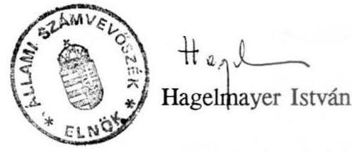

6922. szám

# Allami Ṣ̛ámberbösèk 

## VÉLEMÉNY

a Magyar Köztársaság 1992. évi pótköltségvetéséről

---

A Kormány az államháztartásról szóló 1992. évi XXXVIII. törvény és az 1992. évi költségvetési törvény alapján 6822. számon az Országgyűlés elé terjesztette az 1992. évi pótköltségvetést, mert év közben a körülmények oly módon változtak meg, hogy ezek a központi költségvetés teljesítését jelentősen veszélyeztették.

Az Államháztartási törvény 41. §/4/ bekezdése értelmében "A pótköltségvetési törvény a költségvetési törvényt módosító törvény, amelyben az Országgyülés módosítja a költségvetési törvény elöírásait."

A Kormány által 6822. számon benyújtott pótköltségvetési törvényjavaslat sem tartalmában, sem szerkezetében nem felel meg az Államháztartási törvény hivatkozott rendelkezésének, mert a pótelőirányzatokkal összhangban teljeskörűen nem módosítja a költségvetési törvényt.

Hiányzik a pótelőirányzatoknak a bevételi és a kiadási föösszegeken, valamint az egyes részelőirányzatokon történő átvezetése, emiatt a költségvetési törvény bevételi és kiadási főösszege, valamint ezek különbözeteként a hiány eredeti összege továbbra is hatályban marad. Ezen kívül:
— egyes javasolt pótelőirányzatok (illetve elvonások) pontos költségvetési címe nem állapítható meg, a pótelőirányzatokat a költségvetési törvény 1. és 2.sz. mellékletén nem vezették át,

A pótköltségvetésben a "központi költségvetési szervek támogatása" is szerepel, amit viszont jóváhagyott előirányzatként a költségvetési törvény nem tartalmaz. Így annak módosítása sem lehetséges, tehát a "támogatáson keresztül" csökkentett fejezeti kiadások változását a költségvetési törvény 1.sz. mellékletén át kellett volna vezetni.

Az Állami Számvevőszék több jelentésében szorgalmazta, hogy a költségvetési törvényben a támogatás kerüljön jóváhagyásra. Az 1992. évi költségvetési törvényben azonban a költségvetési szervek kiadásai bruttó módon kerültek jóváhagyásra, azaz a kiadások a támogatással és az intézményi bevételekkel fedezett kiadásokat tartalmazzák.

---

- a pótköltségvetési törvényjavaslat szerkezete miatt nehezen követhető, hogy mely paragrafusok módosítják a költségvetési vagy más törvényeket, s melyek azok, amelyek új törvényi rendelkezésnek minősülnek,

A Kormány által visszavont 6367. számon benyújtott törvényjavaslat formailag valóban módosította az eredeti költségvetési törvényt, annak 2. és 3. §-át és a 2.sz. mellékletben a módosuló előirányzatokat költségvetési cimenként átvezette.

A 6822. számon most benyújtott pótköltségvetési törvényjavaslat szerkezete nem ezt a formát követi. A pótelőirányzatok megfogalmazása nem következetes.

A pótköltségvetési törvényjavaslat 1., 2., 4. §-ai közvetlenül nem kapcsolódnak a költségvetési törvényhez, ezért a költségvetési törvényben jóváhagyott összegek tekintetében új törvényi rendelkezést alkotnak, míg pl. a 3. § (a c. pont kivételével) és a 7. § valóban a költségvetési törvényt módosítja.

A pótköltségvetés benyújtásának egyik feltétele az Államháztartási törvényben (1992. XXXVII. tv. 41.§/2/) foglaltaknak megfelelően az általános tartalék felhasználása. A Kormány a 6823. számon benyújtott Tájékoztatóban bemutatja az általános tartalék felhasználását. Megállapítható, hogy az előirányzott 5.063 millió forintból 1992. augusztus 31 -éig $1.117,6$ millió forintot használtak fel és az év hátralévő részében 4.189,6 millió forintra vállaltak kötelezettséget. (Megjegyezzük, hogy a költségvetési törvény rendelkezésének megfelelően a központi igazgatási kiadások csökkentéséből származó 1.200 millió forint az általános tartalékot növeli.)

Az Államháztartási törvény hivatkozott előírása alapján indokolt lenne a pótköltségvetési törvényben rögzíteni, hogy az Országgyúlés tudomásul veszi, hogy a Kormány a tartalék fel nem használt részét kötelezettségvállalással lekötötte.

A pótköltségvetési törvényjavaslat 12-13. §-a a Számviteli törvényt módosítja. A javasolt kivétel engedélyezésével a törvény egyik lényeges alapelvét, az óvatosságot sértenék meg.

Az Állami Számvevőszék a Számviteli törvény és a számviteli alapelvek fellazításával nem ért egyet.

A módosítás célja annak biztosítása, hogy a pénzintézetek a garantált értékpapírok után a névérték és a beszerzési érték különbségét, mint egyfajta hozamot az éves beszámolóban elszámolhassák. Az időarányos hozam azonban pontosan nem, illetve nehezen ellenőrizhető. A módosítás másik problémája, hogy a pénzintézeteknél lehetővé teszi olyan nyereség kimutatását, amely pénzügylleg csak akkor realizálódik, ha az értékpapírokat ténylegesen értékesítik.

---

# Bevételek 

1. A bevételek a törvényjavaslat szerint várhatóan 134.100 millió forinttal maradnak el az előirányzattól. Az Állami Számvevőszék rendelkezésére álló információk alapján a bevételek ilyen mértékű csökkenését reálisnak tekinti.

A forgóalap számla főbb tételei között például 1992. szeptember 30-ig a következő bevételek realizálódtak:
—a társasági adóból az éves szinten előirányzott 85 milliárd forintból mindössze 31 milliárd forint,
—a pénzintézetek tervezett befizetéseiből, 63 milliárd forintból nem egész 2 milliárd forint,
—a fogyasztási adó előirányzott 184 milliárd forintjából 125 milliárd forint,
— a személyi jövedelemadó 160 milliárd forintos előirányzatából 95 milliárd forint.
2. A törvényjavaslat 3. § c. pontja értelmében az 1992. évi privatizációs bevételek 70 milliárd forint felett teljesülő részét a Kormány saját hatáskörében közvetlenül az államadósság törlesztésére fordíthatja. A törvényjavaslat szövegéből nem derül ki, hogy a számításba vett összeg mekkora, s az sem, hogy a költségvetési törvényben jóváhagyott államadósság törlesztés előirányzatát fedezi-e, vagy ezen felüli többlet törlesztés fedezetéül szolgál. (Megjegyezzük, hogy 1992. évre nincsenek hatályos Vagyonpolitikai irányelvek.)

A törvényjavaslathoz mellékelt - jóváhagyásra nem kerülő - az állami költségvetés mérlegét tartalmazó táblázatból derül ki, hogy e címen 15 milliárd forintot vettek számításba a költségvetésen kívül.

Abban az esetben, ha a 15 milliárd forint privatizációs bevétel a költségvetésben eredetileg jóváhagyott kiadás fedezetéül szolgál, a pótköltségvetésben alkalmazott megoldást nem javasoljuk elfogadni. A költségvetés egyensúlyban történő módosításának követelménye szerint ugyanis a 15 milliárd forinttal a költségvetésben jóváhagyott 20 milliárd forint privatizációs bevételi előirányzatot meg kellene emelni.
3. A törvényjavaslat 6. §/1/ bekezdésében a "jogszabály másként nem rendelkezik" megfogalmazás helyett javasoljuk a "ha a törvény, vagy kormányrendelet másként nem rendelkezik" kitétel alkalmazását.

---

1. A kiadások közül a Szolidaritási Alap támogatása várhatóan 24,8 milliárd forinttal több lesz, mint az előirányzat. Az 1991. évi XCI. törvény 42.§ f. pontja szerint a pénzalapoknak nyújtott támogatási mértékek megváltoztatásának jogát az Országgyűlés magának tartja fenn. A pótköltségvetés 10.§-ában a Kormány a Szolidaritási Alap támogatásának korlátlan túllépésére kap felhatalmazást, ami lehetőséget teremtene az Alap esetleges túlfinanszírozására is. Célszerűnek tartanánk olyan korlát beépítését, amely ez utóbbi lehetőséget kizárná és egyben ösztönözné az Alap kezelőit a takarékos, körültekintő gazdálkodásra, ugyanakkor az Országgyűlés ellenőrzési funkciója is érvényesülhetne.
2. A pótköltségvetési törvényjavaslat 7. § alapján az évközi béremelésre fordítható céltartalék csökkentése miatt a költségvetési szervek támogatása 1.734 millió forinttal csökken. A csökkentés átvezetése a pótköltségvetési törvényjavaslathoz mellékelt állami költségvetés mérlegén szerepel.

A kiadást csökkentő intézkedések további, a 2. §-ban meghatározott részét már az I. félévben végrehajtották. A központi költségvetés egyensúlyi helyzete indokolja, hogy a korábbi években felhalmozódott pénzmaradvány egy részét a költségvetési szervek az Országgyűlés döntése alapján a központi költségvetésbe befizessék.

A pótköltségvetési törvényjavaslat 2. § szerint az Országgyűlés tudomásul veszi, hogy a központi költségvetési szervek támogatását a Kormány 7.280,4 millió forinttal csökkenti, valamint az 1991. évi pénzmaradvány felülvizsgálata során az eredetileg tervezett összegen felül 1.221,6 millió forint többlet befizetéséről is határoz.

A törvényjavaslat 2. § alapján keletkezett kiadási megtakarításokat az állami költségvetés mérlegének módosított előirányzatain azonban nem vezették át, csupán a "prognózis az 1992. évi intézkedéssel" oszlopok adataiból lehet arra következtetni.

Tekintettel arra, hogy a pótköltségvetésben az intézkedést az Országgyűlés tudomásul veszi, célszerű az előirányzatokon történő átvezetés. Csak így biztosítható, hogy a pótköltségvetéssel módosított bevételi és kiadási főösszegek egyenlege a ténylegesen többletforrásokkal finanszírozandó hiány összegét mutassa.
(Megjegyezzük, hogy a pótköltségvetési javaslathoz mellékelt Állami költségvetés mérlege nem tükrözi a Kormány 5714. számon beterjesztett javaslata alapján született ... sz. Országgyűlési határozat támogatáscsökkentő hatását.)

---

# A hiány finanszírozása 

1. A törvényjavaslathoz mellékelt "Az állami költségvetés mérlegét" tartalmazó táblázat szerint a bevételi és kiadási föösszegek egyenlege 226.O3O millió forint hiányt mutat, amely 156.250 millió forinttal haladja meg az eredeti hiány összegét.

A törvényjavaslat számszaki elemzése után megállapítható, hogy a hiány fedezését a következőképpen tervezik:
a/ rövid és hosszú lejáratú értékpapír kibocsátás
133.000 MFt
b/ költségvetésen kívüli forrás (privatizációs bev.)
15.000 MFt
c/ költségvetési szervek támogatásának csökkentése
7.280 MFt
d/ költségvetési szervek többletbefizetése
1.222 MFt
e/ alapok támogatásának csökkentése
1.000 MFt
f/ táppénz rendszer módosítására tartalékolt keret csökkentése
2.400 MFt

Összesen
159.902 MFt

A b., c., d. pontokban felsorolt forrásokkal a pótköltségvetés nem módosítja az eredeti előirányzatokat sem részleteiben, sem főösszegében.
2. A javaslat a várható hiány finanszírozását a pótköltségvetésben legfeljebb 130 milliárd forint összegben egy évnél hosszabb lejáratú új államkötvények kibocsátásával, és a rövid lejáratú kincstárjegyek állományának legalább 3 milliárd forintos növelésével biztosítja.

A "legalább-legfeljebb" határok meghatározásának célja, hogy a pénzpiaci helyzetnek megfelelően a Kormány a hosszú és rövid lejáratú értékpapír kibocsátás arányát viszonylag rugalmasan saját hatáskörben módosíthassa.

Ezzel a felhatalmazással azonban a Kormány rövid távon korlátlan mértékben bocsáthat ki értékpapírokat. Ezért megfontolandónak tartjuk, hogy a kibocsátható kétféle értékpapír együttes összegét is rögzítse a törvény.

A pótköltségvetési törvényjavaslat kidolgozása során figyelembe vették az Állami Számvevőszék korábbban, 6404. számon benyújtott jelentését, amely a várható bevételek pontosabb meghatározására, a Szolidaritási Alap hiányának kimunkálására,

---

a kiadások csökkentésére kidolgozott kormányzati intézkedések bemutatására és a hiány finanszírozására vonatkozott. Ugyanakkor az átdolgozás során a törvényjavaslatba újabb tartalmi és formai ellentmondások kerültek. Véleményünk szerint emiatt a 6822. számon benyújtott pótköltségvetési törvényjavaslat több ponton módosításra szorul.

Budapest, 1992. október 12.

