# ÁLLAMI <br> SZÁMVEVŐSZÉK 

## JELENTÉS

Hatvan Város Önkormányzata pénzügyi helyzetének ellenőrzéséről (43/4)

---

# Állami Számvevőszék 

Iktatószám: V-3096-024/2012.
Témaszám: 1015
Vizsgálat-azonosító szám: V0560127

## Az ellenőrzést felügyelte:

Dr. Varga Sándor
számvevő igazgatóhelyettes
Az ellenőrzést vezette:
Renkó Zsuzsanna
számvevő tanácsos
Ellenőrzési csoportvezető:
Puchy Márta
számvevő tanácsos
Az ellenőrzést végezték:
Kozma Gábor
számvevő tanácsos

Nagy László Csaba
számvevő tanácsos

---

# TARTALOMJEGYZÉK 

BEVEZETÉS ..... 9
I. ÖSSZEGZŐ MEGÁLLAPÍTÁSOK, KÖVETKEZTETÉSEK, JAVASLATOK ..... 13
II. RÉSZLETES MEGÁLLAPÍTÁSOK ..... 24

1. Az Önkormányzat kötelező és önként vállalt feladatai, a feladatellátás szervezeti keretei és annak változásai ..... 24
2. Az Önkormányzat pénzügyi egyensúlyi helyzetét befolyásoló tényezők ..... 30
2.1. A működési és a felhalmozási egyensúly változása ..... 32
2.2. Az Önkormányzat bevételeinek változása ..... 37
2.3. Az Önkormányzat folyó és a felhalmozási célú kiadásainak változása ..... 40
3. Az Önkormányzat kötelezettségei ..... 46
3.1. Az Önkormányzat pénzintézetekkel szembeni kötelezettségeinek változása ..... 46
3.2. A szállítói kötelezettségek változása ..... 50
3.3. Egyéb kötelezettségek változása ..... 50
4. A pénzügyi egyensúly megteremtése érdekében hozott intézkedések eredménye ..... 52
5. Az ÁSZ által a korábbi években a pénzügyi egyensúly javítására tett szabályszerűségi és célszerűségi javaslatok hasznosulása ..... 55

---

# MELLÉKLETEK 

1. számú Működési és felhalmozási célú többlet a 2007-2010 közötti időszakban az Önkormányzat zárszámadási rendeleteiben (1 oldal)
2. számú Az Önkormányzat bevételei és kiadásai, valamint adósságszolgálata 2007-2010 között (1 oldal)
3/a. számú Az Önkormányzat 2007-2010. években megvalósított, 2010. december 31-ig befejezett fejlesztései és azok forrásösszetétele (3 oldal)
3/b. számú Az Önkormányzat 2010. december 31-én folyamatban lévő fejlesztési feladataira 2010. december 31-ig teljesített kifizetések és azok forrásösszetétele (1 oldal)
3/c. számú Az Önkormányzat 2010. december 31-én folyamatban lévő fejlesztési feladataira 2010. december 31-én fennálló kötelezettségek és azok forrásösszetétele (1 oldal)
3/d. számú Az Önkormányzat által beadott, elbírálás alatti pályázati forrásból megvalósítani tervezett fejlesztéseihez kapcsolódó kötelezettségvállalásai és azok forrásösszetétele (1 oldal)
3. számú Az önkormányzati feladatok ellátásában résztvevő gazdasági társaságok (1 oldal)

---

# RÖVIDÍTÉSEK JEGYZÉKE 

## Törvények

Áht.
Gt.
Ötv.
Ptk.

## Rendeletek

Áhsz.

SzMSz

## Szórövidítések

Albert Schweitzer Kórház-Rendelőintézet Kft.
áfa
ÁSZ
EU
ÉMÁSZ NyRt.
helyi közlekedési közszolgáltató
jegyző
Képviselő-testület
Közétkeztetési Kft.
Megyei Önkormányzat
Média-Hatvan Kft.
Önkormányzat
polgármester
Polgármesteri hivatal
Strand Üzemeltető Kft.
szja
Társulás
Többcélú társulás
Tűzoltóság
Városgazdálkodási Zrt.
az államháztartásról szóló 1992. évi XXXVIII. törvény
a gazdasági társaságokról szóló 2006. évi IV. törvény
a helyi önkormányzatokról szóló 1990. évi LXV. törvény
a Polgári Törvénykönyvről szóló 1959. évi IV. törvény
az államháztartás szervezetei beszámolási és könyvvezetési kötelezettségének sajátosságairól szóló 249/2000. (XII. 24.) Korm. rendelet

Hatvan Város Önkormányzata 35/2010. (XI. 26.) számú rendelete a Képviselő-testület, valamint szervei Szervezeti és Működési Szabályzatáról

Albert Schweitzer Kórház-Rendelőintézet Egészségügyi Szolgáltató Nonprofit Közhasznú Korlátolt Felelősségű Társaság
általános forgalmi adó
Állami Számvevőszék
Európai Unió
Észak-magyarországi Áramszolgáltató Nyilvánosan Működő Részvénytársaság
Hatvani VOLÁN Közlekedési Zártkörű Részvénytársaság
Hatvan Város Önkormányzatának Jegyzője
Hatvan Város Képviselő-testülete
Hatvani Közétkeztetési Nonprofit Korlátolt Felelősségű Társaság (megszűnt 2008. december 31.)
Heves Megyei Önkormányzat
Média-Hatvan Nonprofit Közhasznú Korlátolt Felelősségű Társaság
Hatvan Város Önkormányzata
Hatvan Város Önkormányzatának Polgármestere
Hatvan Város Önkormányzatának Polgármesteri Hivatala
Hatvani Strand Üzemeltető és Szolgáltató Nonprofit Korlátolt Felelősségű Társaság (megszűnt 2008. december 31.)
Személyi jövedelemadó
Hatvan és Térsége Szennyvíz beruházási Társulás
Hatvan és Térsége Többcélú Kistérségi Társulás
Hatvan Hivatásos Önkormányzati Tűzoltóság parancsnokság
Hatvani Városgazdálkodási Nonprofit Közhasznú Zártkörűen Működő Részvénytársaság

---

Városüzemeltető Kft. Hatvani Városüzemeltető - Logisztikai és Szolgáltató Nonprofit Korlátolt Felelősségű Társaság (megszűnt 2008. december 31.)
víziközmű közszolgáltató

Heves Megyei VÍZMŰ Zártkörű Részvénytársaság

---

# ÉRTELMEZŐ SZÓTÁR 

| BUBOR | Budapesti Bankközi Forint Hitelkamatláb. Irányadó, refe- <br> rencia jellegű kamatláb. Mértékét az MNB naponta álla- <br> pítja meg a banki kamatok figyelembevételével. Közzété- <br> tele naponta történik. |
| :--: | :--: |
| CLF módszer | Az önkormányzatok költségvetése elemzésének eszköze. A <br> módszer következetesen elkülöníti a folyó és a felhalmo- <br> zási költségvetés bevételeit és kiadásait, azok költségvetési <br> egyenlegeit. Bizonyos mértékig a vállalati gazdálkodás <br> logikai elemeit érvényesíti az önkormányzatok pénzügyi, <br> jövedelmi helyzetének vizsgálata során. Az értékelés a <br> pénzügyi kapacitás fogalmát helyezi a középpontba. |
| EURIBOR | A frankfurti bankközi piacon jegyzett, az Európai Közpon- <br> ti Bank szabályainak megfelelően megállapított kínálati <br> kamatláb. Az EURIBOR értékét a legfontosabb európai <br> bankok hitelkínálatának kamatlábai alapján a Reuters <br> ügynökség számolja ki és teszi közzé naponta. A magyar <br> pénzintézetek is ezt használják viszonyítási alapnak EUR <br> hitelek esetén. |
| GDP - Bruttó hazai ter- <br> mék | A gazdaság által az adott időszakban előállított, végső <br> felhasználásra szánt termékek és szolgáltatások piaci <br> áron meghatározott értéke. |
| használhatósági fok | Az eszközgazdálkodás vizsgálatának elemzése során <br> használt mutató. Számításakor a tárgyi eszköz könyv szer- <br> inti (nettó) értékét viszonyítják a tárgyi eszköz bruttó (be- <br> szerzési/létesítési) értékéhez. A mutató százalékban kifeje- <br> zett értékének csökkenése az eszköz állagának romlására, <br> avulására utal, ami maga után vonja az üzemeltetési és <br> fenntartási költségek növekedését is. |
| kamatkockázat | A változó kamatozású forint-, vagy a devizahitelek futam- <br> ideje alatt a kamat emelkedése miatt fennálló kamatkocká- <br> zat, melynek növekedése miatt nő a hitel törlesztő rész- <br> lete. |
| kötelező közszolgáltatás | A helyi önkormányzati feladatkörbe tartozó, a köztiszta- <br> sággal és a településtisztasággal, valamint az élet- és va- <br> gyonbiztonsággal összefüggő egyes - közszolgáltatás út- <br> ján megvalósuló - közfeladatok ellátása, amelynek köte- <br> lező igénybevételét külön jogszabály (törvény, helyi ön- <br> kormányzati rendelet) határoz meg. |
| közfeladat | Állami, helyi, illetve kisebbségi önkormányzati feladat, <br> amelynek ellátásáról az államnak, illetve az önkormány- <br> zatoknak kell gondoskodni. A hatályos szabályozás sze- <br> rint közfeladatot törvény és önkormányzati rendelet álla- <br> píthat meg. Az önkormányzatok által ellátandó feladatok <br> keretszerű meghatározását az Ötv. tartalmazza. |
| önkormányzat többségi <br> tulajdonában lévő gaz- <br> dasági társaságok | Az önkormányzat a gazdasági társaságban a szavazatok <br> több mint ötven százalékával vagy a Ptk. 685/B. § (2)-(3) <br> bekezdéseiben rögzített meghatározó befolyással rendel- |

---

kezik. A befolyással rendelkező akkor rendelkezik egy jogi személyben meghatározó befolyással, ha annak tagja, illetve részvényese, és jogosult e jogi személy vezető tisztségviselői vagy felügyelőbizottsága tagjainak többségének megválasztására, illetve visszahívására, vagy a jogi személy más tagjaival, illetve részvényeseivel kötött megállapodás alapján egyedül rendelkezik a szavazatok több mint ötven százalékával (Ptk. 685/B. § (2) bek.). A meghatározó befolyás akkor is fennáll, ha a befolyással rendelkező számára e jogosultságok közvetett módon (köztes vállalkozásain keresztül, a Ptk. 685/B §. (3)-(4) bek. szerint) biztosítottak.
A helyi önkormányzat és az önkormányzat irányítása alá tartozó költségvetési szerv többségi tulajdonában, illetve többségi befolyása alatt álló gazdálkodó szervezet esetében hitelfelvétel, kölcsönfelvétel, garancia- vagy kezességvállalás, tartozásátvállalás, tartozáselengedés, értékpapírkibocsátás, vásárlás, pénzügyi lízing, tartós bérleti szerződés, ingyenes vagyonjuttatás (így különösen: ajándékozás, ingyenes engedményezés), vagy követelésvásárlás, követelésengedményezés végrehajtására vonatkozóan az Áht. 100/M. § (4) bekezdése alapján az önkormányzat rendelkezik döntési jogosultsággal.
pénzügyi kapacitás

A pénzügyi kapacitás (financial capacity) az adósok hitelfelvételi képességének azon mértéke, ahol még anélkül tudják növelni az adósságot, hogy csökkenteniük kellene akár a jelenbeli, akár a jövőben esedékes kiadásaikat a fizetésképtelenség elkerülése érdekében. (Forrás: Az önkormányzati rendszer pénzügyi helyzete, ÁSZKUT tanulmány 2010.)
pénzügyi kockázat

SNA
törlesztési kockázat

A működési kockázat egyik eleme. Megmutatkozhat a költségvetés nagyságrendjének, szerkezetének nem megalapozott módosításaiban, a bevételi, és a kiadási előirányzatoktól lényegesen eltérő teljesítésekben, a nem megfelelő belső kontrollrendszer működésében, a tudatos károkozásokban, a biztosítások elmaradásában, a hibás fejlesztési döntésekben, a nem a terveknek megfelelő forrásfelhasználásokban. Jelentkezhet továbbá a bevételek és kiadások ütemkülönbsége miatt felvett folyószámla- és likvidhitelek költségvetési év végén fennálló egyenlege miatt, amely az önkormányzat költségvetésébe - akár tartósan - beépülő forráshiányt jelzi.
System of National Account azaz a Nemzeti Számlák Rendszere, amely a gazdasági szektorok által létrehozott valamennyi terméket és szolgáltatást figyelembe veszi.
Annak a kockázata, hogy a megfelelő időben és mértékben a hitelt felvevőnél rendelkezésre állnak-e a pénzintézetek és egyéb szervek felé fennálló kötelezettségek visszafizetéséhez, a hitelek és kölcsönök törlesztéséhez szükséges pénzügyi források.

---

A törlesztési kockázatot növeli a kamat- és árfolyam növekedése, mivel ezekben az esetekben az adósságszolgálat nőhet. Törlesztési kockázatot okozhat a visszafizetésre tervezett forrás elérésének, teljesítésének bizonytalansága (pl. a visszafizetéshez tervezett tartalékolás elmaradt, a tervezettnél alacsonyabb a saját bevétel, a helyi adóból származó bevétel az adóalanyok, adóalapok csökkenése miatt nem teljesül).

---

.

---

# JELENTÉS 

## Hatvan Város Önkormányzata pénzügyi helyzetének ellenőrzéséről

## BEVEZETÉS

Az Állami Számvevőszék 2011. évtől érvényes stratégiája új irányt szabott a helyi önkormányzatok gazdálkodásának ellenőrzésében is. Az ÁSZ – küldetése és jövőképe szerint – szilárd szakmai alapokra támaszkodva értékteremtő ellenőrzéseivel és helyzetelemzéseivel az államháztartás egészében, így a helyi önkormányzati alrendszerben is elő kívánja segíteni a közpénzek és a közvagyon szabályos, gazdaságos, hatékony és eredményes felhasználását. E folyamat részeként – az államháztartási hiány alakulásának összetevőire is figyelemmel – végezzük az önkormányzati alrendszer pénzügyi helyzetelemzését.

Az államháztartás helyi szintjén a 304 városnak${ }^{1}$ az általuk ellátott közszolgáltatások volumenére is tekintettel a közfeladatok ellátásában kiemelt szerepe van. E települések 2011. január 1-jei népessége 3169 ezer fő volt.

Feladataik és hatásköreik az Ötv. mellett különböző ágazati törvények által meghatározottak, miközben a feladatellátás szervezeti kereteit – ezen belül a gazdasági társaságok közszolgáltatások ellátásában betöltött szerepét – saját maguk határozzák meg. A gazdasági társaságok által ellátott feladatok esetén a gazdálkodás, továbbá az önkormányzatok pénzügyi egyensúlyi helyzetére ható közvetlen kockázatok egy része kikerült az önkormányzati alrendszerből. A többségi önkormányzati tulajdonban lévő társaságok gazdálkodásának körülményei befolyásolhatják a városok pénzügyi egyensúlyi helyzetének megítélésében rejlő kockázatokat.

Az áttekintett időszakban az önkormányzati forrásszabályozás elvei lényegesen nem változtak. Az önkormányzatok gazdasági mozgásterét a központi költségvetéstől való függőség mellett jelentősen befolyásolja a helyi adókivetési jog gyakorlása. A városok gazdálkodási szabadságának lényeges eleme, hogy anyagi lehetőségeik függvényében dönthettek arról, hogy feladataik közül azokat, amelyek megoldására az Ötv. szerint a települési önkormányzat nem kötelezhető, a megyei önkormányzat fenntartásába adhatták. E döntések differenciáltan érintették a városok pénzügyi helyzetét.

[^0]
[^0]:    ${ }^{1}$ A megyei jogú városok nélkül figyelembe vett városok száma 304 városi önkormányzatot jelent.

---

A városi önkormányzatok 2007-2010 között teljesített bevételeit és összetételét az alábbi ábra szemlélteti:
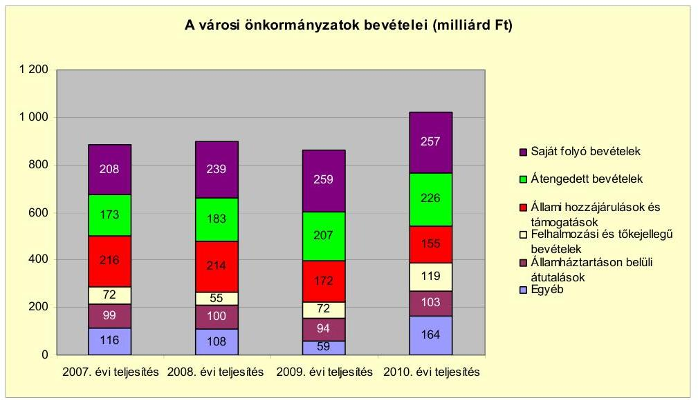

Az önkormányzati alrendszer pénzügyi helyzetértékelése során új elemzési módszereket alkalmazott az ellenőrzés. A költségvetési beszámoló adatok elemzése helyett az Önkormányzat pénzügyi helyzetét a CLF módszerrel értékeljük, amelynek lényegét és számításának módszerét a jelentés 2. pontjában, és a jelentés 2. számú mellékletében ismertetjük részletesen.

Az új módszereken alapuló helyzetértékelés fontosságát az adja, hogy a helyi önkormányzatok bruttó adósságállománya${ }^{2}$ a 2010. évi költségvetési beszámolók alapján 1248 milliárd Ft-ot tett ki. Ezen belül a 304 város adóssága 383 milliárd Ft volt, amely az önkormányzati alrendszer teljes adósságállományának 30,7%-át jelentette${ }^{3}$.

A mérlegben kimutatott bruttó adósságállomány mellett az önkormányzatok számára az eszközállomány műszaki állapotának megőrzése is előbb-utóbb pénzügyi kötelezettséget jelent. Az elhasználódott eszközök pótlására forrást biztosító amortizációs (felújítási) alap képzésének${ }^{4}$ elmaradása maga
 után vonhatja a feladatellátást kiszolgáló tárgyi eszközök állagának erőteljes romlását. Emellett a 2007-2013-as időszakra meghirdetett, vissza nem térítendő EU-s fejlesztési forrásokhoz való hozzájutás lehetősége felerősítette az önkormányzati

[^0]
[^0]:    ${ }^{2}$ Az önkormányzati mérlegbeszámolókból számított bruttó adósságállomány 2010. év végi összege magában foglalja a fejlesztési és a működési célú kötvénykibocsátások, a beruházási és fejlesztési hitelek, a működési célú hosszú lejáratú hitelek, a rövid lejáratú hitelek, váltótartozások miatti kötelezettségek teljes (2011-ben, illetve az azt követő években esedékes) állományát. Az önkormányzatok 2007. év végi mérleg szerinti adósságállománya 692 milliárd Ft volt.
    ${ }^{3}$ A fővárosi és a kerületi önkormányzatok adósságának figyelmen kívül hagyásával számított 977 milliárd Ft összegű bruttó adósságállományból a városok 39,2\%-kal részesedtek.
    ${ }^{4}$ Erre a jelenlegi szabályozási környezetben nem kötelezi előírás az önkormányzatokat.

---

alrendszer fejlesztési igényeit, amelyek a felhalmozási költségvetési hiány folyamatos emelkedésén túl - az előírt jövőbeni fenntartási kötelezettség miatt tovább terhelhetik az önkormányzatok költségvetését ${ }^{5}$.

Az ÁSZ a 2011. évi ellenőrzési tervében 43. számú, az Önkormányzatok gazdálkodási rendszerének ellenőrzése részeként áttekinti, és elemzi az önkormányzatok pénzügyi helyzetét. A gazdálkodás szabályszerűségét az ÁSZ az előző évek során ebben az önkormányzati körben is ellenőrizte. Jelen vizsgálatunk a tett javaslataink pénzügyi helyzetet érintő pontjainak hasznosítására utóellenőrzés jelleggel tér ki.

Az ellenőrzés megállapításait az Önkormányzat által kitöltött - teljességi nyilatkozattal megerősített - 27 tanúsítványon szolgáltatott adatokra alapoztuk. Ellenőrzési bizonyítékként használtuk fel továbbá:

- a képviselő-testületi és bizottsági előterjesztéseket, a döntés-előkészítés során készített dokumentumokat;
- a kötelezettségvállalások dokumentumait;
- a pénzügyi-számviteli nyilvántartásokat;
- az éves költségvetési beszámolókat;
- a költségvetési és zárszámadási rendeleteket.

Az ellenőrzés a 2007. január 1. - 2011. június 30. közötti időszakot öleli fel. A pénzintézetekkel szembeni kötelezettségek állományának vizsgálatakor az ellenőrzött időszak 2006. december 31. - 2011. június 30. közötti időszakra terjedt ki.

Az ellenőrzés során vizsgáltunk minden olyan körülményt és adatot, amely a program végrehajtásához kapcsolódott és a pénzügyi helyzet alakulására hatást gyakorló releváns tények és folyamatok feltárásához szükségessé vált.

# Az ellenőrzés célja annak értékelése volt, hogy: 

- a vizsgált időszakban a kötelező és önként vállalt feladatok ellátását biztosító szervezeti keretekben, a feladatellátás módjában bekövetkezett változások milyen hatást gyakoroltak az Önkormányzat pénzügyi helyzetének alakulására;

[^0]
[^0]:    ${ }^{5}$ Az Állami Számvevőszék 2011. júniusában közzétett 1108. számú, a helyi önkormányzatok fejlesztési célú támogatási rendszerének ellenőrzéséről szóló jelentésében feltárta a fejlesztési folyamatok problémáit. A helyi önkormányzatok elsősorban azokat a fejlesztéseket valósították meg, amelyekhez támogatást lehetett igényelni. A fejlesztési célok közül a magasabb támogatási intenzitású pályázatokat részesítették előnyben. A fejlesztéssel megvalósuló létesítmények jövőbeli üzemeltetésének várható ráfordításait az önkormányzatok 71,9%-a nem mérte fel.

---

- az Önkormányzat pénzügyi - ezen belül működési és felhalmozási - egyensúlya mely tényezők hatására miként változott, és az Önkormányzat milyen intézkedéseket tett a pénzügyi egyensúly javítása érdekében;
- a költségvetési kiadások finanszírozása érdekében vállalt pénzintézetekkel szembeni kötelezettségek hogyan alakultak, továbbá milyen kötelezettségek fennállása befolyásolja az Önkormányzat jövőbeli pénzügyi helyzetét;
- hasznosultak-e a gazdálkodási rendszer korábbi ellenőrzése során a pénzügyi egyensúly javítására az ÁSZ által tett szabályszerűségi és célszerűségi javaslatok.

Az ellenőrzés típusa: szabályszerűségi vizsgálat.
A vizsgálat jogszabályi alapját az Állami Számvevőszékről szóló 2011. évi LXVI. törvény 1. §. (3), 5. § (2)-(6) bekezdései, továbbá az Áht. 120/A. § (1) bekezdése előírásai képezik.

Hatvan város Heves megye nyugati részén található, az Észak-Magyarországi régióban. A város a 2003-ban alakult - a Mátra lábánál elhelyezkedő, Pest, Nógrád és Jász-Nagykun-Szolnok megyével határos - hatvani statisztikai kistérség központja, egyben legnépesebb települése, lakosainak száma 2011. január 1-jén 20332 fő volt. Az Önkormányzat 2011. évi költségvetésének bevételi főösszege 9694 millió Ft, kiadási főösszege 11493 millió Ft volt. A 2010. évi gazdálkodásról készített beszámoló vagyonkimutatása alapján december 31-én 20,0 milliárd Ft értékű törzsvagyonnal és 3,2 milliárd Ft forgalomképes vagyonnal rendelkezett az Önkormányzat.

---

# I. ÖSSZEGZŐ MEGÁLLAPÍTÁSOK, KÖVETKEZTETÉSEK, JAVASLATOK 

Az Önkormányzat - adatszolgáltatása szerint - a 2010. év működési költségvetési kiadásaiból (4464,5 millió Ft-ból) ${ }^{6} 3384,1$ millió Ft-ot (75,8%-ot) a kötelező feladatok, 1080,4 millió Ft-ot (24,2%-ot) az önként vállalt feladatok ellátására fordított. Az önként vállalt feladatok részaránya és kiadása - középfokú oktatási feladatok 2008-től kezdődő fokozatos átvétele következtében - a 2010. évben 72,5%-kal (453,9 millió Ft-tal) volt magasabb, mint a 2007-2009. évek 15,4%-os (626,5 millió Ft összegű) átlagos értéke. Az Önkormányzat besorolása alapján önként vállalt feladatnak tekintette a középiskolai, szakiskolai és kollégiumi ellátást, a közétkeztetést, a sportlétesítmények fenntartását és fejlesztésének támogatását, a városi vásár és piac fenntartását, a helyi közszolgáltatási műsorszolgáltatás támogatását, az önkormányzati tulajdonú lakások, nem lakás célú helyiségek bérbeadását. A járó- és fekvőbeteg szakellátás feladatait az Önkormányzat kizárólagos tulajdonában álló gazdasági társaság útján látta el.

Az Önkormányzat feladatellátásának szervezeti struktúráját a 2011. június 30-ai állapot szerint az alábbi ábra szemlélteti:
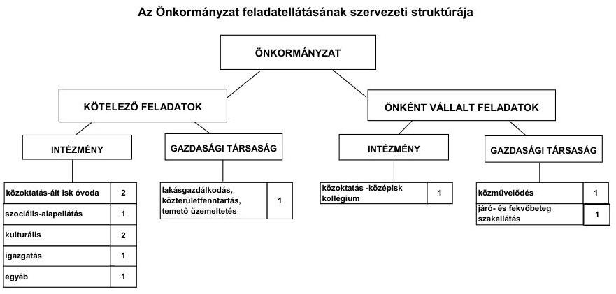

Az Önkormányzat feladatait (a Polgármesteri hivatallal együtt) nyolc költségvetési szervvel és három kizárólagos tulajdonú gazdasági társaságával, továbbá vállalkozó háziorvosok bevonásával, valamint többcé-

[^0]
[^0]:    ${ }^{6}$ Az Önkormányzat 2010. évi működési kiadásai (4464,5 millió Ft) 317,7 millió Ft-tal magasabb volt a jelentés 2. számú mellékletének (4146,8 millió Ft) kamatkiadások nélküli működési kiadásánál. Az eltérés oka, hogy a Polgármesteri hivatalban ellátott feladatok 2010. évi működési kiadásai tartalmazták a transzferkiadásokat (vállalkozásoknak, magánszemélyeknek, nonprofit szervezeteknek), valamint államháztartáson belülre átadott pénzeszközöket is.

---

lá és intézményfenntartó társulások ${ }^{7}$ útján látta el. A Képviselő-testület feladatátvételekről, átadásról, továbbá intézményátszervezésekről döntött. A 2007-2009. évek között, évente ütemezve a Megyei Önkormányzattól átvett három középfokú oktatási intézményt, továbbá egy óvoda fenntartását. A közoktatási intézmények irányításának egy központba való összevonása - a szakmai álláshelyek átszervezésével - a vizsgált időszakban 194,4 millió Ft kiadási megtakarítást eredményezett az Önkormányzatnál. A Megyei önkormányzattól átvett középfokú oktatási intézmények és az alapítványi óvoda átvétele következtében 2006. december 31-éhez képest a költségvetési intézmények - ezen belül az önállóan működő intézmények - száma öttel csökkent, ezzel egyidejűleg a feladatellátás telephelyeinek száma a 2007. évi 27-ről a 2011. év I. félév végére 32-re nőtt. Az Önkormányzat a 2009. évben egy gazdasági társaságtól átvette a kórház-rendelőintézet fenntartását, amely a 2009-2011. év I. féléve között összesen 134,9 millió Ft többlet kiadást jelentett.

Az Önkormányzat három gazdasági társaságában kizárólagos tulajdonnal rendelkezett. A gazdasági társaságok a közművelődés, a létesítmény-fenntartás, a városüzemeltetés és az egészségügyi szakellátás területén kaptak szerepet. A kizárólagos önkormányzati tulajdonban lévő három gazdasági társaság közül kettő társaság pénzügyi egyensúlyi helyzete nem volt stabil. Két kizárólagos tulajdonú gazdasági társaság - az Albert Schweitzer Kórház-Rendelőintézet Kft. és a Média-Hatvan Kft. - veszteséggel gazdálkodott. A két gazdasági társaságnál a 2010. évi saját tőke a jegyzett tőke értéke alá csökkent, adózott eredményük negatív értékű volt. A gazdasági társaságok adatszolgáltatása szerinti a 2010. évi adózott eredménye Kórház-Rendelőintézet Kft-nél -1,5 millió Ft, a Média-Hatvan Kft-nél -4,3 millió Ft volt. Az Önkormányzat feladatainak ellátásában részt vett három egyéb, közfeladatot ellátó gazdasági társaság, amelyekben az Önkormányzat tulajdoni részesedéssel nem rendelkezett. Az Önkormányzat a helyi közlekedési közszolgáltatónak 2007-2010 között 21,4 millió Ft működési célú pénzeszközt adott át. A kizárólagos önkormányzati tulajdonú, valamint a feladatok ellátásában résztvevő egyéb (amelyekben az önkormányzat tulajdoni hányaddal nem rendelkezett) gazdasági társaságok részére az ellenőrzött időszakban összesen 213,2 millió Ft működési és 129,8 millió Ft felhalmozási célú pénzeszközt adott az Önkormányzat. A gazdasági társaságok részére szerződés alapján átadott pénzeszközök cél szerinti felhasználását, a szolgáltatás teljesítését az Önkormányzat ellenőrizte.

Az egyes közfeladatok a 2007. és a 2010. évi működési kiadásainak finanszírozási forrásait ágazatonként a következő ábra szemlélteti:

[^0]
[^0]:    ${ }^{7}$ A szociális feladatokat Hatvan és Térsége Többcélú Kistérségi Társulás, a középfokú oktatási feladatokat a Hatvani Középiskolákat Működtető Intézményfenntartó Társulás látja el.

---

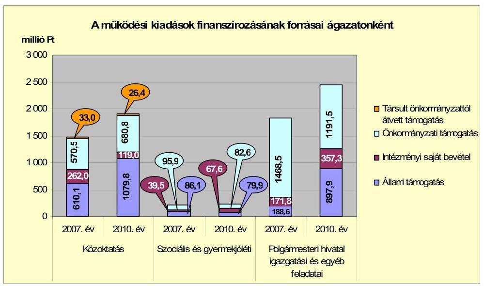

A közoktatás finanszírozásában az állami támogatás a 2010. évben 342,4 millió Ft-tal (46,5%-kal) nőtt a 2007-2009. évek átlagához viszonyítva. A növekedés oka a 2008. évben átvett három középiskola és egy óvoda létszámemelkedésével járó állami támogatási többlet volt. A Polgármesteri hivatalban kimutatott feladatok működési kiadásai a 2010. évben a támogatások, valamint a segélyezettek létszámának emelkedése következtében 10,4%-kal (226,1 millió Ft-tal) haladták meg a 2007-2009. évek átlagát (2220,6 millió Ft-ot). A feladatok kiadásainak finanszírozásán belül az ellátásban részesülők számának emelkedése következtében 213,0 millió Ft-tal (25,8%-kal) növekedett az állami támogatás összege 2010-ben az előző évek átlagához (684,9 millió Ft-hoz) képest.

A vizsgált időszakban a kötelező és önként vállalt feladatok ellátását biztosító szervezeti keretekben, a feladatellátás módjában bekövetkezett változások az Önkormányzat pénzügyi egyensúlyi helyzetét befolyásolták. Az Önkormányzat kimutatása szerint intézkedések működési többletkiadása 2007-2011. június 30-ig 3104,0 millió Ft, a működési bevételi növekménye 3068,5 millió Ft volt. Az önként vállalt feladatok kiadásának növekedése, a feladatátvételek többletkiadásai az Önkormányzat folyó bevételeinek csökkenése mellett hozzájárultak a 2010. év végétől jelentkező likviditási gondok kialakulásához. Az Önkormányzat feladatainak ellátásában résztvevő gazdasági társaságok részére a működési és a felhalmozási célú pénzeszköz átadása, valamint két gazdasági társaság pénzügyi stabilitásának hiánya az Önkormányzat pénzügyi egyensúlyi helyzetét kedvezőtlenül befolyásolta.

Az Önkormányzat működési jövedelmét, pénzügyi kapacitását és tőketörlesztését a 2007-2010. években a következő ábra mutatja be:

---

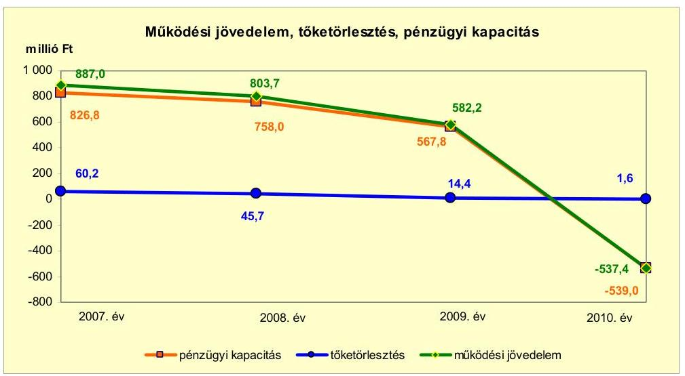

A működési jövedelem 2007-2009 között csökkent, azonban pozitív volt, a 2010. évben negatív lett. A működési jövedelem csökkenését az előző évhez képest a 2008-2009. években az átvett feladatokkal összefüggő működési kiadások emelkedése - 2008-ban 456,7 millió Ft, majd 2009-ben 416,9 millió Ft összegű -, továbbá a 2009. évben a költségvetési támogatások és átengedett bevételek 185,3 millió Ft összegű visszaesése eredményezte. A működési jövedelem 2010. évi csökkenése a saját működési bevételek alulteljesítésével függött össze. A helyi iparűzési adó mértékének 1,9%-ról 1,0%-ra történt módosítása meghatározó volt a saját működési bevételek alakulásában. Az Önkormányzat pozitív pénzügyi kapacitásának a 2007-2009. években - a felhalmozási költségvetés hiánya mellett - a fejlesztési kiadások fedezetét biztosította. A mutató értéke a 2010. évben - a saját működési bevételek csökkenése következtében - negatívra változott. A folyó bevételek a 2010. évben nem nyújtottak fedezetet a folyó kiadások és az adósságszolgálat teljesítésére. A tőketörlesztés összege a vizsgált időszakban csökkenő volt, a 2010. évben 118,7 millió Ft-tal volt alacsonyabb, mint a 2007-2009. évek 120,3 millió Ft átlaga. A 2008. és a 2010. évben egy-egy hosszú lejáratú hitelét 224,0 millió Ft és 38,6 millió Ft összegben visszafizette az Önkormányzat.

A felhalmozási költségvetés egyenlege a vizsgált
 időszak minden évében negatív volt. Az összege az egyes beruházások készültségi fokának és az utólagos finanszírozás ütemének - EU-s támogatás elszámolásának - függvényében változott. A 2010. évben a felhalmozási költségvetés egyenlege 83,2 millió Ft-tal (13,0%-kal) alacsonyabb hiányt mutatott a 2007-2009. évek átlagánál (641,1 millió Ft összegénél). A felhalmozási költségvetés bevételei és kiadásai a 2007. évben kiemelkedőek voltak - a vizsgált időszak további éveihez viszonyítva - a Hatvan és környéke szennyvízelvezetésének kiépítésére felhasznált cél- és címzett, valamint EU-s forrásból származó támogatások és azok felhasználása következtében.

Az Önkormányzat folyó bevétele a 2008. évben 17,9%-kal (785,0 millió Ft-tal) volt több mint 2007-ben. A 2008. évben a folyó bevételek - a közoktatásban ellátott létszám bővülésével összefüggően - a költségvetési támogatások, továbbá a helyi adóbevételek és az egyéb saját bevételek növekedése, valamint a helyben maradó szja bevétel csökkenésének együttes hatására emelkedtek.

---

Az Önkormányzat folyó bevétele a 2010. évben döntően a helyi adóbevételek csökkenése következtében 865,9 millió Ft-tal volt kevesebb, mint a 2007-2009. évek átlaga (4844,3 millió Ft). A vizsgált időszakban az Önkormányzat helyi iparűzési adót, építményadót, magánszemélyek, illetve vállalkozók kommunális adóját vetette ki. A helyi iparűzési adó mértéke a 2009. évi 1,9%-ról - a gazdasági válság hatásának mérséklése érdekében - 2010. évre 1,0%-ra csökkent, azonban a 2011. évre 1,9%-ban határozták meg. A helyi iparűzési adó mértékének a 2010. évre vonatkozó csökkentését gazdasági számítások nem alapozták meg. A 2011. évi adómérték emelésről a működési bevételekre gyakorolt hatás elemzése alapján döntött a Képviselő-testület. A magánszemélyek kommunális adója a 2008. évi inflációkövető 12000 Ft-ról 14000 Ft-ra emelkedett. Az Önkormányzat saját folyó bevételének a 2010. évben 24,4%-át (978,9 millió Ft-ot) képezték a helyi adóbevételek.

Az Önkormányzat teljesített folyó kiadásai a 2010. évben (4515,8 millió Ft) 10,5%-kal (429,2 millió Ft-tal) haladták meg a 2007-2009. évek átlagát (4086,6 millió Ft-ot). A folyó kiadások 2008. évi emelkedését közoktatási intézmények Megyei Önkormányzattól való átvétele okozta.

A pénzügyi egyensúlyi helyzet alakulását jelentősen befolyásolta az Önkormányzat elmúlt időszaki fejlesztési tevékenysége. Az Önkormányzatnál megvalósított, 2010. december 31-ig befejezett fejlesztésekre teljesített 11 154,6 millió Ft kiadás forrása 4173,0 millió Ft saját bevétel, 2183,6 millió Ft hazai és 4208,2 millió Ft EU-s támogatás mellett 589,8 millió Ft hitelfelvétel volt. A 2010. december 31-én folyamatban lévő fejlesztési feladatok teljes bekerülési költsége 6625,9 millió Ft volt, amelyből a 2007-2010. évek között 1268,0 millió Ft kiadást teljesítettek. Az EU-s támogatásból megvalósult fejlesztések finanszírozása a 2010. év utolsó negyedévében likviditási gondot okozott, melynek megoldására folyószámlahitelt vettek igénybe 2011. januárjában.

Az Önkormányzat 2010. december 31-én folyamatban lévő fejlesztési feladatok 2010. évet követő kötelezettségvállalásainak összege 6613,2 millió Ft, amely forrását 566,8 millió Ft hitelfelvételből, 4196,9 millió Ft EU-s és 86,6 millió Ft hazai támogatásból, valamint 1762,9 millió Ft megképződött működési jövedelemből terveztek biztosítani. A 2010. évet követő kötelezettségvállalások között 4612,5 millió Ft-ot képvisel a Hatvan és Térsége Szennyvíz Beruházási Társulás által, az Önkormányzat gesztor szerepe mellett bonyolított szennyvízelvezetési projekt. Az Önkormányzat gesztor szerepéből adódó pénzügyi lebonyolítási feladatok a pénzügyi egyensúlyi helyzetét jelentős mértékben befolyásolhatják. A fejlesztés teljes bekerülési költségének finanszírozását kell elvégeznie a végleges üzembe helyezés 2013. év júniusára tervezett időpontjáig, illetve a Társulás által felvett hiteleknek a 2018. évi visszafizetéséig. A folyamatban lévő fejlesztésekhez tervezett hitel felvétele - a forrásokon belüli alacsony (8,6%-os) részaránya miatt - nem jelent rövid távú kockázatot a vállalt fejlesztések jövőbeni finanszírozhatósága szempontjából.

A 2010. december 31-én fennállt felhalmozási feladatok kötelezettségvállalásait és azok forrásösszetételét a következő ábra mutatja be:

---

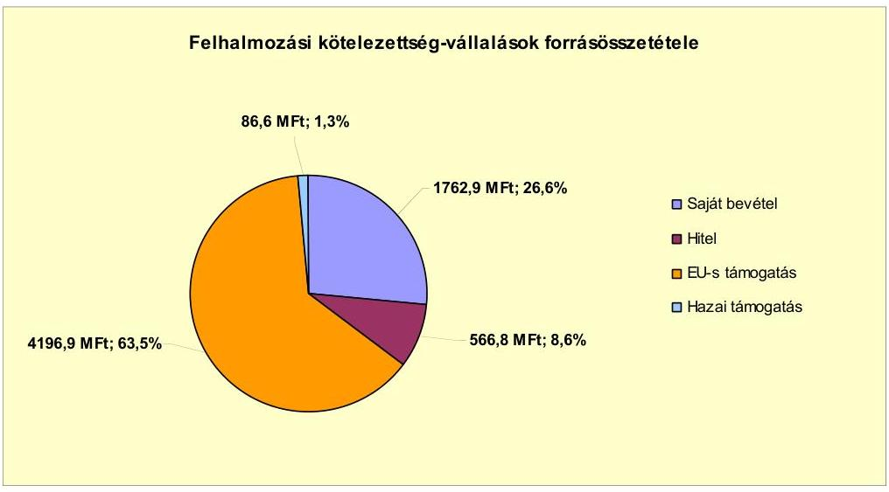

Az Önkormányzat által beadott, elbírálás alatt álló pályázatok tervezett teljes bekerülési költsége 429,6 millió Ft volt. Az Önkormányzat által a 2010-2013. évekre tervezett kötelezettségvállalások összegéből 392,7 millió Ft-ot EU-s és 7,5 millió Ft-ot hazai támogatásból, 29,4 millió Ft-ot saját bevételből terveznek biztosítani, hitel felvétele nélkül.

Az Önkormányzat könyvviteli mérleg szerinti pénzintézetekkel szembeni kötelezettsége a 2006. december 31-éről a 2011. év I. félév végére - az esedékes kamatfizetési kötelezettség nélkül - 117,5 millió Ft-ról 819,4 millió Ft-ra nőtt. A fennálló pénzintézetekkel szembeni kötelezettségek növekedése három hosszú lejáratú - 26,9 millió Ft, 320 millió Ft és 650 millió Ft összegű - fejlesztési célú hitelkeret igénybevételéből keletkeztek. Az Önkormányzat a fejlesztési célú, hosszú lejáratú hiteleket részben hívta le, és a hitelcélnak megfelelően a Képviselő-testület által jóváhagyott, a költségvetésbe betervezett beruházásokhoz használta fel. Az infrastruktúrafejlesztési célú hitelkeretből 2011. június 30-án 172,1 millió Ft összeg állt rendelkezésre. A 2008. és a 2010. években egy-egy hitel törlesztése befejeződött. A 2007-2011. év I. féléve között átmenetileg szabad pénzeszközeiből 225,7 millió Ft kamatbevételt realizált. Az Önkormányzat a pénzintézetekkel szembeni kötelezettségeinek teljesítéséhez biztosítékként - az Ötv. korlátozó előírásait a hitelszerződésekben rögzített módon figyelembe véve - felhatalmazta a pénzintézetet az inkasszójog érvényesítésére a mindenkori költségvetési elszámolási számláján.

Az Önkormányzat pénzintézetekkel szembeni kötelezettségvállalásaira képviselő-testületi döntés alapján került sor, azonban az előterjesztésekben nem mutatták be a visszafizetés forrását, valamint a teljes futamidőre szóló kamat- és tőkefizetési kötelezettségeket, továbbá a kamatkockázat értékelését.

Az Önkormányzat gazdálkodásának likviditása, fizetőképességének megőrzése érdekében nem volt szükség folyószámlahitel és munkabérmegelőlegezési hitel felvételére a 2007-2010. évek közötti időszakban. A 2011. január 17-én megnyitott, 600,0 millió Ft összegű - 2012. december 31-ig rendelkezésre álló - folyószámlahitel-keret a megkötött szerződés szerint az EU-s támogatások megelőlegezésének céljára használható fel. A pályázati pénzeszközökből megvalósított fejlesztéseknél a támogatás folyószámlahitelből való

---

előfinanszírozása az Önkormányzat számára pénzügyi kockázatot jelent. A folyószámlahitel az Önkormányzatnak 2011. év I. félévében 11,2 millió Ft kamatkiadást jelentett. Az Önkormányzatnak a 2011. év I. félév végén 46,7 millió Ft lejárt szállítói tartozása állt fenn, amelynek egésze 30 nap alatti volt.

Az Önkormányzat kizárólagos tulajdonú közhasznú gazdasági társaságai, valamint egy önkormányzati, térségi víziközmű társulat részére a fejlesztési és egyéb hitelek igénybevételéhez készfizető kezességet vállalt 1924,7 millió Ft összegben a 2007-2011. év I. félév közötti időszakban. Az Önkormányzatnak fizetési kötelezettsége a helyszíni ellenőrzés lezárásáig nem keletkezett a vállalt készfizető kezességekkel összefüggésben. A térségi víziközmű társulat fennálló hiteltartozása 2011. szeptember 30-án megszűnt, ezért az Önkormányzat kezességvállalásának állománya 1400 millió Ft-tal, 524,7 millió Ft-ra csökkent. Az Önkormányzat egy nonprofit gazdasági társasága számára a 2007-2008. évben 15,0 millió Ft összegű, működési célra tagi kölcsönt nyújtott, amelyet a tulajdonos Önkormányzatnak 2008-ban visszafizetett.

Az Önkormányzat kötelezettségeinek 2010. december 31-én és 2011. június 30-án fennálló kamat és egyéb kötelezettségeket, valamint azok várható alakulását a kötelezettségek lejáratáig az alábbi táblázat szemlélteti:

| Megnevezés | Állomány <br> 2010. december 31-én | Állomány 2011. június 30-án | Várható kötelezettség a 2011-2013. években | Várható kötelezettség a 2014. évtől |
| :--: | :--: | :--: | :--: | :--: |
|  | HUF-ban (millió Ftban) | HUF-ban (millió Ftban) | HUF-ban (millió Ft-ban) | HUF-ban (millió Ft-ban) |
| Pénzintézeti kötelezettségek |  |  |  |  |
| - Forrásból (multioles) pátija hitel | 22,6 | 21,6 | 6,4 | 17,1 |
| - kamata | 2,1 | 0,6 | 1,8 | 2,8 |
| - infrastrukturális és városrehabilitációs hitelek | 281,0 | 797,9 | 98,4 | 877,8 |
| - kamata | 0,4 | 13,3 | 19,3 | 174,0 |
| - Folyószámla hitel | 0,0 | 477,2 | 477,2 | 0,0 |
| - kamata | 0,0 | 11,2 | 11,2 |  |
| Pénzintézeti kötelezettségek összesen HUF-ban: | 411,1 | 1.315,4 | 873,3 | 1.065,5 |
| Szállítói tartozás | 1790,9 | 46,7 | 46,7 |  |
| Összesen | 2302,6 | 1.366,1 | 720,6 |  |

A 2011-2013. évek kötelezettségeinek teljesítésére figyelembe vehető a könyvviteli mérlegben kimutatott 92,3 millió Ft követelésállomány és 302,2 millió Ft értékű befektetett pénzügyi eszközállomány, továbbá a forgalomképes nettó ingatlanvagyon. A követelések behajtásának lehetőségei, a forgalomképes ingatlanvagyon értékesítése - az eszközök egyedileg megállapítható forgalmi értéke a könyvszerinti értékhez viszonyítva - a piaci környezet változásától függően módosulhat.

Az önkormányzati pénzintézetekkel szembeni és szállítói kötelezettségei növekedése mellett az Önkormányzat minősített többségi befolyással rendelkező gazdasági társaságok kötelezettségei is hatással lehetnek a pénzügyi egyensúlyra. Az Önkormányzat kizárólagos tulajdonú társaságai kötelezettségeinek 2010. december 31-én és 2011. június 30-án fennálló állományát és várható alakulását a kötelezettségek lejáratáig a következő táblázat mutatja be:

---

| Megnevezés | $\begin{gathered} \text { Állomány } \\ 2010 . \text { december } 31-\mathrm{an} \end{gathered}$ |  |  | $\begin{gathered} \text { Állomány } \\ 2011 . \text { június } 30-\mathrm{an} \end{gathered}$ |  |  | Várható kötelezettség a 2011-2013. években |  | Várható kötelezettség a 2014. évtől |
| :--: | :--: | :--: | :--: | :--: | :--: | :--: | :--: | :--: | :--: |
|  | $\begin{aligned} & \text { HUF-ban } \\ & \text { (millió Ft- } \\ & \text { ban) } \end{aligned}$ | ```Devizában (összege. ezer CHF-     ban)``` | Devizában <br> nem | HUF-ban <br> (millió Ft <br> ban) | ```Devizában (összege. ezer CHF-     ban)``` | Devizában <br> nem | HUF-ban <br> (millió Ft <br> ban) | ```Devizában (összege. ezer CHF-ban)``` | Devizában (összege. ezer CHF-ban) |
| Főköszömlánási | 0,5 |  |  | 92,6 |  |  | 92,6 |  |  |
| Beruházási hitel |  |  | 335,3 | CHF |  | 316,7 | CHF |  | 204,9 | 111,8 |
| Pénzintézeti kötelezettségek összesen | 0,5 |  | 335,3 | CHF | 92,6 | 316,7 | CHF | 92,6 | 204,9 |  |
| Lejárt kötelezettségek | 7,0 |  |  | 5,0 |  |  | 5,0 |  |  |  |
| Szállítói tartozás | 286,0 |  |  | 411,4 |  |  | 411,4 |  |  |  |
| Összesen | 288,5 | 335,3 | CHF | 511,5 | 316,7 | CHF | 511,5 | 204,9 | 111,8 |  |

Az Önkormányzat kizárólagos tulajdonú gazdasági társaságainak a 2011. évtől 92,8 millió Ft, 316,7 ezer CHF pénzintézetekkel szembeni kötelezettséget, 411,4 millió Ft szállítói tartozást kell rendezniük. A kötelezettség nem teljesítése hatással lehet az Önkormányzat likviditására, pénzügyi egyensúlyi helyzetére.

Az Önkormányzat pénzügyi lehetőségének függvényében, hazai és EU-s pályázati források, továbbá fejlesztési célú hitelek bevonásával jelentős beruházásokat
 hajtott végre. Az Önkormányzat a 2007–2010. években a tárgyi eszközök után 2038,1 millió Ft összegű értékcsökkenést számolt el, ezzel szemben felújításra és beruházásra 5122,7 millió Ft-ot fordított.

Az Önkormányzat az ellenőrzött időszakban kiadási megtakarítást eredményező és bevételt növelő intézkedéseket tett. Az Önkormányzat kimutatása szerint, a 2007–2010. évek közötti intézkedések hatására 211,9 millió Ft bevételi többletet, továbbá 174,7 millió Ft kiadási megtakarítást mutattak ki. A 2011. évben, az Önkormányzat kimutatása szerint 422,2 millió Ft bevételi többletet és 34,0 millió Ft kiadási megtakarítást terveztek. A kiadási megtakarítások teljes összege az elrendelt álláshelyek megszüntetésének eredménye volt. Az álláshely-csökkentő intézkedések 2007–2010 között önkormányzati szinten összesen 43 álláshely (valamennyi betöltött álláshely) megszüntetését jelentették. A közoktatási intézmények Megyei Önkormányzattól való átvétele következtében 2008-ban feladatbővülések voltak, amelyek 194 fő álláshely- és egyben létszámnövekedéssel is jártak. A bevételnövelő intézkedések ingatlanok, eszközök értékesítéséhez, a helyi adóbevételek mértékének növeléséhez kapcsolódtak.

Az utóellenőrzés a pénzügyi egyensúly javítására tett egy szabályszerűségi javaslat hasznosítására terjedt ki. A javaslat a költségvetési rendelettervezetekben a költségvetési bevételi és kiadási főösszegeinek finanszírozási célú bevételek, illetve kiadások nélküli meghatározására vonatkozott. A javaslatot az intézkedési terv szerinti határidőben megvalósították.

Az Önkormányzat pénzügyi egyensúlyi helyzetét összegezve a következők emelhetők ki.

Hatvan Város Önkormányzat pénzügyi egyensúlya rövid távon biztosított, középtávú helyreállítására és hosszú távú megőrzésére az Önkormányzatnak fel kell készülnie.

A működési jövedelem folyamatosan csökkent. A folyó bevételek a 2010. évben nem nyújtottak fedezetet a folyó kiadásokra és az adósságszolgálat teljesítésére.

---

Az önként vállalt feladatokra fordított kiadások mértéke és aránya emelkedett. A 2010. évtől a likviditási gondok kialakulásához hozzájárult a három középfokú oktatási intézmény és a kórház-rendelőintézet működtetésének átvétele.

A folyamatban lévő Hatvan és térsége szennyvízelvezető rendszer fejlesztése, kiépítése beruházási társulás gesztora az Önkormányzat. A fejlesztés üzembe helyezése a 2013. évre tervezett, a társulás által felvett hiteleket 2018-ig kell visszafizetni.

Kockázatot jelent az EU-s támogatások megelőlegezés céljára megkötött folyó-számlahitelkeret-szerződés.

Két kizárólagos önkormányzati tulajdonú gazdasági társaság helyzete nem stabil, veszteséggel gazdálkodtak. A saját tőke értéke a jegyzett tőke értéke alá csökkent, adózott eredményük negatív volt.

Az Állami Számvevőszékről szóló 2011. évi LXVI. törvény 33. § (1) bekezdésében foglaltak értelmében a jelentésben foglalt megállapításokhoz kapcsolódó intézkedési tervet köteles az ellenőrzött szervezet vezetője összeállítani és azt a jelentés kézhezvételétől számított harminc napon belül az ÁSZ részére megküldeni. Amennyiben az intézkedési tervet határidőben nem küldi meg a szervezet, vagy az továbbra sem elfogadható, az ÁSZ elnöke a hivatkozott törvény 33. § (3) bekezdés a)-b) pontjaiban foglaltakat érvényesítheti.

# A 2011. június 30-i pénzügyi egyensúlyi helyzet alapján ellenőrzés Intézkedést igénylő megállapításai és javaslatai a következők: 

## a Polgármesternek

1. Az Önkormányzat pénzügyi egyensúlya rövid távon biztosított, középtávú helyreállítására és hosszú távú megőrzésére az Önkormányzatnak fel kell készülnie. A működési jövedelme 2007–2009 között csökkent, azonban pozitív volt, a 2010. évben negatív lett. A folyó bevételek a 2010. évben nem nyújtottak fedezetet a folyó kiadások és az adósságszolgálat teljesítésére. A 2011. január 17-én megnyitott, 600,0 millió Ft összegű - 2012. december 31-ig rendelkezésre álló - folyószámlahitel-keret a megkötött szerződés szerint az EU-s támogatások megelőlegezésének céljára használható fel. A pályázati pénzeszközökből megvalósított fejlesztéseknél a támogatás folyószámlahitelből való előfinanszírozása az Önkormányzat számára pénzügyi kockázatot jelent.

Javaslat:
Az Önkormányzat pénzügyi egyensúlyának középtávon történő helyreállítása és hosszú távú fenntarthatósága érdekében kezdeményezze - felelősök és határidők megjelölésével - az alábbi intézkedések megtételét:
a) Tárja fel a bevételszerző és kiadáscsökkentő lehetőségeket. Ütemezze a bevételek beszedését a jövőben jelentkező fizetési kötelezettségeihez;

---

b) Terjesszen a Képviselő-testület elé kibontakozási programot a pénzügyi egyensúlyi helyzet javítása, és hosszú távú megőrzése érdekében;
c) Képezzen egyensúlyi (elkülönített) tartalékot a jövőbeni adósságszolgálat teljesítése érdekében.
2. Az önként vállalt feladatok részaránya és kiadása 2007–2010 között emelkedett - középfokú oktatási feladatok 2007-től kezdődő fokozatos átvétele következtében - a 2010. évben 72,5%-kal (453,9 millió Ft-tal) volt magasabb, mint a 2007–2009. évek 15,4%-os (626,5 millió Ft összegű) átlagos értéke.

Javaslat:
Tekintse át az önként vállalt feladatok finanszírozhatóságát a kötelező feladatellátás elsődlegességének biztosítása érdekében, mutassa be a Képviselő-testületnek a megoldás lehetőségeit, és szükség esetén a gazdasági program módosításának igényét.
3. A 2010. évet követő kötelezettségvállalások között 4612,5 millió Ft-ot képvisel a Hatvan és Térsége Szennyvíz Beruházási Társulás által, az Önkormányzat gesztor szerepe mellett bonyolított szennyvízelvezetési projekt. Az Önkormányzat gesztor szerepéből következő pénzügyi lebonyolítási feladatok azonban a pénzügyi egyensúlyi helyzetét jelentős mértékben befolyásolhatják. A fejlesztés teljes bekerülési költségének finanszírozását kell elvégeznie a végleges üzembe helyezés 2013. év júniusára tervezett időpontjáig, illetve a Társulás által felvett hiteleknek a 2018. évi visszafizetéséig.

Javaslat:
Mutassa be a Képviselő-testületnek a beruházási társulási gesztorságból eredő, az Önkormányzat pénzügyi egyensúlyát befolyásoló kockázatokat, és intézkedjen azok mérséklésére.
4. Az Önkormányzat pénzintézetekkel szembeni kötelezettségvállalásaira képviselőtestületi döntés alapján került sor, azonban az előterjesztésekben nem mutatták be a visszafizetés forrását, valamint a teljes futamidőre szóló kamat- és tőkefizetési kötelezettségeket, továbbá a kamatkockázat értékelését.

Javaslat:
Gondoskodjon, hogy a jövőben az adósságot keletkeztető kötelezettségvállalásokról szóló képviselő-testületi előterjesztések tételesen tartalmazzák a visszafizetés forrásait. Az adósságot keletkeztető kötelezettségvállalásról szóló döntéskor mutassa be a Képviselő-testületnek a jövőben várható kamat- és törlesztési kötelezettségeket, továbbá a kamatkockázatokat.
5. Két kizárólagos tulajdonú gazdasági társaság - az Albert Schweitzer Kórház-Rendelőintézet Kft. és a Média-Hatvan Kft. - esetében a 2010. évi saját tőke a jegyzett tőke értéke alá csökkent, adózott eredményük negatív értékű volt. A gazdasági társaságok adatszolgáltatása szerinti a 2010. évi adózott eredménye Kórház-Rendelőintézet Kft-nél -1,5 millió Ft, a Média-Hatvan Kft-nél -4,3 millió Ft volt.

---

Javaslat:
Terjesszen intézkedési tervet a Képviselő-testület elé a kizárólagos tulajdonú gazdasági társaságok pénzügyi egyensúlyi helyzetének stabilitása érdekében.
6. Az Önkormányzat kizárólagos tulajdonú gazdasági társaságainak a 2011. évtől 92,8 millió Ft, 316,7 ezer CHF pénzintézetekkel szembeni kötelezettséget, 411,4 millió Ft szállítói tartozást kell rendezniük. A kötelezettség nem teljesítése hatással lehet az Önkormányzat likviditására, pénzügyi egyensúlyi helyzetére.

Javaslat:
Mutassa be félévente a Képviselő-testületnek a kizárólagos tulajdonú gazdasági társaságok aktuális pénzügyi egyensúlyi helyzetét. Tegye meg a szükséges és lehetséges intézkedéseket a tulajdonosi érdekek védelme érdekében.

A polgármester a helyszíni ellenőrzés lezárása után tájékoztatta az Állami Számvevőszéket az Önkormányzat tervezett intézkedéseiről, amelyet az Állami Számvevőszék nem ellenőrzött, arra vonatkozóan véleményt, vagy megállapítást nem fogalmaz meg. Az ellenőrzés lezárását követően elvégzett intézkedéseket az Állami Számvevőszék utóellenőrzés keretében vizsgálhatja.

A polgármester tájékoztatása szerint a következő intézkedéseket tervezi és tette meg az Önkormányzat:

- A bevételszerző lehetőségek feltárását és számbavételét, az Önkormányzat pénzügyi helyzetének javítására és hosszú távú megőrzésére a kibontakozási programot, továbbá a kötelező és az önként vállalt feladatok meghatározását a 2013. évi koncepció elkészítésekor a polgármester a Képviselő-testület elé terjeszti. A kiadáscsökkentés lehetőségével a 2012. évben foglalkozik az Önkormányzat.
- A Média-Hatvan Nonprofit Közhasznú Kft. negatív értékű adózott eredményének javítása érdekében a Képviselő-testület 671/2011. (XI. 24.) számú határozatában a gazdasági társaság három millió Ft-os törzstőkéjének egy millió Ft pénzbeni hozzájárulással történő megemeléséről döntött. Ezen túlmenően a Képviselő-testület - a 672/2011. (XI. 24.) számú határozat alapján hatmillió Ft-ot tőketartalék címén biztosított a Kft. részére. Az összegek átutalása 2011. december hónapban megtörtént. Az Albert Schweitzer Kórház-Rendelőintézet Nonprofit Közhasznú Kft. részére az Önkormányzat a 2012. évi költségvetésben - a hiány csökkentése érdekében - 17,0 millió Ft működési támogatást tervez. Félévente a kizárólagos önkormányzati tulajdonú gazdasági társaságok pénzügyi helyzetét is bemutató beszámolót a Képviselő-testület megtárgyalja.

---

# II. RÉSZLETES MEGÁLLAPÍTÁSOK 

## 1. Az ÖNKORMÁNYZAT KÖTELEZŐ ÉS ÖNKÉNT VÁLLALT FELADATAI, A FELADATELLÁTÁS SZERVEZETI KERETEI ÉS ANNAK VÁLTOZÁSAI

Az Önkormányzat kötelező és önként vállalt feladatait az SzMSz-ében rögzítette. Az Önkormányzat - adatszolgáltatása szerint - a 2010. év működési kiadásaiból <sup>8</sup> 3384,1 millió Ft-ot (75,8%-ot) a kötelező, 1080,4 millió Ft-ot (24,2%-ot) az önként vállalt feladatok ellátására fordított. Az önként vállalt feladatok részaránya és kiadása - középfokú oktatási feladatok, 2007-től kezdődő fokozatos átvétele miatt - a 2010. évben 72,5%-kal (453,9 millió Ft-tal) volt magasabb, mint a 2007–2009. évek 15,4%-os (626,5 millió Ft összegű) átlagos értéke. Az Önkormányzat besorolása alapján önként vállalt feladatok a közoktatás területén a középiskolai, szakiskolai és kollégiumi ellátásról való gondoskodás, a szociális ellátásokban a közétkeztetés, sportban a sportlétesítmények fenntartásának és fejlesztésének támogatása, településfejlesztésben a városi vásár és piac fenntartása, a közművelődés területén a helyi közszolgáltatási műsorszolgáltatás támogatása, a lakásgazdálkodásban az önkormányzati tulajdonú lakások, nem lakás célú helyiségek bérbeadásához kapcsolódtak. A járó- és fekvőbeteg szakellátás feladatait az Önkormányzat kizárólagos tulajdonában álló gazdasági társaság útján látta el.

Az Önkormányzat a 2010. évi összes működési célú kiadásból 2209,4 millió Ft-ot (49,5%-ot) az intézmények működtetésének, 2255,1 millió Ft-ot (50,5%-ot) a Polgármesteri hivatalban ellátott feladatok működési és igazgatási kiadás képviselt. A 2010. évi működési kiadás a 2007–2009. évek átlagát (3939,4 millió Ft-ot) 525,1 millió Ft-tal (13,3%-kal) haladta meg. Az emelkedést három közoktatási intézmény és egy óvoda fenntartásának a 2008. évben történt átvétele okozta. A működési célú költségvetési bevételek 2010. évi összege 538,1 millió Ft-tal (13,3%-kal) volt magasabb a 2007–2009. évek átlagos értékénél (4044,8 millió Ft-nál). Az állami támogatás részaránya 33,6%-kal (552,6 millió Ft-tal) haladta meg a 2007–2009. évek átlagát (1645,1 millió Ft-ot) az ellátottak létszámának emelkedése miatt. Az intézményi saját bevételek részaránya - az ellátotti létszám növekedése miatt - 16,9%-kal (80,6 millió Ft-tal) haladta meg a 2007–2009. évek átlagos értékét, amely 478,5 millió Ft volt. A kiadáscsökkentő intézkedések következtében 4,5 millió Ft-tal (0,2%-kal) csökkent az önkormányzati támogatás részaránya a 2007–2009. évek átlagához (1804,1 millió Ft-hoz) viszonyítva. A társult önkormányzattól átvett támogatás részaránya 77,5%-kal, a 2007–2009. években átlagos 117,0 millió Ft-ról a 2010.

[^0]
[^0]:    <sup>8</sup> Az Önkormányzat 2010. évi működési kiadásai (4464,5 millió Ft) 317,7 millió Ft-tal magasabb összegű volt a jelentés 2. számú mellékletének (4146,8 millió Ft) kamatkiadások nélküli működési kiadásánál. Az eltérés oka, hogy a Polgármesteri hivatalban ellátott feladatok 2010. évi működési kiadásai tartalmazták a transzferkiadásokat (vállalkozásoknak, magánszemélyeknek, nonprofit szervezeteknek) és az államháztartáson belülre átadott pénzeszközöket is.

---

évben 26,4 millió Ft-ra csökkent, mivel a társult önkormányzat éves támogatási összegének átutalása a következő évre húzódott.

Az Önkormányzat adatszolgáltatása alapján a 2010. évi működési célú költségvetési kiadásait <sup>9</sup> és bevételeit feladatonként, valamint a működési bevételek finanszírozási arányait az alábbi táblázat mutatja be:

| Ellátott feladat | Működési kiadás összesen (millió Ft) | Kötelező feladatok kiadásainak részaránya % | Működési bevétel összesen (millió Ft) | Állami támogatás részaránya % | Intézményi saját bevétel részaránya %

 | Önkormányzati támogatás részaránya \% | Társult önkormányzatoktól átvett támogatás részaránya \% |
| :--: | :--: | :--: | :--: | :--: | :--: | :--: | :--: |
| Óvodák | 280,6 | 100,0 | 286,5 | 54,5 | 0,3 | 45,2 | 0,0 |
| Általános iskolák | 737,8 | 100,0 | 768,4 | 49,5 | 4,4 | 46,1 | 0,0 |
| Gimnázium | 200,3 | 0,0 | 200,3 | 55,4 | 12,8 | 28,8 | 3,0 |
| Szakközépiskolák, szakképző intézmények | 617,3 | 0,0 | 638,5 | 66,0 | 9,2 | 21,6 | 3,2 |
| Kollégium | 12,3 | 0,0 | 12,3 | 87,8 | 0,0 | 12,2 | 0,0 |
| Szociális intézmények | 121,6 | 99,0 | 126,5 | 28,9 | 42,7 | 28,4 | 0,0 |
| Gyermekjóléti intézmények | 100,7 | 100,0 | 103,6 | 41,8 | 13,1 | 45,1 | 0,0 |
| Közművelődési intézmények | 88,8 | 100,0 | 89,3 | 3,7 | 11,6 | 84,7 | 0,0 |
| Egyéb intézmények | 50,0 | 100,0 | 50,0 | 0,0 | 3,6 | 96,4 | 0,0 |
| Polgármesteri hivatal igazgatási kiadásai | 665,9 | 100,0 | 665,9 | 0,0 | 3,5 | 96,5 | 0,0 |
| Polgármesteri hivatalban ellátott feladatok működési kiadásai | 1589,2 | 80,0 | 1641,5 | 53,4 | 19,3 | 27,3 | 0,0 |
| Működési kiadások összesen | 4464,5 | 75,8 | 4582,6 | 46,8 | 11,9 | 40,7 | 0,6 |

Az Önkormányzat közfeladatokra fordított működési kiadásain belül a 2010. évben a legmagasabb részaránnyal - az önként vállalt középfokú oktatási feladatok következtében - a közoktatási feladatok rendelkeztek. A közoktatásra fordított működési kiadások 2010-ben 291,9 millió Ft-tal (18,8 %-kal) haladták meg a 2007-2009. évek átlagát (1556,4 millió Ft-ot). A közoktatásban az állami támogatás a 2010. évben 342,4 millió Ft-tal (46,5 %-kal) 1079,5 millió Ft-ra nőtt a 2007-2009. évek átlagához (737,1 millió Ft-hoz) viszonyítva. A növekedés oka a 2008. évben a Megyei Önkormányzattól átvett három középiskola és egy óvoda létszámemelkedésével járó állami támogatási többlet volt. A közoktatás önkormányzati támogatása a 2010. évben 24,2 %-kal (132,8 millió Ft-tal) 681,1 millió Ft-ra emelkedett a 2007-2009. évek átlagához (548,3 millió Ft-hoz) képest az ellátotti létszám emelkedése miatt. Az intézményi saját bevételek a 2010. évben 89,0 millió Ft-tal (57,3 %-kal) 119,2 millió Ft-ra csökkentek a 2007-2009. évek átlagához (208,2 millió Ft-hoz) viszonyítva. Az intézményi saját bevételek csökkentek, mivel a közétkeztetési feladatokat a 2008. évtől külső vállalkozás látta el. A társult önkormányzattól átvett támogatás összege - a középfokú oktatási feladatok fokozatos átvétele következtében - a 2007. évi 33,1 millió Ft-ról 2008-ban 77,6 millió Ft-ra, 2009-ben 240,4 millió Ft-ra nőtt.

[^0]
[^0]:    ${ }^{9}$ A működési kiadások összege nem tartalmazza az egészségügyi ellátást biztosító intézményi 50,0 millió Ft és a kisebbségi önkormányzat 1,3 millió Ft működési kiadását, ezért eltér a jelentés 2. számú mellékletében szereplő folyó kiadások (4515,8 millió Ft) összegétől.

---

A társult önkormányzat fizetési nehézségei miatt az átvett támogatás 2010-ben a 2007. évi összeggel közel egyező (26,4 millió Ft) összegű maradt.

Az Önkormányzat szociális, gyermekjóléti intézményei működési kiadásai a 2010. évben 3,3%-kal (7,1 millió Ft-tal) 222,3 millió Ft-ra nőttek a 2007-2009. évek 215,2 millió Ft átlagos összegéhez viszonyítva. A működési kiadások növekedése a takarékossági intézkedések következtében nem érte el az infláció ${ }^{10}$ mértékét.

Takarékossági intézkedés volt, hogy a bölcsődei férőhelybővítés és a házi segítségnyújtás ellátási területein dologi kiadásainak többletét pályázati forrásokból fedezték.

A működési kiadások finanszírozásában az állami támogatás részaránya 3,4%-kal (2,9 millió Ft-tal) csökkent az ellátotti létszám csökkenése következtében. Az önkormányzati támogatás részaránya a kiadások finanszírozásában 12,6%-kal (11,9 millió Ft-tal) csökkent a 2007-2009. évek átlagához (94,5 millió Ft-hoz) képest, amelyet az intézményi saját bevételek részarányának (35,2 %-kal), és összegének (17,6 millió Ft-tal) a 2007-2009. évek átlagához mért növekedése tett lehetővé. Az intézményi saját bevételek a bölcsődei ellátottak számával (84-ről 94-re), és a térítési díjak emelkedésével összefüggésben növekedtek.

A Polgármesteri hivatalban kimutatott feladatok az igazgatási, a városüzemeltetési, a közművelődési, a sport-, valamint a tűzoltóság és a szociális ellátási feladatok pénzbeli juttatásai, továbbá a támogatások folyósítása volt. A működési kiadásainak átlagos értéke a 2007-2009. években 2167,9 millió Ft-ot, a 2010. évi összege 2394,0 millió Ft-ot jelentett. A működési kiadások a 2010. évben az alapítványoknak, civil szervezeteknek működésükhöz, illetve szociális feladatok ellátásához átadott pénzeszközök, valamint a segélyezettek létszámának emelkedése következtében 10,4%-kal (226,1 millió Ft-tal) haladták meg a 2007-2009. évek átlagát. A működési kiadások finanszírozására szolgáló bevételek összege a 2010. évben 2446,9 millió Ft, amely 239,7 millió Ft-tal (10,9 %-kal) magasabb volt, mint az előző évek átlaga (2207,2 millió Ft). A feladatok kiadásainak finanszírozásán belül az ellátásban részesülők számának emelkedése következtében 213,0 millió Ft-tal (25,8 %-kal) növekedett az állami támogatás és 152,0 millió Ft-tal (69,0 %-kal) az intézményi saját bevételek összege 2010-ben az előző évek átlagához (663,6 millió Ft-hoz, illetve 164,8 millió Ft-hoz) képest. Az önkormányzati támogatás a 2010. évben 130,1 millió Ft-tal (10,2 %-kal) csökkent a 2007-2009. évek átlagához (1273,9 millió Ft-hoz) képest.

Az igazgatási intézmény kiadása a kiadáscsökkentő intézkedések eredményeként a 2010. évben (665,9 millió Ft) 58,3 millió Ft-tal (8,0 %-kal) volt alacsonyabb a 2007-2009. évek átlagos értékénél (724,2 millió Ft-tól). A Városi Intézmények Gazdasági Szolgáltató Szervezetét, amely a részben önállóan gazdálkodó intézmények gazdasági, költségvetési feladatait látta el, 2008. június 30-ai hatállyal a Polgármesteri hivatal jogutódlásával megszüntették. A kiadások finanszírozásá-

[^0]
[^0]:    ${ }^{10}$ A KSH által közzétett fogyasztói árindex 2007-ben 108,0%, 2008-ban 106,1%, 2009-ben 104,2% és 2010-ben 104,9% volt.

---

hoz így 45,9 millió Ft-tal (6,7%-kal) kevesebb önkormányzati támogatásra (642,9 millió Ft) volt szükség, mint a 2007-2009. években (688,8 millió Ft) átlagosan.

A Polgármesteri hivatalban kimutatott kiadások a 2010. évben (1270,7 millió Ft) a városüzemeltetéssel összefüggő, valamint a pénzben teljesített szociális ellátási kiadások emelkedése miatt 315,4 millió Ft-tal (33,0 %-kal) magasabbak voltak, a 2007-2009. évek átlagos értékénél (955,3 millió Ft). A kiadások finanszírozásában az ellátásban részesülők számának emelkedése következtében az állami támogatás a 2010. évben 735,8 millió Ft volt, amely 281,0 millió Ft-tal (55,9 %-kal) haladta meg a 2007-2010. évek átlagát (454,8 millió Ft-ot). Az intézményi saját bevételek a Polgármesteri hivatalban elszámolt működési (rendezvények bevételei, bérleti díjbevételek), valamint egyéb sajátos bevételek (bírságok) a 2010. évben 266,0 millió Ft-ot jelentettek, amelyek 129,9 millió Ft-tal (95,5 %-kal) haladták meg az előző évek átlagát (136,1 millió Ft-ot). A kiadások finanszírozása a saját bevételek növekedése következtében 2010-ben 268,9 millió Ft volt, amely 48,0 millió Ft-tal (14,1 %-kal) kevesebb önkormányzati támogatást igényelt, mint az azt megelőző három évben átlagosan (316,9 millió Ft).

Az Önkormányzat kötelező és önként vállalt feladatait 2011. június 30-án nyolc költségvetési szerv - kettő önállóan működő és gazdálkodó és hat önállóan működő költségvetési szerv - részvételével 32 telephelyen látta el. Többcélú társulás útján biztosították a gyermekjóléti szolgálat, a logopédiai ellátás, a családsegítés, a jelzőrendszeres házi segítségnyújtás feladatait. A középfokú oktatási feladatok ellátását 2007-ben létrehozott intézményfenntartó társulás keretei között biztosította. Az önkormányzati feladatellátásban - 2006. december 31-ei állapothoz ${ }^{11}$ képest - a költségvetési intézmények (ezen belül az önállóan működő intézmények) száma öttel csökkent, egyidejűleg a telephelyek száma öttel emelkedett. A költségvetési szervek és a telephelyek számának változását a feladatátvételek és átadások eredményezték.

A Képviselő-testület feladat-átvételekről és átadásokról döntött a 2007-2011. év I. félév között.

Az Önkormányzat 2007-től három évre ütemezve átvette a Megyei Önkormányzattól három középiskola működtetését összesen 2259 tanulóval. A középfokú oktatási intézmények átvételéről szóló képviselő-testületi előterjesztés nem tartalmazta a feladatátvétel gazdaságossági megalapozottságát. Hatvan Város Önkormányzata Képviselő-testülete és a Heves Megyei Közgyűlés társulási megállapodást kötött 2007-től a Széchenyi István Közgazdasági és Informatikai Szakközépiskola, 2008-tól a Bajza József Gimnázium és Szakközépiskola, 2009-től a Damjanich János Szakközépiskola és Szakiskola közös fenntartásáról. A társulási megállapodásban a közös intézmény irányításával, működtetésével az Önkormányzatot, mint az intézmény felügyeletét ellátó gesztor önkormányzatot bízták meg. A fenntartás kiadásának 50%-50%-os megosztásáról és évenkénti számszerűsítéséről a társulási megállapodásban rendelkeztek. A közoktatási intézmények feladatainak átvétele a 2007-2011. június 30. közötti időszakban összességében 2886,0 millió Ft többletkiadást jelentett, és 2955,0 millió Ft bevételi többletet eredményezett az Önkormányzatnál. A három középiskola irányítását egy köz-

[^0]
[^0]:    ${ }^{11}$ 2006. december 31-én a kötelező és önként vállalt önkormányzati feladatok ellátásában két önállóan gazdálkodó és 11 részben önállóan gazdálkodó költségvetési szerv, és két gazdasági társaság vett részt, amely 27 telephelyen működött.

---

pontba szervezték, melynek eredményeként a vizsgált időszakban 69,0 millió Ft kiadásmegtakarítást értek el.

Az Önkormányzat 2008-ban a 81 ellátotti létszámmal átvette - az ellátás biztosítása érdekében - a „Vasút a Gyermekekért" Alapítványtól az óvoda fenntartását, amelyre vonatkozó döntést gazdaságossági számítás nem alapozott meg. A feladatátvétel a 2008-2011. június 30. közötti időszakban összesen 113,9 millió Ft bevételi- és ezzel egyező összegű kiadási többletet jelentett.

Az Önkormányzat 2009. augusztus 31-jétől a működési és finanszírozási nehézségek megoldása, a működőképesség fenntartása érdekében átvette a 2006-tól a gazdasági társaság ${ }^{12}$ által 394 ágyszámmal működtetett kórház és rendelőintézet fenntartását. A feladatátvétel a 2009-2010. közötti időszakban 105,0 millió Ft, a 2011. év I. félévében 11,0 millió Ft működési, valamint 18,9 millió Ft fejlesztési, összesen 134,9 millió Ft többletkiadást jelentett az Önkormányzatnak. Az Önkormányzat a kórház és rendelőintézet üzemeltetésével, a Városgazdálkodási Zrt.-t bízta meg ${ }^{13}$. A gazdasági társaság a feladatot önálló divízió keretében valósította meg. A járó- és fekvőbeteg szakellátást 2011. január 1-jétől a feladatra alapított önkormányzati tulajdonú Albert Schweitzer Kórház Rendelőintézet Kft. végezte. A kórház-rendelőintézetet működtető gazdasági társaság pénzügyi egyensúlyi helyzete a jövőben tulajdonosi helyzetéből adódó kockázatokat jelent az Önkormányzat számára. A gazdasági társaság veszteséggel gazdálkodik, mérleg szerinti összes kötelezettsége 2011. június 30-án 436,7 millió Ft volt.

A Képviselő-testület a 2007. és a 2008. években - az intézmények gazdálkodásának racionalizálása, és költséghatékony működése érdekében - intézményhálózat átszervezésről döntött. Az intézményi átszervezések a 2007-2011. június 30. közötti időszakban összesen 208,6 millió Ft kiadáscsökkenést eredményeztek.

A Képviselő-testület a 2006. év végén döntött a közoktatási feladatellátási rendszerének felülvizsgálatáról, a város közoktatási intézményeinek - Óhatvanban és Újhatvanban -
 egy-egy többcélú, közös igazgatású közoktatási intézménnyé történő átszervezéséről. A közoktatási feladatellátási rendszer átszervezése a 2007. év harmadik negyedévében megtörtént.

A Képviselő-testület az általa alapított és fenntartott Városi Intézmények Gazdasági Szolgáltató Szervezetét - részben önállóan gazdálkodó intézmények gazdasági, költségvetési feladatait látta el - 2008. június 30-ával a Polgármesteri hivatal jogutódlásával megszüntette.

Az önkormányzati feladatok ellátásában három kizárólagos önkormányzati tulajdonú gazdasági társasága is részt vett, amelyek három telephelyen működtek, saját tőkéjük - a társaságok adatszolgáltatásai alapján 2010. december 31-én 198,8 millió Ft, a jegyzett tőkéjük 160,8 millió Ft volt. A vizsgált időszakban az Önkormányzat gazdasági társaságainál nem volt csődeljárás. Az Önkormányzat egy kizárólagos önkormányzati tulajdonú gazdasági

[^0]
[^0]:    ${ }^{12}$ Az Önkormányzat 2009. május 28-án bontotta fel a kórház vagyonkezeléséről szóló, a Hosp-Investtel, illetve 2009. augusztus 31-i hatállyal szüntette meg a leányvállalataként működő Hatvani Kórház Kft-vel kötött szerződéseit.
    ${ }^{13}$ A kórház és rendelőintézet üzemeltetését 2009. augusztus 31-jétől a Városgazdálkodási Zrt. végezte.

---

társasága - Városgazdálkodási Zrt. - részesült a 2009. évben 1,2 millió Ft tőkeemelésben. A kizárólagos önkormányzati tulajdonban lévő társaságok pénzügyi helyzete nem volt stabil, a 2010. évi saját tőke - egy társaság kivételével - a jegyzett tőke értéke alá csökkent, adózott eredményük negatív értékű volt. A 2010. december 31-én a saját tőke/jegyzett tőke aránya az Albert Schweitzer Kórház-Rendelőintézet Kft.-nél 0,9, a Média-Hatvan Kft.-nél -0,4 értékű volt, veszteséggel gazdálkodtak. A gazdasági társaságok adatszolgáltatása szerinti a 2010. évi adózott eredménye Kórház-Rendelőintézet Kft.-nél -1,5 millió Ft, a Média-Hatvan Kft.-nél -4,3 millió Ft volt.

Az Önkormányzat három kizárólagos tulajdonú gazdasági társaságnál - a társaságok által nyújtott adatszolgáltatás alapján - az önkormányzati feladatokhoz rendelt 2010. év végi nettó vagyon összesen 336,3 millió Ft volt.

A Városgazdálkodási Zrt. végzi számlázott szolgáltatásként és az átadott pénzeszköz felhasználásával a közterület fenntartást, az intézményi karbantartást, felújítást, a piacüzemeltetést, az önkormányzati lakások üzemeltetését, a nem lakáscélú önkormányzati tulajdonú helyiségek bérbeadását, a temetőüzemeltetést, a vásártéri piac működtetését, 2009-től a strand, az uszoda üzemeltetését és a közétkeztetést. A Média-Hatvan Kft. az Önkormányzat önként vállalt feladatai közül a folyóirat kiadást és a rádió- és televízió műsorszolgáltatást végezte. Az Albert Schweitzer Kórház Rendelőintézet Kft. a járó- és fekvőbeteg szakellátás feladatait látta el.

Az önkormányzati feladatok ellátásában résztvevő egyéb közfeladatot ellátó gazdasági társaságokban az Önkormányzat tulajdoni részesedéssel nem rendelkezett 2010. december 31-én.

# A kizárólagos önkormányzati tulajdonú gazdasági társaságoknál a 

2008. évben az Önkormányzat a feladatok átszervezéséről döntött.

Megszüntette három kizárólagos önkormányzati tulajdonú gazdasági társaságát ${ }^{14}$ és feladataikat, valamint a városi kórház és rendelőintézet fenntartását - a feladatellátás szervezeti korszerűsítése céljából - a 2008. szeptember 25-én alapított Hatvani Városgazdálkodási Nonprofit Kft.-nek adta át. A gazdasági társaság az önkormányzati feladatokat elkülönült elszámolási és felelősségi szervezeti alegységekben - divizionális szervezetben - látja el. A feladatok különbözősége miatt 2011-től a kórház és rendelőintézet működtetését a 2010. december 1-jén alapított gazdasági társaság ${ }^{15}$ végzi.

Az önkormányzati feladatok ellátásában résztvevő gazdasági társaságok jellemző adatait a jelentés 4. számú melléklete mutatja be.

A vizsgált időszakban a kötelező és önként vállalt feladatok ellátását biztosító szervezeti keretekben, a feladatellátás módjában bekövetkezett változások az Önkormányzat pénzügyi egyensúlyi helyzetét befolyásolták. Az Önkormányzat kimutatása szerint megtett intézkedések működési többletkiadása 2007-2011. június 30-a között 3104,0 millió Ft, a működési bevételi növekménye

[^0]
[^0]:    ${ }^{14}$ Városüzemeltető Kft., Közétkeztetési Kft., Strand Üzemeltető Kft.
    ${ }^{15}$ Albert Schweitzer Kórház-Rendelőintézet Kft.

---

3068,5 millió Ft volt. Az önként vállalt feladatok kiadásának növekedése, a feladatátvételek többletkiadásai az Önkormányzat folyó bevételeinek csökkenése mellett hozzájárultak a 2010. év végétől jelentkező likviditási gondok kialakulásához. Az Önkormányzat feladatainak ellátásában résztvevő gazdasági társaságok részére a működési és a felhalmozási célú pénzeszköz átadása, valamint két gazdasági társaság pénzügyi stabilitásának hiánya az Önkormányzat pénzügyi egyensúlyi helyzetét kedvezőtlenül befolyásolta.

# 2. Az ÖNKORMÁNYZAT PÉNZÜGYI EGYENSÚLYI HELYZETÉT BEFOLYÁSOLÓ TÉNYEZŐK 

A hagyományos költségvetési szerkezet helyett az Önkormányzat pénzügyi helyzetét a CLF módszerrel mutatjuk be, amelyben jobban elkülönülnek a vagyonnal kapcsolatos bevételek és kiadások az önkormányzati feladatokkal kapcsolatos közvetlen működtetési bevételektől és kiadásoktól. A módszer következetesen elkülöníti a folyó és a felhalmozási költségvetés bevételeit és kiadásait, azok költségvetési egyenlegeit. A saját folyó bevételek, valamint a saját felhalmozási bevételek nem tartalmazzák az előző évi pénzmaradványok felhasználásából származó pénzforgalom nélküli bevételeket ${ }^{16}$.

A folyó költségvetés egyenlege, a működési jövedelem megmutatja, hogy az Önkormányzat éves folyó bevétele fedezetet biztosít-e a kötelező és önként vállalt feladatellátáshoz kapcsolódó éves folyó kiadására. A működési jövedelem negatív értéke pénzügyileg fenntarthatatlan helyzetet jelez. A mutató pozitív értéke megtakarítást mutat, amely forrásul szolgálhat az Önkormányzat fennálló kötelezettségei megfizetéséhez, valamint fejlesztéseihez.

A felhalmozási költségvetés pozitív értéke felhalmozási többletet mutat, amely a jövőbeni fejlesztések forrását biztosíthatja. Amennyiben a folyó költségvetési hiány finanszírozása a felhalmozási többletből történik, ez szűkebb értelemben vagyonfelélésnek tekinthető. Amennyiben a felhalmozási költségvetés megtakarítása fejlesztési célú hitelek, kötvények adósságszolgálatát finanszírozza, az változatlan vagyontömeg mellett, a korábban megelőlegezett tőkebevételek valós realizációjának tekinthető. A felhalmozási deficit által generált finanszírozási igény önmagában nem jár pénzügyi kockázattal, a pénzügyileg fenntartható beruházásokhoz kapcsolódó kötelezettségvállalás (adósságszolgálat) átlátható és szabályozott költségvetési gazdálkodással teljesíthető.

A módszer a pénzügyi kapacitás fogalmát helyezi a középpontba. Az adós hitelfelvételi képessége, hosszú távú fizetőképessége, vagy bonitása a pénzügyi kapacitással, ezen belül is a nettó működési jövedelemmel jellemezhető. A nettó működési jövedelem negatív értéke az egyes költségvetési években jelentkező adósságszolgálat túlzott mértékére utal. ${ }^{17}$ A nettó működési jövedelem negatív értékének felhalmozási többletből, vagy további hitelből történő finanszí-

[^0]
[^0]:    ${ }^{16}$ A költségvetési években kialakuló hiány finanszírozása az előző évi pénzmaradvány és a korábbi években képzett tartalékok felhasználásával is történhet.
    ${ }^{17}$ kivéve, ha annak finanszírozására a korábbi években képzett tartalékok fedezetet nyújtanak

---

rozása pénzügyileg nem fenntartható gazdálkodást vetít előre. A pozitív értéket mutató nettó működési jövedelem fejlesztési kiadások fedezetét biztosíthatja, illetve a folyamatosan, évenként képződő pozitív nettó működési jövedelemből meghatározható a jövőben vállalható, teljesíthető éves adósságszolgálat, ily módon az a hitelösszeg, amely - a többi tényezőt, feltételt adottnak tekintve - visszafizetési kockázat nélkül felvehető.

A CLF módszer alapján a pénzügyi kapacitás mértéke az Önkormányzat összevont, nettósított, a központi információs rendszerbe a Magyar Államkincstáron keresztül leadott éves költségvetési beszámolójának 80-as űrlapjában szerepeltetett adatok alapján került meghatározásra.

A számítási leírás némileg eltér az ÁSZ módszertanában korábban alkalmazott gyakorlattól. A jelen besorolás általános közgazdasági meggondolásokon alapul, amely megjelenik az SNA statisztikai módszertanában is. Folyó tételek alatt értjük azokat a kiadásokat és bevételeket, amelyek a gazdálkodó szervezet helyzetét automatikusan nem változtatják. Bevételi oldalon ilyenek az adók, a tényezőjövedelmek, a transzferek, kiadási oldalon a transzferek ${ }^{18}$ és a szolgáltatás igénybevételével kapcsolatos működési kiadások. A folyó költségvetésben a bevételekben nem térül meg, a kiadásokban nem jelenik meg az amortizáció, a vagyoni helyzetet az egyenleg befolyásolja.

A folyó költségvetés egyenlege (működési jövedelem) tartalmazza a kamatbevételeket és a kamatkiadásokat is, mind a működési, mind a fejlesztési kamatot, valamint a visszatérülő és befizetendő áfa teljes összegét, mert ezek közgazdaságilag tényezőjövedelmek. Nem tartalmazzák viszont a követelés elengedés miatt könyvelt bevételi és kiadási pénzforgalmi tételeket, mert valójában technikai elszámolási műveletnek minősülnek, a bevétel soha nem realizálódott, és költségvetési kiadás sem történt.

A felhalmozási költségvetésben a bevételek között a vagyon megőrzésére és bővítésére fordítható források jelennek meg. A felhalmozási vagy tőketételek módosítják a vagyon nagyságát. A privatizációs bevétel csökkenti a vagyont, a fizikai beruházás, pénzügyi befektetés növeli.

A nettó működési jövedelmet a tőketörlesztés levonásával a folyó költségvetés egyenlegéből származtatjuk.

[^0]
[^0]:    ${ }^{18}$ Transzferkiadásoknak nevezzük azokat a folyó és felhalmozási tételeket, amelyeket nem az adott önkormányzat használ fel szolgáltatásnyújtásra.

---

# 2.1. A működési és a felhalmozási egyensúly változása 

CLF módszer szerinti önkormányzati adatok

| Megnevezés | 2007. év | 2008. év | 2009. év | 2010. év |
| :--: | :--: | :--: | :--: | :--: |
| Folyó bevételek | 4379,6 | 5164,6 | 4988,5 | 3978,4 |
| Folyó kiadások | 3492,6 | 4361,0 | 4406,3 | 4515,8 |
| Működési jövedelem | 887,0 | 803,7 | 582,2 | $-537,4$ |
| Nettó működési jövedelem =működési jövedelem - tőketörlesztés | 826,8 | 758,0 | 567,7 | $-539,1$ |
| Felhalmozási bevételek | 2374,6 | 753,7 | 276,5 | 627,8 |
| Felhalmozási kiadások | 2957,5 | 1434,2 | 936,6 | 1185,8 |
| Felhalmozási költségvetés egyenlege | $-582,8$ | $-680,6$ | $-660,1$ | $-558,0$ |
| Finanszírozási műveletek nélküli (GFS) pozíció = működési jövedelem + felhalmozási költségvetés egyenlege | 304,2 | 123,1 | $-77,8$ | $-1095,4$ |
| Finanszírozási műveletek egyenlege | $-61,7$ | 65,3 | 145,5 | 104,7 |
| Tárgyévi pénzügyi pozíció | 242,5 | 188,4 | 67,7 | $-990,8$ |
| Egyéb tájékoztató adatok |  |  |  |  |
| Összes kötelezettség ${ }^{a}$ | 782,6 | 329,6 | 383,6 | 2 280,1 |
| -ebből rövid lejáratú | 770,1 | 305,3 | 193,4 | 1878,4 |
| Finanszírozásba vonható eszközök: | 1337,3 | 1418,1 | 1485,8 | 498,9 |
| Tartós hitelviszonyt megtestesítő értékpapírok év végi állománya | 131,3 | 21,6 | 21,6 | 25,5 |
| Pénzeszközök (idegen pénzeszközök nélkül) év végi állománya | 1206,0 | 1396,5 | 1464,2 | 473,3 |

Az Önkormányzat bevételeinek és kiadásainak, adósságszolgálatának 2007-2010 közötti részletes adatait a jelentés 2. számú melléklete mutatja be.

A CLF módszer szerint figyelembe vett folyó és felhalmozási bevételeket és kiadásokat befolyásolta, hogy azok az Önkormányzat gesztorszerepéből adódóan a 2010-ben induló beruházás lebonyolítására alakult Társulás - döntően felhalmozási bevételekből és kiadásokból álló - adatait is tartalmazzák.

A 2009. június 1-jén létrejött Társulás bevételi főösszege a pénzmaradvány igénybevétele nélkül 2009-ben 3,4 millió Ft, 2010-ben 123,6 millió Ft, a kiadási főösszege 2009-ben 3,4 millió Ft, 2010-ben 79,4 millió Ft volt.

A vizsgált időszakban az Önkormányzat folyó költségvetési egyenlege, működési jövedelme - a 2010. év kivételével - pozitív összegű volt, amelyet a következő ábra szemléltet:

---

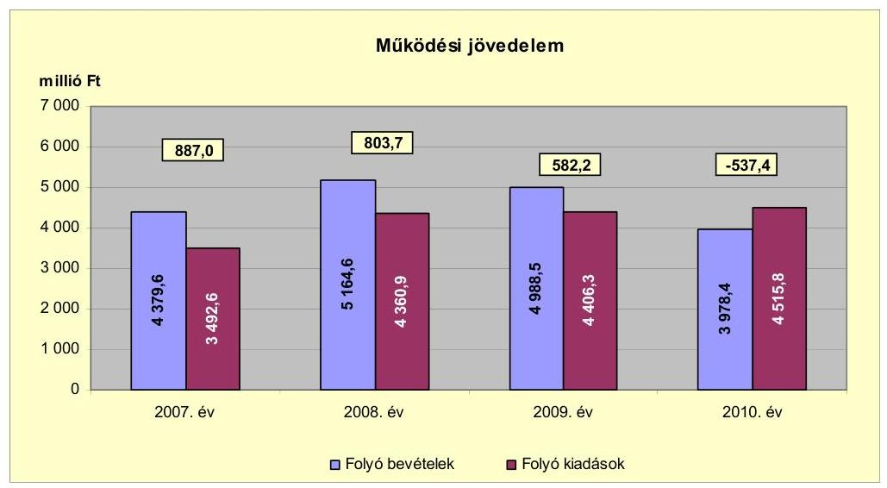

A működési jövedelem a 2008-2010. években csökkent, az előző évhez viszonyítva 2008-ban 83,3 millió Ft-tal, 2009-ben 221,5 millió Ft-tal és 2010-ben 1119,6 millió Ft-tal. A működési jövedelem a 2010. évben csökkent a saját működési bevételek - a 2009. évi 2567,5 millió Ft-ról a 2010. évre 1393,7 millió Ft-ra történt - teljesítése miatt. A saját működési bevételek változását a helyi iparűzési adó mértékének módosítása - 1,9%-ról 1,0%-ra
 - befolyásolta. A saját működési bevételek csökkentése következtében 2010-ben a működési jövedelem negatív értékűvé vált. A folyó kiadások között a 2008. évben a feladatátvételek következtében 456,7 millió Ft-tal a kamatkiadások nélküli működési kiadások, valamint 366,2 millió Ft-tal a transzferkiadások nőttek az előző évhez viszonyítva. A transzferkiadásokon belül 292,9 millió Ft volt a Hatvani Víziközmű Társulati fejlesztési hitelszerződéséhez az Önkormányzat által vállalt óvadékfizetési kötelezettség teljesítése.

A működési jövedelem értékei azt mutatják, hogy az Önkormányzat folyó bevétele a 2007-2009. években fedezetet biztosított a kötelező és önként vállalt feladatellátáshoz kapcsolódó éves folyó kiadásaira. A 2010. évben a helyi adóbevételek csökkenése következtében az év végén likviditási gondok jelentkeztek, melyek megoldására a 2011. évtől folyószámlahitelt vettek igénybe.

A 2007. évi 887,0 millió Ft, 2008-ban 803,7 millió Ft, 2009-ben 582,2 millió Ft működési jövedelem megtakarítás forrásul szolgált az Önkormányzat fennálló kötelezettségei teljesítéséhez, valamint fejlesztéseihez. A pozitív előjelű folyó költségvetési egyenleg ellenére az Önkormányzat hosszú lejáratú hitel felvételére kényszerült a fejlesztési feladatok megoldása érdekében. Likvid hitele az Önkormányzatnak a 2008-2010. években nem volt. A 2008. évben 27,0 millió Ft, 2009-ben 167,9 millió Ft és 2010-ben 213,1 millió Ft volt a fejlesztési célú hitelfelvétel összege.

Az Önkormányzat pénzügyi kapacitása a 2007-2009. években pozitív értéket mutatott, a nettó működési jövedelem a 2010. évben negatív volt. A nettó működési jövedelem értéke a folyó költségvetési pozíció mellett az adott költségvetési év adósságtörlesztésének hatását is tükrözi. A 2007-2010 között a nettó működési jövedelmet a következő ábra szemlélteti:

---

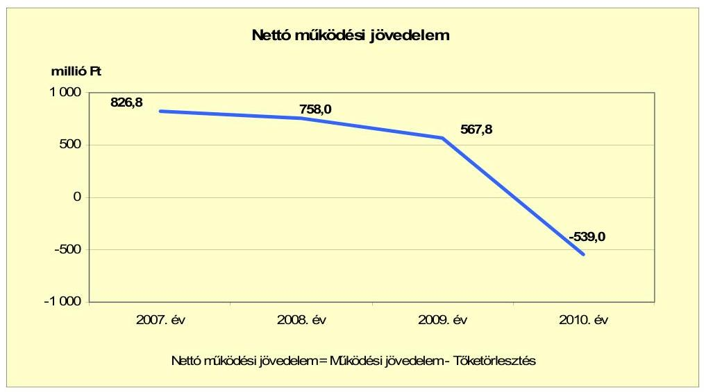

A nettó működési jövedelem csökkenését a folyó költségvetés egyenlegének 2007-2010 közötti romlása, továbbá a tőketörlesztés befolyásolta. A tőketörlesztés összege ${ }^{19}$ - egyes hitelek visszafizetésének eredményeként - 2007-2010 között évente csökkenő tendenciát mutatott. A 2007. és a 2008. években a működési jövedelemnek (887,0 millió Ft, illetve 803,7 millió Ft) 6,8%-át, illetve 5,7%-át tették ki az éves - 60,2 millió Ft-os, illetve 45,7 millió Ft-os - hiteltörlesztések. A mutató 2010. évi értékét a helyi iparűzési adó mérték bevételeket érintő csökkentése - a 2009. évi 1,9%-ról 2010-re 1,0%-ra - befolyásolta. Az Önkormányzat a helyi iparűzési adó 1,0%-os mértékét a 2011. évre vonatkozó hatállyal 1,9%-ra megemelte.

A 2007-2010. években az Önkormányzat felhalmozási költségvetésének egyenlege folyamatosan negatív összegű volt, amely körültekintő költségvetési gazdálkodás és pénzügyileg fenntartható${ }^{20}$ beruházások esetén nem jár lényeges pénzügyi kockázattal.

[^0]
[^0]:    ${ }^{19}$ Az Önkormányzat tőketörlesztési kötelezettsége 2007-ben 60,2 millió Ft, 2008-ban 45,7 millió Ft; 2009-ben 14,4 millió Ft; 2010-ben 1,6 millió Ft volt.
    ${ }^{20}$ Az minősül pénzügyileg fenntartható beruházásnak, amelynek működtetésére az Önkormányzat nettó működési jövedelme a következő években is fedezetet nyújt az újként, vagy többletként jelentkező működési többletre.

---

A felhalmozási költségvetés egyenlegét 2007-2010 között a következő ábra szemlélteti:
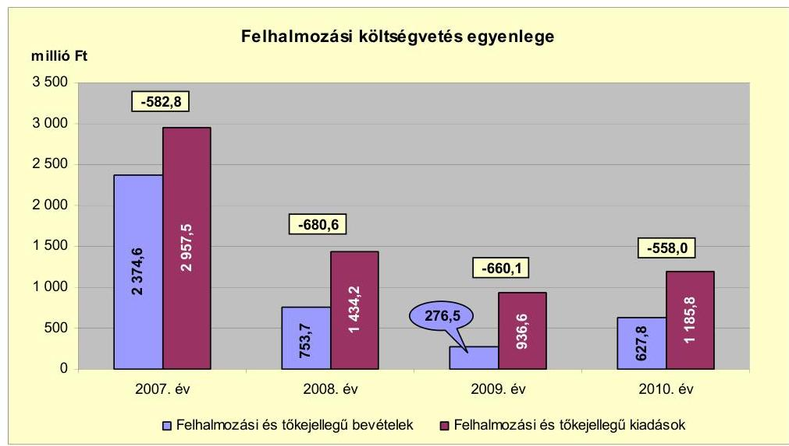

A felhalmozási költségvetés egyenlege a vizsgált időszak minden évében negatív volt, összege az egyes beruházások készültségi fokának és az utólagos finanszírozás ütemének - EU-s támogatás elszámolásának - függvényében változott. A 2010. évben a felhalmozási költségvetés egyenlege 83,2 millió Ft-tal (13,0%-kal) alacsonyabb hiányt mutatott, mint a 2007-2009. évek átlagos (641,1 millió Ft) összegű hiánya. A felhalmozási költségvetés bevételei és kiadásai a 2007. évben kiemelkedőek voltak - a vizsgált időszak további éveihez viszonyítva - a Hatvan és környéke szennyvízelvezetésének kiépítésére felhasznált cél- (496,2 millió Ft) és címzett (356,9 millió Ft), valamint EU-s forrásból származó (46,3 millió Ft) támogatások és azok felhasználása következtében.

A vizsgált időszakban keletkezett 2481,5 millió Ft felhalmozási forráshiányra a képződött 1613,6 millió Ft nettó működési jövedelem${ }^{21}$, a felvett 408,0 millió Ft összegű fejlesztési célú hitel, és a 2007. évi nyitó pénzkészletből 459,9 millió Ft nyújtott fedezetet.

Az Önkormányzat évenkénti teljes finanszírozási többlete a CLF módszer szerint 2007-ben 244,1 millió Ft, 2008-ban 77,4 millió Ft volt. A finanszírozási igénye${ }^{22}$ 2009-ben 92,2 millió Ft, 2010-ben 1097,0 millió Ft volt, amelyet a 2009-2010. években a finanszírozási célú bevételek és kiadások egyenlege${ }^{23}$, továbbá 2010-ben az előző évek pénzmaradványának 992,3 millió Ft összegű igénybevétele biztosított.

[^0]
[^0]:    ${ }^{21}$ A 2007-2010. évi felhalmozási kiadásokban a Társuláshoz kapcsolódó felhalmozási kiadások összege 79,4 millió Ft.
    ${ }^{22}$ a nettó működési jövedelem és a felhalmozási költségvetés eredője
    ${ }^{23}$ A finanszírozási műveletek egyenlege 2009-ben 145,5 millió Ft, 2010-ben 104,7 millió Ft volt.

---

Az Önkormányzat finanszírozási műveleteinek a 2007-2010. évek közötti egyenlegét az alábbi ábra szemlélteti:
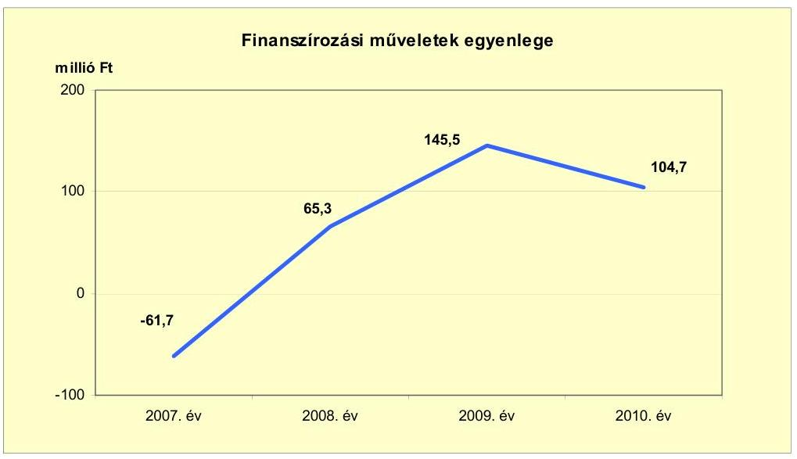

A finanszírozási műveletek pozitív értéke azt jelzi, hogy a 2008-2010. évi költségvetések végrehajtása során külső forrást is igénybe vettek. A 2008. évben 27,0 millió Ft hitelt vettek igénybe sportpálya építéséhez, 2009-ben 167,9 millió Ft-ot, 2010-ben 213,1 millió Ft-ot használtak fel a településrehabilitáció, valamint a közutak építésének finanszírozására kötött, 970,0 millió Ft-os fejlesztési hitelkeret szerződés terhére. A finanszírozási műveleteket a vizsgált időszakban a jelentés 2. számú mellékletének 4.1-4.8 pontjai részletezik.

Az Önkormányzat 2007-2010. évi zárszámadási rendeleteinek mellékleteiben mérlegszerűen bemutatott működési és fejlesztési célú többletet a jelentés 1. számú melléklete tartalmazza, amelynek adatai a más elszámolási módszer miatt eltérnek a CLF módszer alapján leírtaktól. A zárszámadási rendeletekben kimutatott működési és fejlesztési célú többlet - 2007-ben 1202,9 millió Ft, 2008-ban 1437,8 millió Ft, 2009-ben 1476,3 millió Ft és 2010-ben 579,2 millió Ft - volt, amely a CLF módszer alapján számított működési jövedelem és felhalmozási költségvetés egyenlegét minden évben meghaladta alapvetően az igénybe vett pénzmaradvány hatására.

---

Az Önkormányzat kamatbevételeit és kamatkiadásait 2007-2011. év I. féléve között a következő ábra mutatja:
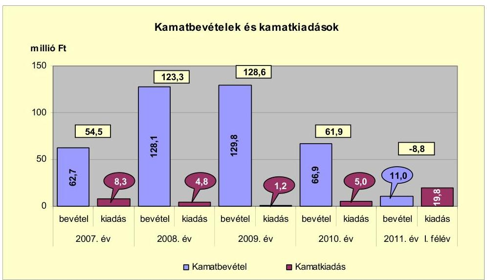

Az Önkormányzatnak a szabad pénzeszközeinek lekötéséből, a bérlakásértékesítési számlán lévő betétekből a 2007-2010. években 398,5 millió Ft kamatbevétele keletkezett. A 2008. évben realizált 128,1 millió Ft kamatbevétel 65,4 millió Ft-tal, a 2009. évi 129,8 millió Ft kamatbevétel 1,7 millió Ft-tal haladta meg az előző évit. A 2010. évre 62,9 millió Ft-tal (66,9 millió Ft-ra) csökkent a kamatbevétel az előző évhez viszonyítva, a beruházások finanszírozására szolgáló, átmenetileg szabad pénzeszközök állományának csökkenése következtében. Az Önkormányzat által felvett hitelekhez kapcsolódóan kamatfizetési kötelezettség is keletkezett a vizsgált időszakban, a teljes kamatráfordítás a realizált kamatbevétel 5,0%-át (19,3 millió Ft) tette ki. A kamatbevételeket a 2007-2010. években elsősorban a hitelkamatok fizetésére és tőketörlesztésre fordították. Az Önkormányzat a bérlakás értékesítési számlán fennmaradó 227,0 millió Ft kamatbevétel összegét betétként tartalékolta.

# 2.2. Az Önkormányzat bevételeinek változása 

Az Önkormányzat folyó bevétele a 2008. évben - a közoktatásban ellátott létszám emelkedése következtében megnövekedett költségvetési támogatás, a helyi adóbevételek és az egyéb saját bevételek emelkedése következtében, a helyben maradó szja bevétel csökkenése mellett - 17,9%-kal (785,0 millió Ft-tal) volt több mint 2007-ben, majd ezt követően minden évben csökkent.

---

Az Önkormányzat a 2007-2011. év I. félév között realizált főbb folyó bevételi jogcímeinek számszaki adatait a következő táblázat és grafikon részletezi:
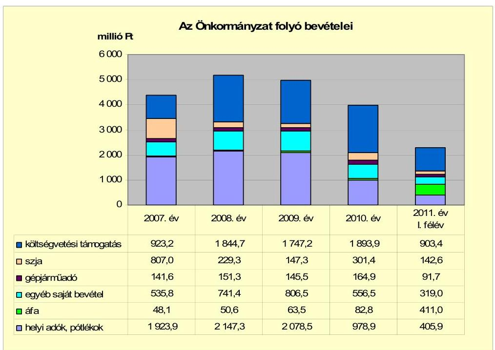

A központi támogatások és szja az előző évhez viszonyítva együttesen a 2008. évben 343,8 millió Ft-tal - a költségvetési támogatás 921,5 millió Ft-tal és az szja 577,7 millió Ft-tal - csökkentek. A 2010-ben a központi támogatás és az szja 300,8 millió Ft-tal növekedett az előző évhez képest, a költségvetési támogatás 146,7 millió Ft-os és az szja 154,1 millió Ft-os együttes hatására. A központi támogatások és az szja együttesen 2011-ben várhatóan 103,3 millió Ft-tal csökkennek. Az állami támogatások csökkenése miatti bevételkiesés - valamint a közoktatási feladatnövekedés kiadásainak - ellensúlyozására az Önkormányzat kiadáscsökkentő és bevételnövelő intézkedéseket hozott. A kiadáscsökkentő és bevételnövelő intézkedések együttesen az Önkormányzat pénzügyi egyensúlyát 2007-2010 között 583,5 millió Ft-tal, 2011-ben 472,5 millió Ft-tal javították.

Az egyéb saját bevételek a 2009. évben 65,1 millió Ft-tal (8,8%-kal) növekedtek az előző évhez viszonyítva, amelyet az üzemeltetési díjak emelkedése eredményezett. A 2010. évben a saját bevételek (556,5 millió Ft-ról) az előző évhez viszonyítva 250,0 millió Ft-tal (31,0%-kal) csökkentek a támogatásértékű működési bevételek 167,1 millió Ft, a kamatbevételek 62,9 millió Ft összegű csökkenése következtében.

Az Önkormányzat folyó bevételének jelentős hányadát a helyi adó bevételek képezték, amelyek a 2007. évben 36,7%-át (1923,9 millió Ft-ot), és a 2010. évben 24,4%-át (978,9 millió Ft-ot) tették ki. A helyi adó bevételek 2008-ban - az előző évhez viszonyítva - emelkedtek, majd a gazdasági válság hatására 2009-ben a 2008. évhez képest 10,7%-kal visszaestek. A 2010. évben az adó mértékének csökkentése következtében az adóbevételek 19,9%-kal alacsonyabb összegben realizálódtak az előző évhez viszonyítva. Az Önkormányzat a vizsgált

---

időszakban helyi iparűzési adót, építményadót, kommunális adót vetett ki a magánszemélyekre, illetve vállalkozásokra.

A különböző adónemekből származó bevételt tekintve legnagyobb súlya a helyi iparűzési adónak volt. 2010-ben a helyi adó bevétel 73,1%-át (1923,9 millió Ft-ot) a helyi iparűzési adó bevétel jelentette. Az állandó jellegű tevékenység végzése után a 2007-2009. években a helyi adókról szóló törvényben meghatározott maximális (2,0%-os) mérték alatt 1,9% mértékkel adóztak a vállalkozások. A 2010. évre - a gazdasági válság hatásainak mérséklése miatt - az Önkormányzat az adó mértékét 1,0%-ra csökkentette. A helyi iparűzési adó 1,0%-os mértéke a célját nem érte el, a 2011. évre az 1,9%-os mérték alkalmazásáról döntött az Önkormányzat. A helyi iparűzési adó mértékének a 2010. évre vonatkozó csökkentését gazdasági számításokkal nem alapozták meg, a 2011. évi adómérték emelésről a működési bevételekre gyakorolt hatás elemzése alapján döntött az Önkormányzat.

Az Önkormányzat felhalmozási bevételeinek szerkezete a vizsgált időszakban az alábbi volt:
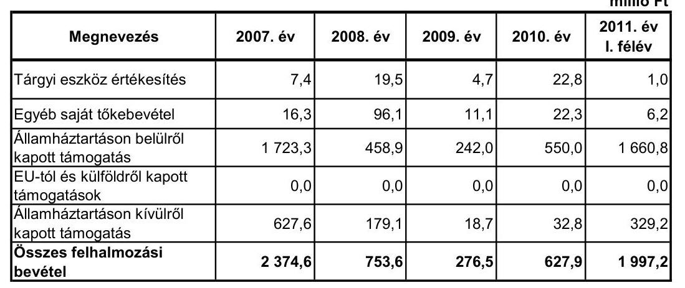

Az Önkormányzat felhalmozási bevétele a 2008. évben 1621,0 millió Ft-tal (68,3%-kal) esett vissza az előző évhez viszonyítva. A felhalmozás bevétel 2010-ben 351,4 millió Ft-tal (227,1%-kal), a 2011. év I. félévében 1369,3 millió Ft-tal (218,1%-kal) emelkedett az előző évhez képest. A változásokat a fejlesztésekhez államháztartáson belülről, illetve kívülről kapott - a folyamatban levő fejlesztésekre érkező - támogatási összegek okozták.

Az egyéb saját tőkebevételek az önkormányzati lakások, helyiségek értékesítéséből, a támogatási kölcsönök visszatérüléséből származó bevételt tartalmazták. A 2008-ban realizált 96,1 millió Ft 5,9-szerese volt a 2007. évi (16,3 millió Ft) teljesített bevételeknek. Ennek fő oka, hogy 2008. évben 88,1 millió Ft bevételt realizált az Önkormányzat tartós részesedések értékesítéséből.

Az Önkormányzat államháztartáson belülről kapott támogatásként mutatta ki a fejlesztési feladatok végrehajtásához kapott felhalmozási célú állami támogatásokat. Az EU-s forrással megvalósított beruházások támogatás-

---
 a nonprofit szervezetektől, vállalkozásoktól átvett felhalmozási célú pénzeszközöket mutatták ki. A 2007. évben 614,2 millió Ft Társulattól átvett hozzájárulás - Hatvan és Lőrinci, illetve Hatvan és Zagyvaszántó szennyvízelvezetési hálózat építéséhez - tette ki a felhalmozási bevételek 40,5%-át.

# 2.3. Az Önkormányzat folyó és a felhalmozási célú kiadásainak változása 

Az Önkormányzat folyó kiadásai főbb jogcímek szerinti bontásban 2007-2011. év I. féléve között az alábbiak voltak:

| Megnevezés | 2007. év | 2008. év | 2009. év | 2010. év | 2011. év <br> I. félév |
| :--: | :--: | :--: | :--: | :--: | :--: |
| Folyó kiadások | 3492,6 | 4360,9 | 4406,3 | 4515,8 | 2165,4 |
| Működési kiadások (kamatkiadás nélkül) | 3206,7 | 3663,4 | 4080,3 | 4146,8 | 1991,8 |
| Államháztartáson belülre átadott pénzeszközök | 6,6 | 9,5 | 8,7 | 21,5 | 8,3 |
| Transzferkiadások | 271,1 | 637,2 | 315,9 | 342,2 | 145,6 |
| -ebből: vállalkozásoknak | 34,4 | 409,7 | 94,4 | 118,2 | 16,6 |
| EU-nak, illetve külföldre | 0,0 | 0,0 | 0,0 | 0,0 | 0,0 |
| magánszemélyeknek | 172,4 | 172,5 | 193,0 | 196,9 | 117,8 |
| nonprofit szervezeteknek | 64,3 | 55,0 | 28,5 | 27,1 | 11,3 |
| Kamatkiadások | 8,3 | 4,8 | 1,2 | 5,0 | 19,8 |
| Előző évi pénzmaradvány átadás | 0,0 | 46,0 | 0,2 | 0,4 | 0,0 |

Az Önkormányzat teljesített folyó kiadásai a 2010. évben 10,5%-kal (429,2 millió Ft-tal) haladták meg a 2007-2009. évek átlagát (4086,6 millió Ft-ot). A működési kiadások 2008. évi emelkedését középfokú intézmények átvételének működési kiadása okozta.

Az Önkormányzatnál a személyi juttatások, a dologi és az egyéb folyó kiadások teljesítései a 2007-2011. év I. féléve között az alábbiak voltak:

| Megnevezés | 2007. év | 2008. év | 2009. év | 2010. év | 2011. év <br> I. félév |
| :-- | --: | --: | --: | --: | --: |
| Személyi juttatások | 1731,4 | 1968,6 | 2000,2 | 2082,3 | 960,5 |
| Munkaadót terhelő járulékok | 551,3 | 618,8 | 590,5 | 535,1 | 252,3 |
| Dologi kiadások | 890,0 | 1044,6 | 1279,8 | 1455,1 | 591,5 |
| Egyéb folyó kiadások | 33,3 | 28,0 | 58,5 | 63,7 | 33,8 |

A személyi juttatások teljesített kiadásai a 2008. évben 13,7%-kal (237,2 millió Ft-tal) nőttek az előző év 1731,4 millió Ft-os kiadásához viszonyítva az átvett közoktatási intézmények 2008-ban jelentkező hatása miatt.

[^0]
[^0]:    ${ }^{24}$ Hatvan és Lőrinci, illetve Hatvan és Zagyvaszántó szennyvízelvezetési hálózat építése
    ${ }^{25}$ Bajza J. Gimnázium tetőtér beépítése, Északi tehermenetesítő út megépítése, Hatvani autóbusz-pályaudvar építése, települési hulladéklerakók rekultivációja, szennyvíz csatorna építése.

---

A dologi és egyéb folyó kiadások a 2008. és a 2009. évben az előző évhez képest 149,3 millió Ft-tal (16,2%-kal) illetve 265,7 millió Ft-tal (24,8%-kal) nőttek a közoktatási intézményátvételek következtében. A 2010. évben a dologi és az egyéb folyó kiadások összege 407,4 millió Ft-tal (36,7%-kal) haladta meg a 2007-2009. évek átlagos értékét (111,4 millió Ft). A 2010. évi emelkedés oka az volt, hogy elvégeztek olyan, az előző évek során halasztott javítási-karbantartási feladatokat ${ }^{26}$, amelyek a biztonságos üzemeltetéshez voltak szükségesek.

Az önkormányzati folyó és felhalmozási kiadásokon belül a felhalmozási kiadások aránya a 2007. évi 45,9%-os részarányhoz képest - 2008-ban 21,1 százalékponttal, 2009-ben 28,3 százalékponttal, 2010-ben 25,1 százalékponttal - csökkent.

A részarány csökkenésének az oka, hogy a jelentős beruházások egyes kivitelezési szakaszai lezárultak. A "Hatvan-Lőrinci települések szennyvízelvezetése" fejlesztési feladat kivitelezésére a 2007. évben 496,2 millió Ft kiadást teljesítettek, a 2008. évre áthúzódó feladatok 79,5 millió Ft-ot jelentettek. A "Hatvan Zagyvaszántó települések szennyvízelvezetése" fejlesztésre fordított kiadás a 2007. évben 356,9 millió Ft volt, a 2008. évre 219,9 millió Ft kiadás húzódott át. Az EU-s támogatással megvalósuló "Hatvan és térsége szennyvízelvezető rendszer bővítése, fejlesztése, teljes kiépítése" projekt keretében a 2009. évben az előkészítési szakaszra 127,5 millió Ft-ot fizettek ki. A beruházás 2010-2011-ben valósul meg. A felhalmozási kiadások a 2011. év I. félévében 59,1%-os részarányt képviselt a folyó kiadásokból. A magas részarány oka, hogy az I. félévben a 2011. évre tervezett felhalmozási kiadások időarányosnál nagyobb részét teljesítették. Az Önkormányzat a felhalmozási célú kiadásokra a 2009. évben fordított a legkevesebbet ${ }^{27}$ (937,0 millió Ft-ot), ami az összes kiadás (5342,9 millió Ft) 16,5%-ának felelt meg.

A folyó és felhalmozási kiadásokat a vizsgált időszakban a következő grafikon szemlélteti:

[^0]
[^0]:    ${ }^{26}$ A 2010. évben a feladatonként jóváhagyott javítási-karbantartási kiadások 59,9 millió Ft-ot, a szakterületenkénti feladatok 423,8 millió Ft-ot tettek ki.
    ${ }^{27}$ A jelentős bekerülési összegű beruházások közül a szennyvízcsatorna beruházások I. és a II. üteme 2009-re lezárult, III. ütemének kifizetései a 2009-ben kezdett kivitelezés miatt 2010-re húzódtak. A buszpályaudvar építése 2010-re ütemezett volt.

---

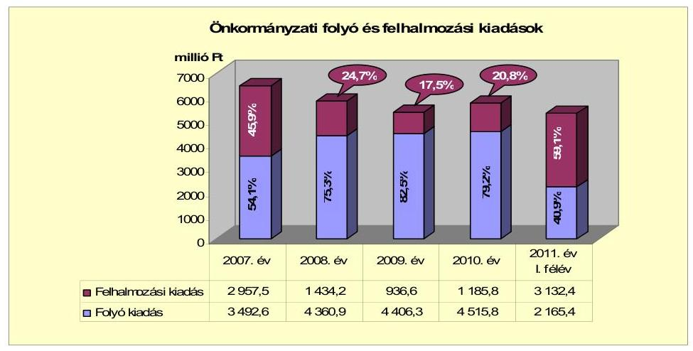

Az Önkormányzat folyó és felhalmozási kiadásai tartalmazzák a Társulás kiadásait is. A Társulást 2009. június 1-jén hozták létre Hatvan város, Apc-, Ecséd-, Szücsi községek önkormányzatai az agglomerációs szennyvízelvezetésének és tisztításának teljes körű kiépítésére. A projekt összköltsége 4683,0 millió Ft. Ezeknek a kiadásoknak egy része nem az Önkormányzat, hanem a társult települések kiadása volt, amelyek azonban a gesztor önkormányzatnál jelentkeztek.

A folyó és felhalmozási kiadásokat beruházási társulás nélkül a vizsgált időszakban az alábbi grafikon szemlélteti:
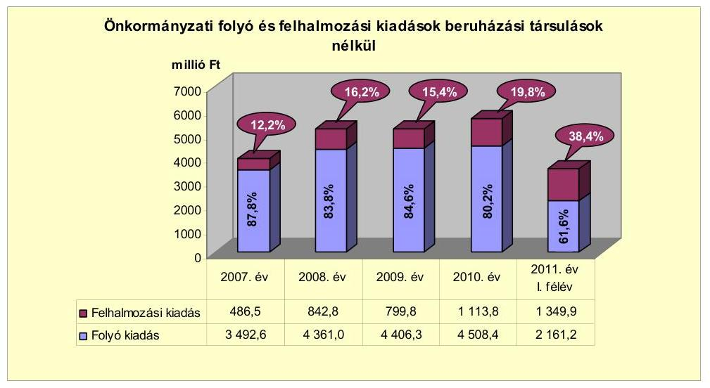

Az Önkormányzat által végzett felújítások és beruházások (együtt: fejlesztések) együttes kiadása a 2007. évi 2912,0 millió Ft-ról a 2008. évre 1401,8 millió Ft-ra, a 2009. évre 779,0 millió Ft-ra csökkent és a 2010. évre 1066,3 millió Ft-ra, a 2011. év I. félévében 3080,3 millió Ft-ra növekedett. A 2009. évi csökkenés oka, hogy a jelentős bekerülési költségű fejlesztések 2008-ra lezárultak, új beruházások kezdése a 2010. évre volt ütemezett. A 2011. év I. félévében a felhalmozási kiadások emelkedését a szennyvíz-beruházás III. ütemének kifizetései eredményezték. Beruházási társulás tagjaként és egyben gesztoraként regionális

---

szennyvízcsatorna kiépítéséhez ${ }^{28}$, és a kapcsolódó műtárgyak építéséhez, bővítéséhez, korszerűsítéséhez kapcsolódó beruházást valósítanak meg. A beruházás együttes bekerülési költsége 4683,0 millió Ft, amelyből 991,3 millió Ft az Önkormányzat kiadása.

Az Önkormányzatnál a vizsgált időszakban befejezett fejlesztési feladatok összes költségvetési kiadása 11154,6 millió Ft volt. A beruházások 10398,7 millió Ft (93,2%) és a felújítások 755,9 millió Ft (6,81%) összegűek voltak. A 2006. december 31-ig teljesített kiadások összege 4366,3 millió Ft volt. A 2007-2010. években 6788,3 millió Ft kiadás teljesült. A befejezett fejlesztések (11 154,6 millió Ft) kiadását 4208,2 millió Ft EU-s (37,7%), 2183,6 millió Ft hazai támogatás (19,6%), 4173,0 millió Ft saját bevétel (37,4%), és 589,8 millió Ft hitel (5,3%) finanszírozta. Az Önkormányzat 2007-2010 között megvalósított fejlesztései között intézményi épületek felújítása, korszerűsítése és bővítése, útépítés, csapadékvíz elvezetés, szennyvízcsatornázás, informatikai fejlesztések megvalósítása szerepelt, melyek teljes egészében az Önkormányzat kötelező feladatainak ellátásához kapcsolódtak. A fejlesztések részletes adatait a jelentés 3/a. számú melléklete tartalmazza.

A befejezett felújítások közül 27 esetben haladta meg a bekerülési költség a 10,0 millió Ft-ot. A 10,0 millió Ft bekerülési költség feletti beruházások száma 2007-2010 között 273 volt, amelyek teljes bekerülési költsége 9498,2 millió Ft-ot, a fejlesztések 91,3%-át tette ki. A 10,0 millió Ft bekerülési összeg feletti beruházások a szennyvízelvezetési- és tisztítási rendszer bővítése és fejlesztése, városi középületek- és közterek rekonstrukciója, bérlakásépítés, közutak megépítése, szociális-, egészségügyi sportlétesítmények átalakítása voltak.

Az Önkormányzat folyamatban lévő fejlesztési feladatainak teljes bekerülési költsége 6625,9 millió Ft. A folyamatban lévő fejlesztések között 4683,0 millió Ft-ot képvisel a Társulás által, az Önkormányzat gesztor szerepe mellett bonyolított szennyvízelvezetési projekt. A kiadások finanszírozását 4076,9 millió Ft EU-s támogatás (61,5%), 1372,5 millió Ft saját bevétel (20,7%) és 1176,5 millió Ft hitel ${ }^{29}$(17,8%) biztosítja. A folyamatban lévő fejlesztési feladatokra 2010. december 31-ig teljesített kiadás 1268,0 millió Ft - a teljes bekerülési költség 19,1%-a - volt. A buszpályaudvar építésére 884,6 millió Ft, az északi tehermentesítő út III. szakaszának építésére 8,4 millió Ft, a Bajza József Gimnázium korszerűsítésére 304,5 millió Ft és a szennyvízberuházás III. ütemének kivitelezésére 70,5 millió Ft kiadást teljesítettek. A fejlesztések részletes adatait a jelentés 3/b. számú melléklete tartalmazza.

A 2010. december 31-én folyamatban lévő és a 2010. évet követő kötelezettségvállalásainak ${ }^{30}$ összege 6613,3 millió Ft volt. A fejlesztések tervezett forrása 4197,0 millió Ft EU-s támogatás (63,4%), 1762,9 millió Ft saját bevétel

[^0]
[^0]:    ${ }^{28}$ a szennyvízberuházás III. ütem kezdete 2009. augusztus 17., tervezett befejezése 2011.december 31.
    ${ }^{29}$ A 2010-2011. június 30-ig hitelt nem vettek igénybe.
    ${ }^{30}$ intézmények, lakóépületek, temető felújítása, útépítések, kórházi struktúraváltás beruházásai, szennyvíz beruházás

---

(26,7%), 86,6 millió Ft hazai támogatás (1,3%) és 566,8 millió Ft hitel ${ }^{31}$ (8,6%). A fejlesztésekhez kapcsolódó kötelezettségvállalások részletes adatait a jelentés 3/c. számú melléklete tartalmazza.

Az Önkormányzat kiemelt infrastrukturális fejlesztései közül a három legmagasabb költségű beruházás a következő volt:

- „A hatvani szennyvízelvezetési agglomeráció a Nemzeti Települési Szennyvízelvezetési és tisztítási Megvalósítási Program” beruházás megvalósításának célja volt a hatvani agglomerációban a szennyvizek közműves szennyvízelvezetésének és biológiai szennyvíztisztításának 2010. december 31-ig történő megvalósítása. A beruházás teljes bekerülési költsége 11500,0 millió Ft volt, melyből a vizsgált időszakban 3806,6 millió Ft teljes bekerülési költségű projektrész valósult meg 3615,3 millió Ft (95,0%) EU-s és hazai támogatásból (KIOP) és 190,3 millió Ft (5,0%) saját bevételből. A megvalósított beruházás miatt többlet működési kiadás nem terhelte az Önkormányzatot.
- Az Önkormányzat „Hatvan és térsége szennyvízelvezető rendszer bővítése, fejlesztése, teljes kiépítése” címen benyújtott pályázata a 2008. évben támogatást nyert. A beruházás megvalósításának célja az agglomeráció - beleértve Apc, Ecséd, Szücsi községeket is - szennyvízelvezetésének- és tisztításának teljes körű kiépítése volt. A beruházás teljes bekerülési költségét (4683,0 millió Ft) 991,3 millió Ft saját bevétel (21,3%), 743,0 millió Ft hitel és 2948,7 millió Ft (78,7%) EU-s és hazai támogatás (KEOP) finanszírozta. A megvalósított beruházás miatt többlet működési kiadás nem terhelte az Önkormányzatot. A projekt támogatással nem finanszírozott elemeinek megvalósítása (saját forrás összegén belül) 934,7 millió Ft felhalmozási célú kiadást igényel 2010-ben és 2011-ben, amelynek fedezetét az Önkormányzat felhalmozási és tőkejellegű bevételei ${ }^{32}$ terhére biztosította.
- Az Önkormányzat a „Helyi közösségi közlekedés infrastruktúrájának fejlesztése Hatvani autóbusz-pályaudvar építése” címen

 benyújtott pályázata a 2009. évben támogatásban részesült. A projekt célja a meglévő autóbusz-pályaudvar áthelyezése, korszerű kialakítása. A projekt 2010. évre tervezett befejezése 2011-re húzódott. A fejlesztés tervezett bekerülési költsége 305,1 millió Ft, melynek forrása 45,4 millió Ft ( $15,0 \%$ ) hitel, és 259,7 millió Ft ( $85,0 \%$ ) EU-s és hazai támogatás. A projekt fenntartásával kapcsolatosan a létesítmény korszerűsége csökkenti a fajlagos üzemeltetési és fenntartási kiadásokat.

Az Önkormányzatnak 429,6 millió Ft tervezett bekerülési költségű, elbírálás alatt lévő, pályázati forrásból tervezett négy fejlesztési feladata volt 2010. december 31-én (a fejlesztések részletes adatait a jelentés 3/d. számú melléklete tartalmazza). A beadott pályázatok sikeres elbírálása esetén az EU-s és hazai támogatások segítségével a városi uszoda energiaköltségét csökkentő korszerűsítése, a város térségi jelentőségű vízvédelmi rendszerének rekonstrukciója, a város vízvédelmi rendszerének fejlesztése és műfüves sportpálya létre-

[^0]
[^0]:    ${ }^{31}$ A hitel igénybevételére 2011. június 30-ig nem került sor.
    ${ }^{32}$ Az éves költségvetésben a Társulás felhalmozási és tőke jellegű bevételeként 907,0 millió Ft-ot terveztek, mely a szennyvízberuházás áfa-visszaigényléséből adódik.

---

hozása valósulna meg. A beruházások megvalósításának fedezetére szolgáló 29,4 millió Ft képződő működési jövedelem, 392,7 millió Ft EU-s és 7,5 millió Ft hazai támogatás igénybevételét tervezte az Önkormányzat. A megvalósítás fedezetéül hitel, illetve más önkormányzatoktól származó forrás bevonásával nem számolt.

A gazdasági társaságok részére a 2007-2011. év I. féléve között átadott pénzeszközöket a következő grafikon mutatja be:
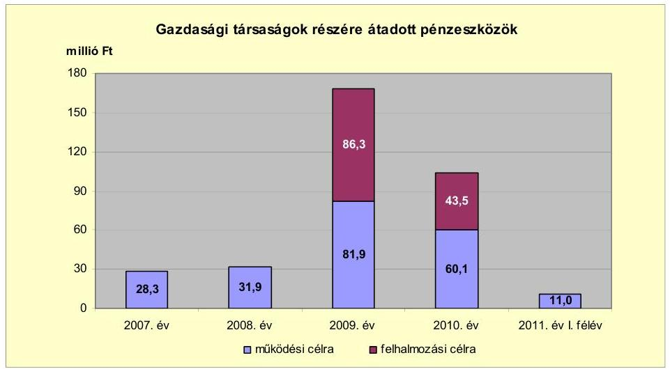

Az Önkormányzat a gazdasági társaságoknak a 2007-2011. év I. féléve közötti időszakban 213,2 millió Ft működési célú pénzeszközt adott át. A kizárólagos önkormányzati tulajdonban álló társaságoknak átadott 191,8 millió Ft pénzeszköz működési célt szolgált, amelyből 11,0 millió Ft a kórház működtetéséhez, 180,8 millió Ft a városüzemeltetéshez kapcsolódott. Az egyéb közfeladatot ellátó társaságok közül a helyi közlekedési közszolgáltató - a vizsgált időszakban - összesen 21,4 millió Ft működési célú pénzeszközben részesült a helyi tömegközlekedés lebonyolításához.

Az Önkormányzat kizárólagos tulajdonában álló gazdasági társaságoknak a vizsgált időszakban 129,8 millió Ft fejlesztési célú pénzeszközt adott át. A pénzeszközátadások részletes adatait a jelentés 4. számú melléklet tartalmazza. A 2009. évben az Önkormányzat a Városgazdálkodási Zrt. eszközfejlesztéséhez 21,3 millió Ft, a Strandfürdő fejlesztéséhez 65,0 millió Ft (termálmedence építéséhez) pénzeszközátadással járult hozzá.

Az Önkormányzat gazdasági társasági formában működő kórházrendelőintézetének a 2007-2011. év I. féléve között 134,9 millió Ft pénzeszközt adott át. A kórházat fenntartó gazdasági társaság ${ }^{33}$ az egészségügyi ellátás működési hiányának csökkentésére a 2009. évben 55,0 millió Ft, 2010-ben 50,0 millió Ft, a 2011. év I. félévében 11,0 millió Ft működési célú, továbbá eszközpótlásra 3,8 millió Ft és 15,1 millió Ft fejlesztési célú átadott pénzeszközben részesült.

[^0]
[^0]:    ${ }^{33}$ A kórházat fenntartó gazdasági társaság a 2009-2010. években a Hatvani Városgazdálkodási Zrt. 2011-ben az Albert Schweitzer Kórház-Rendelőintézet Kft. volt.

---

A gazdasági társaságok részére szerződés alapján átadott pénzeszközök cél szerinti felhasználását, a szolgáltatás teljesítését az Önkormányzat ellenőrizte. Az Önkormányzat minden évben értékelte a kizárólagos tulajdonában álló gazdasági társaság működését. A helyi közlekedési közszolgáltató szerződéses kötelezettségének megfelelően évente beszámolót készített az Önkormányzat részére. A szolgáltatási díjakról szóló előterjesztés alapján - gazdasági számításokkal bemutatva - a helyi tömegközlekedés lebonyolításához átadott pénzeszközökről a Képviselő-testület döntött.

# 3. Az ÖNKORMÁNYZAT KÖTELEZETTSÉGEI 

### 3.1. Az Önkormányzat pénzintézetekkel szembeni kötelezettségeinek változása

Az Önkormányzat pénzintézetekkel szembeni kötelezettségeinek állománya 2006. december 31-i 117,5 millió Ft-ról 2010. december 31-re 243,4%-kal, 403,5 millió Ft-ra nőtt. A pénzintézetekkel szembeni kötelezettségek állománya 2011-ben - a 2010. december 31-i állományhoz viszonyítva - további 104,0%-kal, 819,4 millió Ft-ra növekedett a fennálló beruházási hitelkeretből történt a 2011. év I. és II. negyedévi lehívások miatt. A pénzintézetekkel szemben fennálló kötelezettségek állományát az alábbi ábra mutatja be:
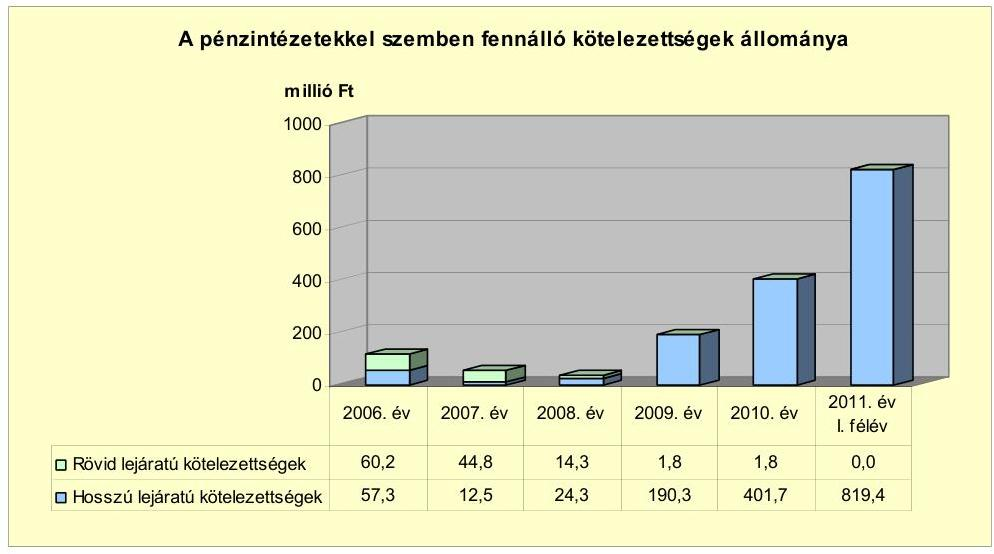

A fennálló pénzintézetekkel szembeni kötelezettségek az önkormányzati fejlesztésekhez forrást biztosító hosszú lejáratú hitelek felvételéből keletkeztek. Az 2007-2011. június 30. között az Önkormányzat három alkalommal vett fel hosszú lejáratú hitelt fejlesztési célokra, a számlavezető bank egyszer állapított meg ${ }^{34}$ folyószámlahitel-keretet a fejlesztési célokhoz kapcsolódó támogatások megelőlegezésére. Az Önkormányzat az ellenőrzött időszakban deviza alapú, rövid lejáratú, illetve likvid hitelt és kölcsönt nem vett fel, valamint kötvényt nem bocsátott ki. A 2008. és a 2010. években egy-egy, korábban

[^0]
[^0]:    ${ }^{34}$ a 2011. január 17-én megkötött 2012. december 31-ig érvényben lévő folyószámlahitel szerződésben

---

felvett hitel törlesztése befejeződött. Az Önkormányzatnak a 2010. év végén három, az ellenőrzött időszakban felvett hosszú lejáratú hitele volt. A rövid lejáratú kötelezettségek állományát a hosszú lejáratú hitelek tárgyévet követő fizetési kötelezettségei jelentették 2010. december 31-én.

Az Önkormányzat az éves költségvetési rendeleteiben meghatározta a tervezett kiadásaihoz szükséges források összegét és a Képviselő-testület döntött a hiányzó források pótlásáról. A költségvetési rendeletekben - az adósságszolgálati korlát figyelembevételével - meghatározták az adott évre vonatkozóan felvehető hitel összegét és bemutatásra kerültek a hitelfelvételekkel összefüggő kötelezettségek az adott költségvetési évre, valamint az azt követő két évre. A pénzmaradvány elszámolása után az igénybe vehető belső forrás összegével korrigálták az adott évre tervezett hitel összegét. Az ellenőrzött időszakban működési célú hitelfelvételre az Önkormányzatnál nem került sor. Az adósságot keletkeztető kötelezettségvállalás felső határát az Önkormányzat vizsgálta és arról a Képviselő-testületet tájékoztatta. Az Önkormányzat az áttekintett időszakban az adósságot keletkeztető kötelezettségvállalásának felső határát nem lépte túl. Az adósságot keletkeztető kötelezettségvállalás felső határa a 2007. évben 1061,3 millió Ft, a 2008. évben 1334,2 millió Ft, a 2009. évben 1424,2 millió Ft és a 2010. évben 1468,0 millió Ft volt.

Az Önkormányzat pénzintézetekkel szembeni kötelezettségvállalásai minden esetben a Képviselő-testület döntésén alapultak. A hitelfelvételeket megelőzően közbeszerzési eljárást folytattak le, amelynek megindításáról és a hitelintézet kiválasztásáról a Képviselő-testület döntött. Az Önkormányzat számlavezetője nem azonos a fejlesztési feladatokat finanszírozó pénzintézetekkel. A külső forrás bevonásának előkészítési szakaszában minden esetben vizsgálták, hogy az Önkormányzat milyen feltételekkel juthat fejlesztési hitelhez. A kötelezettségvállalásból származó források felhasználási céljait a Képviselő-testület döntésében meghatározta, azonban az előterjesztések a visszafizetés forrását, valamint a teljes futamidőre szóló kamat- és tőkefizetési kötelezettségeket, továbbá a kamatkockázat értékelését nem tartalmazták. Az adósságot keletkeztető kötelezettségvállalással megvalósított fejlesztések esetleges bevételnövelő, illetve kiadáscsökkentő vonzatát nem vizsgálták.

Az Önkormányzat az ellenőrzött időszakban tervezett fejlesztési feladatait hosszú lejáratú, forint alapú hitelek igénybevételével teljesítette, a lehívott hiteleket a hitelcélnak megfelelően használta fel.

Az Önkormányzat 2011. június 30-án forintban fennálló hosszú lejáratú adósságot keletkeztető kötelezettségvállalásai a következők voltak ${ }^{35}$ :

[^0]
[^0]:    ${ }^{35}$ futsal labdarúgópálya: műfűvel borított labdarúgópálya

---

| Megnevezés | Szerződéskötés <br> időpontja | Összeg <br> millió Ft-ban | Kamat (referencia <br> kamat+ kamatfelár) | Felhasználás célja: |
| :-- | :--: | :--: | :-- | :-- |
| "Sikeres Magyarországért" <br> Országos Labdarugópálya <br> Létesítési Program | 2008. június 9. | 26,9 | három havi <br> EURIBOR+1,58\% <br> kamatfelárév | futsal labdarugópálya <br> létesítése |
| "Sikeres Magyarországért" <br> Önkormányzati Infrastruktúra <br> Fejlesztési Hitelprogram | 2009. június 30. | 320,0 | három havi <br> EURIBOR+1,99\% <br> kamatfelárév | kőzutak építése, <br> önkormányzati tulajdonú <br> létesítmények felújítása, <br> egyéb beruházások |
| "Sikeres Magyarországért" <br> Önkormányzati Infrastruktúra <br> Fejlesztési Hitelprogram | 2009. június 30. | 650,0 | három havi <br> EURIBOR+1,99\% <br> kamatfelárév | városrehabilitáció |

Az Önkormányzat a pénzintézetekkel szembeni kötelezettségeinek teljesítéséhez biztosítékként - az Ötv. korlátozó előírásait a hitelszerződésekben rögzített módon figyelembe véve - felhatalmazta a pénzintézetet az inkasszójog érvényesítésére a mindenkori költségvetési elszámolási számláján. A labdarúgópálya fejlesztési hitelszerződéshez kapcsolódóan ingatlan jelzálogszerződést kötöttek a finanszírozó pénzintézettel az Önkormányzat forgalomképes ingatlanára. Az ellenőrzött időszakban az Önkormányzat adóbevételei fedezetet nyújtottak az adott évi hiteltörlesztésekhez.

Az Önkormányzat a felvett hosszú lejáratú hiteleivel kapcsolódott a kormányzati programokban meghirdetett fejlesztési célokhoz. Az Önkormányzat a labdarúgópálya fejlesztési hitelt teljes mértékben felhasználta. A további két, infrastruktúra-fejlesztési célú hitelkeretből 2011. június 30-án 172,1 millió Ft összeg állt rendelkezésre. Az Önkormányzat a rendelkezésre álló hitelkeretet - a hitelszerződésekben foglalt céloknak megfelelően - fejlesztési célú pályázatokhoz támogatásokhoz szükséges önerő biztosítására, beruházási programok (útépítések, intézmény rekonstrukciók) finanszírozására tervezi felhasználni.

A Hatvan Népkert Sporttelepen egy „futsal” labdarúgópályát létesítettek. Infrastrukturális fejlesztések keretében utakat építettek, intézményeket újítottak fel, gépek, berendezések pótlását végezték el. A város-rehabilitáció keretében a buszpályaudvart felújították, valamint az újhatvani városközpont közterületeinek megújítását, továbbá az északi tehermentesítő út építését végezték el.

Az Önkormányzat működésének pénzügyi egyensúlyát a vizsgált időszakban hitelfelvétel nélkül biztosította, működési célú, valamint munkabérmegelőlegezési hitele nem volt. A 2011. január 17-én megnyitott folyószámlahitel-keret - a megkötött szerződés szerint - az EU-s támogatások megelőlegezésének céljára használható fel. A pályázati pénzeszközökből megvalósított fejlesztéseknél a támogatás folyószámlahitelből való előfinanszírozása az Önkormányzat számára pénzügyi kockázatot jelent.

Az Önkormányzat számlavezető bankjával 600,0 millió Ft összegre kötött folyószámlahitelkeret-szerződést 2012. december 31-ig. Az igénybe vett hitel napi kamatozású (egy havi BUBOR + 1,5% kamatfelár). Kezelési díjat, rendelkezésre tartási jutalékot, valamint a hitel lehívásával, a szerződés esetleges módosításával kapcsolatban díjazást a számlavezető bank nem számított fel. Az Önkormányzat által igénybe vett folyószámlahitel állomány 2011. június 30-án 477,2 millió Ft, a 2011. január 17. és 2011. június 30. közötti időszakban a folyószámlahitellel zárt napok száma 163, az igénybe vett folyószámlahitel átlagos állománya 324,2 millió Ft volt. A folyószámlahitel igénybevételének kamatkiadása 11,2 millió Ft-ot jelentett.

---

Az Önkormányzat 2010. december 31-ig a felvett hosszú lejáratú hitel szerződéseiben foglalt kötelezettségek alapján összesen 4,5 millió Ft tőketörlesztés ${ }^{36}$ és 7,5 millió Ft kamat megfizetésének tett eleget a vizsgált időszakban.

A 2011. június 30-án fennálló hosszú lejáratú fejlesztési hitelek esetében a kamatfizetési kötelezettségek alakulását jelentősen befolyásolta és jelenleg is befolyásolja a hitelfelvételkor és az utolsó kamatfizetéskor alkalmazott referencia kamatok és kamatfelárak változása, amelyet az alábbi táblázat mutat be:

| Megnevezés | Kibocsátási, lehívási | Utolsó fizetéskorl. | Változás \% |
| :--: | :--: | :--: | :--: |
|  | kamat (referencia + kamatfelár) \% |  |  |
| Sikeres Magyarországért Országos Labdarúgópálya Létesítési Program három havi EURIBOR | 6,54 | 2,58 | $-60,6 \%$ |
| Infrastruktúrála hitel és városrehabilitációs hitel három havi EURIBOR | 3,01 | 2,99 | $-0,7 \%$ |

Az Önkormányzat fizetési kötelezettségeit - mindhárom fejlesztési célú hitelnél - a kamatok 60,6%-os, illetve 0,7%-os mértékű csökkenése kedvezően befolyásolta a 2011. év II. negyedévében esedékes kamatfizetését.

Az Önkormányzat pénzintézetekkel szembeni kötelezettségeinek 2010. december 31-i és 2011. június 30-i állományát - kamat és egyéb kiadását -, valamint azok várható alakulását a kötelezettségek lejáratáig az alábbi táblázat mutatja
 be:

| Megnevezés | Állomány <br> 2010. december 31- <br> én | Állomány <br> 2011. június 30-án | Várható <br> kötelezettség <br> a 2011-2013. <br> években | Várható <br> kötelezettség <br> a 2014. évtől |
| :--: | :--: | :--: | :--: | :--: |
|  | HUF-ban (millió Ftban) | HUF-ban (millió Ftban) | HUF-ban (millió Ft-ban) | HUF-ban (millió Ft-ban) |
| Pénzintézeti kötelezettségek |  |  |  |  |
| - Futsal pálya hitele | 22,5 | 21,6 | 5,4 | 17,1 |
| - kamata | 2,1 | 0,6 | 1,6 | 2,3 |
| - infrastruktúrális és városrehabilitációs hitelek | 381,0 | 797,9 | 98,4 | 871,6 |
| - kamata | 6,4 | 11,0 | 68,8 | 147,4 |
| - Folyószámla hitel | 0,0 | 477,0 | 411,0 | 0,0 |
| - kamata | 0,0 | 11,2 | 11,2 |  |
| Pénzintézeti kötelezettségek összesen HUF-ban: | 411,1 | 1416,4 | 662,6 | 1038,4 |
| Szállító tartozás | 1790,9 | 46,7 | 46,7 |  |
| Összesen: | 2202,6 | 1386,1 | 709,3 |  |

Az Önkormányzat pénzintézetekkel szembeni kötelezettségeinek állománya 2010. december 31-én 403,5 millió Ft volt. Az állomány 2011. június 30-ára 1296,7 millió Ft-ra növekedett. Az állománynövekedés oka az infrastruktúrafejlesztésre a 2011. év I. és II. negyedévében lehívott 416,8 millió Ft fejlesztési hitel, valamint a kapcsolódó EU-s támogatások megelőlegezésére igénybevett 477,2 millió Ft folyószámlahitel volt. Az Önkormányzat szállítói kötelezettségének állománya 2010. december 31-én 1790,9 millió Ft volt. Az állomány 2011. június 30-ára 46,7 millió Ft-ra csökkent. Az állománycsökkenés oka a beruházási szállítói tartozások folyamatos rendezése volt, amelyet a 2011. januárjában megnyitott folyószámlahitellel áthidaló jelleggel, továbbá a fejlesztési hitelkeretből történt lehívásokkal, valamint az időközben beérkező EU-s támogatásokkal finanszíroztak.

A 2011-2013. évek kötelezettségeinek teljesítésére figyelembe vehető a könyvviteli mérlegben kimutatott 92,3 millió Ft követelésállomány és a 302,2 millió Ft értékű befektetett pénzügyi eszközállomány, továbbá a forgalomképes nettó ingatlanvagyon. A figyelembe vehető eszközállomány értékesítésének (illetve a követelések behajtásának) lehetőségei, valamint az eszközök egyedileg megállapítható forgalmi értéke a könyvszerinti értékhez viszonyítva a piaci környezet változásától függően módosulhatnak.

# 3.2. A szállítói kötelezettségek változása 

Az Önkormányzat könyvviteli mérleg szerinti szállítói kötelezettsége 2006. december 31-ről 212,1 millió Ft-ról 2010. december 31-re 1790,9 millió Ft-ra, ebből a lejárt szállítói tartozása 22,1 millió Ft-ról 542,1 millió Ft-ra növekedett. A 2010. évben az előző évhez viszonyítva 1684,1 millió Ft-tal növekedett a szállítói állomány.

A támogatás lehívásával kapcsolatos késedelem mellett a helyi adómértékek 2009. évi csökkentéséből adódó bevételkiesés, valamint a 2010. évben a folyószámlahitel igénybevételével kapcsolatos közbeszerzési eljárás elhúzódásának (a 2011. évre történő átütemezésének) hatása együtt jelentkezett a likviditási helyzet kedvezőtlen alakulásában. Emiatt a beruházási szállítók állományában növekedés jelentkezett, valamint a lejárt beruházási szállítói tartozások állományának aránya is növekedett 2010. december 31-én a 2006. december 31-i állományhoz viszonyítva. A lejárt, 30 nap alatti szállító állomány 2011. június 30-án 46,7 millió Ft-ra csökkent.

A 2010. december 31-én lejárt szállítói tartozásállomány 26,9%-a (5,9 millió Ft) haladta meg a 30 napot. Az Önkormányzatnak a 2007-2010. években a szállítói kötelezettségek átütemezésével nem kellett foglalkoznia. A 2007-2010. évek között a könyvviteli mérleg szerinti kötelezettségeken belül a szállítói tartozások aránya a 2007. évben 27,4% (241,2 millió Ft), a 2008. évben 9,3% (40,1 millió Ft), 2009-ben 21,6% (106,8 millió Ft) 2010-ben 78,4% (1790,9 millió Ft) volt. Egyéb kiadás elmaradások a vizsgált időszakban nem fordultak elő.

### 3.3. Egyéb kötelezettségek változása

A 2007-2011. június 30-ig az Önkormányzatnak lízingszerződésből, garanciavállalásból és PPP konstrukcióban végzett beruházásból kötelezettsége nem keletkezett.

Az Önkormányzat a 2007-2010. években négy esetben vállalt készfizető kezességet, összesen 1924,7 millió Ft összegben. A kezességvállalások az Önkormányzat két kizárólagos tulajdonú közhasznú gazdasági társaságának egy-egy, valamint egy önkormányzati, térségi víziközmű társulatnak két pénzintézetekkel szembeni kötelezettségvállalásához kapcsolódtak. Az Önkormányzat által vállalt kezességek állománya 2010. december 31-én változatlan összegben állt fenn, teljesített fizetési kötelezettsége a helyszíni ellenőrzés lezárásáig nem keletkezett. A térségi víziközmű társulat fennálló hiteltartozása 2011. szeptember 30-án megszűnt, ezért az Önkormányzat kezességvállalásának állománya 1400,0 millió Ft-tal, 524,7 millió Ft-ra csökkent.

Az Önkormányzat a vizsgált időszakban összesen mintegy 56,5 millió Ft összegű követeléséről mondott le az adóigazgatási eljárás keretében. Az adókövetelések elengedéséről a jegyző, valamint a Képviselő-testület hozott döntést, az eljárások a magánszemélyek kommunális adója, építményadó és helyi iparűzési adó adónemeket érintették.

Az ellenőrzött időszakban az Önkormányzat intézményeknek, civil szervezeteknek, egyéb államháztartáson belüli és kívüli szervezeteknek nem adott kölcsönt. Az Önkormányzat egy nonprofit gazdasági társasága számára a 2007. évben 15,0 millió Ft összegű, tagi kölcsönt nyújtott. A működési kölcsönt a tulajdonos Önkormányzatnak 2008-ban visszafizették.

A 2008. évben felvett, 26,9 millió Ft összegű labdarúgópálya fejlesztési hitel fedezetéül egy önkormányzati ingatlanra jelzálogjog került bejegyzésre.

Az önkormányzati forgalomképes ingatlanok számviteli nyilvántartásban szereplő nettó értéke 2010. december 31-én 3155,9 millió Ft volt, amiből a pénzintézetekkel szembeni kötelezettséggel összefüggő jelzáloggal terhelt önkormányzati ingatlanok nettó értéke 7,4 millió Ft-ot, annak mindössze 0,2%-át tette ki.

Az Önkormányzat tulajdonában további két, összesen 98,6 millió Ft értékű, jelzáloggal terhelt ingatlan volt. Ezeket az ingatlanokat az alkotótábor eszközfejlesztésére igénybevett 10,0 millió Ft, valamint a Népkerti Sporttelep lőtér építésére igénybevett 3,4 millió Ft összegű vissza nem térítendő támogatásokkal összefüggésben terhelték meg.

Az Önkormányzat ellen az áttekintett időszakban olyan peres eljárás nem folyt, amely alapján az Önkormányzatot jövőbeni kötelezettségek terhelték volna. Az Önkormányzat kizárólagos és többségi tulajdonú gazdasági társaságaitól nem vett fel kölcsönt, valamint társaságai irányában egyéb kötelezettségei sem álltak fenn az ellenőrzött időszakban.

Az Önkormányzat kizárólagos tulajdonú gazdasági társaságai kötelezettségeinek 2010. december 31-i állományát és annak várható alakulását a kötelezettségek lejártáig a következő táblázat részletezi:

| Megnevezés | Allomány <br> 2010. december 31 -én |  |  | Allomány <br> 2011. június 30-án |  |  | Várható kötelezettség a 2011-2013. években |  | Várható kötelezettség a 2014. évtől |
| :--: | :--: | :--: | :--: | :--: | :--: | :--: | :--: | :--: | :--: |
|  | HUF-ban <br> (millió Ft. <br> ban) | Devizában <br> (összege. <br> ezer CHF- <br> ben) | Deviza <br> nem | HUF-ban <br> (millió Ft. <br> ban) | Devizában <br> (összege. <br> ezer CHF- <br> ben) | Deviza <br> nem | HUF-ban <br> (millió Ft. <br> ban) | Devizában <br> (összege. <br> ezer CHF- <br> ben) | Devizában <br> (összege. <br> ezer <br> CHF-ban) |
| 1-tartozárnokhoz | 9,9 |  |  | 92,8 |  |  | 92,8 |  |  |
| Beruházás hitel |  |  | 335,3 CHF |  |  | 316,7 CHF |  |  | 204,9 | 111,8 |
| Pénzintézetek kötelezettségek összesen | 9,9 | 335,3 CHF |  | 92,8 | 316,7 CHF |  | 92,8 | 204,9 |  |  |
| Látog kötelezettségek | 7,0 |  |  | 6,9 |  |  | 6,9 |  |  |  |
| Szállítás tartozás | 286,0 |  |  | 411,4 |  |  | 411,4 |  |  |  |
| Összesen | 294,5 | 335,3 | CHF | 511,0 | 316,7 | CHF | 511,0 | 204,9 |  | 111,8 |

Az Önkormányzat a Gt. 54. § (2) bekezdése alapján korlátlan felelősséggel tartozik azon gazdasági társaságának felszámolása esetén, amelyben az Önkormányzat az 52. § (2) bekezdése szerint a szavazatok legalább 75,0%-ával rendelkezik, így minősített befolyásszerzőnek minősül, továbbá a csődeljárásról és a felszámolási eljárásról szóló 1991. évi XLIX. törvény 63. § (2) bekezdése alapján a kizárólagos önkormányzati tulajdonú gazdasági társaságának minden olyan kötelezettségéért, amelynek kielégítését a felszámolási eljárás során az adós társaság vagyona nem fedez, ha a hitelezőinek a felszámolási eljárás során benyújtott keresete alapján a bíróság - az adós társaság felé érvényesített tartósan hátrányos üzletpolitikájára figyelemmel - megállapítja az önkormányzat korlátlan és teljes felelősségét. Egy kizárólagos, többségi önkormányzati tulajdonú gazdasági társasága a helyszíni ellenőrzés időszakában egy folyamatban lévő - hétmillió Ft perértékű - kártérítési perben volt alperes, ez további hétmillió Ft kötelezettséget jelenthet az Önkormányzat számára.

Az Önkormányzat immateriális javainak és tárgyi eszközeinek összesített használhatósági foka a 2007. évi 84,2%-ról a 2010. évre 79,8%-ra csökkent. A járművek kivételével a tárgyi eszközök valamennyi csoportjának (ingatlanok, gépek, berendezések, felszerelések, üzemeltetésre átadott eszközök) csökkent az év végi nettó értéknek a bruttó értékhez viszonyított aránya.

Az Önkormányzat pénzügyi lehetőségének függvényében, hazai és EU-s pályázati források, továbbá fejlesztési célú hitelek bevonásával jelentős beruházásokat hajtott végre. Az Önkormányzat a 2007-2010. években a tárgyi eszközök után 2038,1 millió Ft összegű értékcsökkenést számolt el, ezzel szemben felújításra és beruházásra 5122,7 millió Ft-ot fordított.

# 4. A PÉNZÜGYI EGYENSÚLY MEGTEREMTÉSE ÉRDEKÉBEN HOZOTT INTÉZKEDÉSEK EREDMÉNYE 

A létszámgazdálkodással összefüggő intézkedések következtében 2007-2010 között az Önkormányzat intézményeinél a Képviselő-testület összesen 43 álláshely megszüntetéséről döntött. A megszüntetett álláshelyek ágazati szakmai feladatok ellátásához kapcsolódtak és az Önkormányzat kimutatása szerint 174,7 millió Ft kiadási megtakarítást jelentettek.

Az Önkormányzatnál 2007-2010 között végrehajtott létszámcsökkentések és létszámnövekedések, valamint az álláshelyek ágazatonkénti változását az alábbi táblázat foglalja össze:

| Megnevezés (adatok fő-ben) | Közoktatás | Szociális és gyermekvédelmi | Egészségügy | Polgármesteri hivatal | Egyéb | Összesen |
| :--: | :--: | :--: | :--: | :--: | :--: | :--: |
| 2007. január 1-én érvényben lévő álláshelyek száma | 311 | 88 | 2 | 120 |  |

 | 94 | 614 |
| Megszüntetett álláshelyek száma | 21 | 0 | 0 | 0 | 0 | 0 |
| 2008. üres álláshelyek száma |  |  |  |  |  |  |
|  | szabad álláshelyek száma | 27 | 0 |  | 0 | 41 |
|  |  |  |  |  |  |  |
|  |  |  |  |  |  |  |
|  |  |  |  |  |  |  |
|  |  |  |  |  |  |  |
|  |  |  |  |  |  |  |
| 2007. január 1-én foglalkoztatott létszám |  |  |  |  |  |  |
| 2007. január 1-én foglalkoztatott létszám | 311 | 88 | 2 | 120 | 100 | 804 |
| 2007. január 1-én foglalkoztatott létszám | 311 | 88 | 2 | 120 | 94 | 614 |
| 2007. január 1-én foglalkoztatott létszám | 21 | 0 | 0 | 0 | 0 | 0 |
| 2007. január 1-én foglalkoztatott létszám | 311 | 1 | 0 | 0 | 18 | 241 |
| 2007. január 1-én foglalkoztatott létszám | 440 | 88 | 2 | 120 | 104 | 614 |

Az Önkormányzat 2007. január 1-jei 614 fő létszámkerete 2010. december 31-re összességében 808 főre (194 fővel, 31,6%-kal) növekedett az önkormányzati feladatok módosulása miatt.

Az Önkormányzat a 2007-2009. évek között három középiskola és egy óvoda fenntartását vette át a Megyei Önkormányzattól. Az átvétel az átszervezéseket követően 2007-ben, 2008-ban, valamint 2009-ben növelte meg a közoktatási ágazat közalkalmazotti létszámát. A Polgármesteri hivatal engedélyezett létszáma a korábban önállóan működő és gazdálkodó ellátó szervezet megszüntetése, a feladatok átvétele miatt nőtt 2009-ben.

A 2007-2010. évek költségvetési rendeleteiben üres álláshelyeket nem szüntettek meg. Az Önkormányzat kimutatása szerint a szakmai álláshelyek átszervezésével, összevonásával az ellenőrzött időszakban 174,7 millió Ft kiadási megtakarítást értek el.

Az Önkormányzat kimutatása szerint a 2011. év I. félévében 34,0 millió Ft kiadási megtakarítást terveztek. A tervezés során a korábbi évek létszámleépítéseiből származó bérmegtakarítás, 2011. év I. félévében érvényesülő hatásával számoltak.

A helyi szervezési intézkedések létszámcsökkentésének végrehajtásához 2007-2010 között az Önkormányzat 172,0 millió Ft központosított támogatásban részesült. Az Önkormányzatnál a központosított támogatásból 104 fő létszámcsökkentés valósult meg ${ }^{40}$, amelyből 37 fő ( $35,6 \%$ ) a közoktatás, egy fő $(1,0 \%)$ a szociális és gyermekjóléti ellátás, 58 fő ( $55,7 \%$ ) az egészségügy, hat fő $(5,8 \%)$ a Polgármesteri hivatal, kettő fő ( $1,9 \%$ ) egyéb területen (közművelődési ágazat, könyvtár) dolgozó közalkalmazott volt. A létszámcsökkentésekkel érintett közalkalmazottakat, köztisztviselőket gazdasági társaságokban nem foglalkoztatták tovább.

A tartós költségvetési egyensúlyt megteremtő intézkedések kiterjedtek a bevételnövelésre is. Ennek eredményeképpen az Önkormányzat kimutatása szerint 2007-2010 között 211,9 millió Ft volt a végrehajtott bevételnövelő intézkedések hatása. Az ingatlanok, eszközök értékesítése 187,9 millió Ft-tal (88,7%-

[^0]
[^0]:    ${ }^{40}$ a létszámgazdálkodással kapcsolatos képviselő-testületi döntéseken felül

---

kal), a helyi adóbevételek mértékének növelése 24,0 millió Ft-tal (11,3%-kal) járult hozzá a költségvetési bevételek növeléséhez.

A 2011. évre az Önkormányzat kimutatása szerint 422,2 millió Ft bevételnövelő intézkedést tervezett, amelyből 1,0 millió Ft ( $0,2 \%$ ) eszközök értékesítéséből, 421,2 millió Ft $(99,8 \%)$ a helyi adóbevételek mértékének növeléséből - a helyi iparűzési adó 2009-ben lecsökkentett mértékének 2010-ben 1,9%-ra emeléséből - származik.

A 2007-2011. év I. féléve közötti bevételnövelés intézkedéseinek számszerúsített eredményeit - az Önkormányzat kimutatása szerint - jogcímek szerint a következő diagram szemlélteti:
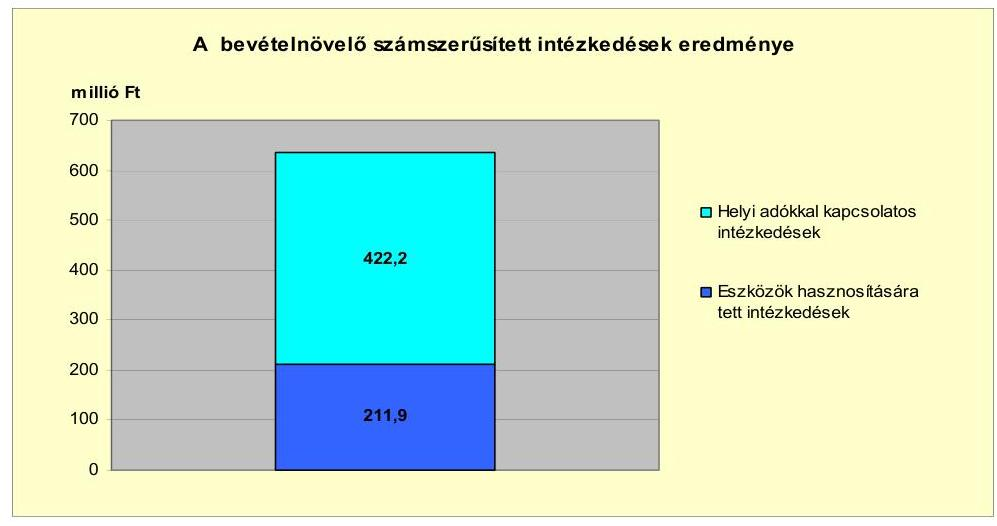

Az Önkormányzat kimutatása szerint a kiadáscsökkentő és bevételnövelő intézkedések együttesen az Önkormányzat pénzügyi egyensúlyát 2007-2010 között 386,4 millió Ft-tal, 2011-ben 456,2 millió Ft-tal javították. A központi támogatások és a helyben maradó szja 2007-2010 között összesen 465,1 millió Ft-tal növekedett. A központi támogatások és a helyben maradó szja a 2007. évhez viszonyítva együttesen a 2008. évben 343,8 millió Ft-tal nőtt, 2009-ben 179,5 millió Ft-tal csökkent, 2010-ben 300,8 millió Ft-tal növekedett, 2011-ben várhatóan 367,0 millió Ft-tal csökken.

---

# 5. Az ÁSZ Által a korábbi években a pénzügyi egyensúly javítására tett szabályszerűségi és célszerűségi javaslatok hasznosulása

Az Önkormányzat gazdálkodási rendszerének 2009. évi ellenőrzése során az ÁSZ egy - a pénzügyi helyzet javításával összefüggő - szabályszerűségi javaslatot tett. A javaslat a költségvetési rendelettervezetek költségvetési bevételi és kiadási főösszegei finanszírozási célú bevételek, illetve kiadások nélküli tervezésére vonatkozott. A javaslatot az intézkedési tervben, a felelős és a határidő meghatározásával szerepeltették. A javaslatban foglaltakat az intézkedési terv szerinti határidőben megvalósították.

Budapest, 2012. április ""

Melléklet: $\quad 7 \mathrm{db}$
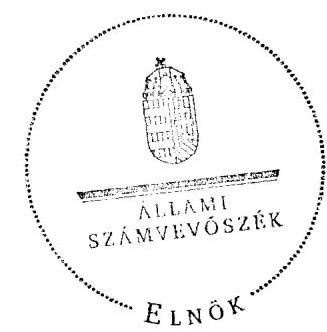

Domokos László

---

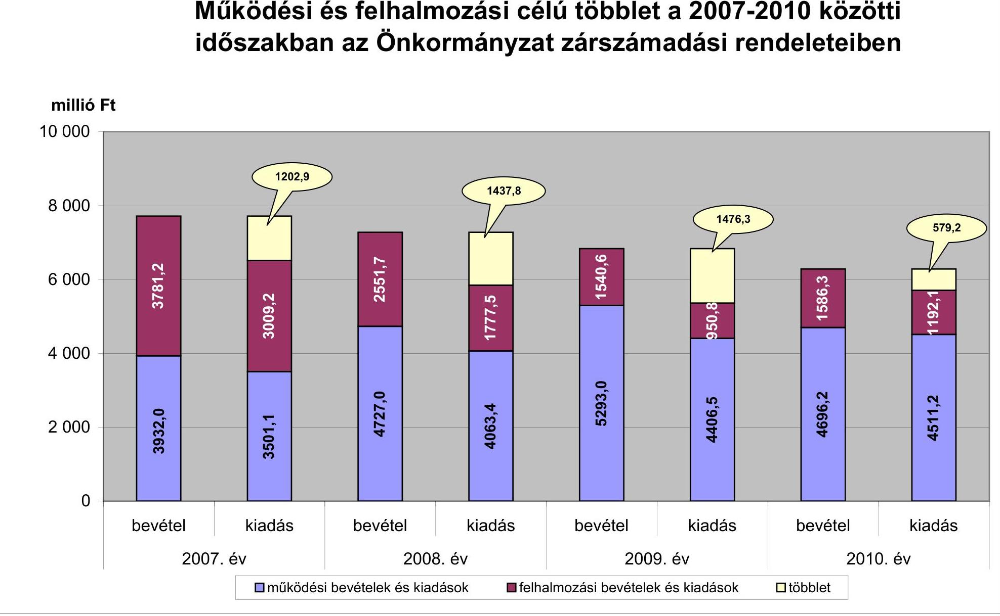

# Működési és felhalmozási célú többlet a 2007-2010 közötti időszakban az Önkormányzat zárszámadási rendeleteiben

|  év | 2007. év | 2008. év | 2009. év | 2010. év  |
| --- | --- | --- | --- | --- |
|  működési bevételek és kiadások | felhalmozási bevételek és kiadások | többlet |  |   |

---

Az Önkormányzat bevételei és kiadásai, valamint adósságszolgálata 2007-2010 között

|  1. FOLYÓ KÖLTSÉGVETÉS | 2007. év | 2008. év | 2009. év | 2010. év  |
| --- | --- | --- | --- | --- |
|  1.1.1. Saját működési bevételek | 2239,4 | 2530,1 | 2567,5 | 1393,7  |
|  1.1.2. Költségvetési támogatás | 923,2 | 1844,7 | 1747,2 | 1093,9  |
|  1.1.3. Engedélyezett bevételek | 948,6 | 380,6 | 292,8 | 466,3  |
|  1.1.4. Állambudzséból kapott támogatások | 256,6 | 363,2 | 364,9 | 211,1  |
|  1.1.5. EU-tól és külföldről kapott bevételek | 0,0 | 4,2 | 2,2 | 1,1  |
|  1.1.6. Állambudzsén kívülről kapott bevételek | 10,0 | 7,0 | 4,4 | 11,9  |
|  1.1.7. Előző évi pénzmaradvány átvétel | 1,3 | 34,8 | 9,5 | 0,4  |
|  1.1. Folyó bevételek $=1.1 .1 .+1.1 .2 .+1.1 .3 .+1.1 .4 .+1.1 .5 .+1.1 .6 .+1.1 .7$. | 4379,6 | 5164,6 | 4988,5 | 3978,4  |
|  1.2.1. Működési kiadások kamatkiadások nélkül | 3206,7 | 3663,4 | 4080,3 | 4146,8  |
|  1.2.2. Állambudzséba átadott pénzeszközök | 6,6 | 9,5 | 8,7 | 21,5  |
|  1.2.3.1. vállalkozásoknak | 34,4 | 409,7 | 94,4 | 118,2  |
|  1.2.3.2. EU-nak, illetve külföldre | 0,0 | 0,0 | 0,0 | 0,0  |
|  1.2.3.3. magánszemélyeknek | 172,4 | 172,5 | 193,0 | 196,9  |
|  1.2.3.4. nonprofit szervezeteknek | 64,3 | 55,0 | 28,5 | 27,1  |
|  1.2.3. Transzferkiadások ( $=1.2 .3 .1+1.2 .3 .2+1.2 .3 .3+1.2 .3 .4)$ | 271,1 | 637,2 | 315,9 | 342,2  |
|  1.2.4 Kamatkiadások | 8,3 | 4,8 | 1,2 | 5,0  |
|  1.2.5. Előző évi pénzmaradvány átadás | 0,0 | 46,0 | 0,2 | 0,4  |
|  1.2. Folyó kiadások $=1.2 .1 .+1.2 .2 .+1.2 .3 .+1.2 .4 .+1.2 .5$. | 3492,6 | 4360,9 | 4406,3 | 4515,8  |
|  1.3. Folyó költségvetés egyenlege MŰKÖDÉSI JÖVEDELEM (1.1. - 1.2.) | 887,0 | 803,7 | 582,2 | $-537,4$  |
|  2. FELHALMOZÁSI KÖLTSÉGVETÉS |  |  |  |   |
|  2.1.1. Saját tőkebevételek | 23,7 | 115,6 | 15,8 | 45,1  |
|  2.1.2. Állambudzséból kapott támogatások | 1723,3 | 458,9 | 242,0 | 550,0  |
|  2.1.3. EU-tól és külföldről kapott támogatások | 0,0 | 0,0 | 0,0 | 0,0  |
|  2.1.4. Állambudzsén kívülről kapott támogatások | 627,6 | 179,1 | 18,7 | 32,8  |
|  2.1. Felhalmozási bevételek ( $=2.1 .1 .+2.1 .2+2.1 .3+2.1 .4$.) | 2374,6 | 753,7 | 276,5 | 627,8  |
|  2.2.1. Saját beruházási kiadás áfával | 2748,8 | 1166,3 | 528,2 | 858,4  |
|  2.2.2. Saját felújítási kiadás áfával | 163,2 | 235,5 | 250,8 | 207,9  |
|  2.2.3. Állambudzséba átadott pénzeszköz | 7,0 | 17,7 | 17,0 | 52,5  |
|  2.2.4. EU-nak és külföldnek adott pénzeszközök | 0,0 | 0,0 | 0,0 | 0,0  |
|  2.2.5. Állambudzsén kívülre adott pénzeszközök | 18,4 | 10,6 | 140,7 | 54,0  |
|  2.2.6. Befektetési célú részesedések vásárlása | 20,1 | 4,2 | 0,0 | 13,0  |
|  2.2. Felhalmozási kiadások ( $=2.2 .1 .+2.2 .2 .+2.2 .3 .+2.2 .4 .+2.2 .5 .+2.2 .6$.) | 2957,5 | 1434,2 | 936,6 | 1185,8  |
|  2.3. Felhalmozási költségvetés egyenlege (2.1. - 2.2.) | $-582,8$ | $-680,6$ | $-660,1$ | $-558,0$  |
|  3. Finanszírozási műveletek nélküli (GFS) pozíció(1.3.+2.3.) | 304,2 | 123,1 | $-77,8$ | $-1095,5$  |
|  4. Finanszírozási műveletek | 0,0 | 0,0 | 0,0 | 0,0  |
|  4.1. Hitelfelvétel | 0,0 | 27,0 | 167,9 | 213,1  |
|  4.2. Hitelförlesztés | 60,2 | 45,7 | 14,4 | 1,6  |
|  4.3. Forgatási és befektetési célú értékpapírok kibocsátása | 0,0 | 0,0 | 0,0 | 0,0  |
|  4.4. Forgatási és befektetési célú értékpapírok beváltása | 0,0 | 0,0 | 0,0 | 0,0  |
|  4.5. Forgatási és befektetési célú értékpapírok értékesítése | 0,0 | 81,0 | 0,0 | 0,0  |
|  4.6. Forgatási és befektetési célú értékpapírok vásárlása | 0,0 | 0,0 | 0,0 | 0,0  |
|  4.7. Egyéb finanszírozási bevételek (függő, átfutó, kiegyenlítő) | 7,7 | 7,3 | 7,2 | $-105,4$  |
|  4.8. Egyéb finanszírozási kiadások (függő, átfutó, kiegyenlítő) | 9,2 | 5,0 | 15,2 | 1,3  |
|  4.9.Finanszírozási műveletek egyenlege (4.1. - 4.2.+4.3.-4.4+4.5.-4.6.+4.7.-4.8.) | $-61,7$ | 65,3 | 145,5 | 104,7  |
|  5. Tárgyévi pénzügyi pozíció (1.3.+ 2.3.+4.9.) | 242,5 | 188,4 | 67,7 | $-990,8$  |
|  6. Nettó működési jövedelem =működési jövedelem (1.3.) - tőketörlesztés (3.2+4.4) | 826,8 | 758,0 | 567,8 |


 | $-539,0$  |
|  TÁJÉKOZTATÓ ADATOK |  |  |  |   |
|  Összes kötelezettség | 782,6 | 329,6 | 383,6 | 2280,1  |
|  ebből rövid lejáratú | 770,1 | 305,3 | 193,4 | 1878,4  |
|  Összes szállítói kötelezettség | 241,2 | 40,1 | 106,8 | 1790,9  |
|  ebből lejárt (tanúsítványból) | 109,7 | 27,0 | 7,4 | 542,1  |
|  Pénz és tőkepiaci kötelezettség (adósság) | 57,3 | 38,5 | 192,0 | 403,5  |
|  ebből rövid lejáratú | 44,8 | 14,3 | 1,8 | 1,8  |
|  PPP szerződéses állomány jelenértéken (tanúsítványból) | 0,0 | 0,0 | 0,0 | 0,0  |
|  ebből lejárt szolgáltatási díj miatti kötelezettség | 0,0 | 0,0 | 0,0 | 0,0  |
|  Folyószámlabitel napi átlagos állománya (tanúsítványból) | 0,0 | 0,0 | 0,0 | 0,0  |
|  Likvidhitel napi átlagos állománya (tanúsítványból) | 0,0 | 0,0 | 0,0 | 0,0  |
|  Munkabérhitel napi átlagos állománya (tanúsítványból) | 0,0 | 0,0 | 0,0 | 0,0  |
|  Kezesség és garanciavállalások (tanúsítványból) | 0,0 | 0,0 | 0,0 | 0,0  |
|  Jogerős bírósági ítéletekből adódó kötelezettségek (tanúsítványból) | 0,0 | 0,0 | 0,0 | 0,0  |
|  Finanszírozásba bevonható eszközök: | 1337,5 | 1418,1 | 1485,0 | 498,9  |
|  Tartós hitelviszonyt megtestesítő értékpapírok év végi állománya | 131,3 | 21,6 | 21,6 | 25,5  |
|  Hosszú lejáratú bankbetétek év végi állománya | 0,0 | 0,0 | 0,0 | 0,0  |
|  Értékpapírok év végi állománya | 0,0 | 0,0 | 0,0 | 0,0  |
|  Pénzeszközök (idegen pénzeszközök nélkül) év végi állománya | 1206,0 | 1396,5 | 1464,2 | 473,3  |

---

|   |  |  |  |  |  |  |  |  |  |  |  |  |  |  |  |  |  |  |  |  |  |  |  |  |  |  |  |  |  |  |  |  |  |  |  |  |  |  |  |  |  |  |  |  |  |  |  |  |  |  |   |
| --- | --- | --- | --- | --- | --- | --- | --- | --- | --- | --- | --- | --- | --- | --- | --- | --- | --- | --- | --- | --- | --- | --- | --- | --- | --- | --- | --- | --- | --- | --- | --- | --- | --- | --- | --- | --- | --- | --- | --- | --- | --- | --- | --- | --- | --- | --- | --- | --- | --- | --- |   |
|   |  |  |  |  |  |  |  |  |  |  |  |  |  |  |  |  |  |  |  |  |  |  |  |  |  |  |  |  |  |  |  |  |  |  |  |  |  |  |  |  |  |  |  |  |  |  |  |  |  |   |
|   |  |  |  |  |  |  |  |  |  |  |  |  |  |  |  |  |  |  |  |  |  |  |  |  |  |  |  |  |  |  |  |  |  |  |  |  |  |  |  |  |  |  |  |  |  |  |  |  |  |   |
|   |  |  |  |  |  |  |  |  |  |  |  |  |  |  |  |  |  |  |  |  |  |  |  |  |  |  |  |  |  |  |  |  |  |  |  |  |  |  |  |  |  |  |  |  |  |  |  |  |  |   |
|   |  |  |  |  |  |  |  |  |  |  |  |  |  |  |  |  |  |  |  |  |  |  |  |  |  |  |  |  |  |  |  |  |  |  |  |  |  |  |  |  |  |  |  |  |  |  |  |  |  |   |
|   |  |  |  |  |  |  |  |  |  |  |  |  |  |  |  |  |  |  |  |  |  |  |  |  |  |  |  |  |  |  |  |  |  |  |  |  |  |  |  |  |  |  |  |  |  |  |  |  |  |   |
|   |  |  |  |  |  |  |  |  |  |  |  |  |  |  |  |  |  |  |  |  |  |  |  |  |  |  |  |  |  |  |  |  |  |  |  |  |  |  |  |  |  |  |  |  |  |  |  |  |  |   |
|   |  |  |  |  |  |  |  |  |  |  |  |  |  |  |  |  |  |  |  |  |  |  |  |  |  |  |  |  |  |  |  |  |  |  |  |  |  |  |  |  |  |  |  |  |  |  |  |  |  |   |
|   |  |  |  |  |  |  |  |  |  |  |  |  |  |  |  |  |  |  |  |  |  |  |  |  |  |  |  |  |  |  |  |  |  |  |  |  |  |  |  |  |  |  |  |  |  |  |  |  |  |   |
|   |  |  |  |  |  |  |  |  |  |  |  |  |  |  |  |  |  |  |  |  |  |  |  |  |  |  |  |  |  |  |  |  |  |  |  |  |  |  |  |  |  |  |  |  |  |  |  |  |  |   |
|   |  |  |  |  |  |  |  |  |  |  |  |  |  |  |  |  |  |  |  |  |  |  |  |  |  |  |  |  |  |  |  |  |  |  |  |  |  |  |  |  |  |  |  |  |  |  |  |  |  |   |
|   |  |  |  |  |  |  |  |  |  |  |  |  |  |  |  |  |  |  |  |  |  |  |

  |  |  |  |  |  |  |  |  |  |  |  |  |  |  |  |  |  |  |  |  |  |  |  |  |  |  |   |
|   |  |  |  |  |  |  |  |  |  |  |  |  |  |  |  |  |  |  |  |  |  |  |  |  |  |  |  |  |  |  |  |  |  |  |  |  |  |  |  |  |  |  |  |  |  |  |  |  |  |   |
|   |  |  |  |  |  |  |  |  |  |  |  |  |  |  |  |  |  |  |  |  |  |  |  |  |  |  |  |  |  |  |  |  |  |  |  |  |  |  |  |  |  |  |  |  |  |  |  |  |  |   |
|   |  |  |  |  |  |  |  |  |  |  |  |  |  |  |  |  |  |  |  |  |  |  |  |  |  |  |  |  |  |  |  |  |  |  |  |  |  |  |  |  |  |  |  |  |  |  |  |  |  |   |
|   |  |  |  |  |  |  |  |  |  |  |  |  |  |  |  |  |  |  |  |  |  |  |  |  |  |  |  |  |  |  |  |  |  |  |  |  |  |  |  |  |  |  |  |  |  |  |  |  |  |   |
|   |  |  |  |  |  |  |  |  |  |  |  |  |  |  |  |  |  |  |  |  |  |  |  |  |  |  |  |  |  |  |  |  |  |  |  |  |  |  |  |  |  |  |  |  |  |  |  |  |  |   |
|   |  |  |  |  |  |  |  |  |  |  |  |  |  |  |  |  |  |  |  |  |  |  |  |  |  |  |  |  |  |  |  |  |  |  |  |  |  |  |  |  |  |  |  |  |  |  |  |  |  |   |
|   |  |  |  |  |  |  |  |  |  |  |  |  |  |  |  |  |  |  |  |  |  |  |  |  |  |  |  |  |  |  |  |  |  |  |  |  |  |  |  |  |  |  |  |  |  |  |  |  |  |   |
|   |  |  |  |  |  |  |  |  |  |  |  |  |  |  |  |  |  |  |  |  |  |  |  |  |  |  |  |  |  |  |  |  |  |  |  |  |  |  |  |  |  |  |  |  |  |  |  |  |  |   |
|   |  |  |  |  |  |  |  |  |  |  |  |  |  |  |  |  |  |  |  |  |  |  |  |  |  |  |  |  |  |  |  |  |  |  |  |  |  |  |  |  |  |  |  |  |  |  |  |  |  |   |
|   |  |  |  |  |  |  |  |  |  |  |  |  |  |  |  |  |  |  |  |  |  |  |  |  |  |  |  |  |  |  |  |  |  |  |  |  |  |  |  |  |  |  |  |  |  |  |  |  |  |   |
|   |  |  |  |  |  |  |  |  |  |  |  |  |  |  |  |  |  |  |  |  |  |  |  |  |  |  |  |  |  |  |  |  |  |  |  |  |  |  |  |  |  |  |  |  |  |  |  |  |  |   |
|   |  |  |  |  |  |  |  |  |  |  |  |  |  |  |  |  |  |  |  |  |  |  |  |  |  |  |  |  |  |  |  |  |  |  |  |  |  |  |  |  |  |  |  |  |  |  |  |  |  |   |
|   |  |  |  |  |  |  |  |  |  |  |  |  |  |  |  |  |  |  |  |  |  |  |  |  |  |  |  |  |  |  |  |  |  |  |  |  |  |  |  |  |  |  |  |  |  |  |  |  |  |   |
|   |  |  |  |  |  |  |  |  |  |  |  |  |  |  |  |  |  |  |  |  |  |  |  |  |  |  |  |  |  |  |  |  |  |  |  |  |  |  |  |  |  |  |  |  |  |  |  |  |  |   |
|   |  |  |  |  |  |  |  |  |  |  |  |  |  |  |  |  |  |  |  |  |  |  |  |  |  |  |  |  |  |  |  |  |  |  |  |  |  |  |  |  |  |  |  |  |  |  |  |  |  |   |
|   |  |  |  |  |  |  |  |  |  |  |  |  |  |  |  |  |  |  |  |  |  |  |  |  |  |  |  |  |  |  |  |  |  |  |  |  |  |  |  |  |  |  |  |  |  |  |  |  |  |   |

  |  |  |  |  |  |  |   |
|   |  |  |  |  |  |  |  |  |  |  |  |  |  |  |  |  |  |  |  |  |  |  |  |  |  |  |  |  |  |  |  |  |  |  |  |  |  |  |  |  |  |  |  |  |  |  |  |  |  |   |
|   |  |  |  |  |  |  |  |  |  |  |  |  |  |  |  |  |  |  |  |  |  |  |  |  |  |  |  |  |  |  |  |  |  |  |  |  |  |  |  |  |  |  |  |  |  |  |  |  |  |   |
|   |  |  |  |  |  |  |  |  |  |  |  |  |  |  |  |  |  |  |  |  |  |  |  |  |  |  |  |  |  |  |  |  |  |  |  |  |  |  |  |  |  |  |  |  |  |  |  |  |  |   |
|   |  |  |  |  |  |  |  |  |  |  |  |  |  |  |  |  |  |  |  |  |  |  |  |  |  |  |  |  |  |  |  |  |  |  |  |  |  |  |  |  |  |  |  |  |  |  |  |  |  |   |
|   |  |  |  |  |  |  |  |  |  |  |  |  |  |  |  |  |  |  |  |  |  |  |  |  |  |  |  |  |  |  |  |  |  |  |  |  |  |  |  |  |  |  |  |  |  |  |  |  |  |   |
|   |  |  |  |  |  |  |  |  |  |  |  |  |  |  |  |  |  |  |  |  |  |  |  |  |  |  |  |  |  |  |  |  |  |  |  |  |  |  |  |  |  |  |  |  |  |  |  |  |  |   |
|   |  |  |  |  |  |  |  |  |  |  |  |  |  |  |  |  |  |  |  |  |  |  |  |  |  |  |  |  |  |  |  |  |  |  |  |  |  |  |  |  |  |  |  |  |  |  |  |  |  |  |   |
|   |  |  |  |  |  |  |  |  |  |  |  |  |  |  |  |  |  |  |  |  |  |  |  |  |  |  |  |  |  |  |  |  |  |  |  |  |  |  |  |  |  |  |  |  |  |  |  |  |  |  |   |
|   |  |  |  |  |  |  |  |  |  |  |  |  |  |  |  |  |  |  |  |  |  |  |  |  |  |  |  |  |  |  |  |  |  |  |  |  |  |  |  |  |  |  |  |  |  |  |  |  |  |  |   |
|   |  |  |  |  |  |  |  |  |  |  |  |  |  |  |  |  |  |  |  |  |  |  |  |  |  |  |  |  |  |  |  |  |  |  |  |  |  |  |  |  |  |  |  |  |  |  |  |  |  |  |   |
|   |  |  |  |  |  |  |  |  |  |  |  |  |  |  |  |  |  |  |  |  |  |  |  |  |  |  |  |  |  |  |  |  |  |  |  |  |  |  |  |  |  |  |  |  |  |  |  |  |  |  |   |
|   |  |  |  |  |  |  |  |  |  |  |  |  |  |  |  |  |  |  |  |  |  |  |  |  |  |  |  |  |  |  |  |  |  |  |  |  |  |  |  |  |  |  |  |  |  |  |  |  |  |  |   |
|   |  |  |  |  |  |  |  |  |  |  |  |  |  |  |  |  |  |  |  |  |  |  |  |  |  |  |  |  |  |  |  |  |  |  |  |  |  |  |  |  |  |  |  |  |  |  |  |  |  |  |   |
|   |  |  |  |  |  |  |  |  |  |  |  |  |  |  |  |  |  |  |  |  |  |  |  |  |  |  |  |  |  |  |  |  |  |  |  |  |  |  |  |  |  |  |  |  |  |  |  |  |  |  |   |
|   |  |  |  |  |  |  |  |  |  |  |  |  |  |  |  |  |  |  |  |  |  |  |  |  |  |  |  |  |  |  |  |  |  |  |  |  |  |  |  |  |  |  |  |  |  |  |  |  |  |  |   |
|   |  |

  |  |  |  |  |  |  |  |  |  |  |  |  |  |  |  |  |  |  |  |  |  |  |  |  |  |  |  |  |  |  |  |  |  |  |  |  |  |  |  |  |  |  |  |  |  |  |  |  |   |
|   |  |  |  |  |  |  |  |  |  |  |  |  |  |  |  |  |  |  |  |  |  |  |  |  |  |  |  |  |  |  |  |  |  |  |  |  |  |  |  |  |  |  |  |  |  |  |  |  |  |  |   |
|   |  |  |  |  |  |  |  |  |  |  |  |  |  |  |  |  |  |  |  |  |  |  |  |  |  |  |  |  |  |  |  |  |  |  |  |  |  |  |  |  |  |  |  |  |  |  |  |  |  |  |   |
|   |  |  |  |  |  |  |  |  |  |  |  |  |  |  |  |  |  |  |  |  |  |  |  |  |  |  |  |  |  |  |  |  |  |  |  |  |  |  |  |  |  |  |  |  |  |  |  |  |  |  |   |
|   |  |  |  |  |  |  |  |  |  |  |  |  |  |  |  |  |  |  |  |  |  |  |  |  |  |  |  |  |  |  |  |  |  |  |  |  |  |  |  |  |  |  |  |  |  |  |  |  |  |  |   |
|   |  |  |  |  |  |  |  |  |  |  |  |  |  |  |  |  |  |  |  |  |  |  |  |  |  |  |  |  |  |  |  |  |  |  |  |  |  |  |  |  |  |  |  |  |  |  |  |  |  |  |   |
|   |  |  |  |  |  |  |  |  |  |  |  |  |  |  |  |  |  |  |  |  |  |  |  |  |  |  |  |  |  |  |  |  |  |  |  |  |  |  |  |  |  |  |  |  |  |  |  |  |  |  |   |
|   |  |  |  |  |  |  |  |  |  |  |  |  |  |  |  |  |  |  |  |  |  |  |  |  |  |  |  |  |  |  |  |  |  |  |  |  |  |  |  |  |  |  |  |  |  |  |  |  |  |  |   |
|   |  |  |  |  |  |  |  |  |  |  |  |  |  |  |  |  |  |  |  |  |  |  |  |  |  |  |  |  |  |  |  |  |  |  |  |  |  |  |  |  |  |  |  |  |  |  |  |  |  |  |  |   |
|   |  |  |  |  |  |  |  |  |  |  |  |  |  |  |  |  |  |  |  |  |  |  |  |  |  |  |  |  |  |  |  |  |  |  |  |  |  |  |  |  |  |  |  |  |  |  |  |  |  |  |  |   |
|   |  |  |  |  |  |  |  |  |  |  |  |  |  |  |  |  |  |  |  |  |  |  |  |  |  |  |  |  |  |  |  |  |  |  |  |  |  |  |  |  |  |  |  |  |  |  |  |  |  |  |  |   |
|   |  |  |  |  |  |  |  |  |  |  |  |  |  |  |  |  |  |  |  |  |  |  |  |  |  |  |  |  |  |  |  |  |  |  |  |  |  |  |  |  |  |  |  |  |  |  |  |  |  |  |  |   |
|   |  |  |  |  |  |  |  |  |  |  |  |  |  |  |  |  |  |  |  |  |  |  |  |  |  |  |  |  |  |  |  |  |  |  |  |  |  |  |  |  |  |  |  |  |  |  |  |  |  |  |  |   |
|   |  |  |  |  |  |  |  |  |  |  |  |  |  |  |  |  |  |  |  |  |  |  |  |  |  |  |  |  |  |  |  |  |  |  |  |  |  |  |  |  |  |  |  |  |  |  |  |  |  |  |  |   |
|   |  |  |  |  |  |  |  |  |  |  |  |  |  |  |  |  |  |  |  |  |  |  |  |  |  |  |  |  |  |  |  |  |  |  |  |  |  |  |  |  |  |  |  |  |  |  |  |  |  |  |  |   |
| 

  |  |  |  |  |  |  |  |  |  |  |  |  |  |  |  |  |  |  |  |  |  |  |  |  |  |  |  |  |  |  |  |  |  |  |  |  |  |  |  |  |  |  |  |  |  |  |  |  |  |  |  |   |
|   |  |  |  |  |  |  |  |  |  |  |  |  |  |  |  |  |  |  |  |  |  |  |  |  |  |  |  |  |  |  |  |  |  |  |  |  |  |  |  |  |  |  |  |  |  |  |  |  |  |  |  |   |
|   |  |  |  |  |  |  |  |  |  |  |  |  |  |  |  |  |  |  |  |  |  |  |  |  |  |  |  |  |  |  |  |  |  |  |  |  |  |  |  |  |  |  |  |  |  |  |  |  |  |  |  |   |
|   |  |  |  |  |  |  |  |  |  |  |  |  |  |  |  |  |  |  |  |  |  |  |  |  |  |  |  |  |  |  |  |  |  |  |  |  |  |  |  |  |  |  |  |  |  |  |  |  |  |  |  |   |
|   |  |  |  |  |  |  |  |  |  |  |  |  |  |  |  |  |  |  |  |  |  |  |  |  |  |  |  |  |  |  |  |  |  |  |  |  |  |  |  |  |  |  |  |  |  |  |  |  |  |  |  |   |
|   |  |  |  |  |  |  |  |  |  |  |  |  |  |  |  |  |  |  |  |  |  |  |  |  |  |  |  |  |  |  |  |  |  |  |  |  |  |  |  |  |  |  |  |  |  |  |  |  |  |  |  |   |
|   |  |  |  |  |  |  |  |  |  |  |  |  |  |  |  |  |  |  |  |  |  |  |  |  |  |  |  |  |  |  |  |  |  |  |  |  |  |  |  |  |  |  |  |  |  |  |  |  |  |  |  |   |
|   |  |  |  |  |  |  |  |  |  |  |  |  |  |  |  |  |  |  |  |  |  |  |  |  |  |  |  |  |  |  |  |  |  |  |  |  |  |  |  |  |  |  |  |  |  |  |  |  |  |  |  |   |
|   |  |  |  |  |  |  |  |  |  |  |  |  |  |  |  |  |  |  |  |  |  |  |  |  |  |  |  |  |  |  |  |  |  |  |  |  |  |  |  |  |  |  |  |  |  |  |  |  |  |  |  |   |
|   |  |  |  |  |  |  |  |  |  |  |  |  |  |  |  |  |  |  |  |  |  |  |  |  |  |  |  |  |  |  |  |  |  |  |  |  |  |  |  |  |  |  |  |  |  |  |  |  |  |  |  |   |
|   |  |  |  |  |  |  |  |  |  |  |  |  |  |  |  |  |  |  |  |  |  |  |  |  |  |  |  |  |  |  |  |  |  |  |  |  |  |  |  |  |  |  |  |  |  |  |  |  |  |  |  |   |
|   |  |  |  |  |  |  |  |  |  |  |  |  |  |  |  |  |  |  |  |  |  |  |  |  |  |  |  |  |  |  |  |  |  |  |  |  |  |  |  |  |  |  |  |  |  |  |  |  |  |  |  |   |
|   |  |  |  |  |  |  |  |  |  |  |  |  |  |  |  |  |  |  |  |  |  |  |  |  |  |  |  |  |  |  |  |  |  |  |  |  |  |  |  |  |  |  |  |  |  |  |  |  |  |  |  |  |   |
|   |  |  |  |  |  |  |  |  |  |  |  |  |  |  |  |  |  |  |  |  |  |  |  |  |  |  |  |  |  |  |  |  |  |  |  |  |  |  |  |  |  |  |  |  |  |  |  |  |  |  |  |  |  |   |
|   |  |  |

  |  |  |  |  |  |  |  |  |  |  |  |  |  |  |  |  |  |  |  |  |  |  |  |  |  |  |  |  |  |  |  |  |  |  |  |  |  |  |  |  |  |  |  |  |  |  |  |  |  |  |  |  |  |  |  |  |  |   |
|   |  |  |  |  |  |  |  |  |  |  |  |  |  |  |  |  |  |  |  |  |  |  |  |  |  |  |  |  |  |  |  |  |  |  |  |  |  |  |  |  |  |  |  |  |  |  |  |  |  |  |  |  |  |  |  |  |  |  |  |  |   |
|   |  |  |  |  |  |  |  |  |  |  |  |  |  |  |  |  |  |  |  |  |  |  |  |  |  |  |  |  |  |  |  |  |  |  |  |  |  |  |  |  |  |  |  |  |  |  |  |  |  |  |  |  |  |  |  |  |  |  |  |  |   |
|   |  |  |  |  |  |  |  |  |  |  |  |  |  |  |  |  |  |  |  |  |  |  |  |  |  |  |  |  |  |  |  |  |  |  |  |  |  |  |  |  |  |  |  |  |  |  |  |  |  |  |  |  |  |  |  |  |  |  |  |  |   |
|   |  |  |  |  |  |  |  |  |  |  |  |  |  |  |  |  |  |  |  |  |  |  |  |  |  |  |  |  |  |  |  |  |  |  |  |  |  |  |  |  |  |  |  |  |  |  |  |  |  |  |  |  |  |  |  |  |  |  |  |  |   |
|   |  |  |  |  |  |  |  |  |  |  |  |  |  |  |  |  |  |  |  |  |  |  |  |  |  |  |  |  |  |  |  |  |  |  |  |  |  |  |  |  |  |  |  |  |  |  |  |  |  |  |  |  |  |  |  |  |  |  |  |  |   |
|   |  |  |  |  |  |  |  |  |  |  |  |  |  |  |  |  |  |  |  |  |  |  |  |  |  |  |  |  |  |  |  |  |  |  |  |  |  |  |  |  |  |  |  |  |  |  |  |  |  |  |  |  |  |  |  |  |  |  |  |  |   |
|   |  |  |  |  |  |  |  |  |  |  |  |  |  |  |  |  |  |  |  |  |  |  |  |  |  |  |  |  |  |  |  |  |  |  |  |  |  |  |  |  |  |  |  |  |  |  |  |  |  |  |  |  |  |  |  |  |  |  |  |  |   |
|   |  |  |  |  |  |  |  |  |  |  |  |  |  |  |  |  |  |  |  |  |  |  |  |  |  |  |  |  |  |  |  |  |  |  |  |  |  |  |  |  |  |  |  |  |  |  |  |  |  |  |  |  |  |  |  |  |  |  |  |  |   |
|   |  |  |  |  |  |  |  |  |  |  |  |  |  |  |  |  |  |  |  |  |  |  |  |  |  |  |  |  |  |  |  |  |  |  |  |  |  |  |  |  |  |  |  |  |  |  |  |  |  |  |  |  |  |  |  |  |  |  |  |  |   |
|   |  |  |  |  |  |  |  |  |  |  |  |  |  |  |  |  |  |  |  |  |  |  |  |  |  |  |  |  |  |  |  |  |  |  |  |  |  |  |  |  |  |  |  |  |  |  |  |  |  |  |  |  |  |  |  |  |  |  |  |  |   |
|   |  |  |  |  |  |  |  |  |  |  |  |  |  |  |  |  |  |  |  |  |  |  |  |  |  |  |  |  |  |  |  |  |  |  |  |  |  |  |  |  |  |  |  |  |  |  |  |  |  |  |  |  |  |  |  |  |  |  |  |  |   |
|   |  |  |  |  |  |

  |  |  |  |  |  |  |  |  |  |  |  |  |  |  |  |  |  |  |  |  |  |  |  |  |  |  |  |  |  |  |  |  |  |  |  |  |  |  |  |  |  |  |  |  |  |  |  |  |  |  |  |  |  |  |  |  |  |  |  |  |  |  |  |  |  |  |  |  |  |  |  |  |  |  |  |  |  |  |  |  |  |  |  |  |  |  |  |  |  |  |  |  |  |  |  |  |  |  |  |  |  |  |  | 

---

|   |  |  |  |  |  |  |  |  |  |  |  |  |  |  |  |  |  |  |  |  |  |  |  |  |  |  |  |  |  |  |  |  |  |  |  |  |  |  |  |  |  |  |  |  |  |  |  |  |  |  |  |  |  |  |  |  |  |  |  |  |  |  |  |  |  |  |  |  |  |  |  |  |  |  |  |  |  |  |  |  |  |  |  |  |  |  |  |  |  |  |  |  |  |  |  |  |  |  |  |  |  |  | 

---

|   |  |  |  |  |  |  |  |  |  |  |  |  |  |  |  |  |  |  |  |  |  |  |  |  |  |  |  |  |  |  |  |  |  |  |  |  |  |  |  |  |  |  |  |  |  |  |  |  |  |  |  |  |  |  |  |  |  |  |  |  |  |  |  |  |  |  |  |  |  |  |  |  |  |  |  |  |  |  |  |  |  |  |  |  |  |  |  |  |  |  |  |  |  |  |  |  |  |  |  |  |  |  | 

---

## **Az Önkormányzat 2010. december 31-én folyamatban lévő fejlesztési feladataira 2010. december 31-ig teljesített kifizetések és azok forrásösszetétele**

|   |  |  |  |  |  |  |  |  |  |  |  |  |  |  |  |  |  |  |  |  |  |  |  |  |  |  |  |  |  |  |  |  |  |  |  |  |  |  |  |   |
| --- | --- | --- | --- | --- | --- | --- | --- | --- | --- | --- | --- | --- | --- | --- | --- | --- | --- | --- | --- | --- | --- | --- | --- | --- | --- | --- | --- | --- | --- | --- | --- | --- | --- | --- | --- | --- | --- | --- | --- | --- |
|   |  |  |  |  |  |  |  |  |  |  |  |  |  |  |  |  |  |  |  |  |  |  |  |  |  |  |  |  |  |  |  |  |  |  |  |  |  |  |  |   |
|   |  |  |  |  |  |  |  |  |  |  |  |  |  |  |  |  |  |  |  |  |  |  |  |  |  |  |  |  |  |  |  |  |  |  |  |  |  |  |  |   |
|   |  |  |  |  |  |  |  |  |  |  |  |  |  |  |  |  |  |  |  |  |  |  |  |  |  |  |  |  |  |  |  |  |  |  |  |  |  |  |  |   |
|   |  |  |  |  |  |  |  |  |  |  |  |  |  |  |  |  |  |  |  |  |  |  |  |  |  |  |  |  |  |  |  |  |  |  |  |  |  |  |  |   |
|   |  |  |  |  |  |  |  |  |  |  |  |  |  |  |  |  |  |  |  |  |  |  |  |  |  |  |  |  |  |  |  |  |  |  |  |  |  |  |  |   |
|   |  |  |  |  |  |  |  |  |  |  |  |  |  |  |  |  |  |  |  |  |  |  |  |  |  |  |  |  |  |  |  |  |  |  |  |  |  |  |  |   |
|   |  |  |  |  |  |  |  |  |  |  |  |  |  |  |  |  |  |  |  |  |  |  |  |  |  |  |  |  |  |  |  |  |  |  |  |  |  |  |  |   |
|   |  |  |  |  |  |  |  |  |  |  |  |  |  |  |  |  |  |  |  |  |  |  |  |  |  |  |  |  |  |  |  |  |  |  |  |  |  |  |  |   |
|   |  |  |  |  |  |  |  |  |  |  |  |  |  |  |  |  |  |  |  |  |  |  |  |  |  |  |  |  |  |  |  |  |  |  |  |  |  |  |  |   |
|   |  |  |  |  |  |  |  |  |  |  |  |  |  |  |  |  |  |  |  |  |  |  |  |  |  |  |  | 

 |  |  |  |  |  |  |  |  |  |  |  |   |
|   |  |  |  |  |  |  |  |  |  |  |  |  |  |  |  |  |  |  |  |  |  |  |  |  |  |  |  |  |  |  |  |  |  |  |  |  |  |  |  |   |
|   |  |  |  |  |  |  |  |  |  |  |  |  |  |  |  |  |  |  |  |  |  |  |  |  |  |  |  |  |  |  |  |  |  |  |  |  |  |  |  |   |
|   |  |  |  |  |  |  |  |  |  |  |  |  |  |  |  |  |  |  |  |  |  |  |  |  |  |  |  |  |  |  |  |  |  |  |  |  |  |  |  |   |
|   |  |  |  |  |  |  |  |  |  |  |  |  |  |  |  |  |  |  |  |  |  |  |  |  |  |  |  |  |  |  |  |  |  |  |  |  |  |  |  |   |
|   |  |  |  |  |  |  |  |  |  |  |  |  |  |  |  |  |  |  |  |  |  |  |  |  |  |  |  |  |  |  |  |  |  |  |  |  |  |  |  |   |
|   |  |  |  |  |  |  |  |  |  |  |  |  |  |  |  |  |  |  |  |  |  |  |  |  |  |  |  |  |  |  |  |  |  |  |  |  |  |  |  |   |
|   |  |  |  |  |  |  |  |  |  |  |  |  |  |  |  |  |  |  |  |  |  |  |  |  |  |  |  |  |  |  |  |  |  |  |  |  |  |  |  |   |
|   |  |  |  |  |  |  |  |  |  |  |  |  |  |  |  |  |  |  |  |  |  |  |  |  |  |  |  |  |  |  |  |  |  |  |  |  |  |  |  |   |
|   |  |  |  |  |  |  |  |  |  |  |  |  |  |  |  |  |  |  |  |  |  |  |  |  |  |  |  |  |  |  |  |  |  |  |  |  |  |  |  |   |
|   |  |  |  |  |  |  |  |  |  |  |  |  |  |  |  |  |  |  |  |  |  |  |  |  |  |  |  |  |  |  |  |  |  |  |  |  |  |  |  |   |
|   |  |  |  |  |  |  |  |  |  |  |  |  |  |  |  |  |  |  |  |  |  |  |  |  |  |  |  |  |  |  |  |  |  |  |  |  |  |  |  |   |
|   |  |  |  |  |  |  |  |  |  |  |  |  |  |  |  |  |  |  |  |  |  |  |  |  |  |  |  |  |  |  |  |  |  |  |  |  |  |  |  |   |
|   |  |  |  |  |  |  |  |  |  |  |  |  |  |  |  |  |  |  |  |  |  |  |  |  |  |  |  |  |  |  |  |  |  |  |  |  |  |  |  |   |
|   |  |  |  |  |  |  |  |  |  |  |  |  |  |  |  |  |  |  |  |  |  |  |  |  |  |  |  |  |  |  |  |  |  |  |  |  |  |  |  |   |
|   |  |  |  |  |  |  |  |  |  |  |  |  |  |  |  |  |  |  |  |  |  |  |  |  |  |  |  |  |  |  |  |  |  |  |  |  |  |  |  |   |
|   |  |  |  |  |  |  |  |  |  |  |  |  |  |  |  |  |  |  |  |  |  |  |  |  |  |  |  |  |  |  |  |  |  |  |  |  |  |  |  |   |
|   |  |  |  |  |  |  |  |  |  |  |  |  |  |  |  |  |  |  |  |  |  |  |  |  |  |  |  |  |  |  |  |  |  |  |  |  |  |  |  |   |
|   |  |  |  |  |  |  |  |  |  |  |  |  |  |  |  |  |  |  |  |  |  |  |  |  |  |  |  |  |  |  |  |  |  |  |  |  |  |  |  |   |

 |  |  |  |  |  |  |  |  |  |   |
|   |  |  |  |  |  |  |  |  |  |  |  |  |  |  |  |  |  |  |  |  |  |  |  |  |  |  |  |  |  |  |  |  |  |  |  |  |  |  |  |   |
|   |  |  |  |  |  |  |  |  |  |  |  |  |  |  |  |  |  |  |  |  |  |  |  |  |  |  |  |  |  |  |  |  |  |  |  |  |  |  |  |   |
|   |  |  |  |  |  |  |  |  |

---

Hahner Vörös Önkormányzati

Az Önkormányzat 2010. december 31-én folyamatosan lévő fejlesztési feladatára 2010. december 31-én fennálló kötelezettségek és azok forrásfelhasználása

|  |   |   |   |   |   |   |   |   |   |   |   |   |   |   |   |   |   |   |   |   |   |   |   |   |   |   |   |   |   |   |   |   |   |   |   |   |   |   |   |   |   |   |   |   |   |   |   |   |   |   |   |   |   |   |   |   |   |   |   |   |   |   |   |   |   |   |   |   |   |   |   |   |   |   |   |   |   |   |   |   |   |   |   |   |   |   |   |   |   |   |   |   |   |   |   |   |   |   |   |   |  

---

### **Az Önkormányzat által beadott, elbírálás alatti pályázati forrásból megvalósítani tervezett fejlesztéseihez kapcsolódó kötelezettségvállalásai és azok forrásösszetétele**

|  Fejlesztési feladat (beruházás, felújítás) |  |  | Beruházás, felújítás |  |  | A teljes bekerülési kötség (terv) | A teljes bekerülési kötségtől eszközpótlásra tervezett összeg | 2010. dec. 31. ig teljesített kiadás | 2010. utánra vállalt kötelezettség (9+10+12+14+16+18 |  | 2010. december 31-e utáni kötelezettségvállalások forrásösszetétele |  |  |  |  |  |  |  |  |  |  |  |  |  |  | jogszabályban taglalt szakmai követelmény fejlesztése (igényszer)  |
| --- | --- | --- | --- | --- | --- | --- | --- | --- | --- | --- | --- | --- | --- | --- | --- | --- | --- | --- | --- | --- | --- | --- | --- |
|   | Megnevezése | Kösvényt-testületi hatályok száma | kezdete | tervezett befejezése |  |  |  |  |  |  |  |  |  |  |  |  |  |  |  |  |  |  |   |
|  1 | 2 | 3 | 4 | 5 | 6 | 7 | 8 | 9 | 10 | 11 | 12 | 13 | 14 | 15 | 16 | 17 | 18 | 19 | 20 |  |  |  |   |
|  1. Felújítások |  |  |  |  |  |  |  |  |  |  |  |  |  |  |  |  |  |  |  |  |  |  |   |
|  2. | Markovits Kálmán Városi Uszoda energiaköltség csökkentő projekt 233/2011.(IV.28) |  | 2012-06-11 2012-08-31 |  | 114,5 | 0,0 | 0,0 | 114,5 | 17,2 | A | 0,0 |  | 0,0 |  | 97,3 |  | 0,0 |  |  |  |  |  |   |
|  3. | Hatvan Város Önkormányzat helyi és térségi jelentőségű vízvédelmi rendszerének rekonstrukciója- Liszt Ferenc utca és környéke árvízvédelme |  |  |  |  |  |  |  |  |  |  |  |  |  |  |  |  |  |  |  |  |  |   |
|  4. | 10 millió Ft alatti felújítások |  |  |  |  |  |  |  |  |  |  |  |  |  |  |  |  |  |  |  |  |  |   |
|  5. | Felújítások összesen |  |  |  |  | 213,7 | 0,0 | 0,0 | 213,7 | 17,2 |  | 0,0 |  | 0,0 |  | 196,5 |  | 0,0 |  |  |  |  |   |
|  6. | Fejlesztések |  |  |  |  |  |  |  |  |  |  |  |  |  |  |  |  |  |  |  |  |  |   |
|   | Hatvan Város Önkormányzat helyi jelentőségű vízvédelmi rendszerének fejlesztése- Újhatvan belterületi csapadékvíz rendezése |  |  |  |  |  |  |  |  |  |  |  |  |  |  |  |  |  |  |  |  |  |   |
|  7. | Józseftéri szabadidősport létesítmények fejlesztésének, lehasználtásuk növelésének támogatása* – műlves 2012-01-01 2013-06-30 |  |  |  |  |  |  |  |  |  |  |  |  |  |  |  |  |  |  |  |  |  |   |
|  8. | Jégpálya létrehozása |  |  |  |  |  |  |  |  |  |  |  |  |  |  |  |  |  |  |  |  |  |   |
|  9. | 10 millió Ft alatti fejlesztések |  |  |  |  |  |  |  |  |  |  |  |  |  |  |  |  |  |  |  |  |  |   |
|  10. | Fejlesztések összesen: |  |  |  |  | 215,9 | 0,0 | 0,0 | 215,9 | 12,2 |  | 0,0 |  | 0,0 |  | 196,1 |  | 7,5 |  |  |  |  |   |
|   | Összesen |  |  |  |  | 429,6 | 0,0 | 0,0 | 429,6 | 29,4 |  | 0,0 |  | 0,0 | 0,0 | 392,7 |  | 7,5 |  |  |  |  |   |

*A= ha a forrás már rendelkezésre áll.

B= ha a forrás közbeszerzési eljárása folyamatban van.

C= ha a forrás közbeszerzési eljárása még nem indult el, a forrás nem áll rendelkezésre.

---

### **Az önkormányzati feladatok ellátásában résztvevő gazdasági társaságok**

|  Gazdasági társaság megnevezése | 2010. december 31-én | a gazdasági társaságnak szerződéses kötelezettségre, feladatellátási szerződésre alapozottan az Önkormányzat költségvetéséből  |
| --- | --- | --- |
|   | önkormányzat | önkormányzat gazdasági társaságának |
|   |  | díjazó szaldó szaldó  |
|   |  | 336,3  |
|   |  | 0,0  |
|   |  | 0,0  |
|   |  | 0,0  |
|   |  | 0,0  |
|   |  | 0,0  |
|   |  | 0,0  |
|   |  | 0,0  |
|   |  | 0,0  |
|   |  | 0,0  |
|   |  | 0,0  |
|   |  | 0,0  |
|   |  | 0,0  |
|   |  |

 0,0  |
|   |  | 0,0  |
|   |  | 0,0  |
|   |  | 0,0  |
|   |  | 0,0  |
|   |  | 0,0  |
|   |  | 0,0  |
|   |  | 0,0  |
|   |  | 0,0  |
|   |  | 0,0  |
|   |  | 0,0  |
|   |  | 0,0  |
|   |  | 0,0  |
|   |  | 0,0  |
|   |  | 0,0  |
|   |  | 0,0  |
|   |  | 0,0  |
|   |  | 0,0  |
|   |  | 0,0  |
|  

