# ÁLLAMI   SZÁMVEVŐSZÉK 

## JELENTÉS

a Hévíz Város Önkormányzata pénzügyi helyzetének ellenőrzéséről (43/4)

---

# Állami Számvevőszék 

Iktatószám: V-3132-018/2012.
Témaszám: 1015
Vizsgálat-azonosító szám: V0560163

## Az ellenőrzést felügyelte:

Dr. Varga Sándor
számvevő igazgató-helyettes
Az ellenőrzést vezette:
Renkó Zsuzsanna
számvevő tanácsos
Ellenőrzési csoportvezető:
Dér Lívia
számvevő tanácsos

## Az ellenőrzést végezték:

Groholy Andrásné Reichert Margit
Hangyál Márta
számvevő tanácsos
számvevő

---

# TARTALOMJEGYZÉK 

BEVEZETÉS ..... 7
I. ÖSSZEGZŐ MEGÁLLAPÍTÁSOK, KÖVETKEZTETÉSEK, JAVASLATOK ..... 11
II. RÉSZLETES MEGÁLLAPÍTÁSOK ..... 18

1. Az Önkormányzat kötelező és önként vállalt feladatai, a feladatellátás szervezeti keretei és annak változásai ..... 18
2. Az Önkormányzat pénzügyi egyensúlyi helyzetét befolyásoló tényezők ..... 23
2.1. A működési és a felhalmozási egyensúly változása ..... 25
2.2. Az Önkormányzat bevételeinek változása ..... 31
2.3. Az Önkormányzat működési és a felhalmozási célú kiadásainak változása ..... 33
3. Az Önkormányzat kötelezettségei ..... 35
3.1. Az Önkormányzat pénzintézeti kötelezettségeinek változása ..... 35
3.2. A szállítói kötelezettségek változása ..... 38
3.3. Egyéb kötelezettségek változása ..... 38
4. A pénzügyi egyensúly megteremtése érdekében hozott intézkedések eredménye ..... 41
5. Az ÁSZ által a korábbi években a pénzügyi egyensúly javítására tett szabályszerűségi és célszerűségi javaslatok hasznosulása ..... 44

---

# MELLÉKLETEK 

1. számú Működési és felhalmozási célú hiány/többlet 2007-2010 közötti időszakban az Önkormányzat zárszámadási rendeleteiben (1 oldal)
2. számú Az Önkormányzat bevételei és kiadásai, valamint adósságszolgálata 2007-2010 között (1 oldal)
3/a. számú Az Önkormányzat 2007-2010. években megvalósított, 2010. december 31-ig befejezett fejlesztései és azok forrásösszetétele (1 oldal)
3/b. számú Az Önkormányzat 2010. december 31-én folyamatban lévő fejlesztési feladataira 2010. december 31-ig teljesített kifizetések és azok forrásösszetétele (1 oldal)
3/c. számú Az Önkormányzat 2010. december 31-én folyamatban lévő fejlesztési feladataira 2010. december 31-én fennálló kötelezettségek és azok forrásösszetétele (1 oldal)
3/d. számú Az Önkormányzat által beadott, elbírálás alatti pályázati forrásból megvalósítani tervezett fejlesztéseihez kapcsolódó kötelezettségvállalásai és azok forrásösszetétele (1 oldal)
3. számú Az önkormányzati feladatok ellátásában résztvevő gazdasági társaságok (1 oldal)

---

# RÖVIDÍTÉSEK JEGYZÉKE 

## Törvények

Áht. 1
Áht. 2
Csődtv.
Gt.
Ket.
Ötv.
Számv. tv.
Ptk.

## Rendeletek

Ámr.
Áhsz.

## Szórövidítések

áfa
ÁSZ
Aquamarin Kft.
Bibó Gimnázium
DRV Zrt.
EU
GAMESZ
GDP
Gróf Festetics Múvelődési Központ
Hévízi TV Kft.
Illyés Gyula általános iskola
jegyző
Képviselő-testület
Óvoda
Önkormányzat
polgármester
Polgármesteri hivatal
PPP konstrukció
szja

Az államháztartásról szóló 1992. évi XXXVIII. törvény
Az államháztartásról szóló 2011. évi CXCV. törvény
a csődeljárásról és a felszámolási eljárásról szóló 1991. évi XLIX. törvény
a gazdasági társaságokról szóló 2006. évi IV. törvény 2004. évi CXL. törvény a közigazgatási hatósági eljárás és szolgáltatás általános szabályairól
a helyi önkormányzatokról szóló 1990. évi LXV. törvény a számvitelről szóló 2000. évi C. törvény
a Polgári Törvénykönyvről szóló 1959. évi IV. törvény

Az államháztartás működési rendjéről szóló 292/2009. (XII. 19.) Korm. rendelet

Az államháztartás szervezetei beszámolási és könyvvezetési kötelezettségének sajátosságairól szóló 249/2000. (XII. 24.) Korm. rendelet
általános forgalmi adó
Állami Számvevőszék
AQUAMARIN Szállodaipari Kft.
Bibó István Alternatív Gimnázium és Szakközépiskola
Dél-Dunántúli Regionális Vízmű Zrt.
Európai Unió
Hévíz Város Önkormányzat Gazdasági, Műszaki Ellátó Szervezet
Bruttó hazai termék
Gróf I. Festetics György Múvelődési Központ, Városi Könyvtár és Muzeális Gyűjtemény
Hévízi TV Nonprofit Kft.
Illyés Gyula Általános és Alapfokú Művészeti Iskola, Egységes Pedagógiai Szakszolgálatot Ellátó Intézmény
Hévíz Város Önkormányzatának jegyzője
Hévíz Város Képviselő-testülete
Brunszvik Teréz Napközi Otthonos Óvoda
Hévíz Város Önkormányzata
Hévíz Város Önkormányzatának polgármestere
Hévíz Város Önkormányzatának Polgármesteri hivatala Public Private Partnership (Partnerségi együttműködés közfeladatok ellátására a magánszektor bevonásával) személyi jövedelemadó

---

| $\mathrm{SzMSz}_{1}$ | Hévíz város Önkormányzata és Szervei Szervezeti és Működési Szabályzatáról szóló 3/2007. (III. 1.) számú rendelet |
| :--: | :--: |
| $\mathrm{SzMSz}_{2}$ | Az Önkormányzat 26/2011. (III. 30.) számú rendeletével jóváhagyott szervezeti és működési szabályzata |
| Szociális Integrált Intézmény | Teréz Anya Szociális Integrált Intézmény |
| Városközpont rehabilitációja | Dél-Dunántúli Regionális Operatív Program pályázattal megvalósított Városközpont rekonstrukció |

---

# ÉRTELMEZŐ SZÓTÁR 

| BUBOR | Budapesti Bankközi Forint Hitelkamatláb. Irányadó, refe-   rencia jellegű kamatláb. Mértékét az MNB naponta álla-   pítja meg a banki kamatok figyelembevételével. Közzété-   tele naponta történik. |
| :--: | :--: |
| CLF módszer | Az önkormányzatok költségvetése elemzésének eszköze. A   módszer következetesen elkülöníti a folyó és a felhalmo-   zási költségvetés bevételeit és kiadásait, azok költségvetési   egyenlegeit. Bizonyos mértékig a vállalati gazdálkodás   logikai elemeit érvényesíti az önkormányzatok pénzügyi,   jövedelmi helyzetének vizsgálata során. Az értékelés a   pénzügyi kapacitás fogalmát helyezi a középpontba. |
| használhatósági fok | Az eszközgazdálkodás vizsgálatának elemzése során   használt mutató. Számításakor a tárgyi eszköz könyv szer-   inti (nettó) értékét viszonyítják a tárgyi eszköz bruttó (be-   szerzési/létesítési) értékéhez. A %-ban kifejezett mutató   értéke annál kedvezőbb, minél közelebb áll a 100%-hoz.   Csökkenése az eszköz állagának romlására, avulására   utal, ami maga után vonja az üzemeltetési és fenntartási   költségek növekedését is. |
| kamatkockázat | A változó kamatozású forint-, vagy a devizahitelek futam-   ideje alatt a kamat emelkedése miatt fennálló kamatkocká-   zat, melynek növekedése miatt nő a hitel törlesztő rész-   lete. |
| kötelező közszolgáltatás | A helyi önkormányzati feladatkörbe tartozó, a köztiszta-   sággal és a településtisztasággal, valamint az élet- és va-   gyonbiztonsággal összefüggő egyes - közszolgáltatás út-   ján megvalósuló - közfeladatok ellátása, amelynek köte-   lező igénybevételét külön jogszabály (törvény, helyi ön-   kormányzati rendelet) határoz meg. |
| közfeladat | Állami, helyi, illetve kisebbségi önkormányzati feladat,   amelynek ellátásáról az államnak, illetve az önkormán-   zatoknak kell gondoskodni. A hatályos szabályozás sze-   rint közfeladatot törvény és önkormányzati rendelet álla-   píthat meg. Az önkormányzatok által ellátandó feladatok   keretszerű meghatározását az Ötv. tartalmazza. |
| önkormányzat többségi   tulajdonában lévő gaz-   dasági társaságok | Az önkormányzat a gazdasági társaságban a szavazatok   több mint ötven százalékával vagy a Ptk. 685/B. § (2)-(3)   bekezdéseiben rögzített meghatározó befolyással rendelkezik. A befolyással rendelkező akkor rendelkezik egy jogi   személyben meghatározó befolyással, ha annak tagja,   illetve részvényese és jogosult e jogi személy vezető tisztsé-   gviselői vagy felügyelőbizottsága tagjainak többségének   megválasztására, illetve visszahívására, vagy a jogi sze-   méllyel más tagjaival, illetve részvényeseivel kötött megál-   lapodás alapján egyedül rendelkezik a szavazatok több   mint ötven százalékával (Ptk. 685/B. § (2) bek.). A meghat-   ározó befolyás akkor is fennáll, ha a befolyással rendel- |

---

kező számára e jogosultságok közvetett módon (köztes vállalkozásain keresztül, a Ptk. 685/B § (3),(4) bek. szerint) biztosítottak.
A helyi önkormányzat és az önkormányzat irányítása alá tartozó költségvetési szerv többségi tulajdonában, illetve többségi befolyása alatt álló gazdálkodó szervezet esetében hitelfelvétel, kölcsönfelvétel, garancia- vagy kezességvállalás, tartozásátvállalás, tartozás-elengedés, értékpapír kibocsátás, vásárlás, pénzügyi lízing, tartós bérleti szerződés, ingyenes vagyonjuttatás (így különösen: ajándékozás, ingyenes engedményezés), vagy követelésvásárlás, követelésengedményezés végrehajtására vonatkozóan az Áht. 100/M. § (4) bekezdése alapján az önkormányzat rendelkezik döntési jogosultsággal.
pénzügyi kapacitás
pénzügyi kockázat
törlesztési kockázat

SNA

A pénzügyi kapacitás (financial capacity) az adósok hitelfelvételi képességének azon mértéke, ahol még anélkül tudják növelni az adósságot, hogy csökkenteniük kellene akár a jelenbeli, akár a jövőben esedékes kiadásaikat a fizetésképtelenség elkerülése érdekében. (Forrás: Az önkormányzati rendszer pénzügyi helyzete, ÁSZKUT tanulmány 2010.)
A működési kockázat egyik eleme. Megmutatkozhat a költségvetés nagyságrendjének, szerkezetének nem megalapozott módosításaiban, a bevételi és a kiadási előirányzatoktól lényegesen eltérő teljesítésekben, a nem megfelelő belső kontrollrendszer működésében, a tudatos károkozásokban, a biztosítások elmaradásában, a hibás fejlesztési döntésekben, a nem a terveknek megfelelő forrásfelhasználásokban. Jelentkezhet továbbá a bevételek és kiadások ütemkülönbsége miatt felvett folyószámla- és likvidhitelek költségvetési év végén fennálló egyenlege miatt, amely az önkormányzat költségvetésébe - akár tartósan - beépülő forráshiányt jelzi.
Annak a kockázata, hogy a megfelelő időben és mértékben a hitelt felvevőnél rendelkezésre állnak-e a pénzintézetek és egyéb szervek felé fennálló kötelezettségek visszafizetéséhez, a hitelek és kölcsönök törlesztéséhez szükséges pénzügyi források.
A törlesztési kockázatot növeli a kamat- és árfolyam növekedése, mivel ezekben az esetekben az adósságszolgálat nőhet. Törlesztési kockázatot okozhat a visszafizetésre tervezett forrás elérésének, teljesítésének bizonytalansága (pl. a visszafizetéshez tervezett tartalékolás elmaradt, a tervezettnél alacsonyabb a saját bevétel, a helyi adóból származó bevétel az adóalanyok, adóalapok csökkenése miatt nem teljesül).
System of National Account azaz a Nemzeti Számlák Rendszere, amely a gazdasági szektorok által létrehozott valamennyi terméket és szolgáltatást figyelembe veszi.

---

# JELENTÉS 

## Hévíz város Önkormányzata pénzügyi helyzetének ellenőrzéséről

## BEVEZETÉS

Az Állami Számvevőszék 2011. évtől érvényes stratégiája új irányt szabott a helyi önkormányzatok gazdálkodásának ellenőrzésében is. Az ÁSZ – küldetése és jövőképe szerint – szilárd szakmai alapokra támaszkodva értékteremtő ellenőrzéseivel és helyzetelemzéseivel az államháztartás egészében, így a helyi önkormányzati alrendszerben is elő kívánja segíteni a közpénzek és a közvagyon szabályos, gazdaságos, hatékony és eredményes felhasználását. E folyamat részeként – az államháztartási hiány alakulásának összetevőire is figyelemmel – végezzük az önkormányzati alrendszer pénzügyi helyzetelemzését.

Az államháztartás helyi szintjén a 304 városnak${ }^{1}$ az általuk ellátott közszolgáltatások volumenére is tekintettel a közfeladatok ellátásában kiemelt szerepe van. E települések 2011. január 1-jei népessége 3169 ezer fő volt.

Feladataik és hatásköreik az Ötv.${ }^{2}$ mellett különböző ágazati törvények által meghatározottak, miközben a feladatellátás szervezeti kereteit – ezen belül a gazdasági társaságok közszolgáltatások ellátásában betöltött szerepét – saját maguk határozzák meg. A gazdasági társaságok által ellátott feladatok esetén a gazdálkodás, továbbá az önkormányzatok pénzügyi egyensúlyi helyzetére ható közvetlen kockázatok egy része kikerült az önkormányzati alrendszerből. A többségi önkormányzati tulajdonban lévő társaságok gazdálkodásának körülményei befolyásolhatják a városok pénzügyi egyensúlyi helyzetének megítélésében rejlő kockázatokat.

Az áttekintett időszakban az önkormányzati forrásszabályozás elvei lényegesen nem változtak. Az önkormányzatok gazdasági mozgásterét a központi költségvetéstől való függőség mellett jelentősen befolyásolja a helyi adókivetési jog gyakorlása. A városok gazdálkodási szabadságának lényeges eleme, hogy anyagi lehetőségeik függvényében dönthettek arról, hogy feladataik közül azokat, amelyek megoldására az Ötv. szerint a települési önkormányzat nem kötelezhető, a megyei önkormányzat fenntartásába adhatták. E döntések differenciáltan érintették a városok pénzügyi helyzetét.

[^0]
[^0]:    ${ }^{1}$ A megyei jogú városok nélkül figyelembe vett városok száma 304 városi önkormányzatot jelent.
    ${ }^{2}$ 2012. január 1-től Magyarország helyi önkormányzatairól szóló 2011. évi CLXXXIX. törvény lépett hatályba

---

A városi önkormányzatok 2007-2010 között teljesített bevételeinek alakulását és összetételét a következő ábra szemlélteti:

Az önkormányzati alrendszer pénzügyi helyzetértékelése során új elemzési módszereket alkalmazott az ellenőrzés. A költségvetési beszámoló adatok elemzése helyett az önkormányzat pénzügyi helyzetét a CLF módszerrel értékeljük, amelynek lényegét és számításának módszerét a jelentés 2. pontjában, és a jelentés 2. számú mellékletében ismertetjük részletesen.

Az új módszereken alapuló helyzetértékelés fontosságát az adja, hogy a helyi önkormányzatok bruttó adósságállománya${ }^{3}$ a 2010. évi költségvetési beszámolók alapján 1248 milliárd Ft-ot tett ki. Ezen belül a 304 város adóssága 383 milliárd Ft volt, amely az önkormányzati alrendszer teljes adósságállományának 30,7%-át jelentette${ }^{4}$.

A mérlegben kimutatott bruttó adósságállomány mellett az önkormányzatok számára az eszközállomány műszaki állapotának megőrzése is

 előbb-utóbb pénzügyi kötelezettséget jelent. Az elhasználódott eszközök pótlására forrást biztosító amortizációs (felújítási) alap képzésének ${ }^{5}$ elmaradása maga után vonhatja a feladatellátást kiszolgáló tárgyi eszközök állagának erőteljes romlását.

[^0]
[^0]:    ${ }^{3}$ Az önkormányzati mérlegbeszámolókból számított bruttó adósságállomány 2010. év végi összege magában foglalja a fejlesztési és a működési célú kötvénykibocsátások, a beruházási és fejlesztési hitelek, a működési célú hosszú lejáratú hitelek, a rövid lejáratú hitelek, váltótartozások miatti kötelezettségek teljes (2011-ben, illetve az azt követő években esedékes) állományát. Az önkormányzatok 2007. év végi mérleg szerinti adósságállománya 692 milliárd Ft volt.
    ${ }^{4}$ A fővárosi és a kerületi önkormányzatok adósságának figyelmen kívül hagyásával számított 977 milliárd Ft összegű bruttó adósságállományból a városok 39,2\%-kal részesedtek.
    ${ }^{5}$ Erre a jelenlegi szabályozási környezetben nem kötelezi előírás az önkormányzatokat.

---

Emellett a 2007-2013-as időszakra meghirdetett, vissza nem térítendő EU-s fejlesztési forrásokhoz való hozzájutás lehetősége felerősítette az önkormányzati alrendszer fejlesztési igényeit, amelyek a felhalmozási költségvetési hiány folyamatos emelkedésén túl - az előírt jövőbeni fenntartási kötelezettség miatt tovább terhelhetik az önkormányzatok költségvetését ${ }^{6}$.

Az ÁSZ a 2011. évi ellenőrzési tervében 43. számú, az Önkormányzatok gazdálkodási rendszerének ellenőrzése részeként áttekinti, és elemzi az önkormányzatok pénzügyi helyzetét. A gazdálkodás szabályszerűségét az ÁSZ az előző évek során ebben az önkormányzati körben is ellenőrizte. Jelen vizsgálatunk a tett javaslataink pénzügyi helyzetet érintő pontjainak hasznosítására utóellenőrzés jelleggel tér ki.

Az ellenőrzés megállapításait az Önkormányzat által kitöltött - teljességi nyilatkozattal megerősített - 27 tanúsítványon szolgáltatott adatokra alapoztuk. Ellenőrzési bizonyítékként használtuk fel továbbá:

- a képviselő-testületi és bizottsági előterjesztéseket, a döntés-előkészítés során készített dokumentumokat;
- a kötelezettségvállalások dokumentumait;
- a pénzügyi-számviteli nyilvántartásokat;
- az éves költségvetési beszámolókat;
- a költségvetési és zárszámadási rendeleteket.

Az ellenőrzés a 2007. január 1. - 2011. június 30. közötti időszakot öleli fel. A pénzintézeti kötelezettségek állományának vizsgálatakor az ellenőrzött időszak 2006. december 31. - 2011. június 30. közötti időszakra terjedt ki.

Az ellenőrzés során vizsgáltunk minden olyan körülményt és adatot, amely a program végrehajtásához kapcsolódott és a pénzügyi helyzet alakulására hatást gyakorló releváns tények és folyamatok feltárásához szükségessé vált.

# Az ellenőrzés célja annak értékelése volt, hogy: 

- a vizsgált időszakban a kötelező- és önként vállalt feladatok ellátását biztosító szervezeti keretekben, a feladatellátás módjában bekövetkezett változások milyen hatást gyakoroltak az Önkormányzat pénzügyi helyzetének alakulására;

[^0]
[^0]:    ${ }^{6}$ Az Állami Számvevőszék 2011 júniusában közzétett 1108. számú, a helyi önkormányzatok fejlesztési célú támogatási rendszerének ellenőrzéséről szóló jelentésében feltárta a fejlesztési folyamatok problémáit. A helyi önkormányzatok elsősorban azokat a fejlesztéseket valósították meg, amelyekhez támogatást lehetett igényelni. A fejlesztési célok közül a magasabb támogatás intenzitású pályázatokat részesítették előnyben. A fejlesztéssel megvalósuló létesítmények jövőbeli üzemeltetésének várható ráfordításait az önkormányzatok 71,9%-a nem mérte fel.

---

- az Önkormányzat pénzügyi - ezen belül működési és felhalmozási - egyensúlya mely tényezők hatására miként változott, és az Önkormányzat milyen intézkedéseket tett a pénzügyi egyensúly javítása érdekében;
- a költségvetési kiadások finanszírozása érdekében vállalt pénzintézeti kötelezettségek hogyan alakultak, továbbá milyen kötelezettségek fennállása befolyásolja az Önkormányzat jövőbeli pénzügyi helyzetét;
- hasznosultak-e a gazdálkodási rendszer korábbi ellenőrzése során a pénzügyi egyensúly javítására az ÁSZ által tett szabályszerűségi és célszerűségi javaslatok.

Az ellenőrzés típusa: szabályszerűségi vizsgálat.
A vizsgálat jogszabályi alapját az Állami Számvevőszékről szóló 2011. évi LXVI. törvény 1. § (3), 5. § (2)-(6) bekezdései, továbbá az Áht. 1 120/A. § (1) bekezdése ${ }^{7}$ előírásai képezik.

A Zala megyei üdülő város állandó lakosainak száma 2011. január 1-jén 4335 fő volt. A Polgármesteri hivatal mellett hat költségvetési szervet fenntartó Önkormányzat 2011. évi költségvetésének bevételi főösszege 3664 millió Ft, a 2010. évi mérlegfőösszege 17968 millió Ft. Az Önkormányzat folyó bevételeinek egyharmada a helyi adókból származott, ezen belül is meghatározó a szerepe az idegenforgalmi adóbevételeknek. 2010. december 31-én az Önkormányzat 14451 millió Ft értékű nettó ingatlan vagyonnal rendelkezett, melyből a forgalomképes ingatlanok nettó értéke 951 millió Ft.

[^0]
[^0]:    ${ }^{7}$ 2012. január 1-jétől az Áht ${ }_{2}$ 61. § (2) bekezdése

---

# I. ÖSSZEGZŐ MEGÁLLAPÍTÁSOK, KÖVETKEZTETÉSEK, JAVASLATOK 

Az Önkormányzat - adatszolgáltatása szerint - a 2010. évi működési költségvetési kiadásaiból (2099,2 millió $\mathrm{Ft}^{8}$ ) 1446,2 millió Ft-ot ( $68,9 \%$ ) a kötelező feladatok, 653,0 millió Ft-ot (31,1\%) az önként vállalt feladatok ellátására fordított. Az önként vállalt feladatok aránya a 2007-2009. évek átlagához viszonyítva 0,2 százalékponttal ( 13,1 millió Ft-tal) emelkedett, ami az Önkormányzat pénzügyi helyzetét jelentősen nem befolyásolta. Az önként vállalt feladatok az ápolást, gondozást nyújtó intézményi ellátáshoz, a jelzőrendszeres házi segítségnyújtáshoz, a támogatószolgálat működtetéséhez, a Bursa Hungarica Felsőoktatási Önkormányzati ösztöndíj támogatásához, a bölcsődei ellátáshoz, valamint a gimnázium működtetéséhez kapcsolódtak.

Az Önkormányzat feladatellátásának szervezeti struktúráját az alábbi ábra szemlélteti:
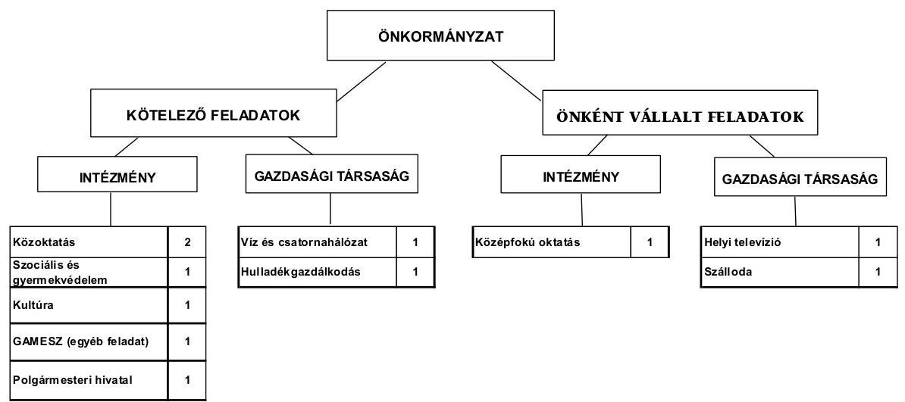

Az Önkormányzat feladatait 2011. június 30-án (a Polgármesteri hivatallal együtt) hét költségvetési szervvel, négy gazdasági társasággal látta el. A 2007-2011. év I. félév közötti időszakban a szociális ellátási terület bővülése miatt, a feladatellátás telephelyeinek száma 15 -ről 22 -re emelkedett. A négy gazdasági társaságból kettő önként vállalt feladatot lát el. A településen a helyi televíziós műsorszolgáltatást és a szállodai szolgáltatást a 100%-os önkormányzati tulajdonban lévő társaságok végzik. Az önkormányzati feladatellátásban részt vállaló gazdasági társaságok közül, a víz és szennyvíz csatornahálózat üzemeltetését koncessziós szerződés alapján a DRV Zrt. végzi. A társaságban tulajdonosi részesedése az önkormányzatnak nem volt. A hulladékgazdál-

[^0]
[^0]:    ${ }^{8}$ Nem tartalmazza a védőnői szolgálat OEP támogatásból finanszírozott 14,4 millió Ft összegű kiadásait.

---

kodással kapcsolatos feladatokat ellátó AVE Zöldfok Zrt.-ben 7 ezer Ft-os ( $0,003 \%$-os) tulajdoni részesedést szerzett az Önkormányzat.

A feladatellátásban részt vevő gazdasági társaságok a működésükhöz az ellenőrzött időszakban rendszeres működési, illetve felhalmozási célú támogatásban nem részesültek.

Az Önkormányzat működési kiadásokra - adatszolgáltatása szerint - 2010-ben 2099,2 millió Ft-ot fordított, amely 308,4 millió Ft-tal (17,2\%-kal) haladta meg a 2007-2009. évi ráfordítások átlagát.

Az egyes közszolgáltatások feladatellátásában résztvevő intézmények működési kiadásainak finanszírozási forrását ágazatonként a következő ábra szemlélteti:
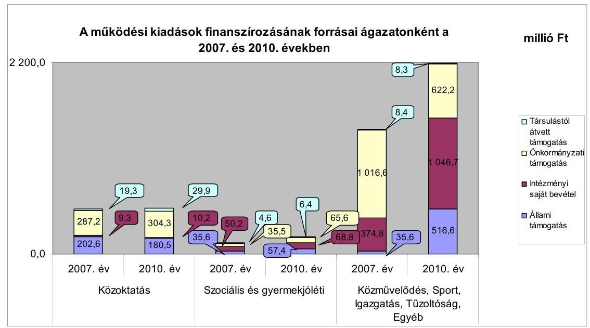

A 2010. évben teljesített működési kiadások finanszírozása 25,9\%-ban (754,6 millió Ft) állami hozzájárulásból, 34,0\%-ban (992,2 millió Ft) önkormányzati forrásból, 38,6\%-ban (1125,7 millió Ft) intézményi saját bevételből valamint 1,5\%-ban ( 44,6 millió Ft) a feladatok közös ellátására társult önkormányzatok hozzájárulásából történt. A 2010. évi finanszírozási forrásokon belül a költségvetési hozzájárulás részaránya 9,6 százalékponttal, (66,3 millió Ft-tal) a társult önkormányzatok hozzájárulása 15,8 százalékponttal (6,1 millió Ft-tal) növekedett a 2007-2009. évek átlagához viszonyítva.

A 2007-2010. években az önkormányzati közszolgáltatások körében végrehajtott szervezeti változások, a feladatátvétel összességében a kiadásokat 1,6 millió Ft-tal, a bevételeket 2,1 millió Ft-tal növelték, $\mathbf{0,5}$ millió Ft összegű megtakarítást eredményezve.

---

Az Önkormányzat folyó költségvetési egyenlege (működési jövedelme) a 2007-2010. években pozitív összegű volt, melyet az alábbi ábra mutat:
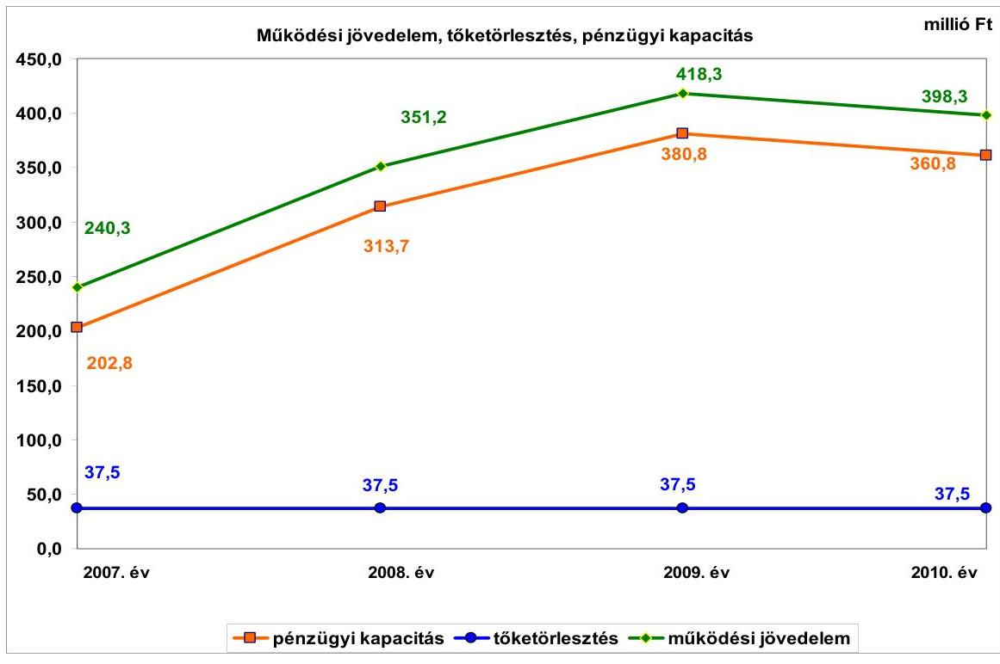

Az Önkormányzat folyó költségvetésének egyenlege (működési jövedelem) a teljes vizsgált időszak alatt megtakarítást mutatott.

A pénzügyi egyensúlyt külső források bevonása nélkül tudták biztosítani a vizsgált időszakban. A 2008-2010 között keletkezett 1093,7 millió Ft felhalmozási forráshiányra és a 2007-2010. évek 150 millió Ft-os adósságszolgálatára az időszakban képződő 1055,3 millió Ft nettó működési jövedelem és a 2008. január 1-jén rendelkezésre álló 826,6 millió Ft pénzkészlet szolgált fedezetül.

A 2007. év kivételével az időszakban az Önkormányzat felhalmozási költségvetésének egyenlege folyamatosan negatív előjelű volt. A felhalmozási forráshiánynak a felhalmozási és tőke jellegű kiadásokhoz viszonyított aránya 2008-ban -79,6\% (-141,1 millió Ft), 2009-ben -88,8\% (-142,3 millió Ft), 2010-ben -76,3\% (-810,3 millió Ft) volt. A 2007. évi felhalmozási forrástöbblet az ingatlanértékesítések 657,3 millió Ft-os bevételének köszönhető.

Az Önkormányzat folyó bevételei a vizsgált időszakban folyamatosan emelkedtek, a 2010. évben 368,9 millió Ft-tal (17,2\%-kal) növekedtek a 2007-2009. évek 2143,0 millió Ft-os átlagához viszonyítva.

A működési célú költségvetési támogatás és az szja bevétel együttes összege a 2007-2009. évi átlagos 930,2 millió Ft-tal szemben a 2010. évben 800,5 millió Ft-ra csökkent, melyet a 2010. évben a beszedett idegenforgalmi adó után járó állami hozzájárulás 2 Ft-ról 1 Ft-ra csökkentése okozott. Emiatt 142,8 millió Ft-tal csökkent az Önkormányzatot megillető költségvetési támogatás.

---

Az Önkormányzat 2007-2010. között az építményadó, az idegenforgalmi adó, és a helyi iparűzési adó adónemeket alkalmazta. Az építményadó mértéke 2008-tól 550 Ft/m²-ről 600 Ft/m²-re, az idegenforgalmi adó mértéke évente változott ${ }^{9}$. Az Önkormányzatnál a folyó bevételek egyharmada a helyi adókból származik. A 2007-2009. évek átlagához viszonyítva a 2010. év 24,4%-os, 172,6 millió Ft-os növekedését az idegenforgalmi adónál az adó mértékének változásán túl az adómentesség szabályainak változása - a 70 éven felüli vendégek adómentességének megszűnése - okozta, amely 132,6 millió Ft bevétel növekedést eredményezett.

A vizsgált években a felhalmozási célú bevételek jelentős ingadozást mutattak, melyet a 2007. évben az ingatlanértékesítések 657,3 millió Ft összegű bevétele okozta. A 2010. évben és 2011. év I. félévben a bevételek növekedését a városközpont funkció bővítéséhez, a bölcsőde építéséhez, az Alsópáhok-Hévíz kerékpárút kivitelezéséhez, valamint a Római kori romkert és zöldterület rehabilitációjához az államháztartáson belülről kapott, pályázatokból származó támogatások okozták.

Az Önkormányzat folyó kiadásai folyamatosan növekedtek. A folyó kiadásokon belül a működési kiadások átlagos növekedési üteme a 2007-2009. években 1,2% (21,6 millió Ft) volt, amelyet 2010-ben 17,0%-kal (307,2 millió Ft-tal) teljesítettek túl. A 2010. évi átlagot meghaladó emelkedést a fordított áfa miatti (219,9 millió Ft) befizetés okozta.

A 2007-2010. évek időszakában 1505,7 millió Ft értékű befejezett fejlesztés és felújítás forrása a 83,9% saját erő, 4,6% hazai- és 11,5% EU-s támogatás volt. A 2010. december 31-én folyamatban lévő fejlesztési feladatok várható teljes bekerülési költsége 261,7 millió Ft, a 2010. évet követő kötelezettségvállalásainak összege 256,8 millió Ft volt, amelyből 158,0 millió Ft-ot EU-s támogatásból, 98,8 millió Ft-ot saját forrásból terveznek biztosítani.
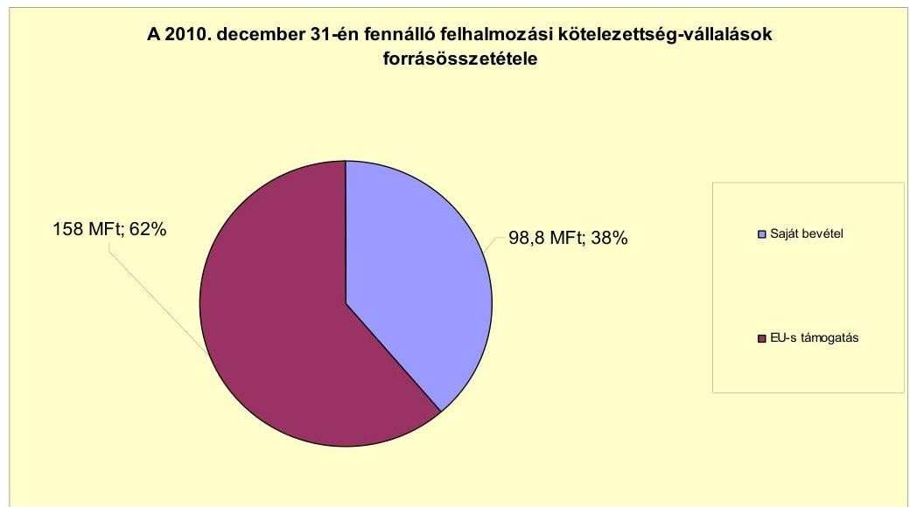

[^0]
[^0]:    ${ }^{9}$ 2008-ban 345 Ft/fő/éjszaka/összegről 360-ra, 2009-ben 380-ra, 2010-ben 420-ra változott az adó mértéke.

---

Az Önkormányzat három felújítás és egy fejlesztés megvalósításához nyújtott be pályázatot. Az elbírálás alatt álló pályázatok teljes bekerülési költsége 128,1 millió Ft, melyhez 58,1 millió Ft EU-támogatást és 41,4 millió Ft hazai támogatást igényeltek. A fejlesztéshez 28,6 millió Ft saját forrás felhasználását tervezik.

Az Önkormányzat mérleg szerinti pénzintézetekkel szembeni kötelezettsége a 2006. év végéről a 2011. év I. félév végére 187,5 millió Ft-ról 37,5 millió Ft-ra csökkent. A fennálló pénzintézeti kötelezettség a 2001. évben felvett hosszú lejáratú hitelből keletkezett. A pénzintézeti kötelezettség, az Önkormányzatnak a vizsgált időszakban 45,6 millió Ft kamatkiadást okozott.

Az Önkormányzat 2011. I. félév végi szállítói tartozása 8,0
 millió Ft, melyből lejárt tartozása 4,1 millió Ft volt. Ebből a 30 nap alatti tartozások összege 1,7 millió Ft, a 31-60 nap közötti 0,3 millió Ft, a garanciális javításokra visszatartott 2,1 millió Ft 91 és 365 nap közötti, illetve éven túli tartozásként szerepelt a nyilvántartásokban.

Az Önkormányzat az Aquamarin Kft. részére fejlesztési és egyéb hitelek igénybevételéhez készfizető kezességet nyolc alkalommal vállalt, kölcsönt nem nyújtott. A társaság önkormányzattal szembeni kötelezettsége, a be nem fizetett iparűzési adóból származott.

Az Önkormányzat kötelezettségeinek 2011. június 30-i állományát és várható alakulását a kötelezettségek lejáratáig a következő táblázat szemlélteti:

| Megnevezés | Állomány 2010. december 31   én |  |  | Állomány 2011. június 30-án |  |  | Várható   kötelezettség 2011-   2013. években |  | Várható   kötelezettség 2014.   évtől |  |
| :--: | :--: | :--: | :--: | :--: | :--: | :--: | :--: | :--: | :--: | :--: |
|  | HUF-ban   (millió Ft-   ban) | Devicében   (összegy,   ezer ban) | Devicé   tont | HUF-ban   (millió Ft-   ban) | Devicében   (összegy,   ezer   ban) | Devicé   tont | HUF-ban   (millió Ft-   ban) | Devicében   (összegy,   ezer ban) | HUF-ban   (millió Ft-   ban) | Devicében   (összegy,   ezer ban) |
| Pénzintézeti kötelezettsége |  |  |  |  |  |  |  |  |  |  |
| ATP-20 fevete más | 37,5 |  |  | 37,5 |  |  | 37,5 |  | 0,0 |  |
| Pénzintézeti kötelezettségek összesen HUF-ban: | 37,5 |  |  | 37,5 |  |  | 37,5 |  | 0,0 |  |
| Bízualitások |  |  |  |  |  |  |  |  |  |  |
| Kezesség vállalás Aquamarin Száróstegevi Kft | 126,0 |  |  | 125,3 |  |  | 0,0 |  | 0,0 |  |
| Bízualitások összesen | 126,0 |  |  | 125,3 |  |  | 8,8 |  | 0,0 |  |
| Szállító tartozás | 93,6 |  |  | 8,0 |  |  | 8,0 |  | 0,0 |  |
| Egyéb kiadás elmaradás | 0,0 |  |  | 0,0 |  |  | 0,0 |  | 0,0 |  |
| Egyéb kötelezettségek | 325,3 |  |  | 0,0 |  |  | 0,0 |  | 0,0 |  |
| Kötelezettségek összesen | 576,4 |  |  | 175,5 |  |  | 45,5 |  | 0,0 |  |

Az Önkormányzat 2010. december 31-én fennálló összes kötelezettsége 579,4 millió Ft, amelyből a 2011-2013. években 45,5 millió Ft várható kötelezettsége keletkezik. Az Aquamarin Kft-nek vállalt 125,0 millió Ft-os kezesség akkor válik csak kötelezettséggé, ha az Önkormányzat kizárólagos tulajdonú társasága nem tesz eleget fizetési kötelezettségének. Ennek teljesítésére a 2010. évi mérlegében kimutatott 777,4 millió Ft-os pénzeszközállomány nyújt fedezetet.

Az Önkormányzat minősített többségű gazdasági társaságai pénzintézeti kötelezettsége 2010. december 31-én 102,9 millió Ft volt, emellett 5,6 millió Ft szállítói állománnyal is rendelkeztek, melyből 1,2 millió Ft (30 nap alatti) lejárt tartozás volt. A többségi tulajdonú gazdasági társaságok kötele-

---

zettségei befolyásolhatják az Önkormányzat pénzügyi egyensúlyát. Az Önkormányzat a 2001. évben hosszú lejáratú hitel igénybevételével befektetési céllal vásárolta meg a gyógyvízkivételi engedéllyel rendelkező Aquamarin Kft. kizárólagos tulajdonjogát, azonban a működtetésre vonatkozóan a ráfordított összeg megtérülése érdekében teljesítménykövetelményt vele szemben nem fogalmazott meg.

Az Önkormányzat az ellenőrzött időszakban kiadási megtakarítást eredményező és bevételt növelő intézkedéseket tett. A 2007-2011. év I. féléve között tett intézkedések hatására 134,0 millió Ft bevételi többletet, továbbá 3,6 millió Ft kiadási megtakarítást mutattak ki. A kiadási megtakarítások 94%-a helyettesítés miatti megtakarítás eredménye. Az álláshely-csökkentő intézkedések 2007-2011. év I. féléve között önkormányzati szinten összesen 18 álláshely megszüntetését jelentették. Egyes közszolgáltatási területeken azonban feladatbővülések is voltak, amelyek álláshely- és egyben létszámnövekedéssel is jártak. Ennek következtében az időszak álláshelyeinek száma 8 fővel növekedett. A bevételnövelő intézkedések 65,4%-a helyi adók mértékének növeléséhez, 34,6%-a ingatlanok és eszközök hasznosításához kapcsolódtak.

Az Önkormányzat pénzügyi egyensúlya rövid és középtávon biztosított, amelynek a hosszú távú megőrzésére fel kell készülnie.

Az Önkormányzat működési jövedelme a vizsgált időszakban pozitív volt és a 2009. év végéig folyamatosan emelkedett. Az Önkormányzat gazdálkodásának pénzügyi egyensúlya a 2007-2011. év I. félévében biztosított volt. A folyó bevételek évente fedezetet nyújtottak a folyó kiadások és az adósságszolgálat finanszírozására. A likviditást folyószámlahitel igénybevétele nélkül biztosították.

Az Önkormányzat hosszú távú kötelezettségei nem befolyásolják a pénzügyi egyensúlyi helyzetet.

Az önként vállalt feladataira fordított kiadások aránya a működési jövedelemhez képest nem jelent kockázatot.

A folyamatban lévő fejlesztési projektekhez, a benyújtott pályázatokhoz szükséges saját erőhöz a források rendelkezésre állnak.

Gazdasági társaságai pénzügyi helyzete kockázatot hordoz az Önkormányzat számára. Az Aquamarin Kft. fennálló hiteltartozásai az Önkormányzat számára helytállási kötelezettséget jelenthetnek.

Az Állami Számvevőszékről szóló 2011. évi törvény 33. § (1) bekezdésében foglaltak értelmében a jelentésben foglalt megállapításokhoz kapcsolódó intézkedési tervet köteles az ellenőrzött szervezet vezetője összeállítani és azt a jelentés kézhezvételétől számított harminc napon belül az ÁSZ részére megküldeni. Amennyiben az intézkedési tervet határidőben nem küldi meg a szervezet, vagy az továbbra sem elfogadható, az ÁSZ elnöke a hivatkozott törvény 33. § (3) bekezdés a)-b) pontjaiban foglaltakat érvényesítheti.

---

# A 2011. június 30-i pénzügyi egyensúlyi helyzet alapján az ellenőrzés intézkedést igénylő megállapításai és javaslatai: 

## a Polgármesternek

1. Az Önkormányzat pénzügyi egyensúlyi helyzete rövid és középtávon biztosított. A pénzügyi egyensúly hosszú távú megőrzésére az Önkormányzatnak fel kell készülnie.

Javaslat:
Folyamatosan tájékoztassa a Képviselő-testületet az Önkormányzat pénzügyi egyensúlyi helyzetéről. Kezdeményezzen szükség esetén intézkedéseket a pénzügyi egyensúly hosszú távú fenntarthatósága érdekében, fontolja meg a bevételszerző és kiadáscsökkentő lehetőségeket.

## a Jegyzőnek

1. Az Önkormányzat minősített többségi tulajdonú gazdasági társaságainak kötelezettsége 2010. december 31-én 108,5 millió Ft volt, amely kötelezettségek nem teljesítése hatással lehet az Önkormányzat likviditására, pénzügyi egyensúlyi helyzetére.

Javaslat:
Kísérje folyamatosan figyelemmel - a tulajdonosi jogkört gyakorlók közreműködésével - a minősített többségi tulajdonú gazdasági társaságok kötelezettségeinek alakulását, az Önkormányzat likviditására, pénzügyi egyensúlyi helyzetére gyakorolt hatását. Tegye meg a szükséges és lehetséges intézkedéseket a tulajdonosi érdekek védelme érdekében.

---

# II. RÉSZLETES MEGÁLLAPÍTÁSOK 

## 1. Az ÖNKORMÁNYZAT KÖTELEZŐ ÉS ÖNKÉNT VÁLLALT FELADATAI, A FELADATELLÁTÁS SZERVEZETI KERETEI ÉS ANNAK VÁLTOZÁSAI

Az Önkormányzat kötelező és önként vállalt feladatait SzMSz$_{1,2}$-ben rögzítette. Az Önkormányzat önként vállalt feladatai közé sorolta az ápolást, gondozást nyújtó intézményi ellátást, a jelzőrendszeres házi segítségnyújtást, a támogatószolgálat működtetését, a Bursa Hungarica Felsőoktatási Önkormányzati ösztöndíj támogatását, a bölcsődei ellátást, valamint a gimnázium működtetését.

Az Önkormányzat - adatszolgáltatása szerint - a 2010. évi teljesített működési kiadásainak a 68,9%-a, 1446,2 millió Ft a kötelező feladatok ellátását finanszírozta, amely összeg az összes működési kiadáson belüli részaránya 2007-2009. évek átlagánál 0,2 százalékponttal alacsonyabb volt. A 2010. évben az összes működési kiadás 31,1%-át, 653,0 millió Ft-ot fordított az önként vállalt feladatainak ellátására. A feladatok finanszírozására fordított összeg részaránya 0,2 százalékponttal növekedett a 2007-2009. évek átlagához képest. Az Önkormányzat kedvező pénzügyi helyzete miatt, az önként vállalt feladatok aránya nem befolyásolta a működés biztonságát.

A működési kiadások a vizsgált időszakban folyamatosan növekedtek. Az Önkormányzat adatszolgáltatása szerint a 2007. évi működési kiadások 1769,5 millió Ft-ot tettek ki. A működési kiadások a 2008. és a 2009. években az előző évhez viszonyítva 2,4%-kal (1790,2 millió Ft-ra, majd 1812,7 millió Ft-ra) emelkedtek. A 2010. évre a működési kiadások a 2009. évihez képest 15,8%-kal (2099,2 millió Ft-ra) nőttek. A 2010. évi növekedést a fordított áfa miatti befizetés okozta$^{10}$.

A 2010. évi működési kiadások feladatonkénti megoszlását, azok finanszírozási arányait - az önkormányzat adatszolgáltatása alapján - a következő táblázat mutatja be:

[^0]
[^0]:    $^{10}$ A fordított áfa összege a költségvetési beszámolókban előzetesen felszámított áfaként és fordított áfa miatti befizetésként is megjelenik. A fordított áfa miatti befizetés összege az Önkormányzatnak többletkiadást nem jelent, azonban elszámolása a kiadási és a bevételi főösszeget is növeli.

---

| Ellátott feladat | Működési   kiadás   összesen   (millió Ft) | Kötelező   feladatok   kiadásainak   részaránya   % | Működési   bevétel   összesen   (millió Ft) | Állami   támogatás   részaránya   % | Intézményi   saját bevétel   részaránya   % | Önkormány-   zati támogatás   részaránya % | Társulástól átvett   támogatás   részaránya   % |
| :--: | :--: | :--: | :--: | :--: | :--: | :--: | :--: |
| Ovodák | 110,2 | 100,0 | 110,7 | 30,0 | 0,5 | 63,6 | 5,5 |
| Általános iskolák | 261,7 | 84,0 | 264,0 | 29,5 | 1,8 | 59,9 | 8,8 |
| Gimnáziumok | 141,4 | 0,0 | 142,1 | 43,2 | 3,4 | 53,4 | 0,0 |
| Kollégiumok | 5,8 | 0,0 | 8,1 | 100,0 | 0,0 | 0,0 | 0,0 |
| Szacális   intézmények | 177,1 | 44,0 | 178,8 | 26,8 | 38,5 | 31,1 | 3,6 |
| Gyermekjóléti   intézmények | 19,4 | 100,0 | 19,4 | 49,2 | 0,0 | 50,8 | 0,0 |
| Közművelődési   intézmények | 76,3 | 100,0 | 77,4 | 0,3 | 22,6 | 73,2 | 3,9 |
| Egyéb intézmények | 371,2 | 100,0 | 376,8 | 3,4 | 38,8 | 57,8 | 0,0 |
| Polgármesteri hivatal   igazgatási kiadásai | 345,9 | 75,0 | 545,8 | 0,0 | 100,0 | 0,0 | 0,0 |
| Polgármesteri   hivatalban ellátott   egyéb feladatok   működési kiadásai | 590,2 | 86,0 | 1193,6 | 42,2 | 28,2 | 29,2 | 0,4 |
| Működési kiadá-   sok összesen | 2099,2 | 68,9 | 2916,7 | 25,9 | 38,6 | 34,0 | 1,5 |

A 2010. évben teljesített működési kiadások finanszírozása 25,9%-ban (754,6 millió Ft) állami hozzájárulásból, 34,0%-ban (992,2 millió Ft) önkormányzati forrásból, 38,6%-ban (1125,7 millió Ft) intézményi saját bevételből valamint 1,5%-ban (44,6 millió Ft) a feladatok közös ellátására társult önkormányzatok hozzájárulásából
 történt. A 2010. évi finanszírozási forrásokon belül a költségvetési hozzájárulás részaránya 9,6 százalékponttal (66,3 millió Ft-tal) a társult önkormányzatok hozzájárulása ${ }^{11} 15,8$ százalékponttal (6,1 millió Ft-tal) növekedett a 2007-2009. évek átlagához viszonyítva. Az intézményi saját bevételek 2010. évi 11,2%-os (66,0 millió Ft-os) növekedésében, a 2007-2009. évek átlagához viszonyítva, meghatározó szerepe a Polgármesteri hivatal 470,0 millió Ft-os pénzmaradványának volt. Mindezek ellentételezéseként az önkormányzati hozzájárulás aránya 10,2 százalékponttal (6,2 millió Ft-tal) csökkent a 2007-2009. évek átlagához viszonyítva. Az intézményi saját bevételek növekedéséhez hozzájárult a térítési díjak emelkedése is. Az önkormányzati támogatás összegét, annak változását az állami támogatások és az intézményi saját bevételek alakulása határozta meg.

A közoktatási ágazatban az összes működési kiadás a 2007-2009. évek átlagához viszonyítva a 2010. évre 0,6 százalékponttal csökkent (130,6 millió Ft-ról 129,8 millió Ft-ra). Az ellátottak száma a 2010. évben a 2007-2009. évi átlaghoz viszonyítva 56 fővel (7,5%-kal) emelkedett. Az általános iskolai oktatásban 4,7 százalékponttal (13,3 millió Ft-tal) csökkent az állami hozzájárulás részaránya a 2007-2009. évek átlagához viszonyítva. Ennek ellentételezését az önkormányzati hozzájárulás és a társult önkormányzatoktól átvett támogatás összege biztosította. A Bibó Gimnáziumban az összes működési kiadás 0,7 százalékponttal növekedett, a 2007-2009. évek 140,4 millió Ft-os átlagához viszonyítva. A középfokú oktatás működtetéséhez igénybevett állami hozzájárulás

[^0]
[^0]:    ${ }^{11}$ Bővült feladatellátáshoz kapcsolódó társult önkormányzatok köre.

---

mértéke a 2010. évben 2,2 százalékponttal csökkent, a 2007-2009. évek 63,2 millió Ft-os átlagához viszonyítva. Az ágazatban a működési kiadások csökkenése (szinten tartása) a vizsgált időszakban végrehajtott intézményi felújításokhoz kapcsolódó energiaracionalizálás eredménye.

A szociális-gyermekjóléti intézmények működési kiadásai a 2007-2010. években folyamatosan növekedtek. Az ágazat működési kiadásaira az Önkormányzat a 2010. évben 196,5 millió Ft-ot fordított, ami 15,3%-kal magasabb a 2007-2009. évek (170,5 millió Ft-os) átlagánál. A működési kiadások emelkedését a bentlakásos idősek otthonában az ellátási színvonal megtartása, illetve bővítése érdekében biztosított szolgáltatások költségnövekedése okozta. A működési kiadások növekedéséhez hozzájárult, a családsegítő és gyermekjóléti szolgálat ellátási területének a 2009. évtől Sármellék községgel történt bővítése is. ${ }^{12}$

A szociális és gyermekjóléti feladatokat az állami támogatás a 2010. évben 38,0%-ban finanszírozta. A 2007. évben a működési kiadások 34,1%-át (35,6 millió Ft) fedezte az állami támogatás, mely a 2008. évre 39,2%-ra, 63,9 millió Ft-ra növekedett az ellátottak számának növekedése miatt. Az Önkormányzatnak a 2009. évben az állami támogatás 3,1%-os (2,0 millió Ft-os) csökkenése miatt 1,3 millió Ft-tal magasabb összeggel kellett hozzájárulnia az intézmény működéséhez. A 2010. évre az önkormányzati támogatás 19,3 millió Ft-tal, 41,7%-kal emelkedett, az állami támogatással csökkentett működési kiadások növekedése miatt. A társult önkormányzatok a 2007. évben 4,6 millió Ft-tal, a 2008. évben 7,6 millió Ft-tal, a 2009. évben 8,1 millió Ft-tal, a 2010. évben 6,4 millió Ft-tal járultak hozzá a feladatellátáshoz.

A közművelődési feladatok 2010. évi működési kiadásai 0,4 százalékponttal csökkentek a 2007-2009. évek 76,6 millió Ft-os átlagához viszonyítva. A 2010. évre az ágazatban az állami hozzájárulás aránya minimálisra 0,3%-ra (0,2 millió Ft-ra) csökkent, ezért a működési kiadások finanszírozását 73,3%-ban (56,8 millió Ft-tal) az önkormányzat támogatásával biztosította. Mindez a 2007-2009. évek átlagánál (59,4%-os finanszírozási arány) 13,9 százalékponttal (11,1 millió Ft-tal) magasabb.

A Polgármesteri hivatal igazgatási kiadásai a 2010. évben 17,0 százalékponttal csökkentek a 2007-2009. évek 416,8 millió Ft-os átlagához viszonyítva. A kiadások csökkenése a takarékossági intézkedések keretében a hivatalt is érintő létszámcsökkentési döntésekkel hozható összefüggésbe.

A Polgármesteri hivatalban ellátott egyéb feladatok működési kiadásainál a 2010. évben 104,3 százalékpontos növekedés tapasztalható a 2007-2009. évek 288,9 millió Ft-os átlagához viszonyítva. A változást a fordított áfa miatti befizetés okozta, amely a 2010. évben 206,0 millió Ft-os többletként jelentkezett az Önkormányzat működési kiadásainál.

[^0]
[^0]:    ${ }^{12}$ Hévíz, Alsópáhok, Felsőpáhok, Cserszegtomaj, Nemesbük, Sármellék, Zalaköveskút településeken is az Önkormányzat biztosítja az ellátást.

---

Az Önkormányzat a kötelező és az önként vállalt feladatait 2010. december 31-én - a Polgármesteri hivatallal együtt - hét költségvetési szervvel, valamint négy gazdasági társasággal látta el. A költségvetési szervek közül kettő (a Polgármesteri hivatal és a GAMESZ) önállóan működő és gazdálkodó, a további öt önállóan működő költségvetési szerv volt.

A négy gazdasági társaságból, önként vállalt feladatot a településen a helyi televíziós műsorszolgáltatást, az önkormányzati egyszemélyes tulajdonú társaság, a Hévízi TV Kft. végezte. A kizárólagos önkormányzati tulajdonú Aquamarin Kft., ami szállodai szolgáltatást biztosít és gyógyvízkivételi engedéllyel rendelkezik. Ezért tartotta fontosnak a városvezetés a tulajdonjog 2001. évben történő megszerzését is. Az önkormányzati feladatellátásban részt vállaló gazdasági társaságok közül a másik kettőben, az Önkormányzat tulajdonosi részesedéssel nem rendelkezett. A víz és szennyvíz csatornahálózat üzemeltetését a koncessziós szerződés alapján a DRV Zrt., valamint a hulladékgazdálkodással kapcsolatos feladatokat az AVE Zöldfok Zrt. végezte.

Az Önkormányzat 2011. június 30-án további kettő gazdasági társaságban rendelkezett tulajdoni részesedéssel, melyek az önkormányzati feladatellátásban nem vettek részt. A 2011. évben alapított település turisztikai feladatokat ellátó Hévízi Turisztikai Nonprofit Kft. ${ }^{13}$-ben az Önkormányzat 45%-os tulajdoni részesedést vásárolt. A város életében fontos szerepet betöltő, a gyógyfürdő üzemeltetésében érdekelt „Hévíz Gyógyfürdő és Szent András Reumakórház Nonprofit Kft-ben" 26%-os tulajdoni részesedéssel rendelkezik az Önkormányzat.

Az Önkormányzat feladatait 2011. június 30-án az alábbi intézménystruktúrával látta el:

- közoktatási feladatot három intézmény látott el (az óvodai ellátást az Óvoda egy székhely óvodával és egy tagintézménnyel, az általános iskolai oktatást az Illyés Gyula általános iskola a székhelyén biztosította. Gimnáziumi és szakközépiskolai oktatás, valamint kollégiumi ellátás a Bibó Gimnáziumban a székhelyintézményen kívül két telephelyen történt);
- szociális és gyermekvédelmi feladatokat egy intézmény négy telephelyen végzett (a Szociális Integrált Intézmény a házi segítségnyújtást, a családsegítést, a szociális étkeztetést, a nappali szociális ellátást, a védőnői szolgálatot, valamint az anya-, gyermek és csecsemővédelmet látta el; az intézmény működési területe: Hévíz, Alsópáhok, Felsőpáhok, Cserszegtomaj, Nemesbük, Rezi, Sármellék és Zalaköveskút közigazgatási területe);
- a kulturális feladatok ellátását egy intézmény biztosította (a Gróf Festetics Művelődési Központ a helyi könyvtári és közművelődési feladatait székhelyén és két intézményegységben látta el);
- egyéb feladatokat a GAMESZ látta el (a városüzemeltetést és az önállóan működő intézmények pénzügyi-gazdasági feladatait biztosította);

[^0]
[^0]:    ${ }^{13}$ Kettő millió Ft-os törzstőkéjű

---

- az igazgatási feladatokat a Polgármesteri hivatal látta el.

Az egészségügyi alap- és szakellátásokat az Önkormányzat feladatellátási szerződések keretében, vállalkozók útján biztosította.

Az intézmények 2011. június 30-án - alapító okirataik szerint - összesen 22 telephelyen működtek. A 2007-2011. év I. félév közötti időszakban a költségvetési szervek száma nem változott. Az intézmények telephelyeinek száma a vizsgált időszakban 15-ről 22-re emelkedett. A telephelyek számának változását a Szociális Integrált Intézmény ellátási területének bővülése okozta.

Az áttekintett időszakban az Önkormányzat feladatot a szociális és gyermekjóléti ellátás területén, a Sármelléki Önkormányzattól vett át. A feladatátvétel 1,6 millió Ft-os kiadásnövekedést és 2,1 millió Ft-os állami támogatás bevételt eredményezett az Önkormányzatnak. A GAMESZ-tól a Polgármesteri hivatal feladatai közé került parkoló iroda átszervezése az átcsoportosításon kívül pénzügyi kihatással nem járt.
2010. december 31-én az Önkormányzat két gazdasági társaságban, a szállodaipari szolgáltatást biztosító Aquamarin Kft.-ben és a műsorszolgáltatást végző Hévízi Tv Kft.-ben rendelkezett többségi (100%-os) tulajdoni részesedéssel. A szállodaipari szolgáltatást végző társaságot 2001. évben befektetési céllal vásárolta az Önkormányzat. A saját tőke, jegyzett tőke aránya a 2007-2010. évi adatok alapján a negatív eredménytartalék ellenére egy felett volt. Az Önkormányzat a gazdasági társaságra vonatkozó eredmény követelményeket, megtérülési követelményeket nem fogalmazott meg. A társaság folyamatos fejlesztéseket hajt végre, melyhez a 2009. évben 5 éves futamidőre, 100,0 millió Ft hosszú lejáratú hitelfelvételre is kényszerült, a tulajdonos Önkormányzat kézfizető kezességvállalása mellett. A műsorszolgáltatási feladatokat ellátó Hévízi Tv Kft-nél az Önkormányzat 2008. évi 4,9 millió Ft-os tulajdonosi pótbefizetését követően (veszteségpótlásra) a saját tőke pozitívba fordult. A gazdasági társaság a vizsgált időszakban továbbra is veszteségesen működött. A gazdasági társaságok gazdálkodását, illetve működését érintő adatokat (saját tőke, jegyzett tőke arányát, stb.) a jelentés 4. számú melléklete mutatja be.

Az önkormányzati feladatellátásban részt vevő gazdasági társaságok más gazdasági társaságokban nem szereztek érdekeltséget.

Az áttekintett időszak alatt csőd-, illetve felszámolási eljárás az önkormányzati érdekeltségű gazdasági társasággal szemben nem indult. A Képvise-lő-testület a tulajdonában lévő gazdasági társaságok átszervezéséről a vizsgált időszakban nem döntött.

A közfeladatok ellátását biztosító gazdasági társaságoknak vagyonátadás, illetve vagyonkezelésbe adás az ellenőrzött időszakban nem történt. A feladatainak ellátásához üzemeltetésre kapta a DRV Zrt. az önkormányzati tulajdonú víziközmű vagyont.

A 2007-2010. években az önkormányzati közszolgáltatások körében végrehajtott szervezeti változások, a feladatátvétel összességében a kiadásokat

---

1,6 millió Ft-tal, a bevételeket 2,1 millió Ft-tal növelték, 0,5 millió Ft összegű megtakarítást eredményezve.

# 2. AZ ÖNKORMÁNYZAT PÉNZÜGYI EGYENSÚLYI HELYZETÉT BEFOLYÁSOLÓ TÉNYEZŐK 

A hagyományos költségvetési szerkezet helyett az önkormányzat pénzügyi helyzetét a CLF módszerrel mutatjuk be, amelyben jobban elkülönülnek a vagyonnal kapcsolatos bevételek és kiadások az önkormányzati feladatokkal kapcsolatos közvetlen működtetési bevételektől és kiadásoktól. A módszer következetesen elkülöníti a folyó és a felhalmozási költségvetés bevételeit és kiadásait, azok költségvetési egyenlegeit. A saját folyó bevételek, valamint a saját felhalmozási bevételek nem tartalmazzák az előző évi pénzmaradványok felhasználásából származó pénzforgalom nélküli bevételeket ${ }^{14}$.

A folyó költségvetés egyenlege, a működési jövedelem megmutatja, hogy az önkormányzat éves folyó bevétele fedezetet biztosít-e a kötelező és önként vállalt feladatellátáshoz kapcsolódó éves folyó kiadására. A működési jövedelem negatív értéke pénzügyileg fenntarthatatlan helyzetet jelez. A mutató pozitív értéke megtakarítást mutat, amely forrásul szolgálhat az önkormányzat fennálló kötelezettségei megfizetéséhez, valamint fejlesztéseihez.

A felhalmozási költségvetés pozitív értéke felhalmozási többletet mutat, amely a jövőbeni fejlesztések forrását biztosíthatja. Amennyiben a folyó költségvetési hiány finanszírozása a felhalmozási többletből történik, ez szűkebb értelemben vagyonfelélésnek tekinthető. Amennyiben a felhalmozási költségvetés megtakarítása fejlesztési célú hitelek, kötvények adósságszolgálatát finanszírozza, az változatlan vagyontömeg mellett, a korábban megelőlegezett tőkebevételek valós realizációjának tekinthető. A felhalmozási deficit által generált finanszírozási igény önmagában nem jár pénzügyi kockázattal, a pénzügyileg fenntartható beruházásokhoz kapcsolódó kötelezettségvállalás (adósságszolgálat) átlátható és szabályozott költségvetési gazdálkodással teljesíthető.

A módszer a pénzügyi kapacitás fogalmát helyezi a középpontba. Az adós hitelfelvételi képessége, hosszú távú fizetőképessége vagy bonitása a pénzügyi kapacitással, ezen belül is a nettó működési jövedelemmel jellemezhető. A nettó működési jövedelem negatív értéke az egyes költségvetési években jelentkező adósságszolgálat túlzott mértékére utal. ${ }^{15}$ A nettó működési jövedelem negatív értékének felhalmozási többletből, vagy további hitelből történő finanszírozása pénzügyileg nem fenntartható gazdálkodást vetít előre. A pozitív értéket mutató nettó működési jövedelem fejlesztési kiadások fedezetét biztosíthatja, illetve a folyamatosan, évenként képződő pozitív nettó működési jövedelemből meghatározható
 a jövőben vállalható, teljesíthető éves adósságszolgálat, így

[^0]
[^0]:    ${ }^{14}$ A költségvetési években kialakuló hiány finanszírozása az előző évi pénzmaradvány és a korábbi években képzett tartalékok felhasználásával is történhet.
    ${ }^{15}$ kivéve, ha annak finanszírozására a korábbi években képzett tartalékok fedezetet nyújtanak

---

módon az a hitelösszeg, amely - a többi tényezőt, feltételt adottnak tekintve - visszafizetési kockázat nélkül felvehető.

A CLF módszer alapján a pénzügyi kapacitás mértéke az önkormányzat összevont, nettósított, a központi információs rendszerbe a Magyar Államkincstáron keresztül leadott éves költségvetési beszámolójának 80-as űrlapjában szerepeltetett adatok alapján került meghatározásra.

A számítási leírás némileg eltér az ÁSZ módszertanában korábban alkalmazott gyakorlattól. A jelen besorolás általános közgazdasági meggondolásokon alapul, amely megjelenik az SNA statisztikai módszertanában is. Folyó tételek alatt értjük azokat a kiadásokat és bevételeket, amelyek a gazdálkodó szervezet helyzetét automatikusan nem változtatják. Bevételi oldalon ilyenek az adók, a tényezőjövedelmek, a transzferek ${ }^{16}$, kiadási oldalon a transzferek és a szolgáltatás igénybevételével kapcsolatos működési kiadások. A folyó költségvetésben a bevételekben nem térül meg, a kiadásokban nem jelenik meg az amortizáció, a vagyoni helyzetet az egyenleg befolyásolja.

A folyó költségvetés egyenlege (működési jövedelem) tartalmazza a kamatbevételeket és a kamatkiadásokat is, mind a működési, mind a fejlesztési kamatot, valamint a visszatérülő és befizetendő áfa teljes összegét, mert ezek közgazdaságilag tényezőjövedelmek. Nem tartalmazzák viszont a követelés elengedés miatt könyvelt bevételi és kiadási pénzforgalmi tételeket, mert valójában technikai elszámolási műveletnek minősülnek, a bevétel soha nem realizálódott, és költségvetési kiadás sem történt.

A felhalmozási költségvetésben a bevételek között a vagyon megőrzésére és bővítésére fordítható források jelennek meg. A felhalmozási vagy tőketételek módosítják a vagyon nagyságát. A privatizációs bevétel csökkenti a vagyont, a fizikai beruházás, pénzügyi befektetés növeli.

A nettó működési jövedelmet a tőketörlesztés levonásával a folyó költségvetés egyenlegéből származtatjuk.

[^0]
[^0]:    ${ }^{16}$ Transzferkiadásoknak nevezzük azokat a folyó és felhalmozási tételeket, amelyeket nem az adott önkormányzat használ fel szolgáltatásnyújtásra.

---

# 2.1. A működési és a felhalmozási egyensúly változása 

CLF módszer szerinti önkormányzati adatok

| Megnevezés | 2007 | 2008 | 2009 | millió Ft |
| :--: | :--: | :--: | :--: | :--: |
| Folyó bevételek | 2025,3 | 2157,1 | 2246,6 | 2511,9 |
| Folyó kiadások | 1785,0 | 1805,9 | 1828,3 | 2113,6 |
| Működési jövedelem | 240,3 | 351,2 | 418,3 | 398,3 |
| Nettó működési jövedelem   =működési jövedelem - tőketörlesztés | 202,8 | 313,7 | 380,8 | 360,8 |
| Felhalmozási bevételek | 720,1 | 36,1 | 17,9 | 252,3 |
| Felhalmozási kiadások | 221,8 | 177,2 | 160,2 | 1062,6 |
| Felhalmozási költségvetés egyenlege | 498,3 | $-141,1$ | $-142,3$ | $-810,3$ |
| Finanszírozási műveletek nélküli (GFS) pozíció = működési jövedelem + felhalmozási költségvetés egyenlege | 738,6 | 210,1 | 276,0 | $-412,0$ |
| Finanszírozási műveletek egyenlege | 1,7 | $-3,8$ | $-813,4$ | 692,4 |
| Tárgyévi pénzügyi pozíció | 740,3 | 206,3 | $-537,4$ | 280,4 |
| Egyéb tájékoztató adatok |  |  |  |  |
| Összes kötelezettség* | 212,6 | 173,8 | 195,6 | 416,9 |
| -ebből rövid lejáratú | 100,1 | 98,8 | 158,1 | 416,9 |
| Folyószámlahítel napi átlagos állománya ** | 0,0 | 0,0 | 0,0 | 0,0 |
| Likvidhítel napi átlagos állománya** | 0,0 | 0,0 | 0,0 | 0,0 |
| Munkabérhítel napi átlagos állománya** | 0,0 | 0,0 | 0,0 | 0,0 |
| Finanszírozásba vonható eszközök: | 877,2 | 1051,6 | 1304,9 | 775,9 |
| Tartós hitelviszonyt megtestesítő értékpapírok év végi állománya | 28,0 | 18,7 | 9,3 | 0,0 |
| Hosszú lejáratú bankbetétek év végi állománya | 0,0 | 110,0 | 0,0 | 0,0 |
| Értékpapírok év végi állománya | 22,6 | 0,0 | 800,0 | 0,0 |
| Pénzeszközök (idegen pénzeszközök nélkül) év végi állománya | 826,6 | 922,9 | 495,5 | 775,9 |

* Az összes kötelezettséget a passzív pénzügyi elszámolások nélkül vettük figyelembe, mert a passzívák a pénzmaradvány elszámolás tételei közé tartoznak.
** A folyószámla, a likvid- és a munkabérhítel átlagos állományát 365 napos osztószámmal és nem a fennálló napok számával vettük figyelembe.

A 2007-2010 közötti időszakban az Önkormányzat kiadásainak és bevételeinek alakulását a jelentés 2. számú melléklete tartalmazza.

---

A vizsgált időszakban az Önkormányzat folyó költségvetési egyenlege, működési jövedelme a 2007-2010. években pozitív összegű volt, melyet a következő ábra szemléltet:
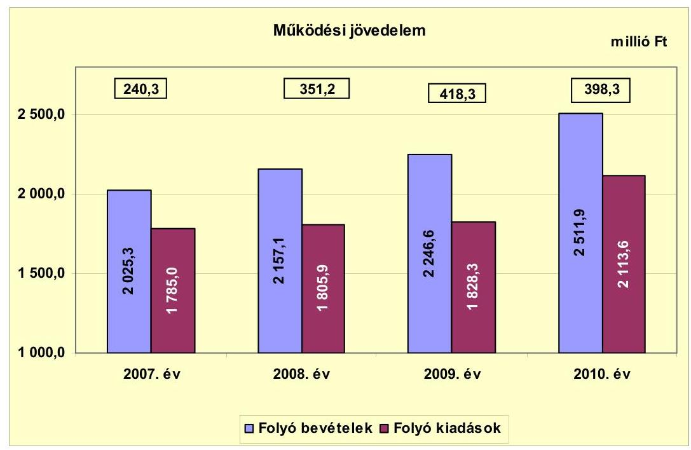

Az Önkormányzat folyó költségvetésének egyenlege (működési jövedelem) a teljes vizsgált időszak alatt 1408,1 millió Ft megtakarítást mutatott. A 2007-2009. években képződő működési jövedelem átlagához viszonyítva a 2010. évben 18,3%-kal (61,7 millió Ft-tal) növekedett a működési jövedelem. A 2008. évben a működési jövedelem előző évihez viszonyított 110,9 millió Ft-os (46,2%-os) növekedését a költségvetési támogatás és az szja együttes összegének 74,8 millió Ft-os, a kamatbevételek 59,9 millió Ft-os, a helyi adók 34,4 millió Ft-os növekedése okozta. A 2007-2010. években keletkezett 1408,1 millió Ft működési jövedelem többlete forrásul szolgálhatott az Önkormányzat fennálló 150,0 millió Ft tőketörlesztési kötelezettségének teljesítéséhez, valamint a -595,4 millió Ft felhalmozási hiány finanszírozásához.

---

Az Önkormányzat nettó működési jövedelmének évenkénti alakulását az alábbi ábra szemlélteti:
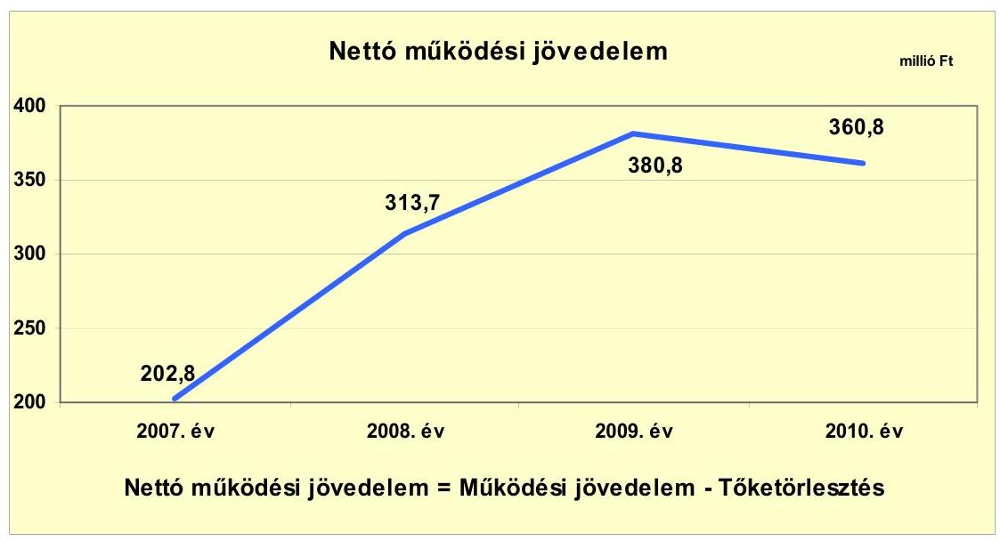

A nettó működési jövedelem ${ }^{17}$ értéke a folyó költségvetési pozíció mellett az adott költségvetési év adósságtörlesztésének hatását is tükrözi. Az Önkormányzat tőketörlesztési kötelezettsége a 2007-2010. években mindegyik évben 37,5 millió Ft volt. A pénzügyi kapacitás az időszak valamennyi évében pozitív egyenlegű volt, legmagasabb a 2009. évben, a működési jövedelem növekedése következtében. A 2007-2010. közötti változás mértéke és oka azonos volt a működési jövedelem változásával.

A pozitív értéket mutató nettó működési jövedelem fejlesztési kiadások fedezetét biztosíthatja, illetve a folyamatosan, évenként képződő pozitív nettó működési jövedelemből meghatározható a jövőben vállalható, teljesíthető éves adósságszolgálat.

[^0]
[^0]:    ${ }^{17}$ Pénzügyi kapacitás

---

A felhalmozási költségvetés bevételeit, kiadásait és egyenlegét a következő ábra szemlélteti:
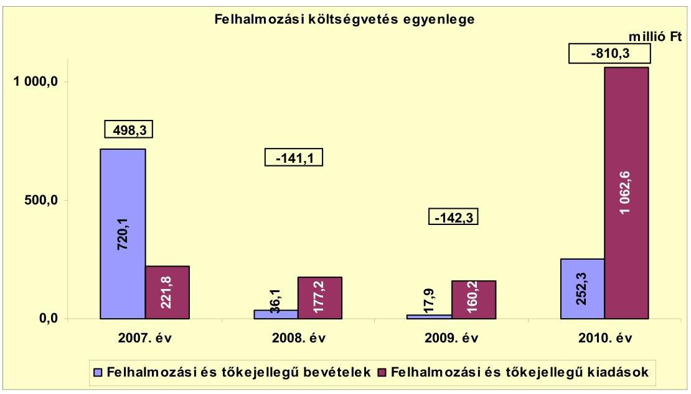

Az Önkormányzat felhalmozási költségvetésének egyenlege 2008-2010 között folyamatosan negatív előjelű volt. A 2007. évi felhalmozási forrástöbbletet az ingatlanértékesítések ${ }^{18}$ 657,3 millió Ft-os bevétele eredményezte. Ez és az előző években képződött nettó működési jövedelem fedezetet nyújtottak a 2008-2010. évek felhalmozási forráshiányára. A 2010. évben a kiemelkedő forráshiányt az időszak legnagyobb beruházása, a Hévíz városközpont kialakítása okozta. A fejlesztéshez 794,3 millió Ft saját bevételt használtak fel.

A felhalmozási forráshiánynak a felhalmozási és tőke jellegű kiadásokhoz viszonyított aránya 2008-ban -79,6% (-141,1 millió Ft), 2009-ben -88,8% (-142,3 millió Ft), 2010-ben -76,3% (-810,3 millió Ft) volt.

A 2008-2010. években keletkezett 1093,7 millió Ft felhalmozási forráshiányra a 2008. január 1-jén rendelkezésre álló 826,6 millió Ft pénzkészlet és a 2008-2010. években keletkezett 1055,3 millió Ft nettó működési jövedelem ${ }^{19}$ felhasználása fedezetet nyújtott.

[^0]
[^0]:    ${ }^{18}$ A Hévíz 118/4. hrsz-ú 2 ha $9275 \mathrm{~m}^{2}$ területű beépítetlen ingatlant és négy apartmant értékesített az Önkormányzat 2007-ben.
    ${ }^{19}$ Az évenkénti adatokat a jelentés 2. számú melléklete mutatja be.

---

Az önkormányzat finanszírozási műveletei 2007-2010. évekbeli egyenlegének alakulását a következő ábra szemlélteti:
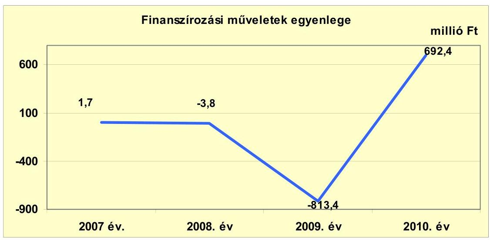

A finanszírozási műveletek egyenlegének hullámzását a 2009. évben 800 millió Ft értékű forgatási és befektetési célú értékpapír vásárlása, a 2010. évben ennek az értékpapírnak az értékesítése okozta. E tételek nélkül a finanszírozási művelet miatti pénzforgalom a költségvetési kiadásokhoz és a bevételekhez viszonyítva nem jelentős. A vizsgált időszakban együttesen jelentkező finanszírozási célú pénzügyi műveletek negatív értéke (-123,1 millió Ft) azt jelzi, hogy az éves költségvetések végrehajtása során nem volt szükség külső finanszírozás igénybevételére. (A finanszírozási célú műveleteket a vizsgált időszakban a jelentés 2. számú mellékletének 4.1-4.8 pontjai részletezik.)

Az Önkormányzat évenkénti teljes finanszírozási igénye ${ }^{20}$ a CLF módszer szerint 2007-ben 701,1 millió Ft, 2008-ban 172,6 millió Ft, 2009-ben 238,5 millió Ft többletet mutatott. Az Önkormányzat teljes finanszírozási igénye 2010-ben 449,5 millió Ft volt, melynek finanszírozását az előző évek pénzmaradványa biztosította.

Az Önkormányzat zárszámadási rendeleteiben a működési és fejlesztési hiányt/többletet a hagyományos költségvetési szerkezet alapján mutatta be ${ }^{21}$, amelyről a jelentés 1. számú melléklete nyújt tájékoztatást.

A zárszámadási rendeletekben a 2007. évben 806,0 millió Ft, a 2008. évben 162,5 millió Ft, a 2009. évben 276,0 millió Ft pénzügyi többletet, a 2010. évben pedig -412,0 millió Ft pénzügyi hiányt mutattak ki.

[^0]
[^0]:    ${ }^{20}$ A nettó működési jövedelem és a felhalmozási költségvetés egyenlegeinek összege.
    ${ }^{21}$ Nincs kötelező előírás a működési és fejlesztési hiány megállapításának módjára.

---

Az Önkormányzat kamatbevételeit és kamatkiadásait évenként a következő ábra mutatja be:
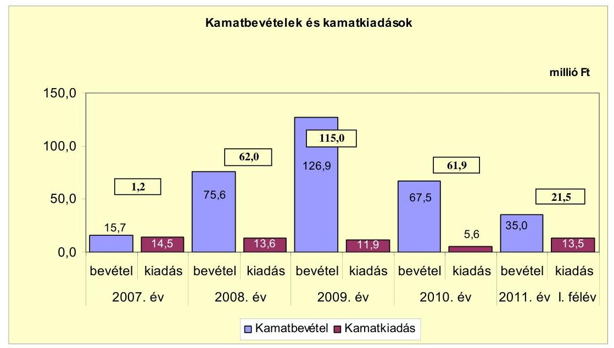

A vizsgált időszakban a kamatbevételek mindegyik évben meghaladták a kamatkiadásokat. A 2007-2011. év I. féléve között az Önkormányzat összesen 59,1 millió Ft kamatot fizetett. Az átmenetileg szabad pénzeszközök után realizált kamatbevétel pedig 320,7 millió Ft volt, vagyis a kamatbevétel közel öt és félszerese (542,6%-a) volt a fizetett kamatok összegének.

---

# 2.2. Az Önkormányzat bevételeinek változása 

Az Önkormányzat 2007-2010 között realizált bevételeinek főbb jogcímek szerinti adatait az alábbi ábra mutatja be:
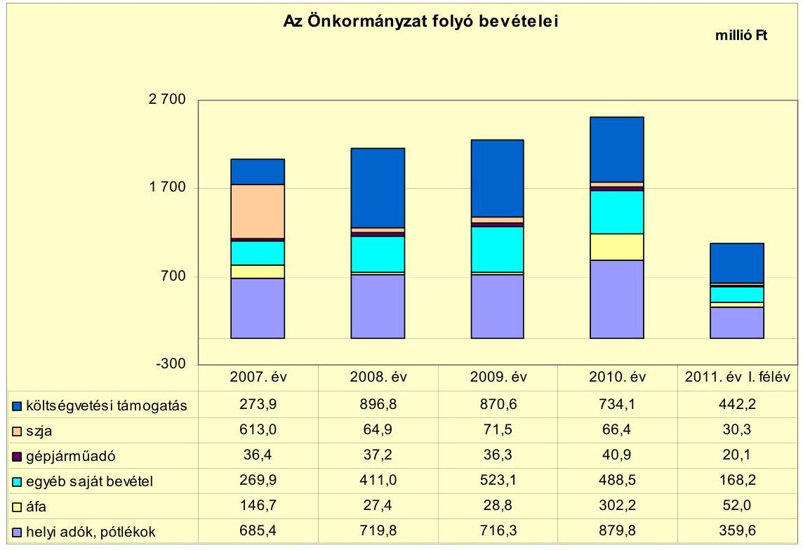

Az Önkormányzat folyó bevételei folyamatosan növekedtek. A 2007. évben 2025,3 millió Ft, 2008-ban 2157,1 millió Ft, 2009-ben 2246,6 millió Ft, 2010-ben 2511,9 millió Ft volt. 2011. június 30-ára a bevételek az előző évhez viszonyítva megközelítőleg időarányosan (42,7%), 1072,4 millió Ft összegben realizálódtak.

A működési célú költségvetési támogatás és az szja bevétel együttes összege a 2007-2009. évi átlagos 930,2 millió Ft-tal szemben a 2010. évben 800,5 millió Ft-ra csökkent. A 2008. évben a beszedett idegenforgalmi adóhoz kapcsolódó üdülőhelyi feladatok ellátására biztosított normatív támogatás 53,8 millió Ft többletbevételt eredményezett. A 2010. évben a beszedett idegenforgalmi adó után járó állami hozzájárulás 2 Ft-ról 1 Ft-ra változott, emiatt 142,8 millió Ft-tal csökkent az Önkormányzatot megillető költségvetési támogatás.

Az Önkormányzat 2007-2010. között az építményadó, az idegenforgalmi adó, és a helyi iparűzési adó adónemeket alkalmazta. Az építményadó mértéke ${ }^{22}$ és az idegenforgalmi adó mértéke ${ }^{23}$ változott. Az Önkormányzatnál a helyi adókból és pótlékokból származó bevételek aránya a folyó bevételekben a 2007-2009. években átlagosan 33,0% (707,2 millió Ft) volt, amely a 2010. évre

[^0]
[^0]:    ${ }^{22}$ 2008-tól 550 Ft/m²-ről 600 Ft/m²-re változott.
    ${ }^{23}$ 2008-ban 345 Ft/fő/éjszaka/összegről 360-ra, 2009-ben 380-ra, 2010-ben 420-ra változott az adó mértéke.

---

35,0%-ra (879,8 millió Ft-ra) növekedett. Az átlaghoz viszonyított 24,4%-os, 172,6 millió Ft-os növekedést az idegenforgalmi adónál az adó mértékének változásán túl
 az adómentesség szabályainak változása – a 70 éven felüli vendégek adómentességének megszűnése – okozta, amely 132,6 millió Ft bevételnövekedést eredményezett.

Az áfa bevételek 2007. évi kimagasló teljesítését az ingatlanértékesítés 124,0 millió Ft összegű áfa bevétele okozta. A 2010. és 2011. év I. félévében fordított áfa ${ }^{24}$ miatti bevétel térítette el a 2007-2009 közötti 67,6 millió Ft-os átlagtól az áfa bevételt, melynek összege 2010-ben 184,4 millió Ft, 2011. év I. félévében 35,1 millió Ft volt.

Az Önkormányzat felhalmozási bevételei a vizsgált időszakban a következőképpen alakultak:
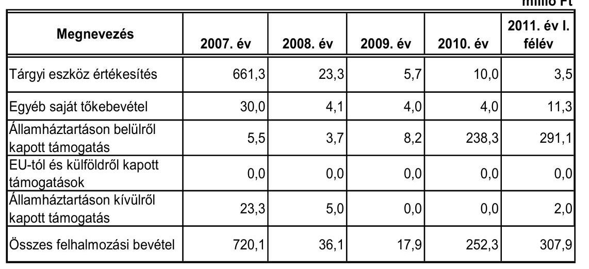

A vizsgált években a felhalmozási célú bevételek jelentős ingadozását a 2007. évben az ingatlanértékesítések, a 2010. évben és 2011. év I. félévében az államháztartáson belülről kapott, pályázatokból származó támogatások okozták. A 2007. évben három hektár nagyságú beépítetlen ingatlant értékesített az Önkormányzat 620,0 millió Ft-ért. Ugyanebben az évben 4 db apartman értékesítéséből 37,3 millió Ft felhalmozási bevételt realizáltak. A 2010. évben a városközpont funkcióbővítése fejlesztési feladathoz 164,9 millió Ft, az Alsópáhok-Hévíz kerékpárút kivitelezéséhez 15,8 millió Ft, a Bölcsőde építéséhez 28,0 millió Ft, a Római Kori Romkert és Zöldterület rehabilitációjához 23,2 millió Ft pályázati támogatásban részesült az Önkormányzat.

[^0]
[^0]:    ${ }^{24}$ A fordított áfa elszámolás azt jelenti, hogy az áfa múködési mechanizmusával ellentétben értékesítéskor nem az eladó fizeti meg a számlában foglalt összeg után az áfát, hanem a vevő. A fordított áfa elszámolás bevételnövelő pénzügyi kihatása 2010-ben 184,4 millió Ft, kiadásnövelő hatása 219,9 millió Ft volt. A 2011. év I. félévében a bevételnövelő hatás 35,1 millió Ft, a kiadásnövelő hatás 59,0 millió Ft volt.

---

# 2.3. Az Önkormányzat működési és a felhalmozási célú kiadásainak változása. 

Az Önkormányzat folyó kiadásai főbb jogcímek szerinti bontásban a 2007-2011. év I. félévében az alábbiak voltak:

|  |  |  |  |  | millió Ft |
| :--: | :--: | :--: | :--: | :--: | :--: |
| Megnevezés | 2007. év | 2008. év | 2009. év | 2010. év | 2011. év I.   félév |
| Folyó kiadások | 1785,0 | 1805,9 | 1828,3 | 2113,6 | 963,5 |
| Működési kiadások (kamatkiadás nélkül) | 1621,3 | 1627,7 | 1636,9 | 1941,6 | 831,5 |
| Államháztartáson belülre átadott pénzeszközök | 51,9 | 49,1 | 50,1 | 40,8 | 19,5 |
| Transzferkiadások | 96,9 | 115,5 | 129,4 | 125,6 | 109,6 |
| -ebből: vállalkozásoknak | 1,0 | 2,7 | 0,3 |  |  |
| EU-nak, illetve külföldre |  |  |  |  |  |
| magánszemélyeknek | 30,0 | 36,3 | 40,7 | 39,6 | 20,2 |
| nonprofit szervezeteknek | 65,9 | 76,5 | 88,4 | 86,0 | 89,4 |
| Kamatkiadások | 14,5 | 13,6 | 11,9 | 5,6 | 1,6 |
| Előző évi pénzmaradvány átadás | 0,4 |  |  |  |  |

A folyó kiadásokon belül a működési kiadások átlagos növekedési üteme a 2007-2009. években 1,2% (21,6 millió Ft) volt. A működési kiadások átlagos növekedési ütemét a 2010. év 17,0%-kal (307,2 millió Ft-tal) haladta meg. A 2010. évi átlagot meghaladó emelkedést a fordított áfa miatti (219,9 millió Ft) befizetés okozta.

Az Önkormányzat folyó kiadásai főbb kiadásnemek szerinti bontásban a 2007-2011. év I. féléve között az alábbiak voltak:

|  |  |  |  |  | millió Ft |
| :-- | --: | --: | --: | --: | --: |
| Megnevezés | 2007. év | 2008. év | 2009. év | 2010. év | 2011. év I.   félév |
| Személyi juttatások | 837,4 | 921,1 | 894,3 | 928,6 | 388,5 |
| Munkaadót terhelő járulékok | 248,0 | 264,1 | 242,3 | 225,8 | 95,7 |
| Dologi kiadások | 524,1 | 430,5 | 487,8 | 746,0 | 327,0 |
| Egyéb folyó kiadások | 11,8 | 12,0 | 11,0 | 36,4 | 17,2 |

A személyi juttatások összegének ingadozását a létszámcsökkentési döntésekből (jelentés 41-42. oldalak) adódó egyszeri többletkiadások és a létszámfejlesztés okozta. A 2007-2009. évek átlagához viszonyítva 2010-ben 5,0%-kal, 44,3 millió Ft-tal növekedtek a személyi juttatások. A vizsgált időszakban a munkaadókat terhelő járulékok összege a központi szabályozás változásának hatására mérséklődött.

A dologi kiadások teljesített összegei 2007-2009. évek átlagához viszonyítva a 2010. évben 265,2 millió Ft-tal, 55,5%-kal növekedtek, amelyet a fordított áfa miatti 219,9 millió Ft összegű befizetése okozott.

---

A működési és felhalmozási kiadások alakulását az alábbi ábra szemlélteti:
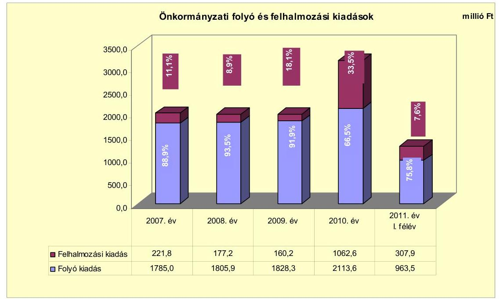

A felhalmozási kiadások részaránya a 2007. évi 11,1%-ról (221,8 millió Ft) a 2009. évre 8,1%-ra (160,2 millió Ft) csökkent, a 2010. évre 33,5%-ra (1062,6 millió Ft) növekedett. A 2010. évben a felhalmozási kiadások arányának növekedését a pályázati forrásból megvalósított, a 3/a-c. számú mellékletekben részletezett fejlesztések eredményezték.

Az Önkormányzatnál a 2007-2010. években összesen 9 db 10 millió Ft feletti fejlesztés, 9 db 10 millió Ft feletti felújítás, 145 db 10 millió alatti fejlesztés és 25 db 10 millió Ft alatti felújítás fejeződött be. Az 1505,7 millió Ft tényleges bekerülési költségű fejlesztés és felújítás forrásmegoszlása: 172,5 millió Ft EU-s támogatás (11,5%), 1263,4 millió Ft saját bevétel (83,9%), 69,8 millió Ft hazai támogatás (4,6%) volt. A 2010. december 31-éig befejezett felújítások és fejlesztések részletezését a jelentés 3/a. számú melléklete mutatja be.

A 2010. december 31-én folyamatban lévő három 10 millió Ft feletti fejlesztés ${ }^{25}$ és két 10 millió Ft alatti felújítás tervezett bekerülési költsége 261,7 millió Ft volt, amelyre 2010. december 31-éig 4,9 millió Ft kiadást teljesítettek. A folyamatban lévő fejlesztések forrása 3,9 millió Ft (3,4%) saját bevétel és 1,0 millió Ft (96,6%) EU-s támogatás volt. A folyamatban lévő fejlesztések 2010. december 31-e utáni kötelezettsége 256,8 millió Ft, melynek forrása 158,0 millió Ft (61,5%) EU-s támogatás és 98,8 millió Ft (38,5%) saját bevétel. A 2010. december 31-én folyamatban lévő felújítások és fejlesztések adatait a jelentés 3/b. és 3/c. számú mellékletei mutatják be.

Az Önkormányzat három felújítás és egy fejlesztés megvalósításához nyújtott be pályázatot: a Hévízi Muzeális Gyűjtemény „Hévíz története" című állandó

[^0]
[^0]:    ${ }^{25}$ A Brunszvik óvoda és bölcsőde Sugár utcai épülete, valamint a Hévíz-Alsópáhok kerékpárút építése.

---

kiállítás teljes körű felújítása, a Multifunkcionális sportpálya felújítása Hévízen, az „ART" mozihálózat digitális fejlesztése, valamint a Római kori zöldterület rehabilitációja fejlesztési feladatokhoz. Az elbírálás alatt álló pályázatok teljes bekerülési költsége 128,1 millió Ft, melyhez 58,1 millió Ft (45,4%) EU-támogatást és 41,4 millió Ft (32,3%) hazai támogatást igényeltek. A fejlesztéshez 28,6 millió Ft (22,3%) saját forrás felhasználását tervezik. A beadott, elbírálás alatti pályázati forrásból megvalósítani tervezett fejlesztéseket a jelentés 3/d. számú melléklete mutatja be.

Az Önkormányzat három legmagasabb bekerülési költségű fejlesztése a következő volt:

- A Hévíz városközpont funkcióbővítő megújítása során a Rákóczi utca és az Erzsébet királyné utca területén komplex közlekedésfejlesztés keretében a meglévő utca és térburkolatokat felújították, a közterületeken új, elemes térburkolatokat építettek, valamint a Rózsakert épületét átépítették. A beruházás 2009-ben kezdődött és 2010-ben fejeződött be. Teljes bekerülési költsége 959,2 millió Ft volt. A fejlesztés forrásösszetétele: 794,3 millió Ft (82,8%) saját bevétel, 164,9 millió Ft (17,2%) EU-s támogatás volt;
- a Bölcsőde építése 2010-ben kezdődött. A projekt keretében 24 fő befogadására alkalmas bölcsőde építését valósítják meg. A fejlesztési feladat teljes tervezett bekerülési költsége 105,3 millió Ft, melyből 2010. december 31-éig 0,8 millió Ft fejlesztési kiadás teljesítésére került sor EU-s fejlesztési forrásból. A 2010. év után fennálló kötelezettség 104,5 millió Ft, melynek forrása 25,3 millió Ft (24,2%) saját bevétel és 79,2 millió Ft (75,8%) EU-s támogatás;
- a Hévíz-Alsópáhok kerékpárút építése a 2010. évben kezdődött és várhatóan a 2011. évben fejeződik be, melynek teljes bekerülési költsége 91,9 millió Ft. A fejlesztés során 2146 méter hosszúságú kerékpárút készül el 62%-ban Hévíz, 38%-ban Alsópáhok területén. 2010. december 31-ig 0,2 millió Ft fejlesztési kiadás teljesítésére került sor, a 2010. év után fennálló kötelezettség 91,7 millió Ft, melynek forrása 12,9 millió Ft (14,1%) saját bevétel és 78,8 millió Ft (85,9%) EU-s támogatás.

A gazdasági társaságok az Önkormányzattól az ellenőrzött időszakban rendszeres működési vagy fejlesztési célú támogatást nem kaptak, az előírt költségszint alatti ár- és díjmegállapítás miatti támogatásban nem részesültek.

# 3. Az ÖNKORMÁNYZAT KÖTELEZETTSÉGEI 

### 3.1. Az Önkormányzat pénzintézeti kötelezettségeinek változása

Az Önkormányzatnak 2006. december 31-én 187,5 millió Ft pénzintézettel szembeni kötelezettségállománya volt, amely 2010. december 31-ig 37,5 millió Ft-ra csökkent, 2011. június 30-án az állománya nem változott. Az Önkormányzat pénzintézeti kötelezettsége egy, a vizsgált időszak előtt felvett hosszú lejáratú hitel igénybevételéből keletkezett. Folyószámla, illetve likvid hitelt az Önkormányzat a vizsgált időszakban nem vett igénybe, kötvénykibocsátásra nem került sor. Munkabér megelőlegezési hitelt a vizsgált időszakon belül, a 2010. évben egy alkalommal 22 napra 34,1 millió Ft-ot vett igénybe az Önkormányzat. Erre azért került sor, mert a lekötött betéteinek felbontása nagyobb kamatveszteséget okozott volna, mint a felvett munkabér hitel 0,2 millió Ft-os összes költsége.

Az Önkormányzat pénzintézetek felé fennálló év végi kötelezettségállományának alakulását a 2006-2011. év I. féléve közötti időszakban a következő diagram szemlélteti:
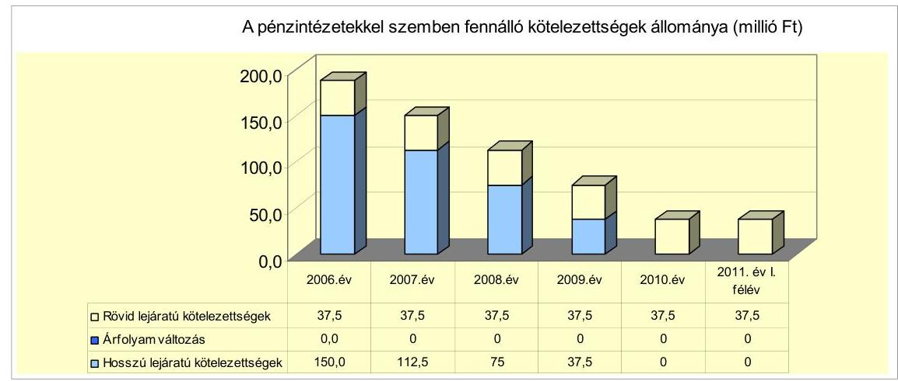

A vizsgált időszakban az Önkormányzat hitelfelvételről nem döntött. A rövid lejáratú kötelezettségek állományát a hosszú lejáratú hitelek tárgyévet követő évet terhelő törlesztő részletei jelentették.

A hosszú lejáratú pénzintézeti kötelezettségvállalásra a Képviselő-testület 2001. évi határozata alapján került sor. Az Önkormányzat úgy döntött, hogy az Aquamarin Kft. 100%-os üzletrészének tulajdonjogát megvásárolja. Az üzletrész megszerzéséhez a vételár 50%-ára 375,0 millió Ft hosszú lejáratú hitelt vett igénybe, a számlavezető pénzintézetétől. Az adósságszolgálat felső határáról az éves költségvetési rendelettervezetek előterjesztésekor tájékoztatták a Képviselőtestületet és az adósságot keletkeztető kötelezettségvállalásnál annak felső határát betartották. A hitelszerződés forint alapú, így a devizaárfolyamváltozás hatása a kötelezettségek alakulását nem befolyásolta. A vizsgált időszakban számlavezető bankot nem váltottak.

A költségvetési rendelet mellékletében bemutatásra került a lejáratig fizetendő tőketörlesztés és a kamat összege.

Az Önkormányzat forintban fennálló hosszú lejáratú pénzintézeti kötelezettségét a következő táblázat mutatja be:

| Megnevezés | Szerződéskötés/   Kibocsátás   időpontja | Összeg   millió Ft-ban | Kamat (referencia kamat+   kamatfelár) | Felhasználás célja: |
| :--: | :--: | :--: | :--: | :--: |
| OTP Bank hosszú

 lejáratú hitel | 2001.08.01 | 375,0 | 3 havi BUBOR+ 0,25% | Aquamarin Kft. üzletrész   vásárlás |

---

Az Önkormányzat a felvett hitelt a célnak megfelelően használta fel. A vizsgált időszakban 2010. december 31-ig a pénzintézeti kötelezettségével kapcsolatban 45,6 millió Ft kamatot fizetett meg.

A kamatfizetési kötelezettség alakulását jelentősen befolyásolta a felvételkori és az utolsó kamatfizetéskori ${ }^{26}$ referencia kamatok ${ }^{27}$ változása, melyet az alábbi táblázat mutat be:

| Megnevezés | Kibocsátási, lehivási | Utolsó fizetéskori | Változás |
| :--: | :--: | :--: | :--: |
|  | kamat (referencia + kamatfelár) % |  |  |
| 3 havi BUBOR (2001.08.01.-i szerződés) | 11,25 | 6,32 | -4,9 % |

A hitelhez kapcsolódóan az Önkormányzat a 2007. évben 14,5 millió Ft, a 2008. évben 13,6 millió Ft, a 2009. évben 11,9 millió Ft, a 2010. évben 5,6 millió Ft (összesen 45,6 millió Ft) kamatot fizetett. Amennyiben a referenciakamat nem változott volna, az Önkormányzatnak kibocsátáskori referenciakamattal számolva a 2007-2010. december 31. közötti időszakban 59,1 millió Ft kamatfizetési kötelezettsége jelentkezett volna. A kamatváltozások miatt az Önkormányzatnak 13,5 millió Ft-tal kevesebb fizetési kötelezettséget kellett teljesítenie, mint amivel a szerződés megkötésekor számolnia kellett.

Az Önkormányzat kötelezettségeinek állományát 2010. december 31-én és 2011. június 30-án, valamint várható alakulását a kötelezettségek lejáratáig az alábbi táblázat részletezi:

| Megnevezés | Állomány 2010. december 31   én |  |  | Állomány 2011. június 30-án |  | Várható   kötelezettség 2011-   2013. években |  | Várható   kötelezettség 2014.   évtől |  |
| :--: | :--: | :--: | :--: | :--: | :--: | :--: | :--: | :--: | :--: |
|  | HUF-ban   (millió: Ft -   ban) | Devizában   (összegé,   ezer ...   ban) | Devizát   nem | HUF-ban   (millió: Ft -   ban) | Devizában   (összegé,   ezer ...   ban) | Devizát   nem | HUF-ban   (millió: Ft -   ban) | Devizában   (összegé,   ezer ...   ban) | Devizában   (összegé,   ezer ...   ban) |
| Pénzintézeti kötelezettsége |  |  |  |  |  |  |  |  |  |
| KfFt-tól felvett hitel | 37,5 |  |  | 37,5 |  |  | 37,5 |  | 0,0 |
| Pénzintézeti kötelezettségek összesen HUF-ban: | 37,5 |  |  | 37,5 |  |  | 37,5 |  | 0,0 |
| Biztosítások |  |  |  |  |  |  |  |  |  |
| Kezességvállalás Aquamarin Származékalap Kft. | 125,0 |  |  | 125,0 |  |  | 0,0 |  | 0,0 |
| Biztosítások összesen: | 125,0 |  |  | 125,0 |  |  | 0,0 |  | 0,0 |
| Fizetési tartozás | 53,0 |  |  | 0,0 |  |  | 0,0 |  | 0,0 |
| Egyéb kiadás elmaradás | 0,0 |  |  | 0,0 |  |  | 0,0 |  | 0,0 |
| Egyéb kötelezettségek | 223,3 |  |  | 0,0 |  |  | 0,0 |  | 0,0 |
| Kötelezettségek összesen: | 438,8 |  |  | 162,5 |  |  | 37,5 |  | 0,0 |

Az Önkormányzat 2010. december 31-én fennálló összes kötelezettsége 438,8 millió Ft. Az Aquamarin Kft.-nek vállalt 125,0 millió Ft-os kezességvállalásából akkor lesz csak kötelezettség, ha az Önkormányzat kizárólagos tulajdonú társasága nem tesz eleget fizetési kötelezettségének. Az önkormányzati kötelezettségekből az egyéb kötelezettség 223,3 millió Ft, aminek 88,3%-a a helyi adó túlfizetés (53,9 millió Ft) és a támogatási programok megelőlegezésére kiutalt összeg (231,4 millió Ft). Az Önkormányzat 2010. év végén fennálló kötelezettségeiből a 2011-2013. években 37,5 millió Ft várható kötelezettsége kelet-

[^0]
[^0]:    ${ }^{26}$ 2011. június 30.
    | MNB BUBOR fixing (átlagkamat) %-ban |  |  |  |  |  |
    | :-- | :-- | :-- | :-- | :-- | :-- |
    | Referencia kamat | 2001. évi | 2008. évi | 2009. évi | 2010. évi | 2011. év I. |
    |  |  |  |  |  |  | félév |
    | 3 havi BUBOR | 11,00 | 8,87 | 8,64 | 5,50 | 6,07 |

---

kezik. Ennek teljesítésére a 2010. évi mérlegében kimutatott 777,4 millió Ft-os pénzeszközállomány nyújt fedezetet. A 2014. évtől jelenleg ismert várható kötelezettsége az Önkormányzatnak nem volt.

# 3.2. A szállítói kötelezettségek változása 

Az Önkormányzat mérlegben kimutatott szállítói állománya és annak kötelezettségeken belüli aránya a 2007. évben 5,1 millió Ft (1,9%), a 2008. évben 4,9 millió Ft (2,1%), a 2009. évben 41,5 millió Ft (17,6%) volt. Ez az arány a 2010. évben 93,6 millió Ft-ra (22,3%) növekedett.

A mérleg szerinti szállítói kötelezettség a 2007. évről a 2011. év I. félév végéig 5,1 millió Ft-ról 93,6 millió Ft-ra növekedett, az EU-s támogatással megvalósuló beruházások szállítói kötelezettségei miatt.

Az Önkormányzat lejárt szállítói tartozása a 2007. évben 0,25 millió Ft volt, ami 2010. december 31-re 79,7 millió Ft-ra nőtt. A 2010. évi lejárt tartozás 2,1%-a (1,7 millió Ft) 30 nap alatti, ami az intézmények ki nem fizetett közüzemi számláiból adódott. A lejárt tartozásállomány 95,4%-a a 61-90 nap közötti szállítói tartozás, ami a városközpont rehabilitációjának kivitelezője által (műszaki átadás-átvételt követően) benyújtott 76,0 millió Ft-os kifizetetlen végszámlából adódott. A garanciális kötelezettségek miatt az Önkormányzat a számla kiegyenlítésétől a hibák kijavításáig elzárkózott. A 91 és 365 nap közötti 2,0 millió Ft-os (2,5%) lejárt szállítói tartozás, az építési, felújítási munkákhoz kapcsolódóan a garanciális kötelezettségekre visszatartott összegből állt.

A 2011. év I. félév végén a 4,1 millió Ft lejárt szállítói tartozásból a 30 nap alatti tartozások összege a 2010. év végéhez viszonyítva (1,7 millió Ft) nem változott, a tartozásállományon belüli részaránya 41,5%-ra emelkedett. Az Önkormányzat a 61-90 nap közötti 76,0 millió Ft-os kifizetetlen végszámlát pénzügyileg rendezte. A beruházásokhoz kapcsolódó számlákból visszatartott összeg (2,0 millió Ft) nem változott, részaránya a lejárt tartozásokon belül 48,8%-ra növekedett.

A szállítói tartozások átütemezésére a vizsgált időszakban nem került sor, egyéb kiadás elmaradása az Önkormányzatnak nem volt.

### 3.3. Egyéb kötelezettségek változása

Az Önkormányzat a vizsgált időszakban nyolc alkalommal vállalt készfizető kezességet gazdasági társaságának, melyből tényleges fizetési kötelezettsége nem keletkezett. A kezességvállalás a kizárólagos tulajdonában lévő Aquamarin Kft. folyószámla, likvid és hosszú lejáratú hiteleinek igénybevételéhez, összesen 270,0 millió Ft tartozásállományra történt. Az Önkormányzat 2011. június 30-án fennálló kezességvállalásának értéke - a hitelek egy részének visszafizetése miatt - 125 millió Ft volt.

---

A vizsgált időszakban a Képviselő-testület követeléselengedésről három esetben döntött ${ }^{28}$, összesen 2,1 millió Ft értékben négy kedvezményezett javára, közterület használati és bérleti díjakat engedett el. A Képviselő-testület felhatalmazása alapján a polgármester volt jogosult 40 ezer Ft összeghatárig az adós írásbeli kérelme alapján az Önkormányzatot megillető követelésről lemondani. A 2007-2010. években a polgármester átruházott hatáskörében eljárva összesen 6,7 millió Ft helyi adó elengedéséről döntött.

Az Önkormányzat a vizsgált időszakban az Alsópáhoki Önkormányzatnak pályázati önerő megelőlegezésére összesen 9,8 millió Ft kölcsönt nyújtott. A kerékpárút fejlesztése, amelynek megvalósítására a szomszédos településsel együtt pályáztak, még folyamatban van, a kölcsön első részletének visszafizetési határideje 2012. január 31.

Az Önkormányzatnak lízingszerződésből, PPP konstrukciójú szerződésből eredő kötelezettsége a vizsgált időszakban nem volt.

Az Önkormányzat nyilatkozata alapján, a 2010. december 31-én számviteli nyilvántartásaik szerint 950,5 millió Ft nettó értékű forgalomképes ingatlanjaira, jelzálogjogot, elidegenítési és terhelési tilalmat nem jegyeztek be.

Az Önkormányzat alperesként négy peres eljárásban volt érintett, melyek perértéke összesen 37,3 millió Ft volt.

A peres eljárások közül kettő tulajdonjog megállapítására, tulajdoni viszonyok rendezésére vonatkozott. A felperes a korábban az állam által elkobzott (jelenleg önkormányzati tulajdonban lévő) ingatlanát kívánja visszaszerezni. Az érintett önkormányzati ingatlan nyilvántartás szerinti értéke 31,7 millió Ft. A közigazgatási jogkörben okozott kár megtérítésére indított eljárásban 5 millió Ft a követelés az Önkormányzattal szemben. A szerződés érvénytelenségének megállapítására indított perben az Önkormányzat perbeli kötelezettségének értéke 0,5 millió Ft.

Jogerős határozattal lezárt, de ki nem fizetett kötelezettsége az Önkormányzatnak nem volt.

Az Önkormányzat többségi tulajdonú gazdasági társaságai kötelezettségeinek állományát 2010. december 31-én, 2011. június 30-án, illetve várható alakulását a kötelezettségek lejáratáig a következő táblázat mutatja be:

[^0]
[^0]:    ${ }^{28}$ A 21/2008. (II. 12); 85/2010. (IV. 27.); 99/2010. (V. 25.) számú önkormányzati határozatokkal.

---

Az Önkormányzat 50% és azt meghaladó tulajdonosi hányaddal rendelkező társaságai kötelezettségeinek állománya 2010. december 31-én, és 2011. június 30-án, valamint várható alakulása a kötelezettségek lejáratáig

| Megnevezés | Állomány 2010. december 31   én |  |  | Állomány 2011. június 30-án |  |  | Várható kötelezettség 2011-2013. években |  | Várható kötelezettség 2014. évtől |
| :--: | :--: | :--: | :--: | :--: | :--: | :--: | :--: | :--: | :--: |
|  | HUF-ban   (millió Ft-ban) | Devizában   (összegé,   ezer ...   ban) | Összesen | HUF-ban   (millió Ft-ban) | Devizában   (összegé,   ezer ...   ban) | Összesen | HUF-ban   (millió Ft   ban) | Devizában   (összegé,   ezer ...   ban) | HUF-ban   (millió Ft   ban) | Devizában   (összegé,   ezer ...   ban) |
| Kegemérni Széltodepart Kft. hosszú lejáratú hitel | 84,4 |  |  | 83,6 |  |  | 83,6 |  | 0,0 |  |
| Kegemérni Széltodepart Kft. folyószámla hitel | 18,5 |  |  | 17,2 |  |  | 17,2 |  | 0,0 |  |
| Kegemérni Széltodepart Kft. hitelintézeti hitel | 0,0 |  |  | 10,3 |  |  | 10,0 |  | 0,0 |  |
| Pénzintézeti kötelezettségek összesen: | 102,9 |  |  | 110,8 |  |  | 110,8 |  | 0,0 |  |

 Szállítói tartozás | 5,6 |  |  | 7,2 |  |  | 7,2 |  | 0,0 |  |
| Kötelezettségek összesen: | 108,5 |  |  | 116,0 |  |  | 116,0 |  | 0,0 |  |

Az Önkormányzat minősített többségű társaságai pénzintézeti kötelezettsége 2011. június 30-án 110,8 millió Ft volt, emellett 7,2 millió Ft szállítói állománnyal rendelkeztek.

Az önkormányzati kötelezettségek mellett, a minősített többségi tulajdonú gazdasági társaságok 2011. év I. félév végi 118,0 millió Ft-os kötelezettségállománya is befolyásolhatja az Önkormányzat pénzügyi egyensúlyát. Az Önkormányzat számára pénzügyi kockázatot jelent, hogy felszámolás esetén a bíróság megállapíthatja az Önkormányzat korlátlan és teljes felelősségét a fenti kötelezettséggel érintett kizárólagos önkormányzati tulajdonú gazdasági társaság után.

Az Önkormányzat a gazdasági társaságokról szóló 2006. évi IV. törvény 54. § (2) bekezdése alapján korlátlan felelősséggel tartozik azon gazdasági társaságának felszámolása esetében, amelyben az Önkormányzat az 52. § (2) bekezdése szerint a szavazatok legalább 75%-ával rendelkezik, így minősített befolyásszerzőnek minősül, továbbá a csődeljárásról és a felszámolási eljárásról szóló 1991. évi XLIX. törvény 63. § (2) bekezdése alapján a kizárólagos önkormányzati tulajdonú gazdasági társaságának minden olyan kötelezettségéért, amelynek kielégítését a felszámolási eljárás során az adós társaság vagyona nem fedez, ha a hitelezőinek a felszámolási eljárás során benyújtott keresete alapján a bíróság - az adós társaság felé érvényesített tartósan hátrányos üzletpolitikájára figyelemmel - megállapítja az önkormányzat korlátlan és teljes felelősségét.

A 2007-2010. évek között az Önkormányzat az immateriális javak, a tárgyi és az üzemeltetésre átadott eszközök után 498,0 millió Ft értékcsökkenést számolt el. A vizsgált időszakban a fejlesztések, felújítások bekerülési költségéből eszközpótlásra az önkormányzat adatszolgáltatása szerint 1156,3 millió Ft-ot fordítottak. Az Önkormányzat pénzügyi lehetőségei az értékcsökkenés összegénél 132,2%-al (658,3 millió Ft) magasabb összegű forrást biztosítottak az elhasználódott eszközök megfelelő időben történő cseréjére, pótlására. Ugyanakkor a vizsgált időszakban szerepelt az eszközpótlásra elszámolt összegben az EU támogatással megvalósult Városközpont rehabilitációjának 959,2 millió Ft-os bekerülési költsége is.

Az elszámolt értékcsökkenés állománya a 2007. évi 113,0 millió Ft-ról a 2010. évben 121,4 millió Ft-ra (7,4%-kal) emelkedett. A 2007-2010. évek között az immateriális javak és tárgyi eszközök állományának bruttó értéke 982,1 millió Ft-tal, 6,7%-kal nőtt az Önkormányzat befejezett fejlesztéseinek eredményeként. A 2007-2010. években elszámolt amortizáció növekedésének mértéke meghaladta a bruttó érték növekedésének mértékét, így az immateriális javak,

---

tárgyi eszközök és az üzemeltetésre átadott eszközök átlagos használhatósági foka $^{29}$ 99,7%-ról 99,0%-ra csökkent. Az eszközök átlagos használhatósági foka is jelzi, hogy az Önkormányzat az elhasználódott eszközeit felmérte és pótolta.

# 4. A PÉNZÜGYI EGYENSÚLY MEGTEREMTÉSE ÉRDEKÉBEN HOZOTT INTÉZKEDÉSEK EREDMÉNYE 

A CLF módszer szerint bemutatott működési többlet finanszírozta a felhalmozási hiányt. Ennek ellenére a vizsgált időszakban az Önkormányzat kiadáscsökkentő intézkedésekről döntött, amelyeknek eredményeképpen az Önkormányzat adatszolgáltatása alapján összesen 3,6 millió Ft kiadási megtakarítás realizálódott.

A 2007-2011. év I. félévében végrehajtott kiadáscsökkentő intézkedések megoszlását a következő ábra szemlélteti:
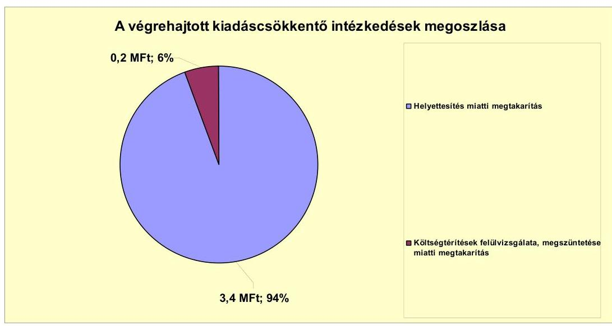

A kiadási megtakarítások 94,0%-a (3,4 millió Ft) helyettesítés miatti megtakarítás volt. A 2010. évben a GAMESZ vezetője részére megállapított költségátalány visszavonása miatt további 0,2 millió Ft megtakarítást mutatott ki az Önkormányzat.

[^0]
[^0]:    $^{29}$ nettó érték/bruttó érték (%)

---

Az Önkormányzat 2007-2010. éveket érintő összesített létszámának változását az alábbi táblázat szemlélteti:

| Megnevezés (adatok fő-ben) | Közoktatás | Szociális és gyermekvédelem | Egészségügy | Polgármesteri hivatal | Egyéb | Összesen |
| :--: | :--: | :--: | :--: | :--: | :--: | :--: |
| 2007. január 1-án jóváhagyott álláshelyek száma | 127 | 38 | 3 | 51 | 85 | 304 |
| Megszüntetett álláshelyek száma | 10 |  |  |  | 8 | 18 |
| ebből: Üres álláshelyek száma |  |  |  |  |  | 0 |
| szakmai álláshelyek száma | 9 |  |  |  |  | 9 |
| intézmény-üzemeltetéssel kapcsolatos álláshelyek száma | 1 |  |  |  |  |  |
| Átáshely növekedése | 2 | 6 |  | 12 | 6 | 26 |
| 2010. december 31-án záró álláshelyek száma | 119 | 44 | 3 | 63 | 83 | 312 |
| 2007. január 1-án foglalkoztatott létszám | 127 | 38 | 3 | 50 | 82 | 305 |
| Létszámcsökkenés | 10 |  |  |  | 8 | 18 |
| Létszámnövekedés | 1 | 6 |  | 7 | 6 | 20 |
| 2010. december 31-án foglalkoztatott létszám | 118 | 44 | 3 | 57 | 80 | 302 |

Az önkormányzati létszám a 2007-2010 közötti időszakban 18 fővel csökkent, ugyanakkor 20 fővel növekedett. Létszámcsökkenés a közoktatási feladatoknál és egyéb feladatoknál (GAMESZ, közművelődési feladatok), létszámnövekedés a szociális és gyermekvédelmi feladatoknál, valamint a Polgármesteri hivatalban jelentkezett. A létszám változások a Képviselő-testület döntésein alapultak.

Az Önkormányzat által foglalkoztatottak létszáma a 2007. évi nyitó 300 főről 2010. december 30-ára 302 főre növekedett. Ezen időszak alatt az álláshelyek száma a 304-ről 312-re növekedett. Üres álláshely megszüntetés nem volt. A 2007-2010. években összesen 18 fő álláshelyet szüntettek meg, ebből 10 fő (55,6%) a közoktatási, nyolc fő (44,4%) egyéb területet érintett. A csökkentés mellett a bővülő feladatok miatt az álláshelyek számának 26 fős növelésére is szükség volt, ebből két fő (7,7%) közoktatási, hat fő (23,1%) szociális és gyermekvédelmi, 12 fő (46,1%) polgármesteri hivatali, hat fő (23,1%) egyéb területet érintett.

A 2007-2010 között végrehajtott létszámcsökkentési intézkedések során 15 tartósan leépített álláshely után igényelt támogatást az Önkormányzat, melynek ténylegesen folyósított összege 22,3 millió Ft volt. A támogatott létszámleépítés az összes létszámcsökkentés (18 fő) 83,3%-a volt.

---

A 2007-2011. év I. félév között érvényesített bevételnövelő intézkedéseket az alábbi ábra szemlélteti:
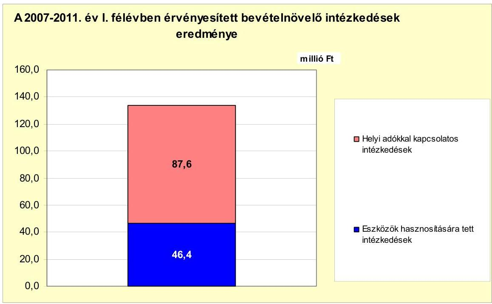

Az Önkormányzat a bevételnövelő intézkedései eredményeként a 2007-2011. év I. félév között összesen 134,0 millió Ft bevételt mutatott ki:

- az Önkormányzat a bevételei növelése érdekében az idegenforgalmi adó mértékét évente növelte, valamint az építményadó mértékét a 2007. évben 550 Ft/m²-ről 600 Ft/m²-re emelte. Az adó mértékének növelése eredményeként a 2007-2011. év I. féléve között 87,6 millió Ft többletbevétel realizálódott;
- az időszak alatt az eszközök hasznosítására tett intézkedések eredményeként 46,4 millió Ft bevétele keletkezett az Önkormányzatnak (feleslegessé vált eszközök értékesítéséből 45,5 millió Ft, eszközök bérbeadásából 0,9 millió Ft);

Az Önkormányzat kiadáscsökkentő és bevételnövelő intézkedései eredményeként 2007-2011. év I. féléve között összesen 137,6 millió Ft megtakarítást és többletbevételt számolt el.

---

5. Az ÁSZ Által a korábbi években a pénzügyi egyensúly javítására tett szabályszerűségi és célszerűségi javaslatok hasznosulása

Az ÁSZ az Önkormányzat gazdálkodását a 2007. évben ellenőrizte. Az ellenőrzés 11 célszerűségi és nyolc szabályszerűségi javaslatot tett, melyek között nem volt a pénzügyi egyensúly javítására vonatkozó javaslat. A számvevői jelentést a Képviselő-testület megtárgyalta, az intézkedési tervet a 133/2007. (IX. 25.) számú határozatával elfogadta.

Budapest, 2012. április "Oo"

Melléklet: 7 db
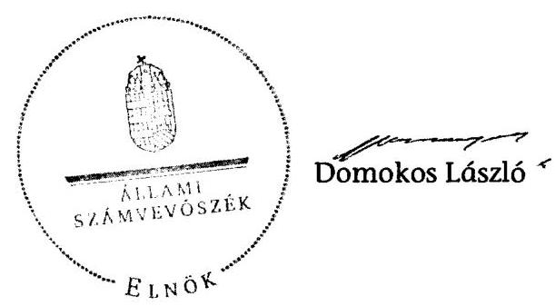

---

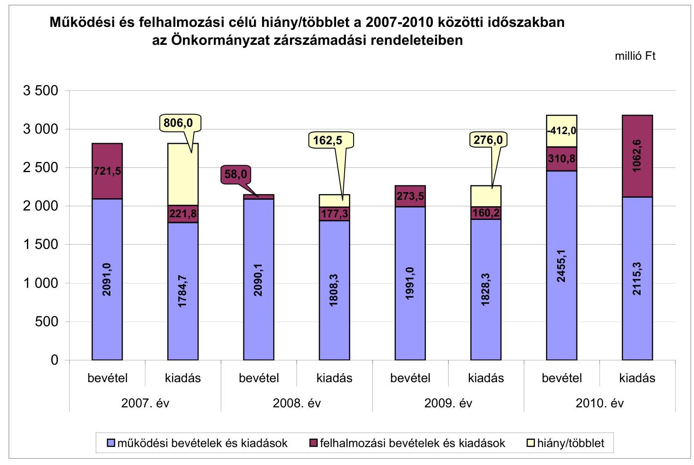

# Működési és felhalmozási célú hiány/többlet a 2007-2010 közötti időszakban az Önkormányzat zárszámadási rendeleteiben

|  Működési és felhalmozási célú hiány/többlet | 2007. év | 2008. év | 2009. év | 2010. év  |
| --- | --- | --- | --- | --- |
|  3 500 | 2 715.3 | 2 735.5 | 2 776.0 | 2 715.3  |
|  3 000 | 162.5 | 162.5 | 162.5 | 162.5  |
|  2 500 | 177.3 | 177.3 | 177.3 | 177.3  |
|  2 000 | 162.5 | 162.5 | 162.5 | 162.5  |
|  1 500 | 180.8 | 180.8 | 180.8 | 180.8  |
|  1 000 | 210.8 | 210.8 | 210.8 | 210.8  |
|  500 |  |  |  |   |
|  0 |  |  |  |   |
|  bevétel | kiadás | bevétel | kiadás | bevétel  |
|  2007. év | 2008. év | 2009. év | 2010. év | 2010. év  |
|  működési bevételek és kiadások |  | felhalmozási bevételek és kiadások |  | hiány/többlet  |

---

az Önkormányzat bevételei és kiadásai, valamint adósságozolgálata 2007-2010 között

|   |  |  |  |  | millió Ft  |
| --- | --- | --- | --- | --- | --- |
|  1. FOLYÓ KÖLTSÉGVETÉS* | 2007. | 2008. | 2009. | 2010. |   |
|  1.1.1. Saját működési bevételek | 1 044,7 | 1 031,6 | 1 110,4 | 1 494,5 |   |
|  1.1.2. Költségvetési támogatás | 273,9 | 896,8 | 870,6 | 734,2 |   |
|  1.1.3. Ángokett bevételek | 649,4 | 102,1 | 107,8 | 107,3 |   |
|  1.1.4. Állambáztartáson belülről kapott támogatások | 51,5 | 122,2 | 148,6 | 173,2 |   |
|  1.1.5. EU-tól és külföldről kapott bevételek | 0,0 |  | 0,0 | 0,0 |   |
|  1.1.6. Állambáztartáson kívülről kapott bevételek | 5,5 | 4,4 | 9,2 | 2,7 |   |
|  1.1.7. Előző évi pénzmaradvány átvétel | 0,3 |  | 0,0 | 0,0 |   |
|  1.1. Folyó bevételek =1.1.1.+1.1.2.+1.1.3.+1.1.4.+1.1.5.+1.1.6.+1.1.7. | 2 025,3 | 2 157,1 | 2 246,6 | 2 511,9 |   |
|  1.2.1. Működési kiadások-kontatkindások nélkül | 1 621,3 | 1 627,7 | 1 636,9 | 1 941,6 |   |
|  1.2.2. Állambáztartáson belülre átadott pénzeszközök | 51,9 | 49,1 | 50,1 | 40,8 |   |
|  1.2.3.1. vállalkozásoknak | 1,0 | 2,7 | 0,3 | 0,0 |   |
|  1.2.3.2. EU-nak, illetve külföldre | 0,0 | 0,0 | 0,0 | 0,0 |   |
|  1.2.3.3. magányszemélyeknek | 30,0 | 36,3 | 40,7 | 39,6 |   |
|  1.2.3.4. nonprofit szervezeteknek | 65,9 | 76,5 | 88,4 | 86,0 |   |
|  1.2.3. Transferkiadások (=1.2.3.1+1.2.3.2+1.2.3.3+1.2.3.4) | 96,9 | 115,5 | 129,4 |

 125,6 |   |
|  1.2.4. Kamatfizetők | 14,5 | 13,6 | 11,9 | 5,6 |   |
|  1.2.5. Előző évi pénzmaradvány átadás | 0,4 | 0,0 | 0,0 | 0,0 |   |
|  1.2. Folyó kiadások = 1.2.1.+1.2.2.+1.2.3.+1.2.4.+1.2.5. | 1 785,0 | 1 805,9 | 1 828,3 | 2 113,6 |   |
|  1.3. Folyó költségvetés egyenlege MŰKÖDÉSI JÖVEDELEM (1.1. - 1.2.) | 240,3 | 351,2 | 418,3 | 398,3 |   |
|  2. FELHALMOZÁSI KÖLTSÉGVETÉS** | 0,0 | 0,0 | 0,0 | 0,0 |   |
|  2.1.1. Saját tökebevételek | 691,3 | 27,4 | 9,7 | 14,0 |   |
|  2.1.2. Állami büdzsén belülről kapott támogatások | 5,5 | 3,7 | 8,2 | 238,3 |   |
|  2.1.3. EU-tól és külföldről kapott támogatások | 0,0 | 0,0 | 0,0 | 0,0 |   |
|  2.1.4. Állami büdzsén kívülről kapott támogatások | 23,3 | 5,0 | 0,0 | 0,0 |   |
|  2.1. Felhalmozási bevételek (=2.1.1.+2.1.2+2.1.3+2.1.4.) | 720,1 | 36,1 | 17,9 | 252,3 |   |
|  2.2.1. Saját beruházási kiadások | 94,1 | 133,7 | 94,3 | 986,5 |   |
|  2.2.2. Saját fejlesztési kiadások | 54,9 | 26,4 | 52,1 | 65,6 |   |
|  2.2.3. Állami büdzsén belülre átadott pénzeszközök | 0,9 | 4,8 | 7,6 | 6,6 |   |
|  2.2.4. EU-nak és külföldnek adott pénzeszközök | 0,0 | 0,0 | 0,0 | 0,0 |   |
|  2.2.5. Állami büdzsén kívülre adott pénzeszközök | 1,9 | 12,3 | 6,2 | 3,9 |   |
|  2.2.6. Befektetési célú részesedések vásárlása | 70,0 | 0,0 | 0,0 | 0,0 |   |
|  2.2. Felhalmozási kiadások (=2.2.1.+2.2.2.+2.2.3.+2.2.4.+2.2.5.+2.2.6.) | 221,8 | 177,2 | 160,2 | 1 062,6 |   |
|  2.3. Felhalmozási költségvetés egyenlege (2.1. - 2.2.) | 498,3 | -141,1 | -142,3 | -810,3 |   |
|  3. Finanszírozási műveletek nélküli (GFS) pozíció(1.3.+2.3.) | 738,6 | 210,1 | 276,0 | -412,0 |   |
|  4. Finanszírozási műveletek | 0,0 | 0,0 | 0,0 | 0,0 |   |
|  4.1. Hitelfelvétel | 0,0 | 0,0 | 0,0 | 0,0 |   |
|  4.2. Hitelförlesztés | 37,5 | 37,5 | 37,5 | 37,5 |   |
|  4.3. Forgatási és befektetési célú értékpapírok kibocsátása | 0,0 | 0,0 | 0,0 | 0,0 |   |
|  4.4. Forgatási és befektetési célú értékpapírok beváltása | 0,0 | 0,0 | 0,0 | 0,0 |   |
|  4.5. Forgatási és befektetési célú értékpapírok értékesítése | 42,0 | 32,0 | 5,4 | 809,7 |   |
|  4.6. Forgatási és befektetési célú értékpapírok vásárlása | 0,0 | 0,0 | 800,0 | 0,0 |   |
|  4.7. Egyéb finanszírozási bevételek (függő, átfizet, kiegyenlítő) | -0,9 | 2,0 | -17,1 | -37,7 |   |
|  4.8. Egyéb finanszírozási kiadások (függő, átfizet, kiegyenlítő) | 1,9 | 0,3 | -31,8 | 42,1 |   |
|  4.9.Finanszírozási műveletek egyenlege (4.1. - 4.2.+4.3.-4.4+4.5.-4.6.+4.7.-4.8.) | 1,7 | -3,8 | -813,4 | 692,4 |   |
|  5. Tárgyévi pénzügyi pozíció (1.3.+ 2.3.+4.9.) | 740,3 | 206,3 | -537,4 | 280,4 |   |
|  6. Nettó működési jövedelem =működési jövedelem (1.3.) - tüketörlesztés (4.2+4.4) | 202,8 | 313,7 | 380,8 | 360,8 |   |
|  TÁJÉKOZTATÓ ADATOK |  |  |  |  |   |
|  Összes kötelezettség | 212,6 | 173,8 | 195,6 | 416,9 |   |
|  ebből rövid lejáratú | 100,1 | 98,8 | 158,1 | 416,9 |   |
|  Összes szállítói kötelezettség | 5,1 | 4,9 | 41,5 | 93,6 |   |
|  ebből lejárt (tanúsítványból) | 5,1 | 4,9 | 10,5 | 93,6 |   |
|  Pénz és tőkepiac kötelezettség (adósság) | 150,0 | 112,5 | 75,0 | 37,5 |   |
|  ebből rövid lejáratú | 37,5 | 37,5 | 37,5 | 37,5 |   |
|  PPP szerződéses állomány jelenértéken (tanúsítványból) | 0,0 | 0,0 | 0,0 | 0,0 |   |
|  ebből lejárt szolgáltatási díj miatti kötelezettség | 0,0 | 0,0 | 0,0 | 0,0 |   |
|  Folyószámla-egyenleg napi átlagos állománya (tanúsítványból) | 0,0 | 0,0 | 0,0 | 0,0 |   |
|  Likviditási napi átlagos állománya (tanúsítványból) | 0,0 | 0,0 | 0,0 | 0,0 |   |
|  Mankabérleti napi átlagos állománya (tanúsítványból) | 0,0 | 0,0 | 0,0 | 0,0 |   |
|  Készség és garanciavállalások (tanúsítványból) | 30,0 | 30,0 | 140,0 | 125,0 |   |
|  Jogerős bírósági ítéletekből adódó kötelezettségek (tanúsítványból) | 0,0 | 0,0 | 0,0 | 0,0 |   |
|  Finanszírozásba bevonható eszközök: | 877,3 | 1 051,6 | 1 304,9 | 775,9 |   |
|  Tartós hitelviszonyt megtestesítő értékpapírok és végi állománya | 28,0 | 18,7 | 9,3 | 0,0 |   |
|  Hosszú lejáratú bankbetétek és végi állománya | 0,0 | 110,0 | 0,0 | 0,0 |   |
|  Értékpapírok és végi állománya | 22,6 | 0,0 | 800,0 | 0,0 |   |
|  Pénzeszközök (idegen pénzeszközök nélkül) és végi állománya | 826,6 | 922,9 | 495,5 | 775,9 |   |

- Bevételekben nem szerepel, a kiadásokban nem jelenik meg az amortizáció, a vagyoni helyzetet az egyenleg befolyásolja. Bevételekben vagyon megőrzésre és fejlesztésre fordítható források.

---

## Az Önkormányzat 2007-2010 években megvalósított, 2010. december 31-ig befejezett fejlesztései és azok forrásösszetétele

|  Fejlesztési feladat (beruházás, felújítás) |  |  |  |  |  |  |  |  |  |  |  |  |  |  |  |  |  |  |  |  |  |  |  |  |  |  |  |  |  |  |  |  |  |  |  |  |  |  |  |  |  |  |   |
| --- | --- | --- | --- | --- | --- | --- | --- | --- | --- | --- | --- | --- | --- | --- | --- | --- | --- | --- | --- | --- | --- | --- | --- | --- | --- | --- | --- | --- | --- | --- | --- | --- | --- | --- | --- | --- | --- | --- | --- | --- | --- | --- | --- |
|   |  |  |  |  |  |  |  |  |  |  |  |  |  |  |  |  |  |  |  |  |  |  |  |  |  |  |  |  |  |  |  |  |  |  |  |  |  |  |  |  |  |  |   |
|   |  |  |  |  |  |  |  |  |  |  |  |  |  |  |  |  |  |  |  |  |  |  |  |  |  |  |  |  |  |  |  |  |  |  |  |  |  |  |  |  |  |  |   |
|   |  |  |  |  |  |  |  |  |  |  |  |  |  |  |  |  |  |  |  |  |  |  |  |  |  |  |  |  |  |  |  |  |  |  |  |  |  |  |  |  |  |  |   |
|   |  |  |  |  |  |  |  |  |  |  |  |  |  |  |  |  |  |  |  |  |  |  |  |  |  |  |  |  |  |  |  |  |  |  |  |  |  |  |  |  |  |  |   |
|   |  |  |  |  |  |  |  |  |  |  |  |  |  |  |  |  |  |  |  |  |  |  |  |  |  |  |  |  |  |  |  |  |  |  |  |  |  |  |  |  |  |  |   |
|   |  |  |  |  |  |  |  |  |  |  |  |  |  |  |  |  |  |  |  |  |  |  |  |  |  |  |  |  |  |  |  |  |  |  |  |  |  |  |  |  |  |  |   |

 |  |  |  |  |  |  |  |  |  |  |  |  |  |  |  |  |  |  |  |  |  |  |  |  |  |  |  |  |  |  |  |  |  |   |
|   |  |  |  |  |  |  |  |  |  |  |  |  |  |  |  |  |  |  |  |  |  |  |  |  |  |  |  |  |  |  |  |  |  |  |  |  |  |  |  |  |  |  |   |
|   |  |  |  |  |  |  |  |  |  |  |  |  |  |  |  |  |  |  |  |  |  |  |  |  |  |  |  |  |  |  |  |  |  |  |  |  |  |  |  |  |  |  |   |
|   |  |  |  |  |  |  |  |  |  |  |  |  |  |  |  |  |  |  |  |  |  |  |  |  |  |  |  |  |  |  |  |  |  |  |  |  |  |  |  |  |  |  |   |
|   |  |  |  |  |  |  |  |  |  |  |  |  |  |  |  |  |  |  |  |  |  |  |  |  |  |  |  |  |  |  |  |  |  |  |  |  |  |  |  |  |  |  |   |
|   |  |  |  |  |  |  |  |  |  |  |  |  |  |  |  |  |  |  |  |  |  |  |  |  |  |  |  |  |  |  |  |  |  |  |  |  |  |  |  |  |  |  |   |
|   |  |  |  |  |  |  |  |  |  |  |  |  |  |  |  |  |  |  |  |  |  |  |  |  |  |  |  |  |  |  |  |  |  |  |  |  |  |  |  |  |  |  |   |
|   |  |  |  |  |  |  |  |  |  |  |  |  |  |  |  |  |  |  |  |  |  |  |  |  |  |  |  |  |  |  |  |  |  |  |  |  |  |  |  |  |  |  |   |
|   |  |  |  |  |  |  |  |  |  |  |  |  |  |  |  |  |  |  |  |  |  |  |  |  |  |  |  |  |  |  |  |  |  |  |  |  |  |  |  |  |  |  |   |
|   |  |  |  |  |  |  |  |  |  |  |  |  |  |  |  |  |  |  |  |  |  |  |  |  |  |  |  |  |  |  |  |  |  |  |  |  |  |  |  |  |  |  |   |
|   |  |  |  |  |  |  |  |  |  |  |  |  |  |  |  |  |  |  |  |  |  |  |  |  |  |  |  |  |  |  |  |  |  |  |  |  |  |  |  |  |  |  |   |
|   |  |  |  |  |  |  |  |  |  |  |  |  |  |  |  |  |  |  |  |  |  |  |  |  |  |  |  |  |  |  |  |  |  |  |  |  |  |  |  |  |  |  |   |
|   |  |  |  |  |  |  |  |  |  |  |  |  |  |  |  |  |  |  |  |  |  |  |  |  |  |  |  |  |  |  |  |  |  |  |  |  |  |  |  |  |  |  |   |
|   |  |  |  |  |  |  |  |  |  |  |  |  |  |  |  |  |  |  |  |  |  |  |  |  |  |  |  |  |  |  |  |  |  |  |  |  |  |  |  |  |  |  |   |
|   |  |  |  |  |  |  |  |  |  |  |  |  |  |  |  |  |  |  |  |  |  |  |  |  |  |  |  |  |  |  |  |  |  |  |  |  |  |  |  |  |  |  |   |
|   |  |  |  |  |  |  |  |  |  |  |  |  |  |  |  |  |  |  |  |  |  |  |  |  |  |  |  |  |  |  |  |  |  |  |  |  |  |  |  |  |  |  |   |
|   |  |  |  |  |  |  |  |  |  |  |  |  |  |  |  |  |  |  |  |  |  |  |  |  |  |  |  |  |  |  |  |  |  |  |  |  |  |  |  |  |  |  |   |
|   |  |  |  |  |  |  |  |  |  |  |  |  |  |  |  |  |  |  |  |  |  |  |  |  |  |  |  |  |  |  |  |  |  |  |  |  |  |  |  |  |  |  |   |
|

   |  |  |  |  |  |  |  |  |  |  |  |  |  |  |  |  |  |  |  |  |  |  |  |  |  |  |  |  |  |  |  |  |  |  |  |  |  |  |  |  |  |  |   |
|   |  |  |  |  |  |  |  |  |  |  |  |  |  |  |  |  |  |  |  |  |  |  |  |  |  |  |  |  |  |  |  |  |  |  |  |  |  |  |  |  |  |  |   |
|   |  |  |  |  |  |  |  |  |  |  |  |  |  |  |  |  |  |  |  |  |  |  |  |  |  |  |  |  |  |  |  |  |  |  |  |  |  |  |  |  |  |  |   |
|   |  |  |  |  |  |  |  |  |  |  |  |  |  |  |  |  |  |  |  |  |  |  |  |  |  |  |  |  |  |  |  |  |  |  |  |  |  |  |  |  |  |  |   |
|   |  |  |  |  |  |  |  |  |  |  |  |  |  |  |  |  |  |  |  |  |  |  |  |  |  |  |  |  |  |  |  |  |  |  |  |  |  |  |  |  |  |  |   |
|   |  |  |  |  |  |  |  |  |  |  |  |  |  |  |  |  |  |  |  |  |  |  |  |  |  |  |  |  |  |  |  |  |  |  |  |  |  |  |  |  |  |  |   |
|   |  |  |  |  |  |  |  |  |  |  |  |  |  |  |  |  |  |  |  |  |  |  |  |  |  |  |  |  |  |  |  |  |  |  |  |  |  |  |  |  |  |  |   |
|   |  |  |  |  |  |  |  |  |  |  |  |  |  |  |  |  |  |  |  |  |  |  |  |  |  |  |  |  |  |  |  |  |  |  |  |  |  |  |  |  |  |  |   |
|   |

---

## **Az Önkormányzat 2010. december 31-én folyamatban lévő fejlesztési feladataira 2010. december 31-ig teljesített kifizetések és azok forrásösszetétele**

|   | Fejlesztési feladat (beruházás, felújítás) |  | Beruházás, felújítás |  |  |  |  |  |  |  |  |  |  |  |  |  |  |  |  |  |  |  |  |  |  |  |  |  |  |  |  |  |  |  |  |  |  |  |  |  |  |   |
| --- | --- | --- | --- | --- | --- | --- | --- | --- | --- | --- | --- | --- | --- | --- | --- | --- | --- | --- | --- | --- | --- | --- | --- | --- | --- | --- | --- | --- | --- | --- | --- | --- | --- | --- | --- | --- | --- | --- | --- | --- | --- | --- |
|   | Fejlesztési feladat (beruházás, felújítás) |  | Beruházás, felújítás |  |  |  |  |  |  |  |  |  |  |  |  |  |  |  |  |  |  |  |  |  |  |  |  |  |  |  |  |  |  |  |  |  |  |  |  |  |  |   |
|   |  |  |  |  |  |  |  |  |  |  |  |  |  |  |  |  |  |  |  |  |  |  |  |  |  |  |  |  |  |  |  |  |  |  |  |  |  |  |  |  |  |   |
|   | Fejlesztési feladat (beruházás, felújítás) |  | Beruházás, felújítás |  |  |  |  |  |  |  |  |  |  |  |  |  |  |  |  |  |  |  |  |  |  |  |  |  |  |  |  |  |  |  |  |  |  |  |  |  |  |   |
|   |  |  |  |  |  |  |  |  |  |  |  |  |  |  |  |  |  |  |  |  |  |  |  |  |  |  |  |  |  |  |  |  |  |  |  |  |  |  |  |  |  |   |
|   |  |  |  |  |  |  |  |  |  |  |  |  |  |  |  |  |  |  |  |  |  |  |  |  |  |  |  |  |  |  |  |  |  |  |  |  |  |  |  |  |  |   |
|   |  |  |  |  |  |  |  |  |  |  |  |  |  |  |  |  |  |  |  |  |  |  |  |  |  |  |  |  |  |  |  |  |  |  |  |  |  |  |  |  |  |   |
|   |  |  |  |  |  |  |  |  |  |  |  |  |  |  |  |  |  |  |  |  |  |  |  |  |  |  |  |  |  |  |  |  |  |  |  |  |  |  |  |  |  |   |
|   |  |  |  |  |  |  |  |  |  |  |  |  |  |  |  |  |  |  |  |  |  |  |  |  |  |  |  | 

 |  |  |  |  |  |  |  |  |  |  |  |  |  |   |
|   |  |  |  |  |  |  |  |  |  |  |  |  |  |  |  |  |  |  |  |  |  |  |  |  |  |  |  |  |  |  |  |  |  |  |  |  |  |  |  |  |  |   |
|   |  |  |  |  |  |  |  |  |  |  |  |  |  |  |  |  |  |  |  |  |  |  |  |  |  |  |  |  |  |  |  |  |  |  |  |  |  |  |  |  |  |   |
|   |  |  |  |  |  |  |  |  |  |  |  |  |  |  |  |  |  |  |  |  |  |  |  |  |  |  |  |  |  |  |  |  |  |  |  |  |  |  |  |  |  |   |
|   |  |  |  |  |  |  |  |  |  |  |  |  |  |  |  |  |  |  |  |  |  |  |  |  |  |  |  |  |  |  |  |  |  |  |  |  |  |  |  |  |  |   |
|   |  |  |  |  |  |  |  |  |  |  |  |  |  |  |  |  |  |  |  |  |  |  |  |  |  |  |  |  |  |  |  |  |  |  |  |  |  |  |  |  |  |   |
|   |  |  |  |  |  |  |  |  |  |  |  |  |  |  |  |  |  |  |  |  |  |  |  |  |  |  |  |  |  |  |  |  |  |  |  |  |  |  |  |  |  |   |
|   |  |  |  |  |  |  |  |  |  |  |  |  |  |  |  |  |  |  |  |  |  |  |  |  |  |  |  |  |  |  |  |  |  |  |  |  |  |  |  |  |  |   |
|   |  |  |  |  |  |  |  |  |  |  |  |  |  |  |  |  |  |  |  |  |  |  |  |  |  |  |  |  |  |  |  |  |  |  |  |  |  |  |  |  |  |   |
|   |  |  |  |  |  |  |  |  |  |  |  |  |  |  |  |  |  |  |  |  |  |  |  |  |  |  |  |  |  |  |  |  |  |  |  |  |  |  |  |  |  |   |
|   |  |  |  |  |  |  |  |  |  |  |  |  |  |  |  |  |  |  |  |  |  |  |  |  |  |  |  |  |  |  |  |  |  |  |  |  |  |  |  |  |  |   |
|   |  |  |  |  |  |  |  |  |  |  |  |  |  |  |  |  |  |  |  |  |  |  |  |  |  |  |  |  |  |  |  |  |  |  |  |  |  |  |  |  |  |   |
|   |  |  |  |  |  |  |  |  |  |  |  |  |  |  |  |  |  |  |  |  |  |  |  |  |  |  |  |  |  |  |  |  |  |  |  |  |  |  |  |  |  |   |
|   |  |  |  |  |  |  |  |  |  |  |  |  |  |  |  |  |  |  |  |  |  |  |  |  |  |  |  |  |  |  |  |  |  |  |  |  |  |  |  |  |  |   |
|   |  |  |  |  |  |  |  |  |  |  |  |  |  |  |  |  |  |  |  |  |  |  |  |  |  |  |  |  |  |  |  |  |  |  |  |  |  |  |  |  |  |   |
|   |  |  |  |  |  |  |  |  |  |  |  |  |  |  |  |  |  |  |  |  |  |  |  |  |  |  |  |  |  |  |  |  |  |  |  |  |  |  |  |  |  |   |
|   |  |  |  |  |  |  |  |  |  |  |  |  |  |  |  |  |  |  |  |  |  |  |  |  |  |  |  |  |  |  |  |  |  |  |  |  |  |  |  |  |  |   |
|   |  |  |  |  |  |  |  |  |  |  |  |  |  |  |  |  |  |  |  |  |  |  |  |  |  |  |  |  |  |  |  |  |  |  |  |  |  |  |  |  |  |   |

 |  |  |  |  |  |   |
|   |  |  |  |  |  |  |  |  |  |  |  |  |  |  |  |  |  |  |  |  |  |  |  |  |  |  |  |  |  |  |  |  |  |  |  |  |  |  |  |  |  |  |   |
|   |  |  |  |  |  |  |  |  |  |  |  |  |  |  |  |  |  |  |  |  |  |  |  |  |  |  |  |  |  |  |  |  |  |  |  |  |  |  |  |  |  |   |
|   |  |  |  |  |  |  |  |  |  |  |  |  |  |  |  |  |  |  |  |  |  |  |  |  |  |  |  |  |  |  |  |  |  |  |  |  |  |  |  |  |  |   |
|   |  |  |  |  |  |  |  |  |  |  |  |  |  |  |  |  |  |  |  |  |  |  |  |  |  |  |  |  |  |  |  |  |  |  |  |  |  |  |  |  |  |   |
|   |  |  |  |  |  |  |  |  |  |  |  |  |  |  |  |  |  |  |  |  |  |  |  |  |  |  |  |  |  |  |  |  |  |  |  |  |  |  |  |  |  |   |
|   |  |  |  |  |  |  |  |  |  |  |  |  |  |  |  |  |  |  |  |  |  |  |  |  |  |  |  |  |  |  |  |  |  |  |  |  |  |  |  |  |  |   |
|   |  |  |  |  |  |  |  |  |  |  |  |  |  |  |  |  |  |  |  |  |  |  |  |  |  |  |  |  |  |  |  |  |  |  |  |  |  |  |  |  |  |   |
|   |  |  |  |  |  |  |  |  |  |  |  |  |  |  |  |  |  |  |  |  |  |  |  |  |  |  |  |  |  |  |  |  |  |  |  |  |  |  |  |  |  |   |
|   |

---

## **Az Önkormányzat 2010. december 31-én folyamatosan lévő fejlesztési feladataira 2010. december 31-én fennálló kötelezettségek és azok forrásösszeztétele**

|   |  |  |  |  |  |  |  |  |  |  |  |  |  |  |  |  |  |  |  |  |  |  |  |  |  |  |  |  |  |  |  |  |  |  |  |  |  |  |  |  |  |  |  |  |  |  |  |  |  |  |  |  |  |  |  |  |  |  |  |  |  |  |  |  |  |  |  |  |  |  |  |  |  |  |  |  |  |  |  |  |  |  |  |  |  |  |  |  |  |  |  |  |  |  |  |  |  |  |  | 

---

### Az Önkormányzat által beadott, elbírálás alatti pályázati forrásból megvalósítani tervezett fejlesztéseihez kapcsolódó kötelezettségvállalásai és azok forrásösszetétele

|  Fejlesztési feladat (beruházás, felújítás) |  |  | Beruházás, felújítás |  | Teljes bekerülési költség (terv) | A teljes bekerülési költségből eszközpótlásra tervezett összeg | 2010. dec. 31-ig teljesített kiadás | 2010. utánra vállalt kötelezettség (d=10+12+14+16+18) | 2010. december 31-e utáni kötelezettség-vállalások forrásösszetétele |  |  |  |  |  |  |  |  | jogszabályban foglalt szakmai követelmény teljesítése (igen/nem)  |
| --- | --- | --- | --- | --- | --- | --- | --- | --- | --- | --- | --- | --- | --- | --- | --- | --- | --- | --- |
|   | Megnevezése | Képviselő- testületi határozat száma | befejezése | tervezett befejezése |  |  |  |  |  |  |  |  |  |  |  |  |  |   |
|  1 | 2 | 3 | 4 | 5 | 6 | 7 | 8 | 9 | 10 | 11 | 12 | 13 | 14 | 15 | 16 | 17 | 18 | 19  |
|  1. | Felújítások |  |  |  |  |  |  |  |  |  |  |  |  |  |  |  |  |   |
|   | Hévíz/ Muzzelés Gyűjtemény "Hévíz törlélet" című állandó kiállítás teljes körű felújítása, korszerűsítése | 143/2011. (VI. 23.) |  |  |  | 15,0 |  |  |  |  | 1,6 | A |  |  |  |  |  | 13,9 | A  |
|  3. | Multifunkciós sportpálya Hévízen |  |  |  |  | 23,1 |  |  |  |  | 8,1 | A |  |  |  |  |  | 15,0 | A  |
|  4. | "ART" mozihálózat digitális fejlesztése | 243/2011. (IX. 27.) |  |  |  | 17,9 |  |  |  |  | 5,4 | A |  |  |  |  |  | 12,5 | A  |
|  5. | Felújítások összesen |  |  |  |  | 56,5 | 0,0 | 0,0 | 0,0 | 15,1 | A | 0,0 |  | 0,0 |  | 0,0 |  | 41,4 | A  |
|  6. | Fejlesztések |  |  |  |  |  |  |  |  |  |  |  |  |  |  |  |  |  |   |
|  7. | Római kor zöldterület rehabilitáció | 52/2010. (II.23.) | 2011 | 2011 |  | 71,6 | 0,0 | 0,0 | 0,0 | 13,5 | A |  |  |  |  | 58,1 |  |  | A  |
|  8. | Fejlesztések összesen |  |  |  |  | 71,6 | 0,0 | 0,0 | 0,0 | 13,5 | A | 0,0 |  | 0,0 |  | 58,1 |  | 0,0 |   |
|  9. | Összesen |  |  |  |  | 128,1 | 0,0 | 0,0 | 0,0 | 28,6 | A | 0,0 |  | 0,0 | 0,0 | 58,1 |  | 41,4 | A  |

*A= ha a forrás már rendelkezésre áll.

B= ha a forrás közbeszerzési eljárása folyamatban van.

C= ha a forrás közbeszerzési eljárása még nem indult el, a forrás nem áll rendelkezésre.

---

## **Az önkormányzati feladatok ellátásában résztvevő gazdasági társaságok**

|  Gazdasági társaság
megnevezése |  |  |  |  |  | 

 |  |  |  |  |  |  |  |  |  |  |  |  |  |  |  |  |  |  |  |  |  |  |   |
| --- | --- | --- | --- | --- | --- | --- | --- | --- | --- | --- | --- | --- | --- | --- | --- | --- | --- | --- | --- | --- | --- | --- | --- | --- | --- | --- | --- | --- | --- |
|   |  |  |  |  |  |  |  |  |  |  |  |  |  |  |  |  |  |  |  |  |  |  |  |  |  |  |  |  |   |
|  Gazdasági társaság megnevezése | önkormányzat | önkormányzat gazdasági társaságának | saját tőke, jegyzett tőke aránya | kötelező feladathoz | önként vállalt feladathoz | hosszú lejáratú felelősségvállalás, kövvényből | lázingból | lejárt szállítás állományból | működési célú pénzeszköz átadás | felhalmozási célú pénzeszköz átadás | felhalmozási célú pénzeszköz átadás |  |  |  |  |  |  |  |  |  |  |  |  |  |  |  |  |  |   |
|   | tulajdoni hányad |  |  |  |  |  |  |  |  |  |  |  |  |  |  |  |  |  |  |  |  |  |  |  |  |  |  |  |   |
|   | tulajdoni hányad |  |  |  |  |  |  |  |  |  |  |  |  |  |  |  |  |  |  |  |  |  |  |  |  |  |  |  |   |
|  2. 100%-os tulajdoni hányad gazdasági társaságok: |  |  |  |  |  |  |  |  |  |  |  |  |  |  |  |  |  |  |  |  |  |  |  |  |  |  |  |  |   |
|  AQUAMARIN Szatócsaipari Kft. | 100,0 | 0,0 | 1,0 | 0,0 | 0,0 | 84,4 | 0,0 | 5,5 | 0,0 | 0,0 | 0,0 | 0,0 | 0,0 | 0,0 | 0,0 | 0,0 | 0,0 | 0,0 | 0,0 | 0,0 | 0,0 | 0,0 | 0,0 | 0,0 | 0,0 | 0,0 | 0,0 | 0,0  |
|  Hévízi TV Nonprofit Kft. | 100,0 | 0,0 | 4,9 | 0,0 | 0,0 | 0,0 | 0,0 | 0,1 | 0,0 | 0,0 | 0,0 | 0,0 | 0,0 | 0,0 | 0,0 | 0,0 | 0,0 | 0,0 | 0,0 | 0,0 | 0,0 | 0,0 | 0,0 | 0,0 | 0,0 | 0,0 | 0,0 | 0,0  |
|  100%-os tulajdoni hányad gazdasági társaságok összesen | x | x | x | 0,0 | 0,0 | 84,4 | 0,0 | 5,6 | 0,0 | 0,0 | 0,0 | 0,0 | 0,0 | 0,0 | 0,0 | 0,0 | 0,0 | 0,0 | 0,0 | 0,0 | 0,0 | 0,0 | 0,0 | 0,0 | 0,0 | 0,0 | 0,0 | 0,0  |
|  IV. egyéb, közfeladatot ellátó gazdasági társaságok: |  |  |  |  |  |  |  |  |  |  |  |  |  |  |  |  |  |  |  |  |  |  |  |  |  |  |  |  |   |
|  DAV Zrt. | 0,0 | 0,0 | 1,8 | 0,0 | 0,0 | 542,1 | 0,0 | 0,0 | 0,0 | 0,0 | 0,0 | 0,0 | 0,0 | 0,0 | 0,0 | 0,0 | 0,0 | 0,0 | 0,0 | 0,0 | 0,0 | 0,0 | 0,0 | 0,0 | 0,0 | 0,0 | 0,0 | 0,0  |
|  Avd. Zöldsa Zrt. | 0,0 | 0,0 | 7,1 | 0,0 | 0,0 | 835,6 | 0,0 | 0,0 | 0,0 | 0,0 | 0,0 | 0,0 | 0,0 | 0,0 | 0,0 | 0,0 | 0,0 | 0,0 | 0,0 | 0,0 | 0,0 | 0,0 | 0,0 | 0,0 | 0,0 | 0,0 | 0,0 | 0,0  |
|  |   |   |   |   |   |   |   |   |   |   |   |   |   |   |   |   |   |   |   |   |   |   |   |   |   |   |   |   |
|  |   |   |   |   |   |   |   |   |   |   |   |   |   |   |   |   |   |   |   |   |   |   |   |   |   |   |   |   |
|  |   |   |   |   |   |   |   |   |   |   |   |   |   |   |   |   |   |   |   |   |   |   |   |   |   |   |   |   |
|  |   |   |   |   |   |   |   |   |   |   |   |   |   |   |   |   |   |   |   |   |   |   |   |   |   |   |   |   |
|  |   |   |   |   |   |   |   |   |   |   |   |   |   |   |   |   |   |   |   |   |   |   |   |   |   |   |   |   |
|  |   |   |   |   |   |   |   |   |   |   |   |   |   |   |   |   |   |   |   |   |   |   |   |   |   |   |   |   |
|  |   |   |   |   |   |   |   |   |   |   |   |   |   |   |   |   |   |   |   |   |   |   |   |   |   |   |   |   |
|  |   |   |   |   |   |   |   |   |   |   |   |   |   |   |   |   |   |   |   |   |   |   |   |   |   |   |   |   |
|  |   |   |   |   |   |   |   |   |   |   |   |   |   |   |   |   |   |   |   |   |   |   |   |   |   |   |   |   |
|  |   |   |

   |   |   |   |   |   |   |   |   |   |   |   |   |   |   |   |   |   |   |   |   |   |   |   |   |   |
|  |   |   |   |   |   |   |   |   |   |   |   |   |   |   |   |   |   |   |   |   |   |   |   |   |   |   |   |   |
|  |   |   |   |   |   |   |   |   |   |   |   |   |   |   |   |   |   |   |   |   |   |   |   |   |   |   |   |   |
|  |   |   |   |   |   |   |   |   |   |   |   |   |   |   |   |   |   |   |   |   |   |   |   |   |   |   |   |   |
|  |   |   |   |   |   |   |   |   |   |   |   |   |   |   |   |   |   |   |   |   |   |   |   |   |   |   |   |   |
|  |   |   |   |   |   |   |   |   |   |   |   |   |   |   |   |   |   |   |   |   |   |   |   |   |   |   |   |   |
|  |   |   |   |   |   |   |   |   |   |   |   |   |   |   |   |   |   |   |   |   |   |   |   |   |   |   |   |   |
|  |   |   |   |   |   |   |   |   |   |   |   |   |   |   |   |   |   |   |   |   |   |   |   |   |   |   |   |   |
|  |   |   |   |   |   |   |   |   |   |   |   |   |   |   |   |   |   |   |   |   |   |   |   |   |   |   |   |   |
|  |   |   |   |   |   |   |   |   |   |   |   |   |   |   |   |   |   |   |   |   |   |   |   |   |   |   |   |   |
|  |   |   |   |   |   |   |   |   |   |   |   |   |   |   |   |   |   |   |   |   |   |   |   |   |   |   |   |   |
|  |   |   |   |   |   |   |   |   |   |   |   |   |   |   |   |   |   |   |   |   |   |   |   |   |   |   |   |   |
|  |   |   |   |   |   |   |   |   |   |   |   |   |   |   |   |   |   |   |   |   |   |   |   |   |   |   |   |   |
|  |   |   |   |   |   |   |   |   |   |   |   |   |   |   |   |   |   |   |   |   |   |   |   |   |   |   |   |   |
|  |   |   |   |   |   |   |   |   |   |   |   |   |   |   |   |   |   |   |   |   |   |   |   |   |   |   |   |   |
|  |   |   |   |   |   |   |   |   |   |   |   |   |   |   |   |   |   |   |   |   |   |   |   |   |   |   |   |   |
|  |   |   |   |   |   |   |   |   |   |   |   |   |   |   |   |   |   |   |   |   |   |   |   |   |   |   |   |   |
|  |   |   |   |   |   |   |   |   |   |   |   |   |   |   |   |   |   |   |   |   |   |   |   |   |   |   |   |   |
|  |   |   |   |   |   |   |   |   |   |   |   |   |   |   |   |   |   |   |   |

  |   |   |   |   |   |   |   |   |
|  |   |   |   |   |   |   |   |   |   |   |   |   |   |   |   |   |   |   |   |   |   |   |   |   |   |   |   |   |
|  |   |   |   |   |   |   |   |   |   |   |   |   |   |   |   |   |   |   |   |   |   |   |   |   |   |   |   |   |
|  |   |   |   |   |   |   |   |   |   |   |   |   |   |   |   |   |   |   |   |   |   |   |   |   |   |   |   |   |
| 

