# ÁLLAMI   SZÁMVEVŐSZÉK 

## JELENTÉS

Igal Város Önkormányzata pénzügyi helyzetének ellenőrzéséről $(43 / 4)$

---

# Állami Számvevőszék 

Iktatószám: V-3114-016/2012.
Témaszám: 1015
Vizsgálat-azonosító szám: V0560145

## Az ellenőrzést felügyelte:

Dr. Varga Sándor
számvevő igazgatóhelyettes
Az ellenőrzést vezette:
Renkó Zsuzsanna
számvevő tanácsos
Ellenőrzési csoportvezető:
Csepreginé Tancsik Erzsébet
számvevő tanácsos
Az ellenőrzést végezték:
Alexovics Ágota Keszthelyi Zoltán
számvevő tanácsos számvevő tanácsos

---

# TARTALOMJEGYZÉK 

BEVEZETÉS ..... 9
I. ÖSSZEGZŐ MEGÁLLAPÍTÁSOK, KÖVETKEZTETÉSEK, JAVASLATOK ..... 13
II. RÉSZLETES MEGÁLLAPÍTÁSOK ..... 24

1. Az Önkormányzat kötelező és önként vállalt feladatai, a feladatellátás szervezeti keretei és annak változásai ..... 24
2. Az Önkormányzat pénzügyi egyensúlyi helyzetét befolyásoló tényezők ..... 27
2.1. A működési és a felhalmozási egyensúly változása ..... 30
2.2. Az Önkormányzat bevételeinek változása ..... 36
2.3. Az Önkormányzat működési és a felhalmozási célú kiadásainak változása ..... 38
3. Az Önkormányzat kötelezettségei ..... 40
3.1. Az Önkormányzat pénzintézeti kötelezettségeinek változása ..... 40
3.2. A szállítói kötelezettségek változása ..... 44
3.3. Egyéb kötelezettségek változása ..... 44
4. A pénzügyi egyensúly megteremtése érdekében hozott intézkedések eredménye ..... 47
5. Az ÁSZ által a korábbi években a pénzügyi egyensúly javítására tett szabályszerűségi és célszerűségi javaslatok hasznosulása ..... 50

---

# MELLÉKLETEK 

1. számú Működési és felhalmozási célú hiány/többlet az Önkormányzat rendeleteiben
2. számú Az Önkormányzat bevételei és kiadásai, valamint adósságszolgálata 20072010 között
3/a. számú Az Önkormányzat 2007-2010. években megvalósított, 2010. december 31-ig befejezett fejlesztései és azok forrásösszetétele
3/b. számú Az Önkormányzat 2010. december 31-én folyamatban lévő fejlesztési feladataira 2010. december 31-én fennálló kötelezettségek és azok forrásösszetétele
3. számú Az önkormányzati feladatok ellátásában résztvevő gazdasági társaságok

---

# RÖVIDÍTÉSEK JEGYZÉKE 

## Törvények

Art.
Áht $_{1}$
Áht $_{2}$
Gt.
Ötv.
Ptk.
Stabilitási tv.

## Rendeletek

önkormányzati SzMSz
2011. évi költségvetési rendelet
2010. évi költségvetési rendelet

## Szórövidítések

áfa
ÁMK
ÁSZ
DDOP
EU
IKSZT
jegyző
Képviselő-testület
Önkormányzat
polgármester
Polgármesteri hivatal
PPP konstrukció
Speciális Iskola
szja
Szociális Központ
TÁMOP
TIOP
az adózás rendjéről szóló 2003. évi XCII. törvény az államháztartásról szóló 1992. évi XXXVIII. törvény az államháztartásról szóló 2011. évi CXCV. törvény a gazdasági társaságokról szóló 2006. évi IV. törvény a helyi önkormányzatokról szóló 1990. évi LXV. törvény a Polgári Törvénykönyvről szóló 1959. évi IV. törvény a Magyarország gazdasági stabilitásáról szóló 2011. évi CXCIV. törvény

Igal Város Önkormányzatának Szervezeti és Működési Szabályzatáról szóló többször módosított 4/2007. (IV. 2.) számú rendelete
Igal Város Önkormányzatának 2011. évi költségvetéséről szóló 2/2011. (II. 17.) számú rendelete
Igal Város Önkormányzatának 2010. évi költségvetéséről szóló $1 / 2010$. (II. 15.) számú rendelete
általános forgalmi adó
Igali Általános Művelődési Központ Batthány Károly Körzeti Általános Iskola és Pedagógiai Szakszolgálat, Speciális Általános Iskola, Szakiskola és Diákotthon, Margaréta Óvoda Igal és Tagóvodái, a Tarkabarka Tagóvoda Büssü és Tagóvoda Zimány, Arany János Művelődési Ház és Városi Könyvtár
Állami Számvevőszék
Dél-Dunántúli Operatív Program
Európai Unió
Integrált Közösségi Szolgáltató Tér
Igal Város Önkormányzatának jegyzője
Igal Város Önkormányzatának Képviselő-testülete
Igal Város Önkormányzata
Igali Város Önkormányzatának polgármestere
Igal Város Önkormányzatának Polgármesteri hivatala
Public Private Partnership (Partnerségi együttműködés közfeladatok ellátására a magánszektor bevonásával)
ÁMK Speciális Általános Iskolája, Szakiskolája és Diákotthona (az ÁMK-án belül önálló telephellyel rendelkező intézményegység)
személyi jövedelemadó
Igal Alapszolgáltatási Központ
Társadalmi Megújulás Operatív Program
Társadalmi Infrastruktúra Operatív Program

---

.

---

# ÉRTELMEZŐ SZÓTÁR 

| BUBOR | Budapesti Bankközi Forint Hitelkamatláb. Irányadó, refe-   rencia jellegű kamatláb. Mértékét az MNB naponta álla-   pítja meg a banki kamatok figyelembevételével. Közzété-   tele naponta történik. |
| :--: | :--: |
| CLF módszer | Az önkormányzatok költségvetése elemzésének eszköze. A   módszer következetesen elkülöníti a folyó és a felhalmo-   zási költségvetés bevételeit és kiadásait, azok költségvetési   egyenlegeit. Bizonyos mértékig a vállalati gazdálkodás   logikai elemeit érvényesíti az önkormányzatok pénzügyi,   jövedelmi helyzetének vizsgálata során. Az értékelés a   pénzügyi kapacitás fogalmát helyezi a középpontba. |
| használhatósági fok | Az eszközgazdálkodás vizsgálatának elemzése során   használt mutató. Számításakor a tárgyi eszköz könyv sze-   rinti (nettó) értékét viszonyítják a tárgyi eszköz bruttó (be-   szerzési/létesítési) értékéhez. A \%-ban kifejezett mutató   csökkenése az eszköz állagának romlására, avulására   utal, ami maga után vonja az üzemeltetési és fenntartási   költségek növekedését is. |
| kamatkockázat | A változó kamatozású forint-, vagy a devizahitelek futam-   ideje alatt a kamat emelkedése miatt fennálló kamatkoc-   kázat, melynek növekedése miatt nő a hitel törlesztő rész-   lete. |
| kötelező közszolgáltatás | A helyi önkormányzati feladatkörbe tartozó, a köztiszta-   sággal és a településtisztasággal, valamint az élet- és va-   gyonbiztonsággal összefüggő egyes - közszolgáltatás út-   ján megvalósuló - közfeladatok ellátása, amelynek köte-   lező igénybevételét külön jogszabály (törvény, helyi ön-   kormányzati rendelet) határoz meg. |
| közfeladat | Állami, helyi, illetve kisebbségi önkormányzati feladat,   amelynek ellátásáról az államnak, illetve az önkormány-   zatoknak kell gondoskodni. A hatályos szabályozás sze-   rint közfeladatot törvény és önkormányzati rendelet álla-   píthat meg. Az önkormányzatok által ellátandó feladatok   keretszerű meghatározását az Ötv. tartalmazza. |
| önkormányzat többségi   tulajdonában lévő gaz-   dasági társaságok | Az önkormányzat a gazdasági társaságban a szavazatok   több mint ötven százalékával vagy a Ptk. 685/B. § (2)-(3)   bekezdéseiben rögzített meghatározó befolyással rendelkezik. A befolyással rendelkező akkor rendelkezik egy jogi   személyben meghatározó befolyással, ha annak tagja,   illetve részvényese és jogosult e jogi személy vezető tiszts-   égviselői vagy felügyelőbizottsága tagjai többségének   megválasztására, illetve visszahívására, vagy a jogi sze-   mély más tagjaival, illetve részvényeseivel kötött megáll-   lapodás alapján egyedül rendelkezik a szavazatok több   mint ötven százalékával (Ptk. 685/B. § (2) bek.). A meghat-   ározó befolyás akkor is fennáll, ha a befolyással rendel- |

---

kező számára e jogosultságok közvetett módon (köztes vállalkozásain keresztül, a Ptk. 685/B §. (3),(4) bek. szerint) biztosítottak.
A helyi önkormányzat és az önkormányzat irányítása alá tartozó költségvetési szerv többségi tulajdonában, illetve többségi befolyása alatt álló gazdálkodó szervezet esetében hitelfelvétel, kölcsönfelvétel, garancia- vagy kezességvállalás, tartozásátvállalás, tartozás-elengedés, értékpapír kibocsátás, vásárlás, pénzügyi lízing, tartós bérleti szerződés, ingyenes vagyonjuttatás (így különösen: ajándékozás, ingyenes engedményezés), vagy követelésvásárlás, követelésengedményezés végrehajtására vonatkozóan az Áht ${ }_{1}$ 100/M. § (4) bekezdése alapján az önkormányzat rendelkezik döntési jogosultsággal.
pénzügyi kapacitás

A pénzügyi kapacitás (financial capacity) az adósok hitelfelvételi képességének azon mértéke, ahol még anélkül tudják növelni az adósságot, hogy csökkenteniük kellene akár a jelenbeli, akár a jövőben esedékes kiadásaikat a fizetésképtelenség elkerülése érdekében. (Forrás: Az önkormányzati rendszer pénzügyi helyzete, ÁSZKUT tanulmány 2010).
pénzügyi kockázat

A működési kockázat egyik eleme. Megmutatkozhat a költségvetés nagyságrendjének, szerkezetének nem megalapozott módosításaiban a bevételi és a kiadási előirányzatoktól lényegesen eltérő teljesítésekben, a nem megfelelő belső kontrollrendszer működésében, a tudatos károkozásokban, a biztosítások elmaradásában, a hibás fejlesztési döntésekben, a nem a terveknek megfelelő forrásfelhasználásokban. Jelentkezhet továbbá a bevételek és kiadások ütemkülönbsége miatt felvett folyószámla- és likvidhitelek költségvetési év végén fennálló egyenlege miatt, amely az önkormányzat költségvetésébe - akár tartósan - beépülő forráshiányt jelzi.
szállítói kitettség Az önkormányzat pénzügyi helyzete olyan külső körülmények hatására is módosulhat, amelyekre az önkormányzatnak nincs hatása, emiatt szállítói kitettsége keletkezik. Pl. a lejárt szállítói tartozások rendezése függhet attól, hogy a szállító milyen intézkedéseket foganatosít az önkormányzattal szemben.
törlesztési kockázat

Annak a kockázata, hogy a megfelelő időben és mértékben a hitelt felvevőnél rendelkezésre állnak-e a pénzintézetek és egyéb szervek felé fennálló kötelezettségek visszafizetéséhez, a hitelek és kölcsönök törlesztéséhez szükséges pénzügyi források.
A törlesztési kockázatot növeli a kamat- és árfolyam növekedése, mivel ezekben az esetekben az adósságszolgálat nőhet. Törlesztési kockázatot okozhat a visszafizetésre tervezett forrás elérésének, teljesítésének bizonytalansága (pl. a visszafizetéshez tervezett tartalékolás elmaradt, a tervezettnél alacsonyabb a saját bevétel, a helyi adóból

---

származó bevétel az adóalanyok, adóalapok csökkenése miatt nem teljesül).
SNA System of National Account, azaz a Nemzeti Számlák Rendszere, amely a gazdasági szektorok által létrehozott valamennyi terméket és szolgáltatást figyelembe veszi.

---

.

---

# JELENTÉS 

## Igal Város Önkormányzata pénzügyi helyzetének ellenőrzéséről

## BEVEZETÉS

Az Állami Számvevőszék 2011. évtől érvényes stratégiája új irányt szabott a helyi önkormányzatok gazdálkodásának ellenőrzésében is. Az ÁSZ - küldetése és jövőképe szerint - szilárd szakmai alapokra támaszkodva értékteremtő ellenőrzéseivel és helyzetelemzéseivel az államháztartás egészében, így a helyi önkormányzati alrendszerben is elő kívánja segíteni a közpénzek és a közvagyon szabályos, gazdaságos, hatékony és eredményes felhasználását. E folyamat részeként - az államháztartási hiány alakulásának összetevőire is figyelemmel végezzük az önkormányzati alrendszer pénzügyi helyzetelemzését.

Az államháztartás helyi szintjén a 304 városnak ${ }^{1}$ az általuk ellátott közszolgáltatások volumenére is tekintettel a közfeladatok ellátásában kiemelt szerepe van. E települések 2011. január 1-jei népessége 3169 ezer fő volt.

Feladataik és hatásköreik az Ötv. mellett különböző ágazati törvények által meghatározottak, miközben a feladatellátás szervezeti kereteit - ezen belül a gazdasági társaságok közszolgáltatások ellátásában betöltött szerepét - saját maguk határozzák meg. A gazdasági társaságok által ellátott feladatok esetén a gazdálkodás, továbbá az önkormányzatok pénzügyi egyensúlyi helyzetére ható közvetlen kockázatok egy része kikerült az önkormányzati alrendszerből. A többségi önkormányzati tulajdonban lévő társaságok gazdálkodásának körülményei befolyásolhatják a városok pénzügyi egyensúlyi helyzetének megítélésében rejlő kockázatokat.

Az áttekintett időszakban az önkormányzati forrásszabályozás elvei lényegesen nem változtak. Az önkormányzatok gazdasági mozgásterét a központi költségvetéstől való függőség mellett jelentősen befolyásolja a helyi adókivetési jog gyakorlása. A városok gazdálkodási szabadságának lényeges eleme, hogy anyagi lehetőségeik függvényében dönthettek arról, hogy feladataik közül azokat, amelyek megoldására az Ötv. szerint a települési önkormányzat nem kötelezhető, a megyei önkormányzat fenntartásába adhatták. E döntések differenciáltan érintették a városok pénzügyi helyzetét.

[^0]
[^0]:    ${ }^{1}$ A megyei jogú városok nélkül figyelembe vett városok száma 304 városi önkormányzatot jelent.

---

A városi önkormányzatok 2007-2010 között teljesített bevételeinek alakulását és összetételét a következő ábra szemlélteti:

Az önkormányzati alrendszer pénzügyi helyzetértékelése során új elemzési módszereket alkalmazott az ellenőrzés. A költségvetési beszámoló adatok elemzése helyett az önkormányzat pénzügyi helyzetét a CLF módszerrel értékeljük, amelynek lényegét és számításának módszerét a jelentés 2. pontjában, és a jelentés 2. számú mellékletében ismertetjük részletesen.

Az új módszereken alapuló helyzetértékelés fontosságát az adja, hogy a helyi önkormányzatok bruttó adósságállománya ${ }^{2}$ a 2010. évi költségvetési beszámolók alapján 1248 milliárd Ft-ot tett ki. Ezen belül a 304 város adóssága 383 milliárd Ft volt, amely az önkormányzati alrendszer teljes adósságállományának $30,7 \%$-át jelentette ${ }^{3}$.

A mérlegben kimutatott bruttó adósságállomány mellett az önkormányzatok számára az eszközállomány műszaki állapotának megőrzése is előbb-utóbb pénzügyi kötelezettséget jelent. Az elhasználódott eszközök pótlására forrást biztosító amortizációs (felújítási) alap képzésének ${ }^{4}$ elmaradása maga után vonhatja a feladatellátást kiszolgáló tárgyi eszközök állagának erőteljes romlását.

[^0]
[^0]:    ${ }^{2}$ Az önkormányzati mérlegbeszámolókból számított bruttó adósságállomány 2010. év végi összege magában foglalja a fejlesztési és a működési célú kötvénykibocsátások, a beruházási és fejlesztési hitelek, a működési célú hosszú lejáratú hitelek, a rövid lejáratú hitelek, váltótartozások miatti kötelezettségek teljes (2011-ben, illetve az azt követő években esedékes) állományát. Az önkormányzatok 2007. év végi mérleg szerinti adósságállománya 692 milliárd Ft volt.
    ${ }^{3}$ A fővárosi és a kerületi önkormányzatok adósságának figyelmen kívül hagyásával számított 977 milliárd Ft összegű bruttó adósságállományból a városok 39,2\%-kal részesedtek.
    ${ }^{4}$ Erre a jelenlegi szabályozási környezetben nem kötelezi előírás az önkormányzatokat.

---

Emellett a 2007-2013-as időszakra meghirdetett, vissza nem térítendő EU-s fejlesztési forrásokhoz való hozzájutás lehetősége felerősítette az önkormányzati alrendszer fejlesztési igényeit, amelyek a felhalmozási költségvetési hiány folyamatos emelkedésén túl - az előírt jövőbeni fenntartási kötelezettség miatt tovább terhelhetik az önkormányzatok költségvetését ${ }^{5}$.

Az ÁSZ a 2011. évi ellenőrzési tervében 43. számú, az Önkormányzatok gazdálkodási rendszerének ellenőrzése részeként áttekinti, és elemzi az önkormányzatok pénzügyi helyzetét. A gazdálkodás szabályszerűségét az ÁSZ az előző évek során ebben az önkormányzati körben is ellenőrizte. Jelen vizsgálatunk a tett javaslataink pénzügyi helyzetet érintő pontjainak hasznosítására utóellenőrzés jelleggel tér ki.

Az ellenőrzés megállapításait az Önkormányzat által kitöltött - teljességi nyilatkozattal megerősített - 27 tanúsítványon szolgáltatott adatokra alapoztuk. Ellenőrzési bizonyítékként használtuk fel továbbá:

- a képviselő-testületi és bizottsági előterjesztéseket, a döntés-előkészítés során készített dokumentumokat;
- a kötelezettségvállalások dokumentumait;
- a pénzügyi-számviteli nyilvántartásokat;
- az éves költségvetési beszámolókat;
- a költségvetési és zárszámadási rendeleteket.

Az ellenőrzés a 2007. január 1. - 2011. június 30. közötti időszakot öleli fel. A pénzintézeti kötelezettségek állományának vizsgálatakor az ellenőrzött időszak 2006. december 31. - 2011. június 30. közötti időszakra terjedt ki.

Az ellenőrzés során vizsgáltunk minden olyan körülményt és adatot, amely a program végrehajtásához kapcsolódott és a pénzügyi helyzet alakulására hatást gyakorló releváns tények és folyamatok feltárásához szükségessé vált.

# Az ellenőrzés célja annak értékelése volt, hogy: 

- a vizsgált időszakban a kötelező- és önként vállalt feladatok ellátását biztosító szervezeti keretekben, a feladatellátás módjában bekövetkezett változások milyen hatást gyakoroltak az Önkormányzat pénzügyi helyzetének alakulására;

[^0]
[^0]:    ${ }^{5}$ Az Állami Számvevőszék 2011 júniusában közzétett 1108. számú, a helyi önkormányzatok fejlesztési célú támogatási rendszerének ellenőrzéséről szóló jelentésében feltárta a fejlesztési folyamatok problémáit. A helyi önkormányzatok elsősorban azokat a fejlesztéseket valósították meg, amelyekhez támogatást lehetett igényelni. A fejlesztési célok közül a magasabb támogatási intenzitású pályázatokat részesítették előnyben. A fejlesztéssel megvalósuló létesítmények jövőbeli üzemeltetésének várható ráfordításait az önkormányzatok $71,9 \%$-a nem mérte fel.

---

- az Önkormányzat pénzügyi - ezen belül működési és felhalmozási - egyensúlya mely tényezők hatására miként változott, és az Önkormányzat milyen intézkedéseket tett a pénzügyi egyensúly javítása érdekében;
- a költségvetési kiadások finanszírozása érdekében vállalt pénzintézeti kötelezettségek hogyan alakultak, továbbá milyen kötelezettségek fennállása befolyásolja az Önkormányzat jövőbeli pénzügyi helyzetét;
- hasznosultak-e a gazdálkodási rendszer korábbi ellenőrzése során a pénzügyi egyensúly javítására az ÁSZ által tett szabályszerűségi és célszerűségi javaslatok.

Az ellenőrzés típusa: szabályszerűségi vizsgálat.
A vizsgálat jogszabályi alapját az Állami Számvevőszékről szóló 2011. évi LXVI. törvény 1. § (3), 5. § (2)-(6) bekezdései, továbbá az Áht ${ }_{1}$ 120/A. § (1) bekezdése ${ }^{6}$ előírásai képezik.

A 2009. július 1-jétől városi rangú Igal a Dél-Dunántúli régión belül Somogy megyében a kaposvári kistérségben helyezkedik el. Lakosságszáma 2011. január 1-jén 1282 fő volt.

Az Önkormányzat a zárszámadási rendelete szerint a 2010. évben 956,5 millió Ft bevételből gazdálkodott. Az Önkormányzat 2010. december 31-én a könyvviteli mérleg szerint 2313,6 millió Ft értékű vagyonnal rendelkezett. A vizsgált időszakban a vagyona 1947,6 millió Ft-ról 18,8\%-kal (366 millió Ft-tal) nőtt, amelyet végrehajtott fejlesztések eredményeztek.

A Képviselő-testület az Önkormányzat 2011. évi költségvetési rendeletét 529,9 millió Ft bevételi és kiadási főösszeggel hagyta jóvá. Az Önkormányzat a kötelező és önként vállalt feladatait 2011. június 30-án három költségvetési szervvel és kettő gazdasági társasággal látta el. A termálfürdőt az Önkormányzat 100\%-os tulajdonú gazdasági társasága üzemelteti. 2010. évi választásokat követően a polgármester személye igen, a jegyzőé nem változott. Az újonnan megválasztott polgármester 2011. november 28-án lemondott. Az új pénzügyi vezetőt 2011. január 1-jétől nevezték ki.

[^0]
[^0]:    ${ }^{6}$ 2012. január 1-jétől az Áht ${ }_{2}$ 61. § (2) bekezdés

---

# I. ÖSSZEGZŐ MEGÁLLAPÍTÁSOK, KÖVETKEZTETÉSEK, JAVASLATOK 

Az Önkormányzat - adatszolgáltatása szerint - a 2010. évi működési költségvetési kiadásaiból ( 618,3 millió Ft) 546,0 millió Ft-ot ( $88,3 \%$ ) a kötelező feladatok, 72,3 millió Ft-ot ( $11,7 \%$ ) az önként vállalt feladatok ellátására fordított. Az önként vállalt feladatok - az Önkormányzat besorolása szerint - az alapfokú oktatáson belül a speciális általános iskola, szakiskola és diákotthoni ellátáshoz, a pedagógiai szakszolgálathoz, valamint az egyházaknak, a testvértelepülésnek, és a civil szervezetek részére a pénzeszközátadásokhoz kapcsolódtak. A pénzügyi egyensúlyi helyzet megítélése szempontjából a kötelező és önként vállalt feladatok megoszlásának változásai - az oktatási intézmény miatt - kedvezőtlenül hatnak. Az önként vállalt feladatok működési kiadása a 20072009. évek 63,6 millió Ft-os átlagához viszonyítva 8,7 millió Ft-tal ( $13,7 \%$-kal) növekedett. Részaránya pedig a 2007-2009. évek átlagához képest 1,6 százalékponttal ( $13,3 \%$-ról $11,7 \%$-ra) csökkent. Az Önkormányzat a 2007. április 2-tól hatályos többször módosított önkormányzati SzMSz-ben nem szabályozta az önként vállalt feladatait és azok ellátásának módját. ${ }^{7}$
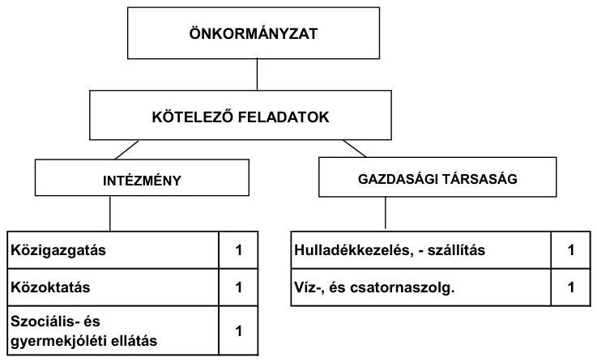

Az Önkormányzat feladatait 2011. június 30-án (a Polgármesteri hivatallal együtt) három költségvetési szervvel és kettő gazdasági társasággal látta el. A társaságok közül egynél kizárólagos tulajdonnal (100\%), egynél pedig tulajdoni hányaddal nem rendelkezett. Az intézményszervezeti átalakítások, összevonások és a tagóvodai csatlakozások következtében az intézmények száma a 2007. év elején meglévő ötről 2011. év I. félév végére háromra csökkent. A feladatellátás telephelyeinek száma pedig ötről hétre növekedett. Az Önkormányzat az Igal és Környéke Közoktatási Intézményfenntartó Társulás keretében a közoktatási, és a speciális általános iskola, szakiskola és diákotthoni feladatellátást öt, a pedagógiai szakszolgálatot, és az óvodai feladatellátást hat, a közművelődési feladatellátást pedig kettő társult önkormányzatnak biztosította. A szociális és gyermekjóléti feladatokat a Szociális Központ - az

[^0]
[^0]:    ${ }^{7}$ Erre jogszabályi előírás ma már nem is kötelezi az Önkormányzatot.

---

Igal és Környéke Alapszolgáltatási Központot Fenntartó Társulással - 15 társult önkormányzatnak látta el. 2009 januárjától hat település kivált a Szociális Központból. A vizsgált időszakban az intézkedések, csatlakozások és kiválások hatására a kiadások kisebb mértékben (39,3 millió Ft-tal) növekedtek, mint a bevételek ( 54,1 millió Ft). A bevételek és kiadások egyenlegeként az összes bevétel-növekedés 14,8 millió Ft volt. A gazdasági társaságok közül - egy 100\%-os tulajdoni hányadú - a víz- és szennyvízkezelés, egy pedig a hulladékkezelés-szállítás területén kapott szerepet az Önkormányzat feladatellátásában. A termál-turizmushoz kapcsolódó - egy 100\%-os tulajdoni hányadú - gazdasági társaság az önkormányzati feladatellátásban nem vett részt.

Az Önkormányzat működési kiadásokra 2010-ben 618,3 millió Ft-ot fordított, amely 141,7 millió Ft-tal ( $22,9 \%$-kal) haladta meg a 2007-2009. évek átlagráfordítását. A 618,3 millió Ft nem tartalmazza a 2. számú mellékletben szereplő 634,3 millió Ft folyó kiadásokból az egészségügyi alapellátás kiadásait. A Polgármesteri hivatalban ellátott egyéb feladatok működési kiadásai a folyékony, és szilárd hulladékgyűjtéshez, a közutak, és közvilágítás üzemeltetéséhez, tűzoltósági, köztemetési, közgyógyellátási feladatokhoz, a közcélú foglalkoztatáshoz, a képviselő-választáshoz, a segélyezéshez, valamint az egyházaknak, a testvértelepülésnek, és a civil szervezetek részére a pénzeszközátadásokhoz kapcsolódtak. Az egyes közszolgáltatások feladatellátásában résztvevő költségvetési szervek működési kiadásainak finanszírozási forrásösszetételét ágazatonként a következő ábra szemlélteti:
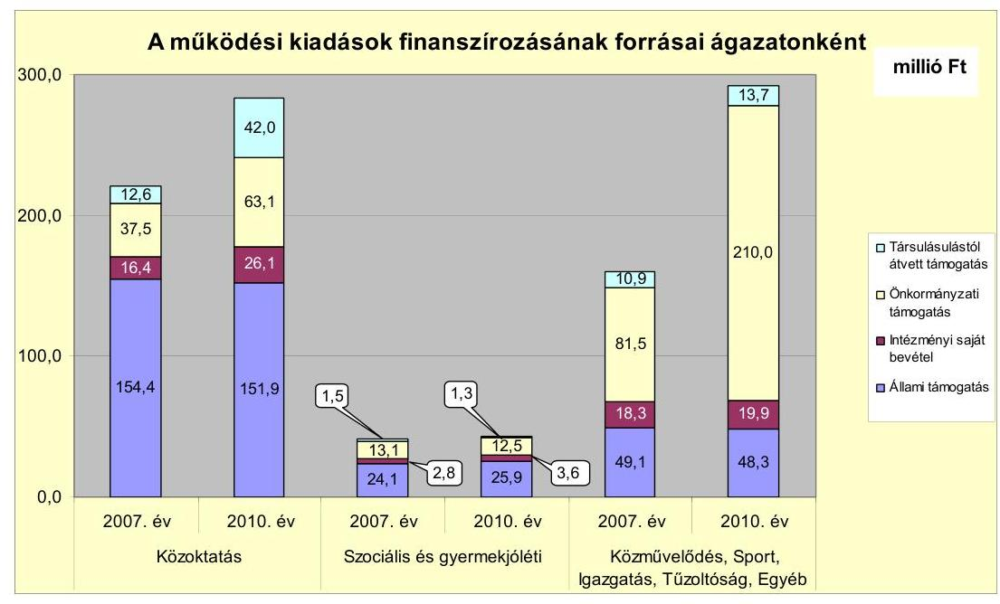

Az önkormányzati támogatások növekedését 2010-ben a közoktatásban a Speciális Iskola tanulóinak létszámváltozása miatt a pedagógusok számának növekedése okozta. Az egyéb feladatoknál pedig az „Igal integrációs iskolabővítés"-hez kapott DDOP, TÁMOP és TIOP támogatások eredményezték. A vizsgált időszakban a kötelező és önként vállalt feladatok ellátását biztosító szervezeti keretekben, a feladatellátás módjában bekövetkezett változások az Önkormányzat pénzügyi egyensúlyára összességében nem voltak hatással. Az oktatási intézmények összevonásakor az oktatás telephelyeinek száma és a dolgozói lét-

---

szám nem változott. A 2007. és a 2008. évi egy-egy tagóvoda csatlakozásával 2011. június 31-ig a bevételnövekedés 15,0 millió Ft volt. A hat település 2009 januári kiválása a szociális és gyermekvédelmi intézményfenntartó társulásból 2011. június 30-ig 0,2 millió Ft összegű bevételelmaradást eredményezett. A 2010 januárjától bevezetett pedagógiai szakszolgálat kiadása - 2010-2011. év I. félév között - 7,6 millió Ft volt.

Az Önkormányzat működési jövedelmét, tőketörlesztését, pénzügyi kapacitását 2007-2010. évek között a következő ábra mutatja be:
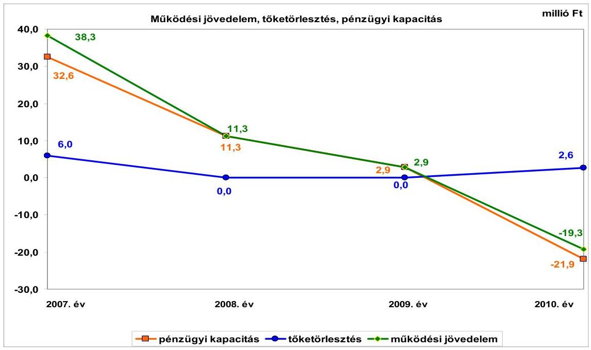

Az Önkormányzat folyó költségvetési egyenlege (működési jövedelem) 2007-2009 között működési forrástöbbletet, 2010-ben működési forráshiányt mutatott. A folyó költségvetés egyenlege (működési jövedelem) 2007-ben a folyó kiadások 8,7\%-át (38,3 millió Ft-ot), 2008-ban 2,2\%-át (11,3 millió Ft-ot), 2009-ben 0,6\%-át ( 2,9 millió Ft-ot), 2010-ben 3\%-át (-19,3 millió Ft-ot) jelentette.

Az Önkormányzat 2007-2010. években működőképességének megőrzését szolgáló kiegészítő állami támogatásokra pályázott. Az elnyert támogatás összege 2007-ben 1,0 millió Ft, 2008-ban 5,0 millió Ft, 2009-ben 5,2 millió Ft, 2010-ben 4,5 millió Ft, összesen 15,7 millió Ft volt. Működési jövedelme a kiegészítő állami támogatások nélkül 2007-ben 37,3 millió Ft, 2008-ban 6,3 millió Ft, 2009-ben $-2,3$ millió Ft, 2010-ben $-23,8$ millió Ft volt.

Az Önkormányzat amellett, hogy működőképességének megőrzését szolgáló kiegészítő állami támogatásban részesült, a 2009-2010. években nagy értékű, 467,6 millió Ft összegű fejlesztéseket végzett. Az önként vállalt feladatok aránya a működési költségvetési kiadásokból 2010. évben 11,7\%-ot tett ki.

A nettó működési jövedelem (pénzügyi kapacitás) csökkenését az okozta, hogy 2007-2010. között a folyó bevételek (saját működési bevételei, költségvetési támogatások, átengedett bevételek) kisebb mértékben (28,8\%-kal) növekedtek,

---

mint a folyó kiadások (44,4\%-kal). A 2010. évben a költségvetési támogatás összege csökkent 23,4 millió Ft-tal, ez negatív működési jövedelmet okozott. A tőketörlesztés összege nem volt jelentős 2007-ben 6,0 millió Ft, 2010-ben 2,6 millió Ft volt.
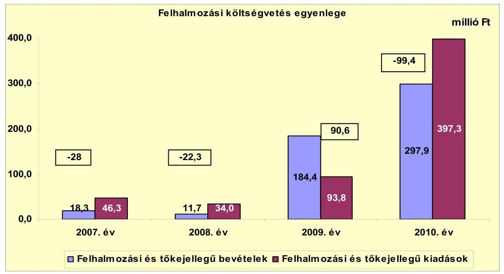

A pénzügyi egyensúlyi helyzet alakulását jelentősen befolyásolta az Önkormányzat elmúlt időszaki fejlesztési tevékenysége. Az Önkormányzat felhalmozási költségvetésének egyenlege a 2009. év kivételével negatív összegű volt, a 2007-2008. évi felhalmozási hiány fedezetéül a működési jövedelem és a 2007. évi nyitó pénzkészlet szolgáltak. A 2009-2010-ben az EU-s támogatásból megvalósuló fejlesztések miatt jelentősen megnőtt a felhalmozási kiadások, bevételek összege. A 2009-2010. évben valósult meg a DDOP támogatásból az iskolabővítés, amelynek tényleges bekerülési költsége 445,4 millió Ft volt. A megvalósított beruházás forrása $90 \%$-ban, 400,8 millió Ft összegű EU-s támogatás volt. A TÁMOP támogatás eszközbeszerzése 2010. évben 4,9 millió Ft volt, amelynek forrása $100 \%$-ban EU-s támogatás volt.

Az Önkormányzat folyó bevételei folyamatosan nőttek a 2007-2010. években, 477,6 millió Ft-ról 615 millió Ft-ra. A bevételeken belül a költségvetési támogatás és szja együttes összege a 2007-2009. évben növekedett, 2007-ben 260,4 millió Ft, 2008-ban 292,6 millió Ft, 2009-ben 294,3 millió Ft volt. A 2010. évben 272,5 millió Ft-ra csökkent a költségvetési támogatás és szja együttes összege, 272,5 millió Ft-ra, a feladatmutatóhoz kötött normatív támogatások csökkenése miatt. Az egyéb saját bevételek 2007-2010. években 50,6 millió Ft-tal nőttek. A növekedést az államháztartáson belüli működési támogatások (helyi önkormányzatok intézményi működési támogatásai) okozták. A 2010. évben az IgalFürdő Kft. 10,0 millió Ft összegű Önkormányzatnak nyújtott kölcsöne és a 10,1 millió Ft TÁMOP programra kapott támogatás is megnövelte az egyéb saját bevételek összegét. A 2010. évben a kiemelkedően magas áfa-bevételt (71,6 millió Ft) a fordított áfa-bevétel (67,9 millió Ft) eredményezte. A helyi adóbevétel növekedése nem volt jelentős, 2007-ről 2010-re 5,4 millió Ft-tal nőtt (77,0 millió Ft-ról 82,4 millió Ft-ra). A 2010. évi helyi adókból származó bevétel $34,5 \%$-a, 28,4 millió Ft egy adóalanytól származott, ebből az iparűzési adóbevétel 25,6 millió Ft, az összes iparűzési adóbevétel (44,7 millió Ft) 57,3\%-a.

---

Az Önkormányzat folyó kiadásai nőttek, a 2007. évi 439,3 millió Ft-ról 2010-re 634,3 millió Ft-ra. A változást a működési kiadások, a személyi juttatások és dologi kiadások növekedése okozta. A kiadások 2008. és 2010. években emelkedtek jelentősen. A személyi juttatások 31,8 millió Ft-tal nőttek, a 2007. évi 208,5 millió Ft-ról 2008. évre 240,3 millió Ft-ra. A dologi kiadások 35,9 millió Ft-tal nőttek, a 2007. évi 128,5 millió Ft-ról 2008. évre 164,4 millió Ft-ra. A 2008. évi növekedést az oktatási feladatok bővülése okozta. A 2010. évi személyi juttatások növekedését a pedagógiai szakszolgálat és a TÁMOP támogatás terhére kifizetett személyi juttatások eredményezték. A személyi juttatások 20,1 millió Ft-tal nőttek, a 2009. évi 244,6 millió Ft-ról 2010. évre 264,7 millió Ft-ra. A 2010. évi dologi kiadások inflációt meghaladó növekedését a 67,9 millió Ft összegű fordított áfa okozta. A dologi kiadások a 2009. évi 175,7 millió Ft-ról 2010. évre 271,3 millió Ft-ra nőttek.

Az Önkormányzat a 2007-2010 között befejezett fejlesztései jelentős részét EU-s támogatásból fedezte. A 2007-2010. évek időszakában 571,4 millió Ft értékű fejlesztés (beruházás) és felújítás forrása a saját erő, a 2010. évi hitelfelvétel és a hazai támogatások mellett az EU-s támogatás 415,7 millió Ft (72,8\%) volt. A 2010. december 31-én folyamatban lévő fejlesztési feladatok végrehajtására 2007-2010 között kiadást nem teljesítettek. Az EU-s támogatásból megvalósult fejlesztések finanszírozása likviditási gondot nem okozott. A fejlesztések során kialakított létesítmények jövőbeni működésének várható kiadásait nem számszerűsítették.

Az Önkormányzat 2010. december 31-én folyamatban lévő fejlesztési feladatok 2010. évet követő kötelezettségvállalásainak összege 112,5 millió Ft volt, melynek forrásait az alábbi ábra szemlélteti:
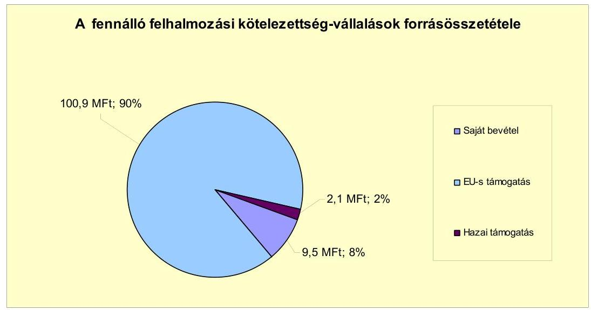

Az Önkormányzati kiadáscsökkentő intézkedések miatt felszabaduló pénzeszközök fedezetet nyújthatnak a folyamatban lévő projektek saját forrásához.

Az Önkormányzatnak beadott, elbírálás alatt álló pályázata az ellenőrzési időszak végén nem volt.

---

Az Önkormányzat mérleg szerinti pénzintézetekkel szembeni kötelezettsége a 2006. év végétől a 2011. év I. félév végére 6,0 millió Ft-ról 71,1 millió Ft-ra növekedett. 2007-2009 között pénzintézetekkel szembeni kötelezettsége nem volt. A fennálló pénzintézeti kötelezettségek a 2010. évben felvett hosszú lejáratú, valamint a 2011-évben igénybe vett rövid lejáratú hitelből keletkeztek. A 2010. évtől megnövekedett pénzintézeti kötelezettség a pénzügyi egyensúly helyzetére kedvezőtlenül hat.

Az Önkormányzat pénzintézeti kötelezettségvállalásaira minden esetben a Képviselő-testület döntése alapján került sor. A 2009-ben tervezett, de a 2010. évben felvett hosszú lejáratú hitel felvételének a szükségességéről - a 2009. április 28-i testületi ülésen - a polgármester szóban tájékoztatta a Képviselőtestületet. A hosszú lejáratú hitel felvétele nem, a 2011. év I. félévében felvett (forgóeszköz) likvidhitel a pénzintézetek versenyeztetésével történt. A likvidhitel felvételéről szóló előterjesztésben nem mutatták be a kamatkockázatot, valamint az adósságszolgálati korlátot.

Az Önkormányzat a hitelt - a beruházási értékhez igazodva - hívta le, és a hitelcélnak megfelelően a Képviselő-testület által jóváhagyott, a költségvetésbe betervezett beruházásokhoz használta fel. 2011. június 30-án a fel nem használt keretösszeg 1,0 millió Ft volt. Az Önkormányzat a HUF-ban fennálló pénzintézeti kötelezettsége után 7,9 millió Ft tőkét törlesztett, 1,5 millió Ft kamatot és 0,3 millió Ft egyéb költséget fizetett. Az Önkormányzat a 2007-2011. év I. féléve között átmenetileg szabad pénzeszközeiből 7,0 millió Ft kamatbevételt realizált.

Az Önkormányzat 2007-2010 között nem vett fel rövid lejáratú hitelt. A 2011. évtől költségvetésének pénzügyi egyensúlyát 35,0 millió Ft rövid lejáratú hitel igénybevételével tudta biztosítani, amelyet 2011. április 28-án vett fel és 2012. április 20-ig kell visszafizetnie. Gazdasági társaságától 2010-ben 10,0 millió Ft-ot, 2011. év I. félévében pedig 20,6 millió Ft kölcsönt vett igénybe, amelyből 2011. június 30-ig 25,0 millió Ft-ot visszafizetett. A kölcsönök felvételét nem foglalták szerződésbe.

A likviditás biztosítása az Önkormányzatnak - a 2011. év. I. félévében 1,5 millió Ft kamatkiadást, és 0,3 millió Ft egyéb költség fizetési kötelezettséget okozott. Az Önkormányzat 2006. december 31-i 1,6 millió Ft-os szállítói állománya 2009. december 31-re 14,3 millió Ft-ra növekedett, amely 12,2 millió Ft-tal haladta meg a 2008. évit. A 2010. december 31-i és 2011. év I. félév végi szállítói tartozása 12,4 millió Ft volt. A 2011. június 30-án fennálló kötelezettségállományból a 30 napon belül lejárt szállítói tartozás 9,8 millió Ft, a 31-60 nap közötti pedig 2,6 millió Ft. Az ebből fakadó, várható kifizetési kötelezettségek a pénzügyi egyensúly helyzetére kedvezőtlenül hatnak. Gazdasági társasága részére 2008-ban az Önkormányzat 5,0 millió Ft tagi kölcsönt nyújtott, amelyet a tárgyévben visszafizettek. A tagi kölcsön nyújtását nem foglalták szerződésbe.

---

Az Önkormányzat kötelezettségeinek 2010. december 31-i és 2011. június 30-i állományát, valamint várható alakulását a kötelezettségek lejáratáig a következő táblázat szemlélteti:

| Megnevezés | Állomány 2010. december 31   én |  |  | Állomány 2011. június 30-án |  |  | Várható kötelezettség   2011-2013. években |  | Várható kötelezettség   2014. évtől |  |
| :--: | :--: | :--: | :--: | :--: | :--: | :--: | :--: | :--: | :--: | :--: |
|  | HUF-ban   (millió. Ft-   ban) | Devizitban   (összege.   szor EUR-   ban/CHF-   ban) | Devize   nem | HUF-ban   (millió. Ft-   ban) | Devizitban   (összege.   szor EUR-   ban/CHF-   ban) | Devize   nem | HUF-ban   (millió Ft-   ban) | Devizitban   (összege.   szor EUR-   ban/CHF-   ban) | HUF-ban   (millió Ft-   ban) | Devizitban   (összege.   szor EUR-   ban/CHF-   ban) |
| Pénzintézeti kötelezettségek |  |  |  |  |  |  |  |  |  |  |
| Hosszú lejáratú hitel   (K-OKIF/0306353309/OTPIKOKG/001) | 41,4 |  | HUF | 36,1 |  | HUF | 34,1 |  | 10,0 |  |
| Fogóeszköz hitel (Cezúraszám: 30/2011/152) | 0,0 |  | HUF | 35,0 |  | HUF | 36,4 |  | 0,0 |  |
| Pénzintézeti kötelezettségek összesen HUF-ban: | 41,4 |  | HUF | 71,1 |  | HUF | 72,5 |  | 10,0 |  |
| Szállító tartozás | 12,4 |  | HUF | 12,4 |  | HUF | 12,4 |  | 0,0 |  |
| Egyéb kötelezettségek (Igal-Fürdő Kft-től igénybevett   kölcsön) | 10,0 |  | HUF | 5,6 |  | HUF | 5,6 |  | 0,0 |  |
| HUF-ban fenáltó kötelezettségek összesen: | 63,8 |  | HUF | 89,1 |  | HUF | 90,5 |  | 10,0 |  |

A 2011-2013. évek kötelezettségeinek teljesítésére figyelembe vehető a 2010. évi 19,0 millió Ft szabad pénzmaradvány, a 2010. évi mérlegben kimutatott 3,7 millió Ft követelésállomány és a forgalomképes ingatlanvagyon. A 2014. évet követően, 2011. június 30-án ismert pénzintézeti kötelezettség után a tőketörlesztés és a kamatkiadás együtt 10,0 millió Ft. Az Önkormányzat tájékoztatása szerint figyelembe vehető további források „a mindenkori költségvetési rendeletekben megtervezett önkormányzati helyi többletadóbevételek". Azonban ennek növelésére 2011-ben tett intézkedés nem biztosít elegendő forrást, ezért a további évekre szóló jelenleg ismert pénzintézeti kötelezettségek teljesítését nem látjuk biztosítottnak. Az Önkormányzat 2011-ben 6,9 millió Ft többletbevételt tervezett az építmény és a magánszemélyek kommunális adó mértékének a növeléséből. Nem biztosított a vállalt pénzintézeti, szállítói és egyéb kötelezettségek fedezete az erre igénybe vehető működési jövedelem prognosztizált csökkenése következtében.

Az Önkormányzat 100\%-os tulajdoni hányaddal rendelkező társaságai kötelezettségének a 2010. december 31-i és 2011. június 30-i állományát, a 2011-2013. években, illetve az azt követő időszakban várható alakulását a kötelezettségek lejáratáig a következő táblázat szemlélteti:

| Megnevezés | Állomány 2010. december 31   én |  |  | Állomány 2011. június 30-án |  |  | Várható   kötelezettség 2011-   2013. években |  | Várható   kötelezettség 2014.   évtől |  |
| :--: | :--: | :--: | :--: | :--: | :--: | :--: | :--: | :--: | :--: | :--: |
|  | HUF-ban   (millió Ft-   ban) | Devizitban   (összege.   szor EUR-   ban/CHF-   ban) | Devize   nem | HUF-ban   (millió Ft-   ban) | Devizitban   (összege.   szor EUR-   ban/CHF-   ban) | Devize   nem | HUF-ban   (millió Ft-   ban) | Devizitban   (összege.   szor EUR-   ban/CHF-   ban) | HUF-ban   (millió Ft-   ban) | Devizitban   (összege.   szor EUR-   ban/CHF-   ban) |
| Egyéb kötelezettségek (Igal-Víz Kft. kölcsön) | 8,0 |  | HUF | 8,0 |  | HUF | 8,0 |  | 0,0 |  |
| Szállító-tartozás (Igal-Víz Kft. és Igal-Fürdő Kft.) | 8,3 |  | HUF | 2,6 |  | HUF | 2,6 |  | 0,0 |  |
| HUF-ban fenáltó kötelezettségek összesen: | 14,3 |  | HUF | 10,6 |  | HUF | 10,6 |  | 0,0 |  |

A társaságoknak a 2011. év I. félévtől 2,6 millió Ft szállítói tartozást, az Igal-Víz Kft.-nek az Igal-Fürdő Kft. részére 8,0 millió Ft - 2009. évtől - ki nem fizetett tartozást kell rendeznie. A 2011. év I. félévét követően a Képviselő-testület jóváhagyásával az Igal-Fürdő Kft. fürdőfejlesztésre - 2011. július 22-én 199,9 millió Ft összegű hosszú lejáratú hitelt vett igénybe. Fedezete a fürdő

---

ingatlan volt. A társaságok közül egynek a kötelezettségei az Önkormányzat pénzügyi egyensúlyi helyzetét kedvezőtlenül befolyásolhatják. Az Igal-Víz Kft. a 4,5 millió Ft-os jegyzett tőkéjét felélte, a saját tőkéje a veszteséges gazdálkodás következtében 2009-ben -1,9, 2010-ben -3,7, a 2011. év I. félévben pedig -1,4 millió Ft volt. A 2011. év I. félévi mérleg szerinti eredménytartaléka -8,2 millió Ft. Az Önkormányzatnak tőkepótlási kötelezettsége áll fenn. Az ügyvezető - figyelmen kívül hagyva a Gt. előírásait - elmulasztotta a taggyűlés összehívását, ahol a tulajdonosnak a szükséges intézkedések megtételéről döntenie kellett volna (határozathozatal pótbefizetésről, a törzstőke más módon való biztosításáról, más gazdasági társasági formára való átalakulásról, illetve jogutód nélküli megszűnésről). Emiatt elmaradt az Önkormányzat részéről a Gt.-ben foglalt tulajdonosi kötelezettségek teljesítése (társaság vagyoni helyzetének rendezése). Az Igal-Fürdő Kft. 2010. évi 42,5 millió Ft-os adózott eredménye és a 276,7 millió Ft-os eredménytartaléka alapján a 199,9 millió Ft-os pénzintézeti kötelezettség teljesíthető.

Az Önkormányzat 2007-2010 között eszközállománya után 206,8 millió Ft összegű értékcsökkenést mutatott ki. Az elhasznált eszközök pótlására 79,4 millió Ft-ot fordított. A Képviselő-testületnek előterjesztett éves zárszámadási rendeleteikben nem mutatták be az Önkormányzat eszközei után tárgyévben elszámolt értékcsökkenés összegét, az eszközpótlásra fordított tényleges kiadásokat, az eszközök elhasználódási fokának alakulását.

Az Önkormányzat költségvetési támogatásból, átengedett bevételből (szja) származó bevételei a 2007. évhez képest az időszak egészét tekintve nőttek. Az Önkormányzat folytatta az előző években elkezdett - kiadási megtakarítást eredményező és bevételt növelő - intézkedéseit. Az Önkormányzat adatszolgáltatása alapján a bevételnövelő intézkedések hatására 2007-től 2011. év I. félév végéig 41,4 millió Ft bevételt realizált, továbbá 15,4 millió Ft kiadáscsökkentést ért el, ami az Önkormányzat pénzügyi egyensúlyát javította. A kiadási megtakarítások 38\%-a helyettesítés miatti megtakarítás (gyesen, gyeden lévő közalkalmazottak helyett nem vettek fel újakat, a meglévő létszámmal helyettesítették őket, a megtakarítás a munkabér és helyettesítés, túlóra díj különbözete) eredménye. Az időszak álláshelyeinek száma 2010. december 31-ig összességében 13-mal nőtt. A közoktatás területén feladatbővülések miatt (két tagóvoda csatlakozása, pedagógiai szakszolgálat) 17 fővel nőtt a közalkalmazottak száma. A Polgármesteri hivatal létszámának kettő fővel történt növekedését a közhasznú foglalkoztatottak létszámváltozása, illetve 2010. évben kettő fő köztisztviselő nyugdíjba vonulása eredményezte. A szociális ellátás területén a feladatcsökkenés hat fő létszámleépítéssel járt. Az Önkormányzat adatszolgáltatása szerint a bevételnövelő intézkedések a helyi adók emeléséhez (23,9 millió Ft), a térítési díjak emeléséhez (1,5 millió Ft) és a tagóvodák integrálásához ( 15 millió Ft) kapcsolódtak.

Az ÁSZ nem vizsgálta Igal Város Önkormányzatát „A helyi önkormányzatok gazdálkodási rendszerének ellenőrzése" témában.

---

Az Önkormányzat pénzügyi egyensúlyi helyzetét összegezve a következők emelhetők ki:

Igal Város Önkormányzatának pénzügyi egyensúlyi helyzete rövid távon veszélyeztetett.

A folyó bevételek 2009. évtől nem nyújtanak fedezetet a folyó kiadásokra és az adósságszolgálatra.

A szállítói, azon belül a lejárt szállítói tartozások aránya és mértéke növekedett.

A pénzügyi egyensúly megtartására, ezen belül a működésre likvidhitelt, fejlesztési célra hosszú lejáratú hitelt használt fel, gazdasági társaságától pedig kölcsönöket vett igénybe.

A működési kockázatot növeli az egy adózótól való bevételi függőség.
Az önként vállalt oktatási feladatokra fordított kiadások arányának csökkenése mellett, a mértéke folyamatosan emelkedik.

A fejlesztések során kialakított létesítmények jövőbeni működésének várható kiadásait nem számszerűsítették.

A gazdasági társaságok miatti kockázatot növeli, hogy az Önkormányzat 100\%-os tulajdonában lévő gazdasági társaság (Igal-Víz Kft.) eredménytartaléka folyamatosan negatív, jegyzett tőkéjét felélte, az Önkormányzatnak tőkepótlási kötelezettsége áll fenn.

Az Állami Számvevőszékről szóló 2011. évi LXVI. törvény 33. § (1) bekezdésében foglaltak értelmében a jelentésben foglalt megállapításokhoz kapcsolódó intézkedési tervet köteles az ellenőrzött szervezet vezetője összeállítani és azt a jelentés kézhezvételétől számított harminc napon belül az ÁSZ részére megküldeni. Amennyiben az intézkedési tervet határidőben nem küldi meg a szervezet, vagy az továbbra sem elfogadható, az ÁSZ elnöke a hivatkozott törvény 33. § (3) bekezdés a)-b) pontjaiban foglaltakat érvényesítheti.

# A 2011. június 30-i pénzügyi egyensúlyi helyzet alapján az ellenőrzés intézkedést igénylő megállapításai és javaslatai a következők: 

## a Polgármesternek

1.  Az Önkormányzat nettó működési jövedelme a 2010. évtől negatív volt. Nem biztosított a vállalt pénzintézeti, szállítói és egyéb kötelezettségek fedezete az erre igénybe vehető működési jövedelem prognosztizált csökkenése következtében. Az oktatási intézmény, és azon belül az önként vállalt oktatási feladatok finanszírozásának önkormányzati részaránya növekedett. A 100\%-os tulajdonú gazdasági társaságának (Igal-Víz Kft.) pénzügyi helyzete nem stabil, a kötelezettségei az Önkormányzat pénzügyi egyensúlyi helyzetét kedvezőtlenül befolyásolhatják. Az Igal-Víz Kft. a 4,5 millió Ft-os jegyzett tőkéjét felélte (a saját tőke/jegyzett tőke mutatója negatív).

---

Javaslat:
Az Önkormányzat pénzügyi egyensúlyának gyors helyreállítása és hosszú távú fenntarthatósága érdekében kezdeményezze - felelősök és határidők megjelölésével - az alábbi intézkedések megtételét:
a) Tárja fel a bevételszerző és kiadáscsökkentő lehetőségeket. Intézkedjen a bevételek növelésére, a kintlévőségek behajtására, a kiadások csökkentésére.
b) Terjesszen a Képviselő-testület elé reorganizációs programot a kedvezőtlen pénzügyi folyamatok megállítására, a pénzügyi helyzet gyors stabilizálására.
c) Képezzen egyensúlyi (elkülönített) tartalékot az adósságszolgálat teljesítése érdekében.
d) Kezdeményezze az intézmények finanszírozásának napi kontrollját. Szűkítse a jóváhagyott előirányzatok felhasználásának lehetőségeit.
e) Vizsgálja felül az önként vállalt feladatok finanszírozhatóságát, s hozzon intézkedéseket a kötelező feladatok ellátásának biztosítása érdekében.
f) Kezelje az Önkormányzat lejárt szállítói állományát, a szállítói kitettség és a jogszabályi következmények elkerülése érdekében.
g) Terjesszen intézkedési tervet a Képviselő-testület elé az Igal-Víz Kft., minősített többségi tulajdonú gazdasági társasága pénzügyi helyzetének stabilizálása érdekében.
2.  A Képviselő-testületnek előterjesztett éves zárszámadási rendeleteikben nem mutatták be az Önkormányzat eszközei után tárgyévben elszámolt értékcsökkenés összegét, az eszközpótlásra fordított tényleges kiadásokat, az eszközök elhasználódási fokának alakulását.

Javaslat:
Mutassa be a Képviselő-testületnek évente a zárszámadási rendelet előterjesztésében az értékcsökkenés összegét, és ezzel összevetve az elhasználódott eszközök pótlására fordított tényleges kiadásokat, az eszközök elhasználódási fokának alakulását.
3.  Egy gazdasági társasága (Igal-Fürdő Kft.) részére 2008-ban az Önkormányzat 5,0 millió Ft tagi kölcsönt nyújtott, amelyet a társaság a tárgyévben visszafizetett. E gazdasági társaságtól 2010-ben 10,0 millió Ft-ot, 2011. év I. félévében pedig 20,6 millió Ft kölcsönt vett igénybe. A tagi kölcsön nyújtását és a kölcsönigénybevételeket nem foglalták szerződésbe.

Javaslat:
Gondoskodjon a jövőben a tagi kölcsönök nyújtásának és a kölcsönök igénybevételének szerződésbe foglalásáról.

---

4.  A 2009-ben tervezett, de a 2010. évben felvett hosszú lejáratú hitel felvételének a szükségességéről - a 2009. április 28-i testületi ülésen - a polgármester szóban tájékoztatta a Képviselő-testületet. A szóbeli tájékoztatás, valamint a Képviselő-testület döntését megalapozó likvidhitelfelvétel előterjesztése nem tartalmazta a kötelezettségvállalás visszafizetési forrásainak, a teljes futamidő várható kamat-, és tőkefizetési kötelezettségeinek bemutatását. Az Önkormányzat adósságot keletkeztető kötelezettségvállalásainál a szóbeli tájékoztatáskor és az előterjesztésben nem mutatták be az adósságszolgálati korlátot.

Javaslat:
Intézkedjen, hogy a jövőben a hitelfelvételről készüljön előterjesztés. Gondoskodjon, hogy a jövőben az adósságot keletkeztető kötelezettségvállalásokról szóló képviselőtestületi előterjesztések tételesen tartalmazzák a visszafizetés forrásait. Az adósságot keletkeztető kötelezettségvállalásról szóló döntéskor mutassa be a Képviselőtestületnek a jövőben várható - árfolyam-, kamat- és tőketörlesztési - kockázatot. Továbbá mutassa be az adósságot keletkeztető kötelezettségvállalásoknál az adósságszolgálati korlátot.
5.  Az Igal-Víz Kft. a 4,5 millió Ft-os jegyzett tőkéjét felélte, a saját tőkéje a veszteséges gazdálkodás következtében 2009-ben -1,9 millió Ft, 2010-ben -3,7 millió Ft, a 2011. év I. félévben pedig -1,4 millió Ft volt. Az ügyvezető - figyelmen kívül hagyva a Gt. előírásait - elmulasztotta a taggyűlés összehívását, ahol a tulajdonosnak a szükséges intézkedések megtételéről döntenie kellett volna (határozathozatal pótbefizetésről, a törzstőke más módon való biztosításáról, más gazdasági társasági formára való átalakulásról, illetve jogutód nélküli megszűnésről). Emiatt elmaradt az Önkormányzat részéről a Gt.-ben foglalt tulajdonosi kötelezettségek teljesítése (társaság vagyoni helyzetének rendezése).

Javaslat:
Mutassa be félévente a Képviselő-testületnek az Igal-Víz Kft. aktuális pénzügyi helyzetét. Tegye meg a szükséges és lehetséges intézkedéseket a tulajdonosi érdekek védelme érdekében. Gondoskodjon a Gt. 143. § (2) bekezdés a) pontjában és a (3) bekezdésben előírtak alapján a szükséges intézkedések megtételéről (taggyűlés összehívása, határozathozatal pótbefizetésről, a törzstőke más módon való biztosításáról, más gazdasági társasági formára való átalakulásról, illetve jogutód nélküli megszűnésről).

---

# II. RÉSZLETES MEGÁLLAPÍTÁSOK 

## 1. Az ÖNKORMÁNYZAT KÖTELEZŐ ÉS ÖNKÉNT VÁLLALT FELADATAI, A FELADATELLÁTÁS SZERVEZETI KERETEI ÉS ANNAK VÁLTOZÁSAI

Az Önkormányzat kötelező feladatait az Ötv. és az ágazati törvények által meghatározottnak tekinti. A 2007. április 2-tól hatályos, többször módosított önkormányzati SzMSz 5. § (6) bekezdésében foglaltak szerint az önként vállalt (többlet) feladatok terjedelmét az éves költségvetési rendeletekben az adott évi költségvetés forrásainak ismeretében határozták meg. A 2010. évtől az önként vállalt feladatok köre, a pedagógiai szakszolgálattal bővült. Az önkormányzati SzMSz-ben nem szabályozták ${ }^{8}$ az önként vállalt feladatokat és azok ellátásának módját.

Az Önkormányzat - besorolása és adatszolgáltatása szerint - a 2010. év működési költségvetési kiadásaiból ( 618,3 millió Ft) ${ }^{9} 546,0$ millió Ft-ot ( 88,3\% ) a kötelező feladatok, 72,3 millió Ft-ot (11,7\%) az önként vállalt feladatok ellátására fordított. Az önként vállalt feladatok az alapfokú oktatáson belül a speciális általános iskolai, szakiskolai és diákotthoni ellátáshoz, a pedagógiai szakszolgálathoz, valamint az egyházaknak, a testvértelepülésnek, és a civil szervezetek részére pénzeszközátadásokhoz kapcsolódtak. Az önként vállalt feladatok működési kiadásai a 2007-2009. évek 63,6 millió Ft-os (13,3\%) átlagához képest 2010-re 72,3 millió Ft-ra növekedtek, de a részaránya (11,7\%) csökkent.

A 2010. évi működési kiadások ágazatonkénti megoszlását és azok finanszírozási arányait az alábbi tábla mutatja:

| Ellátott feladat | Működési   kiadás   összesen   (millió Ft) | Kötelező   feladatok   kiadásainak   részaránya   $\%$ | Működési   bevétel   összesen   (millió Ft) | Állami   támogatás   részaránya   $\%$ | Intézményi   saját bevétel   részaránya   $\%$ | Önkormányzati   támogatás   részaránya   $\%$ | Társulástól   átvett támogatás   részarány   $\%$ |
| :--: | :--: | :--: | :--: | :--: | :--: | :--: | :--: |
| Óvodák | 65,3 | 100,0 | 65,3 | 38,9 | 5,5 | 25,8 | 29,8 |
| Általános iskolák | 217,8 | 69,0 | 217,8 | 58,1 | 10,3 | 21,2 | 10,4 |
| Szociális   intézmények | 20,2 | 100,0 | 20,2 | 68,5 | 4,9 | 20,3 | 6,3 |
| Gyermekjóléti   intézmények | 23,1 | 100,0 | 23,1 | 52,3 | 11,2 | 36,5 | 0,0 |
| Közművelődési   intézmények | 1,5 | 100,0 | 1,5 | 88,6 | 0,0 | 11,4 | 0,0 |
| Polgármesteri hivatal   igazgatási kiadásai | 53,8 | 100,0 | 53,8 | 59,1 | 0,0 | 15,4 | 25,5 |
| Polgármesteri   hivatalban ellátott   egyéb feladatok   működési kiadásai | 236,6 | 98,0 | 236,6 | 6,4 | 8,4 | 85,2 | 0,0 |
| Működési kiadá-   sok összesen | 618,3 | 88,3 | 618,3 | 36,60 | | 8,00 | 46,20 | 9,20 |

[^0]
[^0]:    ${ }^{8}$ Erre jogszabályi előírás ma már nem is kötelezi az Önkormányzatot.
    ${ }^{9}$ Az összeg nem tartalmazza a 2. számú mellékletben szereplő 634,3 millió Ft folyó kiadásokból az egészségügyi alapellátás kiadásait.

---

A Polgármesteri hivatalban ellátott egyéb feladatok működési kiadásai a folyó-, kony- és szilárd hulladékgyűjtéshez, a közutak- és közvilágítás üzemeltetéséhez, tűzoltósági, köztemetési, közgyógyellátási feladatokhoz, a közcélú foglalkoztatáshoz, a képviselő-választáshoz, a segélyezéshez, valamint az egyházaknak, a testvértelepülésnek és a civil szervezetek részére a pénzeszközátadásokhoz kapcsolódtak.

Az Önkormányzat adatszolgáltatása szerint - az ellenőrzött időszakban - a pénzügyi helyzet megítélése szempontjából a kötelező és önként vállalt feladatok megoszlásának változása (az oktatási intézmény miatt) kedvezőtlenül hatnak. Az önként vállalt feladatok részaránya az ÁMK Általános Iskolánál 0,7 százalékponttal ( 58,2 millió Ft-ról 67,5 millió Ft-ra) növekedett a 2007-2009. évek részarányának átlagához viszonyítva. A Polgármesteri hivatalban ellátott egyéb feladatok működési kiadási feladatoknál pedig 2,7 százalékponttal ( $4,7 \%$-ról $2,0 \%$-ra) csökkentek. Az eltéréseket a közoktatásban a Speciális Iskola tanulóinak létszámváltozása miatt a pedagógusok számának növekedése, az egyéb feladatoknál a szervezetek támogatásának csökkenése, valamint az „Igal integrációs iskolabővítés"-hez kapott DDOP, TÁMOP és TIOP támogatások eredményezték.

Az Önkormányzat bevételeinek összetétele jelentősen nem változott a 20072009. évek részarányának átlagához képest, a pénzügyi helyzet megítélése szempontjából nem releváns. Az Önkormányzat adatszolgáltatása szerint az ÁMK Óvodáknál és Általános Iskolánál 15,8 százalékponttal (169,3 millió Ft-ról 151,9 millió Ft-ra), a Szociális Központnál 5,9 százalékponttal (31,9 millió Ft-ról 26,0 millió Ft-ra) csökkent, a közművelődésnél 0,3 százalékponttal (1,3 millió Ft-ról 1,4 millió Ft-ra), és a Polgármesteri hivatal igazgatási kiadásainál 13,9 százalékponttal ( 30,1 millió Ft-ról 31,8 millió Ft-ra) növekedett az állami hozzájárulás részaránya a 2007-2009. évek átlagához viszonyítva a 2010. évre.

A saját bevételek a 2010. évre az ÁMK Óvodáknál 0,4 százalékponttal (5,1\%-ról $5,5 \%$-ra), az ÁMK Általános Iskoláknál pedig 13,6 százalékponttal ( $44,5 \%$-ról $58,1 \%$-ra) nőttek a 2007-2009. évek átlagához viszonyítva. Az Óvodáknál a társult kettő település gyermeklétszáma után, az Általános Iskolánál pedig a Speciális Iskola megnövekedett tanulólétszáma után fizetett térítési díjak emelkedése a saját bevételek növekedését okozta.

A társult önkormányzatoktól átvett támogatások részarányai a 2007-2009. évek átlagához viszonyítva a 2010. évre az ÁMK-nál 5,3 százalékponttal, ( 23,5 millió Ft-ról 42,0 millió Ft-ra), és a Polgármesteri hivatal igazgatási kiadásainál 6,8 százalékponttal ( 12,5 millió Ft-ról 13,7 millió Ft-ra) növekedtek. A Szociális Központnál 4,5 százalékponttal ( 1,4 millió Ft-ról 1,3 millió Ft-ra) csökkentek. A növekedést az ÁMK-nál a kettő tagóvoda csatlakozása, a csökkenést a Szociális Központnál a hat önkormányzat kiválása eredményezte. A Polgármesteri hivatalnál a növekedést Ráksi és Kazsok községi önkormányzatok körjegyzői feladatokhoz való hozzájárulásának emelkedése eredményezte.

A fentiekkel összefüggésben változott az önkormányzati támogatás az egyes ágazatokban. 2010-re az ÁMK Óvodáknál 6,1 százalékponttal (31,9\%-ról $25,8 \%$-ra) csökkent, amelyet az újonnan társult települések hozzájárulása el-

---

lentételezett. Az ÁMK Általános Iskolánál pedig 11,6 százalékponttal (9,6\%-ról $21,2 \%$-ra) növekedett, amelyet a Speciális Iskola támogatásának növekedése okozott. A Polgármesteri hivatal igazgatási kiadásainál 20,3 százalékponttal (35,7\%-ról 15,4\%-ra), a közművelődési kiadásoknál 0,2 százalékponttal (11,6\%-ról 11,4\%-ra) csökkent az önkormányzati támogatás a 2007-2009. évek részarányának átlagához képest.

Az Önkormányzat feladatait 2011. június 30-án (a Polgármesteri hivatallal együtt) három költségvetési szervvel és kettő gazdasági társasággal látta el. A társaságok közül egyben 100\%-os tulajdoni hányaddal, egynél pedig tulajdoni hányaddal nem rendelkezett. Az intézményszervezeti átalakítások, összevonások és a tagóvodai csatlakozások következtében az intézmények száma a 2007. év elején meglévő ötről 2011. év I. félév végére háromra csökkent. A feladatellátás telephelyeinek száma pedig ötről hétre növekedett, amelyet a 2007. szeptember 1-jével a büssüi, 2008. szeptember 1-jével pedig a zimányi tagóvoda csatlakozása eredményezett. Az Önkormányzat az Igal és Környéke Közoktatási Intézményfenntartó Társulás keretében a közoktatási, és a speciális általános iskolai, szakiskolai és diákotthoni feladatok ellátását öt, a pedagógiai szakszolgálatot, és az óvodai feladatok ellátását hat, a közművelődési feladatok ellátását pedig kettő társult önkormányzatnak biztosította. A szociális és gyermekjóléti feladatokat a Szociális Központ - az Igal és Környéke Alapszolgáltatási Központot Fenntartó Társulással - 15 társult önkormányzatnak látta el.

A kötelező feladatok közül a nevelést, a közoktatást, a közművelődést és a könyvtári szolgáltatást, valamint a szociális és gyermekjóléti feladatok elvégzését egy-egy intézménnyel (ÁMK és Szociális Központ) biztosította. Az igazgatási feladatot a Polgármesteri hivatal végezte. Ráksi és Kazsok községek önkormányzatainak a körjegyzőségi feladatokat is ellátta. Az Önkormányzat - a Képviselő-testület döntése alapján - 2009. szeptember 1-jétől oktatási intézményeit (Óvoda, Általános Iskola, Speciális Általános Iskola, Szakiskola és Diákotthon) egy intézménybe (ÁMK) vonta össze.

Az alapfokú oktatáson belül az önként vállalt speciális általános iskola, szakiskola és diákotthoni ellátást, valamint a pedagógiai szakszolgálatot az ÁMK látta el. Az Önkormányzat önként vállalt feladatként az egyházak, a testvértelepülés, egyesületek, alapítványok, lakossági önszerveződő közösségek tevékenységéhez járult hozzá.

Az Önkormányzat 2011. június 30-án kettő gazdasági társaságban (IgalVíz Kft. és Igal-Fürdő Kft.) 100\%-os tulajdoni hányaddal rendelkezett. Az IgalVíz Kft. - 2009-ben - a Kábeltévé Igal Kft. átalakulásával jött létre. A Kábeltévé Igal Kft. az átalakulásig a helyi kábeltévé szolgáltatást biztosította, amelyet az Önkormányzat 2009-től megszüntetett. A gazdasági társaságok közül az IgalVíz Kft. - 2009 májusától - a víz-, - 2010 januárjától - pedig a víz- és a szennyvízkezelési feladatokat látta el. Ezt megelőzően az ellátást - a 2009-ben lejárt 15 éves koncessziós szerződés alapján - a VÍZCOOP Kft. biztosította, amelyben az Önkormányzat tulajdoni hányaddal nem rendelkezett. A termálturizmushoz kapcsolódó Igal-Fürdő Kft. az önkormányzati feladatellátásban nem vett részt. A hulladékkezelési és -szállítási feladatokat a Kaposvári Városgazdálkodási Zrt.-vel biztosította, amelyben az Önkormányzat tulajdoni há-

---

nyaddal nem rendelkezett. A társaságok gazdálkodását, illetve a működésüket érintő adatokat a Jelentés 4. számú melléklete mutatja.

A vizsgált időszakban az Önkormányzat - az óvodai ellátáson kívül - nem vett át feladatot más önkormányzattól, társulástól, egyháztól, gazdasági társaságtól, egyéb szervezettől. 2007. szeptember 1-jével a büssüi, 2008. szeptember 1jével pedig a zimányi tagóvoda - Igali Óvodához történő - csatlakozását a Képviselő-testület elfogadta. 2011. szeptember 1-jétől a somogyszili tagóvoda ÁMK-hoz történő csatlakozásáról döntöttek. Ugyanezen időszak alatt hat önkormányzatnak ${ }^{10}$ a szociális és gyermekjóléti feladatot visszaadta. 2009 januárjától hat település kivált az intézményfenntartó társulásból, amelyet a Képviselő-testület elfogadott. 2012. január elsejétől további egy (Somodor) önkormányzat kiválásáról döntöttek, amely a 2007-2011. év I. félév pénzügyi helyzetére nem volt hatással. A vizsgált időszakban az intézkedések, csatlakozások és kiválások hatására az összes bevételnövekedés 14,8 millió Ft volt. A tagóvodák 2007 és 2008 szeptemberi csatlakozásával - 2011. június 30-ig - a kiadások kisebb mértékben növekedtek (összesen 51,2 millió Ft-tal), mint a bevételek (összesen 66,2 millió Ft-tal). Az intézkedéssel elért bevételnövekedés 15,0 millió Ft volt. A hat település 2009 januári kiválása a szociális és gyermekvédelmi intézményfenntartó társulásból - 2011. június 30-ig - 0,2 millió Ft összegű bevétel elmaradást eredményezett. A bevételek csökkenése nagyobb volt (összesen 12,1 millió Ft), mint a kiadásoké (összesen 11,9 millió Ft). Az Önkormányzat kieső 12,1 millió Ft-os bevételéből a hat kivált önkormányzat társulási támogatása 4,5 millió Ft. A 2009. szeptemberi intézmény-összevonásból kiadás-megtakarítás nem keletkezett, mert az oktatási telephelyek száma és a dolgozói létszám nem változott. A 2010 januárjától bevezetett pedagógiai szakszolgálat kiadása - 2010-2011. év I. félév között - 7,6 millió Ft volt, amelyet a személyi juttatások és járulékaik tettek ki.

A fentiek alapján a vizsgált időszakban a kötelező és önként vállalt feladatok ellátását biztosító szervezeti keretekben, a feladatellátás módjában bekövetkezett változások az Önkormányzat pénzügyi egyensúlyára összességében nem voltak hatással.

# 2. Az ÖNKORMÁNYZAT PÉNZÜGYI EGYENSÚLYI HELYZETÉT BEFOLYÁSOLÓ TÉNYEZŐK 

A hagyományos költségvetési szerkezet helyett az Önkormányzat pénzügyi helyzetét a CLF módszerrel mutatjuk be, amelyben jobban elkülönülnek a vagyonnal kapcsolatos bevételek és kiadások az önkormányzati feladatokkal kapcsolatos közvetlen működtetési bevételektől és kiadásoktól. A módszer következetesen elkülöníti a folyó és a felhalmozási költségvetés bevételeit és kiadásait, azok költségvetési egyenlegeit. A saját folyó bevételek, valamint a saját felhalmozási bevételek nem tartalmazzák az előző évi pénzmaradványok felhasználásából származó pénzforgalom nélküli bevételeket ${ }^{11}$.

[^0]
[^0]:    ${ }^{10}$ Ecsény, Magyaratád, Mernye, Patalom, Polány és Szentgáloskér
    ${ }^{11}$ A költségvetési években kialakuló hiány finanszírozása az előző évi pénzmaradvány és a korábbi években képzett tartalékok felhasználásával is történhet.

---

A folyó költségvetés egyenlege, a működési jövedelem megmutatja, hogy az Önkormányzat éves folyó bevétele fedezetet biztosít-e a kötelező és önként vállalt feladatellátáshoz kapcsolódó éves folyó kiadásaira. A működési jövedelem negatív értéke pénzügyileg fenntarthatatlan helyzetet jelez. A mutató pozitív értéke megtakarítást mutat, amely forrásul szolgálhat az önkormányzat fennálló kötelezettségei megfizetéséhez, valamint fejlesztéseihez.

A felhalmozási költségvetés pozitív értéke felhalmozási többletet mutat, amely a jövőbeni fejlesztések forrását biztosíthatja. Amennyiben a folyó költségvetési hiány finanszírozása a felhalmozási többletből történik, ez szűkebb értelemben vagyonfelélésnek tekinthető. Amennyiben a felhalmozási költségvetés megtakarítása fejlesztési célú hitelek, kötvények adósságszolgálatát finanszírozza, az változatlan vagyontömeg mellett, a korábban megelőlegezett tőkebevételek valós realizációjának tekinthető. A felhalmozási deficit által generált finanszírozási igény önmagában nem jár pénzügyi kockázattal, a pénzügyileg fenntartható beruházásokhoz kapcsolódó kötelezettségvállalás (adósságszolgálat) átlátható és szabályozott költségvetési gazdálkodással teljesíthető.

A módszer a pénzügyi kapacitás fogalmát helyezi a középpontba. Az adós hitelfelvételi képessége, hosszú távú fizetőképessége vagy bonitása a pénzügyi kapacitással, ezen belül is a nettó működési jövedelemmel jellemezhető. A nettó működési jövedelem negatív értéke az egyes költségvetési években jelentkező adósságszolgálat túlzott mértékére utal. ${ }^{12}$ A nettó működési jövedelem negatív értékének felhalmozási többletből, vagy további hitelből történő finanszírozása pénzügyileg nem fenntartható gazdálkodást vetít előre. A pozitív értéket mutató nettó működési jövedelem fejlesztési kiadások fedezetét biztosíthatja, illetve a folyamatosan, évenként képződő pozitív nettó működési jövedelemből meghatározható a jövőben vállalható, teljesíthető éves adósságszolgálat, ily módon az a hitelösszeg, amely - a többi tényezőt, feltételt adottnak tekintve - visszafizetési kockázat nélkül felvehető.

A CLF módszer alapján a pénzügyi kapacitás mértéke az Önkormányzat összevont, nettósított, a központi információs rendszerbe a Magyar Államkincstáron keresztül leadott éves költségvetési beszámolójának 80-as űrlapjában szerepeltetett adatok alapján került meghatározásra.

A költségvetési támogatásból a felhalmozási célú összeg a 2007. évben 5,4 millió Ft, a 2008. évben 11,5 millió Ft, a 2009. évben 14,9 millió Ft, a 2010. évben 2,8 millió Ft volt. Ezzel az összeggel csökkentettük az 1.1.2. Költségvetési támogatás, és növeltük a 2.1.2. Államháztartáson belülről kapott támogatások soron kimutatott összegeket.

A számítási leírás némileg eltér az ÁSZ módszertanában korábban alkalmazott gyakorlattól. A
 jelen besorolás általános közgazdasági meggondolásokon alapul, amely megjelenik az SNA statisztikai módszertanában is. Folyó tételek alatt értjük azokat a kiadásokat és bevételeket, amelyek a gazdálkodó szervezet helyzetét automatikusan nem változtatják. Bevételi oldalon ilyenek az adók, a

[^0]
[^0]:    ${ }^{12}$ kivéve, ha annak finanszírozására a korábbi években képzett tartalékok fedezetet nyújtanak

---

tényező jövedelmek, a transzferek ${ }^{13}$, kiadási oldalon a transzferek és a szolgáltatás igénybevételével kapcsolatos működési kiadások. A folyó költségvetésben a bevételekben nem térül meg, a kiadásokban nem jelenik meg az amortizáció, a vagyoni helyzetet az egyenleg befolyásolja.

A folyó költségvetés egyenlege (működési jövedelem) tartalmazza a kamatbevételeket és a kamatkiadásokat is, mind a működési, mind a fejlesztési kamatot, valamint a visszatérülő és befizetendő áfa teljes összegét, mert ezek közgazdaságilag tényező jövedelmek. Nem tartalmazzák viszont a követeléselengedés miatt könyvelt bevételi és kiadási pénzforgalmi tételeket, mert valójában technikai elszámolási műveletnek minősülnek, a bevétel soha nem realizálódott, és költségvetési kiadás sem történt.

A felhalmozási költségvetésben a bevételek között a vagyon megőrzésére és bővítésére fordítható források jelennek meg. A felhalmozási vagy tőketételek módosítják a vagyon nagyságát. A privatizációs bevétel csökkenti a vagyont, a fizikai beruházás, pénzügyi befektetés növeli.

A nettó működési jövedelmet a tőketörlesztés levonásával a folyó költségvetés egyenlegéből származtatjuk.

[^0]
[^0]:    ${ }^{13}$ Transzferkiadásoknak nevezzük azokat a folyó és felhalmozási tételeket, amelyeket nem az adott önkormányzat használ fel szolgáltatásnyújtásra.

---

# 2.1. A működési és a felhalmozási egyensúly változása 

CLF módszer szerinti önkormányzati adatok

| Megnevezés | 2007.év | 2008.év | 2009.év | 2010.év |
| :--: | :--: | :--: | :--: | :--: |
| Folyó bevételek | 477,6 | 530,8 | 518,9 | 615,0 |
| Folyó kiadások | 439,3 | 519,5 | 516,0 | 634,3 |
| Működési jövedelem | 38,3 | 11,3 | 2,9 | $-19,3$ |
| Nettó működési jövedelem   =működési jövedelem - tőketörlesztés | 32,3 | 11,3 | 2,9 | $-21,9$ |
| Felhalmozási bevételek | 18,3 | 11,7 | 184,4 | 297,9 |
| Felhalmozási kiadások | 46,3 | 34,0 | 93,8 | 397,3 |
| Felhalmozási költségvetés egyenlege | $-28,0$ | $-22,3$ | 90,6 | $-99,4$ |
| Finanszírozási műveletek nélküli (GFS) pozíció = működési jövedelem + felhalmozási költségvetés egyenlege | 10,3 | $-11,0$ | 93,5 | $-118,7$ |
| Finanszírozási műveletek egyenlege | $-2,1$ | 16,3 | $-5,6$ | 14,7 |
| Tárgyévi pénzügyi pozíció | 8,2 | 5,3 | 87,9 | $-104,0$ |
| Egyéb tájékoztató adatok |  |  |  |  |
| Összes kötelezettség* | 7,2 | 9,1 | 22,8 | 57,4 |
| -ebből rövid lejáratú | 4,6 | 7,5 | 22,8 | 26,6 |
| Folyószámlahitel napi átlagos állománya |  |  |  |  |
| Likvidhitel napi átlagos állománya |  |  |  |  |
| Munkabérhitel napi átlagos állománya |  |  |  |  |
| Finanszírozásba vonható eszközök: | 24,8 | 30,1 | 118,0 | 14,1 |
| Tartós hitelviszonyt megtestesítő értékpapírok év végi állománya |  |  |  |  |
| Hosszú lejáratú bankbetétek év végi állománya |  |  |  |  |
| Értékpapírok év végi állománya |  |  |  |  |
| Pénzeszközök (idegen pénzeszközök nélkül) év végi állománya | 24,8 | 30,1 | 118,0 | 14,1 |

* Az összes kötelezettséget a passzív pénzügyi elszámolások nélkül vettük figyelembe, mert a passzívák a pénzmaradvány elszámolás tételei közé tartoznak.

Az Önkormányzat a 2007-2010. évek közötti bevételeinek és kiadásainak főbb jogcímeit, valamint az adósságszolgálat adatait a jelentés 2. számú melléklete tartalmazza.

---

Az Önkormányzat folyó költségvetési egyenlege, működési jövedelme alakulását az alábbi ábra szemlélteti:
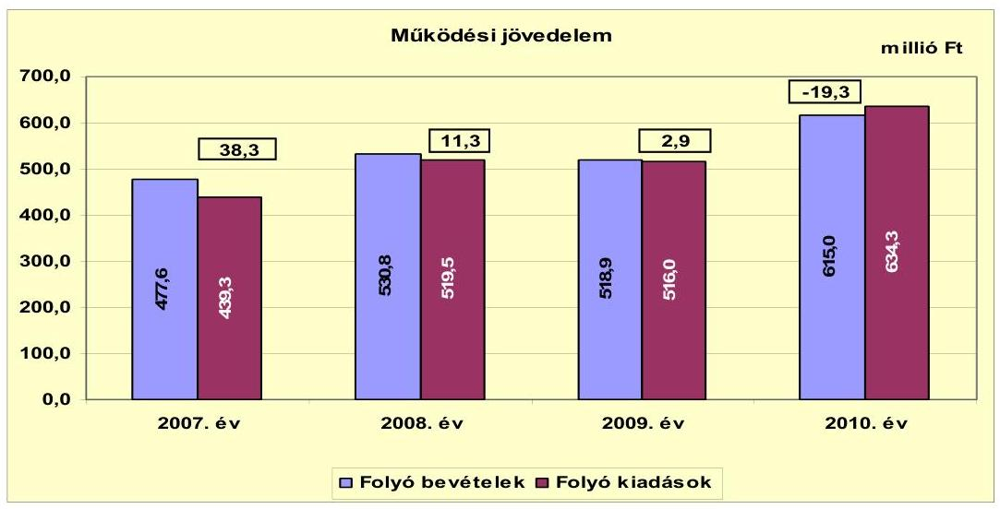

A vizsgált időszakban - 2010. év kivételével - az Önkormányzat folyó költségvetési egyenlege, működési jövedelme pozitív összegű volt. A 2008. évi folyó bevételek és kiadások növekedését a két tagóvoda csatlakozása, valamint a 2008. évi bérpolitikai intézkedések támogatása és a 2007. év után járó 13. havi illetmény 2008. évi elszámolása okozta. A 2010. évben a folyó bevételeken belül a saját működési bevételek ${ }^{14}$ (71,9 millió Ft), az államháztartáson belül és kívülről kapott támogatások ${ }^{15}$ (35,5 millió Ft, illetve 10,1 millió Ft), valamint az átengedett bevételek (1,9 millió Ft) növekedtek, a költségvetési támogatások 23,4 millió Ft-tal csökkentek a 2009. évhez viszonyítva. A 2010. évi folyó kiadások növekedését és a költségvetési támogatások csökkenését a saját működési bevételek, kapott támogatások és átengedett bevételek növekedése nem tudta ellensúlyozni. A kiadások növekedését a pedagógiai szakszolgálat beindítása és a Polgármesteri hivatalban ellátott egyéb feladatok működési kiadásainak (a folyékony- és szilárdhulladék-gyűjtés, a közutak és a közvilágítás üzemeltetése, a közcélú foglalkoztatás, a képviselő-választás) növekedése okozta.

Az Önkormányzat a 2007-2010. években működőképességének megőrzését szolgáló kiegészítő állami támogatásokra pályázott. Az elnyert támogatás összege a 2007. évben 1,0 millió Ft, a 2008. évben 5,0 millió Ft, a 2009. évben 5,2 millió Ft, a 2010. évben 4,5 millió Ft, összesen 15,7 millió Ft. A kiegészítő állami támogatások nélkül a működési jövedelem a 2007. évben 37,3 millió Ft, a 2008. évben 6,3 millió Ft, a 2009. évben -2,3 millió Ft, a 2010. évben -23,8 millió Ft volt.

[^0]
[^0]:    ${ }^{14}$ A fordított áfa-bevétel 67,9 millió Ft volt.
    ${ }^{15}$ Államháztartáson belüli bevételek közül nőtt 8,2 millió Ft-tal a támogatásértékű működési bevétel fejezeti kezelésű előirányzattól EU-s (TÁMOP) programra, 6,8 millió Ft-tal a támogatásértékű működési bevétel költségvetési szervtől (választásokra, speciális iskola működésére kapott támogatás) 20,5 millió Ft-tal a helyi önkormányzatoktól származó működési bevétel (körjegyzőség, közoktatás, szociális ellátás). Az államháztartáson kívüli bevétel az Igal-Fürdő Kft. 10 millió Ft-os kölcsöne.

---

Az Önkormányzat amellett, hogy működőképességének megőrzését szolgáló kiegészítő állami támogatásban részesült 2009-2010. években nagy értékű, 467,6 millió Ft összegű fejlesztéseket végzett. Az önként vállalt feladatok aránya a 2010. évben a működési költségvetési kiadásokból $11,7 \%$ volt.

A 2010. évi működési forráshiány finanszírozása az előző évi pénzkészletből és az Igal-Fürdő Kft.-től kapott kölcsönből történt.
Az Önkormányzat nettó működési jövedelmének évenkénti alakulását az alábbi ábra szemlélteti:
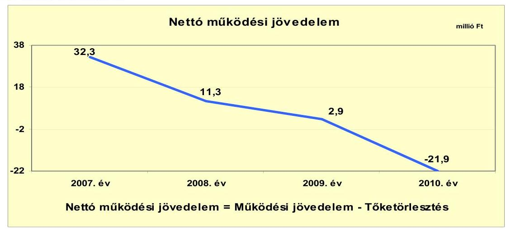

Az Önkormányzat pénzügyi kapacitása a 2007-2009. években pozitív, a 2010. évben negatív értéket mutatott. A nettó működési jövedelem ${ }^{16}$ értéke a folyó költségvetési pozíció mellett az adott költségvetési év adósságtörlesztésének hatását is tükrözi. A 2008. és 2009. évi nettó működési jövedelem megegyezik a működési jövedelemmel, mivel ezekben az években nem volt tőketörlesztés.

A nettó működési jövedelem fokozatosan romlott. Ennek oka a működési jövedelem csökkenése, illetve a 2010. évben a 2,6 millió Ft tőketörlesztés.

[^0]
[^0]:    ${ }^{16}$ pénzügyi kapacitás

---

A felhalmozási költségvetés egyenlegét 2007-2010. közötti években a következő ábra szemlélteti:
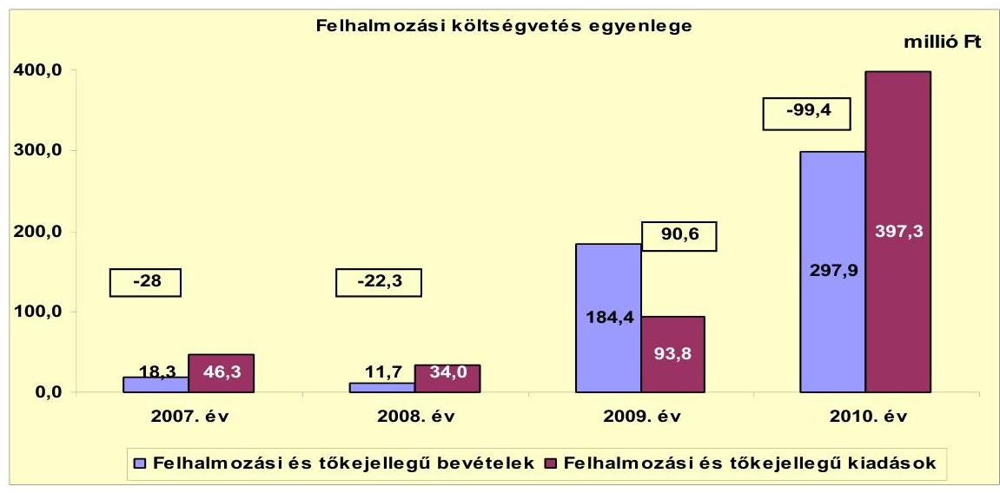

A 2007-2010. években az Önkormányzat felhalmozási költségvetésének egyenlege, a 2009. év kivételével negatív összegű volt. A 2009. felhalmozási többletet az államháztartáson belülről kapott támogatások (DDOP, TÁMOP) magas értéke okozta, amely 184,4 millió Ft volt. Az Önkormányzat a felhalmozási forráshiányt a 2007. év elején rendelkezésre álló nyitó pénzkészletből, és a 2007-2009. évi működési jövedelemtöbbletből fedezte. A vizsgált időszakban keletkezett 59,1 millió Ft felhalmozási forráshiányra a 16,6 millió Ft 2007. évi nyitó pénzkészlet, valamint a 2007-2009. évi 52,5 millió Ft működési jövedelem többlete nyújtott fedezetet, az Önkormányzat kimutatása szerint. A 2010. évi felhalmozási hiány fedezete az előző évi felhalmozási többlet és a 2010. évi fejlesztési hitel volt.

Az Önkormányzat évenkénti teljes finanszírozási igénye ${ }^{17}$ a CLF módszer szerint 2008-ban -11 millió Ft, 2010-ben -121,3 millió Ft volt, amelynek finanszírozását a finanszírozási célú bevételek és kiadások egyenlege, valamint az előző évek szabad pénzmaradványának igénybevétele biztosította. Az Önkormányzatnak finanszírozási többlete volt a 2008. és a 2010. években.

[^0]
[^0]:    ${ }^{17}$ a nettó működési jövedelem és a felhalmozási költségvetés eredője

---

Az Önkormányzat finanszírozási műveletei a 2007-2010. évekbeli egyenlegét a következő ábra szemlélteti:
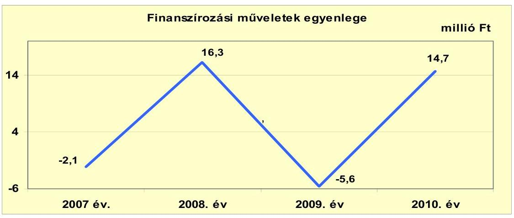

A 2008. és a 2010. évben a finanszírozási műveletek egyenlege pozitív volt, a 2008. évben függő, átfutó, kiegyenlítő bevételek és kiadások 16,3 milliós Ft-os egyenlege miatt. A 2010. évben a finanszírozási műveletek egyenlege 14,7 millió Ft volt, amely a hitelfelvétel (hosszú lejáratú, beruházásra felvett hitel) és hiteltörlesztés különbözetéből (44,0 millió Ft-2,6 millió Ft), valamint a függő, átfutó, kiegyenlítő bevételek és kiadások egyenlegéből (-26,7 millió Ft) eredt. A finanszírozási műveletek egyenlege a 2007. és a 2009. években negatív összegű lett. A 2007. évben 6,0 millió Ft hiteltörlesztés és függő, átfutó, kiegyenlítő bevételek és kiadások egyenlege miatt. A 2009. évben nem volt hitelfelvétel és hiteltörlesztés, a függő, átfutó, kiegyenlítő bevételek és kiadások egyenlege -5,6 millió Ft volt. A finanszírozási célú műveleteket a vizsgált időszakban a jelentés 2. számú mellékletének 4.1-4.8 pontjai részletezik.

Az Önkormányzat a 2007-2010. évi zárszámadási rendeleteiben meghatározta a felhalmozási, illetve működési bevételek és kiadások főösszegét ${ }^{18}$, amelyet a jelentés 1. számú melléklete szemléltet. Az Önkormányzat zárszámadási rendeleteiben - a CLF módszer szerint kimutatotthoz hasonlóan - a 2007-2009. évben működési többletet, a 2010. évben működési hiányt, a 2007., 2008. és 2010. években felhalmozási hiányt, a 2009. évben felhalmozási többletet mutattak ki.

[^0]
[^0]:    ${ }^{18}$ Nincs kötelező előírás a működési és fejlesztési többlet, hiány megállapításának módjára.

---

Az Önkormányzat kamatbevételeit és kamatkiadásait a következő ábra mutatja:
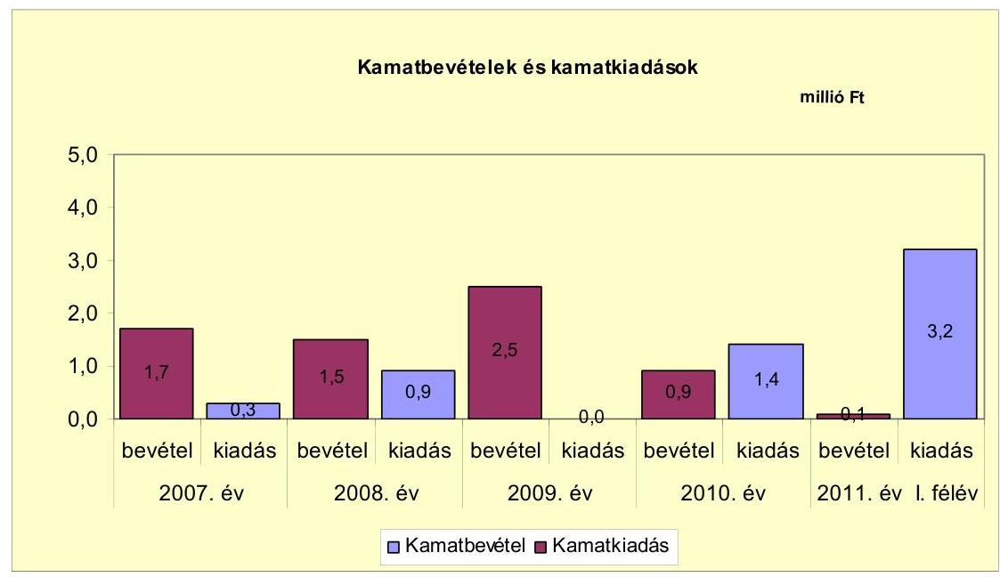

A 2007-2010. évek között az Önkormányzat összesen 2,6 millió Ft kamatot fizetett meg ${ }^{19}$. Az átmenetileg szabad pénzeszközei lekötéséből (a 2009. évben a szabad felhalmozási bevételek után) realizált kamatbevétel, a teljes kamatráfordítás két és félszeresét (6,6 millió Ft) tette ki. 2011. év I. félévében a 2010. és a 2011. évi hitelfelvételek miatt a kamatkiadás 3,2 millió Ft, a kamatbevétel pedig 0,4 millió Ft.
${ }^{19}$ A 2008. évi kamat 944 ezer Ft, az ÁSZ 2007. évi normatív állami támogatások elszámolása ellenőrzése során feltárt, jogosulatlanul igénybevett támogatások visszafizetése után fizetendő kamat volt.

---

# 2.2. Az Önkormányzat bevételeinek változása 

Az Önkormányzat a 2007-2010. évek között realizált folyó bevételeit a következő ábra mutatja be:
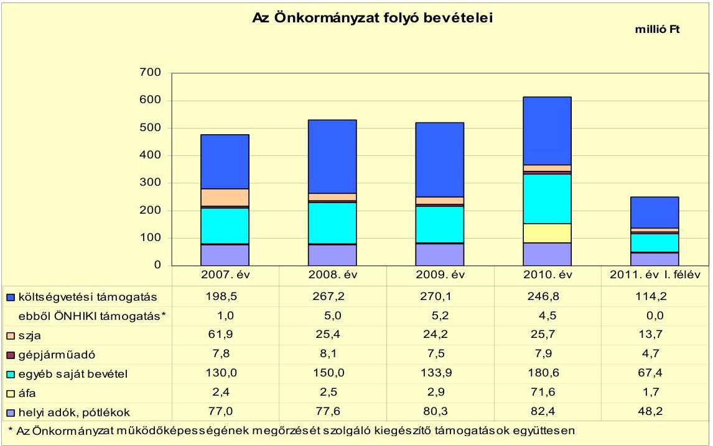

A költségvetési támogatások és szja-bevétel együttes összege a 20072009. években folyamatosan nőtt, a 2010. évben csökkenés következett be. A 2007. évben 260,4 millió Ft, a 2008. évben 292,6 millió Ft, a 2009. évben 294,3 millió Ft, a 2010. évben 272,5 millió Ft volt együttes összegük. A 2008. évi a költségvetési támogatásoknál a növekedést az átvett feladatok után járó normatív állami támogatások (a két tagóvoda után járó) és a 10,5 millió Ft, az előző évi központi költségvetési visszatérülés (normatív állami támogatás) eredményezte. A 2010. évben csökkenés következett be, a 2009. évi 270,1 millió Ft-ról 246,8 millió Ft-ra. A költségvetési támogatásokon belül a 2010. évben feladatmutatóhoz kötött normatív állami támogatások 32,5 millió Ft-tal csökkentek (220,4 millió Ft-ról 187,9 millió Ft-ra). A szociális feladatok után járó normatív állami támogatás 15,0 millió Ft-tal, az üdülőhelyi feladatok után járó normatív állami támogatás 3,5 millió Ft-tal csökkent. A további csökkenést a közoktatási feladatok után járó normatív állami támogatások csökkenése okozta.

Az Önkormányzat egyéb saját bevételei között szerepelnek az intézményi működési bevételek mellett a hozam és kamatbevételek, az államháztartáson belülről és kívülről átvett bevételek. Az egyéb saját bevételek növekedtek a 2008. és a 2010. években az előző évihez viszonyítva (20,0 millió Ft-tal és 46,7 millió Ft-tal). A 2009. évben az egyéb saját bevételek csökkentek a 2008. évihez képest, 16,1 millió Ft-tal. A 2008. évben 37,0 millió Ft-tal nőtt a helyi önkormányzatoktól származó bevétel. Az 2008. évben előző évi költségvetési kiegészítések, visszatérülések összege 6,2 millió Ft-tal több volt a 2007. évinél. A 2009. évben az előző évi költségvetési kiegészítések, visszatérülések összege 8,3 millió

---

Ft-tal kevesebb volt, mint 2008. évben. A 2010. évben nőtt 2,0 millió Ft-tal az egyéb saját bevétel, 18,2 millió Ft-tal a helyi önkormányzatoktól származó bevétel (körjegyzőség, intézmények támogatása), 10,0 millió Ft-tal a vállalkozásoktól származó bevétel (Igal-Fürdő Kft. kölcsön), 10,1 millió Ft-tal a fejezeti előirányzattól EU-s programokra (TÁMOP) kapott finanszírozás.

Az Önkormányzat kiemelkedően magas, a 2010. évi áfa bevételéből (71,6 millió Ft) a fordított áfa-bevétel 67,9 millió Ft volt.

A helyi adókból, pótlékokból származó bevétel a 2007-2010. évek között folyamatosan növekedett, 77,0 millió Ft-ról 82,4 millió Ft-ra. Az Önkormányzatnak a vizsgált időszakban a telekadó, magánszemélyek- és vállalkozók kommunális adója ${ }^{20}$, az építményadó, idegenforgalmi adó és iparűzési adó kivetéséből származott bevétele. Az iparűzési adó mértéke a 2007-2010. évek között a maximum, $2 \%$ volt. A telekadó mértékét 2010. január 1-jétől az üdülő övezetben csökkentették $23 \mathrm{Ft} / \mathrm{m}^{2}$-ről $2 \mathrm{Ft} / \mathrm{m}^{2}$-re. Az Önkormányzat a többi adónem esetében a helyi adóbevételeinek növelése érdekében több intézkedést tett. Ennek keretében 2008. január 1-jétől az idegenforgalmi adót $270 \mathrm{Ft} /$ éj összegről $300 \mathrm{Ft} /$ éj összegre emelték. Az idegenforgalmi adó mértékét a 2009-2011. években nem emelték. Az Önkormányzat a magánszemélyek kommunális adójának ${ }^{21}$, valamint az építmény adójának ${ }^{22}$ mértékét minden évben emelte.

A 2010. évi helyi adókból származó bevétel $34,5 \%$-a, 28,4 millió Ft egy adóalanytól származik, ebből az iparűzési adóbevétel 25,6 millió Ft volt, az összes iparűzési adóbevétel (44,7 millió Ft) 57,3\%-a.

Az Önkormányzatnak a gazdasági társaságaitól nem származott osztalékbevétele.

Az Önkormányzat felhalmozási bevételei a vizsgált időszakban a következők voltak:

[^0]
[^0]:    ${ }^{20}$ A vállalkozói kommunális adó a törvényi előírásoknak megfelelően 2011. január 1-jétől megszüntetésre került.
    ${ }^{21}$ A magánszemélyek kommunális adója a 2006. évben $5250 \mathrm{Ft} /$ év, a 2007. évben 6000 Ft/év, a 2008. évben $7000 \mathrm{Ft} /$ év, a 2009. évben $8000 \mathrm{Ft} /$ év, a 2010 . évben $10000 \mathrm{Ft} /$ év, a 2011. évben $12000 \mathrm{Ft} /$ év.
    ${ }^{22}$ Az építményadó üdülő övezetben a 2006. évben $420 \mathrm{Ft} / \mathrm{m}^{2} /$ év, a 2007. évben 450 $\mathrm{Ft} / \mathrm{m}^{2} /$ év, a 2008. évben $480 \mathrm{Ft} / \mathrm{m}^{2} /$ év, a 2009. évben $500 \mathrm{Ft} / \mathrm{m}^{2} /$ év, 2010. évben 530 $\mathrm{Ft} / \mathrm{m}^{2} /$ év, a 2011. évben $575 \mathrm{Ft} / \mathrm{m}^{2} /$ év volt. Az építményadó a lakóövezetben a 2006. évben $165 \mathrm{Ft} / \mathrm{m}^{2} /$ év, a 2007. évben $195 \mathrm{Ft} / \mathrm{m}^{2} /$ év, a 2008. évben $176 \mathrm{Ft} / \mathrm{m}^{2} /$ év a 2009. évben $183 \mathrm{Ft} / \mathrm{m}^{2} /$ év, a 2010. évben $201 \mathrm{Ft} / \mathrm{m}^{2} /$ év, a 2011. évben $210 \mathrm{Ft} / \mathrm{m}^{2} /$ év volt.

---

| Megnevezés | 2007. év | 2008. év | 2009. év | 2010. év | 2011. év I.   félév |
| :-- | :--: | :--: | :--: | :--: | :--: |
| Tárgyi eszköz értékesítés | 0,8 | 0,3 | 4,7 | 1,9 | 0,1 |
| Egyéb saját tőkebevétel | 0,0 | 0,0 | 0,0 | 0,0 | 0,0 |
| Államháztartáson belülről   kapott támogatás | 17,5 | 11,4 | 179,7 | 296,0 | 2,1 |
| EU-tól és külföldről kapott   támogatások | 0,0 | 0,0 | 0,0 | 0,0 | 0,0 |
| Államháztartáson kívülről   kapott támogatás | 0,0 | 0,0 | 0,0 | 0,0 | 0,0 |
| Összes felhalmozási bevétel | 18,3 | 11,7 | 184,4 | 297,9 | 2,2 |

Az Önkormányzat felhalmozási bevételeinek alakulását a 2007-2010. években az államháztartáson belülről származó bevétel határozta meg (a 2009-2010. évi iskolabővítésre kapott DDOP támogatás és TÁMOP támogatás). Az Önkormányzat 2009. évben értékesítette a húsboltot és egy lakóházingatlanát, összesen 4,7 millió Ft összegért.

# 2.3. Az Önkormányzat működési és a felhalmozási célú kiadásainak változása 

Az Önkormányzat folyó kiadásai főbb jogcímek szerinti bontásban az alábbiak voltak:

|  |  |  |  |  |  |
| :-- | --: | --: | --: | --: | --: |
| Megnevezés | 2007. év | 2008. év | 2009. év | 2010. év | 2011. év I.   félév |
| Folyó kiadások | 439,3 | 519,5 | 516,0 | 634,3 | 256,3 |
| Működési kiadások (kamatkiadás nélkül) | 403,1 | 491,7 | 492,0 | 609,3 | 231,9 |
| Államháztartáson belülre átadott   pénzeszközök | 4,7 | 3,5 | 4,9 | 0,2 | 0,0 |
| Transzferkiadások | 31,2 | 23,4 | 19,1 | 23,4 | 21,2 |
| -ebből: vállalkozásoknak | 15,2 | 6,9 | 0,1 | 0,1 | 12,8 |
| EU-nak, illetve külföldre | 0,0 | 0,4 | 0,0 | 0,0 | 0,0 |
| magánszemélyeknek | 10,2 | 12,0 | 14,0 | 16,2 | 6,8 |
| nonprofit szervezeteknek | 5,8 | 4,1 | 5,0 | 7,1 | 1,6 |
| Kamatkiadások | 0,3 | 0,9 | 0,0 | 1,4 | 3,2 |

Az Önkormányzat folyó kiadásai a 2007-2010. évek között nőttek. A folyó kiadások növekedését az oktatási feladatok bővülése és a támogatások terhére elszámolt működési kiadások (személyi juttatások, dologi kiadások) eredményezték. A 2010. évi folyó kiadások között 67,9 millió Ft fordított áfa került elszámolásra.

Az Önkormányzat folyó kiadásai főbb kiadás-nemenkénti (nem teljes körű) bontásban az alábbiak voltak:

|  |  |  |  |  | millió Ft |
| :-- | --: | --: | --: | --: | --: |
| Megnevezés | 2007. év | 2008. év | 2009. év | 2010. év | 2011. év I.   félév |
| Személyi juttatások | 208,5 | 240,3 | 244,6 | 264,7 | 121,2 |
| Munkaadót terhelő járulékok | 62,8 | 72,0 | 67,8 | 68,6 | 32,0 |
| Dologi kiadások | 128,5 | 164,4 | 175,7 | 271,3 | 69,9 |
| Egyéb folyó kiadások | 1,1 | 1,4 | 1,3 | 0,9 | 0,5 |

---

A folyó kiadásokon belül a személyi juttatások és a munkaadókat terhelő járulékok, valamint a dologi kiadások növekedését a 2008. évben az oktatási feladatok bővülése (tagóvodák csatlakozása) okozta. A 2009. évi dologi kiadások növekedését az közoktatásra kapott Esélyegyenlőséget Szolgáló támogatás dologi kiadásokra elszámolható része okozta. A 2010. évi személyi juttatások növekedését a közoktatás feladatellátás bővülése (pedagógiai szakszolgálat) és TÁMOP (Kompetencia alapú oktatás bevezetése) támogatás terhére kifizetett személyi juttatások eredményezték. A 2010. évi dologi kiadások között 67,9 millió Ft fordított áfa-t számoltak el.

A folyó működési és felhalmozási kiadások alakulását, a teljesített kiadások működési és felhalmozási felhasználásának arányait az alábbi ábra mutatja be:
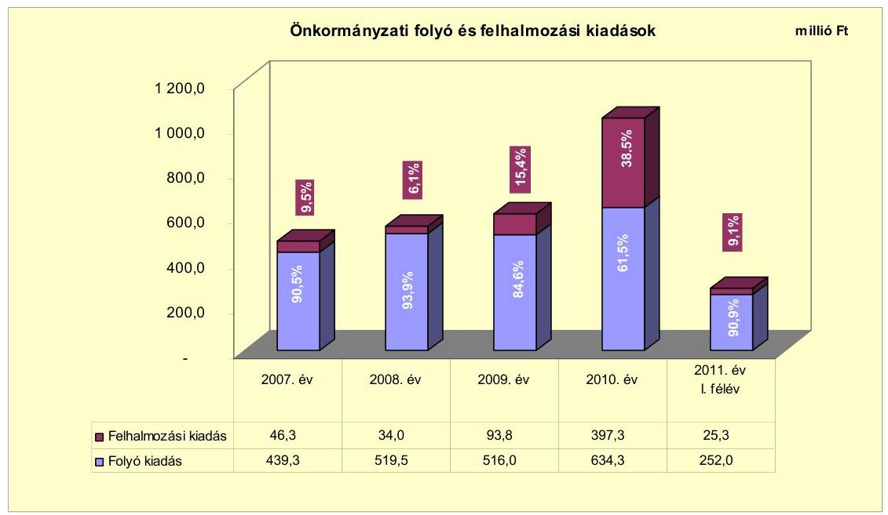

A folyó és felhalmozási kiadások arányának változásában a 2007-2010 évek közötti elmozdulás figyelhető meg. A felhalmozási kiadások aránya a 2007. évben 9,5\%, a 2008. évben 6,1\%, a 2009. évben 15,4\% volt. A felhalmozási kiadások aránya 2010-re 38,5\%-ra emelkedett, a DDOP támogatásból megvalósuló iskolabővítés beruházás miatt.

Az Önkormányzat által 2007-2010 között megvalósított, 2010. december 31-ig befejezett ${ }^{23}$, 10 millió Ft értékhatár feletti felújítások száma négy, fejlesztések (beruházások) száma kettő volt. Az elvégzett felújítások bekerülési költsége áfával 103,8 millió Ft, amelyből a 10 millió Ft értékhatár alatti felújítások bekerülési költsége 38,6 millió volt (37,2\%). A felújítások 81,9 millió Ft összegben saját bevételből ( $78,9 \%$ ), 10,0 millió Ft összegben EU-s támogatásból (9,6\%), 11,9 millió Ft összegben hazai támogatásból (11,5\%) valósultak meg. A befejezett fejlesztések (beruházások) bekerülési költsége áfával 467,6 millió Ft,

[^0]
[^0]:    ${ }^{23}$ A 3/a. számú melléklet mutatja be részletesen a megvalósított felújításokat, fejlesztéseket.

---

amelyből a 10 millió Ft értékhatár alatti fejlesztések bekerülési költsége 17,3 millió volt. A fejlesztések 17,9 millió Ft összegben saját bevételből (3,8\%), 44,0 millió Ft összegben hitelből ( $9,4 \%$ ), 405,7 millió Ft összegben EU-s támogatásból ( $86,8 \%$ ) valósultak meg. Az Önkormányzat a megvalósult fejlesztések működtetésének jövőbeni költségkihatásaival nem számolt.

Az Önkormányzatnak 2010. december 31-én három folyamatban lévő felújítása ${ }^{24}$ (egy tíz millió Ft alatti) és kettő folyamatban lévő fejlesztése volt. A projektekre 2010. december 31-ig kifizetés nem történt. A projektek várható bekerülési költsége 112,5 millió Ft. A tervezett forrásösszetétele 9,5 millió Ft saját bevétel ( $8,4 \%$ ), 100,9 millió Ft EU-s támogatás ( $89,7 \%$ ) és 2,1 millió Ft hazai támogatás ( $1,9 \%$ ). Az önkormányzati kiadáscsökkentő intézkedések miatt felszabaduló pénzeszközök fedezetet nyújthatnak a folyamatban lévő projektek saját forrásához.

Az Önkormányzatnak nincs elbírálás alatti pályázata.
A 2007-2010. évben az Önkormányzat három legnagyobb bekerülési költségű megvalósított felújítása és beruházása az alábbi:

- DDOP iskolabővítés (tetőcsere, nyílászárócsere, festés, külső szigetelés, burkolás). A beruházás a 2009. évben kezdődött és a 2010. évben fejeződött be. A fejlesztés tervezett költsége 451,4 millió Ft, tényleges bekerülési költsége 445,4 millió Ft volt. A megvalósított projekt forrásösszetétele saját bevétel 0,6 millió Ft ( $0,1 \%$ ), hitel 44,0 millió Ft ( $9,9 \%$ ), és 400,8 millió Ft EU-s támogatás ( $90 \%$ ), volt;
- A Polgármesteri hivatal a 2008. évi felújítása (tetőcsere, nyílászárócsere, festés, külső szigetelés, burkolás), melynek a teljes bekerülési költsége 21,1 millió Ft, forrása saját bevétel volt;
- Útfelújítás (Szabadság tér, Orgona u., Camping u., Templom körfogalom), teljes bekerülési költsége 15,4 millió Ft volt. Az útfelújításokat a 2007. évben végezték el. A felújítás forrása, 9,4 millió Ft (61\%) saját bevétel volt és 6,0 millió Ft (39\%) hazai támogatás volt.

Az Önkormányzat az önkormányzati feladatokat ellátó gazdasági társaságoknak működési és felhalmozási célú pénzeszközöket nem adott át.

# 3. Az ÖNKORMÁNYZAT KÖTELEZETTSÉGEI 

### 3.1. Az Önkormányzat pénzintézeti kötelezettségeinek változása

Az Önkormányzat pénzintézeti kötelezettségeinek állománya 2006. december 31-én 6,0 millió Ft volt, amely a 2002-ben felvett hosszú lejáratú hazai hitel igénybevételéből keletkezett. A hitelt a 2007. évben törlesztették. 2007-

[^0]
[^0]:    ${ }^{24}$ A 3/b. melléklet mutatja be részletesen a folyamatban lévő felújításokat, fejlesztéseket.

---

2009 között rövid, illetve hosszú lejáratú pénzintézeti kötelezettség-állománya nem volt az Önkormányzatnak. A 2010. évi 41,4 millió Ft-os pénzintézeti kötelezettség-állományt a tárgyévben felvett 44,0 millió Ft-os hosszú lejáratú hazai hitel és annak 2,6 millió Ft-os törlesztése eredményezte. A 2011. év I. félévre a pénzintézeti kötelezettség-állomány 71,1 millió Ft-ra emelkedett. A növekedést a 2011. évben felvett 35,0 millió Ft-os likvidhitel és a 2010-ben igénybe vett hosszú lejáratú hitelből az 5,3 millió Ft-os törlesztés okozta.

Az Önkormányzat pénzintézetekkel szemben fennálló kötelezettség-állományát a 2007. és 2011. év I. félév között az alábbi ábra szemlélteti:
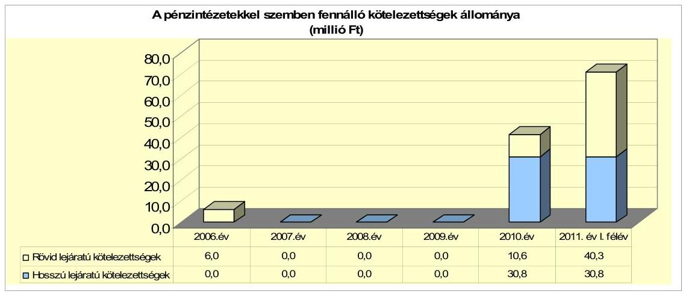
2011. június 30-án a fel nem használt keretösszeg 1,0 millió Ft volt. A 2009-ben tervezett, de 2010-ben felvett 45,0 millió Ft-os hosszú lejáratú hitelből - a beruházási értékhez igazodva - 44,0 millió Ft-ot vettek igénybe.

A 2007-2010. években az Önkormányzat a forráshiány kezelése érdekében bevételnövelő és kiadáscsökkentő intézkedéseket hozott, valamint pénzmaradvány igénybevételével számolt. A 2010. évi költségvetési rendeletben felhalmozási és működési célú hitel, a 2011. évi költségvetési rendeletben pedig likvidhitel felvételéről döntött. 2010-ben a hosszú lejáratú hitel felvételekor az Önkormányzat nem lépte túl - az Ötv. 88. § (2) bekezdésében előírt ${ }^{25}$ - az adósságot keletkeztető kötelezettségvállalások felső határát. Az előterjesztésekben nem mutatták be az adósságszolgálati korlátot. A költségvetési beszámoló szerint az adósságot keletkeztető kötelezettségvállalás felső határa 2010-ben 64,4 millió Ft volt.

Az Önkormányzat pénzintézeti kötelezettségvállalásaira minden esetben a Képviselő-testület döntése alapján került sor. A 2009-ben tervezett, de a 2010. évben felvett hosszú lejáratú hitel felvételének a szükségességéről - a 2009. április 28-i testületi ülésen - a polgármester szóban tájékoztatta a Képviselőtestületet. A hosszú lejáratú hitel felvétele nem, a 2011. év I. félévében felvett likvidhitel (forgóeszközhitel) a pénzintézetek versenyeztetésével történt. A likvidhitel felvételéről szóló előterjesztésben nem mutatták be a kamatkockázatot.

[^0]
[^0]:    ${ }^{25}$ 2012. január 1-jétől a Stabilitási tv. 10. § (3) bekezdés

---

A 2011. év I. félévében felvett likvidhitelt nyújtó pénzintézet nem volt azonos a felhalmozási hiteleket nyújtó pénzintézetekkel.

A vizsgált időszakban a hosszú lejáratú pénzintézeti kötelezettség forrását az Önkormányzat fejlesztésre használta fel. A 2010-ben felvett, öt éves futamidejű, 44,0 millió Ft-os hitelt az „Igal integrációs iskolabővítéshez" használta fel. A vizsgált időszak előtt - 2002-ben - felvett 40,0 millió Ft-os hitelt az „Új Általános Iskola és tornaterem építési munkái"-ra fordította. Ebből 2007-ben a fennmaradó 6,0 millió Ft-os tőkét törlesztették.

Az Önkormányzat 2011. június 30-án HUF-ban fennálló hosszú lejáratú adósságot keletkeztető kötelezettségvállalása:

| Megnevezés | Szerződéskötés/   Kibocsátás | Összeg   millió HUF-ban | Kamat (referencia kamat+   kamatfelár) | Felhasználás célja: |
| :--: | :--: | :--: | :--: | :--: |
| R-OKIF/030635/2009/OTP/KOKG/001 | 2009.12.2./   2010.02.09. | 44,0 | 3 havi EURIBOR $3+2,5 \%$ | DDOP-3.1.2/2F-2009-0003   pályázat |

Az Önkormányzat a 2009-ben megkötött hitelszerződésben felhasználási célként a DDOP-3.1.2/2F-2f-2009-0003 pályázathoz kapcsolódó „Igal integrációs iskolabő-vítés"-t jelölte meg. A felhasználás a hitelcéllal azonosan történt.

A fennálló pénzintézeti kötelezettségéből 2011. június 30-ig 7,9 millió Ft tőkét törlesztett, valamint 1,5 millió Ft kamatot és 0,3 millió Ft egyéb költséget ${ }^{26}$ fizetett meg.

Az Önkormányzat működési feladatainak finanszírozásához a 2007-2010 között folyószámla-, és munkabér-megelőlegezési hitelt nem vett igénybe. 2011. április 28-án 35,0 millió Ft likvidhitelt (forgóeszközhitelt) vett fel. A hitel a 2011. év I. félévig 63 napon keresztül állt fenn, napi átlagos állománya 6,0 millió Ft volt. A teljesített kamat 1,5 millió Ft, az egyéb költség pedig 0,3 millió Ft. ${ }^{27}$

A likvidhitel kondíciói és egyéb költségei a következők voltak ${ }^{28}$

| Megnevezés | Kamat (referencia+ kamatfelár) | Egyéb költség |
| :--: | :--: | :--: |
| Egyéb (forgóeszköz) hitel |  |  |
| 2011-2012. év | 3 havi BUBOR $+3,5 \%$ | $0,25 \%$ egyszeri folyósítási jutalék ( $87,5 \mathrm{eFt}$ )   $0,75 \%$ rend.tart.jutalék   $0,25 \%$ hitelbírálati díj ( $87,5 \mathrm{eFt}$ )   $0,5 \%$ kezelési költség |

A 2007. évben lejárt, és visszafizetett, valamint a fennálló hosszú lejáratú hitel esetében a kamatfizetési kötelezettségek alakulását jelentősen befolyásolta a

[^0]
[^0]:    ${ }^{26}$ Egyszeri projektvizsgálati díj, a szerződéses hitelösszeg 0,75\%-a.
    ${ }^{27}$ Hitelbírálati díj 87,5 ezer Ft, zárlati díj 2,0 ezer Ft, utalási díj 70,0 ezer Ft, egyszeri folyósítási jutalék 87,5 ezer Ft, összesen: 247,0 ezer Ft.
    ${ }^{28}$ A 3 havi BUBOR referencia kamat az MNB BUBOR fixing (átlagkamat) \%-ban 2007-ben $7,75 \%, 2008$-ban $8,87 \%, 2009$-ben $8,64 \%, 2010$-ben $5,50 \%, 2011$. év I. félévében pedig $6,07 \%$.

---

lehívási és az utolsó kamatfizetéskori kamatok (referencia + kamatfelár) változása, amelyet az alábbi táblázat mutat be:

| Megnevezés | Kibocsátási, lehívási | Utolsó fizetéskori | Változás \% |
| :--: | :--: | :--: | :--: |
|  | kamat (referencia + kamatfelár) \% |  |  |
| 3 havi BUBOR (2002.06.28-i szerződés) | 10,7 | 9,3 | $-13,1 \%$ |
| 3 havi EURIBOR (2009.12.02-i szerződés) | 3,386 | 3,731 | $10,2 \%$ |

Amennyiben a kamat nem változott volna, az Önkormányzatnak a hitellehívási kamattal számolva 2011. év I. félévig a 2010. évi forint hitele után 1,0 millió Ft kötelezettsége keletkezett volna. A kamatváltozások hatására azonban 1,5 millió Ft fizetési kötelezettsége keletkezett, ezért a költségei 0,5 millió Ft-tal emelkedtek.

A referenciakamat mértékének változása jelentősen befolyásolja a folyó kötelezettségek és a jövőbeni kötelezettségek alakulását, jelentős hatása van a teljes futamidőre számított kamatkötelezettség nagyságára, mértékük előre pontosan nem határozható meg.

A vállalt pénzintézeti, szállítói és egyéb kötelezettségeket, a 2011-2013. években, illetve az azt követő időszakban várható alakulását a kötelezettségek lejáratáig a következő táblázat szemlélteti:

| Megnevezés | Állomány 2010. december 31-én |  |  | Állomány 2011. június 30-án |  |  | Várható   kötelezettség 2011-   2013. években |  | Várható   kötelezettség 2014.   évtől |  |
| :--: | :--: | :--: | :--: | :--: | :--: | :--: | :--: | :--: | :--: | :--: |
|  | HUF-ban   (millió Ft-ban) | Devizában   (összegye,   ezer EUR-   ban/CHF-   ban) | Deviza   nem | HUF-ban   (millió Ft-ban) | Devizában   (összegye,   ezer EUR-   ban/CHF-   ban) | Deviza   nem | HUF-ban   (millió Ft-ban) | Devizában   (összegye,   ezer EUR-   ban/CHF-   ban) | HUF-ban   (millió Ft-ban) | Devizában   (összegye,   ezer EUR-   ban/CHF-   ban) |
| Pénzintézeti kötelezettségek |  |  |  |  |  |  |  |  |  |  |
| Hosszú lejáratú hitel   (R-OKIF/030635/2009/OTP/KOKG/001) | 41,4 |  | HUF | 36,1 |  | HUF | 34,1 |  | 10,0 |  |
| Foglaladitóz hitel (Cezüveszám: 30/2011/152) | 0,0 |  | HUF | 35,0 |  | HUF | 38,4 |  | 0,0 |  |
| Pénzintézeti kötelezettségek összesen HUF-ban: | 41,4 |  | HUF | 71,1 |  | HUF | 72,5 |  | 10,0 |  |
| Szállítói tartozás | 12,4 |  | HUF | 12,4 |  | HUF | 12,4 |  | 0,0 |  |
| Egyéb kötelezettségek (Igal-Fürdő Kft-től igénybevett   időszak) | 10,0 |  | HUF | 5,6 |  | HUF | 5,6 |  | 0,0 |  |
| HUF-ban fenálló kötelezettségek összesen: | 63,8 |  | HUF | 89,1 |  | HUF | 90,5 |  | 10,0 |  |

A 2011-2013. évek várható, 72,5 millió Ft-os pénzintézeti kötelezettségeinek teljesítésére figyelembe vehető a 2010. évi 19,0 millió Ft szabad pénzmaradvány, a 2010. évi mérlegben kimutatott 3,7 millió Ft követelésállomány és a forgalomképes ingatlanvagyon. A 2014. évet követően, 2011. június 30-án ismert pénzintézeti kötelezettség után a tőketörlesztés és a kamatkiadás együtt 10,0 millió Ft. Az Önkormányzat tájékoztatása szerint figyelembe vehető további források a mindenkori költségvetési rendeletekben megtervezett önkormányzati helyi többlet-adóbevételek. Azonban ennek növelésére 2011-ben tett intézkedés nem biztosít elegendő forrást, ezért a további évekre szóló, jelenleg ismert pénzintézeti kötelezettségek teljesítését nem látjuk biztosítottnak. Az Önkormányzat 2011-ben 6,9 millió Ft többletbevételt tervezett az építmény és a magánszemélyek kommunális adó mértékének a növeléséből. Nem biztosított a vállalt pénzintézeti, szállítói és egyéb kötelezettségek fedezete az erre igénybe vehető működési jövedelem prognosztizált csökkenése következtében.

---

# 3.2. A szállítói kötelezettségek változása 

Az Önkormányzat szállítókkal szemben fennálló - mérleg szerinti - kötelezettségállománya a 2006. december 31-i 1,6 millió Ft-ról - a 2007. évi kivételével 2009. december 31-re folyamatosan, 14,3 millió Ft-ra növekedett. A 2010. december 31-i és a 2011. június 30-án fennálló kötelezettség-állománya 12,4 millió Ft volt. A 2011. június 30-án fennálló kötelezettség-állományból a 30 napon belül lejárt szállítói tartozás 9,8 millió Ft, a 31-60 nap közötti pedig 2,6 millió Ft. Az ebből fakadó, várható kifizetési kötelezettségek a pénzügyi egyensúly helyzetére kedvezőtlenül hatnak.

### 3.3. Egyéb kötelezettségek változása

Az Önkormányzatnak a vizsgált időszakban lízingszerződésből, követelés elengedéséből, pénzintézeti jelzálogjog-bejegyzésből, az Igal-Fürdő Kft.-től igénybe vett kölcsönből vállalt kötelezettségei voltak.

Az Önkormányzat a 2007. évi mérlegében 2,6 millió Ft-tal, a 2008. évi mérlegében 1,6 millió Ft-tal, a 2009. évi mérlegében pedig 0,2 millió Ft-tal az egyéb hosszú lejáratú kötelezettségek között vette számba a 2004. évben 5,6 millió Ft-ért vásárolt személygépjármű lízingdíj kötelezettségét. A szerződést az Önkormányzat nevében a polgármester kötötte meg.

Az Önkormányzatnak a vizsgált időszakban garancia- és kezességvállalással kapcsolatos teljesített fizetési kötelezettsége nem volt. A 2011. év I. félévét követően a Kaposmenti Hulladékgazdálkodási Önkormányzati Társulásnak 10,8 millió Ft összegű, készfizető kezesség-vállalás van folyamatban a helyszíni ellenőrzés időszakában. Az erről szóló megállapodást a helyszíni vizsgálat alatt még nem kötötték meg. A kötelezettségvállalás kezdete 2011. augusztus 31. A megállapodás nem tartalmazza a készfizető-kezesség lejáratát.

Az Önkormányzat PPP konstrukció keretében beruházást nem végzett.
Az Önkormányzat 2007. és 2011. év I. félév között 0,6 millió Ft követelést engedett el. A módosított 15/2003. (XII. 29.) számú rendelet 18. § (3) bekezdésében foglaltaknak megfelelően - kérelemre - 13 fő önkéntes tűzoltó kapott a jegyzőtől a magánszemélyek kommunális adójából 0,2 millió Ft összegű alanyi adómentességet. A fennmaradó 0,4 millió Ft követelések elengedéséről adónemenként ${ }^{29}$, és ügyenként a jegyző - az Art. 134. § (1) bekezdésben foglaltaknak megfelelően - méltányossági jogkörében döntött. Az Önkormányzat a helyi rendeletében a követelésről való lemondás módját és eseteit - az Áht. 108. § (2) bekezdésében foglaltaknak megfelelően ${ }^{30}$ - szabályozta.

A vizsgált időszakban államháztartáson belüli és kívüli szervezetek részére kölcsönt - kivéve az Igal-Fürdő Kft.-t - nem nyújtott. A Képviselő-testület döntése alapján - 2008-ban - az Igal-Fürdő Kft.-nek 5,0 millió Ft tagi kölcsönt

[^0]
[^0]:    ${ }^{29}$ építmény-, magánszemélyek kommunális-, telekadó-, és gépjárműadó
    ${ }^{30}$ 2012. január 1-jétől az Áht 97. § (2) bekezdés

---

nyújtott. A tagi kölcsönt a Kft. a tárgyévben visszafizette. A tagi kölcsön nyújtását nem foglalták szerződésbe.

Az Önkormányzat 2007-2011. év I. félévében egy - forgalomképes hitelintézeti jelzáloggal és egyidejű elidegenítési és terhelési tilalommal érintett ingatlannal rendelkezett. 2011. június 30-án a fürdő elnevezésű (403/3 hrsz) ingatlanon kettő jelzálogjog-bejegyzés állt fenn, összesen 289,9 millió Ft értékben. A kötelezettségvállalás a 2010. évi „Igal integrációs iskolabővítés" fejlesztéshez kapcsolódott. Az Önkormányzat által felvett 44,0 millió Ft összegű, hosszú lejáratú hitelt folyósító pénzintézet 90,0 millió Ft, a Nemzeti Fejlesztési Ügynökség 199,9 millió Ft jelzálogjogot jegyeztetett be. Az ingatlan számviteli nyilvántartás szerinti értéke 2010. december 31-én 351,6 millió Ft, a becsült értéke pedig 1045,8 millió Ft volt. A 2011. év I. félévét követően a Képviselőtestület jóváhagyásával az Igal-Fürdő Kft. fürdőfejlesztésre - 2011. július 22-én - 199,9 millió Ft összegű hosszú lejáratú hitelt vett igénybe. A fürdőberuházást részben finanszírozó pénzintézet - biztosítékként - további 199,9 millió Ft-os jelzálogjogot jegyeztetett be a fürdő elnevezésű (403/3 hrsz) ingatlanra.

A forgalomképes ingatlanok - számviteli nyilvántartásban rögzített - 2010. december 31-i nettó értékének százalékos megoszlását a jelzáloggal terhelt és a nem terhelt ingatlanok között az alábbi ábra szemlélteti.
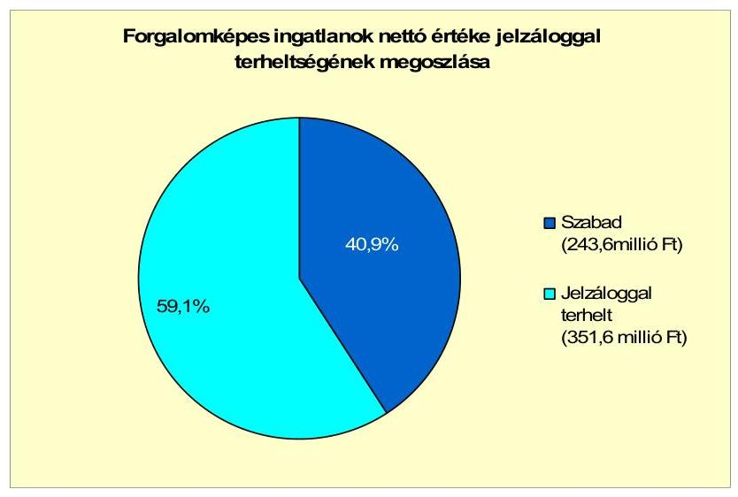

Az Önkormányzatnak a vizsgált időszakban, illetve 2011. június 30-án peres eljárása nem volt.

Az Önkormányzatnak kettő (Igal-Víz Kft. és Igal-Fürdő Kft.) 100\%-os tulajdoni hányaddal rendelkező gazdasági társasága van.

Az Önkormányzat - a Képviselő-testület döntése alapján - az Igal-Fürdő Kft.-től 2010-ben 10,0 millió Ft kölcsönt vett igénybe. 2010. december 31-én a kölcsönből fakadó kötelezettség-állománya 10,0 millió Ft volt. 2011. év I. félévében - szintén a Képviselő-testület jóváhagyásával - további 15,0, és 5,6 millió Ft-os kölcsönt vett fel. A tárgyév I. félévében 25,0 millió Ft-ot visszafizetett. Az Önkormányzatnak 2011. június 30-án a kölcsönökből fakadó

---

kötelezettség-állománya 5,6 millió Ft volt. A kölcsönök felvételét nem foglalták szerződésbe.

Az Önkormányzat 100\%-os tulajdoni hányaddal rendelkező társaságai kötelezettségének a 2010. december 31-i állományát, a 2011-2013. években, illetve az azt követő időszakban várható alakulását a kötelezettségek lejáratáig a következő táblázat szemlélteti:

| Megnevezés | Állomány 2010. december 31-én |  |  | Állomány 2011. június 30-án |  |  | Várható   kötelezettség 2011-   2013. években |  | Várható   kötelezettség 2014.   évtől |  |
| :--: | :--: | :--: | :--: | :--: | :--: | :--: | :--: | :--: | :--: | :--: |
|  | HUF-ban   (millió Ft-   ban) | Devizában   (összege,   azaz EUR-   ban/CHF-   ban) | Deviza   nem | HUF-ban   (millió Ft-   ban) | Devizában   (összege,   azaz EUR-   ban/CHF-   ban) | Deviza   nem | HUF-ban   (millió Ft-   ban) | Devizában   (összege,   azaz EUR-   ban/CHF-   ban) | HUF-ban   (millió Ft-   ban) | Devizában   (összege,   azaz EUR-   ban/CHF-   ban) |
| Egyéb kötelezettségek (Igal-Víz Kft. kölcsön) | 8,0 |  | HUF | 8,0 |  | HUF | 8,0 |  | 0,0 |  |
| Eszállító tartozás (Igal-Víz Kft. és Igal-Fürdő Kft.) | 6,3 |  | HUF | 2,6 |  | HUF | 2,6 |  | 0,0 |  |
| HUF-ban fennálló kötelezettségek összesen: | 14,3 |  | HUF | 10,6 |  | HUF | 10,6 |  | 0,0 |  |

2009-ben a Képviselő-testület az Igal-Fürdő Kft.-től az Igal-Víz Kft.-nek 10,0 millió Ft-os kölcsön-keret biztosításáról döntött. 2009-ben - a kölcsönszerződések szerint - az Igal-Víz Kft. három részletben fejlesztésre, összesen 8,0 millió Ft-ot vett igénybe. 2010. december 31-én a kölcsönökből fakadó kötelezettség-állmánya 8,0 millió Ft volt. 2011. év I. félévében - a 10,0 millió Ft-os keret terhére - további 0,5 millió Ft-os kölcsönt vett fel. A tárgyév I. félévében 0,5 millió Ft-ot visszafizetett. Az Igal-Víz Kft.-nek 2011. június 30-án a kölcsönökből fakadó kötelezettség-állománya továbbra is 8,0 millió Ft.

A 2011. év I. félévét követően a Képviselő-testület jóváhagyásával az Igal-Fürdő Kft. fürdőfejlesztésre - 2011. július 22-én - 199,9 millió Ft összegű hosszú lejáratú hitelt vett igénybe. A társaság 2010. évi 42,5 millió Ft-os adózott eredménye és a 276,7 millió Ft-os eredménytartaléka alapján a 199,9 millió Ft-os pénzintézeti kötelezettség teljesíthető.

Az Igal-Víz Kft. fennálló kölcsöne az Önkormányzat pénzügyi egyensúlyi helyzetét kedvezőtlenül befolyásolhatja. Az Igal-Víz Kft. a 4,5 millió Ft-os jegyzett tőkéjét felélte, a saját tőkéje a veszteséges gazdálkodás következtében 2009-ben -1,9, 2010-ben -3,7, a 2011. év I. félévben pedig -1,4 millió Ft volt. A 2011. év I. félévi mérleg szerinti eredménytartaléka -8,2 millió Ft. Az Önkormányzatnak tőkepótlási kötelezettsége áll fenn. A Gt. 143. § (2) bekezdés a) pontja alapján az ügyvezető a 2009., illetve a 2010. évi beszámoló elfogadását követően haladéktalanul köteles lett volna a szükséges intézkedések megtétele céljából összehívni a taggyűlést, mivel tudomására jutott, hogy a társaság saját tőkéje veszteség folytán a jegyzett tőke felénél alacsonyabbra csökkent. Továbbá a Gt. 143. § (3) bekezdés szerint határozni kellett volna az Önkormányzatnak a pótbefizetés előírásáról, vagy - ha ennek lehetőségét a társasági szerződés nem tartalmazza - a törzstőke más módon való biztosításáról, illetve a társaságnak más gazdasági társasággá való átalakulásáról, vagy jogutód nélküli megszűnéséről.

Az Önkormányzat a gazdasági társaságokról szóló 2006. évi IV. törvény 54. § (2) bekezdése alapján korlátlan felelősséggel tartozik azon gazdasági társaságának felszámolása esetében, amelyben az Önkormányzat az 52. § (2) bekezdése szerint a szavazatok legalább $75 \%$-ával rendelkezik, így minősített befolyásszerzőnek

---

minősül, továbbá a csődeljárásról és a felszámolási eljárásról szóló 1991. évi XLIX. törvény 63. § (2) bekezdése alapján a kizárólagos önkormányzati tulajdonú gazdasági társaságának minden olyan kötelezettségéért, amelynek kielégítését a felszámolási eljárás során az adós társaság vagyona nem fedez, ha a hitelezőinek a felszámolási eljárás során ${ }^{31}$ benyújtott keresete alapján a bíróság - az adós társaság felé érvényesített tartósan hátrányos üzletpolitikájára figyelemmel - megállapítja az önkormányzat korlátlan és teljes felelősségét.

A Képviselő-testületnek előterjesztett éves zárszámadási rendeleteikben nem mutatták be az Önkormányzat eszközei után tárgyévben elszámolt értékcsökkenés összegét, az eszközpótlásra fordított tényleges kiadásokat, az eszközök elhasználódási fokának alakulását. Az Önkormányzat a 2007-2010 között eszközállománya után 206,8 millió Ft összegű értékcsökkenést mutatott ki. A felújításra (elhasznált eszközök pótlására) 79,4 millió Ft-ot fordított. Az elavult eszközök pótlásához biztosított értékcsökkenés részaránya - a 2009. év kivételével - csökkenő tendenciájú. A tárgyévi felújításokra - a tárgyévben elszámolt értékcsökkenéshez viszonyítva - a 2007-ben 63,3\%-ot, 2008-ban 34,0\%-ot, 2009-ben 42,7\%-ot, 2010-ben pedig 12,0\%-ot használtak fel. A felújítások és az eszközök pótlását az Önkormányzat a pénzügyi lehetőségei függvényében végezte. A felújítások jellemzően útfelújítások voltak.

2009-ről 2010-re a befektetett tárgyi eszközök év végi nettó értéke 393,4 millió Ft-tal növekedett, amelyet az „Igal integrációs iskolabővítés" beruházás aktiválása eredményezett.

Az Önkormányzat eszközeinek a használhatósági foka a fejlesztések, felújítások ellenére 2010. december 31-re 0,4 százalékponttal (81,3\%-ról, 80,9\%-ra) csökkent, a 2007-2009. évek átlagához viszonyítva. Hasonló tendenciájú az üzemeltetésre átadott eszközök avultsága, a 2007-2009. évek 72,8\%-os átlagához képest 5,3 százalékponttal (67,5\%-ra) csökkent. Az Önkormányzat eszközei közül a gépek, berendezések felszerelések használhatósága 17,2 százalékponttal (27,3\%-ról 44,5\%-ra) növekedett, a járműveké pedig 15 százalékponttal (25,0\%-ról 10,0\%-ra) csökkent. Az immateriális javak használhatósági foka 30,2 százalékponttal (69,0\%-ról 38,8\%-ra) csökkent, míg az ingatlanok, vagyonértékű jogoké változatlan (88,8\%) volt a 2007-2009. évek átlagához viszonyítva.

# 4. A PÉNZÜGYI EGYENSÚLY MEGTEREMTÉSE ÉRDEKÉBEN HOZOTT INTÉZKEDÉSEK EREDMÉNYE 

Az Önkormányzat adatszolgáltatása alapján összesen 15,4 millió Ft összegű kiadáscsökkentő intézkedést hoztak meg. A cafetéria elemek csökkentése, megszüntetése eredményeként az Önkormányzat 2011. év I. félévében 6,6 millió Ft megtakarítást ér el. A helyettesítés miatti megtakarítás (gyed-gyes idejére a helyettesítés miatti kiadás-megtakarítás) 2008-2011. években keletkezett. A 20082010. években ezen a címen 4,4 millió Ft megtakarítást értek el. A 2011. évre tervezett megtakarítás 1,6 millió Ft. A civil szervezetek támogatását a 2008. és

[^0]
[^0]:    ${ }^{31}$ 2012. január 1-jétől kiegészült: „vagy annak jogerős lezárását követő 90 napos jogvesztő határidőn belül".

---

a 2009. évre vonatkozóan csökkentették (a 2007. évről 1,9 millió Ft-ról 2008-ra 0,9 millió Ft-ra, 2009-re 0,4 millió Ft-ra), ez összesen 1,5 millió Ft kiadáscsökkenést okozott ${ }^{32}$. A 2011. évben a civil szervezetek támogatását további 1,4 millió Ft-tal tervezték csökkenteni.

A 2007-2011. év I. félévében végrehajtott kiadáscsökkentő intézkedéseit az alábbi ábra mutatja be:
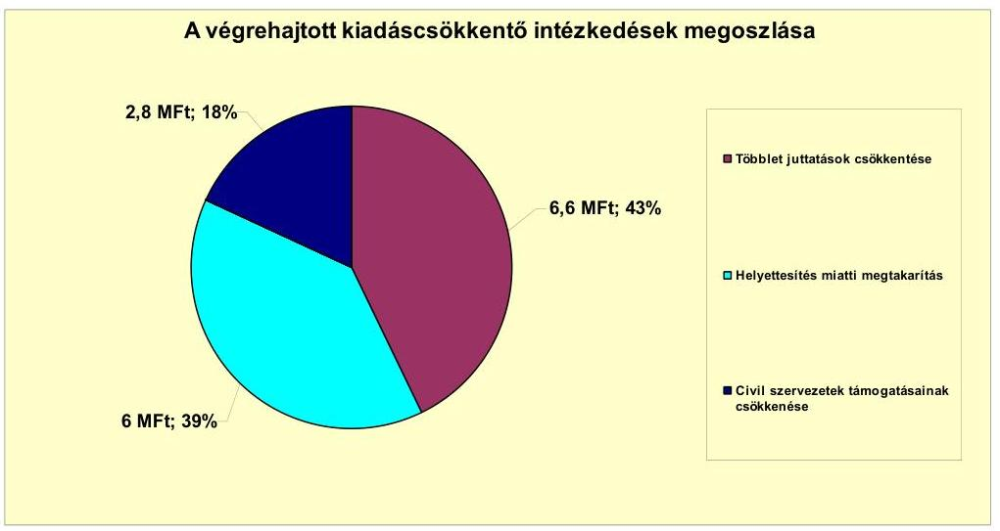

Az Önkormányzat 2007. január 1-jén engedélyezett álláshelyeinek száma 89, 2010. december 31-én 102 volt. A 2007. január 1-jei induló létszám 89 fő, a 2010. december 31-i záró létszám 102 fő volt. A létszámalakulást a következő tábla mutatja be:

| Megnevezés (adatok fő-ben) | Közoktatás | Szociális és gyermekvédelem | Egészségügy | Polgármesteri hivatal | Egyéb | Összesen |
| :--: | :--: | :--: | :--: | :--: | :--: | :--: |
| 2007. január 1-jén jóváhagyott álláshelyek száma | 54 | 15 | 4 | 9 | 7 | 89 |
| Megszüntetett álláshelyek száma | 0 | 6 | 0 | 5 | 4 | 15 |
| edzőt | üres álláshelyek száma |  |  |  |  | 0 |
|  | szakmai álláshelyek száma |  | 6 |  | 5 | 4 | 15 |
|  | intézmény-üzemeltetéssel kapcsolatos   álláshelyek száma |  |  |  |  |  | 0 |
| Álláshely növekedése | 17 | 0 | 0 | 7 | 4 | 28 |
| 2010. december 31-én záró álláshelyek száma | 71 | 9 | 4 | 11 | 7 | 102 |
| 2007. január 1-jén foglalkoztatott létszám | 54 | 15 | 4 | 9 | 7 | 89 |
| Létszámcsökkenés | 0 | 6 | 0 | 5 | 4 | 15 |
| Létszámnövekedés | 17 | 0 | 0 | 7 | 4 | 28 |
| 2010. december 31-én foglalkoztatott létszám | 71 | 9 | 4 | 11 | 7 | 102 |

A közoktatás területén összesen 17 álláshely-, létszámnövekedés volt ${ }^{33}$, a két tagóvoda csatlakozása és feladatbővülés (pedagógia szakszolgálat) miatt. A 2007. január 1-jén foglalkoztatott létszám 54 fő, a 2010. december 31-én foglalkoztatott létszám 71 fő volt. A szociális és gyermekvédelem feladat területén hat álláshelyet szüntettek meg a 2009. évben. A 2009. évben hat község mondta fel az Szociális Központ szociális és gyermekvédelmi alapellátását. Az egész-

[^0]
[^0]:    ${ }^{32}$ A 2008. évben 946 ezer Ft, a 2009. évben 519 ezer Ft kiadáscsökkenés volt.
    ${ }^{33}$ A 2007. évben hat fő, a 2008. évben kettő fő, a 2009. évben három fő, a 2010. évben hat fő létszámnövekedés volt.

---

ségügyi területen az álláshelyek száma nem változott. Az egyéb területen a 2007. január 1-jei nyitó- és a 2010. december 31-i záró létszám megegyezett. A 2007. évben három fő, a 2008. évben egy fő segédmunkást vett fel határozott idejű munkaszerződéssel városüzemeltetési feladatra. A munkaszerződések a 2009. és a 2010. évben megszűntek. A Polgármesteri hivatal létszáma a 2007-2010 évek között összességében (öt álláshely megszűnt, hét álláshellyel bővült) kettő fővel nőtt. A létszámváltozást a közhasznú foglalkoztatott létszám változása, illetve a 2010. évben kettő fő köztisztviselő nyugdíjba vonulása eredményezte.

Az Önkormányzat a helyi adóbevételek növelése érdekében folyamatosan, évente emelte az építményadó és magánszemélyek kommunális adójának mértékét. Az Önkormányzatnak a járműértékesítéséből a 2007-2008. években származott jövedelme. Az intézmények térítési díját 2007. január 1-jétől emelték, a szociális étkeztetésben részesülők kedvezményeit 2010. évtől csökkentették. A két tagóvoda csatlakozása az ÁMK-hoz a 2007-2008. években 15,0 millió Ft bevétel többletet (bevételek-kiadások különbözete) eredményezett.

Az Önkormányzat - adatszolgáltatása alapján - bevételnövelő intézkedéseit a 2007-2011. év I. félév között az alábbi ábra mutatja be:
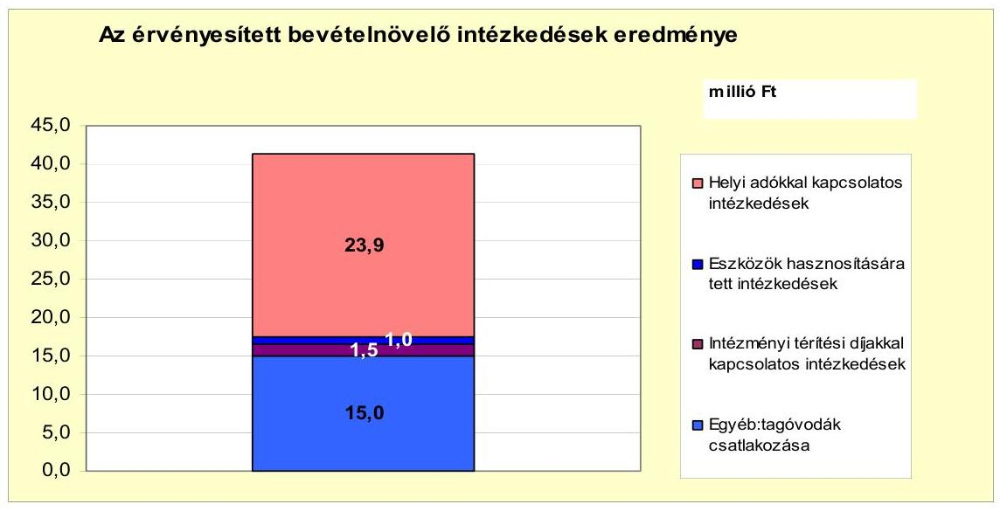

Az Önkormányzatnak az adó mértékének emeléséből a 2008-2010. évben 17,0 millió Ft plusz bevétele keletkezett. A 2011. évre várható többletbevétel 6,9 millió Ft. A helyi adókkal kapcsolatos önkormányzati intézkedések összesen 23,9 millió Ft bevételt eredményeztek.

A járművek értékesítéséből összesen 1,0 millió Ft bevételi többlet keletkezett. Az intézményi térítési díjak 2007. január 1-jei emelése a 2007-2011. években összesen 1,0 millió Ft, a szociális étkeztetés kedvezményeinek felülvizsgálata 0,5 millió Ft többletbevételt eredményezett.

A két tagóvoda (Büssü és Zimány) csatlakozása a 2007-2010. években 14,2 millió Ft többletbevétellel járt. A 2011. évben 0,8 millió Ft többletbevétellel számoltak.

---

Az Önkormányzat központi támogatásokból származó bevételei a 2007. évhez képest az időszak egészét tekintve összességében nőttek ${ }^{34}$. Az Önkormányzat folytatta az előző években elkezdett - kiadási megtakarítást eredményező és bevételt növelő - intézkedéseit. A 2007-2011. I. féléve között tett intézkedések hatására 41,4 millió Ft bevételi többletet, továbbá 15,4 millió Ft kiadási megtakarítást mutattak ki, ezáltal az Önkormányzat pénzügyi helyzetét javították.

# 5. Az ÁSZ Által a korábbi években a pénzügyi egyensúly javítására tett szabályszerűségi és célszerűségi javaslatok hasznosulása

Az ÁSZ nem vizsgálta Igal Város Önkormányzatát „A helyi önkormányzatok gazdálkodási rendszerének ellenőrzése" témában.

Budapest, 2012. április "4"

Melléklet: $\quad 5 \mathrm{db}$
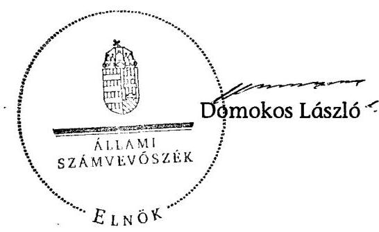

[^0]
[^0]:    ${ }^{34}$ A növekedés 2008-2010. években összesen 95,1 millió Ft volt.

---

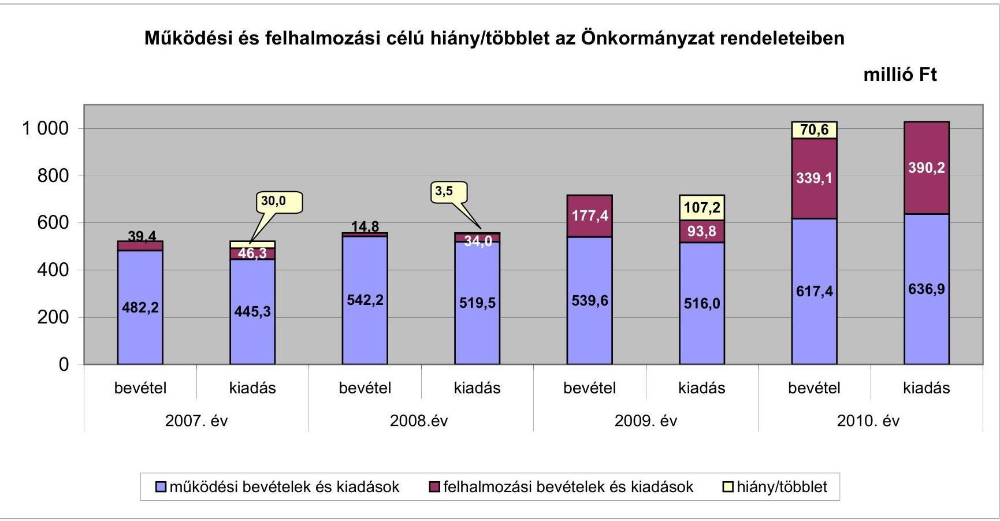

# Működési és felhalmozási célú hiány/többlet az Önkormányzat rendeleteiben

|  Működési és felhalmozási célú hiány/többlet | 2007. év | 2008. év | 2009. év | 2010. év  |
| --- | --- | --- | --- | --- |
|  működési bevételek és kiadások | 38.4 | 30.0 | 14.8 | 17.4  |
|  felhalmozási bevételek és kiadások | 38.4 | 30.0 | 14.8 | 17.4  |
|  felhalmozási bevételek és kiadások | 38.4 | 30.0 | 14.8 | 17.4  |
|  működési bevételek és kiadások | 38.4 | 30.0 | 14.8 | 17.4  |
|  felhalmozási bevételek és kiadások | 38.4 | 30.0 | 14.8 | 17.4  |
|  működési bevételek és kiadások | 38.4 | 30.0 | 14.8 | 17.4  |
|  felhalmozási bevételek és kiadások | 38.4 | 30.0 | 14.8 | 17.4  |
|  működési bevételek és kiadások | 38.4 | 30.0 | 14.8 | 17.4  |
|  felhalmozási bevételek és kiadások | 38.4 | 30.0 | 14.8 | 17.4  |
|  működési bevételek és kiadások | 38.4 | 30.0 | 14.8 | 17.4  |
|  felhalmozási bevételek és kiadások | 38.4 | 30.0 | 14.8 | 17.4  |
|  működési bevételek és kiadások | 38.4 | 30.0 | 14.8 | 17.4  |
|  felhalmozási bevételek és kiadások | 38.4 | 30.0 | 14.8 | 17.4  |
|  működési bevételek és kiadások | 38.4 | 30.0 | 14.8 | 17.4  |
|  felhalmozási bevételek és kiadások | 38.4 | 30.0 | 14.8 | 17.4  |
|  működési bevételek és kiadások | 38.4 | 30.0 | 14.8 | 17.4  |
|  felhalmozási bevételek és kiadások | 38.4 | 30.0 | 14.8 | 17.4  |
|  működési bevételek és kiadások | 38.4 | 30.0 | 14.8 | 17.4  |
|  felhalmozási bevételek és kiadások | 38.4 | 30.0 | 14.8 | 17.4  |
|  működési bevételek és kiadások | 38.4 | 30.0 | 14.8 | 17.4  |
|  felhalmozási bevételek és kiadások | 38.4 | 30.0 | 14.8 | 17.4  |
|  működési bevételek és kiadások | 38.4 | 30.0 | 14.8 | 17.4  |
|  felhalmozási bevételek és kiadások | 38.4 | 30.0 | 14.8 | 17.4  |
|  működési bevételek és kiadások | 38.4 | 30.0 | 14.8 | 17.4  |
|  felhalmozási bevételek és kiadások | 38.4 | 30.0 | 14.8 | 17.4  |
|  működési bevételek és kiadások | 38.4 | 30.0 | 14.8 | 17.4  |
|  felhalmozási bevételek és kiadások | 38.4 | 30.0 | 14.8 | 17.4  |
|  működési bevételek és kiadások | 38.4 | 30.0 | 14.8 | 17.4  |
|  felhalmozási bevételek és kiadások | 38.4 | 30.0 | 14.8 | 17.4  |
|  működési bevételek és kiadások | 38.4 | 30.0 | 14.8 | 17.4  |
|  felhalmozási bevételek és kiadások | 38.4 | 30.0 | 14.8 | 17.4  |
|  működési bevételek és kiadások | 38.4 | 30.0 | 14.8 | 17.4  |
|  felhalmozási bevételek és kiadások | 38.4 | 30.0 | 14.8 | 17.4  |
|  működési bevételek és kiadások | 38.4 | 30.0 | 14.8 | 17.4  |
|  felhalmozási bevételek és kiadások | 38.4 | 30.0 | 14.8 | 17.4  |
|  működési bevételek és kiadások | 38.4 | 30.0 | 14.8 | 17.4  |
|  felhalmozási bevételek és kiadások | 38.4 | 30.0 | 14.8 | 17.4  |
|  működési bevételek és kiadások | 38.4 | 30.0 | 14.8 | 17.4  |
|  felhalmozási bevételek és kiadások | 38.4 | 30.0 | 14.8 | 17.4  |
|  működési bevételek és kiadások | 38.4 | 30.0 | 14.8 | 17.4  |
|  felhalmozási bevételek és kiadások | 38.4 | 30.0 | 14.8 | 17.4  |
|  működési bevételek és kiadások | 38.4 | 30.0 | 14.8 | 17.4  |
|  felhalmozási bevételek és kiadások | 38.4 | 30.0 | 14.8 | 17.4  |
|  működési bevételek és kiadások | 38.4 | 30.0 | 14.8 | 17.4  |
|  felhalmozási bevételek és kiadások | 38.4 | 30.0 | 14.8 | 17.4  |
|  működési bevételek és kiadások | 38.4 | 30.0 | 14.8 | 17.4  |
|  felhalmozási bevételek és kiadások | 38.4 | 30.0 | 14.8 | 17.4  |
|  működési bevételek és kiadások | 38.4 | 30.0 | 14.8 | 17.4  |
|  felhalmozási bevételek és kiadások | 38.4 | 30.0 | 14.8 | 17.4  |
|  működési bevételek és kiadások | 38.4 | 30.0 | 14.8 | 17.4  |
|  felhalmozási bevételek és kiadások | 38.4 | 30.0 | 14.8 | 17.4  |
|  működési bevételek és kiadások | 38.4 | 30.0 | 14.8 | 17.4  |
|  felhalmozási bevételek és kiadások | 38.4 | 30.0 | 14.8 | 17.4  |
|  működési bevételek és kiadások | 38.4 | 30.0 | 14.8 | 17.4  |
|  felhalmozási bevételek és kiadások | 38.4 | 30.0 | 14.8 | 17.4  |
|  működési bevételek és kiadások | 38.4 | 30.0 | 14.8 | 17.4  |
|  felhalmozási bevételek és kiadások | 38.4 | 30.0 | 14.8 | 17.4  |
|  működési bevételek és kiadások | 38.4 | 30.0 | 14.8 | 17.4  |
|  felhalmozási bevételek és kiadások | 38.4 | 30.0 | 14.8 | 17.4 |
| felhalmozási bevételek és kiadások | 38.4 | 30.0 | 14.8 | 17.4 |
| működési bevételek és kiadások | 38.4 | 30.0 | 14.8 | 17.4 |
| felhalmozási bevételek és kiadások | 38.4 | 30.0 | 14.8 | 17.4 |
| működési bevételek és kiadások | 38.4 | 30.0 | 14.8 | 17.4 |
| felhalmozási bevételek és kiadások | 38.4 | 30.0 | 14.8 | 17.4 |
| működési bevételek és kiadások | 38.4 | 30.0 | 14.8 | 17.4 |
| felhalmozási bevételek és kiadások | 38.4 | 30.0 | 14.8 | 17.4 |
| működési bevételek és kiadások | 38.4 | 30.0 | 14.8 | 17.4 |
| felhalmozási bevételek és kiadások | 38.4 | 30.0 | 14.8 | 17.4 |
| működési bevételek és kiadások | 38.4 | 30.0 | 14.8 | 17.4 |
| felhalmozási bevételek és kiadások | 38.4 | 30.0 | 14.8 | 17.4 |
| működési bevételek és kiadások | 38.4 | 30.0 | 14.8 | 17.4 |
| felhalmozási bevételek és kiadások | 38.4 | 30.0 | 14.8 | 17.4 |
| működési bevételek és kiadások | 38.4 | 30.0 | 14.8 | 17.4 |
| felhalmozási bevételek és kiadások | 38.4 | 30.0 | 14.8 | 17.4 |
| működési bevételek és kiadások | 38.4 | 30.0 | 14.8 | 17.4 |
| felhalmozási bevételek és kiadások | 38.4 | 30.0 | 14.8 | 17.4 |
| működési bevételek és kiadások | 38.4 | 30.0 | 14.8 | 17.4 |
| felhalmozási bevételek és kiadások | 38.4 | 30.0 | 14.8 | 17.4 |
| működési bevételek és kiadások | 38.4 | 30.0 | 14.8 | 17.4 |
| felhalmozási bevételek és kiadások | 38.4 | 30.0 | 14.8 | 17.4 |
| működési bevételek és kiadások | 38.4 | 30.0 | 14.8 | 17.4 |
| felhalmozási bevételek és kiadások | 38.4 | 30.0 | 14.8 | 17.4 |
| működési bevételek és kiadások | 38.4 | 30.0 | 14.8 | 17.4 |
| felhalmozási bevételek és kiadások | 38.4 | 30.0 | 14.8 | 17.4 |
| működési bevételek és kiadások | 38.4 | 30.0 | 14.8 | 17.4 |
| felhalmozási bevételek és kiadások | 38.4 | 30.0 | 14.8 | 17.4 |
| működési bevételek és kiadások | 38.4 | 30.0 | 14.8 | 17.4 |
| felhalmozási bevételek és kiadások | 38.4 | 30.0 | 14.8 | 17.4 |
| működési bevételek és kiadások | 38.4 | 30.0 | 14.8 | 17.4 |
| felhalmozási bevételek és kiadások | 38.4 | 30.0 | 14.8 | 17.4 |
| működési bevételek és kiadások | 38.4 | 30.0 | 14.8 | 17.4 |
| felhalmozási bevételek és kiadások | 38.4 | 30.0 | 14.8 | 17.4 |
| működési bevételek és kiadások | 38.4 | 30.0 | 14.8 | 17.4 |
| felhalmozási bevételek és kiadások | 38.4 | 30.0 | 14.8 | 17.4 |
| működési bevételek és kiadások | 38.4 | 30.0 | 14.8 | 17.4 |
| felhalmozási bevételek és kiadások | 38.4 | 30.0 | 14.8 | 17.4 |
| működési bevételek és kiadások | 38.4 | 30.0 | 14.8 | 17.4 |
| felhalmozási bevételek és kiadások | 38.4 | 30.0 | 14.8 | 17.4 |
| működési bevételek és kiadások | 38.4 | 30.0 | 14.8 | 17.4 |
| felhalmozási bevételek és kiadások | 38.4 | 30.0 | 14.8 | 17.4 |
| működési bevételek és kiadások | 38.4 | 30.0 | 14.8 | 17.4 |
| felhalmozási bevételek és kiadások | 38.4 | 30.0 | 14.8 | 17.4 |
| működési bevételek és kiadások | 38.4 | 30.0 | 14.8 | 17.4 |
| felhalmozási bevételek és kiadások | 38.4 | 30.0 | 14.8 | 17.4 |
| működési bevételek és kiadások | 38.4 | 30.0 | 14.8 | 17.4 |
| felhalmozási bevételek és kiadások | 38.4 | 30.0 | 14.8 | 17.4 |
| működési bevételek és kiadások | 38.4 | 30.0 | 14.8 | 17.4 |
| felhalmozási bevételek és kiadások | 38.4 | 30.0 | 14.8 | 17.4 |
| működési bevételek és kiadások | 38.4 | 30.0 | 14.8 | 17.4 |
| felhalmozási bevételek és kiadások | 38.4 | 30.0 | 14.8 | 17.4 |
| működési bevételek és kiadások | 38.4 | 30.0 | 14.8 | 17.4 |
| felhalmozási bevételek és kiadások | 38.4 | 30.0 | 14.8 | 17.4 |
 | működési bevételek és kiadások | 38.4 | 30.0 | 14.8 | 17.4 |
| felhalmozási bevételek és kiadások | 38.4 | 30.0 | 14.8 | 17.4 |
| működési bevételek és kiadások | 38.4 | 30.0 | 14.8 | 17.4 |
| felhalmozási bevételek és kiadások | 38.4 | 30.0 | 14.8 | 17.4 |
| működési bevételek és kiadások | 38.4 | 30.0 | 14.8 | 17.4 |
| felhalmozási bevételek és kiadások | 38.4 | 30.0 | 14.8 | 17.4 |
| működési bevételek és kiadások | 38.4 | 30.0 | 14.8 | 17.4 |
| felhalmozási bevételek és kiadások | 38.4 | 30.0 | 14.8 | 17.4 |
| működési bevételek és kiadások | 38.4 | 30.0 | 14.8 | 17.4 |
| felhalmozási bevételek és kiadások | 38.4 | 30.0 | 14.8 | 17.4 |
| működési bevételek és kiadások | 38.4 | 30.0 | 14.8 | 17.4 |
| felhalmozási bevételek és kiadások | 38.4 | 30.0 | 14.8 | 17.4 |
| működési bevételek és kiadások | 38.4 | 30.0 | 14.8 | 17.4 |
| felhalmozási bevételek és kiadások | 38.4 | 30.0 | 14.8 | 17.4 |
| működési bevételek és kiadások | 38.4 | 30.0 | 14.8 | 17.4 |
| felhalmozási bevételek és kiadások | 38.4 | 30.0 | 14.8 | 17.4 |
| működési bevételek és kiadások | 38.4 | 30.0 | 14.8 | 17.4 |
| felhalmozási bevételek és kiadások | 38.4 | 30.0 | 14.8 | 17.4 |
| működési bevételek és kiadások | 38.4 | 30.0 | 14.8 | 17.4 |
| felhalmozási bevételek és kiadások | 38.4 | 30.0 | 14.8 | 17.4 |
| működési bevételek és kiadások | 38.4 | 30.0 | 14.8 | 17.4 |
| felhalmozási bevételek és kiadások | 38.4 | 30.0 | 14.8 | 17.4 |
| működési bevételek és kiadások | 38.4 | 30.0 | 14.8 | 17.4 |
| felhalmozási bevételek és kiadások | 38.4 | 30.0 | 14.8 | 17.4 |
| működési bevételek és kiadások | 38.4 | 30.0 | 14.8 | 17.4 |
| felhalmozási bevételek és kiadások | 38.4 | 30.0 | 14.8 | 17.4 |
| működési bevételek és kiadások | 38.4 | 30.0 | 14.8 | 17.4 |
| felhalmozási bevételek és kiadások | 38.4 | 30.0 | 14.8 | 17.4 |
| működési bevételek és kiadások | 38.4 | 30.0 | 14.8 | 17.4 |
| felhalmozási bevételek és kiadások | 38.4 | 30.0 | 14.8 | 17.4 |
| működési bevételek és kiadások | 38.4 | 30.0 | 14.8 | 17.4 |
| felhalmozási bevételek és kiadások | 38.4 | 30.0 | 14.8 | 17.4 |
| működési bevételek és kiadások | 38.4 | 30.0 | 14.8 | 17.4 |
| felhalmozási bevételek és kiadások | 38.4 | 30.0 | 14.8 | 17.4 |
| működési bevételek és kiadások | 38.4 | 30.0 | 14.8 | 17.4 |
| felhalmozási bevételek és kiadások | 38.4 | 30.0 | 14.8 | 17.4 |
| működési bevételek és kiadások | 38.4 | 30.0 | 14.8 | 17.4 |
| felhalmozási bevételek és kiadások | 38.4 | 30.0 | 14.8 | 17.4 |
| működési bevételek és kiadások | 38.4 | 30.0 | 14.8 | 17.4 |
| felhalmozási bevételek és kiadások | 38.4 | 30.0 | 14.8 | 17.4 |
| működési bevételek és kiadások | 38.4 | 30.0 | 14.8 | 17.4 |
| felhalmozási bevételek és kiadások | 38.4 | 30.0 | 14.8 | 17.4 |
| működési bevételek és kiadások | 38.4 | 30.0 | 14.8 | 17.4 |
| felhalmozási bevételek és kiadások | 38.4 | 30.0 | 14.8 | 17.4 |
| működési bevételek és kiadások | 38.4 | 30.0 | 14.8 | 17.4 |
| felhalmozási bevételek és kiadások | 38.4 | 30.0 | 14.8 | 17.4 |
| működési bevételek és kiadások | 38.4 | 30.0 | 14.8 | 17.4 |
| felhalmozási bevételek és kiadások | 38.4 | 30.0 | 14.8 | 17.4 |
| működési bevételek és kiadások | 38.4 | 30.0 | 14.8 | 17.4 |
| felhalmozási bevételek és kiadások | 38.4 | 30.0 | 14.8 | 17.4 |
| működési bevételek és kiadások | 38.4 | 30.0 | 14.8 | 17.4 |
| felhalmozási bevételek és kiadások | 38.4 | 30.0 | 14.8 | 17.4 |
| működési bevételek és kiadások | 38.4 | 30.0 | 14.8 | 17.4 |
| felhalmozási bevételek és kiadások | 38.4 | 30.0 | 14.8 | 17.4 |
| működési bevételek és kiadások | 38.4 | 30.0 | 14.8 | 17.4 |
| felhalmozási bevételek és kiadások | 38.4 | 30.0 | 14.8 | 17.4 |
| működési bevételek és kiadások | 38.4 | 30.0 | 14.8 | 17.4 |
| felhalmozási bevételek és kiadások | 38.4 | 30.0 | 14.8 | 17.4 |
| működési bevételek és kiadások | 38.4 | 30.0 | 14.8 | 17.4 |
| felhalmozási bevételek és kiadások | 38.4 | 30.0 | 14.8 | 17.4 |
| működési bevételek és kiadások | 38.4 | 30.0 | 14.8 | 17.4 |
| felhalmozási bevételek és kiadások | 38.4 | 30.0 | 14.8 | 17.4 |
| működési bevételek és kiadások | 38.4 | 30.0 | 14.8 | 17.4 |
| felhalmozási bevételek és kiadások | 38.4 | 30.0 | 14.8 | 17.4 |
| működési bevételek és kiadások | 38.4 | 30.0 | 14.8 | 17.4 |
| felhalmozási bevételek és kiadások | 38.4 | 30.0 | 14.8 | 17.4 |
| működési bevételek és kiadások | 38.4 | 30.0 | 14.8 | 17.4 |
| felhalmozási bevételek és kiadások | 38.4 | 30.0 | 14.8 | 17.4 |
| működési bevételek és kiadások | 38.4 | 30.0 | 14.8 | 17.4 |
| felhalmozási bevételek és kiadások | 38.4 | 30.0 | 14.8 | 17.4 |
| működési bevételek és kiadások | 38.4 | 30.0 | 14.8 | 17.4 |
| felhalmozási bevételek és kiadások | 38.4 | 30.0 | 14.8 | 17.4 |
| működési bevételek és kiadások | 38.4 | 30.0 | 14.8 | 17.4 |
| felhalmozási bevételek és kiadások | 38.4 | 30.0 | 14.8 | 17.4 |
| működési bevételek és kiadások | 38.4 | 30.0 | 14.8 | 17.4 |
| felhalmozási bevételek és kiadások | 38.4 | 30.0 | 14.8 | 17.4 |
| működési bevételek és kiadások | 38.4 | 30.0 | 14.8 | 17.4 |
| felhalmozási bevételek és kiadások | 38.4 | 30.0 | 14.8 | 17.4 |
| működési bevételek és kiadások | 38.4 | 30.0 | 14.8 | 17.4 |
| felhalmozási bevételek és kiadások | 38.4 | 30.0 | 14.8 | 17.4 |
| működési bevételek és kiadások | 38.4 | 30.0 | 14.8 | 17.4 |
| felhalmozási bevételek és kiadások | 38.4 | 30.0 | 14.8 | 17.4 |
| működési bevételek és kiadások | 38.4 | 30.0 | 14.8 | 17.4 |
| felhalmozási bevételek és kiadások | 38.4 | 30.0 | 14.8 | 17.4 |
| működési bevételek és kiadások | 38.4 | 30.0 | 14.8 | 17.4 |
| felhalmozási bevételek és kiadások | 38.4 | 30.0 | 14.8 | 17.4 |
| működési bevételek és kiadások | 38.4 | 30.0 | 14.8 | 17.4 |
| felhalmozási bevételek és kiadások | 38.4 | 30.0 | 14.8 | 17.4 |
| működési bevételek és kiadások | 38.4 | 30.0 | 14.8 | 17.4 |
| felhalmozási bevételek és kiadások | 38.4 | 30.0 | 14.8 | 17.4 |
| működési bevételek és kiadások | 38.4 | 30.0 | 14.8 | 17.4 |
| felhalmozási bevételek és kiadások | 38.4 | 30.0 | 14.8 | 17.4 |
| működési bevételek és kiadások | 38.4 | 30.0 | 14.8 | 17.4 |
| felhalmozási bevételek és kiadások | 38.4 | 30.0 | 14.8 | 17.4 |
| működési bevételek és kiadások | 38.4 | 30.0 | 14.8 | 17.4 |
| felhalmozási bevételek és kiadások | 38.4 | 30.0 | 14.8 | 17.4 |
| működési bevételek és kiadások | 38.4 | 30.0 | 14.8 | 17.4 |
| felhalmozási bevételek és kiadások | 38.4 | 30.0 | 14.8 | 17.4 |
| működési bevételek és kiadások | 38.4 | 30.0 | 14.8 | 17.4 |
| felhalmozási bevételek és kiadások | 38.4 | 30.0 | 14.8 | 17.4 |
| működési bevételek és kiadások | 38.4 | 30.0 | 14.8 | 17.4 |
| felhalmozási bevételek és kiadások | 38.4 | 30.0 | 14.8 | 17.4 |
| működési bevételek és kiadások | 38.4 | 30.0 | 14.8 | 17.4 | | 17.4 |
| működési bevételek és kiadások | 38.4 | 30.0 | 14.8 | 17.4 |
| működési bevételek és kiadások | 38.4 | 30.0 | 14.8 | 17.4 |
| működési bevételek és kiadások | 38.4 | 30.0 | 14.8 | 17.4 |
| működési bevételek és kiadások | 38.4 | 30.0 | 14.8 | 17.4 |
| működési bevételek és kiadások | 38.4 | 30.0 | 14.8 | 17.4 |
| működési bevételek és kiadások | 38.4 | 30.0 | 14.8 | 17.4 |
| működési bevételek és kiadások | 38.4 | 30.0 | 14.8 | 17.4 |
| működési bevételek és kiadások | 38.4 | 30.0 | 14.8 | 17.4 |
| működési bevételek és kiadások | 38.4 | 30.0 | 14.8 | 17.4 |
| működési bevételek és kiadások | 38.4 | 30.0 | 14.8 | 17.4 |
| működési bevételek és kiadások | 38.4 | 30.0 | 14.8 | 17.4 |
| működési bevételek és kiadások | 38.4 | 30.0 | 14.8 | 17.4 |
| működési bevételek és kiadások | 38.4 | 30.0 | 14.8 | 17.4 |
| működési bevételek és kiadások | 38.4 | 30.0 | 14.8 | 17.4 |
| működési bevételek és kiadások | 38.4 | 30.0 | 14.8 | 17.4 |
| működési bevételek és kiadások | 38.4 | 30.0 | 14.8 | 17.4 |
| működési bevételek és kiadások | 38.4 | 30.0 | 14.8 | 17.4 |
| működési bevételek és kiadások | 38.4 | 30.0 | 14.8 | 17.4 |
| működési bevételek és kiadások | 38.4 | 30.0 | 14.8 | 17.4 |
| működési bevételek és kiadások | 38.4 | 30.0 | 14.8 | 17.4 |
| működési bevételek és kiadások | 38.4 | 30.0 | 14.8 | 17.4 |
| működési bevételek és kiadások | 38.4 | 30.0 | 14.8 | 17.4 |
| működési bevételek és kiadások | 38.4 | 30.0 | 14.8 | 17.4 |

---

Az Önkormányzat bevételei és kiadásai, valamint adósságszolgálata 2007-2010 között

| 1. FOLYÓ KÖLTSÉGVETÉS* | 2007. év | 2008. év | 2009. év | 2010. év |
| --- | --- | --- | --- | --- |
| 1.1.1. Saját működési bevételek | 116,1 | 106,1 | 108,4 | 180,3 |
| 1.1.2. Költségvetési támogatás* | 198,5 | 267,2 | 270,1 | 246,8 |
| 1.1.3. Átengedett bevételek | 69,7 | 33,6 | 31,7 | 33,6 |
| 1.1.4. Állambáztartáson belülről kapott támogatások | 76,7 | 118,8 | 108,7 | 144,2 |
| 1.1.5. EU-tól és külföldről kapott bevételek | 0,0 | 0,1 | 0,0 | 0,0 |
| 1.1.6. Állambáztartáson kívülről kapott bevételek | 16,6 | 5,0 | 0,0 | 10,1 |
| 1.1.7. Előző évi pénzmaradvány átvétel | 0,0 | 0,0 | 0,0 | 0,0 |
| 1.1. Folyó bevételek $=1.1 .1 .+1.1 .2 .+1.1 .3 .+1.1 .4 .+1.1 .5 .+1.1 .6 .+1.1 .7$. | 477,6 | 530,8 | 518,9 | 615,0 |
| 1.2.1. Működési kiadások kamatkiadások nélkül | 403,1 | 491,7 | 492,0 | 609,3 |
| 1.2.2. Állambáztartáson belülre átadott pénzeszközök | 4,7 | 3,5 | 4,9 | 0,2 |
| 1.2.3.1. vállalkozásoknak | 15,2 | 6,9 | 0,1 | 0,1 |
| 1.2.3.2. EU-nak, illetve külföldre | 0,0 | 0,4 | 0,0 | 0,0 |
| 1.2.3.3. magánszemélyeknek | 10,2 | 12,0 | 14,0 | 16,2 |
| 1.2.3.4. nonprofit szervezeteknek | 5,8 | 4,1 | 5,0 | 7,1 |
| 1.2.5. Transzferkiadások ( $=1.2 .3 .1+1.2 .3 .2+1.2 .3 .3+1.2 .3 .4$ ) | 31,2 | 23,4 | 19,1 | 23,4 |
| 1.2.4 Kamatkiadások | 0,3 | 0,9 | 0,0 | 1,4 |
| 1.2.5. Előző évi pénzmaradvány átadás | 0,0 | 0,0 | 0,0 | 0,0 |
| 1.2. Folyó kiadások $=1.2 .1 .+1.2 .2 .+1.2 .3 .+1.2 .4 .+1.2 .5$. | 439,5 | 519,5 | 516,0 | 634,3 |
| 1.3. Folyó költségvetés egyenlege MŰKÖDÉSI JÖVEDELEM (1.1. - 1.2.) | 38,3 | 11,3 | 2,9 | $-19,3$ |
| 2. FELHALMOZÁSI KÖLTSÉGVETÉS** | | | | |
| 2.1.1. Saját tőkebevételek | 0,8 | 0,3 | 4,7 | 1,9 |
| 2.1.2. Állambáztartáson belülről kapott támogatások | 17,5 | 11,4 | 179,7 | 296,0 |
| 2.1.3. EU-tól és külföldről kapott támogatások | 0,0 | 0,0 | 0,0 | 0,0 |
| 2.1.4. Állambáztartáson kívülről kapott támogatások | 0,0 | 0,0 | 0,0 | 0,0 |
| 2.1. Felhalmozási bevételek ( $=2.1 .1 .+2.1 .2+2.1 .3+2.1 .4$. ) | 18,3 | 11,7 | 184,4 | 297,9 |
| 2.2.1. Saját beruházási kiadás áfával | 6,7 | 12,1 | 64,1 | 389,1 |
| 2.2.2. Saját felújítási kiadás áfával | 39,6 | 21,9 | 29,7 | 8,2 |
| 2.2.3. Állambáztartáson belülre átadott pénzeszköz | 0,0 | 0,0 | 0,0 | 0,0 |
| 2.2.4. EU-nak és külföldnek adott pénzeszközök | 0,0 | 0,0 | 0,0 | 0,0 |
| 2.2.5. Állambáztartáson kívülre adott pénzeszközök | 0,0 | 0,0 | 0,0 | 0,0 |
| 2.2.6. Befektetési célú részesedések vásárlása | 0,0 | 0,0 | 0,0 | 0,0 |
| 2.2. Felhalmozási kiadások ( $=2.2 .1 .+2.2 .2 .+2.2 .3 .+2.2 .4 .+2.2 .5 .+2.2 .6$ ) | 46,3 | 34,0 | 93,8 | 397,3 |
| 2.3. Felhalmozási költségvetés egyenlege (2.1. - 2.2.) | $-28,0$ | $-22,3$ | 90,6 | $-99,4$ |
| 3. Finanszírozási műveletek nélküli (GFS) pozíció(1.3.+2.3.) | 10,3 | $-11,0$ | 93,5 | $-118,7$ |
| 4. Finanszírozási műveletek | | | | |
| 4.1. Hitelfelvétel | 0,0 | 0,0 | 0,0 | 44,0 |
| 4.2. Hiteltörlesztés | 6,0 | 0,0 | 0,0 | 2,6 |
| 4.3. Forgatási és befektetési célú értékpapírok kibocsátása | 0,0 | 0,0 | 0,0 | 0,0 |
| 4.4. Forgatási és befektetési célú értékpapírok beváltása | 0,0 | 0,0 | 0,0 | 0,0 |
| 4.5. Forgatási és befektetési célú értékpapírok értékesítése | 0,0 | 0,0 | 0,0 | 0,0 |
| 4.6. Forgatási és befektetési célú értékpapírok vásárlása | 0,0 | 0,0 | 0,0 | 0,0 |
| 4.7. Egyéb finanszírozási bevételek (függő, átfutó, kiegyenlítő) | $-0,4$ | 17,4 | $-2,9$ | $-11,3$ |
| 4.8. Egyéb finanszírozási kiadások (függő, átfutó, kiegyenlítő) | $-4,3$ | 1,1 | 2,7 | 15,4 |
| 4.9.Finanszírozási műveletek egyenlege (4.1. - 4.2.+4.3.-4.4+4.5.-4.6.+4.7.-4.8.) | $-2,1$ | 16,3 | $-5,6$ | 14,7 |
| 5. Tárgyévi pénzügyi pozíció (1.3.+ 2.3.+4.9.) | 8,2 | 5,3 | 87,9 | $-104,0$ |
| 6. Nettó működési jövedelem =működési jövedelem (1.3.) - tőketörlesztés $(4.2+4.4)$ | 32,3 | 11,3 | 2,9 | $-21,9$ |
| TÁJÉKOZTATÓ ADATOK | | | | |
| Összes kötelezettség | 7,2 | 9,1 | 22,8 | 57,4 |
| ebből rövid lejáratú | 4,6 | 7,5 | 22,0 | 26,6 |
| Összes szállítói kötelezettség | 1,5 | 2,1 | 14,3 | 12,4 |
| ebből lejárt (tanúsítványból) | 1,5 | 2,1 | 2,7 | 12,4 |
| Pénz és tőkepiaci kötelezettség (adósság) | 0,0 | 0,0 | 0,0 | 41,4 |
| ebből rövid lejáratú | 0,0 | 0,0 | 0,0 | 10,6 |
| PPP szerződéses állomány jelenértéken (tanúsítványból | 0,0 | 0,0 | 0,0 | 0,0 |
| ebből lejárt szolgáltatási díj miatti kötelezettség | 0,0 | 0,0 | 0,0 | 0,0 |
| Folyószámlakitel napi átlagos állománya (tanúsítványból | 0,0 | 0,0 | 0,0 | 0,0 |
| Likvidületi napi átlagos állománya (tanúsítványból | 0,0 | 0,0 | 0,0 | 0,0 |
| Munkabérhitel napi átlagos állománya (tanúsítványból | 0,0 | 0,0 | 0,0 | 0,0 |
| Kezesség és garanciavállalások (tanúsítványból) | 0,0 | 0,0 | 0,0 | 0,0 |
| Jogerős bírósági ítéletekből adódó kötelezettségek (tanúsítványból | 0,0 | 0,0 | 0,0 | 0,0 |
| Finanszírozásba bevonható eszközök | 24,8 | 30,1 | 118,0 | 14,1 |
| Tartós hitelviszonyt megtestesítő értékpapírok év végi állománye | 0,0 | 0,0 | 0,0 | 0,0 |
| Hosszú lejáratú bankbetétek év végi állománye | 0,0 | 0,0 | 0,0 | 0,0 |
| Értékpapírok év végi állománya | 0,0 | 0,0 | 0,0 | 0,0 |
| Pénzeszközök (idegen pénzeszközök nélkül) év végi állománya | 24,8 | 30,1 | 118,0 | 14,1 |

*A költségvetési támogatásból a felhalmozási célú összeget az Önkormányzat adatszolgáltatása szerinti mértékben vettük figyelembe, a 2.1.2. soron ** Bevételekben nem térül, a kiadásokban nem jelenik meg az amortizáció, a vagyoni helyzetet az egyenleg befolyásolja

---

Igari Város Önkormányzata

Az Önkormányzat 2007-2010. években megvalósított, 2010. december 31-ig befejezett fejlesztései és azok forrásösszetétele

millió Ft-ban

| Fejlesztési feladat (beruházás, felújítás) | | Beruházás, felújítás | | | | | | | | | | | | | | | | | | | | | | | | | | | | | | | | | | | | | | | | |
 |
| --- | --- | --- | --- | --- | --- | --- | --- | --- | --- | --- | --- | --- | --- | --- | --- | --- | --- | --- | --- | --- | --- | --- | --- | --- | --- | --- | --- | --- | --- | --- | --- | --- | --- | --- | --- | --- | --- | --- | --- | --- | --- | --- | --- |
|   |  |  |  |  |  |  |  |  |  |  |  |  |  |  |  |  |  |  |  |  |  |  |  |  |  |  |  |  |  |  |  |  |  |  |  |  |  |  |  |  |  |   |
|   |  |  |  |  |  |  |  |  |  |  |  |  |  |  |  |  |  |  |  |  |  |  |  |  |  |  |  |  |  |  |  |  |  |  |  |  |  |  |  |  |  |   |
|   |  |  |  |  |  |  |  |  |  |  |  |  |  |  |  |  |  |  |  |  |  |  |  |  |  |  |  |  |  |  |  |  |  |  |  |  |  |  |  |  |  |   |
|   |  |  |  |  |  |  |  |  |  |  |  |  |  |  |  |  |  |  |  |  |  |  |  |  |  |  |  |  |  |  |  |  |  |  |  |  |  |  |  |  |  |   |
|   |  |  |  |  |  |  |  |  |  |  |  |  |  |  |  |  |  |  |  |  |  |  |  |  |  |  |  |  |  |  |  |  |  |  |  |  |  |  |  |  |  |   |
|   |  |  |  |  |  |  |  |  |  |  |  |  |  |  |  |  |  |  |  |  |  |  |  |  |  |  |  |  |  |  |  |  |  |  |  |  |  |  |  |  |  |   |
|   |  |  |  |  |  |  |  |  |  |  |  |  |  |  |  |  |  |  |  |  |  |  |  |  |  |  |  |  |  |  |  |  |  |  |  |  |  |  |  |  |  |   |
|   |  |  |  |  |  |  |  |  |  |  |  |  |  |  |  |  |  |  |  |  |  |  |  |  |  |  |  |  |  |  |  |  |  |  |  |  |  |  |  |  |  |   |
|   |  |  |  |  |  |  |  |  |  |  |  |  |  |  |  |  |  |  |  |  |  |  |  |  |  |  |  |  |  |  |  |  |  |  |  |  |  |  |  |  |  |   |
|   |  |  |  |  |  |  |  |  |  |  |  |  |  |  |  |  |  |  |  |  |  |  |  |  |  |  |  |  |  |  |  |  |  |  |  |  |  |  |  |  |  |   |
|   |  |  |  |  |  |  |  |  |  |  |  |  |  |  |  |  |  |  |  |  |  |  |  |  |  |  |  |  |  |  |  |  |  |  |  |  |  |  |  |  |  |   |
|   |  |  |  |  |  |  |  |  |  |  |  |  |  |  |  |  |  |  |  |  |  |  |  |  |  |  |  |  |  |  |  |  |  |  |  |  |  |  |  |  |  |   |
|   |  |  |  |  |  |  |  |  |  |  |  |  |  |  |  |  |  |  |  |  |  |  |  |  |  |  |  |  |  |  |  |  |  |  |  |  |  |  |  |  |  |   |
|   |  |  |  |  |  |  |  |  |  |  |  |  |  |  |  |  |  |  |  |  |  |  |  |  |  |  |  |  |  |  |  |  |  |  |  |  |  |  |  |  |  |   |
|   |  |  |  |  |  |  |  |  |  |  |  |  |  |  |  |  |  |  |  |  |  |  |  |  |  |  |  |  |  |  |  |  |  |  |  |  |  |  |  |  |  |   |
|   |  |  |  |  |  |  |  |  |  |  |  |  |  |  |  |  |  |  |  |  |  |  |  |  |  |  |  |  |  |  |  |  |  |  |  |  |  |  |  |  |  |   |
|   |  |  |  |  |  |  |  |  |  |  |  |  |  |  |  |  |  |  |  |  |  |  |  |  |  |  |  |  |  |  |  |  |  |  |  |  |  |  |  |  |  |   |
|   |  |  |  |  |  |  |  |  |  |  |  |  |  |  |  |  |  |  |  |  |  |  |  |  |  |  |  |  |  |  |  |  |  |  |  |  |  |  |  |  |  |   |
|   |  |  |  |  |  |  |  |  |  |  |  |  |  |  |  |  |  |  |  |  |  |  |  |  |  |  |  |  |  |  |  |  |  |  |  |  |  |  |  |  |  |   |
|   |  |  |  |  |  |  |  |  |  |  |  |  |  |  |  |  |  |  |  |  |  |  |  |  |  |  |  |  |  |  |  |  |  |  |  |  |  |  |  |  |  |   |
|   |  |  |  |  |  |  |  |  |  |  |  |  |  |  |  |  |  |  |  |  |  |  |  |  |  |  |  |  |  |  |  |  |  |  |  |  |  |  |  |  |  |   |
|   |  |  |  |  |  |  |  |  |  |  |  |  |  |  |  |  |  |  |  |  |  |  |  |  |  |  |  |  |  |  |  |  |  |  |  |  |  |  |  |  |  |   |
|   |  |  |  |  |  |  |  |  |  |  |  |  |  |  |  |  |  |  |  |  |  |  |  |  |  |  |  |  |  |  |  |  |  |  |  |  |  |  |  |  |  |   |
|   |  |  |  |  |  |  |  |  |  |  |  |  |  |  |  |  |  |  |  |  |  |  |  |  |  |  |  |  |  |  |  |  |  |  |  |  |  |  |  |  |  |   |
|   |  |  |  |  |  |  |  |  |  |  |  |  |  |  |  |  |  |  |  |  |  |  |  |  |  |  |  |  |  |  |  |  |  |  |  |  |  |  |  |  |  |   |
|   |  |  |  |  |  |  |  |  |  |  |  |  |  |  |  |  |  |  |  |  |  |  |  |  |  |  |  |  |  |  |  |  |  |  |  |  |  |  |  |  |  |   |
|   |  |  |  |  |  |  |  |  |  |  |  |  |  |  |  |  |  |  |  |  |  |  |  |  |  |  |  |  |  |  |  |  |  |  |  |  |  |  |  |  |  |   |
|   |  |  |  |  |  |  |  |  |  |  |  |  |  |  |  |  |  |  |  |  |  |  |  |  |  |  |  |  |  |  |  |  |  |  |  |  |  |  |  |  |  |   |
|   |  |  |  |  |  |  |  |  |  |  |  |  |  |  |  |  |  |  |  |  |  |  |  |  |  |  |  |  |  |  |  |  |  |  |  |  |  |  |  |  |  |   |
|   |  |  |  |  |  |  |  |  |  |  |  |  |  |  |  |  |  |  |  |  |  |  |  |  |  |  |  |  |  |  |  |  |  |  |  |  |  |  |  |  |  |   |
|   |

---

## Az Önkormányzat 2010. december 31-én folyamatban lévő fejlesztési feladataira 2010. december 31-én fennálló kötelezettségek és azok forrásösszetétele

|   | Fejlesztési feladat (beruházás, felújítás) | Beruházás, felújítás | Teljes bekerülési költség |  |  |  |  |  |  |  |  |  |  |  |  |  |  |  |  |  |  |  |  |  |  |  |  |  |  |  |  |  |  |  |  |  |  |  |  |  |  |  |  |  |  |  |  |  |  |  |  |  |  |  |  |  |  |  |  |  |  |  |  |  |  |  |  |  |  |  |  |  |  |  |  |  |  |  |  |  |  |  |  |  |  |  |  |  |  |  |  |  |  |  |  |  |  |  |  |  |  |  | 

---

## Az önkormányzati feladatok ellátásában résztvevő gazdasági társaságok

|  Gazdasági társaság megnevezése |  |  |  |  |  |  |  |  |  |  |  |  |  |  |  |  |  |  |  |  |  |  |  |   |
| --- | --- | --- | --- | --- | --- | --- | --- | --- | --- | --- | --- | --- | --- | --- | --- | --- | --- | --- | --- | --- | --- | --- | --- | --- |
|   |  |  |  |  |  |  |  |  |  |  |  |  |  |  |  |  |  | |  |  |  |  |  |   |
|   |  |  |  |  |  |  |  |  |  |  |  |  |  |  |  |  |  |  |  |  |  |  |  |   |
|  Gazdasági társaság megnevezése | önkormányzat | önkormányzat gazdasági társaságának | saját tőke, jegyzett tőke | kötelező feladathoz | önként vállalt feladathoz | hosszú lejáratú hitelből, kötvénylőől | lízingból | lejáratú szállítói állományból | működési célra átadott pénzeszköz | felhalmozási célra átadott pénzeszköz |  |  |  |  |  |  |  |  |  |  |  |  |  |   |
|   | tulajdoni hányada |  | aránya |  |  |  |  |  |  |  |  |  |  |  |  |  |  |  |  |  |  |  |  |   |
|   |  |  |  |  |  |  |  |  | rendelt nettó vagyon | fennálló kötelezettség | 2007. | 2008. | 2009. | 2010. | 2011. |  |  |  |  |  |  |  |  |   |
|  I. 100%-os tulajdoni hányadú gazdasági társaságok: |  |  |  |  |  |  |  |  |  |  |  |  |  |  |  |  |  |  |  |  |  |  |  |   |
|  Igal-Fürdő Kft. | 100 |  |  | 76,4 |  |  | 351,6 | 0 | 0 | 0 | 0 | 0 | 0 | 0 | 0 | 0 | 0 | 0 | 0 | 0 | 0 | 0 | 0 | 0  |
|  Igal-Víz Kft. | 100 |  |  | -0,8 | 205,7 |  |  | 8,0 | 0 | 0 | 0 | 0 | 0 | 0 | 0 | 0 | 0 | 0 | 0 | 0 | 0 | 0 | 0 | 0  |
|  100%-os tulajdoni hányadú gazdasági társaságok | x |  | x | x | 205,7 | 351,6 |  | 8 | 0 | 0 | 0 | 0 | 0 | 0 | 0 | 0 | 0 | 0 | 0 | 0 | 0 | 0 | 0 | 0  |
|  összesen |  |  |  |  |  |  |  |  |  |  |  |  |  |  |  |  |  |  |  |  |  |  |  |   |
|  II. 75-99%-os tulajdoni hányadú gazdasági társaságok: |  |  |  |  |  |  |  |  |  |  |  |  |  |  |  |  |  |  |  |  |  |  |  |   |
|  75-99%-os tulajdoni hányadú gazdasági társaságok összesen | x |  | x | x | 0 |  |  | 0 | 0 | 0 | 0 | 0 | 0 | 0 | 0 | 0 | 0 | 0 | 0 | 0 | 0 | 0 | 0 | 0  |
|  75%-felelő tulajdoni hányadú gazdasági társaságok összesen | x |  | x | x | 205,7 | 351,6 |  | 8 | 0 | 0 | 0 | 0 | 0 | 0 | 0 | 0 | 0 | 0 | 0 | 0 | 0 | 0 | 0 | 0  |
|  III. 51-74%-os tulajdoni hányadú gazdasági társaságok: |  |  |  |  |  |  |  |  |  |  |  |  |  |  |  |  |  |  |  |  |  |  |  |   |
|  51-74%-os tulajdoni hányadú gazdasági társaságok összesen | x |  | x | x | 0 |  |  | 0 | 0 | 0 | 0 | 0 | 0 | 0 | 0 | 0 | 0 | 0 | 0 | 0 | 0 | 0 | 0 | 0  |
|  IV. egyéb, közfeladatot ellátó gazdasági társaságok: |  |  |  |  |  |  |  |  |  |  |  |  |  |  |  |  |  |  |  |  |  |  |  |   |
|  Kaposvári Városgazdálkodási Kft. | 0 |  | 0 | 3,4 | 0 |  |  |  |  |  | 0 | 0 | 0 | 0 | 0 | 0 | 0 | 0 | 0 | 0 | 0 | 0 | 0 | 0  |
|  Egyéb, közfeladatot ellátó gazdasági társaságok összesen | x |  | x | x | 0 |  |  | 0,0 | 0 | 0 | 0 | 0 | 0 | 0 | 0 | 0 | 0 | 0 | 0 | 0 | 0 | 0 | 0 | 0  |
|  összesen |  |  |  |  |  |  |  |  |  |  |  |  |  |  |  |  |  |  |  |  |  |  |  |   |
|  Összesen | x |  | x | x | 205,7 | 351,6 |  | 8 | 0 | 0 | 0 | 0 | 0 | 0 | 0 | 0 | 0 | 0 | 0 | 0 | 0 | 0 | 0 | 0  |