# ÁLLAMI   SZÁMVEVŐSZÉK 

## JELENTÉS

Jászfényszaru Város Önkormányzata pénzügyi helyzetének ellenőrzéséről (43/4)

---

# Állami Számvevőszék 

Iktatószám: V-3097-021/2012.
Témaszám: 1015
Vizsgálat-azonosító szám: V0560129

## Az ellenőrzést felügyelte:

Dr. Varga Sándor
számvevő igazgató-helyettes
Az ellenőrzést vezette:
Renkó Zsuzsanna
számvevő tanácsos
Ellenőrzési csoportvezető:
Csepreginé Tancsik Erzsébet
számvevő tanácsos

## Az ellenőrzést végezték:

Dr. Lajos Béla
számvevő főtanácsos

Lakatos József
számvevő

Szilágyi Nándorné
számvevő

---

# TARTALOMJEGYZÉK 

BEVEZETÉS ..... 7
I. ÖSSZEGZŐ MEGÁLLAPÍTÁSOK, KÖVETKEZTETÉSEK, JAVASLATOK ..... 11
II. RÉSZLETES MEGÁLLAPÍTÁSOK ..... 19

1. Az Önkormányzat kötelező és önként vállalt feladatai, a feladatellátás szervezeti keretei és annak változásai ..... 19
2. Az Önkormányzat pénzügyi egyensúlyi helyzetét befolyásoló tényezők ..... 23
2.1. A működési és a felhalmozási egyensúly változása ..... 25
2.2. Az Önkormányzat bevételeinek változása ..... 30
2.3. Az Önkormányzat múködési és felhalmozási célú kiadásainak változása ..... 33
3. Az Önkormányzat kötelezettségei ..... 36
3.1. Az Önkormányzat pénzintézeti kötelezettségeinek változása ..... 36
3.2. A szállítói kötelezettségek változása ..... 36
3.3. Egyéb kötelezettségek változása ..... 37
4. A pénzügyi egyensúly megteremtése érdekében hozott intézkedések eredménye ..... 38
5. Az ÁSZ által a korábbi években a pénzügyi egyensúly javítására tett szabályszerűségi és célszerűségi javaslatok hasznosulása ..... 40

---

# MELLÉKLETEK 

1. számú Múködési és felhalmozási célú hiány/többlet az Önkormányzat zárszámadási rendeleteiben (1 oldal)
2. számú Az Önkormányzat bevételei és kiadásai, valamint adósságszolgálata 2007-2010 között (1 oldal)
3/a. számú Az Önkormányzat 2007-2010. években megvalósított, 2010. december 31ig befejezett fejlesztései és azok forrásösszetétele (1 oldal)
3/b. számú Az Önkormányzat 2010. december 31-én folyamatban lévő fejlesztési feladataira 2010. december 31-ig teljesített kifizetések és azok forrásösszetétele (1 oldal)
3/c. számú Az Önkormányzat 2010. december 31-én folyamatban lévő fejlesztési feladataira 2010. december 31-én fennálló kötelezettségek és azok forrásöszszetétele ( 1 oldal)
3/c1. számú Az Önkormányzat a 2011. év I. félévben saját forrásból megvalósított fejlesztései és azok forrásösszetétele (1 oldal)
3/d. számú Az Önkormányzat által beadott, elbírálás alatti pályázati forrásból megvalósítani tervezett fejlesztéseihez kapcsolódó kötelezettségvállalásai és annak forrásösszetétele (1 oldal)
3. számú Az önkormányzati feladatok ellátásában résztvevő gazdasági társaságok (1 oldal)

---

# RÖVIDÍTÉSEK JEGYZÉKE 

| Törvények |  |
| :--: | :--: |
| Áht $_{1}$ | az államháztartásról szóló 1992. évi XXXVIII. törvény |
| Áht $_{2}$ | az államháztartásról szóló 2011. évi CXCV. törvény |
| ÁSZ tv. | az Állami Számvevőszékről szóló 2011. évi LXVI. törvény |
| Gt. | a gazdasági társaságokról szóló 2006. évi IV. törvény |
| Ötv. | a helyi önkormányzatokról szóló 1990. évi LXV. törvény |
| Ptk. | a Polgári Törvénykönyvről szóló 1959. évi IV. törvény |
| Rendeletek |  |
| Áhsz. | az államháztartás szervezetei beszámolási és könyvvezetési kötelezettségének sajátosságairól szóló 249/2000. (XII. 24.) Korm. rendelet |
| SzMSz | Jászfényszaru Város Önkormányzatának 6/2003. (V. 28.) számú rendelete az Önkormányzat Szervezeti és Müködési Szabályzatáról |
| Szórövidítések |  |
| áfa | általános forgalmi adó |
| ÁSZ | Állami Számvevőszék |
| EDP hiány/egyenleg | Uniós módszertan szerinti maastrichti kritériumoknak megfelelő számítás szerinti hiány/egyenleg |
| EU | Európai Unió |
| ÉAOP | Új Magyarország Fejlesztési Terv Észak-alföldi Operatív Program |
| GAMESZ | Jászfényszaru Városi Önkormányzat Gazdasági, Műszaki Ellátó és Szolgáltató Szervezete |
| GDP | Bruttó hazai termék |
| jegyző | Jászfényszaru Város Önkormányzatának jegyzője |
| JIC Kft. | Jászfényszaru Ipari Centrum Korlátolt Felelősségű Társaság |
| Képviselő-testület | Jászfényszaru Város Képviselő-testülete |
| OEP | Országos Egészségbiztosítási Pénztár |
| Önkormányzat polgármester | Jászfényszaru Város Önkormányzata   Jászfényszaru Város Önkormányzatának polgármestere |
| Polgármesteri hivatal | Jászfényszaru Város Önkormányzatának Polgármesteri hivatala |
| PPP konstrukció | Public Private Partnership (Partnerségi együttmüködés közfeladatok ellátására a magánszektor bevonásával) |
| SAPARD | Support for Pre-Accession measures for Agriculture and Rural Development (Mezőgazdasági és Vidékfejlesztési Előcsatlakozási intézkedések Támogatása - az EU 2000. január 1. óta múködő pénzalapja) |
| szja | személyi jövedelemadó |
| Társulás | Jászsági Többcélú Társulás |

---

.

---

# ÉRTELMEZŐ SZÓTÁR 

bevételi kitettség

CLF módszer
kötelező közszolgáltatás
közfeladat
önkormányzat többségi tulajdonában lévő gazdasági társaságok

Az önkormányzat pénzügyi helyzete olyan külső körülmények hatására is módosulhat, amelyekre az önkormányzatnak nincs hatása, emiatt bevételi kitettsége keletkezik. Pl. az önkormányzat bevételeinek alakulása függhet néhány nagy adózó gazdasági helyzetének, tevékenységének alakulásától, illetve székhelyének, telephelyének változásától.
Az önkormányzatok költségvetése elemzésének eszköze. A módszer következetesen elkülöníti a folyó és a felhalmozási költségvetés bevételeit és kiadásait, azok költségvetési egyenlegeit. Bizonyos mértékig a vállalati gazdálkodás logikai elemeit érvényesíti az önkormányzatok pénzügyi, jövedelmi helyzetének vizsgálata során. Az értékelés a pénzügyi kapacitás fogalmát helyezi a középpontba.
A helyi önkormányzati feladatkörbe tartozó, a köztisztasággal és a településtisztasággal, valamint az élet- és vagyonbiztonsággal összefüggő egyes - közszolgáltatás útján megvalósuló - közfeladatok ellátása, amelynek kötelező igénybevételét külön jogszabály (törvény, helyi önkormányzati rendelet) határoz meg.
Állami, helyi, illetve kisebbségi önkormányzati feladat, amelynek ellátásáról az államnak, illetve az önkormányzatoknak kell gondoskodni. A hatályos szabályozás szerint közfeladatot törvény és önkormányzati rendelet állapíthat meg. Az önkormányzatok által ellátandó feladatok keretszerü meghatározását az Ötv. tartalmazza.
Az önkormányzat a gazdasági társaságban a szavazatok több mint ötven százalékával vagy a Ptk. 685/B. § (2)-(3) bekezdéseiben rögzített meghatározó befolyással rendelkezik. A befolyással rendelkező akkor rendelkezik egy jogi személyben meghatározó befolyással, ha annak tagja, illetve részvényese és jogosult e jogi személy vezető tisztségviselői vagy felügyelőbizottsága tagjai többségének megválasztására, illetve visszahívására, vagy a jogi személy más tagjaival, illetve részvényeseivel kötött megállapodás alapján egyedül rendelkezik a szavazatok több mint ötven százalékával (Ptk. 685/B. § (2) bek.). A meghatározó befolyás akkor is fennáll, ha a befolyással rendelkező számára e jogosultságok közvetett módon (köztes vállalkozásain keresztül, a Ptk. 685/B. § (3)-(4) bek. szerint) biztosítottak.
A helyi önkormányzat és az önkormányzat irányítása alá tartozó költségvetési szerv többségi tulajdonában, illetve többségi befolyása alatt álló gazdálkodó szervezet esetében hitelfelvétel, kölcsönfelvétel, garancia- vagy kezességvállalás, tartozásátvállalás, tartozás-elengedés, értékpapír kibocsátás, vásárlás, pénzügyi lízing, tartós bérleti szerző-

---

dés, ingyenes vagyonjuttatás (így különösen: ajándékozás, ingyenes engedményezés), vagy követelésvásárlás, követelésengedményezés végrehajtására vonatkozóan az Áht; 100/M. § (4) bekezdése alapján az önkormányzat rendelkezik döntési jogosultsággal.
pénzügyi kapacitás

pénzügyi kockázat

SNA

A pénzügyi kapacitás (financial capacity) az adósok hitelfelvételi képességének azon mértéke, ahol még anélkül tudják növelni az adósságot, hogy csökkenteniük kellene akár a jelenbeli, akár a jövőben esedékes kiadásaikat a fizetésképtelenség elkerülése érdekében. (Forrás: Az önkormányzati rendszer pénzügyi helyzete, ÁSZKUT tanulmány 2010.)
A múködési kockázat egyik eleme. Megmutatkozhat a költségvetés nagyságrendjének, szerkezetének nem megalapozott módosításaiban, a bevételi és a kiadási előirányzatoktól lényegesen eltérő teljesítésekben, a nem megfelelő belső kontrollrendszer múködésében, a tudatos károkozásokban, a biztosítások elmaradásában, a hibás fejlesztési döntésekben, a nem a terveknek megfelelő forrásfelhasználásokban. Jelentkezhet továbbá a bevételek és kiadások ütemkülönbsége miatt felvett folyószámla- és likvid hitelek költségvetési év végén fennálló egyenlege miatt, amely az önkormányzat költségvetésébe - akár tartósan - beépülő forráshiányt jelzi.
System of National Account azaz a Nemzeti Számlák Rendszere, amely a gazdasági szektorok által létrehozott valamennyi terméket és szolgáltatást figyelembe veszi.

---

# JELENTÉS 

## Jászfényszaru Város Önkormányzata pénzügyi helyzetének ellenőrzéséről

## BEVEZETÉS

Az Állami Számvevőszék 2011. évtől érvényes stratégiája új irányt szabott a helyi önkormányzatok gazdálkodásának ellenőrzésében is. Az ÁSZ - küldetése és jövőképe szerint - szilárd szakmai alapokra támaszkodva értékteremtő ellenőrzéseivel és helyzetelemzéseivel az államháztartás egészében, így a helyi önkormányzati alrendszerben is elő kívánja segíteni a közpénzek és a közvagyon szabályos, gazdaságos, hatékony és eredményes felhasználását. E folyamat részeként - az államháztartási hiány alakulásának összetevőire is figyelemmel végezzük az önkormányzati alrendszer pénzügyi helyzetelemzését.

Az államháztartás helyi szintjén a 304 városnak ${ }^{1}$ az általuk ellátott közszolgáltatások volumenére is tekintettel a közfeladatok ellátásában kiemelt szerepe van. E települések 2011. január 1-jei népessége 3169 ezer fő volt.

Feladataik és hatásköreik az Ötv. mellett különböző ágazati törvények által meghatározottak, miközben a feladatellátás szervezeti kereteit - ezen belül a gazdasági társaságok közszolgáltatások ellátásában betöltött szerepét - saját maguk határozzák meg. A gazdasági társaságok által ellátott feladatok esetén a gazdálkodás, továbbá az önkormányzatok pénzügyi egyensúlyi helyzetére ható közvetlen kockázatok egy része kikerült az önkormányzati alrendszerből. A többségi önkormányzati tulajdonban lévő társaságok gazdálkodásának körülményei befolyásolhatják a városok pénzügyi egyensúlyi helyzetének megítélésében rejlő kockázatokat.

Az áttekintett időszakban az önkormányzati forrásszabályozás elvei lényegesen nem változtak. Az önkormányzatok gazdasági mozgásterét a központi költségvetéstől való függőség mellett jelentősen befolyásolja a helyi adókivetési jog gyakorlása. A városok gazdálkodási szabadságának lényeges eleme, hogy anyagi lehetőségeik függvényében dönthettek arról, hogy feladataik közül azokat, amelyek megoldására az Ötv. szerint a települési önkormányzat nem kötelezhető, a megyei önkormányzat fenntartásába adhatták. E döntések differenciáltan érintették a városok pénzügyi helyzetét.

[^0]
[^0]:    ${ }^{1}$ A megyei jogú városok nélkül figyelembe vett városok száma 304 városi önkormányzatot jelent.

---

A városi önkormányzatok 2007-2010 között teljesített bevételeinek alakulását és összetételét a következő ábra szemlélteti:

Az önkormányzati alrendszer pénzügyi helyzetértékelése során új elemzési módszereket alkalmazott az ellenőrzés. A költségvetési beszámoló adatok elemzése helyett az önkormányzat pénzügyi helyzetét a CLF módszerrel értékeljük, amelynek lényegét és számításának módszerét a jelentés 2. pontjában, és a jelentés 2 . számú mellékletében ismertetjük részletesen.

Az új módszereken alapuló helyzetértékelés fontosságát az adja, hogy a helyi önkormányzatok bruttó adósságállománya ${ }^{2}$ a 2010. évi költségvetési beszámolók alapján 1248 milliárd Ft-ot tett ki. Ezen belül a 304 város adóssága 383 milliárd Ft volt, amely az önkormányzati alrendszer teljes adósságállományának $30,7 \%$-át jelentette ${ }^{3}$.

A mérlegben kimutatott bruttó adósságállomány mellett az önkormányzatok számára az eszközállomány műszaki állapotának megőrzése is előbb-utóbb pénzügyi kötelezettséget jelent. Az elhasználódott eszközök pótlására forrást biztosító amortizációs (felújítási) alap képzésének ${ }^{4}$ elmaradása maga után vonhatja a feladatellátást kiszolgáló tárgyi eszközök állagának erőteljes romlá-

[^0]
[^0]:    ${ }^{2}$ Az önkormányzati mérlegbeszámolókból számított bruttó adósságállomány 2010. év végi összege magában foglalja a fejlesztési és a működési célú kötvénykibocsátások, a beruházási és fejlesztési hitelek, a működési célú hosszú lejáratú hitelek, a rövid lejáratú hitelek, váltótartozások miatti kötelezettségek teljes (2011-ben, illetve az azt követő években esedékes) állományát. Az önkormányzatok 2007. év végi mérleg szerinti adósságállománya 692 milliárd Ft volt.
    ${ }^{3}$ A fővárosi és a kerületi önkormányzatok adósságának figyelmen kívül hagyásával számított 977 milliárd Ft összegű bruttó adósságállományból a városok 39,2\%-kal részesedtek.
    ${ }^{4}$ Erre a jelenlegi szabályozási környezetben nem kötelezi előírás az önkormányzatokat.

---

sát. Emellett a 2007-2013-as időszakra meghirdetett, vissza nem térítendő EU-s fejlesztési forrásokhoz való hozzájutás lehetősége felerősítette az önkormányzati alrendszer fejlesztési igényeit, amelyek a felhalmozási költségvetési hiány folyamatos emelkedésén túl - az előírt jövőbeni fenntartási kötelezettség miatt tovább terhelhetik az önkormányzatok költségvetését ${ }^{5}$.

Az ÁSZ a 2011. évi ellenőrzési tervében 43. számú, az Önkormányzatok gazdálkodási rendszerének ellenőrzése részeként áttekinti, és elemzi az önkormányzatok pénzügyi helyzetét. A gazdálkodás szabályszerűségét az ÁSZ az előző évek során ebben az önkormányzati körben is ellenőrizte. Jelen vizsgálatunk a tett javaslataink pénzügyi helyzetet érintő pontjainak hasznosítására utóellenőrzés jelleggel tér ki.

Az ellenőrzés megállapításait az Önkormányzat által kitöltött - teljességi nyilatkozattal megerősített - 27 tanúsítványon szolgáltatott adatokra alapoztuk. Ellenőrzési bizonyítékként használtuk fel továbbá:

- a képviselő-testületi és bizottsági előterjesztéseket, a döntés-előkészítés során készített dokumentumokat;
- a kötelezettségvállalások dokumentumait;
- a pénzügyi-számviteli nyilvántartásokat;
- az éves költségvetési beszámolókat;
- a költségvetési és zárszámadási rendeleteket.

Az ellenőrzés a 2007. január 1. - 2011. június 30. közötti időszakot öleli fel. A pénzintézeti kötelezettségek állományának vizsgálatakor az ellenőrzött időszak 2006. december 31. - 2011. június 30. közötti időszakra terjedt ki.

Az ellenőrzés során vizsgáltunk minden olyan körülményt és adatot, amely a program végrehajtásához kapcsolódott és a pénzügyi helyzet alakulására hatást gyakorló releváns tények és folyamatok feltárásához szükségessé vált.

# Az ellenőrzés célja annak értékelése volt, hogy: 

- a vizsgált időszakban a kötelező- és önként vállalt feladatok ellátását biztosító szervezeti keretekben, a feladatellátás módjában bekövetkezett változások milyen hatást gyakoroltak az Önkormányzat pénzügyi helyzetének alakulására;

[^0]
[^0]:    ${ }^{5}$ Az Állami Számvevőszék 2011 júniusában közzétett 1108. számú, a helyi önkormányzatok fejlesztési célú támogatási rendszerének ellenőrzéséről szóló jelentésében feltárta a fejlesztési folyamatok problémáit. A helyi önkormányzatok elsősorban azokat a fejlesztéseket valósították meg, amelyekhez támogatást lehetett igényelni. A fejlesztési célok közül a magasabb támogatás intenzitású pályázatokat részesítették előnyben. A fejlesztéssel megvalósuló létesítmények jövőbeli üzemeltetésének várható ráfordításait az önkormányzatok $71,9 \%$-a nem mérte fel.

---

- az Önkormányzat pénzügyi - ezen belül múködési és felhalmozási - egyensúlya mely tényezők hatására miként változott, és az Önkormányzat milyen intézkedéseket tett a pénzügyi egyensúly javítása érdekében;
- a költségvetési kiadások finanszírozása érdekében vállalt pénzintézeti kötelezettségek hogyan alakultak, továbbá milyen kötelezettségek fennállása befolyásolja az Önkormányzat jövőbeli pénzügyi helyzetét;
- hasznosultak-e a gazdálkodási rendszer korábbi ellenőrzése során a pénzügyi egyensúly javítására az ÁSZ által tett szabályszerűségi és célszerűségi javaslatok.

Az ellenőrzés típusa: szabályszerűségi vizsgálat.
A vizsgálat jogszabályi alapját az Állami Számvevőszékről szóló 2011. évi LXVI. törvény 1. § (3), 5. § (2)-(6) bekezdései, továbbá az Áht ${ }_{1}$ 120/A. § (1) bekezdése ${ }^{6}$ előírásai képezték.

Jászfényszaru város lakosainak száma 2011. január 1-jén 5856 fő volt, 51 fővel kevesebb, mint 2007. január 1-jén. Az Önkormányzat feladatainak végrehajtása érdekében a vizsgált időszakban hat költségvetési intézményt múködtetett. Egy kizárólagos tulajdonú gazdasági társasága az ipari park üzemeltetésében és a fejlesztési feladatok megvalósításában vett részt.

Az Önkormányzat a 2010. évi költségvetési beszámolója szerint 2702,8 millió Ft költségvetési bevételt ért el és 1882,3 millió Ft költségvetési kiadást teljesített. A 2010. évi 2532,6 millió Ft folyó bevétel 68,0\%-a (1722,7 millió Ft) a helyi adó bevételekből származott.
2010. december 31-én a könyvviteli mérlege szerint 7879,2 millió Ft értékű vagyonnal rendelkezett, amely a 2007. év végi állományhoz képest több mint kétszeresére, 130\%-kal (4462,6 millió Ft-tal) növekedett az ingatlanok, értékpapírok és pénzeszközök állományának növekedése következtében.

[^0]
[^0]:    ${ }^{6}$ 2012. január 1-jétől az Áht ${ }_{2}$ 61. § (2) bekezdése

---

# I. ÖSSZEGZŐ MEGÁLLAPÍTÁSOK, KÖVETKEZTETÉSEK, JAVASLATOK 

Az Önkormányzat - adatszolgáltatása szerint - a tárgyév múködési költségvetési kiadásaiból ${ }^{7}$ (1158,5 millió Ft) 1100,8 millió Ft-ot ( $95,0 \%$ ) a kötelezö feladatok, 57,7 millió Ft-ot (5,0\%) az önként vállalt feladatok ellátására fordított. Az önként vállalt feladatok kiadásainak értéke 2010-ben a 2007-2009. évek átlagához képest $22,4 \%$-kal ( 10,6 millió Ft) növekedett, részaránya nem változott. Az Önkormányzat besorolása alapján az önként vállalt feladatok az alapfokú művészetoktatáshoz, gondozási központ múködtetéséhez, vízrendezési és csapadékvíz elvezetéshez, túzvédelmi feladatokhoz, helyi újság kiadásához és a sportolási feltételek biztosításához kapcsolódtak. Az önként vállalt feladatok kiadásainak részaránya az Önkormányzat múködési biztonságát nem befolyásolta.

Az önkormányzati feladatokat ellátó intézményrendszert a következő ábra szemlélteti:
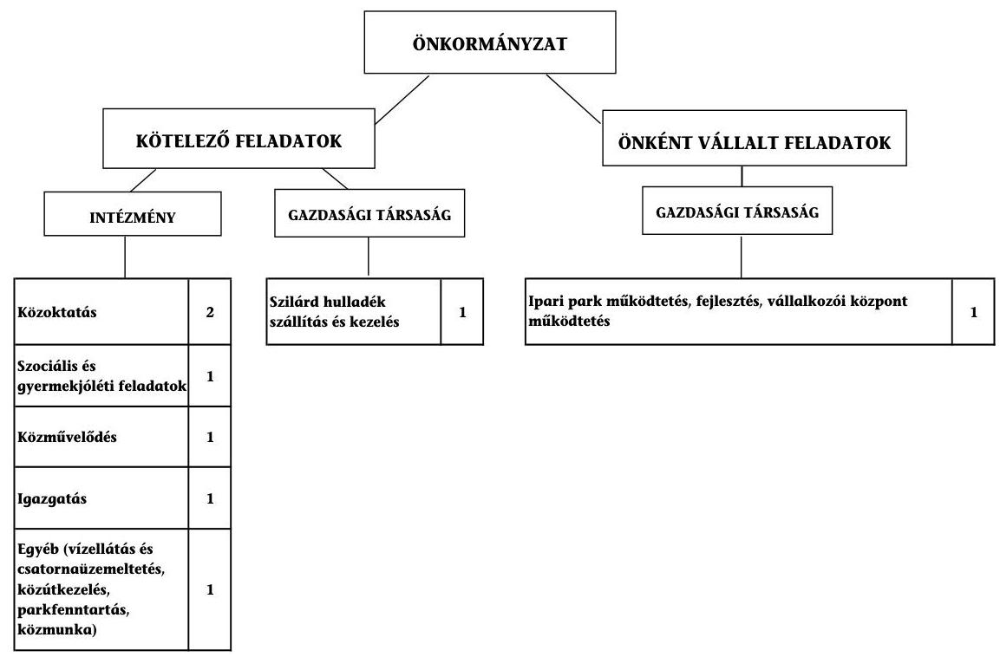

[^0]
[^0]:    ${ }^{7}$ A múködési kiadás 22,7 millió Ft-tal eltér a 2. számú mellékletben szereplő 2010. évi folyó kiadások összegétől, mivel nem tartalmazza a cigány kisebbségi önkormányzat múködési kiadásait, valamint az egészségügyi szakfeladaton elszámolt, OEP által finanszírozott kiadásokat.

---

Az Önkormányzat feladatait 2011. június 30 -án (a Polgármesteri hivatallal együtt) hat költségvetési szerv és két gazdasági társaság keretében, valamint a Társulás társult tagjaként látta el. A feladatellátás telephelyeinek száma a 2007. évi kilencről 2011. év I. félévének végére 14-re növekedett az alapfokú művészetoktatási telephelyek számának néggyel, és a szociális feladatellátásnál eggyel történt bővülése eredményeként. A feladatellátás szervezeti kereteinek változása a működési kiadások növekedésével járt. Az Önkormányzat egy gazdasági társaságban rendelkezett kizárólagos tulajdonnal, amely ipari park és vállalkozói központ múködtetést és fejlesztést végzett. Egy gazdasági társaság, melyben az Önkormányzat tulajdonnal nem rendelkezett, a szilárd hulladék szállításával vett részt az Önkormányzat feladatellátásában.

Az Önkormányzat múködési kiadásokra 2010-ben 1158,5 millió Ft-ot fordított, amely 226,4 millió Ft-tal ( $24,3 \%$-kal) haladta meg a 2007-2009. évek 932,1 millió Ft kiadási átlagát. A 2010. évi múködési kiadásokat 28,1\%-ban (325,7 millió Ft) állami támogatás, 13,9\%-ban ( 160,4 millió Ft) az intézmények saját bevétele, $58,0 \%$-ban ( 672,4 millió Ft ) önkormányzati támogatás finanszírozta. Az állami támogatások részaránya 2010-ben a 2007-2009. évek 341,3 millió Ft átlagához képest $4,6 \%$-os ( 15,6 millió Ft ) csökkenést, az intézményi támogatások a 2007-2009. évi átlagos 143,3 millió Ft-hoz képest 11,9\%-os (17,0 millió Ft), az önkormányzati támogatás pedig az átlagos 447,5 millió Ft-hoz képest 50,3\% (225,0 millió Ft) növekedést mutatott. A személyi és dologi kiadások növekedését döntő mértékben az önkormányzati támogatások növelésével ellensúlyozták. A múködési kiadások biztosítása az Önkormányzat pénzügyi egyensúlyára nem jelentett kockázatot.

Az egyes ágazati közszolgáltatások feladatellátásában résztvevő intézmények múködési kiadásainak finanszírozási forrásösszetételét az alábbi ábra mutatja:
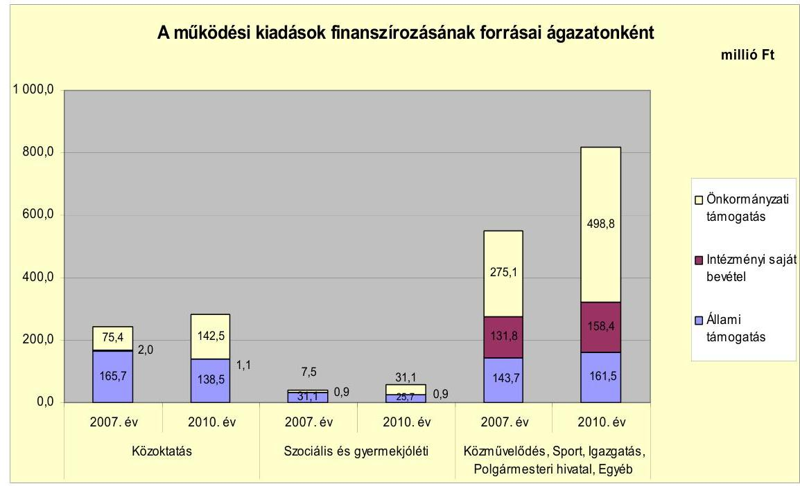

---

A közoktatási ágazat 2010. évi múködési kiadásai 12,3\%-kal (31,0 millió Fttal) növekedtek a 2007-2009. évek 251,0 millió Ft átlagához képest. Az ágazat finanszírozásán belül az állami támogatás részaránya az átlagos 156,9 millió Ft-ról 11,7\%-kal (18,4 millió Ft-tal), az intézményi saját bevétel 1,8 millió Ft-ról 38,9\%-kal ( 0,7 millió Ft-tal) csökkent. Ennek oka volt, hogy a finanszírozási alap 2008. szeptember 1-jétől a korábbi gyermek/tanuló létszám finanszírozás helyett teljesítményfinanszírozásra változott, valamint emelkedett az ingyenes étkezésre jogosultak köre. Mindezek ellensúlyozására az önkormányzati támogatás a 2007-2009. évi átlagos 92,2 millió Ft-ról 2010-re 54,5\%-kal (50,3 millió Ft) 142,5 millió Ft-ra növekedett.

A szociális és gyermekjóléti kiadásokra fordított 2010. évi múködési kiadások 40,0\%-kal (16,5 millió Ft) növekedtek a 2007-2009 évek 41,2 millió Ft átlagához viszonyítva. Az állami támogatások rendszerének változása miatti 7,2 millió Ft csökkenést, az önként vállalt feladatok kiadásainak 9,8 millió Ft összegű, valamint a szolgáltatások igénybevételének növekedése miatti kiadásnövekedést az önkormányzati támogatás négyszeresére (23,6 millió Ft-tal) történt növekedése fedezte.

A közmúvelődési, igazgatási és egyéb ágazatok 2010. évi múködési kiadásai 818,8 millió Ft-ot tettek ki, ami 27,9\%-os (178,9 millió Ft) növekedést mutat a 2007-2009. évek 639,9 millió Ft átlagához képest. Ezen belül az állami támogatás 6,6\%-kal (10,0 millió Ft), az intézményi saját bevételek 12,6\%-kal (17,7 millió Ft) és az önkormányzati támogatás 43,5\%-kal (151,2 millió Ft) növekedett. A saját bevételek növekedésén belül a GAMESZ bevételei 11,6\%-kal (13,2 millió Ft) növekedtek a szolgáltatási bevételek emelkedésének eredményeként. Az önkormányzati támogatás részarányának 2010. évi növekedését a gondozási központ szociális étkeztetést és családsegittési ellátást igénybevevők létszámának növekedése, valamint az intézmények üzemeltetése és fenntartása miatti többletköltségek okozták. Az önkormányzati feladatok ellátását szolgáló intézményrendszer fenntartása az Önkormányzat gazdálkodására nem jelentett múködési kockázatot.

Az Önkormányzat által 2007-2009 között a kötelező és az önként vállalt feladatok ellátására fordított átlagos múködési kiadások 932,1 millió Ft-ról 2010re 24,3\%-kal (226,4 millió Ft-tal) történt emelkedése, valamint a szervezeti keretekben bekövetkezett változások - a telephelyek számának kilencről 14-re történt növekedése - nem jelentettek múködési kockázatot. A vizsgált időszakban a kötelező és önként vállalt feladatok ellátását biztosító szervezeti keretekben, a feladatellátás módjában bekövetkezett változások az Önkormányzat pénzügyi egyensúlyára összességében nem voltak hatással.

---

Az Önkormányzat múködési jövedelmét, tőketörlesztését és pénzügyi kapacitását az alábbi ábra jellemzi:
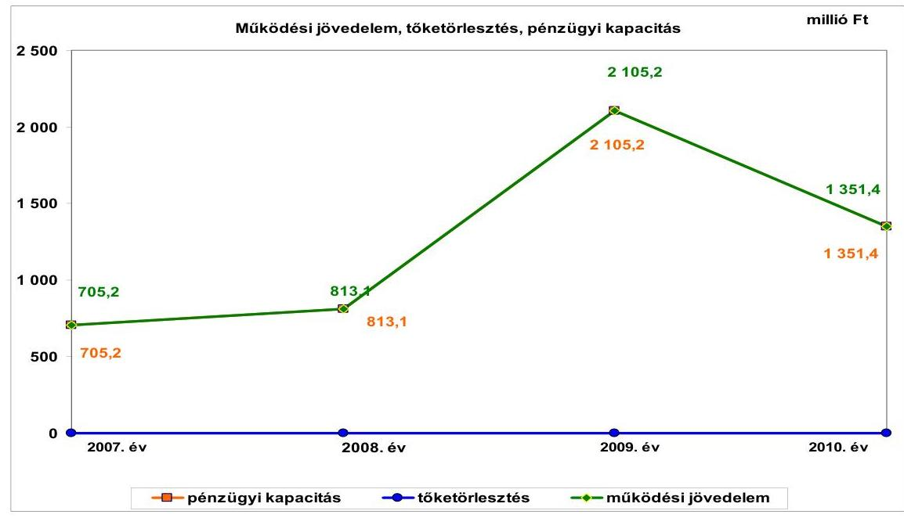

Az Önkormányzat folyó költségvetési egyenlege (múködési jövedelem) 2007-2010. évek között folyamatosan működési forrástöbbletet mutatott. A múködési jövedelem alakulását a folyó bevételek növekedésének a folyó kiadások növekedési ütemét meghaladó növekedése eredményezte, amelyet 2009-ben az iparűzési adóbevételeknek egy nagy adózó adókedvezményének megszűnése és kiemelkedő adóteljesítménye okozott. A 2010. évi múködési jövedelem előző évhez képesti csökkenését az iparűzési adó alapjának és mértékének együttes csökkenése idézte elő. A múködési jövedelem a 2007-2009. évek 1207,8 millió Ft átlagához képest 2010-ben 11,9\%-kal (143,6 millió Ft-tal) növekedett, 2007-2010 között összesen 4974,9 millió Ft volt. A folyó bevételek növekedésében meghatározó szerepe volt a saját bevételek, ezen belül az iparűzési adóból származó bevételek növekedésének. A saját múködési bevételek összege 2010-ben 2215,6 millió Ft volt, ami 378,5 millió Ft-tal (20,6\%) haladta meg a 2007-2009. évek 1837,1 millió Ft-os átlagát.

A pénzügyi kapacitás megegyezett a múködési jövedelemmel, mivel az Önkormányzatnak hitel törlesztési kötelezettsége nem volt.

Az Önkormányzat többletbevételeiből 2007-ben 534,2 millió Ft-ot, 2008-ban 821,5 millió Ft-ot, 2009-ben 1690,6 millió Ft-ot, összesen 3046,3 millió Ft-ot fordított értékpapír vásárlásra. 2010-ben az előző évek befektetéseiből 204,3 millió Ft-ot értékesítettek és használtak fel fejlesztési kiadásaikhoz. Az értékpapír befektetetésekre vonatkozó döntéseknél figyelembe vették a futamidőt és a várható hozamot. Ennek tükrében diszkontkincstárjegyből 2007. évben 160,6 millió Ft-ot értékesítettek, 2008-2009. években vásároltak (2008-ban 1521,9 millió Ftot, 2009-ben 368,1 millió Ft-ot), 2010. évben pedig ismét értékesítettek 2123,0 millió Ft értékben. Az államkötvények összes forgalma 2007. évben 694,8 millió Ft vásárlásból, 2008-ban 700,4 millió Ft értékesítésből, 2009-ben 1322,5 millió Ft és 2010-ben további 1918,7 millió Ft vásárlásból tevődött össze.

---

Az Önkormányzat folyamatosan növekvő értékpapír állománya után a vizsgált időszakban 785,0 millió Ft kamat- és hozambevételt realizált. 2010. évben 652,5 millió Ft-ot már rövid lejáratú bankbetétként is lekötöttek, annak kedvező kamatfeltétele miatt.

A felhalmozási költségvetés bevételeit, kiadásait és egyenlegét az alábbi ábra szemlélteti:
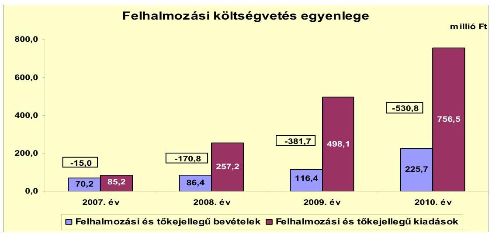

Az Önkormányzat felhalmozási költségvetésének egyenlege 2007-2010 között folyamatosan, összesen 1098,3 millió Ft hiányt mutatott. A vizsgált időszak során keletkezett 498,7 millió Ft felhalmozási bevétellel szemben 1597,0 millió Ft felhalmozási kiadást teljesítettek. A felhalmozási hiány fedezetét a múködési jövedelem 2007-2010 között elért 4974,9 millió Ft többlete biztosította. Az áttekintett időszak jelentősebb fejlesztései a szennyvízcsatorna hálózat bővítése, a kerékpárút kialakítása, a sportpálya és az iskola komplex felújítása, valamint belterületi út-, tér- és hídfelújítások voltak.

Az Önkormányzat 2010. évi 2532,6 millió Ft folyó bevétele a 2007-2009. évek 2151,8 millió Ft átlagát 380,8 millió Ft-tal (17,7\%-kal) haladta meg. A folyó bevételeken belül a költségvetési támogatás és az szja együttes bevételének alakulására meghatározó, hogy az Önkormányzat adóerő-képessége alapján az szja-t illetően 2007-2011. év I. féléve alatt összesen 498,5 millió Ft elvonás érvényesült. Az Önkormányzat folyó bevételeinek meghatározó hányadát a helyi adók és pótlékok biztosították. Az iparűzési adóbevétel 2010-ben az összes helyi adóbevétel $92,9 \%$-a ( 1600,4 millió Ft) volt. Az iparúzési adóbevételek ilyen arányú koncentrációja és a folyó bevételek több mint felének (2010-ben $50,9 \%$-ának) egy vállalkozás változó éves teljesítményétől való függése az Önkormányzat bevételeinek tervezésénél és jövőbeli feladatainak megvalósításánál kockázatot jelenthet.

Az Önkormányzatnak 2007-2011. I. féléve között összesen 514,0 millió Ft felhalmozási bevétele keletkezett, amelynek $65,3 \%$-a ( 335,5 millió Ft ) az államháztartáson belülről kapott támogatás volt. Az államháztartáson kívülről kapott támogatások részaránya $17,9 \%$ ( 92,1 millió Ft ) volt, $10,5 \%$ ( 54,0 millió Ft) tárgyi eszközök értékesítéséből, 6,3\% (32,4 millió Ft) pedig pályázati és egyéb forrásokból származott. Az államháztartáson belülről kapott támogatások a

---

Múvelődési ház felújításához, utak építéséhez és felújításához, valamint az iskola komplex felújításához kapcsolódtak.

Az Önkormányzat 2010. évi folyó kiadásai 1181,2 millió Ft-ot tettek ki, ami a 2007-2009. évek 944,0 millió Ft átlagához képest 25,1\%-kal (237,2 millió Ft) emelkedtek a múködési- és a transzferkiadások emelkedése következtében. A felhalmozási kiadások összege 2007-2010 között 1597,0 millió Ft volt.

Az Önkormányzat összesen 121 fejlesztési feladatot valósított meg 2007-2010. évek között. A pénzügyileg és múszakilag is befejezett fejlesztések bekerülési értéke 2010. december 31-éig 1373,0 millió Ft volt. Az Önkormányzat a fejlesztések forrásainak 60,9\%-át (836,4 millió Ft-ot) saját felhalmozási bevételből és megképzett múködési jövedelemből finanszírozta. További forrást 474,6 millió Ft-ot EU-s és 62,0 millió Ft-ot hazai támogatás biztosított. A megvalósított fejlesztések döntően önkormányzati épületek, intézmények felújításából, út- és kerékpárút építésekből, szennyvízcsatorna hálózat bővítésből, ipari park fejlesztésből, ingatlanvásárlásokból tevődtek össze.

Az Önkormányzatnál 2010. december 31-én 10 fejlesztés megvalósítása volt folyamatban. E feladatokhoz a 2010. évet követően esedékes kötelezettség-vállalásainak összege 280,6 millió Ft volt, melynek forrásait az alábbi ábra szemlélteti:
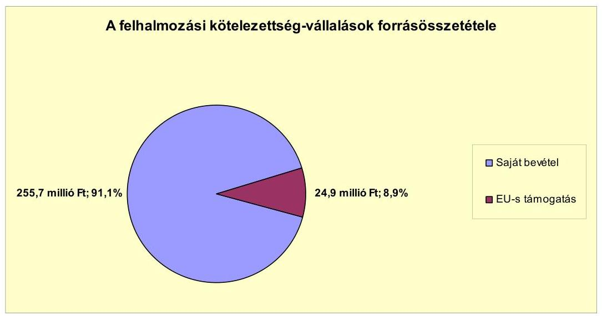

Az Önkormányzat a 2011. év I. félévben saját forrásból három fejlesztési feladatot valósított meg 293,7 millió Ft összegben.

Az Önkormányzat adatszolgáltatása szerint 2011. év I. félévig négy beadott, elbírálás alatt lévő pályázata van. A fejlesztések tervezett teljes bekerülési költsége 1768,0 millió Ft, melyből 56,0 millió Ft-ot tervezési költségekre már kifizettek. A 2010. december 31-e utáni 1712,0 millió Ft fejlesztési feladathoz kapcsolódó kötelezettségvállalás forrását 1384,2 millió Ft-ot EU-s támogatásból és 327,8 millió Ft-ot saját bevételből tervezik finanszírozni.

Az Önkormányzatnak a vizsgált időszakban nem volt pénzintézeti kötelezettsége és szállítói tartozása, pénzügyi egyensúlya biztosított volt.

---

Az Önkormányzat nevében a Képviselő-testület két ízben vállalt készfizető kezességet, összesen 89,8 millió Ft erejéig a Jászfényszaru Városi Szenyvižberuházó Társulat javára. Kezesi felelőssége érvényesítésére 2009-ben 17,0 millió Ft-ot fizetett ki az adós helyett, amely 2010. évben megtérült. Az adózás rendjéről szóló 2003. évi XCII. törvény méltányossági rendelkezésének felhatalmazása alapján - jegyzői hatáskörben - kevesebb, mint 0,2 millió Ft összegű követelés elengedés történt.

Az Önkormányzat egy SAPARD pályázat keretében kapott 46,8 millió Ft támogatáshoz kapcsolódóan hozzájárult egy forgalomképes ingatlanon jelzálogjog alapításához és bejegyzéséhez. A számviteli nyilvántartás szerinti összes forgalomképes ingatlan könyvszerinti nettó értékének 4,1\%-a ( 71,4 millió Ft) volt 2010. december 31-én jelzálogjoggal terhelt.

Az Önkormányzat 2007-2010 között az eszközállománya után 283,7 millió Ft összegű értékcsökkenést mutatott ki. A fejlesztések során az Önkormányzat az elhasznált eszközök pótlására 590,7 millió Ft-ot fordított.

Az Önkormányzat az ellenőrzött időszakban kiadási megtakarítást eredményező és bevételt növelő intézkedéseket tett. A 2007-2011. év I. féléve között - az Önkormányzat adatszolgáltatása szerint - 50,4 millió Ft kiadási megtakarítás, továbbá 3896,4 millió Ft bevételi többlet keletkezett, ezáltal az Önkormányzat pénzügyi egyensúlyi helyzete javult. A kiadási megtakarításokat nyolc fő általános iskolai pedagógus létszámcsökkentése eredményezte. A Képviselő-testület a közoktatási terület (művészeti iskola-, óvoda fejlesztés) szakmai ellátásának biztosítása és a pályázati feladatok projekt menedzselése miatt kilenc álláshelyet létesített, melyből kettő 2010. december 31-én betöltetlen volt. Bevételnövelő intézkedéseket a helyi adókkal és eszközök hasznosításával kapcsolatban tettek. Kiemelkedő hatású volt - 3789,9 millió Ft bevételi többlet -, hogy a városban települt multinacionális cég leányvállalatának, szerződés szerint lejárt a kedvezményes ( $30,0 \%$-os) iparúzési adó alá tartozó időszaka. Ennek hatása volt még, hogy az egy lakosra jutó iparúzési adóerőképesség magas összege miatt az Önkormányzatnak a vizsgált időszakban az szja-val kapcsolatban befizetési kötelezettsége volt a központi költségvetés felé.

Az utóellenőrzés a pénzügyi egyensúly javítására tett nyolc szabályszerűségi javaslat hasznosítására terjedt ki, amelyet az intézkedési terv szerinti határidőben megvalósítottak.

Az Önkormányzat pénzügyi egyensúlyi helyzetét összegezve a következők emelhetők ki:

Jászfényszaru Város Önkormányzat pénzügyi egyensúlya rövid és közép távon biztosított, amelynek hosszú távú megőrzésére fel kell készülnie.

Az Önkormányzat múködési jövedelme a vizsgált időszakban pozitív volt és folyamatosan emelkedett.

Szállítói tartozásai és pénzintézetekkel szemben fennálló kötelezettségei nincsenek.

---

A helyi adóbevétel meghatározó része egy adóalanytól származik, ezért a bevételei kitettsége miatt hosszú távon kockázat jelentkezhet.

Az önként vállalt feladataira fordított kiadások aránya a múködési jövedelemhez képest nem jelent kockázatot.

A folyamatban lévő fejlesztési projektekhez, a benyújtott pályázatokhoz szükséges saját erő forrása rendelkezésre áll.

Gazdasági társaságok miatti kockázat nem áll fenn, mivel az Önkormányzat kizárólagos tulajdonában álló társaság pénzügyi helyzete stabil.

Az Állami Számvevőszékről szóló 2011. évi LXVI. törvény 33. § (1) bekezdésében foglaltak értelmében a jelentésben foglalt megállapításokhoz kapcsolódó intézkedési tervet köteles az ellenőrzött szervezet vezetője összeállítani és azt a jelentés kézhezvételétől számított harminc napon belül az ÁSZ részére megküldeni. Amennyiben az intézkedési tervet határidőben nem küldi meg a szervezet, vagy az továbbra sem elfogadható, az ÁSZ elnöke a hivatkozott törvény 33. § (3) bekezdés a)-b) pontjaiban foglaltakat érvényesítheti.

# A 2011. június 30-i pénzügyi egyensúlyi helyzet alapján az ellenőrzés intézkedést igénylő megállapításai és javaslatai a következők: 

## a polgármesternek

Az Önkormányzat pénzügyi egyensúlyi helyzete rövid és közép távon biztosított. A pénzügyi egyensúly hosszú távú megőrzésére az Önkormányzatnak fel kell készülnie.

Javaslat:
Folyamatosan tájékoztassa a Képviselő-testületet az Önkormányzat pénzügyi egyensúlyi helyzetéről. Kezdeményezzen szükség esetén intézkedéseket a pénzügyi egyensúly hosszú távú fenntarthatósága érdekében.

---

# II. RÉSZLETES MEGÁLLAPÍTÁSOK 

## 1. Az ÖNKORMÁNYZAT KÖTELEZŐ ÉS ÖNKÉNT VÁLlALT FELADATAI, A FELADATELLÁTÁS SZERVEZETI KERETEI ÉS ANNAK VÁLTOZÁSAI

Az Önkormányzat kötelező és önként vállalt feladatait az SzMSz-ben rögzítette. Az Önkormányzat besorolása alapján önként vállalt feladatként határozta meg az alapfokú művészetoktatási, gondozási központ működtetési, vízrendezési és csapadékvíz elvezetési, foglalkoztatás elősegítési, tűzvédelmi, helyi újság kiadási, tűzvédelmi feladatok ellátását és a sportolási feltételek biztosítását. Az önként vállalt feladatok terjedelméről az éves költségvetési rendeletekben döntöttek.

Az Önkormányzat adatszolgáltatása szerint 2010. évi múködési költségvetési kiadásainak 1158,5 millió Ft összegéből 1100,6 millió Ft-ot ( $95,0 \%$ ) a kötelező, 57,9 millió Ft-ot ( $5,0 \%$ ) az önként vállalt feladatok ellátására fordított. Az önként vállalt feladatokhoz kapcsolódó kiadások értéke 2010-ben a 2007-2009. évek 47,3 millió Ft átlagához képest $22,4 \%$-kal (10,6 millió Ft-tal) 57,9 millió Ft-ra növekedett, miközben részaránya nem változott. Az önként vállalt feladatok terjedelme és a múködési kiadásokon belül képviselt részaránya az Önkormányzat müködési biztonságát nem befolyásolta.

Az Önkormányzat 2010. évi múködési kiadásait és azok főbb feladatonkénti finanszírozási arányait a következő - az Önkormányzat adatszolgáltatásán alapuló - táblázat ${ }^{8}$ mutatja be:

[^0]
[^0]:    ${ }^{8}$ A táblázatban szereplő összes múködési kiadás 22,7 millió Ft-tal eltér a 2. számú mellékletben szereplő 2010. évi folyó kiadások összegétől, mivel nem tartalmazza a cigány kisebbségi önkormányzat múködési kiadásait, valamint az egészségügyi szakfeladaton elszámolt, OEP által finanszírozott kiadásokat.

---

| Ellátott feladat | Múködési   kiadás   összesen   (millió Ft) | Kötelezö   feladatok   kiadásainak   részaránya   $\%$ | Múködési   bevétel   összesen   (millió Ft) | Állami   támogatás   részaránya   $\%$ | Intézményi   saját bevétel   részaránya   $\%$ | Önkormányzati   támogatás   részaránya   $\%$ |
| :-- | :--: | :--: | :--: | :--: | :--: | :--: |
| Övodák | 83,5 | 100,0 | 83,5 | 48,6 | 0,6 | 50,8 |
| Általános iskolák | 198,6 | 98,4 | 198,6 | 49,3 | 0,3 | 50,4 |
| Szociális   intézmények | 57,7 | 55,0 | 57,7 | 44,6 | 1,5 | 53,9 |
| Közművelődési   intézmények | 34,3 | 100,0 | 34,3 | 17,9 | 4,5 | 77,6 |
| Egyéb intézmények | 440,9 | 94,2 | 440,9 | 22,2 | 28,9 | 48,9 |
| Polgármesteri hivatal   igazgatási kiadásai | 301,8 | 99,0 | 301,8 | 16,2 | 9,0 | 74,8 |
| Polgármesteri   hivatalban ellátott   feladatok múködési   kiadásai | 41,7 | 100,0 | 41,7 | 20,9 | 5,4 | 73,7 |
| Múködési kladá-   sok összesen | 1158,5 | 95,0 | 1158,5 | 28,1\% | 13,8\% | 58,1\% |

Az Önkormányzat adatszolgáltatása szerint a 2010. évi 1158,5 millió Ft múködési kiadásából 282,0 millió Ft-ot (24,3\%) a közoktatási feladatok ellátására fordított. Az ágazat múködési kiadásai 2007-2009 között átlagosan 251,0 millió Ft-ot, az összes múködési kiadáson belül 26,9\%-ot tettek ki. Az ágazat múködési kiadásai 2010-ben a 2007-2009 évek átlagához képest 12,3\%kal (31,0 millió Ft) növekedtek a személyi és dologi kiadások (kereset kiegészítések és az energia árak) emelkedése miatt. Az ágazat múködési kiadásokból való részesedése 2010-ben a 2007-2009. évek átlagához képest 2,6 százalékponttal csökkent a kiadásainak átlag alatti növekedése következtében. A közoktatási feladatok 2010. évi kiadásait 49,1\%-ban (138,5 millió Ft) állami támogatás, 0,4\%-ban (1,0 millió Ft) intézményi saját bevétel és 50,5\%-ban (142,5 millió Ft) önkormányzati támogatás finanszírozta. A 2007-2009. évek között az ágazat átlagos múködési kiadásainak 62,5\%-a (156,9 millió Ft) származott állami támogatásból, 0,7\%-ot ( 1,8 millió Ft) biztosított az intézményi saját bevétel és $36,8 \%$ ( 92,2 millió Ft) volt az önkormányzati támogatás mértéke. Az állami támogatás finanszírozáson belüli részarányának csökkenését az önkormányzati támogatás növelésével ellensúlyozták. Az ágazatban a gyermeklétszám a 2007. évi 658 fơről 2008-ban 668 fôre, 2009-ben 675 fôre emelkedett, 2010-ben 661 fôre csökkent a demográfiai változások következtében. A feladatellátás telephelyeinek száma 2007-ben néggyel bővült az alapfokú múvészetoktatás terén, 2008-2011. év első féléve között nem változott. A közoktatási feladatok ellátása - tekintettel az ágazat 2007-2010. évi 1035,0 millió Ft kiadásainak az időszak összes múködési kiadáson belüli $26,2 \%$ részarányára és a folyó bevételek nagyságára - az Önkormányzat múködési biztonságát nem befolyásolta.

A szociális ágazat 2010. évi múködési kiadása 57,7 millió Ft - az éves múködési kiadások 5,0\%-a - volt, amely 16,5 millió Ft-tal ( $40,0 \%$ ) volt magasabb a 2007-2009. évek átlagos 41,2 millió Ft-os ráfordításánál. A 2007-2009. évek között az ágazat múködési kiadásaiból az állami támogatás részaránya átlagosan $79,8 \%$ volt ( 32,9 millió Ft), 18,3\% ( 7,5 millió Ft) önkormányzati támogatás és $2,0 \%(0,8$ millió Ft) intézményi bevétel mellett. A 2010. évi szociális ágazati kiadásoknál az állami támogatások részaránya 44,6\%-ra csökkent (25,7 millió Ft-ra), 1,5\%-ot ( 0,9 millió Ft) az intézményi bevételek, és 53,9\%-ot (31,1 millió

---

Ft) önkormányzati támogatás finanszírozott. Az állami támogatás csökkenését a központi támogatási rendszer megváltozása okozta, amit az önkormányzati támogatás növelésével ellensúlyoztak. A szociális ágazat múködési kiadásainak 2007-2009 évek közötti 41,2 millió Ft-os átlagához képest 2010-ben bekövetkezett 40,0\%-os ( 16,5 millió Ft ) növekedését az önként vállalt feladatok - a gondozási központban múködő idősek klubja, idősgondozás, napközbeni ellátás - részarányának növekedése, az ellátásokat és szolgáltatásokat igénybe vevők számának emelkedése okozta. Az önkormányzati támogatás részarányát az átlagos $18,3 \%$-ról ( 7,5 millió Ft-ról) $53,9 \%$-ra ( 31,1 millió Ft-ra) növelték, hogy az ellátásokat az igénylők számára folyamatosan biztosítani tudják.

Közművelődési és egyéb kiadásokra 2010. évben 475,2 millió Ft-ot fordított az Önkormányzat, amely az éves múködési kiadások 41,0\%-a volt. Ezen belül közmúvelődési kiadásokra 34,3 millió Ft-ot, a GAMESZ múködési kiadásaira 440,9 millió Ft-ot fordítottak. A közművelődési feladatokat a művelődési ház látta el, a vele egy épületben múködő, de nem intézményként szereplő könyvtár kiadásait a Polgármesteri hivatal szakfeladatai között szerepeltették. Az ágazat 2010. évi múködési kiadásainak 24,2\%-át (114,8 millió Ft) állami támogatásból, 27,1\%-át (129,0 millió Ft) intézményi saját bevételből, 48,7\%-át (231,4 millió Ft) önkormányzati támogatásból finanszírozták. Az ágazat kiadásai 2007-2009 között átlagosan 413,7 millió Ft-ot, a múködési kiadások 44,4\%át tették ki. A 2007-2009. évi átlagos ágazati kiadásokat az állami hozzájárulás 24,2\%-ban (100,2 millió Ft), az intézményi saját bevétel 27,8\%-ban (115,1 millió Ft), az önkormányzati támogatás pedig 48,0\%-ban (198,4 millió Ft) finanszírozta.

A Polgármesteri hivatal igazgatási és múködési kiadásai 2010-ben 343,5 millió Ft-ot, az éves múködési kiadások 29,7\%-át tették ki. Az igazgatási és múködési kiadások a 2007-2009 évek 226,2 millió Ft átlagához képest 2010-ben 51,9\% (117,3 millió Ft) növekedést mutattak. A növekedés okai között a személyi jellegú kifizetések, kereset-kiegészítések, az energiaárak emelkedése és a pályázatokkal kapcsolatos pályázatírási és projektmenedzseri feladatok kiadásai szerepeltek. A Polgármesteri hivatal múködési kiadásait 2007-2009 között átlagosan 22,6\%-ban (51,2 millió Ft) állami támogatás, 11,3\%-ban (25,6 millió Ft) saját bevétel és $66,1 \%$-ban ( 149,4 millió Ft ) önkormányzati támogatás finanszírozta. A 2010. évi múködési kiadásokat finanszírozó források növekedtek a 2007-2009 évek átlagaihoz képest, az állami támogatások 12,3\%-kal (6,3 millió Ft-tal), a saját bevételek 14,8\%-kal ( 3,8 millió Ft-tal), az önkormányzati támogatás pedig 71,7\%-kal (107,1 millió Ft-tal). A Polgármesteri hivatalban ellátott feladatok közé az igazgatási feladatokon kívül a segélyezés, civil szervezetek múködéséhez való hozzájárulás, választási feladatok ellátása, városi ünnepségek szervezése és testvérvárosi kapcsolatok kiadásai tartoztak.

Az Önkormányzat kötelező és önként vállalt feladatainak ellátását 2010. évben 325,7 millió Ft ( $28,1 \%$ ) állami támogatásból, 160,4 millió Ft (13,9\%) intézményi saját bevételből és 672,4 millió Ft (58,0\%) önkormányzati támogatásból finanszírozta. A múködési kiadásokat 2007-2009 között átlagosan 36,6\%-ban (341,3 millió Ft) állami támogatásból, 15,4\%-ban (143,3 millió Ft) intézményi saját bevételekből, 48,0\%-ban ( 447,5 millió Ft) önkormányzati támogatásból finanszírozták. Az állami támogatások részaránya 2010-ben az átlagoshoz képest 4,6\%-os (15,6 millió Ft) csökkenést, az intézményi támogatások

---

részaránya 11,9\%-os (17,0 millió Ft), az önkormányzati támogatás pedig 50,3\% (225,0 millió Ft) növekedést mutattak, vagyis a személyi és dologi kiadások növekedését döntő mértékben az önkormányzati támogatások növelésével ellensúlyozták.

Az Önkormányzat kötelező és önként vállalt feladatait 2011. június 30án két önállóan múködő és gazdálkodó - a Polgármesteri hivatal és a GAMESZ -, és négy önállóan múködő költségvetési szerv, továbbá két gazdasági társaság és a Társulás közreműködésével, annak társult tagjaként látta el. A gazdasági társaságok közül a JIC Kft. az Önkormányzat kizárólagos tulajdonában állt, és ipari park fejlesztési és üzemeltetési, továbbá pályázati tanácsadási és műszaki feladatokat lát el. Egy további gazdasági társaság ${ }^{9}$, melyben az Önkormányzat tulajdoni hányaddal nem rendelkezett, a települési szilárd hulladék szállítási és kezelési feladatait látja el. A városi temető egyházi kezelésben van. Az egészségügyi alapellátást vállalkozó háziorvosokkal biztosította.

Az önkormányzati feladatellátást 2007. január 1-jén két önállóan gazdálkodó és négy részben önállóan gazdálkodó intézmény biztosította. A telephelyek száma 2011. június 30-ra - a közoktatási és szociális feladat ellátási helyek számának növekedése miatt - kilencről 14-re emelkedett. A telephelyek számának növekedése a múködési kiadások növekedésével járt, azonban tekintettel a keletkezett múködési jövedelem többletére az Önkormányzat pénzügyi helyzetére nem jelentett kockázatot.

Az Önkormányzat feladatait 2011. június 30 -án a következő intézményekkel látta el:

- közoktatási feladatokat egy általános iskola hat telephelyen - ezen belül alapfokú művészetoktatást négy telephelyen - és egy óvoda két telephelyen látott el. A telephelyek száma a 2007. évben bővült négy, alapfokú művészetoktatási feladat ellátási hellyel;
- szociális ellátással kapcsolatos feladatokat - étkeztetés, házi segítségnyújtás, családsegítő szolgáltatás és átmeneti elhelyezés - egy gondozási központban, 2007. évben kettő, 2008. évtől - a védőnői szolgálat gondozási központhoz kerülésével - három telephelyen láttak el;
- a kulturális és közművelődési feladatok ellátásában egy művelődési központ vett részt, mely könyvtárral is rendelkezett;
- egyéb feladatokat (települési víz- és szennyvízkezelés, városgazdálkodás, ingatlanüzemeltetés, parkgondozás, közvilágítás, közcélú, közhasznú foglalkoztatás) a GAMESZ keretében ${ }^{10}$ láttak el;
- az igazgatási feladatokat a Polgármesteri hivatal végezte.

[^0]
[^0]:    ${ }^{9}$ AVE Hevesi Városfenntartó Kft.
    ${ }^{10}$ A víztermelési és szennyvízkezelési feladat ellátási egységek telephelyként nem voltak bejelentve.

---

A Társulás 2006-tól a belső ellenőrzési és a pedagógiai szakszolgálati feladatok, valamint a jelzőrendszeres házi segítségnyújtás ellátásában vett részt, amelyekkel kapcsolatban az Önkormányzatnak 2007-2010 között összesen 6,1 millió Ft kiadása keletkezett.

Az Önkormányzat kizárólagos tulajdonában lévő JIC Kft-nél az áttekintett időszak során átszervezésre nem került sor, ellene csőd- vagy felszámolási eljárás nem indult. A szilárd hulladék szállítási feladat ellátásában közremúködő gazdasági társaságnál 2009-ben beolvadással egyesülésre került sor, ezt követően a tevékenységét jogutódlással változatlan módon folytatta. Az Önkormányzat feladatellátásában részt vevő gazdasági társaságok jellemző adatait a jelentés 4. számú melléklete tartalmazza.

A vizsgált időszakban a kötelező- és önként vállalt feladatok ellátását biztosító szervezeti keretekben, a feladatellátás módjában bekövetkezett változások az Önkormányzat pénzügyi egyensúlyára összességében nem voltak hatással.

# 2. Az ÖNKORMÁNYZAT PÉNZÜGYI EGYENSÚLYI HELYZETÉT BEFOLYÁSOLÓ TÉNYEZŐK 

A hagyományos költségvetési szerkezet helyett az Önkormányzat pénzügyi helyzetét a CLF módszerrel mutatjuk be, amelyben jobban elkülönülnek a vagyonnal kapcsolatos bevételek és kiadások az önkormányzati feladatokkal kapcsolatos közvetlen múködtetési bevételektől és kiadásoktól. A módszer következetesen elkülöníti a folyó és a felhalmozási költségvetés bevételeit és kiadásait, azok költségvetési egyenlegeit. A saját folyó bevételek, valamint a saját felhalmozási bevételek nem tartalmazzák az előző évi pénzmaradványok felhasználásából származó pénzforgalom nélküli bevételeket ${ }^{11}$.

A folyó költségvetés egyenlege, a múködési jövedelem megmutatja, hogy az Önkormányzat éves folyó bevétele fedezetet biztosít-e a kötelező és önként vállalt feladatellátáshoz kapcsolódó éves folyó kiadására. A múködési jövedelem negatív értéke pénzügyileg fenntarthatatlan helyzetet jelez. A mutató pozitív értéke megtakarítást mutat, amely forrásul szolgálhat az önkormányzat fennálló kötelezettségei megfizetéséhez, valamint fejlesztéseihez.

A felhalmozási költségvetés pozitív értéke felhalmozási többletet mutat, amely a jövőbeni fejlesztések forrását biztosíthatja. Amennyiben a folyó költségvetési hiány finanszírozása a felhalmozási többletből történik, ez szűkebb értelemben vagyonfelélésnek tekinthető. Amennyiben a felhalmozási költségvetés megtakarítása fejlesztési célú hitelek, kötvények adósságszolgálatát finanszírozza, az változatlan vagyontömeg mellett, a korábban megelőlegezett tőkebevételek valós realizációjának tekinthető. A felhalmozási deficit által generált finanszírozási igény önmagában nem jár pénzügyi kockázattal, a pénzügyileg fenntartható beruházásokhoz kapcsolódó kötelezettségvállalás (adósságszolgálat) átlátható és szabályozott költségvetési gazdálkodással teljesíthető.

[^0]
[^0]:    ${ }^{11}$ A költségvetési években kialakuló hiány finanszírozása az előző évi pénzmaradvány és a korábbi években képzett tartalékok felhasználásával is történhet.

---

A módszer a pénzügyi kapacitás fogalmát helyezi a középpontba. Az adós hitelfelvételi képessége, hosszú távú fizetőképessége vagy bonitása a pénzügyi kapacitással, ezen belül is a nettó múködési jövedelemmel jellemezhető. A nettó múködési jövedelem negatív értéke az egyes költségvetési években jelentkező adósságszolgálat túlzott mértékére utal. ${ }^{12}$ A nettó múködési jövedelem negatív értékének felhalmozási többletből, vagy további hitelből történő finanszírozása pénzügyileg nem fenntartható gazdálkodást vetít előre. A pozitív értéket mutató nettó múködési jövedelem fejlesztési kiadások fedezetét biztosíthatja, illetve a folyamatosan, évenként képződő pozitív nettó múködési jövedelemből meghatározható a jövőben vállalható, teljesíthető éves adósságszolgálat, ily módon az a hitelösszeg, amely - a többi tényezőt, feltételt adottnak tekintve visszafizetési kockázat nélkül felvehető.

A CLF módszer alapján a pénzügyi kapacitás mértéke az Önkormányzat összevont, nettósított, a központi információs rendszerbe a Magyar Államkincstáron keresztül leadott éves költségvetési beszámolójának 80-as űrlapjában szerepeltetett adatok alapján került meghatározásra.

A költségvetési támogatásokból az Önkormányzat adatszolgáltatása alapján 2007-ben 13,9 millió Ft, 2008-ban 8,4 millió Ft, 2009-ben 58,2 millió Ft, 2010-ben 30,9 millió Ft összeget a felhalmozási célú támogatások között vettünk figyelembe.

A számítási leírás némileg eltér az ÁSZ módszertanában korábban alkalmazott gyakorlattól. A jelen besorolás általános közgazdasági meggondolásokon alapul, amely megjelenik az SNA statisztikai módszertanában is. Folyó tételek alatt értjük azokat a kiadásokat és bevételeket, amelyek a gazdálkodó szervezet helyzetét automatikusan nem változtatják. Bevételi oldalon ilyenek az adók, a tényező jövedelmek, a transzferek ${ }^{13}$, kiadási oldalon a transzferek és a szolgáltatás igénybevételével kapcsolatos múködési kiadások. A folyó költségvetésben a bevételekben nem térül meg, a kiadásokban nem jelenik meg az amortizáció, a vagyoni helyzetet az egyenleg befolyásolja.

A folyó költségvetés egyenlege (múködési jövedelem) tartalmazza a kamatbevételeket és a kamatkiadásokat is, mind a múködési, mind a fejlesztési kamatot, valamint a visszatérülő és befizetendő áfa teljes összegét, mert ezek közgazdaságilag tényező jövedelmek. Nem tartalmazzák viszont a követelés elengedés miatt könyvelt bevételi és kiadási pénzforgalmi tételeket, mert valójában technikai elszámolási múveletnek minősülnek, a bevétel soha nem realizálódott, és költségvetési kiadás sem történt.

A felhalmozási költségvetésben a bevételek között a vagyon megőrzésére és bővítésére fordítható források jelennek meg. A felhalmozási vagy tőketételek módosítják a vagyon nagyságát. A privatizációs bevétel csökkenti a vagyont, a fizikai beruházás, pénzügyi befektetés növeli.

[^0]
[^0]:    ${ }^{12}$ kivéve, ha annak finanszírozására a korábbi években képzett tartalékok fedezetet nyújtanak
    ${ }^{13}$ Transzfer kiadásoknak nevezzük azokat a folyó és felhalmozási tételeket, amelyeket nem az adott önkormányzat használ fel szolgáltatásnyújtásra.

---

A nettó múködési jövedelmet a tőketörlesztés levonásával a folyó költségvetés egyenlegéből származtatjuk.

# 2.1. A múködési és a felhalmozási egyensúly változása 

Az Önkormányzat CLF módszer szerint számított főbb adatait az alábbi táblázat mutatja be:

|  |  |  |  | millió Ft |
| :--: | :--: | :--: | :--: | :--: |
| Megnevezés | 2007. év | 2008. év | 2009. év | 2010. év |
| Folyó bevételek | 1549,9 | 1762,7 | 3142,9 | 2532,6 |
| Folyó kiadások | 844,7 | 949,6 | 1037,7 | 1181,2 |
| Múködési jövedelem | 705,2 | 813,1 | 2105,2 | 1351,4 |
| Nettó múködési jövedelem   =müködési jövedelem - tőketörlesztés | 705,2 | 813,1 | 2105,2 | 1351,4 |
| Felhalmozási bevételek | 70,2 | 86,4 | 116,4 | 225,7 |
| Felhalmozási kiadások | 85,2 | 257,2 | 498,1 | 756,5 |
| Felhalmozási költségvetés egyenlege | $-15,0$ | $-170,8$ | $-381,7$ | $-530,8$ |
| Finanszírozási múveletek nélküli (GFS) pozíció = müködési jövedelem + felhalmozási költségvetés egyenlege | 690,2 | 642,3 | 1723,5 | 820,5 |
| Finanszírozási múveletek egyenlege | $-547,1$ | $-835,7$ | $-1692,7$ | 204,1 |
| Tárgyévi pénzügyi pozíció | 143,1 | $-193,4$ | 30,8 | 1024,7 |
| Egyéb tájékoztató adatok |  |  |  |  |
| Összes kötelezettség* | 23,3 | 351,9 | 814,1 | 42,9 |
| -ebből rövid lejáratú | 23,3 | 351,9 | 814,1 | 42,9 |
| Folyószámlahitel napi átlagos állománya | 0,0 | 0,0 | 0,0 | 0,0 |
| Likvidhitel napi átlagos állománya | 0,0 | 0,0 | 0,0 | 0,0 |
| Munkabérhitel napi átlagos állománya | 0,0 | 0,0 | 0,0 | 0,0 |
| Finanszírozásba vonható eszközök: | 1597,6 | 2225,7 | 3947,0 | 4767,4 |
| Tartós hitelviszonyt megtestesítő értékpapírok év végi állománya | 0,0 | 0,0 | 0,0 | 0,0 |
| Hosszú lejáratú bankbetétek év végi állománya | 0,0 | 0,0 | 0,0 | 0,0 |
| Értékpapírok év végi állománya | 1333,5 | 2155,0 | 3845,6 | 3641,3 |
| Pénzeszközök (idegen pénzeszközök nélkül) év végi állománya | 264,1 | 70,7 | 101,4 | 1126,1 |

* Az összes kötelezettséget a passzív pénzügyi elszámolások nélkül vettük figyelembe, mert a passzívák a pénzmaradvány elszámolás tételei közé tartoznak.

Az Önkormányzat CLF módszer szerint számított részletes adatait a jelentés 2. számú melléklete tartalmazza.

---

A folyó költségvetési egyenleg 2007-2010. évek közötti alakulását az alábbi ábra szemlélteti:
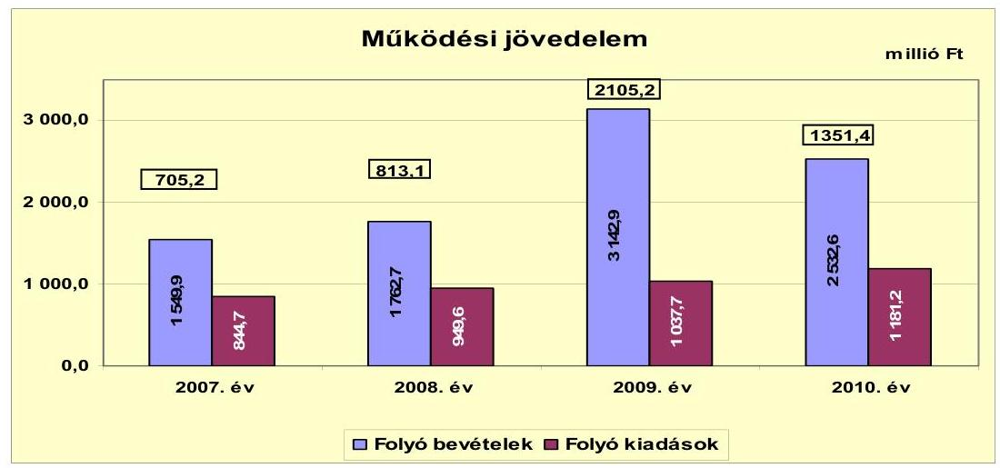

Az Önkormányzat múködési jövedelmének egyenlege 2007-2010 között folyamatosan pozitív elójelú volt, a folyó bevételek mindig fedezetet nyújtottak a folyó kiadásokra. A folyó kiadások 2007-2010 között közel egyenletes, évente 9,3-13,8\% növekedésével szemben a folyó bevételek 2008-ban 13,7\% (212,8 millió Ft), 2009-ben kimagasló értékű, 73,8\% (1380,2 millió Ft) növekedést mutattak az előző évhez képest. A 2008. és 2009. évi növekedés a saját működési bevételeknél, azon belül döntő mértékben a helyi adó bevételeknél 1355,1 millió Ft összegben jelentkezett. A növekedést a helyi adóbevételeknél meghatározó súllyal szereplő gazdasági társaság adókedvezményének megszűnése és 2009. évi kimagasló árbevétele alapozta meg. A 2010. évi, az előző évhez képest csökkenést mutató bevétel ellenére a múködési jövedelmet a vállalkozás 2007-2010 közötti átlagos növekedési üteme határozta meg. Az Önkormányzat tájékoztatása szerint az iparűzési adónál 2011. évben is növekedés várható.

Az Önkormányzat 2007-2010 között elért összes múködési jövedelme 4974,9 millió Ft volt, ami a jövőbeli fejlesztések forrásául szolgálhat.

Az Önkormányzat 2010-2014. évi gazdasági programjában megfogalmazott fejlesztési célkitűzések között szerepel többek között bölcsőde és óvoda építése, a Gondozási központ keretében múködő idősek otthonának bővítése, az ipari park fejlesztése, a megújuló energiák felhasználása, sportcsarnok építése és a vízhálózat rekonstrukciója.

---

Az Önkormányzat nettó múködési jövedelmét az alábbi ábra mutatja:
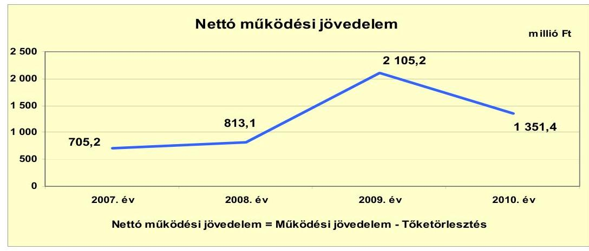

Az Önkormányzat pénzügyi kapacitása (nettó múködési jövedelme) megegyezett a múködési jövedelmével, mivel hitelállománya és így tőketörlesztési kötelezettsége az áttekintett időszak során nem volt.

Az Önkormányzat felhalmozási költségvetési egyenlegét 2007-2010. évek között az alábbi ábra mutatja:
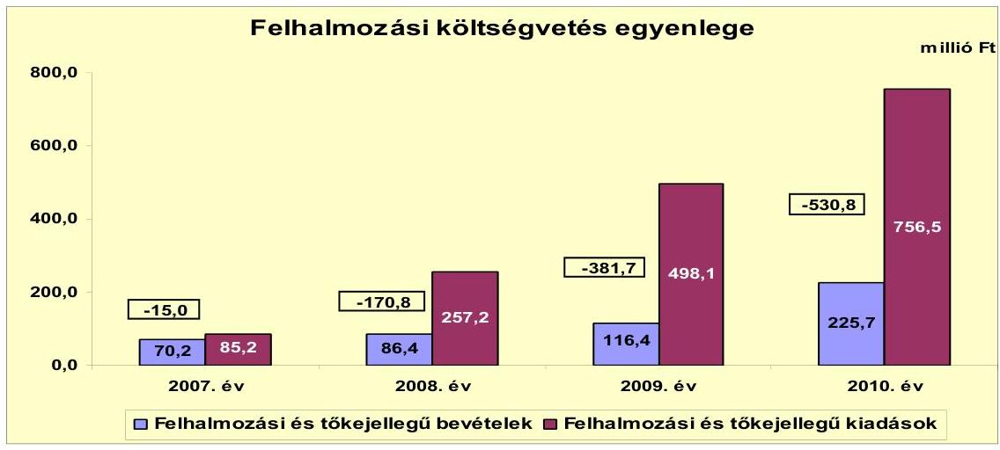

Az Önkormányzat felhalmozási költségvetésének egyenlege 2007-2010 között folyamatosan negatív előjelű volt.

Az áttekintett időszak során beruházásokra és felújításokra összesen 1411,4 millió Ft kiadás merült fel, mialatt 498,7 millió Ft felhalmozási bevétel keletkezett. Az összesen 1098,3 millió Ft felhalmozási hiány fedezetét a múködési jövedelem 4974,9 millió Ft megtakarítása biztosította.
2007. évben a Művelődési ház és az iskola felújítására kapott felhalmozási célú támogatások, valamint az értékesített eszközökből származó együttesen 70,2 millió Ft bevételével szemben beruházásokra és felújításokra 76,5 millió Ft kiadást teljesítettek, továbbá 8,7 millió Ft támogatást nyújtottak államháztartáson kívüli szervezetek számára. A 2007. évi 15,0 millió Ft felhalmozási forráshiány a felhalmozási kiadások 17,6\%-át tette ki.

---

Az időszak jelentősebb fejlesztései 2008. évben a szennyvízcsatorna hálózat III. ütemének megvalósítása, 2009. évben kerékpárút kialakítása Jászfényszaru város belterületén, sportpálya felújítás II. üteme megvalósítása, 2010. évben pedig az iskola teljes felújítása, a Művelődési ház előtti tér építése és további útépítések kivitelezése volt. Pályázati forrást a kerékpárút kialakításához, az iskola felújításához és a Művelődési ház beruházásokhoz kapcsolódóan vettek igénybe.
2010. évben a felhalmozási költségvetés hiánya a felhalmozási kiadások 70,2\%-át (530,8 millió Ft) tette ki. A 2010. évi felhalmozási hiány a 2009-ben megkezdődött és a tárgyévben befejeződött fejlesztések, valamint a pályázati forrásból megvalósított beruházások utófinanszírozása miatt keletkezett.

Az Önkormányzatnak a CLF módszer szerinti számítások alapján külső finanszírozási igénye ${ }^{14}$ nem volt. Többletbevételeiből 2007-ben 534,2 millió Ft-ot, 2008-ban 821,5 millió Ft-ot, 2009-ben 1690,6 millió Ft-ot, összesen 3046,3 millió Ft-ot fordított értékpapír vásárlásra és betételhelyezésre, ezáltal tartalékot képezve a megvalósítani tervezett fejlesztési feladatokra. 2010-ben az előző évek befektetéseiből 204,3 millió Ft-ot használtak fel fejlesztési kiadásokra.

Az Önkormányzat finanszírozási múveletei egyenlegét 2007-2010 között az alábbi ábra szemlélteti:
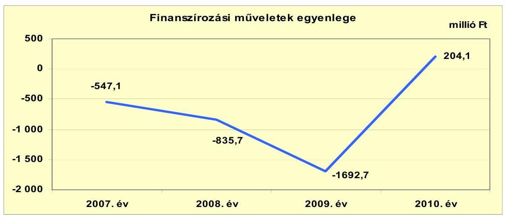

A finanszírozási múveletek egyenlegét a forgatási célú értékpapírok vásárlása és értékesítése határozta meg. A finanszírozási célú műveleteket a jelentés 2. számú mellékletének 4.1.-4.8. pontjai részletezik.

Az értékpapírok (diszkontkincstárjegyek, államkötvények) év végi állománya 2007-2009 között növekedett (2007. évben 1333,5 millió Ft, 2008. évben 2155,0 millió Ft, 2009. évben 3845,6 millió Ft), 2010. évben az előző évhez képest 94,7\%-ra (3641,3 millió Ft-ra) csökkent. Diszkontkincstárjegyből 2007. évben 160,6 millió Ft-ot értékesítettek, 2008-2009. években vásároltak (2008-ban 1521,9 millió Ft-ot, 2009-ben 368,1 millió Ft-ot), 2010. évben pedig ismét értékesítettek 2123,0 millió Ft értékben. Az államkötvények összes forgalma 2007. évben

[^0]
[^0]:    ${ }^{14}$ A CLF módszer szerinti teljes finanszírozási igény a nettó múködési jövedelem és a felhalmozási költségvetés eredője.

---

694,8 millió Ft vásárlásból, 2008-ban 700,4 millió Ft értékesítésből, 2009-ben 1322,5 millió Ft és 2010-ben további 1918,7 millió Ft vásárlásból tevődött össze. Az értékpapír befektetetésekre vonatkozó döntéseknél figyelembe vették a futamidőt és a várható hozamot.

Az Önkormányzat a 2007-2010. évi zárszámadási rendeleteiben a CLF módszertől eltérő módon ${ }^{15}$ határozta meg a felhalmozási, illetve múködési bevételek és kiadások főösszegét, amelyet a jelentés 1. számú melléklete tartalmaz. A zárszámadási rendeletekben kimutatott bevételi többlet 2007-ben 689,0 millió Ft, 2008-ban 636,9 millió Ft, 2009-ben 95,8 millió Ft és 2010-ben 820,5 millió Ft a CLF módszer alapján számított múködési jövedelem és felhalmozási költségvetés egyenlegétől minden évben kevesebb, az előző évi pénzmaradvány igénybevétel és a forgatási célú értékpapírok vásárlása hatására.

Az Önkormányzat kamatbevételeinek évenkénti értékét az alábbi ábra mutatja:
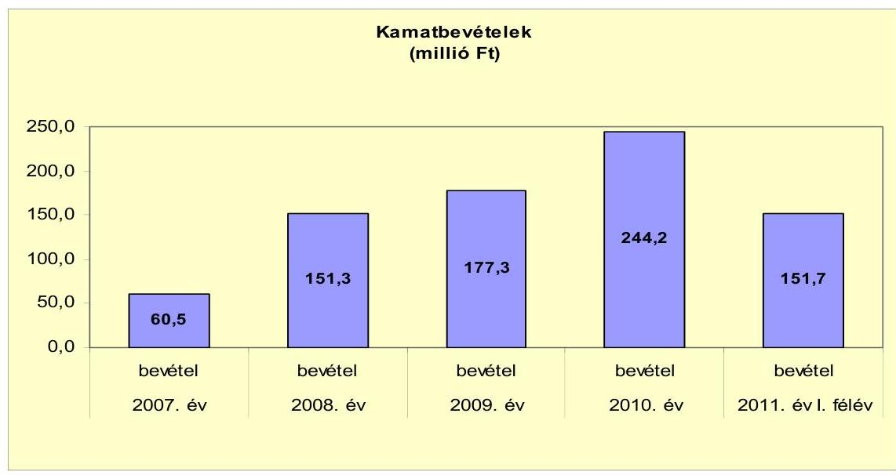

Az Önkormányzat folyamatosan növekvő értékpapír állománya után a vizsgált időszakban 785,0 millió Ft kamat- és hozambevételt realizált. Ezen bevételei a kincstárjegybe, illetve államkötvénybe fektetett pénzeszközök utáni hozamokból, az elszámolási- és hozzátartozó alszámlák után járó pénzintézeti kamatokból, valamint rövid lejáratú bankbetétek hozamaiból származott. Az Önkormányzatnak 2007-2011. év I. féléve között kamatfizetési kötelezettsége nem keletkezett.

Az Önkormányzat 2007-2011. év I. féléve között forgatási célú értékpapírokkal rendelkezett, amelyeket az óvatosság elve mellett forintos lekötésekkel forgattak. A vizsgált időszakban elsősorban a helyi adókból befolyt bevételekből (adóelőleg, iparűzési adó év végi feltöltése) rövid lejáratra értékpapírokat vásároltak. 2010. évben 652,5 millió Ft-ot már rövid lejáratú bankbetétként is lekötöttek, annak kedvező kamatfeltétele miatt.

[^0]
[^0]:    ${ }^{15}$ Nincs kötelező előírás a működési és fejlesztési hiány megállapításának módjára.

---

# 2.2. Az Önkormányzat bevételeinek változása 

Az Önkormányzat 2008. évi 1762,7 millió Ft folyó bevétele a 2007. évit 212,8 millió Ft-tal (13,7\%-kal) haladta meg. A 2009. évi folyó bevétel kétszerese volt a 2007. évinek, 1593,0 millió Ft volt a növekmény. 2010-ben az előző évinél 610,3 millió Ft-tal kisebb volt a folyó bevétel értéke.

Az Önkormányzat folyó bevételeinek 2007-2011. év I. féléve közötti alakulását az alábbi ábra szemlélteti:
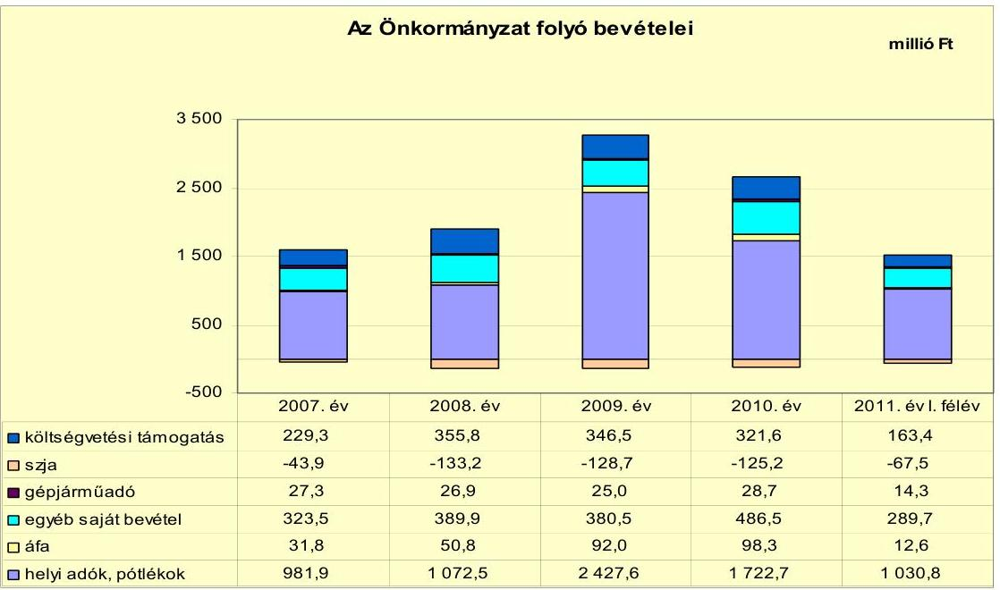

A költségvetési támogatás és az szja együttes bevétele 2007-ben 185,4 millió Ft volt, amely 2008-ban 37,2 millió Ft-tal (20,1\%) 222,6 millió Ft-ra emelkedett a normatív kötött felhasználású támogatások - közfoglalkoztatás támogatása és egyes jövedelempótló támogatások - növekedése miatt. 2009-ben 217,8 millió Ft-ra (4,8 millió Ft-tal), 2010-ben pedig 196,4 millió Ft-ra ( 21,4 millió Ft-tal) csökkent a normatív támogatások csökkenése következtében. A költségvetési támogatás és az szja együttes bevételének alakulására meghatározó, hogy az Önkormányzat adóerő-képessége alapján az szja-t illetően 2007-2011. év I. féléve alatt folyamatosan, összességében 498,5 millió Ft elvonás érvényesült. Az szja bevételnek az évente változó adóerő képességtől függése miatt a 2010. évi költségvetési támogatás és szja 196,4 millió Ft együttes bevétele a 2007-2009. évek 208,6 millió Ft átlagától 5,8\%-kal (12,2 millió Ft) elmaradt.

Az Önkormányzat folyó bevételeinek meghatározó hányadát a helyi adók és pótlékok biztosították. A 2007-2011. év I. féléve közötti időszakban az Önkormányzatnak építményadóból, magánszemélyek kommunális adójából és iparűzési adóból származott bevétele. A helyi adók bevétele 2008-ban 9,2\%kal ( 90,6 millió Ft) haladta meg az előző évit az új építmények bejelentése és a vállalkozási bevételek emelkedése következtében. 2009-ben több mint kétszeresére, 1355,1 millió Ft-tal növekedett 2008-hoz képest és a vizsgált időszakon belüli legmagasabb értéket mutatta az iparűzési adóbevételen belül meghatározó

---

súlyú termelő vállalat kiemelkedő üzleti évi bevétele, valamint az adókedvezményének megszűnése eredményeként. 2010-ben 704,9 millió Ft-tal kevesebb, az előző évi 71,0\%-a volt a helyi adókból származó bevétel, amit az iparúzési adó alapjául szolgáló árbevételek, továbbá az adó mértékének 0,2 százalékpontos csökkenése okozott.

Az iparúzési adóbevétel 2007-ben az összes helyi adóbevételből 93,6\%-a (919,4 millió Ft), 2008-ban 91,4\%-a (980,7 millió Ft), 2009-ben 96,0\%-a (2329,6 millió Ft) és 2010-ben 92,9\%-a (1600,4 millió Ft) volt. Az iparúzési adón kívüli helyi adóbevételek aránya az áttekintett időszakban nagy ingadozásokat nem mutatott, 2010-ben 5,5\%-a ( 95,4 millió Ft) építményadó volt, $0,3 \%$-a ( 5,1 millió Ft) magánszemélyek kommunális adójából származott. További $1,3 \%$ bevételt ( 21,6 millió Ft ) eredményezett a helyi adókhoz kapcsolódó pótlékok és bírságok beszedése.

Az iparúzési adóbevételben meghatározó súlyt képviselő vállalkozás 2007-ben adókedvezményt élvezett, 2008-2010-ben már átlagosan az iparúzési adóbevétel mintegy $90 \%$-át fizette meg.

Az iparúzési adóbevételek ilyen arányú koncentrációja, az éves adóbevétel több mint $90 \%$-ának (2010-ben $92,9 \%$ ) és a folyó bevételek több mint felének (2010-ben 50,9\%-ának) egy vállalkozás változó éves teljesítményétől való függése az Önkormányzat bevételeinek tervezésénél és feladatainak megvalósításánál jövőbeli kockázatot jelenthet.

Az iparúzési adó mértéke 2007-2009 között 2\% volt, melyet 2010. évre 1,8\%ban, 2011. évre 1,6\%-ban határoztak meg annak érdekében, hogy a vállalkozások hosszabb távon is a városban múködjenek. A 2\%-os adómértékhez képest számított iparúzési adóbevétel kiesés 2010. éven mintegy 160,0 millió Ft.

Az egyéb saját bevételek a hozam- és kamatbevételek, valamint az előző évi pénzmaradvány átvétel növekedése következtében 2008. évben 66,4 millió Fttal, 2010. évben 106,0 millió Ft-tal növekedtek a megelőző évekhez képest Az áfa bevételek 2009-2010. években a megnövekedett beruházási kiadások következtében mutattak közel kétszeres növekedést az előző évekhez képest ezen belül a fordított áfa 2009-ben 60,4 millió Ft, 2010-ben 73,4 millió Ft volt.

Az Önkormányzatnak a 2007-2011. első féléve közötti időszakban tulajdonosi részesedése ${ }^{16}$ alapján 9,5 millió Ft osztalékbevétele keletkezett. Az Önkormányzat kizárólagos tulajdonában álló JIC Kft. 2007-2011. év I. féléve közötti időszakban képződött 145,8 millió Ft mérleg szerinti eredményéből osztalékfizetésre nem került sor, azt az Önkormányzat jóváhagyásával a jövőbeli fejlesztések céljára tőketartalékba helyezték.

Az Önkormányzat a JIC Kft. törzstőkéjét az alapításkori 3,0 millió Ft-ról 2009-ben 101,2 millió Ft apporttal - amely önkormányzati tulajdonú földterületekből állt -, valamint 2010-ben összesen 138 millió Ft pénzbeli betéttel

[^0]
[^0]:    ${ }^{16}$ ÉMÁSZ Zrt. részvények

---

242,2 millió Ft-ra emelte annak érdekében, hogy az ipari parkot új területekkel és szolgáltatásokkal bővítse.

A JIC Kft. törzstőkéjének emelése a társaság Képviselő-testület által 2009. évben elfogadott stratégiai tervének megvalósítását szolgálta. A stratégiai terv az ipari park területének bővítését, komplex fejlesztését, új vállalkozások vonzását irányozta elő. A fejlesztésekhez pályázati források igénybevételét is tervezik, melyhez a törzstőke emelése alapul szolgál a saját forrás biztosítására és a fejlesztések előfinanszírozására.

Az Önkormányzat felhalmozási és tőkejellegú bevételeit 2007-2011. év I. féléve között az alábbi adatok szemléltetik:

| Megnevezés | 2007. év | 2008. év | 2009. év | 2010. év | 2011. év I.   félév |
| :-- | --: | --: | --: | --: | --: |
| Tárgyi eszköz értékesítés | 4,5 | 8,6 | 35,1 | 0,2 | 5,6 |
| Egyéb saját tőkebevétel | 1,9 | 1,4 | 1,4 | 1,4 | 1,0 |
| Államháztartáson belülről   kapott támogatás | 33,8 | 8,4 | 64,2 | 220,4 | 8,7 |
| EU-tól és külföldről kapott   támogatások | 25,3 | 0,0 | 0,0 | 0,0 | 0,0 |
| Államháztartáson kívülről   kapott támogatás | 4,7 | 68,0 | 15,7 | 3,7 | 0,0 |
| Összes felhalmozási bevétel | 70,2 | 86,4 | 116,4 | 225,7 | 15,3 |

Az Önkormányzatnak 2007-2011. I. féléve között összesen 514,0 millió Ft felhalmozási bevétele keletkezett, amelynek 65,3\%-a (335,5 millió Ft) az államháztartáson belülről kapott támogatás volt. Az államháztartáson belülről kapott támogatások értéke 2007-ben a Művelődési ház felújításához, 2009-ben az utak építéséhez és felújításához, 2010-ben pedig az iskola komplex felújításához kapcsolódott. A tárgyi eszközök értékesítéséből származó bevételek részaránya 10,5\% (54,0 millió Ft), ezen belül 2009. évben egy földterület értékesítéséből származó 34,4 millió Ft eredményezett az előző éveket meghaladó bevételt. A 2007-ben EU-tól kapott és elszámolt támogatás részaránya 4,9\% volt ( 25,3 millió Ft), amely az iskola felújításához nyújtott EU-s pályázati támogatást tartalmazta. Az államháztartáson kívülről átvett bevétel 17,9\% részarányt (összesen 92,1 millió Ft) képviselt, amely 2008. évben a Szennyvízberuházó Társulattól a szennyvízberuházás III. üteméhez átvett támogatást tartalmazta. Az egyéb saját tőkebevételek összesen 7,1 millió Ft-ot (1,4\%) tettek ki az áttekintett időszakban.

---

# 2.3. Az Önkormányzat müködési és felhalmozási célú kiadásainak változása 

Az Önkormányzat folyó (működési) kiadásait 2007-2011. év I. féléve között az alábbi táblázat mutatja be:

| Megnevezés | 2007. év | 2008. év | 2009. év | 2010. év | 2011. év   félév |
| :--: | :--: | :--: | :--: | :--: | :--: |
| Folyó kiadások | 844,7 | 949,6 | 1037,7 | 1181,2 | 535,7 |
| Müködési kiadások (kamatkiadás nélkül) | 752,5 | 787,6 | 912,2 | 1014,2 | 460,5 |
| Transzferkiadások | 70,7 | 81,8 | 89,5 | 111,5 | 57,9 |
| -ebből: vállalkozásoknak | 0,0 | 0,0 | 0,1 | 0,1 | 0,0 |
| magánszemélyeknek | 59,3 | 69,1 | 74,4 | 99,5 | 50,5 |
| nonprofit szervezeteknek | 11,4 | 12,7 | 15,0 | 11,9 | 7,4 |
| Előző évi pénzmaradvány átadás | 21,5 | 80,2 | 36,0 | 55,5 | 17,3 |

Az Önkormányzat folyó kiadása 2008-ban 12,4\%-kal (104,9 millió Ft), 2009ben $9,3 \%$-kal ( 88,1 millió Ft), 2010-ben $13,8 \%$-kal ( 143,5 millió Ft) növekedtek a megelőző évhez képest. A 2010. évi folyó kiadások 1181,2 millió Ft összege a 2007-2009. évek 944,0 millió Ft átlagához képest 25,1\%-kal (237,2 millió Ft) emelkedtek a múködési és a transzferkiadások növekedése következtében. A múködési kiadások 2010-ben 24,1\%-kal (196,8 millió Ft) 1014,2 millió Ft-ra nőttek a 2007-2009. évek 817,4 millió Ft átlagához képest a személyi juttatások és a dologi kiadások növekedése miatt.

A transzferkiadások 2010-ben a 2007-2009. évek 80,7 millió Ft átlagához képest $38,2 \%$-kal ( 30,8 millió Ft) 111,5 millió Ft-ra növekedtek, amelyet a magánszemélyek részére teljesített kifizetések növekedése okozott. A növekedés a segélykérelmezők és az ellátásokat, támogatásokat igénylők számának emelkedésével függött össze. A nonprofit szervezeteknek történő transzferkiadások a vizsgált időszakban nem változtak meghatározó mértékben.

Az Önkormányzat kiemelt múködési előirányzatainak vizsgált időszaki teljesítését az alábbi táblázat szemlélteti:

|  |  |  |  |  |  |
| :-- | --: | --: | --: | --: | --: |
| Megnevezés | 2007. év | 2008. év | 2009. év | 2010. év | 2011. év   félév |
| Személyi juttatások | 392,2 | 424,6 | 425,9 | 458,7 | 198,5 |
| Munkaadót terhelő járulékok | 124,6 | 132,8 | 122,2 | 119,8 | 52,2 |
| Dologi kiadások | 205,7 | 224,1 | 348,2 | 414,1 | 180,3 |
| Egyéb folyó kiadások | 7,0 | 6,1 | 7,0 | 20,4 | 10,0 |

Az Önkormányzat járulékokkal növelt személyi kiadásai 2010. évben a 20072009. évek 540,8 millió Ft átlagához képest 7,0\%-kal (37,7 millió Ft) 578,5 millió Ft-ra emelkedtek a létszámfejlesztés és a közcélú foglalkoztatás miatt. A járulékok csökkenését a központi intézkedés eredményeként a munkáltató által fizetett járulékcsökkenések eredményezték. A dologi kiadások 2008. évben 8,9\%-kal (18,4 millió Ft), 2009. évben 55,4\%-kal (124,1 millió Ft), 2010. évben pedig $18,9 \%$-kal ( 65,9 millió Ft) nőttek a megelőző évhez képest. A 2009. évi kiadásnövekedés a belterületi árkok és padkák rendezésére fordított kiadások és különböző szolgáltatási díjak, adók (fordított áfa) megfizetése miatt következett

---

be. A 2010. évben a közcélú foglalkoztatás, a szociálpolitikai feladatok és a fordított áfa dologi kiadásai eredményeztek további növekedést. Az egyéb folyó kiadások 2010. évi növekedését a szolgáltatási díjak emelkedése, valamint a karbantartások többletköltségei okozták.

Az Önkormányzat 2007-2011. év I. féléve közötti folyó és felhalmozási kiadásait az alábbi ábra mutatja:
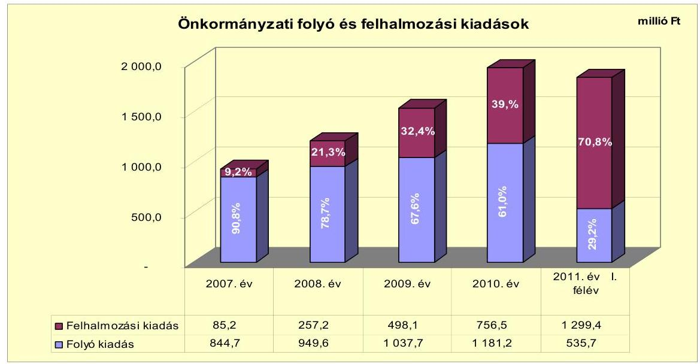

A folyó kiadások 2008. évben 12,4\%-kal (104,9 millió Ft), 2009. évben 9,3\%-kal (88,1 millió Ft), 2010. évben 13,8\%-kal növekedtek a megelőző́ évhez képest. A felhalmozási kiadások összege 2007-2010 között összesen 1597,0 millió Ft volt. A folyó kiadások 2011. év I. félévi 535,7 millió Ft értéke a 2010. évi időarányos adattól (590,6 millió Ft) 9,3\%-kal (54,9 millió Ft-tal) maradt el. A felhalmozási kiadások évente egyre nagyobb - az előző évhez képest 2008-ban 172,0 millió Ft, 2009-ben 240,9 millió Ft, 2010-ben 258,4 millió Ft - növekedést mutattak, melyet a pozitív múködési jövedelem növekedése alapozott meg. A felhalmozási kiadások 2007. évi 85,2 millió Ft értéke 2008-ban megháromszorozódott, 257,2 millió Ft-ot tett ki. A 2009. évben további 240,9 millió Ft-tal közel kétszeresére ( $93,7 \%$-kal) emelkedett, a 2010. évi növekedés pedig 258,4 millió Ft (51,9\%) volt a megelőző évhez képest a végrehajtott fejlesztések eredményeként. A 2011. év I. félévi 1299,4 millió Ft felhalmozási kiadásból 1200,0 millió Ft a JIC Kft. törzstőkéjének megemelésével volt kapcsolatban.

A 2011. év I. félévében az Önkormányzat 1200,0 millió Ft törzstőke emelést hajtott végre a kizárólagos tulajdonában álló JIC Kft-nél, amelyet a 2011. évi költségvetési rendeletében határozott el. A végrehajtott törzstőke emelés célja a JIC Kft. Képviselő-testület által elfogadott stratégiai tervében szereplő további területés szolgáltatásbővítés. Ehhez a JIC Kft. korábbi mezőgazdasági múvelési ágba tartozó területet vásárol, kiépíti az infrastruktúrát és vállalkozói házat, ipari csarnokot, valamint raktárbázist tervez építeni összesen 1386,0 millió Ft bekerülési költséggel.

Az Önkormányzat által a 2007-2010 között megvalósított, 2010. december 31-éig befejezett fejlesztések bekerülési értéke 1373,0 millió Ft. A

---

fejlesztések 2,0\%-ára 27,6 millió Ft-ot 2006. december 31-ig, a 98,0\%-ára 1345,4 millió Ft-ot pedig 2007-2010. években fizettek ki. A 10 millió Ft teljes bekerülési költség felett 17 fejlesztési feladat, 10 millió Ft alatt pedig összesen 121 fejlesztési feladat valósult meg. Az Önkormányzat a fejlesztések forrásainak $60,9 \%$-át ( 836,4 millió Ft-ot) saját felhalmozási bevételből és megképzett múködési jövedelemből finanszírozta. További forrást 474,6 millió Ft-ot EU-s és 62,0 millió Ft-ot hazai támogatás biztosított. A megvalósított fejlesztések döntően önkormányzati épületek, intézmények felújításából, út- és kerékpárút építésekből, szennyvízcsatorna hálózat bővítésből, ipari park fejlesztésből, ingatlanvásárlásokból tevődtek össze. Az Önkormányzat 2007-2010. években megvalósított, 2010. december 31-ig befejezett fejlesztéseit és azok forrásösszetételét a jelentés 3/a. számú melléklete tartalmazza.

Az Önkormányzatnál 2010. december 31-én 10 fejlesztési feladat megvalósítása volt folyamatban, amelyekre 2010. december 31-ig 66,0 millió Ft kiadást teljesítettek saját bevételeik terhére. A 2010-ről áthúzódó folyamatban lévő fejlesztések kiadásaira 280,6 millió Ft-ot terveztek, melyeknek $8,9 \%$-át ( 24,9 millió Ft-ot) EU-s támogatásból, $91,1 \%$-át ( 255,7 millió Ft-ot) saját bevételből tervezik finanszírozni. Az Önkormányzat 2010. december 31én folyamatban lévő fejlesztési feladataira 2010. december 31-ig teljesített kifizetéseket és azok forrásösszetételét a jelentés 3/b. számú melléklete tartalmazza. Az Önkormányzat 2010. december 31-én folyamatban lévő fejlesztési feladataira 2010. december 31-én fennálló kötelezettségeket és azok forrásösszetételét a jelentés 3/c. számú melléklete mutatja be.

A 2011. év I. félévében saját forrásból további három fejlesztést indítottak el 293,7 millió Ft értékben, mely feladatokat és azok forrásösszetételét a 3/c1. számú melléklet tartalmazza.

Az Önkormányzat adatszolgáltatása szerint 2011. év I. félévig négy ${ }^{17}$ beadott, elbírálás alatt lévő pályázattal rendelkezik, melyekre 2010. december 31-e után összesen 1712,0 millió Ft-ot - 80,9\%-át (1384,2 millió Ft) EU-s támogatási forrásból - terveznek kifizetni. A „Jászfényszaru városközpont értékmegőrző megújítása" és a „szociális városrehabilitáció és lakossági integráció Jászfényszaru fejlesztéséért" fejlesztési feladatok tervezési költségeire 2010. évben már történt kifizetés 56,0 millió Ft a saját bevételük terhére. E projekteket EU-s támogatási forrás igénybevételével tervezik megvalósítani 2011-2014. években Az Önkormányzat beadott, elbírálás alatti pályázati forrásból megvalósuló fejlesztéseihez kapcsolódó kötelezettség-vállalásainak összegzését a jelentés 3/d. számú melléklete tartalmazza.

Az Önkormányzat három legmagasabb bekerülési költségú fejlesztése iskola és kerékpárút fejlesztéshez, szennyvízcsatorna hálózat építéshez és lebonyolításhoz kapcsolódott.

- Az Önkormányzat 2007. évi döntése alapján „A Nagy Iskola komplex fejlesztése - a minőségi oktatás feltételeinek megteremtése, valamint a hátrányos helyzetü

[^0]
[^0]:    ${ }^{17}$ „Jászfényszaru városközpont értékmegőrző megújítása" fejlesztési feladat megvalósítása két soron szerepel, mert a pályázat felújítást tartalmazó résszel is rendelkezik.

---

és sajátos nevelési igényú tanulók esélyegyenlőségének megteremtése érdekében" ÉAOP pályázat keretén belül felújították a meglévő iskola épületét a 20072010 években, összesen 328,3 millió Ft értékben. Megvalósult az iskolaépület külső és belső felújítása, átalakítása, $18,0 \mathrm{~m}^{2}$ hasznos alapterülettel való bővítése ( $2347,7 \mathrm{~m}^{2}$ volt a hasznos alapterület), felvonóaknák kialakítása, a mozgáskorlátozottak számára az épület megközelíthetőségének biztosítása, továbbá a sajátos nevelési igényú és hátrányos helyzetű gyermekek fejlesztéséhez szükséges eszközök beszerzése. A fejlesztés forrását 72,4\%-ban (237,7 millió Ft) EU-s támogatás biztosította. További forrást 27,6\%-ban ( 90,6 millió Ft) az Önkormányzat saját bevétele jelentette.

- A Képviselő-testület 2007. évi döntései alapján 2007-2009. években megvalósult a „Kerékpárút kialakítása Jászfényszaru város belterületén" fejlesztés, melynek keretében 2216 folyóméter önálló kerékpár- és gyalogút közlekedési létesítmény épült meg, 164,3 millió Ft költséggel. A kerékpár- és gyalogút megépítése az ÉAOP pályázat keretében történt, 138,4 millió Ft EU-s és 8,1 millió Ft hazai támogatással, továbbá 17,8 millió Ft saját önkormányzati bevételi forrás felhasználásával.
- Az Önkormányzat a „Szennyvízcsatorna hálózat III. ütem és lebonyolítás" fejlesztési feladat keretén belül a 2008-2009. években kiépítette kettő településrészben a szennyvízcsatorna hálózatot ( 8124 folyóméter), a házi bekötésekkel (5732 folyóméter) együtt, továbbá kettő átemelő beszerzését valósította meg. A beruházási feladat teljes bekerülési értéke 194,9 millió Ft volt, melyet az Önkormányzat saját bevételéből és a Jászfényszaru Városi Szennyvízberuházó Társulattól (2008. évben) átvett 68,0 millió Ft pénzeszközből finanszírozott.

A 2007-2011. év I. féléve közötti időszakban az önkormányzati feladatellátáshoz kapcsolódóan gazdasági társaság részére pénzeszköz átadás nem történt.

# 3. Az ÖNKORMÁNYZAT KÖTELEZETTSÉGEI 

### 3.1. Az Önkormányzat pénzintézeti kötelezettségeinek változása

Az Önkormányzat kötelezettségeinek állománya 2006. december 31-ei 190,2 millió Ft-ról 2010. december 31-re 42,9 millió Ft-ra csökkent, 2011. június 30-ra 31,2 millió Ft-tal tovább csökkent (11,7 millió Ft-ra). Az Önkormányzat kötelezettsége 2008. év végén 351,9 millió Ft, 2009. év végén 814,4 millió Ft volt, amely a helyi iparúzési adó feltöltés miatt emelkedett meg. A kötelezettségekből pénzintézeti kötelezettség nem terhelte az Önkormányzatot.

### 3.2. A szállítói kötelezettségek változása

Az Önkormányzatnak a vizsgált időszakban szállítói tartozása, egyéb kiadás elmaradása nem volt.

---

# 3.3. Egyéb kötelezettségek változása 

Az Önkormányzat nevében a Képviselő-testület két ízben - 2008. és 2009. évben - vállalt készfizető kezességet, összesen 89,8 millió Ft erejéig a Jászfényszaru Városi Szenyvízberuházó Társulat javára. A 2011. év I. félév végén fennálló kötelezettsége 68,0 millió Ft volt. Kezesi felelőssége érvényesítésére egy ízben került sor 2009. december 28-án, amikor 17,0 millió Ft-ot fizetett ki az adós helyett. A kifizetett összeget az adós két részletben (2010. március 9-én 7,0 millió Ft-ot, 2010. május 27-én 10,0 millió Ft-ot) hiánytalanul megtérítette.

Az Önkormányzat magánszemélyek kommunális adója, a gépjármúadó, a talajterhelési díj és a felmerült késedelmi pótlék körében az adózás rendjéről szóló 2003. évi XCII. törvény méltányossági rendelkezésének felhatalmazása alapján - jegyzői hatáskörben - kevesebb, mint 0,2 millió Ft összegú követelést engedett el. Polgári jogi jellegű, szerződésen alapuló követelés elengedésére nem került sor. A követeléselengedés lehetséges eseteit és módjait az Áht ${ }_{1}$ 108. § (2) bekezdését ${ }^{18}$ alkalmazva az Önkormányzat vagyonrendeletében szabályozta.

Az Önkormányzatnak (intézményeinek és kizárólagos tulajdonú gazdasági társaságának) nincsenek folyamatban lévő peres ügyei. Gazdasági társaságának kölcsönt nem adott, tőle kölcsönt nem vett fel.

Az Önkormányzatnál a vizsgált időszakra vonatkozóan PPP konstrukciók, intézményeknek, más önkormányzatoknak, civil szervezeteknek, egyéb államháztartáson belüli és kívüli szervezeteknek nyújtott kölcsönök, gazdasági társaságoknak adott tagi és egyéb kölcsönök nem voltak.

Az Önkormányzat vidékfejlesztési központ létrehozása céljából egy irodaház felújítására SAPARD pályázat keretében kapott 46,8 millió Ft támogatás szabályos felhasználása érdekében - szerződéses megállapodás keretében hozzájárult egy forgalomképes ingatlanon jelzálogjog alapításához és bejegyzéséhez a támogatással megegyező összegben. A számviteli nyilvántartás szerinti összes forgalomképes ingatlan könyvszerinti nettó értékének (1087,9 millió Ft) 2010. december 31-én jelzálogjoggal terhelt része 4,1\% ( 71,4 millió Ft) volt.

Az Önkormányzat kizárólagos tulajdonú gazdasági társaságának - adatszolgáltatása szerint - nincs pénzintézeti, peres eljárásokból adódó és egyéb kötelezettsége, amelyek negatív hatást gyakorolnának önkormányzat pénzügyi helyzetére. A JIC Kft. szállítói tartozása 2007-2011. év I. féléve között 75,0 millió Ft volt, melynek 99,2\%-a ( 74,4 millió Ft) a 2009. december 31-i állományhoz tartozott, melyet 2010. évben kifizettek. A 2009. évi kiugróan magas szállító állományt az ipari parkban épített üzemcsarnok áthúzódó számlái okozták.

[^0]
[^0]:    ${ }^{18}$ 2012. január 1-jétől az Áht ${ }_{2}$ 97. § (2) bekezdése tartalmazza a követelés elengedés szabályait.

---

Az Önkormányzat a 2007-2010. években a befektetett eszközök után együttesen 283,7 millió Ft értékcsökkenést számolt el. A vizsgált években a befejezett beruházások bekerülési költsége 747,1 millió Ft, az aktivált felújításoké 411,3 millió Ft, összesen 1158,4 millió Ft volt. Az Önkormányzat a vizsgált időszakban 590,7 millió Ft-ot fordított eszközpótlásra. Az elhasználódott eszközök pótlását saját felhalmozási és múködési jövedelemből, valamint EU-s és hazai támogatásból biztosította.

Az eszközök állaga javult, mivel az önkormányzati szintű használhatósági fok mutató aránya a 2007-2009. évek átlagához ( $79,7 \%$ ) viszonyítva 1,1 százalékponttal nőtt, 2010. évben $80,8 \%$ volt. A fejlesztések eredményeként az eszközökön belül 2010 évvégén az ingatlanok használhatósági foka ( $83,9 \%$ ) meghaladta az összes eszközre vonatkozó használhatósági fok ( $80,8 \%$ ) mutatót. 2010-ben az immateriális javak ( $64,7 \%$ ), gépek berendezések ( $46,0 \%$ ), jármúvek $(38,9 \%)$ és üzemeltetésre átadott eszközök használhatósági foka ( $2,9 \%$ ) elmaradt az összes eszközre vonatkozó használhatósági fok arányától. A 20072009 évek közötti állagjavulást ( $1,1 \%$ ) a fejlesztések eredményezték, melyek célja volt továbbá a szakmai feladatellátások mellett az üzemeltetési és fenntartási költségek csökkentése is.

# 4. A PÉNZÜGYI EGYENSÚLY MEGTEREMTÉSE ÉrDEKÉBEN HOZOTT INTÉZKEDÉSEK EREDMÉNYE 

Az Önkormányzat konkrét kiadáscsökkentő intézkedésként létszámcsökkentésről adott számot. Adatszolgáltatása alapján a 2008-2010. években, összesen 50,4 millió Ft megtakarítása keletkezett. Egyéb kiadáscsökkentő intézkedés nem történt, tekintettel arra, hogy az Önkormányzat szufficites költségvetése miatt erre nem is kényszerült. Az intézményi ellátottak száma nem csökkent.

Az önkormányzati álláshelyek és létszám alakulását az alábbi ábra szemlélteti:

| Megnevezés (adatok10-ben) |  | Közoktatás | Szociális és gyermekvéd elem | Egészségiagy | Polgármesté ri hivatal | Egyéb | Összesen |
| :--: | :--: | :--: | :--: | :--: | :--: | :--: | :--: |
| 2007. január 1-jén jóváhagyott álláshelyek száma |  | 83 | 15 | 4 | 30 | 36 | 166 |
| Megszüntetett álláshelyek száma |  | 8 | 0 | 0 | 0 | 0 | 8 |
| ebből: |  |  |  |  |  |  |  |
|  | szakmai álláshelyek száma | 8 |  |  | 0 |  | 8 |
|  | intézmény-üzemeltetéssel kapcsolatos álláshelyek száma | 0 | 0 | 0 | 0 |  | 0 |
| Álláshely növekedése |  | 6 | 0 | 0 | 3 | 0 | 9 |
| 2010. december 31-én záró álláshelyek száma |  | 81 | 15 | 4 | 33 | 36 | 169 |
| 2007. január 1-jén foglalkoztatott létszám |  | 81 | 15 | 4 | 29 | 36 | 166 |
| Létszámcsökkentés |  | 6 | 0 | 0 | 0 | 1 | 7 |
| Létszámnövekedés |  | 6 | 0 | 0 | 3 | 0 | 9 |
| 2010. december 31-én foglalkoztatott létszám |  | 81 | 15 | 4 | 32 | 35 | 167 |

A vizsgált időszakban mind az álláshelyek száma, mind a tényleges létszám alakulása meghaladta az induló adatokat. Nyolc álláshely szűnt meg, miközben kilenc újonnan létesült. Új álláshelyeket a közoktatási terület (művészeti iskola-, óvoda fejlesztés) szaktanári ellátottságának biztosítása és a pályázati feladatok projekt menedzselése miatt létesítettek. A 2007. január 1-jétől 2010. december 31-ig a tényleges foglalkoztatottak létszáma az álláshelyek változása

---

és az üres álláshelyek részbeni betöltése eredményeként összesen kettő fővel növekedett. 2010. év végére a 169 álláshelyből 167 volt betöltve. A Polgármesteri hivatalban és a GAMESZ-nél 1-1 álláshely betöltetlen.

Az Önkormányzat a közoktatással összefüggésben foganatosított négy fő tartós létszámleépítéshez igényelt 5,4 millió Ft központi támogatást, amelyből ténylegesen megkapott 3,2 millió Ft-ot. Az időközbeni - azóta már megszűnt - munkaügyi jogvitára tekintettel két fő vonatkozásában a támogatásigényt visszavonták.

Az Önkormányzat a helyi adókkal és eszközök hasznosításával kapcsolatban tett bevételnövelő intézkedéseket, melyek közül kiemelkedik az, hogy a városba települt multinacionális cég leányvállalatának szerződés szerint lejárt a kedvezményes (30,0\%-os) iparűzési adó alá tartozó időszaka. Emiatt 2009-ben nagyságrendileg megnőtt, 1000,0 millió Ft fölé emelkedett az Önkormányzat által beszedett iparűzési adó összege. A vizsgált időszakban ez által - az előző évekhez viszonyítva - befolyt 3789,9 millió Ft a bevételnövelő intézkedések következtében előállt többletbevétel 97,0\%-át teszi ki. A vizsgált időszakban az Önkormányzat új adónemet nem vezetett be. Növelte 2008-tól a nem lakás céljára szolgáló építmények adójának mértékét, amelyből adódóan 9,6 millió Ft-ot realizált. Eszközök, köztük lakások és egyéb ingatlanok (termőföld) értékesítése 97,8 millió Ft ( $2,5 \%$ ), bérbeadása pedig 8,5 millió Ft ( $0,2 \%$ ) bevétellel járt. Az ipari park jobb kihasználása érdekében történt földhasználati és szolgalmi jog alapítása és értékesítése nyomán 51,0 millió Ft (1,3\%) bevétel keletkezett. A földhasználati jog alapítására termelésből kivett területen parkoló építés céljából került sor.
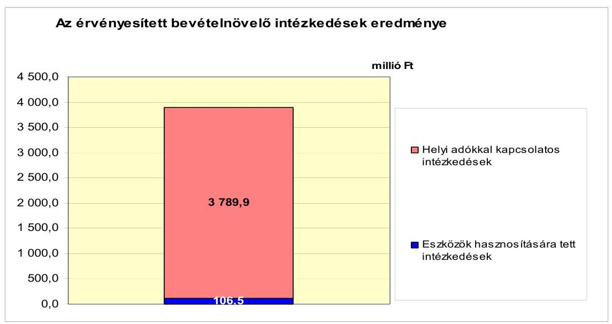

Az egy lakosra jutó iparűzési adó magas összege miatt az Önkormányzat már 2007-re elérte az adóerőképesség miatti törvényi maximumot (193,2 millió Ft), ezért az szja-val kapcsolatban befizetési kötelezettsége keletkezett a költségvetés felé. A költségvetési támogatás növekedése azonban ellensúlyozta az szja-t érintő fizetési kötelezettségét, úgy hogy a támogatás és az szja fizetés konszolidált összege kumulált értéken a vizsgált időszakban 83,8 millió Ft többletet mutat a 2007. évi egyenleghez képest. Az Önkormányzat adatszolgáltatása szerin-

---

ti, a vizsgált időszakban történt bevételnövelő intézkedések eredménye 3896,4 millió Ft. Ez a bevétel olyan tiszta jövedelemnek minősül, amely az Önkormányzat megtakarításait, végső soron a pénzmaradvány összegét növelte.

# 5. Az ÁSZ Által a korábBi ÉVEKben a PÉnzüGyi eGYensúly JAVÍTÁSÁRA TETT SZABÁLYSZERŰSÉGI ÉS CÉLSZERŰSÉGI JAVASLATOK HASZNOSULÁSA 

Az Önkormányzat legutóbbi, 2010. évi számvevőszéki ellenőrzése során az ÁSZ a jegyzőnek címezve 54 szabályszerűségi javaslatot fogalmazott meg. Az 54 javaslatból nyolc vonatkozott a pénzügyi egyensúly javítására az éves költségvetés tervezése és a beszámolás tárgykörében, amelyek hasznosultak. A Képviselőtestület a felelősöket és a határidőt is tartalmazó intézkedési tervet fogadott el a számvevőszéki javaslatok megvalósítására. Az értékpapírok vásárlásának szabályozatlanságával kapcsolatban tett javaslatra módosították vagyonrendeletüket, amely szerint a polgármester a Pénzügyi, Településfejlesztési és Jogi Bizottsággal együtt kapott felhatalmazást a döntésre.

A lejárt határidejű feladatok (a kiegészítő tételekkel, a pénzmaradvánnyal, az értékpapír vásárlásra való felhatalmazással, az intézményi terv- és tényadatok ellenőrzésével, az állami támogatások mutatószámaival kapcsolatosan), a költségvetés tervezésével és a beszámolással összefüggő javaslatok megvalósítása, az elfogadott intézkedési tervnek megfelelően, határidőre megtörtént.

Budapest, 2012. április " 46 "
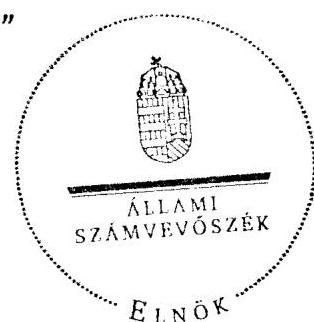

Domokos László

Melléklet: $\quad 8 \mathrm{db}$

---

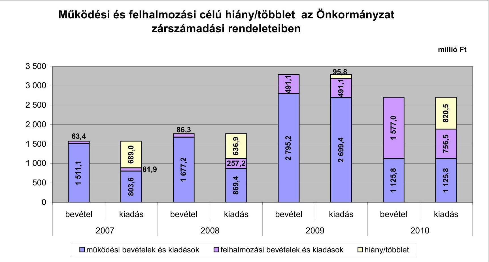

# Működési és felhalmozási célú hiány/többlet az Önkormányzat zárszámadási rendeleteiben

|  Típus | 2007 | 2008 | 2009 | 2010  |
| --- | --- | --- | --- | --- |
|  müködési bevételek és kiadások | 63,4 | 86,3 | 1 677,2 | 2 795,2  |
|  felhalmozási bevételek és kiadások | 86,3 | 1 677,2 | 2 795,2 | 2 699,4  |
|  felhalmozási bevételek és kiadások | 86,3 | 1 677,2 | 2 795,2 | 2 699,4  |
|  müködési bevételek és kiadások | 86,3 | 1 677,2 | 2 795,2 | 2 699,4  |
|  felhalmozási bevételek és kiadások | 86,3 | 1 677,2 | 2 795,2 | 2 699,4  |
|  múködési bevételek és kiadások | 86,3 | 1 677,2 | 2 795,2 | 2 699,4  |
|  felhalmozási bevételek és kiadások | 86,3 | 1 677,2 | 2 795,2 | 2 699,4  |
|  múködési bevételek és kiadások | 86,3 | 1 677,2 | 2 795,2 | 2 699,4  |
|  felhalmozási bevételek és kiadások | 86,3 | 1 677,2 | 2 795,2 | 2 699,4  |
|  múködési bevételek és kiadások | 86,3 | 1 677,2 | 2 795,2 | 2 699,4  |
|  felhalmozási bevételek és kiadások | 86,3 | 1 677,2 | 2 795,2 | 2 699,4  |
|  múködési bevételek és kiadások | 86,3 | 1 677,2 | 2 795,2 | 2 699,4  |
|  felhalmozási bevételek és kiadások | 86,3 | 1 677,2 | 2 795,2 | 2 699,4  |
|  múködési bevételek és kiadások | 86,3 | 1 677,2 | 2 795,2 | 2 699,4  |
|  felhalmozási bevételek és kiadások | 86,3 | 1 677,2 | 2 795,2 | 2 699,4  |
|  múködési bevételek és kiadások | 86,3 | 1 677,2 | 2 795,2 | 2 699,4  |
|  felhalmozási bevételek és kiadások | 86,3 | 1 677,2 | 2 795,2 | 2 699,4  |
|  múködési bevételek és kiadások | 86,3 | 1 677,2 | 2 795,2 | 2 699,4  |
|  felhalmozási bevételek és kiadások | 86,3 | 1 677,2 | 2 795,2 | 2 699,4  |
|  múködési bevételek és kiadások | 86,3 | 1 677,2 | 2 795,2 | 2 699,4  |
|  felhalmozási bevételek és kiadások | 86,3 | 1 677,2 | 2 795,2 | 2 699,4  |
|  múködési bevételek és kiadások | 86,3 | 1 677,2 | 2 795,2 | 2 699,4  |
|  felhalmozási bevételek és kiadások | 86,3 | 1 677,2 | 2 795,2 | 2 699,4  |
|  múködési bevételek és kiadások | 86,3 | 1 677,2 | 2 795,2 | 2 699,4  |
|  felhalmozási bevételek és kiadások | 86,3 | 1 677,2 | 2 795,2 | 2 699,4  |
|  múködési bevételek és kiadások | 86,3 | 1 677,2 | 2 795,2 | 2 699,4  |
|  felhalmozási bevételek és kiadások | 86,3 | 1 677,2 | 2 795,2 | 2 699,4  |
|  múködési bevételek és kiadások | 86,3 | 1 677,2 | 2 795,2 | 2 699,4  |
|  felhalmozási bevételek és kiadások | 86,3 | 1 677,2 | 2 795,2 | 2 699,4  |
|  múködési bevételek és kiadások | 86,3 | 1 677,2 | 2 795,2 | 2 699,4  |
|  felhalmozási bevételek és kiadások | 86,3 | 1 677,2 | 2 795,2 | 2 699,4  |
|  múködési bevételek és kiadások | 86,3 | 1 677,2 | 2 795,2 | 2 699,4  |
|  felhalmozási bevételek és kiadások | 86,3 | 1 677,2 | 2 795,2 | 2 699,4  |
|  múködési bevételek és kiadások | 86,3 | 1 677,2 | 2 795,2 | 2 699,4  |
|  felhalmozási bevételek és kiadások | 86,3 | 1 677,2 | 2 795,2 | 2 699,4  |
|  múködési bevételek és kiadások | 86,3 | 1 677,2 | 2 795,2 | 2 699,4  |
|  felhalmozási bevételek és kiadások | 86,3 | 1 677,2 | 2 795,2 | 2 699,4  |
|  múködési bevételek és kiadások | 86,3 | 1 677,2 | 2 795,2 | 2 699,4  |
|  felhalmozási bevételek és kiadások | 86,3 | 1 677,2 | 2 795,2 | 2 699,4  |
|  múködési bevételek és kiadások | 86,3 | 1 677,2 | 2 795,2 | 2 699,4  |
|  felhalmozási bevételek és kiadások | 86,3 | 1 677,2 | 2 795,2 | 2 699,4  |
|  múködési bevételek és kiadások | 86,3 | 1 677,2 | 2 795,2 | 2 699,4  |
|  felhalmozási bevételek és kiadások | 86,3 | 1 677,2 | 2 795,2 | 2 699,4  |
|  múködési bevételek és kiadások | 86,3 | 1 677,2 | 2 795,2 | 2 699,4  |
|  felhalmozási bevételek és kiadások | 86,3 | 1 677,2 | 2 795,2 | 2 699,4  |
|  múködési bevételek és kiadások | 86,3 | 1 677,2 | 2 795,2 | 2 699,4  |
|  felhalmozási bevételek és kiadások | 86,3 | 1 677,2 | 2 795,2 | 2 699,4  |
|  múködési bevételek és kiadások | 86,3 | 1 677,2 | 2 795,2 | 2 699,4  |
|  felhalmozási bevételek és kiadások | 86,3 | 1 677,2 | 2 795,2 | 2 699,4  |
|  múködési bevételek és kiadások | 86,3 | 1 677,2 | 2 795,2 | 2 699,4  |
|  felhalmozási bevételek és kiadások | 86,3 | 1 677,2 | 2 795,2 | 2 699,4  |
|  múködési bevételek és kiadások | 86,3 | 1 677,2 | 2 795,2 | 2 699,4  |
|  felhalmozási bevételek és kiadások | 86,3 | 1 677,2 | 2 795,2 | 2 699,4  |
|  múködési bevételek és kiadások | 86,3 | 1 677,2 | 2 795,2 | 2 699,4  |
|  felhalmozási bevételek és kiadások | 86,3 | 1 677,2 | 2 795,2 | 2 699,4  |
|  múködési bevételek és kiadások | 86,3 | 1 677,2 | 2 795,2 | 2 699,4  |
|  felhalmozási bevételek és kiadások | 86,3 | 1 677,2 | 2 795,2 | 2 699,4  |
|  múködési bevételek és kiadások | 86,3 | 1 677,2 | 2 795,2 | 2 699,4  |
|  felhalmozási bevételek és kiadások | 86,3 | 1 677,2 | 2 795,2 | 2 699,4  |
|  múködési bevételek és kiadások | 86,3 | 1 677,2 | 2 795,2 | 2 699,4  |
|  felhalmozási bevételek és kiadások | 86,3 | 1 677,2 | 2 795,2 | 2 699,4  |
|  múködési bevételek és kiadások | 86,3 | 1 677,2 | 2 795,2 | 2 699,4  |
|  felhalmozási bevételek és kiadások | 86,3 | 1 677,2 | 2 795,2 | 2 699,4  |
|  múködési bevételek és kiadások | 86,3 | 1 677,2 | 2 795,2 | 2 699,4  |
|  felhalmozási bevételek és kiadások | 86,3 | 1 677,2 | 2 795,2 | 2 699,4  |
|  múködési bevételek és kiadások | 86,3 | 1 677,2 | 2 795,2 | 2 699,4  |
|  felhalmozási bevételek és kiadások | 86,3 | 1 677,2 | 2 795,2 | 2 699,4  |
|  múködési bevételek és kiadások | 86,3 | 1 677,2 | 2 795,2 | 2 699,4  |
|  felhalmozási bevételek és kiadások | 86,3 | 1 677,2 | 2 795,2 | 2 699,4  |
|  múködési bevételek és kiadások | 86,3 | 1 677,2 | 2 795,2 | 2 699,4  |
|  felhalmozási bevételek és kiadások | 86,3 | 1 677,2 | 2 795,2 | 2 699,4  |
|  múködési bevételek és kiadások | 86,3 | 1 677,2 | 2 795,2 | 2 699,4  |
|  felhalmozási bevételek és kiadások | 86,3 | 1 677,2 | 2 795,2 | 2 699,4  |
|  múködési bevételek és kiadások | 86,3 | 1 677,2 | 2 795,2 | 2 699,4  |
|  felhalmozási bevételek és kiadások | 86,3 | 1 677,2 | 2 795,2 | 2 699,4  |
|  múködési bevételek és kiadások | 86,3 | 1 677,2 | 2 795,2 | 2 699,4  |
|  felhalmozási bevételek és kiadások | 86,3 | 1 677,2 | 2 795,2 | 2 699,4  |
|  múködési bevételek és kiadások | 86,3 | 1 677,2 | 2 795,2 | 2 699,4  |
|  felhalmozási bevételek és kiadások | 86,3 | 1 677,2 | 2 795,2 | 2 699,4  |
|  múködési bevételek és kiadások | 86,3 | 1 677,2 | 2 795,2 | 2 699,4  |
|  felhalmozási bevételek és kiadások | 86,3 | 1 677,2 | 2 795,2 | 2 699,4  |
|  múködési bevételek és kiadások | 86,3 | 1 677,2 | 2 795,2 | 2 699,4  |
|  felhalmozási bevételek és kiadások | 86,3 | 1 677,2 | 2 795,2 | 2 699,4  |
|  múködési bevételek és kiadások | 86,3 | 1 677,2 | 2 795,2 | 2 699,4  |
|  felhalmozási bevételek és kiadások | 86,3 | 1 677,2 | 2 795,2 | 2 699,4  |
|  múködési bevételek és kiadások | 86,3 | 1 677,2 | 2 795,2 | 2 699,4  |
|  felhalmozási bevételek és kiadások | 86,3 | 1 677,2 | 2 795,2 | 2 699,4  |
|  múködési bevételek és kiadások | 86,3 | 1 677,2 | 2 795,2 | 2 699,4  |
|  felhalmozási bevételek és kiadások | 86,3 | 1 677,2 | 2 795,2 | 2 699,4  |
|  múködési bevételek és kiadások | 86,3 | 1 677,2 | 2 795,2 | 2 699,4  |
|  felhalmozási bevételek és kiadások | 86,3 | 1 677,2 | 2 795,2 | 2 699,4  |
|  múködési bevételek és kiadások | 86,3 | 1 677,2 | 2 795,2 | 2 699,4  |
|  felhalmozási bevételek és kiadások | 86,3 | 1 677,2 | 2 795,2 | 2 699,4  |
|  múködési bevételek és kiadások | 86,3 | 1 677,2 | 2 795,2 | 2 699,4  |
|  felhalmozási bevételek és kiadások | 86,3 | 1 677,2 | 2 795,2 | 2 699,4  |
|  múködési bevételek és kiadások | 86,3 | 1 677,2 | 2 795,2 | 2 699,4  |
|  felhalmozási bevételek és kiadások | 86,3 | 1 677,2 | 2 795,2 | 2 699,4  |
|  múködési bevételek és kiadások | 86,3 | 1 677,2 | 2 795,2 | 2 699,4  |
|  felhalmozási bevételek és kiadások | 86,3 | 1 677,2 | 2 795,2 | 2 699,4  |
|  múködési bevételek és kiadások | 86,3 | 1 677,2 | 2 795,2 | 2 699,4  |
|  felhalmozási bevételek és kiadások | 86,3 | 1 677,2 | 2 795,2 | 2 699,4  |
|  múködési bevételek és kiadások | 86,3 | 1 677,2 | 2 795,2 | 2 699,4  |
|  felhalmozási bevételek és kiadások | 86,3 | 1 677,2 | 2 795,2 | 2 699,4  |
|  múködési bevételek és kiadások | 86,3 | 1 677,2 | 2 795,2 | 2 699,4  |
|  felhalmozási bevételek és kiadások | 86,3 | 1 677,2 | 2 795,2 | 2 699,4  |
|  múködési bevételek és kiadások | 86,3 | 1 677,2 | 2 795,2 | 2 699,4  |
|  felhalmozási bevételek és kiadások | 86,3 | 1 677,2 | 2 795,2 | 2 699,4  |
|  múködési bevételek és kiadások | 86,3 | 1 677,2 | 2 795,2 | 2 699,4  |
|  felhalmozási bevételek és kiadások | 86,3 | 1 677,2 | 2 795,2 | 2 699,4  |
|  múködési bevételek és kiadások | 86,3 | 1 677,2 | 2 795,2 | 2 699,4  |
|  felhalmozási bevételek és kiadások | 86,3 | 1 677,2 | 2 795,2 | 2 699,4  |
|  múködési bevételek és kiadások | 86,3 | 1 677,2 | 2 795,2 | 2 699,4  |
|  felhalmozási bevételek és kiadások | 86,3 | 1 677,2 | 2 795,2 | 2 699,4  |
|  múködési bevételek és kiadások | 86,3 | 1 677,2 | 2 795,2 | 2 699,4  |
|  felhalmozási bevételek és kiadások | 86,3 | 1 677,2 | 2 795,2 | 2 699,4  |
|  múködési bevételek és kiadások | 86,3 | 1 677,2 | 2 795,2 | 2 699,4  |
|  felhalmozási bevételek és kiadások | 86,3 | 1 677,2 | 2 795,2 | 2 699,4  |
|  múködési bevételek és kiadások | 86,3 | 1 677,2 | 2 795,2 | 2 699,4  |
|  felhalmozási bevételek és kiadások | 86,3 | 1 677,2 | 2 795,2 | 2 699,4  |
|  múködési bevételek és kiadások | 86,3 | 1 677,2 | 2 795,2 | 2 699,4  |
|  felhalmozási bevételek és kiadások | 86,3 | 1 677,2 | 2 795,2 | 2 699,4  |
|  múködési bevételek és kiadások | 86,3 | 1 677,2 | 2 795,2 | 2 699,4  |
|  felhalmozási bevételek és kiadások | 86,3 | 1 677,2 | 2 795,2 | 2 699,4  |
|  múködési bevételek és kiadások | 86,3 | 1 677,2 | 2 795,2 | 2 699,4  |
|  felhalmozási bevételek és kiadások | 86,3 | 1 677,2 | 2 795,2 | 2 699,4  |
|  múködési bevételek és kiadások | 86,3 | 1 677,2 | 2 795,2 | 2 699,4  |
|  felhalmozási bevételek és kiadások | 86,3 | 1 677,2 | 2 795,2 | 2 699,4  |
|  múködési bevételek és kiadások | 86,3 | 1 677,2 | 2 795,2 | 2 699,4  |
|  felhalmozási bevételek és kiadások | 86,3 | 1 677,2 | 2 795,2 | 2 699,4  |
|  múködési bevételek és kiadások | 86,3 | 1 677,2 | 2 795,2 | 2 699,4  |
|  felhalmozási bevételek és kiadások | 86,3 | 1 677,2 | 2 795,2 | 2 699,4  |
|  múködési bevételek és kiadások | 86,3 | 1 677,2 | 2 795,2 | 2 699,4  |
|  felhalmozási bevételek és kiadások | 86,3 | 1 677,2 | 2 795,2 | 2 699,4  |
|  múködési bevételek és kiadások | 86,3 | 1 677,2 | 2 795,2 | 2 699,4  |
|  felhalmozási bevételek és kiadások | 86,3 | 1 677,2 | 2 795,2 | 2 699,4  |
|  múködési bevételek és kiadások | 86,3 | 1 677,2 | 2 795,2 | 2 699,4  |
|  felhalmozási bevételek és kiadások | 86,3 | 1 677,2 | 2 795,2 | 2 699,4  |
|  múködési bevételek és kiadások | 86,3 | 1 677,2 | 2 795,2 | 2 699,4  |
|  felhalmozási bevételek és kiadások | 86,3 | 1 677,2 | 2 795,2 | 2 699,4  |
|  múködési bevételek és kiadások | 86,3 | 1 677,2 | 2 795,2 | 2 699,4  |
|  felhalmozási bevételek és kiadások | 86,3 | 1 677,2 | 2 795,2 | 2 699,4  |
|  múködési bevételek és kiadások | 86,3 | 1 677,2 | 2 795,2 | 2 699,4  |
|  felhalmozási bevételek és kiadások | 86,3 | 1 677,2 | 2 795,2 | 2 699,4  |
|  múködési bevételek és kiadások | 86,3 | 1 677,2 | 2 795,2 | 2 699,4  |
|  felhalmozási bevételek és kiadások | 86,3 | 1 677,2 | 2 795,2 | 2 699,4  |
|  múködési bevételek és kiadások | 86,3 | 1 677,2 | 2 795,2 | 2 699,4  |
|  felhalmozási bevételek és kiadások | 86,3 | 1 677,2 | 2 795,2 | 2 699,4  |
|  múködési bevételek és kiadások | 86,3 | 1 677,2 | 2 795,2 | 2 699,4  |
|  felhalmozási bevételek és kiadások | 86,3 | 1 677,2 | 2 795,2 | 2 699,4  |
|  múködési bevételek és kiadások | 86,3 | 1 677,2 | 2 795,2 | 2 699,4  |
|  felhalmozási bevételek és kiadások | 86,3 | 1 677,2 | 2 795,2 | 2 699,4  |
|  múködési bevételek és kiadások | 86,3 | 1 677,2 | 2 795,2 | 2 699,4  |
|  felhalmozási bevételek és kiadások | 86,3 | 1 677,2 | 2 795,2 | 2 699,4  |
|  múködési bevételek és kiadások | 86,3 | 1 677,2 | 2 795,2 | 2 699,4  |
|  felhalmozási bevételek és kiadások | 86,3 | 1 677,2 | 2 795,2 | 2 699,4  |
|  múködési bevételek és kiadások | 86,3 | 1 677,2 | 2 795,2 | 2 699,4  |
|  felhalmozási bevételek és kiadások | 86,3 | 1 677,2 | 2 795,2 | 2 699,4  |
|  múködési bevételek és kiadások | 86,3 | 1 677,2 | 2 795,2 | 2 699,4  |
|  felhalmozási bevételek és kiadások | 86,3 | 1 677,2 | 2 795,2 | 2 699,4  |
|  múködési bevételek és kiadások | 86,3 | 1 677,2 | 2 795,2 | 2 699,4  |
|  felhalmozási bevételek és kiadások | 86,3 | 1 677,2 | 2 795,2 | 2 699,4  |
|  múködési bevételek és kiadások | 86,3 | 1 677,2 | 2 795,2 | 2 699,4  |
|  felhalmozási bevételek és kiadások | 86,3 | 1 677,2 | 2 795,2 | 2 699,4  |
|  múködési bevételek és kiadások | 86,3 | 1 677,2 | 2 795,2 | 2 699,4  |
|  felhalmozási bevételek és kiadások | 86,3 | 1 677,2 | 2 795,2 | 2 699,4  |
|  múködési bevételek és kiadások | 86,3 | 1 677,2 | 2 795,2 | 2 699,4  |
|  felhalmozási bevételek és kiadások | 86,3 | 1 677,2 | 2 795,2 | 2 699,4  |
|  múködési bevételek és kiadások | 86,3 | 1 677,2 | 2 795,2 | 2 699,4  |
|  felhalmozási bevételek és kiadások | 86,3 | 1 677,2 | 2 795,2 | 2 699,4  |
|  múködési bevételek és kiadások | 86,3 | 1 677,2 | 2 795,2 | 2 699,4  |
|  felhalmozási bevételek és kiadások | 86,3 | 1 677,2 | 2 795,2 | 2 699,4  |
|  múködési bevételek és kiadások | 86,3 | 1 677,2 | 2 795,2 | 2 699,4  |
|  felhalmozási bevételek és kiadások | 86,3 | 1 677,2 | 2 795,2 | 2 699,4  |
|  múködési bevételek és kiadások | 86,3 | 1 677,2 | 2 795,2 | 2 699,4  |
|  felhalmozási bevételek és kiadások | 86,3 | 1 677,2 | 2 795,2 | 2 699,4  |
|  múködési bevételek és kiadások | 86,3 | 1 677,2 | 2 795,2 | 2 699,4  |
|  felhalmozási bevételek és kiadások | 86,3 | 1 677,2 | 2 795,2 | 2 699,4  |
|  múködési bevételek és kiadások | 86,3 | 1 677,2 | 2 795,2 | 2 699,4  |
|  felhalmozási bevételek és kiadások | 86,3 | 1 677,2 | 2 795,2 | 2 699,4  |
|  múködési bevételek és kiadások | 86,3 | 1 677,2 | 2 795,2 | 2 699,4  |
|  felhalmozási bevételek és kiadások | 86,3 | 1 677,2 | 2 795,2 | 2 699,4  |
|  múködési bevételek és kiadások | 86,3 | 1 677,2 | 2 795,2 | 2 699,4  |
|  felhalmozási bevételek és kiadások | 86,3 | 1 677,2 | 2 795,2 | 2 699,4  |
|  múködési bevételek és kiadások | 86,3 | 1 677,2 | 2 795,2 | 2 699,4  |
|  felhalmozási bevételek és kiadások | 86,3 | 1 677,2 | 2 795,2 | 2 699,4  |
|  múködési bevételek és kiadások | 86,3 | 1 677,2 | 2 795,2 | 2 699,4  |
|  múködési bevételek és kiadások | 86,3 | 1 677,2 | 2 795,2 | 2 699,4  |
|  múködési bevételek és kiadások | 86,3 | 1 677,2 | 2 795,2 | 2 699,4  |
|  múködési bevételek és kiadások | 86,3 | 1 677,2 | 2 795,2 | 2 699,4  |
|  múködési bevételek és kiadások | 86,3 | 1 677,2 | 2 795,2 | 2 699,4  |
|  múködési bevételek és kiadások | 86,3 | 1 677,2 | 2 795,2 | 2 699,4  |
|  múködési bevételek és kiadások | 86,3 | 1 677,2 | 2 795,2 | 2 699,4  |
|  múködési bevételek és kiadások | 86,3 | 1 677,2 | 2 795,2 | 2 69,4  |
|  múködési bevételek és kiadások | 86,3 | 1 677,2 | 2 795,2 | 2 69,4  |
|  múködési bevételek és kiadások | 86,3 | 1 677,2 | 2 795,2 | 2 69,4  |
|  múködési bevételek és kiadások | 86,3 | 1 677,2 | 2 795,2 | 2 69,4  |
|  múködési bevételek és kiadások | 86,3 | 1 677,2 | 2 795,2 | 2 69,4  |
|  múködési bevételek és kiadások | 86,3 | 1 677,2 | 2 795,2 | 2 69,4  |
|  múködési bevételek és kiadások | 86,3 | 1 677,2 | 2 795,2 | 2 69,4  |
|  múködési bevételek és kiadások | 86,3 | 1 677,2 | 2 795,2 | 2 79,4  |
|  múködési bevételek és kiadások | 86,3 | 1 677,2 | 2 795,2 | 2 69,4  |
|  múködési bevételek és kiadások | 86,3 | 1 677,2 | 2 795,2 | 2 79,4  |
|  múködési bevételek és kiadások | 86,3 | 1 677,2 | 2 79,4  |
|  múködési bevételek és kiadások | 86,3 | 1 677,2 | 2 79,4  | 2 79,4  | 2 79,4  | 2 79,4  |

---

Az Önkormányzat bevételei és kiadásai, valamint adósságszolgálata 2007-2010 között

|  1. FOLYÓ KÖLTSÉGVETÉS* | 2007. év | 2008. év | 2009. év | 2010. év  |
| --- | --- | --- | --- | --- |
|  1.1.1. Saját működési bevételek | 1270,0 | 1404,5 | 2836,7 | 2215,6  |
|  1.1.2. Költségvetési támogatás ** | 229,3 | 355,8 | 346,5 | 321,6  |
|  1.1.3. Atengedett bevételek | $-16,6$ | $-106,2$ | $-103,6$ | $-96,5$  |
|  1.1.4. Állambáztartáson belülről kapott támogatások | 19,5 | 28,3 | 23,0 | 36,0  |
|  1.1.5. EU-tól és külföldről kapott bevételek | 0,0 | 0,0 | 2,3 | 0,0  |
|  1.1.6. Állambáztartáson kívülről kapott bevételek | 3,2 | 0,0 | 2,0 | 0,4  |
|  1.1.7. Előző évi pénzmaradvány átvétel | 44,5 | 80,3 | 36,0 | 55,5  |
|  1.2. Folyó bevételek $=1.1 .1 .+1.1 .2 .+1.1 .3 .+1.1 .4 .+1.1 .5 .+1.1 .6 .+1.1 .7$. | 1549,9 | 1762,7 | 3142,9 | 2532,6  |
|  1.2.1. Müködési kiadások kamatkiadások nélkül | 752,5 | 787,6 | 912,2 | 1014,2  |
|  1.2.2. Állambáztartáson belülre átadott pénzeszközök | 0,0 | 0,0 | 0,0 | 0,0  |
|  1.2.3.1. vállalkozásoknak | 0,0 | 0,0 | 0,1 | 0,1  |
|  1.2.3.2. EU-nak, illetve külföldre | 0,0 | 0,0 | 0,0 | 0,0  |
|  1.2.3.3. magánszemélyeknek | 59,3 | 69,1 | 74,4 | 99,5  |
|  1.2.3.4. nonprofit szervezeteknek | 11,4 | 12,7 | 15,0 | 11,9  |
|  1.2.3. Transzferkiadások ( $=1.2 .3 .1+1.2 .3 .2+1.2 .3 .3+1.2 .3 .4$ ) | 70,7 | 81,8 | 89,5 | 111,5  |
|  1.2.4 Kamatkiadások | 0,0 | 0,0 | 0,0 | 0,0  |
|  1.2.5. Előző évi pénzmaradvány átadás | 21,5 | 80,2 | 36,0 | 55,5  |
|  1.2. Folyó kiadások $=1.2 .1 .+1.2 .2 .+1.2 .3 .+1.2 .4 .+1.2 .5$. | 844,7 | 949,6 | 1037,7 | 1181,2  |
|  1.3. Folyó költségvetés egyenlege MÚKÖDÉSI JÓVEDELEM (1.1. - 1.2.) | 705,2 | 813,1 | 2105,2 | 1351,4  |
|  2. FELHALMOZÁSI KÖLTSÉGVETÉS** |  |  |  |   |
|  2.1.1. Saját tökebevételek | 6,4 | 10,0 | 36,5 | 1,6  |
|  2.1.2. Állambáztartáson belülről kapott támogatások | 33,8 | 8,4 | 64,2 | 220,4  |
|  2.1.3. EU-tól és külföldről kapott támogatások | 25,3 | 0,0 | 0,0 | 0,0  |
|  2.1.4. Állambáztartáson kívülről kapott támogatások | 4,7 | 68,0 | 15,7 | 3,7  |
|  2.1. Felhalmozási bevételek ( $=2.1 .1 .+2.1 .2+2.1 .3+2.1 .4$.) | 70,2 | 86,4 | 116,4 | 225,7  |
|  2.2.1. Saját beruházási kiadás áfával | 25,4 | 236,9 | 370,6 | 269,4  |
|  2.2.2. Saját felújítási kiadás áfával | 51,1 | 14,8 | 57,2 | 386,0  |
|  2.2.3. Állambáztartáson belülre átadott pénzeszköz | 0,0 | 0,0 | 0,0 | 0,0  |
|  2.2.4. EU-nak és külföldnek adott pénzeszközök | 0,0 | 0,0 | 0,0 | 0,0  |
|  2.2.5. Állambáztartáson kívülre adott pénzeszközök | 8,7 | 5,5 | 32,3 | 1,1  |
|  2.2.6. Befektetési célú részesedések vásárlása | 0,0 | 0,0 | 38,0 | 100,0  |
|  2.2. Felhalmozási kiadások ( $=2.2 .1 .+2.2 .2 .+2.2 .3 .+2.2 .4 .+2.2 .5 .+2.2 .6$.) | 85,2 | 257,2 | 490,1 | 756,5  |
|  2.3. Felhalmozási költségvetés egyenlege (2.1. - 2.2.) | $-15,0$ | $-170,8$ | $-381,7$ | $-530,8$  |
|  3. Finanszírozási műveletek nélküli (GFS) pozíció(1.3.+2.3.) | 690,2 | 642,3 | 1723,5 | 820,5  |
|  4. Finanszírozási műveletek | 0,0 | 0,0 | 0,0 | 0,0  |
|  4.1. Hitelfelvétel | 0,0 | 0,0 | 0,0 | 0,0  |
|  4.2. Hiteltörlesztés | 0,0 | 0,0 | 0,0 | 0,0  |
|  4.3. Forgatási és befektetési célú értékpapírok kibocsátása | 0,0 | 0,0 | 0,0 | 0,0  |
|  4.4. Forgatási és befektetési célú értékpapírok beváltása | 0,0 | 0,0 | 0,0 | 0,0  |
|  4.5. Forgatási és befektetési célú értékpapírok értékesítése | 0,0 | 0,0 | 0,0 | 204,3  |
|  4.6. Forgatási és befektetési célú értékpapírok vásárlása | 534,2 | 821,5 | 1690,6 | 0,0  |
|  4.7. Egyéb finanszírozási bevételek (függő, átfutó, kiegyenlítő) | $-9,1$ | 2,4 | 10,1 | $-17,0$  |
|  4.8. Egyéb finanszírozási kiadások (függő, átfutó, kiegyenlítő) | 3,8 | 16,6 | 12,2 | $-16,8$  |
|  4.9.Finanszírozási műveletek egyenlege (4.1. - 4.2.+4.3.-4.4+4.5.-4.6.+4.7.-4.8.) | $-547,1$ | $-835,7$ | $-1692,7$ | 204,1  |
|  5. Tárgyévi pénzügyi pozíció (1.3.+ 2.3.+4.9.) | 143,1 | $-193,4$ | 30,8 | 1024,7  |
|  6. Nettó működési jövedelem =müködési jövedelem (1.3.) - tőketörlesztés (4.2+4.4 | 705,2 | 813,1 | 2105,2 | 1351,4  |
|  TAJÉKOZTATÓ ADATOK |  |  |  |   |
|  Összes kötelezettség | 23,3 | 351,9 | 814,1 | 42,9  |
|  ebből rövid lejáratú | 23,3 | 351,9 | 814,1 | 42,9  |
|  Összes szállítói kötelezettség | 0,0 | 0,0 | 0,0 | 1,5  |
|  ebből lejárt (tanúsítványból) | 0,0 | 0,0 | 0,0 | 0,0  |
|  Pénz és tőkepiaci kötelezettség (adósság) | 0,0 | 0,0 | 0,0 | 0,0  |
|  ebből rövid lejáratú | 0,0 | 0,0 | 0,0 | 0,0  |
|  PPP szerződéses állomány jelenértéken (tanúsítványból) | 0,0 | 0,0 | 0,0 | 0,0  |
|  ebből lejárt szolgáltatási díj miatti kötelezettség | 0,0 | 0,0 | 0,0 | 0,0  |
|  Folyószámlabitel napi átlagos állománya (tanúsítványból) | 0,0 | 0,0 | 0,0 | 0,0  |
|  Likvidhitel napi átlagos állománya (tanúsítványból) | 0,0 | 0,0 | 0,0 | 0,0  |
|  Munkabérhitel napi átlagos állománya (tanúsítványból) | 0,0 | 0,0 | 0,0 | 0,0  |
|  Kezesség és garanciavállalások (tanúsítványból) | 0,0 | 0,0 | 0,0 | 0,0  |
|  Jogerős bírósági ítéletekből adódó kötelezettségek (tanúsítványból) | 0,0 | 0,0 | 0,0 | 0,0  |
|  Finanszírozásba bevonható eszközök: | 1597,6 | 2225,7 | 3947,0 | 4767,4  |
|  Tartós hitelviszonyt megtestesítő értékpapírok év végi állománya | 0,0 | 0,0 | 0,0 | 0,0  |
|  Hosszú lejáratú bankbetelek év végi állománya | 0,0 | 0,0 | 0,0 | 0,0  |
|  Értékpapírok év végi állománya | 1333,5 | 2155,0 | 3845,6 | 3641,3  |
|  Pénzeszközök (idegen pénzeszközök nélkül) év végi állománya | 264,1 | 70,7 | 101,4 | 1126,1  |

- Az összes kötelezettséget a passzív pénzügyi elszámolások nélkül vettük figyelembe, mert a passzívák a pénzmaradvány elszámolás tételét közé tartoznak. ** A költségvetési támogatásból a felhalmozási célú összeget az Önkormányzat adatszolgáltatása szerinti mértékben vettük figyelembe, a 2.1.2. soron.

---

|   |  |  |  |  |  |  |  |  |  |  |  |  |  |  |  |  |  |  |  |  |  |  |  |  |  |  |  |  |  |  |  |  |  |  |  |  |  |  |  |  |  |  |  |  |  |  |  |  |  |  |  |  |  |  |  |  |  |  |  |  |  |  |  |  |  |  |  |  |  |  |  |  |  |  |  |  |  |  |  |  |  |  |  |  |  |  |  |  |  |  |  |  |  |  |  |  |  |  |  |  |  | 

---

## Az Önkormányzat 2010. december 31-én folyamatban lévő fejlesztési feladataira 2010. december 31-ig teljesített kifizetések és azok forrásösszetétel

|  Fejlesztési feladat (beruházás, felújítás) |  | Beruházás, felújítás |  | Teljes bekerülési költség |  |  |  |  |  |  |  |  |  |  |  |  |  |  |  |  |  |  |  |  |  |  |  |  |  |  |  |  |  |  |  |  |  |  |  |  |  |  |  |  |  |  |  |  |  |  |   |
| --- | --- | --- | --- | --- | --- | --- | --- | --- | --- | --- | --- | --- | --- | --- | --- | --- | --- | --- | --- | --- | --- | --- | --- | --- | --- | --- | --- | --- | --- | --- | --- | --- | --- | --- | --- | --- | --- | --- | --- | --- | --- | --- | --- | --- | --- | --- | --- | --- | --- | --- | --- | --- | --- |
|   |  |  |  |  |  |  |  |  |  |  |  |  |  |  |  |  |  |  |  |  |  |  |  |  |  |  |  |  |  |  |  |  |  |  |  |  |  |  |  |  |  |  |  |  |  |  |  |  |  |  |   |
|   |  |  |  |  |  |  |  |  |  |  |  |  |  |  |  |  |  |  |  |  |  |  |  |  |  |  |  |  |  |  |  |  |  |  |  |  |  |  |  |  |  |  |  |  |  |  |  |  |  |   |
|   |  |  |  |  |  |  |  |  |  |  |  |  |  |  |  |  |  |  |  |  |  |  |  |  |  |  |  |  |  |  |  |  |  |  |  |  |  |  |  |  |  |  |  |  |  |  |  |  |  |   |
|   |  |  |  |  |  |  |  |  |  |  |  |  |  |  |  |  |  |  |  |  |  |  |  |  |  |  |  |  |  |  |  |  |  |  |  |  |  |  |  |  |  |  |  |  |  |  |  |  |   |
|   |  |  |  |  |  |  |  |  |  |  |  |  |  |  |  |  |  |  |  |  |  |  |  |  |  |  |  |  |  |  |  |  |  |  |  |  |  |  |  |  |  |  |  |  |  |  |  |  |   |
|   |  |  |  |  |  |  |  |  |  |  |  |  |  |  |  |  |  |  |  |  |  |  |  |  |  |  |  |  |  |  |  |  |  |  |  |  |  |  |  |  |  |  |  |  |  |  |  |  |   |
|   |  |  |  |  |  |  |  |  |  |  |  |  |  |  |  |  |  |  |  |  |  |  |  |  |  |  |  |  |  |  |  |  |  |  |  |  |  |  |  |  |  |  |  |  |  |  |  |  |   |
|   |  |  |  |  |  |  |  |  |  |  |  |  |  |  |  |  |  |  |  |  |  |  |  |  |  |  |  |  |  |  |  |  |  |  |  |  |  |  |  |  |  |  |  |  |  |  |  |  |   |
|   |  |  |  |  |  |  |  |  |  |  |  |  |  |  |  |  |  |  |  |  |  |  |  |  |  |  |  |  |  |  |  |  |  |  |  |  |  |  |  |  |  |  |  |  |  |  |  |  |   |
|   |  |  |  |  |  |  |  |  |  |  |  |  |  |  |  |  |  |  |  |  |  |  |  |  |  |  |  |  |  |  |  |  |  |  |  |  |  |  |  |  |  |  |  |  |  |  |  |  |   |
|   |  |  |  |  |  |  |  |  |  |  |  |  |  |  |  |  |  |  |  |  |  |  |  |  |  |  |  |  |  |  |  |  |  |  |  |  |  |  |  |  |  |  |  |  |  |  |  |  |   |
|   |  |  |  |  |  |  |  |  |  |  |  |  |  |  |  |  |  |  |  |  |  |  |  |  |  |  |  |  |  |  |  |  |  |  |  |  |  |  |  |  |  |  |  |  |  |  |  |  |   |
|   |  |  |  |  |  |  |  |  |  |  |  |  |  |  |  |  |  |  |  |  |  |  |  |  |  |  |  |  |  |  |  |  |  |  |  |  |  |  |  |  |  |  |  |  |  |  |  |  |   |
|   |  |  |  |  |  |  |  |  |  |  |  |  |  |  |  |  |  |  |  |  |  |  |  |  |  |  |  |  |  |  |  |  |  |  |  |  |  |  |  |  |  |  |  |  |  |  |  |  |   |
|   |  |  |  |  |  |  |  |  |  |  |  |  |  |  |  |  |  |  |  |  |  |  |  |  |  |  |  |  |  |  |  |  |  |  |  |  |  |  |  |  |  |  |  |  |  |  |  |  |   |
|   |  |  |  |  |  |  |  |  |  |  |  |  |  |  |  |  |  |  |  |  |  |  |  |  |  |  |  |  |  |  |  |  |  |  |  |  |  |  |  |  |  |  |  |  |  |  |  |  |   |
|   |  |  |  |  |  |  |  |  |  |  |  |  |  |  |  |  |  |  |  |  |  |  |  |  |  |  |  |  |  |  |  |  |  |  |  |  |  |  |  |  |  |  |  |  |  |  |  |  |  |   |
|   |  |  |  |  |  |  |  |  |  |  |  |  |  |  |  |  |  |  |  |  |  |  |  |  |  |  |  |  |  |  |  |  |  |  |  |  |  |  |  |  |  |  |  |  |  |  |  |  |  |   |
|   |  |  |  |  |  |  |  |  |  |  |  |  |  |  |  |  |  |  |  |  |  |  |  |  |  |  |  |  |  |  |  |  |  |  |  |  |  |  |  |  |  |  |  |  |  |  |  |  |  |   |
|   |  |  |  |  |  |  |  |  |  |  |  |  |  |  |  |  |  |  |  |  |  |  |  |  |  |  |  |  |  |  |  |  |  |  |  |  |  |  |  |  |  |  |  |  |  |  |  |  |  |   |
|   |  |  |  |  |  |  |  |  |  |  |  |  |  |  |  |  |  |  |  |  |  |  |  |  |  |  |  |  |  |  |  |  |  |  |  |  |  |  |  |  |  |  |  |  |  |  |  |  |  |   |
|   |  |  |  |  |  |  |  |  |  |  |  |  |  |  |  |  |  |  |  |  |  |  |  |  |  |  |  |  |  |  |  |  |  |  |  |  |  |  |  |  |  |  |  |  |  |  |  |  |  |   |
|   |  |  |  |  |  |  |  |  |  |  |  |  |  |  |  |  |  |  |  |  |  |  |  |  |  |  |  |  |  |  |  |  |  |  |  |  |  |  |  |  |  |  |  |  |  |  |  |  |  |   |
|   |  |  |  |  |  |  |  |  |  |  |  |  |  |  |  |  |  |  |  |  |  |  |  |  |  |  |  |  |  |  |  |  |  |  |  |  |  |  |  |  |  |  |  |  |  |  |  |  |  |   |
|   |  |  |  |  |  |  |  |  |  |  |  |  |  |  |  |  |  |  |  |  |  |  |  |  |  |  |  |  |  |  |  |  |  |  |  |  |  |  |  |  |  |  |  |  |  |  |  |  |  |   |
|   |  |  |  |  |  |  |  |  |  |  |  |  |  |  |  |  |  |  |  |  |  |  |  |  |  |  |  |  |  |  |  |  |  |  |  |  |  |  |  |  |  |  |  |  |  |  |  |  |  |  |   |
|   |  |  |  |  |  |  |  |  |  |  |  |  |  |  |  |  |  |  |  |  |  |  |  |  |  |  |  |  |  |  |  |  |  |  |  |  |  |  |  |  |  |  |  |  |  |  |  |  |  |  |   |
|   |  |  |  |  |  |  |  |  |  |  |  |  |  |  |  |  |  |  |  |  |  |  |  |  |  |  |  |  |  |  |  |  |  |  |  |  |  |  |  |  |  |  |  |  |  |  |  |  |  |  |   |
|   |  |  |  |  |  |  |  |  |  |  |  |  |  |  |  |  |  |  |  |  |  |  |  |  |  |  |  |  |  |  |  |  |  |  |  |  |  |  |  |  |  |  |  |  |  |  |  |  |  |  |   |
|   |  |  |  |  |  |  |  |  |  |  |  |  |  |  |  |  |  |  |  |  |  |  |  |  |  |  |  |  |  |  |  |  |  |  |  |  |  |  |  |  |  |  |  |  |  |  |  |  |  |  |   |
|   |  |  |  |  |  |  |  |  |  |  |  |  |  |  |  |  |  |  |  |  |  |  |  |  |  |  |  |  |  |  |  |  |  |  |  |  |  |  |  |  |  |  |  |  |  |  |  |  |  |  |   |
|   |  |  |  |  |  |  |  |  |  |  |  |  |  |  |  |  |  |  |  |  |  |  |  |  |  |  |  |  |  |  |  |  |  |  |  |  |  |  |  |  |  |  |  |  |  |  |  |  |  |  |   |
|   |  |  |  |  |  |  |  |  |  |  |  |  |  |  |  |  |  |  |  |  |  |  |  |  |  |  |  |  |  |  |  |  |  |  |  |  |  |  |  |  |  |  |  |  |  |  |  |  |  |  |   |
|   |  |  |  |  |  |  |  |  |  |  |  |  |  |  |  |  |  |  |  |  |  |  |  |  |  |  |  |  |  |  |  |  |  |  |  |  |  |  |  |  |  |  |  |  |  |  |  |  |  |  |   |
|   |  |  |  |  |  |  |  |  |  |  |  |  |  |  |  |  |  |  |  |  |  |  |  |  |  |  |  |  |  |  |  |  |  |  |  |  |  |  |  |  |  |  |  |  |  |  |  |  |  |  |   |
|   |  |  |  |  |  |  |  |  |  |  |  |  |  |  |  |  |  |  |  |  |  |  |  |  |  |  |  |  |  |  |  |  |  |  |  |  |  |  |  |  |  |  |  |  |  |  |  |  |  |  |   |
|   |  |  |  |  |  |  |  |  |  |  |  |  |  |  |  |  |  |  |  |  |  |  |  |  |  |  |  |  |  |  |  |  |  |  |  |  |  |  |  |  |  |  |  |  |  |  |  |  |  |  |   |
|   |  |  |  |  |  |  |  |  |  |  |  |  |  |  |  |  |  |  |  |  |  |  |  |  |  |  |  |  |  |  |  |  |  |  |  |  |  |  |  |  |  |  |  |  |  |  |  |  |  |  |   |
|   |  |  |  |  |  |  |  |  |  |  |  |  |  |  |  |  |  |  |  |  |  |  |  |  |  |  |  |  |  |  |  |  |  |  |  |  |  |  |  |  |  |  |  |  |  |  |  |  |  |  |   |
|   |  |  |  |  |  |  |  |  |  |  |  |  |  |  |  |  |  |  |  |  |  |  |  |  |  |  |  |  |  |  |  |  |  |  |  |  |  |  |  |  |  |  |  |  |  |  |  |  |  |  |   |
|   |  |  |  |  |  |  |  |  |  |  |  |  |  |  |  |  |  |  |  |  |  |  |  |  |  |  |  |  |  |  |  |  |  |  |  |  |  |  |  |  |  |  |  |  |  |  |  |  |  |  |   |
|   |  |  |  |  |  |  |  |  |  |  |  |  |  |  |  |  |  |  |  |  |  |  |  |  |  |  |  |  |  |  |  |  |  |  |  |  |  |  |  |  |  |  |  |  |  |  |  |  |  |  |   |
|   |  |  |  |  |  |  |  |  |  |  |  |  |  |  |  |  |  |  |  |  |  |  |  |  |  |  |  |  |  |  |  |  |  |  |  |  |  |  |  |  |  |  |  |  |  |  |  |  |  |  |  |   |
|   |  |  |  |  |  |  |  |  |  |  |  |  |  |  |  |  |  |  |  |  |  |  |  |  |  |  |  |  |  |  |  |  |  |  |  |  |  |  |  |  |  |  |  |  |  |  |  |  |  |  |  |   |
|   |  |  |  |  |  |  |  |  |  |  |  |  |  |  |  |  |  |  |  |  |  |  |  |  |  |  |  |  |  |  |  |  |  |  |  |  |  |  |  |  |  |  |  |  |  |  |  |  |  |  |  |   |
|   |  |  |  |  |  |  |  |  |  |  |  |  |  |  |  |  |  |  |  |  |  |  |  |  |  |  |  |  |  |  |  |  |  |  |  |  |  |  |  |  |  |  |  |  |  |  |  |  |  |  |  |   |
|   |  |  |  |  |  |  |  |  |  |  |  |  |  |  |  |  |  |  |  |  |  |  |  |  |  |  |  |  |  |  |  |  |  |  |  |  |  |  |  |  |  |  |  |  |  |  |  |  |  |  |  |   |
|   |  |  |  |  |  |  |  |  |  |  |  |  |  |  |  |  |  |  |  |  |  |  |  |  |  |  |  |  |  |  |  |  |  |  |  |  |  |  |  |  |  |  |  |  |  |  |  |  |  |  |  |  |   |
|   |  |  |  |  |  |  |  |  |  |  |  |  |  |  |  |  |  |  |  |  |  |  |  |  |  |  |  |  |  |  |  |  |  |  |  |  |  |  |  |  |  |  |  |  |  |  |  |  |  |  |  |  |   |
|   |  |  |  |  |  |  |  |  |  |  |  |  |  |  |  |  |  |  |  |  |  |  |  |  |  |  |  |  |  |  |  |  |  |  |  |  |  |  |  |  |  |  |  |  |  |  |  |  |  |  |  |  |   |
|   |  |  |  |  |  |  |  |  |  |  |  |  |  |  |  |  |  |  |  |  |  |  |  |  |  |  |  |  |  |  |  |  |  |  |  |  |  |  |  |  |  |  |  |  |  |  |  |  |  |  |  |  |   |
|   |  |  |  |  |  |  |  |  |  |  |  |  |  |  |  |  |  |  |  |  |  |  |  |  |  |  |  |  |  |  |  |  |  |  |  |  |  |  |  |  |  |  |  |  |  |  |  |  |  |  |  |  |   |
|   |  |  |  |  |  |  |  |  |  |  |  |  |  |  |  |  |  |  |  |  |  |  |  |  |  |  |  |  |  |  |  |  |  |  |  |  |  |  |  |  |  |  |  |  |  |  |  |  |  |  |  |  |   |
|   |  |  |  |  |  |  |  |  |  |  |  |  |  |  |  |  |  |  |  |  |  |  |  |  |  |  |  |  |  |  |  |  |  |  |  |  |  |  |  |  |  |  |  |  |  |  |  |  |  |  |  |  |   |
|   |  |  |  |  |  |  |  |  |  |  |  |  |  |  |  |  |  |  |  |  |  |  |  |  |  |  |  |  |  |  |  |  |  |  |  |  |  |  |  |  |  |  |  |  |  |  |  |  |  |  |  |  |   |
|   |  |  |  |  |  |  |  |  |  |  |  |  |  |  |  |  |  |  |  |  |  |  |  |  |  |  |  |  |  |  |  |  |  |  |  |  |  |  |  |  |  |  |  |  |  |  |  |  |  |  |  |  |   |
|   |  |  |  |  |  |  |  |  |  |  |  |  |  |  |  |  |  |  |  |  |  |  |  |  |  |  |  |  |  |  |  |  |  |  |  |  |  |  |  |  |  |  |  |  |  |  |  |  |  |  |  |  |   |
|   |  |  |  |  |  |  |  |  |  |  |  |  |  |  |  |  |  |  |  |  |  |  |  |  |  |  |  |  |  |  |  |  |  |  |  |  |  |  |  |  |  |  |  |  |  |  |  |  |  |  |  |  |  |   |
|   |  |  |  |  |  |  |  |  |  |  |  |  |  |  |  |  |  |  |  |  |  |  |  |  |  |  |  |  |  |  |  |  |  |  |  |  |  |  |  |  |  |  |  |  |  |  |  |  |  |  |  |  |  |   |
|   |  |  |  |  |  |  |  |  |  |  |  |  |  |  |  |  |  |  |  |  |  |  |  |  |  |  |  |  |  |  |  |  |  |  |  |  |  |  |  |  |  |  |  |  |  |  |  |  |  |  |  |  |  |  |   |
|   |  |  |  |  |  |  |  |  |  |  |  |  |  |  |  |  |  |  |  |  |  |  |  |  |  |  |  |  |  |  |  |  |  |  |  |  |  |  |  |  |  |  |  |  |  |  |  |  |  |  |  |  |  |  |   |
|   |  |  |  |  |  |  |  |  |  |  |  |  |  |  |  |  |  |  |  |  |  |  |  |  |  |  |  |  |  |  |  |  |  |  |  |  |  |  |  |  |  |  |  |  |  |  |  |  |  |  |  |  |  |  |   |
|   |  |  |  |  |  |  |  |  |  |  |  |  |  |  |  |  |  |  |  |  |  |  |  |  |  |  |  |  |  |  |  |  |  |  |  |  |  |  |  |  |  |  |  |  |  |  |  |  |  |  |  |  |  |  |   |
|   |  |  |  |  |  |  |  |  |  |  |  |  |  |  |  |  |  |  |  |  |  |  |  |  |  |  |  |  |  |  |  |  |  |  |  |  |  |  |  |  |  |  |  |  |  |  |  |  |  |  |  |  |  |  |  |   |
|   |  |  |  |  |  |  |  |  |  |  |  |  |  |  |  |  |  |  |  |  |  |  |  |  |  |  |  |  |  |  |  |  |  |  |  |  |  |  |  |  |  |  |  |  |  |  |  |  |  |  |  |  |  |  |  |  |   |
|   |  |  |  |  |  |  |  |  |  |  |  |  |  |  |  |  |  |  |  |  |  |  |  |  |  |  |  |  |  |  |  |  |  |  |  |  |  |  |  |  |  |  |  |  |  |  |  |  |  |  |  |  |  |  |  |  |  |   |
|   |  |  |  |  |  |  |  |  |  |  |  |  |  |  |  |  |  |  |  |  |  |  |  |  |  |  |  |  |  |  |  |  |  |  |  |  |  |  |  |  |  |  |  |  |  |  |  |  |  |  |  |  |  |  |  |  |  |  |  |   |
|   |  |  |  |  |  |  |  |  |  |  |  |  |  |  |  |  |  |  |  |  |  |  |  |  |  |  |  |  |  |  |  |  |  |  |  |  |  |  |  |  |  |  |  |  |  |  |  |  |  |  |  |  |  |  |  |  |  |  |  |  |   |
|   |  |  |  |  |  |  |  |  |  |  |  |  |  |  |  |  |  |  |  |  |  |  |  |  |  |  |  |  |  |  |  |  |  |  |  |  |  |  |  |  |  |  |  |  |  |  |  |  |  |  |  |  |  |  |  |  |  |  |  |  |  |  |  |   |
|   |  |  |  |  |  |  |  |  |  |  |  |  |  |  |  |  |  |  |  |  |  |  |  |  |  |  |  |  |  |  |  |  |  |  |  |  |  |  |  |  |  |  |  |  |  |  |  |  |  |  |  |  |  |  |  |  |  |  |  |  |  |  |  |  |  |   |
|   |  |  |  |  |  |  |  |  |  |  |  |  |  |  |  |  |  |  |  |  |  |  |  |  |  |  |  |  |  |  |  |  |  |  |  |  |  |  |  |  |  |  |  |  |  |  |  |  |  |  |  |  |  |  |  |  |  |  |  |  |  |  |  |  |  |  |  |   |
|   |  |  |  |  |  |  |  |  |  |  |  |  |  |  |  |  |  |  |  |  |  |  |  |  |  |  |  |  |  |  |  |  |  |  |  |  |  |  |  |  |  |  |  |  |  |  |  |  |  |  |  |  |  |  |  |  |  |  |  |  |  |  |  |  |  |  |  |  |  |  |  |   |
|   |  |  |  |  |  |  |  |  |  |  |  |  |  |  |  |  |  |  |  |  |  |  |  |  |  |  |  |  |  |  |  |  |  |  |  |  |  |  |  |  |  |  |  |  |  |  |  |  |  |  |  |  |  |  |  |  |  |  |  |  |  |  |  |  |  |  |  |  |  |  |  |  |  |  |  |   |
|   |  |  |  |  |  |  |  |  |  |  |  |  |  |  |  |  |  |  |  |  |  |  |  |  |  |  |  |  |  |  |  |  |  |  |  |  |  |  |  |  |  |  |  |  |  |  |  |  |  |  |  |  |  |  |  |  |  |  |  |  |  |  |  |  |  |  |  |  |  |  |  |  |  |  |  |  |  |  |   |
|   |  |  |  |  |  |  |  |  |  |  |  |  |  |  |  |  |  |  |  |  |  |  |  |  |  |  |  |  |  |  |  |  |  |  |  |  |  |  |  |  |  |  |  |  |  |  |  |  |  |  |  |  |  |  |  |  |  |  |  |  |  |  |  |  |  |  |  |  |  |  |  |  |  |  |  |  |  |  |   |
|   |  |  |  |  |  |  |  |  |  |  |  |  |  |  |  |  |  |  |  |  |  |  |  |  |  |  |  |  |  |  |  |  |  |  |  |  |  |  |  |  |  |  |  |  |  |  |  |  |  |  |  |  |  |  |  |  |  |  |  |  |  |  |  |  |  |  |  |  |  |  |  |  |  |  |  |  |  |  |  |  |  |  |  |  |  |   |
|   |  |  |  |  |  |  |  |  |  |  |  |  |  |  |  |  |  |  |  |  |  |  |  |  |  |  |  |  |  |  |  |  |  |  |  |  |  |  |  |  |  |  |  |  |  |  |  |  |  |  |  |  |  |  |  |  |  |  |  |  |  |  |  |  |  |  |  |  |  |  |  |  |  |  |  |  |  |  |  |  |  |  |  |  |  |  |  |  |  |  |  |  |  |  |  |  |  |  |  |  |  |  | 

---

|   |  |  |  |  |  |  |  |  |  |  |  |  |  |  |  |  |  |  |  |  |  |  |  |  |  |  |  |  |  |  |  |  |  |  |  |  |  |  |  |  |  |  |  |   |
| --- | --- | --- | --- | --- | --- | --- | --- | --- | --- | --- | --- | --- | --- | --- | --- | --- | --- | --- | --- | --- | --- | --- | --- | --- | --- | --- | --- | --- | --- | --- | --- | --- | --- | --- | --- | --- | --- | --- | --- | --- | --- | --- | --- | --- |
|   |  |  |  |  |  |  |  |  |  |  |  |  |  |  |  |  |  |  |  |  |  |  |  |  |  |  |  |  |  |  |  |  |  |  |  |  |  |  |  |  |  |  |  |   |
|   |  |  |  |  |  |  |  |  |  |  |  |  |  |  |  |  |  |  |  |  |  |  |  |  |  |  |  |  |  |  |  |  |  |  |  |  |  |  |  |  |  |  |  |   |
|   |  |  |  |  |  |  |  |  |  |  |  |  |  |  |  |  |  |  |  |  |  |  |  |  |  |  |  |  |  |  |  |  |  |  |  |  |  |  |  |  |  |  |  |   |
|   |  |  |  |  |  |  |  |  |  |  |  |  |  |  |  |  |  |  |  |  |  |  |  |  |  |  |  |  |  |  |  |  |  |  |  |  |  |  |  |  |  |  |  |   |
|   |  |  |  |  |  |  |  |  |  |  |  |  |  |  |  |  |  |  |  |  |  |  |  |  |  |  |  |  |  |  |  |  |  |  |  |  |  |  |  |  |  |  |  |   |
|   |  |  |  |  |  |  |  |  |  |  |  |  |  |  |  |  |  |  |  |  |  |  |  |  |  |  |  |  |  |  |  |  |  |  |  |  |  |  |  |  |  |  |  |   |
|   |  |  |  |  |  |  |  |  |  |  |  |  |  |  |  |  |  |  |  |  |  |  |  |  |  |  |  |  |  |  |  |  |  |  |  |  |  |  |  |  |  |  |  |   |
|   |  |  |  |  |  |  |  |  |  |  |  |  |  |  |  |  |  |  |  |  |  |  |  |  |  |  |  |  |  |  |  |  |  |  |  |  |  |  |  |  |  |  |  |   |
|   |  |  |  |  |  |  |  |  |  |  |  |  |  |  |  |  |  |  |  |  |  |  |  |  |  |  |  |  |  |  |  |  |  |  |  |  |  |  |  |  |  |  |  |   |
|   |  |  |  |  |  |  |  |  |  |  |  |  |  |  |  |  |  |  |  |  |  |  |  |  |  |  |  |  |  |  |  |  |  |  |  |  |  |  |  |  |  |  |  |   |
|   |  |  |  |  |  |  |  |  |  |  |  |  |  |  |  |  |  |  |  |  |  |  |  |  |  |  |  |  |  |  |  |  |  |  |  |  |  |  |  |  |  |  |  |   |
|   |  |  |  |  |  |  |  |  |  |  |  |  |  |  |  |  |  |  |  |  |  |  |  |  |  |  |  |  |  |  |  |  |  |  |  |  |  |  |  |  |  |  |  |   |
|   |  |  |  |  |  |  |  |  |  |  |  |  |  |  |  |  |  |  |  |  |  |  |  |  |  |  |  |  |  |  |  |  |  |  |  |  |  |  |  |  |  |  |  |   |
|   |  |  |  |  |  |  |  |  |  |  |  |  |  |  |  |  |  |  |  |  |  |  |  |  |  |  |  |  |  |  |  |  |  |  |  |  |  |  |  |  |  |  |  |   |
|   |  |  |  |  |  |  |  |  |  |  |  |  |  |  |  |  |  |  |  |  |  |  |  |  |  |  |  |  |  |  |  |  |  |  |  |  |  |  |  |  |  |  |  |   |
|   |  |  |  |  |  |  |  |  |  |  |  |  |  |  |  |  |  |  |  |  |  |  |  |  |  |  |  |  |  |  |  |  |  |  |  |  |  |  |  |  |  |  |  |   |
|   |  |  |  |  |  |  |  |  |  |  |  |  |  |  |  |  |  |  |  |  |  |  |  |  |  |  |  |  |  |  |  |  |  |  |  |  |  |  |  |  |  |  |  |   |
|   |  |  |  |  |  |  |  |  |  |  |  |  |  |  |  |  |  |  |  |  |  |  |  |  |  |  |  |  |  |  |  |  |  |  |  |  |  |  |  |  |  |  |  |   |
|   |  |  |  |  |  |  |  |  |  |  |  |  |  |  |  |  |  |  |  |  |  |  |  |  |  |  |  |  |  |  |  |  |  |  |  |  |  |  |  |  |  |  |  |   |
|   |  |  |  |  |  |  |  |  |  |  |  |  |  |  |  |  |  |  |  |  |  |  |  |  |  |  |  |  |  |  |  |  |  |  |  |  |  |  |  |  |  |  |  |   |
|   |  |  |  |  |  |  |  |  |  |  |  |  |  |  |  |  |  |  |  |  |  |  |  |  |  |  |  |  |  |  |  |  |  |  |  |  |  |  |  |  |  |  |  |   |
|   |  |  |  |  |  |  |  |  |  |  |  |  |  |  |  |  |  |  |  |  |  |  |  |  |  |  |  |  |  |  |  |  |  |  |  |  |  |  |  |  |  |  |  |   |
|   |  |  |  |  |  |  |  |  |  |  |  |  |  |  |  |  |  |  |  |  |  |  |  |  |  |  |  |  |  |  |  |  |  |  |  |  |  |  |  |  |  |  |  |   |
|   |  |  |  |  |  |  |  |  |  |  |  |  |  |  |  |  |  |  |  |  |  |  |  |  |  |  |  |  |  |  |  |  |  |  |  |  |  |  |  |  |  |  |  |   |
|   |  |  |  |  |  |  |  |  |  |  |  |  |  |  |  |  |  |  |  |  |  |  |  |  |  |  |  |  |  |  |  |  |  |  |  |  |  |  |  |  |  |  |  |   |
|   |  |  |  |  |  |  |  |  |  |  |  |  |  |  |  |  |  |  |  |  |  |  |  |  |  |  |  |  |  |  |  |  |  |  |  |  |  |  |  |  |  |  |  |   |
|   |  |  |  |  |  |  |  |  |  |  |  |  |  |  |  |  |  |  |  |  |  |  |  |  |  |  |  |  |  |  |  |  |  |  |  |  |  |  |  |  |  |  |  |   |
|   |  |  |  |  |  |  |  |  |  |  |  |  |  |  |  |  |  |  |  |  |  |  |  |  |  |  |  |  |  |  |  |  |  |  |  |  |  |  |  |  |  |  |  |   |
|   |  |  |  |  |  |  |  |  |  |  |  |  |  |  |  |  |  |  |  |  |  |  |  |  |  |  |  |  |  |  |  |  |  |  |  |  |  |  |  |  |  |  |  |   |
|   |  |  |  |  |  |  |  |  |  |  |  |  |  |  |  |  |  |  |  |  |  |  |  |  |  |  |  |  |  |  |  |  |  |  |  |  |  |  |  |  |  |  |  |   |
|   |  |  |  |  |  |  |  |  |  |  |  |  |  |  |  |  |  |  |  |  |  |  |  |  |  |  |  |  |  |  |  |  |  |  |  |  |  |  |  |  |  |  |  |   |
|   |

---

|   |  |  |  |  |  |  |  |  |  |  |  |  |  |  |  |  |  |  |  |  |  |  |  |  |  |  |  |  |  |  |  |  |  |  |  |  |  |  |  |  |  |  |  |  |  |  |  |  |  |  |  |  |  |  |  |  |  |  |  |  |  |  |  |  |  |  |  |  |  |  |  |  |  |  |  |  |  |  |  |  |  |  |  |  |  |  |  |  |  |  |  |  |  |  |  |  |  |  |  |  |  | 

---

Az Önkormányzat által beadott, elbírálás alatti pályázati forrásból megvalósítani tervezett fejlesztéseihez kapcsolódó kötelezettségvállalásai és annak forrásösszetétel

|  |   |   |   |   |   |   |   |   |   |   |   |   |   |   |   |   |   |   |   |   |   |   |   |   |   |   |   |
| --- | --- | --- | --- | --- | --- | --- | --- | --- | --- | --- | --- | --- | --- | --- | --- | --- | --- | --- | --- | --- | --- | --- | --- | --- | --- | --- | --- |
|   |  |  |  |  |  |  |  |  |  |  |  |  |  |  |  |  |  |  |  |  |  |  |  |  |  |  |   |
|   |  |  |  |  |  |  |  |  |  |  |  |  |  |  |  |  |  |  |  |  |  |  |  |  |  |  |   |
|   |  |  |  |  |  |  |  |  |  |  |  |  |  |  |  |  |  |  |  |  |  |  |  |  |  |  |   |
|   |  |  |  |  |  |  |  |  |  |  |  |  |  |  |  |  |  |  |  |  |  |  |  |  |  |  |   |
|   |  |  |  |  |  |  |  |  |  |  |  |  |  |  |  |  |  |  |  |  |  |  |  |  |  |  |   |
|   |  |  |  |  |  |  |  |  |  |  |  |  |  |  |  |  |  |  |  |  |  |  |  |  |  |  |   |
|   |  |  |  |  |  |  |  |  |  |  |  |  |  |  |  |  |  |  |  |  |  |  |  |  |  |  |   |
|   |  |  |  |  |  |  |  |  |  |  |  |  |  |  |  |  |  |  |  |  |  |  |  |  |  |  |   |
|   |  |  |  |  |  |  |  |  |  |  |  |  |  |  |  |  |  |  |  |  |  |  |  |  |  |  |   |
|   |  |  |  |  |  |  |  |  |  |  |  |  |  |  |  |  |  |  |  |  |  |  |  |  |  |  |   |
|   |  |  |  |  |  |  |  |  |  |  |  |  |  |  |  |  |  |  |  |  |  |  |  |  |  |  |   |
|   |  |  |  |  |  |  |  |  |  |  |  |  |  |  |  |  |  |  |  |  |  |  |  |  |  |  |   |
|   |  |  |  |  |  |  |  |  |  |  |  |  |  |  |  |  |  |  |  |  |  |  |  |  |  |  |   |
|   |  |  |  |  |  |  |  |  |  |  |  |  |  |  |  |  |  |  |  |  |  |  |  |  |  |  |   |
|   |  |  |  |  |  |  |  |  |  |  |  |  |  |  |  |  |  |  |  |  |  |  |  |  |  |  |   |
|   |  |  |  |  |  |  |  |  |  |  |  |  |  |  |  |  |  |  |  |  |  |  |  |  |  |  |   |
|   |  |  |  |  |  |  |  |  |  |  |  |  |  |  |  |  |  |  |  |  |  |  |  |  |  |  |   |
|   |  |  |  |  |  |  |  |  |  |  |  |  |  |  |  |  |  |  |  |  |  |  |  |  |  |  |   |
|   |  |  |  |  |  |  |  |  |  |  |  |  |  |  |  |  |  |  |  |  |  |  |  |  |  |  |   |
|   |  |  |  |  |  |  |  |  |  |  |  |  |  |  |  |  |  |  |  |  |  |  |  |  |  |  |   |
|   |  |  |  |  |  |  |  |  |  |  |  |  |  |  |  |  |  |  |  |  |  |  |  |  |  |  |   |
|   |  |  |  |  |  |  |  |  |  |  |  |  |  |  |  |  |  |  |  |  |  |  |  |  |  |  |   |
|   |  |  |  |  |  |  |  |  |  |  |  |  |  |  |  |  |  |  |  |  |  |  |  |  |  |  |   |
|   |  |  |  |  |  |  |  |  |  |  |  |  |  |  |  |  |  |  |  |  |  |  |  |  |  |  |   |
|   |  |  |  |  |  |  |  |  |  |  |  |  |  |  |  |  |  |  |  |  |  |  |  |  |  |  |   |
|   |  |  |  |  |  |  |  |  |  |  |  |  |  |  |  |  |  |  |  |  |  |  |  |  |  |  |   |
|   |  |  |  |  |  |  |  |  |  |  |  |  |  |  |  |  |  |  |  |  |  |  |  |  |  |  |   |
|   |  |  |  |  |  |  |  |  |  |  |  |  |  |  |  |  |  |  |  |  |  |  |  |  |  |  |   |
|   |  |  |  |  |  |  |  |  |  |  |  |  |  |  |  |  |  |  |  |  |  |  |  |  |  |  |   |
|   |  |  |  |  |  |  |  |  |  |  |  |  |  |  |  |  |  |  |  |  |  |  |  |  |  |  |   |
|   |  |  |  |  |  |  |  |  |  |  |  |  |  |  |  |  |  |  |  |  |  |  |  |  |  |  |   |
|   |

---

## **Az önkormányzati feladatok ellátásában résztvevő gazdasági társaságok**

|  Gazdasági társaság
megnevezése |  |  |  |  |  |  |  |  |  |  |  |  |  |  |  |  |  |  |  |  |  |  |  |  |  |  |  |  |  |  |  |  |  |  |  |  |  |  |  |  |  |  |  |  |  |  |  |  |  |  |  |  |  |  |  |  |  |  |  |  |  |  |  |  |  |  |  |  |  |  |  |  |  |  |  |  |  |  |  |  |  |  |  |  |  |  |  |  |  |  |  |  |  |  |  |  |  |  |  | 