# ÁLLAMI   SZÁMVEVŐSZÉK 

## JELENTÉS

Kaba Város Önkormányzata pénzügyi helyzetének ellenőrzéséről (43/4)

---

# Állami Számvevőszék 

Iktatószám: V-3095-025/2012.
Témaszám: 1015
Vizsgálat-azonosító szám: V0560126

## Az ellenőrzést felügyelte:

Dr. Varga Sándor
számvevő igazgató-helyettes
Az ellenőrzést vezette:
Renkó Zsuzsanna
számvevő tanácsos
Ellenőrzési csoportvezető:
Bíró Zsolt
számvevő tanácsos
Az ellenőrzést végezték:

| Laki Dóra | Vida László |
| :-- | :-- |
| számvevő tanácsos | számvevő tanácsos |

---

# TARTALOMJEGYZÉK 

BEVEZETÉS ..... 7
I. ÖSSZEGZŐ MEGÁLLAPÍTÁSOK, KÖVETKEZTETÉSEK, JAVASLATOK ..... 11
II. RÉSZLETES MEGÁLLAPÍTÁSOK ..... 18

1. Az Önkormányzat kötelező és önként vállalt feladatai, a feladatellátás szervezeti keretei és annak változásai ..... 18
2. Az Önkormányzat pénzügyi egyensúlyi helyzetét befolyásoló tényezők ..... 22
2.1. A működési és a felhalmozási egyensúly változása ..... 24
2.2. Az Önkormányzat bevételeinek változása ..... 30
2.3. Az Önkormányzat múködési és a felhalmozási célú kiadásainak változása ..... 32
3. Az Önkormányzat kötelezettségei ..... 38
3.1. Az Önkormányzat pénzintézeti kötelezettségeinek változása ..... 38
3.2. A szállítói kötelezettségek alakulása ..... 38
3.3. Egyéb kötelezettségek változása ..... 38
4. A pénzügyi egyensúly megteremtése érdekében hozott intézkedések eredménye ..... 39
5. Az ÁSZ által a korábbi években a pénzügyi egyensúly javítására tett szabályszerűségi és célszerűségi javaslatok hasznosulása ..... 41

---

# MELLÉKLETEK 

1. számú Múködési és felhalmozási célú hiány/többlet az Önkormányzat zárszámadási rendeleteiben (1 oldal)
2. számú Az Önkormányzat bevételei és kiadásai, valamint adósságszolgálata 2007-2010 között (1 oldal)
3/a. számú Az Önkormányzat 2007-2010. években megvalósított, 2010. december 31ig befejezett fejlesztések forrásösszetétele (1 oldal)
3/b. számú Az Önkormányzat 2010. december 31-én folyamatban lévő fejlesztési feladataihoz kapcsolódó kötelezettségeinek összegzéséről (a 2010. december 31-ig teljesített pénzügyi adatok alakulásáról) (1 oldal)
3/c. számú Az Önkormányzat 2010. december 31-én folyamatban lévő fejlesztési feladataihoz kapcsolódó 2010. évet követő kötelezettségvállalásainak öszszegzéséről (a folyamatban lévő fejlesztések 2010 utáni kötelezettségvállalásairól) (1 oldal)
3/d. számú Az Önkormányzat beadott, elbírálás alatti pályázati forrásból megvalósuló fejlesztéseihez kapcsolódó kötelezettségvállalásainak összegzéséről (1 oldal)
3. számú Az önkormányzati feladatok ellátásában résztvevő gazdasági társaságok (1 oldal)

---

# RÖVIDÍTÉSEK JEGYZÉKE 

## Törvények

Áht $_{1}$
Áht $_{2}$
Ötv.
Ptk.

## Rendeletek

$\mathrm{SzMSz}_{1}$

SzMSz $_{2}$

## Szórövidítések

Áfa
ÁMK
ÁSZ
EU
Hulladékgazdálkodási Kft.
jegyzó
Képviselő-testület
Önkormányzat
polgármester
Polgármesteri hivatal
szja
Szociális Alapellátási Központ
Városgazdálkodási Kft.
az államháztartásról szóló 1992. évi XXXVIII. törvény az államháztartásról szóló 2011. évi CXCV. törvény a helyi önkormányzatokról szóló 1990. évi LXV. törvény a Polgári Törvénykönyvről szóló 1959. évi IV. törvény

Kaba Város Képviselő-testületének 12/2007. (III. 23.) Ör. számú rendelete az önkormányzat Szervezeti Múködési Szabályzatáról
Kaba Város Képviselő-testületének 13/2011. (IV. 22.) Ör. számú rendelete az önkormányzat Szervezeti Múködési Szabályzatáról
általános forgalmi adó
Általános Múvelődési Központ
Állami Számvevőszék
Európai Unió
AKSD Városgazdálkodási Kft.
Kaba Város Önkormányzatának jegyzője
Kaba Város Képviselő-testülete
Kaba Város Önkormányzata
Kaba Város Önkormányzatának polgármestere
Kaba Város Önkormányzatának Polgármesteri hivatala személyi jövedelemadó
Támasz Szociális Alapellátási Központ
Városgazdálkodás Kaba Nonprofit Kft.

---

.

---

# ÉRTELMEZŐ SZÓTÁR 

bevételi kitettség

CLF módszer
használhatósági fok
kötelező közszolgáltatás
közfeladat
önkormányzat többségi tulajdonában lévő gazdasági társaságok

Az önkormányzat pénzügyi helyzete olyan külső körülmények hatására is módosulhat, amelyekre az önkormányzatnak nincs hatása, emiatt bevételi kitettsége keletkezik. Pl. az önkormányzat bevételeinek alakulása függhet néhány nagy adózó gazdasági helyzetének, tevékenységének alakulásától, illetve székhelyének, telephelyének változásától.
Az önkormányzatok költségvetése elemzésének eszköze. A módszer következetesen elkülöníti a folyó és a felhalmozási költségvetés bevételeit és kiadásait, azok költségvetési egyenlegeit. Bizonyos mértékig a vállalati gazdálkodás logikai elemeit érvényesíti az önkormányzatok pénzügyi, jövedelmi helyzetének vizsgálata során. Az értékelés a pénzügyi kapacitás fogalmát helyezi a középpontba.
Az eszközgazdálkodás vizsgálatának elemzése során használt mutató. Számításakor a tárgyi eszköz könyv szerinti (nettó) értékét viszonyítják a tárgyi eszköz bruttó (beszerzési/létesítési) értékéhez. A \%-ban kifejezett mutató csökkenése az eszköz állagának romlására, avulására utal, ami maga után vonja az üzemeltetési és fenntartási költségek növekedését is.
A helyi önkormányzati feladatkörbe tartozó, a köztisztasággal és a településtisztasággal, valamint az élet- és vagyonbiztonsággal összefüggő egyes - közszolgáltatás útján megvalósuló - közfeladatok ellátása, amelynek kötelező igénybevételét külön jogszabály (törvény, helyi önkormányzati rendelet) határoz meg.
Állami, helyi, illetve kisebbségi önkormányzati feladat, amelynek ellátásáról az államnak, illetve az önkormányzatoknak kell gondoskodni. A hatályos szabályozás szerint közfeladatot törvény és önkormányzati rendelet állapíthat meg. Az önkormányzatok által ellátandó feladatok keretszerú meghatározását az Ötv. tartalmazza.
Az önkormányzat a gazdasági társaságban a szavazatok több mint ötven százalékával vagy a Ptk. 685/B. § (2)-(3) bekezdéseiben rögzített meghatározó befolyással rendelkezik. A befolyással rendelkező akkor rendelkezik egy jogi személyben meghatározó befolyással, ha annak tagja, illetve részvényese és jogosult e jogi személy vezető tisztségviselői vagy felügyelőbizottsága tagjai többségének megválasztására, illetve visszahívására, vagy a jogi személy más tagjaival, illetve részvényeseivel kötött megállapodás alapján egyedül rendelkezik a szavazatok több mint ötven százalékával (Ptk. 685/B. § (2) bek.). A meghatározó befolyás akkor is fennáll, ha a befolyással rendelkező számára e jogosultságok közvetett módon (köztes vállalkozásain keresztül, a Ptk. 685/B §. (3), (4) bek. sze-

---

rint) biztosítottak.
A helyi önkormányzat és az önkormányzat irányítása alá tartozó költségvetési szerv többségi tulajdonában, illetve többségi befolyása alatt álló gazdálkodó szervezet esetében hitelfelvétel, kölcsönfelvétel, garancia- vagy kezességvállalás, tartozásátvállalás, tartozás-elengedés, értékpapír kibocsátás, vásárlás, pénzügyi lízing, tartós bérleti szerződés, ingyenes vagyonjuttatás (így különösen: ajándékozás, ingyenes engedményezés), vagy követelésvásárlás, követelésengedményezés végrehajtására vonatkozóan az Áht ${ }_{1}$. 100/M. § (4) bekezdése alapján az önkormányzat rendelkezik döntési jogosultsággal.
pénzügyi kapacitás

A pénzügyi kapacitás (financial capacity) az adósok hitelfelvételi képességének azon mértéke, ahol még anélkül tudják növelni az adósságot, hogy csökkenteniük kellene akár a jelenbeli, akár a jövőben esedékes kiadásaikat a fizetésképtelenség elkerülése érdekében. (Forrás: Az önkormányzati rendszer pénzügyi helyzete, ÁSZKUT tanulmány 2010.)
pénzügyi kockázat

SNA

A múködési kockázat egyik eleme. Megmutatkozhat a költségvetés nagyságrendjének, szerkezetének nem megalapozott módosításaiban, a bevételi és a kiadási előirányzatoktól lényegesen eltérő teljesítésekben, a nem megfelelő belső kontrollrendszer múködésében, a tudatos károkozásokban, a biztosítások elmaradásában, a hibás fejlesztési döntésekben, a nem a terveknek megfelelő forrásfelhasználásokban. Jelentkezhet továbbá a bevételek és kiadások ütemkülönbsége miatt felvett folyószámla- és likvidhitelek költségvetési év végén fennálló egyenlege miatt, amely az önkormányzat költségvetésébe - akár tartósan - beépülő forráshiányt jelzi.
System of National Account, azaz a Nemzeti Számlák Rendszere, amely a gazdasági szektorok által létrehozott valamennyi terméket és szolgáltatást figyelembe veszi.

---

# JELENTÉS 

## Kaba Város Önkormányzata pénzügyi helyzetének ellenőrzéséről

## BEVEZETÉS

Az Állami Számvevőszék 2011. évtől érvényes stratégiája új irányt szabott a helyi önkormányzatok gazdálkodásának ellenőrzésében is. Az ÁSZ - küldetése és jövőképe szerint - szilárd szakmai alapokra támaszkodva értékteremtő ellenőrzéseivel és helyzetelemzéseivel az államháztartás egészében, így a helyi önkormányzati alrendszerben is elő kívánja segíteni a közpénzek és a közvagyon szabályos, gazdaságos, hatékony és eredményes felhasználását. E folyamat részeként - az államháztartási hiány alakulásának összetevőire is figyelemmel végezzük az önkormányzati alrendszer pénzügyi helyzetelemzését.

Az államháztartás helyi szintjén a 304 városnak ${ }^{1}$ az általuk ellátott közszolgáltatások volumenére is tekintettel a közfeladatok ellátásában kiemelt szerepe van. E települések 2011. január 1-jei népessége 3169 ezer fő volt.

Feladataik és hatásköreik az Ötv. mellett különböző ágazati törvények által meghatározottak, miközben a feladatellátás szervezeti kereteit - ezen belül a gazdasági társaságok közszolgáltatások ellátásában betöltött szerepét - saját maguk határozzák meg. A gazdasági társaságok által ellátott feladatok esetén a gazdálkodás, továbbá az önkormányzatok pénzügyi egyensúlyi helyzetére ható közvetlen kockázatok egy része kikerült az önkormányzati alrendszerből. A többségi önkormányzati tulajdonban lévő társaságok gazdálkodásának körülményei befolyásolhatják a városok pénzügyi egyensúlyi helyzetének megítélésében rejlő kockázatokat.

Az áttekintett időszakban az önkormányzati forrásszabályozás elvei lényegesen nem változtak. Az önkormányzatok gazdasági mozgásterét a központi költségvetéstől való függőség mellett jelentősen befolyásolja a helyi adókivetési jog gyakorlása. A városok gazdálkodási szabadságának lényeges eleme, hogy anyagi lehetőségeik függvényében dönthettek arról, hogy feladataik közül azokat, amelyek megoldására az Ötv. szerint a települési önkormányzat nem kötelezhető, a megyei önkormányzat fenntartásába adhatták. E döntések differenciáltan érintették a városok pénzügyi helyzetét.

[^0]
[^0]:    ${ }^{1}$ A megyei jogú városok nélkül figyelembe vett városok száma 304 városi önkormányzatot jelent.

---

A városi önkormányzatok 2007-2010 között teljesített bevételeinek alakulását és összetételét a következő ábra szemlélteti:
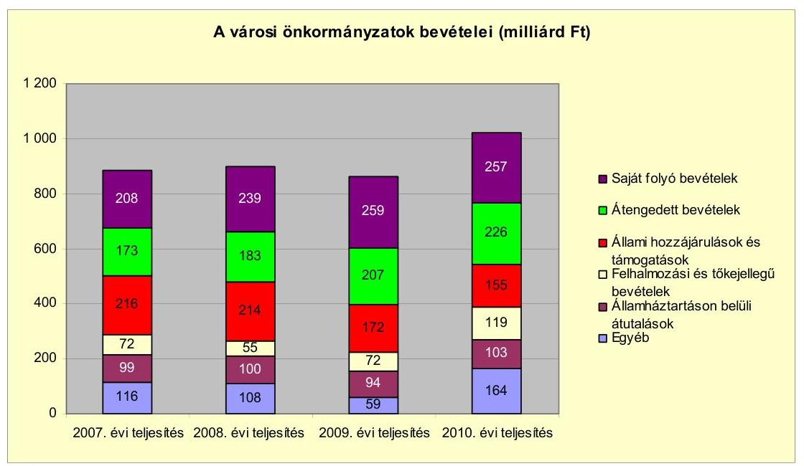

Az önkormányzati alrendszer pénzügyi helyzetértékelése során új elemzési módszereket alkalmazott az ellenőrzés. A költségvetési beszámoló adatok elemzése helyett az önkormányzat pénzügyi helyzetét a CLF módszerrel értékeltük, amelynek lényegét és számításának módszerét a jelentés 2. pontjában, és a jelentés 2 . számú mellékletében ismertetjük részletesen.

Az új módszereken alapuló helyzetértékelés fontosságát az adja, hogy a helyi önkormányzatok bruttó adósságállománya ${ }^{2}$ a 2010. évi költségvetési beszámolók alapján 1248 milliárd Ft-ot tett ki. Ezen belül a 304 város adóssága 383 milliárd Ft volt, amely az önkormányzati alrendszer teljes adósságállományának $30,7 \%$-át jelentette ${ }^{3}$.

A mérlegben kimutatott bruttó adósságállomány mellett az önkormányzatok számára az eszközállomány műszaki állapotának megőrzése is előbb-utóbb pénzügyi kötelezettséget jelent. Az elhasználódott eszközök pótlására forrást biztosító amortizációs (felújítási) alap képzésének ${ }^{4}$ elmaradása maga után vonhatja a feladatellátást kiszolgáló tárgyi eszközök állagának erőteljes romlá-

[^0]
[^0]:    ${ }^{2}$ Az önkormányzati mérlegbeszámolókból számított bruttó adósságállomány 2010. év végi összege magában foglalja a fejlesztési és a múködési célú kötvénykibocsátások, a beruházási és fejlesztési hitelek, a múködési célú hosszú lejáratú hitelek, a rövid lejáratú hitelek, váltótartozások miatti kötelezettségek teljes (2011-ben, illetve az azt követő években esedékes) állományát. Az önkormányzatok 2007. év végi mérleg szerinti adósságállománya 692 milliárd Ft volt.
    ${ }^{3}$ A fővárosi és a kerületi önkormányzatok adósságának figyelmen kívül hagyásával számított 977 milliárd Ft összegű bruttó adósságállományból a városok 39,2\%-kal részesedtek.
    ${ }^{4}$ Erre a jelenlegi szabályozási környezetben nem kötelezi előírás az önkormányzatokat.

---

sát. Emellett a 2007-2013-as időszakra meghirdetett, vissza nem térítendő EU-s fejlesztési forrásokhoz való hozzájutás lehetősége felerősítette az önkormányzati alrendszer fejlesztési igényeit, amelyek a felhalmozási költségvetési hiány folyamatos emelkedésén túl - az előírt jövőbeni fenntartási kötelezettség miatt tovább terhelhetik az önkormányzatok költségvetését ${ }^{5}$.

Az ÁSZ a 2011. évi ellenőrzési tervében 43. számú, az Önkormányzatok gazdálkodási rendszerének ellenőrzése részeként áttekinti, és elemzi az önkormányzatok pénzügyi helyzetét. A gazdálkodás szabályszerűségét az ÁSZ az előző évek során ebben az önkormányzati körben is ellenőrizte. Jelen vizsgálatunk a tett javaslataink pénzügyi helyzetet érintő pontjainak hasznosítására utóellenőrzés jelleggel tér ki.

Az ellenőrzés megállapításait az Önkormányzat által kitöltött - teljességi nyilatkozattal megerősített - 27 tanúsítványon szolgáltatott adatokra alapoztuk. Ellenőrzési bizonyítékként használtuk fel továbbá:

- a képviselő-testületi és bizottsági előterjesztéseket, a döntés-előkészítés során készített dokumentumokat;
- a kötelezettségvállalások dokumentumait;
- a pénzügyi-számviteli nyilvántartásokat;
- az éves költségvetési beszámolókat;
- a költségvetési és zárszámadási rendeleteket.

Az ellenőrzés a 2007. január 1. - 2011. június 30. közötti időszakot öleli fel. A pénzintézeti kötelezettségek állományának vizsgálatakor az ellenőrzött időszak 2006. december 31. - 2011. június 30. közötti időszakra terjedt ki.

Az ellenőrzés során vizsgáltunk minden olyan körülményt és adatot, amely a program végrehajtásához kapcsolódott és a pénzügyi helyzet alakulására hatást gyakorló releváns tények és folyamatok feltárásához szükségessé vált.

# Az ellenőrzés célja annak értékelése volt, hogy: 

- a vizsgált időszakban a kötelező- és önként vállalt feladatok ellátását biztosító szervezeti keretekben, a feladatellátás módjában bekövetkezett változások milyen hatást gyakoroltak az Önkormányzat pénzügyi helyzetének alakulására;

[^0]
[^0]:    ${ }^{5}$ Az Állami Számvevőszék 2011 júniusában közzétett 1108. számú, a helyi önkormányzatok fejlesztési célú támogatási rendszerének ellenőrzéséről szóló jelentésében feltárta a fejlesztési folyamatok problémáit. A helyi önkormányzatok elsősorban azokat a fejlesztéseket valósították meg, amelyekhez támogatást lehetett igényelni. A fejlesztési célok közül a magasabb támogatási intenzitású pályázatokat részesítették előnyben. A fejlesztéssel megvalósuló létesítmények jövőbeli üzemeltetésének várható ráfordításait az önkormányzatok $71,9 \%$-a nem mérte fel.

---

- az Önkormányzat pénzügyi - ezen belül múködési és felhalmozási - egyensúlya mely tényezők hatására miként változott, és az Önkormányzat milyen intézkedéseket tett a pénzügyi egyensúly javítása érdekében;
- a költségvetési kiadások finanszírozása érdekében vállalt pénzintézeti kötelezettségek hogyan alakultak, továbbá milyen kötelezettségek fennállása befolyásolja az Önkormányzat jövőbeli pénzügyi helyzetét;
- hasznosultak-e a gazdálkodási rendszer korábbi ellenőrzése során a pénzügyi egyensúly javítására az ÁSZ által tett szabályszerűségi és célszerűségi javaslatok.

Az ellenőrzés típusa: szabályszerűségi vizsgálat.
A vizsgálat jogszabályi alapját az Állami Számvevőszékről szóló 2011. évi LXVI. törvény 1. § (3), 5. § (2)-(6) bekezdései, továbbá az Áht ${ }_{1}$. 120/A. § (1) bekezdése ${ }^{6}$ előírásai képezik.

Kaba város földrajzi elhelyezkedését tekintve az Alföldön, Hajdú-Bihar megyében, a Hajdúság déli részén, a 4-es számú főút mellett található. Távolsága a megyeszékhely Debrecentől 32 km . Közúton megközelíthető szomszédos települései: Hajdúszoboszló (ÉK), Nádudvar (ÉNy), Tetétlen (D) és Püspökladány (DNy). A Budapest-Záhony vasútvonal közvetlenül áthalad a településen.

Kaba 1990-ben nagyközség lett, majd 2003. július 1-jei hatállyal várossá nyilvánították. Lakosainak száma 2011. január 1-jén 6218 fő volt.

Az Önkormányzat Képviselő-testülete tagjainak száma 2010. december 31-én 8 fő volt. Az Önkormányzat mellett egy (cigány) kisebbségi önkormányzat múködött. A polgármester a 2006. évi önkormányzati képviselő és polgármester választás óta tölti be tisztségét, a jegyző személye a 2005. év óta változatlan. A Polgármesteri hivatalban dolgozó köztisztviselők száma 2010. december 31-én 23 fő volt, míg a költségvetési intézményekben foglalkoztatott közalkalmazottak száma 218 fő volt.

Az Önkormányzat 2010. december 31-én a könyvviteli mérleg szerint 2223,9 millió Ft értékű vagyonnal rendelkezett. Az Önkormányzat 2010. évi költségvetési beszámolója szerint - a finanszírozási műveletek és a pénzmaradvány igénybevétele nélkül - 1860,7 millió Ft költségvetési bevételt és 1924,5 millió Ft költségvetési kiadást teljesített, melyekből a felhalmozási célú bevétel 356,5 millió Ft, a felhalmozási célú kiadás 465,3 millió Ft volt.

[^0]
[^0]:    ${ }^{6}$ 2012. január 1-jétől Áht ${ }_{2}$ 61. § (2) bekezdése szabályozza.

---

# I. ÖSSZEGZŐ MEGÁLLAPÍTÁSOK, KÖVETKEZTETÉSEK, JAVASLATOK 

Az Önkormányzat - adatszolgáltatása szerint - a 2010. évi múködési költségvetési kiadásaiból ( 1368,6 millió Ft) 1303,7 millió Ft-ot ( $95,3 \%$ ) a kötelező feladatok, 64,9 millió Ft-ot ( $4,7 \%$ ) az önként vállalt feladatok ellátására fordított. Az önként vállalt feladatok az általános iskolai oktatáshoz (alapfokú múvészetoktatás), az egészségügyi ellátáshoz (fizioterápiás szakrendelés), a kultúrához és a sporthoz (kábel TV, Kabai újság, él- és tömegsport támogatása), a közbiztonság és a tüzvédelem javításához (polgárőrség, önkéntes tüzoltó egyesület támogatása) állami és nemzeti ünnepek méltó megrendezéséhez kapcsolódtak.

Az Önkormányzat feladatellátásának szervezeti struktúráját a következő ábra szemlélteti:
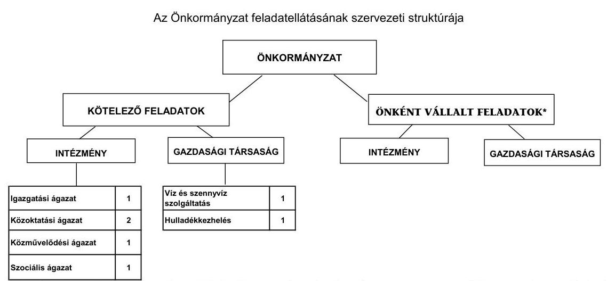
*Az Önkormányzat önként vállalt feladataira intézmény nem szerveződött, azokat a Polgármesteri hivatal látja el.

Az Önkormányzat feladatait 2011. június 30 -án (a Polgármesteri hivatallal együtt) öt költségvetési szervvel és kettő gazdasági társaság keretében látta el. A gazdasági társaságok közül az egyikben - a Városgazdálkodási Kft.-ben - kizárólagos tulajdonnal rendelkezett az Önkormányzat, míg a Hulladékgazdálkodási Kft. közszolgáltatási szerződés keretében végzett feladatot az Önkormányzatnak. Az intézményszervezeti átalakítások és intézményi összevonások, valamint a mikro-térségi intézményi társulások létrejöttének következtében a feladatellátás telephelyeinek száma a 2007. évi 17 -ről a 2010. év végére 21 -re növekedett. A Városgazdálkodási Kft. a közterület fenntartásban (parkgondozás, útkarbantartás), a belvíz elleni védekezésben, a víz és csatornaszolgáltatásban, az önkormányzati tulajdonú ingatlanok üzemeltetésében, karbantartásában kapott szerepet az Önkormányzat feladatellátásában. A gazdasági társaság a múködéséhez - az ellenőrzött időszakban - összesen 135,6 millió Ft rendszeres múködési célú átadott pénzeszközben részesült az Önkormányzattól. A Hulladékgazdálkodási Kft. a 2005. évben kötött közszolgáltatási szerződésen alapulóan lakossági hulladékkezelési és szállítási feladatot lát el a településen.

---

A kötelező- és önként vállalt feladatok ellátása és annak szervezeti keretei, valamint azok változásai az Önkormányzat kiegyensúlyozott pénzügyi helyzetén nem változtattak. Az Önkormányzatnak sikerült úgy megszerveznie mind a kötelező, mind pedig az önként vállalt feladatait, hogy a kapott költségvetési támogatások az önkormányzati, illetve az intézményfenntartó társulások által nyújtott támogatásokkal, valamint a realizált intézményi saját bevételekkel fedezetet nyújtottak azok kiadásaira.

Az egyes közszolgáltatások feladatellátásában résztvevő intézmények működési kiadásainak finanszírozási összetételét a következő ábra szemlélteti:
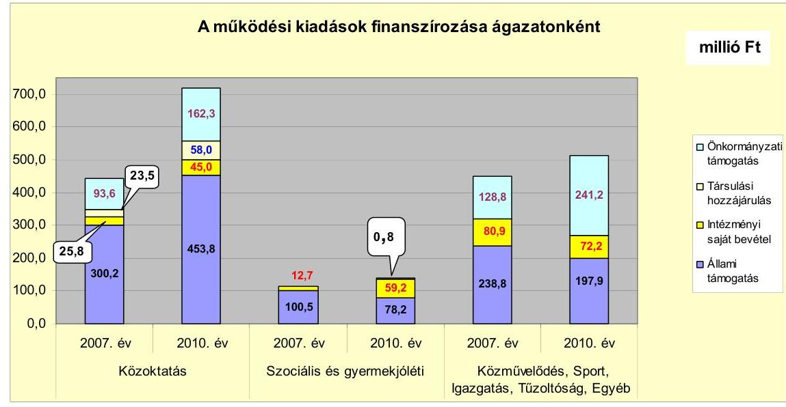

A közoktatás múködési kiadásai a 2007. évi 443,1 millió Ft-ról a 2010. évben 719,2 millió Ft-ra 276,1 millió Ft-tal, (62,3\%-kal) nőttek, a 2007-ben létrehozott óvodai és iskolai mikro-térségi társulás megnövekedett ellátotti/tanuló és foglalkoztatotti létszámnövekedéssel összefüggésben. A szociális ágazat kiadásai a 2007. évi 113,2 millió Ft-ról 138,3 millió Ft-ra, (22,2\%-kal) növekedtek a 2010. évre. A növekedés oka a szociális területen létrehozott társulási tagok körének bővülése volt, melynek nyomán a foglalkoztatotti létszám a 2007. évről a 2010. évre kettő fővel, az ellátotti létszám pedig közel a duplájára (21 399 főről 41263 főre) emelkedett. A közművelődésre, igazgatásra és a Polgármesteri hivatal egyéb feladataira a 2007. évi 448,5 millió Ft-os összeget $14 \%$-kal ( 62,8 millió Ft-tal) megnövelve, 511,3 millió Ft-ot költött az Önkormányzat. Ennek mintegy egyharmadát az igazgatási feladatok, 2-7\%-át (9,3-29,5 millió Ft-ot) a közművelődési feladatok és közel kétharmadát a Polgármesteri hivatal egyéb feladatai tették ki. Sportlétesítményt nem múködtetett és hivatásos tűzoltósággal nem rendelkezett az Önkormányzat. A kiadások finanszírozásánál valamennyi ágazatban az állami szerepvállalás háttérbe szorulása volt megfigyelhető az önkormányzati finanszírozási részarányok megnövekedése mellett.

Az Önkormányzat folyó költségvetési egyenlege (működési jövedelem) a 2007-2010. évek között minden évben múködési forrástöbbletet mutatott, ezért a múködésnek forrás oldalról kockázatai nem voltak, mert hitel felvételére nem volt szükség a múködés biztosításához. Az összes forrástöbblet 679,1 millió Ft volt.

---

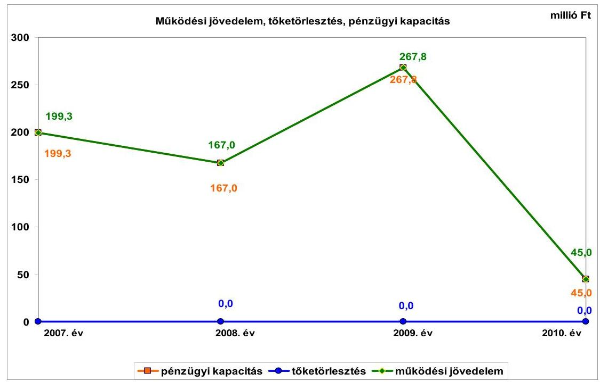

A 2008. évben 16,2\%-kal (167,0 millió Ft-ra), 32,3 millió Ft-tal csökkent a múködési jövedelem, a 2007. évi 199,3 millió Ft-hoz viszonyítva, mert a kiadások növekedése meghaladta a bevételek növekedését. A helyi adók 101,9 millió Ft-tal, a támogatás értékű bevételek - a mikro-térségi óvodai és általános iskolai társulásban résztvevő két önkormányzat átadott támogatásai miatt - 92,6 millió Ft-tal, míg a költségvetési támogatások és az átengedett szja együttesen 78,9 millió Ft-tal emelkedtek. A kiadások 308,8 millió Ft-tal növekedtek, azok legnagyobb tételeit szintén mikro-térségi óvodai és általános iskolai társulás létrejötte okozta. A 2009. évben 60,3\%-kal, 100,8 millió Ft-tal nőtt a müködési jövedelem, melynek bevételi oldalán 245,0 millió Ft-os, míg a kiadási oldalán 144,3 millió Ft-os növekedés állt. A megnövekedett bevételek a költségvetési támogatásoknál és az átengedett szja-nál, az áfa visszatérüléseknél (beruházások miatt), és a hozambevételeknél jelentkeztek legnagyobb mértékben. A kiadási oldal növekedését a két oktatási mikro-térségi társulásban, valamint a szociális mikro-térségi társulásban a személyi jövedelmek és járulékai, valamint a dologi kiadások növekedései okozták. A személyi jövedelmek és járulékainak növekedésére egyrészt az oktatási társulásoknál a pedagógusok béremelkedései miatt, másrészt a szociális ellátás terén a bővülő mikro-térségi társulásnál közel 60 millió Ft személyi juttatás és járulékai kifizetése miatt került sor. A dologi kiadások növekedése a társulások létrejöttével és bővülésével volt összefüggésben, mivel új épületek fenntartásáról kellett gondoskodni. A költségvetési támogatások növekedése a mikro-térségi társulások tevékenységének bővülésére vezethetőek vissza, mely egyrészt a tevékenységi kör bővüléséből, másrészt a társulásban résztvevők számának növekedéséből eredt, mivel időközben Tetétlen község is csatlakozott a társulásokhoz. A 2010. évben 83,2\%-kal (222,8 millió Ft-tal) csökkent a múködési jövedelem, amely a 2009. évhez viszonyított 266,9 millió Ft-os bevételkiesés és a 44,1 millió Ft-os kiadáscsökkenés eredménye volt. A bevételkiesés legnagyobb tételeit, (64\%-át) a költségvetési támogatások és a helyben maradó szja csökkenése jelentette. A helyi adóbevétel csökkenését a Cukorgyár iparűzési adóelő-

---

leg túlfizetései egy részének visszafizetése okozta. A helyi adóbevételek a 2008. évi 284,7 millió Ft-ról a 2009. évre 30,1 millió Ft-tal (10,6\%-kal), 254,6 millió Ft-ra, majd a 2009. évi 254,6 millió Ft-ról a 2010. évre 70,6 millió Ft-tal ( $27,7 \%$-kal), 184,0 millió Ft-ra csökkentek. Mivel a helyi adóbevételek mintegy $90 \%$-a két nagy adózótól (Cukorgyár ${ }^{7}$ és AGROFERM Zrt.) származott, ez az Önkormányzat pénzügyi helyzetére kockázati tényezőt jelent. A kiadás csökkenésekből 20,0 millió Ft-ot személyi juttatások és járulékai okoztak, ami az összesen hat fős létszámcsökkentés következménye volt. A szociális ágazatban és a Polgármesteri hivatalban két-két fős, a közművelődés terén három fős volt a csökkenés, míg egy fővel növekedett az általános iskolában foglalkoztatottak létszáma. A dologi kiadások és azok áfája 46,7 millió Ft-tal csökkent, mely a kiadások erőteljes visszafogására utal.

Az Önkormányzatnak 2007-2010. években hitelfelvétele és hiteltörlesztése nem volt, így a működési jövedelem és a pénzügyi kapacitás (a nettó működési jövedelem) azonos összegű.

A felhalmozási költségvetés mind a négy évben deficites volt, melyet azonban a 2007-2009. években az adott év nettó múködési jövedelme, a 2010. évben pedig a finanszírozási műveletek pozitív egyenlege ellensúlyozott. A 2010. évi felhalmozási költségvetésének kiadási többletére - amely 108,8 millió Ft volt - a nettó múködési jövedelem és a pénzügyi műveletek többlete nyújtott fedezetet.

Az Önkormányzat folyó bevételei a 2010. évben 1504,2 millió Ft-os összegükkel 20,4\%-kal (254,7 millió Ft-tal) haladták meg a 2007. évi folyó bevételek 1249,5 millió Ft-os összegét. Összetételét tekintve a folyó bevételek legnagyobb hányadát (35,0-56,6\%) a költségvetési támogatások jelentették minden vizsgált évben. Az Önkormányzat a 2007-2010. években egy helyi adónemet, a helyi iparúzési adót alkalmazott. Az iparúzési adó és a hozzá kapcsolódó pótlékok az Önkormányzat folyó bevételeiből 12,2-18,7\%-os részarányt képviseltek. Az Önkormányzat felhalmozási bevételei a 2007-2008. években 44,7 illetve 16,1 millió Ft-os összegeikkel nem voltak jelentősek, a 2009. évben 403,4\%-kal (180,5 millió Ft-tal), a 2010. évben 697,5\%kal (311,8 millió Ft-tal) haladták meg a 2007. évi összegüket. A 2009. évtől az államháztartáson belülről kapott támogatások képezték a legnagyobb részarányt, melyek 94,8-97,6\% között mozogtak. Ezek a bevételek az EU-s pályázatok beruházásaira lehívott támogatási összegeket jelentették.

A folyó kiadások a 2007. évtől a 2009. évig növekedtek, majd a 2010. évben csökkenésük következett be. A növekedés a 2008. évben volt a legjelentősebb, amikor 308,9 millió Ft-tal, 29,4\%-kal emelkedtek, döntő részben a közoktatási ágazat tevékenységének mikro-társulásba szervezése, az ellátotti-tanulói létszámnak a 2007. évi 970 főről a 2010. évi 1381 főre történő, 42,4\%-os, a foglalkoztatotti létszámnak a 2007. évi 125 fơről a 2010. évi 163 főre történő 30,4\%-os növekedése miatt. A 2009. évben a növekedési ütem 10,6\%-osra lassult, majd a 2010. évben a folyó kiadások 2,9\%-os csökkenése következett be,

[^0]
[^0]:    ${ }^{7}$ A 2010. év végére a Cukorgyár minden tevékenységét megszűntette, így adóbevétel a 2011. évben tőle már nem származott.

---

az Önkormányzat takarékossági törekvései megvalósulása révén. A felhalmozási kiadások - a 2009-2010. években EU-s támogatásokkal megvalósuló beruházások miatt - közel megduplázódtak, így az összes kiadáson belül részarányuk megnövekedett, s ez idézte elő a folyó kiadások részarányának csökkenését, annak ellenére, hogy nominálértékben jelentős - a 2010. évi adatot (1459,2 millió Ft) a 2007. év adatához (1050,2 millió Ft) viszonyítva 409 millió Ft-os, $38,9 \%$-os folyó kiadásnövekedés következett be.

Az Önkormányzat által a 2007-2010. években megvalósított, 2010. december 31-ig befejezett fejlesztéseinek teljes költsége 1000,7 millió Ft volt. A fejlesztési kiadások forrásaiból 473,1 millió Ft-ot ( $47,3 \%$ ) jelentett az EU-s támogatás, 353,1 millió Ft-ot ( $35,3 \%$ ) a saját bevétel, míg 174,5 millió Ft-ot ( $17,4 \%$ ) a hazai támogatás. A fejlesztési feladatok megvalósításához hitelt vagy kötvényből származó bevételt nem használtak fel. A 2010. december 31-én folyamatban lévő fejlesztési feladatok végrehajtására a 2007-2010. években 138,0 millió Ft-ot kiadást teljesítettek, amelynek forrása 115,6 millió Ft ( $83,8 \%$ ) az EU-s támogatás, míg 22,4 millió Ft ( $16,2 \%$ ) a saját bevétel volt. Az EU-s támogatásból megvalósult fejlesztések finanszírozása likviditási gondot nem okozott.
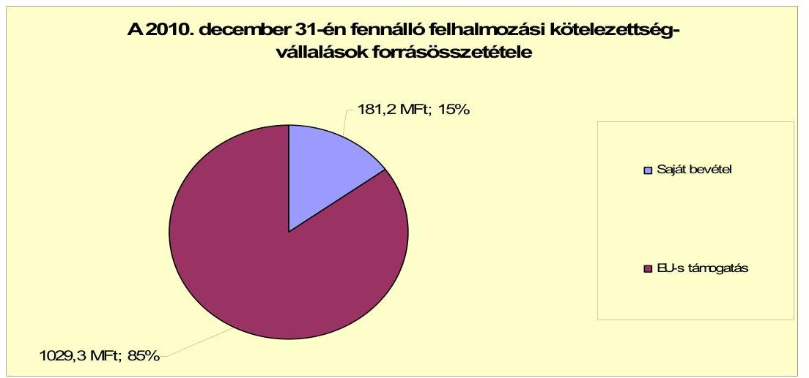

Az Önkormányzat a folyamatban lévő fejlesztési feladataihoz kapcsolódó, a 2010. évet követő kötelezettségvállalásainak összege 1210,5 millió Ft. Ennek forrásaként az Önkormányzat 1029,3 millió Ft EU-s forrást (85,0\%), míg 181,2 millió Ft saját bevételt ( $15,0 \%$ ) tervez felhasználni.

Az Önkormányzatnak mérleg szerinti pénzintézeti kötelezettsége a 20072011. év I. félévéig terjedő időszakban nem volt. A 2007-2011. év I. féléve között átmenetileg szabad pénzeszközeiből 93,4 millió Ft kamatbevételt realizált. Az Önkormányzat számlavezető bankot a vizsgált időszakban nem váltott.

Az Önkormányzat múködésének pénzügyi egyensúlyát a vizsgált időszakban folyószámla- és munkabér megelőlegezési hitel nélkül biztosította.

Az Önkormányzat 2011. év I. félév végi szállítói tartozása 18,1 millió Ft, melyből lejárt tartozása nem volt. Az Önkormányzat gazdasági társaság részére készfizető kezességet nem vállalt, kölcsönt nem nyújtott.

---

Az Önkormányzat szállítói kötelezettségeinek ${ }^{8}$ a 2010. december 31-ei állománya 17,1 millió Ft, a 2011. június 30 -ai állománya 18,1 millió Ft volt. Az Önkormányzat szállítói tartozását a 2010. év végén 10,0 millió Ft közüzemi tartozás, 5,9 millió Ft gyermekélelmezési és 1,2 millió Ft szociális étkeztetési beszállítók követelése okozta. A 2011. I. félévében fennálló szállítói tartozásból 2,4 millió $\mathrm{Ft}^{9}$ beruházási szállítók követelése volt, míg 12,6 millió Ft volt a közüzemi, 2,0 millió Ft a gyermekélelmezési és 1,1 millió Ft a szociális étkeztetési beszállítók felé fennálló tartozás.

A 2007-2010. évek között pénzügyileg teljesített felhalmozási kiadásokból eszközpótlásra (rekonstrukcióra, felújításra) 384,5 millió Ft-ot fordított az Önkormányzat. A 2007-2010. években elszámolt 259,6 millió Ft amortizációt, az eszközök avulását 48,1\%-kal haladta meg az eszközpótlásra fordított összeg.

Az Önkormányzat az ellenőrzött időszakban kiadási megtakarítást eredményező és bevételt növelő intézkedéseket tett. A 2007-2011. év I. féléve között - az Önkormányzat adatszolgáltatása szerint - tett intézkedések hatására 7,2 millió Ft bevételi többletet, továbbá 206,8 millió Ft kiadási megtakarítást mutattak ki, ezáltal az Önkormányzat pénzügyi egyensúlyi helyzetét javították. A kiadási megtakarítások 100,0\%-a az elrendelt álláshely csökkentések eredménye. Az álláshely-csökkentő intézkedések 2007-2011. év I. féléve között önkormányzati szinten összesen 43 álláshely (ebből nem volt üres álláshely) megszüntetését jelentették. Egyes területeken azonban feladatbővülések (társulások okozta növekedés) is voltak, amelyek 110 fős létszámnövekedéssel jártak. A közoktatást érintő 94 fős növekedésből 91 főt, míg a szociális terület 11 fős növekedésből kettő főt jelentett a társulások okozta növekedés. Mindezek következtében az időszak álláshelyeinek száma összességében 67 fővel nőtt. A bevételnövelő intézkedések közül 3,6 millió Ft-ot (50\%) jelentett az adóhátralékok behatása, míg szintén 3,6 millió Ft-ot (50\%) a kedvezmények, mentességek csökkentése.

Az utóellenőrzés a pénzügyi egyensúly javítására tett hat szabályszerűségi javaslat hasznosítására terjedt ki. A javaslatok mindegyikét az intézkedési terv szerinti határidőben megvalósították.

Az Önkormányzat pénzügyi egyensúlya rövid és középtávon biztosított. A pénzügyi egyensúly hosszú távú megőrzésére az Önkormányzatnak fel kell készülnie.

Az Önkormányzat múködési jövedelme a vizsgált időszakban változó mértékben, de folyamatosan pozitív volt.

Szállítói tartozásai és pénzintézetekkel szembeni kötelezettségei nincsenek.
A helyi adóbevétel meghatározó része a 2011. évtől egy adóalanytól származik, ezért a bevételi kitettsége miatt hosszú távon kockázat jelentkezhet.

[^0]
[^0]:    ${ }^{8}$ Az Önkormányzatnak a szállítói kötelezettségeken túl más kötelezettségei nem voltak.
    ${ }^{9}$ Ki nem fizetett beruházási számla volt a világításkorszerúsítési beruházásuk 1,1 millió Ft-os összege, valamint 1,3 millió forintért számítógépeket vásároltak.

---

Az önként vállalt feladataira fordított kiadások aránya a múködési jövedelemhez képest nem jelent kockázatot.

A folyamatban lévő fejlesztési projektekhez, a benyújtott pályázatokhoz szükséges saját erőhöz a források rendelkezésre állnak.

Gazdasági társaságok miatti kockázat nem áll fenn, mivel az Önkormányzat kizárólagos tulajdonában álló társaság pénzügyi egyensúlyi helyzete stabil.

Az Állami Számvevőszékről szóló 2011. évi LXVI. törvény 33. § (1) bekezdésében foglaltak értelmében a jelentésben foglalt megállapításokhoz kapcsolódó intézkedési tervet köteles az ellenőrzött szervezet vezetője összeállítani és azt a jelentés kézhezvételétől számított harminc napon belül az ÁSZ részére megküldeni. Amennyiben az intézkedési tervet határidőben nem küldi meg a szervezet, vagy az továbbra sem elfogadható, az ÁSZ elnöke a hivatkozott törvény 33. § (3) bekezdés a)-b) pontjaiban foglaltakat érvényesítheti.

# A 2011. június 30-i pénzügyi egyensúlyi helyzet alapján az ellenőrzés intézkedést igénylő megállapításai és javaslatai a következők: 

## a Polgármesternek

Az Önkormányzat pénzügyi egyensúlyi helyzete rövid és közép távon biztosított. A pénzügyi egyensúly hosszú távú megőrzésére bevételi kitettsége miatt azonban az Önkormányzatnak fel kell készülnie.

Javaslat:
Folyamatosan tájékoztassa a Képviselő-testületet az Önkormányzat pénzügyi egyensúlyi helyzetéről. Szükség esetén kezdeményezzen intézkedéseket a pénzügyi egyensúly hosszú távú fenntarthatósága érdekében.

---

# II. RÉSZLETES MEGÁLLAPÍTÁSOK 

## 1. Az ÖNKORMÁNYZAT KÖTELEZŐ ÉS ÖNKÉNT VÁLlALT FELADATAI, A FELADATELLÁTÁS SZERVEZETI KERETEI ÉS ANNAK VÁLTOZÁSAI

Kötelező feladatait az Önkormányzat az Ötv. és az ágazati törvények által meghatározottnak tekinti, az önként vállalt feladatok terjedelmét az éves költségvetési rendeletekben az adott évi költségvetés forrásainak ismeretében határozták meg, az önkormányzati feladatokról az $\mathrm{SzMSz}_{1,2}$-ben nem rendelkeztek.

Az Önkormányzat adatszolgáltatása szerint, a 2010. évi 1368,6 millió Ft működési célú költségvetési kiadásból 1303,7 millió Ft-ot ( $\mathbf{9 5 , 3 \% - o t}$ ) a kötelező feladatok ellátására fordítottak. Önként vállalt feladatokra 64,9 millió Ft-ot ( $\mathbf{4 , 7 \% - o t}$ ) költöttek az Önkormányzatnál. A 2010. évi múködési kiadás az előző évhez viszonyítva 5,4\%-os, 78,4 millió Ft-os csökkenést jelez, holott a 2008. évben 30,6\%-os, a 2009. évben 10,3\%-os növekedés volt tapasztalható, a megelőző évhez viszonyítva. A múködési kiadások a 2009. évig folyamatosan növekedtek, majd a 2010. évben - egy kivétellel, mely a Polgármesteri hivatalban ellátott igazgatási feladat - csökkentek. A kötelező, illetve önként vállalt feladatok esetében különbségként figyelhető meg, hogy a kiadások növekedésből csökkenésbe való átfordulása időben egy év eltéréssel következett be. Amíg az önként vállalt feladatokra fordított kiadások összességében és - egy kivétellel ${ }^{10}$ - ágazatonként is csökkentek már a 2009. évben, addig a kötelező feladatok kiadásainál csupán a 2010. évben kezdődött a kiadások csökkenése. A tendencia oka, hogy a szűkülő források miatt a kötelező feladatoknak volt prioritása az önként vállalt feladatokkal szemben, melyekre 2008-ban az előző évi összegnél 28 millió Ft-tal 50,7\%-kal többet, 2009-ben 13,6 millió Ft-tal, 16,3\%-kal kevesebbet fordítottak, mint a megelőző évben. Az önként vállalt feladatokra fordított összegek csökkenése a 2010. évben sem állt meg, a 2009. évhez viszonyítva 6,8\%-kal, 4,7 millió Ft-tal fordítottak kevesebbet. A 2011. év terv adatai alapján az önként vállalt feladatokra 61,2 millió Ft (4,6\%) jut a múködési költségvetésből, mely a 2010. évi tényleges adatnál 3,7 millió Ft-tal (5,7\%-kal) kevesebb. A kiadások jelzett tendenciái a feladatok végrehajtásához rendelkezésre álló, egyre inkább szűkülő források következményei voltak.

[^0]
[^0]:    ${ }^{10}$ az általános iskolai alapfokú művészetoktatás

---

A 2010. évi múködési kiadások feladatonkénti megoszlását és azok finanszírozási arányait a következő táblázat mutatja be:

| Ellátott feladat | Múködési kiadás összesen (millió Ft) | Kötelezö feladatok kiadásainak részaránya \% | Múködési bevétel összesen (millió Ft) | Állami támogatás részaránya \% | Intézményi saját bevétel részaránya \% | Önkormányzati támogatás részaránya \% | Társulástól átvett támogatás részaránya \% |
| :--: | :--: | :--: | :--: | :--: | :--: | :--: | :--: |
| Óvodák | 186,2 | 100 | 186,2 | 76,9 | 3,1 | 16,1 | 3,9 |
| Általános iskolák | 533 | 93,7 | 533 | 58,6 | 7,3 | 24,9 | 9,5 |
| Szociális intézmények | 138,2 | 100 | 138,2 | 56,6 | 42,8 | 0 | 0,6 |
| Közmúvelődési intézmények | 9,3 | 84 | 9,3 | 5,6 | 15,8 | 78,6 | 0 |
| Polgármesteri hivatal igazgatási kiadásai | 172 | 100 | 172 | 16,1 | 19,4 | 64,5 | 0 |
| Polgármesteri hivatalban ellátott egyéb feladatok múködési kiadásai | 329,9 | 91 | 329,9 | 51,4 | 11,4 | 37,3 | 0 |
| Múködési kiadások összesen | 1368,6 | 95,3 | 1368,6 | 56,9 | 11,9 | 27,2 | 4 |

A közoktatás múködési kiadásai a 2007. évi 443,1 millió Ft-os összegről a 2010. évben 62,3\%-kal, 276,1 millió Ft-tal 719,2 millió Ft-ra növekedtek, ami az előző három év átlagához ( 609,3 millió Ft) viszonyítva 18,0\%-os, 109,9 millió Ft-os növekedést jelentett. A növekedés oka az ellátotti, illetőleg tanulói létszámnövekedésből következő foglalkoztatotti létszámnövekedés volt. Az ellátotti, illetőleg a foglalkoztatotti létszámok növekedését a 2007 augusztusában létrehozott mikro-térségi óvodai és iskolai társulás okozta, mely Kaba város gesztorságával ${ }^{11}$ jött létre, és amely társulás miatt az oktatási telephelyek száma nőtt, mely telephelyszám növekedés a közüzemi díjak emelkedése révén a dologi kiadások növekedésére hatott.

A szociális ágazat múködési kiadásai a 2007. évi 113,2 millió Ft-os öszszegről a 2010. évben a 138,3 millió Ft-ra, 22,2\%-kal, 25,1 millió Ft-tal nőttek, ami az előző három év átlagához ( 129,1 millió Ft) viszonyítva 7,1\%-os, 9,2 millió Ft-os növekedést jelentett. A kismértékű növekedést a szociális ágazat bővülése okozta, mivel a szociális mikro-társuláshoz új település társult az évek során. Az ellátási terület bővülése - az Önkormányzat által visszafogott mértékű - foglalkoztatotti létszámnövekedést (kétfős) idézett elő, az ellátotti létszám pedig közel a duplájára (21 399 fơről 41263 fơre) emelkedett, ami az ágazat kiadásainak növekedése irányába hatott.

A közmúvelődési ágazat múködési kiadásai a 2007. évi 29,5 millió Ft-os összegről a 2010. évben 68,5\%-kal, 20,2 millió Ft-tal, 9,3 millió Ft-ra csökkentek, ami az előző három év átlagához ( 35,4 millió Ft) viszonyítva 26,2 millió Ftos, $73,7 \%$-os csökkenést jelentett. A kiadások - a 2008. év kivételével - folyama-

[^0]
[^0]:    ${ }^{11}$ Az óvodai nevelés, valamint az általános iskolai oktatás feladataira 2007. augusztus 1-től Báránd és Sáp községekkel intézményi társulási szerződést kötöttek. Kaba Város Önkormányzata jóváhagyta a társulási szerződéseket. A társulási szerződések 2.3. pontjai értelmében „az intézmény közös fenntartásával kapcsolatos feladat és hatásköröket Kaba Város képviselőtestülete gyakorolja." A szociális ellátásra 2005. október 1-én kötöttek intézmény-társulási megállapodást, ugyancsak Báránd és Sáp községekkel, melyhez időközben Tetétlen Község is csatlakozott.

---

tosan csökkentek, egyrészt a létszám csökkentése, másrészt pedig az önként vállalt feladatok (különböző rendezvények, műsoros estek, koncertek) folyamatos háttérbe szorítása miatt. 2010. január 1-jével megtörtént a Művelődési háznak az ÁMK-ba történő beolvasztása, mely miatt az ágazat kiadásai drasztikusan csökkentek. Ettől az időponttól a közművelődési ágazatban a Városi könyvtár működtetése szerepelt csupán, melynek létszáma 2,3 fő volt. Háromfős létszám csökkenés jelentett a Művelődési Ház ÁMK-ba történő átszervezése, mely a személyi juttatások terén 11,5 millió Ft-os csökkenést okozott, míg a működési kiadások további 9,7 millió Ft-os csökkenése a dologi kiadások terén következett be.

A Polgármesteri hivatalban - kötelező feladatként - ellátott igazgatási feladatok kiadásai a 2007-2010. években folyamatosan növekedtek. A 2007. évi 112,3 millió Ft-os kiadás a 2010. évre 59,7 millió Ft-tal, 53,2\%-kal, 172,0 millió Ft-ra növekedett, mely az előző három év átlagához (130,3 millió Ft) viszonyítva 42,0 millió Ft-os, 32,0\%-os növekedést jelentett.

A Polgármesteri hivatalban kimutatott egyéb feladatok közül a 2007. évi 89,4\%-ról a 2010. évre 91,0\%-ra bővült a kötelező feladatok, míg 10,6\%-ról 9,0\%-ra szűkült az önként vállalt feladatok részaránya. A Polgármesteri hivatalban ellátott kötelező feladatok ${ }^{12}$ a 2010. évben 300,1 millió Ft-ot képviseltek, amely az összes múködési kiadás 21,9\%-a volt. A 2007. évben 27,3\%ot 274,0 millió Ft-ot, a 2008. évben 24,7\%-ot 324,3 millió Ft-ot, a 2009. évben pedig $24,5 \%$-ot, 354,9 millió Ft-ot fordítottak ezekre a feladatokra, az összes múködési kiadásból. Önként vállalt feladatokra a 2007. évben 3,2\%-ot, a 2008. évben 2,6\%-ot és a 2009. valamint a 2010. évben 2,2\%-ot fordítottak az összes múködési kiadásból. A Polgármesteri hivatalban jelentkező önként vállalt feladatok kiadásai jellemzően civil szervezetek ${ }^{13}$ részére történő pénzeszköz átadásokat jelentettek, melyek évről évre csökkenő mértékűek voltak.

Az Önkormányzat kötelező és önként vállalt feladatait 2010. december 31-én öt költségvetési szervvel (a Polgármesteri hivatallal együtt) és kettő gazdasági társasággal látta el. A költségvetési szervek közül kettő önállóan múködő és gazdálkodó, három önállóan működő költségvetési szerv, alapító okirataik szerint összesen 21 telephelyen múködtek. 2007. január 1-jén kettő önállóan gazdálkodó és négy részben önállóan gazdálkodó intézménye volt, melyek 17 telephelyen múködtek. Két oktatási intézmény (az óvoda és az általános iskola) intézményfenntartó társulási formában múködött. Az Önkormányzat számára meghatározott kötelező feladatok ellátását részben a kizárólagos tulajdonában álló gazdasági társaságával, részben közszolgáltatási szerződés keretében biztosítja az Önkormányzat. Kötelező feladatot látott el az Önkormányzat megbízásából a településen a Hulladékgazdálkodási Kft., mely a lakossági hulladékszállítást biztosítja, továbbá egy magánvállalkozó, akivel a temető fenntartására kegyeleti közszolgáltatási szerződést kötöttek.

[^0]
[^0]:    ${ }^{12}$ Többek között a védőnői ellátás, a fogorvosi ellátás, a közterület fenntartás és parkgondozás, a temetőfenntartás, a lakossági hulladékkezelés, az ivóvízellátás és csatornaszolgáltatás biztosítása stb.
    ${ }^{13}$ Spotegyesületek, kulturális rendezvények, Önkéntes Tűzoltó Egyesület stb.

---

Az igazgatási feladatokat a Polgármesteri hivatal látta el. Közoktatási feladatokat két intézmény 14 telephelyen végzett, ebből az óvoda öt telephellyel, az általános iskola kilenc telephellyel múködött. Egészségügyi intézmény nem múködött, mivel a fogorvosi praxist, az iskolaorvosi és a védőnői ellátást szakfeladaton múködtette az Önkormányzat. Egy szociális intézmény öt telephellyel, intézményfenntartó társulási formában múködött, mivel a Támasz Családsegítő és Gyermekjóléti Szolgálat Intézményfenntartó Társulást 2005. október 1-jétől alapította meg Kaba város és Báránd község ${ }^{14}$, egy kulturális intézmény egy telephellyel múködött az önkormányzati feladatellátásban.

Az önkormányzati intézmények száma a 2007. évről a 2010. évre hatról ötre csökkent, mivel a Művelődési Központ és az Általános Iskola egy intézménybe - az ÁMK-ba - olvadt be. Az intézmények telephelyeinek száma 17-ről 21-re növekedett. A telephelyek számának növekedése a társulások létrehozása miatt következett be, mivel a társulásban résztvevő települések tagintézményei megnövelték a telephelyek számát.

Az államháztartáson kívüli szervezetek (egyházak, egyéb civil szervezetek) részére a vizsgált időszakban feladatátadás nem történt, de önként vállalt feladatai keretében az Önkormányzat támogatásban részesített civil szervezeteket. Minden évben támogatott civil szervezet volt pl. három városi sportegyesület, az ÖTE, a Kabai Újság.

Kötelező feladatot lát el továbbá a Vagyongazdálkodási Kft., az Önkormányzat egyetlen gazdasági társasága. A Kft. feladata a közterület fenntartás: parkgondozás, útkarbantartás, a belvíz elleni védekezési feladatok, víz és csatornaszolgáltatás, az önkormányzati tulajdonú ingatlanok üzemeltetése, karbantartása. Az ellenőrzött időszakban a Képviselő-testület a Vagyongazdálkodási Kft. végelszámolásáról, átszervezéséről nem döntött és csődeljárás alatt sem állt a társaság. A gazdasági társaság a múködéséhez - az ellenőrzött időszakban - összesen 135,6 millió Ft rendszeres múködési célú átadott pénzeszközben részesült az Önkormányzattól. A társaság pénzügyi helyzete a 2010. évi saját tőke/jegyzett tőke aránya $(11,8)$ alapján stabil. Stabilnak tekinthető a gazdasági társaság helyzete annak ellenére, hogy a 2010. évben 11,8 millió Ft veszteséget realizáltak, melyet azonban eredménytartalékukból rendezni tudtak, és 2011. év I. félévében már 8,9 millió Ft nyereségről adtak számot. Eredménytartalékuk 2011. I. félévének végén 23,3 millió Ft-ot tett ki, ami a jegyzett tőke közel nyolcszorosa.

Az Önkormányzat 2005. október 1-jétől Báránd községgel közösen létrehozta a Támasz Szociális Családsegítő és Gyermekjóléti Szolgálat Intézményfenntartó Társulást, amely finanszírozta a Támasz Szociális Alapszolgáltatási Központ múködését. A Támasz Szociális és Alapszolgáltatási Központ biztosította az Önkormányzat által ellátott szociális és gyermekjóléti feladatokat. Sáp község

[^0]
[^0]:    ${ }^{14}$ A társulási szerződések 8.5. pontjai értelmében „A Támasz Szociális Alapellátási Központ - mint közös fenntartású intézmény - költségvetése és zárszámadása Kaba Város éves költségvetési illetve zárszámadási rendeletébe épül be. A fenntartói jogokat Kaba Város képviselőtestülete gyakorolja."

---

2006. január 1-jétől, míg Tetétlen község 2008. szeptember 1-jétől csatlakozott az intézményfenntartó társuláshoz.

A Támasz Szociális és Alapszolgáltatási Központ működési területének kibővülése során intézményátvétel nem történt, mivel az ellátásba bekerült területeken feladatellátási kötelezettséggel rendelkező települések korábban polgármesteri hivatalaik keretében biztosították a feladatellátást.

Kaba, Báránd, Sáp települések önkormányzatai 2007. augusztus 1-jétől létrehozták Kaba, Báránd, Sáp települések Alapfokú Közoktatási Intézményi Társulását és Kaba, Báránd és Sáp Települések Óvodai Intézményi Társulását. Ennek eredményeként a három településen a közoktatási feladatokat a Sári Gusztáv Általános és alapfokú Művészeti Iskola biztosítja kabai székhellyel és két kabai telephellyel, továbbá egy bárándi és egy sápi telephellyel. A 3-6 éves korú gyermekek napközi otthonos rendszerú óvodáztatását a Kabai Napközi Otthonos Óvoda biztosítja kabai székhellyel és egy kabai telephellyel, továbbá két bárándi és egy sápi telephellyel. Mindkét intézményfenntartó társuláshoz 2008. augusztus 1-jétől csatlakozott Tetétlen Község Önkormányzata is.

Összességében megállapítható, hogy a vizsgált időszakban a Sári Gusztáv Általános és Alapfokú Múvészeti Iskolához három intézmény, míg a Kabai Napközi Otthonos Óvodához szintén három intézmény csatlakozott.

Az intézmények és a feladatok átvétele során a személyi juttatások és járulékainak, valamint a dologi kiadásoknak a növekménye 1554,4 millió Ft volt, ezzel szemben az állami támogatások, a saját bevételek, valamint a társult önkormányzatok támogatásai együttesen szintén ugyanekkora összeggel növekedtek. Az intézkedések az Önkormányzat pénzügyi egyensúlyára nem voltak hatással.

További intézményátvétel (társulástól, egyháztól, gazdasági társaságtól, valamint egyéb szervezettől) nem történt.

# 2. AZ ÖNKORMÁNYZAT PÉNZÜGYI EGYENSÚLYI HELYZETÉT BEFOLYÁSOLÓ TÉNYEZŐK 

A hagyományos költségvetési szerkezet helyett az önkormányzat pénzügyi helyzetét a CLF módszerrel mutatjuk be, amelyben jobban elkülönülnek a vagyonnal kapcsolatos bevételek és kiadások az önkormányzati feladatokkal kapcsolatos közvetlen múködtetési bevételektől és kiadásoktól. A módszer következetesen elkülöníti a folyó és a felhalmozási költségvetés bevételeit és kiadásait, azok költségvetési egyenlegeit. A saját folyó bevételek, valamint a saját felhalmozási bevételek nem tartalmazzák az előző évi pénzmaradványok felhasználásából származó pénzforgalom nélküli bevételeket ${ }^{15}$.

[^0]
[^0]:    ${ }^{15}$ A költségvetési években kialakuló hiány finanszírozása az előző évi pénzmaradvány és a korábbi években képzett tartalékok felhasználásával is történhet.

---

A folyó költségvetés egyenlege, a múködési jövedelem megmutatja, hogy az önkormányzat éves folyó bevétele fedezetet biztosít-e a kötelező és önként vállalt feladatellátáshoz kapcsolódó éves folyó kiadására. A múködési jövedelem negatív értéke pénzügyileg fenntarthatatlan helyzetet jelez. A mutató pozitív értéke megtakarítást mutat, amely forrásul szolgálhat az önkormányzat fennálló kötelezettségei megfizetéséhez, valamint fejlesztéseihez.

A felhalmozási költségvetés pozitív értéke felhalmozási többletet mutat, amely a jövőbeni fejlesztések forrását biztosíthatja. Amennyiben a folyó költségvetési hiány finanszírozása a felhalmozási többletből történik, ez szűkebb értelemben vagyonfelélésnek tekinthető. Amennyiben a felhalmozási költségvetés megtakarítása fejlesztési célú hitelek, kötvények adósságszolgálatát finanszírozza, az változatlan vagyontömeg mellett, a korábban megelőlegezett tőkebevételek valós realizációjának tekinthető. A felhalmozási deficit által generált finanszírozási igény önmagában nem jár pénzügyi kockázattal, a pénzügyileg fenntartható beruházásokhoz kapcsolódó kötelezettségvállalás (adósságszolgálat) átlátható és szabályozott költségvetési gazdálkodással teljesíthető.

A módszer a pénzügyi kapacitás fogalmát helyezi a középpontba. Az adós hitelfelvételi képessége, hosszú távú fizetőképessége vagy bonitása a pénzügyi kapacitással, ezen belül is a nettó múködési jövedelemmel jellemezhető. A nettó múködési jövedelem negatív értéke az egyes költségvetési években jelentkező adósságszolgálat túlzott mértékére utal. ${ }^{16}$ A nettó múködési jövedelem negatív értékének felhalmozási többletből, vagy további hitelből történő finanszírozása pénzügyileg nem fenntartható gazdálkodást vetít előre. A pozitív értéket mutató nettó múködési jövedelem fejlesztési kiadások fedezetét biztosíthatja, illetve a folyamatosan, évenként képződő pozitív nettó múködési jövedelemből meghatározható a jövőben vállalható, teljesíthető éves adósságszolgálat, ily módon az a hitelösszeg, amely - a többi tényezőt, feltételt adottnak tekintve visszafizetési kockázat nélkül felvehető.

A CLF módszer alapján a pénzügyi kapacitás mértéke az önkormányzat összevont, nettósított, a központi információs rendszerbe a Magyar Államkincstáron keresztül leadott éves költségvetési beszámolójának 80-as űrlapjában szerepeltetett adatok alapján került meghatározásra.

A számítási leírás némileg eltér az ÁSZ módszertanában korábban alkalmazott gyakorlattól. A jelen besorolás általános közgazdasági meggondolásokon alapul, amely megjelenik az SNA statisztikai módszertanában is. Folyó tételek alatt értjük azokat a kiadásokat és bevételeket, amelyek a gazdálkodó szervezet helyzetét automatikusan nem változtatják. Bevételi oldalon ilyenek az adók, a tényező jövedelmek, a transzferek ${ }^{17}$, kiadási oldalon a transzferek és a szolgáltatás igénybevételével kapcsolatos múködési kiadások. A folyó költségvetésben a bevételekben nem térül meg, a kiadásokban nem jelenik meg az amortizáció, a vagyoni helyzetet az egyenleg befolyásolja.

[^0]
[^0]:    ${ }^{16}$ kivéve, ha annak finanszírozására a korábbi években képzett tartalékok fedezetet nyújtanak
    ${ }^{17}$ Transzfer kiadásoknak nevezzük azokat a folyó és felhalmozási tételeket, amelyeket nem az adott önkormányzat használ fel szolgáltatásnyújtásra.

---

A folyó költségvetés egyenlege (múködési jövedelem) tartalmazza a kamatbevételeket és a kamatkiadásokat is, mind a múködési, mind a fejlesztési kamatot, valamint a visszatérülő és befizetendő áfa teljes összegét, mert ezek közgazdaságilag tényező jövedelmek. Nem tartalmazzák viszont a követelés elengedés miatt könyvelt bevételi és kiadási pénzforgalmi tételeket, mert valójában technikai elszámolási múveletnek minősülnek, a bevétel soha nem realizálódott, és költségvetési kiadás sem történt.

A felhalmozási költségvetésben a bevételek között a vagyon megőrzésére és bővítésére fordítható források jelennek meg. A felhalmozási vagy tőketételek módosítják a vagyon nagyságát. A privatizációs bevétel csökkenti a vagyont, a fizikai beruházás, pénzügyi befektetés növeli.

A nettó múködési jövedelmet a tőketörlesztés levonásával a folyó költségvetés egyenlegéből származtatjuk.

# 2.1. A múködési és a felhalmozási egyensúly változása 

CLF módszer szerinti önkormányzati adatok

| Megnevezés | 2007. év | 2008. év | 2009. év | 2010. év |
| :--: | :--: | :--: | :--: | :--: |
| Folyó bevételek | 1249,5 | 1526,1 | 1771,1 | 1504,2 |
| Folyó kiadások | 1050,2 | 1359,1 | 1503,3 | 1459,2 |
| Múködési jövedelem | 199,3 | 167,0 | 267,8 | 45,0 |
| Nettó múködési jövedelem   =múködési jövedelem - tőketörlesztés | 199,3 | 167,0 | 267,8 | 45,0 |
| Felhalmozási bevételek | 44,7 | 16,1 | 225,2 | 356,5 |
| Felhalmozási kiadások | 235,8 | 91,7 | 390,2 | 465,3 |
| Felhalmozási költségvetés egyenlege | $-191$ | $-76$ | $-165$ | $-109$ |
| Finanszirozási múveletek nélküli (GFS) pozíció = múködési jövedelem + felhalmozási költségvetés egyenlege | 8,2 | 91,4 | 102,8 | $-63,8$ |
| Finanszirozási múveletek egyenlege | $-0,9$ | 9,6 | $-346,6$ | 126,1 |
| Tárgyévi pénzügyi pozíció | 7,3 | 101,0 | $-243,8$ | 62,3 |
| Egyéb tájékoztató adatok |  |  |  |  |
| Összes kötelezettség* | 189,0 | 215,4 | 166,4 | 94,1 |
| -ebből rövid lejáratú | 189,0 | 215,4 | 166,4 | 94,1 |
| Folyószámlahitel napi átlagos állománya ** | 0,0 | 0,0 | 0,0 | 0,0 |
| Likvidhitel napi átlagos állománya** | 0,0 | 0,0 | 0,0 | 0,0 |
| Munkabérhitel napi átlagos állománya** | 0,0 | 0,0 | 0,0 | 0,0 |
| Finanszirozásba vonható eszközök: | 276,3 | 370,4 | 383,7 | 293,5 |
| Tartós hitelviszonyt megtestesítő értékpapírok év végi állománya | 20,6 | 13,7 | 6,8 | 0,0 |
| Hosszú lejáratú bankbetétek év végi állománya | 0,0 | 0,0 | 0,0 | 0,0 |
| Értékpapírok év végi állománya | 0,0 | 0,0 | 263,9 | 118,2 |
| Pénzeszközök (idegen pénzeszközök nélkül) év végi állománya | 255,7 | 356,7 | 113,0 | 175,3 |

* Az összes kötelezettséget a passzív pénzügyi elszámolások nélkül vettük figyelembe, mert a passzívák a pénzmaradvány elszámolás tételei közé tartoznak.
** A folyószámla, a likvid- és a munkabérhitel átlagos állományát 365 nappal számítottuk.
A bevételi és kiadási jogcímek részletes adatait a jelentés 2 . számú melléklete mutatja be.

---

Az Önkormányzat folyó költségvetésének egyenlege (múködési jövedelem) 2007-2010 között múködési forrástöbblelet mutatott, melyet a következő ábra szemléltet:
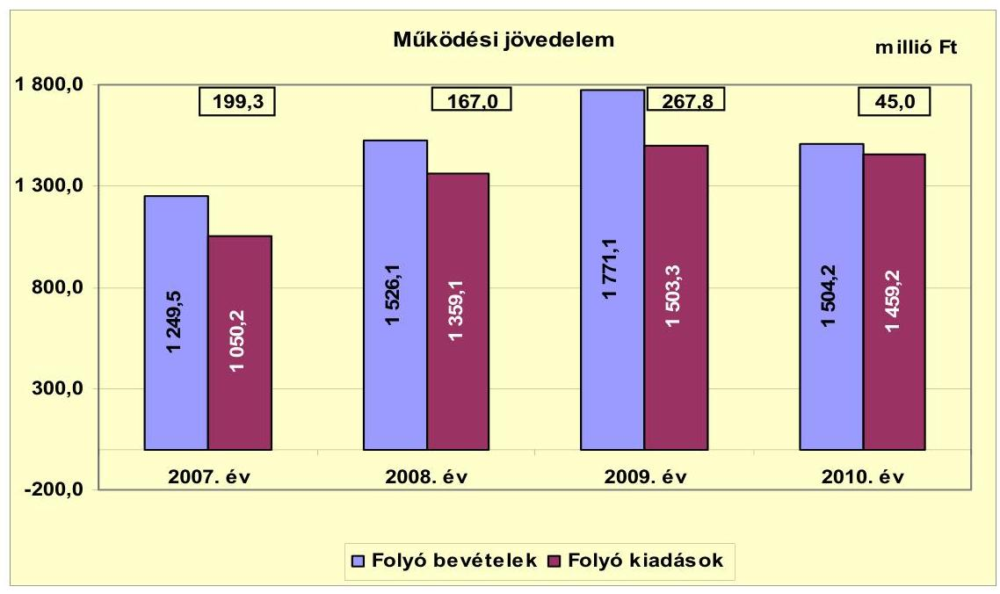

A múködési jövedelem mutatója a vizsgált négy évben változó nagyságrendű pozitív értéket mutatott, amely forrásul szolgált az Önkormányzat számára kötelezettségei megfizetéséhez, valamint fejlesztéseihez. A múködési jövedelem a 2007. évben a folyó jövedelem 16,0\%-át (199,3 millió Ft-ot), a 2008. évben $10,9 \%$-át, ( 167,0 millió Ft-ot), a 2009. évben $15,1 \%$-át ( 267,8 millió Ft-ot) és a 2010. évben 3,0\%-át ( 45 millió Ft-ot) tette ki. A múködési jövedelem aránya a folyó kiadásokhoz a 2007. évben 19,0\%, a 2008. évben 12,3\%, a 2009. évben $17,8 \%$, míg a 2010. évben 3,1\% volt.

A 2009. évben 60,3\%-kal, 100,8 millió Ft-tal nőtt a múködési jövedelem, mivel a bevételek 245,0 millió Ft-tal, míg a kiadások 144,3 millió Ft-tal növekedtek, a 2008. évhez viszonyítva. A bevételek növekedéséből a költségvetési támogatásoknál 125,2 millió Ft ( $51,1 \%$ ), az átengedett bevételeknél (szja és beruházások miatti áfa visszatérülések) 77,1 millió Ft (31,5\%), a saját múködési bevételeknél 34,1 millió Ft (13,9\%) jelentkezett. A kiadások növekedésére a fő kiadásnemek, azaz a személyi juttatások és járulékai, valamint a dologi kiadások hatottak. Valamennyi kiadásnem növekedését a mikro-társulások létrehozása, illetőleg bővülése okozta, mivel ez együtt járt egyrészt az ellátotti-tanulói létszám, másrészt a foglalkoztatotti létszám növekedésével is. Önkormányzati szinten 41 fővel (20,6\%) növekedett a foglalkoztatotti létszám a 2007. évtől a 2009. év végéig, melyből a legnagyobb, 38 fős ( 125 fơről 163 főre, 30,4\%-kal) növekedés a közoktatási ágazatban következett be. A szociális ágazat létszáma négy fővel bővült, és volt olyan ágazat is, ahol néhány fős csökkenés következett be (pl. közművelődés, Polgármesteri hivatal).

A 2010. évben 83,2\%-kal, 222,8 millió Ft-tal csökkent a múködési jövedelem, amely a 2009. évhez viszonyított 266,9 millió Ft-os bevételkiesés és a 44,1 millió Ft-os kiadáscsökkenés eredménye volt. A bevételkiesés legnagyobb

---

tételeit, (64,0\%-át) a költségvetési támogatások és a helyben maradó szja csökkenése jelentette. A helyi adóbevétel csökkenését a Cukorgyár iparúzési adóelőleg túlfizetései egy részének visszafizetése okozta. A kiadás csökkenésekből 20,0 millió Ft-ot személyi juttatások és járulékai okoztak, ami az összesen hat fős ${ }^{18}$ létszámcsökkentés következménye volt. A dologi kiadások és azok áfája 46,7 millió Ft-tal csökkent, mely a kiadások erőteljes visszafogására utal.

A vizsgált időszakban a múködési jövedelem 679,1 millió Ft megtakarítást mutatott, amely forrásául szolgálhatott az Önkormányzat felhalmozási kiadásainak finanszírozásához is. A pozitív előjelű folyó költségvetési egyenleg a vizsgált időszakban mindvégig biztosította, hogy az Önkormányzat sem folyószámlahitel, sem munkabér hitel felvételére nem kényszerült, likviditási problémákkal nem küzdött.

A nettó múködési jövedelem értéke a folyó költségvetési pozíciót (679,1 millió Ft) tükrözi, mivel az Önkormányzatnak a vizsgált időszakban adósságtörlesztése nem volt.

A nettó múködési jövedelem alakulását szemlélteti a következő grafikon:
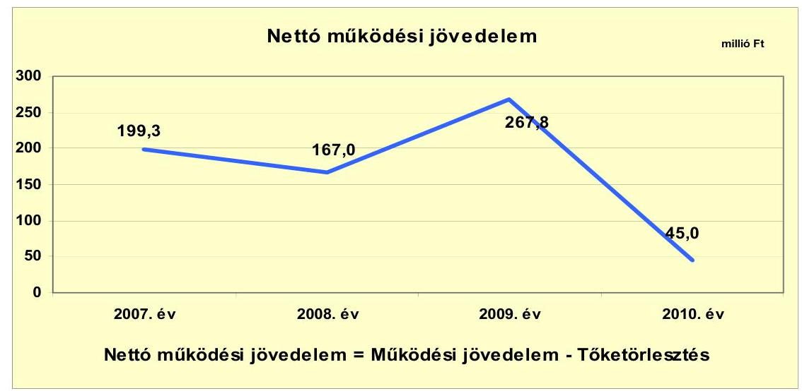

A múködési és a nettó múködési jövedelem az Önkormányzat esetében azonos értékeket mutat, mivel tőketörlesztése egyik évben sem volt. A nettó múködési jövedelem minden évben pozitív volt, de a vizsgált négy év között két esetben csökkent és egy esetben növekedett. A 2008. évben 16,2\%-kal (167,0 millió Ftra), 32,3 millió Ft-tal csökkent a múködési jövedelem, a 2007. évi 199,3 millió Ft-hoz viszonyítva, mert bár a bevételek növekedtek 276,6 millió Ft-tal, a kiadások növekedése meghaladta a bevételek növekedését. A folyó bevételeknél a helyi adók 101,9 millió Ft-tal ${ }^{19}$, a támogatás értékú

[^0]
[^0]:    ${ }^{18}$ A szociális ágazatban és a Polgármesteri hivatalban két-két fős, a közmúvelődés terén három fős volt a csökkenés, míg egy fővel növekedett az általános iskolában foglalkoztatottak létszáma.
    ${ }^{19}$ A korábban évekig szünetelő AGROFERM Zrt. 82,8 millió Ft iparúzési adó előleget fizetett be, a többletet jórészt ez okozta.

---

bevételek - a mikro-térségi óvodai és általános iskolai társulásban résztvevő két önkormányzat átadott támogatásai miatt - 92,6 millió Ft-tal, míg a költségvetési támogatások és az átengedett szja együttesen 78,9 millió Ft-tal emelkedtek. A kiadások összességében 308,8 millió Ft-tal növekedtek, melynek legnagyobb tételeit szintén mikro-térségi óvodai és általános iskolai társulás létrejötte okozta. Az óvodáknál és az iskoláknál megnövekedett személyi kiadások és azok járulékai, valamint a megszaporodott óvodai és iskolai épületek megnövekedett közüzemi kiadásai miatt. A személyi kiadások és azok járulékai 195,5 millió Fttal emelkedtek, mivel a foglalkoztatottak száma az óvodáknál 10 fővel, 25\%kal (40-ről 50-re), az általános iskoláknál 32,5 fővel (85,3-ről 117,8-re) 38,1\%kal növekedett. A dologi kiadások 86,3 millió Ft-os többletkiadást okoztak.

A 2009. évben a nettó múködési jövedelem 60,3\%-os növekedését a megnövekedett bevételek okozták, melyekből 204,1 millió Ft-ot a költségvetési támogatások és az átengedett szja együttesen, 51,4 millió Ft-ot az áfa visszatérülés (beruházások miatt), 14,6 millió Ft-ot pedig a hozambevételek okoztak. A helyi adóbevételekből 30,6 millió Ft-tal kevesebb realizálódott, mint a 2008. évben, mivel a Cukorgyár ekkor már felszámolás alatt állt. A kiadási oldal növekedését a személyi jövedelmek és járulékai 80,8 millió Ft-tal, a dologi kiadások 51,7 millió Ft-tal okozták. A személyi jövedelmek és járulékainak növekedése egyrészt az oktatási társulásoknál jelentkezett ( 29,2 millió Ft-tal nőttek a kifizetett jövedelmek, a pedagógusok béremelkedései miatt), másrészt a szociális ellátás terén bővülő mikro-térségi társulásnál 59,3 millió Ft-os személyi juttatás és járulékai kifizetésére került sor. A költségvetési támogatások növekedésének oka a mikro-térségi társulások tevékenységének bővülésére vezethetőek vissza, mely egyrészt tevékenységi kör bővülését jelentette, másrészt a társulásban résztvevők számának növekedéséből eredt, mivel Tetétlen község is csatlakozott a társulásokhoz.

A 2010. évben a 83,2\%-os nettó múködési jövedelem csökkenést (a 2009. évhez) a kiadáscsökkenést hatszorosan meghaladó bevételkiesés okozta. A bevételkiesés legnagyobb tételét, 170,7 millió Ft-ot a költségvetési támogatások és a helyben maradó szja csökkenése jelentette. (Az összes bevételcsökkenésnek ez a 64\%-át tette ki.) A helyi adóbevétel 70,6 millió Ft-tal (az összes bevétel kiesés 26,5\%-a) maradt el a 2009. évitől, amit a Cukorgyár adóelőleg túlfizetései egy részének visszafizetése okozott. A kiadás csökkenésekből 20,0 millió Ft-ot személyi juttatások és járulékai okoztak, ami az összesen hat fős ${ }^{20}$ létszámcsökkentés következménye volt. A dologi kiadások és azok áfája 46,7 millió Ft-tal csökkent, mely a kiadások erőteljes visszafogására utal.

A felhalmozási költségvetés mind a négy évben deficites volt, melyet azonban a 2007-2009. években az adott év nettó működési jövedelme, a 2010. évben pedig a finanszírozási műveletek pozitív egyenlege finanszírozott. Mivel a 2010. évi nettó működési jövedelem csupán 45 millió Ft volt, a felhalmozási költségvetés azonban 108,8 millió Ft kiadási többletet mutatott, így a

[^0]
[^0]:    ${ }^{20}$ A szociális ágazatban és a Polgármesteri hivatalban két-két fős, a közművelődés terén három fős volt a csökkenés, míg egy fővel növekedett az általános iskolák létszáma.

---

nettó múködési jövedelemmel le nem fedett 63,8 millió Ft-os felhalmozási többletkiadásra a pénzügyi múveletek 126,1 millió Ft többlete nyújtott fedezetet.

A felhalmozási költségvetés bevételeit, kiadásait és egyenlegét az alábbi ábra szemlélteti:
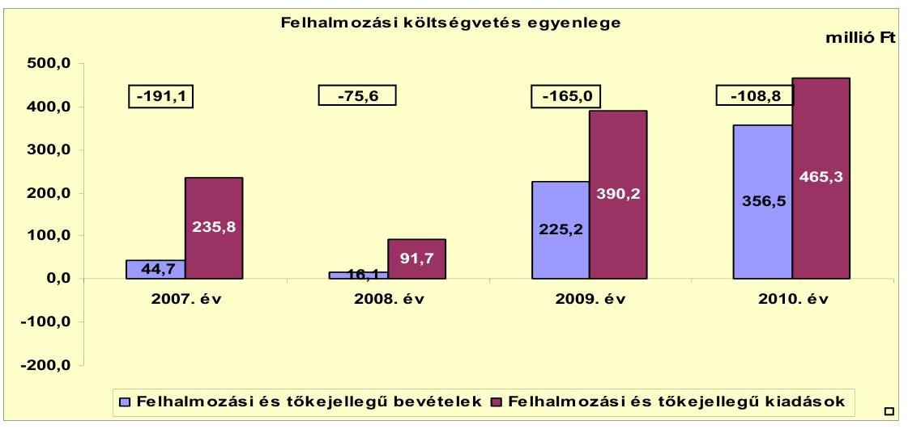

A felhalmozási kiadások a 2007. évben 191,1 millió Ft-tal, 427,5\%-kal, a 2008. évben 75,6 millió Ft-tal, 469,6\%-kal, a 2009. évben 165,0 millió Ft-tal, 65,0\%kal, míg a 2010. évben 108,8 millió Ft-tal, 30,5\%-kal haladták meg a felhalmozási bevételeket. A 2007. évi 235,8 millió Ft felhalmozási és tőke jellegű kiadásból $81,0 \%$-ot, a 2008. évi 91,7 millió Ft felhalmozási és tőke jellegű kiadásból $82,4 \%$-ot, a 2009. évi 390,2 millió Ft-os felhalmozási és tőke jellegű kiadásokból $42,3 \%$-ot, míg a 2010. évi 465,3 millió Ft felhalmozási és tőke jellegű kiadásból $23,4 \%$-át tett ki a felhalmozási hiány összege.

Az Önkormányzatnak CLF módszer szerint a teljes finanszírozási hiánya ${ }^{21}$ a 2010. évben 63,8 millió Ft volt, a 2007. évben 8,2 millió Ft, a 2008. évben 91,4 millió Ft, a 2009. évben 102,8 millió Ft finanszírozási többlete keletkezett.

[^0]
[^0]:    ${ }^{21}$ a nettó múködési jövedelem és a felhalmozási költségvetés eredője

---

Az Önkormányzat finanszírozási múveletei egyenlegeit a 2007-2010. években a következő ábra szemlélteti:
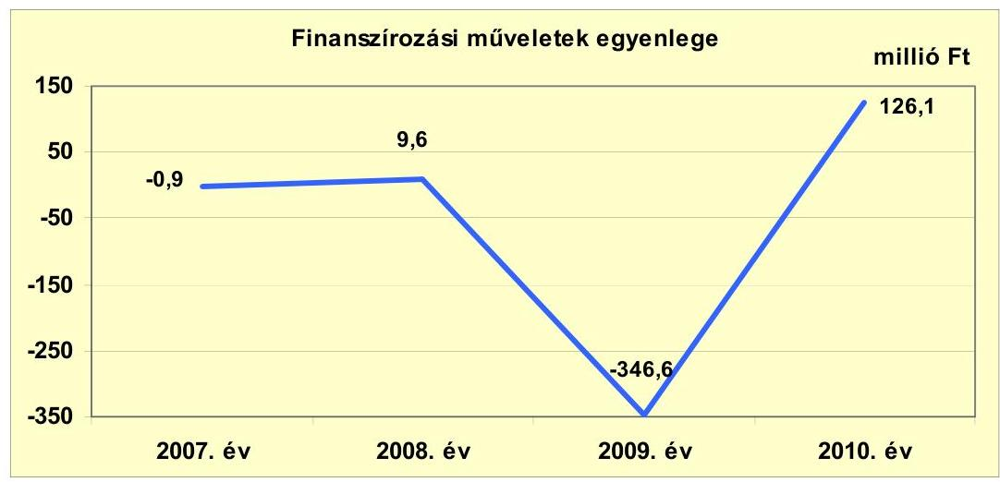

A 2007. és 2008. években a finanszírozási múveletek egyenlegei jelentéktelen összegűek voltak és kizárólag a függő, átfutó, kiegyenlítő bevételek és kiadások egyenlegeiből fakadtak. A 2009. évi -346,6 millió Ft-os egyenleget 76,2\%-ban, 264,0 millió Ft értékben az átmenetileg szabad pénzeszközökből történő forgatási célú értékpapírok vásárlások 23,8\%-ban, 82,6 millió Ft értékben az egyéb függő, átfutó és kiegyenlítő bevételek és kiadások egyenlegeként adódó, egyéb finanszírozási kiadások okozták. A 2010. évben az átmenetileg szabad pénzeszközökből történő forgatási célú értékpapír vásárlások (118,2 millió Ft öszszegben) és az Önkormányzat céljai megvalósulásához szükséges pénzeszközök forgatási célú értékpapírok eladásából történő biztosítása (263,9 millió Ft öszszegben) révén, egyenlegében 145,7 millió Ft bevétel képződött, míg a függő, átfutó, kiegyenlítő tételek egyenlegeként 19,6 millió Ft csökkentette az elért bevételeket. A finanszírozási célú múveleteket a vizsgált időszakban a jelentés 2. számú mellékletének 4.1-4.8 pontjai részletezik.

Az Önkormányzat zárszámadási rendeleteiben a fejlesztési hiányt a hagyományos költségvetési szerkezet alapján mutatta be ${ }^{22}$, amelyről a jelentés 1. számú melléklete nyújt tájékoztatást. Zárszámadási rendeleteiben az Önkormányzat a 2007. évben 251,4 millió Ft, a 2008. évben 366,7 millió Ft, a 2009. évben 107,0 millió Ft és a 2010. évben 526,4 millió Ft bevételi többletet jelzett.

[^0]
[^0]:    ${ }^{22}$ Nincs kötelező előírás a múködési és fejlesztési hiány megállapításának módjára.

---

Az önkormányzat kamatbevételeinek és kamatkiadásainak összegeit a következő ábra mutatja be:
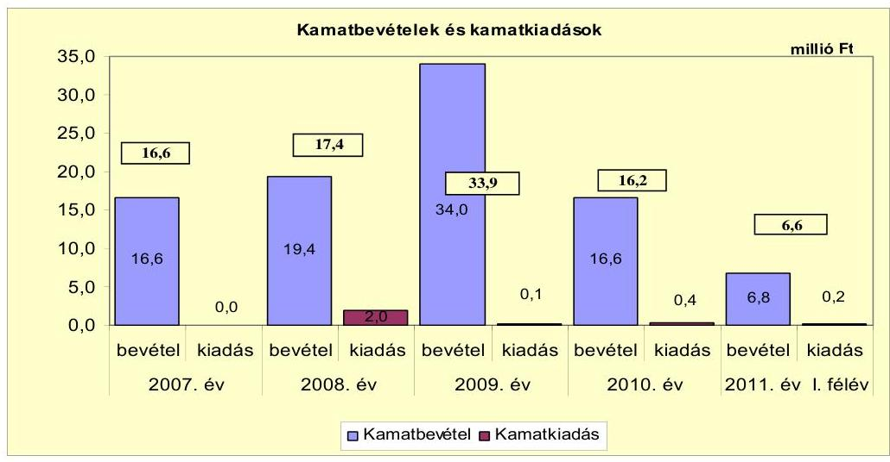

Az Önkormányzat hitellel és kötvénnyel nem rendelkezett, így a vizsgált időszakban kamatkiadásai 0,2-2 millió Ft közötti nagyságrendet képviseltek. Ezek nem banki kamatok voltak, hanem a jogtalanul igénybe vett normatív állami hozzájárulások miatti késedelmi kamatterheket jelentették. Az Önkormányzat kamatbevételei az átmenetileg szabad pénzeszközeinek betétlekötéséből, illetve forgatási célú értékpapírok hozamaiból keletkeztek, melyek minden évben meghaladták kamatkiadásait. A kamatbevételek a 20072011. év I. félévében együttesen 93,4 millió Ft-ot, a kamatkiadások 2,7 millió Ft-ot jelentettek.

Az Önkormányzat pénzügyi egyensúlya rövid és közép távon biztosított. A pénzügyi egyensúly hosszú távú megőrzésére az Önkormányzatnak fel kell készülnie.

# 2.2. Az Önkormányzat bevételeinek változása 

Az Önkormányzat folyó bevételeit a következő grafikon szemlélteti:
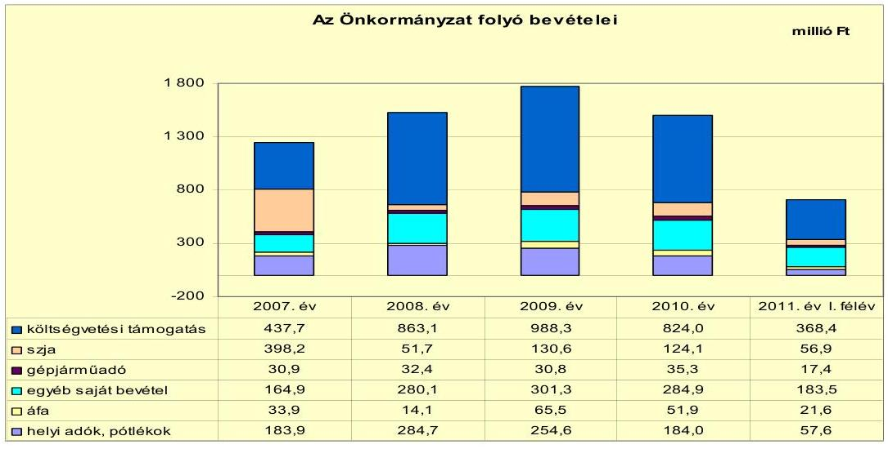

---

Az Önkormányzat folyó bevételei a 2010. évben 1504,2 millió Ft-os összegükkel 20,4\%-kal (254,7 millió Ft-tal) haladták meg a 2007. évi folyó bevételek 1249,5 millió Ft-os összegét. Az Önkormányzat folyó bevételei a 2009. évig növekedtek, ekkor a 2007. évi érték (1249,5 millió Ft) 141,7\%-át tették ki, majd a 2010. évben csökkenésbe fordultak át. A 2010. évi folyó bevételek összege (1504,2 millió Ft) 11,4 millió Ft-tal, 0,8\%-kal volt alacsonyabb, mint a 2007-2009. évek folyó bevételeinek 1515,6 millió Ft-os átlaga. A folyó bevételek összetevői közül a 2010. évben nem érték el a 2007-2009. évek átlagos értékeit: a helyi adók és azok pótlékai ( 57,1 millió Ft-tal, 23,7\%-kal maradt el a hároméves átlagtól), az szja ( 69,4 millió Ft-tal, $35,9 \%$-kal maradt az átlag alatt), és a gépjármú adó ( 3,9 millió Ft-tal, $12,4 \%$-kal maradt el az átlag értékétől). A 2007-2009. évek átlagos értékei fölötti összegekben realizálódott a 2010. évben az áfa ( 14,1 millió Ft-tal, $37,3 \%$-kal), az egyéb saját bevétel ( 36,1 millió Ft-tal, $14,5 \%$-kal), és a költségvetési támogatások ( 61,0 millió Ft-tal, $8,0 \%$-kal) összege. A folyó bevételek csökkenését a 2009. évről a 2010. évre az okozta, hogy a folyó bevételek összetevői közül egy adó kivételével (a gépjármú adó, mely a 2010. évben is növekedett $5,4 \%$-kal, de összege nem meghatározó) minden bevételfajta összege csökkent. A 2010. évben a helyi adók és pótlékai $27,7 \%$-kal, az áfa $20,8 \%$-kal, az egyéb saját bevételek $5,4 \%$-kal, az szja $5,0 \%$-kal, míg a költségvetési támogatások $16,6 \%$-kal, így összességében a saját folyó bevételek $15,1 \%$-kal csökkentek, a 2009. évhez viszonyítva.

Összetételét tekintve a folyó bevételek legnagyobb hányadát (35,0-56,6\%) a költségvetési támogatások jelentették minden vizsgált évben. A legkisebb -$35,0 \%$-os - arányt a 2007. évben képviselték a költségvetési támogatások. A 2008. évtől az intézményfenntartó társulások létrejötte okozta a költségvetési támogatások arányának jelentős változását, amivel az minden évben az 55\%os részarány közelébe került. Az szja helyben maradó része - a központi költségvetési intézkedések hatására, ami a megosztott szja szabályainak a 2008. évtől történő módosítását jelentette, mely által az szja egy részét „beépítették" a költségvetési támogatásokba - változóan alakult. A 2008. évben a központi intézkedések hatására az szja bevétel a 2007. évi érték (398,2 millió Ft) alig több mint tizedére ( $13,0 \%$ ) esett vissza, 51,7 millió Ft-os összegével.

A költségvetési támogatásokat és az szja helyben maradó összegeit célszerű együttesen vizsgálni, mivel a két tétel között (központi) átcsoportosítások voltak. Együttes vizsgálatuk esetében az összes bevételből 37,5-40,1\%-os, de csökkenő részarányt képviseltek, a vizsgált években. A 2007. évi 835,9 millió Ft-os összeget 78,9 millió Ft-tal, $9,4 \%$-kal haladta meg a 2008. évi érték, melyet a 2009. évi 204,1 millió Ft-tal, 22,3\%-kal múlt felül, míg a 2010. évben 170,8 millió Ft-tal, $15,3 \%$-kal kevesebb bevételt kapott az Önkormányzat ezeken a jogcímeken.

Az Önkormányzat a 2007-2010. években egy helyi adónemet, a helyi iparúzési adót alkalmazott. Az iparúzési adó és a hozzá kapcsolódó pótlékok az Önkormányzat folyó bevételeiből 12,2-18,7\%-os részarányt képviseltek. A helyi adóbevétel a 2008. évi 100,8 millió Ft-os ( $154,8 \%$-os) növekedése után minden évben csökkent, úgy arányában, mint nominálértékben. A korábban a tevékenységét évekig szüneteltető és technológiát váltó AGROFERM Zrt. 82,8 millió Ft iparúzési adó előleget fizetett be, a többletet jórészt ez okozta, a korábbi évhez képest. A 2009. évtől az adó csökkenése a 2008. évtől felszámo-

---

lás alatt lévő, majd véglegesen a 2010. évben megszűnt Cukorgyár (még múködési ideje alatti) helyi adó túlfizetésének (megállapodás szerinti) részletekben történő visszafizetéséből adódott. Mivel a 2010. évig a helyi adóbevételek mintegy $90 \%$-a két nagy adózótól (Cukorgyár és AGROFERM Zrt.), majd azt követően, a 2011. évtől egyetlen adózótól származik, ez az Önkormányzat pénzügyi helyzetére kockázati tényezőt jelent.

Az Önkormányzat gazdasági társaságának múködéséből osztalékban nem részesült.

Az Önkormányzat felhalmozási bevételeit 2007-2011. I. félév között a következő táblázat adatai tartalmazzák:

| Megnevezés | 2007. év | 2008. év | 2009. év | 2010. év | 2011. I.   félév |
| :-- | :--: | :--: | :--: | :--: | :--: |
| Tárgyi eszköz értékesítés | 0,0 | 0,1 | 0,3 | 1,2 | 6,9 |
| Egyéb saját tőkebevétel | 10,0 | 9,6 | 7,9 | 7,2 | 0,0 |
| Államháztartáson belülről   kapott támogatás | 0,0 | 4,6 | 213,6 | 348,1 | 181,9 |
| Államháztartáson kívülről   kapott támogatás | 34,7 | 1,8 | 3,4 | 0,0 | 0,0 |
| Összes felhalmozási bevétel | 44,7 | 16,1 | 225,2 | 356,5 | 188,8 |

Az Önkormányzat felhalmozási bevételei a 2007-2008. években 44,7 illetve 16,1 millió Ft-os összegeikkel nem voltak jelentősek, a 2009. évben 403,4\%-kal (180,5 millió Ft-tal), a 2010. évben 697,5\%kal (311,8 millió Ft-tal) haladták meg a 2007. évi összegüket. A 2009. évtől az államháztartáson belülről kapott támogatások képezték a legnagyobb részarányt, melyek 94,8-97,6\% között mozogtak. Ezek a bevételek az EU-s pályázatok beruházásaira lehívott támogatási összegeket jelentették.

# 2.3. Az Önkormányzat müködési és a felhalmozási célú kiadásainak változása 

Az Önkormányzat folyó kiadásait 2007-2011. I. félév között a következő táblázat adatai tartalmazzák:

|  |  |  |  |  | millió Ft   2011. év I.   félév |
| :-- | --: | --: | --: | --: | --: |
| Megnevezés | 2007. év | 2008. év | 2009. év | 2010. év |  |
| Folyó kiadások | 1050,2 | 1359,1 | 1503,4 | 1459,1 | 713,8 |
| Müködési kiadások (kamatkiadás nélkül) | 840,3 | 1142,3 | 1281,8 | 1248,7 | 619,8 |
| Államháztartáson belülre átadott   pénzeszközök | 1,9 | 2,3 | 6,6 | 1,0 | 0,0 |
| Transzferkiadások | 208,0 | 212,5 | 214,9 | 209,0 | 93,9 |
| -ebből: vállalkozásoknak | 29,1 | 25,4 | 32,5 | 36,7 | 15,0 |
| EU-nak, illetve külföldre | 0,0 | 0,0 | 0,0 | 0,0 | 0,0 |
| magánszemélyeknek | 172,3 | 181,2 | 176,3 | 163,9 | 74,6 |
| nonprofit szervezeteknek | 6,6 | 5,9 | 6,1 | 8,4 | 4,3 |
| Kamatkiadások | 0,0 | 2,0 | 0,1 | 0,4 | 0,1 |
| Előző évi pénzmaradvány átadás | 0,0 | 0,0 | 0,0 | 0,0 | 0,0 |

---

A folyó kiadások növekedése a 2008. évben volt a legjelentősebb, amikor 308,9 millió Ft-tal, 29,4\%-kal emelkedtek, döntő részben a közoktatási ágazat tevékenységének mikro-társulásba szervezése, az ellátotti-tanulói létszám 42,4\%-os, a foglalkoztatotti létszám 29,9\%-os növekedése miatt. A 2009. évben a növekedési ütem 10,6\%-osra lassult, mivel ebben az évben a mikrotársulások új belépő településsel bővülése kisebb mértékű növekedést idézett elő. A 2010. évben a folyó kiadások 2,9\%-os csökkenése következett be, az Önkormányzat takarékossági törekvései megvalósulása révén.

Az Önkormányzat folyó kiadásai közül a főbb kiadás-nemek teljesítési adatait az alábbi táblázat tartalmazza:
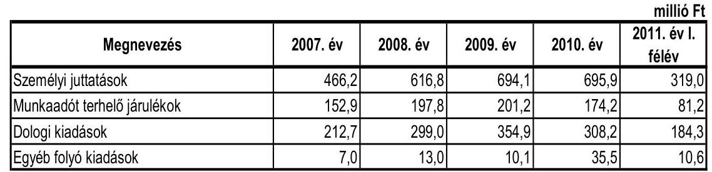

A személyi juttatások növekedésének okát a 2008. év augusztusában megalakított oktatási mikro-társulások (óvodai és általános iskolai) jelentették, amely miatt az oktatásban foglalkoztatottak létszáma mintegy 34,0\%-kal növekedett. A 2009. évben bekövetkezett további 77,3 millió Ft-os személyi juttatás növekedésének az oka a három mikro-társulás ${ }^{23}$ körének 2008. évi - Tetétlen községgel történő - bővülése volt.

A dologi kiadások részaránya a vizsgált években 20,3-23,6\% között mozgott. A 2008. évi 86,3 millió Ft-os (40,6\%) kiadás emelkedés okát ez esetben is a mik-ro-társulás múködésének beindulása okozta, mert a megnövekedett számú és légterú épületek fenntartása lényegesen megemelte a múködtetett épületek közüzemi kiadásait. A 2009. évi növekmény (55,9 millió Ft, 18,7\%) részben a mikro-társulások bővülésével (a közüzemi díjak növekedésével), részben a szociális ágazat beruházásaihoz kapcsolódó, több évre szóló (dologi kiadások között elszámolható) forgóeszköz beszerzéssekkel függött össze. A 2010. évben 46,7 millió Ft-tal (13,2\%-kal) csökkentek a dologi kiadások, mivel abban az évben már nem került sor beruházáshoz kapcsolódó forgóeszköz beszerzésre, és nem történt bővülés a múködésben sem.

[^0]
[^0]:    ${ }^{23}$ Az óvodai, az általános iskolai és a szociális mikro-társulás.

---

A múködési és a felhalmozási kiadásokat következő ábra szemlélteti:
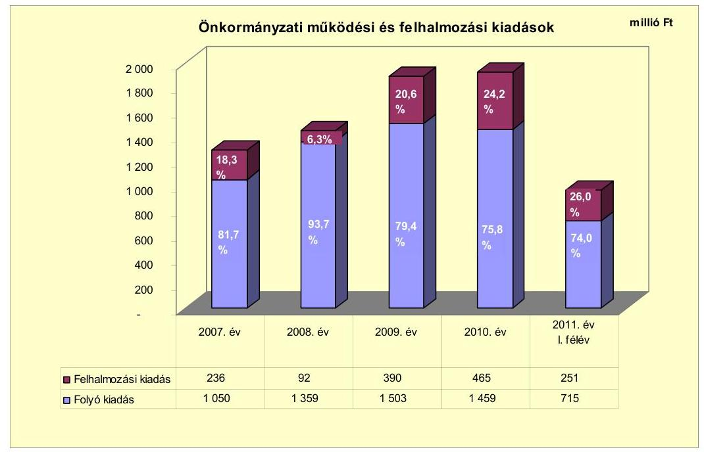

A 2007-2010. évek között a felhalmozási kiadások - a 2009-2010. években EU-s támogatásokkal megvalósuló beruházások miatt - közel megduplázódtak ( $97,3 \%$-os volt a növekedés), így az összes kiadáson belül részarányuk megnövekedett, s ez idézte elő a folyó kiadások részarányának csökkenését. A teljesített kiadásokból a 2007. évben 81,7\%, 2008-ban 93,7\%, 2009-ben 79,4\%, 2010-ben $75,8 \%$, míg 2011. év I. félévében $74,0 \%$ volt a folyó kiadások részaránya, annak ellenére, hogy nominálértékben jelentős - a 2010. évi adatot a 2007. év adatához viszonyítva - 409 millió Ft-os, 38,9\%-os folyó kiadásnövekedés következett be. A felhalmozási kiadások adataiban a 2010. évig társulásos beruházási adat nem szerepelt. A 2011. év I. félévi felhalmozási öszszegből 14 millió Ft-ot tett ki a Kaba -Tetétlen - Báránd Közös Szennyvízelvezetési és Tisztító Rendszer Önkormányzati társulás beruházási összege.

Az Önkormányzat által a 2007-2010. években megvalósított, 2010. december 31-ig befejezett 10 millió Ft feletti fejlesztéseinek száma 13 db, amelyeknek teljes költsége 1000,7 millió Ft volt. Ebből felújításokra 398,5 millió Ft (39,8\%), a beruházásokra 602,2 millió Ft (60,2\%) került felhasználásra. A fejlesztések teljesítési adatai (1000,7 millió Ft) 37,5 millió Ft-tal meghaladták a tervadatokat ( 963,2 millió Ft), azaz a fejlesztések az eredeti tervek 103,9\%-ában teljesültek. A fejlesztési kiadások forrásából 473,1 millió Ft-ot (47,3\%) jelentett az EU-s támogatás, 353,1 millió Ft-ot (35,3\%) a saját bevétel, míg 174,5 millió Ft-ot ( $17,4 \%$ ) a hazai támogatás. A fejlesztési feladatok megvalósításához hitelt vagy kötvényből származó bevételt nem használtak fel. A 2007. és a 2010. évek között befejezett felújítások 52,1\%-ban (207,7 millió Ft), míg a beruházások $25,1 \%$-ban ( 151,0 millió Ft) az elhasználódott eszközök pótlását szolgálták.

A 2007. és a 2010. évek között befejezett 10 millió Ft feletti fejlesztések az iskola infrastrukturális fejlesztésére, az orvosi rendelő és a bölcsőde épületének felújí-

---

tására, a nappali szociális ellátás feltételeinek javítására, a szociális alapszolgáltató központ egyik épületének átalakítására és felújítására, a városközpont, valamint a szennyvízcsatorna-hálózat fejlesztésére, továbbá útépítésekre vonatkoztak. A 10 millió Ft alatti fejlesztésekből a belvízelvezető rendszer bővítését, utak aszfaltozását, járdák szélesítését, önkormányzati épületek részleges akadálymentesítését, a Városháza pincéjének szigetelését, a kézilabdapálya felújítását, továbbá a piac területén illemhely építését végezték el.

A folyamatban lévő fejlesztések (3 db) 2010. december 31-ig teljesített 138,0 millió Ft bekerülési költség forrásából 115,6 millió Ft (83,8\%) az EU-s támogatás, 22,4 millió Ft (16,2\%) a saját bevétel. A tényleges bekerülési költség (138,0 millió Ft) 18,8\%-át (25,9 millió Ft-ot) az elhasználódott eszközök pótlására fordították.

Az Önkormányzat a folyamatban lévő fejlesztési feladataihoz kapcsolódó, a 2010. évet követő kötelezettségvállalásainak összege 1210,5 millió Ft. Ennek forrásaként az Önkormányzat 1029,3 millió Ft EU-s forrást (85,0\%), míg 181,2 millió Ft saját bevételt ( $15,0 \%$ ) tervez felhasználni. A várható teljes bekerülési költség (1348,5 millió Ft) 12,8\%-át (172,9 millió Ft) az elhasználódott eszközök pótlására tervezték fordítani.

A 3/a.,3/b.,3/c. sz. mellékletekben megjelenő Szennyvízberuházás I. ütem, illetve Szennyvízberuházás II. ütem projektek a Kaba - Tételen - Báránd Közös Szennyvízelvezetési és Tisztító Rendszer Önkormányzati Társulás keretében valósultak, illetve valósulnak meg. A Társulás 2009. május 14-én került bejegyzésre a MÁK által. A társulás elnöke Tételen település polgármestere lett, majd 2011. január 1jétől Kaba város polgármestere. Ennek megfelelően a szennyvízprojektek gesztorsága is változott 2011. január 1-jétől, mivel Tételen gesztorsága a Szennyvízberuházás I. ütemzáró PEJ benyújtásáig 2010. december 31-ig állt fenn. A Szennyvízberuházás I. üteme 2011. év áprilisában fejeződött be. A beruházás szerződés szerinti összege 123,3 millió Ft volt, amelyből Kaba Város Önkormányzatára eső rész 55,1 millió Ft. A Szennyvízberuházás II. ütemének támogatási szerződése 2010. október 1-jén került aláírásra. A tervezett összköltség 3191,3 millió Ft volt, amelyből a Kaba Város Önkormányzatára (gesztor) eső rész 1203,4 millió Ft. A beruházáshoz 1022,9 millió Ft (85,0\%) EU-s támogatást és 180,5 millió Ft (15\%) saját bevételt tervez felhasználni az Önkormányzat. Jelenleg a közbeszerzési eljárások lefolytatása történik.

Az Önkormányzat a 2011. év I. félévében beadott pályázatokkal egy 10 millió Ft feletti és egy 10 millió Ft alatti fejlesztést valósított meg. A fejlesztések teljes bekerülési költsége (109,6 millió Ft) 2010. év utánra vállalt kötelezettség volt, melynek forrását $92,8 \%$-ban ( 101,7 millió Ft) EU-s forrásból, míg 7,2\%át ( 7,9 millió Ft) saját bevételből tervezte biztosítani az Önkormányzat. A teljes bekerülési költség 30,7\%-át (33,6 millió Ft-ot) az elhasználódott eszközök pótlására tervezték felhasználni.

A jelentés 3/d. sz. mellékletének 10 millió Ft alatti fejlesztések sorában megjelentek ( 4,4 millió Ft) a 2011. év első félévében vásárolt számítógépek ( 15 db ) és a hozzájuk tartozó szoftverek is. A 4,4 millió Ft-ból a Könyvtár TIOP pályázat keretében - 100\%-os támogatottság mellett - 1,7 millió Ft támogatást nyert.

A 2007-2010. évek között befejezett és folyamatban lévő fejlesztések 2010. december 31-ig felmerült kiadása 1138,7 millió Ft volt, míg a 2010. év

---

után tervezett fejlesztési kiadások összege 1320,1 millió Ft. (3/a.-3/d. sz. mellékletek) Ezen kiadások finanszírozására az Önkormányzat hitelt, vagy kötvényből származó bevételt nem használt fel.

A 2007-2010. évek között befejezett és folyamatban lévő fejlesztések 2010. december 31-ig felmerült kiadása 1138,7 millió Ft volt, amelynek forrása 588,7 millió Ft ( $51,7 \%$ ) EU-s támogatás, 375,5 millió Ft (33,0\%) saját bevétel, valamint 174,5 millió Ft (15,3\%) hazai támogatás volt.

A 2010. évet követő évekre tervezett 1320,1 millió Ft fejlesztési kiadásból várhatóan 1131,0 millió Ft-ot (85,7\%) EU-s támogatásból, míg 189,1 millió Ft-ot $(14,3 \%)$ saját bevételből tervez finanszírozni az Önkormányzat.

Az Önkormányzat három legmagasabb költségű fejlesztése az alábbi volt:

- a „Sári Gusztáv Általános Iskola infrastrukturális fejlesztése az esélyegyenlőség és az energiatakarékosság jegyében" tárgyú ÉAOP-4.1.1/2F-2f-2009-0008 azonosító számú projekt támogatási szerződésének megkötésére 2009. június 29-én került sor. A projekt tervezett műszaki tartalommal valósult meg. A projekt tényleges beruházási összköltsége (190,3 millió Ft) 7,9 millió Ft-tal meghaladta a tervezettet ( 182,4 millió Ft). Ez döntően a kiviteli tervek árkülönbözetéből, valamint az áfa emelés hatásából adódott. A projekt forrása 173,3 millió Ft ( $91,1 \%$ ) EU-s támogatás, valamint 17,0 millió Ft ( $8,9 \%$ ) saját bevétel volt. A műszaki átadás-átvétel 2010. február 9-én megtörtént. A beruházás eredményeképpen megvalósult az intézmény régebbi épületének felújítása, a játszóudvar kialakítása, oktatási eszközök, bútorzat, korlátlift, valamint mobilszínpad beszerzése. Megtörtént továbbá az épület kisebb tornateremmel való bővítése, belső átalakítása és akadálymentesítése. Az energiatakarékosság jegyében elvégezték a nyílászárók cseréjét, a hőszigetelést, illetve a tetőcserét. A közremúködő szervezet 2010. október 29-én műszakilag és pénzügyileg befejezettnek nyilvánította a projektet;
- az „Orvosi rendelő felújítására Kabán" tárgyú ÉAOP-4.1.2/A-2008-0049 azonosító számú projekt támogatási szerződésének megkötésére 2009. október 15-én került sor. A beruházás tervezett műszaki tartalommal valósult meg. A projekt tényleges beruházási összköltsége ( 98,5 millió Ft) 18,7 millió Ft-tal haladta meg a tervezettet ( 79,8 millió Ft). A többletkiadásokat a műszaki szükségszerűségből elvégzett, de nem támogatott műszaki tartalom (tető és homlokzat felújítás), valamint a nyertes kivitelező tervezettnél magasabb árajánlata okozta. A beruházás forrása 69,2 millió Ft (70,3\%) EU-s támogatás, 28,5 millió Ft (28,9\%) saját bevétel, míg 0,8 millió Ft ( $0,8 \%$ ) hazai támogatás volt. A műszaki átadás-átvételre 2010. augusztus 10-én került sor. A beruházás eredményeképpen megtörtént az orvosi rendelő felújítása és bővítése, magastető építés, komplett külső-belső felújítás az építészet, gépészet és villamosság terén. Elvégezték továbbá egy db személyfelvonó beépítését, kettő db mozgássérült parkoló kialakítását, hat parkoló felfestését, illetve a komplex akadálymentesítést. A közreműködő szervezet 2011. február 11-én műszakilag és pénzügyileg befejezettnek nyilvánította a projektet;
- a „Szociális alapszolgáltatások fejlesztése Kabán" tárgyú ÉAOP-4.1.3/C-2f-2010-0001 azonosító számú projekt támogatási szerződésének megkötésére

---

2010. augusztus 18 -án került sor. A projekt a tervezett műszaki tartalommal valósult meg. A beruházás várható tényleges bekerülési költsége ( 82,4 millió Ft) 8,5 millió Ft-tal meghaladta a tervezettet ( 73,9 millió Ft ). A többletkiadásokat a nyertes kivitelező magasabb ajánlata okozta. A várható teljes bekerülési költségéből ( 82,4 millió Ft) 6,0 millió Ft a 2010. év utánra vállalt kötelezettség. A projekthez összességében 66,5 millió Ft EU-s támogatást ( $80,7 \%$ ) nyert az Önkormányzat, míg a fennmaradó 15,9 millió Ft (19,3\%) forrása a saját bevétel. A beruházás készültségi foka $99 \%$-os, jelenleg végzik a hiánypótlásokat. A projekt eredményeképpen megtörtént a szociális alapszolgáltató központ egyik épületének átalakítása, felújítása és részleges akadálymentesítése, komplett elektromos és gépészeti hálózatának felújítása, továbbá 320 db házi segélyhívó berendezés telepítése.

Az Önkormányzat a kizárólagos tulajdonában álló Városgazdálkodási Kft. gazdálkodását minden évben múködési célra átadott pénzeszközökkel segítette. A pénzeszköz átadások szükségességét indokolta az is, hogy víz- és csatornadíjakat a lakosság teherbíró képességének figyelembevétele miatt az Önkormányzat igyekezett „nyomott árszinten" tartani, ezért a gazdasági társaságban keletkező veszteséget átadott pénzeszközök formájában pótolta. A Városgazdálkodási Kft. részére történő pénzeszköz átadások összegeinek meghatározására, minden évben szerződés alapján, a Kft. éves terve és a Kft. ügyvezetésével történő egyeztető tárgyalások alapján, a költségvetései rendeletben került sor. Az átadott pénzeszközökkel történő elszámoltatások megfelelően kialakított kontrollok szerint, a szerződésben meghatározott időszakonként megtörténnek.

A Városgazdálkodási Kft.-nek átadott, összességében 135,6 millió Ft pénzeszköz a közterület fenntartást (parkgondozás, útkarbantartás), a belvíz elleni védekezést és az önkormányzati tulajdonú ingatlanok üzemeltetését, karbantartását, a víz- és csatornaszolgáltatást, valamint a 2010. évben a paprikatermesztést ${ }^{24}$ volt hivatott biztosítani. A 2010. évben paprikatermesztésbe kezdett a gazdasági társaság, azonban a mezőgazdasági tevékenységen veszteséget realizált a 6,4 millió Ft e célra átadott önkormányzati pénzeszköz ellenére is.

Az Önkormányzat a kizárólagos tulajdonában lévő gazdasági társasága részére a 2007. évben 28,3 millió Ft, a 2008. évben 24,8 millió Ft, a 2009. évben 31,8 millió Ft, a 2010. évben 36,0 millió Ft, a 2011. év I. félévében 14,7 millió Ft, összesen 135,6 millió Ft múködési célú pénzeszköz átadást biztosított. Más társaság részére pénzeszköz átadására nem került sor az Önkormányzat részéről. A Városgazdálkodási Kft. értékesítési nettó árbevétele a 2007. évi 91,1 millió Ft-ról a 2008. évben kettő millió Ft-tal, 93,1 millió Ft-ra (2,2\%), a 2009. évben a 2008. évi értékhez viszonyítva 1,5\%-kal, 1,4 millió Ft-tal, 94,5 millió Ft-ra növekedtek. A 2010. évben értékesítési nettó árbevételük a 2009. évi értékhez viszonyítva 5,7 millió Ft-tal, 6\%-kal, 88,8 millió Ft-ra esett vissza. Az árbevétel csökkenés oka a vízfogyasztás korábbi évekhez viszonyított visszaesése volt. A társaságok bevételeit a 4. sz. melléklet mutatja be.

[^0]
[^0]:    ${ }^{24}$ A 2010. évben paprikatermesztésbe kezdett a gazdasági társaság, ám a mezőgazdasági tevékenységen veszteséget realizált a 6,4 millió Ft célzott önkormányzati pénzeszköz átadás ellenére is.

---

# 3. Az ÖNKORMÁNYZAT KÖTELEZETTSÉGEI 

### 3.1. Az Önkormányzat pénzintézeti kötelezettségeinek változása

Az Önkormányzatnak pénzügyi egyensúlya biztosítása érdekében a vizsgált években nem volt szüksége rövid és hosszú lejáratú hitelekre és kötvényt sem bocsátott ki, ezért pénzintézettel szembeni kötelezettségei nem voltak. Adóssága kizárólag rövid távú szállítói tartozásaiból és az állami költségvetésbe történő befizetési kötelezettségeiből adódott, melyek miatt 0,1-2 millió Ft közötti összegek megfizetésére volt kötelezett.

### 3.2. A szállítói kötelezettségek alakulása

Az Önkormányzat szállítókkal szemben fennálló kötelezettségeinek állománya, a 2007. évi 45,5 millió Ft-ról ${ }^{25}$ a 2010. évre 17,1 millió Ft-ra ${ }^{26}$ (37,6\%-ra) csökkent, a kötelezettségeken belüli aránya a vizsgált években 4,2-24,1\% között volt. Átütemezett, lejárt szállítói kötelezettsége az Önkormányzatnak nem volt.

### 3.3. Egyéb kötelezettségek változása

Az Önkormányzatnak lízing szerződése, garancia és kezességvállalása, PPP konstrukcióban való részvétele a vizsgált időszakban nem volt. Követelései közül - méltányossági okokból - minimális ${ }^{27}$, adókhoz kapcsolódó késedelmi pótlék elengedés történt. Kölcsönt intézményeknek, más önkormányzatoknak, gazdasági társaságnak, civil szervezeteknek nem nyújtottak. Az Önkormányzat ingatlanjai közül egy sem terhelt jelzálogjoggal, folyamatban lévő peres eljárásai nincsenek. Az Önkormányzat pénzmaradványa a 2010. év végén 395,1 millió Ft volt, melynek 91,5\%-a, 361,7 millió Ft volt kötelezettségekkel terhelt, és $8,5 \%-a, 33,4$ millió Ft volt szabad.

Az Önkormányzat egyetlen kizárólagos tulajdonában álló gazdasági társaságának, a Városgazdálkodási Kft-nek a kötelezettségei szállítói tartozásokból ( $0,2-5,6$ millió Ft közötti összegekkel) és a munkavállalókkal szembeni, ki nem fizetett személyi jellegű juttatásokból (melyek összegei a vizsgált években 1,3-1,7 millió Ft-os nagyságrendeket képviseltek), a központi költségvetéssel szembeni (2009-2010-ben 1,2-1,4 millió Ft volt az összegük) és egyéb tartozásokból tevődtek össze.

A Városgazdálkodási Kft. gazdálkodásában a 2010. évben a korábbi évekhez viszonyítva, kedvezőtlen irányú elmozdulás volt megfigyelhető, de tartozásai és a 2010. évben bekövetkezett vesztesége az Önkormányzat pénzügyi

[^0]
[^0]:    ${ }^{25}$ A 2007. évi szállítói tartozások 85,1\%-a beruházási szállítói tartozás, 9,0\%-a közüzemi számlatartozás, $4,8 \%$-a „Idősek karácsonya" rendezvény tartozása, míg 0,5\%-a szociális- és gyermekétkeztetési tartozás volt.
    ${ }^{26}$ A 2010. évi szállítói záró állomány 58,5\%-át közüzemi számlatartozás, míg 41,5\%-át szociális- és gyermekétkeztetési tartozás tette ki.
    ${ }^{27}$ 2007-ben 60 ezer Ft, 2009-ben ötezer Ft, 2010-ben 80 ezer Ft.

---

helyzetének szempontjából nem volt releváns, kockázatot nem jelentett. A gazdálkodási adatok a 2011. év I. félévében pozitív változásnak indultak, erre utal a társaság 8,9 millió Ft-os féléves nyeresége, amely a korábbi évekhez hasonló összegű önkormányzati pénzeszköz átadás ${ }^{28}$ mellett valósult meg.

Az Önkormányzat a 2007-2010. években a tárgyi eszközök után együttesen 259,6 millió Ft értékcsökkenést számolt el. A 2007. évben 48,5 millió Ft-ot, a 2008. évben 55,0 millió Ft-ot, a 2009. évben 58,4 millió Ft-ot, míg a 2010. évben 97,7 millió Ft-ot. A 2007. évben a tárgyévben elszámolt értékcsökkenés 157,9\%-ának ( 76,5 millió Ft), a 2008. évben 13,4\%-ának ( 7,4 millió Ft), a 2009. évben 157,1\%-ának ( 91,7 millió Ft), míg a 2010. évben 166,1\%-ának ( 162,3 millió Ft) megfelelő összeget aktiváltak felújításként. Az elavult eszközök pótlása biztosítva volt, mivel az Önkormányzat nyilvántartása szerint a felújítás és beruházás együttes összege minden évben meghaladta az értékcsökkenés összegét. Az Önkormányzat eszközállományának bruttó értéke a 2007. évi 2140,1 millió Ft-ról 2795,9 millió Ft-ra ( $30,6 \%$-kal), míg a nettó érték a 2007. évi 1779,1 millió Ft-ról 2223,9 millió Ft-ra ( $25,0 \%$-al) nőtt a 2010. évre. Az önkormányzati szintű használhatósági fok a 2007. évi 83,1\%-ról négy év alatt 3,6 százalékponttal 79,5\%-ra csökkent az egyes eszközcsoportoknál különböző mértékkel elszámolt amortizáció hatására. A használhatósági fok a jármúveknél romlott a legnagyobb arányban a négy év alatt 67,6\%-ról 15,6\%-ra.

Az Önkormányzat évente felmérte a karbantartási, felújítási szükségletet, annak eldöntése céljából, hogy a következő év költségvetésébe a pénzügyi lehetőségek figyelembe vételével megtörténhessen a karbantartási, felújítási igények rangsorolása az eszközök elhasználódása érdekében.

A felújításokra, az eszközök pótlására elsősorban az intézmények működőképességének biztosítása, illetve a szakhatósági előírások figyelembe vételével került sor. A 2007-2010. évek között pénzügyileg teljesített felhalmozási kiadásokból eszközpótlásra (rekonstrukcióra, felújításra) 384,5 millió Ft-ot fordított az Önkormányzat. A 2007-2010. években elszámolt 259,6 millió Ft amortizációt, az eszközök avulását 48,1\%-kal haladta meg az eszközpótlásra fordított öszszeg.

A Képviselő-testületnek előterjesztett éves zárszámadási rendeleteikben nem mutatatták be az Önkormányzat eszközei után tárgyévben elszámolt értékcsökkenés összegét, az eszközpótlásra fordított tényleges kiadásokat, az eszközök elhasználódási fokának alakulását.

# 4. A PÉNZÜGYI EGYENSÚLY MEGTEREMTÉSE ÉrDEKÉBEN HOZOTT INTÉZKEDÉSEK EREDMÉNYE 

A központi források szűkülésének következtében az Önkormányzat kiadáscsökkentő és bevételnövelő intézkedésekről döntött.

[^0]
[^0]:    ${ }^{28}$ Az Önkormányzat 2009-ben 29,6 millió Ft pénzeszközt adott át a Kft. víz és szennyvízszolgáltatáson kívüli kötelező önkormányzati feladatainak támogatására. A 2011. év I. félévében átadott 14,7 millió Ft pénzeszköz az előző éves összeg 49,7\%-a.

---

A 2007-2011. év I. féléve közötti időszakban mindössze a létszámcsökkentési döntések következtében ért el az Önkormányzat kiadási megtakarítást, amelynek összege kimutatásuk szerint 206,8 millió Ft volt. Az Önkormányzat adatszolgáltatása alapján a kiadási megtakarítások 93,7\%-át az önkormányzati intézményeknél, míg 6,3\%-át a Polgármesteri hivatalnál realizálták.

A 2007-2010. évek között végrehajtott létszámváltozások eredményét az alábbi táblázat szemlélteti:

| Megnevezés (adatok fő-ben) |  | Közoktatás | Szociális és gyermekvédelem | Egészségügy | Polgármesteri hivatal | Egyéb | Összesen |
| :--: | :--: | :--: | :--: | :--: | :--: | :--: | :--: |
| 2007. január 1-jén jóváhagyott álláshelyek száma |  | 101 | 39 | 6 | 25 | 9 | 180 |
| Megszüntetett álláshelyek száma |  | 31 | 4 | 0 | 2 | 6 | 43 |
| ebből: | üres álláshelyek száma | 0 | 0 | 0 | 0 | 0 | 0 |
|  | szakmai álláshelyek száma | 26 | 2 | 0 | 2 | 5 | 35 |
|  | intézmény-üzemeltetéssel kapcsolatos álláshelyek száma | 5 | 2 | 0 | 0 | 1 | 8 |
| Álláshely növekedése |  | 94 | 11 | 0 | 3 | 2 | 110 |
| 2010. december 31-én záró álláshelyek száma |  | 164 | 46 | 6 | 26 | 5 | 247 |
| 2007. január 1-jén foglalkoztatott létszám |  | 101 | 39 | 6 | 25 | 9 | 180 |
| Létszámcsökkenés |  | 31 | 4 | 0 | 2 | 6 | 43 |
| Létszámnövekedés |  | 94 | 11 | 0 | 3 | 2 | 110 |
| 2010. december 31-én foglalkoztatott létszám |  | 164 | 46 | 6 | 26 | 5 | 247 |

A létszámcsökkentő intézkedések következtében a 2007-2010. évek között a Polgármesteri hivatalban és az intézményeiknél összesen 43 álláshelyet szüntettek meg, amelyből $31(72,1 \%)$ a közoktatáshoz, négy ( $9,3 \%$ ) a szociális és gyermekvédelemhez, kettő ( $4,7 \%$ ) a Polgármesteri hivatalhoz, míg hat ( $13,9 \%$ ) egyéb területhez kapcsolódott. A megszüntetett 43 álláshelyből $35(81,4 \%)$ szakmai álláshely volt, míg nyolc ( $18,6 \%$ ) intézményüzemeltetéssel kapcsolatos álláshely.

A vizsgált időszakban az Önkormányzatnál betöltetlen, üres álláshely nem volt.

A létszámcsökkenés mellett a 2007-2010. évek közötti időszakban 110 fővel növekedett is a létszám. A közoktatást érintő 94 fős növekedésből 91 főt, míg a szociális terület 11 fős növekedésből kettő főt jelentett a társulások okozta növekedés. A létszámnövekedések pénzügyi hatásait az Önkormányzat nem számszerúsítette.

Mindezen változások összességében azt eredményezték, hogy a 2007. január 1jén induló 180 fős létszám 2010. december 31-ére 247 főre nőtt.

A helyi szervezési intézkedések végrehajtásához az Önkormányzat az áttekintett időszak alatt 65,3 millió Ft központosított támogatást igényelt és kapott. A támogatás felhasználásával tartósan leépített létszám 43 fő volt.

A bevételnövelő intézkedések 7,2 millió Ft-ot eredményeztek a 20072011. év I. féléve közötti időszakban. Ezen intézkedések mindegyike helyi adókkal kapcsolatos intézkedés volt. A 7,2 millió Ft-ból 3,6 millió Ft-ot (50\%) jelentett az adóhátralékok behajtása, míg szintén 3,6 millió Ft-ot (50\%) a kedvezmények, mentességek csökkentése.

---

A kedvezmények, mentességek csökkentése csak a 2009. évben jelentkezett, mivel az Önkormányzat téves jogértelmezés miatt ideiglenesen megszüntette a 2,5 millió Ft adóalapot el nem érő vállalkozások iparúzési adó alóli mentességét.

Az Önkormányzat költségvetési támogatásból, valamint személyi jövedelemadóból származó bevétele a 2007. évben 835,9 millió Ft, a 2008. évben 914,8 millió Ft, a 2009. évben 1118,9 millió Ft, a 2010. évben 948,2 millió Ft volt. A 2011. évre vonatkozóan ez az összeg várhatóan 785,0 millió Ft. A vizsgált évek számadatai alapján megállapítható, hogy ezen bevételek a 20072011. év I. féléve közötti időszakban összességében (kumuláltan) 448,7 millió Ft-tal javították az Önkormányzat pénzügyi helyzetét.

Az Önkormányzat kiadáscsökkentő és bevételnövelő intézkedései - kimutatásuk szerint - mindösszesen 214,0 millió Ft-ot eredményeztek a 2007-2011. év I. féléve közötti időszakban, tovább javítva az Önkormányzat pénzügyi helyzetét.

# 5. Az ÁSZ Által a korábBi ÉVEKben a pénzügyi EgYensúly JAVÍTÁSÁRA TETT SZABÁLYSZERÚSÉGI ÉS CÉLSZERŰSÉGI JAVASLATOK HASZNOSULÁSA 

Az ÁSZ az Önkormányzat gazdálkodási rendszerét a 2010. évben ellenőrizte átfogó jelleggel. A gazdálkodási rendszer korábbi ellenőrzése során tett javaslatok közül a pénzügyi egyensúly javítására hat szabályszerűségi javaslat vonatkozott. A javaslatok megvalósítása érdekében a Képviselő-testület elfogadta az ÁSZ jelentésben foglaltak végrehajtására készített, felelősöket és határidőket is tartalmazó intézkedési tervet.

Az ellenőrzés során tett, a pénzügyi egyensúly javítására vonatkozó szabályszerűségi javaslatokat teljes egészében hasznosították.

A szabályszerűségi javaslatokra megtett intézkedések eredményeképpen gondoskodtak arról, hogy az Úgyrend 2010. március 17 -én jóváhagyott módosításának 8. adatszolgáltatáshoz, beszámoló készítéshez kapcsolódó pontjában előírják a költségvetés tervezés és a zárszámadás készítés folyamatának ellenőrzési feladatait, a zárszámadás készítés folyamatában elvégezték az intézmények által az állami támogatásokkal, hozzájárulásokkal történő elszámolásához közölt mutatószámok, továbbá az eredeti és a módosított előirányzatok, valamint a teljesítések adatainak az ellenőrzését. A 2011. évi költségvetés előterjesztése már tartalmazta a közvetett támogatásokat tartalmazó kimutatást, valamint a polgármester a Képviselő-testület elé terjesztette az Önkormányzat költségvetésének és zárszámadásának előterjesztésekor bemutatni szükséges mérlegek és kimutatások tartalmáról szóló rendeletet.

Budapest, 2012. április " 25 "

Melléklet: $\quad 7 \mathrm{db}$
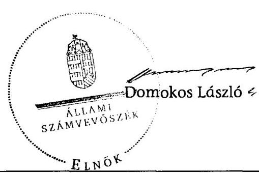

---

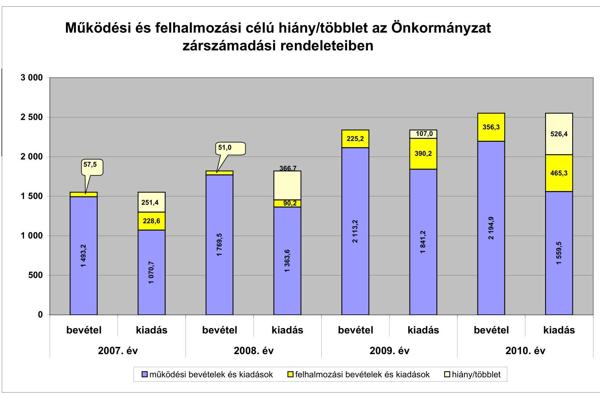

# Működési és felhalmozási célú hiány/többlet az Önkormányzat zárszámadási rendeleteiben

|  év | működési bevételek és kiadások | felhalmozási bevételek és kiadások | hiány/többlet  |
| --- | --- | --- | --- |
|  2007. év | 57.5 | 251.4 | 1 693.2  |
|  2008. év | 51.0 | 228.6 | 1 768.5  |
|  2009. év | 566.7 | 266.7 | 1 841.2  |
|  2010. év | 556.3 | 290.3 | 1 841.2  |
|  2011. év | 526.4 | 289.3 | 1 841.2  |
|  2012. év | 510.0 | 256.7 | 1 841.2  |
|  2013. év | 556.3 | 290.3 | 1 841.2  |
|  2014. év | 556.3 | 290.3 | 1 841.2  |
|  2015. év | 556.3 | 290.3 | 1 841.2  |
|  2016. év | 556.3 | 290.3 | 1 841.2  |
|  2017. év | 556.3 | 290.3 | 1 841.2  |
|  2018. év | 556.3 | 290.3 | 1 841.2  |
|  2019. év | 556.3 | 290.3 | 1 841.2  |
|  2020. év | 556.3 | 290.3 | 1 841.2  |
|  2021. év | 556.3 | 290.3 | 1 841.2  |
|  2022. év | 556.3 | 290.3 | 1 841.2  |
|  2023. év | 556.3 | 290.3 | 1 841.2  |
|  2024. év | 556.3 | 290.3 | 1 841.2  |
|  2025. év | 556.3 | 290.3 | 1 841.2  |
|  2026. év | 556.3 | 290.3 | 1 841.2  |
|  2027. év | 556.3 | 290.3 | 1 841.2  |
|  2028. év | 556.3 | 290.3 | 1 841.2  |
|  2029. év | 556.3 | 290.3 | 1 841.2  |
|  2030. év | 556.3 | 290.3 | 1 841.2  |
|  2031. év | 556.3 | 290.3 | 1 841.2  |
|  2032. év | 556.3 | 290.3 | 1 841.2  |
|  2033. év | 556.3 | 290.3 | 1 841.2  |
|  2034. év | 556.3 | 290.3 | 1 841.2  |
|  2035. év | 556.3 | 290.3 | 1 841.2  |
|  2036. év | 556.3 | 290.3 | 1 841.2  |
|  2037. év | 556.3 | 290.3 | 1 841.2  |
|  2038. év | 556.3 | 290.3 | 1 841.2  |
|  2039. év | 556.3 | 290.3 | 1 841.2  |
|  2040. év | 556.3 | 290.3 | 1 841.2  |
|  2041. év | 556.3 | 290.3 | 1 841.2  |
|  2042. év | 556.3 | 290.3 | 1 841.2  |
|  2043. év | 556.3 | 290.3 | 1 841.2  |
|  2044. év | 556.3 | 290.3 | 1 841.2  |
|  2045. év | 556.3 | 290.3 | 1 841.2  |
|  2046. év | 556.3 | 290.3 | 1 841.2  |
|  2047. év | 556.3 | 290.3 | 1 841.2  |
|  2048. év | 556.3 | 290.3 | 1 841.2  |
|  2049. év | 556.3 | 290.3 | 1 841.2  |
|  2050. év | 556.3 | 290.3 | 1 841.2  |
|  2051. év | 556.3 | 290.3 | 1 841.2  |
|  2052. év | 556.3 | 290.3 | 1 841.2  |
|  2053. év | 556.3 | 290.3 | 1 841.2  |
|  2054. év | 556.3 | 290.3 | 1 841.2  |
|  2055. év | 556.3 | 290.3 | 1 841.2  |
|  2056. év | 556.3 | 290.3 | 1 841.2  |
|  2057. év | 556.3 | 290.3 | 1 841.2  |
|  2058. év | 556.3 | 290.3 | 1 841.2  |
|  2059. év | 556.3 | 290.3 | 1 841.2  |
|  2060. év | 556.3 | 290.3 | 1 841.2  |
|  2061. év | 556.3 | 290.3 | 1 841.2  |
|  2062. év | 556.3 | 290.3 | 1 841.2  |
|  2063. év | 556.3 | 290.3 | 1 841.2  |
|  2064. év | 556.3 | 290.3 | 1 841.2  |
|  2065. év | 556.3 | 290.3 | 1 841.2  |
|  2066. év | 556.3 | 290.3 | 1 841.2  |
|  2067. év | 556.3 | 290.3 | 1 841.2  |
|  2068. év | 556.3 | 290.3 | 1 841.2  |
|  2069. év | 556.3 | 290.3 | 1 841.2  |
|  2070. év | 556.3 | 290.3 | 1 841.2  |
|  2071. év | 556.3 | 290.3 | 1 841.2  |
|  2072. év | 556.3 | 290.3 | 1 841.2  |
|  2073. év | 556.3 | 290.3 | 1 841.2  |
|  2074. év | 556.3 | 290.3 | 1 841.2  |
|  2075. év | 556.3 | 290.3 | 1 841.2  |
|  2076. év | 556.3 | 290.3 | 1 841.2  |
|  2077. év | 556.3 | 290.3 | 1 841.2  |
|  2078. év | 556.3 | 290.3 | 1 841.2  |
|  2079. év | 556.3 | 290.3 | 1 841.2  |
|  2080. év | 556.3 | 290.3 | 1 841.2  |
|  2081. év | 556.3 | 290.3 | 1 841.2  |
|  2082. év | 556.3 | 290.3 | 1 841.2  |
|  2083. év | 556.3 | 290.3 | 1 841.2  |
|  2084. év | 556.3 | 290.3 | 1 841.2  |
|  2085. év | 556.3 | 290.3 | 1 841.2  |
|  2086. év | 556.3 | 290.3 | 1 841.2  |
|  2087. év | 556.3 | 290.3 | 1 841.2  |
|  2088. év | 556.3 | 290.3 | 1 841.2  |
|  2089. év | 556.3 | 290.3 | 1 841.2  |
|  2090. év | 556.3 | 290.3 | 1 841.2  |
|  2091. év | 556.3 | 290.3 | 1 841.2  |
|  2092. év | 556.3 | 290.3 | 1 841.2  |
|  2093. év | 556.3 | 290.3 | 1 841.2  |
|  2094. év | 556.3 | 290.3 | 1 841.2  |
|  2095. év | 556.3 | 290.3 | 1 841.2  |
|  2096. év | 556.3 | 290.3 | 1 841.2  |
|  2097. év | 556.3 | 290.3 | 1 841.2  |
|  2098. év | 556.3 | 290.3 | 1 841.2  |
|  2099. év | 556.3 | 290.3 | 1 841.2  |
|  209A. év | 556.3 | 290.3 | 1 841.2  |
|  209B. év | 556.3 | 290.3 | 1 841.2  |
|  209C. év | 556.3 | 290.3 | 1 841.2  |
|  209D. év | 556.3 | 290.3 | 1 841.2  |
|  209E. év | 556.3 | 290.3 | 1 841.2  |
|  209F. év | 556.3 | 290.3 | 1 841.2  |
|  209G. év | 556.3 | 290.3 | 1 841.2  |
|  209H. év | 556.3 | 290.3 | 1 841.2  |
|  209I. év | 556.3 | 290.3 | 1 841.2  |
|  209J. év | 556.3 | 290.3 | 1 841.2  |
|  2094. év | 556.3 | 290.3 | 1 841.2  |
|  2095. év | 556.3 | 290.3 | 1 841.2  |
|  2096. év | 556.3 | 290.3 | 1 841.2  |
|  2097. év | 556.3 | 290.3 | 1 841.2  |
|  2098. év | 556.3 | 290.3 | 1 841.2  |
|  2099. év | 556.3 | 290.3 | 1 841.2  |
|  209A. év | 556.3 | 290.3 | 1 841.2  |
|  209B. év | 556.3 | 290.3 | 1 841.2  |
|  209C. év | 556.3 | 290.3 | 1 841.2  |
|  209D. év | 556.3 | 290.3 | 1 841.2  |
|  209E. év | 556.3 | 290.3 | 1 841.2  |
|  209F. év | 556.3 | 290.3 | 1 841.2  |
|  209G. év | 556.3 | 290.3 | 1 841.2  |
|  209H. év | 556.3 | 290.3 | 1 841.2  |
|  209I. év | 556.3 | 290.3 | 1 841.2  |
|  209J. év | 556.3 | 290.3 | 1 841.2  |
|  2094. év | 556.3 | 290.3 | 1 841.2  |
|  2095. év | 556.3 | 290.3 | 1 841.2  |
|  2096. év | 556.3 | 290.3 | 1 841.2  |
|  2097. év | 556.3 | 290.3 | 1 841.2  |
|  2098. év | 556.3 | 290.3 | 1 841.2  |
|  2099. év | 556.3 | 290.3 | 1 841.2  |
|  209A. év | 556.3 | 290.3 | 1 841.2  |
|  209B. év | 556.3 | 290.3 | 1 841.2  |
|  209C. év | 556.3 | 290.3 | 1 841.2  |
|  209D. év | 556.3 | 290.3 | 1 841.2  |
|  209E. év | 556.3 | 290.3 | 1 841.2  |
|  209F. év | 556.3 | 290.3 | 1 841.2  |
|  209G. év | 556.3 | 290.3 | 1 841.2  |
|  209H. év | 556.3 | 290.3 | 1 841.2  |
|  209J. év | 556.3 | 290.3 | 1 841.2  |
|  2094. év | 556.3 | 290.3 | 1 841.2  |
|  2095. év | 556.3 | 290.3 | 1 841.2  |
|  2096. év | 556.3 | 290.3 | 1 841.2  |
|  2097. év | 556.3 | 290.3 | 1 841.2  |
|  2098. év | 556.3 | 290.3 | 1 841.2  |
|  2099. év | 556.3 | 290.3 | 1 841.2  |
|  209A. év | 556.3 | 290.3 | 1 841.2  |
|  209B. év | 556.3 | 290.3 | 1 841.2  |
|  209C. év | 556.3 | 290.3 | 1 841.2  |
|  209D. év | 556.3 | 290.3 | 1 841.2  |
|  209E. év | 556.3 | 290.3 | 1 841.2  |
|  209F. év | 556.3 | 290.3 | 1 841.2  |
|  209H. év | 556.3 | 290.3 | 1 841.2  |
|  209J. év | 556.3 | 290.3 | 1 841.2  |
|  2094. év | 556.3 | 290.3 | 1 841.2  |
|  2095. év | 556.3 | 290.3 | 1 841.2  |
|  2096. év | 556.3 | 290.3 | 1 841.2  |
|  2097. év | 556.3 | 290.3 | 1 841.2  |
|  2098. év | 556.3 | 290.3 | 1 841.2  |
|  2099. év | 556.3 | 290.3 | 1 841.2  |
|  209A. év | 556.3 | 290.3 | 1 841.2  |
|  209B. év | 556.3 | 290.3 | 1 841.2  |
|  209C. év | 556.3 | 290.3 | 1 841.2  |
|  209D. év | 556.3 | 290.3 | 1 841.2  |
|  209E. év | 556.3 | 290.3 | 1 841.2  |
|  209F. év | 556.3 | 290.3 | 1 841.2  |
|  209B. év | 556.3 | 290.3 | 1 841.2  |
|  209C. év | 556.3 | 290.3 | 1 841.2  |
|  209D. év | 556.3 | 290.3 | 1 841.2  |
|  209E. év | 556.3 | 290.3 | 1 841.2  |
|  209F. év | 556.3 | 290.3 | 1 841.2  |
|  209A. év | 556.3 | 290.3 | 1 841.2  |
|  209B. év | 556.3 | 290.3 | 1 841.2  |
|  209C. év | 556.3 | 290.3 | 1 841.2  |
|  209D. év | 556.3 | 290.3 | 1 841.2  |
|  209E. év | 556.3 | 290.3 | 1 841.2  |
|  209F. év | 556.3 | 290.3 | 1 841.2  |
|  209B. év | 556.3 | 290.3 | 1 841.2  |
|  209C. év | 556.3 | 290.3 | 1 841.2  |
|  209D. év | 556.3 | 290.3 | 1 841.2  |
|  209B. év | 556.3 | 290.3 | 1 841.2  |
|  209C. év | 556.3 | 290.3 | 1 841.2  |
|  209D. év | 556.3 | 290.3 | 1 841.2  |
|  209E. év | 556.3 | 290.3 | 1 841.2  |
|  209F. év | 556.3 | 290.3 | 1 841.2  |
|  209D. év | 556.3 | 290.3 | 1 841.2  |
|  209E. év | 556.3 | 290.3 | 1 841.2  |
|  209F. év | 556.3 | 290.3 | 1 841.2  |
|  209B. év | 556.3 | 290.3 | 1 841.2  |
|  209C. év | 556.3 | 290.3 | 1 841.2  |
|  209D. év | 556.3 | 290.3 | 1 841.2  |
|  209B. év | 556.3 | 290.3 | 1 841.2  |
|  209C. év | 556.3 | 290.3 | 1 841.2  |
|  209D. év | 556.3 | 290.3 | 1 841.2  |
|  209B. év | 556.3 | 290.3 | 1 841.2  |
|  209C. év | 556.3 | 290.3 | 1 841.2  |
|  209D. év | 556.3 | 290.3 | 1 841.2  |
|  209E. év | 556.3 | 290.3 | 1 841.2  |
|  209F. év | 556.3 | 290.3 | 1 841.2  |
|  209B. év | 556.3 | 290.3 | 1 841.2  |
|  209C. év | 556.3 | 290.3 | 1 841.2  |
|  209D. év | 556.3 | 290.3 | 1 841.2  |
|  209B. év | 556.3 | 290.3 | 1 841.2  |
|  209C. év | 556.3 | 290.3 | 1 841.2  |
|  209D. év | 556.3 | 290.3 | 1 841.2  |
|  209B. év | 556.3 | 290.3 | 1 841.2  |
|  209C. év | 556.3 | 290.3 | 1 841.2  |
|  209D. év | 556.3 | 290.3 | 1 841.2  |
|  209B. év | 556.3 | 290.3 | 1 841.2  |
|  209C. év | 556.3 | 290.3 | 1 841.2  |
|  209D. év | 556.3 | 290.3 | 1 841.2  |
|  209B. év | 556.3 | 290.3 | 1 841.2  |
|  209C. év | 556.3 | 290.3 | 1 841.2  |
|  209D. év | 556.3 | 290.3 | 1 841.2  |
|  209C. év | 556.3 | 290.3 | 1 841.2  |
|  209D. év | 556.3 | 290.3 | 1 841.2  |
|  209B. év | 556.3 | 290.3 | 1 841.2  |
|  209C. év | 556.3 | 290.3 | 1 841.2  |
|  209D. év | 556.3 | 290.3 | 1 841.2  |
|  209D. év | 556.3 | 290.3 | 1 841.2  |
|  209B. év | 556.3 | 290.3 | 1 841.2  |
|  209C. év | 556.3 | 290.3 | 1 841.2  |
|  209D. év | 556.3 | 290.3 | 1 841.2  |
|  209B. év | 556.3 | 290.3 | 1 841.2  |
|  209C. év | 556.3 | 290.3 | 1 841.2  |
|  209D. év | 556.3 | 290.3 | 1 841.2  |
|  209D. év | 556.3 | 290.3 | 1 841.2  |
|  209D. év | 556.3 | 290.3 | 1 841.2  |
|  209D. év | 556.3 | 290.3 | 1 841.2  |
|  209D. év | 556.3 | 290.3 | 1 841.2  |
|  209D. év | 556.3 | 290.3 | 1 841.2  |
|  209D. év | 556.3 | 290.3 | 1 841.2  |
|  209D. év | 556.3 | 290.3 | 1 841.2  |
|  209D. év | 556.3 | 290.3 | 1 841.2  |
|  209D. év | 556.3 | 290.3 | 1 841.2  |
|  209D. év | 556.3 | 290.3 | 1 841.2  |
|  209D. év | 556.3 | 290.3 | 1 841.2  |
|  209D. év | 556.3 | 290.3 | 1 841.2  |
|  209D. év | 556.3 | 290.3 | 1 841.2  |
|  209D. év | 556.3 | 290.3 | 1 841.2  |
|  209D. év | 556.3 | 290.3 | 1 841.2  |
|  209D. év | 556.3 | 290.3 | 1 841.2  |
|  209D. év | 556.3 | 290.3 | 1 841.2  |
|  209D. év | 556.3 | 290.3 | 1 841.2  |
|  209D. év | 556.3 | 290.3 | 1 841.2  |
|  209D. év | 556.3 | 290.3 | 1 841.2  |
|  209D. év | 556.3 | 290.3 | 1 841.2  |
|  209D. év | 556.3 | 290.3 | 1 841.2  |
|  209D. év | 556.3 | 290.3 | 1 841.2  |
|  209D. év | 556.3 | 290.3 | 1 841.2  |
|  209D. év | 556.3 | 290.3 | 1 841.2  |
|  209D. év | 556.3 | 290.3 | 1 841.2  |
|  209D. év | 556.3 | 290.3 | 1 841.2  |
|  209D. év | 556.3 | 290.3 | 1 841.2  |
|  209D. év | 556.3 | 290.3 | 1 841.2  |
|  209D. év | 556.3 | 290.3 | 1 841.2  |

---

Az Önkormányzat bevételei és kiadásai, valamint adósságszolgálata 2007-2010 között

|   |  |  |  |  | mithi Ft  |
| --- | --- | --- | --- | --- | --- |
|  1. FOLYÓ KÖLTSÉGVETÉS* | 2007. év | 2008. év | 2009. év | 2010. év |   |
|  1.1.1. Saját működési bevételek | 288,8 | 377,3 | 411,4 | 317,0 |   |
|  1.1.2. Költségvetési támogatás | 437,7 | 863,1 | 988,3 | 824,1 |   |
|  1.1.3. Átengedett bevételek | 429,5 | 84,4 | 161,5 | 159,4 |   |
|  1.1.4. Állambáztartáson belülről kapott támogatások | 83,9 | 185,3 | 188,7 | 170,3 |   |
|  1.1.5. EU-tól és külföldről kapott bevételek | 0,0 | 0,0 | 0,0 | 0,0 |   |
|  1.1.6. Állambáztartáson kívülről kapott bevételek | 0,3 | 0,3 | 0,2 | 0,7 |   |
|  1.1.7. Előző évi pénzmaradvány átvétel | 10,7 | 15,7 | 21,0 | 32,7 |   |
|  1.1. Folyó bevételek =1.1.1.+1.1.2.+1.1.3.+1.1.4.+1.1.5.+1.1.6.+1.1.7. | 1 249,5 | 1 526,1 | 1 771,1 | 1 504,2 |   |
|  1.2.1. Működési kiadások kamatkiadások nélkül | 840,2 | 1 142,3 | 1 281,7 | 1 248,8 |   |
|  1.2.2. Állambáztartáson belülre átadott pénzeszközök | 1,9 | 2,4 | 6,6 | 1,0 |   |
|  1.2.3.1. vállalkozásoknak | 29,1 | 25,4 | 32,5 | 36,7 |   |
|  1.2.3.2. EU-nak, illetve külföldre | 0,0 | 0,0 | 0,0 | 0,0 |   |
|  1.2.3.3. magánszemélyeknek | 172,3 | 181,2 | 176,3 | 163,9 |   |
|  1.2.3.4. nonprofit szervezeteknek | 6,6 | 5,9 | 6,1 | 8,4 |   |
|  1.2.3. Transferkiadások (=1.2.3.1+1.2.3.2+1.2.3.3+1.2.3.4) | 208,1 | 212,4 | 214,9 | 209,0 |   |
|  1.2.4 Kamatkiadások | 0,0 | 2,0 | 0,1 | 0,4 |   |
|  1.2.5. Előző évi pénzmaradvány átadás | 0,0 | 0,0 | 0,0 | 0,0 |   |
|  1.2. Folyó kiadások = 1.2.1.+1.2.2.+1.2.3.+1.2.4.+1.2.5. | 1 050,2 | 1 359,1 | 1 503,3 | 1 459,2 |   |
|  1.3. Folyó költségvetés egyenlege MÜKÖDÉSI JÖVEDELEM (1.1. - 1.2.) | 199,3 | 167,0 | 267,8 | 45,0 |   |
|  2. FELHALMOZÁSI KÖLTSÉGVETÉS** | 0,0 | 0,0 | 0,0 | 0,0 |   |
|  2.1.1. Saját tökebevételek | 10,0 | 9,7 | 8,2 | 8,4 |   |
|  2.1.2. Állambáztartáson belülről kapott támogatások | 0,0 | 4,6 | 213,6 | 348,1 |   |
|  2.1.3. EU-tól és külföldről kapott támogatások | 0,0 | 0,0 | 0,0 | 0,0 |   |
|  2.1.4. Állambáztartáson kívülről kapott támogatások | 34,7 | 1,8 | 3,4 | 0,0 |   |
|  2.1. Felhalmozási bevételek (=2.1.1.+2.1.2+2.1.3+2.1.4.) | 44,7 | 16,1 | 225,2 | 356,5 |   |
|  2.2.1. Saját beruházási kiadás állva | 127,1 | 77,4 | 155,4 | 116,7 |   |
|  2.2.2. Saját felújítási kiadás állva | 101,5 | 10,0 | 126,8 | 250,8 |   |
|  2.2.3. Állambáztartáson belülre átadott pénzeszköz | 0,5 | 2,8 | 107,8 | 97,6 |   |
|  2.2.4. EU-nak és külföldnek adott pénzeszközök | 0,0 | 0,0 | 0,0 | 0,0 |   |
|  2.2.5. Állambáztartáson kívülre adott pénzeszközök | 6,6 | 1,5 | 0,2 | 0,3 |   |
|  2.2.6. Befektetési célú részesedések vásárlása | 0,0 | 0,0 | 0,0 | 0,0 |   |
|  2.2. Felhalmozási kiadások (=2.2.1.+2.2.2.+2.2.3.+2.2.4.+2.2.5.+2.2.6.) | 235,8 | 91,7 | 390,2 | 465,3 |   |
|  2.3. Felhalmozási költségvetés egyenlege (2.1. - 2.2.) | -191,1 | -75,6 | -165,0 | -108,8 |   |
|  3. Finanszírozási műveletek nélküli (GFS) pozíció(1.3.+2.3.) | 8,2 | 91,4 | 102,8 | -63,8 |   |
|  4. Finanszírozási műveletek | 0,0 | 0,0 | 0,0 | 0,0 |   |
|  4.1. Hitelfelvétel | 0,0 | 0,0 | 0,0 | 0,0 |   |
|  4.2. Hiteltörlesztés | 0,0 | 0,0 | 0,0 | 0,0 |   |
|  4.3. Forgatási és befektetési célú értékpapírok kibocsátása | 0,0 | 0,0 | 0,0 | 0,0 |   |
|  4.4. Forgatási és befektetési célú értékpapírok beváltása | 0,0 | 0,0 | 0,0 | 0,0 |   |
|  4.5. Forgatási és befektetési célú értékpapírok értékesítése | 0,0 | 0,0 | 0,0 | 263,9 |   |
|  4.6. Forgatási és befektetési célú értékpapírok vásárlása | 0,0 | 0,0 | 264,0 | 118,2 |   |
|  4.7. Egyéb finanszírozási bevételek (függő, átfutó, kiegyenlítő) | 12,4 | 12,6 | -8,7 | -17,5 |   |
|  4.8. Egyéb finanszírozási kiadások (függő, átfutó, kiegyenlítő) | 13,3 | 3,1 | 73,9 | -17,9 |   |
|  4.9.Finanszírozási műveletek egyenlege (4.1. - 4.2.+4.3.-4.4+4.5.-4.6.+4.7.-4.8.) | -0,9 | 9,5 | -346,6 | 126,1 |   |
|  5. Tárgyévi pénzügyi pozíció változás (1.3.+ 2.3.+4.9.) | 7,3 | 101,0 | -243,8 | 62,3 |   |
|  6. Nettó működési jövedelem =működési jövedelem (1.3.) - tüketörlesztés (4.2+4.4) | 199,3 | 167,0 | 267,8 | 45,0 |   |
|  TÁJÉKOZTATÓ ADATOK |  |  |  |  |   |
|  Összes kötelezettség | 189,0 | 214,5 | 166,4 | 94,1 |   |
|  ebből rövid lejáratú | 189,0 | 214,5 | 166,4 | 94,1 |   |
|  Összes szállítói kötelezettség | 45,5 | 9,0 | 11,6 | 17,1 |   |
|  ebből lejárt (tanúsítványból) | 0,0 | 0,0 | 0,0 | 0,0 |   |
|  Fénz és tőkepiaci kötelezettség (adósság) | 0,0 | 0,0 | 0,0 | 0,0 |   |
|  ebből rövid lejáratú | 0,0 | 0,0 | 0,0 | 0,0 |   |
|  PPP szerződéses állomány jelenértéken (tanúsítványból) | 0,0 | 0,0 | 0,0 | 0,0 |   |
|  ebből lejárt szolgáltatási díj miatt kötelezettség | 0,0 | 0,0 | 0,0 | 0,0 |   |
|  Folyószámlabítel napi átlagos állománya (tanúsítványból) | 0,0 | 0,0 | 0,0 | 0,0 |   |
|  Likvidítitel napi átlagos állománya (tanúsítványból) | 0,0 | 0,0 | 0,0 | 0,0 |   |
|  Munkahérítitel napi átlagos állománya (tanúsítványból) | 0,0 | 0,0 | 0,0 | 0,0 |   |
|  Kezesség és garanciavállalások (tanúsítványból) | 0,0 | 0,0 | 0,0 | 0,0 |   |
|  Jogerős bírósági ítéletekből adódó kötelezettségek (tanúsítványból) | 0,0 | 0,0 | 0,0 | 0,0 |   |
|  Finanszírozásba bvconható eszközök: | 276,3 | 370,4 | 383,7 | 293,3 |   |
|  Tartós hitelvászonyt megtestesítő értékpapírok év végi állománya | 20,6 | 13,7 | 6,8 | 0,0 |   |
|  Hosszú lejáratú bankbetétek év végi állománya | 0,0 | 0,0 | 0,0 | 0,0 |   |
|  Értékpapírok év végi állománya | 0,0 | 0,0 | 263,9 | 118,2 |   |
|  Pénzeseközök (idegen pénzeseközök nélkül) év végi állománya | 255,7 | 356,7 | 113,0 | 175,3 |   |

- Bevételekben nem térül, a kiadásokban nem jelenik meg az amortizáció, a vagyoni helyzetet az egyenleg befolyásolja ** Bevételekben vagyon megőrzésre és bővítésre fordítható források.

---

|   |  |  |  |  |  |  |  |  |  |  |  |  |  |  |  |  |  |  |  |  |  |  |  |  |  |  |  |  |  |  |  |  |  |  |  |  |  |  |  |  |  |  |  |  |  |  |  |  |  |  |  |  |  |  |  |  |  |  |  |  |  |  |  |  |  |  |  |  |  |  |  |  |  |  |  |  |  |  |  |  |  |  |  |  |  |  |  |  |  |  |  |  |  |  |  |  |  |  |  |  |  | 

---

Kaba Város Önkormányzata

Az Önkormányzat 2010. december 21-én folyamatban lévő fejlesztési feladataihoz kapcsolódó kötelezettségeinek összegzéséről (a 2010. december 31-ig teljesített pénzügyi adatok alakulásáról)

mbló. Ft/ben

|   | Fejlesztési feladat (beruházás, felújítás) |  | Beruházás, felújítás |  | Teljes bekerülési költség |  |  |  |  |  |  |  |  |  |  |  |  |  |  |  |  |  |  |  |  |  |  | 2010. december 31-ig pénzügyileg teljesített beruházás forrásössznétele |  |  |  |  |  |  |  |  |  |  |  |  |  |  |  |  |  |  |  |  |  |  |  |  |  |  |  |  |  |  |  |  |  |  |  |  |  |  |  |  |  |  |  |  |  |  |  |  |  |  |  |  |  |  |  |  |  |  |  |  |  |  |  |  |  |  |  |  |  |  |  |  |  |  |  |  |  |  |  |  |  |  |  |  |  |  |  |  |  |  |  |  |  |  |  |  |  |  |  |  | 

---

Az Önkormányzat 2010. december 31-én folyamatban lévő fejlesztési feladataihoz kapcsolódó 2010. évet követő kötelezettség-vállalásainak összegzéséről (a folyamatban lévő fejlesztések 2010 utáni kötelezettségvállalásairól)

|  |   |   |   |   |   |   |   |   |   |   |   |   |   |   |   |   |   |   |   |   |   |   |   |   |   |   |   |   |   |   |   |   |
| --- | --- | --- | --- | --- | --- | --- | --- | --- | --- | --- | --- | --- | --- | --- | --- | --- | --- | --- | --- | --- | --- | --- | --- | --- | --- | --- | --- | --- | --- | --- | --- |
|   | Fejlesztési feladat (beruházás, felújítás) |  |  |  |  |  |  |  |  |  |  |  |  |  |  |  |  |  |  |  |  |  |  |  |  |  |  |  |  |  |  |   |
|  Sorszám | Megnevezése |  |  |  |  |  |  |  |  |  |  |  |  |  |  |  |  |  |  |  |  |  |  |  |  |  |  |  |  |  |  |   |
|   |  |  |  |  |  |  |  |  |  |  |  |  |  |  |  |  |  |  |  |  |  |  |  |  |  |  |  |  |  |  |  |   |
|   |  |  |  |  |  |  |  |  |  |  |  |  |  |  |  |  |  |  |  |  |  |  |  |  |  |  |  |  |  |  |  |   |
|   |  |  |  |  |  |  |  |  |  |  |  |  |  |  |  |  |  |  |  |  |  |  |  |  |  |  |  |  |  |  |  |   |
|   |  |  |  |  |  |  |  |  |  |  |  |  |  |  |  |  |  |  |  |  |  |  |  |  |  |  |  |  |  |  |  |   |
|   |  |  |  |  |  |  |  |  |  |  |  |  |  |  |  |  |  |  |  |  |  |  |  |  |  |  |  |  |  |  |  |   |
|   |  |  |  |  |  |  |  |  |  |  |  |  |  |  |  |  |  |  |  |  |  |  |  |  |  |  |  |  |  |  |  |   |
|   |  |  |  |  |  |  |  |  |  |  |  |  |  |  |  |  |  |  |  |  |  |  |  |  |  |  |  |  |  |  |  |   |
|   |  |  |  |  |  |  |  |  |  |  |  |  |  |  |  |  |  |  |  |  |  |  |  |  |  |  |  |  |  |  |  |   |
|   |  |  |  |  |  |  |  |  |  |  |  |  |  |  |  |  |  |  |  |  |  |  |  |  |  |  |  |  |  |  |  |   |
|   |  |  |  |  |  |  |  |  |  |  |  |  |  |  |  |  |  |  |  |  |  |  |  |  |  |  |  |  |  |  |  |   |
|   |  |  |  |  |  |  |  |  |  |  |  |  |  |  |  |  |  |  |  |  |  |  |  |  |  |  |  |  |  |  |  |   |
|   |  |  |  |  |  |  |  |  |  |  |  |  |  |  |  |  |  |  |  |  |  |  |  |  |  |  |  |  |  |  |  |   |
|   |  |  |  |  |  |  |  |  |  |  |  |  |  |  |  |  |  |  |  |  |  |  |  |  |  |  |  |  |  |  |  |   |
|   |  |  |  |  |  |  |  |  |  |  |  |  |  |  |  |  |  |  |  |  |  |  |  |  |  |  |  |  |  |  |  |   |
|   |  |  |  |  |  |  |  |  |  |  |  |  |  |  |  |  |  |  |  |  |  |  |  |  |  |  |  |  |  |  |  |   |
|   |  |  |  |  |  |  |  |  |  |  |  |  |  |  |  |  |  |  |  |  |  |  |  |  |  |  |  |  |  |  |  |   |
|   |  |  |  |  |  |  |  |  |  |  |  |  |  |  |  |  |  |  |  |  |  |  |  |  |  |  |  |  |  |  |  |   |
|   |  |  |  |  |  |  |  |  |  |  |  |  |  |  |  |  |  |  |  |  |  |  |  |  |  |  |  |  |  |  |  |   |
|   |  |  |  |  |  |  |  |  |  |  |  |  |  |  |  |  |  |  |  |  |  |  |  |  |  |  |  |  |  |  |  |   |
|   |  |  |  |  |  |  |  |  |  |  |  |  |  |  |  |  |  |  |  |  |  |  |  |  |  |  |  |  |  |  |  |   |
|   |  |  |  |  |  |  |  |  |  |  |  |  |  |  |  |  |  |  |  |  |  |  |  |  |  |  |  |  |  |  |  |   |
|   |  |  |  |  |  |  |  |  |  |  |  |  |  |  |  |  |  |  |  |  |  |  |  |  |  |  |  |  |  |  |  |   |
|   |  |  |  |  |  |  |  |  |  |  |  |  |  |  |  |  |  |  |  |  |  |  |  |  |  |  |  |  |  |  |  |   |
|   |  |  |  |  |  |  |  |  |  |  |  |  |  |  |  |  |  |  |  |  |  |  |  |  |  |  |  |  |  |  |  |   |
|   |  |  |  |  |  |  |  |  |  |  |  |  |  |  |  |  |  |  |  |  |  |  |  |  |  |  |  |  |  |  |  |   |
|   |  |  |  |  |  |  |  |  |  |  |  |  |  |  |  |  |  |  |  |  |  |  |  |  |  |  |  |  |  |  |  |   |
|   |  |  |  |  |  |  |  |  |  |  |  |  |  |  |  |  |  |  |  |  |  |  |  |  |  |  |  |  |  |  |  |   |
|   |  |  |  |  |  |  |  |  |  |  |  |  |  |  |  |  |  |  |  |  |  |  |  |  |  |  |  |  |  |  |  |   |
|   |  |  |  |  |  |  |  |  |  |  |  |  |  |  |  |  |  |  |  |  |  |  |  |  |  |  |  |  |  |  |  |   |
|   |  |  |  |  |  |  |  |  |  |  |  |  |  |  |  |  |  |  |  |  |  |  |  |  |  |  |  |  |  |  |  |   |
|   |  |  |  |  |  |  |  |  |  |  |  |  |  |  |  |  |  |  |  |  |  |  |  |  |  |  |  |  |  |  |  |   |
|   |

---

### **Az Önkormányzat beadott, elbírálás alatti pályázati forrásból megvalósuló fejlesztéseihez kapcsolódó kötelezettség-vállalásainak összegzéséről**

|  Fejlesztési feladat (beruházás, felújítás) |  | Beruházás, felújítás |  |  |  |  |  |  |  |  |  |  |  |  |  |  |  |  |  |  |  |  |  |  |   |
| --- | --- | --- | --- | --- | --- | --- | --- | --- | --- | --- | --- | --- | --- | --- | --- | --- | --- | --- | --- | --- | --- | --- | --- | --- | --- |
|   |  |  |  |  |  |  |  |  |  |  |  |  |  |  |  |  |  |  |  |  |  |  |  |  |   |
|   |  |  |  |  |  |  |  |  |  |  |  |  |  |  |  |  |  |  |  |  |  |  |  |  |   |
|  Fejlesztési feladat (beruházás, felújítás) |  |  |  |  |  |  |  |  |  |  |  |  |  |  |  |  |  |  |  |  |  |  |  |  |   |
|  |   |   |   |   |   |   |   |   |   |   |   |   |   |   |   |   |   |   |   |   |   |   |   |   |   |
|  Megnevezése |  |  |  |  |  |  |  |  |  |  |  |  |  |  |  |  |  |  |  |  |  |  |  |  |   |
|  Megnevezése |  |  |  |  |  |  |  |  |  |  |  |  |  |  |  |  |  |  |  |  |  |  |  |  |   |
|  1 | 2 | 3 | 4 | 5 | 6 | 7 | 8 | 9 | 10 | 11 | 12 | 13 | 14 | 15 | 16 | 17 | 18 | 19 | 20 |  |  |  |  |  |   |
|  1 Felújítások |  |  |  |  |  |  |  |  |  |  |  |  |  |  |  |  |  |  |  |  |  |  |  |  |   |
|  2 | 3
Kaba Hétszínvirág Óvoda felújítása, és korszerűsítése EAOP-4.1.1/A2-10-2010-0028 |  |  |  |  |  |  |  |  |  |  |  |  |  |  |  |  |  |  |  |  |  |  |  |  |   |
|  3 |  | 94/2011. | 2011 | 2012 | 105,2 | 31,6 | 0,0 | 105,2 | 5,2 | A |  |  |  |  |  | 100,0 | B |  |  |  |  |  |  |  |  |   |
|  3 | 10 millió Ft alatti felújítások |  |  |  |  |  |  |  |  |  |  |  |  |  |  |  |  |  |  |  |  |  |  |  |  |   |
|  4 |  |  |  |  |  |  |  |  |  |  |  |  |  |  |  |  |  |  |  |  |  |  |  |  |  |   |
|  4 |  |  |  |  |  |  |  |  |  |  |  |  |  |  |  |  |  |  |  |  |  |  |  |  |  |   |
|  5 |  |  |  |  |  |  |  |  |  |  |  |  |  |  |  |  |  |  |  |  |  |  |  |  |  |   |
|  5 | Fejlesztések |  |  |  |  |  |  |  |  |  |  |  |  |  |  |  |  |  |  |  |  |  |  |  |  |   |
|  6 | 10 millió Ft alatti fejlesztések |  | 2011 | 2011 | 4,4 | 2,0 |  | 4,4 | 2,7 | A |  |  |  |  |  | 1,7 | A |  |  |  |  |  |  |  |  |   |
|  7 | Fejlesztések összesen: |  |  |  | 4,4 | 2,0 | 0,0 | 4,4 | 2,7 |  | 0,0 |  | 0,0 |  | 1,7 |  | 0,0 |  |  |  |  |  |  |  |  |   |
|  8 | Összesen |  |  |  | 109,6 | 33,6 | 0,0 | 109,6 | 7,9 |  | 0,0 |  | 0,0 |  | 101,7 |  | 0,0 |  |  |  |  |  |  |  |  |   |

*A= ha a forrás már rendelkezésre áll,

*B= ha a forrás közbeszerzési eljárása folyamatban van,

C= ha a forrás közbeszerzési eljárása még nem indult el, a forrás nem áll rendelkezésre.

---

### **Az önkormányzati feladatok ellátásában résztvevő gazdasági társaságok**

|  Gazdasági társaság
megnevezése |  |  |  |  |  |  |  |  |  |  | a gazdasági társaságnak szerződéses kötelezettségre, feladat ellátási szerződésre alapozottan
az önkormányzat költségvetéséből nyújtott |  |  |  |  |  |  |  |  |  |  |  |  |  |   |
| --- | --- | --- | --- | --- | --- | --- | --- | --- | --- | --- | --- | --- | --- | --- | --- | --- | --- | --- | --- | --- | --- | --- | --- | --- |
|   | önkormányzat | önkormányzat
gazdasági
társaságának
bárga | saját tőke,
jegyzett tőke
aránya %-ban | kötelező
feladathoz | önként vállalt
feladathoz | hosszú lejáratú
híteből,
kölvényből | lizingból | lejárt szállító
állományból |  | működési célú pénzeszköz átadás |  |  |  |  |  |  |  |  |  |  |  |  |  |  |   |
|   | tulajdoni hányada |  |  |  |  |  |  |  |  |  |  |  |  |  |  |  |  |  |  |  |  |  |  |  |   |
|   | tulajdoni hányada |  |  |  |  |  |  |  |  |  |  |  |  |  |  |  |  |  |  |  |  |  |  |  |   |
|  0. 100%-os tulajdoni hányadú gazdasági társaságok: |  |  |  |  |  |  |  |  |  |  |  |  |  |  |  |  |  |  |  |  |  |  |  |  |   |
|  Városgazdálkodás Kaba
Munyvált Kft. | 100,0 | 0,0 | 11,0 | 638,4 | 0 | 0 | 0 | 4,7 | 28,3 | 24,8 | 31,8 | 36,0 | 14,7 | 0 | 0 | 0 | 0 | 0 | 0 | 0 | 0 | 0 |  |  |   |
|  100%-os tulajdoni hányadú
gazdasági társaságok
összesen | 100,0 | 0,0 | 11,0 | 638,4 | 0 | 0 | 0 | 4,7 | 28,3 | 24,8 | 31,8 | 36,0 | 14,7 | 0 | 0 | 0 | 0 | 0 | 0 | 0 | 0 | 0 |  |  |   |
|  0. 75-99%-os tulajdoni hányadú gazdasági társaságok: |  |  |  |  |  |  |  |  |  |  |  |  |  |  |  |  |  |  |  |  |  |  |  |  |   |
|  75-99%-os tulajdoni
hányadú gazdasági
társaságok összesen | 0 | 0 | 0 | 0 | 0 | 0 | 0 | 0 | 0 | 0 | 0 | 0 | 0 | 0 | 0 | 0 | 0 | 0 | 0 | 0 | 0 | 0 |  |  |   |
|  75% feletti tulajdoni
hányadú gazdasági
társaságok összesen | x | x | x | 638,4 | 0,0 | 0,0 | 0,0 | 4,7 | 28,3 | 24,8 | 31,8 | 36,0 | 14,7 | 0,0 | 0,0 | 0,0 | 0,0 | 0,0 | 0,0 | 0,0 | 0,0 | 0,0 |  |  |   |
|  00. 51-74%-os tulajdoni hányadú gazdasági társaságok: |  |  |  |  |  |  |  |  |  |  |  |  |  |  |  |  |  |  |  |  |  |  |  |  |   |
|  51-74%-os tulajdoni
hányadú gazdasági
társaságok összesen | x | x | x | 0 | 0 | 0 | 0 | 0 | 0 | 0 | 0 | 0 | 0 | 0 | 0 | 0 | 0 | 0 | 0 | 0 | 0 | 0 |  |  |   |
|  IV. egyéb, közfeladatot ellátó gazdasági társaságok: |  |  |  |  |  |  |  |  |  |  |  |  |  |  |  |  |  |  |  |  |  |  |  |  |   |
|  Hulladékgazdálkodási Kft. | 0,0 | 0,0 | 21,7 | 0,0 | 0,0 | 13,5 | 0,0 | 0,0 | 0,0 | 0,0 | 0,0 | 0,0 | 0,0 | 0,0 | 0,0 | 0,0 | 0,0 | 0,0 | 0,0 | 0,0 | 0,0 | 0,0 |  |  |   |
|  egyéb, közfeladatot ellátó
gazdasági társaságok
összesen | 0,0 | 0,0 | 21,7 | 0,0 | 0,0 | 13,5 | 0,0 | 0,0 | 0,0 | 0,0 | 0,0 | 0,0 | 0,0 | 0,0 | 0,0 | 0,0 | 0,0 | 0,0 | 0,0 | 0,0 | 0,0 | 0,0 |  |  |   |
|  Összesen | x | x | x | 638,4 | 0,0 | 13,5 | 0,0 | 4,7 | 28,3 | 24,8 | 31,8 | 36,0 | 14,7 | 0,0 | 0,0 | 0,0 | 0,0 | 0,0 | 0,0 | 0,0 | 0,0 | 0,0 |  |  |   |