# ÁLLAMI   SZÁMVEVŐSZÉK 

## JELENTÉS

Kemecse Város Önkormányzata pénzügyi helyzetének ellenőrzéséről (43/4)

---

# Állami Számvevőszék 

Iktatószám: V-3120-018/2012.
Témaszám: 1015
Vizsgálat-azonosító szám: V0560151

## Az ellenőrzést felügyelte:

Dr. Varga Sándor
számvevő igazgatóhelyettes
Az ellenőrzést vezette:
Renkó Zsuzsanna
számvevő tanácsos
Ellenőrzési csoportvezető:
Lingné Rajz Borbála
számvevő tanácsos
Az ellenőrzést végezték:
Szalontai Miklós Kányáné Murvai Tünde
számvevő tanácsos számvevő tanácsos

---

# TARTALOMJEGYZÉK 

BEVEZETÉS ..... 9
I. ÖSSZEGZŐ MEGÁLLAPÍTÁSOK, KÖVETKEZTETÉSEK, JAVASLATOK ..... 13
II. RÉSZLETES MEGÁLLAPÍTÁSOK ..... 26

1. Az Önkormányzat kötelező és önként vállalt feladatai, a feladatellátás szervezeti keretei és annak változásai ..... 26
2. Az Önkormányzat pénzügyi egyensúlyi helyzetét befolyásoló tényezők ..... 28
2.1. A működési és a felhalmozási egyensúly változása ..... 30
2.2. Az Önkormányzat bevételeinek változása ..... 35
2.3. Az Önkormányzat folyó és a felhalmozási célú kiadásainak változása ..... 37
3. Az Önkormányzat kötelezettségei ..... 41
3.1. Az Önkormányzat pénzintézeti kötelezettségeinek változása ..... 41
3.2. A szállítói kötelezettségek változása ..... 46
3.3. Egyéb kötelezettségek változása ..... 47
4. A pénzügyi egyensúly megteremtése érdekében hozott intézkedések eredménye ..... 49
5. Az ÁSZ által a korábbi években a pénzügyi egyensúly javítására tett szabályszerűségi és célszerűségi javaslatok hasznosulása ..... 51

---

# MELLÉKLETEK 

1. számú Működési és felhalmozási célú hiány/többlet a 2007-2010 közötti időszakban az Önkormányzat zárszámadási rendeleteiben (1 oldal)
2. számú Az Önkormányzat bevételei és kiadásai, valamint adósságszolgálata 2007-2010 között (1 oldal)
3/a. számú Az Önkormányzat 2007-2010. években megvalósított, 2010. december 31-ig befejezett fejlesztései és azok forrásösszetétele (1 oldal)
3/b. számú Az Önkormányzat 2010. december 31-én folyamatban lévő fejlesztési feladataira 2010. december 31-ig teljesített kifizetések és azok forrásösszetétele (1 oldal)
3/c. számú Az Önkormányzat 2010. december 31-én folyamatban lévő fejlesztési feladataira 2010. december 31-én fennálló kötelezettségek és azok forrásösszetétele (1 oldal)
3/d. számú Az Önkormányzat által beadott, elbírálás alatti pályázati forrásból megvalósítani tervezett fejlesztéseihez kapcsolódó kötelezettségvállalásai és azok forrásösszetétele (1 oldal)
3. számú Az önkormányzati feladatok ellátásában résztvevő gazdasági társaságok (1 oldal)

---

# RÖVIDÍTÉSEK JEGYZÉKE 

## Törvények

Áht.
Csődtv.
Ötv.
Stabilitási törvény
Számv. tv.
Ptk.

## Rendeletek

Ámr.
Áhsz.

## Szórövidítések

áfa
ÁSZ
BM
EU
jegyző
Képviselő-testület
MÁK
MNB
NGM
OEP
ÖKIF
ÖNHIKI
Önkormányzat
polgármester
Polgármesteri hivatal

PPP konstrukció
szja
SzMSz
az államháztartásról szóló 1992. évi XXXVIII. törvény a csődeljárásról és a felszámolási eljárásról szóló 1991. évi XLIX. törvény
a helyi önkormányzatokról szóló 1990. évi LXV. törvény Magyarország gazdasági stabilitásáról szóló 2011. évi CXCIV. törvény
a számvitelről szóló 2000. évi C. törvény
a Polgári Törvénykönyvről szóló 1959. évi IV. törvény
az államháztartás működési rendjéről szóló 292/2009. (XII. 19.) Korm. rendelet
az államháztartás szervezetei beszámolási és könyvvezetési kötelezettségének sajátosságairól szóló 249/2000. (XII. 24.) Korm. rendelet
általános forgalmi adó
Állami Számvevőszék
Belügyminisztérium
Európai Unió
Kemecse Város Önkormányzatának jegyzője
Kemecse Város Képviselő-testülete
Magyar Államkincstár
Magyar Nemzeti Bank
Nemzetgazdasági Minisztérium
Országos Egészségbiztosítási Pénztár
Önkormányzati Infrastruktúra Fejlesztési Hitelprogram
Önhibáján kívül hátrányos helyzetben lévő helyi önkormányzatok támogatása
Kemecse Város Önkormányzata
Kemecse Város Önkormányzatának polgármestere
Kemecse Város Önkormányzatának Polgármesteri hivatala
Public Private Partnership (Partnerségi együttműködés közfeladatok ellátására a magánszektor bevonásával) személyi jövedelemadó
Kemecse Város Önkormányzata Képviselő-testületének Szervezeti és Működési Szabályzatáról szóló 7/2009. (II. 20.) számú rendelete

---

.

---

# ÉRTELMEZŐ SZÓTÁR 

banki kitettség

BUBOR

CLF módszer

EURIBOR
használhatósági fok
kamatkockázat
kötelező közszolgáltatás
közfeladat

Az önkormányzat pénzügyi helyzete olyan külső körülmények hatására is módosulhat, amelyekre az önkormányzatnak nincs hatása, emiatt banki kitettsége keletkezik. Pl: rövid távú kötelezettségek fennállása esetén kizárólag a bank egyoldalú döntésén múlik, hogy továbbra is biztosít-e hitelt az önkormányzatnak, valamint azt milyen feltételekkel bocsátja az önkormányzat rendelkezésére.
Budapesti Bankközi Forint Hitelkamatláb. Irányadó, referencia jellegű kamatláb. Mértékét az MNB naponta állapítja meg a banki kamatok figyelembevételével. Közzététele naponta történik.
Az önkormányzatok költségvetése elemzésének eszköze. A módszer következetesen elkülöníti a folyó és a felhalmozási költségvetés bevételeit és kiadásait, azok költségvetési egyenlegeit. Bizonyos mértékig a vállalati gazdálkodás logikai elemeit érvényesíti az önkormányzatok pénzügyi jövedelmi helyzetének vizsgálat során. A módszer a pénzügyi kapacitás fogalmát helyezi a középpontba.
A frankfurti bankközi piacon jegyzett, az Európai Központi Bank szabályainak megfelelően megállapított kínálati kamatláb. Az EURIBOR értékét a legfontosabb európai bankok hitelkínálatának kamatlábai alapján a Reuters ügynökség számolja ki és teszi közzé naponta. A magyar pénzintézetek is ezt használják viszonyítási alapnak EUR hitelek esetén.
Az eszközgazdálkodás vizsgálatának elemzése során használt mutató. Számításakor a tárgyi eszköz könyv szerinti (nettó) értékét viszonyítják a tárgyi eszköz bruttó (beszerzési/létesítési) értékéhez. A %-ban kifejezett mutató csökkenése az eszköz állagának romlására, avulására utal, ami maga után vonja az üzemeltetési és fenntartási költségek növekedését is.
A változó kamatozású forint-, vagy devizahitel futamideje alatt a kamat emelkedése miatt fennálló kamatkockázat, melynek növekedése miatt nő a hitel törlesztő részlete.
A helyi önkormányzati feladatkörbe tartozó, a köztisztasággal és a településtisztasággal, valamint az élet- és vagyonbiztonsággal összefüggő egyes - közszolgáltatás útján megvalósuló - közfeladatok ellátása, amelynek kötelező igénybevételét külön jogszabály (törvény, helyi önkormányzati rendelet) határozza meg.
Állami, helyi, illetve kisebbségi önkormányzati feladat, amelynek ellátásáról az államnak, illetve az önkormányzatoknak kell gondoskodni. A hatályos szabályozás szerint közfeladatot törvény és önkormányzati rendelet állapíthat meg. Az önkormányzatok által ellátandó feladatok keretszerű meghatározását az Ötv. tartalmazza.

---

LIBOR
önkormányzat többségi tulajdonában lévő gazdasági társaságok
pénzügyi kapacitás
pénzügyi kockázat

Angol kifejezés, a London Interbank Offered Rate rövidítése. Jelentése: Londoni bankközi, referencia jellegű kínálati (hitel) kamatláb.
Az önkormányzat a gazdasági társaságban a szavazatok több mint ötven százalékával vagy a Ptk. 685/B. § (2)-(3) bekezdéseiben rögzített meghatározó befolyással rendelkezik. A befolyással rendelkező akkor rendelkezik egy jogi személyben meghatározó befolyással, ha annak tagja, illetve részvényese, és jogosult e jogi személy vezető tisztségviselői vagy felügyelőbizottsága tagjainak többségének megválasztására, illetve visszahívására, vagy a jogi személy más tagjaival, illetve részvényeseivel kötött megállapodás alapján egyedül rendelkezik a szavazatok több mint ötven százalékával (Ptk. 685/B. § (2) bek.). A meghatározó befolyás akkor is fennáll, ha a befolyással rendelkező számára e jogosultságok közvetett módon (köztes vállalkozásain keresztül, a Ptk. 685/B §. (3),(4) bek. szerint) biztosítottak.
A helyi önkormányzat és az önkormányzat irányítása alá tartozó költségvetési szerv többségi tulajdonában, illetve többségi befolyása alatt álló gazdálkodó szervezet esetében hitelfelvétel, kölcsönfelvétel, garancia- vagy kezességvállalás, tartozásátvállalás, tartozáselengedés, értékpapírkibocsátás, vásárlás, pénzügyi lízing, tartós bérleti szerződés, ingyenes vagyonjuttatás (így különösen: ajándékozás, ingyenes engedményezés), vagy követelésvásárlás, követelésengedményezés végrehajtására vonatkozóan az Áht. 100/M. § (4) bekezdése alapján az önkormányzat rendelkezik döntési jogosultsággal.
A pénzügyi kapacitás (financial capacity) az adósok hitelfelvételi képességének azon mértéke, ahol még anélkül tudják növelni az adósságot, hogy csökkenteniük kellene akár a jelenbeli, akár a jövőben esedékes kiadásaikat a fizetésképtelenség elkerülése érdekében. (Forrás: Az önkormányzati rendszer pénzügyi helyzete, ÁSZKUT tanulmány 2010.)
A működési kockázat egyik eleme. Megmutatkozhat a költségvetés nagyságrendjének, szerkezetének nem megalapozott módosításaiban, a bevételi és a kiadási előirányzatoktól lényegesen eltérő teljesítésekben, a nem megfelelő belső kontrollrendszer működésében, a tudatos károkozásokban, a biztosítások elmaradásában, a hibás fejlesztési döntésekben, a nem a terveknek megfelelő forrásfelhasználásokban. Jelentkezhet továbbá a bevételek és kiadások ütemkülönbsége miatt felvett folyószámla- és likvid hitelek költségvetési év végén fennálló egyenlege miatt, amely az önkormányzat költségvetésébe - akár tartósan - beépülő forráshiányt jelzi.

---

törlesztési kockázat

SNA

Annak a kockázata, hogy a megfelelő időben és mértékben a hitelt felvevőnél rendelkezésre állnak-e a pénzintézetek és egyéb szervek felé fennálló kötelezettségek visszafizetéséhez, a hitelek és kölcsönök törlesztéséhez szükséges pénzügyi források.
A törlesztési kockázatot növeli a kamat- és árfolyam növekedése, mivel ezekben az esetekben az adósságszolgálat nőhet. Törlesztési kockázatot okozhat a visszafizetésre tervezett forrás elérésének, teljesítésének bizonytalansága (pl. a visszafizetéshez tervezett tartalékolás elmaradt, a tervezettnél alacsonyabb a saját bevétel, a helyi adóból származó bevétel az adóalanyok, adóalapok csökkenése miatt nem teljesül).
System of National Account. azaz a Nemzeti Számlák Rendszere, amely a gazdasági szektorok által létrehozott valamennyi terméket és szolgáltatást figyelembe veszi.

---

.

---

# JELENTÉS 

## Kemecse Város Önkormányzata pénzügyi helyzetének ellenőrzéséről

## BEVEZETÉS

Az Állami Számvevőszék 2011. évtől érvényes stratégiája új irányt szabott a helyi önkormányzatok gazdálkodásának ellenőrzésében is. Az ÁSZ - küldetése és jövőképe szerint - szilárd szakmai alapokra támaszkodva értékteremtő ellenőrzéseivel és helyzetelemzéseivel az államháztartás egészében, így a helyi önkormányzati alrendszerben is elő kívánja segíteni a közpénzek és a közvagyon szabályos, gazdaságos, hatékony és eredményes felhasználását. E folyamat részeként - az államháztartási hiány alakulásának összetevőire is figyelemmel - végezzük az önkormányzati alrendszer pénzügyi helyzetelemzését.

Az államháztartás helyi szintjén a 304 városnak ${ }^{1}$ az általuk ellátott közszolgáltatások volumenére is tekintettel a közfeladatok ellátásában kiemelt szerepe van. E települések 2011. január 1-jei népessége 3169 ezer fő volt.

Feladataik és hatásköreik az Ötv. mellett különböző ágazati törvények által meghatározottak, miközben a feladatellátás szervezeti kereteit - ezen belül a gazdasági társaságok közszolgáltatások ellátásában betöltött szerepét - saját maguk határozzák meg. A gazdasági társaságok által ellátott feladatok esetén a gazdálkodás, továbbá az önkormányzatok pénzügyi egyensúlyi helyzetére ható közvetlen kockázatok egy része kikerült az önkormányzati alrendszerből. A többségi önkormányzati tulajdonban lévő társaságok gazdálkodásának körülményei befolyásolhatják a városok pénzügyi egyensúlyi helyzetének megítélésében rejlő kockázatokat.

Az áttekintett időszakban az önkormányzati forrásszabályozás elvei lényegesen nem változtak. Az önkormányzatok gazdasági mozgásterét a központi költségvetéstől való függőség mellett jelentősen befolyásolja a helyi adókivetési jog gyakorlása. A városok gazdálkodási szabadságának lényeges eleme, hogy anyagi lehetőségeik függvényében dönthettek arról, hogy feladataik közül azokat, amelyek megoldására az Ötv. szerint a települési önkormányzat nem kötelezhető, a megyei önkormányzat fenntartásába adhatták. E döntések differenciáltan érintették a városok pénzügyi helyzetét.

[^0]
[^0]:    ${ }^{1}$ A megyei jogú városok nélkül figyelembe vett városok száma 304 városi önkormányzatot jelent.

---

A városi önkormányzatok 2007-2010 között teljesített bevételeinek alakulását és összetételét a következő ábra szemlélteti:

Az önkormányzati alrendszer pénzügyi helyzetértékelése során új elemzési módszereket alkalmazott az ellenőrzés. A költségvetési beszámoló adatok elemzése helyett az önkormányzat pénzügyi helyzetét a CLF módszerrel értékeljük, amelynek lényegét és számításának módszerét a jelentés 2. pontjában, és a jelentés 2. számú mellékletében ismertetjük részletesen.

Az új módszereken alapuló helyzetértékelés fontosságát az adja, hogy a helyi önkormányzatok bruttó adósságállománya ${ }^{2}$ a 2010. évi költségvetési beszámolók alapján 1248 milliárd Ft-ot tett ki. Ezen belül a 304 város adóssága 383 milliárd Ft volt, amely az önkormányzati alrendszer teljes adósságállományának 30,7 %-át jelentette ${ }^{3}$.

A mérlegben kimutatott bruttó adósságállomány mellett az önkormányzatok számára az eszközállomány műszaki állapotának megőrzése is előbb-utóbb pénzügyi kötelezettséget jelent. Az elhasználódott eszközök pótlására forrást biztosító amortizációs (felújítási) alap képzésének ${ }^{4}$ elmaradása maga után vonhatja a feladatellátást kiszolgáló tárgyi eszközök állagának erőteljes romlását.

[^0]
[^0]:    ${ }^{2}$ Az önkormányzati mérlegbeszámolókból számított bruttó adósságállomány 2010. év végi összege magában foglalja a fejlesztési és a működési célú kötvénykibocsátások, a beruházási és fejlesztési hitelek, a működési célú hosszú lejáratú hitelek, a rövid lejáratú hitelek, váltótartozások miatti kötelezettségek teljes (2011-ben, illetve az azt követő években esedékes) állományát. Az önkormányzatok 2007. év végi mérleg szerinti adósságállománya 692 milliárd Ft volt.
    ${ }^{3}$ A fővárosi és a kerületi önkormányzatok adósságának figyelmen kívül hagyásával számított 977 milliárd Ft összegű bruttó adósságállományból a városok 39,2\%-kal részesedtek.
    ${ }^{4}$ Erre
 a jelenlegi szabályozási környezetben nem kötelező előírás az önkormányzatokat.

---

Emellett a 2007-2013-as időszakra meghirdetett, vissza nem térítendő EU-s fejlesztési forrásokhoz való hozzájutás lehetősége felerősítette az önkormányzati alrendszer fejlesztési igényeit, amelyek a felhalmozási költségvetési hiány folyamatos emelkedésén túl - az előírt jövőbeni fenntartási kötelezettség miatt tovább terhelhetik az önkormányzatok költségvetését ${ }^{5}$.

Az ÁSZ a 2011. évi ellenőrzési tervében 43. számú, az Önkormányzatok gazdálkodási rendszerének ellenőrzése részeként áttekinti, és elemzi az önkormányzatok pénzügyi helyzetét. A gazdálkodás szabályszerűségét az ÁSZ az előző évek során ebben az önkormányzati körben is ellenőrizte. Jelen vizsgálatunk a tett javaslataink pénzügyi helyzetet érintő pontjainak hasznosítására utóellenőrzés jelleggel tér ki.

Az ellenőrzés megállapításait az Önkormányzat által kitöltött - teljességi nyilatkozattal megerősített - 27 tanúsítványon szolgáltatott adatokra alapoztuk. Ellenőrzési bizonyítékként használtuk fel továbbá:

- a képviselő-testületi és bizottsági előterjesztéseket, a döntés-előkészítés során készített dokumentumokat;
- a kötelezettségvállalások dokumentumait;
- a pénzügyi-számviteli nyilvántartásokat;
- az éves költségvetési beszámolókat;
- a költségvetési és zárszámadási rendeleteket.

Az ellenőrzés a 2007. január 1. - 2011. június 30. közötti időszakot öleli fel. A pénzintézeti kötelezettségek állományának vizsgálatakor az ellenőrzött időszak 2006. december 31. - 2011. június 30. közötti időszakra terjedt ki.

Az ellenőrzés során vizsgáltunk minden olyan körülményt és adatot, amely a program végrehajtásához kapcsolódott és a pénzügyi helyzet alakulására hatást gyakorló releváns tények és folyamatok feltárásához szükségessé vált.

# Az ellenőrzés célja annak értékelése volt, hogy: 

- a vizsgált időszakban a kötelező és önként vállalt feladatok ellátását biztosító szervezeti keretekben, a feladatellátás módjában bekövetkezett változások milyen hatást gyakoroltak az Önkormányzat pénzügyi helyzetének alakulására;

[^0]
[^0]:    ${ }^{5}$ Az Állami Számvevőszék 2011 júniusában közzétett 1108. számú, a helyi önkormányzatok fejlesztési célú támogatási rendszerének ellenőrzéséről szóló jelentésében feltárta a fejlesztési folyamatok problémáit. A helyi önkormányzatok elsősorban azokat a fejlesztéseket valósították meg, amelyekhez támogatást lehetett igényelni. A fejlesztési célok közül a magasabb támogatási intenzitású pályázatokat részesítették előnyben. A fejlesztéssel megvalósuló létesítmények jövőbeli üzemeltetésének várható ráfordításait az önkormányzatok 71,9 %-a nem mérte fel.

---

- az Önkormányzat pénzügyi - ezen belül működési és felhalmozási - egyensúlya mely tényezők hatására miként változott, és az Önkormányzat milyen intézkedéseket tett a pénzügyi egyensúly javítása érdekében;
- a költségvetési kiadások finanszírozása érdekében vállalt pénzintézeti kötelezettségek hogyan alakultak, továbbá milyen kötelezettségek fennállása befolyásolja az Önkormányzat jövőbeli pénzügyi helyzetét;
- hasznosultak-e a gazdálkodási rendszer korábbi ellenőrzése során a pénzügyi egyensúly javítására az ÁSZ által tett szabályszerűségi és célszerűségi javaslatok.

Az ellenőrzés típusa: szabályszerűségi vizsgálat.
A vizsgálat jogszabályi alapját az Állami Számvevőszékről szóló 2011. évi LXVI. törvény 1. § (3), 5. § (2)-(6) bekezdései, továbbá az Áht. 120/A. § (1) bekezdése előírásai képezik.

Kemecse város lakosainak száma 2010. január 1-jén 4744 fő volt.
Az Önkormányzat feladatainak végrehajtása érdekében a 2010. évben a Polgármesteri hivatal mellett kettő önállóan működő költségvetési intézményt működtetett. A feladatok ellátásában 2010-ben egy kizárólagos tulajdonú és egy kisebbségi befolyással rendelkező gazdasági társasága, valamint közszolgáltatási szerződés keretében további kettő gazdasági társaság, illetve egy társulás vett részt.

Az Önkormányzat a 2010. évi költségvetési beszámolója szerint 1093,2 millió Ft költségvetési bevételt ért el és 1094,9 millió Ft költségvetési kiadást teljesített.

Az összes költségvetési bevétel 6,0%-át a saját bevétel, 2,9%-át a helyi adóbevétel biztosította a 2010. évben.

Az összes költségvetési kiadásból a felhalmozási kiadás részaránya 13,7% volt.
A könyvviteli mérleg szerint az Önkormányzat 2010. december 31-én 2749,4 millió Ft értékű vagyonnal rendelkezett.

---

# I. ÖSSZEGZŐ MEGÁLLAPÍTÁSOK, KÖVETKEZTETÉSEK, JAVASLATOK 

Az Önkormányzat - adatszolgáltatása szerint ${ }^{6}$ - a 2010. év működési költségvetési kiadásaiból ( 906,9 millió Ft) 853,4 millió Ft-ot ( 94,1 % ) a kötelező feladatok, 53,5 millió Ft-ot (5,9%) az önként vállalt feladatok ellátására fordított. Az önként vállalt feladatok a bölcsődei, illetve központi ügyeleti ellátáshoz, valamint az alapfokú művészeti iskola és pedagógiai szakszolgálat fenntartásához kapcsolódtak. Az önként vállalt feladatokra teljesített működési kiadások aránya a 2007-2010. évek között 8,8 százalékponttal ( 71,8 millió Ft-tal) csökkent. Az önként vállalt feladatok besorolását az Önkormányzat maga végezte el.

Az Önkormányzat feladatellátásának szervezeti struktúráját az alábbi ábra mutatja:

Az Önkormányzat feladatellátásának szervezeti struktúrája
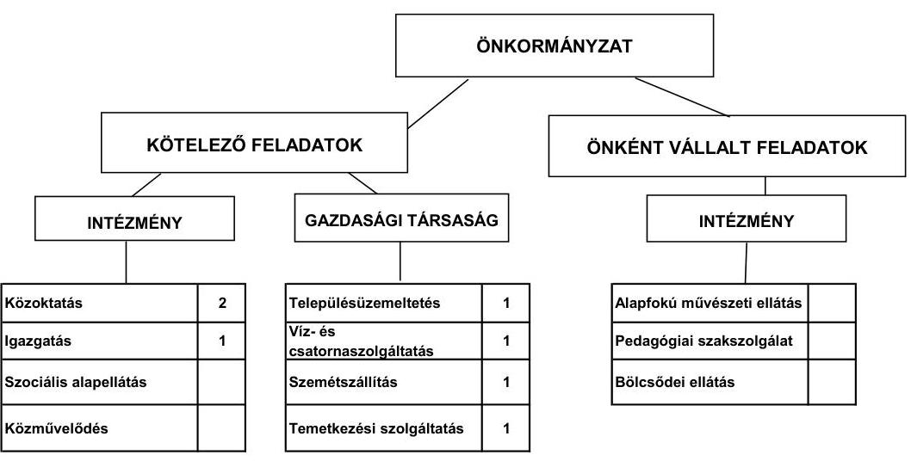

Az Önkormányzat kötelező és önként vállalt feladatait 2007. január 1-jén a Polgármesteri hivatal mellett három, részben önállóan gazdálkodó költségvetési intézménnyel, továbbá négy gazdasági társasággal látta el. A Polgármesteri hivatal, az intézmények és a gazdasági társaságok összesen nyolc telephelyen működtek. A feladatellátás átszervezésére tett intézkedések következményeként 2011. június 30 -án az Önkormányzat feladatait a Polgármesteri hivatal mellett kettő önállóan működő költségvetési intézménye, egy kizárólagos tulajdonú és egy kisebbségi befolyással rendelkező gazdasági társasága, valamint közszolgáltatási szerződés keretében további kettő gazdasági társaság közreműködésével, illetve egy társulás útján látta el. Az intézményszervezeti átalakítások ellenére a feladatellátás telephelyeinek száma 2007-2011. év I. félév között nem

[^0]
[^0]:    ${ }^{6}$ Az adatok nem tartalmazzák a védőnői szolgálat, a labor, a háziorvosi ügyelet és a kisebbségi önkormányzat adatait.

---

változott. Az Önkormányzat kizárólagos tulajdonában lévő gazdasági társasága a településüzemeltetés, a kisebbségi befolyással rendelkező gazdasági társasága a víz- és szennyvízkezelés, a kötelező közszolgáltatás ellátásában résztvevő gazdasági társaságok a kegyeleti szolgáltatás, valamint a szemétszállítás területén kaptak szerepet az önkormányzati feladatellátásában. A gazdasági társaságok a működésükhöz az ellenőrzött időszakban összesen 112,6 millió Ft rendszeres működési célú támogatásban részesültek.

A 2007-2010. években az önkormányzati közszolgáltatások körében végrehajtott szervezeti változások összességében a kiadásokat 203,4 millió Ft-tal, a bevételeket 181,8 millió Ft-tal csökkentették, 21,6 millió Ft összegű megtakarítást eredményezve. A kötelező feladatok ellátását biztosító szervezeti keretekben, illetve a feladatellátás módjában bekövetkezett változások (szociális feladatok társulásba adása), valamint az önként vállalt feladatokra teljesített működési kiadások arányának 2007-2010. évek közötti 8,8 százalékpontos ( 71,8 millió Ft-os) csökkenése a vizsgált időszakban az Önkormányzat pénzügyi egyensúlyi helyzetét javította, azonban nem teremtett elegendő forrást, ezért szükség van további intézkedések meghozatalára.

Az egyes közszolgáltatások feladatellátásában résztvevő költségvetési szervek működési kiadásainak ágazatonkénti finanszírozási összetételét a 2007. és 2010. években a következő ábra szemlélteti:
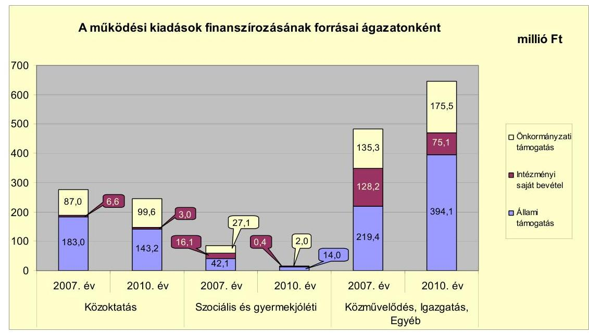

A közoktatási intézmények működési kiadását 2007-2009 között átlagosan 65,4%-ban ( 167,9 millió Ft) állami támogatás, 2,8%-ban ( 7,2 millió Ft) intézményi saját bevétel, 31,7%-ban ( 81,4 millió Ft) önkormányzati támogatás fedezte, az arányok 2010-re 58,3%-ra (143,2 millió Ft), 1,2%-ra (3,0 millió Ft), illetve 40,5%-ra ( 99,6 millió Ft) változtak. Az állami támogatás nominális összege 2007-2010 között 21,8%-kal (39,9 millió Ft) csökkent az óvodás gyermekek és az általános iskolai tanulók számának csökkenése miatt, mely az intézményi saját bevételek csökkenésére is kihatással volt. A szociális és gyermekjóléti intézményekben a működési kiadásokat 2007-2009 között átlagosan 58,4%-ban ( 24,4 millió Ft) állami támogatás, 13,4%-ban (5,6 millió Ft) saját

---

bevétel, 28,2%-ban (11,8 millió Ft) önkormányzati támogatás finanszírozta. A szociális intézmény fenntartójának váltása miatt 2010-ben a gyermekjóléti intézmény kiadását 84,8%-ban ( 14,0 millió Ft ) állami támogatás, 2,5%-ban ( 0,4 millió Ft) saját bevétel, 12,7%-ban ( 2,1 millió Ft ) önkormányzati támogatás fedezte. A közművelődés, valamint az egyéb (családsegítés és gyermekjóléti) feladatok együttes működési kiadásai a 2010. évi összes működési kiadás 1,0%-át képviselték, ezért a kiadások, illetve annak fedezetét biztosító bevételek pénzügyi egyensúlyi helyzetre gyakorolt hatása nem jelentős. A Polgármesteri hivatal költségvetésében kimutatott feladatok átlagos működési kiadása a 2007-2009. években 510,8 millió Ft volt, 24,4%-kal (124,5 millió Ft-tal) kevesebb a 2010. évi működési kiadásoknál. A 2010. évi működési kiadás 65,3%-ára nyújtott fedezetet az állami támogatás, amely 10,0 százalékponttal volt magasabb a 2007-2009. évekre számított 55,3%-os átlagos részaránynál. Az állami támogatás arányának emelkedését többletfeladatra (közhasznú-, illetve közcélú foglalkoztatásra) kapott támogatás és az ÖNHIKI összegének emelkedése okozta.

Az Önkormányzat folyó költségvetésének egyenlegét, működési jövedelmét, valamint tőketörlesztését és pénzügyi kapacitását az alábbi ábra mutatja:
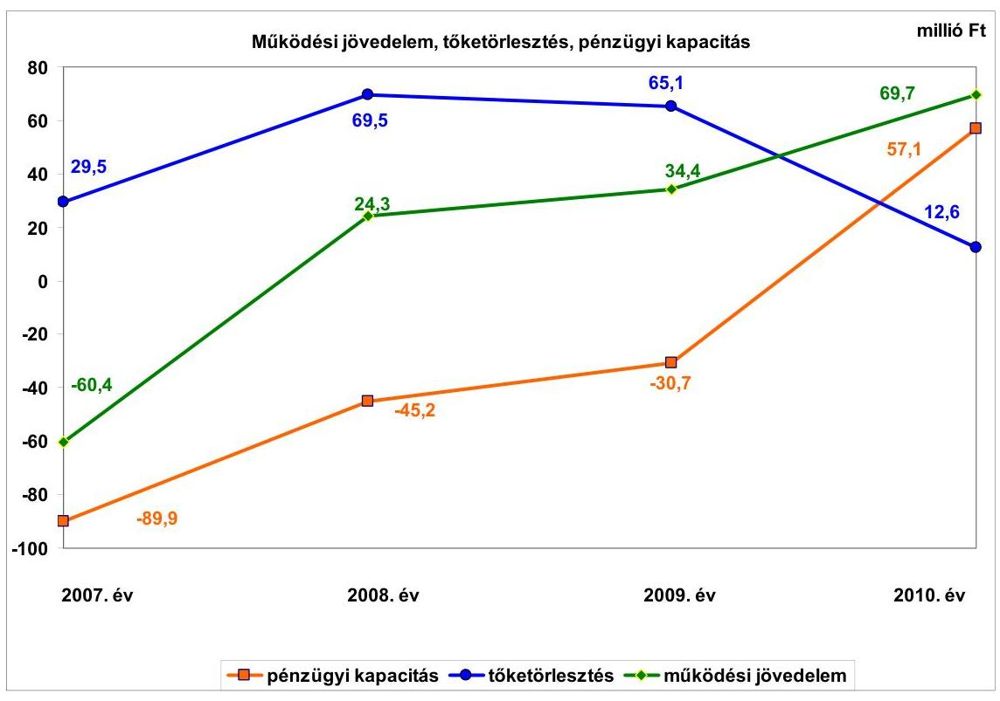

A 2007. évtől kezdődően a folyó költségvetés egyenlege emelkedő tendenciát, a vizsgált időszakban az együttes működési jövedelem 68,0 millió Ft megtakarítást mutatott. 2008-ban a szociális intézmény átadásával keletkezett megtakarítás, valamint a növekvő központi támogatások (emelkedő összegű ÖNHIKI, növekvő mértékű közcélú-, közhasznú foglalkoztatás) eredményeként forrástöbblet alakult ki. A további két évben a tendencia folytatódott. Az Önkormányzat működése biztosítására nyújtott be pályázatot ÖNHIKI támogatásra, melyből 2007-ben 62,0 millió Ft-ban, 2008-ban 44,0 millió Ft-ban, 2009-ben

---

93,0 millió Ft-ban, 2010-ben 92,0 millió Ft-ban, a 2011. év I-III. negyedévben 51,0 millió Ft-ban, mindösszesen 342,0 millió Ft-ban részesültek. A működési jövedelem ÖNHIKI nélkül a vizsgált években negatív egyenleget mutatott, 2007-ben -122,4 millió Ft, 2008-ban -19,7 millió Ft, 2009-ben -58,6 millió Ft, 2010-ben -22,3 millió Ft volt. A pénzügyi kapacitás a 2007-2009. években negatív, 2010-ben pozitív volt, ÖNHIKI figyelembevétele nélkül azonban a vizsgált években negatív értéket mutatott volna. A 2010. évi pénzügyi kapacitás 2007-2009. évek közötti átlagához viszonyított javulását a folyó bevételek és kiadások különbségéből származó működési jövedelem növekedése és a hitelek törlesztésének 77,0%-kal (42,1 millió Ft-tal) történő csökkenése okozta.

Az Önkormányzat felhalmozási költségvetésének egyenlege a 2007-2008. években pozitív, a 2009-2010. években negatív összegű volt. A felhalmozási forráshiányt a 2009-2010. években megvalósított jelentős fejlesztések okozták. A 2007-2008. években jelentkező felhalmozási forrástöbbletet a korábbi évek beruházásainak, illetve felújításainak utófinanszírozására kapott támogatások beérkezése okozta. A vizsgált időszakban keletkezett összesen 90,8 millió Ft felhalmozási forráshiány finanszírozása a hosszú lejáratú hitelekből történt.

Az Önkormányzat a 2007-2008. években közel azonos összegű, 803,1 millió Ft, illetve 794,4 millió Ft folyó bevételt ért el, 2009-ben 932,1 millió Ft-ot, az előző évhez képest 17,3%-kal (137,7 millió Ft-tal), 2010-ben 8,8%-kal (81,7 millió Ft-tal) magasabbat. A 2011. év I. félévében realizált folyó bevétel 399,3 millió Ft volt. A költségvetési támogatás és az átengedett szja 2007-2009 közötti éves átlaga 698,1 millió Ft volt, melyhez viszonyítva a 2010. évi együttes összeg 25,7%-kal (179,7 millió Ft-tal) nőtt. A vizsgált években - az előző évhez viszonyítva - 2008-ban 5,3%-kal (35,7 millió Ft-tal) kapott kevesebb, 2009-ben 19,8%-kal (127,6 millió Ft-tal), 2010-ben 13,8%-kal (106,5 millió Ft-tal) kapott több állami forrást az Önkormányzat. A növekedés oka, hogy 2009-ben az előző évhez képest több mint kétszeresére (49,0 millió Ft-tal) emelkedett az ÖNHIKI összege, mely 2010-ben a 2007-2009. évek átlagához (66,3 millió Ft) viszonyítva további 38,8%-kal ( 25,7 millió Ft-tal) nőtt, valamint közcélú- és közhasznú foglalkoztatással többletfeladatot láttak el. A helyi adók és pótlékok bevételei az Önkormányzat folyó bevételeiben nem töltöttek be meghatározó szerepet (a 2007-2010. évek átlagában a források 3,6%-át tette ki), mely a település alacsony jövedelemteremtő képességét jelzi.

Az Önkormányzat 2010. évi folyó kiadásai a 2007-2009. évek között teljesített folyó kiadások éves átlagánál (843,8 millió Ft) 11,9%-kal (100,3 millió Ft-tal) voltak magasabbak. A
 növekedés oka, hogy a közcélú-, illetve közhasznú foglalkoztatás többletkiadásokat jelentett. A 2008. évben az előző évhez képest 10,8%-kal (93,4 millió Ft-tal) csökkent a folyó kiadások összege, mely csökkenést a többcélú kistérségi társulásnak történő intézményátadás okozta.

Az Önkormányzat 2007-2009 közötti felhalmozási bevételeinek éves átlagához (61,8 millió Ft) viszonyítva a 2010. évi felhalmozási bevételek 23,1 millió Ft-tal (37,4%-kal) csökkentek.

Az Önkormányzat a felhalmozási célú kiadásokra 2008-ban költött a legkevesebbet (22,8 millió Ft-ot), ami az összes kiadás (792,9 millió Ft) 2,9%-ának

---

felelt meg. Az Önkormányzat a 2009-2010. években a felhalmozási célú kiadásai arányát emelni tudta. Ennek oka, hogy ezekben az években jégkár okozta helyreállítási munkákra és védekezési költségekre, sportöltöző átalakításra, nappali ellátást biztosító intézmény, valamint játszótér kialakítására fejlesztési célú támogatást kaptak.

A befejezett fejlesztések jelentős részét támogatásból fedezték. A 2007-2010. évek időszakában a 277,7 millió Ft értékű fejlesztés és felújítás forrása 42,5 millió Ft saját forrás, 164,3 millió Ft hazai- és 54,4 millió Ft EU-s támogatás volt, illetve a fejlesztésekhez 16,5 millió Ft összegű hitelt is igénybe vettek. A 2010. december 31-én folyamatban lévő fejlesztési feladatok végrehajtására 2007-2010 között 9,0 millió Ft kiadást teljesítettek, amelyre saját bevételből 5,5 millió Ft-ot, EU-s forrásból 3,5 millió Ft-ot fordítottak. Az EU-s támogatásból megvalósult fejlesztések finanszírozása - az utófinanszírozás miatt - likviditási problémát okozott az Önkormányzatnak, míg a kötvény tőketörlesztési kötelezettsége a jövőben jelentős hatással lehet a pénzügyi egyensúlyi helyzet, valamint a folyamatban lévő és a várható fejlesztések finanszírozhatóságának alakulására.

A 2010. december 31-én folyamatban lévő fejlesztési feladatok 2010. évet követő kötelezettségvállalásainak összege 57,7 millió Ft, amelyet az Önkormányzat 15,9 millió Ft saját bevételből és 41,8 millió Ft EU-s támogatásból tervez biztosítani.
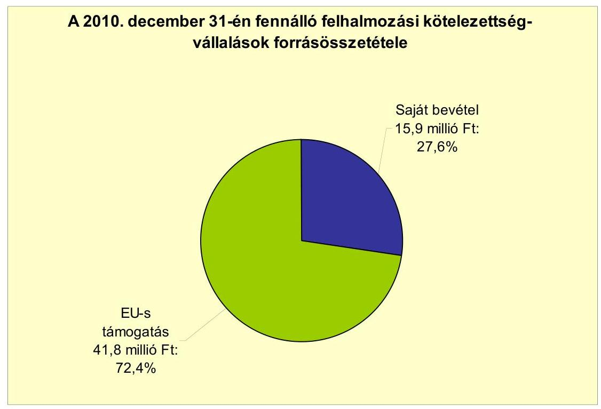

Az Önkormányzat által benyújtott, elbírálás alatt álló pályázatok tervezett teljes bekerülési költsége a 2010-2013. évekre vállalt kötelezettségek összegével egyezően 389,9 millió Ft, amelyhez 31,8 millió Ft saját bevételt, 336,7 millió Ft összegű EU-s támogatást és 21,4 millió Ft hazai támogatást kívánnak bevonni.

---

Az Önkormányzat a 100%-os tulajdonában lévő gazdasági társaságának működési célra összesen 112,6 millió Ft-ot adott át a vizsgált időszakban az éves költségvetésekben jóváhagyottakra és a társaságokkal kötött szolgáltatási szerződésekre alapozottan. Az Önkormányzat a szerződésekben foglaltak szerint megkapta a szolgáltatást. Az átadott pénzeszköz a gazdasági társaság által ellátott kötelező önkormányzati feladatok (településüzemeltetés) finanszírozását szolgálta.

Az Önkormányzat mérleg szerinti pénzintézeti kötelezettsége a 2006. év végéről a 2011. év I. félév végére 96,4 millió Ft-ról 338,0 millió Ft-ra nőtt. Ez az állománynövekedés nem tartalmazott árfolyamváltozás$^7$ miatti különbözetet, mert a számviteli előírások ellenére a devizában fennálló kötelezettség év végi értékelését az Önkormányzat nem végezte el, annak eredményét a könyveiben nem mutatta ki. Ezzel megsértette a Számv. tv. 60. § (2) bekezdésében és az Áhsz. 33. § (1) bekezdésében foglalt előírásokat. A 2011. június 30-án fennálló pénzintézeti kötelezettségek az Önkormányzat számviteli nyilvántartása szerint 12 hosszú lejáratú hitelből, kötvénykibocsátásból, valamint folyószámlahitel igénybevételéből keletkeztek.

Az Önkormányzat kötelezettségvállalásaira képviselő-testületi döntés alapján került sor, azonban a döntéseket megalapozó előterjesztésekben nem mutatták be a kamatkockázatot és a devizaalapú kötelezettséget érintő árfolyamkockázatot, valamint a visszafizetés forrásait.

Az Önkormányzat 2011. június 30-ig valamennyi hosszú lejáratú hitelét lehívta, és a hitelcélnak megfelelően a Képviselő-testület által jóváhagyott, a költségvetésbe betervezett beruházásokhoz használta fel. Az Önkormányzat egy-egy hosszú lejáratú hiteléből 2007. március 31-től 25,9 millió Ft, 2007. szeptember 5-től 22,5 millió Ft, 2010. február 28-tól 0,7 millió Ft, 2010. november 5-től 2,7 millió Ft, 2011. február 28-tól 0,7 millió Ft és 2011. augusztus 28-tól 0,2 millió Ft, mindösszesen 52,7 millió Ft összegű tőkét törlesztett, továbbá 20,0 millió Ft kamatot és 0,8 millió Ft egyéb hiteldíjat fizetett meg 2011. június 30-ig. A CHF-ben fennálló pénzintézeti kötelezettségéből (kötvény) a tőketörlesztés 2013. október 31-től esedékes. A kötvényhez kapcsolódóan 2011. június 30-ig 63438 ezer CHF (12,1 millió Ft) összegű kamatot, továbbá 9245 CHF (1,7 millió Ft) összegű fizetőügynöki- és 4 millió Ft összegű jegyzési garanciavállalási díjat fizetett meg. A kötvénykibocsátásból származó forrást az Önkormányzat 2011. június 30-ig nem használta fel. A 2007-2011. év I. féléve között az átmenetileg szabad pénzeszközeiből (kötvénykibocsátás bevétele) 50,8 millió Ft kamatbevételt realizált.

Az Önkormányzat fizetőképességét, működésének pénzügyi egyensúlyát a vizsgált időszakban folyószámla- és munkabér megelőlegezési hitelek igénybevételével tudta csak biztosítani.

[^0]
[^0]:    $^7$ Az árfolyam emelkedés hatására a kötvénykibocsátás miatti kötelezettségállomány 2008-ban 45,9 millió Ft, 2009-ben 52,2 millió Ft és 2010-ben 108,0 millió Ft összeggel lett volna több a mérlegbeszámolóban, ha az értékelési kötelezettségnek eleget tettek volna.

---

A folyószámlahitel igénybevétele a 2007-2011. év I. félév között a következők szerint alakult:

| Megnevezés | 2007. év | 2008. év | 2009. év | 2010. év | 2011. év   I. félév |
| :--: | :--: | :--: | :--: | :--: | :--: |
| Folyószámlahitel |  |  |  |  |  |
| Keretösszeg január 1-jén (millió Ft-ban) | 50,0 | 60,0 | 60,0 | 60,0 | 70,0 |
| Allagos napi állomány (millió Ft-ban) | 42,3 | 50,9 | 51,8 | 46,7 | 32,3 |
| Folyószámla hitellel zárt napok száma (nap) | 365 | 366 | 365 | 359 | 181 |
| Egyenleg (állomány, millió Ft-ban) | 53,7 | 53,7 | 54,5 | 54,3 | 66,9 |
| Munkabér-megelőlegezési hitel |  |  |  |  |  |
| Keretösszeg január 1-jén (millió Ft-ban) | 28,0 | 28,0 | 28,0 | 28,0 | 40,0 |
| Allagos napi állomány (millió Ft-ban) | 8,6 | 15,3 | 11,6 | 8,4 | 11,2 |
| Munkabér-megelőlegezési hitellel zárt napok száma (nap) | 208 | 266 | 270 | 233 | 191 |
| Egyenleg (állomány, millió Ft-ban) | 0,0 | 0,0 | 0,0 | 0,0 | 0,0 |

Az Önkormányzatnak a 2007-2009. években, valamint a 2011. év I. félévben folyamatosan, valamennyi naptári napon, a 2010. évben 359 napon állt fenn folyószámlahitel-állománya. A vizsgált időszakban négy alkalommal állt fenn fordulónapi állomány, melyek összege 44,3 millió Ft, 57,2 millió Ft, 53,5 millió Ft és 56,4 millió Ft volt. Az Önkormányzat folyószámlahitel-kerete két alkalommal, 2007-ben és 2010-ben módosult, mellyel egyidejűleg a kötelezettségvállalás 10,0-10,0 millió Ft-tal emelkedett. A folyószámlahitel vizsgált időszaki intenzív felhasználása, a hitelkeret emelése azt mutatja, hogy a hitellel - rendeltetésétől eltérően - tartósan kialakult hiányt finanszíroztak.

A vizsgált időszakban a fizetőképesség megőrzése, a tartós hiány finanszírozása összesen 26,5 millió Ft kamatkiadást és 2,5 millió Ft egyéb költség megfizetési kötelezettséget eredményezett az Önkormányzatnak. A 2011. év I. félév végi szállítói tartozás 44,0 millió Ft, melyből a lejárt állomány 27,3 millió Ft volt. A 2011. június 30-án fennálló lejárt szállítói tartozásállományának 38,5%-a (9,2 millió Ft) 30 nap alatti, 57,7%-a (13,8 millió Ft) 31 és 60 nap közötti, 3,8%-a (0,9 millió Ft) 61 és 90 nap közötti volt.

Az Önkormányzat a kizárólagos tulajdonát képező gazdasági társasága folyószámlahitelének igénybevételéhez készfizető kezességet vállalt 4,0 millió Ft összegben, mely kötelezettség a 2010. év végére nem változott.

Az Önkormányzat kötelezettségeinek 2011. év I. félév végi állományát és várható alakulását a kötelezettségek lejáratáig a következő táblázat szemlélteti:

| Megnevezés | Állomány 2010. december 31-én |  | Állomány 2011. június 30-án |  | Várható kötelezettség 2011-2013. években |  | Várható kötelezettség 2014. évtől |  |
| :--: | :--: | :--: | :--: | :--: | :--: | :--: | :--: | :--: |
|  | HUF-ban (millió Ftban) | Devizában ötszággé, ezer CHFban) | HUF-ban (millió Ftban) | Devizában ötszággé, ezer CHFban) | HUF-ban (millió Ftban) | Devizában ötszággé, ezer CHFban) | HUF-ban (millió Ftban) | Devizában ötszággé, ezer CHFban) |
| Pénzintézeti kötelezettségek |  |  |  |  |  |  |  |  |
| Folyószámlahitel | 54,3 |  | 66,9 |  | 66,9 |  |  |  |
| Hosszú lejáratú hiteles | 73,9 |  | 68,9 |  | 64,5 |  | 29,3 |  |
| "Kernecse Jövője" kötvény |  | 1383,0 |  | 1383,0 |  | 77,0 |  | 1420,0 |
| Pénzintézeti kötelezettségek összesen HUF-ban: | 128,2 |  | 135,8 |  | 131,4 |  | 29,3 |  |
| Pénzintézeti kötelezettségek összesen CHF-ben: |  | 1383,0 |  | 1383,0 |  | 77,0 |  | 1420,0 |
| Biztosítékok |  |  | 4,0 |  |  |  |  |  |
| Kezesség |  |  | 4,0 |  |  |  |  |  |
| Biztosítékok összesen: |  |  | 4,0 |  |  |  |  |  |
| Lízing kötelezettségek | 2,2 |  | 2,2 |  | 2,2 |  |  |  |
| Szállítási tartozás | 59,6 |  | 44,0 |  | 44,0 |  |  |  |
| Kötelezettségek összesen HUF-ban: | 190,0 |  | 186,0 |  | 177,6 |  | 29,3 |  |
| Kötelezettségek összesen CHF-ben: |  | 1383,0 |  | 1383,0 |  | 77,0 |  | 1420,0 |

---

Az Önkormányzatnak pénzintézetekkel szemben fennálló kötelezettsége a 2011. év I. félév végén 135,8 millió Ft és 1383 ezer CHF volt. Ezek várható kötelezettsége (tőke, kamat és egyéb költség) a legutóbbi kamatfizetés feltételei alapján a 2011-2013. években 131,4 millió Ft és 77 ezer CHF. Az Önkormányzatnak a 2011. évben lízingkötelezettség és szállítói tartozások címén összesen 46,2 millió Ft fizetési kötelezettsége, továbbá biztosíték nyújtásából 4,0 millió Ft kötelezettségvállalása keletkezett. A 2011-2013. évek kötelezettségeinek teljesíthetőségét részben látjuk biztosítottnak. A kötelezettségekre részben fedezetet nyújt 18,4 millió Ft összegű (kamatbevételből eredő) szabad pénzmaradvány, továbbá figyelembe vehető a kötvényből származó bevétel további lekötéséből 2013. év végéig várható 42,5 millió Ft kamatbevétel, illetve 8,9 millió Ft összegű mérlegben kimutatott követelésállomány. A követelésállományból realizálható bevétel bizonytalan azok behajthatósága miatt. A 2014. évtől várható pénzintézeti kötelezettségek fedezetét nem látjuk biztosítottnak a kevés képződő nettó működési jövedelem miatt, amennyiben annak összege jelentősen nem emelkedik. Az Önkormányzat pénzintézeti kötelezettségeinek
 forrását nem mérte fel, nem számszerűsítette.

Az Önkormányzat 2011. június 30-án fennálló lejárt szállítóállománya 23,9 millió Ft volt. A 30 napon túli, 2011. június 30-án fennálló lejárt szállítóállomány (18,1 millió Ft) a költségvetés éves eredeti előirányzatának 10%-a alatt volt.

Az önkormányzati kötelezettségek növekedése mellett az Önkormányzat minősített többségi befolyásával rendelkező gazdasági társaságának kötelezettségei is befolyásolhatják az Önkormányzat pénzügyi egyensúlyát. Az Önkormányzat Képviselő-testülete nem rendelkezett megfelelő információval a gazdasági társaságainak pénzügyi egyensúlyi helyzetéről, azok önkormányzati pénzügyi egyensúlyi helyzetre gyakorolt hatásairól.

Az Önkormányzat minősített többségi tulajdonú társasága kötelezettségeinek állományát 2010. december 31-én és 2011. június 30-án, valamint várható alakulását a kötelezettségek lejáratáig az alábbi táblázat mutatja be:

| Megnevezés | Állomány 2010.   december 31-én | Állomány 2011.   június 30-án | Várható kötelezettség   2011-2013. években | Várható   kötelezettség   2014. évtől |
| :--: | :--: | :--: | :--: | :--: |
|  | HUF-ban   (millió. Ft-ban) | HUF-ban   (millió. Ft-ban) | HUF-ban   (millió Ft-ban) | HUF-ban   (millió Ft-ban) |
| Folyószámlahitel | 2,5 | 4,0 | 4,0 |  |
| Pénzintézeti kötelezettségek összesen | 2,5 | 4,0 | 4,0 |  |
| Lízing kötelezettségek | 0,9 | 0,3 | 0,3 |  |
| Szállítói tartozás | 10,6 | 7,8 | 7,8 |  |
| Kötelezettségek összesen HUF-ban: | 14,0 | 12,1 | 12,1 |  |

A társaságnak a 2011. évtől 4,0 millió Ft pénzintézeti kötelezettséget (folyószámlahitel), 0,3 millió Ft lízingkötelezettséget és 7,8 millió Ft szállítói tartozást kell rendeznie.

Az Önkormányzat 2007-2010 között eszközállománya után 354,6 millió Ft összegű értékcsökkenést mutatott ki, miközben az elhasznált eszközök pótlására mindössze bruttó 46,8 millió Ft-ot fordított. Az eszközök használhatósági foka önkormányzati szinten a 2007. évi 85,5%-ról 2010-re 76,0%-ra csökkent, amely

---

az Önkormányzat kezelésében lévő eszközök használhatóságának romlását jelezte.

Az Önkormányzat - kimutatása szerint - az ellenőrzött időszakban kiadási megtakarítást eredményező és bevételt növelő intézkedéseket tett. A 2007-2011. év I. féléve között tett intézkedések hatására 40,6 millió Ft bevételi többletet, továbbá 201,0 millió Ft kiadási megtakarítást mutattak ki. A kiadási megtakarítások 82,8%-a az elrendelt álláshelycsökkentések eredménye. Az álláshelycsökkentő intézkedések 2007-2011. év I. féléve között önkormányzati szinten összesen 29 álláshely (ebből üres álláshely nem volt) megszüntetését jelentették. A bevételnövelő intézkedések intézményi térítési díjak emeléséhez, eszközök értékesítéséhez, bérbeadásához és új adónem bevezetéséhez kapcsolódtak. Az Önkormányzat által megtett intézkedések nem biztosítottak elegendő forrást a pénzügyi egyensúly helyreállításához.

Az utóellenőrzés a pénzügyi egyensúly javítására tett nyolc szabályszerűségi és egy célszerűségi javaslat hasznosítására terjedt ki. A javaslatok 55,6%-át hasznosították, 33,3%-át nem valósították meg, 11,1%-át részben teljesítették. Nem teljesült a finanszírozási célú pénzügyi műveletekkel, illetve az értékpapírok év végi értékelésével kapcsolatos javaslat.

Az Önkormányzat pénzügyi egyensúlyi helyzetét összegezve a következők emelhetők ki:

Az Önkormányzat pénzügyi egyensúlya rövid távon veszélyeztetett a vizsgált időszak egészében fennálló, növekvő mértékű lejárt szállítói állomány, valamint az állandósult folyószámla- és munkabér-megelőlegezési hitel igénybevétel miatt. A vizsgált időszak valamennyi évében elnyert ÖNHIKI támogatás nélkül a működési jövedelem minden évben negatív lett volna. Az Önkormányzat a 2007-2009. években igénybevett hiteleit csak újabb hitelek felvételével tudta törleszteni.

Az Önkormányzat felhalmozási költségvetésének egyenlege a 2007-2008. években többletet, a 2009-2010. években hiányt mutatott. A felhalmozási hiány forrása hosszú lejáratú hitelekkel biztosított volt. A fejlesztési célú kötelezettségvállalások jövőbeni teljesítése a folyamatban lévő fejlesztések hitel igénybevétele nélkül, saját és EU-s forrásból tervezett befejezése miatt biztosítottnak látszik.

A pénzintézeti és egyéb kötelezettségek teljesítése a 2011-2013. években a rendelkezésre álló fedezet ismeretében csak részben biztosított. A további évekre szóló jelenleg ismert pénzintézeti kötelezettségek visszafizetésének forrásai nem biztosítottak.

Az Állami Számvevőszékről szóló 2011. évi LXVI. törvény 33. § (1) bekezdésében foglaltak értelmében a jelentésben foglalt megállapításokhoz kapcsolódó intézkedési tervet köteles az ellenőrzött szervezet vezetője összeállítani és azt a jelentés kézhezvételétől számított harminc napon belül az ÁSZ részére megküldeni. Amennyiben az intézkedési tervet határidőben nem küldi meg a szervezet, vagy az továbbra sem elfogadható, az ÁSZ elnöke a hivatkozott törvény 33. § (3) bekezdés a)-b) pontjaiban foglaltakat érvényesítheti.

---

# A 2011. június 30-i pénzügyi egyensúlyi helyzet alapján az ellenőrzés intézkedést igénylő megállapításai és javaslatai a következők: 

## a Polgármesternek

1. Az Önkormányzat nettó működési jövedelme a 2007-2009. években negatív volt. Az Önkormányzat finanszírozása a vizsgált időszakban jelentős ÖNHIKI támogatással, továbbá folyószámla- és munkabér-megelőlegezési hitel igénybevételével volt biztosítható, amely 2007-től állandósult. Az Önkormányzat szállítói kötelezettségeinek állománya, ezen belül a lejárt szállítói tartozások összege jelentősen emelkedett. Az Önkormányzat által tett intézményszervezeti átalakítások, kiadáscsökkentő és bevételnövelő intézkedések nem biztosítanak elegendő forrást a pénzügyi egyensúly helyreállításához. A vállalt pénzintézeti és egyéb kötelezettségek fedezete csak részben biztosított rövid távon (2011-2013. években). A 2014. évtől várható pénzintézeti kötelezettségek fedezetét nem látjuk biztosítottnak.

Javaslat:
Az Önkormányzat pénzügyi egyensúlyának gyors helyreállítása és hosszú távú fenntarthatósága érdekében kezdeményezze - felelősök és határidők megjelölésével - az alábbi intézkedések megtételét:
a) Tárjon fel további bevételszerző és kiadáscsökkentő lehetőségeket. Intézkedjen a bevételek növelésére, a kintlévőségek behajtására, a kiadások csökkentésére;
b) Terjesszen a Képviselő-testület elé reorganizációs programot a kedvezőtlen pénzügyi folyamatok megállítására, a pénzügyi egyensúlyi helyzet gyors stabilizálására;
c) Képezzen egyensúlyi (elkülönített) tartalékot az adósságszolgálat teljesítése érdekében;
d) Mérje fel a folyamatban lévő beruházásokkal kapcsolatos kötelezettségek átütemezésének pénzügyi és jogi lehetőségeit, illetve hatásait. Szükség esetén kezdeményezze a hitelt folyósító pénzintézetnél annak átütemezését;
e) Vizsgálja felül teljes körűen a tervezett beruházásokat és azok fenntartásának jövőbeni pénzügyi kihatásait. Az Önkormányzat pénzügyi egyensúlyi helyzete szempontjából kedvező támogatásfinanszírozási lehetőségeket továbbra is vegye igénybe. Szükség esetén tegyen javaslatot a Képviselő-testületnek a tervezett beruházásokkal kapcsolatos döntések módosítására, amelyben figyelembe veszik az Önkormányzat pénzügyi lehetőségeit és a kötelező feladatellátás elsődlegességét;
f) Vizsgálja meg az állandósult folyószámla- és likvid hitel hosszú távú kötelezettséggé történő alakításának jogi lehetőségét, és a Stabilitási törvény 10. §-ában előírt feltételek fennállása esetén kezdeményezze a Kormánynál ennek engedélyezését;
g) Kezdeményezze az intézmények finanszírozásának napi kontrollját. Szűkítse a jóváhagyott előirányzatok felhasználásának lehetőségeit;

---

h) Tekintse át az önként vállalt feladatok finanszírozhatóságát a kötelező feladatellátás elsődlegességének biztosítása érdekében, mutassa be a Képviselő-testületnek a megoldás lehetőségeit, és szükség esetén a gazdasági program módosításának igényét;
i) Mutassa be havonta legalább három évre kitekintően kötelezettségeinek finanszírozási forrásait.
2. Az Önkormányzat adósságot keletkeztető kötelezettségvállalásaira vonatkozó képviselő-testületi előterjesztések nem tartalmazták a visszafizetés forrásait, valamint a teljes futamidőre vonatkozó kamat- és árfolyamkockázat várható kihatásait.

Javaslat:
a) Gondoskodjon, hogy a jövőben az adósságot keletkeztető kötelezettségvállalásokról szóló képviselő-testületi előterjesztések tételesen tartalmazzák a visszafizetés forrásait;
b) Az adósságot keletkeztető kötelezettségvállalásokról szóló döntéskor mutassa be a Képviselő-testületnek a jövőben várható - árfolyam-, kamat- és törlesztési kockázatot. Kezességvállalás, garancia és helytállási kötelezettségvállalásról szóló döntésnél mutassa be a Képviselő-testületnek azok pénzügyi kockázatait.
3. Az Önkormányzat Képviselő-testülete nem rendelkezett megfelelő információval a gazdasági társasága pénzügyi egyensúlyi helyzetéről, annak önkormányzati pénzügyi egyensúlyi helyzetre gyakorolt hatásáról.

Javaslat:
a) Intézkedjen, hogy a kizárólagos önkormányzati tulajdonú gazdasági társasága félévente számoljon be a pénzügyi egyensúlyi helyzetéről;
b) Terjesszen intézkedési tervet a Képviselő-testület elé a kizárólagos tulajdonú gazdasági társasága pénzügyi egyensúlyi helyzetének stabilizálása érdekében.
4. A 2007-2010. évek között az Önkormányzat az elhasználódott eszközök pótlására az elszámolt értékcsökkenés 13,2%-át, 46,8 millió Ft-ot fordított. Az eszközök használhatósági foka önkormányzati szinten a 2007. évi 85,5%-ról 2010-re 76,0%-ra csökkent, amely az Önkormányzat kezelésében lévő eszközök használhatóságának romlását jelezte.

Javaslat:
Mutassa be a Képviselő-testületnek évente a zárszámadási rendelet előterjesztésében az értékcsökkenés összegét és ezzel összevetve az elhasználódott eszközök pótlására fordított tényleges kiadásokat, az eszközök elhasználódási fokának alakulását.
5. Az utóellenőrzés a 2006. és a 2009. évi ÁSZ jelentésben a pénzügyi egyensúly javítására tett nyolc szabályszerűségi és egy célszerűségi javaslat hasznosítására terjedt ki. A nem teljesült javaslatok a finanszírozási célú pénzügyi műveletek költségvetési bevételként, illetve kiadásként költségvetési rendelettervezetben történő bemutatásának tiltására, valamint a devizában fennálló kötelezettségek év végi értékelésére vonatkoztak.

---

Javaslat:
a) Gondoskodjon az Önkormányzat gazdálkodási rendszerét érintő 2006. és 2009. évi ÁSZ ellenőrzés nem hasznosult javaslatainak végrehajtásáról;
b) Intézkedjen - az Önkormányzat gazdálkodási rendszerét érintő 2006. és 2009. évi ÁSZ ellenőrzés nem hasznosult szabályszerűségi javaslataival kapcsolatban - a fegyelmi felelősség kivizsgálása iránt.

# a jegyzőnek 

Az Önkormányzat a vizsgált időszakban rendelkezett devizában fennálló kötelezettséggel, melyek év végi értékelését a Számv. tv. 60. § (2) bekezdésének és az Áhsz. 33. § (1) bekezdésének előírásai ellenére nem végezte el.

Javaslat:
Gondoskodjon arról, hogy a devizában fennálló kötelezettségeket a Számv. tv. 60. § (2) bekezdésének és az Áhsz. 33. § (1) bekezdésének előírásai alapján év végén értékeljék és az értékelési különbözeteket a számviteli nyilvántartásokban rögzítsék.

A polgármester a helyszíni ellenőrzés lezárása után tájékoztatta az Állami Számvevőszéket az Önkormányzat megtett, illetve tervezett intézkedéseiről, amelyet az Állami Számvevőszék nem ellenőrzött, arra vonatkozóan véleményt vagy megállapítást nem fogalmaz meg. Az ellenőrzés lezárását követően elvégzett intézkedéseket az Állami Számvevőszék utóellenőrzés keretében vizsgálhatja.

A polgármester tájékoztatása szerint a következő intézkedéseket tette, illetve tervezi az Önkormányzat:

- az Önkormányzat a bevételszerző és kiadáscsökkentő lehetőségei áttekintését követően arra a megállapításra jutott, hogy a feladatellátás veszélyeztetése nélkül további kiadáscsökkentést nem tud megvalósítani, saját bevételei növelésének lehetőségeit kimerítette, kintlévőségei minimálisra csökkentése érdekében az összes - jogszabályban biztosított - végrehajtási cselekményt lefolytatta, további végrehajtási intézkedések megtételét azok költségvonzata miatt nem tartja eredményesnek;
- az egyensúlyi tartalék képzésére vonatkozó javaslatra felelősök és határidő megjelölésével intézkedést hozott, ennek értelmében az elkülönített tartalékot 5,0 millió Ft-tal szükséges növelni, melynek forrását a dologi kiadások csökkentésével tervezik megteremteni;
- az Önkormányzat a folyamatban lévő beruházásait felülvizsgálta, a kötelezettségek átütemezését, illetve a beruházásokra vonatkozó döntések módosítását nem tartotta indokoltnak;
- az állandósult folyószámla- és likvid hitel hosszú távú kötelezettséggé való átalakításának lehetősége érdekében a számlavezető pénzintézettel tárgyalást kezdeményeztek;

---

- az intézmények finanszírozásának napi kontrollja az Önkormányzat felelős dolgozói részéről folyamatosan biztosított;
- az önként vállalt feladatok finanszírozhatóságára vonatkozó javaslatra felelős és határidő megjelölésével intézkedtek;
- a három évre kitekintő kötelezettségek finanszírozására vonatkozó javaslattal kapcsolatban intézkedést nem hoztak, tekintettel az önkormányzati gazdálkodást is érintő bizonytalan szabályozási környezet miatt;
- az adósságot keletkeztető kötelezettségvállalásokra vonatkozó képviselőtestületi előterjesztésekben a visszafizetések forrásait tételesen fogják meghatározni. Erre az intézkedésre felelőst és határidőt nem jelöltek meg;
- az adósságot keletkeztető kötelezettségvállalások jövőbeni kockázatai bemutatásához szakemberrel az Önkormányzat nem rendelkezik, ilyen kompetenciával rendelkező személy alkalmazását forrás hiányában nem vállalják;
- az Önkormányzat a gazdasági társaságai pénzügyi egyensúlyi helyzetéről féléves beszámolót, illetve a pénzügyi helyzetük stabilizálására vonatkozó intézkedési tervet kérnek;
- az elszámolt értékcsökkenés összegére, illetve az elhasználódott eszközök pótlására vonatkozó javaslatra intézkedtek, ezeket az adatokat a zárszámadási rendelet előterjesztésében bemutatják. Az intézkedéshez határidőt és felelőst nem
 rendeltek hozzá;
- a finanszírozási célú pénzügyi műveletek költségvetési bevételként, illetve kiadásként költségvetési rendelettervezetben történő bemutatásának tiltására, valamint a devizában fennálló kötelezettségek év végi értékelésére vonatkozó korábbi ÁSZ javaslatnak a 2012. évi költségvetés tervezésekor, illetve a 2011. év végi eszközök értékelése során eleget tettek.

---

# II. RÉSZLETES MEGÁLLAPÍTÁSOK 

## 1. Az ÖNKORMÁNYZAT KÖTELEZŐ ÉS ÖNKÉNT VÁLLALT FELADATAI, A FELADATELLÁTÁS SZERVEZETI KERETEI ÉS ANNAK VÁLTOZÁSAI

Az Önkormányzat a kötelezően ellátandó feladatait az Ötv. és az ágazati törvények által meghatározottnak tekintette, az önként vállalt feladatok köréről az SzMSz-ben ${ }^{8}$ rendelkezett, azok terjedelmét az éves költségvetési rendeletekben az adott évi költségvetés forrásainak ismeretében határozta meg. Az önként vállalt feladatai közé sorolta a bölcsődei, illetve a központi ügyeleti ellátást, az alapfokú művészeti iskola, valamint a pedagógiai szakszolgálat fenntartását. Az önként vállalt feladatok besorolását az Önkormányzat maga végezte el.

Az Önkormányzat - adatszolgáltatása szerint - a 2007. évi teljesített működési kiadásain ( 844,9 millió Ft) belül 739,7 millió Ft-ot ( $87,5 \%$ ) fordított kötelező feladatainak ellátására, az önként vállalt feladatokra teljesített működési kiadások összege 105,2 millió Ft (12,5\%) volt. A 2008-2010 közötti időszakban - az előző évhez képest - folyamatosan csökkent az önként vállalt feladatokra fordított működési kiadások aránya, az évek sorrendjében 5,9\% (44,6 millió Ft), 4,6\% (40,1 millió Ft), illetve 3,7\% (33,4 millió Ft) volt. A 2010. évi működési költségvetési kiadásaiból ( 906,9 millió Ft) 853,4 millió Ft-ot ( $94,1 \%$ ) fordított az Önkormányzat a kötelező feladatok ellátására, melynek feladatonkénti megoszlását és finanszírozását az alábbi táblázat szemlélteti ${ }^{9}$ :

| Ellátott feladat | Működési   kiadás   összesen   (millió Ft) | Kötelező   feladatok   kiadásainak   részaránya   % | Működési   bevétel   összesen   (millió Ft) | Állami   támogatás   részaránya   % | Intézményi   saját bevétel   részaránya   % | Önkormányzati   támogatás   részaránya   % |
| :--: | :--: | :--: | :--: | :--: | :--: | :--: |
| Óvodák | 65,5 | 100,0 | 65,5 | 53,4 | 2,2 | 44,4 |
| Általános iskolák | 180,3 | 90,6 | 180,3 | 60,0 | 0,9 | 39,1 |
| Gyermekjóléti   intézmények | 16,4 | 0,0 | 16,4 | 84,8 | 2,6 | 12,6 |
| Közművelődési   intézmények | 3,5 | 100,0 | 3,5 | 0,0 | 3,7 | 96,3 |
| Egyéb intézmények | 5,8 | 100,0 | 5,8 | 83,6 | 0,0 | 16,4 |
| Polgármesteri hivatal   igazgatási kiadásai | 141,8 | 100,0 | 141,8 | 47,2 | 52,8 | 0,0 |
| Polgármesteri   hivatalban ellátott   feladatok működési   kiadásai | 493,6 | 100,0 | 493,6 | 65,3 | 0,0 | 34,7 |
| Működési kiadá-   sok összesen | 906,9 | 94,1 | 906,9 | 60,8 | 8,7 | 30,5 |

[^0]
[^0]:    ${ }^{8}$ Az Önkormányzat az SzMSz 14. §-ának (1) bekezdésében tételesen rögzítette az önként vállalt feladatait.
    ${ }^{9}$ Az adatok nem tartalmazzák a védőnői szolgálat, a labor, a háziorvosi ügyelet és a kisebbségi önkormányzat adatait.

---

Az Önkormányzat 2007-2009. évek közötti átlagos működési kiadását (821,0 millió Ft) a 2010. évi összes működési kiadás 10,5\%-kal (85,9 millió Ft-tal) haladta meg. A 2007-2009. évek között teljesített működési kiadásokat átlagosan 58,9\%-ban állami támogatás, 13,8\%-ban intézményi saját bevétel, 27,3\%-ban önkormányzati támogatás, míg 2010-ben 60,8\%-ban állami támogatás, $8,7 \%$-ban intézményi saját bevétel, illetve $30,5 \%$-ban önkormányzati támogatás finanszírozta. Az intézményi saját bevétel arányának csökkenését az okozta, hogy a szemétszállítási feladat 2008-tól gazdasági társasághoz került, melynek bevétele már nem az Önkormányzatot illeti.

A közoktatási intézmények működési kiadását 2007-2009 között átlagosan 65,4\%-ban (167,9 millió Ft) állami támogatás, 2,8\%-ban ( 7,2 millió Ft) intézményi saját bevétel, $31,7 \%$-ban ( 81,4 millió Ft ) önkormányzati támogatás fedezte, az arányok 2010-re 58,3\%-ra (143,2 millió Ft), 1,2\%-ra (3,0 millió Ft), illetve 40,5\%-ra ( 99,6 millió Ft) változtak. Az állami támogatás nominális összege 2007-2010 között 21,8\%-kal (39,9 millió Ft) csökkent az óvodás gyermekek és az általános iskolai tanulók számának csökkenése miatt. A szociális és gyermekjóléti intézményekben a működési kiadásokat 2007-2009 között átlagosan 58,4\%-ban ( 24,4 millió Ft) állami támogatás, 13,4\%-ban (5,6 millió Ft) saját bevétel, 28,2\%-ban ( 11,8 millió Ft) önkormányzati támogatás finanszírozta, a szociális intézmény fenntartóváltása miatt 2010-ben a gyermekjóléti intézmény kiadását $84,8 \%$-ban ( 14,0 millió Ft) állami támogatás, 2,5\%-ban ( 0,4 millió Ft) saját bevétel, 12,7\%-ban ( 2,1 millió Ft) önkormányzati támogatás fedezte. A közművelődés, valamint az egyéb (családsegítő és gyermekjóléti) feladatok együttes működési kiadásai a 2010. évi összes működési kiadás 1,0\%-át képviselték, ezért a kiadások, illetve annak fedezetét biztosító bevételek pénzügyi helyzetre gyakorolt hatása nem jelentős. A Polgármesteri hivatal költségvetésében kimutatott feladatok (igazgatási kiadások és egyéb ellátott feladatok) átlagos működési kiadása a 2007-2009. években 510,8 millió Ft volt, $24,4 \%$-kal, 124,5 millió Ft-tal kevesebb a 2010. évi működési kiadásoknál. A 2010. évi működési kiadás 65,3\%-ára nyújtott fedezetet az állami támogatás, amely 10,0 százalékponttal volt magasabb a 2007-2009. évekre számított $55,3 \%$ átlagos részaránytól. Az állami támogatás arányának emelkedésére a többletfeladatra (közcélú- és közhasznú foglalkoztatás) kapott támogatás és az ÖNHIKI összegének emelkedése volt hatással. Az ÖNHIKI összege a 2007-2010. évek között 291,0 millió Ft volt.

Az Önkormányzat kötelező és önként vállalt feladatait 2007. január 1-jén a Polgármesteri hivatal mellett három részben önállóan gazdálkodó költségvetési intézménnyel, továbbá négy gazdasági társasággal látta el. A Polgármesteri hivatal, az intézmények és a gazdasági társaságok összesen nyolc telephelyen működtek. A feladatellátás átszervezésére tett intézkedések következményeként 2011. június 30-án az Önkormányzat feladatait a Polgármesteri hivatal mellett kettő önállóan működő költségvetési intézménye, egy kizárólagos tulajdonú és egy kisebbségi befolyással rendelkező gazdasági társasága, valamint közszolgáltatási szerződés keretében további kettő gazdasági társaság közreműködésével, illetve egy társulás útján látta el. Az intézményszervezeti átalakítások ellenére a feladatellátás telephelyeinek száma nem változott.

A közoktatási feladatokat (óvoda, általános iskola, alapfokú művészeti iskola, pedagógiai szakszolgálat) 2007. január 1-jén kettő, a szociális és

---

gyermekvédelmi feladatellátást (bentlakásos intézmény, házi segítségnyújtás, szociális étkeztetés, családsegítő- és gyermekjóléti szolgálat, védőnői szolgálat, bölcsőde), valamint az egészségügyi alapellátást (labor, központi ügyelet) egy részben önállóan gazdálkodó költségvetési intézmény (Répásy Mihály Szociális Szolgáltató Központ) látta el. Az igazgatási, valamint a közművelődési feladatokat a Polgármesteri hivatal végezte. Az Önkormányzat kizárólagos tulajdonában lévő gazdasági társasága a településüzemeltetés, a kisebbségi befolyással rendelkező gazdasági társasága a víz- és szennyvízkezelés, a kötelező közszolgáltatás ellátásában résztvevő gazdasági társaságok a kegyeleti szolgáltatás, valamint a szemétszállítás területén kaptak szerepet az önkormányzati feladatellátásában. Az Önkormányzat 2008-ban a Répásy Mihály Szociális Szolgáltató Központ által ellátott feladatok közül a bentlakásos intézményi, házi segítségnyújtási, szociális étkeztetési feladatokat többcélú kistérségi társulás fenntartásába adta. Az intézményszervezeti átalakítások következtében 2011. június 30-án a bölcsődei ellátást a közoktatási feladatokat végző óvodában biztosították.

Az Önkormányzat 2008-ban kistérségi társulás részére adott át intézményt, illetve feladatot.

A Répásy Mihály Szociális Szolgáltató Központ 2008. január 1-jétől a Közép-Szabolcsi Többcélú Kistérségi Társulás fenntartásába került, ettől az időponttól a társulás útján biztosítják az alapfokú, illetve a szakosított szociális ellátásokat.

A 2007-2010. években - az Önkormányzat adatszolgáltatása szerint - az önkormányzati közszolgáltatások körében végrehajtott szervezeti változások összességében a kiadásokat 203,4 millió Ft-tal, a bevételeket 181,8 millió Ft-tal csökkentették, 21,6 millió Ft összegű megtakarítást eredményezve.

A kötelező feladatok ellátását biztosító szervezeti keretekben, illetve a feladatellátás módjában bekövetkezett változások (szociális feladatok társulásba adása), valamint az önként vállalt feladatokra teljesített működési kiadások arányának 2007-2010. évek közötti 8,8 százalékpontos ( 71,8 millió Ft-os) csökkenése a vizsgált időszakban az Önkormányzat pénzügyi helyzetét javította, azonban nem teremtett elegendő forrást, ezért szükség van további intézkedések meghozatalára.

# 2. AZ ÖNKORMÁNYZAT PÉNZÜGYI EGYENSÚLYI HELYZETÉT BEFOLYÁSOLÓ TÉNYEZŐK 

A hagyományos költségvetési szerkezet helyett az Önkormányzat pénzügyi helyzetét a CLF módszerrel mutatjuk be, amelyben jobban elkülönülnek a vagyonnal kapcsolatos bevételek és kiadások az önkormányzati feladatokkal kapcsolatos közvetlen működtetési bevételektől és kiadásoktól. A módszer következetesen elkülöníti a folyó és a felhalmozási költségvetés bevételeit és kiadásait, azok költségvetési egyenlegeit. A saját folyó bevételek, valamint a sa-

---

ját felhalmozási bevételek nem tartalmazzák az előző évi pénzmaradványok felhasználásából származó pénzforgalom nélküli bevételeket ${ }^{10}$.

A folyó költségvetés egyenlege, a működési jövedelem megmutatja, hogy az Önkormányzat éves folyó bevétele fedezetet biztosít-e a kötelező és önként vállalt feladatellátáshoz kapcsolódó éves folyó kiadására. A működési jövedelem negatív értéke pénzügyileg fenntarthatatlan helyzetet jelez. A mutató pozitív értéke megtakarítást mutat, amely forrásul szolgálhat az Önkormányzat fennálló kötelezettségei megfizetéséhez, valamint fejlesztéseihez.

A felhalmozási költségvetés pozitív értéke felhalmozási többletet mutat, amely a jövőbeni fejlesztések forrását biztosíthatja. Amennyiben a folyó költségvetési hiány finanszírozása a felhalmozási többletből történik, ez szűkebb értelemben vagyonfelélésnek tekinthető. Amennyiben a felhalmozási költségvetés megtakarítása fejlesztési célú hitelek, kötvények adósságszolgálatát finanszírozza, az változatlan vagyon tömeg mellett, a korábban megelőlegezett tőkebevételek valós realizációjának tekinthető. A felhalmozási deficit által generált finanszírozási igény önmagában nem jár pénzügyi kockázattal, a pénzügyileg fenntartható beruházásokhoz kapcsolódó kötelezettségvállalás (adósságszolgálat) átlátható és szabályozott költségvetési gazdálkodással teljesíthető.

A módszer a pénzügyi kapacitás fogalmát helyezi a középpontba. Az adós hitelfelvételi képessége, hosszú távú fizetőképessége vagy bonitása a pénzügyi kapacitással, ezen belül is a nettó működési jövedelemmel jellemezhető. A nettó működési jövedelem negatív értéke az egyes költségvetési években jelentkező adósságszolgálat túlzott mértékére utal. ${ }^{11}$ A nettó működési jövedelem negatív értékének felhalmozási többletből, vagy további hitelből történő finanszírozása pénzügyileg nem fenntartható gazdálkodást vetít előre. A pozitív értéket mutató nettó működési jövedelem fejlesztési kiadások fedezetét biztosíthatja, illetve a folyamatosan, évenként képződő pozitív nettó működési jövedelemből meghatározható a jövőben vállalható, teljesíthető éves adósságszolgálat, ily módon az a hitelösszeg, amely - a többi tényezőt, feltételt adottnak tekintve - visszafizetési kockázat nélkül felvehető.

A CLF módszer alapján a pénzügyi kapacitás mértéke az Önkormányzat összevont, nettósított, a központi információs rendszerbe a Magyar Államkincstáron keresztül leadott éves költségvetési beszámolójának 80-as űrlapjában szerepeltetett adatok alapján került meghatározásra.

A számítási leírás némileg eltér az ÁSZ módszertanában korábban alkalmazott gyakorlattól. A jelen besorolás általános közgazdasági meggondolásokon alapul, amely megjelenik az SNA statisztikai módszertanában is. Folyó tételek alatt értjük azokat a kiadásokat és bevételeket, amelyek a gazdálkodó szervezet helyzetét automatikusan nem változtatják. Bevételi oldalon ilyenek az adók, a

[^0]
[^0]:    ${ }^{10}$ A költségvetési években kialakuló hiány finanszírozása az előző évi pénzmaradvány és a korábbi években képzett tartalékok felhasználásával
 is történhet.
    ${ }^{11}$ kivéve, ha annak finanszírozására a korábbi években képzett tartalékok fedezetet nyújtanak

---

tényező jövedelmek, a transzferek ${ }^{12}$, kiadási oldalon a transzferek és a szolgáltatás igénybevételével kapcsolatos működési kiadások. A folyó költségvetésben a bevételekben nem térül meg, a kiadásokban nem jelenik meg az amortizáció, a vagyoni helyzetet az egyenleg befolyásolja.

A folyó költségvetés egyenlege (működési jövedelem) tartalmazza a kamatbevételeket és a kamatkiadásokat is, mind a működési, mind a fejlesztési kamatot, valamint a visszatérülő és befizetendő áfa teljes összegét, mert ezek közgazdaságilag tényező jövedelmek. Nem tartalmazzák viszont a követelés elengedés miatt könyvelt bevételi és kiadási pénzforgalmi tételeket, mert valójában technikai elszámolási műveletnek minősülnek, a bevétel soha nem realizálódott, és költségvetési kiadás sem történt.

A felhalmozási költségvetésben a bevételek között a vagyon megőrzésére és bővítésére fordítható források jelennek meg. A felhalmozási vagy tőketételek módosítják a vagyon nagyságát. A privatizációs bevétel csökkenti a vagyont, a fizikai beruházás, pénzügyi befektetés növeli.

A nettó működési jövedelmet a tőketörlesztés levonásával a folyó költségvetés egyenlegéből származtatjuk.

# 2.1. A működési és a felhalmozási egyensúly változása 

CLF módszer szerinti önkormányzati adatok

| Megnevezés | 2007. év | 2008. év | 2009. év | 2010. év |
| :--: | :--: | :--: | :--: | :--: |
| Folyó bevételek | 803,1 | 794,4 | 932,1 | 1.013,6 |
| Folyó kiadások | 863,5 | 770,1 | 897,7 | 944,1 |
| Működési jövedelem | $-60,4$ | 24,3 | 34,4 | 69,7 |
| Nettó működési jövedelem   -működési jövedelem - tőketörlesztés | $-89,9$ | $-45,2$ | $-30,7$ | 57,1 |
| Felhalmozási bevételek | 62,5 | 37,0 | 85,9 | 38,7 |
| Felhalmozási kiadások | 30,2 | 22,8 | 112,4 | 149,5 |
| Felhalmozási költségvetés egyenlege | 32,3 | 14,2 | $-26,5$ | $-110,8$ |
| Finanszírozási műveletek nélküli (GFS) pozíció = működési jövedelem + felhalmozási költségvetés egyenlege | $-28,1$ | 38,5 | 7,9 | $-41,1$ |
| Finanszírozási műveletek egyenlege | 28,0 | 58,4 | 117,1 | 39,3 |
| Tárgyévi pénzügyi pozíció | $-0,1$ | 96,9 | 125,0 | $-1,6$ |
| Egyéb tájékoztató adatok |  |  |  |  |
| Összes kötelezettség* | 143,9 | 314,3 | 346,5 | 390,0 |
| -ebből rövid lejáratú | 82,2 | 68,1 | 111,7 | 113,9 |
| Folyószámlahitel napi átlagos állománya ** | 42,3 | 50,9 | 51,8 | 46,7 |
| Likvidhitel napi átlagos állománya** | 0,0 | 0,0 | 0,0 | 0,0 |
| Munkabérhitel napi átlagos állománya** | 8,6 | 15,3 | 11,6 | 8,4 |
| Finanszírozásba vonható eszközök: | 1,8 | 223,7 | 223,8 | 222,1 |
| Tartós hitelviszonyt megtestesítő értékpapírok év végi állománya | 1,8 | 1,8 | $-1,8$ | 1,8 |
| Hosszú lejáratú bankbetétek év végi állománya | 0,0 | 0,0 | 0,0 | 0,0 |
| Értékpapírok év végi állománya | 0,0 | 125,0 | 0,0 | 0,0 |
| Pénzeszközök (idegen pénzeszközök nélkül) év végi állománya | 0,0 | 96,9 | 222,0 | 220,3 |

* Az összes kötelezettséget a passzív pénzügyi elszámolások nélkül vettük figyelembe, mert a passzívák a pénzmaradvány elszámolás tételei közé tartoznak.
** A folyószámla, a likvid- és a munkabérhitel átlagos állományát 365 napos osztószámmal és nem a fennálló napok számával vettük figyelembe.

[^0]
[^0]:    ${ }^{12}$ Transzfer kiadásoknak nevezzük azokat a folyó és felhalmozási tételeket, amelyeket nem az adott önkormányzat használ fel szolgáltatásnyújtásra.

---

A CLF módszer szerinti részletes adatokat a jelentés 2. számú melléklete tartalmazza.

Az Önkormányzat 2007-2010 évek közötti működési jövedelmét a következő ábra szemlélteti:
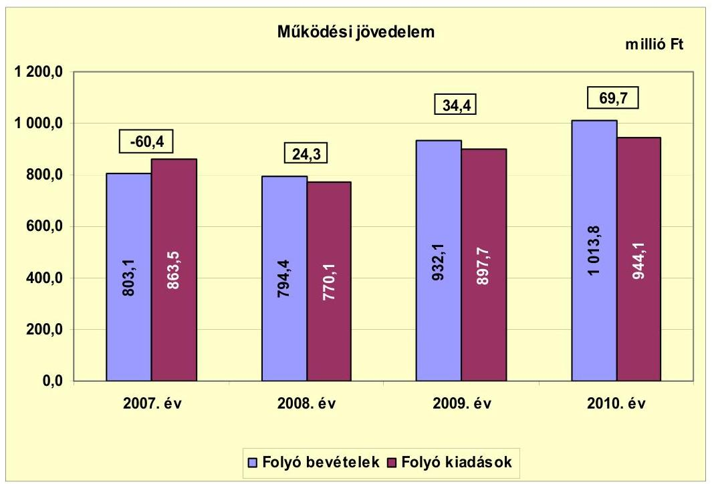

A vizsgált időszakban az Önkormányzat folyó költségvetésének egyenlege, működési jövedelme - a 2007. év kivételével - pozitív összegű volt. A működési jövedelem 2007-ről 2008-ra 84,7 millió Ft-tal, 2008-ról 2009-re 10,1 millió Ft-tal, 2009-ről 2010-re további 35,3 millió Ft-tal emelkedett. A 2008. évi működési forrástöbbletből 21,6 millió Ft a szociális intézmény kistérségi társulásnak történő átadása eredményeként keletkezett. A 2008-2010 évek működési forrástöbbletét a növekvő központi támogatások (emelkedő összegű ÖNHIKI, növekvő mértékű közcélú-, közhasznú foglalkoztatás) eredményezték.

Az Önkormányzat működtetésének biztosítása érdekében nyújtott be pályázatot az önhibájukon kívül hátrányos helyzetben lévő települési önkormányzatok támogatására, melyből 2007-ben 62,0 millió Ft-ban, 2008-ban 44,0 millió Ft-ban, 2009-ben 93,0 millió Ft-ban, 2010-ben 92,0 millió Ft-ban, a 2011. év I-III. negyedévében 51,0 millió Ft-ban, mindösszesen 342,0 millió Ft-ban részesült. A támogatást a dologi kiadások finanszírozására használták fel. A működési jövedelem ÖNHIKI nélkül minden évben negatív értéket mutatott, 2007-ben -122,4 millió Ft, 2008-ban -19,7 millió Ft, 2009-ben -58,6 millió Ft, 2010-ben $-22,3$ millió Ft volt.

Az Önkormányzat pénzügyi kapacitása a 2007-2009. években negatív értékű volt, 2010-ben többletet mutatott. A nettó működési jövedelem ${ }^{13}$ értéke a

[^0]
[^0]:    ${ }^{13}$ Pénzügyi kapacitás

---

folyó költségvetési pozíció mellett az adott költségvetési év adósságtörlesztésének hatását is tükrözi. A 2007-2010 közötti összesen 68,0 millió Ft működési jövedelem nem nyújtott elegendő forrást a felmerülő hiteltörlesztésekre, melynek összege 176,7 millió Ft-ot tett ki. Az Önkormányzat 2007-ben és 2008-ban a hitelek törlesztését és kamatok fizetését újabb hitelek felvételével tudta biztosítani. A 2010. évi pénzügyi kapacitás 2007-2009. évek közötti időszak átlagához viszonyított javulását a folyó bevételek és kiadások különbségéből származó működési jövedelem növekedése és a hitelek törlesztésének 77,0\%-kal (42,1 millió Ft-tal) történő csökkenése okozta. A pénzügyi kapacitás ÖNHIKI figyelembevétele nélkül a vizsgált években negatív értéket mutatott, 2007-ben - 27,9 millió Ft, 2008-ban -89,2 millió Ft, 2009-ben -123,7 millió Ft, 2010-ben -34,9 millió Ft volt.

Az Önkormányzat nettó működési jövedelmének évenkénti alakulását az alábbi ábra szemlélteti:
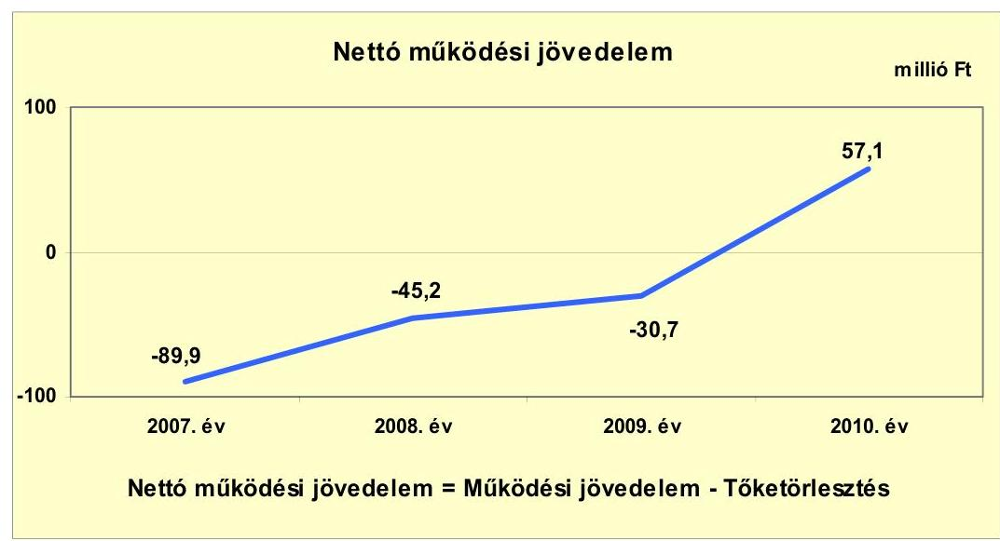

Az Önkormányzat felhalmozási költségvetésének egyenlege a 2007-2008. években pozitív, a 2009-2010. években negatív összegű volt. A felhalmozási forráshiányt a 2009-2010. években megvalósított jelentős fejlesztések okozták. A 2007-2008. években jelentkező felhalmozási forrástöbbletet a korábbi évek beruházásainak, illetve felújításainak utófinanszírozására kapott támogatások beérkezése okozta.

---

A felhalmozási költségvetés egyenlegének alakulását évről évre a következő ábra szemlélteti:
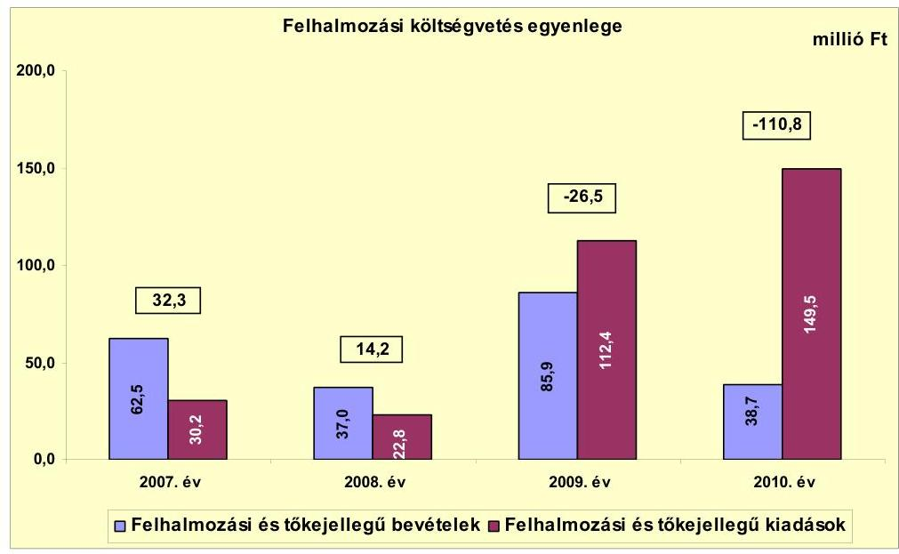

A vizsgált időszakban keletkezett összesen 90,8 millió Ft felhalmozási forráshiány finanszírozása a hosszú lejáratú hitelekből történt ${ }^{14}$.

Az Önkormányzat évenkénti teljes finanszírozási igénye ${ }^{15}$ a CLF módszer szerint 2007-ben 57,6 millió Ft, 2008-ban 31,0 millió Ft, 2009-ben 57,2 millió Ft, 2010-ben 53,7 millió Ft volt. A finanszírozási célú bevételek és kiadások egyenlege 2008-2009-ben biztosította a finanszírozási szükségletet, míg azt a finanszírozhatóság érdekében 2007-ben és 2010-ben a finanszírozásba bevonható egyéb pénzeszközök felhasználásával biztosították.

Az Önkormányzat finanszírozási műveletei 2007-2010. évekbeli egyenlegének alakulását a következő ábra szemlélteti:
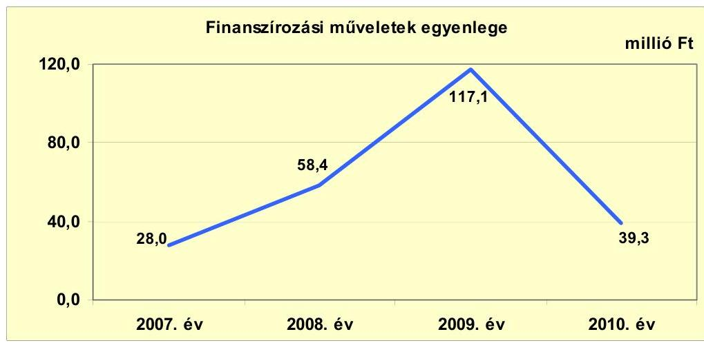

[^0]
[^0]:    ${ }^{14}$ Az évenkénti adatokat a jelentés 2. számú melléklete mutatja be.
    ${ }^{15}$ a nettó működési jövedelem és a felhalmozási költségvetés eredője

---

A finanszírozási célú műveleteket a vizsgált időszakban a jelentés 2. számú mellékletének 4.1-4.8 pontjai részletezik.

Az Önkormányzat 2007-2010. évi zárszámadási rendeleteinek mellékleteiben mérlegszerűen bemutatott működési és fejlesztési célú hiányt/többletet a jelentés 1. számú melléklete mutatja be. Az Önkormányzatnál az előírástól ${ }^{16}$ eltérő módon mutatták be a Képviselő-testület részére a hiány/többlet összegét, mivel a finanszírozási célú pénzügyi műveletek bevételeit és kiadásait is figyelembe vették a költségvetési bevételek és kiadások főösszegeiben. 2007-ben 60,2 millió Ft, 2008-ban 53,7 millió Ft, 2009-ben 54,5 millió Ft, 2010-ben 53,9 millió Ft finanszírozási célú pénzügyi bevételt, illetve az évek sorrendjében 20,3 millió Ft, 71,4 millió Ft, 60,6 millió Ft és 1,4 millió Ft finanszírozási célú pénzügyi kiadást vettek figyelembe módosító tételként.

A 2007-2010. évek között a kötelezettségek (passzív pénzügyi elszámolások nélkül) 143,9 millió Ft-ról 390,0 millió Ft-ra emelkedtek, amely együtt járt a kamatkiadások növekedésével. Az Önkormányzat által felvett hitelekhez kapcsolódóan a 2007-2011. év I. félév közötti időszakban összesen 61,0 millió Ft kamatfizetési kötelezettség keletkezett. Az átmenetileg szabad pénzeszközök lekötéséből elért kamatbevétel a teljes kamatráfordítás 97,2\%-át (59,3 millió Ft) tette ki. A kamatbevétel 85,7\%-a ( 50,8 millió Ft) a kibocsátott kötvényből származó bevétel lekötéséből képződött.

Az Önkormányzat kamatbevételeit és kamatkiadásait, valamint azok egyenlegét évenként a következő ábra mutatja be:
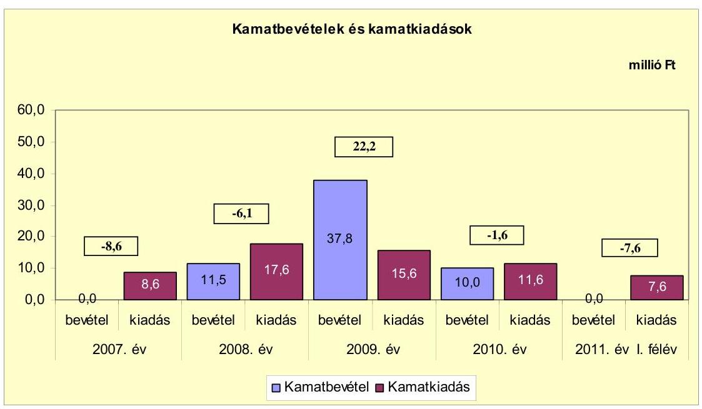

Kamatbevételek a 2009. évben 2,4-szeresével (22,2 millió Ft-tal) haladták meg a kamatkiadásokat, melynek oka az volt, hogy a kötvényből származó bevétel 2009. évi állampapírban történő befektetésével árfolyamnyereségre tettek szert.

[^0]
[^0]:    ${ }^{16}$ az Áht. 8/A. § (7) bekezdése tartalmazza az előírást

---

# 2.2. Az Önkormányzat bevételeinek változása 

Az Önkormányzat 2007-2009 évek között elért összes folyó bevételének átlaga 843,2 millió Ft volt, 16,8\%-kal (170,6 millió Ft-tal) kevesebb, mint a 2010. évi. A 2011. év I. félévében realizált folyó bevétel 399,3 millió Ft volt.

Az Önkormányzat 2007-2011. év I. félév között realizált főbb bevételi jogcímeinek számszaki adatait a következő grafikon mutatja be:
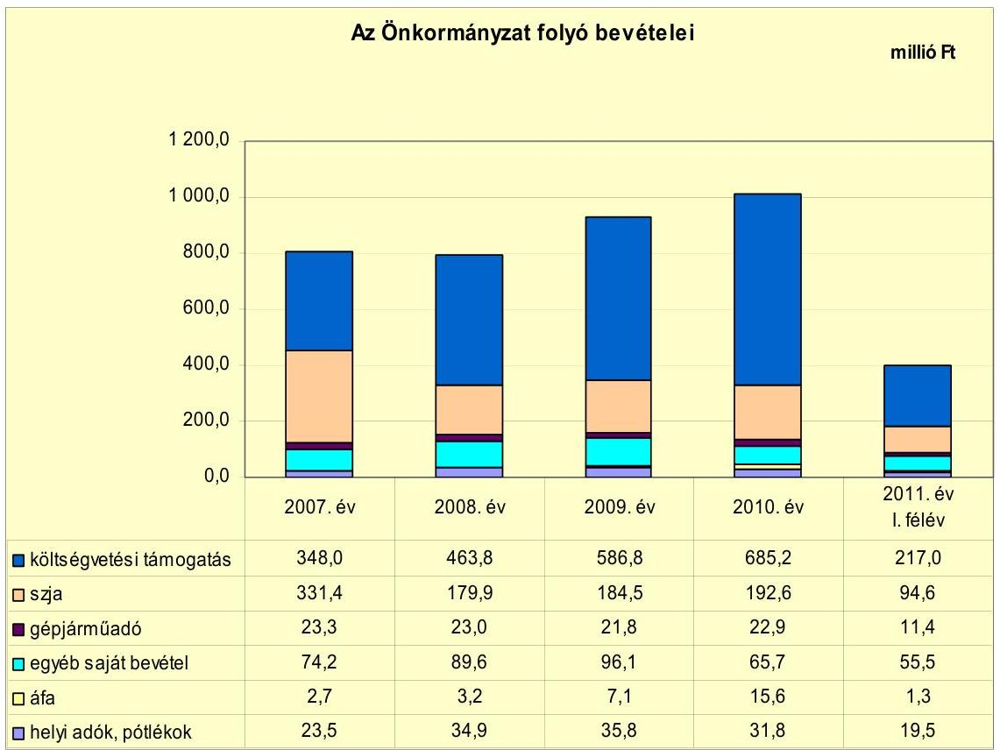

A költségvetési támogatás és az átengedett szja 2007-2009 közötti éves átlaga 698,1 millió Ft volt, melyhez viszonyítva a 2010. évi együttes összeg 25,7\%-kal (179,7 millió Ft-tal) nőtt. A vizsgált években az előző évhez viszonyítva 2009-ben 19,8\%-kal (127,6 millió Ft-tal), 2010-ben 13,8\%-kal (106,5 millió Ft-tal) kapott több forrást az Önkormányzat az államtól. A növekedés oka, hogy 2009-ben az előző évhez képest több mint kétszeresére (49,0 millió Ft-tal) emelkedett az ÖNHIKI összege, mely 2010-ben a 2007-2009. évek átlagához (66,3 millió Ft) viszonyítva további 38,8\%-kal (25,7 millió Ft-tal) nőtt, valamint közcélú- és közhasznú foglalkoztatással többletfeladatot láttak el.

A helyi adók, pótlékok bevételei 2007-2009 között emelkedő tendenciát mutattak. A 2009. évben a 2007. évhez képest 52,3\%-kal (12,3 millió Ft-tal) növekedtek. A 2010-ben befolyt helyi adó és pótlék bevétel - megszűnő gazdasági társaságok következtében - 4,0 millió Ft-tal 11,2\%-kal maradt el az előző évitől. A helyi adók köre (iparűzési adó) 2008. január 1-jétől kibővült a vállalkozók és magánszemélyek kommunális adójával, mértékük 2000 Ft/év, illetve 5000 Ft/év volt. A 2008-ban bevezetett két kommunális adóból abban az évben

---

8,1 millió Ft, 2009-ben 9,5 millió Ft, 2010-ben 10,9 millió Ft bevételt realizáltak. A helyi adók közül meghatározó az iparűzési adó, melynek mértéke 2007-ben 1,5\%, 2008-tól 1,7\%, aránya a helyi adókon belül 2010-ben 67,0\% (19,9 millió Ft) volt.

Az Önkormányzat 25\% feletti tulajdoni részesedésű gazdasági társaságaitól a vizsgált időszakban osztalékban nem részesült.

Az Önkormányzat felhalmozási bevételeinek szerkezete a vizsgált időszakban a következőképpen alakult:

| Megnevezés | 2007. év | 2008. év | 2009. év | 2010. év | 2011. év   I. félév |
| :--: | :--: | :--: | :--: | :--: | :--: |
| Tárgyi eszköz értékesítés | 2,2 | 3,7 | 0,0 | 0,0 | 0,0 |
| Egyéb saját tőkebevétel |

 0,0 | 0,0 | 0,0 | 0,0 | 0,0 |
| Államháztartáson belülről kapott támogatás | 27,1 | 10,0 | 84,3 | 37,7 | 28,6 |
| EU-tól és külföldről kapott támogatások | 0,0 | 0,0 | 0,0 | 0,0 | 4,6 |
| Államháztartáson kívülről kapott támogatás | 33,2 | 23,3 | 1,6 | 1,0 | 0,0 |
| Összes felhalmozási bevétel | 62,5 | 37,0 | 85,9 | 38,7 | 33,2 |

Az Önkormányzat 2007-2009 közötti felhalmozási bevételeinek éves átlagához (61,8 millió Ft) viszonyítva a 2010. évi felhalmozási bevételek 23,1 millió Ft-tal (37,4\%-kal) csökkentek. A felhalmozási bevételek jelentős hányadát a kapott támogatások tették ki. Az államháztartáson belülről, illetve az EU-tól kapott támogatások ${ }^{17}$ a fejlesztési feladatok végrehajtásához, az államháztartáson kívülről kapott támogatások az üzemeltetésre átadott eszközök bérleti díjához, valamint a háztartások által befizetett csatornatársulati érdekeltségi hozzájáruláshoz kapcsolódtak.

[^0]
[^0]:    ${ }^{17}$ Az Önkormányzat a 2007-2010. években az EU-tól kapott támogatások összegét beszámolóiban a fejezeti kezelésű előirányzatból kapott pénzeszközök között mutatta ki.

---

# 2.3. Az Önkormányzat folyó és a felhalmozási célú kiadásainak változása 

Az Önkormányzat folyó kiadásai főbb jogcímek szerinti bontásban az alábbiak voltak:

| Megnevezés | 2007. év | 2008. év | 2009. év | 2010. év | 2011. év I.   félév |
| :--: | :--: | :--: | :--: | :--: | :--: |
| Folyó kiadások | 863,5 | 770,1 | 897,7 | 944,1 | 383,0 |
| Működési kiadások (kamatkiadás nélkül) | 690,1 | 575,4 | 680,6 | 768,9 | 287,2 |
| Államháztartáson belülre átadott pénzeszközök | 0,0 | 0,0 | 0,0 | 0,0 | 0,0 |
| Transzferkiadások | 164,8 | 177,1 | 201,5 | 163,6 | 88,2 |
| -ebből: vállalkozásoknak | 39,7 | 0,1 | 0,0 | 0,0 | 0,0 |
| EU-nak, illetve külföldre | 0,0 | 0,0 | 0,0 | 0,0 | 0,0 |
| magánszemélyeknek | 125,1 | 142,0 | 167,7 | 121,1 | 83,0 |
| nonprofit szervezeteknek | 0,0 | 35,0 | 33,8 | 42,5 | 5,2 |
| Kamatkiadások | 8,6 | 17,6 | 15,6 | 11,6 | 7,6 |
| Előző évi pénzmaradvány átadás | 0,0 | 0,0 | 0,0 | 0,0 | 0,0 |

Az Önkormányzat 2010. évi folyó kiadásai a 2007-2009 évek között teljesített folyó kiadások éves átlagánál (843,8 millió Ft) 11,9\%-kal (100,3 millió Ft-tal) voltak magasabbak. A növekedés oka, hogy a közcélú, illetve közhasznú foglalkoztatás többletkiadásokat jelentett. A 2008. évben az előző évhez képest 10,8\%-kal (93,4 millió Ft-tal) csökkent a folyó kiadások összege, mely csökkenést a többcélú kistérségi társulásnak történő intézményátadás okozta.

|  |  |  |  |  | millió Ft |
| :-- | --: | --: | --: | --: | --: |
| Megnevezés | 2007. év | 2008. év | 2009. év | 2010. év | 2011. év I.   félév |
| Személyi juttatások | 336,7 | 274,5 | 314,3 | 392,6 | 138,9 |
| Munkaadót terhelő járulékok | 101,9 | 90,1 | 87,2 | 90,7 | 34,4 |
| Dologi kiadások | 245,2 | 203,9 | 268,9 | 274,2 | 108,2 |
| Egyéb folyó kiadások | 14,9 | 24,5 | 25,8 | 23,0 | 13,3 |

A személyi juttatások 2008-ban az előző évhez képest 18,5\%-kal (62,2 millió Ft-tal) csökkentek a feladatátadással összefüggő álláshely megszüntetések eredményeként. A 2010. évben a személyi juttatások a 2007-2009 között teljesített kiadások éves átlagánál (308,5 millió Ft) 27,3\%-kal (84,1 millió Ft-tal) voltak magasabbak. A növekedést a közcélú és közhasznú foglalkoztatáshoz, mint többletfeladathoz kapcsolódó személyi kifizetések eredményezték. A munkaadókat terhelő járulékok 2010. évi összege 2,4 millió Ft-tal, 2,6\%-kal maradt el a 2007-2009 közötti éves átlagtól (93,1 millió Ft), amelyben a 2009. évtől a foglalkoztatókat terhelő társadalombiztosítási járulék mértékének csökkenése, illetve a tételes egészségügyi hozzájárulás megszűnés hatása együttesen jelenik meg. A dologi kiadások 2010-ben a 2007-2009 közötti éves átlagnál (239,3 millió Ft) 34,9 millió Ft-tal (14,6\%-kal) voltak magasabbak. Oka a közcélú és közhasznú foglalkoztatáshoz, mint többletfeladathoz kapcsolódó dologi kiadások emelkedése. Az egyéb folyó kiadások a 2007-2009 közötti éves átlagához (21,7 millió Ft) viszonyítva a 2010. évi kiadások összege 1,3 millió Ft-tal (6,0\%-kal) emelkedett.

---

A folyó és felhalmozási kiadások 2007-2009 közötti éves átlagához (898,9 millió Ft) képest a 2010. évi kiadások 194,7 millió Ft-tal (21,7\%-kal) voltak magasabbak. A növekedés oka a folyó kiadások 11,9\%-os (100,3 millió Ft) és a felhalmozási kiadások 2,7-szeres (94,4 millió Ft) emelkedése.

Az Önkormányzat a felhalmozási célú kiadásokra 2008-ban költött a legkevesebbet (22,8 millió Ft-ot), ami az összes kiadás (792,9 millió Ft) 2,9\%-ának felelt meg, 2011. év I. félévben a teljesített felhalmozási kiadások összege 53,4 millió Ft volt.

Az Önkormányzat a 2009-2010. években a felhalmozási célú kiadásai arányát emelni tudta, melynek oka, hogy ezekben az években jégkár okozta helyreállítási munkákra és védekezési költségekre, sportöltöző átalakításra, nappali ellátást biztosító intézmény, valamint játszótér kialakítására fejlesztési célú támogatást kapott.

A kiadások összetételét a következő ábra szemlélteti:
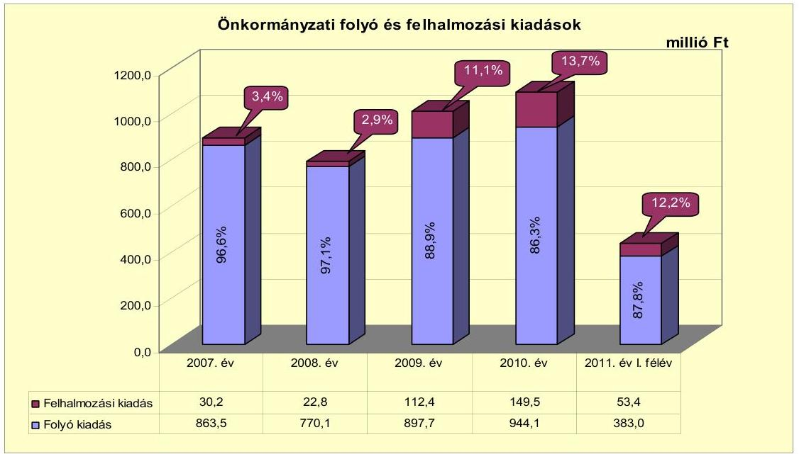

Az Önkormányzat 2007-2010. években megvalósított fejlesztései között intézményi épületek kialakítása, korszerűsítése és akadálymentesítése, játszótér, járdák, közösségi terek építése, rekonstrukciója, jégkár okozta helyreállítási munkák elvégzése, kompetencia alapú oktatás megvalósításához eszközbeszerzések, központi ügyelet létesítése, valamint infrastrukturális és informatikai fejlesztések szerepeltek.

A 2007-2010. években megvalósított, 2010. december 31-ig befejezett fejlesztésekre, felújításokra a vizsgált időszakban 277,7 millió Ft, 2006. december 31-ig 30,3 millió Ft kiadást teljesített az Önkormányzat, a teljes bekerülési költség 308,0 millió Ft volt. A fejlesztési forrás megoszlása 14,1\%, 43,5 millió Ft saját bevétel, 14,9\%, 45,8 millió Ft hitel, 17,7\%, 54,4 millió Ft EU-s támogatás és 53,3\%, 164,3 millió Ft hazai támogatás volt. A teljes bekerülési költség a tervezett 311,3 millió Ft-hoz képest 3,3 millió Ft-tal, 1,1\%-kal volt kevesebb. A 2007-2010. évek között a 10 millió Ft teljes bekerülési költség feletti befejezett

---

fejlesztések és felújítások száma 13 volt, amelyből kettő fejlesztéshez uniós forrásokat is igénybe vettek. Az Önkormányzat 2007-2010. években megvalósított, 2010. december 31-ig befejezett fejlesztéseit és azok forrásösszetételét a jelentés 3/a. számú melléklete mutatja be.

Az Önkormányzatnak 2010. december 31-én egy folyamatban lévő fejlesztése volt, ennek tervezett teljes bekerülési költsége 57,7 millió Ft, melyből a 2007-2010. évek között teljesített kiadás 9,0 millió Ft. A beruházás teljesített kiadásaiból 5,5 millió Ft-ot saját bevételből, 3,5 millió Ft-ot EU-s forrásból finanszíroztak. Az Önkormányzat 2010. december 31-én folyamatban lévő fejlesztési feladataira 2010. december 31-ig teljesített kifizetéseket és azok forrásösszetételét a jelentés 3/b. számú melléklete tartalmazza.

Az Önkormányzat 2010. december 31-én folyamatban lévő fejlesztési feladatához kapcsolódó, a 2010. évet követő kötelezettségvállalásának az összege 57,7 millió Ft, amelynek forrása 15,9 millió Ft saját bevétel és 41,8 millió Ft EU-s támogatás. Az Önkormányzat 2010. december 31-én folyamatban lévő fejlesztési feladataira 2010. december 31-én fennálló kötelezettségvállalásait és azok forrásösszetételét a jelentés 3/c. számú melléklete mutatja be.

Az Önkormányzat által beadott két, elbírálás alatti pályázati forrásból megvalósuló fejlesztésének tervezett bekerülési költsége összesen 389,9 millió Ft. A beruházások kiadásait 8,2\%, 31,9 millió Ft saját bevételből, 86,3\%, 336,7 millió Ft EU-s támogatásból és 5,5\%, 21,4 millió Ft hazai támogatásból tervezik finanszírozni. A tervezett beruházások közül a Kemecse város szennyvíztisztító telepének kapacitásbővítésére benyújtott pályázat a nagyobb volumenű beruházás, tervezett költségigénye 285,1 millió Ft, melynek saját forrásául a kötvényből származó bevétel szolgálhat. Az Önkormányzat által beadott, elbírálás alatti pályázati forrásból megvalósítani tervezett fejlesztéseihez kapcsolódó kötelezettségvállalásait és azok forrásösszetételét a jelentés 3/d. számú melléklete mutatja be.

Az Önkormányzat legmagasabb bekerülési költségű beruházásai a vizsgált időszakban az alábbiak voltak:

- a 2010. évben elkezdett és befejezett nappali ellátást biztosító intézmény kialakításának teljes bekerülési összege 74,5 millió Ft volt, amelyet 0,2 millió Ft saját bevételből, 3,5 millió Ft hitelből és 70,8 millió Ft hazai támogatásból finanszíroztak;
- a 2009. évben elkezdett és 2010. évben befejezett Kemecse város közösségi tereinek fejlesztésére fordított kiadás 54,8 millió Ft volt, amelyből 2,0 millió Ft-ot saját bevételből, 3,6 millió Ft hitelből és 49,2 millió Ft-ot uniós támogatásból finanszíroztak;
- a 2010. évben a játszótér kialakításának teljes bekerülési összege 17,3 millió Ft volt, amelyet 0,1 millió Ft saját bevételből, 1,8 millió Ft hitelből és 15,4 millió Ft hazai támogatásból fedeztek.

Amennyiben az Önkormányzat nem él a pályázati pénzeszközökből megvalósítandó fejlesztések esetében előleg igénybevételi, illetve szállítói finanszírozás lehetőségével, a pályázati források előfinanszírozása, ezen belül különösen a

---

likviditás kezelésére kötött folyószámla- vagy munkabér-megelőlegezési hitel igénybevétele jelentős pénzügyi kockázattal járhat.

Az Önkormányzat a 100\%-os tulajdonában lévő gazdasági társaságának működési célra összesen 112,6 millió Ft-ot adott át a vizsgált időszakban az éves költségvetésekben jóváhagyottakra és a társaságokkal kötött szolgáltatási szerződésekre alapozottan. Az Önkormányzat a szerződésekben foglaltak szerint megkapta a szolgáltatást. Az átadott pénzeszköz a gazdasági társaság által ellátott kötelező önkormányzati feladatok (településüzemeltetés) finanszírozását szolgálta. A társaságot az általa nyújtott szolgáltatási díjra tekintettel (az előírt költségtényezők alatti ár- vagy dímegállapítás miatt) nem támogatta.

A gazdasági társaságok részére átadott pénzeszközök alakulását az alábbi ábra szemlélteti:
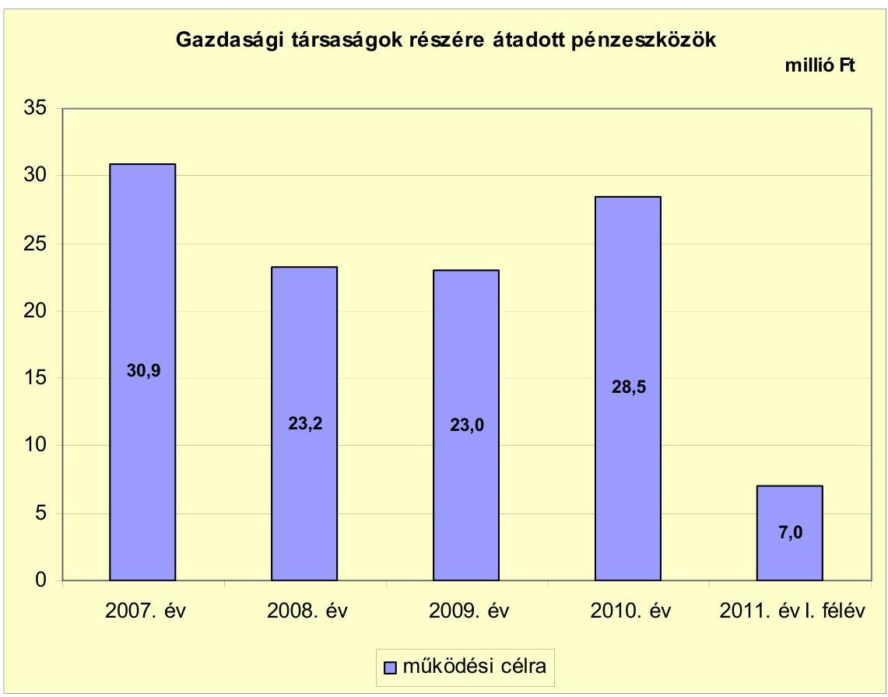

Az Önkormányzat gazdasági társaságok részére 2007-2009 között nyújtott működési célra átadott pénzeszközeinek éves átlaga 25,7 millió Ft volt, 2,8 millió Ft-tal (10,9\%-kal) kevesebb, mint a 2010. évi. A gazdasági társaságok adatait részletezve a 4. számú melléklet tartalmazza.

---

# 3. Az ÖNKORMÁNYZAT KÖTELEZETTSÉGEI 

### 3.1. Az Önkormányzat pénzintézeti kötelezettségeinek változása

Az Önkormányzat pénzintézeti kötelezettségeinek állománya 2006. december 31-től 2010. december 31-ig 3,4-szeresére, 96,4 millió Ft-ról 328,1 millió Ft-ra, illetve 2011. június 30-ra 3,5-szeresére, 338,0 millió Ft-ra nőtt. A 2008. évtől - a zártkörű kötvénykibocsátás miatt - a pénzintézetekkel szemben fennálló kötelezettségek lejárat szerinti összetétele a hosszú lejáratú kötelezettségek irányába tolódott el. A 2010. év végi 328,1 millió Ft összegű állományból 273,8 millió Ft felhalmozási célú kötvényből és hosszú lejáratú hitelből, 54,3 millió Ft rövid lejáratú folyószámlahitelből, a 2011. év I. félév végi 338,0 millió Ft összegű pénzintézeti kötelezettségvállalás állománya 271,1 millió Ft felhalmozási célú kötvényből és hosszú lejáratú hitelből, illetve 66,9 millió Ft rövid lejáratú folyószámlahitelből állt.

Árfolyamváltozást az Önkormányzat a devizában kibocsátott kötvénye után, a kibocsátás évétől (2008) kezdődően éves mérlegeiben nem mutatott ki, mellyel megsértette a Számv. tv. 60. § (1)-(2) bekezdéseiben, illetve az Áhsz. 33. § (1) bekezdésében előírt értékelési kötelezettséget. A kötvény értéke 2010. december 31-én MNB középárfolyamon értékelve 308,0 millió Ft, melyből 108,0 millió Ft az árfolyamváltozás
 hatása.
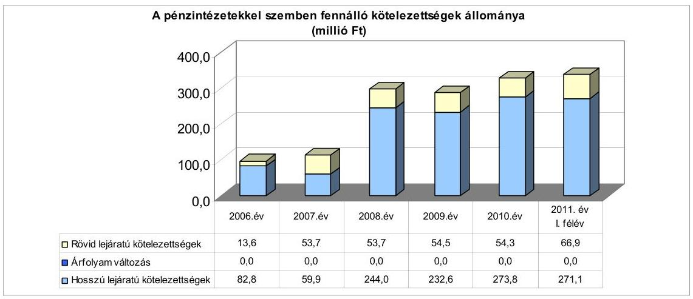

Az árfolyamváltozás hatása is befolyásolja a kötelezettségek alakulását, azonban annak mértéke előre pontosan nem határozható meg, csak várakozásokon alapuló tendenciák jelezhetők. Annak megítéléséről, hogy a devizában kibocsátott kötvényekért és felvett hitelekért kapott forinthoz képest a kötvények visszavásárlásakor, illetve a hitelek visszafizetésekor jelentkező forintkötelezettség többletkiadást (árfolyamveszteség) vagy megtakarítást (árfolyamnyereség) eredményez-e a futamidő végén, a teljes kötelezettség rendezését követően lehet képet alkotni. Mindaddig, amíg törlesztési kötelezettség nem áll fenn (türelmi idő, moratórium), a tőkére vonatkoztatva nem értelmezhető sem az árfolyamveszteség, sem az árfolyamnyereség. Ugyanakkor a számviteli szabályok meghatározzák, hogy az árfolyamkülönbözetet év végén a kötelezettségek vagy követelések között a könyvviteli mérlegben nyilván kell tartani, azonban az árfolyamkülönbözet valójában nem realizált.

---

Az Önkormányzat a forráshiány kezelése érdekében a 2007-2011. évi költségvetési rendeletekben ÖNHIKI igénybevételével, működési- és felhalmozási célú hitelfelvétellel, valamint pénzmaradvány igénybevétellel számolt. A működési forráshiány kezelése érdekében minden évben döntött az éves költségvetés elfogadásakor ÖNHIKI-pályázat benyújtásáról, valamint rövid lejáratú hitel - folyószámla-, illetve munkabér-megelőlegezési hitel - igénybevételéről. A felhalmozási hiány kezelésére a Képviselő-testület 2007-2010. évek között hosszú lejáratú fejlesztési hitelek felvételéről és kötvénykibocsátásról döntött. További évközi (2010) döntést igényelt az ingatlanvásárlásra ${ }^{18}$ felvett 25,0 millió Ft összegű fejlesztési hitel. Az Önkormányzat az adósságot keletkeztető kötelezettségvállalásának felső határát a 2007-2011. év I. félév között nem lépte túl.

Az Önkormányzat pénzintézeti kötelezettségvállalásaira minden esetben képviselő-testületi döntés alapján került sor. A kötelezettségvállalásból származó források felhasználási céljait meghatározták. Az előterjesztések nem tartalmazták az éven túli deviza alapú és változó kamatozású kötelezettségvállalások árfolyam- és kamatkockázatának bemutatását. Az adósságot keletkeztető kötelezettségvállalással megvalósított felhalmozási kiadás esetleges bevételnövelő, illetve kiadáscsökkentő vonzatát, továbbá ennek a fejlesztéshez, felújításhoz vállalt kötelezettségek visszafizetési forrásként való számbavételét sem vizsgálták.

Az Önkormányzat hosszú lejáratú pénzintézeti forrásait - a „Kemecse Jövője" kötvény és a 25,0 millió Ft összegben ingatlanvásárlási célhitel (31012/Ü/958/2010/1. sz.) kivételével - számlavezető pénzintézete biztosította. Az Önkormányzat a vizsgált időszakban számlavezető bankot nem váltott.

Az Önkormányzatnak 2011. június 30-án CHF-ben fennálló hosszú lejáratú adósságot keletkeztető kötelezettségvállalása az alábbi volt:

| Megnevezés | Szerződéskötési   kibocsátás   időpontja | Összeg   ezer CHF-ben | Kibocsátási/lehívási   árfolyam | Kamat (referencia kamat+   kamatfelár) | Felhasználás célja: |
| :-- | :--: | :--: | :--: | :--: | :--: |
| "Kemecse Jövője" kötvény | 2008. 07. 10 | 1383 | 144,59 HUF/CHF | 6 havi CHF LIBOR + 0,5\% | az öt éven túl megvalósítandó   beruházások saját forrásának   biztosítására |

A pénzügyi egyensúly megteremtése érdekében kibocsátott kötvény futamideje 20 év, türelmi ideje 5 év. A kötvényt a szervező bank zárt körben hozta forgalomba.

[^0]
[^0]:    ${ }^{18}$ A megvásárolt épületben tervezik a későbbiekben kialakítani a Polgármesteri hivatalt.

---

Az Önkormányzatnak 2011. június 30-án Ft-ban fennálló, hosszú lejáratú adósságot keletkeztető kötelezettségvállalásai az alábbiak voltak:

| Megnevezés | Szerződéskötés időpontja | Összeg millió Ft-ban | Kamat (referenciakamat + kamatfelár) | Felhasználás célja |
| :--: | :--: | :--: | :--: | :--: |
| 1-2-06-4400-2017-1 sz. célhitel | 2006. 12. 19 | 34,5 | 3 havi BUBOR $+1,5 \%$ | beruházások előkészítése, tervezése |
| 1-2-09-4400-1014-2 sz. célhitel | 2010. 02. 03 | 2,2 | 3 havi BUBOR $+4 \%$ | szennyvíztelep bővítéséhez szükséges telek megvásárlásához szükséges saját erő biztosítása |
| 1-2-09-4400-1017-5 sz. célhitel | 2010. 02. 03 | 7,5 | 3 havi BUBOR $+4 \%$ | integrált városfejlesztési stratégiához szükséges saját erő biztosítása |
| 1-2-09-4400-1016-4 sz. célhitel | 2010. 02. 03 | 3,4 | 3 havi BUBOR $+4 \%$ | ingatlan kisajátításához szükséges finanszírozás biztosítása |
| 1-2-06-4400-1185-8 sz. ÖKIF-hitel | 2006. 07. 28 | 29,5 | 3 havi EURIBOR $+2 \%$ | alapellátási központ/összevont ügyeletek létrehozása és tárgyi eszközeinek fejlesztése |
| 1-2-09-4400-1004-9 sz. ÖKIF-hitel | 2010. 02. 03 | 6,5 | 3 havi EURIBOR $+3,5 \%$ | közparkok fejlesztéséhez szükséges saját erő biztosítása |
| 1-2-09-4400-1007-2 sz. ÖKIF-hitel | 2010. 02. 03 | 3,8 | 3 havi EURIBOR $+3,5 \%$ | ingatlanfelújításhoz saját erő biztosítása |
| 1-2-09-4400-1006-1 sz. ÖKIF-hitel | 2010. 02. 03 | 6,2 | 3 havi EURIBOR $+3,5 \%$ | sportöltöző felújításhoz saját erő biztosítása |
| 1-2-09-4400-1003-8 sz. ÖKIF-hitel | 2010. 02. 03 | 0,6 | 3 havi EURIBOR $+2,5 \%$ | óvoda fejlesztés/korszerűsítéséhez szükséges saját erő biztosítása |
| 1-2-09-4400-1012-0 sz. ÖKIF-hitel | 2010. 02. 03 | 1,8 | 3 havi EURIBOR $+3,5 \%$ | játszótér kialakításához szükséges saját erő biztosítása |
| 1-2-06-4400-1005-0 sz. ÖKIF-hitel | 2010. 02. 03 | 3,7 | 3 havi EURIBOR $+3,5 \%$ | szociális nappali ellátó épület építéséhez szükséges saját erő biztosítása |
| 31012/Ü/958/2010/1. sz hitel | 2010. 09. 07 | 25,0 | jegybanki alapkamat $4,7 \%$ | ingatlanvásárlás |

Az Önkormányzatnak 2011. június 30-án 12 hosszú lejáratú, Ft-alapú fejlesztési hitele (cél-, illetve ÖKIF-hitel) volt, melyből egy hitel esetében (1-2-06-4400-1005-0 sz. ÖKIF-hitel) a fennálló hitelkeretből 2010. december 31-ig nem történt lehívás.

A hosszú lejáratú ÖKIF- és célhiteleit az egyedi hitelszerződésekben is rögzített felhasználási célra fordította a 2007. év és 2011. év I. félév között.

A hosszú lejáratú pénzintézeti hiteleket a kötelező önkormányzati feladatok ellátásához kapcsolódó fejlesztések előkészítésére és tervezésére, illetve a tervezett fejlesztések saját forrásának biztosítására használták fel.

Az Önkormányzat a kötvénykibocsátásból származó bevételt rendeltetési célja szerint 2013-tól kívánja felhasználni. A kötvényből származó bevétel a vizsgált időszakban befektetésre került.

A kötvényforrás szakszerű, befektetési célú kezelésére - tekintettel a kötvényállomány kamat- és árfolyamkockázatára - 2008. július 1-jével külső gazdasági társaságot bíztak meg. A megbízott társaság a szerződéses kötelezettségek szerint

---

negyedéves gyakorisággal tájékoztatta az Önkormányzatot a kötvényforrás befektetéseiről, illetve az árfolyam- és kamatkondíciók alakulásáról.

A kötvény kamattörlesztése 2008. IV. negyedévétől megkezdődött, a tőketörlesztési kötelezettség 2013. IV. negyedévétől (2013. október 31-től) válik esedékessé. A CHF-ben fennálló pénzintézeti kötelezettsége után az Önkormányzat 2011. június 30-ig 63438 CHF (12,1 millió Ft) összegű kamatot, illetve 9245 CHF (1,7 millió Ft) összegű fizetőügynöki- és 4,0 millió Ft összegű jegyzési garanciavállalási díjat fizetett meg.

Az Önkormányzat egy-egy hosszú lejáratú hiteléből 2007. március 31-től 25,9 millió Ft, 2007. szeptember 5-től 22,5 millió Ft, 2010. február 28-tól 0,7 millió Ft, 2010. november 5-től 2,7 millió Ft, 2011. február 28-tól 0,7 millió Ft és 2011. augusztus 28-tól 0,2 millió Ft, mindösszesen 52,7 millió Ft összegű tőkét törlesztett, továbbá 20,0 millió Ft kamatot és 0,8 millió Ft egyéb hiteldíjat fizetett meg 2011. június 30-ig.

Az Önkormányzat a kötvényből származó teljes összegű bevételt szabad rendelkezése alapján pénzintézetnél kötötte le (óvadéki betét), amelyből 2011. június 30-ig 50,8 millió Ft összegű kamatbevételt realizált. A kamatbevételből 40,3 millió Ft-ot a fejlesztési célú feladatok támogatására kiírt pályázatokhoz saját forrásként használták fel.

Az Önkormányzat fizetőképességének megőrzését, működésének pénzügyi egyensúlyát a vizsgált időszakban folyószámla- és munkabérmegelőlegezési hitel igénybevételével tudta biztosítani, melynek alakulását az alábbi táblázat mutatja be:

| Megnevezés | 2007. év | 2008. év | 2009. év | 2010. év | 2011. év I.   félév |
| :--: | :--: | :--: | :--: | :--: | :--: |
| I. Folyószámlahitel |  |  |  |  |  |
| folyószámlahitel keretösszege január 1-jén | 50,0 | 60,0 | 60,0 | 60,0 | 70,0 |
| teljesített kamat és egyéb költség | 3,7 | 5,5 | 6,4 | 4,4 | 3,3 |
| II. Munkabér megelőlegezési hitel |  |  |  |  |  |
| Igénybevett hitel összesen | 155,0 | 217,7 | 191,0 | 148,0 | 166,0 |
| teljesített kamat és egyéb költség | 0,8 | 1,6 | 1,5 | 0,7 | 1,1 |

Az Önkormányzatnak a 2007-2009. években, valamint a 2011. év I. félévében folyamatosan, valamennyi naptári napon, a 2010. évben 359 napon állt fenn folyószámlahitel-állománya. A folyószámlahitel fordulónapjain, azaz 2007. november 5-én, 2008. november 4-én, 2009. november 3-án és 2010. november 2-án fennálló egyenleg összege 44,3 millió Ft, 57,2 millió Ft, 53,5 millió Ft és 56,4 millió Ft volt. A folyószámlahitel év végi egyenlege a 2007-2010 évek sorrendjében 53,7 millió Ft, 53,7 millió Ft, 54,5 millió Ft, illetve 54,3 millió Ft, a 2011. év I. félév végén 66,9 millió Ft volt. Az Önkormányzat folyószámlahitelkerete két alkalommal módosult. A 2007. november 5-i fordulónappal 50,0 millió Ft-ról 60,0 millió Ft-ra, illetve a 2010. november 2-i fordulónappal 60,0 millió Ft-ról 70,0 millió Ft-ra emelkedett. A folyószámlahitelszerződések újrakötésével a számlavezető bank a pénzintézeti forrást folyamatosan biztosította, az Önkormányzatnak hitel visszafizetési problémája nem

---

volt. A napi átlagos hitelállomány a 2007. évi 42,3 millió Ft-ról 2011. év I. félévére 32,3 millió Ft-ra mérséklődött.

A 2007. évben munkabér-megelőlegezési hitellel zárt napok száma 208, a 2011. év I. félévi hitellel zárt napoké 151 volt. Az igénybevett munkabér-megelőlegezési hitel a 2007-2009. évek átlagában évi 187,9 millió Ft volt, 2010-ben pedig 20,6\%-kal (39,9 millió Ft-tal) csökkent. A munkabér-megelőlegezési hitel átlagos napi állománya a 2007. évi 8,6 millió Ft-ról 2011. június 30-ra 11,2 millió Ft-ra emelkedett.

A folyószámlahitelhez kapcsolódóan az Önkormányzat a 2007. évben 3,7 millió Ft, 2011. év I. félévben 3,3 millió Ft, a munkabér-megelőlegezési hitel esetében 2007-ben 0,8 millió Ft, illetve 2011. év I. félévében 1,1 millió Ft összegű kamatot és egyéb hitelfolyósítási díjat fizetett meg.

A rövid lejáratú hitelek kondíciói ${ }^{19}$ a következők voltak:

| Megnevezés | Kamat (referencia+ kamatfelár) | Egyéb költség |
| :--: | :--: | :--: |
| Folyószámlahitel |  |  |
| 2007-2008. év | 3 havi BUBOR $+1 \%$ | $1 \%$ kezelési díj $+2 \%$ rend.tart. jut. |
| 2009-2011. év | 3 havi BUBOR $+3,5 \%$ | $0,5 \%$ kezelési díj $+3 \%$ rend.tart. jut. |
| Munkabér megelőlegezési hitel |  |  |
| 2007. év | 3 havi BUBOR $+1,5 \%$ | 0 |
| 2008. év | 3 havi BUBOR $+3,5 \%$ | 0 |
| 2009-2011. év | 3 havi BUBOR $+4 \%$ | 0 |

A kötvényhez, valamint a hosszú lejáratú hitelekhez kapcsolódó kamatfizetési kötelezettségek alakulását jelentősen befolyásolta, és jelenleg is befolyásolja a kibocsátáskori és az utolsó kamatfizetéskori referenciakamatok és kamatfelárak alakulása, melyet az alábbi táblázat mutat be:

| Megnevezés | Kibocsátási, lehívási | Utolsó fizetéskori | Változás \% |
| :--: | :--: | :--: | :--: |
|  | kamat (referencia + kamatfelár) \% |  |  |
| 6 havi CHF LIBOR (2008. 06. 27-i szerződés) | 3,47 | 0,76 | $-78,1 \%$ |
| 3 havi EURIBOR
 (2006.12.19-i szerződés) | 5,376 | 4,037 | $-24,9 \%$ |
| 3 havi EURIBOR (2010.02.03-i szerződés) | 4,135 | 5,037 | 21,8\% |

A kamat mértékének alakulása jelentős hatással van az adott devizanemben kifejezett, a teljes futamidőre számított, várható kamatkötelezettség mértékére. Az Önkormányzat fizetési kötelezettségét a referenciakamatok csökkenése kedvezően, a HUF/CHF árfolyam emelkedése viszont kedvezőtlenül befolyásolta.

[^0]
[^0]:    ${ }^{19}$ A 3 havi BUBOR referencia kamat átlaga 2007-ben 7,75\%, 2008-ban 8,87\%, 2009-ben 8,64\%, 2010-ben 5,51\% és 2011. június 30-ig 6,07\% volt.

---

Az Önkormányzat kötelezettségeinek állományát 2010. december 31-én és 2011. június 30-án, valamint várható alakulását a kötelezettségek lejáratáig a következő táblázat mutatja be:

| Megnevezés | Állomány 2010. december 31-én |  | Állomány 2011. június 30-án |  | Várható kötelezettség 2011-2013. években |  | Várható kötelezettség 2014. évtől |  |
| :--: | :--: | :--: | :--: | :--: | :--: | :--: | :--: | :--: |
|  | HUF-ban   (millió Ft-ban) | Devizában (összege   ezer CHF-ben) |  | HUF-ban   (millió Ft-ban) | Devizában (összege   ezer CHF-ben) |  | HUF-ban   (millió Ft-ban) | Devizában (összege   ezer CHF-ben) |  |
| Pénzintézeti kötelezettségek |  |  |  |  |  |  |  |  |
| Folyószámlán | 54,3 |  | 66,9 |  | 66,9 |  |  |  |
| Hosszú lejáratú hitelek | 73,9 |  | 68,9 |  | 64,5 |  | 29,3 |  |
| "Kemecse Jövője" kötvény |  | 1383,0 |  | 1383,0 |  | 77,0 |  | 1420,0 |
| Pénzintézeti kötelezettségek összesen HUF-ban: | 128,2 |  | 135,8 |  | 131,4 |  | 29,3 |  |
| Pénzintézeti kötelezettségek összesen CHF-ben: |  | 1383,0 |  | 1383,0 |  | 77,0 |  | 1420,0 |
| Biztosítékok |  |  |  |  |  |  |  |  |
| Kezesség |  |  | 4,0 |  |  |  |  |  |
| Biztosítékok összesen: |  |  | 4,0 |  |  |  |  |  |
| Lízing kötelezettségek | 2,2 |  | 2,2 |  | 2,2 |  |  |  |
| Szállítói tartozás | 59,6 |  | 44,0 |  | 44,0 |  |  |  |
| Kötelezettségek összesen HUF-ban: | 190,0 |  | 186,0 |  | 177,6 |  | 29,3 |  |
| Kötelezettségek összesen CHF-ben: |  | 1383,0 |  | 1383,0 |  | 77,0 |  | 1420,0 |

Az Önkormányzatnak a 2011-2013. években a pénzintézetekkel szemben az utolsó ismert kamatmértékek figyelembevételével - Ft-ban fennálló rövid lejáratú (folyószámla-) hitele után 66,9 millió Ft, hosszú lejáratú hitelei után 64,5 millió Ft, a devizában kibocsátott kötvény után 77 ezer CHF, a 2014. évet követően hosszú lejáratú Ft-hitelei után 29,3 millió Ft, illetve a kötvény után 1420 ezer CHF összegű kötelezettsége merül fel várhatóan. A hosszú lejáratú hitelek, illetve a kötvény utáni kötelezettségek tartalmazzák a várható kamatterheket is. Egyéb kötelezettségei körében a 2011-2013. évek között a lízingszerződésből származó várható fizetési kötelezettsége 2,2 millió Ft, a szállítókkal szembeni tartozása 44,0 millió Ft. Az Önkormányzat a kötelezettségvállalások visszafizetésének forrásait nem mérte fel, nem számszerűsítette. A 2011-2013. évek kötelezettségeinek teljesíthetőségét részben látjuk biztosítottnak. A kötelezettségekre részben fedezetet nyújt 18,4 millió Ft összegű (kamatbevételből eredő) szabad pénzmaradvány, továbbá figyelembe vehető a kötvényből származó bevétel további lekötéséből - a 2008. év II. féléve és a 2011. év I. féléve között realizált kamatbevétel alapján - várható 42,5 millió Ft kamatbevétel 2013. év végéig, illetve 8,9 millió Ft összegű mérlegben kimutatott követelésállomány. A forgalomképes ingatlanvagyonból 61,8 millió Ft értékű vagyon pénzintézeti kötelezettséghez kapcsolódóan jelzáloggal terhelt. A mérlegben kimutatott követelésállomány bevételként történő realizálása bizonytalan azok behajthatósága miatt. A 2014. évtől várható pénzintézeti kötelezettségek fedezetét nem látjuk biztosítottnak a kevés képződő nettó működési jövedelem miatt, ha annak összege jelentősen nem emelkedik. Az Önkormányzat pénzintézeti kötelezettségeinek forrását nem mérte fel, nem számszerűsítette.

# 3.2. A szállítói kötelezettségek változása 

Az Önkormányzat szállítói tartozása 2007-ről 2009-re megduplázódott (28,4 millió Ft-ról 57,2 millió Ft-ra emelkedett), a 2010. év végére az előző évhez képest jelentősen nem változott (59,6 millió Ft). A 2011. június 30-i állomány 44 millió Ft volt. A szállítói állomány az összes kötelezettségen belül 2007-ben 22,0\%-ot, 2011. június 30-án 11,5\%-ot tett ki.

---

Az Önkormányzat 2007. év végi lejárt szállítói tartozása 25 millió Ft-ról 2011. június 30-ra 4,4\%-kal 23,9 millió Ft-ra csökkent. A 2011. június 30-án fennálló lejárt szállítói tartozásállományának 38,5\%-a (9,2 millió Ft) 30 nap alatti, 57,7\%-a (13,8 millió Ft) 31 és 60 nap közötti, 3,8\%-a (0,9 millió Ft) 61 és 90 nap közötti volt.

A 30 napon túli, 2011. június 30-án fennálló lejárt szállítóállomány (18,1 millió Ft) az éves eredeti költségvetési előirányzat 10\%-a alatt volt.

Egyéb kiadás elmaradása az Önkormányzatnak 2007-2011. év I. féléve között nem volt.

# 3.3. Egyéb kötelezettségek változása 

Az Önkormányzat lízingszerződésből (személygépkocsi lízing) származó kötelezettsége 2007. és 2011. I. féléve között folyamatosan fennállt, melynek éves összege 2,2 millió Ft volt. A lízingkötelezettségből a 2011-2013. években várható fizetési kötelezettség - a 2011. évben megszűnő kötelezettség miatt - 2,2 millió Ft.

Az Önkormányzat 2010 novemberében vállalt készfizető kezességet a 100\%-os tulajdonában lévő gazdasági társasága által igényelt folyószámlahitel biztosítékaként. A biztosíték összege 4,0 millió Ft, mely 2011. június 30-i kötelezettségvállalások között szerepel.

Az Önkormányzat jelzálogjoggal, elidegenítési és terhelési tilalommal terhelt hét forgalomképes ingatlanjára összesen 145,0 millió Ft összegű jelzálogjog került bejegyzésre pénzintézetekkel szembeni kötelezettségekhez kapcsolódóan. A 2010. évi leltárösszesítő alapján a forgalomképes ingatlanok számvitelben kimutatott nettó értéke 318,8 millió Ft volt, melynek 19,4\%-a (nettó 61,8 millió Ft) volt jelzáloggal terhelt. A jelzáloggal terhelt ingatlanokra újabb jelzálogjogot nem jegyeztek be. A szabad forgalomképes ingatlanok értéke 2010. év végén nettó 257,0 millió Ft volt.
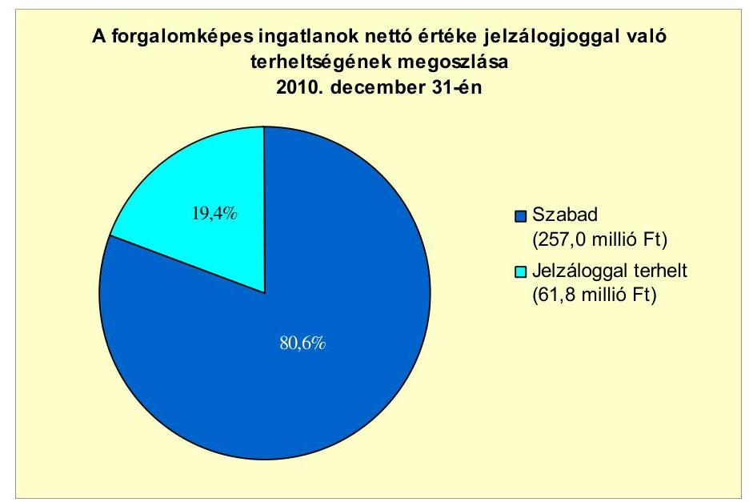

---

Az Önkormányzatnak, mint alperesnek egy, jogerős határozattal le nem zárt peres eljárása van folyamatban közszolgáltatási díjkalkuláció megállapítása (szemétszállítási díj) tárgyában. A perérték összege 3,4 millió Ft, mely jövőbeni fizetési kötelezettségként merülhet fel.

Az Önkormányzatnak garanciavállalása, PPP-konstrukciója, elengedett követelése, intézményeinek, más önkormányzatoknak, civil szervezeteknek, egyéb államháztartáson belüli és kívüli szervezeteknek nyújtott kölcsöne, gazdasági társaságoknak adott tagi- és egyéb kölcsöne, valamint jogerős határozattal lezárt peres eljárásból származó, de ki nem fizetett kötelezettsége nem volt. A jegyző elévülés vagy méltányosság miatt helyi adótartozást nem törölt el.

A 100\%-ban önkormányzati tulajdonban lévő gazdasági társaság kötelezettségeinek állományát és várható alakulását a következő táblázat mutatja be:

| Megnevezés | Állomány 2010. december 31-én |  |  | Állomány 2011. június 30-án |  |  | Várható kötelezettség 2011-2013. években | Várható kötelezettség 2014. évtől |  |
| :--: | :--: | :--: | :--: | :--: | :--: | :--: | :--: | :--: | :--: |
|  | HUF-ban   (millió Ft-ban) | Devizában   (összege,   ezer ...-ben) | Deviza   nem | HUF-ban   (millió Ft-ban) | Devizában   (összege,   ezer ...-ben) | Deviza   nem | HUF-ban   (millió Ft-ban) | Devizában   (összege,   ezer ...-ben) | HUF-ban   (millió Ft-ban) | Devizában   (összege,   ezer ...-ben) |
| Folyószámlahitel | 2,5 |  | HUF | 4,0 |  | HUF | 4,0 |  |  |  |
| Pénzintézeti kötelezettségek összesen | 2,5 |  | HUF | 4,0 |  | HUF | 4,0 |  |  |  |
| Lízing kötelezettségek | 0,9 |  | HUF | 0,3 |  | HUF | 0,3 |  |  |  |
| Szállítói tartozás | 10,6 |  | HUF | 7,8 |  | HUF | 7,8 |  |  |  |
| Kötelezettségek összesen HUF-ban: | 14,0 |  | HUF | 12,1 |  | HUF | 12,1 |  |  |  |

Az Önkormányzat kizárólagos tulajdonában lévő gazdasági társaságának pénzintézettel szembeni kötelezettsége (folyószámlahitel) a 2010. december 31-i 2,5 millió Ft-ról 2011. június 30-ra 4,0 millió Ft-ra emelkedett, mely a 2011-2013. évek várható kötelezettségei között jelenik meg. A hitelszerződésben rögzített fizetési feltételek nem teljesítése esetén az Önkormányzat által nyújtott készfizető kezesi biztosíték pénzintézeti érvényesítése jelenthet kockázatot. A lízing- és szállítói kötelezettségeinek állománya 2010. december 31-én 11,5 millió Ft-ról 2011. június 30-ra 8,1 millió Ft-ra mérséklődött. Az Önkormányzat gazdasági társaságának peres eljárásból adódó és egyéb kötelezettsége nem volt. Az Önkormányzat Képviselő-testülete nem rendelkezett megfelelő információval a gazdasági társaságainak pénzügyi helyzetéről, azok önkormányzati pénzügyi helyzetre gyakorolt hatásairól.
„Az Önkormányzat a gazdasági társaságokról szóló 2006. évi IV. törvény 54. § (2) bekezdése alapján korlátlan felelősséggel tartozik azon gazdasági társaságának felszámolása esetében, amelyben az Önkormányzat az 52. § (2) bekezdése szerint a szavazatok legalább 75\%-ával rendelkezik, így minősített befolyásszerzőnek minősül, továbbá a csődeljárásról és a felszámolási eljárásról szóló 1991. évi XLIX. törvény 63. § (2) bekezdése alapján a kizárólagos önkormányzati tulajdonú gazdasági társaságának minden olyan kötelezettségéért, amelynek kielégítését a felszámolási eljárás során az adós társaság vagyona nem fedez, ha a hitelezőinek a felszámolási eljárás során benyújtott keresete alapján a bíróság az adós társaság felé érvényesített tartósan hátrányos üzletpolitikájára figyelemmel - megállapítja az önkormányzat korlátlan és teljes felelősségét."

Az Önkormányzat 2007-2010 között a tárgyi eszközökre együttesen 354,6 millió Ft összegű értékcsökkenést számolt el. Az Önkormányzat

---

eszközállományának bruttó értéke 2007-2010 között 9,1\%-kal (274,7 millió Ft-tal) 3302,8 millió Ft-ra nőtt, ugyanakkor nettó értéke 2,1\%-kal (52,8 millió Ft-tal) 2518,4 millió Ft-ra csökkent. Önkormányzati szinten a használhatósági fok mutatója - az eszközállomány változása és az elszámolt értékcsökkenés hatására - 85,5\%-ról 76,0\%-ra csökkent, azaz az eszközök avultsága 9,5 százalékponttal növekedett. Az eszközökön belül az üzemeltetésre átadottak használhatósági foka 2007-ről 2010-re 30,4 százalékponttal (89,6\%-ról 59,2\%-ra), míg a
 többi eszközcsoport használhatósága együttesen 5,5 százalékponttal (83,6%-ról 78,1%-ra) csökkent. A 2007–2010. évek között összesen bruttó 52,5 millió Ft értékű felújítást aktiváltak, melyből az eszközpótlásra fordított összeg bruttó 46,8 millió Ft (89,1%-ot) volt.

# 4. A PÉNZÜGYI EGYENSÚLY MEGTEREMTÉSE ÉRDEKÉBEN HOZOTT INTÉZKEDÉSEK EREDMÉNYE 

A Képviselő-testület az Önkormányzat működőképességének hosszú távú fenntartása érdekében a vizsgált időszakban kiadáscsökkentő és bevételnövelő döntéseket hozott, melyek meghozatalával a feladatellátás szakmai színvonalának szinten tartása mellett a pénzügyi helyzet javulását kívánta elérni.

Az Önkormányzat – kimutatása szerint – a 2007–2010. években a kiadáscsökkentő intézkedések hatásaként összesen 112,7 millió Ft megtakarítást ért el, mely a feladatmegszüntetéssel, illetve átszervezéssel párhuzamos létszámcsökkentésekkel együtt járó kiadáscsökkenések eredménye. A 2011-es költségvetési évben – adatszolgáltatásuk szerint – további kiadáscsökkentő intézkedéseket hoztak, melyek hatásaként 88,4 millió Ft megtakarítást terveznek. A tervezett kiadási megtakarítások 53,8 millió Ft-ot (60,9%) létszámcsökkentő intézkedések, 34,5 millió Ft-ot (39,1%) civil szervezeteknek nyújtott támogatások (működési célú pénzeszközátadás) csökkentésével kívánják elérni.
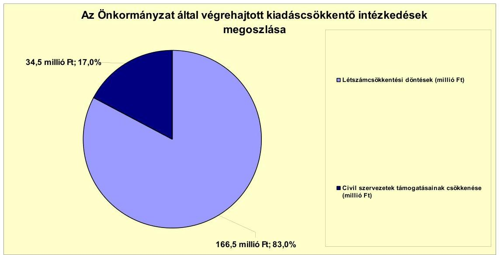

---

A 2007–2010 között végrehajtott létszámcsökkentéseket ágazatonként az alábbi táblázat mutatja:

| Megnevezés (adatok fő-ben) | Közoktatás | Szociális és gyermekvédelem | Egészségügy | Polgármesteri hivatal | Egyéb | Összesen |
| :--: | :--: | :--: | :--: | :--: | :--: | :--: |
| 2007. január 1-jén jóváhagyott álláshelyek száma | 71 | 20 | 16 | 19 | 1 | 127 |
| Megszüntetett álláshelyek száma | 8 | 16 | 4 | 1 | 0 | 29 |
| ebből: üres álláshelyek száma | 0 | 0 | 0 | 0 | 0 | 0 |
| szakmai álláshelyek száma | 4 | 14 | 3 | 0 | 0 | 21 |
| intézmény-üzemeltetéssel kapcsolatos álláshelyek száma | 4 | 2 | 1 | 1 | 0 | 8 |
| Álláshely növekedése | 0 | 0 | 0 | 0 | 0 | 0 |
| 2010. december 31-én záró álláshelyek száma | 63 | 4 | 12 | 18 | 1 | 98 |
| 2007. január 1-jén foglalkoztatott létszám | 71 | 20 | 16 | 19 | 1 | 127 |
| Létszámcsökkentés | 8 | 16 | 4 | 1 | 0 | 29 |
| Létszámnövekedés | 0 | 0 | 0 | 0 | 0 | 0 |
| 2010. december 31-én foglalkoztatott létszám | 61 | 4 | 11 | 18 | 1 | 95 |

A 2007–2009. évi költségvetési rendeletekben a Képviselő-testület mindösszesen 29 fő létszámcsökkentéséről döntött. A 2007. évi költségvetésben meghatározottak alapján a közoktatásban öt fő, a szociális területen és egészségügyben három-három fő, továbbá a többcélú kistérségi társulásnak történő feladatátadás miatt további 13 fő álláshelyét, mindösszesen 24-et szüntetett meg. A 2008. évi költségvetési rendelet értelmében a közoktatásban egy fő és Polgármesteri hivatalhoz sorolt egészségügyi területen két fő, összesen három főnyi létszámcsökkentést, a 2009. évi költségvetésben előirányzottak szerint a közoktatás és Polgármesteri hivatalnál igazgatási területen egy-egy fő létszámleépítést hajtottak végre.

Az intézkedések hatására a 2007. január 1-jei önkormányzati induló létszám 127 főről 2010. december 31-ére 95 főre csökkent. Az Önkormányzatnál 2010. december 31-jén három álláshely (két álláshely a közoktatásban és egy az egészségügyben) betöltetlen volt.

Az Önkormányzat a 2007–2010 között végrehajtott létszámleépítéséhez mindösszesen 24,7 millió Ft összegű központi támogatást igényelt, illetve kapott. A támogatás felhasználásával az önkormányzati intézményeknél és a Polgármesteri hivatalnál 16 fő tartós létszám leépítése történt meg. A többcélú kistérségi társulásnak történt feladatátadással 13 fő továbfoglalkoztatása biztosított volt.

Az Önkormányzat – kimutatása szerint – intézkedései eredményeként 2007–2010 között összesen 33,9 millió Ft-tal növelte a bevételeit. Az intézményi térítési díjak emeléséből 1,9 millió Ft, eszközök értékesítéséből, bérbeadásából 3,5 millió Ft, új adónem (kommunális adó) bevezetéséből 28,5 millió Ft pótlólagos bevételük származott. A 2011. évben az intézményi térítési díjak emeléséből további 0,3 millió Ft, eszközök bérbeadásából 0,5 millió Ft, az új adónem bevezetéséből 5,9 millió Ft többletbevételt realizáltak. A többletbevételek Önkormányzat pénzügyi egyensúlyában betöltött szerepe nem volt jelentős, mivel összességében a 2007–2010, illetve 2011. év I. félév között elért saját bevételek 0,3%-át, illetve 1,9%-át érték el.

A költségvetési támogatásokból és az átengedett szja-ból származó 2007. évi 687,2 millió Ft összegű bevételhez képest 2010 végéig összességében 294,2 millió Ft összegű többletbevétel mutatható ki${ }^{20}$. Ezen belül az szja-adóbevétel 437,2 millió Ft-tal csökkent, amit a költségvetési támogatás ezt meghaladóan (731,4 millió Ft-tal) kompenzált. Az Önkormányzat által 2007–2010 között kimutatott, a kiadási megtakarítások és bevételnövelések 158,5 millió Ft-os összege az szja-adóbevételek kiesését 36,3%-os mértékben kompenzálta. A 2011. I. félévre időarányosan tervezett 111,2 millió Ft és 90,5 millió Ft (összesen 201,7 millió Ft) összegű központi támogatás és szja bevételt a 2011. I. félévre teljesített bevételek meghaladták, a tényleges bevétel 217,0 millió Ft és 94,6 millió Ft (összesen 311,6 millió Ft) volt.
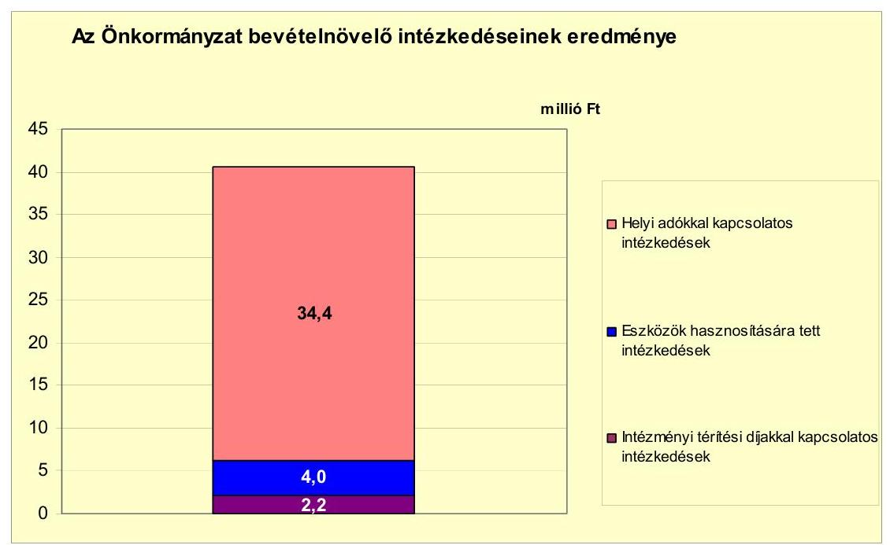

# 5. Az ÁSZ ÁLTAL A KORÁBBi ÉVEKBEN A PÉNZÜGYI EGYENSÚLY JAVÍTÁSÁRA TETT SZABÁLYSZERŰSÉGI ÉS CÉLSZERŰSÉGI JAVASLATOK HASZNOSULÁSA 

Az ÁSZ az Önkormányzat gazdálkodási rendszerét 2006-ban és 2009-ben ellenőrizte átfogó jelleggel. A jelentéseket a Képviselő-testület határozattal elfogadta, a jegyző határidők és felelősök megjelölésével intézkedési tervet készített.

A 2009. évi ÁSZ vizsgálat megállapította, hogy a 2006. évi szabályszerűségi javaslatok 45%-a nem teljesült, melyből négy vonatkozott a pénzügyi helyzet javítására. A nem teljesült célszerűségi javaslatok között nem volt olyan, mely a pénzügyi helyzet javítására vonatkozott. A pénzügyi helyzet javításával kapcsolatos, nem teljesült javaslatok a finanszírozási célú pénzügyi műveletek költségvetési bevételként, illetve kiadásként történő bemutatásának a tiltására, az értékpapírok év végi értékelésének kötelezettségére, a pénzmaradvány szabályszerű megállapítására és likviditási terv készítésének kötelezettségére vonatkoztak. Ezekből a javaslatokból a jelenlegi vizsgálat megállapítása szerint kettő nem teljesült: a finanszírozási célú pénzügyi műveletekkel, illetve az értékpapírok év végi értékelésével kapcsolatos javaslat.

A 2009. évi ÁSZ vizsgálat javaslatai közül további négy szabályszerűségi, valamint egy célszerűségi javaslat vonatkozott a pénzügyi helyzet javítására. A szabályszerűségi javaslatok a finanszírozási célú pénzügyi műveletekre, az előző évi pénzmaradvány igénybevételének megalapozott tervezésére, az EU-s támogatással megvalósuló projektekkel kapcsolatos kiadások és bevételek elkülönített bemutatására, illetve az intézményi pénzmaradvány kimutatásának szabályszerűségére, a célszerűségi javaslat a hosszú lejáratú adósságot keletkeztető kötelezettségvállalások teljesíthetősége feltételeinek bemutatására vonatkozott. Ezekből a javaslatokból egy, a finanszírozási célú pénzügyi műveletekkel kapcsolatos szabályszerűségi nem teljesült. A célszerűségi javaslat részben teljesült, mivel a hosszú lejáratú pénzintézeti kötelezettségek teljesítésére fordítható forrásokat a Képviselő-testületnek nem mutatták be.

A 2006. és 2009. évi ÁSZ ellenőrzés során a pénzügyi helyzet javítására tett javaslatok 55,6%-át hasznosították, 33,3%-át nem valósították meg, 11,1%-át részben teljesítették.

Budapest, 2012. április 11.

Melléklet: 7 db
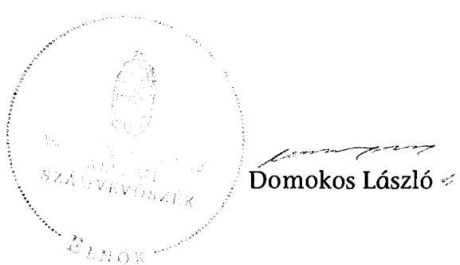

---

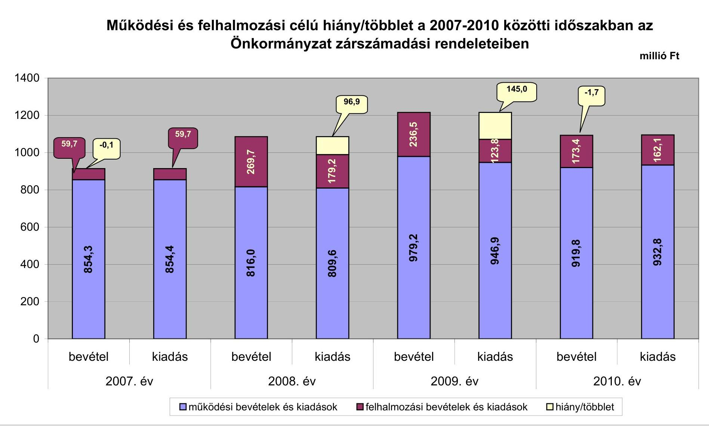

# Működési és felhalmozási célú hiány/többlet a 2007–2010 közötti időszakban az Önkormányzat zárszámadási rendeleteiben

| év | működési bevételek és kiadások | felhalmozási bevételek és kiadások | hiány/többlet |
| --- | --- | --- | --- |
| 1400 | 89,7 | 0,1 | 0,1 |
| 1200 | 854,3 | 0,1 | 0,1 |
| 800 | 854,4 | 0,1 | 0,1 |
| 600 | 854,0 | 0,1 | 0,1 |
| 400 | 854,1 | 0,1 | 0,1 |
| 200 | 854,2 | 0,1 | 0,1 |
| 0 | 854,3 | 0,1 | 0,1 |
| bevétel | | | |
| kiadás | | | |
| 2007. év | | | |
| 2008. év | | | |
| bevétel | | | |
| kiadás | | | |
| 2009. év | | | |
| bevétel | | | |
| kiadás | | | |
| 2010. év | | | |
| 0 | | | |

*működési bevételek és kiadások*

---

Az Önkormányzat bevételei és kiadásai, valamint adósságszolgálata 2007–2010 között

| 1. FOLVÓ KÖLTSÉGVETÉS* | 2007. év | 2008. év | 2009. év | 2010. év |
| --- | --- | --- | --- | --- |
| 1.1.1. Saját működési bevételek | 59,8 | 81,4 | 97,4 | 70,9 |
| 1.1.2. Költségvetési támogatás** | 348,0 | 463,8 | 586,8 | 685,2 |
| 1.1.3. Átengedett bevételek | 354,7 | 202,8 | 206,3 | 215,5 |
| 1.1.4. Államháztartáson belülről kapott támogatások | 39,8 | 46,4 | 41,6 | 42,3 |
| 1.1.5. EU-til és külföldről kapott bevételek | 0,0 | 0,0 | 0,0 | 0,0 |
| 1.1.6. Államháztartáson kívülről kapott bevételek | 0,8 | 0,0 | 0,0 | 0,0 |
| 1.1.7. Előző évi pénzmaradvány átvétel | 0,0 | 0,0 | 0,0 | 0,0 |
| 1.1. Folyó bevételek =1.1.1.+1.1.2.+1.1.3.+1.1.4.+1.1.5.+1.1.6.+1.1.7. | 803,1 | 794,4 | 932,1 | 1013,8 |
| 1.2.1. Működési kiadások kamatkiadások nélkül | 690,1 | 575,4 | 680,6 | 768,9 |
| 1.2.2. Államháztartáson belülre átadott pénzeszközök | 0,0 | 0,0 | 0,0 | 0,0 |
| 1.2.3.1. vállalkozásoknak | 39,7 | 0,1 | 0,0 | 0,0 |
| 1.2.3.2. EU-nak, illetve külföldre | 0,0 | 0,0 | 0,0 | 0,0 |
| 1.2.3.3. magáncélúaknak | 125,1 | 142,0 | 167,7 | 121,1 |
| 1.2.3.4. nonprofit szervezeteknek | 0,0 | 35,0 | 33,8 | 42,5 |
| 1.2.3. Transzferkiadások (=1.2.3.1+1.2.3.2+1.2.3.3+1.2.3.4) | 164,8 | 177,1 | 201,5 | 163,6 |
| 1.2.4 Kamatkiadások | 8,6 | 17,6 | 15,6 | 11,6 |

  1.2.5. Előző évi pénzmaradvány átadás | 0,0 | 0,0 | 0,0 | 0,0  |
|  1.2. Folyó kiadások $=1.2.1.+1.2.2.+1.2.3.+1.2.4.+1.2.5.$ | 863,5 | 770,1 | 897,7 | 944,1  |
|  1.3. Folyó költségvetés egyenlege MÜKÖDÉSI JÖVEDELEM (1.1. - 1.2.) | $-60,4$ | 24,3 | 34,4 | 69,7  |
|  2. FELHALMOZÁSI KÖLTSÉGVETÉS** | 0,0 | 0,0 | 0,0 | 0,0  |
|  2.1.1. Saját tökebevételek | 2,2 | 3,7 | 0,0 | 0,0  |
|  2.1.2. Államháztartáson belülről kapott támogatások | 27,1 | 10,0 | 84,3 | 37,7  |
|  2.1.3. EU-támogatás és külföldről kapott támogatások | 0,0 | 0,0 | 0,0 | 0,0  |
|  2.1.4. Államháztartáson kívülről kapott támogatások | 33,2 | 23,3 | 1,6 | 1,0  |
|  2.1. Felhalmozási bevételek ( $=2.1.1.+2.1.2+2.1.3+2.1.4$.) | 62,5 | 37,0 | 85,9 | 38,7  |
|  2.2.1. Saját beruházási kiadások | 30,2 | 11,1 | 71,7 | 137,5  |
|  2.2.2. Saját felújítási kiadások | 0,0 | 11,7 | 40,7 | 12,0  |
|  2.2.3. Államháztartáson belülre átadott pénzeszköz | 0,0 | 0,0 | 0,0 | 0,0  |
|  2.2.4. EU-nak és külföldnek adott pénzeszközök | 0,0 | 0,0 | 0,0 | 0,0  |
|  2.2.5. Államháztartáson kívülre adott pénzeszközök | 0,0 | 0,0 | 0,0 | 0,0  |
|  2.2.6. Befektetési célú részesedések vásárlása | 0,0 | 0,0 | 0,0 | 0,0  |
|  2.2. Felhalmozási kiadások ( $=2.2.1.+2.2.2.+2.2.3.+2.2.4.+2.2.5.+2.2.6$.) | 30,2 | 22,8 | 112,4 | 149,5  |
|  2.3. Felhalmozási költségvetés egyenlege (2.1. - 2.2.) | 32,3 | 14,2 | $-26,5$ | $-110,8$  |
|  3. Finanszírozási műveletek nélküli (GFS) pozíció(1.3.+2.3.) | $-28,1$ | 38,5 | 7,9 | $-41,1$  |
|  4. Finanszírozási műveletek | 0,0 | 0,0 | 0,0 | 0,0  |
|  4.1. Hitelfelvétel | 60,2 | 53,7 | 54,5 | 53,9  |
|  4.2. Hiteltörlesztés | 29,5 | 69,5 | 65,1 | 12,6  |
|  4.3. Forgatási és befektetési célú értékpapírok kibocsátása | 0,0 | 200,0 | 0,0 | 0,0  |
|  4.4. Forgatási és befektetési célú értékpapírok beváltása | 0,0 | 0,0 | 0,0 | 0,0  |
|  4.5. Forgatási és befektetési célú értékpapírok értékesítése | 0,0 | 0,0 | 125,0 | 0,0  |
|  4.6. Forgatási és befektetési célú értékpapírok vásárlása | 0,0 | 124,4 | 0,0 | 0,0  |
|  4.7. Egyéb finanszírozási bevételek (függő, átfutó, kiegyenlítő) | $-11,9$ | 0,5 | $-1,8$ | $-13,2$  |
|  4.8. Egyéb finanszírozási kiadások (függő, átfutó, kiegyenlítő) | $-9,1$ | 1,9 | $-4,5$ | $-11,3$  |
|  4.9.Finanszírozási műveletek egyenlege (4.1. - 4.2.+4.3.-4.4+4.5.-4.6.+4.7.-4.8.) | 28,0 | 58,4 | 117,1 | 39,3  |
|  5. Tárgyévi pénzügyi pozíció (1.3.+ 2.3.+4.9.) | $-0,1$ | 96,9 | 125,0 | $-1,8$  |
|  6. Nettó működési jövedelem = működési jövedelem (1.3.) - töketörlesztés $(4.2+4.4)$ | $-89,9$ | $-45,2$ | $-30,7$ | 57,1  |
|  TÁJÉKOZTATÓ ADATOK |  |  |  |   |
|  Összes kötelezettség | 143,9 | 314,3 | 346,5 | 390,0  |
|  ebből rövid lejáratú | 82,2 | 68,1 | 111,7 | 113,9  |
|  Összes szállítói kötelezettség | 28,4 | 14,3 | 57,2 | 59,6  |
|  ebből lejárt (tanúsítványból) | 2,6 | 10,5 | 16,4 | 41,4  |
|  Pénz és tőkepiaci kötelezettség (adósság) | 113,6 | 297,7 | 287,1 | 328,1  |
|  ebből rövid lejáratú | 53,7 | 53,7 | 54,5 | 54,5  |
|  PPP szerződéses állomány jelenértéken (tanúsítványból) | 0,0 | 0,0 | 0,0 | 0,0  |
|  ebből lejárt szolgáltatási díj miatti kötelezettség | 0,0 | 0,0 | 0,0 | 0,0  |
|  Folyószámlatétel napi átlagos állománya (tanúsítványból) | 42,3 | 50,9 | 51,8 | 46,7  |
|  Likviditási napi átlagos állománya (tanúsítványból) | 0,0 | 0,0 | 0,0 | 0,0  |
|  Munkabérkifizetés napi átlagos állománya (tanúsítványból) | 8,6 | 15,3 | 11,6 | 8,4  |
|  Kezesség és garanciavállalások (tanúsítványból) | 0,0 | 0,0 | 0,0 | 4,0  |
|  Jogerős bírósági ítéletekből adódó kötelezettségek (tanúsítványból) | 0,0 | 0,0 | 0,0 | 0,0  |
|  Finanszírozásba bevonható eszközök: | 1,8 | 223,7 | 223,8 | 222,1  |
|  Tartós hitelviszonyt megtestesítő értékpapírok év végi állománya | 1,8 | 1,8 | 1,8 | 1,8  |
|  Hosszú lejáratú bankbetétek év végi állománya | 0,0 | 0,0 | 0,0 | 0,0  |
|  Értékpapírok év végi állománya | 0,0 | 125,0 | 0,0 | 0,0  |
|  Pénzeszközök (idegen pénzeszközök nélkül) év végi állománya | 0,0 | 96,9 | 222,0 | 220,3  |

[^0] [^0]: * Bevételekben nem tükröződik, a kiadásokban nem jelent meg az amortizáció, a vagyoni helyzetet az egyenleg befolyásolja. ** A költségvetési támogatásból a felhalmozási célú összeget az Önkormányzat adatszolgáltatása szerinti mértékben vettük figyelembe, a 2.1.2 soron.

---

Kemecse Város Önkormányzata

Az Önkormányzat 2007-2010. években megvalósított, 2010. december 31-ig befejezett fejlesztései és azok forrásösszetétele

(nidib) Ft-ban

|  |   |   |   |   |   |   |   |   |   |   |   |   |   |   |   |   |   |   |   |   |   |   |   |   |   |   |   |   |   |   |   |   |   |   |   |   |   |   |   |   |   |   |   |   |   |   |   |   |   |   |   |   |   |   |   |   |   |   |   |   |   |   |   |   |   |   |   |   |   |   |   |   |   |   |   |   |   |   |   |   |   |   |   |   |   |   |   |   |   |   |   |   |   |   |   |   |   |   |   |   |  

---

## **Az Önkormányzat 2010. december 31-én folyamatban lévő fejlesztési feladataira 2010. december 31-ig teljesített kifizetések és azok forrásösszetétele**

|   |  |  |  |  |  |  |  |  |  |  |  |  |  |  |  |  |  |  |  |  |  |  |  |  |  |  |  |  |  |  |  |  |  |  |  |  |  |  |   |
| --- | --- | --- | --- | --- | --- | --- | --- | --- | --- | --- | --- | --- | --- | --- | --- | --- | --- | --- | --- | --- | --- | --- | --- | --- | --- | --- | --- | --- | --- | --- | --- | --- | --- | --- | --- | --- | --- | --- |
|   |  |  |  |  |  |  |  |  |  |  |  |  |  |  |  |  |  |  |  |  |  |  |  |  |  |  |  |  |  |  |  |  |  |  |  |  |  |   |
|   |  |  |  |  |  |  |  |  |  |  |  |  |  |  |  |  |  |  |  |  |  |  |  |  |  |  |  |  |  |  |  |  |  |  |  |  |  |   |
|   |  |  |  |  |  |  |  |  |  |  |  |  |  |  |  |  |  |  |  |  |  |  |  |  |  |  |  |  |  |  |  |  |  |  |  |  |  |   |
|   |  |  |  |  |  |  |

  |  |  |  |  |  |  |  |  |  |  |  |  |  |  |  |  |  |  |  |  |  |  |  |  |  |  |  |  |  |  |   |
|   |  |  |  |  |  |  |  |  |  |  |  |  |  |  |  |  |  |  |  |  |  |  |  |  |  |  |  |  |  |  |  |  |  |  |  |  |  |   |
|   |  |  |  |  |  |  |  |  |  |  |  |  |  |  |  |  |  |  |  |  |  |  |  |  |  |  |  |  |  |  |  |  |  |  |  |  |  |   |
|   |  |  |  |  |  |  |  |  |  |  |  |  |  |  |  |  |  |  |  |  |  |  |  |  |  |  |  |  |  |  |  |  |  |  |  |  |  |   |
|   |  |  |  |  |  |  |  |  |  |  |  |  |  |  |  |  |  |  |  |  |  |  |  |  |  |  |  |  |  |  |  |  |  |  |  |  |  |   |
|   |  |  |  |  |  |  |  |  |  |  |  |  |  |  |  |  |  |  |  |  |  |  |  |  |  |  |  |  |  |  |  |  |  |  |  |  |  |   |
|   |  |  |  |  |  |  |  |  |  |  |  |  |  |  |  |  |  |  |  |  |  |  |  |  |  |  |  |  |  |  |  |  |  |  |  |  |  |   |
|   |  |  |  |  |  |  |  |  |  |  |  |  |  |  |  |  |  |  |  |  |  |  |  |  |  |  |  |  |  |  |  |  |  |  |  |  |  |   |
|   |  |  |  |  |  |  |  |  |  |  |  |  |  |  |  |  |  |  |  |  |  |  |  |  |  |  |  |  |  |  |  |  |  |  |  |  |  |   |
|   |  |  |  |  |  |  |  |  |  |  |  |  |  |  |  |  |  |  |  |  |  |  |  |  |  |  |  |  |  |  |  |  |  |  |  |  |  |   |
|   |  |  |  |  |  |  |  |  |  |  |  |  |  |  |  |  |  |  |  |  |  |  |  |  |  |  |  |  |  |  |  |  |  |  |  |  |  |   |
|   |  |  |  |  |  |  |  |  |  |  |  |  |  |  |  |  |  |  |  |  |  |  |  |  |  |  |  |  |  |  |  |  |  |  |  |  |  |   |
|   |  |  |  |  |  |  |  |  |  |  |  |  |  |  |  |  |  |  |  |  |  |  |  |  |  |  |  |  |  |  |  |  |  |  |  |  |  |   |
|   |  |  |  |  |  |  |  |  |  |  |  |  |  |  |  |  |  |  |  |  |  |  |  |  |  |  |  |  |  |  |  |  |  |  |  |  |  |   |
|   |  |  |  |  |  |  |  |  |  |  |  |  |  |  |  |  |  |  |  |  |  |  |  |  |  |  |  |  |  |  |  |  |  |  |  |  |  |   |
|   |  |  |  |  |  |  |  |  |  |  |  |  |  |  |  |  |  |  |  |  |  |  |  |  |  |  |  |  |  |  |  |  |  |  |  |  |  |   |
|   |  |  |  |  |  |  |  |  |  |  |  |  |  |  |  |  |  |  |  |  |  |  |  |  |  |  |  |  |  |  |  |  |  |  |  |  |  |   |
|   |  |  |  |  |  |  |  |  |  |  |  |  |  |  |  |  |  |  |  |  |  |  |  |  |  |  |  |  |  |  |  |  |  |  |  |  |  |   |
|   |  |  |  |  |  |  |  |  |  |  |  |  |  |  |  |  |  |  |  |  |  |  |  |  |  |  |  |  |  |  |  |  |  |  |  |  |  |   |
|   |  |  |  |  |  |  |  |  |  |  |  |  |  |  |  |  |  |  |  |  |  |  |  |  |  |  |  |  |  |  |  |  |  |  |  |  |  |   |
|   |  |  |  |  |  |  |  |  |  |  |  |  |  |  |  |  |  |  |  |  |  |  |  |  |  |  |  |  |  |  |  |  |  |  |  |  |  |   |
|   |  |  |  |  |  |  |

  |  |  |  |  |  |  |  |  |  |  |  |  |  |  |  |  |  |  |  |  |  |  |  |  |  |  |  |  |  |  |   |
|   |  |  |  |  |  |  |  |  |  |  |  |  |  |  |  |  |  |  |  |  |  |  |  |  |  |  |  |  |  |  |  |  |  |  |  |  |  |   |
|   |  |  |  |  |  |  |  |  |  |  |  |  |  |  |  |  |  |  |  |  |  |  |  |  |  |  |  |  |  |  |  |  |  |  |  |  |  |   |
|   |  |  |  |  |  |  |  |  |  |  |  |  |  |  |  |  |  |  |  |  |  |  |  |  |  |  |  |  |  |  |  |  |  |  |  |  |  |   |
|   |  |  |  |  |  |  |  |  |  |  |  |  |  |  |  |  |  |  |  |  |  |  |  |  |  |  |  |  |  |  |  |  |  |  |  |  |  |   |
|   |  |  |  |  |  |  |  |  |  |  |  |  |  |  |  |  |  |  |  |  |  |  |  |  |  |  |  |  |  |  |  |  |  |  |  |  |  |   |
|   |  |  |  |  |  |  |  |  |  |  |  |  |  |  |  |  |  |  |  |  |  |  |  |  |  |  |  |  |  |  |  |  |  |  |  |  |  |   |
|   |  |  |  |  |  |  |  |  |  |  |  |  |  |  |  |  |  |  |  |  |  |  |  |  |  |  |  |  |  |  |  |  |  |  |  |  |  |   |
|   |

---

## **Az Önkormányzat 2010. december 31-én folyamatban lévő fejlesztési feladataira 2010. december 31-én fennálló kötelezettségek és azok forrásösszetétele**

|  Fejlesztési feladat (beruházás, felújítás) | Beruházás, felújítás | Teljes bekerülési költség (2010. dec. 31-ig) |  |  |  |  |  |  |  |  |  |  |  |  |  |  |  |  |  |  |  |  |  |  |  |  |  |  |  |  |  |  |  |  |  |  |  |  |  |  |  |  |  |  |  |  |  |  |  |  |  |  |  |  |  |  |  |  |  |  |  |  |  |  |  |  |  |  |  |  |  |  |  |  |  |  |  |  |  |  |  |  |  |  |  |  |  |  |  |  |  |  |  |  |  |  |  |  |  |  |  | 

---

# Az Önkormányzat által beadott, elbírálás alatti pályázati forrásból megvalósítani tervezett fejlesztéseihez kapcsolódó kötelezettségvállalásai és azok forrásösszetétele

|  Fejlesztési feladat (beruházás, felújítás) |  | Beruházás, felújítás |  |  |  | A teljes bekerülési költségből eszköz pótlásra tervezett összeg | 2010. dec. 31. ig teljesített kiadás | 2010. utánra vált kötelezettség (ör-10+12+14+16+ 16) | 2010. december 31-e utáni kötelezettségvállalások forrásösszetétele |  |  |  |  |  |  |  |  |  |  | jogszabályban foglalt szakmai követelmény teljesítése (igen/nem)  |
| --- | --- | --- | --- | --- | --- | --- | --- | --- | --- | --- | --- | --- | --- | --- | --- | --- | --- | --- | --- | --- |
|  Megnevezése |  | Képviselő- testületi határozat száma | kezdete | tervezett befejezése |  |  |  |  |  |  |  |  |  |  |  |  |  |  |  |   |
|  1 | 2 | 3 | 4 | 5 | 6 | 7 | 8 | 9 | 10 | 11 | 12 | 13 | 14 | 15 | 16 | 17 | 18 | 19 | 20 |   |
|  1 Felújítások |  |  |  |  |  |  |  |  |  |  |  |  |  |  |  |  |  |  |  |   |
|  2 10 millió Ft alatti felújítások |  |  |  |  | 0 | 0 | 0 | 0 | 0 | 0 | 0 | 0 | 0 | 0 | 0 | 0 | 0 | 0 |  |   |
|  3 Felújítások összesen |  |  |  |  | 0 | 0 | 0 | 0 | 0 | 0 | 0 | 0 | 0 | 0 | 0 | 0 | 0 | 0 |  |   |
|  4 Fejlesztések |  |  |  |  |  |  |  |  |  |  |  |  |  |  |  |  |  |  |  |   |
|  Hungary-Blovakia-Romania-Ukraine ENPI CBC Cross-border Cooperation Programme HUSKROUA/0901 (ENPI) HUSKROUA/1001 2.1 Environmental protection, sustainable use and management of natural resources - Enhance environmental quality in the Hungarian-Ukrainian border area |  |  |  |  |  |  |  |  |  |  |  |  |  |  |  |  |  |  |  |  |   |
|  5 6000 Ft alatti felújítások KEDP-1.2.0/B/10-2010-0055: Kemecse Város szennyvíztisztító telepének kapacitásbővítése | 145/2010 (IX.22.) | 2011 | 2012 | 2013 | 2014 | 0,0 | 0,0 | 104,8 | 10,5 | C | 0,0 | 0,0 | 0,0 | 94,4 | C | 0,0 | 0,0 | 0,0 |  |   |
|  7 10 millió Ft alatti fejlesztések |  |  |  |  | 0,0 | 0,0 | 0,0 | 0,0 | 0,0 | 0,0 | 0,0 | 0,0 | 0,0 | 0,0 | 0,0 | 0,0 | 0,0 | 0,0 |  |   |
|  8 Fejlesztések összesen |  |  |  |  | 389,9 | 0,0 | 0,0 | 389,9 | 31,9 | 0,0 | 0,0 | 336,7 | 21,4 | C | 0,0 | 336,7 | 21,4 | 0,0 |  |   |
|  9 Összesen |  |  |  |  | 389,9 | 0,0 | 0,0 | 389,9 | 31,9 | 0,0 | 0,0 | 336,7 | 21,4 | C | 0,0 | 336,7 | 21,4 | 0,0 |  |   |

*A= ha a forrás már rendelkezésre áll.

B= ha a forrás közbeszerzési eljárása folyamatban van.

C= ha a forrás közbeszerzési eljárása még nem indult el, a forrás nem áll rendelkezésre.

---

# Az önkormányzati feladatok ellátásában résztvevő gazdasági társaságok

|  Gazdasági társaság megnevezése | 2010. december 31-én | a gazdasági társaságnak szerződéses kötelezettségre, feladatellátási szerződésre alapozottan az önkormányzat költségvetéséből nyújtott  |
| --- | --- | --- |
|   | önkormányzat | önkormányzat az alábbis jegyzőt tőke aránya  |
|   |  | tulajdoni hányada  |
|  0. 100%-os tulajdoni

 hányadot gazdasági társaságok: |  |   |
|  "Zsadány" Nonprofit Kft. | 100,0% | 0,0%  |
|  100%-os tulajdoni hányadot gazdasági társaságok összesen | x | x  |
|  0. 75-99%-os tulajdoni hányadot gazdasági társaságok: |  |   |
|  75-99%-os tulajdoni hányadot gazdasági társaságok összesen | x | x  |
|  75% feletti tulajdoni hányadot gazdasági társaságok összesen | x | x  |
|  0. 51-74%-os tulajdoni hányadot gazdasági társaságok: |  |   |
|  51-74%-os tulajdoni hányadot gazdasági társaságok összesen | x | x  |
|  IV. egyéb, közfeladatot ellátó gazdasági társaságok: |  |   |
|  BKTV Kft. | 45,0% | 0,0%  |
|  Takács-Plusz Ker. Kft. | 0,0% | 0,0%  |
|  Nyír-Flop Kft.* | 0,0% | 0,0%  |
|  egyéb, közfeladatot ellátó gazdasági társaságok összesen | x | x  |
|  Összesen | x | x  |

*nyilvános adatok alapján
