# ÁLLAMI   SZÁMVEVŐSZÉK 

## JELENTÉS

Kiskunmajsa Város Önkormányzata pénzügyi helyzetének ellenőrzéséről (43/4)

---

# Állami Számvevőszék 

Iktatószám: V-3071-024/2012.
Témaszám: 1015
Vizsgálat-azonosító szám: V0560102

## Az ellenőrzést felügyelte:

Dr. Varga Sándor
számvevő igazgatóhelyettes
Az ellenőrzést vezette:
Renkó Zsuzsanna
számvevő tanácsos
Ellenőrzési csoportvezető:
Puchy Márta
számvevő tanácsos
Az ellenőrzést végezték:

| Csiszárné | Halkóné | Vörösné |
| :-- | :-- | :-- |
| dr. Kosik Mária | dr. Berkó Katalin | Lakatos Zsuzsanna |
| számvevő tanácsos | számvevő | számvevő |

---

# TARTALOMJEGYZÉK 

BEVEZETÉS ..... 9
I. ÖSSZEGZŐ MEGÁLLAPÍTÁSOK, KÖVETKEZTETÉSEK, JAVASLATOK ..... 13
II. RÉSZLETES MEGÁLLAPÍTÁSOK ..... 23

1. Az Önkormányzat kötelező és önként vállalt feladatai, a feladatellátás szervezeti keretei és annak változásai ..... 23
2. Az Önkormányzat pénzügyi egyensúlyi helyzetét befolyásoló tényezők ..... 29
2.1. A működési és a felhalmozási egyensúly változása ..... 31
2.2. Az Önkormányzat bevételeinek változása ..... 36
2.3. Az Önkormányzat folyó és a felhalmozási célú kiadásainak változása ..... 39
3. Az Önkormányzat kötelezettségei ..... 42
3.1. Az Önkormányzat pénzintézeti kötelezettségeinek változása ..... 42
3.2. A szállítói kötelezettségek változása ..... 47
3.3. Egyéb kötelezettségek változása ..... 47
4. A pénzügyi egyensúly megteremtése érdekében hozott intézkedések eredménye ..... 50
5. Az ÁSZ által a korábbi években a pénzügyi egyensúly javítására tett szabályszerűségi és célszerűségi javaslatok hasznosulása ..... 53

---

# MELLÉKLETEK 

1. számú Működési és felhalmozási célú többlet a 2007-2010 közötti időszakban az Önkormányzat zárszámadási rendeleteiben (1 oldal)
2. számú Az Önkormányzat bevételei és kiadásai, valamint adósságszolgálata 2007-2010 között (1 oldal)
3/a. számú Az Önkormányzat 2007-2010. években megvalósított, 2010. december 31-ig befejezett fejlesztései és azok forrásösszetétele (1 oldal)
3/b. számú Az Önkormányzat 2010. december 31-én folyamatban lévő fejlesztési feladataira 2010. december 31-ig teljesített kifizetések és azok forrásösszetétele (1 oldal)
3/c. számú Az Önkormányzat 2010. december 31-én folyamatban lévő fejlesztési feladataira 2010. december 31-én fennálló kötelezettségek és azok forrásösszetétele (1 oldal)
3/d. számú Az Önkormányzat által beadott, elbírálás alatti pályázati forrásból megvalósítani tervezett fejlesztéseihez kapcsolódó kötelezettségvállalásai és azok forrásösszetétele (1 oldal)
3. számú Az önkormányzati feladatok ellátásában résztvevő gazdasági társaságok (1 oldal)

---

# RÖVIDÍTÉSEK JEGYZÉKE 

## Törvények

Áht $_{1}$
Áht $_{2}$
Ötv.
Ptk.
Stabilitási törvény
Számv. tv.

## Rendeletek

Áhsz.

Ámr.
SzMSz

## Szórövidítések

áfa
ÁSZ
EU
jegyző
Képviselő-testület
Közszolgáltató Kft.
LTP
ÖNHIKI
Önkormányzat
polgármester
Polgármesteri hivatal
szja
Többcélú kistérségi társulás
Víziközmű Társulat
az államháztartásról szóló 1992. évi XXXVIII. törvény az államháztartásról szóló 2011. évi CXCV. törvény a helyi önkormányzatokról szóló 1990. évi LXV. törvény a Polgári Törvénykönyvről szóló 1959. évi IV. törvény Magyarország gazdasági stabilitásáról szóló 2011. évi CXCIV. törvény
a számvitelről szóló 2000. évi C. törvény
az államháztartás szervezetei beszámolási és könyvvezetési kötelezettségének sajátosságairól szóló 249/2000. (XII. 24.) Korm. rendelet
az államháztartás működési rendjéről szóló 292/2009. (XII. 19.) Korm. rendelet

Kiskunmajsa Város Önkormányzatának többször módosított 16/2007. (V. 1.) számú rendelete az Önkormányzat Szervezeti és Működési Szabályzatáról
általános forgalmi adó
Állami Számvevőszék
Európai Unió
Kiskunmajsa Város Önkormányzatának Jegyzője
Kiskunmajsa Város Képviselő-testülete
Kiskunmajsai Kistérségi Közszolgáltató Nonprofit Korlátolt Felelősségű Társaság
Lakástakarék Pénztár
Önhibájukon kívül hátrányos helyzetben lévő települési önkormányzatok támogatása
Kiskunmajsa Város Önkormányzata
Kiskunmajsa Város Önkormányzatának Polgármestere
Kiskunmajsa Város Önkormányzatának Polgármesteri Hivatala
személyi jövedelemadó
Kiskunmajsai Többcélú Kistérségi Társulás
Kiskunmajsai Víziközmű Társulat

---

.

---

# ÉRTELMEZŐ SZÓTÁR 

banki kitettség

BUBOR

CLF módszer

EURIBOR
használhatósági fok
kamatkockázat
kötelező közszolgáltatás
közfeladat

Az önkormányzat pénzügyi helyzete olyan külső körülmények hatására is módosulhat, amelyekre az önkormányzatnak nincs hatása, emiatt banki kitettsége keletkezik. Pl: rövid távú kötelezettségek fennállása esetén kizárólag a bank egyoldalú döntésén múlik, hogy továbbra is biztosít-e hitelt az önkormányzatnak, valamint azt milyen feltételekkel bocsátja az önkormányzat rendelkezésére.
Budapesti Bankközi Forint Hitelkamatláb. Irányadó, referencia jellegű kamatláb. Mértékét az MNB naponta állapítja meg a banki kamatok figyelembevételével. Közzététele naponta történik.
Az önkormányzatok költségvetése elemzésének eszköze. A módszer következetesen elkülöníti a folyó és a felhalmozási költségvetés bevételeit és kiadásait, azok költségvetési egyenlegeit. Bizonyos mértékig a vállalati gazdálkodás logikai elemeit érvényesíti az önkormányzatok pénzügyi, jövedelmi helyzetének vizsgálata során. Az értékelés a pénzügyi kapacitás fogalmát helyezi a középpontba.
A frankfurti bankközi piacon jegyzett, az Európai Központi Bank szabályainak megfelelően megállapított kínálati kamatláb. Az EURIBOR értékét a legfontosabb európai bankok hitelkínálatának kamatlábai alapján a Reuters ügynökség számolja ki és teszi közzé naponta. A magyar pénzintézetek is ezt használják viszonyítási alapnak EUR hitelek esetén.
Az eszközgazdálkodás vizsgálatának elemzése során használt mutató. Számításakor a tárgyi eszköz könyv szerinti (nettó) értékét viszonyítják a tárgyi eszköz bruttó (beszerzési/létesítési) értékéhez. A mutató százalékban kifejezett csökkenése az eszköz állagának romlására, avulására utal, ami maga után vonja az üzemeltetési és fenntartási költségek növekedését is.
A változó kamatozású forint-, vagy a devizahitelek futamideje alatt a kamat emelkedése miatt fennálló kamatkockázat, melynek növekedése miatt nő a hitel törlesztő részlete.
A helyi önkormányzati feladatkörbe tartozó, a köztisztasággal és a településtisztasággal, valamint az élet- és vagyonbiztonsággal összefüggő egyes - közszolgáltatás útján megvalósuló - közfeladatok ellátása, amelynek kötelező igénybevételét külön jogszabály (törvény, helyi önkormányzati rendelet) határoz meg.
Állami, helyi, illetve kisebbségi önkormányzati feladat, amelynek ellátásáról az államnak, illetve az önkormányzatoknak kell gondoskodni. A hatályos szabályozás szerint közfeladatot törvény és önkormányzati rendelet álla-

---

önkormányzat többségi tulajdonában lévő gazdasági társaságok
pénzügyi kapacitás
pénzügyi kockázat
píthat meg. Az önkormányzatok által ellátandó feladatok keretszerű meghatározását az Ötv. tartalmazza.
Az önkormányzat a gazdasági társaságban a szavazatok több mint ötven százalékával vagy a Ptk. 685/B. § (2)-(3) bekezdéseiben rögzített meghatározó befolyással rendelkezik. A befolyással rendelkező akkor rendelkezik egy jogi személyben meghatározó befolyással, ha annak tagja, illetve részvényese és jogosult e jogi személy, vezető tisztségviselői vagy felügyelőbizottsága tagjainak többségének megválasztására, illetve visszahívására, vagy a jogi személy más tagjaival, illetve részvényeseivel kötött megállapodás alapján egyedül rendelkezik a szavazatok több mint ötven százalékával (Ptk. 685/B. § (2) bekezdés). A meghatározó befolyás akkor is fennáll, ha a befolyással rendelkező számára e jogosultságok közvetett módon (köztes vállalkozásain keresztül, a Ptk. 685/B § (3)-(4) bekezdés szerint) biztosítottak.
A helyi önkormányzat és az önkormányzat irányítása alá tartozó költségvetési szerv többségi tulajdonában, illetve többségi befolyása alatt álló gazdálkodó szervezet esetében hitelfelvétel, kölcsönfelvétel, garancia- vagy kezességvállalás, tartozásátvállalás, tartozás-elengedés, értékpapír kibocsátás, vásárlás, pénzügyi lízing, tartós bérleti szerződés, ingyenes vagyonjuttatás (így különösen: ajándékozás, ingyenes engedményezés), vagy követelésvásárlás, követelésengedményezés végrehajtására vonatkozóan az Áht. 100/M. § (4) bekezdése alapján az önkormányzat rendelkezik döntési jogosultsággal.
A pénzügyi kapacitás (financial capacity) az adósok hitelfelvételi képességének azon mértéke, ahol még anélkül tudják növelni az adósságot, hogy csökkenteniük kellene akár a jelenbeli, akár a jövőben esedékes kiadásaikat a fizetésképtelenség elkerülése érdekében. (Forrás: Az önkormányzati rendszer pénzügyi helyzete, ÁSZKUT tanulmány 2010).
A működési kockázat egyik eleme. Megmutatkozhat a költségvetés nagyságrendjének, szerkezetének nem megalapozott módosításaiban, a bevételi, és a kiadási előirányzatoktól lényegesen eltérő teljesítésekben, a nem megfelelő belső kontrollrendszer működésében, a tudatos károkozásokban, a biztosítások elmaradásában, a hibás fejlesztési döntésekben, a nem a terveknek megfelelő forrásfelhasználásokban. Jelentkezhet továbbá a bevételek és kiadások ütemkülönbsége miatt felvett folyószámla- és likvidhitelek költségvetési év végén fennálló egyenlege miatt, amely az önkormányzat költségvetésébe - akár tartósan - beépülő forráshiányt jelzi.
SNA System of National Account, azaz a Nemzeti Számlák Rendszere, amely a gazdasági szektorok által létrehozott valamennyi terméket és szolgáltatást figyelembe veszi.

---

törlesztési kockázat

Annak a kockázata, hogy a megfelelő időben és mértékben a hitelt felvevőnél rendelkezésre állnak-e a pénzintézetek és egyéb szervek felé fennálló kötelezettségek visszafizetéséhez, a hitelek és kölcsönök törlesztéséhez szükséges pénzügyi források.
A törlesztési kockázatot növeli a kamat- és árfolyam növekedése, mivel ezekben az esetekben az adósságszolgálat nőhet. Törlesztési kockázatot okozhat a visszafizetésre tervezett forrás elérésének, teljesítésének bizonytalansága (pl. a visszafizetéshez tervezett tartalékolás elmaradt, a tervezettnél alacsonyabb a saját bevétel, a helyi adóból származó bevétel az adóalanyok, adóalapok csökkenése miatt nem teljesül).

---

.

---

# JELENTÉS 

## Kiskunmajsa Város Önkormányzata pénzügyi helyzetének ellenőrzéséről

## BEVEZETÉS

Az Állami Számvevőszék 2011. évtől érvényes stratégiája új irányt szabott a helyi önkormányzatok gazdálkodásának ellenőrzésében is. Az ÁSZ - küldetése és jövőképe szerint - szilárd szakmai alapokra támaszkodva értékteremtő ellenőrzéseivel és helyzetelemzéseivel az államháztartás egészében, így a helyi önkormányzati alrendszerben is elő kívánja segíteni a közpénzek és a közvagyon szabályos, gazdaságos, hatékony és eredményes felhasználását. E folyamat részeként - az államháztartási hiány alakulásának összetevőire is figyelemmel - végezzük az önkormányzati alrendszer pénzügyi helyzetelemzését.

Az államháztartás helyi szintjén a 304 városnak ${ }^{1}$ az általuk ellátott közszolgáltatások volumenére is tekintettel a közfeladatok ellátásában kiemelt szerepe van. E települések 2011. január 1-jei népessége 3169 ezer fő volt.

Feladataik és hatásköreik az Ötv. mellett különböző ágazati törvények által meghatározottak, miközben a feladatellátás szervezeti kereteit - ezen belül a gazdasági társaságok közszolgáltatások ellátásában betöltött szerepét - saját maguk határozzák meg. A gazdasági társaságok által ellátott feladatok esetén a gazdálkodás, továbbá az önkormányzatok pénzügyi egyensúlyi helyzetére ható közvetlen kockázatok egy része kikerült az önkormányzati alrendszerből. A többségi önkormányzati tulajdonban lévő társaságok gazdálkodásának körülményei befolyásolhatják a városok pénzügyi egyensúlyi helyzetének megítélésében rejlő kockázatokat.

Az áttekintett időszakban az önkormányzati forrásszabályozás elvei lényegesen nem változtak. Az önkormányzatok gazdasági mozgásterét a központi költségvetéstől való függőség mellett jelentősen befolyásolja a helyi adókivetési jog gyakorlása. A városok gazdálkodási szabadságának lényeges eleme, hogy anyagi lehetőségeik függvényében dönthettek arról, hogy feladataik közül azokat, amelyek megoldására az Ötv. szerint a települési önkormányzat nem kötelezhető, a megyei önkormányzat fenntartásába adhatták. E döntések differenciáltan érintették a városok pénzügyi helyzetét.

[^0]
[^0]:    ${ }^{1}$ A megyei jogú városok nélkül figyelembe vett városok száma 304 városi önkormányzatot jelent.

---

A városi önkormányzatok 2007-2010 között teljesített bevételeit és összetételét az alábbi ábra szemlélteti:
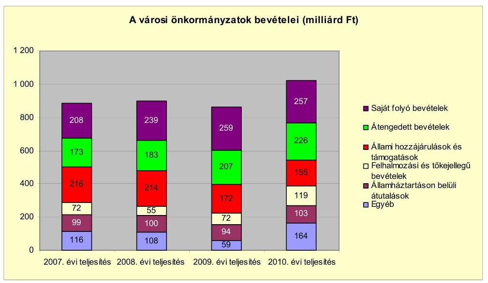

Az önkormányzati alrendszer pénzügyi helyzetértékelése során új elemzési módszereket alkalmazott az ellenőrzés. A költségvetési beszámoló adatok elemzése helyett az önkormányzat pénzügyi helyzetét a CLF módszerrel értékeljük, amelynek lényegét és számításának módszerét a jelentés 2. pontjában, és a jelentés 2. számú mellékletében ismertetjük részletesen.

Az új módszereken alapuló helyzetértékelés fontosságát az adja, hogy a helyi önkormányzatok bruttó adósságállománya ${ }^{2}$ a 2010. évi költségvetési beszámolók alapján 1248 milliárd Ft-ot tett ki. Ezen belül a 304 város adóssága 383 milliárd Ft volt, amely az önkormányzati alrendszer teljes adósságállományának 30,7 %-át jelentette ${ }^{3}$.

A mérlegben kimutatott bruttó adósságállomány mellett az önkormányzatok számára az eszközállomány műszaki állapotának megőrzése is előbb-utóbb pénzügyi kötelezettséget jelent. Az elhasználódott eszközök pótlására forrást biztosító amortizációs (felújítási) alap képzésének ${ }^{4}$ elmaradása maga után vonhatja a feladatellátást kiszolgáló tárgyi eszközök állagának erőteljes romlását. Emellett a 2007-2013-as időszakra meghirdetett, vissza nem térítendő EU-s fejlesztési forrásokhoz való hozzájutás lehetősége felerősítette az önkormányzati

[^0]
[^0]:    ${ }^{2}$ Az önkormányzati mérlegbeszámolókból számított bruttó adósságállomány 2010. év végi összege magában foglalja a fejlesztési és a működési célú kötvénykibocsátások, a beruházási és fejlesztési hitelek, a működési célú hosszú lejáratú hitelek, a rövid lejáratú hitelek, váltótartozások miatti kötelezettségek teljes (2011-ben, illetve az azt követő években esedékes) állományát. Az önkormányzatok 2007. év végi mérleg szerinti adósságállománya 692 milliárd Ft volt.
    ${ }^{3}$ A fővárosi és a kerületi

 önkormányzatok adósságának figyelmen kívül hagyásával számított 977 milliárd Ft összegű bruttó adósságállományból a városok 39,2%-kal részesedtek.
    ${ }^{4}$ Erre a jelenlegi szabályozási környezetben nem kötelezi előírás az önkormányzatokat.

---

alrendszer fejlesztési igényeit, amelyek a felhalmozási költségvetési hiány folyamatos emelkedésén túl - az előírt jövőbeni fenntartási kötelezettség miatt tovább terhelhetik az önkormányzatok költségvetését ${ }^{5}$.

Az ÁSZ a 2011. évi ellenőrzési tervében 43. számú, az Önkormányzatok gazdálkodási rendszerének ellenőrzése részeként áttekinti, és elemzi az önkormányzatok pénzügyi helyzetét. A gazdálkodás szabályszerűségét az ÁSZ az előző évek során ebben az önkormányzati körben is ellenőrizte. Jelen vizsgálatunk a tett javaslataink pénzügyi helyzetet érintő pontjainak hasznosítására utóellenőrzés jelleggel tér ki.

Az ellenőrzés megállapításait az Önkormányzat által kitöltött - teljességi nyilatkozattal megerősített - 27 tanúsítványon szolgáltatott adatokra alapoztuk. Ellenőrzési bizonyítékként használtuk fel továbbá:

- a képviselő-testületi és bizottsági előterjesztéseket, a döntés-előkészítés során készített dokumentumokat;
- a kötelezettségvállalások dokumentumait;
- a pénzügyi-számviteli nyilvántartásokat;
- az éves költségvetési beszámolókat;
- a költségvetési és zárszámadási rendeleteket.

Az ellenőrzés a 2007. január 1. - 2011. június 30. közötti időszakot öleli fel. A pénzintézettel szembeni kötelezettségek állományának vizsgálatakor az ellenőrzött időszak 2006. december 31. - 2011. június 30. közötti időszakra terjedt ki.

Az ellenőrzés során vizsgáltunk minden olyan körülményt és adatot, amely a program végrehajtásához kapcsolódott és a pénzügyi helyzet alakulására hatást gyakorló releváns tények és folyamatok feltárásához szükségessé vált.

# Az ellenőrzés célja annak értékelése volt, hogy: 

- a vizsgált időszakban a kötelező- és önként vállalt feladatok ellátását biztosító szervezeti keretekben, a feladatellátás módjában bekövetkezett változások milyen hatást gyakoroltak az Önkormányzat pénzügyi helyzetének alakulására;

[^0]
[^0]:    ${ }^{5}$ Az Állami Számvevőszék 2011. júniusában közzétett 1108. számú, a helyi önkormányzatok fejlesztési célú támogatási rendszerének ellenőrzéséről szóló jelentésében feltárta a fejlesztési folyamatok problémáit. A helyi önkormányzatok elsősorban azokat a fejlesztéseket valósították meg, amelyekhez támogatást lehetett igényelni. A fejlesztési célok közül a magasabb támogatási intenzitású pályázatokat részesítették előnyben. A fejlesztéssel megvalósuló létesítmények jövőbeli üzemeltetésének várható ráfordításait az önkormányzatok 71,9%-a nem mérte fel.

---

- az Önkormányzat pénzügyi - ezen belül működési és felhalmozási - egyensúlya mely tényezők hatására miként változott, és az Önkormányzat milyen intézkedéseket tett a pénzügyi egyensúly javítása érdekében;
- a költségvetési kiadások finanszírozása érdekében vállalt pénzintézettel szembeni kötelezettségek hogyan alakultak, továbbá milyen kötelezettségek fennállása befolyásolja az Önkormányzat jövőbeli pénzügyi helyzetét;
- hasznosultak-e a gazdálkodási rendszer korábbi ellenőrzése során a pénzügyi egyensúly javítására az ÁSZ által tett szabályszerűségi és célszerűségi javaslatok.

Az ellenőrzés típusa: szabályszerűségi vizsgálat.
A vizsgálat jogszabályi alapját az Állami Számvevőszékről szóló 2011. évi LXVI. törvény 1. § (3), 5. § (2)-(6) bekezdései, továbbá az Áht. 120/A. § (1) bekezdése előírásai képezik.

Kiskunmajsa város lakosainak száma 2010. január 1-jén 11767 fő volt. A 2010. évi választást követően az Önkormányzat 12 tagú Képviselőtestületének munkáját három állandó bizottság segítette. A helyi Önkormányzat mellett egy (cigány) kisebbségi önkormányzat működött. A polgármester 2002. évtől önkormányzati képviselő, a polgármesteri tisztségét a 2010. évi választás óta tölti be, a jegyzői feladatokat 2007. február 1-jétől ugyanaz a személy látta el.

Az Önkormányzat 2010. évi beszámolója szerint 3006,7 millió Ft költségvetési bevételt ért el és 2408,6 millió Ft költségvetési kiadást teljesített. Az összes költségvetési bevétel 20,0%-át a saját bevétel biztosította, amelynek 20,3%-a helyi adóbevételből származott. Az összes költségvetési kiadásból a felhalmozási célú kiadások részaránya a 2010. évben 17,7% volt. A 2010. december 31-én a könyvviteli mérleg szerint 9531,2 millió Ft értékű vagyonnal rendelkezett.

A Polgármesteri hivatalban dolgozó köztisztviselők záró létszáma 2010. december 31-én 54 fő volt, a költségvetési intézményekben foglalkoztatott közalkalmazottak száma 221 fő volt.

---

# I. ÖSSZEGZŐ MEGÁLLAPÍTÁSOK, KÖVETKEZTETÉSEK, JAVASLATOK 

Az Önkormányzat - adatszolgáltatása szerint - a 2010. évben az 1978,5 millió Ft összegű működési célú költségvetési kiadásaiból ${ }^{6}$ 1387,0 millió Ft-ot (70,1%-ot) a kötelező feladatai, 591,5 millió Ft-ot (29,9%-ot) az önként vállalt feladatai ellátására fordított. Az Önkormányzat a kötelezően ellátandó feladatokról az SzMSz-ben rendelkezett, az önként vállalt feladatok terjedelmét az éves költségvetési rendeletekben az adott évi költségvetés forrásainak ismeretében határozta meg. Az Önkormányzat a 2007-2010. években a kötelező feladatok ellátása mellett önként vállalt feladatnak tekintette az alapfokú művészetoktatási, a középfokú oktatási (gimnáziumi, szakközépiskolai), a kollégiumi, a szociális otthoni, a közgyűjteményi, a közművelődési, a gyermekjóléti szolgálat, a pedagógiai szakszolgálat és egyes városgazdálkodási feladatokat. Az Önkormányzat a kötelező és önként vállalt közoktatási, közművelődési, városüzemeltetési feladatokat saját intézményeiben látta el. Az alap- és szakosított szociális feladatok ellátására az Önkormányzat Többcélú kistérségi társulás keretein belül intézményfenntartó társulási szerződést kötött. A Polgármesteri hivatalban önként vállalt feladatok keretében támogatták a civil szervezeteket, elvégezték a pályázat előkészítés- és bonyolítási feladatokat. A járóbeteg-szakellátást egy gazdasági társaság útján látta el, amelyben az Önkormányzat többségi tulajdonnal rendelkezett.

Az Önkormányzat feladatellátásának szervezeti struktúráját mutatja be az alábbi ábra:
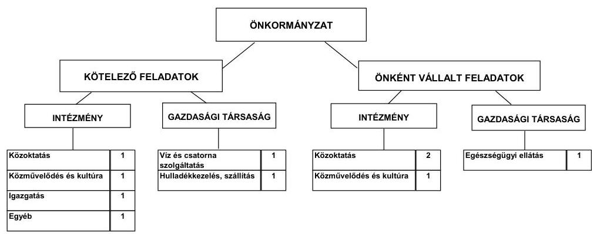

Az Önkormányzat a kötelező és az önként vállalt feladatait a 2011. év I. félév végén (a Polgármesteri hivatallal együtt) hét költségvetési szervvel látta el. Az intézmények száma a 2006. év végi tízről a 2011. év I. félévre hétre

[^0]
[^0]:    ${ }^{6}$ Az összeg tartalmazta a transzferkiadásokat (magánszemélyeknek, civil szervezeteknek átadott kiadásokat), a kamatkiadásokat, az előző évi pénzmaradvány összegét és az államháztartáson belülre átadott pénzeszközöket, valamint a kisebbségi önkormányzatok adatait is emiatt tér el a jelentés 2. számú mellékletben szereplő működési kiadások kamatkiadások nélküli összegétől.

---

csökkent két általános iskola, egy óvoda, és egy bölcsőde összevonása miatt. Az Önkormányzat költségvetési szervei feladataikat 26 telephelyen látták el. Az Önkormányzat költségvetési intézményei közül három közoktatási, kettő közművelődési, egy egyéb városgazdálkodási feladatokat végzett. Az Önkormányzat intézményei közül négy ${ }^{7}$ önállóan működő és gazdálkodó, három önállóan működő volt a 2011. év I. félévben. Az igazgatási feladatokat a Polgármesteri hivatalban látták el.

A vizsgált időszakban az Önkormányzatnak egy többségi tulajdonában lévő gazdasági társasága volt, amelyben 99,95% tulajdoni részaránnyal rendelkezett. Az Önkormányzat által alapított gazdasági társaság járóbetegszakellátási feladatokat látott el. Az Önkormányzat a többségi tulajdonában álló Közszolgáltató Kft.-nek a járóbeteg-szakellátás feladataihoz működési célú pénzeszközt adott át, amelynek összege a 2007-2011. év I. félév között összesen 84,4 millió Ft volt. A 2007-2010. években kötelező közszolgáltatások ellátásában kettő 50% alatti önkormányzati tulajdonosi részesedésű gazdasági társaság vett részt. A társaságok által ellátott közszolgáltatási feladatok a vízszolgáltatás és szennyvízelvezetés és a szilárdhulladék gyűjtése, elszállítása, elhelyezése és ártalmatlanítása.

Az egyes közszolgáltatások 2007-2010. évi működési kiadásainak finanszírozási forrásösszetételét az alábbi ábra szemlélteti:
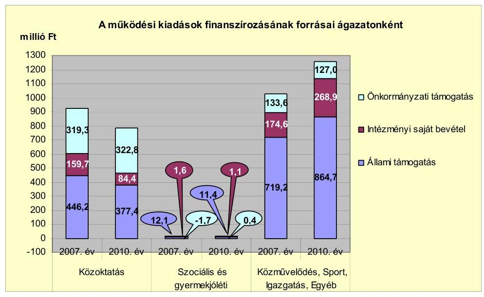

Az Önkormányzat összes működési bevétele a 2010. évben 2058,1 millió Ft volt. A kiadások finanszírozásának a 2010. évben 60,9%-a (1253,5 millió Ft) állami támogatás, 17,2%-a (354,4 millió Ft) intézményi saját bevétel, 21,9%-a (458,2 millió Ft) önkormányzati támogatás volt. Az önként vállalt feladatokra fordított működési kiadásoknak az összes kiadásokon belüli közel egyharmados nagysága az Önkormányzat pénzügyi egyensúlyának fenntarthatóságára hosszú távon kihatással lehet. Az önként vállalt feladatokra tervezett kiadások

[^0]
[^0]:    ${ }^{7}$ A négy önállóan működő és gazdálkodó intézményből kettő közoktatási, egy kulturális és közművelődési, és egy igazgatási feladatot látott el.

---

részaránya a 2011. évi tervezett adatok alapján csökkenő tendenciájú (26,1%) volt.

Az Önkormányzat összes működési kiadásain belül a közoktatási ágazat kiadása a 2007-2009. évek közötti átlag 846,3 millió Ft-ról a 2010. évre 784,6 millió Ft-ra 7,3%-kal csökkent az általános iskolai és óvodai ellátás átszervezése, valamint az alacsonyabb gyereklétszám miatt. A működési bevételek a 2007-2009. évek közötti átlag 846,3 millió Ft-ról a 2010. évre 784,6 millió Ft-ra 7,3%-kal kisebb mértékben teljesültek, amelyet az állami támogatások 15,4%-os (a 2007. évi 446,2 millió Ft-ról a 2010. évre 377,4 millió Ft-ra) és az intézményi saját bevételek 47,2%-os (159,7 millió Ft-ról 84,4 millió Ft-ra) csökkenése eredményezett.

A szociális és gyermekjóléti ágazatban az állami támogatások összege a 2007. évről a 2010. évre 6,1%-kal (12,1 millió Ft-ról 11,4 millió Ft-ra), az intézményi saját bevétel 1,3 millió Ft-ról 1,1 millió Ft-ra csökkent. Az alap- és a szakosított szociális ellátást az Önkormányzat a Többcélú kistérségi társulással kötött megállapodás alapján annak intézményével látja el. A feladat ellátásra 184,9 millió Ft pénzeszközt adtak át a Többcélú kistérségi társulásnak a 2007-2010. évek között, amelyet a Polgármesteri hivatal kiadásai között mutatott ki az Önkormányzat.

A közművelődési, sport-, igazgatási és egyéb feladatok ellátásához a 2007. évről a 2010. évre az állami támogatások összege 20,2%-kal (145,5 millió Ft-tal), az intézményi saját bevételek összege 54,0%-kal (94,3 millió Ft-tal) emelkedett. A növekedést elsősorban az okozta, hogy az Önkormányzat a Polgármesteri hivatalban számolta el a közcélú foglalkoztatásra, a magánszemélyek szociálpolitikai juttatásaira, valamint az önkormányzati tulajdonú gazdasági társaságoknak kifizetett közszolgáltatási díjat, a városgazdálkodási szolgáltatások díját, a 2010. évi országgyűlési és önkormányzati képviselő választások, civil szervezetek támogatásával, a pályázatok előkészítésével, bonyolításával kapcsolatos feladatok kiadásait.

A Képviselő-testület döntése alapján a 2007. évben négy intézmény (két általános iskola, egy óvoda és egy bölcsőde) egy intézménnyé való összevonására került sor. Az Önkormányzat a konyhai és étkeztetési feladatokat a 2008. évtől átadta egy gyermekélelmezéssel foglalkozó gazdasági társaságnak, amelyben az Önkormányzat nem rendelkezett tulajdonnal. A szomszédos településsekkel alakított Többcélú kistérségi társulás látta el a szociális alapszolgáltatási feladatokat, amelyeket a 2011. év július 1-jétől átadták a Magyarországi Református Egyháznak. Az intézményi átszervezés, a feladatátadások és átvételek intézkedései - az Önkormányzat adatszolgáltatása alapján - 2008-2010. évek között összesen 602,0 millió Ft költségvetési kiadási és ugyanennyi bevételi csökkenést eredményeztek. Az intézkedések hatására a működési bevételek körében az állami támogatás 211,9 millió Ft-tal (35,2%-kal), az intézményi saját bevétel 299,2 millió Ft-tal (49,7%-kal), az önkormányzati támogatás 90,9 millió Ft-tal (15,1%-kal) csökkent.

Az Önkormányzat a vizsgált időszakban a kötelező- és az önként vállalt feladatok ellátását biztosító szervezeti keretekben, a feladatellátás módjában változásokat hajtott végre (intézmények összevonása, feladatok átadása Többcélú kis-

---

térségi társulásnak, egyéb gazdasági társaságnak), amelyek a feladatellátás színvonalát javították, azonban az Önkormányzat pénzügyi egyensúlyi helyzetére nem voltak hatással.

A vizsgált időszakban az Önkormányzat nettó működési jövedelme negatív volt, amely hitelekből történő finanszírozása pénzügyileg közép és hosszú távon nem fenntartható gazdálkodást vetít elő.

Az Önkormányzat folyó költségvetésének egyenlegét, működési jövedelmét az alábbi ábra mutatja:
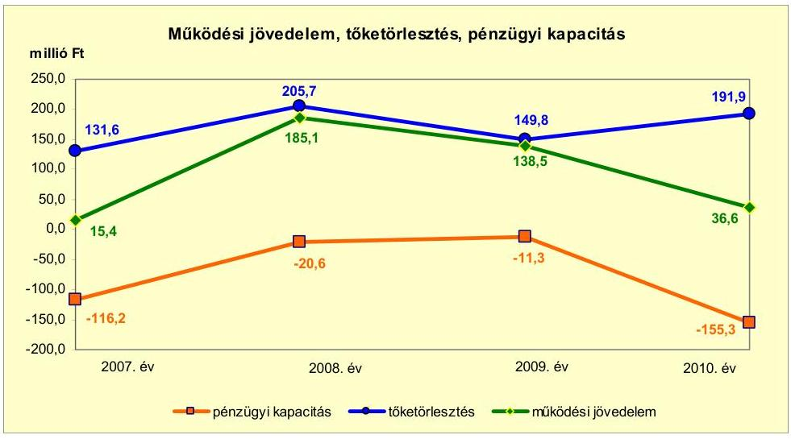

A 2007. évi 15,4 millió Ft-ról a 2008. évre 185,1 millió Ft-ra, tizenkétszeresére nőtt a működési jövedelem, amelyet elsősorban a helyi adó- és pótlék, valamint a gépjárműadó bevételek növekedése okozott. Az előző évről a 2009. évre 46,6 millió Ft működési forráscsökkenés elsősorban a magánszemélyek kommunális adójának megszüntetése miatt keletkezett. A 2010.
 évre több mint negyedére visszaesett folyó költségvetési egyenleg, döntően az ellátottak pénzbeli juttatásainak a csökkenése miatt.

A 2007-2010. években az Önkormányzat működési jövedelme nem nyújtott fedezetet a tárgyévi törlesztési kötelezettségekhez, így annak pénzügyi kapacitása (nettó működési jövedelme) negatív értékű volt. A pénzügyi kapacitás 2007. évről a 2008. évre 95,6 millió Ft-os növekedését a működési jövedelem 169,7 millió Ft-tal és a tőketörlesztés 74,1 millió Ft-tal magasabb összegei eredményezték.

A felhalmozási költségvetés egyenlege 2007-2009 között negatív értéket és a 2010. évben pozitív értéket mutatott. A 2010. évi 561,4 millió Ft felhalmozási többletet a Víziközmű Társulat fejlesztéséhez kapcsolódó lakossági hozzájárulás (644,7 millió Ft), valamint az EU-s pályázatok támogatása eredményezte.

Az Önkormányzatnak a 2010. évi folyó bevétele 2018,0 millió Ft volt, amely 2,5%-kal (50,0 millió Ft-tal) több mint a 2007-2009. évek 1968,0 millió Ft folyó bevételének átlaga. Az évenként változó tendenciát mutató folyó bevétel alakulására a fordított áfa elszámolás, kamatbevételek, működési célú pályázati támogatások, a helyi adó- és pótlék bevételek voltak hatással. Az Önkormányzat

---

2007-2010 között helyi iparűzési adót, építményadót, magánszemélyek és vállalkozók kommunális adóját, idegenforgalmi adót és telekadót vetett ki, amelyből a magánszemélyek kommunális adója 2009. január 1-jétől megszűnt. A vizsgált időszakban a folyó bevételek 21,0-23,0%-át a helyi adókból és pótlékokból származó bevételek képezték.

A folyó kiadás a 2010. évben 1981,4 millió Ft volt, ami 6,8%-kal (126,4 millió Ft-tal) több mint az előző három év kiadásának 1855,0 millió Ft átlaga, melyre döntően a magánszemélyek részére nyújtott szociálpolitikai juttatások kifizetése volt hatással.

A felhalmozási célú bevételek 2007-2010 között folyamatosan emelkedtek. A 2010. évi 988,7 millió Ft felhalmozási célú bevételre az államháztartáson kívülről érkező (649,0 millió Ft) támogatások voltak hatással.

Az Önkormányzat pénzügyi egyensúlyi helyzetét befolyásolta az elmúlt időszak fejlesztési tevékenysége. A befejezett fejlesztések kiadásainak 18,2%-át pénzintézeti forrásokból fedezték. A 2010. december 31-ig befejezett fejlesztési feladatok tényleges bekerülési költsége ${ }^{8} 756,0$ millió Ft volt, amelyből a beruházások összege 668,8 millió Ft (88,5%), a felújítások összege 87,2 millió Ft (11,5%). A fejlesztések forrása 269,0 millió Ft saját bevételből (35,6%-a), 137,6 millió Ft hitelből (18,2%-a), 321,4 millió Ft EU-s (42,5%-a) és 28,0 millió Ft hazai támogatásból (3,7%-a) tevődött össze. Az Önkormányzat 2010. december 31-én folyamatban lévő fejlesztéseihez a 2010. évet követően esedékes kötelezettségvállalásainak összege 198,0 millió Ft volt, amelynek forrásait az alábbi ábra szemlélteti:
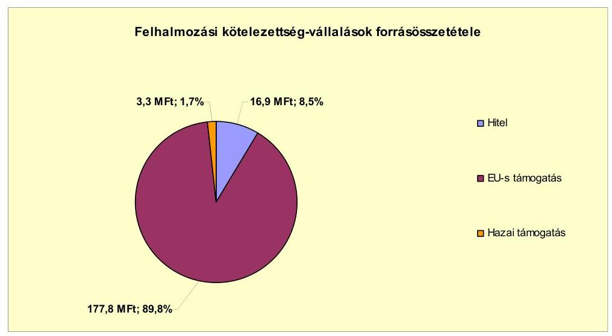

Az Önkormányzat által 2010. december 31-ig beadott, elbírálás alatt álló három pályázatában tervezett fejlesztéseinek értéke 403,1 millió Ft volt. A fejlesztések kiadásait 0,8 millió Ft saját bevételből (0,2%-át), 46,7 millió Ft hi-

[^0]
[^0]:    ${ }^{8}$ A tényleges bekerülési költség tartalmazza a 2010. évben műszakilag befejezett fejlesztés 28,5 millió Ft-os összegét, amely azonban pénzügyileg a 2011. évben teljesült.

---

telből (11,6%-át), 285,7 millió Ft EU-s (70,9%-át) és 69,9 millió Ft hazai támogatásból (17,3%-át) tervezték finanszírozni.

Az Önkormányzat könyvviteli mérleg szerinti pénzintézettel szemben fennálló kötelezettsége a 2006. december 31-ei 1003,5 millió Ft-ról a 2011. év I. félév végére 346,4 millió Ft-ra csökkent a hitelek visszafizetésének hatására. Az Önkormányzat a forintban fennálló hosszú lejáratú pénzintézettel szembeni kötelezettségeiből a 2007-2011. év I. féléve között 837,2 millió Ft tőkét és 145,8 millió Ft kamatot fizetett. Az Önkormányzat egy - 788,2 millió Ft összegű Víziközmű Társulati - hitelét fizette vissza a 2011. év I. félévben. A 2007-2011. év I. féléve között átmenetileg szabad pénzeszközeiből 29,0 millió Ft kamatbevételt realizált.

A vizsgált időszak alatt pénzintézettel szemben fennálló kötelezettségek négy hosszú lejáratú hitelből keletkeztek. Az Önkormányzat a helyszíni vizsgálat befejezésének időpontjáig részben vette igénybe a 2009. évben aláírt kettő hitelszerződés szerinti hitelt. Az Önkormányzat kötelezettségvállalásaira képviselőtestületi döntés alapján került sor. A két hosszú lejáratú adósságot keletkeztető kötelezettségvállalásra szóló Képviselő-testületi előterjesztések nem tartalmazták a visszafizetés forrásait, valamint a kamatkockázatok várható kihatásait. A hiteleket a hitelcélnak megfelelően a Képviselő-testület által jóváhagyott, a költségvetésbe betervezett beruházásokhoz használta fel.

Az Önkormányzat költségvetésének pénzügyi egyensúlyát a vizsgált időszakban csak folyószámlahitel folyamatos igénybevételével tudta biztosítani.

A folyószámlahitel igénybevétele a 2007-2011. év. I. félévében az alábbiak szerint alakult:

| Megnevezés | 2007. év | 2008. év | 2009. év | 2010. év | 2011. év   I. félév |
| :-- | :--: | :--: | :--: | :--: | :--: |
| Folyószámlahitel |  |  |  |  |  |
| Keretösszeg január 1-jén (millió Ft-ban) | 211,6 | 288,5 | 300,0 | 320,0 | 320,0 |
| Átlagos napi állomány (millió Ft-ban) | 121,8 | 153,5 | 109,4 | 164,9 | 177,7 |
| Folyószámla hitellel zárt napok száma (nap) | 353 | 364 | 343 | 362 | 181 |
| Egyenleg (állomány december 31. millió Ft-ban) | 188,3 | 135,9 | 178,0 | 220,0 | 140,3 |

Az Önkormányzat a 2007-2011. év I. féléve között változó intenzitással használta fel folyószámláhitelkeretét, melynek igénybevételére - a vizsgált időszak alatti évek pozitív működési jövedelme ellenére - a 2007. és azt megelőző években keletkezett működési hiány finanszírozása miatt volt szükség. A likviditás biztosítása miatt az Önkormányzatnak a vizsgált időszak alatt 56,7 millió Ft kamatkiadási, és 7,9 millió Ft egyéb költség fizetési kötelezettsége keletkezett.

Az Önkormányzat szállítói tartozás állománya a 2007. év végéről 7,7 millió Ft-ról 19,7%-kal (1,6 millió Ft-tal) a 2008. év végére 6,1 millió Ft-ra csökkent, majd a 2009. év végére 122,4 millió Ft-ra emelkedett. Az előző évhez képest a szállítói állomány a 2010. év végére (52,9%-kal, 64,7 millió Ft-tal) 57,7 millió Ft-ra, majd a 2011. év I. félév végére 48,6 millió Ft-ra csökkent. A 2011. június 30-án 0,2 millió Ft 30 nap alatti lejárt szállítói állománnyal rendelkezett az Önkormányzat.

---

Az Önkormányzat gazdasági társaság részére készfizető kezességet nem vállalt. A gazdasági társasága részére 23,5 millió Ft, egy intézménye részére 1,3 millió Ft és a Többcélú kistérségi társulás részére 17,6 millió Ft rövid lejáratú támogatási - működési célú - kölcsönt nyújtott.

Az Önkormányzat kötelezettségeinek 2010. december 31-ei, valamint 2011. június 30-ai állományát, és várható alakulását - a felmerülő kamatokat és díjakat is figyelembe véve - a kötelezettség lejártáig az alábbi táblázat szemlélteti:

| Megnevezés | Allomány   2010. december   31-én | Allomány   2011. június   30-án | Várható   kötelezettség   a 2011-2013.   években | Várható   kötelezettség   a 2014. évtől |
| :-- | --: | --: | --: | --: |
|  | millió Ft-ban | millió Ft-ban | millió Ft-ban | millió Ft-ban |
| Pénzintézeti kötelezettségek |  |  |  |  |
| Célhitel | 52,1 | 47,5 | 41,9 | 11,4 |
| Társulati hitel | 774,8 | 0,0 | - | - |
| Fejlesztési hitel | 0,0 | 4,6 | 4,9 | - |
| Fejlesztési hitel | 148,7 | 156,4 | 37,4 | 164,7 |
| Folyószámla hitel | 220,0 | 140,3 | 140,3 | - |
| Pénzintézeti kötelezettségek összesen HUF-ban: | 1195,6 | 348,8 | 224,5 | 176,1 |
| Szállítói tartozás | 57,7 | 48,6 | 48,6 | - |
| Jogerős végzéssel lezárt de ki nem fizetett   kötelezettségek | - | 0,3 | 0,3 | - |

Az ellenőrzött időszakban az Önkormányzat működési jövedelme nem nyújtott fedezetet az adott évi hiteltörlesztésekhez, a kötelezettségek teljesítéséhez a folyószámlahitel igénybevétele állandósult. A 2011-2013. években esedékes kötelezettségek teljesítésére figyelembe vehető a mérlegben kimutatott 116,7 millió Ft követelésállományból - az LTP-ből átutalásra kerülő - 76,5 millió Ft és a forgalomképes nettó ingatlanvagyon.

Az Önkormányzat jelenleg ismert pénzintézettel szembeni kötelezettsége (tőke- és kamat) a 2014. évtől 176,1 millió forint összegű. A kötelezettség fedezete lehet a forgalomképes nettó ingatlanvagyon és a képződő működési jövedelem (ezen belül a helyi adóbevétel). A 2014. évtől a pénzintézettel szemben fennálló kötelezettségek teljesítésére a visszafizetés forrásaira, valamint a kamatkockázat várható kihatásainak csökkentésére vonatkozóan a Képviselőtestület a helyszíni vizsgálat befejezéséig, továbbá a 2011. évet követő időszakot érintő bevételnövelő és kiadáscsökkentő intézkedésről még döntést nem hozott.

Az önkormányzati kötelezettségek növekedése mellett az Önkormányzat minősített többségi befolyásával rendelkező gazdasági társasága kötelezettségei is befolyásolhatják az Önkormányzat pénzügyi egyensúlyát. A Közszolgáltató Kft. szállítói tartozása 2010. december 31-én 7,8 millió Ft, a 2011. év I. félév végén 5,4 millió Ft volt. A Kft. kötelezettsége - jelenlegi nagyságrendje alapján - nincs jelentős hatással az Önkormányzat pénzügyi egyensúlyi helyzetére.

Az eszközök használhatósága és az elavult eszközök pótlása is hatást gyakorol az Önkormányzat pénzügyi egyensúlyi helyzetére. Az Önkormányzat a 2007-2010. években az eszközállomány után 550,1 millió Ft összegű értékcsökkenést számolt el. A 2007-2010. évek között az aktivált felújítások, beruházások értéke 595,5 millió Ft volt. A vizsgált időszak alatt a használhatósági fok 3,4%-kal csökkent.

---

Az Önkormányzat az ellenőrzött időszakban a pénzügyi egyensúly megteremtése érdekében kiadási megtakarítást eredményező és bevételt növelő intézkedéseket tett. Az Önkormányzat adatszolgáltatása szerint a 2007-2011. év I. féléve között tett intézkedések hatására 171,6 millió Ft bevételi többlet, továbbá 164,8 millió Ft kiadási megtakarítás keletkezett, ezáltal az Önkormányzat pénzügyi egyensúlyi helyzetét javították. A kiadási megtakarítások 38,6%-a (66,3 millió Ft) az elrendelt álláshely csökkentések eredménye volt. Az álláshely-csökkentő intézkedések a 2007-2011. év I. féléve között önkormányzati szinten összesen 99 álláshely (ebből kilenc üres álláshely) megszüntetését jelentették. Egyes közszolgáltatási területeken (közoktatásban egy fő, Polgármesteri hivatalban hat fő és egyéb területen négy fő) feladatbővülések voltak, amelyek álláshely- és egyben létszámnövekedéssel is jártak. Ennek következtében az időszak álláshelyeinek száma 88 fővel csökkent. A bevételnövelő intézkedések - az Önkormányzat adatszolgáltatása szerint - új adónem, az építményadó bevezetéséhez, ingatlanok és eszközök értékesítéséhez, bérbeadásához, térítési díjak emeléséhez kapcsolódtak.

Az utóellenőrzés a pénzügyi egyensúly javítására tett egy szabályszerűségi javaslatot a jegyzőnek, amely arra irányult, hogy az Ámr.-ben foglaltaknak megfelelően a költségvetési rendeleteik tartalmazzák a több éves kihatással járó feladatok előirányzatait évenkénti bontásban figyelemmel az EU-s támogatással megvalósuló fejlesztésekre. A javaslatra a felelősök és a határidő megjelölésével intézkedési tervet készítettek. A javaslatban foglaltakat határidőben megvalósították.

Az Önkormányzat pénzügyi egyensúlyi helyzetét összegezve a következők emelhetők ki:

Kiskunmajsa Város Önkormányzata pénzügyi egyensúlya rövid távon biztosított. A pénzügyi egyensúly középtávon ható helyreállítására és hosszú távú fenntarthatóságára az Önkormányzatnak fel kell készülnie.

A folyó működési bevételek a folyó kiadások teljesítésére fedezetet nyújtottak, azonban nem biztosították az adósságszolgálat teljesítését. Az Önkormányzat működését az állandósult és növekvő összegű folyószámlahitel igénybevételével tudta biztosítani.

Az önként vállalt feladatokra
 fordított kiadások összege és aránya magas, kis mértékben csökkenő tendenciát mutat.

A felhalmozási költségvetésen belüli pénzügyi hiány forrása a működési jövedelemből és hitel igénybevételével volt biztosított. A folyamatban lévő fejlesztési projektekhez, a benyújtott pályázatokhoz szükséges saját erő hitelből áll rendelkezésre.

Gazdasági társaságok miatti kockázat nem áll fenn, mivel az Önkormányzat többségi tulajdonában álló társaság pénzügyi egyensúlyi helyzete stabil.

Az Állami Számvevőszékről szóló 2011. évi LXVI. törvény 33. § (1) bekezdésében foglaltak értelmében a jelentésben foglalt megállapításokhoz kapcsolódó intézkedési tervet köteles az ellenőrzött szervezet vezetője összeállítani és azt a

---

jelentés kézhezvételétől számított harminc napon belül az ÁSZ részére megküldeni. Amennyiben az intézkedési tervet határidőben nem küldi meg a szervezet, vagy az továbbra sem elfogadható, az ÁSZ elnöke a hivatkozott törvény 33. § (3) bekezdés a)-b) pontjaiban foglaltakat érvényesítheti.

# A 2011. június 30-i pénzügyi egyensúlyi helyzet alapján ellenőrzés intézkedést igénylő megállapításai és javaslatai a következők: 

## a Polgármesternek

1. Az Önkormányzat pénzügyi egyensúlya rövid távon biztosított. A pénzügyi egyensúly középtávon ható helyreállítására és hosszú távú fenntarthatóságára az Önkormányzatnak fel kell készülnie. A 2007-2010. években az Önkormányzat működési jövedelme nem nyújtott fedezetet a tárgyévi törlesztési kötelezettségekhez, így annak pénzügyi kapacitása (nettó működési jövedelme) negatív értékű volt.

Javaslat:
Az Önkormányzat pénzügyi egyensúlyának középtávon ható helyreállítása és hosszú távú fenntarthatósága érdekében:
a) Tárja fel a további bevételszerző és kiadáscsökkentő lehetőségeket. Ütemezze a bevételek beszedését a jövőben jelentkező fizetési kötelezettségeihez;
b) Terjesszen a Képviselő-testület elé kibontakozási programot a pénzügyi egyensúlyi helyzet javítása, és hosszú távú megőrzése érdekében;
c) Képezzen egyensúlyi (elkülönített) tartalékot az adósságszolgálat teljesítése érdekében.
2. Az önként vállalt feladatokra fordított működési kiadásoknak az összes kiadásokon belüli közel egyharmados nagysága az Önkormányzat pénzügyi egyensúlyának fenntarthatóságára hosszú távon kihatással lehet. Az önként vállalt feladatokra fordított kiadások részaránya a 2011. évi tervezett adatok alapján enyhén csökkenő tendenciát mutat (26,1%).

Javaslat:
Tekintse át az önként vállalt feladatok finanszírozhatóságát a kötelező feladatellátás elsődlegességének biztosítása érdekében, mutassa be a Képviselő-testületnek a megoldás lehetőségeit és szükség esetén a gazdasági program módosításának igényét.
3. Az Önkormányzat költségvetésének pénzügyi egyensúlyát a vizsgált időszakban csak folyószámlahitel folyamatos igénybevételével tudta biztosítani. Az Önkormányzat a 2007-2011. év I. féléve között változó intenzitással használta fel folyószámahitelkeretét, melynek igénybevételére - a vizsgált időszak alatti évek pozitív működési jövedelme ellenére - a 2007. és azt megelőző években keletkezett működési hiány finanszírozása miatt volt szükség.

---

Javaslat:
Vizsgálja meg az állandósult folyószámla és likvid hitel hosszú távú kötelezettséggé történő átalakításának jogi lehetőségét, és a Stabilitási törvény 10. §-ában előírt feltételek fennállása esetén kezdeményezze a Kormánynál ennek engedélyezését.
4. Az Önkormányzat két hosszú lejáratú adósságot keletkeztető kötelezettségvállalásaira vonatkozó képviselő-testületi előterjesztések nem tartalmazták a visszafizetés forrásait, valamint a kamatkockázatok várható kihatásait.

Javaslat:
Gondoskodjon, hogy a jövőben az adósságot keletkeztető kötelezettségvállalásokról szóló képviselő-testületi előterjesztések tételesen tartalmazzák a visszafizetés forrásait, valamint mutassák be a kamatkockázat várható kihatásait.

A polgármester a helyszíni ellenőrzés lezárása után tájékoztatta az Állami Számvevőszéket az Önkormányzat tervezett intézkedéseiről, amelyet az Állami Számvevőszék nem ellenőrzött, arra vonatkozóan véleményt, vagy megállapítást nem fogalmaz meg. Az ellenőrzés lezárását követően elvégzett intézkedéseket az Állami Számvevőszék utóellenőrzés keretében vizsgálhatja.

A polgármester tájékoztatása szerint a következő intézkedéseket tervezi az Önkormányzat:

- Az önként vállalt feladatok felülvizsgálatával, az intézmények működésének racionalizálásával és a bevételnövelő intézkedések megtételével kívánja biztosítani az Önkormányzat pénzügyi egyensúlyának középtávon történő helyreállítását. Ezen intézkedéseivel, valamint az ÖNHIKI pályázat esetleges támogatásával törekszik az Önkormányzat a folyószámlahitel igénybevétel megszüntetésére.

---

# II. RÉSZLETES MEGÁLLAPÍTÁSOK 

## 1. Az ÖNKORMÁNYZAT KÖTELEZŐ ÉS ÖNKÉNT VÁLLALT FELADATAI, A FELADATELLÁTÁS SZERVEZETI KERETEI ÉS ANNAK VÁLTOZÁSAI

Az Önkormányzat a kötelezően ellátandó feladatokról az SzMSz-ben rendelkezett, az önként vállalt feladatok terjedelmét az éves költségvetési rendeletekben az adott évi költségvetés forrásainak ismeretében határozta meg. Az Önkormányzat a 2007-2010. években a kötelező feladatok ellátása mellett önként vállalt feladatnak tekintette az alapfokú művészetoktatási, a középfokú oktatási (gimnáziumi, szakközépiskolai), a kollégiumi, a szociális otthoni, a közgyűjteményi, a közművelődési, a gyermekjóléti szolgálat, a pedagógiai szakszolgálat és egyes városgazdálkodási feladatokat. Az Önkormányzat a kötelező és az önként vállalt közoktatási feladatait (az óvodai nevelést, az általános iskolai, a gimnáziumi, a szakközépiskolai oktatást, a kollégiumi ellátást), a közművelődési, a városüzemeltetési feladatokat saját intézményeiben látta el$^9$. Az alap- és szakosított szociális feladatok ellátására az Önkormányzat Többcélú kistérségi társulás keretein belül intézményfenntartó társulási szerződést kötött. A Polgármesteri hivatalban önként vállalt feladatok keretében támogatták a civil szervezeteket, elvégezték a pályázat előkészítési és bonyolítási feladatokat. A járóbeteg-szakellátást egy gazdasági társaság útján látta el, amelyben az Önkormányzat többségi tulajdonnal rendelkezett.

A pedagógiai szakszolgálati feladatokat - gyógytestnevelés, logopédiai ellátás, továbbtanulási, pályaválasztási tanácsadás - Többcélú kistérségi társulás útján, megbízási szerződés alapján külső szakember foglalkoztatásával látja el a 2005. évtől határozatlan időre.

Az alapellátás orvosi ügyelet és az ügyeleti gépjármű biztosítását a Többcélú kistérségi társulás - Kistérségi Szociális Intézménye - biztosítja 2008. február 1-jétől, négy év időtartamra.

A védőnői feladatokat a Többcélú kistérségi társulás - Kistérségi Szociális Intézmény - végzi majd 2008. január 1-jétől határozatlan időre a Városgazdálkodási Intézmény.

A szociális alapszolgáltatási, valamint az ápolást, gondozást nyújtó szakosított ellátási feladatokat (családsegítés, házi segítségnyújtás, nappali ellátás, támogató szolgálat- szociális étkeztetés, tanyagondnoki szolgálat, jelzőrendszeres házi segítségnyújtás) 2006. január 31-étől az Intézményfenntartó Kistérségi Szociális Intézmény látta el, majd - 2011. június 30-tól 10 évre - ellátási szerződés alapján a Magyarországi Református Egyház részére átadták.

[^0]
[^0]:    $^9$ Arany János Általános Iskola, Óvoda, Bölcsőde; Dózsa György Gimnázium, Szakközépiskola és Kollégium; Egressy Béni Alapfokú Művészetoktatási Intézmény; Konecsni György Kulturális Központ; Városi Könyvtár; Városgazdálkodási Intézmény; Polgármesteri hivatal

---

A családsegítési feladatokat a Többcélú kistérségi társulás Kistérségi Gyermekjóléti és Szociális Szolgáltató Intézménye látta el, a gyermekjóléti szolgáltatást a Kistérségi Szociális Intézmény, majd 2008. július 1-jétől a Kistérségi Gyermekjóléti és Szociális Szolgáltató Intézmény látja el határozatlan időre.

Az Önkormányzat működési kiadásainak a 2010. évi teljesített összege 1978,5 millió Ft$^{10}$ volt, amely 126,4 millió Ft-tal (6,8%-kal) növekedett a 2007-2009. évek 1852,1 millió Ft-os átlagához képest.

Az önkormányzati intézmények összességét vizsgálva a működési kiadások növekménye döntően a Polgármesteri hivatalban jelentkezett. Az Önkormányzat működési kiadásainak összege 2007-2010 között 49,2 millió Ft-tal 1929,3 millió Ft-ról 1978,5 millió Ft-ra (2,6%-kal) növekedett.

Az Önkormányzat 2010. évi működési kiadásait és bevételeit, valamint azok finanszírozási arányait mutatja be az alábbi táblázat főbb feladatonként:

| Ellátott feladat | Működési kiadás összesen (millió Ft) | Kötelező feladatok kiadásainak részaránya % | Működési bevétel összesen (millió Ft) | Állami támogatás részaránya % | Intézményi saját bevétel részaránya % | Önkormányzati támogatás részaránya % |
| :--: | :--: | :--: | :--: | :--: | :--: | :--: |
| Óvodák | 176,8 | 100,0 | 176,8 | 41,4 | 8,4 | 50,2 |
| Általános iskola | 378,9 | 100,0 | 378,9 | 42,2 | 8,4 | 49,4 |
| Gimnázium | 56,4 | 0,0 | 56,5 | 57,5 | 16,4 | 26,1 |
| Szakközépiskola | 122,4 | 0,0 | 122,4 | 60,4 | 16,4 | 23,2 |
| Kollégium | 50,0 | 0,0 | 50,0 | 75,5 | 16,4 | 8,1 |
| Szociális intézmények | 13,0 | 100,0 | 13,0 | 88,3 | 8,4 | 3,3 |
| Közművelődési intézmény | 96,0 | 67,0 | 95,9 | 12,5 | 38,1 | 49,4 |
| Egyéb intézmény | 83,8 | 27,0 | 83,8 | 53,5 | 47,9 | -1,4 |
| Polgármesteri hivatal igazgatási kiadásai | 185,4 | 100,0 | 185,4 | 50,9 | 5,6 | 43,5 |
| Polgármesteri hivatalban ellátott egyéb feladatok működési kiadásai | 815,8 | 67,0 | 895,4 | 79,7 | 20,3 |  |
| Működési kiadások összesen | 1978,5 | 70,1 | 2058,1 | 60,9 | 17,2 | 21,9 |

Az Önkormányzat - adatszolgáltatása szerint - a 2010. évben a 1978,5 millió Ft összegű működési költségvetési kiadásaiból 1387,0 millió Ft-ot (70,1%-ot) a kötelező feladataira, 591,5 millió Ft-ot (29,9%-ot) az önként vállalt feladataira fordított.

[^0]
[^0]:    $^{10}$ Az összeg tartalmazta a transzferkiadásokat (magánszemélyeknek civil szervezeteknek átadott kiadásokat), a kamatkiadásokat, az előző évi pénzmaradvány összegét és az államháztartáson belülre átadott pénzeszközöket, valamint a kisebbségi önkormányzatok adatait is emiatt tér el a jelentés 2. számú mellékletben szereplő működési kiadások kamatkiadások nélküli összegétől.

---

A 2007-2009. évek között a tárgyévi működési kiadásoknak átlagosan 69,6%-át, 1659,9 millió Ft-ot fordítottak a kötelező, 30,4%-át 726,2 millió Ft-ot az önként vállalt feladatok ellátására. Önkormányzati szinten a 2007-2009. évek átlagához képest a kötelező feladatok aránya a 2010. évben kis mértékben 1,2%-kal emelkedett az önként vállalt feladatok részarányának azonos arányú csökkenése mellett.

Az önként vállalt feladatokra fordított kiadások arányának alakulásában az egyes intézményeknél ettől eltérő tendencia volt tapasztalható. A szociális intézményeknél a kötelező feladatok aránya 100% volt a 2010. évben. Az oktatási intézményekben a kötelező feladatok aránya 70,8%, az önként vállalt feladatok aránya (29,2%) volt. A Polgármesteri hivatalban a 2007-2009. évi átlag 71,2%-ról a 2010. évre 67,0%-ra csökkent a kötelező feladatok részaránya, míg az önként vállalt feladatoké a három év átlagának 28,8%-áról 33,0%-ra növekedett a 2010. évben.

Az önként vállalt feladatokra fordított működési kiadásoknak az összes kiadásokon belüli közel egyharmados nagysága az Önkormányzat pénzügyi egyensúlyának fenntarthatóságára hosszú távon kihatással lehet, annak ellenére, hogy az önként vállalt feladatokra a tervezett kiadások részaránya a 2011. évi tervezett adatok alapján enyhén csökkenő tendenciát mutat (26,1%).

Az Önkormányzat összes működési kiadásain belül a közoktatási ágazat kiadása a 2007-2009. évek közötti átlag 846,3 millió Ft-ról a 2010. évre 784,6 millió Ft-ra 7,3%-kal csökkent. A működési kiadások változásának oka, hogy az ellátotti létszám a 2007. évi 1378 átlaglétszámról (11,8%-kal), a 2010. évre 1216 főre csökkent. Ehhez hozzájárult a természetes gyermeklétszám csökkenés, továbbá az is, hogy az intézmény átszervezések miatt a szülők más közelebbi iskolába, óvodába íratták a gyermekeket.

Az óvodáknál a 2007. évi átlag létszám 312 fő a 2010. évre 273 főre, 14,3%-kal csökkent. Az általános iskolánál a 2007. évi átlag létszám 654 fő a 2010. évre 585 főre, 11,8%-kal csökkent. A gimnáziumnál a 2007. évi átlag létszám 117 fő a 2010. évre 113 főre, 3,5%-kal csökkent.

A közoktatásban a 2010. évi 377,5 millió Ft állami támogatás összege 14,3%-kal (62,6 millió Ft-tal) az előzőekben leírt létszámcsökkenés miatt alatta maradt a 2007-2009. évek közötti 440,1 millió Ft átlag összegének. Az ágazatban
 jelentősebb változás volt, hogy kiadások forrásául szolgáló működési bevételeken belül az intézményi saját bevétel a 2007-2009. évi átlagösszege a 127,3 millió Ft-ról a 2010. évre 84,4 millió Ft-ra, 33,7%-kal 42,9 millió Ft-tal csökkent. Az Önkormányzat a bevételkiesések ellensúlyozására az önkormányzati támogatás összegét 15,7%-kal megemelte, amely ennek következtében a 2007-2009. évek 278,9 millió Ft-os átlagához képest a 2010. évben 322,8 millió Ft-ra növekedett.

A szociális és gyermekvédelmi ágazatban ${ }^{11}$ csak a 20 fős bölcsődei ellátás adata szerepel, melyet az Arany János Általános Iskola, Óvoda, Bölcsőde köz-

[^0]
[^0]:    ${ }^{11}$ A feladat ellátásának működési kiadásai az általános iskola szakfeladat kiadásai között szerepelnek.

---

oktatási intézményben látnak el. Az állami támogatás összegének 2007-2009 közötti átlaga és a 2010. évi összege azonos szinten alakult, 11,4 millió Ft volt. Az intézményi saját bevétel összege a 2007-2009. évek átlag 1,3 millió Ft-os összegéről a 2010. évre 15,4%-kal (1,1 millió Ft-ra) csökkent. Az Önkormányzat az egyéb szociális feladatokat 2007-2010 között a Többcélú kistérségi társulás útján látta el a 2005. évben kötött megállapodás szerint. (A Többcélú kistérségi társulásnak a működési célra átadott pénzeszközök nagyságrendje évente 41,1 millió Ft és 45,3 millió Ft között alakult.)

A közművelődési, sport, igazgatási és egyéb feladatok a 2007-2009. évek működési kiadásainak átlag 994,4 millió Ft-os összege a 2010. évre 186,6 millió Ft-tal (18,8%-kal) növekedett 1181,0 millió Ft-ra. A növekedést elsősorban a Polgármesteri hivatalban ellátott feladatok működési kiadásainak a 38,7%-os 227,7 millió Ft-os emelkedése befolyásolta. A 2007-2009. évi kiadások átlag összege 588,1 millió Ft-ról a 2010. évre 815,8 millió Ft-ra nőtt. Ennek oka az volt, hogy az Önkormányzat a Polgármesteri hivatalban számolta el a közcélú foglalkoztatásra, szociálpolitikai juttatásokra a magánszemélyeknek, Többcélú kistérségi társulásnak a szociális feladatok ellátásáért, valamint az önkormányzati tulajdonú gazdasági társaságoknak kifizetett közszolgáltatási díjat a városgazdálkodási szolgáltatások díját, a 2010. évi országgyűlési és önkormányzati képviselő választások civil szervezetek támogatásával, a pályázatok előkészítésével, bonyolításával kapcsolatos feladatok kiadásait.

A Polgármesteri hivatal kiadásain belül a 2007. évről a 2010. évre:

- a személyi kiadások és járulékai 226,4 millió Ft-ról (178,5 millió Ft-tal) 404,9 millió Ft-ra növekedtek a különböző pályázatokhoz (közösségi közlekedés ipari park informatikai fejlesztés) kapcsolódó kiadások, és a közcélú foglalkoztatásra fordított (132,3 millió Ft) összeg miatt;
- a dologi kiadások 179,5 millió Ft-ról 227,4 millió Ft-ra növekedtek, melyet a közvilágítási, város- és községgazdálkodási a hulladékszállítás- és kezelési, a kiszámlázott termékek után fizetendő és a fordított áfa többletköltségei okoztak;
- a szociális feladatokra átadott önkormányzati támogatás összegét a Polgármesteri hivatal kiadásai tartalmazták és a normatív számítás alapján igényelhető állami támogatás összegét a Többcélú kistérségi társulás vette igénybe. 2007-2010 között a Többcélú kistérségi társulásnak működési célra átadott pénzösszeg összesen 184,9 millió Ft volt, amelynek évenkénti összege 41,1 és 45,3 millió Ft között mozgott.

A közművelődési, sport, igazgatási és egyéb feladatok kiadásainak forrásául szolgáló működési bevételein belül az állami támogatások, az intézményi saját bevétel és az önkormányzati támogatás összege növekedett a következők szerint:

- az állami támogatások 2010. évi teljesített összege (864,7 millió Ft) 13,0%-kal (99,7 millió Ft-tal) nőtt a 2007-2009. évek 765,0 millió Ft-os átlagához képest;
- az önkormányzati támogatás 2010. évi 127,0 millió Ft-os teljesített összege 12,5%-kal (14,1 millió Ft-tal) haladta meg a 2007-2009. évek 112,9 millió Ft-os átlagát;

---

- az intézményi saját bevétel 2010. évi 268,9 millió Ft-os teljesített összege 6,1%-kal (15,5 millió Ft-tal) nőtt a 2007-2009. évek 253,4 millió Ft-os átlagához képest.

Az Önkormányzat feladatait 2011. június 30-án (a Polgármesteri hivatallal együtt) hét költségvetési szervvel, a Többcélú kistérségi társulással, egy többségi tulajdonú járó beteg ellátást nyújtó gazdasági társasággal, valamint kettő kötelező közszolgáltatást nyújtó, 50% alatti önkormányzati tulajdonú gazdasági társasággal látta el. A költségvetési szervek száma hét, a feladatellátás telephelyeinek száma 26 volt, amely a 2007. év és 2011. június 30. között nem változott.

Az Önkormányzat a 2010. évben az „56-os Alapítvány”-tól vett át a közművelődési feladatokat, melynek hatására a személyi juttatások és járulékai 14,6 millió Ft-tal, a dologi kiadások 2,8 millió Ft-tal, összesen 17,4 millió Ft-tal növekedtek. Az intézkedés hatására 3,3 millió Ft-tal nőtt az intézményi saját bevétel, 14,1 millió Ft-tal az önkormányzati támogatás összege.

A szociális alapszolgáltatási, valamint az ápolást, gondozást nyújtó szakosított ellátási feladatokat (családsegítés, házi segítségnyújtás, nappali ellátás, támogató szolgálat szociális étkeztetés, tanyagondnoki szolgálat, jelzőrendszeres házi segítségnyújtás) 2006. január 31-étől az Intézményfenntartó Kistérségi Szociális Intézmény látta el, majd - 2011. június 30-tól 10 évig - a Magyarországi Református Egyházzal kötött ellátási szerződés útján, a szociális alapszolgáltatási feladatokat, ápolást, gondozást nyújtó szakosított ellátást átadták.

A szociális feladatok Többcélú kistérségi társulásnak a 2007 évtől történt átadása a kiadások 239,0 millió Ft-os csökkenését eredményezték, (amelyből a személyi juttatások és járulékok összege 150,9 millió Ft-tal, a dologi kiadás összege 140,6 millió Ft-tal csökkent) és 52,5 millió Ft-tal növekedett a Többcélú kistérségi társulásnak átadott pénzeszközök összege. Az intézkedések bevételi kihatása, hogy az állami támogatások összege 211,9 millió Ft-tal, az intézményi saját bevételek összege 57,4 millió Ft-tal csökkent, a feladatátadás miatt az önkormányzati támogatás megtakarítása 30,3 millió Ft volt. A szociális feladatok átadását a jobb színvonalú ellátás miatt a feladatokra fordítható többletforrások, a központi költségvetés által a Többcélú kistérségi társulásoknak nyújtott többlettámogatás és az önkormányzati kiadások csökkentésének szándéka motiválta.

A 2007. évben végrehajtott intézményi átszervezés, feladatátrendezés hatására a négy közoktatási intézmény összevonása, a Bodoglári Óvoda bezárása következtében a közoktatásban 23 álláshely, a Polgármesteri hivatalban egy belső ellenőri álláshely megszüntetésére került sor. Ennek következtében a személyi juttatásokra fordított kiadások 62,8 millió Ft-tal, a dologi kiadások 6,0 millió Ft-tal csökkentek, és az átadott pénzeszközök 1,4 millió Ft-tal nőttek, melyek együttes hatása 67,4 millió Ft kiadáscsökkenést eredményezett. Az átszervezések hatására a bevételek együttesen 67,4 millió Ft-tal, az intézményi saját bevételek 4,0 millió Ft-tal, az önkormányzati támogatás összege 63,4 millió Ft-tal csökkent.

---

A konyhai és az étkezési feladatoknak egy gyermekélelmezéssel foglalkozó gazdasági társaság (a Sulihost Kft.) részére - amelyben az önkormányzat nem rendelkezett tulajdonnal - történt átadásának következtében a 2008. évben 30 fő, a 2009. évben öt fő álláshelyének megszüntetésére került sor. Az Önkormányzat kiadásai összesen 313,0 millió Ft-tal csökkentek, amelyet a személyi juttatások és járulékainak 182,2 millió Ft-os és a dologi kiadások 152,1 millió Ft-os csökkenése és a 21,2 millió Ft-os pénzeszközátadás növekedés eredményezett. Az intézkedések hatására az intézményi saját bevételek 241,1 millió Ft-tal és az önkormányzati támogatás 71,9 millió Ft-tal csökkentek.

Az intézményi átszervezés, feladatátadások és átvételek intézkedései - az Önkormányzat adatszolgáltatása alapján - 2008-2010 között összesen 602,0 millió Ft költségvetési kiadási és ugyanennyi bevételi csökkenést eredményeztek. Az intézkedések hatása a működési kiadásokra a személyi juttatások és járulékai 63,3%-os (-381,2 millió Ft-os), a dologi kiadások 49,2%-os (-295,9 millió Ft-os) csökkenése, valamint az átadott pénzeszközök 12,5%-os (75,1 millió Ft-os) növekedése volt. A működési bevételek körében az állami támogatás 211,9 millió Ft-tal (35,2%-kal), az intézményi saját bevétel 299,2 millió Ft-tal (49,7%-kal), az önkormányzati támogatás 90,9 millió Ft-tal (15,1%-kal) csökkent.

A vizsgált időszakban az Önkormányzatnak egy többségi tulajdonában lévő gazdasági társasága volt, melyben 99,95 százalékos tulajdoni részaránnyal rendelkezett. A Közszolgáltató Kft. saját tőke/jegyzett tőke aránya a 2009. évben 23,5, a 2010. évben - 95,7 millió Ft apport hatására - 1,2 volt. A vizsgált időszakban a gazdasági társaság adózott eredménye - az alakulás éve (a 2008. év) negatív eredménye kivételével - pozitív összegű volt. Eredménytartaléka a 2009. évben negatív és a 2010. évben pozitív volt. Az Önkormányzat által alapított többségi tulajdonú gazdasági társaság a járó beteg szakellátási feladatokat látja el.

A 2007-2010 években kötelező közszolgáltatások ellátásában kettő 50% alatti önkormányzati tulajdonosi részesedésű gazdasági társaság vett részt:

- A Halasvíz Kft.-ben 0,4% a tulajdoni részarány, a társaság által ellátott közszolgáltatási feladat a vízszolgáltatás és szennyvízelvezetés.
- A Homokhátsági Regionális Hulladékgazdálkodási Vagyonkezelő és Közszolgáltató Zrt.-ben 2,3% a tulajdoni részarány. A társaság közszolgáltatási feladata a szilárdhulladék gyűjtése, elszállítása, elhelyezése és ártalmatlanítása.

Az önkormányzati kötelező feladatok ellátásában résztvevő gazdasági társaságok tulajdoni részarányának (0,4% és 2,3%) az Önkormányzat pénzügyi egyensúlyi helyzetét nem befolyásolja. A gazdasági társaságok jellemző adatait a jelentés 4. számú melléklete mutatja be.

Az Önkormányzat a vizsgált időszakban a kötelező és önként vállalt feladatok ellátását biztosító szervezeti keretekben, a feladatellátás módjában változásokat hajtott végre (intézmények összevonása, feladatok átadása Többcélú kistérségi társulásnak, egyéb gazdasági társaságnak), amelyek a feladatellátás színvonalát javították, azonban az Önkormányzat pénzügyi egyensúlyi helyzetére nem voltak hatással.

# 2. Az ÖNKORMÁNYZAT PÉNZÜGYI EGYENSÚLYI HELYZETÉT BEFOLYÁSOLÓ TÉNYEZŐK 

A hagyományos költségvetési szerkezet helyett az Önkormányzat pénzügyi helyzetét a CLF módszerrel mutatjuk be, amelyben jobban elkülönülnek a vagyonnal kapcsolatos bevételek és kiadások az önkormányzati feladatokkal kapcsolatos közvetlen működtetési bevételektől és kiadásoktól. A módszer következetesen elkülöníti a folyó és a felhalmozási költségvetés bevételeit és kiadásait, azok költségvetési egyenlegeit. A saját folyó bevételek, valamint a saját felhalmozási bevételek nem tartalmazzák az előző évi pénzmaradványok felhasználásából származó pénzforgalom nélküli bevételeket ${ }^{12}$.

A folyó költségvetés egyenlege, a működési jövedelem megmutatja, hogy az Önkormányzat éves folyó bevétele fedezetet biztosít-e a kötelező és önként vállalt feladatellátáshoz kapcsolódó éves folyó kiadására. A működési jövedelem negatív értéke pénzügyileg fenntarthatatlan helyzetet jelez. A mutató pozitív értéke megtakarítást mutat, amely forrásul szolgálhat az Önkormányzat fennálló kötelezettségei megfizetéséhez, valamint fejlesztéseihez.

A felhalmozási költségvetés pozitív értéke felhalmozási többletet mutat, amely a jövőbeni fejlesztések forrását biztosíthatja. Amennyiben a folyó költségvetési hiány finanszírozása a felhalmozási többletből történik, ez szűkebb értelemben vagyonfelélésnek tekinthető. Amennyiben a felhalmozási költségvetés megtakarítása fejlesztési célú hitelek, kötvények adósságszolgálatát finanszírozza, az változatlan vagyon tömeg mellett, a korábban megelőlegezett tőkebevételek valós realizációjának tekinthető. A felhalmozási deficit által generált finanszírozási igény önmagában nem jár pénzügyi kockázattal, a pénzügyileg fenntartható beruházásokhoz kapcsolódó kötelezettségvállalás (adósságszolgálat) átlátható és szabályozott költségvetési gazdálkodással teljesíthető.

A módszer a pénzügyi kapacitás fogalmát helyezi a középpontba. Az adós hitelfelvételi képessége, hosszú távú fizetőképessége, vagy bonitása a pénzügyi kapacitással, ezen belül is a nettó működési jövedelemmel jellemezhető. A nettó működési jövedelem negatív értéke az egyes költségvetési években jelentkező adósságszolgálat túlzott mértékére utal. ${ }^{13}$ A nettó működési jövedelem negatív értékének felhalmozási többletből, vagy további hitelből történő finanszírozása pénzügyileg nem fenntartható gazdálkodást vetít előre. A pozitív értéket mutató nettó működési jövedelem fejlesztési kiadások fedezetét biztosíthatja, illetve a folyamatosan, évenként képződő pozitív nettó működési
 jövedelemből meghatározható a jövőben vállalható, teljesíthető éves adósság-

[^0]
[^0]:    ${ }^{12}$ A költségvetési években kialakuló hiány finanszírozása az előző évi pénzmaradvány és a korábbi években képzett tartalékok felhasználásával is történhet.
    ${ }^{13}$ kivéve, ha annak finanszírozására a korábbi években képzett tartalékok fedezetet nyújtanak

---

szolgálat, ily módon az a hitelösszeg, amely - a többi tényezőt, feltételt adottnak tekintve - visszafizetési kockázat nélkül felvehető.

A CLF módszer alapján a pénzügyi kapacitás mértéke az Önkormányzat összevont, nettósított, a központi információs rendszerbe a Magyar Államkincstáron keresztül leadott éves költségvetési beszámolójának 80-as űrlapjában szerepeltetett adatok alapján került meghatározásra.

A számítási leírás némileg eltér az ÁSZ módszertanában korábban alkalmazott gyakorlattól. A jelen besorolás általános közgazdasági meggondolásokon alapul, amely megjelenik az SNA statisztikai módszertanában is. Folyó tételek alatt értjük azokat a kiadásokat és bevételeket, amelyek a gazdálkodó szervezet helyzetét automatikusan nem változtatják. Bevételi oldalon ilyenek az adók, a tényezőjövedelmek, a transzferek, kiadási oldalon a transzferek ${ }^{14}$ és a szolgáltatás igénybevételével kapcsolatos működési kiadások. A folyó költségvetésben a bevételekben nem térül meg, a kiadásokban nem jelenik meg az amortizáció, a vagyoni helyzetet az egyenleg befolyásolja.

A folyó költségvetés egyenlege (működési jövedelem) tartalmazza a kamatbevételeket és a kamatkiadásokat is, mind a működési, mind a fejlesztési kamatot, valamint a visszatérülő és befizetendő áfa teljes összegét, mert ezek közgazdaságilag tényezőjövedelmek. Nem tartalmazzák viszont a követelés elengedés miatt könyvelt bevételi és kiadási pénzforgalmi tételeket, mert valójában technikai elszámolási műveletnek minősülnek, a bevétel soha nem realizálódott, és költségvetési kiadás sem történt.

A felhalmozási költségvetésben a bevételek között a vagyon megőrzésére és bővítésére fordítható források jelennek meg. A felhalmozási, vagy tőketételek módosítják a vagyon nagyságát. A privatizációs bevétel csökkenti a vagyont, a fizikai beruházás, pénzügyi befektetés növeli.

A nettó működési jövedelmet a tőketörlesztés levonásával a folyó költségvetés egyenlegéből származtatjuk.

[^0]
[^0]:    ${ }^{14}$ Transzfer kiadásoknak nevezzük azokat a folyó és felhalmozási tételeket, amelyeket nem az adott önkormányzat használ fel szolgáltatásnyújtásra.

---

# 2.1. A működési és a felhalmozási egyensúly változása 

CLF módszer szerinti önkormányzati adatok

| Megnevezés | 2007. év | 2008. év | 2009. év | 2010. év |
| :--: | :--: | :--: | :--: | :--: |
| Folyó bevételek*** | 1947,8 | 1997,2 | 1959,1 | 2018,0 |
| Folyó kiadások | 1932,4 | 1812,1 | 1820,6 | 1981,4 |
| Működési jövedelem | 15,4 | 185,1 | 138,5 | 36,6 |
| Nettó működési jövedelem   működési jövedelem - tőketörlesztés | $-116,2$ | $-20,6$ | $-11,3$ | $-155,3$ |
| Felhalmozási bevételek*** | 42,3 | 48,2 | 121,8 | 988,7 |
| Felhalmozási kiadások | 108,3 | 177,5 | 233,8 | 427,3 |
| Felhalmozási költségvetés egyenlege | $-66,0$ | $-129,3$ | $-112,0$ | 561,4 |
| Finanszírozási műveletek nélküli (GFS)   pozíció = működési jövedelem + felhalmozási   költségvetés egyenlege | $-50,6$ | 55,8 | 26,5 | 598,0 |
| Finanszírozási műveletek egyenlege | 53,9 | $-60,2$ | 61,2 | 26,1 |
| Tárgyévi pénzügyi pozíció | 3,3 | $-4,4$ | 87,7 | 624,1 |
| Egyéb tájékoztató adatok |  |  |  |  |
| Összes kötelezettség* | 1287,3 | 1171,1 | 1327,1 | 1323,1 |
| -ebből rövid lejáratú | 298,1 | 279,6 | 411,9 | 1133,2 |
| Folyószámlahitel napi átlagos állománya ** | 121,8 | 153,5 | 109,4 | 164,9 |
| Finanszírozásba vonható eszközök: | 65,0 | 60,6 | 148,3 | 772,4 |
| Tartós hitelviszonyt megtestesítő   értékpapírok év végi állománya | 0,3 | 0,2 | 0,2 | 0,2 |
| Pénzeszközök (idegen pénzeszközök   nélkül) év végi állománya | 64,7 | 60,4 | 148,1 | 772,2 |

* Az összes kötelezettséget a passzív pénzügyi elszámolások nélkül vettük figyelembe, mert a passzívák a pénzmaradvány elszámolás tételei közé tartoznak.
** A folyószámla, a likvid- és a munkabérhitel átlagos állományát 365 napos osztószámmal, és nem a hitel igénybevételi napok számával vettük figyelembe.
*** A költségvetési támogatásból a felhalmozási célú összeget az Önkormányzat adatszolgáltatása szerinti összegben vettük figyelembe.

Az Önkormányzat a 2007-2010. évek közötti kiadásainak és bevételeinek főbb jogcímeit, valamint adósságszolgálatának adatait részletesen a jelentés 2. számú melléklete mutatja be.

A CLF módszer szerint figyelembe vett folyó és felhalmozási bevételek és kiadások főösszegei nem tartalmazzák az Önkormányzat gesztor szerepéből adódó Többcélú kistérségi társulás adatait.

---

A 2007-2010. években az Önkormányzat folyó költségvetési egyenlege (működési jövedelme) pozitív összegű volt, amelyet az alábbi ábra szemléltet:
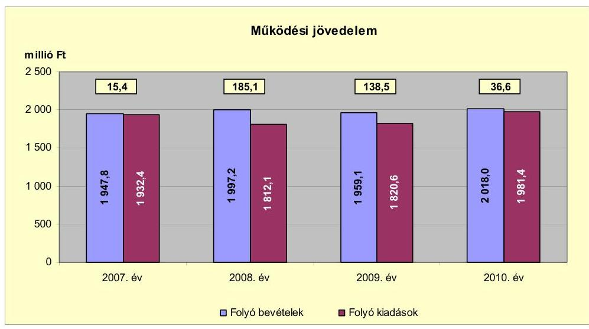

Működési jövedelem a 2007. évről 15,4 millió Ft-ról, a 2008. évre 185,1 millió Ft-ra, 169,7 millió Ft-tal növekedett, a folyó bevételek emelkedése és a folyó kiadások csökkenésének együttes hatására. A bevétel növekedést a helyi adó- és pótlékbevételek 39,6 millió Ft-os, valamint a gépjárműadó 20,4 millió Ft-os emelkedése okozta. A folyó kiadásokat elsősorban a közétkeztetés miatti létszámcsökkenésből, a házi- és a fogorvosi ellátások vállalkozásba adásából adódó személyi juttatások és a dologi kiadások, valamint a kamatkiadások csökkentették. A működési jövedelem a 2009. évben 46,6 millió Ft-tal, $25,2 \%$-kal volt alacsonyabb, mint az előző évben, amelyet elsősorban a helyi adó- és pótlékbevételek 59,7 millió Ft-os csökkenése okozott. A működési jövedelem a 2010. évre 101,9 millió Ft-tal csökkent az előző évhez viszonyítva, mert a folyó bevétel $3,0 \%$-os növekedése elmaradt a folyó kiadás $8,8 \%$-os emelkedésétől. A folyó kiadások összege a fordított áfa kiadási, valamint az ellátottak pénzbeli juttatásai miatt emelkedett. A szociális juttatás kiadása a 2007-2009. években átlagosan 244,1 millió Ft volt, amely a 2010. évre 16,6\%-kal, 284,7 millió Ft-ra emelkedett. A vizsgált időszakban a működési jövedelem 375,6 millió Ft megtakarítást mutatott, amely a tőketörlesztési kötelezettség (679,0 millió Ft ) fedezetét nem biztosította.

A 2007-2010. években az Önkormányzat működési jövedelme nem nyújtott fedezetet a tárgyévi törlesztési kötelezettségekhez, így annak pénzügyi kapacitása negatív értéket mutatott. A nettó működési jövedelem értéke a folyó költségvetési pozíció mellett az adott költségvetési év adósságtörlesztésének hatását is tükrözi.

Az Önkormányzat pénzügyi kapacitását 2007-2010 között évenként az alábbi diagram szemlélteti:

---

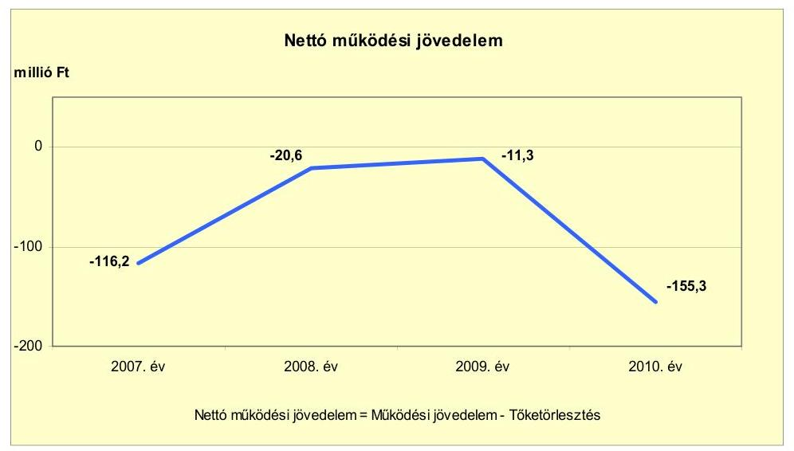

A nettó működési jövedelem - évről évre változó nagyságrendű tőketörlesztés ${ }^{15}$ mellett - négy év alatt a 2007. évről a 2008. évre, illetve a 2009-ről a 2010. évre változott a legnagyobb mértékben.

A 2008. évi 95,6 millió Ft-os növekedést, a folyó bevételek és kiadások különbségéből származó működési jövedelem 169,7 millió Ft-tal történő emelkedése és a tőketörlesztés 74,1 millió Ft-tal magasabb összege okozta. A 2008. évi tőketörlesztés emelkedését elsősorban az előző évhez viszonyított 67,2 millió Ft-tal megnövekedett folyószámlahitel visszafizetés eredményezte.

A 2010. évben 144,0 millió Ft-tal csökkent a nettó működési jövedelem a 2009. évhez képest, amely a működési jövedelem 101,9 millió Ft csökkenésének és a tőketörlesztés 42,1 millió Ft-os növekedésének együttes hatása volt.

A felhalmozási költségvetés bevételeit, kiadásait és egyenlegét 2007-2010 között az alábbi ábra szemlélteti:

[^0]
[^0]:    ${ }^{15}$ Az Önkormányzat tőketörlesztési kötelezettsége 2007-ben 131,6 millió Ft, 2008-ban 205,7 millió Ft, 2009-ben évi 149,8 millió Ft, 2010-ben 191,9 millió Ft volt.

---

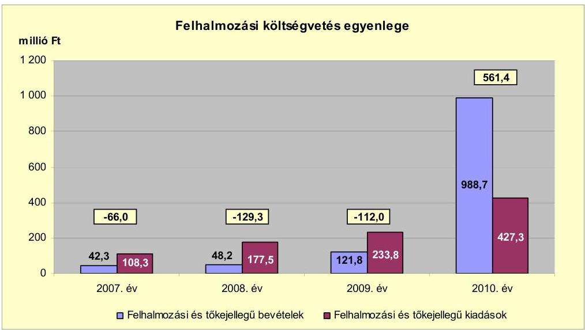

A felhalmozási költségvetés egyenlege 2007-2009 között átlagosan -102,4 millió Ft volt, amely a 2010. évben 561,4 millió Ft-ra emelkedett. A felhalmozási bevétel 2010. évi emelkedését a Víziközmű Társulat fejlesztéséhez kapcsolódó lakossági hozzájárulás (644,7 millió Ft), valamint az EU-s pályázatok támogatása eredményezte.

Az Önkormányzat 2010-ben közösségi közlekedésre 124,9 millió Ft, az Ipari Parkhoz 122,9 millió Ft, valamint a Kistérségi Járóbeteg Szakellátó Központ fejlesztéséhez 5,0 millió Ft támogatásban részesült.

A felhalmozási és tőkejellegű kiadás a 2009. évben 233,8 millió Ft-ról 82,8\%-kal (193,5 millió Ft-tal) 2010-re 427,3 millió Ft-ra nőtt, amelyben meghatározó volt a beruházások kiadásának 243,0 millió Ft-os emelkedése. Ezen belül az Ipari Park komplex fejlesztésére 2010-ben 184,1 millió Ft-ot fordítottak.

Az Önkormányzat évenkénti teljes finanszírozási igénye ${ }^{16}$ a CLF módszer szerint a 2007. évben -182,2 millió Ft, a 2008. évben -149,9 millió Ft, a 2009. évben -123,3 millió Ft volt. Az Önkormányzat 2007-ben 188,3 millió Ft, 2008-ban 135,9 millió Ft, 2009-ben 178,0 millió Ft működési célú hitel felvételével tudta biztosítani a pénzügyi egyensúlyt. A 2009. évben fejlesztési célra 73,4 millió Ft Magyar Fejlesztési Bank Zrt. által refinanszírozott hitel felvételére került sor. Az Önkormányzat teljes finanszírozása a 2010. évben 406,1 millió Ft többletet mutatott.

[^0]
[^0]:    ${ }^{16}$ a nettó működési jövedelem és a felhalmozási költségvetés egyenlegeinek összege

---

Az Önkormányzat finanszírozási célú műveletei egyenlegét a 2007-2010. években az alábbi ábra szemlélteti:
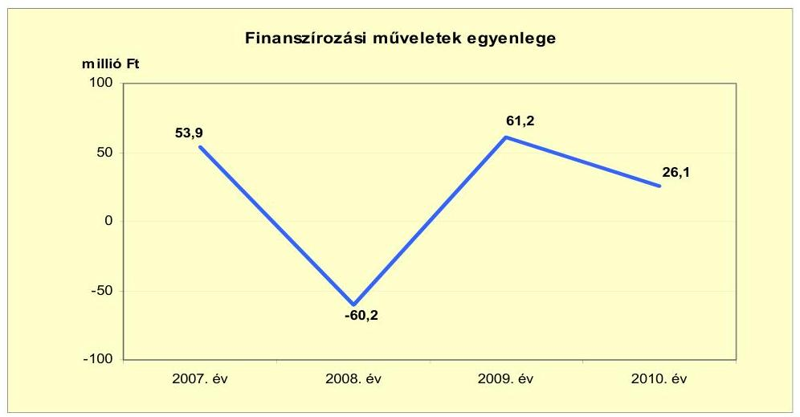

A finanszírozási műveletek egyenlege a 2008. év kivételével pozitív volt, amely azt jelzi, hogy az éves költségvetések végrehajtása során szükség volt külső forrás igénybevételére is. A 2009. évre az előző évhez képest 121,4 millió Ft-tal emelkedett az egyenleg a Magyar Fejlesztési Bank Zrt. „Sikeres Magyarországért" Önkormányzati Fejlesztési Hitelprogram keretében felvett 251,4 millió Ft összegű fejlesztési célú hitel miatt. A finanszírozási célú műveleteket a jelentés 2. számú mellékletének 4.1-4.8. pontjai részletezik.

A CLF módszer alapján az Önkormányzat finanszírozási műveletek nélküli bevételeinek és kiadásainak egyenlege (GFS pozíció) 2007-ben -50,6 millió Ft, 2008-ban 55,8 millió Ft, 2009-ben 26,5 millió Ft, 2010-ben 598,0 millió Ft volt. Az Önkormányzat a 2007-2010. évi zárszámadási rendeleteiben mérlegszerűen bemutatta működési és felhalmozási célú költségvetési bevételeit és kiadásait és azok egyenlegét, amelyet a jelentés 1. számú melléklete tartalmaz. A zárszámadási rendeletekben bevételi többletet mutattak ki 2007-ben 92,4 millió Ft, 2008-ban 81,8 millió Ft, 2009-ben 116,6 millió Ft és 2010-ben 598,0 millió Ft összegben. Az Önkormányzat által jóváhagyott működési és felhalmozási célú többlet évenként a jelentés 2. számú melléklet tárgyévi pénzügyi pozíció adataitól a pénzmaradvány-igénybevétel, valamint a finanszírozási műveletek összegével tér el.

---

Az Önkormányzat kamatbevételeit és kamatkiadásait a 2007-2011. év I. féléve között évenként az alábbi ábra mutatja be:
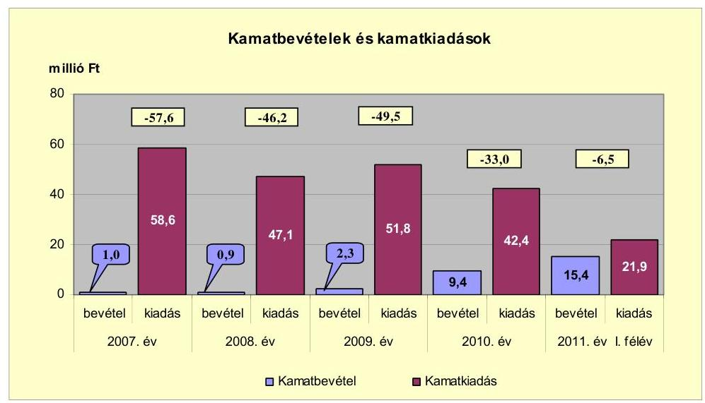

A 2007-2011. év I. féléve között az Önkormányzat összesen 221,8 millió Ft kamatot fizetett, amelyből 145,8 millió Ft a két hosszú lejáratú hitel kamata volt.

A célhitelhez 34,9 millió Ft, a Víziközmű Társulat hitelhez 104,1 millió Ft, és az Önkormányzati Fejlesztési Hitelprogram keretében felvett hitel után 2011. június 30-áig 6,8 millió Ft kamatfizetést teljesített az Önkormányzat.

Az átmenetileg szabad pénzeszközök lekötéséből realizált 29,0 millió Ft kamatbevétel, a teljes kamatkiadás 13,1\%-át tette ki. A kamatbevételből 25,0 millió Ft-ot a Víziközmű Társulattól átvett hitel kamatkiadásaira fordította az Önkormányzat.

# 2.2. Az Önkormányzat bevételeinek változása 

Az Önkormányzat 2010. évi folyó bevétele 2018,0 millió Ft volt, amely 2,5\%-kal több, mint a 2007-2009. évek 1968,0 millió Ft folyó bevételének átlaga. A vizsgált
 időszakban - a 2009. év kivételével - a folyó bevétel emelkedő tendenciát mutatott, amely döntően a fordított áfa elszámolás, a működési célú pályázati támogatások hatása volt. A 2011. év I. félévi adatairól megállapíthatóak, hogy a bevételek - az áfa és a helyi adóbevétel kivételével - az előző évekhez viszonyítva időarányosan teljesültek.

---

Az Önkormányzat 2007-2011. év I. féléve között realizált főbb folyó bevételi jogcímeinek számszaki adatait az alábbi táblázat és grafikon mutatja be:
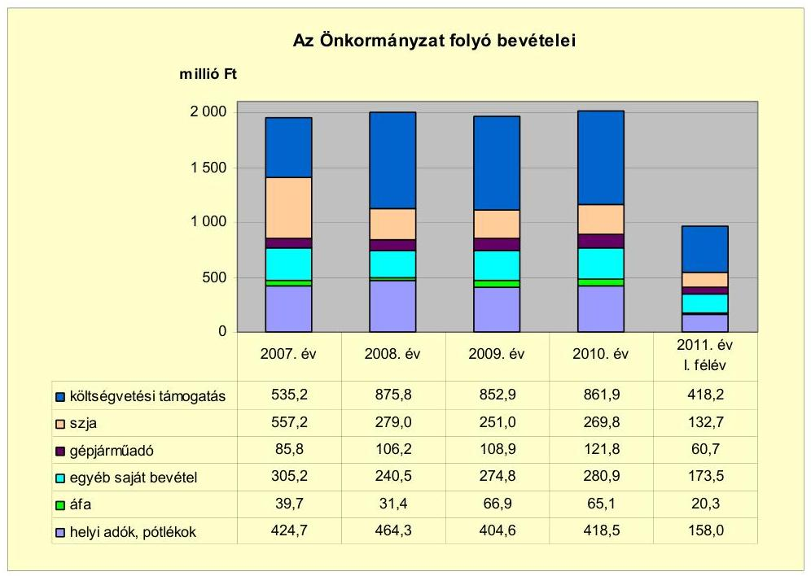

Az Önkormányzat költségvetési támogatás és átengedett szja bevételeinek együttes összege a 2007-2010. években érdemében alig változott. A 2007-2009. évek folyó bevételének átlaga 1117,0 millió Ft volt, amely a 2010. évre 1131,7 millió Ft-ra emelkedett. A költségvetési támogatás a 2007-2009. években átlagosan 754,6 millió Ft, amely a 2010. évben 861,9 millió Ft-ra, 107,3 millió Ft-tal 14,2%-kal növekedett. Az átengedett szja bevétel a 2007-2009. években átlagosan 362,4 millió Ft volt, amely 2010-re 25,5%-kal 269,8 millió Ft-ra csökkent. Az előzőekben felsorolt bevételek a központi támogatáselosztás, valamint a normatív állami támogatások összegének és az igénybevételüknek megfelelően változtak.

A gépjárműadóból származó bevétel a 2007-2009. években átlagosan 100,3 millió Ft volt, amely a 2010. évre 21,4%-kal, 21,5 millió Ft-tal emelkedett, a gépjárműadó alapjának, mértékének 2010. január 1-jétől hatályos változása következtében. A 2007. évről a 2008. évre 20,4 millió Ft-os emelkedés oka volt egyrészt, hogy egy gazdasági szervezet telephelyet változtatott, melynek következtében az illetékes adóhatóság Kiskunmajsa lett, másrészt a város egyik vállalkozója nagy tehergépjármű-park állományának folyamatos bővülése többlet gépjárműadó bevételt eredményezett.

---

Az Önkormányzat egyéb saját bevétele ${ }^{17}$ a 2007. évről a 2008. évre 64,7 millió Ft-tal csökkent, amelyet a támogatásértékű működési bevétel csökkenése eredményezett. Ezt követően 2008-ról a 2009. évre 34,3 millió Ft-tal nőtt a fordított áfa elszámolás hatására.

Az Önkormányzat a 2007-2011. év I. féléve között magánszemélyek kommunális adóját, iparűzési adót, építményadót, idegenforgalmi adót és telekadót vezetett be. Az Önkormányzatnál a helyi adókból és pótlékokból származó bevételek részaránya a folyó bevételekben 2007-2010 között 21,0-23,0% között volt. A helyi adó és pótlék bevételek a 2008. évhez képest a 2009. évre 59,7 millió Ft-tal (12,9%-kal) csökkentek. A 2009. évben a magánszemélyek kommunális adója - amelynek mértéke $8000,0 \mathrm{Ft} /$ év volt - megszűnt, továbbá a helyi iparűzési adónemből befolyt bevétel - a gazdasági válság miatt - 34,0 millió Ft-tal volt kevesebb, mint az előző évben, annak ellenére, hogy az adónem 2,0%-os mértéke a vizsgált időszakban nem változott.

Az Önkormányzat 2007-2011. év I. féléve közötti felhalmozási bevételeit az alábbi táblázat részletezi:

| Megnevezés | 2007. év | 2008. év | 2009. év | 2010. év | 2011. év   I. félév |
| :-- | :--: | :--: | :--: | :--: | :--: |
| Tárgyi eszköz értékesítés | 12,3 | 25,8 | 0,4 | 1,1 | 12,3 |
| Egyéb saját tőkebevétel | 7,2 | 3,5 | 20,5 | 27,2 | 2,7 |
| Államháztartáson belülről   kapott támogatás | 11,9 | 8,1 | 40,3 | 310,9 | 96,0 |
| EU-tól és külföldről kapott   támogatások | 0,7 | 0,0 | 0,0 | 0,5 | 0,0 |
| Államháztartáson kívülről   kapott támogatás | 10,2 | 10,8 | 60,6 | 649,0 | 133,3 |
| Összes felhalmozási   bevétel | $\mathbf{4 2 , 3}$ | $\mathbf{4 8 , 2}$ | $\mathbf{1 2 1 , 8}$ | $\mathbf{9 8 8 , 7}$ | $\mathbf{2 4 4 , 3}$ |

A vizsgált években az önkormányzati felhalmozási célú bevételek folyamatosan évről évre emelkedő tendenciát mutattak.

Az államháztartáson belülről kapott támogatás értékű felhalmozási bevétel a 2010. évben közel húszszorosa (310,9 millió Ft) volt a 2007-2009. évek 16,6 millió Ft átlagának. Az Önkormányzat a 2010. évben a fejlesztéseihez a közösségi közlekedéshez 124,9 millió Ft, az Ipari Parkhoz 122,9 millió Ft, valamint a Kistérségi járóbeteg Szakellátó Központhoz 5,0 millió Ft támogatásban részesült.

[^0]
[^0]:    ${ }^{17}$ Az egyéb saját bevételek részét képezték az intézményi működési bevételek, a hozam- és kamatbevételek, az osztalék, a talajterhelési díj, a vagyoni értékű jog értékesítése, az államháztartáson belülről és kívülről átvett pénzeszközök, előző évi pénzmaradvány átvétele.

---

Az államháztartáson kívülről kapott támogatás a 2009. évben 60,6 millió Ft, a 2010. évben 649,0 millió Ft volt, elsősorban a Víziközmű Társulat fejlesztéséhez kapcsolódó lakossági hozzájárulás miatt.

# 2.3. Az Önkormányzat folyó és a felhalmozási célú kiadásainak változása 

Az Önkormányzat folyó kiadásai főbb jogcímek szerinti bontásban 2007-2011. június 30. között az alábbiak voltak:

|  |  |  |  |  | millió Ft |
| :-- | --: | --: | --: | --: | --: |
| Megnevezés | 2007. év | 2008. év | 2009. év | 2010. év | 2011. év   I. félév |
| Folyó kiadások | 1932,4 | 1812,1 | 1820,6 | 1981,4 | 969,1 |
| Működési kiadások (kamatkiadás nélkül) | 1544,3 | 1377,1 | 1396,4 | 1505,8 | 719,3 |
| Államháztartáson belülre átadott pénzeszközök | 41,6 | 59,6 | 40,9 | 50,0 | 31,0 |
| Transzferkiadások | 248,3 | 285,8 | 293,7 | 353,4 | 170,1 |
| -ebből: vállalkozásoknak | 2,2 | 3,3 | 4,3 | 2,6 | 2,3 |
| EU-nak, illetve külföldre | 0,0 | 0,0 | 0,0 | 0,0 | 0,0 |
| magánszemélyeknek | 226,4 | 250,1 | 255,8 | 284,7 | 138,8 |
| nonprofit szervezeteknek | 19,7 | 32,4 | 33,6 | 66,1 | 29,0 |
| Kamatkiadások | 58,6 | 47,1 | 51,8 | 42,4 | 21,9 |
| Előző évi pénzmaradvány átadás | 39,6 | 42,5 | 37,8 | 29,8 | 26,7 |

Az Önkormányzat folyó kiadása 2007-2010 között változó tendenciát mutatott. A folyó kiadások mértéke a 2007. évhez képest 2008-ban 120,3 millió Ft-tal alacsonyabb volt, amelyet a kamatkiadások nélküli működési kiadások 167,2 millió Ft-os csökkenése és az államháztartáson belülre átadott pénzeszközök 18,0 millió Ft-os növekedése okozott. A 2009. évről a 2010. évre 160,8 millió Ft-os emelkedését a kamatkiadások nélküli működési kiadások és a transzferkiadások - szociálpolitikai juttatások - növekedésének hatása okozta.

Az Önkormányzat működési kiadásai főbb jogcímek szerinti bontásban az alábbiak voltak:

|  |  |  |  |  | millió Ft |
| :-- | --: | --: | --: | --: | --: |
| Megnevezés | 2007. év | 2008. év | 2009. év | 2010. év | 2011. év   I. félév |
| Személyi juttatások | 852,4 | 771,0 | 759,1 | 828,0 | 356,3 |
| Munkaadót terhelő járulékok | 276,3 | 250,3 | 225,3 | 211,6 | 93,1 |
| Dologi kiadások | 390,1 | 340,3 | 387,2 | 435,0 | 259,2 |
| Egyéb folyó kiadások | 12,8 | 11,2 | 11,2 | 24,0 | 10,5 |

A személyi juttatások összege 2007-ről 2008-ra 9,5%-kal, (852,4 millió Ft-ról 771,0 millió Ft-ra) csökkent, elsősorban a közétkeztetés miatti létszámcsökkenésből, a házi- és a fogorvosi ellátás vállalkozásba adása miatt. Személyi juttatások összege a 2009. évről a 2010. évre 9,1%-kal, 68,9 millió Ft-tal növekedtek a 2010. évi bérpolitikai intézkedések, a közcélú-közhasznú foglalkoztatások, prémiumévek program és a Konecsni György Kulturális Központnál végrehajtott álláshely fejlesztés következtében.

---

A munkaadókat terhelő járulékok összege évről évre csökkent, a 2007. évről a 2008. évre (276,3 millió Ft-ról 250,3 millió Ft-ra) 26,0 millió Ft-tal, 9,4%-kal kevesebb volt. A vizsgált időszakban a járulékok folyamatos csökkenését az álláshely megszüntetések mellett befolyásolta 2010. január 1-jétől a tételes egészségügyi hozzájárulás megszűnése, valamint a munkaadói járulék mértékének 29%-ról 27%-ra történő csökkentése.

Az Önkormányzat dologi kiadása a 2007. évről a 2008. évre 49,8 millió Ft-tal csökkent, majd a 2009. évre 46,9 millió Ft-tal, a 2010. évben 47,8 millió Ft-tal növekedett. A dologi kiadások összege a 2007-2009. években átlagosan 372,5 millió Ft volt, amely a 2010. évre 16,8%-kal, 435,0 millió Ft-ra emelkedett. A növekedést elsősorban a fordított áfa elszámolás okozta.

A folyó és felhalmozási kiadásokat a 2007-2011. év I. féléve között, a teljesített kiadások működési és felhalmozási célú felhasználásának arányait az alábbi ábra mutatja be:
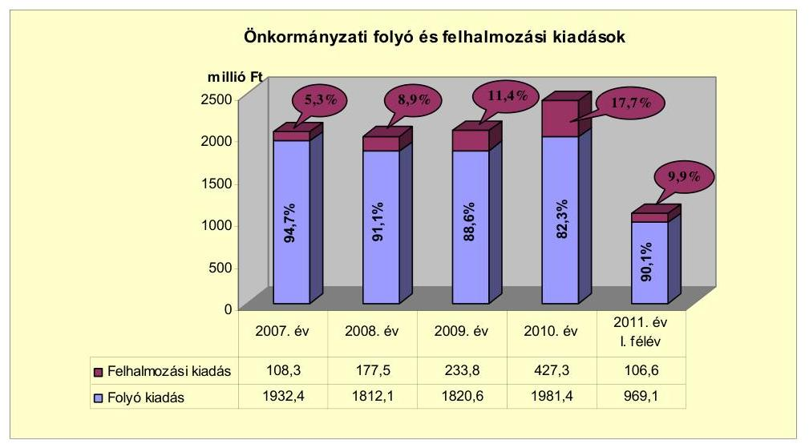

A folyó és felhalmozási kiadások arányának változásában a 2007-2010. évek között változó tendencia figyelhető meg. Az Önkormányzat kiadásain belül a felhalmozási kiadások aránya az előző évhez képest a 2008. évre 5,3%-ról 8,9%-ra (108,3 millió Ft-ról 177,5 millió Ft-ra), a 2009. évben 11,4%-ra (233,8 millió Ft-ra), majd a 2010. évre 17,7%-ra (427,3 millió Ft-ra) emelkedett. A felhalmozási kiadások a 2009. évről, a 2010. évre történt növekedését az Ipari Park komplex projekt 2010. évi 184,1 millió Ft teljesítése eredményezte.

Az Önkormányzat pénzügyi egyensúlyi helyzetét befolyásolta az elmúlt időszak fejlesztési tevékenysége. A 2007-2010. évek között a befejezett fejlesztések kiadásainak 18,2%-át (137,6 millió Ft-ot) pénzintézeti forrásokból fedezték, a folyamatban lévő fejlesztéseknél a kiadások 8,2%-át (16,9 millió Ft-ot) tervezték hitel felvételével megoldani.

Az Önkormányzat 2007-2010 között négy tíz millió Ft feletti és 116 db tíz millió Ft alatti bekerülési költségű felújítást és beruházást valósított meg. Az Önkormányzatnál a 2010. december 31-ig befejezett fejlesztési felada-

---

tok tényleges bekerülési költsége ${ }^{18} \mathbf{7 5 6 , 0}$ millió Ft, amelyből a beruházások összege 668,8 millió Ft (88,5%) a felújítások összege 87,2 millió Ft (11,5%) volt. A fejlesztések forrása 269,0 millió Ft saját bevételből (35,6%-a), 137,6 millió Ft hitelből (18,2%-a), 321,4 millió Ft EU-s (42,5%-a) és 28,0 millió Ft hazai támogatásból (3,7%-a) tevődött össze. (A befejezett fejlesztési feladatok adatait a jelentés 3/a. számú melléklete tartalmazza.)

Az Önkormányzat befejezett tízmillió Ft feletti fejlesztései a következők voltak: Ipari Park, közösségi közlekedés komplex fejlesztése, iskolák infrastruktúrájának fejlesztése, Kistérségi Járóbeteg-szakellátási Központ kialakítása.

Az Önkormányzat a 2010. év végén a folyamatban lévő fejlesztési feladataira 201,5 millió Ft-ot tervezett. 2010. december 31-ig a bölcsőde fejlesztésére kifizetett összeg 3,5 millió Ft volt, amelyet EU-s támogatásból finanszíroztak. Az Önkormányzatnál a 2010. év végén három db tíz millió Ft feletti bekerülési költségű fejlesztési feladat volt folyamatban, ebből két beruházásra - a Művelődési Központ felújítása és az „Út az ipari parkhoz" -, kifizetés 2010. december 31-ig nem történt. Hitel és hazai támogatás a folyamatban lévő fejlesztésekhez 2010. december 31-éig nem kapcsolódott. A folyamatban lévő fejlesztési feladatok adatait a jelentés 3/b. számú melléklete tartalmazza.

A 2010. december 31-én folyamatban lévő és a 2010. évet követő évekre vállalt kötelezettség összege 198,0 millió Ft volt (Művelődési Központ felújítása, bölcsőde fejlesztése, Ipari
 Parkhoz út építése). A kiadásokat 16,9 millió Ft hitelből (8,5%-át), 177,8 millió Ft EU-s (89,8%-át), és 3,3 millió Ft hazai támogatásból (1,7%-át) tervezték finanszírozni. A fejlesztésekhez a források rendelkezésre álltak, a közbeszerzési eljárások folyamatban voltak. (A 2010. évet követő évek fejlesztési feladatainak adatait a jelentés 3/c. számú melléklete tartalmazza.)

Az Önkormányzat által 2010. december 31-éig beadott, elbírálás alatt álló három pályázatában tervezett fejlesztéseinek értéke 403,1 millió Ft volt. A fejlesztések kiadásait 0,8 millió Ft saját bevételből (0,2%-át), 46,7 millió Ft hitelből (11,6%-át), 285,7 millió Ft EU-s (70,9%-át) és 69,9 millió Ft hazai támogatásból (17,3%-át) tervezték finanszírozni. A fejlesztések a helyi piactér megújítására, a csatornázás fejlesztésére, valamint az iskolai és utánpótlás sport infrastruktúrájának felújítására vonatkoztak. (Az elbírálás alatt álló, pályázatokban szereplő fejlesztési feladatokat a jelentés 3/d. számú melléklete tartalmazza.)

[^0]
[^0]:    ${ }^{18}$ A tényleges bekerülési költség tartalmazza a 2010. évben műszakilag befejezett fejlesztés 28,5 millió Ft-os összegét, amely azonban pénzügyileg a 2011. évben teljesült.

---

Az Önkormányzat által gazdasági társaság részére átadott működési és felhalmozási célú pénzeszközöket az alábbi diagram mutatja be a 2008-2011. év I. féléve közötti időszakban:
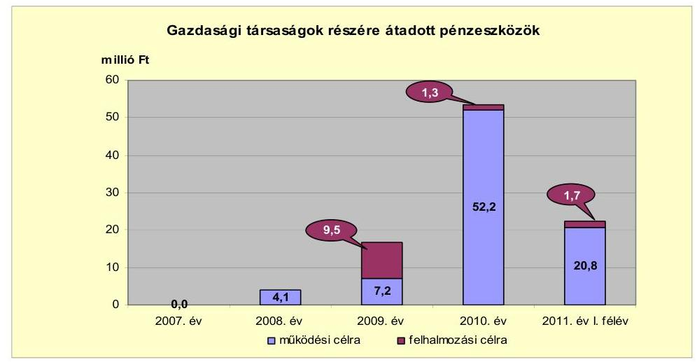

Az Önkormányzat a feladatellátásban résztvevő többségi tulajdonú Közszolgáltató Kft.-nek a járóbeteg-szakellátás feladataihoz működési célú pénzeszközt adott át. A gazdasági társaság a 2007-2011. év I. félév között összesen 84,4 millió Ft működési és 12,6 millió Ft felhalmozási célú átadott pénzeszközben részesült.

Az önkormányzati közfeladatokat ellátó gazdasági társaságoknak átadott működési és felhalmozási célú pénzeszközöket a jelentés 4. számú melléklete mutatja be.

# 3. Az ÖNKORMÁNYZAT KÖTELEZETTSÉGEI 

### 3.1. Az Önkormányzat pénzintézeti kötelezettségeinek változása

Az Önkormányzat könyvviteli mérleg szerinti pénzintézettel szembeni kötelezettségeinek állománya 2006. december 31-én 1003,5 millió Ft volt, amely a 2007. évben 1060,3 millió Ft-ra növekedett, a 2008. évben 990,5 millió Ft-ra csökkent, a 2009. évben 1092,1 millió Ft-ra és a 2010. évben 1195,6 millió Ft-ra nőtt a folyószámlahitel állomány változásának hatására. Az Önkormányzat pénzintézettel szemben fennálló kötelezettségállománya a 2006. év végi állományához képest 2011. június 30-ára összességében 65,5%-kal, 657,1 millió Ft-tal csökkent a hiteltörlesztések és felvételek hatására. Az Önkormányzatnak a 2006-2011. év I. félév közötti időszakban egy, a Víziközmű Társulattól átvett és három, a 2004-2011. év I. félévében felvett hosszú lejáratú hitele volt. Az Önkormányzat minden évben rendelkezett folyószámlahitel-kerettel, melyet a vizsgált időszak alatt igénybe is vett.

---

Az Önkormányzat könyvviteli mérlegében kimutatott, pénzintézetnél fennálló kötelezettségállományát a 2006-2011. év I. félév közötti időszakban az alábbi ábra szemlélteti:
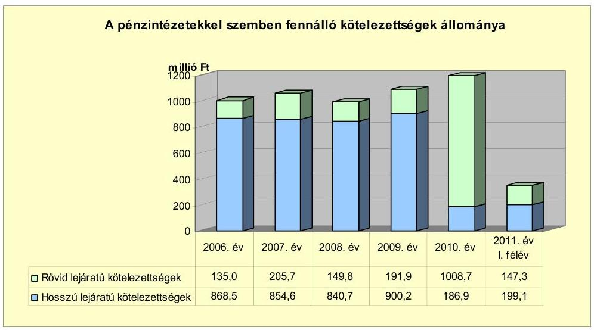

A hitelszerződések alapján a hitelek forint alapúak, igénybevételükkel, törlesztésükkel, egyéb költségeikkel kapcsolatos elszámolás is forintban történt, így a pénzügyi kötelezettségek alakulását árfolyamváltozás nem befolyásolta.

Az Önkormányzat 2007-2011. évi költségvetési rendeletei működési forráshiányt tartalmaztak, amelyet minden évben folyószámlahitelből terveztek finanszírozni, ezzel a működési hiány állandósult. A felhalmozási forráshiány fedezetét a 2008-2009. években kötvénykibocsátásból származó bevétellel, vagy hitelből tervezték. A Képviselő-testület a kötvénykibocsátásra vonatkozó döntését a 2009. évben visszavonta. A pénzfelhasználás optimalizálására kiskincstári rendszert működtettek. A 2009. évi hosszú lejáratú pénzintézettel szembeni kötelezettségvállalásra képviselő-testületi döntés alapján, a közbeszerzési eljárást követően került sor. A két hosszú lejáratú adósságot keletkeztető kötelezettségvállalásokra szóló Képviselő-testületi előterjesztések nem tartalmazták a visszafizetés forrásait, valamint a kamatkockázatok várható kihatásait. Az Önkormányzat a hitelfelvételi döntések előtt az adósságot keletkeztető kötelezettségvállalásának felső határát vizsgálta, azt - az Ötv. előírását betartva - nem lépte túl.

Az Önkormányzat a 2004. február 9-én megszűnt Víziközmű Társulattól - jogutódként - egy hitelt vett át. A 788,2 millió Ft összegű hitelszerződés alapján 774,8 millió Ft kötelezettsége keletkezett, amelyet egy összegben a 2011. év I. félévében törlesztett. A Víziközmű Társulat hitelhez kapcsolódóan 104,1 millió Ft kamatot fizetett.

A hitel kamata az egy éves futamidejű állampapír referencia hozam tárgyév január 1-jét megelőző féléves átlagának 13,0%-a volt. A költségvetési kamattámogatás alapján a lakossági érdekeltségi hozzájárulás megelőlegezésére szolgáló hitelrész miatt a Víziközmű Társulatot (így a jogutód Önkormányzatot is) ténylegesen terhelő nettó kamat mértéke ennek 30,0%-a, 3,9% volt. A nettó kamat 2003. május 1-jével a 3 havi BUBOR + 1,0% 30,0%-ára, 2009. január 1-jével

---

3 havi BUBOR + 3,25% 30,0%-ára módosult, mely 2,8%-ot jelentett mindkét számítással.

A hitellel kapcsolatban teljesített összes adósságszolgálat 985,0 millió Ft volt 2011. június 30-áig. A hitel visszafizetéséhez rendelkezésre állt az LTP-ből és a közműfejlesztési hozzájárulásból származó bevétel (összesen 944,7 millió Ft). A fennmaradó 40,3 millió Ft-ot az Önkormányzat egyéb saját bevételből biztosította, amelyből az átmenetileg szabad pénzeszközből lekötött betét kamata 25,0 millió Ft.

Az Önkormányzatnál a vizsgált időszak alatt bankváltás nem történt, mind a négy hitelét a számlavezető bankja nyújtotta részére.

Az Önkormányzat 2011. június 30-án forintban fennálló adósságot keletkeztető kötelezettségvállalásai az alábbiak voltak:

| Megnevezés | Szerződéskötés   időpontja | Összeg   millió Ft-ban | Kamat   (referencia kamat+   kamatfelár) | Felhasználás célja: |
| :-- | :--: | :--: | :--: | :--: |
| Célhitel | 2004.10.21 | 111,0 | 3 havi BUBOR + 1 % | az éves költségvetésben szereplő   fejlesztési célú pénzeszköz átadás, a   szennyvízcsatornázás miatt átutalt   lakossági önkormányzati LTP támogatás   2004. évi összegének utólagos   meghitelezésére |
| Fejlesztési hitel | 2009.06.04 | 82,3 | 3 havi EURIBOR + 2,9 % | Kiskunmajsa Város Önkormányzatának   kv-i rendeletében szereplő fejlesztések |
| Fejlesztési hitel | 2009.06.04 | 217,7 | 3 havi EURIBOR + 2,4 % | Regionális Operatív programok,   Társadalmi Infrastruktúra Program |

Az Önkormányzat a forintban fennálló hosszú lejáratú pénzintézettel szembeni kötelezettségeiből a 2007-2011. év I. féléve között 62,4 millió Ft tőkét törlesztett a célhitel után, amelynek lejárata 2014. szeptember 30-a. A célhitelhez kapcsolódóan 34,9 millió Ft kamatfizetési kötelezettsége keletkezett. A célhitel kamatfelárát az induló 1,0%-ról 2008. július 1-jével 1,3%-ra, 2009. január 1-jétől 3,5%-ra módosította a pénzintézet.

Az Önkormányzat a Fejlesztési Hitelprogram keretében 82,3 millió Ft-os hitelkeretből 4,6 millió Ft-ot vett igénybe a 2011. év június 30-áig. A hitelszerződés szerint a „hitel fedezete az Önkormányzat hitel futamidő alatti éves jóváhagyott költségvetése". Az Önkormányzat a tőketörlesztést 2012-ben kezdi meg. A felvett hitel után 2011. június 30-áig 58 ezer Ft kamatkiadást teljesített. Az igénybe vett hitelből ingatlan felújítás és munkagép vásárlása történt.

Az Önkormányzat Fejlesztési Hitelprogram keretében 217,7 millió Ft-os hitelkeretből 163,1 millió Ft-ot vett igénybe a 2011. év június 30-áig. A hitelszerződés szerint a „hitel fedezete az Önkormányzat hitel futamidő alatti éves jóváhagyott költségvetése". Az Önkormányzat a tőketörlesztést 2012-ben kezdi meg. A felvett hitel után 2011. június 30-áig 6,7 millió Ft kamatfizetést teljesített. A hitelt a kerékpárút, az Ipari Park és a közösségi közlekedés fejlesztésére, valamint a bölcsőde és a Művelődési Központ felújítására fordították.

Az Önkormányzat működési egyensúlyának biztosítása érdekében 2007-2011. június 30-a között folyószámla hitelkerettel rendelkezett. Munkabér-

---

megelőlegezési és egyéb likvid hitel igénybevételére a vizsgált időszakban nem került sor.

Az Önkormányzat a 2007-2011. év I. félév közötti folyószámlahitelei jellemző adatait az alábbi táblázat szemlélteti:
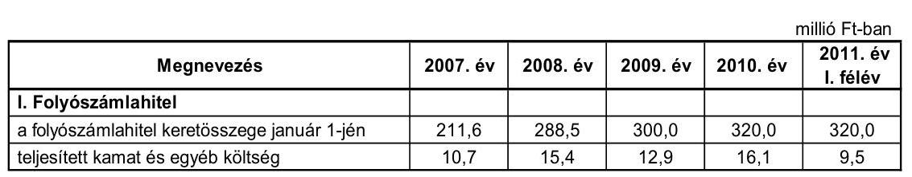

Az Önkormányzat romló likviditási helyzete miatt a 2007. és a 2010. évek között a folyószámla-hitelkeretének összege folyamatosan emelkedett. A hitelt a 2007. évben 353 napig, a 2008. évben 364 napig, a 2009. évben 343 napig, a 2010. évben 362 napig, a 2011. év június 30-áig 181 napon át vette igénybe az engedélyezett hitelkerethez mérten változó nagyságrendben. A folyószámlahitel átlagos napi állománya a 2007. évben 121,8 millió Ft, a 2008. évben 153,5 millió Ft, a 2009. évben 109,4 millió Ft, a 2010. évben 164,9 millió Ft és a 2011. év június 30-áig 177,7 millió Ft volt. A folyószámlahitel állománya 2010. december 31-én 220,0 millió Ft, 2011. június 30-án pedig 140,3 millió Ft volt.

Az Önkormányzat gazdálkodásának finanszírozásához a folyószámlahitel igénybevétele tartóssá vált. A 2010. novemberi képviselő-testületi ülésre készült előterjesztés szerint a folyószámla-hitelkeretet az Önkormányzat működőképességének megőrzése érdekében fenn kell tartani. A folyószámlahitelkeretszerződés szerint „a hitel és járulékainak fedezete az Önkormányzat hitel futamideje alatt jóváhagyott költségvetései", továbbá az Önkormányzat vállalta, hogy „a hitel futamideje alatt munkabérhitelt nem igényel".

A közbenső egyeztetés során a polgármester által adott észrevétel szerint: „Kiskunmajsa Város Önkormányzata a működési hiány finanszírozására vette eddig igénybe a folyószámlahitelt, melyet a fent említett intézkedésekkel kívánja megszüntetni. A Stabilitási törvény 10. §-a kimondja, hogy az önkormányzatok működési célra csak likvidhitelt vehetnek igénybe, melyet naptári éven - nem éven - belül vissza is kell fizetniük. Ebből véleményünk szerint az következik, hogy az Önkormányzat működési célra nem vehet fel hitelt, csak fejlesztésre, tehát nem látjuk jogi lehetőségét annak, hogy ezt a Kormány engedélyezné hosszú távú kötelezettséggé átalakítani."

Az észrevétel nem megalapozott, mivel a Magyarország gazdasági stabilitásáról szóló 2011. évi CXCIV. törvény 10. § (10) bekezdése alapján a Kormány törvényi feltételek fennállása esetén hozzájárul az Önkormányzat olyan adósságot keletkeztető ügyletéhez, amelynek célja azzal megegyező összegű meglévő adósság visszafizetése. A Stabilitási tv. 10. § (3) bekezdése alapján a fent említett feltétel, hogy az Önkormányzat adósságot keletkeztető ügyletből származó tárgyévi összes fizetési kötelezettsége az adósságot keletkeztető ügylet futamidejének végéig egyik évben sem haladja meg az Önkormányzat adott évi saját bevételeinek 50%-át.

---

A folyószámlahitel kamat kondíciói és egyéb költségei az alábbiak voltak ${ }^{15}$ :

| Megnevezés | Kamat (referencia+ kamatfelár) | Egyéb költség |
| :--: | :--: | :--: |
| 2007.01.01-2008.07.30. | 3 havi BUBOR + 1,0 % | 0,00 % |
| 2008.07.31-2008.12.31. | 3 havi BUBOR + 0,8 % | Egyszeri 0,2 %, |
| 2009.01.01-2009.05.04. | 1 havi BUBOR + 2,25 % | Egyszeri 0,2 % |
| 2009.05.05-2010.04.20. | 1 havi BUBOR + 2,8 %;   90 M Ft felett 1 havi BUBOR + 3,1 % | kezelési díj évi 0,2% rend.tart.évi 0,3%; 90M Ft felett kezelési díj évi 0,2 % rend.tart.évi 0,3 % |
| 2010.04.21-2011.12.31. | 3 havi BUBOR + 1,53 % | kezelési díj egyszeri 0,48% rend.tart.évi 0,48 % projektvizsg. egyszeri 0,28 % |

A folyószámlahitellel kapcsolatosan a vizsgált időszakban az Önkormányzatnak 56,7 millió Ft összegű kamat és 7,9 millió Ft egyéb költségfizetési kötelezettsége keletkezett.

A hosszú lejáratú hitelekből származó kötelezettségek esetében a referencia kamat és a kamatfelár változása jelentősen befolyásolta és jelenleg is befolyásolja a kamatfizetési kötelezettségek alakulását. A kamatok változását az alábbi táblázat mutatja be:

| Megnevezés | Kibocsátási, lehivási   kamat (referencia + kamatfelár) % | Utolsó fizetéskori   kamatfelár) %

 | Változás $\%$ |
| :-- | :--: | :--: | :--: |
| Hosszú lejáratú hitel |  |  |  |
| 3 havi BUBOR (2004.10.21-i szerződéskötés; célhitel) | 12,0 | 9,6 | $-20,0 \%$ |
| Egy éves futamidejű állampapír referencia hozam 1,3   szorosa (módosítást követően 3 havi BUBOR) 30,0\%-   a (2002.05.17-i szerződéskötés Víziközmű Társulati   hitel) | 3,9 | 2,8 | $-28,2 \%$ |
| 3 havi EURIBOR (2009.06.04-i szerződéskötés;   Önk.Fejl.Hitelprogram 2-es cél) | 4,2 | 4,4 | $4,8 \%$ |
| 3 havi EURIBOR (2009.06.04-i szerződéskötés;   Önk.Fejl.Hitelprogram 8-as cél) | 3,7 | 3,9 | $5,4 \%$ |

Az Önkormányzat számára a BUBOR-hoz kötött célhitelnél az alapkamat változása kedvezően alakult. A kamatfelárat a folyósító pénzintézet növelte 1,0 %-ról 3,5 %-ra, ezáltal az érvényesített kamatláb kisebb mértékben csökkent, mint a referenciakamat.

Az Önkormányzat a 2007-2011. év I. féléve között átmenetileg szabad pénzeszközeiből 29,0 millió Ft kamatbevételt realizált, melyből 25,0 millió Ft-ot a Víziközmű Társulattól átvett hitel kamataira fordított.

| MNB BUBOR feing (dögkamat) %-ban |  |  |  |  |  |
| :--: | :--: | :--: | :--: | :--: | :--: |
| Referencia kamat | 2007. év | 2008. év | 2009. év | 2010. év | 2011. év   I. félévi |
| 1 havi BUBOR | 7,83 | 8,75 | 8,66 | 5,47 | 6,00 |
| 3 havi BUBOR | 7,75 | 8,87 | 8,64 | 5,50 | 6,07 |

---

Az Önkormányzat kötelezettségeinek - kamat és egyéb költséggel növelt 2010. december 31-i és 2011. június 30-i állományát és várható alakulását a kötelezettségek lejáratáig a következő táblázat szemlélteti:

| Megnevezés | $\begin{gathered} \text { Állomány } \\ \text { 2010. december } \\ \text { 31-én } \end{gathered}$ | $\begin{gathered} \text { Állomány } \\ \text { 2011. június } \\ \text { 30-án } \end{gathered}$ | Várható kötelezettség a 2011-2013. években | Várható kötelezettség a 2014. évtől |
| :--: | :--: | :--: | :--: | :--: |
|  | millió Ft-ban | millió Ft-ban | millió Ft-ban | millió Ft-ban |
| Pénzintézeti kötelezettségek |  |  |  |  |
| Célhitel | 52,1 | 47,5 | 41,9 | 11,4 |
| Társulati hitel | 774,8 | 0,0 | - | - |
| Fejlesztési hitel | 0,0 | 4,6 | 4,9 | - |
| Fejlesztési hitel | 148,7 | 156,4 | 37,4 | 164,7 |
| Folyószámla hitel | 220,0 | 140,3 | 140,3 | - |
| Pénzintézeti kötelezettségek összesen HUF-ban: | 1195,6 | 348,8 | 224,5 | 176,1 |
| Szállítói tartozás | 57,7 | 48,6 | 48,6 | - |
| Jogerős végzéssel lezárt de ki nem fizetett kötelezettségek | - | 0,3 | 0,3 | - |

Az ellenőrzött időszakban az Önkormányzat megképződött működési jövedelme nem nyújtott fedezetet az adott évi hiteltörlesztésekhez, a kötelezettségek teljesítéséhez a folyószámlahitel igénybevétele állandósult. A 2011-2013. években esedékes kötelezettségek teljesítésére figyelembe vehető a mérlegben kimutatott 116,7 millió Ft követelésállományból - az LTP-ből átutalásra kerülő - 76,5 millió Ft és a forgalomképes nettó ingatlanvagyon.

A jelenleg ismert pénzintézettel szemben fennálló kötelezettségei (tőke-, és kamat) a 2014. évtől 176,1 millió Ft. A kötelezettség fedezete lehet a forgalomképes nettó ingatlanvagyon és a képződő működési jövedelem. A 2014. évtől a fennálló pénzintézettel szembeni kötelezettségek teljesítésére a visszafizetés forrásaira, valamint a kamatkockázat várható kihatásainak csökkentésére vonatkozóan a Képviselő-testület a helyszíni vizsgálat befejezéséig a 2011. évet követő időszakot érintő bevételnövelő és kiadáscsökkentő intézkedésről még döntést nem hozott.

# 3.2. A szállítói kötelezettségek változása 

Az Önkormányzat szállítói tartozás állománya a 2007. év végéről 7,7 millió Ft-ról 19,7%-kal (1,6 millió Ft-tal) a 2008. év végére 6,1 millió Ft-ra csökkent, majd a 2009. év végére 122,4 millió Ft-ra emelkedett. Az előző évhez képest a szállítói állomány a 2010. év végére (52,9%-kal, 64,7 millió Ft-tal) 57,7 millió Ft-ra, majd a 2011. év első félév végére 48,6 millió Ft-ra csökkent. 2011. június 30-án a 30 nap alatti lejárt szállítói állomány 0,2 millió Ft volt.

### 3.3. Egyéb kötelezettségek változása

Az Önkormányzat a vizsgált időszakban lízingtartozással nem rendelkezett, PPP konstrukcióban ${ }^{20}$ fejlesztés nem valósult meg.

Az Önkormányzat - adatszolgáltatása alapján - a vizsgált időszakban a szennyvízberuházással kapcsolatban a lakosok által fizetendő kötelezettséghez

[^0]
[^0]:    ${ }^{20}$ Public Private Partnership (Partnerségi együttműködés közfeladatok ellátására a magánszektor bevonásával).

---

a 2002. évben 168,0 millió Ft összegben vállalt kezességet. A kezességvállalás miatt teljesített fizetési kötelezettség 5,0 millió Ft volt, amelyből 2,6 millió Ft megtérült.

Az Önkormányzat adatszolgáltatása szerint a 2007-2011. év I. félévében 2,1 millió Ft összegű követelést engedett el, a vagyongazdálkodási rendeletben előírt esetekben és módon. Az elengedett követelésekből a Képviselő-testület lakásvétel jogügylethez kapcsolódóan 0,2 millió Ft-ot, a jegyző hatáskörében a helyi adó és pótlékból származó követelésekből 1,9 millió Ft-ot engedett el.

Az Önkormányzatnak a Kecskeméti Munkaügyi Bíróság által a 2011. évben jogerős végzéssel lezárt egyezség alapján 0,3 millió Ft nem vagyoni kártérítés címén fennálló kötelezettsége volt. A kifizetés a 2011. július 30-ai esedékességi időn belül történt. Az Önkormányzat ellen kettő per van folyamatban.

A 2009-2010. években az Önkormányzat a Közszolgáltató Kft. részére a „Kistérségi járóbeteg-szakellátó központok kialakítása és fejlesztése" című projekt megvalósításához - három kölcsönszerződés keretében - utófinanszírozott számlák pénzügyi teljesítésére, valamint a Kft. működési költségeinek megelőlegezésére 23,5 millió Ft rövid lejáratú támogatási kölcsönt nyújtott 2010. december 31-ei lejárattal.

Egy intézménye részére - a bevétel elmaradás pótlására - 2009. október 31-étől 2011. július 31-ig 1,3 millió Ft összegű működési célú kölcsönt biztosított az Önkormányzat.

A Kistérségi Társulás részére három alkalommal nyújtott működési célú kölcsönt: a 2008. évben utófinanszírozás megelőlegezésére 6,6 millió Ft-ot, a 2009. évben előfinanszírozás céljából 6,0 millió Ft-ot és a 2011. év I. félévében (év végi visszafizetési kötelezettséggel) 5,0 millió Ft-os előző évi alulfinanszírozási rendezés címén.

A kölcsönök folyósítása képviselő-testületi határozatok alapján történt. A megkötött kölcsönszerződésekben foglaltak szerinti ütemezésben az érintett szervezetek a kölcsönt visszafizették.

A 2007-2011. év. I. félév időszakában az Önkormányzat adatszolgáltatása szerint adósságot keletkeztető kötelezettségvállalásaihoz nem kapcsolódott jelzálogjog alapítás.

Az Önkormányzat pénzügyi, vagyoni helyzetére közvetetten hatást gyakorol gazdasági társaságainak kötelezettségállománya is.

Az Önkormányzat 2011. június 30-án egy gazdasági társaságban rendelkezett 99,95% tulajdoni részaránnyal. A Közszolgáltató Kft. adatszolgáltatása alapján a kötelezettségek állományát 2010. december 31-én és 2011. június 30-án, valamint azok várható összegét a kötelezettségek lejáratáig a következő táblázat mutatja be:

---

| Megnevezés | Állomány   2010. december   31-én | Állomány   2011. június   30-án | Várható   kötelezettség   a 2011-2013.   években | Várható   kötelezettség   2014. évtől |
| :-- | :--: | :--: | :--: | :--: |
| Szállítói tartozás | millió Ft-ban | millió Ft-ban | millió Ft-ban | millió Ft-ban |
|  | 7,8 | 5,4 | 5,4 | - |

Az Önkormányzat a gazdasági társaságokról szóló 2006. évi IV. törvény 54. § (2) bekezdése alapján korlátlan felelősséggel tartozik azon gazdasági társaságának felszámolása esetében, amelyben az Önkormányzat az 52. § (2) bekezdése szerint a szavazatok legalább 75%-ával rendelkezik, így minősített befolyásszerzőnek minősül, továbbá a csődeljárásról és a felszámolási eljárásról szóló 1991. évi XLIX. törvény 63. § (2) bekezdése alapján a kizárólagos önkormányzati tulajdonú gazdasági társaságának minden olyan kötelezettségéért, amelynek kielégítését a felszámolási eljárás során az adós társaság vagyona nem fedez, ha a hitelezőinek a felszámolási eljárás során benyújtott keresete alapján a bíróság - az adós társaság felé érvényesített tartósan hátrányos üzletpolitikájára figyelemmel - megállapítja az önkormányzat korlátlan és teljes felelősségét.

Az Önkormányzat többségi tulajdonú gazdasági társaságánál a szállítói állomány a 2009. december 31-ei 128,9 millió Ft-ról 2011. június 30-ára 5,4 millió Ft-ra, 95,8%-kal csökkent. A szállítói állományon belüli lejárt - 30 nap alatti - szállítói tartozása 100,0% volt 2010. december 31-én és 2011. június 30-án. A társaság hitel-, kölcsön felvételéből származó, illetve lízingtartozással a 2011. év I. félév végén nem rendelkezett. A Kft. kötelezettségei jelenlegi nagyságrendje - az önkormányzati költségvetés nagyságára tekintettel - nem jelent az Önkormányzat számára jelentős pénzügyi kockázatot.

Az Önkormányzat pénzügyi egyensúlyi helyzetére az eszközök használhatósága is hatást gyakorol. Az Önkormányzat eszközállományának bruttó értéke 2007-2010 között 7,9%-kal, 9086,5 millió Ft-ról 9802,8 millió Ft-ra nőtt. Az önkormányzati szintű használhatósági fok négy év alatt 3,4 százalékponttal, 89,1%-ról 85,7%-ra csökkent az egyes eszközcsoportoknál különböző mértékkel elszámolt értékcsökkenés hatására. A 2007-2009. évekre számított átlagos használhatósági fok az üzemeltetésre átadott eszközöknél 78,9%, az önkormányzati kezelésű vagyonnál 92,3% volt, majd a 2010. évre 73,3% és 91,7% volt. A saját kezelésben lévő és az átadott vagyon használhatósága közötti különbség az átadott eszközöknél a felújítás, beruházás elmaradását, a magasabb leírási kulccsal rendelkező, gyorsabban avuló vagyontárgyak (építmények, gépek, berendezések) létét jelzi.

Az elhasználódott és amortizálódott eszközök pótlására az Önkormányzat minden évben külön alapot hozott${ }^{21}$ létre, amely mértéke maximum az elszámolt értékcsökkenés 25,0%-a volt. A felújításokra, az eszközök pótlására - így az alap felhasználására - elsősorban az intézmények működőképességének biztosítása, illetve a szakhatóságok előírásainak figyelembevételével, pályázati források bevonásával került sor, a Képviselő-testület év közben hozott döntései alapján. Az Önkormányzat a 2007-2010. közötti években a tárgyi eszközök után együttesen 550,1 millió Ft összegű értékcsökkenést számolt el. A költségvetési előirányzatok felhasználása során felújításokra elszámolt ki-

[^0]
[^0]:    ${ }^{21}$ Az Önkormányzatot nem kötelezi semmilyen előírás arra, hogy tartalékot, illetve alapot képezzen az elhasználódott eszközök pótlására.

---

adások összege 72,2 millió Ft volt, mely az elszámolt értékcsökkenés 13,1%-ának megfelelő összeg. A felújítások forrása 34,8 millió Ft elkülönített alap és 37,4 millió Ft egyéb forrás volt. A beruházásokra elszámolt kiadások összege 523,3 millió Ft volt, mely az elszámolt értékcsökkenés 95,1%-ának megfelelő összeg. A beruházások forrása 31,9 millió Ft elkülönített alap és 491,4 millió Ft egyéb forrás volt.

# 4. A PÉNZÜGYI EGYENSÚLY MEGTEREMTÉSE ÉRDEKÉBEN HOZOTT INTÉZKEDÉSEK EREDMÉNYE 

Az Önkormányzat a 2007-2010. években gazdasági programjában, továbbá az éves költségvetési koncepciókban határozta meg a költségtakarékos, racionális szervezeti keretek kialakításának követelményét.

A 2007-2010. évek gazdasági programjának gazdálkodási, fejlesztési fejezetében előírták a város intézményi struktúrájának átalakítását a takarékosabb működés megteremtése céljából. A település működését, fejlesztését, eladósodás nélkül kívánták biztosítani a helyi adóbevételek növelésével. Ennek érdekében intézményátszervezési, létszámcsökkentési, valamint egyéb kiadáscsökkentő intézkedéseket foganatosítottak, amelyek együttes hatását
 a vizsgált időszakra 171,6 millió Ft összegben mutatta ki az Önkormányzat.

Az Önkormányzat által a 2007-2011. év I. félév időszakban tett kiadáscsökkentő intézkedések számszerűsített eredményeit és azok megoszlását az Önkormányzat adatszolgáltatása alapján - az alábbi ábra szemlélteti:
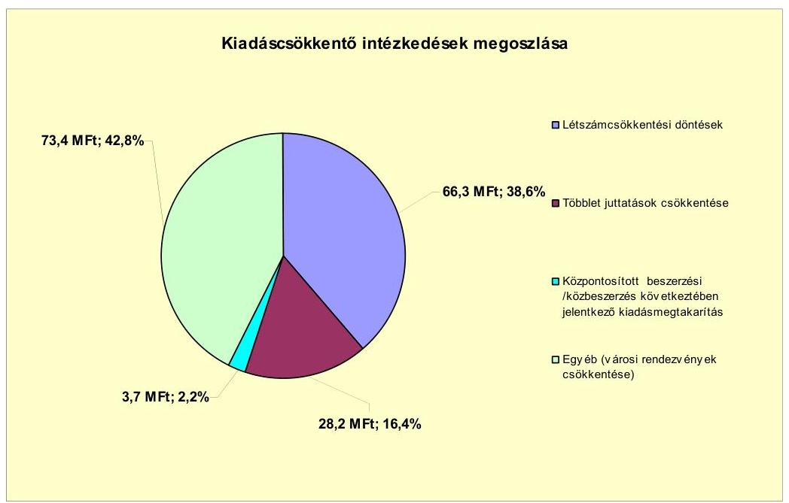

A létszámcsökkentési döntések a 2007. évtől a 2011. év I. félév végéig - az Önkormányzat adatszolgáltatása alapján - összesen 66,3 millió Ft kiadási megtakarítást eredményeztek, amely az összes kiadási-megtakarításnak a (171,6 millió Ft) a 38,6%-a volt. Az Önkormányzatnál a létszámcsökkentő döntéseken belül a feladatmegszüntetések, átszervezések 33,1 millió Ft, egyéb feladatátadások 30,9 millió Ft, az üres álláshelyek zárolása 2,3 millió Ft megtakarítással jártak. A létszámcsökkentéseken belül a prémiumévek programban résztvevők miatt 2007-2011. év I. félév végéig 11,8 millió Ft kiadási megtakarítás keletkezett.

Az önkormányzati kiadások csökkentésére ható további intézkedések eredményeként - az Önkormányzat adatszolgáltatása alapján - a többletjuttatások csökkentésénél 28,2 millió Ft (16,4%), intézményi közös beszerzések következtében 3,7 millió Ft (2,2%), az étkeztetési feladatok kiszervezésével 73,4 millió Ft (42,8%) kiadási megtakarítás keletkezett. A vizsgált időszakban az összes kiadáscsökkentő intézkedésből az önként vállalt feladatok ellátásához - a különböző városi rendezvények, külkapcsolatok költségeinek csökkentéséhez - 16,4 millió Ft kapcsolódott.

A kiadást csökkentő intézkedések ellenére az Önkormányzatnál a vizsgált időszakban a teljesített költségvetési kiadások (a növekvő költségvetési bevételek mellett) folyamatosan emelkedtek.

Az Önkormányzatnál a 2007-2010. évek között az álláshelyek és a foglalkoztatott létszámot az alábbi táblázat mutatja be:

| Megnevezés (adatok fő-ben) |  | Közoktatás | Szociális és gyermekvédelem | Egészségügy | Polgármesteri   hivatal | Egyéb | Összesen |
| :--: | :--: | :--: | :--: | :--: | :--: | :--: | :--: |
| 2007. január 1-jén jóváhagyott álláshelyek száma |  | 232 | 12 | 0 | 56 | 65 | 365 |
| Megszüntetett álláshelyek száma |  | 60 | 3 | 0 | 7 | 29 | 99 |
| ebből: üres álláshelyek száma |  | 0 | 0 | 0 | 0 | 0 | 0 |
|  | szakmai álláshelyek száma | 17 | 1 | 0 | 5 | 13 | 36 |
|  | intézmény-üzemeltetéssel kapcsolatos álláshelyek száma | 43 | 2 | 0 | 2 | 16 | 63 |
| Álláshely növekedése |  | 1 | 0 | 0 | 6 | 4 | 11 |
| 2010. december 31-én záró álláshelyek száma |  | 173 | 9 | 0 | 55 | 40 | 277 |
| 2007. január 1-jén foglalkoztatott létszám |  | 232 | 12 | 0 | 55 | 64 | 363 |
| Létszámcsökkentés |  | 60 | 3 | 0 | 7 | 29 | 99 |
| Létszámnövekedés |  | 1 | 0 | 0 | 6 | 4 | 11 |
| 2010. december 31-én foglalkoztatott létszám |  | 173 | 9 | 0 | 54 | 39 | 275 |

Az intézményeket és a Polgármesteri hivatalt érintő átszervezések következtében a 2007. január 1-jei induló 365 létszám 2010. december 31-ére 277-főre csökkent. Az összes megszüntetett álláshely száma 99, amelyből 36 szakmai és 63 intézményüzemeltetéssel kapcsolatos álláshely volt.

Az Önkormányzat adatszolgáltatása szerint a 99 megszűnt álláshely 60,6%-a (60 fő) elsősorban a közoktatást érintette. A 2007. évben a két általános iskola, óvoda, bölcsőde, egy közös oktatási intézménnyé történő átszervezése (23 fő), valamint a 2008. évben a konyha és az étkeztetési feladatok kiszervezése (30 fő), a 2009. évben (5 fő), a 2010. évben (2 fő) pedagógus állás megszüntetése átszervezés és nyugdíjazás miatt eredményezett.

A 2007 évben a Bodoglári óvoda bezárása, az Arany János és a Széchenyi Általános Iskolák és a Napsugár Óvoda Bölcsőde egy intézménnyé történt összevonása miatt szakmai és intézmény-üzemeltetéssel összefüggő álláshelyek szűntek meg.

A 2008. évben konyha és az étkeztetési feladatok egy gyermekélelmezéssel foglalkozó gazdasági társaságnak (SULIHOST Kft.-nek) történt átadása miatt az intézményüzemeltetéssel kapcsolatosan (konyhai, karbantartói, gondnoki, gazdaságvezetői) álláshelyek szűntek meg.

A megszüntetett álláshelyek száma a szervezeti keretek racionalizálása érdekében az egyéb területnél 29,3% (29 fő) volt. A 2007. évben intézményüzemeltetéssel kapcsolatos álláshelyeknél 8 fő (nyugdíjazás, valamint tanyagondnoki feladatok Többcélú kistérségi társulásnak történt átadása miatt) 2008. évben 20 fő, 2009. évben egy fő a Városgazdálkodási Intézmény átszervezése miatt az egészségügyi feladatokat (a védőnői szolgálatot az orvosi központi ügyeletet, kiegészítő szakellátást) átadták a kistérségi Többcélú társulás Kistérségi Szociális Intézményének.

A szociális és gyermekvédelmi területen az álláshelyek 3,0%-a (három fő) szűnt meg, mivel a szociális étkeztetési feladatokat átadták a Többcélú kistérségi társulás által létrehozott Kistérségi Szociális Intézménynek.

A Polgármesteri hivatalban az álláshelyek 7,1%-ának (hét fő) megszüntetésére került sor, amelyből öt szakmai álláshely (adóügyi, népességnyilvántartó és gazdálkodási ügyintézői) volt.

Egyes közszolgáltatási területeken (közoktatásban egy, Polgármesteri hivatalban hat fő és egyéb területen négy fő) azonban feladatbővülések is voltak, amelyek egyben 11 fő álláshely növekedéssel jártak. Ennek következtében az időszak álláshelyeinek száma összesen 88 fővel csökkent.

Az Önkormányzat a létszámcsökkentésekhez kapcsolódóan a vizsgált időszakban a 2007. évben 22,7 millió Ft a 2008. évben 25,1 millió Ft és a 2009. évben 8,4 millió Ft, valamint a 2010. évben 4,5 millió Ft összesen 60,7 millió Ft támogatást vett igénybe. A támogatás felhasználásával tartósan leépített álláshelyek száma 42 fő volt, amelynek 85,6%-a (36 fő) közoktatást, 4,8%-a (2 fő) szociális és gyermekvédelmet és 9,6%-a (4 fő) a Polgármesteri hivatalt az egyéb területet érintette.

Az Önkormányzat a bevételnövelő intézkedések hatására - adatszolgáltatása szerint - 2007-től 2011. év I. félév végéig 164,8 millió Ft-ot realizált. A többlet bevétel 61,0%-át (100,5 millió Ft-ot) a helyi adókkal kapcsolatos intézkedésekből, a 38,5%-át (63,4 millió Ft-ot) az eszközök értékesítéséből, bérbeadásából és 0,5%-át (0,9 millió Ft-ot) intézményi térítési díj emeléséből érte el.

A vizsgált időszakban az Önkormányzat 2007-től bevezette az építményadót és ennek kapcsán 100,5 millió Ft többletbevételt realizált. Az ingatlan, földterület eladásból, irodaház és földterület bérbeadásából származott jelentősebb 63,4 millió Ft bevétele, az alapfokú művészeti oktatási intézmény térítési díjának emeléséből 0,9 millió Ft többletbevételt ért el.

A 2007-2011. év I. félévben érvényesített bevételnövelő intézkedések főbb jogcímek szerinti számszerűsíthető hatását - az Önkormányzat adatszolgáltatás szerint - az alábbi ábra szemlélteti:
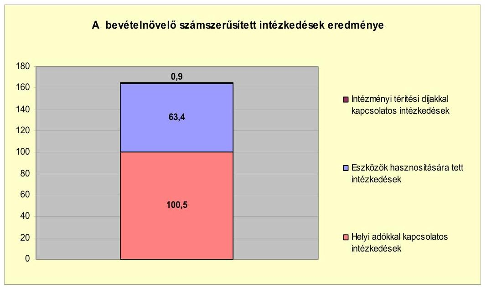

Az Önkormányzatnál a központi intézkedések hatására a 2007-2010. évek tény- és a 2011. év I. félévi tervadatok alapján az átengedett bevételeknél jelentkezett 1084,1 millió Ft bevételkiesés $^{22}$, amelyet a költségvetési támogatás 926,5 millió Ft-tal történő növekedése, továbbá az Önkormányzat által bemutatott kiadáscsökkentő és bevételnövelő intézkedések ellentételeztek.

# 5. Az ÁSZ Által a korábbi években a pénzügyi egyensúly javítására tett szabályszerűségi és célszerűségi javaslatok hasznosulása

Az ÁSZ az Önkormányzat gazdálkodási rendszerét a 2009. évben ellenőrizte átfogó jelleggel. A gazdálkodási rendszer korábbi ellenőrzése során tett javaslatok közül a pénzügyi egyensúly javítására egy szabályszerűségi javaslat vonatkozott. A jegyzőnek tett javaslat arra irányult, hogy az Ámr. 29. § (1) bekezdés g) pontjában $^{23}$ foglaltaknak megfelelően a költségvetési rendeletek tartalmazzák az a több éves kihatással járó feladatok előirányzatait évenkénti bontásban figyelemmel az európai uniós támogatással megvalósuló fejlesztésekre. A javaslat megvalósítása érdekében a Képviselő-testület 131/2009. (V. 6.) számú

[^0]
[^0]: $^{22}$ A költségvetési támogatásból és az átengedett bevételekből származó bevételek változását minden évben a 2006. évhez viszonyítottuk, majd azokat összegeztük. (A 2011. év I. félévi számítást a tervadatok alapján végeztük, ebben az évben a változások felét vettük figyelembe.) Ezeket a kumulált összegeket viszonyítottuk a vizsgált időszakban elért kiadási megtakarítások (171,6 millió Ft) és bevételi többletek (164,8 millió Ft) szintén kumulált összegéhez.
    $^{23}$ A 2012. január 1-jétől hatályos az államháztartásról szóló 2011. évi CXCV. törvény 24.§ (4) bekezdés b) pontja.

határozatával - felelős és a határidő megjelölésével - intézkedési tervet fogadott el. A szabályszerűségi javaslat hasznosult, mivel az Önkormányzat a 2/2010. (III. 1.) számú költségvetési rendeletében már az Ámr. előírásainak megfelelően, bemutatta a több éves kihatással járó feladatok előirányzatait évenkénti bontásban.

Budapest, 2012. április "fe"
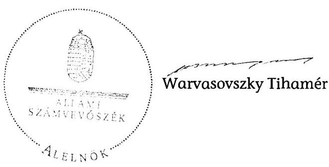

# Működési és felhalmozási célú többlet a 2007-2010 közötti időszakban az Önkormányzat zárszámadási rendeleteiben

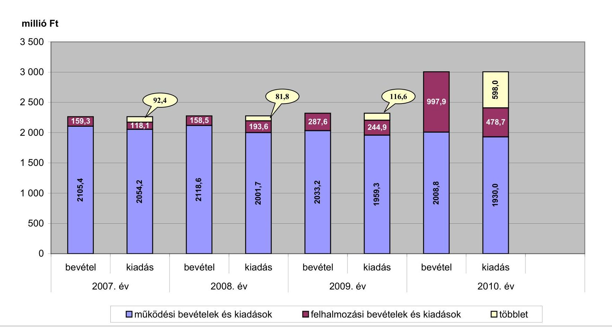

Az Önkormányzat bevételei és kiadásai, valamint adósságszolgálata 2007-2010 között

|   |  |  |  |  | millió Ft  |
| --- | --- | --- | --- | --- | --- |
|  1. FOLYÓ KÖLTSÉGVETÉS* | 2007. év | 2008. év | 2009. év | 2010. év |   |
|  1.1.1. Saját működési bevételek | 631,9 | 610,1 | 582,2 | 602,5 |   |
|  1.1.2. Költségvetési támogatás*** | 535,2 | 875,9 | 852,9 | 861,9 |   |
|  1.1.3. Átengedett bevételek | 643,0 | 385,2 | 359,9 | 391,6 |   |
|  1.1.4. Állambáztartáson belülről kapott támogatások | 86,0 | 70,8 | 99,7 | 118,7 |   |
|  1.1.5. EU-tól és külföldről kapott bevételek | 2,4 | 4,6 | 15,0 | 6,4 |   |
|  1.1.6. Állambáztartáson kívülről kapott bevételek | 9,7 | 7,5 | 11,6 | 7,1 |   |
|  1.1.7. Előző évi pénzmaradvány átvétel | 39,6 | 43,1 | 37,8 | 29,8 |   |
|  1.1. Folyó bevételek =1.1.1.+1.1.2.+1.1.3.+1.1.4.+1.1.5.+1.1.6.+1.1.7. | 1 947,8 | 1 997,2 | 1 959,1 | 2 018,0 |   |
|  1.2.1. Működési kiadások kamatkiadások nélkül | 1 544,3 | 1 377,1 | 1 396,4 | 1 505,8 |   |
|  1.2.2. Állambáztartáson belülre átadott pénzeszközök | 41,6 | 59,6 | 40,9 | 50,0 |   |
|  1.2.3.1. vállalkozásoknak | 2,2 | 3,3 | 4,3 | 2,6 |   |
|  1.2.3.2. EU-nak, illetve külföldre | 0,0 | 0,0 | 0,0 | 0,0 |   |
|  1.2.3.3. magánszemélyeknek | 226,4 | 250,1 | 255,8 | 284,7 |   |
|  1.2.3.4. nonprofit szervezeteknek | 19,7 | 32,4 | 33,6 | 66,1 |   |
|  1.2.3. Transzferkiadások (=1.2.3.1+1.2.3.2+1.2.3.3+1.2.3.4) | 248,3 | 285,8 | 293,7 | 353,4 |   |
|  1.2.4 Kamatkiadások | 58,6 | 47,1 | 51,8 | 42,4 |   |
|  1.2.5. Előző évi pénzmaradvány átadás | 39,6 | 42,5 | 37,8 | 29,8 | 
  |
|  1.2. Folyó kiadások = 1.2.1.+1.2.2.+1.2.3.+1.2.4.+1.2.5. | 1 932,4 | 1 812,1 | 1 820,6 | 1 981,4 |   |
|  1.3. Folyó költségvetés egyenlege MŰKÖDÉSI JÖVEDELEM (1.1. - 1.2.) | 15,4 | 185,1 | 138,5 | 36,6 |   |
|  2. FELHALMOZÁSI KÖLTSÉGVETÉS** |  |  |  |  |   |
|  2.1.1. Saját tökebevételek | 19,5 | 29,3 | 20,9 | 28,3 |   |
|  2.1.2. Állambáztartáson belülről kapott támogatások*** | 11,9 | 8,1 | 40,3 | 310,9 |   |
|  2.1.3. EU-tól és külföldről kapott támogatások | 0,7 | 0,0 | 0,0 | 0,5 |   |
|  2.1.4. Állambáztartáson kívülről kapott támogatások | 10,2 | 10,8 | 60,6 | 649,0 |   |
|  2.1. Felhalmozási bevételek (=2.1.1.+2.1.2+2.1.3+2.1.4.) | 42,3 | 48,2 | 121,8 | 988,7 |   |
|  2.2.1. Saját beruházási kiadás áfával | 34,7 | 96,1 | 127,8 | 370,8 |   |
|  2.2.2. Saját felújítási kiadás áfával | 24,0 | 35,6 | 23,8 | 18,3 |   |
|  2.2.3. Állambáztartáson belülre átadott pénzeszköz | 1,4 | 3,0 | 29,5 | 1,9 |   |
|  2.2.4. EU-nak és külföldnek adott pénzeszközök | 0,0 | 0,0 | 0,0 | 0,0 |   |
|  2.2.5. Állambáztartáson kívülre adott pénzeszközök | 48,2 | 42,3 | 52,7 | 36,3 |   |
|  2.2.6. Befektetési célú részesedések vásárlása | 0,0 | 0,5 | 0,0 | 0,0 |   |
|  2.2. Felhalmozási kiadások (=2.2.1.+2.2.2.+2.2.3.+2.2.4.+2.2.5.+2.2.6.) | 108,3 | 177,5 | 233,8 | 427,3 |   |
|  2.3. Felhalmozási költségvetés egyenlege (2.1. - 2.2.) | -66,0 | -129,3 | -112,0 | 561,4 |   |
|  3. Finanszírozási műveletek nélküli (GFS) pozíció(1.3.+2.3.) | -50,6 | 55,8 | 26,5 | 598,0 |   |
|  4. Finanszírozási műveletek | 0,0 | 0,0 | 0,0 | 0,0 |   |
|  4.1. Hitelfelvétel | 188,3 | 135,9 | 251,4 | 295,3 |   |
|  4.2. Hitelförlesztés | 131,6 | 205,7 | 149,8 | 191,9 |   |
|  4.3. Forgatási és befektetési célú értékpapírok kibocsátása | 0,0 | 0,0 | 0,0 | 0,0 |   |
|  4.4. Forgatási és befektetési célú értékpapírok beváltása | 0,0 | 0,0 | 0,0 | 0,0 |   |
|  4.5. Forgatási és befektetési célú értékpapírok értékesítése | 0,0 | 0,0 | 0,0 | 0,0 |   |
|  4.6. Forgatási és befektetési célú értékpapírok vásárlása | 0,0 | 0,0 | 0,0 | 0,0 |   |
|  4.7. Egyéb finanszírozási bevételek (függő, átfutó, kiegyenlítő) | 4,5 | 4,8 | -14,3 | -46,0 |   |
|  4.8. Egyéb finanszírozási kiadások (függő, átfutó, kiegyenlítő) | 7,3 | -4,8 | 26,1 | 31,3 |   |
|  4.9.Finanszírozási műveletek egyenlege (4.1. - 4.2.+4.3.-4.4+4.5.-4.6.+4.7.-4.8.) | 53,9 | -60,2 | 61,2 | 26,1 |   |
|  5. Tárgyévi pénzügyi pozíció (1.3.+ 2.3.+4.9.) | 3,3 | -4,4 | 87,7 | 624,1 |   |
|  6. Nettó működési jövedelem =működési jövedelem (1.3.) - töketörlesztés |  |  |  |  |   |
|  (4.2+4.4) | -116,2 | -20,6 | -11,3 | -155,3 |   |
|  TÁJÉKOZTATÓ ADATOK |  |  |  |  |   |
|  Összes kötelezettség | 1 287,3 | 1 171,1 | 1 327,1 | 1 323,1 |   |
|  ebből rövid lejáratú | 298,1 | 279,6 | 411,9 | 1 133,2 |   |
|  Összes szállítói kötelezettség | 7,7 | 6,1 | 122,4 | 57,7 |   |
|  ebből lejárt (tanúsítványból) | 0,0 | 0,0 | 42,8 | 0,0 |   |
|  Pénz és tőkepiaci kötelezettség (adósság) | 1 060,3 | 990,5 | 1 092,1 | 1 195,6 |   |
|  ebből rövid lejáratú | 205,7 | 149,8 | 191,9 | 1 008,7 |   |
|  PPP szerződéses állomány jelenértéken (tanúsítványból) | 0,0 | 0,0 | 0,0 | 0,0 |   |
|  ebből lejárt szolgáltatási díj miatti kötelezettség | 0,0 | 0,0 | 0,0 | 0,0 |   |
|  Folyószámlabítel napi átlagos állománya (tanúsítványból) | 121,8 | 153,5 | 109,4 | 164,9 |   |
|  Likvidhítel napi átlagos állománya (tanúsítványból) | 0,0 | 0,0 | 0,0 | 0,0 |   |
|  Muskatkérhítel napi átlagos állománya (tanúsítványból) | 0,0 | 0,0 | 0,0 | 0,0 |   |
|  Kezesség és garanciavállalások (tanúsítványból) | 6,0 | 2,3 | 0,0 | 0,0 |   |
|  Jogerős bírósági ítéletekből adódó kötelezettségek (tanúsítványból) | 0,0 | 0,0 | 0,0 | 0,0 |   |
|  Finanszírozásba bevonható eszközök: | 65,0 | 60,6 | 148,3 | 772,4 |   |
|  Tartós kötehőszonyt megtestesítő értékpapírok év végi állománya | 0,3 | 0,2 | 0,2 | 0,2 |   |
|  Hosszú lejáratú bankbetétek év végi állománya | 0,0 | 0,0 | 0,0 | 0,0 |   |
|  Értékpapírok év végi állománya | 0,0 | 0,0 | 0,0 | 0,0 |   |
|  Pénzeszközök (idegen pénzeszközök nélküli) év végi állománya | 64,7 | 60,4 | 148,1 | 772,3 |   |

[^0] [^0]: * Bevételekben nem töröl, a kiadásokban nem jelenik meg az amortizáció, a vagyoni helyzetet az egyenleg befolyásolja ** Bevételekben vagyon megőrzésre és bővítésre fordítható források. ***A költségvetési támogatásból a felhalmozási célú összeget az Önkormányzat adatszolgáltatása szerinti összegben vettük figyelembe, a 2.1.2. soron.

---

### **Az Önkormányzat a 2007-2010. években megvalósított, 2010. december 31-ig befejezett fejlesztései és azok forrásösszetétele**

|   |  |  |  |  |  |  |  |  |  |  |  |  |  |  |  |  |  |  |  |  |  |  |  |  |  |  |  |  |  |  |  |  |  |  |  |  |  |  |  |  |  |  |  |  |  |  |  |  |  |  |  |  |  |  |  |  |  |  |  |  |  |  |  |  |  |  |  |  |  |  |  |  |  |  |  |  |  |  |  |  |  |  |  |  |  |  |  |  |  |  |  |  |  |  |  |  |  |  |  |  |  |  |  |  |  |  |  |  |  |  | 

---

**Az Önkormányzat 2010. december 31-én folyamatban lévő fejlesztési feladataira 2010. december 31-ig teljesített kifizetések és azok forrásösszetétele**

|   | Fejlesztési feladat (beruházás, felújítás) |  | Beruházás, felújítás |  |  | Teljes bekerülési költség |  |  |  |  |  |  |  |  |  |  |  |  |  |  |  |  |  |  |  |  |  |  |  |  |  |  |  |  |  |  |  |  |  |  |  |  |  |   |
| --- | --- | --- | --- | --- | --- | --- | --- | --- | --- | --- | --- | --- | --- | --- | --- | --- | --- | --- | --- | --- | --- | --- | --- | --- | --- | --- | --- | --- | --- | --- | --- | --- | --- | --- | --- | --- | --- | --- | --- | --- | --- | --- | --- | --- | --- |
|   |  |  |  |  |  |  |  |  |  |  |  |  |  |  |  |  |  |  |  |  |  |  |  |  |  |  |  |  |  |  |  |  |  |  |  |  |  |  |  |  |  |  |  |   |
|   | Fejlesztési feladat (beruházás, felújítás) |  | Beruházás, felújítás |  |  | Teljes bekerülési költség |  |  |  |  |  |  |  |  |  |  |  |  |  |  |  |  |  |  |  |  |  |  |  |  |  |  |  |  |  |  |  |  |  |  |  |  |  |   |
|   |  |  |  |  |  |  |  |  |  |  |  |  |  |  |  |  |  |  |  |  |  |  |  |  |  |  |  |  |  |  |  |  |  |  |  |  |  |  |  |  |  |  |  |   |

 |  |  |  |  |  |  |  |  |  |  |  |  |  |  |  |  |  |  |  |  |   |
|   | Fejlesztési feladat (beruházás, felújítás) |  | Beruházás, felújítás |  |  | Teljes bekerülési költség |  |  |  |  |  |  |  |  |  |  |  |  |  |  |  |  |  |  |  |  |  |  |  |  |  |  |  |  |  |  |  |  |  |  |  |  |  |   |
|   |  |  |  |  |  |  |  |  |  |  |  |  |  |  |  |  |  |  |  |  |  |  |  |  |  |  |  |  |  |  |  |  |  |  |  |  |  |  |  |  |  |  |  |   |
|   | Megnevezése |  | Képviselő-testületi határozat száma |  |  |  |  |  |  |  |  |  |  |  |  |  |  |  |  |  |  |  |  |  |  |  |  |  |  |  |  |  |  |  |  |  |  |  |  |  |  |  |  |   |
|   |  |  |  | kezdete |  |  |  |  |  |  |  |  |  |  |  |  |  |  |  |  |  |  |  |  |  |  |  |  |  |  |  |  |  |  |  |  |  |  |  |  |  |  |  |   |
|   |  |  |  |  |  |  |  |  |  |  |  |  |  |  |  |  |  |  |  |  |  |  |  |  |  |  |  |  |  |  |  |  |  |  |  |  |  |  |  |  |  |  |  |   |
|   |  |  |  |  |  |  |  |  |  |  |  |  |  |  |  |  |  |  |  |  |  |  |  |  |  |  |  |  |  |  |  |  |  |  |  |  |  |  |  |  |  |  |  |   |
|   | 1 | 2 | 3 | 4 | 5 | 6 | 7 | 8 | 9 | 10 | 11 | 12 | 13 | 14 | 15 | 16 | 17 | 18 | 19 | 20 | 21 | 22 | 23 | 24 | 25 | 26 | 27 | 28 | 29 | 30 | 31 |  |  |  |  |  |  |  |  |  |  |  |   |
|   | 1. Felújítások |  |  |  |  |  |  |  |  |  |  |  |  |  |  |  |  |  |  |  |  |  |  |  |  |  |  |  |  |  |  |  |  |  |  |  |  |  |  |  |  |  |  |   |
|   |  |  |  |  |  |  |  |  |  |  |  |  |  |  |  |  |  |  |  |  |  |  |  |  |  |  |  |  |  |  |  |  |  |  |  |  |  |  |  |  |  |  |  |   |
|   |  |  |  |  |  |  |  |  |  |  |  |  |  |  |  |  |  |  |  |  |  |  |  |  |  |  |  |  |  |  |  |  |  |  |  |  |  |  |  |  |  |  |  |   |
|   | 2 |  |  |  |  |  |  |  |  |  |  |  |  |  |  |  |  |  |  |  |  |  |  |  |  |  |  |  |  |  |  |  |  |  |  |  |  |  |  |  |  |  |  |   |
|   | 2.1. Felújítások |  |  |  |  |  |  |  |  |  |  |  |  |  |  |  |  |  |  |  |  |  |  |  |  |  |  |  |  |  |  |  |  |  |  |  |  |  |  |  |  |  |  |   |
|   |  |  |  |  |  |  |  |  |  |  |  |  |  |  |  |  |  |  |  |  |  |  |  |  |  |  |  |  |  |  |  |  |  |  |  |  |  |  |  |  |  |  |  |   |
|   |  |  |  |  |  |  |  |  |  |  |  |  |  |  |  |  |  |  |  |  |  |  |  |  |  |  |  |  |  |  |  |  |  |  |  |  |  |  |  |  |  |  |  |   |
|   |  |  |  |  |  |  |  |  |  |  |  |  |  |  |  |  |  |  |  |  |  |  |  |  |  |  |  |  |  |  |  |  |  |  |  |  |  |  |  |  |  |  |  |   |
|   | 2.2. Felújítások |  |  |  |  |  |  |  |  |  |  |  |  |  |  |  |  |  |  |  |  |  |  |  |  |  |  |  |  |  |  |  |  |  |  |  |  |  |  |  |  |  |  |   |
|   |  |  |  |  |  |  |  |  |  |  |  |  |  |  |  |  |  |  |  |  |  |  |  |  |  |  |  |  |  |  |  |  |  |  |  |  |  |  |  |  |  |  |  |   |

 |  |  |  |  |  |  |  |   |
|   |  |  |  |  |  |  |  |  |  |  |  |  |  |  |  |  |  |  |  |  |  |  |  |  |  |  |  |  |  |  |  |  |  |  |  |  |  |  |  |  |  |  |  |   |
|   | 2.3. Felújítások összesen |  |  |  |  |  |  |  |  |  |  |  |  |  |  |  |  |  |  |  |  |  |  |  |  |  |  |  |  |  |  |  |  |  |  |  |  |  |  |  |  |  |  |  |   |
|   |  |  |  |  |  |  |  |  |  |  |  |  |  |  |  |  |  |  |  |  |  |  |  |  |  |  |  |  |  |  |  |  |  |  |  |  |  |  |  |  |  |  |  |   |
|   |  |  |  |  |  |  |  |  |  |  |  |  |  |  |  |  |  |  |  |  |  |  |  |  |  |  |  |  |  |  |  |  |  |  |  |  |  |  |  |  |  |  |  |   |
|   | 2.4. Felújítások összesen |  |  |  |  |  |  |  |  |  |  |  |  |  |  |  |  |  |  |  |  |  |  |  |  |  |  |  |  |  |  |  |  |  |  |  |  |  |  |  |  |  |  |  |   |
|   |  |  |  |  |  |  |  |  |  |  |  |  |  |  |  |  |  |  |  |  |  |  |  |  |  |  |  |  |  |  |  |  |  |  |  |  |  |  |  |  |  |  |  |   |
|   |  |  |  |  |  |  |  |  |  |  |  |  |  |  |  |  |  |  |  |  |  |  |  |  |  |  |  |  |  |  |  |  |  |  |  |  |  |  |  |  |  |  |  |   |
|   | 2.5. Felújítások összesen |  |  |  |  |  |  |  |  |  |  |  |  |  |  |  |  |  |  |  |  |  |  |  |  |  |  |  |  |  |  |  |  |  |  |  |  |  |  |  |  |  |  |  |   |
|   |  |  |  |  |  |  |  |  |  |  |  |  |  |  |  |  |  |  |  |  |  |  |  |  |  |  |  |  |  |  |  |  |  |  |  |  |  |  |  |  |  |  |  |   |
|   |  |  |  |  |  |  |  |  |  |  |  |  |  |  |  |  |  |  |  |  |  |  |  |  |  |  |  |  |  |  |  |  |  |  |  |  |  |  |  |  |  |  |  |   |
|   | 2.6. Felújítások összesen |  |  |  |  |  |  |  |  |  |  |  |  |  |  |  |  |  |  |  |  |  |  |  |  |  |  |  |  |  |  |  |  |  |  |  |  |  |  |  |  |  |  |  |   |
|   |  |  |  |  |  |  |  |  |  |  |  |  |  |  |  |  |  |  |  |  |  |  |  |  |  |  |  |  |  |  |  |  |  |  |  |  |  |  |  |  |  |  |  |   |
|   |  |  |  |  |  |  |  |  |  |  |  |  |  |  |  |  |  |  |  |  |  |  |  |  |  |  |  |  |  |  |  |  |  |  |  |  |  |  |  |  |  |  |  |   |
|   |  |  |  |  |  |  |  |  |  |  |  |  |  |  |  |  |  |  |  |  |  |  |  |  |  |  |  |  |  |  |  |  |  |  |  |  |  |  |  |  |  |  |  |   |
|   |  |  |  |  |  |  |  |  |  |  |  |  |  |  |  |  |  |  |  |  |  |  |  |  |  |  |  |  |  |  |  |  |  |  |  |  |  |  |  |  |  |  |  |  |   |
|   |  |  |  |  |  |  |  |  |  |  |  |  |  |  |  |  |  |  |  |  |  |  |  |  |  |  |  |  |  |  |  |  |  |  |  |  |  |  |  |  |  |  |  |  |  |   |
|   |  |  |  |  |  |  |  |  |  |  |  |  |  |  |  |  |  |  |  |  |  |  |  |  |  |  |  |  |  |  |  |  |  |  |  |  |  |  |  |  |  |  |  |  |  |   |
|   |  |  |  |  |  |  |  |  |  |  |  |  |  |  |  |  |  |  |  |  |  |  |  |  |  |  |  |  |  |  |  |  |  |  |  |  |  |  |  |  |  |  |  |  |  |   |

 |  |  |  |  |  |  |  |  |  |  |   |
|---|---|---|---|---|---|---|---|---|---|---|
|---|---|---|---|---|---|---|---|---|---|---|
|---|---|---|---|---|---|---|---|---|---|---|
|---|---|---|---|---|---|---|---|---|---|---|
|---|---|---|---|---|---|---|---|---|---|---|
|---|---|---|---|---|---|---|---|---|---|---|
|---|---|---|---|---|---|---|---|---|---|---|
|---|---|---|---|---|---|---|---|---|---|---|
|---|---|---|---|---|---|---|---|---|---|---|
|---|---|---|---|---|---|---|---|---|---|---|
|---|---|---|---|---|---|---|---|---|---|---|
|---|---|---|---|---|---|---|---|---|---|---|
|---|---|---|---|---|---|---|---|---|---|---|
|---|---|---|---|---|---|---|---|---|---|---|
|---|---|---|---|---|---|---|---|---|---|---|
|---|---|---|---|---|---|---|---|---|---|---|
|---|---|---|---|---|---|---|---|---|---|---|
|---|---|---|---|---|---|---|---|---|---|---|
|---|---|---|---|---|---|---|---|---|---|---|

 |  |  |  |  |  |  |  |  |  |  |  |  |  |  |  |  |  |  |  |  |  |  |  |  |  |  |  |  |  |  |  |  |  |  |  |  |  |  |   |
|   |  |  |  |  |  |  |  |  |  |  |  |  |  |  |  |  |  |  |  |  |  |  |  |  |  |  |  |  |  |  |  |  |  |  |  |  |  |  |  |  |  |  |  |  |  |  |   |
|   |  |  |  |  |  |  |  |  |  |  |  |  |  |  |  |  |  |  |  |  |  |  |  |  |  |  |  |  |  |  |  |  |  |  |  |  |  |  |  |  |  |  |  |  |  |  |   |
|   |  |  |  |  |  |  |  |  |  |  |  |  |  |  |  |  |  |  |  |  |  |  |  |  |  |  |  |  |  |  |  |  |  |  |  |  |  |  |  |  |  |  |  |  |  |  |   |
|   |  |  |  |  |  |  |  |  |  |  |  |  |  |  |  |  |  |  |  |  |  |  |  |  |  |  |  |  |  |  |  |  |  |  |  |  |  |  |  |  |  |  |  |  |  |  |   |
|   |  |  |  |  |  |  |  |  |  |  |  |  |  |  |  |  |  |  |  |  |  |  |  |  |  |  |  |  |  |  |  |  |  |  |  |  |  |  |  |  |  |  |  |  |  |  |   |
|   |  |  |  |  |  |  |  |  |  |  |  |  |  |  |  |  |  |  |  |  |  |  |  |  |  |  |  |  |  |  |  |  |  |  |  |  |  |  |  |  |  |  |  |  |  |  |   |
|   |  |  |  |  |  |  |  |  |  |  |  |  |  |  |  |  |  |  |  |  |  |  |  |  |  |  |  |  |  |  |  |  |  |  |  |  |  |  |  |  |  |  |  |  |  |  |   |
|   |  |  |  |  |  |  |  |  |  |  |  |  |  |  |  |  |  |  |  |  |  |  |  |  |  |  |  |  |  |  |  |  |  |  |  |  |  |  |  |  |  |  |  |  |  |  |   |
|   |  |  |  |  |  |  |  |  |  |  |  |  |  |  |  |  |  |  |  |  |  |  |  |  |  |  |  |  |  |  |  |  |  |  |  |  |  |  |  |  |  |  |  |  |  |  |  |   |
|   |  |  |  |  |  |  |  |  |  |  |  |  |  |  |  |  |  |  |  |  |  |  |  |  |  |  |  |  |  |  |  |  |  |  |  |  |  |  |  |  |  |  |  |  |  |  |  |   |
|   |  |  |  |  |  |  |  |  |  |  |  |  |  |  |  |  |  |  |  |  |  |  |  |  |  |  |  |  |  |  |  |  |  |  |  |  |  |  |  |  |  |  |  |  |  |  |  |   |
|   |  |  |  |  |  |  |  |  |  |  |  |  |  |  |  |  |  |  |  |  |  |  |  |  |  |  |  |  |  |  |  |  |  |  |  |  |  |  |  |  |  |  |  |  |  |  |  |   |
|   |  |  |  |  |  |  |  |  |  |  |  |  |  |  |  |  |  |  |  |  |  |  |  |  |  |  |  |  |  |  |  |  |  |  |  |  |  |  |  |  |  |  |  |  |  |  |  |   |
|   |  |  |  |  |  |  |  |  |  |  |  |  |  |  |  |  |  |  |  |  |  |  |  |  |  |  |  |  |  |  |  |  |  |  |  |  |  |  |  |  |  |  |  |  |  |  |  |   |
|   |  |  |  |  |  |  |  |  |  |  |  |  |  |  |  |  |  |  |  |  |  |  |  |  |  |  |  |  |  |  |  |  |  |  |  |  |  |  |  |  |  |  |  |  |  |  |  |  |   |
|   |  |  |  |  |  |  |  |  |  |  |  |  |  |  |  |  |  |  |  |  |  |  |  |  |  |  |  |  |  |  |  |  |  |  |  |  |  |  |  |  |  |  |  |  |  |  |  |  |  |   |
|   |  |  |  |  |  |  |

 |  |  |  |  |  |  |  |  |  |  |  |  |  |  |  |  |  |  |  |  |  |  |  |  |  |  |  |  |  |  |  |  |  |  |  |  |  |  |  |  |  |  |  |  |   |
|   |  |  |  |  |  |  |  |  |  |  |  |  |  |  |  |  |  |  |  |  |  |  |  |  |  |  |  |  |  |  |  |  |  |  |  |  |  |  |  |  |  |  |  |  |  |  |  |  |  |  |  |  |   |
|   |  |  |  |  |  |  |  |  |  |  |  |  |  |  |  |  |  |  |  |  |  |  |  |  |  |  |  |  |  |  |  |  |  |  |  |  |  |  |  |  |  |  |  |  |  |  |  |  |  |  |  |  |   |
|   |  |  |  |  |  |  |  |  |  |  |  |  |  |  |  |  |  |  |  |  |  |  |  |  |  |  |  |  |  |  |  |  |  |  |  |  |  |  |  |  |  |  |  |  |  |  |  |  |  |  |  |  |   |
|   |  |  |  |  |  |  |  |  |  |  |  |  |  |  |  |  |  |  |  |  |  |  |  |  |  |  |  |  |  |  |  |  |  |  |  |  |  |  |  |  |  |  |  |  |  |  |  |  |  |  |  |  |   |
|   |  |  |  |  |  |  |  |  |  |  |  |  |  |  |  |  |  |  |  |  |  |  |  |  |  |  |  |  |  |  |  |  |  |  |  |  |  |  |  |  |  |  |  |  |  |  |  |  |  |  |  |  |   |
|   |  |  |  |  |  |  |  |  |  |  |  |  |  |  |  |  |  |  |  |  |  |  |  |  |  |  |  |  |  |  |  |  |  |  |  |  |  |  |  |  |  |  |  |  |  |  |  |  |  |  |  |  |   |
|   |  |  |  |  |  |  |  |  |  |  |  |  |  |  |  |  |  |  |  |  |  |  |  |  |  |  |  |  |  |  |  |  |  |  |  |  |  |  |  |  |  |  |  |  |  |  |  |  |  |  |  |  |   |
|   |  |  |  |  |  |  |  |  |  |  |  |  |  |  |  |  |  |  |  |  |  |  |  |  |  |  |  |  |  |  |  |  |  |  |  |  |  |  |  |  |  |  |  |  |  |  |  |  |  |  |  |  |   |
|   |  |  |  |  |  |  |  |  |  |  |  |  |  |  |  |  |  |  |  |  |  |  |  |  |  |  |  |  |  |  |  |  |  |  |  |  |  |  |  |  |  |  |  |  |  |  |  |  |  |  |  |  |   |
|   |  |  |  |  |  |  |  |  |  |  |  |  |  |  |  |  |  |  |  |  |  |  |  |  |  |  |  |  |  |  |  |  |  |  |  |  |  |  |  |  |  |  |  |  |  |  |  |  |  |  |  |  |   |
|   |  |  |  |  |  |  |  |  |  |  |  |  |  |  |  |  |  |  |  |  |  |  |  |  |  |  |  |  |  |  |  |  |  |  |  |  |  |  |  |  |  |  |  |  |  |  |  |  |  |  |  |  |   |
|   |  |  |  |  |  |  |  |  |  |  |  |  |  |  |  |  |  |  |  |  |  |  |  |  |  |  |  |  |  |  |  |  |  |  |  |  |  |  |  |  |  |  |  |  |  |  |  |  |  |  |  |  |   |
|   |  |  |  |  |  |  |  |  |  |  |  |  |  |  |  |  |  |  |  |  |  |  |  |  |  |  |  |  |  |  |  |  |  |  |  |  |  |  |  |  |  |  |  |  |  |  |  |  |  |  |  |  |   |
|   |  |  |  |  |  |  |  |  |  |  |  |  |

 |  |  |  |  |  |  |  |  |  |  |  |  |  |  |  |  |  |  |  |  |  |  |  |  |  |  |  |  |  |  |  |  |  |  |  |  |  |  |  |  |  |  |  |  |  |  |  |  |  |  |  |  |  |  |  |  |  |  |   |
|   |  |  |  |  |  |  |  |  |  |  |  |  |  |  |  |  |  |  |  |  |  |  |  |  |  |  |  |  |  |  |  |  |  |  |  |  |  |  |  |  |  |  |  |  |  |  |  |  |  |  |  |  |  |  |  |  |  |  |  |  |  |  |  |  |  |  |  |  |  |  |  |  |  |  |  |  |  |  |   |
|   |  |  |  |  |  |  |  |  |  |  |  |  |  |  |  |  |  |  |  |  |  |  |  |  |  |  |  |  |  |  |  |  |  |  |  |  |  |  |  |  |  |  |  |  |  |  |  |  |  |  |  |  |  |  |  |  |  |  |  |  |  |  |  |  |  |  |  |  |  |  |  |  |  |  |  |  |  |  |  |  |  |  |   |
|   |  |  |  |  |  |  |  |  |  |  |  |  |  |  |  |  |  |  |  |  |  |  |  |  |  |  |  |  |  |  |  |  |  |  |  |  |  |  |  |  |  |  |  |  |  |  |  |  |  |  |  |  |  |  |  |  |  |  |  |  |  |  |  |  |  |  |  |  |  |  |  |  |  |  |  |  |  |  |  |  |  |  |  |  |  |  |  |  |  |  |  |   |
|   |  |  |  |  |  |  |  |  |  |  |  |  |  |  |  |  |  |  |  |  |  |  |  |  |  |  |  |  |  |  |  |  |  |  |  |  |  |  |  |  |  |  |  |  |  |  |  |  |  |  |  |  |  |  |  |  |  |  |  |  |  |  |  |  |  |  |  |  |  |  |  |  |  |  |  |  |  |  |  |  |  |  |  |  |  |  |  |  |  |  |  |   |
|   |  |  |  |  |  |  |  |  |  |  |  |  |  |  |  |  |  |  |  |  |  |  |  |  |  |  |  |  |  |  |  |  |  |  |  |  |  |  |  |  |  |  |  |  |  |  |  |  |  |  |  |  |  |  |  |  |  |  |  |  |  |  |  |  |  |  |  |  |  |  |  |  |  |  |  |  |  |  |  |  |  |  |  |  |  |  |  |  |  |  |  |  |  |  |  |  |  |  |  |   |

---

**Az Önkormányzat 2010. december 31-én folyamatban lévő fejlesztési feladataira 2010. december 31-én fennálló kötelezettségek és azok forrásösszetétele**

|   |  |  |  |  |  |  |  |  |  |  |  |  |  |  |  |  |  |  |  |  |  |  |  |  |  |  |  |  |  |  |  | millió Ft-ban  |
| --- | --- | --- | --- | --- | --- | --- | --- | --- | --- | --- | --- | --- | --- | --- | --- | --- | --- | --- | --- | --- | --- | --- | --- | --- | --- | --- | --- | --- | --- | --- | --- | --- |
|   |  |  |  |  |  |  |  |  |  |  |  |  |  |  |  |  |  |  |  |  |  |  |  |  |  |  |  |  |  |  |  |   |
|   |  |  |  |  |  |  |  |  |  |  |  |  |  |  |  |  |  |  |  |  |  |  |  |  |  |  |  |  |  |  |  |   |
|   |  | Fejlesztési feladat (beruházás, felújítás) |  |  |  |  |  |  |  |  |  |  |  |  |  |  |  |  |  |  |  |  |  |  |  |  |  |  |  |  |  |   |
|   |  |  |  |  |  |  |  |  |  |  |  |  |  |  |  |  |  |  |  |  |  |  |  |  |  |  |  |  |  |  |  |   |
|   |  |  |  |  |  |  |  |  |  |  |  |  |  |  |  |  |  |  |  |  |  |  |  |  |  |  |  |  |  |  |  |   |
|   |  |  |  |  |  |  |  |  |  |  |  |  |  |  |  |  |  |  |  |  |  |  |  |  |  |  |  |  |  |  |  |   |
|   |  |  |  |  |  |  |  |  |  |  |  |  | 

 |  |  |  |  |  |  |  |  |  |  |  |  |  |  |  |  |  |  |   |
|   |  |  |  |  |  |  |  |  |  |  |  |  |  |  |  |  |  |  |  |  |  |  |  |  |  |  |  |  |  |  |  |   |
|   |  |  |  |  |  |  |  |  |  |  |  |  |  |  |  |  |  |  |  |  |  |  |  |  |  |  |  |  |  |  |  |   |
|   |  |  |  |  |  |  |  |  |  |  |  |  |  |  |  |  |  |  |  |  |  |  |  |  |  |  |  |  |  |  |  |   |
|   |  |  |  |  |  |  |  |  |  |  |  |  |  |  |  |  |  |  |  |  |  |  |  |  |  |  |  |  |  |  |  |   |
|   |  |  |  |  |  |  |  |  |  |  |  |  |  |  |  |  |  |  |  |  |  |  |  |  |  |  |  |  |  |  |  |   |
|   |  |  |  |  |  |  |  |  |  |  |  |  |  |  |  |  |  |  |  |  |  |  |  |  |  |  |  |  |  |  |  |   |
|   |  |  |  |  |  |  |  |  |  |  |  |  |  |  |  |  |  |  |  |  |  |  |  |  |  |  |  |  |  |  |  |   |
|   |  |  |  |  |  |  |  |  |  |  |  |  |  |  |  |  |  |  |  |  |  |  |  |  |  |  |  |  |  |  |  |   |
|   |  |  |  |  |  |  |  |  |  |  |  |  |  |  |  |  |  |  |  |  |  |  |  |  |  |  |  |  |  |  |  |   |
|   |  |  |  |  |  |  |  |  |  |  |  |  |  |  |  |  |  |  |  |  |  |  |  |  |  |  |  |  |  |  |  |   |
|   |  |  |  |  |  |  |  |  |  |  |  |  |  |  |  |  |  |  |  |  |  |  |  |  |  |  |  |  |  |  |  |   |
|   |  |  |  |  |  |  |  |  |  |  |  |  |  |  |  |  |  |  |  |  |  |  |  |  |  |  |  |  |  |  |  |   |
|   |  |  |  |  |  |  |  |  |  |  |  |  |  |  |  |  |  |  |  |  |  |  |  |  |  |  |  |  |  |  |  |   |
|   |  |  |  |  |  |  |  |  |  |  |  |  |  |  |  |  |  |  |  |  |  |  |  |  |  |  |  |  |  |  |  |   |
|   |  |  |  |  |  |  |  |  |  |  |  |  |  |  |  |  |  |  |  |  |  |  |  |  |  |  |  |  |  |  |  |   |
|   |  |  |  |  |  |  |  |  |  |  |  |  |  |  |  |  |  |  |  |  |  |  |  |  |  |  |  |  |  |  |  |   |
|   |  |  |  |  |  |  |  |  |  |  |  |  |  |  |  |  |  |  |  |  |  |  |  |  |  |  |  |  |  |  |  |   |
|   |  |  |  |  |  |  |  |  |  |  |  |  |  |  |  |  |  |  |  |  |  |  |  |  |  |  |  |  |  |  |  |   |
|   |  |  |  |  |  |  |  |  |  |  |  |  |  |  |  |  |  |  |  |  |  |  |  |  |  |  |  |  |  |  |  |   |
|   |  |  |  |  |  |  |  |  |  |  |  |  |  |  |  |  |  |  |  |  |  |  |  |  |  |  |  |  |  |  |  |   |
|   |  |  |  |  |  |  |  |  |  |  |  |  |  |  |  |  |  |  |  |  |  |  |  |  |  |  |  |  |  |  |  |   |
|   |  |  |  |  |  |  |  |  |  |  |  |  |  |  |  |  |  |  |  |  |  |  |  |  |  |  |  |  |  |  |  |   |
|   |  |  |  |  |  |  |  |  |  |  |  |  |  |  |  |  |  |  |  |  |  |  |  |  |  |  |  |  |  |  |  |   |

 |   |
|   |  |  |  |  |  |  |  |  |  |  |  |  |  |  |  |  |  |  |  |  |  |  |  |  |  |  |  |  |  |  |  |   |
|   |  |  |  |  |  |  |  |  |  |  |  |  |  |  |  |  |  |  |  |  |  |  |  |  |  |  |  |  |  |  |  |   |
|   |  |  |  |  |  |  |  |  |  |  |  |  |  |  |  |  |  |  |  |  |  |  |  |  |  |  |  |  |  |  |  |   |
|   |  |  |  |  |  |  |  |  |  |  |  |  |  |  |  |  |  |  |  |  |  |  |  |  |  |  |  |  |  |  |  |   |
|   |

---

**Az Önkormányzat által beadott, elbírálás alatti pályázati forrásból megvalósítani tervezett fejlesztéseihez kapcsolódó kötelezettségvállalásai és azok forrásösszetétele**

|  Fejlesztési feladat (beruházás, felújítás) |  |  | Beruházás, felújítás |  |  |  |  |  |  |  |  |  |  |  |  |  |  |  |  |  |  |  |  |  |   |
| --- | --- | --- | --- | --- | --- | --- | --- | --- | --- | --- | --- | --- | --- | --- | --- | --- | --- | --- | --- | --- | --- | --- | --- | --- | --- |
|   |  |  |  |  |  |  |  |  |  |  |  |  |  |  |  |  |  |  |  |  |  |  |  |  |   |
|  Fejlesztési feladat (beruházás, felújítás) |  |  |  | Beruházás, felújítás |  |  |  |  |  |  |  |  |  |  |  |  |  |  |  |  |  |  |  |  |   |
|  Ér. | Megnevezése |  |  |  |  |  |  |  |  |  |  |  |  |  |  |  |  |  |  |  |  |  |  |  |   |
|  1 | 2 |  | 3 | 4 | 5 | 6 | 7 | 8 | 9 | 10 | 11 | 12 | 13 | 14 | 15 | 16 | 17 | 18 | 19 |  |  |  |  |  |   |
|  1. | Felújítások |  |  |  |  |  |  |  |  |  |  |  |  |  |  |  |  |  |  |  |  |  |  |  |   |
|  2. | 10 millió Ft alatti felújítások |  | 0,0 |  |  | 0,0 | 0,0 | 0,0 | 0,0 | 0,0 | 0,0 | 0,0 |  | 0,0 |  | 0,0 |  | 0,0 |  | 0,0 |  |  |  |  |   |
|  3. | Felújítások összesen |  | 0,0 |  |  | 0,0 | 0,0 | 0,0 | 0,0 | 0,0 | 0,0 | 0,0 |  | 0,0 |  | 0,0 |  | 0,0 |  | 0,0 |  |  |  |  |   |
|  4. | Fejlesztések |  |  |  |  |  |  |  |  |  |  |  |  |  |  |  |  |  |  |  |  |  |  |  |   |
|  5. | A Kiskunmajsai helyi piastár megújítása és a helyi bennékek piacra jutásának elősegítése |  | 293/2011 | 2011 | 2012 | 65,6 | 0,0 | 0,0 | 65,6 | 0,6 | A | 11,1 | A | 0,0 |  | 0,0 |  | 53,9 | C |  |  |  |  |  |   |
|  6. | Kiskunmajsa Város Csapadékvíz-csatornázás fejlesztése A ütem DAOP-5.2.1/A-11. |  | 292/2011 | 2011 | 2013 | 317,5 | 0,0 | 0,0 | 317,5 | 0,0 |  | 31,8 | A | 0,0 |  | 285,7 | C | 0,0 |  |  |  |  |  |  |   |
|  7. | Iskolai és utánpótlás sport infrastruktúra fejlesztés a felújítás |  | 65/2011 | 2011 | 2012 | 20,0 | 0,0 | 0,0 | 20,0 | 0,2 | A | 3,8 | A | 0,0 |  | 0,0 |  | 16,0 | A |  |  |  |  |  |   |
|  8. | Fejlesztések összesen: |  |  |  |  | 403,1 | 0,0 | 0,0 | 403,1 | 0,8 |  | 46,7 |  | 0,0 |  | 285,7 |  | 69,9 |  |  |  |  |  |  |   |
|  9. | Összesen |  |  |  |  | 403,1 | 0,0 | 0,0 | 403,1 | 0,8 |  | 46,7 |  | 0,0 |  | 285,7 |  | 69,9 |  |  |  |  |  |  |   |

*A= ha a forrás már rendelkezésre áll,

*B= ha a forrás közbeszerzési eljárása folyamatban van,

C= ha a forrás közbeszerzési eljárása még nem indult el, a forrás nem áll rendelkezésre.

---

# Az önkormányzati feladatok ellátásában résztvevő gazdasági társaságok

|  Gazdasági társaság megnevezése | 2010. december 31-én |  |  |  |  |  |  |  | a gazdasági társaságnak szerződéses kötelezettségre, feladat ellátási szerződésre alapozottan az Önkormányzat költségvetéséből |  |  |  |  |  |  |  |  |  |  |  |  |   |
| --- | --- | --- | --- | --- | --- | --- | --- | --- | --- | --- | --- | --- | --- | --- | --- | --- | --- | --- | --- | --- | --- | --- |
|   | önkormány-zat | önkormány-zat gazdasági társaságának | saját tőke, jegyzett tőke | kötelező feladathoz | önként vállalt feladathoz |  | hosszú lejáratú hitellelő, kötvényből |  | lizingból |  | lejáratú hitellelő, kötvényből |  | működési célú pénzeszköz átadás |  |  |  |  |  |  |  |  |   |
|   | tulajdoni hányada |  |  |  |  |  |  |  |  |  |  |  |  |  |  |  |  |  |  |  |  |   |
|   |  |  |  |  | rendelt nettó vagyon |  |  | fennálló kötelezettség |  |  | 2007. év | 2008. év | 2009. év | 2010. év | 2011. év
I. félév | 2007. év | 2008. év | 2009. év | 2010. év | 2011. év
I. félév |  |   |
|  I. 100%-os tulajdoni hányadú gazdasági társaságok: |  |  |  |  |  |  |  |  |  |  |  |  |  |  |  |  |  |  |  |  |  |   |
|  100%-os tulajdoni hányadú gazdasági társaságok összesen | x | x | x | 0,0 | 0,0 |  | 0,0 | 0,0 |  | 0,0 | 0,0 | 0,0 | 0,0 | 0,0 | 0,0 | 0,0 | 0,0 | 0,0 | 0,0 |  | 0,0 |   |
|  II. 75-99%-os tulajdoni hányadú gazdasági társaságok: |  |  |  |  |  |  |  |  |  |  |  |  |  | 

 |  |  |  |  |  |  |  |   |
|  Kiskunmajsai Kistérségi Közszolgáltató Nonprofit Kft. | 99,95 | 0,0 | 1,2 | 0,0 | 0,0 |  | 1,9 | 0,0 |  | 7,8 | 0,0 | 4,1 | 7,2 | 52,2 | 20,9 | 0,0 | 0,0 | 9,6 | 1,3 |  | 1,7 |   |
|  75-99%-os tulajdoni hányadú gazdasági társaságok összesen | x | x | x | 0,0 | 0,0 |  | 1,9 | 0,0 |  | 7,8 | 0,0 | 4,1 | 7,2 | 52,2 | 20,9 | 0,0 | 0,0 | 9,6 | 1,3 |  | 1,7 |   |
|  75% feletti tulajdoni hányadú gazdasági társaságok összesen | x | x | x | 0,0 | 0,0 |  | 1,9 | 0,0 |  | 7,8 | 0,0 | 4,1 | 7,2 | 52,2 | 20,9 | 0,0 | 0,0 | 9,6 | 1,3 |  | 1,7 |   |
|  III. 51-74%-os tulajdoni hányadú gazdasági társaságok: |  |  |  |  |  |  |  |  |  |  |  |  |  |  |  |  |  |  |  |  |  |   |
|  51-74%-os tulajdoni hányadú gazdasági társaságok összesen | x | x | x | 0,0 | 0,0 |  | 0,0 | 0,0 |  | 0,0 | 0,0 | 0,0 | 0,0 | 0,0 | 0,0 | 0,0 | 0,0 | 0,0 | 0,0 |  | 0,0 |   |
|  IV. egyéb, közfeladatot ellátó gazdasági társaságok: |  |  |  |  |  |  |  |  |  |  |  |  |  |  |  |  |  |  |  |  |  |   |
|  Halasvíz Kft. | 0,38 | 0,0 | 1,3 | 2 151,3 | 0,0 |  | 0,0 | 11,3 |  | 0,0 | 0,0 | 0,0 | 0,0 | 0,0 | 0,0 | 0,0 | 0,0 | 0,0 | 0,0 |  | 0,0 |   |
|  Homokhátsági Regionális Hulladékgazdálkodási Vagyonkezelő és Közszolgáltató Zrt. | 2,3 | 0,0 | 13,7 | 0,0 | 0,0 |  | 1 327,1 | 0,0 |  | 0,0 | 0,0 | 0,0 | 0,0 | 0,0 | 0,0 | 0,0 | 0,0 | 0,0 | 0,0 |  | 0,0 |   |
|  Hamsza Kft. Kiskuntérségi Közlekedési és Szolgáltató Kft. | 0,0 | 0,0 | 0,0 | 0,0 | 0,0 |  | 0,0 | 0,0 |  | 0,0 | 0,0 | 0,0 | 0,0 | 0,0 | 0,0 | 0,0 | 0,0 | 0,0 | 0,0 |  | 0,0 |   |
|  Kiskuntérségi Közlekedési és Szolgáltató Kft. | 0,0 | 0,0 | 0,0 | 0,0 | 0,0 |  | 0,0 | 0,0 |  | 0,0 | 0,0 | 0,0 | 0,0 | 0,0 | 0,0 | 0,0 | 0,0 | 0,0 | 0,0 |  | 0,0 |   |
|  MS-BUSZ Kft. | 0,0 | 0,0 | 0,0 | 0,0 | 0,0 |  | 0,0 | 0,0 |  | 0,0 | 0,0 | 0,0 | 0,0 | 0,0 | 0,0 | 0,0 | 0,0 | 0,0 | 0,0 |  | 0,0 |   |
|  egyéb, közfeladatot ellátó gazdasági társaságok összesen | x | x | x | 2 151,3 | 0,0 |  | 1 327,1 | 11,3 |  | 0,0 | 0,0 | 0,0 | 0,0 | 0,0 | 0,0 | 0,0 | 0,0 | 0,0 | 0,0 |  | 0,0 |   |
|  Összesen | x | x | x | 2 151,3 | 0,0 |  | 1 329,0 | 11,3 |  | 7,8 | 0,0 | 4,1 | 7,2 | 52,2 | 20,9 | 0,0 | 0,0 | 9,6 | 1,3 |  | 1,7 |   |

