# ÁLLAMI   SZÁMVEVŐSZÉK 

## JELENTÉS

Kisújszállás Város Önkormányzata pénzügyi helyzetének ellenőrzéséről (43/4)

---

# Állami Számvevőszék 

Iktatószám: V-3099-026/2012.
Témaszám: 1015
Vizsgálat-azonosító szám: V0560130

## Az ellenőrzést felügyelte:

Dr. Varga Sándor
számvevő igazgatóhelyettes
Az ellenőrzést vezette:
Renkó Zsuzsanna
számvevő tanácsos
Ellenőrzési csoportvezető:
Bíró Zsolt
számvevő tanácsos
Az ellenőrzést végezték:
Kersmájer Ágota Vida László
számvevő tanácsos számvevő tanácsos

---

# TARTALOMJEGYZÉK 

BEVEZETÉS ..... 9
I. ÖSSZEGZŐ MEGÁLLAPÍTÁSOK, KÖVETKEZTETÉSEK, JAVASLATOK ..... 13
II. RÉSZLETES MEGÁLLAPÍTÁSOK ..... 25

1. Az Önkormányzat kötelező és önként vállalt feladatai, a feladatellátás szervezeti keretei és annak változásai ..... 25
2. Az Önkormányzat pénzügyi egyensúlyi helyzetét befolyásoló tényezők ..... 29
2.1. A működési és a felhalmozási egyensúly változása ..... 31
2.2. Az Önkormányzat bevételeinek változása ..... 37
2.3. Az Önkormányzat múködési és a felhalmozási célú kiadásainak változása ..... 40
3. Az Önkormányzat kötelezettségei ..... 47
3.1. Az Önkormányzat pénzintézetekkel szembeni kötelezettségeinek változása ..... 47
3.2. A szállítókkal szembeni kötelezettségek változása ..... 55
3.3. Egyéb kötelezettségek változása ..... 55
4. A pénzügyi egyensúly megteremtése érdekében hozott intézkedések eredménye ..... 59
5. Az ÁSZ által a korábbi években a pénzügyi egyensúly javítására tett szabályszerűségi és célszerűségi javaslatok hasznosulása ..... 61

---

# MELLÉKLETEK 

1. számú Múködési és felhalmozási célú hiány/többlet az Önkormányzat zárszámadási rendeleteiben (1 oldal)
2. számú Az Önkormányzat bevételei és kiadásai, valamint adósságszolgálata 20072010 között (1 oldal)
3/a. számú Az Önkormányzat 2007-2010. években megvalósított, 2010. december 31-ig befejezett fejlesztései és azok forrásösszetétele (2 oldal)
3/b. számú Az Önkormányzat 2010. december 31-én folyamatban lévő fejlesztési feladataira 2010. december 31-ig teljesített kifizetések és azok forrásösszetétele (1 oldal)
3/c. számú Az Önkormányzat 2010. december 31-én folyamatban lévő fejlesztési feladataira 2010. december 31-én fennálló kötelezettségek és azok forrásösszetétele (1 oldal)
3/d. számú Az Önkormányzat által beadott, elbírálás alatti pályázati forrásból megvalósítani tervezett fejlesztéseihez kapcsolódó kötelezettségvállalásai és azok forrásösszetétele (1 oldal)
3. számú Az önkormányzati feladatok ellátásában résztvevő gazdasági társaságok (1 oldal)

---

# RÖVIDÍTÉSEK JEGYZÉKE 

## Törvények

Áht $_{1}$.
Áht $_{2}$.
Ötv.
Számv. tv.
Stabilitási tv.
Ptk.

## Rendeletek

Ámr.
Áhsz.

SzMSz $_{1}$

SzMSz $_{2}$

## Szórövidítések

áfa
ÁSZ
BM
EU
Ivóvízminőség-javító Társulás
jegyző
Képviselő-testület
Kistérségi társulás
Múvelődési Központ
OEP
ÖNHIKI
Önkormányzat
polgármester
Polgármesteri hivatal

PPP konstrukció
szja
az államháztartásról szóló 1992. évi XXXVIII. törvény az államháztartásról szóló 2011. évi CXCV. törvény a helyi önkormányzatokról szóló 1990. évi LXV. törvény a számvitelről szóló 2000. évi C. törvény Magyarország gazdasági stabilitásáról szóló 2011. évi CXCIV. törvény
a Polgári Törvénykönyvről szóló 1959. évi IV. törvény
az államháztartás múködési rendjéről szóló 292/2009. (XII. 19.) Korm. rendelet
az államháztartás szervezetei beszámolási és könyvvezetési kötelezettségének sajátosságairól szóló 249/2000. (XII. 24.) Korm. rendelet

Kisújszállás Város Önkormányzatának 37/2006. (XII. 14.) önkormányzati rendelete Kisújszállás Város Önkormányzata Képviselő-testületének Szervezeti és Múködési Szabályzatáról
Kisújszállás Város Önkormányzatának 36/2010. (XII. 22.) önkormányzati rendelete Kisújszállás Város Önkormányzata Képviselő-testületének Szervezeti és Múködési Szabályzatáról
általános forgalmi adó
Állami Számvevőszék
Belügyminisztérium
Európai Unió
Önkormányzati Társulás az Észak-Alföldi Régió Ivóvízminőségének Javításáért
Kisújszállás Város Önkormányzatának jegyzője
Kisújszállás Város Önkormányzat Képviselő-testülete
Karcagi Többcélú Kistérségi Társulás
Múvelődési és Ifjúsági Központ
Országos Egészségbiztosítási Pénztár
Önhibáján kívül hátrányos helyzetben lévő helyi önkormányzatok
Kisújszállás Város Önkormányzata
Kisújszállás Város Önkormányzatának polgármestere
Kisújszállás Város Önkormányzatának Polgármesteri hivatala
Public Private Partnership (Partnerségi együttmúködés közfeladatok ellátására a magánszektor bevonásával) személyi jövedelemadó

---

TÁMOP
Városgazdálkodási Kft.
Vízmú Kft.

Társadalmi Megújulás Operatív program
Kisújszállási Városgazdálkodási Kft.
Kisújszállási Vízmú Kft.

---

# ÉRTELMEZŐ SZÓTÁR 

| BUBOR | Budapesti Bankközi Forint Hitelkamatláb. Irányadó, refe-   rencia jellegú kamatláb. Mértékét az MNB naponta álla-   pitja meg a banki kamatok figyelembevételével. Közzété-   tele naponta történik. |
| :--: | :--: |
| CLF módszer | Az önkormányzatok költségvetése elemzésének eszköze. A   módszer következetesen elkülöníti a folyó és a felhalmo-   zási költségvetés bevételeit és kiadásait, azok költségvetési   egyenlegeit. Bizonyos mértékig a vállalati gazdálkodás   logikai elemeit érvényesíti az önkormányzatok pénzügyi,   jövedelmi helyzetének vizsgálata során. Az értékelés a   pénzügyi kapacitás fogalmát helyezi a középpontba. |
| használhatósági fok | Az eszközgazdálkodás vizsgálatának elemzése során   használt mutató. Számításakor a tárgyi eszköz könyv sze-   rinti (nettó) értékét viszonyítják a tárgyi eszköz bruttó (be-   szerzési/létesítési) értékéhez. A \%-ban kifejezett mutató   csökkenése az eszköz állagának romlására, avulására   utal, ami maga után vonja az üzemeltetési és fenntartási   költségek növekedését is. |
| EURIBOR | A frankfurti bankközi piacon jegyzett, az Európai Közpon-   ti Bank szabályainak megfelelően megállapított kínálati   kamatláb. Az EURIBOR értékét a legfontosabb európai   bankok hitelkínálatának kamatlábai alapján a Reuters   ügynökség számolja ki és teszi közzé naponta. A magyar   pénzintézetek is ezt használják viszonyítási alapnak EUR   hitelek esetén. |
| kamatkockázat | A változó kamatozású forint-, vagy a devizahitelek futam-   ideje alatt a kamat emelkedése miatt fennálló kamatkoc-   kázat, melynek növekedése miatt nő a hitel törlesztőrész-   lete. |
| kötelező közszolgáltatás | A helyi önkormányzati feladatkörbe tartozó, a köztiszta-   sággal és a településtisztasággal, valamint az élet- és va-   gyonbiztonsággal összefüggő egyes - közszolgáltatás út-   ján megvalósuló - közfeladatok ellátása, amelynek köte-   lező igénybevételét külön jogszabály (törvény, helyi ön-   kormányzati rendelet) határoz meg. |
| közfeladat | Állami, helyi, illetve kisebbségi önkormányzati feladat,   amelynek ellátásáról az államnak, illetve az önkormán-   zatoknak kell gondoskodni. A hatályos szabályozás sze-   rint közfeladatot törvény és önkormányzati rendelet álla-   píthat meg. Az önkormányzatok által ellátandó feladatok   keretszerú meghatározását az Ötv. tartalmazza. |
| LIBOR | Angol kifejezés, a London Interbank Offered Rate rövidíté-   se. Jelentése: Londoni bankközi, referencia jellegú kínálati   (hitel) kamatláb. |

---

önkormányzat többségi tulajdonában lévő gazdasági társaságok
minősített többségi tulajdonban lévő gazdasági társaság
pénzügyi kapacitás
pénzügyi kockázat

Az önkormányzat a gazdasági társaságban a szavazatok több mint ötven százalékával vagy a Ptk. 685/B. § (2)-(3) bekezdéseiben rögzített meghatározó befolyással rendelkezik. A befolyással rendelkező akkor rendelkezik egy jogi személyben meghatározó befolyással, ha annak tagja, illetve részvényese, és jogosult e jogi személy vezető tisztségviselői vagy felügyelőbizottsága tagjai többségének megválasztására, illetve visszahívására, vagy a jogi személy más tagjaival, illetve részvényeseivel kötött megállapodás alapján egyedül rendelkezik a szavazatok több mint ötven százalékával (Ptk. 685/B. § (2) bek.). A meghatározó befolyás akkor is fennáll, ha a befolyással rendelkező számára e jogosultságok közvetett módon (köztes vállalkozásain keresztül, a Ptk. 685/B §. (3),(4) bek. szerint) biztosítottak.
A helyi önkormányzat és az önkormányzat irányítása alá tartozó költségvetési szerv többségi tulajdonában, illetve többségi befolyása alatt álló gazdálkodó szervezet esetében hitelfelvétel, kölcsönfelvétel, garancia- vagy kezességvállalás, tartozásátvállalás, tartozáselengedés, értékpapír kibocsátás, vásárlás, pénzügyi lízing, tartós bérleti szerződés, ingyenes vagyonjuttatás (így különösen: ajándékozás, ingyenes engedményezés), vagy követelésvásárlás, követelésengedményezés végrehajtására vonatkozóan az Áht ${ }_{1}$. 100/M. § (4) bekezdése alapján az önkormányzat rendelkezik döntési jogosultsággal.
A gazdasági társaságokról szóló 2006. évi IV. törvény 52. § (2) bekezdése alapján minősített többséget biztosító befolyásnak számít, ha a minősített befolyásszerző az ellenőrzött gazdasági társaságban a szavazatok legalább 75\%-ával rendelkezik.
A pénzügyi kapacitás (financial capacity) az adósok hitelfelvételi képességének azon mértéke, ahol még anélkül tudják növelni az adósságot, hogy csökkenteniük kellene akár a jelenbeli, akár a jövőben esedékes kiadásaikat a fizetésképtelenség elkerülése érdekében. (Forrás: Az önkormányzati rendszer pénzügyi helyzete, ÁSZKUT tanulmány 2010.)
A múködési kockázat egyik eleme. Megmutatkozhat a költségvetés nagyságrendjének, szerkezetének nem megalapozott módosításaiban, a bevételi és a kiadási előirányzatoktól lényegesen eltérő teljesítésekben, a nem megfelelő belső kontrollrendszer múködésében, a tudatos károkozásokban, a biztosítások elmaradásában, a hibás fejlesztési döntésekben, a nem a terveknek megfelelő forrásfelhasználásokban. Jelentkezhet továbbá a bevételek és kiadások ütemkülönbsége miatt felvett folyószámla- és likvidhitelek költségvetési év végén fennálló egyenlege miatt, amely az önkormányzat költségvetésébe - akár tartósan - beépülő forráshiányt jelzi.

---

törlesztési kockázat

SNA

Annak a kockázata, hogy a megfelelő időben és mértékben a hitelt felvevőnél rendelkezésre állnak-e a pénzintézetek és egyéb szervek felé fennálló kötelezettségek visszafizetéséhez, a hitelek és kölcsönök törlesztéséhez szükséges pénzügyi források.
A törlesztési kockázatot növeli a kamat és árfolyam növekedése, mivel ezekben az esetekben az adósságszolgálat nőhet. Törlesztési kockázatot okozhat a visszafizetésre tervezett forrás elérésének, teljesítésének bizonytalansága (pl. a visszafizetéshez tervezett tartalékolás elmaradt, a tervezettnél alacsonyabb a saját bevétel, a helyi adóból származó bevétel az adóalanyok, adóalapok csökkenése miatt nem teljesül).
System of National Account, azaz a Nemzeti Számlák Rendszere, amely a gazdasági szektorok által létrehozott valamennyi terméket és szolgáltatást figyelembe veszi.

---

.

---

# JELENTÉS 

## Kisújszállás Város Önkormányzata pénzügyi helyzetének ellenőrzéséről

## BEVEZETÉS

Az Állami Számvevőszék 2011. évtől érvényes stratégiája új irányt szabott a helyi önkormányzatok gazdálkodásának ellenőrzésében is. Az ÁSZ - küldetése és jövőképe szerint - szilárd szakmai alapokra támaszkodva értékteremtő ellenőrzéseivel és helyzetelemzéseivel az államháztartás egészében, így a helyi önkormányzati alrendszerben is elő kívánja segíteni a közpénzek és a közvagyon szabályos, gazdaságos, hatékony és eredményes felhasználását. E folyamat részeként - az államháztartási hiány alakulásának összetevőire is figyelemmel végezzük az önkormányzati alrendszer pénzügyi helyzetelemzését.

Az államháztartás helyi szintjén a 304 városnak ${ }^{1}$ az általuk ellátott közszolgáltatások volumenére is tekintettel a közfeladatok ellátásában kiemelt szerepe van. E települések 2011. január 1-jei népessége 3169 ezer fő volt.

Feladataik és hatásköreik az Ötv. mellett különböző ágazati törvények által meghatározottak, miközben a feladatellátás szervezeti kereteit - ezen belül a gazdasági társaságok közszolgáltatások ellátásában betöltött szerepét - saját maguk határozzák meg. A gazdasági társaságok által ellátott feladatok esetén a gazdálkodás, továbbá az önkormányzatok pénzügyi egyensúlyi helyzetére ható közvetlen kockázatok egy része kikerült az önkormányzati alrendszerből. A többségi önkormányzati tulajdonban lévő társaságok gazdálkodásának körülményei befolyásolhatják a városok pénzügyi egyensúlyi helyzetének megítélésében rejlő kockázatokat.

Az áttekintett időszakban az önkormányzati forrásszabályozás elvei lényegesen nem változtak. Az önkormányzatok gazdasági mozgásterét a központi költségvetéstől való függőség mellett jelentősen befolyásolja a helyi adókivetési jog gyakorlása. A városok gazdálkodási szabadságának lényeges eleme, hogy anyagi lehetőségeik függvényében dönthettek arról, hogy feladataik közül azokat, amelyek megoldására az Ötv. szerint a települési önkormányzat nem kötelezhető, a megyei önkormányzat fenntartásába adhatták. E döntések differenciáltan érintették a városok pénzügyi helyzetét.

[^0]
[^0]:    ${ }^{1}$ A megyei jogú városok nélkül figyelembe vett városok száma 304 városi önkormányzatot jelent.

---

A városi önkormányzatok 2007-2010 között teljesített bevételeinek alakulását és összetételét a következő ábra szemlélteti:

Az önkormányzati alrendszer pénzügyi helyzetértékelése során új elemzési módszereket alkalmazott az ellenőrzés. A költségvetési beszámoló adatok elemzése helyett az önkormányzat pénzügyi helyzetét a CLF módszerrel értékeljük, amelynek lényegét és számításának módszerét a jelentés 2. pontjában, és a jelentés 2 . számú mellékletében ismertetjük részletesen.

Az új módszereken alapuló helyzetértékelés fontosságát az adja, hogy a helyi önkormányzatok bruttó adósságállománya ${ }^{2}$ a 2010. évi költségvetési beszámolók alapján 1248 milliárd Ft-ot tett ki. Ezen belül a 304 város adóssága 383 milliárd Ft volt, amely az önkormányzati alrendszer teljes adósságállományának $30,7 \%$-át jelentette ${ }^{3}$.

A mérlegben kimutatott bruttó adósságállomány mellett az önkormányzatok számára az eszközállomány műszaki állapotának megőrzése is előbb-utóbb pénzügyi kötelezettséget jelent. Az elhasználódott eszközök pótlására forrást biztosító amortizációs (felújítási) alap képzésének ${ }^{4}$ elmaradása maga után vonhatja a feladatellátást kiszolgáló tárgyi eszközök állagának erőteljes romlá-

[^0]
[^0]:    ${ }^{2}$ Az önkormányzati mérlegbeszámolókból számított bruttó adósságállomány 2010. év végi összege magában foglalja a fejlesztési és a múködési célú kötvénykibocsátások, a beruházási és fejlesztési hitelek, a működési célú hosszú lejáratú hitelek, a rövid lejáratú hitelek, váltótartozások miatti kötelezettségek teljes (2011-ben, illetve az azt követő években esedékes) állományát. Az önkormányzatok 2007. év végi mérleg szerinti adósságállománya 692 milliárd Ft volt.
    ${ }^{3}$ A fővárosi és a kerületi önkormányzatok adósságának figyelmen kívül hagyásával számított 977 milliárd Ft összegű bruttó adósságállományból a városok 39,2\%-kal részesedtek.
    ${ }^{4}$ Erre a jelenlegi szabályozási környezetben nem kötelezi előírás az önkormányzatokat.

---

sát. Emellett a 2007-2013-as időszakra meghirdetett, vissza nem térítendő EU-s fejlesztési forrásokhoz való hozzájutás lehetősége felerősítette az önkormányzati alrendszer fejlesztési igényeit, amelyek a felhalmozási költségvetési hiány folyamatos emelkedésén túl - az előírt jövőbeni fenntartási kötelezettség miatt tovább terhelhetik az önkormányzatok költségvetését ${ }^{5}$.

Az ÁSZ a 2011. évi ellenőrzési tervében 43. számú, az Önkormányzatok gazdálkodási rendszerének ellenőrzése részeként áttekinti, és elemzi az önkormányzatok pénzügyi helyzetét. A gazdálkodás szabályszerűségét az ÁSZ az előző évek során ebben az önkormányzati körben is ellenőrizte. Jelen vizsgálatunk a tett javaslataink pénzügyi helyzetet érintő pontjainak hasznosítására utóellenőrzés jelleggel tér ki.

Az ellenőrzés megállapításait az Önkormányzat által kitöltött - teljességi nyilatkozattal megerősített - 27 tanúsítványon szolgáltatott adatokra alapoztuk. Ellenőrzési bizonyítékként használtuk fel továbbá:

- a képviselő-testületi és bizottsági előterjesztéseket, a döntés-előkészítés során készített dokumentumokat;
- a kötelezettségvállalások dokumentumait;
- a pénzügyi-számviteli nyilvántartásokat;
- az éves költségvetési beszámolókat;
- a költségvetési és zárszámadási rendeleteket.

Az ellenőrzés a 2007. január 1. - 2011. június 30. közötti időszakot öleli fel. A pénzintézeti kötelezettségek állományának vizsgálatakor az ellenőrzött időszak 2006. december 31. - 2011. június 30. közötti időszakra terjedt ki.

Az ellenőrzés során vizsgáltunk minden olyan körülményt és adatot, amely a program végrehajtásához kapcsolódott és a pénzügyi helyzet alakulására hatást gyakorló releváns tények és folyamatok feltárásához szükségessé vált.

# Az ellenőrzés célja annak értékelése volt, hogy: 

- a vizsgált időszakban a kötelező és önként vállalt feladatok ellátását biztosító szervezeti keretekben, a feladatellátás módjában bekövetkezett változások milyen hatást gyakoroltak az Önkormányzat pénzügyi helyzetének alakulására;

[^0]
[^0]:    ${ }^{5}$ Az Állami Számvevőszék 2011 júniusában közzétett 1108. számú, a helyi önkormányzatok fejlesztési célú támogatási rendszerének ellenőrzéséről szóló jelentésében feltárta a fejlesztési folyamatok problémáit. A helyi önkormányzatok elsősorban azokat a fejlesztéseket valósították meg, amelyekhez támogatást lehetett igényelni. A fejlesztési célok közül a magasabb támogatási intenzitású pályázatokat részesítették előnyben. A fejlesztéssel megvalósuló létesítmények jövőbeli üzemeltetésének várható ráfordításait az önkormányzatok $71,9 \%$-a nem mérte fel.

---

- az Önkormányzat pénzügyi - ezen belül múködési és felhalmozási - egyensúlya mely tényezők hatására miként változott, és az Önkormányzat milyen intézkedéseket tett a pénzügyi egyensúly javítása érdekében;
- a költségvetési kiadások finanszírozása érdekében vállalt pénzintézeti kötelezettségek hogyan alakultak, továbbá milyen kötelezettségek fennállása befolyásolja az Önkormányzat jövőbeli pénzügyi helyzetét;
- hasznosultak-e a gazdálkodási rendszer korábbi ellenőrzése során a pénzügyi egyensúly javítására az ÁSZ által tett szabályszerűségi és célszerűségi javaslatok.

Az ellenőrzés típusa: szabályszerűségi vizsgálat.
A vizsgálat jogszabályi alapját az Állami Számvevőszékről szóló 2011. évi LXVI. törvény 1. § (3), 5. § (2)-(6) bekezdései, továbbá az Áht ${ }_{1}$. 120/A. § (1) bekezdése ${ }^{6}$ előírásai képezik.

Kisújszállás város lakosainak száma 2011. január 1-jén 11500 fő volt. Az Önkormányzat feladatainak végrehajtása érdekében a Polgármesteri hivatalon felül nyolc önállóan múködő költségvetési intézményt múködtetett a 2010. évben. A feladatok ellátásában két gazdasági társasága vett részt. Az Önkormányzat folyó és felhalmozási bevételeinek együttes összege - az előző évi pénzmaradvány igénybevétele nélkül - a 2010. évben 6561,5 millió Ft-ot, a folyó és felhalmozási kiadások együttes összege 7376,5 millió Ft-ot tett ki. Az Önkormányzat 2010. december 31-én 15219,3 millió Ft értékű vagyonnal rendelkezett. A Polgármesteri hivatalban és az intézményekben foglalkoztatottak létszáma 2010. december 31-én 379 fő volt.

[^0]
[^0]:    ${ }^{6}$ 2012. január 1-jétől Áht. 61. § (2) bekezdése

---

# I. ÖSSZEGZŐ MEGÁLLAPÍTÁSOK, KÖVETKEZTETÉSEK, JAVASLATOK 

Az Önkormányzat - adatszolgáltatása szerint - a 2010. év múködési költségvetési kiadásaiból ( 2556,2 millió Ft) 1646,2 millió Ft ${ }^{7}$-ot (64,4\%) a kötelező feladatok, 910,0 millió Ft-ot (35,6\%) az önként vállalt feladatok ellátására fordított. A 2007-2009. évek között a tárgyévi múködési kiadásoknak átlagosan 65,0\%-át (1642,2 millió Ft-ot) fordítottak a kötelező, 35,0\%-át (885,6 millió Ftot) az önként vállalt feladatok ellátására. A 2011. évben kötelező feladatokra a múködési kiadások 67,2\%-át (1495,1 millió Ft-ot), önként vállalt feladatokra 32,8\%-át (729,7 millió Ft-ot) tervezték. Az Önkormányzat SzMSz ${ }_{1}$-ének 2. számú mellékletében határozta meg a kötelező és az önként vállalt feladatainak körét. Az Önkormányzat önként vállalt feladatnak minősítette a középfokú oktatást és a kollégiumi ellátást, az alapfokú múvészetoktatást, a pedagógiai szakszolgálati és logopédiai feladatellátást, a bentlakásos szociális intézmény fenntartását és múködtetését, a vásár és piac fenntartását, a strand és gyógyfürdő üzemeltetését, a mezei őrszolgálat múködtetését, valamint hozzájárultak civil szervezetek múködéséhez. A 2011. január 1-től hatályos $\mathrm{SzMSz}_{2}$ már nem határozta meg a kötelező és az önként vállalt feladatok körét. Az önként vállalt feladatok terjedelmét ettől az évtől kezdődően az éves költségvetési rendeletekben az adott évi költségvetés forrásainak ismeretében határozták meg.

Az Önkormányzat pénzügyi egyensúlyának fenntarthatóságára kockázatot jelent az önként vállalt feladatokra fordított múködési kiadások arányának nagysága az összes múködési kiadáson belül.

Az Önkormányzat feladatellátásának szervezeti struktúráját az alábbi ábra mutatja be:
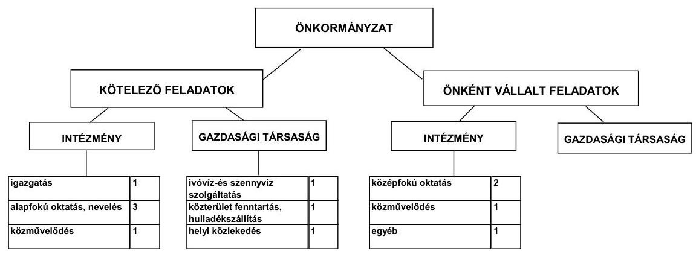

[^0]
[^0]:    ${ }^{7}$ A táblázat múködési kiadások összesen és bevételek összesen adata eltér a CLF módszer azonos tartalmú adatától, mivel nem tartalmazza a társulás, a fordított áfa, a kisebbségi önkormányzat, továbbá a felhalmozási kamatkiadások adatait.

---

Az önkormányzati feladatellátásban 2011. június 30 -án kilenc költségvetési szerv (Polgármesteri hivatallal együtt), valamint három gazdasági társaság vett részt, amelyből kettő kizárólagos tulajdonú, egy pedig közszolgáltatási szerződés alapján biztosította a helyi közlekedési feladatok ellátását. A feladatkiszervezések, intézményi integrációk (a szociális és gyermekjóléti intézmények Kistérségi társulásba adása, a Költségvetési Szolgáltató Iroda megszüntetése) hatásaként az önkormányzati intézmények száma a vizsgált időszakban 12 -ről kilencre, az intézmények telephelyeinek száma 55 -ről 44-re csökkent, a gazdasági társaságok száma három maradt. Az Önkormányzat 100\%-os tulajdonában álló két gazdasági társaság közül a településen a víz- és csatornaszolgáltatást, a belvízelvezetést és kezelést, a strandfürdő üzemeltetést, valamint az ifjúsági szálláshely üzemeltetését a Vízmú Kft. biztosította. A közterület fenntartást, a hulladékkezelést és -szállítást, valamint a vagyonüzemeltetést a Városgazdálkodási Kft. látta el. Az Önkormányzat - szerződések alapján - a gazdasági társaságok részére a 2007-2011. év I. félévében összesen 165,4 millió Ft pénzeszközt adott át múködési célra, melyekkel elszámoltak. Fejlesztési célú pénzeszközátadás nem történt a vizsgált években.

Az egyes közszolgáltatások feladatellátásában résztvevő költségvetési szervek múködési kiadásainak finanszírozási forrásösszetételét a következő ábra szemlélteti:
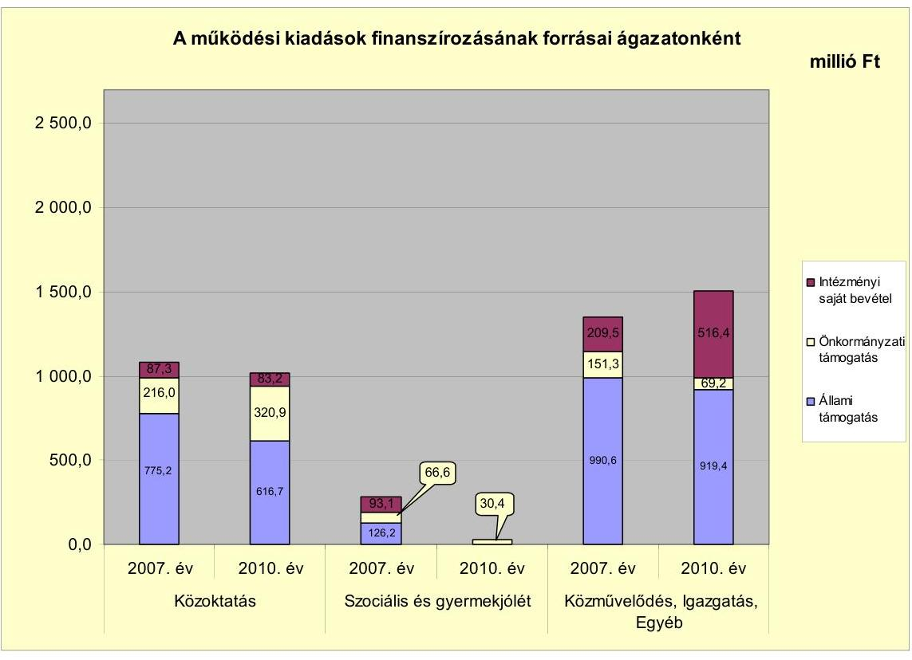

A közoktatási ágazatban az ellátotti létszám, valamint a normatívák jelentős csökkenése miatt az állami hozzájárulások mértéke 2007. évről 2010. évre 158,5 millió Ft-tal csökkent. Az Önkormányzat felülvizsgálta az intézményszerkezet kihasználtságát és egy tagóvoda, valamint egy kollégiumi épület kihasználatlanság miatti megszüntetéséről döntött. A kieső állami támogatás miatt az önkormányzati támogatás összege 104,9 millió Ft-tal nőtt ezen időszak

---

alatt. A szociális és gyermekjóléti ágazatban bekövetkezett bevételi forráscsökkenés oka, hogy a feladat ellátásában változás történt. Az Önkormányzat 2008. január 1-től a Kistérségi társulás fenntartásába adta a szociális és gyermekjóléti intézményeket. A közművelődés, az igazgatás és az egyéb feladatellátás területén a források a 2007. évi mértékhez képest növekedtek. Az intézményi bevételek a 2007. évi 209,5 millió Ft-ról négy év alatt 306,9 millió Ft-tal nőttek. Az intézményi bevételek növekedésében szerepet játszottak a gyermekétkeztetési térítési díjak, a működési célú kamatbevételek, valamint a pályázati úton nyert támogatások. Az önkormányzati támogatások csökkenését a Költségvetési Szolgáltató Iroda megszüntetése indokolja.

A vizsgált időszakban a kötelező és önként vállalt feladatok ellátását biztosító szervezeti keretekben, a feladatellátás módjában bekövetkezett változások öszszességében célszerűek voltak, az Önkormányzat pénzügyi egyensúlyi helyzetére pozitív hatást gyakoroltak, mivel - az Önkormányzat kimutatásai szerint egyenlegükben 367,2 millió Ft-os többlet keletkezett. A vizsgált időszakban a kötelező és önként vállalt feladatok ellátását biztosító szervezeti keretekben, a feladatellátás módjában bekövetkezett változások pozitív hatást gyakoroltak az Önkormányzat pénzügyi egyensúlyi helyzetének alakulására.

Az Önkormányzat pénzügyi kapacitásának, működési jövedelmének, tőketörlesztésének alakulását a 2007-2010. években a következő ábra mutatja be:
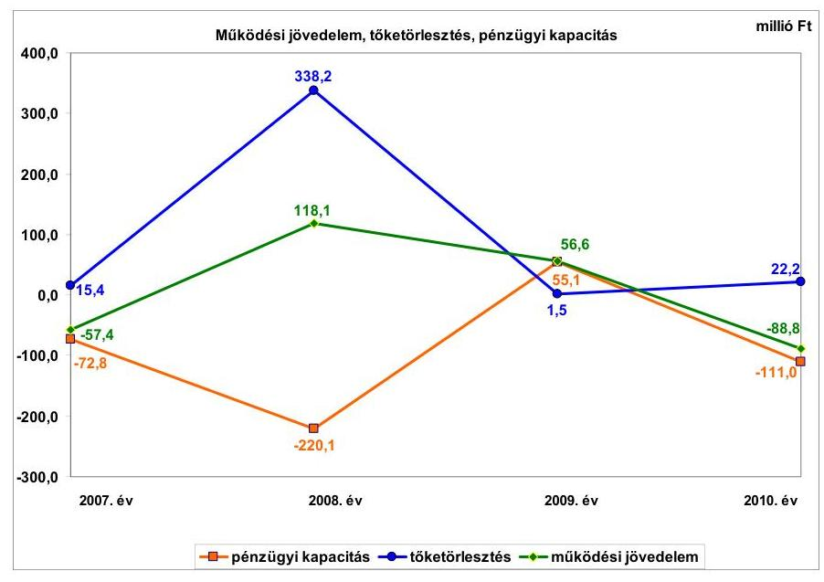

Az Önkormányzatnak a folyó költségvetési egyenlege változóan alakult, öszszességében 28,5 millió Ft pozitív működési jövedelme képződött. A folyó költségvetés hiánya a 2007. évben 57,4 millió Ft (2,1\%), a 2010. évben 88,8 millió Ft ( $2,7 \%$ ), a többlet a 2008. évben 118,1 millió Ft (4,6\%), a 2009. évben 56,6 millió Ft ( $1,8 \%$ ) volt. A működőképesség megőrzését szolgáló támogatásokkal csökkentve a folyó bevételeket a folyó költségvetés hiánya a 2007. évben 205,8 millió Ft (7,6\%), a 2010. évben 103,8 millió Ft (3,2\%), a többlet a 2008. évben 88,6 millió Ft (3,4\%), a 2009. évben 46,6 millió Ft (1,4\%) volt. A folyó kiadásoknak a folyó bevételeknél nagyobb mértékű csökkenése miatt a működési jövedelem 2008. évben 175,5 millió Ft-tal nőtt. A működési jövede-

---

lem kedvező alakulását a feladatracionalizálási intézkedések, valamint a kamatbevételek növekedése eredményezte. A 2009. évben a múködési jövedelem 61,5 millió Ft-tal csökkent, mivel a folyó bevételek növekedése ( $24,8 \%$ ) elmaradt a folyó kiadások növekedésétől ( $28,6 \%$ ). A kamatbevételek és kiadások egyenlegének további emelkedése ellenére a folyó költségvetési pozíció romlott a 2009. évben. A 2008-ról 2009-re a költségvetési támogatások, az átengedett szja-bevételek, valamint a helyi adóbevételek csökkentek, míg a dologi kiadások és a szociális támogatások növekedtek. A folyó bevételek a 2010. évben ismét nem nyújtottak fedezetet a folyó kiadásokra, ebben az évben volt a múködési jövedelem a legalacsonyabb, $-88,8$ millió Ft. A kötvénykibocsátásból származó bevétel felhasználásával párhuzamosan a 2010. évre 106,5 millió Ft-tal csökkent a kamatbevételek és kiadások egyenlege az előző évhez képest. A 2009-ről 2010-re a dologi kiadások és a szociális támogatások emelkedtek, míg a költségvetési támogatások, az átengedett szja-bevételek, valamint a helyi adóbevételek csökkentek.

Az Önkormányzat a 2007-2011. években a költségvetési rendeletében tervezett múködési forráshiány csökkentésére ÖNHIKI támogatást igényelt, mely a 2007. a 2008. és a 2011. években kedvező elbírálásban részesült. A 2008. és a 2009. évi pozitív előjelű folyó költségvetési egyenleg ellenére az Önkormányzat minden évben folyószámlahitel felvételére kényszerült, egyrészt az átmeneti likviditási problémák kezelése, másrészt fejlesztési kiadásai finanszírozása miatt. Az Önkormányzat tőketörlesztési kötelezettsége a 2007. évben 15,4 millió Ft, a 2008. évben 338,2 millió Ft, a 2009. évben 1,5 millió Ft, a 2010. évben 22,2 millió Ft volt. A múködési jövedelem 175,5 millió Ft-os növekedése mellett a nettó múködési jövedelem - a kötvénykibocsátás bevételéből hitelkiváltásra történő felhasználás miatt - a 2008. évre lecsökkent a 2007. évi 72,8 millió Ft-ról -220,1 millió Ft-ra. A 2009. évben a múködési jövedelem (56,6 millió Ft) fedezetet nyújtott az adott évi tőketörlesztési kötelezettségekre. A 2010. évben a negatív múködési jövedelmet ( $-88,8$ millió Ft) tovább rontotta a tőketörlesztési kötelezettségek teljesítése, aminek hatására a nettó múködési jövedelem -111,0 millió Ft-ra csökkent. A múködőképesség megőrzését szolgáló támogatásokkal csökkentve a folyó bevételeket a nettó múködési jövedelem a 2007. évben -221,2 millió Ft, a 2008. évben -249,6 millió Ft, a 2009. évben 45,1 millió Ft, a 2010. évben -126,0 millió Ft volt.

A 2007-2010. években az Önkormányzat felhalmozási költségvetésének egyenlege a 2007. évben 7,9 millió Ft, majd a 2008-2010. években folyamatosan negatív összegű volt.

A felhalmozási forráshiánynak a felhalmozási és tőke jellegű kiadásokhoz viszonyított aránya 2008-ban 18,0\% (415,3 millió Ft), 2009-ben 15,6\% (530,9 millió Ft), 2010-ben 17,8\% (726,2 millió Ft) volt. A 2007-2010. években képződött, összesen 1664,5 millió Ft felhalmozási forráshiányt a 2007. és a 2008. évben összesen igénybevett 358,0 millió Ft fejlesztési célú hitelek, valamint a 2008. évben kibocsátott kötvényből származó 1306,5 millió Ft fejlesztési célra felhasznált bevétel fedezett.

Az Önkormányzat folyó és felhalmozási költségvetésének egyenlege összességében a 2007. évben 49,5 millió Ft, a 2008. évben 297,2 millió Ft, a 2009. évben 474,3 millió Ft, a 2010. évben 815,0 millió Ft hiányt mutatott. Az Önkormány-

---

zat folyó bevételeinek és kiadásainak alakulását nagy mértében befolyásolták a feladatátszervezések hatásai, a múködési költségvetést támogató pályázatokon elért bevételek, a kötvényből származó pénzeszközök befektetéséből elért kamatbevételek, a kötvénytartozás után fizetett kamatok. A felhalmozási bevételek és kiadások összegében meghatározó volt az Önkormányzat gesztorságával megvalósuló ivóvízminőség-javító beruházás. A 2007-2010. években teljesített 10894,5 millió Ft felhalmozási kiadás 64,5\%-a (7026 millió Ft) e beruházáshoz kapcsolódott.

Az Önkormányzat folyó bevételei a 2007. évi 2667,8 millió Ft-ról a 2010. évre 3199,8 millió Ft-ra, 19,9\%-kal növekedtek, melyből meghatározó volt az áfabevételek - fordított elszámolás miatti - 701,5 millió Ft növekedése. Az Önkormányzat múködési célú költségvetési támogatása és az átengedett szja-bevétel együttes összege a 2010. évben 1584,8 millió Ft volt, ami a 2007-2009. évek átlagához képest 156,8 millió Ft-os ( $9 \%$-os) csökkenést jelentett. A költségvetési támogatás összegének alakulására hatással volt az, hogy a szociális és gyermekjóléti feladatokat ellátó intézmény 2008. január 1-jétől a Kistérségi társulás fenntartásában múködik, továbbá az ÖNHIKI támogatás csökkenése. A helyi adókból és pótlékokból származó bevételek összege - a gazdasági válság hatására - a 2007-2009. évek átlagához (272,7 millió Ft) viszonyítva 2010-re 20,9 millió Ft-tal ( $7,7 \%$ ) csökkent. Az idegenforgalmi adó és a magánszemélyek kommunális adója esetében alkalmazott adómérték nem éri el a maximális adómértéket. Az Önkormányzat egyéb saját bevételei a 2007-2009. évek 512,8 millió Ft-os átlagához képest a 2010. évre 559,1 millió Ft-ra, 9\%-kal növekedtek.

A felhalmozási célú bevételek a 2007. évi 1104,3 millió Ft-ról a 2010. évre háromszorosára növekedtek elsősorban az ivóvízminőség-javító beruházás támogatása, valamint e beruházás visszaigényelhető áfa bevétele miatt.

Az Önkormányzat folyó kiadásai a 2007-2009. évek 2785,1 millió Ft-os átlagához képest a 2010. évben 503,5 millió Ft-tal növekedtek. A folyó kiadásokon belül a személyi juttatások átlagos összege a 2010. évre 49,0 millió Ft-tal (4,4\%) csökkent a közétkeztetés kiszervezése, a szociális és gyermekjóléti feladatok Kistérségi társulás részére történő átadása, valamint a Költségvetési Szolgáltató Iroda megszüntetése miatt. A dologi kiadások a 2010. évben a 2007-2009. évek 852,4 millió Ft-os átlagához képest 589,3 millió Ft-tal növekedtek elsősorban a fordított áfa elszámolása miatt.

A pénzügyi egyensúlyi helyzetet befolyásolta az Önkormányzat elmúlt időszaki fejlesztési tevékenysége. A befejezett fejlesztések 39,3\%-át pénzintézeti forrásokból fedezték. Az Önkormányzat által a 2007-2010. években megvalósított fejlesztéseinek teljes költsége 2787,1 millió Ft volt. A fejlesztési kiadások forrásából 625,5 millió Ft-ot ( $22,4 \%$ ) jelentett a saját bevétel, 373,1 millió Ft-ot a hitel (13,4\%), 722,9 millió Ft-ot (25,9\%) a kötvényből származó bevétel, 110,7 millió Ft-ot (4\%) az EU-s támogatás, míg 954,9 millió Ft-ot (34,3\%) a hazai támogatás. A 2010. december 31-én folyamatban lévő fejlesztési feladatok végrehajtására 2007-2010. között 874,9 millió Ft kiadást teljesítettek, amelynek forrása 26,7 millió Ft (3,1\%) saját bevétel, 267,4 millió Ft (30,1\%) kötvényből származó bevétel, 512,1 millió Ft (58,5\%) EU-s támogatás, míg 68,7 millió Ft ( $7,9 \%$ ) hazai támogatás. Az EU-s támogatásból megvalósult fej-

---

lesztések finanszírozása - a beruházások utófinanszírozása miatt - likviditási gondot okozott az Önkormányzatnál.

Az Önkormányzatnál a 2010. december 31-én folyamatban lévő fejlesztési feladatok 2010. évet követő kötelezettségvállalásainak összege 2977,2 millió Ft volt, amelyből 32,4 millió Ft-ot (1,1\%) saját bevételből, 764,3 millió Ft-ot ( $25,7 \%$ ) kötvényből származó bevételből, 1834,4 millió Ft-ot (61,6\%) EU-s támogatásból, míg 346,1 millió Ft-ot hazai támogatásból (11,6\%) terveznek biztosítani.
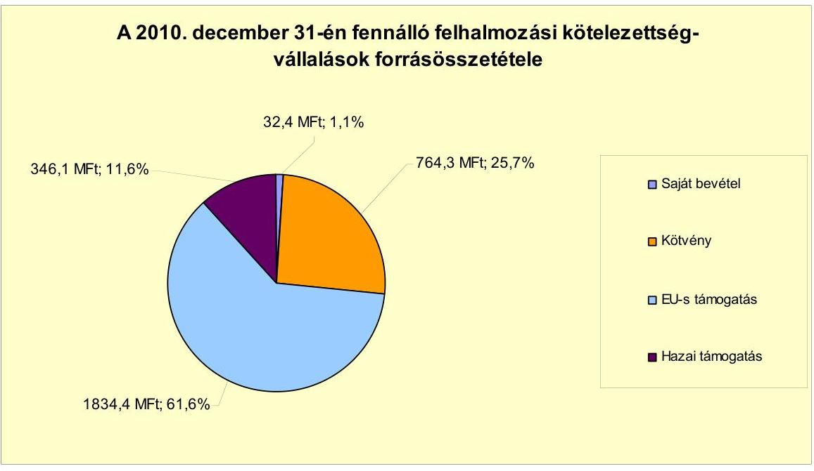

Az Önkormányzat által beadott, elbírálás alatt álló pályázatok tervezett teljes bekerülési költsége 1783,0 millió Ft volt. Az Önkormányzat által a 20102013. évekre vállalt kötelezettségek összege 1771,7 millió Ft volt, amelyből 104,6 millió Ft-ot (5,9\%) saját bevételből, 249,6 millió Ft-ot (14,1\%) hitelből, 71,4 millió Ft-ot (4\%) kötvényből származó bevételből, 1346,1 millió Ft-ot (76\%) EU-s támogatásból terveznek biztosítani.

A 2010. évet követő évekre vállalt kötelezettségek összege 4748,9 millió Ft, amelynek forrása 137,0 millió Ft (2,9\%) saját bevétel, 249,6 millió Ft (5,2\%) hitel, 835,7 millió Ft (17,6\%) kötvényből származó bevétel, 3180,5 millió Ft (67,0\%) EU-s támogatás, míg 346,1 millió Ft (7,3\%) hazai támogatás. A strandfürdő megvalósíthatósági tanulmányában számoltak a beruházás megtérülésével, a jövőbeni múködtetés várható bevételeivel és kiadásaival. A bevételek teljesülésének elmaradása, valamint a kiadások tervezettet meghaladó teljesítése kockázatot hordoz magában.

Az Önkormányzat pénzintézetekkel szembeni kötelezettsége a 2006. év végéről a 2011. év I. félév végére több mint tízszeresére, 349,0 millió Ft-ról 3906,2 millió Ft-ra nőtt, amelyből az árfolyamváltozás miatti különbözet 817,5 millió Ft volt. A fennálló pénzintézetekkel szembeni kötelezettségek három hosszú lejáratú hitelből, egy kötvénykibocsátás miatti kötelezettségből, fo-lyószámla-, és munkabérhitelből keletkeztek. Az Önkormányzat az elfogadott

---

2011. évi költségvetési rendelete alapján 249,6 millió Ft fejlesztési és 343,1 millió Ft múködési hitel felvételét tervezte. A fejlesztési hitelt a helyszíni vizsgálat befejezésének időpontjáig még nem vette fel, folyószámla- és munkabérhitele 2011. június 30-án 309,2 millió Ft volt. Az Önkormányzat adósságot keletkeztető kötelezettségvállalásaira képviselő-testületi döntés alapján került sor, az előterjesztésekben bemutatták a kamat-, és - a devizaalapú kötelezettség esetében - az árfolyamkockázatot, azonban a visszafizetés forrásait nem.

Az Önkormányzat a hiteleket, a kötvény kibocsátásából származó 2011. június 30-ig felhasznált - bevételt célnak megfelelően a Képviselő-testület által jóváhagyott, a költségvetésbe betervezett beruházásokhoz, hitelek visszafizetéséhez, és múködésre használta fel. Az Önkormányzat 2011. év I. félévéig a CHF-ben fennálló, kötvénykibocsátásból származó pénzintézetekkel szembeni kötelezettségéből tőkét nem törlesztett, azonban 873,8 ezer CHF (161,2 millió Ft) kamatot fizetett. A tőke törlesztése 2011. év szeptember 30-án kezdődött 221,0 ezer CHF összegben. A nettó múködési jövedelem alakulására kedvezőtlen befolyást gyakorol, hogy a kötvénykibocsátás miatti tőketörlesztési kötelezettség a 2012. évben 442 ezer CHF lesz. A forintban fennálló pénzintézetekkel szembeni kötelezettségeiből 34,7 millió Ft tőkét törlesztett, és 46,0 millió Ft kamatot fizetett. Ezenfelül öt hitelét fizette vissza az Önkormányzat a 2008. évben a kötvénykibocsátás bevételéből. A 2007-2011. év I. féléve között átmenetileg szabad pénzeszközeiből 570,3 millió Ft kamatbevételt realizált.

Az Önkormányzat költségvetésének pénzügyi egyensúlyát a vizsgált időszakban folyószámlahitel, továbbá a 2007. évben és a 2011. év I. félévében munkabér-megelőlegezési hitel igénybevételével tudta biztosítani.

A folyószámlahitel igénybevétele a 2007-2011. év I. félévében az alábbiak szerint alakult:

| Megnevezés | 2007. év | 2008. év | 2009. év | 2010. év | 2011. év I.   félév |
| :-- | --: | --: | --: | --: | --: |
| Folyószámlahitel |  |  |  |  |  |
| Keretösszeg január 1-jén (millió Ft-ban) | 130,0 | 224,0 | 224,0 | 220,0 | 220,0 |
| Átlagos napi állomány (millió Ft-ban) | 81,9 | 61,0 | 45,3 | 65,4 | 176,4 |
| Folyószámla hitellel zárt napok száma (nap) | 289 | 221 | 232 | 275 | 175 |
| Egyenleg (állomány) | 211,5 | 0,0 | 28,6 | 142,7 | 259,2 |
| Munkabér-megelőlegezési hitel |  |  |  |  |  |
| Keretösszeg január 1-jén (millió Ft-ban) | 70,0 | 0,0 | 0,0 | 55,0 | 55,0 |
| Átlagos napi állomány (millió Ft-ban) | 0,2 | 0,0 | 0,0 | 0,0 | 0,3 |
| Munkabér-megelőlegezési hitellel zárt napok száma (nap) | 1 | 0 | 0 | 0 | 1 |
| Egyenleg (állomány) | 0,0 | 0,0 | 0,0 | 0,0 | 50,0 |

A folyószámlahitellel zárt napok száma a 2007. évi 289 napról 2010-re 275 csökkent, azonban 2011. év I. félévében a 181 napból már 175 napon keresztül szükség volt folyószámlahitel igénybevételére. A napi átlagos állomány a 2007. évi 81,5 millió Ft-ról a 2011. év I. félévére 176,4 millió Ft-ra nőtt. A folyószámlahitel-keret összegét év közben a lejáratkor, vagy az Önkormányzat kezdeményezésére azt megelőzően módosították. Az Önkormányzat kezdeményezésére a folyószámla hitelkeretet 2011. május 26-án 343,1 millió Ft-ra emelték. A módosítás napján 210,0 millió Ft volt az igénybevett folyószámlahitel. A 343,1 millió Ft-os hitelkeretet a szerződésben foglaltak alapján 2011. október 4tól 273,1 millió Ft-ra csökkentette a pénzintézet. Az Önkormányzat a 2007-

---

2011. év I. féléve között a folyószámlahitel kamatfizetésére és egyéb költségeire 35,4 millió Ft-ot, a munkabérhitel kamatfizetésére 0,1 millió Ft-ot fordított.

Az Önkormányzat egyes kötelezettségeinek 2010. december 31-i, valamint 2011. június 30-i állományát és várható alakulását a kötelezettségek lejáratáig a következő táblázat szemlélteti:

| Megnevezés | Állomány 2010. december 31   év |  |  | Állomány 2011. június 30-ár |  |  | Várható kötelezettség 20112013. években |  | Várható kötelezettség 2014. évtöl |  |
| :--: | :--: | :--: | :--: | :--: | :--: | :--: | :--: | :--: | :--: | :--: |
|  | HUF-ben   (mikó. Ft-   ben) | Devicétben (összegy.   ezer CHF-   ben) | Devicét   nem | HUF-ben   (mikó. Ft-   ben) | Devicétben (összegy.   ezer CHF-   ben) | Devicét   nem | HUF-ben   (mikó Ft-   ben) | Devicétben (összegy.   ezer CHF-   ben) | HUF-ben   (mikó Ft-   ben) | Devicétben (összegy.   ezer CHF-   ben) |
| Pénzintézeti kötelezettségek |  |  |  |  |  |  |  |  |  |  |
| Hosszú-lejlesztő hivatás | 354,0 |  | HUF | 343,0 |  | HUF | 92,0 |  | 344,0 |  |
| "Az Éthetőbb Kisújszáthatat" kötvény |  | 14612,0 | CHF |  | 14612,0 | CHF |  | 1517,0 |  | 14951,0 |
| Folyószámlahitel | 142,0 |  | HUF | 258,0 |  | HUF | 258,0 |  |  |  |
| Munkable megelőlegesése tétel |  |  |  | 90,0 |  | HUF | 90,0 |  |  |  |
| Pénzintézeti kötelezettségek összesen HUF-ben: | 497,0 |  | HUF | 552,0 |  | HUF | 401,0 |  | 344,0 |  |
| Pénzintézeti kötelezettségek összesen CHF-ben: |  | 14612,0 | CHF |  | 14612,0 | CHF |  | 1517,0 |  | 14951,0 |
| Biztosilakok |  |  |  |  |  |  |  |  |  |  |
| Pénzintézet | 416,0 |  | HUF | 73,0 |  | HUF |  |  |  |  |
| Biztosilakok összesen: | 416,2 |  | HUF | 73,5 |  | HUF |  |  |  |  |
| Szállítási tartozás | 433,1 |  | HUF | 47,1 |  | HUF | 27,1 |  |  |  |
| Egyéb kötelezettségek |  |  | HUF | 0,0 |  | HUF | 0,0 |  |  |  |
| Kötelezettségek összesen HUF-ben: | 1347,4 |  | HUF | 773,1 |  | HUF | 455,1 |  | 344,0 |  |
| Kötelezettségek összesen CHF-ben: |  | 14612,0 | CHF |  | 14612,0 | CHF |  | 1517,0 |  | 14951,0 |

A szállítókkal szembeni tartozás 2011. június 30-i állományának 97,0\%-a, 45,7 millió Ft a lejárt tartozás. A lejárt szállítókkal szembeni kötelezettségekből 41,6 millió Ft az Ivóvízminőség-javító Társulás kötelezettsége volt. Az Önkormányzat 4,1 millió Ft lejárt tartozása 60 napon belüli. Az Önkormányzat a Kisújszállási Csatornaberuházó Víziközmű Társulat fejlesztési hiteleihez kapcsolódóan - az Ötv. szerinti adósságot keletkeztető kötelezettségvállalás felső határát betartva - készfizető kezességet vállalt. A 2011-2013. évek kötelezettségeinek teljesítésére figyelembe vehető - a behajthatóságot és az eladhatóságot feltételezve - a mérlegben kimutatott 111,7 millió Ft követelésállomány, továbbá a forgalomképes ingatlanvagyon. Az Önkormányzat tájékoztatása szerint figyelembe vehető további források „a mindenkori költségvetési rendeletekben megtervezett saját bevételek".

A 2010. évi ÁSZ ellenőrzés javaslatát figyelembe véve a 2011. évi költségvetés előterjesztésében bemutatták az adósságot keletkeztető kötelezettségvállalások finanszírozásául szolgáló várható saját bevételeket. A 2010. évben képződött negatív működési jövedelem miatt a következő évekre szóló jelenleg ismert pénzintézetekkel szembeni kötelezettségek teljesítése - további bevételnövelő és kiadáscsökkentő intézkedések megtételének hiányában - törlesztési kockázatot jelent az Önkormányzatnak. A 2010. évhez képest - a 2010. december 31-i MNB HUF/CHF árfolyam figyelembevételével - várhatóan 98,4 millió Ft adósságszolgálatot fog jelenteni a kötvények visszavásárlása a 2012. évben. Az Önkormányzat 2011. év I. negyedévében tárgyalásokba kezdett a kötvényt kibocsátó pénzintézettel a 450,0 millió Ft óvadéki betét felszabadítása ügyében. A kötvénykibocsátáshoz kapcsolódóan kötött kiegészítő megállapodás szerint a zárolt betét feloldásáról az Önkormányzat kérelmére a pénzintézet dönt, melyhez az Önkormányzat múködési eredményét, saját bevételeinek és kötelezettségeinek változását, a bemutatott beruházások jövőbeli kihatásait és forrásösszetételét vizsgálja meg. A pénzintézet az Önkormányzat óvadék felszabadítása iránti kérelmét indoklás nélkül elutasította. Az Önkormányzat ebből tervezte

---

finanszírozni a saját forrást a már megkezdett EU-s támogatásokból megvalósuló fejlesztéseihez. Ezért a Képviselő-testület 2011. október 12-én a 450,0 millió Ft fejlesztési hitel felvételére vonatkozó hirdetmény közzétételével induló, tárgyalásos közbeszerzési eljárás megindításáról döntött, amely jelenleg folyamatban van.

Az Önkormányzat a két 100\%-os tulajdonában lévő gazdasági társaságának nyújtott 17,2 millió Ft tagi kölcsönt a vizsgált időszakban. A Vízmú Kft.-nek 2,7 millió Ft, a Városgazdálkodási Kft.-nek 5,7 millió Ft volt a tagi kölcsönből még fennálló kötelezettsége 2011. év június 30-án. A Kisújszállási Sportegyesület részére 2011. év I. félévében 5,7 millió Ft kamatmentes kölcsönt nyújtottak, lejárata 2011. december 20. A Kisújszállási Csatornaberuházó Víziközmű Társulat múködési költségeinek finanszírozására a vizsgált időszakban 64,6 millió Ft kamatmentes kölcsönt nyújtott az Önkormányzat, melyet 2012. június 30. napjáig kell visszafizetni. A vizsgált időszakban az intézményeknek, a helyi kisebbségi önkormányzatnak nyújtott kamatmentes kölcsönök visszafizetésre kerültek.

Az önkormányzati kötelezettségek növekedése mellett az Önkormányzat minősített többségi befolyásával rendelkező gazdasági társaságok kötelezettségei is befolyásolhatják az Önkormányzat pénzügyi egyensúlyát, amelyeket a következő táblázat mutat be:

| Megnevezés | Állomány 2010. december 31-   én |  |  | Állomány 2011. június 30-án |  |  | Várható   kötelezettség 2011-   2013. években |  |
| :--: | :--: | :--: | :--: | :--: | :--: | :--: | :--: | :--: |
|  | HUF-ban   (millió Ft-   ban) | Devizában (összege, ezer EURban) | Devizis   nem | HUF-ban   (millió Ft-   ban) | Devizában (összege, ezer EURban) | Devizis   nem | HUF-ban (millió Ftban) | Devizában (összege, ezer EURban) |
| Pánzintézeti kötelezettségek |  |  |  |  |  |  |  |  |
| Rulincés hitel | 1,0 |  | HUF | 0,3 |  | HUF | 0,3 |  |
| Hosszú lejáratú hitel | 0,9 |  | HUF | 0,7 |  | HUF | 1,0 |  |
| Pánzintézeti kötelezettségek összesen: | 1,9 |  | HUF | 1,0 |  | HUF | 1,3 |  |
| Üzínig kötelezettségek |  | 6,0 | EUR |  | 4,6 | EUR |  | 6,7 |
| Szállítói tartozás | 52,0 |  | HUF | 19,2 |  | HUF | 19,2 |  |
| Kötelezettségek összesen HUF-ban: | 53,9 |  | HUF | 20,2 |  | HUF | 20,5 |  |
| Kötelezettségek összesen EUR-ban: |  | 6,0 | EUR |  | 4,6 | EUR |  | 6,7 |

A társaságoknak a 2011. évtől 1,3 millió Ft pénzintézetekkel szembeni, 6,7 ezer EUR lízingkötelezettséget és 19,2 millió Ft szállítói tartozást kell rendezniük. Esetleges csőd, vagy felszámolási eljárás esetén a bíróság korlátlan és teljes felelősséget állapíthat meg az Önkormányzat terhére.

A Képviselő-testületnek előterjesztett éves zárszámadási rendeleteikben nem mutatták be az Önkormányzat eszközei után elszámolt értékcsökkenés összegét, az eszközpótlásra fordított tényleges kiadásokat, az eszközök elhasználódási fokának alakulását.

Az Önkormányzat az ellenőrzött időszakban kiadási megtakarítást eredményező és bevételt növelő intézkedéseket tett. A 2007-2011. év I. féléve között tett intézkedések hatására 20,7 millió Ft bevételi többletet, továbbá 444,8 millió Ft kiadási megtakarítást mutattak ki, ezáltal az Önkormányzat pénzügyi egyensúlyi helyzetét javították. A feladatmegszüntetéssel, átszervezéssel járó létszámcsökkentési döntések önkormányzati szinten összesen 300,4 millió Ft (67,5\%) megtakarítást eredményeztek a személyi juttatások és

---

járulékok vonatkozásában, 135,3 millió Ft (30,4\%) megtakarítást eredményezett a cafetéria elemek csökkentése, 8,8 millió Ft-ot ( $2,0 \%$ ) a közoktatási intézmények telephelyeinek kivonása a feladatellátásból, míg 0,3 millió Ft-ot ( $0,1 \%$ ) a közbeszerzés következtében jelentkező villamosenergia-megtakarítás. Az álláshely-csökkentő intézkedések 2007-2011. év I. féléve között önkormányzati szinten összesen 173 álláshely (ebből nem volt üres álláshely) megszüntetését jelentették. A szociális és gyermekvédelemhez kapcsolódó 87 fős csökkenésből 85 főt jelentett a Kistérségi társulásba adás okozta csökkenés. Az egyéb területet érintő 46 fős csökkenésből 25 főt jelentett a közétkeztetés vállalkozásba adása. A közoktatáshoz kapcsolódó 35 fős csökkenést az ellátottak csökkenése miatti átszervezések indokolták. A Polgármesteri hivatalhoz kapcsolódó öt fős csökkenést a feladatok racionalizálása tette szükségessé. Az igazgatás, a közoktatás, valamint a szociális ellátás területeken feladatbővülések is voltak, amelyek 14 fős létszámnövekedéssel jártak. Mindezek következtében az időszak álláshelyeinek száma összességében 159 fővel csökkent. A létszámnövekedések pénzügyi hatásait az Önkormányzat nem számszerúsítette. A bevételnövelő intézkedések 100\%-a az eszközhasználati díj megemeléséből adódó többletbevétel volt.

Az utóellenőrzés a pénzügyi egyensúly javítására tett három szabályszerűségi és egy célszerűségi javaslat hasznosítására terjedt ki. Az ellenőrzés során tett, a pénzügyi egyensúly javítására vonatkozó három szabályszerűségi javaslat közül kettőt hasznosítottak. A szabályszerűségi javaslatra megtett intézkedés eredményeképpen gondoskodtak a költségvetési rendelettervezet előkészítésekor az EU-s forrásokkal támogatott fejlesztések bevételi és kiadási előirányzatainak elkülönített bemutatásáról, továbbá a befektetésekre vonatkozó képviselőtestületi hatáskörök átruházására vonatkozó előírások érvényesüléséről. A polgármester egy, a kötvénykibocsátásból származó bevétel átmenetileg szabad részének befektetésére vonatkozó javaslatot nem hasznosított. A célszerűségi javaslat hasznosulásaként a Képviselő-testület tájékoztatták az Önkormányzat eladósodásának növekedéséről.

Az Önkormányzat pénzügyi egyensúlyi helyzetét összegezve a következők emelhetők ki:

Kisújszállás Város Önkormányzatának pénzügyi egyensúlyi helyzete rövid távon veszélyeztetett.

A pénzügyi egyensúlyi helyzetre kedvezőtlen befolyást gyakorolt az önként vállalt feladatok folyó kiadásokon belüli magas aránya.

Az Önkormányzat kiadásainak finanszírozásában a folyószámlahitel tartóssá vált.

A folyó bevételek a 2009. év kivételével nem nyújtottak fedezetet a folyó kiadásokra és az adósságszolgálatra.

Kockázatot jelent a támogatásokkal megvalósuló fejlesztések forrásainak előfinanszírozása.

A 2007-2010. években az Önkormányzat felhalmozási költségvetése összességében pénzügyi hiányt mutatott. Ennek forrása finanszírozási műveletekkel

---

(kötvénykibocsátással, hitelfelvétellel) volt biztosított. Kockázatot jelent, hogy a kötvényt kibocsátó pénzintézet az óvadéki betét felszabadításához nem járult hozzá, melyet a már megkezdett EU-s támogatásokból megvalósuló fejlesztések saját forrásaként terveztek felhasználni.

A 2010. évben képződött negatív működési jövedelem miatt a következő évekre szóló jelenleg ismert pénzintézetekkel szembeni kötelezettségek teljesítése - további bevételnövelő és kiadáscsökkentő intézkedések megtételének hiányában - kockázatot jelent az Önkormányzatnak. A 2011. évi költségvetési rendeletben, valamint az óvadék felszabadításának elutasítása miatt felvenni tervezett fejlesztési hitel kockázatot hordoz magában.

Az Állami Számvevőszékről szóló 2011. évi LXVI. törvény 33. § (1) bekezdésében foglaltak értelmében a jelentésben foglalt megállapításokhoz kapcsolódó intézkedési tervet köteles az ellenőrzött szervezet vezetője összeállítani és azt a jelentés kézhezvételétől számított harminc napon belül az ÁSZ részére megküldeni. Amennyiben az intézkedési tervet határidőben nem küldi meg a szervezet, vagy az továbbra sem elfogadható, az ÁSZ elnöke a hivatkozott törvény 33. § (3) bekezdés a)-b) pontjaiban foglaltakat érvényesítheti.

# A 2011. június 30-i pénzügyi egyensúlyi helyzet alapján az ellenőrzés intézkedést igénylő megállapításai és javaslatai a következők: 

## a polgármesternek

1. A folyó bevételek a 2007. és a 2010. években nem nyújtottak fedezetet a folyó kiadásokra. A pénzügyi egyensúlyi helyzetre kedvezőtlen befolyást gyakorolt az önként vállalt feladatok folyó kiadásokon belüli magas aránya. A 2008-2010. években a felhalmozási bevételek nem fedezték a felhalmozási kiadásokat. A pénzintézet 450,0 millió Ft óvadék felszabadítását nem hagyta jóvá, így azt az Önkormányzat a már megkezdett EU-s támogatásokból megvalósuló fejlesztései saját forrásaként nem tudja felhasználni. Az Önkormányzat kiadásainak finanszírozásában a folyószámlahitel állandósult. Az Önkormányzat adósságot keletkeztető kötelezettségvállalásaira vonatkozó képviselő-testületi előterjesztések nem tartalmazták a visszafizetés forrásait. A 2010. évben képződött negatív múködési jövedelem miatt a következő évekre szóló jelenleg ismert pénzintézetekkel szembeni kötelezettségek teljesítése - további bevételnövelő és kiadáscsökkentő intézkedések megtételének hiányában - már rövid távon (2011-2013. években) veszélyezteti az Önkormányzat pénzügyi egyensúlyát.

Javaslat:
Az Önkormányzat pénzügyi egyensúlyának gyors helyreállítása és hosszú távú fenntarthatósága érdekében kezdeményezze - felelősök és határidők megjelölésével - az alábbi intézkedések megtételét:
a) Tárja fel a bevételszerző és kiadáscsökkentő lehetőségeket. Intézkedjen a bevételek növelésére, a kintlévőségek behajtására, a kiadások csökkentésére;
b) Terjesszen a Képviselő-testület elé kibontakozási programot a pénzügyi egyensúlyi helyzet javítása és hosszú távú megőrzése érdekében;

---

c) Képezzen egyensúlyi (elkülönített) tartalékot az adósságszolgálat teljesítése érdekében;
d) Vizsgálja felül teljes körűen a folyamatban lévő beruházásokat, és mutassa be a Képviselő-testületnek a megvalósuló létesítmények fenntarthatóságának pénzügyi hatásait. Az Önkormányzat pénzügyi egyensúlyi helyzete szempontjából kedvező támogatás-finanszírozási lehetőségeket vegye igénybe;
e) Vizsgálja felül teljes körűen a tervezett beruházásokat és a megvalósuló létesítmények fenntartásának jövőbeni pénzügyi kihatásait. Szükség esetén tegyen javaslatot a Képviselő-testületnek a tervezett beruházásokkal kapcsolatos döntések módosítására, amelyben figyelembe veszik az Önkormányzat pénzügyi lehetőségeit, és a kötelező feladatellátás elsődlegességét;
f) Vizsgálja meg az állandósult folyószámlahitel hosszú távú kötelezettséggé történő átalakításának jogi lehetőségét, és a Stabilitási tv. 10. §-ában előírt feltételek fennállása esetén kezdeményezze a Kormánynál ennek engedélyezését;
g) Tekintse át az önként vállalt feladatok finanszírozhatóságát a kötelező feladatellátás elsődlegességének biztosítása érdekében, mutassa be a Képviselő-testületnek a megoldás lehetőségeit, és szükség esetén a gazdasági program módosításának igényét;
h) Mutassa be a Képviselő-testületnek félévente legalább három évre kitekintően a kötelezettségek teljes körére szóló finanszírozási tervet, a források számszerűsített megjelölésével;
i) Gondoskodjon, hogy a jövőben az adósságot keletkeztető kötelezettségvállalásokról szóló képviselő-testületi előterjesztések tételesen tartalmazzák a visszafizetés forrásait;
2. A Képviselő-testületnek előterjesztett éves zárszámadási rendeletekben nem mutatatták be az Önkormányzat eszközei után tárgyévben elszámolt értékcsökkenés összegét, az eszközpótlásra fordított tényleges kiadásokat, az eszközök elhasználódási fokának alakulását.

Javaslat:
Mutassa be a Képviselő-testületnek évente a zárszámadási rendelet előterjesztésében az értékcsökkenés összegét, és ezzel összevetve az elhasználódott eszközök pótlására fordított tényleges kiadásokat, az eszközök elhasználódási fokának alakulását;
3. A polgármester egy, a kötvénykibocsátásból származó bevétel átmenetileg szabad részének befektetésére vonatkozó, korábban tett ÁSZ javaslatot nem hasznosított.

Javaslat:
Gondoskodjon arról, hogy az Önkormányzat szabad pénzeszközeinek hasznosítása során olyan befektetési módot válasszon, amely nem jelent kockázatot számára, és az Önkormányzat az átmenetileg szabad pénzeszközeit a jövőben az Áht ${ }_{2}$. 72-73. §aiban és az Ötv. 88. §-ában foglaltak szerint fektesse be.

---

# II. RÉSZLETES MEGÁLLAPÍTÁSOK 

## 1. Az ÖNKORMÁNYZAT KÖTELEZŐ ÉS ÖNKÉNT VÁLlALT FELADATAI, A FELADATELLÁTÁS SZERVEZETI KERETEI ÉS ANNAK VÁLTOZÁSAI

Az Önkormányzat - az Ötv-ben és az ágazati szakmai törvényekben meghatározott - kötelező feladatainak ellátásáról az intézmények és gazdasági társaságok alapító okirataiban, társulási megállapodásokban, gazdálkodó szervezetekkel feladatellátásra kötött megállapodásokban foglaltak szerint gondoskodott. Az Önkormányzat SzMSz ${ }_{1}$-ének 2. számú mellékletében határozta meg a kötelező és az önként vállalt feladatainak körét. Az Önkormányzat önként vállalt feladatnak minősítette a középfokú oktatást és a kollégiumi ellátást, az alapfokú művészeti oktatást, a pedagógiai szakszolgálati és logopédiai feladatellátást, a bentlakásos szociális intézmény fenntartását és múködtetését, a vásár és piac fenntartását, a strand és gyógyfürdő üzemeltetését, a mezei őrszolgálat múködtetését, valamint hozzájárultak civil szervezetek múködéséhez. A 2011. január 1-től hatályos $5 \mathrm{zMSz}_{2}$ már nem határozta meg a kötelező és az önként vállalt feladatok körét. Az önként vállalt feladatok terjedelmét ettől az évtől kezdődően az éves költségvetési rendeletekben az adott évi költségvetés forrásainak ismeretében határozták meg.

Az Önkormányzat - adatszolgáltatása szerint - a 2010. évben a 2556,2 millió Ft összegű múködési kiadásaiból 1646,2 millió Ft-ot (64,4\%) a kötelező feladatok, 910,0 millió Ft-ot (35,6\%) az önként vállalt feladatok ellátására fordította. A 2007-2009. évek között a tárgyévi működési kiadásoknak átlagosan 65,0\%-át (1642,2 millió Ft-ot) fordítottak a kötelező, 35,0\%-át (885,6 millió Ft-ot) az önként vállalt feladatok ellátására. Az Önkormányzat pénzügyi egyensúlyának fenntarthatóságára kockázatot jelent az önként vállalt feladatokra fordított múködési kiadások arányának nagysága az összes múködési kiadáson belül (ez az arány a 2011. évi tervadatok alapján $32,8 \%$ körül várható).

A 2010. évi múködési kiadások feladatonkénti megoszlását és azok finanszírozási arányait a következő táblázat ${ }^{8}$ mutatja be:

[^0]
[^0]:    ${ }^{8}$ A táblázat múködési kiadások összesen és bevételek összesen adata eltér a CLF módszer azonos tartalmú adatától, mivel nem tartalmazza a társulás, a fordított áfa, a kisebbségi önkormányzat, továbbá a felhalmozási kamatkiadások adatait.

---

| Ellátott feladat | Múködési   kiadás   összesen   (millió Ft) | Kötelező   feladatok   kiadásainak   részaránya   \% | Múködési   bevétel   összesen   (millió Ft) | Állami   támogatás   részaránya   \% | Intézményi   saját bevétel   részaránya   \% | Önkormányzati   támogatás   részaránya   \% |
| :--: | :--: | :--: | :--: | :--: | :--: | :--: |
| Övodák | 163,6 | 100 | 163,6 | 43,2 | 2,4 | 54,4 |
| Általános iskolák | 370,2 | 100 | 370,2 | 48,8 | 6,6 | 44,6 |
| Gimnáziumok | 192,5 | 0 | 192,5 | 59,9 | 15,8 | 24,3 |
| Szakközépiskolák,   szakképző intéz-   mények | 263,9 | 0 | 263,9 | 88,9 | 7,8 | 5,3 |
| Kollégiumok | 30,5 | 0 | 30,5 | 67,3 | 12,3 | 20,4 |
| Szociális   intézmények | 27,3 | 22,4 | 27,3 | 0,0 | 0,0 | 100,0 |
| Gyermekjóléti   intézmények | 3,1 | 100,0 | 3,1 | 0,0 | 0,0 | 100,0 |
| Közművelődési   intézmények | 60,2 | 39,3 | 60,2 | 13,2 | 16,5 | 70,3 |
| Egyéb intézmények | 70,5 | 0,0 | 70,5 | 50,8 | 11,0 | 38,2 |
| Polgármesteri hivatal   igazgatási kiadásai | 256,5 | 100 | 256,5 | 58,3 | 41,7 | 0,0 |
| Polgármesteri   hivatalban ellátott   egyéb feladatok   múködési kiadásai | 1117,9 | 73,5 | 1117,9 | 65,0 | 35,0 | 0,0 |
| Múködési kiadá-   sok összesen | 2556,2 | 64,4 | 2556,2 | 60,0 | 23,5 | 16,5 |

Az ágazati kötelező feladatok működési kiadása a 2010. évben 566,7 millió Ft összegű volt, amely az összes múködési kiadás 22,2\%-át tette ki. A Polgármesteri hivatalban ellátott kötelező feladatok 1078,2 millió Ft-ot képviseltek, amely az összes múködési kiadás 42,2\%-a volt.

A közoktatás 2010. évi múködési kiadása (1020,8 millió Ft) 60,1 millió Ft-tal (5,6\%) csökkent a 2007-2009. évi átlagos 1080,9 millió Ft-hoz képest. A közoktatási ágazat múködési kiadásainak csökkenésében szerepet játszott az, hogy az Önkormányzat 2007. július 1-től kihasználatlanság miatt megszüntetett egy tagóvodát, valamint minden évben felülvizsgálta a kollégiumok kihasználtságát. Ennek eredménye az lett, hogy a kollégiumi ellátást igénybevevők számának folyamatos csökkenése miatt (a 2007. évi 116 fơről a 2009. évre 78 főre csökkent az ellátotti létszám) a meglévő két kollégiumi épület egyikét 2010. július 1-től megszüntették. Az ágazatban az ellátottak száma a 2007. évi 2690 fôről 6,1\%-kal 2525 főre, míg a foglalkoztatottak száma 284 fôről 5,3\%-kal 269 fốre csökkent. Az ellátotti létszámban bekövetkezett változások, valamint a normatívák jelentős csökkenése miatt az állami hozzájárulás összege a 2009. évi 741,0 millió Ft-ról 616,7 millió Ft-ra (16,8\%-kal) csökkent a következő évre. Az állami hozzájárulás csökkenése miatt az önkormányzati támogatás a 2010. évben 320,9 millió Ft-ot tett ki, mely 75,4 millió Ft-tal (30,7\%) haladta meg a 2007-2009. évi átlagos összeget.

A szociális és gyermekjóléti ágazat 2010. évi múködési kiadása (30,4 millió Ft) 92,4 millió Ft-tal (75,2\%) csökkent a 2007-2009. évi átlagos 122,8 millió Ft-hoz képest. A csökkenés alapvető oka az volt, hogy a Szociális Gyermekjóléti és Alapszolgáltatási Központ, valamint a Városi Bölcsőde intéz-

---

ményeket az Önkormányzat 2008. január 1-től a Kistérségi társulás fenntartásába adta. A 2007. évi 285,9 millió Ft-os múködési kiadás a következő évre 248,5 millió Ft-tal ( $86,9 \%$ ) csökkent. Ennek következtében a 2008. évi 37,4 millió Ft-os múködési kiadás már csak az önkormányzati támogatás öszszegét mutatja. A Kistérségi társulásba adás eredményezte azt is, hogy a foglalkoztatottak száma a 2007. évben még 85 fő volt, a 2008. évtől viszont nem mutattak ki foglalkoztatotti létszámot.

A közmúvelődési ágazat 2010. évi múködési kiadása (60,2 millió Ft) 0,7 millió Ft-tal ( $1,1 \%$ ) csökkent a 2007-2009. évi átlagos 60,9 millió Ft-hoz képest. A csökkenés ellenére az ágazat múködési kiadásai a 2007. évi 56,7 millió Ft-ról a következő évre 64,5 millió Ft-ra nőttek. A múködési kiadások 7,8 millió Ft-os (13,8\%) növekedését egyrészt a Művelődési Központ megtartott rendezvényei számának növekedése, másrészről a 2008. évben jelentkező karbantartási feladatok (tetőbeázások megszüntetése, padlóburkolatok cseréje, raktárhelyiség kialakítása, festési munkálatok) többletkiadásai eredményezték. A Művelődési Központ vonatkozásában ezek a feladatok a személyi juttatások és járulékaik vonatkozásában 3,2 millió Ft-os, míg a dologi kiadások tekintetében 4,2 millió Ft-os növekedést eredményeztek a 2008. évben az előző évhez képest. Az Önkormányzat kimutatása szerint a normatívák jelentős csökkenése miatt az állami hozzájárulás összege a 2009. évi 14,4 millió Ft-ról 8,0 millió Ftra csökkent a következő évre, ami az önkormányzati támogatás 4,5 millió Ft-os növekedését vonta maga után ugyanebben az időszakban.

A Polgármesteri hivatal 2010. évi igazgatási kiadása (256,5 millió Ft) 44,7 millió Ft-tal ( $21,1 \%$ ) haladta meg a 2007-2009. évi átlagos 211,8 millió Ftot. A Költségvetési Szolgáltató Iroda 2008. december 31-én történő megszűnése után az önállóan működő intézmények pénzügyi-gazdasági feladatait a Polgármesteri hivatal vette át. Ezzel párhuzamosan a múködési kiadások növekedésében szerepet játszott még a rezsiköltségek, az irodaszer beszerzések, és a postaköltségek növekedése, valamint a kis értékű tárgyi eszközök vásárlásának többletkiadása. A feladatátvétel hatására nőtt meg a foglalkoztatottak száma is a 2008. évi 51 fơről 59 főre a következő évre. Az állami támogatás összege a 2007. évi 148,1 millió Ft-ról a 2010. évre 149,5 millió Ft-ra ( $0,9 \%$-kal) nőtt, így a múködési kiadások növekedését az intézményi bevételek növekedése ellensúlyozta.

Az egyéb intézményi feladatellátás 2010. évi múködési kiadása (70,4 millió Ft) 114,7 millió Ft-tal ( $62,0 \%$ ) csökkent a 2007-2009. évi átlagos 185,1 millió Ft-hoz képest. A 2007. évi 320,1 millió Ft múködési kiadás a 2009. évre 65,3 millió Ft-ra ( $79,6 \%$-kal) csökkent. A múködési kiadások csökkenésének egyrészt az volt az oka, hogy a Költségvetési Szolgáltató Iroda által múködtetett konyhákat az Önkormányzat 2008. február 1-től vállalkozásba adta, másrészt pedig a Költségvetési Szolgáltató Iroda 2008. december 31-én megszűnt. A Költségvetési Szolgáltató Iroda megszűnése után a 2009. évtől kezdődően az egyéb intézménytípusban csak az Alapfokú Művészetoktatási Intézmény múködési kiadásai jelennek meg. A foglalkoztatottak számának a 2007. évi 66 fơről a 2010. évi 19 főre való csökkenése is ennek a folyamatnak az eredménye. A változások azt eredményezték, hogy az állami hozzájárulás aránya a 2007. évi 23,3\%-ról 27,5 százalékponttal nőtt, míg az intézményi bevéte-

---

lek aránya 39,0\%-ról 28 százalékponttal és az önkormányzati támogatás aránya $37,7 \%$-ról 6,0 százalékponttal csökkent a 2010. évre.

A Polgármesteri hivatalban kimutatott egyéb feladatok 2010. évi múködési kiadása (1117,9 millió Ft) 251,7 millió Ft-tal (29,1\%) haladta meg a 2007-2009. évi átlagos 866,2 millió Ft-ot. A múködési kiadások között megjelentek a településfenntartás kiadásai, a szociálpolitikai juttatások, valamint a civil szervezetek támogatásai. A múködési kiadások a 2008. évi 767,6 millió Ftról a következő évre 1049,9 millió Ft-ra (36,8\%-kal) nőttek. Ennek oka az volt, hogy a Költségvetési Szolgáltató Iroda megszűnése után a 2009. évtől kezdődően itt jelentek meg a védőnői és gyermekorvosi szolgálattal, a fogorvosi asszisztenciával, továbbá az ifjúsági tábor múködtetésével és fenntartásával kapcsolatos kiadások. Ez a változás tükröződik abban is, hogy az ellátottak száma a 2008. évi 14 fơről a következő évre 23 főre nőtt. A múködési kiadások további növekedésének okai között szerepel még a közfoglalkoztatásra magánszemélyeknek teljesített pénzeszközátadások emelkedése és a dologi kiadások növekedése is. Az állami támogatás összege a 2007. évi 753,6 millió Ft-ról a 2010. évre 726,2 millió Ft-ra (3,6\%-kal) csökkent, így a múködési kiadások növekedését az intézményi bevételek növekedése ellensúlyozta. Az intézményi bevételek növekedésében szerepet játszottak a gyermekétkeztetési térítési díjak, a múködési célú kamatbevételek, valamint a pályázati úton nyert támogatások.

Az önkormányzati feladatellátásban 2011. június 30-án kilenc költségvetési szerv (Polgármesteri hivatallal együtt), valamint három gazdasági társaság vett részt, amelyből kettő kizárólagos tulajdonú, egy pedig közszolgáltatási szerződés alapján biztosította a helyi közlekedési feladatok ellátását. A költségvetési szervek közül egy önállóan múködő és gazdálkodó, nyolc önállóan múködő költségvetési szerv, alapító okirataik szerint összesen 44 telephelyen múködtek. A feladatkiszervezések, intézményi integrációk hatásaként az önkormányzati intézmények száma a vizsgált időszakban 12-ről kilencre, az intézmények telephelyeinek száma 55 -ről 44 -re csökkent, a gazdasági társaságok száma három maradt.

Az Önkormányzat 100\%-os tulajdonában álló két gazdasági társaság közül a településen a víz- és csatornaszolgáltatást, a belvízelvezetést és -kezelést, a strandfürdő üzemeltetést, valamint az ifjúsági szálláshely üzemeltetését a Vízmú Kft. biztosította. A közterület fenntartást, a hulladékkezelést és -szállítást és a vagyonüzemeltetést a Városgazdálkodási Kft. látta el. A két gazdasági társaság esetében a saját tőke minden eseten meghaladta a jegyzett tőke nagyságát, a részletes adatokat a 4. számú melléklet tartalmazza. Az ellenőrzött időszakban a Képviselő-testület a gazdasági társaságok végelszámolásáról, átszervezéséről nem döntött és csődeljárás alatt sem állt egyik társaság sem. Az Önkormányzat a feladatellátásban résztvevő gazdasági társaságok részére - szerződések alapján - rendszeresen pénzeszközt adott át múködési célra, melyekkel azok elszámoltak. A társaságok pénzügyi egyensúlyi helyzete a saját tőke/jegyzett tőke aránya alapján stabil. Stabilnak tekinthető a gazdasági társaságok helyzete annak ellenére, hogy a Városgazdálkodási Kft. a 2010. évben 11,2 millió Ft veszteséget realizált. Ugyanebben az évben az eredménytartalék összege 20,9 millió Ft volt.

---

Az Önkormányzat többségi tulajdonnal rendelkezett egy gazdasági társaságban, melyet a 2008. évben felszámoltak.

A Kisújbusz Kft.-ben 51\%-os tulajdoni részaránya volt az Önkormányzatnak. A Kisújbusz Kft. a 2005. év augusztusáig vett részt a helyi közlekedési feladatok ellátásában. Az ezt követő években a gazdasági társaság semmilyen önkormányzati feladat ellátásában nem vett részt, támogatást nem kapott az Önkormányzattól. A Kisújbusz Kft. ellen 2007. augusztus 2-án felszámolási eljárás indult, amely 2008. december 11-én befejeződött. Ennek megfelelően a 2007. évi mérlegben még szerepeltek a gazdasági társaság adatai.

A feladatátvételekre, - átadásokra és az intézményszerkezetet érintő változásokra, feladatkiszervezésekre az áttekintett időszakban több lépcsőben került sor. A feladatkiszervezések indoka az volt, hogy más szervezeti formában gazdaságosabban lehet ellátni a feladatot, valamint a társulási forma lehetőséget teremt többlet normatíva lehívására és ezzel az önkormányzati kiegészítés csökkentésére.

- A szociális és gyermekjóléti intézmények Kistérségi társulási fenntartásba adása 153,9 millió Ft megtakarítást eredményezett az Önkormányzatnak.
- A Költségvetési Szolgáltató Iroda által múködtetett konyhák 2008. február 1-jétől történő vállalkozásba adása 205,5 millió Ft kiadásmegtakarítást eredményezett.
- A Költségvetési Szolgáltató Iroda 2008. december 31-én történő megszüntetésével további 7,8 millió Ft kiadásmegtakarítást realizáltak.

A vizsgált időszakban lebonyolított feladatátvételek, -átadások és az intézményszerkezetet érintő változtatások, feladatkiszervezések öszszességében célszerúek voltak, mivel - az Önkormányzat kimutatása szerint - egyenlegükben 367,2 millió Ft-os többlet keletkezett. A vizsgált időszakban a kötelező és önként vállalt feladatok ellátását biztosító szervezeti keretekben, a feladatellátás módjában bekövetkezett változások pozitív hatást gyakoroltak az Önkormányzat pénzügyi helyzetének alakulására.

# 2. AZ ÖNKORMÁNYZAT PÉNZÜGYI EGYENSÚLYI HELYZETÉT BEFOLYÁSOLÓ TÉNYEZŐK 

A hagyományos költségvetési szerkezet helyett az önkormányzat pénzügyi helyzetét a CLF módszerrel mutatjuk be, amelyben jobban elkülönülnek a vagyonnal kapcsolatos bevételek és kiadások az önkormányzati feladatokkal kapcsolatos közvetlen múködtetési bevételektől és kiadásoktól. A módszer következetesen elkülöníti a folyó és a felhalmozási költségvetés bevételeit és kiadásait, azok költségvetési egyenlegeit. A saját folyó bevételek, valamint a saját felhalmozási bevételek nem tartalmazzák az előző évi pénzmaradványok felhasználásából származó pénzforgalom nélküli bevételeket ${ }^{9}$.

[^0]
[^0]:    ${ }^{9}$ A költségvetési években kialakuló hiány finanszírozása az előző évi pénzmaradvány és a korábbi években képzett tartalékok felhasználásával is történhet.

---

A folyó költségvetés egyenlege, a múködési jövedelem megmutatja, hogy az önkormányzat éves folyó bevétele fedezetet biztosít-e a kötelező és önként vállalt feladatellátáshoz kapcsolódó éves folyó kiadására. A múködési jövedelem negatív értéke pénzügyileg fenntarthatatlan helyzetet jelez. A mutató pozitív értéke megtakarítást mutat, amely forrásul szolgálhat az önkormányzat fennálló kötelezettségei megfizetéséhez, valamint fejlesztéseihez.

A felhalmozási költségvetés pozitív értéke felhalmozási többletet mutat, amely a jövőbeni fejlesztések forrását biztosíthatja. Amennyiben a folyó költségvetési hiány finanszírozása a felhalmozási többletből történik, ez szűkebb értelemben vagyonfelélésnek tekinthető. Amennyiben a felhalmozási költségvetés megtakarítása fejlesztési célú hitelek, kötvények adósságszolgálatát finanszírozza, az változatlan vagyontömeg mellett, a korábban megelőlegezett tőkebevételek valós realizációjának tekinthető. A felhalmozási deficit által generált finanszírozási igény önmagában nem jár pénzügyi kockázattal, a pénzügyileg fenntartható beruházásokhoz kapcsolódó kötelezettségvállalás (adósságszolgálat) átlátható és szabályozott költségvetési gazdálkodással teljesíthető.

A módszer a pénzügyi kapacitás fogalmát helyezi a középpontba. Az adós hitelfelvételi képessége, hosszú távú fizetőképessége vagy bonitása a pénzügyi kapacitással, ezen belül is a nettó múködési jövedelemmel jellemezhető. A nettó múködési jövedelem negatív értéke az egyes költségvetési években jelentkező adósságszolgálat túlzott mértékére utal. ${ }^{10} \mathrm{~A}$ nettó múködési jövedelem negatív értékének felhalmozási többletből, vagy további hitelből történő finanszírozása pénzügyileg nem fenntartható gazdálkodást vetít előre. A pozitív értéket mutató nettó múködési jövedelem fejlesztési kiadások fedezetét biztosíthatja, illetve a folyamatosan, évenként képződő pozitív nettó múködési jövedelemből meghatározható a jövőben vállalható, teljesíthető éves adósságszolgálat, ily módon az a hitelösszeg, amely - a többi tényezőt, feltételt adottnak tekintve visszafizetési kockázat nélkül felvehető.

A CLF módszer alapján a pénzügyi kapacitás mértéke az önkormányzat összevont, nettósított, a központi információs rendszerbe a Magyar Államkincstáron keresztül leadott éves költségvetési beszámolójának 80-as űrlapjában szerepeltetett adatok alapján került meghatározásra.

A számítási leírás némileg eltér az ÁSZ módszertanában korábban alkalmazott gyakorlattól. A jelen besorolás általános közgazdasági meggondolásokon alapul, amely megjelenik az SNA statisztikai módszertanában is. Folyó tételek alatt értjük azokat a kiadásokat és bevételeket, amelyek a gazdálkodó szervezet helyzetét automatikusan nem változtatják. Bevételi oldalon ilyenek az adók, a tényező jövedelmek, a transzferek ${ }^{11}$, kiadási oldalon a transzferek és a szolgáltatás igénybevételével kapcsolatos múködési kiadások. A folyó költségvetésben a bevételekben nem térül meg, a kiadásokban nem jelenik meg az amortizáció, a vagyoni helyzetet az egyenleg befolyásolja.

[^0]
[^0]:    ${ }^{10}$ kivéve, ha annak finanszírozására a korábbi években képzett tartalékok fedezetet nyújtanak
    ${ }^{11}$ Transzfer kiadásoknak nevezzük azokat a folyó és felhalmozási tételeket, amelyeket nem az adott önkormányzat használ fel szolgáltatásnyújtásra.

---

A folyó költségvetés egyenlege (működési jövedelem) tartalmazza a kamatbevételeket és a kamatkiadásokat is, mind a múködési, mind a fejlesztési kamatot, valamint a visszatérülő és befizetendő áfa teljes összegét, mert ezek közgazdaságilag tényező jövedelmek. Nem tartalmazzák viszont a követelés elengedés miatt könyvelt bevételi és kiadási pénzforgalmi tételeket, mert valójában technikai elszámolási múveletnek minősülnek, a bevétel soha nem realizálódott, és költségvetési kiadás sem történt.

A felhalmozási költségvetésben a bevételek között a vagyon megőrzésére és bővítésére fordítható források jelennek meg. A felhalmozási vagy tőketételek módosítják a vagyon nagyságát. A privatizációs bevétel csökkenti a vagyont, a fizikai beruházás, pénzügyi befektetés növeli.

A nettó múködési jövedelmet a tőketörlesztés levonásával a folyó költségvetés egyenlegéből származtatjuk.

# 2.1. A múködési és a felhalmozási egyensúly változása 

CLF módszer szerinti önkormányzati adatok

| Megnevezés | 2007. év | 2008. év | 2009. év | 2010. év |
| :--: | :--: | :--: | :--: | :--: |
| Folyó bevételek | 2667,8 | 2581,1 | 3223,7 | 3199,8 |
| Folyó kiadások | 2725,2 | 2463,0 | 3167,1 | 3288,6 |
| Múködési jövedelem | $-57,4$ | 118,1 | 56,6 | $-88,8$ |
| Nettó múködési jövedelem   =működési jövedelem - tőketörlesztés | $-72,3$ | $-26,4$ | 593,2 | 485,9 |
| Felhalmozási bevételek | 1104,3 | 1888,3 | 2875,7 | 3361,7 |
| Felhalmozási kiadások | 1096,4 | 2303,6 | 3406,6 | 4087,9 |
| Felhalmozási költségvetés egyenlege | 7,9 | $-415,3$ | $-530,9$ | $-726,2$ |
| Finanszirozási múveletek nélküli (GFS) pozíció   = múködési jövedelem + felhalmozási költségvetés egyenlege | $-49,5$ | $-297,2$ | $-474,3$ | $-815,0$ |
| Finanszirozási múveletek egyenlege | 245,7 | 688,9 | 1227,0 | $-290,2$ |
| Tárgyévi pénzügyi pozíció | 196,2 | 391,7 | 752,7 | $-1105,2$ |
| Egyéb tájékoztató adatok |  |  |  |  |
| Összes kötelezettség* | 1242,4 | 3311,7 | 3986,1 | 4264,0 |
| -ebből rövid lejáratú | 877,2 | 335,6 | 966,3 | 714,1 |
| Folyószámlahitel napi átlagos állománya ** | 81,5 | 61,0 | 45,3 | 85,4 |
| Likvidhitel napi átlagos állománya** | 0 | 0 | 0 | 0 |
| Munkabérhitel napi átlagos állománya** | 0,2 | 0,0 | 0,0 | 0,0 |
| Finanszirozásba vonható eszközök: | 574,7 | 2443,4 | 1972,7 | 1174,6 |
| Tartós hitelviszonyt megtestesítő értékpapírok év végi állománya | 0,0 | 1477,0 | 12,0 | 26,3 |
| Hosszú lejáratú bankbetétek év végi állománya | 0,0 | 0,4 | 0,0 | 0,0 |
| Értékpapírok év végi állománya | 0,0 | 0,0 | 241,7 | 534,5 |
| Pénzeszközök (idegen pénzeszközök nélkül) év végi állománya | 574,7 | 966,0 | 1719,0 | 613,8 |

[^0]
[^0]:    * Az összes kötelezettséget a passzív pénzügyi elszámolások nélkül vettük figyelembe, mert a passzívák a pénzmaradvány elszámolás tételei közé tartoznak.
    ** A folyószámla-, a likvid- és a munkabérhitel átlagos állományát 365 napos osztószámmal és nem a fennálló napok számával vettük figyelembe.

---

A bevételi és kiadási jogcímek részletes adatait a jelentés 2. számú melléklete mutatja be.

A CLF tábla adatait az alábbiak miatt módosítottuk:
A 2007. évben nem vezették össze a folyószámlahitelek felvétele és törlesztése számlák egyenlegét, ami halmozódást okozott. A nettó múködési jövedelem helyes megállapítása érdekében a hitelfelvétel és törlesztés összegét 187,1 millió Fttal csökkentettük.

A 2009-2011. években a fordított áfa kiadást az 5612 áfa kiadási előirányzat teljesítése főkönyvi számla helyett a 1832 beruházáshoz kapcsolódó áfa befizetése főkönyvi számlára könyvelték. A folyó és felhalmozási költségvetés egyenlegének helyes megállapítása érdekében a 2009. évben 570,1 millió Ft-tal, a 2010. évben 691,5 millió Ft-tal, a 2011. évben 50,1 millió Ft-tal megnöveltük a dologi kiadások összegét és csökkentettük a felhalmozási célú kiadásokat.

A számviteli előírások szerint a felhalmozási kiadások után visszaigényelt áfa összegét a költségvetési beszámolóban a múködési bevételek között kell kimutatni. Az ivóvízminőség-javító beruházás után visszaigényelt áfa összege, azonban jelentősen torzította a folyó és felhalmozási költségvetés egyensúlyát, ezért a beruházási kiadásokhoz kapcsolódó áfa visszatérülés összegével - 2007-ben 0,5 millió Ft-tal, 2008-ban 193,7millió Ft-tal, 2009-ben 538,1 millió Ft-tal, 2010ben 596,9 millió Ft-tal - csökkentettük a múködési és növeltük a felhalmozási bevételek összegét.

A CLF módszer szerint figyelembe vett folyó és felhalmozási bevételek és kiadások alakulását a 2007-2010. években jelentősen befolyásolta, hogy azok az Önkormányzat gesztor szerepéből adódóan az Ivóvízminőség-javító Társulás adatait is tartalmazzák ${ }^{12}$.

A vizsgált időszakban az Önkormányzat folyó költségvetési egyenlege változóan alakult, melyet a következő ábra szemléltet:

[^0]
[^0]:    ${ }^{12}$ Az Ivóvízminőség-javító Társulás teljesített folyó bevétele a 2007-ben 28,0 millió Ft, a 2008-ban 69,7 millió Ft, a 2009-ben 569,2 millió Ft, a 2010-ben 524,2 millió Ft, a folyó kiadása az évek sorrendjében 14,9 millió Ft, 72,9 millió Ft, 558,4 millió Ft, 533,2 millió Ft volt. Az Ivóvízminőség-javító Társulás a 2007-ben 313,0 millió Ft, a 2008-ban 1328,1 millió Ft, a 2009-ben 2658,7 millió Ft, a 2010-ben 2715,5 millió Ft felhalmozási bevételt ért el. Felhalmozási kiadásainak összege a 2007-ben 161,7 millió Ft, a 2008-ban 1304,8 millió Ft, a 2009-ben 2744,7 millió Ft, a 2010-ben 2814,8 millió Ft volt.

---

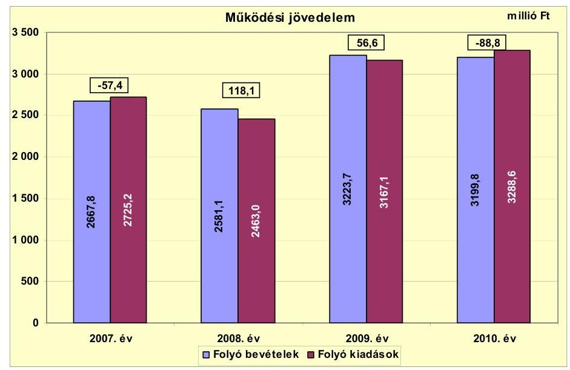

A folyó költségvetés hiánya a 2007. évben 57,4 millió Ft (2,1\%), a 2010. évben 88,8 millió Ft ( $2,7 \%$ ) volt. A folyó bevételek a 2008. évben 118,1 millió Ft-tal, a 2009. évben 56,6 millió Ft-tal meghaladták a folyó kiadásokat. ${ }^{13}$ A múködési jövedelem 2008. évi 175,5 millió Ft-os növekedésének oka, hogy a folyó kiadások 9,6\%-kos csökkenése mellett a folyó bevételek csak 3,2\%-kal csökkentek. A folyó költségvetési egyenleg javulását elsősorban a feladatátszervezések, a kamatkiadásokat meghaladó kamatbevételek, valamint a helyi adóbevételek növekedése okozta. A 2009. évre a múködési jövedelem 61,5 millió Ft-tal csökkent, mivel a folyó bevételek növekedése ( $24,8 \%$ ) elmaradt a folyó kiadások növekedésétől ( $28,6 \%$ ). A kamatbevételek és kiadások egyenlegének további emelkedése ellenére a folyó költségvetési pozíció romlott a 2009. évben. A 2008-ról 2009-re a költségvetési támogatások, az átengedett szja-bevételek, valamint a helyi adóbevételek csökkentek, míg a dologi kiadások és a szociális támogatások növekedtek. A múködési jövedelem a 2010. évben volt a legalacsonyabb, 88,8 millió Ft-tal haladták meg a folyó kiadások a folyó bevételeket. A kötvénykibocsátásból származó bevétel felhasználásával párhuzamosan a 2010. évre 106,5 millió Ft-tal csökkent a kamatbevételek és kiadások egyenlege az előző évhez képest. A 2009-ről 2010-re a dologi kiadások és a szociális támogatások emelkedtek, míg a költségvetési támogatások, az átengedett szjabevételek, valamint a helyi adóbevételek csökkentek.

Az Önkormányzatnak a 2007-2010. években összesen 28,5 millió Ft pozitív múködési jövedelme képződött. A 2008. és a 2009. évi pozitív előjelű folyó költségvetési egyenleg ellenére az Önkormányzat minden évben folyószámlahitel felvételére kényszerült, egyrészt az átmeneti likviditási problémák kezelése, másrészt fejlesztési kiadásai finanszírozása miatt.

[^0]
[^0]:    ${ }^{13}$ A folyó költségvetés hiánya Ivóvízminőség-javító Társulás nélkül a 2007. évben 70,5 millió Ft, a 2010. évben 79,7 millió Ft, a többlet a 2008. évben 121,3 millió Ft, a 2009. évben 45,8 millió Ft volt. A folyó költségvetés egyenlege a vizsgált időszakban összességében 16,9 millió Ft többletet mutatott.

---

Az Önkormányzat a 2007-2011. években a költségvetési rendeletében tervezett múködési forráshiány csökkentésére ÖNHIKI támogatást igényelt. Az Önkormányzat részére a 2007. évben 148,4 millió Ft, a 2008. évben 29,5 millió Ft, a 2011. év II. félévben - az I. és II. ütemre benyújtott pályázatra együttesen 58,4 millió Ft vissza nem térítendő támogatás került jóváhagyásra. A 2007. és a 2008. évi támogatásokkal a költségvetési rendeletekben tervezett múködési hitel felvételét csökkentették. A 2011. évben megítélt támogatás a kötelező feladatellátáshoz kapcsolódó múködési forráshiány csökkentésére használható. A támogatást közüzemi és/vagy élelmiszerbeszállítói számlák kiegyenlítésére, személyi juttatások, segélyek fizetésére fordították. Az Önkormányzat 2009. és 2010. évi ÖNHIKI pályázata nem részesült támogatásban. A múködésképtelen önkormányzatok egyéb támogatása jogcímen a 2009. évben 10,0 millió Ft, a 2010. évben 15,0 millió Ft - célhoz nem kötött - támogatást hagytak jóvá az Önkormányzat részére.

A múködőképesség megőrzését szolgáló támogatásokkal csökkentve a folyó bevételeket a folyó költségvetés hiánya a 2007. évben 205,8 millió Ft (7,6\%), a 2010. évben 103,8 millió Ft (3,2\%), a többlet a 2008. évben 88,6 millió Ft $(3,4 \%)$, a 2009. évben 46,6 millió Ft ( $1,4 \%$ ) volt.

A nettó múködési jövedelem alakulását a 2007-2010. években a következő ábra szemlélteti:
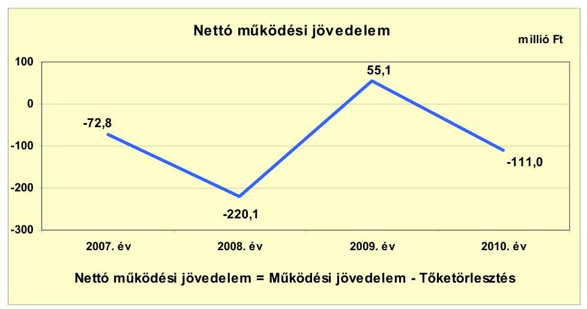

Az évenkénti tőketörlesztéssel csökkentett múködési jövedelem (nettó múködési jövedelem, pénzügyi kapacitás) a vizsgált időszakban - a 2009. évet kivéve negatív értéket mutatott. Az Önkormányzat tőketörlesztési kötelezettsége a 2007. évben 15,4 millió Ft, a 2008. évben 338,2 millió Ft, a 2009. évben 1,5 millió Ft, a 2010. évben 22,2 millió Ft volt. A múködési jövedelem 175,5 millió Ft-os növekedése mellett a nettó múködési jövedelem - a kötvénykibocsátás bevételéből hitelkiváltásra történő felhasználás miatt - a 2008. évre lecsökkent a 2007. évi -72,8 millió Ft-ról -220,1 millió Ft-ra. A 2009. évben a múködési jövedelem (56,6 millió Ft) fedezetet nyújtott az adott évi tőketörlesztési kötelezettségekre. A 2010. évben a negatív múködési jövedelmet (-88,8 millió Ft) tovább rontotta a tőketörlesztési kötelezettségek teljesítése, aminek hatására a nettó múködési jövedelem -111,0 millió Ft-ra csökkent.

---

A múködőképesség megőrzését szolgáló támogatásokkal csökkentve a folyó bevételeket a nettó múködési jövedelem a 2007. évben -221,2 millió Ft, a 2008. évben -249,6 millió Ft, a 2009. évben 45,1 millió Ft, a 2010. évben -126,0 millió Ft volt.

A 2007-2010. években az Önkormányzat felhalmozási költségvetésének egyenlege a 2007. évben 7,9 millió Ft, majd a 2008-2010. években folyamatosan negatív összegű volt.

A felhalmozási költségvetés egyenlegének alakulását évről évre a következő ábra szemlélteti:
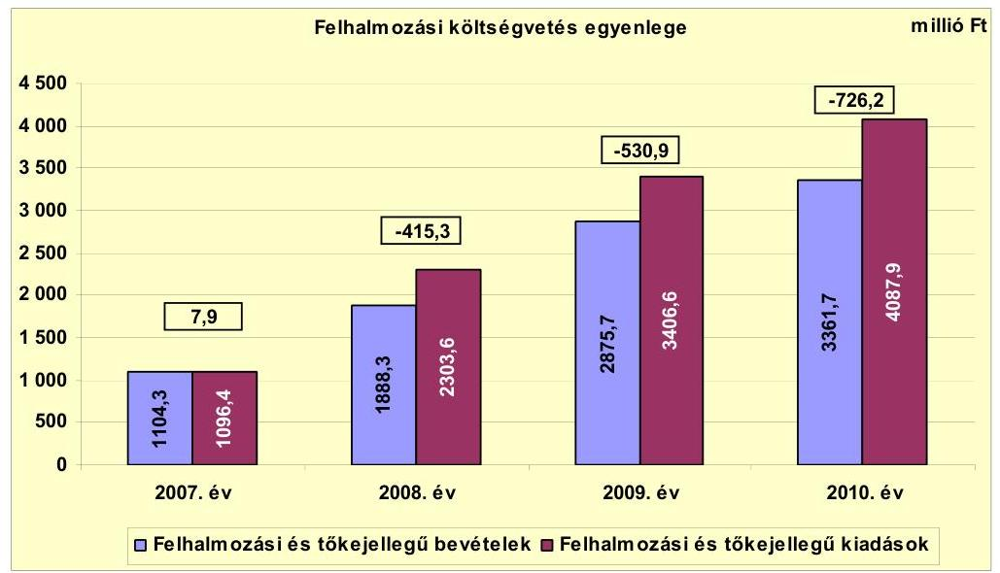

A felhalmozási forráshiánynak a felhalmozási és tőke jellegű kiadásokhoz viszonyított aránya 2008-ban 18,0\% (415,3 millió Ft), 2009-ben 15,6\% (530,9 millió Ft), 2010-ben 17,8\% (726,2 millió Ft) volt. ${ }^{14}$ Az Önkormányzat a 2007-2010. években a beruházások és a felújítások önrészét saját tőkebevételéből nem tudta finanszírozni, mivel a tárgyi eszközök, önkormányzati lakások és egyéb helyiségek értékesítéséből a 2007. évben 8,8 millió Ft, a 2008. évben 9,6 millió Ft, a 2009. ében 10,6 millió Ft, a 2010. évben 12,0 millió Ft bevételt ért el. Az egyre növekvő felhalmozási kiadások finanszírozására, ezért külső források bevonására volt szükség.

A 2007-2010. években képződött összesen 1664,5 millió Ft felhalmozási forráshiányt a 2007-ben folyósított 358,0 millió Ft fejlesztési célú hitelek, valamint a 2008. évben kibocsátott kötvényből származó 1306,5 millió Ft fejlesztési célra felhasznált bevétel fedezett. A felhalmozási költségvetés negatív egyenlegének keletkezéséhez hozzájárult az EU-s projektek támogatásának megelőlegezése, saját forrásának biztosítása belső finanszírozás útján.

[^0]
[^0]:    ${ }^{14}$ Az Ivóvízminőség-javító Társulás nélkül a felhalmozási forráshiány a 2007. évben 143,4 millió Ft, a 2008. évben 438,6 millió Ft, a 2009. évben 444,9 millió Ft, a 2010. évben 626,9 millió Ft, összesen 1653,8 millió Ft volt.

---

Az Önkormányzat évenkénti teljes finanszírozási igénye ${ }^{15}$ a CLF módszer szerint 2007-ben 64,9 millió Ft, 2008-ban 635,4 millió Ft, 2009-ben 475,8 millió Ft, 2010-ben 926,0 millió Ft, összesen 2102,1 millió Ft volt, amelynek finanszírozásához finanszírozási célú bevételeket (fejlesztési hitelt, folyószámlahitelt, kötvénykibocsátásból származó bevételt) vettek igénybe.

Az Önkormányzatnál a finanszírozási múveletek egyenlegének alakulását a 2007-2010. években a következő ábra szemlélteti:
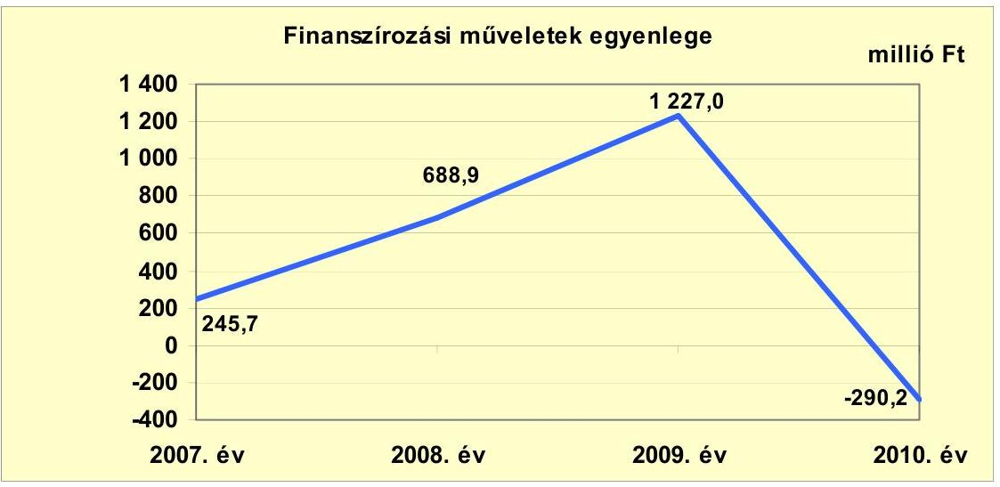

A 2007-ben fejlesztési célú hitelek és munkabérhitel felvétele, a folyószámlahitel állomány növekedése és fejlesztési célú hitelek törlesztése eredményezte a 245,7 millió Ft egyenleget. A 2008. évben a folyószámlahitel csökkenése mellett elsősorban a kötvény kibocsátásából származó 2400,0 millió Ft bevétel és annak hiteltörlesztésre, értékpapír vásárlásra történő felhasználása, valamint fejlesztési célú hitelfelvétel okozta a finanszírozási műveletek egyenlegének növekedését. A finanszírozási műveletek egyenlegének növekedését a 2009. évben az értékpapírok értékesítése, s a kötvényből származó még fel nem használt bevétel betétbe történő elhelyezése eredményezte. A 2010. évben a folyószámlahitel állomány növekedése és értékpapírok vásárlása következtében a finanszírozási műveletek egyenlege negatív lett. A finanszírozási célú műveleteket a vizsgált időszakban a jelentés 2. számú mellékletének 4.1-4.8 pontjai részletezik.

Az Önkormányzat 2007-2010. évi zárszámadási rendeleteiben meghatározta a felhalmozási, illetve múködési bevételek és kiadások főösszegét ${ }^{16}$, amelyet a jelentés 1. számú melléklete szemléltet. A zárszámadási rendeletekben a 2007. évben 212,9 millió Ft többletet, a 2008. évben 20,2 millió Ft, a 2009. évben

[^0]
[^0]:    ${ }^{15}$ a nettó múködési jövedelem és a felhalmozási költségvetés egyenlegeinek összege
    ${ }^{16}$ Nincs kötelező előírás a múködési és fejlesztési többlet, hiány megállapításának módjára.

---

244,3 millió Ft, a 2010. évben 75,7 millió Ft hiányt mutatott ki az Önkormányzat. ${ }^{17}$

Az Önkormányzat kamatbevételeinek és kamatkiadásainak alakulását a következő ábra mutatja:
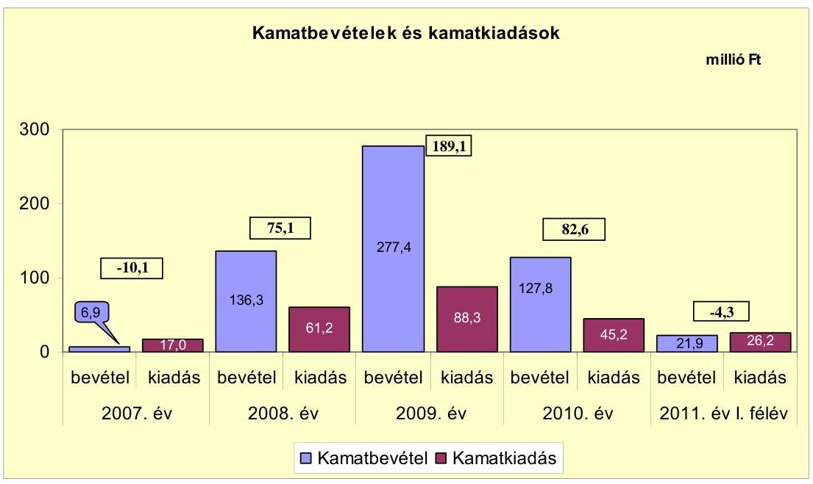

A kamatbevételek 2007-ről 2008-re tapasztalt közel 20-szoros, majd a 2009. évi további emelkedését a 2008. március 20-án kibocsátott kötvényből származó bevétel kamata eredményezte. A kamatbevételek több mint felére csökkentek a 2010. évben, mely a kötvénykibocsátásból származó bevétel felhasználásával függött össze. A kamatkiadások összege a 2008-ra 3,6-szeresére, 2009-re további 44,2\%-kal növekedett az előző évhez képest, szintén a 2008. évi kötvénykibocsátás miatt. Az alapkamatok csökkenésének a hatására a kamatkiadások a 2010. évben közel a felére - 88,3 millió Ft-ról 45,2 millió Ft-ra - visszaestek. A kötvény kibocsátását követően - a 2011. év I. féléve kivételével - a kamatbevételek meghaladták a kamatkiadásokat. A keletkező bevételi többlet a 2008. évben 75,1 millió Ft, a 2009. évben 189,1 millió Ft, a 2010. évben 82,6 millió Ft volt.

# 2.2. Az Önkormányzat bevételeinek változása 

Az Önkormányzat folyó bevételei a 2007. évi 2667,8 millió Ft-ról a 2010. évre 3199,8 millió Ft-ra, 19,9\%-kal növekedtek, a 2011. év I. félévében teljesült folyó bevételek összege 1126,1 millió Ft volt. Az Önkormányzat 2007-2011. I. féléve között realizált főbb folyó bevételi jogcímeinek számszaki adatait a következő táblázat részletezi és grafikon mutatja be:

[^0]
[^0]:    ${ }^{17}$ A zárszámadási rendeletekben és a CLF táblában kimutatott költségvetési egyenlegek közötti eltérést a pénzmaradvány igénybevétel okozta. A 2010. évi zárszámadási rendeletben a hiány összege a belső finanszírozás bevételével (pénzmaradvány igénybevétellel) együtt és anélkül is bemutatásra került.

---

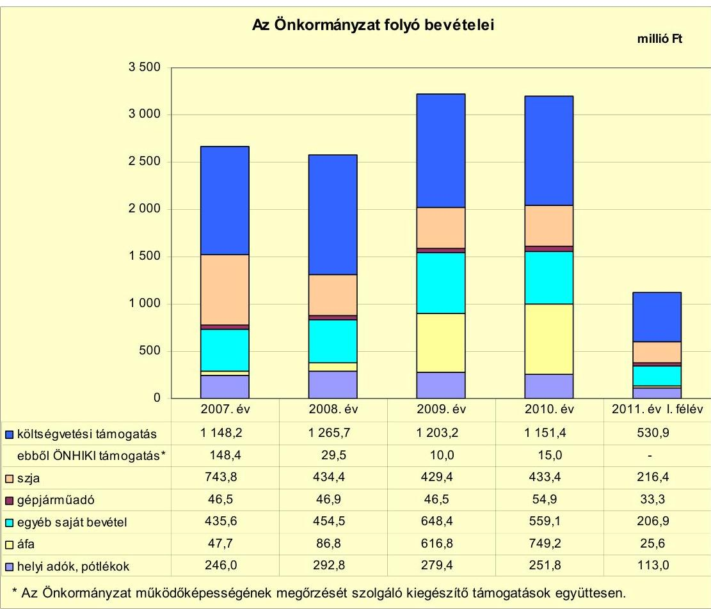

Az Önkormányzat múködőképességének megőrzését szolgáló kiegészítő támogatások együttesen.

Az Önkormányzat múködési célú költségvetési támogatása és az átengedett szja-bevétel együttes összege a 2010. évben 1584,8 millió Ft volt, ami a 2007-2009. évek átlagához képest 156,8 millió Ft-os ( $9 \%$-os) csökkenést jelentett. A 2008. évben a támogatások és az szja-bevételek összege 191,9 millió Fttal a 2009. évben 67,5 millió Ft-tal, a 2010. évben további 47,8 millió Ft-tal csökkent az előző évekhez képest. A költségvetési támogatás összegét csökkentette a 2008. évben, hogy a szociális és gyermekjóléti feladatokat ellátó intézmény 2008. január 1-jétől a Kistérségi társulás fenntartásában múködik. A 2008. évi csökkenéshez hozzájárult, hogy a 2007. évben 148,4 millió Ft, míg a 2008. évben 29,5 millió Ft ÖNHIKI támogatást kapott az Önkormányzat, míg a 2009. évben 10,0 millió Ft, a 2010. évben 15,0 millió Ft múködésképtelen önkormányzatok egyéb támogatását.

A helyi adókból és pótlékokból származó bevételek összege - a gazdasági válság hatására - a 2007-2009. évek átlagához (272,7 millió Ft) viszonyítva 2010-re 20,9 millió Ft-tal ( $7,7 \%$ ) csökkent. A 2008. évi kiugró értéket egy gazdasági társaság iparűzési adó feltöltési kötelezettségének teljesítése okozta. Az Önkormányzat a vizsgált időszakban három helyi adónemet, a helyi iparúzési adót, a magánszemélyek kommunális adóját, és az idegenforgalmi adót alkalmazta. A helyi adómértékeket a vizsgált időszakban nem módosították, új adónemet nem vezettek be. A 2007-2011. év I. féléve között befolyt összes helyi adóbevétel $92,3 \%$-a az iparúzési adóból származott. Az idegenforgalmi adó és a magánszemélyek kommunális adójának mértéke nem érte el a helyi adóról szóló 1990. évi C. törvényben elírt maximumot.

---

A helyi iparűzési adó mértéke $2 \%$, az idegenforgalmi adó $50 \mathrm{Ft} /$ vendégéjszaka, a magánszemélyek kommunális adója $5000 \mathrm{Ft} /$ év volt a vizsgált időszakban.

Az Önkormányzat egyéb saját bevételei ${ }^{18}$ a 2007-2009. évek 512,8 millió Ft-os átlagához képest a 2010. évre 559,1 millió Ft-ra, 9\%-kal növekedtek. A 2007. évhez képest 2008-ban a bevételek csupán 18,9 millió Ft-tal $(4,3 \%)$ növekedtek, elsősorban az intézményi múködési bevételek 116,8 millió Ft-os csökkenésének és a kamatbevételek 129,4 millió Ft-os növekedésének a hatására. Az intézményi múködési bevételek a közétkeztetés kiszervezése, a szociális és gyermekjóléti feladatokat ellátó intézmény Kistérségi társulás részére történő átadása miatt csökkentek. Az egyéb saját bevételek 2009. évi 193,9 millió Ft-os (42,7\%) növekedését elsősorban a kamatbevételek 141,1 millió Ft-os, a támogatásértékú múködési bevételek 20,3 millió Ft-os, az államháztartáson kívülről átvett pénzeszközök 7,6 millió Ft-os növekedése okozta. A 2010. évben a kamatbevételek 149,6 millió Ft-os csökkenése, valamint a támogatásértékú múködési bevételek ${ }^{19} 84,3$ millió Ft-os növekedése következtében az egyéb saját bevételek 89,3 millió Ft-tal (13,8\%) csökkentek.

Az Önkormányzatnak a Vízmú Kft.-től a 2007-2010. években összesen 38,0 millió Ft, a Városgazdálkodási Kft.-től a 2007. évben 10,0 millió Ft osztalékbevétele keletkezett.

Az Önkormányzat felhalmozási bevételei a vizsgált időszakban a következők voltak:

| Megnevezés | 2007. év | 2008. év | 2009. év | 2010. év | 2011. év I.   félév |
| :-- | --: | --: | --: | --: | --: |
| Tárgyi eszköz értékesítés | 4,6 | 4,4 | 6,8 | 12,0 | 76,4 |
| Egyéb saját tőkebevétel | 36,0 | 223,2 | 547,0 | 605,2 | 4,0 |
| Államháztartáson belülről   kapott támogatás | 722,5 | 1532,4 | 2306,8 | 2726,0 | 204,3 |
| EU-tól és külföldről kapott   támogatások | 124,4 | 0,0 | 0,0 | 0,0 | 0,0 |
| Államháztartáson kívülről   kapott támogatás | 216,8 | 128,3 | 15,1 | 18,5 | 10,6 |
| Összes felhalmozási bevétel | 1104,3 | 1888,3 | 2875,7 | 3361,7 | 295,3 |

A felhalmozási célú bevételek a 2007. évi 1104,3 millió Ft-ról a 2010. évre háromszorosára növekedtek. Az egyéb saját tőkebevételek - a visszaigényelt felhalmozási célú áfa ${ }^{20}$ miatt - a vizsgált időszakban 36,0 millió Ft-ról 605,2 millió Ft-ra növekedtek. A 2007-2010. években visszaigényelt áfa

[^0]
[^0]:    ${ }^{18}$ Az egyéb saját bevételek részét képezték az intézményi múködési bevételek, a hozamés kamatbevételek, üzemeltetési díjak, a vagyoni értékú jog értékesítése, az államháztartáson belülről és kívülről átvett pénzeszközök, előző évi pénzmaradvány átvétele.
    ${ }^{19}$ A támogatásértékú múködési bevételeken belül a TÁMOP által támogatott projektek bevételei voltak a meghatározóak.
    ${ }^{20}$ A felhalmozási célú áfa összege a 2007. évben 0,5 millió Ft, a 2008. évben 193,7 millió Ft, 2009. évben 538,1 millió Ft, a 2010. évben 596,9 millió Ft volt.

---

97,2\%-a az Ivóvízminőség-javító Társulás beruházásához kapcsolódott. A 2011. év I. félévében az Önkormányzat igényelt vissza 76,4 millió Ft áfá-t a strand fejlesztése után, amit a 2011. évi I. féléves beszámoló 80 . ürlapján már a tárgyi eszközök értékesítése soron kellett kimutatni. Az államháztartáson belülről kapott felhalmozási célú támogatások a 2007. évhez képest a 2010. évre közel négyszeresére, 2726,7 millió Ft-ra növekedtek, az ivóvízminőség-javító beruházás támogatása miatt. A vizsgált időszakban kapott 7287,7 millió Ft támogatásból az Önkormányzat beruházásaihoz 1685,8 millió Ft, a többi az ivóvízmi-nőség-javító beruházáshoz kapcsolódott. Az Önkormányzat támogatásai közül meghatározó volt a szennyvízcsatorna beruházáshoz kapcsolódó címzett támogatás ( 719,0 millió Ft), az autóbuszmegállók fejlesztéséhez ( 77,1 millió Ft), a bel-, és csapadékvíz elvezető rendszerek rekonstrukciójához ( 437,9 millió Ft) EUs támogatás. Az államháztartáson kívülről átvett pénzeszközök összegét jelentősen befolyásolta a Kisújszállási Csatornaberuházó Víziközmű Társulattól a szennyvízcsatorna beruházáshoz átvett pénz, mely a 2007. évben 199,4 millió Ft-ot, a 2008. évben 102,9 millió Ft-ot jelentett.

# 2.3. Az Önkormányzat múködési és a felhalmozási célú kiadásainak változása 

Az Önkormányzat folyó kiadásai főbb jogcímek szerinti bontásban a következők voltak:

| Megnevezés | 2007. év | 2008. év | 2009. év | 2010. év | 2011. év I.   félév |
| :-- | --: | --: | --: | --: | --: |
| Folyó kiadások | 2725,2 | 2463,0 | 3167,1 | 3288,6 | 1237,1 |
| Müködési kiadások (kamatkiadás nélkül) | 2313,5 | 2057,6 | 2674,9 | 2818,5 | 1041,2 |
| Államháztartáson belülre átadott   pénzeszközök | 2,4 | 41,7 | 50,8 | 44,3 | 18,9 |
| Transzferkiadások | 378,2 | 295,4 | 331,5 | 378,6 | 149,4 |
| -ebből: vállalkozásoknak | 30,3 | 27,1 | 5,0 | 4,9 | 2,4 |
| EU-nak, illetve külföldre | 0,0 | 0,0 | 0,0 | 0,0 | 0,0 |
| magánszemélyeknek | 310,0 | 230,3 | 288,1 | 331,6 | 132,6 |
| nonprofit szervezeteknek | 37,9 | 38,0 | 38,4 | 42,1 | 14,4 |
| Kamatkiadások | 17,0 | 61,2 | 88,3 | 45,2 | 26,2 |
| Előző évi pénzmaradvány átadás | 14,1 | 7,1 | 21,6 | 2,0 | 1,4 |

Az Önkormányzat folyó kiadásai a 2010. évben a 2007-2009. évek átlagához képest ( 2785,1 millió Ft) 503,5 millió Ft-tal növekedtek. A folyó kiadások alakulását elsősorban a múködési kiadások, valamint a transzferkiadásokon belül a magánszemélyeknek átadott pénzeszközök befolyásolták. A magánszemélyeknek 2007. évben átadott pénzeszközökön belül 108,0 millió Ft-ot tett ki a 2006. évi belvíz miatti lakossági kárenyhítés. A 2007. évben ezt az összeget figyelmen kívül hagyva a szociális támogatások és az ellátottak pénzbeni juttatásai miatt a magánszemélyeknek átadott pénzeszközök 202,0 millió Ft-ról több mint másfélszeresére, 331,6 millió Ft-ra növekedtek a vizsgált időszakban.

Az egyes kiemelt múködési előirányzatok teljesítési adatát a következő táblázat mutatja be:

---

|  |  |  |  |  | millió Ft |
| :-- | --: | --: | --: | --: | --: |
| Megnevezés | 2007. év | 2008. év | 2009. év | 2010. év | 2011. év I.   félév |
| Személyi juttatások | 1203,9 | 1044,8 | 1001,4 | 1034,4 | 502,9 |
| Munkaadót terhelő járulékok | 376,9 | 329,8 | 302,4 | 279,0 | 129,3 |
| Dologi kiadások | 674,3 | 628,0 | 1254,9 | 1441,7 | 396,3 |
| Egyéb folyó kiadások | 58,4 | 55,0 | 116,2 | 63,4 | 12,7 |

A folyó kiadásokon belül a személyi juttatások összege a 2010. évre 49,0 millió Ft-tal (4,4\%) csökkent a 2007-2009. évek átlagához viszonyítva. E csökkenést a 2008. évben a közétkeztetés kiszervezése, a szociális és gyermekjóléti feladatok Kistérségi társulás részére történő átadása, a 2009-ben a Költségvetési Szolgáltató Iroda megszüntetése okozta.

Az Önkormányzat dologi kiadásai a 2010. évben a 2007-2009. évek 852,4 millió Ft-os átlagához képest 589,3 millió Ft-tal növekedtek. A növekedést a fordított áfa-elszámolás miatti áfa növekedése eredményezte. ${ }^{21}$ Fordított áfa nélkül számítva a feladatkiszervezések következtében a dologi kiadások a 2008. évben 14,4\%-kal (97,6 millió Ft-tal) csökkentek, majd a 2009. évben 18,7\%-kal (107,8 millió Ft), a 2010. évben 9,6\%-kal (65,7 millió Ft) növekedtek. A 2009. évben a dologi kiadásokon belül a bérleti díjak közel háromszorosára (30,7 millió Ft-tal) emelkedtek, melyet a „Szemünk Fénye Program" keretében megvalósuló világítás-, és fűtéskorszerűsítéshez kapcsolódóan fizetett bérleti díjak okoztak. Továbbá a 2009. évben több mint háromszorosára, 30,0 millió Fttal emelkedtek a pénzügyi szolgáltatásokra fordított kiadások. A dologi kiadások 2010. évi növekedésében meghatározó volt az egyéb üzemeltetési, fenntartási kiadások 49,7 millió Ft-os (65,2\%) növekedése, mely elsősorban a TÁMOP projektekhez kapcsolódott. Az Önkormányzatnál 2011. év I. félévében az előző évhez viszonyítva a személyi juttatások 48,6\%-ra, a járulékok 46,3\%-ra, a dologi kiadások 27,3\%-ra teljesültek.

A folyó és felhalmozási kiadások alakulását, a teljesített kiadások múködési és felhalmozási felhasználásának arányait a következő oszlopdiagram mutatja be:

[^0]
[^0]:    ${ }^{21}$ A fordított áfa összege 2008-ban 51,3 millió Ft, 2009-ben 570,1 millió Ft, 2010-ben 691,5 millió Ft, a 2011. év I. félévében 50,1 millió Ft volt, aminek jelentős része az ivó-vízminőség-javító beruházáshoz kapcsolódott. Az Önkormányzatot érintő fordított áfa 2009-ben 28,3 millió Ft, 2010-ben 177,3 millió Ft, 2011. év I. félévében 50,1 millió Ft volt.

---

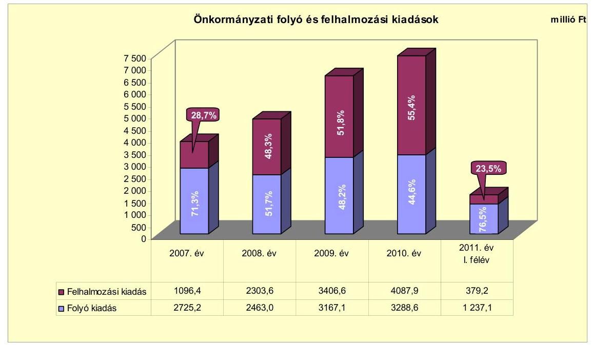

A felhalmozási kiadások aránya a 2007-2010. évek között folyamatosan növekedett 28,7\%-ról 55,4\%-ra. A 2007. évről a 2010. évre a felhalmozási kiadások összege folyamatosan növekedett. A folyó kiadások összegének 2009. és 2010. évi növekedése ellenére az összes kiadáson belüli aránya tovább csökkent, melyet az ivóvízminőség-javító beruházás miatt a felhalmozási kiadások növekedése okozott. A 2010. évben ivóvízminőség-javító beruházás kiadásain felül az Önkormányzat felhalmozási kiadásai is jelentősen, az előző évhez képest közel duplájára - 661,9 millió Ft-ról 1273,1 millió Ft-ra - növekedtek. A felhalmozási kiadások összes kiadásokon belüli aránya 2011. év I. félévben az előző évhez képest jelentősen, 23,5\%-ra csökkent, mivel az Ivóvízminőség-javító Társulásnak az I. félévig még nem merült fel beruházási kiadása.

Az Ivóvízminőség-javító Társulást 38 önkormányzat alapította. Célja az ivóvíz arzén tartalmának csökkentése beruházás közös megvalósítása. Felhalmozási kiadásai a 2007. évben 14,7\%-os (161,7 millió Ft), a 2008. évben 56,6\%-os (1304,8 millió Ft), a 2009. évben 80,6\%-os (2744,7 millió Ft), a 2010. évben 68,9\%-os (2814,8 millió Ft) részarányt képviseltek az Önkormányzat felhalmozási kiadásaiból.

Az Ivóvízminőség-javító Társulás nélküli folyó és felhalmozási kiadások alakulását, a teljesített kiadások múködési és felhalmozási felhasználásának arányait a következő oszlopdiagram mutatja be:

---

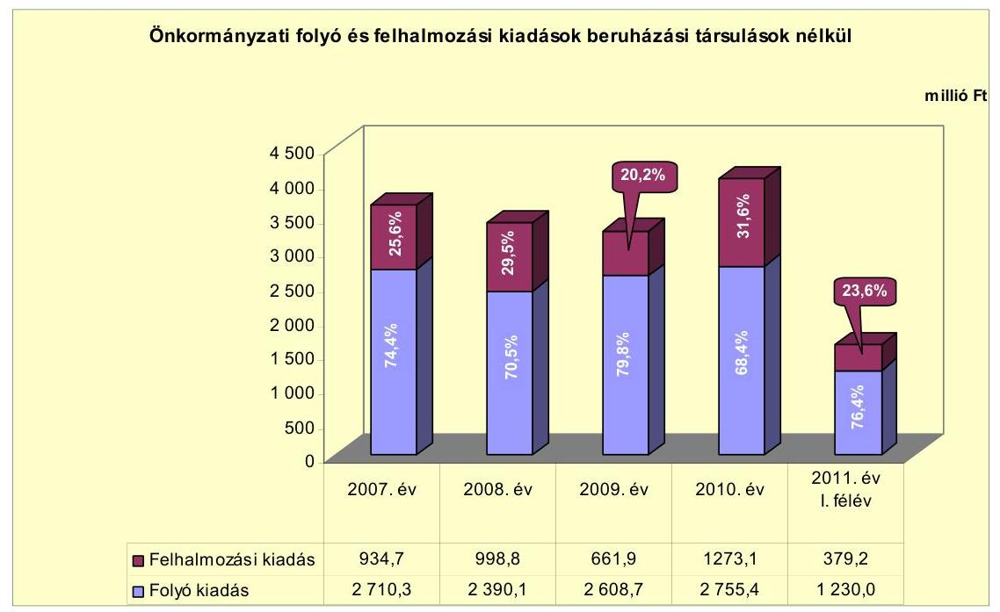

A folyó és felhalmozási kiadások arányai a 2007-2010. évek között változóan alakultak. A felhalmozási kiadások arányának 2008. és 2010. évi növekedését a sikeres pályázatok révén megkezdett fejlesztések, a kötvénykibocsátásból származó bevétel saját forrásként és támogatás-megelőlegezésként történő felhasználása eredményezte. A felhalmozási kiadások 2011. év I. félévi aránya az előző évhez képest csökkent, 23,6\% volt.

A felhalmozási kiadások aránya és összege is a 2009. évben volt a legalacsonyabb, mivel a 2008-ban befejeződött a szennyvízcsatorna hálózat építése és a szennyvíztisztító-telep rekonstrukciója, melynek teljesített kiadása a 2007-ben 705,2 millió Ft, 2008-ban 751,0 millió Ft volt. A 2009. évben utak, járdák felújítására 224,4 millió Ft-ot, autóbuszmegállók fejlesztésére 93,7 millió Ft, strandfürdő fejlesztésére 70,8 millió Ft-ot fordítottak. Az Ivóvízminőség-javító Társulás részére teljesített felhalmozási célú pénzeszközátadás ( 90,4 millió Ft) a beruházáshoz kapcsolódó EU Önerő Alap tovább utalása volt. A 2010. évi felhalmozási kiadások növekedését az EU-s támogatással megvalósuló összesen 601,2 millió Ft beruházási kiadás (belvízöblözet rekonstrukciója, strandfürdő fejlesztése, múzeum fejlesztése stb.), továbbá bel-, és külterületi utak felújítása ( 370,1 millió Ft), játszóterek rekonstrukciója ( 46,9 millió Ft), valamint az ivóvízminőség-javító beruházáshoz kapcsolódó EU Önerő Alap ( 84,1 millió Ft) továbbadása okozta.

Az Önkormányzat által a 2007-2010. években megvalósított, 2010. december 31-ig befejezett 10 millió Ft feletti fejlesztéseinek száma 26 db, amelynek teljes költsége 2787,1 millió Ft volt. Ebből felújításokra 822,5 millió Ft (29,5\%), a beruházásokra 1964,6 millió Ft (70,5\%) került felhasználásra. A fejlesztések tényadatai (2787,1 millió Ft) 441,7 millió Ft-tal alulmúlták a tervadatokat ( 3228,8 millió Ft), amely azt jelentette, hogy a fejlesztések az eredeti tervek 86,3\%-ában teljesültek. A fejlesztési kiadásokból 625,5 millió Ft-ot ( $22,4 \%$ ) jelentett a saját bevétel, 373,1 millió Ft-ot (13,4\%) a hitel, 722,9 millió Ft-ot ( $25,9 \%$ ) a kötvényből származó bevétel, 110,7 millió Ftot (4\%) az EU-s támogatás, míg 954,9 millió Ft-ot (34,3\%) a hazai támogatás. A 2007. és a 2010. évek között befejezett felújítások 96,\%-ban (789,9 millió Ft),

---

míg a beruházások 57,5\%-ban (1130 millió Ft) az elhasználódott eszközök pótlását szolgálták.

A 2007. és a 2010. évek között befejezett 10 millió Ft feletti fejlesztések - a három kiemeltet kivéve - út- és járdafelújításra, a Strandfürdő fejlesztésére, a Városháza felújítására, önkormányzati épületek kártalanítására, az óvoda és az orvosi rendelő akadálymentesítésére, térfigyelő rendszer kiépítésére, múzeumok iskolabarát fejlesztésére, ifjúsági szállás kialakítására, valamint közoktatási intézmények infrastrukturális fejlesztésére irányultak. A 10 millió Ft alatti fejlesztésekből a közvilágítás bővítését, fogorvosi rendelő kialakítását, önkormányzati épületek felújítását, számítástechnikai eszközbeszerzést, villamosenergia-ellátó rendszerek korszerűsítését, önkormányzati intézmények nyílászáró rendszerének cseréjét, a központi orvosi rendelő átalakítását, valamint az út- és járdafelújításokat végezték el.

A folyamatban lévő fejlesztések (6 db) 2010. év december 31-ig teljesített 874,9 millió Ft bekerülési költségéből 26,7 millió Ft-ot (3,1\%) jelentett a saját bevétel, 267,4 millió Ft-ot (30,1\%) a kötvényből származó bevétel, 512,1 millió Ft-ot (58,5\%) az EU-s támogatás, míg 68,7 millió Ft-ot (7,9\%) a hazai támogatás. Az Önkormányzat a folyamatban lévő fejlesztéseire hitelt nem vett fel. A tényleges bekerülési költségből (874,9 millió Ft) az elavult eszközök pótlására 615,3 millió Ft-ot (70,3\%) fordítottak.

Az Önkormányzat a folyamatban lévő fejlesztési feladataihoz kapcsolódó, a 2010. évet követő kötelezettségvállalásainak összege 2977,2 millió Ft. Ennek forrásaként az Önkormányzat 32,4 millió Ft saját bevételt (1,1\%), 764,3 millió Ft (25,7\%) kötvényből származó bevétel, 1834,4 millió Ft (61,6\%) EU-s támogatást, míg 346,1 millió Ft (11,6\%) hazai támogatást tervez felhasználni. Az Önkormányzat a folyamatban lévő fejlesztési feladataira hitelt nem vett fel. A várható teljes bekerülési költség (3852,1 millió Ft) 60,7\%-át (2339,6 millió Ft) az elhasználódott eszközök pótlására tervezték fordítani. A 10 millió Ft alatti fejlesztések között megjelentek az önkormányzati épületek akadálymentesítésének, a megújuló energia alapú térségfejlesztésnek, az egészségügyi szolgáltatások fejlesztésének, az új óvoda építésének, valamint a szociális létesítmények fejlesztésének költségei.

Kisújszállás Város Önkormányzata a régió ivóvízminőségének javítása érdekében önkormányzati társulást hozott létre. A társulás neve: Önkormányzati Társulás az Észak-Alföldi Régió Ivóvízminőségének Javításáért. Székhelye Kisújszállás Város Polgármesteri Hivatala lett és a társulási megállapodást 2004. október 8-án írták alá. A Környezetvédelmi és Vízügyi Minisztérium Kohéziós Alap Közremúködő szervezetével 2005. november 10-én írták alá a projektszerződést. A Társulást alkotó 38 település célkitűzései az ivóvizet szennyező anyagok koncentrációjának a csökkentése, a vízellátó rendszerek fizikai veszteségének csökkentése, az elosztóhálózat múködési költségeinek racionalizálása, a vízkezelő telepek korszerűsítése, valamint hálózattisztítás és hálózatcsere voltak. A Társulás ellátandó alaptevékenységei között emelhető ki a térségi ivóvíz-minőség javítása és ennek koordinálása, az ivóvíz-minőség javítása érdekében a szükséges tanulmányok elkészítése, pályázatok benyújtása, valamint projektek menedzselése, a lebonyolításban való részvétel. A pénzügyi, gazdasági feladatokat Kisújszállás Város Önkormányzat Polgármesteri Hivatala látja el. A beruházás összköltsége 6964,7 millió Ft volt. Ennek forrásaként 264,7 millió Ft (3,8\%) saját bevételt,

---

5655,3 millió Ft (81,2\%) EU-s támogatást, míg 1044,7 millió Ft (15,0\%) hazai támogatást nevezett meg a Társulás.

Az Önkormányzat beadott, elbírálás alatti pályázati forrásból három projektet tervez megvalósítani, melyeknek összköltsége 1783,0 millió Ft. A 2010. év december 31-e után felmerült fejlesztési költség 1771,7 millió Ft, amelynek forrása 104,6 millió Ft (5,9\%) saját bevétel, 249,6 millió Ft (14,1\%) hitel, 71,4 millió Ft (4\%) kötvényből származó bevétel, valamint 1346,1 millió Ft (76\%) EU-s támogatás. A 2010. év december 31-ig teljesített fejlesztési kiadás 11,3 millió Ft volt.

A 2007-2010. évek között befejezett és folyamatban lévő fejlesztések 2010. december 31-ig felmerült kiadása 3673,3 millió Ft volt, míg a 2010. év után tervezett fejlesztési kiadások összege 4748,9 millió Ft. (3/a., 3/b., 3/c., 3/d., mellékletek)

A 3673,3 millió Ft tényleges bekerülési költség forrása 653,0 millió Ft (17,8\%) saját bevétel, 373,1 millió Ft (10,1\%) hitel, 1000,8 millió Ft (27,2\%) kötvényből származó bevétel, 622,8 millió Ft (17,0\%) EU-s támogatás, míg 1023,6 millió Ft $(27,9 \%)$ hazai támogatás volt.

A 2010. évet követő évekre tervezett 4748,9 millió Ft fejlesztési kiadásból várhatóan 137,0 millió Ft-ot (2,9\%) saját bevételből, 249,6 millió Ft-ot (5,2\%) hitelből, 835,7 millió Ft-ot (17,6\%) kötvényből származó bevételből, 3180,5 millió Ft-ot (67,0\%) EU-s támogatásból, míg 346,1 millió Ft-ot (7,3\%) hazai támogatásból tervez finanszírozni az Önkormányzat. A 2011. évi költségvetési rendeletben tervezett további 249,6 millió Ft fejlesztési hitel felvétele az Önkormányzatnál a pénzintézetekkel szembeni kötelezettségek törlesztési kockázatát növeli.

Az Önkormányzat fejlesztései közül a legnagyobb költségigényű az alábbi három beruházás volt:

- A „Kisújszállás Város II/a., II/b., III/a. öblözeteinek szennyvízelvezetése és szennyvíztisztító telep rekonstrukciója" tárgyú TRFC/EA-2069-2006 azonosító számú pályázat támogatási szerződésének megkötésére 2007. január 23-án került sor. A projekt tényleges bekerülési költsége 1482,3 millió Ft volt, amelyből 350,5 millió Ft-ot (23,6\%) jelentett a saját bevétel, 338 millió Ft-ot (22,8\%) a hitel, míg 793,8 millió Ft-ot (53,6\%) a hazai támogatás A nyílt közbeszerzési eljárás keretében a nyertes ajánlattevő a Kisújszállás 2007 Konzorcium lett. A beruházás a tervezett műszaki tartalommal valósult meg, valamint a műszaki átadás-átvétel a szerződésben rögzített időpont (2008. szeptember 30.) előtt lezajlott. A beruházás eredményeképpen tisztító aknák és idomok lettek beépítve, új bekötő- és nyomóvezetékek lettek elhelyezve, valamint egy minden előírásnak megfelelő szennyvíztisztító mű lett építve.
- A „Kisújszállás belvízelvezető rendszerének rekonstrukciója a lakhatási és termelési feltételek megteremtése érdekében" tárgyú ÉAOP-5.1.2/D-2f-20090004 azonosító számú projekt támogatási szerződését 2010. január 8-án kötötték meg. A projekt célja Kisújszállás és vonzáskörzetében a fokozott bel-vízveszély-elhárítása. Kommunális infrastruktúra kiépítésével a biztonságos lét- és termelési feltételek megteremtése. A beruházás összköltsége

---

543,9 millió Ft. A 2007-2010. évek között teljesített kiadás 401,5 millió Ft volt, amelynek forrása 72,4 millió Ft ( $18,0 \%$ ) kötvényből származó bevétel, 298,9 millió Ft ( $74,5 \%$ ) EU-s támogatás, míg 30,2 millió Ft ( $7,5 \%$ ) hazai támogatás. A 2010. év december 31-e után vállalt kötelezettség 142,4 millió Ft, amelynek forrása 125,5 millió Ft ( $88,1 \%$ ) EU-s támogatás, míg 16,9 millió Ft ( $11,9 \%$ ) hazai támogatás. A projekt a tervezett műszaki tartalommal valósult meg és 2011. október 30-án terv szerint befejeződött. Folyamatban van a záró kifizetési kérelem és záró beszámoló készítése.

- Az „Erzsébet Gyógyvíz és Strandfürdő gyógy- és wellness turisztikai célú fejlesztése Kisújszálláson" tárgyú ÉAOP-2.1.1/A-2F-2009-0010 azonosító számú projekt kezdési időpontja a 2008. évre tehető. A projekt befejezésének várható időpontja 2012. április 30. A beruházás összköltsége 946,2 millió Ft. A 2007-2010. évek között teljesített kiadás 88,9 millió Ft volt, amelynek forrása 1,2 millió Ft ( $1,4 \%$ ) saját bevétel, 82,8 millió Ft ( $93,1 \%$ ) kötvényforrás, míg 4,9 millió Ft (5,5\%) EU-s támogatás. A 2010. év december 31-e után vállalt kötelezettség 857,3 millió Ft, amelynek forrása 400,9 millió Ft ( $46,8 \%$ ) kötvényforrás, valamint 456,4 millió Ft (53,2\%) EU-s támogatás. A beruházás részeként megújul a korábbi fürdő, egy új medence kerül beépítésre, emellett lesz jakuzzi, szauna világ, valamint wellness-elemek. Elkészül egy új bejárati épület is. Itt kapnak helyet a fürdőgyógyászati kezelések és maga a reumatológiai rendelő is. A beruházás készültségi foka jelenleg 59\%-os. A projekt megvalósíthatósági tanulmányában számoltak a beruházás megtérülésével, a jövőbeni múködtetés várható bevételeivel és kiadásaival, azonban ezek teljesülése kockázatot hordoz magában.

Az Önkormányzat - szerződések alapján - a gazdasági társaságok részére a 2007-2011. év I. félévében összesen 165,4 millió Ft pénzeszközt adott át múködési célra, melyekkel elszámoltak. Fejlesztési célú pénzeszközátadás nem történt a vizsgált években.

Az Önkormányzat 100\%-os tulajdonában álló gazdasági társaságok közül a Városgazdálkodási Kft. a működési célra átadott pénzeszközök 52,5\%-át kitevő, összesen 86,8 millió Ft, míg a Vízmú Kft. a támogatások 34,5\%-át jelentő 57,0 millió Ft múködési célú pénzeszközátadásban részesült a vizsgált időszakban. A gazdasági társaságoknak nyújtott pénzeszközátadások részletes adatait a 4. számú melléklet tartalmazza.

A helyi közlekedés üzemeltetéséhez a Citybusz Kft. a normatív támogatáson felül minden évben 4,8 millió Ft múködési célú pénzeszközátadásban is részesült, amely összességében 21,6 millió Ft múködési célú pénzeszközátadást jelentett. A pénzeszközátadás indoka az volt, hogy a helyi közösségi közlekedéshez kapcsolódó normatíva abban az esetben igényelhető, ha az Önkormányzat saját forrásból is támogatja a helyi közlekedés múködtetését.

Az Önkormányzat által a 2007-2011. év I. félévében a gazdasági társaságok részére átadott múködési célú pénzeszközöket a következő ábra mutatja be:

---

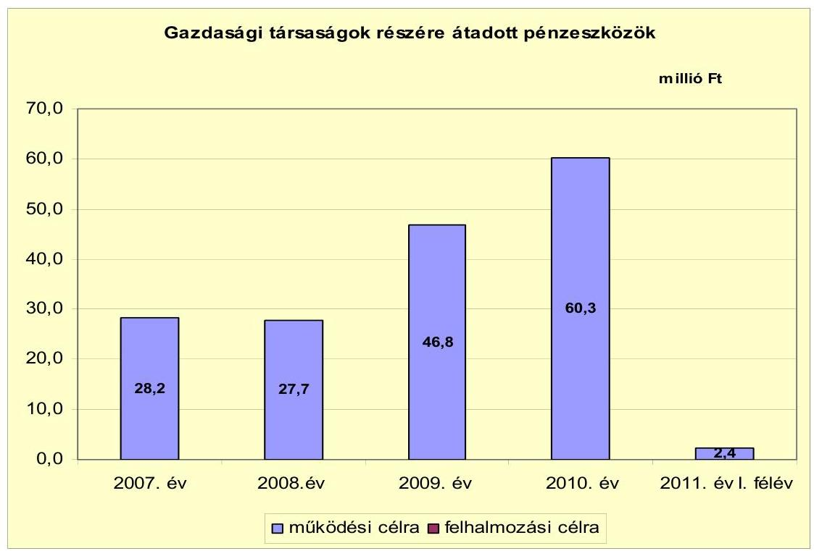

Az Önkormányzat 100\%-os tulajdonában álló gazdasági társaságoknak nyújtott múködési célú pénzeszközátadások a közfoglalkoztatás támogatására kapott bevételek átadását jelentették. A 2011. évtől kezdődően ezen gazdasági társaságoknál nem történt közfoglalkoztatás.

# 3. Az ÖNKORMÁNYZAT KÖTELEZETTSÉGEI 

### 3.1. Az Önkormányzat pénzintézetekkel szembeni kötelezettségeinek változása

Az Önkormányzatnak 2006. december 31-én 349,0 millió Ft pénzintézetekkel szembeni kötelezettségállománya volt, a 2011. év I. félévben 3906,2 millió Ft. A fennálló pénzintézetekkel szembeni kötelezettségek három hosszú lejáratú hitel felvételéből, egy kötvény kibocsátásából, valamint a 2011. június 30 -án fennálló folyószámla-, és munkabérhitel állományból keletkeztek.

---

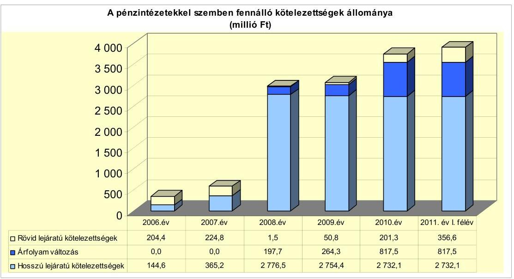

A pénzintézetekkel szembeni kötelezettségek állományának több mint tízszeres, 3557,2 millió Ft összegű növekedését döntően befolyásolta, hogy 2007-2011. év I. féléve között az Önkormányzat

- a 2006. évben megkötött hitelszerződés alapján a 2007-2008. években 338,0 millió Ft fejlesztési célú hitelt vett igénybe a szennyvízcsatorna beruházáshoz;
- szintén 2006-ban kötött 20,0 millió Ft összegű hitelszerződést a Nagykun Klub felújításához, melyből 10,0 millió Ft-ot a 2007. évben hívott le;
- 2008. március 20-án 2400,0 millió Ft (14 612 ezer CHF) kötvényt bocsátott ki;
- a folyószámla-, és munkabérhitel állományának együttes összege a 2006. év végi 187,0 millió Ft-ról 2011. június 30-ra 309,2 millió Ft-ra növekedett.

Az Önkormányzat a 2008-2010. években a devizában kibocsátott kötvény esetében az árfolyamváltozás miatti év végi értékelést a Számv. tv. és az Áhsz. előírásainak megfelelően elvégezte, mely a 2010. év végén 817,5 millió Ft-tal növelte a pénzintézetekkel szembeni kötelezettségek mérleg szerinti értékét.

Annak megítéléséről, hogy a devizában kibocsátott kötvényekért kapott forinthoz képest a kötvények visszavásárlásakor jelentkező forint kötelezettség többletkiadást (árfolyamveszteség) vagy megtakarítást (árfolyamnyereség) eredményez a futamidő végén, a teljes kötelezettség rendezését követően lehet képet alkotni. Mindaddig, amíg törlesztési kötelezettség nem áll fenn (türelmi idő, moratórium), a tőkére vonatkoztatva nem értelmezhető sem az árfolyamveszteség, sem az árfolyamnyereség. Ugyanakkor a számviteli szabályok meghatározzák, hogy az árfolyam különbözetet év végén a kötelezettségek vagy követelések között a könyvviteli mérlegben nyilván kell tartani, azonban az árfolyamkülönbözet valójában nem realizált.

---

Az Önkormányzat a forráshiány, valamint az adósság kezelése érdekében a 2007-2011. évi költségvetési rendeletekben hitel ${ }^{22}$ felvételével, pénzmaradvány igénybevételével számolt. A 2009-2011. években tervezett pénzmaradvány igénybevétel forrása elsősorban a kötvénykibocsátás bevételéből származott, mivel annak egy részét betétbe fektette az Önkormányzat. A 2009. évben a kötvénykibocsátás bevételéből vásárolt értékpapírok értékesítését is betervezték a költségvetési egyensúly biztosítása céljából. A Képviselő-testület a likviditás biztosítása érdekében minden évben folyószámlahitel keretet hagyott jóvá. A múködési hiány csökkentésére a 2007-2011. években ÖNHIKI pályázatot nyújtott be az Önkormányzat. Az egyensúly javítását szolgáló intézkedések voltak a létszámcsökkentések, az átszervezési, feladatracionalizálási döntések.

Az Önkormányzat pénzintézetekkel szembeni kötelezettségvállalásaira 20072011. év I. féléve között a Képviselő-testület döntése alapján került sor. Az adósságot keletkeztető kötelezettségvállalás felső határát vizsgálták, azt a Kép-viselő-testületnek bemutatták. A Művelődési és Ifjúsági Központ felújítására 2006-ban felvett 20,0 millió Ft, valamint a Rákóczi utcai ingatlan felújítására 2007-ben felvett 10,1 millió Ft hitelek esetében a pénzintézeteket nem versenyeztették, a hitelszerződést a számlavezető pénzintézettel kötötték meg. ${ }^{23}$ A Nagykun Klub felújításához és a szennyvízcsatorna-hálózat építéséhez kapcsolódó hitelszerződések 2006. évi megkötését megelőzően közbeszerzési eljárást folytattak le. A kötvényt jegyző pénzintézet kiválasztása előtt hét pénzintézettől kértek be ajánlatokat. Az előterjesztésekben a kötelezettségvállalások kamat- és árfolyamkockázatait bemutatták, a visszafizetés forrásait azonban nem számszerúsítették. A 2011. évi költségvetés előterjesztésében - a 2010. évi ÁSZ ellenőrzés javaslatát figyelembe véve - már számításba vették a visszafizetés feltételeit, a várható bevételeket. A 2007-2011. évi költségvetési és a 2007-2010. évi zárszámadási rendeletekben bemutatták az Önkormányzat hiteleinek és kötvényeinek évenkénti várható tőke- és kamatfizetési kötelezettségeit a futamidők végéig. Az „Élhetőbb Kisújszállásért" kötvény, valamint a szennyvízcsatorna építéséhez felvett hosszú lejáratú hitelek esetében a finanszírozó pénzintézet nem azonos az Önkormányzat számlavezetőjével. A vizsgált időszakban az Önkormányzat nem váltott számlavezető pénzintézetet.

Az Önkormányzat 2011. június 30-án forintban fennálló hosszú lejáratú adósságot keletkeztető kötelezettségvállalásai az alábbiak voltak:

| Megnevezés | Szerződéskötés   időpontja | Összeg   millió Ft-ban | Kamat (referencia   kamat+ kamatfelár) | Felhasználás célja: |
| :-- | :--: | :--: | :--: | :-- |
| Hosszú lejáratú hitel | 2006.07 .07 | 20,0 | 3 havi EURIBOR+2,5\% | "Sikeres Magyarországért" ÖKIF Hitelprogram:   Múvelődési és Ifjúsági Központ felújítása |
| Hosszú lejáratú hitel | 2006.10 .09 | 20,0 | 3 havi EURIBOR+1,3\% | "Sikeres Magyarországért" ÖKIF Hitelprogram:   Nagykun Klub felújítása |
| Hosszú lejáratú hitel | 2006.11 .15 | 338,0 | 3 havi EURIBOR+0,99\% | "Sikeres Magyarországért" ÖKIF Hitelprogram:   Szennyvízcsatorna építés finanszírozása |

[^0]
[^0]:    ${ }^{22}$ A 2007. évben 406,6 millió Ft, a 2008. évben 357,3 millió Ft, a 2009. évben 137,8 millió Ft, a 2010. évben 279,2 millió Ft, a 2011. évben 343,1 millió Ft működési hitelt terveztek. Fejlesztési hitelfelvételt a 2007-ben 226,7 millió Ft, a 2008-ban 269,7 millió Ft, 2011-ben 249,6 millió Ft összegben terveztek.
    ${ }^{23}$ A Rákóczi utcai ingatlan felújítására 2007. november 12-én kötötték meg a hitelszerződést. A hitelt a kötvényből származó bevételből 2008. május 14-én visszafizette az Önkormányzat.

---

Az Önkormányzat 2011. június 30-án CHF-ben fennálló hosszú lejáratú adósságot keletkeztető kötelezettségvállalását az alábbi táblázat mutatja be:

| Megnevezés | Kibocsátás   időpontja | Összeg   ezer CHF-ben | Kibocsátási   árfolyam | Kamat (referencia   kamat+ kamatfelár) | Felhasználás célja: |
| :-- | :--: | :--: | :--: | :--: | :--: |
| "Az Élhetőbb Kisújszállásért"   kötvény | 2008.03 .20 | 14612,0 | 164,25 HUF/CHF | 6 havi CHF LIBOR+0,7\% | Fejlesztési feladatok finanszírozása,   hitelállomány konszolidálása |

Az Önkormányzat a 2006. évben 20,0 millió Ft fejlesztési célú hitelt vett fel a Művelődési és Ifjúsági Központ felújításához. A hitelből 19,7 millió Ft-ot 2006-ban, a fennmaradó részt 2007-ben hívták le. A 20 éves futamidejú hitel kamatait 2006 szeptemberétől, a tőkét 2009 júniusától negyedévente fizetik. A pénzintézet a banki szabályozórendszer és a banki forráshelyzet változása miatt a kamatfelárat 2009. március 23-i hatállyal 1,3\%-ról 2,5\%-ra emelte. A 2011. év I félévig összesen 2,6 millió Ft tőkét törlesztettek és 4,4 millió Ft kamatot fizettek.

Az Önkormányzat a 2006. évben 20,0 millió Ft fejlesztési célú hitelt vett fel a Nagykun Klub felújításához. A hitelből 10,0 millió Ft-ot 2006-ban, a fennmaradó részt 2007-ben hívták le. A 2026. év szeptember 5-én lejáró hitel kamatait 2006 decemberétől, a tőkét 2009 szeptemberétől negyedévente fizetik. A pénzintézet 2009. év I. negyedévében kezdeményezte a kamatfelár 1,3\%-ról 2,5\%-ra történő emelését, melyhez a Képviselő-testület nem járult hozzá. A 2011. év I. félévig 2,3 millió Ft hitelt törlesztettek, 3,6 millió Ft kamatot és 0,2 millió Ft projektvizsgálati díjat fizettek meg.

Az Önkormányzat 2005. évben benyújtott pályázatait támogatva a Nemzeti Kulturális Örökség Minisztériuma a Művelődési és Ifjúsági Központ és a Nagykun Klub felújításához felvett hitelek kamatterheit a teljes futamidőre átvállalta.

Az Önkormányzat a 2006. évben 338,0 millió Ft fejlesztési célú hitelt vett fel szennyvízcsatorna-hálózat építésére. A hitelből 211,8 millió Ft-ot 2007-ben, a fennmaradó 126,2 millió Ft-ot 2008-ban hívták le. A 20 éves futamidejú hitel kamatait 2007 decemberétől, a tőkét 2010 februárjától negyedévente fizetik. A pénzintézet 2009. év II. negyedévében kezdeményezte a kamatfelár 0,99\%-ról 2\%-ra történő emelését, melyhez a Képviselő-testület nem járult hozzá. A 2011. június 30-ig összesen 29,8 millió Ft tőkét törlesztettek, 38,0 millió Ft kamatot és a 4,9 millió Ft összegű projektvizsgálati díjból 0,8 millió Ft-ot fizettek meg.

Az Önkormányzat a fejlesztési célú hiteleket a megjelölt céloknak megfelelően használta fel.

Az Önkormányzat fejlesztési feladatainak finanszírozására, valamint hitelállományának konszolidálása érdekében 2008. március 20-án „Az Élhetőbb Kisújszállásért" elnevezésű, összesen 14612 ezer CHF névértékű kötvényt bocsátott ki. A 2031. március 30-i lejáratú kötvény kamatfizetése 2008. szeptember 30-tól félévente, a tőketörlesztés 2011. szeptember 30-tól kezdődően félévente esedékes 221,0 ezer CHF összegben. A nettó múködési jövedelem alakulására kedvezőtlen befolyást gyakorol, hogy a kötvénykibocsátás miatti tőketörlesztési kötelezettség a 2012. évben már 442 ezer CHF lesz. Az Önkormányzat a kibocsátáskor 4,5 millió Ft jegyzési garanciavállalási díjat, 2011. június 30-ig 873,8 ezer CHF (161,2 millió Ft) kamatot fizetett. A kötvényt kibocsátó

---

pénzintézet 2009. év I. negyedévében kezdeményezte készfizető kezességvállalási díj, kifizető ügynöki díj megállapítását, valamint a kamatfelár 2,5\%-kal történő növelését. A készfizető kezességvállalási díjat és a kamatfelár növelését a Képviselő-testület nem fogadta el. A forgalmazói szerződést - a kifizető ügynöki díjat érintően - 2009. szeptember 17-én módosították. Ebben megállapodtak abban, hogy a kifizető ügynök a 2009. április 1-től 2010. március 31-ig terjedő időszakra a kötvényállomány össznévértékére vetítve jogosult 0-1,5\% kifizető ügynöki díjat megállapítani. Az Önkormányzat 2009. április 30. és 2009. szeptember 30. közötti időtartamra 109,3 ezer CHF (19,6 millió Ft) kifizető ügynöki díjat fizetett meg. A következő negyedévre vonatkozó ügynöki díjról szóló fizetési értesítést nem fogadta el az Önkormányzat. A pénzintézet a kötvényből származó bevétel befektetésére, illetve felhasználására vonatkozóan a 450,0 millió Ft óvadéki betételhelyezést kivéve nem alkalmazott korlátozást. A kötvénykibocsátáshoz kapcsolódóan 2008. március 12-én kötött kiegészítő megállapodás szerint a zárolt betét feloldásáról az Önkormányzat kérelmére a pénzintézet dönt. A döntés meghozatalához a pénzintézet az Önkormányzat működési eredményét, saját bevételeinek és kötelezettségeinek változását, a bemutatott beruházások jövőbeli kihatásait és forrásösszetételét vizsgálja meg. Az Önkormányzat a 2008. évben a kötvényből származó bevételből 122,4 millió Ft-ot öt fejlesztési célú hitel lejárat előtt visszafizetésére, további 220,0 millió Ft-ot folyószámlahitel törlesztésére fordított. A folyószámlahitel törlesztés hatására átmenetileg javult az Önkormányzat pénzügyi pozíciója, azonban a 2010. évben a működési jövedelem ismét negatívvá vált. A fejlesztési feladatok finanszírozására pedig 1160,3 millió Ft-ot használtak fel. A befektetéséből származó 506,3 millió Ft bevételt az Önkormányzat - adatszolgáltatása szerint - a kötvény után fizetendő költségekre, a gazdálkodás finanszírozására, valamint fejlesztésre fordította.

Az Önkormányzat 2011. év I. negyedévében tárgyalásokba kezdett a kötvényt kibocsátó pénzintézettel a 450,0 millió Ft óvadéki betét felszabadítása ügyében. ${ }^{24}$ A pénzintézet - indoklás nélkül - az óvadék felszabadítását nem hagyta jóvá. Az óvadéki betét után járó kamattal az Önkormányzat szabadon rendelkezhetett. Az Önkormányzat az európai uniós támogatásokból megvalósuló fejlesztések (strandfürdő fejlesztése, szálloda építése, belvízelvezető rendszer rekonstrukciója) saját forrását ebből tervezte finanszírozni. Ezért döntött 2011. október 12-én a Képviselő-testület 450,0 millió Ft fejlesztési hitel felvételére vonatkozó hirdetmény közzétételével induló, tárgyalásos közbeszerzési eljárás megindításáról. A részvételi felhívásra egy pénzintézet jelentkezett, a részvételi szakasz eredményhirdetésére 2011. november 18-án került sor. Az eljárás még folyamatban van.

Az Önkormányzat a 2007-2011. év I. félév időszakában folyószámlahitel, 2007. évben és a 2011. év I. félévében munkabér-megelőlegezési hitel igénybevételével tudta biztosítani likviditását.

A folyószámlahitel-keretet, az igénybevett munkabérhitelt és a teljesített kamatokat, egyéb költségeket a következő táblázat mutatja be:

[^0]
[^0]:    ${ }^{24}$ A 450,0 millió Ft-ot az Önkormányzat 2011. november 29-én egy havi futamidőre lekötötte.

---

| Megnevezés | 2007. év | 2008. év | 2009. év | 2010. év | 2011. év I.   félév |
| :-- | --: | --: | --: | --: | --: |
| I. Folyószámlahitel |  |  |  |  |  |
| a folyószámlahitel keretösszege január 1-jén | 130,0 | 224,0 | 224,0 | 220,0 | 220,0 |
| teljesített kamat és egyéb költség | 7,0 | 5,7 | 6,1 | 8,1 | 8,5 |
| II. Munkabér megelőlegezési hitel |  |  |  |  |  |
| igénybevett hitel összesen: | 60,0 | 0,0 | 0,0 | 0,0 | 50,0 |
| teljesített kamat és egyéb költség | 0,1 | 0,0 | 0,0 | 0,0 | 0,0 |

A folyószámlahitellel zárt napok száma a 2007. évi 289 napról - a kötvénykibocsátásból származó bevétel hiteltörlesztésre történő felhasználása miatt - a 2008. évben 221 napra csökkent, majd 2009-ben 232 napra, a 2010-ben 275 napra növekedett. A 2011. év I. félévében a 181 napból már 175 napon keresztül szükség volt folyószámlahitel igénybevételére. A napi átlagos állomány a 2007. évi 81,5 millió Ft-ról a 2008. évre 61,0 millió Ft-ra, a 2009. évre 45,3 millió Ft-ra csökkent, majd a 2010. évre 85,4 millió Ft-ra, a 2011. év I. félévére 176,4 millió Ft-ra nőtt. A folyószámlahitel év végi állománya a 2006. évi 127,0 millió Ft-ról a 2007. évre 211,5 millió Ft-ra nőtt, míg a 2008. év végén nem volt az Önkormányzatnak folyószámlahitele. Ezt követően ismét kedvezőtlenül alakult az év végi állomány, mivel a 2009. évi 28,6 millió Ft-ról 2010-ben 142,7 millió Ft-ra, 2011. június 30-ra 259,2 millió Ft-ra növekedett.

Az Önkormányzat kezdeményezésére a 2007. január 1-jén fennálló 130,0 millió Ft folyószámlahitel keretet - a 2007. november 12-i lejáratot megelőzően 2007. január 15-én - 224,0 millió Ft-ra emelték. Az Önkormányzat az emelés napján nem rendelkezett folyószámlahitellel, míg a lejárat napján az igénybevétel 140,7 millió Ft volt. Ezt követően a hitelkeret változatlan keretösszeggel meghosszabbításra került 2008. november 11-ig, mely napon nem volt negatív a folyószámla egyenlege. Ezt követően szintén 224,0 millió Ft hitelkeretre kötöttek szerződést 2009. november 10-i lejárattal, melyet 2010. május 5-én az Önkormányzat kezdeményezésére - a keret alacsony kihasználtsága, valamint a rendelkezésre tartási jutalék bevezetése miatt - 150,0 millió Ft-ra csökkentettek. A lejárat napján, 2009. november 10-én az igénybe vett folyószámlahitel 68,2 millió Ft volt. A keretet ezt követően 2010. november 9-i lejárattal 220,0 millió Ft-ra emelték. A lejárat napján az Önkormányzat nem rendelkezett folyószámlahitellel. A hitelkeret változatlan keretösszeggel 2011. november 8-ig meghosszabbításra került, melyet az Önkormányzat kezdeményezésére 2011. május 26-án 343,1 millió Ft-ra emeltek. A módosítás napján 210,0 millió Ft volt az igénybevett folyószámlahitel. A 343,1 millió Ft-os hitelkeretet a szerződésben foglaltak alapján a pénzintézet - 2011. augusztus 2-től 25,0 millió Ft-tal, szeptember 1-től 10,0 millió Ft-tal, október 4-tól 35,0 millió Ft-tal - 273,1 millió Ft-ra csökkentette.

Az Önkormányzat 2006. év végén 60,0 millió Ft munkabérhitellel rendelkezett, melyet 2007. január 2-án vissza is fizetett. A vizsgált időszakban 2011. június 30-án vettek fel munkabérhitelt 50,0 millió Ft összegben, melyet július 30-án visszafizettek.

---

A folyószámla- és munkabérhitel kondíciói a következők voltak ${ }^{25}$ :

| Megnevezés | Kamat (referencia+ kamatfelár) | Egyéb költség |
| :-- | :--: | :--: |
| Folyószámlahitel |  |  |
| 2007.01.01-2008.11.11. | 3 havi BUBOR $+0,35 \%$ | $0,1 \%$ kezelési dij |
| 2008.11.12-2009.05.04. | 3 havi BUBOR $+2,45 \%$ | $0,25 \%$ kezelési dij, $0,25 \%$ rend.tart.jutalék |
| 2009.05.05-2009.11.10. | 3 havi BUBOR $+2,5 \%$ | $0,25 \%$ kezelési dij, $0,25 \%$ rend.tart.jutalék |
| 2009.11.11-tól | 1 havi BUBOR $+2,5 \%$ | $0,25 \%$ kezelési dij, $0,25 \%$ rend.tart.jutalék |
| Munkabér megelőlegezési hitel |  |  |
| 2007.01.01-2007.06.20. | 3 havi BUBOR $+0,45 \%$ | 0 |
| 2009.11.16-tól | 1 havi BUBOR $+3,0 \%$ | 0 |

Az Önkormányzat a 2007-2011. év I. féléve között a folyószámlahitel kamatfizetésére és egyéb költségeire 35,4 millió Ft-ot, a munkabérhitel kamatfizetésére 0,1 millió Ft-ot fordított.

Az Önkormányzat a 2011. június 30-án fennálló fejlesztési célú hitelei és a kötvénye után - a kamatfizetéskor érvényes devizanemtől függően - a vizsgált időszakban 46,0 millió Ft és 873,8 ezer CHF (161,2 millió Ft) kamatot fizetett meg.

Az alapkamat mértékének alakulása jelentős hatással van az adott devizanemben kifejezett, a teljes futamidőre számított, várható kamatkötelezettség nagyságára. A jelenleg fennálló hosszú lejáratú fejlesztési hitelek és a kötvények esetében a kamatfizetési kötelezettségek alakulását jelentősen befolyásolja a referencia kamatok változása, melyet a következő táblázat szemléltet:

| Megnevezés | Kibocsátási, lehívási | Utolsó fizetéskorl.   kamat (referencia + kamatfelár) \% | Változás \% |
| :-- | :--: | :--: | :--: |
| 3 havi EURIBOR (2006.07.07.-i szerződés)* | 4,361 | 4,037 | $-7,4 \%$ |
| 3 havi EURIBOR (2006.10.09.-i szerződés) | 4,361 | 2,837 | $-34,9 \%$ |
| 3 havi EURIBOR (2006.11.15.-i szerződés) | 5,776 | 2,521 | $-56,4 \%$ |
| 6 havi CHF LIBOR (2008.03.20.-i kötvénykibocsátás) | 3,575 | 0,955 | $-73,3 \%$ |

*2009. 03.23-tól a kamatfelár 1,3\%-ról 2,5\%-ra módosult
Az induló kamatlábbal számított kamathoz képest az Önkormányzatnak 2007. január 1- 2011. június 30. között a szennyvízcsatorna-hálózat építésére felvett hitel (2006. november 15-i szerződés) után 29,8 millió Ft-tal kevesebb kamatfizetési kötelezettsége keletkezett. ${ }^{26}$ A kötvény esetében az induló kamatkondícióval számolva a kibocsátástól 2011. június 30-ig 1587,5 ezer CHF kamatfizetési kötelezettsége keletkezett volna az Önkormányzatnak. Az alapkamat csökkenése miatt 713,7 ezer CHF-el kevesebb fizetési kötelezettséget kellett teljesítenie.

[^0]
[^0]:    ${ }^{25}$ A referencia kamatok az alábbiak szerint alakultak:

    | MNB BUBOR fixing (állagkamat) \%-ban |  |  |  |  |
    | :-- | :-- | :-- | :-- | :-- |
    | 2007. évi | 2008. évi | 2009. évi | 2010. évl. | 2011. év I. |
    | 7.83 | 8,75 | 8,66 | 5,47 | 6,00 |
    | 7.75 | 8,87 | 8,64 | 5,50 | 6,07 |

    26 A 2006. július 7-én, illetve október 9-én megkötött hitelszerződések esetében a kamatterheket megtérítik az Önkormányzatnak.

---

Az Önkormányzat egyes kötelezettségeinek állományát 2010. december 31-én és 2011. június 30-án, valamint várható alakulását a kötelezettségek lejáratáig a következő táblázat mutatja be:

| Megnevezés | Állomány 2010. december 31   én |  |  | Állomány 2011. június 30-án |  |  | Várható   kötelezettség 2011-   2013. években |  | Várható   kötelezettség 2014.   évtől |  |
| :--: | :--: | :--: | :--: | :--: | :--: | :--: | :--: | :--: | :--: | :--: |
|  | HUF-ben   (mibb. Ft-   ben) | Devicében   (összegy.   ezer CHF-   ben) | Device   nem | HUF-ben   (mibb. Ft-   ben) | Devicében   (összegy.   ezer CHF-   ben) | Device   nem | HUF-ben   (mibb. Ft-   ben) | Devicében   (összegc.   ezer CHF-   ben) | HUF-ben   (mibb Ft-   ben) | Devicében   (összegc.   ezer CHF-   ben) |
| Pénzintézeti kötelezettségek |  |  |  |  |  |  |  |  |  |  |
| Összesi lejáratú hitelek | 559,3 |  | HUF | 343,2 |  | HUF | 92,4 |  | 344,0 |  |
| "Az Éthetőbb Kocjajcélésen" kötvény |  | 14612,0 | CHF |  | 14612,0 | CHF |  | 1517,6 |  | 14951,0 |
| Folyószámanter | 143,7 |  | HUF | 259,2 |  | HUF | 259,2 |  |  |  |
| Minkeleb megállítógapási hitel |  |  |  | 50,0 |  | HUF | 50,0 |  |  |  |
| Pénzintézeti kötelezettségek összesen HUF-ben: | 457,0 |  | HUF | 652,4 |  | HUF | 481,8 |  | 344,0 |  |
| Pénzintézeti kötelezettségek összesen CHF-ben: |  | 14612,0 | CHF |  | 14612,0 | CHF |  | 1517,6 |  | 14951,0 |
| Biztosítékok |  |  |  |  |  |  |  |  |  |  |
| Bizottság | 416,2 |  | HUF | 73,5 |  | HUF |  |  |  |  |
| Biztosítékok összesen: | 416,2 |  | HUF | 73,5 |  | HUF |  |  |  |  |
| Szabító tartozás | 433,1 |  | HUF | 47,1 |  | HUF | 47,1 |  |  |  |
| Egyéb kötelezettségek | 1,1 |  | HUF | 0,7 |  | HUF | 1,6 |  |  |  |
| Kötelezettségek összesen HUF-ben: | 1347,4 |  | HUF | 773,7 |  | HUF | 450,3 |  | 344,0 |  |
| Kötelezettségek összesen CHF-ben: |  | 14612,0 | CHF |  | 14612,0 | CHF |  | 1517,6 |  | 14951,0 |

Az Önkormányzatnak a 2011-2013. években ${ }^{27}$ a pénzintézetekkel szemben forintban fennálló kötelezettsége után 401,6 millió Ft, a CHF-ben kibocsátott kötvény után 1517,6 ezer CHF a várható kötelezettsége. A 2014. évet követően 344,0 millió Ft, valamint 14951 ezer CHF összegű a várhatóan felmerülő pénzintézetekkel szembeni kötelezettség. ${ }^{28}$ A szállítókkal szemben 2011. június 30-án fennálló tartozások után 47,1 millió Ft, az egyéb kötelezettségek (gépjármú részletre vásárlás) miatt 1,6 millió Ft a várható kötelezettség. A kezességvállalásból adódóan 73,5 millió Ft kötelezettsége jelentkezhet az Önkormányzatnak.

A 2011-2013. évek kötelezettségeinek teljesítésére figyelembe vehető a behajthatóságot és az eladhatóságot feltételezve - a mérlegben kimutatott 111,7 millió Ft követelésállomány, továbbá a forgalomképes ingatlanvagyon. A 2014. évet követően jelenleg ismert pénzintézetekkel szembeni kötelezettségek forrásaként a saját bevételeket vették számításba a 2011. évi költségvetési rendelet előterjesztésében.

Pénzügyi kockázatot jelentett az ellenőrzött időszakban a pénzintézetekkel szembeni kötelezettségek több mint tízszeres növekedése. A 2010. évben képződött negatív múködési jövedelem miatt a következő évekre szóló jelenleg ismert pénzintézetekkel szembeni kötelezettségek teljesítése - további bevételnövelő és kiadáscsökkentő intézkedések megtételének hiányában - törlesztési kockázatot jelent az Önkormányzatnak. Összességében az Önkormányzat pénzügyi helyzete rövid távon veszélyeztetett.

[^0]
[^0]:    ${ }^{27}$ A 2011-2013. években várható kötelezettségek tartalmazzák a 2011. június 30-ig már teljesített tőketörlesztések, valamint kamatfizetések összegeit is.
    ${ }^{28}$ A hosszú lejáratú hitelek, illetve a kötvények utáni kötelezettségek tartalmazzák az utolsó kamatfizetési kondícióval számított várható kamatterheket, és egyéb díjakat is.

---

# 3.2. A szállítókkal szembeni kötelezettségek változása 

A szállítókkal szemben fennálló kötelezettségek állománya a 2007. évben 570,4 millió Ft, a 2008. évben 279,8 millió Ft, a 2009. évben 847,7 millió Ft, a 2010. évben 433,1 millió Ft, 2011. június 30 -án 47,1 millió Ft volt. A szállítói állomány 2010-ről 2011. június 30-ra történő 386,0 millió Ft-os csökkenését elsősorban a beruházási szállítók állományának 361,4 millió Ft-os csökkenése okozta. Az Ivóvízminőség-javító Társulás szállítókkal szembeni tartozása a 2007-ben 1,8\%-a (10,4 millió Ft), a 2008-ban 72,1\%-a (201,7 millió Ft) a 2009ben $92,3 \%$-a ( 782,8 millió Ft), a 2010-ben $69,1 \%$-a (299,4 millió Ft), a 2011. év I. félévben $88,9 \%$-a ( 41,9 millió Ft ) volt az összes szállítókkal szembeni kötelezettségnek.

Az Önkormányzat szállítókkal szembeni lejárt tartozása közel kilencszeresére, 5,4 millió Ft-ról 45,7 millió Ft-ra, aránya a szállítókkal szembeni kötelezettségeken belül 0,9\%-ról 97,2\%-ra emelkedett. A lejárt szállítókkal szembeni tartozásokon belül folyamatosan növekedett a régebben lejártak aránya. A 2011. június 30 -án kimutatott 45,7 millió Ft lejárt, szállítókkal szembeni tartozás $7,2 \%$-a ( 3,3 millió Ft) 30 nap alatti, $1,8 \%$-a ( 0,8 millió Ft) 31 és 60 nap közötti, $87,7 \%$-a ( 40,1 millió Ft) 61 és 90 nap közötti, $3,3 \%$-a ( 1,5 millió Ft) 91 és 365 nap közötti. Éven túli tartozás nem volt. A 2011. június 30 -án lejárt szállítókkal szembeni kötelezettségekből 41,6 millió Ft-ot az Ivóvízminőség-javító Társulás, 4,1 millió Ft-ot az Önkormányzat tartozása tett ki. Az Önkormányzat szállítókkal szemben lejárt tartozása 60 napon belüli.

Az Önkormányzat 2011. június 30-án lejárt 4,1 millió Ft szállítókkal szembeni kötelezettsége szállítói finanszírozású számlát nem tartalmazott. Az Ivóvízmi-nőség-javító Társulás 41,6 millió Ft lejárt szállítói állományából 34,7 millió Ftot tett ki szállítói finanszírozású számláknak a közremúködő szervezetek által még nem teljesített EU-s támogatásrésze. Az EU-s pályázatoknak ebben a finanszírozási formájában a számviteli előírásoknak megfelelően eljárva a számlák teljes összegét szállítói kötelezettségként nyilvántartásba vették. Ugyanakkor a szállítóknak csak a számlák rá eső önrészét fizették ki. Ezt követően a számlákat és a kifizetési kérelmeket benyújtották a támogatást folyósító szervezetnek, amely ellenőrizte az önrész kiegyenlítését, majd a szállító részére kifizették a számlák támogatással megegyező részét. A támogatást folyósító szervezet - a számlák támogatási részének kifizetését igazoló - értesítését követően könyvelhették le a számlák teljes összegére vonatkozó szállítói kötelezettség kiegyenlítését.

Az Önkormányzatnak a vizsgált időszakban nem volt átütemezési megállapodással érintett szállítói állománya, kórházat nem tartott fenn. Az Önkormányzatnak a vizsgált időszakban egyéb kiadáselmaradása nem volt.

### 3.3. Egyéb kötelezettségek változása

Az Önkormányzat a vizsgált időszakban líingszerződést nem kötött, PPP konstrukció keretében fejlesztést nem hajtott végre.

Garanciavállalásból adódó kötelezettsége 2011. június 30-án nem volt és jelenleg sincs az Önkormányzatnak.

---

A vizsgált időszakban - az Ötv. szerinti adósságot keletkeztető kötelezettségvállalás felső határát betartva - egy esetben vállalt készfizető kezességet az Önkormányzat a Kisújszállási Csatornaberuházó Víziközmű Társulat fejlesztési hiteléhez kapcsolódóan, melynek összege 302,2 millió Ft volt. A 2005. és a 2006. évi kezességvállalások is e társulat fejlesztési hiteleihez kapcsolódtak. A három kezességvállalásból adódóan 2011. június 30 -án fennálló kötelezettség 73,5 millió Ft. A kezességvállalásokhoz kapcsolódóan az Önkormányzatnak fizetési kötelezettsége nem keletkezett.

A 2007-2011. év I. félév végéig az Önkormányzatnál az elengedett követelések összege 4,5 millió Ft. Az elengedett követelések a jegyzői hatáskörbe tartozó adóztatási tevékenységhez (magánszemélyek kommunális adója) kapcsolódtak.

Az Önkormányzat a 2007. évben hat intézményének nyújtott kamatmentes kölcsönt, összesen 16,9 millió Ft összegben európai uniós pályázataik megvalósításához, azok utófinanszírozása miatt. A kölcsönöket az intézmények a 2008. évben visszafizették.

Az Önkormányzat a két 100\%-os tulajdonában lévő gazdasági társaságának nyújtott tagi kölcsönt a vizsgált időszakban. A Vízmú Kft. gépbeszerzéséhez 2008. évben folyósítottak kölcsönt négy éves futamidőre 10 millió Ft öszszegben. A Városgazdálkodási Kft. részére 2010-ben - jármú átalakításához nyújtott 7,2 millió Ft összegű kölcsönt az Önkormányzat 2016. március 15-i lejárattal. A kölcsönt és annak kamatait - a megállapodások alapján - havi részletekben törlesztik a gazdasági társaságok. A Vízmú Kft.-nek 2,7 millió Ft, a Városgazdálkodási Kft.-nek 5,7 millió Ft volt a kölcsönből még fennálló kötelezettsége 2011. év június 30 -án.

A 2007. és a 2008. évben összesen 1,8 millió Ft kamatmentes kölcsönt nyújtott az Önkormányzat a helyi kisebbségi önkormányzat részére európai uniós pályázatok megvalósításához, azok utófinanszírozása miatt. A folyósításra képviselő-testületi határozat alapján került sor, a kölcsönt a helyi kisebbségi önkormányzat a 2008., illetve a 2009. évben visszafizette.

A Kisújszállási Csatornaberuházó Víziközmú Társulat múködési költségeinek finanszírozására 2007. és 2011. június 30 -a között 16 alkalommal nyújtott kamatmentes kölcsönt az Önkormányzat, összesen 64,6 millió Ft összegben. A megállapodások alapján a kölcsönöket 2012. június 30. napjáig kell visszafizetni a társulatnak.

A Kisújszállási Sportegyesület részére 2011. év I. félévében 5,7 millió Ft kamatmentes kölcsönt nyújtott az Önkormányzat egy európai uniós pályázat megvalósításához, a kölcsön lejárata 2011. december 20.

Az intézmények, gazdasági társaságok és egyéb szervezetek részére nyújtott kölcsönök folyósítására a Képviselő-testület döntése alapján, az Önkormányzat kötelező és önként vállalt feladatai ellátása érdekében került sor.

Az Önkormányzat többségi tulajdonú gazdasági társaságaitól kölcsönt nem vett igénybe.

---

Az Önkormányzat három jelzálogjoggal és egy elidegenítési és terhelési tilalommal terhelt ingatlannal rendelkezett 2011. június 30 -án. Az Ötv-ben előírtakat betartva hitel, kötvény fedezeteként törzsvagyont nem használtak fel.

A jelzálogbejegyzések európai uniós támogatások folyósításához kapcsolódtak és korlátozottan forgalomképes ingatlanokat (strandfürdő, orvosi rendelő, turisztikai épület) terhelte. A strandfürdőt 2011. október 25 -én átsorolta a Képviselőtestület a forgalomképes vagyoni körbe, nettó értéke 2010. december 31-én 183,5 millió Ft volt. A forgalomképes ingatlanok számvitelben nyilvántartott 2010. év végi nettó értéke 272,8 millió Ft, mely teljes egészében szabad rendelkezésú volt. Az elidegenítési és terhelési tilalom egy korlátozottan forgalomképes ingatlant (sportlőtér) érintett és a Magyar Államtól történő ingyenes tulajdonjog ingyenes átvételéhez kapcsolódott.

Egy peres eljárás volt folyamatban 2011. év június 30 -án, az Önkormányzat terhére kimutatott perérték 2,7 millió Ft. Az első fokú bíróság 2011 októberében az Önkormányzat számára kedvező döntést hozott, így jelenleg fizetési kötelezettség nem áll fenn.

Az Önkormányzat 50\%-ot és azt meghaladó tulajdonosi hányaddal rendelkezik kettő társaságban, amelyek kötelezettségeinek állományát 2010. december 31-én és 2011. június 30 -án, valamint azok várható összegét a kötelezettségek lejáratáig a következő táblázat mutatja be:

| Megnevezés | Állomány 2010. december 31.   én |  |  | Állomány 2011. június 30-án |  |  | Várható kötelezettség 20112013. években |  |
| :--: | :--: | :--: | :--: | :--: | :--: | :--: | :--: | :--: |
|  | HUF-ban (millió Ftban) | Devizában (összege, ezer EURban) | Deviza nem | HUF-ban (millió Ftban) | Devizában (összege, ezer EURban) | Deviza nem | HUF-ban (millió Ftban) | Devizában (összege, ezer EURban) |
| Pénzintézeti kötelezettségek |  |  |  |  |  |  |  |  |
| Rultinző hitel | 1,0 |  | HUF | 0,3 |  | HUF | 0,3 |  |
| Hosszú lejáratú hitel | 0,9 |  | HUF | 0,7 |  | HUF | 1,0 |  |
| Pénzintézeti kötelezettségek összesen: | 1,0 |  | HUF | 1,0 |  | HUF | 1,0 |  |
| Üzing kötelezettségek |  | 6,0 | EUR |  | 4,6 | EUR |  | 6,7 |
| Szállító tartozás | 52,0 |  | HUF | 19,2 |  | HUF | 19,2 |  |
| Kötelezettségek összesen HUF-ban: | 53,9 |  | HUF | 20,2 |  | HUF | 20,5 |  |
| Kötelezettségek összesen EUR-ban: |  | 6,0 | EUR |  | 4,6 | EUR |  | 6,7 |

Az önkormányzati kötelezettségek növekedése mellett a minősített többségi tulajdonú társaságok kötelezettségei is befolyásolhatják az Önkormányzat pénzügyi egyensúlyát. A kettő kizárólagos önkormányzati tulajdonú gazdasági társaságnak a 2011. évtől ${ }^{29} 1,3$ millió Ft pénzintézetekkel szembeni kötelezettséget, 6,7 ezer EUR lízing és 19,2 millió Ft szállítókkal szembeni tartozást kell rendezniük. Az Önkormányzat számára pénzügyi kockázatot jelent, hogy felszámolás esetén a bíróság megállapíthatja az Önkormányzat korlátlan és teljes felelősségét a fenti kötelezettségek után. A gazdasági társaságok saját tőkéje fedezetet nyújt a kötelezettségekre.

Az Önkormányzat a gazdasági társaságokról szóló 2006. évi IV. törvény 54. § (2) bekezdése alapján korlátlan felelősséggel tartozik azon gazdasági társaságának felszámolása esetében, amelyben az Önkormányzat az 52. § (2) bekezdése szerint a szavazatok legalább 75\%-ával rendelkezik, így minősített befolyásszerzőnek

[^0]
[^0]:    ${ }^{29}$ A 2011-2013. években várható kötelezettségek tartalmazzák a 2011. június 30-ig már teljesített tőketörlesztések, valamint kamatfizetések összegeit is.

---

minősül, továbbá a csődeljárásról és a felszámolási eljárásról szóló 1991. évi XLIX. törvény 63. § (2) bekezdése alapján a kizárólagos önkormányzati tulajdonú gazdasági társaságának minden olyan kötelezettségéért, amelynek kielégítését a felszámolási eljárás során az adós társaság vagyona nem fedez, ha a hitelezőinek a felszámolási eljárás során benyújtott keresete alapján a bíróság - az adós társaság felé érvényesített tartósan hátrányos üzletpolitikájára figyelemmel - megállapítja az önkormányzat korlátlan és teljes felelősségét.

Lejárt szállítói állománya a Vízmú Kft.-nek volt 2011. június 30 -án 11,2 millió Ft összegben, melyből 9,6 millió Ft 91-365 nap közötti, 1,6 millió Ft pedig éven túli tartozás.

A belvízelvezető rendszer felújítását megvalósító konzorciumnak tagja volt a Vízmú Kft. is. A szállítókkal szembeni lejárt tartozásokban szerepet játszott, hogy az általa elvégzett munkák ellenértékét nem kapta meg a konzorciumot vezető gazdasági társaságtól.

A gazdasági társaságokat érintően egy peres eljárás volt folyamatban 2011. június 30 -án. A Vízmú Kft. terhére kimutatott perérték 2,3 millió Ft, a per tárgya a belvízelvezető rendszer felújításához kapcsolódó vállalkozási díj megfizetése. Az első fokú bíróság az első tárgyalást kitűzte, a helyszíni ellenőrzés ideje alatt a per szünetelt.

Az Önkormányzat a 2007-2010. években a tárgyi eszközök után együttesen 746,7 millió Ft értékcsökkenést számolt el. A 2007. évben 278,5 millió Ft-ot, a 2008. évben 145,4 millió Ft-ot, a 2009. évben 94,5 millió Ft-ot, míg a 2010. évben 228,3 millió Ft-ot. A 2007. évben a tárgyévben elszámolt értékcsökkenés $22,6 \%$-ának ( 62,8 millió Ft), a 2008. évben $23,5 \%$-ának, ( 34,1 millió Ft), a 2009. évben $240 \%$-ának ( 227,5 millió Ft), míg a 2010. évben $6,2 \%$-ának ( 14,1 millió Ft) megfelelő összeget aktiváltak felújításként. Az elavult eszközök pótlása biztosítva volt, mivel a számvitelben elszámolt felújítás és beruházás összege meghaladta a számvitelben elszámolt értékcsökkenés összegét. Az Önkormányzat eszközállományának bruttó értéke a 2007. évi 6750,9 millió Ft-ról 8807,9 millió Ft-ra ( $30,5 \%$-kal), míg a nettó érték a 2007. évi 5247,1 millió Ft-ról 6844,3 millió Ft-ra ( $30,4 \%$-kal) nőtt. Az önkormányzati szintű használhatósági fok a 2007. évi $77,7 \%$-ról négy év alatt változatlan maradt. A 2007-2010. évek között az immateriális javaknál, az ingatlanoknál, valamint az átadott eszközöknél figyelhető meg bruttó érték növekedés. A gépek, berendezések és a jármúvek esetében csökkenés tapasztalható. A használhatósági fok az immateriális javaknál romlott a legnagyobb arányban a négy év alatt $19,83 \%$-ról $9,87 \%$-ra. A mutató javulása az - átadott eszközöket kivéve - az eszközállomány többi elemében megfigyelhető. A 2007-2010. évek között pénzügyileg teljesített felhalmozási kiadásokból eszközpótlásra 2535,1 millió Ft-ot fordított az Önkormányzat. A 2007-2010. években elszámolt 746,7 millió Ft amortizációt, az eszközök avulását 239,5\%-kal (1788,4 millió Fttal) haladta meg az eszközpótlásra fordított összeg. A Képviselő-testületnek előterjesztett éves zárszámadási rendeleteikben nem mutatták be az Önkormányzat eszközei után elszámolt értékcsökkenés összegét, az eszközpótlásra fordított tényleges kiadásokat, az eszközök elhasználódási fokának alakulását.

---

# 4. A PÉNZÜGYI EGYENSÚLY MEGTEREMTÉSE ÉrDEKÉBEN HOZOTT INTÉZKEDÉSEK EREDMÉNYE 

A vizsgált időszakban a költségvetési tervezés kapcsán - a központi források csökkenése következtében - az Önkormányzat kiadáscsökkentő, valamint bevételnövelő intézkedések megtételére kényszerült. A kiadáscsökkentő és bevételnövelő intézkedések a gazdálkodás átláthatóbbá tételét, az intézmények takarékosabb múködését, valamint a feladatellátás szakmai színvonalának javítását célozták.

A 2007-2011. év I. félévében a szervezési és takarékossági intézkedések hatásaként együttesen 444,8 millió Ft kiadási megtakarítást mutatott ki az Önkormányzat. A kiadáscsökkentő intézkedésekből az önként vállalt feladatok ellátásához kapcsolódott 160,5 millió Ft (36,1\%) megtakarítás.

A feladatmegszüntetéssel, átszervezéssel járó létszámcsökkentési döntések önkormányzati szinten összesen 300,4 millió Ft (67,5\%) megtakarítást eredményeztek a személyi juttatások és járulékok vonatkozásában. További 135,3 millió Ft (30,4\%) megtakarítást eredményezett a cafetéria elemek csökkentése, 8,8 millió Ft-ot ( $2,0 \%$ ) a közoktatási intézmények telephelyeinek kivonása a feladatellátásból, míg 0,3 millió Ft-ot ( $0,1 \%$ ) a közbeszerzés következtében jelentkező villamosenergia-megtakarítás.

A cafetéria elemek csökkentése az étkezési hozzájárulás, valamint az iskolakezdési támogatás folyamatos csökkentését jelentette. A közoktatási intézmények feladatellátásból történő kivonása egy tagóvoda, illetve egy kollégiumi épület kihasználatlanság miatti megszüntetése volt. Az Önkormányzat az energiaköltségek csökkentése érdekében a villamos- és a gázenergia szolgáltatásra közbeszerzési eljárást írt ki. A villamosenergia-megtakarítás a 2011. év I. félévétől jelentkezett, míg a gázenergia-megtakarítás csak a 2011. év II. félévében fogja éreztetni a hatását.

A 2007-2011. év I. félév kiadáscsökkentő intézkedéseinek hatását főbb területenként a következő ábra szemlélteti:
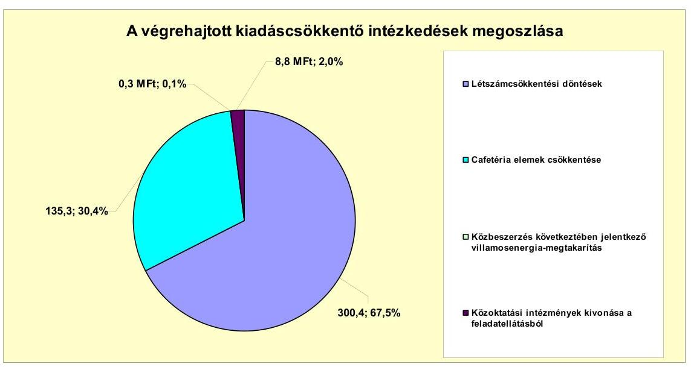

---

A létszámcsökkentő intézkedések következtében a 2007-2010. évek között a Polgármesteri hivatalban és az intézményeiknél összesen 173 álláshelyet szüntettek meg, amelyből $35(20,2 \%)$ a közoktatáshoz, 87 fő ( $50,3 \%$ ) a szociális és gyermekvédelemhez, öt ( $2,9 \%$ ) a Polgármesteri hivatalhoz, míg 46 (26,6\%) egyéb területhez kapcsolódott. A megszüntetett 173 álláshelyből $80(46,2 \%)$ szakmai álláshely volt, míg 93 (53,8\%) intézményüzemeltetéssel kapcsolatos álláshely. A vizsgált időszakban az Önkormányzatnál betöltetlen, üres álláshely nem volt.

A szociális és gyermekvédelemhez kapcsolódó 87 fős csökkenésből 85 főt jelentett a Kistérségi társulásba adás okozta csökkenés. Az egyéb területet érintő 46 fős csökkenésből 25 főt jelentett a közétkeztetés vállalkozásba adása. A közoktatáshoz kapcsolódó 35 fős csökkenést az ellátottak csökkenése miatti átszervezések indokolták. A Polgármesteri hivatalhoz kapcsolódó öt fős csökkenést a feladatok racionalizálása tette szükségessé.

A létszámcsökkenés mellett a 2007-2010. évek közötti időszakban 14 fővel növekedett is a létszám. A létszámnövekedések pénzügyi hatásait az Önkormányzat nem számszerúsítette.

A Polgármesteri hivatalhoz kapcsolódó nyolc fős növekedésből hét főt jelentett a Költségvetési Szolgáltató Iroda mint önálló intézmény megszüntetése, és a Polgármesteri hivatalba történő integrálása. A közoktatási terület érintő négy fős növekedést az általános iskolai feladatok bővülése, valamint a néptánc-oktatás személyi feltételeinek a javítása tette szükségessé. A szociális és gyermekvédelemhez kapcsolódó kettő fős növekedést a bölcsődei férőhelyek számának növekedése indokolta.

A 2007-2010. évek között végrehajtott létszámváltozások eredményét az alábbi táblázat szemlélteti:

| Megnevezés (adatok fő-ben) |  | Közoktatás | Szociális és gyermekvédelem | Egészségügy | Polgármesteri hivatal | Egyéb | Összesen |
| :--: | :--: | :--: | :--: | :--: | :--: | :--: | :--: |
| 2007. január 1-jén jóváhagyott álláshelyek száma |  | 319 | 80 | 0 | 31 | 83 | 536 |
| Megszüntetett álláshelyek száma |  | 35 | 87 | 0 | 0 | 46 | 173 |
| adódó | üres álláshelyek száma | 0 | 0 | 0 | 0 | 0 | 0 |
|  | szakmai álláshelyek száma | 23 | 54 | 0 | 3 | 0 | 90 |
|  | intézmény-üzemeltetéssel kapcsolatos |  |  |  |  |  |  |
|  | álláshelyek száma | 12 | 33 | 0 | 2 | 46 | 93 |
| Átáshely növekedése |  | 4 | 0 | 0 | 4 | 0 | 14 |
| 2010. december 31-én záró álláshelyek száma |  | 288 | 0 | 0 | 54 | 37 | 379 |
| 2007. január 1-jén foglalkoztatott létszám |  | 319 | 45 | 0 | 31 | 83 | 536 |
| Létszámcsökkenés |  | 35 | 87 | 0 | 0 | 46 | 173 |
| Létszámnövekedés |  | 4 | 0 | 0 | 4 | 0 | 14 |
| 2010. december 31-én foglalkoztatott létszám |  | 288 | 0 | 0 | 54 | 37 | 379 |

Mindezen változások összességében azt eredményezték, hogy a 2007. január 1jén induló 538 fős létszám 2010. december 31-ére 379 főre csökkent.

A helyi szervezési intézkedések végrehajtásához az Önkormányzat az áttekintett időszak alatt 39,2 millió Ft központosított támogatást igényelt és 38,2 millió Ft-ot kapott. A támogatás felhasználásával tartósan leépített létszám 23 fő volt.

A bevételnövelő intézkedések 20,7 millió Ft-ot eredményeztek a 20072011. év I. féléve közötti időszakban, amelynek 100\%-a az eszközhasználati díj megemeléséből adódó többletbevétel volt.

---

Az Önkormányzat minden év végén határozatban szabályozta a 100\%-ban önkormányzati tulajdonú gazdasági társaságai (Vízmú Kft., Városgazdálkodási Kft.) múködését. A határozat III.1. pontjában írták elő az üzemeltetésre átadott vagyon után fizetendő eszközhasználati díj mértékét. A 2009. évtől kezdődően a fizetendő eszközhasználati dí alapját az Önkormányzat az üzemeltetésre átadott összes vagyon egy éves értékcsökkenésének \%-ában határozta meg, amelynek $30 \%$-ról $45 \%$-ra történő emelése eredményezte a bevételi többletet.

Az Önkormányzat költségvetési támogatásból, valamint személyi jövedelemadóból származó bevétele a 2007. évben 1892,0 millió Ft, a 2008. évben 1700,1 millió Ft, a 2009. évben 1632,6 millió Ft, a 2010. évben 1584,8 millió Ft volt. A 2011. évre vonatkozóan ez az összeg várhatóan 1418,6 millió Ft. A vizsgált évek számadatai alapján megállapítható, hogy ezen bevételek a 20072011. év I. féléve közötti időszakban összességében (kumuláltan) 995,2 millió Ft-tal rontották az Önkormányzat pénzügyi helyzetét. Az Önkormányzat kiadáscsökkentő és bevételnövelő intézkedései - kimutatásuk szerint - mindösszesen 465,5 millió Ft-ot eredményeztek a 20072011. év I. féléve közötti időszakban. Ezek az intézkedések javították ugyan az Önkormányzat pénzügyi helyzetét, de nem tudták ellensúlyozni a költségvetési támogatásból, valamint a személyi jövedelemadóból származó bevételkiesést.

# 5. Az ÁSZ Által a korábBi ÉVEKben a PÉNZÜGYi EGYENSÚLY JAVÍTÁSÁRA TETT SZABÁLYSZERŰSÉGI ÉS CÉLSZERŰSÉGI JAVASLATOK HASZNOSULÁSA 

Az ÁSZ az Önkormányzat gazdálkodási rendszerét a 2010. évben ellenőrizte átfogó jelleggel. A gazdálkodási rendszer korábbi ellenőrzése során tett javaslatok közül a pénzügyi egyensúly javítására három szabályszerűségi és egy célszerűségi javaslat vonatkozott. A javaslatok megvalósítása érdekében a Képviselőtestület elfogadta az ÁSZ jelentésben foglaltak végrehajtására készített, felelősöket és határidőket is tartalmazó intézkedési tervet.

Az ellenőrzés során tett, a pénzügyi egyensúly javítására vonatkozó három szabályszerűségi javaslat közül kettőt hasznosítottak. A szabályszerűségi javaslatra megtett intézkedés eredményeképpen gondoskodtak arról, hogy a költségvetési rendelettervezet előkészítésekor az EU-s forrásokkal támogatott fejlesztések bevételi és kiadási előirányzatait elkülönítetten mutassák be. A kötvénykibocsátásból származó bevétel átmenetileg szabad részének befektetésénél gondoskodtak a képviselő-testületi hatáskörök átruházására vonatkozó előírások érvényesüléséről.

A polgármester intézkedése ellenére egy - a kötvénykibocsátásból származó bevétel átmenetileg szabad részének befektetésére vonatkozó - korábban tett ÁSZ javaslat nem hasznosult.

Az ÁSZ javaslatára - a helyszíni ellenőrzést követően - az életbiztosítási szerződésekben elhelyezett befektetések áthelyezését, illetve megszüntetését kezdeményezte az Önkormányzat a Brokernet Zrt.-nél. A válaszlevélből kiderült, hogy a megkötött szerződéseket csak 100\%-os veszteséggel tudták volna felmondani, így az Önkormányzat elállt ezen szándékától.

---

A célszerúségi javaslat hasznosulásaként a 2011. évi költségvetés megalkotására vonatkozó előterjesztés 1. sz. mellékletében a Képviselő-testületet tájékoztatták az Önkormányzat eladósodásának növekedéséről.

Budapest, 2012. április "ay "

Melléklet: $\quad 7 \mathrm{db}$
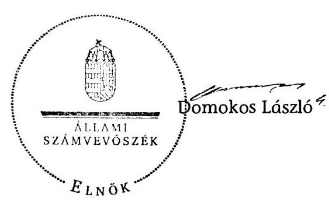

---

Kisújszállás Város Önkormányzata

1. számú melléklet
a V-3099-026/2012. számú jelentéshez

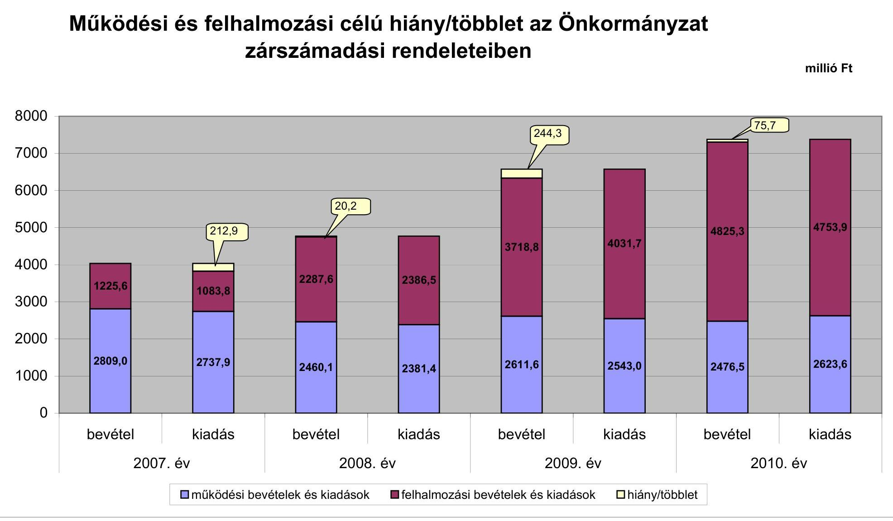

---

# Az Önkormányzat bevételei és kiadásai, valamint adósságszolgálata 2007-2010 között

|   |  |  |  |  | millió Ft  |
| --- | --- | --- | --- | --- | --- |
|  1. FOLYÓ KÖLTSÉGVETÉS* | 2007. év | 2008. év | 2009. év | 2010. év |   |
|  1.1.1. Saját működési bevételek | 563,5 | 654,1 | 1 326,9 | 1 295,6 |   |
|  1.1.2. Költségvetési támogatás** | 1 148,2 | 1 265,7 | 1 203,2 | 1 151,4 |   |
|  1.1.3. Atengedett bevételek | 790,6 | 482,4 | 476,5 | 488,8 |   |
|  1.1.4. Állambáztartáson belülről kapott támogatások | 148,7 | 146,2 | 199,4 | 236,7 |   |
|  1.1.5. EU-tól és külföldről kapott bevételek | 9,4 | 0,3 | 0,3 | 0,0 |   |
|  1.1.6. Állambáztartáson kívülről kapott bevételek | 7,4 | 9,8 | 17,4 | 13,3 |   |
|  1.1.7. Előző évi pénzmaradvány átvétel | 0,0 | 22,6 | 0,0 | 0,0 |   |
|  1.1. Folyó bevételek =1.1.1.+1.1.2.+1.1.3.+1.1.4.+1.1.5.+1.1.6.+1.1.7. | 2 667,8 | 2 581,1 | 3 223,7 | 3 199,8 |   |
|  1.2.1. Működési kiadások kamatkiadások nélkül | 2 313,5 | 2 057,6 | 2 674,9 | 2 818,5 |   |
|  1.2.2. Állambáztartáson belülre átadott pénzcszközök | 2,4 | 41,7 | 50,8 | 44,3 |   |
|  1.2.3.1. vállalkozásoknak | 30,3 | 27,1 | 5,0 | 4,9 |   |
|  1.2.3.2. EU-nak, illetve külföldre | 0,0 | 0,0 | 0,0 | 0,0 |   |
|  1.2.3.3. magáncsenélyeknek | 310,0 | 230,3 | 288,1 | 331,6 |   |
|  1.2.3.4. neugosfit szervezetelenek | 37,9 | 38,0 | 38,4 | 42,1 |   |
|  1.2.3. Transzferkiadások (=1.2.3.1+1.2.3.2+1.2.3.3+1.2.3.4) | 378,2 | 295,4 | 331,5 | 378,6 |   |
|  1.2.4 Kamatkiadások | 17,0 | 61,2 | 88,2 | 45,2 |   |
|  1.2.5. Előző évi pénzmaradvány átadás | 14,1 | 7,1 | 21,6 | 2,0 |   |
|  1.2. Folyó kiadások = 1.2.1.+1.2.2.+1.2.3.+1.2.4.+1.2.5. | 2 725,2 | 2 463,0 | 3 167,1 | 3 288,6 |   |
|  1.3. Folyó költségvetés egyenlege MŰKÖDÉSI JÓVEDELEM (1.1. - 1.2.) | -57,4 | 118,1 | 56,6 | -88,8 |   |
|  2. FELHALMOZÁSI KÖLTSÉGVETÉS*** |  |  |  |  |   |
|  2.1.1. Saját tökebevételek | 40,6 | 227,6 | 553,8 | 617,2 |   |
|  2.1.2. Állambáztartáson belülről kapott támogatások | 722,5 | 1 532,4 | 2 306,8 | 2 726,0 |   |
|  2.1.3. EU-tól és külföldről kapott támogatások | 124,4 | 0,0 | 0,0 | 0,0 |   |
|  2.1.4. Állambáztartáson kívülről kapott támogatások | 216,8 | 128,3 | 15,1 | 18,5 |   |
|  2.1. Felhalmozási bevételek (=2.1.1.+2.1.2+2.1.3+2.1.4.) | 1 104,3 | 1 888,3 | 2 875,7 | 3 361,7 |   |
|  2.2.1. Saját beruházási kiadás állva | 925,2 | 2 158,8 | 2 987,3 | 3 941,3 |   |
|  2.2.2. Saját felújítási kiadás állva | 75,3 | 40,6 | 272,1 | 17,0 |   |
|  2.2.3. Állambáztartáson belülre átadott pénzcszköz | 46,8 | 61,0 | 100,7 | 87,3 |   |
|  2.2.4. EU-nak és külföldnek adott pénzcszközök | 0,0 | 0,0 | 0,0 | 0,0 |   |
|  2.2.5. Állambáztartáson kívülre adott pénzcszközök | 49,1 | 43,2 | 46,5 | 42,3 |   |
|  2.2.6. Befektetési célú részesedések vásárlása | 0,0 | 0,0 | 0,0 | 0,0 |   |
|  2.2. Felhalmozási kiadások (=2.2.1.+2.2.2.+2.2.3.+2.2.4.+2.2.5.+2.2.6.) | 1 096,4 | 2 303,6 | 3 406,6 | 4 087,9 |   |
|  2.3. Felhalmozási költségvetés egyenlege (2.1. - 2.2.) | 7,9 | -415,3 | -530,9 | -726,2 |   |
|  3. Finanszírozási műveletek nélküli (GFS) pozíció(1.3.+2.3.) | -49,5 | -297,2 | -474,3 | -815,0 |   |
|  4. Finanszírozási műveletek |  |  |  |  |   |
|  4.1. Hitelfelvétel | 256,3 | 126,2 | 28,6 | 114,1 |   |
|  4.2. Hiteltörlesztés | 15,4 | 338,2 | 1,5 | 22,2 |   |
|  4.3. Forgatási és befektetési célú értékpapírok kibocsátása | 0,0 | 2 400,0 | 0,0 | 0,0 |   |
|  4.4. Forgatási és befektetési célú értékpapírok beváltása | 0,0 | 0,0 | 0,0 | 0,0 |   |
|  4.5. Forgatási és befektetési célú értékpapírok értékesítése | 0,0 | 0,0 | 1 477,0 | 0,0 |   |
|  4.6. Forgatási és befektetési célú értékpapírok vásárlása | 0,0 | 1 477,0 | 253,7 | 307,1 |   |
|  4.7. Egyéb finanszírozási bevételek (függő, átfutó, kiegyenlítő) | 7,5 | 8,8 | -11,3 | -63,9 |   |
|  4.8. Egyéb finanszírozási kiadások (függő, átfutó, kiegyenlítő) | 2,7 | 30,9 | 12,1 | 11,3 |   |
|  4.9. Finanszírozási műveletek egyenlege (4.1. - 4.2.+4.3.-4.4+4.5.-4.6.+4.7.-4.8.) | 245,7 | 688,9 | 1 227,0 | -290,2 |   |
|  5. Tárgyévi pénzügyi pozíció (1.3.+ 2.3.+4.9.) | 196,2 | 391,7 | 752,7 | -1 105,2 |   |
|  6. Nettó működési jövedelem =müködési jövedelem (1.3.) - töketörlesztés (4.2+4.4) | -72,8 | -220,1 | 55,1 | -111,8 |   |
|  TÁJÉKOZTATÓ ADATOK |  |  |  |  |   |
|  Összes kötelezettség | 1 242,4 | 3 311,7 | 5 986,1 | 4 264,0 |   |
|  ebből rövid lejáratú | 877,2 | 335,6 | 966,3 | 714,1 |   |
|  Összes szállítói kötelezettség | 570,4 | 279,8 | 847,7 | 433,1 |   |
|  ebből lejárt (tanúsítványból) | 8,5 | 3,0 | 54,4 | 14,9 |   |
|  Pénz és tőkepínei kötelezettség (adósság) | 590,0 | 2 975,7 | 3 069,5 | 3 750,9 |   |
|  ebből rövid lejáratú | 224,8 | 1,5 | 50,8 | 201,3 |   |
|  PPP szerződéses állomány jelenértéken (tanúsítványból) | 0,0 | 0,0 | 0,0 | 0,0 |   |
|  ebből lejárt szolgáltatási díj miatti kötelezettség | 0,0 | 0,0 | 0,0 | 0,0 |   |
|  Folyószámlabitel napi átlagos állománya (tanúsítványból) | 81,5 | 61,0 | 45,3 | 85,4 |   |
|  Likvidhitel napi átlagos állománya (tanúsítványból) | 0,0 | 0,0 | 0,0 | 0,0 |   |
|  Munkabérhitel napi átlagos állománya (tanúsítványból) | 0,2 | 0,0 | 0,0 | 0,0 |   |
|  Kezesség és garanciavállalások (tanúsítványból) | 447,8 | 437,8 | 427,3 | 416,2 |   |
|  Jogerős bírósági ítéletekből adódó kötelezettségek (tanúsítványból) | 0,0 | 0,0 | 0,0 | 0,0 |   |
|  Finanszírozásba bevonható eszközök: | 574,7 | 2 443,4 | 1 972,7 | 1 174,6 |   |
|  Tartós hitelviszonyt megtestesítő értékpapírok év végi állomán | 0,0 | 1 477,0 | 12,0 | 26,3 |   |
|  Hosszú lejáratú bankbetétek év végi állománya | 0,0 | 0,4 | 0,0 | 0,0 |   |
|  Értékpapírok év végi állomán | 0,0 | 0,0 | 241,7 | 534,5 |   |
|  Pénzcszközök (idegen pénzcszközök nélküli) év végi állománya | 574,7 | 966,0 | 1 719,0 | 613,8 |   |

- Bevételekben nem térül, a kiadásokban nem jelenik meg az amortizáció, a vagyoni helyzetet az egyenleg befolyásolja ** A költségvetési támogatásból a felhalmozási célú összeget az Önkormányzat adatszolgáltatása szerinti mértékben vettük figyelembe a 2.1.2. soron *** Bevételekben vagyon megőrzésre és bővítésre fordítható források.

---

Közümlülük Yüksek Önlenme/İnzate

Az Önkormányzat 2007-2010 években megvalósított, 2010. december 31-ig befejezett fejlesztései és azok forrásösszeítétele

|   |  |  |  |  |  |  |  |  |  |  |  |  |  |  |  |  |  |  |  |  |  |  |  |  |  |  |  |  |  |  |  |  |  |  |  |  |  |  |  |  |  |  |  |  |  |  |  |  |  |  |  |  |  |  |  |  |  |  |  |  |  |  |  |  |  |  |  |  |  |  |  |  |  |  |  |  |  |  |  |  |  |  |  |  |  |  |  |  |  |  |  |  |  |  |  |  |  |  |  | 

---

|   |  |  |  |  |  |  |  |  |  |  |  |  |  |  |  |  |  |  |  |  |  |  |  |  |  |  |  |  |  |  |  |  |  |  |  |  |  |  |  |  |  |  |  |  |  |   |
| --- | --- | --- | --- | --- | --- | --- | --- | --- | --- | --- | --- | --- | --- | --- | --- | --- | --- | --- | --- | --- | --- | --- | --- | --- | --- | --- | --- | --- | --- | --- | --- | --- | --- | --- | --- | --- | --- | --- | --- | --- | --- | --- | --- | --- | --- | --- |
|   |  |  |  |  |  |  |  |  |  |  |  |  |  |  |  |  |  |  |  |  |  |  |  |  |  |  |  |  |  |  |  |  |  |  |  |  |  |  |  |  |  |  |  |  |  |   |
|   |  |  |  |  |  |  |  |  |  |  |  |  |  |  |  |  |  |  |  |  |  |  |  |  |  |  |  |  |  |  |  |  |  |  |  |  |  |  |  |  |  |  |  |  |  |   |
|   |  |  |  |  |  |  |  |  |  |  |  |  |  |  |  |  |  |  |  |  |  |  |  |  |  |  |  |  |  |  |  |  |  |  |  |  |  |  |  |  |  |  |  |  |  |   |
|   |  |  |  |  |  |  |  |  |  |  |  |  |  |  |  |  |  |  |  |  |  |  |  |  |  |  |  |  |  |  |  |  |  |  |  |  |  |  |  |  |  |  |  |  |  |   |
|   |  |  |  |  |  |  |  |  |  |  |  |  |  |  |  |  |  |  |  |  |  |  |  |  |  |  |  |  |  |  |  |  |  |  |  |  |  |  |  |  |  |  |  |  |  |   |
|   |  |  |  |  |  |  |  |  |  |  |  |  |  |  |  |  |  |  |  |  |  |  |  |  |  |  |  |  |  |  |  |  |  |  |  |  |  |  |  |  |  |  |  |  |  |   |
|   |  |  |  |  |  |  |  |  |  |  |  |  |  |  |  |  |  |  |  |  |  |  |  |  |  |  |  |  |  |  |  |  |  |  |  |  |  |  |  |  |  |  |  |  |  |   |
|   |  |  |  |  |  |  |  |  |  |  |  |  |  |  |  |  |  |  |  |  |  |  |  |  |  |  |  |  |  |  |  |  |  |  |  |  |  |  |  |  |  |  |  |  |  |   |
|   |  |  |  |  |  |  |  |  |  |  |  |  |  |  |  |  |  |  |  |  |  |  |  |  |  |  |  |  |  |  |  |  |  |  |  |  |  |  |  |  |  |  |  |  |  |   |
|   |  |  |  |  |  |  |  |  |  |  |  |  |  |  |  |  |  |  |  |  |  |  |  |  |  |  |  |  |  |  |  |  |  |  |  |  |  |  |  |  |  |  |  |  |  |   |
|   |  |  |  |  |  |  |  |  |  |  |  |  |  |  |  |  |  |  |  |  |  |  |  |  |  |  |  |  |  |  |  |  |  |  |  |  |  |  |  |  |  |  |  |  |  |   |
|   |  |  |  |  |  |  |  |  |  |  |  |  |  |  |  |  |  |  |  |  |  |  |  |  |  |  |  |  |  |  |  |  |  |  |  |  |  |  |  |  |  |  |  |  |  |   |
|   |  |  |  |  |  |  |  |  |  |  |  |  |  |  |  |  |  |  |  |  |  |  |  |  |  |  |  |  |  |  |  |  |  |  |  |  |  |  |  |  |  |  |  |  |  |   |
|   |  |  |  |  |  |  |  |  |  |  |  |  |  |  |  |  |  |  |  |  |  |  |  |  |  |  |  |  |  |  |  |  |  |  |  |  |  |  |  |  |  |  |  |  |  |   |
|   |  |  |  |  |  |  |  |  |  |  |  |  |  |  |  |  |  |  |  |  |  |  |  |  |  |  |  |  |  |  |  |  |  |  |  |  |  |  |  |  |  |  |  |  |  |   |
|   |  |  |  |  |  |  |  |  |  |  |  |  |  |  |  |  |  |  |  |  |  |  |  |  |  |  |  |  |  |  |  |  |  |  |  |  |  |  |  |  |  |  |  |  |  |   |
|   |  |  |  |  |  |  |  |  |  |  |  |  |  |  |  |  |  |  |  |  |  |  |  |  |  |  |  |  |  |  |  |  |  |  |  |  |  |  |  |  |  |  |  |  |  |   |
|   |  |  |  |  |  |  |  |  |  |  |  |  |  |  |  |  |  |  |  |  |  |  |  |  |  |  |  |  |  |  |  |  |  |  |  |  |  |  |  |  |  |  |  |  |  |   |
|   |  |  |  |  |  |  |  |  |  |  |  |  |  |  |  |  |  |  |  |  |  |  |  |  |  |  |  |  |  |  |  |  |  |  |  |  |  |  |  |  |  |  |  |  |  |   |
|   |  |  |  |  |  |  |  |  |  |  |  |  |  |  |  |  |  |  |  |  |  |  |  |  |  |  |  |  |  |  |  |  |  |  |  |  |  |  |  |  |  |  |  |  |  |   |
|   |  |  |  |  |  |  |  |  |  |  |  |  |  |  |  |  |  |  |  |  |  |  |  |  |  |  |  |  |  |  |  |  |  |  |  |  |  |  |  |  |  |  |  |  |  |   |
|   |  |  |  |  |  |  |  |  |  |  |  |  |  |  |  |  |  |  |  |  |  |  |  |  |  |  |  |  |  |  |  |  |  |  |  |  |  |  |  |  |  |  |  |  |  |   |
|   |  |  |  |  |  |  |  |  |  |  |  |  |  |  |  |  |  |  |  |  |  |  |  |  |  |  |  |  |  |  |  |  |  |  |  |  |  |  |  |  |  |  |  |  |  |   |
|   |  |  |  |  |  |  |  |  |  |  |  |  |  |  |  |  |  |  |  |  |  |  |  |  |  |  |  |  |  |  |  |  |  |  |  |  |  |  |  |  |  |  |  |  |  |   |
|   |  |  |  |  |  |  |  |  |  |  |  |  |  |  |  |  |  |  |  |  |  |  |  |  |  |  |  |  |  |  |  |  |  |  |  |  |  |  |  |  |  |  |  |  |  |   |
|   |  |  |  |  |  |  |  |  |  |  |  |  |  |  |  |  |  |  |  |  |  |  |  |  |  |  |  |  |  |  |  |  |  |  |  |  |  |  |  |  |  |  |  |  |  |   |
|   |  |  |  |  |  |  |  |  |  |  |  |  |  |  |  |  |  |  |  |  |  |  |  |  |  |  |  |  |  |  |  |  |  |  |  |  |  |  |  |  |  |  |  |  |  |   |
|   |  |  |  |  |  |  |  |  |  |  |  |  |  |  |  |  |  |  |  |  |  |  |  |  |  |  |  |  |  |  |  |  |  |  |  |  |  |  |  |  |  |  |  |  |  |  |   |
|   |  |  |  |  |  |  |  |  |  |  |  |  |  |  |  |  |  |  |  |  |  |  |  |  |  |  |  |  |  |  |  |  |  |  |  |  |  |  |  |  |  |  |  |  |  |  |   |
|   |  |  |  |  |  |  |  |  |  |  |  |  |  |  |  |  |  |  |  |  |  |  |  |  |  |  |  |  |  |  |  |  |  |  |  |  |  |  |  |  |  |  |  |  |  |  |   |
|   |  |  |  |  |  |  |  |  |  |  |  |  |  |  |  |  |  |  |  |  |  |  |  |  |  |  |  |  |  |  |  |  |  |  |  |  |  |  |  |  |  |  |  |  |  |  |   |
|   |  |  |  |  |  |  |  |  |  |  |  |  |  |  |  |  |  |  |  |  |  |  |  |  |  |  |  |  |  |  |  |  |  |  |  |  |  |  |  |  |  |  |  |  |  |  |   |
|   |  |  |  |  |  |  |  |  |  |  |  |  |  |  |  |  |  |  |  |  |  |  |  |  |  |  |  |  |  |  |  |  |  |  |  |  |  |  |  |  |  |  |  |  |  |  |   |
|   |  |  |  |  |  |  |  |  |  |  |  |  |  |  |  |  |  |  |  |  |  |  |  |  |  |  |  |  |  |  |  |  |  |  |  |  |  |  |  |  |  |  |  |  |  |  |   |
|   |  |  |  |  |  |  |  |  |  |  |  |  |  |  |  |  |  |  |  |  |  |  |  |  |  |  |  |  |  |  |  |  |  |  |  |  |  |  |  |  |  |  |  |  |  |  |   |
|   |  |  |  |  |  |  |  |  |  |  |  |  |  |  |  |  |  |  |  |  |  |  |  |  |  |  |  |  |  |  |  |  |  |  |  |  |  |  |  |  |  |  |  |  |  |  |   |
|   |  |  |  |  |  |  |  |  |  |  |  |  |  |  |  |  |  |  |  |  |  |  |  |  |  |  |  |  |  |  |  |  |  |  |  |  |  |  |  |  |  |  |  |  |  |  |   |
|   |  |  |  |  |  |  |  |  |  |  |  |  |  |  |  |  |  |  |  |  |  |  |  |  |  |  |  |  |  |  |  |  |  |  |  |  |  |  |  |  |  |  |  |  |  |  |   |
|   |  |  |  |  |  |  |  |  |  |  |  |  |  |  |  |  |  |  |  |  |  |  |  |  |  |  |  |  |  |  |  |  |  |  |  |  |  |  |  |  |  |  |  |  |  |  |   |
|   |  |  |  |  |  |  |  |  |  |  |  |  |  |  |  |  |  |  |  |  |  |  |  |  |  |  |  |  |  |  |  |  |  |  |  |  |  |  |  |  |  |  |  |  |  |  |   |
|   |  |  |  |  |  |  |  |  |  |  |  |  |  |  |  |  |  |  |  |  |  |  |  |  |  |  |  |  |  |  |  |  |  |  |  |  |  |  |  |  |  |  |  |  |  |  |   |
|   |  |  |  |  |  |  |  |  |  |  |  |  |  |  |  |  |  |  |  |  |  |  |  |  |  |  |  |  |  |  |  |  |  |  |  |  |  |  |  |  |  |  |  |  |  |  |  |   |
|   |  |  |  |  |  |  |  |  |  |  |  |  |  |  |  |  |  |  |  |  |  |  |  |  |  |  |  |  |  |  |  |  |  |  |  |  |  |  |  |  |  |  |  |  |  |  |  |   |
|   |  |  |  |  |  |  |  |  |  |  |  |  |  |  |  |  |  |  |  |  |  |  |  |  |  |  |  |  |  |  |  |  |  |  |  |  |  |  |  |  |  |  |  |  |  |  |  |   |
|   |  |  |  |  |  |  |  |  |  |  |  |  |  |  |  |  |  |  |  |  |  |  |  |  |  |  |  |  |  |  |  |  |  |  |  |  |  |  |  |  |  |  |  |  |  |  |  |   |
|   |  |  |  |  |  |  |  |  |  |  |  |  |  |  |  |  |  |  |  |  |  |  |  |  |  |  |  |  |  |  |  |  |  |  |  |  |  |  |  |  |  |  |  |  |  |  |  |   |
|   |  |  |  |  |  |  |  |  |  |  |  |  |  |  |  |  |  |  |  |  |  |  |  |  |  |  |  |  |  |  |  |  |  |  |  |  |  |  |  |  |  |  |  |  |  |  |  |   |
|   |  |  |  |  |  |  |  |  |  |  |  |  |  |  |  |  |  |  |  |  |  |  |  |  |  |  |  |  |  |  |  |  |  |  |  |  |  |  |  |  |  |  |  |  |  |  |  |   |
|   |  |  |  |  |  |  |  |  |  |  |  |  |  |  |  |  |  |  |  |  |  |  |  |  |  |  |  |  |  |  |  |  |  |  |  |  |  |  |  |  |  |  |  |  |  |  |  |   |
|   |  |  |  |  |  |  |  |  |  |  |  |  |  |  |  |  |  |  |  |  |  |  |  |  |  |  |  |  |  |  |  |  |  |  |  |  |  |  |  |  |  |  |  |  |  |  |  |   |
|   |  |  |  |  |  |  |  |  |  |  |  |  |  |  |  |  |  |  |  |  |  |  |  |  |  |  |  |  |  |  |  |  |  |  |  |  |  |  |  |  |  |  |  |  |  |  |  |   |
|   |  |  |  |  |  |  |  |  |  |  |  |  |  |  |  |  |  |  |  |  |  |  |  |  |  |  |  |  |  |  |  |  |  |  |  |  |  |  |  |  |  |  |  |  |  |  |  |   |
|   |  |  |  |  |  |  |  |  |  |  |  |  |  |  |  |  |  |  |  |  |  |  |  |  |  |  |  |  |  |  |  |  |  |  |  |  |  |  |  |  |  |  |  |  |  |  |  |  |   |
|   |  |  |  |  |  |  |  |  |  |  |  |  |  |  |  |  |  |  |  |  |  |  |  |  |  |  |  |  |  |  |  |  |  |  |  |  |  |  |  |  |  |  |  |  |  |  |  |  |   |
|   |  |  |  |  |  |  |  |  |  |  |  |  |  |  |  |  |  |  |  |  |  |  |  |  |  |  |  |  |  |  |  |  |  |  |  |  |  |  |  |  |  |  |  |  |  |  |  |  |   |
|   |  |  |  |  |  |  |  |  |  |  |  |  |  |  |  |  |  |  |  |  |  |  |  |  |  |  |  |  |  |  |  |  |  |  |  |  |  |  |  |  |  |  |  |  |  |  |  |  |   |
|   |  |  |  |  |  |  |  |  |  |  |  |  |  |  |  |  |  |  |  |  |  |  |  |  |  |  |  |  |  |  |  |  |  |  |  |  |  |  |  |  |  |  |  |  |  |  |  |  |   |
|   |  |  |  |  |  |  |  |  |  |  |  |  |  |  |  |  |  |  |  |  |  |  |  |  |  |  |  |  |  |  |  |  |  |  |  |  |  |  |  |  |  |  |  |  |  |  |  |  |   |
|   |  |  |  |  |  |  |  |  |  |  |  |  |  |  |  |  |  |  |  |  |  |  |  |  |  |  |  |  |  |  |  |  |  |  |  |  |  |  |  |  |  |  |  |  |  |  |  |  |   |
|   |  |  |  |  |  |  |  |  |  |  |  |  |  |  |  |  |  |  |  |  |  |  |  |  |  |  |  |  |  |  |  |  |  |  |  |  |  |  |  |  |  |  |  |  |  |  |  |  |   |
|   |  |  |  |  |  |  |  |  |  |  |  |  |  |  |  |  |  |  |  |  |  |  |  |  |  |  |  |  |  |  |  |  |  |  |  |  |  |  |  |  |  |  |  |  |  |  |  |  |   |
|   |  |  |  |  |  |  |  |  |  |  |  |  |  |  |  |  |  |  |  |  |  |  |  |  |  |  |  |  |  |  |  |  |  |  |  |  |  |  |  |  |  |  |  |  |  |  |  |  |   |
|   |  |  |  |  |  |  |  |  |  |  |  |  |  |  |  |  |  |  |  |  |  |  |  |  |  |  |  |  |  |  |  |  |  |  |  |  |  |  |  |  |  |  |  |  |  |  |  |  |   |
|   |  |  |  |  |  |  |  |  |  |  |  |  |  |  |  |  |  |  |  |  |  |  |  |  |  |  |  |  |  |  |  |  |  |  |  |  |  |  |  |  |  |  |  |  |  |  |  |  |  |   |
|   |  |  |  |  |  |  |  |  |  |  |  |  |  |  |  |  |  |  |  |  |  |  |  |  |  |  |  |  |  |  |  |  |  |  |  |  |  |  |  |  |  |  |  |  |  |  |  |  |  |  |   |
|   |  |  |  |  |  |  |  |  |  |  |  |  |  |  |  |  |  |  |  |  |  |  |  |  |  |  |  |  |  |  |  |  |  |  |  |  |  |  |  |  |  |  |  |  |  |  |  |  |  |  |  |   |
|   |  |  |  |  |  |  |  |  |  |  |  |  |  |  |  |  |  |  |  |  |  |  |  |  |  |  |  |  |  |  |  |  |  |  |  |  |  |  |  |  |  |  |  |  |  |  |  |  |  |  |  |   |
|   |  |  |  |  |  |  |  |  |  |  |  |  |  |  |  |  |  |  |  |  |  |  |  |  |  |  |  |  |  |  |  |  |  |  |  |  |  |  |  |  |  |  |  |  |  |  |  |  |  |  |  |   |
|   |  |  |  |  |  |  |  |  |  |  |  |  |  |  |  |  |  |  |  |  |  |  |  |  |  |  |  |  |  |  |  |  |  |  |  |  |  |  |  |  |  |  |  |  |  |  |  |  |  |  |  |  |   |
|   |  |  |  |  |  |  |  |  |  |  |  |  |  |  |  |  |  |  |  |  |  |  |  |  |  |  |  |  |  |  |  |  |  |  |  |  |  |  |  |  |  |  |  |  |  |  |  |  |  |  |  |  |  |   |
|   |  |  |  |  |  |  |  |  |  |  |  |  |  |  |  |  |  |  |  |  |  |  |  |  |  |  |  |  |  |  |  |  |  |  |  |  |  |  |  |  |  |  |  |  |  |  |  |  |  |  |  |  |  |   |
|   |  |  |  |  |  |  |  |  |  |  |  |  |  |  |  |  |  |  |  |  |  |  |  |  |  |  |  |  |  |  |  |  |  |  |  |  |  |  |  |  |  |  |  |  |  |  |  |  |  |  |  |  |  |  |   |
|   |  |  |  |  |  |  |  |  |  |  |  |  |  |  |  |  |  |  |  |  |  |  |  |  |  |  |  |  |  |  |  |  |  |  |  |  |  |  |  |  |  |  |  |  |  |  |  |  |  |  |  |  |  |  |  |   |
|   |  |  |  |  |  |  |  |  |  |  |  |  |  |  |  |  |  |  |  |  |  |  |  |  |  |  |  |  |  |  |  |  |  |  |  |  |  |  |  |  |  |  |  |  |  |  |  |  |  |  |  |  |  |  |  |  |   |
|   |  |  |  |  |  |  |  |  |  |  |  |  |  |  |  |  |  |  |  |  |  |  |  |  |  |  |  |  |  |  |  |  |  |  |  |  |  |  |  |  |  |  |  |  |  |  |  |  |  |  |  |  |  |  |  |  |  |  |   |
|   |  |  |  |  |  |  |  |  |  |  |  |  |  |  |  |  |  |  |  |  |  |  |  |  |  |  |  |  |  |  |  |  |  |  |  |  |  |  |  |  |  |  |  |  |  |  |  |  |  |  |  |  |  |  |  |  |  |  |  |  |  |   |
|   |  |  |  |  |  |  |  |  |  |  |  |  |  |  |  |  |  |  |  |  |  |  |  |  |  |  |  |  |  |  |  |  |  |  |  |  |  |  |  |  |  |  |  |  |  |  |  |  |  |  |  |  |  |  |  |  |  |  |  |  |  |  |  |  |   |
|   |  |  |  |  |  |  |  |  |  |  |  |  |  |  |  |  |  |  |  |  |  |  |  |  |  |  |  |  |  |  |  |  |  |  |  |  |  |  |  |  |  |  |  |  |  |  |  |  |  |  |  |  |  |  |  |  |  |  |  |  |  |  |  |  |  |   |
|   |  |  |  |  |  |  |  |  |  |  |  |  |  |  |  |  |  |  |  |  |  |  |  |  |  |  |  |  |  |  |  |  |  |  |  |  |  |  |  |  |  |  |  |  |  |  |  |  |  |  |  |  |  |  |  |  |  |  |  |  |  |  |  |  |  |  |   |
|   |  |  |  |  |  |  |  |  |  |  |  |  |  |  |  |  |  |  |  |  |  |  |  |  |  |  |  |  |  |  |  |  |  |  |  |  |  |  |  |  |  |  |  |  |  |  |  |  |  |  |  |  |  |  |  |  |  |  |  |  |  |  |  |  |  |  |  |   |
|   |  |  |  |  |  |  |  |  |  |  |  |  |  |  |  |  |  |  |  |  |  |  |  |  |  |  |  |  |  |  |  |  |  |  |  |  |  |  |  |  |  |  |  |  |  |  |  |  |  |  |  |  |  |  |  |  |  |  |  |  |  |  |  |  |  |  |  |  |  |   |
|   |  |  |  |  |  |  |  |  |  |  |  |  |  |  |  |  |  |  |  |  |  |  |  |  |  |  |  |  |  |  |  |  |  |  |  |  |  |  |  |  |  |  |  |  |  |  |  |  |  |  |  |  |  |  |  |  |  |  |  |  |  |  |  |  |  |  |  |  |  |  |  |  |  |   |
|   |  |  |  |  |  |  |  |  |  |  |  |  |  |  |  |  |  |  |  |  |  |  |  |  |  |  |  |  |  |  |  |  |  |  |  |  |  |  |  |  |  |  |  |  |  |  |  |  |  |  |  |  |  |  |  |  |  |  |  |  |  |  |  |  |  |  |  |  |  |  |  |  |  |  |  |  |  |  |   |
|   |  |  |  |  |  |  |  |  |  |  |  |  |  |  |  |  |  |  |  |  |  |  |  |  |  |  |  |  |  |  |  |  |  |  |  |  |  |  |  |  |  |  |  |  |  |  |  |  |  |  |  |  |  |  |  |  |  |  |  |  |  |  |  |  |  |  |  |  |  |  |  |  |  |  |  |  |  |  |  |  |  |  |  |  |  |   |
|   |  |  |  |  |  |  |  |  |  |  |  |  |  |  |  |  |  |  |  |  |  |  |  |  |  |  |  |  |  |  |  |  |  |  |  |  |  |  |  |  |  |  |  |  |  |  |  |  |  |  |  |  |  |  |  |  |  |  |  |  |  |  |  |  |  |  |  |  |  |  |  |  |  |  |  |  |  |  |  |  |  |  |  |  |  |  |  |  |  |   |
|   |  |  |  |  |  |  |  |  |  |  |  |  |  |  |  |  |  |  |  |  |  |  |  |  |  |  |  |  |  |  |  |  |  |  |  |  |  |  |  |  |  |  |  |  |  |  |  |  |  |  |  |  |  |  |  |  |  |  |  |  |  |  |  |  |  |  |  |  |  |  |  |  |  |  |  |  |  |  |  |  |  |  |  |  |  |  |  |  |  |  |  |  |  |  |  |  |  |  |  | 

---

Kisújazálás Város Önkormányzata

Az Önkormányzat 2010. december 31-én folyamatban lévő fejlesztési feladataira 2010. december 31-ig teljesített kifizetések és azok forrásösszetétel

|  |   |   |   |   |   |   |   |   |   |   |   |   |   |   |   |   |   |   |   |   |   |   |   |   |   |   |   |   |   |   |   |   |   |   |   |   |   |   |   |   |   |   |   |   |   |   |   |   |   |   |   |   |   |   |   |   |   |   |   |   |   |   |   |   |   |   |   |   |   |   |   |   |   |   |   |   |   |   |   |   |   |   |   |   |   |   |   |   |   |   |   |   |   |   |   |   |   |   |   |   |  

---

|   |  |  |  |  |  |  |  |  |  |  |  |  |  |  |  |  |  |  |  |  |  |  |  |  |  |  |  |  |  |  |  |  |  |  |  |  |  |  |  |  |  |  |  |  |  |  |  |  |  |  |  |  |  |  |  |  |  |  |  |  |  |  |  |  |  |  |  |  |  |  |  |  |  |  |  |  |  |  |  |  |  |  |  |  |  |  |  |  |  |  |  |  |  |  |  |  |  |  |  |  |  |  | 

---

### **Az Önkormányzat által beadott, elbírálás alatti pályázati forrásból megvalósítani tervezett fejlesztéseihez kapcsolódó kötelezettségvállalásai és azok forrásösszetétele**

|   |  |  |  |  |  |  |  |  |  |  |  |  |  |  |  |  |  |  |  |  |  |  |  |  |  |  |  |  |  |  |  |  |  |  |  |  |  |  |  |  |  |  |  |  |  |  |  |  |  |  |  |  |  |  |  |  |  |  |  |  |  |  |  |  |  |  |  |  |  |  |  |  |  |  |  |  |  |  |  |  |  |  |  |  |  |  |  |  |  |  |  |  |  |  |  |  |  |  |  |  | 

---

## **Az önkormányzati feladatok ellátásában résztvevő gazdasági társaságok**

|  Gazdasági társaság
megnevezése | önkormányzat | önkormányzat
gazdasági
társaságának | saját tőke,
jegyzett tőke
aránya | kötelező
feladathoz | önként vállalt
feladathoz | hosszú lejáratú
hítebbő,
kövvényből | tüzögböl | lejáratú
szállítói
állományból | működési célra átadott pénzeszköz | felhalmozási célra átadott pénzeszköz  |
| --- | --- | --- | --- | --- | --- | --- | --- | --- | --- | --- |
|   |  |  |  |  |  |  |  |  | 2007. | 2008.  |
|  1. 100%-os tulajdoni hányadó gazdasági társaságok: |  |  |  |  |  |  |  |  |  |   |
|  Kisújszállási
Városgazdálkodási Kft. | 100,0 | 0,0 | 2,0 | 482,9 |  | 0,9 | 1,7 |  | 14,6 | 14,0  |
|  Kisújszállási Vízmú Kft. | 100,0 | 0,0 | 22,0 | 2 800,7 |  |  |  |  | 3,8 | 8,8  |
|  100%-os tulajdoni hányadó gazdasági társaságok | x | x | x | 3 283,6 | 0,0 | 0,9 | 1,7 |  | 3,8 | 23,4  |
|  Összesen |  |  |  |  |  |  |  |  |  |   |
|  11. 75-99%-os tulajdoni hányadó gazdasági társaságok: |  |  |  |  |  |  |  |  |  |   |
|  75-99%-os tulajdoni hányadó gazdasági társaságok | x | x | x | 0,0 | 0,0 | 0,0 | 0,0 |  | 0,0 | 0,0  |
|  Összesen |  |  |  |  |  |  |  |  |  |   |
|  75%-telenít tulajdoni hányadó gazdasági társaságok | x | x | x | 3 283,6 | 0,0 | 0,9 | 1,7 |  | 3,8 | 23,4  |
|  8. 51-74%-os tulajdoni hányadó gazdasági társaságok: |  |  |  |  |  |  |  |  |  |   |
|  51-74%-os tulajdoni hányadó gazdasági társasásonk összesen | x | x | x | 0,0 | 0,0 | 0,0 | 0,0 |  | 0,0 | 0,0  |
|  IV. egyéb, közfeladatot ellátó gazdasági társaságok: |  |  |  |  |  |  |  |  |  |   |
|  Cilybusz Közlekedési Kft. | 0,0 | 95,0 | 1,5 |  |  |  |  |  | 1,4 | 4,8  |
|  Egyéb, közfeladatot ellátó gazdasági társaságok | x | x | x | 0,0 | 0,0 | 0,0 | 0,0 |  | 1,4 | 4,8  |
|  Összesen |  |  |  |  |  |  |  |  |  |   |
|  Összesen | x | x | x | 3 283,6 | 0,0 | 0,9 | 1,7 |  | 0,2 | 28,2  |