# ÁLLAMI   SZÁMVEVŐSZÉK 

## JELENTÉS

Kisvárda Város Önkormányzata pénzügyi helyzetének ellenőrzéséről (43/4)

---

# Állami Számvevőszék 

Iktatószám: V-3121-024/2012.
Témaszám: 1015
Vizsgálat-azonosító szám: V0560152

## Az ellenőrzést felügyelte:

Dr. Varga Sándor
számvevő igazgatóhelyettes
Az ellenőrzést vezette:
Renkó Zsuzsanna
számvevő tanácsos
Ellenőrzési csoportvezető:
Lingné Rajz Borbála
számvevő tanácsos
Az ellenőrzést végezték:
Fórián Erika
számvevő tanácsos

Ráczné Orosz Diána
számvevő

---

# TARTALOMJEGYZÉK 

BEVEZETÉS ..... 9
I. ÖSSZEGZŐ MEGÁLLAPÍTÁSOK, KÖVETKEZTETÉSEK, JAVASLATOK ..... 13
II. RÉSZLETES MEGÁLLAPÍTÁSOK ..... 27

1. Az Önkormányzat kötelező és önként vállalt feladatai, a feladatellátás szervezeti keretei és annak változásai ..... 27
2. Az Önkormányzat pénzügyi egyensúlyi helyzetét befolyásoló tényezők ..... 32
2.1. A működési és a felhalmozási egyensúly változása ..... 34
2.2. Az Önkormányzat bevételeinek változása ..... 38
2.3. Az Önkormányzat működési és felhalmozási célú kiadásainak változása ..... 41
3. Az Önkormányzat kötelezettségei ..... 45
3.1. Az Önkormányzat pénzintézeti kötelezettségeinek változása ..... 45
3.2. A szállítói kötelezettségek változása ..... 53
3.3. Egyéb kötelezettségek változása ..... 54
4. A pénzügyi egyensúly megteremtése érdekében hozott intézkedések eredménye ..... 57
5. Az ÁSZ által a korábbi években a pénzügyi egyensúly javítására tett szabályszerűségi és célszerűségi javaslatok hasznosulása ..... 60

---

# MELLÉKLETEK 

1. számú Működési és felhalmozási célú hiány/többlet a 2007-2010 közötti időszakban az Önkormányzat zárszámadási rendeleteiben (1 oldal)
2. számú Az Önkormányzat bevételei és kiadásai, valamint adósságszolgálata 2007-2010 között (1 oldal)
3/a. számú Az Önkormányzat 2007-2010. években megvalósított, 2010. december 31-ig befejezett fejlesztései és azok forrásösszetétele (1 oldal)
3/b. számú Az Önkormányzat 2010. december 31-én folyamatban lévő fejlesztési feladataira 2010. december 31-ig teljesített kifizetések és azok forrásösszetétele (1 oldal)
3/c. számú Az Önkormányzat 2010. december 31-én folyamatban lévő fejlesztési feladataira 2010. december 31-én fennálló kötelezettségek és azok forrásösszetétele ( 1 oldal)
3/d. számú Az Önkormányzat által beadott, elbírálás alatti pályázati forrásból megvalósítani tervezett fejlesztéseihez kapcsolódó kötelezettségvállalásai és azok forrásösszetétele (1 oldal)
3. számú Az önkormányzati feladatok ellátásában résztvevő gazdasági társaságok (1 oldal)

---

# RÖVIDÍTÉSEK JEGYZÉKE 

## Törvények

Adósságrendezési tv.
Áht. 1
Áht. 2
Hatásköri tv.

Ötv.
Ptk.
Stabilitás tv.
Számv. tv.

## Rendeletek

Ámr. 1
Ámr. 2
Áhsz.

SzMSz

## Szórövidítések

áfa
ÁSZ
EU
GDP
jegyző
Képviselő-testület
OEP
ÖNHIKI támogatás
Önkormányzat
polgármester
Polgármesteri hivatal
PPP konstrukció
szja
a helyi önkormányzatok adósságrendezési eljárásáról szóló 1996. évi XXV. törvény
az államháztartásról szóló 1992. évi XXXVIII. törvény, hatályos 2011. december 31-ig
az államháztartásról szóló 2011. évi CXCV. törvény
a helyi önkormányzatok és szerveik, a köztársasági megbízottak, valamint egyes centrális szervek feladat- és hatásköréről szóló 1991. évi XX. törvény
a helyi önkormányzatokról szóló 1990. évi LXV. törvény
a Polgári Törvénykönyvről szóló 1959. évi IV. törvény
Magyarország gazdasági stabilitásáról szóló 2011. évi CXCIV. törvény
a számvitelről szóló 2000. évi C. törvény
az államháztartás működési rendjéről szóló 217/1998. (XII. 30.) Korm. rendelet
az államháztartás működési rendjéről szóló 292/2009. (XII. 19.) Korm. rendelet
az államháztartás szervezetei beszámolási és könyvvezetési kötelezettségének sajátosságairól szóló 249/2000. (XII. 24.) Korm. rendelet
Kisvárda Város Önkormányzatának 16/2010. (XI. 29.) számú rendelete az Önkormányzati Képviselő-testület és Szervei Szervezeti és Működési Szabályzatáról
általános forgalmi adó
Állami Számvevőszék
Európai Unió
Bruttó hazai termék
Kisvárda Város Önkormányzatának jegyzője
Kisvárda Város Képviselő-testülete
Országos Egészségbiztosítási Pénztár
Önhibáján kívül hátrányos helyzetben lévő helyi önkormányzatok támogatása
Kisvárda Város Önkormányzata
Kisvárda Város Önkormányzatának polgármestere
Kisvárda Város Önkormányzatának Polgármesteri hivatala Public Private Partnership (Partnerségi együttműködés közfeladatok ellátására a magánszektor bevonásával) személyi jövedelemadó

---

.

---

# ÉRTELMEZŐ SZÓTÁR 

banki kitettség

BUBOR

CLF módszer

EURIBOR
használhatósági fok
kamatkockázat
kötelező közszolgáltatás
közfeladat

Az önkormányzat pénzügyi helyzete olyan külső körülmények hatására is módosulhat, amelyekre az önkormányzatnak nincs hatása, emiatt banki kitettsége keletkezik. Pl: rövid távú kötelezettségek fennállása esetén kizárólag a bank egyoldalú döntésén múlik, hogy továbbra is biztosít-e hitelt az önkormányzatnak, valamint azt milyen feltételekkel bocsátja az önkormányzat rendelkezésére.
Budapesti Bankközi Forint Hitelkamatláb. Irányadó, referencia jellegű kamatláb. Mértékét az MNB naponta állapítja meg a banki kamatok figyelembevételével. Közzététele naponta történik.
Az önkormányzatok költségvetése elemzésének eszköze. A módszer következetesen elkülöníti a folyó és a felhalmozási költségvetés bevételeit és kiadásait, azok költségvetési egyenlegeit. Bizonyos mértékig a vállalati gazdálkodás logikai elemeit érvényesíti az önkormányzatok pénzügyi, jövedelmi helyzetének vizsgálata során. Az értékelés a pénzügyi kapacitás fogalmát helyezi a középpontba.
A frankfurti bankközi piacon jegyzett, az Európai Központi Bank szabályainak megfelelően megállapított kínálati kamatláb. Az EURIBOR értékét a legfontosabb európai bankok hitelkínálatának kamatlábai alapján a Reuters ügynökség számolja ki és teszi közzé naponta. A magyar pénzintézetek is ezt használják viszonyítási alapnak EUR hitelek esetén.
Az eszközgazdálkodás vizsgálatának elemzése során használt mutató. Számításakor a tárgyi eszköz könyv szerinti (nettó) értékét viszonyítják a tárgyi eszköz bruttó (beszerzési/létesítési) értékéhez. A %-ban kifejezett mutató csökkenése az eszköz állagának romlására, avulására utal, ami maga után vonja az üzemeltetési és fenntartási költségek növekedését is.
A változó kamatozású forint-, vagy a devizahitelek futamideje alatt a kamat emelkedése miatt fennálló kamatkockázat, melynek növekedése miatt nő a hitel törlesztő részlete.
A helyi önkormányzati feladatkörbe tartozó, a köztisztasággal és a településtisztasággal, valamint az élet- és vagyonbiztonsággal összefüggő egyes - közszolgáltatás útján megvalósuló - közfeladatok ellátása, amelynek kötelező igénybevételét külön jogszabály (törvény, helyi önkormányzati rendelet) határoz meg.
Állami, helyi, illetve kisebbségi önkormányzati feladat, amelynek ellátásáról az államnak, illetve az önkormányzatoknak kell gondoskodni. A hatályos szabályozás szerint közfeladatot törvény és önkormányzati rendelet álla-

---

LIBOR
önkormányzat többségi tulajdonában lévő gazdasági társaságok
pénzügyi kapacitás
pénzügyi kockázat
píthat meg. Az önkormányzatok által ellátandó feladatok keretszerű meghatározását az Ötv. tartalmazza.
Angol kifejezés, a London Interbank Offered Rate rövidítése. Jelentése: Londoni bankközi, referencia jellegű kínálati (hitel) kamatláb.
Az önkormányzat a gazdasági társaságban a szavazatok több mint ötven százalékával vagy a Ptk. 685/B. § (2)-(3) bekezdéseiben rögzített meghatározó befolyással rendelkezik. A befolyással rendelkező akkor rendelkezik egy jogi személyben meghatározó befolyással, ha annak tagja, illetve részvényese, és jogosult e jogi személy vezető tisztségviselői vagy felügyelőbizottsága tagjai többségének megválasztására, illetve visszahívására, vagy a jogi személy más tagjaival, illetve részvényeseivel kötött megállapodás alapján egyedül rendelkezik a szavazatok több mint ötven százalékával (Ptk. 685/B. § (2) bekezdés). A meghatározó befolyás akkor is fennáll, ha a befolyással rendelkező számára e jogosultságok közvetett módon (köztes vállalkozásain keresztül, a Ptk. 685/B. § (3), (4) bekezdés szerint) biztosítottak.
A helyi önkormányzat és az önkormányzat irányítása alá tartozó költségvetési szerv többségi tulajdonában, illetve többségi befolyása alatt álló gazdálkodó szervezet esetében hitelfelvétel, kölcsönfelvétel, garancia- vagy kezességvállalás, tartozásátvállalás, tartozáselengedés, értékpapírkibocsátás, vásárlás, pénzügyi lízing, tartós bérleti szerződés, ingyenes vagyonjuttatás (így különösen: ajándékozás, ingyenes engedményezés), vagy követelésvásárlás, követelésengedményezés végrehajtására vonatkozóan az Áht., 100/M. § (4) bekezdése alapján az önkormányzat rendelkezik döntési jogosultsággal.
A pénzügyi kapacitás (financial capacity) az adósok hitelfelvételi képességének azon mértéke, ahol még anélkül tudják növelni az adósságot, hogy csökkenteniük kellene akár a jelenbeli, akár a jövőben esedékes kiadásaikat a fizetésképtelenség elkerülése érdekében. (Forrás: Az önkormányzati rendszer pénzügyi helyzete, ÁSZKUT tanulmány 2010.)
A működési kockázat egyik eleme. Megmutatkozhat a költségvetés nagyságrendjének, szerkezetének nem megalapozott módosításaiban, a bevételi és a kiadási előirányzatoktól lényegesen eltérő teljesítésekben, a nem megfelelő belső kontrollrendszer működésében, a tudatos károkozásokban, a biztosítások elmaradásában, a hibás fejlesztési döntésekben, a nem a terveknek megfelelő forrásfelhasználásokban. Jelentkezhet továbbá a bevételek és kiadások ütemkülönbsége miatt felvett folyószámla- és likvid hitelek költségvetési év végén fennálló egyenlege miatt, amely az önkormányzat költségvetésébe - akár tartósan - beépülő forráshiányt jelzi.

---

SNA
szállítói kitettség
törlesztési kockázat

System of National Account, azaz a Nemzeti Számlák Rendszere, amely a gazdasági szektorok által létrehozott valamennyi terméket és szolgáltatást figyelembe veszi.
Az önkormányzat pénzügyi helyzete olyan külső körülmények hatására is módosulhat, amelyekre az önkormányzatnak nincs hatása, emiatt szállítói kitettsége keletkezik. Pl. a lejárt szállítói tartozások rendezése függhet attól, hogy a szállító milyen intézkedéseket foganatosít az önkormányzattal szemben.
Annak a kockázata, hogy a megfelelő időben és mértékben a hitelt felvevőnél rendelkezésre állnak-e a pénzintézetek és egyéb szervek felé fennálló kötelezettségek visszafizetéséhez, a hitelek és kölcsönök törlesztéséhez szükséges pénzügyi források.
A törlesztési kockázatot növeli a kamat- és árfolyam növekedése, mivel ezekben az esetekben az adósságszolgálat nőhet. Törlesztési kockázatot okozhat a visszafizetésre tervezett forrás elérésének, teljesítésének bizonytalansága (pl. a visszafizetéshez tervezett tartalékolás elmaradt, a tervezettnél alacsonyabb a saját bevétel, a helyi adóból származó bevétel az adóalanyok, adóalapok csökkenése miatt nem teljesül).

---

.

---

# JELENTÉS 

## Kisvárda Város Önkormányzata pénzügyi helyzetének ellenőrzéséről

## BEVEZETÉS

Az Állami Számvevőszék 2011. évtől érvényes stratégiája új irányt szabott a helyi önkormányzatok gazdálkodásának ellenőrzésében is. Az ÁSZ - küldetése és jövőképe szerint - szilárd szakmai alapokra támaszkodva értékteremtő ellenőrzéseivel és helyzetelemzéseivel az államháztartás egészében, így a helyi önkormányzati alrendszerben is elő kívánja segíteni a közpénzek és a közvagyon szabályos, gazdaságos, hatékony és eredményes felhasználását. E folyamat részeként - az államháztartási hiány alakulásának összetevőire is figyelemmel végezzük az önkormányzati alrendszer pénzügyi helyzetelemzését.

Az államháztartás helyi szintjén a 304 városnak ${ }^{1}$ az általuk ellátott közszolgáltatások volumenére is tekintettel a közfeladatok ellátásában kiemelt szerepe van. E települések 2011. január 1-jei népessége 3169 ezer fő volt.

Feladataik és hatásköreik az Ötv. mellett különböző ágazati törvények által meghatározottak, miközben a feladatellátás szervezeti kereteit - ezen belül a gazdasági társaságok közszolgáltatások ellátásában betöltött szerepét - saját maguk határozzák meg. A gazdasági társaságok által ellátott feladatok esetén a gazdálkodás, továbbá az önkormányzatok pénzügyi egyensúlyi helyzetére ható közvetlen kockázatok egy része kikerült az önkormányzati alrendszerből. A többségi önkormányzati tulajdonban lévő társaságok gazdálkodásának körülményei befolyásolhatják a városok pénzügyi egyensúlyi helyzetének megítélésében rejlő kockázatokat.

Az áttekintett időszakban az önkormányzati forrásszabályozás elvei lényegesen nem változtak. Az önkormányzatok gazdasági mozgásterét a központi költségvetéstől való függőség mellett jelentősen befolyásolja a helyi adókivetési jog gyakorlása. A városok gazdálkodási szabadságának lényeges eleme, hogy anyagi lehetőségeik függvényében dönthettek arról, hogy feladataik közül azokat, amelyek megoldására az Ötv. szerint a települési önkormányzat nem kötelezhető, a megyei önkormányzat fenntartásába adhatták. E döntések differenciáltan érintették a városok pénzügyi helyzetét.

[^0]
[^0]:    ${ }^{1}$ A megyei jogú városok nélkül figyelembe vett városok száma 304 városi önkormányzatot jelent.

---

A városi önkormányzatok 2007-2010 között teljesített bevételeinek alakulását és összetételét a következő ábra szemlélteti:
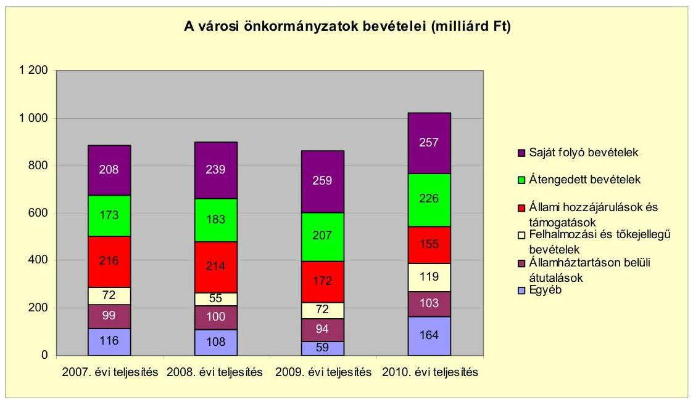

Az önkormányzati alrendszer pénzügyi helyzetértékelése során új elemzési módszereket alkalmazott az ellenőrzés. A költségvetési beszámoló adatok elemzése helyett az önkormányzat pénzügyi helyzetét a CLF módszerrel értékeltük, amelynek lényegét és számításának módszerét a jelentés 2. pontjában, és a jelentés 2. számú mellékletében ismertetjük részletesen.

Az új módszereken alapuló helyzetértékelés fontosságát az adja, hogy a helyi önkormányzatok bruttó adósságállománya ${ }^{2}$ a 2010. évi költségvetési beszámolók alapján 1248 milliárd Ft-ot tett ki. Ezen belül a 304 város adóssága 383 milliárd Ft volt, amely az önkormányzati alrendszer teljes adósságállományának 30,7%-át jelentette ${ }^{3}$.

A mérlegben kimutatott bruttó adósságállomány mellett az önkormányzatok számára az eszközállomány műszaki állapotának megőrzése is előbb-utóbb pénzügyi kötelezettséget jelent. Az elhasználódott eszközök pótlására forrást biztosító amortizációs (felújítási) alap képzésének ${ }^{4}$ elmaradása maga után vonhatja a feladatellátást kiszolgáló tárgyi eszközök állagának erőteljes romlását. Emellett a 2007-2013-as időszakra meghirdetett, vissza nem térítendő EU-s

[^0]
[^0]:    ${ }^{2}$ Az önkormányzati mérlegbeszámolókból számított bruttó adósságállomány
 2010. év végi összege magában foglalja a fejlesztési és a működési célú kötvénykibocsátások, a beruházási és fejlesztési hitelek, a működési célú hosszú lejáratú hitelek, a rövid lejáratú hitelek, váltótartozások miatti kötelezettségek teljes (2011-ben, illetve az azt követő években esedékes) állományát. Az önkormányzatok 2007. év végi mérleg szerinti adósságállománya 692 milliárd Ft volt.
    ${ }^{3}$ A fővárosi és a kerületi önkormányzatok adósságának figyelmen kívül hagyásával számított 977 milliárd Ft összegű bruttó adósságállományból a városok 39,2\%-kal részesedtek.
    ${ }^{4}$ Erre a jelenlegi szabályozási környezetben nem kötelezi előírás az önkormányzatokat.

---

fejlesztési forrásokhoz való hozzájutás lehetősége felerősítette az önkormányzati alrendszer fejlesztési igényeit, amelyek a felhalmozási költségvetési hiány folyamatos emelkedésén túl - az előírt jövőbeni fenntartási kötelezettség miatt - tovább terhelhetik az önkormányzatok költségvetését ${ }^{5}$.

Az ÁSZ a 2011. évi ellenőrzési tervében 43. számú, az Önkormányzatok gazdálkodási rendszerének ellenőrzése részeként áttekinti, és elemzi az önkormányzatok pénzügyi helyzetét. A gazdálkodás szabályszerűségét az ÁSZ az előző évek során ebben az önkormányzati körben is ellenőrizte. Jelen vizsgálatunk a tett javaslataink pénzügyi helyzetet érintő pontjainak hasznosítására utóellenőrzés jelleggel tér ki.

Az ellenőrzés megállapításait az Önkormányzat által kitöltött - teljességi nyilatkozattal megerősített - 27 tanúsítványon szolgáltatott adatokra alapoztuk. Ellenőrzési bizonyítékként használtuk fel továbbá:

- a képviselő-testületi és bizottsági előterjesztéseket, a döntés-előkészítés során készített dokumentumokat;
- a kötelezettségvállalások dokumentumait;
- a pénzügyi-számviteli nyilvántartásokat;
- az éves költségvetési beszámolókat;
- a költségvetési és zárszámadási rendeleteket.

Az ellenőrzés a 2007. január 1. - 2011. június 30. közötti időszakot ölelte fel. A pénzintézeti kötelezettségek állományának vizsgálatakor az ellenőrzött időszak 2006. december 31. - 2011. június 30. közötti időszakra terjedt ki.

Az ellenőrzés során vizsgáltunk minden olyan körülményt és adatot, amely a program végrehajtásához kapcsolódott és a pénzügyi helyzet alakulására hatást gyakorló releváns tények és folyamatok feltárásához szükségessé vált.

# Az ellenőrzés célja annak értékelése volt, hogy: 

- a vizsgált időszakban a kötelező és önként vállalt feladatok ellátását biztosító szervezeti keretekben, a feladatellátás módjában bekövetkezett változások milyen hatást gyakoroltak az Önkormányzat pénzügyi helyzetének alakulására;
- az Önkormányzat pénzügyi - ezen belül működési és felhalmozási - egyensúlya mely tényezők hatására miként változott, és az Önkormányzat milyen intézkedéseket tett a pénzügyi egyensúly javítása érdekében;

[^0]
[^0]:    ${ }^{5}$ Az Állami Számvevőszék 2011 júniusában közzétett 1108. számú, a helyi önkormányzatok fejlesztési célú támogatási rendszerének ellenőrzéséről szóló jelentésében feltárta a fejlesztési folyamatok problémáit. A helyi önkormányzatok elsősorban azokat a fejlesztéseket valósították meg, amelyekhez támogatást lehetett igényelni. A fejlesztési célok közül a magasabb támogatási intenzitású pályázatokat részesítették előnyben. A fejlesztéssel megvalósuló létesítmények jövőbeli üzemeltetésének várható ráfordításait az önkormányzatok $71,9 \%$-a nem mérte fel.

---

- a költségvetési kiadások finanszírozása érdekében vállalt pénzintézeti kötelezettségek hogyan alakultak, továbbá milyen kötelezettségek fennállása befolyásolja az Önkormányzat jövőbeli pénzügyi helyzetét;
- hasznosultak-e a gazdálkodási rendszer korábbi ellenőrzése során a pénzügyi egyensúly javítására az ÁSZ által tett szabályszerűségi és célszerűségi javaslatok.

Az ellenőrzés típusa: szabályszerűségi vizsgálat.
A vizsgálat jogszabályi alapját az Állami Számvevőszékről szóló 2011. évi LXVI. törvény 1. § (3), 5. § (2)-(6) bekezdései, továbbá az Áht. 120/A. § (1), valamint az Áht. 61. § (2) bekezdése előírásai képezik.
    ${ }_{2}$

Kisvárda város lakosainak száma 2010. január 1-jén 16669 fő volt.
Az Önkormányzat - az éves költségvetési beszámolója szerint - a 2010. évben 9425,2 millió Ft költségvetési bevételt ért el, és 9048,5 millió Ft költségvetési kiadást teljesített, 2010. december 31-én a könyvviteli mérleg szerint 3210,2 millió Ft értékű vagyonnal rendelkezett. Az Önkormányzat 2009-ben 4000,0 ezer EUR összegben kötvényt bocsátott ki, ezen túl a vizsgált időszak végén 11 hosszú lejáratú hitellel rendelkezett.

---

# I. ÖSSZEGZŐ MEGÁLLAPÍTÁSOK, KÖVETKEZTETÉSEK, JAVASLATOK 

Az Önkormányzat - adatszolgáltatása alapján - a 2010. évben a kisebbségi önkormányzatok és az egészségügyi intézmények kiadásait nem tartalmazó működési költségvetési kiadásaiból ( 4741,2 millió Ft) 3124,4 millió Ft-ot $(65,9 \%)$ a kötelező feladatok, 1616,8 millió Ft-ot ( $34,1 \%$ ) az önként vállalt feladatok ellátására fordított. Az önként vállalt feladatok a középfokú oktatás, az alapfokú zene- és művészetoktatás, a pedagógiai szakszolgálati tevékenység, a fekvő- és járóbeteg szakellátás, az időskorúak otthona ellátás, a hajléktalanok átmeneti szállása, a távhő- és energiaszolgáltatás, a fürdő, sportpálya és sportcsarnok, piac és vásártér üzemeltetése, közterület felügyelet és mezőőri tevékenység ellátásához kapcsolódtak. Az Önkormányzat a kötelező és az önként vállalt feladatainak besorolásáról az SzMSz-ben rendelkezett, azok terjedelmét az éves költségvetési rendeletekben az adott évi költségvetés forrásainak ismeretében határozták meg.

Az Önkormányzat feladatellátásának szervezeti struktúráját 2011. június 30-i állapotnak megfelelően a következő ábra szemlélteti:
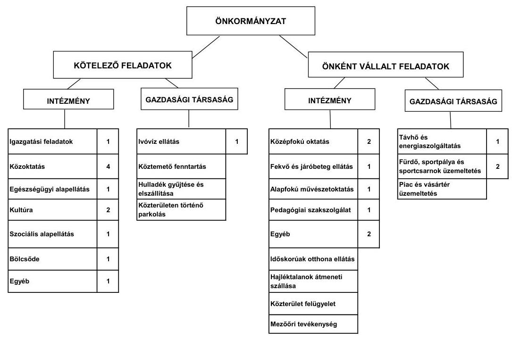

Az Önkormányzat feladatait 2011. június 30-án (a Polgármesteri hivatallal együtt) 18 költségvetési szervvel és négy gazdasági társaság keretében látta el. Az intézményi összevonások, átszervezések, valamint az alapfokú művészetoktatási tevékenység racionalizálásának következtében a feladatellátás telephelyeinek száma a 2007. évi 50-ről 2011. év I. félév végére 43-ra csökkent. A Képviselő-testület 2011. augusztus 31-i hatállyal döntött egy tagóvoda és egy tagiskola egyházi fenntartásba történő átadásáról.

---

Az Önkormányzat 2011. június 30-án három gazdasági társaságban kizárólagos tulajdonnal, egy társaságban 50\% alatti tulajdoni hányaddal rendelkezik. A gazdasági társaságok a távhő- és energiaszolgáltatás, a fürdő, a sportpálya és sportcsarnok-üzemeltetés, valamint az ivóvízellátás területén kaptak szerepet az Önkormányzat feladatellátásában. A gazdasági társaságok az ellenőrzött időszakban kizárólag működési célú pénzeszköz átadásban részesültek az Önkormányzattól, összesen 32,7 millió Ft összegben.

A működési kiadásokra 2010-ben 4741,2 millió Ft-ot fordított az Önkormányzat, amely 246,2 millió Ft-tal (5,5\%-kal) haladta meg a megelőző három év átlagos működési kiadásainak összegét. A működési kiadások 66,8\%-át intézményi körben, 33,2\%-át a Polgármesteri hivatalban realizálták a 2010. évben.

Az egyes közszolgáltatások feladatellátásában résztvevő intézmények működési kiadásai finanszírozásának forrását ágazatonként a következő ábra szemlélteti:
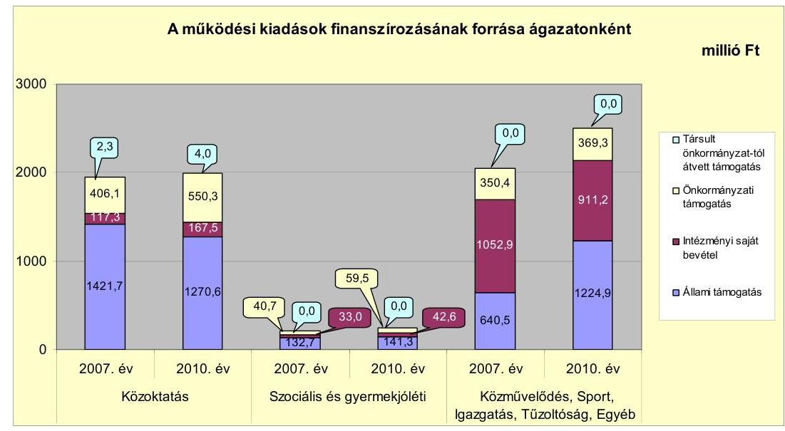

A közoktatási ágazatban a működési kiadások összege a 2007. évről a 2010. évre kismértékben 2,3\%-kal (45,0 millió Ft-tal) növekedett. Az ágazatban az emelkedő ellátotti létszám ellenére az állami támogatás összege a 2007. évi 1421,7 millió Ft-hoz képest 10,6\%-kal (151,1 millió Ft-tal) csökkent a forrásszabályozásban bekövetkezett változások miatt. A forráskiesés ellensúlyozásának következtében az önkormányzati támogatás összege 35,5\%-kal (144,2 millió Ft-tal) emelkedett 2007. évről 2010. évre. A saját bevétel nagysága a 2007. évi 117,3 millió Ft-ról 2010. évre 167,5 millió Ft-ra 42,8\%-kal (50,2 millió Ft-tal) növekedett az átvett működési célú pályázati támogatások miatt.

A szociális és gyermekjóléti ágazat tekintetében a működési kiadások összege a 2007. évi 206,4 millió Ft-ról a szakmai álláshelyek növekedésének, valamint a bővülő feladatellátás következtében 37,0 millió Ft-tal (17,9\%-kal) emelkedett a 2010. évben. Az állami támogatás 2010. évi összege 6,5\%-kal (8,6 millió Ft-tal) haladta meg a 2007. évi mértéket. A saját bevétel nagysága a 2010. évben a térítési díjak emelkedése miatt 9,6 millió Ft-tal (29,1\%-kal) magasabb a 2007. évi összegnél.

---

Az egyéb ágazatok (közművelődés, tűzoltóság, polgármesteri hivatal, egyéb intézmények) működési kiadásainak 2010. évi összege 22,6\%-kal (461,6 millió Ft-tal) haladta meg a 2007. évi értéket. Az állami támogatások 2010. évi összege a pénzbeni ellátások növekvő nagysága miatt a 2007. évi 640,5 millió Ft-ról közel duplájára 1224,9 millió Ft-ra emelkedett. Az önkormányzati támogatás összege 5,4\%-kal (18,9 millió Ft-tal) nőtt, míg a saját bevétel összege 13,5\%-kal (141,7 millió Ft-tal) csökkent.

A vizsgált időszakban a kötelező és az önként vállalt feladatok ellátását biztosító szervezeti keretekben, a feladatellátás módjában bekövetkezett változások eredményeként elért 372,2 millió Ft összegű megtakarítás javította az Önkormányzat pénzügyi egyensúlyi helyzetét.

Az Önkormányzat pénzügyi kapacitása a 2007. és a 2008. években negatív, a 2009. és a 2010. években pozitív volt, a működési jövedelem 2007. és 2008. évi értékei miatt. Az Önkormányzat pénzügyi kapacitásának, működési jövedelmének, tőketörlesztésének alakulását a 2007-2010. években az alábbi ábra mutatja be:
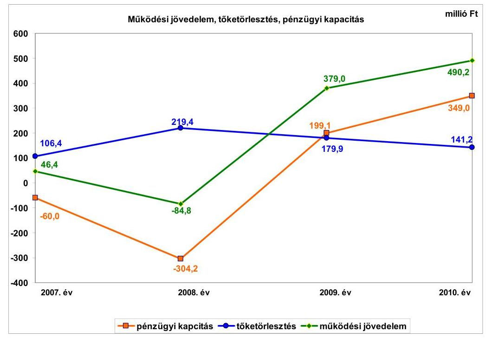

Az Önkormányzat folyó költségvetési egyenlege (működési jövedelme) 2008. évben működési forráshiányt, 2007., 2009. és 2010. években működési forrástöbbletet mutatott. A 2007. évről 2008. évre a forráshiányt a tőketörlesztés, valamint a kórházat ( 162 fő) és a közoktatást ( 23 fő) érintő létszámleépítés kiadástöbblete eredményezte. Ennek hatására a személyi juttatások 2007. évről 2008. évre 4238,1 millió Ft-ról 5,7\%-kal (242,1 millió Ft-tal) 4480,2 millió Ft-ra emelkedtek. Szintén a létszámleépítés kiadása eredményezte, hogy 2008. évről 2009. évre 6,5\%-kal (289 millió Ft-tal) 4191 millió Ft-ra csökkent a személyi juttatások kiadása. A pénzügyi kapacitás 2007-2010. években a működési jövedelem változásaival közel azonos mértékben változott a tőketörlesztés változásai miatt. A tőketörlesztés tendenciáját tekintve 2008. évtől csökkenést mutat, mivel 2008. évről 2009. évre a hiteltörlesztés 219,4 millió Ft-ról 18\%-kal

---

(39,5 millió Ft-tal) 179,9 millió Ft-ra 2009. évről 2010. évre 21,5\%-kal (38,7 millió Ft-tal) 141,2 millió Ft-ra csökkent.

A pénzügyi egyensúly fenntartása a vizsgált évek mindegyikében külső források bevonásával volt biztosítható. A működési forráshiány csökkentése érdekében a 2007. és a 2011. években nyújtott be az Önkormányzat igényt a működőképességének megőrzését szolgáló kiegészítő támogatásokra. Az Önkormányzat 2007-ben 120,8 millió Ft, 2011. év I-III. negyedévében 137,3 millió Ft ÖNHIKI támogatásban részesült.

Az Önkormányzat összes folyó bevétele a 2007-2009. évek átlagában 8498,9 millió Ft volt, melyhez viszonyítva a 2010. évben 5,6\%-os (499,6 millió Ft) növekedés figyelhető meg. A folyó bevételeken belül a költségvetési támogatás és az átengedett szja együttes összege a 2007-2009. évek átlagában 3320,2 millió Ft-ot tett ki. A 2010. évre az előző három év átlagához viszonyítva 8,0\%-kal (267,1 millió Ft-tal) csökkent a támogatások összege. Az államtól kapott támogatások évenként eltérő nagyságát a forrásszabályozásban bekövetkezett változásokon kívül az ellátotti létszámok, valamint a kapott központi támogatások változó nagysága indokolja. A folyó bevételek közel fele egyéb saját bevételből származott, melynek több mint 80\%-át teszi ki a társadalombiztosítási alaptól átvett támogatásértékű működési bevételek összege. A helyi adókból és pótlékokból származó bevételek nagysága a 2010. évben 1089,0 millió Ft volt, mely 37,4\%-kal (296,4 millió Ft-tal) magasabb a 2007-2009. évek átlagos értékénél. A helyi adóbevételek közel 90\%-a az iparűzési adóból származik, amely maximális mértékben került megállapításra. A kommunális adó mértéke a 2009. évtől egy ingatlan tulajdonlása esetén 6000 Ft-ról 8000 Ft-ra, a második és többi ingatlanra adótárgyanként 12000 Ft-ról 14000 Ft-ra emelkedett. A vizsgált időszakban új helyi adót az Önkormányzat nem vezetett be.

Az Önkormányzat folyó kiadásainak összege a 2007-2009. évek átlagában 8385,3 millió Ft-ot tett ki. A 2010. évi folyó kiadás 8508,3 millió Ft-os összege 1,5\%-kal haladta meg az előző három év átlagos évi mértékét. A 2007. évről a 2008. évre az átlagot meghaladó mértékben nőtt a folyó kiadás az intézményekben végrehajtott létszámleépítés egyszeri kifizetései miatt. A folyó kiadások 2008. évről (8606,6 millió Ft-ról) a 2009. évre (8433,9 millió Ft-ra) 2%-kal (172,1 millió Ft-tal) csökkentek, a személyi juttatások 6,4%-os (288,7 millió Ft-os) csökkenése miatt, a dologi kiadások 10,8%-os (225,7 millió Ft-os) növekedése mellett. A dologi kiadások a 2008. évről (2097,4 millió Ft-ról) a 2009. évre (2323,1 millió Ft-ra) 10,7%-kal emelkedtek meg, az élelmiszer és üzemanyagárak nagymértékű növekedése miatt.

A 2007-2009. években az Önkormányzat felhalmozási költségvetésének egyenlege pozitív összegű, míg 2010. évben a kórház jelentősebb fejlesztései miatt negatív volt. A 2007-2010 között összesen 104,5 millió Ft felhalmozási forrástöbbletet mutat a felhalmozási költségvetési egyenlegek összege.

A kialakult pénzügyi egyensúlyi helyzet alakulását befolyásolta az Önkormányzat elmúlt időszak fejlesztési tevékenysége. A befejezett fejlesztések és felújítások jelentős részét, 73,5%-át saját forrásokból (459,9 millió Ft) fedezték. A 2007-2010. évek időszakában a 626,1 millió Ft értékű fejlesztés és felújí-

---

tás forrása a saját erő és a hazai és EU-s támogatások mellett 10,1 millió Ft (1,6\%) hitelfelvétel, és 18,3 millió Ft (2,9\%) kötvény volt. A 2010. december 31-én folyamatban lévő fejlesztési feladatok végrehajtására 2007-2010 között 168,1 millió Ft kiadást teljesítettek, amelyhez hitelt nem vettek igénybe, kötvényből 8,5 millió Ft-ot (5,1%-ot) fordítottak. Az EU-s támogatásból megvalósult fejlesztések finanszírozása likviditási gondot nem okozott.

Az Önkormányzat 2010. december 31-én folyamatban lévő fejlesztési feladatok 2010. évet követő kötelezettségvállalásainak összege 4059,4 millió Ft volt, amelyből 315,4 millió Ft-ot saját forrásból, 105,8 millió Ft-ot hitel felvételéből, 62,4 millió Ft-ot kötvényből, 3573,9 millió Ft-ot EU-s támogatásból és 1,9 millió Ft-ot hazai támogatásból terveznek biztosítani. A 105,8 millió Ft-os hosszú lejáratú hitelt a Kisvárda Csatornamű Víziközmű Társulat vette fel. A hitelből folyósítás még nem történt.

A Képviselő-testületnek előterjesztett éves költségvetési rendeletekben nem mutatták be a beruházásokkal létrehozott létesítmények működtetése és fenntarthatósága érdekében várhatóan felmerülő költségvetési kiadásokat, azok költségvetési hatását.

A 2010. december 31-én fennállt felhalmozási kötelezettségvállalásokat és azok forrásösszetételének alakulását a következő ábra mutatja be:
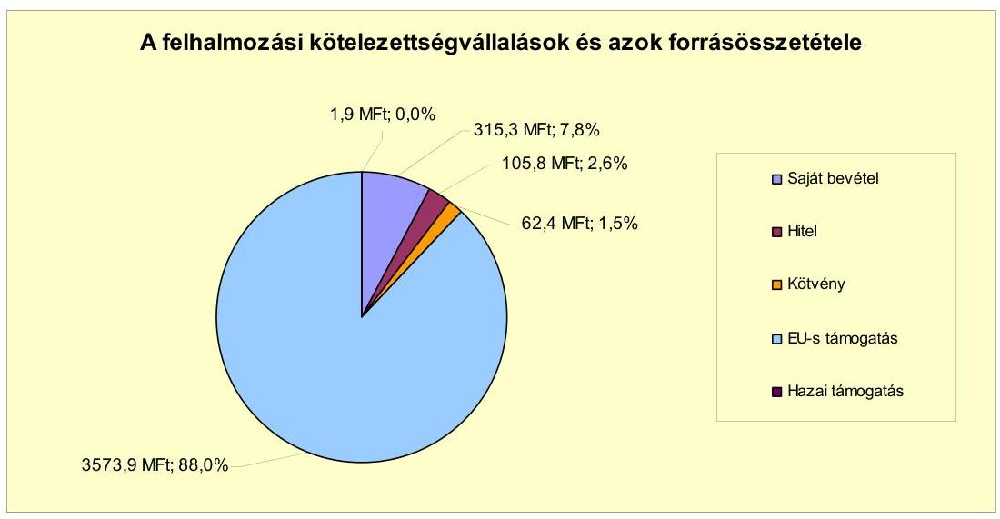

Az Önkormányzat által beadott, elbírálás alatt álló pályázatok tervezett teljes bekerülési költsége 2025,3 millió Ft volt. Az Önkormányzat által a 2010-2013. évekre vállalt kötelezettségek összege 1976,5 millió Ft volt, amelyből 476,0 millió Ft-ot kötvényből, 1500,5 millió Ft-ot EU-s támogatásból terveznek biztosítani.

Az Önkormányzat mérleg szerinti pénzintézeti kötelezettsége a 2007. év elejéről a 2011. év I. félév végére 1179,2 millió Ft-ról 2253,0 millió Ft-ra nőtt, amelyből az árfolyamváltozás miatti különbözet 417,5 millió Ft volt. A fennálló pénzintézeti kötelezettségek 11 hosszú lejáratú hitelből, egy kötvény kibocsátásából, kettő rövid lejáratú hitel, valamint folyószámla- és munkabérmegelőlegezési hitel igénybevételéből keletkeztek a 2011. év I. félév végén. Az

---

Önkormányzat az elfogadott 2011. évi költségvetési rendelete alapján 610,9 millió Ft likvid hitel felvételét tervezte, a szerződés megkötésre került. Az Önkormányzat a Számv. tv. 60. § (4)-(6) bekezdéseiben, valamint az Áhsz. 33. § (1) bekezdésében foglaltak megsértette azzal, hogy év végén az árfolyamkülönbözeteket nem könyvelte, nem tartotta nyilván, a jelentésben szereplő adatok az Önkormányzat utólagos számításain alapulnak.

A Számv. tv. 60. § (2) bekezdésében előírtak ellenére nem végezte el a devizában fennálló kötelezettségek év végi értékelését.

A képviselő-testületi döntést megalapozó előterjesztésekben a hitelfelvétel célját meghatározták. Az árfolyam- és a kamatkockázatokat a hitelfelvételek során, illetve az évente elkészített költségvetési koncepcióban nem mutatták be. Az Önkormányzat az adósságszolgálati korlátot, a hitelfelvételekhez kapcsolódó előterjesztésekben, illetve az évente elkészített költségvetési koncepcióban nem mutatta be. Az Önkormányzat az adósságot keletkeztető kötelezettségvállalásának felső határát a 2007-2011. években betartotta. A hitelfelvételeket megelőzően a pénzintézetek közötti versenyeztetés nem volt.

Az Önkormányzat pénzintézeti kötelezettségvállalásaira, hat hosszú lejáratú hitel - forint hitelről CHF-re való átkonvertálása miatti - módosítását kivéve minden esetben képviselő-testületi döntés alapján került sor. A hat hitelszerződést képviselő-testületi döntés, és szerződésmódosítás nélkül változtatták meg, három szerződést a vizsgált időszak előtt, hármat 2008. évben. A Képviselő-testület határozattal nem döntött a három hosszú lejáratú hitel átkonvertálásáról, ezért eljárásával megsértette a Hatásköri tv. 138. § (1) bekezdés e) pontjában foglaltakat, mert a hitelszerződések módosítására nem képviselő-testületi döntés alapján került sor. Az Önkormányzat az átkonvertálást tartalmazó a kötelezettségvállaló által aláírt, előzetesen ellenjegyzett szerződésmódosítások dokumentumaival nem rendelkezik. Az Önkormányzat eljárása ellentétes az Ámr. 74. § (1) bekezdésében foglaltakkal, mely alapján kötelezettségvállalás az ellenjegyzés után, és csak írásban történhet. A hitelekhez kapcsolódó képviselő-testületi határozatok nem adtak felhatalmazást a polgármesternek arra, hogy önállóan döntsön a devizanemek megváltoztatásáról, továbbá sem a vagyonrendelet, sem a gazdálkodási jogkörök szabályzata erre nem adott számára felhatalmazást.

A hosszú lejáratú hitelszerződések feltételeit 2010. év novemberében a bank kérésére visszamenőlegesen módosították. Ezáltal biztosítékként 1200,0 millió Ft piaci értékű ingatlant ajánlottak fel minden, eddig a banknál felvett hitel mögé fedezetként, keretjelleggel. A szerződést az ingatlanokat terhelő keretbiztosítéki jelzálog alapításáról 2010. december 17-én megkötötték. A kapcsolódó képviselő-testületi határozat ezt nem rögzíti, az előterjesztése igen. Az előterjesztésben szerepelt egy 70,0 millió Ft összegű éven belüli hitelfelvétel is, a Kép-viselő-testület csak az e hitelhez kapcsolódó 140,0 millió Ft jelzálogjog bejegyzéséről döntött. A keretbiztosítéki jelzálog alapításának keretszerződését képvi-selő-testületi döntés nélkül kötötték meg, megsértve ezzel a Hatásköri tv. 138. § (1) bekezdés e) pontja előírásait. A Ptk. 200. § (2) bekezdése alap-

[^0]
[^0]: ${ }^{6}$ 2012. január 1-jétől az Áht. 37. § (1) bekezdése

---

ján a jogszabályba ütköző szerződés - amennyiben azt a bíróság megállapítja - semmis.

Az Önkormányzat a 2009. július 27-én bocsátotta ki a „Kisvárda 2024" kötvényt. A kötvény törlesztése első alkalommal - a türelmi idő miatt - 2012. szeptember 30-án esedékes, összege 160,0 ezer EUR. A kötvény állománya 2010. december 31-én 4000,0 ezer EUR volt. A kötvény okirat és a Képviselő-testület határozata értelmében a kötvény összege csak felhalmozási célra használható fel a meghatározott beruházások saját erejének biztosításához.

Az Önkormányzat a hiteleket, kettő kivételével a rendelkezésre tartási időn belül teljes keretösszeggel lehívta, és a hitelcélnak megfelelően a Képviselőtestület által jóváhagyott, a költségvetésbe betervezett beruházásokhoz használta fel. A HUF-ban fennálló pénzintézeti kötelezettségeiből 2007. évtől 2010. év december 31-ig 65,0 millió Ft tőkét törlesztett, és 63,7 millió Ft kamatot fizetett. A CHF-ben fennálló, átkonvertált pénzintézeti kötelezettségeiből 1943,6 ezer CHF (372,2 millió Ft) tőkét törlesztett, és kamatot fizetett. Az Önkormányzat az EUR-ban fennálló pénzintézeti kötelezettségeiből tőkét nem törlesztett, azonban 289,9 ezer EUR (80,2 millió Ft) kamatot fizetett. A fix kamatozású egyedi kölcsönszerződés alapján az Önkormányzat a kötelezettségeiből 12,1 ezer CHF (2,1 millió Ft) tőkét, és 4,6 ezer CHF (0,8 millió Ft) kamatot fizetett meg. A 2011. év I. félévében a HUF-ban fennálló pénzintézeti kötelezettségeiből 11,3 millió Ft tőkét és 4,1 millió Ft kamatot törlesztett. A CHF-ben fennálló pénzintézeti kötelezettségeiből 159,5 ezer CHF (34,9 millió Ft) tőkét törlesztett és 36,4 ezer CHF (7,3 millió Ft) kamatot fizetett meg. Az EUR-ban fennálló pénzintézeti kötelezettségeiből tőkét nem, azonban 124,2 ezer EUR (33,9 millió Ft) kamatot fizetett. A vizsgált években hosszú lejáratú hitelt az Önkormányzat nem fizetett vissza, hitele nem járt le. A 2007-2011. év I. féléve között átmenetileg szabad pénzeszközeiből 379,0 millió Ft kamatbevételt realizált.

Az Önkormányzat működésének pénzügyi egyensúlyát a vizsgált időszakban folyószámlahitel, munkabér-megelőlegezési hitel és hat alkalommal összesen 670,0 millió Ft rövid lejáratú hitel igénybevételével tudta biztosítani 2007-2010. években, és 2011. év I. félévében. A működési célú egyéb likvid hitelek 2010. december 31-én fennálló kötelezettségének állománya 163,7 millió Ft.

A folyószámlahitel és a munkabér-megelőlegezési hitel igénybevétele a 2007-2011. év I. félévében az alábbiak szerint alakult:

| Megnevezés | 2007. év | 2008. év | 2009. év | 2010. év | 2011. év   I. félév |
| :--: | :--: | :--: | :--: | :--: | :--: |
| Folyószámlahitel |  |  |  |  |  |
| Keretösszeg január 1-án (millió Ft-ban) | 250 | 250 | 250 | 250 | 250 |
| Átlagos napi állomány (millió Ft-ban) | 234 | 231 | 222 | 231 | 238 |
| Folyószámla hitellel zárt napok száma (nap) | 365 | 365 | 365 | 365 | 181 |
| Egyenleg (állomány) | 50 | 78 | 167 | 223 | 225 |
| Munkabér-megelőlegezési hitel |  |  |  |  |  |
| Keretösszeg január 1-án (millió Ft-ban) | 140 | 140 | 140 | 140 | 140 |
| Átlagos napi állomány (millió Ft-ban) | 140 | 140 | 140 | 140 | 140 |
| Munkabér-megelőlegezési hitellel zárt napok száma (nap) | 365 | 365 | 365 | 365 | 181 |
| Egyenleg (állomány) | $x$ | $x$ | $x$ | 140 | 140 |

A 2007., 2009-2010. évek pozitív működési jövedelme mellett jelentkező folyószámlahitel, és munkabér-megelőlegezési hitel a vizsgált években állan-

---

dósult. Ennek oka, hogy a felhalmozási forráshiányt nem teljes egészében fejlesztési célú hitelek felvételével finanszírozta, hanem folyószámlahitelből is. A likviditás biztosítása az Önkormányzatnak 87,9 millió Ft kamatkiadást okozott, egyéb költség fizetésének kötelezettsége nem terhelte. Az Önkormányzat 2011. év I. félév végi szállítói tartozása 462,5 millió Ft, melyből a lejárt tartozás állománya 382,6 millió Ft volt. Az Önkormányzatnak a 2011. év I. félév végi lejárt szállítói tartozása 382,6 millió Ft volt, ebből a 90 napot meghaladó tartozás 57,5%-ot (220,0 millió Ft-ot) képviselt. A polgármester az Önkormányzat lejárt szállítói tartozásai okainak feltárására, a lejárt tartozások mielőbbi rendezése érdekében intézkedéseket nem tett, a Képviselő-testületet nem tájékoztatta.

Az Önkormányzat egy kizárólagos önkormányzati tulajdonú gazdasági társasága, és a víziközmű csatornamű társulat részére a fejlesztési és egyéb hitelek igénybevételéhez készfizető kezességet vállalt 253,3 millió Ft összegben. A 2010. év végére a kezességgel kapcsolatos kötelezettség 176,6 millió Ft-ra csökkent, mivel a gazdasági társaság helyett 2010. évben 76,7 millió Ft fizetési kötelezettséget kellett teljesítenie, melyből megtérülés nem volt.

Az Önkormányzat kötelezettségeinek 2010. december 31-i, 2011. június 30-i állományát és várható alakulását a kötelezettségek lejáratáig a következő táblázat szemlélteti:

| Megnevezés | Állomány 2010. december 31-én |  |  | Állomány 2011. június 30-én |  |  | Várható kötelezettség 2011-2013. években |  |  | Várható kötelezettség 2014. évtől |  |  |
| :--: | :--: | :--: | :--: | :--: | :--: | :--: | :--: | :--: | :--: | :--: | :--: | :--: |
|  | HUF-ban   millió Ft   ban) | Devizában (összep.
ezer
CHF/EUR-
ban) | Dertzo
nem | HUF-ban
(millió Ft
ban) | Dertzában (összep.
ezer
CHF/EUR-
ban) | Dertzo
nem | HUF-ban
(millió Ft
ban) | Dertzában (összep.
ezer
CHF/EUR-
ban) | Dertzo
nem | HUF-ban
(millió Ft
ban) | Dertzában (összep.
ezer
CHF/EUR-
ban) | Dertzo
nem |
| Pénzintézeti kötelezettségek |  |  |  |  |  |  |  |  |  |  |  |  |
| Hosszú lejáratú fejlesztési hitelek | 238,0 | 0,0 | HUF | 226,2 | 0,0 | HUF | 18,9 | 0,0 | HUF | 148,9 | 0,0 | HUF |
| Hosszú lejáratú fejlesztési hitelek | 0,0 | 2189,4 | CHF | 0,0 | 1568,3 | CHF | 0,0 | 1087,8 | CHF | 0,0 | 539,8 | CHF |
| Hosszú lejáratú hitel kötvénykibocsátásba | 0,0 | 4000,0 | EUR | 0,0 | 4000,0 | EUR | 0,0 | 1591,8 | EUR | 0,0 | 4986,0 | EUR |
| Egynél kölcsönszerződés | 0,0 | 20,1 | CHF | 0,0 | 14,6 | CHF | 0,0 | 25,4 | CHF | 0,0 | 0,0 | CHF |
| Működési hitel | 100,0 | 0,0 | HUF | 100,0 | 0,0 | HUF | 100,0 | 0,0 | HUF | 100,0 | 0,0 | HUF |
| Egynb likvid hitel | 63,7 | 0,0 | HUF | 25,0 | 0,0 | HUF | 0,0 | 0,0 | HUF | 0,0 | 0,0 | HUF |
| Folyószámlahitel | 223,0 | 0,0 | HUF | 225,0 | 0,0 | HUF | 225,0 | 0,0 | HUF | 225,0 | 0,0 | HUF |
| Munkuber hitel | 140,0 | 0,0 | HUF | 140,0 | 0,0 | HUF | 140,0 | 0,0 | HUF | 140,0 | 0,0 | HUF |
| Pénzintézeti kötelezettségek összesen HUF | 764,7 |  | HUF | 716,2 |  | HUF | 483,9 |  | HUF | 613,9 |  | HUF |
| Pénzintézeti kötelezettségek összesen CHF-ben: |  | 2209,5 | CHF |  | 1583,1 | CHF |  | 1113,2 | CHF |  | 539,8 | CHF |
| Pénzintézeti kötelezettségek összesen EURO-ben: |  | 4000,0 | EUR |  | 4000,0 | EUR |  | 1591,8 | EUR |  | 4986,0 | EUR |
| Biztosítékok |  |  |  |  |  |  |  |  |  |  |  |  |
| Kezesség | 253,3 | 0,0 | HUF | 176,6 | 0,0 | HUF | 176,6 | 0,0 | HUF | 0,0 | 0,0 | HUF |
| Biztosítékok összesen: | 253,3 | 0,0 | HUF | 176,6 | 0,0 | HUF | 176,6 | 0,0 | HUF | 0,0 | 0,0 | HUF |
| Szállítói tartozás | 461,8 | 0,0 | HUF | 462,3 | 0,0 | HUF | 462,3 | 0,0 | HUF | 0,0 | 0,0 | HUF |
| Jegerős végzéssel lezárt de ki nem fizetett kötelezettségek | 169,9 | 0,0 | HUF | 93,2 | 0,0 | HUF | 93,2 | 0,0 | HUF | 0,0 | 0,0 | HUF |
| Kötelezettségek összesen HUF-ban: | 1649,7 |  | HUF | 1448,5 |  | HUF | 1216,2 |  | HUF | 613,9 |  | HUF |
| Kötelezettségek összesen CHF-ben: |  | 2209,5 | CHF |  | 1583,1 | CHF |  | 1113,2 | CHF |  | 539,8 | CHF |
| Kötelezettségek összesen EUR-ban: |  | 4000,0 | EUR |  | 4000,0 | EUR |  | 1591,8 | EUR |  | 4986,0 | EUR |

Az Önkormányzatnak pénzintézetekkel szemben fennálló kötelezettsége a 2011. év I. félév végén 716,2 millió Ft, 1583,1 ezer CHF és 4000,0 ezer EUR volt. Ezek várható kötelezettsége (tőke, kamat és egyéb költség) a legutóbbi kamatfizetés feltételei alapján a 2011-2013. években 483,9 millió Ft, 1113,2 ezer CHF, továbbá 1591,8 ezer EUR. Az Önkormányzatnak a 2011. évben a kezességvállalás, a szállítói tartozások és jogerős végzéssel lezárt, de ki nem fizetett kötelezettségek címén 732,3 millió Ft fizetési kötelezettsége keletkezett. A 2011-2013. évek kötelezettségeinek teljesítésére figyelembe vehető 180,2 millió Ft mérlegben kimutatott követelésállomány. Az egészségbiz-

---

tosítási alapból folyósított pénzeszközök maradványán túl, szabad pénzmaradvánnyal az Önkormányzat nem rendelkezett. A pénzintézeti és egyéb kötelezettségek teljesítése a 2011-2013. években a rendelkezésre álló fedezet ismeretében nem biztosított.

A jelentés 2. számú mellékletében az Önkormányzat és az irányítása alá tartozó intézmények 2010. évi finanszírozásba bevonható pénzeszközei 2346,6 millió Ft összegben kerültek kimutatásra. Ebből a Felső-Szabolcsi Kórház év végi pénzeszközeinek állományát 942,6 millió Ft-ot, teljes egészében az egészségbiztosítási alapból folyósított maradványként mutatták ki. Kockázatot jelez, hogy az Önkormányzat nem döntött a pénzeszközök - akár ideiglenes - igénybevételéről a jelentős rövid lejáratú kötelezettségei teljesítésére.

A 2014. évet követően jelenleg ismert pénzintézeti kötelezettségei: 613,9 millió Ft, 539,8 ezer CHF és 4986,0 ezer EUR, amelyekre az Önkormányzat által figyelembe vehető forrást - a képviselő-testületi előterjesztések alapján - a képződő működési jövedelem biztosítja majd az elkövetkezendő években. A 2014. évtől várható - a vizsgált időszak végén ismert - kötelezettsége teljesítésére az Önkormányzat a forrásokat nem számszerűsítette.

A folyamatban lévő fejlesztési kiadásokhoz a nettó működési jövedelem fedezetet biztosít, így azok megvalósítása nem jelent kockázatot az Önkormányzatnak.

Az Önkormányzat kizárólagos tulajdonú társaságai ${ }^{7}$ kötelezettségeinek 2011. június 30-i állományát és várható alakulását a kötelezettségek lejáratáig a következő táblázat mutatja be:

| Megnevezés | Állomány   2010. december   31-én | Állomány   2011. június   30-án | Várható   kötelezettség   2011-2013.   években |
| :--: | :--: | :--: | :--: |
|  | HUF-ban (millió Ftban) | HUF-ban (millió Ftban) | HUF-ban (millió Ft-ban) |
| Pénzintézeti kötelezettségek összesen: | 0,0 | 0,0 | 0,0 |
| Szállítói tartozás | 249,7 | 340,4 | 340,4 |
| Jogerős végzéssel lezárt de ki nem fizetett kötelezettségek | 70,8 | 70,8 | 70,8 |
| Kötelezettségek összesen: | 320,5 | 411,2 | 411,2 |

[^0]
[^0]:    ${ }^{7}$ A Képviselő-testület döntése alapján 2011. június 23-án megalapították a Kisvárdai Várfürdő Idegenforgalmi Kft.-t, mely kizárólagos önkormányzati tulajdonnal rendelkezik. Az Idegenforgalmi és Szabadidő Nonprofit Kft. 2009. december 31-ig 100\%-os önkormányzati tulajdonban volt. Az üzletrész $80 \%$-át a Képviselő-testület 2010. február 25-i döntése alapján az Önkormányzat eladta, majd 2011. év február 25-én visszavásárolta.

---

Az önkormányzati kötelezettségek növekedése mellett az Önkormányzat kizárólagos tulajdonú gazdasági társaságainak ${ }^{8}$ kötelezettségei is befolyásolják az Önkormányzat pénzügyi egyensúlyát. A társaságoknak a 2011. évtől 340,4 millió Ft szállítói tartozást, 70,8 millió Ft jogerős végzéssel lezárt, de ki nem fizetett kötelezettséget kell rendezniük.

Az Önkormányzat 2007-2010 között a tárgyi eszközök után összesen 1257,5 millió Ft értékcsökkenést számolt el. A felhalmozási kiadásokból eszközpótlás miatt a felújításokra összesen 2007-2010 között 290,3 millió Ft-ot fordítottak, míg beruházásokra, ennek több mint kétszeresét 211,3\%-át (613,6 millió Ft-ot). Az Önkormányzat az elhasználódott eszközök pótlására tartalékot nem képzett, külön alapot nem hozott létre. Az elhasznált eszközök pótlására 698,9 millió Ft-ot fordítottak. A Képviselő-testületnek előterjesztett éves zárszámadási rendeleteikben nem mutatták be az Önkormányzat eszközei után tárgyévben elszámolt értékcsökkenés összegét, az eszközpótlásra fordított tényleges kiadásokat, az eszközök elhasználódási fokának alakulását.

Az Önkormányzat az ellenőrzött időszakban kiadási megtakarítást eredményező és bevételt növelő intézkedéseket tett, mely intézkedések pénzügyi hatása az Önkormányzat részéről számszerűsítésre került. A 20072011. év I. féléve között végrehajtott intézkedések hatására 1173,4 millió Ft bevételi többletet, továbbá 452,3 millió Ft kiadási megtakarítást mutattak ki, ezáltal javult az Önkormányzat egyensúlyi helyzete. A kiadási megtakarítások 87,5\%-a az elrendelt álláshelycsökkentések eredménye. Az álláshelycsökkentő intézkedések 2007-2011. év I. féléve között önkormányzati szinten összesen 227 álláshely (ebből 42 üres álláshely) megszüntetését jelentették. Az üres álláshelyek megszüntetése, valamint a kórházban - mely önkormányzati támogatásban nem részesül - végrehajtott 162 fő létszámcsökkentés tényleges kiadás megtakarítást nem eredményezett. A szociális és gyerekjóléti feladatellátás területén a szakmai minimumkövetelmények szigorodása miatt álláshely- és egyben létszámnövekedés történt. Ennek következtében az időszak álláshelyeinek száma összességében 185 fővel csökkent. A bevételnövelő intézkedések a helyi adókkal kapcsolatos kedvezmények, mentességek csökkentéséhez, a kommunális adó mértékének növeléséhez és eszközök értékesítéséhez. Az Önkormányzat a lejárt tartozások (beleértve az adókat) behajtása érdekében meghozott intézkedések végrehajtásának következtében növelni tudta a bevételeit. A lejárt tartozások fokozott behajtására képviselő-testületi döntés következtében került sor.

Az utóellenőrzés a pénzügyi egyensúly javítására tett egy szabályszerűségi és egy célszerűségi javaslat hasznosítására terjedt ki. A szabályszerűségi javaslat az önállóan gazdálkodó költségvetési szervek pénzmaradványának felülvizsgálatára, míg a célszerűségi javaslat a vizsgálat során feltárt hiányosságok megszüntetésére vonatkoztak. A javaslatokat az intézkedési terv szerint határidőben megvalósították.

[^0]
[^0]:    ${ }^{8}$ Várda-Távhő Kft., Kisvárdai Várfürdő Idegenforgalmi Kft., Idegenforgalmi és Szabadidő Nonprofit Kft.

---

Az Önkormányzat pénzügyi egyensúlyi helyzetét összegezve a következők emelhetők ki:

# Az Önkormányzat pénzügyi egyensúlyi helyzete rövid távon veszélyeztetett.

A folyó bevételek és folyó kiadások egyenlege növekvő tendenciát mutatott. A vizsgált időszak második felében forrástöbblet keletkezett, azonban ez nem biztosított elegendő forrást a pénzintézeti és egyéb kötelezettségek teljesítésére.

A pénzügyi egyensúlyt állandósult folyószámla-, és munkabér-megelőlegezési hitel és működési hitel igénybevételével biztosította. A szállítóállomány, ezen belül a lejárt szállítói állomány folyamatosan növekedett.

A pénzintézeti és egyéb kötelezettségek teljesítésének forrása a fedezet ismeretében nem biztosított. Pénzügyi kockázatot jelez, hogy az Önkormányzat nem döntött az intézményi pénzeszközök - akár ideiglenes - igénybevételéről a jelentős rövid lejáratú kötelezettségei teljesítésére.

A folyamatban lévő beruházások és a benyújtott pályázatok finanszírozhatósága nem jelent kockázatot, a kötelezettségvállalások teljesítésére a források rendelkezésre állnak.

Kockázatot jelenthet, hogy az Önkormányzat a pénzügyi egyensúlyi helyzet romlása ellenére, nem kezdeményezte az intézményei előirányzatfelhasználásának szoros kontrollját.

A többségi tulajdoni hányadú gazdasági társaságok lejárt szállítói tartozásállománya, a jogerős ítélettel lezárt peres eljárásban kimutatott, de ki nem fizetett kötelezettsége az Önkormányzat számára helytállási kötelezettséget jelenthetnek.

Az Állami Számvevőszékről szóló 2011. évi LXVI. törvény 33. § (1) bekezdésében foglaltak értelmében a jelentésben foglalt megállapításokhoz kapcsolódó intézkedési tervet köteles az ellenőrzött szervezet vezetője
 összeállítani és azt a jelentés kézhezvételétől számított harminc napon belül az ÁSZ részére megküldeni. Amennyiben az intézkedési tervet határidőben nem küldi meg a szervezet, vagy az továbbra sem elfogadható, az ÁSZ elnöke a hivatkozott törvény 33. § (3) bekezdés a)-b) pontjaiban foglaltakat érvényesítheti.

## A 2011. június 30-i pénzügyi egyensúlyi helyzet alapján az ellenőrzés intézkedést igénylő megállapításai és javaslatai a következők:

## a Polgármesternek

1.  Az Önkormányzat pénzügyi egyensúlyi helyzete rövid távon veszélyeztetett. A finanszírozásban a folyószámla- és munkabér-megelőlegezési hitel állandósult, továbbá minden évben működési hitel felvételére volt szükség a likviditás biztosítása érdekében. Az Önkormányzat lejárt szállítói kötelezettségeinek állománya, ezen belül a 90 napon túl lejárt szállítói tartozások összege jelentősen emelkedett. A pénzintézeti és egyéb kötelezettségek teljesítésének forrása nem biztosított.

---

Az Önkormányzat kizárólagos tulajdonú gazdasági társaságainak a 2011. évtől 340,4 millió Ft szállítói tartozást, 70,8 millió Ft jogerős végzéssel lezárt, de ki nem fizetett kötelezettséget kell rendezniük.

Kockázatot jelez, hogy az Önkormányzat nem döntött az intézményi pénzeszközök akár ideiglenes - igénybevételéről a jelentős rövid lejáratú kötelezettségei teljesítésére.

Az Önkormányzat a jogerős végzéssel lezárt, de ki nem fizetett peres eljárások közül háromnál van alperesi pozícióban, a perértéke összesen 169,9 millió Ft.

Javaslat:
Az Önkormányzat pénzügyi egyensúlyának gyors helyreállítása és hosszú távú fenntarthatósága érdekében kezdeményezze - felelősök és határidők megjelölésével - az alábbi intézkedések megtételét:
a) Tárja fel a bevételszerző és kiadáscsökkentő lehetőségeket. Intézkedjen a bevételek növelésére, a kintlévőségek behajtására, a kiadások csökkentésére.
b) Terjesszen a Képviselő-testület elé reorganizációs programot a kedvezőtlen pénzügyi folyamatok megállítására, a pénzügyi egyensúlyi helyzet gyors stabilizálására.
c) Vizsgáltassa felül az Önkormányzat fenntartásában működő intézmények, különösen a Felső-Szabolcsi Kórház pénzmaradvány elszámolásának szabályszerűségét, a maradványok keletkezésének okát, és fontolja meg a felszabadítható intézményi források önkormányzati kötelezettségek teljesítésére történő bevonását.

Amennyiben a c) pontban javasolt intézkedések eredményeként javul az Önkormányzat pénzügyi egyensúlya, abban az esetben a további javaslatok ajánlott és nem intézkedési terv készítésére kötelezett javaslatokká változnak át:
a) Képezzen egyensúlyi (elkülönített) tartalékot az adósságszolgálat teljesítése érdekében.
b) Vizsgálja felül teljes körűen a tervezett beruházásokat és azok fenntartásának jövőbeni pénzügyi kihatásait. Szükség esetén tegyen javaslatot a Képviselőtestületnek a tervezett beruházásokkal kapcsolatos döntések módosítására, amelyben figyelembe veszik az Önkormányzat pénzügyi lehetőségeit, és a kötelező feladatellátás elsődlegességét.
c) A Stabilitási tv. 10. §-a alapján vizsgálja meg az állandósult folyószámlahitel hosszú távú kötelezettséggé történő átalakításának jogi lehetőségét, és a jogszabályi feltételek fennállása esetén kezdeményezze a Kormánynál ennek engedélyezését.
d) Kezdeményezze az intézmények finanszírozásának napi kontrollját. Szűkítse a jóváhagyott előirányzatok felhasználásának lehetőségeit.

---

e) Tekintse át az önként vállalt feladatok finanszírozhatóságát a kötelező feladatellátás elsődlegességének biztosítása érdekében, mutassa be a Képviselőtestületnek a megoldás lehetőségeit, és szükség esetén a gazdasági program módosításának igényét.
f) Mutassa be havonta a Képviselő-testületnek legalább három évre kitekintően kötelezettségeinek finanszírozási forrásait.
g) Az adósságot keletkeztető kötelezettségvállalásról szóló döntéskor mutassa be a Képviselő-testületnek a jövőben várható - árfolyam-, kamat- és törlesztési kockázatot. Kezességvállalás, garancia és helytállási kötelezettségvállalásról szóló döntésnél mutassa be a Képviselő-testületnek azok pénzügyi kockázatait.
h) Gondoskodjon, hogy a jövőben az adósságot keletkeztető kötelezettségvállalásokról szóló képviselő-testületi előterjesztések tételesen tartalmazzák a visszafizetés forrásait.
i) Terjesszen intézkedési tervet a Képviselő-testület elé a kizárólagos tulajdonú gazdasági társaságai pénzügyi egyensúlyi helyzetének stabilizálása érdekében.
j) Kezelje az Önkormányzat lejárt szállítói állományát, a szállítói kitettség és a jogszabályi következmények elkerülése érdekében.
k) Intézkedjen a peres eljárásokból adódó kötelezettségeinek teljesítése érdekében a szükséges fedezet elkülönítéséről.
2. A Képviselő-testületnek előterjesztett éves zárszámadási rendeleteikben nem mutatták be az Önkormányzat eszközei után tárgyévben elszámolt értékcsökkenés összegével összevetve, az eszközpótlásra fordított tényleges kiadásokat, és az eszközök elhasználódási fokának alakulását.

Javaslat:
Mutassa be a Képviselő-testületnek évente a zárszámadási rendelet előterjesztésében az értékcsökkenés összegét, és ezzel összevetve az elhasználódott eszközök pótlására fordított tényleges kiadásokat, az eszközök elhasználódási fokának alakulását.

# a jegyzőnek

1.  Az Önkormányzat fennálló pénzintézeti és egyéb kötelezettségei teljesítésének kockázata emelkedhet a fennálló kötelezettségeket érintő árfolyam-emelkedés hatására.

Javaslat:
Kísérje figyelemmel a jövőbeni várható árfolyamkockázatokat, legalább félévente tájékoztassa a Képviselő-testületet azok alakulásáról.
2.  Az Önkormányzatnál hat hosszú lejáratú hitel forintról CHF-ra történő konvertálása történt meg a Képviselő-testület döntése nélkül. A hosszú lejáratú hitelszerződések feltételeit 2010. év novemberében egyoldalúan módosította a bank, amikor biztosítékként 1200,0 millió Ft piaci értékű ingatlan felajánlását kérte biztosítékként min-

---

den, eddig a banknál felvett hitel mögé fedezetként, keretjelleggel. A szerződést az ingatlanokat terhelő keretbiztosítéki jelzálog alapításáról 2010. évben megkötötték, azonban erre vonatkozó képviselő-testületi határozattal nem rendelkeztek.

Javaslat:
Gondoskodjon a Hatásköri tv. 138. § (1) bekezdés e) pontja alapján arról, hogy a hitelszerződések módosítására a jövőben képviselő-testületi döntés alapján kerüljön sor. Tájékoztassa a Képviselő-testületet a hosszú lejáratú hitelek konvertálásáról és a jelzálogjog bejegyzéséről.
3.  Az Önkormányzat a vizsgált időszakban rendelkezett devizában fennálló kötelezettséggel, melyek év végi értékelését a Számv. tv. 60. § (2) bekezdése és az Áhsz. 33. § (1) bekezdése előírásainak megfelelően nem végezte el.

Javaslat:
Gondoskodjon arról, hogy a devizában fennálló kötelezettségeket a Számv. tv. 60. § (2) bekezdésének és az Áhsz. 33. § (1) bekezdésének előírásai alapján év végén értékeljék és a változásokat a számviteli nyilvántartásokban rögzítsék.

A polgármester a helyszíni ellenőrzés lezárása után tájékoztatta az Állami Számvevőszéket az Önkormányzat megtett, valamint tervezett intézkedéseiről, amelyet az Állami Számvevőszék nem ellenőrzött, arra vonatkozóan véleményt vagy megállapítást nem fogalmaz meg. Az ellenőrzés lezárását követően elvégzett intézkedéseket az Állami Számvevőszék utóellenőrzés keretében vizsgálhatja.

A polgármester tájékoztatása szerint a következő intézkedéseket tette az Önkormányzat:

- a kiadások csökkentése érdekében a Képviselő-testület döntött az önkormányzati fenntartású, intézményi feladatok átszervezéséről, a Kisvárdai Szolgáltató Szervezet megszüntetéséről, valamint az általa ellátott feladatok átszervezéséről;
- az Önkormányzat intézményszervezeti átalakításokról, racionalizálásokról, átszervezések végrehajtásáról, egyes tagintézmények fenntartói jogának egyháznak történő átadásáról döntött;
- megvizsgálták a bevételek növelésének további lehetőségeit, ezen belül a megüresedett ingatlanok, használaton kívüli tárgyi eszközök, gépek, felszerelések értékesítési, hasznosítási lehetőségeit.

---

# II. RÉSZLETES MEGÁLLAPÍTÁSOK

## 1. Az ÖNKORMÁNYZAT KÖTELEZŐ ÉS ÖNKÉNT VÁLLALT FELADATAI, A FELADATELLÁTÁS SZERVEZETI KERETEI ÉS ANNAK VÁLTOZÁSAI

Az Önkormányzat az SzMSz-ben ${ }^{9}$ a kötelező és az önként vállalt feladatainak besorolásáról részben rendelkezett, azok terjedelmét az éves költségvetési rendeletekben az adott év költségvetési forrásainak ismeretében határozta meg. A vizsgált időszakban önként vállalt feladatként határozta meg a középfokú oktatási (gimnázium, szakközépiskola, szakiskola, kollégium), az alapfokú zene- és művészetoktatási, a pedagógiai szakszolgálati tevékenység ellátását, a fekvő- és járóbeteg szakellátást, az időskorúak otthona ellátást, a hajléktalanok átmeneti szállását, a távhő- és energiaszolgáltatással, a fürdő, sportpálya és sportcsarnok, piac és vásártér üzemeltetésével, közterület felügyelettel, mezőőri tevékenységgel kapcsolatos feladatok ellátását.

A 2010. évi működési kiadások feladatonkénti megoszlását és azok finanszírozási arányait - az Önkormányzat adatszolgáltatása alapján - az alábbi táblázat mutatja be:

| Ellátott feladat | Működési   kiadás   összesen   (millió Ft) | Kötelező   feladatok   kiadásainak   részaránya   $\%$ | Működési   bevétel   összesen   (millió Ft) | Állami   támogatás   részaránya   $\%$ | Intézményi   saját bevétel   részaránya   $\%$ | Önkormányzati   támogatás   részaránya   $\%$ | Társult   önkormányzattól   átvett támogatás   részaránya   $\%$ |
| :--: | :--: | :--: | :--: | :--: | :--: | :--: | :--: |
| Óvodák | 259,6 | 100,0 | 259,6 | 50,5 | 0,8 | 48,7 | 0,0 |
| Általános iskolák | 700,5 | 100,0 | 700,5 | 52,2 | 5,9 | 41,3 | 0,6 |
| Gimnáziumok | 458,0 | 0,0 | 458,0 | 74,3 | 14,5 | 11,2 | 0,0 |
| Szakközépiskolák,   szakképző intéz-   mények | 442,3 | 0,0 | 442,3 | 69,0 | 12,2 | 18,8 | 0,0 |
| Kollégiumok | 132,0 | 0,0 | 132,0 | 97,5 | 2,5 | 0,0 | 0,0 |
| Szociális   intézmények | 176,6 | 50,0 | 176,6 | 64,2 | 20,2 | 15,6 | 0,0 |
| Gyermekjóléti   intézmények | 66,8 | 100,0 | 66,8 | 41,8 | 10,4 | 47,8 | 0,0 |
| Közművelődési   intézmények | 224,5 | 100,0 | 224,5 | 39,5 | 25,3 | 35,2 | 0,0 |
| Egyéb intézmények | 708,0 | 40,8 | 708,0 | 40,7 | 18,3 | 41,0 | 0,0 |
| Polgármesteri hivatal   (igazgatási kiadása) | 675,3 | 100,0 | 675,3 | 4,9 | 95,1 | 0,0 | 0,0 |
| Polgármesteri   hivatalban ellátott   egyéb feladatok   működési kiadásai | 897,6 | 91,6 | 897,6 | 90,7 | 9,3 | 0,0 | 0,0 |
| Működési kiadá-   sok összesen | 4741,2 | 65,9 | 4741,2 | 55,6 | 23,6 | 20,7 | 0,1 |

A működési kiadások összege eltér a 2. számú mellékletben feltüntetett kiadások értékétől, mivel az adatszolgáltatás nem tartalmazza az egészségügyi in-

[^0]
[^0]: ${ }^{9}$ Az SzMSz 3. számú melléklete nem tartalmazta teljes körűen az Önkormányzat kötelező és önként vállalt feladatait és azok ellátásának módját.

---

tézmények és a kisebbségi önkormányzatok kiadásait. Az Önkormányzat működési célú költségvetési kiadásaiból a kötelező feladatok ellátására a 2007-2009. évek átlagában 2873,4 millió Ft-ot (63,9\%-ot), a 2010. évben 3124,4 millió Ft-ot (65,9\%-ot) fordított. Az önként vállalt feladatokra a 2007-2009. évek átlagában 1621,6 millió Ft (36,1\%), a 2010. évben 1616,8 millió Ft (34,1\%-ot) jutott. A működési célú költségvetési kiadásokon belül a kötelező és önként vállalt feladatokra fordított kiadások aránya a 2010. évben a megelőző három év átlagához képest 2,0 százalékponttal változott.

A vizsgált időszakban az Önkormányzat működési kiadásainak összege 543,6 millió Ft-tal, 12,9\%-kal emelkedett. A 2010. évben az Önkormányzat a működési kiadásainak 42,0\%-át (1992,4 millió Ft-ot) a közoktatási, 5,2\%-át (243,4 millió Ft-ot) szociális- és gyermekjóléti, 4,7\%-át (224,5 millió Ft-ot) közművelődési, 14,9\%-át (708,0 millió Ft-ot) egyéb intézmények ${ }^{10}$ fenntartására fordította. A Polgármesteri hivatal igazgatási célú működési kiadásainak összege 675,3 millió Ft (14,3\%) volt, a Polgármesteri hivatalban ellátott egyéb önkormányzati feladatokra ${ }^{11}$ fordított kiadás pedig 897,6 millió Ft (18,9\%) volt a 2010. évben.

A közoktatási feladatokra fordított működési kiadások összege a 2007-2009. évek átlagában 2021,0 millió Ft volt, mely a végrehajtott létszámleépítések következtében a 2010. évre 28,6 millió Ft-tal (1,4\%-kal) csökkent.

A szociális és gyermekjóléti ágazat tekintetében a működési kiadások összege a 2007-2009. évek átlagához (236,1 millió Ft) képest a szakmai álláshelynövekedés, valamint a bővülő feladatellátás következtében 7,2 millió Ft-tal (3,1\%-kal) emelkedett.

Az egyéb ágazatok (közművelődés, tűzoltóság, polgármesteri hivatal, egyéb intézmények) működési kiadása a 2007-2009. évek átlagában 2237,9 millió Ft-ot tett ki. A 2010. évi működési kiadás 2505,4
 millió Ft összege a pénzbeni ellátások növekvő nagysága miatt 12,0\%-kal haladta meg az előző három év átlagos működési kiadásainak mértékét.

Az Önkormányzat működési célú feladatainak ellátásához biztosított állami támogatás összege növekvő tendenciát mutatott. A 2007. évi 2194,9 millió Ft-ról - a 2008. évi 14,2\%-os (312,7 millió Ft), a 2009. évi 7,6\%-os (503,2 millió Ft) növekedés és a 2010. évi 2,3\%-os (61,2 millió Ft) csökkenés együttes hatásaként - a 2010. évre 2636,8 millió Ft-ra emelkedett. A közoktatásban az állami támogatás alakulása a tanulólétszám minimális növekedésének ellenére a forrásszabályozás változása miatt csökkenő tendenciát mutatott. Az állami támogatás összege a 2010. évre 10,5\%-kal

[^0]
[^0]:    ${ }^{10}$ Egyéb intézmények által ellátott önkormányzati feladatok: pedagógiai szakszolgálati tevékenység, alapfokú zene- és művészetoktatási tevékenység, tűzoltóság, polgárvédelmi feladatok, városgazdálkodás (Kisvárdai Szolgáltató Szervezet).
    ${ }^{11}$ A Polgármesteri hivatalban ellátott egyéb önkormányzati feladatok: város- és községgazdálkodás, ingatlankezelés, közhasznú és közcélú foglalkoztatás, versenysport, közművelődési tevékenységek, civil szervezetek támogatása, rendezvények támogatása, szociális ellátások.

---

(149,8 millió Ft-tal) 1270,7 millió Ft-ra mérséklődött a 2007-2009. évek átlagához képest. A szociális és gyermekjóléti ágazatnál az állami támogatások 2007-2009. évek átlagos értéke 147,6 millió Ft-ot tett ki, mely a forrásszabályozás változása miatt a 2010. évben 4,3\%-kal (6,3 millió Ft-tal) volt alacsonyabb az előző három év átlagához viszonyítva. Az összes működési bevételen belül az állami támogatások részaránya az ágazatban 62,5\%-ról 4,4 százalékponttal csökkent. Az egyéb ágazat tekintetében az állami támogatás mértéke a pénzbeni ellátások növekvő nagyságának következtében folyamatos emelkedést mutatott. A 2007. évi 640,5 millió Ft-ról a 2008. évre 42,4\%-kal (271,4 millió Ft-tal), a 2009. évre 25,5\%-kal (232,3 millió Ft-tal), a 2010. évre 7,1\%-kal (80,7 millió Ft-tal) emelkedett.

Az Önkormányzat intézményi saját bevételeinek nagysága a 2007-2009. évek átlagában 1009,2 millió Ft volt. A 2010. évben az 1038,3 millió Ft összegű bevétel 2,9\%-kal (29,1 millió Ft) haladta meg az előző három év átlagértékét. A saját bevételek emelkedését a közoktatás területén az átvett működési célú pályázati támogatások emelkedő tendenciája, valamint a szociális és gyermekjóléti ágazatban az intézményi térítési díjak emelkedése okozta.

Az önkormányzati bevételeken belül az önkormányzati támogatás 2007-2009. évek átlagában 856,2 millió Ft-ot tett ki. Az intézményi körben megfigyelhető állami támogatás mérséklődésének ellensúlyozására a 2010. évben 979,1 millió Ft volt az önkormányzati támogatás összege, mely 14,4\%-kal (122,9 millió Ft-tal) magasabb az előző három év átlagához képest.

A társult önkormányzattól átvett támogatás ${ }^{12}$ összege a 2007-2009. évek átlagában 6,5 millió Ft volt. A csökkenő ellátotti létszám következtében a 2010. évben 4,0 millió Ft az átvett támogatás összege, mely 38,3\%-kal (2,5 millió Ft-tal) alacsonyabb az előző három év átlagához viszonyítva.

Az Önkormányzat a kötelező és az önként vállalt feladatait 2011. június 30-án (a Polgármesteri hivatallal együtt) 18 költségvetési szervvel látta el. Az intézmények száma a vizsgált időszakban változott, mivel a 2006. december 31-én meglévő 23 költségvetési szerv 2007. december 31-re a közoktatási feladatellátás területén végrehajtott intézményi összevonások következtében 18-ra csökkent. Az Önkormányzat a költségvetési szervekhez rendelt feladatait 2006. december 31-én 11 önállóan gazdálkodó és 12 részben önállóan gazdálkodó, 2011. június 30-án 11 önállóan működő és gazdálkodó és hét önállóan működő költségvetési szerv látta el.

Az intézményi összevonások, átszervezések, valamint az alapfokú zene- és művészetoktatási tevékenység feladatellátásához kapcsolódó telephelyek számának csökkentése következtében az Önkormányzat telephelyeinek száma 2011. év I. félévére 50-ről 43-ra változott.

A vizsgált időszakban a kizárólagos önkormányzati tulajdonú gazdasági társaságok száma 2011. év I. félévére a Kisvárdai Várfürdő Idegenforgalmi

[^0]
[^0]:    ${ }^{12}$ Jéke Község Önkormányzatának a 2007-2010. évek között csak az iskolai feladatellátásnál keletkezett fizetési kötelezettsége.

---

Kft. megalapításával kettőről háromra emelkedett. Az Önkormányzat 2011. június 30-án egy gazdasági társaságban rendelkezik 25\% alatti részesedéssel.

Az Önkormányzat a közoktatási feladatellátásában 11 költségvetési szervvel vett részt 2006. december 31-én. Az óvodai feladatellátás területén a költséghatékonyabb intézményi működés biztosítása érdekében 2007. július 15-i hatállyal a négy korábban működő részben önálló intézmény jogutódlással megszűnt és egy központi Óvoda jött létre. Az alapfokú oktatási feladatok ellátásánál a meglévő négy részben önállóan gazdálkodó általános iskola közül 2007. augusztus 30-i hatállyal a Várday István Általános Iskola és a 6. számú Általános Iskola szűnt meg jogutódlással.

A Csillag-közi Központi Óvoda és a Vári Emil Általános Iskola 2007 szeptemberétől intézményfenntartó társulásban működik.

A Képviselő-testület és Jéke Község Önkormányzatának Képviselő-testülete között kötött megállapodás alapján - Kisvárda és Térsége Többcélú Kistérségi Társulás keretében - intézményfenntartó társulás jött létre óvodai és általános iskolai közszolgáltatás biztosítása érdekében.

A középfokú oktatást, mint önként vállalt feladatot az Önkormányzat kettő önállóan működő és gazdálkodó intézmény fenntartásával látta el.

Az Önkormányzat az egészségügyi alapellátást a Városi Egészségügyi Alapellátás intézményen keresztül biztosította. A vizsgált időszakban az Önkormányzat az egészségügyi közfeladatok közül önként vállalt feladatként látta el a járó- és fekvőbeteg szakellátást önállóan működő és gazdálkodó költségvetési szerve ${ }^{13}$ által.

A 2007-2010. időszakban a szociális és gyermekvédelmi feladatok ellátását az Önkormányzat kettő önállóan működő intézmény által végezte. A szociális alapszolgáltatásokat, a szakosított szociális ellátást és az önként vállalt (időskorúak otthona ellátás, hajléktalanok átmeneti szállása) szociális ellátásokat a Kistérségi Szociális Szolgálat intézményen keresztül biztosította. Az intézmény a 2007. február 15-én kelt társulási megállapodás alapján látta el a társult települési önkormányzatok területén a szociális- és gyermekjóléti feladatokat.

A vizsgált időszakban az Önkormányzat a Városi Könyvtár és a Várszínház és Művészetek Háza intézményeinek fenntartásával biztosította a közművelődési feladatok ellátását. Az egyéb feladatokat ellátó intézmények száma változatlanul öt volt 2011. év I. félév végén.

Az Önkormányzat által fenntartott Pedagógiai Szakszolgálat a Kisvárda és Térsége Többcélú Kistérségi Társulás által 2008. április 30-án kelt megállapodása értelmében kistérségi feladatellátás keretében biztosítja a nevelési tanácsadás, logopédiai ellátás, továbbtanulási és pályaválasztási tanácsadás és gyógytestnevelési feladatok ellátását.

[^0]
[^0]:    ${ }^{13}$ Felső-Szabolcsi Kórház

---

# Az igazgatási feladatokat a Polgármesteri hivatal végezte. 

Az Önkormányzat 2011. június 30-án három gazdasági társaságban kizárólagos tulajdonosi, egy gazdasági társaságban 25\% alatti tulajdonosi részesedéssel rendelkezett.

Az Önkormányzat feladatellátásában a gazdasági társaságok közül kötelező feladatot lát el a Várda Víz Kft., melyben az Önkormányzat tulajdoni részesedése 6\%. Önként vállalt feladatot lát el az Önkormányzat kizárólagos tulajdonát képező Várda-Távhő Kft., az Idegenforgalmi és Szabadidő Centrum Nonprofit Kft. és a Kisvárdai Várfürdő Idegenforgalmi Kft.

Az Önkormányzat a vizsgált időszakban a jogszabályi kötelezettségének ${ }^{14}$ eleget téve a köztemető fenntartását, a lakossági települési hulladék gyűjtését és szállítását, a közterületeken közúti járművel történő várakozás biztosítását olyan gazdasági társaságokkal közszolgáltatási szerződés révén biztosította, amelyekben nem rendelkezett tulajdonosi részesedéssel. Az önként vállalt feladatai közül a piac, vásár működtetését szintén önkormányzati tulajdonosi részesedéssel nem rendelkező gazdasági társasággal kötött üzemeltetési szerződés útján látta el.

A vizsgált időszakban az önkormányzattól a gazdasági társaságok közül az Idegenforgalmi és Szabadidő Nonprofit Kft. részesült összesen 32,7 millió Ft összegű rendszeres működési célú pénzeszköz átadásban, amely a 4. számú mellékletben került bemutatásra.

Az Önkormányzat a 2007. évben Jéke Község Önkormányzatával az óvodai, valamint az általános iskolai feladatok ellátására Kisvárda székhellyel intézményfenntartó társulást hozott létre. Az átszervezés hatására a vizsgált időszakban a feladatellátásra fordított kiadások 91,3 millió Ft-tal, míg a kapcsolódó bevételek 155,1 millió Ft-tal növekedtek.

A Képviselő-testület 2011. május 31-én döntött a Csillag-közi Központi Társulási Óvoda Zrínyi téri Tagintézményének és a Vári Emil Társulási Általános Iskola Várday István úti Tagintézményének egyházi fenntartásba történő átadásáról. A határozat értelmében 2011. augusztus 31-ével megtörtént a feladatátadás az Önkormányzat részéről. A feladatátadás következtében várhatóan az Önkormányzat normatíva kiesése és saját bevétel csökkenése éves szinten 78,6 millió Ft, a kiadási megtakarítások összege évente 117,9 millió Ft lesz, melynek együttes hatásaként évente 39,3 millió Ft megtakarítás realizálható a következő évtől.

Az intézményi átszervezések következtében egy tagóvoda bezárásra került, valamint a Városi Bölcsőde által működtetett támogató szolgálat megszűnt a 2008. évben. Az intézményi átszervezések végrehajtásának hatására (beleértve az elrendelt létszámcsökkentések hatását is) 291,6 millió Ft-tal, a Polgármesteri hivatalban ellátott feladatok átszervezésének (belső ellenőri munkakör meg-

[^0]
[^0]:    ${ }^{14}$ az Ötv. 8. § (1) bekezdésében foglaltak alapján, 2012. január 1-jétől a Magyarország helyi önkormányzatairól szóló 2011. évi CLXXXIX. törvény 13. § (1)-(2) bekezdései szerint

---

szüntetése ${ }^{15}$, hivatali osztályok összevonása) hatására 16,8 millió Ft-tal csökkent az Önkormányzat kiadása.

A 2007-2011. június 30. közötti időszakban a feladatátvétel és egyéb intézkedések hatására az Önkormányzat kiadásai összességében 217,0 millió Ft-tal csökkentek. A feladatokhoz kapcsolódó többletbevételek együttes hatásának összege ezen időszakban 155,1 millió Ft volt, amelyből 128,8 millió Ft az állami támogatás összege, 26,3 millió Ft pedig intézményi saját bevételből származott.

A vizsgált időszakban az önkormányzati tulajdonú gazdasági társaságok tekintetében is történtek átszervezések.

Az Idegenforgalmi és Szabadidő Nonprofit Kft. 2009. december 31-ig 100\%-os önkormányzati tulajdonban volt. Az üzletrész 80\%-át az Önkormányzat eladta a Felső-Szabolcsi Kórház költségvetési intézményének. Az eladást követően 2011-ben visszavásárolta az üzletrészt, mellyel az Önkormányzat ismét 100\%-os tulajdonosa lett a gazdasági társaságnak.

A Képviselő-testület döntése alapján 2011. június 23-án megalapították a Kisvárdai Várfürdő Idegenforgalmi Kft.-t, mely kizárólagos önkormányzati tulajdonnal rendelkezik. A gazdasági társaság a helyszíni vizsgálatig a működését nem kezdte meg.

A kizárólagos önkormányzati tulajdonú Várda-Távhő Kft. saját tőke/jegyzett tőke aránya a 2007. évről 2010. évre 0,76-ról 0,57-re csökkent, a társaság adózott eredménye minden évben a vizsgált időszakban negatív volt.

A gazdasági társaságok tőkeemeléséről nem kellett gondoskodnia az Önkormányzatnak. A gazdasági társaságoknál a helyszíni ellenőrzés befejezéséig csődeljárás, felszámolási eljárás nem volt folyamatban.

A vizsgált időszakban a kötelező és az önként vállalt feladatok ellátását biztosító szervezeti keretekben, a feladatellátás módjában bekövetkezett változások eredményeként elért 372,2 millió Ft összegű megtakarítás javította az Önkormányzat pénzügyi egyensúlyi helyzetét.

# 2. AZ ÖNKORMÁNYZAT PÉNZÜGYI EGYENSÚLYI HELYZETÉT BEFOLYÁSOLÓ TÉNYEZŐK 

A hagyományos költségvetési szerkezet helyett az Önkormányzat pénzügyi helyzetét a CLF módszerrel mutatjuk be, amelyben jobban elkülönülnek a vagyonnal kapcsolatos bevételek és kiadások az önkormányzati feladatokkal kapcsolatos közvetlen működtetési bevételektől és kiadásoktól. A módszer következetesen elkülöníti a folyó és a felhalmozási költségvetés bevételeit és kiadásait, azok költségvetési egyenlegeit. A saját folyó bevételek, valamint a sa-

[^0]
[^0]:    ${ }^{15}$ 2007. november 1-jétől a belső ellenőri feladatokat a kistérség látja el.

---

ját felhalmozási bevételek nem tartalmazzák az előző évi pénzmaradványok felhasználásából származó pénzforgalom nélküli bevételeket ${ }^{16}$.

A folyó költségvetés egyenlege, a működési jövedelem megmutatja, hogy az Önkormányzat éves folyó bevétele fedezetet biztosít-e a kötelező és önként vállalt feladatellátáshoz kapcsolódó éves folyó kiadására. A működési jövedelem negatív értéke pénzügyileg fenntarthatatlan helyzetet jelez. A mutató pozitív értéke megtakarítást mutat, amely forrásul szolgálhat az Önkormányzat fennálló kötelezettségei megfizetéséhez, valamint fejlesztéseihez.

A felhalmozási költségvetés pozitív értéke felhalmozási többletet mutat, amely a jövőbeni fejlesztések forrását biztosíthatja. Amennyiben a folyó költségvetési hiány finanszírozása a felhalmozási többletből történik, ez szűkebb értelemben vagyonfelélésnek tekinthető. Amennyiben a felhalmozási költségvetés megtakarítása fejlesztési célú hitelek, kötvények adósságszolgálatát finanszírozza, az változatlan vagyontömeg mellett, a korábban megelőlegezett tőkebevételek valós realizációjának tekinthető. A felhalmozási deficit által generált finanszírozási igény önmagában nem jár pénzügyi kockázattal, a pénzügyileg fenntartható beruházásokhoz kapcsolódó kötelezettségvállalás (adósságszolgálat) átlátható és szabályozott költségvetési gazdálkodással teljesíthető.

A módszer a pénzügyi kapacitás fogalmát helyezi a középpontba. Az adós hitelfelvételi képessége, hosszú távú fizetőképessége vagy bonitása a pénzügyi kapacitással, ezen belül is a nettó működési jövedelemmel jellemezhető. A nettó működési jövedelem negatív értéke az egyes költségvetési években jelentkező adósságszolgálat túlzott mértékére utal ${ }^{17}$. A nettó működési jövedelem negatív értékének felhalmozási többletből, vagy további hitelből történő finanszírozása pénzügyileg nem fenntartható gazdálkodást vetít előre. A pozitív értéket mutató nettó működési jövedelem fejlesztési kiadások fedezetét biztosíthatja, illetve a folyamatosan, évenként képződő pozitív nettó működési jövedelemből meghatározható a jövőben vállalható, teljesíthető éves adósságszolgálat, ily módon az a hitelösszeg, amely - a többi tényezőt, feltételt adottnak tekintve - visszafizetési kockázat nélkül felvehető.

A CLF módszer alapján a pénzügyi kapacitás mértéke az Önkormányzat összevont, nettósított, a központi információs rendszerbe a Magyar Államkincstáron keresztül leadott éves költségvetési beszámolójának 80-as űrlapjában szerepeltetett adatok alapján került meghatározásra.

A számítási leírás némileg eltér az ÁSZ módszertanában korábban alkalmazott gyakorlattól. A jelen besorolás általános közgazdasági meggondolásokon alapul, amely megjelenik az SNA statisztikai módszertanában is. Folyó tételek alatt értjük azokat a kiadásokat és bevételeket, amelyek a gazdálkodó szervezet helyzetét automatikusan nem változtatják. Bevételi oldalon ilyenek az adók, a

[^0]
[^0]:    ${ }^{16}$ A költségvetési években kialakuló hiány finanszírozása az előző évi pénzmaradvány és a korábbi években képzett tartalékok felhasználásával is történhet.
    ${ }^{17}$ kivéve, ha annak finanszírozására a korábbi években képzett tartalékok fedezetet nyújtanak

---

tényező jövedelmek, a transzferek ${ }^{18}$, kiadási oldalon a transzferek és a szolgáltatás igénybevételével kapcsolatos működési kiadások. A folyó költségvetésben a bevételekben nem térül meg, a kiadásokban nem jelenik meg az amortizáció, a vagyoni helyzetet az egyenleg befolyásolja.

A folyó költségvetés egyenlege (működési jövedelem) tartalmazza a kamatbevételeket és a kamatkiadásokat is, mind a működési, mind a fejlesztési kamatot, valamint a visszatérülő és befizetendő áfa teljes összegét, mert ezek közgazdaságilag tényező jövedelmek. Nem tartalmazzák viszont a követeléselengedés miatt könyvelt bevételi és kiadási pénzforgalmi tételeket, mert valójában technikai elszámolási műveletnek minősülnek, a bevétel soha nem realizálódott, és költségvetési kiadás sem történt.

A felhalmozási költségvetésben a bevételek között a vagyon megőrzésére és bővítésére fordítható források jelennek meg. A felhalmozási vagy tőketételek módosítják a vagyon nagyságát. A privatizációs bevétel csökkenti a vagyont, a fizikai beruházás, pénzügyi befektetés növeli.

A nettó működési jövedelmet a tőketörlesztés levonásával a folyó költségvetés egyenlegéből származtatjuk.

# 2.1. A működési és a felhalmozási egyensúly változása 

CLF módszer szerinti önkormányzati adatok

| Megnevezés | 2007 | 2008 | 2009 | 2010 |
| :--: | :--: | :--: | :--: | :--: |
| Folyó bevételek | 8161,9 | 8521,8 | 8612,9 | 8998,5 |
| Folyó kiadások | 8115,5 | 8606,6 | 8433,9 | 8508,3 |
| Működési jövedelem | 46,4 | $-84,8$ | 379,0 | 490,2 |
| Nettó működési jövedelem   *működési jövedelem - tőketörlesztés | $-60,0$ | $-304,2$ | 199,1 | 349,8 |
| Felhalmozási bevételek | 519,3 | 542,9 | 322,4 | 426,7 |
| Felhalmozási kiadások | 459,4 | 473,8 | 233,3 | 540,2 |
| Felhalmozási költségvetés egyenlege | 59,9 | 69,1 | 89,0 | $-113,5$ |
| Finanszírozási műveletek nélküli (GFS) pozíció = működési jövedelem + felhalmozási költségvetés egyenlege | 106,3 | $-15,7$ | 468,0 | 376,7 |
| Finanszírozási műveletek egyenlege | 139,4 | $-75,8$ | 964,5 | 48,7 |
| Tárgyévi pénzügyi pozíció | 245,7 | $-91,5$ | 1432,5 | 425,2 |
| Egyéb tájékoztató adatok |  |  |  |  |
| Összes kötelezettség* | 1571,8 | 1581,1 | 2486,1 | 2689,6 |
| -ebből rövid lejáratú | 830,1 | 936,5 | 875,2 | 1172,9 |
| Folyószámlahitel napi átlagos állománya ** | 234,1 | 230,7 | 222,4 | 231,1 |
| Likvid hitel napi átlagos állománya** | 274,0 | 274,0 | 274,0 | 274,0 |
| Munkabér hitel napi átlagos állománya** | 140,0 | 140,0 | 140,0 | 140,0 |
| Finanszírozásba vonható eszközök: | 686,3 | 580,6 | 2018,6 | 2357,7 |
| Tartós hitelviszonyt megtestesítő értékpapírok év végi állománya | 106,1 | 91,8 | 97,4 | 11,1 |
| Hosszú lejáratú bankbetétek év végi állománya | 0,0 | 0,0 | 0,0 | 0,0 |
| Értékpapírok év végi állománya | 0,0 | 0,0 | 0,0 | 0,0 |
| Pénzeszközök (idegen pénzeszközök nélküli) év végi állománya | 580,2 | 488,8 | 1921,2 | 2346,4 |

* Az összes kötelezettséget a passzív pénzügyi elszámolások nélkül vettük figyelembe, mert a passzívák a pénzmaradvány elszámolás tételei közé tartoznak.
** A folyószámla-, a likvid és a munkabér hitel átlagos állományát 365 napos osztószámmal és nem a fennálló napok számával vettük figyelembe.

[^0]
[^0]:    ${ }^{18}$ Transzfer kiadásoknak nevezzük azokat a folyó és felhalmozási tételeket, amelyeket nem az adott önkormányzat használ fel szolgáltatásnyújtásra.

---

A 2007-2010 között az Önkormányzat kiadásainak és bevételeinek főbb jogcímeit, valamint adósságszolgálatának adatait részletesen a jelentés 2. számú melléklete tartalmazza.

Az Önkormányzat költségvetési egyenlegének, működési jövedelmének alakulását a 2007-2010. években a következő ábra szemlélteti:
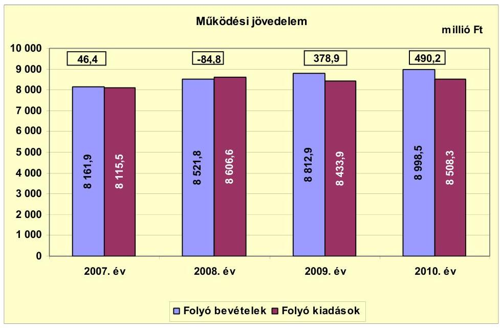

A vizsgált időszakban az Önkormányzat folyó költségvetési egyenlege, működési jövedelme 2008. év kivételével pozitív összegű volt, a folyó bevételek és kiadások egyenletes növekedést mutatnak. A folyó kiadások 2007. évhez viszonyított $6,1 \%$-os (491,1 millió Ft) növekedése a létszámleépítésekkel összefüggő egyszeri kifizetések következménye.

Az Önkormányzat a vizsgált időszakban pályázatot nyújtott be a működőképességének megőrzését szolgáló kiegészítő támogatásokra. A 2007-ben 120,8 millió Ft, 2011. év I-III. negyedévében 137,3 millió Ft ÖNHIKI támogatásban részesült. A kapott támogatást a Polgármesteri hivatal és az intézmények működtetésének dologi kiadásaira használták fel 2007. évben. A 2011. év I-III. negyedévében a támogatás felhasználásának jogcímei közül 58,1 millió Ft-ot személyi juttatásra, 79,2 millió Ft-ot dologi kiadásokra fordítottak. A működési jövedelem 2007. évben pozitív összegű 46,4 millió Ft volt, mely az ÖNHIKI támogatás nélkül -73,4 millió Ft lett volna.

Az Önkormányzat folyószámla-, valamint 2007-2010-ben, és 2011. év I. félévében is munkabér-megelőlegezési hitelt vett fel, egyrészt az átmeneti likviditási problémák kezelése, másrészt fejlesztési kiadásai finanszírozása miatt. A folyószámlahitel napi átlagos állománya a vizsgált időszak végére 1,3\%-kal csökkent (234,1 millió Ft-ról 231,1 millió Ft-ra), a legalacsonyabb 2009. évben volt (222,4 millió Ft). Az igénybe vett napok száma a vizsgált évek mindegyikében 365 nap volt.

---

A nettó működési jövedelem alakulását a 2007-2010. években a következő ábra szemlélteti:
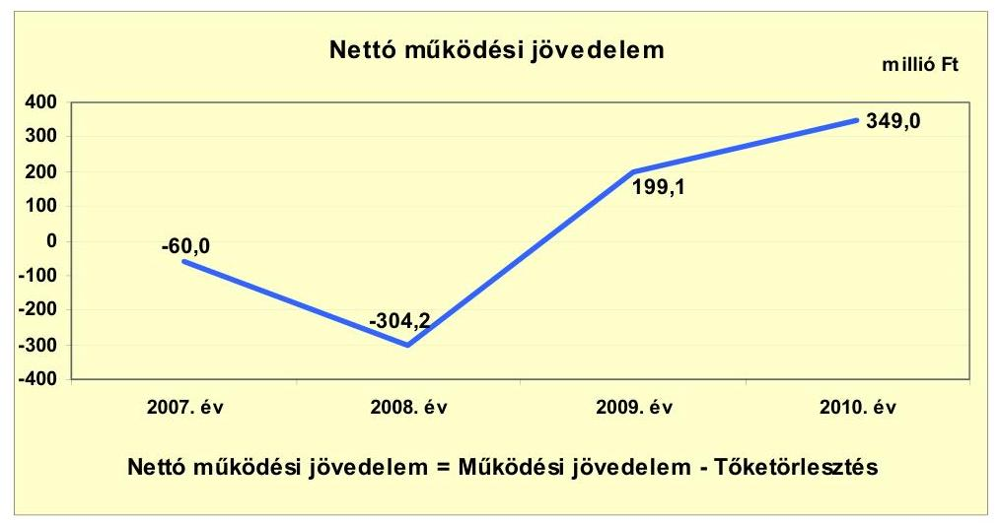

Az Önkormányzat pénzügyi kapacitása (nettó működési jövedelem) 2007-ben és 2008-ban negatív, míg 2009-2010-ben pozitív értéket mutatott. A nettó működési jövedelem értéke a folyó költségvetési pozíció mellett, az adott költségvetési év adósságtörlesztésének, valamint a kötvénykibocsátásnak a hatását is tükrözi.

A nettó működési jövedelem 2007-hez viszonyított romlását 2008. évben a tőketörlesztés összegének 2,1-szeres emelkedése okozta, a tőketörlesztés összege 2008. évben volt a legmagasabb 219,4 millió Ft. A kötvénykibocsátás eredményeként a nettó működési jövedelem 2008. évről 2009. évre jelentősen megnőtt. Kockázatot jelenthet, hogy az Önkormányzat a pénzügyi egyensúlyi helyzet romlása ellenére nem kezdeményezte az intézményei előirányzatfelhasználásának szoros kontrollját.

A felhalmozási költségvetés egyenlegét a 2007-2010 közötti években az alábbi ábra szemlélteti:
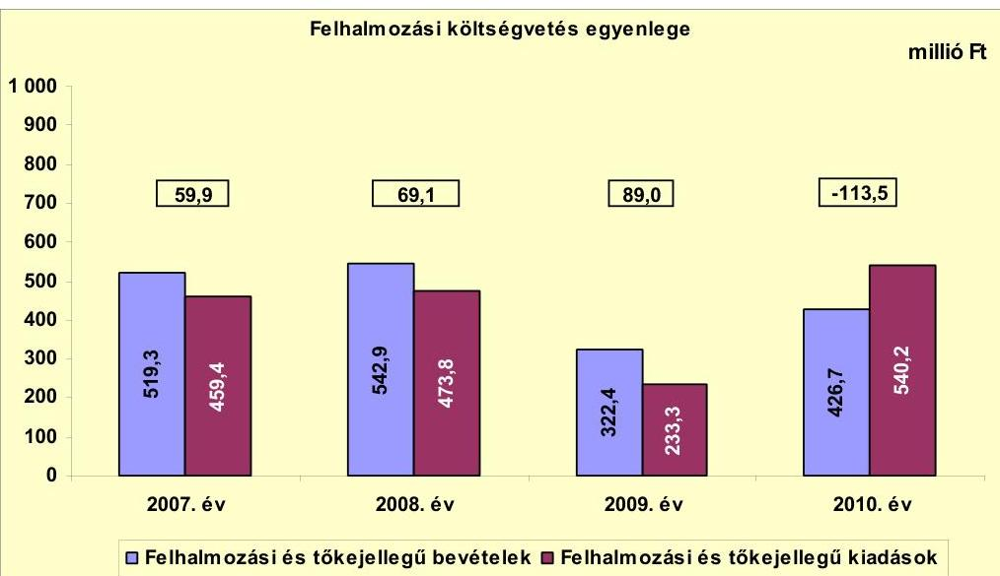

---

A 2007-2010. években az Önkormányzat felhalmozási költségvetésének egyenlege 2007-2009. években pozitív volt. A felhalmozási kiadások összege 2007-2009. években átlagosan 388,8 millió Ft volt, mely a 2010. évre 38,9\%-kal (151,4 millió Ft-tal) 540,2 millió Ft-ra nőtt. A 2010. évi felhalmozási forráshiányt az eredményezte, hogy a felhalmozási kiadások 2009-ről 2010-re 2,3-szorosára emelkedtek, ennek kettő oka volt. Egyik oka, hogy a saját beruházási kiadások áfával növelt összege 2009. évről 2010. évre 194,2 millió Ft-ról 337,3 millió Ft-ra közel háromszorosára emelkedett meg, a kórháznak a fekvőbeteg ellátásban végzett struktúraváltoztatást támogató infrastruktúra fejlesztése miatt. Másik oka, hogy az államháztartáson kívülre adott pénzeszközök 2009. évről 2010. évre 5,6 millió Ft-ról 101,3 millió Ft-ra megemelkedtek. A felhalmozási bevételek összege 2007-2009. években átlagosan 461,5 millió Ft volt, mely 2010. évre 78,7 millió Ft-tal (17,1\%-kal) nőtt. Az Önkormányzat felhalmozási forrásbevétele 2007. évben 519,3 millió Ft volt, melynek jelentős 77,7\%-át (403,7 millió Ft-ot) tették ki az államháztartáson belülről kapott támogatások. A 2007-2010. években a felhalmozási kiadások nagyságának és arányának változásában a 2009. évi csökkenést kivéve növekvő tendencia figyelhető meg. Ennek oka, hogy a felhalmozási kiadások a 2007. és a 2010. években a kórháznál megemelkedtek, és a 2008. évben a Várda-Távhő Kft. peres ügye miatt az Önkormányzatot 240,0 millió Ft egyszeri fizetési kötelezettség terhelte. Az Önkormányzatnak a saját forrás biztosításához nem volt elegendő felhalmozási bevétele, ezért a fejlesztéseket külső forrásból a 2005-2009. években felvett hitelek és a 2009. évben kibocsátott kötvény bevételéből finanszírozta.

Az Önkormányzat évenkénti teljes forráshiánya ${ }^{19}$ a CLF módszer szerint 2007-ben -0,1 millió Ft, 2008-ban -235,1 millió Ft volt. Finanszírozási többlete jelentkezett 2009-ben 288,1 millió Ft, 2010-ben 235,5 millió Ft összegben. A 2007. és 2008. évek finanszírozását a finanszírozási célú bevételek és kiadások egyenlege, valamint az előző évek pénzmaradványának igénybevétele biztosította.

Az Önkormányzat finanszírozási célú pénzügyi műveletei ${ }^{20}$ egyenlegének alakulását a 2007-2010. években a következő ábra szemlélteti:
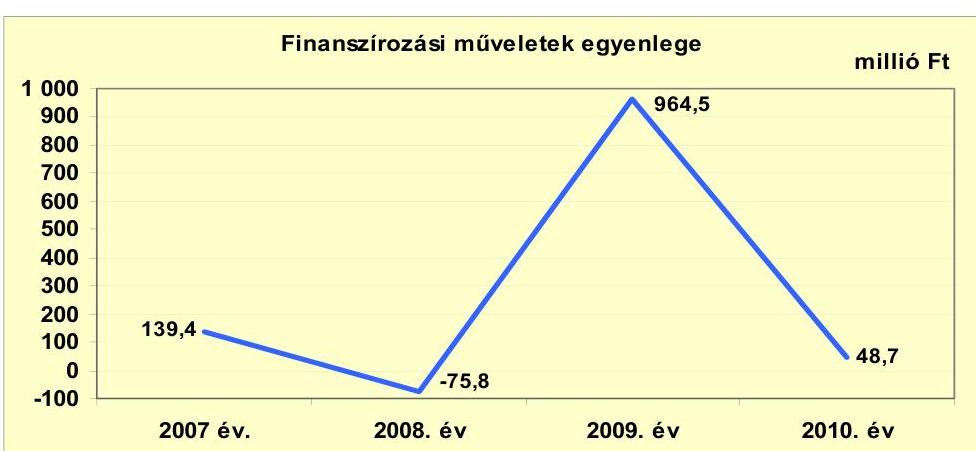

[^0]
[^0]:    ${ }^{19}$ A nettó működési jövedelem és a felhalmozási költségvetés eredője.
    ${ }^{20}$ A finanszírozási célú műveleteket a jelentés 2. számú mellékletének 4.1-4.8. pontjai részletezik.

---

A finanszírozási célú pénzügyi műveletek pozitív értéke azt jelzi, hogy az éves költségvetések végrehajtása során szükség volt az előző években keletkezett pénzmaradvány igénybevételén túl külső finanszírozás igénybevételére is. A finanszírozási műveletek egyenlegét növelte a 2009. évi 4000,0 ezer EUR összegű kötvénykibocsátás.

Az Önkormányzat zárszámadási rendeletében a működési és fejlesztési hiányt a hagyományos költségvetési szerkezet alapján mutatta be ${ }^{21}$, amelyről a jelentés 1. számú melléklete nyújt tájékoztatást.

A vizsgált időszakban a kötelezettségek (passzív pénzügyi elszámolások nélkül) a 2007-2009. években átlagosan 1879,7 millió Ft volt, mely a 2010. évre 2689,6 millió Ft-ra 43,1\%-kal (809,9 millió Ft-tal) megemelkedett. E változásra hatással volt, hogy a kamatkiadásoknak a 2007-2009. évi átlagos összege 99,6 millió Ft-ról 2010. évre 22,4\%-kal, (22,3 millió Ft-tal) 121,9 millió Ft-ra nőtt.

Az Önkormányzat 2007-2011. év I. félév között teljesített kamatbevételeinek és kamatkiadásainak alakulását a következő ábra mutatja be:
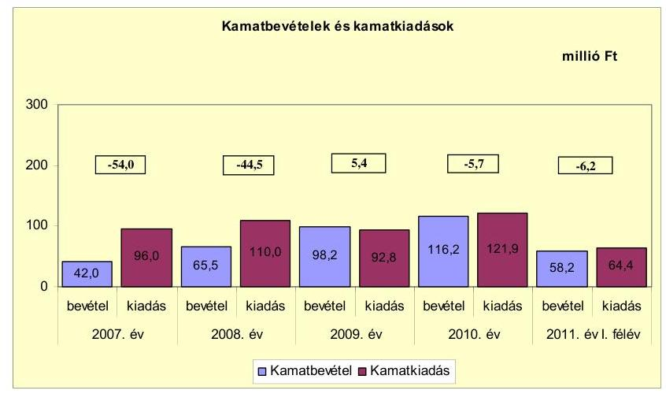

A 2007-2011. I. félév között az Önkormányzat összesen 485,1 millió Ft kamatot fizetett meg. Az átmenetileg szabad pénzeszközök befektetéséből, lekötéséből realizált kamatbevétel, a teljes kamatkiadás 78,4\%-át (380,1 millió Ft) tette ki.

# 2.2. Az Önkormányzat bevételeinek változása 

Az Önkormányzat összes folyó bevételének változása a vizsgált időszakban emelkedő tendenciát mutat. A 2007. évi 8161,9 millió Ft-ról a folyó bevétel 2008-ra 8521,8 millió Ft-ra nőtt (359,9 millió Ft-tal, 4,4\%-kal). Ezt követően 2009-ben 291,1 millió Ft-tal (3,4\%-kal), 2010-ben 185,6 millió Ft-tal (2,1\%-kal) emelkedett az előző évhez viszonyítva.

[^0]
[^0]:    ${ }^{21}$ Nincs kötelező előírás a működési és fejlesztési hiány megállapításának módjára.

---

Az Önkormányzat 2007-2011. év I. féléve között realizált főbb bevételi jogcímeinek számszaki adatait a következő grafikon mutatja be:
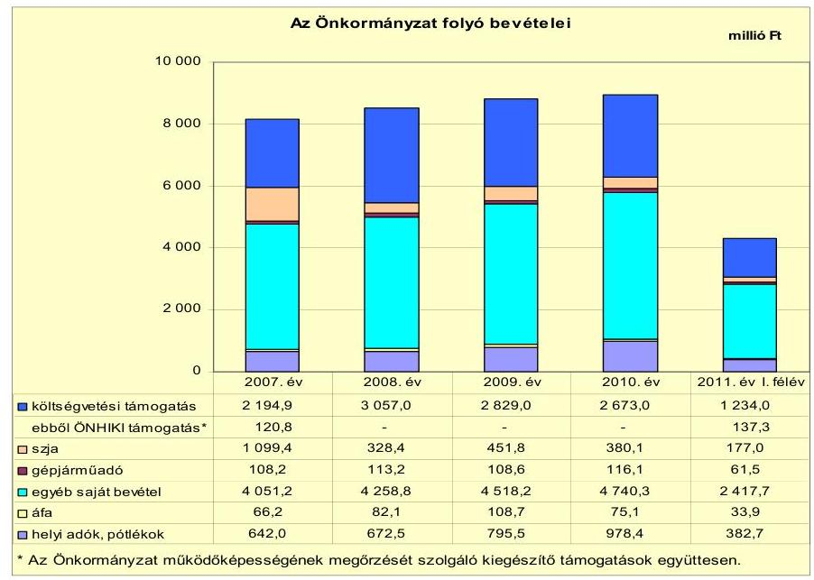

A költségvetési támogatás és az átengedett szja együttes összege a vizsgált években a folyó bevételeken belül 40,4-32,8\% közötti, csökkenő tendenciájú részarányt képviselt. Ezen állami támogatások évenkénti összegei - a 2008. év kivételével - folyamatos csökkenést mutatnak. A 2007-2009. évek átlagában az államtól kapott támogatások együttes összege 3320,2 millió Ft volt. A 2010. évre az előző három év átlagához viszonyítva 8,0\%-kal (267,1 millió Ft-tal) csökkent a támogatások összege. A 2011. év I. félévében 1411,0 millió Ft-ot realizáltak ezeken a jogcímeken. Az államtól kapott támogatások évenként eltérő nagyságát a forrásszabályozásban bekövetkezett változásokon kívül az ellátotti létszámok, valamint a kapott kötött felhasználású és központosított támogatások (szociális támogatás) változó nagysága indokolja. Az Önkormányzat a 2007. évben 120,8 millió Ft, a 2011. év I. félévében 137,3 millió Ft összegű ÖNHIKI támogatást kapott, javítva ezzel az adott évi pénzügyi egyensúlyát. Az Önkormányzat a vizsgált időszakban összesen 34,4 millió Ft összeget kapott felhalmozási célú költségvetési támogatásként.

A helyi adók, pótlékok bevételei a vizsgált időszakban emelkedő tendenciát mutattak, mivel összegük 52,4\%-kal (336,4 millió Ft-tal) növekedett. A helyi adókon belül meghatározó az iparűzési adó szerepe, melynek aránya 2007-ben 89,8\% (576,3 millió Ft), 2008-ban 89,4\% (601,4 millió Ft), 2009-ben 89,7\%,(713,8 millió Ft), 2010-ben 91,9\% (899,0 millió Ft) volt. Az iparűzési adó összegének évenkénti növekedését indokolja, hogy az Önkormányzat az iparűzési adómentesség feltételeit szigorította, valamint a vizsgált időszakban a gazdasági válság ellenére a városban működő legerősebb vállalkozások nagymértékben növelni tudták eredményességüket. A helyi adók évenkénti emelkedéséhez kisebb mértékben járult hozzá a magánszemélyek kommunális adómértékének Önkormányzat által történő emelése. A helyi adók, pótlékok részesedése az Önkormányzat saját folyó bevételein belül a vizsgált időszakban 3,0 százalékponttal emelkedett és a 2010. évben 10,9\%-ot (978,4 millió Ft-ot) tett ki.

---

Az egyéb saját bevételek több mint $80 \%$-át teszi ki a társadalombiztosítási alaptól átvett támogatásértékű működési bevételek. Az Önkormányzat által fenntartott kórház OEP finanszírozási bevétele ${ }^{22}$ összességében a vizsgált időszakban emelkedő tendenciát mutat, a 2007-2009. évek átlagában 3619,6 millió Ft-ot tett ki, mely a 2010. évre az előző három év átlagához képest 9,6\%-kal (346,7 millió Ft-tal) emelkedett.

Az Önkormányzat a vizsgált időszakban a gazdasági társaságaitól osztalékban nem részesült.

Az Önkormányzat 2007-2011. év I. félév között teljesített felhalmozási bevételei az alábbiak szerint alakultak:

| Megnevezés | 2007. év | 2008. év | 2009. év | 2010. év | 2011. év   I. félév |
| :-- | --: | --: | --: | --: | --: |
| Tárgyi eszköz értékesítés | 22,8 | 76,7 | 16,6 | 42,6 | 43,4 |
| Egyéb saját tőkebevétel | 52,5 | 230,3 | 170,4 | 136,9 | 29,0 |
| Államháztartáson belülről   kapott támogatás | 403,7 | 226,4 | 86,1 | 179,5 | 0,0 |
| EU-tól és külföldről kapott   támogatások | 4,1 | 2,3 | 43,0 | 52,9 | 119,6 |
| Államháztartáson kívülről   kapott támogatás | 36,2 | 7,2 | 6,2 | 14,8 | 2,8 |
| Összes felhalmozási bevétel | 519,3 | 542,9 | 322,3 | 426,7 | 194,8 |

Az Önkormányzat felhalmozási bevételei a 2007-2009. évek átlagában 461,5 millió Ft-ot tettek ki. A 2010. évben a felhalmozási bevételek összege 34,8 millió Ft-tal (7,5\%-kal) csökkentek az előző három év átlagához képest. Az összes felhalmozási bevételen belül a kapott támogatások (államháztartáson belülről, illetve kívülről, valamint EU-tól kapott támogatások) aránya 2007-ben 85,5\% (444,0 millió Ft), 2008-ban 43,5\% (235,9 millió Ft), 2009-ben 42,0\% (135,3 millió Ft), 2010-ben 57,9\% (247,2 millió Ft) és 2011. év I. félévben 62,8\% (122,4 millió Ft) volt. Az államháztartáson belülről, illetve az EU-tól kapott támogatások a fejlesztési feladatok végrehajtásához kapcsolódtak. Az Önkormányzat az államháztartáson kívülről kapott támogatások között a vállalkozásoktól és a háztartásoktól (szennyvízcsatorna-hálózat előkészítéséhez kapcsolódó lakossági hozzájárulás) átvett felhalmozási célú pénzeszközöket mutatta ki.

Az egyéb saját tőkebevétel évenkénti változó nagyságát az Önkormányzat tulajdonában lévő lakások és helységek értékesítéséből származó bevétel eltérő összege indokolja. Az egyéb saját tőkebevételből a 2007. évben 41,1 millió Ft, 2008. évben 220,6 millió Ft, 2009. évben 159,9 millió Ft, 2010. évben 8,8 millió Ft, 2011. év I. félévben 24,6 millió Ft származott az Önkormányzat tulajdonában lévő lakások, egyéb helységek értékesítéséből.

[^0]
[^0]:    ${ }^{22}$ Az OEP általi finanszírozás az évek során az alábbiak szerint alakult: 2007. évben 3665,0 millió Ft, 2008. évben 3679,5 millió Ft, 2009. évben 3514,3 millió Ft, 2010. évben 3966,3 millió Ft, 2011. év I. félévében 1890,5 millió Ft volt.

---

# 2.3. Az Önkormányzat működési és felhalmozási célú kiadásainak változása 

Az Önkormányzat folyó kiadásai főbb jogcímek szerinti bontásban a 2007-2011. év I. félév közötti időszakban az alábbiak voltak:

| Megnevezés | 2007. év | 2008. év | 2009. év | 2010. év | 2011. év   I. félév |
| :--: | :--: | :--: | :--: | :--: | :--: |
| Folyó kiadások | 8115,5 | 8606,6 | 8433,9 | 8508,3 | 3799,3 |
| Működési kiadások (kamatkiadás nélkül) | 7644,2 | 8104,0 | 7834,0 | 7943,8 | 3487,0 |
| Államháztartáson belülre átadott pénzeszközök | 6,1 | 7,7 | 5,3 | 26,8 | 11,2 |
| Transzferkiadások | 368,4 | 384,0 | 373,7 | 415,7 | 9,8 |
| -ebből: vállalkozásoknak | 0,0 | 0,0 | 0,0 | 49,0 | 4,2 |
| EU-nak, illetve külföldre | 0,0 | 0,0 | 0,0 | 0,0 | 0,0 |
| magánszemélyeknek | 340,5 | 362,2 | 352,7 | 348,4 | 0,0 |
| nonprofit szervezeteknek | 27,9 | 21,8 | 21,0 | 18,3 | 5,6 |
| Kamatkiadások | 96,0 | 110,0 | 92,8 | 121,9 | 19,6 |
| Előző évi pénzmaradvány átadás | 0,8 | 0,8 | 128,2 | 0,0 | 0,0 |

Az Önkormányzat folyó kiadásai 2007. évről 2008. évre nagyobb mértékben, 6,1\%-kal (491,1 millió Ft-tal) emelkedtek meg a személyi juttatások és a munkaadókat terhelő járulékok növekedése miatt. Ezt követően a 2009. évre a folyó kiadásokban 2,0\%-os (172,7 millió Ft-os) csökkenés következett be. A pénzmaradvány átadása miatt 2009. évről 2010. évre 0,9\%-kal 74,4 millió Ft-tal nőtt a folyó kiadások összege. A 2010. évben a működési költségvetés 64,3\%-át (5474,3 millió Ft) személyi juttatásokra és a munkaadókat terhelő járulékokra fordította, az üzemeltetést, intézményfenntartást biztosító dologi kiadásokra 27,9\% (2377,2 millió Ft) jutott. A folyó kiadásokon belül a személyi juttatások és járulékok nagyságrendje a kórháznál jelentkező 2007. évi jelentős (162 fős) létszámleépítés, és a közoktatásban a vizsgált évek mindegyikét érintő (60 fős) létszámleépítés miatt, hullámzó képet mutat. A kórháznál a létszámleépítés 2007. évben kezdődött és 2008. évben fejeződött be, de pénzügyileg a 2008. évet terhelte. A személyi juttatások és a munkaadókat terhelő járulékok 2008. évben a 2007. évhez viszonyítva 5,6\%-kal (310,8 millió Ft) nőtt meg.

Az Önkormányzat folyó kiadásai főbb kiadás nemek szerinti bontásban a 2007-2011. év I. félév közötti időszakban az alábbiak voltak:

|  |  |  |  |  | millió Ft |
| :-- | --: | --: | --: | --: | --: |
| Megnevezés | 2007. év | 2008. év | 2009. év | 2010. év | 2011. év   I. félév |
| Személyi juttatások | 4238,1 | 4480,2 | 4191,5 | 4372,9 | 1976,7 |
| Munkaadót terhelő járulékok | 1343,5 | 1412,2 | 1224,6 | 1101,4 | 513,4 |
| Dologi kiadások | 2012,6 | 2097,4 | 2323,1 | 2377,2 | 996,6 |
| Egyéb folyó kiadások | 41,0 | 50,0 | 62,0 | 91,1 | 47,7 |

A személyi juttatások 2008-ban 5,7\%-kal (242,1 millió Ft-tal) emelkedtek az előző évhez képest a Polgármesteri hivatalban kezelt hatósági feladatok növekedése, és a közalkalmazottakat érintő létszámleépítés hatására. A 2010. évben az összes köztisztviselőt és közalkalmazottat érintő 98 ezer Ft-os egyszeri kereset kiegészítés miatt a személyi juttatások és a kapcsolódó járulékok 3,0\%-kal (108,4 millió Ft) nőttek 2009. évhez viszonyítva.

---

A munkaadókat terhelő járulékok alakulását befolyásolja a kórháznál és a Polgármesteri hivatalnál jelentkező létszámleépítés, a 2009. évtől a foglalkoztatókat terhelő társadalombiztosítási járulék mértékének csökkenése, valamint a tételes egészségügyi hozzájárulás megszűnésének hatása.

A dologi kiadások az Önkormányzatnál 2010-ben a 2007. évi szintnél 350,6 millió Ft-tal (17,4\%-kal) voltak magasabbak. A 2009. év kivételével minden évben az infláció alatti mértékben - 2008. évben 84,8 millió Ft-tal (4,2\%kal), a 2009. évben 225,7 millió Ft-tal (10,8\%-kal), 2010. évben 54,1 millió Ft-tal (2,3\%-kal) - nőttek a dologi kiadások. Fedezetét az Önkormányzat által végrehajtott kiadáscsökkentő intézkedések jelentették. A dologi kiadások 2009. évi infláció feletti növekedését az élelmiszer és üzemanyagárak nagymértékű emelkedése okozta.

A működési célú pénzeszközátadások nagysága a 2007-2009. évek tekintetében csökkenő tendenciát mutat. A 2010. évi nagyarányú, több mint háromszoros növekedést a Várda-Távhő Kft. részére nyújtott 49,0 millió Ft-os kölcsön összege növeli. A kölcsönt a Kft. a 2011. évben visszafizette.

A folyó kiadások alakulását a kórházi fekvőbeteg ellátás nélkül a 2007-2011. év I. félév közötti időszakban az alábbi táblázat szemlélteti:
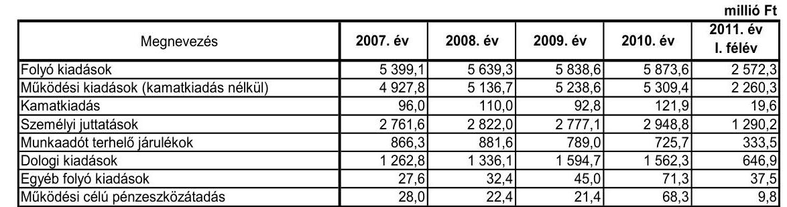

Az Önkormányzat folyó és felhalmozási kiadásainak alakulását, a teljesített kiadások működési és felhalmozási felhasználásának arányait a 2007-2011. év I. félév közötti időszakban a következő ábra mutatja be:
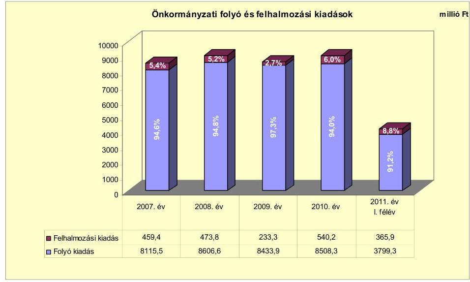

---

A 2007-2010. években a felhalmozási kiadások nagyságának és arányának változásában a 2009. évi csökkenést kivéve, növekvő tendencia figyelhető meg. Ennek oka, hogy a felhalmozási kiadások a 2007. és a 2010. években a kórháznál megemelkedtek, és a 2008. évben a Várda-Távhő Kft. peres ügye miatt az Önkormányzatot 240,0 millió Ft egyszeri fizetési kötelezettség terhelte. A felhalmozási kiadások összege a négy év viszonylatában 459,4 millió Ft-ról 540,2 millió Ft-ra, aránya $5,7 \%$-ról $6,3 \%$-ra emelkedett.

A 2007-2010 között megvalósult felújítások és fejlesztések 626,1 millió Ft teljesített kiadásaiból a hazai támogatás $13,4 \%$-ot ( 83,9 millió Ft ), az EU támogatás $8,6 \%$-ot ( 53,9 millió Ft ), a felvett hitel $1,6 \%$-ot ( 10,1 millió Ft ), a saját erő $73,5 \%$-ot ( 459,9 millió Ft ), a kötvény $2,9 \%$-ot ( 18,3 millió Ft ) tett ki. Az EU-s támogatásból megvalósult fejlesztések finanszírozása likviditási gondot nem okozott, mivel a közreműködő szervezet közvetlenül a beruházók részére utalta a pályázaton elnyert összegeket.

Az Önkormányzat 2007-2010 között folyamatban lévő felújításainak száma kettő, fejlesztéseinek száma egy volt. A 2007-2010. évek között felújításokra, fejlesztésekre összesen 168,1 millió Ft-ot fordítottak, melyből a kórház fejlesztése $75,5 \%$-ot ( 126,8 millió Ft ), a szennyvízcsatorna hálózat építésének II. üteme 19,5\%-ot ( 32,9 millió Ft), az infrastruktúra fejlesztése 0,5\%-ot ( 8,5 millió Ft) képvisel (3/b. számú melléklet). A folyamatban lévő fejlesztések 2010. év után esedékes 4059,4 millió Ft-os kötelezettségének forrása 7,8\% ( 315,3 millió Ft) saját bevétel, $88 \%$ ( 3573,9 millió Ft) EU-s támogatás, 0,05\% ( 1,9 millió Ft) hazai támogatás, $1,5 \%$ ( 62,4 millió Ft) kötvény és 2,65\% ( 105,8 millió Ft) hitel ${ }^{23}$ (3/c. számú melléklet).

A vizsgált időszakban a három legnagyobb bekerülési költségű fejlesztés a következő volt:

- a szennyvízcsatorna hálózat építésének II. üteme folyamatban lévő beruházás, mely várható teljes bekerülési költsége 766,4 millió Ft. A 2010. év utánra vállalt kötelezettség 733,5 millió Ft. Forrásai várhatóan 0,2\% ( 0,9 millió Ft) saját bevétel, $14,4 \%$ ( 105,8 millió Ft) hitel, $6,3 \%$ ( 45,9 millió Ft) kötvény, és $79,1 \%$ ( 580,9 millió Ft) EU-s támogatás lesz;
- a struktúraváltoztatást támogató infrastruktúra-fejlesztés a Felső-Szabolcsi Kórháznál folyamatban lévő beruházás, melynek tervezett bekerülési költsége 3121,1 millió Ft. A fejlesztés tervezett befejezési ideje 2013. év. A 2010-ig teljesített kiadás 126,8 millió Ft, a teljes bekerülési költség 4,1\%-a. Forrásai várhatóan 10,0\% ( 312,1 millió Ft) saját bevétel, 90,0\% (2809,0 millió Ft) EU-s támogatás lesz;
- az időskorúak és fogyatékkal élők nappali ellátásának, szociális alapszolgáltatásának infrastrukturális fejlesztése folyamatban lévő fejlesztés, melynek várható teljes bekerülési költsége 165,1 millió Ft. A 2010. évben elkezdett fejlesztés tervezett befejezés ideje 2011. év. A 2010. év utánra vállalt kötelezett-

[^0]
[^0]:    ${ }^{23}$ A 105,8 millió Ft-os hosszú lejáratú hitelt a Kisvárda Csatornamű Víziközmű Társulat vette fel a 2010. június 10 -én kelt hitelszerződés szerint.

---

ség 162,5 millió Ft, melynek forrásösszetétele várhatóan 10,2\% (16,5 millió Ft) kötvény, 89,8\% (146,0 millió Ft) EU-s támogatás lesz.

Az Önkormányzat által beadott, elbírálás alatt álló pályázatok tervezett teljes bekerülési költsége 2025,3 millió Ft volt. Az Önkormányzat által a 2010-2013. évekre vállalt kötelezettségek összege 1976,5 millió Ft, amelyből 476,0 millió Ft-ot kötvényből, 1500,5 millió Ft-ot EU-s támogatásból terveznek biztosítani.

A Képviselő-testületnek előterjesztett éves költségvetési rendeletekben nem mutatták be a beruházásokkal létrehozott létesítmények működtetése és fenntarthatósága érdekében várhatóan felmerülő költségvetési kiadásokat, azok költségvetési hatását.

Az Önkormányzat által a gazdasági társaságok részére átadott pénzeszközöket a 2007-2011. év I. félévében az alábbi diagram mutatja be:
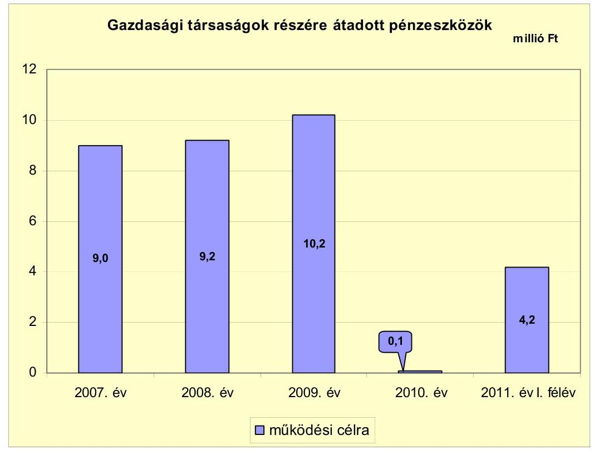

A gazdasági társaságok adatszolgáltatása szerint az Önkormányzat feladatellátásában résztvevő gazdasági társaságok részére nyújtott működési célú pénzeszközátadás a vizsgált években 32,7 millió Ft összeget tett ki, amely az Önkormányzat pénzügyi helyzetének, működési jövedelmének alakulását érdemben nem befolyásolta. Gazdasági társaságai részére az Önkormányzat felhalmozási jellegű pénzeszközt nem adott át.

---

A kórház részére a 2007-2011. év I. félévében átadott pénzeszközök alakulását az alábbi ábra szemlélteti:
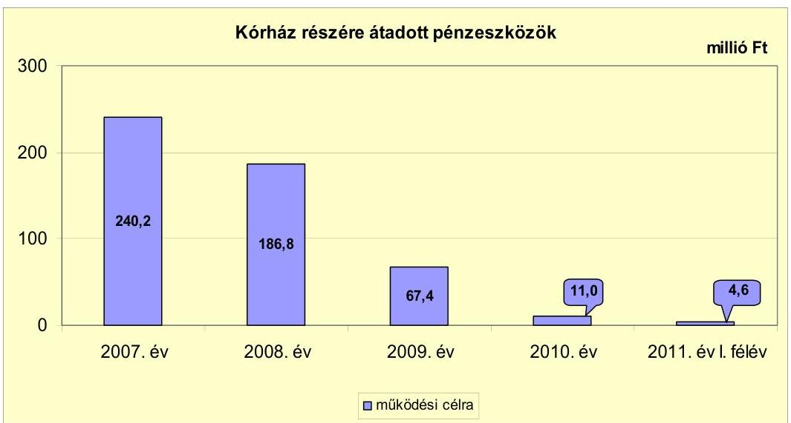

A kórház részére az Önkormányzat csak működési célra adott át pénzeszközt, amely a létszámcsökkentéssel összefüggő többletkiadások központosított előirányzatként biztosított támogatásának átadása volt. A 2010. évben átadott pénzeszköz (11,0 millió Ft) a 2007. évinek 4,6\%-a, a 2008. évinek 5,9\%-a, a 2009. évinek pedig $16,3 \%$-a volt.

# 3. Az ÖNKORMÁNYZAT KÖTELEZETTSÉGEI 

### 3.1. Az Önkormányzat pénzintézeti kötelezettségeinek változása

Az Önkormányzat pénzintézeti kötelezettségeinek állománya 2006. december 31-től 2011. június 30-ig 1,9 szeresére nőtt 1179,2 millió Ft-ról 2253,0 millió Ft-ra. A hosszú lejáratú kötelezettségek a 2008. évről a 2009. évre jelentősen, 150,5\%-kal megemelkedtek a 4000,0 ezer EUR összegű kötvény kibocsátása miatt. A fennálló pénzintézeti kötelezettségei hosszú és rövid lejáratú hitelek igénybevételéből keletkeztek.

---

Az Önkormányzat pénzintézetekkel szemben fennálló kötelezettség állományát a 2006-2011. év I. félévében az alábbi diagram ábra szemlélteti ${ }^{24}$ :
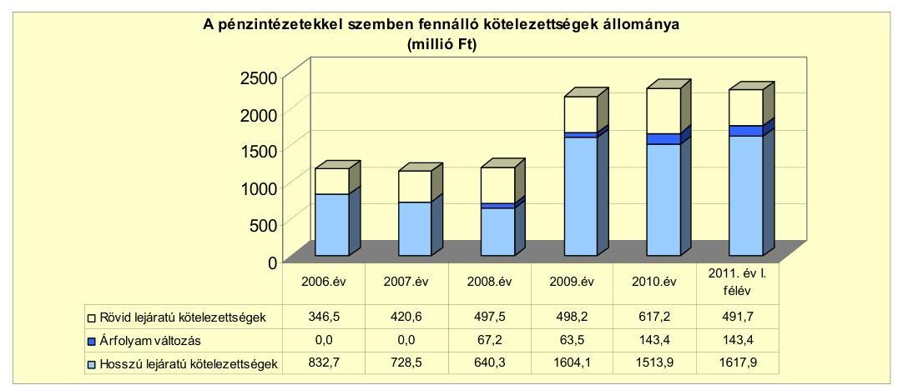

Az árfolyamváltozás hatása is befolyásolja a kötelezettségek alakulását, azonban annak mértéke előre pontosan nem határozható meg, csak várakozásokon alapuló tendenciák jelezhetők. Annak megítéléséről, hogy a devizában felvett hitelekért kapott forinthoz képest a hitelek visszafizetésekor jelentkező forint kötelezettség többletkiadást (árfolyamveszteség) vagy megtakarítást (árfolyamnyereség) eredményez a futamidő végén, a teljes kötelezettség rendezését követően lehet pontos képet alkotni. Mindaddig, amíg törlesztési kötelezettség nem áll fenn (türelmi idő, moratórium), a tőkére vonatkoztatva nem értelmezhető sem az árfolyamveszteség, sem az árfolyamnyereség. Ugyanakkor a Számv. tv. 60. § (4) bekezdése meghatározza, hogy az árfolyam-különbözetet év végén a kötelezettségek vagy követelések között a könyvviteli mérlegben nyilván kell tartani, azonban az árfolyam különbözet valójában nem realizált.

Az Önkormányzat a Számv. tv. 60. § (4)-(6) bekezdéseiben foglaltakat, valamint az Áhsz. 33. § (1) bekezdésében foglaltak megsértette azzal, hogy év végén az árfolyam-különbözeteket nem könyvelte, nem tartotta nyilván, a grafikonban szereplő adatok az Önkormányzat utólagos számításain alapulnak.

Az Önkormányzat a 2006-2010. években nem tett eleget a Számv. tv. 60. § (2) bekezdésében előírtaknak, mivel a devizában fennálló kötelezettsége év végi értékelését nem végezte el a Számv. tv. 60. § (4), (6) bekezdéseiben szereplő devizaárfolyammal számolva. Tekintettel arra, hogy az év végi értékelések nem történtek meg, a kötelezettségek állománya nem tartalmazza az árfolyamváltozások hatását.

A Képviselő-testület a forráshiány kezelése érdekében a 2007. évi költségvetési rendeletében ÖNHIKI támogatás igényléséről, munkabér-megelőlegezési, valamint folyószámlahitel igénybevételéről döntött. A 2011. évi költségvetési rendelet a hiány miatt folyószámla-, illetve munkabér-megelőlegezési hitel igénybevételéről rendelkezett. A pénzintézeti kötelezettségvállalások teljesítésére, az

[^0]
[^0]:    ${ }^{24}$ A diagramban a hosszú lejáratú kötelezettségek mérlegértékét nem csökkentettük az árfolyamváltozás összegével.

---

adósság kezelésére az egyéb sajátos bevételek nyújtottak fedezetet. A forráshiány csökkentése érdekében a 2011. évben átszervezéseket, létszámleépítéseket terveztek az óvoda, és az iskola egyházi fenntartásba való átadásával.

A kötelezettségvállalásból származó források felhasználási céljait meghatározták. A képviselő-testületi előterjesztések tartalmazták a pénzintézeti kötelezettségvállalások visszafizetési forrásait, a teljes futamidő várható kamat és tőkefizetési kötelezettségeit.

Az Önkormányzat az adósságszolgálati korlátot, a hitelfelvételekhez kapcsolódó előterjesztésekben, illetve az évente elkészített költségvetési koncepcióban nem mutatta be. Az Önkormányzat az adósságot keletkeztető kötelezettségvállalásának felső határát a 2007-2011. években betartotta. Az Önkormányzat a forráshiány, továbbá az adósság kezelése érdekében az adósságot keletkeztető kötelezettségvállalással megvalósított felhalmozási kiadások esetleges bevételnövelő, illetve kiadáscsökkentő vonzatát, illetve ennek a fejlesztéshez, felújításhoz vállalt kötelezettségek visszafizetési forrásként való számbavételét nem vizsgálta.

Az Önkormányzat pénzintézeti kötelezettségvállalásaira, három hosszú lejáratú hitel - forint hitelről CHF-re való átkonvertálása miatti - módosítását kivéve minden esetben képviselő-testületi döntés alapján került sor. Az érintett hitelszerződésekben a kölcsönök konverzióját szabályozták, és a kapcsolódó képviselő-testületi határozatok is rögzítették, hogy nem ajánlanak fel ingatlan fedezetet, de elfogadják a bank jelzálogfedezet nélküli finanszírozásra vonatkozó ajánlatát, HUF, CHF, EUR devizanemek közötti szabad átjárhatósággal. A Képviselő-testület határozattal nem döntött a három hosszú lejáratú hitel átkonvertálásáról, ezért eljárásukkal megsértették a Hatásköri tv. 138. § (1) bekezdés e) pontjában foglaltakat, mert a hitelszerződések módosítására nem képviselő-testületi döntés alapján kerüljön sor. Az átkonvertálást tartalmazó, a kötelezettségvállaló által aláírt, előzetesen ellenjegyzett szerződésmódosítások dokumentumaival nem rendelkezik az Önkormányzat. Eljárásuk ellentétes az Ámr. 74. § (1) bekezdésében ${ }^{25}$ foglaltakkal, mely alapján kötelezettségvállalás az ellenjegyzés után, és csak írásban történhet. A hitelekhez kapcsolódó képviselő-testületi határozatok nem adtak felhatalmazást a polgármesternek arra, hogy önállóan döntsön a devizanemek megváltoztatásáról, továbbá sem a vagyonrendelet, sem a gazdálkodási jogkörök szabályzata erre nem adott számára felhatalmazást.

A 2008. január 3-án kelt hitelszerződések - ÖEP-05-0106/1 szerződés számú 70,0 millió Ft, az ÖEP-06-0202/1 szerződés számú ÖEP-06-0202/2 szerződés számú 50,0 millió Ft - összegű éven túli beruházási szerződések konverziójáról az Önkormányzatnál csak számlakivonatok találhatók. A helyszíni vizsgálat ideje alatt levélben kérték a bankot a keletkezett iratanyagok megküldésére.

A hitelfelvételeket megelőzően a pénzintézetek között versenyeztetés nem volt. Az árfolyam- és a kamatkockázatokat a hitelfelvételek során, illetve az évente elkészített költségvetési koncepcióban nem mutatták be. Az Önkor-

[^0]
[^0]:    ${ }^{25}$ 2012. január 1-jétől az Áht. 37. § (1) bekezdése

---

mányzat számlavezető bankja azonos a finanszírozó pénzintézettel. Az Önkormányzat a 2007. évet megelőzően kilenc, míg a vizsgált években kettő hosszú lejáratú hitelt vett fel.

A hosszú lejáratú hitelszerződések feltételeit 2010. év novemberében a bank kérésére visszamenőlegesen módosították. Ezáltal biztosítékként 1200,0 millió Ft piaci értékű ingatlant ajánlottak fel minden, eddig a banknál felvett hitel mögé fedezetként, keretjelleggel. A szerződést az ingatlanokat terhelő keretbiztosítéki jelzálog alapításáról 2010. december 17 -én megkötötték. A kapcsolódó képviselő-testületi határozat ${ }^{26}$ ezt nem rögzíti, az előterjesztése igen. Az előterjesztésben szerepelt egy 70,0 millió Ft összegű éven belüli hitel felvétel is, a Képviselő-testület csak az e hitelhez kapcsolódó 140,0 millió Ft jelzálogjog bejegyzéséről döntött. Eljárásukkal megsértették a Hatásköri tv. 138. § (1) bekezdés e) pontjában foglaltakat, mert a hitelszerződések feltételeinek módosítására nem képviselőtestületi döntés alapján került sor.

Az Önkormányzatnak a vizsgált időszakban 11 hosszú lejáratú, hat egyéb likvid hitele, valamint egy kötvénykibocsátása volt, s ezen túlmenően a vizsgált évek mindegyikében a likviditási problémák miatt folyószámla- és munka-bér-megelőlegezési hitel igénybe vételére kényszerült. A kötvény fejlesztési célt szolgált, működési kiadásokat nem finanszíroztak belőle.

A Kisvárda Csatornamű Víziközmű Társulat hitelfelvevő volt a 2010. június 10-én kelt 105,8 millió Ft-os hosszú lejáratú hitelszerződésben. A hitelből folyósítás még nem volt, azonban a kockázatot növeli a vállalt fejlesztések jövőbeni finanszírozhatósága szempontjából.

Az Önkormányzat 2010. december 31-én HUF-ban fennálló hosszú lejáratú hiteleikhez kapcsolódó pénzintézeti kötelezettségvállalásai az alábbiak voltak:

| Megnevezés | Szerződéskötés/   Kibocsátás   időpontja | Összeg   millió Ft-ban | Kamat (referencia kamat+   kamatfelár) | Felhasználás célja: |
| :-- | :--: | :--: | :--: | :--: |
| Szennyvízhitel 2005.04.19.K\&H | 2005.04.19 | 239,5 | 3 havi EURIBOR $+2,25 \%$ | szennyvízberuházás |
| Bessenyői Gimnázium   rekonstrukció K\&H bank | 2005.04.20 | 49,9 | 3 havi EURIBOR $+3,25 \%$ | gimnázium rekonstrukció
| Panel lakások rekonstrukció   K&H Bank | 2006.11.11 | 13,6 | (3 havi EURIBOR $+1,0 \%$ ) $+1,05 \%$ | panel lakások |

[^0]
[^0]:    ${ }^{26}$ a Képviselő-testület a 201/2010. (XII. 2.) számú határozata

---

Az Önkormányzat 2010. december 31-én CHF-ben fennálló hosszú lejáratú hitelekhez kapcsolódó pénzintézeti kötelezettségvállalásai az alábbiak voltak:

| Megnevezés | Szerződéskötés/   kibocsátás   időpontja | Összeg   ezer CHF-ben | Lehívási   árfolyam | Kamat (referencia kamat+   kamatfelár) | Felhasználás célja: |
| :--: | :--: | :--: | :--: | :--: | :--: |
| 1.Várfürdő beruházás   K&H Bank | 2005.02.04 | 537,3 | 157,20 Ft | Eredeti szerződés szerint:3 havi   BUBOR+1,05\% Levél alapján: 3   havi CHF LIBOR+2,9\% | várfürdő beruházás |
| 2.Várfürdő beruházás   K&H Bank | 2005.02.04 | 883,5 | 157,20 Ft | Eredeti szerződés szerint:3 havi   BUBOR+1,05\% Levél alapján: 3   havi CHF LIBOR+2,9\% | várfürdő beruházás |
| ÖNHIKI K&H Bank | 2005.02.04. | 636,1 | 157,20 Ft | Eredeti szerződés szerint:3 havi   BUBOR+1,05\% Levél alapján: 3   havi CHF LIBOR+2,9\% | ÖNHIKI visszafiz |
| 1.Belterületi utak   felújítása K&H | 2008.01.03 | 434,1 | 161,30 Ft | BUBOR+1,05\% Nincs levél : csak   kivonat van 2008.01.03.-án   váltották át. | Belterületi utak   felújítása |
| 2.Belterületi utak   felújítása K&H | 2008.01.03 | 326,7 | 153,00 Ft | BUBOR+1,05\% Nincs levél : csak   kivonat van 2008.01.03.-án   váltották át. | Belterületi utak   felújítása |
| Belterületi járdák   felújítása | 2008.01.03 | 50,00 | 153,00 Ft | BUBOR+1,05\% Nincs levél : csak   kivonat van 2008.01.03.-án   váltották át. | Belterületi járdák   felújítása |
| Egyedi kölcsönszerződés   gépjármű vásárlásánál   LKJ-399 | 2009.11.09 | 16,8 | 178,80 Ft | 3 havi CHF LIBOR+ 2,2\% | gépjármű beszerzése |
| Egyedi kölcsönszerződés   gépjármű vásárlásánál   LOB-399 | 2009.06.03 | 15,6 | 181,03 Ft | 3 havi CHF LIBOR+ 2,2\% | gépjármű beszerzése |

A hiteleket a hitelcélnak megfelelően a Képviselő-testület által jóváhagyott, a költségvetésbe betervezett beruházásokhoz használták fel. A HUFban fennálló pénzintézeti kötelezettségeiből 2007. évtől 2010. év december 31-ig 65,0 millió Ft tőkét, és 63,7 millió Ft kamatot törlesztett. A CHF-ben fennálló átkonvertált pénzintézeti kötelezettségeiből 1943,6 ezer CHF (372,2 millió Ft) tőkét, és kamatot fizetett. Az Önkormányzat az EUR-ban fennálló pénzintézeti kötelezettségeiből tőkét nem törlesztett, azonban 289,9 ezer EUR (80,2 millió Ft) kamatot fizetett. A fix kamatozású egyedi kölcsönszerződés alapján az Önkormányzat a kötelezettségeiből 12,1 ezer CHF (2,1 millió Ft) tőkét, és 4,6 ezer CHF ( 0,8 millió Ft) kamatot fizetett meg. A 2011. év I. félévében a HUFban fennálló pénzintézeti kötelezettségeiből 11,3 millió Ft tőkét és 4,1 millió Ft kamatot törlesztett. A CHF-ben fennálló pénzintézeti kötelezettségeiből 159,5 ezer CHF ( 34,9 millió Ft) tőkét és 36,4 ezer CHF ( 7,3 millió Ft) kamatot törlesztett. Az EUR-ban fennálló pénzintézeti kötelezettségeiből tőkét nem, azonban 124,2 ezer EUR ( 33,9 millió Ft) kamatot fizetett. A vizsgált években hosszú lejáratú hitelt az Önkormányzat nem fizetett vissza, hitele nem járt le.

Az Önkormányzat 2011. június 30-án a „Kisvárda 2024" kötvény kibocsátásból származó adósságot keletkeztető kötelezettségvállalása az alábbiak szerint alakult:

| Megnevezés | Szerződéskötés/   Kibocsátás   időpontja | Összeg   ezer EUR-   ban | Kibocsátási   árfolyam | Kamat (referencia   kamat+ kamatfelár) | Felhasználás célja: |
| :--: | :--: | :--: | :--: | :--: | :--: |
| "Kisvárda 2024"   kötvény | 2009.07.27 | 4000,0 | 264,02 Ft | 6 havi EURLIBOR+5,1\% | beruházás, fejlesztés |

---

A kötvényből származó bevétel 11,5\%-át, 121,5 millió Ft-ot a kötvénykibocsátáskor meghatározott felhalmozási célokra használták fel, azt a folyamatban lévő beruházásokhoz a szükséges ütemezésben vették igénybe. A kötvény okirat és a Képviselő-testület 99/2009. (VI. 18.) számú határozata értelmében a kötvény összege csak felhalmozási célra használható fel a meghatározott beruházások saját erejének biztosításához. A fel nem használt kötvénybevételt 934,6 millió Ft-ot 2009-2010. években és 2011. év I. félévében elkülönített betétszámlán tartották.

Az Önkormányzat a 2009. évben kibocsátott kötvény bevételéből származó átmenetileg szabad források befektetéséből 2009. évtől 2011. év I. félévéig összesen 114,0 millió Ft hozamot, kamatbevételt ért el, amely a kötvények 2011. június 30-ig teljesített kamatfizetésének 10,5\%-át tette ki. A bevételt az Önkormányzat a beruházásai saját erejének biztosítására fordította. A kötvény törlesztése első alkalommal - a türelmi idő miatt 2012. szeptember 30-án esedékes, összege 160,0 ezer EUR. A kötvénykibocsátó pénzintézet azonos az Önkormányzat számlavezetőjével, míg a kötvény lejegyzője a HYPO Investment Bank AG.

Az Önkormányzat működésének pénzügyi egyensúlyát a vizsgált időszakban csak folyószámlahitel és munkabér-megelőlegezési hitel igénybevételével tudta biztosítani. A folyószámlahitel és a munkabérmegelőlegezési hitel alakulását 2007-2011. év I. félév időszakában az alábbi táblázat mutatja be:

|  |  |  |  |  |  |  |
| :-- | --: | --: | --: | --: | --: | --: |
| Megnevezés | 2007. év | 2008. év | 2009. év | 2010. év | 2011. év   I. félév |  |
| I. Folyószámlahitel |  |  |  |  |  |  |
| a folyószámlahitel keretösszege január 1-jén | 250,0 | 250,0 | 250,0 | 250,0 | 250,0 |  |
| teljesített kamat és egyéb költség | 23,6 | 20,1 | 21,7 | 14,4 | 8,2 |  |
| II. Munkabér-megelőlegezési hitel |  |  |  |  |  |  |
| Igénybevett hitel összesen: | 140,0 | 140,0 | 140,0 | 140,0 | 140,0 |  |
| teljesített kamat és egyéb költség | 7,9 | 11,2 | 10,6 | 14,4 | 4,8 |  |

A folyószámlahitel és a munkabér-megelőlegezési hitelek kondícióinak és egyéb költségeinek alakulását az alábbi táblázat szemlélteti ${ }^{27}$ :

| Megnevezés | Kamat (referencia+ kamatfelár) | Egyéb költség |
| :--: | :--: | :--: |
| Folyószámlahitel |  |  |
| 2007-2011. év | 1 havi BUBOR $+1,0 \%$ | $0,00 \%$ |
| Munkabér-megelőlegezési hitel |  |  |
| 2007-2011. év | 1 havi BUBOR $+0,5 \%$ | 0 |

${ }^{27}$ A referencia kamat az alábbiak szerint alakult:

| MNB BUBOR fixing (állagkamat) \%-ban |  |  |  |  |  |
| :--: | :--: | :--: | :--: | :--: | :--: |
| Referencia kamat | 2007. év | 2008. év | 2009. év | 2010. év | 2011. év   I. félév |
| 1 havi BUBOR | 7,83 | 8,75 | 8,66 | 5,47 | 6,00 |
| 3 havi BUBOR | 7,75 | 8,87 | 8,64 | 5,50 | 6,07 |
| 6 havi BUBOR | 7,68 | 8,98 | 8,62 | 5,53 | 6,08 |

---

A folyószámlahitelhez, és a munkabér-megelőlegezési hitelhez kapcsolódóan egyéb költség címen az Önkormányzatnak díjakat nem kellett fizetnie.

A folyószámlahitel kamatfelára a vizsgált években nem változott. A folyószámlahitellel zárt napok száma a vizsgált évek mindegyikében 365 nap volt. Az áttekintett időszakban a likviditási problémák finanszírozása az Önkormányzatnak 2007-től 2011. év I. félévéig összesen 87,9 millió Ft kamatráfordítást okozott, egyéb költség nem terhelte. Az Önkormányzatnál a folyószámlahitel szerződés határozatlan idejű, évente nem kell megújítaniuk, így a fordulónap a mindenkori tárgyév december 31-e. A 2010. december 31-én fennálló állomány 222,6 millió Ft volt. A folyószámlahitel átlagos napi állománya - amely a vizsgált időszak éveiben 222,4 millió Ft és 234,1 millió Ft között alakult - azt jelzi, hogy a gazdálkodásban tartós hiány alakult ki.

Likviditási problémák miatt az Önkormányzat a 2007-2010. években, és a 2011. év I. félévében a munkabérek kifizetéséhez munkabérmegelőlegezési hitelt vett igénybe. A munkabérhitellel zárt napok száma a vizsgált évek mindegyikében 365 nap volt, a hitel napi átlagos állománya a vizsgált években 140,0 millió Ft volt. Kamat címén az Önkormányzat a vizsgált időszakban összesen 48,9 millió Ft-ot fizetett ki, egyéb költség nem terhelte. A munkabér-megelőlegezési hitel állománya 2010. év december 31-én 140,0 millió Ft volt.

Az Önkormányzat likviditása érdekében a vizsgált évek mindegyikében működési hitel igénybevételére kényszerült. Az igénybe vett összeg a 2007. évben 200,0 millió Ft, a 2008-2009. években 100,0 millió Ft, a 2010. évben 170,0 millió Ft, a 2011. év I. félévében 100,0 millió Ft volt. A hitelekhez egyéb költség nem kapcsolódott, a vizsgált években kifizetett kamat összesen 34,7 millió Ft volt. Az egyéb likvid hitelek 2010. december 31-én fennálló kötelezettsége 163,7 millió Ft.

Az Önkormányzatnál a jelenleg fennálló hitelek esetében a referencia kamatok változása jelentősen befolyásolta a kamatfizetési kötelezettség alakulását, melyet a következő táblázat mutat be:

---

| Megnevezés | Kibocsátási, lehívási | Utolsó fizetéskori | Változás \% |
| :--: | :--: | :--: | :--: |
|  | kamat (referencia + kamatfelár) \% |  |  |
| 3 havi EURIBOR (2005.04.19-i szerződés) | 2,15 | 3,48 | 61,9\% |
| 3 havi EURIBOR (2005.04.20-i szerződés) | 2,15 | 4,79 | 122,7\% |
| 3 havi EURIBOR (2006.11.11-i szerződés) | 5,79 | 3,28 | $-43,3 \%$ |
| 3 havi BUBOR (2004.12.22-i szerződés várfürdő   1) átkonvertálva 2005.02.04. 3 havi CHF LIBOR | 9,38 | 3,08 | $-67,2 \%$ |
| 3 havi BUBOR (2004.12.22-i szerződés várfürdő   2) átkonvertálva 2005.02.04. 3 havi CHF LIBOR | 9,38 | 3,08 | $-67,2 \%$ |
| 3 havi BUBOR (2004.12.22-i szerződés ÖNHIKI   visszafizetése)) átkonvertálva 2005.02.04. 3 havi   CHF LIBOR | 9,38 | 3,08 | $-67,2 \%$ |
| 3 havi BUBOR (2005.09.10-i szerződés belterületi   utak felújítása 1.)) átkonvertálva 2008.01.03. 3   havi CHF LIBOR | 6,26 | 2,92 | $-53,4 \%$ |
| 3 havi BUBOR (2006.08.11-i szerződés belterületi   utak felújítása 2.)) átkonvertálva 2008.01.03. 3   havi CHF LIBOR | 8,30 | 2,92 | $-64,8 \%$ |
| 3 havi BUBOR (2006.08.11-i szerződés belterületi   járdák felújítása)) átkonvertálva 2008.01.03. 3 havi   CHF LIBOR | 8,11 | 2,92 | $-64,0 \%$ |
| 3 havi CHF LIBOR (2009.06.03.) egyedi   kölcsönszerződés gépjárműbeszerzés LKJ-399 | 13,46 | 13,46 | 0,0\% |
| 3 havi CHF LIBOR (2009.11.09.) egyedi   kölcsönszerződés gépjárműbeszerzés LOB-399 | 18,55 | 18,55 | 0,0\% |

A hosszú lejáratú hiteleknél hat
 esetben a HUF-ról CHF-re való konverzió miatt változott az alapkamat 9,38\%-ról 2,92\%-ra. Az érintett hiteleknél a konverzió miatt szerződésmódosítás nem volt, az adatok alapját a számlakivonatok képezik. A hiteleknél a kamatfelár nem változott. A hosszú lejáratú hitelek esetében két szerződésmódosítás volt, közvetlenül a szerződéskötést követően a bank téves számszaki adatai miatt a 2006. évben. Az Önkormányzat az elfogadott 2011. évi költségvetési rendelete alapján 610,9 millió Ft likvid hitel felvételét tervezte, melyből 250,0 millió Ft folyószámlahitel szerződése folyamatos, a 140,0 millió Ft-os munkabér-megelőlegezési és a 100,0 millió Ft egyéb likvid hitel szerződése 2011. év novemberében került megkötésre.

Az Önkormányzat kötelezettségeinek állományát 2010. december 31-én és 2011. június 30-án, valamint várható alakulását a kötelezettségek lejártáig a következő táblázat részletezi:

| Megnevezés | Állomány 2010. december 31-én |  |  | Állomány 2011. június 30-án |  |  | Várható kötelezettség 2011-2013. években |  |  | Várható kötelezettség 2014. évtől |  |  |
| :--: | :--: | :--: | :--: | :--: | :--: | :--: | :--: | :--: | :--: | :--: | :--: | :--: |
|  | HUF-ban   (millió   Ft-ban) | Devizában   (összeg, mai   CHFHUF-ban) | Deviza   nem | HUF-ban   (millió   Ft-ban) | Devizában   (összeg,   mai   CHFHUF) | Deviza   nem | HUF-ban   (millió Ft-ban) | Devizában   (összeg,   mai   CHFHUF) | Deviza   nem | HUF-ban   (millió   Ft-ban) | Devizában   (összeg, mai   CHFHUF   ban) | Deviza   nem |
| Pénzintézeti kötelezettségek |  |  |  |  |  |  |  |  |  |  |  |  |
| Hosszú lejáratú fejlesztési hitelek | 238,0 | 0,0 | HUF | 226,2 | 0,0 | HUF | 18,9 | 0,0 | HUF | 148,9 | 0,0 | HUF |
| Hosszú lejáratú fejlesztési hitelek | 0,0 | 2185,4 | CHF | 0,0 | 1368,3 | CHF | 0,0 | 1087,8 | CHF | 0,0 | 339,8 | CHF |
| Hosszú lejáratú hitel kötelezettség-állománya | 0,0 | 4990,0 | EUR | 0,0 | 4900,0 | EUR | 0,0 | 1391,8 | EUR | 0,0 | 4996,0 | EUR |
| Egyedi kötelezettségek | 0,0 | 20,1 | CHF | 0,0 | 14,6 | CHF | 0,0 | 25,4 | CHF | 0,0 | 0,0 | CHF |
| Működési hitel | 100,0 | 0,0 | HUF | 100,0 | 0,0 | HUF | 100,0 | 0,0 | HUF | 100,0 | 0,0 | HUF |
| Egyéb likvid hitel | 61,7 | 0,0 | HUF | 25,0 | 0,0 | HUF | 0,0 | 0,0 | HUF | 0,0 | 0,0 | HUF |
| Folyószámlahitel | 223,0 | 0,0 | HUF | 225,0 | 0,0 | HUF | 225,0 | 0,0 | HUF | 225,0 | 0,0 | HUF |
| Munkabér hitel | 140,0 | 0,0 | HUF | 140,0 | 0,0 | HUF | 140,0 | 0,0 | HUF | 140,0 | 0,0 | HUF |
| Pénzintézeti kötelezettségek összesen HUF-ban: | 764,7 |  | HUF | 716,2 |  | HUF | 483,9 |  | HUF | 613,9 |  | HUF |
| Pénzintézeti kötelezettségek összesen CHF-ban: |  | 2209,0 | CHF |  | 1583,1 | CHF |  | 1113,2 | CHF |  | 339,8 | CHF |
| Pénzintézeti kötelezettségek összesen EUR-ban: |  | 4990,0 | EUR |  | 4900,0 | EUR |  | 1391,8 | EUR |  | 4996,0 | EUR |
| Biztosítékok |  |  |  |  |  |  |  |  |  |  |  |  |
| Személyi | 253,3 | 0,0 | HUF | 176,6 | 0,0 | HUF | 176,6 | 0,0 | HUF | 0,0 | 0,0 | HUF |
| Biztosítékok összesen: | 253,3 | 0,0 | HUF | 176,6 | 0,0 | HUF | 176,6 | 0,0 | HUF | 0,0 | 0,0 | HUF |
| Szellőző korlátunk | 661,0 | 0,0 | HUF | 662,3 | 0,0 | HUF | 662,3 | 0,0 | HUF | 0,0 | 0,0 | HUF |
| Segélyek, támogatást lezárt de ki nem fizetett kötelezettségek | 169,9 | 0,0 | HUF | 93,2 | 0,0 | HUF | 93,2 | 0,0 | HUF | 0,0 | 0,0 | HUF |
| Kötelezettségek összesen HUF-ban: | 1449,7 |  | HUF | 1448,5 |  | HUF | 1216,2 |  | HUF | 613,9 |  | HUF |
| Kötelezettségek összesen CHF-ban: |  | 2209,5 | CHF |  | 1583,1 | CHF |  | 1113,2 | CHF |  | 339,8 | CHF |
| Kötelezettségek összesen EUR-ban: |  | 4990,0 | EUR |  | 4900,0 | EUR |  | 1391,8 | EUR |  | 4996,0 | EUR |

---

Az Önkormányzatnak pénzintézetekkel szemben fennálló kötelezettsége a 2011. év I. félév végén 716,2 millió Ft, 1583,1 ezer CHF és 4900,0 ezer EUR volt, amelyből a 2011-2013. években 1216,2 millió Ft, 1113,2 ezer CHF és 1391,8 ezer EUR kötelezettsége keletkezik. A 2011-2013. évek kötelezettségeinek teljesítésére figyelembe vehető 180,2 millió Ft mérlegben kimutatott követelésállomány. Az egészségbiztosítási alapból folyósított pénzeszközök maradványán túl, szabad pénzmaradvánnyal az Önkormányzat nem rendelkezett. A pénzintézeti és egyéb kötelezettségek teljesítése a 2011-2013. években a rendelkezésre álló fedezet ismeretében nem biztosított.

A jelentés 2. számú mellékletében az Önkormányzat és az irányítása alá tartozó intézmények 2010. évi finanszírozásba bevonható pénzeszközei 2346,6 millió Ft összegben kerültek kimutatásra. Ebből a Felső-Szabolcsi Kórház év végi pénzeszközeinek állományát, 942,6 millió Ft-ot teljes egészében az egészségbiztosítási alapból folyósított maradványként mutatták ki. Kockázatot jelez, hogy az Önkormányzat nem döntött a pénzeszközök - akár ideiglenes - igénybevételéről a jelentős rövid lejáratú kötelezettségei teljesítésére.

A további évekre várható kötelezettség 2014. évtől 613,9 millió Ft, 339,8 ezer CHF, és 4996,0 ezer EUR, amelyekre az Önkormányzat által figyelembe vehető forrást - a képviselő-testületi előterjesztések alapján - a képződő működési jövedelem biztosítja majd az elkövetkezendő években.

A 2014. évtől várható - a vizsgált időszak végén ismert - kötelezettsége teljesítésére az Önkormányzat a forrásokat nem számszerűsítette. Az Önkormányzat pénzügyi egyensúlya rövid távon veszélyeztetett. A folyamatban lévő fejlesztési kiadásokhoz a nettó működési jövedelem fedezetet biztosít, így azok megvalósítása nem jelent kockázatot az Önkormányzatnak.

Jelzálog 2010. évtől az Önkormányzat négy ingatlanára van bejegyezve, 1200,0 millió Ft összegben keretjelleggel.

Az Önkormányzat a gazdasági programjaiban részletesen nem elemezte a likviditási helyzetét, a likviditás alakulását befolyásoló tényezőket. A működés racionalizálása érdekében teendő intézkedéseket nem fogalmaztak meg.

# 3.2. A szállítói kötelezettségek változása 

Az Önkormányzat szállítókkal szemben fennálló kötelezettségeinek állománya a könyvviteli mérleg adatai alapján 2007-2010 között - a 2009. év kivételével - folyamatosan növekedett. A kötelezettségeken belül a szállítókkal szemben fennálló kötelezettség állománya 2008. évben volt a legnagyobb arányú 22,4\% (281,7 millió Ft), míg 2009. évben a legkisebb arányú 11,6\% (353,6 millió Ft). A lejárt szállítói tartozásállomány a vizsgált években dinamikus növekedést mutat, a szállítói állománynak jelentős részét tette ki. Az Önkormányzat a 2006-2011. év I. félév időszakában folyamatosan rendelkezett

---

lejárt szállítói állománnyal ${ }^{28}$. Az Önkormányzatnak a 2011. év I. félév végi lejárt szállítói tartozása 382,6 millió Ft volt, ebből a 90 napot meghaladó tartozás $57,5 \%$-ot ( 220,0 millió Ft -ot) képviselt. A polgármester az Önkormányzat lejárt szállítói tartozásai okainak feltárására, a lejárt tartozások mielőbbi rendezése érdekében intézkedéseket nem tett, a Képviselő-testületet nem tájékoztatta. Ezzel megsértette az Adósságrendezési tv. 5. § (2) bekezdésében foglaltakat.

Éven túli lejárt szállítói tartozás a 2006. és a 2009. években nem volt, azonban a 2010. évben 9,9 millió Ft-ot, a 2011. év I. félévében 6,9 millió Ft-ot tett ki ennek az összege. Egyéb kiadás elmaradás csak a 2010. évben volt a peres eljárásokból fakadóan, 7,0 millió Ft összegben.

Az Önkormányzat kórháza a - Felső-Szabolcsi Kórház - nem rendelkezett lejárt szállítói tartozás állománnyal a vizsgált évek egyikében sem.

# 3. 3. Egyéb kötelezettségek változása 

Az Önkormányzat lízingszerződést a vizsgált években nem kötött, és PPP konstrukció keretében nem végzett beruházást.

Az Önkormányzat kezességet 2010. évben a kizárólagos tulajdonú gazdasági társaságának, a Várda-Távhő Kft.-nek (147,5 millió Ft) és a Kisvárda Víziközmű Csatornamű Társulatnak (105,8 millió Ft) vállalt. A kötelezettség 2011. június 30 -án fennálló állománya 176,6 millió Ft volt. Az Önkormányzatnak a kizárólagos tulajdonú társaságának ${ }^{29}$ vállalt kezességvállalásából adódóan 76,7 millió Ft teljesített fizetési kötelezettsége származott. A teljesített fizetési kötelezettségből megtérülés nem volt.

Az Önkormányzatnál az elengedett követelések összege a 2007. évről 2008. évre jelentősen lecsökkent, 1788,8 millió Ft-ról 327,7 millió Ft-ra. A 81,7\%-os változást az adóhatóság által elengedett késedelmi pótlék csökkenése okozta. A 2007. évben az adóhatóság által elengedett követelések a magánszemélyek kommunális adójából, a késedelmi pótlékból, az iparűzési adóból és a talajterhelési díjból tevődtek össze. A 2009. évtől az elengedett követelések állománya dinamikusan csökkent, 2009. évhez viszonyítva 2010. évre 19,3\%-kal (70,0 millió Ft-tal, 2011. év I. félévére 40,7\%-kal (147,7 millió Ft-tal).

A forgalomképes ingatlanok nettó értékének százalékos megoszlását a 2010. december 31-én a jelzáloggal terhelt és nem terhelt ingatlanok között az alábbi ábra szemlélteti:

[^0]
[^0]:    ${ }^{28} \mathrm{Az}$ Önkormányzatnál a lejárt szállítói tartozások összege a 2006. év végén 194,7 millió Ft, 2007-ben 217,2 millió Ft, 2008-ban 268,9 millió Ft, 2009-ben 246,9 millió Ft, 2010-ben 288,9 millió Ft és 2011. június 30 -án 382,6 millió Ft volt.
    ${ }^{29}$ Várda-Távhő Kft.

---

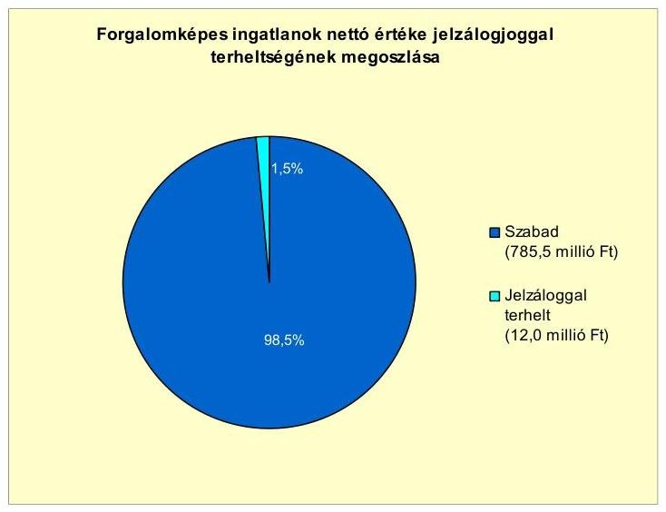

Az Önkormányzatnak a vizsgált időszakban négy forgalomképes az Ötv. 88. § (1) bekezdésének b) pontja alapján nem törzsvagyonba tartozó ingatlana volt jelzáloggal, elidegenítési és terhelési tilalommal terhelt. A jelzáloggal, elidegenítési és terhelési tilalommal terhelt ingatlanoknak a számvitelben 2010. december 31-én nyilvántartott könyvszerinti nettó értéke 12,0 millió Ft volt, a forgalomképes ingatlanok nettó értékének (797,5 millió Ft) 1,5\%-a. A bank által nyújtott hitelek biztosítékaként bejegyzett jelzálog összeg keretjelleggel megállapított értéke összesen 1200,0 millió Ft, míg a biztosítékként bejegyzett ingatlanok nettó
 értéke a 2010. december 31-i állapot alapján 12,1 millió Ft volt. Az Önkormányzat gazdálkodására az utólagosan, a bank kérésére, képviselő-testületi határozat nélkül bejegyzett jelzálog befolyásolja a további évek várható kötelezettségei teljesítésére figyelembe vehető forrásokat, és kockázatot jelent.

Az Önkormányzatnak jogerős határozattal nem lezárt peres eljárása egy van, melynél a hulladékszállítási többletköltség megfizetése miatt alperesi pozícióban van. A perértéke 20,0 millió Ft, mely ügynél jelenleg elsőfokú eljárás van folyamatban. A jogerős határozattal lezárt, de ki nem fizetett peres eljárások közül háromnál van alperesi pozícióban az Önkormányzat, a perértéke összesen 169,9 millió Ft. A Várda-Távhő Kft. miatt keletkezett 147,5 millió Ft-os elmarasztalásból 76,7 millió Ft-ot pénzügyileg teljesítettek.

Az Önkormányzat saját gazdasági társaságainak nem tartozik, társaságaitól kölcsönt nem vett igénybe.

Az Önkormányzat kizárólagos tulajdoni hányaddal rendelkező gazdasági társaságai ${ }^{30}$ kötelezettségeinek állománya 2010. december 31-én, és 2011. június 30-án, valamint várható alakulása a kötelezettségek lejáratáig:

[^0]
[^0]:    ${ }^{30}$ A Képviselő-testület döntése alapján 2011. június 23-án megalapították a Kisvárdai Várfürdő Idegenforgalmi Kft.-t, amely kizárólagos önkormányzati tulajdonú. Az Idegenforgalmi és Szabadidő Nonprofit Kft. 2009. december 31-ig 100\%-os önkormányzati tulajdonban volt. Az üzletrész 80\%-át a Képviselő-testület 2010. február 25-i döntése alapján az Önkormányzat eladta, majd 2011. év február 25-én visszavásárolta. A döntések eredményeként a kizárólagos tulajdonú gazdasági társaságok száma a 2010. december 31-i egyről, a 2011. év I. félév végére háromra emelkedett.

---

| Megnevezés | Állomány   2010. december   31-én | Állomány   2011. június   30-án | Várható   kötelezettség   2011-2013.   években |
| :-- | :--: | :--: | :--: |
|  | HUF-ban (millió Ft-   ban) | HUF-ban (millió   Ft-ban) | HUF-ban   (millió Ft-ban) |
| Pénzintézeti kötelezettségek összesen: | 0,0 | 0,0 | 0,0 |
| Szállítói tartozás | 249,7 | 340,4 | 340,4 |
| Jogerős végzéssel lezárt de ki nem fizetett   kötelezettségek | 70,8 | 70,8 | 70,8 |
| Kötelezettségek összesen: | 320,5 | 411,2 | 411,2 |

Az Önkormányzat kizárólagos tulajdonú gazdasági társaságainak pénzintézeti kötelezettsége nem volt. Az Önkormányzatnak 2010. december 31-én csak egy kizárólagos tulajdonú gazdasági társasága volt, a Várda-Távhő Kft. A 2011. év I. félév végére három kizárólagos tulajdonú társasága volt az Önkormányzatnak. A társaságok szállítói tartozása 2011. év I. félév végére 36,3\%-os növekedést mutat. A Várda-Távhő Kft. lejárt szállítói tartozása 2010. december 31-én 249,7 millió Ft volt, mely állomány a 2011. június 30-i állapot alapján $36,0 \%$-kal (341,2 millió Ft-ra) emelkedett. A társaság lejárt szállítói tartozása hullámzó képet mutat, a tartozás állománya 2006. évben volt a legalacsonyabb 11,2 millió Ft, míg 2011. év I. félévében a legmagasabb 309,0 millió Ft. Éven túli lejárt szállítói tartozás 2011. június 30-án csak a Várda-Távhő Kft.-nél fordult elő, összege 19,5 millió Ft.

Az Önkormányzat kizárólagos tulajdonában álló gazdasági társasága a Várda-Távhő Kft. Kötelezettségek állományát növelte a 70,8 millió Ft összegű jogerős, de ki nem fizetett kötelezettsége a Honeywell ESCO Magyarország Zrt. felé. Az Önkormányzat gazdálkodására a jogerős ítélettel lezárt peres eljárásban kimutatott kötelezettség kockázatot jelent. A várható kötelezettségek állománya a 2011-2013. években 411,2 millió Ft.

Az Önkormányzat a gazdasági társaságokról szóló 2006. évi IV. törvény 54. § (2) bekezdése alapján korlátlan felelősséggel tartozik azon gazdasági társaságának felszámolása esetében, amelyben az Önkormányzat az 52. § (2) bekezdése szerint a szavazatok legalább 75\%-ával rendelkezik, így minősített befolyásszerzőnek minősül, továbbá a csődeljárásról és a felszámolási eljárásról szóló 1991. évi XLIX. törvény 63. § (2) bekezdése alapján a kizárólagos önkormányzati tulajdonú gazdasági társaságának minden olyan kötelezettségéért, amelynek kielégítését a felszámolási eljárás során az adós társaság vagyona nem fedez, ha a hitelezőinek a felszámolási eljárás során benyújtott keresete alapján a bíróság - az adós társaság felé érvényesített tartósan hátrányos üzletpolitikájára figyelemmel - megállapítja az önkormányzat korlátlan és teljes felelősségét.

Az Önkormányzat az intézményeinél évente felmérte a felújítási igényt, és az éves költségvetési előterjesztésekben bemutatta, hogy az elhasználódott eszközök pótlása milyen kötelezettséget jelent a számára. A felújításokra, az eszközök pótlására elsősorban az intézmények működőképességének biztosítása, illetve a szakhatósági előírások figyelembevételével került sor. Az Önkormányzat 2007-2010 között a tárgyi eszközök után összesen 1257,5 millió Ft értékcsökkenést számolt el, és az elszámolt érték-

---

csökkenés 23,1\%-át (290,3 millió Ft-ot) fordították felújításra, 48,8\%-át (613,6 millió Ft-ot) beruházásra. A felújításokra, az eszközök pótlására - az Önkormányzat kimutatásai szerint - a pénzügyi lehetőségek függvényében került sor. Az elhasználódott eszközök pótlására az Önkormányzat tartalékot nem képzett, külön alapot nem hozott létre. Az Önkormányzat összes eszközének (immateriális javak, ingatlanok, gépek, járművek, átadott eszközök) használhatósági foka 2007-2010 között a bruttó érték 469,2 millió Ft emelkedése ellenére 6,7 százalékponttal (75,3\%-ról 68,6\%-ra) csökkent az amortizáció növekedése miatt. Ezzel az eszközök elavultsága növekedett. Az Önkormányzat eszközállományának bruttó értéke 3,2\%-kal növekedett, nettó értéke 6,1\%-kal csökkent 2007-ről 2010-re. A Képviselőtestületnek előterjesztett éves zárszámadási rendeleteikben nem mutatták be az Önkormányzat eszközei után tárgyévben elszámolt értékcsökkenés összegét, az eszközpótlásra fordított tényleges kiadásokat, az eszközök elhasználódási fokának alakulását.

# 4. A PÉNZÜGYI EGYENSÚLY MEGTEREMTÉSE ÉRDEKÉBEN HOZOTT INTÉZKEDÉSEK EREDMÉNYE 

A Képviselő-testület az Önkormányzat működőképességének fenntartása érdekében a vizsgált időszakban kiadáscsökkentő és bevételnövelő döntéseket hozott. Ezzel kívánta elérni a feladatellátás szakmai színvonalának szinten tartása mellett a pénzügyi egyensúlyi helyzet javulását. A kiadáscsökkentő és bevételnövelő intézkedések pénzügyi hatását az Önkormányzat számszerűsítette.

Az Önkormányzat adatszolgáltatása alapján a 2007-2011. év I. féléve között végrehajtott kiadáscsökkentő intézkedések hatását beavatkozási területenként az alábbi grafikon szemlélteti:
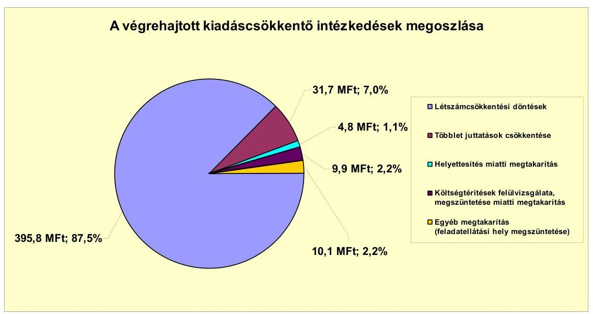

A legjelentősebb összegű kiadási megtakarítást a közoktatási feladatellátás területén végrehajtott létszámcsökkentési döntések hatása eredményezi. Az álláshelycsökkentések intézményi átszervezésekhez és a feladatellátás racionalizálásához kapcsolódnak, mely a megtakarítások 87,5\%-át (395,8 mil-

---

lió Ft) teszi ki. Az egészségügyi területen végrehajtott létszámcsökkentés (162 fő) az Önkormányzat számára tényleges kiadás megtakarítást nem eredményezett, mivel a kórház önkormányzati többlettámogatásban nem részesül.

A további kiadáscsökkentő intézkedések - többletjuttatások csökkentése, költségtérítéseket mérséklése, helyettesítések miatti megtakarítás, feladatellátási hely megszüntetés - végrehajtása a vizsgált időszakban az Önkormányzat számára 56,5 millió Ft-t megtakarítást eredményezett.

Az Önkormányzat kimutatásai szerint a megtett intézkedések hatásaként összesen 452,3 millió Ft kiadási megtakarítás realizálódott, melynek 97,8\%-a (442,3 millió Ft) a személyi juttatásokat és a hozzájuk kapcsolódó járulékokat érinti.

A 2007-2010. év közötti létszámváltozásokat az alábbi táblázat szemlélteti:

| Megnevezés (adatok fő-ben) | Közoktatás | Szociális és gyermekvédstem | Egészségügy | Polgármesteri hivatal | Egyéb | Összesen |
| :--: | :--: | :--: | :--: | :--: | :--: | :--: |
| 2007. január 1-jén jóváhagyott álláshelyek száma | 579 | 33 | 1072 | 97 | 188 | 1969 |
| Megszüntetett álláshelyek száma | 80 | 0 | 160 | 1 | 4 | 227 |
| e0000. üres álláshelyek száma | 11 | 0 | 27 | 0 | 4 | 42 |
| szakmai álláshelyek száma | 16 | 0 | 63 | 1 | 0 | 79 |
| intézmény-üzemeltetéssel kapcsolatos álláshelyek száma | 33 | 0 | 73 | 0 | 0 | 106 |
| Álláshely cövekedése | 0 | 36 | 0 | 0 | 0 | 82 |
| 2010. december 31-én zárit álláshelyek száma | 519 | 71 | 910 | 96 | 188 | 1794 |
| 2007. január 1-jén foglalkoztatott létszám | 579 | 33 | 1072 | 97 | 188 | 1969 |
| Létszámcsökkentés | 79 | 0 | 282 | 2 | 4 | 368 |
| Létszámcövekedés | 0 | 36 | 0 | 0 | 0 | 79 |
| 2010. december 31-én foglalkoztatott létszám | 500 | 71 | 790 | 94 | 187 | 1842 |

A létszámcsökkentő intézkedések következtében a 2007-2010. évek között a Polgármesteri hivatalban és az intézményeinél összesen 227 álláshelyet szüntettek meg. A megszüntetett álláshelyek 18,5\%-a üres álláshely, 34,8\%-a szakmai álláshely, 46,7\%-a intézményi-üzemeltetéssel kapcsolatos álláshely volt.

Az egészségügy ágazatban (kórház) a 2007. évben 162 álláshely került megszüntetésre a feladatellátás racionalizálásának és hatékonyabbá tételének érdekében.

A közoktatás területén a vizsgált időszakban az álláshelyek megszüntetése folyamatosan ${ }^{31}$ történt. A létszámcsökkentési döntéseket az intézményi átszervezések (tagóvodai feladatellátási hely, bölcsődei támogató szolgálat megszüntetése), valamint a csökkenő ellátotti létszám miatti csoportösszevonások (óvoda, általános iskola, szakközépiskola) indokolták.

A szociális és gyermekvédelmi feladatellátás területén a szakmai minimumkövetelmények szigorodása miatt a vizsgált időszakban 38 álláshely- és egyben létszámnövekedés történt. Az időszak álláshelyeinek száma összességében 185 fővel csökkent.

Az intézkedések hatására a 2007. január 1-jei 1969 fő foglalkoztatotti létszám 2010. december 31-re 16,6\%-kal (327 fővel) csökkent. Az Önkormányzatnál 2010. december 31-én 142 álláshely (19 álláshely a közoktatásban, 120

[^0]
[^0]:    ${ }^{31}$ A 2007. évben 23 álláshely, a 2008. évben 19 álláshely, a 2009. évben 17 álláshely és a 2010. évben egy álláshely került megszüntetésre.

---

álláshely az egészségügyben, kettő álláshely a Polgármesteri hivatalban, egy álláshely az egyéb intézménynél) volt betöltetlen.

A helyi szervezési intézkedések végrehajtásához az Önkormányzat a 20072010. év között mindösszesen 383,2 millió Ft összegű központi támogatást igényelt, illetve kapott. A támogatás felhasználásával önkormányzati szinten a tartósan leépített álláshelyek száma 167 fő volt.

A kiadáscsökkentős intézkedések mellett az Önkormányzat a 2007-2011. év I. féléve között az alábbiakban számszerűsített bevételnövelő intézkedéseket tette:
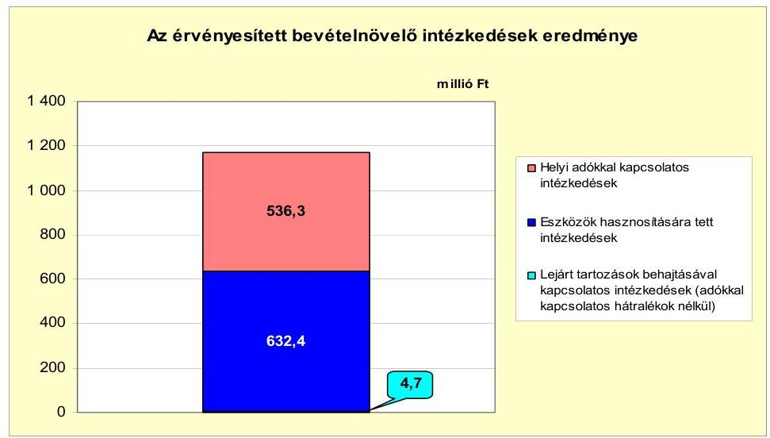

Az Önkormányzat intézkedéseinek eredményeként összesen 1173,4 millió Ft-tal növelte a bevételeit. Az intézkedések 45,7\%-a helyi adókhoz, 53,9\%-a az eszközök hasznosításához, 0,4\%-a a lejárt tartozások behajtásához kapcsolódik.

A helyi adók területén végrehajtott intézkedések hatására 536,3 millió Ft-tal nőtt a bevétel a 2007. év és a 2011. év I. féléve között. Az Önkormányzat a helyi adókat érintően a 2008. évtől az iparűzési adómentesség feltételeit szigorította, a 2009. évtől a magánszemélyek kommunális adó mértékét emelte, valamint az adóhátralékok csökkentése érdekében a Képviselő-testület a lejárt tartozások fokozott behajtását rendelte el.

A kommunális adó mértéke egy ingatlan tulajdonlása esetén 6000 Ft-ról 8000 Ft-ra, a második és többi ingatlanra adótárgyanként 12000 Ft-ról 14000 Ft-ra emelkedett.

Az Önkormányzatnak eszközök értékesítéséből a vizsgált időszakban 632,4 millió Ft többletbevétele realizálódott, mely önkormányzati tulajdonban lévő lakások, egyéb helységek, gépjárművek eladásából származott.

Az Önkormányzat költségvetési támogatásokból és az átengedett szja-ból származó bevétele a 2007-2010. év között összességében 241,2 millió Ft-tal (7,3\%-kal) csökkent, mivel az szja-adóbevétel 719,3 millió Ft-os csökkenését a költségvetési támogatás 478,1 millió Ft-os növekedése nem tudta kompenzálni.

---

Az Önkormányzat a 2007-2010. év között kimutatott 1390,1 millió Ft összegű kiadási megtakarítása és bevételnövelése ellensúlyozni tudta a központi forráskiesést, hozzájárulva ezzel a pénzügyi egyensúly javulásához.

# 5. Az ÁSZ Által a korábbi ÉVEKBEN a PÉNZÜGYI EGYENSÚLY JAVÍTÁSÁRA TETT SZABÁLYSZERŰSÉGI ÉS CÉLSZERŰSÉGI JAVASLATOK HASZNOSULÁSA 

Az ÁSZ az Önkormányzat gazdálkodási rendszerét 2007. évben ellenőrizte átfogó jelleggel. A jelentést a Képviselő-testület megismerte. A javaslatok megvalósítására intézkedési tervet készítettek, amely teljes körűen tartalmazta a javaslatokat, meghatározta a feladatok elvégzéséért felelősöket és a feladatok elvégzésének határidejét.

A pénzügyi egyensúly javítására egy szabályszerűségi és egy célszerűségi javaslat vonatkozott.

A szabályszerűségi javaslat értelmében az Önkormányzat gondoskodott a költségvetés tervezési és zárszámadási folyamat részeként az Ámr. ${ }_{1} 66 . \S$ (4) bekezdésében ${ }^{32}$ foglaltaknak megfelelően az önállóan gazdálkodó költségvetési szervek pénzmaradványának felülvizsgálatáról. A célszerűségi javaslat eredményeként a Képviselő-testület a számvevői jelentést megtárgyalta, és intézkedési terv készült a feltárt hiányosságok megszüntetésének érdekében.

Az intézkedési terv végrehajtásának eredményeként a pénzügyi egyensúly javítására tett javaslatok 100\%-ban hasznosultak.

Budapest, 2012. április ",// "
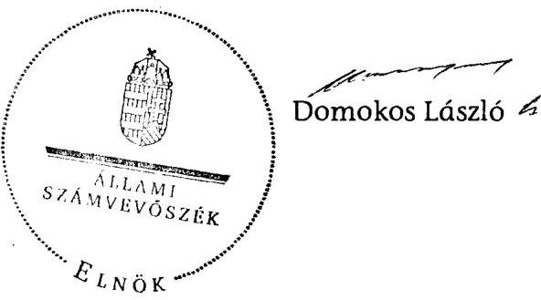

[^0]
[^0]:    ${ }^{32}$ 2012. január 1-jétől az Áht. ${ }_{2}$ 86. § (5) bekezdése szabályozza

---

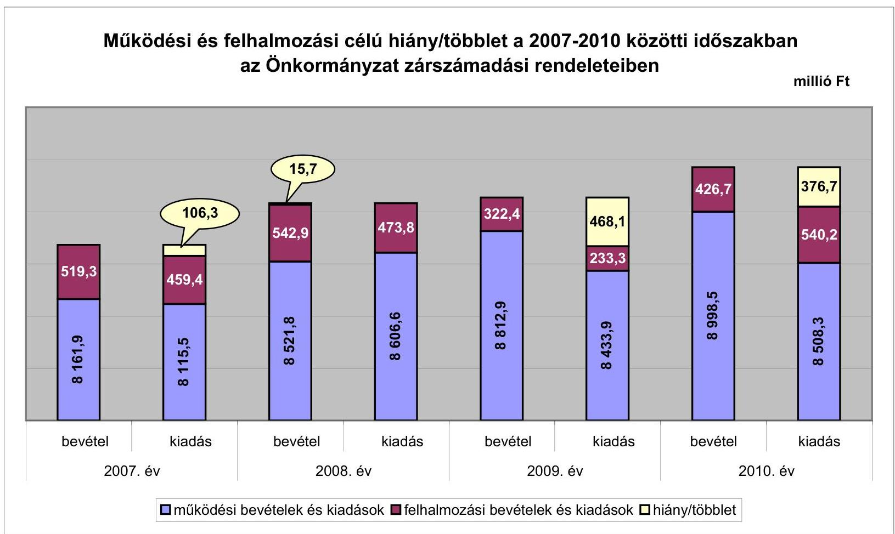

# KISVÁRDA Város Önkormányzata

## 1. számú melléklet

### a V-3121-024/2012. számú jelentéshez

|  Működési és felhalmozási célú hiány/többlet a 2007-2010 közötti időszakban az Önkormányzat zárszámadási rendeleteiben |  |  |  |  |  |  |  |  |  |  |  |  |  |  |  |  |  |  |  |  |  |  |  |  |  |  |  |  |  |  |  |  |  |  |  |  |  |  |  |  |  |  |  |  |  |  |  |  |  |  |  |  |  |  |  |  |  |  |  |  |  |  |  |  |  |  |  |  |  |  |  |  |  |  |  |  |  |  |  |  |  |  |  |  |  |  |  |  |  |  |  |  |  |  |  |  |  |  |  | 

---

Az Önkormányzat bevételei és kiadásai, valamint adósságszolgálata 2007-2010 között

|   |  |  |  | millió Ft  |
| --- | --- | --- | --- | --- |
|  1. FOLYÓ KÖLTSÉGVETÉS* | 2007. év | 2008. év | 2009. év | 2010. év  |
|  1.1.1. Saját működési bevételek | 1093,9 | 1154,7 | 1348,2 | 1541,9  |
|  1.1.2. Költségvetési támogatás | 2194,9 | 3057,0 | 2829,0 | 2673,0  |
|  1.1.3. Átengedett bevételek | 1207,6 | 441,6 | 560,4 | 496,2  |
|  1.1.4. Állambáztartáson belülről kapott támogatások | 3564,6 | 3809,9 | 3881,5 | 4217,2  |
|  1.1.5. EU-tól és külföldről kapott bevételek | 65,3 | 43,1 | 25,6 | 7,4  |
|  1.1.6. Állambáztartáson kívülről kapott bevételek | 34,8 | 14,6 | 40,0 | 46,0  |
|  1.1.7. Előző évi pénzmaradvány átvétel | 0,8 | 0,8 | 128,2 | 16,7  |
|  1.1. Folyó bevételek =1.1.1.+1.1.2.+1.1.3.+1.1.4.+1.1.5.+1.1.6.+1.1.7. | 8161,9 | 8521,8 | 8812,9 | 8998,5  |
|  1.2.1. Működési kiadások kamatkiadások nélkül | 7644,2 | 8104,0 | 7834,0 | 7943,8  |
|  1.2.2. Állambáztartáson belülre átadott pénzeszközök | 6,1 | 7,7 | 5,3 | 26,8  |
|  1.2.3.1. vállalkozásoknak | 0,0 | 0,0 | 0,0 | 49,0  |
|  1.2.3.2. EU-nak, illetve külföldre | 0,0 | 0,0 | 0,0 | 0,0  |
|  1.2.3.3. magánszemélyeknek | 340,5 | 362,2 | 352,7 | 348,4  |
|  1.2.3.4. nonprofit szervezeteknek | 27,9 | 21,8 | 21,0 | 18,3  |
|  1.2.3. Transzferkiadások (=1.2.3.1+1.2.3.2+1.2.3.3+1.2.3.4) | 368,4 | 384,0 | 373,7 | 415,7  |
|  1.2.4 Kamatkiadások | 96,0 | 110,0 | 92,8 | 121,9  |
|  1.2.5. Előző évi pénzmaradvány átadás | 0,8 | 0,8 | 128,2 | 0,0  |
|  1.2. Folyó kiadások = 1.2.1.+1.2.2.+1.2.3.+1.2.4.+1.2.5. | 8115,5 | 8606,6 | 8433,9 | 8508,3  |
|  1.3. Folyó költségvetés egyenlege MŰKÖDÉSI JÖVEDELEM (1.1. - 1.2.) | 46,4 | $-84,8$ | 379,0 | 490,2  |
|  2. FELHALMOZÁSI KÖLTSÉGVETÉS** | 0,0 | 0,0 | 0,0 | 0,0  |
|  2.1.1. Saját tőkebevételek | 75,3 | 307,1 | 187,0 | 179,5  |
|  2.1.2. Állambáztartáson belülről kapott támogatások | 403,7 | 226,4 | 86,1 | 179,6  |
|  2.1.3. EU-tól és külföldről kapott támogatások | 4,1 | 2,3 | 43,0 | 52,9  |
|  2.1.4. Állambáztartáson kívülről kapott támogatások | 36,2 | 7,2 | 6,1 | 14,8  |
|  2.1. Felhalmozási bevételek (=2.1.1.+2.1.2+2.1.3+2.1.4.) | 519,3 | 542,9 | 322,3 | 426,7  |
|  2.2.1. Saját beruházási kiadás áfával | 206,3 | 168,9 | 194,2 | 337,2  |
|  2.2.2. Saját felújítási kiadás áfával | 240,3 | 53,5 | 33,5 | 101,6  |
|  2.2.3. Állambáztartáson belülre átadott pénzeszköz | 0,9 | 0,0 | 0,0 | 0,0  |
|  2.2.4. EU-nak és külföldnek adott pénzeszközök | 0,0 | 0,0 | 0,0 | 0,0  |
|  2.2.5. Állambáztartáson kívülre adott pénzeszközök | 11,9 | 231,5 | 5,6 | 101,2  |
|  2.2.6. Befektetési célú részesedések vásárlása | 0,0 | 0,0 | 0,0 | 0,0  |
|  2.2. Felhalmozási kiadások (=2.2.1.+2.2.2.+2.2.3.+2.2.4.+2.2.5.+2.2.6.) | 459,4 | 473,8 | 233,3 | 540,2  |
|  2.3. Felhalmozási költségvetés egyenlege (2.1. - 2.2.) | 59,9 | 69,1 | 89,0 | $-113,5$  |
|  3. Finanszírozási műveletek nélküli (GFS) pozíció(1.3.+2.3.) | 106,3 | $-15,7$ | 468,1 | 376,7  |
|  4. Finanszírozási műveletek | 0,0 | 0,0 | 0,0 | 0,0  |
|  4.1. Hitelfelvétel | 110,1 | 208,1 | 88,3 | 170,0  |
|  4.2. Hiteltörlesztés | 106,4 | 219,4 | 179,9 | 141,2  |
|  4.3. Forgatási és befektetési célú értékpapírok kibocsátása | 0,0 | 0,0 | 1056,1 | 0,0  |
|  4.4. Forgatási és befektetési célú értékpapírok beváltása | 0,0 | 0,0 | 0,0 | 0,0  |
|  4.5. Forgatási és befektetési célú értékpapírok értékesítése | 0,0 | 57,7 | 0,0 | 59,1  |
|  4.6. Forgatási és befektetési célú értékpapírok vásárlása | 8,9 | 39,7 | 5,2 | 61,2  |
|  4.7. Egyéb finanszírozási bevételek (függő, átfutó, kiegyenlítő) | 19,0 | $-16,0$ | 3,8 | $-106,0$  |
|  4.8. Egyéb finanszírozási kiadások (függő, átfutó, kiegyenlítő) | $-125,7$ | 66,5 | $-1,4$ | $-128,0$  |
|  4.9.Finanszírozási műveletek egyenlege (4.1. - 4.2.+4.3.-4.4+4.5.-4.6.+4.7.-4.8.) | 139,4 | $-75,8$ | 964,5 | 48,7  |
|  5. Tárgyévi pénzügyi pozíció (1.3.+ 2.3.+4.9.) | 245,7 | $-91,5$ | 1432,5 | 425,3  |
|  6. Nettó működési jövedelem =működési jövedelem (1.3.) - tüketörlesztés (4.2+4.4) | $-60,0$ | $-304,2$ | 199,1 | 349,0  |
|  TÁJÉKOZTATÓ ADATOK |  |  |  |   |
|  Összes kötelezettség | 1571,8 | 1581,1 | 2486,1 | 2689,6  |
|  ebből rövid lejáratú | 830,1 | 936,5 | 875,2 | 1172,9  |
|  Összes szállítói kötelezettség | 281,7 | 353,6 | 287,3 | 461,8  |
|  ebből lejárt (tanúsítványból) | 217,2 | 268,9 | 246,9 | 288,9  |
|  Pénz és tőkepiaci kötelezettség (adósság) | 1149,1 | 1137,8 | 2102,3 | 2131,1  |
|  ebből rövid lejáratú | 420,6 | 497,5 | 498,2 | 617,2  |
|  PPP szerződéses állomány jelenértéken (tanúsítványból) | 0,0 | 0,0 | 0,0 | 0,0  |
|  ebből lejárt szolgáltatási díj miatti kötelezettség | 0,0 | 0,0 | 0,0 | 0,0  |
|  Folyószámlahitel napi átlagos állománya (tanúsítványból) | 234,1 | 230,6 | 222,4 | 231,1  |
|  Likvid hitel napi átlagos állománya (tanúsítványból) | 274,0 | 274,0 | 274,0 | 274,0  |
|  Munkabér hitel napi átlagos állománya (tanúsítványból) | 140,0 | 140,0 | 140,0 | 140,0  |
|  Kezesség és garanciavállalások (tanúsítványból) | 0,0 | 0,0 | 0,0 | 253,3  |
|  Jogerős bírósági ítéletekből adódó kötelezettségek (tanúsítványból) | 0,0 | 0,0 | 0,0 | 169,9  |
|  Finanszírozásba bevonható eszközök: | 686,3 | 580,6 | 2018,6 | 2357,7  |
|  Tartós hitelviszonyt megtestesítő értékpapírok év végi állománya | 106,1 | 91,8 | 97,4 | 11,1  |
|  Hosszú lejáratú bankbetétek év végi állománya | 0,0 | 0,0 | 0,0 | 0,0  |
|  Értékpapírok év végi állománya | 0,0 | 0,0 | 0,0 | 0,0  |
|  Pénzeszközök (idegen pénzeszközök nélkül) év végi állománya | 580,2 | 488,8 | 1921,2 | 2346,6  |

[^0] [^0]: * Bevételekben nem térül, a kiadásokban nem jelenik meg az amortizáció, a vagyoni helyzetet az egyenleg befolyásolj. ** Bevételekben vagyon megőrzésre és bővítésre fordítható források.

---

KISVÁRDA Város Önkormányzata

Az Önkormányzat 2007-2010. években megvalósított, 2010. december 31-ig befejezett fejlesztései és azok forrásösszetétele

millió Ft-ban

|  Fejlesztési feladat (beruházás, felújítás) | Beruházás, felújítás | Teljes bekerülési költség | 2007-2010. évek között teljesített kiadás | 2008-2010. évek között teljesített kiadás | 2007-2010. évek között teljesített kiadás | 2008, dec. 31-ig teljesített kiadás | 2007-2010. évek között teljesített kiadás | 2008, dec. 31-ig teljesített kiadás | 2007-2010. évek között teljesített kiadás | 2008, dec. 31-ig teljesített kiadás | 2007-2010. évek között teljesített kiadás | 2008, dec. 31-ig teljesített kiadás | 2007-2010. évek között teljesített kiadás | 2008, dec. 31-ig teljesített kiadás | 2008, dec. 31-ig teljesített kiadás | 2007-2010. évek között teljesített kiadás | 2008, dec. 31-ig teljesített kiadás | 2007-2010. évek között teljesített kiadás | 2008, dec. 31-ig teljesített
 kiadás | 2007–2010. évek között teljesített kiadás | 2008, dec. 31-ig teljesített kiadás | 2007–2010. évek között teljesített kiadás | 2008, dec. 31-ig teljesített kiadás | 2007–2010. évek között teljesített kiadás | 2008, dec. 31-ig teljesített kiadás | 2007–2010. évek között teljesített kiadás | 2008, dec. 31-ig teljesített kiadás | 2007–2010. évek között teljesített kiadás | 2008, dec. 31-ig teljesített kiadás | 2007–2010. évek között teljesített kiadás | 2008, dec. 31-ig teljesített kiadás | 2007–2010. évek között teljesített kiadás | 2008, dec. 31-ig teljesített kiadás | 2007–2010. évek között teljesített kiadás | 2008, dec. 31-ig teljesített kiadás | 2007–2010. évek között teljesített kiadás | 2008, dec. 31-ig teljesített kiadás | 2007–2010. évek között teljesített kiadás | 2008, dec. 31-ig teljesített kiadás | 2007–2010. évek között teljesített kiadás | 2008, dec. 31-ig teljesített kiadás | 2007–2010. évek között teljesített kiadás | 2008, dec. 31-ig teljesített kiadás | 2007–2010. évek között teljesített kiadás | 2007–2010. évek között teljesített kiadás | 2007–2010. évek között teljesített kiadás | 2007–2010. évek között teljesített kiadás | 2007–2010. évek között teljesített kiadás | 2007–2010. évek között teljesített kiadás | 2007–2010. évek között teljesített kiadás | 2007–2010. évek között teljesített kiadás | 2007–2010. évek között teljesített kiadás | 2007–2010. évek között teljesített kiadás | 2007–2010. évek között teljesített kiadás | 2007–2010. évek között teljesített kiadás | 2007–2010. évek között teljesített kiadás | 2007–2010. évek között teljesített kiadás | 2007–2010. évek között teljesített kiadás | 2007–2010. évek között teljesített kiadás | 2007–2010. évek között teljesített kiadás | 2007–2010. évek között teljesített kiadás | 2007–2010. évek között teljesített kiadás | 2007–2010. évek között teljesített kiadás | 2007–2010. évek között teljesített kiadás | 2007–2010. évek között teljesített kiadás | 2007–2010. évek között teljesített kiadás | 2007–2010. évek között teljesített kiadás | 2007–2010. évek között teljesített kiadás | 2007–2010. évek között teljesített kiadás | 2007–2010. évek között teljesített kiadás | 2007–2010. évek között teljesített kiadás | 2007–2010. évek között teljesített kiadás | 2007–2010. évek között teljesített kiadás | 2007–2010. évek között teljesített kiadás | 2007–2010. évek között teljesített kiadás | 2007–2010. évek között teljesített kiadás | 2007–2010. évek között teljesített kiadás | 2007–2010. évek között teljesített kiadás | 2007–2010. évek között teljesített kiadás | 2007–2010. évek között teljesített kiadás | 2007–2010. évek között teljesített kiadás | 2007–2010. évek között teljesített kiadás | 2007–2010. évek között teljesített kiadás | 2007–2010. évek között teljesített kiadás | 2007–2010. évek között
 között teljesített kiadás | 2007–2010. évek között teljesített kiadás | 2007–2010. évek között teljesített kiadás | 2007–2010. évek között teljesített kiadás | 2007–2010. évek között teljesített kiadás | 2007–2010. évek között teljesített kiadás | 2007–2010. évek között teljesített kiadás | 2007–2010. évek között teljesített kiadás | 2007–2010. évek között teljesített kiadás | 2007–2010. évek között teljesített kiadás | 2007–2010. évek között teljesített kiadás | 2007–2010. évek között teljesített kiadás | 2007–2010. évek között teljesített kiadás | 2007–2010. évek között teljesített kiadás | 2007–2010. évek között teljesített kiadás | 2007–2010. évek között teljesített kiadás | 2007–2010. évek között teljesített kiadás | 2007–2010. évek között teljesített kiadás | 2007–2010. évek között teljesített kiadás | 2007–2010. évek között teljesített kiadás | 2007–2010. évek között teljesített kiadás | 2007–2010. évek között teljesített kiadás | 2007–2010. évek között teljesített kiadás | 2007–2010. évek között teljesített kiadás | 2007–2010. évek között teljesített kiadás | 2007–2010. évek között teljesített kiadás | 2007–2010. évek között teljesített kiadás | 2007–2010. évek között teljesített kiadás | 2007–2010. évek között teljesített kiadás | 2007–2010. évek között teljesített kiadás | 2007–2010. évek között teljesített kiadás | 2007–2010. évek között teljesített kiadás | 2007–2010. évek között teljesített kiadás | 2007–2010. évek között teljesített kiadás | 2007–2010. évek között teljesített kiadás | 2007–2010. évek között teljesített kiadás | 2007–2010. évek között teljesített kiadás | 2007–2010. évek között teljesített kiadás | 2007–2010. évek között teljesített kiadás | 2007–2010. évek között teljesített kiadás | 2007–2010. évek között teljesített kiadás | 2007–2010. évek között teljesített kiadás | 2007–2010. évek között teljesített kiadás | 2007–2010. évek között teljesített kiadás | 2007–2010. évek között teljesített kiadás | 2007–2010. évek között teljesített kiadás | 2007–2010. évek között teljesített kiadás | 2007–2010. évek között teljesített kiadás | 2007–2010. évek között teljesített kiadás | 2007–2010. évek között teljesített kiadás | 2007–2010. évek között teljesített kiadás | 2007–2010. évek között teljesített kiadás | 2007–2010. évek között teljesített kiadás | 2007–2010. évek között teljesített kiadás | 2007–2010. évek között teljesített kiadás | 2007–2010. évek között teljesített kiadás | 2007–2010. évek között teljesített kiadás | 2007–2010. évek között teljesített kiadás | 2007–2010. évek között teljesített kiadás | 2007–2010. évek között teljesített kiadás | 2007–2010. évek között teljesített kiadás | 2007–2010. évek között teljesített kiadás | 2007–2010. évek között teljesített kiadás | 2007–2010. évek között teljesített kiadás | 2007-2010. évek között teljesített kiadás | 2007-2010. évek között teljesített kiadás | 2007-2010. évek között teljesített kiadás | 2007-2010. évek között teljesített kiadás | 2007-2010. évek között teljesített kiadás | 2007-2010. évek között teljesített kiadás | 2007-2010. évek között teljesített kiadás | 2007-2010. évek között teljesített kiadás | 2007-2010. évek között teljesített kiadás | 2007-2010. évek között teljesített kiadás | 2007-2010. évek között teljesített kiadás | 2007-2010. évek között teljesített kiadás | 2007-2010. évek között teljesített kiadás | 2007-2010. évek között teljesített kiadás | 2007-2010. évek között teljesített kiadás | 2007-2010. évek között teljesített kiadás | 2007-2010. évek között teljesített kiadás | 2007-2010. évek között teljesített kiadás | 2007-2010. évek között teljesített kiadás | 2007-2010. évek között teljesített kiadás | 2007-2010. évek között teljesített kiadás | 2007-2010. évek között teljesített kiadás | 2007-2010. évek között teljesített kiadás | 2007-2010. évek között teljesített kiadás | 2007-2010. évek között teljesített kiadás | 2007-2010. évek között teljesített kiadás | 2007-2010. évek között teljesített kiadás | 2007-2010. évek között teljesített kiadás | 2007-2010. évek között teljesített kiadás | 2007-2010. évek között teljesített kiadás | 2007-2010. évek között teljesített kiadás | 2007-2010. évek között teljesített kiadás | 2007-2010. évek között teljesített kiadás | 2007-2010. évek között teljesített kiadás | 2007-2010. évek között teljesített kiadás | 2007-2010. évek között teljesített kiadás | 2007-2010. évek között teljesített kiadás | 2007-2010. évek között teljesített kiadás | 2007-2010. évek között teljesített kiadás | 2007-2010. évek között teljesített kiadás | 2007-2010. évek között teljesített kiadás | 2007-2010. évek között teljesített kiadás | 2007-2010. évek között teljesített kiadás | 2007-2010. évek között teljesített kiadás | 2007-2010. évek között teljesített kiadás | 2007-2010. évek között teljesített kiadás | 2007-2010. évek között teljesített kiadás | 2007-2010. évek között teljesített kiadás | 2007-2010. évek között teljesített kiadás | 2007-2010. évek között teljesített kiadás | 2007-2010. évek között teljesített kiadás | 2007-2010. évek között teljesített kiadás | 2007-2010. évek között teljesített kiadás | 2007-2010. évek között teljesített kiadás | 2007-2010. évek között teljesített kiadás | 2007-2010. évek között teljesített kiadás | 2007-2010. évek között teljesített kiadás | 2007-2010. évek között teljesített kiadás | 2007-2010. évek között teljesített kiadás | 2007-2010. évek között teljesített kiadás | 2007-2010. évek között teljesített kiadás | 2007-2010. évek között teljesített kiadás | 2007-2010. évek között teljesített kiadás | 2007-2010. évek között teljesített kiadás | 2007-2010. évek között teljesített kiadás | 2007-2010. évek között teljesített kiadás | 2007-2010. évek között teljesített kiadás kiadás | 2007–2010. évek között teljesített kiadás | 2007–2010. évek között teljesített kiadás | 2007–2010. évek között teljesített kiadás | 2007–2010. évek között teljesített kiadás | 2007–2010. évek között teljesített kiadás | 2007–2010. évek között teljesített kiadás | 2007–2010. évek között teljesített kiadás | 2007–2010. évek között teljesített kiadás | 2007–2010. évek között teljesített kiadás | 2007–2010. évek között teljesített kiadás | 2007–2010. évek között teljesített kiadás | 2007–2010. évek között teljesített kiadás | 2007–2010. évek között teljesített kiadás | 2007–2010. évek között teljesített kiadás | 2007–2010. évek között teljesített kiadás | 2007–2010. évek között teljesített kiadás | 2007–2010. évek között teljesített kiadás | 2007–2010. évek között teljesített kiadás | 2007–2010. évek között teljesített kiadás | 2007–2010. évek között teljesített kiadás | 2007–2010. évek között teljesített kiadás | 2007–2010. évek között teljesített kiadás | 2007–2010. évek között teljesített kiadás | 2007–2010. évek között teljesített kiadás | 2007–2010. évek között teljesített kiadás | 2007–2010. évek között teljesített kiadás | 2007–2010. évek között teljesített kiadás | 2007–2010. évek között teljesített kiadás | 2007–2010. évek között teljesített kiadás | 2007–2010. évek között teljesített kiadás | 2007–2010. évek között teljesített kiadás | 2007–2010. évek között teljesített kiadás | 2007–2010. évek között teljesített kiadás | 2007–2010. évek között teljesített kiadás | 2007–2010. évek között teljesített kiadás | 2007–2010. évek között teljesített kiadás | 2007–2010. évek között teljesített kiadás | 2007–2010. évek között teljesített kiadás | 2007–2010. évek között teljesített kiadás | 2007–2010. évek között teljesített kiadás | 2007–2010. évek között teljesített kiadás | 2007–2010. évek között teljesített kiadás | 2007–2010. évek között teljesített kiadás | 2007–2010. évek között teljesített kiadás | 2007–2010. évek között teljesített kiadás | 2007–2010. évek között teljesített kiadás | 2007–2010. évek között teljesített kiadás | 2007–2010. évek között teljesített kiadás | 2007–2010. évek között teljesített kiadás | 2007–2010. évek között teljesített kiadás | 2007–2010. évek között teljesített kiadás | 2007–2010. évek között teljesített kiadás | 2007–2010. évek között teljesített kiadás | 2007–2010. évek között teljesített kiadás | 2007–2010. évek között teljesített kiadás | 2007–2010. évek között teljesített kiadás | 2007–2010. évek között teljesített kiadás | 2007–2010. évek között teljesített kiadás | 2007–2010. évek között teljesített kiadás | 2007–2010. évek között teljesített kiadás | 2007–2010. évek között teljesített kiadás | 2007–2010. évek között teljesített kiadás | 2007–2010. évek között teljesített kiadás | 2007–2010. évek között teljesített kiadás | 2007–2010. évek között teljesített kiadás | 2007–2010. évek között teljesített kiadás | 2007–2010. évek között teljesített kiadás | 2007–2010. évek között teljesített kiadás | 2007–2010. évek között teljesített kiadás | 2007–2010. évek között teljesített kiadás | 2007–2010. évek között teljesített kiadás | 2007–2010. évek között teljesített kiadás | 2007–2010. évek között teljesített kiadás | 2007–2010. évek között teljesített kiadás | 2007–2010. évek között teljesített kiadás | 2007–2010. évek között teljesített kiadás | 2007–2010. évek között teljesített kiadás | 2007–2010. évek között teljesített kiadás | 2007–2010. évek között teljesített kiadás | 2007–2010. évek között teljesített kiadás | 2007–2010. évek között teljesített kiadás | 2007–2010. évek között teljesített kiadás | 2007–2010. évek között teljesített kiadás | 2007–2010. évek között teljesített kiadás | 2007–2010. évek között teljesített kiadás | 2007–2010. évek között teljesített kiadás | 2007–2010. évek között teljesített kiadás | 2007–2010. évek között teljesített kiadás | 2007–2010. évek között teljesített kiadás | 2007–2010. évek között teljesített kiadás | 2007–2010. évek között teljesített kiadás | 2007–2010. évek között teljesített kiadás | 2007–2010. évek között teljesített kiadás |
 2007-2010. évek között teljesített kiadás | 2007-2010. évek között teljesített kiadás | 2007-2010. évek között teljesített kiadás | 2007-2010. évek között teljesített kiadás | 2007-2010. évek között teljesített kiadás | 2007-2010. évek között teljesített kiadás | 2007-2010. évek között teljesített kiadás | 2007-2010. évek között teljesített kiadás | 2007-2010. évek között teljesített kiadás | 2007-2010. évek között teljesített kiadás | 2007-2010. évek között teljesített kiadás | 2007-2010. évek között teljesített kiadás | 2007-2010. évek között teljesített kiadás | 2007-2010. évek között teljesített kiadás | 2007-2010. évek között teljesített kiadás | 2007-2010. évek között teljesített kiadás | 2007-2010. évek között teljesített kiadás | 2007-2010. évek között teljesített kiadás | 2007-2010. évek között teljesített kiadás | 2007-2010. évek között teljesített kiadás | 2007-2010. évek között teljesített kiadás | 2007-2010. évek között teljesített kiadás | 2007-2010. évek között teljesített kiadás | 2007-2010. évek között teljesített kiadás | 2007-2010. évek között teljesített kiadás | 2007-2010. évek között teljesített kiadás | 2007-2010. évek között teljesített kiadás | 2007-2010. évek között teljesített kiadás | 2007-2010. évek között teljesített kiadás | 2007-2010. évek között teljesített kiadás | 2007-2010. évek között teljesített kiadás | 2007-2010. évek között teljesített kiadás | 2007-2010. évek között teljesített kiadás | 2007-2010. évek között teljesített kiadás | 2007-2010. évek között teljesített kiadás | 2007-2010. évek között teljesített kiadás | 2007-2010. évek között teljesített kiadás | 2007-2010. évek között teljesített kiadás | 2007-2010. évek között teljesített kiadás | 2007-2010. évek között teljesített kiadás | 2007-2010. évek között teljesített kiadás | 2007-2010. évek között teljesített kiadás | 2007-2010. évek között teljesített kiadás | 2007-2010. évek között teljesített kiadás | 2007-2010. évek között teljesített kiadás | 2007-2010. évek között teljesített kiadás | 2007-2010. évek között teljesített kiadás | 2007-2010. évek között teljesített kiadás | 2007-2010. évek között teljesített kiadás | 2007-2010. évek között teljesített kiadás | 2007-2010. évek között teljesített kiadás | 2007-2010. évek között teljesített kiadás | 2007-2010. évek között teljesített kiadás | 2007-2010. évek között teljesített kiadás | 2007-2010. évek között teljesített kiadás | 2007-2010. évek között teljesített kiadás | 2007-2010. évek között teljesített kiadás | 2007-2010. évek között teljesített kiadás | 2007-2010. évek között kiképzés | 2007-2010. évek között kiképzés | 2007-2010. évek között kiképzés | 2007-2010. évek között kiképzés | 2007-2010. évek között kiképzés | 2007-2010. évek között kiképzés | 2007-2010. évek között kiképzés | 2007-2010. évek között kiképzés | 2007-2010. évek között kiképzés | 2007-2010. évek között kiképzés | 2007-2010. évek között kiképzés | 2007-2010. évek között kiképzés | 2007-2010. évek között kiképzés | 2007-2010. évek között kiképzés | 2007-2010. évek között kiképzés | 2007-2010. ellenőrzés | 2007-2010. ellenőrzés | 2007-2010. ellenőrzés | 2007-2010. ellenőrzés | 2007-2010. ellenőrzés | 2007-2010. ellenőrzés | 2007-2010. ellenőrzés | 2007-2010. ellenőrzés | 2007-2010. ellenőrzés | 2007-2010. ellenőrzés | 2007-2010. ellenőrzés | 2007-2010. ellenőrzés | 2007-2010. ellenőrzés | 2007-2010. ellenőrzés | 2007-2010. ellenőrzés | 2007-2010. ellenőrzés | 2007-2010. ellenőrzés | 2007-2010. ellenőrzés | 2007-2010. ellenőrzés | 2007-2010. ellenőrzés | 2007-2010. ellenőrzés | 2007-2010. ellenőrzés | 2007-2010. ellenőrzés | 2007-2010. ellenőrzés | 2007-2010. ellenőrzés | 2007-2010. ellenőrzés | 2007-2010. ellenőrzés | 2007-2010. ellenőrzés | 2007-2010. ellenőrzés | 2007-2010. ellenőrzés | 2007-2010. ellenőrzés | 2007-2010. ellenőrzés | 2007-2010. ellenőrzés | 2007-2010. ellenőrzés | 2007-2010. ellenőrzés | 2007-2010. ellenőrzés | 2007-2010. ellenőrzés | 2007-2010. ellenőrzés | 2007-2010. ellenőrzés | 2007-2010. ellenőrzés | 2007-2010. ellenőrzés | 2007-2010. ellenőrzés | 2007-2010. ellenőrzés | 2007-2010. ellenőrzés | 2007-2010. ellenőrzés | 2007-2010. ellenőrzés | 2007-2010. ellenőrzés | 2007-2010. ellenőrzés | 2007-2010. ellenőrzés | 2007-2010. ellenőrzés | 2007-2010. ellenőrzés | 2007-2010. ellenőrzés | 2007-2010. ellenőrzés | 2007-2010. ellenőrzés | 2007-2010. ellenőrzés | 2007-2010. ellenőrzés | 2007-2010. ellenőrzés | 2007-2010. ellenőrzés | 2007-2010. ellenőrzés | 2007-2010. ellenőrzés | 2007-2010. ellenőrzés | 2007-2010. ellenőrzés | 2007-2010. ellenőrzés | 2007-2010. ellenőrzés | 2007-2010. ellenőrzés | 2007-2010. ellenőrzés | 2007-2010. ellenőrzés | 2007-2010. ellenőrzés | 2007-2010. ellenőrzés | 2007-2010. ellenőrzés | 2007-2010. ellenőrzés | 2007-2010. ellenőrzés | 2007-2010. ellenőrzés | 2007-2010. ellenőrzés | 2007-2010. ellenőrzés | 2007-2010. ellenőrzés | 2007-2010. ellenőrzés | 2007-2010. ellenőrzés | 2007-2010. ellenőrzés | 2007-2010. ellenőrzés | 2007-2010. ellenőrzés | 2007-2010. ellenőrzés | 2007-2010. ellenőrzés | 2007-2010. ellenőrzés | 2007-2010. ellenőrzés | 2007-2010. ellenőrzés | 2007-2010. ellenőrzés | 2007-2010. ellenőrzés | 2007-2010. ellenőrzés | 2007-2010. ellenőrzés | 2007-2010. ellenőrzés | 2007-2010. ellenőrzés | 2007-2010. ellenőrzés | 2007-2010. ellenőrzés | 2007-2010. ellenőrzés | 2007-2010. ellenőrzés | 2007-2010. ellenőrzés | 2007-2010. ellenőrzés | 2007-2010. ellenőrzés | 2007-2010. ellenőrzés | 2007-2010. ellenőrzés | 2007-2010. ellenőrzés | 2007-2010. ellenőrzés | 2007-2010. ellenőrzés | 2007-2010. ellenőrzés | 2007-2010. ellenőrzés | 2007-2010. ellenőrzés | 2007-2010. ellenőrzés | 2007-2010. ellenőrzés | 2007-2010. ellenőrzés | 2007-2010. ellenőrzés | 2007-2010. ellenőrzés | 2007-2010. ellenőrzés | 2007-2010. ellenőrzés | 2007-2010. ellenőrzés | 2007-2010. ellenőrzés | 2007-2010. ellenőrzés | 2007-2010. ellenőrzés | 2007-2010. ellenőrzés | 2007-2010. ellenőrzés | 2007-2010. ellenőrzés | 2007-2010. ellenőrzés | 2007-2010. ellenőrzés | 2007-2010. ellenőrzés | 2007-2010. ellenőrzés | 2007-2010. ellenőrzés | 2007-2010. ellenőrzés | 2007-2010. ellenőrzés | 2007-2010. ellenőrzés | 2007-2010. ellenőrzés | 2007-2010. ellenőrzés | 2007-2010. ellenőrzés | 2007-2010. ellenőrzés | 2007-2010. ellenőrzés | 207-2010. ellenőrzés | 207-2010. ellenőrzés | 207-2010. ellenőrzés | 207-2010. ellenőrzés | 207-2010. ellenőrzés | 207-2010. ellenőrzés | 207-2010. ellenőrzés | 207-2010. ellenőrzés | 207-2010. ellenőrzés | 207-2010. ellenőrzés | 207-2010. ellenőrzés | 207-2010. ellenőrzés | 207-2010. ellenőrzés | 207-2010. ellenőrzés | 207-2010. ellenőrzés | 207-2010. ellenőrzés | 207-2010. ellenőrzés | 207-2010. ellenőrzés | 207-2010. ellenőrzés | 207-2010. ellenőrzés | 207-2010. ellenőrzés | 207-2010. ellenőrzés | 207-2010. ellenőrzés | 207-2010. ellenőrzés | 207-2010. ellenőrzés | 207-2010. ellenőrzés | 207-2010. ellenőrzés | 207-2010. ellenőrzés | 207-2010. ellenőrzés | 207-2010. ellenőrzés | 207-2010. ellenőrzés | 207-2010. ellenőrzés | 207-2010. ellenőrzés | 207-2010. ellenőrzés | 207-2010. ellenőrzés | 207-2010. ellenőrzés | 207-2010. ellenőrzés | 207-2010. ellenőrzés | 207-2010. ellenőrzés | 207-2010.  | 207-2010. ellenőrzés | 207-2010. ellenőrzés | 207-2010.  | 207-2010.  | 207-2010.  | 207-2010.  | 207-2010.  | 207-2010.  | 207-2010.  | 207-2010.  | 207-2010.  | 207-2010.  | 207-2010.  | 207-2010.  |
 207-2010. | 207-2010. | 207-2010. | 207-2010. | 207-2010. | 207-2010. | 207-2010. | 207-2010. | 207-2010. | 207-2010. | 207-2010. | 207-2010. | 207-2010. | 207-2010. | 207-2010. | 207-2010. | 207-2010. | 207-2010. | 207-2010. | 207-2010. | 207-2010. | 207-2010. | 207-2010. | 207-2010. | 207-2010. | 207-2010. | 207-2010. | 207-2010. | 207-2010. | 207-2010. | 207-2010. | 207-2010. | 207-2010. | 207-2010. | 207-2010. | 207-2010. | 207-2010. | 207-2010. | 207-2010. | 207-2010. | 207-2010. | 207-2010. | 207-2010. | 207-2010. | 207-2010. | 207-2010. | 207-2010. | 207-2010. | 207-2010. | 207-2010. | 207-2010. | 207-2010. | 207-2010. | 207-2010. | 207-2010. | 207-2010. | 207-2010. | 207-2010. | 207-2010. | 207-2010. | 207-2010. | 207-2010. | 207-2010. | 207-2010. | 207-2010. | 207-2010. | 207-2010. | 207-2010. | 207-2010. | 207-2010. | 207-2010. | 207-2010. | 207-2010. | 207-2010. | 20

---

### Az Önkormányzat 2010. december 31-én folyamatban lévő fejlesztési feladataira 2010. december 31-ig teljesített kifizetések és azok forrásösszetétele

| | | | | | | | | | | | | | | | | | | | | | | | | | | | | | | | | | | | | | | | | | | | | | | | | | | | | | | | | | | | | | | | | | | | | | | | | | | | | | | | | | | | | | | | | | | | | | | | | | | | | | | | | | |

---

### **Az Önkormányzat 2010. december 31-én folyamatban lévő fejlesztési feladataira 2010. december 31-én fennálló kötelezettségek és azok forrásösszetétele**

| | Fejlesztési feladat (beruházás, felújítás) | | Beruházás, felújítás | | | | | | | | | | | | | | | | | | | | | | | | | | | | | | | | | | | | | | | | | | | | | | | | | | | | | | | | | | | | | | | | | | | | | | | | | | | | | | | | | | | | | | | | | | | | | | | | | | | | | | | |

---

### Az Önkormányzat által beadott, elbírálás alatti pályázati forrásból megvalósítani tervezett fejlesztéseihez kapcsolódó kötelezettségvállalásai és azok forrásösszetétele

| Fejlesztési feladat (beruházás, felújítás) | | | Beruházás, felújítás | | | | | | | | | | | | | | | | | | | | | | | | | | | | | | | | | | | | | | | | | | | | | | | | | | | | | | | | | | | | | | | | | | | | | | | | | | | | | | | | | | | | | | | | | | | | | | | | | | | | | | | | |

---

# Az önkormányzati feladatok ellátásában résztvevő gazdasági társaságok

| Gazdasági társaság megnevezése | 2010. december 31-én | | | | | | | | | a gazdasági társaságnak szerződéses kötelezettségre, feladatellátási szerződésre alapozottan az önkormányzat költségvetéséből nyújtott | | | | | | | | | | |
| --- | --- | --- | --- | --- | --- | --- | --- | --- | --- | --- | --- | --- | --- | --- | --- | --- | --- | --- | --- | --- |
| | önkormányzat | önkormányzat gazdasági társaságának | saját tőke, jegyzett tőke | kötelező feladathoz | önként vállalt feladathoz | hosszú lejáratú hitelből, kötvényből | lízingból | lejárt szállító állományból | működési célú pénzeszközátadás | | | | felhalmozási célú pénzeszközátadás | | | | | | | |
| | tulajdoni hányada (\%) | | | | | | | | rendelt nettó vagyon | fennálló kötelezettség | | 2007. | 2008. | 2009. | 2010. | 2011. év
t. félév | 2007. | 2008. | 2009. | 2010. | 2011. év
t. félév |
| I. 100\%-os tulajdoni hányadú gazdasági társaságok: | | | | | | | | | | | | | | | | | | | | |
| Várda-Távhő Kft. | 100 | 0 | 0,57 | 0,0 | 292,3 | 0,0 | 0,0 | 249,7 | 0,0 | 0,0 | 0,0 | 0,0 | 0,0 | 0,0 | 0,0 | 0,0 | 0,0 | 0,0 | 0,0 | 0,0 |
| 100\%-os tulajdoni hányadú gazdasági társaságok | $x$ | $x$ | $x$ | 0,0 | 292,3 | 0,0 | 0,0 | 249,7 | 0,0 | 0,0 | 0,0 | 0,0 | 0,0 | 0,0 | 0,0 | 0,0 | 0,0 | 0,0 | 0,0 | 0,0 |
| összesen
II. 75-99\%-os tulajdoni hányadú gazdasági társaságok: | | | | | | | | | | | | | | | | | | | | |
| 75-99\%-os tulajdoni hányadú gazdasági társaságok | $x$ | $x$ | $x$ | 0,0 | 0,0 | 0,0 | 0,0 | 0,0 | 0,0 | 0,0 | 0,0 | 0,0 | 0,0 | 0,0 | 0,0 | 0,0 | 0,0 | 0,0 | 0,0 | 0,0 |
| 75\% feletti tulajdoni hányadú gazdasági társaságok összesen | $x$ | $x$ | $x$ | 0,0 | 292,3 | 0,0 | 0,0 | 249,7 | 0,0 | 0,0 | 0,0 | 0,0 | 0,0 | 0,0 | 0,0 | 0,0 | 0,0 | 0,0 | 0,0 | 0,0 |
| III. 51-74\%-os tulajdoni hányadú gazdasági társaságok: | | | | | | | | | | | | | | | | | | | | |
| 51-74\%-os tulajdoni hányadú gazdasági társaságok összesen | $x$ | $x$ | $x$ | 0,0 | 0,0 | 0,0 | 0,0 | 0,0 | 0,0 | 0,0 | 0,0 | 0,0 | 0,0 | 0,0 | 0,0 | 0,0 | 0,0 | 0,0 | 0,0 | 0,0 |
| IV. egyéb, közfeladatot ellátó gazdasági társaságok: | | | | | | | | | | | | | | | | | | | | |
| Idegenforgalmi és Szabadidő Centrum Nonprofit Kft.* | 20 | 0 | 0,0 | 0,0 | 454,0 | 0,0 | 0,0 | 4,6 | 9,0 | 9,2 | 10,2 | 0,1 | 4,2 | 0,0 | 0,0 | 0,0 | 0,0 | 0,0 | 0,0 | 0,0 |
 | Várda-Víz Kft | 6 | 0 | 2,88 | 1578,9 | 0,0 | 0,0 | 0,0 | 105,3 | 0,0 | 0,0 | 0,0 | 0,0 | 0,0 | 0,0 | 0,0 | 0,0 | 0,0 | 0,0 | 0,0 | 0,0  |
|  egyéb, közfeladatot ellátó gazdasági társaságok összesen | $x$ | $x$ | $x$ | 1578,9 | 454,0 | 0,0 | 0,0 | 110,0 | 9,0 | 9,2 | 10,2 | 0,1 | 4,2 | 0,0 | 0,0 | 0,0 | 0,0 | 0,0 | 0,0 | 0,0  |
|  Összesen | $x$ | $x$ | $x$ | 1578,9 | 746,3 | 0,0 | 0,0 | 359,7 | 9,0 | 9,2 | 10,2 | 0,1 | 4,2 | 0,0 | 0,0 | 0,0 | 0,0 | 0,0 | 0,0 | 0,0  |

Megjegyzés: Kisvárdai Várfürdő és Idegenforgalmi Kft. alapítása a 144/2011. (VI. 23.) ÖKT határozattal történt.

- Idegenforgalmi és Szabadidő Centrum Nonprofit Kft. tulajdoni részaránya a korábbi 100\%-ról 20 \%-ra csökkent a 23/2010. (II. 15.) ÖKT határozattal, majd az 58/2011. (II. 25.) ÖKT határozattal 100\%-os tulajdoni hányadú lett az Önkormányzat.