# ÁLLAMI   SZÁMVEVŐSZÉK 

## JELENTÉS

a Komárom Város Önkormányzata pénzügyi helyzetének ellenőrzéséről (43/4)

---

# Állami Számvevőszék 

Iktatószám: V-3104-026/2012.
Témaszám: 1015
Vizsgálat-azonosító szám: V0560135

## Az ellenőrzést felügyelte:

Dr. Varga Sándor
számvevő igazgató-helyettes
Az ellenőrzést vezette:
Renkó Zsuzsanna
számvevő tanácsos
Az ellenőrzési csoportvezető:
Lingné Rajz Borbála
számvevő tanácsos
Az ellenőrzést végezték:
Dr. Fátrainé Zsebedics Katalin
Dr. Lacó Bálintné
számvevő tanácsos
számvevő tanácsos

---

# TARTALOMJEGYZÉK 

BEVEZETÉS ..... 9
I. ÖSSZEGZŐ MEGÁLLAPÍTÁSOK, KÖVETKEZTETÉSEK, JAVASLATOK ..... 13
II. RÉSZLETES MEGÁLLAPÍTÁSOK ..... 22

1. Az Önkormányzat kötelező és önként vállalt feladatai, a feladatellátás szervezeti keretei és annak változásai ..... 22
2. Az Önkormányzat pénzügyi egyensúlyi helyzetét befolyásoló tényezők ..... 27
2.1. A működési és a felhalmozási egyensúly változása ..... 30
2.2. Az Önkormányzat bevételeinek változása ..... 35
2.3. Az Önkormányzat folyó és felhalmozási célú kiadásainak változása ..... 37
3. Az Önkormányzat kötelezettségei ..... 42
3.1. Az Önkormányzat pénzintézeti kötelezettségeinek változása ..... 42
3.2. A szállítói kötelezettségek változása ..... 45
3.3. Egyéb kötelezettségek változása ..... 46
4. A pénzügyi egyensúly megteremtése érdekében hozott intézkedések eredménye ..... 48
5. Az ÁSZ által a korábbi években a pénzügyi egyensúly javítására tett szabályszerűségi és célszerűségi javaslatok hasznosulása ..... 49

---

# MELLÉKLETEK 

1. számú Működési és felhalmozási célú hiány/többlet 2007-2010. közötti időszakban az Önkormányzat zárszámadási rendeleteiben (1 oldal)
2. számú Az Önkormányzat bevételei és kiadásai, valamint adósságszolgálata 2007-2010 között (1 oldal)
3/a. számú Az Önkormányzat 2007-2010. években megvalósított, 2010. december 31-ig befejezett fejlesztései és azok forrásösszetétele (2 oldal)
3/b. számú Az Önkormányzat 2010. december 31-én folyamatban lévő fejlesztési feladataira 2010. december 31-éig teljesített kifizetések és azok forrásösszetétele (1 oldal)
3/c. számú Az Önkormányzat 2010. december 31-én folyamatban lévő fejlesztési feladataira 2010. december 31-én fennálló kötelezettségek és azok forrásösszetétele (1 oldal)
3/d. számú Az Önkormányzat által beadott, elbírálás alatti pályázati forrásból megvalósuló fejlesztéseihez kapcsolódó kötelezettségvállalásainak összegzése (1 oldal)
3. számú Az önkormányzati feladatok ellátásában résztvevő gazdasági társaságok (1 oldal)
4. számú A polgármester 2012. február 17-én kelt levele a jelentéstervezetben foglalt megállapításokra tett észrevételéről, a megtett intézkedésekről és kiegészítő információkról
5. számú Válaszlevél a polgármester által tett észrevételre

---

# RÖVIDÍTÉSEK JEGYZÉKE 

## Törvények

Áht.
Csődtv.
Gt.
Ötv.
Számv. tv.

## Rendeletek

Ámr.
Áhsz.

## Szórövidítések

áfa
ÁSZ
AVE Zrt.
EU
GDP
gimnázium
jegyző
Képviselő-testület
Komturist Kft.
kórház
Megyei Önkormányzat
MOL Nyrt.
OEP
Önkormányzat
polgármester
Polgármesteri hivatal

PPP konstrukció
szja
SzMSz
Távhő Kft.
Városi TV Kft.
Vízmű Kft.
Volán Zrt.
az államháztartásról szóló 1992. évi XXXVIII. törvény a csődeljárásról és a felszámolási eljárásról szóló 1991. évi XLIX. törvény
a gazdasági társaságokról szóló 2006. évi IV. törvény a helyi önkormányzatokról szóló 1990. évi LXV. törvény
a számvitelről szóló 2000. évi C. törvény
az államháztartás működési rendjéről szóló 292/2009. (XII. 19.) Korm. rendelet
az államháztartás szervezetei beszámolási és könyvvezetési kötelezettségének sajátosságairól szóló 249/2000. (XII. 24.) Korm. rendelet
általános forgalmi adó
Állami Számvevőszék
AVE Tatabánya Zrt.
Európai Unió
Bruttó hazai termék
Jókai Mór Gimnázium Komárom
Komárom Város Önkormányzatának jegyzője
Komárom Város Képviselő-testülete
Komturist - Komárom Kft.
Selye János Kórház
Komárom-Esztergom Megyei Önkormányzat
MOL Magyar Olaj és Gázipari nyilvánosan Működő Részvénytársaság
Országos Egészségbiztosítási Pénztár
Komárom Város Önkormányzata
Komárom Város Önkormányzatának polgármestere
Komárom Város Önkormányzatának Polgármesteri hivatala
Public Private Partnership (Partnerségi együttműködés közfeladatok ellátására a magánszektor bevonásával) személyi jövedelemadó
Az Önkormányzat Szervezeti és Működési Szabályzatáról szóló 4/2009.(II. 20.) számú rendelet
Komáromi Távhő Kft.
Komáromi Városi Televízió Szolgáltató Nonprofit Kft.
Komárom-Ács Vízmű Kft.
Vértes-Volán Zrt.

---

.

---

# ÉRTELMEZŐ SZÓTÁR 

bevételi kitettség

BUBOR

CLF módszer
használhatósági fok
kamatkockázat
kötelező közszolgáltatás
közfeladat
önkormányzat többségi tulajdonában lévő gazdasági társaságok

A pénzügyi kockázat minősítésének egyik eleme. Az önkormányzat pénzügyi egyensúlya függ egy-három adózó döntésétől. A bevételek olyan külső körülmények hatására is módosulhatnak, amelyekre az önkormányzatnak nincs hatása, emiatt bevételi kitettsége keletkezik.
Budapesti Bankközi Forint Hitelkamatláb. Mértékét az MNB naponta állapítja meg a banki kamatok figyelembevételével. Közzététele naponta történik.
Az önkormányzatok költségvetése elemzésének eszköze. A módszer következetesen elkülöníti a folyó és a felhalmozási költségvetés bevételeit és kiadásait, azok költségvetési egyenlegeit. Bizonyos mértékig a vállalati gazdálkodás logikai elemeit érvényesíti az önkormányzatok pénzügyi, jövedelmi helyzetének vizsgálata során. Az értékelés a pénzügyi kapacitás fogalmát helyezi a középpontba.
Az eszközgazdálkodás vizsgálatának elemzése során használt mutató. Számításakor a tárgyi eszköz könyv szerinti (nettó) értékét viszonyítják a tárgyi eszközök bruttó (beszerzési/létesítési) értékéhez. A %-ban kifejezett mutató csökkenése az eszköz állagának romlására, avulására utal, ami maga után vonja az üzemeltetési és fenntartási költségek növekedését is.
A változó kamatozású forint-, vagy a devizahitelek futamideje alatt a kamat emelkedése miatt fennálló kamatkockázat, melynek növekedése miatt nő a hitel törlesztő részlete.
A helyi önkormányzati feladatkörbe tartozó, a köztisztasággal és a településtisztasággal, valamint az élet- és vagyonbiztonsággal összefüggő egyes - közszolgáltatás útján megvalósuló - közfeladatok ellátása, amelynek kötelező igénybevételét külön jogszabály (törvény, helyi önkormányzati rendelet) határoz meg.
Állami, helyi, illetve kisebbségi önkormányzati feladat, amelynek ellátásáról az államnak, illetve az önkormányzatoknak kell gondoskodni. A hatályos szabályozás szerint közfeladatot törvény és önkormányzati rendelet állapíthat meg. Az önkormányzatok által ellátandó feladatok keretszerú meghatározását az Ötv. tartalmazza.
Az önkormányzat a gazdasági társaságban a szavazatok több mint ötven százalékával vagy a Ptk. 685/B. § (2)-(3) bekezdéseiben rögzített meghatározó befolyással rendelkezik. A befolyással rendelkező akkor rendelkezik egy jogi személyben meghatározó befolyással, ha annak tagja, illetve részvényese és jogosult e jogi személy vezető tisztségviselői vagy felügyelőbizottsága tagjainak többségének megválasztására, illetve visszahívására, vagy a jogi sze-

---

mély más tagjaival, illetve részvényeseivel kötött megállapodás alapján egyedül rendelkezik a szavazatok több mint ötven százalékával (Ptk. 685/B. § (2) bek.). A meghatározó befolyás akkor is fennáll, ha a befolyással rendelkező számára e jogosultságok közvetett módon (köztes vállalkozásain keresztül, a Ptk. 685/B §. (3),(4) bek. szerint) biztosítottak.
A helyi önkormányzat és az önkormányzat irányítása alá tartozó költségvetési szerv többségi tulajdonában, illetve többségi befolyása alatt álló gazdálkodó szervezet esetében hitelfelvétel, kölcsönfelvétel, garancia- vagy kezességvállalás, tartozásátvállalás, tartozás-elengedés, értékpapír kibocsátás, vásárlás, pénzügyi lízing, tartós bérleti szerződés, ingyenes vagyonjuttatás (így különösen: ajándékozás, ingyenes engedményezés), vagy követelésvásárlás, követelésengedményezés végrehajtására vonatkozóan az Áht. 100/M. § (4) bekezdése alapján az önkormányzat rendelkezik döntési jogosultsággal.
pénzügyi kapacitás
pénzügyi kockázat
törlesztési kockázat

A pénzügyi kapacitás (financial capacity) az adósok hitelfelvételi képességének azon mértéke, ahol még anélkül tudják növelni az adósságot, hogy csökkenteniük kellene akár a jelenbeli, akár a jövőben esedékes kiadásaikat a fizetésképtelenség elkerülése érdekében. (Forrás: Az önkormányzati rendszer pénzügyi helyzete, ÁSZKUT tanulmány 2010.)
A működési kockázat egyik eleme. Megmutatkozhat a költségvetés nagyságrendjének, szerkezetének nem megalapozott módosításaiban, a bevételi, és a kiadási előirányzatoktól lényegesen eltérő teljesítésekben, a nem megfelelő belső kontrollrendszer működésében, a tudatos károkozásokban, a biztosítások elmaradásában, a hibás fejlesztési döntésekben, a nem a terveknek megfelelő forrásfelhasználásokban. Jelentkezhet továbbá a bevételek és kiadások ütemkülönbsége miatt felvett folyószámla- és likvidhitelek költségvetési év végén fennálló egyenlege miatt, amely az önkormányzat költségvetésébe - akár tartósan - beépülő forráshiányt jelzi.
Annak a kockázata, hogy a megfelelő időben és mértékben a hitelt felvevőnél rendelkezésre állnak-e a pénzintézetek és egyéb szervek felé fennálló kötelezettségek visszafizetéséhez, a hitelek és kölcsönök törlesztéséhez szükséges pénzügyi források.

- A törlesztési kockázatot növeli a kamat- és árfolyam növekedése, mivel ezekben az esetekben az adósságszolgálat nőhet. Törlesztési kockázatot okozhat a visszafizetésre tervezett forrás elérésének, teljesítésének bizonytalansága (pl. a visszafizetéshez tervezett tartalékolás elmaradt, a tervezettnél alacsonyabb a saját bevétel, a helyi adóból szár-

---

mazó bevétel az adóalanyok, adóalapok csökkenése miatt nem teljesül).

System of National Account, azaz a Nemzeti Számlák Rendszere, amely a gazdasági szektorok által létrehozott valamennyi terméket és szolgáltatást figyelembe veszi.

---

.

---

# JELENTÉS 

## Komárom város Önkormányzata pénzügyi helyzetének ellenőrzéséről

## BEVEZETÉS

Az Állami Számvevőszék 2011. évtől érvényes stratégiája új irányt szabott a helyi önkormányzatok gazdálkodásának ellenőrzésében is. Az ÁSZ - küldetése és jövőképe szerint - szilárd szakmai alapokra támaszkodva értékteremtő ellenőrzéseivel és helyzetelemzéseivel az államháztartás egészében, így a helyi önkormányzati alrendszerben is elő kívánja segíteni a közpénzek és a közvagyon szabályos, gazdaságos, hatékony és eredményes felhasználását. E folyamat részeként - az államháztartási hiány alakulásának összetevőire is figyelemmel - végezzük az önkormányzati alrendszer pénzügyi helyzetelemzését.

Az államháztartás helyi szintjén a 304 városnak${ }^{1}$ az általuk ellátott közszolgáltatások volumenére is tekintettel a közfeladatok ellátásában kiemelt szerepe van. E települések 2011. január 1-jei népessége 3169 ezer fő volt.

Feladataik és hatásköreik az Ötv. mellett különböző ágazati törvények által meghatározottak, miközben a feladatellátás szervezeti kereteit - ezen belül a gazdasági társaságok közszolgáltatások ellátásában betöltött szerepét - saját maguk határozzák meg. A gazdasági társaságok által ellátott feladatok esetén a gazdálkodás, továbbá az önkormányzatok pénzügyi egyensúlyi helyzetére ható közvetlen kockázatok egy része kikerült az önkormányzati alrendszerből. A többségi önkormányzati tulajdonban lévő társaságok gazdálkodásának körülményei befolyásolhatják a városok pénzügyi egyensúlyi helyzetének megítélésében rejlő kockázatokat.

Az áttekintett időszakban az önkormányzati forrásszabályozás elvei lényegesen nem változtak. Az önkormányzatok gazdasági mozgásterét a központi költségvetéstől való függőség mellett jelentősen befolyásolja a helyi adókivetési jog gyakorlása. A városok gazdálkodási szabadságának lényeges eleme, hogy anyagi lehetőségeik függvényében dönthettek arról, hogy feladataik közül azokat, amelyek megoldására az Ötv. szerint a települési önkormányzat nem kötelezhető, a megyei önkormányzat fenntartásába adhatták. E döntések differenciáltan érintették a városok pénzügyi helyzetét.

[^0]
[^0]:    ${ }^{1}$ A megyei jogú városok nélkül figyelembe vett városok száma 304 városi önkormányzatot jelent.

---

A városi önkormányzatok 2007-2010 között teljesített bevételeinek alakulását és összetételét a következő ábra szemlélteti:

Az önkormányzati alrendszer pénzügyi helyzetértékelése során új elemzési módszereket alkalmazott az ellenőrzés. A költségvetési beszámoló adatok elemzése helyett az Önkormányzat pénzügyi helyzetét a CLF módszerrel mutatjuk be, amelynek lényegét és számításának módszerét a 2. pontban, és a jelentés 2. számú mellékletében ismertetjük részletesen.

Az új módszereken alapuló helyzetértékelés fontosságát az adja, hogy a helyi önkormányzatok bruttó adósságállománya${ }^{2}$ a 2010. évi költségvetési beszámolók alapján 1248 milliárd Ft-ot tett ki. Ezen belül a 304 város adóssága 383 milliárd Ft, amely az önkormányzati alrendszer teljes adósságállományának 30,7%-át jelentette${ }^{3}$.

A mérlegben kimutatott bruttó adósságállomány mellett az önkormányzatok számára az eszközállomány műszaki állapotának megőrzése is előbb-utóbb pénzügyi kötelezettséget jelent. Az elhasználódott eszközök pótlására forrást biztosító amortizációs (felújítási) alap képzésének${ }^{4}$ elmaradása maga után vonhatja a feladatellátást kiszolgáló tárgyi eszközök állagának erőteljes romlá-

[^0]
[^0]:    ${ }^{2}$ Az önkormányzati mérlegbeszámolókból számított bruttó adósságállomány 2010. év végi összege magában foglalja a fejlesztési és a működési célú kötvénykibocsátások, a beruházási és fejlesztési hitelek, a működési célú hosszú lejáratú hitelek, a rövid lejáratú hitelek, váltótartozások miatti kötelezettségek teljes (2011-ben, illetve az azt követő években esedékes) állományát. Az önkormányzatok 2007. év végi mérleg szerinti adósságállománya 692 milliárd Ft volt.
    ${ }^{3}$ A fővárosi és a kerületi önkormányzatok adósságának figyelmen kívül hagyásával számított 977 milliárd Ft összegű bruttó adósságállományból a városok 39,2%-kal részesedtek.
    ${ }^{4}$ Erre a jelenlegi szabályozási környezetben nem kötelezi előírás az önkormányzatokat.

---

sát. Emellett a 2007-2013-as időszakra meghirdetett, vissza nem térítendő EU-s fejlesztési forrásokhoz való hozzájutás lehetősége felerősítette az önkormányzati alrendszer fejlesztési igényeit, amelyek a felhalmozási költségvetési hiány folyamatos emelkedésén túl - az
 előírt jövőbeni fenntartási kötelezettség miatt tovább terhelhetik az önkormányzatok költségvetését ${ }^{5}$.

Az ÁSZ a 2011. évi ellenőrzési tervében 43. számú, az Önkormányzatok gazdálkodási rendszerének ellenőrzése részeként áttekinti, és elemzi az önkormányzatok pénzügyi helyzetét. A gazdálkodás szabályszerűségét az ÁSZ az előző évek során ebben az önkormányzati körben is ellenőrizte. Jelen vizsgálatunk a tett javaslataink pénzügyi helyzetet érintő pontjainak hasznosítására utóellenőrzés jelleggel tér ki.

Az ellenőrzés megállapításait az Önkormányzat által kitöltött - teljességi nyilatkozattal megerősített - 27 tanúsítványon szolgáltatott adatokra alapoztuk. Ellenőrzési bizonyítékként használtuk fel továbbá:

- a képviselő-testületi és bizottsági előterjesztéseket, a döntés-előkészítés során készített dokumentumokat;
- a kötelezettségvállalások dokumentumait;
- a pénzügyi-számviteli nyilvántartásokat;
- az éves költségvetési beszámolókat;
- a költségvetési és zárszámadási rendeleteket.

Az ellenőrzés a 2007. január 1. - 2011. június 30. közötti időszakot öleli fel. A pénzintézeti kötelezettségek állományának vizsgálatakor az ellenőrzés a 2006. december 31. - 2011. június 30. közötti időszakra terjed ki.

Az ellenőrzés során vizsgáltunk minden olyan körülményt és adatot, amely a program végrehajtásához kapcsolódott és a pénzügyi helyzet alakulására hatást gyakorló releváns tények és folyamatok feltárásához szükségessé vált.

# Az ellenőrzés célja annak értékelése volt, hogy: 

- a vizsgált időszakban a kötelező- és önként vállalt feladatok ellátását biztosító szervezeti keretekben, a feladatellátás módjában bekövetkezett változások milyen hatást gyakoroltak az Önkormányzat pénzügyi helyzetének alakulására;

[^0]
[^0]:    ${ }^{5}$ Az Állami Számvevőszék 2011 júniusában közzétett 1108. számú, a helyi önkormányzatok fejlesztési célú támogatási rendszerének ellenőrzéséről szóló jelentésében feltárta a fejlesztési folyamatok problémáit. A helyi önkormányzatok elsősorban azokat a fejlesztéseket valósították meg, amelyekhez támogatást lehetett igényelni. A fejlesztési célok közül a magasabb támogatási intenzitású pályázatokat részesítették előnyben. A fejlesztéssel megvalósuló létesítmények jövőbeli üzemeltetésének várható ráfordításait az önkormányzatok $71,9 \%$-a nem mérte fel.

---

- az Önkormányzat pénzügyi - ezen belül működési és felhalmozási - egyensúlya mely tényezők hatására miként változott, és az Önkormányzat milyen intézkedéseket tett a pénzügyi egyensúly javítása érdekében;
- a költségvetési kiadások finanszírozása érdekében vállalt pénzintézeti kötelezettségek hogyan alakultak, továbbá milyen kötelezettségek fennállása befolyásolja az Önkormányzat jövőbeli pénzügyi helyzetét;
- hasznosultak-e a gazdálkodási rendszer korábbi ellenőrzése során a pénzügyi egyensúly javítására az ÁSZ által tett szabályszerűségi és célszerűségi javaslatok.

Az ellenőrzés típusa: szabályszerűségi vizsgálat.
A vizsgálat jogszabályi alapját az Állami Számvevőszékről szóló 2011. évi LXVI. törvény 1. § (3), 5. § (2)-(6) bekezdései, továbbá az Áht. 120/A. § (1) bekezdése előírásai képezik.

Komárom város lakosainak száma 2011. január 1-jén 19799 fő.
A 2010. évi beszámoló adatai alapján az Önkormányzat mérlegében 25 984,4 millió Ft eszközállományt mutatott ki, melyből a befektetett eszközök állománya 24608,0 millió Ft volt. Az Önkormányzat kötelező- és önként vállalt feladatait saját fenntartású intézményeiben, gazdasági társaságok feladatellátásba történő bevonásával látja el. Más önkormányzatokkal közösen (Csép, Kisigmánd, Mocsa), társulásban család és gyermekjóléti szolgáltatást biztosított.

---

# I. ÖSSZEGZŐ MEGÁLLAPÍTÁSOK, KÖVETKEZTETÉSEK, JAVASLATOK 

Az Önkormányzat - adatszolgáltatása szerint ${ }^{6}$ feladatellátásában - a 2010. évi működési költségvetési kiadásaiból (4716,7 millió Ft) 4094,1 millió Ft-ot $(86,8 \%)$ a kötelező feladatok, 622,6 millió Ft-ot (13,2\%) az önként vállalt feladatok ellátására fordított. Az önként vállalt feladatok - az Önkormányzat besorolása szerint - gimnáziumi-, alapfokú zeneművészeti oktatáshoz, fekvő és járó beteg szakellátáshoz, idősek tartós ápolásához, gondozásához, hajléktalan ellátáshoz kapcsolódtak. Önként vállalt feladatként az Önkormányzat sportfeladatot lát el, turisztikai információs-, helyi televízió szolgáltatást, távhő ellátást, fürdőüzemeltetést biztosít, helyi újságot jelentet meg, támogatja a helyi programokat, műemlékek, hagyományok őrzését. Az Önkormányzat a kötelezően ellátandó és önként vállalt feladatait az SzMSz-ben részletesen szabályozta.

Az Önkormányzat feladatellátásának szervezeti struktúráját 2011. június 30-i állapot szerint az alábbi táblázat szemlélteti:
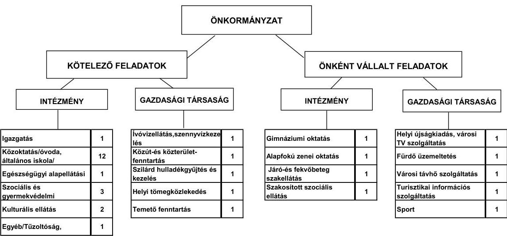

A feladatokat 2011. június 30-án (a Polgármesteri hivatallal együtt) 24 költségvetési szervvel és tíz gazdasági társaság keretében látta el. A sportfeladatok ellátására 2011. év I. félévében alapították a gazdasági társaságot. Az intézményszervezeti átalakítások és intézményi összevonások következtében a feladatellátás telephelyeinek száma a 2007. évi 36 -ról 2011. év I. félév végére 42-re nőtt. Az Önkormányzat hét gazdasági társaságban 75\% feletti tulajdonnal ${ }^{7}$ rendelkezik, amelyből öt társaságban kizárólagos tulajdonos, kettő társaságban 75\% feletti tulajdonnal rendelkezik. Az Önkormányzat 2010. évi mér-

[^0]
[^0]:    ${ }^{6}$ A tanúsítvány nem tartalmazza az egészségügyi ellátást ellátó intézmények és a kisebbségi önkormányzatok adatait.
    ${ }^{7}$ minősített többségi tulajdonú gazdasági társaság

---

legében szereplő, a gazdasági társaságokban lévő részesedés összege nem egyezik meg két gazdasági társaságnál a társaságok által a tanúsítványokban kimutatott önkormányzati tulajdoni részesedés összegével. A kötelező közszolgáltatási feladatok ellátásában résztvevő gazdasági társaságok közül a hulladék-kezelést-, szállítást, helyi tömegközlekedést, temető fenntartást végző társaságokban az Önkormányzat tulajdoni hányaddal nem rendelkezik. Az egyéb gazdasági társaságok távhőszolgáltatás, víz- és szennyvízkezelés, valamint az önként vállalt feladatok ellátásában kaptak szerepet. A gazdasági társaságok részére az Önkormányzat a működésükhöz az ellenőrzött időszakban összesen 418,7 millió Ft működési és 10,0 millió Ft fejlesztési célú pénzeszközt adott át.

A vizsgált időszakban az önként vállalt feladatként átvett gimnázium működtetése 262,6 millió Ft önkormányzati támogatás biztosítását igényelte. A 2007-2010. években 6107,7 millió Ft nettó működési jövedelme képződött az Önkormányzatnak, így a vizsgált időszakban a kötelező- és önként vállalt feladatok ellátását biztosító szervezeti keretekben bekövetkezett változás nem veszélyeztette az Önkormányzat pénzügyi egyensúlyi helyzetét.

Az Önkormányzat működési kiadásokra 2010-ben 4716,7 millió Ft-ot fordított, amely 897,3 millió Ft-tal ( $23,5 \%$-kal) haladta meg a 2007. évi ráfordításokat. A működési kiadások 53,8\%-át az intézményi körben realizálták.

Az egyes közszolgáltatások feladatellátásában résztvevő intézmények működési kiadásainak finanszírozási összetételét a 2007. és a 2010. években a következő ábra szemlélteti:
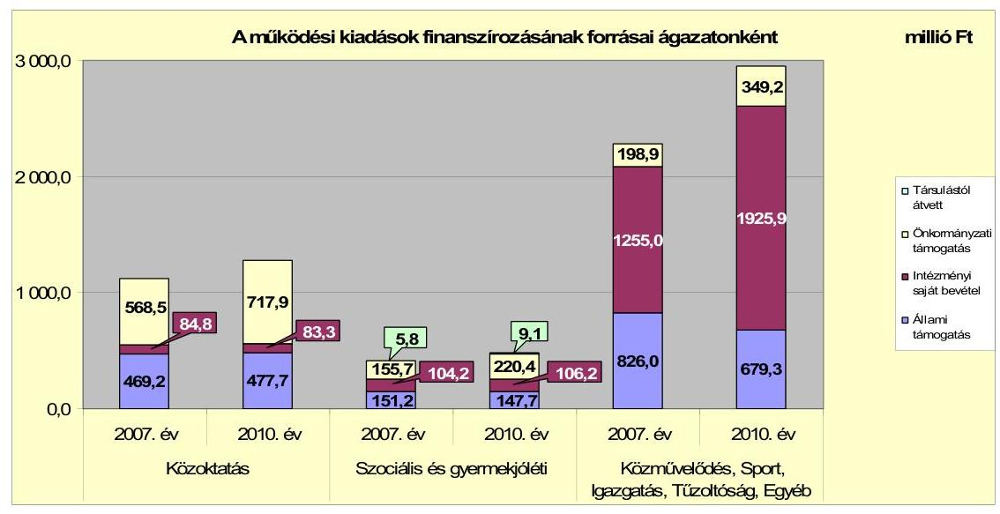

Az Önkormányzatnál a közoktatás kivételével az állami támogatások összege csökkent, melyet a központi szabályozás változása okozott. A közoktatás területén a támogatás növekedését a gimnázium átvételéből adódó ellátotti létszám növekedése indokolta. A közművelődési és sport feladatok állami támogatásának megszűnését, a zeneművészeti oktatás támogatásának csökkenését, az Önkormányzat az önkormányzati támogatás és az intézményi saját bevételek növelésével tudta ellensúlyozni.

---

Az Önkormányzat folyó költségvetés egyenlege (működési jövedelem) 2007-2010 között működési forrástöbbletet mutatott.
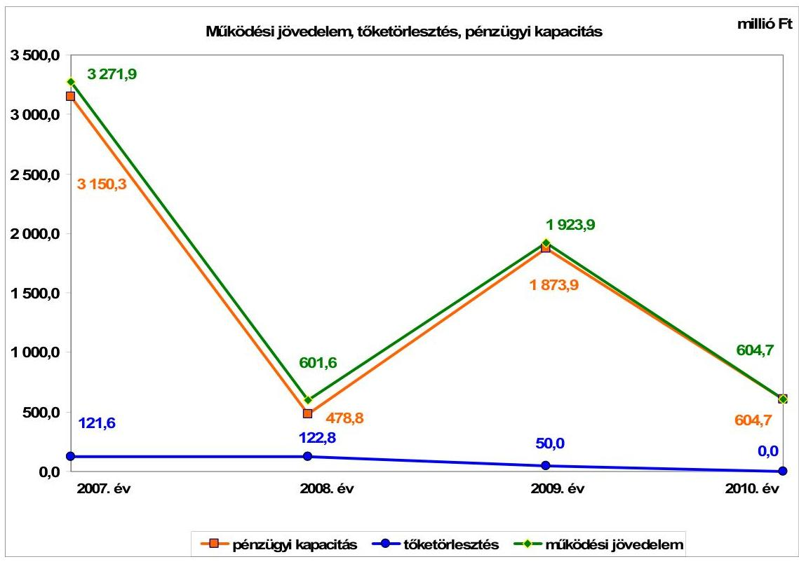

A vizsgált időszakban az Önkormányzat folyó költségvetési egyenlege, működési jövedelme pozitív összegű volt. A folyó kiadások nem csökkentek, a folyó bevételek teljesítése $12,5 \%$-kal, közel egy milliárd Ft-tal volt kevesebb 2010-ben az előző évek átlagánál ( 7677,9 millió Ft). A felhalmozási költségvetés egyenlege folyamatosan negatív volt. A felhalmozási célú támogatások összege csökkentette a felhalmozási hiány mértékét (az önkormányzati beszámolók adatai alapján): 2007. évben 152,0 millió Ft-tal, 2008. évben 47,7 millió Ft-tal 2009. évben 99,0 millió Ft-tal a 2010. évben 30,2 millió Ft-tal), negatív előjelét azonban nem változtatta meg. A folyó bevételek alakulását a helyi adóbevétel befolyásolta döntően. A vizsgált időszakban a helyi adóbevételek $89,0 \%$-át az iparűzési adóbevétel tette ki. Az iparűzési adó ingadozását ( 883,2 millió Ft - 2221,2 millió Ft) a legnagyobb adófizető gazdasági társaság évente lényegesen eltérő adóalapja okozta, így annak gazdasági tevékenysége az Önkormányzat pénzügyi egyensúlyi helyzetére hatást gyakorló kockázati tényező. A gazdasági társaság 2007. évben a helyi adóbevétel 58,9\%-át, 2008. évben 36,0\%-át, a 2009. évben 71,9\%-át, a 2010. évben 64,4\%-át fizette be iparűzési adó címen. Az Önkormányzat folyó kiadásai a 2007-2009. évek között átlagosan 5745,5 millió Ft-ot jelentettek. A 2010. évben a folyó kiadások az előző évek átlagához viszonyítva 6,4\%-kal 370,1 millió Ft-tal emelkedtek. A folyó kiadásokon belül a személyi juttatások 2008. évi növekedését a bérpolitikai intézkedések, a gimnázium átvételéből adódó, továbbá a Polgármesteri hivatalnál jelentkező létszámfejlesztés okozta. A dologi kiadások 2009. évi növekedését az áfa kiadások, valamint a szolgáltatási díjak emelkedése indokolta.

---

A kialakult pénzügyi egyensúlyi helyzetet jelentősen nem befolyásolta az Önkormányzat elmúlt időszaki fejlesztési tevékenysége. A befejezett fejlesztések jelentős részét saját bevételből fedezték. A 2007-2010. évek időszakában a 6414,4 millió Ft értékű fejlesztés és felújítás forrásából 5942,3 millió Ft saját erő, 472,1 millió Ft a hazai- és EU-s támogatás volt. A 2010. december 31-én folyamatban lévő fejlesztési feladatok végrehajtására 2007-2010 között 786,3 millió Ft kiadást teljesítettek, amelyre saját bevételből 482,5 millió Ft-ot $(61,4 \%)$ fordítottak.

Az Önkormányzatnál 2010. december 31-én folyamatban lévő fejlesztési feladatok 2010. évet követő kötelezettség-vállalásainak összege 1933,3 millió Ft volt, amelyből 957,0 millió Ft-ot saját bevételből, 976,3 millió Ft-ot EU-s támogatásból terveznek biztosítani, melyek 91,3\%-a rendelkezésre áll. A 2011. évben indított fejlesztésekhez kapcsolódó kötelezettségvállalás összege 79,1 millió Ft, melyet saját forrásból terveznek megvalósítani.
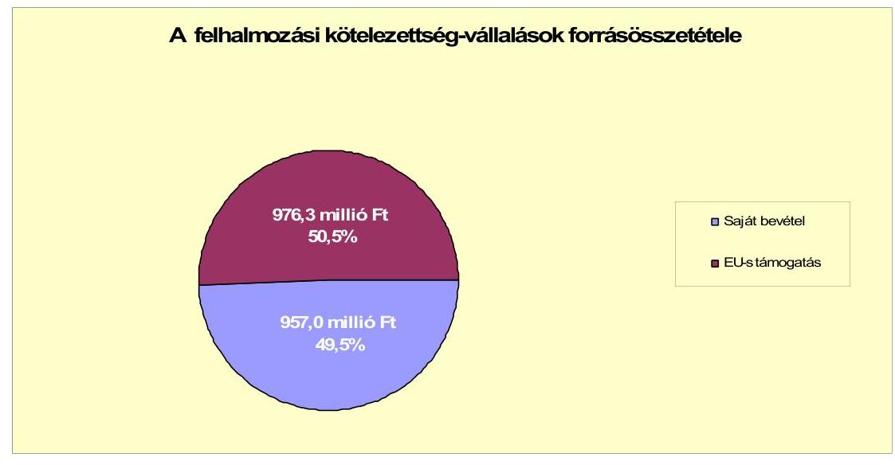

Az Önkormányzat által beadott, elbírálás alatt álló egy pályázat tervezett teljes bekerülési költsége 14,7 millió Ft volt, amelyhez 13,2 millió Ft-ot hazai támogatásból, 1,5 millió Ft-ot saját bevételből kívánnak biztosítani. Az Önkormányzat által a 2010-2013. évekre vállalt kötelezettségek összege 2012,4 millió Ft volt, amelyből 976,3 millió Ft-ot EU-s támogatásból és 1036,1 millió Ft-ot hazai saját bevételből terveznek biztosítani.

A gazdasági társaságok részére átadott pénzeszközök összege a 2007-2011. év I. féléve között összesen 428,7 millió Ft volt, ebből az Önkormányzat gazdasági társaságai részére átadott pénzeszközből 312,7 millió Ft működési, 10,0 millió Ft felhalmozási célra történt. Az Önkormányzat kizárólagos és többségi tulajdonosi részesedésével működő gazdasági társaságainál a saját tőke/jegyzett tőke aránya összességében 1,19 volt. A jegyzett tőke összege 855,7 millió Ft-tal nőtt, 2010. december 31-én 2072,0 millió Ft volt. A jegyzett tőke növekedését meghatározta, hogy az Önkormányzat 2007-2011. év. I féléve közötti időszakban három gazdasági társaságát több alkalommal is összesen 841,8 millió Ft tőkejuttatásban részesítette. A gazdasági társaságok kötelező önkormányzati

---

feladatokat látnak el, a tőkejuttatást az Önkormányzat a feladatok ellátásához szükséges fejlesztések finanszírozásához biztosította.

Az önkormányzat mérleg szerinti pénzintézetekkel szembeni kötelezettsége a 2006. év végi 290,0 millió Ft-ról a 2011. év I. félév végére megszűnt. A 2006. év végén meglévő hitelállomány törlesztésének kezdő időpontja 2006. november 22. volt ( 70 millió Ft ).

Az Önkormányzat a hiteleket a hitelcélnak megfelelően a Képviselő-testület által jóváhagyott, a költségvetésbe betervezett beruházásokhoz használta fel. A vizsgált években hiteleit visszafizette. A 2007-2011. év I. félévében az Önkormányzat hosszúlejáratú fejlesztési, hosszú- és rövidlejáratú működési célú hitelt nem vett fel, kötvényt nem bocsátott ki. Folyószámla hitele év végén és a hitelkeret lejáratának időpontjában nem volt, a 2007. évben rendelkezésre álló 90 millió Ft hitelkeretét 45 millió Ft-ra csökkentette. A 2007-2011. év I. féléve között átmenetileg szabad pénzeszközeiből 827,6 millió Ft kamatbevételt realizált.

Az Önkormányzat költségvetése a vizsgált években pénzügyileg egyensúlyban volt, az átmeneti likviditási hiány megszüntetéséhez kellett folyószámlahitelt igénybe vennie.

A folyószámlahitel igénybevétele a 2007-2011. év I. félévében az alábbiak szerint alakult:

| Megnevezés | 2007. év | 2008. év | 2009. év | 2010. év | 2011. I.
   félév |
| :-- | :--: | :--: | :--: | :--: | :--: |
| Folyószámlahitel |  |  |  |  |  |
| Keretösszeg január 1-jén (millió Ft-ban) | 90,0 | 90,0 | 45,0 | 45,0 | 45,0 |
| Átlagos napi állomány (millió Ft-ban) | 2,5 | 3,9 | 0,2 | 0,6 | - |
| Folyószámlahitellel zárt napok száma (nap) | 10 | 16 | 1 | 5 | - |
| Egyenleg (állomány) | x | x | x | - | - |
| Munkabér-megelőlegezési hitel |  |  |  |  |  |
| Keretösszeg január 1-jén (millió Ft-ban) | - | - | - | - | - |
| Átlagos napi állomány (millió Ft-ban) |  |  |  |  |  |
| Munkabér-megelőlegezési hitellel zárt napok száma (nap) | - | - | - | - | - |
| Egyenleg (állomány) | x | x | x | - | - |

A 2007-2010. években a likviditás biztosítása az Önkormányzatnak 0,2 millió Ft kamatkiadást, és 2,5 millió Ft egyéb költség kifizetését okozta. Az Önkormányzat 2011. év I. félév végi szállítói tartozása a korábbi évekhez mérten kiugróan magas, 509,0 millió Ft volt, melyből lejárt tartozása 74,5 millió Ft volt, átütemezett szállítói tartozása nem volt. A lejárt szállítói állományból a 90 napon túli lejárt szállítói tartozás összege 39,9 millió Ft volt 2011. június 30-án, amelynek kiegyenlítése a III. negyedévben megtörtént. Az Önkormányzat gazdasági társaság részére 10,0 millió Ft összegben készfizető kezességet vállalt, melyet pénzügyileg teljesített. A kezességvállalásra kifizetett összeg megtérült.

A gazdasági társaságok részére 2007-2011. év I. félévében 143,5 millió Ft tagi kölcsönt, egyéb szervezetek részére 15,5 millió Ft pénzeszközt adott át.

---

Az Önkormányzat kötelezettségeinek állományát és várható alakulását a kötelezettségek lejáratáig a következő táblázat szemlélteti:

| Megnevezés | Állomány   2010.   december 31-   én | Állomány   2011. június 30   án | Várható   kötelezettség   2011-2013.   években | Várható   kötelezettség   2014. évtől |
| :--: | :--: | :--: | :--: | :--: |
|  | HUF-ban (millió   Ft-ban) | HUF-ban (millió   Ft-ban) | HUF-ban (millió Ft-   ban) | HUF-ban (millió   Ft-ban) |
| Lízing kötelezettségek | 4,6 | 3,8 | 3,8 | - |
| Szállítói tartozás | 58,0 | 509,0 | 509,0 | - |
| Egyéb kiadás elmaradás | - | 17,2 | 17,2 | - |
| Összesen | 62,6 | 530,0 | 530,0 | - |

Az Önkormányzatnak pénzintézetekkel szemben fennálló kötelezettsége 2011. év I. félév végén nem volt. Lízing kötelezettség, szállítói tartozások és egyéb kiadás elmaradások rendezése címén 530,0 millió Ft fizetési kötelezettsége állt fenn. A 2011-2013. években várható 530,0 millió Ft összegű kötelezettségeinek teljesítésére figyelembe vehető 191,9 millió Ft mérlegben kimutatott követelésállomány és az elszámolásokat követően az egyes projektek megvalósításához elnyert európai uniós támogatások megtérülése.

Az Önkormányzat minősített többségi tulajdonú gazdasági társaságai kötelezettségeinek alakulását az alábbi táblázat szemlélteti:

| Megnevezés | Állomány 2010.   december 31-én | Állomány 2011.   június 30-án | Várható kötelezettség   2011-2013. években | Várható kötelezettség   2014. évtől |
| :--: | :--: | :--: | :--: | :--: |
|  | HUF-ban   (millió Ft-ban) | HUF-ban   (millió Ft-ban) | HUF-ban   (millió Ft-ban) | HUF-ban   (millió Ft-ban) |
| Pénzintézeti kötelezettségek | 0,0 | 0,0 | 0,0 | 0,0 |
| Lízing kötelezettségek | 2,1 | 6,7 | 3,7 | 3,0 |
| Jogerős végzéssel lezárt de ki nem   fizetett kötelezettségek | 0,0 | 0,0 | 0,0 | 0,0 |
| Szállítói tartozás | 164,0 | 145,8 | 145,8 |  |
| Összesen | 166,2 | 152,5 | 149,5 | 3,0 |

A társaságoknak 2011. június 30-tól lízing és szállítói tartozás címén 152,5 millió Ft tartozást kell rendezniük. Esetleges csőd, vagy felszámolási eljárás esetén a bíróság korlátlan és teljes felelősséget állapíthat meg az Önkormányzat terhére.

Az Önkormányzat 2007-2010 között eszközállománya után 2190,0 millió Ft összegű értékcsökkenést mutatott ki, miközben az elhasznált eszközök felújítására, pótlására 1816,9 millió Ft-ot, fejlesztési feladatokra 5380,0 millió Ft-ot fordítottak. A felújítások, fejlesztések hatására az Önkormányzatnál az eszközök használhatósága összességében javult.

Az Önkormányzat az ellenőrzött időszakban kiadási megtakarítást eredményező és bevételnövelő intézkedéseket nem tett. A megszüntetett álláshelyekhez kapcsolódóan állami támogatást nem igényelt. Egyes közszolgáltatási területeken feladatbővülések voltak, amelyek álláshely- és létszámnövekedéssel is jártak. Ennek következtében az időszak álláshelyeinek száma 58 fővel nőtt.

---

Az utóellenőrzés a költségvetési rendelet összeállítására, tartalmára, mellékleteire, szerkezetére tett négy szabályszerűségi és egy célszerűségi javaslat hasznosítására terjedt ki. Az Önkormányzat a pénzügyi egyensúly javítására tett javaslatokat - egy szabályszerűségi javaslat kivételével - az intézkedési terv szerinti határidőben hasznosította. Részben hasznosult a többéves kihatással járó feladatok előirányzatainak bemutatására tett javaslat, azokat nem minden esetben a kötelezettségvállalás teljes időtartamára mutatták be, csak 2013. év végéig.

Az Önkormányzat pénzügyi helyzetét összegezve a következők emelhetők ki:

Az Önkormányzat pénzügyi egyensúlya rövid és közép távon biztosított.

A folyó bevételek fedezetet biztosítottak a folyó kiadásokra és az adósságszolgálatra.

A folyó bevételek alakulását meghatározta a vizsgált időszakban átlagosan 53,3%-ot kitevő egy adóalanytól származó helyi adóbevétel ingadozása. Az Önkormányzat pénzügyi egyensúlyát veszélyezteti, így pénzügyi kockázatot jelent ezen meghatározó adóalany tevékenysége.

A folyamatban lévő fejlesztési kiadásokhoz a nettó működési jövedelem fedezetet biztosít.

Az Önkormányzat pénzintézetekkel szembeni kötelezettséggel 2009. december 31. után nem rendelkezett.

A polgármester intézkedéseiről megküldött levele nem tekinthető az Állami Számvevőszékről szóló 2011. évi LXVI. törvény 33. § (1) bekezdése szerinti intézkedési tervnek, ezért a jelentés kézhezvételét követően, törvényi határidőn belül az Állami Számvevőszék részére azt meg kell küldeni.

Az Állami Számvevőszékről szóló 2011. évi LXVI. törvény 33. § (1) bekezdésében foglaltak értelmében a jelentésben foglalt megállapításokhoz kapcsolódó intézkedési tervet köteles az ellenőrzött szervezet vezetője összeállítani és azt a jelentés kézhezvételétől számított harminc napon belül az ÁSZ részére megküldeni. Amennyiben az intézkedési tervet határidőben nem küldi meg a szervezet, vagy az továbbra sem elfogadható, az ÁSZ elnöke a hivatkozott törvény 33. § (3) bekezdés a)-b) pontjaiban foglaltakat érvényesítheti.

# A 2011. június 30-i pénzügyi egyensúlyi helyzet alapján az ellenőrzés intézkedést igénylő megállapításai és javaslatai a következők: 

## a Polgármesternek

1. Az Önkormányzat nettó működési jövedelme az elmúlt időszakban pozitív volt, működési célra hosszú lejáratú hitelből, kötvényből származó bevételt nem vett igénybe.

---

Az Önkormányzat pénzügyi egyensúlyi helyzete rövid és közép távon biztosított. A pénzügyi egyensúly hosszú távú megőrzésére a helyi adóban mutatkozó bevételi kitettségből adódó kockázat miatt az Önkormányzatnak fel kell készülnie.

Javaslat:
Folyamatosan tájékoztassa a Képviselő-testületet az Önkormányzat pénzügyi egyensúlyi helyzetéről. Kezdeményezzen szükség esetén intézkedéseket a pénzügyi egyensúly hosszú távú fenntarthatósága érdekében.

Az iparűzési adóbevételből képezzen tartalékot, hogy a feltöltési kötelezettség során befizetett, de a gazdasági társaságok éves iparűzési adóbevallása alapján esetleg visszafizetendő adóra nyújtson fedezetet.
2. Az Önkormányzat minősített többségi tulajdonú gazdasági társaságainak kötelezettsége 2011. június 30-án 152,5 millió Ft volt, amely kötelezettség nem teljesítése hatással lehet az Önkormányzat likviditására, pénzügyi egyensúlyi helyzetére.

Javaslat:
Kísérje folyamatosan figyelemmel - a tulajdonosi jogkört gyakorlók közreműködésével - a minősített többségi tulajdonú gazdasági társaságok kötelezettségeinek alakulását, az Önkormányzat likviditására, pénzügyi-egyensúlyi helyzetére gyakorolt hatását. Tegye meg a szükséges és lehetséges intézkedéseket a tulajdonosi érdekek védelme érdekében.

# a Jegyzőnek 

1. Az Önkormányzat 2010. évi költségvetési beszámolójában szereplő, gazdasági társaságaiban lévő részesedései összege nem egyezik meg a gazdasági társaságok által kimutatott összeggel.

Javaslat:
Intézkedjen a gazdasági társaságokról vezetett analitikus nyilvántartások felülvizsgálatáról, a szükséges módosítások átvezetéséről.
2. A 2009. évi ÁSZ ellenőrzés által tett szabályszerűségi javaslatok közül részben hasznosult a többéves kihatással járó kiadásokat érintő önkormányzati döntések számszerűsített bemutatása a költségvetési rendeletben. A következő éveket terhelő kötelezettségeket és azok forrásait nem minden esetben a kötelezettségvállalás teljes időtartamára mutatták be, csak 2013. év végéig.

Javaslat:
Mutassa be az éves költségvetési rendeletekben a kötelezettség teljes időtartamára a többéves kihatással járó, kiadásokat érintő önkormányzati döntések számszerűsített adatait.

---

A polgármester a helyszíni ellenőrzés lezárása után tájékoztatta az Állami Számvevőszéket az Önkormányzat megtett intézkedéseiről, amelyeket az Állami Számvevőszék nem ellenőrzött, arra vonatkozóan véleményt vagy megállapítást nem fogalmaz meg. Az ellenőrzés lezárását követően elvégzett intézkedéseket az Állami Számvevőszék utóvizsgálat keretében vizsgálhatja.

A polgármester tájékoztatása szerint a következő intézkedéseket tette meg az Önkormányzat:

- Előírta a jegyző intézkedési kötelezettségét a gazdasági társaságoknál vezetett analitikus nyilvántartások felülvizsgálatára, a szükséges módosítások átvezetésére, hogy a részesedések kimutatott értéke a 2011. évi beszámolóban megegyezzen a gazdasági társaságok által kimutatott értékkel.
- Előírta a jegyző intézkedési kötelezettségét, hogy a 2012. évi költségvetés tervezése kapcsán kerüljenek bemutatásra a következő éveket terhelő kötelezettségek a költségvetési rendeletben, nem csak 2013. év végéig, hanem a kötelezettségvállalások teljes időszakára.

---

# II. RÉSZLETES MEGÁLLAPÍTÁSOK 

## 1. Az ÖNKORMÁNYZAT KÖTELEZŐ ÉS ÖNKÉNT VÁLLALT FELADATAI, A FELADATELLÁTÁS SZERVEZETI KERETEI ÉS ANNAK VÁLTOZÁSAI

A kötelezően ellátandó és önként vállalt feladatok besorolását az Önkormányzat végezte el, melyet az SzMSz-ben részletesen szabályozott. Az önként vállalt feladatok ellátására alapfokú zeneművészeti, középfokú oktatást nyújtó, idősek tartós ápolását és gondozását biztosító intézményt működtetnek. Az Önkormányzat fenntartásában lévő kórház a fekvőbeteg ellátás mellett járóbeteg szakellátást is biztosít. Az önként vállalt feladatok keretében sportfeladatot lát el, idegenforgalmi-, turisztikai szolgáltatást nyújtanak, helyi újságot jelentetnek meg, televízió szolgáltatást, távhő ellátást, fürdő üzemeltetést biztosítanak, támogatják a felsőoktatási intézményekben továbbtanuló diákokat, a városi, városkörnyéki rendezvényeket, a helyi hagyományok, műemlékek megőrzését.

Az Önkormányzat - adatszolgáltatása szerint - működési kiadásainak összege 2010. évben (egészségügyi alap-és szakellátások és a kisebbségi önkormányzatok nélkül) 4716,7 millió Ft volt. A kiadások 86,8%-át, 4094,1 millió Ft-ot a kötelező feladatok ellátására fordították. Az önként vállalt feladatokra 622,6 millió Ft-ot, a kiadások 13,2%-át fizették ki.

A vizsgált időszakban a kötelező feladatokra fordított működési kiadások összege, aránya változó volt. A 2010. évben a működési kiadások összege 6,2%-kal, 274,8 millió Ft-tal haladta meg a 2007-2009. évek átlagát, mely 4441,9 millió Ft volt. A kötelező feladatok működési kiadásokon belüli aránya az átlagos 89,2%-ról (3962,7 millió Ft) 86,8%-ra csökkent. Az önként vállalt feladatokra fordított kiadások összege folyamatosan nőtt. A 2008. évben az önként vállalt feladatokra 493,6 millió Ft-ot, 64,7 millió Ft-tal többet fordítottak, mint a 2007. évben, a 2009. évi kiadások összege 121,0 millió Ft-tal haladta meg a 2008. évi összeget. Növekedésében meghatározó szerepe volt a gimnázium 2008. évben Megyei Önkormányzattól történt átvételének. Az önként vállalt feladatok költségvetésen
 belüli növekvő részaránya a kötelező feladatok ellátását nem veszélyeztette, az Önkormányzat kedvező pénzügyi pozícióját nem rontotta.

---

A 2010. évi működési kiadások feladat-csoportonkénti megoszlását, a működési bevételek forrás-megoszlását az alábbi táblázat ${ }^{8}$ szemlélteti:

| Ellátott feladat | Működési   kiadás   összesen   (millió Ft) | Kötelező   feladatok   kiadásainak   részaránya   % | Működési   bevétel   összesen   (millió Ft) | Állami   támogatás   részaránya   % | Intézményi   saját bevétel   részaránya   % | Önkormányzati   támogatás   részaránya   % | Társulástól   átvett   % |
| :--: | :--: | :--: | :--: | :--: | :--: | :--: | :--: |
| Óvodák | 374,8 | 100,0 | 374,8 | 35,2 | 9,9 | 54,9 | 0,0 |
| Általános iskolák | 737,2 | 100,0 | 737,2 | 36,9 | 5,4 | 57,7 | 0,0 |
| Gimnáziumok | 166,9 | 0,0 | 166,9 | 44,3 | 3,7 | 52,0 | 0,0 |
| Szociális   intézmények | 336,9 | 70,0 | 336,9 | 30,5 | 29,2 | 40,3 | 0,0 |
| Gyermekjóléti   intézmények | 146,5 | 100,0 | 146,5 | 30,7 | 5,3 | 57,8 | 6,2 |
| Közművelődési   intézmények | 127,7 | 100,0 | 127,7 | 2,5 | 21,5 | 76,0 | 0,0 |
| Sportlétesítmények | 55,3 | 0,0 | 55,3 | 0,0 | 34,8 | 65,2 | 0,0 |
| Egyéb intézmények | 592,4 | 49,4 | 592,4 | 48,0 | 16,9 | 35,1 | 0,0 |
| Polgármesteri hivatal   igazgatási kiadása | 724,1 | 100,0 | 724,1 | 28,0 | 72,0 | 0,0 | 0,0 |
| Polgármesteri   hivatalban ellátott   egyéb feladatok   működési kiadásai | 1454,9 | 100,0 | 1454,9 | 13,0 | 86,4 | 0,6 | 0,0 |
| Működési kiadá-   sok összesen | 4716,7 | 86,8 | 4716,7 | 27,7 | 44,8 | 27,3 | 0,2 |

Az Önkormányzat kimutatása szerint a vizsgált időszakban a működési kiadások összegét, változását, ágazatok szerinti megoszlását évente az alábbiakban részletezzük.

A működési kiadásokon belül a közoktatásra fordított kiadások összege 2010. évben 1278,9 millió Ft volt, 3,4%-kal 47,6 millió Ft-tal haladta meg a 2007-2009. évek átlagos értékét. A kiadások összes működési kiadáson belüli aránya 2010. évben 27,1%, a 2007-2009. évek átlagában 27,7% volt. A kiadások növekedését a gimnázium Megyei Önkormányzattól történt átvétele indokolta. Az átvett intézmény 2008-2010. évek közötti működési költségvetési kiadása összesen 379,5 millió Ft volt. Az átvett intézmény nélkül a közoktatási kiadások a 2007-2009 közötti átlagos 1160,4 millió Ft-ról, 4,2%-kal 1112,0 millió Ft-ra csökkentek volna.

A szociális és gyermekjóléti feladatokat ellátó intézmények működtetésére 2010. évben 483,4 millió Ft-ot, a kiadások 10,2%-át fordították. A szociális és gyermekjóléti feladatok ellátását szolgáló működési kiadások összege ingadozott a vizsgált években. A 2010. évi működési kiadás 6,7%-kal 30,3 millió Ft-tal haladta meg a 2007-2009. évek átlagos (453,1 millió Ft) működési kiadásának összegét.

A Polgármesteri hivatal költségvetésén belül az igazgatási szakfeladaton elszámolt működési kiadások összege 2010. évben 724,1 millió Ft volt, a 2007-

[^0]
[^0]:    ${ }^{8}$ Az Önkormányzat fenntartásában működik kórház, valamint egészségügyi alapellátási intézmény, mely intézmények adatait a táblázat nem tartalmazza.

---

2009. évi 1162,9 millió Ft átlagos összeghez mérten csökkent, az egyéb feladatokon kimutatott kiadások összege nőtt. A változást az indokolta, hogy 2010. évben a szakfeladatrend változása miatt az igazgatási feladatok kiadásait megtisztították az egyéb feladatokra fordított kiadások összegétől. A Polgármesteri hivatalban a kiadások alakulását meghatározta, hogy az Önkormányzatnál évről évre nőtt a közfoglalkoztatottak száma.

A közművelődési és sport intézmények működési kiadása is nőtt, a 2007-2009. évek átlagához mérten. A közművelődési intézményeknél a növekedés 5,8% (7,0 millió Ft). A sportintézményekben a működési kiadások átlagos összege a 2007-2009. években 51,3 millió Ft, a 2010. évben 55,3 millió Ft volt. Az egyéb intézmények működési kiadása a 2007-2009 évi átlagos 573,9 millió Ft-tal szemben 2010. évben 592,4 millió Ft volt. A növekedést a zeneiskola működtetésével összefüggő kiadások okozták.

Az Önkormányzat kimutatása szerint mind a működési kiadások mind az e címen elszámolt bevételek évek közötti változását, annak összetételét meghatározta a helyi adókból származó bevételek ingadozása. (A helyi adók és pótlékokból származó bevételek alakulását lásd a jelentés 2.2 pontjában.)

A 2007-2010 között a működési bevételeken belül az állami támogatások, hozzájárulások összege a 2008. év kivételével az előző évekhez viszonyítva folyamatosan csökkent. 2007-2009 évek átlagában 1487,4 millió Ft-volt, 2010. évre 1304,6 millió Ft-ra csökkent.

A csökkenést az Önkormányzatnál részben a feladatmutatókban jelentkezett változás, továbbá az állami támogatásokat érintő központi módosítások hatása indokolta:

- A közoktatásban ellátottak létszáma - a gimnázium átvétele miatt - a 2007. évi 2028 főről a 2010. év végére 324 fővel nőtt. Ennek ellenére a feladatok finanszírozására igénybe vett állami támogatás összege - az Önkormányzat kimutatása szerint - a 2007-2009. évi átlagos 582,6 millió Ft-ról a 2010. évre 477,6 millió Ft-ra csökkent. 2007. szeptember 1-től a közoktatási feladatok finanszírozása teljesítménymutató alapján történik, mely azt eredményezte, hogy az egy általános tanulóra vetített állami támogatás éves összege a 2007 évi 237,8 millió Ft/fő összegről 2010 évre 195,1 ezer Ft/főre, az egy óvodai ellátottra jutó állami támogatás összege 219,8 ezer Ft/főről 208,7 ezer Ft/főre csökkent.
- 2010. évtől a közművelődési és közgyűjteményi feladatokhoz már nem volt igényelhető állami támogatás.
- Központi intézkedések hatására csökkent az igazgatási feladatok állami támogatása is.

Az állami támogatások összegének csökkenése ellenére, ezen bevételi elemek aránya az összes bevételen belül nőtt. Míg a 2007-2010 évek átlagában az Önkormányzatnál az állami támogatás a működési kiadások 33,5%-át, a 2010. évben 27,7%-át finanszírozta.

---

Az Önkormányzatnál a feladatok kiadásainak finanszírozásában - kimutatás szerint - az állami támogatások csökkenését az önkormányzati támogatás növekedése ellensúlyozta. Az önkormányzati támogatás összege a 2007-2009 évi átlagos 1005,0 millió Ft-ról 2010. évre 1287,5 millió Ft-ra, 28,1%-kal nőtt, a bevételeken belüli aránya az átlagos 22,8%-ról 2010. évre 27,3%-ra változott.

Az ellátott feladatokat eltérő mértékben finanszírozta állami támogatás, intézményi bevétel, önkormányzati támogatás.

A közoktatási feladatok működési kiadásait 2010. évben az állami támogatás 37,4%-ban 477,7 millió Ft-tal, az intézményi saját bevétel 6,5%-ban 83,3 millió Ft-tal finanszírozta, míg az önkormányzati támogatás 717,9 millió Ft-ot, 56,1%-ot jelentett. A szociális és gyermekjóléti intézmények kiadásaira 2010. évben 30,6%-ban, 147,7 millió Ft összegben nyújtott fedezetet az állami támogatás. A feladatok finanszírozásában 21,9%-ot 106,1 millió Ft-ot jelentett az intézményi saját bevétel. A családsegítést és a gyermekjóléti szolgálatot az önkormányzat társulásban, gesztorként látja el, így az intézmény működési kiadásaihoz a társult települések is hozzájárulnak 9,1 millió Ft összegben 1,9%-ban.

Az Önkormányzat kötelező- és önként vállalt feladatait saját fenntartású intézményeiben, gazdasági társaságok feladatellátásba történő bevonásával látja el. Más önkormányzatokkal közösen (Csép, Kisigmánd, Mocsa) társulásban a család és gyermekjóléti szolgáltatás biztosított.

Az önkormányzati feladatokat ellátó költségvetési intézmények száma 2011. június 30-án 24 volt. A közoktatási feladatokat nyolc óvodai intézmény, négy általános iskola, valamint a gimnázium látta el. Egészségügyi alapellátási feladatokat egy intézmény végez. Az intézményben látják el a háziorvosi, a fogászati-, védőnői szolgálatot, az egészségmegőrzést, iskolaorvosi feladatokat is. A kórház keretében működik a járóbeteg szakellátás. A szociális és gyermekjóléti ellátást biztosító négy intézmény közül a Gondozási Központ vegyes profilú intézmény, a szociális alapellátáson túlmenően az intézményben működik a hajléktalanok nappali,- éjjeli melegedője, átmeneti szállása. Az Idősek Otthona és Otthonháza végzi az idősek tartós ápolását, gondozását. A kisgyermekek napközbeni ellátásának biztosítására a város önkormányzata bölcsődét tart fenn. A kulturális feladatokat a Művelődési Központ és Közművelődési Könyvtár látja el. Az egyéb intézmények keretében pedig Tűzoltóságot, zeneiskolát működtetnek.

A feladatok ellátásában a 2011. év I. félévében hét többségi önkormányzati tulajdoni részesedésű gazdasági társaság vett részt. Az Önkormányzat tulajdoni érdekeltségi körébe tartozó gazdasági társaságokon kívül a feladatok ellátásában további három gazdasági társaság is részt vállalt, melyekben az Önkormányzat nem rendelkezik tulajdonosi jogosultsággal.

Az Önkormányzatnak 2011. június 30-án öt gazdasági társaságban volt 100%-os, kettő gazdasági társaságban 75-99% közötti tulajdoni részaránya. A gazdasági társaságok közül a Sport Kft-t az Önkormányzat 2011. év I. félévében alapította. A Kft. a Városi Sportiroda és Sportcsarnok megszüntetését követően vette át annak feladatait.

---

A 100%-os önkormányzati tulajdonosi részaránnyal rendelkező gazdasági társaságokban (a SAXUM Kft., a Komturist Kft., Távhő Kft., Sport Kft., Városi TV Kft.) az Önkormányzat tulajdoni részesedése a társaságok kimutatásai szerint 2010. december 31-én 313,9 millió Ft volt. A 75-99% közötti tulajdoni hányadú gazdasági társaságokban (Vízmű Kft., Komthermál Kft.) az önkormányzati tulajdon összege 1632,4 millió Ft. A gazdasági társaságok adatait a jelentés 4. számú melléklete az Önkormányzat által átadott pénzeszközöket a jelentés 2.3 pontja részletezi.

Az Önkormányzat 2010. évi mérlegében szereplő, a gazdasági társaságokban lévő részesedés összege nem egyezik meg a társaságok 5. számú tanúsítványaiban kimutatott önkormányzati tulajdoni részesedés összegével. Az eltérést az indokolja, hogy az Önkormányzat számviteli nyilvántartásában a Vízmű Kft.-nél levő tárgyi apport összege 13,7 millió Ft-tal kisebb összegben szerepel, mint az alapító okiratban, míg a Komthermál Kft. könyveiben öt millió Ft összegű apport érték tőketartalékként van nyilvántartva. ${ }^{9}$

Önkormányzati kötelező feladatként a Vízmű Kft. látja az ivóvíz szolgáltatást, szennyvízkezelést. A SAXUM Kft. a közutak, közterületek fenntartását, karbantartását, a SPORT Kft. a városi sport feladatokat. Az önként vállalt feladatok keretében helyi újság kiadását, a helyi TV szolgáltatást biztosítja a Városi TV Kft. A városi távhőszolgáltatást a Komáromi Távhő Kft. biztosítja. A gyógyfürdő működtetését Komthermál Kft. végzi. Turisztikai információs szolgáltatást a Komturist Kft. nyújt.

Kötelező közszolgáltatási feladatokat lát el az Önkormányzat tulajdonosi érdekeltségi körébe nem tartozó gazdasági társaságok közül az AVE Zrt. (szilárd hulladékok gyűjtését kezelését, ártalmatlanítását), a Volán Zrt. (helyi tömegközlekedést), valamint a Temetkezési Kft. (temető fenntartását).

Az önkormányzati feladatokat ellátó költségvetési intézmények száma 2006. év végén 24 volt. Az intézmények száma feladatok más önkormányzattól történt átvétele, intézmény megszüntetések, átszervezések ellenére 2011. június 30-i állapot szerint összességében nem változott.

A közoktatási intézmények számában növekedést okozott, hogy az Önkormányzat 2008. évben a Megyei Önkormányzattól visszavette a még 2004. évben átadott középfokú oktatási intézmények közül a gimnázium fenntartását. Új óvodát alapítottak 2009. szeptember 1-jével. A családsegítést és a gyermekjóléti feladatokat ellátó intézményt az Önkormányzat 2008. augusztus 16-tól három önkormányzattal társulás keretében működteti. A gesztor feladatait Komárom város önkormányzata látja el.

Jelentősebb intézményátszervezésekről az Önkormányzat Képviselő-testülete a 2011. év I. félévében döntött, megszüntette
 a Városi Sportiroda és Sportcsarnok költségvetési intézményt. A feladatokat az újonnan alapított Sport Kft. látja el. Megszüntették az Önkormányzati intézmények Gazdasági Hivatala önállóan

[^0]
[^0]:    ${ }^{9}$ A polgármester által adott tájékoztatás szerint a jegyző a 2011. évi beszámoló elfogadásáig intézkedik a gazdasági társaságokról vezetett analitikus nyilvántartások felülvizsgálatáról, a szükséges módosítások átvezetéséről.

---

működő és gazdálkodó költségvetési intézményt is. A költségvetési szerv feladatait részben a Polgármesteri hivatalhoz szervezték, míg a karbantartások, felújítások szervezését, bonyolítását a jövőben a SAXUM Kft. végzi.

Nőtt a feladat ellátási helyek száma, (2006. év végén 36, 2011. június 30-án 42). A növekedés az egészségügyi alapellátás területén, a szociális- és gyermekjóléti ellátásoknál, valamint a kulturális intézményeknél jelentkezett az ellátási körzetek, a szolgáltatási helyek számának növekedése miatt.

Az Önkormányzat kimutatása szerint a gimnázium Megyei Önkormányzattól történt átvétele 2008. szeptember és 2011. június 30. között 496,0 millió Ft többletkiadást eredményezett. A kiadások pénzügyi fedezete 262,6 millió Ft önkormányzati támogatás biztosítását igényelte.

A 2011. év I. félévében végrehajtott átszervezésekkel kapcsolatosan várható megtakarításokról számításokat nem tudtak az ellenőrzés rendelkezésére bocsájtani. A Polgármesteri hivataltól kapott tájékoztatás szerint az átszervezések tárgyévben megtakarítást várhatóan nem eredményeznek. Az Önkormányzat 2011. évi költségvetési rendeletében sport feladatokra megtervezett, az intézmény megszűnéséig fel nem használt előirányzatnak megfelelő összeg a Sport Kft. részére működési támogatásként átcsoportosításra került. Az Önkormányzati Intézmények Gazdasági Hivatalában foglalkoztatottak egy részét áthelyezték a Polgármesteri hivatal állományába. A megszüntetett állásokkal kapcsolatos többletkifizetések azonban várhatóan meghaladják a jelentkező megtakarítások összegét.

Az önkormányzat többségi tulajdonában lévő gazdasági társaságok átszervezésére a 2007-2010 években nem intézkedtek.

A gazdasági társaságoknál csőd-, felszámolási eljárás nem indult. A társaságok gazdálkodását, működését jellemző főbb adatokat a jelentés 4. számú melléklete mutatja be.

A vizsgált időszakban az önként vállalt feladatként átvett gimnázium az Önkormányzatnak a 2008-2011. június 30. közötti időszakban 262,6 millió Ft további önkormányzati támogatás biztosítását tette szükségessé. A 2007-2010. években 6107,7 millió Ft nettó működési jövedelme képződött az Önkormányzatnak. A vizsgált időszakban a kötelező- és önként vállalt feladatok ellátását biztosító szervezeti keretekben bekövetkezett változás, nem veszélyeztette az Önkormányzat pénzügyi egyensúlyi helyzetét.

# 2. AZ ÖNKORMÁNYZAT PÉNZÜGYI EGYENSÚLYI HELYZETÉT BEFOLYÁSOLÓ TÉNYEZŐK 

A hagyományos költségvetési szerkezet helyett az Önkormányzat pénzügyi egyensúlyi helyzetét a CLF módszerrel mutatjuk be, amelyben jobban elkülönülnek a vagyonnal kapcsolatos bevételek és kiadások az önkormányzati feladatokkal kapcsolatos közvetlen működtetési bevételektől és kiadásoktól. A módszer következetesen elkülöníti a folyó és a felhalmozási költségvetés bevételeit és kiadásait, azok költségvetési egyenlegeit. A saját folyó bevételek, vala-

---

mint a saját felhalmozási bevételek nem tartalmazzák az előző évi pénzmaradványok felhasználásából származó pénzforgalom nélküli bevételeket ${ }^{10}$.

A folyó költségvetés egyenlege, a működési jövedelem megmutatja, hogy az Önkormányzat éves folyó bevétele fedezetet biztosít-e a kötelező és önként vállalt feladatellátáshoz kapcsolódó éves folyó kiadására. A működési jövedelem negatív értéke pénzügyileg fenntarthatatlan helyzetet jelez. A mutató pozitív értéke megtakarítást mutat, amely forrásul szolgálhat az Önkormányzat fennálló kötelezettségei megfizetéséhez, valamint fejlesztéseihez.

A felhalmozási költségvetés pozitív értéke felhalmozási többletet mutat, amely a jövőbeni fejlesztések forrását biztosíthatja. Amennyiben a folyó költségvetési hiány finanszírozása a felhalmozási többletből történik, ez szűkebb értelemben vagyonfelélésnek tekinthető. Amennyiben a felhalmozási költségvetés megtakarítása fejlesztési célú hitelek, kötvények adósságszolgálatát finanszírozza, az változatlan vagyontömeg mellett, a korábban megelőlegezett tőkebevételek valós realizációjának tekinthető. A felhalmozási deficit által generált finanszírozási igény önmagában nem jár pénzügyi kockázattal, a pénzügyileg fenntartható beruházásokhoz kapcsolódó kötelezettségvállalás (adósságszolgálat) átlátható és szabályozott költségvetési gazdálkodással teljesíthető.

A módszer a pénzügyi kapacitás fogalmát helyezi a középpontba. Az adós hitelfelvételi képessége, hosszú távú fizetőképessége vagy bonitása a pénzügyi kapacitással, ezen belül is a nettó működési jövedelemmel jellemezhető. A nettó működési jövedelem negatív értéke az egyes költségvetési években jelentkező adósságszolgálat túlzott mértékére utal ${ }^{11}$. A nettó működési jövedelem negatív értékének felhalmozási többletből, vagy további hitelből történő finanszírozása pénzügyileg nem fenntartható gazdálkodást vetít előre. A pozitív értéket mutató nettó működési jövedelem fejlesztési kiadások fedezetét biztosíthatja, illetve a folyamatosan, évenként képződő pozitív nettó működési jövedelemből meghatározható a jövőben vállalható, teljesíthető éves adósságszolgálat, ily módon az a hitelösszeg, amely - a többi tényezőt, feltételt adottnak tekintve visszafizetési kockázat nélkül felvehető.

A CLF módszer alapján a pénzügyi kapacitás mértéke az Önkormányzat összevont, nettósított, a központi információs rendszerbe a Kincstáron keresztül leadott éves költségvetési beszámolójának 80-as űrlapjában szerepeltetett adatok alapján került meghatározásra.

A számítási leírás némileg eltér az ÁSZ módszertanában korábban alkalmazott gyakorlattól. A jelen besorolás általános közgazdasági meggondolásokon alapul, amely megjelenik az SNA statisztikai módszertanában is. Folyó tételek alatt értjük azokat a kiadásokat és bevételeket, amelyek a gazdálkodó szervezet helyzetét automatikusan nem változtatják. Bevételi oldalon ilyenek az adók, a

[^0]
[^0]:    ${ }^{10}$ A költségvetési években kialakuló hiány finanszírozása az előző évi pénzmaradvány és a korábbi években képzett tartalékok felhasználásával is történhet.
    ${ }^{11}$ Kivéve, ha annak finanszírozására a korábbi években képzett tartalékok fedezetet nyújtanak.

---

tényező jövedelmek, a transzferek ${ }^{12}$, kiadási oldalon a transzferek és a szolgáltatás nyújtásával kapcsolatos működési kiadások. A folyó költségvetésben a bevételekben nem térül meg, a kiadásokban nem jelenik meg az amortizáció, a vagyoni helyzetet az egyenleg befolyásolja.

A folyó költségvetés egyenlege (működési jövedelem) tartalmazza a kamatbevételeket és a kamatkiadásokat is, mind a működési, mind a fejlesztési kamatot, valamint a visszatérülő és befizetendő áfa teljes összegét, mert ezek közgazdaságilag tényező jövedelmek. Nem tartalmazzák viszont a követelés elengedés miatt könyvelt bevételi és kiadási pénzforgalmi tételeket, mert valójában technikai elszámolási műveletnek minősülnek, a bevétel soha nem realizálódott, és költségvetési kiadás sem történt.

A felhalmozási költségvetésben a bevételek között a vagyon megőrzésére és bővítésére fordítható források jelennek meg. A felhalmozási vagy tőketételek módosítják a vagyon nagyságát. A privatizációs bevétel csökkenti a vagyont, a fizikai beruházás, pénzügyi befektetés növeli.

A nettó működési jövedelmet a tőketörlesztés levonásával a folyó költségvetés egyenlegéből származtatjuk.

[^0]
[^0]:    ${ }^{12}$ Transzfer kiadásoknak nevezzük azokat a folyó és felhalmozási tételeket, amelyeket nem az adott Önkormányzat használ fel szolgáltatásnyújtásra.

---

# 2.1. A működési és a felhalmozási egyensúly változása 

Az Önkormányzat folyó költségvetésének egyenlege 2007-2010. évek között működési forrástöbbletet mutatott.

CLF módszer szerinti önkormányzati adatok
millió Ft

| Megnevezés | 2007 | 2008 | 2009 | 2010 |
| :--: | :--: | :--: | :--: | :--: |
| Folyó bevételek | 8381,6 | 6618,9 | 8033,3 | 6720,3 |
| Folyó kiadások | 5 109,7 | 6017,3 | 6109,4 | 6115,6 |
| Működési jövedelem | 3271,9 | 601,6 | 1923,9 | 604,7 |
| Nettó működési jövedelem   =működési jövedelem - tőketörlesztés | 3 150,3 | 478,8 | 1873,9 | 604,7 |
| Felhalmozási bevételek | 362,6 | 197,1 | 363,2 | 310,4 |
| Felhalmozási kiadások | 1744,8 | 3828,5 | 1892,4 | 1918,6 |
| Felhalmozási költségvetés egyenlege | $-1382,2$ | $-3631,4$ | $-1529,2$ | $-1608,2$ |
| Finanszírozási műveletek nélküli (GFS)   pozíció = működési jövedelem +   felhalmozási költségvetés egyenlege | 1889,7 | $-3029,8$ | 394,7 | $-1003,5$ |
| Finanszírozási műveletek egyenlege | $-130,5$ | $-126,7$ | $-57,0$ | $-47,7$ |
| Tárgyévi pénzügyi pozíció | 1759,2 | $-3156,5$ | 337,7 | $-1051,2$ |
| Egyéb tájékoztató adatok |  |  |  |  |
| Összes kötelezettség* | 1867,8 | 1031,3 | 626,5 | 349,8 |
| -ebből rövid lejáratú | 1814,8 | 1031,3 | 626,5 | 346,9 |
| Folyószámlahitel napi átlagos állománya ** | 2,5 | 3,9 | 0,2 | 0,6 |
| Finanszírozásba vonható eszközök: | 4787,6 | 1631,1 | 1968,8 | 917,6 |
| Tartós hitelviszonyt megtestesítő értékpapírok év végi állománya | 0,0 | 0,0 | 0,0 | 0,0 |
| Hosszú lejáratú bankbetétek év végi állománya | 0,0 | 0,0 | 0,0 | 0,0 |
| Értékpapírok év végi állománya | 0,0 | 0,0 | 0,0 | 0,0 |
| Pénzeszközök (idegen pénzeszközök nélkül) év végi állománya | 4787,6 | 1631,1 | 1968,8 | 917,6 |

* Az összes kötelezettséget a passzív pénzügyi elszámolások nélkül vettük figyelembe, mert a passzívák a pénzmaradvány elszámolás tételei közé tartoznak.
** A folyószámla, a likvid- és a munkabérhitel átlagos állományát 365 napos osztószámmal és nem a fennálló napok számával vettük figyelembe.

A 2007-2010 között az Önkormányzat kiadásainak és bevételeinek főbb jogcímei, valamint adósságszolgálatának adatait részletesen a jelentés 2. számú melléklete tartalmazza.

---

A vizsgált időszakban az Önkormányzat folyó költségvetési egyenlegét az alábbi ábra szemlélteti:
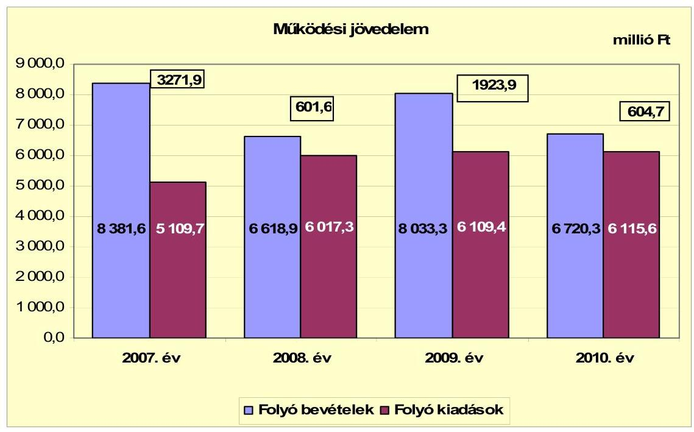

A vizsgált időszakban az Önkormányzat folyó költségvetési egyenlege, működési jövedelme pozitív összegű volt. Az Önkormányzat működés jövedelmét alapvetően a helyi adókból származó bevétel befolyásolta. A működési forrástöbblet a 2007-2009. években átlagosan a folyó kiadásokon belül 35,2%-os arányt képviselt. A 2010. évben csökkent, a folyó kiadások 9,9%-át (604,7 millió Ft-ot) jelentette. Ennek oka az volt, hogy a folyó kiadások nem csökkentek, a folyó bevételek teljesítése 12,5%-kal, közel egy milliárd Ft-tal (957,6 millió Ft) volt kevesebb a 2007-2009. évek átlagos értékénél (7677,9 millió Ft). Az előző évhez viszonyítva a 2008. évben a helyi adókból, pótlékaiból befolyt bevétel több mint két milliárd Ft-tal (2198,5 millió Ft) kevesebb, a 2009. évben 1515,4 millió Ft-tal több, a 2010. évben 889,2 millió Ft-tal kevesebb volt. A vizsgált időszakban a működési jövedelem 6402,1 millió Ft megtakarítást mutatott, amely forrásául szolgálhatott az Önkormányzat 2007-2009. évek közötti tőketörlesztési kötelezettségeinek teljesítéséhez, valamint a fejlesztések finanszírozásához.

---

Az Önkormányzat pénzügyi kapacitása (nettó működési jövedelem) alakulását az alábbi ábra szemlélteti:
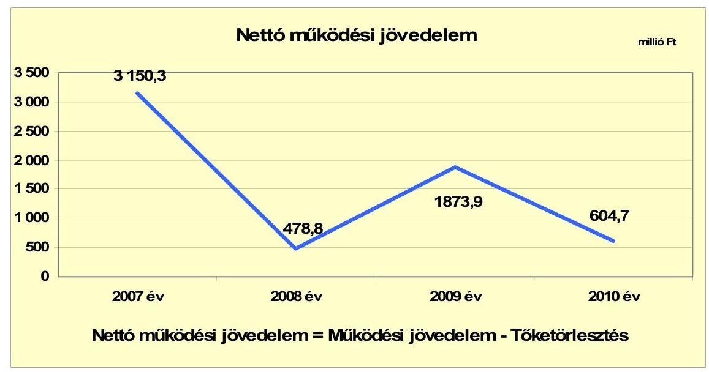

A pénzügyi kapacitása (nettó működési jövedelem) változóan alakult. A nettó működési jövedelem ${ }^{13}$ a 2007-2009. évek között átlagosan 1834,3 millió Ft volt, a 2010. évben 67%-kal (604,7 millió Ft-ra) csökkent. A nettó működési jövedelem csökkenését lényegesen 2008. évben befolyásolta a fejlesztési célú hitelekhez kapcsolódó tőketörlesztés, mely a működési jövedelem 20,4%-át (122,8 millió Ft) tette ki. A pénzügyi kapacitás 2007-hez viszonyított romlását a folyó bevételekből és kiadások különbségéből származó - a 2009. év kivételével - működési jövedelem csökkenése (folyó bevételeken belül a helyi adóbevételek csökkenése) okozta.

[^0]
[^0]:    ${ }^{13}$ Pénzügyi kapacitás

---

A felhalmozási költségvetés egyenlegét a 2007-2010. évek között az alábbi ábra szemlélteti:
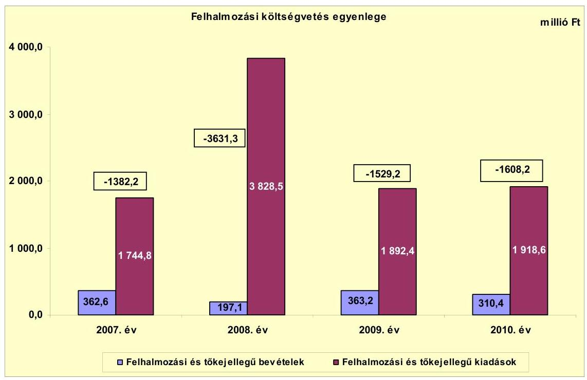

A 2007-2010. években az Önkormányzat felhalmozási költségvetésének egyenlege folyamatosan negatív előjelű volt. A forráshiány oka az EU-s támogatással megvalósuló fejlesztések utófinanszírozása volt.

A vizsgált időszakban képződött 8151,0 millió Ft felhalmozási forráshiány fedezetét a 6402,1 millió Ft összegű működési megtakarítás (működési jövedelem), a 2007. január 1-jén rendelkezésre álló 3028,5 millió Ft pénzkészlet biztosította. A felhalmozási forráshiány körültekintő költségvetési gazdálkodás és pénzügyileg fenntartható
 ${ }^{14}$ beruházások esetén nem jár magas pénzügyi kockázattal, amennyiben a működési jövedelem képződése változatlan feltételekkel a jövőben is biztosított lesz.

Az Önkormányzatnak a CLF módszer szerint a 2007. évben 1768,1 millió Ft, 2009. évben 344,7 millió Ft pénzügyi többlete, a 2008. évben 3152,6 millió Ft, 2010-ben 1003,5 millió Ft finanszírozási hiánya ${ }^{15}$ volt, melyet előző évi pénzmaradványból finanszírozott. A 2007. évi módosított pénzmaradvány összege 4220,1 millió Ft (a kötelezettséggel terhelt pénzmaradvány összege 2060,1 millió Ft), a 2009. évi költségvetési pénzmaradvány 2038,0 millió Ft volt. Az Önkormányzatnak hitelt kizárólag az átmeneti likviditási hiány kezelésére kellett igénybe vennie.

[^0]
[^0]:    ${ }^{14}$ Az minősül pénzügyileg fenntartható beruházásnak, amelynek újként megjelenő, vagy többletként jelentkező működtetési költségeire az Önkormányzat nettó működési jövedelme a következő években is fedezetet nyújt.
    ${ }^{15}$ A nettó működési jövedelem és a felhalmozási költségvetés egyenlegeinek összege.

---

A finanszírozási célú pénzügyi műveletek egyenlegének 2007-2010. évekbeli alakulását a következő ábra szemlélteti:
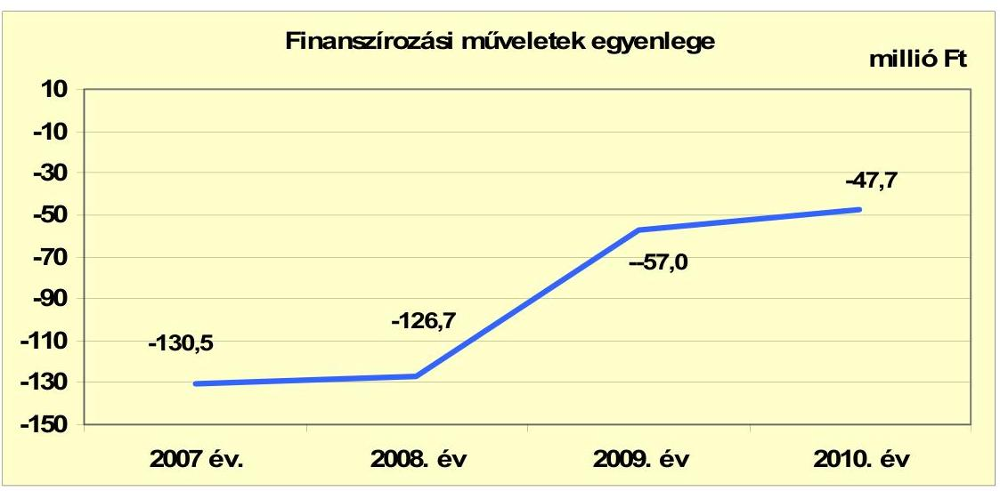

A finanszírozási célú műveleteket a jelentés 2. számú mellékletének 4.14.8. pontjai részletezik. Az Önkormányzat zárszámadási rendeletében a működési és fejlesztési többletet és hiányt a hagyományos költségvetési szerkezet alapján mutatta be, amelyről a jelentés 1. számú melléklete nyújt tájékoztatást. A zárszámadási rendeletek a 2007-2010. évekre a 2007. évben 2037,2 millió Ft bevételi többletet, 2008. évben 3021,4 millió Ft, 2009. évben 1513,4 millió Ft, 2010. évben 1054,4 millió Ft hiányt jeleztek.

Az Önkormányzat kamatbevételeit és kamatkiadásait 2007-2011. év I. féléve között a következő ábra mutatja be:
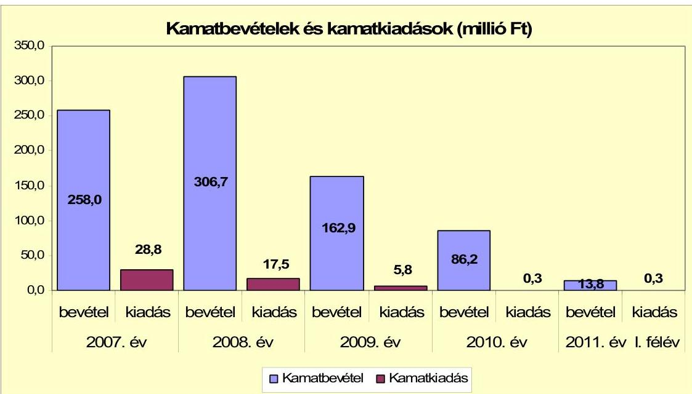

---

A 2007-2011. év I. félév között az Önkormányzat összesen 827,6 millió Ft kamatbevételhez jutott. A kamatráfordítás az átmenetileg szabad pénzeszközökön belül mindössze a kamatbevétel 6,4%-át (52,7 millió Ft) jelentette. A kamatbevételek a 2007-2009. években átlagosan 242,5 millió Ft-ot jelentettek, a 2010. évben ennek 35,5%-át (86,2 millió Ft-ot) érték el. A kamatkiadások folyamatosan csökkentek, a 2010-2011. év I. félévében jelentéktelen nagyságrendet képviseltek.

# 2.2. Az Önkormányzat bevételeinek változása 

Az Önkormányzat folyó bevételei a 2007-2009. évi átlagos 7677,9 millió Ft-ról a 2010. évben 12,5%-kal (957,6 millió Ft) csökkentek.

Az Önkormányzat a 2007-2011. év I. félévek között realizált folyó bevételei jogcímeinek számszaki adatait az alábbi ábra mutatja be:
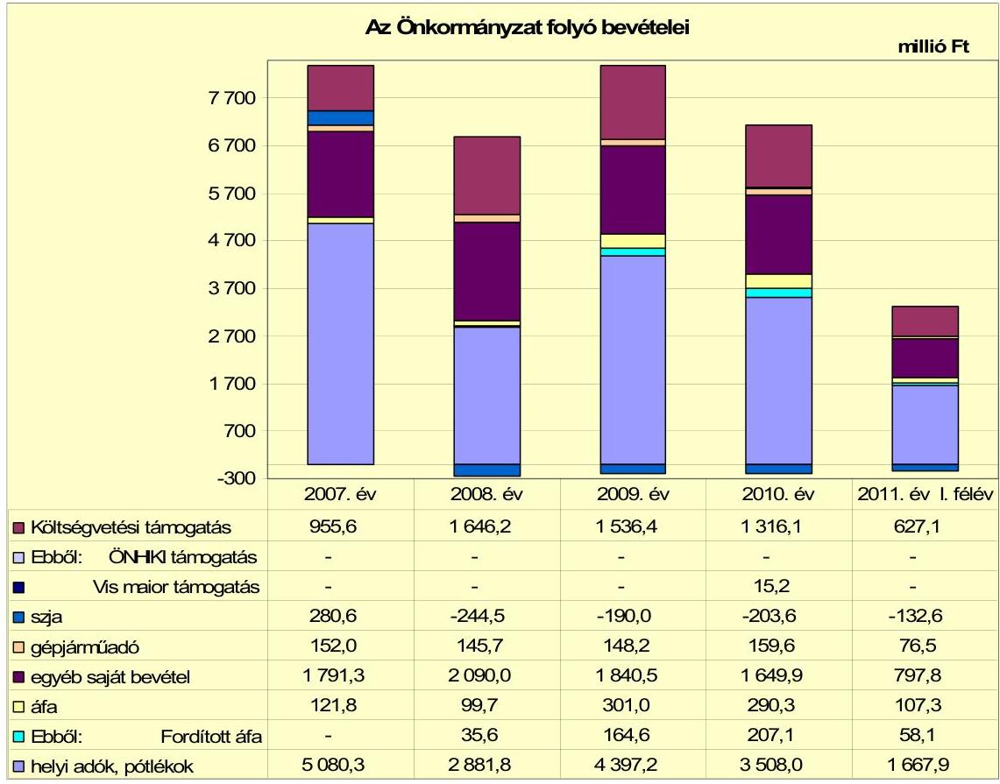

A költségvetési támogatások és az átengedett szja 2007-2009 közötti éves átlaga 1328,1 millió Ft volt, melyhez viszonyítva a 2010. évi együttes összeg 13,8%-kal (215,6 millió Ft-tal) csökkent. A vizsgált években az előző évhez viszonyítva a 2008. évben 13,9%-kal (165,5 millió Ft) több, a 2009. évben 3,9%-kal (55,3 millió Ft) kevesebb forrást kapott az Önkormányzat az államtól ezeken a jogcímeken. A támogatás 2010. évi csökkenését a normatív állami hozzájárulás és a központosított támogatás csökkenése okozta. Az óvodai ellátásnál 22,0%-kal (37,1 millió Ft), az általános iskolai oktatásnál 18,3%-kal (61,0 millió Ft), a közművelődésnél 88,2%-kal (23,2 millió Ft) csökkent a támogatás összege, az ellátotti létszám növekedése mellett. Ennek oka a forrásszabályozásban bekövetkezett változás volt. A központosított támogatás csökkenésének oka az volt, hogy jogszabályi változás miatt 2010. évben a saját forrásból megvalósított beruházások és felújítások után a 25% központosított támogatás már nem volt igényelhető.

A 2008-2010. években az Önkormányzat a jövedelemdifferenciálásának mérséklése során beszámítási pozícióba került. A 2008. évben az szja helyben maradó része 316,0 millió Ft, a jövedelemkülönbség mérséklése -560,5 millió Ft volt, így a beszámítás összege -244,5 millió Ft. A 2009. évben a beszámítás -190,0 millió Ft-ra csökkent, mivel a helyben maradó rész 353,6 millió Ft-ra nőtt, a jövedelemkülönbség mérséklése -543,6 millió Ft-ra csökkent. A 2010. évben az szja helyben maradó része 351,5 millió Ft, a jövedelemkülönbség mérséklése -555,1 millió Ft volt, a beszámítás -203,6 millió Ft-ot jelentett.

A költségvetési támogatások összege tartalmazza a fejlesztési célú támogatásokat is. A 2007. évben cél- és címzett támogatásban 103,1 millió Ft, belterületi útfelújítás címen 18,9 millió Ft támogatást kapott az Önkormányzat. A 2008. évben a címzett támogatás összege 47,7 millió Ft volt, a 2009. évben a bölcsődék és oktatási intézmények infrastruktúra fejlesztésére 19,0 millió Ft fejlesztési célú támogatásban részesültek. A 2010. évben 15,2 millió Ft vis maior támogatásban és 15,0 millió Ft infrastruktúrafejlesztési támogatásban részesült.

Az Önkormányzat a 2007-2011. években négy helyi adónemet, a helyi iparűzési adót, építményadót, telekadót és az idegenforgalmi adót vezette be. Az iparűzési adónál a maximális adómértéket, 2%-ot alkalmaztak a vizsgált években. Az építményadónál a nem lakás céljára szolgáló építmények után fizetendő adómértéket 80 Ft/m²-300 Ft/m² a telekadónál 100 Ft/m²-200 Ft/m² összegben állapították meg. Az idegenforgalmi adó mértékét vendégéjszakánként és személyenként 300 Ft-ban, az üdülésre pihenésre alkalmas épületeknél 100 Ft/m² összegben határozták meg. A helyi adók mértékét az ideiglenes jelleggel végzett tevékenység esetében 2011. február 11-től egységesen 5000 Ft/naptári napban állapították meg. A többi adónemnél a mértéken nem változtattak. A helyi adók esetében 2010. január 1-jétől a mentességek körét bővítették a 70. életévüket betöltött magánszemélyekkel.

Az Önkormányzatnál a helyi adókból és pótlékokból származó bevételek nagyságrendje 2007-2010 között változó volt, 2881,8-5080,3 millió Ft (43,5-60,6%) között mozgott a folyó bevételekben.

A vizsgált időszakban helyi adóbevételek 89,0%-át az iparűzési adóbevétel tette ki. Az adózók száma lényegesen nem változott (évente megközelítőleg 2000 volt). Az iparűzési adó ingadozását (883,2 millió Ft - 2221,2 millió Ft) a legnagyobb adófizető gazdasági társaság évente lényegesen eltérő adóalapja okozta. A gazdasági társaság 2007. évben 4668,6 millió Ft (helyi adóbevétel 91,9%-a), 2008. évben 2447,4 millió Ft (84,9%), a 2009. évben 3970,2 millió Ft (90,3%), a 2010. évben 3086,9 millió Ft (88,0%) iparűzési adót fizetett. A helyi adóbevételek egy adófizetőtől való erős függősége az Önkormányzat pénzügyi egyensúlyi helyzetének alakulásában kockázati tényezőt jelent. A helyi adóbevételek évek közötti változó nagyságrendje, lényegesen befolyásolta a működési jövedelem évenkénti alakulását.

---

Az Önkormányzatnak tulajdonosi részesedései után osztalékbevétele nem származott, úgy döntöttek, hogy azt a gazdasági társaságok fejlesztésre fordíthatják.

Az Önkormányzat felhalmozási bevételei a vizsgált időszakban a következőképpen alakultak:

| Megnevezés | 2007. év | 2008. év | 2009. év | 2010. év | 2011. év I.   félév |
| :-- | --: | --: | --: | --: | --: |
| Tárgyi eszköz értékesítés | 281,3 | 23,4 | 132,3 | 4,8 | 0,00 |
| Egyéb saját tőkebevétel | 8,6 | 17,8 | 16,5 | 88,3 | 18,30 |
| Államháztartáson belülről   kapott támogatás | 24,8 | 80,6 | 198,5 | 212,9 | 5,10 |
| EU-tól és külföldről kapott   támogatások | 1,7 | 0,0 | 0,0 | 1,9 | 0,00 |
| Államháztartáson kívülről   kapott támogatás | 46,2 | 75,3 | 15,9 | 2,5 | 1,60 |
| Összes felhalmozási bevétel | 362,6 | 197,1 | 363,2 | 310,4 | 25,00 |

A felhalmozási bevételek 2007-2010. években átlagosan 308,3 millió Ft-ot jelentettek az önkormányzatnak. A tárgyi eszközök értékesítéséből származó bevétel változó volt, a 2007. és a 2009. évi bevételek döntően földterület értékesítéséből adódtak. A 2009. és 2010. évben az államháztartáson belülről kapott támogatások a felhalmozási bevételek 54,7%-át, illetve 68,6%-át jelentették. A támogatások elsősorban az EU-s pályázattal megvalósuló fejlesztések bevételei voltak (2009. évben az Ipari Park csapadékvíz elvezetése, a 2010. évben az Otthonteremtési támogatás).

Az önkormányzati tulajdonú, illetve kötelező közszolgáltatási feladatot ellátó gazdasági társaságok bevételeit a 4. számú melléklet mutatja be.

# 2.3. Az Önkormányzat folyó és felhalmozási célú kiadásainak változása 

Az Önkormányzat folyó kiadásai az alábbiak voltak:

|  |  |  |  |  | millió Ft |
| :-- | --: | --: | --: | --: | --: |
| Megnevezés | 2007. év | 2008. év | 2009. év | 2010. év | 2011. év I.   félév |
| Folyó kiadások | 5109,7 | 6017,3 | 6109,5 | 6115,6 | 2828,2 |
| Működési kiadások (kamatkiadás nélkül) | 4641,9 | 5296,6 | 5511,7 | 5565,9 | 2458,8 |
| Államháztartáson belülre átadott   pénzeszközök | 70,2 | 87,2 | 39,1 | 89,5 | 138,2 |
| Transzferkiadások | 248,4 | 314,1 | 358,5 | 390,3 | 231,1 |
| -ebből: vállalkozásoknak | 44,1 | 73,8 | 102,9 | 70,4 | 58,6 |
| EU-nak, illetve külföldre | 4,1 | 5,3 | 0,0 | 3,7 | 0,0 |
| magánszemélyeknek | 79,6 | 92,5 | 135,9 | 171,3 | 0,0 |
| nonprofit szervezeteknek | 120,6 | 142,4 | 119,7 | 144,9 | 88,3 |
| Kamatkiadások | 28,8 | 17,5 | 5,8 | 0,3 | 0,3 |
| Előző évi pénzmaradvány átadás | 120,4 | 301,9 | 194,4 | 69,6 | 0,0 |

---

A kiemelt működési előirányzatok változását az alábbi táblázat szemlélteti:

| Megnevezés | 2007. év | 2008. év | 2009. év | 2010. év | 2011. év I.   félév |
| :-- | --: | --: | --: | --: | --: |
| Személyi juttatások | 2319,9 | 2606,8 | 2558,0 | 2547,0 | 1196,2 |
| Munkaadót terhelő járulékok | 699,9 | 776,8 | 718,3 | 631,3 | 303,8 |
| Dologi kiadások | 1653,0 | 1884,7 | 2206,7 | 2275,5 | 921,1 |
| Egyéb folyó kiadások | 22,9 | 25,9 | 26,7 | 107,6 | 37,4 |

A kiemelt működési előirányzatokon belül a személyi juttatások kiadásaira 2007-2009. években átlagosan 2494,9 millió Ft-ot fordítottak. A dologi kiadások átlagosan 1919,2 millió Ft-ot tettek ki. A személyi juttatások a 2008. évben 12,4%-kal (286,9 millió Ft) emelkedtek, melynek járulékvonzata 76,9 millió Ft volt. Az emelkedés bérpolitikai intézkedések, a 13. havi személyi juttatás, a közoktatásban a gimnázium átvételéből adódó létszámnövekedés, a Polgármesteri hivatalnál a létszámfejlesztés okozta. A dologi kiadások 2008. évhez viszonyított 2009. évi 17,1%-os (322,0 millió Ft) emelkedését a fejlesztésekhez kapcsolódó áfa 67,5%-kal (224,4 millió Ft) és a szolgáltatási díjak 10,2%-kal (103,3 millió Ft) történő emelkedése okozta.

A folyó kiadások a kórházi fekvőbeteg ellátás nélkül az alábbiak szerint alakultak:

| Megnevezés | 2007. év | 2008. év | 2009. év | 2010. év | 2011. év I.   félév |
| :-- | --: | --: | --: | --: | --: |
| Folyó kiadások | 4082,7 | 4874,3 | 4988,0 | 4974,7 | 2284,7 |
| Működési kiadások (kamatkiadás nélkül) | 3614,9 | 4153,6 | 4390,2 | 4425,0 | 1915,1 |
| Kamatkiadás | 28,8 | 17,5 | 5,8 | 0,3 | 0,3 |
| Személyi juttatások | 1790,5 |

 2012,4 | 1989,4 | 1969,2 | 927,0 |
| Munkaadót terhelő járulékok | 699,9 | 776,8 | 556,5 | 484,2 | 233,3 |
| Dologi kiadások | 1262,0 | 1517,0 | 1817,7 | 1876,5 | 722,9 |
| Egyéb folyó kiadások | 21,8 | 24,5 | 24,2 | 79,2 | 31,6 |
| Működési célú pénzeszközátadás | 318,6 | 401,3 | 397,6 | 479,8 | 369,3 |

Az Önkormányzat folyó kiadásai a 2007-2009. évek között átlagosan 4648,3 millió Ft-ot jelentettek. A 2010. évben az előző évek átlagához viszonyítva 7,0%-kal, 326,4 millió Ft-tal emelkedtek. A folyó kiadásokon belül meghatározó volt a működési kiadások aránya (átlagosan 87,2%). A működési kiadásokon belül a dologi kiadások a 2007-2009. évek 1532,2 millió Ft átlagát a 2010. évben 22,5%-kal (3443,3 millió Ft) meghaladták. A működési célú pénzeszközátadás változóan alakult, a 2007-2009. évek átlaga 372,5 millió Ft volt. A 2010. évben az átlaghoz viszonyítva 28,8%-kal (107,3 millió Ft) nőtt. Az Önkormányzat a kórháznak a 2007-2009 évek átlagában 204,7 millió Ft működési célú pénzeszközt adott át. A 2010. évben a támogatás 52,7%-kal, 108,0 millió Ft-tal haladta meg az előző évek átlagát.

---

A folyó és a felhalmozási kiadásokat 2007-2011. év I. félév közötti időszakban az alábbi ábra szemlélteti:
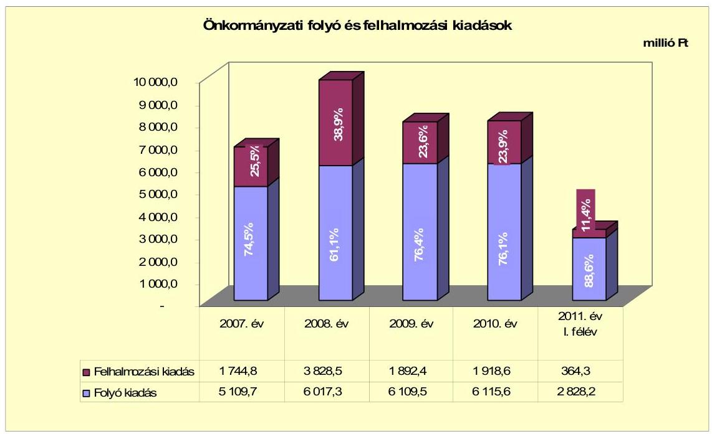

A 2007-2009. években a folyó kiadások és felhalmozási kiadások aránya átlagosan 66,7%-33,3% (4387,8 millió Ft és 2488,6 millió Ft) volt. A 2010. évben a felhalmozási kiadások aránya 23,9%-ra (1918,6 millió Ft) csökkent. A 2008. évi 38,9%-os felhalmozási kiadás arány (3828,5 millió Ft) a 2007. évi 3150,3 millió Ft nettó működési jövedelem eredménye, mely lehetőséget biztosított további fejlesztésekhez.

Az Önkormányzat által 2007-2010. között megvalósított, 2010. december 31-ig befejezett felújítások (27) és fejlesztések (65) száma 92 volt. A tervezett bekerülési költség 10037,8 millió Ft volt. A vizsgált időszakban 6410,5 millió Ft összegű ráfordítást számoltak el, melynek 92,7%-át (5942,3 millió Ft-ot) saját bevételből finanszírozták. A kiadások további fedezetét 4,2%-ban (268,4 millió Ft-ot) EU-s forrásból, 3,1%-át (203,7 millió Ft-ot) hazai támogatás biztosította.

Az Önkormányzatnál 2010. december 31-én 10 millió Ft alatti felújítások keretében nyolc fejlesztés volt folyamatban. A felújítások és fejlesztések várható bekerülési költsége 2719,6 millió Ft, melyből 786,3 millió Ft (28,9%) kiadás a 2007-2010. években teljesült. A kiadások 61,4%-át (482,5 millió Ft) saját bevételből, 37,5%-át (295,0 millió Ft) EU-s, 1,1%-a (8,8 millió Ft) hazai finanszírozásból történt. A 2010. utáni kötelezettségvállalások összege 1933,3 millió Ft, mely a várható bekerülési költség 71,1%-át teszi ki. A felmerülő kiadások 49,5% (957,0 millió Ft-ot) saját bevételből, 50,5%-át (976,3 millió Ft-ot) EU-s támogatásból fedezik.

Az Önkormányzat egy fejlesztéshez kapcsolódó, beadott, elbírálás alatt álló pályázattal rendelkezett. A pályázatot a Közlekedésfejlesztési Koordinációs Központ „NFM Útpénztár Előirányzat” finanszírozásában hirdetették meg. Az országos közutakon a forgalom csillapítására, a gyalogosok védelmének növe-

---

lésére kiírt pályázat teljes bekerülési költsége 14,7 millió Ft. A beruházás bekerülési költségének 10%-át (1,5 millió Ft-ot) saját bevételből, 90%-át (13,2 millió Ft-ot) a hazai támogatásból tervezik megvalósítani. A 2011. év I. félévében saját forrásból indított fejlesztések teljes bekerülési költsége 165,5 millió Ft volt, melyre 86,4 millió Ft kifizetés történt. A fennálló kötelezettségek összege 79,1 millió Ft.

A saját forrásból indított fejlesztések ingatlanvásárlás, mobilszínpad beszerzés, kórházi eszközbeszerzés és 10 millió Ft alatti fejlesztések voltak.

Az Önkormányzat három legmagasabb bekerülési költségű beruházásai a vizsgált időszakban az alábbiak voltak:

- 2008. évben az Ipari Park csapadékvíz elvezető rendszerének kiépítésére nyújtott be pályázatot az Önkormányzat. A kivitelezés 2008 decemberében műszakilag fejeződött be. A beruházás tervezett összköltsége 791,6 millió Ft, tényleges bekerülési költsége 785,4 millió Ft volt. A megvalósított beruházás forrásösszetétele 188,6 millió Ft EU támogatás, 596,8 millió Ft saját bevétel.
- 2009. évben az Önkormányzat pályázatot nyújtott be „Komárom Város Önkormányzata Feszty Iskola és Csillag Óvoda energetikai korszerűsítése” tárgyában. A beruházás keretében megtörtént a két intézmény teljes szigetelése, a nyílászárók cseréje, kondenzációs kazánok és szabályozórendszer beépítése, a világítás korszerűsítése és napkollektorok kerültek az épületekre. A beruházás műszakilag 2010. évben befejeződött, a beruházási költség 443,6 millió Ft volt, melyhez 92,1 millió Ft EU támogatás kapcsolódott a saját bevétel mellett.
- 2008. évben az Önkormányzat a Mol városrészen levő ingatlanok vásárlásáról és azok korszerűsítéséről döntött. A fejlesztés kultúrház, szálloda épület, étkezde, orvosi rendelő és lakások vásárlását érintette. A fejlesztés tervezett összköltsége 305,0 millió Ft, tényleges bekerülési költsége 303,1 millió Ft volt. A megvalósításra az Önkormányzat saját bevételei nyújtottak fedezetet.

---

Az Önkormányzat által a gazdasági társaságoknak a 2007-2010. év I. félév között átadott pénzeszközöket az alábbi ábra szemlélteti:
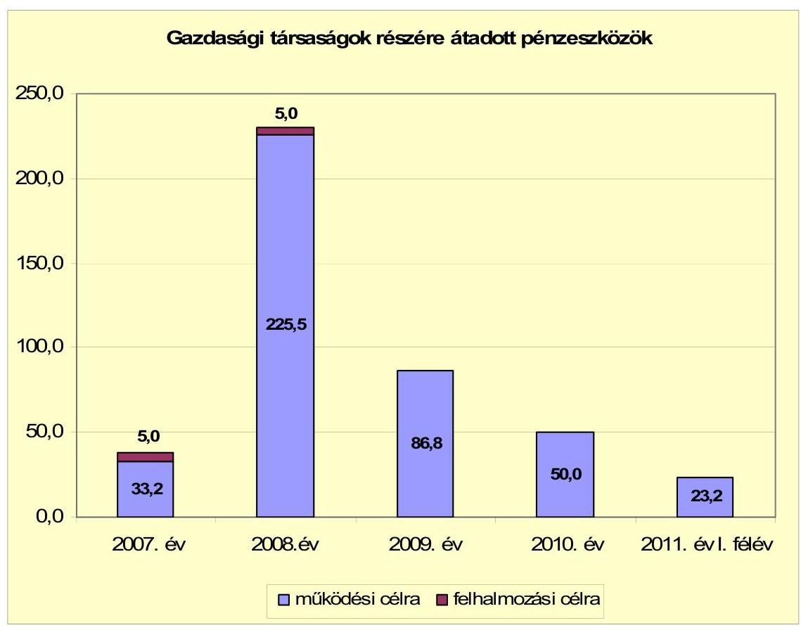

A gazdasági társaságoknak az Önkormányzat a 2007-2011. év I. félév között összesen 428,7 millió Ft pénzeszközt adott át, ebből az Önkormányzat gazdasági társaságai 312,7 millió Ft-ot működési és 10,0 millió Ft-ot felhalmozási célra kaptak. A gazdasági társaságok adatait a jelentés 4. számú melléklete mutatja be. A kiemelt közfeladatot ellátó tömegközlekedést biztosító gazdasági társaságnak a 2007-2010. években működési célra adott át pénzeszközt az Önkormányzat. A pénzeszközátadások összege a 2007. évi 5,0 millió Ft-ról 2008-ban hatszorosára, 30,0 millió Ft-ra, 2009-ben 54,0 millió Ft-ra (80%-kal) emelkedett, majd 2010-ben 17,0 millió Ft-ra (68,5%-kal) csökkent. Ennek oka az volt, hogy az Önkormányzat Képviselő-testülete a normatív állami támogatás átadásán kívül évente eltérő nagyságrendű működési célú pénzeszközátadásról döntött a gazdasági társaság részére. A gazdasági társaságoknak átadott pénzeszközöket az Önkormányzat megfelelő kontroll mellett adta át, a szerződésekben foglaltak alapján a szolgáltatást a gazdasági társaságok biztosították.

Az Önkormányzat gazdasági társaságainak pénzügyi egyensúlyi helyzete a saját tőke/jegyzett tőke aránya alapján egy kft. kivételével stabil. Az Önkormányzat gazdasági társaságai közül a Komturist Kft. a gazdasági évet 2008. évtől folyamatosan negatív eredménnyel zárta. A saját tőke összege a 2010. év végén 16,7 millió Ft, ami a 37,4 millió Ft jegyzett tőkének 44,7%-a. Tőkepótlási kötelezettségének az Önkormányzat azért nem tett eleget, mert a tartósan veszteséges, önként vállalt feladatot ellátó gazdasági társaság további működését nem tartja szükségesnek.

---

Az Önkormányzat kizárólagos és többségi tulajdonosi részesedésével működő gazdasági társaságainál a saját tőke/jegyzett tőke aránya összességében 1,19 volt. A jegyzett tőke összege a 2010. évben 2072,0 millió Ft volt, a 2006. december 31-i állapothoz képest 855,7 millió Ft-tal nőtt. A jegyzett tőke növekedését meghatározta, hogy az Önkormányzat 2007-2010. évek közötti időszakban három gazdasági társaságát több alkalommal is tőkejuttatásban részesítette. Tőkejuttatásban részesült a SAXUM Kft. két alkalommal, összesen 62,3 millió Ft, a Távhő Kft. négy alkalommal, összesen 94,3 millió Ft, valamint a Vízmű Kft. négy alkalommal, összesen 685,2 millió Ft összegben. A gazdasági társaságok kötelező önkormányzati feladatokat látnak el, a tőkejuttatást az Önkormányzat a feladatok ellátásához szükséges fejlesztések finanszírozásához biztosította.

# 3. Az ÖNKORMÁNYZAT KÖTELEZETTSÉGEI 

### 3.1. Az Önkormányzat pénzintézeti kötelezettségeinek változása

Az Önkormányzat pénzintézeti kötelezettségeinek állománya 2006. december 31-én 290,0 millió Ft volt. 2007. december 31-én 170,0 millió Ft, ebből rövidlejáratú kötelezettség 120,0 millió Ft volt. A 2008. december 31-én csak rövidlejáratú pénzügyi kötelezettségekkel rendelkeztek 50,0 millió Ft összegben. Ezt követően az Önkormányzatnak pénzintézettel szemben kötelezettsége nem volt. Kötelezettségei még a 2006. év december 31. előtt a számlavezető pénzintézetével megkötött fejlesztési hitelszerződéseiből adódtak. A hitelszerződések alapján a hitelek HUF alapúak, igénybevételével, törlesztésével, egyéb költségeivel kapcsolatos elszámolás is HUF-ban történt, így a pénzügyi kötelezettségek alakulását árfolyamváltozás nem befolyásolta.

Az önkormányzat pénzintézettel szemben fennálló kötelezettségeinek állományát 2006. december 31-től 2011. június 30-ig az alábbi ábra szemlélteti:
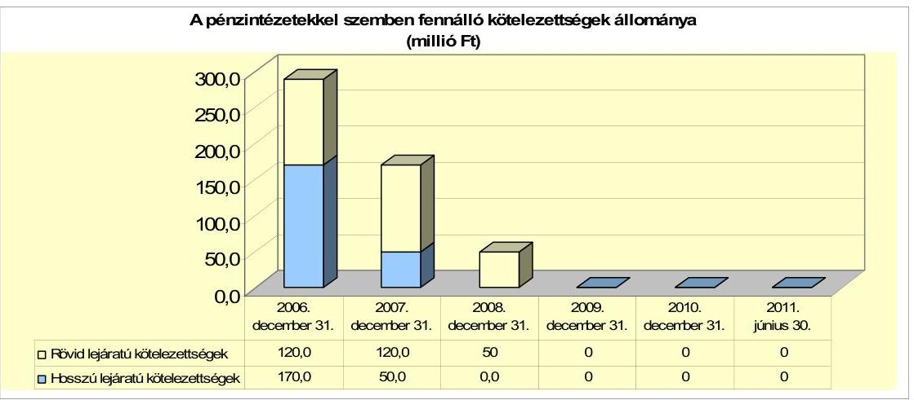

Fejlesztési célra 2003. december 29-én kelt hitelszerződésben 250,0 millió Ft, 2004. december 30-án kelt szerződésben pedig 150,0 millió Ft összegű hosszúlejáratú hitel felvételére kötött megállapodást az Önkormányzat a számlavezető bankjával. A 250,0 millió Ft összegű hitelszerződést 2004. február 10-én módosították. A hitelszerződés módosítása keretében az igénybe vehető hitel összege 210,0 millió Ft-ra csökkent. A felvett hitelekkel kapcsolatos első törlesztés időpontja 2006. november 22., összege 70 millió Ft volt.

---

A hitelek visszafizetése megtörtént. Az Önkormányzat fennálló pénzintézeti kötelezettségeivel kapcsolatban 2007-2009 évek között tőketörlesztésre 290,0 millió Ft, kamat címén 51,5 millió Ft, egyéb költség címen 1,7 millió Ft kifizetést teljesített.

A 2007 előtt felvett hosszúlejáratú fejlesztési hiteleket az Önkormányzat a 2007. évet megelőzően befejezett fejlesztések finanszírozására fordította. A hitelszerződésekben konkrét fejlesztési célokat nem határoztak meg.

A 2007-2011. I. félévében az Önkormányzat a gazdasági programjában foglaltakkal összhangban hosszú és rövidlejáratú fejlesztési és működési célú hitel igénybevételéről, kötvény kibocsátásáról nem döntött. Így az adósságot keletkeztető kötelezettségek vizsgálatára sem került sor.

Az Önkormányzat gazdasági programjában célul tűzték ki, hogy: „a 2007-2010. évi önkormányzati ciklusban az Önkormányzat adósság állománya nullára csökkenjen, hitelfelvételre lehetőleg ne kerüljön sor. Nem szabad Komárom jelenlegi jó pénzügyi-gazdasági stabilitását veszélyeztetnünk”.

Az Önkormányzatnak 2010. december 31-én és 2011. év június 30-án pénzintézettel szemben, pénzügyi kötelezettsége nem volt. Kötvényt nem bocsátott ki.

Az Önkormányzat átmeneti likviditási problémái miatt 2007-2010. években vett igénybe folyószámlahitelt. A hitelkeret összege 2007. január 1. - 2009. január 19. között 90,0 millió Ft, 2009. január 20. - 2011. január 13. között 45,0 millió Ft volt. A hitelt 2007. évben 10 napig, 2008. évben 16 napig, 2009. évben egy napig, 2010. évben öt napon át vette igénybe az engedélyezett hitelkerethez mérten nem meghatározó nagyságrendben. 365 napos osztószámmal számolva 2007. évben a hitel átlagos napi állománya 2,5 millió Ft, 2008. évben 3,9 millió Ft, 2009. évben 0,2 millió Ft, 2010. évben 0,6 millió Ft volt. A 2011. év I. félévében likviditási hitel igénybevételére nem került sor. A mérlegkészítés, valamint a hitelkeret lejáratának időpontjában az Önkormányzatnak folyószámlahitel állománya nem volt.

A korábbi évek alacsony hitelállománya, valamint a 2011. év I. félévének adatai alapján arra számítottak, hogy saját bevételeik fedezetet nyújtanak esedékes kiadásaikra, ezért 2011. évre a folyószámla hitelkeret szerződésüket a lejáratát követően nem hosszabbították meg. A 2011. év II. félévétől azonban az Önkormányzat ismételten folyószámlahitel igénybevételére kényszerült, 2011. július 7-i dátummal a számlavezető pénzintézettel újabb folyószámlahitel szerződés megkötésére intézkedtek. A hitel igénybevételét a megnövekedett szállítói állomány indokolta, mely meghatározó részben az EU-s támogatásokkal megvalósuló fejlesztések saját forrásból történő előfinanszírozásával volt kapcsolatos.

---

Az önkormányzatnál a folyószámlahitelt 2007-2011. június 30. között az alábbi táblázat szemlélteti:

| Megnevezés | 2007. év | 2008. év | 2009. év | 2010. év | 2011. év I.   félév |
| :-- | --: | --: | --: | --: | --: |
| Folyószámlahitel |  |  |  |  |  |
| a folyószámlahitel keretösszege január 1-jén

 | 90,0 | 90,0 | 45,0 | 45,0 | 45,0 |
| teljesített kamat és egyéb költség | 0,2 | 0,7 | 0,9 | 0,9 | 0 |

Munkabér megelőlegezési hitel igénybevételére nem került sor.
A folyószámlahitel kamat kondíciói és egyéb költségei a következők voltak ${ }^{16}$ :

| Megnevezés | Kamat (referencia+ kamatfelár) | Egyéb költség |
| :--: | :--: | :--: |
| Folyószámlahitel |  |  |
| 2007-2008. év | $19 \%$ | 2,0\% rendtart. jut. |
| 2009-2011. év | 1 havi BUBOR $+3 \%$ | 2,0\% rendtart. jut. |

Az Önkormányzatnak 2007-2008. években az igénybevett folyószámlahitel után fix kamatot kellett fizetnie. Változó kamat kondíció meghatározására a 2009. évi hitelszerződés módosításával tértek át. A folyószámlahitelekkel kapcsolatosan a vizsgált időszakban az Önkormányzatnak 0,2 millió Ft összegű kamat és 2,5 millió Ft egyéb költségfizetési kötelezettsége keletkezett.

A 2007. évet megelőzően felvett hosszú lejáratú fejlesztési hitelekkel kapcsolatosan a fizetendő kamat összegét a pénzintézet egy havi BUBOR + évi $2 \%$ nagyságrendben határozta meg. A kamatot és járulékos költségeit az önkormányzatnak negyedéves ütemezésben kellett megfizetnie. Egyéb költség, kezelési díjként a 150,0 millió Ft összegű fejlesztési hitel esetében a tőketartozás 2,0%-át, a 210,0 millió Ft felvett hitel után a hitel 0,4%-át kellett megfizetni. Mindezek figyelembe vételével az önkormányzatot 146,8 millió Ft kamat és 3,4 millió Ft egyéb költség kifizetés terhelte, melyből 2007-2010 között 51,5 millió Ft kamat, és 1,7 millió Ft egyéb költség kifizetés jelentkezett.

[^0]
[^0]:    ${ }^{16}$ A referencia kamat az alábbiak szerint alakult:

    | MNB BUBOR fixing (állagkamat) %-ban |  |  |  |  |
    | :-- | :-- | :-- | :-- | :-- |
    | Referencia kamat | 2007. évi | 2008. évi | 2009. évi | 2010. év I.   félév |
    | 1 napi BUBOR | 7,78 | 8,41 | 8,39 | 4,95 | 5,33 |
    | 1 havi BUBOR | 7,83 | 8,75 | 8,66 | 5,47 | 6,00 |

---

Az Önkormányzat 2010. december 31-én, és 2011. június 30-án fennálló kötelezettségeinek változását az alábbi táblázat szemlélteti:

| Megnevezés | Állomány   2010.   december 31-   én | Állomány   2011. június 30   án | Várható   kötelezettség   2011-2013.   években | Várható   kötelezettség   2014. évtől |
| :-- | :--: | :--: | :--: | :--: |
|  | HUF-ban (millió   Ft-ban) | HUF-ban (millió   Ft-ban) | HUF-ban (millió Ft-   ban) | HUF-ban (millió   Ft-ban) |
|  | 4,6 | 3,8 | 3,8 | - |
| Lízing kötelezettségek | 58,0 | 509,0 | 509,0 | - |
| Szállítói tartozás | - | 17,2 | 17,2 | - |
| Egyéb kiadás elmaradás | 62,6 | 530,0 | 530,0 | - |
| Összesen |  |  |  |  |

Az Önkormányzatnak a pénzintézetekkel szemben az adott időpontokban kötelezettsége nem állt fenn, így az a későbbi időszak kötelezettségeinek alakulására nincs hatással.

Az Önkormányzat fennálló összes kötelezettsége 2010. december 31-én lízingszerződésből, szállítók felé fennálló, valamint egyéb tartozásokból adódott, összege 62,6 millió Ft, 2011. június 30-án 530,0 millió Ft volt. A fennálló kötelezettségek teljesítése a 2011-2013. években az Önkormányzat jövőbeni pénzügyi helyzetére kockázatot nem jelent. A kötelezettségekre pénzügyi fedezetet biztosít a 191,9 millió Ft mérlegben kimutatott követelésállomány és az elszámolásokat követően az egyes projektek megvalósításához elnyert európai uniós támogatások megtérülése.

# 3.2. A szállítói kötelezettségek változása 

Az Önkormányzat szállítói állománya a december 31-i adatok szerint 2006-ról 2007 évre 27,0 millió Ft-tal, 55,1%-kal nőtt, 2007 évről 2008 évre 43,8%-kal, 33,2 millió Ft-tal csökkent. Az ezt követő években a szállítók felé fennálló tartozás összege ismét emelkedett. A növekedés mértéke 2008-ról 2009-re 10,6 %, 3,0 millió Ft, 2010 évre az előző évhez mérten 27,1%, 12,4 millió Ft. Kiugróan magas, 509,0 millió Ft volt az Önkormányzat szállítói állománya 2011. év első félév végén. A növekedést az EU-s támogatással megvalósuló projektek utófinanszírozott számlái eredményezték.

A 2011. június 30-i állomány kivételével a szállítók felé fennálló kötelezettségen belül - bár változó mértékben - összességében meghatározó volt a kórház tartozása. A kórház szállítói állománya, annak aránya az Önkormányzat összes szállítói állományán belül az évek sorrendjében a következők szerint alakult: 2006. december 31-én 31,7 millió Ft 64,8%, 2007-ben 22,2 millió Ft 29,3%, 2008-ban 22,2 millió Ft 5,2%, 2009-ben 22,9 millió Ft 50,3%, 2010-ben pedig 25,4 millió Ft 43,8%, 2011. június 30-án 19,9 millió Ft 4,1% volt.

A szállítói állomány jelentős része lejárt tartozás. Aránya az összes szállítói állomány viszonylatában december 31-én a 2007. évben 63,2%, 47,9 millió Ft, 2008. évben 44,1%, 15,8 millió Ft, 2009-ben 22,3%, 10,2 millió Ft, 2010. évben 23,9 millió Ft, 41,2%, a 2011. év I. félév végén pedig 14,6% és 74,5 millió Ft

---

volt. Lejárt szállítói állománya a kórháznak 2006. december 31-én volt. Az Önkormányzatnak a vizsgált időszakban nem volt megállapodással átütemezett szállítói állománya. A lejárt szállítói állományon belül bár az egyes években ingadozott, de összességében nőtt a 60 napon túl lejárt tartozások mértéke, aránya (2007. december 31-én, a 60 napon túli lejárt szállítói állomány 31,6 millió Ft, 48,6% volt, 2010. december 31-én 36,1 millió Ft, 67,9%, 2011 június 30-án 40,5 millió Ft, 54,5%). A lejárt szállítói állományból a 90 napon túli lejárt szállítói tartozás összege 39,9 millió Ft volt 2011. június 30-án, amelynek kiegyenlítése a III. negyedévben megtörtént.

A lejárt szállítói állomány alakulását a kórház nélkül az alábbi ábra szemlélteti:
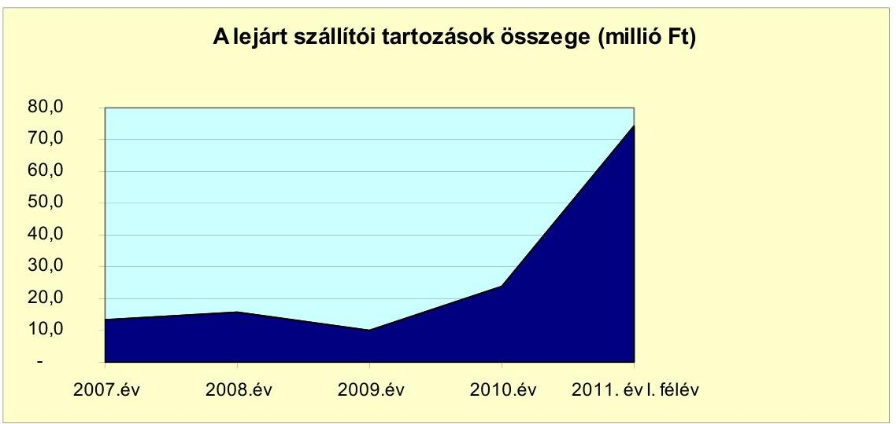

Az egyéb kiadáselmaradás összege 2011. június 30-án 17,2 millió Ft volt, mely ÁFA tartozásból adódott. Az Önkormányzat a kötelezettségét 2011. év II. félévében folyószámlahitel igénybevételével rendezte.

# 3.3. Egyéb kötelezettségek változása 

Az Önkormányzatnak a vizsgált időszakban két szerződésből adódóan állt fenn lízingtartozása. 2006. július 19-én az Intézmények Gazdasági Ellátó Szervezete kötött a Lombard Finanszírozási Zrt.-vel lízingszerződést az Idősek Otthona és Otthonháza részére történő gépjármű beszerzésre. A 3,9 millió Ft összegű, CHF-ben fennálló tartozás eredeti lejárati határideje 2011. július 15. volt. A 2008. április 8-án kelt szerződésmódosítás alapján a lízingdíjat 2008. év I. félévében visszafizették. A szerződésmódosítás keretében felszámított szerződésmódosítási díj, árfolyam különbözet együttes összege 0,2 millió Ft volt. Az UniCredit Leasing Hungary Zrt.-vel 2010. július 28-án kötöttek 6,2 millió Ft összegű pénzügyi lízingszerződést. A lízing tárgya, a Polgármesteri hivatalba beépítésre kerülő Siemens HiPath 3800 típusú telefon alközpont. A szerződésben foglaltak alapján a lízingdíjat, várható értéke 6,2 millió Ft, havi részletekben kell megfizetni. Az utolsó lízingdíj fizetésének határideje 2013. június 2.

Kezességet az Önkormányzat egy esetben vállalt gazdasági társaság kötelezettségéért. A 2007. dec. 20-án történt 10,0 millió Ft összegű kezességvállalással

---

kapcsolatos pénzügyi kifizetést az Önkormányzat 2008. évben két részletben teljesítette. A készfizető kezességvállalás oka az volt, hogy a város egyik lakótelepén a távhőt szolgáltató gazdasági társaság a MOL Nyrt. felé kötelezettségeit nem teljesítette. Annak érdekében, hogy a szolgáltatás a fűtési szezon végéig a lakosok felé biztosított legyen az Önkormányzat Képviselő-testülete úgy döntött, hogy készfizető kezességet vállal a MOL Nyrt.-nek 2008. április 15-éig. A kezességvállalásra kifizetett összeg a későbbiekben a szolgáltató gazdasági társasággal megkötött közmű átruházási szerződésben az Önkormányzatnak, mint vevőnek a vételárban beszámításra került.

PPP konstrukcióban az Önkormányzatnál fejlesztés nem valósult meg.
Az Önkormányzat adatszolgáltatása szerint követeléseket 2007-2011. év I. félévében 34,1 millió Ft összegben engedtek el. A követelés elengedést a Képviselőtestület engedélyezte, illetve az jegyzői hatáskörben történt. Az elengedett követelések helyi adóból, eszközhasználattal kapcsolatos bérleti díjból származó követelésekből adódtak.

Az Önkormányzat gazdasági társaságai részére a vizsgált években tagi kölcsönt, egyéb meghatározott feladatok megvalósításához a vizsgált években 143,5 millió Ft, civil és egyéb szervezetek részére 15,5 millió Ft kölcsönt folyósított. A kölcsön folyósítása testületi határozat alapján történt. A megkötött szerződésekben foglaltak szerinti ütemezésben az érintett szervezetek a kölcsönt visszafizették.

A 2007-2011. év I. félév időszakában az Önkormányzat tájékoztatása szerint adósságot keletkeztető kötelezettség vállalásaihoz nem kapcsolódott jelzálogjog alapítás.

Az Önkormányzat pénzügyi, vagyoni helyzetére közvetetten hatást gyakorol gazdasági társaságainak adósságállománya is.

Az Önkormányzat 2011. június 30-án hét gazdasági társaságban rendelkezett 50% feletti tulajdonosi részesedéssel. Öt gazdasági társaságban kizárólagos tulajdonos, kettőben minősített többségi tulajdonnal rendelkezik.

Az Önkormányzat 50% és azt meghaladó tulajdoni hányaddal rendelkező gazdasági társaságai adatszolgáltatása alapján a kötelezettségek alakulását az alábbi táblázat adatai szemléltetik:

| Megnevezés | Állomány 2010.   december 31-án | Állomány 2011.   június 30-án | Várható kötelezettség   2011-2013. években | Várható kötelezettség   2014. évtől |
| :--: | :--: | :--: | :--: | :--: |
|  | HUF-ban   (millió Ft-ban) | HUF-ban   (millió Ft-ban) | HUF-ban   (millió Ft-ban) | HUF-ban   (millió Ft-ban) |
| Pénzintézeti kötelezettségek | 0,0 | 0,0 | 0,0 | 0,0 |
| Lízing kötelezettségek | 2,1 | 6,7 | 3,7 | 3,0 |
| Jogerős végzéssel lezárt de ki nem   fizetett kötelezettségek | 0,0 | 0,0 | 0,0 | 0,0 |
| Szállítói tartozás | 164,0 | 145,8 | 145,8 |  |
| Összesen | 166,2 | 152,5 | 149,5 | 3,0 |

Az Önkormányzat a gazdasági társaságokról szóló 2006. évi IV. törvény 54. § (2) bekezdése alapján korlátlan felelősséggel tartozik azon gazdasági társaságának felszámolása esetében, amelyben az Önkormányzat az 52. § (2) bekezdése szerint a szavazatok legalább 75%-ával rendelkezik, így minősített befolyásszerzőnek

---

minősül, továbbá a csődeljárásról és a felszámolási eljárásról szóló 1991. évi XLIX. törvény 63. § (2) bekezdése alapján a kizárólagos önkormányzati tulajdonú gazdasági társaságának minden olyan kötelezettségéért, amelynek kielégítését a felszámolási eljárás során az adós társaság vagyona nem fedez, ha a hitelezőinek a felszámolási eljárás során benyújtott keresete alapján a bíróság - az adós társaság felé érvényesített tartósan hátrányos üzletpolitikájára figyelemmel - megállapítja az Önkormányzat korlátlan és teljes felelősségét.

Az Önkormányzat többségi tulajdonú gazdasági társaságai-nál a szállítók állománya a 2010. december 31-i 164,0 millió Ft-ról 2011. június 30-ra 145,8 millió Ft-ra, 9,3%-kal csökkent. Lejárt szállítói tartozása 2010. december 31-én három, 2011. június 30-án két gazdasági társaságnál jelentkezett, összege 55,1 millió Ft, illetve 98,0 millió Ft volt, mely e társaságok összes szállítói állományának 36,6%-át, illetve 78,1%-át jelentette.

Lízing tartozása egy gazdasági társaságnak (SAXUM Kft.) volt. A társaság 2006. október 12-én, valamint 2011. február 2-án kelt
 szerződésében kötött megállapodást tehergépjárművek lízingelésére, amely a társaságnak 2011-2013. években 6,7 millió Ft, 2014. évet követően 3,0 millió Ft kötelezettséget keletkeztetett. A lízingdíj utolsó részletének kifizetési határideje: 2016. február 15.

Az Önkormányzat és intézményei 2007-2010 között számviteli nyilvántartásukban az eszközállomány után 2190,0 millió Ft-t értékcsökkenést számoltak el. Felújítási alap képzése nem történt. A költségvetési előirányzatok felhasználása során felújításokra elszámolt kiadások összege 1615,9 millió Ft volt (7-8. számú tanúsítvány adatai alapján), mely az elszámolt értékcsökkenés 73,9%-ának megfelelő összeg. A felújítások forrása 1574,4 millió Ft saját forrás és 41,5 millió Ft hazai támogatás volt. Fejlesztési feladatokra 2007-2010. években 5580,9 millió Ft-ot (7-8. számú tanúsítvány adatai alapján) használtak fel.

A felújítások, fejlesztések következtében az eszközök használhatósága összességében javult, 2007-ben 81,6%, 2010. évben 83,1% volt. A bruttó eszközállományból a legnagyobb arányt az ingatlanok képviselték, 2010. évben 18 667,1 millió Ft, 85,1%. Az alacsony leírási kulcs miatt az eszközök nettó értéke is magas, melynek eredményeként a használhatósági fok is átlag feletti, 2010. évben az Önkormányzatnál 89,0% volt. Az üzemeltetésre átadott befektetett eszközök bruttó értéke 2007. évben 1331,5 millió Ft, 2010. évben 1569,6 millió Ft, a növekedés 17,9%-os volt. E vagyonelemek használhatósági foka a pénzügyi információs jelentés adatai szerint csökkent, 2007. évben 73,8%, 2010. évben 68,3%.

# 4. A PÉNZÜGYI EGYENSÚLY MEGTEREMTÉSE ÉRDEKÉBEN HOZOTT INTÉZKEDÉSEK EREDMÉNYE 

Az Önkormányzat számszerűsíthető kiadáscsökkentő intézkedést nem tett. A 2011. évben két intézmény átszervezéséről, illetve megszüntetéséről döntöttek. Az intézmények gazdasági ellátó szervezete és a Sportiroda által ellátott feladatokat a Polgármesteri hivatal, önkormányzati intézmény, az Önkormányzat gazdasági társaságai vették át.

---

Az Önkormányzatnál a 2007-2010. közötti években az álláshelyek és létszámváltozásokat az alábbi tábla mutatja be:

| Megnevezés (adatok fő-ben) |  | Közoktatás | Szociális és gyermekvédelem | Egészségügy | Polgármesteri hivatat | Egyéb | Összesen |
| :--: | :--: | :--: | :--: | :--: | :--: | :--: | :--: |
| 2007. január 1-jén jóváhagyott álláshelyek száma |  | 283 | 135 | 287 | 99 | 144 | 948 |
| Megszüntetett álláshelyek száma |  | 0 | 0 | 7 | 0 | 0 | 7 |
| 2007. üres álláshelyek száma |  | 0 | 0 | 7 | 0 | 0 | 7 |
|  |  | szakmai álláshelyek száma | 0 | 0 | 0 | 0 | 0 |
|  | intézmény-üzemeltetéssel kapcsolatos |  |  |  |  |  |  |
|  |  |  |  |  |  |  |  |
|  |  |  |  |  |  |  |  |
|  |  |  |  |  |  |  |  |
|  |  |  |  |  |  |  |  |
|  |  |  |  |  |  |  |  |
|  |  |  |  |  |  |  |  |
|  |  |  |  |  |  |  |  |
|  |  |  |  |  |  |  |  |
|  |  |  |  |  |  |  |  |
|  |  |  |  |  |  |  |  |
|  |  |  |  |  |  |  |  |
|  |  |  |  |  |  |  |  |
|  |  |  |  |  |  |  |  |
|  |  |  |  |  |  |  |  |
|  |  |  |  |  |  |  |  |
|  |  |  |  |  |  |  |  |
|  |  |  |  |  |  |  |  |
|  |  |  |  |  |  |  |  |
|  |  |  |  |  |  |  |  |
|  |  |  |  |  |  |  |  |
|  |  |  |  |  |  |  |  |
|  |  |  |  |  |  |  |  |
|  |  |  |  |  |  |  |  |
|  |  |  |  |  |  |  |  |
|  |  |  |  |  |  |  |  |
|  |  |  |  |  |  |  |  |
|  |  |  |  |  |  |  |  |
|  |  |  |  |  |  |  |  |
|  |  |  |  |  |  |  |  |

---

Az Önkormányzat a javaslatokat - egy szabályszerűségi javaslat kivételével - végrehajtotta (a vizsgálat a 2010. évi költségvetési koncepció, rendelettervezet és költségvetési rendeletet érintette):

- a költségvetési rendelet tervezetben a költségvetési bevételek és kiadások főösszegének megállapítása az Áht-ban előírtaknak megfelelően finanszírozási célú pénzügyi műveletek nélkül történt;
- a költségvetési rendelet-tervezetben az előző évi pénzmaradvány és a felújítások megalapozott tervezéséről gondoskodtak;
- a költségvetési rendelet tartalmazta az EU-s forrást igénylő projektek, programok bevételi és kiadási előirányzatát, a felhalmozási kiadásokat feladatonként;
- a költségvetési koncepció készítésénél bemutatták a helyben képződő bevételeket és az ismert kötelezettségeket.

Részben hasznosult a többéves kihatással járó feladatok előirányzatainak bemutatására tett javaslat. ${ }^{17}$ A költségvetési rendelet ${ }^{18}$ a 6. és 7. számú mellékletében bemutatták a nyújtott kölcsönök megtérüléséből várható bevételeket, a következő éveket terhelő kötelezettségeket és azok forrásait, azokat azonban nem minden esetben a kötelezettségvállalás teljes időtartamára mutatták be, csak 2013. év végéig. A kiadásoknál összeget nem jeleztek, hivatkozással arra, hogy a 2010. évet követő előirányzatokat véglegesen az adott évi költségvetés elfogadásakor állapítja meg a Képviselő-testület. Összességében a költségvetési rendelet összeállítására, szerkezetére, tartalmára tett javaslatok hasznosulásaként a gazdálkodás színvonala javult.

Budapest, 2012. április "3/4"

Melléklet: $\quad 9 \mathrm{db}$

[^0]
[^0]:    ${ }^{17}$ A polgármester által adott tájékoztatás szerint a jegyző a 2012. évi költségvetési rendelet elfogadásáig gondoskodik arról, hogy a többéves kihatások bemutatása a költségvetési rendeletben megtörténjen.
    ${ }^{18}$ Komárom város 2010. évi költségvetéséről szóló 6/2010. (III. 19.) számú rendelet.

---

Komárom Város Önkormányzata

1. számú melléklet a V-3104-026/2011. számú Jelentéshez

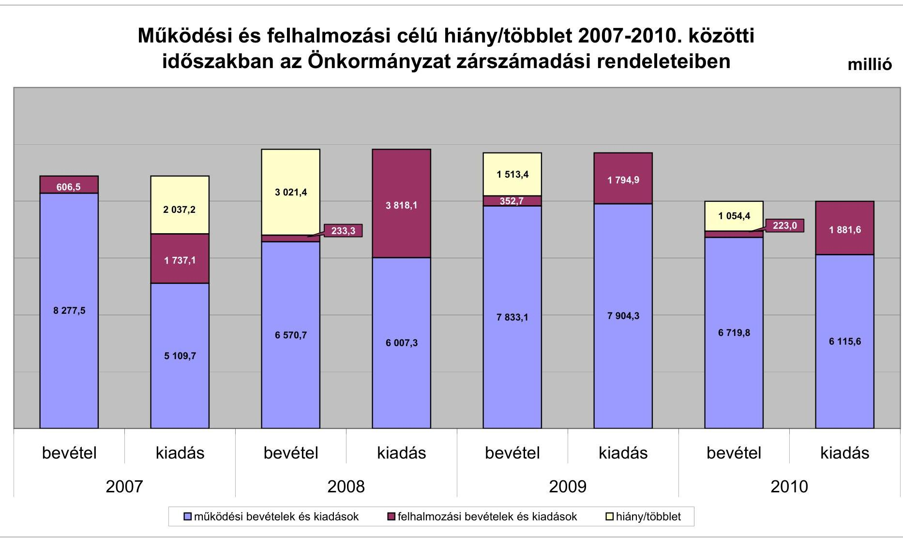

---

Az Önkormányzat bevételei és kiadásai, valamint adósságszolgálata 2007-2010 között

|  1. FOLYÓ KÖLTSÉGVETÉS* | 2007. év | 2008. év | 2009. év  |
| --- | --- | --- | --- |
|  1.1.1. Saját működési bevételek | 5848,0 | 3670,6 | 5303,8  |
|  1.1.2. Költségvetési támogatás | 955,6 | 1646,2 | 1536,4  |
|  1.1.3. Átengedett bevételek | 433,0 | -98,2 | -41,4  |
|  1.1.4. Állambáztartáson belülről kapott támogatások | 1018,8 | 1091,3 | 1030,3  |
|  1.1.5. EU-tól és külföldről kapott bevételek | 2,6 | 0,6 | 0,0  |
|  1.1.6. Állambáztartáson kívülről kapott bevételek | 3,1 | 6,4 | 9,6  |
|  1.1.7. Előző évi pénzmaradvány átvétel | 120,4 | 301,9 | 194,4  |
|  1.1. Folyó bevételek $=1.1.1.+1.1.2.+1.1.3.+1.1.4.+1.1.5.+1.1.6.+1.1.7.$ | 8381,6 | 6618,9 | 8033,3  |
|  1.2.1. Működési kiadások kamatkiadások nélkül | 4641,9 | 5296,6 | 5511,7  |
|  1.2.2. Állambáztartáson belülre átadott pénzeszközök | 70,2 | 87,2 | 39,1  |
|  1.2.3.1. vállalkozásoknak | 44,1 | 73,8 | 102,9  |
|  1.2.3.2. EU-nak, illetve külföldre | 4,1 | 5,3 | 0,0  |
|  1.2.3.3. magánszemélyeknek | 79,6 | 92,5 | 135,9  |
|  1.2.3.4. nonprofit szervezeteknek | 120,6 | 142,4 | 119,7  |
|  1.2.3. Transferkiadások ( $=1.2.3.1+1.2.3.2+1.2.3.3+1.2.3.4$ ) | 248,4 | 314,1 | 358,5  |
|  1.2.4. Kamatkiadások | 28,8 | 17,5 | 5,8  |
|  1.2.5. Előző évi pénzmaradvány átadás | 120,4 | 301,9 | 194,3  |
|  1.2. Folyó kiadások $=1.2.1.+1.2.2.+1.2.3.+1.2.4.+1.2.5.$ | 5109,7 | 6017,3 | 6109,4  |
|  1.3. Folyó költségvetés egyenlege MŰKÖDÉSI JÓVEDELEM (1.1. - 1.2.) | 3271,9 | 601,6 | 1923,9  |
|  2. FELHALMOZÁSI KÖLTSÉGVETÉS** |  |  |   |
|  2.1.1. Saját tökebevételek | 289,9 | 41,2 | 148,8  |
|  2.1.2. Állambáztartáson belülről kapott támogatások | 24,8 | 80,6 | 198,5  |
|  2.1.3. EU-tól és külföldről kapott támogatások | 1,7 | 0,0 | 0,0  |
|  2.1.4. Állambáztartáson kívülről kapott támogatások | 46,2 | 75,3 | 15,9  |
|  2.1. Felhalmozási bevételek ( $=2.1.1.+2.1.2+2.1.3+2.1.4$.) | 362,6 | 197,1 | 363,2  |
|  2.2.1. Saját beruházási kiadás áfával | 941,1 | 2058,4 | 1069,1  |
|  2.2.2. Saját felújítási kiadás áfával | 459,2 | 820,1 | 330,3  |
|  2.2.3. Állambáztartáson belülre átadott pénzeszköz | 31,7 | 0,0 | 2,2  |
|  2.2.4. EU-nak és külföldnek adott pénzeszközök | 0,0 | 0,0 | 0,0  |
|  2.2.5. Állambáztartáson kívülre adott pénzeszközök | 194,8 | 441,9 | 399,6  |
|  2.2.6. Befektetési célú részesedések vásárlása

 | 118,1 | 508,0 | 91,3  |
|  2.2. Felhalmozási kiadások ( $=2.2 .1 .+2.2 .2 .+2.2 .3 .+2.2 .4 .+2.2 .5 .+2.2 .6$.) | 1744,8 | 3828,5 | 1892,4  |
|  2.3. Felhalmozási költségvetés egyenlege (2.1. - 2.2.) | $-1382,2$ | $-3631,4$ | $-1529,2$  |
|  3. Finanszírozási műveletek nélküli (GFS) pozíció(1.3.+2.3.) | 1889,7 | $-3029,8$ | 394,7  |
|  4. Finanszírozási műveletek |  |  |   |
|  4.1. Hitelfelvétel | 0 | 0,0 | 0,0  |
|  4.2. Hitelförlesztés | 121,6 | 122,8 | 50,0  |
|  4.3. Forgatási és befektetési célú értékpapírok kibocsátása | 0 | 0,0 | 0,0  |
|  4.4. Forgatási és befektetési célú értékpapírok beváltása | 0 | 0,0 | 0,0  |
|  4.5. Forgatási és befektetési célú értékpapírok értékesítése | 147,6 | 5,2 | 0,0  |
|  4.6. Forgatási és befektetési célú értékpapírok vásárlása | 0 | 0,0 | 0,0  |
|  4.7. Egyéb finanszírozási bevételek (függő, átfutó, kiegyenlítő) | $-193,6$ | 33,8 | 5,9  |
|  4.8. Egyéb finanszírozási kiadások (függő, átfutó, kiegyenlítő) | $-37,0$ | 42,9 | 13,0  |
|  4.9. Finanszírozási műveletek egyenlege (4.1. - 4.2.+4.3.-4.4+4.5.-4.6.+4.7.-4.8.) | $-130,5$ | $-126,7$ | $-57,0$  |
|  5. Tárgyévi pénzügyi pozíció változás (1.3.+ 2.3.+4.9.) | 1759,2 | $-3156,5$ | 337,7  |
|  6. Nettó működési jövedelem =működési jövedelem (1.3.) - tőketörlesztés (4.2+4.4) | 3150,3 | 478,8 | 1873,9  |
|  TÁJÉKOZTATÓ ADATOK |  |  |   |
|  Összes kötelezettség | 1867,8 | 1031,3 | 626,5  |
|  ebből rövid lejáratú | 1814,8 | 1031,3 | 626,5  |
|  Összes szállítói kötelezettség | 75,8 | 42,6 | 45,6  |
|  ebből lejárt (tanúsítványból) |  |  |   |
|  Pénz és tőkepiaci kötelezettség (adósság) | 170,0 | 50,0 | 0,0  |
|  ebből rövid lejáratú | 120,0 | 50,0 | 0,0  |
|  PPP szerződéses állomány jelenértéken (tanúsítványból) |  |  |   |
|  ebből lejárt szolgáltatási díj miatti kötelezettség |  |  |   |
|  Folyószámlakitel napi átlagos állománya (tanúsítványból) | 2,5 | 3,9 | 0,2  |
|  Likvidhitel napi átlagos állománya (tanúsítványból) |  |  |   |
|  Mankabérhitel napi átlagos állománya (tanúsítványból) |  |  |   |
|  Kezesség és garanciavállalások (tanúsítványból) | 10,0 | 0 | 0  |
|  Jogerős bírósági ítéletekből adódó kötelezettségek (tanúsítványból) |  |  |   |
|  Finanszírozásba bevonható eszközök: | 4787,6 | 1631,1 | 1968,8  |
|  Tartós hitelviszonyt megtestesítő értékpapírok év végi állománya |  |  |   |
|  Hosszú lejáratú bankbetétek év végi állománya |  |  |   |
|  Értékpapírok év végi állománya |  |  |   |
|  Pénzeszközök (idegen pénzeszközök nélkül) év végi állománya | 4787,6 | 1631,1 | 1968,8  |

[^0] [^0]: * Bevételekben nem térül, a kiadásokban nem jelenik meg az amortizáció, a vagyoni helyzetet az egyenleg befolyásolja. ** Bevételekben vagyon megőrzésre és bővítésre fordítható források.

---

Konterom Vörös Önkormányzati

Az Önkormányzat 2007-2010 években megvalósított, 2010. december 31-ig befejezett fejlesztései és azok forrásfaszattörlés

|  |   |   |   |   |   |   |   |   |   |   |   |   |   |   |   |   |   |   |   |   |   |   |   |   |   |   |   |   |   |   |   |   |   |   |   |   |   |   |   |   |   |   |   |   |   |   |   |   |   |   |   |   |   |   |   |   |   |   |   |   |   |   |   |   |   |   |   |   |   |   |   |   |   |   |   |   |   |   |   |   |   |   |   |   |   |   |   |   |   |   |   |   |   |   |   |   |   |   |   |  

---

|   |  |  |  |  |  |  |  |  |  |  |  |  |  |  |  |  |  |  |  |  |  |  |  |  |  |  |  |  |  |  |  |  |  |  |  |  |  |  |  |  |  |  |  |  |  |   |
| --- | --- | --- | --- | --- | --- | --- | --- | --- | --- | --- | --- | --- | --- | --- | --- | --- | --- | --- | --- | --- | --- | --- | --- | --- | --- | --- | --- | --- | --- | --- | --- | --- | --- | --- | --- | --- | --- | --- | --- | --- | --- | --- | --- | --- | --- |
|   |  |  |  |  |  |  |  |  |  |  |  |  |  |  |  |  |  |  |  |  |  |  |  |  |  |  |  |  |  |  |  |  |  |  |  |  |  |  |  |  |  |  |  |  |   |
|   |  |  |  |  |  |  |  |  |  |  |  |  |  |  |  |  |  |  |  |  |  |  |  |  |  |  |  |  |  |  |  |  |  |  |  |  |  |  |  |  |  |  |  |  |   |
|   |  |  |  |  |  |  |  |  |  |  |  |  |  |  |  |  |  |  |  |  |  |  |  |  |  |  |  |  |  |  |  |  |  |  |  |  |  |  |  |  |  |  |  |  |   |
|   |  |  |  |  |  |  |  |  |  |  |  |  |  |  |  |  |  |  |  |  |  |  |  |  |  |  |  |  |  |  |  |  |  |  |  |  |  |  |  |  |  |  |  |  |   |
|   |  |  |  |  |  |  |  |  |  |  |  |  |  |  |  |  |  |  |  |  |  |  |  |  |  |  |  |  |  |  |  |  |  |  |  |  |  |  |  |  |  |  |  |  |   |
|   |  |  |  |  |  |  |  |  |  |  |  |  |  |  |  |  |  |  |  |  |  |  |  |  |  |  |  |  |  |  |  |  |  |  |  |  |  |  |  |  |  |  |  |  |   |
|   |  |  | 

 |  |  |  |  |  |  |  |  |  |  |  |  |  |  |  |  |  |  |  |  |  |  |  |  |  |  |  |  |  |  |  |  |  |  |  |  |  |  |  |  |  |   |
|   |  |  |  |  |  |  |  |  |  |  |  |  |  |  |  |  |  |  |  |  |  |  |  |  |  |  |  |  |  |  |  |  |  |  |  |  |  |  |  |  |  |  |  |  |   |
|   |  |  |  |  |  |  |  |  |  |  |  |  |  |  |  |  |  |  |  |  |  |  |  |  |  |  |  |  |  |  |  |  |  |  |  |  |  |  |  |  |  |  |  |  |   |
|   |  |  |  |  |  |  |  |  |  |  |  |  |  |  |  |  |  |  |  |  |  |  |  |  |  |  |  |  |  |  |  |  |  |  |  |  |  |  |  |  |  |  |  |  |   |
|   |  |  |  |  |  |  |  |  |  |  |  |  |  |  |  |  |  |  |  |  |  |  |  |  |  |  |  |  |  |  |  |  |  |  |  |  |  |  |  |  |  |  |  |  |   |
|   |  |  |  |  |  |  |  |  |  |  |  |  |  |  |  |  |  |  |  |  |  |  |  |  |  |  |  |  |  |  |  |  |  |  |  |  |  |  |  |  |  |  |  |  |   |
|   |  |  |  |  |  |  |  |  |  |  |  |  |  |  |  |  |  |  |  |  |  |  |  |  |  |  |  |  |  |  |  |  |  |  |  |  |  |  |  |  |  |  |  |  |   |
|   |  |  |  |  |  |  |  |  |  |  |  |  |  |  |  |  |  |  |  |  |  |  |  |  |  |  |  |  |  |  |  |  |  |  |  |  |  |  |  |  |  |  |  |  |   |
|   |  |  |  |  |  |  |  |  |  |  |  |  |  |  |  |  |  |  |  |  |  |  |  |  |  |  |  |  |  |  |  |  |  |  |  |  |  |  |  |  |  |  |  |  |   |
|   |  |  |  |  |  |  |  |  |  |  |  |  |  |  |  |  |  |  |  |  |  |  |  |  |  |  |  |  |  |  |  |  |  |  |  |  |  |  |  |  |  |  |  |  |   |
|   |  |  |  |  |  |  |  |  |  |  |  |  |  |  |  |  |  |  |  |  |  |  |  |  |  |  |  |  |  |  |  |  |  |  |  |  |  |  |  |  |  |  |  |  |   |
|   |  |  |  |  |  |  |  |  |  |  |  |  |  |  |  |  |  |  |  |  |  |  |  |  |  |  |  |  |  |  |  |  |  |  |  |  |  |  |  |  |  |  |  |  |   |
|   |  |  |  |  |  |  |  |  |  |  |  |  |  |  |  |  |  |  |  |  |  |  |  |  |  |  |  |  |  |  |  |  |  |  |  |  |  |  |  |  |  |  |  |  |   |
|   |  |  |  |  |  |  |  |  |  |  |  |  |  |  |  |  |  |  |  |  |  |  |  |  |  |  |  |  |  |  |  |  |  |  |  |  |  |  |  |  |  |  |  |  |   |
|   |  |  |  |  |  |  |  |  |  |  |  |  |  |  |  |  |  |  |  |  |  |  |  |  |  |  |  |  |  |  |  |  |  |  |  |  |  |  |  |  |  |  |  |  |   |
|   |  |  |  |  |  |  |  |  |  |  |  |  |  |  |  |  |  |  |  |  |  |  |  |  |  |  |  |  |  |  |  |  |  |  |  |  |  |  |  |  |  |  |  |  |   |
|   |  |  |  |  |  |  |  |  |  |  |  |  |  |  |  |  |  |  |  |  |  |  |  |  |  |  |  |  |  |  |  |  |  |  |  |  |  |  |  |  |  |  |  |  |   |
|   |  |  |  |  |  |  |  |  |  |  |  |  |  |  |  |  |  |  |  |  |  |  |  |  |  |  |  |  |  |  |  |  |  |  |  |  |  |  |  |  |  |  |  |  |   |

 |  |  |  |  |  |  |  |  |  |  |  |  |  |  |  |  |  |  |  |  |  |  |  |  |  |  |  |  |  |  |  |  |  |  |  |  |  |  |  |  |   |
|   |  |  |  |  |  |  |  |  |  |  |  |  |  |  |  |  |  |  |  |  |  |  |  |  |  |  |  |  |  |  |  |  |  |  |  |  |  |  |  |  |  |  |  |  |   |
|   |  |  |  |  |  |  |  |  |  |  |  |  |  |  |  |  |  |  |  |  |  |  |  |  |  |  |  |  |  |  |  |  |  |  |  |  |  |  |  |  |  |  |  |  |   |
|   |  |  |  |  |  |  |  |  |  |  |  |  |  |  |  |  |  |  |  |  |  |  |  |  |  |  |  |  |  |  |  |  |  |  |  |  |  |  |  |  |  |  |  |  |   |
|   |  |  |  |  |  |  |  |  |  |  |  |  |  |  |  |  |  |  |  |  |  |  |  |  |  |  |  |  |  |  |  |  |  |  |  |  |  |  |  |  |  |  |  |  |   |
|   |  |  |  |  |  |  |  |  |  |  |  |  |  |  |  |  |  |  |  |  |  |  |  |  |  |  |  |  |  |  |  |  |  |  |  |  |  |  |  |  |  |  |  |  |   |
|   |  |  |  |  |  |  |  |  |  |  |  |  |  |  |  |  |  |  |  |  |  |  |  |  |  |  |  |  |  |  |  |  |  |  |  |  |  |  |  |  |  |  |  |  |   |
|   |  |  |  |  |  |  |  |  |  |  |  |  |  |  |  |  |  |  |  |  |  |  |  |  |  |  |  |  |  |  |  |  |  |  |  |  |  |  |  |  |  |  |  |  |   |
|   |  |  |  |  |  |  |  |  |  |  |  |  |  |  |  |  |  |  |  |  |  |  |  |  |  |  |  |  |  |  |  |  |  |  |  |  |  |  |  |  |  |  |  |  |   |

---

Komárom Város Önkormányzata

AJ- 3/5. számú melléklet a V-3104-026/2012. számú Jelenéshez

Az Önkormányzat 2010. december 31-én folyamatban lévő fejlesztési feladataira 2010. december 31-éig teljesített kifizetések és azok forrásösszetétele

millió Ft-ban

|  Fejlesztési feladat (beruházás, felújítás) | Beruházás, felújítás | Teljes bekerülési költség | 2006. dec. 2007-2010. (nek későbbi teljesített kódra) | 2010. dec. 2011-2012. (nek későbbi teljesített kódra) | 2010. december 31-ig pénzügyileg teljesített beruházás forrásösszetétele | Hitel | EU-s támogatás | Helyi támogatás  |
| --- | --- | --- | --- | --- | --- | --- | --- | --- | --- |
|  Megnevezése | Képviselő-testületi határozat száma | Kivitelezési befejezése | Terv programjával | Tény programjával | Eltérés (A: -) (A: -) (A: -) (A: -) (A: -) (A: -) (A: -) (A: -) (A: -) (A: -) (A: -) (A: -) (A: -) (A: -) (A: -) (A: -) (A: -) (A: -) (A: -) (A: -) (A: -) (A: -) (A: -) (A: -) (A: -) (A: -) (A: -) (A: -) (A: -) (A: -) (A: -) (A: -) (A: -) (A: -) (A: -) (A: -) (A: -) (A: -) (A: -) (A: -)

---

Komárom Város Önkormányzata

Az Önkormányzat 2010. december 31-én folyamatban lévő fejlesztési feladataira 2010. december 31-én fennálló kötelezettségek és azok forrásösszege

|   |  |  |  |  |  |  |  |  |  |  |  |  |  |  |  |  |  |  |  |  |  |  |  |  |  |  |  |  |  |  |  |  |  |  |  |  |  |  |  |  |  |   |
| --- | --- | --- | --- | --- | --- | --- | --- | --- | --- | --- | --- | --- | --- | --- | --- | --- | --- | --- | --- | --- | --- | --- | --- | --- | --- | --- | --- | --- | --- | --- | --- | --- | --- | --- | --- | --- | --- | --- | --- | --- | --- | --- |
|   |  |  |  |  |  |  |  |  |  |  |  |  |  |  |  |  |  |  |  |  |  |  |  |  |  |  |  |  |  |  |  |  |  |  |  |  |  |  |  |  |   |
|   |  |  |  |  |  |  |  |  |  |  |  |  |  |  |  |  |  |  |  |  |  |  |  |  |  |  |  |  |  |  |  |  |  |  |  |  |  |  |  |  |   |
|   |  |  |  |  |  |  |  |  |  |  |  |  |  |  |  |  |  |  |  |  |  |  |  |  |  |  |  |  |  |  |  |  |  |  |  |  |  |  |  |  |   |
|   |  |  |  |  |  |  |  |  |  |  |  |  |  |  |  |  |  |  |  |  |  |  |  |  |  |  |  |  |  |  |  |  |  |  |  |  |  |  |  |  |   |
|   |  |  |  |  |  |  |  |  |  |  |  |  |  |  |  |  |  |  |  |  |  |  |  |  |  |  |  |  |  |  |  |  |  |  |  |  |  |  |  |  |   |
|   |  |  |  |  |  |  |  |  |  |  |  |  |  |  |  |  |  |  |  |  |  |  |  |  |  |  |  |  |  |  |  |  |  |  |  |  |  |  |  |  |   |

 |  |  |  |  |  |  |  |  |  |  |  |  |  |  |  |  |  |  |  |  |  |  |  |  |  |  |  |  |  |   |
|   |  |  |  |  |  |  |  |  |  |  |  |  |  |  |  |  |  |  |  |  |  |  |  |  |  |  |  |  |  |  |  |  |  |  |  |  |  |  |  |  |   |
|   |  |  |  |  |  |  |  |  |  |  |  |  |  |  |  |  |  |  |  |  |  |  |  |  |  |  |  |  |  |  |  |  |  |  |  |  |  |  |  |  |   |
|   |  |  |  |  |  |  |  |  |  |  |  |  |  |  |  |  |  |  |  |  |  |  |  |  |  |  |  |  |  |  |  |  |  |  |  |  |  |  |  |  |   |
|   |  |  |  |  |  |  |  |  |  |  |  |  |  |  |  |  |  |  |  |  |  |  |  |  |  |  |  |  |  |  |  |  |  |  |  |  |  |  |  |  |   |
|   |  |  |  |  |  |  |  |  |  |  |  |  |  |  |  |  |  |  |  |  |  |  |  |  |  |  |  |  |  |  |  |  |  |  |  |  |  |  |  |  |   |
|   |  |  |  |  |  |  |  |  |  |  |  |  |  |  |  |  |  |  |  |  |  |  |  |  |  |  |  |  |  |  |  |  |  |  |  |  |  |  |  |  |   |
|   |  |  |  |  |  |  |  |  |  |  |  |  |  |  |  |  |  |  |  |  |  |  |  |  |  |  |  |  |  |  |  |  |  |  |  |  |  |  |  |  |   |
|   |  |  |  |  |  |  |  |  |  |  |  |  |  |  |  |  |  |  |  |  |  |  |  |  |  |  |  |  |  |  |  |  |  |  |  |  |  |  |  |  |   |
|   |  |  |  |  |  |  |  |  |  |  |  |  |  |  |  |  |  |  |  |  |  |  |  |  |  |  |  |  |  |  |  |  |  |  |  |  |  |  |  |  |   |
|   |  |  |  |  |  |  |  |  |  |  |  |  |  |  |  |  |  |  |  |  |  |  |  |  |  |  |  |  |  |  |  |  |  |  |  |  |  |  |  |  |   |
|   |  |  |  |  |  |  |  |  |  |  |  |  |  |  |  |  |  |  |  |  |  |  |  |  |  |  |  |  |  |  |  |  |  |  |  |  |  |  |  |  |   |
|   |  |  |  |  |  |  |  |  |  |  |  |  |  |  |  |  |  |  |  |  |  |  |  |  |  |  |  |  |  |  |  |  |  |  |  |  |  |  |  |  |   |
|   |  |  |  |  |  |  |  |  |  |  |  |  |  |  |  |  |  |  |  |  |  |  |  |  |  |  |  |  |  |  |  |  |  |  |  |  |  |  |  |  |   |
|   |  |  |  |  |  |  |  |  |  |  |  |  |  |  |  |  |  |  |  |  |  |  |  |  |  |  |  |  |  |  |  |  |  |  |  |  |  |  |  |  |   |
|   |  |  |  |  |  |  |  |  |  |  |  |  |  |  |  |  |  |  |  |  |  |  |  |  |  |  |  |  |  |  |  |  |  |  |  |  |  |  |  |  |   |
|   |  |  |  |  |  |  |  |  |  |  |  |  |  |  |  |  |  |  |  |  |  |  |  |  |  |  |  |  |  |  |  |  |  |  |  |  |  |  |  |  |   |
|   |  |  |  |  |  |  |  |  |  |  |  |  |  |  |  |  |  |  |  |  |  |  |  |  |  |  |  |  |  |  |  |  |  |  |  |  |  |  |  |  |   |
|   |  |  |  |  |  |  |  |  |  |  |  |  |  |  |  |  |  |  |  |  |  |  |  |  |  |  |  |  |  |  |  |  |  |  |  |  |  |  |  |  |   |

 |  |  |  |   |
|   |  |  |  |  |  |  |  |  |  |  |  |  |  |  |  |  |  |  |  |  |  |  |  |  |  |  |  |  |  |  |  |  |  |  |  |  |  |  |  |  |  |   |
|   |  |  |  |  |  |  |  |  |  |  |  |  |  |  |  |  |  |  |  |  |  |  |  |  |  |  |  |  |  |  |  |  |  |  |  |  |  |  |  |  |   |
|   |  |  |  |  |  |  |  |  |  |  |  |  |  |  |  |  |  |  |  |  |  |  |  |  |  |  |  |  |  |  |  |  |  |  |  |  |  |  |  |  |   |
|   |  |  |  |  |  |  |  |  |  |  |  |  |  |  |  |  |  |  |  |  |  |  |  |  |  |  |  |  |  |  |  |  |  |  |  |  |  |  |  |  |   |
|   |  |  |  |  |  |  |  |  |  |  |  |  |  |  |  |  |  |  |  |  |  |  |  |  |  |  |  |  |  |  |  |  |  |  |  |  |  |  |  |  |   |
|   |  |  |  |  |  |  |  |  |  |  |  |  |  |  |  |  |  |  |  |  |  |  |  |  |  |  |  |  |  |  |  |  |  |  |  |  |  |  |  |  |   |
|   |  |  |  |  |  |  |  |  |  |  |  |  |  |  |  |  |  |  |  |  |  |  |  |  |  |  |  |  |  |  |  |  |  |  |  |  |  |  |  |  |   |
|   |  |  |  |  |  |  |  |  |  |  |  |  |  |  |  |  |  |  |  |  |  |  |  |  |  |  |  |  |  |  |  |  |  |  |  |  |  |  |  |  |   |
|   |

---

### **Az Önkormányzat beadott, elbírálás alatti pályázati forrásból megvalósuló fejlesztéseihez kapcsolódó kötelezettség-vállalásainak összegzése**

|   |  |  |  |  |  |  |  |  |  |  |  |  |  |  |  |  |  |  |  |  |  |  |  |  |  |  |  |  |  |  |  |  |  |  |  |  |  |  |  |  |  |  |  |  |  |  |  |  |  |  |  |  |  |  |  |  |  |  |  |  |  |  |  |  |  |  |  |  |  |  |  |  |  |  |  |  |  |  |  |  |  |  |  |  |  |  |  |  |  |  |  |  |  |  |  |  |  |  |  | 

---

Komárom Város Önkormányzata 4. számú melléklet a V-3104-026/2012. számú jelentéshez

Az önkormányzati feladatok ellátásában résztvevő gazdasági társaságok 4. számú melléklet

millió Ft.

|  Gazdasági társaság megnevezése |  |  |  |  |  |  |  |  |  |  |  |  |  |  |  |  |  |  |  |   |
| --- | --- | --- | --- | --- | --- | --- | --- | --- | --- | --- | --- | --- | --- | --- | --- | --- | --- | --- | --- | --- |
|   | Önkormányzati | Önkormányzati gazdasági társaságának |  |  |  |  |  |  |  |  |  |  |  |  |  |  |  |  |  |   |
|   |  |  |  |  |  |  |  |  |  |  |  |  |  |  |  |  |  |  |  |   |
|   |  |  |  |  |  |  |  |  |  |  |  |  |  |  |  |  |  |  |  |   |
|   |  |  |  |  |  |  |  |  |  |  |  |  |  |  |  |  |  |  |  |   |
|   |  |  |  |  |  |  |  |  |  |  |  |  |  |  |  |  |  |  |  |   |
|   |  |  |  |  |  |  |  |  |  |  |  |  |  |  |  |  |  |  |  |   |
|   |  |  |  |  |  |  |  |  |  |  |  |  |  |  |  |  |  |  |  |   |
|  1. 100%-os tulajdoni hányadú gazdasági társaságok |  |  |  |  |  |  |  |  |  |  |  |  |  |  |  |  |  |  |  |   |
|  SAVUM KR. | 100,0 | 0 | 122,10 | 0,0 | 0,0 |  |  |  | 2,2 | 0,0 | 0,0 | 0,0 | 0,0 | 0,0 | 0,0 | 0,0 | 0,0 | 0,0 | 0,0 | 0,0  |
|  KOMTURIST-KOMÁROM KR. | 100,0 | 0 | 44,70 | 0,0 | 0,0 |  |  |  | 0,0 | 0,0 | 0,0 | 0,0 | 0,0 | 0,0 | 0,0 | 0,0 | 0,0 | 0,0 | 0,0 | 0,0  |
|  Komáromi Tánhő KR. | 100,0 | 0 | 132,50 | 0,0 | 0,0 |  |  |  | 0,0 | 48,0 | 0,0 | 169,00 | 0,0 | 0,0 | 0,0 | 0,0 | 0,0 | 0,0 | 0,0 | 0,0  |
|  Komárom Város/Telenczi
tulajdoni hányadú KR. | 100,0 | 0 | 231,30 | 0,0 | 0,0 |  |  |  | 0,0 | 0,0 | 25,0 | 26,50 | 32,8 | 32,1 | 23,2 | 5,0 | 5,0 | 0,0 | 0,0 | 0,0  |
|  100%-os tulajdoni hányadú
gazdasági társaságok összesen | x | x | x | 0,0 | 0,0 |  |  |  | 0,0 | 2,2 | 55,0 | 25,0 | 195,50 | 32,8 | 32,4 |  |  |  |  |  |

 | 23,2 | 5,0 | 5,0 | 0,0 | 0,0  |
|  2. 75-98%-os tulajdoni hányadú gazdasági társaságok |  |  |  |  |  |  |  |  |  |  |  |  |  |  |  |  |  |  |  |   |
|  Komárom Ára Vízmű KR. | 92,0 | 0,0 | 108,8 | 1244,0 | 0,0 |  |  |  | 0,0 | 0,0 | 0,0 | 0,0 | 0,0 | 0,0 | 0,0 | 0,0 | 0,0 | 0,0 | 0,0 | 0,0  |
|  Komiharmát KR. | 96,4 | 0,0 | 170,4 | 0,0 | 0,0 |  |  |  | 0,0 | 0,0 | 3,2 | 0,0 | 0 | 0,8 | 0,0 | 0,0 | 0,0 | 0,0 | 0,0 | 0,0  |
|  75-88%-os tulajdoni hányadú
gazdasági társaságok összesen | x | x | x | 1 244,0 | 0,0 |  |  |  | 0,0 | 0,0 | 2,2 | 0,0 | 0,0 | 0,0 | 0,0 | 0,0 | 0,0 | 0,0 | 0,0 | 0,0  |
|  75%-os tulajdoni hányadú
gazdasági társaságok összesen | x | x | x | 1 244,0 | 0,0 |  |  |  | 0,0 | 2,2 | 55,0 | 28,2 | 195,5 | 32,8 | 33,0 | 23,2 | 5,0 | 5,0 | 0,0 | 0,0  |
|  III. 51-74%-os tulajdoni hányadú gazdasági társaságok: |  |  |  |  |  |  |  |  |  |  |  |  |  |  |  |  |  |  |  |   |
|  51-74%-os tulajdoni hányadú
gazdasági társaságok összesen | x | x | x | 0,0 | 0,0 |  |  |  | 0,0 | 0,0 | 0,0 | 0,0 | 0,0 | 0,0 | 0,0 | 0,0 | 0,0 | 0,0 | 0,0 | 0,0  |
|  IV. egyéb, közfeladatot ellátó gazdasági társaságok: |  |  |  |  |  |  |  |  |  |  |  |  |  |  |  |  |  |  |  |   |
|  Várles-Volán Zrt. | 0,0 | 0,0 | 121,8 |  |  |  |  |  | 72,5 | 44,0 | 9,0 | 30,0 | 54,0 | 17,0 | 0,0 | 0,0 | 0,0 | 0,0 | 0,0 | 0,0  |
|  AVE Talabánya Zrt. | 0,0 | 0,0 | 458,0 |  |  |  |  |  | 0,0 | 0,0 | 0,0 | 0,0 | 0,0 | 0,0 | 0,0 | 0,0 | 0,0 | 0,0 | 0,0 | 0,0  |
|  Temeői Komárom KR. | 0,0 | 0,0 | 732,4 |  |  |  |  |  | 0,0 | 0,0 | 0,0 | 0,0 | 0,0 | 0,0 | 0,0 | 0,0 | 0,0 | 0,0 | 0,0 | 0,0  |
|  100%-os tulajdoni hányadú
gazdasági társaságok összesen | x | x | x | 0,0 | 0,0 |  |  |  | 0,0 | 0,0 | 0,0 | 0,0 | 0,0 | 0,0 | 0,0 | 0,0 | 0,0 | 0,0 | 0,0 | 0,0  |
|  V. 2012. 1. feje |  |  |  |  |  |  |  |  |  |  |  |  |  |  |  |  |  |  |  |   |

Az önkormányzati feladatok ellátásában résztvevő gazdasági társaságok

---

# KOMÁROM VÁROS POLGÁRMESTERE

H-2900 Komárom, Szabadság tér 1.
Tel.: +36 34 541-301
Fax: +36 34-541-302

Varga S. 78
KOMÁROM 2012.
JUNI 2012, 10:55:30 AM 02.72

Iktatószámuk: V-3104-21/2012.
Ügyintézőjük: Renkó Zsuzsanna

Állami Számvevőszék
Domokos László elnök részére

Budapest
Apáczai Csere János u. 10.

1052

Tisztelt Elnök Úr!

Ezúton szeretném köszönetemet kifejezni az Állami Számvevőszék Komárom Város Önkormányzatánál végzett ellenőrzését, melynek feladata városunk pénzügyi helyzetének ellenőrzése volt a vizsgált időszakban.

A jelentéstervezetet átvizsgálva és átgondolva az abban foglalt megállapításokat, az alábbi intézkedéseket, kiegészítő információkat tesszük:

Polgármesteri intézkedések
1. A polgármester folyamatosan tájékoztatja a Képviselő-testületet az Önkormányzat pénzügyi egyensúlyi helyzetéről.
Felelős: Dr. Molnár Attila polgármester
Határidő: folyamatos

2. Az iparűzési adóbevételből való tartalékképzéssel egyetértünk. Az elmúlt időszakban ez rendkívüli fontosságú lett volna a megelőző vezetéstől, amely sajnos nem történt meg. Az önkormányzat pénzügyi helyzetét jelentősen befolyásolja a helyi iparűzési adó várható bevétele, ezen belül is az ipari parkban található gazdálkodó szervezetektől várható bevételek. A NOKIA napokban tett bejelentése kapcsán jelentősen át kell alakítanunk a teljes költségvetési szerkezetünket, hiszen a nevezett gazdasági társaságtól beérkező iparűzési adó drasztikus mértékű csökkenése várható.

A tartalék képzésére ezen indokok alapján 2012 évben nem látunk reális esélyt, mivel ez a költségvetési év Komárom Városának legnehezebb éve lesz, az elmúlt több mint 20 évhez képest is.

A tartalék képzését azonban indokoltnak tartjuk és amint a működési egyensúlyunk helyre állt, úgy ezt a gyakorlatot kívánjuk folytatni. Erre az első reális esélyünk 2013. költségvetési év során van először.
Felelős: Dr. Molnár Attila polgármester
Határidő: 2013. évi költségvetés beterjesztése

---

# Jegyzői intézkedések 

1., A jegyző intézkedik a gazdasági társaságoknál vezetett analitikus nyilvántartások felülvizsgálatáról és a szükséges módosítások átvezetéséről, hogy a részesedések kimutatott értéke a 2011. évi beszámolóban megegyezzen a gazdasági társaságok által kimutatott értékkel.
Felelős: Molnárné Dr. Taár Izabella
Határidő: 2011. évi beszámoló elfogadása
2., A jegyző intézkedik, hogy a 2012. évi költségvetés tervezése kapcsán kerüljenek bemutatásra a következő éveket terhelő kötelezettségek a költségvetési rendeletben, nem csak 2013. év végéig, hanem a kötelezettségvállalások teljes időszakára.

Felelős: Molnárné Dr. Taár Izabella
Határidő: 2012. évi költségvetési rendelet elfogadása
Kérjük, hogy a fentieket a végleges jelentés elkészítésénél figyelembe venni szíveskedjenek!

Komárom, 2012. február 17.
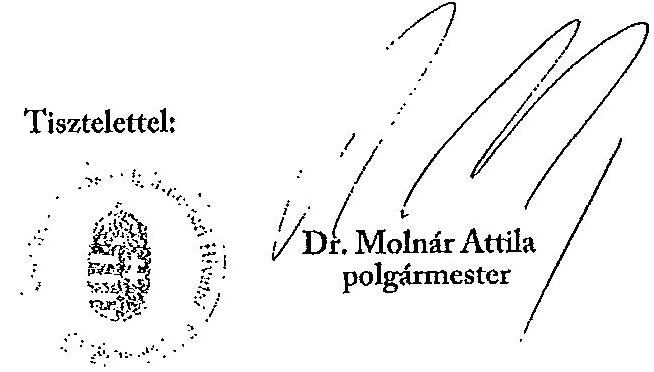

---

# Dr. Molnár Attila úr   polgármester   Komárom Város Önkormányzata 

## Komárom

## Tisztelt Polgármester Úr!

Köszönettel vettem a Komárom Város Önkormányzata pénzügyi helyzetének ellenőrzéséről készített jelentéstervezetben foglalt megállapításokhoz kapcsolódó észrevételéről és a tervezett intézkedésekről szóló tájékoztatását.

A levelében jelzett megváltozott gazdasági környezet miatt az Önkormányzat költségvetésének jelentős hányadát képező iparűzési adóbevétel csökkenése várható, emiatt a pénzügyi egyensúlyi helyzet megőrzése érdekében intézkedések megtétele szükséges. A Képviselőtestület folyamatos tájékoztatását és az iparűzési adóbevételből történő tartalék képzését továbbra is fontosnak tartjuk a pénzügyi egyensúly hosszú távú fenntarthatósága érdekében. A tartalékképzést indokolja a gazdasági társaságok éves iparűzési adóbevallása alapján esetleg visszafizetendő adó fedezetének biztosítása.

Tájékoztatom, hogy a megküldött intézkedéseiről szóló levele nem tekinthető az Állami Számvevőszékről szóló 2011. évi LXVI. törvény 33. § (1) bekezdése szerinti intézkedési tervnek, ezért kérem, hogy azt a jelentés kézhezvételét követően, törvényi határidőn belül az Állami Számvevőszék részére megküldeni szíveskedjen.

Végül megköszönöm Polgármester úrnak és munkatársainak az ellenőrzés során tanúsított hozzáállását, amellyel az Önkormányzatról szóló pénzügyi helyzetelemzés elkészítését segítette.

Budapest, 2012. március 30.
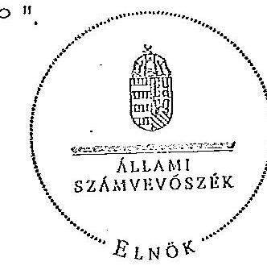

Tisztelettel:

Domokos László

