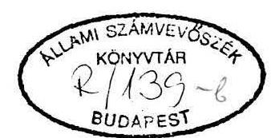
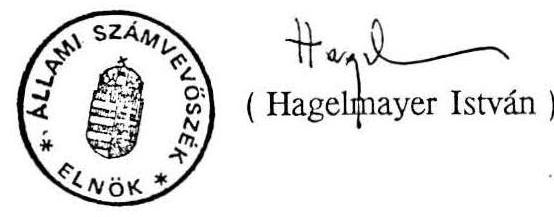

# 6929. szám 

## Állami Számvevőszék

## JELENTÉS

a Magyar Köztársaság 1993. évi állami költségvetéséről szóló törvényjavaslat (6598. szám) ellenőrzéséről

---

# BEVEZETÉS 

Az Állami Számvevőszék harmadik alkalommal tesz eleget annak az alkotmányos kötelezettségének, mely szerint ellenőriznie kell "az állami költségvetési javaslat megalapozottságát, a felhasználások szükségességét és célszerűségét". Az Államháztartási Törvény megalkotásával az 1993. évi költségvetés kidolgozásához már rendelkezésre állt az a jogszabályi háttér, amely a korábbinál pontosabb, sok tekintetben szigorúbb szabályokkal határozza meg a pénzügyi gazdálkodás mozgásterét. Az Államháztartási Törvény egyaránt útmutatóul szolgál a pénzügyek irányításával, gyakorlati végrehajtásával és az ellenőrzéssel foglalkozó szakmai apparátus számára.

A törvény alkalmazásának próbatétele volt az 1993. évi költségvetési javaslat összeállítása. Az ÁSZ ellenőrzési gyakorlata is gazdagodott azáltal, hogy a költségvetési törvénytervezet vizsgálata kapcsán alapos szakmai próbának vethette alá az Államháztartási Törvény követelményrendszerét. Arra törekedtünk, hogy bírálatainkkal, észrevételeinkkel elősegítsük az Államháztartási Törvény előírásainak következetes alkalmazását és egységes értelmezését.

A költségvetési törvénytervezet megalapozottságának ellenőrzéséből, törvényességi és számszaki vizsgálatából az a fő következtetés adódik, hogy a pozitív irányú tartalmi változások a költségvetési tervezésben is lassan mennek végbe.

A költségvetés kiadási oldalának feszítő ereje, az egyre szűkülő pénzforrások kényszere sem volt képes az állami feladatok átfogó, alapos és racionális felülvizsgálatát kikényszeríteni. A társadalmi közkiadások feltételrendszerében az 1993. évi költségvetési javaslat lényegi változást nem hozott. A nagy ellátórendszerek költségvetési szerkezetét, tervezési, végrehajtási és elszámolási rendjét még nem sikerült a takarékos gazdálkodás követelményeihez igazítani. Az egyes feladatok tényleges ráfordítási igénye a jelenlegi költségvetési szerkezetben sem követhető.

A költségvetési törvényjavaslat ellenőrzése során a számvevőszéki vizsgálatok három aspektusa (törvényesség, célszerűség, eredményesség) közül a törvényesség (szabályszerűség) szempontját érvényesítettük. A gazdaságpolitika (költségvetéspolitika) minősítését tudatosan mellőztük, mivel az nem tartozik az Állami Számvevőszék illetékességi körébe.

---

nek változása indokolja, hogy az abból származó jövedelmek áttekinthető módon szerepeljenek a központi költségvetésben.
1.5. Az ÁHT 14. § előírja, hogy a költségvetésben a hitelfelvételt és a hiteltörlesztést nem lehet a hiányt, illetve a többletet módosító bevételként, illetőleg kiadásként elszámolni. Az ÁHT 16. § (1) bekezdés alapján a tervezés és beszámolás során külön kell választani az államháztartás rendkívüli bevételeit és kiadásait.

Az ÁHT-ban foglalt fenti előírások a költségvetési mérlegtételek olyan csoportosítását jelentik, amelyek lehetővé teszik, hogy az Országgyűlés mérlegelhesse:
—a folyó bevételek mennyiben fedezik a folyó kiadásokat,
—a rendkívüli bevételek és a rendkívüli kiadások, valamint
—a tárgyévi és a korábban felvett hitelek és azok törlesztése mennyiben befolyásolja a tárgyévi költségvetés egyenlegét.

A költségvetési törvényjavaslat a fenti előírásokból csak annyit teljesít, hogy az összegek meghatározása nélkül az 5. §-ban felsorolja a rendkívüli bevételeket és kiadásokat. A felsorolt kiadási címek közül a 9. sz. mérleg melléklet csak egyes tételeket minősít "rendkívülinek".

Az 5. § (1) bekezdés f. és i. pontjai szerinti felújítások és az ágazati feladatok előirányzatainak összege csak külön számítással állapítható meg. A 2. számú táblázatban kigyűjtöttük a költségvetési törvényjavaslatban szereplő rendkívüli kiadásokat, amelyek végösszege számításaink szerint 79.188,2 millió forint. A költségvetési szervek vonatkozásában egyáltalán nem került sor a rendkívüli bevételek és kiadások körének meghatározására.

Az előirányzatok rendkívüli kiadások közé sorolása egyes esetekben külön mérlegelést igényel. A döntést az befolyásolja, hogy valamely költségvetési tétel jóváhagyását az Országgyűlés évente mérlegelni kívánja-e vagy sem. A költségvetési kiadások kényszerű csökkentésénél a legkézenfekvőbb megoldás, ha az Országgyűlés elsősorban a rendkívüli kiadások előirányzatainak csökkentéséről, elhalasztásáról dönt. (A 2. sz. táblázat utolsó oszlopában feltüntettük azokat a költségvetési címeket, amelyek átminősítése indokolt lehet. Az ágazati célfeladatok tételes áttekintése tovább bővítheti a kört.)

Az 5. § (2) bekezdése mindössze két tételt jelöl meg rendkívüli bevételként. Véleményünk szerint ez csak töredéke a rendkívüli bevételeknek. A teljesség igénye nélkül a következő tételek is rendkívüli bevételek közé sorolhatók, pl. a

---

privatizációs bevételekből VII. fejezet 16. cím.; kamatbevétel XXXI. fejezet 2. cím.; jamburgi gázszállítás XXXI. fejezet 1. cím.
1.6. A költségvetési törvényjavaslat 31. § (2) bekezdése rendelkezik a központi költségvetésbe befolyó külföldön nyilvántartott gépjárművek adójának megosztásáról az államháztartás alrendszerei között. A bevétel 50 %-a az Útalapot, 50 %-a pedig a központi költségvetést illeti. A 31. § (2) bekezdés alapján a beszedett adóból a központi költségvetés 600 millió forintot átenged a Környezetvédelmi Alapnak.

A törvényjavaslat számszaki indoklásai szerint ezen a címen a következő bevételi előirányzatokkal számolnak:
—a XVII. Pénzügyminisztérium fejezet bevételeinél a 27. cím 2. alcíménél a lakossági adók között 1.500 millió forintot vettek számításba. Helyszíni ellenőrzésünk megállapította, hogy ez a számításba vehető adóbevétel 50 %-ával megegyező összeg,
—a XIII. Közlekedési, Hírközlési és Vízügyi Minisztérium fejezeti indoklásából (II. kötet 13-56. oldal) megállapítható, hogy az Útalap bevételeként a külföldi gépjárművek adója címen 1.600 millió forintot terveztek, amely 100 millió forinttal meghaladja a XVII. fejezetnél számításba vett összeget,
—a XX. Környezetvédelmi és Területfejlesztési Minisztérium fejezeti indoklásából (III. kötet 20-43. oldal) megállapítható, hogy a Környezetvédelmi Alap bevételeinél - átengedett adó címen, és nem költségvetési támogatásként - 600 millió forintot vettek számításba. Ez az összeg szerepel az alapok előirányzatait összesítő 7.sz. melléklet adatai között is.

Fentiek alapján megállapítható, hogy a 600 millió forintot a központi költségvetés és a Környezetvédelmi Alap költségvetése bevételként egyaránt számításba veszi, azaz a központi költségvetés bevételeinél nem számolnak azzal, hogy a forrásból 600 millió forintot az Alapnak át kell engedni. Az előirányzatok szabályszerű megtervezése esetén a költségvetési hiány összege 600 millió forinttal növekszik.
1.7. A törvényjavaslat 30. §-a szerint a költségvetési szervek és az önkormányzatok 7\%-os munkaadói járulékát a költségvetés közvetlenül a Szolidaritási Alap támogatásának részeként állapítja meg és folyósítja.

A finanszírozás ezen pénzkímélő megoldását elismerjük. Az alkalmazott megoldással az Alap saját bevételének minősíthető - központi költségvetési szervek és az önkormányzatok által fizetendő - járulék a Szolidaritási Alap költségvetési 

---

támogatását megnöveli, a valóságosnál nagyobbnak mutatja. (A központi költségvetés mérlegében a költségvetési szervek támogatása soron 17.500 millió forinttal kevesebbet, az alapok támogatásainál pedig ugyanennyivel többet mutatnak ki.)
1.8. A törvényjavaslat 41. §-a határozza meg azokat a tételeket, amelyeknél a teljesítés külön szabályozott módosítás nélkül eltérhet az előirányzottól. Az (1) bekezdés alapján az államadósság elszámolásai (XXXI. fejezet 2-5. címei) is ide tartoznak.

Az 1992-93. évek költségvetési egyensúlyi problémáinak finanszírozására 460 milliárd forint rövid és hosszúlejáratú értékpapír kibocsátására kap felhatalmazást a pénzügyminiszter. (3. sz. táblázat)

A törvényjavaslat indoklásában ezek kamatköltségére nem találhatók részletes számítások. A monetáris piac egyensúlyát és a költségvetési érdekek érvényesítését egyaránt biztosító értékpapír kibocsátási tervekről a költségvetési törvényjavaslatban is indokolt lenne számot adni.

# 2. A törvényjavaslat összhangja az Államháztartási Törvénnyel 

Az 1993. évi költségvetési törvénynek az ÁHT előírásait már alkalmaznia kell. Ezeket a törvényi előírásokat azonban a gyakorlatban most kell először teljeskörűen érvényesíteni. Jelentésünk ezen részében tételesen rámutatunk az ÁHT és a költségvetési törvény eltéréseire, azzal a szándékkal, hogy elősegítsük az államháztartás elszámolási rendjének megújítását.
2.1. Az ÁHT 124. § (2) bekezdése felhatalmazza a Kormányt, hogy a költségvetésben jóváhagyásra kerülő mérlegek tartalmát rendeletben szabályozza. A Kormány az 1993. évi költségvetési törvényjavaslat benyújtásáig még nem alakította ki az új államháztartási mérlegrendszert. A költségvetési törvényben jóváhagyandó mérlegek tartalma nem teljesen egyértelmű, ezért az ÁHT-ban keretszerűen szabályozott előírások teljesítése, a részletes szabályok hiányában nem kérhető számon.

Az 1993. évi költségvetési törvényjavaslat mellékletei a korábbi években kialakult hagyományok szerint épültek fel, kiegészítve néhány, az ÁHT konkrét előírásaiból fakadó egyértelmű kötelezettséggel. Ezzel függ össze, hogy ma még mérlegelés kérdése, hogy az adminisztratív osztályozást tartalmazó 1. és 2. számú mellékletek egyes tételei a közgazdasági osztályozás szerint összeállított 9. sz. mérleg melyik sorába kerülhetnek.

---

2.2. Az ÁHT 36. §-a alapján a Kormány a költségvetési törvényjavaslat benyújtásakor tájékoztatást ad a többéves elkötelezettséggel járó kiadási tételek későbbi évekre vonatkozó hatásairól.
Ezt az előírást a törvényjavaslat csak a kormányzati beruházások esetében teljesíti.
2.3. A törvényjavaslat több paragrafusa rendelkezik különféle, a központi költségvetés, illetve az államháztartás más alrendszere javára teljesítendő befizetési kötelezettségről. A befizetési kötelezettséget előíró rendelkezések azonban nem jelölik meg pontosan a kedvezményezett költségvetési címet. Ez a végrehajtásban és az ellenőrzésben zavarokat okozhat.

A költségvetési törvényjavaslatban a következő paragrafusoknál feltétlenül indokolt megjelölni a költségvetési címeket. (6. § (1),(2),(6),(7); 7. §; 8. § (1),(2),(3); 10. § (3); 12. § (1); 26. § (1); 38. § (6); 52. §; 54. §)
2.4. A törvényjavaslat 2. § (1) és (2) bekezdései "mintegy tájékoztatnak arról", hogy a bevételi és kiadási főösszegek megoszlását az 1.sz., illetve a 2.sz. mellékletek tartalmazzák.

Az ÁHT 30. § (1) bekezdés alapján az Országgyűlés a költségvetési törvényben költségvetési címenként meghatározza a bér, társadalombiztosítási járulék, dologi kiadások, célfeladatok, beruházások, felújítások előirányzatait. A 2. § (1) és (2) bekezdéseinek megfogalmazása az ÁHT előírásának csak közvetetten tesz eleget.
2.5. A törvényjavaslat 11. § (1) bekezdése csak a kormányzati beruházások körére határozza meg azt a beruházási értékhatárt, amely felett nyilvános versenytárgyalást kell meghirdetni.

Az ÁHT 95. § (1) bekezdés szerint a költségvetési törvényben az értékhatárt rögzíteni kell valamennyi, a költségvetési szervek körében lebonyolítandó kormányzati beruházásokra és felújításokra.
2.6. A 13. § a költségvetési törvényjavaslat olyan rendelkezése, amelyet a költségvetési gazdálkodási rendben hosszabb távra is célszerű szabályozni. Ezért javasoljuk, hogy a 13. § bekezdései ne a költségvetési törvény első részébe kerüljenek, hanem a másodikba, az ÁHT módosításaként. Ennek révén az ÁHT-ben egyértelművé válna az alaptevékenységi kör és a vállalkozási tevékenység árbevételeinek elkülönítése.

---

A 13. §-ban foglalt előírásokkal az ÁHT-ben a pénzügyminiszter és a miniszterek feladatait tartalmazó 48. - 49. §-okat, valamint a 96. §-t célszerű kiegészíteni.
2.7. A törvényjavaslat 17. § b. pontja a helyi önkormányzatok címzett és céltámogatásának együttes előirányzatát 33.240 millió forintban állapítja meg. Az új induló beruházások célok szerinti felsorolásáról külön törvény rendelkezik.

A költségvetési javaslatban nem különíthető el a folyamatban lévő beruházások közül a cél-, illetve címzett támogatás összege. A 6393. számon benyújtott, az önkormányzatok céltámogatási rendjét szabályozó törvényjavaslat is csak az új beruházásokról rendelkezik.

Az ÁHT 31. §-a szerint az Országgyűlés tételesen dönt a címzett támogatásokról. E kitételnek a javaslat jelenlegi formájában nem felel meg.
2.8. A törvényjavaslat 38. és 39. §-ai az államháztartáson kívüli szervezetek javára történő kezességvállalást szabályozza.

Az ÁHT 33. és 42. §-ai rendelkeznek a Kormány által vállalható kezességek éves költségvetésben való rendezésének módjáról. Ezek szerint az adott költségvetési évben szerződés szerint beváltható kezességvállalás mértékét, illetve a kezesi felelősség alapján fennálló kötelezettség együttes összegét a költségvetési törvény határozza meg. Az ÁHT 42. § (2) bekezdése előírja, hogy a Kormány a költségvetési évben a kezesi felelősség alapján esedékessé válható fizetési kötelezettségeit a költségvetési törvényjavaslat részeként tételesen köteles előterjeszteni az Országgyűlésnek.

A költségvetési törvényjavaslat 38. - 39. §-aiból, a 38. § arányt rögzít, a 39. §-ban pedig korlátlan felhatalmazást
 ad.

A törvényjavaslatban nem számolnak be az eddigi elkötelezettségről, illetve a várhatóan beváltásra kerülő igényekről. Ezek csak az általános, illetve részletes indoklásokban szerepelnek, amelyek nem részei a törvényjavaslatnak, és nem is teljeskörűek.

Nem rendelkezik a törvényjavaslat a 38. § (5), (6) bekezdéseiben megfogalmazott visszatérülések elszámolási helyéről. (A kezességvállalás alapján kifizetendő kötelezettségeket, és a behajtások útján beszedett bevételeket elkülönítetten kell nyilvántartásba venni és elszámolni.)

---

2.9. A törvényjavaslat 40.§ (3) bekezdése felsorolja, hogy mely esetekben nem szükséges az Országgyűlés jóváhagyását kérni a fejezetek közötti előirányzat-átcsoportosításokhoz.

Ez a felhatalmazás az ÁHT 32. § (2) bekezdésével ellentétes. Az ÁHT hivatkozott paragrafusa szerint ugyanis a fejezetek között az előirányzatokat - az általános tartalék kivételével - csak az Országgyűlés csoportosíthatja át.
2.10. A törvényjavaslat 42. § (1) bekezdésében foglaltakról a költségvetés tervezésének időszakában kellett volna gondoskodni, az előirányzatokat az érintett fejezetekre lebontani. A felhasználások követhető elszámolása és ellenőrzése is ezt a megoldást indokolná.
2.11. A törvényjavaslat 42. §-át javasoljuk kiegészíteni egy új, (3) bekezdéssel, mivel az Önkormányzati törvény 84. § (2) bekezdése szerint az állami költségvetési törvényben meghatározott összeg megilleti az önkormányzatokat. Az új bekezdés tartalma: Amennyiben az önkormányzatok normatív állami támogatása - összességében a költségvetési törvényben meghatározott összegnél - alacsonyabban teljesül, az Országgyűlés határoz a maradvány felhasználásáról.
2.12. A törvényjavaslat 43. §-a ellentmondásban van a 13. § (1) bekezdésében foglaltakkal. Ugyanis, ha az alaptevékenységgel összefüggő bevételek módosított előirányzatot meghaladó többletbevétele a központi költségvetést illeti meg, akkor nem indokolt, hogy ezeket az előirányzatokat a fejezetért felelős szerv (vezető) módosítsa. Ezért a paragrafus elhagyását javasoljuk. (A 44. §-ban ezzel összhangban törlendő az "előirányzat-módosítási" kötelezettségről való rendelkezés.)

Itt jegyezzük meg, hogy a 13. §-ban felsorolt alaptevékenységnek minősülő bevételek meghatározásához a törvényjavaslat egyértelmű számszaki alátámasztást nem tartalmaz. Egyes címeknél elkülöníthetők az alaptevékenységhez kapcsolódó támogatás értékű bevételektől a vállalkozási jellegű bevételek, másoknál viszont nem. A gazdálkodási szabályok szerint csak az alaptevékenység bevételeinek országgyűlési jóváhagyása indokolt, s ezek módosítását - mivel az a támogatások változását is okozhatja - valóban csak a pénzügyminiszter hatáskörébe célszerű utalni.
2.13. Az ÁHT 41. §-a szerint, ha az előirányzat-módosítási kötelezettség nélkül teljesülő előirányzatok a tervezett egyenleg megvalósulását veszélyeztetik, a Kormány köteles a tervezett költségvetési egyenleg biztosítása érdekében a szükséges intézkedéseket megtenni.

---

Az 1991-92. évi költségvetési törvény végrehajtásának tapasztalatai szerint a költségvetési törvényben pontosabban kellene rendelkezni a pótköltségvetés készítési kötelezettség konkrét feltételéről/feltételeiről.
2.14. Az ÁHT 110.-113. §-ai rendelkeznek az államadósságról és a 116. § (2) bekezdésének 4. pontja előírja az államadósság, továbbá a hitelállomány hitelezők, illetve eszközök, valamint lejárat szerinti bontásban történő bemutatását. Az ÁHT előírásainak a törvényjavaslatban lévő kimutatások csak részben felelnek meg tekintettel arra, hogy a kamatterheket nem veszik számításba. Így az Országgyűlés elé kerülő kimutatásokból nem derül ki, hogy éveken keresztül az adósságszolgálaton belül nagyobb hányadot tesz ki a kamatteher, mint a hitelek törlesztése.

A fentiekből adódik, hogy a költségvetési törvényjavaslat nem tesz eleget az ÁHT 36. § b. pontjának sem, amikor a különböző lejáratú és kamatkondícióval rendelkező állami értékpapírok kibocsátására kért felhatalmazásoknál nem ad teljeskörű tájékoztatást ezen - esetenként több éves elkötelezettséget jelentő - tételek későbbi évekre vonatkozó hatásairól.
2.15. Az ÁHT 116. § előírja a tervezéskor és zárszámadáskor jóváhagyandó és a tájékoztatásul bemutatandó mérlegek körét. Ezek közül több nem készült el, azonban az államháztartás mérlegrendszere tartalmának pontos és részletes meghatározása hiányában az ÁHT-ban megnevezett, de a költségvetésben be nem nyújtott mérlegek felsorolásszerű kifogásolása alaptalan lenne.

Ugyanakkor az ÁHT 116. § 3., 4., 9. pontjaiban meghatározott mérlegek elkészítését és pótlólagos beterjesztését az államháztartás egyensúlyi helyzetének megítéléséhez, a tisztánlátáshoz elengedhetetlennek tartjuk.
2.16. Az ÁHT 7. § (3) bekezdésében és a 13. § (2)-(3) bekezdésében rendelkezik a költségvetési év pótkezelési időszaki elszámolásairól. A 13. § (3) bekezdés szerint "a pótkezelési időszakban teljesíthető elszámolások dokumentumait, azok benyújtásának határidejét, az elszámolások következtében szükségessé váló befizetések, illetőleg kiadások teljesítési időpontjait, az éves költségvetésről szóló törvényben (a továbbiakban: költségvetési törvény) kell meghatározni."

Az 1993. költségvetési évben változatlanul indokolt a pótkezelés alkalmazása. Az ÁHT követelményei szerint tehát értelemszerűen a költségvetési törvényben rendelkezni kell a pótkezelés köréről, mértékéről és időszakáról.
Az 1992. évi pótkezelésbe vont kiadások körét javasoljuk kiegészíteni a családipótlék, központi költségvetést terhelő nyugdíjkiegészítések, a bányászok koren-

---

gedményes nyugdíjjogosultságának kifizetéseivel. Megfontolást érdemel továbbá a helyi önkormányzatok normatív elszámolásának pótkezelési körbe sorolása.

# 3. A költségvetési törvényjavaslat főbb előirányzatainak megalapozottsága 

A központi költségvetés 1993. évi pozíciójának tervét megalapozó makroszámítások változtak ugyan a módszertani és információs feltételek tekintetében, de ezek csak részlegesen tették a korábbiaknál megalapozottabbá a tervezést. Az 1993. évi adóbevételek prognosztizálási módszere alapvetően megfelelőnek minősíthető, azonban az ÁFA, társasági adó vonatkozásában továbbra is számos a bizonytalansági tényező. A tervezés során a fejezeti felhalmozási kiadások előirányzatait érdemben nem vizsgálták felül. A fejezeti tervező munkát megalapozottabbá tevő pénzügyminisztériumi előkészítő, szervező és szabályozó munka többnyire elszigetelt maradt és csekély eredményt hozott. A tervezési rendszer megújítására meghirdetett, néhány fejezetre kísérleti jelleggel kiterjesztett "0-bázisú" tervezés meghiúsult, elsősorban a megfelelő előkészítés és szabályozás hiánya miatt.

## BEVÉTELEK

3.1. A pénzintézetek nélküli társasági adó az 1993. évi pénzforgalmi előirányzatban 54 milliárd forint, amely 10,2 százalékkal magasabb az előző évi várható összegnél. Az előirányzat az adózás előtti eredmény 14,2 százalékos feltételezett növekedésén alapul. Az előirányzatok tervezésének feltételeit a költségvetés készítésének időszakában információs oldalról nem biztosították.
3.2. Az általános forgalmi adó nagymértékű növekedése a kétkulcsos ÁFÁ-ra történő átállás következménye, ezért az ÁFA törvényjavaslat elfogadása alapvetően befolyásolja a költségvetés megalapozottságát.

Az ÁFA bevételek mintegy 75 százaléka a lakossági vásárlásokból származik, ezért a bevételek előrejelzésénél ennek kiemelt jelentősége van. Az 1993. évre prognosztizált lakossági fogyasztásnövekményt a várható lakossági többletjövedelmek nem támasztják alá.
3.3. A fogyasztási adó előirányzata reális. Az előirányzat az adóhatóság 1992. I. féléves termékcsoportos bevallására épül, korrigálva a várható hatásokkal. Az ezen adónemből származó bevételek 64,5%-át adó kőolajipari termékeknél változatlan fogyasztást tételeztek föl.

---

3.4. A vám- és importbefizetések 1993. évi költségvetési előirányzata a kivetendő és a ténylegesen befizetendő vám és statisztikai illeték között az 1992. évi várhatónál aránytalanul nagyobb különbséggel számol. Az előirányzat indoklása szerint az 1992. évi várható 4.700 millió forint kintlevőség 1993. évre 7.800 millió forintra nő.
3.5. A pénzintézeti társasági adóelőirányzat felméréséhez részletes számítások nem álltak rendelkezésre. Az 1993. évi pénzintézeti társasági adó pénzforgalmi előirányzata 283%-kal magasabb az igen alacsony 1992. évi várható teljesítésnél (6 milliárd Ft). A pénzintézeti törvény előírásai szerinti kockázati céltartalékképzés, valamint a pontosan nem becsülhető eredmények lényegesen módosíthatják a pénzforgalmi teljesítést.
3.6. A személyi jövedelemadó 1993. évi előirányzata részletesen alátámasztott, megalapozott. Az SZJA előirányzat az 1993. évre a lakossági adóköteles jövedelem 11%-os feltételezett növekedésén alapul. Vitatható azonban az 50%-os adókulcs újbóli bevezetésének várható 3.000 millió forintos adóbevételt növelő hatása.
3.7. Az Állami Vagyonkezelő Rt-hez tartozó gazdálkodók 14.000 millió forintos osztalék befizetésének előirányzatához a törvényjavaslat számítást nem tartalmaz, a jamburgi gázszállításból származó 14.000 millió forint bevétel realitása pedig a bizonytalan szállítási, gazdasági körülmények miatt kérdőjelezhető meg.

# KIADÁSOK 

3.8. A törvényjavaslat mellékletében felsorolt kormányzati beruházási célok néhány kivételtől eltekintve megfelelnek a költségvetési irányelvekben meghatározott prioritásoknak.

Az 1993-ban induló beruházások indoklásaiból nem minden esetben állapítható meg a teljes költségigény, így az sem, hogy az adott beruházás nem sorolandó-e az ÁHT 23. § (2) bekezdése alapján a kiemelt jelentőségű beruházások közé.

Célszerű lenne a beruházások ütemezésének újragondolása, például a HM kórházi beruházás esetében, vagy akár a beruházás elhalasztása, például a Külügyminisztérium beruházásánál. Ugyanakkor előrelépésnek tekinthető a kormányzati és az intézményi beruházások két, illetve három évet felölelő bemutatása. Az 1993. évi költségvetési javaslat nem tér ki a fejezetek előző évekből maradt beruházási keretmaradványok kezelési módjára. A törvényjavaslat I. kötet 353-385. oldalain található táblázatok a beruházási juttatásokat csoportosítják. A részletező táblázatokból azonban nem minden esetben állapítható meg, hogy a beruházás melyik fejezet előirányzatai között található meg. (Az A., B., C. táblázatok adatait fejezetenként kigyűjtöttük, amely a 4. sz. táblázatban található.)
3.9. A központi költségvetés kiadási előirányzatainak összetételében a korábbi évekhez viszonyítva lényeges változás nem történt. (A családi pótlék előirányzata 1991-92. években a költségvetési szervek támogatásai között szerepelt. 1993-ban ez a mintegy 100.000 millió forint nagyságú összeg külön mérlegsoron szerepel.)

A kiadási főösszegen belül a központi költségvetési szervek kiadásai 17%-kal, saját bevételei 34,1%-kal, támogatás előirányzata pedig 10,3%-kal nagyobb az 1992. évi előirányzatokhoz viszonyítva.

A támogatási előirányzat szerény mértékű növeléséhez a bevételi előirányzat minden eddiginél nagyobb arányú emelkedése párosul. Ez reális, mert évről-évre a teljesítés lényegesen meghaladja az előirányzatot.

A bevételek 1993. évi előirányzatai még mindig 10%-kal elmaradnak az 1991. évi ténytől. Az alátervezést a helyszíni vizsgálataink is alátámasztották.
3.10. Az önkormányzati költségvetések előkészítéséhez kapcsolódó tervezési munka jogszabályi háttere lényegesen nem javult 1992. évhez képest. Még mindig nem alakult ki a tervezés egészét lefedő, összehangolt jogszabályi és ezzel összefüggő információs rendszer. Így a jelenlegi szabályozás egyik legfőbb problémája, hogy a normatív állami támogatáson felül juttatott cél-, címzett és kiegészítő támogatások egymástól függetlenül fejtik ki hatásukat. Továbbra sem készültek költségmodellek az egyes normatívák megalapozásához. A támogatások elosztásánál az önkormányzati kötelező feladatok és ellátottsági mutatók nem játszanak szerepet.
3.11. Az elkülönített állami pénzalapok szerepe - az eredeti szándékok ellenére - 1993-ban tovább nő. Bővülnek a másodlagos csatornákon keresztül központosított és elosztott jövedelmek. Az alapok költségvetési támogatásának arányos növekedését a törvényjavaslat azzal kerüli ki, hogy a privatizációs bevételekből az alapokat közvetlenül támogatják. Ez a hatályos törvények alapján ugyan lehetséges, de megfontolandó, hogy szinte kizárólagosan támogatás értékű - nem automatikusan mozgó - bevételekből fedezett kiadások elkülönített finanszírozása indokolt-e. Hosszabb távon a privatizációs bevételekből az alapok finanszírozása megoldatlan, így az 1993-ra tervezett módszer csak látszatmegoldás.

---

Az alapok javasolt támogatásainak mértéke nem ítélhető meg. Az ellenőrzés idején még nem álltak rendelkezésre az alapok működtetéséhez szükséges törvények tervezetei és a számítási anyagok. Így az alapok 1993. évi mérlegadatai a célrendszer és az egyéb források pontos ismerete nélkül készültek.
3.12. A javaslat a központi költségvetés társadalombiztosításra vonatkozó garanciavállalási kötelezettségét az 1992. évihez képest bővítette. Ezáltal a szabályozás jobban összhangba került a társadalombiztosításról szóló 1975. évi II. törvény 5. §-ával, mely szerint "a bevételeket meghaladó kiadásokat az állam fedezi".

A társadalombiztosítási alapok által átmenetileg járulékbevételekből finanszírozott szociális jellegű ellátások összege 42 milliárd forint, amely szinte megegyezik a társadalombiztosítás 1993. évre előirányzott hiányával.

# 4. A költségvetési törvényjavaslat egyes rendelkezéseinek megalapozottsága 

4.1. A 3. §. c. pontjában a kincstárjegy-kibocsátására vonatkozó felhatalmazás
 felső korlátot nem rögzít, "legalább 24.933,6 millió forint összegben" növelhető a kincstárjegyek és más állami értékpapírok állománya.

Ez a megfogalmazás közvetett formában korlátlan összegű értékpapír kibocsátásra ad felhatalmazást, lehetőséget teremtve a pénzügyminiszternek, hogy a költségvetési hiány jelentős túllépését is finanszírozhassa, s elmulaszthassa a pótköltségvetés készítési kötelezettséget.
4.2. A 3. § (1) bekezdés d. pontjában foglalt felhatalmazás nagyon "puha korlátokat" jelent, a 3. § (2) bekezdése pedig a forgóalap folyamatos fizetőképességéhez korlátlan mértékben engedélyez likviditási kincstárjegy kibocsátást.

A tervezett hiány és a forgóalap nagysága indokolja, hogy a bevételek és kiadások eltérő ütemkülönbsége miatt a forgóalap likviditásához hitel jellegű forrásokat is igénybe vegyenek. A felhatalmazást azonban javasoljuk konkrét mértékekhez kötni. (Pl.: a jóváhagyott bevételek, vagy kiadások meghatározott százalékának megfelelő összeg.)
4.3. A 3.§ (3) bekezdése - ugyancsak mérték meghatározása nélkül - speciális államkötvény kibocsátására ad felhatalmazást a pénzügyminiszternek a bankok privatizációjához szükséges hitelkonszolidációs rendszer működtetéséhez forrásként vagy kezességvállalásként.

---

A törvényjavaslat részletes indokolása szerint "A rendszer paramétereit, így az értékpapír kamatát és egyéb feltételeit még ki kell alakítani. Ugyancsak később határozható meg a kibocsátandó, s az államadósságot növelő értékpapírok mennyisége, mivel mind az érintett banki követelések nagysága, mind az értékesítésük esetén felmerülő veszteség csak folyamatosan számszerűsíthető."

Az indoklásban foglalt előkészületek nem indokolják, hogy erről már a költségvetési törvényben rendelkezzenek.
4.4. A 6. § számos fizetési kötelezettséget tartalmaz a privatizációs bevételek terhére, annak ellenére, hogy a javaslat 9. sz. mérleg mellékletének "privatizációs bevételek" sora ezen a címen előirányzatot nem tartalmaz.

A törvényjavaslat 6. § (5) bekezdése szerint - az 1993. évi vagyonpolitikai irányelvek tervezetével összhangban - az elkülönített alapok közvetlen finanszírozására 20,5 milliárd forint privatizációs bevétellel számolnak. Az elkülönített állami alapok összevont mérlegében (a törvényjavaslat 7. sz. melléklete) ezzel szemben 24,5 milliárd forint privatizációs bevétel szerepel. Az eltérés azt jelenti, hogy a költségvetési javaslatban a Kisvállalkozói Garancia Alap 4 milliárd forintos kiadására nincs meg a fedezet. Az 1993. évi Vagyonpolitikai Irányelvek tervezete szerint ugyanis a 47 milliárd forintos privatizációs bevételből e célra nem jut fedezet.
4.5. A 7. § a Kincstári Vagyonkezelő Szervezet kezelésében lévő állami vagyon értékesítéséből, hasznosításából származó bevételről rendelkezik. A törvényjavaslat 2.sz. melléklete szerint ezen a címen 1.200 millió forintot vettek számításba.

Az állami költségvetés mérlegében a bevételt a költségvetési szervek befizetései tartalmazzák, amely közgazdaságilag megtévesztő.
4.6. A törvényjavaslat 14. §-a szabályozza a felsőoktatási intézmények hallgatóinak pénzbeli juttatását. A normatíva 8%-kal növekedett (60.100 Ft/fő/évről 65.000 Ft/fő/évre). Nem változott viszont a felhasználás és elszámolás szabályozása. Így az Országgyűlés hatáskörébe tartozó kiadási előirányzatok megalapozottsága kérdéses, mivel a tényleges felhasználás követésére a jelenlegi elszámolás rend nem ad módot.
4.7. A törvényjavaslat 16. § (1) bekezdése szerint a törvényjavaslat 3.sz. melléklete állapítja meg a helyi önkormányzatok költségvetéséhez közvetlenül és kötöttség nélkül felhasználható normatív állami hozzájárulásokat.

---

A normatívák között konkrét összeg meghatározása nélkül szerepel a szociálpolitikai feladatok normatívája. Az indoklás szerint a 2.200 - 3.600 forint között mozgó normatívát egy, az adott önkormányzat szociálpolitikai helyzetét tükröző mutató alapján kapják meg az önkormányzatok.

A mutató kiszámításának módszerét azonban sem a költségvetési törvény, sem annak indoklása pontosan nem tartalmazza.
4.8. A 16. § (3) bekezdése szerint a normatív állami hozzájárulás évközben módosítható, ha a helyi önkormányzat feladatot, illetve intézményt nem helyi önkormányzatnak ad át és az átvevő szervezet e törvény alapján költségvetési támogatásra jogosult. Javasoljuk a bekezdés kiegészítését "a feladat, vagy intézmény átadásról szóló megállapodásban rögzíteni kell az átadással együtt járó állami támogatás összegét" szövegrésszel.
4.9. A 16. § (4) bekezdés szabályozása szerint az 1992. évi normatív állami hozzájárulások elszámolása alapján a központi költségvetésbe visszatérülő, a tervezettet meghaladó bevétel az általános tartalék összegét növeli. Az 1992. évi normatív állami hozzájárulások elszámolása kapcsán azonban a költségvetési visszatérülésen kívül a központi költségvetésből történő kifizetési kötelezettség is jelentkezik.

Megjegyezzük, hogy a 16.§ (4) bekezdése nem zárja ki, és nem teszi feleslegessé, hogy az 1992. évi zárszámadási törvényben az elszámolást bruttó módon szabályozzák. Meg kell jelölni ennél a tételnél azt is, hogy a központi költségvetést terhelő kiadás melyik költségvetési cím terhére történjen.
4.10. A törvényjavaslat 16.-17. §-ai állapítják meg az önkormányzatok állami hozzájárulásait. Az Állami Számvevőszék törvényi kötelezettsége alapján rendszeresen ellenőrzi az állami hozzájárulások igénybevételének jogosságát. Törvényi rendelkezés hiányában az ellenőrzés által feltárt jogtalanul igénybe vett támogatások visszafizetésének érvényesítésére azonban nincsen mód. Ezért a törvényjavaslat 17-18. §-ait újabb bekezdésekkel javasoljuk kiegészíteni, amelyek rögzítik, hogy az Állami Számvevőszék által feltárt jogtalanul igénybe vett támogatások visszafizetéséről a Belügyminisztérium a Pénzügyminisztérium ellenjegyzése mellett intézkedik.
4.11. A törvényjavaslat 27. § (4-5) bekezdése a Nyugdíjbiztosítási és Egészségbiztosítási alapok finanszírozásával kapcsolatban tartalmaz rendelkezéseket. A társadalombiztosítási alapok az államháztartás alrendszerét képezik, ezért az ÁHT 110. §-a értelmében tartozásaik belföldi államadósságnak tekintendők.

---

Az Alapok számláit a Magyar Nemzeti Bank vezeti. A Magyar Nemzeti Bankról szóló 1991. LX. törvény értelmében a Magyar Nemzeti Bank az államháztartás alrendszereivel kizárólag a költségvetésen keresztül tarthat kapcsolatot. Ezért a társadalombiztosítási alapok és a központi költségvetési törvény összefüggései kapcsán a következőket kifogásoljuk:
—a törvényjavaslatban a társadalombiztosítási alapok 1992. és 1993. évi hiánya finanszírozását biztosító értékpapír-kibocsátással kapcsolatban a megfogalmazásból kimaradt mind a kibocsátó, mind pedig a megbízó megjelölése. (Csak a társadalombiztosítás törvényjavaslatában szerepel a társadalombiztosítási alapok kezelője mint megbízó, illetve a Magyar Nemzeti Bank mint kibocsátó megnevezése.)

- Nem tartalmazza e paragrafus sem az értékpapírok kibocsátási ütemét, sem pedig a lejárat időtartamát.
- Az (5) bekezdéssel kapcsolatban említjük meg, hogy a társadalombiztosítási alapok 1992. évi hiányát finanszírozó értékpapír kibocsátását sem a költségvetési, sem a társadalombiztosítási költségvetési javaslat, sem pedig egyéb törvényi szabályozások nem tartalmazzák. Ezen értékpapírok kibocsátására a bekezdés csak közvetetten utal a tőketörlesztésre vonatkozó állami garancia átvállalásával.
4.12. A 28. §. tartalmazza, hogy a betegbiztosítási ellátásokra jogosultságot nem szerzett személyek után, a központi költségvetési hozzájárulás 5.800 millió forint. Az összeg számítási anyagát sem a költségvetési, sem pedig a társadalombiztosítási törvényjavaslat nem tartalmazza. Véleményünk szerint az átalányszerű elszámolás helyett indokolt az utólagos elszámolás alkalmazása.
4.13. A 29. § (1) bekezdésében "az Országgyűlés az elkülönített állami pénzalapok összevont mérlegét a 7. sz. melléklet szerint tájékoztatásul tudomásul veszi".

Az ÁHT 116. § (1) bekezdése alapján viszont az Országgyűlés a tervezéskor az alapok költségvetési mérlegét jóváhagyja.

A költségvetési törvényjavaslat 7.sz. mellékletében az alapok előirányzatait részben a ma hatályos, különböző szintű jogszabályok szerint vették számításba, másrészt viszont csak olyan elképzeléseket tükröznek az előirányzatok, amelyek törvényi előkészítése sem történt meg.

Az ÁHT 125. § (1) bekezdése alapján 1993. év január 1-jétől csak olyan alap működtethető, amelynek törvény határozza meg rendeltetését, bevételi forrásait,

---

a teljesíthető kiadások körét, valamint az alappal való rendelkezésre jogosult minisztert.

Emiatt a 7.sz. mellékletben feltüntetett összegek valóban csak tájékoztató jellegűek. Nem fogadható el azonban az a megoldás sem, hogy a feltüntetett előirányzatok alapján az 1993. évi gazdálkodás folytatható legyen.

A törvényjavaslat 47. § (1)-(2) bekezdései korlátozzák az alapok gazdálkodását, de a saját bevételek 1993. évi felhasználását lehetővé teszik. Javasoljuk, hogy az Országgyűlés kötelezze a Kormányt, hogy 1993. április 30-ig terjessze be az alapok törvényi előírásokon alapuló 1993. évi költségvetéseit. Az alapok kezelői az előterjesztésben tételesen számoljanak el az 1993. I. n.évi felhasználással, az 1992. évi záróegyenleggel, kintlévőségeikkel. Az elszámolás alapján az I. n.évben teljesített kiadásokat az alapok 1993. évi költségvetése részeként kell beilleszteni. Azokat az alapokat, amelyek fenti feltételeknek nem tudnak megfelelni az elszámolással egyidejűleg javasoljuk megszüntetni.
4.14. A 44. §-ban foglaltak szerint a Miniszterelnökség fejezeten belül a Miniszterelnöki Hivatal közigazgatási államtitkárának - mint a fejezetért felelős szerv vezetőjének - tervezési; felhasználási és információszolgáltatási kötelezettsége nem terjed ki a központi költségvetés végrehajtásával összefüggő központilag kezelt, valamint az általános tartalék előirányzatokra.

Ellenőrzési tapasztalataink szerint e bekezdés kiegészítendő azzal, hogy a központilag kezelt tartalékok fentiekben részletezett kötelezettségét a pénzügyminiszternek kell ellátnia. Megállapítottuk ugyanis, hogy a tartalékok nyilvántartása az adminisztratív osztályozási rend miatt "gazdátlan" maradt.

---

# II. A KÖLTSÉGVETÉS ELŐIRÁNYZATAINAK MEGALAPOZOTTSÁGÁRA VONATKOZÓ RÉSZLETES MEGÁLLAPÍTÁSOK 

## 1. Bevételek

A bevételek makrogazdasági számításainak munkafolyamatát helyszíni ellenőrzés során is vizsgáltuk.
A makroszámítások bizonytalansága - az óvatosabb előrejelzések és egyes tervezési tényezők kedvező irányú változása következtében - valamelyest mérséklődött. A források mértéke azonban - a jövedelemképződés 1993. évi üteme és a jövedelemtulajdonosok közötti megoszlása miatt - ebben az évben is csak viszonylag nagy eltérés kockázatával prognosztizálható.

A számítások megbízhatóságát javította, hogy - az előző évekhez képest valamelyest bővült és rendszeresebbé vált a gazdaságstatisztika által megfigyelt és szolgáltatott adatok köre. A magánszektor teljesítményének figyelembe vétele így már nem kizárólag becsléssel történt, bár az adatkör még közel sem teljes és pontossága is kétséges. A külkereskedelmi statisztikában is korábban javították a forgalom számbavételének megbízhatóságát, a fogalmak értelmezésének egységességét.

A makroszámítások módszereiben lényeges változtatást a Pénzügyminisztérium nem hajtott végre. Az eddigi kereteket megőrizve a modellezés finomítása előrelépésnek minősíthető.

Az alkalmazott módszerek jellemzően megfelelnek ugyan a nemzetközi gyakorlatnak, de a nagyarányú változások követésére és előrejelzésére kevésbé alkalmasak. A hazai viszonyokra eredményesen adaptálható külföldi számítási módszerek átvételére a Pénzügyminisztériumnak nem volt lehetősége.

A prognózisok megalapozottságát kedvezőtlenül befolyásolta egyes hatásvizsgálatok elmaradása. Így a tervezők nem rendelkeztek a csődeljárások jövő évi várható alakulására és szerteágazó hatására vonatkozó felmérések, előrejelzések adataival. Szintén nem készült megbízható előrejelzés a számviteli törvény gazdasági hatásáról. /A törvény alkalmazásával bekövetkező információcsökkenést is csak átmenetileg tudják áthidalni./

A prognózisok - mikrogazdasági információkon is alapuló - ágazati egyeztetése és folyamatos korrekciója a Pénzügyminisztériumon belül és az illetékes tárcákkal megtörtént, a makroszámok véleményezésébe kutatókat is bevontak. Lényeges véleményeltérés nem alakult ki. A költségvetési bevételek jelentős részéért felelős hatóságok /APEH, VPOP/ közreműködésére ugyanakkor nem tartottak igényt.

---

A költségvetés jövedelempozíciójának prognosztizálását a kormányzati döntések elhúzódása ez évben lényegesen nem hátráltatta. A jövedelem centralizáció és a felhasználás mértékét alapvetően meghatározó paraméterek /adómértékek, támogatási szintek, a hiány nagysága stb./ a Kormány által kellő időben eldöntésre kerültek.

A legnagyobb bizonytalanságot az okozza, hogy a költségvetés bevételeit alapvetően befolyásoló törvényeket (általános forgalmi adó, SZJA stb.) az Országgyűlés még nem fogadta el.

# 1.1. Társasági adó /pénzintézetek nélkül/ 

A társasági adó 1993. évi előirányzata pénzintézetek nélkül 54 milliárd forint, ami 10%-kal több mint az előző évi várható. Az előirányzat az adó alapját képező vállalkozási nyereség 14-15%-os növekedését tételezi fel.

Helyszíni ellenőrzés során vizsgáltuk a tervezés feltételrendszerét, az előirányzatok tervezéséhez rendelkezésre álló, felhasznált információk körét, megbízhatóságát. Megállapítottuk, hogy ezek nem teremtették meg a megalapozott tervezés feltételeit. Az ágazati szintű adózás előtti eredmény a számviteli törvény előírásainak nem következetes figyelembevétele miatt
 tévesen került meghatározásra.

Az 1993. évi eredményszemléletű társasági adóból a pénzforgalmi adóbevétel kialakítását az adóhatóság havi és összesített pénzforgalmi jelentései megnyugtató módon nem támasztják alá. Erre vonatkozó számítási módszer nem került kialakításra.

A számvitelről szóló 1991. évi XVIII. törvény 2. sz. mellékletében közzétett Eredménykimutatás "A" változatának tagolásától eltér az 1993. évi tervszámítás /és az 1992. évi várható is/. A belföldi és export értékesítés nettó árbevétele, valamint az aktivált saját teljesítmények értéke /saját előállítású eszközök aktivált értéke plusz saját termelésű készletek állományváltozása, mínusz az anyag jellegű ráfordítások/ helyett az anyagmentes termelési érték/GDP/ a levezetés kiindulópontja.

Magyarázatként jelölték meg, hogy az előbb közölt tételeknél - a rendező mérlegek feldolgozása hiányában - bázisadat nem állt rendelkezésre. Az indoklás részben helytálló, azonban az előirányzat helyessége vitatható, mivel a számviteli törvényben előírt nettó árbevétel plusz aktivált saját teljesítményérték, mínusz az anyagjellegű ráfordítások nem azonos kategória az anyagmentes termelési értékkel/GDP/.

Kifogásolható, hogy a tervezés során egy ma már érvényét vesztett ágazati besorolási rendet alkalmaztak.

---

Az 1993. évi állami költségvetés előirányzat kialakítása munkaprogramjának végrehajtásához az 1992. évi terv, várható és 1993. évi tervadatok a 9017/1991 (SK.8) KSH közlemény szerinti, 1992. január 1-től érvényes ágazati osztályozási rendszer szerint nem kerültek összeállításra. Fent említett adatok a KSH 1991. december 31-ig érvényes ágazati besorolási rendjének megfelelő szerkezetben készültek el. A hatályos besorolási rend szerinti tervezéshez az összesített alapadatok nem álltak rendelkezésre, mert az adóhatóság az 1991. évi tényadatokat az 1992. évtől érvényes ágazati bontásban nem szolgáltatta, ugyanis az 1992. január 1-jei rendező mérleget és rendező eredménykimutatást nem dolgozta fel.

A társasági adó összegének megalapozottságára vonatkozóan számításokat is végeztünk. Megállapítottuk, hogy a Kormány által előirányzott gazdasági növekedést feltételezve 254 milliárd forintos nyereségtömeg után - a nyereségadó kedvezményt és a pénzforgalmi áthúzódásokat is figyelembe véve - 58 milliárd forint társasági adó realizálódhat. Az általunk számított összeg csak kissé tér el az előirányzott társasági adótól, ami arra utal, hogy a nyereség felosztása a Kormány által használt paraméterek alapján helyesen történt.

A társasági adó előirányzott összegének megalapozottságát alapvetően a tervezés feltételrendszerének - a helyszíni vizsgálat során megállapított - bizonytalansága befolyásolja.

# 1.2. Általános forgalmi adó 

Az adónemek közül a legnagyobb mértékű növekedést az általános forgalmi adó bevételnél tervezték. Az 1993. évi költségvetési előirányzatot - az óvatos becslés ellenére - a lakosság várható fogyasztása vonatkozásában meggyőzően nem támasztják alá.

Az általános forgalmi adó 1993. évi előirányzata 285 milliárd forint, ami az előző évi várhatónál 79%-kal több. A 126 milliárd forintos többletből azonban 30,2 milliárd forint a motorbenzin ÁFA-ja, amely viszont a fogyasztási adót csökkenti. (A motorbenzint tervek szerint 1993 évtől 25% ÁFA terheli, amely a fogyasztási adóból levonásra kerül.) A növekmény így 95,8 milliárd forint, ami még mindig igen jelentős. A nagymértékű növekedés a kétkulcsos ÁFA-ra történő átállás következménye, ezért az egész költségvetés megalapozottságát döntően befolyásolja, hogy az Országgyűlés elfogadja-e vagy sem az új ÁFA törvényt.

Az általános forgalmi adó előirányzat megalapozottságát helyszíni ellenőrzés során is vizsgáltuk. Megállapítottuk, hogy az ÁFA bevételek mintegy 75%-a a

---

lakosság vásárolt fogyasztásán alapszik, ezért ennek a bevételek előrejelzésénél kiemelt jelentősége van.

Az 1993. évre a számítás alapját képező, 1.660 milliárd forintra tervezett lakossági fogyasztásra, a növekményére vonatkozóan adatgyűjtés, felmérés nem készült. Az ÁFA bevételek prognosztizálását az APEH-PSZTI által készített pénzforgalmi adatok segítették, azonban az 1992. I. félévi adóbevallások a tervkészítés időszakában még nem álltak rendelkezésre.

A tervezés megalapozása érdekében csak a különböző társadalmi rétegek fogyasztási struktúrájára vonatkozóan készült elemzés. Tekintettel azonban arra, hogy a kiskereskedelmi forgalomról készülő statisztika, valamint a különféle háztartási statisztikák nem ilyen célra készültek, ezen összegek megbízhatósága vitatható.

Az 1993. évi előirányzat a fogyasztás 1%-os növekedésével számol. A számítási anyag egyetlen "0"-kulcsról 8%-ra változott adókulcsos termékcsoportnál sem tervez csökkenést.

Óvatos volt a prognosztizálás amikor az élelmiszeripari termékértékesítés 5%-os, a egyéb iparcikk értékesítés 10%-os adóbevétel csökkenésével számolt.

Az adóbevallások alapján /eredmény-szemléletben/ előirányzott 292,7 milliárd forint ÁFA és a pénzforgalmi szemléletben előirányzott 285 milliárd forint ÁFA közötti különbség /7,7 milliárd forint/ az ellenőrzés szerint nem teljesen reális, mivel az 1993-1994. évre történő áthúzódás /17,2 milliárd forint/ összegét a bevételi előirányzatok 1992. évi várhatóhoz viszonyított növekedésének arányában emelték fel. Az összeg alakulásáról részletes számításokat nem végeztek.

Az előirányzott ÁFA bizonytalanságára utal az is, hogy a tervezés során a legnagyobb összegű növekmény, 35 milliárd forint a vegyes iparcikk termékcsoportnál van, holott a lakosság szempontjából ennek a keresleti rugalmassága a legnagyobb.

A prognózis megalapozottságánál azt is figyelembe kell venni, hogy a személyi jövedelemadó-köteles lakossági jövedelmek 129 milliárd forinttal emelkednek, melyből a személyi jövedelemadóra 41 milliárd forintot fordítanak. A többletfogyasztásra így 88 milliárd forint marad, amiből még megtakarításokkal is számolni kell. Ebből adódóan a jövedelmek alakulása megnyugtatóan nem támasztja alá a lakossági fogyasztásból származó általános forgalmi adótöbblet 74 milliárd forintját.

---

# 1.3. A fogyasztási adó 

A fogyasztási adó előirányzata megalapozottnak tekinthető.
A fogyasztási adó bevételi előirányzata az adóhatóság 1992. I. féléves termékcsoportos bevallásokból készült kimutatásaira épül, számolva a várható hatásokkal.

A fogyasztási adóbevételi előirányzat 64,5%-a kőolajipari termékek után képződik, amelyeknél az előrejelzés változatlan fogyasztást tételez fel. A jövedéki cikkeknél 15%-os, az üzemanyagoknál 10%-os valorizációval számoltak. Az élvezeti cikkekből származó adóbevétel megvalósulása a jövedéki adó ellenőrzésének hatékonyságától is függ.

### 1.4. Vám- és importbefizetések

Az 1993. évi költségvetési előirányzat a kivetendő és a ténylegesen befizetendő vám- és statisztikai illeték között a reálisnál magasabb, az 1992. évi várhatónál lényegesen nagyobb különbséggel számol.

Az előirányzat indoklása szerint az 1992. évi várható adatok 4,7 milliárd forint, az 1993. évi előirányzatok 7,8 milliárd forint kintlévőséget rögzítenek.

Az 1992-ben bekövetkezett változások - a vámbiztosítékok megkövetelése, az azonnali vámkiszabás feltételének biztosítása /augusztus 1-től/ számítástechnikai háttér javulása stb. - következtében már nem értelmezhető a 9%-ot meghaladó kintlévőség prognosztizálása.

A VPOP 1992. évben a csődeljárási és behajtási apparátus létrehozásával biztosította a vámadósokkal szembeni letiltás és végrehajtás jogintézménye alkalmazásának szervezeti feltételeit. Mindezek alapján nem érthető az 1993. évi költségvetés indoklásának "fizetési készség némi romlására" utaló megjegyzése. Indokolt lett volna a vámtartozásokat megbontani, 1992. évi várható és 1993. évi terv összegekre.

A kintlévőségek döntő részének jogszabályi háttérrel biztosított behajtása esetén 1993. évben minden körülményt számításba véve a kivetés és pénzügyi teljesítés megközelítőleg azonos szinten /82 milliárd forint/ prognosztizálható.

### 1.5. Pénzintézetek társasági adója és osztaléka

A pénzintézeti társasági adó előirányzatát nem tartjuk teljes mértékben megalapozottnak. Nem mérlegadatokra támaszkodik, a bevételek és a ráfordítások felméréséhez elemzés, részletes számítási anyag nem állt rendelkezésre. Az adóbevétel alátámasztása az indoklás alapján nem teljesen kielégítő.

---

A tervezés során az 1991. évi mérlegadatok helyett a pénzintézeti előrejelzések, s a várható adatokra vonatkozó számítások képezték az információs bázist.

A pénzintézeti társasági adó 1993. évi pénzforgalmi előirányzata 23 milliárd forint, az 1992. évi várhatónál 283%-kal magasabb. Az eredményromláson kívül az 1991. évi céltartalék képzés miatt bekövetkezett 1992. évi adóvisszaigénylések az 1992. évi várható adót 6 milliárd forintra csökkentették. Az előirányzat bizonytalanságára utal, hogy 1992. I-III. negyedévében ténylegesen az osztalékkal együtt csupán 2 milliárd forint folyt be a költségvetésbe.

A pénzintézeti törvény előírásai szerint a pénzintézetek kockázataik fedezetére kockázati céltartalékot kötelesek képezni ráfordításként történő elszámolással. Az 1991. december 31-én meglévő kockázati céltartalék és a törvény szerint képzendő tartalékszint közötti különbözetet három évre elosztva, évente azonos arányban növelve kell képezni.

A tervezéskor a pénzintézeti törvény előírásai szerint számított tartalékszinthez az Állami Bankfelügyelet szolgáltatott összesített adatot. Az elszámolható céltartalék 1992. évi várható és 1993. évi tervezett 27 milliárd forintos összegének beállítása a törvényi előírásoknak megfelelően történt. A pénzintézeti osztalékot reálisan irányozták elő /≈ 2 milliárd forint/.

# 1.6. Személyi jövedelemadó 

A személyi jövedelemadó 1993. évi előirányzata részletesen alátámasztott. Bizonytalansági tényezőt jelent azonban a lakossági jövedelmek alakulása, különös tekintettel a munkanélküliek számának változására.

Az összes személyi jövedelemadó bevétel 1993. évi előirányzatából a költségvetést megillető összeg 192,5 milliárd forint. Az SZJA előirányzat a lakossági adóköteles jövedelem 11%-os feltételezett növekedésén alapul. A tervezés során az SZJA törvényjavaslat adóalapnövelő hatásaként 15 milliárd forinttal számoltak, továbbá az adótáblát az 50%-os adókulcsos sávval bővítették.

Az alkalmazott SZJA előrejelző rendszer ez évben is az adóhatóság által feldolgozott SZJA bevallások adataira támaszkodott.

Vitatható az 50%-os adósáv újbóli bevezetésének 3 milliárd forintos adóbevételi hatása, mivel várható, hogy az ebben érintett adófizetői körnek a magasabb személyes jövedelem elérésében való érdekeltsége csökken.

---

# 1.7. Adósságszolgálattal kapcsolatos bevételek 

A költségvetési törvényjavaslat 9. sz. mellékletében belföldi államadóssággal kapcsolatos bevételként közgazdasági jellegét tekintve többféle bevételt terveztek meg, ugyanis a bevételi előirányzat 60,6 milliárd forintos összegéből 19 milliárd forint tőkejellegű bevétel (az ÁV Rt-től 14 milliárd forint az állami vagyon hozadéka, az ÁVÜ-től 5 milliárd forint privatizációs bevétel).

Az előirányzott 60,6 milliárd forint 5,8 milliárd forinttal több mint az előző évi várható. A növekedést is alapvetően az okozza, hogy a tőkehozadék jellegű bevételek egy részét itt tervezték.

Az Állami Vagyonkezelő Rt-hez tartozó, részben vagy teljesen tartós állami tulajdonban maradó gazdálkodó szervezetek 1992. évi adózás utáni nyereségéből az ÁV Rt. 14 milliárd forintot köteles osztalék címén a központi költségvetésbe befizetni. Az osztalékra vonatkozóan a költségvetés számítási anyagot nem tartalmaz.

Az egyik legjelentősebb nagyságrendű (a jamburgi gázszállításokból származó 14 milliárd forint összegű) bevétel sok bizonytalanságot takar. A szállítandó gáz mennyiségére a meglévő egyezmény biztosítékot nyújt (2 milliárd m³/év), de a dollárárfolyam csökkenő tendenciája a bevételek csökkenését valószínűsíti. Ezen felül a gáz importjáról és belföldi értékesítéséről - ebből következően költségvetési befizetésről - szóló szerződést az érdekelt felek árviták miatt már 1992. évre sem kötötték meg. További bizonytalanságot jelent, hogy az orosz fél új energia törvény-tervezetet készít elő, amely exportvám kivetését is tartalmazza. Ennek végleges tisztázása csak a közeljövőben várható.

## 2. A költségvetés kiadásai

### 2.1. Kormányzati beruházások

A beruházási előirányzatok megalapozottsága a műszaki tartalomra és a pénzforrások számbavételére tekintettel nem teljeskörű. Az alkumechanizmus során a fejezeti keretszámok többször változtak. A beruházási célokat is módosították, mert szerződéses kötelezettség csak néhány áthúzódó beruházásra volt (mint pl. a soproni kórház).

A Művelődési és Közoktatási Minisztérium 1992. évi áthúzódó fizetési kötelezettsége például a június hónapban jelzett közel 3 milliárd forintról augusztusra 600 millió forintra csökkent.

---

Erre tekintettel az 1993. évi beruházások előirányzatainál az 1992. évről áthúzódó kötelezettségek 20,8 milliárd forintos összege még nagy valószínűséggel változni fog az év hátralévő részében.

A törvényjavaslat mellékletében felsorolt beruházási célok néhány kivétellel alapvetően megfelelnek a költségvetési irányelvekben meghatározott prioritásoknak. Az e
 körbe nem sorolható beruházások közül egyesek más szempontból is kifogásolhatók.

Egyes esetekben a szűkös pénzügyi forrás ellenére is célszerű lenne a beruházás ütemezésének újragondolása, gyorsítása, másutt - ugyanezen okból - a feladat halasztása is indokolt lenne.

A Honvédelmi Minisztérium fejezetnél kiemelt jelentőségű kormányzati beruházás /1,9 milliárd forint/ a MH Központi Honvéd Kórház rekonstrukciója. A rekonstrukció 1985. évi bázisáron számítva 5,6 milliárd forint összegben került jóváhagyásra, 1991. évi befejezéssel. Az 1991. évig eltelt 6 év alatt 4,9 milliárd forintot fordítottak a kivitelezésre és az 1991. év után hátralevő munkák /1991. évi áron számított/ becsült értéke az eredeti tervből maradt 0,7 milliárd forinttal szemben 15,8 milliárd forint, azaz a beruházás a befejezésig 20,2 milliárd forintba kerül. A rekonstrukció számított költségei a tervezett ütemhez viszonyítva 12,7 milliárd forinttal növekedtek. Ebből egyharmad-egyharmad arányban az ÁFA bevezetése, a maximált árról a szabad árra történő áttérés és végül a tervezettnél jelentősebb ár- és díjnövekedés járult hozzá a költségnövekedéshez.

Az 1991. évben hozott kormányhatározat figyelembe vételével is a kórház rekonstrukciója rendkívüli módon elhúzódik, amely az alkalmazott finanszírozási rendnek /az éves költségvetésben mintegy 2-2 milliárd forint évi finanszírozási forrás biztosítása/ is tulajdonítható. A tervezési adatok alapján megállapítható, hogy a beruházás finanszírozása, ütemezése területén alapvető szemléletváltozás nem következett be. A további költségnövekedés elkerülése érdekében a munkák gyorsítására, mielőbbi befejezésére kellene intézkedni.

A Külügyminisztérium 1992-ben kezdte meg a Bem téri székház "A" épületének tetőtérbeépítését és az ehhez kapcsolódó rekonstrukciós munkákat, melynek tervezett befejezési határideje: 1993. január 31.

A minisztérium 1993. évre 3 épületének /székház A,B,C épületek/ teljes rekonstrukcióját tervezte, bár az eredeti elképzelések szerint a "B" és "C" jelű épületek értékesítésre kerültek volna. A rekonstrukcióra vonatkozó kormányelőterjesztés jelenleg még kidolgozás alatt áll, a költségvetési javaslat azonban - a Kormány 1992. szeptember 3-i döntése alapján - intézményi beruházásként már 500 millió forint kormányzati beruházási juttatást tartalmaz.

A költségvetés irányelvei szerint a kormányzati szervek központi pénzeszközök felhasználásával csak a nemzetgazdaság meghatározott területein finanszíroz-

---

hatnak fejlesztéseket. A prioritásként kijelölt körbe székház rekonstrukció nem tartozik.

A beruházás összelőirányzatáról, ütemezéséről végleges adat nem áll rendelkezésre, de a jelenlegi információk és pénzügyi számítások szerint a rekonstrukció várhatóan több éves, folyamatos, jelentős összegű költségvetési támogatást igényel, amely indokoltá teheti, hogy az ÁHT 23. § (2) bekezdés alapján a rekonstrukciót kiemelt jelentőségű kormányzati beruházásként kezeljék.

A Pénzügyminisztérium fejezetnél a kormányzati beruházással megvalósuló új határátkelőhelyek létesítéshez szükséges államközi egyezmények még az előkészítés állapotában vannak. Az 1993. évi beruházási ütemnek megfelelő pénzigény /1,5 milliárd forint/ az elhúzódás függvényében módosításra, átütemezésre szorulhat.

Előrelépésnek tekinthető a kormányzati és ezen belül az intézményi beruházások tételes, két, illetve három évet felölelő bemutatása. (Az ÁHT 36. § b. pontjában előírt kötelezettségnek a törvényjavaslat csak e területen tett eleget.)
Az újszerűségnek is tulajdonítható, hogy a közölt adatok hiányosak, jellemzően a költségvetési juttatásokon kívüli források számbavételénél. Ez kihat a beruházások összes költségére.

A Külügyminisztérium épületrekonstrukcióval összefüggő előirányzata nem tartalmazza pl. az 1992. évi 62,5 millió forint és 1993-ra tervezett 92,7 millió forint saját forrás igénybevételét. Ugyancsak e rekonstrukciónak az 1994. évi üteme sem jelenik meg az adatok között.

Az 1993. évi költségvetési javaslat nem tér ki a fejezetek előző évekből származó beruházási keretmaradványának kezelési módjára. A helyszíni ellenőrzés idején a maradványok együttes összege 1,3 milliárd forintot tett ki, amelynek 1993. évi - szokásjogon alapuló - felhasználása fedezetlen. (A keretmaradványok 1992. évi igénybevétele szeptember végéig 875 millió forint volt.)

A magánerős lakásépítés támogatására előirányzott 33,6 milliárd forint a szociálpolitikai kedvezmény növelésére irányuló javaslat, valamint a korábbi időszakból származó kötelezettségek esedékessége alapján - a statisztikai becslések hibahatárai között - megalapozottnak tekinthető.

# 2.2. A központi költségvetési szervek előirányzatai 

## Az állami feladatellátás összhangja a támogatásokkal

Az 1993. évi költségvetési javaslat fejezeti előirányzataiban a PM - költségvetési irányelveiben megfogalmazott - célkitűzései csak részben tükröződnek vissza. A

---

költségvetési szervek bevételi és kiadási előirányzatai megalapozatlannak tekinthetők, s ez a minősítés mind a feladatstruktúrával, mind a reálisan számbavehető forrásokkal és kiadási szükségletekkel kapcsolatban fennáll.

Már az 1992. évi központi költségvetés tervezése azzal az igénnyel indult, hogy teljeskörű és részletes felülvizsgálatra kerül az állami feladatellátás és ennek részeként a központi költségvetési szervek feladatköre. A teljesítésben azonban az elmúlt évben is igen szerény és elszigetelt eredmények születtek.

Az 1993. évi költségvetés munkálatainak helyszíni ellenőrzése során ugyancsak azt tapasztaltuk, hogy az intézmény- és feladatfelülvizsgálat eredményei messze elmaradtak a kormányhatározatokban rögzített céloktól. Az e célokat megfogalmazó döntések, illetve a kapcsolódó intézkedések közös jellemzője, hogy a felülvizsgálattal megalapozandó csökkentésekhez koncepcionálisan nem jelöltek meg egységes, vagy differenciált szempontokat.

Többnyire nem teljesültek a Pénzügyminisztérium költségvetési tervezési köriratában tett, a fejezeteknek címzett konkrét ajánlások sem. Az érdemi felülvizsgálatot nem tudta kikényszeríteni a költségvetési támogatás többszöri jellemzően lineáris - csökkentése, valamint az intézmények alapító okiratainak 1992. évi kötelező pontosítása. Ezt a kötelezettségét több tárca még formailag sem teljesítette.

A tapasztalatok ismételten visszaigazolták, hogy a kellő elvi, koncepcionális (stratégiai) megalapozás és szakmai előkészítés nélküli kampányok nem érik el céljukat és nem vezetnek a kívánt eredményre. Az összességében reálértékben, de néhány költségvetési intézménynél nominálisan is csökkenő támogatásokkal szemben szinte változatlan méretű és összetételű olyan deklarált feladattömeg áll, amelynek teljesítése nem is kérhető számon.

Az intézményi feladatok meghatározása egyre inkább kicsúszik a szelekcióban valójában nem érdekelt minisztériumok kezéből. A költségvetési tervezést így továbbra is az objektív mércét nélkülöző alkumechanizmusok jellemzik. Különösen szembetűnő ez a jelenség azokban az esetekben, amikor magas szintű jogszabályok által elrendelt feladatok indokolt forrásszükségletének fedezetét a költségvetés nem biztosítja.

Az Igazságügyi Minisztérium fejezet költségvetési növekménye az igazságszolgáltatás megalapozott igényeinek csak töredékére nyújt fedezetet.

A Pénzügyminisztérium fejezet nem gondoskodott a Kincstári Vagyonkezelő Szervezet többletfeladatai forrásfedezetéről. Az intézmény részéről benyújtott többletfeladatokkal indokolt költségvetési javaslat kiadási előirányzatait a

---

fejezet az igazgatási alcimen az 1992. évi tervszintre, a kezelt vagyon alcimen az 1992. évi terv 92,4%-ára csökkentette. A csökkentett előirányzattal a fejezet a többlet feladatokat nem vette figyelembe, s a szerkezeti változás sem tükröződik az intézmény költségvetésében.

# A tervezési rendszer 

A tervezésben kinyilvánított szemléletváltás már az előző évben is csak szándék maradt. Az intézményi és a fejezeti bázis előirányzatok érdemi felülvizsgálatára nem került sor. A tervezési rendszer kísérleti jellegű megújítására meghírdetett "O-bázisú" tervezés is, megfelelő előkészítés és szabályozás hiányában, meghiúsult. A költségvetési irányelvekben és a pénzügyminisztériumi köriratban nevesített tárcák némelyike öntevékenyen, de egységes módszertani szabályok nélkül összeállított javaslatok olyan többletigényt jeleztek, amelyek a költségvetés adott pozíciójában nem voltak vállalhatók.

A nem eléggé körültekintő, hagyományos tervezési mechanizmust és a torz kiadási szerkezetet az is tükrözi, hogy egyes esetekben a feladat ellátásához alapvetően szükséges pénzügyi források nem kerültek az előirányzatokban megtervezésre.

A Pénzügyminisztérium fejezetnél az APEH előirányzatai megállapításánál a nagyértékű tárgyi eszközök karbantartására és felújítására nem maradt pénzügyi fedezet. Így az eszközállomány szintentartása is veszélybe kerülhet.

Tipikus jelenségnek tekinthető a szakmai anyagok és egyéb készletek beszerzésének 1991. évi tény és 1992. évi várható kiadási szintjétől lényegesen elmaradó tervezések. Nem ritkán fordul elő az ÁFA fizetési kötelezettség töredék összegű előirányzása. Általános hiányosság a kétkulcsos rendszerre történő 1993. évi áttérés hatásának figyelmen kívül hagyása.

## Az intézményi bevételi tervek megalapozottsága

A hagyományos tervezési rendben a bevételeket változatlanul alátervezték és ebből adódóan a kiadásoknak is torz a szerkezete. A nyilvánvalóan irracionális előirányzatokat sem a fejezetgazda minisztérium, sem a Pénzügyminisztérium nem korrigálta.

A Külügyminisztérium fejezet külképviseletei 1991. évben 394 MFt árfolyamnyereséget realizáltak, amit a bevétel rendkívüli jellege miatt nem terveztek be. Ez a forrás azonban 1991-ben és 1992. I. félévben utólagos finanszírozási forrást jelentett a tárca számára.

---

A Pénzügyminisztérium fejezetnél a döntően önfenntartó intézmények bevételi előirányzata az 1991. évi teljesítést sem éri el. (Pl.: Lánchid Irodaház, Nemesfémvizsgáló és Hitelesítő Intézet.)

A Pénzügyminisztérium fejezetnél a Kincstári Vagyonkezelő Szervezet "kezelt vagyon" alcímén az ingatlanértékesítések bevételi előirányzata nem alátámasztott.

A Földművelésügyi Minisztérium fejezetnél a mezőgazdasági szakmunkás- és munkástovábbképző intézeteknél, a mezőgazdasági szakközépiskoláknál, az agrár felsőoktatásnál, az FM kiemelt sportlétesítményeinél (összesen 37,4 millió forint) a bevételi előirányzat nem érte el az 1991. évi tényleges teljesítés összegét.

Ugyancsak a Földművelésügyi Minisztérium fejezet az agrárkutató intézetek bevételi előirányzatainak tervezésekor nem vette figyelembe azt, hogy ezen szervezetek az általános forgalmi adó rendszerben valamennyi kiszámlázott, előzetesen felszámított ÁFA-t visszaigényelhetik, amelynek következtében 19,8 millió forintot elmulasztott megtervezni a "Támogatások, visszatérülések és egyéb folyó bevételek" megnevezésű kiemelt előirányzatban.

A bevételek 34,1%-os növekedése ellenére ritkán lehet találkozni az ár- és díjtételek megemeléséből származó többlet bevételek megtervezésével. Ugyanakkor gyakori az áremelkedések kiadásokat növelő következményeinek tervezése.

A Földművelésügyi Minisztérium fejezet díjemelést két területen, az állategészségügyi és az élelmiszervizsgálatnál tervez. Tekintve, hogy ezen díjvizsgálatoknál jelenleg mintegy 1,5 milliárd kintlevőség mutatható ki, nehezen állapítható meg ezen bevételtípus tervezésének helyessége.

Egyes esetekben a bevételi tervszámok jelentős emelésének (helyenként megtöbbszörözésének) megalapozottsága, a megvalósulás realitásának bemutatása hiányzik.

A Honvédelmi Minisztérium fejezetnél a bevételek a költségvetési javaslat első változatához viszonyítva jelentősen megemelt összegben (7,6 milliárd forint) és alapvetően megváltozott belső szerkezettel kerültek tervezésre. Figyelembe véve, hogy a bevételi terv az alkufolyamat során alakult ki, továbbá, hogy mintegy 2 milliárd forinttal haladja meg az 1992. évre várható teljesítést, valamint, hogy a bevételek várható nagysága sem volt a szükséges mértékben információs adatokkal alátámasztva, összességében a bevételi terv megvalósulása kétséges.

---

# 2.3. Önkormányzatok támogatása és szabályozása 

## A tervezés feltételrendszere

Bár az önkormányzatok 1993. évi költségvetés-tervezési előkészítő munkáját már törvény szabályozza, az 1992. évihez képest lényegesen nem javult a tervezés jogszabályi háttere.

Az Államháztartási Törvény meghatározza a központi költségvetési szervek és önkormányzatok költségvetésének készítésével kapcsolatos feladatokat és a tervezés menetét. Az 1993. évi költségvetési tervezés előkészítéséhez a Belügyminisztérium és Pénzügyminisztérium - az ÁHT 43. § (2) bekezdésével összhangban az önkormányzatok részére ez év júniusában megküldte az 1993. évi költségvetési irányelveket és az önkormányzati pénzügyi szabályozás előzetes elgondolásait.

Megtörtént a címzett- és céltámogatási igények, valamint a normatív állami hozzájárulás alapját képező 1993. évi várható mutatók körének felmérése. Ebben a FÁKISZ és a TÁKISZ-ok meghatározó szerepet játszottak, közreműködésük pozitívan értékelhető, annak ellenére, hogy szerepkörük, hatáskörük még nem egyértelműen tisztázott.

Ezentúl a tervezésnek ebben a szakaszában még nem ismertek a jövő évi pénzügyi kondíciók, a testületeknek a saját forrás biztosításáról ezen ismeretek hiányában kellett dönteniük: az ÁHT 43. § (3) bekezdése szerint a Kormány a törvényjavaslat benyújtásával egyidejűleg, szeptember 30-án bocsátja az önkormányzatok rendelkezésére az adatokat.

Az önkormányzatok költségvetésének tervezését a megfelelő törvényi háttér hiánya is nehezítette.

Az önkormányzatok 1993. évi pénzügyi szabályozása alapvetően az előző évekhez képest nem módosult.
 A pénzügyi rendszer továbbra is a forrásszabályozáson alapul, a normatív hozzájárulások mellett fenntartva a kiegészítő támogatások rendszerét.

A megosztott források közül a személyi jövedelemadó központosítása 50-ről 70 $\mathscr{R}$-ra nőtt, míg a többinél nem változott az átengedés mértéke.

A jelenlegi forrásszabályozás alapvető problémája - állami feladatelhatárolás hiányában - az, hogy évenkénti módosulása miatt kiszámíthatatlanná és bizonytalanná teszi az önkormányzatok hosszabb távú elképzeléseinek megvalósítását

---

és még mindig sok benne a forrásorientált szabályozástól idegen elem (színházi támogatás, központosított előirányzatok).

Az önkormányzati költségvetésekhez számításba vett - törvényjavaslat szerinti állami hozzájárulás és támogatás az előző évi tervezetthez képest 47 milliárd forinttal, $22 \%$-kal nőtt. A 265 milliárdos tervezett állami hozzájárulás, támogatás és a személyi jövedelemadó ( $30 \%$-os átengedés esetén 49 milliárd forint) $10 \%$-ot alig meghaladó forrásnövekedést jelent az önkormányzatoknál. A normatív támogatás összegének növekedése kizárólag az új feladatokkal és az 1992. évi bérpolitikai intézkedések hatásával van összefüggésben.

# Állami hozzájárulás tervezése 

A. Normatív állami hozzájárulás

Az önkormányzatok 1993-ban 25 jogcímen részesülnek normatív állami hozzájárulásban az előző évi 24-gyel szemben. Az előirányzat 205 milliárd forint, az 1992. évit közel $20 \%$-kal haladja meg. Az így juttatott - felhasználási kötöttség nélküli - állami hozzájárulás közel $80 \%$-át (1992-ben $82 \%$-át) képviseli az állami támogatásoknak.

Önálló jogcímként megszűnik a lakáskamat támogatás, mely beépül a szociálpolitikai feladatok normativájába. Ugyanakkor két új jogcímen kapnak állami hozzájárulást az önkormányzatok: a gazdasági, társadalmi szempontból elmaradott települések működőképességének biztosítására és sportfeladatok támogatására.

Új normatíva az állandó lakosságszám alapján járó, a sportfeladatok támogatását szolgáló 50 Ft/fős hozzájárulás - volumenét tekintve - jelentéktelen. Ez a helyi közművelődési feladatok 250 forintos lakosonkénti támogatásával (vagy mindkettő a településüzemeltetési normatívával) összevonható, miután e normatíva is felhasználási kötöttség nélkül illeti meg az önkormányzatokat. Mindemellett minimális mértékben fedezi a feladat kiadásait.

A szociális támogatási rendszer tervezett módosulása, az önkormányzatok szociális alapellátási feladatkörét jelentősen bővíti, ezért több mint 11 milliárd forinttal nőtt az e feladatokra számításba vett előirányzat.

A szociális törvény tervezetében foglaltak alapján kormányhatározat döntött a temetési segély, a lakbértámogatás, a lakáskamat támogatás, a tej- és tejtermék-utalvány fedezetének, a nevelési segély kiegészítő és a távhőszolgáltatás támogatását szolgáló keret egy részének fejezetekről a normatívába történő átcsoportosításáról. Beépül a szociális normatívába mint új ellátási típus a munkanélküliek jövedelempótló támogatása és a lakásfenntartási támogatás.

---

Lényeges változás az előző évhez képest, hogy az összlakosság és nem az inaktív népességszám alapján illeti meg az önkormányzatokat a 3.500 forintról átlagosan 2.630 forintra csökkent szociális normatíva. Ugyanis a munkanélküliség növekedése és a reáljövedelmek csökkenése miatt a szociális támogatásra szorulók körében az aktív korúakat is figyelembe kell venni. Ugyanakkor megmaradt az inaktív korú lakosság eseti és rendszeres segélyezése is.

A normatívák tervezési módszereiben lényeges változás nem történt (csupán kezdeményezések vannak pl. a szociális normatíva differenciált elosztása). Az egyes normatívák megalapozásához költségmodellek továbbra sem készültek.

PI.: A munkanélküli ellátási körből kikerülő, feltételezhetően minimum 200 ezer főről az önkormányzatoknak kell gondoskodni. A tervezett összeg 200 ezer főnél havi 2.300 forintos "ellátást" tesz lehetővé.

A törvényjavaslat 3.sz. melléklete a normatív állami hozzájárulás jogcímeit egyértelműen definiálja, az előző évihez képest több pontosítást tartalmaz.

Ugyanakkor módosítani szükséges a szakközépiskolai és szakiskolai oktatásban használt beírási naplót és törzslapot, mert az esti, levelező oktatásban az előző szakképesítés nem ellenőrizhető. Az adat szükséges, mert az állami hozzájárulás csak a: a: ő szakma megszerzéséhez igényelhető.

Az oktatási statisztikákon alapuló, állapotjellegű mutatószámokra épülő normatív állami hozzájárulás azért kifogásolható, mert esetenként jelentősen eltér a ténylegesen igénybe vett szolgáltatás a statisztikai állapotadatok alapján számítottól.

A Kormány az 1993. évi költségvetési törvényjavaslatban sem foglalkozik a normatív támogatások Állami Számvevőszék által feltárt eltéréseinek és ezek kamatainak rendezésével. Az ÁSZ vizsgálatai alapján ez évente mintegy 200 millió forint támogatás költségvetésbe történő visszafizetését jelentené.

# B. Címzett- és céltámogatás 

Az 1993. évi új címzett- és céltámogatási igények felmérése kormánydöntés alapján (1992. június 25-e) törvénytervezetben, illetve kormányrendelet-tervezetben foglalt szabályozás szerint történt.

A törvényjavaslatban a címzett- és céltámogatásokra 1993. évre 33.240 millió forint előirányzat szerepel, amely mintegy 7 milliárd forinttal haladja meg az 1992. évre jóváhagyott összeget. Új, induló beruházások központi támogatására szűk körben nyílik lehetőség. Ugyanakkor az 1993. évi címzett támogatási körbe

---

vonható fejlesztéseket nem határozták meg, ezzel bizonytalanságban hagyva az önkormányzatokat.

Az önkormányzatok 1993-ra csak a címzett támogatással folyamatban lévő beruházásaikra adhatták be támogatási igényeiket, melyre törvény biztosítja a fedezetet. Az új, 1993. évben induló támogatandó beruházások köre nem meghatározott. Ezzel kapcsolatban tájékozódó jellegű felmérés történt az önkormányzatoknál. A tervezett rendszer irreális várakozást ébreszt az önkormányzatokban beruházásaik támogatását illetően. (A legtöbb helyen "kívánságlista" készült, céljait, mértékeit tekintve helyenként minden realitást nélkülözve.)

A céltámogatások által preferált kört az 1993. évben céltámogatással folyamatban lévő beruházások alkotják és itt is csak ezekre van törvényileg garantált fedezet. Az új, támogatandó célok lényegében a kórházrekonstrukcióra és az életveszélyessé vált általános iskolai tantermek kiváltására vonatkoztak. Az igénylés feltételei, dokumentumai módosultak.

A címzett és céltámogatással 1993-ban induló beruházások köre, a támogatás mértéke csak az ezzel kapcsolatos törvény jóváhagyását követően válik véglegessé.

Nem készült el a Vízügyi és Környezetvédelmi Alap, valamint a helyi önkormányzatok kapcsolatának törvényi szabályozása. Ennek hiánya, illetve az évenkénti egyeztetés ugyancsak bizonytalanná teszi a tervezést.

# C. Kiegészítő támogatás 

Az önkormányzatokat megillető központosított támogatások körében a tervezett szociális törvény végrehajtásából adódó feladatnövekedés eredményezett módosulást. A központosított támogatásokból a normatív finanszírozás körébe került az önhibájukon kívül hátrányos pénzügyi helyzetben lévő önkormányzatok támogatására 1992-ben rendelkezésre álló 2.750 milliós előirányzat közel fele, a lakossági távhőszolgáltatás támogatásának $50 \%$-a (350 millió) és a nevelési segélyezést kiegészítő keret harmada. A fővárosi tömegközlekedés támogatása megszűnt.

Az új szociális ellátási formák miatt két cél: a munkanélküliek jövedelempótló támogatása és a gyermeknevelési támogatás került a központosított támogatások közé. A munkanélküli ellátásból kikerült tartósan munkanélküliek jövedelempótló támogatásának $50 \%$-os állami hozzájárulás fedezete 2.850 millió forint (a másik $50 \%$ a szociális normatívába épül be). A három vagy több kiskorú gyermek

---

családon belüli nevelési feltételeinek javítására 3.180 millió forint áll rendelkezésre.
D. Személyi jövedelemadó tervezése

Az SZJA központosítása az előző évhez képest 20 százalékkal nőtt. Pótlólagos források hiányában az SZJA további központosításával, illetve az állami támogatásokon keresztüli újraelosztásával biztosítottak fedezetet az új önkormányzati feladatokra és a normatívák növelésére.

A törvényjavaslat II. kötetének 8. 231. oldalán, a 8/2. sz. mellékletben látható, hogy az SZJA megosztás változása településtípusonként, 1 főre vetítve, milyen összegű csökkenést jelent.

Az 1991. évi zárszámadáshoz kapcsolódó elemzéseink során megállapítottuk, hogy a halmozottan hátrányos helyzetű települések kivételével a kistelepülések viszonylag jobb pénzügyi helyzetben vannak, mint azok a települések, ahol nagy intézményhálózatot kell működtetni és a térségi feladatok is jelentősek, mert a normatív támogatás a feladatok ráfordításainak csak töredékét fedezi.

# E. Gépjárműadó 

Az 1993. évi költségvetési javaslat a gépjárműadónál változatlanul az 1992. évi szinten 4 milliárd forint bevétellel számol. E számítás nem megalapozott, mivel nincs a gépjárművekről naprakész nyilvántartás. A BM adatok pontatlansága abból adódik, hogy nem vezették át az adás-vételből és a forgalomból történő kivonásból adódó változásokat. A BM által közölt és az önkormányzatoknál a bevallások alapján meglévő 1992. évi adatok között jelentős különbség van. Utóbbi alacsonyabb, ami miatt nagymértékű forráskiesés várható.

## F. Saját források

A törvényjavaslat szerint az önkormányzatok 87 milliárd forint tervezett saját bevétele az összes pénzügyi forrás $17 \%$-a. Ez 22,5\%-kal haladja meg az 1992. évi várható teljesítést és lényegesen több az 1992-re tervezett bevételnél. Így az 1993. évi költségvetés a saját bevételek tekintetében feszített. Bár ez az önkormányzatokat nagymértékben saját bevételek feltárására készteti, de számottevő többletforrásra nem lehet számítani. A lakosság korlátozott teherviselő képessége, a lakossággal és a vállalkozásokkal való jó kapcsolat ugyanis az önkormányzatok számára fontosabb, mint a helyi adóbevételek növelése révén elérhető anyagi előny.

---

A helyi adókból az 1992. évi várható 15 milliárd forinttal szemben 22 milliárd forinttal számol a központi költségvetés oly módon, hogy újabb önkormányzatok vezetik be, vagy bővítik az adónemek körét. Jelentős bevételnövelő hatása lehet a helyi adókról szóló törvénytervezet mentességekre vonatkozó előírásának.

Az 1992. április 1-jei állapot szerint az önkormányzatok mintegy $40 \%$-a vezette be a helyi adózást. Vizsgálatai során a helyi adók bevezetését vagy újabb adónemek kivetését illetően rendkívül változatos képet tapasztaltunk. Általánosítható, hogy a helyi adóknak ott van jelentős szerepük, ahol a településen nagyobb gazdasági egységek üzemelnek, ahol jelentős a vállalkozói réteg.
A vizsgált körben 1993. évre további helyi adó bevezetést általában nem terveznek. Előfordult, hogy az önkormányzat a helyi adóról szóló rendeletét visszavonta.

Az önkormányzatok pénzügyi helyzetét szinte elhanyagolható mértékben befolyásolta a privatizációs folyamat. E tekintetben 1993. évben reálisan nem várható lényeges változás. Nem várható, hogy pl. az SZJA számottevő csökkenését esetleg privatizációból származó bevételekkel tudnák ellensúlyozni. Az önkormányzatok egy része olyan helyzetben van, hogy nincs is reménye valamilyen privatizációs ügyletből nyert bevételre.

A vállalkozásokból származó osztalékbevételek sem jelentősek. Ennek egyik oka az, hogy az önkormányzatok - leginkább persze csak a városok - olyan vállalkozásokban vesznek elsősorban részt, melyek a korábbi tanácsi vállalatok átalakulása útján jöttek létre. Ezek zömmel helyi, kommunális igényeket elégítenek ki, s működésük elsődleges célja nem "nyereségtermelés", hanem szolgáltatás.

Nem számottevő az állami vagyon lebontása, átadása kapcsán bekövetkezett önkormányzati vagyonszaporulatból származó haszon sem. A lakásvagyon - ahol egyáltalán van ilyen - egyelőre inkább terhet, semmint pénzügyi hasznot jelent. Az önkormányzatok bizonytalanok, várakozó állásponton vannak, s nem tudják, hogy hosszabb távon az esetleges értékesítés vagy az üzemeltetés kedvezőbb-e számukra.

A vállalkozási tevékenység komoly korlátja, hogy az önkormányzatok még nem ismerik a tulajdonukba kerülő vagyontárgyak teljes körét, piaci értékét. Az önkormányzati tulajdonba adás folyamata nem fejeződött be, ennek végső időpontja még nem pontosítható.
G. A társadalombiztosítás által finanszírozott feladatok

1992-ben az Országos Társadalombiztosítási Főigazgatóság a fekvőbetegellátó intézményeket közvetlenül finanszírozta. Az alapellátáshoz tartozó körzeti ren-

---

delőket (felnőtt- és gyermekorvosi) a fenntartó önkormányzatokon keresztül finanszírozták, kivéve az egy-egy kórházhoz integrált alapellátási intézményeket, melyek működési költségeit az adott kórháznál biztosították.

# 2.4. A társadalombiztosítás kiadásaira vállalt költségvetési garanciák 

Az 1993. évi törvényjavaslatban a garanciaelv érvényesülésének az 1992. évitől eltérő szabályozása került megfogalmazásra. Az állami garancia 1992-ben a Nyugdíjbiztosítási Alap meghatározott kiadásaira, valamint a segély, díj és járadék jellegű ellátások bizonyos értékhatár feletti kiadásaira vonatkozott, az Egészségbiztosítási Alap kiadási többletére viszont nem. Az 1993-as szabályozásban változatlanul fennmaradt a Nyugdíjbiztosítási Alap kiadásaira a garancia. Ugyanakkor a központi költségvetés a társadalombiztosítási alapok hiányát fedező értékpapír-kibocsátás tőketörlesztésére garanciát vállal.

Az értékpapír kibocsátással összefüggésben felmerülő kamatfizetési
 kötelezettség vonatkozásában nincs összhang a két költségvetési javaslat között. A társadalombiztosítás költségvetési javaslata szerint az értékpapírok kamatait a központi költségvetés a társadalombiztosítási alapok számára megtéríti. A költségvetési törvényjavaslat erről nem rendelkezik.

A garancia tervezett módja az 1992. évihez képest megfelel a társadalombiztosításról szóló 1975. évi II. tv. 5. §-ának, mely szerint "a bevételeket meghaladó kiadásokat az állam fedezi".

### 2.5. Elkülönített állami pénzalapok

Az elkülönített állami pénzalapok köre látszólag szűkült. Megszünt 6 kutatási alap, előirányzatuk beépült az adott tárca költségvetésébe. Az 1992-ben működő 31 alappal szemben 1993 évben 28 alap működését tervezik. A központi költségvetésből támogatott 9 alap száma viszont 10-re emelkedett.

Az alapok központi költségvetési támogatása 1993-ban jelentősen nő, ezen felül a vonatkozó törvény, illetve előkészítés alatt álló törvények alapján a privatizációs bevételből további 24,5 milliárd forint szerepel az elkülönített állami alapok összevont mérlegében (a törvényjavaslat 7. sz. melléklete). A törvényjavaslat 6. § (5) bekezdése szerint és az 1993. évi Vagyonpolitikai Irányelvek tervezetében az alapok támogatására csak 20,5 milliárd forint átadásával számolnak. Az eltérés azt jelenti, hogy a költségvetési javaslatban a Kisvállalkozói Garancia Alap 4 milliárd forintos támogatására nincs fedezet. Az 1993. évi Vagyonpolitikai

---

Irányelvek tervezete szerint ugyanis a 47 milliárd forintos privatizációs bevételből e célra nem különítettek el fedezetet.

Az 1993. évi tervezett költségvetési támogatás (77,9 milliárd forint) az 1992 évi előirányzat csaknem két és félszerese. A jelentős változás döntően két alap, a Szolidaritási (19,7 milliárd forint) és a Világkiállítási Alap (13,7 milliárd forint) központi támogatásának növekedéséből adódik.

A Világkiállításról szóló 1991. LXXV. tv. 4. § (3) bekezdése a Világkiállítás megvalósításához az állami költségvetésből 1996 évig éves ütemezésben 1990. évi áron 17 milliárd forint biztosításáról rendelkezett. A hivatkozott paragrafus (4) bekezdésében előírta, hogy a jóváhagyott 17 milliárd forint kivételével a Világkiállítást központi költségvetési hozzájárulás nélkül kell megrendezni.
Az alapra az 1992-93. években folyó áron összesen 13.750 millió forintot irányoztak elő. A hivatkozott törvényi előírás mindenképpen indokolná az előirányzat kialakításának részletes magyarázatát. Megjegyezzük, hogy a törvényjavaslat II. kötet 7-139. oldalán a bevételek között költségvetési támogatásként 14 milliárd forintot vettek számításba, valamint privatizációs bevételekből 2 milliárd forintot terveztek. Ez utóbbi nem szerepel az alapok összevont mérlegében, de az 1993. évi Vagyonpolitikai Irányelvek tervezetében sem.

Új alap a hivatkozott 6. § (5) bekezdésében szereplő, privatizációs bevételekből finanszírozott Területfejlesztési (4,5 milliárd forint), valamint Mezőgazdasági Átalakítási és Újjáépítési Alap (4 milliárd forint). Önfenntartó alapnak indul 1993-ban az Állattenyésztés Fejlesztési Alap. Forrása az állati termékek meghatározott körének termelői árbevételéből származó tenyésztési hozzájárulás.

Az alapok szinte teljes körében előkészületek folynak a törvényi szabályozásra. Az 1993. évi költségvetés megalapozottságának helyszíni ellenőrzése során még nem álltak rendelkezésre az alapok törvényi szabályozásának végleges előterjesztései és azok számítási anyagai, még folytak a viták a forrásképzési lehetőségekről és mértékekről, a felhasználási célokról. Az ÁSZ vizsgálat szerint a költségvetési törvényjavaslat 7. sz. mellékletében szereplő bevételi és kiadási adatok megbízhatósága kétséges. Az alapok 1993. évi támogatási összegeinek meghatározása általában nem a célrendszer és egyéb források ismeretében és mérlegelésével, hanem az alkumechanizmusban történt.
Az alapokra vonatkozó törvényjavaslatok kidolgozásához nem készült egységes fogalomrendszer, működésük egymás közötti, valamint központi költségvetéssel történő összehangolására még nem került sor.

A Szolidaritási Alap 1993. évi bevételi terve az emelt járulékfizetési kötelezettség összegén túl a befizetési fegyelem javulását is feltételezve készült. A tervezett kiadás (116,6 milliárd forint) nagy része (99,5 milliárd forint) a munkanélküliek

---

járadékát és a hozzá tartozó társadalombiztosítást finanszírozza és reálisan került megállapításra.

A pályakezdők munkanélküli segélyére és pénzügyi támogatására (3-3 milliárd forint) az előnyugdíjra (2,7 milliárd forint) a végkielégítésre, nyugdíj-, és TB-járulék fedezetére (1,8 milliárd forint), valamint az egyéb költségtérítésre (0,1 milliárd forint) összesen 10,6 milliárd forintot terveztek, az 1992. évi előirányzat négyszeresét. A felsorolt jogcímek 1992. első félévi tényleges kifizetése az éves szinten tervezett 2,5 milliárd forintból mindössze 834 millió forint volt, az előirányzat 33,4%-a.

A költségvetési tervjavaslatban szereplő előirányzat (6,5 milliárd forint) ellentmond a vonatkozó kormányhatározatnak, mert az a munkaügyi központok 1993. évi működési költségvetését 5 milliárd forintban maximálta.

A Munkaügyi Minisztérium által irányított munkaerőpiaci szervezet - az Országos Munkaügyi Központ és a megyei munkaügyi központok - működésére a Szolidaritási Alap kiadásai között 6,5 milliárd forint szerepel. Ebből az OMK 430 millió forinttal részesedik jogcím szerinti bontás nélkül. Szükségesnek tartjuk, hogy a munkaerőpiaci szervezet tervszámait a költségvetési szervekre vonatkozó részletezéssel tartalmazza a költségvetési törvény.

A Szolidaritási Alapot kezelő munkaügyi szervezetek kiadási előirányzataik kimunkálásánál nem vették figyelembe a tervezési irányelveket, nem szelektálták megfelelően a kiadási tételeket, elmulasztották az áthúzódó kötelezettségvállalások felmérését. Figyelmen kívül hagyták a megyei szervezetek ellátottságának különbségéből adódó eltérő kiadási szükségleteket. Tervszámaikhoz gazdaságossági számításokat nem végeztek. Az előirányzatok jelentős tartalékokat rejtenek. A megyei munkaügyi központok 1993. évi költségvetésében szereplő 6,07 milliárd forint kiadás tervezésénél nem vették figyelembe az 1992. évre előirányzott és már megvalósult feladatokat. Az 1992. évre tervezett 3.600 főhöz viszonyítva került további 1.000 fő létszámfejlesztés a költségvetésbe - így az 1993. évi átlaglétszám 4.600 fő lesz - annak ellenére, hogy 1992-ben sem érik el a tervezett 3.600 fő átlaglétszámot. Az 1992. félévi tényadatok, valamint a tervezett 30 fő létszámfejlesztés ismeretében az OMK közel 120 millió forint növekménye nem indokolt.

Megszűnik a Foglalkoztatási Alap központi költségvetésből történő támogatása, mivel 1993-ban az alap bevételeinek döntő hányadát (12 milliárd forint) a költségvetési törvényjavaslat 6. § (5) bekezdése szerint a privatizációs bevételekből biztosítják. 1993. évi 13,1 milliárd forintos forrása - ebből 12 milliárd forint privatizációs bevétel - már 4,3 milliárd forint áthúzódó kötelezettségekkel terhelt. Az alap költségvetési előirányzata azonban nem számol egyéb bevételekkel

---

(visszavont támogatások, kölcsöntörlesztések, kamatbevételek, stb.) holott pl. ezek nagyságrendje 1991-ben megközelítette a 400 millió forintot. Nem kapunk pontos és részletes áttekintést az áthúzódó kötelezettségekről sem, így azok megalapozottságát egyértelműen megítélni nem lehet.
Az alap profiltisztításával összefüggésben a munkahelyteremtés támogatása megszűnik. Ezt a funkciót az 1993. január 1-től 4,5 milliárd forint privatizációs bevétellel és 400 millió forint saját bevétellel induló Területfejlesztési Alap veszi át.

A Kisvállalkozási Garancia Alapot, valamint a Gépjárműfelelősségbiztosítási Kárrendezési Alapot - közvetlenül az ÁHT hatályba lépése előtt kormányrendelet hozta létre.

Az alapokról az ÁHT 54. §-a értelmében törvényjavaslatok készültek a Kormány részére.

A Kisvállalkozási Garancia Alap bevételi forrása döntő mértékben - támogatás értékű - privatizációs bevétel. Kifogásoljuk, hogy ennek összege (4 milliárd forint) a törvényjavaslat szövegében - eltérően a többi privatizációs bevétellel támogatott alaptól - nem szerepel, nagyságrendje csak a 7. sz. mellékletből, az elkülönített állami pénzalapok összevont mérlegéből derül ki.

A Kisvállalkozási Garancia Alapot Kezelő Szervezet 15,3 millió forint működési előirányzata az alapból biztosított.

A PM fejezet költségvetése nem tartalmazza a Gépjárműfelelősségbiztosítási Kárrendezési Alap indoklását, a költségvetési tervjavaslat 7. sz. mellékletében (elkülönített állami pénzalapok összevont mérlege) az Alap nem szerepel.

Az Alap bevételi forrása - a kötelezően képzett felelősségbiztosítási járadéktartalék mellett - költségvetési támogatás. A járadéktartalék mértékével kapcsolatos számítások nem készültek, ezért a támogatási igény nagyságrendje nem prognosztizálható. Tekintettel arra, hogy az alap működtetése közvetlen elkötelezettséget jelent, indokolt lenne, hogy a felügyeletet gyakorló PM fejezet legalább megemlítse az új alap létezését.

A Szerencsejáték Alap létrehozása és működése az ÁHT előírásainak megfelel. Az Alapot törvény hozta létre, működéséhez nem vesz igénybe költségvetési támogatást.

# 2.6. A garanciabeváltások fedezete 

A központi költségvetésre háruló kötelezettségek számbavétele szempontjából kedvező, hogy a törvényjavaslat fedezetet biztosít az 1993-ban esedékes garanciák /kezességvállalások/ beváltására. A tervezett 12 milliárd forintos előirányzat

---

megalapozottsága viszont kétséges, mert a keretösszeg kevésnek látszik. A rendelkezésre álló információk szerint bizonyosra vehető 9,5-10,0 milliárd forint 1993. évi beváltása a gabonaexporthoz 8,5 milliárd forint, valamint a búza és kukorica termelési költségére nyújtott garanciából pedig 1,0-1,5 milliárd forint. További 100 millió forint körüli teljesítés várható a költségvetési szervektől átvállalt hiteltörlesztési kötelezettség után.

A volt szovjet köztársaságokba és Albániába exportált gabona ellenértékének 1993. évi megfizetését az ügyletek pénzügyi lebonyolítását végző kereskedelmi bank - a Pénzügyminisztériumnak küldött tájékoztatása szerint - nem tartja valószínűnek.

E kezességvállalások tételes felsorolása - az ÁHT 42. § (2) szerint - hiányzik az előterjesztésből. Meg kell jegyezni, hogy a Magyar Televízió Bojtár utcai stúdiójának hiteltörlesztésére vállalt garanciát - amely 1993-ban 130 millió forint kötelezettség mögött áll - változatlanul a felhalmozási kiadások között tervezik.

A központi költségvetés 1993-ban esedékessé váló többi - a törvényjavaslat indoklásában bemutatott - garanciájának fedezetére /kereskedelmi bankok kétes hitelállománya, egyes nagyvállalatok stb./ a fennmaradó előirányzat aránytalanul alacsony. Az indoklásban jelezti átlagos, 50%-os fedezettséggel szemben ebben a körben 25-30%. A fedezeti arányt a jogszabályokban vállalt garanciák esetleges beváltásai tovább ronthatják.

A kezességvállalások áttekinthetőségét változatlanul nehezíti, hogy a Pénzügyminisztérium az ÁHT 48. § g. pontjában foglalt kötelezettség ellenére nem oldotta meg az egységes nyilvántartási és elszámolási rendet.

# 2.7. A belföldi államadósság kiadásai 

A belföldi államadósságnak a költségvetésre gyakorolt negatív hatását a kiadási előirányzat főösszegének emelkedése határozza meg. A kiadási oldal szerkezetét tekintve megállapítható, hogy annak emelkedését a korábbi években, illetve az ez évi és jövő évi hiány finanszírozására kibocsátott államkötvények és kincstárjegyek kamatainak és jutalékainak növekedése alapvetően befolyásolja.

Az 1992. évi tervezett összeghez viszonyítva az 1993. évi kiadási főösszeg 33 milliárd forinttal növekszik, míg a kötvények és kincstárjegyek előirányzott növekedése 55,0 milliárd forint.

Ez arra hívja fel a figyelmet, hogy a kiadási oldal /és így a fejezet/ költségvetésre gyakorolt negatív hatásának további növekedésében a kötvény és kincstárjegyek

---

kibocsátásának és az ehhez kapcsolódó kamat, valamint jutalék terheknek meghatározó szerepe van.

Az eddig kibocsátott kincstárjegy és államkötvény után fizetendő kamat és a jutalék várható összege közel 41 milliárd forint, az 1992. évi megnövekedett hiány tartós finanszírozására szükséges 122 milliárd forint összegű államkötvény, valamint jövő évi 160 milliárd forint értékű kötvény és 25 milliárd forint összegű kincstárjegy kamata további 45,4 milliárd forint összegű terhet jelentenek. Így a kötvények és kincstárjegyek kamatai és jutalékai 1993. évre 86,2 milliárd forint összegű pénzügyi fedezet megteremtését teszik szükségessé.

A költségvetés következő évi kötelezettségei és az ebből többféle módon fakadó kamatterhek jelzik az államadósság menedzselésének rendkívüli fontosságát.

Az államkötvények, kincstárjegyek gyártásával és értékesítésével összefüggő költségek előirányzatai nem a Belföldi államadósság fejezetben, hanem a PM fejezet egyéb kiadásai között kerültek megtervezésre. Az eljárás azért is érthetetlen, mivel a felmerülő kiadásokat teljes egészében a Belföldi államadósság fejezet terhére kívánják elszámolni. Az ezt szabályozó PM tájékoztatót 1993-ban kívánják megváltoztatni. A beérkező számlák tartalmi ellenőrzése az Állami Költségvetési Főosztály létszámhelyzete miatt a következőkben sem
 látszik biztosítottnak.

A belföldi államadósság kiadási előirányzatai részben érvényes szerződéseken alapulnak (pl. 1982–90. évi hiányt finanszírozó hitelek, pénzintézeti alaptőke juttatás, vállalati forgóalap és adósság rendezés, 1986. évi államkötvények, szerkezetátalakítási kötvények, stb.), más esetekben hivatali úton bekért dokumentumok alapján kerültek kialakításra (pl. nemzetközi pénzintézetek alaptőke hozzájárulása, költségvetésnek továbbkölcsönzött világbanki hitelek, ÁFI refinanszírozási hitelek átvállalása, amelyek szerződések megkötése folyamatban van). Az előirányzatok kialakításának harmadik módja az 1992. évi várható adatok alapján való előrejelzés.

Pl.: A kereskedelmi bankok által nyújtott lakásépítési forgóeszköz hitelek kamatkedvezményét az idei adatok alapján becsülték meg, feltételezve, hogy a jövő évi lakásépítés volumene visszaesik, így a kifizetendő kamatkedvezmény valószínűleg csak 1,5 milliárd forint összeget jelent az idei 2 milliárd forint várhatóhoz képest.

Lakásalap fedezeti kötvény törlesztése a későbbi években várható. Törvényi előírás szerint azonban a kibocsátónak a kötvényeket vissza kell vásárolnia, ha a Kereskedelmi Bank hitelezési veszteségei fedezetéül nem elegendő a képzett kockázati tartalék. E jogcímen 1 milliárd forint összegű előirányzatot terveztek.

---

A hitelkamatok előirányzatának kialakításánál megkötött szerződés esetén a hitelkamatokat a szerződés szerinti összegnek megfelelően számították ki. A „kalkulált” kiadási jogcímeknél a kamat mértéke csökkenő tendenciájú volt. A számított bruttó kamat a fizetendő jutalék összegét is tartalmazta (pl. kincstárjegy, államkötvény).

# JAVASLATOK 

Az Államháztartási Törvény és a költségvetési törvényjavaslat összhangjának megteremtése, valamint a költségvetési törvényjavaslat megalapozottságának érdekében javasoljuk, hogy:

1. A Kormány dolgozza át és pótlólag terjessze az Országgyűlés elé a központi költségvetés mérlegét (9. sz. melléklet). Az átdolgozás során az ÁHT és a közgazdasági tartalom szempontjait egyaránt érvényesítse:
—különítse el a központi költségvetés rendes és rendkívüli bevételeit és kiadásait, az adósságtörlesztést;
—egyértelműen különítse el a központi költségvetés különböző mérlegsoraiban az állami vagyonból származó jövedelmeket.
2. Az Országgyűlés a költségvetési szerveknél a támogatásokat is határozza meg és a költségvetési törvényben hagyja jóvá. (Lásd I. kötet 332–340. oldalak).
3. A törvényjavaslat 2. sz. mellékletében mutassák ki az intézményi alaptevékenységekből és a vállalkozási tevékenységekből származó bevételeket.
4. A költségvetési szerveknél határozzák meg a rendkívüli bevételek és kiadások körét. Az ÁHT előírásainak következetes alkalmazása révén az intézményi körben is különüljenek el a folyamatos működést biztosító és az egyszeri jellegű feladatok előirányzatai.
5. Korrigálják a költségvetés bevételét (csökkentsék) és a költségvetés hiányát (növeljék) a külföldön nyilvántartott gépjárművek adójából kétszeresen – a XVII. Pénzügyminisztérium fejezetnél és a XX. Környezetvédelmi és Területfejlesztési Minisztérium Környezetvédelmi Alapnál – bevételként elszámolt 600 millió forinttal. Gondoskodjanak a Kisvállalkozási Garancia Alap 4000 millió forint fedezetének megteremtéséről vagy az alap előirányzatának törléséről.

---

6. A törvényjavaslat 5. § (1) bekezdésében felsorolt rendkívüli kiadásokat tételesen vizsgálják felül, ennek során érvényesítsék a költségtakarékossági szempontokat.
7. Jelentésünk I. fejezetének 4. pontjában szereplő, a költségvetési törvényjavaslat egyes rendelkezéseinek pontosítását szolgáló megállapításainkat az Országgyűlés mérlegelése alapján vezessék át a törvénytervezeten.
8. A Kormány az ÁHT 124. § (2) bekezdésében kapott felhatalmazás alapján az Országgyűlés által meghatározott határideig rendeletben állapítsa meg a törvény 116. §-ban említett mérlegek tartalmának részletes szabályait, és azokat az Állami Számvevőszékkel egyeztesse.
9. A fejezetek előző évekből származó beruházási keretmaradványainak kimutatását és kezelési módjának szabályozását alakítsák ki.
10. A Pénzügyminisztérium gondoskodjon a kezességvállalások áttekinthető egységes nyilvántartási és elszámolási rendjéről.
11. Készüljön beszámoló és javaslat a belföldi államadósság menedzselésére.
12. Az önkormányzatokat megillető állami hozzájárulások tervezése, elszámolása pontosításához intézkedjenek:

- az állami támogatások alapjául szolgáló mutatók tartalmának és nyilvántartási rendjének egységes szabályozásáról,
— a központosított előirányzatok körének felülvizsgálatáról, számuk csökkentéséről, az igénybevétel feltételeinek további pontosításáról.

13. A törvényjavaslat egészüljön ki olyan rendelkezéssel, amely biztosítja az ÁSZ ellenőrzései által feltárt normatív támogatások eltéréseinek és kamatainak rendezését, az önkormányzatok által jogtalanul igénybe vett cél- és címzett, valamint kiegészítő támogatások és azok kamatainak visszafizetését.

Budapest, 1992. október 19.

---

KIMUTATÁS a törvényjavaslat 1. és 2. számú mellékletei alapján számított és az 1. kötet 333. oldalán található költségvetési támogatások eltéréseiről millió Ft.

| FEJEZET | CÍM | MEGNÉVEZÉS | K | A | D | A | S | B | E | V | E | T | E | L | T | A | M | O | G | A | T | A | S |
|---|---|---|---|---|---|---|---|---|---|---|---|---|---|---|---|---|---|---|---|---|---|---|---|---|
| | | | Törv.javaslat | Törv.jav.l. | köt | Különbség | Törv.javaslat | Törv.jav.l. | köt | Különbség | Törv.javaslat | Törv.jav.l. | köt | Különbség | | | | | | | | | |
| | | | 1.sz.mell. | 330–340. | ol. | | 2.sz.mell. | 330–340. | ol. | | 1.és | 2.mell | 330–340. | ol. | | | | | | | | | |
| V. | 1. | LEGFOBB ÜGYÉSZSÉG IGAZGATÁSA | 455.2 | 460.2 | 5.0 | 2.1 | 2.1 | 0.0 | 453.1 | 458.1 | 5.0 | | | | | | | | | | | | |
| V. | 2. | TERÜLETI ÜGYÉSZSÉGEK | 2418.1 | 2413.1 | -5.0 | 1.0 | 1.0 | 0.0 | 2417.1 | 2412.1 | -5.0 | | | | | | | | | | | | |
| VIII. | 5. | RENŐRSÉG | 32192.5 | 32192.5 | 0.0 | 1501.3 | 1201.3 | -300.0 | 30691.2 | 30991.2 | 300.0 | | | | | | | | | | | | |
| VIII. | 6.1. | HATÁRŐRSÉG | 9405.8 | 9405.8 | 0.0 | 420.0 | 320.0 | -100.0 | 8985.8 | 9085.8 | 100.0 | | | | | | | | | | | | |
| VIII. | 1.2. | GAZDASÁGI IGAZGATÓSÁG ÉS ELLÁTÁSI KÖRÉBE TART | 1547.0 | 1547.0 | 0.0 | 663.2 | 280.0 | -383.2 | 883.8 | 1267.0 | 383.2 | | | | | | | | | | | | |
| VIII. | 22. | FEJEZETI KEZELÉSŰ ELŐIRÁNYZATOK | 1254.3 | 1254.3 | 0.0 | 0.0 | 783.2 | 783.2 | 1254.3 | 471.1 | -783.2 | | | | | | | | | | | | |
| IX. | 8. | MH EGÉSZSÉGÜGYI INTÉZMÉNYEK | 2742.3 | 2742.3 | 0.0 | 2480.6 | 2471.3 | -9.3 | 261.7 | 271.0 | 9.3 | | | | | | | | | | | | |
| IX. | 2.6. | KÖZPONTI INTÉZETEK ELLÁTÓ ÉS KISZOLGÁLÓ SZERV | 23978.2 | 23978.2 | 0.0 | 3407.6 | 3416.9 | 9.3 | 20570.6 | 20561.3 | -9.3 | | | | | | | | | | | | |
| XX. | 2. | ORSZÁGOS MŰEMLÉKI FELÜGYELŐSÉG | 1250.2 | 1264.4 | 14.2 | 344.6 | 344.6 | 0.0 | 905.6 | 919.8 | 14.2 | | | | | | | | | | | | |
| XX. | 3. | ORSZÁGOS METEOROLÓGIAI SZOLGÁLAT | 294.7 | 290.7 | -4.0 | 76.5 | 76.5 | 0.0 | 218.2 | 214.2 | -4.0 | | | | | | | | | | | | |
| XX. | 5. | TERMÉSZETVÉDELMI TERÜLETI SZERVEK | 373.4 | 369.0 | -4.4 | 52.1 | 52.1 | 0.0 | 321.3 | 316.9 | -4.4 | | | | | | | | | | | | |
| XX. | 6. | KÖRNYEZETVÉDELMI TERÜLETI SZERVEK | 853.1 | 847.3 | -5.8 | 72.1 | 72.1 | 0.0 | 781.0 | 775.2 | -5.8 | | | | | | | | | | | | |
| XXI. | 4. | MTA TERMÉSZETTUDOMÁNYI KUTATÓINTÉZETEI | 3563.2 | 3563.8 | 0.6 | 1530.4 | 1530.4 | 0.0 | 2032.8 | 2033.4 | 0.6 | | | | | | | | | | | | |
| XXI. | 5. | MTA TÁRSADALOMTUDOMÁNYI KUTATÓINTÉZETEI | 594.9 | 589.3 | -5.6 | 124.2 | 124.2 | 0.0 | 470.7 | 465.1 | -5.6 | | | | | | | | | | | | |
| XXI. | 7.2. | MTA TÁMOGATOTT KUTATÓHELYEK | 279.9 | 284.9 | 5.0 | 0.0 | 0.0 | 0.0 | 279.9 | 284.9 | 5.0 | | | | | | | | | | | | |
| XXI. | 7.1. | KUTATÁST KISZOLGÁLÓ SZERVEK TÁMOG. KUTATÁS NÉLKÜL | 140.7 | 135.9 | -4.8 | 45.5 | 45.5 | 0.0 | 95.2 | 90.4 | | | | | | | | | | | | | |

 | -4.8 |  |  |  |  |  |  |  |  |  |  |  |   |
|  XXI. | 1.3. | TUDOMÁNYTÁMOGATÁS | 330.4 | 348.1 | 17.7 | 0.0 | 0.0 | 0.0 | 330.4 | 348.1 | 17.7 |  |  |  |  |  |  |  |  |  |  |  |   |
|  XXI. | 9. | MTA FEJEZETI KEZELÉSŰ ELŐIRÁNYZAT | 747.0 | 734.1 | -12.9 | 0.0 | 0.0 | 0.0 | 747.0 | 734.1 | -12.9 |  |  |  |  |  |  |  |  |  |  |  |   |
|  XXIV. | 1. | MAGYAR TELEVÍZIÓ KÖZPONTI SZERVEZETE | 7637.3 | 7402.8 | -234.5 | 5877.8 | 5877.8 | 0.0 | 1759.5 | 1525.0 | -234.5 |  |  |  |  |  |  |  |  |  |  |  |   |
|  XXIV. | 5. | FEJEZETI KEZELÉSŰ ELŐIRÁNYZATOK | 0.0 | 234.5 | 234.5 | 0.0 | 0.0 | 0.0 | 234.5 | 234.5 |  |  |  |  |  |  |  |  |  |  |  |  |   |

---

## 2. ez. táblázat

## ÖSSZESÍTŐ KIMUTATÁS A RENDKÍVÜLI KIADÁSOKRÓL A TÖRVÉNYJAVASLAT 5. PARAGRAFUS (1) BEKEZDÉS ALAPJÁN

|  FEJEZET |  |  | e-e. és b. | f. pont | g.pont | i.pont | 5. parag. | 402 által  |
| --- | --- | --- | --- | --- | --- | --- | --- | --- |
|   |  |  | pontokban | szerinti | szerinti |  |  | javasolt  |
|   |  |  | címek |  | baroházások | címz. céltám. |  | többlet  |
|  VII. | a) Világkiállítási alap támogatása | 26.2 |  | 13700.0 |  |  |  | 13700.0  |
|  VII. | b) pénzbeli kárpótlás | 30.2. |  | 3900.0 |  |  |  | 3900.0  |
|  VII. | c) szovjet zseb. környezetkár. enyhítése | 30.3. |  | 300.0 |  |  |  | 300.0  |
|  VII. | d) egyházi ingatlanok visszaadása | 30.4. |  | 1000.0 |  |  |  | 1000.0  |
|  VII. | e) büntetőeljár. tv. alapj. kártelenítési | 30.5. |  | 100.0 |  |  |  | 100.0  |
|   | f) felújítás |  |  |  | 14951.3 |  |  | 14951.3  |
|   | g) kormányzati baroházások - fejezeteknél |  |  |  |  | 31150.0 |  | 31150.0  |
|  II. | h) pártszékházak felújítása | 7. |  | 200.0 |  |  |  | 200.0  |
|   | i) ágazati, szakmai célfeladat, címzett és céltám. |  |  |  |  |  |  | 0.0  |
|  VII. | Informatikai feladatok | 17.5. .4. |  |  |  |  | 5.0 | 5.0  |
|  VII. | Nemzetközi sportkapcsolatok | 17.5. .5. |  |  |  |  | 18.0 | 18.0  |
|  VII. | Célelőirányzatok | 25.2.4-20. |  |  |  |  | 1115.8 | 1115.8  |
|  XI. | Közp. mű. szakmai és szociális programok | 10.2-3. |  |  |  |  | 3063.1 | 3063.1  |
|  XIII. | Vízminőségvédelmi | 13.1.5. |  |  |  |  | 460.0 | 460.0  |
|  XIII. | Kombinált fuvarozás, koncessziós kikötők | 13.1.7. |  |  |  |  | 300.0 | 300.0  |
|  XV. | i) Polgári védelmi feladatokra | 12. .4. |  |  |  |  | 15.0 | 15.0  |
|  XV. | i) Kutatási feladatok támogatása | 12. .5. |  |  |  |  | 132.0 | 132.0  |
|  XV. | i) Földhivatalok alapfeladataira | 12. .6. |  |  |  |  | 147.0 | 147.0  |
|  XVII. | Vagyonnyilatkozatok feldolgozása | 16. .6. |  |  |  |  | 700.0 | 700.0  |
|  XVIII. | i) Fejezeti kezelési címzett támogatás | 21.3. |  |  |  |  | 7090.4 | 7090.4  |
|  XVIII. | i) Fejezeti kezelési feladatfinanszírozás | 21.5. |  |  |  |  | 517.7 | 517.7  |
|  XX. | i) Az Alföld időszorú környezetvédelmi felad | 8. .6. |  |  |  |  | 9.5 | 9.5  |
|  XX. | i) Környezeti kárelhárítás | 8. .7. |  |  |  |  | 13.3 | 13.3  |
|  XX. | i) Területfejlesztés feladatai | 8. .8. |  |  |  |  | 20.0 | 20.0  |
|  XXVI. | Fejez. kezelési célelőirányzatok | 7.2. |  |  |  |  | 280.1 | 280.1  |
|  XII. | Jogtörténeti kutatások | 5.3. |  |  |  |  |  | 10.0  |
|  XVII. | Kincstári vagyonkezeléssel és használat kapcs. | 12.2.1.3. |  |  |  |  |  | 1499.9  |
|  XVII. | Világbanki programiroda | 16. .5. |  |  |  |  |  | 7.8  |
|  XVIII. | Fedezetesek intenzív továbbképzése | 21.3.4. |  |  |  |  |  | 44.3  |
|   | Összesen |  |  | 19200.0 | 14951.3 | 31150.0 | 13886.8 | 79188.2  |

---

Értékpapír kibocsátási döntések / döntési javaslatok 1992.-1993. évekre (1992. októberi állapot szerint)

|   |  | millió Ft  |
| --- | --- | --- |
|  Hivatkozások |  | egy évnél  |
|   |  | hosszabb  |
|   |  | lejáratú  |
|   |  | államkötvény  |
|  1 | 1991. évi zárszámadási tv. 4.par. | 35369.5  |
|  2 | 1991. évi XCI. tv. 4.par. a/ | -  |
|  3 | 1991. évi XCI. tv. 4.par. b/ | 30000.0  |
|  4 | 1992. évi pótköltségvetési javaslat | 130000.0  |
|  5 | 1993. évi költségvetési javaslat | 100000.0  |
|  6 | TB 1992. évi hiány finanszírozása | -  |
|  7 | TB 1993. évi hiány finanszírozása | -  |
|  8 | Összesen | 295369.5  |
|  9 | Mindösszesen | 458194.5  |

Megjegyzés: a 2. és 5. sorban lévő hosszúlejáratú értékpapírokat az MNB vásárolja meg

---

## A BERUHÁZÁSI PROJEKTEK ÖSSZEFOGLALÁSA

a törvényjavaslat 1. kötet 356-385 oldalai alapján

folyó áron millió Ft-ban

|  Fejezet |  | Kiemelt jelentőségű
kormányzati beruházások | Beruházási
célprogram | Intézményi beruházás |  | Összesen  |
| --- | --- | --- | --- | --- | --- | --- |
|   |  | A | B | 100 millió Ft alatt
C/1 | 100 millió Ft felett
C/2 |   |
|  III. | ALKOTMÁNYBÍRÓSÁG |  |  | 5.0 |  | 5.0  |
|  V. | MAGYAR KÖZTÁRSASÁG ÜGYÉSZSÉGE |  |  | 5.0 |  | 5.0  |
|  VII. | MINISZTERELNÖKSÉG |  | 210.0 | 463.0 | 307.0 | 980.0  |
|  VIII. | BELÜGYMINISZTÉRIUM |  |  | 365.1 | 834.9 | 1200.0  |
|  IX. | HONVÉDELMI MINISZTÉRIUM | 1900.0 |  | 482.6 | 1217.4 | 3600.0  |
|  XI. | BÉKEJÜLÉTI MINISZTÉRIUM | 884.0 |  | 30.0 | 1986.0 | 2900.0  |
|  XII. | IGAZSÁGÜGYI MINISZTÉRIUM |  |  | 305.0 |  | 305.0  |
|  XIII. | KÖZL. HÍRKÖZLÉSI ÉS VÍZÜGYI MIN. | 425.0 | 8715.0 | 310.0 |  | 9450.0  |
|  XIV. | KÜLÜGYMINISZTÉRIUM |  |  |  | 500.0 | 500.0  |
|  XV. | FÖLDMŰVELÉSÜGYI MINISZTÉRIUM |  | 650.0 |  |  | 650.0  |
|  XVI. | MUNKÁÜGYI MINISZTÉRIUM |  |  | 20.0 |  | 20.0  |
|  XVII. | PÉNZÜGYMINISZTÉRIUM | 3000.0 | 1240.0 | 391.0 | 1329.0 | 5960.0  |
|  XVIII. | MŰVELŐDÉSI ÉS KÖZÖKTATÁSI MINISZTÉRIUM |  | 1109.2 | 550.1 | 830.7 | 2490.0  |
|  XIX. | IPARI ÉS KERESKEDELMI MINISZTÉRIUM | 2500.0 |  |  |  | 2500.0  |
|  XX. | KÖRNYEZETVÉDELMI ÉS TÉRÜLETFEJL. MIN. |  |  | 200.0 |  | 200.0  |
|  XXI. | MAGYAR TUDOMÁNYOS AKADÉMIA |  |  | 30.0 | 70.0 | 100.0  |
|  XXII. | MAGYAR TÁVIRATI IRODA |  |  |  | 120.0 | 120.0  |
|  XXIII. | MAGYAR RÁDIÓ |  |  | 35.0 |  | 35.0  |

 XXIV. | MAGYAR TELEVÍZIÓ |  |  |  | 130.0 | 130.0  |
|   | ÖSSZESEN | 8709.0 | 11924.2 | 3191.8 | 7325.0 | 31150.0  |
