# ÁLLAMI   SZÁMVEVŐSZÉK 

## JELENTÉS

Komló Város Önkormányzata pénzügyi helyzetének ellenőrzéséről (43/4)

---

# Állami Számvevőszék 

Iktatószám: V-3075-019/2012.
Témaszám: 1015
Vizsgálat-azonosító szám: V0560106

## Az ellenőrzést felügyelte:

Dr. Varga Sándor
számvevő igazgatóhelyettes
Az ellenőrzést vezette:
Renkó Zsuzsanna
számvevő tanácsos

## Csoportvezető:

## Bíró Zsolt

számvevő tanácsos

## Az ellenőrzést végezték:

Dr. Hegedűs György
számvevő tanácsos

Preller Zsuzsanna
számvevő tanácsos

---

# TARTALOMJEGYZÉK 

BEVEZETÉS ..... 9
I. ÖSSZEGZŐ MEGÁLLAPÍTÁSOK, KÖVETKEZTETÉSEK, JAVASLATOK ..... 13
II. RÉSZLETES MEGÁLLAPÍTÁSOK ..... 25

1. Az Önkormányzat kötelező és önként vállalt feladatai, a feladatellátás szervezeti keretei és annak változásai ..... 25
2. Az Önkormányzat pénzügyi egyensúlyi helyzetét befolyásoló tényezők ..... 30
2.1. A működési és a felhalmozási egyensúly változása ..... 33
2.2. Az Önkormányzat bevételeinek változása ..... 38
2.3. Az Önkormányzat múködési és a felhalmozási célú kiadásainak változása ..... 41
3. Az Önkormányzat kötelezettségei ..... 46
3.1. Az Önkormányzat pénzintézeti kötelezettségeinek változása ..... 46
3.2. A szállítói kötelezettségek változása ..... 52
3.3. Egyéb kötelezettségek változása ..... 53
4. A pénzügyi egyensúly megteremtése érdekében hozott intézkedések eredménye ..... 55
5. Az ÁSZ által a korábbi években a pénzügyi egyensúly javítására tett szabályszerűségi és célszerűségi javaslatok hasznosulása ..... 58

---

# MELLÉKLETEK 

1. sz. melléklet
2. sz. melléklet

3/a. sz. melléklet
3/b. sz. melléklet

3/c. sz. melléklet
4. sz. melléklet

Működési és felhalmozási célú hiány/többlet az Önkormányzat zárszámadási rendeleteiben (1 oldal)
Az Önkormányzat bevételei és kiadásai, valamint adósságszolgálata 2007-2010 között (1 oldal)
Az Önkormányzat 2007-2010. években megvalósított, 2010. december 31-ig befejezett fejlesztései és azok forrásösszetétele (1 oldal)
Az Önkormányzat 2010. december 31-én folyamatban lévő fejlesztési feladataira 2010. december 31-ig teljesített kifizetések és azok forrásösszetétele (1 oldal)
Az Önkormányzat 2010. december 31-én folyamatban lévő fejlesztési feladataira 2010. december 31-én fennálló kötelezettségek és azok forrásösszetétele (1 oldal)
Az önkormányzati feladatok ellátásában résztvevő gazdasági társaságok (1 oldal)

---

# RÖVIDÍTÉSEK JEGYZÉKE 

## Törvények

Áht $_{1}$.
Áht $_{2}$.
Csődtv.
Adósságrendezési tv.
Ötv.
Ptk.
Stabilitási tv.
Számv. tv.

## Szórövidítések

áfa
ÁSZ
Bölcsőde
Carboker Kft.
Egészségcentrum Kft.
EU
GESZ
Hivatásos Túzoltóság
Fejlesztési Kft.
Fűtőerőmű Zrt.
jegyző
KEOP
Képviselő-testület
Kistérségi társulás
Kórház
Oktatási Központ
Önkormányzat
polgármester
Polgármesteri hivatal
PPP konstrukció
ROP
Szent Borbála Kft.
szja
SzMsz
Szociális Kft.
Városgondnokság
Városgazdálkodási Zrt.
az államháztartásról szóló 1992. évi XXXVIII. törvény az államháztartásról szóló 2011. évi CXCV. törvény a csődeljárásról és a felszámolási eljárásról szóló 1991. évi XLIX. törvény
A helyi önkormányzatok adósságrendezési eljárásáról szóló 1996. évi XXV. törvény
a helyi önkormányzatokról szóló 1990. évi LXV. törvény
a Polgári Törvénykönyvről szóló 1959. évi IV. törvény
Magyarország gazdasági stabilitásáról szóló 2011. évi CXCIV. törvény
a számvitelről szóló 2000. évi C. törvény
általános forgalmi adó
Állami Számvevőszék
Komló Város Szilvási Bölcsődéje
Carboker Ipari-park Üzemeltető Kft.
Komló Egészségcentrum Nonprofit Kft.
Európai Unió
Komló Város Önkormányzata Gazdasági Ellátó Szervezete
Komló Város Önkormányzatának Hivatásos Túzoltósága
Komló és Térsége Fejlesztési Közhasznú Nonprofit Kft.
Komlói Fűtőerőmű Zrt.
Komló Város Önkormányzatának jegyzője
Környezet és Energetikai Operatív Program
Komló Város Képviselő-testülete
Komló Kistérségi Többcélú Önkormányzati Társulás
Komló Város Önkormányzatának Kórház-Rendelőintézete
Kökönyösi Oktatási Központ
Komló Város Önkormányzata
Komló Város Önkormányzatának polgármestere
Komló Város Önkormányzatának Polgármesteri hivatala
Public Private Partnership (Partnerségi együttmúködés közfeladatok ellátására a magánszektor bevonásával)
Regionális Operatív Program
Szent Borbála Otthon Nonprofit Közhasznú Kft.
személyi jövedelemadó
A Képviselő-testület szervezeti és múködési szabályzatáról szóló 27/2006. (X.16.) és 12/2011. (V.27.) számú rendeletek
Komlói Szociális Nonprofit Kft.
Komló Város Önkormányzatának Városgondnoksága
Komlói Városgazdálkodási Zrt.

---

.

---

# ÉRTELMEZŐ SZÓTÁR 

| BUBOR | Budapesti Bankközi Forint Hitelkamatláb. Irányadó, refe-   rencia jellegú kamatláb. Mértékét az MNB naponta álla-   pitja meg a banki kamatok figyelembevételével. Közzété-   tele naponta történik. |
| :--: | :--: |
| CLF módszer | Az önkormányzatok költségvetése elemzésének eszköze. A   módszer következetesen elkülöníti a folyó és a felhalmo-   zási költségvetés bevételeit és kiadásait, azok költségvetési   egyenlegeit. a bevételek és kiadások, múködés és fejlesztés   elkülönítése. Bizonyos mértékig a vállalati gazdálkodás   logikai elemeit érvényesíti az önkormányzatok pénzügyi,   jövedelmi helyzetének vizsgálata során. Az értékelés a   pénzügyi kapacitás fogalmát helyezi a középpontba. |
| használhatósági fok | Az eszközgazdálkodás vizsgálatának elemzése során   használt mutató. Számításakor a tárgyi eszköz könyv sze-   rinti (nettó) értékét viszonyítják a tárgyi eszköz bruttó (be-   szerzési/létesítési) értékéhez. A \%-ban kifejezett mutató   csökkenése az eszköz állagának romlására, avulására   utal, ami maga után vonja az üzemeltetési és fenntartási   költségek növekedését is. |
| kamatkockázat | Az a kockázat, amely a változó kamatozású hiteleknél   akkor áll fenn, ha a forint-, vagy a devizahitel futamideje   alatt emelkedik a kamat, és ez által nő a hitel törlesztő   részlete. |
| Kamatswap ügylet | Valamely tőkeösszegre rögzített kamatláb alapján számí-   tott fix kamat és - bizonyos piaci kamatlábhoz, feltételhez   igazított - változó kamatláb alapján számított kamatösz-   szeg meghatározott időközönkénti cseréje. |
| kötelező közszolgáltatás | A helyi önkormányzati feladatkörbe tartozó, a köztiszta-   sággal és a településtisztasággal, valamint az élet- és va-   gyonbiztonsággal összefüggő egyes - közszolgáltatás útján   megvalósuló - közfeladatok ellátása, amelynek kötelező   igénybevételét külön jogszabály (törvény, helyi önkor-   mányzati rendelet) határoz meg. |
| közfeladat | Állami, helyi, illetve kisebbségi önkormányzati feladat,   amelynek ellátásáról az államnak, illetve az önkormány-   zatoknak kell gondoskodni. A hatályos szabályozás sze-   rint közfeladatot törvény és önkormányzati rendelet álla-   píthat meg. Az önkormányzatok által ellátandó feladatok   keretszerú meghatározását az Ötv. tartalmazza. |
| LIBOR | Angol kifejezés, a London Interbank Offered Rate rövidíté-   se. Jelentése: Londoni bankközi, referencia jellegú kínálati   (hitel) kamatláb. |

---

önkormányzat többségi tulajdonában lévő gazdasági társaságok
minősített többséget biztosító befolyás
pénzügyi kockázat

Az önkormányzat a gazdasági társaságban a szavazatok több mint ötven százalékával vagy a Ptk. 685/B. § (2)-(3) bekezdéseiben rögzített meghatározó befolyással rendelkezik. A befolyással rendelkező akkor rendelkezik egy jogi személyben meghatározó befolyással, ha annak tagja, illetve részvényese és jogosult e jogi személy vezető tisztségviselői vagy felügyelőbizottsága tagjai többségének megválasztására, illetve visszahívására, vagy a jogi személy más tagjaival, illetve részvényeseivel kötött megállapodás alapján egyedül rendelkezik a szavazatok több mint ötven százalékával (Ptk. 685/B. § (2) bekezdés). A meghatározó befolyás akkor is fennáll, ha a befolyással rendelkező számára e jogosultságok közvetett módon (köztes vállalkozásain keresztül, a Ptk. 685/B §. (3), (4) bekezdés szerint) biztosítottak.
A helyi önkormányzat és az önkormányzat irányítása alá tartozó költségvetési szerv többségi tulajdonában, illetve többségi befolyása alatt álló gazdálkodó szervezet esetében hitelfelvétel, kölcsönfelvétel, garancia- vagy kezességvállalás, tartozásátvállalás, tartozás-elengedés, értékpapír kibocsátás, vásárlás, pénzügyi lízing, tartós bérleti szerződés, ingyenes vagyonjuttatás (így különösen: ajándékozás, ingyenes engedményezés), vagy követelésvásárlás, követelésengedményezés végrehajtására vonatkozóan az Áht ${ }_{1}$. 100/M. § (4) bekezdése alapján az önkormányzat rendelkezik döntési jogosultsággal.
Minősített többséget biztosító befolyásnak számít, ha az önkormányzat a gazdasági társaságban közvetlenül, vagy - a Ptk. 685/B. § (3) bekezdésében előírtaknak megfelelően megállapított módon - közvetve a szavazatok legalább hetvenöt százalékával rendelkezik.
A múködési kockázat egyik eleme. Megmutatkozhat a költségvetés nagyságrendjének, szerkezetének nem megalapozott módosításaiban, a bevételi, és a kiadási előirányzatoktól lényegesen eltérő teljesítésekben, a nem megfelelő belső kontrollrendszer múködésében, a tudatos károkozásokban, a biztosítások elmaradásában, a hibás fejlesztési döntésekben, a nem a terveknek megfelelő forrásfelhasználásokban. Jelentkezhet továbbá a bevételek és kiadások ütemkülönbsége miatt felvett folyószámla- és likvidhitelek költségvetési év végén fennálló egyenlege miatt, amely az önkormányzat költségvetésébe - akár tartósan - beépülő forráshiányt jelzi.

---

törlesztési kockázat

SNA
szállítói kitettség

Annak a kockázata, hogy a megfelelő időben és mértékben a hitelt felvevőnél rendelkezésre állnak-e a pénzintézetek és egyéb szervek felé fennálló kötelezettségek visszafizetéséhez, a hitelek és kölcsönök törlesztéséhez szükséges pénzügyi források.
A törlesztési kockázatot növeli a kamat- és árfolyam növekedése, mivel ezekben az esetekben az adósságszolgálat nőhet. Törlesztési kockázatot okozhat a visszafizetésre tervezett forrás elérésének, teljesítésének bizonytalansága (pl. a visszafizetéshez tervezett tartalékolás elmaradt, a tervezettnél alacsonyabb a saját bevétel, a helyi adóból származó bevétel az adóalanyok, adóalapok csökkenése miatt nem teljesül).
System of National Account, azaz a Nemzeti Számlák Rendszere, amely a gazdasági szektorok által létrehozott valamennyi terméket és szolgáltatást figyelembe veszi.
Az önkormányzat pénzügyi helyzete olyan külső körülmények hatására is módosulhat, amelyekre az önkormányzatnak nincs hatása, emiatt szállítói kitettsége keletkezik. Pl. a lejárt szállítói tartozások rendezése függhet attól, hogy a szállító milyen intézkedéseket foganatosít az önkormányzattal szemben.

---

.

---

# JELENTÉS 

## Komló Város Önkormányzata pénzügyi helyzetének ellenőrzéséről

## BEVEZETÉS

Az Állami Számvevőszék 2011. évtől érvényes stratégiája új irányt szabott a helyi önkormányzatok gazdálkodásának ellenőrzésében is. Az ÁSZ - küldetése és jövőképe szerint - szilárd szakmai alapokra támaszkodva értékteremtő ellenőrzéseivel és helyzetelemzéseivel az államháztartás egészében, így a helyi önkormányzati alrendszerben is elő kívánja segíteni a közpénzek és a közvagyon szabályos, gazdaságos, hatékony és eredményes felhasználását. E folyamat részeként - az államháztartási hiány alakulásának összetevőire is figyelemmel végezzük az önkormányzati alrendszer pénzügyi helyzetelemzését.

Az államháztartás helyi szintjén a 304 városnak ${ }^{1}$ az általuk ellátott közszolgáltatások volumenére is tekintettel a közfeladatok ellátásában kiemelt szerepe van. E települések 2011. január 1-jei népessége 3169 ezer fő volt.

Feladataik és hatásköreik az Ötv. ${ }^{2}$ mellett különböző ágazati törvények által meghatározottak, miközben a feladatellátás szervezeti kereteit - ezen belül a gazdasági társaságok közszolgáltatások ellátásában betöltött szerepét - saját maguk határozzák meg. A gazdasági társaságok által ellátott feladatok esetén a gazdálkodás, továbbá az önkormányzatok pénzügyi egyensúlyi helyzetére ható közvetlen kockázatok egy része kikerült az önkormányzati alrendszerből. A többségi önkormányzati tulajdonban lévő társaságok gazdálkodásának körülményei befolyásolhatják a városok pénzügyi egyensúlyi helyzetének megítélésében rejlő kockázatokat.

Az áttekintett időszakban az önkormányzati forrásszabályozás elvei lényegesen nem változtak. Az önkormányzatok gazdasági mozgásterét a központi költségvetéstől való függőség mellett jelentősen befolyásolja a helyi adókivetési jog gyakorlása. A városok gazdálkodási szabadságának lényeges eleme, hogy anyagi lehetőségeik függvényében dönthettek arról, hogy feladataik közül azokat, amelyek megoldására az Ötv. szerint a települési önkormányzat nem kötelezhető, a megyei önkormányzat fenntartásába adhatták. E döntések differenciáltan érintették a városok pénzügyi helyzetét.

[^0]
[^0]:    ${ }^{1}$ A megyei jogú városok nélkül figyelembe vett városok száma 304 városi önkormányzatot jelent.
    ${ }^{2}$ 2012. év január 1-től Magyarország helyi önkormányzatairól szóló 2011. évi CLXXXIX. törvény lépett hatályba.

---

A városi önkormányzatok 2007-2010 között teljesített bevételeinek alakulását és összetételét a következő ábra szemlélteti:

Az önkormányzati alrendszer pénzügyi helyzetértékelése során új elemzési módszereket alkalmazott az ellenőrzés. A költségvetési beszámoló adatok elemzése helyett az önkormányzat pénzügyi helyzetét a CLF módszerrel értékeltük, amelynek lényegét és számításának módszerét a jelentés 2. pontjában, és a jelentés 2 . számú mellékletében ismertetjük részletesen.

Az új módszereken alapuló helyzetértékelés fontosságát az adja, hogy a helyi önkormányzatok bruttó adósságállománya ${ }^{3}$ a 2010. évi költségvetési beszámolók alapján 1248 milliárd Ft-ot tett ki. Ezen belül a 304 város adóssága 383 milliárd Ft volt, amely az önkormányzati alrendszer teljes adósságállományának $30,7 \%$-át jelentette. ${ }^{4}$

A mérlegben kimutatott bruttó adósságállomány mellett az önkormányzatok számára az eszközállomány műszaki állapotának megőrzése is előbb-utóbb pénzügyi kötelezettséget jelent. Az elhasználódott eszközök pótlására forrást biztosító amortizációs (felújítási) alap képzésének ${ }^{5}$ elmaradása maga után vonhatja a feladatellátást kiszolgáló tárgyi eszközök állagának erőteljes romlását.

[^0]
[^0]:    ${ }^{3}$ Az önkormányzati mérlegbeszámolókból számított bruttó adósságállomány 2010. év végi összege magában foglalja a fejlesztési és a működési célú kötvénykibocsátások, a beruházási és fejlesztési hitelek, a működési célú hosszú lejáratú hitelek, a rövid lejáratú hitelek, váltótartozások miatti kötelezettségek teljes (2011-ben, illetve az azt követő években esedékes) állományát. Az önkormányzatok 2007. év végi mérleg szerinti adósságállománya 692 milliárd Ft volt.
    ${ }^{4}$ A fővárosi és a kerületi önkormányzatok adósságának figyelmen kívül hagyásával számított 977 milliárd Ft összegű bruttó adósságállományból a városok 39,2\%-kal részesedtek.
    ${ }^{5}$ Erre a jelenlegi szabályozási környezetben nem kötelezi előírás az önkormányzatokat.

---

Emellett a 2007-2013-as időszakra meghirdetett, vissza nem térítendő EU-s fejlesztési forrásokhoz való hozzájutás lehetősége felerősítette az önkormányzati alrendszer fejlesztési igényeit, amelyek a felhalmozási költségvetési hiány folyamatos emelkedésén túl - az előírt jövőbeni fenntartási kötelezettség miatt tovább terhelhetik az önkormányzatok költségvetését. ${ }^{6}$

Az ÁSZ a 2011. évi ellenőrzési tervében 43. számú, az Önkormányzatok gazdálkodási rendszerének ellenőrzése részeként áttekinti, és elemzi az önkormányzatok pénzügyi helyzetét. A gazdálkodás szabályszerűségét az ÁSZ az előző évek során ebben az önkormányzati körben is ellenőrizte. Jelen vizsgálatunk a tett javaslataink pénzügyi helyzetet érintő pontjainak hasznosítására utóellenőrzés jelleggel tér ki.

Az ellenőrzés megállapításait az Önkormányzat által kitöltött - teljességi nyilatkozattal megerősített - 27 tanúsítványon szolgáltatott adatokra alapoztuk. Ellenőrzési bizonyítékként használtuk fel továbbá:

- a képviselő-testületi és bizottsági előterjesztéseket, a döntés-előkészítés során készített dokumentumokat;
- a kötelezettségvállalások dokumentumait;
- a pénzügyi-számviteli nyilvántartásokat;
- az éves költségvetési beszámolókat;
- a költségvetési és zárszámadási rendeleteket.

Az ellenőrzés a 2007. január 1. - 2011. június 30. közötti időszakot ölelte fel. A pénzintézeti kötelezettségek állományának vizsgálatakor az ellenőrzött időszak 2006. december 31. - 2011. június 30. közötti időszakra terjedt ki.

Az ellenőrzés során vizsgáltunk minden olyan körülményt és adatot, amely a program végrehajtásához kapcsolódott és a pénzügyi helyzet alakulására hatást gyakorló releváns tények és folyamatok feltárásához szükségessé vált.

# Az ellenőrzés célja annak értékelése volt, hogy: 

- a vizsgált időszakban a kötelező- és önként vállalt feladatok ellátását biztosító szervezeti keretekben, a feladatellátás módjában bekövetkezett változások milyen hatást gyakoroltak az Önkormányzat pénzügyi helyzetének alakulására;

[^0]
[^0]:    ${ }^{6}$ Az Állami Számvevőszék 2011 júniusában közzétett 1108. számú, a helyi önkormányzatok fejlesztési célú támogatási rendszerének ellenőrzéséről szóló jelentésében feltárta a fejlesztési folyamatok problémáit. A helyi önkormányzatok elsősorban azokat a fejlesztéseket valósították meg, amelyekhez támogatást lehetett igényelni. A fejlesztési célok közül a magasabb támogatási intenzitású pályázatokat részesítették előnyben. A fejlesztéssel megvalósuló létesítmények jövőbeli üzemeltetésének várható ráfordításait az önkormányzatok $71,9 \%$-a nem mérte fel.

---

- az Önkormányzat pénzügyi - ezen belül múködési és felhalmozási - egyensúlya mely tényezők hatására miként változott, és az Önkormányzat milyen intézkedéseket tett a pénzügyi egyensúly javítása érdekében;
- a költségvetési kiadások finanszírozása érdekében vállalt pénzintézeti kötelezettségek hogyan alakultak, továbbá milyen kötelezettségek fennállása befolyásolja az Önkormányzat jövőbeli pénzügyi helyzetét;
- hasznosultak-e a gazdálkodási rendszer korábbi ellenőrzése során a pénzügyi egyensúly javítására az ÁSZ által tett szabályszerűségi és célszerűségi javaslatok.

Az ellenőrzés típusa: szabályszerűségi vizsgálat.
A vizsgálat jogszabályi alapját az Állami Számvevőszékről szóló 2011. évi LXVI. törvény 1. § (3), 5. § (2)-(6) bekezdései, továbbá az Áht ${ }_{1}{ }^{7}$ 120/A. § (1) bekezdése előírásai képezik.

A Baranya megyei város állandó lakosainak száma 2011. január 1-jén 25299 fő volt. A Polgármesteri hivatal mellett kilenc költségvetési szervet fenntartó Önkormányzat 2011. évi költségvetésének bevételi főösszege 5606,4 millió Ft, a 2010. évi mérlegfőösszege 9210,9 millió Ft. Az Önkormányzat folyó bevételeinek 11,7\%-a a helyi adókból származott, ezen belül is meghatározó a szerepe az iparűzési adóbevételeknek.

[^0]
[^0]:    ${ }^{7}$ 2012. január 1-jétől Áht ${ }_{2}$. 61. § (2) bekezdés szabályozza.

---

# I. ÖSSZEGZŐ MEGÁLLAPÍTÁSOK, KÖVETKEZTETÉSEK, JAVASLATOK 

Az Önkormányzat - adatszolgáltatása szerint - a 2010. év 4967,7 millió Ft múködési költségvetési kiadásaiból 4088,4 millió Ft-ot ( $82,3 \%$ ) a kötelező feladatok, 879,3 millió Ft-ot ( $17,7 \%$ ) az önként vállalt feladatok ellátására fordított. Az önként vállalt feladatok az Önkormányzat besorolása szerint a szakközépiskolai oktatáshoz, felnőttképzéshez, gimnáziumi oktatáshoz, kollégiumi ellátáshoz, alapfokú művészeti oktatáshoz, logopédiai és pedagógia szakszolgálat múködtetéséhez, közművelődési, közgyűjteményi feladatellátáshoz, járó- és fekvőbeteg ellátáshoz, gazdaság- és területfejlesztéshez, valamint az idősek bentlakásos szociális otthoni ellátásához kapcsolódtak. Az Önkormányzat a kötelező és az önként vállalt feladatainak körét az SzMSzben $^{8}$ szabályozta. Az SzMSz a kötelező és az önként vállalt feladatok között nem tartalmazta a helyi tömegközlekedést és távhőszolgáltatást. Az Önkormányzat gazdasági programjában a törvényi szabályozásra tekintettel kötelező feladatnak jelölte meg a helyi tömegközlekedést és a távhőszolgáltatást.

Az Önkormányzat feladatellátásának szervezeti struktúráját az alábbi ábra mutatja be:
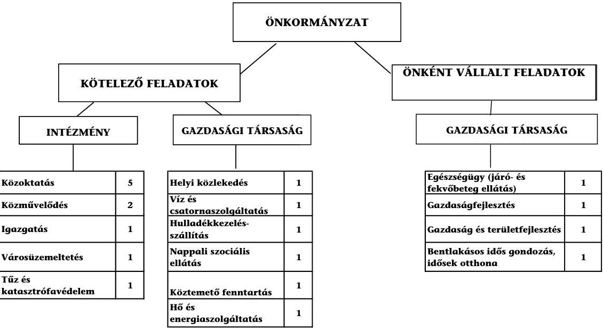

Az Önkormányzat feladatait 2011. június 30-án (a Polgármesteri hivatallal együtt) 10 költségvetési szervvel és 10 gazdasági társasággal látta el. A feladatellátás költségvetési szerveinek száma a 2007. évi 17-ről 2011. év I. félév végére 10-re csökkent, ugyanakkor a telephelyeinek száma 16 -ról 23 -ra nőtt.

[^0]
[^0]:    ${ }^{8}$ Erre jogszabályi előírás ma már nem kötelezi az Önkormányzatot.

---

Az Önkormányzati feladatokat ellátó 10 gazdasági társaság közül az Önkormányzat két gazdasági társaságban (Fűtőerőmű Zrt., Egészségcentrum Kft.) kizárólagos tulajdonos, egy társaságban (Carboker Kft.) 75-99\% közötti tulajdonnal rendelkezik, három gazdasági társaságban (Komló-víz Kft., Fejlesztési Kft. és Szociális Kft.) 51-74\% közötti tulajdoni hányaddal rendelkezik, továbbá négy gazdasági társaságban nem rendelkezik tulajdoni hányaddal. A gazdasági társaságok távhőszolgáltatás, településüzemeltetés, hulladékkezelés-szállítás, víz- és szennyvízkezelés, helyi tömegközlekedés, köztemető fenntartás, a szociális és egészségügyi ellátás, valamint gazdaság- és területfejlesztés területén kaptak szerepet az Önkormányzat feladatellátásában. A gazdasági társaságok a működésükhöz az ellenőrzött időszakban összesen 900,4 millió Ft (Pl. a Fűtőerőmű Zrt. 111,2 millió Ft-ot és az Egészségcentrum Kft. 190,9 millió Ft-ot) rendszeres működési és 60,4 millió Ft (Fűtőerőmű Zrt. 55,6 millió Ft, Egészségcentrum Kft. 3 millió Ft és a Carboker Kft. 1,8 millió Ft) fejlesztési célú pénzeszköz átadásban részesültek. A támogatásokat szerződés alapján, megfelelő ellenőrzés mellett adta át az Önkormányzat, a társaságok a szerződésben előírt feladatot ellátták.

Az Önkormányzat 2007. és 2010. évi múködési kiadásainak ágazatonkénti finanszírozási összetételét a következő ábra szemlélteti:
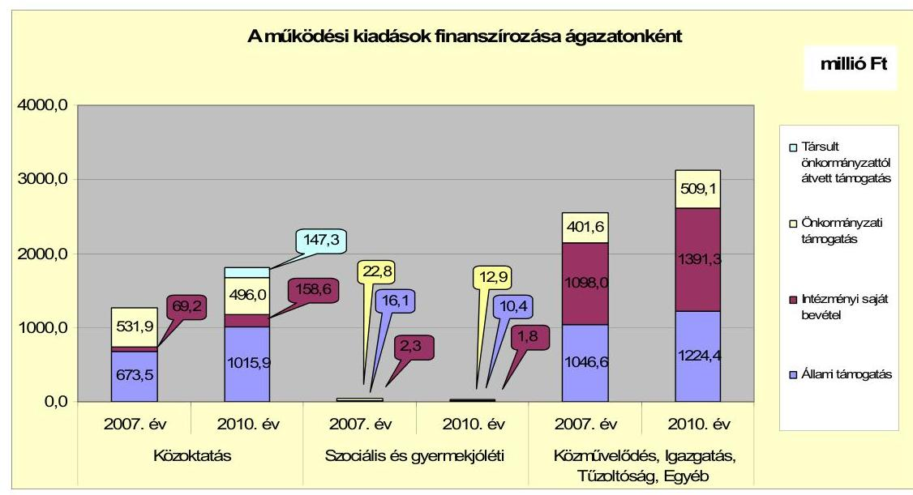
2007. évről 2010. évre 543,2 millió Ft-tal (42,6\%-kal) nőtt a közoktatási ágazat működés kiadása az általános iskolai és középfokú oktatás 2009. évi feladatátvétele miatt. Ennek következtében a megnövekedett ellátotti létszámhoz 342,5 millió Ft-tal (50,8\%-kal) több állami támogatás járt és 147,3 millió Ft támogatást finanszíroztak a társult önkormányzatok. Intézményátadás következtében a 2010. évben gyermekjóléti feladatra fordított múködési kiadás 16,1 millió Fttal (39,1\%-kal) kevesebb volt a 2007. évinél. Az összes többi ágazat 2010. évi múködési kiadása 578,6 millió Ft-tal (22,7\%-kal) volt magasabb a 2007. évinél. A kiadások növekedését 339,5 millió Ft-tal az adósságszolgálat miatti többletkiadások, a szociális juttatások bővülése és a GESZ 238,7 millió Ft-tal megnövekedett kiadásai okozták.

---

Az önként vállalt feladatok 2010. évi kiadásai 322,1 millió Ft-tal (57,8\%-kal) haladták meg az előző három év átlagát (557,3 millió Ft). Az Önkormányzat múködésének biztonságát befolyásolhatja az önként vállalt feladatok múködési célú költségvetési kiadásokon belüli növekvő aránya.
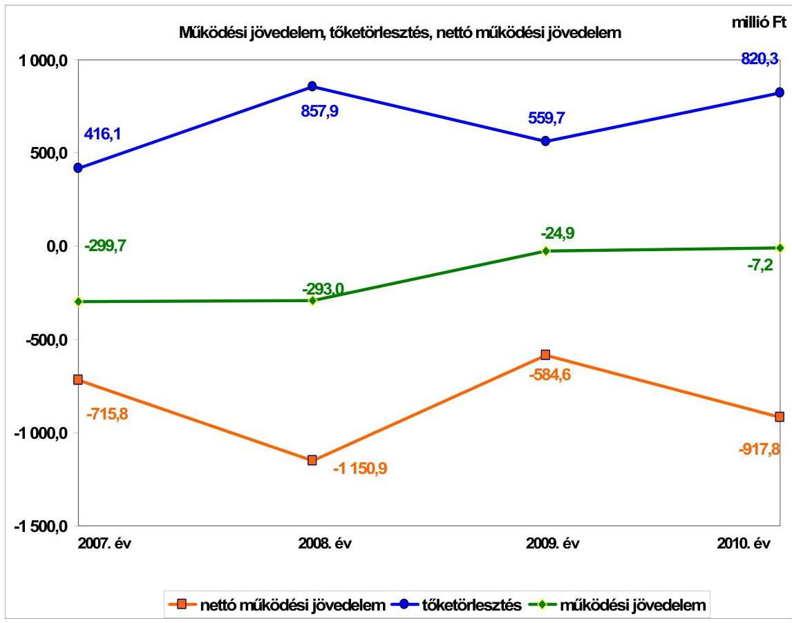

Az Önkormányzat folyó költségvetés egyenlege (múködési jövedelem) a 2007-2010 évek között múködési forráshiányt mutatott.

A 2007. és a 2008. év 299,7 millió Ft és 293 millió Ft összegű működési hiányának $87,4 \%$-át és $98,0 \%$-át a Kórház gazdasági társasággá történő átszervezése miatt felmerülő kiadások tették ki, amelyeket az elmaradt bérek és szállítói tartozások rendezésére fordítottak.

A növekvő eladósodás miatt a tőketörlesztések növekedésével egyidejűleg a pénzügyi kapacitás romlása figyelhető meg a 2008. és a 2010. évben. A tőketörlesztés 2008. évben 106,2\%-kal nőtt, mert a kötvénykibocsátásból származó forrás terhére fennálló hiteleit refinanszírozta az Önkormányzat. A 2010. évi 820,3 millió Ft-os tőketörlesztést a megemelkedett folyószámla és likvidhitel állománynövekedése okozta.

---

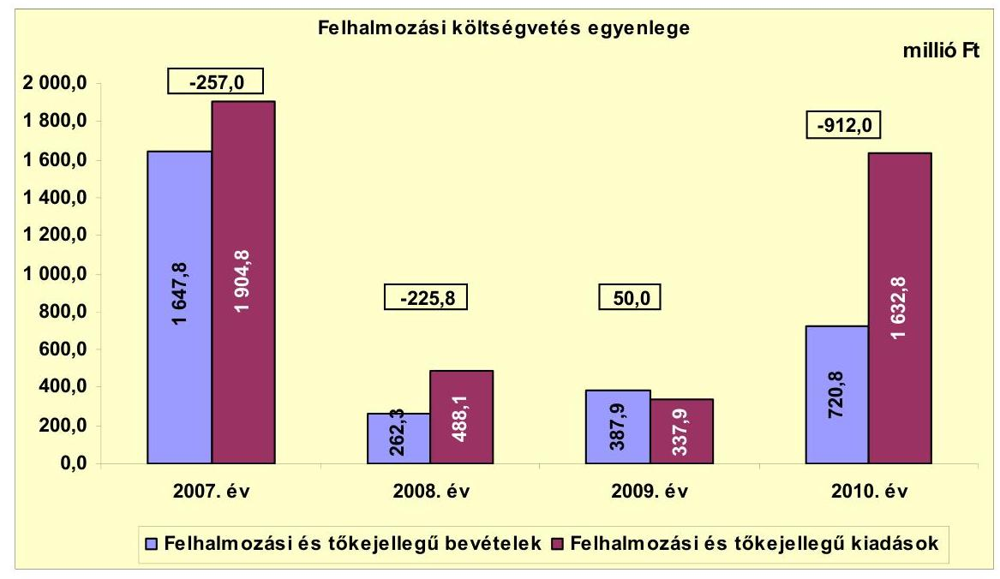

A felhalmozási költségvetés egyenlege a vizsgált időszakban a 2009. év kivételével minden évben deficites volt. Ez a fennálló negatív nettó múködési jövedelem mellett jelentős finanszírozási kockázattal jár, mivel a gazdálkodás során nem képződött fedezet a fejlesztési hiány finanszírozására.

A felhalmozási bevételek és kiadások alakulását a 2007. évben a térségi szennyvízcsatorna beruházás határozta meg, amihez 964,6 millió Ft címzett támogatásban részesült, ezen kívül a felhalmozási forráshiány fedezetére 1943,9 ezer CHF összegű hitelt vett fel a 2007. évben az Önkormányzat. A beruházás megvalósítására 1570,7 millió Ft felhalmozási kiadást teljesítettek. A 2010. évben az Oktatási Központ kialakítására 1153,8 millió Ft-ot fordítottak, melynek forrása hazai és EU-s támogatás és a kötvénykibocsátásból származó forrás volt. A 2008-2009. években forráshiány miatt nem valósítottak meg jelentősebb fejlesztéseket.

A pénzügyi egyensúly fenntartása és a múködés finanszírozása külső források bevonásával volt biztosítható. A 2007-2010. években 2654,0 millió Ft hitelt törlesztettek. A tőketörlesztés és a felhalmozási forráshiány 2007-2010 között együttesen 3998,8 millió Ft-ot tett ki, ezt a 2007. január 1-jén rendelkezésre álló 275,2 millió Ft pénzkészlet nem fedezte. A további pénzeszközöket 2223,6 millió Ft hitel felvételével, valamint 1500 millió Ft kötvénykibocsátással teremtették meg.

Az Önkormányzat folyó bevétele a 2008. évre a Kórház gazdasági társasággá történő átalakítása miatt 857,9 millió Ft-tal csökkent, amit részben ellensúlyozott az állami hozzájárulások, a saját múködési bevételek és az átvett pénzeszközök növekedése. Jelentősebb 566,1 millió Ft-os ( $12,8 \%$-os) növekedés volt a folyó bevételekben a 2010. évben, amikor az előző évihez képest valamennyi bevételi jogcímen növekedés történt. Meghatározó az állami hozzájárulások és az szja bevétel együttes összegének 346,6 millió Ft-os ( $12,0 \%$-os) és az egyéb saját bevételek 192,0 millió Ft-os ( $25,6 \%$-os) növekedése volt, amelyet az Oktatási

---

központhoz csatlakozott oktatási intézmények miatti önkormányzati hozzájárulás és normatív hozzájárulás emelkedése okozott.

Az Önkormányzat folyó kiadásainak alakulását a vizsgált időszakban szintén a két nagyobb intézményi változás határozta meg. A 2008. évben 647,1 millió Ft-tal ( $12,9 \%$-kal) csökkentek a folyó kiadások a Kórház gazdasági társasággá történő átalakítása miatt. Ez a személyi juttatásokat 19,6\%-kal (424,8 millió Ft-tal), a munkaadókat terhelő járulékokat 99,5 millió Ft-tal ( $14,9 \%$-kal), a dologi kiadásokat 122,8 millió Ft-tal ( $9,8 \%$-kal) csökkentette. ${ }^{9}$ Ezt némileg ellensúlyozta a transzferkiadások és a kamatkiadások emelkedése, így a folyó kiadások a 2008. évre összességében 513,1 millió Ft-tal ( $10,2 \%$-kal) csökkentek. Az Oktatási Központhoz csatlakozott intézmények átvétele miatt a 2009. évben 3,7\%-kal ( 65,8 millió Ft-tal), a 2010. évben további 14,2\%-kal 255,9 millió Fttal növekedtek a személyi juttatások, a 2010. évben 10,1\%-kal (110,6 millió Fttal) a dologi kiadások. A változások hatására a vizsgált időszak egészében a folyó kiadások 1,3\%-kal (66,5 millió Ft-tal) csökkentek.

A műszakilag befejezett fejlesztések jelentős részét hazai támogatásból és saját bevételből fedezték. A 2007-2010. évek időszakában 3685,9 millió Ft értékű fejlesztés és felújítás forrása a saját erő, a hazai- és EU-s támogatások mellett 153,3 millió Ft ( $4,2 \%$ ) kötvénykibocsátásból származó bevétel volt. A 2010. december 31-én folyamatban lévő fejlesztési feladatok végrehajtására 2007-2010. között 1173,5 millió Ft kiadást teljesítettek, amelyre kötvénykibocsátásból 84,3 millió Ft-ot ( $7,2 \%$ ) fordítottak. Az EU-s támogatásból megvalósult fejlesztések finanszírozása során a 2010. évben likviditási gondot okozott a támogatások késve történő kiutalása. A beruházások előfinanszírozását folyószámlahitelből biztosították, ami növelte a pénzügyi kockázatot.

Az Önkormányzat 2010. december 31-én folyamatban lévő fejlesztési feladatok 2010. évet követő kötelezettség-vállalásainak összege 589,9 millió Ft volt, amelyből 444,5 millió Ft-ot EU-s támogatásból és 45,7 millió Ft-ot hazai támogatásból, 99,7 millió Ft-ot a kötvénykibocsátásból származó bevételből terveznek biztosítani. Saját bevétellel a fejlesztések megvalósításánál nem számoltak. A folyamatban levő beruházások előfinanszírozásához szabad pénzeszközökkel nem rendelkeznek.

[^0]
[^0]:    ${ }^{9}$ A 2008. évi csökkenés nem egyezett meg a Kórház éves kiadásaival, mert a 2007. decemberi bérek és járulékaik, valamint az év végi szállítói tartozásállomány kifizetése az Önkormányzat 2008. évi költségvetését terhelte.

---

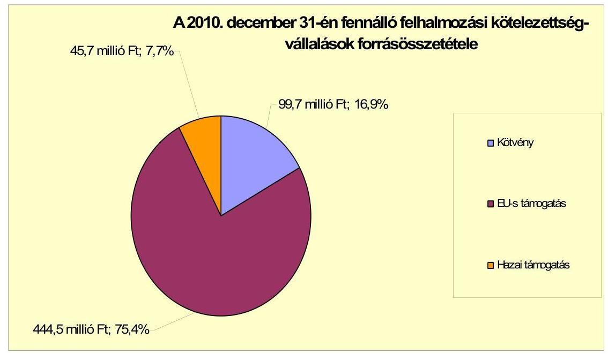

Az Önkormányzat mérleg szerinti pénzintézetekkel szembeni kötelezettsége a 2006. év végéről a 2011. év I. félév végére 377,6 millió Ft-ról 2835,0 millió Ft-ra nőtt, amelyből az árfolyamváltozás miatti különbözet 481,6 millió Ft volt. A fennálló pénzintézetekkel szembeni kötelezettségek 1337,8 millió Ft kötvénykibocsátás miatti hosszú lejáratú kötelezettségből, valamint 1015,6 millió Ft rövid lejáratú likvid- és folyószámlahitel igénybevételéből keletkeztek.

Az Önkormányzat kötelezettségvállalásaira képviselő-testületi döntés alapján került sor. A 2007. évben felvett 650,2 ezer CHF és 1293,7 ezer CHF összegű fejlesztési célú hitelét az Önkormányzat a 2008. évben az 1500 millió Ft összegű kötvénykibocsátásból származó forrásból visszafizette, így hosszú lejáratú hitelállománya nem volt 2010. december 31-én. A refinanszírozáshoz reorganizációs terv nem kapcsolódott, az Önkormányzat pénzügyi pozíciója nem javult.

Az Önkormányzat a kötvénykibocsátásból származó forrásokat a meghatározott céloknak megfelelően használta fel, a fel nem használt maradvány 2011. június 30-án 302,6 millió Ft volt, amit a pénzintézet elkülönített zárolt számlán kezel. Az Önkormányzat a kötvénykibocsátásból CHF-ben fennálló pénzintézetekkel szemben fennálló kötelezettségeiből 742,8 ezer CHF (145,4 millió Ft) tőkét törlesztett, és 1387,1 ezer CHF (268,3 millió Ft) kamatot fizetett 2008-2011. év I. féléve közötti időszakban. A 2007-2011. I. féléve között átmenetileg szabad pénzeszközeiből 202,4 millió Ft kamatbevételt realizált.

Az Önkormányzat költségvetésének pénzügyi egyensúlyát és a múködést a vizsgált időszakban egyre növekvő arányú folyószámlahitel, és folyamatosan 100-500 millió Ft rövid lejáratú likvid hitel igénybevételével tudta biztosítani. A változó összegű likvid hitel állomány a vizsgált időszakban folyamatosan fennállt és a folyószámlahitelhez hasonlóan funkcionált. Az Önkormányzat finanszírozásában a folyószámla és likvid hitel állandósult.

---

A folyószámlahitel igénybevétele a 2007-2011. év I. félévéig az alábbiak szerint alakult:

| Megnevezés | 2007. év | 2008. év | 2009. év | 2010. év | 2011. I. félév |
| :-- | :--: | :--: | :--: | :--: | :--: |
| Keretösszeg január 1-jén (millió Ft-ban) | 300,00 | 600,00 | 600,00 | 700,00 | 700,00 |
| Állagos napi állomány (millió Ft-ban) | 46,1 | 500,9 | 477,8 | 465,5 | 592,1 |
| Folyószámla hitellel zárt napok száma (nap) | 202 | 360 | 364 | 364 | 181 |
| Egyenleg (állomány) | 396,4 | 453,7 | 368,5 | 698,5 | 458,1 |

A vizsgált időszakban likviditás és a múködés biztosítása az Önkormányzatnak 290,2 millió Ft kamatkiadást ${ }^{10}$ és 9,8 millió Ft egyéb költség fizetési kötelezettséget okozott.

Az Önkormányzat gazdasági társaságai részére a fejlesztési és egyéb hitelek igénybevételéhez készfizető kezességet nem vállalt. A 2010. év végére a kezességgel kapcsolatos kötelezettség 5,0 millió Ft volt, amely 2008-ban keletkezett és egy társulásban megvalósuló beruházáshoz a gesztor által felvett hitelre vonatkozott. A vizsgált időszakban a gazdasági társságok részére az Önkormányzat 15,5 millió Ft összegű tagi kölcsönt nyújtott.

Az Önkormányzat kötelezettségeinek 2010. december 31-i, valamint 2011. június 30 -ai állományát és várható alakulását a kötelezettségek lejáratáig a következő táblázat szemlélteti:

| Megnevezés | Állomány 2010. dec. 31-én |  |  | Állomány 2011. június 30-án |  |  | Várható kötelezettség 2011-2013. években |  | Várható kötelezettség 2014. évet követően |  |
| :--: | :--: | :--: | :--: | :--: | :--: | :--: | :--: | :--: | :--: | :--: |
|  | HUF-ban (millió Ftban) | Devizában (összege, ezer ...ban) | Devize   nem | HUF-ban (millió Ftban) | Devizában (összege, ezer ...ban) | Devize   nem | HUF-ban (millió Ftban) | Devizában (összege, ezer ...ban) | HUF-ban (millió Ftban) | Devizában (összege, ezer ...ban) |
| Pénzintézeti kötelezettségek |  |  |  |  |  |  |  |  |  |  |
| KOMLO 2020. kötvény |  | 8985,7 | CHF |  | 8418,1 | CHF |  | 2345,9 |  | 8968,9 |
| Víziközmű társulati hitel | 2,4 |  |  | 2,4 |  |  | 2,4 |  |  |  |
| Folyószámla hitel | 698,5 |  |  | 458,1 |  |  | 458,1 |  |  |  |
| Lávid hitel | 500,0 |  |  | 500,0 |  |  | 500,0 |  |  |  |
| Pénzintézeti kötelezettségek összesen HUF-ban | 1200,9 |  |  | 980,5 |  |  | 960,5 |  |  |  |
| Pénzintézeti kötelezettségek összesen CHF-ban |  | 8685,7 |  |  | 8418,1 |  |  | 2345,9 |  | 8968,9 |
| Pénzintézeti kötelezettségek összesen EURO-ban |  |  |  |  |  |  |  |  |  |  |
| Biztosilások |  |  |  |  |  |  |  |  |  |  |
| Kezesség | 5,0 |  |  | 5,0 |  |  |  |  |  |  |
| Biztosilások összesen | 5,0 |  |  | 5,0 |  |  |  |  |  |  |
| Szállítói tartozás | 263,3 |  |  | 138,7 |  |  | 138,7 |  |  |  |

Az Önkormányzatnak pénzintézetekkel szemben fennálló kötelezettsége a 2011. év I. félév végén 960,5 millió Ft, 8418,1 ezer CHF. Ezek várható kötelezettsége (tőke, kamat és egyéb költség) a legutóbbi kamatfizetés feltételei alapján a 2011-2013. években 960,5 millió Ft és 2345,9 ezer CHF. Az Önkormányzat szállítói kötelezettségeinek állománya, ezen belül a lejárt szállítói tartozások összege jelentősen emelkedett. A 2011. év I. félév végi szállítói tartozása 138,7 millió Ft, a lejárt szállítói tartozásállomány 98,9 millió Ft, melyből a 90 napot meghaladó lejárt szállítói tartozásállomány 6,7 millió Ft, az átütemezett szállítói tartozások összege 5,7 millió Ft volt. A polgármester nem tett eleget az Adósságrendezési tv. 5. § (2) bekezdése előírásának, mert a 90 napon túli szállí-

[^0]
[^0]:    ${ }^{10}$ A folyószámlahitel és likvidhitel kamatai együtt.

---

tói tartozások esetében nem kezdeményezte a Képviselő-testület döntését az adósságrendezési eljárás megindításáról.

A 2011-2013. évek kötelezettségeinek teljesítésére figyelembe vehető 4,3 millió Ft szabad pénzmaradvány, 298,5 millió Ft mérlegben kimutatott követelésállomány, és a tehermentes forgalomképes ingatlanvagyon nem biztosít fedezetet a kötelezettségekre. Az Önkormányzat 2014. évet követően jelenleg ismert pénzintézeti kötelezettsége 8868,9 ezer CHF. A vállalt pénzintézetekkel szembeni és egyéb kötelezettségek fedezete rövid távon és közép távon sem biztosított. Az Önkormányzat pénzügyi egyensúlya rövid távon veszélyeztetett.

Az adósságot keletkeztető kötelezettségvállalásokra vonatkozó képviselőtestületi előterjesztések nem tartalmazták a visszafizetés forrásait, az adósságot keletkeztető kötelezettségvállalásról szóló döntéskor nem mutatták be a Képvi-selő-testületnek a jövőben várható - árfolyam-, kamat- és törlesztési - kockázatot.

Az Önkormányzat nyilatkozata szerint - a forrásszabályozás bizonytalanságára hivatkozva - a fennálló adósságszolgálatuk forrását nem tudják meghatározni. Az állandósult 500,0 millió Ft összegű likvid és 700,0 millió Ft összegű folyószámlahitel állandó forrásként van jelen az Önkormányzat költségvetésében, e források nélkül a működőképesség nem biztosított. Az adósság kezelése érdekében adósságkezelési koncepciót, cselekvési tervet nem terjesztettek a Kép-viselő-testület elé. Az éves költségvetési rendeletekhez készített előterjesztésekben minden esetben bemutatták az adósság mértékét, számos az adósság csökkentését célzó intézkedést tartalmaztak. Előirták a kiadások csökkentését, maximálták az adott évben a működési célú hitelfelvétel mértékét.

Az önkormányzati kötelezettségek növekedése mellett az Önkormányzat minősített többségi befolyásával rendelkező gazdasági társaságok kötelezettségei is befolyásolhatják az Önkormányzat pénzügyi egyensúlyát, amit a következő táblázat tartalmaz:

| Megnevezés | Állomány 2010. dec.31-én |  |  | Állomány 2011. június 30-án |  |  | Várható kötelezettség 2011-2013. években |  | Várható kötelezettség 2014. évet követően |  |
| :--: | :--: | :--: | :--: | :--: | :--: | :--: | :--: | :--: | :--: | :--: |
|  | HUF-ban   (mibió Ftban) | Devizában (összege, ezer ... ben) | Deviza nem | HUF-ban (mibió Ftban) | Devizában (összege, ezer ... ben) | Deviza nem | HUF-ban (mibió Ftban) | Devizában (összege, ezer ... ben) | HUF-ban (mibió Ftban) | Devizában (összege, ezer ... ben) |
| Ftöterőmú Zrt hosszúkóintó hitel |  | 5521,6 | EUR |  | 5186,3 | EUR |  | 2338,1 |  | 3797,9 |
| Folyószánta és lévő hitel | 264,2 |  |  | 359,7 |  |  | 359,7 |  |  |  |
| Pénzintézeti kötelezettségek összesen: | 264,2 | 5521,6 | EUR | 359,7 | 5186,3 | EUR | 359,7 | 2338,1 |  | 3797,9 |
| Szállító tartozás | 463,0 |  |  | 388,0 |  |  |  |  |  |  |

Az Önkormányzat minősített többségi tulajdonú gazdasági társaságainak kötelezettsége a 2011. június 30-án 359,7 millió Ft, továbbá 5186,3 ezer EUR pénzintézetekkel szembeni kötelezettség, valamint 398,0 millió Ft szállítói tartozás volt, amely kötelezettségek nem teljesítése hatással lehet az Önkormányzat likviditására, pénzügyi egyensúlyi helyzetére. A minősített többségi tulajdonú gazdasági társaságok (Egészségcentrum Kft., Carboker Kft.) pénzügyi egyensúlyi helyzete nem stabil, a lejárt szállítói állomány figyelemmel kísérése nem volt biztosított. Esetleges csőd, vagy felszámolási eljárás esetén a bíróság korlátlan és teljes felelősséget állapíthat meg az Önkormányzat terhére.

---

Az Önkormányzat 2007-2010 között eszközállománya után 1029,5 millió Ft összegű értékcsökkenést mutatott ki, az elhasznált eszközök pótlására 1434,4 millió Ft-ot fordított. A Képviselő-testületnek előterjesztett éves zárszámadási rendeleteikben nem mutatták be az Önkormányzat eszközei után tárgyévben elszámolt értékcsökkenés összegét, az eszközpótlásra fordított tényleges kiadásokat, az eszközök elhasználódási fokának alakulását.

Az Önkormányzat kimutatása szerint az ellenőrzött időszakban kiadási megtakarítást eredményező és bevételt növelő intézkedéseket tett. A 20072011. év I. félév között tett intézkedések hatására 1030,8 millió Ft kiadási megtakarítást, továbbá 765,3 millió Ft bevételi többletet mutattak ki. A kiadási megtakarítások 38,4\%-a az elrendelt álláshely csökkentések eredménye. Az álláshely-csökkentő intézkedések 2007-2011. év I. féléve között önkormányzati szinten összesen 298 álláshely megszüntetését jelentették. Egyes közszolgáltatási területeken azonban feladatbővülések is voltak az önkormányzatoktól átvett óvodai, általános iskolai, gimnáziumi, szakiskolai, szakközépiskolai feladatok miatt, amely 173 álláshely növekedéssel járt. Ennek következtében az időszak álláshelyeinek száma 125 fővel csökkent. A bevételnövelő intézkedések ingatlanok bérbeadásához, adó mértékek növeléséhez, jegyzői intézkedéseken alapuló adóhátralékok behajtásához, lejárt tartozások behajtásához, térítési díjak emeléséhez kapcsolódtak.

Az utóellenőrzés a pénzügyi egyensúly javítására tett kettő szabályszerűségi és egy célszerűségi javaslat hasznosítására terjedt ki. Egy szabályszerűségi javaslatot az intézkedési terv szerinti határidőben megvalósítottak. Egy szabályszerűségi javaslat a hitelfelvételi eljárás elhúzódása miatt nem valósult meg. Egy célszerűségi javaslat megvalósítása - a határidő lejárta előtt - folyamatban van.

Az Önkormányzat pénzügyi egyensúlyi helyzetét összegezve a következők emelhetők ki:

Komló Város Önkormányzatának pénzügyi egyensúlyi helyzete rövid távon veszélyeztetett.

Múködési jövedelme a vizsgált időszak egészében negatív volt. A növekvő adósságszolgálat finanszírozását és a likviditás valamint a múködés biztosítását folyamatosan növekvő és állandósult folyószámla- és likvidhitel igénybevételével teremtette meg.

Az Önkormányzat pénzintézetekkel szemben fennálló kötelezettségállománya és a lejárt szállítói tartozásállománya növekedett. A fennálló hitelei refinanszírozására és a felhalmozási forráshiány fedezetére kötvényforrást vett igénybe.

Az Önkormányzat várható kötelezettségeinek teljesítéséhez nincs szabad tartalékolt pénzeszköze, vagy szabad pénzmaradványa, nettó múködési jövedelem nem képződött.

A folyamatban lévő beruházások előfinanszírozásához szabad pénzeszközökkel nem rendelkezik.

---

Az Önkormányzat múködésének biztonságát befolyásolhatja az önként vállalt feladatok múködési célú költségvetési kiadásokon belüli növekvő aránya.

A kizárólagos és többségi tulajdonú gazdasági társaságainak pénzügyi egyensúlyi helyzete nem stabil, a gazdasági társaságokról szóló törvény szerint az Önkormányzatnak, mint tulajdonosnak tőkepótlási kötelezettsége keletkezik, a társaságok pénzintézetekkel szembeni és szállítói kötelezettségállománya jelentős. A önkormányzati feladatokat ellátó társaságok múködéséhez rendszeresen pénzeszközöket ad át az Önkormányzat.

Az Állami Számvevőszékről szóló 2011. évi LXVI. törvény 33. § (1) bekezdésében foglaltak értelmében a jelentésben foglalt megállapításokhoz kapcsolódó intézkedési tervet köteles az ellenőrzött szervezet vezetője összeállítani és azt a jelentés kézhezvételétől számított harminc napon belül az ÁSZ részére megküldeni. Amennyiben az intézkedési tervet határidőben nem küldi meg a szervezet, vagy az továbbra sem elfogadható, az ÁSZ elnöke a hivatkozott törvény 33. § (3) bekezdés a)-b) pontjaiban foglaltakat érvényesítheti.

# A 2011. június 30-i pénzügyi egyensúlyi helyzet alapján az ellenőrzés intézkedést igénylő megállapításai és javaslatai a következők: 

## a Polgármesternek

1. Az Önkormányzat nettó múködési jövedelme a vizsgált időszakban negatív volt. Az Önkormányzat finanszírozása a vizsgált időszakban egyre növekvő arányú folyószámla és likvidhitel igénybevételével volt biztosítható, finanszírozásában a folyószámla és likvidhitel állandósult. Az intézményszervezeti átalakítások, kiadáscsökkentő és bevételnövelő intézkedések nem biztosítanak elegendő forrást a pénzügyi egyensúly helyreállításához. A folyamatban levő beruházások előfinanszírozásához szabad pénzeszközökkel nem rendelkeznek. A múködési kiadásokon belül az önként vállalt feladatok aránya növekedett. A pénzintézeti és egyéb kötelezettségek fedezete rövid távon és közép távon sem biztosított.

Javaslat:
Az Önkormányzat pénzügyi egyensúlyának gyors helyreállítása és hosszú távú fenntarthatósága érdekében kezdeményezze - felelősök és határidők megjelölésével - az alábbi intézkedések megtételét:
a) Tárja fel a bevételszerző és kiadáscsökkentő lehetőségeket. Intézkedjen a bevételek növelésére, a kintlévőségek behajtására és a kiadások csökkentésére;
b) Terjesszen a Képviselő-testület elé reorganizációs programot a kedvezőtlen pénzügyi folyamatok megállítására, a pénzügyi egyensúlyi helyzet gyors stabilizálására;
c) Képezzen egyensúlyi (elkülönített) tartalékot az adósságszolgálat teljesítése érdekében;

---

d) Mérje fel a folyamatban lévő beruházásokkal kapcsolatos kötelezettségek átütemezésének pénzügyi és jogi lehetőségeit, illetve hatásait. Szükség esetén kezdeményezze a támogatóknál annak átütemezését;
e) Vizsgálja meg az állandósult folyószámla- és likvidhitel hosszú távú kötelezettséggé történő átalakításának jogi lehetőségét, és a Stabilitási tv. 10. §-ában előírt feltételek fennállása esetén kezdeményezze a Kormánynál ennek engedélyezését;
f) Tekintse át az önként vállalt feladatok finanszírozhatóságát a kötelező feladatellátás elsődlegességének biztosítása érdekében, mutassa be a Képviselőtestületnek a megoldás lehetőségeit, és szükség esetén a gazdasági program módosításának igényét.
g) Mutassa be havonta legalább három évre kitekintően kötelezettségeinek finanszírozási forrásait.
2. Az Önkormányzat lejárt szállítói tartozásállománya 2011. június 30-án 98,9 millió Ft volt, melyből a 90 napot meghaladó 6,7 millió Ft.

Javaslat:
Kezelje az Önkormányzat lejárt szállítói tartozásállományát, a szállítói kitettség és a jogszabályi következmények elkerülése érdekében.
3. A Képviselő-testületnek előterjesztett éves zárszámadási rendeleteikben nem mutatatták be az Önkormányzat eszközei után tárgyévben elszámolt értékcsökkenés öszszegét, az eszközpótlásra fordított tényleges kiadásokat, az eszközök elhasználódási fokának alakulását.

Javaslat:
Mutassa be a Képviselő-testületnek évente a zárszámadási rendelet előterjesztésében az értékcsökkenés összegét, és ezzel összevetve az elhasználódott eszközök pótlására fordított tényleges kiadásokat, az eszközök elhasználódási fokának alakulását.
4. Az Önkormányzat minősített többségi tulajdonú gazdasági társaságainak kötelezettsége 2011. június 30-án 359,7 millió Ft és további 5186,3 ezer EUR pénzintézetekkel szembeni kötelezettség, valamint 398,0 millió Ft szállítói tartozás volt, a kötelezettségek nem teljesítése hatással lehet az Önkormányzat likviditására, pénzügyi egyensúlyi helyzetére. A minősített többségi tulajdonú gazdasági társaságok pénzügyi egyensúlyi helyzete nem stabil, a lejárt szállítói állomány figyelemmel kísérése nem volt biztosított.

Javaslat:
Terjesszen intézkedési tervet a Képviselő-testület elé a minősített többségi tulajdonú gazdasági társaságok pénzügyi egyensúlyi helyzetének stabilizálása érdekében.
5. Az adósságot keletkeztető kötelezettségvállalásokra vonatkozó képviselő-testületi előterjesztések nem tartalmazták a visszafizetés forrásait, az adósságot keletkeztető kö-

---

telezettségvállalásról szóló döntéskor nem mutatták be a Képviselő-testületnek a jövőben várható - árfolyam-, kamat- és törlesztési - kockázatot.

Javaslat:
a) Az adósságot keletkeztető kötelezettségvállalásról szóló döntéskor mutassa be a Képviselő-testületnek a jövőben várható - árfolyam-, kamat- és törlesztési - kockázatot;
b) Gondoskodjon, hogy a jövőben az adósságot keletkeztető kötelezettségvállalásokról szóló képviselő-testületi előterjesztések tételesen tartalmazzák a visszafizetés forrásait;
6. Az SzMSz a kötelező és az önként vállalt feladatok között nem tartalmazta a helyi tömegközlekedést és távhőszolgáltatást. Ezeket a feladatokat az Önkormányzat kötelező feladatnak tekintette a gazdasági programja és a gazdasági társasági feladatellátás szerint.

Javaslat:
Gondoskodjon a közúti közlekedésről szóló 1988. évi I. törvény 8. § (1) bekezdés d) pontja, illetve a távhőszolgáltatásról szóló 2005. évi XVIII. törvény 6. § (1) bekezdés alapján az SzMSz módosításáról, hogy a helyi tömegközlekedés és távhőszolgáltatás a kötelező feladatok között legyenek nevesítve.

---

# II. RÉSZLETES MEGÁLLAPÍTÁSOK 

## 1. Az ÖNKORMÁNYZAT KÖTELEZŐ ÉS ÖNKÉNT VÁLlALT FELADATAI, A FELADATELLÁTÁS SZERVEZETI KERETEI ÉS ANNAK VÁLTOZÁSAI

Az Önkormányzat kötelező és önként vállalt feladatainak körét az SzMSz-ben szabályozta. Kettő kötelezőnek tartott feladatot - a helyi tömegközlekedés és a távhőszolgáltatás - az SzMSz nem tartalmazta. Az Önkormányzat ezeket a feladatokat kötelezőnek jelölte meg, a gazdasági programra és a törvényi szabályozásra hivatkozva.

A gazdasági program II.2.2. városüzemeltetés, kommunális feladatok fejezete a kiemelt fejlesztendő közfeladatok közé sorolja a helyi tömegközlekedést és a távhőszolgáltatást. A közúti közlekedésről szóló 1988. évi I. törvény 8. § (1) bekezdés d. pontjában a közúti közlekedéssel összefüggő állami és önkormányzati feladatok között szerepel a tömegközlekedés múködtetésének biztosítása. A távhőszolgáltatásról szóló 2005. évi XVIII. törvény 6. § (1) bekezdés szerint a települési önkormányzat köteles biztosítani a távhőszolgáltatással ellátott létesítmények távhő ellátását. Ezek alapján az Önkormányzat kötelező települési önkormányzati feladatnak tekinti a helyi tömegközlekedést és a távhőszolgáltatást. A gazdasági társaságok a tanúsítványokban a feladatokat kötelezőnek minősítették.

Az Önkormányzat kimutatása szerint önként vállalt közszolgáltatási feladatai: szakképzés, szakközépiskolai oktatás, felnőttképzés, nappali rendszerú gimnáziumi oktatás, kollégiumi ellátás, alapfokú művészeti oktatás, logopédiai és pedagógia szakszolgálat múködtetése, közművelődési, közgyűjteményi feladatellátás, gyógytestnevelés, iskolai úszásoktatás, járó- és fekvőbeteg ellátás, gaz-daság- és területfejlesztés, valamint az idősek bentlakásos, otthoni ellátása.

A 2010. évi múködési kiadások kötelező feladatonkénti megoszlását és azok finanszírozási arányait a következő táblázat mutatja be: ${ }^{11}$

[^0]
[^0]:    ${ }^{11}$ A múködési kiadások között nem szerepelnek a kisebbségi önkormányzatok, az egészségügy központilag finanszírozott és a társulásos fejlesztési feladatok kiadásai. Tartalmazza viszont a múködési célú pénzeszközátadásokat és a támogatásértékű és egyéb támogatások kiadásait.

---

| Ellátott feladat | Múködési   kiadás   összesen   (millió Ft) | Kötelező   feladatok   kiadásainak   részaránya   $\%$ | Múködési   bevétel   összesen   (millió Ft) | Állami   támogatás   részaránya   $\%$ | Intézményi   saját bevétel   részaránya   $\%$ | Önkormányzati   támogatás   részaránya   $\%$ | Társulás esetén a   társult   önkormányzatiol   átvett támogatás   részaránya \% |
| :--: | :--: | :--: | :--: | :--: | :--: | :--: | :--: |
| Övodák | 437,0 | 100,0 | 437,0 | 49,7 | 10,3 | 39,4 | 0,6 |
| Általános iskolák | 868,2 | 100,0 | 868,2 | 54,2 | 8,3 | 37,3 | 0,2 |
| Gimnáziumok | 118,9 | 0,0 | 118,9 | 68,7 | 0,9 | 0,0 | 30,4 |
| Szakközéptiskolák,   szakképző intéz-   mények | 369,5 | 0,0 | 369,5 | 61,9 | 9,5 | 0,0 | 28,8 |
| Kolággiumok | 23,7 | 0,0 | 23,7 | 72,9 | 21,7 | 0,0 | 5,4 |
| Gyermekjötti   intézmények | 25,1 | 100,0 | 25,1 | 41,7 | 7,0 | 51,3 | 0,0 |
| Közmövelődési   intézmények | 84,0 | 100,0 | 84,0 | 4,0 | 32,8 | 63,2 | 0,5 |
| Egyéb intézmények | 1025,4 | 88,7 | 1025,4 | 27,9 | 27,6 | 44,5 | 0,0 |
|  | 724,3 | 100,0 | 724,3 | 6,8 | 93,2 | 0,0 | 0,0 |
| Polgármesteri hivatal   igazgatási kiadások |  |  |  |  |  |  |  |
| Polgármesteri   hivatalban ellátott   egyéb feladatok   múködési kiadások | 1291,1 | 80,5 | 1291,1 | 68,6 | 31,4 | 0,0 | 0,0 |
| Múködési kiadá-   sok összesen | 4967,7 | 82,3 | 4967,7 | 45,3 | 31,2 | 20,5 | 3,0 |

Az Önkormányzat 2010. évben múködési kiadásokból 4088,4 millió Ft-ot (82,3\%) a kötelező feladatokra fordított. Az önként vállalt feladatok 879,3 millió Ft-ot (17,7\%) tettek ki. Az Önkormányzat - adatszolgáltatása szerint - a 2007. évben 3448,7 millió Ft-ot (89,3\%), a 2008. évben 3952,8 millió Ftot $(87,3 \%)$, a 2009. évben 3738,7 millió Ft-ot ( $84,6 \%$ ) fordított kötelező feladatokra. A vizsgált időszakban az Önkormányzatnál az önként vállalt feladatok aránya 10,7\%-ról (413,0 millió Ft-ról) 17,7\%-ra (879,3 millió Ft-ra) nőtt, amely 322,1 millió Ft-tal ( $57,8 \%$-kal) több az előző három év átlagához (557,3 millió Ft) képest. Az Önkormányzat pénzügyi egyensúlyának fenntarthatóságára hosszú távon kihatással lehet az önként vállalt feladatokra fordított múködési kiadások 2007-2010. évek közötti növekvő mértéke és aránya.

A 2010. évi múködési kiadásra fordított összeg 698,0 millió Ft-tal (16,3\%-kal) magasabb az előző három év átlagához (4269,7 millió Ft) képest elsősorban a középfokú oktatás átvétele miatt . A 2011. évben az önként vállalt feladatokra 685,5 millió Ft-ot terveztek. Ez 22,0\%-kal kisebb az előző évnél.

A kötelező feladatokon belül a 2010. évben a legnagyobb kiadás a 1763,6 millió Ft (43,1\%) a Polgármesteri hivatalban merült fel. Az egyéb intézmények Hivatásos Túzoltóság, GESZ és a Városgondnokság - által ellátott kötelező feladatokra 909,5 millió Ft-ot (22,3\%) fordítottak.

A teljesített 2010. évi múködési kiadások finanszírozása 45,3\%-ban (2250,8 millió Ft) állami hozzájárulásból, 31,2\%-ban (1551,6 millió Ft) intézményi saját bevételből, 20,5\%-ban (1017,9 millió Ft) önkormányzati forrásból, valamint 3\%-ban (147,3 millió Ft) a feladatok közös ellátására társult önkormányzatok hozzájárulásából történt. A finanszírozási forrásokon belül 2007. évhez képest a költségvetési hozzájárulás részaránya 0,3 százalék-

---

ponttal, 514,7 millió Ft-tal emelkedett. ${ }^{12}$ Az önkormányzati hozzájárulás aránya 4,3 százalékponttal csökkent annak ellenére, hogy összegében 61,6 millió Ft-tal növekedett. Az intézményi saját bevétel 0,9 százalékponttal, 382,1 millió Ft-tal emelkedett. A társult önkormányzattól átvett támogatás részaránya 3 százalékponttal, 147,3 millió Ft-tal nőtt.

A közoktatási feladatokra fordított 1817,8 millió Ft az összes múködési kiadás 36,6\%-át tette ki. A vizsgált időszakban 42,6\%-kal (543,2 millió Ft) nőtt az ágazat múködés kiadása az általános iskolai és középfokú oktatás 2009. évi feladatátvétele miatt. A 2010. évi múködés kiadásaira fordított összeg 465,1 millió Ft-tal ( $34,4 \%$-kal) magasabb az előző három év átlagához (1352,7 millió Ft) képest.

A közoktatási ágazat múködési kiadásainak 47,8\%-át (868,2 millió Ft) kötelező alapfokú oktatási feladatokra fordította 2010. évben. A közoktatás összes múködési kiadásából 512,1 millió Ft-tal ( $28,2 \%$-a) az önként vállalt középfokú oktatási feladatokat finanszírozta, amelyet az Oktatási Központ tagjaként lát el.

A közoktatási ágazat 2010. évi múködési kiadását az állami hozzájárulás 55,9\%-ban (1015,9 millió Ft), az önkormányzati támogatás 27,3\%-ban (496,0 millió Ft), ${ }^{13}$ az intézményi saját bevétel $8,7 \%$-ban ( 158,6 millió Ft) és a társult önkormányzatok támogatása $8,1 \%$-ban ( 147,3 millió Ft) fedezte.
2010. évben gyermekjóléti feladatokra fordított 25,1 millió Ft múködési kiadás $51,3 \%$-át ( 12,9 millió Ft) az önkormányzati támogatás, $41,7 \%$-át ( 10,4 millió Ft) az állami hozzájárulás és $7,0 \%$-át ( 1,8 millió Ft) az intézményi saját bevétel tette ki. A vizsgált időszak első évéhez képest 39,1\%-kal (16,1 millió Ft) alacsonyabb a gyermekjóléti feladatokra fordított múködési kiadás az intézményátadás ${ }^{14}$ következtében. A 2010. évi múködés kiadásaira fordított összeg 16,9 millió Ft-tal ( $40,4 \%$-kal) magasabb az előző három év átlagához ( 42,0 millió Ft) képest.

A közmúvelődés intézményi feladatokra fordított 84,0 millió Ft múködési kiadásra az önkormányzati támogatás 53,1 millió Ft összege 63,2\%-ban, az intézményi saját bevétel 27,5 millió Ft összege 32,8\%-ban és az állami támogatás 3,4 millió Ft összege $4 \%$-ban biztosított fedezetet. Az ágazat összes múködési kiadása 2007. évhez képest $0,6 \%$-kal ( 0,5 millió Ft) nőtt. A 2010. évi múködés kiadásaira fordított összeg 0,6 millió Ft-tal ( $0,8 \%$-kal) magasabb az előző három év átlagához ( 83,4 millió Ft) képest.

Az egyéb intézményi feladatokra 2010. évben 1025,4 millió Ft múködési kiadás a bázisévhez képest $30,3 \%$-kal ( 238,7 millió Ft) nőtt, a múködés kiadá-

[^0]
[^0]:    ${ }^{12}$ A 2007. évben folyósított állami támogatás összege 1736,1 millió Ft, az önkormányzati hozzájárulás összege 1159,9 millió Ft, az intézményi saját bevétel 1167 millió Ft volt.
    ${ }^{13}$ A középfokú oktatási és kollégiumi feladatellátáshoz 2010. évben nem nyújtott támogatást az Önkormányzat.
    ${ }^{14}$ 2010. július 1-től az Önkormányzat átadta a Bölcsőde feladatellátását a Kistérségi társulásnak.

---

saira fordított összeg 135,3 millió Ft-tal (15,2\%-kal) magasabb az előző három év átlagához (890,1 millió Ft) képest. Az Önkormányzat 456,0 millió Ft támogatást nyújtott, amely az 1025,4 millió Ft összegű működési kiadás 44,5\%-a volt. Az állam a költségekhez 27,9\%-ban (286,3 millió Ft) járult hozzá, illetve az intézmények saját bevételükkel 27,6\%-ban (283,1 millió Ft) finanszírozták a múködést.

A Hivatásos Tűzoltóság 234,1 millió Ft múködési kiadásának fedezete 98,6\%-ban (230,9 millió Ft) állami támogatás és 1,4\%-ban (3,2 millió Ft) intézményi saját bevétel volt, múködési támogatást az Önkormányzat a tűzoltósági feladatok ellátására 2010. évben nem nyújtott. 2007. évről 2010. évre az összes múködési kiadás $7,4 \%$-kal ( 18,6 millió Ft) csökkent.

A GESZ és a Városgondnokság 791,3 millió Ft múködési kiadásának fedezete 57,6\%-ban (456,0 millió Ft) önkormányzati támogatás, 35,4\%-ban (279,9 millió Ft) intézményi saját bevétel és 7,0\%-ban (55,4 millió Ft) állami hozzájárulás.

A múködési kiadásokon belül a legnagyobb arányt, 40,6\%-ot (2015,4 millió Ft) a Polgármesteri hivatalban ellátott feladatok (igazgatási szakfeladatok, szennyvíztisztítás, lakóépület építése, útépítés, lakóingatlan bérbeadása, közvilágítás, köztemetés) múködési kiadásai jelentették. A Polgármesteri hivatal múködtetéséhez az állam 934,8 millió Ft-tal (46,4\%) járult hozzá. A saját bevétele 1080,6 millió Ft (53,6\%). Múködési kiadása a 2007. évről a 2010. évre a feladatok bővülése miatt 339,5 millió Ft-tal (40,6\%) nőtt. A 2010. évi múködés kiadásaira fordított összeg 113,9 millió Ft-tal (6,0\%-kal) magasabb az előző három év átlagához (1901,5 millió Ft) képest. A növekedést - az Önkormányzat tájékoztatása szerint - az adósságszolgálat miatti többletkiadások, a szociális támogatások, juttatások bővülése okozták.

Az Önkormányzat a kötelező feladatainak ellátásáról az intézmények és gazdasági társaságok alapító okirataiban és a társasági szerződéseiben előírtak alapján gondoskodott. Ezekben a dokumentumokban rögzítették az önként vállalt feladatok ellátására vonatkozó rendelkezéseket is.

Az Önkormányzat kötelező és önként vállalt feladatait 2011. június 30án 10 költségvetési szervvel és 10 gazdasági társasággal látta el.

Az Önkormányzat által fenntartott költségvetési szervek közül öt önállóan múködő és gazdálkodó, öt önállóan múködő, feladataikat - az alapító okirataik szerint - 23 telephelyen folytatták. A 2009 nyarán átvett kollégiumi, szakközépiskolai önként vállalt feladatokat az Oktatási Központ közös igazgatású közoktatási intézménybe telepítették. A feladatok hatékonyabb, ésszerúbb ellátása érdekében végrehajtott összevonások, átszervezések, gazdasági társaságba való kiszervezés és feladatátadás következtében az intézmények száma a vizsgált időszakban 17-ről 10-re, 41\%-kal csökkent, ugyanakkor a telephelyek száma 16 -ról 23 -ra nőtt. Az Önkormányzat gazdasági programjában célként fogalmazta meg a város múködőképességének biztosítása érdekében a jelenleginél kétszer nagyobb népesség ellátására tervezett és kiépített intézményrendszerének a valós ellátási igényekhez történő igazítását.

A legnagyobb változás a közoktatás ágazatban történt. A költségvetési szervek száma az átszervezések következtében hétről ötre csökkent, a telephelyek

---

száma viszont 14-ről 21-re nőtt. Az Önkormányzat a csökkenő gyermek- és tanuló létszám miatt és a gazdaságosabb intézményi működtetés érdekében isko-la-körzetesítéseket hajtott végre a 2008. évben. Ennek során megszűntették az óvodák önállóságát is, azokat a közös igazgatású közoktatási intézményekbe integrálták.

A feladatellátásban bekövetkezett szervezeti változások eredményeként, a kórházi feladatellátás az önkormányzati intézményi körben 2007. december 31-ével megszűnt. A feladatellátás gazdasági társasághoz került. Az Önkormányzat a bölcsődei feladatok ellátását társulásnak adta át.

A kötelező feladatainak (távhőszolgáltatás, hulladékkezelés-szállítás, víz- és szennyvízkezelés, helyi tömegközlekedés, köztemető fenntartás, szociális ellátás) ellátásában hat gazdasági társaság vesz részt, amelyből az Önkormányzat kettőben rendelkezik tulajdoni hányaddal, egyben kizárólagos, egyben többségi tulajdonos, továbbá négyben nincs tulajdonosi részesedése. Az önként vállalt feladatait (szociális és egészségügyi ellátás, gazdaság- és területfejlesztés) négy gazdasági társasága végzi, közülük egynek kizárólagos, egynek minősített többségű és kettőnek többségi tulajdonosa. Az önkormányzati feladatok ellátásában résztvevő gazdasági társaságok adatait a 4. számú melléklet tartalmazza.

A gazdasági társaságok az ellenőrzött időszakban összesen 900,4 millió Ft rendszeres múködési és 60,4 millió Ft fejlesztési pénzeszköz átadásban részesültek az Önkormányzattól. A múködési célú pénzeszköz átadás 32,9\%-át (297,8 millió Ft-ot) a nappali szociális ellátást és a bentlakásos szociális ellátást ellátási szerződés alapján biztosító Szent Borbála Kft., 21,1\%-át (190,9 millió Ftot) az Egészségcentrum Kft. kapta. A támogatást szerződés alapján, megfelelő ellenőrzés mellett adta át az Önkormányzat, a társaságok a szerződésben előírt feladatot ellátták.

A többségi tulajdonban lévő társaságok pénzügyi helyzete a 2010. évi saját tőke/jegyzett tőke aránya alapján összességében nem stabil. Nagy veszteséggel múködött a járó és fekvőbeteg ellátást biztosító Egészségcentrum Kft., ahol a 10 millió Ft jegyzett tőkével szemben a saját tőke -72 millió Ft-ra csökkent. A 2011. évben 0,1 millió Ft-os tőkepótlást hajtott végre a társaságban az Önkormányzat. Veszteséges volt még a Carboker Kft. és a Fejlesztési Kft., mindkét társaság felszámolás előtt áll az Önkormányzat tájékoztatása szerint. ${ }^{15}$

A feladatellátásban részt vevő gazdasági társaságok közül a Fűtőerőmű Zrt. 51,5\%-ban tulajdonosa a Komlói Városgazdálkodási Zrt.-nek.

A vizsgált időszakban az Önkormányzat gazdasági társaságainál csődeljárás és felszámolási eljárás nem volt.

[^0]
[^0]:    ${ }^{15}$ A Képviselő-testület 149/2011. (VII. 28.) számú határozatával jóváhagyta a Fejlesztési Kft. felszámolási eljárásának megindítását elfogadó taggyúlési határozatát. A Képvi-selő-testület 150/2011. (VII. 28.) számú határozatával jóváhagyta a Carboker Kft. felszámolási eljárásának megindítását elfogadó taggyúlési határozatát.

---

A feladatátvételek hatása 1153,2 millió Ft többletkiadást és bevételt eredményezett. A bevételek között szerepel a társulásban résztvevő társult önkormányzatoktól átvett 344,5 millió Ft társulási hozzájárulás. Az Önkormányzat 2009. július 1-jével a Baranya Megyei Önkormányzattól középiskolai kollégiumot és szakközépiskolát vett át. Ugyanekkor a községi önkormányzatoktól (Mánfa, Liget, Magyarhertelend, Bodolyabér, Magyarszék községek) általános iskola és óvoda került át az Önkormányzathoz. A feladatátvétel többletkiadását fedezte az állami hozzájárulás, a saját bevétel és a társult önkormányzatok támogatása. A feladatok átvételében szerepet játszott a társulásos feladatellátás többlet normatívája. A társulás megvalósítása tette lehetővé az Oktatási Központ fejlesztési forrásának biztosítását.

A feladatok átadása 679,5 millió Ft kiadás és bevétel csökkenést eredményezett, 629,4 millió Ft a Kórház átadásból és 50,1 millió Ft a Bölcsőde átadásból származott. Az Önkormányzat 2008. január 1-jével a költségvetési szervként működtetett Kórházát megszűntette és átadta az Egészségcentrum Kft.-nek. Bölcsődéjét a Kistérségi társulásnak 2010. július 1-jével adta át.

A Kórház kiszervezését megelőzte a fekvőbeteg-ellátás önkormányzati intézményi körből való kiszervezése hatásának felmérése. A Kórház növekvő adósságállományát az Önkormányzat már nem tudta kezelni. Ez és az egészségügy várható reformja vezetett az intézmény megszüntetéséhez, gazdasági társaságban való átszervezéséhez. A Bölcsőde átadását a társulásos feladatellátás többlet normatívája, valamint a bölcsődei igények növekedése okozta az Önkormányzat tájékoztatása szerint.

A feladatátvételek, átadások (egyéb intézkedés nem volt) önkormányzati kiadásokra és bevételekre gyakorolt hatását a vizsgált időszakban 473,7 millió Ft összegben mutatták ki.

A feladatátvételek- és átadások 473,7 millió Ft többletbevételi hatása a 748,8 millió Ft állami támogatás és a 29,5 millió Ft saját bevétel többletének, valamint 304,6 millió Ft önkormányzati támogatás csökkenésének együttes eredményeként jelentkezett. A 473,7 millió Ft kiadás a 618,1 millió Ft személyi juttatások és járulékaik növekedésének és a 144,4 millió Ft dologi kiadások csökkenésének együttes eredménye.

# 2. AZ ÖNKORMÁNYZAT PÉNZÜGYI EGYENSÚLYI HELYZETÉT BEFOLYÁSOLÓ TÉNYEZŐK 

A hagyományos költségvetési szerkezet helyett az Önkormányzat pénzügyi helyzetét a CLF módszerrel mutatjuk be, amelyben jobban elkülönülnek a vagyonnal kapcsolatos bevételek és kiadások az önkormányzati feladatokkal kapcsolatos közvetlen működtetési bevételektől és kiadásoktól. A módszer következetesen elkülöníti a folyó és a felhalmozási költségvetés bevételeit és kiadásait, azok költségvetési egyenlegeit. A saját folyó bevételek, valamint a sa-

---

ját felhalmozási bevételek nem tartalmazzák az előző évi pénzmaradványok felhasználásából származó pénzforgalom nélküli bevételeket ${ }^{16}$.

A folyó költségvetés egyenlege, a múködési jövedelem megmutatja, hogy az Önkormányzat éves folyó bevétele fedezetet biztosít-e a kötelező és önként vállalt feladatellátáshoz kapcsolódó éves folyó kiadására. A múködési jövedelem negatív értéke pénzügyileg fenntarthatatlan helyzetet jelez. A mutató pozitív értéke megtakarítást mutat, amely forrásul szolgálhat az önkormányzat fennálló kötelezettségei megfizetéséhez, valamint fejlesztéseihez.

A felhalmozási költségvetés pozitív értéke felhalmozási többletet mutat, amely a jövőbeni fejlesztések forrását biztosíthatja. Amennyiben a folyó költségvetési hiány finanszírozása a felhalmozási többletből történik, ez szűkebb értelemben vagyonfelélésnek tekinthető. Amennyiben a felhalmozási költségvetés megtakarítása fejlesztési célú hitelek, kötvények adósságszolgálatát finanszírozza, az változatlan vagyontömeg mellett, a korábban megelőlegezett tőkebevételek valós realizációjának tekinthető. A felhalmozási deficit által generált finanszírozási igény önmagában nem jár pénzügyi kockázattal, a pénzügyileg fenntartható beruházásokhoz kapcsolódó kötelezettségvállalás (adósságszolgálat) átlátható és szabályozott költségvetési gazdálkodással teljesíthető.

A módszer a pénzügyi kapacitás fogalmát helyezi a középpontba. Az adós hitelfelvételi képessége, hosszú távú fizetőképessége vagy bonitása a pénzügyi kapacitással, ezen belül is a nettó múködési jövedelemmel jellemezhető. A nettó múködési jövedelem negatív értéke az egyes költségvetési években jelentkező adósságszolgálat túlzott mértékére utal. ${ }^{17}$ A nettó múködési jövedelem negatív értékének felhalmozási többletből, vagy további hitelből történő finanszírozása pénzügyileg nem fenntartható gazdálkodást vetít előre. A pozitív értéket mutató nettó múködési jövedelem fejlesztési kiadások fedezetét biztosíthatja, illetve a folyamatosan, évenként képződő pozitív nettó múködési jövedelemből meghatározható a jövőben vállalható, teljesíthető éves adósságszolgálat, ily módon az a hitelösszeg, amely - a többi tényezőt, feltételt adottnak tekintve visszafizetési kockázat nélkül felvehető.

A CLF módszer alapján a pénzügyi kapacitás mértéke az Önkormányzat összevont, nettósított, a központi információs rendszerbe a Magyar Államkincstáron keresztül leadott éves költségvetési beszámolójának 80-as űrlapjában szerepeltetett adatok alapján került meghatározásra.

A számítási leírás némileg eltér az ÁSZ módszertanában korábban alkalmazott gyakorlattól. A jelen besorolás általános közgazdasági meggondolásokon alapul, amely megjelenik az SNA statisztikai módszertanában is. Folyó tételek alatt értjük azokat a kiadásokat és bevételeket, amelyek a gazdálkodó szervezet helyzetét automatikusan nem változtatják. Bevételi oldalon ilyenek az adók, a

[^0]
[^0]:    ${ }^{16}$ A költségvetési években kialakuló hiány finanszírozása az előző évi pénzmaradvány és a korábbi években képzett tartalékok felhasználásával is történhet.
    ${ }^{17}$ kivéve, ha annak finanszírozására a korábbi években képzett tartalékok fedezetet nyújtanak

---

tényező jövedelmek, a transzferek ${ }^{18}$, kiadási oldalon a transzferek és a szolgáltatás igénybevételével kapcsolatos múködési kiadások. A folyó költségvetésben a bevételekben nem térül meg, a kiadásokban nem jelenik meg az amortizáció, a vagyoni helyzetet az egyenleg befolyásolja.

A folyó költségvetés egyenlege (múködési jövedelem) tartalmazza a kamatbevételeket és a kamatkiadásokat is, mind a múködési, mind a fejlesztési kamatot, valamint a visszatérülő és befizetendő áfa teljes összegét, mert ezek közgazdaságilag tényező jövedelmek. Nem tartalmazzák viszont a követelés elengedés miatt könyvelt bevételi és kiadási pénzforgalmi tételeket, mert valójában technikai elszámolási múveletnek minősülnek, a bevétel soha nem realizálódott, és költségvetési kiadás sem történt.

A felhalmozási költségvetésben a bevételek között a vagyon megőrzésére és bővítésére fordítható források jelennek meg. A felhalmozási vagy tőketételek módosítják a vagyon nagyságát. A privatizációs bevétel csökkenti a vagyont, a fizikai beruházás, pénzügyi befektetés növeli.

A nettó múködési jövedelmet a tőketörlesztés levonásával a folyó költségvetés egyenlegéből származtatjuk.

[^0]
[^0]:    ${ }^{18}$ Transzfer kiadásoknak nevezzük azokat a folyó és felhalmozási tételeket, amelyeket nem az adott önkormányzat használ fel szolgáltatásnyújtásra.

---

# 2.1. A múködési és a felhalmozási egyensúly változása 

CLF módszer szerinti önkormányzati adatok

| Megnevezés | 2007.év | 2008.év | 2009.év | 2010.év |
| :--: | :--: | :--: | :--: | :--: |
| Folyó bevételek ${ }^{* * * *}$ | 4734,5 | 4228,1 | 4394,4 | 4960,5 |
| Folyó kiadások | 5034,2 | 4521,1 | 4419,3 | 4967,7 |
| Müködési jövedelem | $-299,7$ | $-293,0$ | $-24,9$ | $-7,2$ |
| Nettó müködési jövedelem =müködési jövedelem - töketörlesztés*** | $-715,8$ | $-1150,9$ | $-584,6$ | $-917,8$ |
| Felhalmozási bevételek ${ }^{* * * *}$ | 1647,8 | 262,3 | 387,9 | 720,8 |
| Felhalmozási kiadások | 1904,8 | 488,1 | 337,9 | 1632,8 |
| Felhalmozási költségvetés egyenlege | $-257,0$ | $-225,8$ | 50,0 | $-912,0$ |
| Finanszirozási múveletek nélküli (GFS) pozíció = müködési jövedelem + felhalmozási költségvetés egyenlege | $-556,7$ | $-518,8$ | 25,1 | $-919,2$ |
| Finanszirozási múveletek egyenlege | 499,2 | 1222,4 | 255,7 | 206,0 |
| Tárgyévi pénzügyi pozíció | $-57,5$ | 703,6 | 280,8 | $-713,2$ |
| Egyéb tájékoztató adatok |  |  |  |  |
| Összes kötelezettség* | 1476,5 | 2531,0 | 2887,1 | 3701,4 |
| -ebből rövid lejáratú | 937,9 | 662,7 | 1068,4 | 1643,3 |
| Folyószámlahitel napi átlagos állománya ** | 46,1 | 500,9 | 477,8 | 465,5 |
| Likvidhitel napi átlagos állománya** | 133,6 | 8,5 | 116,7 | 471,4 |
| Munkabérhitel napi átlagos állománya** |  |  |  |  |
| Finanszirozásba vonható eszközök: | 214,2 | 917,6 | 1198,4 | 485,2 |
| Tartós hitelviszonyt megtestesítő értékpapírok év végi állománya |  |  |  |  |
| Hosszú lejáratú bankbetétek év végi állománya |  |  |  |  |
| Értékpapírok év végi állománya |  |  |  |  |
| Pénzeszközök (idegen pénzeszközök nélkül) év végi állománya | 214,2 | 917,6 | 1198,4 | 485,2 |

* Az összes kötelezettséget a passzív pénzügyi elszámolások nélkül vettük figyelembe, mert a passzívák a pénzmaradvány elszámolás tételei közé tartoznak.
** A folyószámla, a likvid és a munkabérhitel átlagos állományát 365 napos osztószámmal és nem a fennálló napok számával vettük figyelembe.
*** Módosítottuk a 4.1 Hitelfelvétel és 4.2 Hiteltörlesztés sorokban szereplő 2008. évi adatokat, mivel az Önkormányzat által alkalmazott számviteli eljárás miatt a folyószámla hitelek felvétele és törlesztése technikai jellegű halmozódást tartalmazott. Ennek összegével 1499,4 millió Ft-tal mindkét sorban szereplő adatot csökkentettük. Emiatt változott a nettó müködési jövedelem összege.
**** Csökkentettük az 1.1.2. Költségvetési támogatás sort, mert a 2007. évben 964,6 millió Ft, a 2008. évben 100,0 millió Ft céltámogatást tartalmazott, amit a társulásban megvalósított szennyvízcsatorna beruházáshoz vettek igénybe. Ezekkel az összegekkel csökkentettük a folyó bevételeket és növeltük a felhalmozási bevételeket.

Az Önkormányzat kiadásai és bevételei a 2007-2010. évek között tartalmazzák az Önkormányzat gesztorságával megvalósuló térségi szennyvízcsatorna beru-

---

házásra létrehozott szennyvízcsatorna társulás 1368,1 millió Ft felhalmozási célú bevételét és felhalmozási célú kiadását.

A 2007-2010 közötti időszakban az Önkormányzat kiadásainak és bevételeinek főbb jogcímek szerinti alakulását a jelentés 2 . számú melléklete tartalmazza.

A múködési jövedelem évenkénti alakulását a következő ábra szemlélteti:
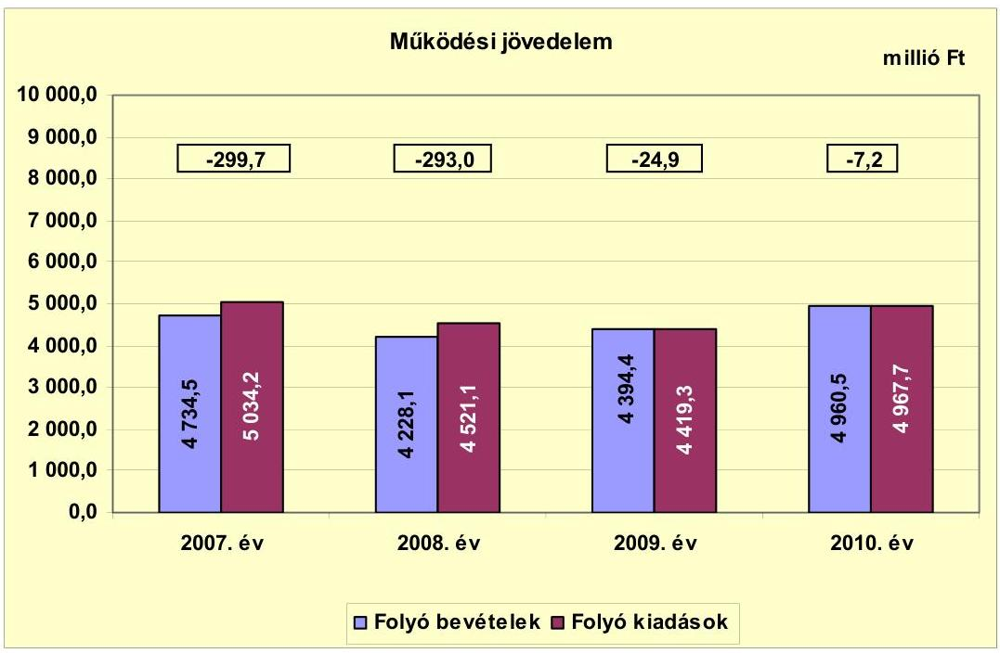

A vizsgált időszakban az Önkormányzat folyó költségvetési egyenlege, múködési jövedelme negatív volt. Az Önkormányzat folyó bevételei egyik évben sem fedezték a folyó kiadásokat, a múködési forráshiány azonban az időszakban folyamatosan csökkent, ez a 2007-2008. években a folyó kiadások 6,0\% és 6,5\% volt, ami a 2009. évre 0,6\%-ra, a 2010. évre 0,1\%-ra csökkent. A forráshiányt a 2007-2008. évben a Kórház rendkívüli múködési finanszírozási többlete okozta, mivel a Kórház gazdasági társasággá történő átalakítása miatt szükséges volt a felhalmozott adósságállomány konszolidálására. Ez a 2007. évben 262,0 millió Ft, a 2008. évben 287,2 millió Ft többletfinanszírozási igényt eredményezett. A vizsgált időszak egészét tekintve a múködési jövedelem 624,8 millió Ft forráshiányt mutatott. A múködési forráshiány finanszírozását folyószámlahitelből és éven belüli likvidhitelből biztosította az Önkormányzat. A likviditási helyzet romlását jelzi, hogy a folyószámlahitel napi átlagos állománya a 2007. évi 46,1 millió Ft-ról a 2008. évre 500,9 millió Ft-ra nőtt, majd a 2010. évre 465,5 millió Ft-ra mérséklődött, de a 2011. június 30 -ig terjedő időszakban már 592,1 millió Ft volt. A likvidhitel átlagos állománya a 2007. évben 133,6 millió Ft, a 2010. évben 471,4 millió Ft, 2011. június 30 -án 500,0 millió Ft volt.

A nettó múködési jövedelem értéke a folyó költségvetési egyenleg mellett az adott költségvetési év adósságtörlesztésének hatását is tükrözi.

---

Az Önkormányzat nettó múködési jövedelmének évenkénti alakulását a következő ábra szemlélteti:
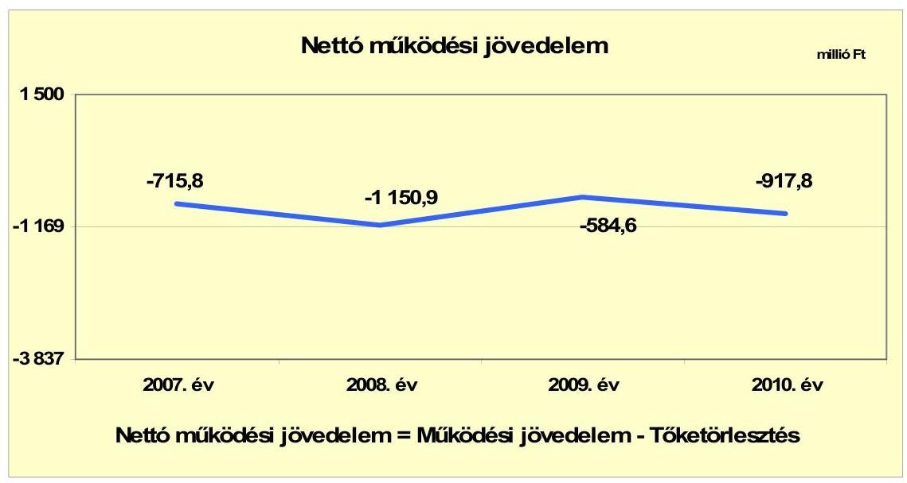

Az Önkormányzat pénzügyi helyzetének romlását jelzi, hogy a nettó működési jövedelem 2007. évi negatív egyenlege (-715,8 millió Ft) a 2008. évre 60,8\%-kal (-1150,9 millió Ft-ra) növekedett. A pénzügyi kapacitás romlását egyrészt a folyó költségvetés 293,0 millió Ft-os hiánya, másrészt a rendkívüli 857,9 millió Ft összegű hiteltörlesztés okozta. Az Önkormányzat a 2008. évi kötvénykibocsátásból származó forrásokból korábbi fennálló hiteleit visszafizette. A 2009. évben mérséklődött a pénzügyi kapacitás romlása, mert mind a folyó költségvetés hiánya, mind a hiteltörlesztések összege csökkent, de továbbra is jelentős hiányt (584,6 millió Ft) mutatott. A 2010. évben a negatív múködési jövedelem mellett megkezdődött a kötvény tőketörlesztése, valamint a folyószámla és likvidhitel törlesztés megnövekedett összege miatt a hiteltörlesztés az előző évhez viszonyítva 46,6\%-kal (260,6 millió Ft-tal) növekedett. Ez a nettó múködési jövedelmet tovább csökkentette, így a 2010. évben a nettó múködési jövedelem 917,8 millió Ft negatív értéket mutatott.

A felhalmozási költségvetés a vizsgált időszakban a 2009. év kivételével minden évben deficites volt. Ez a fennálló negatív nettó múködési jövedelem mellett jelentős finanszírozási kockázattal jár, mivel a gazdálkodás során nem képződött fedezet a fejlesztés és a pótlás finanszírozására.

A felhalmozási költségvetés egyenlegének alakulását a következő ábra szemlélteti:

---

A felhalmozási forráshiánynak a felhalmozási kiadásokhoz viszonyított aránya 2007-ben 13,5\%, 2008-ban 46,3\%, 2010-ben 55,9\% volt. A felhalmozási költségvetés 2007. évi hiányának fedezetére a felvett két devizaalapú hosszú lejáratú fejlesztési célú hitel nyújtott fedezetet, amit a kötvénykibocsátásból származó forrásokból a 2008. évben visszafizettek. A további években a felhalmozási deficitet a kötvénykibocsátásból finanszírozta az Önkormányzat. A 2010. évben a megnövekedett felhalmozási hiányt az okozta, hogy a pályázati pénzből megvalósított beruházások előfinanszírozását folyószámlahitelből biztosították, mert a felhalmozási bevételt jelentő központi támogatást csak a következő évben utalták ki, ami magas pénzügyi kockázatot jelentett.

Az Önkormányzat évenkénti teljes finanszírozási hiánya ${ }^{19}$ a CLF módszer szerint 2007-ben 972,8 millió Ft, 2008-ban 1376,7 millió Ft, 2009-ben 534,6 millió Ft, 2010-ben 1829,8 millió Ft volt. A képződött hiányt a finanszírozási célú bevételek és a finanszírozásba vonható pénzeszközök biztosították.

Az Önkormányzat finanszírozási múveleteinek egyenlegét a következő ábra szemlélteti:

[^0]
[^0]:    ${ }^{19}$ nettó múködési jövedelem és a felhalmozási költségvetés egyenlege

---

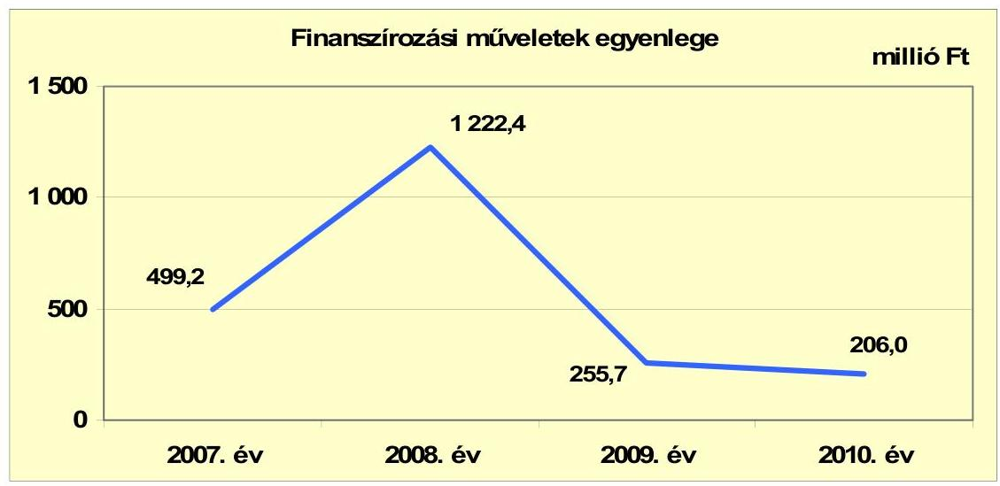

A finanszírozási célú pénzügyi múveletek pozitív értéke azt jelzi, hogy az éves költségvetések végrehajtása során a vizsgált időszak minden évében szükség volt a pénzkészlet felhasználásán túl külső finanszírozás igénybevételére. A 2007. évben a fejlesztési hiány finanszírozására felvett két CHF alapú hosszúlejáratú hitel felvétele és a rövid lejáratú hitelek törlesztése jelenik meg a 499,2 millió Ft-os egyenlegben, a 2008. évi jelentős növekedés az 1500 millió Ft kötvénykibocsátás következménye, amiből korábbi fennálló hiteleit visszafizette az Önkormányzat. A 2009. és 2010. évi finanszírozási egyenleg a likvidhitelek állományváltozását mutatja. A finanszírozási célú múveleteket a vizsgált időszakban a jelentés 2. számú mellékletének 4.1-4.8 pontjai részletezik.

Az Önkormányzat zárszámadási rendeleteiben a hiány összegét a hagyományos költségvetési szerkezet alapján mutatta be, ${ }^{20}$ amiről a jelentés 1. számú melléklete ad tájékoztatást. A 2007-2008. évi zárszámadási rendelet 340 millió Ft és 363 millió Ft összegű forráshiányt, a 2009-2010. évi rendelet 523 millió Ft és 110 millió Ft bevételi többletet jelzett, ami jelentősen eltér az elemi költségvetési beszámolóban szereplő adatok alapján a CLF módszerrel kimutatott hiány összegétől.

Az Önkormányzat kamatbevételeinek és kamatkiadásainak alakulását a következő ábra mutatja:

[^0]
[^0]:    ${ }^{20}$ Nincs kötelező előírás a múködési és fejlesztési hiány megállapításának módjára.

---

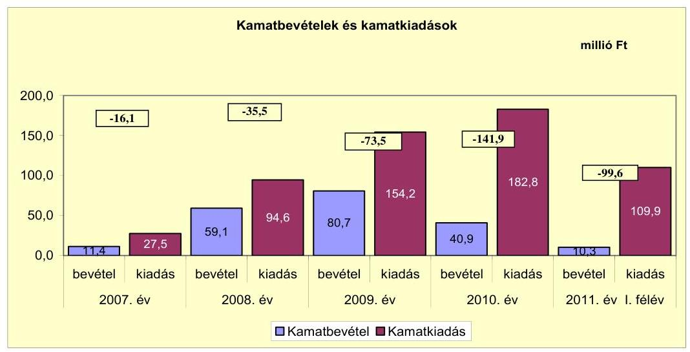

A vizsgált időszakban a kamatkiadások folyamatosan emelkedtek és minden évben meghaladták a kamatbevételeket. A 2007-2011. év I. féléve között a fennálló hitelei és a kötvénykibocsátás miatt összesen 569,0 millió Ft kamatot fizetett meg. Átmenetileg szabad pénzeszközei lekötéséből realizált kamatbevétele ugyanebben az időszakban 202,4 millió Ft volt, ami a kamatráfordítások $35,6 \%$-át jelentette.

# 2.2. Az Önkormányzat bevételeinek változása 

Az Önkormányzat folyó bevétele a 2007. évi 4734,5 millió Ft-ról, a 2008. évre 4228,1 millió Ft-ra, 8,6\%-kal (506,4 millió Ft-tal) csökkent. A csökkenést az okozta, hogy a Kórház gazdasági társasággá történő átalakítása miatt ennek teljes folyó bevételével (857,9 millió Ft) csökkentek a 2008. évi bevételek. Ezt részben ellensúlyozta az állami hozzájárulások, valamint az egyéb saját bevételek között szereplő saját múködési bevételek és átvett pénzeszközök 2007. évhez képest történő növekedése. A 2010. évben valamennyi bevételi jogcímen növekedés történt az előző évhez képest, de meghatározó az állami hozzájárulások és az szja bevétel együttes összegének 346,6 millió Ft-os ( $12,0 \%$-os) és az egyéb saját bevételek 192,0 millió Ft-os ( $25,6 \%$-os) emelkedése volt, ami az öszszes folyó bevétel $12,8 \%$-os növekedését eredményezte a 2009. évhez viszonyítva.

---

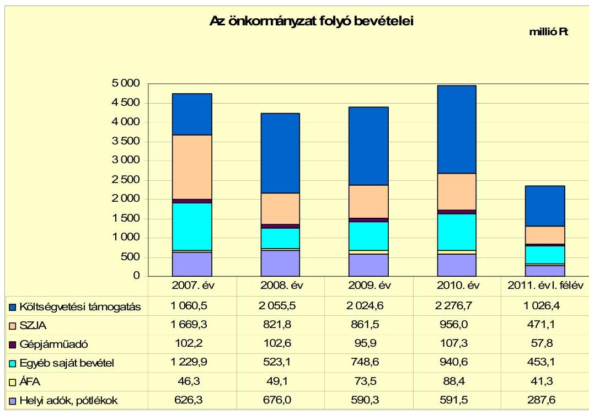

A költségvetési támogatás és az szja bevétel együttes összege a folyó bevételeknek 2007-ben 57,7\%-át, 2008-ban 68,1\%-át, 2009-ben 65,7\%-át és 2010-ben 65,2\%-át tette ki, ezért meghatározta ezek alakulását. Az időszakban jelentősebb változás a 2010. évben következett be, amikor az együttes összeg az előző évihez képest $12 \%$-kal (346,6 millió Ft-tal) növekedett. A növekedésben szerepet játszott az szja bevétel $10,9 \%$-os növekedése, de jelentősebb hatása volt a költségvetési támogatás $12,5 \%$-os ( 252,1 millió Ft-os) emelkedésének. A növekedést az Oktatási Központhoz csatlakozó, más önkormányzatoktól átvett közép- és alapfokú oktatási intézmények miatti normatív hozzájárulás többlete okozta.

A helyi adók, pótlékok a 2008. évben az iparúzési adóbevétel 45,8 millió Ftos növekedése miatt 8,6\%-kal emelkedtek az előző évhez képest, a 2009-2010. években 84,5 millió Ft-tal ( $12,5 \%$-kal) csökkentek, így a folyó bevételek kismértékű növekedése mellett 13,2\%-os részarányuk 11,9\%-ra csökkent a folyó bevételeken belül. A csökkenést a realizált helyi iparúzési adóbevétel 46,2 millió Ftos csökkenése okozta. Az iparúzési adó alapjának csökkenése miatt ugyanis a maximális adómérték mellet is csökkent az adóbevétel ezekben az években. A csökkenést nem tudta ellensúlyozni az építményadóban, a magánszemélyek kommunális adójában és az idegenforgalmi adóban végrehajtott adómérték emelés sem.

Az Önkormányzat a 2007. évet megelőzően építményadót, magánszemélyek kommunális adóját, vállalkozók kommunális adóját, helyi iparúzési adót és idegenforgalmi adót vezetett be, a 2007-2010. közötti időszakban új adónemet nem vetett ki. Az iparúzési adónál az időszak egészében a maximális adómértéket, $2 \%$-ot alkalmazta, a vállalkozó kommunális adójának mértéke $2310 \mathrm{Ft} /$ fő/év volt. A 2009. évtől az építményadó mértékét az üdülőépületekre vonatkozóan $640 \mathrm{Ft} / \mathrm{m}^{2}$-ről $1100 \mathrm{Ft} / \mathrm{m}^{2}$-re, az egyéb építményekre vonatkozóan $280 \mathrm{Ft} / \mathrm{m}^{2}$-ről $310 \mathrm{Ft} / \mathrm{m}^{2}$-re, a magánszemélyek kommunális adójának mértékét a különböző lakástípusok esetében átlagosan $10 \%$-kal, az idegenforgalmi adót $340 \mathrm{Ft} /$ éj/fő-ről

---

$385 \mathrm{Ft} /$ éj/fő-re emelte. A 2011. január 1-jétől a megszűnt vállalakozók kommunális adójából származó bevételkiesés pótlására telekadót vetett ki, melynek mértéke $280 \mathrm{Ft} / \mathrm{m}^{2} /$ év volt, valamint az építményadóban új adómértéket vezetett be a bevásárlóközpontokra vonatkozóan $1550 \mathrm{Ft} / \mathrm{m}^{2} /$ év összegben. A telekadóból 2011. június 30-ig 3,3 millió Ft adóbevételt realizált.

Az egyéb saját bevételek jelentős növekedését a támogatásértékű működési bevételek növekedése okozta. A 2009-2010. évben az közoktatási társuláshoz csatlakozó intézmények után a társult önkormányzatok hozzájárulása növelte a bevételt. A 2010. évben a fejezeti kezelésű előirányzatból két múködési célú pályázaton nyert támogatás szintén ezen a jogcímen realizálódott.

A vizsgált időszakban az Önkormányzat tulajdonosi részesedései ${ }^{21}$ után osztalékbevételt nem realizált. Az 50\% feletti, valamint kizárólagos önkormányzati tulajdonosi részesedésű gazdasági társaságai egyik évben sem fizettek osztalékot. Két társaság ${ }^{22}$ a vizsgált időszak minden évében veszteséges volt, három a 2010. évben 2,2-4,6 millió Ft összegű nyereséget realizált, az időszak korábbi éveiben változó eredményességgel múködött. ${ }^{23}$ A 100\%-os önkormányzati tulajdonú Fűtőerőmű Zrt. és az Egészségcentrum Kft. a 2009-2010. években egyre növekvő összegű veszteséget termelt.

Az Önkormányzat felhalmozási bevételei a vizsgált időszakban a következők szerint alakultak:
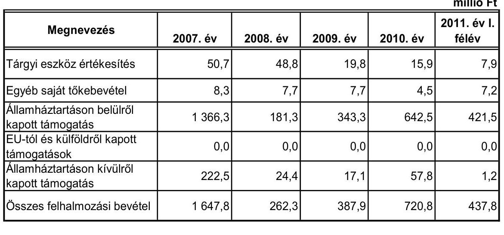

Az felhalmozási bevételek alakulásában kiemelkedő volt a 2007. év, mivel a térségi szennyvízcsatorna beruházás megvalósításához rendkívüli felhalmozási

[^0]
[^0]:    ${ }^{21}$ Az Önkormányzat a mérlegadatok szerint a 2007. évben 999,9 millió Ft, a 2008. évben 994,5 millió Ft a 2009. évben 1000,8 millió Ft, a 2010. évben 1001,6 millió Ft tartós részesedéssel rendelkezett.
    ${ }^{22}$ A Fejlesztési Kft. és a Carboker Kft. Mindkét társaság felszámolás előtt áll.
    ${ }^{23}$ A Városgazdálkodási Zrt. 2007-ben 13,1 millió Ft, a Komló-Víz Kft. 2008-ban 29,7 millió Ft, a Szociális Kft. 2009-ben 11,9 millió Ft veszteséggel zárta az évet, a vizsgált időszak többi évében változó 2,1-39,5 millió Ft közötti összegű nyereséggel zárta az évet.

---

forrásokhoz jutott az Önkormányzat. A felhalmozási bevételek között meghatározó arányt (2007-ben 82,9\%-ot, 2008-ban 69,1\%-ot, 2009-ben 88,5\%-ot, 2010-ben $89,1 \%$-ot, 2011. év I. félévben $96,3 \%$-ot) képviselt az államháztartáson belülről kapott támogatás. Ebből a 2007. évben 964,6 millió Ft, a 2008. évben 100,0 millió Ft volt a címzett támogatás a térségi szennyvízcsatorna hálózat megvalósításához, valamint 2007-ben 11,5\%-át (156,7 millió Ft-ot), 2008-ban 27,2\%-át (49,3 millió Ft-ot), 2009-ben 96,7\%-át (332,0 millió Ft-ot), 2010-ben 94,6\%-át (613,2 millió Ft-ot) és a 2011. év I. félévben 99,2\%-át (418,0 millió Ft-ot) a fejezeti kezelésű előirányzatokból kapott támogatások jelentették. A 2007. évben az államháztartáson belüli támogatás 17,9\%-át (244,3 millió Ft-ot) a szennyvízcsatorna beruházáshoz társult önkormányzatok hozzájárulásai jelentették. A 2007. évben 13,5\%-os részt képviselt a felhalmozási bevételeken belül az államháztartáson kívülről nonprofit szervezettől kapott támogatás, ami a térségi szennyvízcsatorna beruházáshoz a víziközmű társulattól átvett, illetve egy ökoturisztikai projekt megvalósításához az Orfú Pécsi Tó Kht.-tól átvett 222,5 millió Ft volt.

# 2.3. Az Önkormányzat múködési és a felhalmozási célú kiadásainak változása 

Az Önkormányzat folyó kiadása 2007-2011. június 30-a között a következők szerint alakult:

| Megnevezés | 2007. év | 2008. év | 2009. év | 2010. év | 2011. év I.   félév |
| :--: | :--: | :--: | :--: | :--: | :--: |
| Folyó kiadások | 5034,2 | 4521,1 | 4419,3 | 4967,7 | 2197,9 |
| Müködési kiadások (kamatkiadás nélkül) | 4152,4 | 3535,5 | 3442,2 | 3869,5 | 1715,2 |
| Államháztartáson belülre átadott pénzeszközök | 57,9 | 50,7 | 43,1 | 54,4 | 27,2 |
| Transzferkiadások | 796,4 | 840,3 | 779,8 | 861,0 | 345,7 |
| -ebből: vállalkozásoknak | 248,2 | 286,9 | 227,3 | 213,4 | 85,2 |
| EU-nak, illetve külföldre | 0,0 | 0,0 | 1,0 | 0,0 | 0,0 |
| magánszemélyeknek | 458,6 | 471,7 | 505,8 | 605,7 | 249,2 |
| nonprofit szervezeteknek | 89,6 | 81,7 | 45,7 | 41,9 | 11,3 |
| Kamatkiadások | 27,5 | 94,6 | 154,2 | 182,8 | 109,8 |
| Előző évi pénzmaradvány átadás | 0,0 | 0,0 | 0,0 | 0,0 | 0,9 |

Az Önkormányzat folyó kiadásai közül a kiemelt kiadásnemek teljesítési adatai az alábbiak szerint alakultak a vizsgált időszakban:

|  |  |  |  |  |  |
| :-- | --: | --: | --: | --: | --: |
| Megnevezés | 2007. év | 2008. év | 2009. év | 2010. év | 2011. év I.   félév |
| Személyi juttatások | 2165,4 | 1740,6 | 1806,4 | 2062,3 | 910,4 |
| Munkaadót terhelő járulékok | 667,5 | 568,0 | 508,8 | 513,1 | 230,7 |
| Dologi kiadások | 1259,4 | 1136,6 | 1097,2 | 1207,8 | 528,9 |
| Egyéb folyó kiadások | 51,7 | 69,2 | 26,4 | 61,9 | 40,1 |

A személyi juttatások a 2007. és 2008. évek között 19,6\%-kal (424,8 millió Ft-tal) csökkentek. A változást a Kórház gazdasági társasággá történő átalakítása miatti 565,2 millió Ft-os bértömeg csökkenés határozta meg. Ezzel ellenté-

---

tes hatása volt, hogy az átalakítás miatt a Kórház 2008 januárjában esedékes 2007. decemberi bérének kifizetése az Önkormányzat 2008. évi költségvetését terhelte. A 2009. évi 3,7\%-os ( 65,8 millió Ft) és a 2010. évi 14,2\%-os (255,9 millió Ft) személyi juttatásnövekedést a 2009 szeptemberétől az Oktatási Központhoz csatlakozott középiskola, kollégium, általános iskola és óvoda átvétele miatti létszámnövekedés okozta. A munkaadókat terhelő járulékok az időszakban a személyi juttatások változását követték, de a járulékcsökkentés miatt annál nagyobb mértékben, $23 \%$-kal csökkentek. A 2007. évben a folyó kiadások $56,3 \%$-át személyi juttatásokra és a munkaadókat terhelő járulékokra fordította az Önkormányzat, ez az arány a fenti változások miatt 2010. évre $51,8 \%$-ra mérséklődött.

A dologi kiadások az időszak egészét tekintve kis mértékben 4,1\%-kal (51,6 millió Ft-tal) csökkentek. A dologi kiadások alakulását is a személyi juttatásokhoz hasonlóan a két intézményi változás ${ }^{24}$ határozta meg, a 2008. évben a dologi kiadások 9,6\%-kal (122,8 millió Ft-tal) csökkentek, a 2010. évben 10,1\%kal (110,6 millió Ft-tal) növekedtek. A két intézményi változás miatti dologi kiadás változás az időszak egészében kiegyenlítette egymást. A folyó kiadásokon belül a dologi kiadások részaránya az időszakban 24,3-25,1\% közötti volt.

A vizsgált időszakban a folyó és felhalmozási kiadások arányának változásában a felhalmozási kiadások arányának csökkenése tapasztalható. Kiugróan magas volt a teljesített felhalmozási kiadás a 2007. és a 2010. évben 1904,8 millió Ft ( $27,5 \%$-ról) és 1632,8 millió Ft ( $24,7 \%$-ra) két nagy beruházás miatt. A 2007. évben a társulásban megvalósított térségi szennyvízcsatorna beruházás megépítésére 1570,7 millió Ft felhalmozási kiadást teljesítettek, a 2010. évben az Oktatási Központ kialakítására 1153,8 millió Ft-ot fordítottak.

Az időszak középső két évében nem valósítottak meg jelentősebb beruházásokat és felújításokat ezért a felhalmozási kiadások összege és aránya is csökkent 2008. évben a kiadások 9,7\%-a, 2009. évben csak 7,1\%-a volt.

A folyó és felhalmozási kiadások alakulását a következő grafikon szemlélteti:

[^0]
[^0]:    ${ }^{24}$ A Kórház gazdasági társasággá történő alakítása 2008. január 1-jétől, és az Oktatási Központhoz átvett közoktatási intézmények miatti változás 2009. szeptember 1-jétől.

---

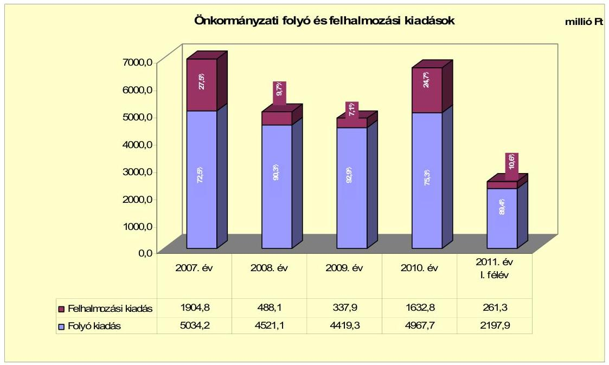

A szennyvízcsatorna társulás keretében megvalósított térségi szennyvízcsatorna beruházás társulást terhelő kiadásainak figyelmen kívül hagyásával a múködési és felhalmozási kiadások 2007. évi arányából a felhalmozási kiadások aránya 27,5\%-ról (1904,8 millió Ft-ról) 9,6\%-ra (536,7 millió Ft-ra) változik. A szennyvízcsatorna beruházás 2007. évi kiadásaiból 202,6 millió Ft volt az Önkormányzatot terhelő felhalmozási kiadás, 1368,1 millió Ft a társulást terhelte.

A térségi szennyvízcsatorna komlói szakaszának kiépítése, a 2010. évben fejeződött be. A beruházás teljes bekerülési költsége 2195,8 millió Ft volt, forrása 1575,3 millió Ft $(71,7 \%)$ hazai támogatás és 620,5 millió Ft $(28,3 \%)$ saját bevétel volt. A beruházás lebonyolítására szennyvízcsatorna társulatot hoztak létre a társult településekkel, az Önkormányzat gesztor szerepet töltött be a beruházás lebonyolításában.
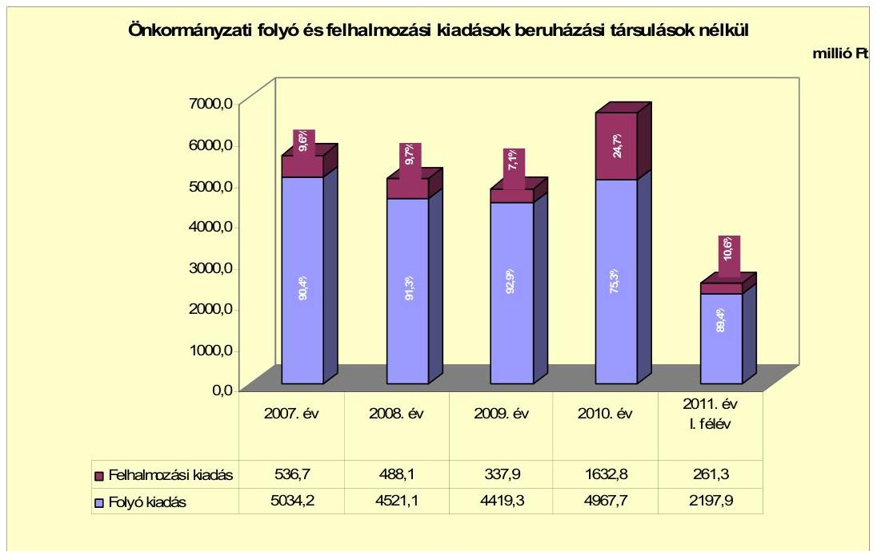

---

Az Önkormányzatnál a 2007-2010. években befejezett beruházás és felújítás összértéke 3685,9 millió Ft volt. A megvalósított felújítások és beruházások közül 25 db meghaladta 10 millió Ft teljes bekerülési költséget, a 10 millió Ft alatti felújítások és beruházások összértéke 215,0 millió Ft volt. A 2010. december 31-éig befejezett fejlesztések forrását 1101,7 millió Ft összegben (29,9\%-ban) önkormányzati saját bevétel, 153,3 millió Ft összegben (4,2\%) kötvény kibocsátásból származó bevétel, 496,2 millió Ft összegben (13,4\%) EU-s támogatás, valamint 1934,7 millió Ft (52,5\%) hazai támogatás képezte.

A folyamatban levő beruházások várható teljes bekerülési költsége 1763,4 millió Ft. A 2010. december 31-ig teljesített kiadás 1173,5 millió Ft volt. A fejlesztés forrása 1051,1 millió Ft (89,6\%) EU-s támogatás, 38,1 millió Ft (3,2\%) hazai támogatás és 84,3 millió Ft ( $7,2 \%$ ) kötvénykibocsátásból származó bevétel volt. A folyamatban levő fejlesztések 2010. utáni kötelezettségvállalásainak összege 589,9 millió Ft, ennek forrásmegosztása 444,5 millió Ft (75,4\%) EU-s támogatás, 99,7 millió Ft (16,9\%) kötvénykibocsátásból származó bevétel, 45,7 millió Ft $(7,7 \%)$ hazai támogatás. Az időszakban megvalósuló fejlesztési feladatokat és azok forrásösszetételét a jelentés $3 / a, 3 / b$ és $3 / c$ mellékletei tartalmazzák.

Az Önkormányzat három legmagasabb bekerülési költségű fejlesztései a következők voltak:

- Az Oktatási Központ kialakítása a 2010. évben kezdődött, a tervezett bekerülési költsége 1336,0 millió Ft, a 2010. december 31-éig teljesített fejlesztési kiadás 1153,7 millió Ft volt. Forrása 1038,4 millió Ft (90\%) EUs támogatás, 79,4 millió Ft (6,9\%) kötvénykibocsátásból származó bevétel, 35,9 millió Ft (3,1\%) hazai támogatás. A 2010. után fennálló kötelezettségvállalás összege 182,2 millió Ft, melynek forrása 164,0 millió Ft (90\%) EU-s támogatás, 12,5 millió Ft (6,9\%) kötvénykibocsátásból származó bevétel, 5,7 millió Ft (3,1\%) hazai támogatás.
- A ROP 1.1.1. „Mecsek Gyöngyszemei" Turisztikai Projekt befejezett beruházás. Teljes bekerülési költsége 200,4 millió Ft volt, a beruházás forrásösszetétele 108,7 millió Ft (54,2\%) EU-s támogatás, 55,5 millió Ft (27,7\%) saját bevétel és 36,2 millió Ft (18,1\%) hazai támogatás.
- A KEOP-5.3.0. program keretében az önkormányzati intézmények energetikai korszerűsítését valósítják meg. A beruházás a 2010. évben kezdődött, a tervezett befejezése 2011-ben lesz. Teljes bekerülési költsége 373,7 millió Ft. A 2007-2010. évek között teljesített kiadás 19,8 millió Ft, melynek forrásai 12,7 millió Ft (64,2\%) EU-s támogatás, 4,9 millió Ft (24,7\%) kötvénykibocsátásból származó bevétel és 2,2 millió Ft (11,1\%) hazai forrás. A beruházással kapcsolatos 2010. utáni kötelezettségvállalás összege 353,9 millió Ft, forrásai 226,7 millió Ft (64,1\%) EU-s támogatás, 87,2 millió Ft (24,6\%) kötvénykibocsátásból származó bevétel és 40,0 millió Ft (11,3\%) hazai támogatás.

Az Önkormányzatnak a vizsgálat időszakában nem volt elbírálás alatti fejlesztési pályázata.

---

Az Önkormányzat fejlesztési feladatait pályázati pénzeszközök, EU-s vagy hazai támogatások igénybevételével valósítja meg. A támogatásból megvalósult fejlesztések finanszírozása a 2010. évben likviditási problémát okozott, mert több EU-s pályázat esetében a hiánypótlás után visszaigazolt 200,0 millió Ft-os támogatást csak késve, a 2011. évben utalták ki, amit az Önkormányzat megelőlegezett. Ebből adódó fizetési kötelezettségeinek teljesítéséhez folyószámlahitelt és ideiglenesen a lakásértékesítési alap számla 57,5 millió Ft-os egyenlegét vette igénybe, valamint 35,9 millió Ft összegű intézményfinanszírozást nem utaltak ki.

A gazdasági társaságok részére átadott pénzeszközöket a következő grafikon mutatja:
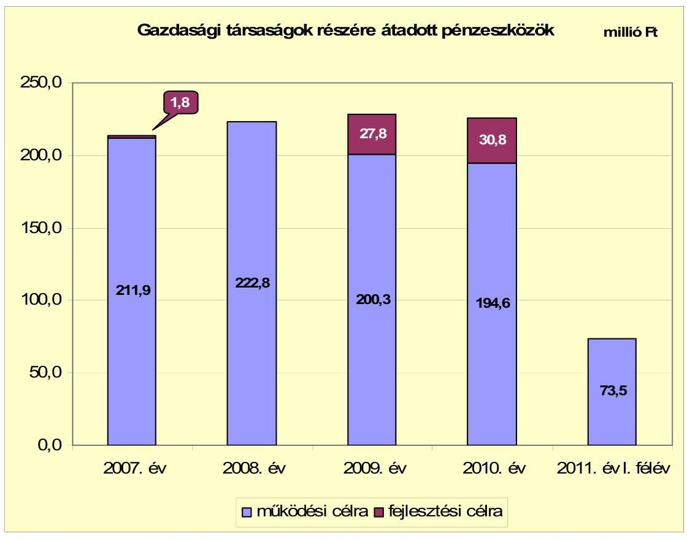

A múködési célú pénzeszközátadások összege a 2008. évben 5,1\%-kal (10,9 millió Ft-tal) növekedett. A növekedést az okozta, hogy a Kórház átalakításával létrejött Egészségcentrum Kft.-nek a járó- és fekvőbeteg ellátás biztosításához a korábban intézmény-finanszírozásként adott támogatás a 2008. évtől átadott pénzeszközként jelent meg, ezzel egyidejűleg más társaságoknak (Fűtőerőmű Zrt., Szent Borbála Kft.) átadott pénzeszközök összege csökkent az időszakban. A 2009. évben a múködési célú pénzeszközátadások 10,1\%-kal (22,5 millió Fttal), a 2010. évben további 2,8\%-kal (5,7 millió Ft-tal) csökkentek. Ezzel egyidejűleg a fejlesztési célú pénzeszközátadások 27,8 millió Ft-ra és 30,8 millió Ft-ra emelkedtek, mivel a Fűtőerőmű Zrt.-nek adott 52,1 millió Ft összegű működési célú pénzeszköz helyett 27,8 millió Ft fejlesztési célú pénzeszközt folyósítottak.

A gazdasági társaságok részére átadott pénzeszközöknek a 2007. évben a 95,5\%-a, a 2008-2011. években 100\%-a az önkormányzati kötelező és önként

---

vállalt szociális és egészségügyi feladatok ellátását szolgálta. A pénzeszközátadásoknak 2007-ben 0,8\%-a, 2009-ben 12,7\%-a, 2010-ben 13,8\%-a volt a fejlesztési célú pénzeszközátadás.

Az Egészségcentrum Kft.-nek átadott pénzeszközöket a következő grafikon szemlélteti:
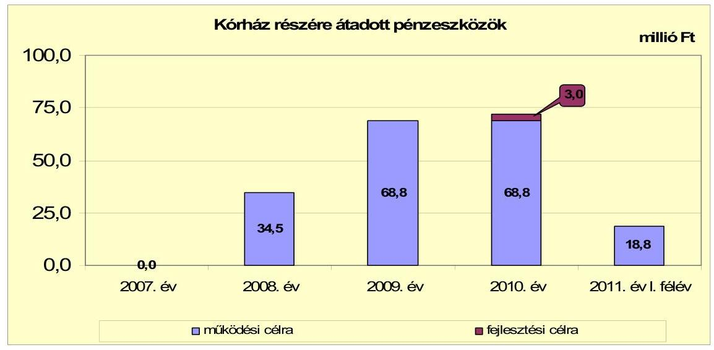

Az Egészségcentrum Kft.-nek a múködési célra rendszeresen, fejlesztési célra (gépkocsi vásárlásra) a 2010. évben adott át pénzeszközöket az Önkormányzat.

A gazdasági társaságok számára átadott pénzeszközök összegét részletesen a 4. számú melléklet tartalmazza.

# 3. Az ÖNKORMÁNYZAT KÖTELEZETTSÉGEI 

### 3.1. Az Önkormányzat pénzintézeti kötelezettségeinek változása

Az Önkormányzat pénzintézetekkel szembeni kötelezettségeinek állománya a 2006. december 31-i állapothoz képest folyamatosan növekedett ${ }^{25}$ a vizsgált időszakban. A legjelentősebb, több mint 2,5-szeres növekedés a 2008. évben az 1500 millió Ft összegű kötvénykibocsátás miatt keletkezett. Ezt követően a 2009. évben $14,2 \%$-os, a 2010. évben $25,6 \%$-os volt a növekedés az előző évhez képest. Ez a növekedés a rövidlejáratú hitelállomány ${ }^{26}$ növekedéséből és a CHFben kibocsátott kötvény árfolyamváltozásából adódott. A kötvénykibocsátás hatására a pénzintézetekkel szemben fennálló kötelezettségek összetételében növekedett a hosszúlejáratú kötelezettségek aránya.

[^0]
[^0]:    ${ }^{25}$ A 2011. év I. félévi állomány 9,4\%-os csökkenést mutat, de félévkor nem került sor az árfolyamváltozás elszámolására.
    ${ }^{26}$ Folyószámlahitel és múködési célú likvidhitel.

---

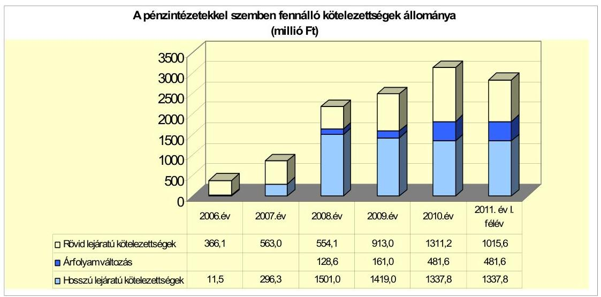

Az árfolyamváltozás hatása a 2008. évtől jelentősen befolyásolta a pénzintézetekkel szemben fennálló kötelezettségek alakulását, azonban ennek mértéke előre pontosan nem határozható meg. A jelenlegi tendenciák alapulvételével a devizában kibocsátott kötvény árfolyamváltozása miatti várható árfolyamveszteség jelentős pénzügyi kockázatot jelent az Önkormányzat gazdálkodásában. A 2010. évtől kezdődött tőketörlesztés során ténylegesen realizált árfolyamveszteség 2010. december 31-éig 26,9 millió Ft volt.

Az Önkormányzat a forráshiány csökkentése érdekében az éves költségvetésről szóló rendeletekben kiadáscsökkentő intézkedéseket rendelt el, valamint intézmény átszervezéseket hajtott végre. ${ }^{27}$ Az adósságot keletkeztető kötelezettségvállalással megvalósított felhalmozási kiadások esetleges bevételt növelő, illetve kiadást csökkentő vonzatát, illetve ennek a kötelezettségvállalás visszafizetési forrásaként történő számbavételét nem vizsgálták. Az adósság kezelése érdekében, adósságkezelési koncepciót, cselekvési tervet nem terjesztettek a Képvise-lő-testület elé. Az éves költségvetési rendeletekhez készített előterjesztések minden évben bemutatták az adósság mértékét, felhívták a figyelmet ennek kockázatára és számos az adósság csökkentését célzó intézkedést tartalmaztak. Előírták a kiadások csökkentését, maximálták az adott évben a múködési célú hitelfelvétel mértékét. A költségvetési és zárszámadási rendeletek mellékletében bemutatták a lejáratig fizetendő tőketörlesztés és kamat összegeit, de az adósságot keletkeztető kötelezettségvállalásokra vonatkozó képviselő-testületi előterjesztések nem tartalmazták a visszafizetés forrásait, az adósságot keletkeztető kötelezettségvállalásról szóló döntéskor nem mutatták be a Képviselőtestületnek a jövőben várható - árfolyam-, kamat- és törlesztési - kockázatot. Az adósságot keletkeztető kötelezettségvállalás felső határát betartották.

Az adósságot keletkeztető kötelezettségvállalások felső határát az Ötv. 88. § (3) c) ${ }^{28}$ pontjának figyelembevételével számolva - mely szerint a likvidhiteleket nem kell a rövid lejáratú kötelezettségek között számba venni - nem lépték túl. Az állandósult és folyamatosan fennálló folyószámlahitel a 2007. évben 396,4 mil-

[^0]
[^0]:    ${ }^{27}$ Ezeket részletesen a jelentés 1. és 4. pontjai tartalmazzák.
    ${ }^{28}$ 2012. évtől a Stabilitási tv. 10. §-a szabályozza.

---

lió Ft, a 2008. évben 453,7 millió Ft, a 2009. évben 368,5 millió Ft és a 2010. évben 698,5 millió Ft év végi záró állományának figyelembevételével azonban már nem felelnének meg az adósságkorlátnak.

Az Önkormányzat pénzintézetekkel szembeni kötelezettségvállalásaira minden esetben a Képviselő-testület döntése alapján, a pénzintézetek versenyeztetésével került sor.

A vizsgált időszakban a Képviselő-testület a 2007. évben két CHF alapú hosszúlejáratú fejlesztési célú hitelfelvételről, a 2008. évben a Komló 2028. kötvény kibocsátásáról, valamint minden évben múködési célú likvidhitel és folyószámlahitel felvételéről döntött. A 2008. évben a kötvény kibocsátására a legjobb ajánlatot tevő, számlavezető bankkal kötöttek megbízási szerződést. A kötvény kibocsátást megelőzően a Képviselő-testületet tájékoztatták a kötelezettségvállalás kamat- és árfolyamkockázatáról. A számlavezető bank által biztosított fo-lyószámla-hitelkeret kimerítése után további likvidhitel felvételére más pénzintézetekkel kötöttek szerződést. A vizsgált időszakban az Önkormányzat számlavezető pénzintézete nem változott.

Az Önkormányzat 2011. június 30-án CHF-ben fennálló adósságot keletkeztető kötelezettségvállalásai az alábbiak voltak.

| Megnevezés | Szerződéskötés/   Kibocsátás   időpontja | Összeg   ezer CHF-ben | Kibocsátás/fehívási   árfolyam | Kamat (referencia kamat+   kamatfelár) | Felhasználás célja: |
| :--: | :--: | :--: | :--: | :--: | :--: |
| KOMLÓ 2028 kötvény | 2008.04 .01 | 9160,9 | 163,74 | 6 havi CHF LIBOR+1,65 | saját erő bát.,fejlesztési   hitelek kiváltása,   adósságrendezési,   struktúrsváltási és intézmény-   megszüntetési feladatok   finanszírozása |

A kötvénykibocsátás célja a pályázati forrásból megvalósítandó fejlesztések saját erejének biztosítása, a meglévő fejlesztési hitelek refinanszírozása, a folyószámlahitel terhére megelőlegezett adósságrendezési, intézmény átszervezési, megszüntetési feladatok forrásának biztosítása volt.

A kötvénykibocsátásból származó forrásból a meghatározott céloknak megfelelően 2011. június 30-ig 1197,4 millió Ft-ot használtak fel. A fel nem használt maradvány 302,6 millió Ft volt, amit a pénzintézet elkülönített zárolt számlán kezel. A refinanszírozáshoz reorganizációs terv nem kapcsolódott, az Önkormányzat pénzügyi pozíciója nem javult.

A felhasználás során 364,5 millió Ft a fejlesztési célra a 2007. évben felvett devizahitelek visszafizetésére, 466,1 millió Ft-ot a Kórház gazdasági társasággá történő átszervezése miatti adósságrendezésre, 241,1 millió Ft-ot fejlesztési feladatokra, 11,9 millió Ft-ot üzletrészvásárlásra, 79,9 millió Ft-ot az Oktatási Központ kialakítására, 33,9 millió Ft-ot az árfolyamveszteség fedezetére fordítottak.

A kötvénykibocsátásból származó források befektetéséből 70,9 millió Ft bevétele származott az Önkormányzatnak, amit a tárgyévi múködési hiány finanszírozására fordítottak. A kötvénykibocsátás kapcsán 2011. június 30 -áig 145,4 millió Ft ( 742,8 ezer CHF) tőketörlesztést, 11,7 millió Ft egyéb költséget és 268,3 millió Ft (1387,1 ezer CHF) kamatfizetési kötelezettséget teljesített.

---

Az Önkormányzat a vizsgált időszakban múködésének egyensúlyát folyószámlahitel és egyéb likvidhitel igénybevételével tudta biztosítani. A folyószámlahitelek keretösszegét és az egyéb likvidhitel igénybevételének alakulását a következő táblázat tartalmazza:

| Megnevezés | 2007. év | 2008. év | 2009. év | 2010. év | millió Ft-ban   2011. év I.   félév |
| :-- | :--: | :--: | :--: | :--: | :--: |
| I. Folyószámlahitel |  |  |  |  |  |
| a folyószámlahitel keretösszege január 1-jén | 300,0 | 600,0 | 600,0 | 600,0 | 700,0 |
| teljesített kamat és egyéb költség | 7,5 | 55,5 | 60,9 | 42,2 | 27,9 |
| II. Egyéb likvid hitel |  |  |  |  |  |
| Igénybevett hitel összesen: | 150,0 | 100,0 | 450,0 | 500,0 | 500,0 |
| teljesített kamat és egyéb költség | 12,7 | 0,4 | 13,7 | 49,0 | 30,3 |

A folyószámla hitelkeret összege a 2007. évhez viszonyítva a 2011. év I. félévéig több mint kétszeresére emelkedett, a folyószámlahitel átlagos állománya ${ }^{29}$ a 2007. évi 46,1 millió Ft-ról a 2010. évre 465,5 millió Ft-ra, 2011. év I. félévében 592,1 millió Ft-ra, a folyószámlahitellel zárt napok száma 202 napról a 2010. évben 364 napra növekedett, a 2009-2011. év I. félévéig gyakorlatilag az év minden napján fennállt. A folyószámlahitel december 31-ei állománya a 2007. évben 396,4 millió Ft, a 2008. évben 453,7 millió Ft, a 2009. évben 368,5 millió Ft, a 2010. évben 698,5 millió Ft, 2011. június 30-án 458,1 millió Ft volt. A folyószámla hitelkeret szerződés lejáratkori és újrakötéskori ${ }^{30}$ kötelezettségállomány a 2008. évben 448,8 millió Ft, a 2009. évben 598,8 millió Ft, a 2010. évben 580,0 millió Ft volt. A folyószámla hitelállomány növekedésével, az ezzel kapcsolatban teljesített kamat és egyéb költségek is jelentősen emelkedtek a vizsgált időszakban, 2007-2011. év I. félévéig ez 194,0 millió Ft kiadást eredményezett.

A számlavezető pénzintézet az Önkormányzat megnövekedett finanszírozási igényére további folyószámla hitelkeretet nem biztosított, ezért a 2007. évben a számlavezetővel, azt követően más pénzintézetekkel kötöttek éven belüli futamidejü likvidhitel felvételére szerződést. Az évenként igénybevett likvidhitel összege a 2007. évben 150,0 millió Ft volt, ami a 2008. évben 100,0 millió Ft-ra csökkent, ezt követően folyamatosan 500 millió Ft-ra növekedett. A likvidhitel átlagos állománya a 2007. évben 133,6 millió Ft, a 2010. évben 116,7 millió Ft, a 2011. év I. félévében 500,0 millió Ft volt. A 2008. évi alacsony átlagos állományt ( 8,5 millió Ft) az okozta, hogy a hitel felvételére csak 2008. december 20-án került sor. Záró állománya 2010. december 31-én és 2011. június 30-án is 500,0 millió Ft volt. A hitelszerződések lejártakor és újrakötésekor a hitelállomány megegyezett az igénybevett hitel összegével. A likvidhitelek kamata 2007-2011. év I. féléve között 106,1 millió Ft volt.

A növekvő összegű és folyamatosan fennálló folyószámlahitel és likvidhitel állomány az Önkormányzat eladósodásának növekedését jelzi és magas visszafizetési kockázatot jelent.

[^0]
[^0]:    ${ }^{29}$ Fennálló folyószámla hitelállomány/365 nap
    ${ }^{30}$ 2008. november 5-én, 2009. október 19-én és 2010. október 19-én.

---

A pénzintézetekkel szembeni kötelezettség állomány növekedésével egyidejűleg növekedtek az Önkormányzat kamatfizetési kötelezettségei. A 2008. évben az előző évhez viszonyítva a kamatkiadások közel 3,5 szeresére 27,7 millió Ft-ról 94,6 millió Ft-ra növekedtek. Ennek oka a kötvénykibocsátás félévre eső 32,9 millió Ft-os és a folyószámlahitel átlagos napi állományának 46,1 millió Ft-ról 500,9 millió Ft-ra, több mint tízszeresére történő növekedése miatt jelentkező 52,8 millió Ft-os kamatteher volt. Szintén e két tényező hatására, valamint az igénybevett rövid lejáratú likvidhitelállomány növekedése miatt a 2009-2010. években további 63,0\%-kal és 18,5\%-kal emelkedtek a kamatkiadások. Ez a 2010. évben 182,8 millió Ft, a 2011. év I. félévében 109,9 millió Ft fizetési kötelezettséget jelentett.

A folyószámla és a likvidhitel kamatainak és egyéb költségeinek alakulását az alábbi táblázat tartalmazza: ${ }^{31}$

| Megnevezés | Kamat (referencia+ kamatfelár) | Egyéb költség |
| :--: | :--: | :--: |
| Folyószámlahitel |  |  |
| 2007-2008. év | 3 havi BUBOR $+0,4 \%$ | $0,5 \%$ kezelési dij, 0,4\% rend.tart.jutalék |
| 2009. év | 3 havi BUBOR $+3,0 \%$ | $0,5 \%$ kezelési dij, 1,5\% rend.tart.jutalék |
| 2010-2011.év | 1 havi BUBOR $+3,0 \%$ | $0,5 \%$ kezelési dij, 1,5\% rend.tart.jutalék |
| Egyéb likvid hitel |  |  |
| 2007. év | 3 havi BUBOR $+0,4 \%$ | 0 |
| 2008. év | 3 havi BUBOR $+2,5 \%$ | 0 |
| 2009. év | 1 havi BUBOR $+4,0 \%$ | 0 |
| 2010-2011. év | 1 havi BUBOR $+6,0 \%$ | 0 |

A számlavezető pénzintézet által nyújtott folyószámlahitel kamatai - a 2009. évi jelentősebb ( $42,8 \%$-os) növekedés kivételével - a vizsgált időszakban 10,4\%kal emelkedtek. Emellett az egyéb költségek is növelték a hitelfelvétel költségeit.

A folyószámlahitelnél kedvezőtlenebb kamatfeltétellel tudták igénybe venni az egyéb likvidhiteleket, ezek kamatai 2007-2011. év I. féléve között folyamatosan (47,2\%-kal) növekedtek. A 2010-2011. évben 12\%-os volt a kamatteher.

A 2008-2011. év I. féléve közötti időszakban a kötvénykibocsátás kamatterhei növekedtek, annak ellenére, hogy az időszakban az alapkamat a kibocsátáshoz képest kedvezően változott, a 2009. évben 88,5 millió Ft, a 2010. évben 93,9 millió Ft, a 2011. év I. félévében 53,1 millió Ft volt a teljesített kamatkiadás.

[^0]
[^0]:    ${ }^{31}$ A referencia kamatok az alábbiak szerint alakultak:

    | MNB BUBOR fixing (áltagkamat) \%-ben |  |  |  |  |
    | :--: | :--: | :--: | :--: | :--: |
    | Referencia kamat | 2007. évi | 2008. év | 2009. év | 2010. év |
    |  |  |  |  | I. félév |
    | 1 havi BUBOR | 7,83 | 8,75 | 8,66 | 5,47 | 6,00 |
    | 3 havi BUBOR | 7,75 | 8,87 | 8,64 | 5,50 | 6,07 |

---

Az Önkormányzat a kötvénykibocsátást követően a pénzintézettel 3 évre szóló kamatswap ügyletet kötött, melyben a kötvény kamatát 4,98\%-ban rögzítették, így a változó kamatozású kötvény fix kamatozásúvá változott. Az Önkormányzat a 2008-2010. év I. félévéig 4,98\%-os kamattal, a 2010. év II. félévére és a 2011. év I. félévére vonatkozóan - a swap ügylet lejártáig - pedig a kamatfelár 1\%-os növekedése miatt 5,98\%-os kamatot fizetett. A vizsgálat időszakában érvényes kamatkondíció (a 2011. októberi kamatfizetéskor) 2,99\%-os volt (6 havi LIBOR $+2,65 \%)^{32}$. A kamatswap ügylet az Önkormányzat számára kedvezőtlen volt, mert az ellenőrzött időszakban a szerződés szerinti referencia kamat jelentősen csökkent, az ügylet a vizsgált időszakban 108,1 millió Ft többletkiadást eredményezett az Önkormányzat részére az eredeti szerződés szerinti kamatkondíciókhoz képest. A kamatswap ügylet megkötésére vonatkozó előterjesztést a Képviselő-testület megtárgyalta és felhatalmazta a polgármestert az ügylet megkötésére. A kötvény eredeti szerződés szerinti kamatkondícióinak alakulását az alábbi táblázat szemlélteti:

| Megnevezés | Kibocsátási, lehivási | Utolsó fizetéskori | Változás \% |
| :--: | :--: | :--: | :--: |
|  | kamat (referencia + kamatfelár) \% |  |  |
| 6 havi CHF LIBOR+ kamatfelár (2008.04.01.-i szerződés) | 4,59 | 2,99 | $-34,9 \%$ |

Az Önkormányzat a Számv. tv. 60. § (1) és (2) bekezdésében foglalt kötelezettségnek eleget téve a számviteli szabályoknak megfelelően minden évben az árfolyam különbözetet a könyvviteli mérlegben a kötelezettségek között kimutatta.

Az Önkormányzat vállalt kötelezettségeinek állományát és a további években várható kötelezettségek alakulását a következő táblázat tartalmazza:

| Megnevezés | Állomány 2010. december 31   én |  |  | Állomány 2011. június 30-án |  |  | Várható   kötelezettség 2011-   2013. években |  | Várható   kötelezettség 2014.   évtől |  |
| :--: | :--: | :--: | :--: | :--: | :--: | :--: | :--: | :--: | :--: | :--: |
|  | HUF-ban   (miblo Ft-   ban) | Devizában   (összegy.   ezer .   ban) | Deviza   nem | HUF-ban   (miblo Ft-   ban) | Devizában   (összegy.   ezer   ban) | Deviza   nem | HUF-ban   (miblo Ft-   ban) | Devizában   (összegy.   ezer .   ban) | HUF-ban   (miblo Ft-   ban) | Devizában   (összegy.   ezer .   ban) |
| Pénzintézeti kötelezettségek |  |  |  |  |  |  |  |  |  |  |
| KOKILO 2020. kötvény |  | 865,7 | CHF |  | 8418,1 | CHF |  | 2345,9 |  | 6868,9 |
| Viziközmű társulati hitel | 2,4 |  |  | 2,4 |  |  | 2,4 |  |  |  |
| Folyószámla hitel | 698,5 |  |  | 458,1 |  |  | 458,1 |  |  |  |
| Likvid hitel | 600,0 |  |  | 500,0 |  |  | 500,0 |  |  |  |
| Pénzintézeti kötelezettségek összesen HUF-ban | 1200,9 |  |  | 960,5 |  |  | 960,5 |  |  |  |
| Pénzintézeti kötelezettségek összesen CHF-ban |  | 6665,7 |  |  | 8418,1 |  |  | 2345,9 |  | 6868,9 |
| Pénzintézeti kötelezettségek összesen EURO-ban |  |  |  |  |  |  |  |  |  |  |
| Biztosítékok |  |  |  |  |  |  |  |  |  |  |
| Kezesség | 5,0 |  |  | 5,0 |  |  |  |  |  |  |
| Biztosítékok összesen | 5,0 |  |  | 5,0 |  |  |  |  |  |  |
| Szállítás tartozás | 263,3 |  |  | 138,7 |  |  | 138,7 |  |  |  |

Az Önkormányzat HUF-ban 2011. június 30-án fennálló 960,5 millió Ft pénzintézetekkel szemben fennálló kötelezettsége rövid lejáratú. A viziközmű társulati hitel 2011. évben esedékes utolsó törlesztő részletéből, valamint a folyószámla és likviditási hitelek szintén 2011. évben lejáró szerződésekből eredő állomá-

[^0]
[^0]:    ${ }^{32}$ A vizsgálat időszakában folyamatban van a pénzintézettel az újabb szerződésmódosítás, amit a számlavezető a kötvény kibocsátásból származó fel nem használt tőkerész folyósításának feltételeként jelölt meg. A szerződésmódosítás tervezete szerint a kamatfelár $4,25 \%$-ra emelkedik.

---

nyából tevődött össze. A kötvénykibocsátással vállalt hosszú lejáratú pénzintézetekkel szembeni kötelezettség 2011. június 30 -án CHF-ben fennálló állományából a 2011-2013. éveket terhelő kötelezettség 2345,9 ezer CHF, a 2014. évtől jelentkező kötelezettség 8868,9 ezer CHF, ami tartalmazza a kamat és egyéb költség kötelezettségeket is. Az Önkormányzat 2010. évi 4,3 millió Ft szabad pénzmaradványa, a 298,5 millió Ft mérlegben kimutatott követelésállománya és a tehermentes forgalomképes ingatlanvagyon nem nyújt fedezetet a 20112013. évet terhelő pénzintézetekkel szembeni kötelezettségek finanszírozására. A további években jelentkező kötelezettségek finanszírozására az Önkormányzat nem rendelkezik mobilizálható forrásokkal, továbbra is a folyószámla és likvidhitelek folyamatos igénybevételével számol, ami magas kockázatot jelent a múködőképesség megőrzésében.

# 3.2. A szállítói kötelezettségek változása 

Az Önkormányzat szállítókkal szemben fennálló kötelezettségeinek állománya a 2006. december 31-i 199,2 millió Ft-ról a 2007. év végére 63,8\%-kal 72,2 millió Ft-ra, majd 2008-ra további 68,0\%-kal 23,1 millió Ft-ra csökkent. Ezt a Kórház 2006. december 31-én fennálló 160,7 millió Ft-os - az Önkormányzat szállítói állományának 80,7\%-át jelentő - tartozásállományának rendezése eredményezte.

A Kórház költségvetési intézményi jogállása 2007. december 31-ével megszűnt, 2008. január 1-től gazdasági társasági formában múködött tovább. Ezzel egyidejűleg megtörtént a teljes adósságrendezése, illetve a szállítói tartozásállományának 2007. évben ki nem egyenlített része az Önkormányzat szállítói kötelezettségei között jelent meg és a 2008. évben került rendezésre.

A 2009-2010. években a szállítói tartozások jelentősen emelkedtek az előző évhez képest $234,6 \%$-kal ( 54,2 millió Ft) és $240,6 \%$-kal ( 186,0 millió Ft). A 2010. december 31-ei állomány 263,3 millió Ft, a 2011. június 30 -ai állomány 138,7 millió Ft volt.

A szállítói tartozásállományon belül a lejárt szállítói kötelezettségek állománya a 2010. december 31-i állomány 77,6\%-a, (204,4 millió Ft) 2011. június 30 -án $71,3 \%$-a ( 98,9 millió Ft) volt. ${ }^{33}$ A 2011. év I. félévében lejárt szállítói tartozásokból a 90 napot meghaladó 6,7 millió Ft volt. A polgármester nem tett eleget az Adósságrendezési tv. 5. § (2) bekezdése előírásának, mert a 90 napon túli szállítói tartozások esetében nem kezdeményezte a Képviselő-testület döntését az adósságrendezési eljárás megindításáról. Éven túli tartozásállomány nem volt. A 2011. év I. félévében 5,7 millió Ft tartozás átütemezés történt. A 20082011. év I. féléve közötti időszakban a szállítói tartozásállományok, ezen belül a lejárt tartozások arányának növekedése az Önkormányzat fizetőképességének csökkenését, a pénzügyi kockázat növekedését jelzi.

Egyéb kiadáselmaradás nem volt a vizsgált időszakban.

[^0]
[^0]:    ${ }^{33}$ A 2011. június 30 -ai lejárt szállítói tartozásállomány mintegy $70 \%$-át a távhő, a közvilágítás, a víz-és csatornaszolgáltatás és a szemétszállítás közüzemi számlatartozásai képezték, diákétkeztetéshez vásárolt élelmezés tartozásai $20 \%$-os, az egyéb számlatartozás $10 \%$-os arányt képviselt.

---

# 3.3. Egyéb kötelezettségek változása 

Az Önkormányzat garancia- és kezességvállalásból 2011. június 30 -án fennálló kötelezettsége 5,0 millió Ft. Ez az Orfú Pécsi-tó Kht. gesztorságával megvalósuló ökoturisztikai beruházás megvalósításához felvett hitelre vonatkozó kezességvállalás. Összege a beruházásból az Önkormányzatot terhelő saját rész összegével azonos. Garancia és kezességvállalással kapcsolatosan a 2010. évben az Önkormányzat 6,7 millió Ft összegű kifizetést teljesített, melyre a Komlói Bányász Sport Klub által felvett hitel miatti kezességvállalás alapján került sor.

A vizsgált időszakban az Önkormányzat 43,0 millió Ft követelést engedett el. Ennek 50,7\%-a (21,8 millió Ft) a helyi adó, ezen belül 97,2\%-ban a magánszemélyek kommunális adójából ${ }^{34}$ származó követelések elengedéséből keletkezett. Az Önkormányzat gazdasági társaságainak nyújtott tagi kölcsönök és annak kamatai ${ }^{35} 15,2$ millió Ft-os összege az elengedett követelések 35,4\%-a volt. A fennmaradó 6,0 millió Ft több kisebb összegű bérleti díj, lakás- és területhasználati díj, munkáltatói kölcsön, vizitdíj, kórházi napidíj, bérlakásokon végzett építőipari és egyéb szolgáltatás ellenértéke elengedéséből származott.

Az Önkormányzat a 2010. évben kettő 50\%-ot meghaladó tulajdonosi részesedésével rendelkező gazdasági társaságának ${ }^{36} 12,5$ millió Ft összegben, egy kisebbségi tulajdoni részesedésű társaságának a 2009-2011. években évenként 3,0-3,0 millió Ft tagi kölcsönt nyújtott. Az 50\%-ot meghaladó önkormányzati tulajdonosi részesedésű társaságoknak nyújtott kölcsönök visszatérülési kockázata magas, mert mindkét társaság felszámolás előtt áll.

Az önkormányzati ingatlanok jelzáloggal való terhelése a következők szerint alakult:

[^0]
[^0]:    ${ }^{34}$ A helyi adó követelések elengedését szabályozó 30/2002. (XII. 20.) önkormányzati rendelet alapján a magánszemélyek kommunális adója a meghatározott jövedelem alatt elengedhető.
    ${ }^{35}$ A tagi kölcsönök és kamatok elengedéséről a Képviselő-testület 73/2007. (IV. 26.) és 149/2007. (IX. 13.) számú határozatával döntött.
    ${ }^{36}$ Carboker Kft., és Fejlesztési Kft.

---

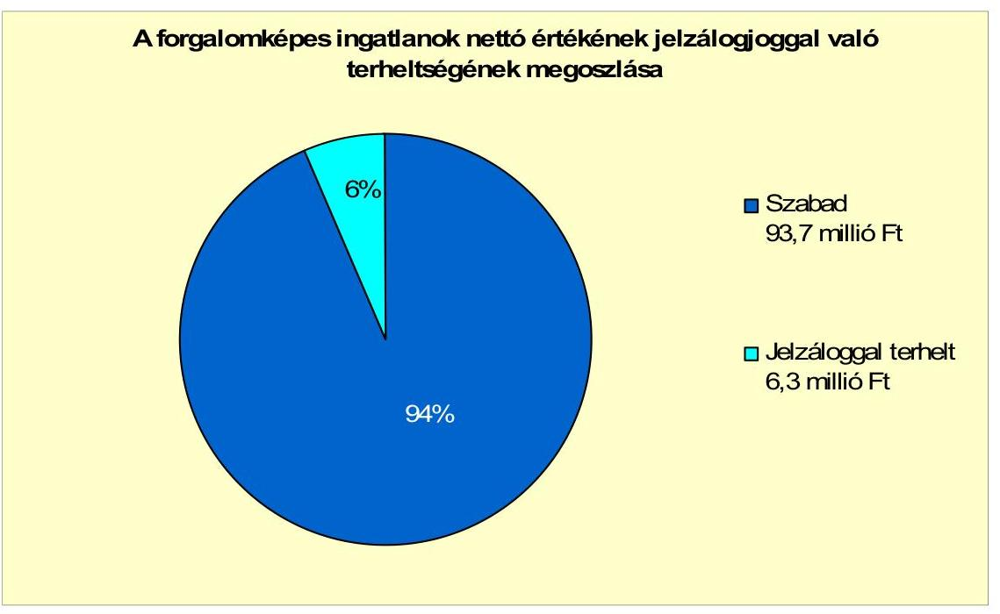

A forgalomképes ingatlanok körében egy használaton kívüli volt iskolaépületre történt jelzálogjog bejegyzés a likvidhitelt nyújtó pénzintézet javára. A korlátozottan forgalomképes ingatlanok esetében a központi támogatás igénybevételével vásárolt és kialakított bérlakásokra jegyeztek be jelzálogjogot a támogatások erejéig. Az ingatlanok jelzáloggal történő terhelése nem jelentett magas kockázatot az Önkormányzat gazdálkodásában.

Az Önkormányzat és az 50\%-ot meghaladó tulajdoni hányadú gazdasági társaságainál a vizsgálat időszakában három esetben volt folyamatban kötelezettséget keletkeztető peres eljárás. Jogerős végzéssel zárt eljárás nem volt.

Két per kártérítés, egy pedig számlatartozás megfizetésére irányult. A perbeli kötelezettség értéke összesen 4,4 millió Ft. Egy esetben született első fokú ítélet, de fellebbezésre került sor. Egy esetben elfogultság miatt halasztás történt. Egy esetben az első tárgyalás után szakértő kirendelésére került sor.

Az Önkormányzat legalább 50\% vagy azt meghaladó tulajdoni hányaddal rendelkező gazdasági társaságainak fennálló pénzintézetekkel szembeni, szállítói és lízing kötelezettségei az alábbiak szerint alakultak:

| Megnevezés | Állomány 2010. december 31 én |  |  | Állomány 2011. június 30-án |  |  | Várható kötelezettség 20112013. években |  | Várható kötelezettség 2014. évtől |  |
| :--: | :--: | :--: | :--: | :--: | :--: | :--: | :--: | :--: | :--: | :--: |
|  | HUF-ban (millió Ftban) | Devizában (összegy. szorban) | Deviza nem | HUF-ban (millió Ftban) | Devizában (összegy. szorban) | Deviza   nem | HUF-ban (millió Ftban) | Devizában (összegeszorban) | HUF-ban (millió Ftban) | Devizában (összegeszorban) |
| Fütőerőmú Zrt. |  | 5521,8 | EUR |  | 5186,3 | EUR |  | 2338,1 |  | 3797,8 |
| Kamb-víz Kft. |  | 1569,5 | CHF |  | 1520,4 | CHF |  | 938,4 |  | 1371,3 |
| Folyószámla és lévid hitel | 267,3 |  |  | 363,0 |  |  | 363,0 |  |  |  |
| Pénzintézet kötelezettségok összesen: | 267,3 |  |  | 363 |  |  | 363 |  |  |  |
| Lióing kötelezettségek | 21,50 |  |  | 21,00 |  |  |  |  |  |  |
| Szállító terhizda | 806,00 |  |  | 437,70 |  |  |  |  |  |  |

---

A társaságok kötelezettségei közül a minősített többségú társaságokat érintő hosszú lejáratú pénzintézetekkel szembeni kötelezettségek 2011. június 30 -ai állománya 5186,3 ezer EUR, a folyószámla és likvidhitel állománya 359,7 millió Ft volt. A várható kötelezettség (tőke, kamat és egyéb költség) a 20112013. években 2338,1 ezer EUR és 359,7 millió Ft, a 2014. évtől 3797,9 ezer EUR. A szállítói tartozásállomány 398,0 millió Ft, amiből 161,0 millió Ft volt a lejárt szállítói tartozás, a lejárt szállítói tartozásállomány figyelemmel kísérése nem volt biztosított. A minősített többségi tulajdonú társaságok kötelezettségállománya jelentősen növelte az Önkormányzat pénzügyi kockázatát.

Az Önkormányzat a gazdasági társaságokról szóló 2006. évi IV. törvény 54. § (2) bekezdése alapján korlátlan felelősséggel tartozik azon gazdasági társaságának felszámolása esetében, amelyben az Önkormányzat az 52. § (2) bekezdése szerint a szavazatok legalább 75\%-ával rendelkezik, így minősített befolyásszerzőnek minősül, továbbá a csődeljárásról és a felszámolási eljárásról szóló 1991. évi XLIX. törvény 63. § (2) bekezdése alapján a kizárólagos önkormányzati tulajdonú gazdasági társaságának minden olyan kötelezettségéért, amelynek kielégítését a felszámolási eljárás során az adós társaság vagyona nem fedez, ha a hitelezőinek a felszámolási eljárás során benyújtott keresete alapján a bíróság - az adós társaság felé érvényesített tartósan hátrányos üzletpolitikájára figyelemmel - megállapítja az Önkormányzat korlátlan és teljes felelősségét.

Az Önkormányzat kimutatása szerint a 2007-2010. években a tárgyi eszközök után együttesen 1029,5 millió Ft értékcsökkenést számolt el. Ugyanebben az időszakban 319,8 millió Ft felújítást, valamint 2936,1 millió Ft beruházást aktiváltak. Az önkormányzati szintű használhatósági fok mutató a 2007. évben 23,6\%, a 2008. évben 24,8\%, a 2009. évben 27,5\%, 2010. évben 30,2\% volt, az aktivált felújítások és beruházások hatására folyamatosan javult. Az Önkormányzat kimutatása szerint az eszközök pótlására a vizsgált időszakban 1434,4 millió Ft-ot fordított, eszközpótlási kötelezettségének eleget tett. A Képvi-selő-testületnek előterjesztett éves zárszámadási rendeleteikben nem mutatták be az Önkormányzat eszközei után tárgyévben elszámolt értékcsökkenés összegét, az eszközpótlásra fordított tényleges kiadásokat, az eszközök elhasználódási fokának alakulását.

# 4. A PÉNZÜGYI EGYENSÚLY MEGTEREMTÉSE ÉrDEKÉBEN HOZOTT INTÉZKEDÉSEK EREDMÉNYE 

Az Önkormányzatnál a kiadáscsökkentő és bevételnövelő intézkedések a feladatellátás szakmai színvonalának, a pénzügyi helyzetnek a javítását, valamint a költségvetési megtakarítások elérését célozták. Az intézkedésekkel egyben sikerült megőrizni az intézmények stabilitását is.

---

Az Önkormányzat kimutatása szerint a 2007-2011. év I. félév időszakában kiadáscsökkentő intézkedések területi megoszlását az alábbi ábra szemlélteti:
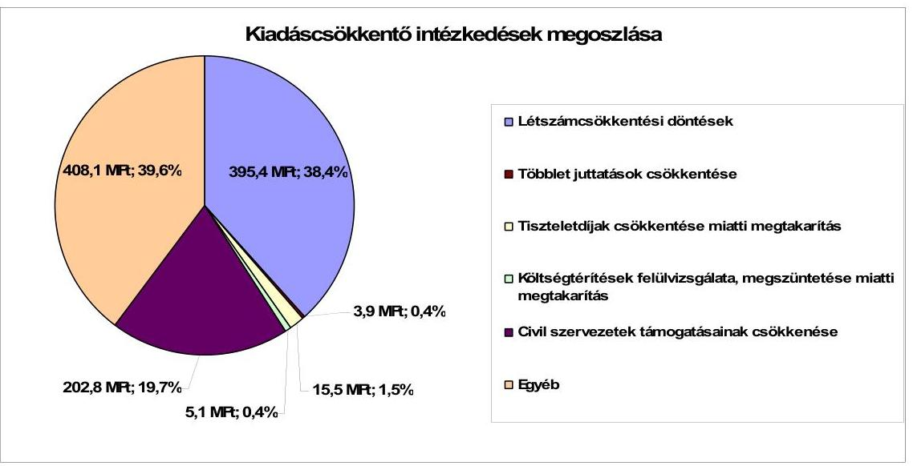

Az önkormányzati szinten kimutatott 1030,8 millió Ft kiadáscsökkentő megtakarítási intézkedésekből 395,4 millió Ft-ot (38,4\%) létszámcsökkentési döntések körében érvényesítették.

A Képviselő-testület kilenc alkalommal döntött feladatmegszüntetéssel, átszervezéssel járó létszámcsökkentésről. A jelentősebb intézkedéseket az alábbiak részletezik:

- A feladatok hatékonyabb, költségtakarékosabb ellátása végett a Kórházat 2007. december 31. napjával megszüntették és átadták az Egészségcentrum Kft.-nek. Az intézkedéssel 239 álláshelyet szüntetettek meg. Az Önkormányzatnál ebből 62 főt építettek le, 177 főt az Egészségcentrum Kft. vett át 2008. január 1-jével.
- A kötelező óraszám-csökkenéssel összefüggésben négy alapfokú oktatási és egy közművelődési intézményben összesen 14 fő létszámleépítéséről döntöttek a 2007. évi költségvetési rendeletben.
- 2010. július 1-jén a Bölcsődét megszüntették. A bölcsődei feladatellátásról gazdaságosabb módon, az eddigi kettő helyett egy ellátási helyen, a Kistérségi társulás keretében gondoskodnak. Az intézkedéssel 14 álláshely szűnt meg.
- 2010. évi költségvetés finanszírozhatóságára tekintettel az Oktatási Központ szervezetében 13 fő létszámleépítést hajtottak végre.
- 2011. évi költségvetés végrehajtásához fűzött intézkedési terv öt fő létszámcsökkentését a közművelődési intézményeknél és egy fő leépítését a Szilvási Nevelési-Oktatási Központban írta elő.

A köztisztviselők és közalkalmazottak részére nyújtott cafetéria elemek és az egyéb többletjuttatások csökkentése összesen 3,9 millió Ft (0,4\%) meg-

---

takarítást jelentett. 2010 októberétől a Képviselő-testület tiszteletdíjáról lemondott, amely 15,5 millió Ft (1,5\%) megtakarítást eredményezett. A 2009. évtől a polgármester és az alpolgármester lemondtak költségtérítésükről, amely 5,1 millió Ft $(0,4 \%)$ kiadáscsökkentést jelentett.

A civil szervezetek támogatását 2008. évtől kezdve 45,7 millió Ft-ra (61,9\%-kal) csökkentették, amellyel 202,8 millió Ft (19,7\%) kiadáscsökkentést értek el.

A stabilitási tartalék zárolása, személyi juttatások és egyéb kiadások előirányzatának csökkentése 408,1 millió Ft (39,6\%) megtakarítást eredményezett.

Az intézményeket érintő átszervezések következtében a 2007. évi induló 856 fő foglalkoztatott létszám 121 fővel (14,4\%) csökkent 735 főre 2010. év végén. Az Önkormányzat 2007-2010. éveket érintő összesített létszám változását az alábbi táblázat szemlélteti:

| Megnevezés (adatok III-ben) | Közoktatás | Szociális és gyermekvédelmi | Egészségügy | Polgármesteri hivatal | Egyéb | Összesen |
| :--: | :--: | :--: | :--: | :--: | :--: | :--: |
| 2007. január 1-jén jóváhagyott álláshelyek száma | 357 | 14 | 239 | 118 | 132 | 860 |
| Megszüntetett álláshelyek száma | 43 | 14 | 239 | 2 | 0 | 298 |
| 2008. üres álláshelyek száma | 0 | 0 | 0 | 0 | 0 | 0 |
| szakmai álláshelyek száma | 33 | 14 | 239 | 2 | 0 | 288 |
| intézmény-üzemeltetéssel kapcsolatos   1 álláshelyek száma | 10 | 0 | 0 | 0 | 0 | 10 |
| Átáshely növekedése | 113 | 0 | 0 | 0 | 1 | 113 |
| 2010. december 21-én záró álláshelyek száma | 481 | 0 | 0 | 118 | 138* | 735 |
| 2007. január 1-jén foglalkoztatott létszám | 357 | 14 | 236 | 118 | 131 | 856 |
| Létszámcsökkentés | 43 | 14 | 236 | 2 | 0 | 298 |
| Létszámnövekedés | 173 | 0 | 0 | 0 | 1 | 174 |
| 2010. december 21-én foglalkoztatott létszám | 481 | 0 | 0 | 116 | 138* | 735 |

Üres álláshely megszüntetés nem volt. A létszámcsökkentő intézkedések következtében 2007-2010. között összesen 298 álláshelyet szüntettek meg. Ebből 43 fő ( $14,4 \%$ ) a közoktatási, 14 fő ( $4,7 \%$ ) a szociális és gyermekvédelmi, 239 fő $(80,2 \%)$ az egészségügyi, két fő $(0,7 \%)$ a polgármesteri hivatali területet érintette. Az egészségügyi ágazatban 2007. december 31-ig 62 fő, 2008. január 1-jén további 177 álláshelyet építettek le. Az álláshely megszűnések mellett a bővülő, önkormányzatoktól átvett óvodai, általános iskolai, gimnáziumi, szakiskolai, szakközépiskolai feladatok miatt az álláshelyek számának 173 fős növelésére is szükség volt az Oktatási Központban. A helyi szervezési intézkedések végrehajtásához az Önkormányzat 271,9 millió Ft költségvetési támogatásban részesült, amelynek felhasználásával 110 álláshelyet tartósan leépített. A 188 (63,1\%) álláshely csökkentéshez központi támogatás nem kapcsolódott.

A kiadáscsökkentő intézkedések mellett az Önkormányzat kimutatása szerint a következőkben számszerűsített bevételnövelő intézkedéseket tett 20072011. év I. félév időszakában, amelynek összege 765,3 millió Ft volt.

---

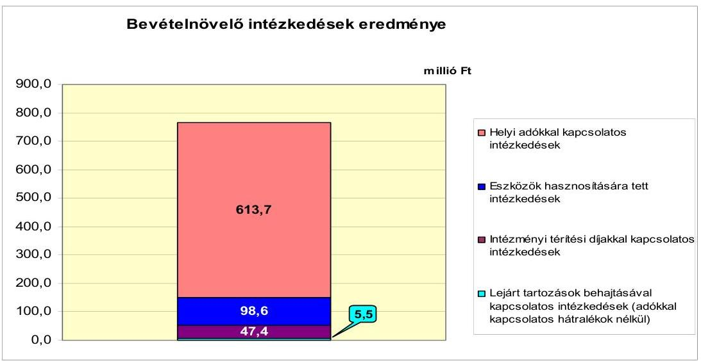

Az Önkormányzat a bevételek növelése érdekében végrehajtott intézkedései közül a legjelentősebb összeg a helyi adók mértékének növeléséből és adóhátralékok behajtásából származott. Az Önkormányzat a jogszabály adta lehetőségével élve az adó mértékek emelésével 213,5 millió Ft többletbevételt ért el. A megnövekedett összegű - 938,0 millió Ft - adóhátralékok behajtásából a korábbiaknál nagyobb bevételeket, 362,3 millió Ft-ot (38,6\%) realizáltak jegyzői intézkedések következtében.

Az eszközök hasznosítására, ingatlanok, helyiségek bérbeadására tett intézkedések 98,6 millió Ft-tal növelték a bevételeket. A fogyasztói árindex változását követően az intézményi térítési díjakat felemelték, amely 47,4 millió Ft többletbevételt hozott. E többletbevétel növekedés másik oka, hogy a középfokú oktatás feladatátvétele miatt nőtt az ellátotti létszám és ez által a térítési díj is.

A lejárt tartozásokkal kapcsolatos intézkedések hatására 5,5 millió Ft-tal nőtt a bevétel. Ezek lakásvételári hátralékokból, lakáscélú kölcsöntartozásokból, munkabértartozásokból, szociális kölcsön tartozásból és adósságkezelési támogatásból származtak.

Az Önkormányzat kiadáscsökkentő és bevételnövelő intézkedései eredményeként összesen 1796,0 millió Ft megtakarítást és többletbevételt mutatott ki az ellenőrzött időszakban. A költségvetési támogatások és az átengedett szja 2007. évhez viszonyított együttes növekedése 939,3 millió Ft volt. A megtakarítások, többletbevételek valamint a költségvetési támogatások, átengedett szja együttesen 2735,3 millió Ft-tal javították az Önkormányzat pénzügyi egyensúlyát.

# 5. Az ÁSZ Által a korÁbbi ÉVEKben a PÉNZÜGYI EGYENSÚLY JAVÍTÁSÁRA TETT SZABÁLYSZERŰSÉGI ÉS CÉLSZERŰSÉGI JAVASLATOK HASZNOSULÁSA 

Az ÁSZ az Önkormányzat gazdálkodását a 2010. évben ellenőrizte átfogó jelleggel. A pénzügyi egyensúly javítása érdekében a jegyzőnek kettő szabályszerűségi és egy célszerűségi javaslatot tett. A javaslatok a likviditási terv készítésé-

---

re, a fejlesztések több éves kihasználásának bemutatására, valamint a hosszúlejáratú kötelezettségek teljesítésének feltételeire vonatkoztak.

A fejlesztések kihatását a 2011. évi költségvetési rendeletben bemutatták. Likviditási terv - a hitelfelvétel és a közbeszerzési eljárás elhúzódása miatt - a 2011. év I. félévben nem készült. A hosszú lejáratú kötelezettségek teljesítési feltételeinek bemutatására a 2012. év költségvetési koncepciójának készítésekor van lehetőség. A javaslatok megvalósítására a 2011. év tavaszán intézkedési tervet készítettek, amely tartalmazta a felelősöket és határidőket.

Budapest, 2012. április " 16 "

Melléklet: 6 db
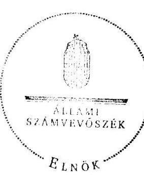

Domokos László

---

Komló Város Önkormányzata

1. számú melléklet
a V-3075-019/2012.számú jelentéshez

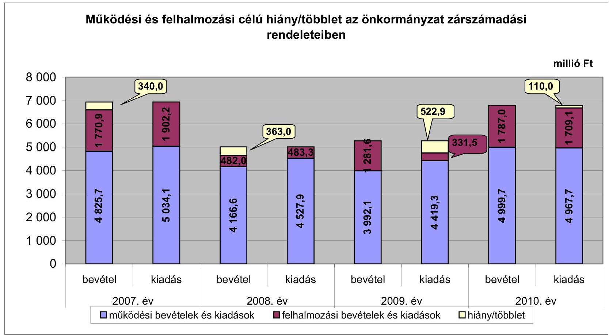

---

|   |  |  |  |  |  |  |  |  |  |  |  |  |  |  |  |  |  |  |  |  |  |  |  |  |  |   |
| --- | --- | --- | --- | --- | --- | --- | --- | --- | --- | --- | --- | --- | --- | --- | --- | --- | --- | --- | --- | --- | --- | --- | --- | --- | --- | --- | --- |
|  1. FOLYÓ KÖLTSÉGVETÉS* |  |  |  |  |  |  |  |  |  |  |  |  |  |  |  |  |  |  |  |  |  |  |  |  |  |   |
|  1.1.1. Saját működési bevételek |  |  |  |  |  |  |  |  |  |  |  |  |  |  |  |  |  |  |  |  |  |  |  |  |  |  |   |
|  1.1.2. Költségvetési támogatás **** |  |  |  |  |  |  |  |  |  |  |  |  |  |  |  |  |  |  |  |  |  |  |  |  |  |  |   |
|  1.1.3. Átongedett bevételek |  |  |  |  |  |  |  |  |  |  |  |  |  |  |  |  |  |  |  |  |  |  |  |  |  |  |  |   |
|  1.1.4. Állambázatáson belülről kapott támogatások |  |  |  |  |  |  |  |  |  |  |  |  |  |  |  |  |  |  |  |  |  |  |  |  |  |  |  |   |
|  1.1.5. EU-tól és külföldről kapott bevételek |  |  |  |  |  |  |  |  |  |  |  |  |  |  |  |  |  |  |  |  |  |  |  |  |  |  |  |   |
|  1.1.6. Állambázatáson kívülről kapott bevételek |  |  |  |  |  |  |  |  |  |  |  |  |  |  |  |  |  |  |  |  |  |  |  |  |  |  |  |   |
|  1.1.7. Fátot évi pénzmaradvány átvétel |  |  |  |  |  |  |  |  |  |  |  |  |  |  |  |  |  |  |  |  |  |  |  |  |  |  |  |  |   |
|  1.1. Folyó bevételek +1.1.1.+1.1.2.+1.1.3.+1.1.4.+1.1.5.+1.1.6.+1.1.7. |  |  |  |  |  |  |  |  |  |  |  |  |  |  |  |  |  |  |  |  |  |  |  |  |  |  |  |  |  |   |
|  1.2.1. Működési kiadások kamatkiadások nélkül |  |  |  |  |  |  |  |  |  |  |  |  |  |  |  |  |  |  |  |  |  |  |  |  |  |  |  |  |   |
|  1.2.2. Állambázatáson belülre átadott pénzeszközök |  |  |  |  |  |  |  |  |  |  |  |  |  |  |  |  |  |  |  |  |  |  |  |  |  |  |  |  |   |
|  1.2.3.1. vállalkozásoknak |  |  |  |  |  |  |  |  |  |  |  |  |  |  |  |  |  |  |  |  |  |  |  |  |  |  |  |  |  |   |
|  1.2.3.2. EU-nak, illetve külföldre |  |  |  |  |  |  |  |  |  |  |  |  |  |  |  |  |  |  |  |  |  |  |  |  |  |  |  |  |  |   |
|  1.2.3.3. magánszemélyeknek |  |  |  |  |  |  |  |  |  |  |  |  |  |  |  |  |  |  |  |  |  |  |  |  |  |  |  |  |  |   |
|  1.2.3.4. nonprofió szervezeteknek |  |  |  |  |  |  |  |  |  |  |  |  |  |  |  |  |  |  |  |  |  |  |  |  |  |  |  |  |  |   |
|  1.2.3.1. Transferkiadások (+1.2.3.1+1.2.3.2+1.2.3.3+1.2.3.4) |  |  |  |  |  |  |  |  |  |  |  |  |  |  |  |  |  |  |  |  |  |  |  |  |  |  |  |  |  |  |   |
|  1.2.4. Kamatkiadások |  |  |  |  |  |  |  |  |  |  |  |  |  |  |  |  |  |  |  |  |  |  |  |  |  |  |  |  |  |  |   |
|  1.2.5. Fátot évi pénzmaradvány átadás |  |  |  |  |  |  |  |  |  |  |  |  |  |  |  |  |  |  |  |  |  |  |  |  |  |  |  |  |  |   |
|  1.2.6. Folyó kiadások + 1.2.1.+1.2.2.+1.2.3.+1.2.4.+1.2.5. |  |  |  |  |  |  |  |  |  |  |  |  |  |  |  |  |  |  |  |  |  |  |  |  |  |  |  |  |  |  |   |
|  1.3. Folyó költségvetés egyenlege MŰKÖDÉSI JÖVEDELEM (1.1. - 1.2.) |  |  |  |  |  |  |  |  |  |  |  |  |  |  |  |  |  |  |  |  |  |  |  |  |  |  |  |  |  |  |   |
|  2. FELHALMOZÁSI KÖLTSÉGVETÉS** |  |  |  |  |  |  |  |  |  |  |  |  |  |  |  |  |  |  |  |  |  |  |  |  |  |  |  |  |  |  |   |
|  2.1.1. Saját tökebevételek |  |  |  |  |  |  |  |  |  |  |  |  |  |  |  |  |  |  |  |  |  |  |  |  |  |  |  |  |  |  |   |
|  2.1.2. Állambázatáson belülről kapott támogatások**** |  |  |  |  |  |  |  |  |  |  |  |  |  |  |  |  |  |  |  |  |  |  |  |  |  |  |  |  |  |  |   |
|  2.1.3. EU-tól és külföldről kapott támogatások |  |  |  |  |  |  |  |  |  |  |  |  |  |  |  |  |  |  |  |  |  |  |  |  |  |  |  |  |  |  |   |
|  2.1.4. Állambázatáson kívülről kapott támogatások |  |  |  |  |  |  |  |  |  |  |  |  |  |  |  |  |  |  |  |  |  |  |  |  |  |  |  |  |  |  |   |
|  2.1. Felhalmozási bevételek (+2.1.1.+2.1.2+2.1.3+2.1.4.) |  |  |  |  |  |  |  |  |  |  |  |  |  |  |  |  |  |  |  |  |  |  |  |  |  |  |  |  |  |  |  |   |
|  2.2.1. Saját beruházási kiadás állvaí |  |  |  |  |  |  |  |  |  |  |  |  |  |  |  |  |  |  |  |  |  |  |  |  |  |  |  |  |  |  |   |
|  2.2.2. Saját felújítási kiadás állvaí |  |  |  |  |  |  |  |  |  |  |  |  |  |  |  |  |  |  |  |  |  |  |  |  |  |  |  |  |  |  |   |
|  2.2.3. Állambázatáson belülre átadott pénzesekézök |  |  |  |  |  |  |  |  |  |  |  |  |  |  |  |  |  |  |  |  |  |  |  |  |  |  |  |  |  |  |   |
|  2.2.4. EU-nak és külföldnek adott pénzesekézök |  |  |  |  |  |  |  |  |  |  |  |  |  |  |  |  |  |  |  |  |  |  |  |  |  |  |  |  |  |  |   |
|  2.2.5. Állambázatáson kívülre adott pénzesekézök |  |  |  |  |  |  |  |  |  |  |  |  |  |  |  |  |  |  |  |  |  |  |  |  |  |  |  |  |  |  |   |
|  2.2.6. Befektetési célú részesedések vásárlása |  |  |  |  |  |  |  |  |  |  |  |  |  |  |  |  |  |  |  |  |  |  |  |  |  |  |  |  |  |  |   |
|  2.2.7. Felhalmozási kiadások (+2.2.1.+2.2.2.+2.2.3.+2.2.4.+2.2.5.+2.2.6.) |  |  |  |  |  |  |  |  |  |  |  |  |  |  |  |  |  |  |  |  |  |  |  |  |  |  |  |  |  |  |  |   |
|  2.3. Felhalmozási költségvetés egyenlege (2.1. - 2.2.) |  |  |  |  |  |  |  |  |  |  |  |  |  |  |  |  |  |  |  |  |  |  |  |  |  |  |  |  |  |  |   |
|  3. Finanszírozási műveletek nélküli (GFS) pozíció(1.3.+2.3.) |  |  |  |  |  |  |  |  |  |  |  |  |  |  |  |  |  |  |  |  |  |  |  |  |  |  |  |  |  |  |  |   |
|  4. Finanszírozási műveletek |  |  |  |  |  |  |  |  |  |  |  |  |  |  |  |  |  |  |  |  |  |  |  |  |  |  |  |  |  |  |  |   |
|  4.1. Hitelfelvétel *** |  |  |  |  |  |  |  |  |  |  |  |  |  |  |  |  |  |  |  |  |  |  |  |  |  |  |  |  |  |  |  |   |
|  4.2. Hitelfelvésztés *** |  |  |  |  |  |  |  |  |  |  |  |  |  |  |  |  |  |  |  |  |  |  |  |  |  |  |  |  |  |  |  |   |
|  4.3. Forgatási és befektetési célú értékpapírok kibocsátása |  |  |  |  |  |  |  |  |  |  |  |  |  |  |  |  |  |  |  |  |  |  |  |  |  |  |  |  |  |  |  |   |
|  4.4. Forgatási és befektetési célú értékpapírok beváltása |  |  |  |  |  |  |  |  |  |  |  |  |  |  |  |  |  |  |  |  |  |  |  |  |  |  |  |  |  |  |  |   |
|  4.5. Forgatási és befektetési célú értékpapírok értékesítése |  |  |  |  |  |  |  |  |  |  |  |  |  |  |  |  |  |  |  |  |  |  |  |  |  |  |  |  |  |  |  |   |
|  4.6. Forgatási és befektetési célú értékpapírok vásárlása |  |  |  |  |  |  |  |  |  |  |  |  |  |  |  |  |  |  |  |  |  |  |  |  |  |  |  |  |  |  |  |   |
|  4.7. Egyéb finanszírozási bevételek (függő, átfató, kiegyenlíté) |  |  |  |  |  |  |  |  |  |  |  |  |  |  |  |  |  |  |  |  |  |  |  |  |  |  |  |  |  |  |  |   |
|  4.8. Egyéb finanszírozási kiadások (függő, átfató, kiegyenlíté) |  |  |  |  |  |  |  |  |  |  |  |  |  |  |  |  |  |  |  |  |  |  |  |  |  |  |  |  |  |  |  |  |   |
|  4.9. Finanszírozási műveletek egyenlege (4.1. - 4.2.+4.3.-4.4+4.5.-4.6.+4.7.-4.8.) |  |  |  |  |  |  |  |  |  |  |  |  |  |  |  |  |  |  |  |  |  |  |  |  |  |  |  |  |  |  |  |  |  |   |
|  5. Tárgyévi pénzügyi pozíció változás (1.3.+ 2.3.+4.9.) |  |  |  |  |  |  |  |  |  |  |  |  |  |  |  |  |  |  |  |  |  |  |  |  |  |  |  |  |  |  |  |  |   |
|  6. Nettó működési jövedelem =működési jövedelem (1.3.) - tőketőlfesztés (4.2+4.4) |  |  |  |  |  |  |  |  |  |  |  |  |  |  |  |  |  |  |  |  |  |  |  |  |  |  |  |  |  |  |  |  |   |
|  7. GJÉKÖZTATÓ ÁBATOK |  |  |  |  |  |  |  |  |  |  |  |  |  |  |  |  |  |  |  |  |  |  |  |  |  |  |  |  |  |  |  |   |
|  Összes kötelezettség |  |  |  |  |  |  |  |  |  |  |  |  |  |  |  |  |  |  |  |  |  |  |  |  |  |  |  |  |  |  |  |   |
|  ebből rövid hjárató |  |  |  |  |  |  |  |  |  |  |  |  |  |  |  |  |  |  |  |  |  |  |  |  |  |  |  |  |  |  |  |   |
|  Összes szállású kötelezettség |  |  |  |  |  |  |  |  |  |  |  |  |  |  |  |  |  |  |  |  |  |  |  |  |  |  |  |  |  |  |  |   |
|  Össze szállású kötelezettség |  |  |  |  |  |  |  |  |  |  |  |  |  |  |  |  |  |  |  |  |  |  |  |  |  |  |  |  |  |  |  |   |
|  ebből lejárt (tanisítványból) |  |  |  |  |  |  |  |  |  |  |  |  |  |  |  |  |  |  |  |  |  |  |  |  |  |  |  |  |  |  |  |   |
|  Pénz és tőkepíaci kötelezettség (adósság) |  |  |  |  |  |  |  |  |  |  |  |  |  |  |  |  |  |  |  |  |  |  |  |  |  |  |  |  |  |  |  |   |
|  ebből rövid hjárató |  |  |  |  |  |  |  |  |  |  |  |  |  |  |  |  |  |  |  |  |  |  |  |  |  |  |  |  |  |  |  |   |
|  ebből lejárt szolgálatási díj miatti kötelezettség |  |  |  |  |  |  |  |  |  |  |  |  |  |  |  |  |  |  |  |  |  |  |  |  |  |  |  |  |  |  |  |   |
|  Folyószámlabító napi átlagos állománya (tanisítványból) |  |  |  |  |  |  |  |  |  |  |  |  |  |  |  |  |  |  |  |  |  |  |  |  |  |  |  |  |  |  |  |   |
|  Likvidítést napi átlagos állománya (tanisítványból) |  |  |  |  |  |  |  |  |  |  |  |  |  |  |  |  |  |  |  |  |  |  |  |  |  |  |  |  |  |  |  |   |
|  Munkalárítétel napi átlagos állománya (tanisítványból) |  |  |  |  |  |  |  |  |  |  |  |  |  |  |  |  |  |  |  |  |  |  |  |  |  |  |  |  |  |  |  |   |
|  Kezesség és garanciavállalások (tanisítványból) |  |  |  |  |  |  |  |  |  |  |  |  |  |  |  |  |  |  |  |  |  |  |  |  |  |  |  |  |  |  |  |   |
|  Jogurós bírósági ötletekből adódó kötelezettségek (tanisítványból) |  |  |  |  |  |  |  |  |  |  |  |  |  |  |  |  |  |  |  |  |  |  |  |  |  |  |  |  |  |  |  |   |
|  Finanszírozásba bevonható eszközök: |  |  |  |  |  |  |  |  |  |  |  |  |  |  |  |  |  |  |  |  |  |  |  |  |  |  |  |  |  |  |  |   |
|  Tartós hitelviszonyt megtestesítő értékpapírok és végi állománya |  |  |  |  |  |  |  |  |  |  |  |  |  |  |  |  |  |  |  |  |  |  |  |  |  |  |  |  |  |  |  |   |
|  Hosszú hjárató bankhetétek és végi állománya |  |  |  |  |  |  |  |  |  |  |  |  |  |  |  |  |  |  |  |  |  |  |  |  |  |  |  |  |  |  |  |   |
|  Értékpapírok és végi állománya |  |  |  |  |  |  |  |  |  |  |  |  |  |  |  |  |  |  |  |  |  |  |  |  |  |  |  |  |  |  |  |   |
|  Pénzesekézök (idegen pénzesekézök nélküli) és végi állománya |  |  |  |  |  |  |  |  |  |  |  |  |  |  |  |  |  |  |  |  |  |  |  |  |  |  |  |  |  |  |  |   |
|  * Bevételekben nem térül, a kiadásokban nem jelenik meg az amortizáció, a vagyoni helyzetet az egyenleg befolyás.
* Bevételekben vagyon megőrzése és hívótéve fordításis forrása.
*** Mirakontotná a 2008. évi adatokai, nével az Önkormányzat által alkalmazott számcéseli eljárás miatt a folyószásnás
kötéck létezték és tőfezetése technikai jellegű halmoztáikat tartalmazott. Esnek összegével 1499,4 millió Ft-tel mindkét
veritas szereplő adatot csökkentettük. Esnaki választó a nettó működési jövedelem összeg.
**** Liekkantettük az 1.1.2. Költségvetési támogatás nett, mert a 2007. évben 964,6 millió Ft, a 2008. évben 100,0 millió millió F-
célhánogatást tartalmazott, amit a tárolásban megváltoított szempviszeráma beruházáshoz vettek igénybe. Ugyanezekkel az
összegükkel növelikik az állambázhatáson belülről átvott felhalmoztás bevételeket. |  |  |  |  |  |  |  |  |  |  |  |  |  |  |  |  |  |  |  |  |  |  |  |  |  |  |  |  |  |  |  |  |  |  |  |  |  |  |  |  |  |  |  |  |  |  |  |  |  |  |  |  |  |  |  |  |  |  |  |  |  |  |  |  |  |  |  |  |  |  |  |  |  |  |  |  |  |  |  |  |  |  |  |  |  |  |  |  |  |  |  |  |  |  |  |  |  |  |  | 

---

|   |  |  |  |  |  |  |  |  |  |  |  |  |  |  |  |  |  |  |  |  |  |  |  |  |  |  |  |  |  |  |  |  |  |  |  |  |  |  |  |  |  |  |  |  |  |   |
| --- | --- | --- | --- | --- | --- | --- | --- | --- | --- | --- | --- | --- | --- | --- | --- | --- | --- | --- | --- | --- | --- | --- | --- | --- | --- | --- | --- | --- | --- | --- | --- | --- | --- | --- | --- | --- | --- | --- | --- | --- | --- | --- | --- | --- | --- | --- |
|   |  |  |  |  |  |  |  |  |  |  |  |  |  |  |  |  |  |  |  |  |  |  |  |  |  |  |  |  |  |  |  |  |  |  |  |  |  |  |  |  |  |  |  |  |   |
|   |  |  |  |  |  |  |  |  |  |  |  |  |  |  |  |  |  |  |  |  |  |  |  |  |  |  |  |  |  |  |  |  |  |  |  |  |  |  |  |  |  |  |  |  |   |
|   |  |  |  |  |  |  |  |  |  |  |  |  |  |  |  |  |  |  |  |  |  |  |  |  |  |  |  |  |  |  |  |  |  |  |  |  |  |  |  |  |  |  |  |  |   |
|   |  |  |  |  |  |  |  |  |  |  |  |  |  |  |  |  |  |  |  |  |  |  |  |  |  |  |  |  |  |  |  |  |  |  |  |  |  |  |  |  |  |  |  |  |   |
|   |  |  |  |  |  |  |  |  |  |  |  |  |  |  |  |  |  |  |  |  |  |  |  |  |  |  |  |  |  |  |  |  |  |  |  |  |  |  |  |  |  |  |  |  |   |
|   |  |  |  |  |  |  |  |  |  |  |  |  |  |  |  |  |  |  |  |  |  |  |  |  |  |  |  |  |  |  |  |  |  |  |  |  |  |  |  |  |  |  |  |  |   |
|   |  |  |  |  |  |  |  |  |  |  |  |  |  |  |  |  |  |  |  |  |  |  |  |  |  |  |  |  |  |  |  |  |  |  |  |  |  |  |  |  |  |  |  |  |   |
|   |  |  |  |  |  |  |  |  |  |  |  |  |  |  |  |  |  |  |  |  |  |  |  |  |  |  |  |  |  |  |  |  |  |  |  |  |  |  |  |  |  |  |  |  |   |
|   |  |  |  |  |  |  |  |  |  |  |  |  |  |  |  |  |  |  |  |  |  |  |  |  |  |  |  |  |  |  |  |  |  |  |  |  |  |  |  |  |  |  |  |  |   |
|   |  |  |  |  |  |  |  |  |  |  |  |  |  |  |  |  |  |  |  |  |  |  |  |  |  |  |  |  |  |  |  |  |  |  |  |  |  |  |  |  |  |  |  |  |   |
|   |  |  |  |  |  |  |  |  |  |  |  |  |  |  |  |  |  |  |  |  |  |  |  |  |  |  |  |  |  |  |  |  |  |  |  |  |  |  |  |  |  |  |  |  |   |
|   |  |  |  |  |  |  |  |  |  |  |  |  |  |  |  |  |  |  |  |  |  |  |  |  |  |  |  |  |  |  |  |  |  |  |  |  |  |  |  |  |  |  |  |  |   |
|   |  |  |  |  |  |  |  |  |  |  |  |  |  |  |  |  |  |  |  |  |  |  |  |  |  |  |  |  |  |  |  |  |  |  |  |  |  |  |  |  |  |  |  |  |   |
|   |  |  |  |  |  |  |  |  |  |  |  |  |  |  |  |  |  |  |  |  |  |  |  |  |  |  |  |  |  |  |  |  |  |  |  |  |  |  |  |  |  |  |  |  |   |
|   |  |  |  |  |  |  |  |  |  |  |  |  |  |  |  |  |  |  |  |  |  |  |  |  |  |  |  |  |  |  |  |  |  |  |  |  |  |  |  |  |  |  |  |  |   |
|   |  |  |  |  |  |  |  |  |  |  |  |  |  |  |  |  |  |  |  |  |  |  |  |  |  |  |  |  |  |  |  |  |  |  |  |  |  |  |  |  |  |  |  |  |   |
|   |  |  |  |  |  |  |  |  |  |  |  |  |  |  |  |  |  |  |  |  |  |  |  |  |  |  |  |  |  |  |  |  |  |  |  |  |  |  |  |  |  |  |  |  |   |
|   |  |  |  |  |  |  |  |  |  |  |  |  |  |  |  |  |  |  |  |  |  |  |  |  |  |  |  |  |  |  |  |  |  |  |  |  |  |  |  |  |  |  |  |  |   |
|   |  |  |  |  |  |  |  |  |  |  |  |  |  |  |  |  |  |  |  |  |  |  |  |  |  |  |  |  |  |  |  |  |  |  |  |  |  |  |  |  |  |  |  |  |   |
|   |  |  |  |  |  |  |  |  |  |  |  |  |  |  |  |  |  |  |  |  |  |  |  |  |  |  |  |  |  |  |  |  |  |  |  |  |  |  |  |  |  |  |  |  |   |
|   |  |  |  |  |  |  |  |  |  |  |  |  |  |  |  |  |  |  |  |  |  |  |  |  |  |  |  |  |  |  |  |  |  |  |  |  |  |  |  |  |  |  |  |  |   |
|   |  |  |  |  |  |  |  |  |  |  |  |  |  |  |  |  |  |  |  |  |  |  |  |  |  |  |  |  |  |  |  |  |  |  |  |  |  |  |  |  |  |  |  |  |   |
|   |  |  |  |  |  |  |  |  |  |  |  |  |  |  |  |  |  |  |  |  |  |  |  |  |  |  |  |  |  |  |  |  |  |  |  |  |  |  |  |  |  |  |  |  |   |
|   |  |  |  |  |  |  |  |  |  |  |  |  |  |  |  |  |  |  |  |  |  |  |  |  |  |  |  |  |  |  |  |  |  |  |  |  |  |  |  |  |  |  |  |  |   |
|   |  |  |  |  |  |  |  |  |  |  |  |  |  |  |  |  |  |  |  |  |  |  |  |  |  |  |  |  |  |  |  |  |  |  |  |  |  |  |  |  |  |  |  |  |   |
|   |  |  |  |  |  |  |  |  |  |  |  |  |  |  |  |  |  |  |  |  |  |  |  |  |  |  |  |  |  |  |  |  |  |  |  |  |  |  |  |  |  |  |  |  |   |
|   |  |  |  |  |  |  |  |  |  |  |  |  |  |  |  |  |  |  |  |  |  |  |  |  |  |  |  |  |  |  |  |  |  |  |  |  |  |  |  |  |  |  |  |  |   |
|   |  |  |  |  |  |  |  |  |  |  |  |  |  |  |  |  |  |  |  |  |  |  |  |  |  |  |  |  |  |  |  |  |  |  |  |  |  |  |  |  |  |  |  |  |   |
|   |  |  |  |  |  |  |  |  |  |  |  |  |  |  |  |  |  |  |  |  |  |  |  |  |  |  |  |  |  |  |  |  |  |  |  |  |  |  |  |  |  |  |  |  |   |
|   |  |  |  |  |  |  |  |  |  |  |  |  |  |  |  |  |  |  |  |  |  |  |  |  |  |  |  |  |  |  |  |  |  |  |  |  |  |  |  |  |  |  |  |  |   |
|   |  |  |  |  |  |  |  |  |  |  |  |  |  |  |  |  |  |  |  |  |  |  |  |  |  |  |  |  |  |  |  |  |  |  |  |  |  |  |  |  |  |  |  |  |   |
|   |

---

Kontó Várce Önkormányzata

Ső- számú mobilitást

a V-2075-015/2012-számú jelentéshez

Az Önkormányzat 2010. december 31-én folyamatban lévő fejlesztési feladataira 2010. december 31-ig teljesített kihasítások és azok forrásíaszatátéla

|   |  |  |  |  |  |  |  |  |  |  |  |  |  |  |  |  |  |  |  |  |  |  |  |  |  |  |  |  |  |  |  |  |  |  |  |  |  |  |  |  |  |  |  |  |  |  |  |  |  |  |  |  |  |  |  |  |  |  |  |  |  |   |
| --- | --- | --- | --- | --- | --- | --- | --- | --- | --- | --- | --- | --- | --- | --- | --- | --- | --- | --- | --- | --- | --- | --- | --- | --- | --- | --- | --- | --- | --- | --- | --- | --- | --- | --- | --- | --- | --- | --- | --- | --- | --- | --- | --- | --- | --- | --- | --- | --- | --- | --- | --- | --- | --- | --- | --- | --- | --- | --- | --- | --- | --- | --- | --- | --- | --- | --- | --- | --- | --- | --- | --- | --- | --- | --- | --- | --- | --- | --- | --- | --- | --- | --- | --- | --- | --- | --- | --- | --- | --- | --- | --- | --- | --- | --- | --- | --- | --- | --- | --- | --- | ---

---

Kombi Város Önkormányzata

Só számú metropol. a V-2075-019/2012 számú jelentéshez

Az Önkormányzat 2010. december 31-én folyamatos lévő fejlesztési feladataira 2010. december 31-én fennálló kötelezettségek és azok forrásbaazátétele

|  |   |   |   |   |   |   |   |   |   |   |   |   |   |   |   |   |   |   |   |   |   |   |   |   |   |   |   |   |   |   |   |   |   |   |   |   |   |   |   |   |   |   |   |   |   |   |   |   |   |   |   |   |   |   |   |   |   |   |   |   |   |   |   |   |   |   |   |   |   |   |   |   |   |   |   |   |   |   |   |   |   |   |   |   |   |   |   |   |   |   |   |   |   |   |   |   |   |   |   |   |  

---

Komló Város Önkormányzata 4. számú melléklet a V-3075-019/2012. számú jelentéshez

Az önkormányzati feladatok ellátásában résztvevő gazdasági társaságok

|  Gazdasági társaság megnevezései |  |  |  |  |  |  |  |  |  |  |  |  |  |  |  |  |  |  |  |  |  |   |
| --- | --- | --- | --- | --- | --- | --- | --- | --- | --- | --- | --- | --- | --- | --- | --- | --- | --- | --- | --- | --- | --- | --- |
|   |  |  |  |  |  |  |  |  |  |  |  |  | a gazdasági társaságnak szerződéses kötelezettségre, feladat ellátási szerződésre alapozottan az önkormányzat költségvetéséből nyújtott |  |  |  |  |  |  |  |   |
|   | önkormányzat | önkormányzat gazdasági társaságának | saját tőke, | kötelező | önként vállalt | hossza lejáratú |  |  |  |  |  |  | müködési támogatás |  |  |  |  |  |  |  |  |   |
|   |  |  |  | f feladathoz | feladathoz | feladathoz |  |  |  |  |  |  |  |  |  |  |  |  |  |  |  |   |
|   |  |  |  |  |  |  |  |  |  |  |  |  |  |  |  |  |  |  |  |  |  |   |
|   |  |  |  |  |  |  |  |  |  |  |  |  |  |  |  |  |  |  |  |  |  |   |
|   |  |  |  |  |  |  |  |  |  |  |  |  |  |  |  |  |  |  |  |  |  |   |
|   |  |  |  |  |  |  |  |  |  |  |  |  |  |  |  |  |  |  |  |  |  |   |
|   |  |  |  |  |  |  |  |  |  |  |  |  |  |  |  |  |  |  |  |  |  |   |
|   |  |  |  |  |  |  |  |  |  |  |  |  |  |  |  |  |  |  |  |  |  |   |
|  II. 100%-os tulajdoní hányadó gazdasági társaságok: |  |  |  |  |  |  |  |  |  |  |  |  |  |  |  |  |  |  |  |  |  |   |
|  Komlói Fülöetőmű Zrt. | 100 |  | 1,2 | 0,0 | 0,0 | 209,5 | 0,0 | 0,0 | 44,1 | 52,1 | 0,0 | 0,0 | 15,0 | 0,0 | 0,0 | 27,8 | 27,8 | 0,0 |  |  |  |   |
|  Komlói Egészségcentrum Nonprofit Kft. | 100 |  | -7,2 | 0,0 | 1044,6 | 0,0 | 3,0 | 150,0 | 0,0 | 34,0 | 68,8 | 68,8 | 18,8 | 0,0 | 0,0 | 0,0 | 3,0 | 0,0 |  |  |  |   |
|  100%-os tulajdoní hányadó gazdasági társaságok összesen | x | x | x | 0,0 | 1044,6 | 209,5 | 3,0 | 150,0 | 44,1 | 86,8 | 68,8 | 68,8 | 33,8 | 0,0 | 0,0 | 27,8 | 30,8 | 0,0 |  |  |  |   |
|  III. 75-99%-os tulajdoní hányadó gazdasági társaságok: |  |  |  |  |  |  |  |  |  |  |  |  |  |  |  |  |  |  |  |  |  |   |
|  Carboker Kft. | 96,1 |  | -0,6 | 0,0 | 0,0 | 38,0 | 0,0 | 10,9 | 0,0 | 0,0 | 0,0 | 0,0 | 1,8 | 0,0 | 0,0 | 0,0 | 0,0 | 0,0 |  |  |  |   |
|  75-99%-os tulajdoní hányadó gazdasági társaságok összesen | x | x | x | 0,0 | 0,0 | 38,0 | 0,0 | 10,9 | 0,0 | 0,0 | 0,0 | 0,0 | 0,0 | 1,8 | 0,0 | 0,0 | 0,0 | 0,0 |  |  |  |   |
|  75% feletti tulajdoní hányadó gazdasági társaságok összesen | x | x | x | 0,0 | 1044,6 | 247,5 | 3,0 | 160,9 | 44,1 | 86,8 | 68,8 | 68,8 | 33,8 | 1,8 | 0,0 | 27,8 | 30,8 | 0,0 |  |  |  |   |
|  III. 51-74%-os tulajdoní hányadó gazdasági társaságok: |  |  |  |  |  |  |  |  |  |  |  |  |  |  |  |  |  |  |  |  |  |   |
|  Komló-víz Kft. | 57,3 |  | 1,2 | 1577,6 | 0,0 | 333,8 | 16,2 | 0,0 | 2,8 | 0,0 | 0,0 | 0,0 | 0,0 | 0,0 | 0,0 | 0,0 | 0,0 | 0,0 |  |  |  |   |
|  Komló és Társége Fejlesztési Közhasznú Nonprofit Kft. | 53,7 |  | -0,8 | 0,0 | 0,0 | 11,6 | 0,0 | 10,3 | 9,5 | 0,0 | 0,0 | 1,5 | 0,0 | 0,0 | 0,0 | 0,0 | 0,0 | 0,0 |  |  |  |   |
|  Komló Szociális Nonprofit Kft. | 53,1 |  | 0,8 | 0,0 | 266,1 | 145,1 | 2,3 | 7,3 | 30,8 | 22,0 | 24,7 | 22,0 | 3,0 | 0,0 | 0,0 | 0,0 | 0,0 | 0,0 |  |  |  |   |
|  51-74%-os tulajdoní hányadó gazdasági társaságok összesen | x | x | x | 1577,6 | 266,1 | 490,5 | 18,5 | 17,6 | 42,3 | 22,0 | 24,7 | 23,5 | 3,0 | 0,0 | 0,0 | 0,0 | 0,0 | 0,0 |  |  |  |   |
|  IV. egyéb, közfeladatot ellátó gazdasági társaságok: |  |  |  |  |  |  |  |  |  |  |  |  |  |  |  |  |  |  |  |  |  |   |
|  Komlói Városgazdálkodási Zrt. |  | 51,5 | 1,3 | 88,9 | 0,0 | 1,5 | 8,6 | 0,0 | 10,0 | 10,0 | 13,2 | 10,4 | 0,2 | 0,0 | 0,0 | 0,0 | 0,0 | 0,0 |  |  |  |   |
|  Pannon Vstári Zrt. |  |  | 1,7 | 0,0 | 0,0 | 0,0 | 0,0 | 0,0 | 43,4 | 32,2 | 31,5 | 29,8 | 7,1 | 0,0 | 0,0 | 0,0 | 0,0 | 0,0 |  |  |  |   |
|  Árdão-Prof Kft. |  |  | -0,6 | 0,0 | 18,5 | 1,2 | 2,3 | 0,0 | 0,0 | 0,0 | 0,0 | 0,0 | 0,0 | 0,0 | 0,0 | 0,0 | 0,0 | 0,0 |  |  |  |   |
|  Szent Borbóla Otthon Nonprofit Közhasznú Kft. |  |  |  | 0,0 | 0,0 | 0,0 | 0,0 | 0,0 | 72,1 | 72,0 | 62,1 | 62,1 | 29,5 | 0,0 | 0,0 | 0,0 | 0,0 | 0,0 |  |  |  |   |
|  Egyéb, közfeladatot ellátó gazdasági társaságok összesen | x | x | x | 88,9 | 18,5 | 2,7 | 10,9 | 0,0 | 125,5 | 114,2 | 106,8 | 102,3 | 36,8 | 0,0 | 0,0 | 0,0 | 0,0 | 0,0 |  |  |  |   |
|  Összesen | x | x | x | 1666,5 | 1229,2 | 740,7 | 32,4 | 178,5 | 211,9 | 222,8 | 200,3 | 194,8 | 73,6 | 1,8 | 0,0 | 27,8 | 30,8 | 0,0 |  |  |  |   |