# ÁLLAMI   SZÁMVEVŐSZÉK 

## JELENTÉS

Kunszentmiklós Város Önkormányzata pénzügyi helyzetének ellenőrzéséről (43/4)

---

# Állami Számvevőszék 

Iktatószám: V-3072-024/2012.
Témaszám: 1015
Vizsgálat-azonosító szám: V0560103

## Az ellenőrzést felügyelte:

Dr. Varga Sándor
számvevő igazgatóhelyettes
Az ellenőrzést vezette:
Renkó Zsuzsanna
számvevő tanácsos
Ellenőrzési csoportvezető:
Puchy Márta
számvevő tanácsos
Az ellenőrzést végezték:
Bus András Péter Renner Andrea
számvevő számvevő

---

# TARTALOMJEGYZÉK 

BEVEZETÉS ..... 9
I. ÖSSZEGZŐ MEGÁLLAPÍTÁSOK, KÖVETKEZTETÉSEK, JAVASLATOK ..... 13
II. RÉSZLETES MEGÁLLAPÍTÁSOK ..... 25

1. Az Önkormányzat kötelező és önként vállalt feladatai, a feladatellátás szervezeti keretei és annak változásai ..... 25
2. Az Önkormányzat pénzügyi egyensúlyi helyzetét befolyásoló tényezők ..... 30
2.1. A működési és a felhalmozási egyensúly változása ..... 32
2.2. Az Önkormányzat bevételeinek változása ..... 37
2.3. Az Önkormányzat folyó és felhalmozási célú kiadásainak változása ..... 39
3. Az Önkormányzat kötelezettségei ..... 44
3.1. Az Önkormányzat pénzintézeti kötelezettségeinek változása ..... 44
3.2. Szállítói kötelezettségek változása ..... 49
3.3. Egyéb kötelezettségek változása ..... 49
4. A pénzügyi egyensúly megteremtése érdekében hozott intézkedések eredménye ..... 52
5. Az ÁSZ által a korábbi években a pénzügyi egyensúly javítására tett szabályszerűségi és célszerűségi javaslatok hasznosulása ..... 53

---

# MELLÉKLETEK 

1. számú Működési és felhalmozási célú hiány/többlet a 2007-2010 közötti időszakban az Önkormányzat zárszámadási rendeleteiben (1 oldal)
2. számú Az Önkormányzat bevételei és kiadásai, valamint adósságszolgálata 20072010 között (1 oldal)
3/a. számú Az Önkormányzat 2007-2010. években megvalósított, 2010. december 31-ig befejezett fejlesztései és azok forrásösszetétele (1 oldal)
3/b. számú Az Önkormányzat 2010. december 31-én folyamatban lévő fejlesztési feladataira 2010. december 31-ig teljesített kifizetések és azok forrásösszetétele (1 oldal)
3/c. számú Az Önkormányzat 2010. december 31-én folyamatban lévő fejlesztési feladataira 2010. december 31-én fennálló kötelezettségek és azok forrásösszetétele (1 oldal)
3/d. számú Az Önkormányzat által beadott, elbírálás alatti pályázati forrásból megvalósítani tervezett fejlesztéseihez kapcsolódó kötelezettségvállalásai és azok forrásösszetétele (1 oldal)
3. számú Az önkormányzati feladatok ellátásában résztvevő gazdasági társaságok (1 oldal)

---

# RÖVIDÍTÉSEK JEGYZÉKE 

## Törvények

Adósságrendezési tv.
Áht.
Gt.
Ötv.
Ptk.
Stabilitási törvény
Számv. tv.

## Rendeletek

Áhsz.
2008. évi költségvetési rendelet

SzMSz

## Szórövidítések

áfa
ÁMK
ÁSZ
Bakér Kft.
Bácsvíz Zrt.
EU
Ipari Park Kft.
jegyző
Képviselő-testület
Kistérségi társulás
Kormány
ÖNHIKI
OEP
Önkormányzat
polgármester
a helyi önkormányzatok adósságrendezési eljárásáról szóló 1996. évi XXV. törvény
az államháztartásról szóló 1992. évi XXXVIII. törvény
a gazdasági társaságokról szóló 2006. évi IV. törvény
a helyi önkormányzatokról szóló 1990. évi LXV. törvény
a Polgári Törvénykönyvről szóló 1959. évi IV. törvény
Magyarország Gazdasági Stabilitásáról szóló 2011. évi CXCIV. törvény
a számvitelről szóló 2000. évi C. törvény
az államháztartás szervezetei beszámolási és könyvvezetési kötelezettségének sajátosságairól szóló 249/2000. (XII. 24.) Korm. rendelet

Kunszentmiklós Város Önkormányzatának 6/2008. (II. 20.) számú rendelete Kunszentmiklós Város Önkormányzatának 2008. évi költségvetéséről
Kunszentmiklós Város Önkormányzata 12/2011. (III. 31.) számú rendelete a Képviselő-testület Szervezeti és Működési Szabályzatáról (a többször módosított 7/2007. (III. 21.) számú rendeletet 2011. május 1-jétől hatályon kívül helyezte)
általános forgalmi adó
Varga Domokos Általános Művelődési Központ
Állami Számvevőszék
BAKÉR Kunszentmiklósi Közhasznú Nonprofit Korlátolt Felelősségű Társaság
Bácsvíz Víz- és Csatornaszolgáltató Zártkörűen Működő Részvénytársaság
Európai Unió
Kunszentmiklósi Ipari Park Építőipari, Kereskedelmi és Szolgáltató Korlátolt Felelősségű Társaság
Kunszentmiklós Város Önkormányzatának Jegyzője
Kunszentmiklós Város Képviselő-testülete
Felső-Kiskunsági és Dunamelléki Többcélú Kistérségi Társulás
Magyarország Kormánya
Önhibájukon kívül hátrányos helyzetben lévő települési önkormányzatok támogatása
Országos Egészségbiztosítási Pénztár
Kunszentmiklós Város Önkormányzata
Kunszentmiklós Város Önkormányzatának Polgármestere

---

| Polgármesteri hivatal | Kunszentmiklós Város Önkormányzatának Polgármesteri   Hivatala |
| :-- | :-- |
| szja | személyi jövedelemadó |

---

# ÉRTELMEZŐ SZÓTÁR 

| BUBOR | Budapesti Bankközi Forint Hitelkamatláb. Irányadó, refe-   rencia jellegű kamatláb. Mértékét az MNB naponta álla-   pítja meg a banki kamatok figyelembevételével. Közzété-   tele naponta történik. |
| :--: | :--: |
| CLF módszer | Az önkormányzatok költségvetése elemzésének eszköze. A   módszer következetesen elkülöníti a folyó és a felhalmo-   zási költségvetés bevételeit és kiadásait, azok költségvetési   egyenlegeit. Bizonyos mértékig a vállalati gazdálkodás   logikai elemeit érvényesíti az önkormányzatok pénzügyi,   jövedelmi helyzetének vizsgálata során. Az értékelés a   pénzügyi kapacitás fogalmát helyezi a középpontba. |
| EURIBOR | A frankfurti bankközi piacon jegyzett, az Európai Közpon-   ti Bank szabályainak megfelelően megállapított kínálati   kamatláb. Az EURIBOR értékét a legfontosabb európai   bankok hitelkínálatának kamatlábai alapján a Reuters   ügynökség számolja ki és teszi közzé naponta. A magyar   pénzintézetek is ezt használják viszonyítási alapnak EUR   hitelek esetén. |
| GDP - Bruttó hazai ter-   mék | A gazdaság által az adott időszakban előállított, végső   felhasználásra szánt termékek és szolgáltatások piaci   áron meghatározott értéke. |
| használhatósági fok | Az eszközgazdálkodás vizsgálatának elemzése során   használt mutató. Számításakor a tárgyi eszköz könyv sze-   rinti (nettó) értékét viszonyítják a tárgyi eszköz bruttó (be-   szerzési/létesítési) értékéhez. A \%-ban kifejezett mutató   csökkenése az eszköz állagának romlására, avulására   utal, ami maga után vonja az üzemeltetési és fenntartási   költségek növekedését is. |
| kamatkockázat | A változó kamatozású forint-, vagy a devizahitelek futam-   ideje alatt a kamat emelkedése miatt fennálló kamatkoc-   kázat, melynek növekedése miatt nő a hitel törlesztő rész-   lete. |
| kötelező közszolgáltatás | A helyi önkormányzati feladatkörbe tartozó, a köztiszta-   sággal és a településtisztasággal, valamint az élet- és va-   gyonbiztonsággal összefüggő egyes - közszolgáltatás út-   ján megvalósuló - közfeladatok ellátása, amelynek köte-   lező igénybevételét külön jogszabály (törvény, helyi ön-   kormányzati rendelet) határoz meg. |
| közfeladat | Állami, helyi, illetve kisebbségi önkormányzati feladat,   amelynek ellátásáról az államnak, illetve az önkormány-   zatoknak kell gondoskodni. A hatályos szabályozás sze-   rint közfeladatot törvény és önkormányzati rendelet álla-   píthat meg. Az önkormányzatok által ellátandó feladatok   keretszerű meghatározását az Ötv. tartalmazza. |
| önkormányzat többségi   tulajdonában lévő gaz-   dasági társaságok | Az önkormányzat a gazdasági társaságban a szavazatok   több mint ötven százalékával vagy a Ptk. 685/B. § (2)-(3)   bekezdéseiben rögzített meghatározó befolyással rendel- |

---

kezik. A befolyással rendelkező akkor rendelkezik egy jogi személyben meghatározó befolyással, ha annak tagja, illetve részvényese és jogosult e jogi személy vezető tisztségviselői vagy felügyelőbizottsága tagjai többségének megválasztására, illetve visszahívására, vagy a jogi személy más tagjaival, illetve részvényeseivel kötött megállapodás alapján egyedül rendelkezik a szavazatok több mint ötven százalékával (Ptk. 685/B. § (2) bekezdés). A meghatározó befolyás akkor is fennáll, ha a befolyással rendelkező számára e jogosultságok közvetett módon (köztes vállalkozásain keresztül, a Ptk. 685/B §. (3)-(4) bekezdései szerint) biztosítottak.
A helyi önkormányzat és az önkormányzat irányítása alá tartozó költségvetési szerv többségi tulajdonában, illetve többségi befolyása alatt álló gazdálkodó szervezet esetében hitelfelvétel, kölcsönfelvétel, garancia- vagy kezességvállalás, tartozásátvállalás, tartozás-elengedés, értékpapír kibocsátás, vásárlás, pénzügyi lízing, tartós bérleti szerződés, ingyenes vagyonjuttatás (így különösen: ajándékozás, ingyenes engedményezés), vagy követelésvásárlás, követelésengedményezés végrehajtására vonatkozóan az Áht. 100/M. § (4) bekezdése alapján az önkormányzat rendelkezik döntési jogosultsággal.
pénzügyi kapacitás

A pénzügyi kapacitás (financial capacity) az adósok hitelfelvételi képességének azon mértéke, ahol még anélkül tudják növelni az adósságot, hogy csökkenteniük kellene akár a jelenbeli, akár a jövőben esedékes kiadásaikat a fizetésképtelenség elkerülése érdekében. (Forrás: Az önkormányzati rendszer pénzügyi helyzete, ÁSZKUT tanulmány 2010.)
pénzügyi kockázat

SNA

A működési kockázat egyik eleme. Megmutatkozhat a költségvetés nagyságrendjének, szerkezetének nem megalapozott módosításaiban, a bevételi, és a kiadási előirányzatoktól lényegesen eltérő teljesítésekben, a nem megfelelő belső kontrollrendszer működésében, a tudatos károkozásokban, a biztosítások elmaradásában, a hibás fejlesztési döntésekben, a nem a terveknek megfelelő forrásfelhasználásokban. Jelentkezhet továbbá a bevételek és kiadások ütemkülönbsége miatt felvett folyószámla- és likvidhitelek költségvetési év végén fennálló egyenlege miatt, amely az önkormányzat költségvetésébe - akár tartósan - beépülő forráshiányt jelzi.
System of National Account, azaz a Nemzeti Számlák Rendszere, amely a gazdasági szektorok által létrehozott valamennyi terméket és szolgáltatást figyelembe veszi.

---

szállítói kitettség
törlesztési kockázat

Az önkormányzat pénzügyi helyzete olyan külső körülmények hatására is módosulhat, amelyekre az önkormányzatnak nincs hatása, emiatt szállítói kitettsége keletkezik. Pl. a lejárt szállítói tartozások rendezése függhet attól, hogy a szállító milyen intézkedéseket foganatosít az önkormányzattal szemben.
Annak a kockázata, hogy a megfelelő időben és mértékben a hitelt felvevőnél rendelkezésre állnak-e a pénzintézetek és egyéb szervek felé fennálló kötelezettségek visszafizetéséhez, a hitelek és kölcsönök törlesztéséhez szükséges pénzügyi források.
A törlesztési kockázatot növeli a kamat- és árfolyam növekedése, mivel ezekben az esetekben az adósságszolgálat nőhet. Törlesztési kockázatot okozhat a visszafizetésre tervezett forrás elérésének, teljesítésének bizonytalansága (pl. a visszafizetéshez tervezett tartalékolás elmaradt, a tervezettnél alacsonyabb a saját bevétel, a helyi adóból származó bevétel az adóalanyok, adóalapok csökkenése miatt nem teljesül).

---

.

---

# JELENTÉS 

## Kunszentmiklós Város Önkormányzata pénzügyi helyzetének ellenőrzéséről

## BEVEZETÉS

Az Állami Számvevőszék 2011. évtől érvényes stratégiája új irányt szabott a helyi önkormányzatok gazdálkodásának ellenőrzésében is. Az ÁSZ - küldetése és jövőképe szerint - szilárd szakmai alapokra támaszkodva értékteremtő ellenőrzéseivel és helyzetelemzéseivel az államháztartás egészében, így a helyi önkormányzati alrendszerben is elő kívánja segíteni a közpénzek és a közvagyon szabályos, gazdaságos, hatékony és eredményes felhasználását. E folyamat részeként - az államháztartási hiány alakulásának összetevőire is figyelemmel végezzük az önkormányzati alrendszer pénzügyi helyzetelemzését.

Az államháztartás helyi szintjén a 304 városnak ${ }^{1}$ az általuk ellátott közszolgáltatások volumenére is tekintettel a közfeladatok ellátásában kiemelt szerepe van. E települések 2011. január 1-jei népessége 3169 ezer fő volt.

Feladataik és hatásköreik az Ötv. mellett különböző ágazati törvények által meghatározottak, miközben a feladatellátás szervezeti kereteit - ezen belül a gazdasági társaságok közszolgáltatások ellátásában betöltött szerepét - saját maguk határozzák meg. A gazdasági társaságok által ellátott feladatok esetén a gazdálkodás, továbbá az önkormányzatok pénzügyi egyensúlyi helyzetére ható közvetlen kockázatok egy része kikerült az önkormányzati alrendszerből. A többségi önkormányzati tulajdonban lévő társaságok gazdálkodásának körülményei befolyásolhatják a városok pénzügyi egyensúlyi helyzetének megítélésében rejlő kockázatokat.

Az áttekintett időszakban az önkormányzati forrásszabályozás elvei lényegesen nem változtak. Az önkormányzatok gazdasági mozgásterét a központi költségvetéstől való függőség mellett jelentősen befolyásolja a helyi adókivetési jog gyakorlása. A városok gazdálkodási szabadságának lényeges eleme, hogy anyagi lehetőségeik függvényében dönthettek arról, hogy feladataik közül azokat, amelyek megoldására az Ötv. szerint a települési önkormányzat nem kötelezhető, a megyei önkormányzat fenntartásába adhatták. E döntések differenciáltan érintették a városok pénzügyi helyzetét.

[^0]
[^0]:    ${ }^{1}$ A megyei jogú városok nélkül figyelembe vett városok száma 304 városi önkormányzatot jelent.

---

A városi önkormányzatok 2007-2010 között teljesített bevételeit és összetételét az alábbi ábra szemlélteti:

Az önkormányzati alrendszer pénzügyi helyzetértékelése során új elemzési módszereket alkalmazott az ellenőrzés. A költségvetési beszámoló adatok elemzése helyett az önkormányzat pénzügyi helyzetét a CLF módszerrel értékeljük, amelynek lényegét és számításának módszerét a jelentés 2. pontjában, és a jelentés 2. számú mellékletében ismertetjük részletesen.

Az új módszereken alapuló helyzetértékelés fontosságát az adja, hogy a helyi önkormányzatok bruttó adósságállománya ${ }^{2}$ a 2010. évi költségvetési beszámolók alapján 1248 milliárd Ft-ot tett ki. Ezen belül a 304 város adóssága 383 milliárd Ft volt, amely az önkormányzati alrendszer teljes adósságállományának $30,7 \%$-át jelentette ${ }^{3}$.

A mérlegben kimutatott bruttó adósságállomány mellett az önkormányzatok számára az eszközállomány műszaki állapotának megőrzése is előbb-utóbb pénzügyi kötelezettséget jelent. Az elhasználódott eszközök pótlására forrást biztosító amortizációs (felújítási) alap képzésének ${ }^{4}$ elmaradása maga után vonhatja a feladatellátást kiszolgáló tárgyi eszközök állagának erőteljes romlását. Emellett a 2007-2013-as időszakra meghirdetett, vissza nem térítendő EU-s fejlesztési forrásokhoz való hozzájutás lehetősége felerősítette az önkormányzati

[^0]
[^0]:    ${ }^{2}$ Az önkormányzati mérlegbeszámolókból számított bruttó adósságállomány 2010. év végi összege magában foglalja a fejlesztési és a működési célú kötvénykibocsátások, a beruházási és fejlesztési hitelek, a működési célú hosszú lejáratú hitelek, a rövid lejáratú hitelek, váltótartozások miatti kötelezettségek teljes (2011-ben, illetve az azt követő években esedékes) állományát. Az önkormányzatok 2007. év végi mérleg szerinti adósságállománya 692 milliárd Ft volt.
    ${ }^{3}$ A fővárosi és a kerületi önkormányzatok adósságának figyelmen kívül hagyásával számított 977 milliárd Ft összegű bruttó adósságállományból a városok 39,2\%-kal részesedtek.
    ${ }^{4}$ Erre a jelenlegi szabályozási környezetben nem kötelezi előírás az önkormányzatokat.

---

alrendszer fejlesztési igényeit, amelyek a felhalmozási költségvetési hiány folyamatos emelkedésén túl - az előírt jövőbeni fenntartási kötelezettség miatt tovább terhelhetik az önkormányzatok költségvetését ${ }^{5}$.

Az ÁSZ a 2011. évi ellenőrzési tervében 43. számú, az Önkormányzatok gazdálkodási rendszerének ellenőrzése részeként áttekinti és elemzi az önkormányzatok pénzügyi helyzetét. A gazdálkodás szabályszerűségét az ÁSZ az előző évek során ebben az önkormányzati körben is ellenőrizte. Jelen vizsgálatunk a tett javaslataink pénzügyi helyzetet érintő pontjainak hasznosítására utóellenőrzés jelleggel tér ki.

Az ellenőrzés megállapításait az Önkormányzat által kitöltött - teljességi nyilatkozattal megerősített - 27 tanúsítványon szolgáltatott adatokra alapoztuk. Ellenőrzési bizonyítékként használtuk fel továbbá:

- a képviselő-testületi és bizottsági előterjesztéseket, a döntés-előkészítés során készített dokumentumokat;
- a kötelezettségvállalások dokumentumait;
- a pénzügyi-számviteli nyilvántartásokat;
- az éves költségvetési beszámolókat;
- a költségvetési és zárszámadási rendeleteket.

Az ellenőrzés a 2007. január 1. - 2011. június 30. közötti időszakot öleli fel. A pénzintézeti kötelezettségek állományának vizsgálatakor az ellenőrzött időszak 2006. december 31. - 2011. június 30. közötti időszakra terjedt ki.

Az ellenőrzés során vizsgáltunk minden olyan körülményt és adatot, amely a program végrehajtásához kapcsolódott és a pénzügyi helyzet alakulására hatást gyakorló releváns tények és folyamatok feltárásához szükségessé vált.

# Az ellenőrzés célja annak értékelése volt, hogy: 

- a vizsgált időszakban a kötelező- és önként vállalt feladatok ellátását biztosító szervezeti keretekben, a feladatellátás módjában bekövetkezett változások milyen hatást gyakoroltak az Önkormányzat pénzügyi helyzetének alakulására;
- az Önkormányzat pénzügyi - ezen belül működési és felhalmozási - egyensúlya mely tényezők hatására miként változott, és az Önkormányzat milyen intézkedéseket tett a pénzügyi egyensúly javítása érdekében;

[^0]
[^0]:    ${ }^{5}$ Az Állami Számvevőszék 2011 júniusában közzétett 1108. számú, a helyi önkormányzatok fejlesztési célú támogatási rendszerének ellenőrzéséről szóló jelentésében feltárta a fejlesztési folyamatok problémáit. A helyi önkormányzatok elsősorban azokat a fejlesztéseket valósították meg, amelyekhez támogatást lehetett igényelni. A fejlesztési célok közül a magasabb támogatási intenzitású pályázatokat részesítették előnyben. A fejlesztéssel megvalósuló létesítmények jövőbeli üzemeltetésének várható ráfordításait az önkormányzatok $71,9 \%$-a nem mérte fel.

---

- a költségvetési kiadások finanszírozása érdekében vállalt pénzintézeti kötelezettségek hogyan alakultak, továbbá milyen kötelezettségek fennállása befolyásolja az Önkormányzat jövőbeli pénzügyi helyzetét;
- hasznosultak-e a gazdálkodási rendszer korábbi ellenőrzése során a pénzügyi egyensúly javítására az ÁSZ által tett szabályszerűségi és célszerűségi javaslatok.

Az ellenőrzés típusa: szabályszerűségi vizsgálat.
A vizsgálat jogszabályi alapját az Állami Számvevőszékről szóló 2011. évi LXVI. törvény 1. §. (3), 5. § (2)-(6) bekezdései, továbbá az Áht. 120/A. § (1) bekezdése előírásai képezik.

Kunszentmiklós város lakosainak száma 2010. január 1-jén 8680 fő volt. A 2010. évi választásokat követően az Önkormányzat kilenc tagú képviselőtestületének munkáját három állandó bizottság segítette. A helyi Önkormányzat mellett egy kisebbségi önkormányzat működött. A 2010. évi választásokat követően a polgármester személye nem változott. A jegyző 2006. január 16-ától tölti be a tisztségét.

Az Önkormányzat a 2010. évi költségvetési beszámolója szerint - a finanszírozási bevételekkel és kiadásokkal, valamint a pénzmaradvánnyal együtt 2104,4 millió Ft költségvetési bevételt ért el és 2096,8 millió Ft költségvetési kiadást teljesített. Az Önkormányzat vagyona a 2007. évi 4316,3 millió Ft-ról a 2010. évre 5000,8 millió Ft-ra, 15,9\%-kal növekedett.

Az Önkormányzat kötelező feladatait az Ötv. és az ágazati törvények szerint meghatározottnak tekintette. A kötelező feladatai mellett az Önkormányzat SzMSz-ének besorolása alapján önként vállalt feladatai az általános középfokú és szakmai középfokú oktatáshoz, a korai fejlesztéshez, a pályaválasztási tanácsadáshoz, a fejlesztő felkészítéshez, a gyógytestneveléshez és az alapfokú művészeti oktatáshoz kapcsolódtak.

---

# I. ÖSSZEGZŐ MEGÁLLAPÍTÁSOK, KÖVETKEZTETÉSEK, JAVASLATOK 

Az Önkormányzat - adatszolgáltatása szerint - a kötelező feladatok ellátására a 2007-2009. években átlagosan az összes működési kiadás 75,7\%-át (1049,7 millió Ft-ot ${ }^{6}$ ), a 2010. évben 71,8\%-át ( 947,5 millió Ft-ot) fordította. Az önként vállalt feladatok kiadása a 2007-2009. években átlagosan az összes működési kiadás $24,3 \%$-át ( 337,5 millió Ft-ot), a 2010. évben 28,2\%-át ( 371,5 millió Ft-ot) jelentette. A kötelező feladatok ellátása mellett az Önkormányzat SzMSz-ének besorolása ${ }^{7}$ alapján önként vállalt feladatai az általános középfokú és szakmai középfokú oktatáshoz, a korai fejlesztéshez, a pályaválasztási tanácsadáshoz, a fejlesztő felkészítéshez, a gyógytestneveléshez, az alapfokú művészeti oktatáshoz, valamint társadalmi szervezeteinek támogatásához kapcsolódtak. Az önként vállalt feladatok terjedelmét az éves költségvetési rendeletekben az adott évi költségvetés forrásainak ismeretében határozták meg. Az Önkormányzat feladatellátásának 2011. június 30-i szervezeti struktúráját az alábbi ábra mutatja be:

Az Önkormányzat feladatellátásának szervezeti struktúrája
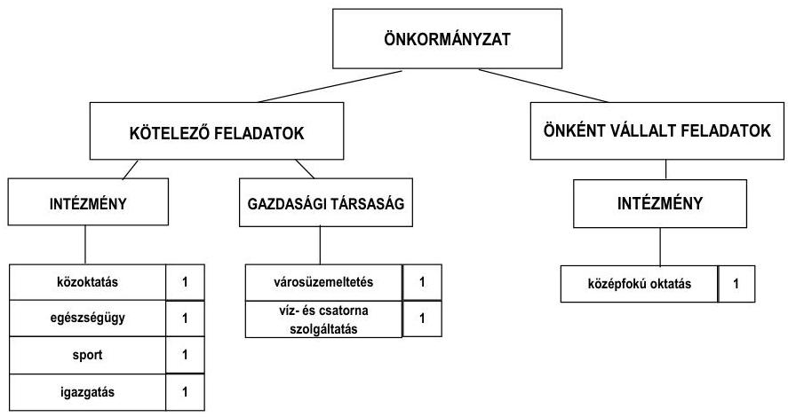

Az Önkormányzat kötelező és önként vállalt feladatait 2011. június 30án öt költségvetési szervvel, valamint egy kizárólagos és egy 50\% alatti önkormányzati tulajdonú gazdasági társasággal biztosította.

[^0]
[^0]:    ${ }^{6}$ Az Önkormányzat adatszolgáltatása szerinti működési kiadások (1319,0 millió Ft) eltérést mutattak a jelentés 2. számú mellékletének működési kiadások kamatkiadások nélkül (1168,2 millió Ft) összegétől, mivel a működési kiadások tartalmazták a feladatellátáshoz kapcsolódó transzferkiadásokat (pénzbeli szociális juttatások, nonprofit szervezetek támogatása), és nem tartalmazták a kötvénykibocsátás működési kiadásait.
    ${ }^{7}$ A kötelező, illetve önként vállalt feladatok besorolásáról - a jogszabályi előírások betartása mellett - az Önkormányzat döntött.

---

Az Önkormányzat feladatellátásában részt vett a Kistérségi társulás által fenntartott intézmény is. A gazdasági társaságok a víz- és szennyvízkezelés, valamint a városüzemeltetés területén kaptak szerepet a feladatellátásában. Az Önkormányzat többségi ( $90 \%$-os) tulajdonában lévő Ipari Park Kft. a feladatellátásban nem vett részt, saját tőke/jegyzett tőke aránya 0,2 , ami rossz vagyoni helyzetet mutat. Az Önkormányzatnak tulajdonosi kötelezettsége - a Gt. 143. § (3) bekezdésében foglaltak alapján - a gazdasági társaság vagyoni helyzetének rendezése. Az Önkormányzat a 2007. évben a zeneiskola részben önállóan működő költségvetési intézményt az ÁMK-ba integrálta. A szociális és gyermekjóléti feladatokat - a két intézmény működtetésével együtt - 2009. január 1jétől a Felső-Kiskunsági és Dunamelléki Többcélú Kistérségi Társulás intézményének átadta. A települési hulladékgyűjtési és hulladékkezelési feladatok ellátását 2008. január 1-jétől, az orvosi ügyeleti feladatok ellátását 2009. június 2-ától nem önkormányzati tulajdonban lévő gazdasági társaságnak adta át. Az Önkormányzat kizárólagos tulajdonú gazdasági társasága a 2007-2010. években összesen 271,2 millió Ft működési célú és 5,4 millió Ft felhalmozási célú átadott pénzeszközben részesült.

Az egyes közfeladatok ellátása működési kiadásainak finanszírozási összetételét az alábbi ábra szemlélteti:
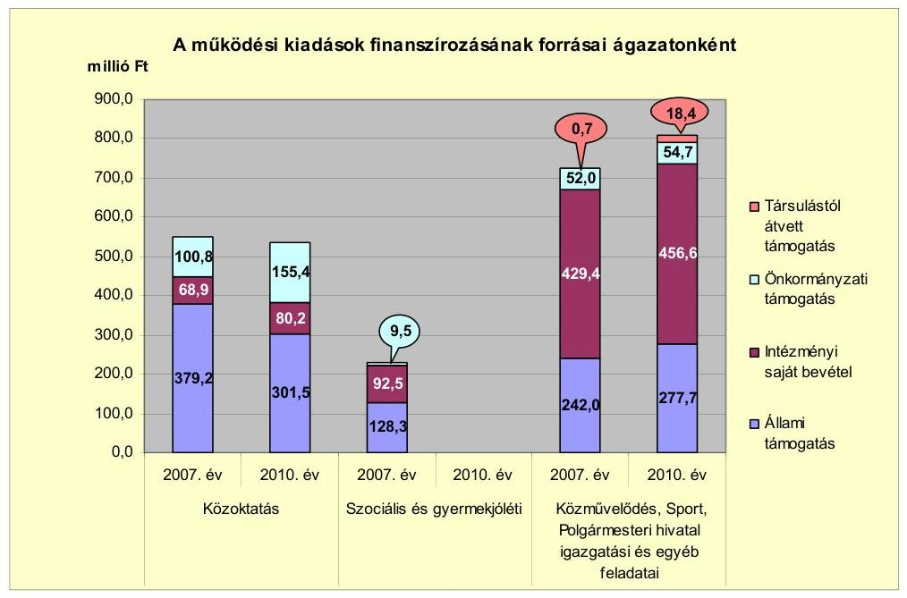

Az Önkormányzat összes működési bevétele a 2010. évben 1344,5 millió Ft volt. A kiadások finanszírozásának a 2010. évben 43,1\%-a (579,2 millió Ft) állami támogatás, $39,9 \%$-a ( 536,8 millió Ft ) intézményi saját bevétel, $15,6 \%$-a (210,1 millió Ft) önkormányzati támogatás és $1,4 \%$-a ( 18,4 millió Ft) társulástól átvett támogatás volt. A közoktatásban az állami támogatások részarányának mérséklődését az ellátotti létszám és a közoktatási normatívák rendszerének változásából eredő csökkenés okozta. Az állami támogatások mérséklődését az önkormányzati támogatás emelésével hozták egyensúlyba. Az Önkormányzat szociális és gyermekjóléti feladatait 2009. január 1-jétől a Kistérségi Egyesített Szociális Intézmény látja el. Az Önkormányzat közművelődési, sport, pedagógiai szakszolgálati, a Polgármesteri hivatal igazga-

---

tási és egyéb feladatai kiadásainak emelkedését a közhasznú foglalkoztatottak számának és juttatásának, valamint a szociális juttatások és az átadott pénzeszközök kiadásainak emelkedése eredményezte. A kiadások forrásösszetételében az állami támogatás és az intézményi saját bevételek részaránya egyenletesen alakult, a Kistérségi társulástól átvett támogatás emelkedett.

Az Önkormányzatnál a vizsgált időszakban a kötelező és önként vállalt feladatok ellátását biztosító szervezeti keretekben, a feladatellátás módjában bekövetkezett változások összességében 684,3 millió Ft kiadási megtakarítást és 630,2 millió Ft bevételkiesést okoztak, amely a pénzügyi egyensúlyi helyzet alakulását jelentősen nem befolyásolta.

Az Önkormányzat folyó költségvetési egyenlege (működési jövedelem) a 2007. és a 2008. években működési forrástöbbletet, a 2009. és a 2010. években működési forráshiányt mutatott, amelyet az alábbi grafikon szemléltet:
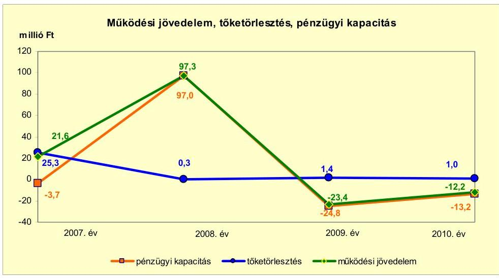

A működési jövedelem a 2007. évről a 2008. évre 75,7 millió Ft-tal emelkedett, a 2008. évről a 2009. évre 120,7 millió Ft-tal csökkent, a 2009. évről a 2010. évre 11,2 millió Ft-tal növekedett. A 2008. évi emelkedést a folyó évi 993,3 millió Ft értékű kötvénykibocsátásból eredő kamatbevétel (66,6 millió Ft) és kamatkiadás ( 28,8 millió Ft), valamint a költségvetési támogatás és az átengedett bevételek együttes értékének 50,7 millió Ft-os emelkedése határozták meg. A működési jövedelem 2009. évi változását a szociális és gyermekjóléti intézmények Kistérségi társulásnak történő átadása befolyásolta. A folyó bevételeken belül a 2008. évről a 2009. évre a költségvetési támogatás és az átengedett bevételek együttes értéke csökkent legnagyobb mértékben, 204,2 millió Ft-tal ( $17,9 \%$-kal). A folyó kiadások mérséklődése nem követte a bevételekét, mert a dologi kiadások (áfával együtt) a feladatátadás ellenére 38,5 millió Ft-tal ( $10,9 \%$-kal) növekedtek az EU-s pályázatok és a hozzájuk kapcsoló közbeszerzési eljárások költségei miatt.

Az Önkormányzat nettó működési jövedelme a 2008. évet kivéve minden évben negatív értéket mutatott. A 2008. évi pozitív értéket a 2008. évi 993,3 millió Ft értékű kötvénykibocsátás kamatbevételei és kamatkiadásai, valamint az szja és a költségvetési támogatás emelkedése okozta. A nettó műkö-

---

dési jövedelem a 2007. évben rövid lejáratú hitel tőketörlesztése miatt vett fel negatív értéket a pozitív működési jövedelem ellenére. A 2008-2010. évek között a nettó működési jövedelem alakulását a működési költségvetés egyenlege határozta meg, mert a hiteltörlesztések egyik évben sem érték el az 1,5 millió Ft-ot. Az Önkormányzat a 2008. évben 993,3 millió Ft értékben kibocsátott kötvény törlesztését a 2012. évben kezdi meg. Az Önkormányzat a 2009-2010. évek negatív működési jövedelmének fedezetét folyószámlahitel felvételével biztosította. A 2008-2010. években a finanszírozásba bevonható eszközök értékét ( 3122,3 millió Ft) a kötelezettségek értéke (4250,1 millió Ft) meghaladta.

Az Önkormányzatnál a 2007-2010. években összesen 220,5 millió Ft felhalmozási forráshiány keletkezett. A forráshiány fedezetét a 2007-2008. években a pozitív működési jövedelem, a 2009-2010. években hitelfelvétel biztosította.

Az Önkormányzatnál a 2007-2010. években finanszírozási többlet keletkezett, amely azt jelzi, hogy az éves költségvetések végrehajtása során szükség volt az előző években keletkezett pénzmaradvány igénybevételén túl külső finanszírozás igénybevételére is. Az Önkormányzat a 2007. évben hosszú lejáratú fejlesztési hitelt vett fel a mentőállomás építésére. Az Önkormányzat a 2008. évben 993,3 millió Ft értékben kötvényt bocsátott ki, amelynek bevételét 2010. december 31-ig nem használta fel. Az Önkormányzat a kötvénykibocsátásból származó bevételét befektette, a 2008. évben 879,9 millió Ft értékben vásárolt és 503,6 millió Ft értékben értékesített, a 2009. évben 418,7 millió Ft értékben értékesített értékpapírokat. Az Önkormányzat a 2007-2010. időszak minden évében folyószámla- és munkabér-megelőlegezési hitelt vett igénybe.

Az Önkormányzat folyó bevétele a 2007-2009. években átlagosan 1595,4 millió Ft volt, a 2010. évre 1457,8 millió Ft-ra csökkent. A 2011. év I. félévében 785,4 millió Ft-ra teljesült. A mérséklődés oka egyrészt a szociális és gyermekjóléti intézmények Kistérségi társulásnak történő 2009. évi átadása, a központi forráskivonás és az ellátottak létszámának csökkenése, másrészt a kötvénykibocsátás hozamainak a 2010. évre történő mérséklődése, valamint a helyi adóbevételek visszaesése volt. Az államháztartáson belülről kapott támogatások a 2008. évről a 2009. évre 33,4 millió Ft-tal (38,3%-kal) emelkedtek az előző évi költségvetési visszatérülések és az EU-s pályázatok bevételeinek növekedése miatt. Az Önkormányzat a 2011. év III. negyedévében 61,1 millió Ft ÖNHIKI támogatásban részesült, melyből 1,1 millió Ft-ot 60 napon túli közüzemi díjtartozás rendezésére, 15,0 millió Ft-ot alapfokú oktatási intézmények fenntartására, 45,0 millió Ft-ot egyéb kötelező feladatellátáshoz kapcsolódó működési forráshiány rendezésére használt fel. Az Önkormányzat felhalmozási bevételei az áttekintett időszakban 45,6 millió Ft és 83,0 millió Ft között voltak. A felhalmozási bevételekből a 2007-2011. év I. féléve között 68,8 millió Ft az Önkormányzat tulajdonában lévő ingatlanok értékesítéséből származott. A felhalmozási célra átvett pénzeszközök - a 2007-2011. év I. féléve között összesen 246,6 millió Ft volt - az EU-s és hazai, valamint a szakközépiskolai oktatás felhalmozási támogatásait tartalmazták.

Az Önkormányzat folyó kiadása a 2007-2009. években átlagosan 1563,6 millió Ft, a 2010. évben 1470,0 millió Ft volt, 6,0%-kal csökkent. A működési célú pénzeszközátadások folyó kiadáson belüli részaránya a vizsgált időszakban folyamatosan emelkedett, amelyet a szociális rászorultak szá-

---

mának növekedése és új ellátási formák bevezetése okozott. A 2008. évről a 2009. évre a személyi juttatások és munkaadói járulék kiadások együttesen 221,4 millió Ft-tal (22,7%-kal) csökkentek, mert az Önkormányzat a szociális és gyermekjóléti ellátás feladatait a Kistérségi társulásnak átadta, valamint megszűnt a 13. havi illetmény. A 2009. évi szinthez képest a munkaadói járulékok a személyi juttatások emelkedése mellett a 2010. évre 15,3 millió Ft-tal (8,7%-kal) estek vissza, amelyet a járulékok mértékének csökkenése okozott. A dologi kiadások a 2008. évről a 2009. évre 352,1 millió Ft-ról 390,6 millió Ft-ra annak ellenére emelkedtek, hogy a szociális és gyermekjóléti intézményeket az Önkormányzat a Kistérségi társulásnak átadta (a szociális és gyermekjóléti intézmények dologi kiadása a 2008. évben 76,6 millió Ft-ot jelentett).

Az Önkormányzatnál 2007-2010 között megvalósult felújítási és beruházási munkálatok együttes bekerülési értéke 388,8 millió Ft volt, amelynek 57,0%-a (221,6 millió Ft) 10,0 millió Ft alatti fejlesztésekhez kapcsolódott. A fejlesztések közül hat haladta meg a 10,0 millió Ft-os értéket. Az Önkormányzatnak 2007-2010 között megvalósult, a 100,0 millió Ft-os értéket meghaladó beruházása nem volt. A fejlesztések teljes bekerülési költségének a 6,3%-át hitelfelvételből, 6,7%-át EU-s támogatásból, 14,0%-át hazai támogatásból és 73,0%-át saját bevételből finanszírozták. Az Önkormányzatnál 2010. december 31-én két 10,0 millió Ft-ot meghaladó értékű, valamint több 10,0 millió Ft alatti fejlesztés volt folyamatban, amelyekre 2010. december 31-ig fizettek ki. A beruházásokra 2006. december 31-ig 0,5 millió Ft, a 2007-2010. évek között összesen 71,8 millió Ft kifizetést teljesített az Önkormányzat. A kiadások fedezetét 51,3%-ban (37,1 millió Ft összegben) saját bevételből, 48,7%-át (35,2 millió Ft-ot) EU-s támogatásból biztosították. A 10,0 millió Ft alatti fejlesztések a jövőbeni beruházások terveinek kiadásait tartalmazták.

Az Önkormányzatnak 2010. december 31-én hat, összesen 610,5 millió Ft értékű olyan fejlesztése volt folyamatban, amelyekre 2010. december 31-e utáni kötelezettségvállalása állt fenn. Ezen fejlesztésekre 41,3 millió Ft kifizetés történt 2010. december 31-ig. A 2011. évben a Szabadság u. felújítása, a szervezetfejlesztés, az ÁMK informatikai fejlesztése, a csatornázás tervezése és a Vásár téri szociális épület felújítása megvalósult, a bölcsőde építése várhatóan 2012-ben fejeződik be. A fejlesztések 2010. évet követő évekre vállalt kötelezettségeinek (569,2 millió Ft) forrása 497,7 millió Ft (87,5%-ban) EU-s, 5,3 millió Ft (0,9%-ban) hazai támogatás és 66,2 millió Ft (11,6%-ban) saját bevétel.

Az Önkormányzat 2010. december 31-e utáni felhalmozási kötelezettségvállalásainak forrásösszetételét a következő ábra mutatja be:

---

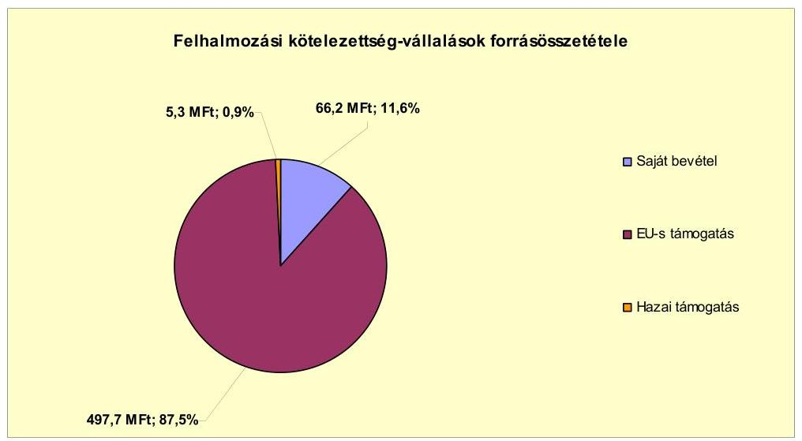

Az Önkormányzatnak 2011. június 30-án hat fejlesztési célra beadott, elbírálás alatt lévő pályázata volt, amelyek tervezett teljes bekerülési költsége 4476,6 millió Ft. Az elbírálás alatt lévő pályázatok forrásösszetétele az Önkormányzat tervei szerint a következőképpen alakul: 19,4 millió Ft (0,4%) saját bevétel, 967,2 millió Ft (21,6%) kötvényből származó bevétel, 3425,0 millió Ft (76,5%) EU-s és 65,0 millió Ft (1,5%) hazai támogatás.

Az Önkormányzat könyvviteli mérleg szerinti pénzintézetekkel szembeni kötelezettségeinek állománya a 2006. év végi 25,3 millió Ft-ról 1592,9 millió Ft-tal a 2011. év I. félév végére 1618,2 millió Ft-ra nőtt. A 2011. június 30-án pénzintézetekkel szemben fennálló kötelezettségek állományát a 2007-ben felvett 24,4 millió Ft, valamint a 2008-ban igénybe vett 1,4 millió Ft hosszú lejáratú hitel, a 2008. június 5-én kibocsátott 6643,0 ezer CHF alapú önkormányzati kötvény, a 84,3 millió Ft folyószámla-, valamint a 33,7 millió Ft munkabér-megelőlegezési hitel tette ki.

Az Önkormányzat pénzintézetekkel szemben fennálló kötelezettségvállalásaira képviselő-testületi döntés alapján került sor. A videokamerás térfigyelő rendszer kiépítésére és a mentőállomás építésére felvett hosszú lejáratú hitelek esetében az Önkormányzat a versenyeztetést mellőzte, az ügyeleti gépjármű vásárlásakor három árajánlat bekérését követően döntött. A kötvénykibocsátás nem közbeszerzés-köteles, de az Önkormányzat hat pénzintézetnek küldte meg kötelező érvényű ajánlatkérő levelét a tervezett, 1000,0 millió Ft-nak megfelelő CHF alapú kibocsátásra kerülő kötvény tárgyában.

A Képviselő-testület döntéseit megalapozó előterjesztésekben meghatározták a kötelezettségvállalásból származó források felhasználási céljait, bemutatták a kötelezettségvállalás visszafizetési forrását, a teljes futamidő alatt várható tőkeés kamatfizetési kötelezettségeket, az árfolyam- és kamatkockázatokat, az adósságszolgálati korlátot. A kötvény kibocsátásával az Önkormányzat a 2008. évben nem lépte túl az adósságot keletkeztető kötelezettségvállalásának felső határát.

Az Önkormányzat fejlesztési céljainak megfelelő pályázati lehetőségek hiányában a kötvény kibocsátásából származó tőkebevételt 2011. június 30-ig

---

nem használta fel. A fel nem használt kötvényforrás elkülönített betétszámlán - amelyből 500 millió Ft óvadéki betétként - került elhelyezésre. A kötvénybevételéből az Önkormányzat a Főtér rehabilitációt, a geotermikus és a csatorna beruházást tervezi finanszírozni. A kötvény visszavásárlása (tőketörlesztése) 2012. április 30-án kezdődik 134 ezer CHF összeggel. Az Önkormányzat a 20082011. év I. félév között 85,0 millió Ft kamatkiadást teljesített. A kötvény befektetéséből a 2011. év I. félévéig 184,2 millió Ft árfolyamveszteséget és 177,3 millió Ft árfolyamnyereséget, valamint 272,1 millió Ft kamatbevételt realizált.

Az Önkormányzat a hosszú lejáratú fejlesztési hitelből származó forrást a mentőállomás építéséhez vette igénybe, amelyet 2007. március 30-án 24,4 millió Ft (100%) összegben hívta le és használta fel. A hitel törlesztése 2008 decemberében megkezdődött. A 2011. június 30-ig kifizetett tőke 3,9 millió Ft, a kamat 4,2 millió Ft volt.

Az Önkormányzat 2008. február 4-én gépjárművásárlási hitelszerződést kötött egy pénzintézettel az orvosi ügyeleti feladatok ellátására személyautó vásárlására, amelynek vételára 2,9 millió Ft, a biztosított önerő 1,5 millió Ft, a kölcsön összege 1,4 millió Ft volt. A kölcsön deviza alapú, változó kamatozású, azonban a kölcsön összegét és a törlesztéssel kapcsolatos információkat a finanszírozó pénzintézet nem CHF-ben, hanem csak Ft-ban közölte az Önkormányzattal. Az Önkormányzat 2011. június 30-ig a felvett kölcsönből tőketörlesztésre 0,9 millió Ft-ot, kamatra 0,3 millió Ft-ot teljesített.

Az Önkormányzat a 2007-2011. év I. félév közötti időszakban működőképességét, pénzügyi egyensúlyát csak folyószámla- és munkabér-megelőlegezési hitel igénybevételével tudta biztosítani. A folyószámlaés a munkabér-megelőlegezési hitel jellemző adatait az alábbi táblázat mutatja be:

| Megnevezés | 2007. év | 2008. év | 2009. év | 2010. év | 2011. év   I. félév |
| :-- | :--: | :--: | :--: | :--: | :--: |
| Folyószámlahitel |  |  |  |  |  |
| Keretösszeg január 1-jén (millió Ft-ban) | 60,0 | 60,0 | 60,0 | 60,0 | 80,0 |
| Átlagos napi állomány (millió Ft-ban) | 30,9 | 39,5 | 44,9 | 48,9 | 7,3 |
| Folyószámla hitellel zárt napok száma (nap) | 203 | 230 | 250 | 255 | 126 |
| Egyenleg (állomány december 31.) | 0,0 | 0,0 | 35,0 | 66,0 | 84,3 |
| Munkabér-megelőlegezési hitel |  |  |  |  |  |
| Keretösszeg január 1-jén (millió Ft-ban) | 25,6 | 39,5 | 27,1 | 34,1 | 32,6 |
| Átlagos napi állomány (millió Ft-ban) | 1,1 | 1,0 | 0,9 | 0,9 | 1,0 |
| Munkabér-megelőlegezési hitellel zárt napok száma (nap) | 216 | 216 | 337 | 365 | 181 |
| Egyenleg (állomány december 31.) | 0,0 | 0,0 | 0,0 | 29,7 | 33,7 |

A likviditás biztosítása - a folyószámlahitel- és a munkabér-megelőlegezési hitel - az Önkormányzatnak 25,7 millió Ft kamatkiadást okozott a 2007. és a 2011. év I. félév között.

A Polgármesteri hivatal részére szervergép és az önkormányzati képviselők részére laptopok beszerzésére 2007. február 22-én nyílt végű pénzügyi lízingszerződést kötött az Önkormányzat 3,1 millió Ft összegben. A lízing CHF ala-

---

pú, futamideje 36 hónap, lejárata 2010. március 5-e volt. Az Önkormányzat 2007. március 13-án lízingszerződést kötött egy pénzügyi vállalkozással gépjármű vásárlására, melynek lízingdíja 7,4 millió Ft volt, amelyből az Önkormányzat által biztosított önerő 1,4 millió Ft volt. A lízing CHF alapú, futamideje 60 hónap, lejárata 2012. március 5. Az Önkormányzat 2011. június 30-ig tőketörlesztésre 3,6 millió Ft-ot, kamatra 1,0 millió Ft-ot, egyéb költségre 1,9 millió Ft-ot teljesített. Az Egészségügyi Központ részére 4D ultrahang beszerzésre 2011. április 18-án kötött nyíltvégű pénzügyi lízingszerződést az Önkormányzat 10,6 millió Ft összegben. A lízing EUR alapú, futamideje 60 hónap, lejárata 2016. május 2. Az Önkormányzat 2011. június 30-ig tőketörlesztésre 1,0 millió Ft-ot, kamatra 0,1 millió Ft-ot teljesített.

Az Önkormányzat 2007. január 1-je és 2011. június 30-a között követelést nem engedett el intézménynek, más önkormányzatnak, civil szervezetnek, egyéb államháztartáson belüli és kívüli szervezetnek, valamint gazdasági társaságoknak tagi és egyéb kölcsönt nem nyújtott.

Az Önkormányzat kötelezettségeinek 2010. december 31-i és 2011. június 30-i állományát és várható összegeit a kötelezettségek lejáratáig felmerülő kamatokat és díjakat is figyelembe véve az alábbi táblázat szemlélteti:
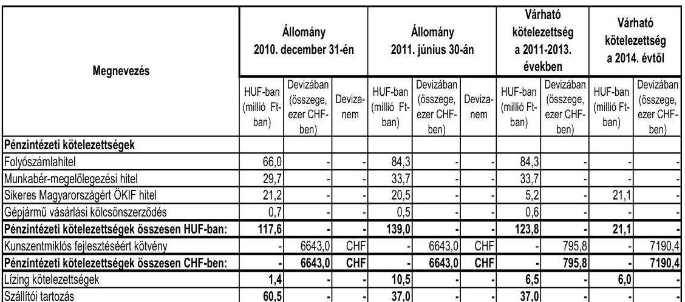

Az Önkormányzatnak pénzintézetekkel szemben fennálló kötelezettsége a 2011. év I. félév végén 139,0 millió Ft, valamint 6643,0 ezer CHF volt. Ezek várható kötelezettsége (tőke-, kamat- és egyéb költsége) a legutóbbi kamatfizetés feltételei alapján a 2011-2013. években 123,8 millió Ft, valamint 795,8 ezer CHF. Az Önkormányzatnak a 2011. év I. félévében lízing kötelezettség és szállítói tartozás címén 47,5 millió Ft fizetési kötelezettsége keletkezett. A 2011-2013. évek kötelezettségeinek teljesítésére figyelembe vehető a kötvényforrás fel nem használt része, a jelzáloggal nem terhelt forgalomképes ingatlanvagyon. A 2011. június 30-án ismert, a 2014. évet követően esedékes pénzintézetekkel szemben fennálló kötelezettségei (tőke-, kamat- és egyéb költség): 7190,4 ezer CHF és 21,1 millió Ft.

Az Önkormányzat lejárt szállítói tartozásállománya évenként változott. A 2008. és a 2010. év végén, valamint 2011. június 30-án kiugróan magas volt, a 2007. évhez viszonyítva 2011. június 30-ra 111,4%-kal (19,5 millió Ft-tal) növekedett. A 2007. december 31-i 17,5 millió Ft lejárt szállítói tartozás-

---

állományból 8,8 millió Ft (50,4%) a 30 nap alatti, 8,7 millió Ft (49,6%) a 31-60 nap közötti lejárt tartozásállomány. A 2011. június 30-i 37,0 millió Ft-os szállítói kötelezettségből 18,4 millió Ft (49,8%) a 30 nap alatti, 5,5 millió Ft (14,7%) a 31-60 nap közötti, 9,7 millió Ft (26,2%) a 61-90 nap közötti, és 3,4 millió Ft $(9,3\%)$ a 91-365 nap közötti lejárt tartozásállomány.

Az önkormányzati kötelezettségek növekedése mellett a kizárólagos és többségi önkormányzati tulajdonú gazdasági társaságok kötelezettségei is befolyásolhatják az Önkormányzat pénzügyi egyensúlyát. A gazdasági társaságok szállítói tartozásainak állománya 2011. június 30-án 8,2 millió Ft volt. A Bakér Kft. a 2007-2010. évek között veszteségesen gazdálkodott, de a saját tőke értéke az ellenőrzött időszakban nem csökkent a jegyzett tőke értéke alá. Esetleges csőd vagy felszámolási eljárás esetén a bíróság korlátlan és teljes felelősséget állapíthat meg az Önkormányzat terhére.

A 2007-2010. években az eszközök használhatósága is hatást gyakorolt az Önkormányzat pénzügyi egyensúlyi helyzetére. Az Önkormányzat a tárgyi eszközök után 527,3 millió Ft összegű értékcsökkenést számolt el. Az elhasználódott eszközök pótlására az Önkormányzat tartalékot nem képzett, külön alapot nem hozott létre, azt saját bevételből, pénzintézeti kötelezettségvállalásból származó forrásból, EU-s és hazai támogatásból végezte. A 2007-2010. években megvalósított fejlesztésekből (felújítás és beruházás) 440,4 millió Ft az eszközök korszerűsítését eredményezte. Az Önkormányzat eszközállományának átlagos használhatósági foka 2007-2010 között 9,0 százalékponttal (82,9%-ról 73,9%-ra) csökkent.

Az Önkormányzat - kimutatása szerint - a 2007-2011. év I. féléve között hozott kiadási megtakarítást eredményező és bevételt növelő intézkedések hatására 83,2 millió Ft bevételi többletet, továbbá 456,0 millió Ft kiadási megtakarítást mutatott ki, amelyek pénzügyi egyensúlyát javították. A kiadási megtakarítás teljes egészében a feladatok Kistérségi társulásnak, illetve gazdasági társaság részére történő átadás miatti létszámcsökkentések eredménye volt. Az Önkormányzatnál - kimutatása szerint - a 2007-2010. közötti időszakban 122 álláshely szűnt meg és 26 álláshely létesült. Az álláshelyek csökkenését a feladatátadások, növekedését a közhasznú foglalkoztatás bővülése okozta. Az engedélyezett álláshelyek száma 2007. január 1-jén 362 fő, 2010. december 31-én 266 fő volt. A bevételnövelő intézkedések - az Önkormányzat kimutatása szerint - a helyi adókhoz kapcsolódó kedvezmények megszűnéséhez és az eszközök értékesítéséhez kapcsolódtak.

Az ÁSZ az Önkormányzat gazdálkodási rendszerének 2008. évi ellenőrzése során - a pénzügyi egyensúly javításával kapcsolatban - egy szabályszerűségi és egy célszerűségi javaslatot tett. Az Önkormányzatnál a szabályszerűségi javaslat részben teljesült, mert a többéves kihatással járó feladatok között az Önkormányzat csak a hitelekkel kapcsolatos kötelezettségeit mutatta be évenkénti bontásban, a több évre vonatkozó fejlesztési döntéseinek előirányzatait azonban nem. A célszerűségi javaslat is részben hasznosult, mert a költségvetés tervezése során az előző évi feladattal terhelt és szabad pénzmaradványok előirányzatainak számbavétele a 2010. és a 2011. években csak részben valósult meg, mivel a következő évre áthúzódó szállítói tartozásokat betervezték, de azok pénzmaradványból származó fedezetét nem.

---

Az Önkormányzat pénzügyi egyensúlyi helyzete középtávon veszélyeztetett. A pénzügyi egyensúly középtávú biztosítására és hosszú távú fenntarthatóságára az Önkormányzatnak fel kell készülnie.

A folyó bevételek a 2008. év kivételével nem nyújtottak fedezetet a folyó kiadásokra és az adósságszolgálatra. Működését az állandósult és növekvő összegű folyószámla-, valamint munkabér-megelőlegezési hitel igénybevételével biztosította.

Az önként vállalt feladatokra fordított kiadások aránya és mértéke magas, amely kismértékben emelkedik.

Fejlesztési feladatai megvalósítására hosszú lejáratú hitelt és kötvényforrást vett igénybe. A jövőbeni kötelezettségek kifizethetőségének kockázatát csökkenti, hogy a kötvény kibocsátásából származó tőkebevételt 2011. június 30-ig nem használta fel.

A szállítói kötelezettségek emelkedtek. Az Önkormányzat többségi tulajdonú gazdasági társaságának vagyoni helyzete folyamatosan romlik, amely az Önkormányzat számára a jövőben helytállási kötelezettséget jelenthet.

Az Állami Számvevőszékről szóló 2011. évi LXVI. törvény 33. § (1) bekezdésében foglaltak értelmében a jelentésben foglalt megállapításokhoz kapcsolódó intézkedési tervet köteles az ellenőrzött szervezet vezetője összeállítani és azt a jelentés kézhezvételétől számított harminc napon belül az ÁSZ részére megküldeni. Amennyiben az intézkedési tervet határidőben nem küldi meg a szervezet, vagy az továbbra sem elfogadható, az ÁSZ elnöke a hivatkozott törvény 33. § (3) bekezdés a)-b) pontjaiban foglaltakat érvényesítheti.

# A 2011. június 30-i pénzügyi egyensúlyi helyzet alapján az ellenőrzés intézkedést igénylő megállapításai és javaslatai a következők: 

## a Polgármesternek

1.  Az Önkormányzat nettó működési jövedelme a 2008. év kivételével negatív volt. Az Önkormányzat által vállalt jövőbeni fejlesztési kiadások forrásának fedezete rövid és középtávon biztosított. Az Önkormányzat a 2007-2011. év I. félév közötti időszakban működőképességét, pénzügyi egyensúlyát csak folyószámla- és munkabérmegelőlegezési hitel igénybevételével tudta biztosítani. A vállalt pénzintézetekkel szembeni és egyéb kötelezettségek fedezete - a kötvénybevétel 2012. évi felhalmozási célra történő felhasználása esetén - nem biztosított.

Javaslat:
Az Önkormányzat pénzügyi egyensúlyának középtávú biztosítása és hosszú távú fenntarthatósága érdekében kezdeményezze - felelősök és határidők megjelölésével - az alábbi intézkedések megtételét:
a) Tárja fel a bevételszerző és kiadáscsökkentő lehetőségeket. Ütemezze a bevételek beszedését a jövőben jelentkező fizetési kötelezettségeihez;

---

b) Terjesszen a Képviselő-testület elé kibontakozási programot a pénzügyi egyensúlyi helyzet javítása és hosszú távú megőrzése érdekében;
c) Képezzen egyensúlyi (elkülönített) tartalékot az adósságszolgálat teljesítése érdekében;
d) Mutassa be a Képviselő-testületnek félévente legalább három évre kitekintően a kötelezettségek teljes körére szóló finanszírozási tervet, a források számszerűsített megjelölésével;
e) Vizsgálja meg az állandósult folyószámlahitel hosszú távú kötelezettséggé történő átalakításának jogi lehetőségét, és a Stabilitási törvény 10. §-ában előírt jogszabályi feltételek fennállása esetén kezdeményezze a Kormánynál ennek engedélyezését.
2. Az Önkormányzat adatszolgáltatása szerint az önként vállalt feladatok kiadása a 2007-2009. években átlagosan az összes működési kiadás 24,3%-át (337,5 millió Ft-ot), a 2010. évben 28,2%-át (371,5 millió Ft-ot) jelentette.

Javaslat:
Tekintse át az önként vállalt feladatok finanszírozhatóságát a kötelező feladatellátás elsődlegességének biztosítása érdekében, mutassa be a Képviselő-testületnek a megoldás lehetőségeit, és szükség esetén a gazdasági program módosításának igényét.
3. Az Önkormányzat 2011. június 30-ai 37,0 millió Ft-os szállítói kötelezettségből 5,5 millió Ft (14,7%) a 31-60 nap közötti, 9,7 millió Ft (26,2%) a 61-90 nap közötti, és 3,4 millió Ft $(9,3\%)$ a 91-365 nap közötti lejárt tartozásállomány.

Javaslat:
Intézkedjen az Önkormányzat lejárt szállítói állományának pénzügyi rendezéséről, a szállítói kitettség és a jogszabályi következmények elkerülése érdekében.
4. A többségi önkormányzati tulajdonú Ipari Park Kft. saját tőke és jegyzett tőke aránya 0,2 , ami rossz vagyoni helyzetet mutat. Az Önkormányzatnak tulajdonosi kötelezettsége - a Gt. 143. § (3) bekezdésében foglaltak alapján - a gazdasági társaság vagyoni helyzetének rendezése.

Javaslat:
Mutassa be félévente a Képviselő-testületnek a minősített többségi tulajdonú gazdasági társasága aktuális pénzügyi egyensúlyi helyzetét. Tegye meg a szükséges és lehetséges intézkedéseket a tulajdonosi érdekek védelme érdekében.

---

5. Az Önkormányzatnál a 2008. évi gazdálkodási rendszer ellenőrzése során tett szabályszerűségi és célszerűségi javaslat részben teljesült. Az Önkormányzat csak a hitelekkel kapcsolatos kötelezettségeit mutatta be évenkénti bontásban, a több évre vonatkozó fejlesztési döntéseinek előirányzatait azonban nem. A célszerűségi javaslat is részben hasznosult, mivel a következő évre áthúzódó szállítói tartozásokat betervezték, de azok pénzmaradványból származó fedezetét nem.

Javaslat:
Gondoskodjon az Önkormányzat gazdálkodási rendszerét érintő előző ellenőrzés részben hasznosult javaslatainak teljes körű végrehajtásáról.

---

# II. RÉSZLETES MEGÁLLAPÍTÁSOK 

## 1. AZ ÖNKORMÁNYZAT KÖTELEZŐ ÉS ÖNKÉNT VÁLLALT FELADATAI, A FELADATELLÁTÁS SZERVEZETI KERETEI ÉS ANNAK VÁLTOZÁSAI

Az Önkormányzat kötelező feladatait az Ötv. és az ágazati törvények szerint meghatározottnak tekintette. A kötelező feladatai mellett az Önkormányzat SzMSz-ének besorolása ${ }^{8}$ alapján önként vállalt feladatai az általános középfokú és szakmai középfokú oktatáshoz, a korai fejlesztéshez, a pályaválasztási tanácsadáshoz, a fejlesztő felkészítéshez, a gyógytestneveléshez és az alapfokú művészeti oktatáshoz kapcsolódtak. A település társadalmi szervezeteinek támogatásáról a „Kunszentmiklós Város Önkormányzat Szabályzata a vissza nem térítendő pénzbeli támogatásról" szabályzatban rendelkeztek. Az önként vállalt feladatok terjedelmét az éves költségvetési rendeletekben az adott évi költségvetés forrásainak ismeretében határozták meg.

Az Önkormányzat - adatszolgáltatása szerint - a működési kiadásokra a 2007-2009. években átlagosan 1387,2 millió Ft-ot, a 2010. évben 4,9%-kal (68,2 millió Ft-tal) alacsonyabb összeget, 1319,0 millió Ft-ot ${ }^{9}$ fordított. Az Önkormányzat működési kiadásai a 2008-2010. évek között folyamatosan csökkentek. A szociális és gyermekjóléti feladatok kiadásai a 2009. évtől a Kistérségi társulás részére történt feladatátadás miatt megszűntek, a közoktatási és közművelődési feladatokra fordított kiadások csökkentek, míg a sportlétesítmény, a pedagógiai szakszolgálat, valamint Polgármesteri hivatal kiadásai emelkedtek. Az Önkormányzat a kötelező feladatok ellátására a 2007-2009. években átlagosan az összes működési kiadás 75,7%-át (1049,7 millió Ft-ot), a 2010. évben 71,8%-át (947,5 millió Ft-ot) fordította. Az önként vállalt feladatok kiadása a 2007-2009. években átlagosan az összes működési kiadás 24,3%-át (337,5 millió Ft-ot), a 2010. évben 28,2%-át (371,5 millió Ft-ot) jelentette.

A következő táblázat ${ }^{10}$ az Önkormányzat adatszolgáltatása alapján mutatja be a 2010. évi működési kiadásokat és azok finanszírozási forrásösszetételét főbb feladatonként:

[^0]
[^0]:    ${ }^{8}$ A kötelező, illetve önként vállalt feladatok besorolásáról - a jogszabályi előírások betartása mellett - az Önkormányzat döntött.
    ${ }^{9}$ Az Önkormányzat adatszolgáltatása szerinti működési kiadások (1319,0 millió Ft) eltérést mutattak a jelentés 2. számú mellékletének működési kiadások kamatkiadások nélkül (1168,2 millió Ft) összegétől, mivel a működési kiadások tartalmazták a feladatellátáshoz kapcsolódó transzferkiadásokat (pénzbeli szociális juttatások, nonprofit szervezetek támogatása), és nem tartalmazták a kötvénykibocsátás működési kiadásait.
    ${ }^{10}$ A táblázat nem tartalmazza az egészségügyi ellátás, a kisebbségi önkormányzat és a kötvénykibocsátás működési kiadásait, valamint a kamatkiadásokat. Így a működési kiadások a 2010. évben 86,6 millió Ft-tal alacsonyabb összegűek voltak a CLF módszer alapján a jelentés 2 . számú mellékletben bemutatott folyó kiadásoknál.

---

| Ellátott feladat | Működési   kiadás   összesen   (millió Ft) | Kötelező   feladatok   kiadásainak   részaránya   $\%$ | Működési   bevétel   összesen   (millió Ft) | Állami   támogatás   részarány   $\%$ | Intézményi   saját bevétel   részarány   $\%$ | Önkormányzati   támogatás   részarány   $\%$ | Társulástól   átvett   támogatás   részrány   $\%$ |
| :-- | :--: | :--: | :--: | :--: | :--: | :--: | :--: |
| Óvoda | 102,2 | 100,0 | 102,2 | 44,7 | 14,9 | 40,4 | 0,0 |
| Általános iskola | 264,2 | 81,0 | 278,9 | 59,1 | 19,1 | 21,8 | 0,0 |
| Szakközépiskola,   szakképző intéz-   mény | 145,6 | 0,0 | 156,0 | 58,4 | 7,5 | 34,1 | 0,0 |
| Közművelődési   intézmény | 10,4 | 100,0 | 10,4 | 0,0 | 33,1 | 66,9 | 0,0 |
| Sportlétesítmény | 48,2 | 70,0 | 48,2 | 1,7 | 29,3 | 69,0 | 0,0 |
| Egyéb intézmény | 49,4 | 0,0 | 49,4 | 26,7 | 6,7 | 29,3 | 37,3 |
| Polgármesteri hivatal   igazgatási kiadásai | 251,6 | 100,0 | 251,6 | 7,8 | 92,2 | 0,0 | 0,0 |
| Polgármesteri   hivatalban ellátott   egyéb feladatok   működési kiadásai | 447,4 | 75,0 | 447,8 | 54,5 | 45,5 | 0,0 | 0,0 |
| Működési kiadá-   sok összesen | 1319,0 | 71,8 | 1344,5 | 43,1 | 39,9 | 15,6 | 1,4 |

A közoktatás kiadásai a vizsgált időszakban folyamatosan csökkenő tendenciát mutattak. A közoktatás kiadása a 2007-2009. években átlagosan 531,2 millió Ft, az összes működési kiadás 38,3\%-a volt, a 2010. évre 512,0 millió Ft-ra csökkent, azonban az összes működési kiadáson belüli részaránya közel ugyanazon a szinten ( $38,8 \%$ ) maradt. A kiadások mérséklődését a 13. havi illetmény megszűnése és a munkaadói járulékok csökkenése befolyásolta. A közoktatás finanszírozásában az állami támogatás részaránya a 2007-2009. évek 66,1\%-os ( 357,0 millió Ft-os) átlagáról, a 2010. évre 56,1\%-ra ( 301,5 millió Ft-ra) csökkent. Ezt egyrészt a közoktatási normatívák számítási rendszerének módosulása, másrészt az ellátottak létszámának a 2007-2009. évek 2046 fős átlagáról a 2010. évre 1831 főre történő csökkenése okozta. Az állami támogatások csökkenését az intézményi saját bevételek és az önkormányzati támogatás emelkedése ellensúlyozta. Az intézményi saját bevételek részaránya a 2007-2009. években átlagosan 12,7\% (68,5 millió Ft) volt, a 2010. évre $14,9 \%$-ra ( 80,2 millió Ft-ra) emelkedett az intézmények pályázati forrásainak jelentős emelkedése miatt. A közoktatás működését szolgáló bevételek forrásösszetételében az önkormányzati támogatás részaránya a 2007-2009. években átlagosan $21,2 \%$-ot ( 114,6 millió Ft-ot), a 2010. évben $29,0 \%$-ot ( 155,4 millió Ft-ot) jelentett.

Az Önkormányzat a szociális és a gyermekjóléti feladatainak működési kiadásaira a 2007. évben 228,7 millió Ft-ot, a 2008. évben 246,0 millió Ft-ot fordított. A kiadások finanszírozásában az állami támogatás részaránya a 2007. évben $55,7 \%$ ( 128,3 millió Ft), az intézményi saját bevétel $40,1 \%$ ( 92,5 millió Ft), az önkormányzati támogatás 4,2\% ( 9,5 millió Ft) volt. A 2008. évben a forrásösszetétel a következőképpen alakult: 51,6\% (128,7 millió Ft) állami támogatás, $38,4 \%$ ( 95,6 millió Ft) saját bevétel és $10,0 \%$ ( 24,9 millió Ft) önkormányzati támogatás volt. Az Önkormányzat szociális és gyermekjóléti feladatait 2009. január 1-jétől a Kistérségi társulás intézménye végzi. A feladatok átadása a 2009-2011. év I. féléve közötti időszakban 540,1 millió Ft bevételi

---

elmaradást és 615,1 millió Ft kiadási megtakarítást eredményezett az Önkormányzat kimutatása szerint.

A közművelődési, sport, pedagógiai szakszolgálat és a Polgármesteri hivatal igazgatási és egyéb ${ }^{11}$ feladatainak kiadásaira fordította az Önkormányzat a működési kiadásainak legnagyobb arányát: a 2007-2009. években átlagosan 50,3\%-ot (697,3 millió Ft-ot), a 2010. évben 61,2\%-ot (807,0 millió Ft-ot). A működési kiadások a 2007-2010. években egyenletesen emelkedtek, ezen belül a közművelődési feladat kiadásai csökkentek, a többi feladat kiadásai növekedtek. A 2008. évről a 2009. évre emelkedtek a kiadások a legnagyobb mértékben, 10,1\%-kal (69,4 millió Ft-tal). A központi bérpolitikai intézkedésekből (a 13. havi illetmény megszűnése és a munkaadói járulékok csökkenése) származó kiadási megtakarításnál a dologi kiadások és a működési célú pénzeszközátadások növekedése magasabb volt. A 2008. évben EU-s pályázatok szolgáltatási kiadásai, a pályázatokhoz kapcsolódó közbeszerzési eljárások kiadásai egyszeri kiadásként jelentkeztek. A feladatok állami támogatásának részaránya az összes bevételen belül a 2007-2009. években átlagosan 35,0\%-ot (258,1 millió Ft-ot) jelentett, a 2010. évben 34,4\% (277,7 millió Ft) volt. A pedagógiai szakszolgálat feladatellátása kiterjedt a kistérség településeire is, ezért a kistérség a 2007-2009. években átlagosan 2,4 millió Ft-tal ( $0,3 \%$ kal) támogatta a feladatellátást. Az ellátottak számának emelkedése és a Kistérségi normatíva emelkedése miatt a kistérség támogatása a 2010. évre 2,3\%-ra (18,4 millió Ft-ra) emelkedett. Az intézményi saját bevételek és az önkormányzati támogatás együttes összege a 2007-2009. években átlagosan 476,5 millió Ft (64,7\%), a 2010. évben 511,3 millió Ft (63,3\%) volt.

Az Önkormányzat kötelező és önként vállalt feladatait 2011. június 30án öt költségvetési szervvel, valamint egy kizárólagos és egy 50\% alatti önkormányzati tulajdonú gazdasági társasággal biztosította. Az Önkormányzat feladatellátásában részt vett a Kistérségi társulás által fenntartott intézmény is. Az Önkormányzat többségi ( $90 \%$-os) tulajdonában lévő gazdasági társasága a feladatellátásban nem vett részt. Az Önkormányzat által fenntartott költségvetési szervekből három önállóan működő és gazdálkodó és kettő önállóan működő költségvetési szerv volt. Az intézmények összesen 44 telephelyen működtek. Az intézményátszervezések, feladatátadások következtében az intézmények száma a 2006. december 31. - a 2011. év I. félév időszakban hárommal csökkent, a telephelyek száma 24 -gyel emelkedett. Az Önkormányzat kötelező és önként vállalt feladatait - 2011. június 30-án - a következők szerint látta el:

- A közoktatási és a kulturális feladatok ellátásában két költségvetési szerv vett részt. Az ÁMK önállóan működő és gazdálkodó költségvetési szerv 38 telephelyen végezte tevékenységét. Az ÁMK részeként működött az óvoda, az általános iskola, a művelődési ház és a könyvtár, melyek az Önkormányzat közoktatási és közművelődési kötelező feladatainak ellátását

[^0]
[^0]:    ${ }^{11}$ A Polgármesteri hivatal igazgatási és egyéb feladatai az Önkormányzat igazgatási, területi igazgatási, közvilágítási, hulladékkezelési, városgazdálkodási, szennyvízelvezetési és a pénzbeli szociális ellátási feladatai, a települési társadalmi szervezetek támogatása és az Önkéntes Tűzoltóság működtetése voltak.

---

biztosították. Az intézményben önként vállalt feladatként alapfokú művészeti iskola és pedagógiai szakszolgálat is működött. A szakközépiskola önállóan működő és gazdálkodó költségvetési szerv, egy telephelyen működik. Az intézmény az általános és szakmai középfokú oktatás önként vállalt feladatait látta el.

- Az Önkormányzat szociális és gyermekjóléti feladatait 2009. január 1jétől Alapító Okirata szerint a Kistérségi Egyesített Szociális Intézmény biztosította.
- Az Önkormányzat egészségügyi alapellátás feladatait az Egészségügyi Központ végezte, amely önállóan működő költségvetési intézmény, egy telephelyen működött.
- A sportfeladatokat egy önállóan működő költségvetési szerv látta el. A sportközpontban egy telephelyen működött sportcsarnok, tanuszoda és termálfürdő.
- Az igazgatási feladatokat a Polgármesteri hivatal végezte.

Az Önkormányzat kizárólagos tulajdona a Bakér Kft., amely a városüzemeltetési feladatok ellátásában vett részt. A Bakér Kft. - a Képviselőtestület 289/2009 (V. 6.) számú határozata alapján - az Önkormányzat tulajdonában lévő KÉSZ Kunszentmiklósi Építőipari és Szolgáltató Közhasznú Társaság Nonprofit Kht. átalakulásával 2009. június 1-jén jött létre. A társaság jegyzett tőkéje 6,8 millió Ft, saját tőkéje 22,1 millió Ft, vagyona 44,0 millió Ft volt 2010. december 31-én. A saját tőke és jegyzett tőke aránya 3,2 volt, ami stabil vagyoni helyzetet mutatott.

Az Ipari Park Kft. az Önkormányzat 90\%-os tulajdonú gazdasági társasága, a feladatellátásában nem vesz részt, tevékenységet nem végez. Az Önkormányzat tulajdoni része az Ipari Park Kft.-ben a 2007. évben 16,2 millió Ft volt. A Képviselő-testület a 27/2008. (I. 30.) számú határozatában a gazdasági társaság további 73,8\% ( 7,4 millió Ft) tulajdoni hányadának 6,0 millió Ft-ért történő megvásárlásáról döntött, ezzel az Önkormányzat tulajdoni hányada 90\%-ra emelkedett. Az Ipari Park Kft. saját tőke/jegyzett tőke aránya 0,2, ami rossz vagyoni helyzetet mutat. A társaság vagyoni helyzetének rendezése - a Gt. 143 § (3) bekezdésében foglaltak alapján - az Önkormányzat tulajdonosi kötelezettsége. Az Ipari Park Kft. saját tőkéje a 2007. évben 2,6 millió Ft, a 2008. évben 1,9 millió Ft, a 2009. évben 1,9 millió Ft, a 2010. évben 1,7 millió Ft volt. Az Ipari Park Kft. részére az Önkormányzat a vizsgált időszakban pénzeszközt nem adott át.

A víz- és csatornaszolgáltatást a 2007-2010. évek között a Bácsvíz Zrt. biztosította. A társaságban az Önkormányzat tulajdoni részaránya 2,5\%, 117,3 millió Ft volt 2010. december 31-én. A Bácsvíz Zrt.-ben a saját tőke/jegyzett tőke aránya 1,5 volt a 2010. év végén, a gazdálkodása folyamatosan nyereséges volt 2007-2010 között.

Az önkormányzati feladatok ellátásában részt vevő gazdasági társaságok jellemző adatait a jelentés 4 . számú melléklete foglalja össze.

---

Az Önkormányzat 2007-2011. június 30. között közszolgáltatási feladatot nem vett át más önkormányzattól, társulástól, egyháztól, gazdasági társaságtól, egyéb szervezettől.

A Képviselő-testület 2007-2009 között a következő feladatátadásokról döntött:

- A részben önálló intézményként működő zeneiskola a 2007. évben az ÁMK-ba integrálódott. Az intézményátszervezésnek a bevételekre és kiadásokra hatása nem volt.
- A szociális és gyermekjóléti feladatokat 2008. december 31-ig egy önállóan működő és egy részben önállóan működő költségvetési szerv látta el. A Képviselő-testület az Egyesített Szociális Intézmény és a Családsegítő és Gyermekjóléti Szolgálat működtetését átadta a Kistérségi társulásnak. A feladatok átadása a 2009-2011. év I. féléve közötti időszakban 540,1 millió Ft bevételi elmaradást és 615,1 millió Ft kiadási megtakarítást eredményezett az Önkormányzat kimutatásai szerint.
- Az Önkormányzat a települési hulladékgyűjtési és hulladékkezelési feladatokat 2008. január 1. napjától a DUNANETT Dunaújvárosi Regionális Köztisztasági és Hulladékkezelő, Szolgáltató Kft.-nek, 2009. július 1. napjától az ASA Magyarország Környezetvédelem és Hulladékgazdálkodás Kft.-nek közszolgáltatási szerződés keretében adta át. Ezzel egyidejűleg az Önkormányzat a kommunális adót megszüntette. Az intézkedés hatására a 20082011. év I. félévben 71,3 millió Ft bevételi elmaradás, 69,0 millió Ft kiadási megtakarítás keletkezett az Önkormányzat kimutatásai szerint.
- Az orvosi ügyeleti feladatok ellátásával a 2009. június 2-án kelt feladatátadási szerződés keretében gazdasági társaságot bízott meg az Önkormányzat. A feladat átadása a 2009-2011. év I. félévében 0,2 millió Ft kiadási megtakarítást és 18,8 millió Ft bevételi - OEP-től kapott támogatás - elmaradást okozott az Önkormányzat kimutatásai szerint.

Az Önkormányzatnál a vizsgált időszakban a kötelező és önként vállalt feladatok ellátását biztosító szervezeti keretekben, a feladatellátás módjában bekövetkezett változások összességében az Önkormányzat kimutatása szerint 684,3 millió Ft kiadási megtakarítást és 630,2 millió Ft bevételkiesést okoztak, amely a pénzügyi egyensúlyi helyzet alakulását jelentősen nem befolyásolta.

---

# 2. Az ÖNKORMÁNYZAT PÉNZÜGYI EGYENSÚLYI HELYZETÉT BEFOLYÁSOLÓ TÉNYEZŐK 

A hagyományos költségvetési szerkezet helyett az Önkormányzat pénzügyi helyzetét a CLF módszerrel mutatjuk be, amelyben jobban elkülönülnek a vagyonnal kapcsolatos bevételek és kiadások az önkormányzati feladatokkal kapcsolatos közvetlen működtetési bevételektől és kiadásoktól. A módszer következetesen elkülöníti a folyó és a felhalmozási költségvetés bevételeit és kiadásait, azok költségvetési egyenlegeit. A saját folyó bevételek, valamint a saját felhalmozási bevételek nem tartalmazzák az előző évi pénzmaradványok felhasználásából származó pénzforgalom nélküli bevételeket ${ }^{12}$.

A folyó költségvetés egyenlege, a működési jövedelem megmutatja, hogy az Önkormányzat éves folyó bevétele fedezetet biztosít-e a kötelező és önként vállalt feladatellátáshoz kapcsolódó éves folyó kiadására. A működési jövedelem negatív értéke pénzügyileg fenntarthatatlan helyzetet jelez. A mutató pozitív értéke megtakarítást mutat, amely forrásul szolgálhat az Önkormányzat fennálló kötelezettségei megfizetéséhez, valamint fejlesztéseihez.

A felhalmozási költségvetés pozitív értéke felhalmozási többletet mutat, amely a jövőbeni fejlesztések forrását biztosíthatja. Amennyiben a folyó költségvetési hiány finanszírozása a felhalmozási többletből történik, ez szűkebb értelemben vagyonfelélésnek tekinthető. Amennyiben a felhalmozási költségvetés megtakarítása fejlesztési célú hitelek, kötvények adósságszolgálatát finanszírozza, az változatlan vagyontömeg mellett, a korábban megelőlegezett tőkebevételek valós realizációjának tekinthető. A felhalmozási deficit által generált finanszírozási igény önmagában nem jár pénzügyi kockázattal, a pénzügyileg fenntartható beruházásokhoz kapcsolódó kötelezettségvállalás (adósságszolgálat) átlátható és szabályozott költségvetési gazdálkodással teljesíthető.

A módszer a pénzügyi kapacitás fogalmát helyezi a középpontba. Az adós hitelfelvételi képessége, hosszú távú fizetőképessége, vagy bonitása a pénzügyi kapacitással, ezen belül is a nettó működési jövedelemmel jellemezhető. A nettó működési jövedelem negatív értéke az egyes költségvetési években jelentkező adósságszolgálat túlzott mértékére utal. ${ }^{13}$ A nettó működési jövedelem negatív értékének felhalmozási többletből, vagy további hitelből történő finanszírozása pénzügyileg nem fenntartható gazdálkodást vetít előre. A pozitív értéket mutató nettó működési jövedelem fejlesztési kiadások fedezetét biztosíthatja, illetve a folyamatosan, évenként képződő pozitív nettó működési jövedelemből meghatározható a jövőben vállalható, teljesíthető éves adósságszolgálat, ily módon az a hitelösszeg, amely - a többi tényezőt, feltételt adottnak tekintve - visszafizetési kockázat nélkül felvehető.

[^0]
[^0]:    ${ }^{12}$ A költségvetési években kialakuló hiány finanszírozása az előző évi pénzmaradvány és a korábbi években képzett tartalékok felhasználásával is történhet.
    ${ }^{13}$ kivéve, ha annak finanszírozására a korábbi években képzett tartalékok fedezetet nyújtanak

---

A CLF módszer alapján a pénzügyi kapacitás mértéke az Önkormányzat összevont, nettósított, a központi információs rendszerbe a Magyar Államkincstáron keresztül leadott éves költségvetési beszámolójának 80-as űrlapjában ${ }^{14}$ szerepeltetett adatok alapján került meghatározásra.

A számítási leírás némileg eltér az ÁSZ módszertanában korábban alkalmazott gyakorlattól. A jelen besorolás általános közgazdasági meggondolásokon alapul, amely megjelenik az SNA statisztikai módszertanában is. Folyó tételek alatt értjük azokat a kiadásokat és bevételeket, amelyek a gazdálkodó szervezet helyzetét automatikusan nem változtatják. Bevételi oldalon ilyenek az adók, a tényezőjövedelmek, a transzferek, kiadási oldalon a transzferek ${ }^{15}$ és a szolgáltatás igénybevételével kapcsolatos működési kiadások. A folyó költségvetésben a bevételekben nem térül meg, a kiadásokban nem jelenik meg az amortizáció, a vagyoni helyzetet az egyenleg befolyásolja.

A folyó költségvetés egyenlege (működési jövedelem) tartalmazza a kamatbevételeket és a kamatkiadásokat is, mind a működési, mind a fejlesztési kamatot, valamint a visszatérülő és befizetendő áfa teljes összegét, mert ezek közgazdaságilag tényezőjövedelmek. Nem tartalmazzák viszont a követeléselengedés miatt könyvelt bevételi és kiadási pénzforgalmi tételeket, mert valójában technikai elszámolási műveletnek minősülnek, a bevétel soha nem realizálódott, és költségvetési kiadás sem történt.

A felhalmozási költségvetésben a bevételek között a vagyon megőrzésére és bővítésére fordítható források jelennek meg. A felhalmozási vagy tőketételek módosítják a vagyon nagyságát. A privatizációs bevétel csökkenti a vagyont, a fizikai beruházás, pénzügyi befektetés növeli.

A nettó működési jövedelmet a tőketörlesztés levonásával a folyó költségvetés egyenlegéből származtatjuk.

[^0]
[^0]:    ${ }^{14}$ Az Önkormányzat a 2007-2010. évek beszámolóiban az EU-s programokra átvett és átadott pénzeszközöket nem a megfelelő soron mutatta be. Az Önkormányzat a 2010. évben a folyószámla- és munkabér-megelőlegezési hitelt a rövid lejáratú kötelezettségek között nem szerepeltette. A transzferkiadások nonprofit szervezeteknek és vállalkozásoknak sorai a 2007-2010. években nem a megfelelő adatot tartalmazták. Az Önkormányzat a 2008-2010. évek között a kötvénykibocsátásból származó tartós lekötésbe helyezett bevételeit helytelenül a forgatási célú értékpapírok között mutatta be, nem pedig a pénzeszközök között. A CLF táblázatban az adatokat az Önkormányzat által az ellenőrzés ideje alatt módosított a 2007-2010. évi beszámolók adatai alapján szerepeltettük.
    ${ }^{15}$ Transzferkiadásoknak nevezzük azokat a folyó és felhalmozási tételeket, amelyeket nem az adott önkormányzat használ fel szolgáltatásnyújtásra.

---

# 2.1. A működési és a felhalmozási egyensúly változása 

Az Önkormányzat CLF módszer szerinti bevételeit és kiadásait, adósságszolgálatát 2007-2010 között a következő táblázat mutatja be:

CLF módszer szerinti önkormányzati adatok

| Megnevezés | 2007. év | 2008. év | 2009. év | 2010. év |
| :--: | :--: | :--: | :--: | :--: |
| Folyó bevételek | 1566,0 | 1718,0 | 1502,2 | 1457,8 |
| Folyó kiadások | 1544,4 | 1620,7 | 1525,6 | 1470,0 |
| Működési jövedelem | 21,6 | 97,3 | $-23,4$ | $-12,2$ |
| Nettó működési jövedelem   = működési jövedelem - tőketörlesztés | $-3,7$ | 97,0 | $-24,8$ | $-13,2$ |
| Felhalmozási bevételek | 83,0 | 45,6 | 50,0 | 81,8 |
| Felhalmozási kiadások | 125,3 | 134,4 | 109,4 | 111,8 |
| Felhalmozási költségvetés egyenlege | $-42,3$ | $-88,8$ | $-59,4$ | $-30,0$ |
| Finanszírozási műveletek nélküli (GFS)   pozíció = működési jövedelem +   felhalmozási költségvetés egyenlege | $-20,7$ | 8,5 | $-82,8$ | $-42,2$ |
| Finanszírozási műveletek egyenlege | 30,1 | 635,5 | 449,3 | 48,8 |
| Tárgyévi pénzügyi pozíció | 9,4 | 644,0 | 366,5 | 6,6 |
| Egyéb tájékoztató adatok |  |  |  |  |
| Összes kötelezettség* | 78,3 | 1275,3 | 1306,6 | 1668,2 |
| -ebből rövid lejáratú | 38,3 | 67,9 | 71,6 | 167,7 |
| Folyószámlahitel napi átlagos állománya ** | 30,9 | 39,5 | 44,9 | 49,0 |
| Likvidhitel napi átlagos állománya** | 0,0 | 0,0 | 0,0 | 0,0 |
| Munkabérhitel napi átlagos állománya** | 1,1 | 1,0 | 0,9 | 0,9 |
| Finanszírozásba vonható eszközök: | 82,1 | 1086,2 | 1031,4 | 1004,7 |
| Tartós hitelviszonyt megtestesítő értékpapírok év végi állománya | 46,4 | 421,3 | 0,1 | 0,1 |
| Értékpapírok év végi állománya | 14,7 | 0,0 | 0,0 | 0,0 |
| Pénzeszközök (idegen pénzeszközök nélkül) év végi állománya | 21,0 | 664,9 | 1031,3 | 1004,6 |

* Az összes kötelezettséget a passzív pénzügyi elszámolások nélkül vettük figyelembe, mert a passzívák a pénzmaradvány elszámolás tételei közé tartoznak.
** A folyószámla, a likvid- és a munkabérhitel átlagos állományát 365 napos osztószámmal, és nem a hitel igénybevételi napok számával vettük figyelembe.

Az Önkormányzat 2007-2010. évek közötti bevételeit, kiadásait és adósságszolgálatát részletesen a jelentés 2 . számú melléklete mutatja be.

---

Az Önkormányzat folyó bevételeit és kiadásait, a működési jövedelmet 2007-2010 között évenként az alábbi grafikon mutatja be:
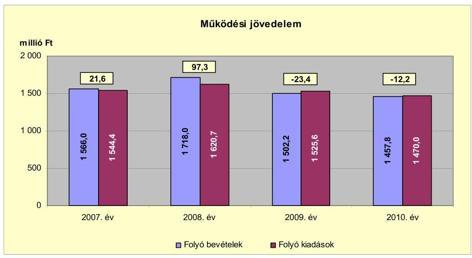

A működési jövedelem a 2007. évről a 2008. évre 75,7 millió Ft-tal emelkedett, mivel a folyó bevételek 152,0 millió Ft-os ( $9,7 \%$-os) emelkedése 76,3 millió Ft-tal ( $4,9 \%$-kal) meghaladta a folyó kiadások növekedését. Az emelkedést az Önkormányzat a 2008. évi 993,3 millió Ft értékű kötvénykibocsátásának kamatbevételei és kamatkiadásai határozták meg. 2008-ban a folyó bevételek az előző évhez viszonyított változását a kamatbevételek 66,0 millió Ft-os ( $110,0 \%$-os), a költségvetési támogatás és az átengedett bevételek együttes értékének 50,7 millió Ft-os ( $4,7 \%$-os) és az egyéb jogcímeken kapott bevételek együttes 35,3 millió Ft-os ( $7,4 \%$-os) emelkedése idézte elő. A folyó kiadásokon belül 2008-ban a kamatkiadások 23,9 millió Ft-os ( $487,7 \%$-os) és a transzferkiadások 21,5 millió Ft-os ( $11,0 \%$-os) előző évhez viszonyított növekedése volt a meghatározó. A működési jövedelem a 2008. évről a 2009. évre 120,7 millió Ft-tal csökkent, értéke negatív volt. A működési jövedelem változását a szociális és gyermekjóléti intézmények Kistérségi társulásnak történő átadása befolyásolta. A folyó bevételek 215,8 millió Ft-tal ( $12,6 \%$-kal) mérséklődtek, azonban a folyó kiadások csökkenése alacsonyabb összegű, 95,1 millió Ft (5,9%) volt. A folyó bevételeken belül - az előző évhez képest 2009-ben - a költségvetési támogatás és az átengedett bevételek együttes értéke csökkent legnagyobb mértékben, 204,2 millió Ft-tal ( $17,9 \%$-kal). A folyó kiadások mérséklődése nem követte a folyó bevételekét, mert a dologi kiadások (áfával együtt) a feladatátadás ellenére 38,5 millió Ft-tal ( $10,9 \%$-kal) növekedtek az EU-s pályázatok és hozzájuk kapcsoló közbeszerzési eljárások költségei miatt. A működési jövedelem a 2009. évről a 2010. évre 11,2 millió Ft-tal emelkedett. A folyó bevételek 44,4 millió Ft-tal maradtak el a 2009. évi szinttől a kamatbevételek (56,6 millió Ft-tal, $48,8 \%$-kal) alacsonyabb szintű teljesülése miatt, a többi bevételi jogcímeken beszedett bevételek összesen 12,2 millió Ft-tal emelkedtek. A folyó kiadások a 2009. évről a 2010. évre 55,6 millió Ft-tal mérséklődtek, amelyet a kamatkiadások 17,4 millió Ft-os ( $3,8 \%$-os), a dologi kiadások (áfával együtt) 24,8 millió Ft-os ( $6,4 \%$-os) csökkenése határozott meg.

A 2007-ben és 2008-ban keletkezett összesen 118,9 millió Ft működési forrástöbblet a 2007-2010. években képződött összesen 220,5 millió Ft-os felhalmozási forráshiány fedezeteként felhasználható volt. A 2009. évi 23,4 mil-

---

lió Ft-os és a 2010. évi 12,2 millió Ft-os működési forráshiány finanszírozását az Önkormányzat a kötvénykibocsátás hozamainak (kamat és árfolyamnyereség) bevételéből és folyószámlahitelből biztosította.

A nettó működési jövedelem értéke a folyó költségvetési pozíció mellett az adott költségvetési év adósságtörlesztésének hatását is tükrözi. Az Önkormányzat nettó működési jövedelmét 2007-2010 között évenként a következő ábra szemlélteti:
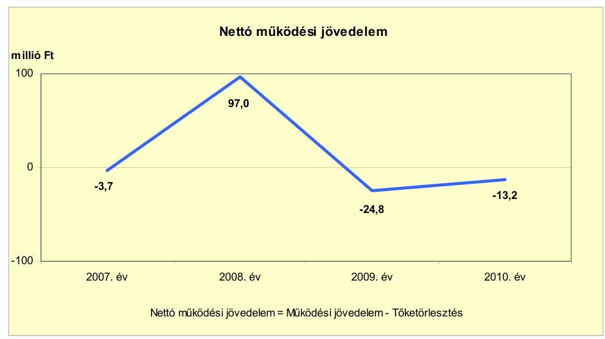

Az Önkormányzat pénzügyi kapacitása a 2008. évet kivéve minden évben negatív értéket mutatott. A nettó működési jövedelem a 2007. évben az előző évi rövid lejáratú hitel tőketörlesztése (25,3 millió Ft) miatt vett fel negatív értéket a pozitív működési jövedelem ellenére. A 2008-2010. évek között a nettó működési jövedelem alakulását a működési költségvetés egyenlege határozta meg, mert a hiteltörlesztések alacsony összegűek voltak. Az Önkormányzat a 2008. évben 993,3 millió Ft értékben kibocsátott kötvény törlesztését a 2012. évben kezdi meg. Az Önkormányzat a hosszú lejáratú hitelei törlesztésére a 2009. évben 1,4 millió Ft-ot, a 2010. évben 1,0 millió Ft-ot fordított, a rövid lejáratú hiteleinek állománya a 2009. évről a 2010. évre 56,0 millió Ft-tal emelkedett. A 2008. évi pozitív működési jövedelem fedezetet biztosíthatott a felhalmozási forráshiányra. Az Önkormányzat a 2009-2010. évek negatív működési jövedelmének fedezetét folyószámlahitel felvételével biztosította. A 2008-2010. években a finanszírozásba bevonható eszközök értékét (3122,3 millió Ft) a kötelezettségek (4250,1 millió Ft) értéke meghaladta.

Az Önkormányzatnál (a CLF módszer alapján) a 2007-2010. években az Önkormányzat felhalmozási költségvetésének egyenlege negatív összegű volt, amely körültekintő költségvetési gazdálkodás és pénzügyileg fenntartható ${ }^{16}$ beruházások esetén nem járt volna magas pénzügyi kockázattal, amennyiben a felhalmozási hiányra a nettó működési jövedelem fedezetet nyújtott volna.

[^0]
[^0]:    ${ }^{16}$ Az minősül pénzügyileg fenntartható beruházásnak, amelynek működtetésére az Önkormányzat nettó működési jövedelme a következő években is fedezetet nyújt az újként megjelenő vagy többletként jelentkező működtetési költségeire.

---

A felhalmozási költségvetés egyenlegét 2007-2010 között évről évre a következő ábra szemlélteti:
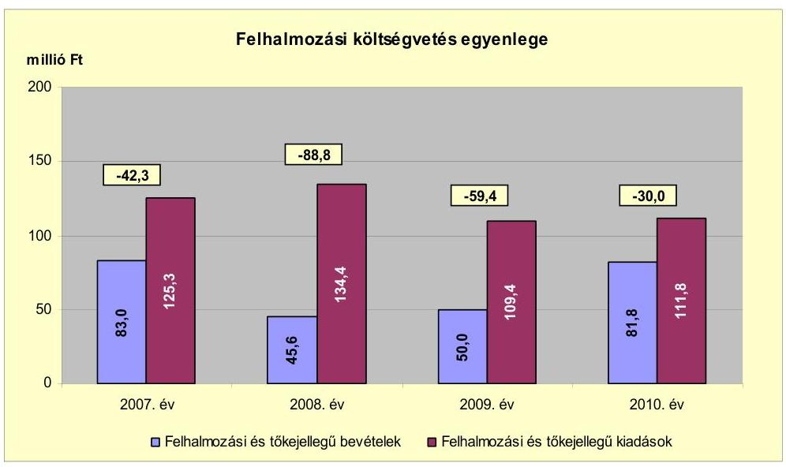

Az Önkormányzatnál a 2007-2010. években összesen 220,5 millió Ft felhalmozási forráshiány keletkezett. A felhalmozási forráshiánynak a felhalmozási és tőkejellegű kiadásokhoz viszonyított aránya a 2007. évben 33,8\% (42,3 millió Ft), a 2008. évben 66,1\% (88,8 millió Ft), a 2009. évben 54,3\% (59,4 millió Ft), a 2010. évben 26,8\% (30,0 millió Ft) volt. Az Önkormányzatnak a 2007-2010. években 100,0 millió Ft-ot meghaladó beruházása nem volt, a felhalmozási és tőkejellegű kiadások egyenletesen alakultak. A 2007-2010. évek között a felhalmozási pénzeszközátvételek (EU-s és hazai támogatások) összesen 211,9 millió Ft-ot jelentettek. Ingatlanértékesítésből az Önkormányzatnak 44,6 millió Ft bevétele származott. A forráshiány fedezetét a 2007-2008. években a pozitív működési jövedelem, a 2009-2010. években a hitelfelvétel biztosította.

Az Önkormányzat a 2007-2010. évi zárszámadási rendelet mellékleteiben mérlegszerűen - a CLF módszer kimunkálásától eltérő módon - állapította meg a költségvetési egyensúlyát. Az Önkormányzat zárszámadási rendeleteiben bemutatott működési és felhalmozási kiadásait és bevételeit a jelentés 1. sz. melléklete tartalmazza. Az Önkormányzat költségvetési mérlegében a működési bevételek és kiadások, valamint a felhalmozási bevételek és kiadások is pozitív irányban térnek el a CLF módszer szerint bemutatott bevételektől és kiadásoktól, mert az Önkormányzat költségvetési mérlege tartalmazza a működési és felhalmozási célú finanszírozási bevételeket és kiadásokat is. A működési bevételek és kiadások 2008. évi emelkedését a kötvénykibocsátásból származó bevétel és a hozzá kapcsolódó tranzakciók bevételei és kiadásai okozták.

Az Önkormányzat finanszírozási műveletek nélküli bevételeinek és kiadásainak egyenlege szerint (GFS pozíció) a forráshiány 2007-ben 20,7 millió Ft, 2009-ben 82,8 millió Ft, 2010-ben 42,2 millió Ft volt. A 2008. évben 8,5 millió Ft forrástöbblet keletkezett.

---

Az Önkormányzat teljes finanszírozási igénye ${ }^{17}$ a CLF módszer szerint a 2007. évben 46,0 millió Ft, a 2009. évben 84,2 millió Ft, a 2010-ben 43,2 millió Ft volt, amelynek fedezetét a finanszírozási műveletek egyenlege biztosította. Az Önkormányzatnak a 2008. évi finanszírozási többletét a kötvénykibocsátás hozambevétele okozta.

Az Önkormányzat finanszírozási műveleteit a 2007-2010. évek között az alábbi ábra szemlélteti:
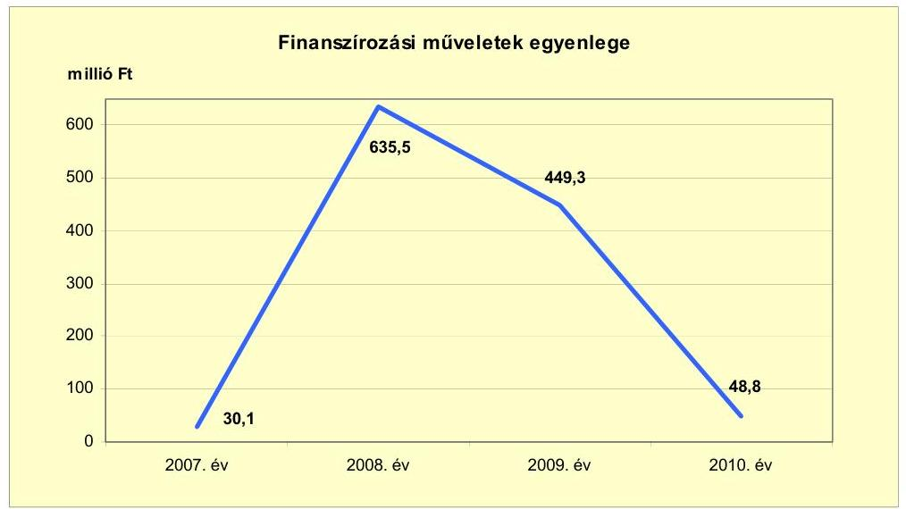

Az Önkormányzatnál a 2007-2010. években keletkezett finanszírozási többlet azt jelzi, hogy az éves költségvetések végrehajtása során szükség volt az előző években keletkezett pénzmaradvány igénybevételén túl külső finanszírozás igénybevételére is. Az Önkormányzat a 2007. évben hosszú lejáratú fejlesztési hitelt vett fel a mentőállomás építésére. Az Önkormányzat a 2008. évben 993,3 millió Ft értékben kötvényt bocsátott ki, amelynek bevételét 2010. december 31-ig nem használta fel. Az Önkormányzat a kötvénykibocsátásból származó bevételét befektette, a 2008. évben 879,9 millió Ft értékben vásárolt és 503,6 millió Ft értékben értékesített, a 2009. évben 418,7 millió Ft értékben értékesített értékpapírokat. Az Önkormányzat a 2008. évben 35,0 millió Ft, a 2010. évben 88,0 millió Ft hitelt vett fel. Az Önkormányzat folyószámlahitelének napi állománya a 2007. évben 30,9 millió Ft, a 2008. évben 39,5 millió Ft, a 2009. évben 44,9 millió Ft, a 2010. évben 49,0 millió Ft volt. A likviditási hiány áthidalására az Önkormányzat a 2007-2010. időszak minden évében munkabér-megelőlegezési hitelt ${ }^{18}$ vett fel, a hitel napi átlagos állománya a 2007. évben 1,1 millió Ft, a 2008. évben 1,0 millió Ft, a 2009. évben 0,9 millió Ft, a 2010. évben 0,9 millió Ft volt. A finanszírozási műveleteket a vizsgált időszakban a jelentés 2. számú mellékletének 4.1-4.8 pontjai részletezik.

[^0]
[^0]:    ${ }^{17}$ a nettó működési jövedelem és a felhalmozási költségvetés eredője
    ${ }^{18}$ Az Önkormányzatnak 2007-2010 között likvidhitele nem volt.

---

Az Önkormányzat kamatbevételeit és kamatkiadásait 2007-2010 között évenként az alábbi ábra mutatja:
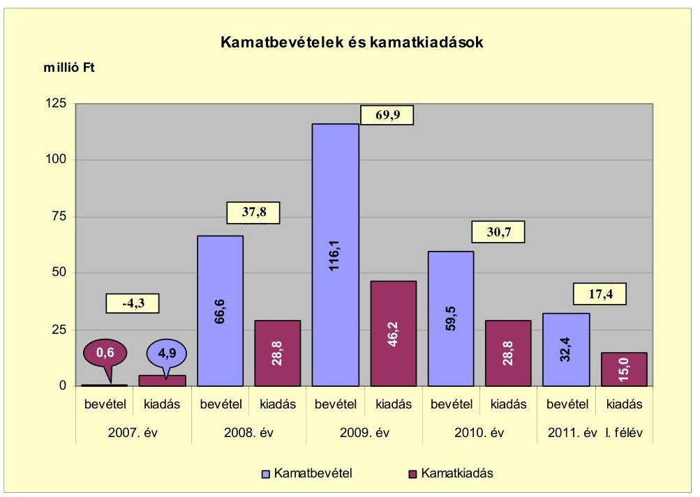

A kamatkiadások a 2007. évben 4,3 millió Ft-tal meghaladták a kamatbevételeket, mivel az Önkormányzatnak lekötött pénzeszköze nem volt, azonban rövid és hosszú lejáratú hitelekkel is rendelkezett, melyek után kamatot fizetett. A 2008. évben kibocsátott kötvényből származó bevételeit az Önkormányzat befektette, amelynek hatására a 2008-2011. év I. féléve között a kamatbevételek (274,6 millió Ft) 155,8 millió Ft-tal magasabbak voltak a kamatkiadásoknál (118,8 millió Ft). A kamatkiadások 17,4 millió Ft-os és a kamatbevételek 56,6 millió Ft-os a 2009. évről a 2010. évre történő visszaesését a gazdasági válság utáni kamatcsökkenések eredményezték.

# 2.2. Az Önkormányzat bevételeinek változása

Az Önkormányzat folyó bevétele a 2007-2009. években átlagosan 1595,4 millió Ft volt, a 2010. évre 1457,8 millió Ft-ra csökkent. A mérséklődést a szociális és gyermekjóléti intézmény Kistérségi társulásnak történő 2009. évi átadása, az állami támogatások, az ellátottak létszáma, valamint a kamatbevételek csökkenése és a kommunális adó megszüntetése okozta. A folyó bevétel 2011. év I. félévében 785,4 millió Ft-ra teljesült.

Az Önkormányzat folyó bevételeit a következő táblázat és ábra mutatja be:

---

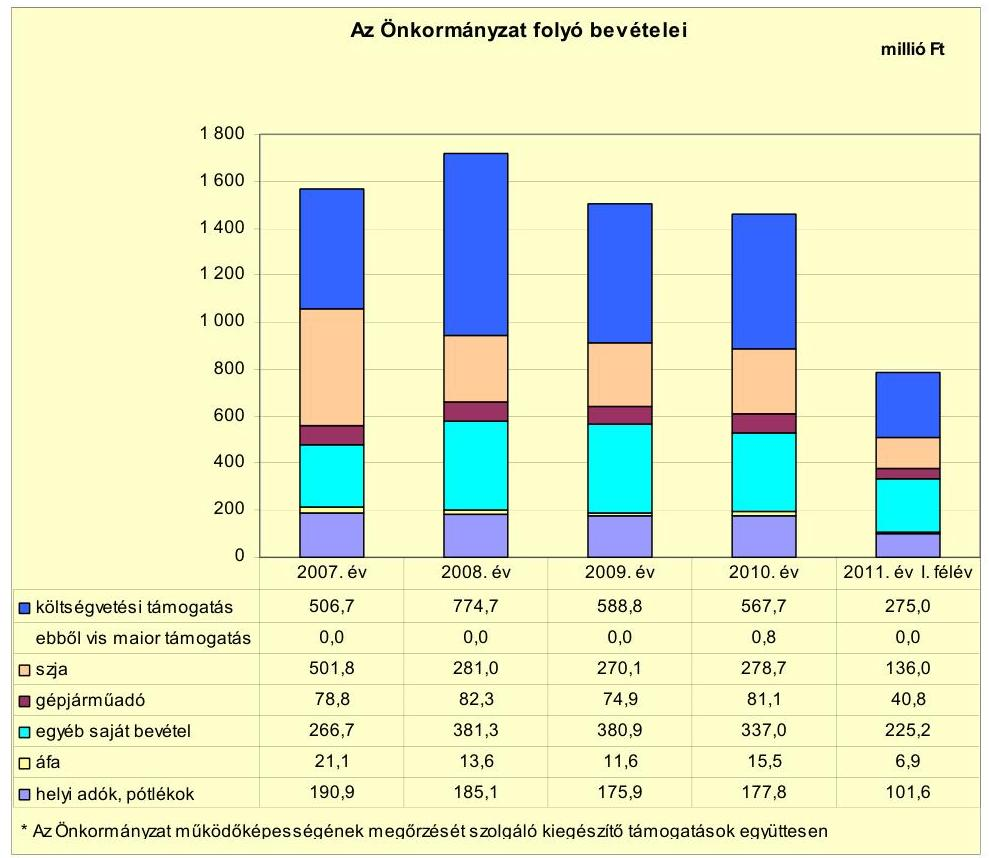

A költségvetési támogatások és az átengedett szja együttes értéke a 2007-2009. években átlagosan 974,4 millió Ft (a folyó bevételek 61,1\%-a), a 2010. évben 846,4 millió Ft (a folyó kiadások 58,1\%-a), a 2011. év I. félévében 411,0 millió Ft (a folyó kiadások 52,3\%-a) volt. A költségvetési támogatás a 2007. évről a 2008. évre 268,0 millió Ft-tal (a folyó kiadások 17,1\%-ával) növekedett, míg az szja 220,8 millió Ft-tal (a folyó kiadások 14,1\%-ával) csökkent a támogatási rendszer változása miatt. A költségvetési támogatás a 2008. évi 774,7 millió Ft-ról (a folyó kiadások 45,1\%-ról) 2009-re 588,8 millió Ft-ra (39,2\%-ra) csökkent. A változás oka a szociális és gyermekjóléti intézmények Kistérségi társulásnak történő átadása, a központi forráskivonás és az ellátottak létszámának csökkenése volt. A költségvetési támogatás a 2010. évre - az előző évhez képest 21,1 millió Ft-tal - tovább mérséklődött, az átengedett szja 8,6 millió Ft-os növekedése ellenére együttes értékük csökkent. Az Önkormányzat a 2011. év III. negyedévében 61,1 millió Ft ÖNHIKI támogatásban részesült, melyből 1,1 millió Ft-ot 60 napon túli közüzemi díjtartozás rendezésére, 15,0 millió Ft-ot alapfokú oktatási intézmények fenntartására, 45,0 millió Ft-ot egyéb kötelező feladatellátáshoz kapcsolódó működési forráshiány rendezésére használt fel.

Az egyéb saját bevételek a 2007-2009. évek 343,0 millió Ft-os átlagáról a 2010. évre 337,0 millió Ft-ra (23,1\%-ra) csökkentek. Ezen belül a kötvénykibocsátás bevételének befektetéséből származó hozamai miatt a kamat- és árfolyamnyereség bevételei a 2008-2009. évek 140,7 millió Ft-os átlagáról a 2010. évre 119,8 millió Ft-ra mérséklődtek a piaci kamatláb változását követve. A szociális és gyermekjóléti intézmény megszűnése miatt az intézményi ellátási díj bevételek a 2008. évről a 2009. évre 95,6 millió Ft-ról 27,3 millió Ft-ra (68,3 millió Ft-tal, 71,4\%-kal) csökkentek, a 2010. évben 24,7 millió Ft-ot jelen-

---

tettek. Az államháztartáson belülről kapott támogatások a 2008. évről a 2009. évre 87,3 millió Ft-ról 120,7 millió Ft-ra 33,4 millió Ft-tal (38,3\%-kal) emelkedtek az előző évi költségvetési visszatérülések és az EU-s pályázatok bevételeinek növekedése miatt.

A helyi adókból és pótlékokból a 2007-2009. években átlagosan 183,9 millió Ft bevétel származott, amely a 2010. évre 177,8 millió Ft-ra mérséklődött. A 2011. év I. félévében 101,6 millió Ft volt. A 2008. évben az Önkormányzat a hulladékkezelési feladatot gazdasági társaságnak adta át, ezzel egyidejűleg a magánszemélyek kommunális adóját eltörölte, amely a 2007. évről a 2008. évre 18,9 millió Ft bevételkiesést okozott. A helyi iparűzési adó a 2007. évi 147,0 millió Ft-ról a 2008. évre 160,7 millió Ft-ra, 13,7 millió Ft-tal (9,3\%-kal) nőtt, mivel 2008. január 1-jétől az őstermelők adómentessége megszűnt és a vállalkozások száma emelkedett. Az iparűzési adó a 2009. évben 153,1 millió Ft, a 2010. évben 153,9 millió Ft volt, a 2008. évhez való mérséklődést a vállalkozók számának és jövedelemtermelő képességének csökkenése okozta.

Az Önkormányzat felhalmozási bevételei az ellenőrzött időszakban az alábbiak voltak:

| Megnevezés | 2007. év | 2008. év | 2009. év | 2010. év | 2011. év   I. félév |
| :-- | --: | --: | --: | --: | --: |
| Tárgyi eszköz értékesítés | 25,3 | 9,5 | 9,9 | 3,1 | 23,3 |
| Egyéb saját tőkebevétel | 0,2 | 0,2 | 0,2 | 0,1 | 0,0 |
| Államháztartáson belülről   kapott támogatás | 36,7 | 10,5 | 19,6 | 59,8 | 22,6 |
| Államháztartáson kívülről   kapott támogatás | 20,8 | 25,4 | 20,3 | 18,8 | 12,1 |
| Összes felhalmozási   bevétel | $\mathbf{8 3 , 0}$ | $\mathbf{4 5 , 6}$ | $\mathbf{5 0 , 0}$ | $\mathbf{8 1 , 8}$ | $\mathbf{5 8 , 0}$ |

A tárgyi eszközök 71,1 millió Ft-os értékesítéséből a 2007-2011. év I. féléve között 68,8 millió Ft az Önkormányzat tulajdonában lévő ingatlanok értékesítéséből származott. A 2007. évben az Önkormányzat egy telket értékesített, melyből 15,0 millió Ft bevétele keletkezett. A felhalmozási célra átvett pénzeszközök - a 2007-2011. év I. féléve között összesen 246,6 millió Ft - az államháztartáson belülről kapott pályázatokhoz kapcsolódó támogatások, valamint a szakközépiskolai oktatás felhalmozási támogatásait tartalmazzák.

# 2.3. Az Önkormányzat folyó és felhalmozási célú kiadásainak változása

Az Önkormányzat folyó kiadásai főbb jogcímek szerinti bontásban 2007-2011. év I. félév között a következők voltak:

---

| Megnevezés | 2007. év | 2008. év | 2009. év | 2010. év | 2011. év   I. félév |
| :--: | :--: | :--: | :--: | :--: | :--: |
| Folyó kiadások | 1544,4 | 1620,7 | 1525,6 | 1470,0 | 767,3 |
| Működési kiadások (kamatkiadás nélkül) | 1338,8 | 1372,5 | 1229,5 | 1168,2 | 645,4 |
| Államháztartáson belülre átadott pénzeszközök | 5,3 | 2,5 | 10,3 | 0,0 | 0,0 |
| Transzferkiadások | 195,4 | 216,9 | 239,6 | 273,0 | 106,9 |
| -ebből: vállalkozásoknak | 40,6 | 53,2 | 81,3 | 96,1 | 41,4 |
| magánszemélyeknek | 138,7 | 145,9 | 140,8 | 152,6 | 63,7 |
| nonprofit szervezeteknek | 16,1 | 17,8 | 17,5 | 24,3 | 1,8 |
| Kamatkiadások | 4,9 | 28,8 | 46,2 | 28,8 | 15,0 |

Az Önkormányzat folyó kiadása a 2007-2009. években átlagosan 1563,6 millió Ft, a 2010. évben 1470,0 millió Ft volt, 6,0\%-kal csökkent.

A működési célú pénzeszközátadások ${ }^{19}$ folyó kiadáson belüli aránya a vizsgált időszakban folyamatosan emelkedett, a 2010. évben 18,6\% (273,0 millió Ft) volt. A transzferkiadásokon belül a 2007-2010. években kiemelkedő volt a magánszemélyeknek átadott pénzeszközök emelkedése. A 2007-2009. években átlagosan 9,1\%-ot (141,8 millió Ft-ot), a 2010. évben 10,4\%-ot (152,6 millió Ft-ot) jelentett. A változást a szociális ellátottak számának növekedése és új ellátási formák bevezetése okozta. A vállalkozásoknak átadott pénzeszközök a 2007-2010. években összesen 271,2 millió Ft - az Önkormányzat kizárólagos tulajdonában lévő gazdasági társaságával feladatellátásra kötött megállapodás szerinti támogatást tartalmazták.

A folyó kiadásokon belül meghatározó mértékűek a működési kiadások (kamatkiadások nélkül) voltak, melyek a 2007-2009. években átlagosan 1313,6 millió Ft-ot ( $84,0 \%$-ot), a 2010. évben 1168,2 millió Ft-ot ( $79,5 \%$-ot) jelentettek.

Az Önkormányzat működési kiadásai (kamatkiadás nélkül) kiemelt jogcímek szerint a vizsgált időszakban az alábbiak voltak:

|  |  |  |  |  | millió Ft |
| :-- | --: | --: | --: | --: | --: |
| Megnevezés | 2007. év | 2008. év | 2009. év | 2010. év | 2011. év   I. félév |
| Személyi juttatások | 717,8 | 736,7 | 577,2 | 597,2 | 294,6 |
| Munkaadót terhelő járulékok | 234,4 | 237,8 | 175,9 | 160,6 | 78,1 |
| Dologi kiadások | 377,5 | 352,1 | 390,6 | 365,8 | 222,9 |
| Egyéb folyó kiadások | 9,1 | 45,9 | 85,8 | 44,6 | 49,8 |

Az Önkormányzat a 2007-2009. években átlagosan a folyó kiadások 68,0\%-át (893,3 millió Ft-ot), a 2010. évben a működési kiadások 64,9\%-át (757,8 millió Ft-ot), 2011. év I. félévében 57,7\%-át (372,7 millió Ft-ot) fordította a személyi juttatásokra és munkaadói járulékokra. A 2008. évről a 2009. évre a személyi juttatások és munkaadói járulék kiadásai együttesen 221,4 millió Ft-

[^0]
[^0]:    ${ }^{19}$ A működési célú pénzeszközátadások a 2007. évben 200,7 millió Ft, a 2008. évben 219,4 millió Ft, a 2009. évben 249,9 millió Ft, a 2010. évben 273,0 millió Ft, a 2011. I. félévben 106,9 millió Ft voltak.

---

tal (22,7\%-kal) csökkentek, mert az Önkormányzat a szociális és gyermekjóléti feladatait a Kistérségi társulásnak átadta, valamint megszűnt a 13. havi illetmény. A 2009. évi szinthez képest a munkaadói járulékok a személyi juttatások emelkedése mellett a 2010. évre 15,3 millió Ft-tal ( $8,7 \%$-kal) estek vissza, amelyet a járulékok mértékének csökkenése okozott.

A dologi kiadások értéke a 2007-2009. években átlagosan 373,4 millió Ft volt (a működési kiadások 28,4\%-a), a 2010. évre 365,8 millió Ft-ra (31,3\%-ra) csökkent. A dologi kiadások a 2007. évről a 2008. évre 25,4 millió Ft-tal (6,7\%kal) csökkentek a 2007. évi egyszeri kiadások (szeméttelep-rendezés és EU-s pályázat) kiadásainak elmaradása miatt. A dologi kiadások a 2008. évről a 2009. évre 38,5 millió Ft-tal annak ellenére emelkedtek, hogy a szociális és gyermekjóléti intézményeket az Önkormányzat a Kistérségi társulásnak átadta (szociális és gyermekjóléti intézmények dologi kiadása a 2008. évben 76,6 millió Ft-ot jelentett). Az emelkedés oka, hogy a 2008. évben EU-s pályázat szolgáltatási, a pályázatokhoz kapcsolódó közbeszerzési eljárások kiadásai egyszeri kiadásként jelentkeztek.

A folyó kiadások között kimutatott árfolyamveszteség a 2008. évben 32,8 millió Ft, a 2009. évben 82,4 millió Ft, a 2010. évben 32,3 millió Ft, a 2011. év I. félévében 36,7 millió Ft volt.

Az Önkormányzat felhalmozási kiadásainak részaránya a felhalmozási és folyó kiadások összegéhez viszonyítva a 2007-2009. években átlagosan 7,3\%-ról, a 2010. évre 7,1\%-ra csökkent. Az Önkormányzatnak az áttekintett időszakban 100,0 millió Ft-ot meghaladó értékű beruházása nem volt.

A folyó és a felhalmozási kiadásokat a vizsgált időszakban az alábbi ábra mutatja be:
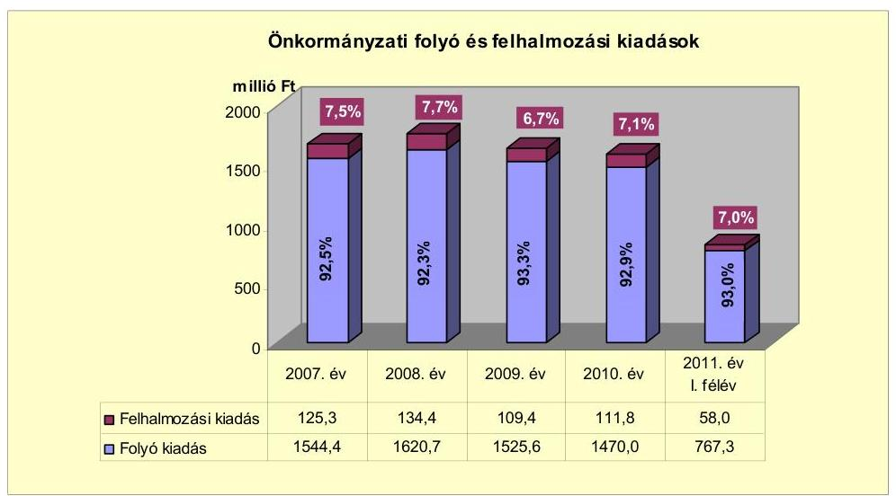

Az Önkormányzatnál 2007-2010 között megvalósult felújítási és beruházási munkálatok együttes bekerülési értéke 388,8 millió Ft volt, amelynek 57,0\%-a (221,6 millió Ft) 10,0 millió Ft alatti fejlesztésekhez kapcsolódott. A fejlesztések közül hat haladta meg a 10,0 millió Ft-os értéket: a volt Bíróság épületének felújítása, a mentőállomáshoz és a DÉMÁSZ székházhoz kapcsolódó be-

---

ruházás, a libatelep megvásárlása és két épület akadálymentesítése. A fejlesztések teljes bekerülési költségének a 6,3\%-át (24,4 millió Ft-ot) hitelfelvételből, 6,7\%-át (25,9 millió Ft-ot) EU-s, 14,0\%-át (54,5 millió Ft-ot) hazai támogatásból, valamint 73,0\%-át (284,0 millió Ft-ot) saját bevételből finanszírozták. Az Önkormányzat 2007-2010 között megvalósult, a 100,0 millió Ft-os értéket meghaladó beruházása nem volt. Az Önkormányzat 2007-2010. években megvalósított, 2010. december 31-ig befejezett fejlesztéseit és azok forrásösszetételét a jelentés 3/a. számú melléklete tartalmazza.

Az Önkormányzatnál 2010. december 31-én két olyan 10,0 millió Ft feletti fejlesztés volt folyamatban, amelyre 2010. december 31-ig kifizetést teljesítettek. Ezek a csatornahálózat tervezéséhez és Polgármesteri hivatal szervezetfejlesztéséhez kapcsolódtak. A folyamatban lévő fejlesztésekre 2006. december 31-ig 0,5 millió Ft-ot, a 2007-2010. évek között összesen 71,8 millió Ft kifizetést teljesített az Önkormányzat. A kiadások fedezetét 51,3\%-ban (37,1 millió Ft) saját bevételből, 48,7\%-át (35,2 millió Ft-ot) EU-s támogatásból biztosítottak. A 10,0 millió Ft alatti fejlesztések olyan terveket tartalmaztak, melyek megvalósítására az Önkormányzat pályázati forrást keresett. Az Önkormányzat 2010. december 31-én folyamatban lévő fejlesztési feladataira 2010. december 31-ig teljesített kifizetéseket és azok forrásösszetételét a jelentés 3/b. számú melléklete mutatja be.

Az Önkormányzatnak 2010. december 31-én hat, összesen 610,5 millió Ft értékű olyan fejlesztése volt folyamatban, amelyekre 2010. december 31-e utáni kötelezettségvállalása állt fenn. Ezen fejlesztésekre 41,3 millió Ft kifizetés történt meg 2010. december 31-ig. A 2011. évben a Szabadság u. felújítása, a szervezetfejlesztés, az ÁMK informatikai fejlesztése, a csatornázás tervezése és a Vásár téri szociális épület felújítása megvalósult, a bölcsőde építése várhatóan 2012-ben fejeződik be. A fejlesztések 2010. utánra vállalt kötelezettségeinek (569,2 millió Ft) forrása 497,7 millió Ft (87,5\%) EU-s támogatás, 5,3 millió Ft ( $0,9 \%$ ) hazai támogatás és 66,2 millió Ft ( $11,6 \%$ ) saját bevétel. Az Önkormányzat 2010. december 31-én folyamatban lévő fejlesztési feladataira 2010. december 31-én fennálló kötelezettségeit és azok forrásösszetételét a jelentés 3/c. számú melléklete tartalmazza.

Az Önkormányzatnak 2011. június 30-án hat fejlesztési célra beadott, elbírálás alatt lévő pályázata volt, amelyekből az Endrédy u-i iskola és a Piactér felújítását, a főtér rehabilitációt, a geotermikus, a csatorna és a sportcsarnok beruházást kívánják megvalósítani. A teljes bekerülési költségüket 4476,6 millió Ft-ra tervezik. Az elbírálás alatt lévő pályázatok forrásösszetétele az Önkormányzat tervei szerint a következőképpen alakul: 19,4 millió Ft $(0,4 \%)$ saját bevétel, 967,2 millió Ft (21,6\%) kötvényből származó bevétel, 3425,0 millió Ft ( $76,5 \%$ ) EU-s és 65,0 millió Ft ( $1,5 \%$ ) hazai támogatás. Az Önkormányzat beadott, elbírálás alatti pályázati forrásból megvalósuló fejlesztéseihez kapcsolódó kötelezettségvállalásait a jelentés 3/d. számú melléklete tartalmazza.

---

A vizsgált időszakban az Önkormányzatnál a három legmagasabb bekerülési költségű fejlesztés az alábbi volt:

- A KEOP-2007-1.2.0/1F pályázat keretében a város teljes csatornahálózatának és a szennyvíztelep felújításának és bővítésének tervezése történt meg. A beruházás a 2011. évben befejeződött, teljes bekerülési értéke 277,3 millió Ft volt. A fejlesztés 235,7 millió Ft (85,0\%) EU-s támogatásból, 41,6 millió Ft (15,0\%) saját bevételből valósult meg. A beruházás a 2007. évben kezdődött és a 2011. évben zárul le műszakilag.
- Az Önkormányzat a DAOP-4.1.3/B-09-2009-0004 pályázatban elnyert támogatásból bölcsődét épít. A tervek elkészültek, a kivitelező kiválasztása közbeszerzési eljárás keretében megtörtént, az építkezés elkezdődhet. A beruházás összes költsége várhatóan 165,1 millió Ft lesz. A kiadások fedezetét 148,6 millió Ft ( $90,0 \%$ ) értékben EU-s támogatás, 16,5 millió Ft ( $10,0 \%$ ) értékben saját bevétel biztosítja. A fejlesztés a 2010. évben kezdődött és a tervek szerint a 2012. évben fejeződik be.
- Az Önkormányzat a DAOP-3.1.1./B-2009-0005 pályázat keretében a városközpontból a vasútállomásra vezető Szabadság utca teljes útburkolati javítását és utcabútorokkal való ellátását valósította meg. A munkálatok a felszíni csapadékelvezetési feladatokat is megoldották. A felújítás teljes bekerülési költsége 120,8 millió Ft, melyet $90 \%$-ban (108,7 millió Ft értékben) EU-s támogatásból, 10\%-ban ( 12,1 millió Ft értékben) saját bevételből finanszírozott az Önkormányzat. A felújítás megvalósult, a támogató szervezettel történő elszámolás folyamatban van.

Az Önkormányzat gazdasági társaságoknak átadott működési és felhalmozási pénzeszközeit az alábbi grafikon szemlélteti:
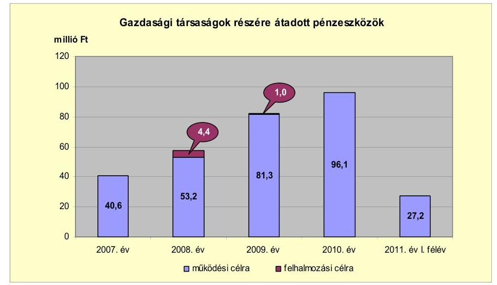

Az Önkormányzat a Bakér Kft.-vel megállapodást kötött a városüzemeltetési feladatok ellátására, amely tartalmazza a gazdasági társaságnak a feladatellátás finanszírozására működési célra átadott pénzeszköz összegét. A megállapodás alapján a Bakér Kft. részére a 2007-2010. években összesen 271,2 millió Ft működési célú pénzeszközt adott át az Önkormányzat. A 2008. évi 4,4 millió Ft-os és a 2009. évi 1,0 millió Ft-os felhalmozási célú támogatásból a kft. ingatlan beruházást finanszírozott.

---

# 3. Az ÖNKORMÁNYZAT KÖTELEZETTSÉGEI 

### 3.1. Az Önkormányzat pénzintézeti kötelezettségeinek változása

Az Önkormányzat pénzintézetekkel szembeni kötelezettségeinek állománya a 2006. december 31-i 25,3 millió Ft-ról 2010. december 31-ig 1598,8 millió Ft-ra, 2011. június 30-ig 1618,2 millió Ft-ra nőtt, a 2007. évi 24,4 millió Ft összegű és a 2008. évi 1,4 millió Ft-os hosszú lejáratú hitelfelvétel, a 2008. évi 6643,0 ezer CHF értékű kötvénykibocsátás, folyószámla- és munka-bér-megelőlegezési hitelek igénybevétele miatt. A hosszú lejáratú kötelezettség 2006. december 31-én 2,9 millió Ft, 2010. december 31-én 1014,2 millió Ft, amely 2011. június 30-án sem változott. A 2011. június 30-ai pénzintézetekkel szembeni kötelezettségei a kettő hosszú lejáratú hitelből, a kibocsátott kötvényből, az előző év végéhez viszonyított 18,3 millió Ft-os folyószámla- és a 4,0 millió Ft-os munkabér-megelőlegezési hitel növekedéséből keletkeztek.

Az Önkormányzat könyvviteli mérlegében kimutatott, pénzintézetekkel szemben fennálló kötelezettségállományát a 2006-2011. év 1. félév közötti időszakban az alábbi ábra szemlélteti:
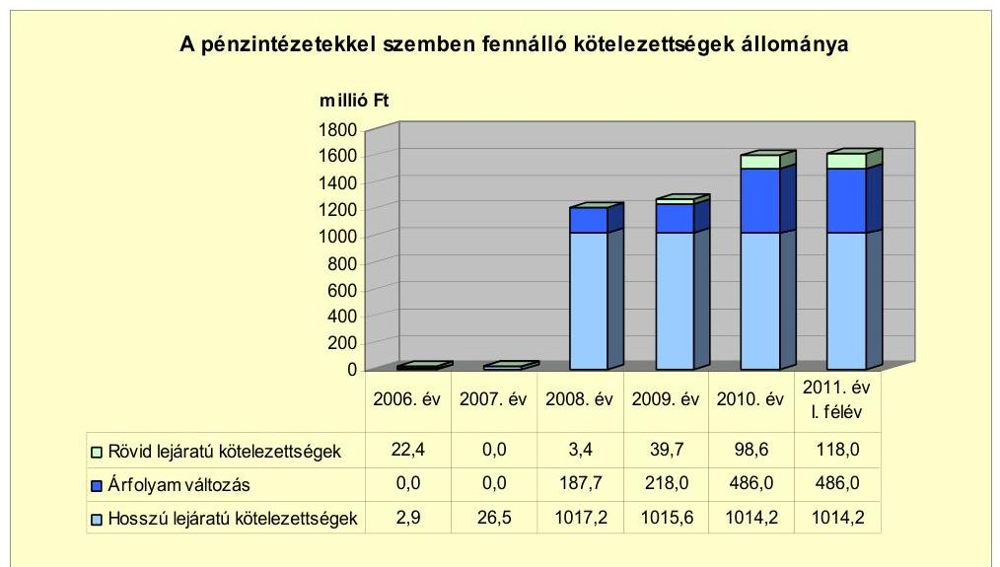

A pénzintézetekkel szemben fennálló kötelezettségek állományának a 2008. és 2010. évi növekedését a 2008. évben 6643,0 ezer CHF-nek megfelelő, svájci frank alapú önkormányzati kötvénykibocsátás, illetve a rövid lejáratú hitelek (a folyószámla- és a munkabér-megelőlegezési hitel) a 2009. évhez viszonyított 58,9 millió Ft-os növekedése okozta. A hosszú lejáratú hiteleket és a kötvénykibocsátást finanszírozó pénzintézet nem volt azonos az Önkormányzat számlavezető pénzintézetével.

Az Önkormányzat pénzintézetekkel szemben fennálló kötelezettségvállalásaira képviselő-testületi döntés alapján került sor. A 2004-2005. években a videokamerás térfigyelő rendszer kiépítésére és a mentőállomás építésére felvett hosszú lejáratú hitelek esetében az Önkormányzat a versenyeztetést mel-

---

lőzte ${ }^{20}$, a 2008. évben az ügyeleti gépjármű vásárlásakor három árajánlat bekérését követően döntött. A kötvénykibocsátás nem közbeszerzés-köteles, de az Önkormányzat hat pénzintézetnek küldte meg kötelező érvényű ajánlatkérő levelét a tervezett, 1000,0 millió Ft-nak megfelelő CHF-ben kibocsátásra kerülő kötvény tárgyában.

A Képviselő-testület döntéseit megalapozó előterjesztésekben meghatározták a kötelezettségvállalásból származó források felhasználási céljait, bemutatták a kötelezettségvállalás visszafizetési forrását, a teljes futamidő alatt várható tőkeés kamatfizetési kötelezettségeket, az árfolyam- és kamatkockázatokat, valamint az adósságszolgálati korlátot. A kötvény kibocsátásával az Önkormányzat nem lépte túl az adósságot keletkeztető kötelezettségvállalásának felső határát a 2008. évben.

Az Önkormányzat 2008. évi költségvetési rendeletének hitelképességet bemutató melléklete szerint az Önkormányzat a 2008. évre tervezett saját folyó bevétele és a korrigált saját folyó bevétel 259,2 millió Ft, éves hitelfelvételének felső határa 181,5 millió Ft. Az éves kötelezettségvállalás felső határának megállapításánál a tárgyévben keletkezett, tárgyévet terhelő kamatfizetési kötelezettség 19,7 millió Ft-ot tett ki. Kötvénykibocsátásból származó fizetési kötelezettség a 2008. évet nem terhelte, mivel a kötvény beváltási (tőketörlesztési) kezdő időpontja 2012. április 30.

Az Önkormányzat 2011. június 30-án CHF-ben fennálló adósságot keletkeztető pénzintézettel szembeni kötelezettségvállalása az alábbi volt:

| Megnevezés | Szerződéskötési   kibocsátás   időpontja | Összeg   ezer CHF-ben | Kibocsátásili hivási   árfolyam | Kamat (referencia kamat+   kamatfelár) | Felhasználás célja: |
| :-- | :--: | :--: | :--: | :--: | :--: |
| Kunszentmiklós   fejlesztéséért kötvény | 2008.06.05 | 6643,0 | 149,53 | 6 havi CHF LIBOR+ 1,15\% | fejlesztési célok megvalósí-   tásához szükséges önerő   biztosítása |

Az Önkormányzat fejlesztési céljainak megfelelő pályázati lehetőségek hiányában a kötvény kibocsátásából származó tőkebevételt 2011. június 30-ig nem használta fel. A fel nem használt kötvényforrás elkülönített betétszámlán - amelyből 500 millió Ft óvadéki betétként -került elhelyezésre. A kötvénybevételből az Önkormányzat a Főtér rehabilitációt, a geotermikus és a csatorna beruházást tervezi finanszírozni. A kötvény visszavásárlása (tőketörlesztése) 2012. április 30-án kezdődik 134 ezer CHF összeggel. Az Önkormányzat a 2008-2011. év I. félév között 85,0 millió Ft kamatot fizetett ki. A kötvény befektetéséből 184,2 millió Ft árfolyamveszteséget és 177,3 millió Ft árfolyamnyereséget, valamint 272,1 millió Ft kamatbevételt realizált.

Az árfolyamváltozás hatására 2010. december 31-én az Önkormányzat CHF-ben fennálló, kötvénykibocsátásból származó pénzintézettel szembeni kötelezettségének $222,68 \mathrm{Ft} / \mathrm{CHF}$ árfolyamon számított értéke 1479,3 millió Ft-ot tett ki, amelyből a számviteli szabályok szerinti átértékelési különbözet 486,0 millió Ft volt.

[^0]
[^0]:    ${ }^{20}$ Közbeszerzés-köteles a mentőállomás építésére felvett hosszú lejáratú hitel volt.

---

Annak megítéléséről, hogy a devizában kibocsátott kötvényért és felvett hitelért kapott forinthoz képest a kötvény visszavásárlásakor, illetve a hitel visszafizetésekor jelentkező forint kötelezettség többletkiadást (árfolyamveszteséget) vagy megtakarítást (árfolyamnyereséget) eredményez-e a futamidő végén, a teljes kötelezettség rendezését követően lehet képet alkotni. Mindaddig, amíg törlesztési kötelezettség nem áll fenn (türelmi idő, moratórium), a tőkére vonatkoztatva nem értelmezhető sem az árfolyamveszteség, sem az árfolyamnyereség. Ugyanakkor a számviteli szabályok meghatározzák, hogy az árfolyamkülönbözetet év végén a kötelezettségek vagy követelések között a könyvviteli mérlegben nyilván kell tartani, azonban az árfolyamkülönbözet valójában nem realizált.

Az Önkormányzat 2011. június 30-án forintban fennálló adósságot keletkeztető pénzintézetekkel szembeni kötelezettségvállalásai az alábbiak voltak:

| Megnevezés | Szerződéskötés/   Kibocsátás   időpontja | Összeg   millió HUF-ban | Kamat (referencia   kamat+ kamatfelár) | Felhasználás célja: |
| :-- | :--: | :--: | :--: | :--: |
| Sikeres Magyarországért OKIF   hitel | 2005.12.01 | 24,4 | 3 havi EURIBOR + 2\% | mentőállomás építése |
| Kölcsönszerződés | 2008.02.04 | 1,4 | 3 havi CHF LIBOR +   $5,78 \%$ | gépjármű vásárlás |

Az Önkormányzat a hosszú lejáratú fejlesztési hitelből származó forrást a mentőállomás építéséhez vette igénybe, amelyet 2007. március 30-án 24,4 millió Ft (100\%) összegben hívta le és használta fel. A hitel törlesztése 2008 decemberében megkezdődött. 2011. június 30-ig a tőketörlesztés 3,9 millió Ft, a kamatkiadás 4,2 millió Ft volt.

Az Önkormányzat 2008. február 4-én gépjárművásárlási hitelszerződést kötött egy pénzintézettel az orvosi ügyeleti feladatok ellátására személyautó vásárlására. A személyautó vételára 2,9 millió Ft volt, melyből az Önkormányzat által biztosított önerő 1,5 millió Ft, a kölcsön összege 1,4 millió Ft. A kölcsön deviza alapú, változó kamatozású, azonban a kölcsön összegét és a törlesztéssel kapcsolatos információkat a finanszírozó pénzintézet nem CHF-ben, hanem csak Ft-ban közölte az Önkormányzattal. Az Önkormányzat 2011. június 30-ig a felvett kölcsönből tőketörlesztésre 0,9 millió Ft-ot, kamatkiadásra 0,3 millió Ft-ot teljesített.

Az Önkormányzat a 2007-2011. év I. félév közötti időszakban működőképességét, pénzügyi egyensúlyát csak folyószámla- és munkabérmegelőlegezési hitel igénybevételével tudta biztosítani. A folyószámlaés munkabér-megelőlegezési hitelek jellemző adatait az alábbi táblázat mutatja be:

|  |  |  |  |  | millió Ft-ban   2011. év   I. félév |
| :--: | :--: | :--: | :--: | :--: | :--: |
| Megnevezés | 2007. év | 2008. év | 2009. év | 2010. év |  |
| I. Folyószámlahitel |  |  |  |  |  |
| a folyószámlahitel keretösszege január 1-jén | 60,0 | 60,0 | 60,0 | 60,0 | 80,0 |
| teljesített kamat és egyéb költség | 2,1 | 3,1 | 5,2 | 2,4 | 3,0 |
| II. Munkabér megelőlegezési hitel |  |  |  |  |  |
| igénybevett hitel összesen | 229,9 | 224,9 | 314,4 | 336,9 | 178,6 |
| teljesített kamat és egyéb költség | 1,7 | 2,5 | 2,5 | 1,8 | 1,4 |

---

A folyószámlahitel kamata a 2007-2011. év I. félév között 3 havi BUBOR referenciakamat ${ }^{21}$ és 1,5 - 2,5\% kamatfelár között alakult, egyéb költsége 0,5-1\% volt. A 2007. január 1-jén fennálló 60,0 millió Ft-os folyószámlahitelkeretet 2010. június 8-án 80,0 millió Ft-ra, 2011. március 24-én 100,0 millió Ft-ra emelték. Az Önkormányzat a 2007. évben 203 napon, a 2008. évben 230 napon, a 2009. évben 250 napon, 2010. évben 255 napon, a 2011. év I. félévben 126 napon vett igénybe folyószámlahitelt. Az átlagos napi állomány ${ }^{22}$ a 2007. évi 30,9 millió Ft-ról 2010. december 31-ig 48,9 millió Ft-ra folyamatosan emelkedett, a 2011. év I. félévre 7,3 millió Ft-ra csökkent. Az Önkormányzat kamatra és egyéb költségre az áttekintett időszakban igénybe vett folyószámlahitel után összesen 15,8 millió Ft-ot fordított.

A munkabér-megelőlegezési hitel kamata 2007. január 1. és 2008. október 1. között 3 havi BUBOR referencia kamat és 1,5 - 2,1\% kamatfelár között volt, 2008. október 31-től 2009. március 31-ig 1 havi BUBOR referencia kamat és 3,5\% kamatfelárat jelentett, 2009. április 1-től a kamatfelár 3\%-ra csökkent. Az Önkormányzatnak az igénybe vett munkabér-megelőlegezési hitel után a 2007-2011. év I. félév között egyéb költséget nem kellett fizetni. A hitel keretösszege az Önkormányzatot megillető tárgyévi állami támogatás 3 havi átlagának $80 \%$-a volt, átlagos napi állománya 0,9-1,1 millió Ft között alakult.

A referenciakamat mértékének alakulása jelentős hatással van az adott devizanemben kifejezett, a teljes futamidőre számított, várható kamatköltség nagyságára. Az Önkormányzat 2011. június 30-án fennálló hosszú lejáratú pénzintézetekkel szembeni kötelezettségei esetében a kamatfizetési kötelezettségek alakulását is jelentősen befolyásolta a kamatok (referenciakamat és kamatfelár) változása, melyet az alábbi táblázat mutat be:

| Megnevezés | Kibocsátási, lefúvási | Utolsó fizetéskorl. | Változás \% |
| :--: | :--: | :--: | :--: |
| 3 havi EURIBOR (24,4 millió Ft-os hitel 2005. 12. 1-ei szerződés szerint mentőállomás építéséhez) | 5,922 | 3,434 | $-42,0 \%$ |
| 3 havi CHF LIBOR (1,4 millió Ft-os hitel 2008. 02. 4-ei szerződés szerint gépjármű vásárláshoz) | 8,43 | 6,032 | $-28,4 \%$ |
| 6 havi CHF LIBOR (6643,0 ezer CHF 2008. 06. 5-ei szerződéskötés fejlesztési célú kötvény kibocsátása) | 4,0392 | 1,5805 | $-60,9 \%$ |

Az utolsó kamatfizetés a mentőállomásra felvett hitel esetében 2011. április 02-án, a gépjárműhitel esetében 2011. június 02-án, a „Kunszentmiklós fejlesztéséért" kötvény esetében 2011. április 30-án volt. Amennyiben a referencia kamat nem változott volna, az Önkormányzatnak a deviza alapú forint hitelei után a kibocsátáskori referencia kamattal számolva 2011. június 30-ig 4,6 millió Ft kamatfizetési kötelezettsége jelentkezett volna, de a referencia kamat kedvező változásának hatására 0,4 millió Ft-tal kevesebb fizetési kötelezettséget kellett

[^0]
[^0]:    ${ }^{21}$ A referencia kamat mértékei az alábbiak voltak:

    | MNB BUBOR fixing (átlagkamat) \%-ban |  |  |  |  |
    | :-- | :--: | :--: | :--: | :--: |
    | 2007. évi | 2008. évi | 2009. évi | 2010. évi | 2011. évi   I. félév |
    | 7,83 | 8,75 | 8,66 | 5,47 | 6,00 |
    | 7,75 | 8,87 | 8,64 | 5,50 | 6,07 |

    22 A folyószámlahitellel zárt napok számának figyelembevételével számított érték.

---

teljesítenie. A CHF-ben kibocsátott kötvénye után a kibocsátáskori kamattal számolva 2011. június 30-ig 805,0 ezer CHF kamatfizetési kötelezettsége jelentkezett volna. A kedvező változások miatt a kibocsátott kötvény után 353,0 ezer CHF-fel kevesebb fizetési kötelezettséget kellett teljesítenie.

Az Önkormányzat kötelezettségeinek állományát 2010. december 31-én és 2011. június 30-án, valamint azok várható alakulását - a felmerülő kamatokat és díjakat is figyelembe véve - a kötelezettségek lejáratáig az alábbi táblázat mutatja be:

| Megnevezés | Állomány   2010. december 31-én |  |  | Állomány   2011. június 30-án |  |  | Várható kötelezettség a 2011-2013.   években |  | Várható kötelezettség a 2014. évtől |  |
| :--: | :--: | :--: | :--: | :--: | :--: | :--: | :--: | :--: | :--: | :--: |
|  | HUF-ban   (millió Ft-ban) | Devizában (összeg, ezer CHF-ben) | Deviza-
nem | HUF-ban (millió Ft ban) | Devizában (összegy, ezer CHFben) | Deviza-
nem | HUF-ban (millió Ftban) | Devizában (összegy, ezer CHFben) | HUF-ban (millió Ftban) | Devizában (összegy, ezer CHFben) |
| Pénzintézeti kötelezettségek | | | | | | | | | | |
| Folyószámlahitel | 66,0 | - | - | 84,3 | - | - | 84,3 | - | - | - |
| Munkatári-megélhetési kölcsön | 29,7 | - | - | 33,7 | - | - | 33,7 | - | - | - |
| Sikeres Magyarországért ÖKIF hitel | 21,2 | - | - | 20,5 | - | - | 5,2 | - | 21,1 | - |
| Gépjármű vásárlási kölcsönszerződés | 0,7 | - | - | 0,5 | - | - | 0,6 | - | - | - |
| Pénzintézeti kötelezettségek összesen HUF-ban: | 117,6 | - | - | 139,0 | - | - | 123,8 | - | 21,1 | |
| Kunszentmiklós fejlesztéséért kötvény | - | 6643,0 | CHF | - | 6643,0 | CHF | - | 795,8 | - | 7190,4 |
| Pénzintézeti kötelezettségek összesen CHF-ben: | - | 6643,0 | CHF | - | 6643,0 | CHF | - | 795,8 | - | 7190,4 |
| Lízing kötelezettségek | 1,4 | - | - | 10,5 | - | - | 6,5 | - | 6,0 | - |
| Szállítói tartozás | 60,5 | - | - | 37,0 | - | - | 37,0 | - | - | - |

Az Önkormányzatnak pénzintézetekkel szemben fennálló kötelezettsége a 2011. év I. félév végén 139,0 millió Ft, valamint 6643,0 ezer CHF volt. Ezek várható kötelezettsége (tőke, kamat és egyéb költség) a legutóbbi kamatfizetés feltételei alapján a 2011-2013. években 123,8 millió Ft, valamint 795,8 ezer CHF. Az Önkormányzatnak a 2011. év I. félévben lízingkötelezettség és szállítói tartozás címén 47,5 millió Ft fizetési kötelezettsége keletkezett. A 2011-2013. évek kötelezettségeinek teljesítésére figyelembe vehető 89,5 millió Ft mérlegben kimutatott követelésállomány, a jelzáloggal nem terhelt forgalomképes ingatlanvagyon. A 2014. évet követően jelenleg ismert pénzintézetekkel szembeni kötelezettségei (tőke, kamat és egyéb költség): 7190,4 ezer CHF és 21,1 millió Ft.

Az Önkormányzatnál 2011. június 30-tól a helyszíni vizsgálat idejéig további hitel-igénybevételről, illetve kötvénykibocsátásról szóló döntést nem készítettek elő.

---

# 3.2. Szállítói kötelezettségek változása

Az Önkormányzat szállítói állománya a 2007. december 31-ei 17,5 millió Ft-ról 2011. június 30-ig 19,5 millió Ft-tal (111,4\%-kal) 37,0 millió Ft-ra nőtt.

Az Önkormányzatnak szállítókkal szemben fennálló kötelezettségeinek állományát, azok kötelezettségeken belüli összegét a következő táblázat tartalmazza:
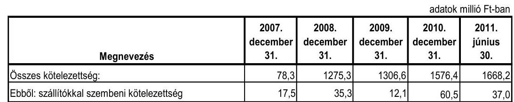

A szállítói kötelezettség állományának növekedése nem volt folyamatos, az előző évhez képest 2008-ban 101,7\%-kal (17,8 millió Ft-tal) emelkedett, 2009-ben az előző évhez viszonyítva $65,7 \%$-kal (23,2 millió Ft-tal) csökkent, 2010-ben 400,0\%-kal (48,4 millió Ft-tal) nőtt. A 2007. december 31-ei 17,5 millió Ft lejárt szállítói tartozásállományból 8,8 millió Ft (50,4\%) a 30 nap alatti, 8,7 millió Ft (49,6\%) a 31-60 nap közötti lejárt tartozásállomány. A 2011. június 30-ai 37,0 millió Ft-os szállítói kötelezettségből 18,4 millió Ft (49,8\%) a 30 nap alatti, 5,5 millió Ft (14,7\%) a 31-60 nap közötti, 9,7 millió Ft (26,2\%) a 61-90 nap közötti, és 3,4 millió Ft (9,3\%) a 91-365 nap közötti lejárt tartozásállomány.

### 3.3. Egyéb kötelezettségek változása

A Polgármesteri hivatal részére szervergép és az önkormányzati képviselők részére laptopok beszerzésére 2007. február 22-én nyílt végű pénzügyi lízingszerződést kötött az Önkormányzat 3,1 millió Ft összegben. A lízing CHF alapú, futamideje 36 hónap, lejárata 2010. március 5. volt.

Az Önkormányzat 2007. március 13-án lízingszerződést kötött egy pénzügyi vállalkozással gépjármű vásárlására, melynek lízingdíja 7,4 millió Ft volt, amelyből az Önkormányzat által biztosított önerő 1,4 millió Ft volt. A lízing CHF alapú, futamideje 60 hónap, lejárata 2012. március 5. Az Önkormányzat 2011. június 30-ig tőketörlesztésre 3,6 millió Ft-ot, kamatra 1,0 millió Ft-ot, egyéb költségre 1,9 millió Ft-ot teljesített.

Az Egészségügyi Központ részére 4D ultrahang beszerzésre 2011. április 18-án kötött nyíltvégű pénzügyi lízingszerződést az Önkormányzat 10,6 millió Ft összegben. A lízing euro alapú, futamideje 60 hónap, lejárata 2016. május 2. Az Önkormányzat 2011. június 30-ig tőketörlesztésre 1,0 millió Ft-ot, kamatra 0,1 millió Ft-ot teljesített.

Az Önkormányzat 2007. január 1-je és 2011. június 30-a között követelést nem engedett el intézménynek, más önkormányzatnak, civil szervezetnek, egyéb

---

államháztartáson belüli és kívüli szervezetnek, valamint gazdasági társaságoknak tagi és egyéb kölcsönöket nem nyújtott.

A Képviselő-testület a folyószámlahitel biztosítékaként egy forgalomképes ingatlan jelzálogjog alapításához és bejegyzéséhez járult hozzá 2011. március 31-én. A sportlétesítmény épülete 310,0 millió Ft nagyságú jelzálogot jelentett.

A forgalomképes ingatlanok nettó értékének megoszlását a jelzáloggal terhelt és nem terhelt ingatlanok között 2010. december 31-én a következő ábra szemlélteti:
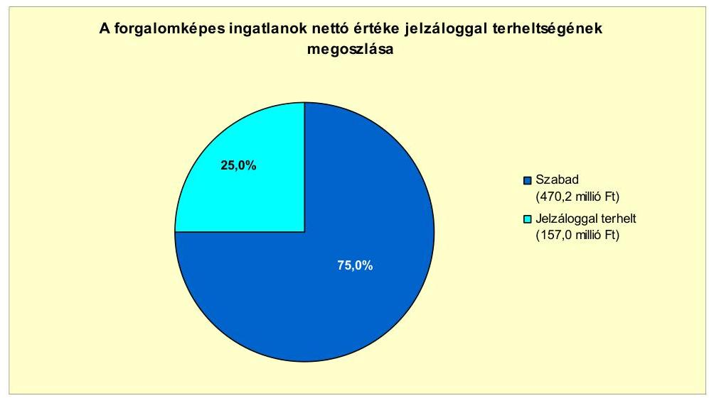

Folyamatban lévő peres eljárása az Önkormányzatnak 2011. június 30-án nem volt.

Az Önkormányzat egy kizárólagos és egy többségi önkormányzati tulajdonban lévő gazdasági társasággal rendelkezett az ellenőrzött időszakban. Ezek kötelezettségeinek állományát 2010. december 31-én és 2011. június 30-án, valamint a kötelezettségeik várható alakulását a lejáratig az alábbi táblázat mutatja be:

| Megnevezés | Állomány   2010. december 31-én | Állomány   2011. június 30-án | Várható kötelezettség   a 2011-2013. években | Várható kötelezettség   a 2014. évtől |
| :--: | :--: | :--: | :--: | :--: |
| | millió Ft-ban | millió Ft-ban | millió Ft-ban | millió Ft-ban |
| Szállítói tartozás | 6,2 | 8,2 | 8,2 | - |

A gazdasági társaságok 2011. június 30-án pénzintézettel szembeni kötelezettséggel nem rendelkeztek, 30 nap alatti szállítói tartozásuk állománya 8,2 millió Ft volt. A Bakér Kft. a 2007-2010. évek között veszteségesen gazdálkodott, de a saját tőke értéke az ellenőrzött időszakban nem csökkent a jegyzett tőke értéke alá.

---

Az Önkormányzat a Gt. 54. § (2) bekezdése alapján korlátlan felelősséggel tartozik azon gazdasági társaságának felszámolás esetében, amelyben az Önkormányzat az 52. § (2) bekezdése szerint a szavazatok legalább 75\%-ával rendelkezik, így minősített befolyásszerzőnek minősül, továbbá a csődeljárásról és a felszámolási eljárásról szóló 1991. évi XLIX. törvény 63. § (2) bekezdése alapján a kizárólagos önkormányzati tulajdonú gazdasági társaságának minden olyan kötelezettségéért, amelynek kielégítését a felszámolási eljárás során az adós társaság vagyona nem fedez, ha a hitelezőinek a felszámolási eljárás során benyújtott keresete alapján a bíróság - az adós társaság felé érvényesített tartósan hátrányos üzletpolitikájára figyelemmel - megállapítja az Önkormányzat korlátlan és teljes felelősségét.

A 2007-2011. év I. félévben nem történt meg annak felmérése, hogy az elhasználódott eszközök pótlása milyen kötelezettséget jelent az Önkormányzat számára. A felújításokra, az eszközök pótlására elsősorban az intézmények működőképességének biztosítása, illetve a szakhatósági előírások figyelembevételével került sor. Az Önkormányzat a 2007-2010. években a tárgyi eszközök után 527,3 millió Ft összegű értékcsökkenést számolt el. Az elhasználódott eszközök pótlására az Önkormányzat tartalékot nem képzett, külön alapot nem hozott létre ${ }^{23}$, azt saját bevételből, pénzintézeti kötelezettségvállalásból származó forrásból, EU-s és hazai támogatásból végezte. A 2007-2010. években megvalósított fejlesztésekből (felújítás és beruházás) 440,4 millió Ft az eszközök korszerűsítését eredményezte.

A 2007-2010. években az eszközök használhatósága is hatást gyakorolt az Önkormányzat pénzügyi egyensúlyi helyzetére. Az Önkormányzat eszközállományának átlagos használhatósági foka 2007-2010 között 9,0 százalékponttal (82,9\%-ról 73,9\%-ra) csökkent.

A 2010. évben a használhatósági fok mutatója kiugróan alacsony az immateriális javak, a gépek, berendezések, felszerelések és a járművek eszközcsoportokban. Az immateriális javak - amelyek bruttó értéke (176,7 millió Ft) a 2010. év végén az összes bruttó eszközérték 3,5\%-át tette ki - használhatósági foka a 2007. évi 39,9\%-ról a 2010. évre 47,1\%-ra nőtt. A gépek, berendezések, felszerelések eszközcsoport - melynek bruttó értéke (288,8 millió Ft) a 2010. év végén az összes bruttó eszközérték 5,7\%-át tette ki - használhatósági foka a 2007. évi $24,2 \%$-ról a 2010. évre $26,2 \%$-ra növekedett. A járművek eszközcsoport melynek bruttó értéke (34,1 millió Ft) a 2010. év végén az összes bruttó eszközérték $0,7 \%$-át tette ki - használhatósági foka a 2007. évi $40,4 \%$-ról a 2010. évre 29,6\%-ra csökkent. A legnagyobb arányt képviselő ingatlanok és vagyoni értékű jogok bruttó értéke 2010-ben 4461,5 millió Ft volt, használhatósági foka 2007-ről 2010-re 87,5\%-ról 79,0\%-ra csökkent. Az átadott eszközök 2010-es állománya 91,2 millió Ft volt, használhatóságának mértéke a 2010. évben 42,7\% volt. A 2007. évi mérlegben nem mutattak ki átadott eszközöket.

[^0]
[^0]: ${ }^{23}$ Tartalék képzésére és külön alap létrehozására az Önkormányzatot nem kötelezi semmilyen előírás.

---

# 4. A PÉNZÜGYI EGYENSÚLY MEGTEREMTÉSE ÉRDEKÉBEN HOZOTT INTÉZKEDÉSEK EREDMÉNYE

Az Önkormányzatnál - kimutatása szerint - a 2007-2011. év I. félév közötti időszakban a kiadáscsökkentő intézkedések következtében összesen 456,0 millió Ft kiadási megtakarítás keletkezett. A kiadási megtakarítás a létszámcsökkentési döntésekhez (a szociális és gyermekjóléti intézmények a Kistérségi társulásnak, valamint az orvosi ügyelet gazdasági társaságnak történő átadásához) kapcsolódott. A kiadási megtakarítások a vizsgált időszak éveiben nem érték el az Önkormányzat költségvetéseiben eredeti előirányzatként tervezett összes költségvetési kiadás 1,0\%-át.

Az Önkormányzatnál a 2007-2010. közötti években az álláshely és létszámváltozásokat a következő táblázat mutatja be:

| Megnevezés (adatok fő-ben) | | Közoktatás | Szociális és gyermekvédelem | Egészségügy | Polgármesteri hivatal | Egyéb | Összesen |
| :--: | :--: | :--: | :--: | :--: | :--: | :--: | :--: |
| 2007. január 1-jén jóváhagyott álláshelyek száma | | 147,0 | 89,0 | 31,0 | 53,0 | 42,0 | 362,0 |
| Megszüntetett álláshelyek száma | | 3,0 | 90,0 | 12,0 | 11,0 | 6,0 | 122,0 |
| ebből | üres álláshelyek száma | 3,0 | 1,0 | 5,0 | 5,0 | 6,0 | 20,0 |
| | szakmai álláshelyek száma | 0,0 | 89,0 | 7,0 | 4,0 | 0,0 | 100,0 |
| | intézmény-szemeltetéssel kapcsolatos álláshelyek száma | 0,0 | 0,0 | 0,0 | 2,0 | 0,0 | 2,0 |
| Álláshely növekedése | | 12,0 | 1,0 | 0,0 | 3,0 | 10,0 | 26,0 |
| 2010. december 21-én záró álláshelyek száma | | 198,0 | 0,0 | 19,0 | 45,0 | 46,0 | 266,0 |
| 2007. január 1-jén foglalkoztatott létszám | | 147,0 | 89,0 | 28,0 | | 48,0 | 41,0 | 353,0 |
|---|---|---|---|---|---|---|---|
| Látszámcsökkentés |  | 2,0 | 89,0 | 9,0 | 8,0 | 5,0 | 113,0 |
| Látszámnövekedés |  | 14,0 | 0,0 | 0,0 | 2,0 | 3,0 | 19,0 |
| 2010. december 31-én foglalkoztatott létszám |  | 159,0 | 0,0 | 19,0 | 42,0 | 39,0 | 259,0 |

Az Önkormányzatnál - kimutatása szerint - a 2007-2010. közötti időszakban 122 álláshely szűnt meg és 26 álláshely létesült. Az álláshelyek csökkenését a feladatátadások, növekedését a közhasznú foglalkoztatás bővülése okozta. Az engedélyezett álláshelyek száma 2007. január 1-jén 362 fő, 2010. december 31-én 266 fő volt. Az önkormányzati foglalkoztatottak létszáma az áttekintett időszakban összességében 94 fővel (a 2007. január 1-jei 353 főről 2010. december 31-re 259 főre) csökkent. A változást a szociális és gyermekjóléti intézmény Kistérségi társulásnak, az orvosi ügyelet gazdasági társaságnak történő átadásából és a megüresedő álláshelyek megszüntetéséből eredő csökkenés, valamint a közhasznú foglalkoztatottak és a pályázati feladatok ellátására felvett dolgozók számának növekedése okozta.

Az Önkormányzat létszámcsökkentésekhez kapcsolódóan központosított támogatást 2007-2010 között nem igényelt.

A kiadáscsökkentő intézkedések mellett a 2007-2011. év I. félévben az Önkormányzat kimutatása szerint az alábbi számszerűsített bevételnövelő intézkedéseket tette:

---

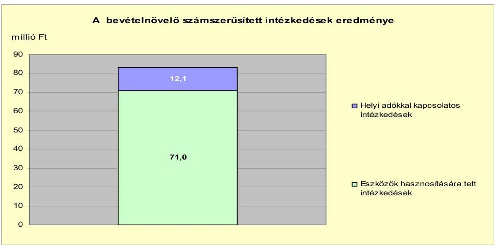

A bevétel növelésére irányuló intézkedések - az Önkormányzat kimutatása alapján - a 2007-2011. év I. félévben összesen 83,1 millió $\mathrm{Ft}^{24}$ volt az eszközök értékesítése, a helyi adókkal kapcsolatos intézkedések eredményeként. A helyi adókkal kapcsolatos intézkedések bevételnövekménye ( 12,1 millió Ft) az őstermelők iparűzési adómentességének 2009. január 1-jétől történt megszüntetéséből származott.

Az áttekintett időszakban a kiadáscsökkentő és bevételnövelő intézkedések - az Önkormányzat kimutatása szerint - összesen 539,1 millió Ft-tal javították az Önkormányzat pénzügyi egyensúlyát. A 2007-2011. év I. félév között a központi támogatások (szja és a költségvetési támogatás) a 2007. évhez viszonyított változása kumuláltan 862,0 millió Ft bevételkiesést eredményezett, amely magában foglalja a szociális és gyermekjóléti feladatok Kistérségi társulásnak történő átadása miatt elmaradó támogatáscsökkenést is.

# 5. Az ÁSZ Által a korábbi években a pénzügyi egyensúly javítására tett szabályszerűségi és célszerűségi javaslatok hasznosulása

Az ÁSZ az Önkormányzat gazdálkodási rendszerének 2008. évi ellenőrzése során - a pénzügyi egyensúly javításával kapcsolatban - egy szabályszerűségi és egy célszerűségi javaslatot tett. A szabályszerűségi javaslat a költségvetési rendeletben a többéves kihatással járó feladatok előirányzatainak évenkénti bontásban történő bemutatására irányult, figyelemmel az európai uniós támogatással megvalósuló fejlesztésekre. A célszerűségi javaslat a költségvetés tervezése során az intézményi működési bevételek, a helyi adók, a költségvetési támogatások és az előző évi feladattal terhelt és szabad pénzmaradványok előirányzatainak megalapozott számbavételére vonatkozott. A javaslatok megvalósítására az Önkormányzat intézkedési tervet készített, amely tartalmazta a

[^0]
[^0]:    ${ }^{24}$ Az Önkormányzat kimutatása szerint bevételnövelő intézkedései 198,6 millió Ft-ot jelentettek, azonban az adóhátralékok ( 114,1 millió Ft ) és a lakbérhátralékok behajtása ( 1,4 millió Ft) nem tekinthetők bevételnövelő intézkedéseknek, mert azok az Önkormányzat alapfeladata körébe tartoznak. Ezért a jelentésben bevételnövelő intézkedésként 83,1 millió Ft-ot mutattunk be.

---

felelősöket és határidőket. Az Önkormányzatnál a szabályszerűségi javaslat részben teljesült, mert a többéves kihatással járó feladatok között az Önkormányzat csak a hitelekkel kapcsolatos kötelezettségeit mutatta be évenkénti bontásban, a több évre vonatkozó fejlesztési döntéseinek előirányzatait azonban nem. A célszerűségi javaslat is részben hasznosult, mert a költségvetés tervezése során az előző évi feladattal terhelt és szabad pénzmaradványok előirányzatainak számbavétele a 2010. és 2011. években csak részben valósult meg, mert a következő évre áthúzódó szállítói tartozásokat betervezték, de azok pénzmaradványból származó fedezetét nem.

Budapest, 2012. április " 11 "

Melléklet: $\quad 7 \mathrm{db}$
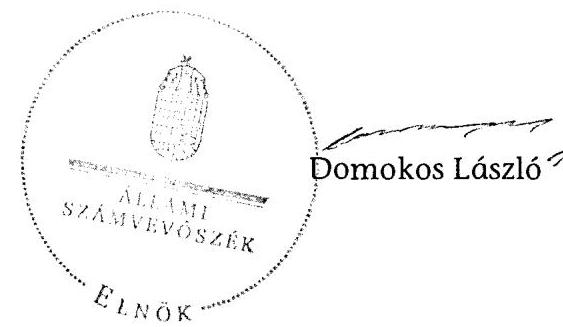

---

**Működési és felhalmozási célú hiány/többlet a 2007-2011 közötti időszakban az Önkormányzat zárszámadási rendeleteiben**

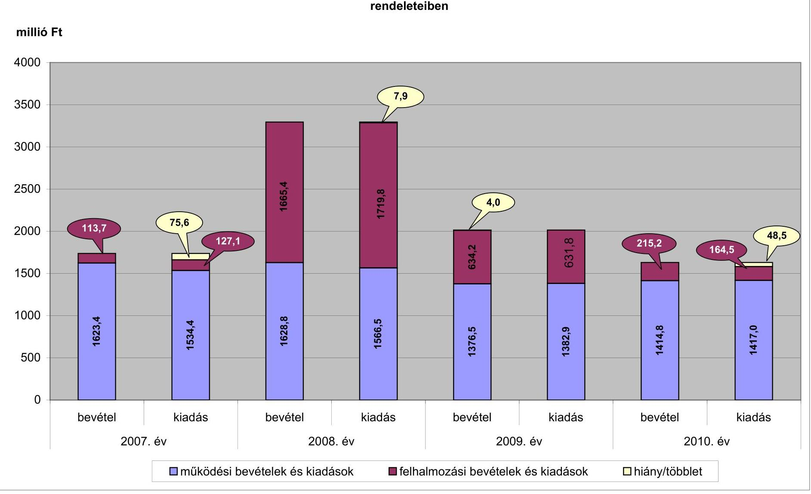

---

Az Önkormányzat bevételei és kiadásai, valamint adósságszolgálata 2007-2010 között

|  1. FOLYÓ KÖLTSÉGVETÉS* | 2007. év | 2008. év | 2009. év | 2010. év  |
| --- | --- | --- | --- | --- |
|  1.1.1. Saját működési bevételek | 389,1 | 487,9 | 444,7 | 402,9  |
|  1.1.2. Költségvetési támogatás** | 506,7 | 774,7 | 588,8 | 567,7  |
|  1.1.3. Átengedett bevételek | 580,6 | 363,3 | 345,0 | 359,8  |
|  1.1.4. Állambáztartáson belülről kapott támogatások | 83,7 | 87,3 | 120,7 | 124,9  |
|  1.1.5. EU-tól és külföldről kapott bevételek | 0,0 | 0,0 | 0,0 | 0,0  |
|  1.1.6. Állambáztartáson kívülről kapott bevételek | 5,9 | 3,4 | 3,0 | 2,5  |
|  1.1.7. Előző évi pénzmaradvány átvétel | 0,0 | 1,4 | 0,0 | 0,0  |
|  1.1. Folyó bevételek $=1.1 .1 .+1.1 .2 .+1.1 .3 .+1.1 .4 .+1.1 .5 .+1.1 .6 .+1.1 .7$. | 1566,0 | 1718,0 | 1502,2 | 1497,0  |
|  1.2.1. Működési kiadások kamatkiadások nélkül | 1338,8 | 1372,5 | 1229,5 | 1168,2  |
|  1.2.2. Állambáztartáson belülre átadott pénzeszközök | 5,3 | 2,5 | 10,3 | 0,0  |
|  1.2.3.1. vállalkozásoknak | 40,6 | 53,2 | 81,3 | 96,1  |
|  1.2.3.2. EU-nak, illetve külföldre | 0,0 | 0,0 | 0,0 | 0,0  |
|  1.2.3.3. magánszemélyeknek | 138,7 | 145,9 | 140,8 | 152,6  |
|  1.2.3.4. Nonprofit szervezetek | 16,1 | 17,8 | 17,5 | 24,3  |
|  1.2.3. Transferkiadások ( $=1.2 .3 .1+1.2 .3 .2+1.2 .3 .3+1.2 .3 .4$ ) | 195,4 | 216,9 | 239,6 | 273,0  |
|  1.2.4 Kamatkiadások | 4,9 | 28,8 | 46,2 | 28,8  |
|  1.2.5. Előző évi pénzmaradvány átadás | 0,0 | 0,0 | 0,0 | 0,0  |
|  1.2. Folyó kiadások $=1.2 .1 .+1.2 .2 .+1.2 .3 .+1.2 .4 .+1.2 .5$. | 1544,4 | 1620,7 | 1525,6 | 1470,0  |
|  1.3. Folyó költségvetés egyenlege MŰKÖDÉSI JÖVEDELEM (1.1. - 1.2.) | 21,6 | 97,3 | $-23,4$ | $-12,2$  |
|  2. FELHALMOZÁSI KÖLTSÉGVETÉS*** |  |  |  |   |
|  2.1.1. Saját tőkebevételek | 25,5 | 9,7 | 10,1 | 3,2  |
|  2.1.2. Állambáztartáson belülről kapott támogatások | 36,7 | 10,5 | 19,6 | 59,8  |
|  2.1.3. EU-tól és külföldről kapott támogatások | 0,0 | 0,0 | 0,0 | 0,0  |
|  2.1.4. Állambáztartáson kívülről kapott támogatások | 20,8 | 25,4 | 20,3 | 18,8  |
|  2.1. Felhalmozási bevételek ( $=2.1 .1 .+2.1 .2+2.1 .3+2.1 .4$.) | 83,0 | 45,6 | 50,0 | 81,8  |
|  2.2.1. Saját beruházási kiadás áfával | 97,6 | 74,9 | 102,5 | 81,6  |
|  2.2.2. Saját felújítási kiadás áfával | 18,1 | 34,3 | 5,9 | 25,5  |
|  2.2.3. Állambáztartáson belülre átadott pénzeszköz | 0,0 | 0,0 | 0,0 | 4,5  |
|  2.2.4. EU-nak és külföldnek adott pénzeszközök | 0,0 | 0,0 | 0,0 | 0,0  |
|  2.2.5. Állambáztartáson kívülre adott pénzeszközök | 9,6 | 18,7 | 1,0 | 0,0  |
|  2.2.6. Befektetési célú részesedések vásárlása | 0,0 | 6,5 | 0,0 | 0,2  |
|  2.2. Felhalmozási kiadások ( $=2.2 .1 .+2.2 .2 .+2.2 .3 .+2.2 .4 .+2.2 .5 .+2.2 .6$.) | 125,3 | 134,4 | 109,4 | 111,8  |
|  2.3. Felhalmozási költségvetés egyenlege (2.1. - 2.2.) | $-42,3$ | $-88,8$ | $-59,4$ | $-30,0$  |
|  3. Finanszírozási műveletek nélküli (GFS) pozíció(1.3.+2.3.) | $-20,7$ | 8,5 | $-82,8$ | $-42,2$  |
|  4. Finanszírozási műveletek |  |  |  |   |
|  4.1. Hitelfelvétel | 24,4 | 2,0 | 35,0 | 88,0  |
|  4.2. Hiteltörlesztés | 25,3 | 0,3 | 1,4 | 1,0  |
|  4.3. Forgatási és befektetési célú értékpapírok kibocsátása | 0,0 | 993,3 | 0,0 | 0,0  |
|  4.4. Forgatási és befektetési célú értékpapírok beváltása | 0,0 | 0,0 | 0,0 | 0,0  |
|  4.5. Forgatási és befektetési célú értékpapírok értékesítése | 0,5 | 503,6 | 418,7 | 0,0  |
|  4.6. Forgatási és befektetési célú értékpapírok vásárlása | 0,0 | 879,9 | 0,0 | 0,0  |
|  4.7. Egyéb finanszírozási bevételek (függő, átfutó, kiegyenlítő) | $-1,1$ | $-30,9$ | 4,1 | $-28,9$  |
|  4.8. Egyéb finanszírozási kiadások (függő, átfutó, kiegyenlítő) | $-31,6$ | $-47,7$ | 7,1 | 9,3  |
|  4.9.Finanszírozási műveletek egyenlege (4.1. - 4.2.+4.3.-4.4+4.5.-4.6.+4.7.-4.8.) | 30,1 | 635,5 | 449,3 | 48,8  |
|  5. Tárgyévi pénzügyi pozíció (1.3.+ 2.3.+4.9.) | 9,4 | 644,0 | 366,5 | 6,6  |
|  6. Nettó működési jövedelem =működési jövedelem (1.3.) - hiteltörlesztés $(4.2+4.4)$ | $-3,7$ | 97,0 | $-24,8$ | $-13,2$  |
|  TÁJÉKOZTATÓ ADATOK |  |  |  |   |
|  Összes kötelezettség | 78,3 | 1275,3 | 1306,6 | 1668,2  |
|  ebből rövid lejáratú | 38,3 | 67,9 | 71,6 | 167,7  |
|  Összes szállítói kötelezettség | 17,5 | 35,3 | 12,1 | 60,5  |
|  ebből lejárt (tanúsítványból) | 17,5 | 35,3 | 12,1 | 60,5  |
|  Pénz és tőkepiaci kötelezettség (adósság) | 26,5 | 1208,3 | 1273,2 | 1598,8  |
|  ebből rövid lejáratú |  | 3,4 | 39,7 | 95,7  |
|  Folyószámlahitel napi átlagos állománya (tanúsítványból) | 30,9 | 39,5 | 44,9 | 49,0  |
|  Munkabérhitel napi átlagos állománya (tanúsítványból) | 1,1 | 1,0 | 0,9 | 0,9  |
|  Finanszírozásba bevonható eszközök: | 82,1 | 1086,2 | 1031,4 | 1004,7  |
|  Tartós hitelviszonyt megtestesítő értékpapírok év végi állománya | 46,4 | 421,3 | 0,1 | 0,1  |
|  Hosszú lejáratú bankbetétek év végi állománya | 0,0 | 0,0 | 0,0 | 0,0  |
|  Értékpapírok év végi állománya | 14,7 | 0,0 | 0,0 | 0,0  |
|  Pénzeszközök (idegen pénzeszközök nélkül) év végi állománya | 21,0 | 664,9 | 1031,3 | 1004,6  |

- Bevételekben nem térül, a kiadásokban nem jelenik meg az amortizáció, a vagyoni helyzetet az
 egyenleg befolyásolja. **A** költségvetési támogatásból a felhalmozási célú összeget az Önkormányzat adatszolgáltatása szerinti mértékben vettük figyelembe a 2.1.2 soron *** Bevételekben vagyon megőrzésre és bővítésre fordítható források.

---

### **Az Önkormányzat a 2007-2010. években megvalósított, 2010. december 31-ig befejezett fejlesztései és azok forrásösszetétele**

|  1. | 2. | 3. | 4. | 5. | 6. | 7. | 8. | 9. | 10. | 11. | 12. | 13. | 14. | 15. | 16. | 17. | 18. | 19. | 20. | 21. | 22. | 23. | 24. | 25. | 26. | 27. | 28. | 29. | 30. | 31. | 32.  |
| --- | --- | --- | --- | --- | --- | --- | --- | --- | --- | --- | --- | --- | --- | --- | --- | --- | --- | --- | --- | --- | --- | --- | --- | --- | --- | --- | --- | --- | --- | --- | --- |
|  1. | Felújítások |  |  |  |  |  |  |  |  |  |  |  |  |  |  |  |  |  |  |  |  |  |  |  |  |  |  |  |  |  |   |
|  2. | Volt Bíróság épületének felújítása | 410/2008. (ck.25.) | 2008. | 2008. | 10,8 | 12,7 | -1,9 |  | 12,7 | 7,8 | 9,7 | -1,9 | A |  |  |  |  |  |  |  |  |  |  |  |  | 3,0 | 3,0 |  | A |  |   |
|  3. | 10 millió Ft alatti felújítások |  |  |  | 84,4 | 61,4 | 23,0 |  | 61,4 | 84,4 | 61,4 | 23,0 | A |  |  |  |  |  |  |  |  |  |  |  |  |  |  |  |  |  |   |
|  4. | Felújítások összesen: |  |  |  | 95,2 | 74,1 | 21,1 | 0,0 | 74,1 | 92,2 | 71,1 | 21,1 | 0,0 | 0,0 | 0,0 | 0,0 | 0,0 | 0,0 | 0,0 | 0,0 | 0,0 | 3,0 | 3,0 | 0,0 | A |  |  |  |  |  |   |
|  5. | Fejlesztések |  |  |  |  |  |  |  |  |  |  |  |  |  |  |  |  |  |  |  |  |  |  |  |  |  |  |  |  |  |   |
|  6. | Mentőállomás | 103/2005. (ck.24.) | 2002. | 2007. | 80,0 | 79,1 | 0,9 | 20,4 | 58,7 | 35,6 | 34,7 | 0,9 | A | 24,4 | 24,4 |  | A |  |  |  |  |  |  |  |  | 20,0 | 20,0 |  |  |  |   |
|  7. | Dámász székház | 121/2008. (ck.25.) | 2008. | 2009. | 32,4 | 32,4 | 0,0 |  | 32,4 | 32,4 | 32,4 | 0,0 | A |  |  |  |  |  |  |  |  |  |  |  |  |  |  |  |  |  |   |
|  8. | DAOP-2007-4.3.1. akadálymentesítés | 318/2008. (ck.19.) | 2008. | 2008. | 17,9 | 16,2 | 1,7 |  | 16,2 | 2,6 | 2,4 | 0,2 | A |  |  |  |  |  |  |  |  | 15,2 | 13,8 | 1,4 | A |  |  |  |  |  |   |
|  9. | Lővételep ingatlan vásárlás | 448/2009. (VIII.19.) | 2009. | 2009. |  | 12,5 | -12,5 |  | 12,5 |  | 12,5 | -12,5 | A |  |  |  |  |  |  |  |  |  |  |  |  |  |  |  |  |  |   |
|  10. | Lakótelep óvoda akadályment. DAOP | 432/2009. (VII.19.) | 2009. | 2009. | 14,4 | 14,3 | 0,1 |  | 14,3 | 2,2 | 2,2 | 0,0 | A |  |  |  |  |  |  |  | 12,2 | 12,1 | 0,1 | A |  |  |  |  |  |  |   |
|  11. | 10 millió Ft alatti fejlesztések |  |  |  | 285,4 | 160,2 | 125,2 |  | 160,2 | 254,0 | 128,7 | 125,3 | A |  |  |  |  |  |  |  |  |  |  |  |  | 31,5 | 31,5 |  | A |  |   |
|  12. | Fejlesztések összesen: |  |  |  | 240,1 | 214,7 | 115,4 | 20,4 | 244,3 | 205,6 | 212,0 | 113,4 | 24,4 | 24,4 | 0,0 | 0,0 | 0,0 | 0,0 | 27,4 | 25,9 | 1,5 | 51,5 | 51,5 | 0,0 |  |  |  |  |  |  |   |
|  13. | Mindösszesen: |  |  |  | 525,3 | 388,8 | 136,5 | 20,4 | 368,4 | 419,6 | 284,0 | 135,5 | 24,4 | 24,4 | 0,0 | 0,0 | 0,0 | 6,8 | 37,4 | 25,9 | 1,5 | 54,5 | 54,5 | 0,0 |  |  |  |  |  |  |   |

1. Az Önkormányzat a 2007-2010. években megvalósított, 2010. december 31-ig befejezett fejlesztései és azok forrásösszetétele

millió Ft-ban

millió Ft-ban

|  Fejlesztési feladat (beruházás, felújítás) |  |  |  |  |  |  |  |  |  |  |  |  |  |  |  |  |  |  |  |  |  |  |  |  |  |  |  |  |  |  |  |   |
| --- | --- | --- | --- | --- | --- | --- | --- | --- | --- | --- | --- | --- | --- | --- | --- | --- | --- | --- | --- | --- | --- | --- | --- | --- | --- | --- | --- | --- | --- | --- | --- | --- |
|  1. | 2008. dec. 31-ig megvalósított beruházás forrásösszetétele |  |  |  |  |  |  |  |  |  |  |  |  |  |  |  |  |  |  |  |  |  |  |  |  |  |  |  |  |  |  |   |
|  3. |  |  |  |  |  |  |  |  |  |  |  |  |  |  |  |  |  |  |  |  |  |  |  |  |  |  |  |  |  |  |  |   |
|  4. |  |  |  |  |  |  |  |  |  |  |  |  |  |  |  |  |  |  |  |  |  |  |  |  |  |  |  |  |  |  |  |   |
|  5. |  |  |  |  |  |  |  |  |  |  |  |  |  |  |  |  |  |  |  |  |  |  |  |  |  |  |  |  |  |  |  |   |
|  6. |  |  |  |  |  |  |  |  |  |  |  |  |  |  |  |  |  |  |  |  |  |  |  |  |  |  |  |  |  |  |  |   |
|  7. |  |  |  |  |  |  |  |  |  |  |  |  |  |  |  |  |  |  |  |  |  |
 |  |  |  |  |  |  |  |  |  |   |
|  8. |  |  |  |  |  |  |  |  |  |  |  |  |  |  |  |  |  |  |  |  |  |  |  |  |  |  |  |  |  |  |  |   |
|  9. |  |  |  |  |  |  |  |  |  |  |  |  |  |  |  |  |  |  |  |  |  |  |  |  |  |  |  |  |  |  |  |   |
|  10. |  |  |  |  |  |  |  |  |  |  |  |  |  |  |  |  |  |  |  |  |  |  |  |  |  |  |  |  |  |  |  |   |
|  11. |  |  |  |  |  |  |  |  |  |  |  |  |  |  |  |  |  |  |  |  |  |  |  |  |  |  |  |  |  |  |  |   |
|  12. |  |  |  |  |  |  |  |  |  |  |  |  |  |  |  |  |  |  |  |  |  |  |  |  |  |  |  |  |  |  |  |   |
|  13. |  |  |  |  |  |  |  |  |  |  |  |  |  |  |  |  |  |  |  |  |  |  |  |  |  |  |  |  |  |  |  |   |
|  14. |  |  |  |  |  |  |  |  |  |  |  |  |  |  |  |  |  |  |  |  |  |  |  |  |  |  |  |  |  |  |  |   |
|  15. |  |  |  |  |  |  |  |  |  |  |  |  |  |  |  |  |  |  |  |  |  |  |  |  |  |  |  |  |  |  |  |   |
|  16. |  |  |  |  |  |  |  |  |  |  |  |  |  |  |  |  |  |  |  |  |  |  |  |  |  |  |  |  |  |  |  |   |
|  17. |  |  |  |  |  |  |  |  |  |  |  |  |  |  |  |  |  |  |  |  |  |  |  |  |  |  |  |  |  |  |  |   |
|  18. |  |  |  |  |  |  |  |  |  |  |  |  |  |  |  |  |  |  |  |  |  |  |  |  |  |  |  |  |  |  |  |   |
|  19. |  |  |  |  |  |  |  |  |  |  |  |  |  |  |  |  |  |  |  |  |  |  |  |  |  |  |  |  |  |  |  |   |
|  20. |  |  |  |  |  |  |  |  |  |  |  |  |  |  |  |  |  |  |  |  |  |  |  |  |  |  |  |  |  |  |  |   |
|  21. |  |  |  |  |  |  |  |  |  |  |  |  |  |  |  |  |  |  |  |  |  |  |  |  |  |  |  |  |  |  |  |   |
|  22. |  |  |  |  |  |  |  |  |  |  |  |  |  |  |  |  |  |  |  |  |  |  |  |  |  |  |  |  |  |  |  |   |
|  23. |  |  |  |  |  |  |  |  |  |  |  |  |  |  |  |  |  |  |  |  |  |  |  |  |  |  |  |  |  |  |  |   |
|  24. |  |  |  |  |  |  |  |  |  |  |  |  |  |  |  |  |  |  |  |  |  |  |  |  |  |  |  |  |  |  |  |   |
|  25. |  |  |  |  |  |  |  |  |  |  |  |  |  |  |  |  |  |  |  |  |  |  |  |  |  |  |  |  |  |  |  |   |
|  26. |  |  |  |  |  |  |  |  |  |  |  |  |  |  |  |  |  |  |  |  |  |  |  |  |  |  |  |  |  |  |  |   |
|  27. |  |  |  |  |  |  |  |  |  |  |  |  |  |  |  |  |  |  |  |  |  |  |  |  |  |  |  |  |  |  |  |   |
|  28. |  |  |  |  |  |  |  |  |  |  |  |  |  |  |  |  |  |  |  |  |  |  |  |  |  |  |  |  |  |  |  |   |
|  29. |  |  |  |  |  |  |  |  |  |  |  |  |  |  |  |  |  |  |  |  |  |  |  |  |  |  |  |  |  |  |  |   |
|  30. |  |  |  |  |  |  |  |  |  |  |  |  |  |  |  |  |  |  |  |  |  |  |  |  |  |  |  |  |  |  |  |   |
|  31. |  |  |  |  |  |  |  |  |  |  |  |  |  |  |  |  |  |  |  |  |  |  |  |  |  |  |  |  |  |  |  |  |  |  |  |   |
|  32. |  |  |  |  |  |  |  |  |  |  |  |  |  |  |  |  |  |  |  |  |  |  |  |  |  |  |  |  |  |  |  |   |
|  33. |  |  |  |  |  |  |  |  |  |  |  |  |  |  |  |  |  |  |  |  |  |  |  |  |  |  |  |  |  |  |  |   |
|  34. |  |  |  |  |  |  |  |  |  |  |  |  |  |  |  |  |  |  |  |  |  |  |  |  |  |  |  |  |  |  |  |   |
|  35. |  |  |  |  |  |  |  |  |  |  |  |  |  |  |  |  |  |  |  |  |  |  |  |  |  |  |  |  |  |  |  |   |
|  36. |  |  |  |  |  |  |  |  |  |  |  |  |  |  |  |  |  |  |  |  |  |  |  |  |  |  |  |  |  |  |  |   |
|  37. |  |  |  |  |  |  |  |  |  |  |  |  |  |  |  |  |  |  |  |  |  |  |  |  |  |  |  |  |  |  |  |   |
|  38. |  |  |  |  |  |  |  |  |  |  |  |  |  |  |  |  |  |  |  |  |  |  |  |  |  |  |  |  |  |  |  |   |
|  39. |  |  |  |  |  |  |  |  |  |  |  |  |  |  |  |  |  |  |  |  |  |  |  |  |  |  |  |  |  |  |  |   |
|  40. |  |  |  |  |  |  |  |  |  |  |  |  |  |  |  |  |  |  |  |  |  |  |  |  |  |  |  |  |  |  |  |   |
|  41. |  |  |  |  |  |  |  |  |  |  |  |  |  |  |  |  |  |  |  |  |  |  |  |  |  |  |  |  |  |  |  |   |
|  42. |  |  |  |  |  |  |  |  |  |  |  |  |  |  |  |  |  |  |  |  |  |  |  |  |  |  |  |  |  |  |  |   |
|  43. |  |  |  |  |  |  |  |  |  |  |  |  |  |  |  |  |  |  |  |  |  |  |  |  |  |  |  |  |  |  |  |   |
|  44. |  |  |  |  |  |  |  |  |  |  |  |  |  |  |  |  |  |  |  |  |  |  |  |  |  |  |  |  |  |  |  |   |
|  45. |  |  |  |  |  |  |  |  |  |  |  |  |  |  |  |  |  |  |  |  |  |  |  |  |  |  |  |  |  |  |  |   |
|  46. |  |  |  |  |  |  |  |  |  |  |  |  |  |  |  |  |  |  |  |  |  |  |  |  |  |  |  |  |  |  |  |   |
|  47. |  |  |  |  |  |  |  |  |  |  |  |  |  |  |  |  |  |  |  |  |  |  |  |  |  |  |  |  |  |  |  |   |
|  48. |  |  |  |  |  |  |  |  |  |  |  |  |  |  |  |  |  |  |  |  |  |  |  |  |  |  |  |  |  |  |  |   |
|  49. |  |  |  |  |  |  |  |  |  |  |  |  |  |  |  |  |  |  |  |  |  |  |  |  |  |  |  |  |  |  |  |  |   |
|  50. |  |  |  |  |  |  |  |  |  |  |  |  |  |  |  |  |  |  |  |  |  |  |  |  |  |  |  |  |  |  |  |  |   |
|  51. |  |  |  |  |  |  |  |  |  |  |  |  |  |  |  |  |  |  |  |  |  |  |  |  |  |  |  |  |  |  |  |  |   |
|  52. |  |  |  |  |  |  |  |  |  |  |  |  |  |  |  |  |  |  |  |  |  |  |  |  |  |  |  |  |  |  |  |  |   |
|  53. |  |  |  |  |  |  |  |  |  |  |  |  |  |  |  |  |  |  |  |  |  |  |  |  |  |  |  |  |  |  |  |  |   |
|  54. |  |  |  |  |  |  |  |  |  |  |  |  |  |  |  |  |  |  |  |  |  |  |  |  |  |  |  |  |  |  |  |  |   |
|  55. |  |  |  |  |  |  |  |  |  |  |  |  |  |  |  |  |  |  |  |  |  |  |  |  |  |  |  |  |  |  |  |  |   |
|  56. |  |  |  |  |  |  |  |  |  |  |  |  |  |  |  |  |  |  |  |  |  |  |  |  |  |  |  |  |  |  |  |  |   |
|  57. |  |  |  |  |  |  |  |  |  |  |  |  |  |  |  |  |  |  |  |  |  |  |  |  |  |  |  |  |  |  |  |  |   |
|  58. |  |  |  |  |  |  |  |  |  |  |  |  |  |  |  |  |  |  |  |  |  |  |  |  |  |  |  |  |  |  |  |  |   |
|  59. |  |  |  |  |  |  |  |  |  |  |  |  |  |  |  |  |  |  |  |  |  |  |  |  |  |  |  |  |  |  |  |  |   |
|  60. |  |  |  |  |  |  |  |  |  |  |  |  |  |  |  |  |  |  |  |  |  |  |  |  |  |  |  |  |  |  |  |  |   |
|  61. |  |  |  |  |  |  |  |  |  |  |  |  |  |  |  |  |  |  |  |  |  |  |  |  |  |  |  |  |  |  |  |  |   |
|  62. |  |  |  |  |  |  |  |  |  |  |  |  |  |  |  |  |  |  |  |  |  |  |  |  |  |  |  |  |  |  |  |  |   |
|  63. |  |  |  |  |  |  |  |  |  |  |  |  |  |  |  |  |  |  |  |  |  |  |  |  |  |  |  |  |  |  |  |  |  |   |
|  64. |  |  |  |  |  |  |  |  |  |  |  |  |  |  |  |  |  |  |  |  |  |  |  |  |  |  |  |  |  |  |  |  |  |   |
|  65. |  |  |  |  |  |  |  |  |  |  |  |  |  |  |  |  |  |  |  |  |  |  |  |  |  |  |  |  |  |  |  |  |  |   |
|  66. |  |  |  |  |  |  |  |  |  |  |  |  |  |  |  |  |  |  |  |  |  |  |  |  |  |  |  |  |  |  |  |  |  |   |
|  67. |  |  |  |  |  |  |  |  |  |  |  |  |  |  |  |  |  |  |  |  |  |  |  |  |  |  |  |  |  |  |  |  |  |  |   |
|  68. |  |  |  |  |  |  |  |  |  |  |  |  |  |  |  |  |  |  |  |  |  |  |  |  |  |  |  |  |  |  |  |  |  |  |   |
|  69. |  |  |  |  |  |  |  |  |  |  |  |  |  |  |  |  |  |  |  |  |  |  |  |  |  |  |  |  |  |  |  |  |  |  |  |   |
|  70. |  |  |  |  |  |  |  |  |  |  |  |  |  |  |  |  |  |  |  |  |  |  |  |  |  |  |  |  |  |  |  |  |  |  |  |  |   |
|  71. |  |  |  |  |  |  |  |  |  |  |  |  |  |  |  |  |  |  |  |  |  |  |  |  |  |  |  |  |  |  |  |  |  |  |  |  |   |
|  72. |  |  |  |  |  |  |  |  |  |  |  |  |  |  |  |  |  |  |  |  |  |  |  |  |  |  |  |  |  |  |  |  |  |  |  |  |   |
|  73. |  |  |  |  |  |  |  |  |  |  |  |  |  |  |  |  |  |  |  |  |  |  |  |  |  |  |  |  |  |  |  |  |  |  |  |  |   |
|  74. |  |  |  |  |  |  |  |  |  |  |  |  |  |  |  |  |  |  |  |  |  |  |  |  |  |  |  |  |  |  |  |  |  |  |  |  |  |   |
|  75. |  |  |  |  |  |  |  |  |  |  |  |  |  |  |  |  |  |  |  |  |  |  |  |  |  |  |  |  |  |  |  |  |  |  |  |  |  |   |
|  76. |  |  |  |  |  |  |  |  |  |  |  |  |  |  |  |  |  |  |  |  |  |  |  |  |  |  |  |  |  |  |  |  |  |  |  |  |  |  |   |
|  77. |  |  |  |  |  |  |  |  |  |  |  |  |  |  |  |  |  |  |  |  |  |  |  |  |  |  |  |  |  |  |  |  |  |  |  |  |  |  |  |   |
|  78. |  |  |  |  |  |  |  |  |  |  |  |  |  |  |  |  |  |  |  |  |  |  |  |  |  |  |  |  |  |  |  |  |  |  |  |  |  |  |  |  |   |
|  79. |  |  |  |  |  |  |  |  |  |  |  |  |  |  |  |  |  |  |  |  |  |  |  |  |  |  |  |  |  |  |  |  |  |  |  |  |  |  |  |  |  |   |
|  80. |  |  |  |  |  |  |  |  |  |  |  |  |  |  |  |  |  |  |  |  |  |  |  |  |  |  |  |  |  |  |  |  |  |  |  |  |  |  |  |  |  |  |   |
|  81. |  |  |  |  |  |  |  |  |  |  |  |  |  |  |  |  |  |  |  |  |  |  |  |  |  |  |  |  |  |  |  |  |  |  |  |  |  |  |  |  |  |  |  |   |
|  82. |  |  |  |  |  |  |  |  |  |  |  |  |  |  |  |  |  |  |  |  |  |  |  |  |  |  |  |  |  |  |  |  |  |  |  |  |  |  |  |  |  |  |  |  |   |
|  83. |  |  |  |  |  |  |  |  |  |  |  |  |  |  |  |  |  |  |  |  |  |  |  |  |  |  |  |  |  |  |  |  |  |  |  |  |  |  |  |  |  |  |  |  |  |   |
|  84. |  |  |  |  |  |  |  |  |  |  |  |  |  |  |  |  |  |  |  |  |  |  |  |  |  |  |  |  |  |  |  |  |  |  |  |  |  |  |  |  |  |  |  |  |  |   |
|  85. |  |  |  |  |  |  |  |  |  |  |  |  |  |  |  |  |  |  |  |  |  |  |  |  |  |  |  |  |  |  |  |  |  |  |  |  |  |  |  |  |  |  |  |  |  |  |  |   |
|  86. |  |  |  |  |  |  |  |  |  |  |  |  |  |  |  |  |  |  |  |  |  |  |  |  |  |  |  |  |  |  |  |  |  |  |  |  |  |  |  |  |  |  |  |  |  |  |  |   |
|  87. |  |  |  |  |  |  |  |  |  |  |  |  |  |  |  |  |  |  |  |  |  |  |  |  |  |  |  |  |  |  |  |  |  |  |  |  |  |  |  |  |  |  |  |  |  |  |  |  |   |
|  88. |  |  |  |  |  |  |  |  |  |  |  |  |  |  |  |  |  |  |  |  |  |  |  |  |  |  |  |  |  |  |  |  |  |  |  |  |  |  |  |  |  |  |  |  |  |  |  |  |  |  |   |
|  89. |  |  |  |  |  |  |  |  |  |  |  |  |  |  |  |  |  |  |  |  |  |  |  |  |  |  |  |  |  |  |  |  |  |  |  |  |  |  |  |  |  |  |  |  |  |  |  |  |  |  |  |  |  |   |
|  90. |  |  |  |  |  |  |  |  |  |  |  |  |  |  |  |  |  |  |  |  |  |  |  |  |  |  |  |  |  |  |  |  |  |  |  |  |  |  |  |  |  |  |  |  |  |  |  |  |  |  |  |  |  |  |  |  |   |
|  91. |  |  |  |  |  |  |  |  |  |  |  |  |  |  |  |  |  |  |  |  |  |  |  |  |  |  |  |  |  |  |  |  |  |  |  |  |  |  |  |  |  |  |  |  |  |  |  |  |  |  |  |  |  |  |  |  |   |
|  92. |  |  |  |  |  |  |  |  |  |  |  |  |  |  |  |  |  |  |  |  |  |  |  |  |  |  |  |  |  | 
 |  |  |  |  |  |  |  |  |  |  |  |  |  |  |  |  |  |  |  |  |  |  |  |  |  |  |  |  |  |   |
|  93. |  |  |  |  |  |  |  |  |  |  |  |  |  |  |  |  |  |  |  |  |  |  |  |  |  |  |  |  |  |  |  |  |  |  |  |  |  |  |  |  |  |  |  |  |  |  |  |  |  |  |  |  |  |  |  |  |  |  |  |  |  |  |  |   |
|  94. |  |  |  |  |  |  |  |  |  |  |  |  |  |  |  |  |  |  |  |  |  |  |  |  |  |  |  |  |  |  |  |  |  |  |  |  |  |  |  |  |  |  |  |  |  |  |  |  |  |  |  |  |  |  |  |  |  |  |  |  |  |  |  |  |  |  |  |   |
|  95. |  |  |  |  |  |  |  |  |  |  |  |  |  |  |  |  |  |  |  |  |  |  |  |  |  |  |  |  |  |  |  |  |  |  |  |  |  |  |  |  |  |  |  |  |  |  |  |  |  |  |  |  |  |  |  |  |  |  |  |  |  |  |  |  |  |  |  |  |  |  |  |  |   |
|  96. |  |  |  |  |  |  |  |  |  |  |  |  |  |  |  |  |  |  |  |  |  |  |  |  |  |  |  |  |  |  |  |  |  |  |  |  |  |  |  |  |  |  |  |  |  |  |  |  |  |  |  |  |  |  |  |  |  |  |  |  |  |  |  |  |  |  |  |  |  |  |  |   |
|  97. |  |  |  |  |  |  |  |  |  |  |  |  |  |  |  |  |  |  |  |  |  |  |  |  |  |  |  |  |  |  |  |  |  |  |  |  |  |  |  |  |  |  |  |  |  |  |  |  |  |  |  |  |  |  |  |  |  |  |  |  |  |  |  |  |  |  |  |  |  |  |  |   |
|  98. |  |  |  |  |  |  |  |  |  |  |  |  |  |  |  |  |  |  |  |  |  |  |  |  |  |  |  |  |  |  |  |  |  |  |  |  |  |  |  |  |  |  |  |  |  |  |  |  |  |  |  |  |  |  |  |  |  |  |  |  |  |  |  |  |   |
|  99. |  |  |  |  |  |  |  |  |  |  |  |  |  |  |  |  |  |  |  |  |  |  |  |  |  |  |  |  |  |  |  |  |  |  |  |  |  |  |  |  |  |  |  |  |  |  |  |  |  |  |  |  |  |  |  |  |  |  |  |  |  |  |  |   |
|  100. |  |  |  |  |  |  |  |  |  |  |  |  |  |  |  |  |  |  |  |  |  |  |  |  |  |  |  |  |  |  |  |  |  |  |  |  |  |  |  |  |  |  |  |  |  |  |  |  |  |  |  |  |  |  |  |  |  |  |  |  |  |  |  |  |  |   |
|  101. |  |  |  |  |  |  |  |  |  |  |  |  |  |  |  |  |  |  |  |  |  |  |  |  |  |  |  |  |  |  |  |  |  |  |  |  |  |  |  |  |  |  |  |  |  |  |  |  |  |  |  |  |  |  |  |  |  |  |  |  |  |  |  |  |  |  |  |  |  |  |   |
|  102. |  |  |  |  |  |  |  |  |  |  |  |  |  |  |  |  |  |  |  |  |  |  |  |  |  |  |  |  |  |  |  |  |  |  |  |  |  |  |  |  |  |  |  |  |  |  |  |  |  |  |  |  |  |  |  |  |  |  |  |  |  |  |  |  |  |  |  |  |  |   |
|  103. |  |  |  |  |  |  |  |  |  |  |  |  |  |  |  |  |  |  |  |  |  |  |  |  |  |  |  |  |  |  |  |  |  |  |  |  |  |  |  |  |  |  |  |  |  |  |  |  |  |  |  |  |  |  |  |  |  |  |  |  |  |  |
 |  |  |  |  |   |
|  104. |  |  |  |  |  |  |  |  |  |  |  |  |  |  |  |  |  |  |  |  |  |  |  |  |  |  |  |  |  |  |  |  |  |  |  |  |  |  |  |  |  |  |  |  |  |  |  |  |  |  |  |  |  |  |  |  |  |  |  |  |  |  |  |  |  |  |  |  |  |   |
|  105. |  |  |  |  |  |  |  |  |  |  |  |  |  |  |  |  |  |  |  |  |  |  |  |  |  |  |  |  |  |  |  |  |  |  |  |  |  |  |  |  |  |  |  |  |  |  |  |  |  |  |  |  |  |  |  |  |  |  |  |  |  |  |  |   |
|  106. |  |  |  |  |  |  |  |  |  |  |  |  |  |  |  |  |  |  |  |  |  |  |  |  |  |  |  |  |  |  |  |  |  |  |  |  |  |  |  |  |  |  |  |  |  |  |  |  |  |  |  |  |  |  |  |  |  |  |  |  |  |  |  |   |
|  107. |  |  |  |  |  |  |  |  |  |  |  |  |  |  |  |  |  |  |  |  |  |  |  |  |  |  |  |  |  |  |  |  |  |  |  |  |  |  |  |  |  |  |  |  |  |  |  |  |  |  |  |  |  |  |  |  |  |  |  |  |  |  |  |  |  |  |  |   |
|  |  |  |  |  |  |  |  |  |  |  |  |  |  |  |  |  |  |  |  |  |  |  |  |  |  |  |  |  |  |  |  |  |  |  |  |  |  |  |  |  |  |  |  |  |  |  |  |  |  |  |  |  |  |  |  |  |  |  |  |  |  |  |  |  |  |  |  |   |
|  |  |  |  |  |  |  |  |  |  |  |  |  |  |  |  |  |  |  |  |  |  |  |  |  |  |  |  |  |  |  |  |  |  |  |  |  |  |  |  |  |  |  |  |  |  |  |  |  |  |  |  |  |  |  |  |  |  |  |  |  |  |  |  |  |  |  |  |  |  |   |
|  |  |  |  |  |  |  |  |  |  |  |  |  |  |  |  |  |  |  |  |  |  |  |  |  |  |  |  |  |  |  |  |  |  |  |  |  |  |  |  |  |  |  |  |  |  |  |  |  |  |  |  |  |  |  |  |  |  |  |  |  |  |  |  |  |  |  |  |  |  |  |  |  |  |  |  |  |  |  |   |
|  |  |  |  |  |  |  |  |  |  |  |  |  |  |  |  |  |  |  |  |  |  |  |  |  |  |  |  |  |  |  |  |  |  |  |  |  |  |  |  |  |  |  |  |  |  |  |  |  |  |  |  |  |  |  |  |  |  |  |  |  |  |  |  |  |  |  |  |  |  |  |  |  |  |  |  |  |  |  |  |  |   |
|  |  |  |  |  |  |  |  |  |  |  |  |  |  |  |  |  |  |  |  |  |  |  |  |  |  |  |  |  |  |  |  |  |  |  |  |  |  |  |  |  |  |  |  |  |  |  |  |  |  |  |  |  |  |  |  |  |  |  |  |  |  |  |  |  |  |  |  |  |  |  |  |  |  |  |  |  |  |  |  |  |  |  |  |  |  |  |  |  |  |  |  |  |   |
|  |  |  |  |  |  |  |  |  |  |  |  |  |  |  |  |  |  |  |  |  |  |  |  |  |  |  |  |  |  |  |  |  |  |  |  |  |  |  |  |  |  |  |  |  |  |  |  |  |  |  |  |  |  |  |  |  |  |  |  |  |  |  |  |  |  |  |  |  |  |  |  |  |  |  |  |  |  |  |  |  |  |  |  |  |  |  |  |  |  |  |  |  |  |  |  |  |  |  |  |

---

### **Az Önkormányzat 2010. december 31-én folyamatban lévő fejlesztési feladataira 2010. december 31-ig teljesített kifizetései és azok forrásösszetétele**

|  Fejlesztési feladat (beruházás, felújítás) |  | Beruházás, felújítás |  | Teljes bekerülési költség |  |  | 2006. dec. 31-ig teljesített
 kiadás | 2007–2010. évek között teljesített kiadás | 2007–2010. évek között teljesített kiadás | 2007–2010. évek között teljesített kiadás | 2007–2010. évek között teljesített kiadás | 2007–2010. évek között teljesített kiadás | 2007–2010. évek között teljesített kiadás | 2007–2010. évek között teljesített kiadás | 2007–2010. évek között teljesített kiadás | 2007–2010. évek között teljesített kiadás | 2007–2010. évek között teljesített kiadás | 2007–2010. évek között teljesített kiadás | 2007–2010. évek között teljesített kiadás | 2007–2010. évek között teljesített kiadás | 2007–2010. évek között teljesített kiadás | 2007–2010. évek között teljesített kiadás | 2007–2010. évek között teljesített kiadás | 2007–2010. évek között teljesített kiadás | 2007–2010. évek között teljesített kiadás | 2007–2010. évek között teljesített kiadás | 2007–2010. évek között teljesített kiadás | 2007–2010. évek között teljesített kiadás | 2007–2010. évek között teljesített kiadás | 2007–2010. évek között teljesített kiadás | 2007–2010. évek között teljesített kiadás | 2007–2010. évek között teljesített kiadás | 2007–2010. évek között teljesített kiadás | 2007–2010. évek között teljesített kiadás | 2007–2010. évek között teljesített kiadás | 2007–2010. évek között teljesített kiadás | 2007–2010. évek között teljesített kiadás | 2007–2010. évek között teljesített kiadás | 2007–2010. évek között teljesített kiadás | 2007–2010. évek között teljesített kiadás | 2007–2010. évek között teljesített kiadás | 2007–2010. évek között teljesített kiadás | 2007–2010. évek között teljesített kiadás | 2007–2010. évek között teljesített kiadás | 2007–2010. évek között teljesített kiadás | 2007–2010. évek között teljesített kiadás | 2007–2010. évek között teljesített kiadás | 2007–2010. évek között teljesített kiadás | 2007–2010. évek között teljesített kiadás | 2007–2010. évek között teljesített kiadás | 2007–2010. évek között teljesített kiadás | 2007–2010. évek között teljesített kiadás | 2007–2010. évek között teljesített kiadás | 2007–2010. évek között teljesített kiadás | 2007–2010. évek között teljesített kiadás | 2007–2010. évek között teljesített kiadás | 2007–2010. évek között teljesített kiadás | 2007–2010. évek között teljesített kiadás | 2007–2010. évek között teljesített kiadás | 2007–2010. évek között teljesített kiadás | 2007–2010. évek között teljesített kiadás | 2007–2010. évek között teljesített kiadás | 2007–2010. évek között teljesített kiadás | 2007–2010. évek között teljesített kiadás | 2007–2010. évek között teljesített kiadás | 2007–2010. évek között teljesített kiadás | 2007–2010. évek között teljesített kiadás | 2007–2010. évek között teljesített kiadás | 2007–2010. évek között teljesített kiadás | 2007–2010. évek között teljesített kiadás | 2007–2010. évek között teljesített kiadás | 2007–2010. évek között teljesített kiadás | 2007–2010. évek között teljesített kiadás | 2007–2010. évek között teljesített kiadás | 2007–2010. évek között teljesített kiadás | 2007–2010. évek között teljesített kiadás | 2007–2010. évek között teljesített kiadás | 2007–2010. évek között teljesített kiadás | 2007–2010. évek között teljesített kiadás | 2007–2010. évek között teljesített kiadás | 2007–2010. évek között teljesített kiadás | 2007–2010. évek között teljesített kiadás | 2007–2010. évek között teljesített kiadás | 2007–2010. évek között teljesített kiadás | 2007–2010. évek között teljesített kiadás | 2007–2010. évek között teljesített kiadás | 2007–2010. évek között teljesített kiadás | 2007–2010. évek között teljesített kiadás | 2007–2010. évek között teljesített kiadás | 2007–2010. évek között teljesített kiadás | 2007–2010. évek között teljesített kiadás | 2007–2010. évek között teljesített kiadás | 2007–2010. évek között teljesített kiadás | 2007–2010. évek között teljesített kiadás | 2007–2010. évek között teljesített kiadás | 2007–2010. évek között teljesített kiadás | 2007–2010. évek között teljesített kiadás | 2007–2010. évek között teljesített kiadás | 2007–2010. évek között teljesített kiadás | 2007–2010. évek között teljesített kiadás |
 2007-2010. évek között teljesített kiadás | 2007-2010. évek között teljesített kiadás | 2007-2010. évek között teljesített kiadás | 2007-2010. évek között teljesített kiadás | 2007-2010. évek között teljesített kiadás | 2007-2010. évek között teljesített kiadás | 2007-2010. évek között teljesített kiadás | 2007-2010. évek között teljesített kiadás | 2007-2010. évek között teljesített kiadás | 2007-2010. évek között teljesített kiadás | 2007-2010. évek között teljesített kiadás | 2007-2010. évek között teljesített kiadás | 2007-2010. évek között teljesített kiadás | 2007-2010. évek között teljesített kiadás | 2007-2010. évek között teljesített kiadás | 2007-2010. évek között teljesített kiadás | 2007-2010. évek között teljesített kiadás | 2007-2010. évek között teljesített kiadás | 2007-2010. évek között teljesített kiadás | 2007-2010. évek között teljesített kiadás | 2007-2010. évek között teljesített kiadás | 2007-2010. évek között teljesített kiadás | 2007-2010. évek között teljesített kiadás | 2007-2010. évek között teljesített kiadás | 2007-2010. évek között teljesített kiadás | 2007-2010. évek között teljesített kiadás | 2007-2010. évek között teljesített kiadás | 2007-2010. évek között teljesített kiadás | 2007-2010. évek között teljesített kiadás | 2007-2010. évek között teljesített kiadás | 2007-2010. évek között teljesített kiadás | 2007-2010. évek között teljesített kiadás | 2007-2010. évek között teljesített kiadás | 2007-2010. évek között teljesített kiadás | 2007-2010. évek között teljesített kiadás | 2007-2010. évek között teljesített kiadás | 2007-2010. évek között teljesített kiadás | 2007-2010. évek között teljesített kiadás | 2007-2010. évek között teljesített kiadás | 2007-2010. évek között teljesített kiadás | 2007-2010. évek között teljesített kiadás | 2007-2010. évek között teljesített kiadás | 2007-2010. évek között teljesített kiadás | 2007-2010. évek között teljesített kiadás | 2007-2010. évek között teljesített kiadás | 2007-2010. évek között teljesített kiadás | 2007-2010. évek között teljesített kiadás | 2007-2010. évek között teljesített kiadás | 2007-2010. évek között teljesített kiadás | 2007-2010. évek között teljesített kiadás | 2007-2010. évek között teljesített kiadás | 2007-2010. évek között teljesített kiadás | 2007-2010. évek között teljesített kiadás | 2007-2010. évek között teljesített kiadás | 2007-2010. évek között teljesített kiadás | 2007-2010. évek között teljesített kiadás | 2007-2010. évek között teljesített kiadás | 2007-2010. évek között teljesített kiadás | 2007-2010. évek között teljesített kiadás | 2007-2010. évek között teljesített kiadás | 2007-2010. évek között teljesített kiadás | 2007-2010. évek között teljesített kiadás | 2007-2010. évek között teljesített kiadás | 2007-2010. évek között teljesített kiadás | 2007-2010. évek között teljesített kiadás | 2007-2010. évek között teljesített kiadás | 2007-2010. évek között teljesített kiadás kiadás | 2007–2010. évek között teljesített kiadás | 2007–2010. évek között teljesített kiadás | 2007–2010. évek között teljesített kiadás | 2007–2010. évek között teljesített kiadás | 2007–2010. évek között teljesített kiadás | 2007–2010. évek között teljesített kiadás | 2007–2010. évek között teljesített kiadás | 2007–2010. évek között teljesített kiadás | 2007–2010. évek között teljesített kiadás | 2007–2010. évek között teljesített kiadás | 2007–2010. évek között teljesített kiadás | 2007–2010. évek között teljesített kiadás | 2007–2010. évek között teljesített kiadás | 2007–2010. évek között teljesített kiadás | 2007–2010. évek között teljesített kiadás | 2007–2010. évek között teljesített kiadás | 2007–2010. évek között teljesített kiadás | 2007–2010. évek között teljesített kiadás | 2007–2010. évek között teljesített kiadás | 2007–2010. évek között teljesített kiadás | 2007–2010. évek között teljesített kiadás | 2007–2010. évek között teljesített kiadás | 2007–2010. évek között teljesített kiadás | 2007–2010. évek között teljesített kiadás | 2007–2010. évek között teljesített kiadás | 2007–2010. évek között teljesített kiadás | 2007–2010. évek között teljesített kiadás | 2007–2010. évek között teljesített kiadás | 2007–2010. évek között teljesített kiadás | 2007–2010. évek között teljesített kiadás | 2007–2010. évek között teljesített kiadás | 2007–2010. évek között teljesített kiadás | 2007–2010. évek között teljesített kiadás | 2007–2010. évek között teljesített kiadás | 2007–2010. évek között teljesített kiadás | 2007–2010. évek között teljesített kiadás | 2007–2010. évek között teljesített kiadás | 2007–2010. évek között teljesített kiadás | 2007–2010. évek között teljesített kiadás | 2007–2010. évek között teljesített kiadás | 2007–2010. évek között teljesített kiadás | 2007–2010. évek között teljesített kiadás | 2007–2010. évek között teljesített kiadás | 2007–2010. évek között teljesített kiadás | 2007–2010. évek között teljesített kiadás | 2007–2010. évek között teljesített kiadás | 2007–2010. évek között teljesített kiadás | 2007–2010. évek között teljesített kiadás | 2007–2010. évek között teljesített kiadás | 2007–2010. évek között teljesített kiadás | 2007–2010. évek között teljesített kiadás | 2007–2010. évek között teljesített kiadás | 2007–2010. évek között teljesített kiadás | 2007–2010. évek között teljesített kiadás | 2007–2010. évek között teljesített kiadás | 2007–2010. évek között teljesített kiadás | 2007–2010. évek között teljesített kiadás | 2007–2010. évek között teljesített kiadás | 2007–2010. évek között teljesített kiadás | 2007–2010. évek között teljesített kiadás | 2007–2010. évek között teljesített kiadás | 2007–2010. évek között teljesített kiadás | 2007–2010. évek között teljesített kiadás | 2007–2010. évek között teljesített kiadás | 2007–2010. évek között teljesített kiadás | 2007–2010. évek között teljesített kiadás | 2007–2010. évek között teljesített kiadás | 2007–2010. évek között teljesített kiadás | 2007–2010. évek között teljesített kiadás | 2007–2010. évek között teljesített kiadás | 2007–2010. évek között teljesített kiadás | 2007–2010. évek között teljesített kiadás | 2007–2010. évek között teljesített kiadás | 2007–2010. évek között teljesített kiadás | 2007–2010. évek között teljesített kiadás | 2007–2010. évek között teljesített kiadás | 2007–2010. évek között teljesített kiadás | 2007–2010. évek között teljesített kiadás | 2007–2010. évek között teljesített kiadás | 2007–2010. évek között teljesített kiadás | 2007–2010. évek között teljesített kiadás | 2007–2010. évek között teljesített kiadás | 2007–2010. évek között teljesített kiadás | 2007–2010. évek között teljesített kiadás | 2007–2010. évek között teljesített kiadás | 2007–2010. évek között teljesített kiadás | 2007–2010. évek között teljesített kiadás | 2007–2010. évek között teljesített kiadás | 2007–2010. évek között teljesített kiadás | 2007–2010. évek között teljesített kiadás | 2007–2010. évek között teljesített kiadás | 2007–2010. évek között teljesített kiadás | 2007–2010. évek között teljesített kiadás |
 2007-2010. évek között teljesített kiadás | 2007-2010. évek között teljesített kiadás | 2007-2010. évek között teljesített kiadás | 2007-2010. évek között teljesített kiadás | 2007-2010. évek között teljesített kiadás | 2007-2010. évek között teljesített kiadás | 2007-2010. évek között teljesített kiadás | 2007-2010. évek között teljesített kiadás | 2007-2010. évek között teljesített kiadás | 2007-2010. évek között teljesített kiadás | 2007-2010. évek között teljesített kiadás | 2007-2010. évek között teljesített kiadás | 2007-2010. évek között teljesített kiadás | 2007-2010. évek között teljesített kiadás | 2007-2010. évek között teljesített kiadás | 2007-2010. évek között teljesített kiadás | 2007-2010. évek között teljesített kiadás | 2007-2010. évek között teljesített kiadás | 2007-2010. évek között teljesített kiadás | 2007-2010. évek között teljesített kiadás | 2007-2010. évek között teljesített kiadás | 2007-2010. évek között teljesített kiadás | 2007-2010. évek között teljesített kiadás | 2007-2010. évek között teljesített kiadás | 2007-2010. évek között teljesített kiadás | 2007-2010. évek között teljesített kiadás | 2007-2010. évek között teljesített kiadás | 2007-2010. évek között teljesített kiadás | 2007-2010. évek között teljesített kiadás | 2007-2010. évek között teljesített kiadás | 2007-2010. évek között teljesített kiadás | 2007-2010. évek között teljesített kiadás | 2007-2010. évek között teljesített kiadás | 2007-2010. évek között teljesített kiadás | 2007-2010. évek között teljesített kiadás | 2007-2010. évek között teljesített kiadás | 2007-2010. évek között teljesített kiadás | 2007-2010. évek között teljesített kiadás | 2007-2010. évek között teljesített kiadás | 2007-2010. évek között teljesített kiadás | 2007-2010. évek között teljesített kiadás | 2007-2010. évek között teljesített kiadás | 2007-2010. évek között teljesített kiadás | 2007-2010. évek között teljesített kiadás | 2007-2010. évek között teljesített kiadás | 2007-2010. évek között teljesített kiadás | 2007-2010. évek között teljesített kiadás | 2007-2010. évek között teljesített kiadás | 2007-2010. évek között teljesített kiadás | 2007-2010. évek között teljesített kiadás | 2007-2010. évek között teljesített kiadás | 2007-2010. évek között teljesített kiadás | 2007-2010. évek között teljesített kiadás | 2007-2010. évek között teljesített kiadás | 2007-2010. évek között teljesített kiadás | 2007-2010. évek között teljesített kiadás | 2007-2010. évek között teljesített kiadás | 2007-2010. évek között teljesített kiadás | 2007-2010. évek között teljesített kiadás | 2007-2010. évek között teljesített kiadás | 2007-2010. évek között teljesített kiadás | 2007-2010. évek között teljesített kiadás | 2007-2010. évek között teljesített kiadás | 2007-2010. évek között teljesített kiadás | 2007-2010. évek között teljesített kiadás | 2007-2010. évek között teljesített kiadás | 2007-2010. évek között teljesített kiadás
 kiadás | 2007-2010. évek között teljesített kiadás | 2007-2010. évek között teljesített kiadás | 2007-2010. évek között teljesített kiadás | 2007-2010. évek között teljesített kiadás | 2007-2010. évek között teljesített kiadás | 2007-2010. évek között teljesített kiadás | 2007-2010. évek között teljesített kiadás | 2007-2010. évek között teljesített kiadás | 2007-2010. évek között teljesített kiadás | 2007-2010. évek között teljesített kiadás | 2007-2010. évek között teljesített kiadás | 2007-2010. évek között teljesített kiadás | 2007-2010. évek között teljesített kiadás | 2007-2010. évek között teljesített kiadás | 2007-2010. évek között teljesített kiadás | 2007-2010. évek között teljesített kiadás | 2007-2010. évek között teljesített kiadás | 2007-2010. évek között teljesített kiadás | 2007-2010. évek között teljesített kiadás | 2007-2010. évek között teljesített kiadás | 2007-2010. évek között teljesített kiadás | 2007-2010. évek között teljesített kiadás | 2007-2010. évek között teljesített kiadás | 2007-2010. évek között teljesített kiadás | 2007-2010. évek között teljesített kiadás | 2007-2010. évek között teljesített kiadás | 2007-2010. évek között teljesített kiadás | 2007-2010. évek között teljesített kiadás | 2007-2010. évek között teljesített kiadás | 2007-2010. évek között teljesített kiadás | 2007-2010. évek között teljesített kiadás | 2007-2010. évek között teljesített kiadás | 2007-2010. évek között teljesített kiadás | 2007-2010. évek között teljesített kiadás | 2007-2010. évek között teljesített kiadás | 2007-2010. évek között teljesített kiadás | 2007-2010. évek között teljesített kiadás | 2007-2010. évek között teljesített kiadás | 2007-2010. évek között teljesített kiadás | 2007-2010. évek között teljesített kiadás | 2007-2010. évek között teljesített kiadás | 2007-2010. évek között teljesített kiadás | 2007-2010. évek között teljesített kiadás | 2007-2010. évek között teljesített kiadás | 2007-2010. évek között telikiadás | 2007-2010. évek között telikiadás | 2007-2010. évek között telikiadás | 2007-2010. évek között telikiadás | 2007-2010. évek között telikiadás | 2007-2010. évek között telikiadás | 2007-2010. évek között telikiadás | 2007-2010. évek között telikiadás | 2007-2010. évek között telikiadás | 2007-2010. évek között telikiadás | 2007-2010. évek között telikiadás | 2007-2010. évek között telikiadás | 2007-2010. évek között telikiadás | 2007-2010. évek között telikiadás | 2007-2010. évek között telikiadás | 2007-2010. évek között telikiadás | 2007-2010. évek között telikiadás | 2007-2010. évek között telikiadás | 2007-2010. évek között telikiadás | 2007-2010. évek között telikiadás | 2007-2010. évek között telikiadás | 2007-2010. évek között telikiadás | 2007-2010. évek között telikiadás | 2007-2010. évek között telikiadás | 2007-2010. évek között telikiadás | 2007-2010. évek között telikiadás | 2007-2010. évek között telikiadás | 2007-2010. évek között telikiadás | 2007-2010. évek között telikiadás | 2007-2010. évek között telikiadás | 2007-2010. évek között telikiadás | 2007-2010. évek között telikiadás | 2007-2010. évek között telikiadás | 2007-2010. évek között telikiadás | 2007-2010. évek között telikiadás | 2007-2010. évek között telikiadás | 2007-2010. évek között telikiadás | 2007-2010. évek között telikiadás | 2007-2010. évek között telikiadás | 2007-2010. évek között telikiadás | 2007-2010. évek között telikiadás | 2007-2010. évek között telikiadás | 2007-2010. évek között telikiadás | 2007-2010. évek között telikiadás | 2007-2010. évek között telikiadás | 2007-2010. évek között telikiadás | 2007-2010. évek között telikiadás | 2007-2010. évek között telikiadás | 2007-2010. évek között telikiadás | 2007-2010. évek között telikiadás | 2007-2010. évek között telikiadás | 2007-2010. évek között telikiadás | 2007-2010. évek között telikiadás | 2007-2010. évek között fejlesztések és felújítások | 2007-2010. évek között fejlesztések és felújítások | 2007-2010. évek között fejlesztések és felújítások | 2007-2010. évek között fejlesztések és felújítások | 2007-2010. évek között fejlesztések és felújítások | 2007-2010. évek között fejlesztések és felújítások | 2007-2010. évek között fejlesztések és felújítások | 2007-2010. évek között fejlesztések és felújítások | 2007-2010. évek között fejlesztések és felújítások | 2007-2010. évek között fejlesztések és felújítások | 2007-2010. évek között fejlesztések és felújítások | 2007-2010. évek között fejlesztések és felújítások | 2007-2010. évek között fejlesztések és felújítások | 2007-2010. évek között fejlesztések és felújítások | 2007-2010. évek között fejlesztések és felújítások | 2007-2010. évek között fejlesztések, felújítások | 2007-2010. évek között fejlesztések, felújítások | 2007-2010. évek között fejlesztések, felújítások | 2007-2010. évek között fejlesztések, felújítások | 2007-2010. évek között fejlesztések, felújítások | 2007-2010. évek között fejlesztések, felújítások | 2007-2010. évek között fejlesztések, felújítások | 2007-2010. évek között fejlesztések, felújítások | 2007-2010. évek között fejlesztések, felújítások | 2007-2010. évek között fejlesztések, felújítások | 2007-2010. évek között fejlesztések, felújítások | 2007-2010. évek között fejlesztések, felújítások | 2007-2010. évek között fejlesztések, felújítások | 2007-2010. évek között fejlesztések, felújítások | 2007-2010. évek között fejlesztések, felújítások | 2007-2010. évek között fejlesztések, felújítások | 2007-2010. évek között fejlesztések, felújítások | 2007-2010. évek között fejlesztések, felújítások | 2007-2010. évek között fejlesztések, felújítások | 2007-2010. évek között fejlesztések, felújítások | 2007-2010. évek között fejlesztések, felújítások | 2007-2010. évek között fejlesztések, felújítások | 2007-2010. évek között fejlesztések, felújítások | 2007-2010. évek között fejlesztések, felújítások | 2007-2010. évek között fejlesztések, felújítások | 2007-2010. évek között fejlesztések, felújítások | 2007-2010. évek között fejlesztések, felújítások | 2007-2010. évek között fejlesztések, felújítások | 2007-2010. évek között fejlesztések, felújítások | 2007-2010. évek között összes kiadás | 2007-2010. évek között összes kiadás | 2007-2010. évek között összes kiadás | 2007-2010. évek között összes kiadás | 2007-2010. évek között összes kiadás | 2007-2010. évek között összes kiadás | 2007-2010. évek között összes kiadás | 2007-2010. évek között összes kiadás | 2007-2010. évek között összes kiadás | 2007-2010.
 нека jöjjön | 2007-2010. нека jöjjön | 2007-2010. нека jöjjön | 2007-2010. нека jöjjön | 2007-2010. нека jöjjön | 2007-2010. нека jöjjön | 2007-2010. нека jöjjön | 2007-2010. нека jöjjön | 2007-2010. нека jöjjön | 2007-2010. нека jöjjön | 2007-2010. нека jöjjön | 2007-2010. нека jöjjön | 2007-2010. нека jöjjön | 2007-2010. нека jöjjön | 2007-2010. нека jöjjön | 2007-2010. нека jöjjön | 2007-2010. нека jöjjön | 2007-2010. нека jöjjön | 2007-2010. нека jöjjön | 2007-2010. нека jöjjön | 2007-2010. нека jöjjön | 2007-2010. нека jöjjön | 2007-2010. нека jöjjön | 2007-2010. нека jöjjön | 2007-2010. нека jöjjön | 2007-2010. нека jöjjön | 2007-2010. нека jöjjön | 2007-2010. нека jöjjön | 2007-2010. нека jöjjön | 2007-2010. нека jöjjön | 2007-2010. нека jöjjön | 2007-2010. нека jöjjön | 2007-2010. нека jöjjön | 2007-2010. нека jöjjön | 2007-2010. нека jöjjön | 2007-2010. нека jöjjön | 2007-2010. нека jöjjön | 2007-2010. нека jöjjön | 2007-2010. нека jöjjön | 2007-2010. нека jöjjön | 2007-2010. нека jöjjön | 2007-2010. нека jöjjön | 2007-2010. нека jöjjön | 2007-2010. нека jöjjön | 2007-2010. нека jöjjön | 2007-2010. нека jöjjön | 2007-2010. нека jöjjön | 2007-2010. нека jöjjön | 2007-2010. нека jöjjön | 2007-2010. нека jöjjön | 2007-2010.
 neka jö | 207-2010. нека jö | 207-2010. нека jö | 207-2010. нека jö | 207-2010. нека jö | 207-2010. нека jö | 207-2010. нека jö | 207-2010. нека jö | 207-2010. нека jö | 207-2010. нека jö | 207-2010. нека jö | 207-2010. нека jö | 207-2010. нека jö | 207-2010. нека jö | 207-2010. нека jö | 207-2010. нека jö | 207-2010. нека jö | 207-2010. нека jö | 207-2010. нека jö | 207-2010. нека jö | 207-2010. нека jö | 207-2010. нека jö | 207-2010. нека jö | 207-2010. нека jö | 207-2010. нека jö | 207-2010. нека jö | 207-2010. нека jö | 207-2010. нека jö | 207-2010. нека jö | 207-2010. нека jö | 207-2010. нека jö | 207-2010. нека jö | 207-2010. нека jö | 207-2010. нека jö | 207-2010. нека jö | 207-2010. нека jö | 207-2010. нека jö | 207-2010. нека jö | 207-2010. нека jö | 207-2010. нека jö | 207-2010. нека jö | 207-2010. нека jö | 207-2010. нека jö | 207-2010. seca | 207-2010. pesca | 207-2010. pesca | 207-2010. pesca | 207-2010. pesca | 207-2010. pesca | 207-2010. pesca | 207-2010. pesca | 207-2010. pesca | 207-2010. pesca | 207-2010. pesca | 207-2010. pesca | 207-2010. pesca | 207-2010. pesca | 207-2010. pesca | 207-2010. pesca | 207-2010. pesca | 207-2010. pesca | 207-2010. pesca | 207-2010. pesca | 207-2010. pesca | 207-2010. pesca | 207-2010. pesca | 207-2010. pesca | 207-2010. pesca | 207-2010. pesca | 207-2010. pesca | 207-2010. pesca | 207-2010. pesca | 207-2010. pesca | 207-2010. pesca | 207-2010. pesca | 207-2010. pesca | 207-2010. pesca | 207-2010. pesca | 207-2010. pesca | 207-2010. pesca | 207-2010. pesca | 207-2010. pesca | 207-2010. pesca | 207-2010. pesca | 207-2010. pesca | 207-2010. pesca | 207-2010. pesca | 207-2010. pesca | 207-2010. pesca | 207-2010. pesca | 207-2010. pesca | 207-2010. pesca | 207-2010. pesca | 207-2010. pesca | 207-2010. pesca | 207-2010. pesca | 207-2010. pesca | 207-2010. pesca | 207-2010. pesca | 207-2010. pesca | 207-2010. pesca | 207-2010. pesca | 207-2010. pesca | 207-2010. pesca | 207-2010. pesca | 207-2010. pesca | 207-2010. pesca | 207-2010. pesca | 207-2010. pesca | 207-2010. pesca | 207-2010. pesca | 207-2010. pesca | 207-2010. pesca | 207-2010. pesca | 207-2010. pesca | 207-2010. pesca | 207-2010. pesca | 207-2010. pesca | 207-2010. pesca | 207-2010. pesca | 207-2010. pesca
 | 207-2010. pesca | 207-2010. pesca | 207-2010. pesca | 207-2010. pesca | 207-2010. pesca | 207-2010. pesca | 207-2010. pesca | 207-2010. pesca | 207-2010. pesca | 207-2010. pesca | 207-2010. pesca | 207-2010. pesca | 207-2010. pesca | 207-2010. pesca | 207-2010. pesca | 207-2010. pesca | 207-2010. pesca | 207-2010. pesca | 207-2010. pesca | 207-2010. pesca | 207-2010. pesca | 207-2010. pesca | 207-2010. pesca | 207-2010. pesca | 207-2010. pesca | 207-2010. pesca | 207-2010. pesca | 207-2010. pesca | 207-2010. pesca | 207-2010. pesca | 207-2010. pesca | 207-2010. pesca | 207-2010. pesca | 207-2010. pesca | 207-2010. pesca | 207-2010. pesca | 207-2010. pesca | 207-2010. pesca | 207-2010. pesca | 207-2010. pesca | 207-2010. pesca | 207-2010. pesca | 207-2010. pesca | 207-2010. pesca | 207-2010. pesca | 207-2010. pesca | 207-2010. pesca | 207-2010. pesca | 207-2010. pesca | 207-2010. pesca | 207-2010. pesca | 207-2010. pesca | 207-2010. pesca | 207-2010. pesca | 207-2010. pesca | 207-2010. pesca | 207-2010. pesca | 207-2010. pesca | 207-2010. pesca | 207-2010. pesca | 207-2010. pesca | 207-2010. pesca | 207-2010. pesca | 207-2010. pesca | 207-2010. pesca | 207-2010. pesca | 207-2010. pesca | 207-2010. pesca | 207-2010. pesca | 207-2010. pesca | 207-2010. pesca | 207-2010. pesca | 207-2010. pesca | 207-2010. pesca | 207-2010. pesca | 207-2010. pesca | 207-2010. pesca | 207-2010. pesca | 207-2010. pesca | 207-2010. pesca | 207-2010. pesca | 207-2010. pesca | 207-2010. pesca | 207-2010. pesca | 207-2010. pesca | 207-2010. pesca | 207-2010. pesca | 207-2010. pesca | 207-2010. pesca | 207

---

## **Az Önkormányzat 2010. december 31-én folyamatban lévő fejlesztési feladataira 2010. december 31-én fennálló kötelezettségek és azok forrásösszetétele**

|   |  |  |  |  |  |  |  |  |  |  |  |  |  |  |  |  |  |  |  |  |  |  |  |  |  |  |  |  |  |  |  |  |  |  |  |  |  |  |  |  |  |  |  |  |  |  |  |  |  |   |
| --- | --- | --- | --- | --- | --- | --- | --- | --- | --- | --- | --- | --- | --- | --- | --- | --- | --- | --- | --- | --- | --- | --- | --- | --- | --- | --- | --- | --- | --- | --- | --- | --- | --- | --- | --- | --- | --- | --- | --- | --- | --- | --- | --- | --- | --- | --- | --- | --- | --- | --- |
|   |  |  |  |  |  |  |  |  |  |  |  |  |  |  |  |  |  |  |  |  |  |  |  |  |  |  |  |  |  |  |  |  |  |  |  |  |  |  |  |  |  |  |  |  |  |  |  |  |   |
|   |  |  |  |  |  |  |  |  |  |  |  |  |  |  |  |  |  |  |  |  |  |  |  |  |  |  |  |  |  |  |  |  |  |  |  |  |  |  |  |  |  |  |  |  |  |  |  |  |   |
|   |  |  |  |  |  |  |  |  |  |  |  |  |  |  |  |  |  |  |  |  |  |  |  |  |  |  |  |  |  |  |  |  |  |  |  |  |  |  |  |  |  |  |  |  |  |  |  |  |   |
|   |  |  |  |  |  |  |  |  |  |  |  |  |  |  |  |  |  |  |  |  |  |  |  |  |  |  |  |  |  |  |  |  |  |  |  |  |  |  |  |  |  |  |  |  |  |  |  |  |   |
|   |  |  |  |  |  |  |  |  |  |  |  |  |  |  |  |  |  |  |  |  |  |  |  |  |  |  |  |  |  |  |  |  |  |  |  |  |  |  |  |  |  |  |  |  |  |  |  |  |   |
|   |  |  |  |  |  |  |  |  |  |  |  |  |  |  |  |  |  |  |  |  |  |  |  |  |  |  |  |  |  |  |  |  |  |  |  |  |  |  |  |  |  |  |  |  |  |  |  |  |   |
|   |  |  |  |  |  |  |  |  |  |  |  |  |  |  |  |  |  |  |  |  |  |  |  |  |  |  |  |  |  |  |  |  |  |  |  |  |  |  |  |  |  |  |  |  |  |  |  |  |   |
|   |  |  |  |  |  |  |  |  |  |  |  |  |  |  |  |  |  |  |  |  |  |  |  |  |  |  |  |  |  |  |  |  |  |  |  |  |  |  |  |  |  |  |  |  |  |  |  |  |   |
|   |  |  |  |  |  |  |  |  |  |  |  |  |  |  |  |  |  |  |  |  |  |  |  |  |  |  |  |  |  |  |  |  |  |  |  |  |  |  |  | | | | | | | | | | |
| | | | | | | | | | | | | | | | | | | | | | | | | | | | | | | | | | | | | | | | | | | | | | | | |
| | | | | | | | | | | | | | | | | | | | | | | | | | | | | | | | | | | | | | | | | | | | | | | | |
| | | | | | | | | | | | | | | | | | | | | | | | | | | | | | | | | | | | | | | | | | | | | | | | |
| | | | | | | | | | | | | | | | | | | | | | | | | | | | | | | | | | | | | | | | | | | | | | | | |
| | | | | | | | | | | | | | | | | | | | | | | | | | | | | | | | | | | | | | | | | | | | | | | | |
| | | | | | | | | | | | | | | | | | | | | | | | | | | | | | | | | | | | | | | | | | | | | | | | |
| | | | | | | | | | | | | | | | | | | | | | | | | | | | | | | | | | | | | | | | | | | | | | | | |
| | | | | | | | | | | | | | | | | | | | | | | | | | | | | | | | | | | | | | | | | | | | | | | | |
| | | | | | | | | | | | | | | | | | | | | | | | | | | | | | | | | | | | | | | | | | | | | | | | |
| | | | | | | | | | | | | | | | | | | | | | | | | | | | | | | | | | | | | | | | | | | | | | | | |
| | | | | | | | | | | | | | | | | | | | | | | | | | | | | | | | | | | | | | | | | | | | | | | | |
| | | | | | | | | | | | | | | | | | | | | | | | | | | | | | | | | | | | | | | | | | | | | | | | |
| | | | | | | | | | | | | | | | | | | | | | | | | | | | | | | | | | | | | | | | | | | | | | | | |
| | | | | | | | | | | | | | | | | | | | | | | | | | | | | | | | | | | | | | | | | | | | | | | | |
| | | | | | | | | | | | | | | | | | | | | | | | | | | | | | | | | | | | | | | | | | | | | | | | | |  |  |  |  |  |  |  |  |  |  |  |  |  |  |  |  |  |  |  |  |  |  |  |  |   |
|   |  |  |  |  |  |  |  |  |  |  |  |  |  |  |  |  |  |  |  |  |  |  |  |  |  |  |  |  |  |  |  |  |  |  |  |  |  |  |  |  |  |  |  |  |  |  |  |  |   |
|   |  |  |  |  |  |  |  |  |  |  |  |  |  |  |  |  |  |  |  |  |  |  |  |  |  |  |  |  |  |  |  |  |  |  |  |  |  |  |  |  |  |  |  |  |  |  |  |  |   |
|   |  |  |  |  |  |  |  |  |  |  |  |  |  |  |  |  |  |  |  |  |  |  |  |  |  |  |  |  |  |  |  |  |  |  |  |  |  |  |  |  |  |  |  |  |  |  |  |  |   |
|   |  |  |  |  |  |  |  |  |  |  |  |  |  |  |  |  |  |  |  |  |  |  |  |  |  |  |  |  |  |  |  |  |  |  |  |  |  |  |  |  |  |  |  |  |  |  |  |  |   |
|   |  |  |  |  |  |  |  |  |  |  |  |  |  |  |  |  |  |  |  |  |  |  |  |  |  |  |  |  |  |  |  |  |  |  |  |  |  |  |  |  |  |  |  |  |  |  |  |  |   |
|   |

---

### **Az Önkormányzat által beadott, elbírálás alatti pályázati forrásból megvalósítani tervezett fejlesztéseihez kapcsolódó kötelezettségvállalásai és azok forrásösszetétele**

| Fejlesztési feladat (beruházás, felújítás) |  | Beruházás, felújítás |  |  |  |  |  |  |  |  |  |  |  |  |  |  |  |  |  |  |  |  |  |  |  |  |  |  |  |  |  |  |  |  |  |  |  |  |  |  |  |  |  |  |  |  |  |  |  |  |  |  |  |  |  |  |  |  |  |  |  |  |  |  |  |  |  |  |  |  |  |  |  |  |  |  |  |  |  |  |  |  |  |  |  |  |  |  |  |  |  |  |  |  |  |  |  |  |  |  |  | 

---

## **Az önkormányzati feladatok ellátásában résztvevő gazdasági társaságok**

|   |  |  |  |  |  |  |  |  |  |  |  |  |  |  |  |  |  |  |  |  |  |  |  |  |  |  |   |
| --- | --- | --- | --- | --- | --- | --- | --- | --- | --- | --- | --- | --- | --- | --- | --- | --- | --- | --- | --- | --- | --- | --- | --- | --- | --- | --- | --- |
|   |  |  |  |  |  |  |  |  |  |  |  |  |  | a gazdasági társaságnak szerződéses kötelezettségre, feladat ellátási szerződésre alapozottan
az Önkormányzat költségvetéséből |  |  |  |  |  |  |  |  |  |  |  |  |   |
| Gazdasági társaság
megnevezése | önkormányzat
gazdasági
társaságának |  |  |  |  |  |  |  |  |  |  |  |  |  |  |  |  |  |  |  |  |  |  |  |  |  |   |
|   |  |  |  |  |  |  |  |  |  |  |  |  |  |  |  |  |  |  |  |  |  |  |  |  |  |  |   |
|   |  |  |  |  |  |  |  | kötelező
feladathoz | önként vállalt
feladathoz |  |  |  |  |  |  |  |  |  |  |  |  |  |  |  |  |  |   |
|   |  |  |  |  |  |  |  |  |  |  |  |  |  |  |  |  |  |  |  |  |  |  |  |  |  |  |   |
|   |  |  |  |  |  |  |  |  |  |  |  |  |  |  |  |  |  |  |  |  |  |  |  |  |  |  |   |
|   |  |  |  |  |  |  |  |  |  |  |  |  |  |  |  |  |  |  |  |  |  |  |  |  |  |  |   |
|   |  |  |  |  |  |  |  |  |  |  |  |  |  |  |  |  |  |  |  |  |  |  |  |  |  |  |   |
|   |  |  |  |  |  |  |  |  |  |  |  |  |  |  |  |  |  |  |  |  |  |  |  |  |  |  |   |
|   |  |  |  |  |  |  |  |  |  |  |  |  |  |  |  |  |  |  |  |  |  |  |  |  |  |  |   |
|   |  |  |  |  |  |  |  |  |  |  |  |  |  |  |  |  |  | | | | | | | | | | |
| | | | | | | | | | | | | | | | | | | | | | | | | | | |
| | | | | | | | | | | | | | | | | | | | | | | | | | | |
| | | | | | | | | | | | | | | | | | | | | | | | | | | |
| | | | | | | | | | | | | | | | | | | | | | | | | | | |
| | | | | | | | | | | | | | | | | | | | | | | | | | | |
| | | | | | | | | | | | | | | | | | | | | | | | | | | |
| | | | | | | | | | | | | | | | | | | | | | | | | | | |
| | | | | | | | | | | | | | | | | | | | | | | | | | | |
| | | | | | | | | | | | | | | | | | | | | | | | | | | |
| | | | | | | | | | | | | | | | | | | | | | | | | | | |
| | | | | | | | | | | | | | | | | | | | | | | | | | | |
| | | | | | | | | | | | | | | | | | | | | | | | | | | |
| | | | | | | | | | | | | | | | | | | | | | | | | | | |
| | | | | | | | | | | | | | | | | | | | | | | | | | | |
| | | | | | | | | | | | | | | | | | | | | | | | | | | |
| | | | | | | | | | | | | | | | | | | | | | | | | | | |
| | | | | | | | | | | | | | | | | | | | | | | | | | | |
| | | | | | | | | | | | | | | | | | | | | | | | | | | |
| | | | | | | | | | | | | | | | | | | | | | | | | | | |
| | | | | | | | | | | | | | | | | | | | | | | | | | | |
| | | | | | | | | | | | | | | | | | | | | | | | | | | |
| | | | | | | | | | | | | | | | | | | | | | | | | | | |
| | | | | | | | | | | | | | | | | | | | | | | | | | | |
| |